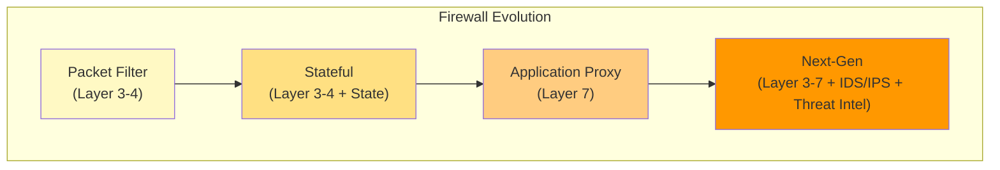
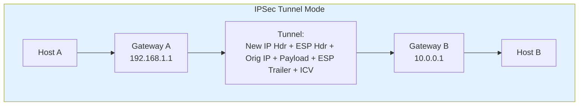
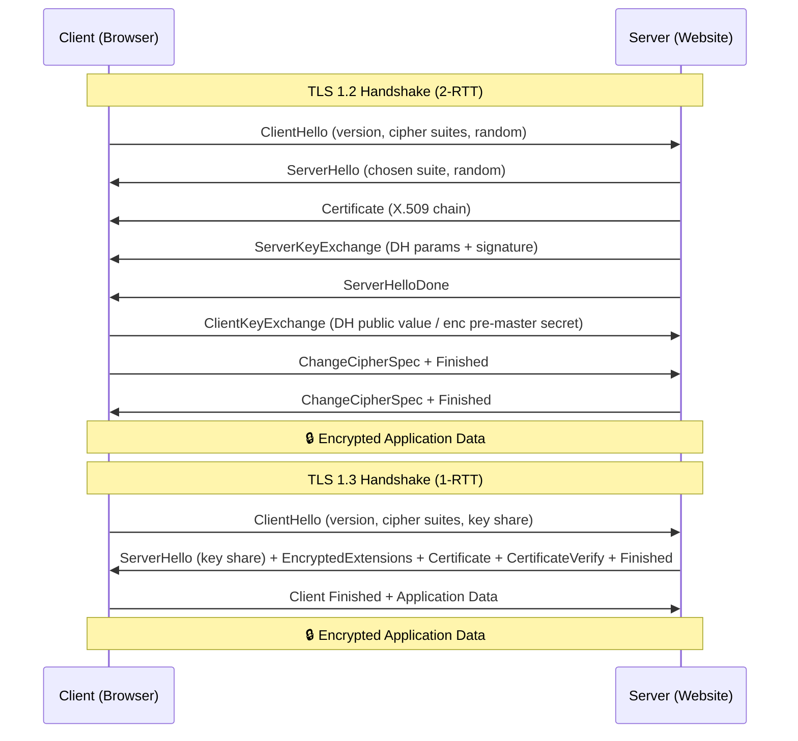
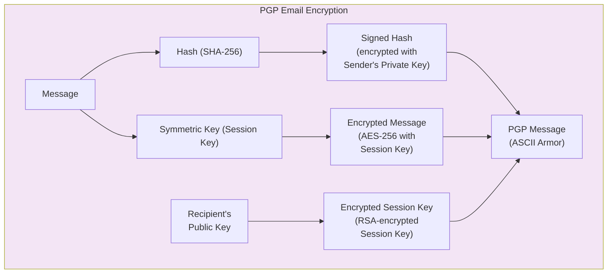

# Chapter 2: Network Security

> **Exam Weightage:** 4–5 Qs in IBPS SO IT Officer Mains (Firewalls, IDS/IPS, VPN, SSL/TLS, Secure Protocols)
>
> **Key Topics:** Firewall types, IDS/IPS, VPN (IPSec, SSL/TLS), SSL/TLS handshake, HTTPS vs HTTP, SSH, PGP, S/MIME

---

## Learning Objectives

After completing this chapter you will be able to:

- Classify firewalls by generation and explain filtering mechanisms (packet filter, stateful, application proxy, NGFW).
- Distinguish between IDS and IPS across detection methods (signature-based vs anomaly-based).
- Describe VPN architectures and compare IPSec vs SSL/TLS VPNs.
- Walk through the TLS 1.2 handshake step by step.
- Explain the differences between HTTPS and HTTP from a security perspective.
- Describe SSH architecture (transport, auth, connection layers) and port forwarding.
- Compare PGP and S/MIME for secure email.
- Solve exam-style MCQs on protocol ports, handshake phases, and firewall placement.

---

## Theory

### 2.1 Firewalls

A firewall is a network security device that monitors and controls incoming and outgoing network traffic based on predetermined security rules. It acts as a barrier between trusted internal networks and untrusted external networks (e.g., the internet).

#### 2.1.1 Packet Filter Firewall (Stateless / Layer 3)

- Examines each packet independently (no context of previous packets)
- Filters based on: source IP, destination IP, source port, destination port, protocol (TCP/UDP/ICMP)
- Operates at **Network Layer (Layer 3)** and **Transport Layer (Layer 4)**
- **Speed:** Very fast (simple rule matching)
- **Limitation:** Cannot detect attacks spread across multiple packets; no application-layer awareness; vulnerable to IP spoofing
- **Example:** Access Control Lists (ACLs) on routers

**Rule Example:** `deny tcp any 10.0.0.0/24 eq 23` (block Telnet to internal network)

#### 2.1.2 Stateful Inspection Firewall (Dynamic Packet Filter)

- Maintains a **state table** of active connections (connection tracking)
- Examines packets in context of the connection's state (NEW, ESTABLISHED, RELATED, INVALID)
- Only allows incoming packets that correspond to an outgoing connection (unless explicitly permitted)
- Operates at **Layer 3 and Layer 4** with state awareness
- **Speed:** Fast (but slightly slower than stateless due to state lookup)
- **Advantage:** Automatically allows return traffic for legitimate outbound connections
- **Example:** Check Point FireWall-1, iptables with conntrack

**Connection states:**
- **NEW:** First packet of a new connection
- **ESTABLISHED:** Part of an existing connection
- **RELATED:** Part of a related connection (e.g., FTP data channel)
- **INVALID:** Not part of any known connection (dropped)

#### 2.1.3 Application Proxy Firewall (Application Gateway)

- Intermediary: client connects to proxy, proxy connects to destination
- Full **application-layer awareness (Layer 7)** — understands protocol semantics
- Can inspect, modify, or block content within application protocol
- **Two types:** Forward proxy (outbound) and Reverse proxy (inbound)
- **Speed:** Slowest due to full protocol parsing (terminates and re-establishes connections)
- **Security:** Highest — can filter commands, block malicious content, perform DPI (Deep Packet Inspection)
- **Examples:** Squid (web proxy), HAProxy, Nginx reverse proxy

**Advantages over stateful inspection:**
- Can detect and block application-layer attacks (SQLi, XSS, command injection)
- Hides internal network structure (NAT at application layer)
- Content caching improves performance for frequently accessed resources

#### 2.1.4 Next-Generation Firewall (NGFW)

- Integrates: stateful inspection + application proxy + IDS/IPS + threat intelligence
- Identifies applications regardless of port/protocol (e.g., Facebook over port 80 vs port 443)
- User identity awareness (integration with AD/LDAP)
- TLS/SSL inspection (decrypt, inspect, re-encrypt)
- Sandboxing for unknown threats
- **Vendors:** Palo Alto Networks, Fortinet, Cisco Firepower

| Firewall Type | Layer | Stateful? | App Aware? | Speed | Security |
|--------------|-------|-----------|------------|-------|----------|
| Packet Filter | 3–4 | No | No | Very Fast | Low |
| Stateful | 3–4 | Yes | No | Fast | Medium |
| Proxy | 7 | Yes | Yes | Slow | High |
| NGFW | 3–7 | Yes | Yes | Moderate | Very High |

### 2.2 IDS/IPS (Intrusion Detection / Prevention Systems)

#### 2.2.1 IDS vs IPS

| Feature | IDS (Intrusion Detection System) | IPS (Intrusion Prevention System) |
|---------|----------------------------------|-----------------------------------|
| Action | Monitor and alert (passive) | Block and prevent (inline) |
| Network placement | Out-of-band (port mirror/span) | Inline (traffic flows through) |
| Response | Sends alert to admin | Drops/rejects/resets connection |
| Latency impact | None (monitoring only) | Adds latency (must inspect before forwarding) |
| False positive | Generates unnecessary alerts | Blocks legitimate traffic (more severe) |
| Single point of failure | No (sensors fail → still reachable) | Yes (if inline device fails → traffic stops) |

#### 2.2.2 Signature-Based Detection

- Matches traffic patterns against a database of known attack signatures
- **Signature examples:** Specific byte sequences in payload, known malware hashes, port/protocol anomalies
- **Advantage:** Low false positive rate; fast matching; immediately effective against known attacks
- **Disadvantage:** Cannot detect zero-day attacks; requires frequent signature updates
- **Detection rate:** ~100% for known attacks, ~0% for unknown variants

#### 2.2.3 Anomaly-Based Detection

- Builds a baseline model of "normal" traffic (ML/statistical profiling)
- Flags deviations exceeding a threshold as anomalous
- **Advantage:** Can detect zero-day attacks and unknown variants
- **Disadvantage:** High false positive rate (legitimate traffic may deviate from baseline)
- **Types:** Statistical anomaly detection, protocol anomaly detection, behavioral analysis

| Detection Method | Known Attacks | Unknown Attack | False Positive | False Negative | Maintenance |
|-----------------|---------------|----------------|----------------|----------------|-------------|
| Signature-based | ✅ Excellent | ❌ None | Low | Low (known) | High (signature updates) |
| Anomaly-based | ✅ Good | ✅ Possible | High | Medium | High (baseline tuning) |
| Hybrid | ✅ Excellent | ✅ Good | Medium | Low | Very High |

### 2.3 VPN (Virtual Private Network)

A VPN creates an encrypted tunnel between two endpoints over a public network, providing confidentiality, integrity, and authentication.

#### 2.3.1 IPSec VPN

**Protocol architecture:**
- **Authentication Header (AH):** Provides integrity + authentication (no encryption). Protocol 51. Verifies source and ensures packet integrity.
- **Encapsulating Security Payload (ESP):** Provides confidentiality + integrity + authentication (encryption + optional auth). Protocol 50. Most commonly used.

**Two Modes:**

| Mode | What is Protected | Use Case | Header | IP Header |
|------|------------------|----------|--------|-----------|
| Transport Mode | Payload only (IP header unchanged) | End-to-end (host-to-host) | Original IP header preserved | New IP header inserted before AH/ESP header |
| Tunnel Mode | Entire IP packet (encapsulated) | Gateway-to-gateway (site-to-site) | Original packet wrapped in new IP header | New IP header with gateway addresses |

**IPSec Key Exchange — IKE (Internet Key Exchange):**
- **Phase 1:** Establish ISAKMP SA (Main mode — 6 messages, or Aggressive mode — 3 messages). Authenticates peers and establishes a secure channel.
- **Phase 2:** Establish IPSec SA (Quick mode — 3 messages). Negotiates AH/ESP parameters and generates session keys.
- **Port:** UDP 500 (IKE), UDP 4500 (NAT-Traversal)

**Security Associations (SA):** Unidirectional (two SAs needed for bidirectional communication). Each SA identified by SPI (Security Parameter Index).

#### 2.3.2 SSL/TLS VPN

- Uses SSL/TLS protocol (TCP 443) for secure tunnel — same protocol as HTTPS
- **Advantages over IPSec:**
  - No client software needed (works in browser)
  - Bypasses NAT/firewalls easily (TCP 443 almost always open)
  - Granular access control (per-application, not full network)
  - Easier configuration and deployment
- **Disadvantages:**
  - Higher latency (TCP-over-TCP problem)
  - Not suitable for all applications (non-web apps need client)
  - Generally lower throughput than IPSec
- **Two types:**
  - **SSL Portal VPN:** Single web page lists accessible applications (browser-based)
  - **SSL Tunnel VPN:** Full network tunnel via browser plugin or dedicated client

#### 2.3.3 IPSec vs SSL VPN — Comparison

| Feature | IPSec VPN | SSL/TLS VPN |
|---------|-----------|-------------|
| OSI Layer | Network (Layer 3) | Application (Layer 7) / Transport (Layer 4) |
| Encryption | IKE + ESP (AES, 3DES) | TLS (AES-GCM, ChaCha20) |
| Authentication | Pre-shared keys, certificates, EAP | Certificates, passwords, 2FA |
| Client required | Yes (IPSec stack) | Browser only (portal); optional client (tunnel) |
| Port | UDP 500/4500 (may be blocked) | TCP 443 (rarely blocked) |
| NAT traversal | Complex (NAT-T needed) | Transparent (TCP 443) |
| Granular access | Full network access | Per-application control |
| Deployment complexity | High | Low |

### 2.4 SSL/TLS Protocol

#### 2.4.1 SSL vs TLS

| Feature | SSL 3.0 | TLS 1.0 | TLS 1.1 | TLS 1.2 | TLS 1.3 |
|---------|---------|---------|---------|---------|---------|
| Year | 1996 | 1999 | 2006 | 2008 | 2018 |
| Status | Deprecated | Deprecated | Deprecated | Current (transitioning) | Current (recommended) |
| Key exchange | RSA, DH | RSA, DH | RSA, DH | RSA, DH, ECDH, ECDHE | ECDHE, DHE (no RSA key exchange) |
| Cipher suites | RC4, CBC | RC4, CBC | CBC | CBC, GCM, CCM, ChaCha20 | AEAD only (GCM, ChaCha20-Poly1305) |
| Handshake | Full | Full | Full | Full (with extensions) | 1-RTT (0-RTT resume) |
| Forward secrecy | Optional | Optional | Optional | Optional | Mandatory |

#### 2.4.2 TLS 1.2 Handshake (10 messages)

1. **ClientHello** — Client sends: TLS version, cipher suites list (e.g., TLS_ECDHE_RSA_WITH_AES_256_GCM_SHA384), random nonce, session ID
2. **ServerHello** — Server responds with: chosen TLS version, chosen cipher suite, random nonce, session ID
3. **Certificate** — Server sends its X.509 certificate chain (server + intermediate CAs)
4. **ServerKeyExchange** — Server sends ephemeral DH parameters (p, g, g^b mod p signed with RSA private key) — only for DHE/ECDHE cipher suites
5. **CertificateRequest** — Optional: server requests client certificate (mutual TLS)
6. **ServerHelloDone** — Server signals end of hello messages
7. **ClientCertificate** — Optional: client sends its certificate (if requested)
8. **ClientKeyExchange** — Client sends pre-master secret encrypted with server's public key (RSA) or DH public value (DHE/ECDHE)
9. **CertificateVerify** — Optional: client proves possession of private key by signing handshake messages
10. **ChangeCipherSpec + Finished** — Both sides switch to encrypted mode and send Finished message (MAC of all handshake messages)

**Key derivation chain:** Pre-Master Secret → Master Secret (48 bytes, via PRF) → Key material (encryption key, MAC key, IV for both directions)

#### 2.4.3 TLS 1.3 Handshake (optimized)

- **1-RTT** (one round trip) for full handshake vs 2-RTT in TLS 1.2
- **0-RTT** (zero round trip) for session resumption (early data)
- **Key exchange:** Only DHE/ECDHE (no RSA key exchange — forward secrecy mandatory)
- **Encryption:** Only AEAD ciphers (AES-GCM, ChaCha20-Poly1305)
- Certificate encryption: entire certificate chain is encrypted (privacy improvement)
- Removed: compression, renegotiation, CBC mode, RC4, 3DES, static RSA/DH

**TLS 1.3 Handshake Messages:**
1. ClientHello (contains key share — g^a already included)
2. ServerHello (contains key share — g^b) + EncryptedExtensions + Certificate + CertificateVerify + Finished
3. Client Finished + Application Data

### 2.5 HTTPS vs HTTP

| Feature | HTTP | HTTPS |
|---------|------|-------|
| Protocol | HyperText Transfer Protocol | HTTP over TLS |
| Default port | 80 | 443 |
| Encryption | None (plaintext) | TLS encryption (AES-GCM, ChaCha20) |
| Integrity | None (no tamper detection) | HMAC / AEAD authentication tag |
| Authentication | None (no server identity check) | X.509 certificate validation |
| Performance | Faster (no crypto overhead) | Slightly slower (crypto handshake + encrypt) |
| SEO ranking | Lower | Higher (Google ranking boost) |
| Browser indicator | "Not secure" | Padlock icon, "Secure" |

**Mixed Content Warning:** HTTPS page loading HTTP resources (images, scripts) may trigger browser warnings — "This page is not fully secure."

### 2.6 SSH (Secure Shell)

- **Purpose:** Secure remote login, command execution, port forwarding
- **Default port:** TCP 22
- **Protocol layers:**
  1. **Transport Layer (Key exchange, server auth, encryption)** — Establishes encrypted tunnel (Diffie-Hellman key exchange, host key verification)
  2. **User Authentication Layer** — Authenticates client to server (password, public key, GSSAPI)
  3. **Connection Layer** — Multiplexes multiple channels (shell, exec, port forwarding) over single connection

#### 2.6.1 SSH Authentication Methods

| Method | Description | Security Level |
|--------|-------------|----------------|
| Password | Client sends password (encrypted over tunnel) | Low (phishing, brute-force) |
| Public Key | Client proves possession of private key | High (key pair) |
| Keyboard-Interactive | Server challenges client (OTP, 2FA) | Very High |
| Host-based | Authentication based on client host identity | Medium |

#### 2.6.2 SSH Port Forwarding

- **Local forwarding (-L):** Forward local port → remote host via SSH server (`ssh -L 8080:internal:80 user@gateway`)
- **Remote forwarding (-R):** Forward SSH server port → local machine (`ssh -R 8080:localhost:80 user@gateway`)
- **Dynamic forwarding (-D):** SOCKS proxy via SSH (`ssh -D 1080 user@gateway`)

### 2.7 Secure Email: PGP and S/MIME

#### 2.7.1 PGP (Pretty Good Privacy)

- **Creator:** Phil Zimmermann (1991)
- **Standard:** OpenPGP (RFC 4880)
- **Encryption method:** Hybrid encryption
  - Generate random session key → encrypt message with symmetric cipher (AES-256)
  - Encrypt session key with recipient's RSA public key
  - Sign message hash with sender's private key
- **Key management:** Web of Trust (decentralized — users sign each other's keys)
- **Output format:** Radix-64 (ASCII armor — converts binary to printable text)

**PGP Message Structure:**
1. Session key packet (encrypted with recipient's public key)
2. Signature packet (hash of message signed with sender's private key)
3. Data packet (message compressed + encrypted with session key)

#### 2.7.2 S/MIME (Secure / Multipurpose Internet Mail Extensions)

- **Standard:** PKCS#7 / Cryptographic Message Syntax (CMS)
- **Dependency:** Requires X.509 PKI hierarchy (certificates issued by trusted CAs)
- **Key management:** Centralized (CA hierarchy — similar to HTTPS certificates)
- **Encryption:** Same hybrid approach as PGP
- **Integration:** Built into most email clients (Outlook, Apple Mail, Thunderbird)

#### 2.7.3 PGP vs S/MIME — Comparison

| Feature | PGP | S/MIME |
|---------|-----|--------|
| Trust model | Web of Trust (decentralized) | CA hierarchy (centralized) |
| Certificate format | OpenPGP key format | X.509 certificates |
| Key distribution | Keyservers / direct exchange | CA-issued certificates |
| Revocation | Certificate revocation certificates | CRL / OCSP |
| Adoption | Tech community, developers | Enterprise, government |
| Standard | RFC 4880 (OpenPGP) | RFC 5751 (S/MIME) |

### 2.8 Solved MCQs (Exam Style)

**Q1.** Which type of firewall maintains a state table of active connections?

A) Packet filter firewall  
B) Stateful inspection firewall  
C) Application proxy firewall  
D) Circuit-level gateway  

Show Answer

**Answer: B) Stateful inspection firewall**

**Explanation:** Stateful firewalls maintain a connection state table tracking each active session. They record connection state (NEW, ESTABLISHED, RELATED, INVALID) and make filtering decisions based on both the packet header and the connection's state. Packet filter firewalls examine each packet independently without context. Application proxy firewalls also maintain state but at the application layer.

---

**Q2.** Which default port does IKE use for establishing IPSec Security Associations?

A) TCP 500  
B) UDP 500  
C) UDP 4500  
D) TCP 443  

Show Answer

**Answer: B) UDP 500**

**Explanation:** Internet Key Exchange (IKE) uses UDP port 500 for Phase 1 (ISAKMP SA establishment) and Phase 2 (IPSec SA negotiation). UDP 4500 is used for IPSec NAT-Traversal (NAT-T) when IPSec packets pass through NAT devices. TCP 500 is not a standard port; IKE is always UDP-based.

---

**Q3.** In TLS 1.2 handshake, what information does the ServerHello message NOT contain?

A) Chosen cipher suite  
B) Server's X.509 certificate  
C) Server random nonce  
D) Chosen TLS version  

Show Answer

**Answer: B) Server's X.509 certificate**

**Explanation:** ServerHello contains the chosen TLS version, cipher suite, and random nonce. The certificate is sent in a separate Certificate message after ServerHello. The handshake order is: ClientHello → ServerHello → Certificate → ServerKeyExchange (if using DHE/ECDHE) → ServerHelloDone.

---

**Q4.** Which of the following is NOT a layer of the SSH protocol architecture?

A) Transport Layer  
B) User Authentication Layer  
C) Connection Layer  
D) Presentation Layer  

Show Answer

**Answer: D) Presentation Layer**

**Explanation:** SSH has three protocol layers: (1) Transport Layer — handles key exchange, server authentication, encryption, and integrity; (2) User Authentication Layer — authenticates the client to the server; (3) Connection Layer — multiplexes multiple channels (shell, exec, port forwarding) over the single encrypted tunnel. Presentation Layer is an OSI layer, not part of SSH.

---

**Q5.** What is the primary advantage of anomaly-based IDS over signature-based IDS?

A) Lower false positive rate  
B) Can detect zero-day attacks  
C) Requires less maintenance  
D) Faster packet processing  

Show Answer

**Answer: B) Can detect zero-day attacks**

**Explanation:** Anomaly-based detection builds a baseline of normal activity and flags deviations. This allows it to detect previously unknown attacks (zero-day exploits) that have no known signature. The disadvantage is a higher false positive rate. Signature-based IDS can only detect attacks for which signatures exist, making it blind to zero-day threats.

---

**Q6.** In IPSec, which protocol provides both encryption and authentication?

A) AH only  
B) ESP only  
C) Both AH and ESP  
D) IKE  

Show Answer

**Answer: B) ESP only**

**Explanation:** ESP (Encapsulating Security Payload) provides confidentiality (encryption), integrity, and authentication (optional auth trailer). AH (Authentication Header) provides integrity and authentication only — no encryption. IKE handles key exchange, not data protection. ESP is the most commonly used IPSec protocol.

---

**Q7.** An NGFW typically does NOT include which of the following capabilities?

A) Stateful inspection  
B) Application identification  
C) Packet routing protocol support (BGP/OSPF)  
D) Intrusion prevention  

Show Answer

**Answer: C) Packet routing protocol support (BGP/OSPF)**

**Explanation:** NGFW integrates stateful inspection, application awareness, IDS/IPS, TLS inspection, and threat intelligence. However, routing protocol support (BGP, OSPF) is typically handled by routers or Layer 3 switches, not NGFWs. An NGFW may use static routing but does not participate in dynamic routing protocols.

---

**Q8.** PGP uses which key management model?

A) Centralized CA hierarchy  
B) Web of Trust  
C) Key Distribution Center  
D) Public Key Infrastructure  

Show Answer

**Answer: B) Web of Trust**

**Explanation:** PGP uses a decentralized Web of Trust model where users sign each other's public keys to establish trust. There is no central Certificate Authority. S/MIME, by contrast, uses a centralized CA hierarchy (X.509 PKI) similar to HTTPS certificates.

---

**Q9.** In IPSec tunnel mode, how is the original IP packet handled?

A) Original packet is encrypted but the IP header is unchanged  
B) Original packet is discarded and a new IP header is created  
C) Entire original IP packet is encapsulated in a new IP packet  
D) Original IP header is replaced with the SPI  

Show Answer

**Answer: C) Entire original IP packet is encapsulated in a new IP packet**

**Explanation:** In tunnel mode, the entire original IP packet (IP header + payload) is encrypted and placed inside a new IP packet. The new outer IP header contains the tunnel endpoints (gateway IPs). In transport mode, only the payload is encrypted, and the original IP header is preserved. Tunnel mode is used for site-to-site VPNs.

---

**Q10.** Which TLS version made forward secrecy mandatory?

A) TLS 1.0  
B) TLS 1.1  
C) TLS 1.2  
D) TLS 1.3  

Show Answer

**Answer: D) TLS 1.3**

**Explanation:** TLS 1.3 mandates forward secrecy by removing RSA key exchange and static DH cipher suites. Both TLS 1.2 and earlier allowed non-ECDHE cipher suites (like RSA key exchange) which do not provide forward secrecy. TLS 1.3 requires ECDHE or DHE for key exchange, ensuring that compromise of the server's long-term private key does not compromise past session keys.

---

## Summary

1. **Firewalls** evolved from stateless packet filters (Layer 3–4) → stateful inspection (with connection tracking) → application proxy (full Layer 7 awareness) → NGFW (integrated IDS/IPS, app identity, threat intel).

2. **IDS** monitors and alerts (passive, out-of-band); **IPS** blocks in real-time (inline). Signature-based detection is accurate for known attacks; anomaly-based can detect zero-days but has higher false positives.

3. **IPSec VPN** operates at Layer 3 (Network) with two modes — Transport (end-to-end) and Tunnel (site-to-site). Uses IKE (UDP 500/4500) for key exchange. ESP provides encryption + authentication; AH provides authentication only.

4. **SSL/TLS VPN** operates at Layer 4/7, uses TCP 443, requires no client for portal access. Easier to deploy than IPSec but may have TCP-over-TCP performance issues.

5. **TLS handshake:** TLS 1.2 = 2-RTT (ClientHello → ServerHello + Certificate + KeyExchange → ClientKeyExchange → Finished). TLS 1.3 = 1-RTT (client sends key share in ClientHello). Forward secrecy mandatory in TLS 1.3.

6. **HTTPS** = HTTP over TLS (port 443). Provides encryption + integrity + server authentication. **SSH** (port 22) has three layers: Transport, Authentication, Connection. Supports port forwarding.

7. **Secure email:** PGP uses Web of Trust, hybrid encryption, ASCII armor. S/MIME uses X.509 CA hierarchy. Both provide encryption + digital signatures for email.

## Practical Takeaways

- **For exam:** Remember firewall types in order of evolution. Know IDS vs IPS placement (out-of-band vs inline). Memorize default ports (HTTP 80, HTTPS 443, SSH 22, IKE 500/UDP, NAT-T 4500/UDP, SMTPS 465, IMAPS 993).
- **For deployment:** Always use NGFW with IPS enabled for perimeter security. Place IDS sensors at critical network segments (DMZ, internal network, data center). Use TLS 1.3 exclusively — disable SSL 3.0, TLS 1.0, and TLS 1.1.
- **For VPN:** Use IPSec for site-to-site VPNs (full network connectivity). Use SSL VPN for remote user access (per-application, browser-based). Always enable forward secrecy.
- **For secure email:** PGP is suitable for technical teams requiring decentralized trust. S/MIME is better for enterprise environments with existing PKI infrastructure.

---

## Chapter Quiz (5 MCQs)

**Q1.** Which IPSec protocol provides confidentiality (encryption) but NOT authentication?

A) AH  
B) ESP  
C) IKE  
D) None of the above — ESP provides both encryption and authentication  

Show Answer

**Answer: D) None of the above — ESP provides both encryption and authentication**

**Explanation:** ESP provides both confidentiality (encryption) and optionally authentication (integrity check value / ICV). AH provides authentication only (no encryption). IKE is a key exchange protocol. There is no IPSec protocol that provides encryption without authentication.

---

**Q2.** In which firewall type does the firewall terminate the client connection and establish a separate connection to the server?

A) Packet filter firewall  
B) Stateful inspection firewall  
C) Application proxy firewall  
D) Circuit-level gateway  

Show Answer

**Answer: C) Application proxy firewall**

**Explanation:** Application proxy firewalls act as intermediaries: the client connects to the proxy, which validates the request at the application layer, and then establishes a new connection to the destination server. This means there are two separate TCP connections: client ↔ proxy and proxy ↔ server. Packet filter and stateful inspection firewalls forward packets transparently without terminating connections.

---

**Q3.** The primary difference between TLS 1.2 and TLS 1.3 handshake is that TLS 1.3:

A) Uses CBC mode for encryption  
B) Reduces handshake from 2-RTT to 1-RTT  
C) Supports RSA key exchange  
D) Does not support elliptic curve cryptography  

Show Answer

**Answer: B) Reduces handshake from 2-RTT to 1-RTT**

**Explanation:** TLS 1.3 reduces the full handshake from two round trips (TLS 1.2) to one round trip by sending the client's key share in the initial ClientHello. Additionally, the server's Certificate and CertificateVerify messages are sent immediately after ServerHello, eliminating the separate round trip. TLS 1.3 also removed CBC mode, RSA key exchange, and made forward secrecy mandatory — all of which are opposite to options A, C, and D.

---

**Q4.** S/MIME relies on which trust infrastructure?

A) Web of Trust  
B) CA hierarchy with X.509 certificates  
C) Decentralized blockchain  
D) Pre-shared keys  

Show Answer

**Answer: B) CA hierarchy with X.509 certificates**

**Explanation:** S/MIME depends on a centralized Public Key Infrastructure (PKI) with Certificate Authorities issuing X.509 certificates. Recipients verify senders' certificates against trusted root CAs. This is the same trust model used for HTTPS. PGP uses Web of Trust (decentralized) instead.

---

**Q5.** In a TLS 1.2 handshake using RSA key exchange, the pre-master secret is:

A) Derived via Diffie-Hellman computation  
B) Sent in cleartext by the server  
C) Encrypted with the server's RSA public key and sent by the client  
D) Computed independently by both parties  

Show Answer

**Answer: C) Encrypted with the server's RSA public key and sent by the client**

**Explanation:** In RSA key exchange (TLS 1.2 and earlier), the client generates a random 46-byte pre-master secret, encrypts it with the server's RSA public key (obtained from the server's certificate), and sends it in the ClientKeyExchange message. Both sides then independently derive the master secret and session keys from this pre-master secret. This method does NOT provide forward secrecy because if the server's private key is later compromised, all past session keys can be derived.

---

> **Next Chapter:** [Chapter 3 — Cyber Threats & Attacks](/courses/information-security/03-cyber-threats-attacks/)
