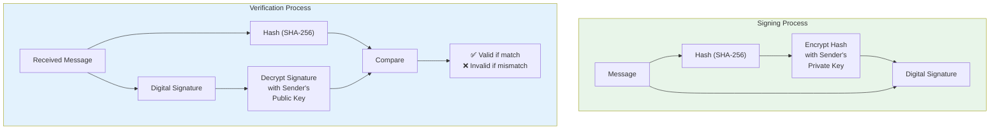
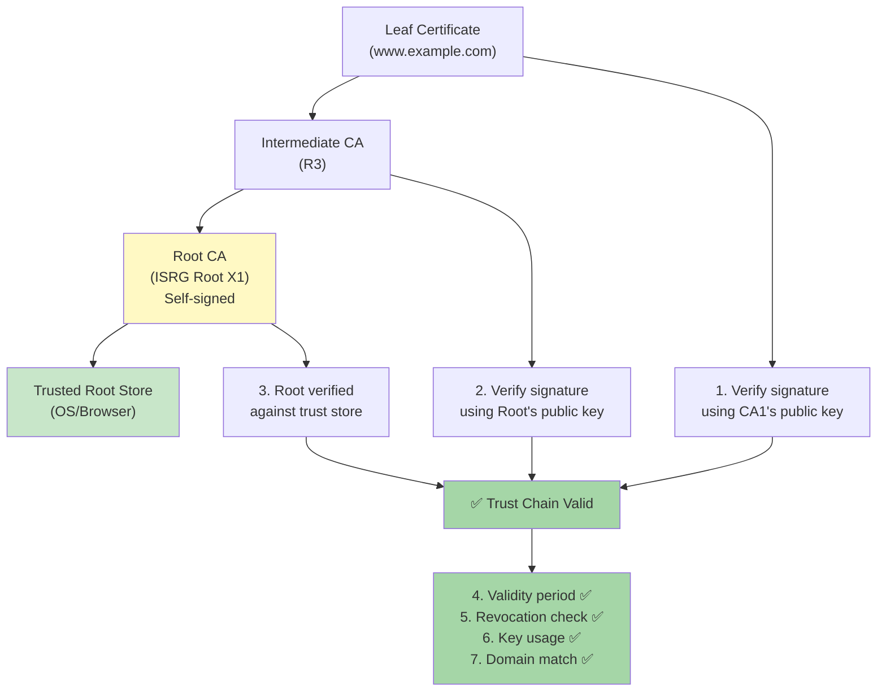
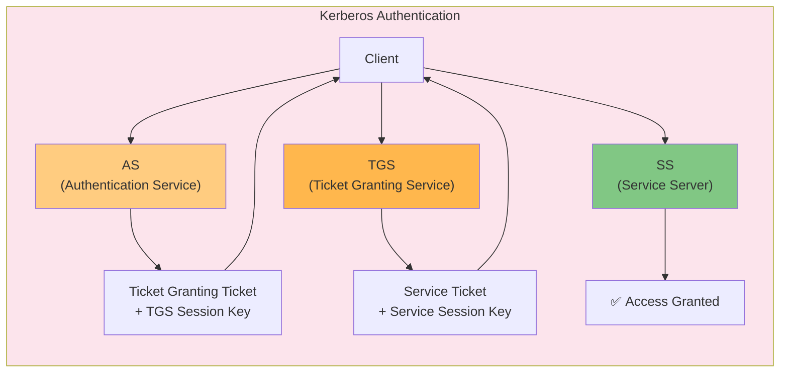

# Chapter 4: Digital Signatures & PKI

> **Exam Weightage:** 3–5 Qs in IBPS SO IT Officer Mains (Digital signatures, certificates, authentication protocols)
>
> **Key Topics:** Digital signature process, PKI (CA, RA, VA, CRL), X.509 certificates, Certificate trust chain, OAuth 2.0, SAML, Kerberos

---

## Learning Objectives

After completing this chapter you will be able to:

- Explain the digital signature process: signing (hash + encrypt with private key) and verification (decrypt with public key + compare hash).
- Describe the PKI hierarchy: Certificate Authority (CA), Registration Authority (RA), Validation Authority (VA), Certificate Revocation List (CRL), and OCSP.
- Interpret X.509 certificate structure (version, serial number, issuer, subject, validity, public key, extensions).
- Trace a certificate trust chain from leaf certificate through intermediate CAs to root CA.
- Differentiate between OAuth 2.0 grant types and their use cases (authorization code, implicit, client credentials, resource owner password).
- Describe SAML 2.0 flow (Identity Provider, Service Provider, assertion, SSO).
- Explain Kerberos authentication (AS, TGS, SS, ticket granting, authenticator).
- Solve exam-style MCQs on PKI components, certificate validation, and authentication protocols.

---

## Theory

### 4.1 Digital Signatures

A digital signature provides **integrity**, **authentication**, and **non-repudiation** for digital messages or documents.

#### 4.1.1 Digital Signature Process — Signing

1. **Hash the message:** Compute the cryptographic hash H(M) using a hash function (SHA-256). Hash is fixed-size regardless of message length.
2. **Encrypt hash with private key:** Encrypt the hash using the sender's private key → this produces the digital signature S = E(K_priv, H(M)).
3. **Attach signature:** Send the message M along with the digital signature S.

**Formula:** Signature = Encrypt(K_sender_private, Hash(message))

#### 4.1.2 Digital Signature Process — Verification

1. **Decrypt signature with public key:** Receiver decrypts S using the sender's public key → obtains hash₁ = Decrypt(K_sender_public, S).
2. **Compute hash locally:** Receiver computes hash₂ = Hash(M) from the received message.
3. **Compare hashes:** If hash₁ = hash₂, signature is valid → message is authentic and untampered.

**Formula:** Hash(message) = Decrypt(K_sender_public, Signature) → if equal, signature verified

#### 4.1.3 Properties Provided by Digital Signatures

| Property | Explanation | Attack if absent |
|----------|-------------|------------------|
| **Integrity** | Message has not been modified in transit | Tampering undetected |
| **Authentication** | Confirms identity of signer (only signer's public key can verify) | Impersonation possible |
| **Non-repudiation** | Signer cannot deny signing the message | Signer can claim forgery |
| **Unforgeability** | Only the private key holder can create a valid signature | Anyone can forge signatures |

#### 4.1.4 Why Sign the Hash, Not the Message?

- **Performance:** Asymmetric encryption is slow (100–1000× slower than symmetric). Signing a 256-bit hash is much faster than signing a multi-MB message.
- **Message size:** Hash is fixed-size (SHA-256 = 256 bits). Without hash, signature size grows with message.
- **Security:** Hash provides pre-image and collision resistance; signing the hash inherits these properties.

#### 4.1.5 Digital Signature Algorithms

| Algorithm | Hash Used | Key Sizes | Status |
|-----------|-----------|-----------|--------|
| RSA-PSS | SHA-256 | 2048–4096 bits | Secure (widely used) |
| ECDSA | SHA-256 | 256–521 bits (ECC) | Secure (efficient) |
| EdDSA (Ed25519) | SHA-512 (internal) | 256-bit curve | Excellent (modern standard) |
| DSA | SHA-1/SHA-256 | 1024–3072 bits | Deprecated (slow) |



### 4.2 PKI (Public Key Infrastructure)

PKI is the framework of policies, hardware, software, and procedures needed to create, manage, distribute, use, store, and revoke digital certificates.

#### 4.2.1 PKI Components

| Component | Full Name | Role |
|-----------|-----------|------|
| **CA** | Certificate Authority | Issues and signs digital certificates (trust anchor). Root CA is self-signed; subordinate CAs are signed by root. |
| **RA** | Registration Authority | Verifies applicant identity before requesting certificate issuance from CA. Performs identity proofing (document validation, domain verification). |
| **VA** | Validation Authority | Provides real-time certificate status (is certificate valid/revoked?). Implements OCSP or retrieves CRL. |
| **CRL** | Certificate Revocation List | Signed list of revoked certificate serial numbers. Published periodically by CA. Clients download CRL to check revocation status. |
| **OCSP** | Online Certificate Status Protocol | Real-time protocol to query VA for certificate status (good, revoked, unknown). More current than CRL but introduces latency. |
| **CPS** | Certificate Practice Statement | Published policy document detailing CA's operational practices. |
| **HSM** | Hardware Security Module | Tamper-resistant hardware for secure key generation, storage, and signing operations. |

#### 4.2.2 Certificate Revocation Mechanisms

| Method | Description | Pros | Cons |
|--------|-------------|------|------|
| **CRL** (RFC 5280) | Periodic list of revoked certificates issued by CA | Simple, no real-time queries | Outdated between CRL publishing intervals; large download size |
| **Delta CRL** | Only new revocations since last full CRL | Smaller downloads | Additional complexity |
| **OCSP** (RFC 6960) | Real-time query → response with certificate status | Current status, small response | Privacy (CA knows which certificates you're checking); adds latency |
| **OCSP Stapling** | Server fetches OCSP response and "staples" it to TLS handshake | No client→CA query; no CA tracking; faster | Server must fetch OCSP response periodically |
| **CRLite** | Aggregated CRL with Bloom filter (Firefox) | Compact, efficient | Complex implementation |

#### 4.2.3 PKI Hierarchy

```
                  ┌─────────────────┐
                  │   Root CA       │ (Self-signed, offline, highest security)
                  │   "Trust Anchor"│
                  └────────┬────────┘
                           │
                  ┌────────┴────────┐
                  │ Intermediate CA1│ (Signed by Root CA)
                  │ (Policy CA)     │
                  └────────┬────────┘
                           │
                  ┌────────┴────────┐
                  │ Intermediate CA2│ (Signed by CA1)
                  │ (Issuing CA)    │
                  └────────┬────────┘
                           │
            ┌──────────────┼──────────────┐
            │              │              │
   ┌────────┴──────┐ ┌────┴──────┐ ┌────┴──────┐
   │ Server Cert   │ │ Client    │ │ Code       │
   │ (SSL/TLS)     │ │ Cert      │ │ Signing    │
   └───────────────┘ └───────────┘ └───────────┘
```

**Trust model:** The Root CA's public key is pre-installed in browsers/OS trust stores. Any certificate signed (directly or through intermediates) by a trusted root forms a **trust chain** and is inherently trusted.

#### 4.2.4 Certificate Validation Process

1. Build chain from leaf certificate → intermediate CA(s) → root CA
2. Verify each certificate's digital signature (parent's public key decrypts child's signature)
3. Check certificate validity period (notBefore ≤ now ≤ notAfter)
4. Check revocation status (CRL or OCSP) — verify certificate hasn't been revoked
5. Check key usage extensions (e.g., TLS Web Server Authentication for HTTPS certificates)
6. Verify domain name matches certificate's Subject Alternative Names (SAN)



### 4.3 X.509 Digital Certificates

X.509 is the standard defining the format of public key certificates. Version 3 (v3) is the current standard.

#### 4.3.1 X.509 v3 Certificate Structure

| Field | Description | Example |
|-------|-------------|---------|
| **Version** | Certificate format version (1, 2, or 3) | v3 (most common) |
| **Serial Number** | Unique integer assigned by CA | 04:8E:71:... |
| **Signature Algorithm** | Algorithm used by CA to sign the certificate | sha256WithRSAEncryption |
| **Issuer** | CA that issued the certificate (DN — Distinguished Name) | CN = ISRG Root X1, O = Internet Security Research Group |
| **Validity** | Period: notBefore to notAfter | 2024-01-01 to 2025-01-01 |
| **Subject** | Entity the certificate is issued to (DN) | CN = www.example.com |
| **Subject Public Key Info** | Public key algorithm + public key value | RSA 2048-bit / ECDSA P-256 |
| **Issuer Unique ID** | Optional v2/v3 (deprecated) | — |
| **Subject Unique ID** | Optional v2/v3 (deprecated) | — |
| **Extensions** | v3 only — additional properties (key usage, SAN, basic constraints, CRL distribution points, etc.) | |
| **Signature** | CA's digital signature covering all above fields | 256-byte RSA signature |

#### 4.3.2 Important X.509 v3 Extensions

| Extension | Purpose | Exam Relevance |
|-----------|---------|----------------|
| **Basic Constraints** | Indicates if certificate is a CA and max chain depth | `CA:TRUE` for CAs, `CA:FALSE` for end-entity |
| **Key Usage** | Restricts cryptographic operations | digitalSignature, keyEncipherment, keyCertSign, cRLSign |
| **Extended Key Usage** | Purpose of the public key | serverAuth, clientAuth, codeSigning, emailProtection |
| **Subject Alternative Name (SAN)** | Domain names/IPs the certificate covers | Must match accessed domain (CN field is legacy) |
| **CRL Distribution Points** | URL where CRL can be downloaded | http://crl.example.com/root.crl |
| **Authority Information Access** | URL for OCSP responder + CA issuer URL | ocsp.example.com |
| **Certificate Policies** | CPS references | OID identifying policy |
| **Subject Key Identifier** | Unique identifier for subject's public key | 20-byte hash (usually SHA-1 of public key) |
| **Authority Key Identifier** | Links to issuing CA's Subject Key Identifier | For chain building |

### 4.4 OAuth 2.0

OAuth 2.0 is an authorization framework that enables applications to obtain limited access to user accounts on an HTTP service. It is **not** an authentication protocol (though often used for authentication via OpenID Connect).

#### 4.4.1 OAuth 2.0 Roles

| Role | Description | Example |
|------|-------------|---------|
| **Resource Owner** | Entity that can grant access to a protected resource | End user |
| **Resource Server** | Server hosting protected resources | Google API, Facebook Graph API |
| **Client** | Application requesting access on behalf of resource owner | Web app, mobile app |
| **Authorization Server** | Server issuing access tokens after authenticating resource owner | accounts.google.com |

#### 4.4.2 OAuth 2.0 Grant Types

| Grant Type | Use Case | Access Token Delivery | Refresh Token? | Security Note |
|------------|----------|----------------------|----------------|---------------|
| **Authorization Code** | Server-side web apps | Authorization code → exchanged for token (server-to-server) | Yes | Most secure — token never exposed to browser |
| **Implicit** | Single-page apps (browser-only) | Token in URL fragment (deprecated in favor of PKCE) | No | Token exposed in URL; less secure |
| **Resource Owner Password Credentials** | Trusted apps (first-party) | Directly exchange username + password for token | Yes | Requires credentials exposure; avoid |
| **Client Credentials** | Machine-to-machine (no user) | Client ID + Secret → direct token | Yes | No user involvement |
| **Device Code** | Devices without browser (TV, CLI) | User completes login on separate device | No | Device displays code, user enters on another device |
| **Authorization Code + PKCE** | Mobile apps, SPAs (current best practice) | Code challenge + verifier (no client secret needed) | Yes | Prevents authorization code interception |

#### 4.4.3 Authorization Code Grant Flow

1. Client redirects user to Authorization Server: `authorize?response_type=code&client_id=APP&redirect_uri=CALLBACK&scope=email`
2. User authenticates and consents
3. Authorization Server redirects to `CALLBACK?code=AUTH_CODE`
4. Client sends `POST /token?code=AUTH_CODE&client_id=APP&client_secret=SECRET`
5. Authorization Server returns `{"access_token":"...", "refresh_token":"...", "expires_in":3600}`
6. Client uses access_token to call Resource Server API: `GET /api/user` with `Authorization: Bearer access_token`

**PKCE (Proof Key for Code Exchange):** Mobile/SPA clients generate a random `code_verifier`, hash it to `code_challenge`, send challenge in authorize request, and send verifier in token request. Server verifies SHA-256(verifier) = challenge. This prevents authorization code interception attacks.

### 4.5 SAML (Security Assertion Markup Language)

SAML 2.0 is an XML-based framework for exchanging authentication and authorization data between an Identity Provider (IdP) and a Service Provider (SP).

#### 4.5.1 SAML 2.0 Components

| Component | Role | Description |
|-----------|------|-------------|
| **Identity Provider (IdP)** | Authenticates users | Creates and issues SAML assertions (e.g., Azure AD, Okta, Keycloak) |
| **Service Provider (SP)** | Provides service to user | Trusts IdP for authentication (e.g., Salesforce, AWS, SaaS apps) |
| **SAML Assertion** | XML document containing auth/attribute/decision statements | Signed by IdP, contains user identity, attributes, and conditions |
| **SAML Request/Response** | XML messages exchanged between SP and IdP | AuthnRequest (SP→IdP), Response (IdP→SP) |
| **Subject** | Entity being authenticated (usually a user) | NameID element in assertion |

#### 4.5.2 SAML SSO Flow (SP-Initiated)

1. User accesses SP resource (unauthenticated)
2. SP generates **SAML AuthnRequest** (XML, signed) and redirects user to IdP
3. User authenticates to IdP (password, 2FA, certificate)
4. IdP generates **SAML Response** containing signed assertion with user identity
5. Browser posts SAML Response back to SP via HTTP POST binding
6. SP validates XML signature, extracts user identity, creates local session
7. User is logged in to SP (SSO achieved)

**Key difference from OAuth 2.0:**
- SAML is primarily for **authentication** (proving identity)
- OAuth 2.0 is primarily for **authorization** (granting API access)
- OpenID Connect bridges this: OAuth 2.0 + ID token (JWT) for authentication

| Feature | SAML 2.0 | OAuth 2.0 |
|---------|----------|-----------|
| Purpose | Authentication / SSO | Authorization / API access |
| Format | XML (heavy) | JSON (lightweight) |
| Tokens | SAML Assertion (XML signed) | Access Token (JWT or opaque) |
| Transport | Browser redirect (HTTP POST/Redirect binding) | REST API + Bearer tokens |
| Use case | Enterprise SSO (many SPs, one IdP) | Third-party API access |
| Mobile friendly | Poor (XML parsing, browser redirect) | Excellent (native app support, PKCE) |

### 4.6 Kerberos

Kerberos is a network authentication protocol that uses **secret-key cryptography** (symmetric) and a **trusted third party** (Key Distribution Center — KDC) to authenticate clients to services without transmitting passwords over the network.

#### 4.6.1 Kerberos Components

| Component | Full Name | Role |
|-----------|-----------|------|
| **KDC** | Key Distribution Center | Runs on authentication server; contains AS + TGS |
| **AS** | Authentication Service | Validates user credentials and issues Ticket Granting Ticket (TGT) |
| **TGS** | Ticket Granting Service | Issues service tickets (ST) for specific services |
| **SS** | Service Server | Provides the actual service (file server, print server) |
| **TGT** | Ticket Granting Ticket | Encrypted ticket proving authentication, allows requesting service tickets |
| **ST** | Service Ticket | Ticket for accessing a specific service |
| **Authenticator** | Client-generated message proving knowledge of session key | Prevents replay attacks |

#### 4.6.2 Kerberos Authentication Flow (6 steps)

1. **AS-REQ (Client → AS):** Client sends username to Authentication Service (in cleartext)
2. **AS-REP (AS → Client):** AS retrieves user's password hash (from database), generates:
   - **TGT:** Encrypted with KDC's secret key — contains client identity, TGS session key, expiration
   - **TGS Session Key:** Encrypted with user's password hash (derived from password)
   - Client decrypts TGS session key (using password hash), discards password from memory
3. **TGS-REQ (Client → TGS):** Client requests service ticket for service S:
   - Sends TGT (encrypted with KDC's key — client cannot see/modify)
   - Sends **Authenticator** (client ID + timestamp) encrypted with TGS session key
4. **TGS-REP (TGS → Client):** TGS decrypts TGT (verifies client identity), validates authenticator, generates:
   - **Service Ticket (ST):** Encrypted with service S's secret key — contains client identity, service session key
   - **Service Session Key:** Encrypted with TGS session key
5. **AP-REQ (Client → SS):** Client requests access to service S:
   - Sends ST (encrypted with service's secret key — client cannot see/modify)
   - Sends new Authenticator encrypted with service session key
6. **AP-REP (SS → Client, optional):** Service decrypts ST (confirms identity), validates authenticator, optionally sends response encrypted with service session key

```
Client                  KDC (AS+TGS)                Service Server
  │                         │                          │
  │──── AS-REQ (user) ──────▶│                          │
  │◀──── AS-REP (TGT + TGS session key) ──────────────│
  │                         │                          │
  │──── TGS-REQ (TGT + authenticator) ────────────────▶│
  │◀──── TGS-REP (ST + service session key) ──────────│
  │                         │                          │
  │──── AP-REQ (ST + authenticator) ──────────────────▶│
  │◀──── AP-REP (optional) ───────────────────────────┤
```

#### 4.6.3 Kerberos Security Properties

| Property | How Achieved |
|----------|-------------|
| **No password transmission** | Password never sent over network; used only to decrypt TGS session key |
| **Replay prevention** | Authenticator contains timestamp (+/- 5 min skew tolerance); reused authenticators detected |
| **Mutual authentication** | Both client and service prove knowledge of session key |
| **Single Sign-On (SSO)** | TGT obtained once per login; multiple service tickets can be requested without re-entering password |
| **Confidentiality** | Tickets encrypted with keys known only to KDC and respective services |
| **Forwardable tickets** | TGT can be forwarded to other services for delegation |

#### 4.6.4 Kerberos Limitations

| Limitation | Description |
|------------|-------------|
| **Clock synchronization** | Requires all hosts to have synchronized clocks (within 5 min default skew) |
| **Single point of failure** | KDC must be available for authentication |
| **Dictionary attack on password** | AS-REP for TGS session key encrypted with password hash — offline brute-force possible if attacker captures AS-REP |
| **Not suitable for internet** | Designed for local network; TCP/UDP port 88 must be open |



### 4.7 Solved MCQs (Exam Style)

**Q1.** In a digital signature scheme, which key does the signer use to create the signature?

A) Recipient's public key  
B) Recipient's private key  
C) Signer's public key  
D) Signer's private key  

<details>
<summary>Show Answer</summary>

**Answer: D) Signer's private key**

**Explanation:** The digital signature is created by encrypting the hash of the message with the SIGNER's private key. This ensures non-repudiation: only the signer possesses their private key, so only they could have created the signature. The recipient verifies by decrypting with the signer's PUBLIC key. If the decrypted hash matches the locally computed hash, the signature is valid.
</details>

---

**Q2.** In Kerberos, the Ticket Granting Ticket (TGT) is encrypted with:

A) The client's password hash  
B) The service server's secret key  
C) The KDC's secret key  
D) The TGS session key  

<details>
<summary>Show Answer</summary>

**Answer: C) The KDC's secret key**

**Explanation:** The TGT is encrypted with the KDC's secret key (known only to the KDC). The client cannot decrypt the TGT — they can only present it to the TGS. This prevents tampering with TGT contents. The TGT contains: client ID, TGS session key, expiration time, and other metadata. The TGS session key (a separate component of the AS-REP) is encrypted with the client's password hash so the client can decrypt it.
</details>

---

**Q3.** Which OAuth 2.0 grant type is recommended for mobile applications?

A) Implicit grant  
B) Resource Owner Password Credentials  
C) Authorization Code with PKCE  
D) Client Credentials  

<details>
<summary>Show Answer</summary>

**Answer: C) Authorization Code with PKCE**

**Explanation:** Authorization Code with PKCE (Proof Key for Code Exchange) is the recommended grant for mobile apps and SPAs. PKCE prevents authorization code interception attacks by requiring the client to prove possession of the code_verifier. The Implicit grant (historically used for SPAs) exposes the access token in the URL fragment and is now deprecated in favor of PKCE. Client Credentials is for machine-to-machine. ROPC exposes user passwords to the client.
</details>

---

**Q4.** What is the primary purpose of a Certificate Revocation List (CRL)?

A) To issue new certificates  
B) To list certificates that have been revoked before their expiration  
C) To validate the signature on a certificate  
D) To store backup copies of private keys  

<details>
<summary>Show Answer</summary>

**Answer: B) To list certificates that have been revoked before their expiration**

**Explanation:** CRL is a signed list of certificate serial numbers that have been revoked by the CA before their scheduled expiration. Reasons for revocation include: private key compromise, CA compromise, cessation of operation, affiliation change, or superseded certificate. Clients download and cache the CRL to verify that a certificate has not been revoked before accepting it. OCSP provides a real-time alternative.
</details>

---

**Q5.** Which X.509 v3 extension indicates whether a certificate is a CA certificate?

A) Key Usage  
B) Extended Key Usage  
C) Basic Constraints  
D) Subject Alternative Name  

<details>
<summary>Show Answer</summary>

**Answer: C) Basic Constraints**

**Explanation:** The Basic Constraints extension indicates whether the certificate is a CA (`CA:TRUE`) or an end-entity (`CA:FALSE`). It also includes an optional `pathLenConstraint` specifying the maximum number of subordinate CA certificates allowed in the chain. Key Usage restricts the cryptographic operations, Extended Key Usage specifies the certificate's purpose (server auth, client auth), and SAN lists domain names.
</details>

---

**Q6.** In Kerberos, what prevents replay attacks?

A) The TGT expiration time  
B) The authenticator timestamp  
C) The service ticket lifetime  
D) The encryption algorithm  

<details>
<summary>Show Answer</summary>

**Answer: B) The authenticator timestamp**

**Explanation:** The authenticator contains the client ID and a timestamp, encrypted with the session key. The service server checks that the timestamp is within the allowed time skew (typically ±5 minutes) and that no authenticator with the same timestamp has been received before. If an attacker captures and re-sends the authenticator, the server will reject it because the timestamp is now outside the acceptable window or has been seen before.
</details>

---

**Q7.** Which statement about SAML assertions is TRUE?

A) They are typically encoded as JSON  
B) They are always unsigned  
C) They contain statements about authentication, attributes, and authorization decisions  
D) They are issued by the Service Provider  

<details>
<summary>Show Answer</summary>

**Answer: C) They contain statements about authentication, attributes, and authorization decisions**

**Explanation:** A SAML assertion is an XML document signed by the Identity Provider (IdP) that contains three types of statements: (1) Authentication Statement — when and how the subject was authenticated, (2) Attribute Statement — additional attributes about the subject (email, role, department), and (3) Authorization Decision Statement — whether the subject is authorized to access a specific resource. Assertions are always signed (not unsigned) and are XML-based (not JSON).
</details>

---

**Q8.** In the digital signature verification process, which operation is performed using the signer's public key?

A) Hashing the received message  
B) Decrypting the received signature  
C) Encrypting the received message  
D) Generating a new signature  

<details>
<summary>Show Answer</summary>

**Answer: B) Decrypting the received signature**

**Explanation:** The recipient decrypts the received digital signature using the signer's PUBLIC key. This reveals hash₁ = Decrypt(K_public, Signature). The recipient then computes hash₂ = Hash(received message) independently. If hash₁ = hash₂, the signature is valid. This confirms: (1) the message was signed by the holder of the corresponding private key (authentication), (2) the message hasn't been modified (integrity), and (3) the signer cannot deny signing (non-repudiation).
</details>

---

**Q9.** What is the purpose of the OCSP stapling extension in TLS?

A) To reduce TLS handshake latency by 50%  
B) To allow the server to provide a time-stamped OCSP response during the handshake  
C) To encrypt the server's certificate  
D) To compress the handshake messages  

<details>
<summary>Show Answer</summary>

**Answer: B) To allow the server to provide a time-stamped OCSP response during the handshake**

**Explanation:** OCSP stapling (formally: TLS Certificate Status Request extension) allows the web server to periodically fetch an OCSP response from the CA and "staple" it to the TLS handshake. Benefits: (1) client does not need to contact the CA directly (reduces latency), (2) privacy improved (CA cannot track which websites the client visits), (3) reduces load on CA's OCSP responders. The OCSP response is signed by the CA and timestamped.
</details>

---

**Q10.** Which of the following is NOT a standard OAuth 2.0 grant type?

A) Authorization Code  
B) SAML Bearer Assertion  
C) Client Credentials  
D) Device Code  

<details>
<summary>Show Answer</summary>

**Answer: B) SAML Bearer Assertion**

**Explanation:** SAML Bearer Assertion is NOT a standard OAuth 2.0 grant type defined in RFC 6749. It is an extension (RFC 7522) that allows exchanging a SAML assertion for an OAuth access token. The standard grant types (RFC 6749) are: Authorization Code, Implicit, Resource Owner Password Credentials, and Client Credentials. Device Code is defined in RFC 8628 (Device Authorization Grant).
</details>

---

## Summary

1. **Digital signatures** provide integrity, authentication, and non-repudiation. Process: Hash message → encrypt hash with signer's private key. Verification: decrypt signature with public key → compare hashes.

2. **PKI hierarchy** establishes trust: Root CA (self-signed, trusted anchor) → Intermediate CAs → End-entity certificates. Trust flows downward. Certificate validation includes: chain building, signature verification, validity period, revocation checking (CRL/OCSP), and key usage.

3. **X.509 v3 certificate** structure: Version, Serial Number, Signature Algorithm, Issuer, Validity, Subject, Subject Public Key Info, Extensions (Basic Constraints, Key Usage, SAN, CRL Distribution Points), and CA's signature.

4. **Revocation:** CRL (periodic list — scalable but not real-time), OCSP (real-time query — current but adds latency), OCSP Stapling (best — server provides cached OCSP response).

5. **OAuth 2.0** is an authorization framework. Authorization Code + PKCE is the recommended grant for mobile/SPA. Client Credentials for machine-to-machine. Access tokens (usually JWT) are bearer tokens — possession = authorization.

6. **SAML 2.0** is XML-based SSO authentication protocol. IdP authenticates user and issues signed assertion. SP validates assertion and grants access. Heavier than OAuth but widely adopted in enterprise.

7. **Kerberos** uses symmetric key crypto with KDC (AS + TGS). Protocol: AS-REQ/AS-REP (TGT), TGS-REQ/TGS-REP (ST), AP-REQ/AP-REP (service access). Password never transmitted. Authenticator with timestamp prevents replay. Requires time synchronization.

## Practical Takeaways

- **For exam:** Know the digital signature flow (private key signs, public key verifies). Understand PKI component roles (CA issues, RA verifies, VA validates). Memorize X.509 extensions (Basic Constraints for CA vs end-entity). Differentiate OAuth (authorization) from SAML (authentication). Know Kerberos flows — especially what each ticket is encrypted with.
- **For deployment:** Use OCSP stapling for TLS certificate status. Implement automated certificate lifecycle management (ACME — Let's Encrypt). For APIs, use OAuth 2.0 with JWT access tokens. For enterprise SSO, use SAML 2.0 or OpenID Connect.
- **For security:** Ensure certificate private keys are stored in HSMs. Implement CRL distribution points in issued certificates. Set appropriate key usage extensions (never allow key signing on end-entity certs). Use short-lived certificates when possible.

---

## Chapter Quiz (5 MCQs)

**Q1.** In Kerberos, the service ticket (ST) is encrypted with which key?

A) The client's password hash  
B) The TGS session key  
C) The service server's secret key  
D) The KDC's master key  

<details>
<summary>Show Answer</summary>

**Answer: C) The service server's secret key**

**Explanation:** The service ticket (ST) is encrypted with the service server's long-term secret key (known only to the KDC and the service server). This prevents the client from viewing or modifying the ticket contents. The ST contains the client identity and the service session key. The service decrypts the ST to verify the client's identity and to obtain the service session key for subsequent encrypted communication with the client.
</details>

---

**Q2.** The trust chain for an HTTPS certificate ends at which entity?

A) The Intermediate CA  
B) The leaf certificate's subject  
C) The Root CA (self-signed)  
D) The Web server  

<details>
<summary>Show Answer</summary>

**Answer: C) The Root CA (self-signed)**

**Explanation:** The trust chain forms a path from the leaf certificate (website) through one or more intermediate CAs to the Root CA. The Root CA is self-signed and its public key is embedded in the browser's/OS's trust store as a trust anchor. Certificate validation fails if the chain cannot be traced to a trusted root. The root CA's self-signed certificate is the terminal point.
</details>

---

**Q3.** Which OAuth 2.0 grant type involves the client sending the user's credentials directly to the authorization server?

A) Authorization Code  
B) Implicit  
C) Resource Owner Password Credentials  
D) Client Credentials  

<details>
<summary>Show Answer</summary>

**Answer: C) Resource Owner Password Credentials (ROPC)**

**Explanation:** In the ROPC grant, the client directly collects the user's username and password and sends them to the authorization server in exchange for an access token. This is the least secure OAuth grant because the client has access to the user's credentials (password should never be shared with any third party). ROPC should only be used when there is a high degree of trust between the client and the authorization server (e.g., first-party apps).
</details>

---

**Q4.** What is the primary difference between a digital signature and an HMAC?

A) Digital signatures use asymmetric keys; HMAC uses symmetric keys  
B) Digital signatures are faster; HMAC is slower  
C) Digital signatures cannot be used for message integrity  
D) HMAC provides non-repudiation; digital signatures do not  

<details>
<summary>Show Answer</summary>

**Answer: A) Digital signatures use asymmetric keys; HMAC uses symmetric keys**

**Explanation:** Digital signatures use asymmetric cryptography (signer's private key to sign, signer's public key to verify). HMAC (Hash-based Message Authentication Code) uses a shared symmetric key known to both parties. Because the HMAC key is shared, HMAC does NOT provide non-repudiation — either party could have created the HMAC. Digital signatures provide non-repudiation because only the signer possesses the private key.
</details>

---

**Q5.** Which of the following correctly describes the OCSP response format?

A) JSON object with status field  
B) XML document signed by the CA  
C) ASN.1 DER-encoded response signed by the CA  
D) Plain text with certificate serial number and status  

<details>
<summary>Show Answer</summary>

**Answer: C) ASN.1 DER-encoded response signed by the CA**

**Explanation:** OCSP responses are encoded in ASN.1 DER (Distinguished Encoding Rules) format, signed by the CA or an authorized OCSP responder. The response contains: certificate ID (hash of issuer name + issuer public key + serial number), certificate status (good, revoked, unknown), thisUpdate, nextUpdate, and the responder's digital signature. The DER encoding is compact binary format — not XML or JSON.
</details>

---

> **Next Chapter:** [Chapter 5 — Banking & Payment Security](/courses/information-security/05-banking-payment-security/)
