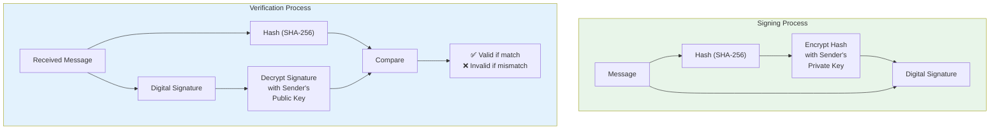
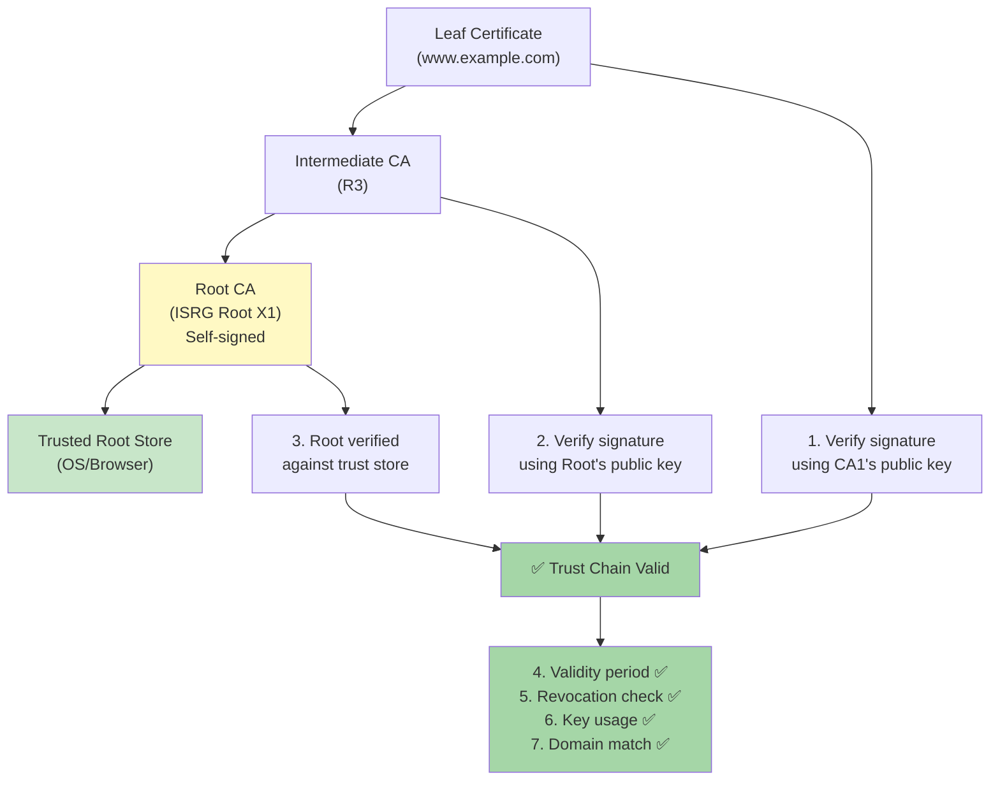
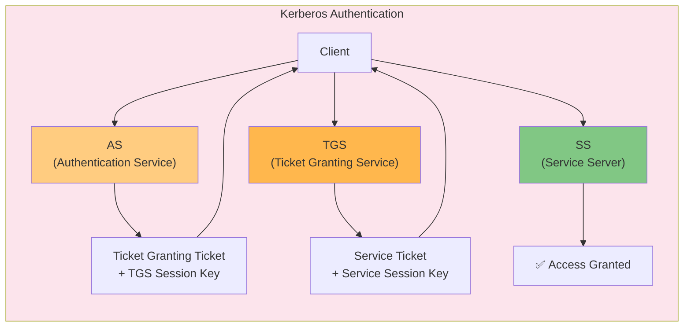
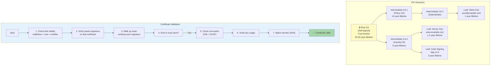

# Chapter 4: Digital Signatures & PKI

> **Exam Weightage:** 3–5 Qs in IBPS SO IT Officer Mains (Digital signatures, certificates, authentication protocols)
>
> **Key Topics:** Digital signature process, PKI (CA, RA, VA, CRL), X.509 certificates, Certificate trust chain, OAuth 2.0, SAML, Kerberos

---

## Learning Objectives

After completing this chapter you will be able to:

- Explain the digital signature process: signing (hash + encrypt with private key) and verification (decrypt with public key + compare hash).
- Describe the PKI hierarchy: Certificate Authority (CA), Registration Authority (RA), Validation Authority (VA), Certificate Revocation List (CRL), and OCSP.
- Interpret X.509 certificate structure (version, serial number, issuer, subject, validity, public key, extensions).
- Trace a certificate trust chain from leaf certificate through intermediate CAs to root CA.
- Differentiate between OAuth 2.0 grant types and their use cases (authorization code, implicit, client credentials, resource owner password).
- Describe SAML 2.0 flow (Identity Provider, Service Provider, assertion, SSO).
- Explain Kerberos authentication (AS, TGS, SS, ticket granting, authenticator).
- Solve exam-style MCQs on PKI components, certificate validation, and authentication protocols.

---

## Theory

### 4.1 Digital Signatures

<a href="../../../assets/images/diagrams/information-security/04-digital-signatures-pki/4-1-digital-signatures-handwritten.svg" target="_blank" rel="noopener">
  
</a>
<a href="../../../assets/images/diagrams/information-security/04-digital-signatures-pki/4-1-digital-signatures-diagram.svg" target="_blank" rel="noopener">
  
</a>
<a href="../../../assets/images/diagrams/information-security/04-digital-signatures-pki/4-1-digital-signatures-sticky.svg" target="_blank" rel="noopener">
  
</a>


A digital signature provides **integrity**, **authentication**, and **non-repudiation** for digital messages or documents.

#### 4.1.1 Digital Signature Process — Signing

1. **Hash the message:** Compute the cryptographic hash H(M) using a hash function (SHA-256). Hash is fixed-size regardless of message length.
2. **Encrypt hash with private key:** Encrypt the hash using the sender's private key → this produces the digital signature S = E(K_priv, H(M)).
3. **Attach signature:** Send the message M along with the digital signature S.

**Formula:** Signature = Encrypt(K_sender_private, Hash(message))

#### 4.1.2 Digital Signature Process — Verification

1. **Decrypt signature with public key:** Receiver decrypts S using the sender's public key → obtains hash₁ = Decrypt(K_sender_public, S).
2. **Compute hash locally:** Receiver computes hash₂ = Hash(M) from the received message.
3. **Compare hashes:** If hash₁ = hash₂, signature is valid → message is authentic and untampered.

**Formula:** Hash(message) = Decrypt(K_sender_public, Signature) → if equal, signature verified

#### 4.1.3 Properties Provided by Digital Signatures

| Property | Explanation | Attack if absent |
|----------|-------------|------------------|
| **Integrity** | Message has not been modified in transit | Tampering undetected |
| **Authentication** | Confirms identity of signer (only signer's public key can verify) | Impersonation possible |
| **Non-repudiation** | Signer cannot deny signing the message | Signer can claim forgery |
| **Unforgeability** | Only the private key holder can create a valid signature | Anyone can forge signatures |

#### 4.1.4 Why Sign the Hash, Not the Message?

- **Performance:** Asymmetric encryption is slow (100–1000× slower than symmetric). Signing a 256-bit hash is much faster than signing a multi-MB message.
- **Message size:** Hash is fixed-size (SHA-256 = 256 bits). Without hash, signature size grows with message.
- **Security:** Hash provides pre-image and collision resistance; signing the hash inherits these properties.

#### 4.1.5 Digital Signature Algorithms

| Algorithm | Hash Used | Key Sizes | Status |
|-----------|-----------|-----------|--------|
| RSA-PSS | SHA-256 | 2048–4096 bits | Secure (widely used) |
| ECDSA | SHA-256 | 256–521 bits (ECC) | Secure (efficient) |
| EdDSA (Ed25519) | SHA-512 (internal) | 256-bit curve | Excellent (modern standard) |
| DSA | SHA-1/SHA-256 | 1024–3072 bits | Deprecated (slow) |



### 4.2 PKI (Public Key Infrastructure)

<a href="../../../assets/images/diagrams/information-security/04-digital-signatures-pki/4-2-pki-public-key-infrastructure-handwritten.svg" target="_blank" rel="noopener">
  
</a>
<a href="../../../assets/images/diagrams/information-security/04-digital-signatures-pki/4-2-pki-public-key-infrastructure-diagram.svg" target="_blank" rel="noopener">
  
</a>
<a href="../../../assets/images/diagrams/information-security/04-digital-signatures-pki/4-2-pki-public-key-infrastructure-sticky.svg" target="_blank" rel="noopener">
  
</a>


PKI is the framework of policies, hardware, software, and procedures needed to create, manage, distribute, use, store, and revoke digital certificates.

#### 4.2.1 PKI Components

| Component | Full Name | Role |
|-----------|-----------|------|
| **CA** | Certificate Authority | Issues and signs digital certificates (trust anchor). Root CA is self-signed; subordinate CAs are signed by root. |
| **RA** | Registration Authority | Verifies applicant identity before requesting certificate issuance from CA. Performs identity proofing (document validation, domain verification). |
| **VA** | Validation Authority | Provides real-time certificate status (is certificate valid/revoked?). Implements OCSP or retrieves CRL. |
| **CRL** | Certificate Revocation List | Signed list of revoked certificate serial numbers. Published periodically by CA. Clients download CRL to check revocation status. |
| **OCSP** | Online Certificate Status Protocol | Real-time protocol to query VA for certificate status (good, revoked, unknown). More current than CRL but introduces latency. |
| **CPS** | Certificate Practice Statement | Published policy document detailing CA's operational practices. |
| **HSM** | Hardware Security Module | Tamper-resistant hardware for secure key generation, storage, and signing operations. |

#### 4.2.2 Certificate Revocation Mechanisms

| Method | Description | Pros | Cons |
|--------|-------------|------|------|
| **CRL** (RFC 5280) | Periodic list of revoked certificates issued by CA | Simple, no real-time queries | Outdated between CRL publishing intervals; large download size |
| **Delta CRL** | Only new revocations since last full CRL | Smaller downloads | Additional complexity |
| **OCSP** (RFC 6960) | Real-time query → response with certificate status | Current status, small response | Privacy (CA knows which certificates you're checking); adds latency |
| **OCSP Stapling** | Server fetches OCSP response and "staples" it to TLS handshake | No client→CA query; no CA tracking; faster | Server must fetch OCSP response periodically |
| **CRLite** | Aggregated CRL with Bloom filter (Firefox) | Compact, efficient | Complex implementation |

#### 4.2.3 PKI Hierarchy

```
                  ┌─────────────────┐
                  │   Root CA       │ (Self-signed, offline, highest security)
                  │   "Trust Anchor"│
                  └────────┬────────┘
                           │
                  ┌────────┴────────┐
                  │ Intermediate CA1│ (Signed by Root CA)
                  │ (Policy CA)     │
                  └────────┬────────┘
                           │
                  ┌────────┴────────┐
                  │ Intermediate CA2│ (Signed by CA1)
                  │ (Issuing CA)    │
                  └────────┬────────┘
                           │
            ┌──────────────┼──────────────┐
            │              │              │
   ┌────────┴──────┐ ┌────┴──────┐ ┌────┴──────┐
   │ Server Cert   │ │ Client    │ │ Code       │
   │ (SSL/TLS)     │ │ Cert      │ │ Signing    │
   └───────────────┘ └───────────┘ └───────────┘
```

**Trust model:** The Root CA's public key is pre-installed in browsers/OS trust stores. Any certificate signed (directly or through intermediates) by a trusted root forms a **trust chain** and is inherently trusted.

#### 4.2.4 Certificate Validation Process

1. Build chain from leaf certificate → intermediate CA(s) → root CA
2. Verify each certificate's digital signature (parent's public key decrypts child's signature)
3. Check certificate validity period (notBefore ≤ now ≤ notAfter)
4. Check revocation status (CRL or OCSP) — verify certificate hasn't been revoked
5. Check key usage extensions (e.g., TLS Web Server Authentication for HTTPS certificates)
6. Verify domain name matches certificate's Subject Alternative Names (SAN)



### 4.3 X.509 Digital Certificates

<a href="../../../assets/images/diagrams/information-security/04-digital-signatures-pki/4-3-x-509-digital-certificates-handwritten.svg" target="_blank" rel="noopener">
  
</a>
<a href="../../../assets/images/diagrams/information-security/04-digital-signatures-pki/4-3-x-509-digital-certificates-diagram.svg" target="_blank" rel="noopener">
  
</a>
<a href="../../../assets/images/diagrams/information-security/04-digital-signatures-pki/4-3-x-509-digital-certificates-sticky.svg" target="_blank" rel="noopener">
  
</a>


X.509 is the standard defining the format of public key certificates. Version 3 (v3) is the current standard.

#### 4.3.1 X.509 v3 Certificate Structure

| Field | Description | Example |
|-------|-------------|---------|
| **Version** | Certificate format version (1, 2, or 3) | v3 (most common) |
| **Serial Number** | Unique integer assigned by CA | 04:8E:71:... |
| **Signature Algorithm** | Algorithm used by CA to sign the certificate | sha256WithRSAEncryption |
| **Issuer** | CA that issued the certificate (DN — Distinguished Name) | CN = ISRG Root X1, O = Internet Security Research Group |
| **Validity** | Period: notBefore to notAfter | 2024-01-01 to 2025-01-01 |
| **Subject** | Entity the certificate is issued to (DN) | CN = www.example.com |
| **Subject Public Key Info** | Public key algorithm + public key value | RSA 2048-bit / ECDSA P-256 |
| **Issuer Unique ID** | Optional v2/v3 (deprecated) | — |
| **Subject Unique ID** | Optional v2/v3 (deprecated) | — |
| **Extensions** | v3 only — additional properties (key usage, SAN, basic constraints, CRL distribution points, etc.) | |
| **Signature** | CA's digital signature covering all above fields | 256-byte RSA signature |

#### 4.3.2 Important X.509 v3 Extensions

| Extension | Purpose | Exam Relevance |
|-----------|---------|----------------|
| **Basic Constraints** | Indicates if certificate is a CA and max chain depth | `CA:TRUE` for CAs, `CA:FALSE` for end-entity |
| **Key Usage** | Restricts cryptographic operations | digitalSignature, keyEncipherment, keyCertSign, cRLSign |
| **Extended Key Usage** | Purpose of the public key | serverAuth, clientAuth, codeSigning, emailProtection |
| **Subject Alternative Name (SAN)** | Domain names/IPs the certificate covers | Must match accessed domain (CN field is legacy) |
| **CRL Distribution Points** | URL where CRL can be downloaded | http://crl.example.com/root.crl |
| **Authority Information Access** | URL for OCSP responder + CA issuer URL | ocsp.example.com |
| **Certificate Policies** | CPS references | OID identifying policy |
| **Subject Key Identifier** | Unique identifier for subject's public key | 20-byte hash (usually SHA-1 of public key) |
| **Authority Key Identifier** | Links to issuing CA's Subject Key Identifier | For chain building |

### 4.4 OAuth 2.0

<a href="../../../assets/images/diagrams/information-security/04-digital-signatures-pki/4-4-oauth-2-0-handwritten.svg" target="_blank" rel="noopener">
  
</a>
<a href="../../../assets/images/diagrams/information-security/04-digital-signatures-pki/4-4-oauth-2-0-diagram.svg" target="_blank" rel="noopener">
  
</a>
<a href="../../../assets/images/diagrams/information-security/04-digital-signatures-pki/4-4-oauth-2-0-sticky.svg" target="_blank" rel="noopener">
  
</a>


OAuth 2.0 is an authorization framework that enables applications to obtain limited access to user accounts on an HTTP service. It is **not** an authentication protocol (though often used for authentication via OpenID Connect).

#### 4.4.1 OAuth 2.0 Roles

| Role | Description | Example |
|------|-------------|---------|
| **Resource Owner** | Entity that can grant access to a protected resource | End user |
| **Resource Server** | Server hosting protected resources | Google API, Facebook Graph API |
| **Client** | Application requesting access on behalf of resource owner | Web app, mobile app |
| **Authorization Server** | Server issuing access tokens after authenticating resource owner | accounts.google.com |

#### 4.4.2 OAuth 2.0 Grant Types

| Grant Type | Use Case | Access Token Delivery | Refresh Token? | Security Note |
|------------|----------|----------------------|----------------|---------------|
| **Authorization Code** | Server-side web apps | Authorization code → exchanged for token (server-to-server) | Yes | Most secure — token never exposed to browser |
| **Implicit** | Single-page apps (browser-only) | Token in URL fragment (deprecated in favor of PKCE) | No | Token exposed in URL; less secure |
| **Resource Owner Password Credentials** | Trusted apps (first-party) | Directly exchange username + password for token | Yes | Requires credentials exposure; avoid |
| **Client Credentials** | Machine-to-machine (no user) | Client ID + Secret → direct token | Yes | No user involvement |
| **Device Code** | Devices without browser (TV, CLI) | User completes login on separate device | No | Device displays code, user enters on another device |
| **Authorization Code + PKCE** | Mobile apps, SPAs (current best practice) | Code challenge + verifier (no client secret needed) | Yes | Prevents authorization code interception |

#### 4.4.3 Authorization Code Grant Flow

1. Client redirects user to Authorization Server: `authorize?response_type=code&client_id=APP&redirect_uri=CALLBACK&scope=email`
2. User authenticates and consents
3. Authorization Server redirects to `CALLBACK?code=AUTH_CODE`
4. Client sends `POST /token?code=AUTH_CODE&client_id=APP&client_secret=SECRET`
5. Authorization Server returns `{"access_token":"...", "refresh_token":"...", "expires_in":3600}`
6. Client uses access_token to call Resource Server API: `GET /api/user` with `Authorization: Bearer access_token`

**PKCE (Proof Key for Code Exchange):** Mobile/SPA clients generate a random `code_verifier`, hash it to `code_challenge`, send challenge in authorize request, and send verifier in token request. Server verifies SHA-256(verifier) = challenge. This prevents authorization code interception attacks.

### 4.5 SAML (Security Assertion Markup Language)

<a href="../../../assets/images/diagrams/information-security/04-digital-signatures-pki/4-5-saml-security-assertion-markup-language-handwritten.svg" target="_blank" rel="noopener">
  
</a>
<a href="../../../assets/images/diagrams/information-security/04-digital-signatures-pki/4-5-saml-security-assertion-markup-language-diagram.svg" target="_blank" rel="noopener">
  
</a>
<a href="../../../assets/images/diagrams/information-security/04-digital-signatures-pki/4-5-saml-security-assertion-markup-language-sticky.svg" target="_blank" rel="noopener">
  
</a>


SAML 2.0 is an XML-based framework for exchanging authentication and authorization data between an Identity Provider (IdP) and a Service Provider (SP).

#### 4.5.1 SAML 2.0 Components

| Component | Role | Description |
|-----------|------|-------------|
| **Identity Provider (IdP)** | Authenticates users | Creates and issues SAML assertions (e.g., Azure AD, Okta, Keycloak) |
| **Service Provider (SP)** | Provides service to user | Trusts IdP for authentication (e.g., Salesforce, AWS, SaaS apps) |
| **SAML Assertion** | XML document containing auth/attribute/decision statements | Signed by IdP, contains user identity, attributes, and conditions |
| **SAML Request/Response** | XML messages exchanged between SP and IdP | AuthnRequest (SP→IdP), Response (IdP→SP) |
| **Subject** | Entity being authenticated (usually a user) | NameID element in assertion |

#### 4.5.2 SAML SSO Flow (SP-Initiated)

1. User accesses SP resource (unauthenticated)
2. SP generates **SAML AuthnRequest** (XML, signed) and redirects user to IdP
3. User authenticates to IdP (password, 2FA, certificate)
4. IdP generates **SAML Response** containing signed assertion with user identity
5. Browser posts SAML Response back to SP via HTTP POST binding
6. SP validates XML signature, extracts user identity, creates local session
7. User is logged in to SP (SSO achieved)

**Key difference from OAuth 2.0:**
- SAML is primarily for **authentication** (proving identity)
- OAuth 2.0 is primarily for **authorization** (granting API access)
- OpenID Connect bridges this: OAuth 2.0 + ID token (JWT) for authentication

| Feature | SAML 2.0 | OAuth 2.0 |
|---------|----------|-----------|
| Purpose | Authentication / SSO | Authorization / API access |
| Format | XML (heavy) | JSON (lightweight) |
| Tokens | SAML Assertion (XML signed) | Access Token (JWT or opaque) |
| Transport | Browser redirect (HTTP POST/Redirect binding) | REST API + Bearer tokens |
| Use case | Enterprise SSO (many SPs, one IdP) | Third-party API access |
| Mobile friendly | Poor (XML parsing, browser redirect) | Excellent (native app support, PKCE) |

### 4.6 Kerberos

<a href="../../../assets/images/diagrams/information-security/04-digital-signatures-pki/4-6-kerberos-handwritten.svg" target="_blank" rel="noopener">
  
</a>
<a href="../../../assets/images/diagrams/information-security/04-digital-signatures-pki/4-6-kerberos-diagram.svg" target="_blank" rel="noopener">
  
</a>
<a href="../../../assets/images/diagrams/information-security/04-digital-signatures-pki/4-6-kerberos-sticky.svg" target="_blank" rel="noopener">
  
</a>


Kerberos is a network authentication protocol that uses **secret-key cryptography** (symmetric) and a **trusted third party** (Key Distribution Center — KDC) to authenticate clients to services without transmitting passwords over the network.

#### 4.6.1 Kerberos Components

| Component | Full Name | Role |
|-----------|-----------|------|
| **KDC** | Key Distribution Center | Runs on authentication server; contains AS + TGS |
| **AS** | Authentication Service | Validates user credentials and issues Ticket Granting Ticket (TGT) |
| **TGS** | Ticket Granting Service | Issues service tickets (ST) for specific services |
| **SS** | Service Server | Provides the actual service (file server, print server) |
| **TGT** | Ticket Granting Ticket | Encrypted ticket proving authentication, allows requesting service tickets |
| **ST** | Service Ticket | Ticket for accessing a specific service |
| **Authenticator** | Client-generated message proving knowledge of session key | Prevents replay attacks |

#### 4.6.2 Kerberos Authentication Flow (6 steps)

1. **AS-REQ (Client → AS):** Client sends username to Authentication Service (in cleartext)
2. **AS-REP (AS → Client):** AS retrieves user's password hash (from database), generates:
   - **TGT:** Encrypted with KDC's secret key — contains client identity, TGS session key, expiration
   - **TGS Session Key:** Encrypted with user's password hash (derived from password)
   - Client decrypts TGS session key (using password hash), discards password from memory
3. **TGS-REQ (Client → TGS):** Client requests service ticket for service S:
   - Sends TGT (encrypted with KDC's key — client cannot see/modify)
   - Sends **Authenticator** (client ID + timestamp) encrypted with TGS session key
4. **TGS-REP (TGS → Client):** TGS decrypts TGT (verifies client identity), validates authenticator, generates:
   - **Service Ticket (ST):** Encrypted with service S's secret key — contains client identity, service session key
   - **Service Session Key:** Encrypted with TGS session key
5. **AP-REQ (Client → SS):** Client requests access to service S:
   - Sends ST (encrypted with service's secret key — client cannot see/modify)
   - Sends new Authenticator encrypted with service session key
6. **AP-REP (SS → Client, optional):** Service decrypts ST (confirms identity), validates authenticator, optionally sends response encrypted with service session key

```
Client                  KDC (AS+TGS)                Service Server
  │                         │                          │
  │──── AS-REQ (user) ──────▶│                          │
  │◀──── AS-REP (TGT + TGS session key) ──────────────│
  │                         │                          │
  │──── TGS-REQ (TGT + authenticator) ────────────────▶│
  │◀──── TGS-REP (ST + service session key) ──────────│
  │                         │                          │
  │──── AP-REQ (ST + authenticator) ──────────────────▶│
  │◀──── AP-REP (optional) ───────────────────────────┤
```

#### 4.6.3 Kerberos Security Properties

| Property | How Achieved |
|----------|-------------|
| **No password transmission** | Password never sent over network; used only to decrypt TGS session key |
| **Replay prevention** | Authenticator contains timestamp (+/- 5 min skew tolerance); reused authenticators detected |
| **Mutual authentication** | Both client and service prove knowledge of session key |
| **Single Sign-On (SSO)** | TGT obtained once per login; multiple service tickets can be requested without re-entering password |
| **Confidentiality** | Tickets encrypted with keys known only to KDC and respective services |
| **Forwardable tickets** | TGT can be forwarded to other services for delegation |

#### 4.6.4 Kerberos Limitations

| Limitation | Description |
|------------|-------------|
| **Clock synchronization** | Requires all hosts to have synchronized clocks (within 5 min default skew) |
| **Single point of failure** | KDC must be available for authentication |
| **Dictionary attack on password** | AS-REP for TGS session key encrypted with password hash — offline brute-force possible if attacker captures AS-REP |
| **Not suitable for internet** | Designed for local network; TCP/UDP port 88 must be open |



### 4.7 Solved MCQs (Exam Style)

<a href="../../../assets/images/diagrams/information-security/04-digital-signatures-pki/4-7-solved-mcqs-exam-style-handwritten.svg" target="_blank" rel="noopener">
  
</a>
<a href="../../../assets/images/diagrams/information-security/04-digital-signatures-pki/4-7-solved-mcqs-exam-style-diagram.svg" target="_blank" rel="noopener">
  
</a>
<a href="../../../assets/images/diagrams/information-security/04-digital-signatures-pki/4-7-solved-mcqs-exam-style-sticky.svg" target="_blank" rel="noopener">
  
</a>


**Q1.** In a digital signature scheme, which key does the signer use to create the signature?

A) Recipient's public key  
B) Recipient's private key  
C) Signer's public key  
D) Signer's private key  

<details>
<summary>Show Answer</summary>

**Answer: D) Signer's private key**

**Explanation:** The digital signature is created by encrypting the hash of the message with the SIGNER's private key. This ensures non-repudiation: only the signer possesses their private key, so only they could have created the signature. The recipient verifies by decrypting with the signer's PUBLIC key. If the decrypted hash matches the locally computed hash, the signature is valid.
</details>

---

**Q2.** In Kerberos, the Ticket Granting Ticket (TGT) is encrypted with:

A) The client's password hash  
B) The service server's secret key  
C) The KDC's secret key  
D) The TGS session key  

<details>
<summary>Show Answer</summary>

**Answer: C) The KDC's secret key**

**Explanation:** The TGT is encrypted with the KDC's secret key (known only to the KDC). The client cannot decrypt the TGT — they can only present it to the TGS. This prevents tampering with TGT contents. The TGT contains: client ID, TGS session key, expiration time, and other metadata. The TGS session key (a separate component of the AS-REP) is encrypted with the client's password hash so the client can decrypt it.
</details>

---

**Q3.** Which OAuth 2.0 grant type is recommended for mobile applications?

A) Implicit grant  
B) Resource Owner Password Credentials  
C) Authorization Code with PKCE  
D) Client Credentials  

<details>
<summary>Show Answer</summary>

**Answer: C) Authorization Code with PKCE**

**Explanation:** Authorization Code with PKCE (Proof Key for Code Exchange) is the recommended grant for mobile apps and SPAs. PKCE prevents authorization code interception attacks by requiring the client to prove possession of the code_verifier. The Implicit grant (historically used for SPAs) exposes the access token in the URL fragment and is now deprecated in favor of PKCE. Client Credentials is for machine-to-machine. ROPC exposes user passwords to the client.
</details>

---

**Q4.** What is the primary purpose of a Certificate Revocation List (CRL)?

A) To issue new certificates  
B) To list certificates that have been revoked before their expiration  
C) To validate the signature on a certificate  
D) To store backup copies of private keys  

<details>
<summary>Show Answer</summary>

**Answer: B) To list certificates that have been revoked before their expiration**

**Explanation:** CRL is a signed list of certificate serial numbers that have been revoked by the CA before their scheduled expiration. Reasons for revocation include: private key compromise, CA compromise, cessation of operation, affiliation change, or superseded certificate. Clients download and cache the CRL to verify that a certificate has not been revoked before accepting it. OCSP provides a real-time alternative.
</details>

---

**Q5.** Which X.509 v3 extension indicates whether a certificate is a CA certificate?

A) Key Usage  
B) Extended Key Usage  
C) Basic Constraints  
D) Subject Alternative Name  

<details>
<summary>Show Answer</summary>

**Answer: C) Basic Constraints**

**Explanation:** The Basic Constraints extension indicates whether the certificate is a CA (`CA:TRUE`) or an end-entity (`CA:FALSE`). It also includes an optional `pathLenConstraint` specifying the maximum number of subordinate CA certificates allowed in the chain. Key Usage restricts the cryptographic operations, Extended Key Usage specifies the certificate's purpose (server auth, client auth), and SAN lists domain names.
</details>

---

**Q6.** In Kerberos, what prevents replay attacks?

A) The TGT expiration time  
B) The authenticator timestamp  
C) The service ticket lifetime  
D) The encryption algorithm  

<details>
<summary>Show Answer</summary>

**Answer: B) The authenticator timestamp**

**Explanation:** The authenticator contains the client ID and a timestamp, encrypted with the session key. The service server checks that the timestamp is within the allowed time skew (typically ±5 minutes) and that no authenticator with the same timestamp has been received before. If an attacker captures and re-sends the authenticator, the server will reject it because the timestamp is now outside the acceptable window or has been seen before.
</details>

---

**Q7.** Which statement about SAML assertions is TRUE?

A) They are typically encoded as JSON  
B) They are always unsigned  
C) They contain statements about authentication, attributes, and authorization decisions  
D) They are issued by the Service Provider  

<details>
<summary>Show Answer</summary>

**Answer: C) They contain statements about authentication, attributes, and authorization decisions**

**Explanation:** A SAML assertion is an XML document signed by the Identity Provider (IdP) that contains three types of statements: (1) Authentication Statement — when and how the subject was authenticated, (2) Attribute Statement — additional attributes about the subject (email, role, department), and (3) Authorization Decision Statement — whether the subject is authorized to access a specific resource. Assertions are always signed (not unsigned) and are XML-based (not JSON).
</details>

---

**Q8.** In the digital signature verification process, which operation is performed using the signer's public key?

A) Hashing the received message  
B) Decrypting the received signature  
C) Encrypting the received message  
D) Generating a new signature  

<details>
<summary>Show Answer</summary>

**Answer: B) Decrypting the received signature**

**Explanation:** The recipient decrypts the received digital signature using the signer's PUBLIC key. This reveals hash₁ = Decrypt(K_public, Signature). The recipient then computes hash₂ = Hash(received message) independently. If hash₁ = hash₂, the signature is valid. This confirms: (1) the message was signed by the holder of the corresponding private key (authentication), (2) the message hasn't been modified (integrity), and (3) the signer cannot deny signing (non-repudiation).
</details>

---

**Q9.** What is the purpose of the OCSP stapling extension in TLS?

A) To reduce TLS handshake latency by 50%  
B) To allow the server to provide a time-stamped OCSP response during the handshake  
C) To encrypt the server's certificate  
D) To compress the handshake messages  

<details>
<summary>Show Answer</summary>

**Answer: B) To allow the server to provide a time-stamped OCSP response during the handshake**

**Explanation:** OCSP stapling (formally: TLS Certificate Status Request extension) allows the web server to periodically fetch an OCSP response from the CA and "staple" it to the TLS handshake. Benefits: (1) client does not need to contact the CA directly (reduces latency), (2) privacy improved (CA cannot track which websites the client visits), (3) reduces load on CA's OCSP responders. The OCSP response is signed by the CA and timestamped.
</details>

---

**Q10.** Which of the following is NOT a standard OAuth 2.0 grant type?

A) Authorization Code  
B) SAML Bearer Assertion  
C) Client Credentials  
D) Device Code  

<details>
<summary>Show Answer</summary>

**Answer: B) SAML Bearer Assertion**

**Explanation:** SAML Bearer Assertion is NOT a standard OAuth 2.0 grant type defined in RFC 6749. It is an extension (RFC 7522) that allows exchanging a SAML assertion for an OAuth access token. The standard grant types (RFC 6749) are: Authorization Code, Implicit, Resource Owner Password Credentials, and Client Credentials. Device Code is defined in RFC 8628 (Device Authorization Grant).
</details>

---

## 📝 Solved Examples (20 MCQs)

**Q1.** In a digital signature scheme, if an attacker wants to forge a signature on a message, what must they possess?

A) The signer's public key  
B) The signer's private key  
C) The recipient's private key  
D) The hash of the message

<details>
<summary>Show Answer</summary>

**Answer: B) The signer's private key**

**Explanation:** A digital signature can only be created by the holder of the private key corresponding to the public key used for verification. For RSA signatures: Signature = Encrypt(Hash(message), K_private). The private key is the "signing key" — it must be kept secret. The public key is the "verification key" — anyone can verify. Without the private key, forging a signature requires solving the RSA problem (factoring n) or finding a hash collision — both computationally infeasible for proper key sizes.

The security property "non-repudiation" relies on this: only the signer could have created the signature, so they cannot deny it.
</details>

---

**Q2.** In an X.509 certificate, which extension indicates whether the certificate can be used to sign other certificates?

A) Key Usage  
B) Extended Key Usage  
C) Basic Constraints  
D) Subject Alternative Name

<details>
<summary>Show Answer</summary>

**Answer: C) Basic Constraints**

**Explanation:** The Basic Constraints extension contains:
- `CA:TRUE` — This is a CA certificate; can sign other certificates
- `CA:FALSE` — This is an end-entity certificate; cannot sign other certificates
- `pathLenConstraint`: Maximum number of subordinate CAs below this CA

Key Usage (`keyCertSign`, `cRLSign`) must also be set for CA certificates. Extended Key Usage specifies purposes like `serverAuth` (TLS), `clientAuth`, `codeSigning`. SAN lists domain names (for HTTPS certificates).
</details>

---

**Q3.** In OAuth 2.0 Authorization Code flow, where is the access token delivered?

A) In the URL fragment after redirect  
B) In the authorization response redirect URL as a query parameter (code)  
C) Directly to the client via server-to-server POST  
D) In an HTTP header from the authorization server

<details>
<summary>Show Answer</summary>

**Answer: C) Directly to the client via server-to-server POST**

**Explanation:** The Authorization Code flow delivers the access token through a secure server-to-server exchange:
1. User authorizes → Authorization Server redirects to `callback?code=AUTH_CODE` (authorization code, not token)
2. Client sends `POST /token` with the code + client credentials (client_id + client_secret) DIRECTLY to the authorization server
3. Authorization Server returns `{"access_token":"...", "refresh_token":"..."}` in the HTTPS response body

The token is never exposed to the browser — this is why Authorization Code is more secure than Implicit grant (which returned token in URL fragment).
</details>

---

**Q4.** In Kerberos, what prevents an attacker from replaying a captured Service Ticket (ST)?

A) The ST has a short lifetime  
B) The ST contains a timestamp in the authenticator  
C) The ST is encrypted and the attacker cannot decrypt it  
D) The service server checks for duplicate authenticator timestamps

<details>
<summary>Show Answer</summary>

**Answer: D) The service server checks for duplicate authenticator timestamps**

**Explanation:** The authenticator (encrypted with the service session key) contains a timestamp. The service server:
1. Decrypts the authenticator using the service session key
2. Checks the timestamp is within the allowed time skew (typically ±5 minutes)
3. **Caches previously seen authenticator timestamps** — rejects duplicates

Even if an attacker captures the ST (which they can't decrypt) and the authenticator, replaying them will fail because the service already recorded that timestamp. Additionally, ticket lifetime limits the window. Both factors combine: timestamp uniqueness + short ticket lifetime.
</details>

---

**Q5.** What is the trust anchor in a PKI hierarchy?

A) The Certificate Revocation List  
B) The Root CA's public key (self-signed certificate)  
C) The intermediate CA's certificate  
D) The end-entity certificate

<details>
<summary>Show Answer</summary>

**Answer: B) The Root CA's public key (self-signed certificate)**

**Explanation:** The trust anchor is the Root CA certificate that is trusted by fiat — it's self-signed and its public key is pre-installed in the trust store (browser, OS, or application). For example:
- Browsers ship with ~100-150 root CA certificates pre-installed
- Microsoft Windows: root certificates via Microsoft Root Certificate Program
- Apple: Apple Root Certificate Program
- Mozilla: Mozilla CA Certificate Program

All trust flows from this anchor. Intermediate and leaf certificates are verified by tracing a chain back to a trusted root. If the root is compromised, all certificates under it are untrusted.
</details>

---

**Q6.** In SAML 2.0 SP-initiated SSO, who creates the SAML assertion?

A) The Service Provider  
B) The Identity Provider  
C) The Certificate Authority  
D) The browser

<details>
<summary>Show Answer</summary>

**Answer: B) The Identity Provider (IdP)**

**Explanation:** In SP-initiated SSO:
1. User attempts to access SP resource (unauthenticated)
2. SP generates AuthnRequest (signed XML) → redirects user to IdP
3. User authenticates to IdP (password, 2FA, cert)
4. **IdP creates the SAML assertion** — XML document containing:
   - Authentication Statement (when/how user authenticated)
   - Attribute Statement (user identity, email, roles)
   - Conditions (validity period, audience restriction)
   - IdP's digital signature (over entire assertion)
5. Assertion delivered to SP via browser POST binding
6. SP validates signature, extracts identity, creates session

The assertion is always created by the IdP (the trusted authentication source).
</details>

---

**Q7.** What is the key size for an ECDSA signature using the P-256 curve?

A) 256 bits (signature is 64 bytes)  
B) 512 bits (signature is 64 bytes)  
C) 256 bits (signature is 32 bytes)  
D) 128 bits

<details>
<summary>Show Answer</summary>

**Answer: B) 512 bits (signature is 64 bytes)**

**Explanation:** For ECDSA with curve P-256 (secp256r1):
- Private key: 256 bits (32 bytes) — random integer mod n
- Public key: 512 bits (64 bytes) — two 256-bit coordinates (x, y), uncompressed
- **Signature: 512 bits (64 bytes)** — two 256-bit integers (r, s) per signature

The signature is 2 × the key size because ECDSA produces two values (r, s), each of order n (256-bit for P-256). EdDSA (Ed25519) produces a 64-byte signature for a comparable security level with deterministic signing (no RNG dependency).

**Exam comparison:**
| Algorithm | Private Key | Signature Size |
|-----------|------------|----------------|
| RSA-2048 | 2048 bits | 2048 bits (256 bytes) |
| ECDSA P-256 | 256 bits | 512 bits (64 bytes) |
| Ed25519 | 256 bits | 512 bits (64 bytes) |
</details>

---

**Q8.** What does OCSP Responder do when queried about a certificate status?

A) Returns the certificate's public key  
B) Returns the certificate's serial number, status (good/revoked/unknown), and a signed response  
C) Returns the full certificate chain  
D) Returns the CA's private key

<details>
<summary>Show Answer</summary>

**Answer: B) Returns the certificate's serial number, status (good/revoked/unknown), and a signed response**

**Explanation:** OCSP (Online Certificate Status Protocol, RFC 6960) response format:
- **Certificate ID:** Hash of issuer DN + issuer public key + certificate serial number
- **Status:** `good` (certificate valid, not revoked), `revoked` (revoked with revocation date/reason), `unknown` (responder doesn't know)
- **ThisUpdate / NextUpdate:** Time range
- **Responder's digital signature:** Provides authentication and integrity

The response is ASN.1 DER-encoded and signed by the CA (or authorized responder). Response size: ~500-1000 bytes. OCSP stapling (TLS extension) improves privacy and reduces latency.
</details>

---

**Q9.** In OAuth 2.0, what is the purpose of the `scope` parameter in the authorization request?

A) To limit the validity period of the token  
B) To specify the permissions the client is requesting  
C) To encrypt the authorization request  
D) To identify the client application

<details>
<summary>Show Answer</summary>

**Answer: B) To specify the permissions the client is requesting**

**Explanation:** The `scope` parameter defines the specific permissions the client needs. Examples:
- `scope=openid profile email` — OpenID Connect scopes (identity)
- `scope=read write` — basic read/write access
- `scope=https://www.googleapis.com/auth/drive.file` — Google API scope

Scopes are agreed between the authorization server and resource server. The resource owner (user) sees the requested scopes during consent. Authorization server issues an access token limited to the approved scopes. OAuth scope is one of the key differences from SAML (which uses attributes rather than scopes).
</details>

---

**Q10.** What happens if an intermediate CA certificate in a trust chain has expired?

A) All leaf certificates under it are still valid  
B) All leaf certificates under it become invalid  
C) Only the intermediate CA certificate is affected  
D) The Root CA automatically renews the intermediate

<details>
<summary>Show Answer</summary>

**Answer: B) All leaf certificates under it become invalid (chain fails)**

**Explanation:** Certificate chain validation requires ALL certificates in the chain to be within their validity period (notBefore ≤ now ≤ notAfter). If the intermediate CA certificate has expired:
- The leaf certificate may still be valid (current date within leaf's validity)
- But the intermediate CA's signature on the leaf is "expired" — there is no valid chain
- The root CA's certificate is typically valid for 20-30 years (root CAs are long-lived)
- Solution: The intermediate CA must get a new certificate from the root CA before expiry

This is why certificate lifecycle management is critical — organizations must renew intermediate CAs well before expiry to avoid cascading failures.
</details>

---

**Q11.** In Kerberos, the TGS session key is encrypted with which key in the AS-REP?

A) The KDC's master key  
B) The client's password hash  
C) The service server's secret key  
D) The TGT

<details>
<summary>Show Answer</summary>

**Answer: B) The client's password hash**

**Explanation:** In the AS-REP, the KDC sends two components:
1. **TGT:** Encrypted with the KDC's secret key (client cannot decrypt this)
2. **TGS Session Key + metadata:** Encrypted with the client's password hash (derived from user's password)

The client decrypts component 2 using their password (hash). The TGS session key is used to secure communication with the TGS. The password is then discarded from memory. The TGT is presented to the TGS, which decrypts it using the KDC's secret key.

This design means: (1) password never travels over network, (2) only the correct password allows decryption of the TGS session key, (3) KDC can verify identity without storing passwords.
</details>

---

**Q12.** What is the primary purpose of the Registration Authority (RA) in PKI?

A) To sign digital certificates  
B) To verify the identity of certificate applicants before forwarding to CA  
C) To revoke certificates  
D) To publish CRLs

<details>
<summary>Show Answer</summary>

**Answer: B) To verify the identity of certificate applicants before forwarding to CA**

**Explanation:** The RA (Registration Authority) handles identity verification and registration:
- Accepts certificate requests
- Validates applicant identity (documents, domain control verification, email verification)
- Approves or rejects requests
- Forwards approved requests to the CA for actual certificate issuance
- May handle revocation requests

The RA does NOT issue/sign certificates (that's the CA's role) and typically does NOT run the OCSP responder (VA's role). Separating RA from CA provides security through separation of duties — even if RA is compromised, the CA's signing keys remain secure.
</details>

---

**Q13.** In the context of digital signatures, what is the "hash-then-sign" paradigm?

A) Sign the hash of the message instead of the full message  
B) Hash the signature after signing  
C) Sign the message, then hash the result  
D) Both hash and sign independently

<details>
<summary>Show Answer</summary>

**Answer: A) Sign the hash of the message instead of the full message**

**Explanation:** Hash-then-sign is the standard approach:
1. **Compute hash:** h = H(M) — produces fixed-size digest (e.g., 256 bits for SHA-256)
2. **Sign hash:** σ = E(K_private, h)
3. **Verification:** h' = D(K_public, σ), then compare h' with H(M)

**Why not sign the full message?**
- **Performance:** Asymmetric signing is 100-1000× slower than symmetric. Signing a 256-bit hash is far faster than signing a multi-MB message
- **Size:** Signature is fixed-size regardless of message length
- **Security:** Hash collision resistance prevents two different messages from producing the same signature
- **Compatibility:** Hashed message can be signed once but verified by multiple parties without re-signing
</details>

---

**Q14.** What is the role of the `aud` (audience) claim in a JWT access token?

A) Identifies the token issuer  
B) Identifies the intended recipient of the token  
C) Identifies the token expiration time  
D) Identifies the user

<details>
<summary>Show Answer</summary>

**Answer: B) Identifies the intended recipient of the token**

**Explanation:** JWT claims:
- `iss` (issuer): Who created/signed the token (e.g., `accounts.google.com`)
- **`aud` (audience):** Intended recipient — the resource server that should accept this token. Prevents token reuse across different services
- `sub` (subject): The user/entity the token is about
- `exp` (expiration): Token expiry timestamp
- `iat` (issued at): When token was created
- `jti` (JWT ID): Unique identifier for token

If `aud` is `https://api.example.com`, another service receiving this token should reject it because the audience doesn't match. This prevents a token issued for one API from being used against a different API (token replay across services).
</details>

---

**Q15.** In OpenID Connect, the ID Token is typically encoded in which format?

A) XML  
B) JSON Web Token (JWT)  
C) SAML assertion  
D) Binary DER

<details>
<summary>Show Answer</summary>

**Answer: B) JSON Web Token (JWT)**

**Explanation:** OpenID Connect extends OAuth 2.0 for authentication. The ID Token is a JWT (JSON Web Token) containing:
- `iss`: Identity Provider URL
- `sub`: Unique user identifier
- `aud`: Client ID
- `exp`, `iat`: Expiration and issue times
- `nonce`: Mitigates replay attacks
- `auth_time`: When authentication occurred
- `email`, `name`, `picture`: User info claims (requested via scopes)

The JWT is signed by the IdP using RS256 (RSA with SHA-256) or ES256 (ECDSA with P-256). The client validates the signature using the IdP's public key (obtained from its JWKS endpoint).
</details>

---

**Q16.** A Root CA certificate has Basic Constraints: CA:TRUE, pathLenConstraint:2. How many levels of subordinate CAs can exist below it?

A) 0  
B) 1  
C) 2  
D) Unlimited

<details>
<summary>Show Answer</summary>

**Answer: C) 2**

**Explanation:** The `pathLenConstraint` specifies the maximum number of CA certificates that can follow this certificate in the chain (NOT including the leaf end-entity certificate). With pathLenConstraint=2:
- Root CA (pathLen=2) → Intermediate CA1 (pathLen=1) → Intermediate CA2 (pathLen=0) → End-entity cert
- That's 2 levels of CA below root, plus the leaf

If pathLenConstraint is not specified, there is no limit. The constraint prevents CA key compromise from affecting too many downstream certificates.
</details>

---

**Q17.** In OAuth 2.0, what is the purpose of the `refresh_token`?

A) To obtain a new access token without requiring user re-authentication  
B) To refresh the user's session timeout  
C) To extend the lifetime of the current access token  
D) To invalidate the previous access token

<details>
<summary>Show Answer</summary>

**Answer: A) To obtain a new access token without requiring user re-authentication**

**Explanation:** Access tokens have limited lifetimes (typically 1 hour). When the access token expires, the client can use the refresh token to get a new access token:
```
POST /token
  grant_type=refresh_token
  refresh_token=xxxxx
  client_id=app
  client_secret=secret

Response: { "access_token": "new_token", "expires_in": 3600 }
```

Refresh tokens are long-lived (days/weeks/months) and should be stored securely (server-side, not in browser/localStorage). They provide persistent access without requiring the user to re-authenticate. Some authorization servers rotate refresh tokens (old one invalidated upon use).
</details>

---

**Q18.** Which cryptographic algorithm family is used in CRYSTALS-Kyber (ML-KEM), the NIST-selected post-quantum KEM?

A) Hash-based signatures  
B) Code-based cryptography  
C) Lattice-based cryptography  
D) Multivariate cryptography

<details>
<summary>Show Answer</summary>

**Answer: C) Lattice-based cryptography**

**Explanation:** CRYSTALS-Kyber (standardized as ML-KEM in FIPS 203) is based on the **Module Learning With Errors (MLWE)** problem — a lattice-based cryptographic assumption. Key properties:
- **Security:** Believed to be computationally hard for both classical and quantum computers
- **Efficiency:** Fast key generation, encapsulation, and decapsulation (comparable to ECDH)
- **Key sizes:** Public key ~800 bytes (Kyber-512), ciphertext ~768 bytes — larger than ECC but practical
- **NIST selection:** Primary KEM for general public-key encryption (August 2024)

NIST also selected: CRYSTALS-Dilithium (ML-DSA, lattice-based signatures), FALCON (FN-DSA, lattice-based, smaller signatures), and SPHINCS+ (SLH-DSA, hash-based, conservative backup).
</details>

---

**Q19.** In a certificate chain validation, what is checked at each CA level?

A) The CA's public key only  
B) The parent CA's digital signature on the child CA's certificate  
C) The child CA's signature on the parent CA  
D) The leaf certificate's private key

<details>
<summary>Show Answer</summary>

**Answer: B) The parent CA's digital signature on the child CA's certificate**

**Explanation:** Certificate chain validation proceeds bottom-up:
1. Start with leaf certificate → extract "Issuer DN" → find intermediate CA cert
2. **Verify leaf cert's signature using intermediate CA's public key**
3. Extract intermediate CA's "Issuer DN" → find next CA in chain
4. **Verify intermediate CA's signature using next CA's public key**
5. Repeat until reaching Root CA
6. **Verify Root CA's signature using its own public key** (self-signed — trust anchor)
7. Check all certificates are still within validity period
8. Check revocation status (CRL/OCSP) for each cert
9. Verify key usage extensions

Each signature verification proves the child's certificate was issued by the parent and hasn't been modified.
</details>

---

**Q20.** What is the primary difference between OAuth 2.0 and OpenID Connect?

A) OAuth 2.0 is for authorization; OpenID Connect adds authentication on top  
B) OpenID Connect is for authorization; OAuth 2.0 is for authentication  
C) They are interchangeable  
D) OpenID Connect uses XML; OAuth 2.0 uses JSON

<details>
<summary>Show Answer</summary>

**Answer: A) OAuth 2.0 is for authorization; OpenID Connect adds authentication on top**

**Explanation:** 
| Aspect | OAuth 2.0 | OpenID Connect (OIDC) |
|--------|-----------|----------------------|
| Primary purpose | Authorization (API access) | Authentication (verify identity) |
| Token type | Access Token (opaque/JWT) | Access Token + ID Token (JWT) |
| User identity | Not standardized | Standardized in ID Token (sub, email, name) |
| User info | Custom API call | Standard `/userinfo` endpoint |
| Standard | RFC 6749 | RFC 7519 + OIDC Core |
| Protocol flow | Various grants | Authorization Code + PKCE (mandatory) |

OIDC = OAuth 2.0 + ID Token (JWT) + UserInfo endpoint + standardized scopes (`openid`, `profile`, `email`). OIDC is the modern standard for social login (Google, Apple, Microsoft login).
</details>

---

### TypeScript Implementation: JWT Token Handler with OAuth 2.0

```typescript
/**
 * JWT Token Handler
 * Implements JWT creation, validation, and OAuth 2.0 token management
 */
import * as crypto from 'crypto';

interface JWTHeader {
  alg: 'RS256' | 'ES256' | 'HS256';
  typ: 'JWT';
  kid?: string;
}

interface JWTPayload {
  iss: string;        // issuer
  sub: string;        // subject (user ID)
  aud: string;        // audience
  exp: number;        // expiration (epoch seconds)
  iat: number;        // issued at
  nbf?: number;       // not before
  jti?: string;       // unique token ID
  scope?: string;     // permissions
  [key: string]: any;
}

interface OAuthToken {
  access_token: string;
  token_type: 'Bearer';
  expires_in: number;
  refresh_token?: string;
  scope?: string;
  id_token?: string;  // OpenID Connect
}

class JWTManager {
  private readonly algorithm = 'sha256';
  private readonly rsaKeyPair: crypto.KeyPairKeyObjectResult;

  constructor() {
    this.rsaKeyPair = crypto.generateKeyPairSync('rsa', {
      modulusLength: 2048,
      publicKeyEncoding: { type: 'spki', format: 'pem' },
      privateKeyEncoding: { type: 'pkcs8', format: 'pem' }
    });
  }

  private base64UrlEncode(buffer: Buffer): string {
    return buffer
      .toString('base64')
      .replace(/=/g, '')
      .replace(/\+/g, '-')
      .replace(/\//g, '_');
  }

  private base64UrlDecode(str: string): Buffer {
    str = str.replace(/-/g, '+').replace(/_/g, '/');
    while (str.length % 4) str += '=';
    return Buffer.from(str, 'base64');
  }

  createJWT(payload: JWTPayload): string {
    const header: JWTHeader = { alg: 'RS256', typ: 'JWT' };

    const headerEncoded = this.base64UrlEncode(Buffer.from(JSON.stringify(header)));
    const payloadEncoded = this.base64UrlEncode(Buffer.from(JSON.stringify(payload)));
    const signingInput = `${headerEncoded}.${payloadEncoded}`;

    const signature = crypto.sign(
      this.algorithm,
      Buffer.from(signingInput),
      this.rsaKeyPair.privateKey
    );

    const signatureEncoded = this.base64UrlEncode(signature);
    return `${signingInput}.${signatureEncoded}`;
  }

  verifyJWT(token: string): JWTPayload | null {
    const parts = token.split('.');
    if (parts.length !== 3) return null;

    const [headerEncoded, payloadEncoded, signatureEncoded] = parts;
    const signingInput = `${headerEncoded}.${payloadEncoded}`;

    const isValid = crypto.verify(
      this.algorithm,
      Buffer.from(signingInput),
      this.rsaKeyPair.publicKey,
      this.base64UrlDecode(signatureEncoded)
    );

    if (!isValid) return null;

    const payload: JWTPayload = JSON.parse(
      this.base64UrlDecode(payloadEncoded).toString('utf8')
    );

    // Check expiration
    if (payload.exp && payload.exp < Math.floor(Date.now() / 1000)) {
      return null; // expired
    }

    return payload;
  }

  // Generate OAuth token response
  createOAuthToken(subject: string, audience: string, scopes: string[]): OAuthToken {
    const now = Math.floor(Date.now() / 1000);
    const accessToken = this.createJWT({
      iss: 'auth.example.com',
      sub: subject,
      aud: audience,
      exp: now + 3600,        // 1 hour
      iat: now,
      jti: crypto.randomBytes(16).toString('hex'),
      scope: scopes.join(' ')
    });

    const refreshToken = crypto.randomBytes(32).toString('hex');

    return {
      access_token: accessToken,
      token_type: 'Bearer',
      expires_in: 3600,
      refresh_token: refreshToken,
      scope: scopes.join(' ')
    };
  }

  decodeHeader(token: string): JWTHeader | null {
    try {
      const headerEncoded = token.split('.')[0];
      return JSON.parse(this.base64UrlDecode(headerEncoded).toString('utf8'));
    } catch {
      return null;
    }
  }

  getPublicKeyPEM(): string {
    return this.rsaKeyPair.publicKey;
  }
}

// Demo
const jwtManager = new JWTManager();
const tokenResponse = jwtManager.createOAuthToken(
  'user_abc123',
  'api.example.com',
  ['read:profile', 'write:orders']
);

console.log('=== OAuth 2.0 Token Response ===');
console.log(`Access Token: ${tokenResponse.access_token.slice(0, 64)}...`);
console.log(`Token Type: ${tokenResponse.token_type}`);
console.log(`Expires In: ${tokenResponse.expires_in}s`);
console.log(`Scope: ${tokenResponse.scope}`);

const decoded = jwtManager.decodeHeader(tokenResponse.access_token);
console.log('\n=== JWT Header ===');
console.log(JSON.stringify(decoded, null, 2));

const verified = jwtManager.verifyJWT(tokenResponse.access_token);
console.log('\n=== JWT Verification ===');
console.log(`Valid: ${verified !== null}`);
if (verified) {
  console.log(`Subject: ${verified.sub}`);
  console.log(`Audience: ${verified.aud}`);
  console.log(`Scope: ${verified.scope}`);
}
```

### TypeScript Implementation: PKI Certificate Chain Validator

```typescript
/**
 * PKI Certificate Chain Validator
 * Validates certificate chains, checks expiration, revocation, and key usage
 */

interface X509Certificate {
  serialNumber: string;
  issuer: string;
  subject: string;
  notBefore: Date;
  notAfter: Date;
  isCA: boolean;
  keyUsage: string[];
  publicKeyPEM: string;
  signatureHex: string;
  parentSignatureHex?: string;
}

interface ValidationResult {
  valid: boolean;
  chain: X509Certificate[];
  errors: string[];
  warnings: string[];
}

class PKIValidator {
  private trustedRoots: Map<string, X509Certificate> = new Map();

  addTrustedRoot(cert: X509Certificate): void {
    this.trustedRoots.set(cert.subject, cert);
  }

  private verifySignature(child: X509Certificate, parent: X509Certificate): boolean {
    // Simplified: In production, actual RSA/ECDSA signature verification against parent's public key
    // Here we simulate: child stores parent's signature, parent verifies it
    const dataToVerify = `${child.subject}|${child.serialNumber}|${child.publicKeyPEM}`;
    const expectedSig = crypto
      .createHash('sha256')
      .update(dataToVerify)
      .digest('hex')
      .slice(0, 32);

    return child.parentSignatureHex === expectedSig;
  }

  validateChain(leafCert: X509Certificate): ValidationResult {
    const result: ValidationResult = {
      valid: false,
      chain: [leafCert],
      errors: [],
      warnings: []
    };

    const now = new Date();
    let currentCert = leafCert;

    // Step 1: Check leaf certificate validity
    if (currentCert.notAfter < now) {
      result.errors.push(`Leaf certificate expired on ${currentCert.notAfter}`);
      return result;
    }
    if (currentCert.notBefore > now) {
      result.errors.push(`Leaf certificate not yet valid (starts ${currentCert.notBefore})`);
      return result;
    }

    // Step 2: Check if leaf is end-entity (not a CA, unless it's a cross-cert)
    if (currentCert.isCA) {
      result.warnings.push('Leaf certificate has CA:TRUE — expected end-entity cert');
    }

    // Step 3: Build and verify chain
    const maxChainDepth = 10;
    let depth = 0;

    while (depth < maxChainDepth) {
      // Look for issuer in trusted roots
      const issuer = this.trustedRoots.get(currentCert.issuer);

      if (issuer) {
        // Found trusted root
        if (!this.verifySignature(currentCert, issuer)) {
          result.errors.push(`Signature verification failed: ${currentCert.subject} ← ${issuer.subject}`);
          return result;
        }

        // Verify root is valid
        if (issuer.notAfter < now) {
          result.errors.push(`Root CA expired: ${issuer.subject}`);
          return result;
        }

        // Verify root key usage
        if (!issuer.keyUsage.includes('keyCertSign')) {
          result.errors.push(`Root CA missing keyCertSign: ${issuer.subject}`);
          return result;
        }

        result.chain.push(issuer);
        result.valid = true;
        return result;
      }

      // If root not found, we need intermediate CAs
      // In production, fetch from AIA (Authority Information Access) extension
      result.errors.push(`Trust anchor not found for issuer: ${currentCert.issuer}`);
      return result;
    }

    result.errors.push('Maximum chain depth exceeded');
    return result;
  }

  // Simulate OCSP check
  checkRevocation(cert: X509Certificate): 'good' | 'revoked' | 'unknown' {
    // In production: query OCSP responder at URL from AIA extension
    // Use OCSP nonce for freshness
    return 'good';
  }
}

// Demo
const validator = new PKIValidator();

const rootCA: X509Certificate = {
  serialNumber: '01',
  issuer: 'Root CA',
  subject: 'Root CA',
  notBefore: new Date('2020-01-01'),
  notAfter: new Date('2040-01-01'),
  isCA: true,
  keyUsage: ['keyCertSign', 'cRLSign'],
  publicKeyPEM: '-----BEGIN PUBLIC KEY-----\n...root pub key...\n-----END PUBLIC KEY-----',
  signatureHex: '00000000000000000000000000000000'
};

validator.addTrustedRoot(rootCA);

const leafCert: X509Certificate = {
  serialNumber: 'A1B2C3',
  issuer: 'Root CA',
  subject: 'CN=www.example.com',
  notBefore: new Date('2024-01-01'),
  notAfter: new Date('2025-01-01'),
  isCA: false,
  keyUsage: ['digitalSignature', 'keyEncipherment'],
  publicKeyPEM: '-----BEGIN PUBLIC KEY-----\n...leaf pub key...\n-----END PUBLIC KEY-----',
  signatureHex: crypto.createHash('sha256').update('CN=www.example.com|A1B2C3|-----BEGIN PUBLIC KEY-----\n...leaf pub key...\n-----END PUBLIC KEY-----').digest('hex').slice(0, 32),
  parentSignatureHex: crypto.createHash('sha256').update('CN=www.example.com|A1B2C3|-----BEGIN PUBLIC KEY-----\n...leaf pub key...\n-----END PUBLIC KEY-----').digest('hex').slice(0, 32)
};

const result = validator.validateChain(leafCert);
console.log('=== Certificate Chain Validation ===');
console.log(`Valid: ${result.valid}`);
console.log(`Chain length: ${result.chain.length}`);
console.log(`Errors: ${result.errors.length ? result.errors.join(', ') : 'None'}`);
console.log(`Warnings: ${result.warnings.length ? result.warnings.join(', ') : 'None'}`);
```

### Mermaid Diagram: PKI Hierarchy and Trust Chain



### Post-Quantum Cryptography — Detailed Overview

**Why Post-Quantum Cryptography?** Shor's algorithm (1994) can solve integer factorization and discrete logarithms in polynomial time on a sufficiently large quantum computer. This breaks RSA, ECDSA, ECDH, DSA, and all current public-key cryptography. Grover's algorithm halves the security of symmetric ciphers (AES-128 → 64-bit quantum security).

**NIST Post-Quantum Cryptography Standardization (2024 Finalists):**

| Standard | Algorithm | Type | Key Size | Signature/ Ciphertext |
|----------|-----------|------|----------|----------------------|
| FIPS 203 | ML-KEM (Kyber) | Lattice-based KEM | 800-1184 bytes | 768-1088 bytes |
| FIPS 204 | ML-DSA (Dilithium) | Lattice-based signatures | 1184-2592 bytes | 2044-4595 bytes |
| FIPS 205 | SLH-DSA (SPHINCS+) | Hash-based signatures | 32-128 bytes | 7856-49856 bytes |
| TBD | FN-DSA (FALCON) | Lattice-based signatures | ~897 bytes | ~617 bytes |

**Post-Quantum Migration Strategy:**
1. **Hybrid certificates:** X.509 certificates with two public keys (classical + post-quantum)
2. **Hybrid TLS:** TLS 1.3 key exchange using both ECDHE and ML-KEM (combined shared secret)
3. **Algorithm agility:** Systems designed to switch algorithms as standards evolve
4. **Crypto-agile libraries:** Libraries supporting multiple algorithms (e.g., OpenSSL 3.x with provider architecture)

**Timeline expectations:**
- **2025-2027:** Hybrid implementations in TLS, SSH, code signing
- **2028-2030:** Transition to pure post-quantum for most applications
- **2030+:** Full post-quantum ecosystem expected

## 📖 Exercise Bank (30 Questions)

**Q1.** In RSA digital signatures, explain why signing the hash (not the message) is both a performance and security requirement.

**Q2.** An X.509 certificate has Basic Constraints: CA:TRUE, pathLenConstraint: 1. How many intermediate CAs can be below it? What is the maximum chain length?

**Q3.** In OAuth 2.0 Authorization Code + PKCE flow, what prevents an attacker who intercepts the authorization code from exchanging it for an access token?

**Q4.** For Kerberos authentication, list all messages exchanged between Client, AS, TGS, and Service Server. Indicate what each message contains and what key encrypts each component.

**Q5.** A company's root CA private key is compromised. Describe the complete recovery process including: revoking all certificates, issuing new root, re-issuing intermediates, and updating trust stores.

**Q6.** In SAML 2.0, what is the difference between IdP-initiated SSO and SP-initiated SSO? Which is more commonly used?

**Q7.** Calculate the size of an X.509 certificate bundle for a chain of 3 certificates (root + intermediate + leaf) assuming each certificate is approximately 2 KB. How does OCSP staple size compare?

**Q8.** In OpenID Connect, what is the purpose of the `nonce` parameter in the authentication request? How does it prevent replay attacks?

**Q9.** A digital signature scheme uses ECDSA with P-256. The signature is r || s (64 bytes total). What is the probability that two different messages produce the same signature?

**Q10.** In PKI, what is the difference between CRL (Certificate Revocation List) and Delta CRL? When would you use Delta CRL?

**Q11.** Explain the OAuth 2.0 Client Credentials grant. Give a real-world example where this grant type is appropriate.

**Q12.** In Kerberos cross-realm authentication, how does a user in Realm A authenticate to a service in Realm B?

**Q13.** A certificate has Extended Key Usage: serverAuth and clientAuth. What is this certificate permitted to do? What would happen if it only had codeSigning?

**Q14.** Compare the security properties of the three digital signature algorithms: RSA-PSS, ECDSA, and EdDSA (Ed25519). Which provides the best performance per bit of security?

**Q15.** In the context of PKI, what is the purpose of the Subject Key Identifier (SKI) and Authority Key Identifier (AKI) extensions? How do they assist in chain building?

**Q16.** For OAuth 2.0, list the complete Authorization Code flow with PKCE including all HTTP requests and responses. Indicate which requests include the client_secret and which use the code_verifier.

**Q17.** What is the role of the Key Derivation Function (KDF) in the TLS handshake? How does the Pre-Master Secret become the Master Secret and then session keys?

**Q18.** In SAML 2.0, what is the purpose of the `Conditions` element in a SAML assertion? What conditions can be specified?

**Q19.** A JWT token has `alg: none` in its header. What attack does this enable? How should servers defend against this?

**Q20.** Compare OCSP vs CRL for certificate revocation checking across: freshness, bandwidth, privacy, scalability, and latency.

**Q21.** In the context of digital signatures, what is existential forgery vs selective forgery? Which is relevant to hash function collision resistance?

**Q22.** Explain how a Certificate Transparency (CT) log works. Why is CT important for HTTPS certificate security?

**Q23.** In the Kerberos protocol, what is the purpose of the pre-authentication timestamp? What attack does it prevent?

**Q24.** For OpenID Connect, what is the difference between the Authorization Code flow and the Implicit flow (now deprecated)? Why is PKCE mandatory for OIDC?

**Q25.** A client registered with OAuth 2.0 as a "public client" (no client_secret). What security considerations apply? Why can't public clients use the Authorization Code grant without PKCE?

**Q26.** In post-quantum cryptography, explain why CRYSTALS-Kyber is a KEM (Key Encapsulation Mechanism) rather than a direct encryption algorithm. How does KEM + DEM (Data Encapsulation Mechanism) work?

**Q27.** What is a Hardware Security Module (HSM)? How does it protect private keys in PKI? At what security level are HSMs evaluated (FIPS 140-2/3)?

**Q28.** In the Web of Trust (PGP), how does key signing work? What prevents an attacker from signing a fake key? How does the "trust path" concept differ from PKI hierarchy?

**Q29.** For TLS 1.3 CertificateRequest, what information does the server send? When would a server request a client certificate (mutual TLS)?

**Q30.** Describe the CRYSTALS-Dilithium (ML-DSA) signature algorithm in terms of: underlying hard problem, signature size for each security level, and comparison with RSA-3072 signatures.

**Answer Key:**

<details>
<summary>Show Answer Key</summary>

**A1.** Performance: asymmetric signing is 100-1000× slower than symmetric hashing. Signing a fixed 256-bit hash instead of a multi-MB message saves enormous CPU. Security: signing the hash inherits the hash's collision resistance — if M₁ and M₂ have same hash, they produce the same signature, so collision resistance prevents signature forgery across different messages.

**A2.** pathLenConstraint=1 means 1 intermediate CA level allowed below this CA. Maximum chain: Root (pathLen=1) → Intermediate (pathLen=0) → Leaf. Total 3 certificates in chain. The intermediate cannot issue another CA certificate because pathLen=0 limits it to issuing end-entity certs only.

**A3.** PKCE binds the authorization code to the client via code_verifier. When exchanging code for token, the client must present the code_verifier. The authorization server computes SHA-256(verifier) and compares with the stored code_challenge. An attacker who intercepts only the authorization code cannot provide the verifier.

**A4.** (1) AS-REQ: Client → AS (username in cleartext). (2) AS-REP: AS → Client (TGT encrypted with KDC key + TGS session key encrypted with client password hash). (3) TGS-REQ: Client → TGS (TGT + Authenticator encrypted with TGS session key). (4) TGS-REP: TGS → Client (ST encrypted with service key + service session key encrypted with TGS session key). (5) AP-REQ: Client → SS (ST + Authenticator encrypted with service session key). (6) AP-REP: SS → Client (optional, encrypted with service session key).

**A5.** Recovery: (1) Immediately revoke old root CA cert (publish CRL). (2) Generate new root key pair in HSM. (3) Create new root self-signed certificate (new key, new subject if needed). (4) Issue new intermediate CA certs from new root. (5) Re-issue all leaf certificates from new intermediates. (6) Distribute new root cert to all trust stores (browsers, OS, apps). (7) Remove old root from trust stores after original expiry. This can take weeks/months for full deployment.

**A6.** SP-initiated: user accesses SP first → SP redirects to IdP → auth → assertion back to SP. More common for user-facing apps. IdP-initiated: user accesses IdP first → clicks on SP → IdP pushes assertion to SP. Used for enterprise portals (user logs into Okta, clicks Salesforce tile). SP-initiated is more common and better supported.

**A7.** 3 × 2 KB = 6 KB for the full chain. OCSP staple: ~500-1000 bytes (certID + status + signature + timestamps). OCSP stapling saves ~5 KB of bandwidth and eliminates the client→CA OCSP query.

**A8.** `nonce` is a random value generated by the client (RP) and included in the authentication request. The IdP includes the same nonce in the ID Token. Client verifies nonce matches. This prevents replay attacks: if an attacker captures an ID Token, they can't replay it because the nonce value won't match (each request has a unique nonce).

**A9.** Probability that two different messages produce the same ECDSA signature: For P-256, r and s are each 256-bit values. A signature collision would require the same (r, s) pair, which depends on both the message hash AND the randomly generated k (ephemeral key). Probability ≈ 1/2^512 (extremely low). However, if k is reused across signatures, the private key can be recovered (Sony PS3 incident, Android Bitcoin wallet bug).

**A10.** Full CRL: complete list of all revoked certificates. Size grows linearly with revocations. Delta CRL: only certificates revoked since the last full CRL was issued. Smaller and fresher. Use case: Delta CRL between full CRL updates — reduces download size. Clients must have both the base CRL and the delta CRL for complete revocation status.

**A11.** Client Credentials grant: client authenticates itself (client_id + client_secret) and receives an access token directly — no user involved. Use case: server-to-server API calls, cron jobs, microservice-to-microservice auth. Example: A backend reporting service authenticates to the analytics API to fetch data daily. No user session needed.

**A12.** Cross-realm Kerberos: (1) User obtains TGT from Realm A's KDC. (2) User requests TGT for Realm B from Realm A's KDC (referral ticket). (3) User presents referral TGT to Realm B's KDC to obtain service ticket for Realm B's service. (4) Requires a trust relationship (shared key) between Realm A's and Realm B's KDCs. Microsoft Active Directory domains implement this as domain trusts.

**A13.** With serverAuth + clientAuth: can be used both as TLS server cert (HTTPS) and TLS client cert (mutual TLS). With only codeSigning: cannot be used for TLS at all — only for code signing (signing executables, drivers). Browsers would reject a codeSigning-only cert used for HTTPS.

**A14.** RSA-PSS: largest key/signature sizes (256 bytes for 2048-bit), proven security, slowest. ECDSA (P-256): small (64-byte signature), efficient, requires secure RNG (nonce k). EdDSA (Ed25519): best overall — tiny (32-byte key, 64-byte sig), fast, deterministic (no RNG needed), side-channel resistant. Security equivalence: Ed25519 ≈ ECDSA P-256 ≈ RSA-3072.

**A15.** SKI: unique identifier for the subject's public key (usually SHA-1 hash of public key). AKI: identifies the issuer's public key (references issuer's SKI). During chain building, the validator matches AKI of child cert with SKI of potential parent cert — this narrows the search for the correct issuer certificate. Accelerates chain building especially when multiple CAs have similar DNs.

**A16.** (1) GET /authorize?response_type=code&client_id=app&redirect_uri=cb&code_challenge_method=S256&code_challenge=h2Dz... (2) 302 redirect to cb?code=AUTH_CODE. (3) POST /token with code=CODE&code_verifier=VERIFIER&client_id=app&redirect_uri=cb (no secret for public client). (4) Response: {access_token, token_type, expires_in}. Step 3 must include code_verifier; client_secret is NOT used for PKCE public clients.

**A17.** TLS KDF: Pre-Master Secret ( PMS) → Master Secret (MS, 48 bytes) via PRF: MS = PRF(PMS, "master secret", ClientRandom + ServerRandom). Then key material derived from MS: encryption keys, MAC keys, IVs for both directions. TLS 1.3 uses HKDF (HKDF-Extract → HKDF-Expand) with labeled derivation.

**A18.** SAML Conditions element specifies: (1) NotBefore/NotOnOrAfter — assertion validity period, (2) AudienceRestriction — which SP can accept this assertion, (3) OneTimeUse — assertion can only be used once, (4) ProxyRestriction — prevents re-authentication delegation. Without conditions, an assertion could be reused indefinitely across any service.

**A19.** `alg: none` means the JWT has no signature. An attacker can modify the payload (change sub, role to "admin"), remove the signature, and set alg to none. Defenses: (1) Always reject tokens with alg: none, (2) Validate algorithm against a whitelist (only RS256, ES256), (3) Use a JWT library that rejects unsigned tokens by default.

**A20.** CRL: less fresh (hours/days update cycle), high bandwidth (full list), privacy OK (public list), scalable (download once), higher latency (must fetch CRL before validating). OCSP: fresh (real-time), low bandwidth (single request), privacy concern (CA sees query), less scalable (CA server load), lower latency (immediate for cached responses). OCSP Stapling is best — combines freshness + privacy + scalability.

**A21.** Existential forgery: attacker can forge a signature on SOME message (possibly garbage). Selective forgery: attacker can forge a signature on a SPECIFIC message. Hash collision resistance prevents existential forgery because attacker cannot find two messages with the same hash. Without collision resistance: attacker finds M₁ and M₂ with H(M₁)=H(M₂), gets M₁ signed, then claims the signature is for M₂ (existential forgery).

**A22.** CT logs are append-only public ledgers of TLS certificates. CAs must submit all certificates to CT logs. Logs issue Signed Certificate Timestamps (SCTs). Browsers require SCTs for TLS certificates to be trusted. CT detects mis-issuance (CAs issuing certs for domains without authorization). Prevents incidents like DigiNotar (2011) where a CA was compromised and issued fake Google certificates.

**A23.** Pre-authentication timestamp: The client sends a timestamp encrypted with the user's password hash in the AS-REQ. The KDC decrypts to verify the client knows the password BEFORE issuing the TGT. Prevents offline dictionary attack on the AS-REP — without it, the AS-REP (containing TGS session key encrypted with password hash) could be captured and brute-forced offline.

**A24.** Implicit flow: access token returned in URL fragment, no client authentication, no refresh token. Vulnerable to: token interception (XSS, URL leakage), man-in-the-fragment attacks. PKCE is mandatory for OIDC to ensure only the legitimate client can exchange the code for tokens, even without a client_secret (public clients).

**A25.** Public clients (mobile apps, SPAs) cannot securely store a client_secret — it would be extractable from the app binary or browser. Without PKCE, an attacker could intercept the authorization code and exchange it for a token. PKCE provides cryptographic binding between the initial request and token exchange using code_verifier, making the code useless to an interceptor even without a client_secret.

**A26.** Kyber is a KEM because lattice-based encryption is not directly practical — ciphertexts would be large and decryption would be complex. KEM generates a shared secret (encapsulation) that's used as input to a symmetric DEM (AES-GCM). KEM: Alice gets Bob's public key → encapsulates → generates shared key K + ciphertext C. Bob decapsulates (C + private key) → same K. Then K is used with AES-GCM (DEM) for bulk data.

**A27.** HSM is a tamper-resistant hardware device that generates, stores, and manages cryptographic keys. Private keys never leave the HSM in plaintext. All signing/decryption operations happen inside the HSM. FIPS 140-2/3 security levels: Level 2 (tamper-evident coating), Level 3 (tamper-resistant, zeroization upon tamper), Level 4 (environmentally sealed, complete protection). CA root private keys are typically stored in HSMs at Level 3+.

**A28.** In Web of Trust: Alice signs Bob's public key if she verifies his identity (e.g., sees his passport). Bob's key accumulates signatures. Carol trusts Alice and encounters Bob's key signed by Alice → Carol considers Bob's key valid if there's a trust path. Trust path ≠ PKI hierarchy — it's a decentralized graph, not a tree. Attacker would need to get their key signed by a trusted introducer. The strength is decentralization; the weakness is no global standard for identity verification.

**A29.** TLS 1.3 CertificateRequest contains a list of acceptable Certificate Authorities (Distinguished Names). The server signals it wants the client to present a certificate. Used in mutual TLS (mTLS) for: API-to-API authentication, IoT device authentication, zero-trust network access. The client responds with Certificate + CertificateVerify (proves possession of private key by signing handshake transcript).

**A30.** Dilithium (ML-DSA): hardness based on Module Learning With Errors (MLWE). ML-DSA-65 (≈ AES-128): public key ~1184 bytes, signature ~2044 bytes. ML-DSA-87 (≈ AES-256): public key ~1760 bytes, signature ~3366 bytes. RSA-3072: public key ~426 bytes, signature ~384 bytes. Dilithium signatures are ~5-8× larger than RSA signatures. However, key generation and signing are much faster.
</details>

## Summary

1. **Digital signatures** provide integrity, authentication, and non-repudiation. Process: Hash message → encrypt hash with signer's private key. Verification: decrypt signature with public key → compare hashes.

2. **PKI hierarchy** establishes trust: Root CA (self-signed, trusted anchor) → Intermediate CAs → End-entity certificates. Trust flows downward. Certificate validation includes: chain building, signature verification, validity period, revocation checking (CRL/OCSP), and key usage.

3. **X.509 v3 certificate** structure: Version, Serial Number, Signature Algorithm, Issuer, Validity, Subject, Subject Public Key Info, Extensions (Basic Constraints, Key Usage, SAN, CRL Distribution Points), and CA's signature.

4. **Revocation:** CRL (periodic list — scalable but not real-time), OCSP (real-time query — current but adds latency), OCSP Stapling (best — server provides cached OCSP response).

5. **OAuth 2.0** is an authorization framework. Authorization Code + PKCE is the recommended grant for mobile/SPA. Client Credentials for machine-to-machine. Access tokens (usually JWT) are bearer tokens — possession = authorization.

6. **SAML 2.0** is XML-based SSO authentication protocol. IdP authenticates user and issues signed assertion. SP validates assertion and grants access. Heavier than OAuth but widely adopted in enterprise.

7. **Kerberos** uses symmetric key crypto with KDC (AS + TGS). Protocol: AS-REQ/AS-REP (TGT), TGS-REQ/TGS-REP (ST), AP-REQ/AP-REP (service access). Password never transmitted. Authenticator with timestamp prevents replay. Requires time synchronization.

## Practical Takeaways

- **For exam:** Know the digital signature flow (private key signs, public key verifies). Understand PKI component roles (CA issues, RA verifies, VA validates). Memorize X.509 extensions (Basic Constraints for CA vs end-entity). Differentiate OAuth (authorization) from SAML (authentication). Know Kerberos flows — especially what each ticket is encrypted with.
- **For deployment:** Use OCSP stapling for TLS certificate status. Implement automated certificate lifecycle management (ACME — Let's Encrypt). For APIs, use OAuth 2.0 with JWT access tokens. For enterprise SSO, use SAML 2.0 or OpenID Connect.
- **For security:** Ensure certificate private keys are stored in HSMs. Implement CRL distribution points in issued certificates. Set appropriate key usage extensions (never allow key signing on end-entity certs). Use short-lived certificates when possible.

---

## Chapter Quiz (5 MCQs)

**Q1.** In Kerberos, the service ticket (ST) is encrypted with which key?

A) The client's password hash  
B) The TGS session key  
C) The service server's secret key  
D) The KDC's master key  

<details>
<summary>Show Answer</summary>

**Answer: C) The service server's secret key**

**Explanation:** The service ticket (ST) is encrypted with the service server's long-term secret key (known only to the KDC and the service server). This prevents the client from viewing or modifying the ticket contents. The ST contains the client identity and the service session key. The service decrypts the ST to verify the client's identity and to obtain the service session key for subsequent encrypted communication with the client.
</details>

---

**Q2.** The trust chain for an HTTPS certificate ends at which entity?

A) The Intermediate CA  
B) The leaf certificate's subject  
C) The Root CA (self-signed)  
D) The Web server  

<details>
<summary>Show Answer</summary>

**Answer: C) The Root CA (self-signed)**

**Explanation:** The trust chain forms a path from the leaf certificate (website) through one or more intermediate CAs to the Root CA. The Root CA is self-signed and its public key is embedded in the browser's/OS's trust store as a trust anchor. Certificate validation fails if the chain cannot be traced to a trusted root. The root CA's self-signed certificate is the terminal point.
</details>

---

**Q3.** Which OAuth 2.0 grant type involves the client sending the user's credentials directly to the authorization server?

A) Authorization Code  
B) Implicit  
C) Resource Owner Password Credentials  
D) Client Credentials  

<details>
<summary>Show Answer</summary>

**Answer: C) Resource Owner Password Credentials (ROPC)**

**Explanation:** In the ROPC grant, the client directly collects the user's username and password and sends them to the authorization server in exchange for an access token. This is the least secure OAuth grant because the client has access to the user's credentials (password should never be shared with any third party). ROPC should only be used when there is a high degree of trust between the client and the authorization server (e.g., first-party apps).
</details>

---

**Q4.** What is the primary difference between a digital signature and an HMAC?

A) Digital signatures use asymmetric keys; HMAC uses symmetric keys  
B) Digital signatures are faster; HMAC is slower  
C) Digital signatures cannot be used for message integrity  
D) HMAC provides non-repudiation; digital signatures do not  

<details>
<summary>Show Answer</summary>

**Answer: A) Digital signatures use asymmetric keys; HMAC uses symmetric keys**

**Explanation:** Digital signatures use asymmetric cryptography (signer's private key to sign, signer's public key to verify). HMAC (Hash-based Message Authentication Code) uses a shared symmetric key known to both parties. Because the HMAC key is shared, HMAC does NOT provide non-repudiation — either party could have created the HMAC. Digital signatures provide non-repudiation because only the signer possesses the private key.
</details>

---

**Q5.** Which of the following correctly describes the OCSP response format?

A) JSON object with status field  
B) XML document signed by the CA  
C) ASN.1 DER-encoded response signed by the CA  
D) Plain text with certificate serial number and status  

<details>
<summary>Show Answer</summary>

**Answer: C) ASN.1 DER-encoded response signed by the CA**

**Explanation:** OCSP responses are encoded in ASN.1 DER (Distinguished Encoding Rules) format, signed by the CA or an authorized OCSP responder. The response contains: certificate ID (hash of issuer name + issuer public key + serial number), certificate status (good, revoked, unknown), thisUpdate, nextUpdate, and the responder's digital signature. The DER encoding is compact binary format — not XML or JSON.
</details>

---

> **Next Chapter:** [Chapter 5 — Banking & Payment Security](/courses/information-security/05-banking-payment-security/)
