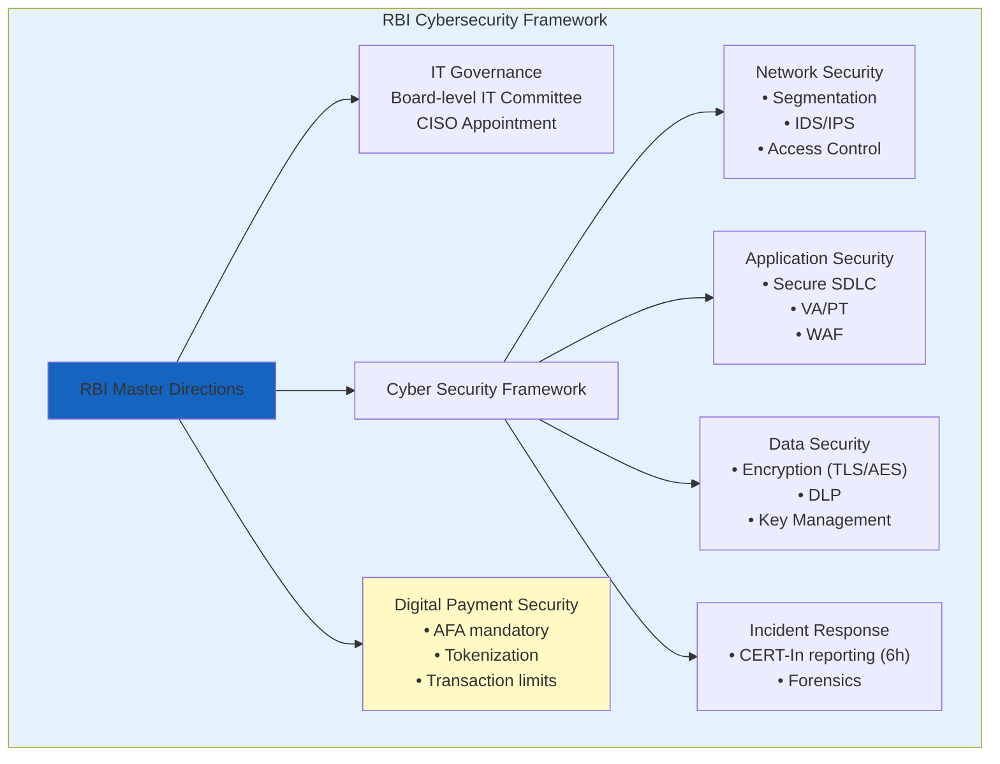
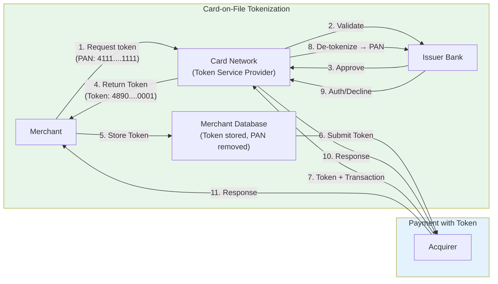

# Chapter 5: Banking & Payment Security

> **Exam Weightage:** 4–6 Qs in IBPS SO IT Officer Mains (Banking technology, digital payment security, RBI guidelines)
>
> **Key Topics:** RBI cybersecurity guidelines, PCI DSS, 3D Secure (3DS), EMV chip, Tokenization, Secure Element/TEE, Mobile banking OWASP, UPI security, Digital payment fraud, Biometric authentication in banking

---

## Learning Objectives

After completing this chapter you will be able to:

- Explain key RBI cybersecurity guidelines for scheduled commercial banks (BCSBI, cyber fraud reporting, outsourcing).
- Describe PCI DSS requirements for cardholder data protection (encryption, access control, logging, quarterly scans).
- Walk through the 3D Secure (3DS) authentication flow — merchant, issuer, ACS.
- Explain EMV chip technology (dynamic data, offline data authentication, transaction counter).
- Differentiate between card-on-file tokenization and device tokenization (token types, scope, PAN replacement).
- Describe Secure Element and Trusted Execution Environment (TEE) for mobile payment security.
- Identify OWASP Mobile Top 10 risks relevant to mobile banking (M1–M10).
- Explain UPI security architecture (NPCI, PSP, issuer/acquirers, unified UPI PIN).
- Describe digital payment fraud detection techniques (rules engine, ML models, device fingerprinting, velocity checks).
- Compare biometric authentication methods in banking (fingerprint, iris, face, voice, behavioral).
- Solve exam-style MCQs on RBI guidelines, PCI DSS requirements, 3DS, tokenization, UPI security.

---

## Theory

### 5.1 RBI Cybersecurity Guidelines

The Reserve Bank of India (RBI) has issued comprehensive cybersecurity frameworks for scheduled commercial banks. Key guidelines include:

#### 5.1.1 Master Direction on Information Technology Governance (2022)

- **Board-level IT Committee** — every bank must have a board-level IT strategy committee
- **CISO appointment** — banks must designate a Chief Information Security Officer (CISO) with direct reporting to CEO/MD
- **IS audit** — mandatory annual information system audit by empaneled auditors
- **BCP/DR** — Business Continuity Plan and Disaster Recovery with RTO and RPO defined; DR site must be geographically separate

#### 5.1.2 Cyber Security Framework (2016, updated periodically)

| Control Area | Requirements |
|-------------|--------------|
| **Network Security** | Segment critical assets; deploy IDS/IPS; restrict administrative access; implement NAT |
| **Access Control** | Role-based access; least privilege; two-factor authentication for remote access; periodic user access reviews |
| **Application Security** | Secure SDLC; vulnerability assessment every 6 months; penetration testing annually; WAF deployment |
| **Data Security** | Data Loss Prevention (DLP); encryption for data-in-transit (TLS 1.2+) and data-at-rest (AES-256); secure key management |
| **Incident Response** | CERT-In incident reporting within 6 hours; incident response team; forensic readiness |
| **Third-party Risk** | Due diligence for vendors; contractual security clauses; security assessment of outsourced services |
| **Log Management** | Centralized log collection (SIEM); log retention minimum 2 years; time synchronization (NTP) |

#### 5.1.3 RBI Cyber Fraud Reporting

- **Fraud reporting timeline:** Cyber fraud incidents must be reported to RBI within 2–3 hours of detection (depending on type)
- **Fraud classification:** Misappropriation, criminal breach of trust, fraudulent encashment, cheating, forgery, cyber-attacks
- **Recovery:** Under section 10A of Payment and Settlement Systems Act, 2007 — customer liability zero if fraud is detected and reported within 3 working days

#### 5.1.4 RBI Guidelines on Digital Payment Security (2021)

- **Additional Factor of Authentication (AFA):** Mandatory for all card-not-present (CNP) transactions. OTP via SMS/email is the common AFA.
- **Tokenization:** As per RBI circular (2022), card-on-file (CoF) tokenization is mandatory — merchants cannot store actual card PANs
- **Transaction limits:** Contactless card transactions — limit ₹5000 per transaction without PIN (increased during COVID, now standard)
- **UPI transaction limits:** ₹1 lakh per transaction (default); ₹2 lakh for capital markets; ₹5 lakh for medical/education; ₹15 lakh for IPO



### 5.2 PCI DSS (Payment Card Industry Data Security Standard)

PCI DSS is a set of security standards for organizations handling branded credit cards, established by the PCI Security Standards Council (founded by Visa, Mastercard, Amex, Discover, JCB).

#### 5.2.1 PCI DSS 4.0 — Six Goals and 12 Requirements

| Goal | Requirement | Description |
|------|-------------|-------------|
| **1. Build and Maintain a Secure Network** | 1. Install and maintain firewalls | Protect cardholder data environment |
| | 2. No vendor default passwords | Change default system passwords/parameters |
| **2. Protect Cardholder Data** | 3. Protect stored cardholder data | Encrypt PAN at rest; never store PIN/CVV |
| | 4. Encrypt transmission of cardholder data | TLS 1.2+ for all public networks |
| **3. Maintain Vulnerability Mgmt Program** | 5. Use and update anti-malware | Anti-virus on all systems (including POS) |
| | 6. Develop and maintain secure systems | Patch critical vulnerabilities within 30 days |
| **4. Implement Strong Access Control** | 7. Restrict access by need-to-know | Role-based access; least privilege |
| | 8. Unique IDs for each user | No shared accounts; 2FA for remote admin access |
| | 9. Restrict physical access | Secure cardholder data storage areas |
| **5. Monitor and Test Networks** | 10. Track and monitor all access | Audit logs; log retention ≥ 12 months |
| | 11. Test security systems regularly | Quarterly ASV scans; annual penetration testing; annual internal scan |
| **6. Maintain Information Security Policy** | 12. Maintain security policy | Policy for information security; risk assessments |

#### 5.2.2 PCI DSS — Cardholder Data Storage Prohibitions

| Data Element | May Store? | Notes |
|-------------|-----------|-------|
| Primary Account Number (PAN) | ✅ (Must be encrypted at rest) | Masked display (first 6, last 4) |
| Cardholder Name | ✅ | May be stored |
| Expiration Date | ✅ | May be stored |
| Service Code | ✅ | May be stored |
| Full Track Data (magnetic stripe) | ❌ | NEVER store (chip equivalent) |
| CVV/CVC/CVV2 | ❌ | NEVER store after authorization |
| PIN/PIN Block | ❌ | NEVER store |

**PCI DSS Validation Levels (Visa):**

| Level | Merchant Tier | Annual requirement |
|-------|--------------|-------------------|
| 1 | Over 6M transactions/year | On-site assessment by QSA + ASV scan |
| 2 | 1M–6M transactions/year | Self-assessment (SAQ) + ASV scan |
| 3 | 20K–1M e-commerce transactions | SAQ + ASV scan |
| 4 | Under 20K e-commerce transactions | SAQ + ASV scan |

### 5.3 3D Secure (3DS)

3D Secure (Three-Domain Secure) is an authentication protocol for card-not-present (CNP) transactions, adding an additional factor of authentication (AFA) to verify the cardholder's identity.

#### 5.3.1 3DS Domains

| Domain | Entity | Role |
|--------|--------|------|
| **Issuer Domain** | Card Issuing Bank | Authenticates cardholder (via ACS) |
| **Interoperability Domain** | Card networks (Visa, Mastercard) | Infrastructure routing (DS — Directory Server) |
| **Acquirer Domain** | Merchant + Acquiring Bank | Initiates authentication request |

#### 5.3.2 3DS 2.0 Flow (Risk-Based Authentication)

1. **Cardholder** initiates payment on merchant website/app
2. **Merchant** sends payment details to ACS (Access Control Server — issuer's system) via 3DS Server through Directory Server
3. **ACS** evaluates risk level based on:
   - Device fingerprinting (browser/device characteristics, IP geolocation)
   - Transaction history (previous purchases, velocity patterns)
   - Cardholder behavioral data (typical spending, time of day)
   - Merchant risk profile (industry, chargeback ratio)
4. **Decision:**
   - **Low risk:** ACS authenticates passively → frictionless flow (no challenge)
   - **High risk:** ACS presents challenge (OTP, biometric, or app-based auth)
5. **Result:** ACS sends `Authentication Value (AV)` + `ECI (Electronic Commerce Indicator)` to merchant via Directory Server
6. **Authorization:** Merchant submits transaction with AV/ECI to acquirer → acquirer → card network → issuer

**3DS 2.0 vs 3DS 1.0:**

| Feature | 3DS 1.0 | 3DS 2.0 |
|---------|---------|---------|
| Challenge Type | Static password (3D Secure password) | OTP, biometric, in-app approval |
| User Experience | Redirect to issuer page (popup) | In-iframe / in-app (less disruptive) |
| Mobile Support | Poor (no native app support) | Excellent (SDK for mobile apps) |
| Data Shared | Minimal (only card number + amount) | Rich data (device fingerprint, 150+ data points) |
| Authentication | Full challenge every transaction | Risk-based (frictionless for low-risk) |

### 5.4 EMV Chip Technology

EMV (Europay, Mastercard, Visa) is the global standard for chip-based payment cards (smart cards) that replaced magnetic stripe technology.

#### 5.4.1 EMV Transaction Flow (Chip Card at POS)

1. **Card insertion/tap** — Card communicates with POS terminal via contact/chip interface
2. **Application selection** — Card selects payment application (Visa, Mastercard, RuPay)
3. **Terminal authentication** — Terminal authenticates to card (offline data authentication — SDA/DDA/CDA)
4. **Cardholder verification** — Online PIN/Offline PIN/Signature/No CVM
5. **Transaction authorization** — Card generates dynamic cryptogram using Transaction Counter (ATC), which uniquely identifies each transaction
6. **Online/offline decision** — Terminal decides whether to authorize online (issuer) or offline (card's risk management)
7. **Issuer response** — Online: issuer approves/declines; Offline: card approves/declines

#### 5.4.2 EMV Security Features

| Feature | Description | Benefit |
|---------|-------------|---------|
| **Dynamic Data** | Each transaction generates a unique cryptogram (Application Cryptogram) using ATC | Dynamic data cannot be reused — prevents magstripe replay attacks |
| **ATC (Application Transaction Counter)** | Incrementing counter tracked by card and issuer | Prevents transaction cloning |
| **Offline Data Authentication (SDA/DDA/CDA)** | Card proves its authenticity to terminal without issuer connectivity | Prevents counterfeit cards |
| **Cardholder Verification Methods (CVM)** | Online PIN, Offline PIN, Signature, No CVM (contactless < limit) | Verifies cardholder at POS |
| **Card Authentication (Online)** | Dynamic cryptogram verified by issuer | Confirms genuine card |

#### 5.4.3 EMV vs Magnetic Stripe

| Feature | Magnetic Stripe | EMV Chip |
|---------|----------------|----------|
| Data | Static (same data each swipe) | Dynamic (unique cryptogram each transaction) |
| Cloning | Easy — skimmer reads and copies magstripe data | Extremely difficult — dynamic data makes cloning useless |
| Counterfeit risk | Very high | Very low |
| Offline capability | None | Full offline support (SDA/DDA) |
| Co-existence | Often has chip as well | Chip required; magstripe may also be present |
| Global adoption | Phasing out | Standard (everywhere except USA had slow adoption) |

### 5.5 Tokenization

Tokenization replaces sensitive payment data (PAN — Primary Account Number) with a non-sensitive surrogate value (token) that has no exploitable value.

#### 5.5.1 Card-on-File (CoF) Tokenization (RBI Mandate)

As per RBI circular (2021, effective 2022), card issuers must provide tokenization services for card-on-file transactions. Merchants cannot store actual card PANs.

**CoF Tokenization Flow:**
1. Customer initiates card saving on merchant app/website
2. Merchant requests token from card network (Visa/Mastercard/RuPay via their token service provider)
3. Card network contacts issuer for confirmation
4. Issuer validates and network generates a **card-on-file token** specific to:
   - Card PAN + Token Requestor (Merchant) + Device
5. Network returns token to merchant (token replaces PAN)
6. Merchant stores token → can initiate recurring/one-click payments
7. For subsequent transactions: merchant submits token (not PAN) to acquirer
8. Network maps token back to PAN for issuer processing

**Token characteristics:**
- **Scope:** Bound to combination of (PAN, Token Requestor, Device)
- **Format:** Same format as PAN (16-digit numeric) — merchants can use existing systems
- **Value:** Cannot be used at another merchant (even if token is breached)
- **De-tokenization:** Only the token service provider can map token back to PAN



#### 5.5.2 Device Tokenization (Mobile Wallets)

Used by Apple Pay, Google Pay, Samsung Pay for contactless payments at POS.

**Device Tokenization Flow:**
1. Customer adds card to mobile wallet
2. Wallet provider requests device token from card network token service
3. Token is provisioned to **Secure Element** (hardware chip on phone) or TEE
4. **Device token** is bound to: Card + Device (specific phone) + Wallet Provider
5. At POS: Terminal reads device token via NFC → token sent to acquirer → network de-tokenizes to PAN → issuer processes

**Token Types Comparison:**

| Feature | Card-on-File Token | Device Token |
|---------|-------------------|--------------|
| Issued for | Online merchants (card-on-file) | Mobile wallet (Apple Pay, Google Pay) |
| Storage | Merchant server database | Secure Element / TEE on device |
| Scope | (PAN + Merchant + Device) | (PAN + Device + Wallet Provider) |
| Usage | Recurring/one-click CNP payments | Contactless NFC POS payments |
| Format | PAN-format (16-digit) | Device Primary Account Number (DPAN) |
| Dynamic CVV? | No (static token) | Yes (dynamic cryptogram per transaction) |

### 5.6 Secure Element and TEE

#### 5.6.1 Secure Element (SE)

- **Definition:** Tamper-resistant hardware chip that securely stores and processes sensitive data (payment credentials, cryptographic keys)
- **Form Factors:**
  - **Embedded SE (eSE):** Soldered onto device motherboard (e.g., iPhone's SE chip)
  - **SIM-based SE:** Stored on UICC (SIM card) — used by some Android OEMs
  - **MicroSD SE:** Removable (legacy, rare)
- **Features:** Dedicated CPU + memory + crypto accelerator; physically isolated from main processor; certified against Common Criteria EAL5+ / FIPS 140-2 Level 3
- **Use Cases:** Mobile payments (Apple Pay, Google Pay), eSIM, digital identity

#### 5.6.2 Trusted Execution Environment (TEE)

- **Definition:** Secure area within the main processor that runs in parallel with the Rich OS (Android/iOS), isolated by hardware
- **Implementation:** ARM TrustZone (most common), Intel SGX
- **Features:** Provides isolated execution (secure world vs normal world); memory isolation; trusted applications (TA) running in TEE; hardware-based attestation
- **Limitations vs SE:** Slightly less secure than discrete SE chip (shares some hardware with main processor) but cheaper and more flexible
- **Use Cases:** Key attestation, DRM, fingerprint/face matching, UPI PIN entry

| Feature | Secure Element | TEE |
|---------|---------------|-----|
| Hardware isolation | Separate chip | Same CPU (isolated mode — secure world) |
| Security level | EAL5+ / FIPS 140-2 L3 | EAL2+ / FIPS 140-1 L1 |
| Storage | Secure on-chip memory | Secure memory (encrypted, isolated) |
| Flexibility | Limited (firmware + applets) | High (TAs can be updated) |
| Cost | Higher (dedicated hardware) | Lower (uses existing SoC) |
| Performance | Slower (separate CPU) | Fast (same CPU, higher clock) |

### 5.7 Mobile Banking Security — OWASP Mobile Top 10

| ID | Risk | Description | Banking Relevance |
|----|------|-------------|------------------|
| **M1** | Improper Platform Usage | Misuse of platform features (intents, custom URL schemes) | Deep linking attacks on banking apps |
| **M2** | Insecure Data Storage | Storing sensitive data in shared preferences, SQLite, logs | Financial data leakage via rooted device or backup |
| **M3** | Insecure Communication | No TLS, weak TLS, certificate validation disabled | MITM on mobile banking traffic |
| **M4** | Insecure Authentication | Weak auth, no biometric, session timeout too long | Account takeover via brute-force/session theft |
| **M5** | Insufficient Cryptography | Weak algorithms, hardcoded keys, predictable IVs | Data decryption by reverse engineering |
| **M6** | Insecure Authorization | IDOR vulnerabilities (accessing other users' data via API) | Viewing other customers' transactions |
| **M7** | Client Code Quality | Buffer overflows, memory leaks, format string bugs | App crash leading to DoS |
| **M8** | Code Tampering | Code modification, repackaging, runtime hooking (Frida) | Banking trojans modifying app behavior |
| **M9** | Reverse Engineering | APK decompilation, resource extraction, debugger attachment | Extracting API keys, business logic |
| **M10** | Extraneous Functionality | Test APIs, debug code, hidden backdoors left in production | Unintended privileged operations |

**Banking-specific mobile security measures:**
- **Root/Jailbreak detection** — prevent app running on compromised devices
- **SSL Pinning** — prevent MITM even with installed interception certificates
- **Runtime Application Self-Protection (RASP)** — detect hooking/tampering at runtime
- **App Attestation** — prove app integrity to backend (Android Play Integrity API, iOS DeviceCheck)
- **Session timeout** — auto-logout after 5–10 min idle
- **Transaction signing** — sensitive transactions require re-authentication

### 5.8 UPI Security Architecture

Unified Payments Interface (UPI) is an India-origin real-time payment system developed by NPCI (National Payments Corporation of India).

#### 5.8.1 UPI Participants

| Entity | Role | Examples |
|--------|------|----------|
| **NPCI** | Central operator — manages UPI infrastructure, settlement | NPCI |
| **PSP** | Payment Service Provider — provides UPI app to end users | Google Pay, PhonePe, Paytm, BHIM |
| **Issuer Bank** | Bank where sender's account is held | SBI, HDFC, ICICI |
| **Acquirer Bank** | Bank where recipient's account is held | SBI, HDFC, ICICI |
| **NPCI Interface** | Central switch routing UPI messages | NPCI UPI Switch |

#### 5.8.2 UPI Security Features

| Security Feature | Description |
|-----------------|-------------|
| **UPI PIN** | 4–6 digit PIN set during registration; required for every transaction; never stored on phone (only hash stored on NPCI server) |
| **UPI MPIN** | Login PIN for app access (different from transaction PIN) |
| **Device Binding** | UPI credential bound to device ID + IMEI; new device requires re-registration |
| **Approve/Reject** | Transaction flows via PSP app — user must enter UPI PIN to authorize |
| **Unique UPI ID** | VPA (Virtual Payment Address) — user@bank; no bank account number shared with payer |
| **Limits** | Default ₹1 lakh/transaction; daily cumulative ₹1 lakh (configurable) |
| **End-to-end encryption** | UPI PIN encrypted at device level using RSA/OAEP; message integrity via HMAC |
| **Two-factor authentication** | Mobile device (something you have) + UPI PIN (something you know) |

#### 5.8.3 UPI Transaction Flow

1. **Payer** enters VPA (e.g., `user@paytm`) of payee in PSP app
2. **PSP (Payer)** forwards request to NPCI with transaction details
3. **NPCI** resolves VPA to payee's bank account via issuer/acquirer mapping
4. **NPCI** sends payment request to PSP (Payee)
5. **PSP (Payee)** checks if payee exists → sends acknowledgment
6. **NPCI** sends collect request to payer's PSP
7. **Payer's PSP** presents transaction details to payer (amount, payee name)
8. **Payer** enters UPI PIN → PSP encrypts PIN and sends to NPCI
9. **NPCI** validates PIN (against HSM-stored PIN hash) → initiates debit from payer's account via issuer
10. **NPCI** sends credit to payee's account via acquirer
11. **Both parties** receive notification: success/failure

#### 5.8.4 UPI Fraud Types

| Fraud Type | Description | Prevention |
|------------|-------------|------------|
| **SIM Swap** | Attacker gets duplicate SIM → intercepts SMS OTP | Carrier alerts, biometric re-verification |
| **VPA Spoofing** | Fake VPA resembling legitimate (bank.sbi vs bank_sbi) | VPA display with full identity verification |
| **Collect Request Fraud** | Attacker sends collect request to unsuspecting user | User must verify payee name before approving |
| **Social Engineering** | Attacker calls posing as bank, tricks user into sending money | User education, never share OTP/PIN |
| **App Cloning** | Fake UPI app used to intercept credentials | App store verification, app signing verification |

```mermaid
sequenceDiagram
    participant P as Payer (PSP App)
    participant N as NPCI Switch
    participant PB as Payer's Bank (Issuer)
    participant RB as Receiver's Bank (Acquirer)
    
    P->>P: Enter UPI PIN<br/>(Encrypted on device)
    P->>N: UPI Transaction Request<br/>(VPA, Amount, encrypted PIN)
    N->>PB: Debit Request (validate PIN)
    PB->>PB: Validate PIN via HSM<br/>Check balance
    PB->>N: Debit Successful
    N->>RB: Credit Request
    RB->>RB: Credit to receiver account
    RB->>N: Credit Successful
    N->>P: Transaction Success<br/>(PN, UTR number)
    Note over P,RB: Total time: &lt; 5 seconds (real-time)
```

### 5.9 Digital Payment Fraud Detection

#### 5.9.1 Fraud Detection Techniques

| Technique | Description | Example |
|-----------|-------------|---------|
| **Rules Engine** | Predefined business rules flagging suspicious patterns | "If amount > ₹50,000 and device country != account country → HOLD" |
| **Velocity Checks** | Detect abnormal frequency of transactions | ">10 transactions from same device in 5 minutes → BLOCK" |
| **Geolocation analysis** | Impossible travel / location mismatch | "Transaction from Mumbai, then Delhi within 10 minutes → BLOCK" |
| **Device Fingerprinting** | Collect device characteristics (OS, browser, IP, screen resolution, installed fonts) to identify devices | "Device ID associated with fraud history → BLOCK" |
| **Behavioral Biometrics** | Analyze user interaction patterns (typing speed, swiping pressure, mouse movements) | "Unusual typing rhythm for this user → STEP-UP AUTH" |
| **Machine Learning Models** | Supervised models (Random Forest, XGBoost) trained on historical fraud data | 'Predict fraud probability > 0.85 → "BLOCK / REVIEW" |
| **Graph Analysis** | Analyze relationships between accounts, devices, IPs | "2 devices linked to 50 accounts → SYNDICATE ALERT" |
| **Sequence Analysis** | Detect patterns in transaction sequences | "Small test transaction → large transfer → ACCOUNT COMPROMISE" |

#### 5.9.2 Fraud Detection Architecture (Real-time)

```
Transaction                         Rules          Decision
   │                                Engine         Engine
   ▼                                  │              │
┌──────────┐    ┌──────────┐    ┌─────┴──────┐    ┌──┴────┐
│Frontend  │───▶│ Risk API │───▶│ Rule + ML  │───▶│Approve│
│(PSP App) │    │ Gateway  │    │ Evaluator  │    │Hold   │
└──────────┘    └──────────┘    └─────┬──────┘    │Block  │
                                      │              └──┬────┘
                               ┌──────┴──────┐          │
                               │ Real-time    │          │
                               │ Feature Store│◀─────────┘
                               │ (Redis)      │
                               └──────┬──────┘
                                      │
                               ┌──────┴──────┐
                               │ Historical   │
                               │ ML Model     │
                               │ (Batch)      │
                               └─────────────┘
```

### 5.10 Biometric Authentication in Banking

#### 5.10.1 Biometric Types Used in Banking

| Biometric | Type | Banking Use Case | FAR | FRR |
|-----------|------|------------------|-----|-----|
| **Fingerprint** | Physiological | POS auth, mobile banking login | 0.001% | 0.5% |
| **Iris** | Physiological | ATM (cash withdrawal without card) | 0.0001% | 1% |
| **Face** | Physiological | Mobile banking login, liveness check | 0.01% | 2% |
| **Voice** | Behavioral | Call center authentication | 1% | 3% |
| **Behavioral** (keystroke, gait) | Behavioral | Continuous authentication | 0.5% | 5% |

**Biometric Performance Metrics:**
- **FAR (False Acceptance Rate):** Imposter biometric wrongly accepted — lower is more secure
- **FRR (False Rejection Rate):** Legitimate user wrongly rejected — lower is more user-friendly
- **EER (Equal Error Rate):** Where FAR = FRR (lower EER = better biometric)

#### 5.10.2 Biometric Security Considerations

| Issue | Description | Mitigation |
|-------|-------------|------------|
| **Spoofing** | Presenting fake biometric (fake finger, photo, recording) | Liveness detection (temperature, pulse, blinking, 3D depth) |
| **Irrevocable** | Biometrics cannot be changed like passwords (can't reset fingerprint) | Cancelable biometrics (transform + store transformed version) |
| **Template storage** | Where is biometric template stored? | On-device (TEE/SE) for mobile; HSM for centralized; never raw image |
| **Privacy** | Biometric data is PII under DPDP Act 2023 (India) | Consent, purpose limitation, data minimization |
| **Accuracy** | Different demographics have different accuracy | Inclusive training data, continuous monitoring |

#### 5.11 Solved MCQs (Exam Style)

**Q1.** According to PCI DSS requirement 3, which of the following cardholder data elements is permitted to be stored?

A) Full magnetic stripe data  
B) CVV2  
C) PIN  
D) Primary Account Number (encrypted)

<details>
<summary>Show Answer</summary>

**Answer: D) Primary Account Number (encrypted)**

**Explanation:** PCI DSS permits storing the PAN if it is encrypted (or tokenized/hashed/truncated). However, sensitive authentication data (full track data, CVV2, PIN) is strictly prohibited from storage after authorization (even if encrypted). PAN must be masked when displayed (first 6, last 4 digits).
</details>

---

**Q2.** In 3D Secure 2.0, what is the main advantage over 3D Secure 1.0?

A) It uses static passwords instead of OTP  
B) It supports risk-based authentication for frictionless flow  
C) It requires the cardholder to install a separate app  
D) It does not require internet connectivity  

<details>
<summary>Show Answer</summary>

**Answer: B) It supports risk-based authentication for frictionless flow**

**Explanation:** 3DS 2.0's key advantage is risk-based authentication — the issuer can silently authenticate low-risk transactions (based on device fingerprinting, transaction history, behavioral data) without requiring any cardholder interaction (frictionless flow). 3DS 1.0 required the cardholder to enter a static password for every transaction, causing significant friction and cart abandonment.
</details>

---

**Q3.** According to RBI guidelines, card-on-file tokenization requires:

A) Merchants to store actual card PAN for backup  
B) Tokens to be bound to specific card + merchant + device combination  
C) Tokens to be reusable across different merchants  
D) Customers to generate tokens themselves  

<details>
<summary>Show Answer</summary>

**Answer: B) Tokens to be bound to specific card + merchant + device combination**

**Explanation:** As per RBI's tokenization circular (effective 2022), card-on-file tokens must be uniquely bound to the combination of (card PAN, token requestor/merchant, device). This ensures that even if a token is compromised, it cannot be used at any other merchant or from any other device. Merchants cannot store actual PANs. The token service provider (usually card network) handles de-tokenization.
</details>

---

**Q4.** In UPI architecture, the UPI PIN is:

A) Stored on the user's phone in plaintext  
B) Encrypted on the device and verified by NPCI against HSM-stored hash  
C) Sent in plaintext to the payee's bank  
D) Encrypted with the merchant's public key  

<details>
<summary>Show Answer</summary>

**Answer: B) Encrypted on the device and verified by NPCI against HSM-stored hash**

**Explanation:** UPI PIN is encrypted on the user's device using RSA/OAEP encryption (with NPCI's public key) and sent to NPCI, where it is verified against the PIN hash stored in an HSM (Hardware Security Module). The PIN is never stored on the phone and is never sent in plaintext. Each PIN attempt increments a retry counter; exceeding the limit blocks the UPI credential.
</details>

---

**Q5.** Which RBI guideline requires banks to report cyber fraud incidents within 2–3 hours of detection?

A) Master Direction on IT Governance  
B) Cyber Security Framework  
C) Cyber Fraud Reporting Circular  
D) Digital Payment Security Guidelines  

<details>
<summary>Show Answer</summary>

**Answer: C) Cyber Fraud Reporting Circular**

**Explanation:** RBI's Cyber Fraud Reporting circular mandates that banks report cyber fraud incidents to RBI within 2–3 hours of detection (depending on fraud type). This enables RBI to issue timely alerts to other banks and coordinate response. The other frameworks (IT Governance, Cyber Security Framework) provide broader operational guidelines but do not specify the reporting timeline.
</details>

---

**Q6.** EMV chip technology prevents which type of fraud that magnetic stripe cards are vulnerable to?

A) Phishing  
B) Card skimming + cloning (card-present fraud)  
C) Card-not-present fraud  
D) Social engineering  

<details>
<summary>Show Answer</summary>

**Answer: B) Card skimming + cloning (card-present fraud)**

**Explanation:** EMV chips generate a unique dynamic cryptogram for each transaction using the ATC (Application Transaction Counter). Even if an attacker intercepts transaction data, they cannot replay it because the cryptogram is valid only for that specific transaction (counter value). Magnetic stripe cards have static data — a skimmer reads the track data and can create a cloned card that works at any terminal. EMV has drastically reduced counterfeit card fraud at POS terminals.
</details>

---

**Q7.** Which OWASP Mobile Top 10 risk is specifically concerned with runtime hooking and code modification?

A) M1 — Improper Platform Usage  
B) M7 — Client Code Quality  
C) M8 — Code Tampering  
D) M9 — Reverse Engineering  

<details>
<summary>Show Answer</summary>

**Answer: C) M8 — Code Tampering**

**Explanation:** M8 (Code Tampering) covers binary patching, resource modification, method hooking (Frida, Xposed), and runtime injection. Banking apps are a common target — attackers modify the app to bypass SSL pinning, disable root detection, or intercept UPI PIN entry. M9 (Reverse Engineering) covers static analysis (decompilation) rather than runtime manipulation. Defenses include RASP (Runtime Application Self-Protection), integrity checks, and obfuscation.
</details>

---

**Q8.** The RBI mandate regarding Additional Factor of Authentication (AFA) applies to:

A) All card-present transactions  
B) All card-not-present transactions (domestic)  
C) Only international transactions  
D) Only ATM withdrawals  

<details>
<summary>Show Answer</summary>

**Answer: B) All card-not-present transactions (domestic)**

**Explanation:** RBI mandates AFA (Additional Factor of Authentication) for all domestic CNP (card-not-present) transactions — typically OTP sent to registered mobile number. This is a key difference from many other countries where CNP transactions often require only CVV. International CNP transactions follow local regulations (often no AFA requirement outside India). Card-present transactions (POS) use EMV chip + PIN.
</details>

---

**Q9.** In PCI DSS, what is an ASV scan?

A) Annual Security Vulnerability scan performed by Approved Scanning Vendor  
B) Automated System Validation by internal security team  
C) Application Security Verification by the card network  
D) Annual Service Vendor assessment by QSA  

<details>
<summary>Show Answer</summary>

**Answer: A) Annual Security Vulnerability scan performed by Approved Scanning Vendor**

**Explanation:** Requirement 11 of PCI DSS mandates quarterly external vulnerability scans by an Approved Scanning Vendor (ASV) — an organization approved by PCI SSC to perform external network vulnerability scanning. The ASV scans the merchant's internet-facing IP addresses against known vulnerabilities. Additionally, internal scans (quarterly) and penetration testing (annually) are required. "Annual" scans in the description refers to the annual passing requirement.
</details>

---

**Q10.** Which of the following is NOT a standard biometric modality used in banking?

A) Fingerprint recognition  
B) Iris recognition  
C) DNA sequencing  
D) Voice recognition  

<details>
<summary>Show Answer</summary>

**Answer: C) DNA sequencing**

**Explanation:** DNA sequencing is not used in banking authentication due to (1) processing time (minutes/hours — not real-time), (2) invasive collection requirement (blood/saliva), (3) ethical/privacy concerns, and (4) cost. Standard biometric modalities in banking are: fingerprint (POS, ATM, mobile), iris (ATM, cardless cash), face (mobile banking), voice (call center), and behavioral (continuous authentication).
</details>

---

## Summary

1. **RBI Cybersecurity Framework** mandates board-level IT governance, CISO appointment, secure SDLC, vulnerability assessments every 6 months, penetration tests annually, incident reporting to CERT-In within 6 hours, and AFA for all CNP transactions.

2. **PCI DSS** has 12 core requirements across 6 goals. PAN may be stored (encrypted), but CVV, PIN, and full track data are prohibited from storage. Merchants are validated at 4 levels based on transaction volume.

3. **3D Secure 2.0** provides risk-based authentication (frictionless for low-risk, challenge for high-risk). Uses device fingerprinting, behavioral data, and 150+ data points for assessment. 3DS 1.0 required static password for every transaction.

4. **EMV chip** generates dynamic cryptogram per transaction (ATC-based), preventing card cloning and counterfeit fraud. Magnetic stripe has static data — easily cloned.

5. **Tokenization** replaces PAN with merchant-and-device-bound token. RBI mandates CoF tokenization — merchants cannot store actual PAN. Device tokens (DPAN) are provisioned to SE/TEE for mobile wallet payments.

6. **Secure Element** is dedicated tamper-resistant hardware (EAL5+). **TEE** is hardware-isolated execution environment in main CPU (ARM TrustZone). SE is more secure; TEE is more flexible and cheaper.

7. **OWASP Mobile Top 10** for banking: critical risks include insecure data storage (M2), insecure communication (M3), insecure authentication (M4), code tampering (M8), and reverse engineering (M9). Defenses: root detection, SSL pinning, RASP.

8. **UPI Security**: UPI PIN encrypted on-device (RSA/OAEP), verified by NPCI against HSM-stored hash. Device binding + VPA (no bank account shared) + transaction limits. Two-factor: device + PIN.

9. **Fraud detection** combines rules engine, velocity checks, geolocation, device fingerprinting, behavioral biometrics, ML models, and graph analysis. Real-time scoring within milliseconds.

10. **Biometric authentication** in banking: fingerprint (lowest FAR 0.001%), iris (most accurate 0.0001%), face (convenient but higher FAR). Key concerns: spoofing (countered by liveness detection), irrevocability (mitigated by cancelable biometrics).

## Practical Takeaways

- **For exam:** Memorize PCI DSS requirements (especially 3—protect stored data, 4—encrypt transmission). Know RBI tokenization mandate details. Understand 3DS 2.0 frictionless flow. Compare SE vs TEE. Know UPI PIN security (encrypted on device, verified by NPCI HSM, never stored).
- **For banking applications:** Always implement root/jailbreak detection, SSL pinning, and RASP. Use device binding for financial credentials. Tokenize PANs — never store sensitive card data. Encrypt data in transit (TLS 1.2+) and at rest (AES-256).
- **For fraud prevention:** Deploy real-time scoring engine with rules + ML. Monitor velocity, geolocation, device fingerprint. Implement step-up authentication for high-risk transactions. Report fraud promptly (within RBI timelines).
- **For biometrics:** Use liveness detection to prevent spoofing. Store templates in TEE/SE (on-device). Never store raw biometric images. Support cancelable biometrics. Comply with DPDP Act 2023 (India).

---

## Chapter Quiz (5 MCQs)

**Q1.** Under PCI DSS, which requirement addresses encryption of cardholder data transmitted over open public networks?

A) Requirement 3 — Protect Stored Cardholder Data  
B) Requirement 4 — Encrypt Transmission of Cardholder Data  
C) Requirement 6 — Develop and Maintain Secure Systems  
D) Requirement 7 — Restrict Access to Cardholder Data  

<details>
<summary>Show Answer</summary>

**Answer: B) Requirement 4 — Encrypt Transmission of Cardholder Data**

**Explanation:** PCI DSS Requirement 4 mandates that cardholder data be encrypted when transmitted over open, public networks (internet, Wi-Fi, cellular, etc.). The standard requires TLS 1.2 or higher for web traffic and strong cryptography (AES) for any network transmission. Requirement 3 covers data at rest (storage encryption). Both requirements are part of Goal 2 — Protect Cardholder Data.
</details>

---

**Q2.** In UPI, the Virtual Payment Address (VPA) provides which security benefit?

A) Encrypts the transaction amount  
B) Hides the user's actual bank account number from the payer  
C) Replaces the need for UPI PIN  
D) Prevents SIM swap attacks  

<details>
<summary>Show Answer</summary>

**Answer: B) Hides the user's actual bank account number from the payer**

**Explanation:** VPA (e.g., user@bank) acts as an alias for the user's bank account. The payer sends money to the VPA without ever seeing the payee's actual bank account number or IFSC code. NPCI resolves the VPA to the underlying bank account internally. This prevents the payer from knowing the payee's account details, reducing the risk of misuse. The VPA itself does not encrypt amounts, replace PIN, or prevent SIM swap.
</details>

---

**Q3.** What is the primary purpose of the Application Transaction Counter (ATC) in EMV chip cards?

A) To store the cardholder's name  
B) To generate a unique cryptogram for each transaction  
C) To count the number of PIN retries  
D) To track the remaining balance on the card  

<details>
<summary>Show Answer</summary>

**Answer: B) To generate a unique cryptogram for each transaction**

**Explanation:** The ATC is an incrementing counter (starts at 0, increments each transaction) that is included as input to the EMV cryptogram generation algorithm. Since each transaction has a different ATC value, each transaction produces a unique application cryptogram. This prevents replay attacks — even if an attacker captures a transaction's data, they cannot reuse it because the ATC value would have changed. The issuer also tracks the ATC to detect cloned cards (if ATC resets unexpectedly).
</details>

---

**Q4.** According to OWASP Mobile Top 10, which risk category covers the extraction of API keys and business logic from a banking app?

A) M2 — Insecure Data Storage  
B) M4 — Insecure Authentication  
C) M8 — Code Tampering  
D) M9 — Reverse Engineering  

<details>
<summary>Show Answer</summary>

**Answer: D) M9 — Reverse Engineering**

**Explanation:** M9 (Reverse Engineering) covers decompilation (APK → smali → Java), resource extraction, debugger attachment, and static analysis. Attackers reverse-engineer banking apps to extract hardcoded API keys, encryption keys, business logic, and API endpoints. Defenses include code obfuscation (ProGuard, DexGuard), string encryption, integrity checks, and anti-debugging techniques. M8 (Code Tampering) is about modifying the app at runtime, not static analysis.
</details>

---

**Q5.** RBI's circular on card-on-file (CoF) tokenization mandates that:

A) Merchants may continue storing PAN if they have PCI DSS certification  
B) Merchants must store PAN for refund processing  
C) Card issuers must offer tokenization services; merchants cannot store actual PAN  
D) Tokenization applies only to international cards  

<details>
<summary>Show Answer</summary>

**Answer: C) Card issuers must offer tokenization services; merchants cannot store actual PAN**

**Explanation:** RBI's circular (2021, effective July 2022) mandates that card issuers provide tokenization services through card network token service providers. Merchants are prohibited from storing actual card PANs — they must use card-on-file tokens instead. Tokens are bound to (PAN + Merchant + Device) combination. This significantly reduces the impact of data breaches at merchants since tokens have no value outside the specific merchant-device context.
</details>

---

> **End of Information Security & Cryptography Course — 5 Chapters**
>
> **Next:** The index page lists all chapters. Ensure you practice MCQs and review the summary tables before exams.
