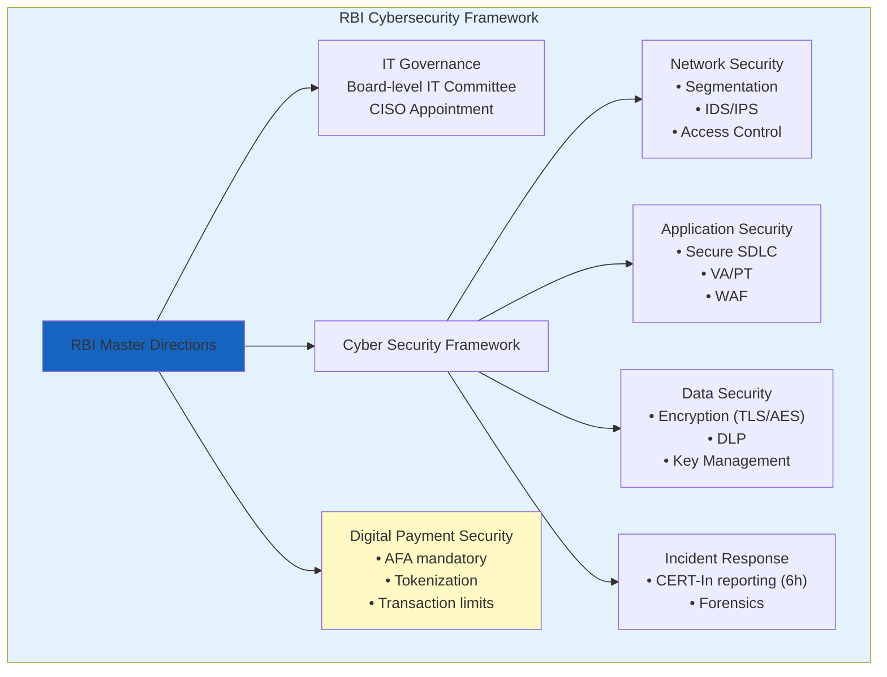
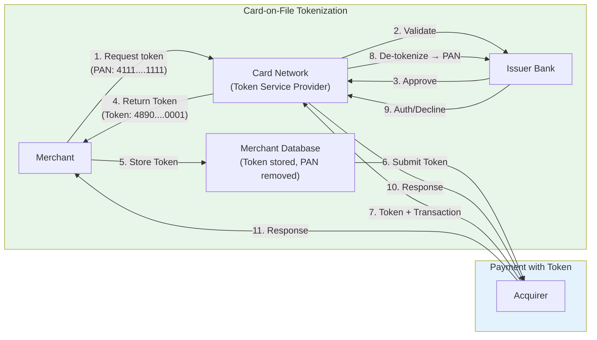

# Chapter 5: Banking & Payment Security

> **Exam Weightage:** 4–6 Qs in IBPS SO IT Officer Mains (Banking technology, digital payment security, RBI guidelines)
>
> **Key Topics:** RBI cybersecurity guidelines, PCI DSS, 3D Secure (3DS), EMV chip, Tokenization, Secure Element/TEE, Mobile banking OWASP, UPI security, Digital payment fraud, Biometric authentication in banking

---

## Learning Objectives

After completing this chapter you will be able to:
- Explain key RBI cybersecurity guidelines for scheduled commercial banks (BCSBI, cyber fraud reporting, outsourcing).
- Describe PCI DSS requirements for cardholder data protection (encryption, access control, logging, quarterly scans).
- Walk through the 3D Secure (3DS) authentication flow — merchant, issuer, ACS.
- Explain EMV chip technology (dynamic data, offline data authentication, transaction counter).
- Differentiate between card-on-file tokenization and device tokenization (token types, scope, PAN replacement).
- Describe Secure Element and Trusted Execution Environment (TEE) for mobile payment security.
- Identify OWASP Mobile Top 10 risks relevant to mobile banking (M1–M10).
- Explain UPI security architecture (NPCI, PSP, issuer/acquirers, unified UPI PIN).
- Describe digital payment fraud detection techniques (rules engine, ML models, device fingerprinting, velocity checks).
- Compare biometric authentication methods in banking (fingerprint, iris, face, voice, behavioral).
- Solve exam-style MCQs on RBI guidelines, PCI DSS requirements, 3DS, tokenization, UPI security.

---

## Theory

### 5.1 RBI Cybersecurity Guidelines

The Reserve Bank of India (RBI) has issued comprehensive cybersecurity frameworks for scheduled commercial banks. Key guidelines include:

#### 5.1.1 Master Direction on Information Technology Governance (2022)

- **Board-level IT Committee** — every bank must have a board-level IT strategy committee
- **CISO appointment** — banks must designate a Chief Information Security Officer (CISO) with direct reporting to CEO/MD
- **IS audit** — mandatory annual information system audit by empaneled auditors
- **BCP/DR** — Business Continuity Plan and Disaster Recovery with RTO and RPO defined; DR site must be geographically separate

#### 5.1.2 Cyber Security Framework (2016, updated periodically)

| Control Area | Requirements |
|-------------|--------------|
| **Network Security** | Segment critical assets; deploy IDS/IPS; restrict administrative access; implement NAT |
| **Access Control** | Role-based access; least privilege; two-factor authentication for remote access; periodic user access reviews |
| **Application Security** | Secure SDLC; vulnerability assessment every 6 months; penetration testing annually; WAF deployment |
| **Data Security** | Data Loss Prevention (DLP); encryption for data-in-transit (TLS 1.2+) and data-at-rest (AES-256); secure key management |
| **Incident Response** | CERT-In incident reporting within 6 hours; incident response team; forensic readiness |
| **Third-party Risk** | Due diligence for vendors; contractual security clauses; security assessment of outsourced services |
| **Log Management** | Centralized log collection (SIEM); log retention minimum 2 years; time synchronization (NTP) |

#### 5.1.3 RBI Cyber Fraud Reporting

- **Fraud reporting timeline:** Cyber fraud incidents must be reported to RBI within 2–3 hours of detection (depending on type)
- **Fraud classification:** Misappropriation, criminal breach of trust, fraudulent encashment, cheating, forgery, cyber-attacks
- **Recovery:** Under section 10A of Payment and Settlement Systems Act, 2007 — customer liability zero if fraud is detected and reported within 3 working days

#### 5.1.4 RBI Guidelines on Digital Payment Security (2021)

- **Additional Factor of Authentication (AFA):** Mandatory for all card-not-present (CNP) transactions. OTP via SMS/email is the common AFA.
- **Tokenization:** As per RBI circular (2022), card-on-file (CoF) tokenization is mandatory — merchants cannot store actual card PANs
- **Transaction limits:** Contactless card transactions — limit ₹5000 per transaction without PIN (increased during COVID, now standard)
- **UPI transaction limits:** ₹1 lakh per transaction (default); ₹2 lakh for capital markets; ₹5 lakh for medical/education; ₹15 lakh for IPO



### 5.2 PCI DSS (Payment Card Industry Data Security Standard)

PCI DSS is a set of security standards for organizations handling branded credit cards, established by the PCI Security Standards Council (founded by Visa, Mastercard, Amex, Discover, JCB).

#### 5.2.1 PCI DSS 4.0 — Six Goals and 12 Requirements

| Goal | Requirement | Description |
|------|-------------|-------------|
| **1. Build and Maintain a Secure Network** | 1. Install and maintain firewalls | Protect cardholder data environment |
| | 2. No vendor default passwords | Change default system passwords/parameters |
| **2. Protect Cardholder Data** | 3. Protect stored cardholder data | Encrypt PAN at rest; never store PIN/CVV |
| | 4. Encrypt transmission of cardholder data | TLS 1.2+ for all public networks |
| **3. Maintain Vulnerability Mgmt Program** | 5. Use and update anti-malware | Anti-virus on all systems (including POS) |
| | 6. Develop and maintain secure systems | Patch critical vulnerabilities within 30 days |
| **4. Implement Strong Access Control** | 7. Restrict access by need-to-know | Role-based access; least privilege |
| | 8. Unique IDs for each user | No shared accounts; 2FA for remote admin access |
| | 9. Restrict physical access | Secure cardholder data storage areas |
| **5. Monitor and Test Networks** | 10. Track and monitor all access | Audit logs; log retention ≥ 12 months |
| | 11. Test security systems regularly | Quarterly ASV scans; annual penetration testing; annual internal scan |
| **6. Maintain Information Security Policy** | 12. Maintain security policy | Policy for information security; risk assessments |

#### 5.2.2 PCI DSS — Cardholder Data Storage Prohibitions

| Data Element | May Store? | Notes |
|-------------|-----------|-------|
| Primary Account Number (PAN) | ✅ (Must be encrypted at rest) | Masked display (first 6, last 4) |
| Cardholder Name | ✅ | May be stored |
| Expiration Date | ✅ | May be stored |
| Service Code | ✅ | May be stored |
| Full Track Data (magnetic stripe) | ❌ | NEVER store (chip equivalent) |
| CVV/CVC/CVV2 | ❌ | NEVER store after authorization |
| PIN/PIN Block | ❌ | NEVER store |

**PCI DSS Validation Levels (Visa):**

| Level | Merchant Tier | Annual requirement |
|-------|--------------|-------------------|
| 1 | Over 6M transactions/year | On-site assessment by QSA + ASV scan |
| 2 | 1M–6M transactions/year | Self-assessment (SAQ) + ASV scan |
| 3 | 20K–1M e-commerce transactions | SAQ + ASV scan |
| 4 | Under 20K e-commerce transactions | SAQ + ASV scan |

### 5.3 3D Secure (3DS)

3D Secure (Three-Domain Secure) is an authentication protocol for card-not-present (CNP) transactions, adding an additional factor of authentication (AFA) to verify the cardholder's identity.

#### 5.3.1 3DS Domains

| Domain | Entity | Role |
|--------|--------|------|
| **Issuer Domain** | Card Issuing Bank | Authenticates cardholder (via ACS) |
| **Interoperability Domain** | Card networks (Visa, Mastercard) | Infrastructure routing (DS — Directory Server) |
| **Acquirer Domain** | Merchant + Acquiring Bank | Initiates authentication request |

#### 5.3.2 3DS 2.0 Flow (Risk-Based Authentication)

1. **Cardholder** initiates payment on merchant website/app
2. **Merchant** sends payment details to ACS (Access Control Server — issuer's system) via 3DS Server through Directory Server
3. **ACS** evaluates risk level based on:
   - Device fingerprinting (browser/device characteristics, IP geolocation)
   - Transaction history (previous purchases, velocity patterns)
   - Cardholder behavioral data (typical spending, time of day)
   - Merchant risk profile (industry, chargeback ratio)
4. **Decision:**
   - **Low risk:** ACS authenticates passively → frictionless flow (no challenge)
   - **High risk:** ACS presents challenge (OTP, biometric, or app-based auth)
5. **Result:** ACS sends `Authentication Value (AV)` + `ECI (Electronic Commerce Indicator)` to merchant via Directory Server
6. **Authorization:** Merchant submits transaction with AV/ECI to acquirer → acquirer → card network → issuer

**3DS 2.0 vs 3DS 1.0:**

| Feature | 3DS 1.0 | 3DS 2.0 |
|---------|---------|---------|
| Challenge Type | Static password (3D Secure password) | OTP, biometric, in-app approval |
| User Experience | Redirect to issuer page (popup) | In-iframe / in-app (less disruptive) |
| Mobile Support | Poor (no native app support) | Excellent (SDK for mobile apps) |
| Data Shared | Minimal (only card number + amount) | Rich data (device fingerprint, 150+ data points) |
| Authentication | Full challenge every transaction | Risk-based (frictionless for low-risk) |

### 5.4 EMV Chip Technology

EMV (Europay, Mastercard, Visa) is the global standard for chip-based payment cards (smart cards) that replaced magnetic stripe technology.

#### 5.4.1 EMV Transaction Flow (Chip Card at POS)

1. **Card insertion/tap** — Card communicates with POS terminal via contact/chip interface
2. **Application selection** — Card selects payment application (Visa, Mastercard, RuPay)
3. **Terminal authentication** — Terminal authenticates to card (offline data authentication — SDA/DDA/CDA)
4. **Cardholder verification** — Online PIN/Offline PIN/Signature/No CVM
5. **Transaction authorization** — Card generates dynamic cryptogram using Transaction Counter (ATC), which uniquely identifies each transaction
6. **Online/offline decision** — Terminal decides whether to authorize online (issuer) or offline (card's risk management)
7. **Issuer response** — Online: issuer approves/declines; Offline: card approves/declines

#### 5.4.2 EMV Security Features

| Feature | Description | Benefit |
|---------|-------------|---------|
| **Dynamic Data** | Each transaction generates a unique cryptogram (Application Cryptogram) using ATC | Dynamic data cannot be reused — prevents magstripe replay attacks |
| **ATC (Application Transaction Counter)** | Incrementing counter tracked by card and issuer | Prevents transaction cloning |
| **Offline Data Authentication (SDA/DDA/CDA)** | Card proves its authenticity to terminal without issuer connectivity | Prevents counterfeit cards |
| **Cardholder Verification Methods (CVM)** | Online PIN, Offline PIN, Signature, No CVM (contactless < limit) | Verifies cardholder at POS |
| **Card Authentication (Online)** | Dynamic cryptogram verified by issuer | Confirms genuine card |

#### 5.4.3 EMV vs Magnetic Stripe

| Feature | Magnetic Stripe | EMV Chip |
|---------|----------------|----------|
| Data | Static (same data each swipe) | Dynamic (unique cryptogram each transaction) |
| Cloning | Easy — skimmer reads and copies magstripe data | Extremely difficult — dynamic data makes cloning useless |
| Counterfeit risk | Very high | Very low |
| Offline capability | None | Full offline support (SDA/DDA) |
| Co-existence | Often has chip as well | Chip required; magstripe may also be present |
| Global adoption | Phasing out | Standard (everywhere except USA had slow adoption) |

### 5.5 Tokenization

Tokenization replaces sensitive payment data (PAN — Primary Account Number) with a non-sensitive surrogate value (token) that has no exploitable value.

#### 5.5.1 Card-on-File (CoF) Tokenization (RBI Mandate)

As per RBI circular (2021, effective 2022), card issuers must provide tokenization services for card-on-file transactions. Merchants cannot store actual card PANs.

**CoF Tokenization Flow:**
1. Customer initiates card saving on merchant app/website
2. Merchant requests token from card network (Visa/Mastercard/RuPay via their token service provider)
3. Card network contacts issuer for confirmation
4. Issuer validates and network generates a **card-on-file token** specific to:
   - Card PAN + Token Requestor (Merchant) + Device
5. Network returns token to merchant (token replaces PAN)
6. Merchant stores token → can initiate recurring/one-click payments
7. For subsequent transactions: merchant submits token (not PAN) to acquirer
8. Network maps token back to PAN for issuer processing

**Token characteristics:**
- **Scope:** Bound to combination of (PAN, Token Requestor, Device)
- **Format:** Same format as PAN (16-digit numeric) — merchants can use existing systems
- **Value:** Cannot be used at another merchant (even if token is breached)
- **De-tokenization:** Only the token service provider can map token back to PAN



#### 5.5.2 Device Tokenization (Mobile Wallets)

Used by Apple Pay, Google Pay, Samsung Pay for contactless payments at POS.

**Device Tokenization Flow:**
1. Customer adds card to mobile wallet
2. Wallet provider requests device token from card network token service
3. Token is provisioned to **Secure Element** (hardware chip on phone) or TEE
4. **Device token** is bound to: Card + Device (specific phone) + Wallet Provider
5. At POS: Terminal reads device token via NFC → token sent to acquirer → network de-tokenizes to PAN → issuer processes

**Token Types Comparison:**

| Feature | Card-on-File Token | Device Token |
|---------|-------------------|--------------|
| Issued for | Online merchants (card-on-file) | Mobile wallet (Apple Pay, Google Pay) |
| Storage | Merchant server database | Secure Element / TEE on device |
| Scope | (PAN + Merchant + Device) | (PAN + Device + Wallet Provider) |
| Usage | Recurring/one-click CNP payments | Contactless NFC POS payments |
| Format | PAN-format (16-digit) | Device Primary Account Number (DPAN) |
| Dynamic CVV? | No (static token) | Yes (dynamic cryptogram per transaction) |

### 5.6 Secure Element and TEE

#### 5.6.1 Secure Element (SE)

- **Definition:** Tamper-resistant hardware chip that securely stores and processes sensitive data (payment credentials, cryptographic keys)
- **Form Factors:**
  - **Embedded SE (eSE):** Soldered onto device motherboard (e.g., iPhone's SE chip)
  - **SIM-based SE:** Stored on UICC (SIM card) — used by some Android OEMs
  - **MicroSD SE:** Removable (legacy, rare)
- **Features:** Dedicated CPU + memory + crypto accelerator; physically isolated from main processor; certified against Common Criteria EAL5+ / FIPS 140-2 Level 3
- **Use Cases:** Mobile payments (Apple Pay, Google Pay), eSIM, digital identity

#### 5.6.2 Trusted Execution Environment (TEE)

- **Definition:** Secure area within the main processor that runs in parallel with the Rich OS (Android/iOS), isolated by hardware
- **Implementation:** ARM TrustZone (most common), Intel SGX
- **Features:** Provides isolated execution (secure world vs normal world); memory isolation; trusted applications (TA) running in TEE; hardware-based attestation
- **Limitations vs SE:** Slightly less secure than discrete SE chip (shares some hardware with main processor) but cheaper and more flexible
- **Use Cases:** Key attestation, DRM, fingerprint/face matching, UPI PIN entry

| Feature | Secure Element | TEE |
|---------|---------------|-----|
| Hardware isolation | Separate chip | Same CPU (isolated mode — secure world) |
| Security level | EAL5+ / FIPS 140-2 L3 | EAL2+ / FIPS 140-1 L1 |
| Storage | Secure on-chip memory | Secure memory (encrypted, isolated) |
| Flexibility | Limited (firmware + applets) | High (TAs can be updated) |
| Cost | Higher (dedicated hardware) | Lower (uses existing SoC) |
| Performance | Slower (separate CPU) | Fast (same CPU, higher clock) |

### 5.7 Mobile Banking Security — OWASP Mobile Top 10

| ID | Risk | Description | Banking Relevance |
|----|------|-------------|------------------|
| **M1** | Improper Platform Usage | Misuse of platform features (intents, custom URL schemes) | Deep linking attacks on banking apps |
| **M2** | Insecure Data Storage | Storing sensitive data in shared preferences, SQLite, logs | Financial data leakage via rooted device or backup |
| **M3** | Insecure Communication | No TLS, weak TLS, certificate validation disabled | MITM on mobile banking traffic |
| **M4** | Insecure Authentication | Weak auth, no biometric, session timeout too long | Account takeover via brute-force/session theft |
| **M5** | Insufficient Cryptography | Weak algorithms, hardcoded keys, predictable IVs | Data decryption by reverse engineering |
| **M6** | Insecure Authorization | IDOR vulnerabilities (accessing other users' data via API) | Viewing other customers' transactions |
| **M7** | Client Code Quality | Buffer overflows, memory leaks, format string bugs | App crash leading to DoS |
| **M8** | Code Tampering | Code modification, repackaging, runtime hooking (Frida) | Banking trojans modifying app behavior |
| **M9** | Reverse Engineering | APK decompilation, resource extraction, debugger attachment | Extracting API keys, business logic |
| **M10** | Extraneous Functionality | Test APIs, debug code, hidden backdoors left in production | Unintended privileged operations |

**Banking-specific mobile security measures:**
- **Root/Jailbreak detection** — prevent app running on compromised devices
- **SSL Pinning** — prevent MITM even with installed interception certificates
- **Runtime Application Self-Protection (RASP)** — detect hooking/tampering at runtime
- **App Attestation** — prove app integrity to backend (Android Play Integrity API, iOS DeviceCheck)
- **Session timeout** — auto-logout after 5–10 min idle
- **Transaction signing** — sensitive transactions require re-authentication

### 5.8 UPI Security Architecture

Unified Payments Interface (UPI) is an India-origin real-time payment system developed by NPCI (National Payments Corporation of India).

#### 5.8.1 UPI Participants

| Entity | Role | Examples |
|--------|------|----------|
| **NPCI** | Central operator — manages UPI infrastructure, settlement | NPCI |
| **PSP** | Payment Service Provider — provides UPI app to end users | Google Pay, PhonePe, Paytm, BHIM |
| **Issuer Bank** | Bank where sender's account is held | SBI, HDFC, ICICI |
| **Acquirer Bank** | Bank where recipient's account is held | SBI, HDFC, ICICI |
| **NPCI Interface** | Central switch routing UPI messages | NPCI UPI Switch |

#### 5.8.2 UPI Security Features

| Security Feature | Description |
|-----------------|-------------|
| **UPI PIN** | 4–6 digit PIN set during registration; required for every transaction; never stored on phone (only hash stored on NPCI server) |
| **UPI MPIN** | Login PIN for app access (different from transaction PIN) |
| **Device Binding** | UPI credential bound to device ID + IMEI; new device requires re-registration |
| **Approve/Reject** | Transaction flows via PSP app — user must enter UPI PIN to authorize |
| **Unique UPI ID** | VPA (Virtual Payment Address) — user@bank; no bank account number shared with payer |
| **Limits** | Default ₹1 lakh/transaction; daily cumulative ₹1 lakh (configurable) |
| **End-to-end encryption** | UPI PIN encrypted at device level using RSA/OAEP; message integrity via HMAC |
| **Two-factor authentication** | Mobile device (something you have) + UPI PIN (something you know) |

#### 5.8.3 UPI Transaction Flow

1. **Payer** enters VPA (e.g., `user@paytm`) of payee in PSP app
2. **PSP (Payer)** forwards request to NPCI with transaction details
3. **NPCI** resolves VPA to payee's bank account via issuer/acquirer mapping
4. **NPCI** sends payment request to PSP (Payee)
5. **PSP (Payee)** checks if payee exists → sends acknowledgment
6. **NPCI** sends collect request to payer's PSP
7. **Payer's PSP** presents transaction details to payer (amount, payee name)
8. **Payer** enters UPI PIN → PSP encrypts PIN and sends to NPCI
9. **NPCI** validates PIN (against HSM-stored PIN hash) → initiates debit from payer's account via issuer
10. **NPCI** sends credit to payee's account via acquirer
11. **Both parties** receive notification: success/failure

#### 5.8.4 UPI Fraud Types

| Fraud Type | Description | Prevention |
|------------|-------------|------------|
| **SIM Swap** | Attacker gets duplicate SIM → intercepts SMS OTP | Carrier alerts, biometric re-verification |
| **VPA Spoofing** | Fake VPA resembling legitimate (bank.sbi vs bank_sbi) | VPA display with full identity verification |
| **Collect Request Fraud** | Attacker sends collect request to unsuspecting user | User must verify payee name before approving |
| **Social Engineering** | Attacker calls posing as bank, tricks user into sending money | User education, never share OTP/PIN |
| **App Cloning** | Fake UPI app used to intercept credentials | App store verification, app signing verification |

```mermaid
sequenceDiagram
    participant P as Payer (PSP App)
    participant N as NPCI Switch
    participant PB as Payer's Bank (Issuer)
    participant RB as Receiver's Bank (Acquirer)
    
    P->>P: Enter UPI PIN<br/>(Encrypted on device)
    P->>N: UPI Transaction Request<br/>(VPA, Amount, encrypted PIN)
    N->>PB: Debit Request (validate PIN)
    PB->>PB: Validate PIN via HSM<br/>Check balance
    PB->>N: Debit Successful
    N->>RB: Credit Request
    RB->>RB: Credit to receiver account
    RB->>N: Credit Successful
    N->>P: Transaction Success<br/>(PN, UTR number)
    Note over P,RB: Total time: &lt; 5 seconds (real-time)
```

### 5.9 Digital Payment Fraud Detection

#### 5.9.1 Fraud Detection Techniques

| Technique | Description | Example |
|-----------|-------------|---------|
| **Rules Engine** | Predefined business rules flagging suspicious patterns | "If amount > ₹50,000 and device country != account country → HOLD" |
| **Velocity Checks** | Detect abnormal frequency of transactions | ">10 transactions from same device in 5 minutes → BLOCK" |
| **Geolocation analysis** | Impossible travel / location mismatch | "Transaction from Mumbai, then Delhi within 10 minutes → BLOCK" |
| **Device Fingerprinting** | Collect device characteristics (OS, browser, IP, screen resolution, installed fonts) to identify devices | "Device ID associated with fraud history → BLOCK" |
| **Behavioral Biometrics** | Analyze user interaction patterns (typing speed, swiping pressure, mouse movements) | "Unusual typing rhythm for this user → STEP-UP AUTH" |
| **Machine Learning Models** | Supervised models (Random Forest, XGBoost) trained on historical fraud data | 'Predict fraud probability > 0.85 → "BLOCK / REVIEW" |
| **Graph Analysis** | Analyze relationships between accounts, devices, IPs | "2 devices linked to 50 accounts → SYNDICATE ALERT" |
| **Sequence Analysis** | Detect patterns in transaction sequences | "Small test transaction → large transfer → ACCOUNT COMPROMISE" |

#### 5.9.2 Fraud Detection Architecture (Real-time)

```
Transaction                         Rules          Decision
   │                                Engine         Engine
   ▼                                  │              │
┌──────────┐    ┌──────────┐    ┌─────┴──────┐    ┌──┴────┐
│Frontend  │───▶│ Risk API │───▶│ Rule + ML  │───▶│Approve│
│(PSP App) │    │ Gateway  │    │ Evaluator  │    │Hold   │
└──────────┘    └──────────┘    └─────┬──────┘    │Block  │
                                      │              └──┬────┘
                               ┌──────┴──────┐          │
                               │ Real-time    │          │
                               │ Feature Store│◀─────────┘
                               │ (Redis)      │
                               └──────┬──────┘
                                      │
                               ┌──────┴──────┐
                               │ Historical   │
                               │ ML Model     │
                               │ (Batch)      │
                               └─────────────┘
```

### 5.10 Biometric Authentication in Banking

#### 5.10.1 Biometric Types Used in Banking

| Biometric | Type | Banking Use Case | FAR | FRR |
|-----------|------|------------------|-----|-----|
| **Fingerprint** | Physiological | POS auth, mobile banking login | 0.001% | 0.5% |
| **Iris** | Physiological | ATM (cash withdrawal without card) | 0.0001% | 1% |
| **Face** | Physiological | Mobile banking login, liveness check | 0.01% | 2% |
| **Voice** | Behavioral | Call center authentication | 1% | 3% |
| **Behavioral** (keystroke, gait) | Behavioral | Continuous authentication | 0.5% | 5% |

**Biometric Performance Metrics:**
- **FAR (False Acceptance Rate):** Imposter biometric wrongly accepted — lower is more secure
- **FRR (False Rejection Rate):** Legitimate user wrongly rejected — lower is more user-friendly
- **EER (Equal Error Rate):** Where FAR = FRR (lower EER = better biometric)

#### 5.10.2 Biometric Security Considerations

| Issue | Description | Mitigation |
|-------|-------------|------------|
| **Spoofing** | Presenting fake biometric (fake finger, photo, recording) | Liveness detection (temperature, pulse, blinking, 3D depth) |
| **Irrevocable** | Biometrics cannot be changed like passwords (can't reset fingerprint) | Cancelable biometrics (transform + store transformed version) |
| **Template storage** | Where is biometric template stored? | On-device (TEE/SE) for mobile; HSM for centralized; never raw image |
| **Privacy** | Biometric data is PII under DPDP Act 2023 (India) | Consent, purpose limitation, data minimization |
| **Accuracy** | Different demographics have different accuracy | Inclusive training data, continuous monitoring |

#### 5.11 Solved MCQs (Exam Style)

**Q1.** According to PCI DSS requirement 3, which of the following cardholder data elements is permitted to be stored?

A) Full magnetic stripe data  
B) CVV2  
C) PIN  
D) Primary Account Number (encrypted)

<details>
<summary>Show Answer</summary>

**Answer: D) Primary Account Number (encrypted)**

**Explanation:** PCI DSS permits storing the PAN if it is encrypted (or tokenized/hashed/truncated). However, sensitive authentication data (full track data, CVV2, PIN) is strictly prohibited from storage after authorization (even if encrypted). PAN must be masked when displayed (first 6, last 4 digits).
</details>

---

**Q2.** In 3D Secure 2.0, what is the main advantage over 3D Secure 1.0?

A) It uses static passwords instead of OTP  
B) It supports risk-based authentication for frictionless flow  
C) It requires the cardholder to install a separate app  
D) It does not require internet connectivity  

<details>
<summary>Show Answer</summary>

**Answer: B) It supports risk-based authentication for frictionless flow**

**Explanation:** 3DS 2.0's key advantage is risk-based authentication — the issuer can silently authenticate low-risk transactions (based on device fingerprinting, transaction history, behavioral data) without requiring any cardholder interaction (frictionless flow). 3DS 1.0 required the cardholder to enter a static password for every transaction, causing significant friction and cart abandonment.
</details>

---

**Q3.** According to RBI guidelines, card-on-file tokenization requires:

A) Merchants to store actual card PAN for backup  
B) Tokens to be bound to specific card + merchant + device combination  
C) Tokens to be reusable across different merchants  
D) Customers to generate tokens themselves  

<details>
<summary>Show Answer</summary>

**Answer: B) Tokens to be bound to specific card + merchant + device combination**

**Explanation:** As per RBI's tokenization circular (effective 2022), card-on-file tokens must be uniquely bound to the combination of (card PAN, token requestor/merchant, device). This ensures that even if a token is compromised, it cannot be used at any other merchant or from any other device. Merchants cannot store actual PANs. The token service provider (usually card network) handles de-tokenization.
</details>

---

**Q4.** In UPI architecture, the UPI PIN is:

A) Stored on the user's phone in plaintext  
B) Encrypted on the device and verified by NPCI against HSM-stored hash  
C) Sent in plaintext to the payee's bank  
D) Encrypted with the merchant's public key  

<details>
<summary>Show Answer</summary>

**Answer: B) Encrypted on the device and verified by NPCI against HSM-stored hash**

**Explanation:** UPI PIN is encrypted on the user's device using RSA/OAEP encryption (with NPCI's public key) and sent to NPCI, where it is verified against the PIN hash stored in an HSM (Hardware Security Module). The PIN is never stored on the phone and is never sent in plaintext. Each PIN attempt increments a retry counter; exceeding the limit blocks the UPI credential.
</details>

---

**Q5.** Which RBI guideline requires banks to report cyber fraud incidents within 2–3 hours of detection?

A) Master Direction on IT Governance  
B) Cyber Security Framework  
C) Cyber Fraud Reporting Circular  
D) Digital Payment Security Guidelines  

<details>
<summary>Show Answer</summary>

**Answer: C) Cyber Fraud Reporting Circular**

**Explanation:** RBI's Cyber Fraud Reporting circular mandates that banks report cyber fraud incidents to RBI within 2–3 hours of detection (depending on fraud type). This enables RBI to issue timely alerts to other banks and coordinate response. The other frameworks (IT Governance, Cyber Security Framework) provide broader operational guidelines but do not specify the reporting timeline.
</details>

---

**Q6.** EMV chip technology prevents which type of fraud that magnetic stripe cards are vulnerable to?

A) Phishing  
B) Card skimming + cloning (card-present fraud)  
C) Card-not-present fraud  
D) Social engineering  

<details>
<summary>Show Answer</summary>

**Answer: B) Card skimming + cloning (card-present fraud)**

**Explanation:** EMV chips generate a unique dynamic cryptogram for each transaction using the ATC (Application Transaction Counter). Even if an attacker intercepts transaction data, they cannot replay it because the cryptogram is valid only for that specific transaction (counter value). Magnetic stripe cards have static data — a skimmer reads the track data and can create a cloned card that works at any terminal. EMV has drastically reduced counterfeit card fraud at POS terminals.
</details>

---

**Q7.** Which OWASP Mobile Top 10 risk is specifically concerned with runtime hooking and code modification?

A) M1 — Improper Platform Usage  
B) M7 — Client Code Quality  
C) M8 — Code Tampering  
D) M9 — Reverse Engineering  

<details>
<summary>Show Answer</summary>

**Answer: C) M8 — Code Tampering**

**Explanation:** M8 (Code Tampering) covers binary patching, resource modification, method hooking (Frida, Xposed), and runtime injection. Banking apps are a common target — attackers modify the app to bypass SSL pinning, disable root detection, or intercept UPI PIN entry. M9 (Reverse Engineering) covers static analysis (decompilation) rather than runtime manipulation. Defenses include RASP (Runtime Application Self-Protection), integrity checks, and obfuscation.
</details>

---

**Q8.** The RBI mandate regarding Additional Factor of Authentication (AFA) applies to:

A) All card-present transactions  
B) All card-not-present transactions (domestic)  
C) Only international transactions  
D) Only ATM withdrawals  

<details>
<summary>Show Answer</summary>

**Answer: B) All card-not-present transactions (domestic)**

**Explanation:** RBI mandates AFA (Additional Factor of Authentication) for all domestic CNP (card-not-present) transactions — typically OTP sent to registered mobile number. This is a key difference from many other countries where CNP transactions often require only CVV. International CNP transactions follow local regulations (often no AFA requirement outside India). Card-present transactions (POS) use EMV chip + PIN.
</details>

---

**Q9.** In PCI DSS, what is an ASV scan?

A) Annual Security Vulnerability scan performed by Approved Scanning Vendor  
B) Automated System Validation by internal security team  
C) Application Security Verification by the card network  
D) Annual Service Vendor assessment by QSA  

<details>
<summary>Show Answer</summary>

**Answer: A) Annual Security Vulnerability scan performed by Approved Scanning Vendor**

**Explanation:** Requirement 11 of PCI DSS mandates quarterly external vulnerability scans by an Approved Scanning Vendor (ASV) — an organization approved by PCI SSC to perform external network vulnerability scanning. The ASV scans the merchant's internet-facing IP addresses against known vulnerabilities. Additionally, internal scans (quarterly) and penetration testing (annually) are required. "Annual" scans in the description refers to the annual passing requirement.
</details>

---

**Q10.** Which of the following is NOT a standard biometric modality used in banking?

A) Fingerprint recognition  
B) Iris recognition  
C) DNA sequencing  
D) Voice recognition  

<details>
<summary>Show Answer</summary>

**Answer: C) DNA sequencing**

**Explanation:** DNA sequencing is not used in banking authentication due to (1) processing time (minutes/hours — not real-time), (2) invasive collection requirement (blood/saliva), (3) ethical/privacy concerns, and (4) cost. Standard biometric modalities in banking are: fingerprint (POS, ATM, mobile), iris (ATM, cardless cash), face (mobile banking), voice (call center), and behavioral (continuous authentication).
</details>

---

## 📝 Solved Examples (20 MCQs)

**Q1.** According to PCI DSS Requirement 10, how long must audit logs be retained?

A) At least 3 months  
B) At least 6 months  
C) At least 12 months  
D) At least 24 months

<details>
<summary>Show Answer</summary>

**Answer: C) At least 12 months**

**Explanation:** PCI DSS Requirement 10 mandates: "Retain audit trail history for at least one year (12 months), with at least the most recent three months immediately available for analysis." The three-month immediate availability ensures incident responders can investigate recent activity without restoring from archives. Logs must include: user ID, event type, date/time, success/failure, origination, and identity of affected data.

Other PCI retention notes:
- Requirement 3: PAN must be rendered unreadable anywhere it's stored (truncation, hash, or encryption)
- Requirement 9: Physical access logs retained for at least 90 days
- Requirement 12: Information security policy must be reviewed at least annually
</details>

---

**Q2.** In 3D Secure 2.0, what data is collected for device fingerprinting to enable frictionless authentication?

A) Only the card number and expiry date  
B) Over 150 data points including device characteristics, IP geolocation, and behavioral patterns  
C) The cardholder's password  
D) The merchant's SSL certificate

<details>
<summary>Show Answer</summary>

**Answer: B) Over 150 data points**

**Explanation:** 3DS 2.0 collects rich contextual data for risk assessment:
- **Device data:** Browser type/version, OS, screen resolution, language, timezone, installed fonts, plugins
- **Network data:** IP address, geolocation, carrier, connection type
- **Behavioral data:** Typing speed, mouse movements (if collected by app), transaction history patterns
- **Cardholder data:** Account age, previous purchases, shipping address history
- **Merchant data:** Merchant category, transaction amount, product type

This enables the issuer to authenticate low-risk transactions silently (frictionless), only challenging high-risk transactions. This dramatically reduces cart abandonment compared to 3DS 1.0's static password per transaction.
</details>

---

**Q3.** Which RBI guideline mandate requires card issuers to provide tokenization services and prohibits merchants from storing actual card PANs?

A) Cyber Security Framework (2016)  
B) Digital Payment Security Guidelines (2021)  
C) Master Direction on IT Governance (2022)  
D) Payment and Settlement Systems Act (2007)

<details>
<summary>Show Answer</summary>

**Answer: B) Digital Payment Security Guidelines (2021)**

**Explanation:** RBI's circular on "Restriction on Storage of Actual Card Data" (March 2021, effective July 2022) mandates:
- Card issuers must provide card-on-file (CoF) tokenization services through card network token service providers
- Merchants cannot store actual card PANs, CVV, or expiry dates
- Tokens must be bound to (PAN + Token Requestor + Device) combination
- Card networks must provide de-tokenization services for transaction processing

This significantly reduces the impact of merchant data breaches — stolen tokens are worthless outside the specific merchant-device context. Non-compliance can result in penalties and suspension of card processing privileges.
</details>

---

**Q4.** In EMV chip transactions, the Application Transaction Counter (ATC) serves what purpose?

A) Counts the number of PIN retries  
B) Ensures each transaction generates a unique cryptogram  
C) Tracks the remaining balance  
D) Counts the number of cards issued

<details>
<summary>Show Answer</summary>

**Answer: B) Ensures each transaction generates a unique cryptogram**

**Explanation:** The ATC is an incrementing counter (starts at 0) maintained by the EMV chip. For each transaction:
1. ATC is included as input to the Application Cryptogram (AC) generation
2. Since ATC increments, each transaction produces a unique AC
3. The issuer also tracks the expected ATC value
4. If a cloned card attempts to reuse an old ATC value, the issuer detects the mismatch and declines

**Security benefits:**
- **Prevents replay attacks:** A captured transaction's AC cannot be reused
- **Detects card cloning:** If ATC resets (suggesting a cloned card with counter reset), issuer can block
- **Offline tracking:** Card can track number of offline transactions before requiring online authorization

This is the key security difference from magnetic stripe (which uses static data and is trivially cloned).
</details>

---

**Q5.** What is the maximum UPI transaction limit for capital market transactions?

A) ₹1 lakh  
B) ₹2 lakh  
C) ₹5 lakh  
D) ₹15 lakh

<details>
<summary>Show Answer</summary>

**Answer: B) ₹2 lakh**

**Explanation:** As per RBI's UPI transaction limits (as of 2025):
| Category | Limit |
|----------|-------|
| Default UPI | ₹1 lakh |
| Capital markets (IPO, stock) | ₹2 lakh |
| Medical/education | ₹5 lakh |
| IPO applications | ₹5 lakh |
| Tax payments | ₹5 lakh |
| UPI for internet banking (certain transactions) | ₹15 lakh |

The standard ₹1 lakh per transaction limit can be increased by the user's PSP/bank based on risk profile and transaction history. These limits help mitigate fraud while enabling legitimate larger payments.
</details>

---

**Q6.** In PCI DSS 4.0, which requirement addresses encryption of cardholder data at rest?

A) Requirement 2 — No vendor default passwords  
B) Requirement 3 — Protect stored cardholder data  
C) Requirement 4 — Encrypt transmission of cardholder data  
D) Requirement 7 — Restrict access by need-to-know

<details>
<summary>Show Answer</summary>

**Answer: B) Requirement 3 — Protect stored cardholder data**

**Explanation:** PCI DSS Requirement 3 mandates:
- PAN must be rendered unreadable anywhere it's stored (one-way hash, truncation, index token, or strong cryptography)
- Sensitive authentication data (CVV, PIN, full track data) must NEVER be stored after authorization
- PAN must be masked when displayed (first 6, last 4 digits maximum)
- Storage retention policies must be documented and implemented
- Cryptographic keys used for encryption must be securely managed (Requirement 3.6)

PCI DSS Requirement 4 covers encryption in transit (TLS 1.2+). Requirement 7 covers access control. Encryption at rest is typically AES-256 with FIPS 140-2 validated modules.
</details>

---

**Q7.** What is the primary security advantage of a Secure Element (SE) over a Trusted Execution Environment (TEE)?

A) Higher processing speed  
B) Dedicated tamper-resistant hardware chip (EAL5+)  
C) Lower cost  
D) Easier software updates

<details>
<summary>Show Answer</summary>

**Answer: B) Dedicated tamper-resistant hardware chip (EAL5+)**

**Explanation:** Secure Element is a separate hardware chip with:
- **Dedicated CPU, memory, and crypto accelerator** — completely isolated from main processor
- **Common Criteria EAL5+** certification — highest for consumer devices
- **Tamper resistance:** Glue logic, shield layers, environmental sensors detect physical attacks
- **Secure storage:** Keys never leave the SE

TEE (ARM TrustZone) runs on the same CPU (secure world vs normal world) — lower isolation level (EAL2+). TEE is cheaper and more flexible but less secure against physical attacks. Payment credentials are ideally stored in SE (Apple Pay uses the device's Secure Enclave).
</details>

---

**Q8.** What is the maximum contactless transaction limit without PIN in India (as per RBI)?

A) ₹2,000  
B) ₹5,000  
C) ₹10,000  
D) No limit

<details>
<summary>Show Answer</summary>

**Answer: B) ₹5,000**

**Explanation:** RBI increased the contactless (tap-and-pay) limit to ₹5,000 per transaction without requiring PIN during COVID, and it has remained the standard. Below ₹5,000: tap card → terminal beeps → transaction complete (no PIN). Above ₹5,000: cardholder must enter PIN regardless of contactless capability.

The limit balances convenience (quick small payments) with security (PIN required for larger amounts). Note that this is a per-transaction limit — there's no daily cumulative limit on contactless payments. Merchants can set lower limits based on their risk appetite.
</details>

---

**Q9.** In UPI architecture, the UPI PIN entered by the user is encrypted on the device using which key?

A) The PSP's public key  
B) NPCI's public key (RSA/OAEP)  
C) The issuer bank's public key  
D) The merchant's public key

<details>
<summary>Show Answer</summary>

**Answer: B) NPCI's public key (RSA/OAEP)**

**Explanation:** UPI PIN encryption flow:
1. User enters PIN in PSP app
2. PIN is encrypted on-device using **NPCI's public key** with RSA-OAEP (Optimal Asymmetric Encryption Padding)
3. Encrypted PIN sent to NPCI (not to PSP)
4. NPCI decrypts using HSM (Hardware Security Module) — PIN never in plaintext outside NPCI
5. NPCI validates PIN against stored hash (PIN hash stored in HSM)

**Key security properties:**
- PIN never visible to PSP (even though PSP collects it)
- PIN encrypted before leaving device
- PIN never stored on device
- Multiple incorrect PIN attempts block the credential
- PIN is device-bound — changing device requires re-registration

This is different from card PIN (which is verified offline by the chip or encrypted with the issuer's key).
</details>

---

**Q10.** Which OWASP Mobile Top 10 risk is addressed by implementing SSL Pinning in a mobile banking app?

A) M2 — Insecure Data Storage  
B) M3 — Insecure Communication  
C) M4 — Insecure Authentication  
D) M5 — Insufficient Cryptography

<details>
<summary>Show Answer</summary>

**Answer: B) M3 — Insecure Communication**

**Explanation:** M3 (Insecure Communication) covers:
- No TLS or weak TLS
- Improper certificate validation (accepting any certificate)
- **No SSL pinning (certificate/public key pinning)**
- Cleartext HTTP traffic

SSL Pinning hardcodes the server's certificate or public key in the app. Even if an attacker installs a CA certificate on the device (MITM proxy), the app rejects the proxy's certificate because it doesn't match the pinned certificate. This prevents:
- Corporate proxy interception of banking traffic
- Malicious Wi-Fi MITM attacks
- Compromised CA issuing fake certificates for the banking domain

SSL Pinning is a critical defense for mobile banking apps that must be used alongside proper TLS configuration.
</details>

---

**Q11.** In 3D Secure 2.0, what is the "frictionless flow"?

A) The cardholder receives an OTP via SMS  
B) The issuer authenticates the transaction silently without cardholder interaction  
C) The merchant authenticates the cardholder directly  
D) The cardholder enters a static password

<details>
<summary>Show Answer</summary>

**Answer: B) The issuer authenticates the transaction silently without cardholder interaction**

**Explanation:** 3DS 2.0 frictionless flow:
1. Merchant sends 150+ data points to ACS (Access Control Server)
2. ACS evaluates risk using ML models + rules
3. For low-risk transactions: ACS sends an `Authentication Value (AV)` without any challenge
4. Merchant receives `eci=05` (frictionless) + AV
5. Transaction proceeds without cardholder interruption

Frictionless rates of 80-95% are achievable for low-risk merchants (subscription services, trusted merchants). This dramatically improves conversion rates compared to 3DS 1.0 (which challenged every transaction).

High-risk transactions trigger the "challenge flow" (OTP, biometric, in-app approval). The decision is made per-transaction based on real-time risk scoring.
</details>

---

**Q12.** What is the storage efficiency of RAID 6 with 8 disks?

A) 50%  
B) 66.7%  
C) 75%  
D) 87.5%

<details>
<summary>Show Answer</summary>

**Answer: C) 75%**

**Formula:** RAID 6 efficiency = (N − 2) / N where N = number of disks

**Calculation:**
- Efficiency = (8 − 2) / 8 = 6/8 = 75%
- Usable capacity = 75% of total raw capacity
- Two disks worth of capacity used for dual parity
- Tolerates up to 2 simultaneous disk failures

**Comparison:**
| RAID | N=8 Efficiency | Tolerates |
|------|---------------|-----------|
| RAID 0 | 100% | 0 failures |
| RAID 1 | 50% | 1 failure (per pair) |
| RAID 5 | 87.5% (7/8) | 1 failure |
| RAID 6 | 75% (6/8) | 2 failures |
| RAID 10 | 50% | 1-4 failures (per pair) |
</details>

---

**Q13.** In a behavioral biometrics system for fraud detection, which of the following is analyzed?

A) Only the fingerprint  
B) Typing rhythm, mouse movement patterns, and device handling characteristics  
C) The user's facial features  
D) The user's iris pattern

<details>
<summary>Show Answer</summary>

**Answer: B) Typing rhythm, mouse movement patterns, and device handling characteristics**

**Explanation:** Behavioral biometrics analyzes how a user interacts with the device:
- **Keystroke dynamics:** Key press duration (dwell time), time between keys (flight time), typing speed, pressure
- **Mouse dynamics:** Movement speed, acceleration, click patterns, scroll behavior
- **Touchscreen dynamics:** Swipe velocity, curvature, pressure, finger size/angle
- **Device handling:** Orientation, grip patterns, ambient sensor data

Unlike physiological biometrics (fingerprint, face), behavioral biometrics:
- Works continuously (not just at login)
- Cannot be easily copied/spoofed (it's dynamic)
- Creates a "behavioral signature" unique to each user
- Detects account takeover in real-time (attacker behaves differently)
</details>

---

**Q14.** Under PCI DSS, what is the maximum time allowed to patch critical vulnerabilities?

A) Immediately  
B) Within 7 days  
C) Within 30 days  
D) Within 90 days

<details>
<summary>Show Answer</summary>

**Answer: C) Within 30 days**

**Explanation:** PCI DSS Requirement 6.2 (PCI 4.0): "Critical security patches must be applied within 30 days of release." Less critical patches follow standard change management processes. The 30-day timeline applies to publicly available critical vulnerabilities that affect the cardholder data environment (CDE).

**Other PCI patch requirements:**
- Security patches must be evaluated for criticality within 30 days
- All system components must have the most recent appropriate security patches
- Anti-malware must be kept current (regular updates)
- Custom code must be reviewed for vulnerabilities (manual/automated) before release

The 30-day critical patch window balances security with stability — some patches need testing before production deployment.
</details>

---

**Q15.** What is the purpose of a "liveness check" in biometric authentication for banking?

A) To verify the user is alive by checking pulse  
B) To prevent spoofing attacks using photos, videos, or recordings  
C) To measure the user's blood pressure  
D) To ensure the user is awake

<details>
<summary>Show Answer</summary>

**Answer: B) To prevent spoofing attacks using photos, videos, or recordings**

**Explanation:** Liveness detection ensures the biometric sample comes from a live person, not a spoof:
- **Active liveness:** User performs specific actions (blink, turn head, smile, read numbers)
- **Passive liveness:** Analyzes natural properties without user action (texture analysis, perspiration detection, 3D depth)
- **Multi-spectral:** Uses different light wavelengths to detect skin properties

**Spoofing attacks prevented:**
- **Photo attack:** Presenting a printed photo (passive liveness detects lack of 3D depth)
- **Video replay attack:** Playing a video recording (active liveness requires unpredicted actions)
- **Deepfake/3D mask:** High-quality silicone masks (multi-spectral, texture analysis)
- **Voice recording:** Playback of recorded voice (challenge-response with random phrases)

Liveness detection is essential for remote banking authentication (account opening, high-value transactions).
</details>

---

**Q16.** In the context of digital payment fraud detection, what is "velocity checking"?

A) Measuring the speed of data transfer  
B) Detecting abnormal frequency of transactions from the same entity  
C) Calculating the speed of network response  
D) Checking the velocity of card swiping

<details>
<summary>Show Answer</summary>

**Answer: B) Detecting abnormal frequency of transactions from the same entity**

**Explanation:** Velocity checks monitor transaction rates for patterns indicative of fraud:
- **IP velocity:** >10 transactions from same IP in 5 minutes → possible automated attack
- **Card velocity:** Same card used at 50 different merchants in 1 hour → card testing
- **Device velocity:** Same device ID with 100 different cards → synthetic identity fraud
- **Account velocity:** 20 failed login attempts from different IPs → credential stuffing
- **Amount velocity:** Multiple transactions just below reporting threshold → structuring (smurfing)

Velocity rules are typically configurable and tuned per merchant/industry. They're a key component of real-time fraud scoring engines alongside ML models and rules.
</details>

---

**Q17.** What is the RBI's requirement for reporting cyber fraud incidents to RBI?

A) Within 24 hours  
B) Within 2-3 hours of detection  
C) Within 7 days  
D) Within 1 hour

<details>
<summary>Show Answer</summary>

**Answer: B) Within 2-3 hours of detection**

**Explanation:** RBI's Cyber Fraud Reporting circular mandates:
- Banks must report cyber fraud incidents to RBI within **2-3 hours** of detection
- Reports filed through the **RBI's CIMS (Central Information Management System)** portal
- Includes: type of fraud, modus operandi, amount involved, systems affected, customer impact
- Followed by detailed root cause analysis report within 15 days

**Other RBI timelines:**
- CERT-In incident reporting: Within 6 hours of detection/notification
- Customer liability zero: If detected and reported within 3 working days (under section 10A of PSS Act)
- Vulnerability assessment: Every 6 months
- Penetration testing: Annually

Rapid reporting enables RBI to issue timely alerts to all banks and coordinate a sector-wide response.
</details>

---

**Q18.** In EMV chip technology, what is the difference between Static Data Authentication (SDA) and Dynamic Data Authentication (DDA)?

A) SDA uses symmetric crypto; DDA uses asymmetric crypto  
B) SDA provides static certificate verification; DDA proves the chip is genuine with a challenge-response protocol  
C) SDA is faster; DDA is more secure  
D) SDA requires online connection; DDA works offline

<details>
<summary>Show Answer</summary>

**Answer: B) SDA provides static certificate verification; DDA proves the chip is genuine with a challenge-response protocol**

**Explanation:** 
- **SDA (Static Data Authentication):** Terminal reads a static signed certificate from the chip. Verifies against CA public key. **Vulnerability:** Cloning possible if the signed data is copied to a different card (no proof it's the same chip).
- **DDA (Dynamic Data Authentication):** Terminal sends a random challenge to the chip. Chip signs the challenge with its unique private key. Terminal verifies using the chip's public key (from the certificate). **Proves the chip possesses the private key** — cloning requires extracting the private key (infeasible if stored in SE).

- **CDA (Combined DDA):** Combines DDA with application cryptogram generation in a single operation (fastest).

Modern EMV chips use DDA or CDA. SDA-only chips (common in early chip cards) reduced but didn't eliminate counterfeit fraud. DDA/ CDA virtually eliminate it.
</details>

---

**Q19.** In a UPI collect request attack, what is the social engineering technique used by attackers?

A) Attacker sends a normal payment request but claims it's a collect request  
B) Attacker sends a collect request with a fake payee name resembling a legitimate recipient  
C) Attacker steals the user's UPI PIN via phishing  
D) Attacker clones the UPI app

<details>
<summary>Show Answer</summary>

**Answer: B) Attacker sends a collect request with a fake payee name resembling a legitimate recipient**

**Explanation:** UPI collect request attack flow:
1. Attacker generates a collect payment request to the victim's VPA
2. The request shows a fake payee name (e.g., "Electricity Board" or "Friend Name")
3. Victim sees the notification: "Pay ₹15,000 to Electricity Board?"
4. Victim assumes it's a legitimate bill payment and approves entering UPI PIN
5. Money is transferred to the attacker

**Protections:**
- Always verify payee name and VPA thoroughly before approving
- RBI mandate: PSPs must display full payee identity (not just name)
- Enable "approve payee" feature if available
- Never approve unexpected collect requests
- Report suspicious collect requests to PSP immediately

UPI fraud also includes: VPA spoofing (bank.sbi vs bank_sbi), SIM swap (intercept SMS OTP), and social engineering calls.
</details>

---

**Q20.** For a transaction failing with 3DS authentication, what does the ECI (Electronic Commerce Indicator) value indicate?

A) The transaction amount  
B) The level of authentication performed  
C) The merchant's identity  
D) The card's expiry date

<details>
<summary>Show Answer</summary>

**Answer: B) The level of authentication performed**

**Explanation:** ECI indicates the authentication level to the acquirer/issuer for liability shift decisions:

**Visa ECI values:**
- **05:** Fully authenticated (3DS 2.0 frictionless or challenge passed) → Liability shift from merchant to issuer
- **06:** Attempted authentication (merchant attempted but issuer/bank not 3DS-enabled) → Partial liability shift
- **07:** No authentication (merchant did not attempt 3DS) → Merchant liable for chargebacks

**Mastercard ECI (now UCAF/AAV):**
- **02:** Authentication performed
- **01:** Merchant attempted authentication

The ECI + Authentication Value (AV/CAVV/AAV) are submitted in the authorization message. If authentication was performed (ECI 05/02) and the AV verifies, the issuer cannot claim the transaction was fraudulent (liability shift to issuer). This is crucial for CNP merchants.
</details>

---

### TypeScript Implementation: Payment Tokenization Service

```typescript
/**
 * Card-on-File Tokenization Service
 * Implements RBI-mandated tokenization with PAN-to-token mapping
 */

interface TokenRequest {
  pan: string;
  cardExpiry: string;  // MMYY
  tokenRequestorId: string;  // merchant ID
  deviceId: string;
}

interface TokenRecord {
  token: string;
  pan: string;
  cardExpiry: string;
  tokenRequestorId: string;
  deviceId: string;
  createdAt: Date;
  lastUsed: Date;
  active: boolean;
}

interface TransactionRequest {
  token: string;
  amount: number;
  currency: string;
  merchantId: string;
  deviceId: string;
  cvv?: string;  // should NOT be stored
}

class TokenizationService {
  private tokenStore: Map<string, TokenRecord> = new Map();
  private panToTokens: Map<string, string[]> = new Map();
  private readonly tokenFormat = /^4[0-9]{15}$/;  // Visa-format tokens

  // Generate a token in PAN format (16 digits, starting with 4)
  private generateToken(pan: string): string {
    const panHash = crypto.createHash('sha256').update(pan).digest('hex');
    // Generate 15-digit number from hash, prepend '4'
    const hashNum = BigInt('0x' + panHash) % BigInt(10 ** 15);
    const tokenNum = BigInt(4) * BigInt(10 ** 15) + hashNum;
    return tokenNum.toString().padStart(16, '0');
  }

  // Tokenize a PAN for a specific merchant + device combination
  tokenize(request: TokenRequest): { token: string; maskedPan: string } {
    const { pan, cardExpiry, tokenRequestorId, deviceId } = request;

    // Validate PAN (Luhn check)
    if (!this.luhnCheck(pan)) {
      throw new Error('Invalid PAN - failed Luhn check');
    }

    // Check existing token for this combo
    const existingTokens = this.panToTokens.get(pan) || [];
    for (const tokenId of existingTokens) {
      const record = this.tokenStore.get(tokenId);
      if (record &&
        record.tokenRequestorId === tokenRequestorId &&
        record.deviceId === deviceId &&
        record.active) {
        return {
          token: record.token,
          maskedPan: this.maskPan(pan)
        };
      }
    }

    // Generate new token
    const token = this.generateToken(pan);
    const record: TokenRecord = {
      token,
      pan,
      cardExpiry,
      tokenRequestorId,
      deviceId,
      createdAt: new Date(),
      lastUsed: new Date(),
      active: true
    };

    this.tokenStore.set(token, record);
    this.panToTokens.set(pan, [...existingTokens, token]);

    return {
      token,
      maskedPan: this.maskPan(pan)
    };
  }

  // De-tokenize for transaction processing
  detokenize(token: string, requestorId: string, deviceId: string): { pan: string; cardExpiry: string } {
    const record = this.tokenStore.get(token);
    if (!record || !record.active) {
      throw new Error('Token not found or inactive');
    }
    if (record.tokenRequestorId !== requestorId) {
      throw new Error('Token cannot be used by this requestor');
    }
    if (record.deviceId !== deviceId) {
      throw new Error('Token bound to different device');
    }

    record.lastUsed = new Date();
    return { pan: record.pan, cardExpiry: record.cardExpiry };
  }

  // Revoke a token
  revokeToken(token: string, requestorId: string): void {
    const record = this.tokenStore.get(token);
    if (record && record.tokenRequestorId === requestorId) {
      record.active = false;
      // Also remove from PAN index
      const tokens = this.panToTokens.get(record.pan) || [];
      this.panToTokens.set(record.pan, tokens.filter(t => t !== token));
    }
  }

  // Luhn algorithm check
  private luhnCheck(cardNumber: string): boolean {
    const digits = cardNumber.replace(/\D/g, '');
    if (digits.length < 12 || digits.length > 19) return false;

    let sum = 0;
    let alternate = false;
    for (let i = digits.length - 1; i >= 0; i--) {
      let digit = parseInt(digits[i], 10);
      if (alternate) {
        digit *= 2;
        if (digit > 9) digit -= 9;
      }
      sum += digit;
      alternate = !alternate;
    }
    return sum % 10 === 0;
  }

  private maskPan(pan: string): string {
    return pan.slice(0, 6) + '******' + pan.slice(-4);
  }

  getStats(): { totalTokens: number; activeTokens: number; lastHourTokens: number } {
    const oneHourAgo = new Date(Date.now() - 3600000);
    let total = 0, active = 0, recent = 0;

    for (const record of this.tokenStore.values()) {
      total++;
      if (record.active) active++;
      if (record.lastUsed >= oneHourAgo) recent++;
    }

    return { totalTokens: total, activeTokens: active, lastHourTokens: recent };
  }
}

// Demo
const tokenService = new TokenizationService();
const request: TokenRequest = {
  pan: '4532015112830366',  // test Visa PAN
  cardExpiry: '1226',
  tokenRequestorId: 'merchant_amazon',
  deviceId: 'device_user_mobile_001'
};

const result = tokenService.tokenize(request);
console.log(`Original PAN: 4532015112830366`);
console.log(`Masked PAN: ${result.maskedPan}`);
console.log(`Generated Token: ${result.token}`);

// Process a transaction with token
try {
  const detokenized = tokenService.detokenize(
    result.token,
    'merchant_amazon',
    'device_user_mobile_001'
  );
  console.log(`\nDe-tokenized for processing:`);
  console.log(`PAN: ${detokenized.pan}`);
  console.log(`Expiry: ${detokenized.cardExpiry}`);
} catch (e: any) {
  console.log(`De-tokenization failed: ${e.message}`);
}

// Cross-merchant attempt (should fail)
try {
  tokenService.detokenize(result.token, 'merchant_flipkart', 'device_other');
} catch (e: any) {
  console.log(`\nCross-merchant attempt blocked: ${e.message}`);
}

console.log(`\nService Stats:`, tokenService.getStats());
```

### TypeScript Implementation: 3D Secure Simulator

```typescript
/**
 * 3D Secure 2.0 Authentication Simulator
 * Implements risk-based authentication with frictionless and challenge flows
 */

interface ThreeDSRequest {
  cardNumber: string;
  amount: number;
  currency: string;
  merchantId: string;
  deviceId: string;
  ipAddress: string;
  deviceFingerprint: {
    browser: string;
    os: string;
    screenResolution: string;
    timezone: number;
    language: string;
    installedFonts: number;
  };
  cardholderBehavior: {
    accountAgeDays: number;
    previousTransactions: number;
    averageTransactionAmount: number;
    failedAttempts24h: number;
  };
}

interface ThreeDSResult {
  authenticationValue: string;
  eci: string;
  status: 'Y' | 'N' | 'U' | 'A';
  flowType: 'frictionless' | 'challenge';
  challengeType?: 'OTP' | 'BIOMETRIC' | 'IN_APP';
  message: string;
}

class ThreeDSSimulator {
  // Risk scoring engine
  private evaluateRisk(request: ThreeDSRequest): {
    score: number;
    riskLevel: 'LOW' | 'MEDIUM' | 'HIGH' | 'VERY_HIGH';
  } {
    let score = 50; // baseline

    // Amount risk
    if (request.amount > 50000) score += 20;
    else if (request.amount > 10000) score += 10;
    else score -= 5;

    // Cardholder behavior
    if (request.cardholderBehavior.accountAgeDays < 30) score += 15;
    if (request.cardholderBehavior.failedAttempts24h > 3) score += 25;
    if (request.cardholderBehavior.previousTransactions === 0) score += 10;
    if (request.cardholderBehavior.averageTransactionAmount > 0 &&
      request.amount > request.cardholderBehavior.averageTransactionAmount * 3) {
      score += 15;
    }

    // Device risk
    if (request.deviceFingerprint.timezone < -5 || request.deviceFingerprint.timezone > 5.5) {
      score += 5; // unusual timezone
    }

    // New merchant
    if (request.cardholderBehavior.previousTransactions > 0 &&
      request.cardholderBehavior.previousTransactions < 5) {
      score -= 5; // known user
    }

    // Normalize
    score = Math.max(0, Math.min(100, score));

    let riskLevel: 'LOW' | 'MEDIUM' | 'HIGH' | 'VERY_HIGH';
    if (score <= 30) riskLevel = 'LOW';
    else if (score <= 55) riskLevel = 'MEDIUM';
    else if (score <= 75) riskLevel = 'HIGH';
    else riskLevel = 'VERY_HIGH';

    return { score, riskLevel };
  }

  authenticate(request: ThreeDSRequest): ThreeDSResult {
    const { score, riskLevel } = this.evaluateRisk(request);
    console.log(`Risk Score: ${score}/100 (${riskLevel})`);

    // Frictionless flow for LOW risk
    if (riskLevel === 'LOW') {
      return {
        authenticationValue: crypto.randomBytes(20).toString('hex').toUpperCase(),
        eci: '05', // Fully authenticated frictionless
        status: 'Y',
        flowType: 'frictionless',
        message: `Transaction authenticated silently (score: ${score})`
      };
    }

    // MEDIUM risk - step-up authentication
    if (riskLevel === 'MEDIUM') {
      return {
        authenticationValue: crypto.randomBytes(20).toString('hex').toUpperCase(),
        eci: '05',
        status: 'Y',
        flowType: 'challenge',
        challengeType: 'OTP',
        message: 'OTP sent to registered mobile number'
      };
    }

    // HIGH risk - biometric or in-app
    if (riskLevel === 'HIGH') {
      return {
        authenticationValue: crypto.randomBytes(20).toString('hex').toUpperCase(),
        eci: '05',
        status: 'Y',
        flowType: 'challenge',
        challengeType: 'BIOMETRIC',
        message: 'Biometric verification required'
      };
    }

    // VERY HIGH risk - decline
    return {
      authenticationValue: '',
      eci: '07',
      status: 'N',
      flowType: 'challenge',
      message: 'Transaction declined - exceeds risk threshold'
    };
  }
}

// Demo
const simulator = new ThreeDSSimulator();

const testTransactions: ThreeDSRequest[] = [
  {
    cardNumber: '4111111111111111',
    amount: 1200,
    currency: 'INR',
    merchantId: 'amazon.in',
    deviceId: 'device_known_001',
    ipAddress: '203.0.113.50',
    deviceFingerprint: {
      browser: 'Chrome 120',
      os: 'Android 14',
      screenResolution: '1440x3120',
      timezone: 5.5,
      language: 'en-IN',
      installedFonts: 45
    },
    cardholderBehavior: {
      accountAgeDays: 365,
      previousTransactions: 120,
      averageTransactionAmount: 1500,
      failedAttempts24h: 0
    }
  },
  {
    cardNumber: '4111111111111111',
    amount: 75000,
    currency: 'INR',
    merchantId: 'unknownstore.com',
    deviceId: 'device_new_xyz',
    ipAddress: '45.33.32.156',
    deviceFingerprint: {
      browser: 'Firefox 115',
      os: 'Windows 10',
      screenResolution: '1920x1080',
      timezone: -8,
      language: 'en-US',
      installedFonts: 12
    },
    cardholderBehavior: {
      accountAgeDays: 2,
      previousTransactions: 0,
      averageTransactionAmount: 0,
      failedAttempts24h: 5
    }
  }
];

for (const txn of testTransactions) {
  console.log(`\n=== 3DS 2.0 Auth: ₹${txn.amount} at ${txn.merchantId} ===`);
  const result = simulator.authenticate(txn);
  console.log(`Flow: ${result.flowType}`);
  console.log(`Status: ${result.status} (ECI: ${result.eci})`);
  console.log(`Message: ${result.message}`);
}
```

### Mermaid Diagram: UPI Transaction Flow with Security Layers

```mermaid
sequenceDiagram
    participant User as User (Phone)
    participant PSP as PSP App
    participant NPCI as NPCI Switch
    participant Issuer as Issuer Bank
    participant Acquirer as Acquirer Bank

    Note over User,Acquirer: UPI PIN Entry (Encrypted)
    User->>PSP: Enter UPI PIN
    PSP->>PSP: Encrypt PIN with NPCI RSA Public Key
    PSP->>PSP: Add device fingerprint & GPS
    PSP->>NPCI: UPI Transaction Request
    Note over NPCI: Validate: Device binding + PIN (HSM) + Velocity + Geo
    NPCI->>Issuer: Debit Authorization
    Issuer->>Issuer: Check balance, fraud rules, daily limit
    Issuer->>NPCI: Debit Approved
    NPCI->>Acquirer: Credit Instruction
    Acquirer->>Acquirer: Credit to receiver account
    Acquirer->>NPCI: Credit Confirmed
    NPCI->>PSP: Transaction Success (UTR: NPCI123456)
    PSP->>User: ✅ Payment Successful
    Note over User,Acquirer: Total: &lt; 5 seconds, end-to-end encrypted
```

### Modern Banking Security Technologies

**1. FIDO2 / WebAuthn — Passwordless Authentication:**
- Uses public-key cryptography for passwordless login
- User registers biometric or PIN on device → device generates key pair
- Private key stored in TEE/SE, never leaves device
- Server stores public key → authenticates via challenge-response
- Phishing-resistant (credentials bound to specific origin)

**2. Tokenized Mobile Wallets (Apple Pay, Google Pay):**
- Device-specific PAN (DPAN) provisioned to Secure Element
- Dynamic cryptogram per transaction (EMV tokenization)
- Biometric verification (Face ID, fingerprint) before payment
- Works offline (NFC + SE) — no network needed for payment

**3. UPI AutoPay (Recurring Payments):**
- eMandate-based recurring payments
- One-time UPI PIN approval for mandate setup
- Pre-debit notification before each charge
- Maximum ₹15,000 per debit (or as configured)
- Revocable anytime via PSP app

**4. Account Aggregator (AA) Framework (India):**
- RBI-regulated data sharing framework
- Users consent to share financial data (bank, tax, investments) with FIPs
- No credential sharing — consent-based tokenized access
- Uses artifacts (not passwords) for API authentication

## 📖 Exercise Bank (30 Questions)

**Q1.** List the 12 PCI DSS requirements grouped by their 6 goals. Which requirement is most commonly violated?

**Q2.** In 3D Secure 2.0, explain the difference between frictionless flow and challenge flow. What risk score thresholds trigger each?

**Q3.** A customer disputes a ₹80,000 UPI transaction. According to RBI's zero liability policy, under what conditions is the customer NOT liable?

**Q4.** Calculate the token storage overhead: A bank issues tokens for 10 million cards. Each token record is 256 bytes. Merchant A has 500,000 tokens. What is the storage required? How does this compare to storing PANs directly?

**Q5.** In EMV chip cards, what is the role of the Application Cryptogram (AC)? How does the ATC ensure uniqueness across transactions?

**Q6.** Explain how device tokenization (Apple Pay) differs from card-on-file tokenization in terms of: where the token is stored, what key protects it, and the transaction flow at POS.

**Q7.** A bank's mobile app detects root access on the user's phone. What actions should the app take to comply with OWASP Mobile Top 10 (M8 — Code Tampering)?

**Q8.** For the OWASP Mobile Top 10, list the top 5 risks most relevant to mobile banking apps and describe one mitigation for each.

**Q9.** In a fraud detection system, compare rules engine vs ML model for: detection speed, ability to detect new fraud patterns, false positive rate, and maintenance effort.

**Q10.** UPI transaction flow: Trace the complete path for a ₹5,000 payment from Payer A (ICICI Bank) to Payee B (SBI Bank) via Google Pay. Include all entities and the UPI PIN encryption details.

**Q11.** What is the RBI's mandate on "Additional Factor of Authentication (AFA)" for domestic CNP transactions? What constitutes valid AFA?

**Q12.** Calculate the theoretical storage capacity of a contactless EMV card's chip: 8 KB EEPROM. How many transactions can it store if each transaction's ATC + cryptogram requires 32 bytes?

**Q13.** In behavioral biometrics, what is the EER (Equal Error Rate) and why is it important for tuning fraud detection systems?

**Q14.** Compare Aadhaar-based eKYC vs Video KYC for digital account opening in terms of security, user experience, and regulatory acceptance.

**Q15.** For RAID 5 with 6 disks (each 4 TB), calculate: total raw capacity, usable capacity, storage efficiency, and number of disk failures tolerated.

**Q16.** Explain how a Secure Element generates and stores a payment credential for Apple Pay. What prevents extraction of the credential?

**Q17.** Under PCI DSS 4.0, what are the requirements for encryption of PAN when transmitted over public networks?

**Q18.** In UPI, how does the Virtual Payment Address (VPA) mapping work? Who maintains the VPA-to-account mapping?

**Q19.** A merchant processes 8 million card transactions per year. What PCI DSS validation level are they? What assessments are required?

**Q20.** Compare the security of online PIN (encrypted and sent to issuer) vs offline PIN (verified by chip) in EMV transactions.

**Q21.** In digital payment fraud, what is "card testing" or "carding"? How do velocity checks detect it?

**Q22.** For the RBI Cybersecurity Framework's incident response requirement: what is the timeline for reporting to CERT-In, and what information must be included?

**Q23.** Explain how a blockchain-based payment system (Ripple, Stellar) differs from UPI in terms of settlement finality, intermediaries, and fraud reversal capability.

**Q24.** In mobile banking, what is Runtime Application Self-Protection (RASP)? How does it detect hooking frameworks like Frida or Xposed?

**Q25.** Calculate the transaction throughput of NPCI's UPI system: peak load = 50,000 TPS, average transaction size = 2 KB. What network bandwidth does NPCI need?

**Q26.** For biometric authentication in banking, compare FAR (False Acceptance Rate) and FRR (False Rejection Rate) across fingerprint, face, and iris modalities.

**Q27.** Explain how the RBI's "zero liability" protection works when a customer reports a fraudulent transaction within 3 working days vs after 3 working days.

**Q28.** In tokenization, what is a "token vault" and what security controls protect it? How does tokenization differ from encryption for PAN protection?

**Q29.** For 3DS 2.0, list the 150+ data points collected for fingerprinting. Group them into: device, network, behavioral, and merchant categories.

**Q30.** A fintech app stores user session tokens in Android SharedPreferences without encryption. Which OWASP Mobile risk is this? What is the correct remediation?

**Answer Key:**

<details>
<summary>Show Answer Key</summary>

**A1.** Goal 1 (Build Secure Network): R1 (firewalls), R2 (no default passwords). Goal 2 (Protect Data): R3 (encrypt at rest), R4 (encrypt in transit). Goal 3 (Vulnerability Mgmt): R5 (anti-malware), R6 (patch mgmt). Goal 4 (Access Control): R7 (need-to-know), R8 (unique IDs), R9 (physical). Goal 5 (Monitor): R10 (logging), R11 (testing). Goal 6 (Policy): R12 (security policy). Most commonly violated: R3 (storing sensitive auth data) and R7 (over-privileged accounts).

**A2.** Frictionless: score ≤30, no user interaction, ECI 05, ~80-95% of transactions. Challenge: score >30, user must authenticate (OTP, biometric, in-app). Very high risk: transaction declined (ECI 07). Thresholds vary by issuer — typically 30-50 for low, 50-75 for medium, 75+ for high.

**A3.** Zero liability if: fraud reported within 3 working days (customer not liable). After 3 days: customer bears loss until reported to bank (limited liability — capped as per RBI circular). Contributory fraud (shared PIN, negligence): customer fully liable regardless of timeline. Third-party breach: zero liability.

**A4.** Token store: 10M × 256 = 2.56 GB for full token vault. Merchant A: 500K × 256 = 128 MB. PANs direct: 10M × 19 bytes (PAN + expiry) ≈ 190 MB. Tokens take more storage due to metadata (requestor ID, device ID, timestamps, status flags). But tokens limit breach impact.

**A5.** AC is the encrypted output of the EMV transaction: includes ATC, transaction amount, currency, terminal data, unpredictable number. Uniqueness: each transaction has a different ATC (incrementing counter). Combined with terminal's unpredictable number, the AC is unique per transaction. Issuer verifies AC by checking ATC and re-computing expected AC.

**A6.** Device tokenization: token (DPAN) stored in Secure Element/TEE on phone, protected by device biometrics. At POS: NFC reads DPAN + dynamic cryptogram → sent to acquirer → network de-tokenizes. Card-on-file: token stored in merchant database, bound to merchant + device. For online CNP: merchant submits token → network maps to PAN. Device tokens are hardware-protected; CoF tokens are software-protected.

**A7.** Root detection → app should: (1) refuse to launch (or show warning), (2) block high-value transactions, (3) log the event for fraud analysis, (4) optionally wipe locally cached data (session tokens, keys). NEVER: store sensitive data that would be extracted from rooted device. Bank apps should use SafetyNet/Play Integrity API (Android) and DeviceCheck (iOS).

**A8.** M2 (Insecure Data Storage): Use Android Keystore/iOS Keychain. M3 (Insecure Communication): SSL Pinning. M4 (Insecure Auth): Biometric + PIN, short session timeout. M8 (Code Tampering): RASP + integrity checks. M9 (Reverse Engineering): Obfuscation + anti-debugging.

**A9.** Rules: fast (microseconds), cannot detect new patterns (pre-defined only), low FP (if well-tuned), high maintenance (manual rule updates). ML: slightly slower (milliseconds), detects new fraud patterns (learns from data), higher FP initially (reduces with training), lower maintenance (auto-retraining). Best: hybrid (rules for known + ML for unknown).

**A10.** Google Pay (PSP) → NPCI (resolves VPA: payee@sbi → SBI account) → ICICI (debit ₹5000) → SBI (credit ₹5000). UPI PIN: entered in Google Pay → encrypted with NPCI RSA public key on-device → sent to NPCI → NPCI decrypts in HSM → validates PIN hash → approves transaction. UTR generated: NPCI + date + sequence.

**A11.** All domestic CNP transactions require AFA — typically OTP sent to registered mobile number. Valid AFA: OTP/SMS, biometric, hardware token, soft token (authenticator app), or in-app approval. Merchants who fail to enforce AFA bear liability for fraudulent transactions.

**A12.** 8 KB = 8192 bytes. Number of ATC entries = 8192 / 32 = 256 transactions. In practice: 8 KB EEPROM stores card details, keys, certificates, application data, and transaction log. Typically stores last 10-15 offline transactions (for issuer reconciliation) plus ATC (2 bytes) and card parameters.

**A13.** EER = Equal Error Rate = point where FAR = FRR. Lower EER = more accurate biometric. EER for fingerprint ≈ 0.5%, face ≈ 2%, iris ≈ 0.1%. For fraud detection: EER guides tuning the threshold — higher threshold (lower FAR) blocks more fraud but increases false declines (worse UX). Banks typically optimize for low FAR (security) accepting moderate FRR.

**A14.** Aadhaar eKYC: instant, OTP-based, centralized (UIDAI database), privacy concerns (biometric data leaks, tracking). Video KYC: agent-assisted, real-time verification, better for high-risk accounts, more secure (face-to-face), slower (scheduling). RBI has relaxed Video KYC for faster account opening. Hybrid approach: eKYC for low-risk accounts, Video KYC for high-risk/premium accounts.

**A15.** Raw: 6 × 4 TB = 24 TB. Parity overhead = 1 disk equivalent = 4 TB. Usable = 20 TB. Efficiency = (6-1)/6 = 5/6 ≈ 83.3%. Tolerates: 1 disk failure. Rebuilding: 6-1 = 5 read operations per block (read all other disks, XOR to reconstruct).

**A16.** Apple Pay SE: (1) Card network token service generates DPAN + key. (2) Provisioned to iPhone's Secure Enclave via NFC controller. (3) Private key stored in SE — iOS cannot access it directly. (4) Each transaction: SE signs cryptogram with private key. (5) Extraction: requires decapping chip + electron microscope + laser probing — extremely expensive and destroys the SE (tamper sensors zeroize keys). Cost: >$1M per extraction.

**A17.** PCI 4.0 R4: (1) Use strong cryptography (TLS 1.2+ with AEAD ciphers). (2) No SSL or early TLS. (3) Verify certificates match hostname. (4) Document cryptographic protocols and algorithms used. (5) For wi-fi: use WPA2-Enterprise or WPA3. (6) Never send unencrypted PAN over messaging (email, chat).

**A18.** VPA = user@psp (e.g., user@paytm). NPCI maintains the VPA-to-bank-account mapping in its HUB system. When a payment is initiated: NPCI resolves VPA → finds issuer bank + account number → routes transaction. The bank account number is NEVER shared with the payer — only the VPA is visible. NPCI also maintains UPI handles (the part after @) to identify PSPs.

**A19.** 8M transactions/year > 6M → Level 1 merchant. Requirements: annual on-site assessment by QSA (Qualified Security Assessor), quarterly ASV (Approved Scanning Vendor) network scans, annual penetration testing, and a Report on Compliance (RoC) filed with card brands.

**A20.** Online PIN: PIN encrypted by terminal → sent to issuer → verified against HSM-stored PIN. More secure for issuer (real-time verification, central control). Offline PIN: PIN verified by chip using stored PIN reference (2-4 attempts before card blocks offline). Faster (no network needed for PIN verification). Both are better than signature. Online PIN is preferred for high-value transactions.

**A21.** Card testing: fraudster tests stolen card numbers by making small authorization requests (₹1-25) on merchant sites with online carts, automated checkout scripts, or donation pages. Successful responses confirm active cards. Detection: velocity rules (>10 attempts from same IP, same card at multiple merchants, high frequency of small amounts). Prevention: CAPTCHA, rate limiting, address verification (AVS), CVV verification.

**A22.** CERT-In reporting: within 6 hours of detection (as per 2022 directive). Required info: organization details, type of incident, systems affected, IP addresses, timeline, impact assessment, actions taken. Format: online form on cert-in.org.in. Failure to report: penalty up to ₹1 crore or imprisonment (per IT Act 2000 amendments).

**A23.** Ripple/Stellar: uses distributed ledger, settlement in 3-5 seconds, no central operator, irreversibility (finality in seconds), no fraud reversal (by design — prevents chargeback fraud). UPI: centralized (NPCI), instant settlement, RBI-regulated, fraud reversal possible (within limits via bank/NPCI), KYC compliance. Blockchain is better for cross-border; UPI is better for domestic with regulatory protection.

**A24.** RASP embeds security logic within the app runtime. Detects: Frida (detects frida-server port 27042, D-Bus messages), Xposed (detects XposedBridge.jar, class loading patterns), Frida gadget (detects library injection), Magisk (detects su binary, MagiskHide). Actions: refuse to run, show warning, log for fraud analysis, disable sensitive operations.

**A25.** 50,000 TPS × 2 KB = 100,000 KB/s = ~100 MB/s bidirectional = 800 Mbps. With 2× overhead for encryption, routing, headers: ~1.6 Gbps. NPCI handles ~60X peak (during Diwali, IPL matches) — requires redundant OC-768/100GbE links across multiple data centers.

**A26.** Fingerprint: FAR 0.001%, FRR 0.5% (most popular, cost-effective). Face: FAR 0.01%, FRR 2% (convenient, works at distance). Iris: FAR 0.0001%, FRR 1% (most accurate, but requires special camera). Voice: FAR 1%, FRR 3% (worst accuracy, affected by noise). For banking: fingerprint is minimum; high-value auth uses iris or multi-modal (finger + face).

**A27.** Zero liability within 3 days: customer gets full refund, bank must credit within 10 days (RBI circular). After 3 days: customer liable until reporting date; bank liability from reporting date (limited to ₹10,000 for zero-liability claims). Contributory negligence (shared PIN, did not lock SIM): customer fully liable. Regulation applies to scheduled commercial banks.

**A28.** Token vault: encrypted database mapping tokens ↔ PANs. Security: AES-256 encryption, HSM-enforced key management, access control (need-to-know), audit logging, tokenization servers in secure network segments. Tokenization vs encryption: tokens are non-reversible by math alone (table lookup), no key for token reversal. Encryption is reversible if key is compromised. Tokenization renders stolen data useless outside context.

**A29.** Device (60+): browser, OS, screen, fonts, plugins, language, timezone, battery level, touch support. Network (20+): IP, carrier, connection type, signal strength, proxies/VPN detected. Behavioral (50+): time on site, pages viewed, scrolling speed, click patterns, form completion time. Merchant (20+): MCC, domain, transaction history, chargeback ratio. Total: 150+ data points.

**A30.** M2 — Insecure Data Storage. Remediation: (1) Use EncryptedSharedPreferences (Android) with Android Keystore. (2) Set key extraction prevention (KeyGenParameterSpec). (3) For iOS: use Keychain with kSecAttrAccessibleWhenPasscodeSetThisDeviceOnly. (4) Never store session tokens in plain SharedPreferences/NSUserDefaults. (5) Clear tokens on logout and app backgrounding.
</details>

## Summary

1. **RBI Cybersecurity Framework** mandates board-level IT governance, CISO appointment, secure SDLC, vulnerability assessments every 6 months, penetration tests annually, incident reporting to CERT-In within 6 hours, and AFA for all CNP transactions.

2. **PCI DSS** has 12 core requirements across 6 goals. PAN may be stored (encrypted), but CVV, PIN, and full track data are prohibited from storage. Merchants are validated at 4 levels based on transaction volume.

3. **3D Secure 2.0** provides risk-based authentication (frictionless for low-risk, challenge for high-risk). Uses device fingerprinting, behavioral data, and 150+ data points for assessment. 3DS 1.0 required static password for every transaction.

4. **EMV chip** generates dynamic cryptogram per transaction (ATC-based), preventing card cloning and counterfeit fraud. Magnetic stripe has static data — easily cloned.

5. **Tokenization** replaces PAN with merchant-and-device-bound token. RBI mandates CoF tokenization — merchants cannot store actual PAN. Device tokens (DPAN) are provisioned to SE/TEE for mobile wallet payments.

6. **Secure Element** is dedicated tamper-resistant hardware (EAL5+). **TEE** is hardware-isolated execution environment in main CPU (ARM TrustZone). SE is more secure; TEE is more flexible and cheaper.

7. **OWASP Mobile Top 10** for banking: critical risks include insecure data storage (M2), insecure communication (M3), insecure authentication (M4), code tampering (M8), and reverse engineering (M9). Defenses: root detection, SSL pinning, RASP.

8. **UPI Security**: UPI PIN encrypted on-device (RSA/OAEP), verified by NPCI against HSM-stored hash. Device binding + VPA (no bank account shared) + transaction limits. Two-factor: device + PIN.

9. **Fraud detection** combines rules engine, velocity checks, geolocation, device fingerprinting, behavioral biometrics, ML models, and graph analysis. Real-time scoring within milliseconds.

10. **Biometric authentication** in banking: fingerprint (lowest FAR 0.001%), iris (most accurate 0.0001%), face (convenient but higher FAR). Key concerns: spoofing (countered by liveness detection), irrevocability (mitigated by cancelable biometrics).

## Practical Takeaways

- **For exam:** Memorize PCI DSS requirements (especially 3—protect stored data, 4—encrypt transmission). Know RBI tokenization mandate details. Understand 3DS 2.0 frictionless flow. Compare SE vs TEE. Know UPI PIN security (encrypted on device, verified by NPCI HSM, never stored).
- **For banking applications:** Always implement root/jailbreak detection, SSL pinning, and RASP. Use device binding for financial credentials. Tokenize PANs — never store sensitive card data. Encrypt data in transit (TLS 1.2+) and at rest (AES-256).
- **For fraud prevention:** Deploy real-time scoring engine with rules + ML. Monitor velocity, geolocation, device fingerprint. Implement step-up authentication for high-risk transactions. Report fraud promptly (within RBI timelines).
- **For biometrics:** Use liveness detection to prevent spoofing. Store templates in TEE/SE (on-device). Never store raw biometric images. Support cancelable biometrics. Comply with DPDP Act 2023 (India).

---

## Chapter Quiz (5 MCQs)

**Q1.** Under PCI DSS, which requirement addresses encryption of cardholder data transmitted over open public networks?

A) Requirement 3 — Protect Stored Cardholder Data  
B) Requirement 4 — Encrypt Transmission of Cardholder Data  
C) Requirement 6 — Develop and Maintain Secure Systems  
D) Requirement 7 — Restrict Access to Cardholder Data  

<details>
<summary>Show Answer</summary>

**Answer: B) Requirement 4 — Encrypt Transmission of Cardholder Data**

**Explanation:** PCI DSS Requirement 4 mandates that cardholder data be encrypted when transmitted over open, public networks (internet, Wi-Fi, cellular, etc.). The standard requires TLS 1.2 or higher for web traffic and strong cryptography (AES) for any network transmission. Requirement 3 covers data at rest (storage encryption). Both requirements are part of Goal 2 — Protect Cardholder Data.
</details>

---

**Q2.** In UPI, the Virtual Payment Address (VPA) provides which security benefit?

A) Encrypts the transaction amount  
B) Hides the user's actual bank account number from the payer  
C) Replaces the need for UPI PIN  
D) Prevents SIM swap attacks  

<details>
<summary>Show Answer</summary>

**Answer: B) Hides the user's actual bank account number from the payer**

**Explanation:** VPA (e.g., user@bank) acts as an alias for the user's bank account. The payer sends money to the VPA without ever seeing the payee's actual bank account number or IFSC code. NPCI resolves the VPA to the underlying bank account internally. This prevents the payer from knowing the payee's account details, reducing the risk of misuse. The VPA itself does not encrypt amounts, replace PIN, or prevent SIM swap.
</details>

---

**Q3.** What is the primary purpose of the Application Transaction Counter (ATC) in EMV chip cards?

A) To store the cardholder's name  
B) To generate a unique cryptogram for each transaction  
C) To count the number of PIN retries  
D) To track the remaining balance on the card  

<details>
<summary>Show Answer</summary>

**Answer: B) To generate a unique cryptogram for each transaction**

**Explanation:** The ATC is an incrementing counter (starts at 0, increments each transaction) that is included as input to the EMV cryptogram generation algorithm. Since each transaction has a different ATC value, each transaction produces a unique application cryptogram. This prevents replay attacks — even if an attacker captures a transaction's data, they cannot reuse it because the ATC value would have changed. The issuer also tracks the ATC to detect cloned cards (if ATC resets unexpectedly).
</details>

---

**Q4.** According to OWASP Mobile Top 10, which risk category covers the extraction of API keys and business logic from a banking app?

A) M2 — Insecure Data Storage  
B) M4 — Insecure Authentication  
C) M8 — Code Tampering  
D) M9 — Reverse Engineering  

<details>
<summary>Show Answer</summary>

**Answer: D) M9 — Reverse Engineering**

**Explanation:** M9 (Reverse Engineering) covers decompilation (APK → smali → Java), resource extraction, debugger attachment, and static analysis. Attackers reverse-engineer banking apps to extract hardcoded API keys, encryption keys, business logic, and API endpoints. Defenses include code obfuscation (ProGuard, DexGuard), string encryption, integrity checks, and anti-debugging techniques. M8 (Code Tampering) is about modifying the app at runtime, not static analysis.
</details>

---

**Q5.** RBI's circular on card-on-file (CoF) tokenization mandates that:

A) Merchants may continue storing PAN if they have PCI DSS certification  
B) Merchants must store PAN for refund processing  
C) Card issuers must offer tokenization services; merchants cannot store actual PAN  
D) Tokenization applies only to international cards  

<details>
<summary>Show Answer</summary>

**Answer: C) Card issuers must offer tokenization services; merchants cannot store actual PAN**

**Explanation:** RBI's circular (2021, effective July 2022) mandates that card issuers provide tokenization services through card network token service providers. Merchants are prohibited from storing actual card PANs — they must use card-on-file tokens instead. Tokens are bound to (PAN + Merchant + Device) combination. This significantly reduces the impact of data breaches at merchants since tokens have no value outside the specific merchant-device context.
</details>

---

> **End of Information Security & Cryptography Course — 5 Chapters**
>
> **Next:** The index page lists all chapters. Ensure you practice MCQs and review the summary tables before exams.
