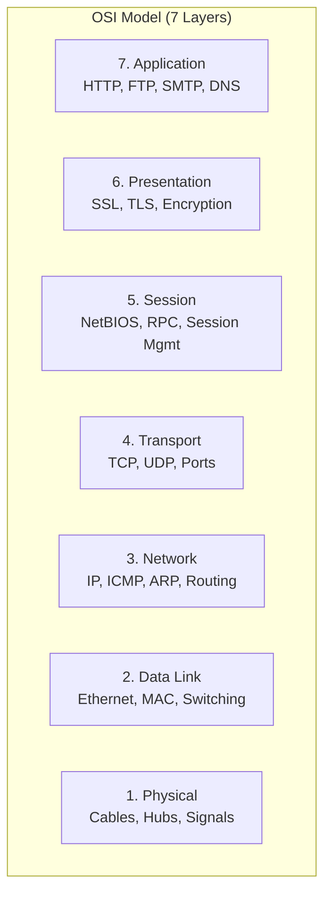
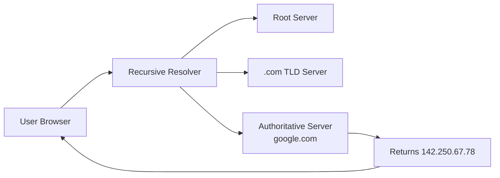
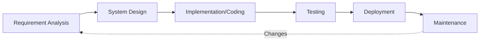
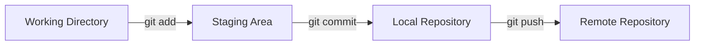
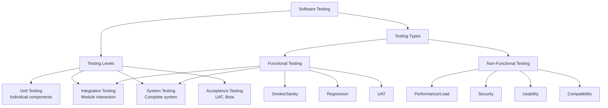

# Chapter 1: Technical Interview — Core Computer Science Subjects

## Learning Objectives

- Master 100+ frequently asked interview questions across DBMS, Computer Networks, Operating Systems, Data Structures, OOPs, and Software Engineering
- Understand concepts with clear, concise answers suitable for both fresher and experienced level interviews
- Write TypeScript code examples for data structure and algorithm questions
- Build quick-reference tables for rapid last-minute revision before interviews
- Recognize question patterns that repeat across TCS, Infosys, Wipro, Google, Amazon, Microsoft, and government exam interviews

## Key Concepts

### Section A: Database Management Systems (DBMS)

<a href="../../../assets/images/diagrams/interview-preparation/01-technical-interview-core-cs/section-a-database-management-systems-dbms-handwritten.svg" target="_blank" rel="noopener">
  
</a>
<a href="../../../assets/images/diagrams/interview-preparation/01-technical-interview-core-cs/section-a-database-management-systems-dbms-diagram.svg" target="_blank" rel="noopener">
  
</a>
<a href="../../../assets/images/diagrams/interview-preparation/01-technical-interview-core-cs/section-a-database-management-systems-dbms-sticky.svg" target="_blank" rel="noopener">
  
</a>


#### Q1: What is normalization? Explain 1NF, 2NF, 3NF, and BCNF with examples.

<details>
<summary>Click to reveal answer</summary>

**Answer:** Normalization is the process of organizing data to reduce redundancy and improve data integrity by decomposing tables into smaller related tables.

**1NF (First Normal Form):**
- Each column contains atomic (indivisible) values
- Each column has unique name
- The order of data does not matter

*Example violation:* A "PhoneNumbers" column containing "9876543210, 8765432109" — must be split into separate rows.

**2NF (Second Normal Form):**
- In 1NF
- Every non-key column is fully functionally dependent on the primary key (no partial dependency)

*Example violation:* Table(StudentID, CourseID, StudentName, Instructor) — StudentName depends only on StudentID, not on the composite key (StudentID, CourseID).

**3NF (Third Normal Form):**
- In 2NF
- No transitive dependency (non-key column should not depend on another non-key column)

*Example violation:* Table(EmployeeID, DepartmentID, DepartmentName) — DepartmentName depends on DepartmentID, which is not a candidate key.

**BCNF (Boyce-Codd Normal Form):**
- In 3NF
- For every functional dependency X → Y, X must be a super key

*Example violation:* Table(StudentID, Subject, Professor) where one Professor teaches only one Subject, but a Subject can have multiple Professors. Here Professor → Subject, but Professor is not a super key.
</details>

#### Q2: What are ACID properties in database transactions?

<details>
<summary>Click to reveal answer</summary>

**Answer:** ACID properties guarantee reliable processing of database transactions.

| Property | Meaning | Example |
|----------|---------|---------|
| **Atomicity** | Transaction is all-or-nothing; partial execution rolls back completely | Transfer of ₹1000 from A to B deducts from A AND adds to B, or neither happens |
| **Consistency** | Database moves from one valid state to another; all constraints preserved | After transfer, total money remains same (A+B is constant) |
| **Isolation** | Concurrent transactions don't interfere; each appears to execute alone | Two simultaneous transfers from A to B and A to C don't create inconsistency |
| **Durability** | Committed changes survive system failures | Once transfer is committed, it persists even if power fails immediately after |
</details>

#### Q3: Explain different types of JOINs with examples.

<details>
<summary>Click to reveal answer</summary>

**Answer:** JOINs combine rows from two or more tables based on related columns.

```sql
-- Sample Tables
Employees: EmpID, Name, DeptID
Departments: DeptID, DeptName

-- INNER JOIN: Returns matching rows from both tables
SELECT E.Name, D.DeptName
FROM Employees E
INNER JOIN Departments D ON E.DeptID = D.DeptID;

-- LEFT JOIN: All rows from left table, matched rows from right
SELECT E.Name, D.DeptName
FROM Employees E
LEFT JOIN Departments D ON E.DeptID = D.DeptID;

-- RIGHT JOIN: All rows from right table, matched rows from left
SELECT E.Name, D.DeptName
FROM Employees E
RIGHT JOIN Departments D ON E.DeptID = D.DeptID;

-- FULL OUTER JOIN: All rows from both tables
SELECT E.Name, D.DeptName
FROM Employees E
FULL OUTER JOIN Departments D ON E.DeptID = D.DeptID;

-- CROSS JOIN: Cartesian product (every row with every row)
SELECT E.Name, D.DeptName
FROM Employees E
CROSS JOIN Departments D;
```
</details>

#### Q4: What is indexing? Explain clustered vs non-clustered index.

<details>
<summary>Click to reveal answer</summary>

**Answer:** Indexing is a data structure technique to quickly locate data without scanning the entire table.

| Feature | Clustered Index | Non-Clustered Index |
|---------|-----------------|-------------------|
| Data order | Physical order matches index | Logical order, separate structure |
| Per table | Only 1 allowed | Multiple allowed |
| Storage | No extra space (table itself is index) | Extra space for index structure |
| Speed | Faster for range queries | Slower than clustered |
| Leaf nodes | Contain actual data | Contain pointers to data |

```sql
-- Clustered index (automatically created on PK)
CREATE CLUSTERED INDEX idx_emp_id ON Employees(EmpID);

-- Non-clustered index
CREATE NONCLUSTERED INDEX idx_emp_name ON Employees(Name);
```

**⭐ Must Know:** In SQL Server, primary key creates a clustered index by default. In MySQL (InnoDB), primary key is always a clustered index.
</details>

#### Q5: What is a deadlock in databases? How is it handled?

<details>
<summary>Click to reveal answer</summary>

**Answer:** A deadlock occurs when two or more transactions hold locks on resources each other needs, creating a circular wait.

```
Transaction 1: Locks Table A → waits for Table B
Transaction 2: Locks Table B → waits for Table A
Both transactions wait indefinitely → Deadlock
```

**Deadlock handling strategies:**
1. **Prevention:** Acquire all locks upfront, or enforce lock ordering
2. **Detection:** Wait-for graph; DBMS periodically checks for cycles
3. **Resolution:** Choose a victim transaction to rollback (usually the one with least cost)
4. **Avoidance:** Use lock timeouts (`LOCK_TIMEOUT` in SQL Server)

```sql
-- Set lock timeout in SQL Server
SET LOCK_TIMEOUT 5000; -- 5 seconds

-- In MySQL
SET innodb_lock_wait_timeout = 5;
```
</details>

#### Q6: Explain the difference between DELETE, TRUNCATE, and DROP.

<details>
<summary>Click to reveal answer</summary>

**Answer:** All three remove data but with different semantics.

| Feature | DELETE | TRUNCATE | DROP |
|---------|--------|----------|------|
| Type | DML | DDL | DDL |
| Removes | Specific rows (with WHERE) | All rows | Entire table structure + data |
| Speed | Slow (logs each row) | Fast (deallocates pages) | Immediate |
| Rollback | Possible in transaction | Possible in transaction | Cannot rollback (in most cases) |
| Triggers | Fires triggers | Does not fire triggers | Does not fire |
| Identity reset | No | Yes (resets to seed) | N/A |

```sql
DELETE FROM Employees WHERE DeptID = 10;
TRUNCATE TABLE Employees;
DROP TABLE Employees;
```
</details>

#### Q7: What are NoSQL databases? When would you use them over RDBMS?

<details>
<summary>Click to reveal answer</summary>

**Answer:** NoSQL databases are non-relational databases designed for scale, flexibility, and specific data models.

**Types:**
| Type | Example | Use Case |
|------|---------|----------|
| Document | MongoDB | Content management, catalogs |
| Key-Value | Redis | Caching, session storage |
| Column-Family | Cassandra | Time-series, IoT |
| Graph | Neo4j | Social networks, recommendation |

**When to use NoSQL over RDBMS:**
- Schema-less or rapidly changing data models
- Horizontal scaling required (sharding)
- High-velocity data ingestion
- Simple key-based lookups
- When ACID compliance is not critical

**When NOT to use:**
- Complex joins and transactions needed
- Strict consistency requirements
- Well-defined schema
- Reporting/BI workloads
</details>

#### Q8: Explain the CAP theorem.

<details>
<summary>Click to reveal answer</summary>

**Answer:** The CAP theorem states that a distributed data store can provide only two of three guarantees simultaneously:

| Guarantee | Meaning |
|-----------|---------|
| **Consistency** | Every read receives the most recent write |
| **Availability** | Every request receives a non-error response |
| **Partition Tolerance** | System continues operating despite network partitions |

**Trade-offs:**
- **CP (Consistency + Partition Tolerance):** Bank transactions, financial systems
- **AP (Availability + Partition Tolerance):** Social media feeds, CDNs
- **CA (Consistency + Availability):** Traditional RDBMS (single-node)

> **Real Experience:** In my NIC interview, the panel asked me to explain CAP with real-world examples. I mentioned UPI payments (CP) vs. Facebook news feed (AP).
</details>

#### Q9: What is a transaction? Explain SAVEPOINT and COMMIT.

<details>
<summary>Click to reveal answer</summary>

**Answer:** A transaction is a logical unit of work that contains one or more SQL statements.

**Transaction control commands:**
```sql
BEGIN TRANSACTION;
  UPDATE Accounts SET Balance = Balance - 1000 WHERE AccID = 1;
  SAVEPOINT after_debit;
  UPDATE Accounts SET Balance = Balance + 1000 WHERE AccID = 2;
  
  IF @@ERROR &lt;&gt; 0
    ROLLBACK TO after_debit;
  ELSE
    COMMIT;
```

| Command | Effect |
|---------|--------|
| `BEGIN TRANSACTION` | Marks start of transaction |
| `COMMIT` | Saves all changes permanently |
| `ROLLBACK` | Undoes all changes since BEGIN |
| `SAVEPOINT` | Creates a rollback point within transaction |
| `ROLLBACK TO SAVEPOINT` | Undoes changes to a savepoint |
</details>

#### Q10: What is a view? Can we update data through a view?

<details>
<summary>Click to reveal answer</summary>

**Answer:** A view is a virtual table based on the result set of a SELECT query. It does not store data physically.

```sql
-- Create a view
CREATE VIEW ActiveEmployees AS
SELECT EmpID, Name, DeptID
FROM Employees
WHERE Status = 'Active';

-- Query the view
SELECT * FROM ActiveEmployees;
```

**Updatable views requirements:**
- Must be based on a single table (no joins)
- Must include all NOT NULL columns from the base table
- Cannot use aggregate functions, GROUP BY, DISTINCT, or set operations
- Cannot use subqueries in the SELECT list

```sql
-- This view is updatable
CREATE VIEW EmpBasic AS
SELECT EmpID, Name, Salary FROM Employees;

UPDATE EmpBasic SET Salary = 60000 WHERE EmpID = 101; -- Works
```
</details>

#### Q11: Explain the differences between SQL and NoSQL databases.

<details>
<summary>Click to reveal answer</summary>

**Answer:** Key differences between SQL and NoSQL databases:

| Dimension | SQL (RDBMS) | NoSQL |
|-----------|-------------|-------|
| Data Model | Tables with rows/columns | Documents, key-value, graphs, columns |
| Schema | Fixed, predefined | Dynamic, flexible |
| ACID | Full support | BASE (Basically Available, Soft state, Eventually consistent) |
| Scalability | Vertical (scale-up) | Horizontal (scale-out) |
| Joins | Supported | No native joins (application-level) |
| Consistency | Strong consistency | Eventual consistency |
| Examples | MySQL, PostgreSQL, Oracle, SQL Server | MongoDB, Redis, Cassandra, Neo4j |
| Best for | Structured data, complex queries | Big data, real-time apps, unstructured data |
</details>

#### Q12: What is sharding in databases?

<details>
<summary>Click to reveal answer</summary>

**Answer:** Sharding is a horizontal partitioning technique where data is distributed across multiple database instances (shards). Each shard holds a subset of data.

```
Application → Router → Shard 1 (Users A-M)
                       → Shard 2 (Users N-Z)
```

**Sharding strategies:**
| Strategy | Description | Example |
|----------|-------------|---------|
| Range-based | Data distributed by value range | Users A-H in Shard 1, I-P in Shard 2 |
| Hash-based | Hash of key determines shard | `hash(user_id) % N` |
| Directory-based | Lookup table maps keys to shards | Central catalog service |
| Geographic | Data placed near users | US users in US shard, EU users in EU shard |

**Challenges:** Cross-shard joins, distributed transactions, resharding, backup complexity.
</details>

#### Q13: Explain ER diagrams with components.

<details>
<summary>Click to reveal answer</summary>

**Answer:** Entity-Relationship (ER) diagrams model the logical structure of databases.

**Components:**
| Symbol | Represents | Example |
|--------|------------|---------|
| Rectangle | Entity | Student, Course, Employee |
| Ellipse | Attribute | Name, Age, Address |
| Diamond | Relationship | Enrolls, Manages, Works |
| Line | Connects components | Links entities to relationships |

**Relationships:**
- **1:1** — One student has one locker
- **1:N** — One department has many employees
- **M:N** — Many students enroll in many courses

**Keys:**
- **Primary Key:** Uniquely identifies each row
- **Foreign Key:** References primary key in another table
- **Composite Key:** Combination of two or more columns
- **Candidate Key:** All columns that could be primary key
- **Super Key:** Any set of columns that uniquely identifies rows
</details>

#### Q14: What is the difference between WHERE and HAVING clauses?

<details>
<summary>Click to reveal answer</summary>

**Answer:** Both filter rows but at different stages.

| Aspect | WHERE | HAVING |
|--------|-------|--------|
| Applied | Before GROUP BY | After GROUP BY |
| Used with | SELECT, UPDATE, DELETE | GROUP BY clause |
| Aggregate functions | Cannot use | Can use |
| Performance | Filters rows early (efficient) | Filters groups (less efficient) |

```sql
-- WHERE filters individual rows before grouping
SELECT DeptID, AVG(Salary) as AvgSalary
FROM Employees
WHERE Status = 'Active'           -- Filter active employees
GROUP BY DeptID
HAVING AVG(Salary) &gt; 50000;       -- Filter departments
```
</details>

#### Q15: What is a stored procedure? How is it different from a function?

<details>
<summary>Click to reveal answer</summary>

**Answer:** A stored procedure is a precompiled set of SQL statements stored in the database.

```sql
-- Stored Procedure
CREATE PROCEDURE GetEmployeeByDept
  @DeptID INT
AS
BEGIN
  SELECT EmpID, Name, Salary
  FROM Employees
  WHERE DeptID = @DeptID;
END;

-- Execute
EXEC GetEmployeeByDept @DeptID = 10;
```

| Feature | Stored Procedure | Function |
|---------|-----------------|----------|
| Return value | Can return 0 or more values | Must return a single value |
| DML operations | Allowed (INSERT, UPDATE, DELETE) | Cannot modify data |
| Called from | EXEC statement | SELECT statement |
| Transaction | Can have transactions | Cannot have transactions |
| Output parameters | Supported | Not supported |
| Exception handling | TRY-CATCH supported | Not supported |
</details>

---

### Section B: Computer Networks

<a href="../../../assets/images/diagrams/interview-preparation/01-technical-interview-core-cs/section-b-computer-networks-handwritten.svg" target="_blank" rel="noopener">
  
</a>
<a href="../../../assets/images/diagrams/interview-preparation/01-technical-interview-core-cs/section-b-computer-networks-diagram.svg" target="_blank" rel="noopener">
  
</a>
<a href="../../../assets/images/diagrams/interview-preparation/01-technical-interview-core-cs/section-b-computer-networks-sticky.svg" target="_blank" rel="noopener">
  
</a>


#### Q16: Explain the OSI model with each layer and its function.

<details>
<summary>Click to reveal answer</summary>

**Answer:** The OSI model has 7 layers, each responsible for specific network functions.



| Layer | Function | Protocols | Devices |
|-------|----------|-----------|---------|
| Application | User-facing network services | HTTP, FTP, SMTP, DNS | Gateway |
| Presentation | Data translation, encryption | SSL, TLS, JPEG, MPEG | Gateway |
| Session | Session management, sync | NetBIOS, RPC, PPTP | Gateway |
| Transport | End-to-end delivery, error recovery | TCP, UDP | Gateway |
| Network | Logical addressing, routing | IP, ICMP, ARP | Router |
| Data Link | Framing, MAC addressing, error detection | Ethernet, PPP | Switch, Bridge |
| Physical | Bit transmission over medium | RS-232, 1000BASE-T | Hub, Repeater |

**Mnemonic:** "Please Do Not Throw Sausage Pizza Away" (Physical → Application)
</details>

#### Q17: What is the difference between TCP and UDP?

<details>
<summary>Click to reveal answer</summary>

**Answer:** TCP and UDP are transport layer protocols with different characteristics.

| Feature | TCP | UDP |
|---------|-----|-----|
| Full form | Transmission Control Protocol | User Datagram Protocol |
| Connection | Connection-oriented (3-way handshake) | Connection-less |
| Reliability | Guaranteed delivery | No guarantee (best effort) |
| Ordering | Maintains packet order | No ordering |
| Speed | Slower (overhead) | Faster (no overhead) |
| Header size | 20-60 bytes | 8 bytes |
| Flow control | Yes (sliding window) | No |
| Error checking | Yes (checksum + ACK) | Yes (checksum only) |
| Use cases | Web (HTTP), Email (SMTP), File (FTP) | Streaming, DNS, VoIP, Gaming |

**TCP Three-Way Handshake:**
```
1. Client → Server: SYN (seq=x)
2. Client ← Server: SYN-ACK (seq=y, ack=x+1)
3. Client → Server: ACK (seq=x+1, ack=y+1)
```
</details>

#### Q18: What is DNS and how does it work?

<details>
<summary>Click to reveal answer</summary>

**Answer:** DNS (Domain Name System) translates human-readable domain names to IP addresses.

**Resolution process:**
```
1. User types "www.google.com" in browser
2. Browser checks local cache → if not found
3. Query goes to Recursive DNS Resolver (ISP)
4. Resolver queries Root DNS Server → gets .com TLD server
5. Resolver queries .com TLD Server → gets google.com nameserver
6. Resolver queries google.com Authoritative nameserver → gets IP
7. IP returned to browser → HTTPS connection established
```



**DNS Record Types:**
| Record | Purpose |
|--------|---------|
| A | Maps domain to IPv4 address |
| AAAA | Maps domain to IPv6 address |
| CNAME | Canonical name (alias) |
| MX | Mail exchange server |
| NS | Nameserver |
| TXT | Text information (SPF, DKIM) |
</details>

#### Q19: Explain the differences between HTTP and HTTPS.

<details>
<summary>Click to reveal answer</summary>

**Answer:** HTTPS is HTTP over SSL/TLS encryption.

| Feature | HTTP | HTTPS |
|---------|------|-------|
| Full form | HyperText Transfer Protocol | HTTP Secure |
| Encryption | None (plain text) | SSL/TLS encryption |
| Default port | 80 | 443 |
| Certificate | Not required | SSL certificate needed |
| Security | Vulnerable to MITM | Resistant to MITM |
| Performance | Faster | Slower (encryption overhead) |
| SEO ranking | Lower priority | Higher priority |
| Browser indicator | "Not Secure" warning | Padlock icon |

**SSL/TLS Handshake (Simplified):**
```
1. Client Hello (supports TLS 1.3, cipher suites)
2. Server Hello (selects TLS version, cipher)
3. Server sends Certificate (SSL cert with public key)
4. Client verifies certificate with CA
5. Client generates Pre-Master Secret, encrypts with server's public key
6. Both derive session keys
7. Begin encrypted communication
```
</details>

#### Q20: What is a firewall and how does it work?

<details>
<summary>Click to reveal answer</summary>

**Answer:** A firewall is a network security device that monitors and filters incoming/outgoing traffic based on security rules.

**Types:**
| Type | Layer | How it works |
|------|-------|-------------|
| Packet Filter | Network (L3) | Inspects packet headers (IP, port) |
| Stateful | Transport (L4) | Tracks connection state |
| Application | Application (L7) | Inspects packet payload |
| Proxy | Application (L7) | Acts as intermediary |
| Next-Gen | Multi-layer | Deep packet inspection, IDS/IPS |

**⭐ Must Know:** In government exams, questions about firewall types and OSI layers are common.
</details>

#### Q21: What is subnetting? Explain with example.

<details>
<summary>Click to reveal answer</summary>

**Answer:** Subnetting divides a larger network into smaller subnetworks to improve performance and security.

**Example:** Given IP 192.168.1.0/24, create 4 subnets.

```
Original: 192.168.1.0/24 → 256 IPs (254 usable)
Subnet mask: 255.255.255.0

To create 4 subnets, borrow 2 bits from host portion:
New prefix: /26 (255.255.255.192)

Subnet 1: 192.168.1.0/26   → 192.168.1.1 - 192.168.1.62
Subnet 2: 192.168.1.64/26  → 192.168.1.65 - 192.168.1.126
Subnet 3: 192.168.1.128/26 → 192.168.1.129 - 192.168.1.190
Subnet 4: 192.168.1.192/26 → 192.168.1.193 - 192.168.1.254
```

**Subnetting Shortcut:**
- /24 = 256 IPs (254 usable)
- /25 = 128 IPs (126 usable)
- /26 = 64 IPs (62 usable)
- /27 = 32 IPs (30 usable)
- /28 = 16 IPs (14 usable)
- /29 = 8 IPs (6 usable)
- /30 = 4 IPs (2 usable)
</details>

#### Q22: Explain IP addressing classes.

<details>
<summary>Click to reveal answer</summary>

**Answer:** IP addresses are classified into classes based on the first octet.

| Class | First Octet | Default Mask | Network/Host Bits | Range |
|-------|-------------|-------------|-------------------|-------|
| A | 1-126 | /8 | 1N.3H | 1.0.0.0 - 126.255.255.255 |
| B | 128-191 | /16 | 2N.2H | 128.0.0.0 - 191.255.255.255 |
| C | 192-223 | /24 | 3N.1H | 192.0.0.0 - 223.255.255.255 |
| D | 224-239 | Multicast | - | 224.0.0.0 - 239.255.255.255 |
| E | 240-255 | Experimental | - | 240.0.0.0 - 255.255.255.255 |

**Special addresses:**
- **127.0.0.0/8:** Loopback (localhost)
- **169.254.0.0/16:** APIPA (Auto-configuration)
- **10.0.0.0/8, 172.16.0.0/12, 192.168.0.0/16:** Private IP ranges
</details>

#### Q23: What is ARP and how does it work?

<details>
<summary>Click to reveal answer</summary>

**Answer:** ARP (Address Resolution Protocol) maps IP addresses to MAC addresses in a local network.

**ARP workflow:**
```
1. Host A wants to send packet to 192.168.1.5
2. Host A checks ARP cache for mapping
3. If not found, Host A broadcasts ARP request:
   "Who has 192.168.1.5? Tell 192.168.1.2 (MAC: AA:BB:CC:DD:EE:FF)"
4. Host B (192.168.1.5) responds with ARP reply:
   "192.168.1.5 is at MAC: 11:22:33:44:55:66"
5. Host A caches the mapping and sends the packet
```

**ARP Spoofing/Poisoning:** An attacker sends fake ARP replies to associate their MAC with another host's IP, enabling MITM attacks. Mitigation: Dynamic ARP Inspection (DAI), static ARP entries.
</details>

#### Q24: What is the difference between Hub, Switch, and Router?

<details>
<summary>Click to reveal answer</summary>

**Answer:** These are network devices operating at different OSI layers.

| Feature | Hub | Switch | Router |
|---------|-----|--------|--------|
| OSI Layer | Physical (L1) | Data Link (L2) | Network (L3) |
| Data unit | Signal/Bits | Frame | Packet |
| Addressing | None | MAC address | IP address |
| Collision domain | Single (all ports) | Per port | Per port |
| Broadcast domain | Single | Single | Per interface |
| Intelligence | None (repeats all) | Learning (MAC table) | Routing protocols |
| Use | Small home networks | LAN networks | Connecting networks (WAN) |
</details>

#### Q25: What are the HTTP methods and their purposes?

<details>
<summary>Click to reveal answer</summary>

**Answer:** HTTP methods define the action to be performed on a resource.

| Method | CRUD Equivalent | Idempotent | Safe | Body | Use Case |
|--------|----------------|-----------|------|------|----------|
| GET | Read | Yes | Yes | No | Retrieve resource |
| POST | Create | No | No | Yes | Create resource |
| PUT | Update/Replace | Yes | No | Yes | Replace resource entirely |
| PATCH | Partial Update | No | No | Yes | Partial modification |
| DELETE | Delete | Yes | No | Optional | Remove resource |
| HEAD | - | Yes | Yes | No | Get headers only |
| OPTIONS | - | Yes | Yes | No | Get allowed methods |

**HTTP Status Codes quick reference:**
- **1xx:** Informational (100 Continue, 101 Switching Protocols)
- **2xx:** Success (200 OK, 201 Created, 204 No Content)
- **3xx:** Redirection (301 Moved Permanently, 302 Found, 304 Not Modified)
- **4xx:** Client Error (400 Bad Request, 401 Unauthorized, 403 Forbidden, 404 Not Found)
- **5xx:** Server Error (500 Internal Server Error, 502 Bad Gateway, 503 Service Unavailable)
</details>

#### Q26: What is CIDR notation?

<details>
<summary>Click to reveal answer</summary>

**Answer:** CIDR (Classless Inter-Domain Routing) notation specifies IP addresses with a prefix length indicating the network bits.

```
Format: IP_Address / Prefix_Length
Example: 192.168.1.0/24

/24 means the first 24 bits are network bits, last 8 bits are host bits.
```

**CIDR vs Classful:**
| Feature | Classful (A, B, C) | Classless (CIDR) |
|---------|-------------------|-----------------|
| Flexibility | Fixed blocks | Variable sizes |
| Efficiency | Wastes IPs | Efficient allocation |
| Subnet mask | Implicit | Explicit (/n notation) |
| Example | Class C = 256 IPs | /27 = 32 IPs |
</details>

#### Q27: What is a VPN?

<details>
<summary>Click to reveal answer</summary>

**Answer:** A VPN (Virtual Private Network) creates an encrypted tunnel over a public network, ensuring privacy and secure communication.

**Types:**
| Type | Description | Example |
|------|-------------|---------|
| Site-to-Site | Connects entire networks | Branch office to HQ |
| Remote Access | Individual connects to network | Employee working from home |
| SSL VPN | Uses browser (no client needed) | Clientless access |
| IPsec VPN | Dedicated VPN protocol | Secure site-to-site |

**VPN Protocols:**
| Protocol | Port | Security | Speed |
|----------|------|----------|-------|
| PPTP | 1723 | Weak | Fast |
| L2TP/IPsec | 1701 | Strong | Medium |
| OpenVPN | 1194 (UDP) | Very strong | Medium |
| WireGuard | 51820 | Very strong | Fast |
</details>

#### Q28: What is the difference between IPv4 and IPv6?

<details>
<summary>Click to reveal answer</summary>

**Answer:** IPv6 is the successor to IPv4, designed to address IPv4 exhaustion.

| Feature | IPv4 | IPv6 |
|---------|------|------|
| Address length | 32 bits | 128 bits |
| Address space | ~4.3 billion | ~340 undecillion |
| Format | Dotted decimal (192.168.1.1) | Hexadecimal (2001:db8::1) |
| Header size | 20-60 bytes | 40 bytes (fixed) |
| Fragmentation | By routers | By sender only |
| Security | Optional (IPsec) | Built-in (IPsec mandatory) |
| NAT | Commonly needed | Not needed |
| ARP | Uses ARP | Uses NDP (Neighbor Discovery Protocol) |
| Broadcast | Available | No broadcast (uses multicast) |
</details>

#### Q29: What is a MAC address?

<details>
<summary>Click to reveal answer</summary>

**Answer:** A MAC (Media Access Control) address is a unique hardware identifier assigned to network interface cards (NICs).

**Format:** 48-bit, usually written as 12 hexadecimal digits.
- Example: `00:1A:2B:3C:4D:5E`

**Structure:**
- **First 24 bits (OUI):** Organizationally Unique Identifier — identifies manufacturer
- **Last 24 bits:** Device-specific, assigned by manufacturer

**Types:**
| Type | Description |
|------|-------------|
| Unicast | Unique to one device |
| Multicast | Identifies group of devices |
| Broadcast | FF:FF:FF:FF:FF:FF (all devices) |

> **Real Experience:** An IBPS SO technical panel asked me: "If two devices have the same IP but different MACs, how does the switch handle it?" The answer: Switch forwards based on MAC table; duplicate IPs cause address conflicts at L3.
</details>

#### Q30: Explain the Sliding Window Protocol.

<details>
<summary>Click to reveal answer</summary>

**Answer:** Sliding Window Protocol controls the flow of data between sender and receiver, allowing multiple frames to be in transit simultaneously.

**Types:**
1. **Stop-and-Wait ARQ:** Sender sends one frame, waits for ACK (inefficient)
2. **Go-Back-N ARQ:** Sender sends N frames without waiting; on error, resends all from lost frame
3. **Selective Repeat ARQ:** Sender sends N frames; on error, resends only the lost frame(s)

**Window Size Calculation:**
- **For efficiency:** Window size &ge; 2 * Bandwidth * Propagation Delay / Frame Size
- **In Go-Back-N:** Window size &le; 2<sup>m</sup> - 1 (where m is sequence number bits)
- **In Selective Repeat:** Window size &le; 2<sup>m-1</sup>
</details>

#### Q31: What is CSMA/CD?

<details>
<summary>Click to reveal answer</summary>

**Answer:** Carrier Sense Multiple Access with Collision Detection (CSMA/CD) is a protocol for Ethernet networks to handle collisions.

**Process:**
1. **Carrier Sense:** Listen before transmitting
2. **Multiple Access:** Multiple devices share the medium
3. **Collision Detection:** If collision detected, transmit jam signal
4. **Backoff:** Wait random time (exponential backoff) before retrying

**Algorithm:**
```
1. Sense carrier → if busy, wait
2. Transmit data
3. If collision detected:
   - Send jam signal (32-bit)
   - Increment collision counter
   - Wait random backoff time (0 to 2^k - 1 slot times)
   - Retry (max 16 attempts)
4. If no collision → transmission successful
```

**⭐ Must Know:** Modern Ethernet (switched) uses full-duplex, eliminating collisions. CSMA/CD is mainly historical.
</details>

#### Q32: What is the difference between Symmetric and Asymmetric encryption?

<details>
<summary>Click to reveal answer</summary>

**Answer:** Two main encryption approaches with different key management.

| Feature | Symmetric | Asymmetric |
|---------|-----------|------------|
| Keys | Single shared key | Public + Private key pair |
| Speed | Fast | Slow (100-1000x slower) |
| Key length | 128-256 bits | 2048-4096 bits |
| Key distribution | Problematic (must share securely) | Easy (public key is public) |
| Use case | Bulk encryption | Key exchange, digital signatures |
| Algorithms | AES, DES, 3DES, Blowfish | RSA, ECC, Diffie-Hellman |

**Hybrid approach:** Use asymmetric (RSA) to exchange a session key, then symmetric (AES) for bulk encryption. This is how HTTPS works.
</details>

---

### Section C: Operating Systems

<a href="../../../assets/images/diagrams/interview-preparation/01-technical-interview-core-cs/section-c-operating-systems-handwritten.svg" target="_blank" rel="noopener">
  
</a>
<a href="../../../assets/images/diagrams/interview-preparation/01-technical-interview-core-cs/section-c-operating-systems-diagram.svg" target="_blank" rel="noopener">
  
</a>
<a href="../../../assets/images/diagrams/interview-preparation/01-technical-interview-core-cs/section-c-operating-systems-sticky.svg" target="_blank" rel="noopener">
  
</a>


#### Q33: What is a process? Differentiate between process and thread.

<details>
<summary>Click to reveal answer</summary>

**Answer:** A process is a program in execution with its own memory space.

| Feature | Process | Thread |
|---------|---------|--------|
| Definition | Program in execution | Lightweight unit of a process |
| Memory | Separate address space | Shares process memory |
| Communication | IPC (pipes, sockets, shared memory) | Direct memory access |
| Context switch | Heavy (expensive) | Light (cheap) |
| Overhead | High | Low |
| Creation | `fork()`, `CreateProcess()` | `pthread_create()`, `CreateThread()` |
| Failure | One process does not affect others | One thread can crash the process |
| Resources | Own code, data, heap, stack | Own stack only |
| Example | Running Chrome browser | Each tab as thread |
</details>

#### Q34: Explain different CPU scheduling algorithms.

<details>
<summary>Click to reveal answer</summary>

**Answer:** CPU scheduling algorithms determine which process gets the CPU next.

| Algorithm | Type | Description | Pros | Cons |
|-----------|------|-------------|------|------|
| FCFS | Non-preemptive | First-come, first-served | Simple, fair | Convoy effect |
| SJF | Non/Preemptive | Shortest job first | Optimal avg wait time | Starvation possible |
| SRTF | Preemptive | Shortest remaining time | Optimal response | Overhead, starvation |
| Round Robin | Preemptive | Fixed time quantum | Fair, responsive | Higher context switch |
| Priority | Both | Higher priority first | Important tasks first | Starvation (aging solves) |
| Multilevel Queue | Both | Multiple queues by priority | Good for mixed workloads | Queue starvation |

**Formulas:**
- **Turnaround Time** = Completion Time - Arrival Time
- **Waiting Time** = Turnaround Time - Burst Time
- **Response Time** = First Response - Arrival Time
</details>

#### Q35: What is deadlock? Explain necessary conditions.

<details>
<summary>Click to reveal answer</summary>

**Answer:** Deadlock is a state where two or more processes are waiting indefinitely for resources held by each other.

**Four Necessary Conditions (Coffman Conditions):**

| Condition | Description | Analogy |
|-----------|-------------|---------|
| **Mutual Exclusion** | Resources cannot be shared | Only one car can use the bridge at a time |
| **Hold and Wait** | Process holds resources while waiting for others | Holding one key while waiting for another |
| **No Preemption** | Resources cannot be forcibly taken | Cannot take key from someone's hand |
| **Circular Wait** | Circular chain of processes waiting | A waits for B, B waits for C, C waits for A |

**Deadlock Handling:**
1. **Prevention:** Ensure at least one condition never holds
2. **Avoidance:** Banker's algorithm (safe state check)
3. **Detection:** Wait-for graph (cycle detection)
4. **Recovery:** Kill process or preempt resources
</details>

#### Q36: Explain paging and segmentation.

<details>
<summary>Click to reveal answer</summary>

**Answer:** Memory management techniques for efficient use of physical memory.

**Paging:**
- Divides virtual memory into fixed-size blocks called **pages**
- Physical memory divided into same-size blocks called **frames**
- Uses **Page Table** to map virtual pages to physical frames
- Eliminates external fragmentation
- Internal fragmentation possible (last page)

**Segmentation:**
- Divides program into logical segments (code, data, stack, heap)
- Each segment has variable size
- Uses **Segment Table** with base and limit
- Allows sharing at segment level
- External fragmentation possible (variable sizes)

**Paged Segmentation:** Combines both — segments are divided into pages. Used in some architectures.
</details>

#### Q37: What is virtual memory?

<details>
<summary>Click to reveal answer</summary>

**Answer:** Virtual memory allows execution of processes larger than physical RAM by using disk space as an extension of memory.

**Key concepts:**
- **Demand Paging:** Pages loaded only when needed
- **Page Fault:** When accessed page is not in memory
- **Page Replacement:** Choosing which page to evict
- **Thrashing:** Excessive paging (system spends more time paging than executing)

**Page Replacement Algorithms:**
| Algorithm | Strategy | Pros | Cons |
|-----------|----------|------|------|
| FIFO | First-in, first-out | Simple | Belady's anomaly |
| LRU | Least Recently Used | Good performance | Hardware support needed |
| Optimal | Replace page used farthest in future | Best (theoretical) | Impossible to implement |
| Clock | Approximates LRU | Efficient | Approximate only |
| NRU | Not Recently Used | Simple | Coarse granularity |
</details>

#### Q38: Explain the producer-consumer problem with solution.

<details>
<summary>Click to reveal answer</summary>

**Answer:** The Producer-Consumer problem involves two processes sharing a bounded buffer. Producer adds items, Consumer removes items.

**Solution using semaphores:**

```c
Semaphore empty = N;  // Buffer capacity
Semaphore full = 0;   // Items in buffer
Semaphore mutex = 1;  // Mutual exclusion

// Producer
void producer() {
    while (true) {
        item = produce();
        wait(empty);     // Decrease empty count
        wait(mutex);     // Enter critical section
        buffer[in] = item;
        in = (in + 1) % N;
        signal(mutex);   // Exit critical section
        signal(full);    // Increase full count
    }
}

// Consumer
void consumer() {
    while (true) {
        wait(full);      // Decrease full count
        wait(mutex);     // Enter critical section
        item = buffer[out];
        out = (out + 1) % N;
        signal(mutex);   // Exit critical section
        signal(empty);   // Increase empty count
        consume(item);
    }
}
```
</details>

#### Q39: What is the difference between mutex and semaphore?

<details>
<summary>Click to reveal answer</summary>

**Answer:** Both are synchronization mechanisms but with key differences.

| Feature | Mutex | Semaphore |
|---------|-------|-----------|
| Type | Locking mechanism | Signaling mechanism |
| Ownership | Owned by locking thread | No ownership |
| Value | Binary (0/1) | Can be any non-negative integer |
| Usage | Mutual exclusion | Resource counting |
| Unlocking | Must be unlocked by same thread | Can be signaled by any thread |
| Priority inversion | Can occur | Not applicable |
| Recursive | Can be recursive | Not typically |

**Binary Semaphore vs Mutex:** A binary semaphore (value 0 or 1) is functionally similar to mutex, but:
- Mutex has ownership; semaphore does not
- Mutex supports priority inheritance
- Semaphore can be used for signaling between threads
</details>

#### Q40: What is the Banker's Algorithm?

<details>
<summary>Click to reveal answer</summary>

**Answer:** The Banker's Algorithm is a deadlock avoidance algorithm that ensures the system remains in a safe state.

**Data structures:**
- **Available:** Vector of available resources of each type
- **Max:** Maximum demand of each process
- **Allocation:** Currently allocated resources
- **Need:** Remaining need (Max - Allocation)

**Safety Algorithm:**
```
1. Let Work = Available, Finish[i] = false for all i
2. Find i such that Finish[i] = false AND Need[i] <= Work
3. If found: Work = Work + Allocation[i]; Finish[i] = true; goto 2
4. If all Finish[i] = true → Safe state
```

> **Real Experience:** In an Infosys interview, the interviewer asked me to simulate Banker's Algorithm with a given allocation matrix. This is very common in both IT and government technical interviews.
</details>

#### Q41: What are the different IPC mechanisms?

<details>
<summary>Click to reveal answer</summary>

**Answer:** Inter-Process Communication (IPC) mechanisms allow processes to exchange data.

| Mechanism | Description | Type | Example Use |
|-----------|-------------|------|-------------|
| Pipes | Unidirectional data flow (parent-child) | Message | `ls | grep txt` |
| Named Pipes (FIFO) | Bidirectional, unrelated processes | Message | Client-server |
| Message Queues | Structured messages with priority | Message | Job scheduling |
| Shared Memory | Fastest IPC, processes share memory region | Memory | Database buffer pool |
| Semaphores | Synchronization primitive | Sync | Producer-consumer |
| Sockets | Communication over network | Message | Web servers |
| Signals | Async notification to process | Signal | `Ctrl+C (SIGINT)` |
| Memory-mapped Files | File mapped to process address space | Memory | Large file processing |
</details>

#### Q42: What is a system call? Give examples.

<details>
<summary>Click to reveal answer</summary>

**Answer:** A system call is the programmatic way for a user-space program to request services from the operating system kernel.

**Categories of system calls:**
| Category | Examples |
|----------|----------|
| Process Control | `fork()`, `exec()`, `wait()`, `exit()` |
| File Management | `open()`, `read()`, `write()`, `close()` |
| Device Management | `ioctl()`, `read()`, `write()` |
| Information | `getpid()`, `gettimeofday()`, `alarm()` |
| Communication | `pipe()`, `shmget()`, `socket()`, `send()` |
| Protection | `chmod()`, `chown()`, `umask()` |

**Flow:** User App → Library (glibc) → System Call → Kernel → Hardware
</details>

#### Q43: Explain the difference between internal and external fragmentation.

<details>
<summary>Click to reveal answer</summary>

**Answer:** Two types of memory fragmentation that waste space.

| Type | Internal Fragmentation | External Fragmentation |
|------|----------------------|----------------------|
| Definition | Wasted space inside allocated block | Wasted space between allocated blocks |
| Occurs in | Paging (fixed-size allocation) | Segmentation (variable-size allocation) |
| Cause | Allocated block larger than requested | Repeated allocate/free creates holes |
| Solution | Slab allocation, adjust page size | Compaction, coalescing |
| Analogy | Giving a 100ml cup for 80ml water | Scattered empty spaces in a parking lot |

**Compaction:** Moving allocated processes to one end of memory to free contiguous space. Not always possible (process relocation must be dynamic).
</details>

#### Q44: What is RAID? Explain levels.

<details>
<summary>Click to reveal answer</summary>

**Answer:** RAID (Redundant Array of Independent Disks) combines multiple drives for performance and/or redundancy.

| Level | Description | Min Drives | Capacity | Redundancy | Performance |
|-------|-------------|-----------|----------|------------|-------------|
| RAID 0 | Striping (no redundancy) | 2 | N × Disk | None | Best |
| RAID 1 | Mirroring | 2 | N/2 × Disk | Excellent | Good read, slower write |
| RAID 5 | Striping + Parity | 3 | (N-1) × Disk | Good (1 disk) | Good read, slow write |
| RAID 6 | Striping + Dual Parity | 4 | (N-2) × Disk | Very good (2 disks) | Good read, slow write |
| RAID 10 | Striping + Mirroring | 4 | N/2 × Disk | Excellent | Best all-round |

**Common in interviews:** "Why is RAID 5 write performance slower?" — Because parity calculation overhead and read-modify-write cycle.
</details>

#### Q45: Explain the boot process of a computer.

<details>
<summary>Click to reveal answer</summary>

**Answer:** The boot process is the sequence of events from power-on to OS loading.

```
1. Power-On Self-Test (POST) — BIOS/UEFI checks hardware
2. BIOS/UEFI identifies boot device (HDD, SSD, USB)
3. Bootloader (GRUB, Windows Boot Manager) loads
4. Bootloader loads kernel into memory
5. Kernel initializes drivers, filesystem, and processes
6. init/systemd starts system services
7. Login prompt / Desktop environment loads
```

**UEFI vs BIOS:**
| Feature | BIOS | UEFI |
|---------|------|------|
| Interface | Text-based (16-bit) | Graphical (64-bit) |
| Partition | MBR (2TB max) | GPT (9.4ZB max) |
| Boot time | Slower | Faster |
| Secure Boot | No | Yes |
| Network boot | PXE | UEFI HTTP Boot |
</details>

#### Q46: What is the difference between user mode and kernel mode?

<details>
<summary>Click to reveal answer</summary>

**Answer:** Modern CPUs support dual-mode operation for system protection.

| Aspect | User Mode | Kernel Mode |
|--------|-----------|-------------|
| Privilege level | Low (Ring 3) | High (Ring 0) |
| Access | Limited memory (user space) | Full memory access |
| Hardware access | No direct access | Full access |
| System calls | Required for OS services | Not needed |
| Failure | Only user process crashes | Entire system may crash |
| Examples | Browsers, games, text editors | OS kernel, device drivers |

**Transition:** User → System Call → Kernel Mode → Execute → Return → User Mode
</details>

#### Q47: Explain the concept of "Thrashing".

<details>
<summary>Click to reveal answer</summary>

**Answer:** Thrashing occurs when the system spends more time on page faults and swapping than on actual execution.

**Causes:**
- Too many processes in memory (low degree of multiprogramming)
- Insufficient RAM for working set of processes
- Poor locality of reference

**Symptoms:**
- CPU utilization drops (CPU waits for I/O)
- Disk activity very high (constant page faults)
- System becomes unresponsive

**Solutions:**
- Reduce degree of multiprogramming (suspend some processes)
- Increase RAM
- Use better page replacement algorithms
- Apply working set model
</details>

#### Q48: What is the dining philosophers problem?

<details>
<summary>Click to reveal answer</summary>

**Answer:** A classic synchronization problem illustrating deadlock and resource allocation.

**Problem statement:** Five philosophers sit at a round table with five forks. Each philosopher alternates between thinking and eating. To eat, a philosopher needs both left and right forks.

**Solutions:**
1. **Resource hierarchy:** Number forks; always pick up lower-numbered fork first
2. **Waiter (arbitrator):** Introduce a waiter who allows max 4 philosophers
3. **Chandy-Misra:** Use clean/dirty fork states
4. **Test-and-set:** Use mutex per fork, but pick both only if both available

**Livelock vs Deadlock:** If all philosophers pick up left fork simultaneously → deadlock. If they put down left fork after timeout → could lead to livelock (repeated attempt).
</details>

---

### Section D: Data Structures

<a href="../../../assets/images/diagrams/interview-preparation/01-technical-interview-core-cs/section-d-data-structures-handwritten.svg" target="_blank" rel="noopener">
  
</a>
<a href="../../../assets/images/diagrams/interview-preparation/01-technical-interview-core-cs/section-d-data-structures-diagram.svg" target="_blank" rel="noopener">
  
</a>
<a href="../../../assets/images/diagrams/interview-preparation/01-technical-interview-core-cs/section-d-data-structures-sticky.svg" target="_blank" rel="noopener">
  
</a>


#### Q49: What is the difference between an array and a linked list?

<details>
<summary>Click to reveal answer</summary>

**Answer:** Both are linear data structures with different trade-offs.

| Feature | Array | Linked List |
|---------|-------|-------------|
| Memory | Contiguous allocation | Dynamic, non-contiguous |
| Size | Fixed (static) / Expandable (dynamic) | Dynamic |
| Access | O(1) random access | O(n) sequential access |
| Insert/Delete | O(n) (shifting required) | O(1) if node known |
| Memory overhead | Low (only data) | Extra for pointers |
| Cache locality | Excellent | Poor |
| Reallocation | May need when full | No reallocation |
| Usage | Frequent reads, fixed size | Frequent insert/delete |

```typescript
// TypeScript: Array vs Linked List
class ListNode<T> {
  constructor(
    public data: T,
    public next: ListNode<T> | null = null
  ) {}
}

class LinkedList<T> {
  constructor(public head: ListNode<T> | null = null) {}

  insertAtBeginning(data: T): void {
    const newNode = new ListNode(data, this.head);
    this.head = newNode;
  }

  // Array equivalent
  insertAtBeginningArray(arr: T[], data: T): T[] {
    return [data, ...arr]; // O(n) due to copy
  }
}
```
</details>

#### Q50: Implement a stack using arrays in TypeScript.

<details>
<summary>Click to reveal answer</summary>

**Answer:** Stack is LIFO (Last-In-First-Out) data structure.

```typescript
class Stack<T> {
  private items: T[] = [];

  push(item: T): void {
    this.items.push(item);
  }

  pop(): T | undefined {
    return this.items.pop();
  }

  peek(): T | undefined {
    return this.items[this.items.length - 1];
  }

  isEmpty(): boolean {
    return this.items.length === 0;
  }

  size(): number {
    return this.items.length;
  }

  // Reverse a string using stack
  static reverseString(str: string): string {
    const stack = new Stack<string>();
    for (const ch of str) {
      stack.push(ch);
    }
    let reversed = '';
    while (!stack.isEmpty()) {
      reversed += stack.pop();
    }
    return reversed;
  }
}

// Usage
const stack = new Stack<number>();
stack.push(1);
stack.push(2);
stack.push(3);
console.log(stack.pop());    // 3
console.log(stack.peek());   // 2
console.log(Stack.reverseString('hello')); // 'olleh'
```
</details>

#### Q51: Implement a queue using linked list.

<details>
<summary>Click to reveal answer</summary>

**Answer:** Queue is FIFO (First-In-First-Out) data structure.

```typescript
class QueueNode<T> {
  constructor(
    public data: T,
    public next: QueueNode<T> | null = null
  ) {}
}

class Queue<T> {
  private front: QueueNode<T> | null = null;
  private rear: QueueNode<T> | null = null;
  private count: number = 0;

  enqueue(data: T): void {
    const newNode = new QueueNode(data);
    if (this.rear) {
      this.rear.next = newNode;
    }
    this.rear = newNode;
    if (!this.front) {
      this.front = newNode;
    }
    this.count++;
  }

  dequeue(): T | null {
    if (!this.front) return null;
    const data = this.front.data;
    this.front = this.front.next;
    if (!this.front) this.rear = null;
    this.count--;
    return data;
  }

  peek(): T | null {
    return this.front ? this.front.data : null;
  }

  isEmpty(): boolean {
    return this.count === 0;
  }

  size(): number {
    return this.count;
  }
}
```
</details>

#### Q52: Explain binary search and implement it.

<details>
<summary>Click to reveal answer</summary>

**Answer:** Binary search finds element in sorted array in O(log n) time.

```typescript
// Binary Search - Iterative
function binarySearchIterative(arr: number[], target: number): number {
  let left = 0;
  let right = arr.length - 1;

  while (left <= right) {
    const mid = Math.floor((left + right) / 2);

    if (arr[mid] === target) return mid;
    if (arr[mid] < target) left = mid + 1;
    else right = mid - 1;
  }
  return -1;
}

// Binary Search - Recursive
function binarySearchRecursive(
  arr: number[],
  target: number,
  left: number,
  right: number
): number {
  if (left > right) return -1;

  const mid = Math.floor((left + right) / 2);

  if (arr[mid] === target) return mid;
  if (arr[mid] < target) {
    return binarySearchRecursive(arr, target, mid + 1, right);
  }
  return binarySearchRecursive(arr, target, left, mid - 1);
}

// Find first occurrence (duplicates)
function binarySearchFirst(arr: number[], target: number): number {
  let left = 0, right = arr.length - 1, result = -1;
  while (left <= right) {
    const mid = Math.floor((left + right) / 2);
    if (arr[mid] === target) {
      result = mid;
      right = mid - 1; // Keep searching left
    } else if (arr[mid] < target) {
      left = mid + 1;
    } else {
      right = mid - 1;
    }
  }
  return result;
}
```
</details>

#### Q53: What is a binary tree? Implement tree traversal.

<details>
<summary>Click to reveal answer</summary>

**Answer:** A binary tree is a hierarchical data structure where each node has at most two children.

```typescript
class TreeNode<T> {
  constructor(
    public data: T,
    public left: TreeNode<T> | null = null,
    public right: TreeNode<T> | null = null
  ) {}
}

class BinaryTree<T> {
  constructor(public root: TreeNode<T> | null = null) {}

  // Inorder: Left → Root → Right
  inorder(node: TreeNode<T> | null = this.root): T[] {
    if (!node) return [];
    return [
      ...this.inorder(node.left),
      node.data,
      ...this.inorder(node.right),
    ];
  }

  // Preorder: Root → Left → Right
  preorder(node: TreeNode<T> | null = this.root): T[] {
    if (!node) return [];
    return [
      node.data,
      ...this.preorder(node.left),
      ...this.preorder(node.right),
    ];
  }

  // Postorder: Left → Right → Root
  postorder(node: TreeNode<T> | null = this.root): T[] {
    if (!node) return [];
    return [
      ...this.postorder(node.left),
      ...this.postorder(node.right),
      node.data,
    ];
  }

  // Level Order (BFS)
  levelOrder(): T[][] {
    if (!this.root) return [];
    const result: T[][] = [];
    let queue: TreeNode<T>[] = [this.root];

    while (queue.length > 0) {
      const level: T[] = [];
      const nextQueue: TreeNode<T>[] = [];
      for (const node of queue) {
        level.push(node.data);
        if (node.left) nextQueue.push(node.left);
        if (node.right) nextQueue.push(node.right);
      }
      result.push(level);
      queue = nextQueue;
    }
    return result;
  }
}

// Usage
const tree = new BinaryTree(
  new TreeNode(1,
    new TreeNode(2, new TreeNode(4), new TreeNode(5)),
    new TreeNode(3, new TreeNode(6), new TreeNode(7))
  )
);
console.log(tree.inorder());    // [4, 2, 5, 1, 6, 3, 7]
console.log(tree.preorder());   // [1, 2, 4, 5, 3, 6, 7]
console.log(tree.postorder());  // [4, 5, 2, 6, 7, 3, 1]
console.log(tree.levelOrder()); // [[1], [2, 3], [4, 5, 6, 7]]
```
</details>

#### Q54: What is a binary search tree (BST)? Validate a BST.

<details>
<summary>Click to reveal answer</summary>

**Answer:** A BST is a binary tree where left subtree values &lt; root &lt; right subtree values.

```typescript
function isValidBST(
  root: TreeNode<number> | null,
  min: number = -Infinity,
  max: number = Infinity
): boolean {
  if (!root) return true;
  if (root.data <= min || root.data >= max) return false;
  return (
    isValidBST(root.left, min, root.data) &&
    isValidBST(root.right, root.data, max)
  );
}

// BST Search
function searchBST(root: TreeNode<number> | null, key: number): TreeNode<number> | null {
  if (!root || root.data === key) return root;
  if (key < root.data) return searchBST(root.left, key);
  return searchBST(root.right, key);
}

// BST Insert
function insertBST(root: TreeNode<number> | null, key: number): TreeNode<number> {
  if (!root) return new TreeNode(key);
  if (key < root.data) root.left = insertBST(root.left, key);
  else root.right = insertBST(root.right, key);
  return root;
}

// Find Inorder Successor
function inorderSuccessor(root: TreeNode<number> | null, p: TreeNode<number> | null): TreeNode<number> | null {
  let successor: TreeNode<number> | null = null;
  while (root) {
    if (p && p.data < root.data) {
      successor = root;
      root = root.left;
    } else {
      root = root.right;
    }
  }
  return successor;
}
```
</details>

#### Q55: Implement a hash map from scratch.

<details>
<summary>Click to reveal answer</summary>

**Answer:** A hash map stores key-value pairs with O(1) average lookup.

```typescript
class HashMap<K, V> {
  private buckets: Array<Array<[K, V]>>;
  private size: number = 0;
  private readonly loadFactor: number = 0.75;

  constructor(private capacity: number = 16) {
    this.buckets = new Array(capacity).fill(null).map(() => []);
  }

  private hash(key: K): number {
    const str = String(key);
    let hash = 0;
    for (let i = 0; i < str.length; i++) {
      hash = (hash << 5) - hash + str.charCodeAt(i);
      hash |= 0; // Convert to 32-bit integer
    }
    return Math.abs(hash) % this.capacity;
  }

  put(key: K, value: V): void {
    const index = this.hash(key);
    const bucket = this.buckets[index];
    const existing = bucket.find(([k]) => k === key);
    if (existing) {
      existing[1] = value;
    } else {
      bucket.push([key, value]);
      this.size++;
      if (this.size > this.capacity * this.loadFactor) {
        this.resize();
      }
    }
  }

  get(key: K): V | undefined {
    const index = this.hash(key);
    const entry = this.buckets[index].find(([k]) => k === key);
    return entry ? entry[1] : undefined;
  }

  delete(key: K): boolean {
    const index = this.hash(key);
    const bucket = this.buckets[index];
    const entryIndex = bucket.findIndex(([k]) => k === key);
    if (entryIndex !== -1) {
      bucket.splice(entryIndex, 1);
      this.size--;
      return true;
    }
    return false;
  }

  private resize(): void {
    const entries: Array<[K, V]> = [];
    for (const bucket of this.buckets) {
      for (const entry of bucket) {
        entries.push(entry);
      }
    }
    this.capacity *= 2;
    this.buckets = new Array(this.capacity).fill(null).map(() => []);
    this.size = 0;
    for (const [key, value] of entries) {
      this.put(key, value);
    }
  }

  getSize(): number {
    return this.size;
  }

  keys(): K[] {
    const result: K[] = [];
    for (const bucket of this.buckets) {
      for (const [key] of bucket) {
        result.push(key);
      }
    }
    return result;
  }
}
```
</details>

#### Q56: Explain sorting algorithms with time/space complexity.

<details>
<summary>Click to reveal answer</summary>

**Answer:** Common sorting algorithms and their characteristics.

| Algorithm | Best | Average | Worst | Space | Stable |
|-----------|------|---------|-------|-------|--------|
| Bubble | O(n) | O(n²) | O(n²) | O(1) | Yes |
| Selection | O(n²) | O(n²) | O(n²) | O(1) | No |
| Insertion | O(n) | O(n²) | O(n²) | O(1) | Yes |
| Merge | O(n log n) | O(n log n) | O(n log n) | O(n) | Yes |
| Quick | O(n log n) | O(n log n) | O(n²) | O(log n) | No |
| Heap | O(n log n) | O(n log n) | O(n log n) | O(1) | No |
| Counting | O(n+k) | O(n+k) | O(n+k) | O(k) | Yes |
| Radix | O(nk) | O(nk) | O(nk) | O(n+k) | Yes |

**⭐ Must Know:** Quick sort for average case, Merge sort for worst-case guarantees, Counting sort for small integer ranges.
</details>

---

### Section E: Object-Oriented Programming (OOPs)

<a href="../../../assets/images/diagrams/interview-preparation/01-technical-interview-core-cs/section-e-object-oriented-programming-oops-handwritten.svg" target="_blank" rel="noopener">
  
</a>
<a href="../../../assets/images/diagrams/interview-preparation/01-technical-interview-core-cs/section-e-object-oriented-programming-oops-diagram.svg" target="_blank" rel="noopener">
  
</a>
<a href="../../../assets/images/diagrams/interview-preparation/01-technical-interview-core-cs/section-e-object-oriented-programming-oops-sticky.svg" target="_blank" rel="noopener">
  
</a>


#### Q57: What are the four pillars of OOPs?

<details>
<summary>Click to reveal answer</summary>

**Answer:** The four fundamental concepts of object-oriented programming.

| Pillar | Description | Real-world analogy | TypeScript/Java |
|--------|-------------|-------------------|-----------------|
| **Encapsulation** | Bundling data and methods, hiding internal state | ATM machine (buttons visible, internals hidden) | `private`, `getters/setters` |
| **Abstraction** | Hiding implementation details, exposing only functionality | Car steering wheel (interface), engine (implementation) | `abstract class`, `interface` |
| **Inheritance** | Child class derives properties from parent class | Parent-child genetic traits | `extends`, `super()` |
| **Polymorphism** | Same interface, different implementations | Animal sound → Dog barks, Cat meows | `method overriding`, `overloading` |

```typescript
// Encapsulation
class BankAccount {
  private _balance: number = 0;

  get balance(): number {
    return this._balance;
  }

  deposit(amount: number): void {
    if (amount > 0) this._balance += amount;
  }

  withdraw(amount: number): boolean {
    if (amount <= this._balance) {
      this._balance -= amount;
      return true;
    }
    return false;
  }
}

// Inheritance + Polymorphism
abstract class Animal {
  constructor(protected name: string) {}
  abstract makeSound(): string;
}

class Dog extends Animal {
  makeSound(): string {
    return `${this.name} says Woof!`;
  }
}

class Cat extends Animal {
  makeSound(): string {
    return `${this.name} says Meow!`;
  }
}

// Polymorphism in action
const animals: Animal[] = [new Dog('Buddy'), new Cat('Whiskers')];
animals.forEach(a => console.log(a.makeSound()));
// Buddy says Woof!
// Whiskers says Meow!
```
</details>

#### Q58: What is the difference between abstract class and interface?

<details>
<summary>Click to reveal answer</summary>

**Answer:** Both support abstraction but with different design intents.

| Feature | Abstract Class | Interface |
|---------|---------------|-----------|
| Instantiation | Cannot be instantiated | Cannot be instantiated |
| Method implementation | Can have both abstract + concrete | Only declarations (Java 8+ default methods) |
| Fields | Can have instance variables | Only static final (constants) |
| Constructors | Can have constructors | No constructors |
| Access modifiers | All allowed | Public only |
| Inheritance | Single inheritance (extends) | Multiple inheritance (implements) |
| TypeScript | `abstract class Foo {}` | `interface Foo {}` |
| Java | `abstract class Foo {}` | `interface Foo {}` |

```typescript
// When to use what
// Abstract class: "IS-A" relationship with shared implementation
abstract class Database {
  abstract connect(): void;
  abstract disconnect(): void;
  logQuery(query: string): void {  // Shared implementation
    console.log(`Executing: ${query}`);
  }
}

// Interface: "CAN-DO" capability contract
interface Serializable {
  toJSON(): object;
  fromJSON(data: object): void;
}

interface Loggable {
  log(message: string): void;
}

class MySQLDatabase extends Database implements Serializable, Loggable {
  connect(): void { /* ... */ }
  disconnect(): void { /* ... */ }
  toJSON(): object { return { type: 'mysql' }; }
  fromJSON(data: object): void { /* ... */ }
  log(message: string): void { console.log(message); }
}
```
</details>

#### Q59: Explain method overloading vs overriding.

<details>
<summary>Click to reveal answer</summary>

**Answer:** Two forms of polymorphism with different timing and context.

| Feature | Method Overloading | Method Overriding |
|---------|-------------------|------------------|
| Context | Same class | Parent-child classes |
| Name | Same | Same |
| Parameters | Must differ | Must be same |
| Return type | May differ | Must be covariant or same |
| Keyword | - | `override` |
| Binding | Compile-time (static) | Run-time (dynamic) |
| Purpose | Convenience (same operation, different inputs) | Specialized behavior |

```typescript
// Overloading (TypeScript uses optional params)
class Calculator {
  add(a: number, b: number): number;
  add(a: string, b: string): string;
  add(a: any, b: any): any {
    return a + b;
  }
}

// Overriding
class Payment {
  process(amount: number): string {
    return `Processing generic payment: ₹${amount}`;
  }
}

class CreditCardPayment extends Payment {
  override process(amount: number): string {
    return `Processing credit card payment: ₹${amount}`;
  }
}
```
</details>

#### Q60: What is SOLID? Explain each principle.

<details>
<summary>Click to reveal answer</summary>

**Answer:** SOLID are five design principles for maintainable OOP code.

| Letter | Principle | Meaning | Violation |
|--------|-----------|---------|-----------|
| **S** | Single Responsibility | One class = one reason to change | God class |
| **O** | Open/Closed | Open for extension, closed for modification | Switch-case everywhere |
| **L** | Liskov Substitution | Subtypes must replace base types | Square extending Rectangle |
| **I** | Interface Segregation | Many specific interfaces &gt; one general | Fat interface |
| **D** | Dependency Inversion | Depend on abstractions, not concretions | Hardcoded `new()` calls |

```typescript
// Single Responsibility (SRP)
class Invoice {
  constructor(public items: Item[]) {}
  calculateTotal(): number { /* ... */ }
}

class InvoicePrinter {
  print(invoice: Invoice): void { /* ... */ }
}

class InvoiceRepository {
  save(invoice: Invoice): void { /* ... */ }
}
```
</details>

#### Q61: What is a design pattern? Name common GoF patterns.

<details>
<summary>Click to reveal answer</summary>

**Answer:** Design patterns are reusable solutions to common software design problems. The Gang of Four (GoF) described 23 patterns in 3 categories:

**Creational (5):** Object creation mechanisms
| Pattern | Purpose |
|---------|---------|
| Singleton | One instance globally |
| Factory | Creates objects without specifying exact class |
| Abstract Factory | Creates families of related objects |
| Builder | Constructs complex objects step-by-step |
| Prototype | Creates clone of existing object |

**Structural (7):** Object composition
| Pattern | Purpose |
|---------|---------|
| Adapter | Connects incompatible interfaces |
| Decorator | Add behavior dynamically |
| Facade | Simplified interface to subsystem |
| Proxy | Controls access to another object |
| Composite | Tree structure of objects |
| Bridge | Separates abstraction from implementation |
| Flyweight | Shares fine-grained objects |

**Behavioral (11):** Object communication
| Pattern | Purpose |
|---------|---------|
| Observer | One-to-many notification |
| Strategy | Interchangeable algorithms |
| Command | Encapsulates request as object |
| State | Changes behavior based on state |
| Template | Skeleton algorithm with overridable steps |
| Iterator | Sequential access to collection |
| Chain of Responsibility | Request passes through handlers |
| Mediator | Centralizes communication |
| Visitor | New operations on object structure |
| Memento | Captures/restores object state |
| Interpreter | Evaluates language/expressions |

**⭐ Must Know:** Singleton, Factory, Observer, Strategy, Decorator — most frequently asked.
</details>

#### Q62: Implement Singleton pattern in TypeScript.

<details>
<summary>Click to reveal answer</summary>

**Answer:** Singleton ensures only one instance of a class exists.

```typescript
// Method 1: Classic Singleton
class DatabaseConnection {
  private static instance: DatabaseConnection;

  private constructor() {
    // Private constructor prevents direct instantiation
  }

  static getInstance(): DatabaseConnection {
    if (!DatabaseConnection.instance) {
      DatabaseConnection.instance = new DatabaseConnection();
    }
    return DatabaseConnection.instance;
  }

  query(sql: string): void {
    console.log(`Executing: ${sql}`);
  }
}

// Method 2: Singleton with initialization
class Logger {
  private static instance: Logger = new Logger();
  private logs: string[] = [];

  private constructor() {}

  static getInstance(): Logger {
    return Logger.instance;
  }

  log(message: string): void {
    this.logs.push(message);
    console.log(message);
  }

  getLogs(): string[] {
    return [...this.logs];
  }
}

// Usage
const db1 = DatabaseConnection.getInstance();
const db2 = DatabaseConnection.getInstance();
console.log(db1 === db2); // true
```
</details>

#### Q63: Explain the Observer pattern with example.

<details>
<summary>Click to reveal answer</summary>

**Answer:** The Observer pattern defines a one-to-many dependency between objects.

```typescript
interface Observer {
  update(stock: string, price: number): void;
}

class StockMarket {
  private observers: Observer[] = [];
  private stocks: Map<string, number> = new Map();

  addObserver(observer: Observer): void {
    this.observers.push(observer);
  }

  removeObserver(observer: Observer): void {
    this.observers = this.observers.filter(o => o !== observer);
  }

  setPrice(stock: string, price: number): void {
    this.stocks.set(stock, price);
    this.notifyObservers(stock, price);
  }

  private notifyObservers(stock: string, price: number): void {
    for (const observer of this.observers) {
      observer.update(stock, price);
    }
  }
}

class Investor implements Observer {
  constructor(private name: string) {}

  update(stock: string, price: number): void {
    console.log(
      `${this.name} notified: ${stock} is now ₹${price}`
    );
  }
}

// Usage
const market = new StockMarket();
const ramesh = new Investor('Ramesh');
const suresh = new Investor('Suresh');

market.addObserver(ramesh);
market.addObserver(suresh);
market.setPrice('TCS', 3450.50);
// Ramesh notified: TCS is now ₹3450.50
// Suresh notified: TCS is now ₹3450.50
```
</details>

#### Q64: What is the difference between composition and inheritance?

<details>
<summary>Click to reveal answer</summary>

**Answer:** Two approaches for code reuse with different relationships.

| Feature | Inheritance | Composition |
|---------|-------------|-------------|
| Relationship | IS-A (Car IS-A Vehicle) | HAS-A (Car HAS-A Engine) |
| Coupling | Tight (parent-child) | Loose (independent) |
| Flexibility | Limited (single parent) | High (can compose any objects) |
| Code reuse | Via override | Via delegation |
| Change impact | Changes to parent affect children | Minimal |
| Best for | Related classes with shared behavior | Complex, changing behaviors |

```typescript
// Inheritance (IS-A)
class Animal {
  eat(): void { console.log('Eating'); }
}
class Dog extends Animal {
  bark(): void { console.log('Barking'); }
}

// Composition (HAS-A)
class Engine {
  start(): void { console.log('Engine started'); }
}
class Car {
  constructor(private engine: Engine) {}
  start(): void {
    this.engine.start();
    console.log('Car is moving');
  }
}
```
</details>

---

### Section F: Software Engineering

<a href="../../../assets/images/diagrams/interview-preparation/01-technical-interview-core-cs/section-f-software-engineering-handwritten.svg" target="_blank" rel="noopener">
  
</a>
<a href="../../../assets/images/diagrams/interview-preparation/01-technical-interview-core-cs/section-f-software-engineering-diagram.svg" target="_blank" rel="noopener">
  
</a>
<a href="../../../assets/images/diagrams/interview-preparation/01-technical-interview-core-cs/section-f-software-engineering-sticky.svg" target="_blank" rel="noopener">
  
</a>


#### Q65: Explain SDLC phases.

<details>
<summary>Click to reveal answer</summary>

**Answer:** Software Development Life Cycle (SDLC) has 7 phases.



| Phase | Activities | Output |
|-------|-----------|--------|
| Requirement Analysis | Gather requirements, feasibility study | SRS Document |
| System Design | Architecture, HLD, LLD | Design Document |
| Implementation | Coding, unit testing | Source Code |
| Testing | Integration, system, UAT | Test Reports |
| Deployment | Installation, training, rollout | Live System |
| Maintenance | Bug fixes, enhancements, updates | Change Logs |
</details>

#### Q66: Compare Waterfall vs Agile methodologies.

<details>
<summary>Click to reveal answer</summary>

**Answer:** Two major SDLC approaches with different philosophies.

| Feature | Waterfall | Agile |
|---------|-----------|-------|
| Approach | Sequential, linear | Iterative, incremental |
| Requirements | Fixed at start | Evolving throughout |
| Customer involvement | At milestones | Continuous |
| Delivery | Single final delivery | Frequent small releases |
| Testing | After development phase | Throughout (continuous) |
| Documentation | Heavy, comprehensive | Minimal, just-in-time |
| Flexibility | Low (changes hard) | High (embraces change) |
| Best for | Safety-critical (medical, aviation) | Web apps, startups, evolving products |
| Team size | Large | Small (5-9 members) |
</details>

#### Q67: What is version control? Explain Git basic commands.

<details>
<summary>Click to reveal answer</summary>

**Answer:** Version control tracks changes to files over time.



**Basic Git commands:**
| Command | Purpose |
|---------|---------|
| `git init` | Initialize repository |
| `git clone` | Copy remote repository |
| `git add` | Stage changes |
| `git commit -m "msg"` | Commit staged changes |
| `git push` | Upload commits to remote |
| `git pull` | Fetch + merge from remote |
| `git branch` | List/create branches |
| `git checkout -b branch` | Create and switch branch |
| `git merge branch` | Merge branch into current |
| `git rebase` | Reapply commits on top of another base |
| `git log` | View commit history |
| `git diff` | Show changes |
| `git status` | Show file status |
| `git stash` | Temporarily save changes |
</details>

#### Q68: What is the difference between verification and validation?

<details>
<summary>Click to reveal answer</summary>

**Answer:** Verification checks if we built the product right; Validation checks if we built the right product.

| Aspect | Verification | Validation |
|--------|-------------|------------|
| Question | "Are we building the product right?" | "Are we building the right product?" |
| Focus | Requirements, design, specifications | Customer needs, user expectations |
| Activities | Reviews, walkthroughs, inspections | Testing, UAT |
| Artifact | Documents, code | Working software |
| Stage | Before testing | During/after testing |
</details>

#### Q69: Explain the different types of testing.

<details>
<summary>Click to reveal answer</summary>

**Answer:** Software testing spans multiple levels and types.



| Test Level | Description | Who Performs |
|------------|-------------|-------------|
| Unit | Test individual functions/modules | Developers |
| Integration | Test interfaces between modules | Developers |
| System | Test complete application | QA team |
| Acceptance | Validates business requirements | Client/end users |
</details>

#### Q70: What is CI/CD?

<details>
<summary>Click to reveal answer</summary>

**Answer:** CI/CD automates building, testing, and deployment of applications.

**CI (Continuous Integration):**
- Developers merge code frequently (multiple times/day)
- Automated build and test on each merge
- Early detection of integration issues

**CD (Continuous Delivery/Deployment):**
- **Continuous Delivery:** Code is always in a deployable state, but deployment is manual
- **Continuous Deployment:** Every change that passes tests is automatically deployed

**CI/CD Pipeline stages:**
```
Source → Build → Test → Deploy to Staging → Integration Test → Deploy to Production
```

| Tool | Purpose |
|------|---------|
| Jenkins | Open-source automation server |
| GitHub Actions | CI/CD integrated with GitHub |
| GitLab CI | Built-in GitLab CI/CD |
| CircleCI | Cloud CI service |
| Docker | Containerization |
| Kubernetes | Container orchestration |
</details>

#### Q71: What are microservices? How are they different from monolithic?

<details>
<summary>Click to reveal answer</summary>

**Answer:** Microservices architecture structures an application as a collection of loosely coupled, independently deployable services.

| Aspect | Monolithic | Microservices |
|--------|-----------|--------------|
| Architecture | Single codebase, single deployable | Multiple independent services |
| Scaling | Scale entire application | Scale individual services |
| Development | Large team, complex coordination | Small teams own each service |
| Deployment | Single deployment process | Independent deployments |
| Technology | One tech stack per application | Polyglot (different stacks per service) |
| Database | Single database | Database per service |
| Failure | Single point of failure | Failure isolated to service |
| Testing | End-to-end testing is simpler | Complex integration testing |

**Challenges with microservices:**
- Network latency (inter-service calls)
- Data consistency (distributed transactions)
- Monitoring and logging complexity
- Service discovery and load balancing
- Debugging across services
</details>

#### Q72: What is the difference between functional and non-functional requirements?

<details>
<summary>Click to reveal answer</summary>

**Answer:** Two categories of software requirements.

| Aspect | Functional Requirements | Non-Functional Requirements |
|--------|----------------------|---------------------------|
| Definition | What the system should do | How the system should behave |
| Examples | "User can login" | "Login should respond within 2 seconds" |
| Testing | Verified by functional testing | Verified by performance/security testing |
| Measurability | Binary (works/doesn't work) | Quantitative (response time, uptime %) |
| Priority | Must-have | Important, but negotiable |
| Change impact | Affects features | Affects architecture |
| Categories | Business rules, features, data | Performance, security, scalability, usability |
</details>

#### Q73: What are the different software process models?

<details>
<summary>Click to reveal answer</summary>

**Answer:** Various process models for software development.

| Model | Description | Best For |
|-------|-------------|----------|
| Waterfall | Sequential phases | Simple, well-understood projects |
| V-Model | Verification & validation parallel | Safety-critical systems |
| Iterative | Repeated cycles of development | Large, complex projects |
| Spiral | Risk-driven iterations | High-risk projects |
| Agile (Scrum) | 2-week sprints, adaptive | Changing requirements |
| RAD | Rapid Application Development | UI-heavy, short timeline projects |
| Prototyping | Build prototypes for feedback | Unclear requirements |
| DevOps | Dev + Ops integration, CI/CD | Cloud-native applications |

> **Real Experience:** In a TCS interview, I was asked: "Which SDLC model does TCS use?" Answer: Most TCS projects use Agile (Scrum) or a customized version of Agile depending on client requirements.
</details>

#### Q74: Explain the concept of technical debt.

<details>
<summary>Click to reveal answer</summary>

**Answer:** Technical debt is the implied cost of additional rework caused by choosing an easy (quick) solution now instead of a better approach that would take longer.

**Types:**
| Type | Example |
|------|---------|
| Code debt | Duplicate code, dead code, complex logic |
| Design debt | Poor architecture, missing abstractions |
| Test debt | Insufficient test coverage |
| Documentation debt | Missing or outdated docs |
| Infrastructure debt | Outdated dependencies, manual deployments |

**Management strategies:**
- Track tech debt in backlog
- Allocate 20% of sprint for debt reduction
- Boy Scout Rule: "Leave the code better than you found it"
- Refactor during feature development (incremental improvement)
</details>

#### Q75: What are code smells? Give examples.

<details>
<summary>Click to reveal answer</summary>

**Answer:** Code smells are indicators of potential problems in code that may require refactoring.

**Common code smells:**
| Smell | Description | Solution |
|-------|-------------|----------|
| Long Method | Method does too much | Extract methods |
| Large Class | God class with too many responsibilities | Split into smaller classes |
| Primitive Obsession | Using primitives instead of objects | Create value objects |
| Duplicate Code | Same code appears multiple times | Extract into shared method/class |
| Feature Envy | Method more interested in another class | Move method to that class |
| Switch Statements | Switching on type | Use polymorphism |
| Lazy Class | Class that does too little | Inline into parent or remove |
| Dead Code | Unused code | Remove it |
| Data Clumps | Groups of data appearing together | Create class for the group |
</details>

---

## Quick Reference Tables

### DBMS Quick Reference

<a href="../../../assets/images/diagrams/interview-preparation/01-technical-interview-core-cs/dbms-quick-reference-handwritten.svg" target="_blank" rel="noopener">
  
</a>
<a href="../../../assets/images/diagrams/interview-preparation/01-technical-interview-core-cs/dbms-quick-reference-diagram.svg" target="_blank" rel="noopener">
  
</a>
<a href="../../../assets/images/diagrams/interview-preparation/01-technical-interview-core-cs/dbms-quick-reference-sticky.svg" target="_blank" rel="noopener">
  
</a>


| Concept | Key Point |
|---------|-----------|
| ACID | Atomicity, Consistency, Isolation, Durability |
| Normal forms | 1NF (atomic), 2NF (no partial dep), 3NF (no transitive dep), BCNF (super key) |
| JOINs | INNER, LEFT, RIGHT, FULL, CROSS, SELF |
| Indexes | Clustered (1 per table), Non-clustered (multiple) |
| CAP | Consistency, Availability, Partition Tolerance (pick 2) |
| SQL vs NoSQL | Structured vs flexible, ACID vs BASE, vertical vs horizontal |

### Networks Quick Reference

<a href="../../../assets/images/diagrams/interview-preparation/01-technical-interview-core-cs/networks-quick-reference-handwritten.svg" target="_blank" rel="noopener">
  
</a>
<a href="../../../assets/images/diagrams/interview-preparation/01-technical-interview-core-cs/networks-quick-reference-diagram.svg" target="_blank" rel="noopener">
  
</a>
<a href="../../../assets/images/diagrams/interview-preparation/01-technical-interview-core-cs/networks-quick-reference-sticky.svg" target="_blank" rel="noopener">
  
</a>


| Concept | Key Point |
|---------|-----------|
| OSI layers | Physical, Data Link, Network, Transport, Session, Presentation, Application |
| TCP vs UDP | Connection-oriented vs connectionless, reliable vs best-effort |
| HTTP methods | GET (read), POST (create), PUT (replace), DELETE (remove) |
| DNS | Domain → IP mapping, hierarchical resolution |
| Subnetting | Borrow bits from host portion, /24 = 256 IPs |

### OS Quick Reference

<a href="../../../assets/images/diagrams/interview-preparation/01-technical-interview-core-cs/os-quick-reference-handwritten.svg" target="_blank" rel="noopener">
  
</a>
<a href="../../../assets/images/diagrams/interview-preparation/01-technical-interview-core-cs/os-quick-reference-diagram.svg" target="_blank" rel="noopener">
  
</a>
<a href="../../../assets/images/diagrams/interview-preparation/01-technical-interview-core-cs/os-quick-reference-sticky.svg" target="_blank" rel="noopener">
  
</a>


| Concept | Key Point |
|---------|-----------|
| Process vs Thread | Separate address space vs shared memory |
| Scheduling | FCFS, SJF, RR, Priority, Multilevel Queue |
| Deadlock | Mutual Exclusion, Hold & Wait, No Preemption, Circular Wait |
| Memory | Paging (fixed), Segmentation (variable), Virtual Memory |
| IPC | Pipes, Shared Memory, Message Queues, Sockets, Semaphores |

### DS Quick Reference

<a href="../../../assets/images/diagrams/interview-preparation/01-technical-interview-core-cs/ds-quick-reference-handwritten.svg" target="_blank" rel="noopener">
  
</a>
<a href="../../../assets/images/diagrams/interview-preparation/01-technical-interview-core-cs/ds-quick-reference-diagram.svg" target="_blank" rel="noopener">
  
</a>
<a href="../../../assets/images/diagrams/interview-preparation/01-technical-interview-core-cs/ds-quick-reference-sticky.svg" target="_blank" rel="noopener">
  
</a>


| Structure | Access | Search | Insert | Delete |
|-----------|--------|--------|--------|--------|
| Array | O(1) | O(n) | O(n) | O(n) |
| Linked List | O(n) | O(n) | O(1) | O(1) |
| Stack | O(1) | - | O(1) | O(1) |
| Queue | O(1) | - | O(1) | O(1) |
| BST (balanced) | O(log n) | O(log n) | O(log n) | O(log n) |
| Hash Table | O(1) avg | O(1) avg | O(1) avg | O(1) avg |
| Heap | O(1) peek | O(n) | O(log n) | O(log n) |

### OOPs Quick Reference

<a href="../../../assets/images/diagrams/interview-preparation/01-technical-interview-core-cs/oops-quick-reference-handwritten.svg" target="_blank" rel="noopener">
  
</a>
<a href="../../../assets/images/diagrams/interview-preparation/01-technical-interview-core-cs/oops-quick-reference-diagram.svg" target="_blank" rel="noopener">
  
</a>
<a href="../../../assets/images/diagrams/interview-preparation/01-technical-interview-core-cs/oops-quick-reference-sticky.svg" target="_blank" rel="noopener">
  
</a>


| Concept | Definition |
|---------|-----------|
| Encapsulation | Data hiding with private members and public methods |
| Abstraction | Hiding complexity, showing only essential features |
| Inheritance | Child class derives from parent class |
| Polymorphism | Same method name, different implementations |
| SOLID | SRP, OCP, LSP, ISP, DIP |

---

## Summary

This chapter covered the core computer science subjects that form the foundation of any technical interview:

- **DBMS (15 Q&A):** Normalization, ACID, JOINs, indexing, transactions, CAP theorem, NoSQL, ER diagrams, sharding, views, stored procedures
- **Networks (17 Q&A):** OSI model, TCP/IP, DNS, HTTP/HTTPS, firewall, subnetting, IP classes, ARP, VPN, IPv4/IPv6, MAC, encryption, CIDR
- **Operating Systems (16 Q&A):** Process vs thread, CPU scheduling, deadlock, paging vs segmentation, virtual memory, IPC, system calls, RAID, boot process, synchronization problems
- **Data Structures (8 Q&A):** Arrays vs linked lists, stack, queue, binary search, trees, BST, hash map, sorting algorithms
- **OOPs (8 Q&A):** Four pillars, abstract vs interface, overloading vs overriding, SOLID, design patterns, Singleton, Observer, composition vs inheritance
- **Software Engineering (11 Q&A):** SDLC, Waterfall vs Agile, Git, verification vs validation, testing types, CI/CD, microservices, requirements, process models, technical debt, code smells

Total: **75 Q&A pairs** covering the most commonly asked topics across IT and government exam interviews.

## Practical Takeaways

1. **Prioritize by company:** For product-based companies (Google, Amazon), focus on DS/Algo + System Design. For service-based (TCS, Infosys), focus on DBMS + OOPs + SE. For government exams, focus on Networks + OS + DBMS + general concepts.

2. **Practice writing code by hand:** Most technical interviews involve writing code on paper or whiteboard. Practice solving problems without an IDE.

3. **Explain as you solve:** Interviewers evaluate thought process as much as correctness. Talk through your approach before coding.

4. **Use the collapsible Q&A:** Use this chapter for quick revision. Cover your answer, read the question, attempt to answer, then expand to verify.

5. **Connect concepts:** Many interview questions combine topics (e.g., "Design a URL shortener" combines DBMS design, system design, and networking). Practice cross-topic thinking.

6. **⭐ Must Know topics:** Deadlock conditions, ACID properties, OSI model, TCP vs UDP, SQL JOINs, normalization, process scheduling, BST properties, four pillars of OOPs, SOLID principles.

7. **Mock drill:** Set a timer for 30 minutes. Randomly pick 10 questions from this chapter and answer them verbally. Repeat until you can answer naturally without hesitation.

8. **For government exams:** Pay special attention to: OSI layer functions, IP addressing, subnetting, process states, page replacement algorithms, RAID levels, normalization forms, transaction properties.
