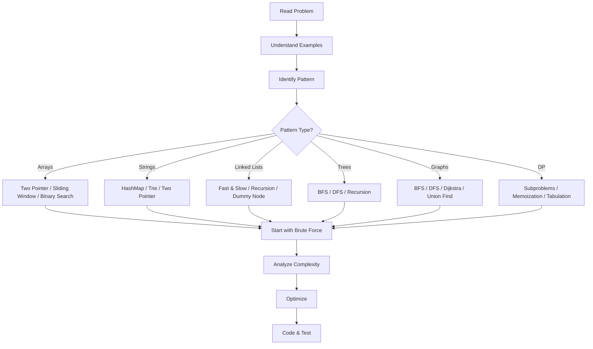

# Chapter 2: Coding Problem Solving

## Learning Objectives

- Master 40 solved coding problems across arrays, strings, linked lists, trees, graphs, and dynamic programming
- Understand three approaches per problem: brute force, better, and optimal
- Analyze time and space complexity for each solution
- Write clean TypeScript implementations with proper type annotations
- Develop pattern recognition to map problems to appropriate algorithms

<!-- Image Gallery -->
<div style="display:flex;flex-wrap:wrap;gap:4px;margin:16px 0;padding:12px;background:#f8fafc;border-radius:8px;border:1px solid #e2e8f0;">
<a href="../../../assets/images/lessons/interview-preparation/02-coding-problem-solving/hero.svg" target="_blank" rel="noopener">
  
</a>
<a href="../../../assets/images/lessons/interview-preparation/02-coding-problem-solving/handwritten-notes.svg" target="_blank" rel="noopener">
  
</a>
<a href="../../../assets/images/lessons/interview-preparation/02-coding-problem-solving/sticky-notes.svg" target="_blank" rel="noopener">
  
</a>
<a href="../../../assets/images/lessons/interview-preparation/02-coding-problem-solving/visual-explanation.svg" target="_blank" rel="noopener">
  
</a>
<a href="../../../assets/images/lessons/interview-preparation/02-coding-problem-solving/architecture.svg" target="_blank" rel="noopener">
  
</a>
<a href="../../../assets/images/lessons/interview-preparation/02-coding-problem-solving/workflow.svg" target="_blank" rel="noopener">
  
</a>
<a href="../../../assets/images/lessons/interview-preparation/02-coding-problem-solving/mindmap.svg" target="_blank" rel="noopener">
  
</a>
<a href="../../../assets/images/lessons/interview-preparation/02-coding-problem-solving/comparison.svg" target="_blank" rel="noopener">
  
</a>
<a href="../../../assets/images/lessons/interview-preparation/02-coding-problem-solving/cheatsheet.svg" target="_blank" rel="noopener">
  
</a>
<a href="../../../assets/images/lessons/interview-preparation/02-coding-problem-solving/interview-quiz.svg" target="_blank" rel="noopener">
  
</a>
<a href="../../../assets/images/lessons/interview-preparation/02-coding-problem-solving/social-card.svg" target="_blank" rel="noopener">
  
</a>
</div>
<!-- End Image Gallery -->

## Problem-Solving Framework



### UMPIRE Method

| Step | Description |
|------|-------------|
| **U**nderstand | Read the problem twice. Ask clarifying questions. Confirm inputs/outputs. |
| **M**atch | Identify the problem pattern. Map to known algorithms. |
| **P**lan | Outline the approach. Pseudocode before coding. |
| **I**mplement | Write clean, well-named code. Handle edge cases. |
| **R**eview | Walk through your code with an example. Check for bugs. |
| **E**valuate | State time and space complexity. Discuss trade-offs. |

---

## Section 1: Array Problems

### Problem 1: Two Sum

**Problem:** Given an array of integers `nums` and an integer `target`, return indices of two numbers that add up to target.

**Example:** `nums = [2, 7, 11, 15], target = 9` → `[0, 1]`

<details>
<summary><b>Approach 1: Brute Force — O(n²) time, O(1) space</b></summary>

```typescript
function twoSumBrute(nums: number[], target: number): number[] {
  for (let i = 0; i < nums.length; i++) {
    for (let j = i + 1; j < nums.length; j++) {
      if (nums[i] + nums[j] === target) {
        return [i, j];
      }
    }
  }
  return [];
}
```
</details>

<details>
<summary><b>Approach 2: Better — HashMap — O(n) time, O(n) space</b></summary>

```typescript
function twoSum(nums: number[], target: number): number[] {
  const map = new Map<number, number>();
  
  for (let i = 0; i < nums.length; i++) {
    const complement = target - nums[i];
    if (map.has(complement)) {
      return [map.get(complement)!, i];
    }
    map.set(nums[i], i);
  }
  return [];
}
```
</details>

**Why HashMap works:** For each element, we check if its complement (target - element) has been seen before. HashMap gives O(1) lookup, making this optimal.

---

### Problem 2: Contains Duplicate

**Problem:** Given an array, return true if any value appears at least twice.

**Example:** `[1, 2, 3, 1]` → `true`

<details>
<summary><b>Approach 1: Brute Force — O(n²)</b></summary>

```typescript
function containsDuplicateBrute(nums: number[]): boolean {
  for (let i = 0; i < nums.length; i++) {
    for (let j = i + 1; j < nums.length; j++) {
      if (nums[i] === nums[j]) return true;
    }
  }
  return false;
}
```
</details>

<details>
<summary><b>Approach 2: Better — Sort — O(n log n)</b></summary>

```typescript
function containsDuplicateSort(nums: number[]): boolean {
  nums.sort((a, b) => a - b);
  for (let i = 1; i < nums.length; i++) {
    if (nums[i] === nums[i - 1]) return true;
  }
  return false;
}
```
</details>

<details>
<summary><b>Approach 3: Optimal — HashSet — O(n) time, O(n) space</b></summary>

```typescript
function containsDuplicate(nums: number[]): boolean {
  const seen = new Set<number>();
  for (const num of nums) {
    if (seen.has(num)) return true;
    seen.add(num);
  }
  return false;
}
```
</details>

---

### Problem 3: Maximum Subarray (Kadane's Algorithm)

**Problem:** Find contiguous subarray with the largest sum.

**Example:** `[-2, 1, -3, 4, -1, 2, 1, -5, 4]` → `6` (subarray `[4, -1, 2, 1]`)

<details>
<summary><b>Approach 1: Brute Force — O(n²)</b></summary>

```typescript
function maxSubArrayBrute(nums: number[]): number {
  let maxSum = -Infinity;
  for (let i = 0; i < nums.length; i++) {
    let current = 0;
    for (let j = i; j < nums.length; j++) {
      current += nums[j];
      maxSum = Math.max(maxSum, current);
    }
  }
  return maxSum;
}
```
</details>

<details>
<summary><b>Approach 2: Optimal — Kadane's Algorithm — O(n) time, O(1) space</b></summary>

```typescript
function maxSubArray(nums: number[]): number {
  let maxEndingHere = nums[0];
  let maxSoFar = nums[0];
  
  for (let i = 1; i < nums.length; i++) {
    maxEndingHere = Math.max(nums[i], maxEndingHere + nums[i]);
    maxSoFar = Math.max(maxSoFar, maxEndingHere);
  }
  return maxSoFar;
}

// Return the subarray itself
function maxSubArrayWithElements(nums: number[]): number[] {
  let maxEndingHere = nums[0];
  let maxSoFar = nums[0];
  let start = 0, end = 0, tempStart = 0;
  
  for (let i = 1; i < nums.length; i++) {
    if (nums[i] > maxEndingHere + nums[i]) {
      maxEndingHere = nums[i];
      tempStart = i;
    } else {
      maxEndingHere = maxEndingHere + nums[i];
    }
    
    if (maxEndingHere > maxSoFar) {
      maxSoFar = maxEndingHere;
      start = tempStart;
      end = i;
    }
  }
  return nums.slice(start, end + 1);
}
```
</details>

**Intuition:** Kadane's algorithm realizes that a subarray ending at index `i` is either just `nums[i]` (start new) or extends the previous subarray. We track the best we've seen overall.

---

### Problem 4: Product of Array Except Self

**Problem:** Return array where `answer[i]` equals product of all elements except `nums[i]`. Cannot use division.

**Example:** `[1, 2, 3, 4]` → `[24, 12, 8, 6]`

<details>
<summary><b>Approach 1: Brute Force — O(n²)</b></summary>

```typescript
function productExceptSelfBrute(nums: number[]): number[] {
  const result: number[] = [];
  for (let i = 0; i < nums.length; i++) {
    let product = 1;
    for (let j = 0; j < nums.length; j++) {
      if (i !== j) product *= nums[j];
    }
    result.push(product);
  }
  return result;
}
```
</details>

<details>
<summary><b>Approach 2: Optimal — Prefix/Suffix Products — O(n) time, O(1) extra space</b></summary>

```typescript
function productExceptSelf(nums: number[]): number[] {
  const n = nums.length;
  const result = new Array<number>(n).fill(1);
  
  // Left products
  let leftProduct = 1;
  for (let i = 0; i < n; i++) {
    result[i] = leftProduct;
    leftProduct *= nums[i];
  }
  
  // Right products (multiply into result)
  let rightProduct = 1;
  for (let i = n - 1; i >= 0; i--) {
    result[i] *= rightProduct;
    rightProduct *= nums[i];
  }
  
  return result;
}
```
</details>

**Key insight:** For each index `i`, `answer[i] = product of elements before i * product of elements after i`. Two passes compute left and right products.

---

### Problem 5: Best Time to Buy and Sell Stock

**Problem:** Given stock prices array, find maximum profit from one buy followed by one sell.

**Example:** `[7, 1, 5, 3, 6, 4]` → `5` (buy at 1, sell at 6)

<details>
<summary><b>Approach 1: Brute Force — O(n²)</b></summary>

```typescript
function maxProfitBrute(prices: number[]): number {
  let maxProfit = 0;
  for (let i = 0; i < prices.length; i++) {
    for (let j = i + 1; j < prices.length; j++) {
      maxProfit = Math.max(maxProfit, prices[j] - prices[i]);
    }
  }
  return maxProfit;
}
```
</details>

<details>
<summary><b>Approach 2: Optimal — One Pass — O(n) time, O(1) space</b></summary>

```typescript
function maxProfit(prices: number[]): number {
  let minPrice = Infinity;
  let maxProfit = 0;
  
  for (const price of prices) {
    if (price < minPrice) {
      minPrice = price;
    } else {
      maxProfit = Math.max(maxProfit, price - minPrice);
    }
  }
  return maxProfit;
}
```
</details>

**Intuition:** Track the minimum price seen so far. For each day, calculate profit if we sell today. Keep the maximum.

---

### Problem 6: Move Zeroes

**Problem:** Move all zeros to the end maintaining relative order of non-zero elements.

**Example:** `[0, 1, 0, 3, 12]` → `[1, 3, 12, 0, 0]`

<details>
<summary><b>Two Pointer — O(n) time, O(1) space</b></summary>

```typescript
function moveZeroes(nums: number[]): void {
  let nonZeroIndex = 0;
  
  // Move all non-zero elements to the front
  for (let i = 0; i < nums.length; i++) {
    if (nums[i] !== 0) {
      nums[nonZeroIndex] = nums[i];
      nonZeroIndex++;
    }
  }
  
  // Fill remaining positions with zeros
  for (let i = nonZeroIndex; i < nums.length; i++) {
    nums[i] = 0;
  }
}

// Alternate approach: Swap in place
function moveZeroesSwap(nums: number[]): void {
  let lastNonZeroFoundAt = 0;
  for (let i = 0; i < nums.length; i++) {
    if (nums[i] !== 0) {
      [nums[lastNonZeroFoundAt], nums[i]] = [nums[i], nums[lastNonZeroFoundAt]];
      lastNonZeroFoundAt++;
    }
  }
}
```
</details>

---

### Problem 7: Three Sum

**Problem:** Find all unique triplets that sum to zero.

**Example:** `[-1, 0, 1, 2, -1, -4]` → `[[-1, -1, 2], [-1, 0, 1]]`

<details>
<summary><b>Approach 1: Brute Force — O(n³)</b></summary>

```typescript
function threeSumBrute(nums: number[]): number[][] {
  const result: number[][] = [];
  const seen = new Set<string>();
  
  for (let i = 0; i < nums.length; i++) {
    for (let j = i + 1; j < nums.length; j++) {
      for (let k = j + 1; k < nums.length; k++) {
        if (nums[i] + nums[j] + nums[k] === 0) {
          const triplet = [nums[i], nums[j], nums[k]].sort((a, b) => a - b);
          const key = triplet.join(',');
          if (!seen.has(key)) {
            seen.add(key);
            result.push(triplet);
          }
        }
      }
    }
  }
  return result;
}
```
</details>

<details>
<summary><b>Approach 2: Optimal — Sort + Two Pointers — O(n²) time, O(1) space (excl. output)</b></summary>

```typescript
function threeSum(nums: number[]): number[][] {
  const result: number[][] = [];
  nums.sort((a, b) => a - b);
  
  for (let i = 0; i < nums.length - 2; i++) {
    if (i > 0 && nums[i] === nums[i - 1]) continue; // Skip duplicates
    
    let left = i + 1;
    let right = nums.length - 1;
    
    while (left < right) {
      const sum = nums[i] + nums[left] + nums[right];
      
      if (sum === 0) {
        result.push([nums[i], nums[left], nums[right]]);
        
        // Skip duplicates
        while (left < right && nums[left] === nums[left + 1]) left++;
        while (left < right && nums[right] === nums[right - 1]) right--;
        
        left++;
        right--;
      } else if (sum < 0) {
        left++;
      } else {
        right--;
      }
    }
  }
  return result;
}
```
</details>

**Pattern:** Sorting + two-pointer is the standard approach for k-sum problems after fixing k-2 elements.

---

### Problem 8: Container With Most Water

**Problem:** Find two lines that together with x-axis form a container holding maximum water.

**Example:** `[1, 8, 6, 2, 5, 4, 8, 3, 7]` → `49`

<details>
<summary><b>Two Pointer — O(n) time, O(1) space</b></summary>

```typescript
function maxArea(height: number[]): number {
  let left = 0;
  let right = height.length - 1;
  let maxWater = 0;
  
  while (left < right) {
    const width = right - left;
    const minHeight = Math.min(height[left], height[right]);
    maxWater = Math.max(maxWater, width * minHeight);
    
    // Move the shorter line inward
    if (height[left] < height[right]) {
      left++;
    } else {
      right--;
    }
  }
  
  return maxWater;
}
```
</details>

**Why moving shorter line works:** The area is limited by the shorter line. Moving the shorter line inward might find a taller line. Moving the taller line inward would only decrease width without potential height gain.

---

### Problem 9: Find Minimum in Rotated Sorted Array

**Problem:** Find minimum element in a rotated sorted array.

**Example:** `[3, 4, 5, 1, 2]` → `1`

<details>
<summary><b>Binary Search — O(log n) time, O(1) space</b></summary>

```typescript
function findMin(nums: number[]): number {
  let left = 0;
  let right = nums.length - 1;
  
  while (left < right) {
    const mid = Math.floor((left + right) / 2);
    
    if (nums[mid] > nums[right]) {
      // Minimum is in the right half
      left = mid + 1;
    } else {
      // Minimum is in the left half (including mid)
      right = mid;
    }
  }
  
  return nums[left];
}
```
</details>

**Key insight:** In a rotated sorted array, the minimum is the only element smaller than its left neighbor. Binary search exploits pattern: if `nums[mid] > nums[right]`, the rotation point is in the right half.

---

### Problem 10: Merge Intervals

**Problem:** Merge all overlapping intervals.

**Example:** `[[1,3],[2,6],[8,10],[15,18]]` → `[[1,6],[8,10],[15,18]]`

<details>
<summary><b>Sort + Linear Scan — O(n log n) time, O(n) space</b></summary>

```typescript
function merge(intervals: number[][]): number[][] {
  if (intervals.length <= 1) return intervals;
  
  intervals.sort((a, b) => a[0] - b[0]);
  const result: number[][] = [intervals[0]];
  
  for (let i = 1; i < intervals.length; i++) {
    const [start, end] = intervals[i];
    const last = result[result.length - 1];
    
    if (start <= last[1]) {
      // Overlapping: merge
      last[1] = Math.max(last[1], end);
    } else {
      // Non-overlapping: add new
      result.push([start, end]);
    }
  }
  
  return result;
}
```
</details>

**Edge cases:** Empty array, single interval, already merged, all overlapping.

---

## Section 2: String Problems

### Problem 11: Valid Palindrome

**Problem:** Return true if string is palindrome considering only alphanumeric chars, ignoring case.

**Example:** `"A man, a plan, a canal: Panama"` → `true`

<details>
<summary><b>Two Pointer — O(n) time, O(1) space</b></summary>

```typescript
function isPalindrome(s: string): boolean {
  let left = 0;
  let right = s.length - 1;
  
  while (left < right) {
    // Skip non-alphanumeric characters
    while (left < right && !isAlphanumeric(s[left])) left++;
    while (left < right && !isAlphanumeric(s[right])) right--;
    
    if (s[left].toLowerCase() !== s[right].toLowerCase()) {
      return false;
    }
    
    left++;
    right--;
  }
  
  return true;
}

function isAlphanumeric(ch: string): boolean {
  return /[a-zA-Z0-9]/.test(ch);
}
```
</details>

---

### Problem 12: Longest Substring Without Repeating Characters

**Problem:** Find length of longest substring without repeating characters.

**Example:** `"abcabcbb"` → `3` (substring `"abc"`)

<details>
<summary><b>Approach 1: Brute Force — O(n³)</b></summary>

```typescript
function lengthOfLongestSubstringBrute(s: string): number {
  let maxLen = 0;
  for (let i = 0; i < s.length; i++) {
    for (let j = i; j < s.length; j++) {
      const sub = s.slice(i, j + 1);
      if (new Set(sub).size === sub.length) {
        maxLen = Math.max(maxLen, sub.length);
      }
    }
  }
  return maxLen;
}
```
</details>

<details>
<summary><b>Approach 2: Optimal — Sliding Window — O(n) time, O(min(m, n)) space</b></summary>

```typescript
function lengthOfLongestSubstring(s: string): number {
  const charIndex = new Map<string, number>();
  let maxLen = 0;
  let left = 0;
  
  for (let right = 0; right < s.length; right++) {
    const char = s[right];
    
    if (charIndex.has(char) && charIndex.get(char)! >= left) {
      left = charIndex.get(char)! + 1;
    }
    
    charIndex.set(char, right);
    maxLen = Math.max(maxLen, right - left + 1);
  }
  
  return maxLen;
}
```
</details>

**Sliding window pattern:** Expand right pointer, if duplicate found, shrink left pointer past the previous occurrence. Track max window size.

---

### Problem 13: Valid Anagram

**Problem:** Return true if `t` is an anagram of `s`.

**Example:** `s = "anagram", t = "nagaram"` → `true`

<details>
<summary><b>Approach 1: Sort — O(n log n)</b></summary>

```typescript
function isAnagramSort(s: string, t: string): boolean {
  if (s.length !== t.length) return false;
  return s.split('').sort().join('') === t.split('').sort().join('');
}
```
</details>

<details>
<summary><b>Approach 2: Optimal — HashMap/Frequency Counter — O(n) time, O(1) space</b></summary>

```typescript
function isAnagram(s: string, t: string): boolean {
  if (s.length !== t.length) return false;
  
  const freq = new Array<number>(26).fill(0);
  
  for (let i = 0; i < s.length; i++) {
    freq[s.charCodeAt(i) - 97]++;
    freq[t.charCodeAt(i) - 97]--;
  }
  
  return freq.every(count => count === 0);
}
```
</details>

---

### Problem 14: Group Anagrams

**Problem:** Group anagrams together from an array of strings.

**Example:** `["eat","tea","tan","ate","nat","bat"]` → `[["bat"],["nat","tan"],["ate","eat","tea"]]`

<details>
<summary><b>HashMap + Sorted Key — O(n * k log k) time, O(nk) space</b></summary>

```typescript
function groupAnagrams(strs: string[]): string[][] {
  const map = new Map<string, string[]>();
  
  for (const str of strs) {
    const sortedKey = str.split('').sort().join('');
    
    if (!map.has(sortedKey)) {
      map.set(sortedKey, []);
    }
    map.get(sortedKey)!.push(str);
  }
  
  return Array.from(map.values());
}

// Alternative: Use character count as key (O(nk) time)
function groupAnagramsOptimized(strs: string[]): string[][] {
  const map = new Map<string, string[]>();
  
  for (const str of strs) {
    const count = new Array<number>(26).fill(0);
    for (const ch of str) {
      count[ch.charCodeAt(0) - 97]++;
    }
    const key = count.join('#');
    
    if (!map.has(key)) {
      map.set(key, []);
    }
    map.get(key)!.push(str);
  }
  
  return Array.from(map.values());
}
```
</details>

---

### Problem 15: Longest Palindromic Substring

**Problem:** Return longest palindromic substring.

**Example:** `"babad"` → `"bab"` or `"aba"`

<details>
<summary><b>Approach 1: Brute Force — O(n³)</b></summary>

```typescript
function longestPalindromeBrute(s: string): string {
  let longest = '';
  
  for (let i = 0; i < s.length; i++) {
    for (let j = i; j < s.length; j++) {
      const sub = s.slice(i, j + 1);
      if (sub === sub.split('').reverse().join('') && sub.length > longest.length) {
        longest = sub;
      }
    }
  }
  
  return longest;
}
```
</details>

<details>
<summary><b>Approach 2: Optimal — Expand Around Center — O(n²) time, O(1) space</b></summary>

```typescript
function longestPalindrome(s: string): string {
  if (s.length <= 1) return s;
  
  let start = 0;
  let maxLen = 1;
  
  function expandAroundCenter(left: number, right: number): void {
    while (left >= 0 && right < s.length && s[left] === s[right]) {
      const currentLen = right - left + 1;
      if (currentLen > maxLen) {
        maxLen = currentLen;
        start = left;
      }
      left--;
      right++;
    }
  }
  
  for (let i = 0; i < s.length; i++) {
    expandAroundCenter(i, i);     // Odd length palindrome
    expandAroundCenter(i, i + 1); // Even length palindrome
  }
  
  return s.slice(start, start + maxLen);
}
```
</details>

---

### Problem 16: First Unique Character in a String

**Problem:** Find first non-repeating character index; return -1 if none.

**Example:** `"leetcode"` → `0` (l), `"loveleetcode"` → `2` (v)

<details>
<summary><b>HashMap — O(n) time, O(1) space</b></summary>

```typescript
function firstUniqChar(s: string): number {
  const freq = new Map<string, number>();
  
  for (const ch of s) {
    freq.set(ch, (freq.get(ch) || 0) + 1);
  }
  
  for (let i = 0; i < s.length; i++) {
    if (freq.get(s[i]) === 1) return i;
  }
  
  return -1;
}
```
</details>

---

## Section 3: Linked List Problems

### Problem 17: Reverse a Linked List

<details>
<summary><b>Approach 1: Iterative — O(n) time, O(1) space</b></summary>

```typescript
class ListNode<T> {
  constructor(
    public val: T,
    public next: ListNode<T> | null = null
  ) {}
}

function reverseList<T>(head: ListNode<T> | null): ListNode<T> | null {
  let prev: ListNode<T> | null = null;
  let current = head;
  
  while (current) {
    const nextTemp = current.next;
    current.next = prev;
    prev = current;
    current = nextTemp;
  }
  
  return prev;
}
```
</details>

<details>
<summary><b>Approach 2: Recursive — O(n) time, O(n) space (call stack)</b></summary>

```typescript
function reverseListRecursive<T>(head: ListNode<T> | null): ListNode<T> | null {
  if (!head || !head.next) return head;
  
  const reversed = reverseListRecursive(head.next);
  head.next.next = head;
  head.next = null;
  
  return reversed;
}
```
</details>

---

### Problem 18: Detect Cycle in Linked List

<details>
<summary><b>Floyd's Cycle Detection (Fast & Slow) — O(n) time, O(1) space</b></summary>

```typescript
function hasCycle<T>(head: ListNode<T> | null): boolean {
  if (!head || !head.next) return false;
  
  let slow: ListNode<T> | null = head;
  let fast: ListNode<T> | null = head;
  
  while (fast && fast.next) {
    slow = slow!.next;
    fast = fast.next.next;
    
    if (slow === fast) return true;
  }
  
  return false;
}

// Find cycle start node
function detectCycle<T>(head: ListNode<T> | null): ListNode<T> | null {
  if (!head || !head.next) return null;
  
  let slow: ListNode<T> | null = head;
  let fast: ListNode<T> | null = head;
  
  // Detect cycle
  while (fast && fast.next) {
    slow = slow!.next;
    fast = fast.next.next;
    if (slow === fast) break;
  }
  
  if (!fast || !fast.next) return null; // No cycle
  
  // Find cycle start
  slow = head;
  while (slow !== fast) {
    slow = slow!.next;
    fast = fast!.next;
  }
  
  return slow;
}
```
</details>

**Proof:** Distance from head to cycle start = Distance from meeting point to cycle start (by Floyd's algorithm).

---

### Problem 19: Merge Two Sorted Lists

<details>
<summary><b>Approach 1: Iterative with Dummy Node — O(n+m) time, O(1) space</b></summary>

```typescript
function mergeTwoLists<T>(
  list1: ListNode<T> | null,
  list2: ListNode<T> | null
): ListNode<T> | null {
  const dummy = new ListNode<T>(null as any);
  let current = dummy;
  
  while (list1 && list2) {
    if (list1.val < list2.val) {
      current.next = list1;
      list1 = list1.next;
    } else {
      current.next = list2;
      list2 = list2.next;
    }
    current = current.next;
  }
  
  current.next = list1 || list2;
  
  return dummy.next;
}
```
</details>

<details>
<summary><b>Approach 2: Recursive — O(n+m) time, O(n+m) space</b></summary>

```typescript
function mergeTwoListsRecursive<T extends number | string>(
  list1: ListNode<T> | null,
  list2: ListNode<T> | null
): ListNode<T> | null {
  if (!list1) return list2;
  if (!list2) return list1;
  
  if (list1.val < list2.val) {
    list1.next = mergeTwoListsRecursive(list1.next, list2);
    return list1;
  } else {
    list2.next = mergeTwoListsRecursive(list1, list2.next);
    return list2;
  }
}
```
</details>

---

### Problem 20: Remove Nth Node From End

<details>
<summary><b>Two Pass — O(n) time, O(1) space</b></summary>

```typescript
function removeNthFromEnd<T>(head: ListNode<T> | null, n: number): ListNode<T> | null {
  const dummy = new ListNode<T>(null as any, head);
  let length = 0;
  let current = head;
  
  while (current) {
    length++;
    current = current.next;
  }
  
  const target = length - n;
  current = dummy;
  for (let i = 0; i < target; i++) {
    current = current.next!;
  }
  
  current.next = current.next!.next;
  return dummy.next;
}
```
</details>

<details>
<summary><b>One Pass — Fast & Slow Pointer — O(n) time, O(1) space</b></summary>

```typescript
function removeNthFromEndOnePass<T>(head: ListNode<T> | null, n: number): ListNode<T> | null {
  const dummy = new ListNode<T>(null as any, head);
  let fast: ListNode<T> | null = dummy;
  let slow: ListNode<T> | null = dummy;
  
  // Move fast n+1 steps ahead
  for (let i = 0; i <= n; i++) {
    fast = fast!.next;
  }
  
  // Move both until fast reaches end
  while (fast) {
    slow = slow!.next;
    fast = fast.next;
  }
  
  // Remove nth node
  slow!.next = slow!.next!.next;
  
  return dummy.next;
}
```
</details>

---

## Section 4: Tree Problems

### Problem 21: Maximum Depth of Binary Tree

<details>
<summary><b>Approach 1: Recursive — DFS — O(n) time, O(h) space</b></summary>

```typescript
class TreeNode<T> {
  constructor(
    public val: T,
    public left: TreeNode<T> | null = null,
    public right: TreeNode<T> | null = null
  ) {}
}

function maxDepth<T>(root: TreeNode<T> | null): number {
  if (!root) return 0;
  return 1 + Math.max(maxDepth(root.left), maxDepth(root.right));
}
```
</details>

<details>
<summary><b>Approach 2: Iterative — BFS — O(n) time, O(w) space</b></summary>

```typescript
function maxDepthBFS<T>(root: TreeNode<T> | null): number {
  if (!root) return 0;
  
  const queue: TreeNode<T>[] = [root];
  let depth = 0;
  
  while (queue.length > 0) {
    const levelSize = queue.length;
    for (let i = 0; i < levelSize; i++) {
      const node = queue.shift()!;
      if (node.left) queue.push(node.left);
      if (node.right) queue.push(node.right);
    }
    depth++;
  }
  
  return depth;
}
```
</details>

---

### Problem 22: Invert Binary Tree

<details>
<summary><b>Recursive — O(n) time, O(h) space</b></summary>

```typescript
function invertTree<T>(root: TreeNode<T> | null): TreeNode<T> | null {
  if (!root) return null;
  
  const left = invertTree(root.left);
  const right = invertTree(root.right);
  
  root.left = right;
  root.right = left;
  
  return root;
}

// Iterative
function invertTreeIterative<T>(root: TreeNode<T> | null): TreeNode<T> | null {
  if (!root) return null;
  
  const queue: TreeNode<T>[] = [root];
  
  while (queue.length > 0) {
    const node = queue.shift()!;
    [node.left, node.right] = [node.right, node.left];
    if (node.left) queue.push(node.left);
    if (node.right) queue.push(node.right);
  }
  
  return root;
}
```
</details>

---

### Problem 23: Validate Binary Search Tree

<details>
<summary><b>Inorder Traversal — O(n) time, O(h) space</b></summary>

```typescript
function isValidBST(root: TreeNode<number> | null): boolean {
  const values: number[] = [];
  
  function inorder(node: TreeNode<number> | null): void {
    if (!node) return;
    inorder(node.left);
    values.push(node.val);
    inorder(node.right);
  }
  
  inorder(root);
  
  for (let i = 1; i < values.length; i++) {
    if (values[i] <= values[i - 1]) return false;
  }
  
  return true;
}

// Optimal: Recursive with bounds — O(n)
function isValidBSTRange(root: TreeNode<number> | null, min = -Infinity, max = Infinity): boolean {
  if (!root) return true;
  if (root.val <= min || root.val >= max) return false;
  return isValidBSTRange(root.left, min, root.val) && isValidBSTRange(root.right, root.val, max);
}
```
</details>

---

### Problem 24: Binary Tree Level Order Traversal

<details>
<summary><b>BFS — O(n) time, O(w) space</b></summary>

```typescript
function levelOrder<T>(root: TreeNode<T> | null): T[][] {
  if (!root) return [];
  
  const result: T[][] = [];
  const queue: TreeNode<T>[] = [root];
  
  while (queue.length > 0) {
    const levelSize = queue.length;
    const currentLevel: T[] = [];
    
    for (let i = 0; i < levelSize; i++) {
      const node = queue.shift()!;
      currentLevel.push(node.val);
      if (node.left) queue.push(node.left);
      if (node.right) queue.push(node.right);
    }
    
    result.push(currentLevel);
  }
  
  return result;
}
```
</details>

---

### Problem 25: Lowest Common Ancestor of BST

<details>
<summary><b>Recursive — O(h) time, O(h) space</b></summary>

```typescript
function lowestCommonAncestor(
  root: TreeNode<number> | null,
  p: TreeNode<number>,
  q: TreeNode<number>
): TreeNode<number> | null {
  if (!root) return null;
  
  if (p.val < root.val && q.val < root.val) {
    return lowestCommonAncestor(root.left, p, q);
  }
  if (p.val > root.val && q.val > root.val) {
    return lowestCommonAncestor(root.right, p, q);
  }
  
  return root; // Found split point
}

// Iterative — O(h) time, O(1) space
function lowestCommonAncestorIterative(
  root: TreeNode<number> | null,
  p: TreeNode<number>,
  q: TreeNode<number>
): TreeNode<number> | null {
  let current = root;
  
  while (current) {
    if (p.val < current.val && q.val < current.val) {
      current = current.left;
    } else if (p.val > current.val && q.val > current.val) {
      current = current.right;
    } else {
      return current;
    }
  }
  
  return null;
}
```
</details>

---

## Section 5: Graph Problems

### Problem 26: Number of Islands

**Problem:** Count number of islands in a 2D grid ('1' = land, '0' = water).

**Example:**
```
11110
11010
11000
00000
```
→ `1` island

<details>
<summary><b>DFS — O(m*n) time, O(m*n) space (worst case)</b></summary>

```typescript
function numIslands(grid: string[][]): number {
  if (grid.length === 0) return 0;
  
  const rows = grid.length;
  const cols = grid[0].length;
  let count = 0;
  
  function dfs(r: number, c: number): void {
    if (r < 0 || r >= rows || c < 0 || c >= cols || grid[r][c] === '0') {
      return;
    }
    
    grid[r][c] = '0'; // Mark visited by sinking
    
    dfs(r + 1, c);
    dfs(r - 1, c);
    dfs(r, c + 1);
    dfs(r, c - 1);
  }
  
  for (let r = 0; r < rows; r++) {
    for (let c = 0; c < cols; c++) {
      if (grid[r][c] === '1') {
        count++;
        dfs(r, c);
      }
    }
  }
  
  return count;
}
```
</details>

---

### Problem 27: Clone Graph

<details>
<summary><b>DFS with HashMap — O(V+E) time, O(V) space</b></summary>

```typescript
class GraphNode {
  constructor(
    public val: number,
    public neighbors: GraphNode[] = []
  ) {}
}

function cloneGraph(node: GraphNode | null): GraphNode | null {
  if (!node) return null;
  
  const visited = new Map<GraphNode, GraphNode>();
  
  function dfs(original: GraphNode): GraphNode {
    if (visited.has(original)) {
      return visited.get(original)!;
    }
    
    const clone = new GraphNode(original.val);
    visited.set(original, clone);
    
    for (const neighbor of original.neighbors) {
      clone.neighbors.push(dfs(neighbor));
    }
    
    return clone;
  }
  
  return dfs(node);
}
```
</details>

---

### Problem 28: Course Schedule (Topological Sort)

**Problem:** Can you finish all courses given prerequisites? (Detect cycle in DAG)

<details>
<summary><b>Kahn's Algorithm (BFS) — O(V+E) time, O(V+E) space</b></summary>

```typescript
function canFinish(numCourses: number, prerequisites: number[][]): boolean {
  const graph = new Map<number, number[]>();
  const inDegree = new Array<number>(numCourses).fill(0);
  
  // Build graph
  for (const [course, prereq] of prerequisites) {
    if (!graph.has(prereq)) graph.set(prereq, []);
    graph.get(prereq)!.push(course);
    inDegree[course]++;
  }
  
  // Start with courses having no prerequisites
  const queue: number[] = [];
  for (let i = 0; i < numCourses; i++) {
    if (inDegree[i] === 0) queue.push(i);
  }
  
  let completed = 0;
  
  while (queue.length > 0) {
    const course = queue.shift()!;
    completed++;
    
    for (const neighbor of graph.get(course) || []) {
      inDegree[neighbor]--;
      if (inDegree[neighbor] === 0) {
        queue.push(neighbor);
      }
    }
  }
  
  return completed === numCourses;
}
```
</details>

---

### Problem 29: Word Ladder

**Problem:** Return length of shortest transformation sequence from beginWord to endWord.

<details>
<summary><b>BFS — O(M² * N) time, O(M² * N) space</b></summary>

```typescript
function ladderLength(beginWord: string, endWord: string, wordList: string[]): number {
  const wordSet = new Set(wordList);
  if (!wordSet.has(endWord)) return 0;
  
  const queue: string[] = [beginWord];
  let level = 1;
  
  while (queue.length > 0) {
    const levelSize = queue.length;
    
    for (let i = 0; i < levelSize; i++) {
      const word = queue.shift()!;
      
      if (word === endWord) return level;
      
      // Try changing each character
      for (let j = 0; j < word.length; j++) {
        for (let ch = 97; ch <= 122; ch++) {
          const newChar = String.fromCharCode(ch);
          const newWord = word.slice(0, j) + newChar + word.slice(j + 1);
          
          if (wordSet.has(newWord)) {
            queue.push(newWord);
            wordSet.delete(newWord); // Prevent revisiting
          }
        }
      }
    }
    
    level++;
  }
  
  return 0;
}
```
</details>

---

### Problem 30: Rotting Oranges

**Problem:** Return minutes until all oranges rot, or -1 if impossible.

<details>
<summary><b>Multi-source BFS — O(m*n) time, O(m*n) space</b></summary>

```typescript
function orangesRotting(grid: number[][]): number {
  const rows = grid.length;
  const cols = grid[0].length;
  const queue: [number, number][] = [];
  let fresh = 0;
  
  // Count fresh oranges and add rotten ones to queue
  for (let r = 0; r < rows; r++) {
    for (let c = 0; c < cols; c++) {
      if (grid[r][c] === 2) queue.push([r, c]);
      if (grid[r][c] === 1) fresh++;
    }
  }
  
  if (fresh === 0) return 0;
  
  const dirs = [[0, 1], [0, -1], [1, 0], [-1, 0]];
  let minutes = 0;
  
  while (queue.length > 0 && fresh > 0) {
    const levelSize = queue.length;
    
    for (let i = 0; i < levelSize; i++) {
      const [r, c] = queue.shift()!;
      
      for (const [dr, dc] of dirs) {
        const nr = r + dr;
        const nc = c + dc;
        
        if (nr >= 0 && nr < rows && nc >= 0 && nc < cols && grid[nr][nc] === 1) {
          grid[nr][nc] = 2;
          queue.push([nr, nc]);
          fresh--;
        }
      }
    }
    
    minutes++;
  }
  
  return fresh === 0 ? minutes : -1;
}
```
</details>

---

## Section 6: Dynamic Programming Problems

### Problem 31: Fibonacci Number

<details>
<summary><b>Approach 1: Recursive — O(2ⁿ) time, O(n) space</b></summary>

```typescript
function fibRecursive(n: number): number {
  if (n <= 1) return n;
  return fibRecursive(n - 1) + fibRecursive(n - 2);
}
```
</details>

<details>
<summary><b>Approach 2: DP — Tabulation — O(n) time, O(n) space</b></summary>

```typescript
function fibDP(n: number): number {
  if (n <= 1) return n;
  const dp = new Array<number>(n + 1).fill(0);
  dp[1] = 1;
  for (let i = 2; i <= n; i++) {
    dp[i] = dp[i - 1] + dp[i - 2];
  }
  return dp[n];
}
```
</details>

<details>
<summary><b>Approach 3: Optimal — Two Variables — O(n) time, O(1) space</b></summary>

```typescript
function fib(n: number): number {
  if (n <= 1) return n;
  let prev = 0, curr = 1;
  for (let i = 2; i <= n; i++) {
    [prev, curr] = [curr, prev + curr];
  }
  return curr;
}
```
</details>

---

### Problem 32: Climbing Stairs

**Problem:** n steps, can climb 1 or 2 steps at a time. Count distinct ways to reach top.

<details>
<summary><b>DP — O(n) time, O(1) space</b></summary>

```typescript
function climbStairs(n: number): number {
  if (n <= 2) return n;
  
  let prev2 = 1; // Ways to reach step 1
  let prev1 = 2; // Ways to reach step 2
  
  for (let i = 3; i <= n; i++) {
    const current = prev1 + prev2;
    prev2 = prev1;
    prev1 = current;
  }
  
  return prev1;
}
```
</details>

**Pattern:** This is Fibonacci in disguise. `dp[i] = dp[i-1] + dp[i-2]`.

---

### Problem 33: Coin Change

**Problem:** Return fewest coins needed to make up amount, or -1 if impossible.

<details>
<summary><b>DP — Tabulation — O(amount * coins) time, O(amount) space</b></summary>

```typescript
function coinChange(coins: number[], amount: number): number {
  const dp = new Array<number>(amount + 1).fill(Infinity);
  dp[0] = 0;
  
  for (let i = 1; i <= amount; i++) {
    for (const coin of coins) {
      if (coin <= i) {
        dp[i] = Math.min(dp[i], 1 + dp[i - coin]);
      }
    }
  }
  
  return dp[amount] === Infinity ? -1 : dp[amount];
}
```
</details>

**Key insight:** For each amount, try every coin. The optimal substructure: `dp[i] = 1 + dp[i - coin]`.

---

### Problem 34: Longest Increasing Subsequence (LIS)

<details>
<summary><b>Approach 1: DP — O(n²) time, O(n) space</b></summary>

```typescript
function lengthOfLIS(nums: number[]): number {
  const dp = new Array<number>(nums.length).fill(1);
  let maxLen = 1;
  
  for (let i = 1; i < nums.length; i++) {
    for (let j = 0; j < i; j++) {
      if (nums[i] > nums[j]) {
        dp[i] = Math.max(dp[i], dp[j] + 1);
      }
    }
    maxLen = Math.max(maxLen, dp[i]);
  }
  
  return maxLen;
}
```
</details>

<details>
<summary><b>Approach 2: Optimal — Binary Search — O(n log n) time, O(n) space</b></summary>

```typescript
function lengthOfLISOptimized(nums: number[]): number {
  const piles: number[] = [];
  
  for (const num of nums) {
    // Binary search: find first pile with top >= num
    let left = 0;
    let right = piles.length;
    
    while (left < right) {
      const mid = Math.floor((left + right) / 2);
      if (piles[mid] < num) {
        left = mid + 1;
      } else {
        right = mid;
      }
    }
    
    if (left === piles.length) {
      piles.push(num);
    } else {
      piles[left] = num;
    }
  }
  
  return piles.length;
}
```
</details>

**Intuition (Patience Sorting):** Maintain piles where each pile's top is the smallest possible ending value for an increasing subsequence of that length.

---

### Problem 35: Maximum Product Subarray

<details>
<summary><b>DP — Track min and max — O(n) time, O(1) space</b></summary>

```typescript
function maxProduct(nums: number[]): number {
  let maxSoFar = nums[0];
  let minSoFar = nums[0];
  let result = nums[0];
  
  for (let i = 1; i < nums.length; i++) {
    const current = nums[i];
    const tempMax = Math.max(current, maxSoFar * current, minSoFar * current);
    const tempMin = Math.min(current, maxSoFar * current, minSoFar * current);
    
    maxSoFar = tempMax;
    minSoFar = tempMin;
    result = Math.max(result, maxSoFar);
  }
  
  return result;
}
```
</details>

**Why track min:** A negative number multiplied by the minimum (most negative) can become the maximum.

---

### Problem 36: Edit Distance (Levenshtein Distance)

<details>
<summary><b>DP — O(m*n) time, O(m*n) space</b></summary>

```typescript
function minDistance(word1: string, word2: string): number {
  const m = word1.length;
  const n = word2.length;
  
  const dp = Array.from({ length: m + 1 }, () => new Array<number>(n + 1).fill(0));
  
  // Base cases
  for (let i = 0; i <= m; i++) dp[i][0] = i;
  for (let j = 0; j <= n; j++) dp[0][j] = j;
  
  for (let i = 1; i <= m; i++) {
    for (let j = 1; j <= n; j++) {
      if (word1[i - 1] === word2[j - 1]) {
        dp[i][j] = dp[i - 1][j - 1];
      } else {
        dp[i][j] = 1 + Math.min(
          dp[i - 1][j],     // Delete
          dp[i][j - 1],     // Insert
          dp[i - 1][j - 1]  // Replace
        );
      }
    }
  }
  
  return dp[m][n];
}
```
</details>

---

### Problem 37: 0/1 Knapsack

<details>
<summary><b>DP — O(n*W) time, O(n*W) space</b></summary>

```typescript
function knapsack(weights: number[], values: number[], capacity: number): number {
  const n = weights.length;
  const dp = Array.from({ length: n + 1 }, () => new Array<number>(capacity + 1).fill(0));
  
  for (let i = 1; i <= n; i++) {
    for (let w = 1; w <= capacity; w++) {
      if (weights[i - 1] <= w) {
        dp[i][w] = Math.max(
          values[i - 1] + dp[i - 1][w - weights[i - 1]],
          dp[i - 1][w]
        );
      } else {
        dp[i][w] = dp[i - 1][w];
      }
    }
  }
  
  return dp[n][capacity];
}

// Optimized: 1D DP array
function knapsackOptimized(weights: number[], values: number[], capacity: number): number {
  const dp = new Array<number>(capacity + 1).fill(0);
  
  for (let i = 0; i < weights.length; i++) {
    for (let w = capacity; w >= weights[i]; w--) {
      dp[w] = Math.max(dp[w], values[i] + dp[w - weights[i]]);
    }
  }
  
  return dp[capacity];
}
```
</details>

---

### Problem 38: Unique Paths

**Problem:** Robot at top-left of m×n grid, moves only right/down. Count paths to bottom-right.

<details>
<summary><b>DP — O(m*n) time, O(n) space</b></summary>

```typescript
function uniquePaths(m: number, n: number): number {
  const dp = new Array<number>(n).fill(1);
  
  for (let i = 1; i < m; i++) {
    for (let j = 1; j < n; j++) {
      dp[j] += dp[j - 1];
    }
  }
  
  return dp[n - 1];
}

// Mathematical: Combinations (m+n-2 choose m-1)
function uniquePathsMath(m: number, n: number): number {
  const total = m + n - 2;
  const k = Math.min(m - 1, n - 1);
  let result = 1;
  
  for (let i = 1; i <= k; i++) {
    result = Math.floor(result * (total - k + i) / i);
  }
  
  return result;
}
```
</details>

---

### Problem 39: Longest Common Subsequence (LCS)

<details>
<summary><b>DP — O(m*n) time, O(m*n) space</b></summary>

```typescript
function longestCommonSubsequence(text1: string, text2: string): number {
  const m = text1.length;
  const n = text2.length;
  
  const dp = Array.from({ length: m + 1 }, () => new Array<number>(n + 1).fill(0));
  
  for (let i = 1; i <= m; i++) {
    for (let j = 1; j <= n; j++) {
      if (text1[i - 1] === text2[j - 1]) {
        dp[i][j] = dp[i - 1][j - 1] + 1;
      } else {
        dp[i][j] = Math.max(dp[i - 1][j], dp[i][j - 1]);
      }
    }
  }
  
  return dp[m][n];
}

// Get actual LCS string
function getLCS(text1: string, text2: string): string {
  const m = text1.length;
  const n = text2.length;
  const dp = Array.from({ length: m + 1 }, () => new Array<number>(n + 1).fill(0));
  
  for (let i = 1; i <= m; i++) {
    for (let j = 1; j <= n; j++) {
      if (text1[i - 1] === text2[j - 1]) {
        dp[i][j] = dp[i - 1][j - 1] + 1;
      } else {
        dp[i][j] = Math.max(dp[i - 1][j], dp[i][j - 1]);
      }
    }
  }
  
  // Backtrack
  let i = m, j = n;
  let lcs = '';
  while (i > 0 && j > 0) {
    if (text1[i - 1] === text2[j - 1]) {
      lcs = text1[i - 1] + lcs;
      i--; j--;
    } else if (dp[i - 1][j] > dp[i][j - 1]) {
      i--;
    } else {
      j--;
    }
  }
  
  return lcs;
}
```
</details>

---

### Problem 40: House Robber

**Problem:** Maximum money you can rob without alerting police (cannot rob adjacent houses).

<details>
<summary><b>DP — O(n) time, O(1) space</b></summary>

```typescript
function rob(nums: number[]): number {
  if (nums.length === 0) return 0;
  if (nums.length === 1) return nums[0];
  
  let prev2 = nums[0];
  let prev1 = Math.max(nums[0], nums[1]);
  
  for (let i = 2; i < nums.length; i++) {
    const current = Math.max(prev1, prev2 + nums[i]);
    prev2 = prev1;
    prev1 = current;
  }
  
  return prev1;
}

// House Robber II: Houses in a circle
function robCircular(nums: number[]): number {
  if (nums.length === 0) return 0;
  if (nums.length === 1) return nums[0];
  
  const robLinear = (arr: number[]): number => {
    let prev2 = 0, prev1 = 0;
    for (const num of arr) {
      const current = Math.max(prev1, prev2 + num);
      prev2 = prev1;
      prev1 = current;
    }
    return prev1;
  };
  
  return Math.max(
    robLinear(nums.slice(0, -1)), // Exclude last
    robLinear(nums.slice(1))      // Exclude first
  );
}
```
</details>

---

## Quick Reference: Problem-Solving Pattern Cheatsheet

| Pattern | When to Use | Example Problems |
|---------|------------|-----------------|
| Two Pointers | Sorted arrays, palindrome | Two Sum II, Container Water, Valid Palindrome |
| Sliding Window | Contiguous subarrays/substrings | Max Subarray, Longest Substring, 
| Binary Search | Sorted data, find element | Search Rotated, Find Min, First/Last Position |
| Fast & Slow | Linked list cycles, middle | Cycle Detection, Middle of LL |
| BFS | Shortest path, level order, unweighted graph | Word Ladder, Rotting Oranges, Tree Level Order |
| DFS | Path existence, all paths, island counting | Number of Islands, Clone Graph |
| Backtracking | All permutations, combinations, subsets | N-Queens, Subsets, Permutations |
| DP | Optimal substructure, overlapping subproblems | Fibonacci, Coin Change, LCS, Knapsack |
| Greedy | Local optimum = global optimum | Jump Game, Coin Change (canonical currencies) |
| Union Find | Connected components, dynamic connectivity | Number of Islands, Redundant Connection |
| Trie | Prefix matching, autocomplete | Word Search, Autocomplete System |
| Topological Sort | Dependency ordering | Course Schedule, Alien Dictionary |
| Monotonic Stack | Next greater/smaller element | Next Greater Element, Largest Rectangle |

---

## Summary

This chapter covered 40 coding problems across 7 categories:

| Category | Problems | Key Techniques |
|----------|----------|---------------|
| Arrays (10) | Two Sum, Duplicate, Max Subarray, Product Except Self, Stock, Move Zeroes, Three Sum, Container Water, Rotated Min, Merge Intervals | HashMap, Kadane, Two Pointer, Binary Search |
| Strings (6) | Palindrome, Longest Substring, Anagram, Group Anagrams, Palindrome Substring, First Unique | Sliding Window, HashMap, Center Expand |
| Linked Lists (4) | Reverse, Cycle, Merge Sorted, Remove Nth | Fast & Slow, Dummy Node, Recursion |
| Trees (5) | Max Depth, Invert, Validate BST, Level Order, LCA | BFS, DFS, Recursion, Inorder |
| Graphs (4) | Islands, Clone, Course Schedule, Word Ladder, Rotting Oranges | DFS, BFS, Topological Sort |
| DP (10) | Fibonacci, Stairs, Coin Change, LIS, Max Product, Edit Distance, Knapsack, Unique Paths, LCS, House Robber | Tabulation, Memoization, Subproblems |

## Practical Takeaways

1. **Pattern recognition is key:** Most problems map to a small set of patterns. Master the patterns, not individual problems.

2. **Always start with brute force:** Even if you know the optimal solution, mention the brute force first. This shows structured thinking.

3. **Discuss trade-offs:** Interviewers love hearing you compare time vs. space complexity trade-offs.

4. **Handle edge cases first:** Empty input, single element, duplicates, negative numbers, overflow.

5. **Use UMPIRE:** Understand, Match, Plan, Implement, Review, Evaluate — this framework works for every coding problem.

6. **Practice on paper:** In interviews, you won't have an IDE. Practice writing code on paper or a whiteboard.

7. **Verbalize your thinking:** Talk through your approach even before you start coding. The interviewer wants to see your thought process.

8. **Optimal ≠ always needed:** Sometimes a clean O(n²) solution with good explanation scores better than a complex O(n log n) solution you can't explain.

9. **For government exams:** Focus on arrays, strings, recursion, and basic trees. DP and graphs are less frequently asked in PSU interviews.

10. **⭐ Must Know:** Two Sum, Max Subarray, Reverse Linked List, Valid BST, Number of Islands, Coin Change, Longest Common Subsequence.
