# Chapter 3: System Design Interview

## Learning Objectives

- Master the complete system design interview framework covering both HLD and LLD
- Understand scalability concepts: load balancing, caching, database sharding, CDN, message queues
- Design database schemas and APIs for real-world applications
- Analyze 10 comprehensive case studies with architecture diagrams
- Develop the ability to discuss trade-offs between different design choices
- Learn to structure your system design interview response effectively

<!-- Image Gallery -->
<div style="display:flex;flex-wrap:wrap;gap:4px;margin:16px 0;padding:12px;background:#f8fafc;border-radius:8px;border:1px solid #e2e8f0;">
<a href="../../../assets/images/lessons/interview-preparation/03-system-design-interview/hero.svg" target="_blank" rel="noopener">
  
</a>
<a href="../../../assets/images/lessons/interview-preparation/03-system-design-interview/handwritten-notes.svg" target="_blank" rel="noopener">
  
</a>
<a href="../../../assets/images/lessons/interview-preparation/03-system-design-interview/sticky-notes.svg" target="_blank" rel="noopener">
  
</a>
<a href="../../../assets/images/lessons/interview-preparation/03-system-design-interview/visual-explanation.svg" target="_blank" rel="noopener">
  
</a>
<a href="../../../assets/images/lessons/interview-preparation/03-system-design-interview/architecture.svg" target="_blank" rel="noopener">
  
</a>
<a href="../../../assets/images/lessons/interview-preparation/03-system-design-interview/workflow.svg" target="_blank" rel="noopener">
  
</a>
<a href="../../../assets/images/lessons/interview-preparation/03-system-design-interview/mindmap.svg" target="_blank" rel="noopener">
  
</a>
<a href="../../../assets/images/lessons/interview-preparation/03-system-design-interview/comparison.svg" target="_blank" rel="noopener">
  
</a>
<a href="../../../assets/images/lessons/interview-preparation/03-system-design-interview/cheatsheet.svg" target="_blank" rel="noopener">
  
</a>
<a href="../../../assets/images/lessons/interview-preparation/03-system-design-interview/interview-quiz.svg" target="_blank" rel="noopener">
  
</a>
<a href="../../../assets/images/lessons/interview-preparation/03-system-design-interview/social-card.svg" target="_blank" rel="noopener">
  
</a>
</div>
<!-- End Image Gallery -->


## System Design Interview Framework

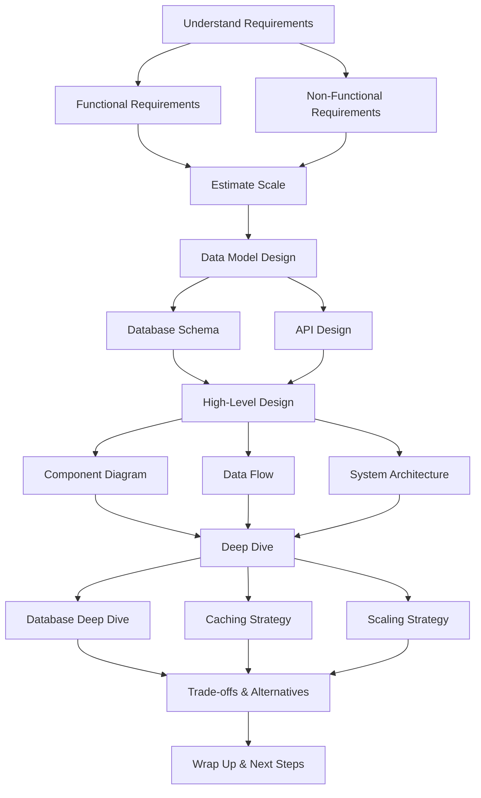

### Step-by-Step Framework

<a href="../../../assets/images/diagrams/interview-preparation/03-system-design-interview/step-by-step-framework-handwritten.svg" target="_blank" rel="noopener">
  
</a>
<a href="../../../assets/images/diagrams/interview-preparation/03-system-design-interview/step-by-step-framework-diagram.svg" target="_blank" rel="noopener">
  
</a>
<a href="../../../assets/images/diagrams/interview-preparation/03-system-design-interview/step-by-step-framework-sticky.svg" target="_blank" rel="noopener">
  
</a>


#### Step 1: Requirements Clarification (5 minutes)
| Question Type | Examples |
|--------------|----------|
| Functional | What features are needed? Who are the users? |
| Non-functional | Expected traffic? Latency requirements? Consistency vs availability? |
| Constraints | Budget? Timezone? Regulatory? |

#### Step 2: Scale Estimation (5 minutes)
| Metric | Calculation Example |
|--------|-------------------|
| Daily active users | Assume 100M DAU for a global product |
| Requests per second | `(DAU × avg requests per user) / 86400` |
| Storage | `(write rate × data size × retention period)` |
| Bandwidth | `(requests per second × response size)` |

#### Step 3: Data Model & API Design (10 minutes)
- Define entities, relationships, and schema
- Design RESTful or GraphQL APIs
- Consider indexing and query patterns

#### Step 4: High-Level Architecture (15 minutes)

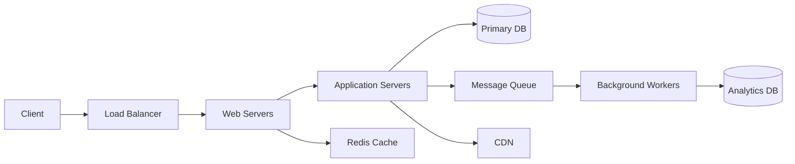

#### Step 5: Deep Dive on Components (15 minutes)
- Database: sharding, replication, indexing
- Caching: Redis/Memcached, cache eviction, cache-aside
- Scaling: horizontal vs vertical, auto-scaling
- Availability: failover, redundancy, SLAs

#### Step 6: Trade-offs Discussion (5 minutes)
- Consistency vs Availability (CAP theorem)
- SQL vs NoSQL
- Synchronous vs async processing
- Monolithic vs microservices

---

## Key Scalability Concepts

### 1. Load Balancing

<a href="../../../assets/images/diagrams/interview-preparation/03-system-design-interview/1-load-balancing-handwritten.svg" target="_blank" rel="noopener">
  
</a>
<a href="../../../assets/images/diagrams/interview-preparation/03-system-design-interview/1-load-balancing-diagram.svg" target="_blank" rel="noopener">
  
</a>
<a href="../../../assets/images/diagrams/interview-preparation/03-system-design-interview/1-load-balancing-sticky.svg" target="_blank" rel="noopener">
  
</a>

| Algorithm | How it Works | Best For |
|-----------|-------------|----------|
| Round Robin | Distributes requests sequentially | Equal-capacity servers |
| Least Connections | Sends to server with fewest active connections | Variable request processing time |
| IP Hash | Uses client IP to determine server | Session persistence |
| Weighted Round Robin | Servers have weights based on capacity | Heterogeneous server capacities |

### 2. Caching Strategies

<a href="../../../assets/images/diagrams/interview-preparation/03-system-design-interview/2-caching-strategies-handwritten.svg" target="_blank" rel="noopener">
  
</a>
<a href="../../../assets/images/diagrams/interview-preparation/03-system-design-interview/2-caching-strategies-diagram.svg" target="_blank" rel="noopener">
  
</a>
<a href="../../../assets/images/diagrams/interview-preparation/03-system-design-interview/2-caching-strategies-sticky.svg" target="_blank" rel="noopener">
  
</a>

| Strategy | Description | Use Case |
|----------|-------------|----------|
| Cache Aside | Application checks cache first, falls back to DB | General purpose |
| Read Through | Cache layer automatically loads from DB | Read-heavy workloads |
| Write Through | Write to cache and DB simultaneously | Consistency critical |
| Write Behind | Write to cache, async write to DB | Write-heavy, tolerance for data loss |
| Refresh Ahead | Cache automatically refreshes before expiry | Predictable access patterns |

**Cache Eviction Policies:**
| Policy | Behavior |
|--------|----------|
| LRU | Evicts least recently used items |
| LFU | Evicts least frequently used items |
| FIFO | Evicts items in order they were added |
| TTL | Evicts items after time-to-live expires |

### 3. Database Scaling

<a href="../../../assets/images/diagrams/interview-preparation/03-system-design-interview/3-database-scaling-handwritten.svg" target="_blank" rel="noopener">
  
</a>
<a href="../../../assets/images/diagrams/interview-preparation/03-system-design-interview/3-database-scaling-diagram.svg" target="_blank" rel="noopener">
  
</a>
<a href="../../../assets/images/diagrams/interview-preparation/03-system-design-interview/3-database-scaling-sticky.svg" target="_blank" rel="noopener">
  
</a>


| Strategy | Description | Complexity | Use Case |
|----------|-------------|-----------|----------|
| Read Replicas | Multiple read-only copies of DB | Low | Read-heavy apps |
| Sharding | Horizontal partition across DBs | High | Large datasets |
| Vertical Scaling | More powerful hardware | Low (temporary) | Rapid growth |
| Database Federation | Split DBs by feature/domain | Medium | Microservices |

**Sharding Strategies:**
```
Hash-based: hash(user_id) % num_shards
Range-based: user_id 1-10000 → shard 1, 10001-20000 → shard 2
Directory-based: Lookup table mapping keys to shards
Geographic: Users in India → India shard
```

### 4. Message Queues

<a href="../../../assets/images/diagrams/interview-preparation/03-system-design-interview/4-message-queues-handwritten.svg" target="_blank" rel="noopener">
  
</a>
<a href="../../../assets/images/diagrams/interview-preparation/03-system-design-interview/4-message-queues-diagram.svg" target="_blank" rel="noopener">
  
</a>
<a href="../../../assets/images/diagrams/interview-preparation/03-system-design-interview/4-message-queues-sticky.svg" target="_blank" rel="noopener">
  
</a>


| Feature | Kafka | RabbitMQ | SQS |
|---------|-------|----------|-----|
| Model | Pub-sub log | Message broker | Managed queue |
| Throughput | Very high | High | High |
| Ordering | Partition-level | FIFO queues | FIFO option |
| Persistence | Disk | Memory/Disk | Redundant |
| Best for | Event streaming, analytics | Task queues, RPC | Simple queuing |

### 5. CDN (Content Delivery Network)

<a href="../../../assets/images/diagrams/interview-preparation/03-system-design-interview/5-cdn-content-delivery-network-handwritten.svg" target="_blank" rel="noopener">
  
</a>
<a href="../../../assets/images/diagrams/interview-preparation/03-system-design-interview/5-cdn-content-delivery-network-diagram.svg" target="_blank" rel="noopener">
  
</a>
<a href="../../../assets/images/diagrams/interview-preparation/03-system-design-interview/5-cdn-content-delivery-network-sticky.svg" target="_blank" rel="noopener">
  
</a>

- Caches static content at edge locations
- Reduces latency for global users
- Handles DDoS protection
- Popular CDNs: CloudFront, Cloudflare, Akamai

---

## Section 1: Case Study — URL Shortener (tinyurl.com)

### Requirements

<a href="../../../assets/images/diagrams/interview-preparation/03-system-design-interview/requirements-handwritten.svg" target="_blank" rel="noopener">
  
</a>
<a href="../../../assets/images/diagrams/interview-preparation/03-system-design-interview/requirements-diagram.svg" target="_blank" rel="noopener">
  
</a>
<a href="../../../assets/images/diagrams/interview-preparation/03-system-design-interview/requirements-sticky.svg" target="_blank" rel="noopener">
  
</a>

**Functional:** Generate short URL, redirect to original, custom alias, analytics.

**Non-functional:** 10M URLs/day, read-heavy (99% reads), low latency (&lt;100ms redirect).

### Scale Estimation

<a href="../../../assets/images/diagrams/interview-preparation/03-system-design-interview/scale-estimation-handwritten.svg" target="_blank" rel="noopener">
  
</a>
<a href="../../../assets/images/diagrams/interview-preparation/03-system-design-interview/scale-estimation-diagram.svg" target="_blank" rel="noopener">
  
</a>
<a href="../../../assets/images/diagrams/interview-preparation/03-system-design-interview/scale-estimation-sticky.svg" target="_blank" rel="noopener">
  
</a>

```
Write: 10M × 100 bytes = 1 GB/day → 365 GB/year
Read: 10M × 99 reads/1 write = 990M reads/day
RPS: 10M/86400 ≈ 116 writes/sec, 11,458 reads/sec
```

### Design

<a href="../../../assets/images/diagrams/interview-preparation/03-system-design-interview/design-handwritten.svg" target="_blank" rel="noopener">
  
</a>
<a href="../../../assets/images/diagrams/interview-preparation/03-system-design-interview/design-diagram.svg" target="_blank" rel="noopener">
  
</a>
<a href="../../../assets/images/diagrams/interview-preparation/03-system-design-interview/design-sticky.svg" target="_blank" rel="noopener">
  
</a>


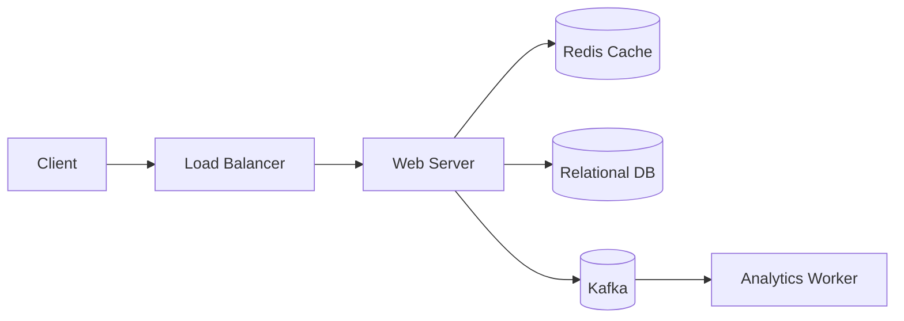

### API Design

<a href="../../../assets/images/diagrams/interview-preparation/03-system-design-interview/api-design-handwritten.svg" target="_blank" rel="noopener">
  
</a>
<a href="../../../assets/images/diagrams/interview-preparation/03-system-design-interview/api-design-diagram.svg" target="_blank" rel="noopener">
  
</a>
<a href="../../../assets/images/diagrams/interview-preparation/03-system-design-interview/api-design-sticky.svg" target="_blank" rel="noopener">
  
</a>

```typescript
POST /shorten
{
  "url": "https://example.com/very/long/url",
  "customAlias": "optional", // null for auto
  "ttl": "30d"               // optional expiry
}
→ { "shortUrl": "https://short.ly/abc123" }

GET /{shortCode}
→ 302 Redirect to original URL

GET /{shortCode}/analytics
→ { "clicks": 42000, "referrers": {...}, "timeline": [...] }
```

### Database Schema

<a href="../../../assets/images/diagrams/interview-preparation/03-system-design-interview/database-schema-handwritten.svg" target="_blank" rel="noopener">
  
</a>
<a href="../../../assets/images/diagrams/interview-preparation/03-system-design-interview/database-schema-diagram.svg" target="_blank" rel="noopener">
  
</a>
<a href="../../../assets/images/diagrams/interview-preparation/03-system-design-interview/database-schema-sticky.svg" target="_blank" rel="noopener">
  
</a>

```sql
CREATE TABLE urls (
    id BIGINT PRIMARY KEY AUTO_INCREMENT,
    short_code VARCHAR(10) UNIQUE NOT NULL,
    original_url TEXT NOT NULL,
    user_id INT,
    created_at TIMESTAMP DEFAULT CURRENT_TIMESTAMP,
    expires_at TIMESTAMP NULL,
    INDEX idx_short_code (short_code)
);

CREATE TABLE clicks (
    id BIGINT PRIMARY KEY AUTO_INCREMENT,
    short_code VARCHAR(10) NOT NULL,
    clicked_at TIMESTAMP DEFAULT CURRENT_TIMESTAMP,
    referrer VARCHAR(500),
    user_agent TEXT,
    ip_address VARCHAR(45),
    country VARCHAR(100),
    INDEX idx_short_code_ts (short_code, clicked_at)
);
```

### Short Code Generation

<a href="../../../assets/images/diagrams/interview-preparation/03-system-design-interview/short-code-generation-handwritten.svg" target="_blank" rel="noopener">
  
</a>
<a href="../../../assets/images/diagrams/interview-preparation/03-system-design-interview/short-code-generation-diagram.svg" target="_blank" rel="noopener">
  
</a>
<a href="../../../assets/images/diagrams/interview-preparation/03-system-design-interview/short-code-generation-sticky.svg" target="_blank" rel="noopener">
  
</a>

```typescript
// Base62 encoding (a-z, A-Z, 0-9) = 62^7 ≈ 3.5 trillion combinations
const BASE62 = 'abcdefghijklmnopqrstuvwxyzABCDEFGHIJKLMNOPQRSTUVWXYZ0123456789';

function generateShortCode(id: number): string {
  let code = '';
  while (id > 0) {
    code = BASE62[id % 62] + code;
    id = Math.floor(id / 62);
  }
  return code.padStart(7, 'a'); // 7 chars minimum
}

// Snowflake-style ID generator
function generateUniqueId(): number {
  const timestamp = Date.now();
  const workerId = 1;
  const sequence = 0; // Increment for same-millisecond requests
  return (timestamp << 22) | (workerId << 12) | sequence;
}
```

### Deep Dive: Cache Strategy

<a href="../../../assets/images/diagrams/interview-preparation/03-system-design-interview/deep-dive-cache-strategy-handwritten.svg" target="_blank" rel="noopener">
  
</a>
<a href="../../../assets/images/diagrams/interview-preparation/03-system-design-interview/deep-dive-cache-strategy-diagram.svg" target="_blank" rel="noopener">
  
</a>
<a href="../../../assets/images/diagrams/interview-preparation/03-system-design-interview/deep-dive-cache-strategy-sticky.svg" target="_blank" rel="noopener">
  
</a>

```
Write: Cache-aside. On URL creation, write to DB and set cache (TTL: 24h).
Read: Check Redis cache first. On miss, fetch from DB and populate cache.
Eviction: LRU for old URLs. Most popular URLs stay cached.
```

### Trade-offs

<a href="../../../assets/images/diagrams/interview-preparation/03-system-design-interview/trade-offs-handwritten.svg" target="_blank" rel="noopener">
  
</a>
<a href="../../../assets/images/diagrams/interview-preparation/03-system-design-interview/trade-offs-diagram.svg" target="_blank" rel="noopener">
  
</a>
<a href="../../../assets/images/diagrams/interview-preparation/03-system-design-interview/trade-offs-sticky.svg" target="_blank" rel="noopener">
  
</a>

| Decision | Pros | Cons |
|----------|------|------|
| SQL vs NoSQL | ACID, joins for analytics | Scaling reads requires read replicas |
| Cache | &lt;5ms redirects | Cache miss penalty, consistency lag |
| Base62 vs Hash (MD5) | No collisions | Need ID generator |
| Monolithic vs Micro | Simple deployment | Limited scalability |

---

## Section 2: Case Study — Chat System (WhatsApp)

### Requirements

<a href="../../../assets/images/diagrams/interview-preparation/03-system-design-interview/requirements-handwritten.svg" target="_blank" rel="noopener">
  
</a>
<a href="../../../assets/images/diagrams/interview-preparation/03-system-design-interview/requirements-diagram.svg" target="_blank" rel="noopener">
  
</a>
<a href="../../../assets/images/diagrams/interview-preparation/03-system-design-interview/requirements-sticky.svg" target="_blank" rel="noopener">
  
</a>

**Functional:** 1:1 messaging, group chat, online status, message delivery status, media sharing.

**Non-functional:** 1B users, &lt;100ms delivery, high availability, end-to-end encryption.

### Architecture

<a href="../../../assets/images/diagrams/interview-preparation/03-system-design-interview/architecture-handwritten.svg" target="_blank" rel="noopener">
  
</a>
<a href="../../../assets/images/diagrams/interview-preparation/03-system-design-interview/architecture-diagram.svg" target="_blank" rel="noopener">
  
</a>
<a href="../../../assets/images/diagrams/interview-preparation/03-system-design-interview/architecture-sticky.svg" target="_blank" rel="noopener">
  
</a>


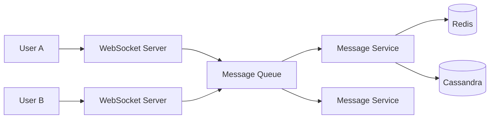

### Database Schema (Cassandra)

<a href="../../../assets/images/diagrams/interview-preparation/03-system-design-interview/database-schema-cassandra-handwritten.svg" target="_blank" rel="noopener">
  
</a>
<a href="../../../assets/images/diagrams/interview-preparation/03-system-design-interview/database-schema-cassandra-diagram.svg" target="_blank" rel="noopener">
  
</a>
<a href="../../../assets/images/diagrams/interview-preparation/03-system-design-interview/database-schema-cassandra-sticky.svg" target="_blank" rel="noopener">
  
</a>

```sql
-- For message ordering by time
CREATE TABLE messages_by_chat (
    chat_id UUID,
    message_id TIMEUUID,  -- Allows time-based sorting
    sender_id UUID,
    content TEXT,
    message_type TEXT,     -- text, image, video
    status TEXT,           -- sent, delivered, read
    created_at TIMESTAMP,
    PRIMARY KEY (chat_id, message_id)
) WITH CLUSTERING ORDER BY (message_id DESC);

-- For user's inbox
CREATE TABLE user_inbox (
    user_id UUID,
    last_message_id TIMEUUID,
    chat_id UUID,
    unread_count INT,
    PRIMARY KEY (user_id, last_message_id DESC)
);
```

### WebSocket vs Polling

<a href="../../../assets/images/diagrams/interview-preparation/03-system-design-interview/websocket-vs-polling-handwritten.svg" target="_blank" rel="noopener">
  
</a>
<a href="../../../assets/images/diagrams/interview-preparation/03-system-design-interview/websocket-vs-polling-diagram.svg" target="_blank" rel="noopener">
  
</a>
<a href="../../../assets/images/diagrams/interview-preparation/03-system-design-interview/websocket-vs-polling-sticky.svg" target="_blank" rel="noopener">
  
</a>

```typescript
// WebSocket implementation
class ChatWebSocket {
  private ws: WebSocket;
  
  connect(userId: string): void {
    this.ws = new WebSocket(`wss://chat.app/ws?userId=${userId}`);
    
    this.ws.onmessage = (event) => {
      const message = JSON.parse(event.data);
      this.displayMessage(message);
      this.sendDeliveryAck(message.id);
    };
  }
  
  sendMessage(chatId: string, content: string): void {
    const message = {
      type: 'message',
      chatId,
      content,
      timestamp: Date.now()
    };
    this.ws.send(JSON.stringify(message));
  }
  
  private sendDeliveryAck(messageId: string): void {
    this.ws.send(JSON.stringify({
      type: 'ack',
      messageId
    }));
  }
}
```

### Deep Dive: Message Delivery Guarantees

<a href="../../../assets/images/diagrams/interview-preparation/03-system-design-interview/deep-dive-message-delivery-guarantees-handwritten.svg" target="_blank" rel="noopener">
  
</a>
<a href="../../../assets/images/diagrams/interview-preparation/03-system-design-interview/deep-dive-message-delivery-guarantees-diagram.svg" target="_blank" rel="noopener">
  
</a>
<a href="../../../assets/images/diagrams/interview-preparation/03-system-design-interview/deep-dive-message-delivery-guarantees-sticky.svg" target="_blank" rel="noopener">
  
</a>

```
1. User A sends message
2. WebSocket server receives → queue → message service
3. Message service writes to Cassandra
4. If User B is online: push via WebSocket
5. If User B is offline: store for push notification
6. Delivery acknowledgment sent back to User A
7. Read receipts (blue ticks) sent when User B opens chat
```

### Trade-offs

<a href="../../../assets/images/diagrams/interview-preparation/03-system-design-interview/trade-offs-handwritten.svg" target="_blank" rel="noopener">
  
</a>
<a href="../../../assets/images/diagrams/interview-preparation/03-system-design-interview/trade-offs-diagram.svg" target="_blank" rel="noopener">
  
</a>
<a href="../../../assets/images/diagrams/interview-preparation/03-system-design-interview/trade-offs-sticky.svg" target="_blank" rel="noopener">
  
</a>

| Decision | Rationale |
|----------|-----------|
| Cassandra for messages | Write-optimized, time-series data, horizontal scaling |
| WebSocket for real-time | Persistent connection, bidirectional, low latency |
| End-to-end encryption | Privacy, regulatory compliance (Signal Protocol) |

---

## Section 3: Case Study — Ride-Sharing (Uber/Ola)

### Requirements

<a href="../../../assets/images/diagrams/interview-preparation/03-system-design-interview/requirements-handwritten.svg" target="_blank" rel="noopener">
  
</a>
<a href="../../../assets/images/diagrams/interview-preparation/03-system-design-interview/requirements-diagram.svg" target="_blank" rel="noopener">
  
</a>
<a href="../../../assets/images/diagrams/interview-preparation/03-system-design-interview/requirements-sticky.svg" target="_blank" rel="noopener">
  
</a>

**Functional:** Real-time driver tracking, ride booking, fare calculation, driver-rider matching, trip history.

**Non-functional:** 10s of millions daily rides, &lt;5s matching, millisecond location updates.

### Architecture

<a href="../../../assets/images/diagrams/interview-preparation/03-system-design-interview/architecture-handwritten.svg" target="_blank" rel="noopener">
  
</a>
<a href="../../../assets/images/diagrams/interview-preparation/03-system-design-interview/architecture-diagram.svg" target="_blank" rel="noopener">
  
</a>
<a href="../../../assets/images/diagrams/interview-preparation/03-system-design-interview/architecture-sticky.svg" target="_blank" rel="noopener">
  
</a>


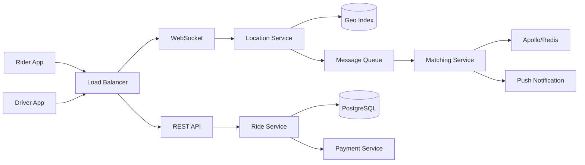

### Geographic Indexing (QuadTree)

<a href="../../../assets/images/diagrams/interview-preparation/03-system-design-interview/geographic-indexing-quadtree-handwritten.svg" target="_blank" rel="noopener">
  
</a>
<a href="../../../assets/images/diagrams/interview-preparation/03-system-design-interview/geographic-indexing-quadtree-diagram.svg" target="_blank" rel="noopener">
  
</a>
<a href="../../../assets/images/diagrams/interview-preparation/03-system-design-interview/geographic-indexing-quadtree-sticky.svg" target="_blank" rel="noopener">
  
</a>

```typescript
// Simple grid-based approach for finding nearby drivers
class GeoHashService {
  private static readonly PRECISION = 7; // ~76m × ~76m cells

  encodeGeoHash(lat: number, lng: number): string {
    const latRange = [-90, 90];
    const lngRange = [-180, 180];
    let hash = '';
    
    for (let i = 0; i < GeoHashService.PRECISION; i++) {
      let lngMid = (lngRange[0] + lngRange[1]) / 2;
      let bit = lng >= lngMid ? 1 : 0;
      hash += bit;
      lngRange[bit ? 0 : 1] = bit ? lngMid : lngRange[1 - bit];
      if (bit) lngRange[0] = lngMid;
      else lngRange[1] = lngMid;
      
      let latMid = (latRange[0] + latRange[1]) / 2;
      bit = lat >= latMid ? 1 : 0;
      hash += bit;
      latRange[bit ? 0 : 1] = bit ? latMid : latRange[1 - bit];
      if (bit) latRange[0] = latMid;
      else latRange[1] = latMid;
    }
    
    return hash;
  }

  findDrivers(riderLat: number, riderLng: number, radius: number): Driver[] {
    const riderHash = this.encodeGeoHash(riderLat, riderLng);
    const neighborHashes = this.getNeighborHashes(riderHash);
    
    return this.queryDriversByHashes(neighborHashes, riderLat, riderLng, radius);
  }
}
```

### Matching Algorithm

<a href="../../../assets/images/diagrams/interview-preparation/03-system-design-interview/matching-algorithm-handwritten.svg" target="_blank" rel="noopener">
  
</a>
<a href="../../../assets/images/diagrams/interview-preparation/03-system-design-interview/matching-algorithm-diagram.svg" target="_blank" rel="noopener">
  
</a>
<a href="../../../assets/images/diagrams/interview-preparation/03-system-design-interview/matching-algorithm-sticky.svg" target="_blank" rel="noopener">
  
</a>

```typescript
interface RideRequest {
  riderId: string;
  pickup: Location;
  dropoff: Location;
  rideType: 'economy' | 'premium' | 'xl';
}

interface Driver {
  id: string;
  location: Location;
  status: 'available' | 'busy' | 'offline';
  rating: number;
  distanceToRider: number;
}

function findBestDriver(request: RideRequest, availableDrivers: Driver[]): Driver | null {
  // Filter by availability and type
  let candidates = availableDrivers.filter(d => d.status === 'available');
  
  // Sort by distance (closest first)
  candidates.sort((a, b) => a.distanceToRider - b.distanceToRider);
  
  // Consider surge pricing, driver rating, ETA
  const threshold: Record<string, number> = {
    economy: 5,    // 5km radius
    premium: 10,
    xl: 15
  };
  
  return candidates.find(d => d.distanceToRider <= threshold[request.rideType]) || null;
}
```

### Deep Dive: Surge Pricing

<a href="../../../assets/images/diagrams/interview-preparation/03-system-design-interview/deep-dive-surge-pricing-handwritten.svg" target="_blank" rel="noopener">
  
</a>
<a href="../../../assets/images/diagrams/interview-preparation/03-system-design-interview/deep-dive-surge-pricing-diagram.svg" target="_blank" rel="noopener">
  
</a>
<a href="../../../assets/images/diagrams/interview-preparation/03-system-design-interview/deep-dive-surge-pricing-sticky.svg" target="_blank" rel="noopener">
  
</a>

```
1. Monitor supply/demand ratio in each geo-region
2. If demand > supply for >5 min → activate surge (multiplier: 1.2x to 3x)
3. Surge deters demand, attracts more drivers to area
4. Dynamic pricing equation: multiplier = Demand × elasticity / Supply
```

---

## Section 4: Case Study — Social Media Feed (Facebook/Instagram)

### Requirements

<a href="../../../assets/images/diagrams/interview-preparation/03-system-design-interview/requirements-handwritten.svg" target="_blank" rel="noopener">
  
</a>
<a href="../../../assets/images/diagrams/interview-preparation/03-system-design-interview/requirements-diagram.svg" target="_blank" rel="noopener">
  
</a>
<a href="../../../assets/images/diagrams/interview-preparation/03-system-design-interview/requirements-sticky.svg" target="_blank" rel="noopener">
  
</a>

**Functional:** View timeline feed, post content, like/comment/share, follow/unfollow, infinite scroll.

**Non-functional:** 2B users, &lt;500ms feed load, high availability, eventual consistency for feed.

### Architecture

<a href="../../../assets/images/diagrams/interview-preparation/03-system-design-interview/architecture-handwritten.svg" target="_blank" rel="noopener">
  
</a>
<a href="../../../assets/images/diagrams/interview-preparation/03-system-design-interview/architecture-diagram.svg" target="_blank" rel="noopener">
  
</a>
<a href="../../../assets/images/diagrams/interview-preparation/03-system-design-interview/architecture-sticky.svg" target="_blank" rel="noopener">
  
</a>


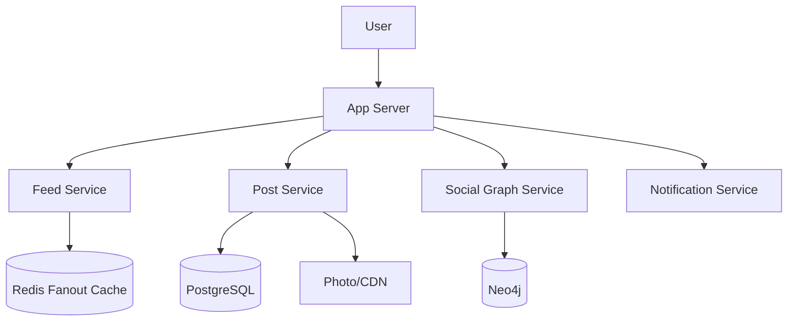

### Feed Generation Approaches

<a href="../../../assets/images/diagrams/interview-preparation/03-system-design-interview/feed-generation-approaches-handwritten.svg" target="_blank" rel="noopener">
  
</a>
<a href="../../../assets/images/diagrams/interview-preparation/03-system-design-interview/feed-generation-approaches-diagram.svg" target="_blank" rel="noopener">
  
</a>
<a href="../../../assets/images/diagrams/interview-preparation/03-system-design-interview/feed-generation-approaches-sticky.svg" target="_blank" rel="noopener">
  
</a>


| Approach | Fanout on Write | Fanout on Read |
|----------|----------------|----------------|
| How it works | Pre-compute feed for each follower when post is created | Compute feed when user opens app |
| Latency | Read: O(1), Write: O(followers) | Read: O(following), Write: O(1) |
| Storage | Need feed cache per user | No feed cache needed |
| Best for | Celebrities (&lt;10K followers) | Regular users (&lt;1000 following) |
| Hybrid | Celebrities: Fanout-on-Read, Regular: Fanout-on-Write | |

```typescript
// Hybrid Feed Service
class FeedService {
  private readonly CELEBRITY_THRESHOLD = 10000;

  async createPost(userId: string, content: string): Promise<void> {
    const postId = await this.postRepo.create(userId, content);
    const followerCount = await this.userRepo.getFollowerCount(userId);
    
    if (followerCount < this.CELEBRITY_THRESHOLD) {
      // Fanout on write: Pre-compute for all followers
      await this.fanoutOnWrite(postId, userId);
    } else {
      // Celebrity: Just mark, fanout on read
      await this.celebrityPostRepo.add(userId, postId);
    }
  }

  async getFeed(userId: string, page: number, pageSize: number): Promise<Post[]> {
    // Try loading from cache first
    let feed = await this.feedCache.get(userId, page, pageSize);
    
    if (!feed || feed.length === 0) {
      // Mix pre-computed + celebrity posts
      feed = await this.fanoutOnRead(userId, page, pageSize);
      await this.feedCache.set(userId, page, feed);
    }
    
    return feed;
  }

  private async fanoutOnWrite(postId: string, userId: string): Promise<void> {
    const followers = await this.userRepo.getFollowerIds(userId);
    
    // Batch insert into Redis sorted sets
    const pipeline = this.redis.multi();
    for (const followerId of followers) {
      pipeline.zadd(`feed:${followerId}`, Date.now(), postId);
    }
    await pipeline.exec();
  }

  private async fanoutOnRead(userId: string, page: number, pageSize: number): Promise<Post[]> {
    const following = await this.userRepo.getFollowingIds(userId);
    const celebrities = following.filter(id => /* is celebrity */);
    
    const posts: Post[] = [];
    for (const celebId of celebrities) {
      const celebPosts = await this.celebrityPostRepo.getRecent(celebId, pageSize);
      posts.push(...celebPosts);
    }
    
    // Merge with cached feed
    const cachedPosts = await this.feedCache.get(userId, page, pageSize);
    return this.mergeAndSort(posts, cachedPosts);
  }
}
```

---

## Section 5: Case Study — Payment System (Razorpay/PayPal)

### Requirements

<a href="../../../assets/images/diagrams/interview-preparation/03-system-design-interview/requirements-handwritten.svg" target="_blank" rel="noopener">
  
</a>
<a href="../../../assets/images/diagrams/interview-preparation/03-system-design-interview/requirements-diagram.svg" target="_blank" rel="noopener">
  
</a>
<a href="../../../assets/images/diagrams/interview-preparation/03-system-design-interview/requirements-sticky.svg" target="_blank" rel="noopener">
  
</a>

**Functional:** Process payments (cards, UPI, netbanking), payment status tracking, refunds, reconciliation.

**Non-functional:** 99.99% uptime, exactly-once processing, &lt;5s transaction, PCI compliance.

### Architecture

<a href="../../../assets/images/diagrams/interview-preparation/03-system-design-interview/architecture-handwritten.svg" target="_blank" rel="noopener">
  
</a>
<a href="../../../assets/images/diagrams/interview-preparation/03-system-design-interview/architecture-diagram.svg" target="_blank" rel="noopener">
  
</a>
<a href="../../../assets/images/diagrams/interview-preparation/03-system-design-interview/architecture-sticky.svg" target="_blank" rel="noopener">
  
</a>


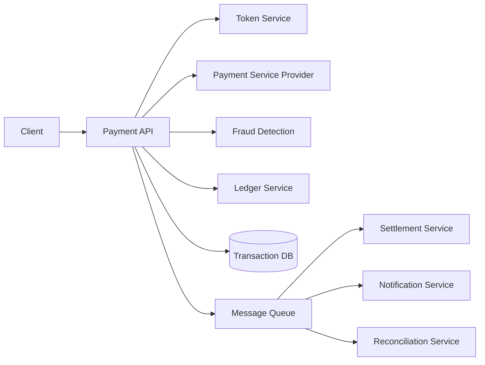

### Two-Phase Commit (Simplified)

<a href="../../../assets/images/diagrams/interview-preparation/03-system-design-interview/two-phase-commit-simplified-handwritten.svg" target="_blank" rel="noopener">
  
</a>
<a href="../../../assets/images/diagrams/interview-preparation/03-system-design-interview/two-phase-commit-simplified-diagram.svg" target="_blank" rel="noopener">
  
</a>
<a href="../../../assets/images/diagrams/interview-preparation/03-system-design-interview/two-phase-commit-simplified-sticky.svg" target="_blank" rel="noopener">
  
</a>

```typescript
enum PaymentState {
  INITIATED = 'INITIATED',
  AUTHORIZED = 'AUTHORIZED',
  CAPTURED = 'CAPTURED',
  FAILED = 'FAILED',
  REFUNDED = 'REFUNDED',
  CANCELLED = 'CANCELLED'
}

async function processPayment(payment: Payment): Promise<PaymentResult> {
  const stateMachine = new StateMachine(PaymentState.INITIATED);
  
  try {
    // Phase 1: Authorize (reserve funds)
    const authResult = await paymentGateway.authorize(payment);
    stateMachine.transition(PaymentState.AUTHORIZED);
    
    // Phase 2: Capture (actually charge)
    const captureResult = await paymentGateway.capture(authResult.transactionId);
    stateMachine.transition(PaymentState.CAPTURED);
    
    // Update ledger
    await ledgerService.createEntry({
      userId: payment.userId,
      amount: payment.amount,
      type: 'debit',
      transactionId: captureResult.transactionId
    });
    
    return { success: true, transactionId: captureResult.transactionId };
    
  } catch (error) {
    // Rollback
    if (stateMachine.current === PaymentState.AUTHORIZED) {
      await paymentGateway.void(authResult.transactionId);
    }
    stateMachine.transition(PaymentState.FAILED);
    return { success: false, error: error.message };
  }
}
```

### Idempotency Key

<a href="../../../assets/images/diagrams/interview-preparation/03-system-design-interview/idempotency-key-handwritten.svg" target="_blank" rel="noopener">
  
</a>
<a href="../../../assets/images/diagrams/interview-preparation/03-system-design-interview/idempotency-key-diagram.svg" target="_blank" rel="noopener">
  
</a>
<a href="../../../assets/images/diagrams/interview-preparation/03-system-design-interview/idempotency-key-sticky.svg" target="_blank" rel="noopener">
  
</a>

```typescript
// Ensure exactly-once processing
async function handlePaymentRequest(
  request: PaymentRequest,
  idempotencyKey: string
): Promise<PaymentResult> {
  // Check if already processed
  const existing = await cache.get(`idempotency:${idempotencyKey}`);
  if (existing) {
    return existing; // Return same result for duplicate request
  }
  
  const result = await processPayment(request);
  
  // Store result for 24 hours
  await cache.set(`idempotency:${idempotencyKey}`, result, { ttl: 86400 });
  
  return result;
}
```

---

## Section 6: Case Study — Video Streaming (YouTube/Netflix)

### Requirements

<a href="../../../assets/images/diagrams/interview-preparation/03-system-design-interview/requirements-handwritten.svg" target="_blank" rel="noopener">
  
</a>
<a href="../../../assets/images/diagrams/interview-preparation/03-system-design-interview/requirements-diagram.svg" target="_blank" rel="noopener">
  
</a>
<a href="../../../assets/images/diagrams/interview-preparation/03-system-design-interview/requirements-sticky.svg" target="_blank" rel="noopener">
  
</a>

**Functional:** Upload videos, stream video, search, recommendations, comments/likes.

**Non-functional:** 2B users, &lt;5s startup time, adaptive bitrate streaming, global CDN.

### Architecture

<a href="../../../assets/images/diagrams/interview-preparation/03-system-design-interview/architecture-handwritten.svg" target="_blank" rel="noopener">
  
</a>
<a href="../../../assets/images/diagrams/interview-preparation/03-system-design-interview/architecture-diagram.svg" target="_blank" rel="noopener">
  
</a>
<a href="../../../assets/images/diagrams/interview-preparation/03-system-design-interview/architecture-sticky.svg" target="_blank" rel="noopener">
  
</a>


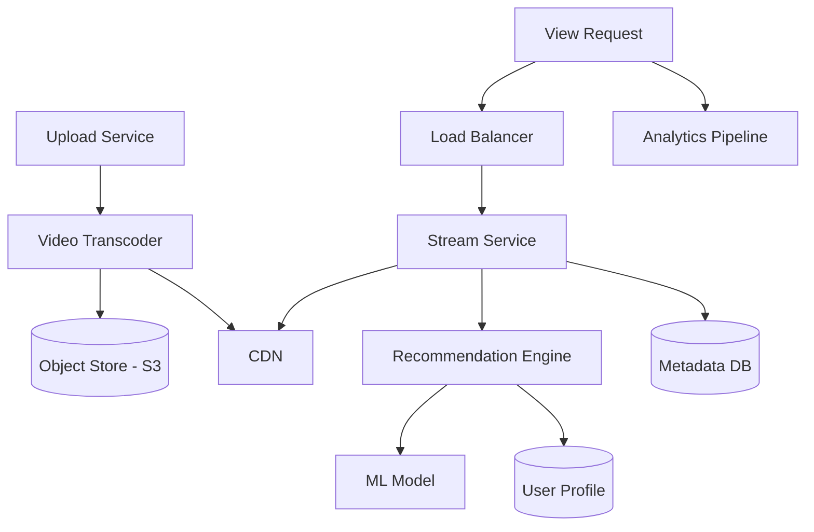

### Adaptive Bitrate Streaming (ABR)

<a href="../../../assets/images/diagrams/interview-preparation/03-system-design-interview/adaptive-bitrate-streaming-abr-handwritten.svg" target="_blank" rel="noopener">
  
</a>
<a href="../../../assets/images/diagrams/interview-preparation/03-system-design-interview/adaptive-bitrate-streaming-abr-diagram.svg" target="_blank" rel="noopener">
  
</a>
<a href="../../../assets/images/diagrams/interview-preparation/03-system-design-interview/adaptive-bitrate-streaming-abr-sticky.svg" target="_blank" rel="noopener">
  
</a>

```typescript
interface VideoManifest {
  segments: Segment[];
  qualities: Quality[];
}

interface Quality {
  label: string;        // 1080p, 720p, 480p, 360p
  bitrate: number;      // 5000kbps, 2500kbps, 1000kbps, 500kbps
  resolution: string;   // 1920x1080, 1280x720, etc.
}

class AdaptiveBitrateSelector {
  private readonly BUFFER_THRESHOLD_SECONDS = 10;
  private readonly BANDWIDTH_SAFETY_FACTOR = 0.8;

  selectQuality(
    availableQualities: Quality[],
    currentBandwidth: number,
    bufferLevel: number
  ): Quality {
    // If buffer is low, downgrade quality
    if (bufferLevel < this.BUFFER_THRESHOLD_SECONDS) {
      return this.findBestQuality(availableQualities, 
                                  currentBandwidth * 0.5 * this.BANDWIDTH_SAFETY_FACTOR);
    }
    
    // Otherwise, select highest quality within 80% of bandwidth
    return this.findBestQuality(availableQualities, 
                                currentBandwidth * this.BANDWIDTH_SAFETY_FACTOR);
  }

  private findBestQuality(qualities: Quality[], maxBitrate: number): Quality {
    return qualities
      .filter(q => q.bitrate <= maxBitrate)
      .sort((a, b) => b.bitrate - a.bitrate)[0];
  }
}
```

---

## Section 7: Case Study — E-Commerce Platform (Amazon/Flipkart)

### Requirements

<a href="../../../assets/images/diagrams/interview-preparation/03-system-design-interview/requirements-handwritten.svg" target="_blank" rel="noopener">
  
</a>
<a href="../../../assets/images/diagrams/interview-preparation/03-system-design-interview/requirements-diagram.svg" target="_blank" rel="noopener">
  
</a>
<a href="../../../assets/images/diagrams/interview-preparation/03-system-design-interview/requirements-sticky.svg" target="_blank" rel="noopener">
  
</a>

**Functional:** Product catalog, cart, checkout, payment, order tracking, inventory management.

**Non-functional:** 1M products, 100K concurrent users, &lt;500ms search, high availability during sales.

### Architecture

<a href="../../../assets/images/diagrams/interview-preparation/03-system-design-interview/architecture-handwritten.svg" target="_blank" rel="noopener">
  
</a>
<a href="../../../assets/images/diagrams/interview-preparation/03-system-design-interview/architecture-diagram.svg" target="_blank" rel="noopener">
  
</a>
<a href="../../../assets/images/diagrams/interview-preparation/03-system-design-interview/architecture-sticky.svg" target="_blank" rel="noopener">
  
</a>


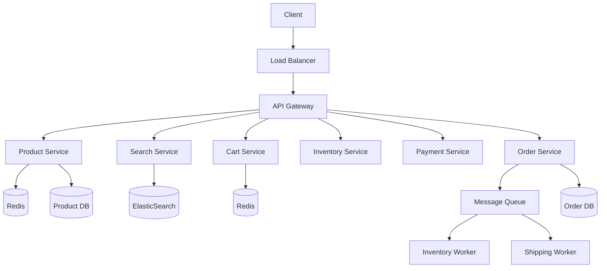

### Inventory Reservation Pattern

<a href="../../../assets/images/diagrams/interview-preparation/03-system-design-interview/inventory-reservation-pattern-handwritten.svg" target="_blank" rel="noopener">
  
</a>
<a href="../../../assets/images/diagrams/interview-preparation/03-system-design-interview/inventory-reservation-pattern-diagram.svg" target="_blank" rel="noopener">
  
</a>
<a href="../../../assets/images/diagrams/interview-preparation/03-system-design-interview/inventory-reservation-pattern-sticky.svg" target="_blank" rel="noopener">
  
</a>

```typescript
async function addToCart(userId: string, productId: string, quantity: number): Promise<boolean> {
  const key = `inventory:${productId}`;
  
  // Atomic decrement to reserve inventory (prevent overselling)
  const available = await redis.decrBy(key, quantity);
  
  if (available < 0) {
    // Rollback: release reserved inventory
    await redis.incrBy(key, quantity);
    return false; // Not enough stock
  }
  
  // Add to cart
  await redis.hincrBy(`cart:${userId}`, productId, quantity);
  
  // Set TTL for abandoned carts (30 min)
  await redis.expire(`cart:${userId}`, 1800);
  
  return true;
}

// Order confirmation releases permanent deduction
async function placeOrder(userId: string): Promise<Order> {
  const cartItems = await redis.hgetall(`cart:${userId}`);
  
  // Start distributed transaction
  const order = await orderService.create(userId, cartItems);
  
  // Schedule inventory deduction for confirmation window
  await mq.send('inventory:confirm', { 
    items: cartItems, 
    orderId: order.id 
  });
  
  // Clear cart
  await redis.del(`cart:${userId}`);
  
  return order;
}
```

---

## Section 8: Case Study — Notification System

### Requirements

<a href="../../../assets/images/diagrams/interview-preparation/03-system-design-interview/requirements-handwritten.svg" target="_blank" rel="noopener">
  
</a>
<a href="../../../assets/images/diagrams/interview-preparation/03-system-design-interview/requirements-diagram.svg" target="_blank" rel="noopener">
  
</a>
<a href="../../../assets/images/diagrams/interview-preparation/03-system-design-interview/requirements-sticky.svg" target="_blank" rel="noopener">
  
</a>

**Functional:** Push notifications, email, SMS, in-app notifications, preference management.

**Non-functional:** 1M notifications/min, &lt;100ms delivery, 99.9% deliverability.

### Architecture

<a href="../../../assets/images/diagrams/interview-preparation/03-system-design-interview/architecture-handwritten.svg" target="_blank" rel="noopener">
  
</a>
<a href="../../../assets/images/diagrams/interview-preparation/03-system-design-interview/architecture-diagram.svg" target="_blank" rel="noopener">
  
</a>
<a href="../../../assets/images/diagrams/interview-preparation/03-system-design-interview/architecture-sticky.svg" target="_blank" rel="noopener">
  
</a>


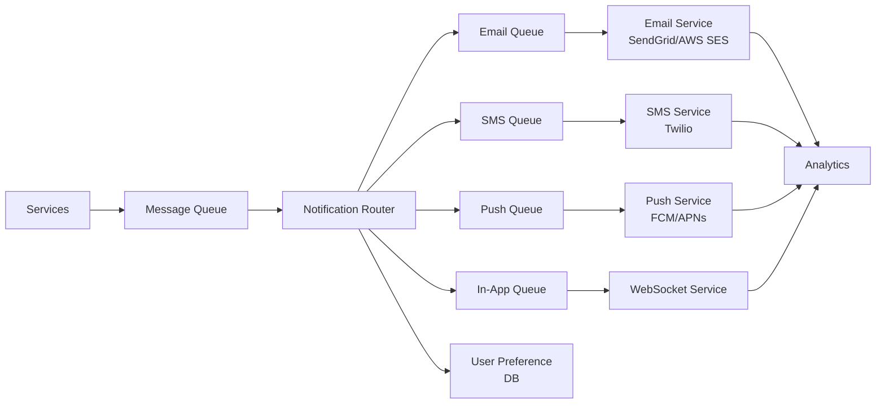

### Rate Limiting & Deduplication

<a href="../../../assets/images/diagrams/interview-preparation/03-system-design-interview/rate-limiting-deduplication-handwritten.svg" target="_blank" rel="noopener">
  
</a>
<a href="../../../assets/images/diagrams/interview-preparation/03-system-design-interview/rate-limiting-deduplication-diagram.svg" target="_blank" rel="noopener">
  
</a>
<a href="../../../assets/images/diagrams/interview-preparation/03-system-design-interview/rate-limiting-deduplication-sticky.svg" target="_blank" rel="noopener">
  
</a>

```typescript
class NotificationService {
  private readonly RATE_LIMITS = {
    email: { perMinute: 5, perHour: 50 },
    sms: { perHour: 10 },
    push: { perDay: 100 }
  };

  async send(userId: string, notification: Notification): Promise<boolean> {
    const channel = notification.channel;
    const limits = this.RATE_LIMITS[channel];
    
    // Rate limit check
    const key = `ratelimit:${channel}:${userId}`;
    const count = await redis.incr(key);
    
    if (count === 1) {
      await redis.expire(key, 3600); // 1 hour TTL
    }
    
    if (count > limits.perHour) {
      return false; // Rate limited
    }
    
    // Deduplication (same content within 5 min)
    const dedupKey = `dedup:${userId}:${this.hashContent(notification)}`;
    const exists = await redis.setnx(dedupKey, '1');
    if (exists === 0) {
      return false; // Duplicate
    }
    await redis.expire(dedupKey, 300);
    
    // Respect user preferences
    const prefs = await this.userPreferences.get(userId);
    if (!prefs.channels.includes(channel)) {
      return false; // Channel disabled by user
    }
    
    // Route to appropriate queue
    await this.routeToQueue(notification);
    return true;
  }

  private hashContent(notification: Notification): string {
    return crypto.createHash('sha256')
      .update(`${notification.type}:${notification.title}:${notification.body}`)
      .digest('hex')
      .slice(0, 16);
  }
}
```

---

## Section 9: Case Study — Rate Limiter

### Algorithms

<a href="../../../assets/images/diagrams/interview-preparation/03-system-design-interview/algorithms-handwritten.svg" target="_blank" rel="noopener">
  
</a>
<a href="../../../assets/images/diagrams/interview-preparation/03-system-design-interview/algorithms-diagram.svg" target="_blank" rel="noopener">
  
</a>
<a href="../../../assets/images/diagrams/interview-preparation/03-system-design-interview/algorithms-sticky.svg" target="_blank" rel="noopener">
  
</a>


| Algorithm | How it Works | Pros | Cons |
|-----------|-------------|------|------|
| Token Bucket | Tokens added at fixed rate, consumed per request | Smooth burst handling | Complex parameter tuning |
| Leaky Bucket | Requests processed at fixed rate | Predictable output | Drops burst requests |
| Fixed Window | Counter resets at window boundary | Simple | Burst at boundary |
| Sliding Window Log | Timestamp-based sliding window | Most accurate | Memory heavy |
| Sliding Window Counter | Combines fixed window + counter | Good accuracy + efficiency | Approximation |

### Token Bucket Implementation

<a href="../../../assets/images/diagrams/interview-preparation/03-system-design-interview/token-bucket-implementation-handwritten.svg" target="_blank" rel="noopener">
  
</a>
<a href="../../../assets/images/diagrams/interview-preparation/03-system-design-interview/token-bucket-implementation-diagram.svg" target="_blank" rel="noopener">
  
</a>
<a href="../../../assets/images/diagrams/interview-preparation/03-system-design-interview/token-bucket-implementation-sticky.svg" target="_blank" rel="noopener">
  
</a>

```typescript
class TokenBucket {
  private tokens: Map<string, { count: number; lastRefill: number }> = new Map();
  
  constructor(
    private maxTokens: number,
    private refillRate: number,      // tokens per second
    private refillInterval: number    // in ms
  ) {}

  allow(key: string): boolean {
    const now = Date.now();
    let bucket = this.tokens.get(key);
    
    if (!bucket) {
      bucket = { count: this.maxTokens, lastRefill: now };
      this.tokens.set(key, bucket);
    }
    
    // Refill tokens
    const elapsed = now - bucket.lastRefill;
    const tokensToAdd = Math.floor(elapsed / this.refillInterval) * this.refillRate;
    
    if (tokensToAdd > 0) {
      bucket.count = Math.min(this.maxTokens, bucket.count + tokensToAdd);
      bucket.lastRefill = now;
    }
    
    // Check if allowed
    if (bucket.count > 0) {
      bucket.count--;
      return true;
    }
    
    return false;
  }
}

// Usage: 10 requests per second
const rateLimiter = new TokenBucket(10, 1, 100);
if (rateLimiter.allow(`user:${userId}`)) {
  // Process request
} else {
  // Return 429 Too Many Requests
}
```

---

## Section 10: Case Study — Distributed Web Crawler

### Requirements

<a href="../../../assets/images/diagrams/interview-preparation/03-system-design-interview/requirements-handwritten.svg" target="_blank" rel="noopener">
  
</a>
<a href="../../../assets/images/diagrams/interview-preparation/03-system-design-interview/requirements-diagram.svg" target="_blank" rel="noopener">
  
</a>
<a href="../../../assets/images/diagrams/interview-preparation/03-system-design-interview/requirements-sticky.svg" target="_blank" rel="noopener">
  
</a>

**Functional:** Crawl websites, extract content, detect duplicates, respect robots.txt, schedule recrawls.

**Non-functional:** 10B pages, distributed, polite (respect crawl delay), fault-tolerant.

### Architecture

<a href="../../../assets/images/diagrams/interview-preparation/03-system-design-interview/architecture-handwritten.svg" target="_blank" rel="noopener">
  
</a>
<a href="../../../assets/images/diagrams/interview-preparation/03-system-design-interview/architecture-diagram.svg" target="_blank" rel="noopener">
  
</a>
<a href="../../../assets/images/diagrams/interview-preparation/03-system-design-interview/architecture-sticky.svg" target="_blank" rel="noopener">
  
</a>


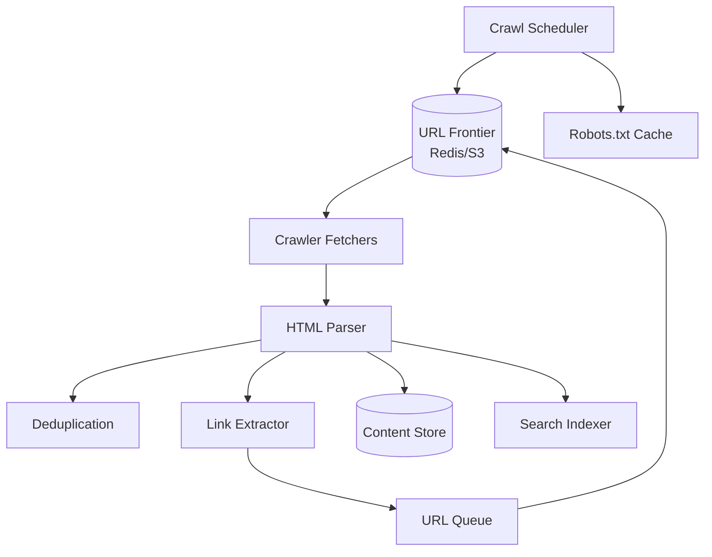

### Polite Crawler Implementation

<a href="../../../assets/images/diagrams/interview-preparation/03-system-design-interview/polite-crawler-implementation-handwritten.svg" target="_blank" rel="noopener">
  
</a>
<a href="../../../assets/images/diagrams/interview-preparation/03-system-design-interview/polite-crawler-implementation-diagram.svg" target="_blank" rel="noopener">
  
</a>
<a href="../../../assets/images/diagrams/interview-preparation/03-system-design-interview/polite-crawler-implementation-sticky.svg" target="_blank" rel="noopener">
  
</a>

```typescript
interface CrawlJob {
  url: string;
  domain: string;
  depth: number;
  priority: number;
}

class PoliteCrawler {
  private domainDelays: Map<string, number> = new Map();
  private lastCrawl: Map<string, number> = new Map();
  
  constructor(private defaultDelay: number = 1000) {}

  async crawl(job: CrawlJob): Promise<void> {
    const { url, domain } = job;
    
    // Respect Crawl-Delay from robots.txt
    const delay = this.domainDelays.get(domain) || this.defaultDelay;
    const lastTime = this.lastCrawl.get(domain) || 0;
    const elapsed = Date.now() - lastTime;
    
    if (elapsed < delay) {
      await this.sleep(delay - elapsed); // Wait before crawling
    }
    
    try {
      const response = await fetch(url, {
        headers: { 'User-Agent': 'Crawler/1.0' }
      });
      
      if (response.ok) {
        const html = await response.text();
        const links = this.extractLinks(html, url);
        
        // Check robots.txt
        const allowedLinks = await this.filterByRobotsTxt(links, domain);
        
        // Send discovered URLs to frontier
        await this.urlFrontier.add(allowedLinks);
        
        // Deduplicate content
        const contentHash = this.hashContent(html);
        if (!await this.dedupStore.exists(contentHash)) {
          await this.dedupStore.store(contentHash);
          await this.contentStore.store(url, html);
        }
      }
      
      this.lastCrawl.set(domain, Date.now());
      
    } catch (error) {
      // Retry with exponential backoff
      await this.scheduleRetry(job);
    }
  }

  private hashContent(html: string): string {
    // Normalize whitespace, strip tags
    const normalized = html.replace(/\s+/g, ' ').replace(/<[^>]*>/g, '');
    return crypto.createHash('sha256').update(normalized).digest('hex');
  }
}
```

---

## Quick Reference Tables

### System Design Concepts Summary

<a href="../../../assets/images/diagrams/interview-preparation/03-system-design-interview/system-design-concepts-summary-handwritten.svg" target="_blank" rel="noopener">
  
</a>
<a href="../../../assets/images/diagrams/interview-preparation/03-system-design-interview/system-design-concepts-summary-diagram.svg" target="_blank" rel="noopener">
  
</a>
<a href="../../../assets/images/diagrams/interview-preparation/03-system-design-interview/system-design-concepts-summary-sticky.svg" target="_blank" rel="noopener">
  
</a>


| Concept | Key Points |
|---------|-----------|
| Load Balancing | Round Robin, Least Connections, IP Hash, Weighted |
| Caching | Cache-Aside, Write-Through, Write-Behind, LRU, LFU, TTL |
| Database Scaling | Read Replicas, Sharding, Partitioning, Federation |
| SQL vs NoSQL | ACID vs BASE, Schema vs Schema-less, Joins vs Denormalized |
| CAP Theorem | CP (consistency), AP (availability), pick 2 |
| Message Queue | Kafka (log), RabbitMQ (broker), SQS (managed) |
| CDN | Edge caching, DDoS protection, Geo-distribution |
| Consistency | Strong vs Eventual vs Read-your-writes |
| Idempotency | Exactly-once processing, idempotency keys |
| Rate Limiting | Token Bucket, Leaky Bucket, Sliding Window |

### Database Choice Guide

<a href="../../../assets/images/diagrams/interview-preparation/03-system-design-interview/database-choice-guide-handwritten.svg" target="_blank" rel="noopener">
  
</a>
<a href="../../../assets/images/diagrams/interview-preparation/03-system-design-interview/database-choice-guide-diagram.svg" target="_blank" rel="noopener">
  
</a>
<a href="../../../assets/images/diagrams/interview-preparation/03-system-design-interview/database-choice-guide-sticky.svg" target="_blank" rel="noopener">
  
</a>


| Requirement | Recommended DB | Example |
|-------------|---------------|---------|
| Transactions, complex queries | PostgreSQL | Payments, banking |
| Read-heavy, simple queries | MySQL + Read Replicas | Content sites |
| Time series, high write | Cassandra | Chat messages, logs |
| Caching, session store | Redis | Session, rate limiting |
| Document, flexible schema | MongoDB | CMS, catalogs |
| Full-text search | Elasticsearch | Search, analytics |
| Graph relationships | Neo4j | Social graph, recommendations |

### Non-Functional Requirement Targets

<a href="../../../assets/images/diagrams/interview-preparation/03-system-design-interview/non-functional-requirement-targets-handwritten.svg" target="_blank" rel="noopener">
  
</a>
<a href="../../../assets/images/diagrams/interview-preparation/03-system-design-interview/non-functional-requirement-targets-diagram.svg" target="_blank" rel="noopener">
  
</a>
<a href="../../../assets/images/diagrams/interview-preparation/03-system-design-interview/non-functional-requirement-targets-sticky.svg" target="_blank" rel="noopener">
  
</a>


| Requirement | Target | Measurement |
|-------------|--------|-------------|
| Availability | 99.9% (3 nines) | 8.77 hours downtime/year |
| | 99.99% (4 nines) | 52.6 minutes downtime/year |
| | 99.999% (5 nines) | 5.26 minutes downtime/year |
| Latency P99 | API: &lt;200ms | 99th percentile response time |
| | Web page: &lt;2s | Time to interactive |
| Throughput | Depends on scale | Requests per second (RPS) |
| Consistency | Strong: Read-after-write | Linearizability |
| | Eventual: seconds | Propagation delay |

---

## Summary

This chapter covered the complete system design interview preparation:

- **Framework:** 6-step structured approach (Requirements → Scale → Data Model → HLD → Deep Dive → Trade-offs)
- **Scalability Concepts:** Load balancing, caching (LRU/LFU/TTL), database scaling (sharding/replicas), message queues, CDN
- **10 Case Studies:**
  1. URL Shortener — Base62 encoding, cache-aside, redirect
  2. Chat System — WebSocket, Cassandra, message ordering
  3. Ride-Sharing — Geohash/QuadTree, matching, surge pricing
  4. Social Feed — Fanout-on-write vs read, hybrid approach
  5. Payment System — State machine, idempotency, 2-phase commit
  6. Video Streaming — Adaptive bitrate, transcoding, CDN
  7. E-Commerce — Inventory reservation, cart management
  8. Notification System — Multi-channel routing, rate limiting
  9. Rate Limiter — Token bucket, distributed rate limiting
  10. Web Crawler — Polite crawling, deduplication, robots.txt

## Practical Takeaways

1. **Structure your answer:** Always follow the 6-step framework. Never jump to architecture without clarifying requirements.

2. **Start with estimation:** Calculate QPS, storage, and bandwidth. This shows engineering maturity.

3. **Draw boundaries first:** Define the scope. What are we building? What are we NOT building?

4. **Mention trade-offs:** Every design choice has pros and cons. Explicitly discuss them.

5. **Use realistic numbers:** 1M DAU, 10K QPS, 1TB/day — practice making reasonable approximations.

6. **Go deep on one component:** Choose the most interesting part (database, caching, or specific service) and dive into details.

7. **⭐ Must-know for interviews:** URL Shortener, Chat System, Ride-Sharing, and Social Feed — appear in 80% of system design rounds.

8. **For government system design interviews (NIC, DRDO):** Focus on reliability, security, and handling failure scenarios rather than extreme scale.

9. **Practice drawing diagrams:** Use the Mermaid diagrams in this chapter as templates. Practice drawing them on whiteboard.

10. **Common mistakes to avoid:** Over-engineering (start simple), missing non-functional requirements, not considering failure scenarios, designing without numbers.
