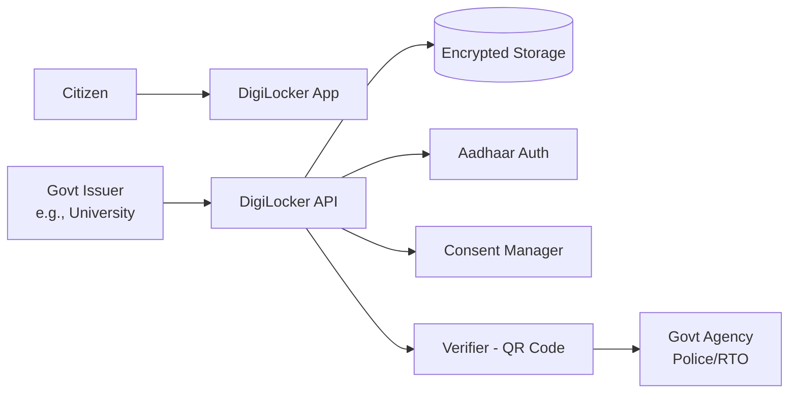
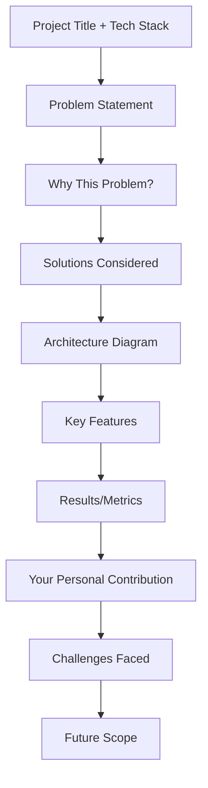

# Chapter 6: Government Exam Interview Preparation

## Learning Objectives

- Understand the panel composition and interview format for IBPS SO, NIC Scientist, SBI PO/SO, RBI Grade B, and PSU technical interviews
- Master common questions specific to government sector technical interviews
- Learn to defend your B.Tech/MCA project effectively before a panel
- Acquire banking domain knowledge expected in IBPS/SBI/RBI interviews
- Stay updated on current affairs relevant to technology and banking sectors
- Navigate the unique aspects of government recruitment: reservation, pay scales, bonding, and posting policies

## Government Interview Landscape

```mermaid
flowchart TD
    Gov[Government IT Interviews] --> PSBTech[PSBs/PUBLIC SECTOR BANKS]
    Gov --> PSU[PSUs - Public Sector Undertakings]
    Gov --> GovtOrg[Government Organizations]
    Gov --> Reg[Regulatory Bodies]
    
    PSBTech --> IBPS[IBPS SO - IT Officer]
    PSBTech --> SBI[SBI PO/SO - IT]
    PSBTech --> RBI[RBI Grade B - IT]
    
    PSU --> NIC[NIC Scientist-B]
    PSU --> DRDO[DRDO - Computer Scientist]
    PSU --> ISRO[ISRO - Scientist/Engineer]
    PSU --> BARC[BARC - Computer Professional]
    PSU --> SAIL[SAIL - IT Officer]
    PSU --> ONGC[ONGC - IT Executive]
    PSU --> IOCL[IOCL - IT Officer]
    PSU --> NTPC[NTPC - IT Executive]
    PSU --> BHEL[BHEL - Computer Engineer]
    PSU --> BSNL[BSNL - JAO/MT]
    
    GovtOrg --> MeitY[MeitY - Software Developer]
    GovtOrg --> CBI[CBI - IT Officer]
    
    Reg --> SEBI[SEBI - IT]
    Reg --> IRDAI[IRDAI - IT]
```



### Interview Panel Composition

<a href="../../../assets/images/diagrams/interview-preparation/06-govt-exam-interview/interview-panel-composition-handwritten.svg" target="_blank" rel="noopener">
  
</a>
<a href="../../../assets/images/diagrams/interview-preparation/06-govt-exam-interview/interview-panel-composition-diagram.svg" target="_blank" rel="noopener">
  
</a>
<a href="../../../assets/images/diagrams/interview-preparation/06-govt-exam-interview/interview-panel-composition-sticky.svg" target="_blank" rel="noopener">
  
</a>


| Organization | Panel Members | Duration | Focus Areas |
|-------------|---------------|----------|-------------|
| IBPS SO | 3-5 members: Chairman, Tech Expert, HR Expert, Banking Expert | 15-30 min | Tech fundamentals, banking IT, current affairs |
| SBI PO/SO | 5 members: Senior Execs, Tech Head, HR | 20-40 min | Banking awareness, tech depth, decision-making |
| RBI Grade B | 5-6 members: Governor/Deputy, Tech Director, HR | 30-45 min | Economics awareness, tech policy, macro-finance |
| NIC Scientist-B | 3-4 members: Technical Director, Joint Director, HR | 20-35 min | Core CS, project work, govt IT initiatives |
| PSUs (ONGC/IOCL) | 4-5 members: Director/HR, Tech Head, Functional Expert | 20-30 min | Domain knowledge, current affairs, technical fundamentals |
| DRDO/ISRO | 5-7 members: Senior Scientists, Technical Experts | 30-60 min | Research-backed deep technical questions, project defense |

---

## Section 1: IBPS SO (Specialist Officer — IT) Interview

### Exam Pattern Overview

<a href="../../../assets/images/diagrams/interview-preparation/06-govt-exam-interview/exam-pattern-overview-handwritten.svg" target="_blank" rel="noopener">
  
</a>
<a href="../../../assets/images/diagrams/interview-preparation/06-govt-exam-interview/exam-pattern-overview-diagram.svg" target="_blank" rel="noopener">
  
</a>
<a href="../../../assets/images/diagrams/interview-preparation/06-govt-exam-interview/exam-pattern-overview-sticky.svg" target="_blank" rel="noopener">
  
</a>


| Stage | Description | Marks |
|-------|-------------|-------|
| Preliminary | Reasoning, Quant, English (online) | 100 |
| Mains | Professional Knowledge (IT) + General Awareness | 200 |
| Interview | Panel interview (15-30 min) | 100 |

**Minimum qualifying marks:** UR: 40%, OBC: 35%, SC/ST: 30%

### Common IBPS SO Interview Questions

<a href="../../../assets/images/diagrams/interview-preparation/06-govt-exam-interview/common-ibps-so-interview-questions-handwritten.svg" target="_blank" rel="noopener">
  
</a>
<a href="../../../assets/images/diagrams/interview-preparation/06-govt-exam-interview/common-ibps-so-interview-questions-diagram.svg" target="_blank" rel="noopener">
  
</a>
<a href="../../../assets/images/diagrams/interview-preparation/06-govt-exam-interview/common-ibps-so-interview-questions-sticky.svg" target="_blank" rel="noopener">
  
</a>


#### Q1: What are the functions of an IT officer in a bank?

<details>
<summary>Click to reveal answer</summary>

**Answer:** The IT Officer in a bank is responsible for:
1. **Core Banking System (CBS)** — Maintenance and operations of FINACLE, BAAN, or other CBS platforms
2. **Network Management** — Branch connectivity via MPLS, VPN, leased lines
3. **Security** — Firewall management, IDS/IPS, antivirus, data encryption (PKI)
4. **Digital Channels** — Internet banking, mobile banking, UPI, NEFT/RTGS
5. **ATM Management** — ATM switch, reconciliation, uptime monitoring
6. **Vendor Management** — Liaising with technology vendors like TCS (BaNCS), Infosys (Finacle)
7. **Regulatory Compliance** — RBI guidelines on IT governance, IS audit, data localization
8. **Disaster Recovery** — DR drills, backup management, BCP (Business Continuity Planning)
</details>

#### Q2: What is Core Banking Solution (CBS)?

<details>
<summary>Click to reveal answer</summary>

**Answer:** CBS (Core Banking Solution) is a centralized software platform that enables customers to operate their accounts from any branch of the bank.

**Key features:**
- **Centralized Database:** All customer data stored at data center, branches connect via network
- **Anywhere Banking:** Customer can deposit/withdraw at any branch
- **Real-time Processing:** Transactions reflect immediately across all channels
- **Multi-channel Integration:** ATM, internet banking, mobile banking, POS all connect to CBS

**Popular CBS platforms in Indian banks:**
| Bank | CBS Platform |
|------|-------------|
| SBI | BaNCS (TCS) |
| PNB | Finacle (Infosys) |
| BOB | Finacle |
| Canara Bank | Finacle |
| Rural Banks | Flexcube (Oracle) |
</details>

#### Q3: What is NEFT, RTGS, and IMPS? Explain differences.

<details>
<summary>Click to reveal answer</summary>

**Answer:** Three major electronic fund transfer systems in India.

| Feature | NEFT | RTGS | IMPS |
|---------|------|------|------|
| Full form | National Electronic Funds Transfer | Real Time Gross Settlement | Immediate Payment Service |
| Settlement | Batched (half-hourly) | Real-time (continuous) | Real-time (24×7) |
| Timing | 24×7 (since Dec 2019) | 24×7 (since Dec 2020) | 24×7 |
| Min amount | Re 1 | ₹2 lakhs | Re 1 |
| Max amount | No limit | No limit | ₹5 lakhs (usually) |
| Speed | 30 min to 2 hours | Immediate | Immediate (within seconds) |
| Operated by | RBI | RBI | NPCI |
| Best for | Small, non-urgent transfers | Large value transfers (>₹2L) | Urgent transfers, mobile |
</details>

#### Q4: What is UPI? How does it work technically?

<details>
<summary>Click to reveal answer</summary>

**Answer:** UPI (Unified Payments Interface) is a real-time payment system developed by NPCI that facilitates inter-bank transactions through mobile phones.

**Technical Architecture:**
```
User → UPI App (Google Pay/PhonePe) → UPI Platform (NPCI) → Payer Bank → Payee Bank
```

**Flow:**
1. User enters UPI ID (payee@bank) or scans QR code
2. App creates a payment request with UPI PIN
3. Request goes to UPI platform (NPCI)
4. NPCI routes to payer's bank for authentication
5. Bank verifies PIN, debits account
6. NPCI sends credit instruction to payee's bank
7. Both banks get settlement via RBI

**Technical components:**
- **UPI ID:** Virtual Payment Address (VPA) — example@bank
- **UPI PIN:** 4-6 digit PIN set during registration
- **MPIN:** Mobile banking PIN for first-time registration
- **AEPS:** Aadhaar-enabled payment system integration

> **Real Experience:** An IBPS SO panel asked me to draw the UPI flow on the whiteboard. They also asked about failure scenarios — what happens if the network fails after debit but before credit. Answer: NPCI uses a two-phase settlement with reversal mechanism.
</details>

#### Q5: How does a bank ensure data security?

<details>
<summary>Click to reveal answer</summary>

**Answer:** Banks implement multiple layers of security:

1. **Network Security:** Firewalls (next-gen), IDS/IPS, VLAN segregation, DMZ
2. **Application Security:** OWASP Top 10 compliance, penetration testing, code review
3. **Data Security:** Encryption at rest (AES-256), encryption in transit (TLS 1.3), tokenization
4. **Access Control:** Role-based access (RBAC), two-factor authentication (2FA), biometric authentication
5. **Audit & Compliance:** IS audit, RBI guidelines, ISO 27001, HIPAA (if applicable)
6. **DLP:** Data Loss Prevention, USB blocking, email filtering
7. **BCP/DR:** Business Continuity Planning, Disaster Recovery sites (hot/warm/cold)
8. **Security Operations:** SOC (Security Operations Center), SIEM (Splunk/ArcSight), 24×7 monitoring

**RBI guidelines on IT governance (as per RBI circular):**
- Board-approved IT Strategy
- IT Steering Committee
- IS Audit at least once a year
- Cyber Crisis Management Plan (CCMP)
- Annual penetration testing
</details>

---

## Section 2: SBI PO/SO & RBI Grade B Interview

### SBI Interview — Key Facts

<a href="../../../assets/images/diagrams/interview-preparation/06-govt-exam-interview/sbi-interview-key-facts-handwritten.svg" target="_blank" rel="noopener">
  
</a>
<a href="../../../assets/images/diagrams/interview-preparation/06-govt-exam-interview/sbi-interview-key-facts-diagram.svg" target="_blank" rel="noopener">
  
</a>
<a href="../../../assets/images/diagrams/interview-preparation/06-govt-exam-interview/sbi-interview-key-facts-sticky.svg" target="_blank" rel="noopener">
  
</a>


| Aspect | Details |
|--------|---------|
| Panel | 5 members (Senior GM, AGM, HR, Tech Expert, Language Expert) |
| Duration | 25-40 minutes |
| Weightage | 75 marks (but effective weight may vary) |
| Topics | Banking awareness, current affairs, tech fundamentals, HR, project |

### Common SBI Interview Questions

<a href="../../../assets/images/diagrams/interview-preparation/06-govt-exam-interview/common-sbi-interview-questions-handwritten.svg" target="_blank" rel="noopener">
  
</a>
<a href="../../../assets/images/diagrams/interview-preparation/06-govt-exam-interview/common-sbi-interview-questions-diagram.svg" target="_blank" rel="noopener">
  
</a>
<a href="../../../assets/images/diagrams/interview-preparation/06-govt-exam-interview/common-sbi-interview-questions-sticky.svg" target="_blank" rel="noopener">
  
</a>


#### Q6: What are the differences between SBI and private banks?

<details>
<summary>Click to reveal answer</summary>

**Answer:** Key differences between SBI (public sector) and private banks:

| Aspect | SBI | Private Banks (HDFC, ICICI) |
|--------|-----|---------------------------|
| Ownership | Government (majority) | Private shareholders |
| Interest rates | Generally higher on deposits | Competitive |
| Reach | 50,000+ branches, rural focus | 5000+ branches, urban focus |
| Loan rates | Competitive (linked to MCLR) | Market-driven |
| Job security | Very high | Moderate |
| Career growth | Time-bound promotions | Performance-based |
| Technology | Modernizing fast | Usually ahead initially |
| Customer base | 45Cr+ customers (largest) | 5-10Cr customers |
| Corporate governance | CAG audit, RTI applicable | Company board, less regulation |
</details>

#### Q7: What do you know about the Digital India initiative?

<details>
<summary>Click to reveal answer</summary>

**Answer:** Digital India is a flagship program of the Government of India launched on July 1, 2015, with a vision to transform India into a digitally empowered society.

**Nine Pillars of Digital India:**
| Pillar | Focus |
|--------|-------|
| 1. Broadband Highways | National Optical Fibre Network (NOFN/BharatNet) |
| 2. Universal Access to Phones | Mobile connectivity to all villages |
| 3. Public Internet Access | Common Service Centres (CSCs) |
| 4. e-Governance | Online service delivery (DigiLocker, UMANG) |
| 5. e-Kranti | Electronic delivery of services (G2C, G2B) |
| 6. Information for All | Open data, social media engagement |
| 7. Electronics Manufacturing | Promote domestic manufacturing (Make in India) |
| 8. IT for Jobs | Train youth for IT sector jobs |
| 9. Early Harvest Programs | Aadhaar, e-Hospital, Bhashini, DigiLocker |

**Key achievements:**
- Aadhaar: 135Cr+ enrollments (world's largest biometric ID)
- UPI: 10B+ monthly transactions
- DigiLocker: 15Cr+ users
- BharatNet: 2.5L+ gram panchayats connected
- Common Service Centres: 4L+ across India
</details>

#### Q8: What is the role of RBI in the Indian economy?

<details>
<summary>Click to reveal answer</summary>

**Answer:** The Reserve Bank of India (RBI) is the central bank of India, established on April 1, 1935.

**Key Functions:**
| Function | Description |
|----------|-------------|
| Monetary Policy | Controls inflation (target: 4% ± 2%), manages repo rate, CRR, SLR |
| Currency Issuance | Sole authority to issue banknotes in India |
| Banker to Government | Manages government accounts, public debt |
| Banker's Bank | Lender of last resort, provides liquidity |
| Regulator | Regulates commercial banks, NBFCs, payment systems |
| Foreign Exchange | Manages forex reserves ($600B+), exchange rate stability |
| Development | Promotes financial inclusion, digital payments |

**Monetary Policy Tools:**
- **Repo Rate:** Rate at which RBI lends to banks (currently 6.50%)
- **Reverse Repo Rate:** Rate at which RBI borrows from banks
- **CRR (Cash Reserve Ratio):** % of deposits banks must keep with RBI (4.5%)
- **SLR (Statutory Liquidity Ratio):** % of deposits to keep in approved securities (18%)
- **MSF (Marginal Standing Facility):** Emergency borrowing rate (6.75%)
- **Bank Rate:** Rate charged for long-term loans (6.75%)
</details>

#### Q9: What are NPAs? How does IT help in NPA management?

<details>
<summary>Click to reveal answer</summary>

**Answer:** NPA (Non-Performing Asset) is a loan or advance where the borrower has not made interest or principal payments for 90 days or more.

**Categories:**
| Category | Definition |
|----------|-----------|
| Substandard | NPA for up to 12 months |
| Doubtful | NPA for more than 12 months |
| Loss | Identified as uncollectible (partially or fully) |

**How IT helps in NPA management:**
1. **Early Warning Systems (EWS):** ML models predict potential NPAs based on transaction patterns, credit bureau data
2. **Credit Monitoring Systems:** Automated alerts for irregular repayments, overdraft usage
3. **Centralized NPA Tracking:** Single dashboard across all branches showing NPA status
4. **Recovery Management:** Automated follow-up workflows, legal case management systems
5. **Data Analytics:** Pattern analysis to identify sectors/regions with highest NPAs
6. **AI-based Credit Scoring:** Better risk assessment at loan origination stage

> **Real Experience:** SBI panel asked me: "How would you design a system to predict potential NPA customers?" I proposed using logistic regression with features like repayment history, credit utilization ratio, and transaction irregularity score.
</details>

#### Q10: What is financial inclusion? What role does technology play?

[Click to read answer]

<details>
<summary>Click to reveal answer</summary>

**Answer:** Financial inclusion means delivering banking and financial services at affordable costs to disadvantaged and low-income segments of society.

**Technology's role:**
- **Jan Dhan-Aadhaar-Mobile (JAM Trinity):** Enabled direct benefit transfers (DBT)
- **UPI:** Zero-cost digital payments accessible on any phone
- **Micro-ATMs:** Aadhaar-enabled Payment System (AEPS) for rural areas
- **Mobile Banking:** USSD banking (*99#) works on feature phones
- **BC Model:** Business Correspondents with handheld devices
- **e-KYC:** Paperless account opening via Aadhaar
- **PMJDY:** Pradhan Mantri Jan Dhan Yojana — 50Cr+ accounts opened

**Government Schemes:**
| Scheme | Purpose |
|--------|---------|
| PM Jan Dhan Yojana | Universal access to banking |
| PM Mudra Yojana | Loans up to ₹10L for small businesses |
| PM SVANidhi | Micro-credit for street vendors |
| PM Suraksha Bima Yojana | Insurance at ₹12/year |
</details>

---

## Section 3: NIC Scientist-B Interview

### NIC Interview Facts

<a href="../../../assets/images/diagrams/interview-preparation/06-govt-exam-interview/nic-interview-facts-handwritten.svg" target="_blank" rel="noopener">
  
</a>
<a href="../../../assets/images/diagrams/interview-preparation/06-govt-exam-interview/nic-interview-facts-diagram.svg" target="_blank" rel="noopener">
  
</a>
<a href="../../../assets/images/diagrams/interview-preparation/06-govt-exam-interview/nic-interview-facts-sticky.svg" target="_blank" rel="noopener">
  
</a>


| Aspect | Details |
|--------|---------|
| Selection Process | GATE Score + Interview OR Written Test + Interview |
| Panel | 3-4 members: Technical Director, Joint Director, HR Specialist |
| Duration | 20-35 minutes |
| Focus | Core CS depth, project work, government IT initiatives |
| Location | NIC Headquarters, New Delhi |

### Common NIC Interview Questions

<a href="../../../assets/images/diagrams/interview-preparation/06-govt-exam-interview/common-nic-interview-questions-handwritten.svg" target="_blank" rel="noopener">
  
</a>
<a href="../../../assets/images/diagrams/interview-preparation/06-govt-exam-interview/common-nic-interview-questions-diagram.svg" target="_blank" rel="noopener">
  
</a>
<a href="../../../assets/images/diagrams/interview-preparation/06-govt-exam-interview/common-nic-interview-questions-sticky.svg" target="_blank" rel="noopener">
  
</a>


#### Q11: What are the major projects of NIC?

<details>
<summary>Click to reveal answer</summary>

**Answer:** NIC (National Informatics Centre) is the premier technology organization of the Government of India under MeitY.

**Major NIC Projects:**

| Project | Domain | Description |
|---------|--------|-------------|
| DigiLocker | Document Management | 15Cr+ users, 6000+ issuers |
| e-Office | Office Automation | Paperless government offices |
| UMANG | Mobile Governance | 1200+ services on mobile |
| Vahan & Sarathi | Transport | Vehicle registration, driving license |
| GST Portal | Taxation | Indirect tax filing system |
| e-Courts | Judiciary | Case management for 3000+ courts |
| GeM | Procurement | Government e-Marketplace |
| Aadhaar | Identity | UIDAI's technology backbone |
| Passport Seva | Immigration | Online passport application |
| PRAGATI | Project Monitoring | PM's governance tracking system |
</details>

#### Q12: How would you design a system like DigiLocker?

<details>
<summary>Click to reveal answer</summary>

**Answer:** DigiLocker is a cloud-based platform for issuance, verification, and storage of documents.

**Architecture:**


**Technical aspects:**
1. **Storage:** Documents stored in AES-256 encrypted format
2. **Issuer:** Government departments issue digitally signed documents
3. **Verification:** QR code with cryptographic signature for tamper-proof verification
4. **URI-based access:** Each document has a unique URI for sharing
5. **Integration:** APIs for Aadhaar authentication, DigiLocker access

**Security considerations:**
- End-to-end encryption
- Cryptographic digital signatures (PKI)
- Consent-based access (citizen must approve each access)
- Audit trail of all document accesses
</details>

#### Q13: Explain e-Governance maturity model.

<details>
<summary>Click to reveal answer</summary>

**Answer:** The e-Governance maturity model has 5 stages:

| Stage | Name | Description | Indian Example |
|-------|------|-------------|---------------|
| 1 | Emerging | Basic online presence, static information | Department websites (2000s) |
| 2 | Enhanced | Some online forms, downloadable PDFs | Income tax form downloads |
| 3 | Interactive | Online form submission, basic portals | Passport Seva portal |
| 4 | Transactional | Complete service delivery online | GST portal, DigiLocker |
| 5 | Connected | Integrated services across departments | UMANG (single app for all services) |

**UN e-Governance Index:**
India's rank improved from 118 (2014) to 46 (2024). Parameters:
- Online Service Index
- Telecommunication Infrastructure Index
- Human Capital Index

**Key e-Governance principles:**
- **One Government Approach:** Integrated service delivery
- **Mobile-first:** UMANG app with 1200+ services
- **Open Standards:** APIs, interoperability, open data
- **Digital-by-default:** Services designed for digital delivery
</details>

#### Q14: What is PKI and how is it used in government systems?

<details>
<summary>Click to reveal answer</summary>

**Answer:** PKI (Public Key Infrastructure) is a framework for creating, managing, and revoking digital certificates.

**Components:**
| Component | Role |
|-----------|------|
| CA (Certification Authority) | Issues digital certificates |
| RA (Registration Authority) | Verifies identity before certificate issuance |
| Certificate Repository | Stores issued certificates |
| CRL (Certificate Revocation List) | List of revoked certificates |

**Government use cases:**
1. **Digital Signatures (DSC):** Officers sign documents electronically under IT Act 2000
2. **SSL/TLS:** Government websites use .gov.in SSL certificates
3. **Document Signing:** DigiLocker documents signed with CA-issued certificates
4. **Email Encryption:** Official email communication encrypted
5. **e-Tendering:** Bids digitally signed for GeM portal

**Licensed CAs in India (under CCA):**
- eMudhra, Sify, NIC (as CA), TCS, Capricorn, Vsign, etc.
</details>

#### Q15: What is MeitY and what are its key initiatives?

<details>
<summary>Click to reveal answer</summary>

**Answer:** Ministry of Electronics and Information Technology (MeitY) is the nodal ministry for IT, electronics, and internet governance.

**Key Initiatives:**
| Initiative | Description |
|-----------|-------------|
| Digital India | Umbrella program for digital transformation |
| Cyber Security | CERT-In, National Cyber Security Strategy |
| Electronics Manufacturing | Production Linked Incentive (PLI) scheme |
| IT Act 2000 & amendments | Legal framework for digital transactions |
| Data Protection | Digital Personal Data Protection Act 2023 |
| Common Service Centres | 4L+ CSCs for rural service delivery |
| Open Source | Policy preference for open-source software |
| Bhashini | AI-based language translation platform |
</details>

---

## Section 4: PSU Interview (ONGC, IOCL, SAIL, NTPC, BHEL)

### PSU Interview Facts

<a href="../../../assets/images/diagrams/interview-preparation/06-govt-exam-interview/psu-interview-facts-handwritten.svg" target="_blank" rel="noopener">
  
</a>
<a href="../../../assets/images/diagrams/interview-preparation/06-govt-exam-interview/psu-interview-facts-diagram.svg" target="_blank" rel="noopener">
  
</a>
<a href="../../../assets/images/diagrams/interview-preparation/06-govt-exam-interview/psu-interview-facts-sticky.svg" target="_blank" rel="noopener">
  
</a>


| Aspect | Details |
|--------|---------|
| Selection | GATE Score + Interview or Written + Interview |
| Panel | 4-5 members: Director/HR, Tech Expert, Functional Expert |
| Duration | 15-25 minutes |
| Weightage | 80-100 marks (varies by PSU) |
| Key Requirement | Current awareness about the specific PSU |

### Common PSU Interview Questions

<a href="../../../assets/images/diagrams/interview-preparation/06-govt-exam-interview/common-psu-interview-questions-handwritten.svg" target="_blank" rel="noopener">
  
</a>
<a href="../../../assets/images/diagrams/interview-preparation/06-govt-exam-interview/common-psu-interview-questions-diagram.svg" target="_blank" rel="noopener">
  
</a>
<a href="../../../assets/images/diagrams/interview-preparation/06-govt-exam-interview/common-psu-interview-questions-sticky.svg" target="_blank" rel="noopener">
  
</a>


#### Q16: What do you know about [PSU Name]?

<details>
<summary>Click to reveal answer</summary>

**Answer:** Research the specific PSU thoroughly. Template:

**ONGC Example:**
"Oil and Natural Gas Corporation (ONGC) is India's largest oil and gas exploration and production company, contributing about 70% of India's domestic oil and gas production. Key facts:
- Established: 1956 (by Govt. of India)
- Headquarters: Dehradun (corporate: New Delhi)
- Turnover: ~₹6.5 lakh crores (2023-24)
- Employees: ~27,000
- Operations: 100+ oil/gas fields, 30+ seismic parties
- International: ONGC Videsh Ltd operates in 15+ countries
- Refining: Subsidiaries like MRPL, HPCL
- CSR: Focus on healthcare, education, skill development in operational areas

The IT department manages SAP implementation, seismic data processing, ERP systems, digital oilfield initiatives, and cybersecurity for critical infrastructure."

**IOCL Example:**
"Indian Oil Corporation Limited is India's largest commercial oil company.
- Established: 1959 (as Indian Oil Company Ltd)
- Headquarters: New Delhi
- Revenue: ~₹8.5 lakh crores
- Fortune 500 rank: ~96th
- Operations: 11 refineries, 13,000+ km pipelines, 60,000+ retail outlets
- IT systems: SAP, fuel automation, pipeline SCADA, digital payment at pumps"
</details>

#### Q17: What is SCADA? How is it used in PSUs?

<details>
<summary>Click to reveal answer</summary>

**Answer:** SCADA (Supervisory Control and Data Acquisition) is a system for real-time monitoring and control of industrial processes.

**Components:**
| Component | Function |
|-----------|----------|
| RTU (Remote Terminal Unit) | Collects data from sensors |
| PLC (Programmable Logic Controller) | Controls equipment |
| HMI (Human-Machine Interface) | Visual display for operators |
| MTU (Master Terminal Unit) | Central command center |
| Communication Network | Connects all components |

**PSU uses:**
- **ONGC:** Monitoring oil well parameters (pressure, temperature, flow rate)
- **IOCL:** Pipeline monitoring, leak detection, refinery process control
- **NTPC:** Power plant monitoring (boiler temperature, turbine speed)
- **SAIL:** Steel plant process control (blast furnace, rolling mill)
</details>

#### Q18: What is ERP? Which ERP systems are used in PSUs?

<details>
<summary>Click to reveal answer</summary>

**Answer:** ERP (Enterprise Resource Planning) integrates all business processes into a unified system.

**Popular ERP systems in Indian PSUs:**
| PSU | ERP System |
|-----|-----------|
| ONGC | SAP ECC 6.0 / SAP S/4HANA |
| IOCL | SAP |
| SAIL | SAP |
| NTPC | Oracle E-Business Suite / SAP |
| BHEL | BaaN (Infor) |
| BSNL | SAP |
| Coal India | SAP |

**ERP modules relevant to PSU interview:**
- **MM (Materials Management):** Procurement, inventory, supply chain
- **FI/CO (Finance & Controlling):** Accounting, budgeting, costing
- **HR (Human Resources):** Payroll, personnel administration
- **PM (Plant Maintenance):** Equipment maintenance scheduling
- **PS (Project Systems):** Capital project management
</details>

#### Q19: What is the role of IT in the oil and gas industry?

<details>
<summary>Click to reveal answer</summary>

**Answer:** IT plays a critical role across the oil and gas value chain.

| Function | IT Application |
|----------|---------------|
| Exploration | Seismic data processing, geological modeling, GIS |
| Drilling | Real-time drilling parameter monitoring, MWD/LWD |
| Production | SCADA, well automation, digital oilfield |
| Refining | Distributed Control Systems (DCS), APC |
| Pipeline | Pipeline leak detection, pig tracking |
| Marketing | Fuel automation at retail outlets |
| Supply Chain | SAP/Oracle, logistics optimization |
| Safety | Safety management system, incident reporting |
| Compliance | Regulatory reporting, environmental monitoring |
</details>

---

## Section 5: Banking Domain and Current Affairs

### Key Current Affairs Topics for 2024-2026

<a href="../../../assets/images/diagrams/interview-preparation/06-govt-exam-interview/key-current-affairs-topics-for-2024-2026-handwritten.svg" target="_blank" rel="noopener">
  
</a>
<a href="../../../assets/images/diagrams/interview-preparation/06-govt-exam-interview/key-current-affairs-topics-for-2024-2026-diagram.svg" target="_blank" rel="noopener">
  
</a>
<a href="../../../assets/images/diagrams/interview-preparation/06-govt-exam-interview/key-current-affairs-topics-for-2024-2026-sticky.svg" target="_blank" rel="noopener">
  
</a>


| Category | Topics |
|----------|--------|
| Banking | UPI growth, Digital Rupee (e-Rupee), bank mergers, NPAs |
| Technology | AI/ML in banking, 5G, Cybersecurity, Quantum Computing |
| Economy | GDP growth, inflation trends, repo rate changes |
| Government Schemes | Digital India, Smart Cities, AMRUT, Ayushman Bharat |
| Global | Crypto regulation, Data protection, Climate tech |
| RBI | MPC decisions, financial stability report, digital payments |

### Banking Terminology

<a href="../../../assets/images/diagrams/interview-preparation/06-govt-exam-interview/banking-terminology-handwritten.svg" target="_blank" rel="noopener">
  
</a>
<a href="../../../assets/images/diagrams/interview-preparation/06-govt-exam-interview/banking-terminology-diagram.svg" target="_blank" rel="noopener">
  
</a>
<a href="../../../assets/images/diagrams/interview-preparation/06-govt-exam-interview/banking-terminology-sticky.svg" target="_blank" rel="noopener">
  
</a>


| Term | Definition |
|------|------------|
| Repo Rate | Rate at which RBI lends to commercial banks |
| Reverse Repo | Rate at which RBI borrows from banks |
| CRR | Cash Reserve Ratio — % of deposits kept with RBI |
| SLR | Statutory Liquidity Ratio — % in approved securities |
| MSF | Marginal Standing Facility — emergency borrowing |
| LAF | Liquidity Adjustment Facility — RBI's liquidity management |
| MCLR | Marginal Cost of Funds based Lending Rate |
| Base Rate | Minimum lending rate (earlier, replaced by MCLR) |
| CAR | Capital Adequacy Ratio — capital to risk-weighted assets |
| NIM | Net Interest Margin — interest earned vs paid |
| CASA | Current Account Savings Account ratio |
| NPA | Non-Performing Asset |
| PCR | Provision Coverage Ratio |
| CRAR | Capital to Risk-Weighted Assets Ratio |
| LTV | Loan to Value ratio |
| DTI | Debt to Income ratio |
| CIBIL | Credit Information Bureau (India) Limited |
| CIC | Credit Information Company (Experian, Equifax, CRIF) |
| UPI | Unified Payments Interface |
| AEPS | Aadhaar Enabled Payment System |
| NACH | National Automated Clearing House |
| ECS | Electronic Clearing Service |

### Budget and Finance Quick Revision

<a href="../../../assets/images/diagrams/interview-preparation/06-govt-exam-interview/budget-and-finance-quick-revision-handwritten.svg" target="_blank" rel="noopener">
  
</a>
<a href="../../../assets/images/diagrams/interview-preparation/06-govt-exam-interview/budget-and-finance-quick-revision-diagram.svg" target="_blank" rel="noopener">
  
</a>
<a href="../../../assets/images/diagrams/interview-preparation/06-govt-exam-interview/budget-and-finance-quick-revision-sticky.svg" target="_blank" rel="noopener">
  
</a>


| Term | Current Value (2024-25) |
|------|------------------------|
| GDP Growth | ~7.2% (estimated) |
| Inflation (CPI) | ~4.5% |
| Repo Rate | 6.50% |
| Reverse Repo | 3.35% |
| CRR | 4.5% |
| SLR | 18.0% |
| Fiscal Deficit | 4.9% of GDP |
| Forex Reserves | ~$650 billion |
| GDP (Nominal) | ~$3.7 trillion |

---

## Section 6: Project Defense Strategy

### How to Present Your Project in Government Interviews

<a href="../../../assets/images/diagrams/interview-preparation/06-govt-exam-interview/how-to-present-your-project-in-government-interviews-handwritten.svg" target="_blank" rel="noopener">
  
</a>
<a href="../../../assets/images/diagrams/interview-preparation/06-govt-exam-interview/how-to-present-your-project-in-government-interviews-diagram.svg" target="_blank" rel="noopener">
  
</a>
<a href="../../../assets/images/diagrams/interview-preparation/06-govt-exam-interview/how-to-present-your-project-in-government-interviews-sticky.svg" target="_blank" rel="noopener">
  
</a>




### Project Defense Template

<a href="../../../assets/images/diagrams/interview-preparation/06-govt-exam-interview/project-defense-template-handwritten.svg" target="_blank" rel="noopener">
  
</a>
<a href="../../../assets/images/diagrams/interview-preparation/06-govt-exam-interview/project-defense-template-diagram.svg" target="_blank" rel="noopener">
  
</a>
<a href="../../../assets/images/diagrams/interview-preparation/06-govt-exam-interview/project-defense-template-sticky.svg" target="_blank" rel="noopener">
  
</a>


**Structure your 2-minute project intro:**
1. **Title & Stack:** "My final year project is 'Real-time Bus Tracking System' built with Node.js, React, MongoDB, and WebSocket."
2. **Problem:** "Our university had 15 buses for 5000+ students, but there was no way to track them. Students waited 20-30 minutes without knowing when the bus would arrive."
3. **Your role:** "I was the backend developer responsible for the WebSocket server, location ingestion pipeline, and ETA calculation algorithm."
4. **Architecture:** "The system uses GPS modules on buses → MQTT broker → Node.js server → WebSocket → React frontend with Mapbox."
5. **Challenges:** "The biggest challenge was handling 1000+ location updates per minute on a limited budget. I solved it by batching updates and using Redis for caching."
6. **Results:** "The system achieved 95% accuracy with 5-second update latency. Deployed by the university, serving 5000+ daily users."
7. **Learning:** "I learned about real-time systems, WebSocket optimization, and the importance of throughput testing."

### Questions the Panel May Ask About Your Project

<a href="../../../assets/images/diagrams/interview-preparation/06-govt-exam-interview/questions-the-panel-may-ask-about-your-project-handwritten.svg" target="_blank" rel="noopener">
  
</a>
<a href="../../../assets/images/diagrams/interview-preparation/06-govt-exam-interview/questions-the-panel-may-ask-about-your-project-diagram.svg" target="_blank" rel="noopener">
  
</a>
<a href="../../../assets/images/diagrams/interview-preparation/06-govt-exam-interview/questions-the-panel-may-ask-about-your-project-sticky.svg" target="_blank" rel="noopener">
  
</a>


| Question Type | Examples |
|--------------|----------|
| Technology choice | "Why MongoDB over PostgreSQL?" |
| Scalability | "How would you scale this to 1M users?" |
| Security | "How do you prevent unauthorized access?" |
| Failure scenarios | "What if the GPS module fails?" |
| Alternatives | "Why WebSocket instead of polling?" |
| Real-world constraints | "How much did it cost to run?" |
| Your contribution | "What specifically did YOU code?" |
| Improvements | "What would you do differently?" |

### Sample Project Defense Script

<a href="../../../assets/images/diagrams/interview-preparation/06-govt-exam-interview/sample-project-defense-script-handwritten.svg" target="_blank" rel="noopener">
  
</a>
<a href="../../../assets/images/diagrams/interview-preparation/06-govt-exam-interview/sample-project-defense-script-diagram.svg" target="_blank" rel="noopener">
  
</a>
<a href="../../../assets/images/diagrams/interview-preparation/06-govt-exam-interview/sample-project-defense-script-sticky.svg" target="_blank" rel="noopener">
  
</a>


```typescript
// If your project has code, be ready to explain key implementations
// Example: ETA calculation algorithm

interface BusLocation {
  busId: string;
  latitude: number;
  longitude: number;
  timestamp: number;
  speed: number; // km/h
}

function calculateETA(
  current: BusLocation,
  stopLatitude: number,
  stopLongitude: number
): number {
  const R = 6371; // Earth's radius in km
  
  const dLat = toRad(stopLatitude - current.latitude);
  const dLon = toRad(stopLongitude - current.longitude);
  
  const a = Math.sin(dLat / 2) ** 2 +
    Math.cos(toRad(current.latitude)) *
    Math.cos(toRad(stopLatitude)) *
    Math.sin(dLon / 2) ** 2;
  
  const c = 2 * Math.atan2(Math.sqrt(a), Math.sqrt(1 - a));
  const distance = R * c; // Distance in km
  
  // Factor in traffic (0.7x to 1.3x multiplier based on time of day)
  const trafficFactor = getTrafficFactor(current.timestamp);
  
  // ETA in minutes
  return (distance / Math.max(current.speed, 15)) * 60 * trafficFactor;
}
```

---

## Section 7: Common Questions Across All Government Interviews

### Generic Questions to Prepare

<a href="../../../assets/images/diagrams/interview-preparation/06-govt-exam-interview/generic-questions-to-prepare-handwritten.svg" target="_blank" rel="noopener">
  
</a>
<a href="../../../assets/images/diagrams/interview-preparation/06-govt-exam-interview/generic-questions-to-prepare-diagram.svg" target="_blank" rel="noopener">
  
</a>
<a href="../../../assets/images/diagrams/interview-preparation/06-govt-exam-interview/generic-questions-to-prepare-sticky.svg" target="_blank" rel="noopener">
  
</a>


<details>
<summary>Click to reveal 20 common questions</summary>

1. "Tell us about yourself."
2. "Why do you want to join the government sector?"
3. "What do you know about this organization?"
4. "Why should we hire you over other candidates?"
5. "What are your strengths and weaknesses?"
6. "Where do you see yourself in 5 years?"
7. "Tell us about your project in detail."
8. "What was the biggest challenge in your project?"
9. "How do you handle pressure and deadlines?"
10. "Have you applied to other organizations?"
11. "What will you do if posted in a remote location?"
12. "Are you willing to relocate to any part of India?"
13. "Do you have any backlogs in your degree?"
14. "Explain the gap in your education/employment."
15. "What current affairs do you follow?"
16. "What are the latest developments in Indian IT?"
17. "How would you explain a technical concept to a non-technical manager?"
18. "What do you know about the 7th Pay Commission?"
19. "Are you willing to work on legacy systems?"
20. "What questions do you have for us?"
</details>

---

## Quick Reference Tables

### Pay Scales for Government IT Positions

<a href="../../../assets/images/diagrams/interview-preparation/06-govt-exam-interview/pay-scales-for-government-it-positions-handwritten.svg" target="_blank" rel="noopener">
  
</a>
<a href="../../../assets/images/diagrams/interview-preparation/06-govt-exam-interview/pay-scales-for-government-it-positions-diagram.svg" target="_blank" rel="noopener">
  
</a>
<a href="../../../assets/images/diagrams/interview-preparation/06-govt-exam-interview/pay-scales-for-government-it-positions-sticky.svg" target="_blank" rel="noopener">
  
</a>


| Position | Pay Band (7th CPC) | Pay Level | Approx Gross Monthly (₹) |
|----------|-------------------|-----------|-------------------------|
| Scientist-B (NIC) | ₹56,100 - ₹1,77,500 | Level 10 | ₹75,000 - ₹85,000 |
| IT Officer (PSB) | ₹36,000 - ₹63,840 (JMGS-I) | - | ₹65,000 - ₹80,000 |
| Executive (PSU) | ₹60,000 - ₹1,80,000 | E1 Grade | ₹90,000 - ₹1,20,000 |
| SBI PO | ₹42,020 - ₹55,200 (basic) | JMGS-I | ₹80,000 - ₹1,00,000 |
| RBI Grade B | ₹55,200 - ₹68,400 (basic) | - | ₹1,10,000 - ₹1,30,000 |
| DRDO Scientist | ₹56,100 - ₹1,77,500 | Level 10 | ₹80,000 - ₹95,000 |

### PSU Selection Process (Typical)

<a href="../../../assets/images/diagrams/interview-preparation/06-govt-exam-interview/psu-selection-process-typical-handwritten.svg" target="_blank" rel="noopener">
  
</a>
<a href="../../../assets/images/diagrams/interview-preparation/06-govt-exam-interview/psu-selection-process-typical-diagram.svg" target="_blank" rel="noopener">
  
</a>
<a href="../../../assets/images/diagrams/interview-preparation/06-govt-exam-interview/psu-selection-process-typical-sticky.svg" target="_blank" rel="noopener">
  
</a>


| PSU | Selection Criteria | Weightage (Written/Interview) |
|-----|-------------------|-------------------------------|
| ONGC | GATE + Interview | 80:20 or 70:30 |
| IOCL | GATE + Interview | 70:30 |
| SAIL | Written + Interview | 80:20 |
| NTPC | GATE + Interview | 75:25 |
| BHEL | GATE + Interview | 70:30 |
| BSNL | Written + Interview | 75:25 |
| NIC | GATE + Interview / Written + Interview | 80:20 or 70:30 |
| DRDO | Written + Interview | 80:20 |
| ISRO | Written + Interview | 80:20 |
| IBPS SO | Prelim + Mains + Interview | 80:20 |

### Interview Dos and Don'ts for Government Panels

<a href="../../../assets/images/diagrams/interview-preparation/06-govt-exam-interview/interview-dos-and-don-ts-for-government-panels-handwritten.svg" target="_blank" rel="noopener">
  
</a>
<a href="../../../assets/images/diagrams/interview-preparation/06-govt-exam-interview/interview-dos-and-don-ts-for-government-panels-diagram.svg" target="_blank" rel="noopener">
  
</a>
<a href="../../../assets/images/diagrams/interview-preparation/06-govt-exam-interview/interview-dos-and-don-ts-for-government-panels-sticky.svg" target="_blank" rel="noopener">
  
</a>


| Do's | Don'ts |
|------|--------|
| Dress formally (suit/tie for men, saree/suit for women) | Be overconfident or arrogant |
| Greet the panel collectively | Interrupt panel members |
| Wait for questions to be asked | Give one-word answers |
| Think before answering (3-5 seconds is fine) | Argue with the panel |
| Be honest about gaps/limitations | Lie or exaggerate |
| Maintain eye contact with all members | Look only at the chairman |
| Have a printed copy of your resume and project report | Forget your project details |
| Show enthusiasm for public service | Show only monetary motivation |
| Speak in English (if comfortable) | Mix languages unnecessarily |
| Thank the panel at the end | Rush through answers |

---

---

## Section 8: Interview Day Checklist and Strategy

### Before the Interview (24 Hours Prior)

<a href="../../../assets/images/diagrams/interview-preparation/06-govt-exam-interview/before-the-interview-24-hours-prior-handwritten.svg" target="_blank" rel="noopener">
  
</a>
<a href="../../../assets/images/diagrams/interview-preparation/06-govt-exam-interview/before-the-interview-24-hours-prior-diagram.svg" target="_blank" rel="noopener">
  
</a>
<a href="../../../assets/images/diagrams/interview-preparation/06-govt-exam-interview/before-the-interview-24-hours-prior-sticky.svg" target="_blank" rel="noopener">
  
</a>


| Action | Details |
|--------|---------|
| Documents | Print 5 copies of resume, mark sheets, certificates, ID proof |
| Dress | Formal: suit and tie (men), saree/suit (women). Dark colors preferred |
| Location | Reach the venue the day before to understand travel time |
| Sleep | Minimum 7-8 hours. Avoid caffeine after 6 PM |
| Research | Read latest news about the organization (last 7 days) |
| Questions | Prepare 3 questions to ask the panel |

### Document Checklist for Government Interviews

<a href="../../../assets/images/diagrams/interview-preparation/06-govt-exam-interview/document-checklist-for-government-interviews-handwritten.svg" target="_blank" rel="noopener">
  
</a>
<a href="../../../assets/images/diagrams/interview-preparation/06-govt-exam-interview/document-checklist-for-government-interviews-diagram.svg" target="_blank" rel="noopener">
  
</a>
<a href="../../../assets/images/diagrams/interview-preparation/06-govt-exam-interview/document-checklist-for-government-interviews-sticky.svg" target="_blank" rel="noopener">
  
</a>


```markdown
Essential Documents (Originals + Self-attested Copies):
☐ 10th Mark Sheet & Certificate
☐ 12th Mark Sheet & Certificate
☐ Graduation Degree & Mark Sheets (all semesters)
☐ Post-Graduation Degree & Mark Sheets (if applicable)
☐ GATE Score Card (for GATE-based recruitment)
☐ Category Certificate (SC/ST/OBC/EWS) — if applicable
☐ PwBD Certificate — if applicable
☐ Photo ID (Aadhaar, Voter ID, Passport, Driving License)
☐ Passport-size Photos (at least 10)
☐ Experience Letters (if applicable)
☐ Project Reports / Publication Proofs
☐ Portfolio (for design roles)

Organize in transparent file folders, labeled clearly.
```

### The Night Before

<a href="../../../assets/images/diagrams/interview-preparation/06-govt-exam-interview/the-night-before-handwritten.svg" target="_blank" rel="noopener">
  
</a>
<a href="../../../assets/images/diagrams/interview-preparation/06-govt-exam-interview/the-night-before-diagram.svg" target="_blank" rel="noopener">
  
</a>
<a href="../../../assets/images/diagrams/interview-preparation/06-govt-exam-interview/the-night-before-sticky.svg" target="_blank" rel="noopener">
  
</a>


| Do | Don't |
|----|-------|
| Light revision of key formulas/concepts | Study new topics for the first time |
| Prepare clothes, documents, bag | Stay up late revising |
| Set 3 alarms 15 minutes apart | Drink alcohol |
| Eat a light dinner | Eat heavy or unfamiliar food |
| Visualize a successful interview | Think about negative outcomes |

### During the Interview

<a href="../../../assets/images/diagrams/interview-preparation/06-govt-exam-interview/during-the-interview-handwritten.svg" target="_blank" rel="noopener">
  
</a>
<a href="../../../assets/images/diagrams/interview-preparation/06-govt-exam-interview/during-the-interview-diagram.svg" target="_blank" rel="noopener">
  
</a>
<a href="../../../assets/images/diagrams/interview-preparation/06-govt-exam-interview/during-the-interview-sticky.svg" target="_blank" rel="noopener">
  
</a>


| Phase | Strategy |
|-------|----------|
| Entering | Knock, greet panel collectively, wait to be seated |
| First 30 seconds | Smile, make eye contact, firm but not aggressive posture |
| Introduction | Have your 2-minute intro rehearsed but natural |
| Q&A | Listen fully before answering. 3-second pause is acceptable |
| Unknown answer | "I'm not aware of that, sir/ma'am" — NEVER bluff |
| Closing | Ask questions, thank the panel, exit gracefully |

### Common Panel Dynamics

<a href="../../../assets/images/diagrams/interview-preparation/06-govt-exam-interview/common-panel-dynamics-handwritten.svg" target="_blank" rel="noopener">
  
</a>
<a href="../../../assets/images/diagrams/interview-preparation/06-govt-exam-interview/common-panel-dynamics-diagram.svg" target="_blank" rel="noopener">
  
</a>
<a href="../../../assets/images/diagrams/interview-preparation/06-govt-exam-interview/common-panel-dynamics-sticky.svg" target="_blank" rel="noopener">
  
</a>


| Panelist Type | Behavior | How to Handle |
|---------------|----------|---------------|
| Friendly | Smiling, encouraging | Relax, engage naturally, don't get too casual |
| Stern | No reaction, intense | Don't panic — they're testing your composure |
| Technical | Deep, probing questions | Answer precisely, ask for clarification if needed |
| HR | Personal, situational | Be honest, show values alignment |
| Language Expert | Tests communication | Speak clearly, avoid fillers |

### After the Interview

<a href="../../../assets/images/diagrams/interview-preparation/06-govt-exam-interview/after-the-interview-handwritten.svg" target="_blank" rel="noopener">
  
</a>
<a href="../../../assets/images/diagrams/interview-preparation/06-govt-exam-interview/after-the-interview-diagram.svg" target="_blank" rel="noopener">
  
</a>
<a href="../../../assets/images/diagrams/interview-preparation/06-govt-exam-interview/after-the-interview-sticky.svg" target="_blank" rel="noopener">
  
</a>


| Action | Timing | Details |
|--------|--------|---------|
| Self-reflection | Immediately | Note questions you could have answered better |
| Document questions | Same day | Write down all questions asked for future prep |
| Follow-up | Same day | Send thank-you email within 4 hours |
| Next steps | Per organization | Wait for official communication |
| Continue prep | Immediately | Don't stop until offer letter is in hand |

---

## Section 9: Mock Questions with Evaluation Rubric

### Mock Interview Simulation

<a href="../../../assets/images/diagrams/interview-preparation/06-govt-exam-interview/mock-interview-simulation-handwritten.svg" target="_blank" rel="noopener">
  
</a>
<a href="../../../assets/images/diagrams/interview-preparation/06-govt-exam-interview/mock-interview-simulation-diagram.svg" target="_blank" rel="noopener">
  
</a>
<a href="../../../assets/images/diagrams/interview-preparation/06-govt-exam-interview/mock-interview-simulation-sticky.svg" target="_blank" rel="noopener">
  
</a>


**Sample Question 1:** Explain the difference between Abstract Class and Interface in Java.

| Score | Response |
|-------|----------|
| Excellent (5) | Explains both, gives examples, discusses Java 8+ default methods, mentions when to use each |
| Good (4) | Explains both with examples, knows the basic differences |
| Average (3) | Lists differences but shallow understanding |
| Poor (2) | Confuses the two concepts, incorrect information |

**Sample Question 2:** What would you do if your innovative technical solution is rejected by your manager?

| Score | Response |
|-------|----------|
| Excellent (5) | Seeks feedback, documents proposal, offers POC, respects hierarchy |
| Good (4) | Accepts decision professionally, asks for feedback |
| Average (3) | Frustrated but complies |
| Poor (2) | Goes over manager's head, argues, gives up |

### Self-Evaluation Checklist

<a href="../../../assets/images/diagrams/interview-preparation/06-govt-exam-interview/self-evaluation-checklist-handwritten.svg" target="_blank" rel="noopener">
  
</a>
<a href="../../../assets/images/diagrams/interview-preparation/06-govt-exam-interview/self-evaluation-checklist-diagram.svg" target="_blank" rel="noopener">
  
</a>
<a href="../../../assets/images/diagrams/interview-preparation/06-govt-exam-interview/self-evaluation-checklist-sticky.svg" target="_blank" rel="noopener">
  
</a>


After each mock interview, rate yourself:

| Criterion | Score (1-5) |
|-----------|-------------|
| Technical accuracy | |
| Communication clarity | |
| Confidence level | |
| Structure (STAR) | |
| Questions asked | |
| Overall impression | |

---

## Section 10: Vocabulary for Government Interviews

### Key Banking and Finance Terms

<a href="../../../assets/images/diagrams/interview-preparation/06-govt-exam-interview/key-banking-and-finance-terms-handwritten.svg" target="_blank" rel="noopener">
  
</a>
<a href="../../../assets/images/diagrams/interview-preparation/06-govt-exam-interview/key-banking-and-finance-terms-diagram.svg" target="_blank" rel="noopener">
  
</a>
<a href="../../../assets/images/diagrams/interview-preparation/06-govt-exam-interview/key-banking-and-finance-terms-sticky.svg" target="_blank" rel="noopener">
  
</a>


| Term | Definition |
|------|------------|
| Monetary Policy | RBI's management of money supply and interest rates |
| Fiscal Policy | Government's taxation and spending decisions |
| Inflation | General increase in prices (CPI, WPI) |
| Deflation | General decrease in prices |
| Stagflation | High inflation + high unemployment + slow growth |
| GDP | Gross Domestic Product — total value of goods/services |
| GNP | Gross National Product — GDP + income from abroad |
| NNP | Net National Product — GNP - depreciation |
| HDI | Human Development Index — health, education, income |
| CPI | Consumer Price Index — retail inflation |
| WPI | Wholesale Price Index — wholesale inflation |
| REPO | Repurchase Option — RBI lends to banks |
| SLR | Statutory Liquidity Ratio |
| CRR | Cash Reserve Ratio |
| MSF | Marginal Standing Facility |
| MCLR | Marginal Cost of Funds based Lending Rate |
| BASEL | International banking regulation standards |
| CAR | Capital Adequacy Ratio |
| NIM | Net Interest Margin |
| RoA | Return on Assets |
| RoE | Return on Equity |

### Key Government IT Terms

<a href="../../../assets/images/diagrams/interview-preparation/06-govt-exam-interview/key-government-it-terms-handwritten.svg" target="_blank" rel="noopener">
  
</a>
<a href="../../../assets/images/diagrams/interview-preparation/06-govt-exam-interview/key-government-it-terms-diagram.svg" target="_blank" rel="noopener">
  
</a>
<a href="../../../assets/images/diagrams/interview-preparation/06-govt-exam-interview/key-government-it-terms-sticky.svg" target="_blank" rel="noopener">
  
</a>


| Term | Description |
|------|-------------|
| Aadhaar | 12-digit biometric identity number (UIDAI) |
| DigiLocker | Cloud-based document storage platform |
| UMANG | Unified Mobile App for New-age Governance |
| e-Office | Electronic office management system |
| PRAGATI | Pro-Active Governance and Timely Implementation |
| GeM | Government e-Marketplace |
| NOFN/BharatNet | National Optical Fibre Network |
| CSCs | Common Service Centres |
| NeGP | National e-Governance Plan |
| SWAN | State Wide Area Network |
| SSDG | State Service Delivery Gateway |
| MeitY | Ministry of Electronics and Information Technology |
| DeitY | Department of Electronics and IT (former name) |
| CERT-In | Computer Emergency Response Team - India |
| NCIIPC | National Critical Information Infrastructure Protection Centre |
| STQC | Standardisation, Testing and Quality Certification |
| NICSI | National Informatics Centre Services Inc. |

### Important Abbreviations

<a href="../../../assets/images/diagrams/interview-preparation/06-govt-exam-interview/important-abbreviations-handwritten.svg" target="_blank" rel="noopener">
  
</a>
<a href="../../../assets/images/diagrams/interview-preparation/06-govt-exam-interview/important-abbreviations-diagram.svg" target="_blank" rel="noopener">
  
</a>
<a href="../../../assets/images/diagrams/interview-preparation/06-govt-exam-interview/important-abbreviations-sticky.svg" target="_blank" rel="noopener">
  
</a>


| Abbreviation | Full Form |
|-------------|-----------|
| RBI | Reserve Bank of India |
| SEBI | Securities and Exchange Board of India |
| IRDAI | Insurance Regulatory and Development Authority of India |
| PFRDA | Pension Fund Regulatory and Development Authority |
| IBBI | Insolvency and Bankruptcy Board of India |
| NABARD | National Bank for Agriculture and Rural Development |
| SIDBI | Small Industries Development Bank of India |
| NHB | National Housing Bank |
| NPCI | National Payments Corporation of India |
| UIDAI | Unique Identification Authority of India |
| TRAI | Telecom Regulatory Authority of India |
| CAG | Comptroller and Auditor General of India |
| UPSC | Union Public Service Commission |
| SSC | Staff Selection Commission |
| DoPT | Department of Personnel and Training |

---

## Summary

This chapter covered comprehensive preparation for government sector IT interviews:

| Section | Content |
|---------|---------|

- **IBPS SO:** CBS, UPI architecture, NEFT/RTGS/IMPS, bank security, IT officer roles
- **SBI/RBI:** Banking operations, Digital India, RBI functions, NPAs, financial inclusion
- **NIC Scientist-B:** DigiLocker architecture, e-Governance, PKI, MeitY initiatives
- **PSUs (ONGC/IOCL/SAIL):** PSU-specific knowledge, SCADA, ERP, IT in oil/gas
- **Banking Domain:** Key terminology, current affairs, budget, monetary policy
- **Project Defense:** Structured presentation, common questions, code walkthrough
- **Common Questions:** 20 generic questions, pay scales, selection processes

## Practical Takeaways

1. **Research the organization thoroughly.** Know its history, latest news, IT initiatives, and your potential role.

2. **Prepare a 2-minute crisp self-introduction** that covers education, technical skills, project highlights, and career motivation.

3. **For NIC/DRDO/ISRO:** Be prepared for deep technical questions on core CS. They value fundamentals over frameworks.

4. **For IBPS/SBI/RBI:** Banking awareness and current affairs are as important as technical knowledge. Read at least one financial newspaper daily.

5. **Be honest about gaps.** Government panels often ask about education gaps, backlogs, and career breaks. Have a clear, honest explanation.

6. **Show commitment to public service.** Government interviews value candidates who express genuine interest in serving the nation.

7. **Practice with peers.** Mock interviews with friends who play the role of a panel are invaluable for building confidence.

8. **Prepare 3 questions to ask the panel** — about the organization's future tech plans, training opportunities, or specific projects.

9. **⭐ Must-Know topics:** UPI architecture, CBS, RBI roles, Digital India, PKI, your own project in depth, current affairs of the last 6 months.

10. **Final tip:** Government panels appreciate humility and honesty. If you don't know an answer, say "I'm not aware of that, sir/ma'am" rather than bluffing.
