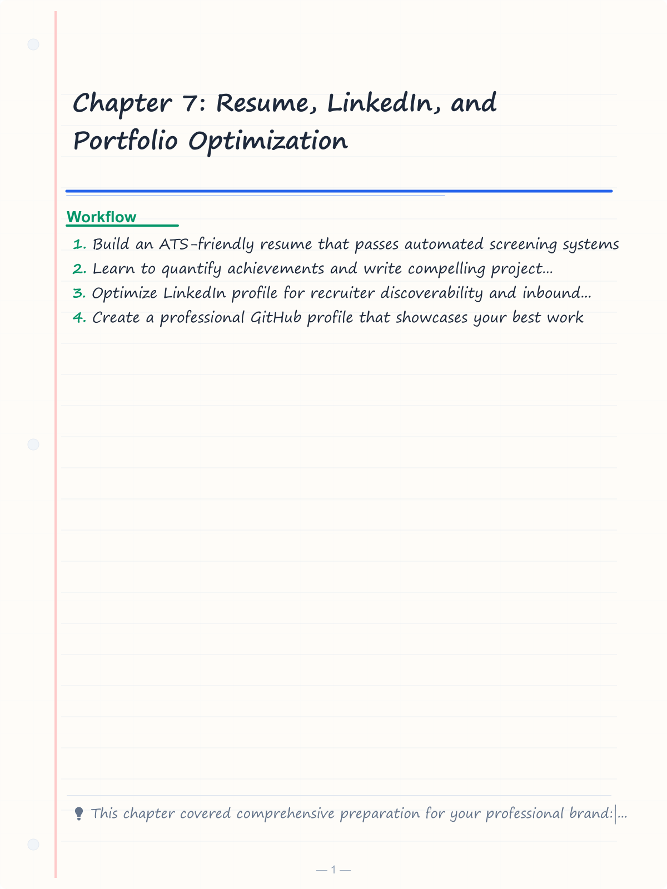
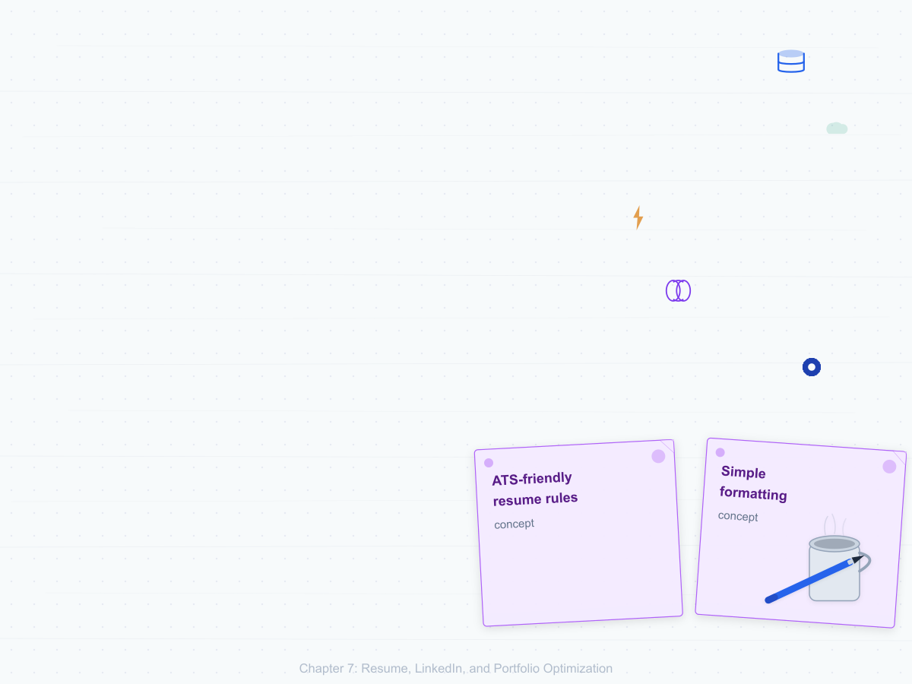
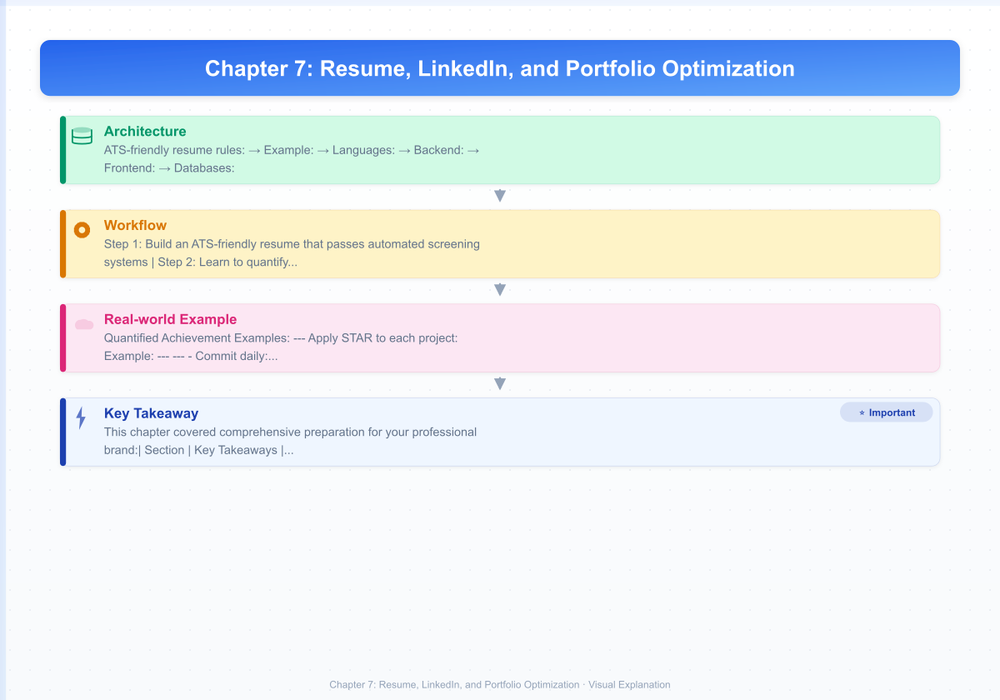
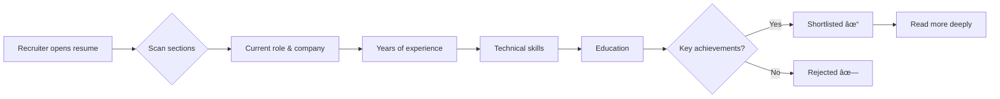
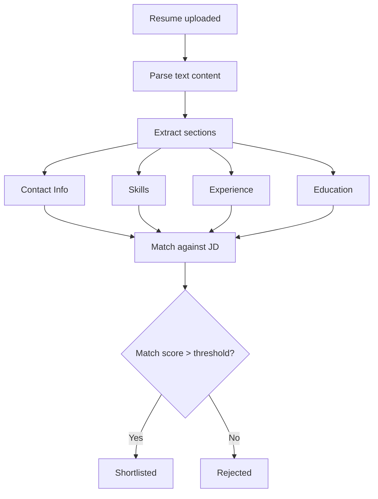
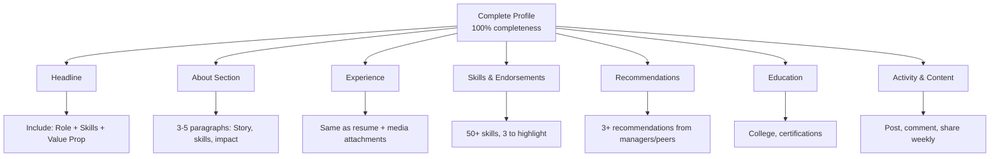

# Chapter 7: Resume, LinkedIn, and Portfolio Optimization

## Learning Objectives

- Build an ATS-friendly resume that passes automated screening systems
- Learn to quantify achievements and write compelling project descriptions
- Optimize LinkedIn profile for recruiter discoverability and inbound outreach
- Create a professional GitHub profile that showcases your best work
- Design a personal portfolio website to stand out in interviews
- Master the art of tailoring resumes for specific job applications

<!-- Image Gallery -->
<section class="lesson-visuals" aria-label="Visual learning resources">
  <header><span>VISUAL LEARNING</span><h2>See it. Review it. Remember it.</h2></header>
  <a class="lesson-visual-card" href="../../assets/images/lessons/interview-preparation/07-resume-linkedin-portfolio/handwritten-notes.png" target="_blank" rel="noopener">
    
    <span><strong>Handwritten notes</strong>Condensed notes for deliberate review.</span>
  </a>
  <a class="lesson-visual-card" href="../../assets/images/lessons/interview-preparation/07-resume-linkedin-portfolio/sticky-notes.png" target="_blank" rel="noopener">
    
    <span><strong>Sticky-note revision</strong>Fast recall prompts for revision.</span>
  </a>
  <a class="lesson-visual-card" href="../../assets/images/lessons/interview-preparation/07-resume-linkedin-portfolio/visual-explanation.png" target="_blank" rel="noopener">
    
    <span><strong>Visual concept guide</strong>A connected explanation of the key ideas.</span>
  </a>
</section>
<!-- End Image Gallery -->

## Key Concepts

### The 30-Second Resume Test

Recruiters spend an average of 6-8 seconds scanning a resume before deciding to read more. Your resume must pass the **30-second test**:



### ATS (Applicant Tracking System)

Most companies use ATS to filter resumes before human review. ATS parses your resume into structured data.

**ATS-friendly resume rules:**
1. **Simple formatting:** No tables, columns, graphics, or headers/footers
2. **Standard sections:** Contact, Summary, Skills, Experience, Education, Projects
3. **Standard fonts:** Arial, Calibri, Times New Roman (11-12pt)
4. **File format:** .docx or .txt (PDF may not parse correctly in some ATS)
5. **Section headers:** Exact match — "Work Experience" not "Professional Journey"
6. **No images/icons:** Not parsed and may break the parser
7. **Keyword optimization:** Include skills from the job description
8. **Spell out acronyms:** "Software Development Life Cycle (SDLC)" not just "SDLC"

### ATS Parsing Flow



---

## Section 1: Resume Structure and Content

### The Perfect Resume Structure

```
1. HEADER  — Name, Phone, Email, LinkedIn, GitHub, Location
2. SUMMARY — 3-4 lines professional summary (optional for experienced)
3. SKILLS  — Technical skills categorized (Languages, Frameworks, Tools)
4. EXPERIENCE — Work experience (reverse chronological)
5. PROJECTS — Notable projects (for freshers, this is crucial)
6. EDUCATION — Degrees, certifications
7. ACHIEVEMENTS — Awards, publications, patents (optional but impactful)
```

### Resume Template: Fresher (BE/BTech/MCA)

<details>
<summary>Click to reveal template</summary>

```
RAHUL KUMAR
rahul.kumar@email.com | +91-9876543210 | linkedin.com/in/rahulkumar
github.com/rahulkumar | Noida, UP

EDUCATION
B.Tech in Computer Science & Engineering — NIT Trichy (CGPA: 8.5/10)
2019 – 2023

SKILLS
Languages: Java, TypeScript, Python, SQL
Frameworks: Spring Boot, React, Node.js, Express
Databases: MySQL, PostgreSQL, MongoDB, Redis
Tools: Git, Docker, Jenkins, AWS (EC2, S3), Linux
Concepts: DSA, OOPs, DBMS, System Design, REST API

INTERNSHIP
Software Engineer Intern — TechCorp Solutions, Bangalore (Jan 2023 – Jun 2023)
- Developed 15+ RESTful APIs for e-commerce platform using Spring Boot
- Reduced API response time by 40% by implementing Redis caching
- Wrote 200+ unit tests achieving 85% code coverage
- Collaborated in daily stand-ups and sprint planning (Agile)

PROJECTS
Real-time Chat Application | TypeScript, Socket.io, MongoDB, Redis
- Designed WebSocket architecture for 10K concurrent connections
- Implemented message persistence with MongoDB and read-receipt tracking
- Achieved &lt;100ms message delivery latency with Redis pub/sub

E-Commerce REST API | Spring Boot, PostgreSQL, JWT
- Built full-featured REST API with role-based authentication
- Implemented cart, order, payment flow with idempotency
- Containerized with Docker, deployed on AWS EC2

ACHIEVEMENTS
- 500+ problems solved on LeetCode (Top 15%)
- Finalist, Hackathon XYZ 2022 (out of 10,000 participants)
- AWS Certified Cloud Practitioner
```
</details>

### Resume Template: Experienced (3-10 Years)

<details>
<summary>Click to reveal template</summary>

```
PRIYA SHARMA
priya.sharma@email.com | +91-9876543210 | linkedin.com/in/priyasharma
github.com/priyasharma | Bangalore, KA

PROFESSIONAL SUMMARY
Senior Software Engineer with 5+ years of experience building scalable
distributed systems. Expert in Java, Spring Boot, and cloud-native
architectures. Led teams of 4-6 engineers delivering 3 major products
serving 10M+ users. Passionate about system design and technical mentoring.

SKILLS
Languages: Java, TypeScript, Go, SQL
Frameworks: Spring Boot, Spring Cloud, Kafka, React
Databases: PostgreSQL, Cassandra, Elasticsearch, Redis
Cloud: AWS (EKS, RDS, SQS, Lambda), Kubernetes, Docker, Terraform
Architecture: Microservices, Event-Driven, CQRS, REST, GraphQL

EXPERIENCE
Senior Software Engineer — ABC Corp, Bangalore | May 2021 – Present
- Architected and built payment processing platform handling ₹500Cr+ monthly volume
- Migrated monolith to 12 microservices, reducing deployment time from 4hrs to 15min
- Implemented distributed tracing with Jaeger, reducing MTTR from 2hrs to 20min
- Led a team of 5 engineers, conducted design reviews, and mentored 3 junior devs
- Reduced P0 incidents by 80% through improved monitoring and chaos engineering

Software Engineer — XYZ Tech, Gurgaon | Jun 2018 – Apr 2021
- Built real-time analytics pipeline ingesting 1M+ events/minute using Kafka + Flink
- Optimized MongoDB aggregation queries, reducing dashboard load time from 8s to 0.5s
- Designed rate limiter for API gateway handling 50K RPS
- Contributed to open-source library (500+ GitHub stars)

EDUCATION
B.Tech in Computer Science — IIT Roorkee (CGPA: 8.2/10) | 2014 – 2018

ACHIEVEMENTS
- Patent: "System and Method for Distributed Rate Limiting" (US Patent #12345678)
- Speaker at JavaOne 2023: "Building Resilient Payment Systems"
- AWS Certified Solutions Architect — Professional
</details>
</details>

### Quantified Achievement Examples

| Weak Statement | Strong (Quantified) Statement |
|---------------|------------------------------|
| Improved application performance | Reduced API response time by 40% (from 250ms to 150ms) |
| Worked on team projects | Led a team of 5 engineers to deliver project 2 weeks ahead of schedule |
| Developed features | Built 5 microservices handling 10K requests/second |
| Wrote tests | Achieved 92% code coverage across 200+ test cases |
| Fixed bugs | Reduced P1 incidents by 60% through proactive monitoring |
| Used cloud services | Migrated 15 services to AWS EKS, reducing infra cost by 35% |
| Helped with hiring | Interviewed 50+ candidates, resulting in 12 successful hires |
| Optimized database | Reduced query time from 8s to 50ms by adding indexes and rewriting queries |
| Created documentation | Authored 20+ wiki pages used by the entire 50-member team |
| Mentored juniors | Mentored 4 junior devs; all reached senior level within 18 months |

### Resume Mistakes to Avoid

| Mistake | Why It Hurts |
|---------|-------------|
| Spelling/Grammar errors | Creates impression of carelessness |
| Generic objective statement | "Seeking challenging position" — says nothing unique |
| Irrelevant experience | Waiter job has no place on a software dev resume |
| Too long (2+ pages for fresher) | Recruiters won't read past page 1 |
| PDF formatting issues | Tables, columns break ATS parsing |
| Inconsistent dates | Gaps without explanation raise questions |
| Unprofessional email | `coolguy@email.com` → use your name |
| No measurable results | "Did work" vs "Reduced latency by 40%" |
| Mentioning technologies you don't know | You'll be asked about them in interview |
| Including photo, age, marital status | Not required in India and may cause bias |

---

## Section 2: Project Description Templates

### The STAR Method for Projects

Apply STAR to each project:
| Element | What to Include |
|---------|-----------------|
| **Situation** | The problem context, users affected |
| **Task** | Your specific responsibility |
| **Action** | Technologies, architecture, approach |
| **Result** | Quantified impact, users served |

### Project Templates by Category

#### Web Application Project
```
[Project Name] | [Tech Stack]
- Built [app description] for [target users] solving [problem]
- Implemented [key feature 1] using [technology], achieving [metric]
- Designed database schema with [X] tables handling [Y] records
- Deployed on [platform] with CI/CD pipeline (Docker + GitHub Actions)
- [Result]: Serving [N] users with [X]% uptime, [Y]ms response time
```

**Example:** 
```
Hostel Management Portal | React, Node.js, MongoDB, Docker
- Built portal for 5000+ hostel residents to manage complaints, mess menu, and visitor logs
- Implemented real-time notification system using WebSocket (30k notifications/day)
- Designed MongoDB schema with 8 collections handling 100k+ documents
- Deployed on AWS EC2 with Docker and Nginx reverse proxy
- Reduced complaint resolution time from 48hrs to 6hrs
```

#### Database/Backend Project
```
[Project Name] | [Tech Stack]
- Designed and built RESTful API for [domain] with [N] endpoints
- Implemented authentication using [JWT/OAuth] with role-based access
- Optimized [specific query] reducing response time from [X] to [Y]
- Used [caching solution] for frequently accessed data (hit ratio: X%)
- [Result]: Handles [N] requests/second with [P]99 latency under [X]ms
```

#### ML/AI Project
```
[Project Name] | Python, [ML Framework]
- Built [model type] for [task] on [dataset] of [size]
- Performed feature engineering (reduced features from N to M)
- Achieved [metric]: [X]% accuracy/precision/recall/F1
- Deployed as REST API using Flask with &lt;100ms inference time
- [Result]: [Business impact - e.g., reduced fraud by 30%]
```

#### System Design / Architecture Project
```
[Project Name] | [Architecture Pattern]
- Designed [system] for [scale] handling [N] requests/second
- Chose [database] over [alternative] due to [reason]
- Implemented [caching/queuing/sharding] strategy for [specific need]
- Trade-off analysis: [Decision] vs [Alternative] — chose [this] because
- [Result]: Achieved [X]% availability, [Y]ms latency at scale
```

---

## Section 3: LinkedIn Optimization

### LinkedIn Profile Checklist



### Headline Optimization

| Weak Headline | Strong Headline |
|---------------|-----------------|
| Software Engineer at ABC Corp | Senior Software Engineer | Java, Spring Boot, Distributed Systems | Building Scalable Fintech Solutions |
| Student at XYZ College | CS Undergrad | Full-Stack Developer | Java | React | Seeking SDE 2024 Opportunities |
| Looking for job | Software Engineer | Ex-Amazon | Distributed Systems | System Design | Open to SDE-3 roles |
| IIT Graduate | SDE-2 @ Google | Android Developer | Ex-Microsoft | GSoC Mentor |

### About Section Template

```
[Paragraph 1: Who you are]
Senior Software Engineer with 5+ years of experience in building
scalable distributed systems. Currently at Amazon, I work on payment
infrastructure handling $10B+ annual volume.

[Paragraph 2: Key achievements]
→ Architected migration from monolith to 12 microservices
→ Reduced P99 latency by 60% for critical payment flows
→ Led team of 4 engineers delivering 3 major features

[Paragraph 3: What you're looking for]
I'm passionate about solving infrastructure challenges at scale.
Open to senior engineering roles in fintech or infrastructure domains.
Feel free to reach out for:

[Call to action]
- System design discussions
- Career mentorship conversations
- Open source collaborations

#SoftwareEngineering #DistributedSystems #SystemDesign
```

### LinkedIn Best Practices

| Best Practice | How to Implement |
|--------------|-----------------|
| Professional photo | Headshot against neutral background, business casual |
| Custom URL | linkedin.com/in/yourname (make it professional) |
| Featured section | Pin best project, publication, or award |
| Media on experience | Add screenshots, architecture diagrams, links |
| Skill assessments | Pass LinkedIn skill assessments for validation |
| Open to work | Use privately, not the green banner |
| Recommendations | Ask managers, peers, professors (reciprocate) |
| Regular activity | Post weekly: tech tips, project updates, learnings |
| Network building | Connect with 50+ relevant professionals weekly |
| SEO optimization | Include keywords from target roles in profile |

---

## Section 4: GitHub Profile Best Practices

### GitHub Profile Essentials

| Element | Description | Impact |
|---------|-------------|--------|
| Profile README | Custom markdown README on profile repo | High — creates first impression |
| Pinned repositories | Show 6 best repos prominently | High — recruiters see these first |
| Contribution graph | Consistent green squares | Medium — shows activity |
| Organization membership | Visible contributions to orgs | Medium — shows collaboration |
| Repository quality | Clean README, structure, tests | High — showcases code quality |
| Activity timeline | Daily commits/issues/PRs | Medium — shows engagement |

### GitHub Profile README Template

```markdown
# Hi there, I's 👋

## 🚀 About Me
I'm a Software Engineer passionate about building scalable distributed systems.

- 🔭 I'm currently working on [Microservices Playground](link)
- 🌱 I'm currently learning Kafka and System Design
- 👯 I'm looking to collaborate on open-source projects
- 💬 Ask me about Java, Spring Boot, System Design
- 📫 Reach me: [email] | [LinkedIn]
- âš¡ Fun fact: I've solved 500+ LeetCode problems

## 🛠 Tech Stack

**Languages:** Java, TypeScript, Python, Go, SQL
**Backend:** Spring Boot, Node.js, Express
**Frontend:** React, Next.js, Tailwind CSS
**Databases:** PostgreSQL, MongoDB, Redis, Elasticsearch
**DevOps:** Docker, Kubernetes, AWS, GitHub Actions
**Tools:** Git, IntelliJ, VS Code, Postman

## 📊 GitHub Stats


## 📝 Latest Blog Posts
- [Building Resilient Microservices](link)
- [Understanding Kafka Internals](link)

## 📫 Let's Connect!
[LinkedIn] [Twitter] [Portfolio]
```

### Repository Best Practices

| Element | What to Include |
|---------|-----------------|
| README.md | Project description, tech stack, setup instructions, screenshots |
| Architecture diagram | Show high-level design, component relationships |
| Setup instructions | Prerequisites, installation, environment variables |
| Code structure | Clean package/module organization |
| Tests | Unit tests with clear coverage (aim for 70%+) |
| CI/CD badge | GitHub Actions passing build badge |
| .gitignore | Don't commit node_modules, .env, build artifacts |
| License | MIT or Apache-2.0 for open-source projects |
| Contribution guide | For collaborative projects |
| Demo link | Live deployment URL (if applicable) |

### GitHub Activity Guidelines

- **Commit daily:** Even small contributions maintain the green graph
- **Write good commit messages:** "Fix bug in payment flow" not "Update file"
- **Open-source contributions:** Fix a typo in a popular repo counts
- **Fork interesting projects:** Shows curiosity and exploration
- **Star and follow:** Curate your interests publicly
- **Use GitHub Issues:** For project management on personal projects

---

## Section 5: Portfolio Website Essentials

### Portfolio Sections

| Section | Content | Priority |
|---------|---------|----------|
| Hero | Name, role, tagline, professional photo | Must-have |
| About | 2-3 paragraph bio, skills, interests | Must-have |
| Experience | Work history with quantified achievements | Must-have |
| Projects | 4-6 projects with live demos + GitHub links | Must-have |
| Skills | Technology badges/skills section | Must-have |
| Education | Degrees, certifications | Important |
| Blog | Technical articles (optional but impressive) | Nice-to-have |
| Contact | Email, form, social links | Must-have |
| Testimonials | Recommendations from managers/peers | Nice-to-have |
| Resume download | PDF download button | Important |

### Portfolio Tech Stack Recommendations

| Requirement | Options |
|-------------|---------|
| Static site generator (minimal) | Next.js, Hugo, Jekyll |
| Single-page app (interactive) | React + Vite, Angular |
| No-code (quick) | Carrd, Dev.to, Hashnode |
| Hosting | Vercel (free), Netlify (free), GitHub Pages |
| Domain | yourname.com (\~₹800/yr) |

### Portfolio Content Rules

```
✓ Show, don't tell — include live demos, screenshots, architecture diagrams
✓ Keep it under 3 seconds to load — optimize images, use CDN
✓ Mobile responsive — 60% of recruiters may view on mobile
✓ Clean, minimal design — let content speak, not animations
✓ Call to action — "Download Resume" | "Hire Me" | "Contact"
✓ Analytics — track visits to know what recruiters click
✓ Fast — score 90+ on Google PageSpeed Insights
✓ Professional email — contact@yourname.com
```

---

## Section 6: Application Strategy

### Tailoring Resumes for Different Job Types

| Target | Focus On | De-emphasize |
|--------|----------|-------------|
| FAANG/Product-based | System design, DSA depth, scale metrics | College projects (unless impressive) |
| Service-based (TCS/Infosys) | Core CS fundamentals, communication, team projects | Niche tech stacks |
| Government exams | Core CS textbook knowledge, project defense | Startup experience (less valued) |
| Startup | Full-stack ability, shipped products, versatility | Certifications |
| Consulting | Client management, delivery, communication | Research papers |

### Cover Letter Template

```markdown
Subject: Application for Software Engineer — [Company Name]

Dear [Hiring Manager Name],

I'm writing to express my interest in the Software Engineer role at
[Company]. With [X] years of experience building [type of systems],
I believe I can contribute significantly to [specific company
project/product].

At my current role at [Current Company], I:
- Built [system] handling [N] requests/second
- Reduced [metric] by [X]% through [specific optimization]
- Led a team of [N] engineers delivering [outcome]

I'm particularly excited about [Company's] work in [specific area]
because [personal connection/reason]. I've been following [product
launch/blog post] and I'm impressed by [specific aspect].

I'd welcome the opportunity to discuss how my experience in
[skill 1], [skill 2], and [skill 3] aligns with your team's needs.

Best regards,
[Your Name]
[LinkedIn] | [GitHub] | [Portfolio]
```

### Application Tracking Template

| Company | Role | Applied Date | Status | Notes | Follow-up |
|---------|------|-------------|--------|-------|-----------|
| Google | SDE-2 | 1-Jan | Screening | Referral from John | 15-Jan |
| Amazon | SDE-2 | 2-Jan | OA Received | Need to prep | - |
| TCS | System Engineer | 5-Jan | Shortlisted | Interview on 20-Jan | - |
| NIC | Scientist-B | 10-Jan | Written cleared | GATE score used | - |

---

## Quick Reference Tables

### Resume Action Verbs

| Category | Strong Verbs |
|----------|-------------|
| Leadership | Led, Directed, Coordinated, Spearheaded, Orchestrated |
| Technical | Built, Architected, Designed, Engineered, Implemented, Developed |
| Improvement | Optimized, Reduced, Improved, Transformed, Streamlined |
| Analysis | Analyzed, Evaluated, Researched, Assessed, Investigated |
| Communication | Presented, Authored, Documented, Mentored, Facilitated |
| Results | Delivered, Achieved, Generated, Launched, Deployed |

### LinkedIn Profile Strength Score

| Factor | Impact | Your Score |
|--------|--------|------------|
| Profile photo | +15% | ☐ Uploaded |
| Headline with keywords | +20% | ☐ Optimized |
| About section (3+ paragraphs) | +15% | ☐ Written |
| 5+ skills relevant to target role | +10% | ☐ Added |
| 3+ recommendations | +10% | ☐ Requested |
| 500+ connections | +10% | ☐ Grown |
| Experience with media | +10% | ☐ Enhanced |
| Custom URL | +5% | ☐ Created |
| Regular posting (weekly) | +5% | ☐ Active |
| **Total** | **100%** | **Score: ___** |

### ATS Keyword Optimization

```
Job Description Keywords:
- Java, Spring Boot, Microservices, Docker, Kubernetes
- REST API, SQL, NoSQL, Cloud (AWS), CI/CD
- Agile, Scrum, Unit Testing, Code Review
- System Design, Scalability, Distributed Systems

Map each keyword to YOUR experience:
✓ Java — 5 years, used for payment microservices
✓ Spring Boot — Built 10+ REST APIs, Spring Cloud for service discovery
✓ Docker — Containerized all services, wrote Dockerfiles
✓ Kubernetes — Deployed on EKS, wrote Helm charts
✓ Microservices — Led monolith-to-microservices migration
```

### Portfolio Checklist

| Item | Status | Priority |
|------|--------|----------|
| Custom domain | ☐ | High |
| HTTPS enabled | ☐ | High |
| Mobile responsive | ☐ | High |
| Loading under 3s | ☐ | High |
| Contact form works | ☐ | High |
| Social links active | ☐ | High |
| Resume PDF downloads | ☐ | High |
| Google Analytics | ☐ | Medium |
| Blog section | ☐ | Low |
| Dark mode | ☐ | Low |

---

---

## Section 7: Templates for Common Scenarios

### Scenario Template 1: Career Change (Non-IT to IT)

```
Name | Phone | Email | LinkedIn | GitHub

PROFESSIONAL SUMMARY
Mechanical Engineer transitioning to Software Development with
strong self-taught programming skills. Completed 500+ hours of coding
bootcamp and built 5 full-stack projects. Proficient in JavaScript,
React, Node.js, and SQL. Seeking entry-level software developer role
where analytical and problem-solving skills from engineering background
add unique value.

SKILLS
Languages: JavaScript, Python, SQL, HTML/CSS
Frameworks: React, Node.js, Express, Bootstrap
Tools: Git, VS Code, MongoDB, PostgreSQL
Soft Skills: Problem-solving, Analytical thinking,
           Technical documentation, Cross-functional communication

BOOTCAMP
Full-Stack Web Development — Coding Bootcamp India
Jan 2023 – Apr 2023 | 500+ hours
- Built 5 projects including e-commerce API and real-time chat app
- Collaborated on team project using Git and Agile methodology
- Received "Most Improved" award for consistent progress

PROJECTS
E-Commerce REST API | Node.js, Express, PostgreSQL, JWT
- Built full CRUD API with 15 endpoints, authentication, and authorization
- Implemented shopping cart, order processing, and payment integration
- Deployed on Heroku with 99% uptime, documented with Swagger

Real-time Chat Application | React, Socket.io, MongoDB
- Built WebSocket-based chat supporting 100+ concurrent users
- Implemented typing indicators, online status, message history
- Containerized with Docker, deployed on AWS EC2

EDUCATION
B.Tech Mechanical Engineering — NIT Warangal (CGPA: 7.8/10)
2016 – 2020
```

### Scenario Template 2: Gap in Education/Employment

```
STRATEGY: Address gaps upfront in a positive, learning-focused way.

PROFESSIONAL SUMMARY
Software Engineer with 4 years of experience in full-stack development.
Took a career break of 18 months to pursue higher education (MCA) and
care for a family member. Returned with updated skills in cloud computing
and system design. Eager to contribute to challenging engineering problems.

[Note: In the interview, if asked about the gap, respond:]
"I took 18 months off for two reasons: 1) I pursued an MCA to deepen
my computer science fundamentals, and 2) I needed to attend to a family
medical situation. During this time, I kept my skills current by building
projects and completing AWS certification. The experience taught me
resilience and time management."
```

### Scenario Template 3: Multiple Short Tenures

```
STRATEGY: Frame short stints as intentional learning periods in early career.

EXPERIENCE
Software Engineer — Startup C, Bangalore | Mar 2022 – Present
(18 months — longest tenure, highlight impact)

Associate Developer — Startup B, Remote | Sep 2021 – Feb 2022
(6 months — left due to funding issues, learned fast-paced startup skills)

Junior Developer — Startup A, Gurgaon | Apr 2021 – Aug 2021
(5 months — initial learning phase, contract ended)

EXPLANATION (in interview):
"In my early career, I deliberately explored different types of
organizations — from early-stage startups to established product companies.
Each role taught me something valuable: Startup A gave me React skills,
Startup B taught me backend architecture, and my current role combines
both. I'm now looking for a long-term position where I can apply
these diverse experiences."
```

---

## Section 8: Interview-Specific Resume Customization

### Resume Customization by Company Type

#### For Service Companies (TCS, Infosys, Wipro)

| Add | De-emphasize |
|-----|-------------|
| Communication skills | Obscure technical frameworks |
| Team projects | Solo projects (unless exceptional) |
| Core Java and SQL | Experimental technologies |
| Agile/Scrum experience | Personal side projects |
| Client-facing experience | Research papers |
| Certifications (Java, AWS) | Hobby-level projects |

#### For Product Companies (Google, Amazon, Microsoft)

| Add | De-emphasize |
|-----|-------------|
| DSA problem count (600+ LeetCode) | Routine internship work |
| System design projects | Course projects |
| Open source contributions | Certifications (unless expert level) |
| Scalability metrics | Maintenance work |
| Architecture decisions | Configuration tasks |
| Published papers/patents | College extracurriculars |

#### For Government/PSU Interviews

| Add | De-emphasize |
|-----|-------------|
| GATE score (if good) | Startup experience |
| Core CS project depth | Framework-specific skills |
| Academic achievements | Internships at unknown companies |
| Published research | Short-term contract roles |
| Technical certifications | Design tool proficiency |
| Teaching/mentoring experience | Social media handles |

### Resume Checklist Before Submission

```
☐ File name: YourName_Role_Company.pdf (not "Resume.pdf")
☐ File format: As requested (PDF or DOCX)
☐ File size: Under 2MB
☐ One page: For &lt;5 years experience
☐ Two pages: For &gt;5 years experience (never more)
☐ No typos: Run through Grammarly + manual proofread
☐ Consistent formatting: Same font, size, spacing throughout
☐ Quantified bullets: Every bullet has a number or metric
☐ Recent first: Reverse chronological order
☐ No personal info: No photo, age, gender, marital status
☐ Links work: LinkedIn, GitHub, portfolio — all active
☐ Skills match JD: Keywords from job description are present
☐ Dates align: No gaps (explain gaps in cover letter)
☐ Action verbs: Use "Led, Built, Architected, Optimized, Reduced"
☐ Tense consistent: Current job → present tense, past jobs → past tense
```

---

## Section 9: Common Resume Formats Comparison

### Chronological Resume (Standard)

| Pros | Cons |
|------|------|
| Preferred by 95% recruiters | Highlights gaps |
| Shows career progression | |
| Easy to understand | |

### Functional Resume (Skill-Based)

| Pros | Cons |
|------|------|
| Highlights skills | ATS may not parse well |
| Downplays employment gaps | Recruiters skeptical |
| Good for career changers | Less common in IT |

### Combination Resume

| Pros | Cons |
|------|------|
| Best of both worlds | Can be long |
| Skills first, then experience | Needs careful formatting |
| Works for most IT roles | |

**Recommendation:** Use **chronological** for standard IT roles. Use **combination** for senior roles with diverse experience.

---

## Section 10: Digital Presence Management

### Online Reputation Checklist

```
Search Engine Check
☐ Google your name — what appears on first page?
☐ Are there any negative results? Work to remove them
☐ Do you have a positive presence (GitHub, LinkedIn, Medium)?

Social Media Cleanup
☐ Set old Twitter/Facebook profiles to private
☐ Remove/untag inappropriate photos
☐ Review public posts for offensive content
☐ Update bios to sound professional

Content Strategy (Optional but Impactful)
☐ Write 1 technical blog per month on Medium/Hashnode
☐ Share project updates and learnings on LinkedIn
☐ Engage with industry content (likes, comments, shares)
☐ Answer questions on Stack Overflow / Reddit

GitHub Cleanup
☐ Archive or delete old, incomplete projects
☐ Ensure top 6 pinned repos have great README
☐ Remove sensitive data (keys, passwords) from commit history
☐ Add CI badges, license, and contribution guidelines
```

### Building a Personal Brand

| Action | Frequency | Platform |
|--------|-----------|----------|
| Technical blog | Monthly | Medium, Hashnode, Dev.to |
| Project showcase | Per project | GitHub, LinkedIn |
| Industry insights | Weekly | LinkedIn posts |
| Networking | Weekly | LinkedIn connections |
| Learning share | Daily | Twitter/X threads |
| Open source | Monthly | GitHub contributions |

---

## Summary

This chapter covered comprehensive preparation for your professional brand:

| Section | Key Takeaways |
|---------|--------------|

| Section | Key Takeaways |
|---------|--------------|
| Resume Structure | ATS-friendly format, quantified achievements, section templates |
| Project Descriptions | STAR method applied to projects, 4 template categories |
| LinkedIn Optimization | Headline strategy, About section, 12 best practices |
| GitHub Profile | Profile README, pinned repos, contribution strategy |
| Portfolio Website | 10 sections, tech stack, design rules |
| Application Strategy | Tailoring per company, cover letter, tracking |

## Practical Takeaways

1. **ATS-proof your resume:** No tables, columns, or graphics. Use standard fonts and section headers. Save as .docx unless PDF is explicitly requested.

2. **Quantify every bullet point:** Use numbers — time saved, percentage improvement, users impacted, revenue generated. Even a college project can say "served 500+ students."

3. **Your LinkedIn headline is prime real estate:** Use 120 characters to say what you do, who you are, and what value you offer. Include your top 3 skills.

4. **GitHub should tell a story:** Your pinned repos should showcase range — algorithmic, web app, system design, open-source contribution. Each should have a great README.

5. **Keep resume to 1 page if &lt;5 years experience,** 2 pages max if more. No one reads beyond page 2.

6. **Proofread 3 times:** Use Grammarly, have a friend review, and read it aloud. One typo can cost you an interview.

7. **Portfolio > Resume:** Having a live portfolio with working demos gives you a massive advantage. It shows initiative and technical competence.

8. **⭐ Must-Do:** Complete all 7 chapters of this module, then update your resume, LinkedIn, and GitHub before applying. Mock interviews are critical.

9. **Recruiters search LinkedIn for skills:** Make sure every skill you want to be found for appears in your headline, about, and skills sections.

10. **Final word:** Your resume gets you the interview. Your preparation gets you the job. Invest in both equally.
