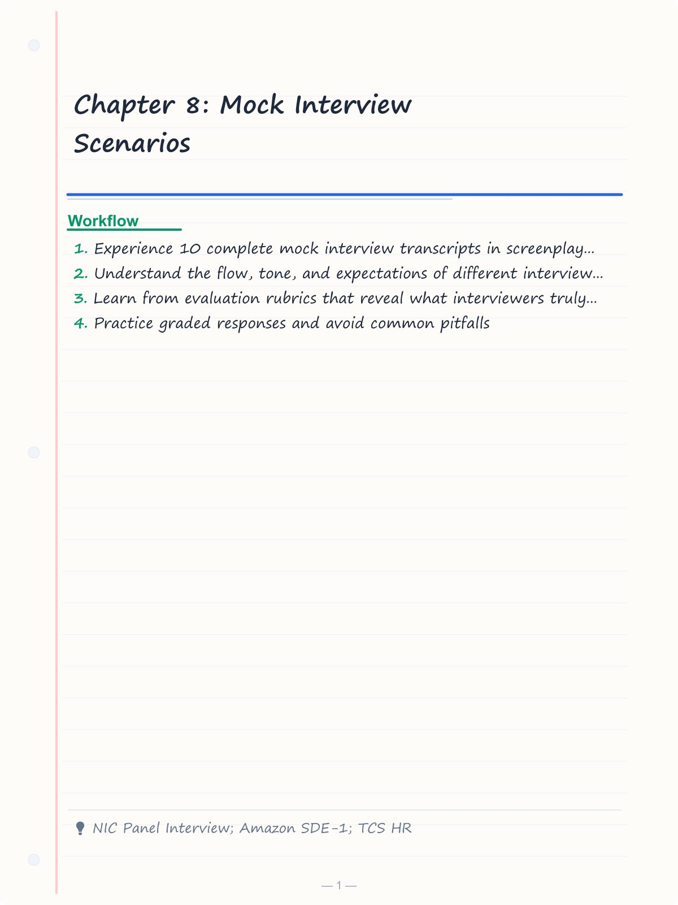
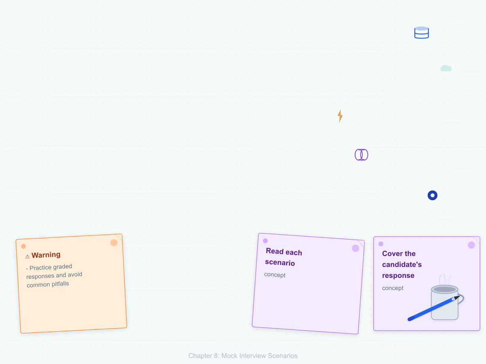
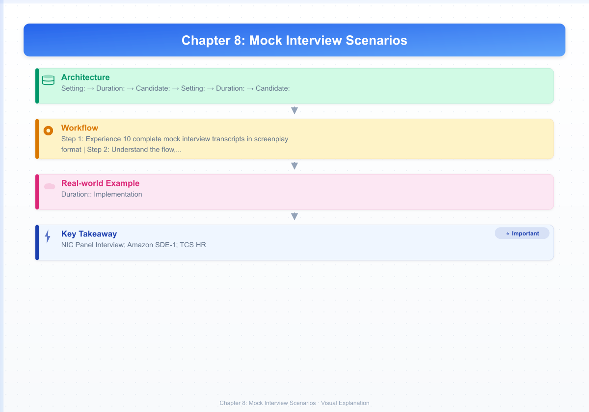

# Chapter 8: Mock Interview Scenarios

## Learning Objectives

- Experience 10 complete mock interview transcripts in screenplay format
- Understand the flow, tone, and expectations of different interview types
- Learn from evaluation rubrics that reveal what interviewers truly assess
- Practice graded responses and avoid common pitfalls
- Build confidence through realistic exposure to interview dynamics

<!-- Image Gallery -->
<section class="lesson-visuals" aria-label="Visual learning resources">
  <header><span>VISUAL LEARNING</span><h2>See it. Review it. Remember it.</h2></header>
  <a class="lesson-visual-card" href="../../assets/images/lessons/interview-preparation/08-mock-interview-scenarios/handwritten-notes.png" target="_blank" rel="noopener">
    
    <span><strong>Handwritten notes</strong>Condensed notes for deliberate review.</span>
  </a>
  <a class="lesson-visual-card" href="../../assets/images/lessons/interview-preparation/08-mock-interview-scenarios/sticky-notes.png" target="_blank" rel="noopener">
    
    <span><strong>Sticky-note revision</strong>Fast recall prompts for revision.</span>
  </a>
  <a class="lesson-visual-card" href="../../assets/images/lessons/interview-preparation/08-mock-interview-scenarios/visual-explanation.png" target="_blank" rel="noopener">
    
    <span><strong>Visual concept guide</strong>A connected explanation of the key ideas.</span>
  </a>
</section>
<!-- End Image Gallery -->

## How to Use This Chapter

1. **Read each scenario** to understand the flow and format of different interview types
2. **Cover the candidate's response** and try answering yourself first
3. **Check against the rubric** to evaluate your own performance
4. **Role-play with a friend** — one person reads the interviewer, the other responds
5. **Record yourself** performing the candidate role and play it back for self-improvement

---

## Scenario 1: Government Panel Interview (NIC Scientist-B)

**Setting:** A panel of 4 members — Chairman (Senior Director), Two Technical Experts, HR Representative.
**Duration:** 25 minutes
**Candidate:** Rahul, B.Tech CSE, 2022 graduate, GATE qualified.

```
Panel Chair: Good morning, Mr. Rahul. Please have a seat. How are you today?

Candidate: Good morning, sir. I'm doing well, thank you. It's an honor to be here.

Panel Chair: Let's begin. Tell us about yourself.

Candidate: Certainly, sir. I'm Rahul, a Computer Science graduate from NIT Surat
with a CGPA of 8.7. I qualified GATE 2022 with an AIR of 450. During college,
I built a real-time bus tracking system deployed by the university, and I
completed an internship at TCS where I worked on REST API development. I'm
passionate about building systems that serve the public good, which is why
I'm excited about the opportunity to work at NIC.

Tech Expert 1: Describe your bus tracking project in detail. What technologies
did you use and what was your specific contribution?

Candidate: The system tracks 15 university buses in real time and shows their
locations to 5000+ students via a web and mobile interface.

For the tech stack, I used:
- GPS modules on each bus sending data via MQTT protocol
- A Node.js backend with WebSocket server for real-time communication
- MongoDB for storing historical location data
- React frontend with Mapbox for visual display
- Redis for caching frequently accessed routes

My specific contributions were:
- Designing the MQTT ingestion pipeline handling 1000+ updates per minute
- Implementing the ETA calculation algorithm using the Haversine formula
- Setting up the Redis caching layer to reduce database load
- Deploying the system on an AWS EC2 instance with Docker

Tech Expert 2: How did you handle the challenge of unreliable GPS signals
in certain areas of the campus?

Candidate: That was indeed a challenge, sir. We implemented three strategies:
1. Dead Reckoning: When GPS signal dropped, we estimated location using
   the last known position, speed, and direction
2. Data smoothing: We used a simple Kalman filter to reduce GPS jitter
3. Fallback mechanisms: If no signal for 30 seconds, the app showed
   "Last seen at..." with a timestamp of the last valid location

Tech Expert 1: Good. Let's move to core concepts. Explain the OSI model layers
and what happens at each layer when a user accesses a website.

Candidate: [Explains all 7 layers with protocols and devices for each]

Tech Expert 2: What's the difference between TCP and UDP? Give specific
use cases for each in government systems.

Candidate: TCP is connection-oriented with guaranteed delivery, while UDP is
connectionless with best-effort delivery...

In government systems:
- TCP: Used for file transfers (PFMS payment files), database replication
  between data centers, email services
- UDP: Used for DNS resolution in internal networks, VoIP services like
  video conferencing, SNMP for network monitoring

HR: Why do you want to join NIC rather than a private company offering
a higher salary?

Candidate: Sir, I believe technology for public service has a deeper impact.
At NIC, my work on DigiLocker or e-Office could serve 100+ crore citizens.
That scale of impact is unmatched in the private sector. Additionally, the
variety of projects at NIC — from AI-based language translation (Bhashini)
to blockchain for certificates — offers tremendous learning opportunities.
Salary is important, but long-term satisfaction comes from meaningful work.

Panel Chair: Thank you, Rahul. Do you have any questions for us?

Candidate: Yes, sir. I'd like to know what the typical technology stack is
for a new NIC project, and what opportunities exist for learning new
technologies on the job.

Panel Chair: [Answers] Thank you. We'll inform you of the result.

Candidate: Thank you, sir. Thank you, ma'am. It was a pleasure.
```

### Evaluation Rubric

| Criteria | Excellent (80-100%) | Good (60-80%) | Average (40-60%) | Poor (&lt;40%) |
|----------|-------------------|---------------|-------------------|---------------|
| Technical depth | Deep, connects concepts, real-world examples | Good fundamentals, some depth | Basic answers, no depth | Incorrect or confused |
| Project defense | Clear architecture, quantified impact, challenges | Good description, lacks metrics | Vague description | Can't explain own project |
| Current affairs | Specific examples, integrates with role | Some awareness | Limited | Outdated/wrong |
| Communication | Structured, confident, clear | Mostly clear | Hesitant, fillers | Rambling |
| Motivation for govt | Genuine, specific to NIC | Generic interest | "Job security" | "No other option" |
| Panel interaction | Engages all members, asks good questions | Responds well | Answers only | Nervous, avoids eye contact |

---

## Scenario 2: Technical Round — Product-Based Company (Amazon SDE-1)

**Setting:** 2 interviewers (Backend + Frontend expert). Remote via video call.
**Duration:** 60 minutes (coding + system design)
**Candidate:** Priya, 2 years experience at service-based company.

```
Interviewer 1: Hi Priya, welcome. Let's start with a coding problem. I'd like
you to "Find the longest palindromic substring in a given string."

Candidate: Can I confirm the input: it's a string, and I need to return the
longest contiguous substring that reads the same forwards and backwards?

Interviewer 1: Yes. For example, "babad" should return "bab" or "aba".

Candidate: Let me think about approaches. The brute force would be O(n³) —
check every substring. But I can use the "expand around center" approach
which gives O(n²) with O(1) space.

[Priya writes code on shared editor]

function longestPalindrome(s: string): string {
  if (s.length <= 1) return s;
  let start = 0, maxLen = 1;

  function expand(left: number, right: number): void {
    while (left >= 0 && right < s.length && s[left] === s[right]) {
      if (right - left + 1 > maxLen) {
        maxLen = right - left + 1;
        start = left;
      }
      left--;
      right++;
    }
  }

  for (let i = 0; i < s.length; i++) {
    expand(i, i);     // Odd length
    expand(i, i + 1); // Even length
  }

  return s.slice(start, start + maxLen);
}

Interviewer 1: What's the time complexity? Can you optimize further?

Candidate: Time is O(n²) — for each of n centers, we expand up to n times.
Space is O(1) excluding output. We could use Manacher's algorithm for O(n)
time, but it's significantly more complex and only beneficial for very large
strings. For most cases, the expand-around-center approach is preferred.

Interviewer 1: Good. Now let's write tests for this.

Candidate:
console.log(longestPalindrome("babad"));  // "bab" or "aba"
console.log(longestPalindrome("cbbd"));   // "bb"
console.log(longestPalindrome("a"));      // "a"
console.log(longestPalindrome(""));       // ""
console.log(longestPalindrome("racecar"));// "racecar"

Interviewer 2: Let's move to system design. Design a URL shortening service
like TinyURL. Start with requirements.

Candidate: [Walks through complete solution — see Chapter 3 for detailed
approach with API design, database schema, caching strategy, and scaling]

Interviewer 2: How would you handle custom short URLs?

Candidate: Custom short URLs need a separate validation flow:
1. Check if the custom alias is already taken (Redis lookup + DB check)
2. Validate against a blocked list (malicious patterns, profanity)
3. Allow collision only if explicit
4. For premium users: allow shorter aliases
5. Rate limit custom URL creation to prevent squatting

[Interview continues with behavioral questions]

Interviewer 1: Tell me about a time you had a disagreement with a colleague.

Candidate: [Uses STAR method — see Chapter 5 for detailed response]

Interviewer 2: Do you have questions for us?

Candidate: Yes. What does the team's on-call rotation look like, and what's
the most common type of production issue you encounter?
```

### Evaluation Rubric

| Criteria | Excellent | Good | Average | Poor |
|----------|-----------|------|---------|------|
| Coding correctness | Correct, handles edge cases | Works for main cases | Partial solution | Wrong |
| Optimization | Optimal + trade-off discussion | Optimal | Suboptimal | No analysis |
| Code quality | Clean, well-named, typed | Readable | Works but messy | Unreadable |
| System design | Complete with numbers, trade-offs | Good structure | Basic | Missing key parts |
| Communication | Clear thinking process | Mostly clear | Needs prompting | Silent while coding |
| Behavioral | Strong STAR, relevant | Good story | Weak example | Can't think of one |

---

## Scenario 3: HR Round — Service-Based Company (TCS Ninja/Digital)

**Setting:** 1 HR Manager. Face-to-face.
**Duration:** 15 minutes
**Candidate:** Amit, final year B.Tech student.

```
HR: Good morning, Amit. How are you?

Candidate: Good morning, ma'am. I'm great, thank you. How are you?

HR: I'm good. Let's start. Tell me about yourself.

Candidate: I'm Amit, a final year Computer Science student from SRM
Institute of Science and Technology. I have a CGPA of 8.5. I'm passionate
about full-stack development — I've built a hostel management portal using
React and Node.js that's being used by our college. I've also completed
a virtual internship in web development and solved 200+ problems on
LeetCode. I'm looking for a role where I can work on real-world products
and continue learning.

HR: Why TCS?

Candidate: TCS is India's largest IT services company with a presence in
50+ countries. What attracts me specifically is:
1. The learning ecosystem — TCS has amazing internal training platforms
2. The variety of domains — from banking to healthcare to retail
3. The culture of innovation — I've read about TCS's research in AI and
   quantum computing
4. The structured career growth — the TCS Digital program is exactly
   the kind of challenging role I'm seeking
5. The work-life balance that TCS is known for

HR: What are your strengths and weaknesses?

Candidate: My biggest strength is my ability to learn new technologies
quickly. For example, I taught myself React in two weeks to build a college
project, and I'm now mentoring juniors on the same.

My weakness is that I sometimes hesitate to ask for help when I'm stuck.
In my internship, I spent 3 hours debugging an issue that a senior could
have solved in 10 minutes. I'm actively working on this by setting a
20-minute timebox before asking for help.

HR: Are you willing to relocate to any TCS office in India?

Candidate: Absolutely. One of the reasons I'm excited about TCS is the
opportunity to work across different locations and projects. I'm open to
relocating anywhere in India — whether it's Bangalore, Mumbai, Hyderabad,
or even overseas opportunities later.

HR: Do you have any questions for me?

Candidate: Yes, ma'am. I'd like to know what the typical onboarding and
initial training looks like for new joiners. Also, how does TCS support
employees who want to pursue higher certifications?

HR: [Answers]

Candidate: Thank you, ma'am. I look forward to hearing from TCS.
```

### Evaluation Rubric

| Criteria | Excellent | Good | Average | Poor |
|----------|-----------|------|---------|------|
| Self-introduction | Structured, relevant, confident | Clear | Too long/short | Incoherent |
| Company research | Specific, shows genuine interest | Generic | "Good company" | None |
| Strengths/Weaknesses | Real examples, improvement plan | Real but generic | Cliché | "Perfectionist" |
| Attitude | Enthusiastic, open, positive | Positive but generic | Neutral | Negative/arrogant |
| Communication | Clear, confident, articulate | Good | Fillers | Mumbling |
| Questions asked | Insightful questions | Good questions | Basic | None |

---

## Scenario 4: System Design Round (Senior Role — Uber/Flipkart)

**Setting:** 2 senior engineers. Whiteboard (or virtual whiteboard).
**Duration:** 75 minutes
**Candidate:** Sunil, 8 years experience, currently Staff Engineer.

```
Interviewer 1: Let's design a real-time ride-hailing system like Uber.
Start with requirements.

Candidate: Let me clarify the scope. Are we designing for a single city
or global? What's the target scale?

Interviewer 1: Let's say top 10 Indian cities, 1 million daily rides.

Candidate: Great. Let me structure this.

[Begins writing on whiteboard]

Functional Requirements:
1. Rider: Request ride, track driver, pay, rate
2. Driver: Accept/reject ride, navigate, earn, rate
3. System: Match riders to drivers, calculate fare, ETA

Non-Functional Requirements:
- 1M rides/day → ~12 rides/second peak
- Matching latency &lt;5 seconds
- 99.99% availability for matching
- Driver location updates every 5 seconds

Scale estimation:
- 100K drivers online during peak
- 1M requests per minute location updates
- Each update: ~100 bytes → 100 MB/min writes
- Trips data: 1M/day × 2KB = 2GB/day → 730GB/year

Interviewer 2: Walk me through the high-level architecture.

Candidate: [Draws architecture on whiteboard]

[API Gateway] → [Ride Service] → [Matching Service] → [Neo4j for geo index]
             → [Driver Service]  → [Location Service] → [Redis Geo]
             → [Trip Service]    → [Cassandra for trips]
             → [Payment Service] → [PostgreSQL]
             → [Kafka] → [Analytics, Surge Pricing, ETA Calculator]

Rider App → WebSocket → Location Service → Redis Geo → Matching Service
Driver App → WebSocket → Location Service

[Candidate then deep-dives into each component]

Interviewer 1: How does the matching algorithm work?

Candidate: Our matching service runs every 2 seconds:

1. Get rider's location
2. Query Redis GEO for nearby drivers (radius: 3km)
3. Filter by: driver status (available), rating (&gt;4.0), ride type match
4. Calculate ETA for top 10 candidates
5. Score each candidate: weight(ETA) + weight(rating) + weight(surge)
6. Send ride request to top 2-3 drivers simultaneously
7. First to accept gets matched; cancel other requests
8. Send match confirmation to rider

For peak times, we pre-compute geohash-based clusters of available drivers.

Interviewer 2: How do you handle surge pricing?

Candidate: Surge pricing algorithm:

1. Divide city into geohash grids (level 7 → ~150m resolution)
2. Every 5 minutes, calculate supply/demand ratio per grid
3. If demand/supply > threshold(1.5x), trigger surge
4. Surge multiplier: base × min(3, function(demand/supply))
5. Surge communicated to riders before request
6. Drivers in surge areas get priority matching
7. Surge pricing decays over 15 minutes as supply normalizes

Interviewer 1: How would you make the system fault-tolerant?

Candidate: Multiple strategies:
1. Each service has 3+ replicas across AZs
2. Kafka for asynchronous communication (cushions traffic spikes)
3. Redis cluster with sentinel for high availability
4. Cassandra for trip data (no single point of failure)
5. Graceful degradation: if surge unavailable → use flat pricing
6. If matching service down → fallback to round-robin among nearby drivers
7. Location updates stored in a buffer (local storage) if network fails

Interviewer 1: Good. What's the most critical thing you'd monitor?

Candidate: The top 5 metrics:
1. Match success rate (ride requested → driver assigned)
2. Matching latency P99
3. ETA accuracy (predicted vs actual)
4. System-wide supply/demand ratio
5. Payment success rate

Interviewer 2: Do you have questions?

Candidate: Yes. How does the team handle deployments without downtime, and
what's the observability stack you use?
```

### Evaluation Rubric

| Criteria | Excellent | Good | Average | Poor |
|----------|-----------|------|---------|------|
| Requirements | Clarifies scope before diving | Some clarification | Jumps to solution | Missing key requirements |
| Scale estimation | Reasonable numbers with assumptions | Approximate | No estimation | No numbers |
| Architecture | Complete diagram, all components | Major components | Basic | Missing key parts |
| Deep dive | Technical depth, trade-offs | Good explanation | Surface level | Vague |
| Fault tolerance | Multiple failure modes considered | Backups mentioned | "It will work" | No consideration |
| Communication | Structured, teacher-like | Good flow | Jumpy | Confusing |

---

## Scenario 5: Coding Round — FAANG (Google/Microsoft)

**Setting:** 2 coding interviews, each 45 minutes. Google Docs.
**Duration:** 90 minutes total

### Coding Round 1

```
Interviewer: Let's start. Given a 2D grid of '1's (land) and '0's (water),
count the number of islands. An island is surrounded by water and formed
by connecting adjacent lands horizontally or vertically.

Candidate: Let me understand — adjacent means up, down, left, right? Not
diagonal? And can I modify the input grid?

Interviewer: Correct on adjacency. Yes, you can modify.

Candidate: I'll use Depth-First Search. When I find a '1', I increment
the count and sink the entire island using DFS.

[Writes code]

function numIslands(grid: string[][]): number {
  if (!grid || grid.length === 0) return 0;

  const rows = grid.length;
  const cols = grid[0].length;
  let count = 0;

  function dfs(r: number, c: number): void {
    if (r < 0 || r >= rows || c < 0 || c >= cols || grid[r][c] === '0') {
      return;
    }
    grid[r][c] = '0'; // Sink
    dfs(r + 1, c);
    dfs(r - 1, c);
    dfs(r, c + 1);
    dfs(r, c - 1);
  }

  for (let r = 0; r < rows; r++) {
    for (let c = 0; c < cols; c++) {
      if (grid[r][c] === '1') {
        count++;
        dfs(r, c);
      }
    }
  }

  return count;
}

Interviewer: Time and space complexity?

Candidate: Time is O(m × n) — we visit each cell once. Space is O(m × n)
in the worst case (if the grid is all land, the recursion stack can be
m × n deep).

Interviewer: What if the grid is very large and DFS recursion causes stack
overflow? How would you handle it?

Candidate: I'd use BFS instead with an explicit queue (avoids recursion),
or use iterative DFS with a stack. BFS has the advantage of not recursing,
and the queue can be bounded.

[Writes BFS version]

function numIslandsBFS(grid: string[][]): number {
  // BFS implementation using queue
}

Interviewer: Could you use Union-Find (Disjoint Set Union) instead?

Candidate: Yes. Union-Find is particularly elegant here:

function numIslandsUnionFind(grid: string[][]): number {
  // Each cell is a node. Union adjacent '1's.
  // Count root nodes that are '1'.
}
```

### Coding Round 2

```
Interviewer: Design a data structure that supports insert, delete, search,
and getRandom in O(1) average time.

Candidate: I'll use a combination of a HashMap and an ArrayList.

HashMap: maps value → index in array
ArrayList: stores values

insert(val):
  - Add to end of array → O(1)
  - Map val → array.length - 1 → O(1)

delete(val):
  - Get index from map → O(1)
  - Swap with last element → O(1)
  - Update map for swapped element → O(1)
  - Remove last element → O(1)
  - Remove val from map → O(1)

search(val):
  - Check map.has(val) → O(1)

getRandom():
  - Random index, return array[index] → O(1)

[Writes implementation]

class RandomizedSet {
  private map: Map<number, number> = new Map();
  private arr: number[] = [];

  insert(val: number): boolean {
    if (this.map.has(val)) return false;
    this.map.set(val, this.arr.length);
    this.arr.push(val);
    return true;
  }

  remove(val: number): boolean {
    if (!this.map.has(val)) return false;
    const index = this.map.get(val)!;
    const lastVal = this.arr[this.arr.length - 1];

    // Swap with last
    this.arr[index] = lastVal;
    this.map.set(lastVal, index);

    // Remove last
    this.arr.pop();
    this.map.delete(val);

    return true;
  }

  getRandom(): number {
    const randomIndex = Math.floor(Math.random() * this.arr.length);
    return this.arr[randomIndex];
  }
}

Interviewer: What if values can be duplicated?

Candidate: Then I'd use Map<number, Set<number>> for indices, and the
remove operation becomes slightly more complex.
```

---

## Scenario 6: Group Discussion (PSU Written Test Shortlist)

**Setting:** 8 candidates, 2 evaluators. Topic announced on the spot.
**Duration:** 15 minutes
**Topic:** "Should the government regulate AI development in India?"

```
[Candidates are given 2 minutes to think, then discussion begins]

Candidate A (Opens): Good morning everyone. I believe regulation is
necessary but must be balanced. AI poses real risks — job displacement,
bias in algorithms, privacy concerns. However, over-regulation could
stifle innovation and put India behind China and the US. I propose a
tiered regulatory approach: high-risk AI (healthcare, criminal justice)
gets strict oversight, while low-risk applications get lighter rules.

Candidate B (Different angle): I respectfully disagree with strict
regulation. India's AI industry is in its infancy. The Economic Survey
2024 highlighted that India has only 4% of global AI researchers.
Premature regulation would make us uncompetitive. We should follow a
"wait and watch" approach like the UK's pro-innovation framework.

Candidate C (Builds on both): I think both perspectives have merit.
Perhaps the answer is the government's proposed "AI for All" framework
which includes:
1. A voluntary code of ethics (not mandatory) for now
2. Sector-specific guidelines being developed by MeitY
3. Significant investment in AI research through the IndiaAI program
4. Digital Personal Data Protection Act providing data governance
This combines the protection Candidate A wants with the flexibility
Candidate B advocates.

Candidate D (Adds new point): Building on Candidate C's point, I think
regulation should also address AI's environmental impact. Training a
single large language model can emit as much CO2 as 5 cars over their
lifetime. We need green AI mandates.

[Discussion continues with all candidates contributing]

Candidate A (Summarizes): Let me summarize what we've discussed:
1. Regulation is needed but should be tiered based on risk
2. India should balance innovation with protection
3. Current framework (Data Protection Bill + IndiaAI) is a good start
4. Environmental impact of AI needs attention
5. Global coordination is essential for AI regulation

[Evaluators take notes on each candidate's contributions]
```

### GD Evaluation Criteria

| Criteria | What They Look For | Weight |
|----------|-------------------|--------|
| Content | Knowledge of topic, relevant facts, depth | 25% |
| Structure | Opening, building, concluding logically | 20% |
| Listening | Acknowledging others, building on points | 20% |
| Communication | Clarity, conciseness, confidence | 15% |
| Leadership | Guiding discussion, summarizing | 10% |
| Body language | Eye contact, gestures, posture | 10% |

---

## Scenario 7: HR + Technical Combined (IBPS SO Interview)

**Setting:** 5-member panel at bank headquarters.
**Duration:** 25 minutes

```
Chairman: Good morning. You've cleared the IBPS SO IT mains. Tell us about
your background.

Candidate: [Gives structured self-introduction]

Chairman: What core banking system does SBI use? What are its advantages?

Candidate: SBI uses TCS BaNCS as its core banking solution. Advantages:
1. Handles SBI's massive scale — 50,000+ branches, 45Cr+ customers
2. Supports multi-channel integration — ATM, mobile, internet banking
3. Real-time transaction processing across all channels
4. Modular architecture allowing easy feature additions
5. Robust security and audit framework for compliance

Tech Expert: How would you handle a UPI transaction failure where the
amount was debited but not credited?

Candidate: This is a classic two-phase commit issue in UPI. Steps:
1. Check the transaction in NPCI's UPI system using the transaction ID
2. Identify the failure point: debit happened but credit didn't
3. If pending: NPCI automatically reverses within T+1 settlement
4. If not reversed: Initiate a chargeback request through the bank's
   dispute management system
5. For immediate resolution: The payer's bank can initiate a reversal
   transaction
6. Log and monitor to identify systemic issues

In well-designed systems, idempotency keys prevent such issues at the
API level. We should implement idempotency checks in our CBS integration.

Banking Expert: What is BASEL III and how does it affect IT systems?

Candidate: BASEL III is a global regulatory framework for bank capital
adequacy, stress testing, and market liquidity risk. IT implications:
1. Need for robust risk management systems to calculate capital ratios
2. Data aggregation and reporting systems for regulatory compliance
3. Stress testing automation — scenario analysis systems
4. Real-time monitoring dashboards for liquidity coverage ratio (LCR)
5. Enhanced data quality and lineage tracking for audit

HR: Are you willing to be posted in a rural branch for the initial years?

Candidate: Absolutely, ma'am. In fact, I see it as an opportunity to
understand the real banking challenges in rural India. I believe the
best IT solutions for financial inclusion come from understanding
end-user problems firsthand. I'm fully committed to serving wherever
the organization needs me.

Chairman: Do you have questions?

Candidate: Yes, sir. What are the top 3 technology priorities for the
bank in the next 2 years? I'd like to align my preparation accordingly.
```

---

## Scenario 8: Walk-in / Campus Placement Drive (Service-Based)

**Setting:** Mass recruitment drive. 1 interviewer. 10 minutes per candidate.

```
Interviewer: Please introduce yourself in 1 minute.

Candidate: [Brief introduction covering name, college, branch, skills,
project highlight, and career intent]

Interviewer: What is the difference between C++ and Java?

Candidate: Key differences:
1. C++ supports multiple inheritance; Java uses interfaces
2. C++ has pointers; Java has references (no pointer arithmetic)
3. C++ has manual memory management; Java has garbage collection
4. C++ is platform-dependent (compiled); Java is platform-independent (JVM)
5. C++ more suitable for system programming; Java for enterprise apps

Interviewer: Explain polymorphism with an example.

Candidate: Polymorphism means "many forms" — same method name, different
implementations. There are two types:
[Gives examples of compile-time (overloading) and runtime (overriding)]

Interviewer: What is a deadlock? How do you avoid it?

Candidate: Deadlock is a situation where two or more processes wait
indefinitely for resources held by each other. Four conditions:
Mutual Exclusion, Hold & Wait, No Preemption, Circular Wait.

Avoidance strategies:
1. Lock ordering — always acquire locks in a fixed order
2. Lock timeout — release if unable to acquire within time
3. Deadlock detection — wait-for graph cycle detection
4. Banker's algorithm — resource allocation in safe state

Interviewer: Write a SQL query to find the second highest salary.

Candidate:
SELECT MAX(salary) FROM employees
WHERE salary < (SELECT MAX(salary) FROM employees);
-- Or using window functions:
SELECT DISTINCT salary FROM (
  SELECT salary, DENSE_RANK() OVER (ORDER BY salary DESC) as rnk
  FROM employees
) WHERE rnk = 2;

Interviewer: Any questions?

Candidate: What does the initial training period look like, and how soon
can we expect to be assigned to a project?
```

---

## Scenario 9: Product Manager Interview (Transition from Dev)

**Setting:** PM panel. Case study + behavioral.
**Duration:** 45 minutes

```
Interviewer: You're a PM for the Amazon shopping app. How would you
improve the "Buy Again" feature?

Candidate: Let me start by understanding the current state.

What problems do users face with "Buy Again"?
1. Irrelevant suggestions — showing items bought as gifts
2. Cluttered UI — too many items, no categorization
3. Missing context — no info on why items are suggested
4. No pricing updates — shows old prices without changes

My proposed improvements:

Phase 1 — Quick wins (1 month):
- Show price change indicator (↑↓) next to previously bought items
- Allow users to hide specific items from "Buy Again"
- Add category filters (Groceries, Electronics, etc.)

Phase 2 — ML improvements (3 months):
- Train model to distinguish personal vs gift purchases
- "Smart Frequency" — show items based on typical repurchase cycles
  (toothpaste every 2 months, phone every 3 years)
- Bundle recommendations — "You bought this last time, also consider..."

Phase 3 — Personalization (6 months):
- Subscription integration: show subscription items first
- Budget-conscious: show price drops and deals on past purchases
- Bulk reorder: "Add all from today's Buy Again" for frequent shoppers

Success metrics:
- Click-through rate on "Buy Again" items
- Conversion rate (orders from Buy Again)
- User satisfaction score for the feature
- Repeat purchase rate

Interviewer: How would you decide which phase to build first?

Candidate: I'd prioritize by impact/effort:
Phase 1: High impact (user satisfaction), low effort → Build first
Phase 2: High impact (revenue), medium effort → Build second
Phase 3: Medium impact, high effort → Build last

I'd run A/B tests for each phase before full rollout.
```

---

## Scenario 10: Mock Tech Lead / Architectural Review

**Setting:** Promotion panel. Present architecture proposal to senior engineers.
**Duration:** 45 minutes

```
Panel: You're proposing to migrate our monolithic e-commerce platform to
microservices. Present your architecture.

Candidate: [Presents slides]

Current State:
- Monolithic Java + Spring app
- Single MySQL database
- Manual deployment (4 hours)
- 500K daily users

Proposed Architecture:

[Draws diagram]

API Gateway (Kong) → [Product Service] [Order Service] [Payment Service]
                     [User Service]   [Cart Service]  [Notification Service]

Each service:
- Own database (PostgreSQL for most, Redis for Cart)
- REST + gRPC for inter-service communication
- Kafka for async events
- Docker + Kubernetes for deployment

Migration Strategy:
Strangler Fig Pattern:
1. Identify bounded contexts (catalog, orders, payment, users)
2. Extract one service at a time starting with lowest risk (Users)
3. Route traffic gradually — 10% → 50% → 100%
4. Each extraction: 2 weeks of development, 1 week of testing, 1 week of
   phased rollout → 24 weeks total for 4 services

Key Concerns Addressed:
1. Data consistency → Saga pattern with compensating transactions
2. Service discovery → Kubernetes DNS + Consul
3. Monitoring → Prometheus + Grafana + Jaeger tracing
4. Deployment → ArgoCD for GitOps, blue-green deployments

Risks and Mitigations:
- Risk: Network latency between services → Use gRPC + service mesh
- Risk: Debugging across services → Distributed tracing + structured logging
- Risk: Team learning curve → 2-week spike training before migration starts
- Risk: Database per service → Eventual consistency acceptable for most flows

Panel: How do you handle distributed transactions for payments?

Candidate: For payments, I'd use the Saga pattern with choreography:

Step 1: Order Service creates order (PENDING)
Step 2: Payment Service reserves amount → emits PAYMENT_RESERVED
Step 3: Inventory Service deducts stock → emits INVENTORY_DEDUCTED
Step 4: Shipping Service creates shipment → emits SHIPMENT_CREATED
Step 5: Order Service marks order CONFIRMED

If any step fails:
- Compensating actions rollback previous steps
- Example: Payment reservation expires in 15 minutes if not confirmed
- Dead letter queue for manual intervention

Panel: What's your recommendation — build or buy for this migration?

Candidate: I recommend a hybrid approach:
- Build: Core business logic services (we need differentiation)
- Use managed services: Kafka (Confluent), K8s (EKS), API Gateway (Kong)
- Buy: Monitoring (Datadog), CI/CD (GitHub Actions), Secret management (Vault)

This balances speed (managed services) with competitive advantage
(custom core services).
```

### TL Promotion Evaluation Rubric

| Criteria | What They Assess |
|----------|-----------------|
| Technical depth | Understanding of patterns, trade-offs |
| Business alignment | Tech decisions tied to business goals |
| Risk management | Identifies and mitigates risks |
| Communication | Presents complex ideas clearly |
| Leadership | Mentoring, decision-making, ownership |
| Pragmatism | Build vs buy, MVP vs perfection |

---

---

## Section 2: Additional Micro-Scenarios for Self-Practice

### Micro-Scenario 1: Phone Screen (15 min)

```
Recruiter: Hi, this is [Name] from Google. I've looked at your resume and
I'm impressed. Can you tell me a bit about your experience with distributed
systems?

You: [2-minute answer focusing on one key project involving distributed
systems — architecture, scale, challenges, results]

Recruiter: Great. Let me ask a quick coding question. Given a string,
find the first non-repeating character. Can you explain your approach?

You: I'd use a hash map to store character frequencies in the first pass
(O(n)), then iterate again to find the first character with count 1 (O(n)).
Total time: O(n), Space: O(1) since alphabet is limited to 26/256 characters.

Recruiter: Good. I'll schedule you for a technical phone screen.

You: Thank you. Before we end, can you tell me what the team is looking
for in terms of technical depth for this role?
```

### Micro-Scenario 2: Take-Home Assignment Review (45 min)

```
Interviewer: We've reviewed your take-home assignment — an event booking
API. Walk me through your architecture decisions.

You: [Structure your answer around: requirements → design decisions →
trade-offs → what you'd improve]

Key points to cover:
1. Why you chose SQL over NoSQL (ACID for bookings)
2. Why you used optimistic locking (prevent double booking)
3. Rate limiting strategy (token bucket per user)
4. Error handling approach (idempotency keys)
5. What you'd add given more time (caching, monitoring, async jobs)
```

### Micro-Scenario 3: Debugging Round (30 min)

```
Interviewer: Here's a function that's supposed to reverse a linked list.
It's not working correctly. Find the bugs.

[Code with intentional bugs: null pointer check missing,
incorrect pointer manipulation, infinite loop edge case]

You: [Systematic approach]
1. First, trace the code with a simple input [1,2,3]
2. Identify bug 1: null check needed on input
3. Identify bug 2: prev pointer not initialized
4. Identify bug 3: while loop condition incorrect
5. Fix each bug, explain why the original failed
6. Write test cases to verify the fix
```

### Micro-Scenario 4: Estimation Round (10 min)

```
Interviewer: How many WhatsApp messages are sent globally per day?

You: [Structured estimation approach]
1. Global population: 8 billion
2. Smartphone users: ~4 billion (50%)
3. WhatsApp users: ~2.5 billion (25-30% of total, ~60% of smartphone users)
4. Average messages per user per day:
   - Power users: 20% send 100 messages → 2B × 0.2 × 100 = 40B
   - Moderate users: 50% send 20 messages → 2B × 0.5 × 20 = 20B
   - Light users: 30% send 3 messages → 2B × 0.3 × 3 = 1.8B
   Total: ~62 billion messages per day

Check: This is about 1.6 bytes per message × 62B = ~100 GB/day metadata
(not including media). Seems reasonable for a service handling 100B+
messages daily.
```

### Micro-Scenario 5: Cultural Fit / Values Round (20 min)

```
Interviewer: Tell me about a time you had to push back on a decision
made by senior leadership.

You: [STAR story that shows backbone and respect]

S: VP of Engineering mandated a technology change to a framework
   the team had no experience with
T: I needed to raise concerns without appearing resistant to change
A: I:
   - Acknowledged the benefits of the new framework
   - Conducted a risk assessment: learning curve, migration time,
     production stability risks
   - Presented a phased approach: pilot with one non-critical service
   - Offered to lead a 2-week spike to evaluate feasibility
R: VP agreed to the pilot approach, the spike revealed 3x more effort
   than estimated, scope was adjusted, and I earned trust for future
   data-driven recommendations
```

---

## Section 3: Evaluation Rubric Templates for Self-Assessment

### Coding Interview Self-Rubric

| Criterion | Unsatisfactory (0) | Developing (1) | Competent (2) | Excellent (3) |
|-----------|-------------------|---------------|---------------|----------------|
| Understanding | Jumps to code without clarifying | Asks basic questions | Clarifies inputs/outputs/edge cases | Clarifies + discusses constraints |
| Approach | No plan, random attempts | One approach only | Brute force → optimal | Multiple approaches with trade-offs |
| Correctness | Wrong answer | Works for sample only | Works for all test cases | Handles all edge cases |
| Code quality | Unreadable | Works but messy | Clean, well-named | Production-quality code |
| Complexity | No analysis | Incorrect analysis | Correct time & space | Trade-off discussion |
| Testing | No testing | One test case | Multiple cases + edge cases | Systematic testing strategy |
| Communication | Silent coding | Minimal explanation | Good thought process | Excellent verbalization |

**Scoring:** 0-7 → Need significant improvement, 8-14 → Getting there, 15-18 → Good, 19-21 → Excellent

### Behavioral Interview Self-Rubric

| Criterion | Unsatisfactory (0) | Developing (1) | Competent (2) | Excellent (3) |
|-----------|-------------------|---------------|---------------|----------------|
| Structure | Rambling story | Mentions STAR but vague | Clear STAR format | Tight STAR with appropriate level of detail |
| Relevance | Irrelevant story | Weak connection to question | Good match | Perfect match + addresses hidden needs |
| Specificity | Generic statements | Some details | Specific actions, names, numbers | Quantified results + lessons learned |
| Authenticity | Feels rehearsed | Somewhat natural | Genuine and natural | Vulnerable + self-aware + growth oriented |
| Brevity | Too long (>3 min) | Slightly long (2.5 min) | Good length (2 min) | Concise (1.5 min) |
| Reflection | No learning mentioned | Superficial learning | Specific learning | Learning + behavior change |

### System Design Interview Self-Rubric

| Criterion | Unsatisfactory (0) | Developing (1) | Competent (2) | Excellent (3) |
|-----------|-------------------|---------------|---------------|----------------|
| Requirements | Misses key requirements | Basic coverage | Clear functional + non-functional | Priorities + trade-offs explicitly discussed |
| Estimation | No numbers | Rough estimates | Reasonable scale numbers | Numbers with assumptions validated |
| Architecture | Jumps to single component | Basic diagram | Complete component diagram | Layered architecture with data flow |
| Database | No schema discussion | Basic schema | Schema with index strategy | Schema + partitioning + replication |
| Deep dive | Surface level | One component | 2-3 components in depth | Deepest insights on critical path |
| Trade-offs | No trade-off discussion | Acknowledges one | Multiple trade-offs | Systematic comparison with data |

---

## Section 4: Body Language and Communication Guide

### Non-Verbal Communication in Interviews

| Element | Positive | Negative |
|---------|----------|----------|
| Eye contact | Steady, natural (70% of time) | Staring, looking down, wandering |
| Posture | Straight, leaning slightly forward | Slouching, crossed arms, leaning back |
| Hands | Gesturing naturally, open palms | Fidgeting, tapping, crossed arms |
| Voice | Moderate pace, clear, varied tone | Monotone, too fast, too soft |
| Facial expression | Smiling, engaged, nodding | Blank, frowning, excessive smiling |
| Breathing | Deep, steady | Shallow, rapid (indicates anxiety) |

### Voice Modulation Tips

| Situation | Technique |
|-----------|-----------|
| Explaining complex concept | Slow down, pause after key points |
| Stating achievement | Emphasize metrics, slight speed reduction |
| Answering behavioral | Normal pace, conversational tone |
| Closing statement | Confident, slightly slower, firm |
| Asking questions | Enthusiastic tone, slight upward inflection |

### Managing Interview Anxiety

| Technique | How It Works |
|-----------|-------------|
| Box breathing | Inhale 4s → Hold 4s → Exhale 4s → Hold 4s |
| Power pose | 2 minutes of open-body posture before interview |
| Reframe nervousness as excitement | "I'm excited, not nervous" changes physiology |
| Preparation overconfidence | Over-prepare to the point where anxiety is replaced by confidence |
| Arrive early | 15 minutes early reduces time-pressure anxiety |
| First question strategy | Prepare a strong answer to "Tell me about yourself" — getting the first answer right builds momentum |

### The STAR Delivery Technique

When delivering a STAR answer:
1. **Situation** — 15 seconds. Set context concisely.
2. **Task** — 10 seconds. Your specific role.
3. **Action** — 45 seconds. The bulk of your answer. Use "I" statements.
4. **Result** — 20 seconds. Quantified impact. Numbers matter.

Total target: 90 seconds per behavioral answer.

---

## Section 5: Common Interviewer Tactics and How to Handle Them

| Tactic | What They're Testing | How to Handle |
|--------|---------------------|---------------|
| Silence after your answer | Composure, confidence | Stay silent too, count to 5, ask "Would you like me to elaborate?" |
| Rapid-fire questions | Quick thinking, depth of knowledge | Answer concisely; if stuck, say "Let me think about that for a moment" |
| Interruption | Confidence under pressure | Let them finish, then say "As I was saying..." |
| "Are you sure?" | Confidence in your answer | If confident: "Yes, I'm sure because..." If unsure: "Let me reconsider" |
| Devil's advocate | Thoroughness, adaptability | Engage respectfully: "That's an interesting perspective. Here's why I'd still choose..." |
| Technical deep dive | True depth vs surface knowledge | If you know, explain in detail. If you don't: "I haven't explored that deeply, but my understanding is..." |
| Hypothetical scenario | Problem-solving, creativity | Think aloud, structure your approach, ask clarifying questions |
| Personal questions | Fit, culture | Answer honestly but professionally. Deflect overly personal questions |

---

## Quick Reference: Interview Scenario Summary

| Scenario | Type | Duration | Key Skills Tested |
|----------|------|----------|-------------------|
| 1. NIC Panel | Government | 25 min | Core CS, project defense, motivation |
| 2. Amazon SDE-1 | Product (Coding) | 60 min | DSA, system design, behavioral |
| 3. TCS HR | Service (HR) | 15 min | Communication, company fit, attitude |
| 4. Uber SD | Senior Product | 75 min | System design, trade-offs, fault tolerance |
| 5. Google Coding | FAANG | 90 min | DSA, optimization, edge cases |
| 6. PSU GD | Group | 15 min | Content, listening, leadership |
| 7. IBPS SO | Government + Bank | 25 min | Banking IT, UPI, CBS, current affairs |
| 8. Campus Drive | Mass Recruiting | 10 min | Core CS fundamentals, SQL |
| 9. PM Interview | Product Role | 45 min | User thinking, prioritization, metrics |
| 10. Tech Lead | Promotion Panel | 45 min | Architecture, migration, team leadership |

---

## Summary

This chapter presented 10 detailed mock interview scenarios:

1. **NIC Panel Interview** — Government technical interview with project defense and core CS questions
2. **Amazon SDE-1** — Coding (longest palindrome) + System design (URL shortener) + Behavioral
3. **TCS HR** — Service-based company HR round with typical questions
4. **Uber System Design** — Ride-hailing system deep dive with matching and surge pricing
5. **Google Coding** — Two coding rounds (Number of Islands, Randomized Set)
6. **PSU Group Discussion** — AI regulation topic with structured discussion
7. **IBPS SO** — Banking IT interview covering CBS, UPI, BASEL III
8. **Campus Placement** — Quick 10-minute mass recruitment interview
9. **PM Interview** — Product case study (Amazon Buy Again feature)
10. **Tech Lead Review** — Architecture migration proposal with promotion panel

## Practical Takeaways

1. **Practice with a timer:** Most interviews have strict time limits. Practice answering within time constraints.

2. **Record mock interviews:** Watch your recordings to identify fillers ("um", "like"), body language issues, and rambling answers.

3. **Study the rubrics:** Understanding how you're evaluated helps you focus on what matters most.

4. **Adapt to the interview type:** Government interviews reward depth and humility. FAANG rewards optimization and speed. Service companies reward communication and fundamentals.

5. **⭐ Role-play all 10 scenarios** with a friend before your actual interview. At minimum, practice Scenarios 1, 2, 3, and 5.

6. **For each scenario, prepare:** What would YOUR answer be? Don't just read — actively respond.

7. **The STAR method works everywhere** — for code, system design, and behavioral answers. Structure is key.

8. **Ask questions at the end** — every scenario should end with 2-3 thoughtful questions. This is your chance to show genuine interest.
