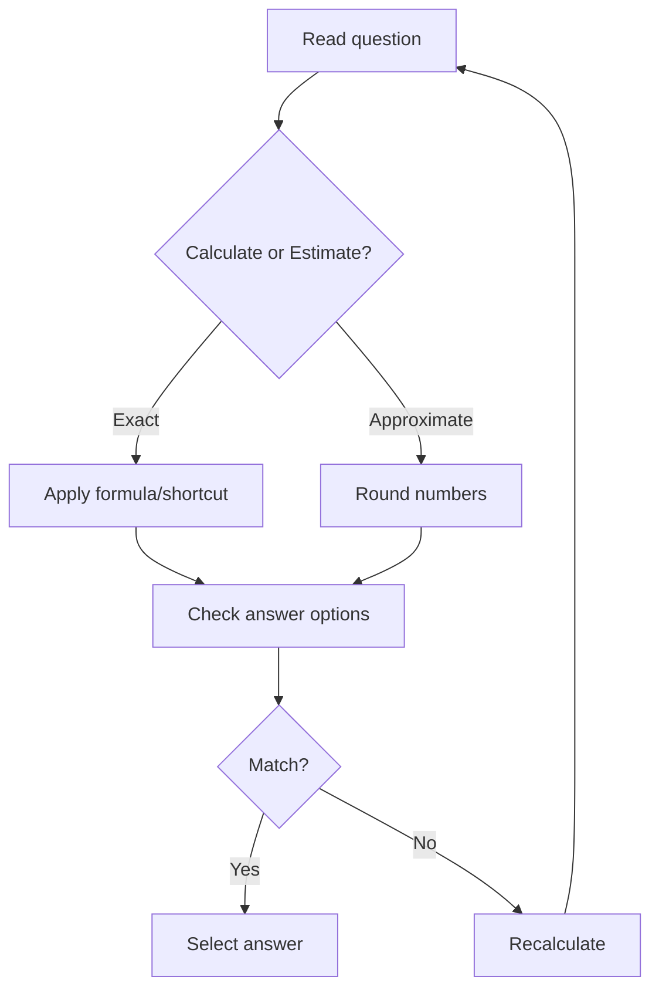
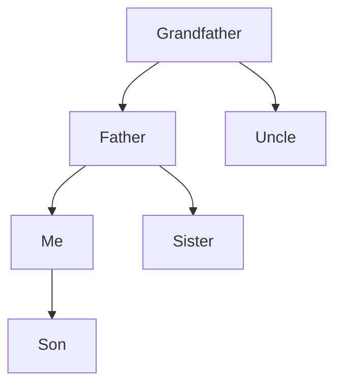
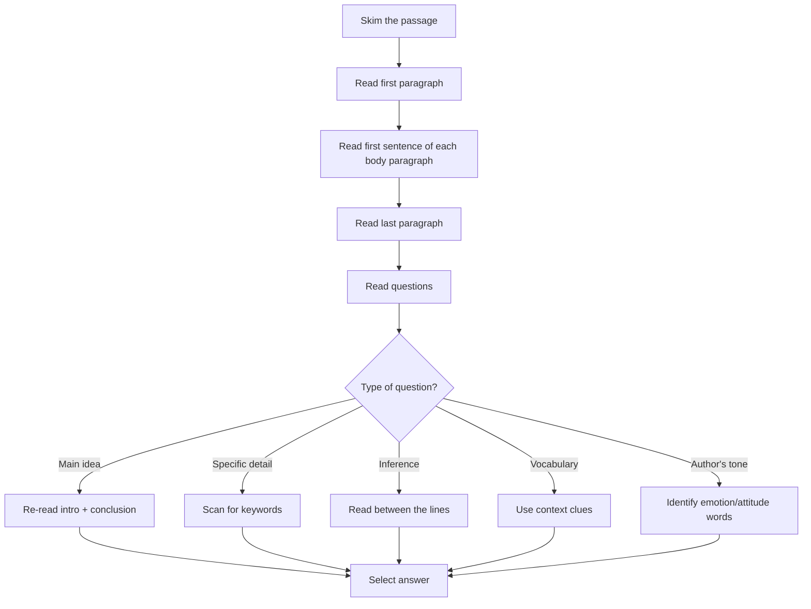

# Chapter 10: Aptitude, Logical Reasoning, and Speed Mathematics

## Learning Objectives

- Master time-saving shortcuts for quantitative aptitude topics frequently tested in PSU/IT written exams
- Develop logical reasoning skills for pattern recognition, puzzles, and critical thinking
- Improve verbal ability with quick revision of grammar, vocabulary, and comprehension strategies
- Acquire speed techniques for data interpretation (DI) using estimation and approximation
- Practice 50+ solved examples with shortcut methods across all major topics
- Build confidence for written tests of TCS, Infosys, Wipro, IBPS, SBI, PSUs, and NIC

## Key Concepts

### The Speed Mathematics Mindset

<a href="../../../assets/images/diagrams/interview-preparation/10-aptitude-logical-reasoning-speed/the-speed-mathematics-mindset-handwritten.svg" target="_blank" rel="noopener">
  
</a>
<a href="../../../assets/images/diagrams/interview-preparation/10-aptitude-logical-reasoning-speed/the-speed-mathematics-mindset-diagram.svg" target="_blank" rel="noopener">
  
</a>
<a href="../../../assets/images/diagrams/interview-preparation/10-aptitude-logical-reasoning-speed/the-speed-mathematics-mindset-sticky.svg" target="_blank" rel="noopener">
  
</a>




### Universal Shortcuts

<a href="../../../assets/images/diagrams/interview-preparation/10-aptitude-logical-reasoning-speed/universal-shortcuts-handwritten.svg" target="_blank" rel="noopener">
  
</a>
<a href="../../../assets/images/diagrams/interview-preparation/10-aptitude-logical-reasoning-speed/universal-shortcuts-diagram.svg" target="_blank" rel="noopener">
  
</a>
<a href="../../../assets/images/diagrams/interview-preparation/10-aptitude-logical-reasoning-speed/universal-shortcuts-sticky.svg" target="_blank" rel="noopener">
  
</a>


| Rule | Description | Example |
|------|-------------|---------|
| **Digit Sum** | Sum of digits modulo 9 (check arithmetic) | 345 + 678 = 1023; DS: 3+4+5=12→3, 6+7+8=21→3, 3+3=6; 1+0+2+3=6 ✓ |
| **Option Elimination** | Plug options back into the question | Saves entire calculation |
| **Approximation** | Round to nearest convenient number | 49 × 51 ≈ 50 × 50 = 2500 (actual: 2499) |
| **Unit Digit** | Last digit of calculation | 237 × 463 → unit digit: 7 × 3 = 21 → unit digit 1 |
| **Divisibility** | Quick divisibility checks | Check if 291 is divisible by 3: 2+9+1=12 → divisible |
| **Squaring near 50/100** | (50 + n)² = 2500 + 100n + n² | 53² = 2500 + 300 + 9 = 2809 |
| **Percentage to Fraction** | Convert % to 1/n | 12.5% = 1/8, 33.33% = 1/3 |

---

## Section 1: Quantitative Aptitude Shortcuts

### 1.1 Number Systems

<a href="../../../assets/images/diagrams/interview-preparation/10-aptitude-logical-reasoning-speed/1-1-number-systems-handwritten.svg" target="_blank" rel="noopener">
  
</a>
<a href="../../../assets/images/diagrams/interview-preparation/10-aptitude-logical-reasoning-speed/1-1-number-systems-diagram.svg" target="_blank" rel="noopener">
  
</a>
<a href="../../../assets/images/diagrams/interview-preparation/10-aptitude-logical-reasoning-speed/1-1-number-systems-sticky.svg" target="_blank" rel="noopener">
  
</a>


#### Divisibility Rules

| Divisor | Rule | Example |
|---------|------|---------|
| 2 | Last digit even | 124 ✓ (last digit 4) |
| 3 | Sum of digits divisible by 3 | 291: 2+9+1=12 → ✓ |
| 4 | Last two digits divisible by 4 | 7312: 12 → ✓ |
| 5 | Last digit 0 or 5 | 235 → ✓ |
| 6 | Divisible by 2 AND 3 | 234: even + sum=9 → ✓ |
| 7 | Double last digit, subtract from rest | 343: 34-2×3=28 → ✓ |
| 8 | Last 3 digits divisible by 8 | 4312: 312 → ✓ |
| 9 | Sum of digits divisible by 9 | 585: 5+8+5=18 → ✓ |
| 10 | Last digit 0 | 450 → ✓ |
| 11 | Sum of odd - sum of even digits = 0 or 11 | 121: (1+1)-2=0 → ✓ |
| 13 | Multiply unit digit by 4, add to rest | 169: 16+4×9=52 → ✓ |

#### Shortcut: Square of Numbers Ending in 5

```typescript
// n5² = n×(n+1) followed by 25
// 35² = 3×4 = 12 followed by 25 = 1225
// 85² = 8×9 = 72 followed by 25 = 7225
function squareEndingIn5(n: number): number {
  const prefix = Math.floor(n / 10);
  return (prefix * (prefix + 1)) * 100 + 25;
}
```

#### Shortcut: Multiplication Near 100

```
// 97 × 104
// Step 1: 100 - 97 = 3, 104 - 100 = 4
// Step 2: 97 + 4 = 101 OR 104 - 3 = 101 (cross add)
// Step 3: 3 × 4 = 12
// Answer: 101 × 100 + 12 = 10112
```

### 1.2 Percentage

<a href="../../../assets/images/diagrams/interview-preparation/10-aptitude-logical-reasoning-speed/1-2-percentage-handwritten.svg" target="_blank" rel="noopener">
  
</a>
<a href="../../../assets/images/diagrams/interview-preparation/10-aptitude-logical-reasoning-speed/1-2-percentage-diagram.svg" target="_blank" rel="noopener">
  
</a>
<a href="../../../assets/images/diagrams/interview-preparation/10-aptitude-logical-reasoning-speed/1-2-percentage-sticky.svg" target="_blank" rel="noopener">
  
</a>


#### Fraction to Percentage Table (Must Memorize)

| Fraction | % | Fraction | % | Fraction | % |
|----------|---|----------|---|----------|---|
| 1/1 | 100% | 1/7 | 14.28% | 1/13 | 7.69% |
| 1/2 | 50% | 1/8 | 12.5% | 1/14 | 7.14% |
| 1/3 | 33.33% | 1/9 | 11.11% | 1/15 | 6.67% |
| 1/4 | 25% | 1/10 | 10% | 1/16 | 6.25% |
| 1/5 | 20% | 1/11 | 9.09% | 1/20 | 5% |
| 1/6 | 16.67% | 1/12 | 8.33% | 1/25 | 4% |

#### Successive Percentage Change

```
If a value changes by a% then b%:
Net change = a + b + ab/100

Example: Salary increased by 10%, then by 20%
Net = 10 + 20 + (10×20)/100 = 30 + 2 = 32%
```

#### Percentage: Shortcut Problems

<details>
<summary><b>Q1:</b> If A's salary is 25% more than B's, by what % is B's salary less than A's?</summary>

**Shortcut:** If A is x% more, B is [x/(100+x)] × 100% less.

```
B is less by = 25/125 × 100 = 20%

Verification: B = 100, A = 125
Difference = 25/125 × 100 = 20% ✓
```
</details>

<details>
<summary><b>Q2:</b> A number is increased by 20%, then decreased by 20%. Net change?</summary>

```
Net = a + b + ab/100
= 20 + (-20) + (20 × -20)/100
= 0 - 4 = -4%

So net decrease of 4%
```
</details>

### 1.3 Profit, Loss, and Discount

<a href="../../../assets/images/diagrams/interview-preparation/10-aptitude-logical-reasoning-speed/1-3-profit-loss-and-discount-handwritten.svg" target="_blank" rel="noopener">
  
</a>
<a href="../../../assets/images/diagrams/interview-preparation/10-aptitude-logical-reasoning-speed/1-3-profit-loss-and-discount-diagram.svg" target="_blank" rel="noopener">
  
</a>
<a href="../../../assets/images/diagrams/interview-preparation/10-aptitude-logical-reasoning-speed/1-3-profit-loss-and-discount-sticky.svg" target="_blank" rel="noopener">
  
</a>


| Formula | Expression |
|---------|-----------|
| Profit % | (SP - CP)/CP × 100 |
| Loss % | (CP - SP)/CP × 100 |
| Discount % | (MP - SP)/MP × 100 |
| Selling Price after discount | MP × (100 - d%)/100 |
| Marked Price | CP × (100 + p%)/(100 - d%) |

**Shortcut: Two successive discounts**
```
Single equivalent discount = a + b - ab/100
Example: 20% + 10% discount = 20 + 10 - 200/100 = 28%
```

### 1.4 Simple and Compound Interest

<a href="../../../assets/images/diagrams/interview-preparation/10-aptitude-logical-reasoning-speed/1-4-simple-and-compound-interest-handwritten.svg" target="_blank" rel="noopener">
  
</a>
<a href="../../../assets/images/diagrams/interview-preparation/10-aptitude-logical-reasoning-speed/1-4-simple-and-compound-interest-diagram.svg" target="_blank" rel="noopener">
  
</a>
<a href="../../../assets/images/diagrams/interview-preparation/10-aptitude-logical-reasoning-speed/1-4-simple-and-compound-interest-sticky.svg" target="_blank" rel="noopener">
  
</a>


| Type | Formula | Shortcut |
|------|---------|----------|
| Simple Interest | SI = P×R×T/100 | For 2 years at R%, SI = 2×P×R/100 |
| Compound Interest (annual) | CI = P(1+R/100)^T - P | ~P × R × T / 100 (approx for small %) |

**Shortcut: CI for 2 years**
```
CI for 2 years = P[(R/100)² + 2R/100]
Example: ₹10,000 at 10% for 2 years
CI = 10000[0.01 + 0.20] = 10000 × 0.21 = ₹2,100
```

### 1.5 Time, Speed, and Distance

<a href="../../../assets/images/diagrams/interview-preparation/10-aptitude-logical-reasoning-speed/1-5-time-speed-and-distance-handwritten.svg" target="_blank" rel="noopener">
  
</a>
<a href="../../../assets/images/diagrams/interview-preparation/10-aptitude-logical-reasoning-speed/1-5-time-speed-and-distance-diagram.svg" target="_blank" rel="noopener">
  
</a>
<a href="../../../assets/images/diagrams/interview-preparation/10-aptitude-logical-reasoning-speed/1-5-time-speed-and-distance-sticky.svg" target="_blank" rel="noopener">
  
</a>


| Concept | Formula | Shortcut |
|---------|---------|----------|
| Average Speed | Total distance/Total time | 2ab/(a+b) for equal distances at speeds a,b |
| Relative Speed (same direction) | | v1 - v2 |
| Relative Speed (opposite direction) | | v1 + v2 |
| Train crossing pole | Length/Speed | Time = L/v |
| Train crossing platform | (L_train + L_platform)/Speed | |

**Shortcut: Average Speed (equal distances)**
```
If traveled distance d at speed a and same distance at speed b:
Average speed = 2ab/(a+b)

Example: 60 km/h one way, 40 km/h back
Avg = 2×60×40/(60+40) = 4800/100 = 48 km/h
```

### 1.6 Time and Work

<a href="../../../assets/images/diagrams/interview-preparation/10-aptitude-logical-reasoning-speed/1-6-time-and-work-handwritten.svg" target="_blank" rel="noopener">
  
</a>
<a href="../../../assets/images/diagrams/interview-preparation/10-aptitude-logical-reasoning-speed/1-6-time-and-work-diagram.svg" target="_blank" rel="noopener">
  
</a>
<a href="../../../assets/images/diagrams/interview-preparation/10-aptitude-logical-reasoning-speed/1-6-time-and-work-sticky.svg" target="_blank" rel="noopener">
  
</a>


| Concept | Formula | Example |
|---------|---------|---------|
| Individual work | Work = Rate × Time | If A takes 10 days, rate = 1/10 per day |
| Combined work | 1/A + 1/B + 1/C | A(10d) + B(15d): 1/10+1/15 = 1/6 → 6 days |
| Efficiency ratio | Work done proportional to efficiency | A:B = 2:3 efficiency → time ratio = 3:2 |

**Shortcut: If A takes a days, B takes b days, A+B+C takes c days, find C's time:**
```
1/C = 1/c - 1/a - 1/b
C = 1/(1/c - 1/a - 1/b)
```

<details>
<summary><b>Q:</b> A takes 10 days, B takes 15 days. How long will A+B take?</summary>

```
A's rate = 1/10 per day
B's rate = 1/15 per day
Combined rate = 1/10 + 1/15 = 5/30 = 1/6
Time = 6 days
```
</details>

### 1.7 Ratio and Proportion

<a href="../../../assets/images/diagrams/interview-preparation/10-aptitude-logical-reasoning-speed/1-7-ratio-and-proportion-handwritten.svg" target="_blank" rel="noopener">
  
</a>
<a href="../../../assets/images/diagrams/interview-preparation/10-aptitude-logical-reasoning-speed/1-7-ratio-and-proportion-diagram.svg" target="_blank" rel="noopener">
  
</a>
<a href="../../../assets/images/diagrams/interview-preparation/10-aptitude-logical-reasoning-speed/1-7-ratio-and-proportion-sticky.svg" target="_blank" rel="noopener">
  
</a>


| Concept | Formula | Example |
|---------|---------|---------|
| Ratio | a:b | a/b |
| Proportion | a:b = c:d | ad = bc |
| Compounded ratio | a:b × c:d | ac:bd |

**Shortcut: If A:B = 2:3 and B:C = 4:5, find A:B:C**
```
A:B = 2:3 = 8:12 (multiply by 4)
B:C = 4:5 = 12:15 (multiply by 3)
A:B:C = 8:12:15
```

### 1.8 Averages

<a href="../../../assets/images/diagrams/interview-preparation/10-aptitude-logical-reasoning-speed/1-8-averages-handwritten.svg" target="_blank" rel="noopener">
  
</a>
<a href="../../../assets/images/diagrams/interview-preparation/10-aptitude-logical-reasoning-speed/1-8-averages-diagram.svg" target="_blank" rel="noopener">
  
</a>
<a href="../../../assets/images/diagrams/interview-preparation/10-aptitude-logical-reasoning-speed/1-8-averages-sticky.svg" target="_blank" rel="noopener">
  
</a>


| Concept | Formula | Shortcut |
|---------|---------|----------|
| Average | Sum/Count | - |
| Weighted Average | (w1×x1 + w2×x2)/(w1+w2) | - |
| Average speed | 2ab/(a+b) | For equal distances |
| Combined average | (n1×avg1 + n2×avg2)/(n1+n2) | - |

**Shortcut: New average when replacing a value**
```
If a value x is replaced by y, and there are n items:
New average = Old average + (y-x)/n
```

<details>
<summary><b>Q:</b> Average of 5 numbers is 20. If one number (30) is replaced by 40, new average?</summary>

```
New average = 20 + (40-30)/5 = 20 + 2 = 22
```
</details>

---

## Section 2: Data Interpretation (DI) Speed Techniques

### DI Types

<a href="../../../assets/images/diagrams/interview-preparation/10-aptitude-logical-reasoning-speed/di-types-handwritten.svg" target="_blank" rel="noopener">
  
</a>
<a href="../../../assets/images/diagrams/interview-preparation/10-aptitude-logical-reasoning-speed/di-types-diagram.svg" target="_blank" rel="noopener">
  
</a>
<a href="../../../assets/images/diagrams/interview-preparation/10-aptitude-logical-reasoning-speed/di-types-sticky.svg" target="_blank" rel="noopener">
  
</a>


| Type | Description | Approach |
|------|-------------|----------|
| Tables | Raw data in tabular format | Read column/row headers, scan for specific values |
| Bar Charts | Comparative vertical/horizontal bars | Approximate heights, compare ratios |
| Line Graphs | Trends over time | Focus on slopes and change points |
| Pie Charts | Parts of a whole | Convert degrees/percentages to actual values |
| Mixed DI | Combination of above | Identify which chart to use for which question |

### DI Speed Strategy

<a href="../../../assets/images/diagrams/interview-preparation/10-aptitude-logical-reasoning-speed/di-speed-strategy-handwritten.svg" target="_blank" rel="noopener">
  
</a>
<a href="../../../assets/images/diagrams/interview-preparation/10-aptitude-logical-reasoning-speed/di-speed-strategy-diagram.svg" target="_blank" rel="noopener">
  
</a>
<a href="../../../assets/images/diagrams/interview-preparation/10-aptitude-logical-reasoning-speed/di-speed-strategy-sticky.svg" target="_blank" rel="noopener">
  
</a>


```mermaid
flowchart TD
    A[Read the DI set title] --> B[Check axes/legends]
    B --> C[Read question]
    C --> D{What's asked?}
    D -->|Absolute value| E[Find & calculate]
    D -->|Percentage change| F[(New-Old)/Old × 100]
    D -->|Ratio| G[Divide values]
    D -->|Difference| H[Subtract]
    D -->|Trend| I[Check slope direction]
    E & F & G & H & I --> J[Scan options]
    J --> K[Eliminate with estimation]
    K --> L[If close, calculate exactly]
```

### DI Approximation Examples

<a href="../../../assets/images/diagrams/interview-preparation/10-aptitude-logical-reasoning-speed/di-approximation-examples-handwritten.svg" target="_blank" rel="noopener">
  
</a>
<a href="../../../assets/images/diagrams/interview-preparation/10-aptitude-logical-reasoning-speed/di-approximation-examples-diagram.svg" target="_blank" rel="noopener">
  
</a>
<a href="../../../assets/images/diagrams/interview-preparation/10-aptitude-logical-reasoning-speed/di-approximation-examples-sticky.svg" target="_blank" rel="noopener">
  
</a>


<details>
<summary><b>Q:</b> A bar chart shows company revenue: 2019: ₹245 Cr, 2020: ₹312 Cr. Approx % increase?</summary>

```
Increase = 312 - 245 = 67
% increase = 67/245 × 100 ≈ 67/250 × 100 = 26.8%
(Actual: 67/245 × 100 = 27.35%)

Options: A) 25% B) 27% C) 30% D) 35%
Choose B) 27%
```
</details>

### DI Calculation Shortcuts

<a href="../../../assets/images/diagrams/interview-preparation/10-aptitude-logical-reasoning-speed/di-calculation-shortcuts-handwritten.svg" target="_blank" rel="noopener">
  
</a>
<a href="../../../assets/images/diagrams/interview-preparation/10-aptitude-logical-reasoning-speed/di-calculation-shortcuts-diagram.svg" target="_blank" rel="noopener">
  
</a>
<a href="../../../assets/images/diagrams/interview-preparation/10-aptitude-logical-reasoning-speed/di-calculation-shortcuts-sticky.svg" target="_blank" rel="noopener">
  
</a>


| Operation | Shortcut |
|-----------|----------|
| Find percentage of total | (part/total) × 100; use fraction for common values |
| Percentage change | (difference/original) × 100; approximate with simpler numbers |
| Ratio comparison | Cross-multiply instead of calculating decimals |
| Sum of percentages | Add directly if all percentages refer to same total |
| Average from chart | Add all values, divide by count (use approximation) |

---

## Section 3: Logical Reasoning Tricks

### 3.1 Series Completion

<a href="../../../assets/images/diagrams/interview-preparation/10-aptitude-logical-reasoning-speed/3-1-series-completion-handwritten.svg" target="_blank" rel="noopener">
  
</a>
<a href="../../../assets/images/diagrams/interview-preparation/10-aptitude-logical-reasoning-speed/3-1-series-completion-diagram.svg" target="_blank" rel="noopener">
  
</a>
<a href="../../../assets/images/diagrams/interview-preparation/10-aptitude-logical-reasoning-speed/3-1-series-completion-sticky.svg" target="_blank" rel="noopener">
  
</a>


**Number Series Patterns:**

| Pattern Type | Example | Rule |
|-------------|---------|------|
| Arithmetic | 2, 5, 8, 11, ? | +3 each time → 14 |
| Geometric | 3, 6, 12, 24, ? | ×2 each time → 48 |
| Square series | 1, 4, 9, 16, ? | n² → 25 |
| Cube series | 1, 8, 27, 64, ? | n³ → 125 |
| Mixed (prime) | 2, 3, 5, 7, 11, ? | Primes → 13 |
| Fibonacci | 0, 1, 1, 2, 3, 5, 8, ? | Sum of previous two → 13 |
| Alternating | 2, 7, 4, 9, 6, 11, ? | Two interleaved series → 8 |
| Difference pattern | 2, 5, 10, 17, ? | +3,+5,+7 (+increasing odd) → 28 |

**Alphabet Series:**
```
A=1, B=2, ..., Z=26 (or reverse: A=26, B=25, ..., Z=1)
Look for: +n, -n, ×n patterns, vowels/consonants, forward/backward
```

### 3.2 Coding-Decoding

<a href="../../../assets/images/diagrams/interview-preparation/10-aptitude-logical-reasoning-speed/3-2-coding-decoding-handwritten.svg" target="_blank" rel="noopener">
  
</a>
<a href="../../../assets/images/diagrams/interview-preparation/10-aptitude-logical-reasoning-speed/3-2-coding-decoding-diagram.svg" target="_blank" rel="noopener">
  
</a>
<a href="../../../assets/images/diagrams/interview-preparation/10-aptitude-logical-reasoning-speed/3-2-coding-decoding-sticky.svg" target="_blank" rel="noopener">
  
</a>


| Code Type | Example | Logic |
|-----------|---------|-------|
| Letter shift | CAT → DBU (each +1) | Forward shift |
| Reverse order | CAT → TAC | Reverse the word |
| Positional sum | CAT → 3+1+20=24 | Sum of alphabetical positions |
| Opposite letters | CAT → XZG | A↔Z, B↔Y, C↔X |
| Pattern-based | CAT → 24 (3+1+20) | Letter positions added |

**Important opposite letter pairs (sum = 27):**
```
A ↔ Z (1+26)
B ↔ Y (2+25)
C ↔ X (3+24)
D ↔ W (4+23)
E ↔ V (5+22)
F ↔ U (6+21)
G ↔ T (7+20)
H ↔ S (8+19)
I ↔ R (9+18)
J ↔ Q (10+17)
K ↔ P (11+16)
L ↔ O (12+15)
M ↔ N (13+14)
```

### 3.3 Blood Relations

<a href="../../../assets/images/diagrams/interview-preparation/10-aptitude-logical-reasoning-speed/3-3-blood-relations-handwritten.svg" target="_blank" rel="noopener">
  
</a>
<a href="../../../assets/images/diagrams/interview-preparation/10-aptitude-logical-reasoning-speed/3-3-blood-relations-diagram.svg" target="_blank" rel="noopener">
  
</a>
<a href="../../../assets/images/diagrams/interview-preparation/10-aptitude-logical-reasoning-speed/3-3-blood-relations-sticky.svg" target="_blank" rel="noopener">
  
</a>


| Relation | Meaning |
|----------|---------|
| Father's/Mother's son | Brother |
| Father's/Mother's daughter | Sister |
| Father's/Mother's brother | Uncle |
| Father's/Mother's sister | Aunt |
| Brother's/Sister's son | Nephew |
| Brother's/Sister's daughter | Niece |
| Son's/Daughter's son | Grandson |
| Son's/Daughter's daughter | Granddaughter |
| Husband's/Wife's brother | Brother-in-law |
| Husband's/Wife's sister | Sister-in-law |

**Shortcut:** Draw a family tree for complex questions.



### 3.4 Direction Sense

<a href="../../../assets/images/diagrams/interview-preparation/10-aptitude-logical-reasoning-speed/3-4-direction-sense-handwritten.svg" target="_blank" rel="noopener">
  
</a>
<a href="../../../assets/images/diagrams/interview-preparation/10-aptitude-logical-reasoning-speed/3-4-direction-sense-diagram.svg" target="_blank" rel="noopener">
  
</a>
<a href="../../../assets/images/diagrams/interview-preparation/10-aptitude-logical-reasoning-speed/3-4-direction-sense-sticky.svg" target="_blank" rel="noopener">
  
</a>


| Movement | Shortcut |
|----------|----------|
| Right turn | +90° clockwise |
| Left turn | +90° counterclockwise |
| Facing North, turn right → East | - |
| Facing East, turn left → North | - |
| Shortest distance | Pythagoras: √(a² + b²) |

**Example shortcut:** If someone walks 3 km East, 4 km North, distance from start = √(3²+4²) = 5 km.

### 3.5 Syllogisms

<a href="../../../assets/images/diagrams/interview-preparation/10-aptitude-logical-reasoning-speed/3-5-syllogisms-handwritten.svg" target="_blank" rel="noopener">
  
</a>
<a href="../../../assets/images/diagrams/interview-preparation/10-aptitude-logical-reasoning-speed/3-5-syllogisms-diagram.svg" target="_blank" rel="noopener">
  
</a>
<a href="../../../assets/images/diagrams/interview-preparation/10-aptitude-logical-reasoning-speed/3-5-syllogisms-sticky.svg" target="_blank" rel="noopener">
  
</a>


| Type | Rule | Example |
|------|------|---------|
| All A are B | All B are C → All A are C | - |
| No A are B | Some B are C → No conclusion | - |
| Some A are B | All B are C → Some A are C | - |
| Some A are B | Some B are C → No conclusion | - |

**Venn diagram approach:** Draw overlapping circles to visualize.

### 3.6 Seating Arrangement

<a href="../../../assets/images/diagrams/interview-preparation/10-aptitude-logical-reasoning-speed/3-6-seating-arrangement-handwritten.svg" target="_blank" rel="noopener">
  
</a>
<a href="../../../assets/images/diagrams/interview-preparation/10-aptitude-logical-reasoning-speed/3-6-seating-arrangement-diagram.svg" target="_blank" rel="noopener">
  
</a>
<a href="../../../assets/images/diagrams/interview-preparation/10-aptitude-logical-reasoning-speed/3-6-seating-arrangement-sticky.svg" target="_blank" rel="noopener">
  
</a>


| Type | Strategy |
|------|----------|
| Linear row | Assign positions 1 to N, use conditions |
| Circular | Fix one person to break symmetry |
| Rectangular/Table | Consider facing center vs facing away |
| Complex conditions | Create a grid/table, tick-cross method |

**Shortcut:** Start with the most restrictive condition first.

### 3.7 Clock and Calendar

<a href="../../../assets/images/diagrams/interview-preparation/10-aptitude-logical-reasoning-speed/3-7-clock-and-calendar-handwritten.svg" target="_blank" rel="noopener">
  
</a>
<a href="../../../assets/images/diagrams/interview-preparation/10-aptitude-logical-reasoning-speed/3-7-clock-and-calendar-diagram.svg" target="_blank" rel="noopener">
  
</a>
<a href="../../../assets/images/diagrams/interview-preparation/10-aptitude-logical-reasoning-speed/3-7-clock-and-calendar-sticky.svg" target="_blank" rel="noopener">
  
</a>


**Clock Angle Formula:**
```
Angle = |30H - 5.5M| where H = hours, M = minutes
```

<details>
<summary><b>Q:</b> What angle between hour and minute hands at 3:30?</summary>

```
H = 3, M = 30
Angle = |30×3 - 5.5×30| = |90 - 165| = 75°
```
</details>

**Calendar: Odd days concept**
```
Day of week calculation: Count odd days modulo 7
1 ordinary year = 1 odd day
1 leap year = 2 odd days
Century: 100 years = 5 odd days (76 ordinary + 24 leap)
400 years = 0 odd days (cycle repeats)
```

<details>
<summary><b>Q:</b> What day was January 26, 1950 (Republic Day)?</summary>

```
Count from reference (1 Jan 0001 = Monday):
- 1949 years = 1600 + 300 + 49 years
- 1600 years: 0 odd days
- 300 years: 1 odd day (300/400 remainder: 100yr→5, 200yr→3, 300yr→1)
- 49 years: 12 leap + 37 ordinary = 12×2 + 37×1 = 61 mod 7 = 5 odd days
- Jan 26: 26 days = 26 mod 7 = 5 odd days
Total odd days: 0 + 1 + 5 + 5 = 11 mod 7 = 4

Day 0 = Sunday, 1 = Monday, 2 = Tuesday, 3 = Wednesday, 4 = Thursday
January 26, 1950 was a Thursday ✓
```
</details>

---

## Section 4: Verbal Ability Quick Tips

### 4.1 Grammar Rules

<a href="../../../assets/images/diagrams/interview-preparation/10-aptitude-logical-reasoning-speed/4-1-grammar-rules-handwritten.svg" target="_blank" rel="noopener">
  
</a>
<a href="../../../assets/images/diagrams/interview-preparation/10-aptitude-logical-reasoning-speed/4-1-grammar-rules-diagram.svg" target="_blank" rel="noopener">
  
</a>
<a href="../../../assets/images/diagrams/interview-preparation/10-aptitude-logical-reasoning-speed/4-1-grammar-rules-sticky.svg" target="_blank" rel="noopener">
  
</a>


| Rule | Explanation | Correct | Incorrect |
|------|-------------|---------|-----------|
| Subject-verb agreement | Singular subject → singular verb | He goes | He go |
| Tense consistency | Don't shift tenses unnecessarily | I came, I saw, I conquered | I came, I see, I conquered |
| Pronoun agreement | Pronoun must match antecedent | Each student must bring HIS book | Each student must bring THEIR book |
| Parallel structure | Items in list must have same form | She likes swimming, running, and cycling | She likes swimming, to run, and cycling |
| Modifier placement | Modifier must be next to what it modifies | Walking to school, I saw a dog | I saw a dog walking to school |

### 4.2 Common Errors

<a href="../../../assets/images/diagrams/interview-preparation/10-aptitude-logical-reasoning-speed/4-2-common-errors-handwritten.svg" target="_blank" rel="noopener">
  
</a>
<a href="../../../assets/images/diagrams/interview-preparation/10-aptitude-logical-reasoning-speed/4-2-common-errors-diagram.svg" target="_blank" rel="noopener">
  
</a>
<a href="../../../assets/images/diagrams/interview-preparation/10-aptitude-logical-reasoning-speed/4-2-common-errors-sticky.svg" target="_blank" rel="noopener">
  
</a>


| Error Type | Example | Correction |
|-----------|---------|------------|
| Double negative | I don't have nothing | I don't have anything |
| Who vs Whom | Who did you see? | Whom did you see? (object) |
| Less vs Fewer | Less people came | Fewer people came (countable) |
| Amount vs Number | A large amount of people | A large NUMBER of people |
| Between vs Among | Between the three of us | Among the three of us |
| That vs Which | The car, that is red | The car, which is red (non-restrictive) |
| Lay vs Lie | I'm going to lay down | I'm going to LIE down |
| Its vs It's | The dog wagged it's tail | The dog wagged ITS tail |

### 4.3 Vocabulary Building

<a href="../../../assets/images/diagrams/interview-preparation/10-aptitude-logical-reasoning-speed/4-3-vocabulary-building-handwritten.svg" target="_blank" rel="noopener">
  
</a>
<a href="../../../assets/images/diagrams/interview-preparation/10-aptitude-logical-reasoning-speed/4-3-vocabulary-building-diagram.svg" target="_blank" rel="noopener">
  
</a>
<a href="../../../assets/images/diagrams/interview-preparation/10-aptitude-logical-reasoning-speed/4-3-vocabulary-building-sticky.svg" target="_blank" rel="noopener">
  
</a>


| Prefix/Suffix | Meaning | Example |
|---------------|---------|---------|
| Pre- | Before | Preview, preordain |
| Post- | After | Postpone, post-war |
| Un- | Not | Unstable, unlikely |
| Dis- | Not/Away | Disagree, disappear |
| Mis- | Wrong | Mistake, misplace |
| Re- | Again | Redo, review |
| -less | Without | Careless, homeless |
| -ful | Full of | Beautiful, hopeful |
| -tion | Action/Process | Education, notification |

### 4.4 Reading Comprehension Strategy

<a href="../../../assets/images/diagrams/interview-preparation/10-aptitude-logical-reasoning-speed/4-4-reading-comprehension-strategy-handwritten.svg" target="_blank" rel="noopener">
  
</a>
<a href="../../../assets/images/diagrams/interview-preparation/10-aptitude-logical-reasoning-speed/4-4-reading-comprehension-strategy-diagram.svg" target="_blank" rel="noopener">
  
</a>
<a href="../../../assets/images/diagrams/interview-preparation/10-aptitude-logical-reasoning-speed/4-4-reading-comprehension-strategy-sticky.svg" target="_blank" rel="noopener">
  
</a>




### 4.5 Sentence Correction Shortcuts

<a href="../../../assets/images/diagrams/interview-preparation/10-aptitude-logical-reasoning-speed/4-5-sentence-correction-shortcuts-handwritten.svg" target="_blank" rel="noopener">
  
</a>
<a href="../../../assets/images/diagrams/interview-preparation/10-aptitude-logical-reasoning-speed/4-5-sentence-correction-shortcuts-diagram.svg" target="_blank" rel="noopener">
  
</a>
<a href="../../../assets/images/diagrams/interview-preparation/10-aptitude-logical-reasoning-speed/4-5-sentence-correction-shortcuts-sticky.svg" target="_blank" rel="noopener">
  
</a>


| Shortcut | What to Check |
|----------|--------------|
| Read aloud | Does it sound natural? |
| Remove middle phrases | Test S+V agreement |
| Check endings | -ing, -ed, -tion consistency |
| Look for parallelism | All items in list same form |
| Identify modifiers | Ensure they're placed correctly |

---

## Section 5: Speed Mathematics Techniques

### 5.1 Vedic Math Basics

<a href="../../../assets/images/diagrams/interview-preparation/10-aptitude-logical-reasoning-speed/5-1-vedic-math-basics-handwritten.svg" target="_blank" rel="noopener">
  
</a>
<a href="../../../assets/images/diagrams/interview-preparation/10-aptitude-logical-reasoning-speed/5-1-vedic-math-basics-diagram.svg" target="_blank" rel="noopener">
  
</a>
<a href="../../../assets/images/diagrams/interview-preparation/10-aptitude-logical-reasoning-speed/5-1-vedic-math-basics-sticky.svg" target="_blank" rel="noopener">
  
</a>


**Multiplication by 11:**
```
35 × 11 = 3 (3+5) 5 = 385
72 × 11 = 7 (7+2) 2 = 792
(If sum > 9, carry over)
89 × 11 = 8 (8+9=17) 9 = 979 (carry 1)
```

**Multiplication by 9, 99, 999:**
```
27 × 9 = 27 × (10-1) = 270-27 = 243
27 × 99 = 27 × (100-1) = 2700-27 = 2673

Shortcut: 27 × 99 = 2673 (27-1=26, 100-27=73 → 26|73)
123 × 999 = 122877 (123-1=122, 1000-123=877 → 122|877)
```

**Squares of numbers ending in 1:**
```
31² = 30² + 30 + 31 = 900 + 61 = 961
41² = 40² + 40 + 41 = 1600 + 81 = 1681
```

### 5.2 Approximation Techniques

<a href="../../../assets/images/diagrams/interview-preparation/10-aptitude-logical-reasoning-speed/5-2-approximation-techniques-handwritten.svg" target="_blank" rel="noopener">
  
</a>
<a href="../../../assets/images/diagrams/interview-preparation/10-aptitude-logical-reasoning-speed/5-2-approximation-techniques-diagram.svg" target="_blank" rel="noopener">
  
</a>
<a href="../../../assets/images/diagrams/interview-preparation/10-aptitude-logical-reasoning-speed/5-2-approximation-techniques-sticky.svg" target="_blank" rel="noopener">
  
</a>


| Situation | Approximate As | Error |
|-----------|---------------|-------|
| 28 × 47 | 30 × 50 = 1500 | ±5% |
| 195 ÷ 24 | 200 ÷ 25 = 8 | ±2% |
| 48% of 520 | 50% × 520 = 260 | ±2% |
| √150 | √144 = 12 to √169 = 13, so ~12.25 | ±0.25 |
| 31 × 19 | 30 × 20 = 600 | ±1% |

### 5.3 Data Sufficiency Strategy

<a href="../../../assets/images/diagrams/interview-preparation/10-aptitude-logical-reasoning-speed/5-3-data-sufficiency-strategy-handwritten.svg" target="_blank" rel="noopener">
  
</a>
<a href="../../../assets/images/diagrams/interview-preparation/10-aptitude-logical-reasoning-speed/5-3-data-sufficiency-strategy-diagram.svg" target="_blank" rel="noopener">
  
</a>
<a href="../../../assets/images/diagrams/interview-preparation/10-aptitude-logical-reasoning-speed/5-3-data-sufficiency-strategy-sticky.svg" target="_blank" rel="noopener">
  
</a>


| Type | Question | Minimum Data Needed |
|------|----------|-------------------|
| Find value | Two equations needed for two unknowns | Both statements usually |
| Compare quantities | Need relationship | Depends on whether one is always &gt; another |
| Yes/No | One definite yes or no sufficient | Even a definite NO is sufficient |
| Ratio | Proportional info sufficient | Missing actual values |

**Data Sufficiency Flow:**
```
Step 1: Can statement 1 alone answer?
Step 2: Can statement 2 alone answer?
Step 3: If neither, can 1+2 together answer?
Step 4: Choose from: A) Only 1, B) Only 2, C) Together, D) Either, E) Neither
```

---

## Section 6: Practice Problems with Shortcuts

### Problem Set 1: Quantitative Aptitude

<a href="../../../assets/images/diagrams/interview-preparation/10-aptitude-logical-reasoning-speed/problem-set-1-quantitative-aptitude-handwritten.svg" target="_blank" rel="noopener">
  
</a>
<a href="../../../assets/images/diagrams/interview-preparation/10-aptitude-logical-reasoning-speed/problem-set-1-quantitative-aptitude-diagram.svg" target="_blank" rel="noopener">
  
</a>
<a href="../../../assets/images/diagrams/interview-preparation/10-aptitude-logical-reasoning-speed/problem-set-1-quantitative-aptitude-sticky.svg" target="_blank" rel="noopener">
  
</a>


<details>
<summary><b>Q1:</b> Find 45% of 640 using mental math.</summary>

```
Shortcut: 10% of 640 = 64
40% = 4 × 64 = 256
5% = 32
45% = 256 + 32 = 288
```
</details>

<details>
<summary><b>Q2:</b> A train 150m long passes a pole in 15 seconds. Find speed.</summary>

```
Speed = Distance/Time = 150/15 = 10 m/s
Convert to km/h: × 18/5 = 10 × 18/5 = 36 km/h
Shortcut: m/s → km/h = × 18/5
```
</details>

<details>
<summary><b>Q3:</b> If 12 men can do a work in 18 days, how many men needed to do it in 9 days?</summary>

```
M1 × D1 = M2 × D2
12 × 18 = M2 × 9
M2 = 12 × 18 / 9 = 24 men

Shortcut: Half the time → Double the men
```
</details>

<details>
<summary><b>Q4:</b> Find the compound interest on ₹10,000 at 8% for 2 years.</summary>

```
Shortcut: CI = P[(R/100)² + 2R/100]
= 10000[(8/100)² + 16/100]
= 10000[0.0064 + 0.16]
= 10000 × 0.1664
= ₹1,664
```
</details>

<details>
<summary><b>Q5:</b> A shopkeeper marks items 30% above cost and gives 10% discount. Profit %?</summary>

```
Let CP = 100
MP = 130
SP after 10% discount = 130 × 0.9 = 117
Profit = 17%

Shortcut: Profit = (p - d - pd/100)
= 30 - 10 - (300/100) = 30 - 10 - 3 = 17%
```
</details>

### Problem Set 2: Logical Reasoning

<a href="../../../assets/images/diagrams/interview-preparation/10-aptitude-logical-reasoning-speed/problem-set-2-logical-reasoning-handwritten.svg" target="_blank" rel="noopener">
  
</a>
<a href="../../../assets/images/diagrams/interview-preparation/10-aptitude-logical-reasoning-speed/problem-set-2-logical-reasoning-diagram.svg" target="_blank" rel="noopener">
  
</a>
<a href="../../../assets/images/diagrams/interview-preparation/10-aptitude-logical-reasoning-speed/problem-set-2-logical-reasoning-sticky.svg" target="_blank" rel="noopener">
  
</a>


<details>
<summary><b>Q6:</b> Find next in series: 2, 6, 18, 54, ?</summary>

```
Pattern: ×3 each time
54 × 3 = 162
```
</details>

<details>
<summary><b>Q7:</b> If CLOCK is coded as DMPDL, how is TIME coded?</summary>

```
Each letter shifted +1 forward:
C→D, L→M, O→P, C→D, K→L
T→U, I→J, M→N, E→F
TIME → UJNF
```
</details>

<details>
<summary><b>Q8:</b> A is father of C. B is sister of C. D is mother of B. How is D related to A?</summary>

```
A is father of C and B (since B is C's sister)
D is mother of B
So D is wife of A
D is A's wife
```
</details>

<details>
<summary><b>Q9:</b> Man walks 3 km North, 4 km East, 2 km South, 1 km West. Distance from start?</summary>

```
Net North: 3 - 2 = 1 km North
Net East: 4 - 1 = 3 km East
Distance = √(1² + 3²) = √10 ≈ 3.16 km
```
</details>

<details>
<summary><b>Q10:</b> Time is 4:40. What angle between hour and minute hands?</summary>

```
Angle = |30H - 5.5M| = |120 - 220| = 100°
But reflex angle = 360 - 100 = 260°
Smallest angle = 100°
```
</details>

### Problem Set 3: Verbal Ability

<a href="../../../assets/images/diagrams/interview-preparation/10-aptitude-logical-reasoning-speed/problem-set-3-verbal-ability-handwritten.svg" target="_blank" rel="noopener">
  
</a>
<a href="../../../assets/images/diagrams/interview-preparation/10-aptitude-logical-reasoning-speed/problem-set-3-verbal-ability-diagram.svg" target="_blank" rel="noopener">
  
</a>
<a href="../../../assets/images/diagrams/interview-preparation/10-aptitude-logical-reasoning-speed/problem-set-3-verbal-ability-sticky.svg" target="_blank" rel="noopener">
  
</a>


<details>
<summary><b>Q11:</b> Choose correct: Neither the teacher nor the students ___ present.</summary>

```
"Neither X nor Y" — verb agrees with Y (students)
Answer: were
(If it were "neither the students nor the teacher," verb agrees with teacher → was)
```
</details>

<details>
<summary><b>Q12:</b> Find synonym of "Ubiquitous."</summary>

```
Ubiquitous = present everywhere
Synonym: Omnipresent, Pervasive
```
</details>

<details>
<summary><b>Q13:</b> Correct the sentence: "Each of the boys have their own book."</summary>

```
"Each" is singular → "Each of the boys has his own book."
```
</details>

<details>
<summary><b>Q14:</b> Find antonym of "Ephemeral."</summary>

```
Ephemeral = short-lived
Antonym: Permanent, Eternal, Lasting
```
</details>

<details>
<summary><b>Q15:</b> Complete the sentence: He was ___ of his crime.</summary>

```
He was convicted of his crime.
(Hint: convicted OF, not convicted FOR or convicted WITH)
```
</details>

### Problem Set 4: Data Interpretation

<a href="../../../assets/images/diagrams/interview-preparation/10-aptitude-logical-reasoning-speed/problem-set-4-data-interpretation-handwritten.svg" target="_blank" rel="noopener">
  
</a>
<a href="../../../assets/images/diagrams/interview-preparation/10-aptitude-logical-reasoning-speed/problem-set-4-data-interpretation-diagram.svg" target="_blank" rel="noopener">
  
</a>
<a href="../../../assets/images/diagrams/interview-preparation/10-aptitude-logical-reasoning-speed/problem-set-4-data-interpretation-sticky.svg" target="_blank" rel="noopener">
  
</a>


```
Table: Company Revenue (₹Cr)
    2019  2020  2021
A     100   120   150
B      80    90   110
C     120   130   160
```

<details>
<summary><b>Q16:</b> Total revenue of all companies in 2019?</summary>

```
100 + 80 + 120 = 300 Cr
```
</details>

<details>
<summary><b>Q17:</b> % increase of Company A from 2019 to 2021?</summary>

```
Increase = 150 - 100 = 50
% = 50/100 × 100 = 50%
```
</details>

<details>
<summary><b>Q18:</b> Ratio of A's revenue in 2021 to B's in 2020?</summary>

```
A(2021) : B(2020)
= 150 : 90
= 5 : 3
```
</details>

<details>
<summary><b>Q19:</b> What percent of total 2021 revenue is Company C?</summary>

```
Total 2021 = 150 + 110 + 160 = 420
C% = 160/420 × 100 ≈ 38.1%
Shortcut: 160/420 = 8/21 ≈ 38%
```
</details>

<details>
<summary><b>Q20:</b> Which company had highest growth from 2020 to 2021?</summary>

```
A: 150-120=30 → 30/120=25%
B: 110-90=20 → 20/90=22.2%
C: 160-130=30 → 30/130=23.1%
Company A had highest growth rate (25%)
```
</details>

---

## Quick Reference Tables

### Aptitude Formula Sheet

<a href="../../../assets/images/diagrams/interview-preparation/10-aptitude-logical-reasoning-speed/aptitude-formula-sheet-handwritten.svg" target="_blank" rel="noopener">
  
</a>
<a href="../../../assets/images/diagrams/interview-preparation/10-aptitude-logical-reasoning-speed/aptitude-formula-sheet-diagram.svg" target="_blank" rel="noopener">
  
</a>
<a href="../../../assets/images/diagrams/interview-preparation/10-aptitude-logical-reasoning-speed/aptitude-formula-sheet-sticky.svg" target="_blank" rel="noopener">
  
</a>


| Topic | Formula |
|-------|---------|
| Percentage | Part/Whole × 100 or P/100 × Base |
| Profit % | (SP-CP)/CP × 100 |
| Discount % | (MP-SP)/MP × 100 |
| SI | PRT/100 |
| CI (2yr) | P[(R/100)² + 2R/100] |
| Speed | Distance/Time |
| Avg Speed (equal dist) | 2ab/(a+b) |
| Work (combined) | 1/(1/A + 1/B) |
| Ratio a:b=c:d | ad = bc |
| Clock angle | \|30H - 5.5M\| |

### Divisibility Quick Check

<a href="../../../assets/images/diagrams/interview-preparation/10-aptitude-logical-reasoning-speed/divisibility-quick-check-handwritten.svg" target="_blank" rel="noopener">
  
</a>
<a href="../../../assets/images/diagrams/interview-preparation/10-aptitude-logical-reasoning-speed/divisibility-quick-check-diagram.svg" target="_blank" rel="noopener">
  
</a>
<a href="../../../assets/images/diagrams/interview-preparation/10-aptitude-logical-reasoning-speed/divisibility-quick-check-sticky.svg" target="_blank" rel="noopener">
  
</a>


| Number | Check |
|--------|-------|
| 2 | Last digit even |
| 3 | Sum of digits ÷ 3 |
| 4 | Last 2 digits ÷ 4 |
| 5 | Last digit 0 or 5 |
| 6 | ÷2 and ÷3 |
| 7 | Double last, subtract from rest |
| 8 | Last 3 digits ÷ 8 |
| 9 | Sum of digits ÷ 9 |
| 10 | Last digit 0 |
| 11 | (odd sum - even sum) = 0 or 11 |

### Common Fraction → Percentage

<a href="../../../assets/images/diagrams/interview-preparation/10-aptitude-logical-reasoning-speed/common-fraction-percentage-handwritten.svg" target="_blank" rel="noopener">
  
</a>
<a href="../../../assets/images/diagrams/interview-preparation/10-aptitude-logical-reasoning-speed/common-fraction-percentage-diagram.svg" target="_blank" rel="noopener">
  
</a>
<a href="../../../assets/images/diagrams/interview-preparation/10-aptitude-logical-reasoning-speed/common-fraction-percentage-sticky.svg" target="_blank" rel="noopener">
  
</a>


| Fraction | % | Fraction | % |
|----------|---|----------|---|
| 1/2 | 50% | 1/8 | 12.5% |
| 1/3 | 33.33% | 1/9 | 11.11% |
| 1/4 | 25% | 1/10 | 10% |
| 1/5 | 20% | 1/11 | 9.09% |
| 1/6 | 16.67% | 1/12 | 8.33% |
| 1/7 | 14.28% | 1/15 | 6.67% |

### Speed Conversions

<a href="../../../assets/images/diagrams/interview-preparation/10-aptitude-logical-reasoning-speed/speed-conversions-handwritten.svg" target="_blank" rel="noopener">
  
</a>
<a href="../../../assets/images/diagrams/interview-preparation/10-aptitude-logical-reasoning-speed/speed-conversions-diagram.svg" target="_blank" rel="noopener">
  
</a>
<a href="../../../assets/images/diagrams/interview-preparation/10-aptitude-logical-reasoning-speed/speed-conversions-sticky.svg" target="_blank" rel="noopener">
  
</a>


| From | To | Multiply By |
|------|----|-------------|
| km/h | m/s | 5/18 |
| m/s | km/h | 18/5 |
| km/h | mph | 0.621 |
| mph | km/h | 1.609 |

### Square and Cube Roots

<a href="../../../assets/images/diagrams/interview-preparation/10-aptitude-logical-reasoning-speed/square-and-cube-roots-handwritten.svg" target="_blank" rel="noopener">
  
</a>
<a href="../../../assets/images/diagrams/interview-preparation/10-aptitude-logical-reasoning-speed/square-and-cube-roots-diagram.svg" target="_blank" rel="noopener">
  
</a>
<a href="../../../assets/images/diagrams/interview-preparation/10-aptitude-logical-reasoning-speed/square-and-cube-roots-sticky.svg" target="_blank" rel="noopener">
  
</a>


| n | n² | n³ | √n | 
|---|----|----|----|
| 10 | 100 | 1000 | 3.16 |
| 11 | 121 | 1331 | 3.32 |
| 12 | 144 | 1728 | 3.46 |
| 13 | 169 | 2197 | 3.61 |
| 14 | 196 | 2744 | 3.74 |
| 15 | 225 | 3375 | 3.87 |
| 16 | 256 | 4096 | 4.00 |
| 17 | 289 | 4913 | 4.12 |
| 18 | 324 | 5832 | 4.24 |
| 19 | 361 | 6859 | 4.36 |
| 20 | 400 | 8000 | 4.47 |
| 25 | 625 | 15625 | 5.00 |
| 30 | 900 | 27000 | 5.48 |

### Exam Time Management

<a href="../../../assets/images/diagrams/interview-preparation/10-aptitude-logical-reasoning-speed/exam-time-management-handwritten.svg" target="_blank" rel="noopener">
  
</a>
<a href="../../../assets/images/diagrams/interview-preparation/10-aptitude-logical-reasoning-speed/exam-time-management-diagram.svg" target="_blank" rel="noopener">
  
</a>
<a href="../../../assets/images/diagrams/interview-preparation/10-aptitude-logical-reasoning-speed/exam-time-management-sticky.svg" target="_blank" rel="noopener">
  
</a>


| Section | Total Qs | Time (min) | Per Question (sec) | Strategy |
|---------|----------|------------|-------------------|----------|
| Quantitative Aptitude | 25 | 35 | 84 | Skip hard ones, return later |
| Logical Reasoning | 25 | 30 | 72 | Focus on series + arrangements first |
| Verbal Ability | 20 | 25 | 75 | Read passage questions before passage |
| Data Interpretation | 15 | 20 | 80 | Approximate, don't calculate exact unless needed |
| Technical (IT paper) | 50 | 60 | 72 | Core CS: DBMS, Networks, OS, DS |

### Scoring Strategy

<a href="../../../assets/images/diagrams/interview-preparation/10-aptitude-logical-reasoning-speed/scoring-strategy-handwritten.svg" target="_blank" rel="noopener">
  
</a>
<a href="../../../assets/images/diagrams/interview-preparation/10-aptitude-logical-reasoning-speed/scoring-strategy-diagram.svg" target="_blank" rel="noopener">
  
</a>
<a href="../../../assets/images/diagrams/interview-preparation/10-aptitude-logical-reasoning-speed/scoring-strategy-sticky.svg" target="_blank" rel="noopener">
  
</a>


| Rule | Explanation |
|------|-------------|
| Accuracy > Speed | Answer fewer questions with certainty than many with guesses |
| Negative marking | For every 4 wrong answers, 1 correct answer is nullified (typical) |
| 25% rule | If you can eliminate 2 of 4 options, probability of correct = 50% |
| Time-based | If stuck for &gt;90 seconds, mark and move on |
| Last 5 minutes | Attempt high-certainty questions only |

---

---

## Section 7: Advanced Problem-Solving Patterns

### Pattern 1: Work and Wages

<a href="../../../assets/images/diagrams/interview-preparation/10-aptitude-logical-reasoning-speed/pattern-1-work-and-wages-handwritten.svg" target="_blank" rel="noopener">
  
</a>
<a href="../../../assets/images/diagrams/interview-preparation/10-aptitude-logical-reasoning-speed/pattern-1-work-and-wages-diagram.svg" target="_blank" rel="noopener">
  
</a>
<a href="../../../assets/images/diagrams/interview-preparation/10-aptitude-logical-reasoning-speed/pattern-1-work-and-wages-sticky.svg" target="_blank" rel="noopener">
  
</a>


```
If A can do a work in 10 days and B in 15 days, they work together for
5 days, then A leaves. How long will B take to finish the remaining work?

Solution:
A's 1 day work = 1/10
B's 1 day work = 1/15
Combined 5 days work = 5(1/10 + 1/15) = 5(5/30) = 25/30 = 5/6
Remaining work = 1 - 5/6 = 1/6
B's time for remaining = (1/6)/(1/15) = 15/6 = 2.5 days
```

### Pattern 2: Pipes and Cisterns

<a href="../../../assets/images/diagrams/interview-preparation/10-aptitude-logical-reasoning-speed/pattern-2-pipes-and-cisterns-handwritten.svg" target="_blank" rel="noopener">
  
</a>
<a href="../../../assets/images/diagrams/interview-preparation/10-aptitude-logical-reasoning-speed/pattern-2-pipes-and-cisterns-diagram.svg" target="_blank" rel="noopener">
  
</a>
<a href="../../../assets/images/diagrams/interview-preparation/10-aptitude-logical-reasoning-speed/pattern-2-pipes-and-cisterns-sticky.svg" target="_blank" rel="noopener">
  
</a>


```
Pipe A fills tank in 20 min, Pipe B in 30 min, Pipe C empties in 40 min.
All three opened together, time to fill?

Solution:
A's rate = 1/20, B's rate = 1/30, C's rate = -1/40 (empties)
Combined rate = 1/20 + 1/30 - 1/40
= 6/120 + 4/120 - 3/120 = 7/120
Time = 120/7 ≈ 17.14 minutes
```

### Pattern 3: Boats and Streams

<a href="../../../assets/images/diagrams/interview-preparation/10-aptitude-logical-reasoning-speed/pattern-3-boats-and-streams-handwritten.svg" target="_blank" rel="noopener">
  
</a>
<a href="../../../assets/images/diagrams/interview-preparation/10-aptitude-logical-reasoning-speed/pattern-3-boats-and-streams-diagram.svg" target="_blank" rel="noopener">
  
</a>
<a href="../../../assets/images/diagrams/interview-preparation/10-aptitude-logical-reasoning-speed/pattern-3-boats-and-streams-sticky.svg" target="_blank" rel="noopener">
  
</a>


```
Speed of boat in still water = b km/h
Speed of stream = s km/h
Downstream speed = b + s
Upstream speed = b - s

If a boat travels 30 km downstream and 30 km upstream taking total
8 hours. Speed of stream is 5 km/h. Find boat speed.

Solution:
30/(b+5) + 30/(b-5) = 8
30(b-5 + b+5)/(b²-25) = 8
30(2b)/(b²-25) = 8
60b = 8b² - 200
8b² - 60b - 200 = 0
2b² - 15b - 50 = 0
b = 10 or b = -2.5 (ignore)
Boat speed = 10 km/h
```

### Pattern 4: Permutation and Combination Shortcuts

<a href="../../../assets/images/diagrams/interview-preparation/10-aptitude-logical-reasoning-speed/pattern-4-permutation-and-combination-shortcuts-handwritten.svg" target="_blank" rel="noopener">
  
</a>
<a href="../../../assets/images/diagrams/interview-preparation/10-aptitude-logical-reasoning-speed/pattern-4-permutation-and-combination-shortcuts-diagram.svg" target="_blank" rel="noopener">
  
</a>
<a href="../../../assets/images/diagrams/interview-preparation/10-aptitude-logical-reasoning-speed/pattern-4-permutation-and-combination-shortcuts-sticky.svg" target="_blank" rel="noopener">
  
</a>


```
Key formulas:
nPr = n!/(n-r)!
nCr = n!/(r! × (n-r)!)

nCr = nC(n-r)
nC0 + nC1 + nC2 + ... + nCn = 2ⁿ

Number of ways to arrange n distinct items = n!
Items with p,q repetitions = n!/(p!q!)
```

<details>
<summary><b>Q:</b> How many ways to form a 4-digit number from 1,2,3,4,5 without repetition that is divisible by 2?</summary>

```
Divisible by 2 → last digit must be even (2 or 4)
Case 1: Last digit = 2 → remaining 3 digits from {1,3,4,5} → 4P3 = 24
Case 2: Last digit = 4 → remaining 3 digits from {1,2,3,5} → 4P3 = 24
Total = 48 ways
```
</details>

### Pattern 5: Probability Shortcuts

<a href="../../../assets/images/diagrams/interview-preparation/10-aptitude-logical-reasoning-speed/pattern-5-probability-shortcuts-handwritten.svg" target="_blank" rel="noopener">
  
</a>
<a href="../../../assets/images/diagrams/interview-preparation/10-aptitude-logical-reasoning-speed/pattern-5-probability-shortcuts-diagram.svg" target="_blank" rel="noopener">
  
</a>
<a href="../../../assets/images/diagrams/interview-preparation/10-aptitude-logical-reasoning-speed/pattern-5-probability-shortcuts-sticky.svg" target="_blank" rel="noopener">
  
</a>


```
P(event) = Favorable outcomes / Total outcomes

For "at least one" type: P(at least one) = 1 - P(none)

For "either A or B": P(A∪B) = P(A) + P(B) - P(A∩B)

Conditional: P(A|B) = P(A∩B)/P(B)
```

<details>
<summary><b>Q:</b> Two dice rolled. Probability that sum is at least 9?</summary>

```
Total outcomes = 36
Favorable sums ≥ 9:
(3,6),(4,5),(4,6),(5,4),(5,5),(5,6),(6,3),(6,4),(6,5),(6,6)
Count = 10
Probability = 10/36 = 5/18 ≈ 27.8%
```
</details>

### Pattern 6: Mixtures and Alligations

<a href="../../../assets/images/diagrams/interview-preparation/10-aptitude-logical-reasoning-speed/pattern-6-mixtures-and-alligations-handwritten.svg" target="_blank" rel="noopener">
  
</a>
<a href="../../../assets/images/diagrams/interview-preparation/10-aptitude-logical-reasoning-speed/pattern-6-mixtures-and-alligations-diagram.svg" target="_blank" rel="noopener">
  
</a>
<a href="../../../assets/images/diagrams/interview-preparation/10-aptitude-logical-reasoning-speed/pattern-6-mixtures-and-alligations-sticky.svg" target="_blank" rel="noopener">
  
</a>


```
Alligation rule: (Cheaper qty)/(Dearer qty) = (Dearer - Mean)/(Mean - Cheaper)

Mean Price = (C1×Q1 + C2×Q2)/(Q1+Q2)
```

<details>
<summary><b>Q:</b> In what ratio must rice at ₹30/kg be mixed with ₹45/kg so that mixture costs ₹36/kg?</summary>

```
Using alligation:
30          45
     36
(45-36)=9  (36-30)=6
Ratio = 9:6 = 3:2

So mix in ratio 3:2 (cheaper:dearer)
```
</details>

### Pattern 7: Simple and Compound Interest Advanced

<a href="../../../assets/images/diagrams/interview-preparation/10-aptitude-logical-reasoning-speed/pattern-7-simple-and-compound-interest-advanced-handwritten.svg" target="_blank" rel="noopener">
  
</a>
<a href="../../../assets/images/diagrams/interview-preparation/10-aptitude-logical-reasoning-speed/pattern-7-simple-and-compound-interest-advanced-diagram.svg" target="_blank" rel="noopener">
  
</a>
<a href="../../../assets/images/diagrams/interview-preparation/10-aptitude-logical-reasoning-speed/pattern-7-simple-and-compound-interest-advanced-sticky.svg" target="_blank" rel="noopener">
  
</a>


```
Difference between CI and SI for 2 years at R%:
Difference = P(R/100)²

CI for 2 years at different rates:
If rate is R₁% for first year and R₂% for second year:
Amount = P(1+R₁/100)(1+R₂/100)
```

<details>
<summary><b>Q:</b> Difference between CI and SI on ₹10,000 at 10% for 2 years?</summary>

```
Difference = P(R/100)² = 10000(0.1)² = 10000 × 0.01 = ₹100

Verification:
SI = 10000 × 0.1 × 2 = ₹2000
CI = 10000(1.1)² - 10000 = 12100 - 10000 = ₹2100
Difference = ₹100 ✓
```
</details>

---

## Section 8: Exam-Specific Preparation Strategies

### IBPS PO/SO Preliminary Exam

<a href="../../../assets/images/diagrams/interview-preparation/10-aptitude-logical-reasoning-speed/ibps-po-so-preliminary-exam-handwritten.svg" target="_blank" rel="noopener">
  
</a>
<a href="../../../assets/images/diagrams/interview-preparation/10-aptitude-logical-reasoning-speed/ibps-po-so-preliminary-exam-diagram.svg" target="_blank" rel="noopener">
  
</a>
<a href="../../../assets/images/diagrams/interview-preparation/10-aptitude-logical-reasoning-speed/ibps-po-so-preliminary-exam-sticky.svg" target="_blank" rel="noopener">
  
</a>


| Section | Questions | Time | Difficulty | Cutoff (approx) |
|---------|-----------|------|------------|-----------------|
| English Language | 30 | 20 min | Easy-Moderate | 8-12 marks |
| Quantitative Aptitude | 35 | 20 min | Moderate | 10-14 marks |
| Reasoning Ability | 35 | 20 min | Moderate | 12-16 marks |
| **Total** | **100** | **60 min** | | **40-60 marks** |

### SBI PO Prelims

<a href="../../../assets/images/diagrams/interview-preparation/10-aptitude-logical-reasoning-speed/sbi-po-prelims-handwritten.svg" target="_blank" rel="noopener">
  
</a>
<a href="../../../assets/images/diagrams/interview-preparation/10-aptitude-logical-reasoning-speed/sbi-po-prelims-diagram.svg" target="_blank" rel="noopener">
  
</a>
<a href="../../../assets/images/diagrams/interview-preparation/10-aptitude-logical-reasoning-speed/sbi-po-prelims-sticky.svg" target="_blank" rel="noopener">
  
</a>


| Section | Questions | Time | Strategy |
|---------|-----------|------|----------|
| English | 30 | 20 min | Easy — attempt all, reading comprehension first |
| Quant | 35 | 20 min | Moderate — skip DI-heavy sets, return later |
| Reasoning | 35 | 20 min | Moderate — puzzle/arrangement questions first |
| **Total** | **100** | **60 min** | Accuracy &gt; speed |

### SSC CGL Tier 1

<a href="../../../assets/images/diagrams/interview-preparation/10-aptitude-logical-reasoning-speed/ssc-cgl-tier-1-handwritten.svg" target="_blank" rel="noopener">
  
</a>
<a href="../../../assets/images/diagrams/interview-preparation/10-aptitude-logical-reasoning-speed/ssc-cgl-tier-1-diagram.svg" target="_blank" rel="noopener">
  
</a>
<a href="../../../assets/images/diagrams/interview-preparation/10-aptitude-logical-reasoning-speed/ssc-cgl-tier-1-sticky.svg" target="_blank" rel="noopener">
  
</a>


| Section | Questions | Time |
|---------|-----------|------|
| General Intelligence & Reasoning | 25 | 60 min |
| General Awareness | 25 | (total) |
| Quantitative Aptitude | 25 | |
| English Comprehension | 25 | |
| **Total** | **100** | **60 min** |

### PSU Written Test (General)

<a href="../../../assets/images/diagrams/interview-preparation/10-aptitude-logical-reasoning-speed/psu-written-test-general-handwritten.svg" target="_blank" rel="noopener">
  
</a>
<a href="../../../assets/images/diagrams/interview-preparation/10-aptitude-logical-reasoning-speed/psu-written-test-general-diagram.svg" target="_blank" rel="noopener">
  
</a>
<a href="../../../assets/images/diagrams/interview-preparation/10-aptitude-logical-reasoning-speed/psu-written-test-general-sticky.svg" target="_blank" rel="noopener">
  
</a>


| Section | Weight | Strategy |
|---------|--------|----------|
| Technical (Core CS) | 50% | Focus on GATE topics |
| Quantitative Aptitude | 15% | Speed + accuracy |
| Logical Reasoning | 15% | Pattern recognition |
| English | 10% | Grammar + comprehension |
| General Awareness | 10% | Current affairs, PSU-specific |
| **Total** | **100%** | Clear sectional cutoff |

### Time Management by Section

<a href="../../../assets/images/diagrams/interview-preparation/10-aptitude-logical-reasoning-speed/time-management-by-section-handwritten.svg" target="_blank" rel="noopener">
  
</a>
<a href="../../../assets/images/diagrams/interview-preparation/10-aptitude-logical-reasoning-speed/time-management-by-section-diagram.svg" target="_blank" rel="noopener">
  
</a>
<a href="../../../assets/images/diagrams/interview-preparation/10-aptitude-logical-reasoning-speed/time-management-by-section-sticky.svg" target="_blank" rel="noopener">
  
</a>


| Section Type | Time Allocation | Per Question | Approach |
|-------------|----------------|--------------|----------|
| Easy (English, GK) | 70% time | 45-60 sec | Attempt all quickly |
| Moderate (Quant, Reasoning) | 50% time — attempt, 50% — skip | 60-90 sec | Do known ones first |
| Hard (Advanced Math) | 30% time | 90-120 sec | Skip if not confident |

---

## Section 9: Mental Calculation Exercises

### Daily Practice Routine (15 minutes)

<a href="../../../assets/images/diagrams/interview-preparation/10-aptitude-logical-reasoning-speed/daily-practice-routine-15-minutes-handwritten.svg" target="_blank" rel="noopener">
  
</a>
<a href="../../../assets/images/diagrams/interview-preparation/10-aptitude-logical-reasoning-speed/daily-practice-routine-15-minutes-diagram.svg" target="_blank" rel="noopener">
  
</a>
<a href="../../../assets/images/diagrams/interview-preparation/10-aptitude-logical-reasoning-speed/daily-practice-routine-15-minutes-sticky.svg" target="_blank" rel="noopener">
  
</a>


```typescript
// Exercise 1: Squaring numbers 11-99 (5 min)
function mentalSquare(n: number): number {
  // (a+b)² = a² + 2ab + b²
  // 47² = (40+7)² = 1600 + 560 + 49 = 2209
}

// Exercise 2: Two-digit multiplication (5 min)
function mentalMultiply(a: number, b: number): number {
  // 28 × 32 = (30-2)(30+2) = 900 - 4 = 896
}

// Exercise 3: Percentage in reverse (5 min)
function findWhole(part: number, pct: number): number {
  // If 30 is 15%, then 100% = 30/15 × 100 = 200
  return (part / pct) * 100;
}
```

### Speed Addition Technique

<a href="../../../assets/images/diagrams/interview-preparation/10-aptitude-logical-reasoning-speed/speed-addition-technique-handwritten.svg" target="_blank" rel="noopener">
  
</a>
<a href="../../../assets/images/diagrams/interview-preparation/10-aptitude-logical-reasoning-speed/speed-addition-technique-diagram.svg" target="_blank" rel="noopener">
  
</a>
<a href="../../../assets/images/diagrams/interview-preparation/10-aptitude-logical-reasoning-speed/speed-addition-technique-sticky.svg" target="_blank" rel="noopener">
  
</a>


```
Add from left to right (not right to left as taught):

   345
+  678
= (300+600)=900
  (40+70)=110 → 1010
  (5+8)=13 → 1023

This is faster for mental math than carrying.
```

### Multiplication by Near-100 Numbers

<a href="../../../assets/images/diagrams/interview-preparation/10-aptitude-logical-reasoning-speed/multiplication-by-near-100-numbers-handwritten.svg" target="_blank" rel="noopener">
  
</a>
<a href="../../../assets/images/diagrams/interview-preparation/10-aptitude-logical-reasoning-speed/multiplication-by-near-100-numbers-diagram.svg" target="_blank" rel="noopener">
  
</a>
<a href="../../../assets/images/diagrams/interview-preparation/10-aptitude-logical-reasoning-speed/multiplication-by-near-100-numbers-sticky.svg" target="_blank" rel="noopener">
  
</a>


```
98 × 97 = (100-2)(100-3)
= 10000 - 500 + 6 = 9506

Shortcut: 98 × 97
Step 1: 98 + 97 - 100 = 95
Step 2: (100-98)(100-97) = 2×3 = 6
Answer: 9506

Try: 96 × 93
96 + 93 - 100 = 89
4 × 7 = 28
Answer: 8928
```

### Division by 5, 25, 125

<a href="../../../assets/images/diagrams/interview-preparation/10-aptitude-logical-reasoning-speed/division-by-5-25-125-handwritten.svg" target="_blank" rel="noopener">
  
</a>
<a href="../../../assets/images/diagrams/interview-preparation/10-aptitude-logical-reasoning-speed/division-by-5-25-125-diagram.svg" target="_blank" rel="noopener">
  
</a>
<a href="../../../assets/images/diagrams/interview-preparation/10-aptitude-logical-reasoning-speed/division-by-5-25-125-sticky.svg" target="_blank" rel="noopener">
  
</a>


```
Divide by 5: Multiply by 2, divide by 10
  345/5 = 345×2/10 = 690/10 = 69

Divide by 25: Multiply by 4, divide by 100
  375/25 = 375×4/100 = 1500/100 = 15

Divide by 125: Multiply by 8, divide by 1000
  4375/125 = 4375×8/1000 = 35000/1000 = 35
```

### Percentage Quick Calculations

<a href="../../../assets/images/diagrams/interview-preparation/10-aptitude-logical-reasoning-speed/percentage-quick-calculations-handwritten.svg" target="_blank" rel="noopener">
  
</a>
<a href="../../../assets/images/diagrams/interview-preparation/10-aptitude-logical-reasoning-speed/percentage-quick-calculations-diagram.svg" target="_blank" rel="noopener">
  
</a>
<a href="../../../assets/images/diagrams/interview-preparation/10-aptitude-logical-reasoning-speed/percentage-quick-calculations-sticky.svg" target="_blank" rel="noopener">
  
</a>


| Given | To Find | Operation |
|-------|---------|-----------|
| 100% of X | Anything | X × (pct/100) |
| 10% of X | 10% | X/10 |
| 5% of X | 5% | X/20 |
| 1% of X | 1% | X/100 |
| 50% of X | 50% | X/2 |
| 25% of X | 25% | X/4 |
| 12.5% of X | 12.5% | X/8 |
| 33.33% of X | 33.33% | X/3 |

---

## Section 10: Quick Revision — Last-Minute Cheat Sheet

### Number System

<a href="../../../assets/images/diagrams/interview-preparation/10-aptitude-logical-reasoning-speed/number-system-handwritten.svg" target="_blank" rel="noopener">
  
</a>
<a href="../../../assets/images/diagrams/interview-preparation/10-aptitude-logical-reasoning-speed/number-system-diagram.svg" target="_blank" rel="noopener">
  
</a>
<a href="../../../assets/images/diagrams/interview-preparation/10-aptitude-logical-reasoning-speed/number-system-sticky.svg" target="_blank" rel="noopener">
  
</a>


```
Natural numbers: 1,2,3,...
Whole numbers: 0,1,2,3,...
Integers: ..., -2,-1,0,1,2,...
Rational: p/q form (q≠0)
Irrational: √2, π, e
Real: All of the above
Prime: 2,3,5,7,11,13,17,19,23,29
Composite: 4,6,8,9,10,12,14,15,16,18,20
Co-prime: HCF = 1 (9 and 16)
```

### Speed Summary

<a href="../../../assets/images/diagrams/interview-preparation/10-aptitude-logical-reasoning-speed/speed-summary-handwritten.svg" target="_blank" rel="noopener">
  
</a>
<a href="../../../assets/images/diagrams/interview-preparation/10-aptitude-logical-reasoning-speed/speed-summary-diagram.svg" target="_blank" rel="noopener">
  
</a>
<a href="../../../assets/images/diagrams/interview-preparation/10-aptitude-logical-reasoning-speed/speed-summary-sticky.svg" target="_blank" rel="noopener">
  
</a>


```
km/h → m/s: × 5/18
m/s → km/h: × 18/5
Relative speed (same direction): difference
Relative speed (opposite): sum
Average speed (equal distances): 2ab/(a+b)
Train crossing pole: L/v
Train crossing platform: (L₁+L₂)/v
```

### Interest Summary

<a href="../../../assets/images/diagrams/interview-preparation/10-aptitude-logical-reasoning-speed/interest-summary-handwritten.svg" target="_blank" rel="noopener">
  
</a>
<a href="../../../assets/images/diagrams/interview-preparation/10-aptitude-logical-reasoning-speed/interest-summary-diagram.svg" target="_blank" rel="noopener">
  
</a>
<a href="../../../assets/images/diagrams/interview-preparation/10-aptitude-logical-reasoning-speed/interest-summary-sticky.svg" target="_blank" rel="noopener">
  
</a>


```
SI = P × R × T / 100
CI = P(1+R/100)ᵀ - P
Amount = P(1+R/100)ᵀ

For 2 years:
CI - SI = P(R/100)²
```

### Profit-Loss Summary

<a href="../../../assets/images/diagrams/interview-preparation/10-aptitude-logical-reasoning-speed/profit-loss-summary-handwritten.svg" target="_blank" rel="noopener">
  
</a>
<a href="../../../assets/images/diagrams/interview-preparation/10-aptitude-logical-reasoning-speed/profit-loss-summary-diagram.svg" target="_blank" rel="noopener">
  
</a>
<a href="../../../assets/images/diagrams/interview-preparation/10-aptitude-logical-reasoning-speed/profit-loss-summary-sticky.svg" target="_blank" rel="noopener">
  
</a>


```
SP = CP × (100+P%)/100
SP = CP × (100-L%)/100
MP × (100-D%)/100 = SP
Discount = MP - SP
Successive discounts: a + b - ab/100
```

### Time-Work Summary

<a href="../../../assets/images/diagrams/interview-preparation/10-aptitude-logical-reasoning-speed/time-work-summary-handwritten.svg" target="_blank" rel="noopener">
  
</a>
<a href="../../../assets/images/diagrams/interview-preparation/10-aptitude-logical-reasoning-speed/time-work-summary-diagram.svg" target="_blank" rel="noopener">
  
</a>
<a href="../../../assets/images/diagrams/interview-preparation/10-aptitude-logical-reasoning-speed/time-work-summary-sticky.svg" target="_blank" rel="noopener">
  
</a>


```
Work = Rate × Time
Combined: 1/T₁ + 1/T₂ + ...
If A takes x days, B takes y days:
Together: xy/(x+y)
A leaves after n days: remaining days = (1-n/x)/(1/x+1/y)
```

### Ratio-Allegation Table

<a href="../../../assets/images/diagrams/interview-preparation/10-aptitude-logical-reasoning-speed/ratio-allegation-table-handwritten.svg" target="_blank" rel="noopener">
  
</a>
<a href="../../../assets/images/diagrams/interview-preparation/10-aptitude-logical-reasoning-speed/ratio-allegation-table-diagram.svg" target="_blank" rel="noopener">
  
</a>
<a href="../../../assets/images/diagrams/interview-preparation/10-aptitude-logical-reasoning-speed/ratio-allegation-table-sticky.svg" target="_blank" rel="noopener">
  
</a>


```
A = cheaper rate, B = dearer rate, M = mean rate
A:B = (M-B):(A-M)

For n items with averages a₁,a₂,...aₙ:
Weighted avg = Σ(nᵢ×aᵢ)/Σnᵢ
```

### Logical Reasoning Patterns

<a href="../../../assets/images/diagrams/interview-preparation/10-aptitude-logical-reasoning-speed/logical-reasoning-patterns-handwritten.svg" target="_blank" rel="noopener">
  
</a>
<a href="../../../assets/images/diagrams/interview-preparation/10-aptitude-logical-reasoning-speed/logical-reasoning-patterns-diagram.svg" target="_blank" rel="noopener">
  
</a>
<a href="../../../assets/images/diagrams/interview-preparation/10-aptitude-logical-reasoning-speed/logical-reasoning-patterns-sticky.svg" target="_blank" rel="noopener">
  
</a>


```
Syllogism: All A are B + All B are C = All A are C
Blood relation: Draw family tree
Direction: Net displacement using Pythagoras
Clock angle: |30H - 5.5M|
Calendar: Odd days → 0=Sun, 1=Mon... (Normal yr=1, Leap yr=2)
```

### Data Interpretation Quick Checks

<a href="../../../assets/images/diagrams/interview-preparation/10-aptitude-logical-reasoning-speed/data-interpretation-quick-checks-handwritten.svg" target="_blank" rel="noopener">
  
</a>
<a href="../../../assets/images/diagrams/interview-preparation/10-aptitude-logical-reasoning-speed/data-interpretation-quick-checks-diagram.svg" target="_blank" rel="noopener">
  
</a>
<a href="../../../assets/images/diagrams/interview-preparation/10-aptitude-logical-reasoning-speed/data-interpretation-quick-checks-sticky.svg" target="_blank" rel="noopener">
  
</a>


```
Pie chart: Sector angle = (Value/Total) × 360°
Bar chart: Compare heights visually
Line graph: Steeper = faster change
Table: Scan row and column headers first
```

---

## Summary

This chapter covered all major topics for aptitude and reasoning tests:

| Section | Topics | Shortcuts Covered |
|---------|--------|-----------------|
| Quantitative Aptitude | Numbers, Percentage, P&L, SI/CI, TSD, Work, Ratio, Averages | 20+ calculation shortcuts, fraction table, Vedic math |
| Data Interpretation | Tables, Charts, Graphs, Mixed DI | Approximation, estimation, elimination |
| Logical Reasoning | Series, Coding, Blood Relations, Direction, Syllogism, Seating | Pattern recognition, family trees, angle formula |
| Verbal Ability | Grammar, Vocabulary, Comprehension, Sentence Correction | 10 grammar rules, common errors, RC strategy |
| Speed Math | Multiplication by 11/99, squares, approximation | Vedic math, fraction tricks |
| Practice Problems | 20 solved problems with shortcut explanations | Each with detailed step-by-step |

## Practical Takeaways

1. **Memorize the fraction-percentage table** — 1/2 to 1/25. This alone saves 30% calculation time in DI and percentage problems.

2. **Use approximation aggressively** — Most exam questions have options that are sufficiently apart. Round to nearest convenient number.

3. **Master the Clock Angle formula** = |30H - 5.5M| — it appears in 80% of competitive exams.

4. **For Data Interpretation:** Never calculate exact values unless options are very close. Estimate, eliminate, select.

5. **⭐ Must-Know:** Fraction → Percentage table, divisibility rules, clock angle, average speed 2ab/(a+b), successive discount formula.

6. **Time management:** Attempt easier questions first. Mark hard ones for review. Don't spend more than 90 seconds per question.

7. **Negative marking awareness:** In most govt exams, 4 wrong = 1 correct nullified. Skip if you're guessing blindly.

8. **Practice speed:** Set a timer and try to solve 25 questions in 20 minutes. Speed comes from applying shortcuts, not natural ability.

9. **Use the options:** In many questions, you can work backward from the options instead of forward calculation.

10. **Final advice:** Consistency in practice matters more than hours. Practice 30 minutes daily for 30 days rather than 15 hours in one weekend.
