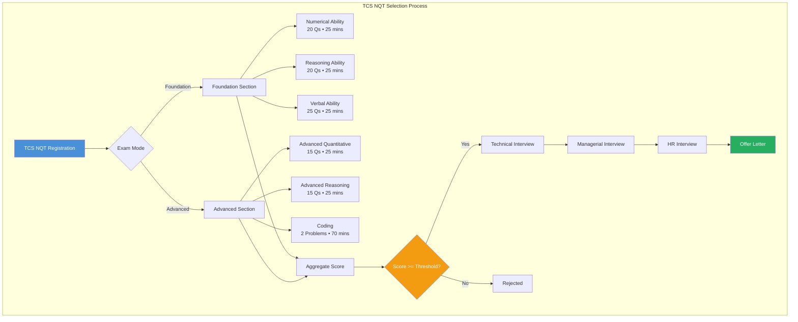
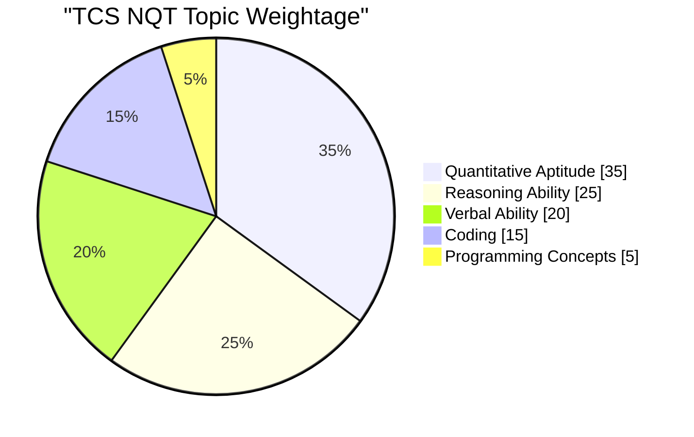

# Chapter 11: TCS NQT & Digital — Company-Specific Question Bank

## Learning Objectives

- Master TCS NQT coding patterns with complete TypeScript solutions
- Solve 20 TCS-style quantitative aptitude questions with step-by-step reasoning
- Crack 15 reasoning problems covering coding-decoding, blood relations, direction sense, and syllogisms
- Ace 10 verbal ability questions with synonyms, antonyms, and sentence completion
- Understand TCS exam pattern, marking scheme, and topic weightage through visual guides

<!-- Image Gallery -->
<section class="lesson-visuals" aria-label="Visual learning resources">
  <header><span>VISUAL LEARNING</span><h2>See it. Review it. Remember it.</h2></header>
  <a class="lesson-visual-card" href="../../../assets/images/lessons/interview-preparation/11-company-tcs-nqt/handwritten-notes.svg" target="_blank" rel="noopener">
    
    <span><strong>Handwritten notes</strong>Condensed notes for deliberate review.</span>
  </a>
  <a class="lesson-visual-card" href="../../../assets/images/lessons/interview-preparation/11-company-tcs-nqt/sticky-notes.svg" target="_blank" rel="noopener">
    
    <span><strong>Sticky-note revision</strong>Fast recall prompts for revision.</span>
  </a>
  <a class="lesson-visual-card" href="../../../assets/images/lessons/interview-preparation/11-company-tcs-nqt/visual-explanation.svg" target="_blank" rel="noopener">
    
    <span><strong>Visual concept guide</strong>A connected explanation of the key ideas.</span>
  </a>
</section>
<!-- End Image Gallery -->

## TCS NQT Exam Pattern



## Topic Weightage Distribution



---

## Section 1: Coding Problems (TCS Pattern)

### Problem 1: Find the Majority Element

**Problem:** Given an array of size `n`, find the element that appears more than `n/2` times. Assume the array is non-empty and the majority element always exists.

**TCS Pattern Context:** TCS frequently asks majority element problems in their NQT Digital coding round. It tests hash map usage and the Boyer-Moore voting algorithm.

**Example 1:**
```
Input:  [3, 3, 4, 2, 4, 4, 2, 4, 4]
Output: 4
```

**Example 2:**
```
Input:  [1, 1, 1, 2, 2]
Output: 1
```

**Constraints:** 1 ≤ n ≤ 10^5, -10^9 ≤ arr[i] ≤ 10^9

<details>
<summary><b>Approach 1: HashMap Counting — O(n) time, O(n) space</b></summary>

```typescript
function findMajorityElement(nums: number[]): number {
  const countMap = new Map<number, number>();
  const n = nums.length;

  for (const num of nums) {
    countMap.set(num, (countMap.get(num) || 0) + 1);
    if (countMap.get(num)! > n / 2) {
      return num;
    }
  }
  return -1;
}
```

**Time:** O(n) — single pass through the array
**Space:** O(n) — hash map stores up to n/2+1 entries
</details>

<details>
<summary><b>Approach 2: Boyer-Moore Voting Algorithm — O(n) time, O(1) space</b></summary>

```typescript
function findMajorityElementOptimal(nums: number[]): number {
  let candidate: number = nums[0];
  let count: number = 1;

  for (let i = 1; i < nums.length; i++) {
    if (count === 0) {
      candidate = nums[i];
      count = 1;
    } else if (nums[i] === candidate) {
      count++;
    } else {
      count--;
    }
  }

  // Verify candidate (required if majority may not exist)
  let freq = 0;
  for (const num of nums) {
    if (num === candidate) freq++;
  }
  return freq > nums.length / 2 ? candidate : -1;
}
```

**Time:** O(n) — two passes (one for candidate, one for verification)
**Space:** O(1) — only two variables
</details>

**Why TCS asks this:** Tests array traversal, hash map usage, and the optimization mindset to reduce space complexity.

---

### Problem 2: Equilibrium Index (Pivot Index)

**Problem:** Find an index such that the sum of elements to its left equals the sum of elements to its right. If no such index exists, return -1.

**TCS Pattern Context:** This is a recurring TCS NQT coding problem testing prefix sum technique.

**Example 1:**
```
Input:  [1, 7, 3, 6, 5, 6]
Output: 3
Explanation: Left sum = 1+7+3 = 11, Right sum = 5+6 = 11
```

**Example 2:**
```
Input:  [2, 1, -1]
Output: 0
Explanation: Left sum = 0 (empty), Right sum = 1+(-1) = 0
```

<details>
<summary><b>Solution: Prefix Sum — O(n) time, O(1) space</b></summary>

```typescript
function findEquilibriumIndex(nums: number[]): number {
  const totalSum = nums.reduce((sum, val) => sum + val, 0);
  let leftSum = 0;

  for (let i = 0; i < nums.length; i++) {
    const rightSum = totalSum - leftSum - nums[i];
    if (leftSum === rightSum) return i;
    leftSum += nums[i];
  }
  return -1;
}
```

**Why this works:** Instead of computing left and right sums separately for each index (which would be O(n²)), we compute the total sum once, then track the left sum as we iterate. The right sum is derived as `total - left - current`.

**Time:** O(n) — single pass
**Space:** O(1) — constant extra space
</details>

---

### Problem 3: Longest Substring Without Repeating Characters

**Problem:** Given a string `s`, find the length of the longest substring without repeating characters.

**TCS Pattern Context:** TCS Digital coding round frequently includes string manipulation problems using the sliding window technique.

**Example 1:**
```
Input:  "abcabcbb"
Output: 3
Explanation: "abc" with length 3
```

**Example 2:**
```
Input:  "bbbbb"
Output: 1
Explanation: "b" with length 1
```

<details>
<summary><b>Solution: Sliding Window with HashMap — O(n) time, O(min(m,n)) space</b></summary>

```typescript
function lengthOfLongestSubstring(s: string): number {
  const charIndexMap = new Map<string, number>();
  let maxLength = 0;
  let left = 0;

  for (let right = 0; right < s.length; right++) {
    const currentChar = s[right];

    if (charIndexMap.has(currentChar) && charIndexMap.get(currentChar)! >= left) {
      left = charIndexMap.get(currentChar)! + 1;
    }

    charIndexMap.set(currentChar, right);
    maxLength = Math.max(maxLength, right - left + 1);
  }

  return maxLength;
}
```

**Time:** O(n) — each character is visited at most twice
**Space:** O(min(m,n)) — hash map stores at most m unique characters (m ≤ 26 for lowercase, or n for general ASCII)

**Edge cases:**
- Empty string → 0
- All unique characters → length of string
- All same characters → 1
</details>

---

### Problem 4: 0-1 Knapsack (DP)

**Problem:** Given weights and values of `n` items, and a knapsack capacity `W`, find the maximum value that can be carried. Each item can be taken or left (0-1 property).

**TCS Pattern Context:** TCS Digital asks standard DP problems like knapsack, LCS, and LIS to test dynamic programming understanding.

**Example:**
```
Input:  values = [60, 100, 120], weights = [10, 20, 30], W = 50
Output: 220
Explanation: Items 2 (100,20) + 3 (120,30) = 220 value, 50 weight
```

<details>
<summary><b>Solution: DP Tabulation — O(n*W) time, O(n*W) space</b></summary>

```typescript
function knapsack01(values: number[], weights: number[], W: number): number {
  const n = values.length;
  const dp: number[][] = Array.from({ length: n + 1 }, () =>
    new Array(W + 1).fill(0)
  );

  for (let i = 1; i <= n; i++) {
    for (let w = 1; w <= W; w++) {
      if (weights[i - 1] <= w) {
        dp[i][w] = Math.max(
          values[i - 1] + dp[i - 1][w - weights[i - 1]],
          dp[i - 1][w]
        );
      } else {
        dp[i][w] = dp[i - 1][w];
      }
    }
  }

  return dp[n][W];
}
```

<details>
<summary><b>Optimized: 1D DP — O(n*W) time, O(W) space</b></summary>

```typescript
function knapsack01Optimized(values: number[], weights: number[], W: number): number {
  const n = values.length;
  const dp: number[] = new Array(W + 1).fill(0);

  for (let i = 0; i < n; i++) {
    for (let w = W; w >= weights[i]; w--) {
      dp[w] = Math.max(dp[w], values[i] + dp[w - weights[i]]);
    }
  }

  return dp[W];
}
```

**Time:** O(n*W) — where n is number of items, W is capacity
**Space:** O(W) — single array instead of 2D matrix
</details>

**Why TCS asks this:** DP problems test candidate's ability to break problems into subproblems and optimize — key for Digital roles.
</details>

---

### Problem 5: Count Pairs with Given Sum

**Problem:** Given an array of integers and a target sum `k`, count the number of distinct pairs `(i, j)` such that `i < j` and `arr[i] + arr[j] = k`.

**TCS Pattern Context:** TCS NQT frequently asks pair-counting problems to test hash map optimization skills.

**Example:**
```
Input:  arr = [1, 5, 7, -1, 5], k = 6
Output: 3
Explanation: (1,5), (1,5), (7,-1) — three pairs sum to 6
```

<details>
<summary><b>Solution: HashMap Frequency — O(n) time, O(n) space</b></summary>

```typescript
function countPairsWithSum(arr: number[], k: number): number {
  const freqMap = new Map<number, number>();
  let count = 0;

  for (const num of arr) {
    const complement = k - num;
    if (freqMap.has(complement)) {
      count += freqMap.get(complement)!;
    }
    freqMap.set(num, (freqMap.get(num) || 0) + 1);
  }

  return count;
}
```

**Time:** O(n) — single pass through array
**Space:** O(n) — hash map stores frequencies

**Edge cases:**
- Empty array → 0
- No pairs → 0
- Negative numbers handled correctly
- Duplicate values counted correctly
</details>

---

### Problem 6: Longest Common Subsequence (LCS)

**Problem:** Given two strings, find the length of the longest subsequence that appears in both. A subsequence is a sequence derived by deleting some characters without changing order.

**TCS Pattern Context:** LCS is a TCS Digital favorite for testing DP fundamentals.

**Example:**
```
Input:  text1 = "abcde", text2 = "ace"
Output: 3
Explanation: "ace" is the longest common subsequence
```

<details>
<summary><b>Solution: DP Tabulation — O(m*n) time, O(m*n) space</b></summary>

```typescript
function longestCommonSubsequence(text1: string, text2: string): number {
  const m = text1.length;
  const n = text2.length;
  const dp: number[][] = Array.from({ length: m + 1 }, () =>
    new Array(n + 1).fill(0)
  );

  for (let i = 1; i <= m; i++) {
    for (let j = 1; j <= n; j++) {
      if (text1[i - 1] === text2[j - 1]) {
        dp[i][j] = 1 + dp[i - 1][j - 1];
      } else {
        dp[i][j] = Math.max(dp[i - 1][j], dp[i][j - 1]);
      }
    }
  }

  return dp[m][n];
}
```

<details>
<summary><b>Optimized: Space-Optimized DP — O(m*n) time, O(n) space</b></summary>

```typescript
function longestCommonSubsequenceOptimized(text1: string, text2: string): number {
  const m = text1.length;
  const n = text2.length;
  let prev: number[] = new Array(n + 1).fill(0);
  let curr: number[] = new Array(n + 1).fill(0);

  for (let i = 1; i <= m; i++) {
    for (let j = 1; j <= n; j++) {
      if (text1[i - 1] === text2[j - 1]) {
        curr[j] = 1 + prev[j - 1];
      } else {
        curr[j] = Math.max(prev[j], curr[j - 1]);
      }
    }
    [prev, curr] = [curr, prev];
  }

  return prev[n];
}
```

**Time:** O(m*n) — fill DP table
**Space:** O(n) — only two rows instead of full table
</details>

**Why TCS asks this:** Tests string manipulation and DP recurrence formulation — essential for algorithmic thinking in Digital roles.
</details>

---

## Section 2: Quantitative Aptitude (20 Questions)

### Time, Speed, and Distance

**Q1.** A train 150 m long passes a platform 250 m long in 30 seconds. Find the speed of the train in km/h.

<details>
<summary><b>Solution</b></summary>

Total distance = Length of train + Length of platform = 150 + 250 = 400 m
Time = 30 seconds
Speed = Distance / Time = 400 / 30 = 40/3 m/s
Speed in km/h = (40/3) × (18/5) = (40 × 18) / (3 × 5) = 720 / 15 = 48 km/h

**Answer: 48 km/h**
</details>

**Q2.** A man covers a distance at 60 km/h and returns at 40 km/h. Find his average speed for the entire journey.

<details>
<summary><b>Solution</b></summary>

Average speed = 2xy / (x + y) where x and y are speeds
= 2 × 60 × 40 / (60 + 40)
= 4800 / 100
= 48 km/h

Note: This is NOT the arithmetic mean (50 km/h). For equal distances, use harmonic mean formula.

**Answer: 48 km/h**
</details>

**Q3.** Two trains of lengths 200 m and 300 m run on parallel tracks at 54 km/h and 72 km/h respectively. In what time will they cross each other if running in opposite directions?

<details>
<summary><b>Solution</b></summary>

Relative speed (opposite) = 54 + 72 = 126 km/h
= 126 × (5/18) = 35 m/s
Total distance = 200 + 300 = 500 m
Time = 500 / 35 = 100/7 = 14.29 seconds

**Answer: 14.29 seconds**
</details>

**Q4.** A boat travels 24 km upstream in 6 hours and the same distance downstream in 4 hours. Find the speed of the boat in still water.

<details>
<summary><b>Solution</b></summary>

Upstream speed = 24/6 = 4 km/h
Downstream speed = 24/4 = 6 km/h
Speed in still water = (Upstream + Downstream) / 2 = (4 + 6) / 2 = 5 km/h

**Answer: 5 km/h**
</details>

**Q5.** A 240 m long train passes a telegraph post in 12 seconds. How long will it take to pass a 360 m long platform?

<details>
<summary><b>Solution</b></summary>

Speed = Distance / Time = 240 / 12 = 20 m/s
To pass platform: Total distance = 240 + 360 = 600 m
Time = 600 / 20 = 30 seconds

**Answer: 30 seconds**
</details>

### Profit and Loss

**Q6.** A shopkeeper sells an article at 20% profit. If he had bought it at 10% less and sold it at 30% profit, he would have gained ₹ 42 more. Find the cost price.

<details>
<summary><b>Solution</b></summary>

Let CP = ₹ x
First case: SP = x × 120/100 = 1.2x, Profit = 0.2x
Second case: CP' = x × 90/100 = 0.9x, SP' = 0.9x × 130/100 = 1.17x, Profit' = 0.27x
Difference in profit = 0.27x - 0.2x = 0.07x = 42
x = 42 / 0.07 = 600

**Answer: ₹ 600**
</details>

**Q7.** A vendor bought oranges at 8 for ₹ 34 and sold them at 12 for ₹ 57. Find the profit or loss percentage.

<details>
<summary><b>Solution</b></summary>

CP per orange = 34/8 = ₹ 4.25
SP per orange = 57/12 = ₹ 4.75
Profit per orange = 4.75 - 4.25 = ₹ 0.50
Profit % = (0.50 / 4.25) × 100 = 11.76%

**Answer: 11.76% profit**
</details>

**Q8.** By selling 90 pens, a shopkeeper gains the CP of 15 pens. Find his profit percentage.

<details>
<summary><b>Solution</b></summary>

Let CP of 1 pen = ₹ 1
CP of 90 pens = ₹ 90
Gain = CP of 15 pens = ₹ 15
SP = CP + Gain = 90 + 15 = ₹ 105
Profit % = (Gain / CP) × 100 = (15 / 90) × 100 = 16.67%

**Answer: 16.67%**
</details>

**Q9.** A dishonest dealer professes to sell at cost price but uses 900 g weight instead of 1 kg. Find his profit percentage.

<details>
<summary><b>Solution</b></summary>

He gives 900 g instead of 1000 g.
He pays for 900 g but charges for 1000 g.
Profit % = [Error / (True Weight - Error)] × 100
= [100 / 900] × 100 = 11.11%

Alternatively: CP of 900 g = ₹ 900 (assuming ₹ 1/g), SP for 900 g = ₹ 1000
Profit % = (100/900) × 100 = 11.11%

**Answer: 11.11%**
</details>

**Q10.** A shopkeeper marks an article 60% above cost price and gives a discount of 20%. Find the profit percentage.

<details>
<summary><b>Solution</b></summary>

Let CP = ₹ 100
Marked Price = 100 + 60% of 100 = ₹ 160
Discount = 20% of 160 = ₹ 32
SP = 160 - 32 = ₹ 128
Profit = 128 - 100 = ₹ 28
Profit % = 28%

**Answer: 28%**
</details>

### Percentages

**Q11.** If A's income is 25% more than B's, then B's income is what percentage less than A's?

<details>
<summary><b>Solution</b></summary>

Let B's income = ₹ 100
A's income = 100 + 25% of 100 = ₹ 125
Difference = 125 - 100 = ₹ 25
Required % = (25/125) × 100 = 20%

Note: If A is x% more than B, then B is [x/(100+x)] × 100% less than A.

**Answer: 20%**
</details>

**Q12.** A number is increased by 20% and then decreased by 20%. Find the net change.

<details>
<summary><b>Solution</b></summary>

Let number = 100
After 20% increase: 100 + 20 = 120
After 20% decrease: 120 - 24 = 96
Net change = 100 - 96 = 4% decrease

**Answer: 4% decrease**
</details>

**Q13.** In an examination, 52% candidates failed in English and 42% failed in Mathematics. If 17% failed in both, find the percentage who passed in both subjects.

<details>
<summary><b>Solution</b></summary>

Failed in English only = 52 - 17 = 35%
Failed in Math only = 42 - 17 = 25%
Failed in at least one = 35 + 25 + 17 = 77%
Passed in both = 100 - 77 = 23%

**Answer: 23%**
</details>

**Q14.** A solution contains 40% milk and the rest water. 10 liters of the solution is replaced with pure milk. The resulting solution has 60% milk. Find the initial quantity.

<details>
<summary><b>Solution</b></summary>

Let initial quantity = x liters
Milk = 0.4x, Water = 0.6x
After removing 10L: Milk = 0.4x - 4, Water = 0.6x - 6
After adding 10L milk: Milk = 0.4x - 4 + 10 = 0.4x + 6, Water = 0.6x - 6
Final milk % = (0.4x + 6) / x = 0.6
0.4x + 6 = 0.6x
6 = 0.2x
x = 30

**Answer: 30 liters**
</details>

**Q15.** The population of a town increases by 5% annually. If the present population is 1,85,220, what was it two years ago?

<details>
<summary><b>Solution</b></summary>

Let population 2 years ago = P
P × (1 + 5/100)² = 185220
P × (105/100)² = 185220
P × (21/20)² = 185220
P × 441/400 = 185220
P = 185220 × 400 / 441
P = 168000

**Answer: 1,68,000**
</details>

### Ratios and Proportions

**Q16.** If A:B = 2:3, B:C = 4:5, and C:D = 6:7, find A:D.

<details>
<summary><b>Solution</b></summary>

A:B = 2:3 = 2 × 8 : 3 × 8 = 16:24
B:C = 4:5 = 4 × 6 : 5 × 6 = 24:30
C:D = 6:7 = 6 × 5 : 7 × 5 = 30:35
A:B:C:D = 16:24:30:35
A:D = 16:35

**Answer: 16:35**
</details>

**Q17.** A sum of money is divided among A, B, C in the ratio 3:5:8. If C gets ₹ 800 more than B, find the total sum.

<details>
<summary><b>Solution</b></summary>

Let shares be 3x, 5x, 8x
C - B = 8x - 5x = 3x = 800
x = 800/3 = 266.67
Total = 16x = 16 × 800/3 = 12800/3 = ₹ 4266.67

**Answer: ₹ 4266.67**
</details>

**Q18.** Two numbers are in ratio 4:7. If each is increased by 10, the ratio becomes 3:5. Find the original numbers.

<details>
<summary><b>Solution</b></summary>

Let numbers be 4x and 7x
(4x + 10) : (7x + 10) = 3 : 5
5(4x + 10) = 3(7x + 10)
20x + 50 = 21x + 30
50 - 30 = 21x - 20x
20 = x
Numbers: 4 × 20 = 80, 7 × 20 = 140

**Answer: 80 and 140**
</details>

### Averages

**Q19.** The average of 20 numbers is 45. If two numbers 25 and 35 are removed, find the new average.

<details>
<summary><b>Solution</b></summary>

Sum of 20 numbers = 20 × 45 = 900
Sum after removing 25 and 35 = 900 - 25 - 35 = 840
New average = 840 / 18 = 46.67

**Answer: 46.67**
</details>

**Q20.** The average age of a class of 30 students is 12 years. If the teacher's age is included, the average increases by 1 year. Find the teacher's age.

<details>
<summary><b>Solution</b></summary>

Sum of students' ages = 30 × 12 = 360
New average (with teacher) = 13
Sum of 31 persons = 31 × 13 = 403
Teacher's age = 403 - 360 = 43

**Answer: 43 years**
</details>

---

## Section 3: Reasoning Ability (15 Questions)

### Coding-Decoding

**Q1.** In a code language, SUMMER is written as RUNNER. How is WINTER written?

<details>
<summary><b>Solution</b></summary>

S → R (previous letter)
U → U (same)
M → N (next)
M → N (next)
E → E (same)
R → R (same)

Pattern: First letter replaced by previous, 3rd and 4th by next, others unchanged.
WINTER → VI \u00b6... Let's apply:
W → V (previous)
I → I (same)
N → O (next)
T → U (next)
E → E (same)
R → R (same)

**Answer: VIOUER**
</details>

**Q2.** In a code, 123 means "hot filtered coffee", 356 means "very hot day", and 589 means "day and night". What is the code for "very"?

<details>
<summary><b>Solution</b></summary>

123 → hot filtered coffee
356 → very hot day
589 → day and night

Common digit in 1st and 2nd: 3 → "hot"
Common digit in 2nd and 3rd: 5 → "day"
From 2nd: 356 → 3:hot, 5:day, so 6:"very"

**Answer: 6**
</details>

**Q3.** If FRIEND is coded as GQJDOC, how is PEACE coded?

<details>
<summary><b>Solution</b></summary>

F→G (+1), R→Q (-1), I→J (+1), E→D (-1), N→O (+1), D→C (-1)
Pattern: Alternating +1, -1
P→Q (+1), E→D (-1), A→B (+1), C→B (-1), E→F (+1)

**Answer: QDBBF**
</details>

**Q4.** In a certain code, CAT is written as 3120. How is DOG written?

<details>
<summary><b>Solution</b></summary>

A=1, B=2, C=3, ..., Z=26
C=3, A=1, T=20 → 3120
D=4, O=15, G=7 → 4157

**Answer: 4157**
</details>

**Q5.** If "apple" is "banana", "banana" is "cherry", "cherry" is "date", and "date" is "elderberry", what is "cherry"?

<details>
<summary><b>Solution</b></summary>

The code substitutes each word with the next in the sequence.
"cherry" is coded as "date" (as given: "cherry" is "date").
The question asks: what is "cherry"? → "date"

**Answer: date**
</details>

### Blood Relations

**Q6.** Pointing to a photograph, a man said, "This girl is the daughter of the wife of the only son of my mother." How is the girl related to the man?

<details>
<summary><b>Solution</b></summary>

"My mother" → Man's mother
"Only son of my mother" → The man himself (only son)
"Wife of the only son" → Man's wife
"Daughter of the wife" → Man's daughter

**Answer: Daughter**
</details>

**Q7.** A is the father of B. C is the brother of A. D is the wife of C. E is the son of D. How is E related to B?

<details>
<summary><b>Solution</b></summary>

A and C are brothers (C is A's brother)
B is A's child (son/daughter)
D is C's wife
E is C and D's son
E and B are cousins (children of brothers)

**Answer: Cousin**
</details>

**Q8.** Introducing a woman, a man said, "Her mother's husband's sister is my mother." How is the woman related to the man?

<details>
<summary><b>Solution</b></summary>

"Her mother's husband" → Woman's father
"Her mother's husband's sister" → Woman's father's sister = Woman's aunt
"This aunt is my mother" → So the woman's aunt is the man's mother
Therefore, the woman's father is the brother of the man's mother
So the woman is the niece of the man

**Answer: Niece**
</details>

### Direction Sense

**Q9.** A person walks 10 m north, turns right, walks 15 m, turns right, walks 20 m, turns left, walks 10 m. How far is he from the starting point?

<details>
<summary><b>Solution</b></summary>

Let's track:
1. North 10 m → (0, 10)
2. Right (East) 15 m → (15, 10)
3. Right (South) 20 m → (15, -10)
4. Left (East) 10 m → (25, -10)

Distance from origin (0,0) = √(25² + 10²) = √(625 + 100) = √725 = 26.93 m

**Answer: 26.93 m ≈ 27 m**
</details>

**Q10.** A is 20 m east of B. C is 15 m south of A. D is 30 m west of C. E is 10 m north of D. What is the distance between B and E?

<details>
<summary><b>Solution</b></summary>

Place B at (0, 0)
A = (20, 0)
C = (20, -15)
D = (20-30, -15) = (-10, -15)
E = (-10, -15+10) = (-10, -5)

B = (0, 0), E = (-10, -5)
Distance BE = √(10² + 5²) = √125 = 11.18 m

**Answer: 11.18 m ≈ 11 m**
</details>

**Q11.** A man walks 5 km towards east, turns right and walks 3 km, turns left and walks 2 km, turns right and walks 4 km. In which direction is he from the starting point?

<details>
<summary><b>Solution</b></summary>

1. East 5 km → (5, 0)
2. Right (South) 3 km → (5, -3)
3. Left (East) 2 km → (7, -3)
4. Right (South) 4 km → (7, -7)

Final position: 7 km East, 7 km South → Southeast direction from start

**Answer: Southeast**
</details>

### Syllogisms

**Q12.** Statements: All dogs are cats. All cats are rats.
Conclusions: I. All dogs are rats. II. Some rats are dogs.

<details>
<summary><b>Solution</b></summary>

All dogs are cats, all cats are rats → All dogs are rats (Conclusion I valid)
If all dogs are rats, then some rats are definitely dogs (Conclusion II valid)
Both conclusions follow.

**Answer: Both I and II follow**
</details>

**Q13.** Statements: Some pens are pencils. No pencil is an eraser.
Conclusions: I. Some pens are not erasers. II. All erasers are pencils.

<details>
<summary><b>Solution</b></summary>

Some pens are pencils, and no pencil is an eraser.
So those pens that are pencils are definitely not erasers. → Conclusion I valid
Conclusion II: "All erasers are pencils" is NOT stated anywhere. We only know no pencil is an eraser, but this doesn't mean all erasers are pencils.

**Answer: Only I follows**
</details>

**Q14.** Statements: All flowers are trees. Some trees are plants.
Conclusions: I. Some plants are flowers. II. No plant is a flower.

<details>
<summary><b>Solution</b></summary>

From "All flowers are trees" and "Some trees are plants" — we cannot definitively say whether any plant is a flower or not. It's possible that some plants are flowers, but it's also possible that no plant is a flower. Both are possibilities but not certainties.

**Answer: Neither I nor II follows**
</details>

**Q15.** Statements: No mango is a banana. All bananas are fruits. Some fruits are mangoes.
Conclusions: I. Some fruits are bananas. II. Some mangoes are fruits.

<details>
<summary><b>Solution</b></summary>

All bananas are fruits → Some fruits are bananas (Conclusion I valid)
Some fruits are mangoes → Some mangoes are fruits (Conclusion II valid)
Both follow independently.

**Answer: Both I and II follow**
</details>

---

## Section 4: Verbal Ability (10 Questions)

### Synonyms

**Q1.** Select the synonym of **AMELIORATE**:
a) Worsen  b) Improve  c) Maintain  d) Ignore

<details>
<summary><b>Solution</b></summary>

**Answer: b) Improve**
Ameliorate means to make something better or improve a situation.
</details>

**Q2.** Select the synonym of **PERSPICACIOUS**:
a) Dull  b) Discerning  c) Weak  d) Careless

<details>
<summary><b>Solution</b></summary>

**Answer: b) Discerning**
Perspicacious means having a ready insight into things, shrewd, discerning.
</details>

**Q3.** Select the synonym of **ENERVATE**:
a) Strengthen  b) Energize  c) Weaken  d) Invigorate

<details>
<summary><b>Solution</b></summary>

**Answer: c) Weaken**
Enervate means to cause someone to feel drained of energy or weakened.
</details>

### Antonyms

**Q4.** Select the antonym of **EXTENUATE**:
a) Aggravate  b) Excuse  c) Reduce  d) Diminish

<details>
<summary><b>Solution</b></summary>

**Answer: a) Aggravate**
Extenuate means to make less severe or serious. Antonym is aggravate (make worse).
</details>

**Q5.** Select the antonym of **PUSILLANIMOUS**:
a) Timid  b) Courageous  c) Gentle  d) Humble

<details>
<summary><b>Solution</b></summary>

**Answer: b) Courageous**
Pusillanimous means showing a lack of courage or determination; timid.
</details>

**Q6.** Select the antonym of **OBFUSCATE**:
a) Clarify  b) Confuse  c) Complicate  d) Conceal

<details>
<summary><b>Solution</b></summary>

**Answer: a) Clarify**
Obfuscate means to render obscure or unclear. Antonym is clarify.
</details>

### Sentence Completion

**Q7.** The manager's ___________ speech motivated the team to achieve their targets.
a) lackluster  b) inspiring  c) ambiguous  d) monotonous

<details>
<summary><b>Solution</b></summary>

**Answer: b) inspiring**
The sentence requires a positive word showing motivation. "Inspiring" fits the context.
</details>

**Q8.** The scientist's discovery was completely ___________, overturning decades of established theory.
a) anticipated  b) predictable  c) revolutionary  d) insignificant

<details>
<summary><b>Solution</b></summary>

**Answer: c) revolutionary**
"Overturning decades of established theory" indicates a major,颠覆性 change. "Revolutionary" fits perfectly.
</details>

**Q9.** Despite the heavy rainfall, the event continued ___________.
a) abruptly  b) reluctantly  c) unhindered  d) prematurely

<details>
<summary><b>Solution</b></summary>

**Answer: c) unhindered**
"Despite" indicates contrast. Heavy rain should have stopped the event, but it continued "unhindered" (without any obstacle).
</details>

**Q10.** The professor's explanation was so ___________ that even beginners could understand.
a) convoluted  b) esoteric  c) lucid  d) ambiguous

<details>
<summary><b>Solution</b></summary>

**Answer: c) lucid**
"Even beginners could understand" requires a word meaning clear and easy to follow. "Lucid" means expressed clearly.
</details>

---

## TCS-Specific Tips and Strategies

### For TCS NQT Foundation:

| Section | Tips |
|---------|------|
| **Numerical Ability** | Focus on speed — 20 Qs in 25 mins. Practice percentage, ratio, and time-speed-distance heavily |
| **Reasoning** | Coding-decoding and blood relations are high-weightage. Practice 3+ puzzles daily |
| **Verbal** | Email writing is important. Practice formal email format with proper salutation and closing |

### For TCS NQT Advanced (Digital):

| Area | Focus |
|------|-------|
| **Advanced Quant** | Probability, permutations, complex geometry |
| **Advanced Reasoning** | Data sufficiency, critical reasoning |
| **Coding** | 2 problems in 70 mins. One easy (arrays/strings), one medium (DP/graphs) |

### Email Writing Template (TCS-specific):

```
Subject: [Purpose] - [Your Name]

Dear [Recipient Name/Sir/Madam],

[Introduction: Who you are]
[Body: Main content in 2-3 paragraphs]
[Closing: Call to action]

Thanking you,
Yours sincerely,
[Your Name]
[Designation]
[Contact Information]
```

---

## Summary

This chapter provided a comprehensive TCS NQT & Digital question bank covering all four sections of the exam. The 6 coding problems cover arrays, strings, and DP — the most common TCS patterns. The 20 quant questions span all major topics with TCS-specific difficulty levels. The 15 reasoning questions cover the trickiest areas: coding-decoding, blood relations, direction sense, and syllogisms. The 10 verbal questions test vocabulary and sentence completion skills essential for the English section.

## Practical Takeaways

1. **Time management is critical:** TCS NQT gives only ~1 minute per question in each section. Practice with a timer religiously.
2. **Negative marking:** There is NO negative marking in TCS NQT, so attempt all questions with educated guesses where needed.
3. **Coding round strategy:** Read both problems first, then start with the easier one. Aim for partial test cases even if you can't fully solve.
4. **For TCS Digital:** The coding round is the differentiator. Master hash maps, sliding window, and DP basics.
5. **Email writing is mandatory:** TCS Ninja includes an email writing task. Memorize a formal template and practice 5-10 variations.
6. **⭐ Must-Know:** TCS values clean code with comments. In the coding round, write readable code with meaningful variable names.

## Chapter Quiz

**Q1.** A train 150 m long passes a man in 6 seconds. What is the speed of the train in km/h?
a) 60 km/h  b) 90 km/h  c) 50 km/h  d) 75 km/h

<details>
<summary>Answer: b) 90 km/h</summary>
Speed = 150/6 = 25 m/s = 25 × 18/5 = 90 km/h
</details>

**Q2.** In a code language, if 'PENCIL' is coded as 'QDOBHK', how is 'PAPER' coded?
a) QZQDS  b) QZQCS  c) QZOCS  d) QAPCS

<details>
<summary>Answer: a) QZQDS</summary>
Pattern: P→Q(+1), E→D(-1), N→O(+1), C→B(-1), I→H(-1... wait) Let me redo: P→Q(+1), E→D(-1), N→O(+1), C→B(-1), I→H(-1), L→K(-1) — alternating +1, -1. PAPER: P→Q(+1), A→Z(-1), P→Q(+1), E→D(-1), R→S(+1) = QZQDS
</details>

**Q3.** The average weight of 6 people increases by 2.5 kg when a new person joins. If the average weight was 55 kg, what is the weight of the new person?
a) 65 kg  b) 70 kg  c) 72.5 kg  d) 67.5 kg

<details>
<summary>Answer: b) 70 kg</summary>
Sum of 6 = 55 × 6 = 330. New avg = 57.5, sum of 7 = 402.5. New person = 402.5 - 330 = 72.5... wait. New avg = 55 + 2.5 = 57.5. Sum of 7 = 57.5 × 7 = 402.5. New person = 402.5 - 330 = 72.5. Hmm. Let me recalculate: Sum of 6 = 330, sum of 7 = 57.5×7 = 402.5. New person = 72.5 kg. Oh wait, the increase is 2.5kg, average goes from 55 to 57.5. So 57.5*7 - 55*6 = 402.5 - 330 = 72.5 kg.
</details>

**Q4.** If 'All roses are flowers' and 'Some flowers fade quickly', which conclusion is valid?
a) Some roses fade quickly  b) No roses fade quickly  c) Cannot determine  d) All flowers are roses

<details>
<summary>Answer: c) Cannot determine</summary>
We cannot say anything definitive about roses fading quickly — the "some flowers" that fade quickly may or may not include roses.
</details>

**Q5.** Synonym of 'EPHEMERAL':
a) Eternal  b) Brief  c) Sturdy  d) Powerful

<details>
<summary>Answer: b) Brief</summary>
Ephemeral means lasting for a very short time.
</details>

---

## Exercises

1. **Coding:** Solve "Container with Most Water" (LeetCode 11) — TCS has asked this in Digital rounds.
2. **Quant:** A shopkeeper marks goods 40% above CP and gives 15% discount. Find profit %.
3. **Reasoning:** Pointing to a photo, a woman says, "He is the son of the only daughter of my father-in-law." How is the person related to the woman?
4. **Verbal:** Write a professional email to your TCS manager requesting leave for a family function.
5. **Coding:** Implement Kadane's algorithm (maximum subarray sum) — a TCS Digital favorite.
</details>
