# Chapter 13: Amazon SDE — Company-Specific Question Bank

## Learning Objectives

- Master Amazon online assessment coding patterns with 4 complete TypeScript solutions
- Solve 4 Technical Round 1 data structure-focused problems
- Solve 4 Technical Round 2 algorithm and system design problems
- Design 2 large-scale systems: Amazon Cart and URL Shortener
- Answer 10 Amazon behavioral questions using Leadership Principles
- Understand the Amazon interview loop and LP framework

## Amazon Interview Process

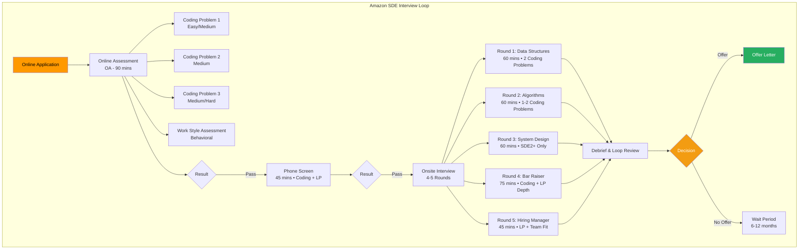
```mermaid
flowchart TB
    subgraph "Amazon SDE Interview Loop"
        A[Online Application] --> B[Online Assessment<br/>OA - 90 mins]
        B --> B1[Coding Problem 1<br/>Easy/Medium]
        B --> B2[Coding Problem 2<br/>Medium]
        B --> B3[Coding Problem 3<br/>Medium/Hard]
        B --> B4[Work Style Assessment<br/>Behavioral]
        B --> C{Result}
        C -->|Pass| D[Phone Screen<br/>45 mins • Coding + LP]
        D --> E{Result}
        E -->|Pass| F[Onsite Interview<br/>4-5 Rounds]
        F --> G[Round 1: Data Structures<br/>60 mins • 2 Coding Problems]
        F --> H[Round 2: Algorithms<br/>60 mins • 1-2 Coding Problems]
        F --> I[Round 3: System Design<br/>60 mins • SDE2+ Only]
        F --> J[Round 4: Bar Raiser<br/>75 mins • Coding + LP Depth]
        F --> K[Round 5: Hiring Manager<br/>45 mins • LP + Team Fit]
        G --> L[Debrief & Loop Review]
        H --> L
        I --> L
        J --> L
        K --> L
        L --> M{Decision}
        M -->|Offer| N[Offer Letter]
        M -->|No Offer| O[Wait Period<br/>6-12 months]
    end

    style A fill:#ff9900,color:#000
    style N fill:#27ae60,color:#fff
    style M fill:#f39c12,color:#fff
```

## Amazon Leadership Principles Framework

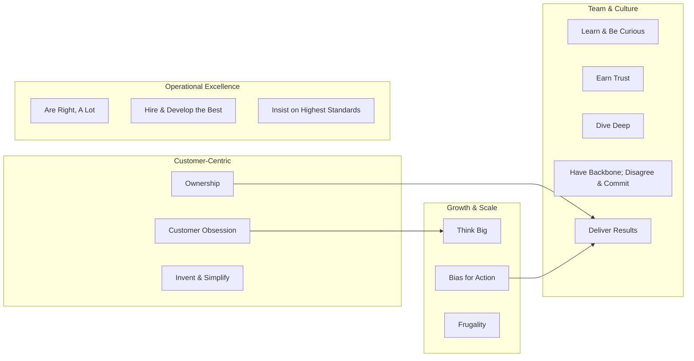
```mermaid
flowchart LR
    subgraph "Customer-Centric"
        LP1[Customer Obsession]
        LP2[Ownership]
        LP3[Invent & Simplify]
    end
    subgraph "Operational Excellence"
        LP4[Are Right, A Lot]
        LP5[Hire & Develop the Best]
        LP6[Insist on Highest Standards]
    end
    subgraph "Growth & Scale"
        LP7[Think Big]
        LP8[Bias for Action]
        LP9[Frugality]
    end
    subgraph "Team & Culture"
        LP10[Learn & Be Curious]
        LP11[Earn Trust]
        LP12[Dive Deep]
        LP13[Have Backbone; Disagree & Commit]
        LP14[Deliver Results]
    end

    LP1 --> LP7
    LP2 --> LP14
    LP8 --> LP14
```

---

## Section 1: Online Assessment (4 Problems)

### Problem OA-1: Top K Frequent Elements

<a href="../../assets/images/diagrams/interview-preparation/13-company-amazon-sde/problem-oa-1-top-k-frequent-elements-handwritten.svg" target="_blank" rel="noopener">
  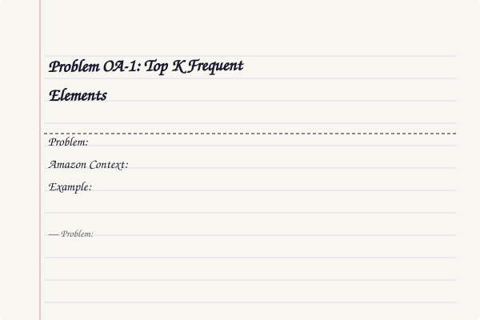
</a>
<a href="../../assets/images/diagrams/interview-preparation/13-company-amazon-sde/problem-oa-1-top-k-frequent-elements-diagram.svg" target="_blank" rel="noopener">
  
</a>
<a href="../../assets/images/diagrams/interview-preparation/13-company-amazon-sde/problem-oa-1-top-k-frequent-elements-sticky.svg" target="_blank" rel="noopener">
  
</a>


**Problem:** Given an integer array `nums` and an integer `k`, return the `k` most frequent elements. Return in any order.

**Amazon Context:** Amazon OA frequently tests hash map + priority queue combinations.

**Example:**
```
Input:  nums = [1, 1, 1, 2, 2, 3], k = 2
Output: [1, 2]
```

<details>
<summary><b>Solution: Bucket Sort — O(n) time, O(n) space</b></summary>

```typescript
function topKFrequent(nums: number[], k: number): number[] {
  // Build frequency map
  const freqMap = new Map<number, number>();
  for (const num of nums) {
    freqMap.set(num, (freqMap.get(num) || 0) + 1);
  }

  // Bucket sort: index = frequency, value = numbers with that frequency
  const buckets: number[][] = Array.from({ length: nums.length + 1 }, () => []);

  for (const [num, freq] of freqMap) {
    buckets[freq].push(num);
  }

  // Collect from highest frequency
  const result: number[] = [];
  for (let i = buckets.length - 1; i >= 0 && result.length < k; i--) {
    if (buckets[i].length > 0) {
      result.push(...buckets[i]);
    }
  }

  return result.slice(0, k);
}
```

**Time:** O(n) — building map O(n), bucket distribution O(n), collection O(n)
**Space:** O(n) — frequency map + bucket array

**Why bucket sort here:** Instead of using a min-heap (O(n log k)), we exploit the fact that the maximum frequency is n. Buckets give us O(n) overall.
</details>

---

### Problem OA-2: Number of Islands

<a href="../../assets/images/diagrams/interview-preparation/13-company-amazon-sde/problem-oa-2-number-of-islands-handwritten.svg" target="_blank" rel="noopener">
  
</a>
<a href="../../assets/images/diagrams/interview-preparation/13-company-amazon-sde/problem-oa-2-number-of-islands-diagram.svg" target="_blank" rel="noopener">
  
</a>
<a href="../../assets/images/diagrams/interview-preparation/13-company-amazon-sde/problem-oa-2-number-of-islands-sticky.svg" target="_blank" rel="noopener">
  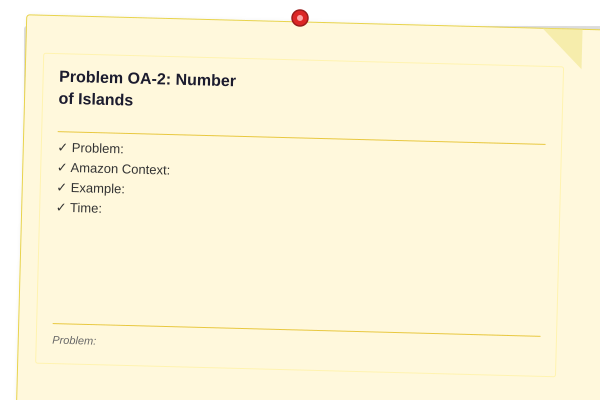
</a>


**Problem:** Given an `m x n` 2D binary grid of `'1'` (land) and `'0'` (water), count the number of islands. An island is surrounded by water and formed by connecting adjacent lands horizontally or vertically.

**Amazon Context:** Graph traversal is a staple of Amazon OA — they expect DFS/BFS fluency.

**Example:**
```
Input:
11110
11010
11000
00000
Output: 1
```

<details>
<summary><b>Solution: DFS — O(m×n) time, O(m×n) space</b></summary>

```typescript
function numIslands(grid: string[][]): number {
  if (!grid || grid.length === 0) return 0;

  const rows = grid.length;
  const cols = grid[0].length;
  let islandCount = 0;

  function dfs(r: number, c: number): void {
    if (r < 0 || r >= rows || c < 0 || c >= cols || grid[r][c] === '0') {
      return;
    }

    grid[r][c] = '0'; // Mark visited (sink the island)

    dfs(r + 1, c);
    dfs(r - 1, c);
    dfs(r, c + 1);
    dfs(r, c - 1);
  }

  for (let r = 0; r < rows; r++) {
    for (let c = 0; c < cols; c++) {
      if (grid[r][c] === '1') {
        islandCount++;
        dfs(r, c); // Sink the entire island
      }
    }
  }

  return islandCount;
}
```

<details>
<summary><b>BFS Alternative — O(m×n) time, O(min(m,n)) space</b></summary>

```typescript
function numIslandsBFS(grid: string[][]): number {
  if (!grid || grid.length === 0) return 0;

  const rows = grid.length;
  const cols = grid[0].length;
  let count = 0;
  const directions = [[1, 0], [-1, 0], [0, 1], [0, -1]];

  for (let r = 0; r < rows; r++) {
    for (let c = 0; c < cols; c++) {
      if (grid[r][c] === '1') {
        count++;
        const queue: [number, number][] = [[r, c]];
        grid[r][c] = '0';

        while (queue.length > 0) {
          const [cr, cc] = queue.shift()!;
          for (const [dr, dc] of directions) {
            const nr = cr + dr, nc = cc + dc;
            if (nr >= 0 && nr < rows && nc >= 0 && nc < cols && grid[nr][nc] === '1') {
              queue.push([nr, nc]);
              grid[nr][nc] = '0';
            }
          }
        }
      }
    }
  }
  return count;
}
```

**Time:** O(m×n), **Space:** O(min(m,n)) — BFS queue size in worst case
</details>

**Amazon tip:** Always discuss the trade-off between DFS (deep recursion risk on large grid) and BFS (iterative, safe for large inputs).
</details>

---

### Problem OA-3: LRU Cache

<a href="../../assets/images/diagrams/interview-preparation/13-company-amazon-sde/problem-oa-3-lru-cache-handwritten.svg" target="_blank" rel="noopener">
  
</a>
<a href="../../assets/images/diagrams/interview-preparation/13-company-amazon-sde/problem-oa-3-lru-cache-diagram.svg" target="_blank" rel="noopener">
  
</a>
<a href="../../assets/images/diagrams/interview-preparation/13-company-amazon-sde/problem-oa-3-lru-cache-sticky.svg" target="_blank" rel="noopener">
  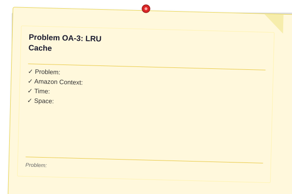
</a>


**Problem:** Design and implement an LRU (Least Recently Used) cache with `get(key)` and `put(key, value)` in O(1) average time.

**Amazon Context:** LRU Cache is one of Amazon's most frequently asked problems — tests combined use of HashMap and Doubly Linked List.

<details>
<summary><b>Solution: HashMap + Doubly Linked List — O(1) time</b></summary>

```typescript
class LRUCache {
  private capacity: number;
  private cache: Map<number, DoublyLinkedListNode>;
  private head: DoublyLinkedListNode;
  private tail: DoublyLinkedListNode;

  constructor(capacity: number) {
    this.capacity = capacity;
    this.cache = new Map();
    // Dummy head and tail for sentinel technique
    this.head = new DoublyLinkedListNode(0, 0);
    this.tail = new DoublyLinkedListNode(0, 0);
    this.head.next = this.tail;
    this.tail.prev = this.head;
  }

  get(key: number): number {
    if (!this.cache.has(key)) return -1;
    const node = this.cache.get(key)!;
    this.moveToHead(node);
    return node.value;
  }

  put(key: number, value: number): void {
    if (this.cache.has(key)) {
      const node = this.cache.get(key)!;
      node.value = value;
      this.moveToHead(node);
      return;
    }

    if (this.cache.size >= this.capacity) {
      const lruNode = this.tail.prev!;
      this.removeNode(lruNode);
      this.cache.delete(lruNode.key);
    }

    const newNode = new DoublyLinkedListNode(key, value);
    this.cache.set(key, newNode);
    this.addToHead(newNode);
  }

  private addToHead(node: DoublyLinkedListNode): void {
    node.prev = this.head;
    node.next = this.head.next;
    this.head.next!.prev = node;
    this.head.next = node;
  }

  private removeNode(node: DoublyLinkedListNode): void {
    node.prev!.next = node.next;
    node.next!.prev = node.prev;
  }

  private moveToHead(node: DoublyLinkedListNode): void {
    this.removeNode(node);
    this.addToHead(node);
  }
}

class DoublyLinkedListNode {
  key: number;
  value: number;
  prev: DoublyLinkedListNode | null = null;
  next: DoublyLinkedListNode | null = null;

  constructor(key: number, value: number) {
    this.key = key;
    this.value = value;
  }
}
```

**Time:** O(1) for both get and put
**Space:** O(capacity) — hash map + linked list nodes

**Key insights for interview:**
- Sentinels (dummy head/tail) eliminate null checks
- HashMap gives O(1) node lookup
- DLL gives O(1) removal/insertion
- Always discuss thread-safety if asked (use ReentrantLock in Java)
</details>

---

### Problem OA-4: Rotting Oranges

<a href="../../assets/images/diagrams/interview-preparation/13-company-amazon-sde/problem-oa-4-rotting-oranges-handwritten.svg" target="_blank" rel="noopener">
  
</a>
<a href="../../assets/images/diagrams/interview-preparation/13-company-amazon-sde/problem-oa-4-rotting-oranges-diagram.svg" target="_blank" rel="noopener">
  
</a>
<a href="../../assets/images/diagrams/interview-preparation/13-company-amazon-sde/problem-oa-4-rotting-oranges-sticky.svg" target="_blank" rel="noopener">
  
</a>


**Problem:** Given an `m x n` grid where 0 = empty, 1 = fresh orange, 2 = rotten orange. Every minute, any fresh orange adjacent (4-direction) to a rotten orange becomes rotten. Return the minimum minutes until no cell has a fresh orange, or -1 if impossible.

**Amazon Context:** Multi-source BFS — Amazon tests BFS variants frequently in OA.

**Example:**
```
Input: [[2,1,1],[1,1,0],[0,1,1]]
Output: 4
```

<details>
<summary><b>Solution: Multi-Source BFS — O(m×n) time, O(m×n) space</b></summary>

```typescript
function orangesRotting(grid: number[][]): number {
  const rows = grid.length;
  const cols = grid[0].length;
  const queue: [number, number, number][] = []; // [row, col, minute]
  let freshCount = 0;

  // Initialize: add all rotten oranges and count fresh
  for (let r = 0; r < rows; r++) {
    for (let c = 0; c < cols; c++) {
      if (grid[r][c] === 2) {
        queue.push([r, c, 0]);
      } else if (grid[r][c] === 1) {
        freshCount++;
      }
    }
  }

  if (freshCount === 0) return 0;

  const directions = [[1, 0], [-1, 0], [0, 1], [0, -1]];
  let minutes = 0;

  while (queue.length > 0) {
    const [r, c, time] = queue.shift()!;
    minutes = Math.max(minutes, time);

    for (const [dr, dc] of directions) {
      const nr = r + dr, nc = c + dc;
      if (nr >= 0 && nr < rows && nc >= 0 && nc < cols && grid[nr][nc] === 1) {
        grid[nr][nc] = 2;
        freshCount--;
        queue.push([nr, nc, time + 1]);
      }
    }
  }

  return freshCount === 0 ? minutes : -1;
}
```

**Time:** O(m×n) — each cell visited once
**Space:** O(m×n) — queue in worst case

**Why multi-source BFS?** All initially rotten oranges spread simultaneously. BFS level-by-level propagation naturally models the minute-by-minute spread.
</details>

---

## Section 2: Technical Round 1 — Data Structures (4 Problems)

### Problem TR1-1: Merge K Sorted Lists

<a href="../../assets/images/diagrams/interview-preparation/13-company-amazon-sde/problem-tr1-1-merge-k-sorted-lists-handwritten.svg" target="_blank" rel="noopener">
  
</a>
<a href="../../assets/images/diagrams/interview-preparation/13-company-amazon-sde/problem-tr1-1-merge-k-sorted-lists-diagram.svg" target="_blank" rel="noopener">
  
</a>
<a href="../../assets/images/diagrams/interview-preparation/13-company-amazon-sde/problem-tr1-1-merge-k-sorted-lists-sticky.svg" target="_blank" rel="noopener">
  
</a>


**Problem:** Given an array of `k` sorted linked lists, merge them into one sorted list.

**Amazon Context:** Amazon loves divide-and-conquer and heap approaches for merging sorted data.

<details>
<summary><b>Solution: Min-Heap (Priority Queue) — O(N log k) time, O(k) space</b></summary>

```typescript
class ListNode {
  val: number;
  next: ListNode | null = null;
  constructor(val: number) { this.val = val; }
}

function mergeKLists(lists: (ListNode | null)[]): ListNode | null {
  // Min-heap implementation using array
  const minHeap: ListNode[] = [];

  // Push all non-empty heads into heap
  for (const list of lists) {
    if (list) {
      minHeap.push(list);
    }
  }

  // Build heap (bubble up)
  minHeap.sort((a, b) => a.val - b.val);

  const dummy = new ListNode(0);
  let current = dummy;

  while (minHeap.length > 0) {
    const smallest = minHeap.shift()!;
    current.next = smallest;
    current = current.next;

    if (smallest.next) {
      minHeap.push(smallest.next);
      minHeap.sort((a, b) => a.val - b.val); // Re-sort (or use proper heap)
    }
  }

  return dummy.next;
}
```

Proper heap implementation would give O(N log k). The sort-based approach above is O(Nk log k) without a proper heap. In an interview, implement a proper MinHeap class:

```typescript
class MinHeap {
  private heap: ListNode[] = [];

  push(node: ListNode): void {
    this.heap.push(node);
    this.bubbleUp(this.heap.length - 1);
  }

  pop(): ListNode | null {
    if (this.heap.length === 0) return null;
    const top = this.heap[0];
    const last = this.heap.pop()!;
    if (this.heap.length > 0) {
      this.heap[0] = last;
      this.bubbleDown(0);
    }
    return top;
  }

  get size(): number { return this.heap.length; }

  private bubbleUp(idx: number): void {
    while (idx > 0) {
      const parent = Math.floor((idx - 1) / 2);
      if (this.heap[parent].val <= this.heap[idx].val) break;
      [this.heap[parent], this.heap[idx]] = [this.heap[idx], this.heap[parent]];
      idx = parent;
    }
  }

  private bubbleDown(idx: number): void {
    const n = this.heap.length;
    while (true) {
      let smallest = idx;
      const left = 2 * idx + 1;
      const right = 2 * idx + 2;
      if (left < n && this.heap[left].val < this.heap[smallest].val) smallest = left;
      if (right < n && this.heap[right].val < this.heap[smallest].val) smallest = right;
      if (smallest === idx) break;
      [this.heap[idx], this.heap[smallest]] = [this.heap[smallest], this.heap[idx]];
      idx = smallest;
    }
  }
}
```

**Time:** O(N log k) where N = total nodes, k = number of lists
**Space:** O(k) — heap stores k nodes at any time
</details>

---

### Problem TR1-2: Binary Tree Level Order Traversal

<a href="../../assets/images/diagrams/interview-preparation/13-company-amazon-sde/problem-tr1-2-binary-tree-level-order-traversal-handwritten.svg" target="_blank" rel="noopener">
  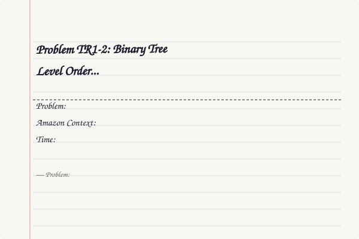
</a>
<a href="../../assets/images/diagrams/interview-preparation/13-company-amazon-sde/problem-tr1-2-binary-tree-level-order-traversal-diagram.svg" target="_blank" rel="noopener">
  
</a>
<a href="../../assets/images/diagrams/interview-preparation/13-company-amazon-sde/problem-tr1-2-binary-tree-level-order-traversal-sticky.svg" target="_blank" rel="noopener">
  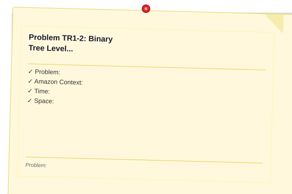
</a>


**Problem:** Return the level order traversal of a binary tree (left to right, level by level).

**Amazon Context:** Tree BFS is fundamental — Amazon tests this as a warm-up to harder tree problems.

<details>
<summary><b>Solution: BFS with Queue — O(n) time, O(n) space</b></summary>

```typescript
class TreeNode {
  val: number;
  left: TreeNode | null = null;
  right: TreeNode | null = null;
  constructor(val: number) { this.val = val; }
}

function levelOrder(root: TreeNode | null): number[][] {
  if (!root) return [];

  const result: number[][] = [];
  const queue: TreeNode[] = [root];

  while (queue.length > 0) {
    const levelSize = queue.length;
    const currentLevel: number[] = [];

    for (let i = 0; i < levelSize; i++) {
      const node = queue.shift()!;
      currentLevel.push(node.val);

      if (node.left) queue.push(node.left);
      if (node.right) queue.push(node.right);
    }

    result.push(currentLevel);
  }

  return result;
}
```

**Time:** O(n) — each node visited once
**Space:** O(n) — queue stores nodes at the widest level

**Variations Amazon asks:**
- Zigzag level order (alternating direction each level)
- Right side view (last node at each level)
- Average of levels (average of each level's values)
</details>

---

### Problem TR1-3: Valid Anagram Grouping

<a href="../../assets/images/diagrams/interview-preparation/13-company-amazon-sde/problem-tr1-3-valid-anagram-grouping-handwritten.svg" target="_blank" rel="noopener">
  
</a>
<a href="../../assets/images/diagrams/interview-preparation/13-company-amazon-sde/problem-tr1-3-valid-anagram-grouping-diagram.svg" target="_blank" rel="noopener">
  
</a>
<a href="../../assets/images/diagrams/interview-preparation/13-company-amazon-sde/problem-tr1-3-valid-anagram-grouping-sticky.svg" target="_blank" rel="noopener">
  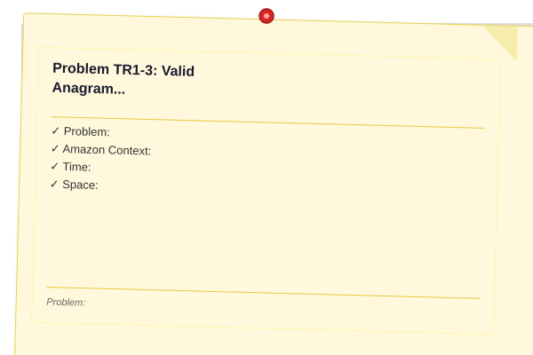
</a>


**Problem:** Given an array of strings, group anagrams together.

**Amazon Context:** HashMap with creative keys — Amazon tests hash function design.

<details>
<summary><b>Solution: Sorted String Key — O(N * K log K) time, O(NK) space</b></summary>

```typescript
function groupAnagrams(strs: string[]): string[][] {
  const map = new Map<string, string[]>();

  for (const str of strs) {
    const sorted = str.split('').sort().join('');
    if (!map.has(sorted)) {
      map.set(sorted, []);
    }
    map.get(sorted)!.push(str);
  }

  return Array.from(map.values());
}
```

<details>
<summary><b>Optimized: Character Count Key — O(N * K) time, O(NK) space</b></summary>

```typescript
function groupAnagramsOptimized(strs: string[]): string[][] {
  const map = new Map<string, string[]>();

  for (const str of strs) {
    const count = new Array(26).fill(0);
    for (const char of str) {
      count[char.charCodeAt(0) - 'a'.charCodeAt(0)]++;
    }
    const key = count.join('#');
    if (!map.has(key)) {
      map.set(key, []);
    }
    map.get(key)!.push(str);
  }

  return Array.from(map.values());
}
```

**Time:** O(N * K) where N = number of strings, K = max string length
**Space:** O(NK) — storing all strings in groups
</details>

**Amazon interview tip:** The character count approach avoids sorting overhead. Discuss trade-offs: sorted key is simpler, count array is faster for long strings.
</details>

---

### Problem TR1-4: Product of Array Except Self

<a href="../../assets/images/diagrams/interview-preparation/13-company-amazon-sde/problem-tr1-4-product-of-array-except-self-handwritten.svg" target="_blank" rel="noopener">
  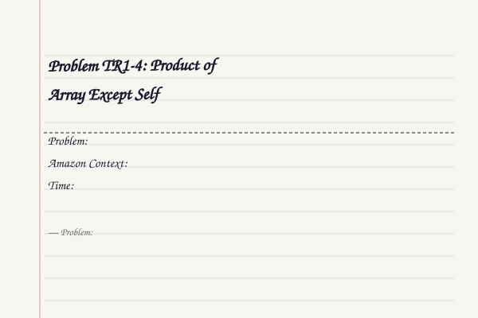
</a>
<a href="../../assets/images/diagrams/interview-preparation/13-company-amazon-sde/problem-tr1-4-product-of-array-except-self-diagram.svg" target="_blank" rel="noopener">
  
</a>
<a href="../../assets/images/diagrams/interview-preparation/13-company-amazon-sde/problem-tr1-4-product-of-array-except-self-sticky.svg" target="_blank" rel="noopener">
  
</a>


**Problem:** Given an array `nums`, return an array `output` where `output[i]` is the product of all elements except `nums[i]`. Solve without division.

**Amazon Context:** This problem is asked in nearly every Amazon SDE interview loop — tests prefix/suffix product pattern.

<details>
<summary><b>Solution: Prefix and Suffix Products — O(n) time, O(1) space (excluding output)</b></summary>

```typescript
function productExceptSelf(nums: number[]): number[] {
  const n = nums.length;
  const result: number[] = new Array(n).fill(1);

  // Left pass: result[i] = product of elements to the left of i
  let leftProduct = 1;
  for (let i = 0; i < n; i++) {
    result[i] = leftProduct;
    leftProduct *= nums[i];
  }

  // Right pass: multiply by product of elements to the right
  let rightProduct = 1;
  for (let i = n - 1; i >= 0; i--) {
    result[i] *= rightProduct;
    rightProduct *= nums[i];
  }

  return result;
}
```

**Time:** O(n) — two passes
**Space:** O(1) — excluding the output array

**Why no division?** Division fails with zeros in the array. The prefix-suffix approach elegantly handles zeros and avoids overflow issues.

**Dry run:** nums = [1, 2, 3, 4]
- Left pass: result = [1, 1, 2, 6], leftProduct ends at 24
- Right pass: result = [24, 12, 8, 6]
</details>

---

## Section 3: Technical Round 2 — Algorithms & Design (4 Problems)

### Problem TR2-1: Word Ladder

<a href="../../assets/images/diagrams/interview-preparation/13-company-amazon-sde/problem-tr2-1-word-ladder-handwritten.svg" target="_blank" rel="noopener">
  
</a>
<a href="../../assets/images/diagrams/interview-preparation/13-company-amazon-sde/problem-tr2-1-word-ladder-diagram.svg" target="_blank" rel="noopener">
  
</a>
<a href="../../assets/images/diagrams/interview-preparation/13-company-amazon-sde/problem-tr2-1-word-ladder-sticky.svg" target="_blank" rel="noopener">
  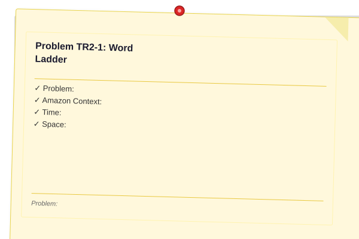
</a>


**Problem:** Given `beginWord`, `endWord`, and `wordList`, find the length of the shortest transformation sequence from `beginWord` to `endWord`. Each transformation changes exactly one letter, and each intermediate word must be in `wordList`.

**Amazon Context:** BFS on implicit graph — tests graph modeling skills.

<details>
<summary><b>Solution: BFS — O(M² × N) time, O(M × N) space</b></summary>

```typescript
function ladderLength(beginWord: string, endWord: string, wordList: string[]): number {
  const wordSet = new Set(wordList);
  if (!wordSet.has(endWord)) return 0;

  const queue: [string, number][] = [[beginWord, 1]];
  wordSet.delete(beginWord);

  while (queue.length > 0) {
    const [current, steps] = queue.shift()!;

    if (current === endWord) return steps;

    // Try changing each character
    const chars = current.split('');
    for (let i = 0; i < chars.length; i++) {
      const originalChar = chars[i];
      for (let c = 97; c <= 122; c++) { // 'a' to 'z'
        chars[i] = String.fromCharCode(c);
        const newWord = chars.join('');
        if (wordSet.has(newWord)) {
          queue.push([newWord, steps + 1]);
          wordSet.delete(newWord); // Mark visited
        }
      }
      chars[i] = originalChar;
    }
  }

  return 0;
}
```

**Time:** O(M² × N) where M = word length, N = word list size
**Space:** O(M × N) — word set + queue

**Optimization tip:** Bidirectional BFS can reduce the search space exponentially — mention this in your interview.
</details>

---

### Problem TR2-2: Trapping Rain Water

<a href="../../assets/images/diagrams/interview-preparation/13-company-amazon-sde/problem-tr2-2-trapping-rain-water-handwritten.svg" target="_blank" rel="noopener">
  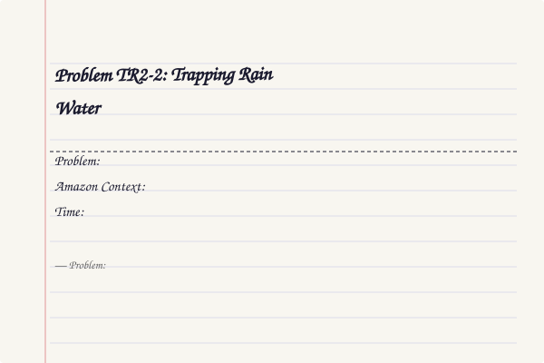
</a>
<a href="../../assets/images/diagrams/interview-preparation/13-company-amazon-sde/problem-tr2-2-trapping-rain-water-diagram.svg" target="_blank" rel="noopener">
  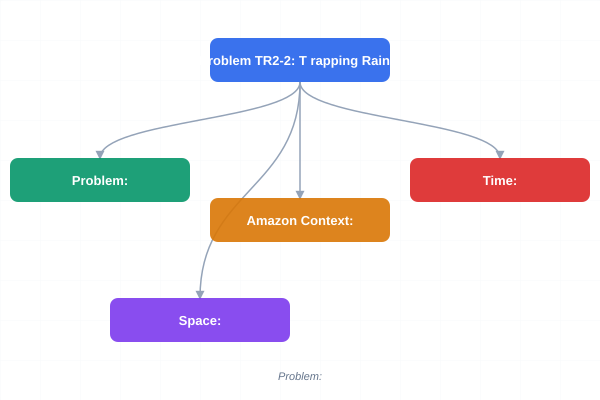
</a>
<a href="../../assets/images/diagrams/interview-preparation/13-company-amazon-sde/problem-tr2-2-trapping-rain-water-sticky.svg" target="_blank" rel="noopener">
  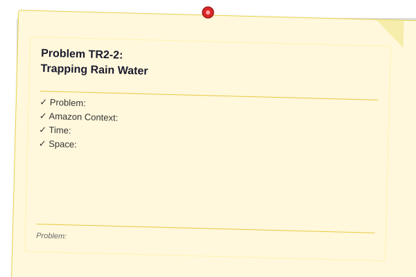
</a>


**Problem:** Given `n` non-negative integers representing an elevation map where width of each bar is 1, compute how much water it can trap after raining.

**Amazon Context:** Hard-level problem testing two-pointer technique — Amazon's most asked hard problem.

<details>
<summary><b>Solution: Two Pointers — O(n) time, O(1) space</b></summary>

```typescript
function trap(height: number[]): number {
  let left = 0;
  let right = height.length - 1;
  let leftMax = 0;
  let rightMax = 0;
  let water = 0;

  while (left < right) {
    if (height[left] < height[right]) {
      if (height[left] >= leftMax) {
        leftMax = height[left];
      } else {
        water += leftMax - height[left];
      }
      left++;
    } else {
      if (height[right] >= rightMax) {
        rightMax = height[right];
      } else {
        water += rightMax - height[right];
      }
      right--;
    }
  }

  return water;
}
```

**Time:** O(n) — single pass
**Space:** O(1) — constant space

**Why two pointers work:** Water trapped at position i depends on min(maxLeft, maxRight) - height[i]. By tracking running maxes from both ends, we compute water without extra arrays.
</details>

---

### Problem TR2-3: Design Add and Search Words Data Structure

<a href="../../assets/images/diagrams/interview-preparation/13-company-amazon-sde/problem-tr2-3-design-add-and-search-words-data-structure-handwritten.svg" target="_blank" rel="noopener">
  
</a>
<a href="../../assets/images/diagrams/interview-preparation/13-company-amazon-sde/problem-tr2-3-design-add-and-search-words-data-structure-diagram.svg" target="_blank" rel="noopener">
  
</a>
<a href="../../assets/images/diagrams/interview-preparation/13-company-amazon-sde/problem-tr2-3-design-add-and-search-words-data-structure-sticky.svg" target="_blank" rel="noopener">
  
</a>


**Problem:** Design a data structure that supports adding words and searching for words with the ability to use '.' as a wildcard character matching any letter.

**Amazon Context:** Trie with DFS — tests advanced tree data structure design.

<details>
<summary><b>Solution: Trie with DFS Search — O(N) add, O(26^M) worst search</b></summary>

```typescript
class WordDictionary {
  private root: TrieNode;

  constructor() {
    this.root = new TrieNode();
  }

  addWord(word: string): void {
    let node = this.root;
    for (const char of word) {
      if (!node.children.has(char)) {
        node.children.set(char, new TrieNode());
      }
      node = node.children.get(char)!;
    }
    node.isEnd = true;
  }

  search(word: string): boolean {
    return this.dfs(word, 0, this.root);
  }

  private dfs(word: string, index: number, node: TrieNode): boolean {
    if (index === word.length) return node.isEnd;

    const char = word[index];

    if (char === '.') {
      // Try all possible children
      for (const child of node.children.values()) {
        if (this.dfs(word, index + 1, child)) return true;
      }
      return false;
    }

    if (!node.children.has(char)) return false;
    return this.dfs(word, index + 1, node.children.get(char)!);
  }
}

class TrieNode {
  children: Map<string, TrieNode> = new Map();
  isEnd: boolean = false;
}
```

**Time:** O(N) for add (N = word length), O(26^M) worst-case for search with wildcards (M = word length)
**Space:** O(W × L) where W = words, L = average length

**Amazon interview tip:** The '.' wildcard creates the complexity. Discuss how to optimize with BFS for shorter search times.
</details>

---

### Problem TR2-4: Basic Calculator II

<a href="../../assets/images/diagrams/interview-preparation/13-company-amazon-sde/problem-tr2-4-basic-calculator-ii-handwritten.svg" target="_blank" rel="noopener">
  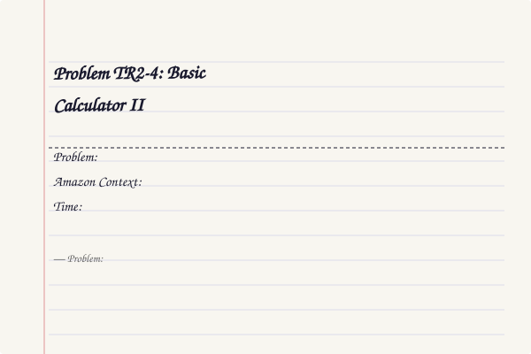
</a>
<a href="../../assets/images/diagrams/interview-preparation/13-company-amazon-sde/problem-tr2-4-basic-calculator-ii-diagram.svg" target="_blank" rel="noopener">
  
</a>
<a href="../../assets/images/diagrams/interview-preparation/13-company-amazon-sde/problem-tr2-4-basic-calculator-ii-sticky.svg" target="_blank" rel="noopener">
  
</a>


**Problem:** Evaluate a string expression containing integers and operators +, -, *, / (integer division). No parentheses.

**Amazon Context:** Calculator problems test stack usage and operator precedence handling.

<details>
<summary><b>Solution: Stack with Operator Precedence — O(n) time, O(n) space</b></summary>

```typescript
function calculate(s: string): number {
  const stack: number[] = [];
  let currentNum = 0;
  let lastOp = '+';

  for (let i = 0; i < s.length; i++) {
    const char = s[i];

    if (char >= '0' && char <= '9') {
      currentNum = currentNum * 10 + (char.charCodeAt(0) - '0'.charCodeAt(0));
    }

    if ((char < '0' || char > '9') && char !== ' ' || i === s.length - 1) {
      if (lastOp === '+') stack.push(currentNum);
      else if (lastOp === '-') stack.push(-currentNum);
      else if (lastOp === '*') stack.push(stack.pop()! * currentNum);
      else if (lastOp === '/') stack.push(Math.trunc(stack.pop()! / currentNum));

      lastOp = char;
      currentNum = 0;
    }
  }

  return stack.reduce((sum, val) => sum + val, 0);
}
```

**Time:** O(n), **Space:** O(n)
**Key insight:** * and / have higher precedence than + and -. By deferring * and / to evaluation time (immediately on stack), we handle precedence correctly.
</details>

---

## Section 4: System Design (2 Problems)

### Problem SD-1: Design Amazon Cart Service

<a href="../../assets/images/diagrams/interview-preparation/13-company-amazon-sde/problem-sd-1-design-amazon-cart-service-handwritten.svg" target="_blank" rel="noopener">
  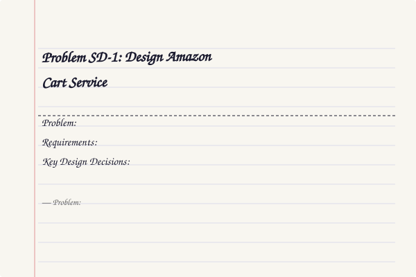
</a>
<a href="../../assets/images/diagrams/interview-preparation/13-company-amazon-sde/problem-sd-1-design-amazon-cart-service-diagram.svg" target="_blank" rel="noopener">
  
</a>
<a href="../../assets/images/diagrams/interview-preparation/13-company-amazon-sde/problem-sd-1-design-amazon-cart-service-sticky.svg" target="_blank" rel="noopener">
  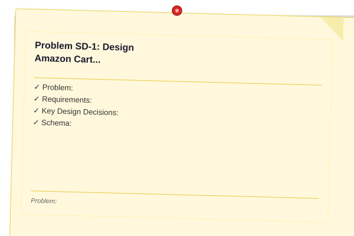
</a>


**Problem:** Design the shopping cart service for an e-commerce platform like Amazon.

<details>
<summary><b>Solution</b></summary>

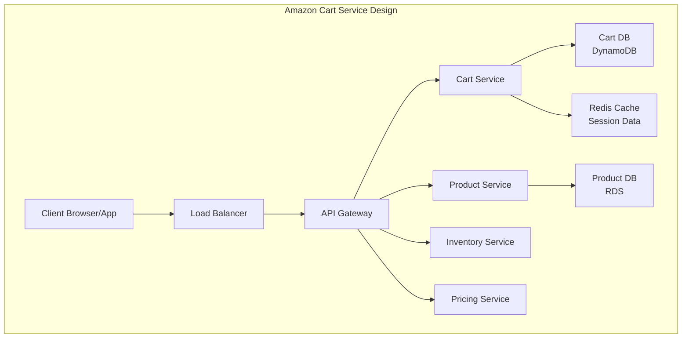
```mermaid
flowchart TB
    subgraph "Amazon Cart Service Design"
        A[Client Browser/App] --> B[Load Balancer]
        B --> C[API Gateway]
        C --> D[Cart Service]
        D --> E[Cart DB<br/>DynamoDB]
        D --> F[Redis Cache<br/>Session Data]
        C --> G[Product Service]
        G --> H[Product DB<br/>RDS]
        C --> I[Inventory Service]
        C --> J[Pricing Service]
    end
```

**Requirements:**
- Add/remove/update items in cart
- Cart persistence across sessions
- Real-time price and availability updates
- Support for millions of concurrent users

**Key Design Decisions:**

| Component | Choice | Rationale |
|-----------|--------|-----------|
| **API Style** | RESTful | Simple CRUD operations on cart |
| **Database** | DynamoDB (NoSQL) | Cart data has simple key-value access pattern, high throughput |
| **Cache** | Redis | Store active cart sessions, TTL-based expiry |
| **Consistency** | Eventual | Cart price changes slightly stale is acceptable |
| **Cart ID** | UUID | Globally unique, no sequential guessing |

**Schema:**
```
Cart {
  cartId: UUID (PK),
  userId: String (GSI),
  items: [
    { productId, quantity, addedAt }
  ],
  status: ACTIVE | CHECKED_OUT | ABANDONED,
  createdAt: timestamp,
  updatedAt: timestamp
}
```

**Key APIs:**
```
GET /cart/{cartId} → Cart
POST /cart → Cart (create new)
PUT /cart/{cartId}/items (add/update item)
DELETE /cart/{cartId}/items/{productId}
POST /cart/{cartId}/checkout → OrderId
```

**Scaling Strategy:**
- DynamoDB auto-scales throughput
- Cart data sharded by cartId
- Read replicas for cart viewing
- Event sourcing for cart change history
</details>

---

### Problem SD-2: Design URL Shortener (like TinyURL)

<a href="../../assets/images/diagrams/interview-preparation/13-company-amazon-sde/problem-sd-2-design-url-shortener-like-tinyurl-handwritten.svg" target="_blank" rel="noopener">
  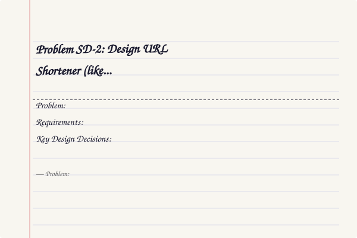
</a>
<a href="../../assets/images/diagrams/interview-preparation/13-company-amazon-sde/problem-sd-2-design-url-shortener-like-tinyurl-diagram.svg" target="_blank" rel="noopener">
  
</a>
<a href="../../assets/images/diagrams/interview-preparation/13-company-amazon-sde/problem-sd-2-design-url-shortener-like-tinyurl-sticky.svg" target="_blank" rel="noopener">
  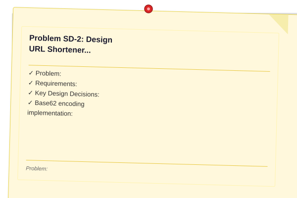
</a>


**Problem:** Design a URL shortening service.

<details>
<summary><b>Solution</b></summary>

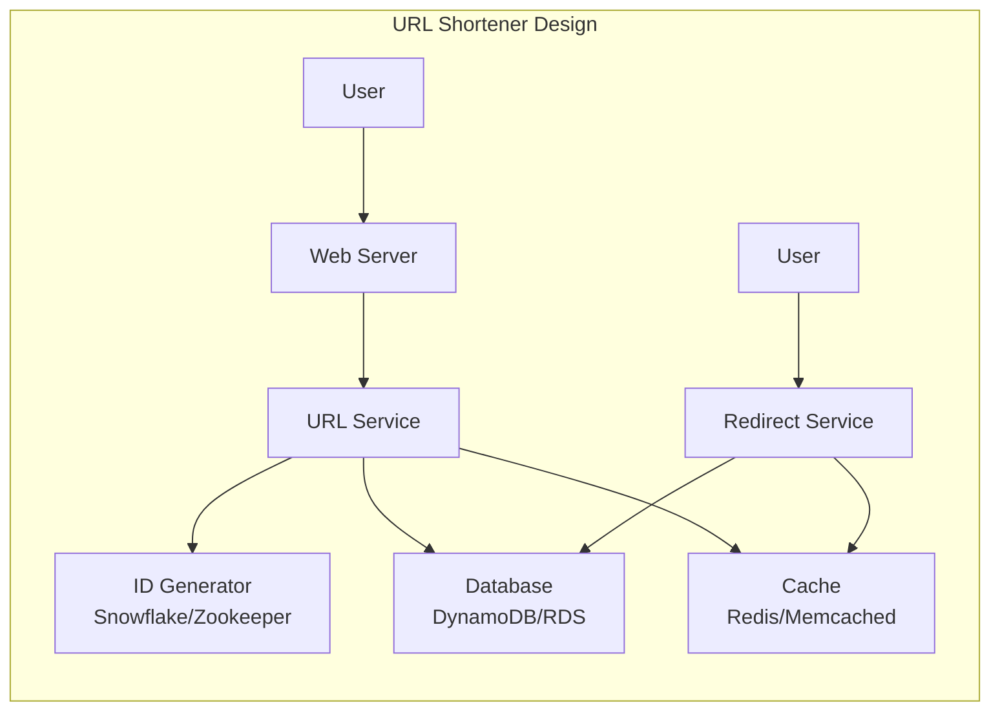
```mermaid
flowchart LR
    subgraph "URL Shortener Design"
        A[User] --> B[Web Server]
        B --> C[URL Service]
        C --> D[ID Generator<br/>Snowflake/Zookeeper]
        C --> E[Database<br/>DynamoDB/RDS]
        C --> F[Cache<br/>Redis/Memcached]
        G[User] --> H[Redirect Service]
        H --> F
        H --> E
    end
```

**Requirements:**
- Shorten long URLs
- Redirect short URLs to original
- Custom aliases (optional)
- Analytics (click tracking)

**Key Design Decisions:**

| Aspect | Decision | Rationale |
|--------|----------|-----------|
| **Key Generation** | Base62 encoding of auto-increment ID | 6-7 chars for 62^6 ≈ 56B URLs |
| **Storage** | DynamoDB (PK: shortCode) | Fast lookups, auto-scaling |
| **Cache** | Redis (TTL: 24h hot URLs) | Reduce DB load for popular URLs |
| **Redirect** | HTTP 301 (permanent) | Browser caches, reduces redirect load |
| **Rate Limiting** | Token bucket per user | Prevent abuse |

**Base62 encoding implementation:**
```typescript
const BASE62 = '0123456789abcdefghijklmnopqrstuvwxyzABCDEFGHIJKLMNOPQRSTUVWXYZ';

function encode(id: number): string {
  let shortUrl = '';
  while (id > 0) {
    shortUrl = BASE62[id % 62] + shortUrl;
    id = Math.floor(id / 62);
  }
  return shortUrl || '0';
}

function decode(shortUrl: string): number {
  let id = 0;
  for (const char of shortUrl) {
    id = id * 62 + BASE62.indexOf(char);
  }
  return id;
}
```

**APIs:**
```
POST /shorten { url, customAlias?, ttl? } → { shortUrl, expiresAt }
GET /{shortCode} → 301 Redirect to original URL
GET /{shortCode}/stats → { clicks, lastAccessed, referrers }
```

**Scaling:**
- Read-heavy (99% reads, 1% writes)
- CDN for popular redirects
- Global load balancer with anycast
</details>

---

## Section 5: Behavioral Questions — Amazon Leadership Principles (10 Questions)

### Q1: Tell me about a time you went above and beyond for a customer. (Customer Obsession)

<a href="../../assets/images/diagrams/interview-preparation/13-company-amazon-sde/tell-me-about-a-time-you-went-above-and-beyond-for-a-customer-customer-obsession-handwritten.svg" target="_blank" rel="noopener">
  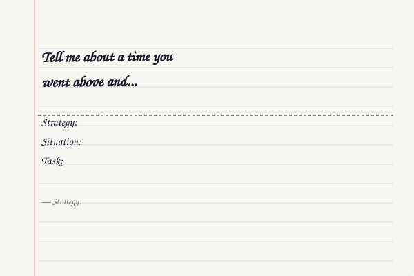
</a>
<a href="../../assets/images/diagrams/interview-preparation/13-company-amazon-sde/tell-me-about-a-time-you-went-above-and-beyond-for-a-customer-customer-obsession-diagram.svg" target="_blank" rel="noopener">
  
</a>
<a href="../../assets/images/diagrams/interview-preparation/13-company-amazon-sde/tell-me-about-a-time-you-went-above-and-beyond-for-a-customer-customer-obsession-sticky.svg" target="_blank" rel="noopener">
  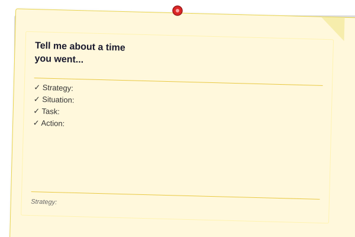
</a>


**Strategy:**
- Describe a specific situation where you identified an unstated customer need
- Show how you advocated for the customer even when it was inconvenient
- Quantify the impact

<details>
<summary><b>Sample STAR Response</b></summary>

**Situation:** In my last project, our team built a dashboard that showed data with a 24-hour delay. Users (internal analysts) complained it was too slow.

**Task:** Reduce data latency without increasing infrastructure costs significantly.

**Action:** I interviewed 5 analysts to understand their workflow. I discovered that 80% of them needed only the last 3 hours of data, not the full 24 hours. I proposed a dual-pipeline: a lightweight stream processor for real-time (3-hour window) data and the existing batch processor for historical data. I built a POC using Kafka streams that reduced latency to 5 minutes for the hot path.

**Result:** Analysts could make decisions 23 hours faster. Adoption of the dashboard increased 40%. The solution used only 15% more compute resources.
</details>

### Q2: Describe a time you disagreed with your manager or a team lead. (Have Backbone; Disagree and Commit)

<a href="../../assets/images/diagrams/interview-preparation/13-company-amazon-sde/describe-a-time-you-disagreed-with-your-manager-or-a-team-lead-have-backbone-disagree-and-commit-handwritten.svg" target="_blank" rel="noopener">
  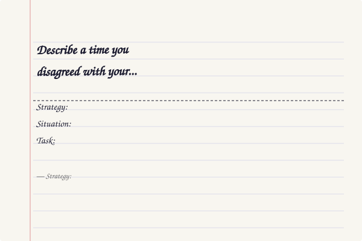
</a>
<a href="../../assets/images/diagrams/interview-preparation/13-company-amazon-sde/describe-a-time-you-disagreed-with-your-manager-or-a-team-lead-have-backbone-disagree-and-commit-diagram.svg" target="_blank" rel="noopener">
  
</a>
<a href="../../assets/images/diagrams/interview-preparation/13-company-amazon-sde/describe-a-time-you-disagreed-with-your-manager-or-a-team-lead-have-backbone-disagree-and-commit-sticky.svg" target="_blank" rel="noopener">
  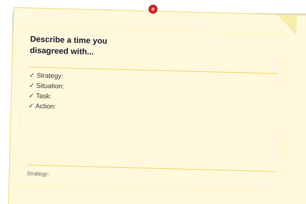
</a>


**Strategy:**
- Show respectful disagreement backed by data
- Demonstrate that you ultimately commit to the team's decision
- Avoid portraying yourself as insubordinate

<details>
<summary><b>Sample STAR Response</b></summary>

**Situation:** My lead wanted to use MongoDB for a new order processing service. I believed PostgreSQL was better because we needed ACID transactions for financial data.

**Task:** Convince the team to consider the right database choice without causing delays.

**Action:** I built a comparison matrix: MongoDB vs PostgreSQL for our specific access patterns. I highlighted that our data had strict relational integrity (orders → items → payments), and PostgreSQL's ACID compliance would prevent data inconsistencies. I presented this in the design review with benchmarks from a small POC.

**Result:** After discussion, my lead agreed PostgreSQL was better for this use case. However, when the team decided to proceed with MongoDB for faster prototyping (with eventual consistency), I committed fully and implemented compensating transactions for data integrity.
</details>

### Q3: Tell me about a time you invented a simple solution to a complex problem. (Invent and Simplify)

<a href="../../assets/images/diagrams/interview-preparation/13-company-amazon-sde/tell-me-about-a-time-you-invented-a-simple-solution-to-a-complex-problem-invent-and-simplify-handwritten.svg" target="_blank" rel="noopener">
  
</a>
<a href="../../assets/images/diagrams/interview-preparation/13-company-amazon-sde/tell-me-about-a-time-you-invented-a-simple-solution-to-a-complex-problem-invent-and-simplify-diagram.svg" target="_blank" rel="noopener">
  
</a>
<a href="../../assets/images/diagrams/interview-preparation/13-company-amazon-sde/tell-me-about-a-time-you-invented-a-simple-solution-to-a-complex-problem-invent-and-simplify-sticky.svg" target="_blank" rel="noopener">
  
</a>


<details>
<summary><b>Sample STAR Response</b></summary>

**Situation:** Our deployment pipeline required 12 manual steps and took 2 hours. Developers avoided deploying because of the complexity.

**Task:** Reduce deployment time and eliminate human error.

**Action:** I automated the entire pipeline using GitHub Actions. Instead of building a complex orchestration system, I created composable workflow files that each handled one step. The key insight was using matrix builds to parallelize testing across services.

**Result:** Deployment went from 2 hours to 8 minutes. Zero deployment errors in 6 months. Developer deployment frequency increased from weekly to daily.
</details>

### Q4: Give an example of a difficult decision you made with limited information. (Bias for Action)

<a href="../../assets/images/diagrams/interview-preparation/13-company-amazon-sde/give-an-example-of-a-difficult-decision-you-made-with-limited-information-bias-for-action-handwritten.svg" target="_blank" rel="noopener">
  
</a>
<a href="../../assets/images/diagrams/interview-preparation/13-company-amazon-sde/give-an-example-of-a-difficult-decision-you-made-with-limited-information-bias-for-action-diagram.svg" target="_blank" rel="noopener">
  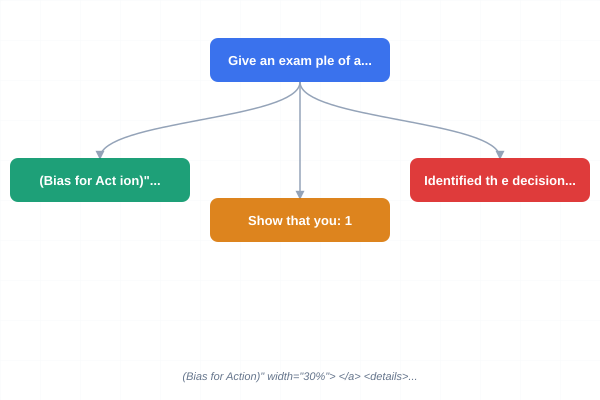
</a>
<a href="../../assets/images/diagrams/interview-preparation/13-company-amazon-sde/give-an-example-of-a-difficult-decision-you-made-with-limited-information-bias-for-action-sticky.svg" target="_blank" rel="noopener">
  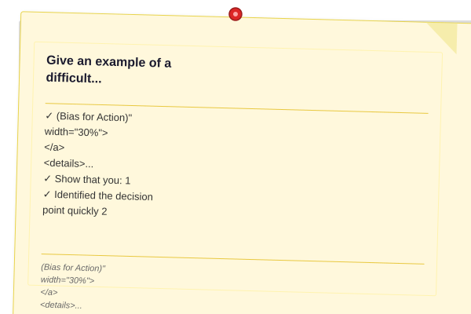
</a>


<details>
<summary><b>Strategy</b></summary>

Amazon values speed over perfection. Show that you:
1. Identified the decision point quickly
2. Used available data to make an 80% informed decision
3. Had a plan to course-correct if wrong
</details>

### Q5: Describe the most challenging project you've worked on. (Deliver Results)

<a href="../../assets/images/diagrams/interview-preparation/13-company-amazon-sde/describe-the-most-challenging-project-you-ve-worked-on-deliver-results-handwritten.svg" target="_blank" rel="noopener">
  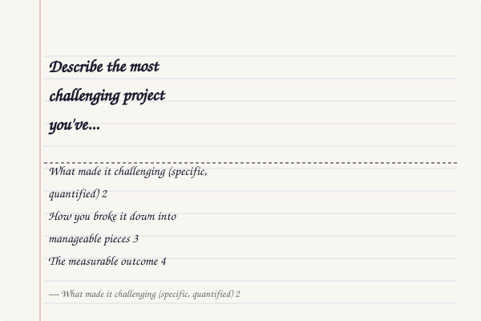
</a>
<a href="../../assets/images/diagrams/interview-preparation/13-company-amazon-sde/describe-the-most-challenging-project-you-ve-worked-on-deliver-results-diagram.svg" target="_blank" rel="noopener">
  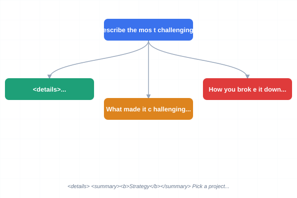
</a>
<a href="../../assets/images/diagrams/interview-preparation/13-company-amazon-sde/describe-the-most-challenging-project-you-ve-worked-on-deliver-results-sticky.svg" target="_blank" rel="noopener">
  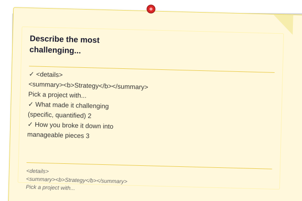
</a>


<details>
<summary><b>Strategy</b></summary>

Pick a project with clear obstacles — technical, team, or timeline related. Show:
1. What made it challenging (specific, quantified)
2. How you broke it down into manageable pieces
3. The measurable outcome
4. What you learned
</details>

### Q6: Tell me about a time you took ownership of a problem outside your scope. (Ownership)

<a href="../../assets/images/diagrams/interview-preparation/13-company-amazon-sde/tell-me-about-a-time-you-took-ownership-of-a-problem-outside-your-scope-ownership-handwritten.svg" target="_blank" rel="noopener">
  
</a>
<a href="../../assets/images/diagrams/interview-preparation/13-company-amazon-sde/tell-me-about-a-time-you-took-ownership-of-a-problem-outside-your-scope-ownership-diagram.svg" target="_blank" rel="noopener">
  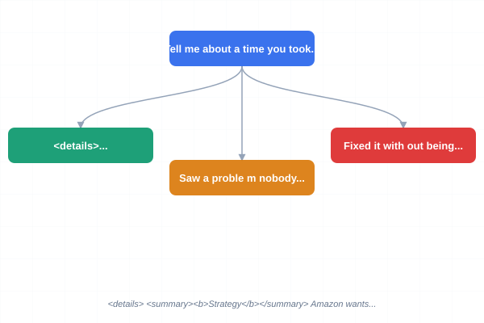
</a>
<a href="../../assets/images/diagrams/interview-preparation/13-company-amazon-sde/tell-me-about-a-time-you-took-ownership-of-a-problem-outside-your-scope-ownership-sticky.svg" target="_blank" rel="noopener">
  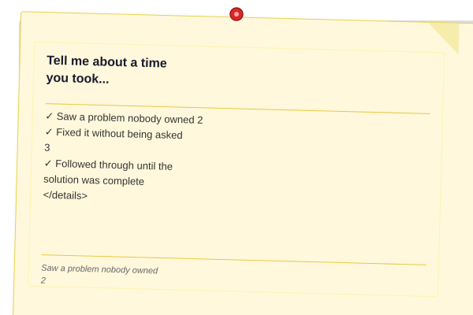
</a>


<details>
<summary><b>Strategy</b></summary>

Amazon wants "owners, not tenants." Show that you:
1. Saw a problem nobody owned
2. Fixed it without being asked
3. Followed through until the solution was complete
</details>

### Q7: Give an example of how you helped a teammate grow. (Hire and Develop the Best)

<a href="../../assets/images/diagrams/interview-preparation/13-company-amazon-sde/give-an-example-of-how-you-helped-a-teammate-grow-hire-and-develop-the-best-handwritten.svg" target="_blank" rel="noopener">
  
</a>
<a href="../../assets/images/diagrams/interview-preparation/13-company-amazon-sde/give-an-example-of-how-you-helped-a-teammate-grow-hire-and-develop-the-best-diagram.svg" target="_blank" rel="noopener">
  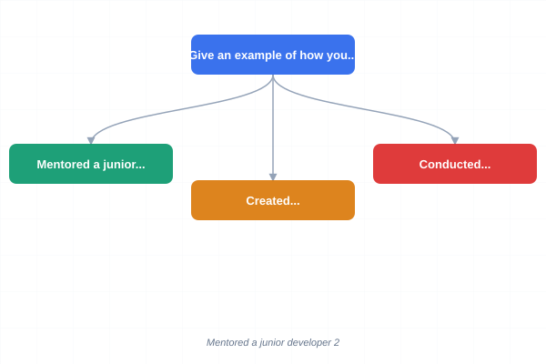
</a>
<a href="../../assets/images/diagrams/interview-preparation/13-company-amazon-sde/give-an-example-of-how-you-helped-a-teammate-grow-hire-and-develop-the-best-sticky.svg" target="_blank" rel="noopener">
  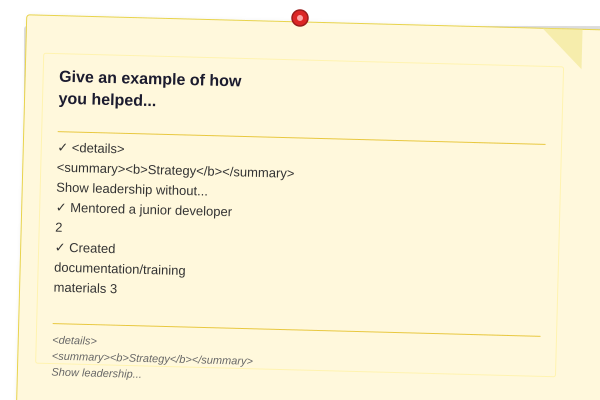
</a>


<details>
<summary><b>Strategy</b></summary>

Show leadership without formal authority:
1. Mentored a junior developer
2. Created documentation/training materials
3. Conducted knowledge-sharing sessions
</details>

### Q8: Tell me about a time you were wrong about something. (Learn and Be Curious)

<a href="../../assets/images/diagrams/interview-preparation/13-company-amazon-sde/tell-me-about-a-time-you-were-wrong-about-something-learn-and-be-curious-handwritten.svg" target="_blank" rel="noopener">
  
</a>
<a href="../../assets/images/diagrams/interview-preparation/13-company-amazon-sde/tell-me-about-a-time-you-were-wrong-about-something-learn-and-be-curious-diagram.svg" target="_blank" rel="noopener">
  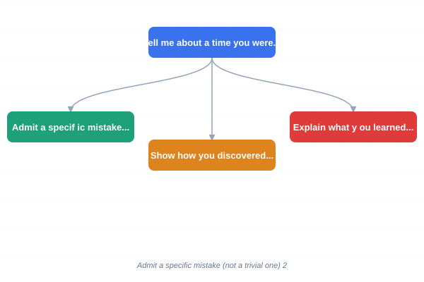
</a>
<a href="../../assets/images/diagrams/interview-preparation/13-company-amazon-sde/tell-me-about-a-time-you-were-wrong-about-something-learn-and-be-curious-sticky.svg" target="_blank" rel="noopener">
  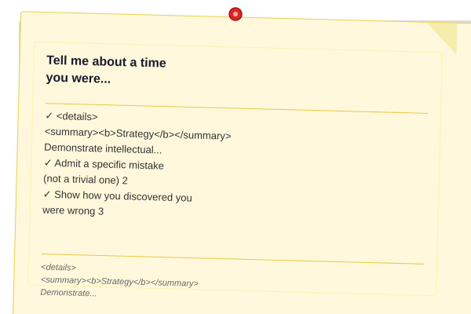
</a>


<details>
<summary><b>Strategy</b></summary>

Demonstrate intellectual humility:
1. Admit a specific mistake (not a trivial one)
2. Show how you discovered you were wrong
3. Explain what you learned and how you changed your approach
</details>

### Q9: Describe how you prioritize competing tasks under tight deadlines. (Deliver Results + Bias for Action)

<details>
<summary><b>Sample Response Framework</b></summary>

1. **Gather data:** What are the deadlines, dependencies, and impacts?
2. **Prioritize:** Use impact × urgency matrix
3. **Communicate:** Inform stakeholders about trade-offs
4. **Execute:** Focus on one task at a time
5. **Escalate:** When impossible, raise red flags early
</details>

### Q10: Tell me about a time you took a calculated risk. (Think Big)

<a href="../../assets/images/diagrams/interview-preparation/13-company-amazon-sde/tell-me-about-a-time-you-took-a-calculated-risk-think-big-handwritten.svg" target="_blank" rel="noopener">
  
</a>
<a href="../../assets/images/diagrams/interview-preparation/13-company-amazon-sde/tell-me-about-a-time-you-took-a-calculated-risk-think-big-diagram.svg" target="_blank" rel="noopener">
  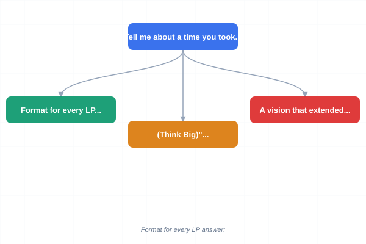
</a>
<a href="../../assets/images/diagrams/interview-preparation/13-company-amazon-sde/tell-me-about-a-time-you-took-a-calculated-risk-think-big-sticky.svg" target="_blank" rel="noopener">
  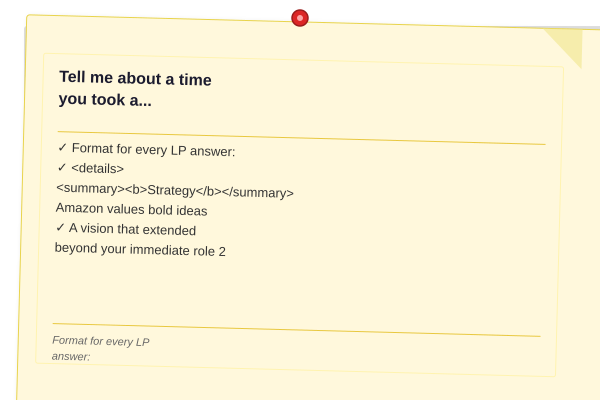
</a>


<details>
<summary><b>Strategy</b></summary>

Amazon values bold ideas. Show:
1. A vision that extended beyond your immediate role
2. How you evaluated the risk vs. reward
3. How you executed and what happened
4. What you would do differently

**Format for every LP answer:** Use the STAR method (Situation, Task, Action, Result) religiously. Quantify everything. Amazon interviewers take detailed notes — make them easy to write down.
</details>

---

## Amazon SDE Preparation Tips

### Coding Preparation

<a href="../../assets/images/diagrams/interview-preparation/13-company-amazon-sde/coding-preparation-handwritten.svg" target="_blank" rel="noopener">
  
</a>
<a href="../../assets/images/diagrams/interview-preparation/13-company-amazon-sde/coding-preparation-diagram.svg" target="_blank" rel="noopener">
  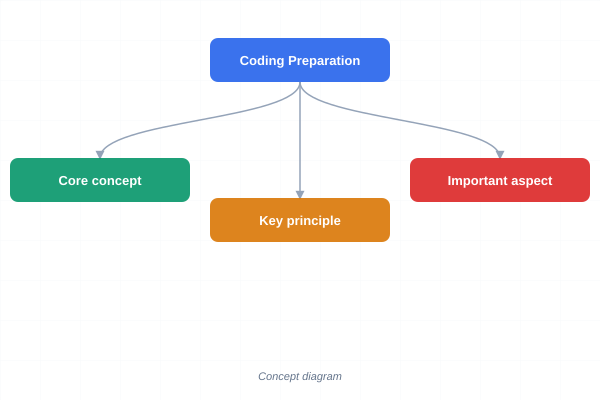
</a>
<a href="../../assets/images/diagrams/interview-preparation/13-company-amazon-sde/coding-preparation-sticky.svg" target="_blank" rel="noopener">
  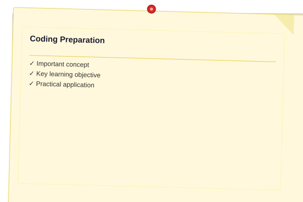
</a>

| Difficulty | LeetCode Problems | Target |
|------------|------------------|--------|
| Easy | 50+ | Warm-up, array/string basics |
| Medium | 100+ | Core Amazon patterns — hash maps, BFS/DFS, two pointers |
| Hard | 25+ | DP, complex graphs, advanced trees |

### System Design (SDE2+)

<a href="../../assets/images/diagrams/interview-preparation/13-company-amazon-sde/system-design-sde2-handwritten.svg" target="_blank" rel="noopener">
  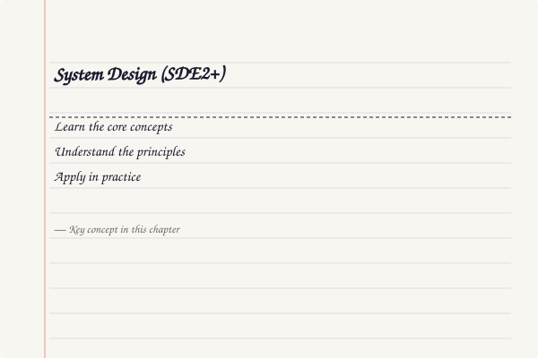
</a>
<a href="../../assets/images/diagrams/interview-preparation/13-company-amazon-sde/system-design-sde2-diagram.svg" target="_blank" rel="noopener">
  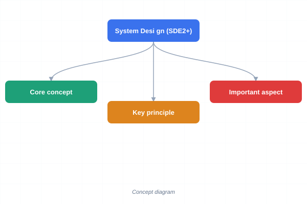
</a>
<a href="../../assets/images/diagrams/interview-preparation/13-company-amazon-sde/system-design-sde2-sticky.svg" target="_blank" rel="noopener">
  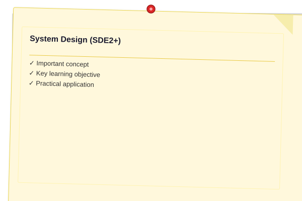
</a>

| Topic | Case Studies |
|-------|------|
| **E-commerce** | Amazon cart, product catalog, recommendation system |
| **Social** | News feed, messaging, trending topics |
| **Infrastructure** | URL shortener, distributed cache, rate limiter |
| **Data** | Web crawler, analytics pipeline, logging system |

### Behavioral Preparation

<a href="../../assets/images/diagrams/interview-preparation/13-company-amazon-sde/behavioral-preparation-handwritten.svg" target="_blank" rel="noopener">
  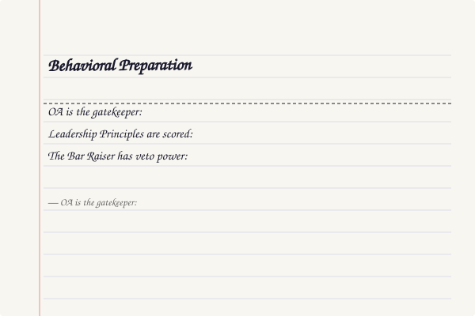
</a>
<a href="../../assets/images/diagrams/interview-preparation/13-company-amazon-sde/behavioral-preparation-diagram.svg" target="_blank" rel="noopener">
  
</a>
<a href="../../assets/images/diagrams/interview-preparation/13-company-amazon-sde/behavioral-preparation-sticky.svg" target="_blank" rel="noopener">
  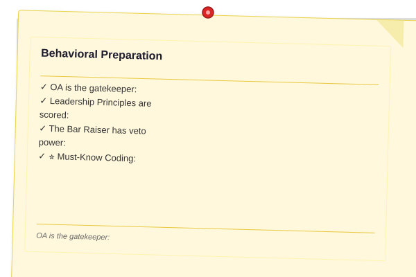
</a>

| Principle | Prepare 2 Stories |
|-----------|------------------|
| Customer Obsession | Feature built for user + went beyond requirements |
| Ownership | Problem fixed outside scope + saw it through |
| Invent and Simplify | Complex problem, simple solution |
| Deliver Results | Under tight deadline, measurable impact |

---

## Summary

This chapter presented a comprehensive Amazon SDE question bank covering all stages of the interview loop. The 4 OA problems test core DSA patterns Amazon uses in their initial screening. The 8 technical round problems cover data structures (hash maps, trees, tries, stacks) and algorithms (BFS, two pointers, DFS, greedy). The 2 system design problems cover the e-commerce and infrastructure patterns Amazon frequently asks. The 10 behavioral questions map directly to Amazon's Leadership Principles with STAR framework strategies.

## Practical Takeaways

1. **OA is the gatekeeper:** Your performance on the online assessment determines whether you get interviews. Focus heavily on hash maps, BFS/DFS, and sliding window.
2. **Leadership Principles are scored:** Each behavioral answer maps to 1-2 LPs. Interviewers evaluate each answer against specific LP rubrics.
3. **The Bar Raiser has veto power:** The Bar Raiser round (Round 4) is the most important. They evaluate long-term potential and ensure the hire raises the bar.
4. **⭐ Must-Know Coding:** Top 5 Amazon problems — Two Sum, LRU Cache, Number of Islands, Trapping Rain Water, Merge K Sorted Lists.
5. **System Design for SDE2+:** Practice 10+ design problems before your interview. Focus on data flow, scaling, and trade-off discussions.
6. **Prepare 12+ STAR stories:** You'll need stories covering at least 8 of the 14 Leadership Principles. Have 2 deep stories and 10 supporting stories ready.

## Chapter Quiz

**Q1.** What data structure is used in the optimal LRU Cache implementation?
a) Array + HashMap  b) Doubly Linked List + HashMap  c) Stack + Queue  d) Tree + HashMap

<details>
<summary>Answer: b) Doubly Linked List + HashMap</summary>
DLL provides O(1) remove/insert, HashMap provides O(1) node lookup.
</details>

**Q2.** In Amazon's interview process, who has the power to veto a hiring decision?
a) Hiring Manager  b) Recruiter  c) Bar Raiser  d) Technical Interviewer

<details>
<summary>Answer: c) Bar Raiser</summary>
The Bar Raiser is an experienced interviewer trained to ensure the hire raises the bar. They have veto power.
</details>

**Q3.** Which Amazon Leadership Principle is about respectfully disagreeing then fully supporting the decision?
a) Customer Obsession  b) Have Backbone; Disagree and Commit  c) Earn Trust  d) Dive Deep

<details>
<summary>Answer: b) Have Backbone; Disagree and Commit</summary>
This LP explicitly covers disagreeing respectfully, then committing fully once decisions are made.
</details>

**Q4.** What is the time complexity of Building an LRU Cache with n capacity?
a) O(1) for both get and put  b) O(log n) for get, O(1) for put  c) O(n) for both  d) O(1) for get, O(n) for put

<details>
<summary>Answer: a) O(1) for both get and put</summary>
With HashMap + Doubly Linked List, both operations are O(1).
</details>

**Q5.** In the Trapping Rain Water problem, what technique gives O(1) space?
a) Brute force  b) Dynamic programming  c) Two pointers  d) Stack

<details>
<summary>Answer: c) Two pointers</summary>
The two-pointer approach uses O(1) space unlike DP (O(n)) or stack (O(n)).
</details>

---

## Exercises

1. **Coding:** Solve "Longest Substring Without Repeating Characters" (LeetCode 3) — Amazon top question.
2. **Coding:** Implement "Copy List with Random Pointer" (LeetCode 138) — Amazon favorite.
3. **System Design:** Design Amazon's product recommendation system.
4. **Behavioral:** Write a STAR response for "Tell me about a time you failed" using Learn and Be Curious.
5. **System Design:** Design a real-time collaborative document editor (like Google Docs).
</details>
