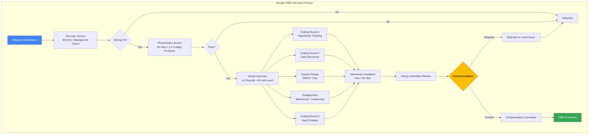
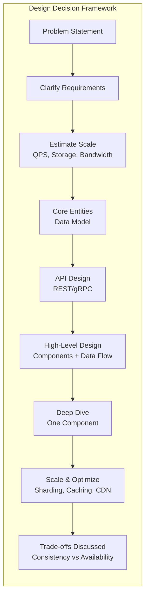
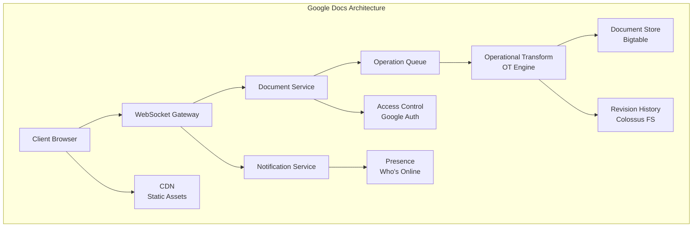
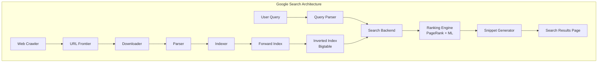
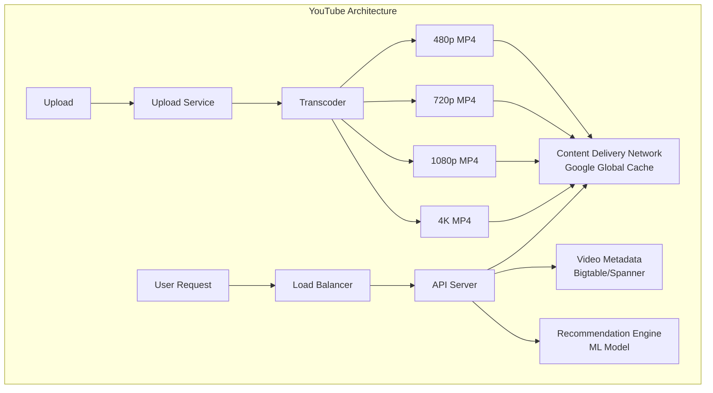

# Chapter 14: Google SWE — Company-Specific Question Bank

## Learning Objectives

- Master 8 Google-style hard coding problems with complete TypeScript solutions and complexity analysis
- Design 3 large-scale systems: Google Docs, Search, and YouTube
- Answer 10 Googleyness and behavioral questions with Google-specific strategies
- Understand Google's interview process, scoring rubric, and decision-making framework
- Develop product sense and design thinking for Google's unique interview style

## Google Interview Process



## Google Design Decision Flow



---

## Section 1: Coding Problems — Google-Style Hard (8 Problems)

### Problem 1: Median of Two Sorted Arrays

<a href="../../../assets/images/diagrams/interview-preparation/14-company-google-swe/problem-1-median-of-two-sorted-arrays-handwritten.svg" target="_blank" rel="noopener">
  
</a>
<a href="../../../assets/images/diagrams/interview-preparation/14-company-google-swe/problem-1-median-of-two-sorted-arrays-diagram.svg" target="_blank" rel="noopener">
  
</a>
<a href="../../../assets/images/diagrams/interview-preparation/14-company-google-swe/problem-1-median-of-two-sorted-arrays-sticky.svg" target="_blank" rel="noopener">
  
</a>


**Problem:** Given two sorted arrays `nums1` and `nums2` of sizes `m` and `n`, return the median of the two sorted arrays. Overall runtime complexity should be O(log(m+n)).

**Google Context:** This is one of Google's most iconic hard problems. Tests binary search mastery and creative problem decomposition.

**Example:**
```
Input:  nums1 = [1, 3], nums2 = [2]
Output: 2.0
Explanation: merged = [1, 2, 3], median = 2
```

<details>
<summary><b>Solution: Binary Search Partition — O(log(min(m,n))) time, O(1) space</b></summary>

```typescript
function findMedianSortedArrays(nums1: number[], nums2: number[]): number {
  // Ensure nums1 is the smaller array for O(log(min(m,n)))
  if (nums1.length > nums2.length) {
    [nums1, nums2] = [nums2, nums1];
  }

  const m = nums1.length;
  const n = nums2.length;
  let left = 0, right = m;

  while (left <= right) {
    const partition1 = Math.floor((left + right) / 2);
    const partition2 = Math.floor((m + n + 1) / 2) - partition1;

    const maxLeft1 = partition1 === 0 ? -Infinity : nums1[partition1 - 1];
    const minRight1 = partition1 === m ? Infinity : nums1[partition1];
    const maxLeft2 = partition2 === 0 ? -Infinity : nums2[partition2 - 1];
    const minRight2 = partition2 === n ? Infinity : nums2[partition2];

    if (maxLeft1 <= minRight2 && maxLeft2 <= minRight1) {
      if ((m + n) % 2 === 0) {
        return (Math.max(maxLeft1, maxLeft2) + Math.min(minRight1, minRight2)) / 2;
      } else {
        return Math.max(maxLeft1, maxLeft2);
      }
    } else if (maxLeft1 > minRight2) {
      right = partition1 - 1; // Move left
    } else {
      left = partition1 + 1; // Move right
    }
  }

  throw new Error("Input arrays are not sorted");
}
```

**Time:** O(log(min(m,n))) — binary search on the smaller array
**Space:** O(1) — constant space

**Key insight:** Instead of merging (O(m+n)), we partition both arrays such that all elements on the left are ≤ all elements on the right. The partition indices give us the median directly.

**Why Google asks this:** Tests ability to transform a seemingly straightforward problem into an elegant O(log n) solution through binary search on the correct search space.
</details>

---

### Problem 2: Serialize and Deserialize Binary Tree

<a href="../../../assets/images/diagrams/interview-preparation/14-company-google-swe/problem-2-serialize-and-deserialize-binary-tree-handwritten.svg" target="_blank" rel="noopener">
  
</a>
<a href="../../../assets/images/diagrams/interview-preparation/14-company-google-swe/problem-2-serialize-and-deserialize-binary-tree-diagram.svg" target="_blank" rel="noopener">
  
</a>
<a href="../../../assets/images/diagrams/interview-preparation/14-company-google-swe/problem-2-serialize-and-deserialize-binary-tree-sticky.svg" target="_blank" rel="noopener">
  
</a>


**Problem:** Design an algorithm to serialize a binary tree into a string and deserialize the string back into the tree. Any format works as long as it's unambiguous.

**Google Context:** Google frequently asks tree serialization — tests understanding of tree traversal and recursive problem solving.

<details>
<summary><b>Solution: Preorder with Null Markers — O(n) time, O(n) space</b></summary>

```typescript
class TreeNode {
  val: number;
  left: TreeNode | null = null;
  right: TreeNode | null = null;
  constructor(val: number) { this.val = val; }
}

function serialize(root: TreeNode | null): string {
  const result: string[] = [];

  function dfs(node: TreeNode | null): void {
    if (node === null) {
      result.push('null');
      return;
    }
    result.push(node.val.toString());
    dfs(node.left);
    dfs(node.right);
  }

  dfs(root);
  return result.join(',');
}

function deserialize(data: string): TreeNode | null {
  const values = data.split(',');
  let index = 0;

  function dfs(): TreeNode | null {
    if (values[index] === 'null') {
      index++;
      return null;
    }

    const node = new TreeNode(parseInt(values[index]));
    index++;
    node.left = dfs();
    node.right = dfs();
    return node;
  }

  return dfs();
}
```

<details>
<summary><b>BFS Level Order Approach:</b></summary>

```typescript
function serializeBFS(root: TreeNode | null): string {
  if (!root) return 'null';
  const queue: (TreeNode | null)[] = [root];
  const result: string[] = [];

  while (queue.length > 0) {
    const node = queue.shift()!;
    if (node === null) {
      result.push('null');
    } else {
      result.push(node.val.toString());
      queue.push(node.left);
      queue.push(node.right);
    }
  }

  // Remove trailing nulls for efficiency
  while (result[result.length - 1] === 'null') {
    result.pop();
  }

  return result.join(',');
}
```

**Time:** O(n), **Space:** O(n) for both approaches
</details>

**Google interview tip:** Discuss trade-offs between approaches — preorder uses recursion (risk of stack overflow for very deep trees), BFS is iterative but more code.
</details>

---

### Problem 3: Alien Dictionary

<a href="../../../assets/images/diagrams/interview-preparation/14-company-google-swe/problem-3-alien-dictionary-handwritten.svg" target="_blank" rel="noopener">
  
</a>
<a href="../../../assets/images/diagrams/interview-preparation/14-company-google-swe/problem-3-alien-dictionary-diagram.svg" target="_blank" rel="noopener">
  
</a>
<a href="../../../assets/images/diagrams/interview-preparation/14-company-google-swe/problem-3-alien-dictionary-sticky.svg" target="_blank" rel="noopener">
  
</a>


**Problem:** Given a sorted dictionary of an alien language (array of words), find the order of characters in the alien alphabet.

**Google Context:** A classic Google hard problem combining graph construction and topological sort.

**Example:**
```
Input:  ["wrt", "wrf", "er", "ett", "rftt"]
Output: "wertf"
```

<details>
<summary><b>Solution: Topological Sort (BFS — Kahn's Algorithm) — O(C) time, O(1) space</b></summary>

```typescript
function alienOrder(words: string[]): string {
  // Build graph
  const graph = new Map<string, Set<string>>();
  const inDegree = new Map<string, number>();

  // Initialize characters
  for (const word of words) {
    for (const char of word) {
      if (!graph.has(char)) graph.set(char, new Set());
      if (!inDegree.has(char)) inDegree.set(char, 0);
    }
  }

  // Build edges from adjacent word comparisons
  for (let i = 0; i < words.length - 1; i++) {
    const word1 = words[i];
    const word2 = words[i + 1];
    const minLen = Math.min(word1.length, word2.length);

    // Check for invalid case: word2 is a prefix of word1
    if (word1.length > word2.length && word1.startsWith(word2)) {
      return '';
    }

    for (let j = 0; j < minLen; j++) {
      if (word1[j] !== word2[j]) {
        if (!graph.get(word1[j])!.has(word2[j])) {
          graph.get(word1[j])!.add(word2[j]);
          inDegree.set(word2[j], inDegree.get(word2[j])! + 1);
        }
        break; // Only the first differing character matters
      }
    }
  }

  // BFS Topological sort (Kahn's algorithm)
  const queue: string[] = [];
  for (const [char, degree] of inDegree) {
    if (degree === 0) queue.push(char);
  }

  const result: string[] = [];
  while (queue.length > 0) {
    const char = queue.shift()!;
    result.push(char);

    for (const neighbor of graph.get(char)!) {
      inDegree.set(neighbor, inDegree.get(neighbor)! - 1);
      if (inDegree.get(neighbor) === 0) {
        queue.push(neighbor);
      }
    }
  }

  // If not all characters are in result, there's a cycle
  return result.length === inDegree.size ? result.join('') : '';
}
```

**Time:** O(C) where C = total number of characters across all words
**Space:** O(1) — at most 26 unique characters (lowercase letters)

**Why this is hard:** You must: (1) realize it's a graph problem, (2) correctly extract edges from adjacent word comparisons, (3) handle edge cases like prefix ordering violations, (4) detect cycles.

**Google follow-up:** What if the alphabet includes uppercase and lowercase? (Treat them as distinct characters.)
</details>

---

### Problem 4: Word Break II

<a href="../../../assets/images/diagrams/interview-preparation/14-company-google-swe/problem-4-word-break-ii-handwritten.svg" target="_blank" rel="noopener">
  
</a>
<a href="../../../assets/images/diagrams/interview-preparation/14-company-google-swe/problem-4-word-break-ii-diagram.svg" target="_blank" rel="noopener">
  
</a>
<a href="../../../assets/images/diagrams/interview-preparation/14-company-google-swe/problem-4-word-break-ii-sticky.svg" target="_blank" rel="noopener">
  
</a>


**Problem:** Given a string `s` and a dictionary of words `wordDict`, add spaces in `s` to construct all possible sentences where each word is a valid dictionary word.

**Google Context:** Google tests memoized backtracking — combining DFS with DP for optimization.

**Example:**
```
Input:  s = "catsanddog", wordDict = ["cat", "cats", "and", "sand", "dog"]
Output: ["cats and dog", "cat sand dog"]
```

<details>
<summary><b>Solution: Memoized Backtracking — O(2^n) worst, O(n × k) with pruning</b></summary>

```typescript
function wordBreak(s: string, wordDict: string[]): string[] {
  const wordSet = new Set(wordDict);
  const memo = new Map<string, string[]>();

  function dfs(remaining: string): string[] {
    if (memo.has(remaining)) return memo.get(remaining)!;

    const result: string[] = [];

    if (wordSet.has(remaining)) {
      result.push(remaining); // The entire remaining string is a valid word
    }

    for (let i = 1; i < remaining.length; i++) {
      const prefix = remaining.substring(0, i);
      if (wordSet.has(prefix)) {
        const subSentences = dfs(remaining.substring(i));
        for (const sentence of subSentences) {
          result.push(prefix + ' ' + sentence);
        }
      }
    }

    memo.set(remaining, result);
    return result;
  }

  return dfs(s);
}
```

**Time:** O(2^n) worst case (e.g., s = "aaa...", all substrings are words). With memoization and pruning, much faster in practice.
**Space:** O(n × k) where k = average number of sentences per substring

**Key optimization:** The memoization ensures each substring is computed only once, transforming exponential brute force into manageable performance for typical inputs.
</details>

---

### Problem 5: Regular Expression Matching

<a href="../../../assets/images/diagrams/interview-preparation/14-company-google-swe/problem-5-regular-expression-matching-handwritten.svg" target="_blank" rel="noopener">
  
</a>
<a href="../../../assets/images/diagrams/interview-preparation/14-company-google-swe/problem-5-regular-expression-matching-diagram.svg" target="_blank" rel="noopener">
  
</a>
<a href="../../../assets/images/diagrams/interview-preparation/14-company-google-swe/problem-5-regular-expression-matching-sticky.svg" target="_blank" rel="noopener">
  
</a>


**Problem:** Implement regular expression matching with support for `.` (any character) and `*` (zero or more of preceding element). The match must cover the entire input string.

**Google Context:** Google's most classic DP-hard problem — tests 2D DP formulation and edge case thinking.

**Example:**
```
Input:  s = "aa", p = "a*"
Output: true
Explanation: '*' matches zero or more of 'a', so "aa" matches "a*"
```

<details>
<summary><b>Solution: 2D Dynamic Programming — O(m×n) time, O(m×n) space</b></summary>

```typescript
function isMatch(s: string, p: string): boolean {
  const m = s.length;
  const n = p.length;
  const dp: boolean[][] = Array.from({ length: m + 1 }, () =>
    new Array(n + 1).fill(false)
  );

  dp[0][0] = true; // Empty string matches empty pattern

  // Handle patterns like a*, a*b*, a*b*c* that can match empty string
  for (let j = 2; j <= n; j += 2) {
    if (p[j - 1] === '*') {
      dp[0][j] = dp[0][j - 2];
    }
  }

  for (let i = 1; i <= m; i++) {
    for (let j = 1; j <= n; j++) {
      const sChar = s[i - 1];
      const pChar = p[j - 1];

      if (pChar === '*') {
        // Zero occurrences: skip pattern char + '*'
        dp[i][j] = dp[i][j - 2];

        // One or more occurrences: if preceding pattern char matches
        const prevPChar = p[j - 2];
        if (prevPChar === '.' || prevPChar === sChar) {
          dp[i][j] = dp[i][j] || dp[i - 1][j];
        }
      } else if (pChar === '.' || pChar === sChar) {
        dp[i][j] = dp[i - 1][j - 1];
      }
    }
  }

  return dp[m][n];
}
```

**Time:** O(m × n) — fill DP table
**Space:** O(m × n) — can be optimized to O(n) space

**DP recurrence:**
- If p[j-1] == '*': dp[i][j] = dp[i][j-2] OR (p[j-2] matches s[i-1] AND dp[i-1][j])
- If p[j-1] == '.' or p[j-1] == s[i-1]: dp[i][j] = dp[i-1][j-1]

**Google interview tip:** Walk through the DP table on a simple example (s="aa", p="a*") to demonstrate your understanding. Most candidates can code this; fewer can explain WHY the recurrence works.
</details>

---

### Problem 6: Longest Increasing Path in a Matrix

<a href="../../../assets/images/diagrams/interview-preparation/14-company-google-swe/problem-6-longest-increasing-path-in-a-matrix-handwritten.svg" target="_blank" rel="noopener">
  
</a>
<a href="../../../assets/images/diagrams/interview-preparation/14-company-google-swe/problem-6-longest-increasing-path-in-a-matrix-diagram.svg" target="_blank" rel="noopener">
  
</a>
<a href="../../../assets/images/diagrams/interview-preparation/14-company-google-swe/problem-6-longest-increasing-path-in-a-matrix-sticky.svg" target="_blank" rel="noopener">
  
</a>


**Problem:** Given an m×n integer matrix, return the length of the longest increasing path. From each cell, you can move in four directions (up/down/left/right).

**Google Context:** Google tests DFS + memoization (top-down DP) — combining graph traversal with optimization.

**Example:**
```
Input:
[ [9, 9, 4],
  [6, 6, 8],
  [2, 1, 1] ]
Output: 4
Explanation: Longest path is 1→2→6→9 (or 1→2→6→8)
```

<details>
<summary><b>Solution: DFS with Memoization — O(m×n) time, O(m×n) space</b></summary>

```typescript
function longestIncreasingPath(matrix: number[][]): number {
  if (!matrix || matrix.length === 0) return 0;

  const rows = matrix.length;
  const cols = matrix[0].length;
  const memo: number[][] = Array.from({ length: rows }, () =>
    new Array(cols).fill(0)
  );
  const directions = [[1, 0], [-1, 0], [0, 1], [0, -1]];
  let maxLength = 0;

  function dfs(r: number, c: number): number {
    if (memo[r][c] !== 0) return memo[r][c];

    let pathLength = 1; // At minimum, the cell itself

    for (const [dr, dc] of directions) {
      const nr = r + dr, nc = c + dc;
      if (nr >= 0 && nr < rows && nc >= 0 && nc < cols &&
          matrix[nr][nc] > matrix[r][c]) {
        pathLength = Math.max(pathLength, 1 + dfs(nr, nc));
      }
    }

    memo[r][c] = pathLength;
    return pathLength;
  }

  for (let r = 0; r < rows; r++) {
    for (let c = 0; c < cols; c++) {
      maxLength = Math.max(maxLength, dfs(r, c));
    }
  }

  return maxLength;
}
```

**Time:** O(m×n) — each cell computed once
**Space:** O(m×n) — memoization table

**Why Google asks this:** Tests recognition that naive DFS is exponential. Memoization reduces to O(m×n). This pattern (DFS + memo) appears in many Google problems.
</details>

---

### Problem 7: Merge Intervals

<a href="../../../assets/images/diagrams/interview-preparation/14-company-google-swe/problem-7-merge-intervals-handwritten.svg" target="_blank" rel="noopener">
  
</a>
<a href="../../../assets/images/diagrams/interview-preparation/14-company-google-swe/problem-7-merge-intervals-diagram.svg" target="_blank" rel="noopener">
  
</a>
<a href="../../../assets/images/diagrams/interview-preparation/14-company-google-swe/problem-7-merge-intervals-sticky.svg" target="_blank" rel="noopener">
  
</a>


**Problem:** Given an array of intervals where each interval is `[start, end]`, merge all overlapping intervals.

**Google Context:** Interval problems are Google favorites — tests sorting + linear scan pattern recognition.

**Example:**
```
Input:  [[1,3],[2,6],[8,10],[15,18]]
Output: [[1,6],[8,10],[15,18]]
```

<details>
<summary><b>Solution: Sort and Merge — O(n log n) time, O(n) space</b></summary>

```typescript
function merge(intervals: number[][]): number[][] {
  if (intervals.length <= 1) return intervals;

  // Sort by start time
  intervals.sort((a, b) => a[0] - b[0]);

  const merged: number[][] = [intervals[0]];

  for (let i = 1; i < intervals.length; i++) {
    const current = intervals[i];
    const lastMerged = merged[merged.length - 1];

    if (current[0] <= lastMerged[1]) {
      // Overlap: merge by extending the end
      lastMerged[1] = Math.max(lastMerged[1], current[1]);
    } else {
      // No overlap: add as new interval
      merged.push(current);
    }
  }

  return merged;
}
```

**Time:** O(n log n) — dominated by sorting
**Space:** O(n) — storing merged intervals

**Variations Google asks:**
- Insert Interval (LeetCode 57)
- Non-overlapping Intervals (LeetCode 435)
- Meeting Rooms II (minimum meeting rooms needed)
</details>

---

### Problem 8: Text Justification

<a href="../../../assets/images/diagrams/interview-preparation/14-company-google-swe/problem-8-text-justification-handwritten.svg" target="_blank" rel="noopener">
  
</a>
<a href="../../../assets/images/diagrams/interview-preparation/14-company-google-swe/problem-8-text-justification-diagram.svg" target="_blank" rel="noopener">
  
</a>
<a href="../../../assets/images/diagrams/interview-preparation/14-company-google-swe/problem-8-text-justification-sticky.svg" target="_blank" rel="noopener">
  
</a>


**Problem:** Given an array of words and a max width per line, format the text such that each line has exactly maxWidth characters, fully justified (left and right). The last line is left-justified.

**Google Context:** This is one of Google's most infamous implementation-heavy problems — tests attention to detail and handling of edge cases.

**Example:**
```
Input:  words = ["This", "is", "an", "example", "of", "text", "justification."], maxWidth = 16
Output:
[
  "This    is    an",
  "example  of text",
  "justification.  "
]
```

<details>
<summary><b>Solution — O(n × L) time, O(n) space</b></summary>

```typescript
function fullJustify(words: string[], maxWidth: number): string[] {
  const result: string[] = [];
  let index = 0;

  while (index < words.length) {
    // Step 1: Find words that fit in this line
    let lineStart = index;
    let lineLength = words[index].length;
    index++;

    while (index < words.length) {
      if (lineLength + 1 + words[index].length > maxWidth) break;
      lineLength += 1 + words[index].length;
      index++;
    }

    const lineWords = words.slice(lineStart, index);
    const wordCount = lineWords.length;

    // Step 2: Build the line
    const line = buildLine(lineWords, wordCount, maxWidth, index === words.length);
    result.push(line);
  }

  return result;
}

function buildLine(
  words: string[],
  wordCount: number,
  maxWidth: number,
  isLastLine: boolean
): string {
  const totalCharLength = words.reduce((sum, w) => sum + w.length, 0);
  let totalSpaces = maxWidth - totalCharLength;

  if (wordCount === 1 || isLastLine) {
    // Left-justified: single space between words, remaining spaces at end
    let line = words.join(' ');
    line += ' '.repeat(maxWidth - line.length);
    return line;
  }

  // Fully justified: distribute spaces
  const gaps = wordCount - 1;
  const spacePerGap = Math.floor(totalSpaces / gaps);
  let extraSpaces = totalSpaces % gaps;

  let line = '';
  for (let i = 0; i < words.length - 1; i++) {
    line += words[i];
    line += ' '.repeat(spacePerGap + (i < extraSpaces ? 1 : 0));
  }
  line += words[words.length - 1]; // Last word has no trailing spaces

  return line;
}
```

**Time:** O(n × L) where L = maxWidth (building strings of length maxWidth)
**Space:** O(n) — storing the result

**Key complexities:**
- Distributing extra spaces evenly (left to right)
- Handling single-word lines
- Last line is left-justified
- Per-word space calculation
</details>

---

## Section 2: System Design (3 Problems)

### Problem SD-1: Design Google Docs (Real-time Collaborative Document Editor)

<a href="../../../assets/images/diagrams/interview-preparation/14-company-google-swe/problem-sd-1-design-google-docs-real-time-collaborative-document-editor-handwritten.svg" target="_blank" rel="noopener">
  
</a>
<a href="../../../assets/images/diagrams/interview-preparation/14-company-google-swe/problem-sd-1-design-google-docs-real-time-collaborative-document-editor-diagram.svg" target="_blank" rel="noopener">
  
</a>
<a href="../../../assets/images/diagrams/interview-preparation/14-company-google-swe/problem-sd-1-design-google-docs-real-time-collaborative-document-editor-sticky.svg" target="_blank" rel="noopener">
  
</a>


**Problem:** Design a real-time collaborative document editing system like Google Docs.

<details>
<summary><b>Solution</b></summary>



**Core Problem:** How do multiple users edit the same document simultaneously without conflicts?

**Approach: Operational Transformation (OT)**

| Concept | Description |
|---------|-------------|
| **Operation** | A single edit: insert("hello", position 5) or delete(3, position 10) |
| **Version Vector** | Each user tracks their operation version |
| **Transformation** | When concurrent ops conflict, transform them to apply correctly |
| **Consistency** | All users eventually see the same document state |

**Key Components:**

| Component | Technology | Purpose |
|-----------|------------|---------|
| **Real-time Sync** | WebSocket | Bidirectional low-latency communication |
| **OT Engine** | Custom | Transform concurrent operations |
| **Storage** | Bigtable (for docs), Colossus (for revisions) | Scalable, high-availability |
| **Auth** | Google Auth / OAuth 2.0 | Access control |
| **CDN** | Google Global Cache | Static assets |

**Data Model:**
```
Document {
  docId: string,
  content: CRDT_String,  // Conflict-free replicated data type
  revisions: Revision[],
  collaborators: User[],
  createdAt: timestamp,
  modifiedAt: timestamp
}

Operation {
  type: INSERT | DELETE | FORMAT,
  position: number,
  data: string,
  userId: string,
  version: number,
  timestamp: number
}
```

**Scaling:**
- Each document is a separate OT session
- Load balance documents across OT servers by docId hash
- Read replicas for viewing (eventual consistency)
- Write master per document partition

**Trade-off: OT vs CRDT:**
| Approach | Pros | Cons |
|----------|------|------|
| **OT** | Low bandwidth, proven in Google Docs | Complex transformation logic, centralized |
| **CRDT** | Decentralized, no central server | Higher metadata overhead, more bandwidth |

**Google-specific:** Google Docs originally built on OT. Today they've moved towards a hybrid approach for offline support.
</details>

---

### Problem SD-2: Design Google Search

<a href="../../../assets/images/diagrams/interview-preparation/14-company-google-swe/problem-sd-2-design-google-search-handwritten.svg" target="_blank" rel="noopener">
  
</a>
<a href="../../../assets/images/diagrams/interview-preparation/14-company-google-swe/problem-sd-2-design-google-search-diagram.svg" target="_blank" rel="noopener">
  
</a>
<a href="../../../assets/images/diagrams/interview-preparation/14-company-google-swe/problem-sd-2-design-google-search-sticky.svg" target="_blank" rel="noopener">
  
</a>


**Problem:** Design a web search engine like Google.

<details>
<summary><b>Solution</b></summary>



**Key Components:**

| Component | Scale | Implementation |
|-----------|-------|----------------|
| **Crawler** | Billions of pages | Distributed, respectful (robots.txt) |
| **Index** | 100+ PB | Inverted index, sharded by term |
| **Ranking** | 200+ signals | PageRank + RankBrain (ML) + BERT |
| **Query** | 100k+ QPS | Real-time, <100ms latency |

**Inverted Index Design:**
```
Term → [ (docId, frequency, positions), ... ]
"google" → [ (doc1, 5, [10, 45, 102]), (doc432, 2, [7, 89]), ... ]
```

**Query Processing Flow:**
1. Parse query (spell check, synonyms, entity recognition)
2. Find matching documents via inverted index
3. Rank by relevance (TF-IDF + PageRank + ML signals)
4. Generate snippets with query term highlighting
5. Return top 10 results (typically)

**Ranking Signals:**
| Signal | Weight | Description |
|--------|--------|-------------|
| PageRank | High | Link-based authority |
| Keyword matches | High | Title, URL, content relevance |
| Freshness | Medium | Recency for news |
| User engagement | Medium | Click-through rate |
 | Location | Low | Geo-relevance |

**Scaling Strategy:**
- Shard inverted index by term (consistent hashing)
- Replicate popular term shards
- Tiered storage: SSD for hot terms, HDD for cold
- Global load balancing via anycast

**Google-specific insight:** Google's advantage comes from: (1) massive index coverage, (2) PageRank algorithm (original innovation), (3) ML-based ranking (RankBrain, BERT, MUM), (4) infrastructure scale (custom servers, networking, data centers).
</details>

---

### Problem SD-3: Design YouTube

<a href="../../../assets/images/diagrams/interview-preparation/14-company-google-swe/problem-sd-3-design-youtube-handwritten.svg" target="_blank" rel="noopener">
  
</a>
<a href="../../../assets/images/diagrams/interview-preparation/14-company-google-swe/problem-sd-3-design-youtube-diagram.svg" target="_blank" rel="noopener">
  
</a>
<a href="../../../assets/images/diagrams/interview-preparation/14-company-google-swe/problem-sd-3-design-youtube-sticky.svg" target="_blank" rel="noopener">
  
</a>


**Problem:** Design a video streaming platform like YouTube.

<details>
<summary><b>Solution</b></summary>



**Key Numbers:**
- 500+ hours of video uploaded per minute
- 1+ billion hours watched daily
- 2+ billion monthly active users

**Major Subsystems:**

| Subsystem | Function | Technology |
|-----------|----------|------------|
| **Upload** | Accept video files, metadata | Resumable upload, chunked |
| **Transcode** | Convert to multiple formats, resolutions | VP9, AV1 codecs |
| **Storage** | Store original + transcoded videos | Google Colossus FS |
| **CDN** | Edge caching for popular videos | Google Global Cache (6000+ edge nodes) |
| **Recommendation** | Personalize video suggestions | Deep neural network (YouTube DNN) |
| **Search** | Video search with metadata | Inverted index + ML ranking |

**Video Upload Flow:**
1. Client uploads video (resumable, chunked)
2. Upload service stores original in Colossus
3. Transcoding pipeline creates multiple resolutions
4. Thumbnail generation (multiple options)
5. Content moderation (automated + manual)
6. Metadata indexed for search
7. Video published to CDN

**Adaptive Bitrate Streaming:**
```
Client requests manifest (.m3u8 for HLS or .mpd for DASH)
Server returns playlist of available quality levels
Client selects quality based on bandwidth:
  - 4K: 20+ Mbps
  - 1080p: 5 Mbps
  - 720p: 2.5 Mbps
  - 480p: 1 Mbps
  - 360p: 0.5 Mbps
Client switches quality dynamically
```

**CDN Strategy:**
- Cache popular videos at edge nodes closest to users
- Long-tail content served from regional caches
- Most popular content (1% of videos → 80% of views) is CDN-optimized
- Google Global Cache deployed within ISP networks

**Recommendation System:**
```typescript
// Simplified YouTube recommendation scoring
interface VideoFeatures {
  videoId: string;
  watchTime: number;
  clickRate: number;
  recency: number;
  userHistorySimilarity: number;
}

function scoreVideo(features: VideoFeatures, weights: number[]): number {
  return (
    features.watchTime * weights[0] +
    features.clickRate * weights[1] +
    features.recency * weights[2] +
    features.userHistorySimilarity * weights[3]
  );
}
```

**Key design challenges:**
1. **Scale:** 500 hrs/min upload → massive storage & transcoding pipeline
2. **Latency:** First-byte < 1 second globally → CDN with edge caching
3. **Cost:** Bandwidth is the biggest cost → optimize encoding, use CDN
4. **Freshness:** Trending videos spread fast → cache invalidation strategy
</details>

---

## Section 3: Googleyness & Behavioral (10 Questions)

### Q1: Tell me about a time you led through ambiguity. (Googleyness — Comfort with Ambiguity)

<a href="../../../assets/images/diagrams/interview-preparation/14-company-google-swe/tell-me-about-a-time-you-led-through-ambiguity-googleyness-comfort-with-ambiguity-handwritten.svg" target="_blank" rel="noopener">
  
</a>
<a href="../../../assets/images/diagrams/interview-preparation/14-company-google-swe/tell-me-about-a-time-you-led-through-ambiguity-googleyness-comfort-with-ambiguity-diagram.svg" target="_blank" rel="noopener">
  
</a>
<a href="../../../assets/images/diagrams/interview-preparation/14-company-google-swe/tell-me-about-a-time-you-led-through-ambiguity-googleyness-comfort-with-ambiguity-sticky.svg" target="_blank" rel="noopener">
  
</a>


**Strategy:** Google values engineers who can structure problems themselves. Show you can:
- Define success metrics when there's no clear target
- Make progress without complete information
- Iterate based on feedback

<details>
<summary><b>Sample Response</b></summary>

**Situation:** My team was tasked with reducing customer churn, but no one had defined what "churn risk" meant or how to measure it.

**Action:** I started by analyzing 6 months of user behavior data to identify patterns that preceded account cancellation. I found 3 leading indicators: (1) 14+ days without login, (2) support ticket filed in last 7 days, (3) feature usage drop > 50%. I built a churn risk score combining these factors and implemented an automated email campaign targeting users with score > 0.7.

**Result:** Churn rate reduced by 15% in 3 months. The score became the team's primary success metric. I documented the methodology for reuse across product teams.
</details>

### Q2: Tell me about a time you had a disagreement with a peer. (Googleyness — Collaboration)

<a href="../../../assets/images/diagrams/interview-preparation/14-company-google-swe/tell-me-about-a-time-you-had-a-disagreement-with-a-peer-googleyness-collaboration-handwritten.svg" target="_blank" rel="noopener">
  
</a>
<a href="../../../assets/images/diagrams/interview-preparation/14-company-google-swe/tell-me-about-a-time-you-had-a-disagreement-with-a-peer-googleyness-collaboration-diagram.svg" target="_blank" rel="noopener">
  
</a>
<a href="../../../assets/images/diagrams/interview-preparation/14-company-google-swe/tell-me-about-a-time-you-had-a-disagreement-with-a-peer-googleyness-collaboration-sticky.svg" target="_blank" rel="noopener">
  
</a>


**Strategy:** Show that you prioritize the best idea, not your idea. Use data to resolve conflicts.

<details>
<summary><b>Sample Response</b></summary>

**Situation:** A teammate wanted to rewrite our legacy frontend in React. I advocated for incremental migration to avoid a 6-month rewrite.

**Action:** I proposed a compromise: we identified the 3 most pain-prone components and migrated those first. We A/B tested the new components against the old ones. The data showed React reduced page load time by 40% for those components but had a learning curve cost. We agreed to continue the incremental approach.

**Result:** Full migration took 10 months instead of 6, but we shipped features throughout and maintained 99.9% uptime. The team agreed the incremental approach was the right call.
</details>

### Q3: Describe the most technically challenging problem you've solved. (Problem Solving)

<a href="../../../assets/images/diagrams/interview-preparation/14-company-google-swe/describe-the-most-technically-challenging-problem-you-ve-solved-problem-solving-handwritten.svg" target="_blank" rel="noopener">
  
</a>
<a href="../../../assets/images/diagrams/interview-preparation/14-company-google-swe/describe-the-most-technically-challenging-problem-you-ve-solved-problem-solving-diagram.svg" target="_blank" rel="noopener">
  
</a>
<a href="../../../assets/images/diagrams/interview-preparation/14-company-google-swe/describe-the-most-technically-challenging-problem-you-ve-solved-problem-solving-sticky.svg" target="_blank" rel="noopener">
  
</a>


**Strategy:** Pick a genuinely hard problem. Walk through your thought process step by step. Show:
1. How you broke down the problem
2. Multiple approaches you considered
3. Why you chose the approach you did
4. What you learned

### Q4: How do you stay current with technology? (Learning)

<a href="../../../assets/images/diagrams/interview-preparation/14-company-google-swe/how-do-you-stay-current-with-technology-learning-handwritten.svg" target="_blank" rel="noopener">
  
</a>
<a href="../../../assets/images/diagrams/interview-preparation/14-company-google-swe/how-do-you-stay-current-with-technology-learning-diagram.svg" target="_blank" rel="noopener">
  
</a>
<a href="../../../assets/images/diagrams/interview-preparation/14-company-google-swe/how-do-you-stay-current-with-technology-learning-sticky.svg" target="_blank" rel="noopener">
  
</a>


**Strategy:** Show genuine intellectual curiosity. Google wants engineers who learn for fun, not just for work.

<details>
<summary><b>Good responses:</b></summary>

- Follow specific engineering blogs (Google AI Blog, ACM Queue)
- Contribute to open source projects
- Build side projects with new technologies
- Read research papers (ArXiv, specifically ML/systems papers)
- Attend conferences (or watch talks on YouTube)
- Participate in internal tech talks / knowledge sharing
</details>

### Q5: Tell me about a project that failed. What did you learn? (Humility & Learning)

<a href="../../../assets/images/diagrams/interview-preparation/14-company-google-swe/tell-me-about-a-project-that-failed-what-did-you-learn-humility-learning-handwritten.svg" target="_blank" rel="noopener">
  
</a>
<a href="../../../assets/images/diagrams/interview-preparation/14-company-google-swe/tell-me-about-a-project-that-failed-what-did-you-learn-humility-learning-diagram.svg" target="_blank" rel="noopener">
  
</a>
<a href="../../../assets/images/diagrams/interview-preparation/14-company-google-swe/tell-me-about-a-project-that-failed-what-did-you-learn-humility-learning-sticky.svg" target="_blank" rel="noopener">
  
</a>


**Strategy:** Don't blame others. Show you analyzed the failure and changed your approach. Demonstrating growth from failure is more impressive than a string of successes.

### Q6: How would you design a feature that's never been built before? (Product Sense)

<a href="../../../assets/images/diagrams/interview-preparation/14-company-google-swe/how-would-you-design-a-feature-that-s-never-been-built-before-product-sense-handwritten.svg" target="_blank" rel="noopener">
  
</a>
<a href="../../../assets/images/diagrams/interview-preparation/14-company-google-swe/how-would-you-design-a-feature-that-s-never-been-built-before-product-sense-diagram.svg" target="_blank" rel="noopener">
  
</a>
<a href="../../../assets/images/diagrams/interview-preparation/14-company-google-swe/how-would-you-design-a-feature-that-s-never-been-built-before-product-sense-sticky.svg" target="_blank" rel="noopener">
  
</a>


<details>
<summary><b>Framework:</b></summary>

1. **Understand the user need:** Who has this problem? How do we know?
2. **Define success:** What metric proves this feature works?
3. **Brainstorm solutions:** 3+ approaches, including unconventional ones
4. **Prototype and test:** The fastest path to learning
5. **Iterate:** Based on data, not opinion
</details>

### Q7: Tell me about a time you influenced someone without authority. (Leadership)

<a href="../../../assets/images/diagrams/interview-preparation/14-company-google-swe/tell-me-about-a-time-you-influenced-someone-without-authority-leadership-handwritten.svg" target="_blank" rel="noopener">
  
</a>
<a href="../../../assets/images/diagrams/interview-preparation/14-company-google-swe/tell-me-about-a-time-you-influenced-someone-without-authority-leadership-diagram.svg" target="_blank" rel="noopener">
  
</a>
<a href="../../../assets/images/diagrams/interview-preparation/14-company-google-swe/tell-me-about-a-time-you-influenced-someone-without-authority-leadership-sticky.svg" target="_blank" rel="noopener">
  
</a>


**Strategy:** Google values "leading from wherever you sit." Show:
- You identified a problem
- Built consensus without being the boss
- Used data and persuasion, not authority

### Q8: How do you approach making decisions with incomplete data? (Comfort with Ambiguity)

<a href="../../../assets/images/diagrams/interview-preparation/14-company-google-swe/how-do-you-approach-making-decisions-with-incomplete-data-comfort-with-ambiguity-handwritten.svg" target="_blank" rel="noopener">
  
</a>
<a href="../../../assets/images/diagrams/interview-preparation/14-company-google-swe/how-do-you-approach-making-decisions-with-incomplete-data-comfort-with-ambiguity-diagram.svg" target="_blank" rel="noopener">
  
</a>
<a href="../../../assets/images/diagrams/interview-preparation/14-company-google-swe/how-do-you-approach-making-decisions-with-incomplete-data-comfort-with-ambiguity-sticky.svg" target="_blank" rel="noopener">
  
</a>


<details>
<summary><b>Framework:</b></summary>

1. **Identify what we know** (even if it's little)
2. **Identify what we can learn** (fastest experiment to gather data)
3. **Decide with a confidence threshold** (80% info → decide)
4. **Build feedback loops** (measure outcome, pivot if wrong)
</details>

### Q9: Describe a time you improved a process or system significantly. (Impact)

<a href="../../../assets/images/diagrams/interview-preparation/14-company-google-swe/describe-a-time-you-improved-a-process-or-system-significantly-impact-handwritten.svg" target="_blank" rel="noopener">
  
</a>
<a href="../../../assets/images/diagrams/interview-preparation/14-company-google-swe/describe-a-time-you-improved-a-process-or-system-significantly-impact-diagram.svg" target="_blank" rel="noopener">
  
</a>
<a href="../../../assets/images/diagrams/interview-preparation/14-company-google-swe/describe-a-time-you-improved-a-process-or-system-significantly-impact-sticky.svg" target="_blank" rel="noopener">
  
</a>


**Strategy:** Quantify everything. "I improved performance by 50%" is good. "I reduced P95 latency from 2.3s to 450ms by implementing connection pooling and adding a Redis cache layer, saving $12k/month in compute costs" is better.

### Q10: Why Google? What would you work on here? (Motivation)

<a href="../../../assets/images/diagrams/interview-preparation/14-company-google-swe/why-google-what-would-you-work-on-here-motivation-handwritten.svg" target="_blank" rel="noopener">
  
</a>
<a href="../../../assets/images/diagrams/interview-preparation/14-company-google-swe/why-google-what-would-you-work-on-here-motivation-diagram.svg" target="_blank" rel="noopener">
  
</a>
<a href="../../../assets/images/diagrams/interview-preparation/14-company-google-swe/why-google-what-would-you-work-on-here-motivation-sticky.svg" target="_blank" rel="noopener">
  
</a>


<details>
<summary><b>Strategy:</b></summary>

Don't say "Google is a great company" — everyone says that. Instead:
1. **Name specific Google products or teams** you're excited about
2. **Connect your skills to their challenges** (scale, ML, infrastructure)
3. **Show you understand Google's engineering culture** (code reviews, testing, psychological safety)
4. **Be specific about impact** you'd want to make

Example: "I've been following Google's work on Pathways and the next-gen language models. My experience with large-scale distributed training at [company] aligns well with the infrastructure challenges in that space. I want to contribute to making AI more accessible and useful."
</details>

---

## Google Preparation Strategy

### Coding Preparation (8-12 weeks)

<a href="../../../assets/images/diagrams/interview-preparation/14-company-google-swe/coding-preparation-8-12-weeks-handwritten.svg" target="_blank" rel="noopener">
  
</a>
<a href="../../../assets/images/diagrams/interview-preparation/14-company-google-swe/coding-preparation-8-12-weeks-diagram.svg" target="_blank" rel="noopener">
  
</a>
<a href="../../../assets/images/diagrams/interview-preparation/14-company-google-swe/coding-preparation-8-12-weeks-sticky.svg" target="_blank" rel="noopener">
  
</a>

| Phase | Focus | Problems/Day |
|-------|-------|-------------|
| Weeks 1-2 | Arrays, Strings, Hash Maps | 3-4 easy → medium |
| Weeks 3-4 | Trees, Graphs, Recursion | 2-3 medium → hard |
| Weeks 5-6 | Dynamic Programming | 2-3 medium → hard |
| Weeks 7-8 | Advanced: Tries, Union Find, Topological Sort | 2 hard |
| Weeks 9-10 | Mixed practice + Mock interviews | 3 varied |
| Weeks 11-12 | Speed + Accuracy + System Design (if L5+) | Mixed |

### System Design Focus Areas

<a href="../../../assets/images/diagrams/interview-preparation/14-company-google-swe/system-design-focus-areas-handwritten.svg" target="_blank" rel="noopener">
  
</a>
<a href="../../../assets/images/diagrams/interview-preparation/14-company-google-swe/system-design-focus-areas-diagram.svg" target="_blank" rel="noopener">
  
</a>
<a href="../../../assets/images/diagrams/interview-preparation/14-company-google-swe/system-design-focus-areas-sticky.svg" target="_blank" rel="noopener">
  
</a>

| Topic | Google-Specific Cases |
|-------|----------------------|
| **Data Processing** | MapReduce, Pub/Sub, Bigtable design |
| **Distributed Systems** | Consensus (Paxos/Raft), Distributed transactions |
| **Search & Indexing** | Inverted index, PageRank, Query understanding |
| **Storage** | File systems (GFS/Colossus), Object storage |
| **AI/ML Infra** | Training pipelines, Model serving |

### Behavioral Themes

<a href="../../../assets/images/diagrams/interview-preparation/14-company-google-swe/behavioral-themes-handwritten.svg" target="_blank" rel="noopener">
  
</a>
<a href="../../../assets/images/diagrams/interview-preparation/14-company-google-swe/behavioral-themes-diagram.svg" target="_blank" rel="noopener">
  
</a>
<a href="../../../assets/images/diagrams/interview-preparation/14-company-google-swe/behavioral-themes-sticky.svg" target="_blank" rel="noopener">
  
</a>

| Theme | Google Cares About |
|-------|-------------------|
| **Cognitive ability** | How you think, not what you know |
| **Role-related knowledge** | Depth in your area (generalist or specialist) |
| **Leadership** | Influence without authority |
| **Googleyness** | Comfort with ambiguity, collaboration, intellectual curiosity |

---

## Summary

This chapter provided a comprehensive Google SWE question bank covering the hardest coding patterns Google is known for: binary search partition (Median of Two Arrays), graph-based topological sort (Alien Dictionary), 2D DP (Regex Matching), DFS+memo (Longest Increasing Path), and implementation-heavy problems (Text Justification). The 3 system design problems cover search, documents, and video — core Google products. The 10 behavioral questions map to Google's Googleyness criteria with structured response frameworks.

## Practical Takeaways

1. **Google prioritizes problem-solving process over solutions.** A candidate who arrives at a suboptimal solution with great communication may score higher than someone who silently codes the optimal solution.
2. **Coding interviews are 45 minutes of structured communication.** Explain your approach before coding. Talk through trade-offs. Verify with examples.
3. **System design for L4+ only.** L3 (entry-level) candidates get 3-4 coding rounds, no system design. L4+ candidates get 1 system design round.
4. **The Hiring Committee is the final gate.** Even if all interviewers give "Hire," the committee can still say no based on leveling concerns.
5. **⭐ Must-Know Patterns:** Binary search on answer, BFS/DFS on graphs, DP with memoization, Topological sort, Sliding window with hash map.
6. **Have 5+ questions for your interviewers.** Google values intellectual curiosity. Smart questions demonstrate engagement.

## Chapter Quiz

**Q1.** What algorithmic technique gives O(log(min(m,n))) for finding median of two sorted arrays?
a) Divide and conquer  b) Binary search on partitions  c) Two pointers  d) Merge and find

<details>
<summary>Answer: b) Binary search on partitions</summary>
We binary search on the smaller array to find the correct partition point that divides both arrays into left (smaller) and right (larger) halves.
</details>

**Q2.** In Google's search system, what data structure enables O(1) lookup of documents containing a word?
a) Forward index  b) B-tree  c) Inverted index  d) Hash map

<details>
<summary>Answer: c) Inverted index</summary>
The inverted index maps each term to a list of documents containing that term, enabling fast boolean queries.
</details>

**Q3.** What does "Googleyness" primarily assess?
a) Knowledge of Google products  b) Comfort with ambiguity, collaboration, intellectual curiosity  c) Programming language fluency  d) Years of experience

<details>
<summary>Answer: b) Comfort with ambiguity, collaboration, intellectual curiosity</summary>
Googleyness evaluates cultural fit: how you handle ambiguity, work with others, and approach learning.
</details>

**Q4.** In the Alien Dictionary problem, what algorithm finds the character order?
a) DFS traversal  b) Bellman-Ford  c) Topological sort  d) Dijkstra's algorithm

<details>
<summary>Answer: c) Topological sort</summary>
The character dependencies form a DAG. Topological sort (Kahn's algorithm or DFS-based) extracts the ordering.
</details>

**Q5.** Which consistency model does Google Docs primarily use?
a) Strong consistency  b) Eventual consistency  c) Causal consistency  d) Sequential consistency

<details>
<summary>Answer: c) Causal consistency</summary>
Google Docs uses Operational Transformation which preserves causal order — operations from the same user are applied in order, and concurrent operations are transformed.
</details>

---

## Exercises

1. **Coding:** Solve "Longest Consecutive Sequence" (LeetCode 128) — Google asks this frequently.
2. **Coding:** Implement "Minimum Window Substring" (LeetCode 76) — Google hard, tests sliding window mastery.
3. **System Design:** Design Google's recommendation system for YouTube.
4. **Behavioral:** Write a full STAR response for "Tell me about a time you influenced a team decision."
5. **Coding:** Solve "First Missing Positive" (LeetCode 41) — Google classic, O(n) time, O(1) space.
</details>
