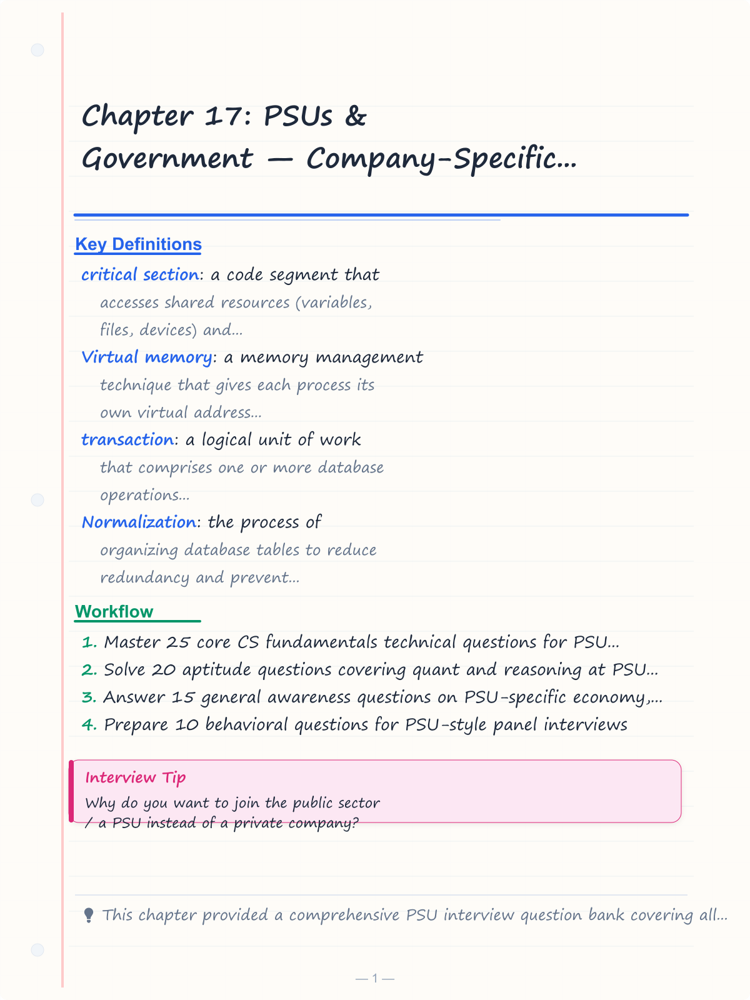
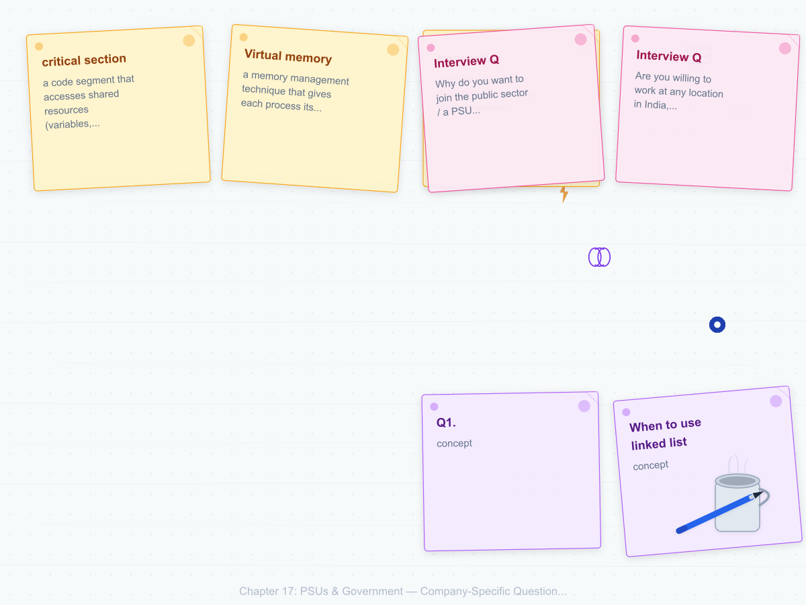
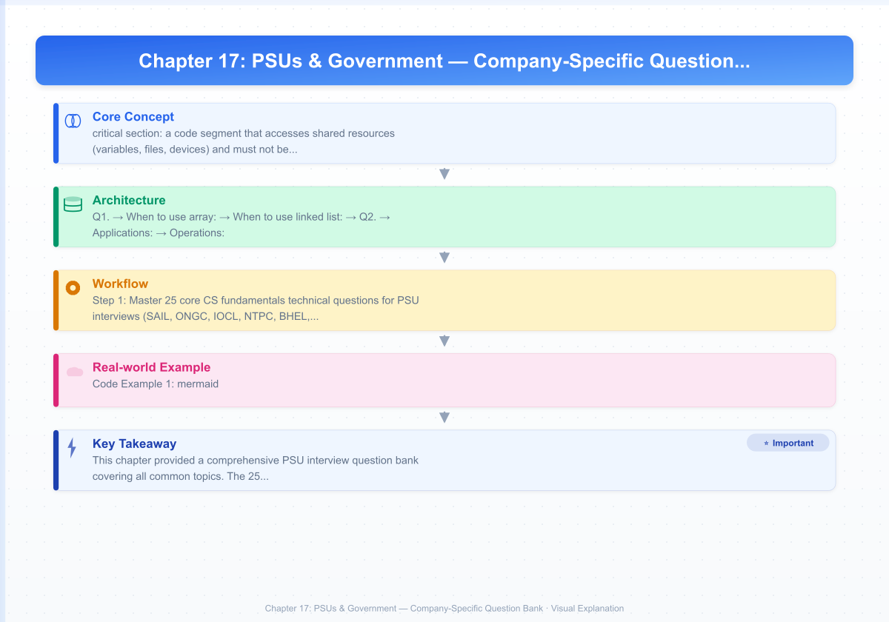
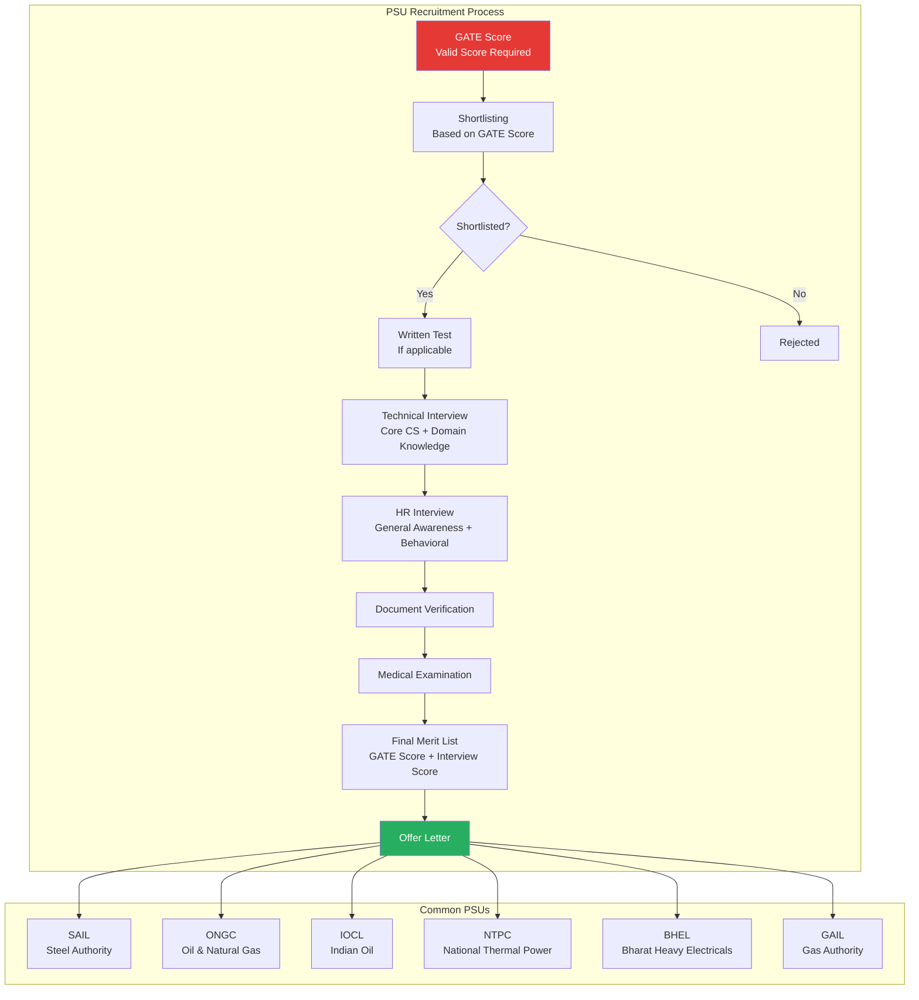
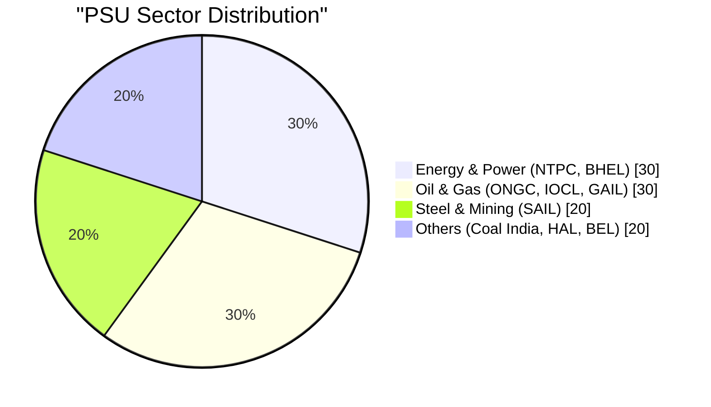

# Chapter 17: PSUs & Government — Company-Specific Question Bank

## Learning Objectives

- Master 25 core CS fundamentals technical questions for PSU interviews (SAIL, ONGC, IOCL, NTPC, BHEL, GAIL)
- Solve 20 aptitude questions covering quant and reasoning at PSU exam difficulty
- Answer 15 general awareness questions on PSU-specific economy, energy, and current affairs
- Prepare 10 behavioral questions for PSU-style panel interviews
- Understand PSU recruitment process through visual diagrams

<!-- Image Gallery -->
<section class="lesson-visuals" aria-label="Visual learning resources">
  <header><span>VISUAL LEARNING</span><h2>See it. Review it. Remember it.</h2></header>
  <a class="lesson-visual-card" href="../../assets/images/lessons/interview-preparation/17-company-psus-govt/handwritten-notes.png" target="_blank" rel="noopener">
    
    <span><strong>Handwritten notes</strong>Condensed notes for deliberate review.</span>
  </a>
  <a class="lesson-visual-card" href="../../assets/images/lessons/interview-preparation/17-company-psus-govt/sticky-notes.png" target="_blank" rel="noopener">
    
    <span><strong>Sticky-note revision</strong>Fast recall prompts for revision.</span>
  </a>
  <a class="lesson-visual-card" href="../../assets/images/lessons/interview-preparation/17-company-psus-govt/visual-explanation.png" target="_blank" rel="noopener">
    
    <span><strong>Visual concept guide</strong>A connected explanation of the key ideas.</span>
  </a>
</section>
<!-- End Image Gallery -->

## PSU Recruitment Process



## Key PSUs Overview



---

## Section 1: Technical Core CS Fundamentals (25 Questions)

### Data Structures (5 Questions)

**Q1.** Explain the difference between an array and a linked list.

<details>
<summary><b>Answer</b></summary>

| Aspect | Array | Linked List |
|--------|-------|-------------|
| **Memory** | Contiguous allocation | Dynamic, non-contiguous |
| **Size** | Fixed (static arrays) or resizable (dynamic) | Dynamic, grows/shrinks at runtime |
| **Access** | O(1) random access via index | O(n) sequential access |
| **Insertion/Deletion** | O(n) — shifting elements | O(1) at head, O(n) at arbitrary position |
| **Memory overhead** | Minimal (only data) | Extra per-node pointer storage |
| **Cache locality** | Excellent (sequential memory) | Poor (scattered memory) |

**When to use array:** Fast random access needed, fixed size known in advance
**When to use linked list:** Frequent insertions/deletions, size unknown
</details>

**Q2.** What is a stack? Give real-world applications.

<details>
<summary><b>Answer</b></summary>

A stack is a linear data structure that follows LIFO (Last In, First Out) principle. Elements are added (push) and removed (pop) from the top.

**Applications:**
1. **Function call management:** Call stack in programming languages
2. **Expression evaluation:** Converting infix to postfix, evaluating postfix expressions
3. **Undo/Redo:** Text editors, image editors
4. **Browser history:** Back button navigation
5. **Syntax parsing:** Checking balanced parentheses, HTML tag matching
6. **Backtracking algorithms:** Maze solving, N-Queens problem

**Operations:** push(), pop(), peek()/top(), isEmpty() — all O(1) time.
</details>

**Q3.** What is a queue? What are its types?

<details>
<summary><b>Answer</b></summary>

A queue is a linear data structure that follows FIFO (First In, First Out) principle. Elements are added at the rear and removed from the front.

**Types:**
1. **Simple Queue:** Basic FIFO — enqueue at rear, dequeue at front
2. **Circular Queue:** Last position connects to first — better memory utilization
3. **Priority Queue:** Elements removed based on priority, not order
4. **Deque (Double Ended Queue):** Insert/delete at both ends

**Applications:** CPU scheduling, printer spooling, message queues, BFS traversal, request handling in web servers.
</details>

**Q4.** Explain binary search and its time complexity.

<details>
<summary><b>Answer</b></summary>

Binary search is a divide-and-conquer algorithm that finds an element in a **sorted** array by repeatedly dividing the search space in half.

**Algorithm:**
1. Compare target with middle element
2. If equal → return index
3. If target < middle → search left half
4. If target > middle → search right half
5. Repeat until found or space exhausted

**Complexity:**
- **Time:** O(log n) — search space halves each iteration
- **Space:** O(1) iterative, O(log n) recursive

**Prerequisite:** The array must be sorted.

**Comparison with linear search:**
| Aspect | Linear Search | Binary Search |
|--------|--------------|---------------|
| Time | O(n) | O(log n) |
| Sorted requirement | No | Yes |
| Best for | Small/unsorted arrays | Large sorted arrays |
</details>

**Q5.** What is hashing? Explain collision resolution techniques.

<details>
<summary><b>Answer</b></summary>

Hashing is a technique that maps keys to array indices using a hash function, enabling O(1) average-time data access.

**Collision:** When two different keys produce the same hash value.

**Collision Resolution Techniques:**

| Technique | Description | Pros | Cons |
|-----------|-------------|------|------|
| **Separate Chaining** | Each bucket stores a linked list of entries | Simple, unlimited elements | Extra memory for pointers |
| **Linear Probing** | Find next empty slot: (hash+1), (hash+2)... | Cache-friendly | Clustering problem |
| **Quadratic Probing** | (hash+1²), (hash+2²), (hash+3²)... | Reduces clustering | May miss empty slots |
| **Double Hashing** | Use second hash function for step size | Best distribution | More computation |

**Load factor (λ) = n/m** (filled slots / total slots). Rehashing when λ exceeds threshold (typically 0.75).
</details>

### Algorithms (5 Questions)

**Q6.** Explain the difference between DFS and BFS.

<details>
<summary><b>Answer</b></summary>

| Aspect | DFS (Depth-First Search) | BFS (Breadth-First Search) |
|--------|-------------------------|---------------------------|
| **Data structure** | Stack (or recursion) | Queue |
| **Strategy** | Explore as deep as possible, then backtrack | Explore level by level |
| **Completeness** | May not find shortest path | Finds shortest path (unweighted) |
| **Space complexity** | O(h) where h = depth of tree | O(w) where w = width of tree |
| **When to use** | Path existence, topological sort, connected components | Shortest path, web crawling, GPS |
| **Tree example** | Preorder, inorder, postorder | Level order |

```typescript
// BFS using queue
function bfs(graph: Map<number, number[]>, start: number): Set<number> {
  const visited = new Set<number>();
  const queue: number[] = [start];
  visited.add(start);

  while (queue.length > 0) {
    const node = queue.shift()!;
    for (const neighbor of graph.get(node) || []) {
      if (!visited.has(neighbor)) {
        visited.add(neighbor);
        queue.push(neighbor);
      }
    }
  }
  return visited;
}

// DFS using recursion
function dfs(graph: Map<number, number[]>, node: number, visited: Set<number>): void {
  visited.add(node);
  for (const neighbor of graph.get(node) || []) {
    if (!visited.has(neighbor)) {
      dfs(graph, neighbor, visited);
    }
  }
}
```
</details>

**Q7.** Explain the concept of recursion and give an example.

<details>
<summary><b>Answer</b></summary>

Recursion is a technique where a function calls itself to solve a problem by breaking it into smaller subproblems.

**Essential components:**
1. **Base case:** Stopping condition that returns without recursion
2. **Recursive case:** Function calls itself with modified parameters approaching base case

**Example: Factorial**
```typescript
function factorial(n: number): number {
  // Base case
  if (n === 0 || n === 1) return 1;
  // Recursive case
  return n * factorial(n - 1);
}
```

**Execution trace for factorial(4):**
```
factorial(4) = 4 * factorial(3)
            = 4 * 3 * factorial(2)
            = 4 * 3 * 2 * factorial(1)
            = 4 * 3 * 2 * 1
            = 24
```

**Pros:** Elegant for problems with recursive structure (trees, divide-and-conquer)
**Cons:** Stack overflow for deep recursion, function call overhead
</details>

**Q8.** What is dynamic programming? Explain with an example.

<details>
<summary><b>Answer</b></summary>

Dynamic Programming (DP) is an optimization technique that solves problems by breaking them into overlapping subproblems, solving each subproblem once, and storing results for future use.

**Two approaches:**
1. **Top-down (Memoization):** Recursively solve with caching
2. **Bottom-up (Tabulation):** Iteratively fill a table

**Key properties:**
1. **Optimal Substructure:** Optimal solution contains optimal solutions to subproblems
2. **Overlapping Subproblems:** Same subproblems are solved multiple times

**Example: Fibonacci**
```typescript
// Without DP (exponential)
function fibNaive(n: number): number {
  if (n <= 1) return n;
  return fibNaive(n-1) + fibNaive(n-2);
}

// With DP (O(n))
function fibDP(n: number): number {
  const dp: number[] = [0, 1];
  for (let i = 2; i <= n; i++) {
    dp[i] = dp[i-1] + dp[i-2];
  }
  return dp[n];
}

// Space-optimized DP (O(1) space)
function fibOptimal(n: number): number {
  if (n <= 1) return n;
  let a = 0, b = 1;
  for (let i = 2; i <= n; i++) {
    [a, b] = [b, a + b];
  }
  return b;
}
```
</details>

**Q9.** Explain the concept of time complexity and Big O notation.

<details>
<summary><b>Answer</b></summary>

**Big O notation** describes the upper bound of an algorithm's growth rate as input size increases.

| Notation | Name | Example | Description |
|----------|------|---------|-------------|
| O(1) | Constant | Array access | Time doesn't depend on input size |
| O(log n) | Logarithmic | Binary search | Each step halves the input |
| O(n) | Linear | Linear search | Time grows proportionally to input |
| O(n log n) | Linearithmic | Merge sort | Common for efficient sorting |
| O(n²) | Quadratic | Bubble sort | Nested loops over input |
| O(2ⁿ) | Exponential | Fibonacci naive | Growth doubles with each input |

**Rules:**
- Drop constants: O(2n) → O(n)
- Drop lower order terms: O(n² + n) → O(n²)
- Analyze worst case unless specified

**Space complexity:** Similar notation but for memory usage.
</details>

**Q10.** What is the difference between Merge Sort and Quick Sort?

<details>
<summary><b>Answer</b></summary>

| Aspect | Merge Sort | Quick Sort |
|--------|-----------|------------|
| **Approach** | Divide and conquer (splits array in half) | Divide and conquer (pivot-based partition) |
| **Time (worst)** | O(n log n) — guaranteed | O(n²) — rare (poor pivot choices) |
| **Time (average)** | O(n log n) | O(n log n) |
| **Time (best)** | O(n log n) | O(n log n) |
| **Space** | O(n) — auxiliary array | O(log n) — recursion stack |
| **Stability** | Stable | Not stable (by default) |
| **When to prefer** | Guaranteed performance needed, linked lists | In-place sorting, average-case optimized |
| **External sorting** | Excellent (sequential access) | Poor (random access needed) |

**PSU interview tip:** Be ready to implement both on a whiteboard.
</details>

### Operating Systems (5 Questions)

**Q11.** Explain the difference between multiprogramming, multitasking, and multiprocessing.

<details>
<summary><b>Answer</b></summary>

| Concept | Definition | Key Feature |
|---------|------------|-------------|
| **Multiprogramming** | Multiple programs loaded in memory, CPU switches between them | Increases CPU utilization, no user interaction required |
| **Multitasking** | Multiple tasks share CPU (time-slicing) | User interaction, each task gets time slice |
| **Multiprocessing** | Multiple CPUs/cores execute multiple processes simultaneously | True parallelism, hardware dependent |

| | Multiprogramming | Multitasking | Multiprocessing |
|--|-----------------|--------------|-----------------|
| **Hardware** | Single CPU | Single CPU | Multiple CPUs |
| **Context** | No user interaction | User interactivity | Parallel execution |
| **Switch trigger** | I/O wait | Time quantum + I/O | Simultaneous execution |
| **Example** | Batch processing | Windows, Linux | Supercomputers, modern multi-core |
</details>

**Q12.** What is a critical section? How is mutual exclusion achieved?

<details>
<summary><b>Answer</b></summary>

A **critical section** is a code segment that accesses shared resources (variables, files, devices) and must not be executed by more than one process at a time.

**Requirements:**
1. **Mutual Exclusion:** Only one process in critical section at a time
2. **Progress:** If no process in critical section, only processes outside can decide who enters
3. **Bounded Waiting:** A process won't wait indefinitely

**Solutions for Mutual Exclusion:**
| Solution | Description | Problem |
|----------|-------------|---------|
| **Peterson's Algorithm** | Software-based using flags and turn variable | Busy waiting, limited to 2 processes |
| **Test and Set Lock** | Hardware instruction (TSL) that atomically reads and writes | Busy waiting |
| **Semaphore** | Dijkstra's counting mechanism using wait() and signal() | Must be atomic |
| **Mutex** | Binary semaphore for mutual exclusion | Same as semaphore |
| **Monitors** | High-level language construct (Java synchronized) | Language support needed |
</details>

**Q13.** Explain paging and segmentation.

<details>
<summary><b>Answer</b></summary>

| Aspect | Paging | Segmentation |
|--------|--------|-------------|
| **Division** | Fixed-size pages (typically 4KB) | Variable-size logical segments |
| **View** | Processor's view of memory | User's view (code, data, stack) |
| **Fragmentation** | Internal fragmentation | External fragmentation |
| **Address** | (page number, offset) | (segment number, offset) |
| **Table** | Page table per process | Segment table per process |
| **Size** | No external fragmentation | Variable segment sizes |

**Paging Address Translation:**
```
Virtual Address → Page Number + Offset
       ↓             ↓
   Page Table → Frame Number
       ↓             ↓
Physical Address = Frame Number × Page Size + Offset
```

**Combined approach (Paged Segmentation):** Segments are themselves paged — gives both logical view and no external fragmentation. Used in modern OS.
</details>

**Q14.** What are the different CPU scheduling algorithms?

<details>
<summary><b>Answer</b></summary>

| Algorithm | Description | Pros | Cons |
|-----------|-------------|------|------|
| **FCFS** | First Come, First Served | Simple, fair | Convoy effect, bad for interactive |
| **SJF (Shortest Job First)** | Shortest next CPU burst | Optimal avg. waiting time | Starvation, burst time prediction |
| **Priority** | Higher priority runs first | Important tasks run quickly | Starvation (solved by aging) |
| **Round Robin** | Fixed time quantum per process | Good for time-sharing systems | High context switch overhead |
| **Multilevel Queue** | Processes grouped by type (foreground/background) | Flexible | Queue starvation possible |
| **Multilevel Feedback Queue** | Processes can move between queues | Very flexible, used in many OS | Complex to tune |

**Comparison criteria:** CPU utilization, throughput, turnaround time, waiting time, response time.
</details>

**Q15.** What is virtual memory and why is it needed?

<details>
<summary><b>Answer</b></summary>

**Virtual memory** is a memory management technique that gives each process its own virtual address space, separate from physical memory.

**Need for virtual memory:**
1. **Process isolation:** One process cannot access another's memory
2. **Efficient memory use:** Only needed pages loaded into RAM
3. **Run larger programs:** Programs larger than physical RAM can execute
4. **Simpler programming:** Each program sees contiguous memory from 0 to max
5. **Shared memory:** Libraries can be shared via mapping to same physical frames

**How it works:**
- Pages are swapped between RAM and disk (swap space)
- Page fault → OS loads required page from disk
- Page replacement algorithms (LRU, Clock, FIFO) decide which page to evict

**Thrashing:** Excessive paging when RAM is insufficient — system spends more time paging than executing.
</details>

### Database Management Systems (5 Questions)

**Q16.** What is a transaction? Explain ACID properties.

<details>
<summary><b>Answer</b></summary>

A **transaction** is a logical unit of work that comprises one or more database operations (reads/writes).

**ACID Properties:**
- **Atomicity:** All operations complete, or none do. If a transaction fails midway, changes are rolled back (undo log).
- **Consistency:** Transaction brings database from one valid state to another. All constraints and rules are maintained.
- **Isolation:** Concurrent transactions appear to execute sequentially. Implementation via locking or MVCC.
- **Durability:** Once committed, changes survive system failures. Implementation via write-ahead logging.

**Example (Bank Transfer):**
```sql
BEGIN TRANSACTION;
  UPDATE accounts SET balance = balance - 1000 WHERE id = 'A';
  UPDATE accounts SET balance = balance + 1000 WHERE id = 'B';
COMMIT;
```
If the system crashes after first UPDATE but before second, the transaction is rolled back (atomicity).
</details>

**Q17.** What are the different types of JOINs in SQL?

<details>
<summary><b>Answer</b></summary>

| JOIN Type | Description | Result |
|-----------|-------------|--------|
| **INNER JOIN** | Returns matching rows from both tables | Only rows with matches |
| **LEFT JOIN** | All rows from left, matched rows from right | Left table preserved (nulls for right) |
| **RIGHT JOIN** | All rows from right, matched rows from left | Right table preserved |
| **FULL OUTER JOIN** | All rows from both tables | Nulls where no match |
| **CROSS JOIN** | Cartesian product of both tables | Every row combined with every other |
| **SELF JOIN** | Table joined with itself | Uses table aliases |

```sql
-- Example: Employees and their departments
SELECT e.name, d.dept_name
FROM employees e
INNER JOIN departments d ON e.dept_id = d.dept_id;

-- Left join to include employees without departments
SELECT e.name, d.dept_name
FROM employees e
LEFT JOIN departments d ON e.dept_id = d.dept_id;
```
</details>

**Q18.** What is normalization? Explain 1NF, 2NF, 3NF.

<details>
<summary><b>Answer</b></summary>

**Normalization** is the process of organizing database tables to reduce redundancy and prevent anomalies (insert, update, delete).

| Form | Rule | Violation Example |
|------|------|-------------------|
| **1NF** | Atomic values, no repeating groups | A column storing multiple phone numbers |
| **2NF** | 1NF + No partial dependency on composite key | Column depends on part of composite PK |
| **3NF** | 2NF + No transitive dependency | Column depends on another non-key column |

**Example: Unnormalized table → 3NF**
```
Unnormalized: Student(ID, Name, Courses, Instructor, InstructorPhone)
1NF: Student(ID, Name, CourseID), Course(CourseID, CourseName, InstructorID, InstructorPhone)
2NF: Student(ID, Name), Enrollment(ID, CourseID), Course(CourseID, CourseName, InstructorID), Instructor(InstructorID, InstructorPhone)
3NF: (InstructorPhone depends on InstructorID, not directly on Course → already in 3NF)
```
</details>

**Q19.** What is an index? Explain clustered vs non-clustered index.

<details>
<summary><b>Answer</b></summary>

An **index** is a database structure that speeds up data retrieval operations at the cost of additional storage and slower writes.

| Aspect | Clustered Index | Non-Clustered Index |
|--------|----------------|---------------------|
| **Data storage** | Actual data sorted by index key | Separate structure with pointers to data |
| **Order** | Physical order matches index order | Logical order, physical order unchanged |
| **Number per table** | Only ONE | Many (up to 999 in SQL Server) |
| **Speed** | Faster for range queries (data stored together) | Slightly slower (extra pointer lookup) |
| **Primary key** | Default clustered index | Default non-clustered |
| **Leaf nodes** | Actual data rows | Pointers (RID or clustering key) |

**When to use clustered index:** Primary key lookups, range queries, sorting by indexed column.
**When to use non-clustered index:** Columns frequently in WHERE, JOIN conditions, covering queries.
</details>

**Q20.** Explain the difference between DELETE, TRUNCATE, and DROP.

<details>
<summary><b>Answer</b></summary>

| Aspect | DELETE | TRUNCATE | DROP |
|--------|--------|----------|------|
| **Type** | DML (Data Manipulation Language) | DDL (Data Definition Language) | DDL |
| **Operation** | Removes rows one by one | Removes all rows at once | Removes entire table structure |
| **WHERE clause** | Yes — can delete specific rows | No — deletes all rows | No |
| **Triggers** | Fires triggers | Does not fire triggers | Does not fire triggers |
| **Transaction log** | Logs each row deletion | Minimal logging | Minimal logging |
| **Rollback** | Possible (within transaction) | Possible (within transaction) | Possible (within transaction) |
| **Identity reset** | No (continues from last value) | Yes (resets to seed) | N/A |
| **Speed** | Slow (row by row) | Fast (deallocates data pages) | Fast |
| **Recovery** | Can rollback | Can rollback (in transaction) | Can rollback (in transaction) |

```sql
-- DELETE specific records
DELETE FROM employees WHERE dept_id = 10;

-- TRUNCATE all records (fast)
TRUNCATE TABLE employees;

-- DROP entire table
DROP TABLE employees;
```
</details>

### Computer Networks (5 Questions)

**Q21.** Explain the OSI model layers in detail.

<details>
<summary><b>Answer</b></summary>

The OSI (Open Systems Interconnection) model has 7 layers:

| Layer | Number | Function | Devices/Protocols |
|-------|--------|----------|-------------------|
| **Application** | 7 | User-facing network services | HTTP, FTP, SMTP, DNS |
| **Presentation** | 6 | Data formatting, encryption, compression | SSL/TLS, JPEG, MPEG |
| **Session** | 5 | Session management, synchronization | NetBIOS, RPC, PPTP |
| **Transport** | 4 | End-to-end delivery, reliability | TCP, UDP, SCTP |
| **Network** | 3 | Logical addressing, routing | IP, ICMP, ARP, routers |
| **Data Link** | 2 | Framing, MAC addressing, error detection | Ethernet, PPP, switches, bridges |
| **Physical** | 1 | Bit transmission, signal encoding | Cables, hubs, repeaters |

**Data flow:** Data → Segment (L4) → Packet (L3) → Frame (L2) → Bits (L1)

**Mnemonic (top-down):** "All People Seem To Need Data Processing"
</details>

**Q22.** Explain TCP 3-way handshake and 4-way termination.

<details>
<summary><b>Answer</b></summary>

**3-Way Handshake (Connection Establishment):**
```
Client → Server: SYN (Seq=x)
Server → Client: SYN-ACK (Seq=y, Ack=x+1)
Client → Server: ACK (Seq=x+1, Ack=y+1)
```

**Purpose:** Synchronize sequence numbers and establish parameters for reliable data transfer.

**4-Way Termination (Connection Closure):**
```
Client → Server: FIN (Seq=x)
Server → Client: ACK (Ack=x+1)
Server → Client: FIN (Seq=y)
Client → Server: ACK (Ack=y+1)
```

**States during termination:**
- Client sends FIN → FIN_WAIT_1 state
- Server receives and sends ACK → CLOSE_WAIT state
- Client receives ACK → FIN_WAIT_2 state
- Server sends FIN → LAST_ACK state
- Client sends ACK → TIME_WAIT state (2 MSL)

**Why TIME_WAIT?** Ensures the final ACK is received and prevents delayed packets from interfering with new connections.
</details>

**Q23.** What is the difference between IPv4 and IPv6?

<details>
<summary><b>Answer</b></summary>

| Aspect | IPv4 | IPv6 |
|--------|------|------|
| **Address size** | 32 bits | 128 bits |
| **Address format** | Dotted decimal (192.168.1.1) | Hexadecimal (2001:db8::1) |
| **Address count** | ~4.3 billion | ~3.4 × 10³⁸ |
| **Header size** | 20-60 bytes (variable) | 40 bytes (fixed) |
| **Fragmentation** | Done by routers | Done only by sender |
| **Security** | Optional (IPSec) | Built-in IPSec support |
| **Checksum** | Has header checksum | No header checksum |
| **Broadcast** | Supported | Replaced by anycast/multicast |
| **NAT** | Commonly needed | Not typically needed |
| **Configuration** | DHCP | SLAAC (Stateless Address Autoconfiguration) |
</details>

**Q24.** What are the different types of network topologies?

<details>
<summary><b>Answer</b></summary>

| Topology | Description | Pros | Cons |
|----------|-------------|------|------|
| **Bus** | All nodes connected to a single cable | Simple, cheap for small networks | Single point of failure, limited length |
| **Star** | All nodes connect to central hub/switch | Easy to manage, fault isolation | Hub failure disables network |
| **Ring** | Each node connects to two neighbors | Equal access, predictable performance | Single node failure breaks ring |
| **Mesh** | Each node connects to many/all others | Very reliable, no single point | Expensive, complex wiring |
| **Tree** | Hierarchical combination of star networks | Scalable, easy management | Root failure affects all branches |
| **Hybrid** | Combination of multiple topologies | Flexible, suits diverse needs | Complex design |

**PSU context:** PSUs (like SAIL, NTPC) have large industrial networks. Star and tree topologies are most common in enterprise settings.
</details>

**Q25.** What is a firewall and how does it work?

<details>
<summary><b>Answer</b></summary>

A **firewall** is a network security device that monitors and controls incoming and outgoing traffic based on predetermined security rules.

**Types of Firewalls:**

| Type | Layer | How it works |
|------|-------|-------------|
| **Packet Filter** | Network (L3) | Examines source/dest IP, port, protocol. No state tracking |
| **Stateful Inspection** | Transport (L4) | Tracks connection state, allows return traffic |
| **Application Gateway (Proxy)** | Application (L7) | Inspects application-layer data, acts as intermediary |
| **Next-Gen Firewall (NGFW)** | All layers | Packet filter + stateful + app awareness + IPS |

**Functions:**
- Packet filtering based on rules
- Network Address Translation (NAT)
- VPN termination
- Logging and auditing
- Deep packet inspection (NGFW)

**Default policies:** "Deny all" vs "Allow all" — PSUs typically use "Deny all" with explicit allow rules.
</details>

---

## Section 2: Aptitude — Quant + Reasoning (20 Questions)

### Quantitative Aptitude (10 Questions)

**Q1.** Find the average of first 20 natural numbers.

<details>
<summary><b>Solution</b></summary>

Sum of first n natural numbers = n(n+1)/2
Sum of first 20 = 20 × 21 / 2 = 210
Average = 210 / 20 = 10.5

**Answer: 10.5**
</details>

**Q2.** A train 300 m long passes a platform 200 m long in 25 seconds. Find the speed.

<details>
<summary><b>Solution</b></summary>

Total distance = 300 + 200 = 500 m
Time = 25 s
Speed = 500/25 = 20 m/s = 20 × 18/5 = 72 km/h

**Answer: 72 km/h**
</details>

**Q3.** The ratio of two numbers is 3:5. If 9 is subtracted from each, the ratio becomes 12:23. Find the numbers.

<details>
<summary><b>Solution</b></summary>

Let numbers be 3x and 5x
(3x - 9)/(5x - 9) = 12/23
23(3x - 9) = 12(5x - 9)
69x - 207 = 60x - 108
9x = 99
x = 11
Numbers: 33 and 55

**Answer: 33 and 55**
</details>

**Q4.** A can do a work in 15 days, B in 20 days. They work together for 5 days, then A leaves. How long will B take to finish the remaining?

<details>
<summary><b>Solution</b></summary>

A's 1 day = 1/15, B's 1 day = 1/20
Both 1 day = 1/15 + 1/20 = (4+3)/60 = 7/60
Work in 5 days = 5 × 7/60 = 35/60 = 7/12
Remaining = 1 - 7/12 = 5/12
B's time = (5/12) / (1/20) = 5/12 × 20 = 100/12 = 25/3 = 8.33 days

**Answer: 8.33 days**
</details>

**Q5.** Find the compound interest on ₹10,000 for 2 years at 10% per annum compounded annually.

<details>
<summary><b>Solution</b></summary>

Amount = P(1 + R/100)^T = 10000(1.1)² = ₹12,100
CI = Amount - Principal = 12,100 - 10,000 = ₹2,100

**Answer: ₹2,100**
</details>

**Q6.** A man travels 40 km at 8 km/h, then 60 km at 12 km/h. Find the average speed.

<details>
<summary><b>Solution</b></summary>

Time₁ = 40/8 = 5 hr, Time₂ = 60/12 = 5 hr
Total distance = 40 + 60 = 100 km
Total time = 5 + 5 = 10 hr
Average speed = 100/10 = 10 km/h

**Answer: 10 km/h**
</details>

**Q7.** A shopkeeper sells an article for ₹1,080 at a profit of 20%. Find the cost price.

<details>
<summary><b>Solution</b></summary>

SP = CP × (100 + 20)/100
1080 = CP × 1.2
CP = 1080/1.2 = ₹900

**Answer: ₹900**
</details>

**Q8.** How many numbers between 100 and 1000 are divisible by 7?

<details>
<summary><b>Solution</b></summary>

First number ≥ 100 divisible by 7: 105 (7×15)
Last number ≤ 1000 divisible by 7: 994 (7×142)
Count = 142 - 15 + 1 = 128

**Answer: 128**
</details>

**Q9.** A bag contains 4 red, 5 blue, 6 green balls. One ball is drawn at random. Find the probability it is not blue.

<details>
<summary><b>Solution</b></summary>

Total balls = 4 + 5 + 6 = 15
Non-blue balls = 4 + 6 = 10
P(not blue) = 10/15 = 2/3

**Answer: 2/3**
</details>

**Q10.** The value of 9³ × 27² / 81² is:

<details>
<summary><b>Solution</b></summary>

9 = 3², 27 = 3³, 81 = 3⁴
9³ = (3²)³ = 3⁶
27² = (3³)² = 3⁶
81² = (3⁴)² = 3⁸
(3⁶ × 3⁶) / 3⁸ = 3¹² / 3⁸ = 3⁴ = 81

**Answer: 81**
</details>

### Reasoning (10 Questions)

**Q11.** Find the missing number: 2, 6, 12, 20, 30, ?

<details>
<summary><b>Solution</b></summary>

Pattern: 1×2=2, 2×3=6, 3×4=12, 4×5=20, 5×6=30, 6×7=42

**Answer: 42**
</details>

**Q12.** If "BOOK" is coded as "CPPL", how is "PEN" coded?

<details>
<summary><b>Solution</b></summary>

B→C(+1), O→P(+1), O→P(+1), K→L(+1)
Each letter shifted +1.
P→Q, E→F, N→O → QFO

**Answer: QFO**
</details>

**Q13.** A is the father of B. C is the sister of A. D is the wife of C. How is D related to B?

<details>
<summary><b>Solution</b></summary>

A is B's father. C is A's sister → C is B's aunt.
D is C's wife → D is B's aunt by marriage (aunt-in-law).

**Answer: Aunt (by marriage)**
</details>

**Q14.** Rajesh walks 10 m east, turns right, walks 5 m, turns right, walks 10 m. How far is he from the starting point?

<details>
<summary><b>Solution</b></summary>

1. East 10 m → (10, 0)
2. Right (South) 5 m → (10, -5)
3. Right (West) 10 m → (0, -5)
Distance from (0,0) = √(0² + 5²) = 5 m

**Answer: 5 m**
</details>

**Q15.** Statements: All flowers are roses. Some roses are red.
Conclusions: I. Some flowers are red. II. Some red are roses.

<details>
<summary><b>Solution</b></summary>

All flowers are roses → but the "some roses" that are red may or may not include flowers. Conclusion I is uncertain.
"Some roses are red" → "Some red are roses" (valid conversion). Conclusion II follows.

**Answer: Only II follows**
</details>

**Q16.** In a row of 40 students, Ravi is 15th from left. What is his position from right?

<details>
<summary><b>Solution</b></summary>

Position from right = Total - Position from left + 1 = 40 - 15 + 1 = 26

**Answer: 26th from right**
</details>

**Q17.** Find the odd one out: 8, 27, 64, 125, 196

<details>
<summary><b>Solution</b></summary>

8 = 2³, 27 = 3³, 64 = 4³, 125 = 5³, 196 = 14²
All except 196 are perfect cubes. 196 is a perfect square (14²).

**Answer: 196**
</details>

**Q18.** In a certain language, "sun" means "moon", "moon" means "star", "star" means "sky". What does "star" mean?

<details>
<summary><b>Solution</b></summary>

Direct mapping: "star" means "sky" (as given in the code).

**Answer: sky**
</details>

**Q19.** Six friends sit in a circle. A is between B and C. D is opposite to A. E is to the immediate right of A. Who is opposite to E?

<details>
<summary><b>Solution</b></summary>

Arrangement (clockwise): A, E, B, D, C, F (positioned)
A between B and C: B-A-C (in some order around circle)
D opposite A
E immediate right of A
So: A, E, B, D, C, F (around circle)
E's opposite is C.

**Answer: C**
</details>

**Q20.** How many triangles are in a standard pentagon with all diagonals drawn?

<details>
<summary><b>Solution</b></summary>

A pentagon has 5 vertices. With all diagonals, the number of triangles formed is 35 (standard combinatorial formula: C(5,3) + 5×C(4,2) + ...). The standard known answer is 35 triangles in a pentagon with all diagonals.

**Answer: 35**
</details>

---

## Section 3: General Awareness — PSU-Specific (15 Questions)

### Energy & Power Sector

**Q1.** What is the installed power generation capacity of India (approximate as of 2025)?

<details>
<summary><b>Answer</b></summary>

India's total installed power generation capacity is approximately 450+ GW (as of 2025), with the breakdown:
- Thermal (Coal + Gas + Diesel): ~58%
- Renewable (Solar, Wind, Hydro, Biomass): ~40%
- Nuclear: ~2%

**PSU relevance:** NTPC, BHEL, NHPC are key players in power generation.
</details>

**Q2.** What is the full form of NTPC and when was it established?

<details>
<summary><b>Answer</b></summary>

**NTPC:** National Thermal Power Corporation Limited
- Established: 1975
- Headquarters: New Delhi
- Status: India's largest power utility (Maharatna PSU)
- Installed capacity: ~75+ GW
- Also operates in renewable energy (NTPC Green Energy)
</details>

**Q3.** What is the full form of BHEL and what does it manufacture?

<details>
<summary><b>Answer</b></summary>

**BHEL:** Bharat Heavy Electricals Limited
- Established: 1964
- Headquarters: New Delhi
- Products: Power generation equipment (boilers, turbines, generators), industrial equipment, solar PV systems, EV components, transmission systems
- Status: Maharatna PSU
- Clients: NTPC, state electricity boards, industrial users
</details>

**Q4.** What is India's current renewable energy target?

<details>
<summary><b>Answer</b></summary>

India's renewable energy targets under the Ministry of New and Renewable Energy (MNRE):
- **500 GW** non-fossil fuel capacity by **2030**
- **50%** of energy requirements from renewables by 2030
- Net-zero emissions by **2070** (announced at COP26)

**Key PSUs involved:** NTPC Green Energy, NHPC, SECI, IREDA, SJVN.
</details>

### Oil & Gas Sector

**Q5.** What is the full form of ONGC and what is its significance?

<details>
<summary><b>Answer</b></summary>

**ONGC:** Oil and Natural Gas Corporation Limited
- Established: 1956 (as Oil & Natural Gas Commission)
- Headquarters: Dehradun
- Status: Maharatna PSU, India's largest oil and gas exploration and production company
- Contribution: Produces ~70% of India's crude oil and ~60% of natural gas
- Major fields: Mumbai High, Krishna-Godavari basin, Assam
- Subsidiaries: ONGC Videsh (OVL) — overseas operations
</details>

**Q6.** What is the full form of IOCL and what are its major divisions?

<details>
<summary><b>Answer</b></summary>

**IOCL:** Indian Oil Corporation Limited
- Established: 1959 (as Indian Oil Company), became IOCL in 1964
- Headquarters: New Delhi
- Status: Maharatna PSU, India's largest commercial oil company
- Major divisions:
  1. **Refining:** 11 refineries (including Panipat, Gujarat, Mathura)
  2. **Pipelines:** Largest pipeline network in India
  3. **Marketing:** Largest fuel retail network (~60,000+ fuel stations)
  4. **Petrochemicals:** Polymers, solvents, etc.
- Brand: Indian Oil (Indane for LPG, Servo for lubricants)
</details>

**Q7.** What is GAIL and what is its role in India's energy sector?

<details>
<summary><b>Answer</b></summary>

**GAIL:** GAIL (India) Limited (formerly Gas Authority of India Limited)
- Established: 1984
- Headquarters: New Delhi
- Status: Maharatna PSU
- Core business: Natural gas transmission, distribution, and marketing
- Key assets: ~14,000+ km gas pipeline network (HVJ pipeline, etc.)
- Other businesses: LPG production, petrochemicals, city gas distribution
- Strategic importance: Driving India's transition to gas-based economy (target: 15% gas in energy mix by 2030 from current ~6%)
</details>

### Steel & Heavy Industry

**Q8.** What is SAIL and what are its major plants?

<details>
<summary><b>Answer</b></summary>

**SAIL:** Steel Authority of India Limited
- Established: 1954 (as Hindustan Steel), became SAIL in 1973
- Headquarters: New Delhi
- Status: Maharatna PSU, India's largest steel producer
- Major steel plants:
  1. **Bhilai Steel Plant** (BSP) — Chhattisgarh
  2. **Rourkela Steel Plant** (RSP) — Odisha
  3. **Durgapur Steel Plant** (DSP) — West Bengal
  4. **Bokaro Steel Plant** (BSL) — Jharkhand
  5. **IISCO Steel Plant** (ISP) — West Bengal
  6. **Salem Steel Plant** (SSP) — Tamil Nadu
- Crude steel capacity: ~20 million tonnes per annum
</details>

**Q9.** What is the difference between a Navratna and Maharatna PSU?

<details>
<summary><b>Answer</b></summary>

The Government of India classifies CPSEs (Central Public Sector Enterprises) based on performance:

| Category | Criteria | Financial Autonomy | Examples |
|----------|----------|-------------------|----------|
| **Maharatna** | Avg annual turnover > ₹25,000 Cr for 3 yrs, Net worth > ₹15,000 Cr, Net profit > ₹5,000 Cr | Highest — can invest up to ₹5,000 Cr without govt approval | ONGC, IOCL, NTPC, SAIL, BHEL, GAIL |
| **Navratna** | Profit-making for 3 yrs, positive net worth, operational efficiency score ≥ 60 | Moderate — can invest up to ₹1,000 Cr without govt approval | NLC, NHPC, HAL, BEL |
| **Miniratna Category I** | Profit-making for 3 yrs, positive net worth | Lower — can invest up to ₹500 Cr | BEML, IRCON |
| **Miniratna Category II** | Profit-making for 3 yrs | Lower — can invest up to ₹300 Cr | |

**Current Maharatna PSUs (12):** ONGC, IOCL, NTPC, SAIL, BHEL, GAIL, Coal India, BPCL, HPCL, PGCIL, Power Finance Corp, REC.
</details>

### PSU-Specific General Knowledge

**Q10.** Who is the current Chairman & Managing Director of NTPC / ONGC / SAIL / IOCL (as applicable)?

<details>
<summary><b>Answer Guide</b></summary>

**Strategy for PSU interviews:** 
- Research the specific PSU you're interviewing for
- Know the current CMD (Chairman & Managing Director) and key directors
- Know the PSU's ranking in India/globally
- Know recent major achievements or projects

**For example (2025 context — verify current):**
- ONGC CMD: Arun Kumar Singh (as of 2025)
- IOCL Chairman: Shrikant Madhav Vaidya
- NTPC CMD: Gurdeep Singh
- SAIL Chairman: Amarendu Prakash
- BHEL CMD: Nalin Singhal
- GAIL CMD: Sandeep Kumar Gupta

*Always verify current leadership before the interview.*
</details>

**Q11.** What is the "Vijana" program or "Urja Ganga" project?

<details>
<summary><b>Answer</b></summary>

**Pradhan Mantri Urja Ganga (PMUG):**
- Natural gas pipeline project connecting Eastern India
- Pipeline from Jagdishpur (UP) to Haldia (West Bengal) via Bihar, Jharkhand, West Bengal
- Extension to Rourkela (Odisha), Dhamra, and Paradip
- Length: ~3,400 km
- Implementing agency: GAIL
- Benefits: Cleaner fuel for Eastern India, fertilizer production, industrial development

**Other key PSU projects to know:**
- ONGC: KG-D5 (Krishna Godavari deepwater project)
- NTPC: Supercritical thermal plants, solar parks
- SAIL: Modernization and expansion plans
- BHEL: Manufacturing of 800 MW supercritical boilers
</details>

**Q12.** What are the major challenges facing Indian PSUs today?

<details>
<summary><b>Answer</b></summary>

1. **Disinvestment targets:** Government aims to reduce stake in many PSUs, creating uncertainty
2. **Competition from private sector:** Private companies (Reliance, Adani, Tata) competing aggressively
3. **Energy transition:** Shift from coal to renewables — PSUs must adapt (NTPC's green energy push)
4. **Technology obsolescence:** Need for modernization, Industry 4.0 adoption
5. **Debt burden:** Some PSUs carry significant debt (especially power distribution companies)
6. **Talent retention:** Competition from private sector for skilled engineers and managers
7. **Global volatility:** Oil price fluctuations affect ONGC, IOCL; steel price cycles affect SAIL
</details>

**Q13.** What is the role of CIL (Coal India Limited)?

<details>
<summary><b>Answer</b></summary>

**Coal India Limited (CIL):**
- Established: 1975 (as Coal India Limited)
- Status: Maharatna PSU
- Production: ~700+ million tonnes annually (~80% of India's coal production)
- Headquarters: Kolkata
- Subsidiaries: 7 coal-producing subsidiaries (ECL, BCCL, CCL, WCL, SECL, NCL, MCL)
- Largest coal producer in the world
- Key challenges: Transition to green energy, environmental compliance, land acquisition

**Relevance:** Coal still accounts for ~55% of India's primary energy. CIL is critical for power generation (NTPC's primary fuel supplier).
</details>

**Q14.** What is the National Electricity Policy and its key objectives?

<details>
<summary><b>Answer</b></summary>

The **National Electricity Policy** (2005, amended) sets the framework for India's power sector:

**Key Objectives:**
1. **Access:** Electricity for all households (achieved under Saubhagya scheme)
2. **Availability:** 24×7 quality power supply
3. **Reliability:** Grid stability, minimal outages
4. **Affordability:** Cost-reflective tariffs with cross-subsidization for poor
5. **Efficiency:** Reduce T&D losses (target: below 15%), improve plant load factor
6. **Environmental sustainability:** Increase renewable share, reduce carbon intensity

**Key schemes:** UDAY (Ujwal DISCOM Assurance Yojana), RDSS (Revamped Distribution Sector Scheme), Green Energy Corridor.
</details>

**Q15.** Explain the concept of "Energy Mix" and India's targets.

<details>
<summary><b>Answer</b></summary>

**Energy mix** refers to the proportion of different energy sources (coal, oil, gas, nuclear, renewables) in a country's total energy consumption.

**India's Current Energy Mix (approximate):**
| Source | Share |
|--------|-------|
| Coal | ~55% |
| Oil | ~25% |
| Natural Gas | ~6% |
| Renewables | ~11% |
| Nuclear | ~2% |
| Hydro | Included in renewables |

**Targets by 2030:**
- 500 GW non-fossil fuel capacity
- 50% energy from renewables
- Reduce emissions intensity by 45% (from 2005 levels)

**PSU roles in energy transition:**
- **NTPC:** 60 GW renewable capacity target by 2032
- **ONGC:** Increasing gas production, investing in renewables
- **GAIL:** Expanding gas infrastructure for cleaner fuel
- **IOCL:** Biofuels, green hydrogen, EV charging network
</details>

---

## Section 4: Behavioral Questions — PSU Interview Style (10 Questions)

### Q1: Why do you want to join the public sector / a PSU instead of a private company?

<details>
<summary><b>Strategy</b></summary>

PSU interview panels ask this to gauge your motivation. Strong answers include:
1. **Job security and stability:** "PSUs offer long-term career stability which allows me to focus on work without constant job-hopping."
2. **Service to nation:** "Working in a Maharatna PSU like ONGC/SAIL means contributing directly to India's energy/industrial security."
3. **Technical challenges:** "PSUs handle large-scale infrastructure projects that offer unmatched technical depth."
4. **Work-life balance:** "I value the balanced lifestyle that enables continuous learning and upskilling."
5. **Growth opportunities:** "PSUs have clear promotion paths and opportunities for higher education (sponsored MTech, etc.)."

**Avoid:** Negative comments about private sector ("I don't like the pressure"). Stay positive and constructive.
</details>

### Q2: Are you willing to work at any location in India, including remote areas?

<details>
<summary><b>Strategy</b></summary>

PSU jobs often require postings at plant locations (steel plants, power plants, oil rigs) which can be in remote areas.

**Expected answer:** "Yes, I am fully willing to work at any location as per the organization's requirement. I understand that PSUs have operations across India, and I'm excited about experiencing different environments and cultures. The opportunity to work at our operational sites will give me invaluable hands-on experience."

**Key point:** Never show hesitation about location flexibility. PSUs consider this a critical selection criterion.
</details>

### Q3: Describe a challenge you faced during your engineering studies/project and how you overcame it.

<details>
<summary><b>Sample Response</b></summary>

**Situation:** During my final year project on "IoT-based Power Monitoring System," we faced a major setback when the microcontroller we ordered was delayed by 6 weeks due to supply chain issues.

**Task:** Complete the project on time for the departmental exhibition with a working prototype.

**Action:** I researched alternative microcontrollers compatible with our sensors. I reconfigured the circuit design to work with a locally available Arduino board within 3 days. I worked with my team to rewrite the firmware for the new platform. We tested rigorously to ensure all sensors worked correctly.

**Result:** The prototype was ready 2 days before the exhibition. We demonstrated a fully functional system that monitored power consumption in real-time. We received positive feedback from faculty and won the "Best Project" award in our department.
</details>

### Q4: Where do you see yourself in 5 years?

<details>
<summary><b>Strategy</b></summary>

PSU panels expect structured ambition:
1. **Short-term (1-2 years):** "Learn the organization's systems, processes, and domain deeply. Become proficient in my role."
2. **Medium-term (3-5 years):** "Take on additional responsibilities, lead small teams or projects, pursue higher education (MTech/Management) sponsored by the organization."
3. **Long-term (5+):** "Contribute at a strategic level and grow into roles where I can make a larger impact on the organization's goals."

**Avoid:** "I want your job" (too aggressive), "I'm not sure" (too vague), "I'll move abroad" (disqualifying).
</details>

### Q5: Tell us about a time you worked in a team to achieve a goal.

<details>
<summary><b>Strategy</b></summary>

Use STAR format. Highlight:
- Your specific role in the team
- How you resolved conflicts or disagreements
- How the team distributed work
- The measurable outcome

**PSU-specific angle:** Mention how the team worked collaboratively (not individual heroics). PSUs value teamwork and hierarchy awareness.
</details>

### Q6: How do you handle pressure and deadlines?

<details>
<summary><b>Sample Response</b></summary>

"I approach pressure situations systematically:
1. **Prioritize:** Identify what's critical vs. what can be delayed
2. **Break down:** Break the task into smaller, manageable steps
3. **Plan:** Create a realistic timeline with milestones
4. **Execute:** Focus on one task at a time without multitasking
5. **Communicate:** Keep stakeholders informed about progress

For example, during our semester exams, I had to prepare for 4 papers in 2 weeks while also completing a project submission. I created a study schedule allocating specific hours per subject, solved one previous year paper daily, and submitted the project 1 day early. I scored 8.2 SGPA while maintaining quality on the project.

I believe pressure brings out my best — it sharpens focus and eliminates procrastination."
</details>

### Q7: Do you have any questions for us?

<details>
<summary><b>Strategy</b></summary>

Always have 2-3 thoughtful questions ready. Good questions for PSU interviews:

1. "What kind of training programs are available for new engineers joining [PSU Name]?"
2. "What are the major technology modernization initiatives currently underway at [PSU Name]?"
3. "How is [PSU Name] preparing for the energy transition / digital transformation?"
4. "What opportunities are there for engineers to pursue higher education or specialized certifications?"

**Avoid:** Questions about salary, leave policy, work hours, or anything available on the company website.
</details>

### Q8: Tell us about your strengths and weaknesses.

<details>
<summary><b>Strategy</b></summary>

**Strengths:** Pick 2-3 genuine strengths with examples.
- "I'm a quick learner — I taught myself [technology] in 2 weeks to complete a project."
- "I'm detail-oriented — I caught a calculation error that saved our team 2 weeks of rework."
- "I work well under pressure — I thrive in deadline-driven environments."

**Weaknesses:** Pick a real but addressable weakness. Show improvement.
- "I sometimes spend too much time perfecting details. I've learned to set time limits and ask for peer reviews to catch the 80/20 point."
- "Public speaking was challenging for me. I joined a Toastmasters club and now I'm comfortable presenting to groups."

**NEVER say:** "I work too hard" (clichéd and fake), "I have no weaknesses" (dishonest), or mention a critical weakness for the role.
</details>

### Q9: Why should we hire you over other candidates?

<details>
<summary><b>Sample Response</b></summary>

"I bring three key qualities that make me the right fit for [PSU Name]:

1. **Strong technical foundation:** My GATE score and academic record demonstrate that I have a solid grasp of core engineering concepts essential for this role.

2. **Practical problem-solving:** My project experience [briefly mention project] shows I can apply theory to real-world problems and deliver working solutions.

3. **Commitment to the PSU ethos:** I've researched [PSU Name]'s history, projects, and future plans. I understand the responsibility that comes with working in a Maharatna PSU, and I'm genuinely excited about contributing to the nation's growth through this organization.

I'm not looking for a job — I'm looking for a career where I can grow with the organization and make a meaningful contribution."
</details>

### Q10: What do you know about our PSU?

<details>
<summary><b>Strategy</b></summary>

This is a test of your preparation. Research the PSU thoroughly:

**Must-know for ANY PSU interview:**
1. **Founded:** Year, original name, key milestones
2. **Headquarters:** City
3. **Chairman/MD:** Current name
4. **Category:** Maharatna/Navratna/Miniratna
5. **Revenue & Profit:** Approximate annual figures
6. **Major products/services:** What they produce
7. **Major plants/locations:** Key operational sites
8. **Recent news:** Major projects, awards, controversies
9. **HR policies:** Training, promotions, benefits
10. **Future plans:** Expansion, diversification, modernization

**Example for SAIL:**
"I know SAIL was established in 1954 as Hindustan Steel and became Steel Authority of India in 1973. Headquartered in New Delhi, it's a Maharatna PSU and India's largest steel producer. SAIL operates 5 integrated steel plants at Bhilai, Rourkela, Durgapur, Bokaro, and IISCO, plus 3 special steel plants. The current chairman is Shri Amarendu Prakash. SAIL produced about 19 million tonnes of crude steel last year and is undergoing a massive modernization program to increase capacity to 25 million tonnes. I also know SAIL has been actively working on developing specialized steel grades for defense and infrastructure applications."

*Verify all facts before the interview — leadership changes and financial figures are time-sensitive.*
</details>

---

## PSU Interview Preparation Summary

### Technical Preparation Priority

| Topic | Weight | Key Focus |
|-------|--------|-----------|
| **Data Structures** | High | Arrays, Linked Lists, Trees, Stacks/Queues |
| **Algorithms** | High | Sorting, Searching, Recursion, DP basics |
| **OS** | High | Processes, Memory Management, Scheduling |
| **DBMS** | High | SQL, Normalization, Transactions, Indexing |
| **Networks** | Medium | OSI, TCP/IP, DNS, HTTP, Security basics |
| **OOPs** | Medium | Encapsulation, Inheritance, Polymorphism |

### General Awareness Strategy

| Topic | Focus |
|-------|-------|
| **Your PSU** | History, leadership, products, financials, recent news |
| **Energy sector** | India's energy mix, installed capacity, key policies |
| **Economy** | GDP growth, inflation, industrial production |
| **Current affairs** | Last 6 months — national and international |

### Behavioral Strategy

| Theme | Key Message |
|-------|-------------|
| **Stability** | You want a long-term career, not a short-term job |
| **Flexibility** | Willing to relocate, work anywhere, adapt |
| **Service orientation** | Nation-building, public service motivation |
| **Learning attitude** | Open to training, keen to learn from seniors |
| **Teamwork** | Collaborative, respects hierarchy, good with people |

---

## Summary

This chapter provided a comprehensive PSU interview question bank covering all common topics. The 25 technical questions span data structures, algorithms, operating systems, database management, and computer networks — the core CS fundamentals PSU interviews focus on. The 20 aptitude questions cover quant and reasoning at PSU exam difficulty. The 15 general awareness questions focus on PSU-specific knowledge: energy, oil & gas, steel sectors, and India's energy policy. The 10 behavioral questions cover the types of panel questions PSU interviews are known for, with strategies and sample responses.

## Practical Takeaways

1. **GATE score is your entry ticket:** Most PSUs shortlist based on valid GATE scores. A high score (90+ percentile) substantially increases your chances.
2. **Technical depth over breadth:** PSU interviews go deep into core subjects (OS, DBMS, Networks, DS). Prepare each topic thoroughly, not superficially.
3. **Know your PSU inside out:** Interviewers expect you to know their organization's history, products, financials, and recent developments. This distinguishes prepared candidates.
4. **Panel interviews are formal:** PSU interviews are conducted by a panel of 3-5 senior officials. Dress formally, speak respectfully, and address panel members as "Sir" or "Ma'am."
5. **⭐ Must-Know:** For ANY PSU interview — ACID properties, OSI model, Normalization forms, and the specific PSU's CMD name, products, and annual report highlights.
6. **Documentation matters:** Have all original documents (degrees, marksheets, certificates, ID proof, GATE scorecard) properly organized in folders. Missing documents can lead to disqualification.

## Chapter Quiz

**Q1.** Which of the following is NOT a Maharatna PSU?
a) ONGC  b) NTPC  c) BSNL  d) SAIL

<details>
<summary>Answer: c) BSNL</summary>
BSNL is classified as a Miniratna PSU. ONGC, NTPC, and SAIL are all Maharatna CPSEs.
</details>

**Q2.** In the OSI model, which layer is responsible for routing?
a) Transport  b) Network  c) Data Link  d) Session

<details>
<summary>Answer: b) Network</summary>
The Network layer (Layer 3) handles logical addressing and routing decisions.
</details>

**Q3.** What is the correct order of database normalization?
a) 1NF → 3NF → 2NF  b) 2NF → 1NF → 3NF  c) 1NF → 2NF → 3NF  d) 3NF → 2NF → 1NF

<details>
<summary>Answer: c) 1NF → 2NF → 3NF</summary>
Normalization progresses from 1NF (atomic values) to 2NF (full FD on key) to 3NF (no transitive dependency).
</details>

**Q4.** Which Indian PSU is the largest crude oil producer?
a) IOCL  b) GAIL  c) ONGC  d) BPCL

<details>
<summary>Answer: c) ONGC</summary>
ONGC produces approximately 70% of India's crude oil.
</details>

**Q5.** In CPU scheduling, which algorithm is optimal in terms of minimum average waiting time?
a) FCFS  b) SJF  c) Round Robin  d) Priority

<details>
<summary>Answer: b) SJF</summary>
Shortest Job First (SJF) provides the minimum average waiting time theoretically. However, it requires knowing CPU burst times in advance.
</details>

---

## Exercises

1. **Technical:** Write a program to implement binary search on a sorted array in TypeScript. Explain time complexity.
2. **DBMS:** Given a table Employee(EmpID, Name, DeptID, Salary, City), write SQL queries to: (a) Find the highest salary department-wise, (b) Find employees earning more than the average salary.
3. **General Awareness:** Research and write a 200-word profile of your target PSU (SAIL/ONGC/IOCL/NTPC/BHEL/GAIL) covering its history, products, financials, and current leadership.
4. **Aptitude:** A tank is filled by pipe A in 6 hours and by pipe B in 8 hours. A drain pipe C empties it in 12 hours. If all three are opened together, how long will it take to fill the tank?
5. **Behavioral:** Prepare a 2-minute answer to "Tell us about yourself" specifically tailored for a PSU interview — highlight technical skills, project experience, and motivation for joining the public sector.
</details>
