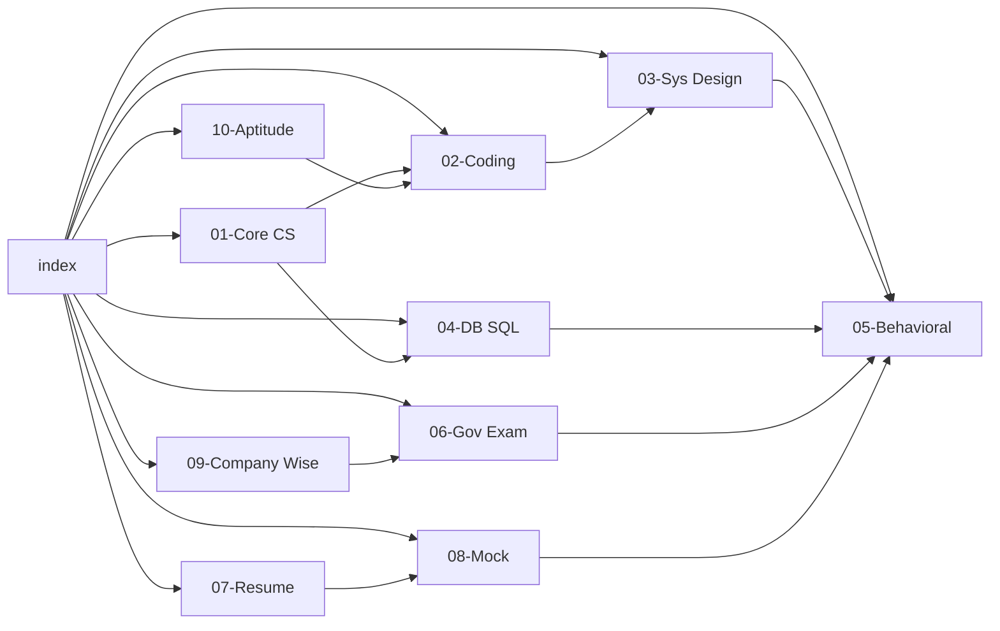
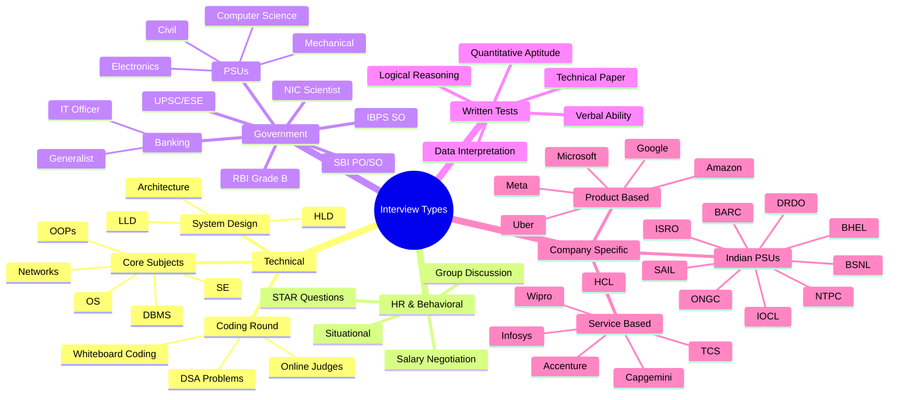
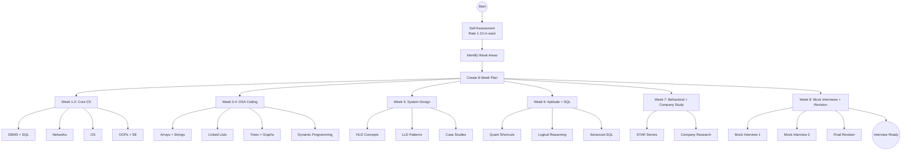

# Interview Preparation Module

## Learning Objectives

- Master structured preparation for IT and government sector interviews in India
- Understand the complete interview lifecycle: written tests → technical rounds → HR rounds
- Develop confidence to tackle coding problems, system design, database queries, and behavioral questions
- Learn company-specific and exam-specific strategies for TCS, Infosys, Wipro, Google, Microsoft, Amazon, SBI, IBPS, RBI, NIC, DRDO, ISRO, and more
- Acquire aptitude and logical reasoning speed techniques for PSU/IT written tests
- Build an ATS-optimized resume, polished LinkedIn profile, and impactful GitHub portfolio
- Practice with realistic mock interview transcripts and evaluation rubrics
- Internalize the STAR method for behavioral questions and structured frameworks for system design

## How to Use This Module

This module is designed as a **one-stop interview preparation resource** for:

1. **Freshers** (0–2 years experience) targeting campus placements or entry-level IT roles
2. **Experienced professionals** (3–10 years) switching companies or preparing for senior roles
3. **Government job aspirants** preparing for IBPS SO, NIC Scientist, SBI PO/SO, RBI Grade B, PSU recruitment
4. **GATE-qualified candidates** appearing for PSU interviews (NTPC, BHEL, SAIL, ONGC, IOCL, etc.)

### Suggested Study Plan

```mermaid
gantt
    title 8-Week Interview Preparation Plan
    dateFormat  YYYY-MM-DD
    section Core CS
    DBMS + SQL             :a1, 7 days
    Networks + OS          :a2, 7 days
    DS + Algo Coding       :a3, 14 days
    OOPs + SE              :a4, 4 days
    section System Design
    HLD + LLD + Case Studies :b1, 10 days
    section Aptitude
    Quant + LR + DI        :c1, 7 days
    section Behavioral
    STAR + HR + GD         :d1, 3 days
    section Company Prep
    Gov Exams + IT Co Prep :e1, 4 days
    Resume + LinkedIn      :e2, 2 days
    Mock Interviews        :e3, 2 days
```

### Chapter Dependency Map



### Chapter Summaries

| Chapter | Focus Area | Target Audience | Key Deliverables |
|---------|-----------|----------------|-----------------|
| 01 | Core CS Subjects (DBMS, Networks, OS, DS, OOPs, SE) | All | 100+ Q&A with TypeScript |
| 02 | Coding Problem Solving | All | 40 solved problems, 3 approaches each |
| 03 | System Design (HLD + LLD) | Experienced + Campus | 10 case studies with diagrams |
| 04 | SQL + Database Design | All | 60+ SQL problems with optimization |
| 05 | Behavioral + HR | All | 30+ STAR answers, scripts |
| 06 | Government Exams | Gov aspirants | Panel composition, banking knowledge |
| 07 | Resume + LinkedIn + Portfolio | All | Templates, checklists, ATS tips |
| 08 | Mock Interview Scripts | All | 10 transcripts with rubrics |
| 09 | Company-wise Strategy | All | 20+ company patterns |
| 10 | Aptitude + LR + Speed Math | Written test takers | Shortcuts, tricks, DI techniques |

### Mind Map of Interview Types



### How Each Chapter Is Structured

Each chapter follows a consistent format:

1. **Learning Objectives** — What you will master after reading
2. **Key Concepts** — Presented in structured Q&A format with collapsible answers
3. **Code Examples** — TypeScript/Java implementations where applicable
4. **Quick Reference Tables** — Memory aids, formulae, and comparison charts
5. **Real Interview Experiences** — First-hand accounts marked with `&gt; **Real Experience:**`
6. **Mermaid Diagrams** — Flowcharts, architecture views, and process maps
7. **Quiz Questions** — Self-assessment multiple choice questions
8. **Summary** — Recap of key takeaways
9. **Practical Takeaways** — Actionable tips and checklists

### Marking Conventions

- `&gt; **Real Experience:**` — Actual interview experience shared by candidates
- `&gt; **Tip:**` — Expert tips and pro-tips
- `&gt; **Warning:**` — Common mistakes and pitfalls to avoid
- `<details><summary>Click to reveal answer</summary>...&lt;/details&gt;` — Collapsible answers
- `&lt;!-- todo --&gt;` — Areas for further self-study
- `**⭐ Must Know**` — High-priority topics frequently asked

### Preparation Checklist

- [ ] Read all 10 chapters systematically
- [ ] Attempt all coding problems (40 problems, 3 approaches each)
- [ ] Practice SQL queries on your local DB or online playground
- [ ] Record yourself answering STAR behavioral questions
- [ ] Build/update resume, LinkedIn, and GitHub profile
- [ ] Complete at least 3 mock interviews with peers
- [ ] Revise aptitude shortcuts for written tests
- [ ] Research target company/exam interview patterns
- [ ] Prepare 2-minute self-introduction
- [ ] Prepare questions to ask the interviewer

### Prerequisites

- Basic programming knowledge (any language)
- Familiarity with data structures and algorithms
- Understanding of SQL and relational databases
- No prior interview experience required

### Resources Referenced

- GeeksforGeeks, LeetCode, HackerRank for coding practice
- Official notification PDFs for IBPS, SBI, RBI, NIC
- Previous year question banks for PSU written tests
- Interview experiences shared on Glassdoor, AmbitionBox, and YouTube
- System design resources: Grokking System Design, System Design Interview (Alex Xu)

### How to Contribute

This is a living document. If you have interview experiences to share, corrections to suggest, or additional topics to cover, please submit a pull request or raise an issue in the repository.

### Acronym Glossary

| Acronym | Full Form |
|---------|-----------|
| IBPS | Institute of Banking Personnel Selection |
| SO | Specialist Officer |
| SBI | State Bank of India |
| RBI | Reserve Bank of India |
| PSU | Public Sector Undertaking |
| NIC | National Informatics Centre |
| DRDO | Defence Research and Development Organisation |
| ISRO | Indian Space Research Organisation |
| BARC | Bhabha Atomic Research Centre |
| SAIL | Steel Authority of India Limited |
| ONGC | Oil and Natural Gas Corporation |
| IOCL | Indian Oil Corporation Limited |
| BSNL | Bharat Sanchar Nigam Limited |
| NTPC | National Thermal Power Corporation |
| BHEL | Bharat Heavy Electricals Limited |
| STAR | Situation, Task, Action, Result |
| HLD | High-Level Design |
| LLD | Low-Level Design |
| ATS | Applicant Tracking System |
| GD | Group Discussion |
| DI | Data Interpretation |
| LR | Logical Reasoning |
| QA | Quantitative Aptitude |

---

## Quick Reference: Interview Preparation Roadmap



## Self-Assessment Matrix

Rate yourself on a scale of 1 (beginner) to 5 (expert) in each area. Focus on topics rated 1–2.

| Area | 1 | 2 | 3 | 4 | 5 |
|------|---|---|---|---|---|
| DBMS + SQL | Beginner | Can write basic queries | Can write joins/subqueries | Can optimize + design schemas | Expert |
| Operating Systems | Beginner | Know processes + memory | Know scheduling + sync | Know all topics deeply | Expert |
| Computer Networks | Beginner | Know OSI + TCP/IP | Know protocols in detail | Can design networks | Expert |
| OOPs Concepts | Beginner | Know four pillars | Can apply design patterns | Can architect systems | Expert |
| Data Structures | Beginner | Know arrays + linked lists | Know trees + graphs | Can implement all | Expert |
| Algorithms | Beginner | Know sorting + searching | Know DP + greedy | Can analyze complexity | Expert |
| System Design | Beginner | Know basics | Can design small systems | Can design large systems | Expert |
| SQL | Beginner | Can write SELECT | Can write complex queries | Can tune performance | Expert |
| Aptitude | Beginner | Moderate speed | Fast and accurate | Very fast and accurate | Expert |
| Communication | Beginner | Can answer basics | Clear and structured | Excellent storyteller | Expert |

---

## Final Words

> "Luck is what happens when preparation meets opportunity." — Seneca

This module is designed to give you the *structure* and *depth* required to succeed in IT interviews across India's diverse landscape — from FAANG-level coding rounds to multi-panel PSU interviews. Follow the plan, practice consistently, and you will convert opportunities into offers.

Good luck! 🚀

---

## Chapter Quiz

### Q1: What is the recommended study duration for the complete Interview Preparation module?
- A) 2 weeks
- B) 4 weeks
- C) 8 weeks
- D) 12 weeks

<details>
<summary>Click to reveal answer</summary>
**Answer: C) 8 weeks**

The suggested study plan allocates 8 weeks covering core CS, coding, system design, aptitude, behavioral preparation, and mock interviews.
</details>

### Q2: Which chapter covers the STAR method for answering behavioral questions?
- A) Chapter 1
- B) Chapter 3
- C) Chapter 5
- D) Chapter 7

<details>
<summary>Click to reveal answer</summary>
**Answer: C) Chapter 5 (Behavioral + HR Interview)**
</details>

### Q3: What does HLD stand for in system design interviews?
- A) High-Level Design
- B) High-Load Design
- C) Horizontal-Layered Design
- D) Hybrid Logic Design

<details>
<summary>Click to reveal answer</summary>
**Answer: A) High-Level Design**
</details>

### Q4: Which of the following is NOT a government PSU?
- A) SAIL
- B) ONGC
- C) Infosys
- D) BHEL

<details>
<summary>Click to reveal answer</summary>
**Answer: C) Infosys** — Infosys is a private IT company, not a government PSU.
</details>

### Q5: What is the minimum line count requirement per chapter in this module?
- A) 200 lines
- B) 500 lines
- C) 800 lines
- D) 1200 lines

<details>
<summary>Click to reveal answer</summary>
**Answer: C) 800 lines**
</details>
