# Multithreading & Concurrency

> **Previous:** [JVM Architecture & Memory Management](./01-jvm-memory.md) | **Next:** [NIO & Networking](./03-nio-networking.md)

Concurrency is one of the most challenging topics in Java. This chapter covers the entire concurrency landscape — from the low-level `Thread` API and `synchronized` blocks to modern abstractions like `CompletableFuture`, virtual threads, and structured concurrency. Every example is complete and compilable.

---

## Learning Objectives

By the end of this chapter you should be able to:

- Describe the six thread states and the transitions between them
- Synchronize access to shared mutable state using `synchronized`, `Lock`, and `Atomic*` classes
- Explain the Java Memory Model, visibility guarantees, and the happens-before relationship
- Choose the correct concurrent collection for a given access pattern
- Configure and monitor a `ThreadPoolExecutor`
- Write non-blocking concurrent code with `CompletableFuture`
- Create and schedule background tasks with `ScheduledExecutorService`
- Decompose CPU-intensive work with the ForkJoinPool
- Use virtual threads and structured concurrency from Project Loom
- Detect and prevent deadlocks using `jstack`, `ThreadMXBean`, and lock ordering

## Chapter at a Glance

| Topic | Key Insight | Practical Takeaway |
|-------|-------------|--------------------|
| Thread Lifecycle | Six states: NEW → RUNNABLE → BLOCKED/WAITING/TIMED_WAITING → TERMINATED | `jstack` shows thread state for debugging |
| Synchronization | `synchronized`, `Lock`, `Atomic*` — mutual exclusion + visibility | Prefer `Lock` for flexibility, `synchronized` for simplicity |
| Java Memory Model | Happens-before rules guarantee visibility across threads | `volatile` for flags, `synchronized` for compound actions |
| Concurrency Utilities | ExecutorService, ForkJoinPool, CompletableFuture | Thread pools decouple task submission from execution |
| Virtual Threads | Lightweight JVM-managed threads, millions possible | Avoid `synchronized` in hot paths to prevent pinning |

## Chapter Roadmap

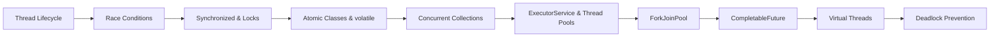
```mermaid
flowchart LR
    A[Thread Lifecycle] --> B[Race Conditions]
    B --> C[Synchronized & Locks]
    C --> D[Atomic Classes & volatile]
    D --> E[Concurrent Collections]
    E --> F[ExecutorService & Thread Pools]
    F --> G[ForkJoinPool]
    G --> H[CompletableFuture]
    H --> I[Virtual Threads]
    I --> J[Deadlock Prevention]
```

> **Warning:** Virtual threads are not a free pass to ignore thread safety. Shared mutable state still requires synchronization — virtual threads only reduce the overhead of having many threads, not the need for correctness.

---

## Thread Lifecycle & API

A thread in Java is an instance of `java.lang.Thread`. When it runs, it executes code on a **call stack** of its own → separate from all other threads. The JVM's `Thread.State` enum defines six states:


```
                        ┌──────────────┐
                        │     NEW      │  start()
                        └──────┬───────┘
                               │
                               ▼
                        ┌──────────────┐
         ┌──────────────┤  RUNNABLE    │◄────────────┐
         │              └──────┬───────┘             │
         │                     │                     │
         ▼                     ▼                     │
  ┌──────────┐        ┌──────────────┐              │
  │ BLOCKED  │        │ TIMED_WAITING│              │
  └──────────┘        └──────────────┘              │
         │                     │                     │
         ▼                     ▼                     │
  ┌──────────┐        ┌──────────────┐              │
  │ WAITING  │        │ TERMINATED   │              │
  └──────────┘        └──────────────┘              │
         │                                           │
         └───────────────────────────────────────────┘
```

- **NEW** → `new Thread(r)` created but `start()` not yet called.
- **RUNNABLE** → `start()` called; thread is eligible for scheduling by the OS thread scheduler. It may be running *or* ready to run.
- **BLOCKED** → waiting to acquire an intrinsic lock (entering a `synchronized` block/method).
- **WAITING** → waiting indefinitely for another thread to act (`Object.wait()`, `Thread.join()` with no timeout, `LockSupport.park()`).
- **TIMED_WAITING** → waiting with a timeout (`Thread.sleep(ms)`, `Object.wait(ms)`, `Thread.join(ms)`, `LockSupport.parkNanos()`).
- **TERMINATED** → `run()` completed normally or threw an uncaught exception.

### Thread API → start, join, sleep, yield, interrupt

<a href="../../assets/images/diagrams/java/02-concurrency/thread-api-start-join-sleep-yield-interrupt-handwritten.svg" target="_blank" rel="noopener">
  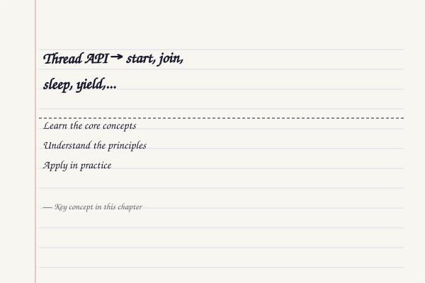
</a>
<a href="../../assets/images/diagrams/java/02-concurrency/thread-api-start-join-sleep-yield-interrupt-diagram.svg" target="_blank" rel="noopener">
  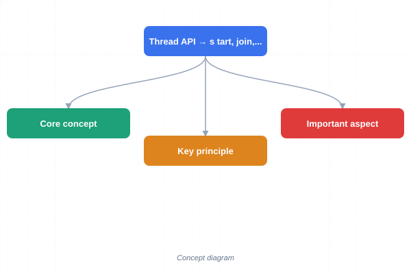
</a>
<a href="../../assets/images/diagrams/java/02-concurrency/thread-api-start-join-sleep-yield-interrupt-sticky.svg" target="_blank" rel="noopener">
  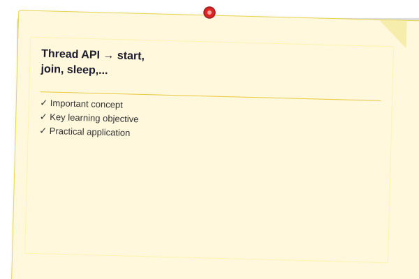
</a>


```java
package ch02.threadlifecycle;

public class ThreadApiDemo {

    public static void main(String[] args) throws InterruptedException {
        // ---- start() ----
        Thread worker = new Thread(() -> {
            try {
                System.out.println(Thread.currentThread().getName() + " started");
                Thread.sleep(500);
                System.out.println(Thread.currentThread().getName() + " finished");
            } catch (InterruptedException e) {
                Thread.currentThread().interrupt();
                System.err.println("Worker was interrupted");
            }
        }, "Worker-1");

        System.out.println("State before start: " + worker.getState()); // NEW
        worker.start();
        System.out.println("State after start: " + worker.getState());  // RUNNABLE (likely)

        // ---- join() ----
        System.out.println("Main waiting for worker to finish...");
        worker.join(); // blocks main until worker terminates
        System.out.println("State after join: " + worker.getState()); // TERMINATED

        // ---- sleep() ----
        System.out.println("Main sleeping for 200ms...");
        Thread.sleep(200);
        System.out.println("Main awake");

        // ---- yield() ----
        // yield is a hint to the scheduler: "I am willing to yield my current CPU slice"
        // It has no hard guarantees but is occasionally useful in spin-loops.
        Thread.yield();

        // ---- interrupt() ----
        Thread interruptible = new Thread(() -> {
            while (!Thread.currentThread().isInterrupted()) {
                // busy-waiting (not recommended, just for demo)
            }
            System.out.println("Interruptible thread exiting");
        });
        interruptible.start();
        Thread.sleep(50);
        interruptible.interrupt();
        interruptible.join();

        // ---- interrupted() vs isInterrupted() ----
        // interrupted()  → static, clears the interrupt flag
        // isInterrupted() → instance, does NOT clear the flag
        System.out.println("All demonstrations complete");
    }
}
```

### Thread states → a monitor-based walk

<a href="../../assets/images/diagrams/java/02-concurrency/thread-states-a-monitor-based-walk-handwritten.svg" target="_blank" rel="noopener">
  
</a>
<a href="../../assets/images/diagrams/java/02-concurrency/thread-states-a-monitor-based-walk-diagram.svg" target="_blank" rel="noopener">
  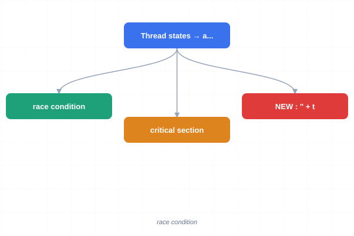
</a>
<a href="../../assets/images/diagrams/java/02-concurrency/thread-states-a-monitor-based-walk-sticky.svg" target="_blank" rel="noopener">
  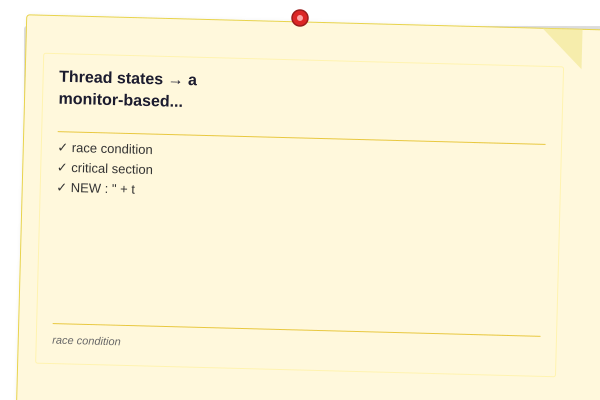
</a>


```java
package ch02.threadlifecycle;

public class ThreadStateMonitor {

    private static final Object lock = new Object();

    public static void main(String[] args) throws InterruptedException {
        Thread t = new Thread(() -> {
            synchronized (lock) {
                try {
                    // TIMED_WAITING
                    Thread.sleep(2000);
                } catch (InterruptedException e) {
                    Thread.currentThread().interrupt();
                }
            }
        });

        System.out.println("1. NEW         : " + t.getState());
        t.start();

        // Give the thread time to acquire the lock and enter sleep
        Thread.sleep(100);
        System.out.println("2. TIMED_WAITING (sleep): " + t.getState());

        synchronized (lock) {
            // t should be BLOCKED because main holds the lock
        }

        t.join();
        System.out.println("3. TERMINATED  : " + t.getState());
    }
}
```

---

## Race Conditions & Critical Sections

A **race condition** occurs when two or more threads access shared mutable state without proper coordination, and the result depends on the interleaving of their operations. The code that accesses shared mutable state is called a **critical section**.

### Unsafe counter → three threads, one int

<a href="../../assets/images/diagrams/java/02-concurrency/unsafe-counter-three-threads-one-int-handwritten.svg" target="_blank" rel="noopener">
  
</a>
<a href="../../assets/images/diagrams/java/02-concurrency/unsafe-counter-three-threads-one-int-diagram.svg" target="_blank" rel="noopener">
  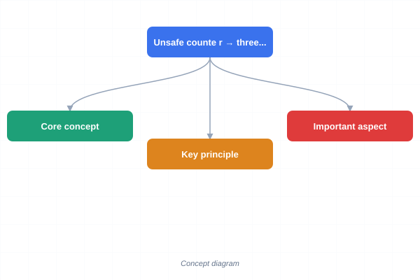
</a>
<a href="../../assets/images/diagrams/java/02-concurrency/unsafe-counter-three-threads-one-int-sticky.svg" target="_blank" rel="noopener">
  
</a>


```java
package ch02.racecondition;

class UnsafeCounter {
    int count = 0;

    void increment() {
        // This is a read-modify-write: not atomic!
        count++;
    }

    void decrement() {
        count--;
    }

    int get() {
        return count;
    }
}

public class RaceConditionDemo {

    public static void main(String[] args) throws InterruptedException {
        UnsafeCounter c = new UnsafeCounter();

        Runnable incTask = () -> {
            for (int i = 0; i < 10_000; i++) {
                c.increment();
            }
        };

        Runnable decTask = () -> {
            for (int i = 0; i < 10_000; i++) {
                c.decrement();
            }
        };

        Thread t1 = new Thread(incTask);
        Thread t2 = new Thread(incTask);
        Thread t3 = new Thread(decTask);

        t1.start();
        t2.start();
        t3.start();

        t1.join();
        t2.join();
        t3.join();

        // Expected: 10_000 (20k inc - 10k dec)
        // Actual:   almost never 10_000
        System.out.println("Final count (expected 10_000): " + c.get());
    }
}
```

### Synchronized

<a href="../../assets/images/diagrams/java/02-concurrency/synchronized-handwritten.svg" target="_blank" rel="noopener">
  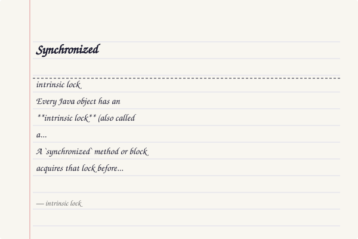
</a>
<a href="../../assets/images/diagrams/java/02-concurrency/synchronized-diagram.svg" target="_blank" rel="noopener">
  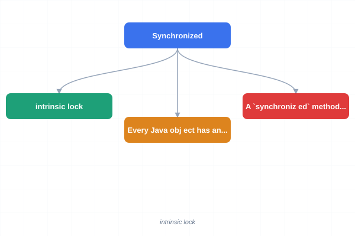
</a>
<a href="../../assets/images/diagrams/java/02-concurrency/synchronized-sticky.svg" target="_blank" rel="noopener">
  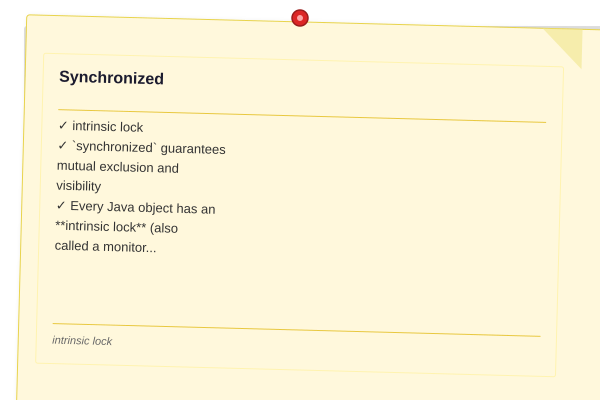
</a>


`synchronized` guarantees mutual exclusion and visibility. Every Java object has an **intrinsic lock** (also called a monitor lock). A `synchronized` method or block acquires that lock before entering and releases it on exit (even on exception).

```java
package ch02.racecondition;

class SafeCounter {
    private int count = 0;

    synchronized void increment() {
        count++;
    }

    synchronized void decrement() {
        count--;
    }

    synchronized int get() {
        return count;
    }
}

public class SynchronizedMethodDemo {

    public static void main(String[] args) throws InterruptedException {
        SafeCounter c = new SafeCounter();

        Thread[] threads = new Thread[10];
        for (int i = 0; i < 10; i++) {
            threads[i] = new Thread(() -> {
                for (int j = 0; j < 5000; j++) {
                    c.increment();
                }
            });
            threads[i].start();
        }

        for (Thread t : threads) {
            t.join();
        }

        // Always 50_000
        System.out.println("Final count: " + c.get());
    }
}
```

### Synchronized block (finer granularity)

<a href="../../assets/images/diagrams/java/02-concurrency/synchronized-block-finer-granularity-handwritten.svg" target="_blank" rel="noopener">
  
</a>
<a href="../../assets/images/diagrams/java/02-concurrency/synchronized-block-finer-granularity-diagram.svg" target="_blank" rel="noopener">
  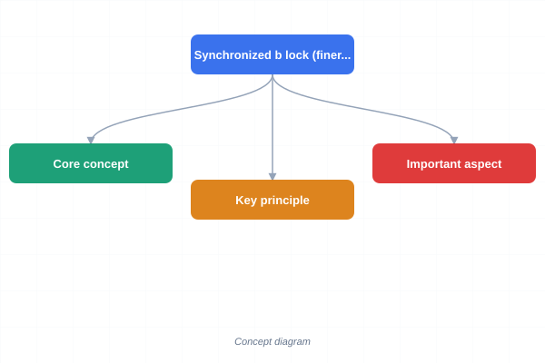
</a>
<a href="../../assets/images/diagrams/java/02-concurrency/synchronized-block-finer-granularity-sticky.svg" target="_blank" rel="noopener">
  
</a>


```java
package ch02.racecondition;

import java.util.ArrayList;
import java.util.List;

class SynchronizedBlockDemo {

    private final List<String> names = new ArrayList<>();
    private final Object lock = new Object();

    void addName(String name) {
        synchronized (lock) {
            // Critical section → only one thread at a time
            names.add(name);
        }
    }

    int size() {
        synchronized (lock) {
            return names.size();
        }
    }

    public static void main(String[] args) throws InterruptedException {
        SynchronizedBlockDemo demo = new SynchronizedBlockDemo();

        Runnable task = () -> {
            for (int i = 0; i < 1000; i++) {
                demo.addName(Thread.currentThread().getName() + "-" + i);
            }
        };

        Thread t1 = new Thread(task, "A");
        Thread t2 = new Thread(task, "B");
        t1.start();
        t2.start();
        t1.join();
        t2.join();

        System.out.println("Size (expected 2000): " + demo.size());
    }
}
```

### Reentrancy

<a href="../../assets/images/diagrams/java/02-concurrency/reentrancy-handwritten.svg" target="_blank" rel="noopener">
  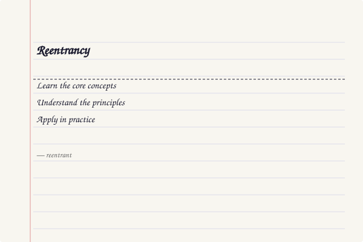
</a>
<a href="../../assets/images/diagrams/java/02-concurrency/reentrancy-diagram.svg" target="_blank" rel="noopener">
  
</a>
<a href="../../assets/images/diagrams/java/02-concurrency/reentrancy-sticky.svg" target="_blank" rel="noopener">
  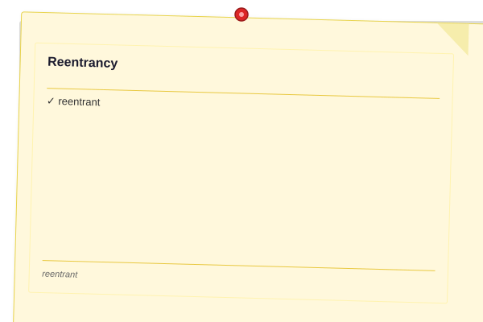
</a>


Intrinsic locks are **reentrant**: if a thread holds a lock, it can acquire the same lock again without blocking.

```java
package ch02.racecondition;

public class ReentrancyDemo {

    private synchronized void outer() {
        System.out.println("Outer");
        inner(); // same thread, same lock → no deadlock
    }

    private synchronized void inner() {
        System.out.println("Inner");
    }

    public static void main(String[] args) {
        new ReentrancyDemo().outer();
    }
}
```

### Visibility and happens-before

<a href="../../assets/images/diagrams/java/02-concurrency/visibility-and-happens-before-handwritten.svg" target="_blank" rel="noopener">
  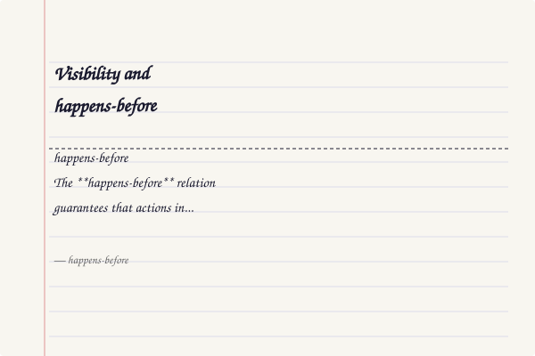
</a>
<a href="../../assets/images/diagrams/java/02-concurrency/visibility-and-happens-before-diagram.svg" target="_blank" rel="noopener">
  
</a>
<a href="../../assets/images/diagrams/java/02-concurrency/visibility-and-happens-before-sticky.svg" target="_blank" rel="noopener">
  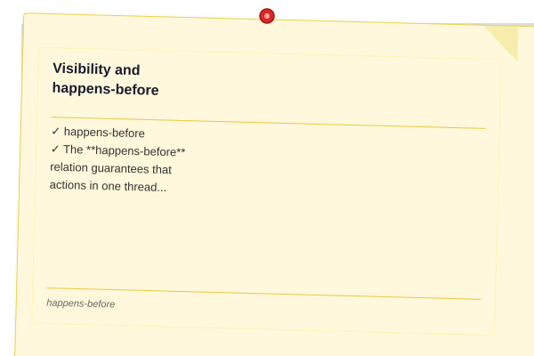
</a>


Without synchronization, the JIT compiler and CPU can reorder instructions, and updates in one thread may never become visible to another thread. The **happens-before** relation guarantees that actions in one thread are visible to another under specific rules:

| Rule | Description |
|------|-------------|
| Program order | Within a single thread, each action happens-before every later action in program order |
| Monitor lock | Unlock of a monitor happens-before every subsequent *acquire* of that monitor |
| `volatile` | A write to a `volatile` field happens-before every subsequent *read* of that field |
| `Thread.start()` | `start()` happens-before the first action in the started thread |
| `Thread.join()` | Last action in a thread happens-before the successful return of `join()` |
| `Atomic*.get/set` | Same ordering as `volatile` |
| `ExecutorService.submit()` | Submission happens-before execution |

### Visibility failure demo

<a href="../../assets/images/diagrams/java/02-concurrency/visibility-failure-demo-handwritten.svg" target="_blank" rel="noopener">
  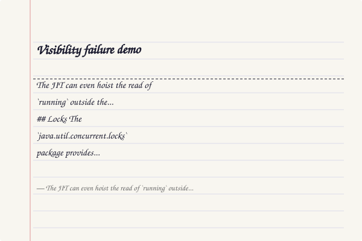
</a>
<a href="../../assets/images/diagrams/java/02-concurrency/visibility-failure-demo-diagram.svg" target="_blank" rel="noopener">
  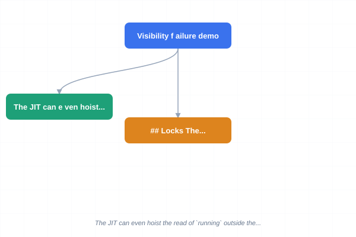
</a>
<a href="../../assets/images/diagrams/java/02-concurrency/visibility-failure-demo-sticky.svg" target="_blank" rel="noopener">
  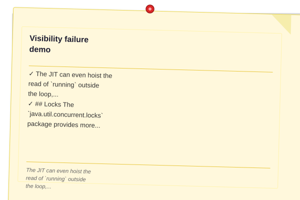
</a>


```java
package ch02.racecondition;

class VisibilityProblem {
    // Try with and without 'volatile'
    static boolean running = true;
    // static volatile boolean running = true;

    public static void main(String[] args) throws InterruptedException {
        Thread worker = new Thread(() -> {
            long count = 0;
            while (running) {
                count++;
            }
            System.out.println("Worker stopped after " + count + " iterations");
        });

        worker.start();
        Thread.sleep(1000);

        // This write may never become visible to worker without volatile/synchronization
        running = false;
        System.out.println("Main set running = false");

        worker.join();
    }
}
```

Without `volatile`, the worker thread's cache may never see the update to `running`. The JIT can even hoist the read of `running` outside the loop, causing an infinite loop.

---

## Locks

The `java.util.concurrent.locks` package provides more flexible locking than `synchronized`:

| Feature | `synchronized` | `Lock` |
|---------|----------------|--------|
| Block unbounded | Can block forever | `tryLock( time, unit )` |
| Interruptible | No | `lockInterruptibly()` |
| Fairness | No guarantees | Optional fair policy |
| Condition variables | `Object.wait/notify` | `Condition.await/signal` |
| Read/write separation | No | `ReadWriteLock` |

### ReentrantLock

<a href="../../assets/images/diagrams/java/02-concurrency/reentrantlock-handwritten.svg" target="_blank" rel="noopener">
  
</a>
<a href="../../assets/images/diagrams/java/02-concurrency/reentrantlock-diagram.svg" target="_blank" rel="noopener">
  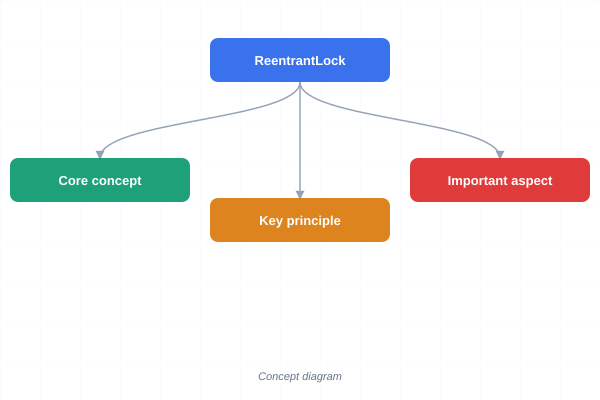
</a>
<a href="../../assets/images/diagrams/java/02-concurrency/reentrantlock-sticky.svg" target="_blank" rel="noopener">
  
</a>


```java
package ch02.locks;

import java.util.concurrent.locks.ReentrantLock;

class ReentrantLockDemo {

    private int shared = 0;
    private final ReentrantLock lock = new ReentrantLock(); // fair: new ReentrantLock(true)

    void increment() {
        lock.lock();
        try {
            shared++;
        } finally {
            // Always unlock in finally!
            lock.unlock();
        }
    }

    void incrementWithTry() {
        // tryLock → acquire only if immediately available
        if (lock.tryLock()) {
            try {
                shared++;
            } finally {
                lock.unlock();
            }
        } else {
            System.out.println("Could not acquire lock, doing something else");
        }
    }

    void incrementWithTimeout() throws InterruptedException {
        // tryLock with timeout → returns false if lock not acquired in 100ms
        if (lock.tryLock(100, java.util.concurrent.TimeUnit.MILLISECONDS)) {
            try {
                shared++;
            } finally {
                lock.unlock();
            }
        }
    }

    void incrementInterruptibly() throws InterruptedException {
        // lockInterruptibly → throws InterruptedException if interrupted while waiting
        lock.lockInterruptibly();
        try {
            shared++;
        } finally {
            lock.unlock();
        }
    }

    int get() {
        lock.lock();
        try {
            return shared;
        } finally {
            lock.unlock();
        }
    }

    public static void main(String[] args) throws InterruptedException {
        ReentrantLockDemo demo = new ReentrantLockDemo();

        Runnable task = () -> {
            for (int i = 0; i < 5000; i++) {
                demo.increment();
            }
        };

        Thread t1 = new Thread(task);
        Thread t2 = new Thread(task);
        t1.start();
        t2.start();
        t1.join();
        t2.join();

        System.out.println("Count: " + demo.get()); // 10000
        System.out.println("Held by current thread? " + demo.lock.isHeldByCurrentThread());
        System.out.println("Queue length: " + demo.lock.getQueueLength());
    }
}
```

### ReadWriteLock

<a href="../../assets/images/diagrams/java/02-concurrency/readwritelock-handwritten.svg" target="_blank" rel="noopener">
  
</a>
<a href="../../assets/images/diagrams/java/02-concurrency/readwritelock-diagram.svg" target="_blank" rel="noopener">
  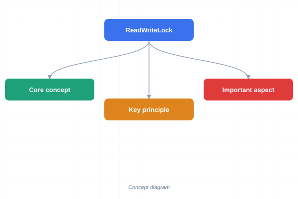
</a>
<a href="../../assets/images/diagrams/java/02-concurrency/readwritelock-sticky.svg" target="_blank" rel="noopener">
  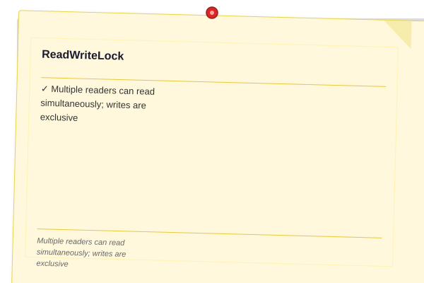
</a>


Multiple readers can read simultaneously; writes are exclusive.

```java
package ch02.locks;

import java.util.HashMap;
import java.util.Map;
import java.util.concurrent.locks.ReadWriteLock;
import java.util.concurrent.locks.ReentrantReadWriteLock;

class ReadWriteLockDemo {

    private final Map<String, String> cache = new HashMap<>();
    private final ReadWriteLock rw = new ReentrantReadWriteLock();
    // Use fair mode to avoid writer starvation:
    // private final ReadWriteLock rw = new ReentrantReadWriteLock(true);

    String get(String key) {
        rw.readLock().lock();
        try {
            return cache.get(key);
        } finally {
            rw.readLock().unlock();
        }
    }

    void put(String key, String value) {
        rw.writeLock().lock();
        try {
            cache.put(key, value);
        } finally {
            rw.writeLock().unlock();
        }
    }

    void clear() {
        rw.writeLock().lock();
        try {
            cache.clear();
        } finally {
            rw.writeLock().unlock();
        }
    }

    public static void main(String[] args) throws InterruptedException {
        ReadWriteLockDemo demo = new ReadWriteLockDemo();

        // Writers
        Thread w1 = new Thread(() -> {
            for (int i = 0; i < 100; i++) {
                demo.put("k" + i, "v" + i);
            }
        });

        // Readers can run concurrently
        Thread r1 = new Thread(() -> {
            for (int i = 0; i < 100; i++) {
                demo.get("k" + i);
            }
        });

        Thread r2 = new Thread(() -> {
            for (int i = 0; i < 100; i++) {
                demo.get("k" + i);
            }
        });

        w1.start();
        r1.start();
        r2.start();

        w1.join();
        r1.join();
        r2.join();
        System.out.println("Done → Readers ran concurrently, writes were exclusive");
    }
}
```

### StampedLock

<a href="../../assets/images/diagrams/java/02-concurrency/stampedlock-handwritten.svg" target="_blank" rel="noopener">
  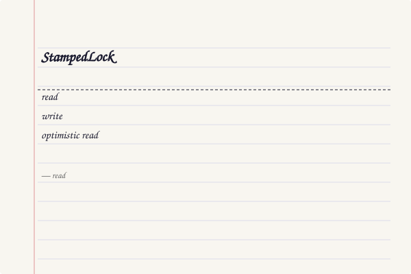
</a>
<a href="../../assets/images/diagrams/java/02-concurrency/stampedlock-diagram.svg" target="_blank" rel="noopener">
  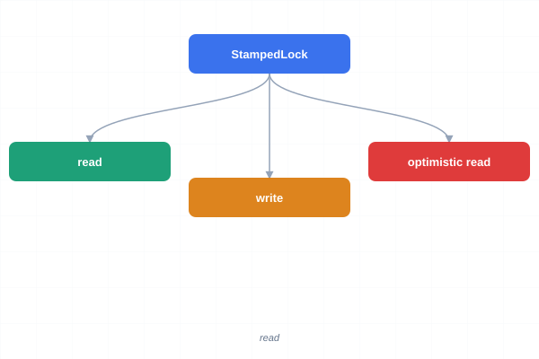
</a>
<a href="../../assets/images/diagrams/java/02-concurrency/stampedlock-sticky.svg" target="_blank" rel="noopener">
  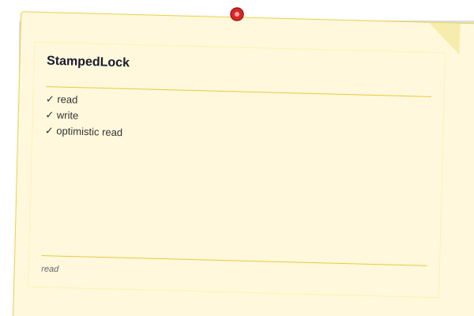
</a>


`StampedLock` provides three access modes: **read**, **write**, and **optimistic read**. It is not reentrant.

```java
package ch02.locks;

import java.util.concurrent.locks.StampedLock;

class StampedLockDemo {

    private int x = 0;
    private int y = 0;
    private final StampedLock lock = new StampedLock();

    void move(int dx, int dy) {
        long stamp = lock.writeLock();
        try {
            x += dx;
            y += dy;
        } finally {
            lock.unlockWrite(stamp);
        }
    }

    int distanceFromOriginOptimistic() {
        // Optimistic read → no blocking, but we must validate
        long stamp = lock.tryOptimisticRead();
        int currentX = x;
        int currentY = y;

        if (!lock.validate(stamp)) {
            // Optimistic read failed → a writer intervened
            // Fall back to a full read lock
            stamp = lock.readLock();
            try {
                currentX = x;
                currentY = y;
            } finally {
                lock.unlockRead(stamp);
            }
        }
        return (int) Math.sqrt(currentX * currentX + currentY * currentY);
    }

    int distanceFromOrigin() {
        long stamp = lock.readLock();
        try {
            return (int) Math.sqrt(x * x + y * y);
        } finally {
            lock.unlockRead(stamp);
        }
    }

    public static void main(String[] args) {
        StampedLockDemo demo = new StampedLockDemo();

        demo.move(3, 4);
        System.out.println("Distance (optimistic): " + demo.distanceFromOriginOptimistic());
        System.out.println("Distance (read lock):  " + demo.distanceFromOrigin());
    }
}
```

### Condition

<a href="../../assets/images/diagrams/java/02-concurrency/condition-handwritten.svg" target="_blank" rel="noopener">
  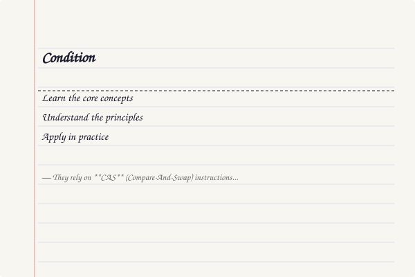
</a>
<a href="../../assets/images/diagrams/java/02-concurrency/condition-diagram.svg" target="_blank" rel="noopener">
  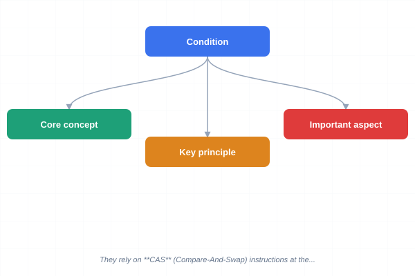
</a>
<a href="../../assets/images/diagrams/java/02-concurrency/condition-sticky.svg" target="_blank" rel="noopener">
  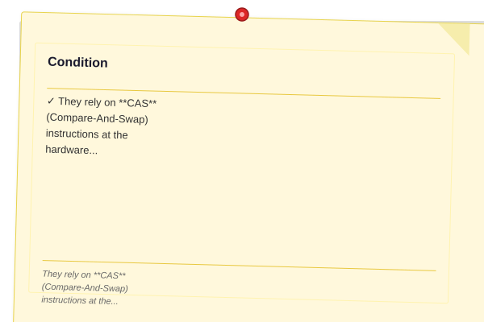
</a>


`Condition` provides `await` / `signal` semantics similar to `Object.wait` / `notify`, but with more control → you can have multiple condition queues per lock.

```java
package ch02.locks;

import java.util.LinkedList;
import java.util.Queue;
import java.util.concurrent.locks.Condition;
import java.util.concurrent.locks.ReentrantLock;

class BoundedBuffer<T> {

    private final Queue<T> queue = new LinkedList<>();
    private final int capacity;
    private final ReentrantLock lock = new ReentrantLock();
    private final Condition notFull = lock.newCondition();
    private final Condition notEmpty = lock.newCondition();

    BoundedBuffer(int capacity) {
        this.capacity = capacity;
    }

    void put(T item) throws InterruptedException {
        lock.lock();
        try {
            while (queue.size() == capacity) {
                notFull.await(); // releases lock, waits for signal
            }
            queue.add(item);
            notEmpty.signal(); // wake one waiting consumer
        } finally {
            lock.unlock();
        }
    }

    T take() throws InterruptedException {
        lock.lock();
        try {
            while (queue.isEmpty()) {
                notEmpty.await();
            }
            T item = queue.poll();
            notFull.signal();
            return item;
        } finally {
            lock.unlock();
        }
    }

    public static void main(String[] args) throws InterruptedException {
        BoundedBuffer<Integer> buffer = new BoundedBuffer<>(10);

        Thread producer = new Thread(() -> {
            for (int i = 0; i < 100; i++) {
                try {
                    buffer.put(i);
                } catch (InterruptedException e) {
                    Thread.currentThread().interrupt();
                }
            }
        });

        Thread consumer = new Thread(() -> {
            for (int i = 0; i < 100; i++) {
                try {
                    buffer.take();
                } catch (InterruptedException e) {
                    Thread.currentThread().interrupt();
                }
            }
        });

        producer.start();
        consumer.start();
        producer.join();
        consumer.join();
        System.out.println("All 100 items produced and consumed");
    }
}
```

---

## Atomic Classes

Atomic classes in `java.util.concurrent.atomic` provide lock-free, thread-safe operations on single variables. They rely on **CAS** (Compare-And-Swap) instructions at the hardware level.

### CAS semantics

<a href="../../assets/images/diagrams/java/02-concurrency/cas-semantics-handwritten.svg" target="_blank" rel="noopener">
  
</a>
<a href="../../assets/images/diagrams/java/02-concurrency/cas-semantics-diagram.svg" target="_blank" rel="noopener">
  
</a>
<a href="../../assets/images/diagrams/java/02-concurrency/cas-semantics-sticky.svg" target="_blank" rel="noopener">
  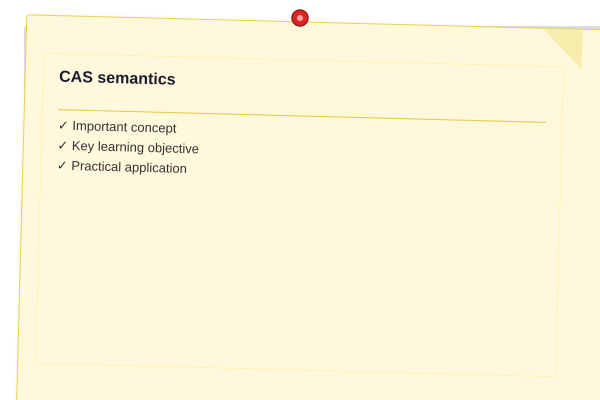
</a>


```
CAS(address, expectedValue, newValue)
  if (*address == expectedValue) {
      *address = newValue;
      return true;
  } else {
      return false;  // someone else changed it
  }
```

CAS is non-blocking → the caller can retry in a loop (spin-wait).

### AtomicInteger

<a href="../../assets/images/diagrams/java/02-concurrency/atomicinteger-handwritten.svg" target="_blank" rel="noopener">
  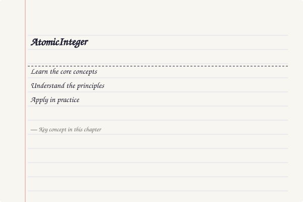
</a>
<a href="../../assets/images/diagrams/java/02-concurrency/atomicinteger-diagram.svg" target="_blank" rel="noopener">
  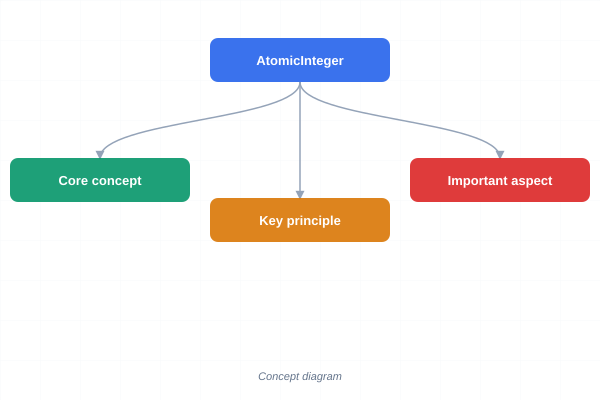
</a>
<a href="../../assets/images/diagrams/java/02-concurrency/atomicinteger-sticky.svg" target="_blank" rel="noopener">
  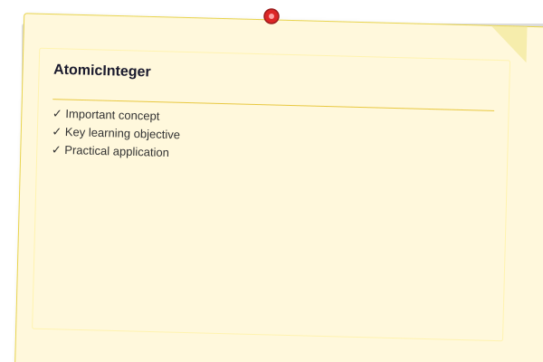
</a>


```java
package ch02.atomicdemo;

import java.util.concurrent.atomic.AtomicInteger;

class AtomicIntegerDemo {

    private final AtomicInteger counter = new AtomicInteger(0);

    void increment() {
        counter.incrementAndGet(); // atomic ++count
    }

    void decrement() {
        counter.decrementAndGet(); // atomic --count
    }

    int addAndDouble(int delta) {
        // updateAndGet for custom atomic transformations
        return counter.updateAndGet(x -> x + delta);
    }

    int get() {
        return counter.get();
    }

    public static void main(String[] args) throws InterruptedException {
        AtomicIntegerDemo demo = new AtomicIntegerDemo();

        Runnable task = () -> {
            for (int i = 0; i < 10_000; i++) {
                demo.increment();
            }
        };

        Thread t1 = new Thread(task);
        Thread t2 = new Thread(task);
        t1.start();
        t2.start();
        t1.join();
        t2.join();

        System.out.println("Atomic counter: " + demo.get()); // 20000 always
    }
}
```

### AtomicLong, AtomicBoolean, AtomicReference

<a href="../../assets/images/diagrams/java/02-concurrency/atomiclong-atomicboolean-atomicreference-handwritten.svg" target="_blank" rel="noopener">
  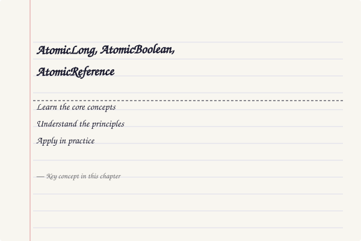
</a>
<a href="../../assets/images/diagrams/java/02-concurrency/atomiclong-atomicboolean-atomicreference-diagram.svg" target="_blank" rel="noopener">
  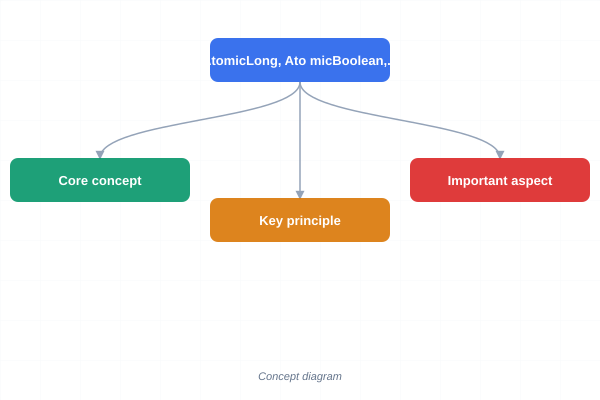
</a>
<a href="../../assets/images/diagrams/java/02-concurrency/atomiclong-atomicboolean-atomicreference-sticky.svg" target="_blank" rel="noopener">
  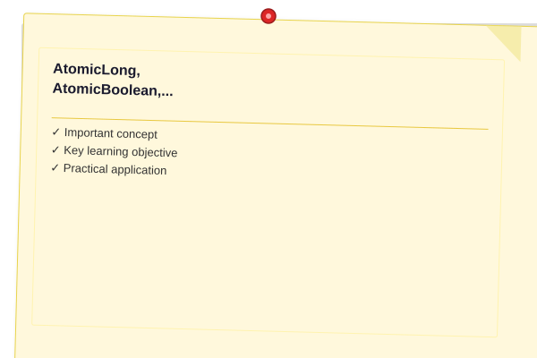
</a>


```java
package ch02.atomicdemo;

import java.util.concurrent.atomic.AtomicBoolean;
import java.util.concurrent.atomic.AtomicLong;
import java.util.concurrent.atomic.AtomicReference;

class AtomicTypesDemo {

    public static void main(String[] args) {
        // ---- AtomicLong ----
        AtomicLong hits = new AtomicLong(0);
        long prev = hits.getAndIncrement(); // returns 0, now 1
        System.out.println("Previous: " + prev + ", now: " + hits.get());

        // ---- AtomicBoolean ----
        AtomicBoolean flag = new AtomicBoolean(false);
        boolean changed = flag.compareAndSet(false, true);
        System.out.println("Flag changed: " + changed + ", value: " + flag.get());

        // ---- AtomicReference ----
        AtomicReference<String> ref = new AtomicReference<>("hello");

        // CAS-based update
        ref.compareAndSet("hello", "world");
        System.out.println("Ref: " + ref.get()); // world

        // Unconditional set
        ref.set("new value");
        System.out.println("Ref after set: " + ref.get());

        // Atomic getAndUpdate
        String old = ref.getAndUpdate(s -> s.toUpperCase());
        System.out.println("Old: " + old + ", new: " + ref.get());
    }
}
```

### ABA problem

<a href="../../assets/images/diagrams/java/02-concurrency/aba-problem-handwritten.svg" target="_blank" rel="noopener">
  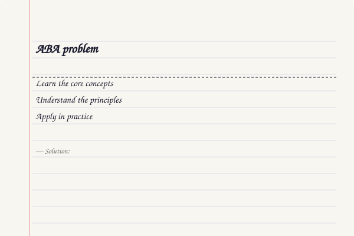
</a>
<a href="../../assets/images/diagrams/java/02-concurrency/aba-problem-diagram.svg" target="_blank" rel="noopener">
  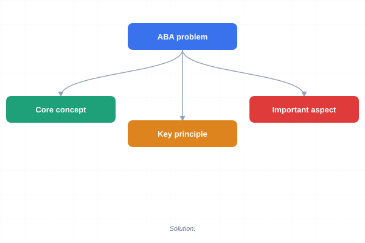
</a>
<a href="../../assets/images/diagrams/java/02-concurrency/aba-problem-sticky.svg" target="_blank" rel="noopener">
  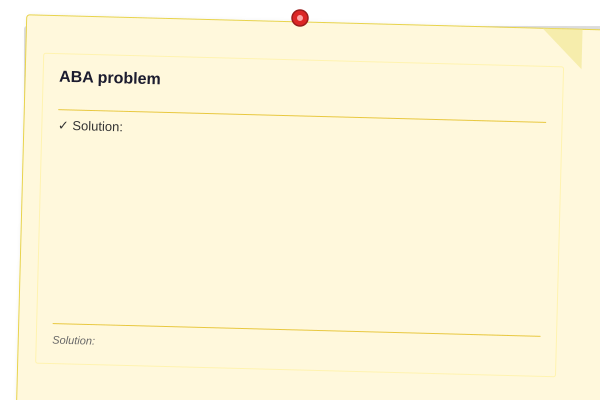
</a>


```
Thread 1 reads A from address X
Thread 2 changes X to B, then back to A
Thread 1 CAS(X, A, C) succeeds → but the value was modified in between
```

```java
package ch02.atomicdemo;

import java.util.concurrent.atomic.AtomicInteger;

class AbaProblemDemo {

    public static void main(String[] args) {
        AtomicInteger counter = new AtomicInteger(100);

        Thread t1 = new Thread(() -> {
            int value = counter.get();       // reads 100
            // simulate a pause → during this, t2 changes value
            try { Thread.sleep(50); } catch (InterruptedException _) { }
            // CAS succeeds even though the value was modified in between
            boolean casResult = counter.compareAndSet(value, 200);
            System.out.println("Thread 1 CAS result: " + casResult);
            System.out.println("Counter: " + counter.get());
        });

        Thread t2 = new Thread(() -> {
            counter.compareAndSet(100, 150); // 100 → 150
            counter.compareAndSet(150, 100); // 150 → 100 (back to original)
        });

        t1.start();
        t2.start();
    }
}
```

**Solution:** `AtomicStampedReference` or `AtomicMarkableReference` adds a version stamp to detect ABA.

```java
package ch02.atomicdemo;

import java.util.concurrent.atomic.AtomicStampedReference;

class AbaSolutionDemo {

    public static void main(String[] args) throws InterruptedException {
        AtomicStampedReference<Integer> ref = new AtomicStampedReference<>(100, 0);

        Thread t1 = new Thread(() -> {
            int[] stampHolder = new int[1];
            Integer value = ref.get(stampHolder);
            int stamp = stampHolder[0];

            try { Thread.sleep(50); } catch (InterruptedException _) { }

            // CAS with stamp → will fail because stamp changed
            boolean success = ref.compareAndSet(value, 200, stamp, stamp + 1);
            System.out.println("Thread 1 CAS: " + success);
        });

        Thread t2 = new Thread(() -> {
            int[] stampHolder = new int[1];
            ref.get(stampHolder);
            ref.compareAndSet(100, 150, stampHolder[0], stampHolder[0] + 1);
            ref.compareAndSet(150, 100, stampHolder[0] + 1, stampHolder[0] + 2);
        });

        t1.start();
        t2.start();
        t1.join();
        t2.join();
    }
}
```

### AtomicIntegerArray

<a href="../../assets/images/diagrams/java/02-concurrency/atomicintegerarray-handwritten.svg" target="_blank" rel="noopener">
  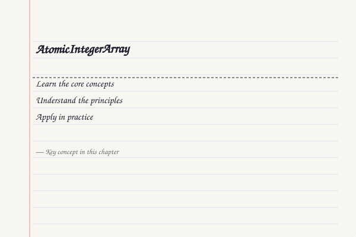
</a>
<a href="../../assets/images/diagrams/java/02-concurrency/atomicintegerarray-diagram.svg" target="_blank" rel="noopener">
  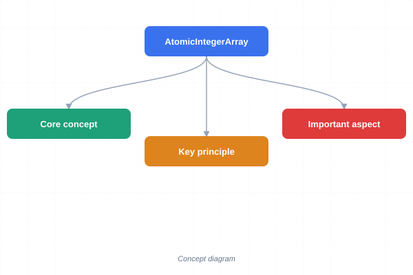
</a>
<a href="../../assets/images/diagrams/java/02-concurrency/atomicintegerarray-sticky.svg" target="_blank" rel="noopener">
  
</a>


```java
package ch02.atomicdemo;

import java.util.concurrent.atomic.AtomicIntegerArray;

class AtomicIntegerArrayDemo {

    public static void main(String[] args) throws InterruptedException {
        AtomicIntegerArray arr = new AtomicIntegerArray(10);

        Runnable worker = () -> {
            for (int i = 0; i < arr.length(); i++) {
                arr.getAndIncrement(i); // thread-safe per-element
            }
        };

        Thread[] threads = new Thread[5];
        for (int i = 0; i < threads.length; i++) {
            threads[i] = new Thread(worker);
            threads[i].start();
        }

        for (Thread t : threads) {
            t.join();
        }

        // Each element should be 5
        for (int i = 0; i < arr.length(); i++) {
            System.out.println("arr[" + i + "] = " + arr.get(i));
        }
    }
}
```

### AtomicReferenceFieldUpdater

<a href="../../assets/images/diagrams/java/02-concurrency/atomicreferencefieldupdater-handwritten.svg" target="_blank" rel="noopener">
  
</a>
<a href="../../assets/images/diagrams/java/02-concurrency/atomicreferencefieldupdater-diagram.svg" target="_blank" rel="noopener">
  
</a>
<a href="../../assets/images/diagrams/java/02-concurrency/atomicreferencefieldupdater-sticky.svg" target="_blank" rel="noopener">
  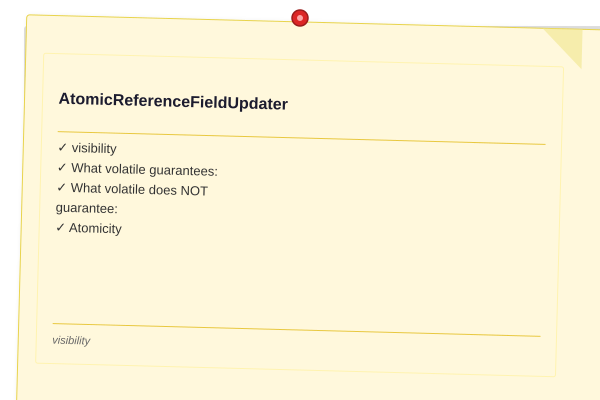
</a>


Used when you want atomic operations on a `volatile` field of an existing object without changing its type to an `AtomicReference`.

```java
package ch02.atomicdemo;

import java.util.concurrent.atomic.AtomicReferenceFieldUpdater;

class Node {
    volatile Node next;

    Node(Node next) {
        this.next = next;
    }
}

class AtomicReferenceFieldUpdaterDemo {

    private static final AtomicReferenceFieldUpdater<Node, Node> nextUpdater =
        AtomicReferenceFieldUpdater.newUpdater(Node.class, Node.class, "next");

    public static void main(String[] args) {
        Node head = new Node(null);
        Node newNext = new Node(null);

        boolean success = nextUpdater.compareAndSet(head, null, newNext);
        System.out.println("CAS succeeded: " + success);
        System.out.println("head.next == newNext: " + (head.next == newNext));
    }
}
```

---

## volatile

The `volatile` keyword guarantees **visibility** of a field across threads. Every write to a volatile field is immediately visible to subsequent reads → the JIT cannot cache it in a register, and the CPU issues a memory barrier.

**What volatile guarantees:**
- Read of a volatile variable happens-before every subsequent read of that variable
- Write to a volatile variable happens-before every subsequent read of that variable
- All writes that happened-before the volatile write are visible to the thread that reads the volatile (piggybacking)

**What volatile does NOT guarantee:**
- **Atomicity** → `count++` is still a read-modify-write. Use `AtomicInteger` for that.

### Volatile flag pattern

<a href="../../assets/images/diagrams/java/02-concurrency/volatile-flag-pattern-handwritten.svg" target="_blank" rel="noopener">
  
</a>
<a href="../../assets/images/diagrams/java/02-concurrency/volatile-flag-pattern-diagram.svg" target="_blank" rel="noopener">
  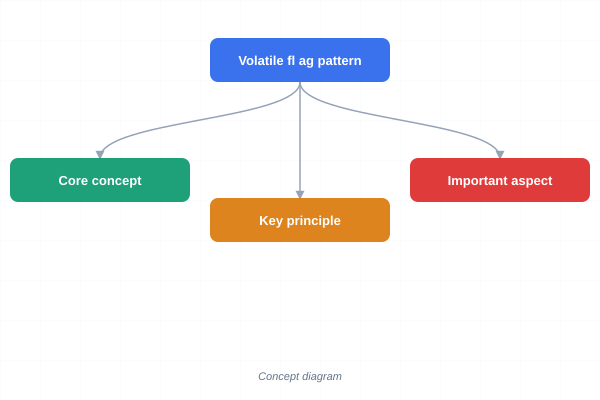
</a>
<a href="../../assets/images/diagrams/java/02-concurrency/volatile-flag-pattern-sticky.svg" target="_blank" rel="noopener">
  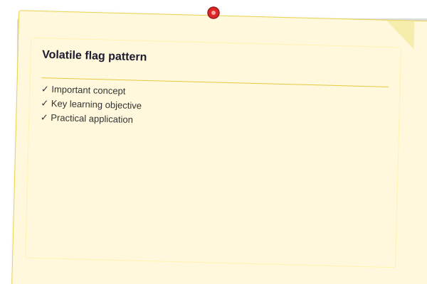
</a>


```java
package ch02.volatiledemo;

class VolatileFlagDemo {

    // Without volatile, the worker may never see the change
    private static volatile boolean shutdown = false;

    public static void main(String[] args) throws InterruptedException {
        Thread worker = new Thread(() -> {
            long counter = 0;
            while (!shutdown) {
                counter++;
            }
            System.out.println("Worker shut down after " + counter + " iterations");
        });

        worker.start();
        Thread.sleep(1000);
        shutdown = true; // guaranteed visible to worker
        worker.join();
        System.out.println("Main exiting");
    }
}
```

### Double-checked locking (volatile required)

<a href="../../assets/images/diagrams/java/02-concurrency/double-checked-locking-volatile-required-handwritten.svg" target="_blank" rel="noopener">
  
</a>
<a href="../../assets/images/diagrams/java/02-concurrency/double-checked-locking-volatile-required-diagram.svg" target="_blank" rel="noopener">
  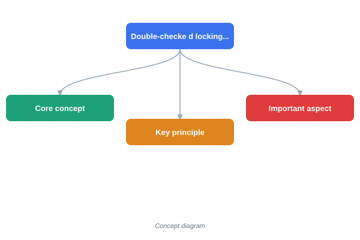
</a>
<a href="../../assets/images/diagrams/java/02-concurrency/double-checked-locking-volatile-required-sticky.svg" target="_blank" rel="noopener">
  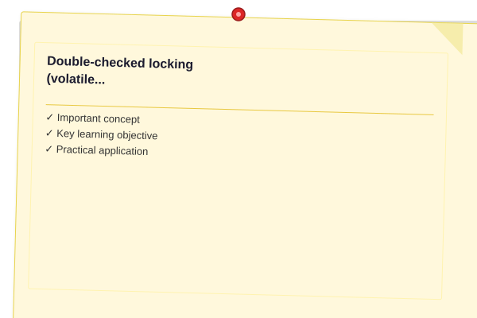
</a>


```java
package ch02.volatiledemo;

class Singleton {
    // volatile is critical here → without it, the JIT can reorder
    // writes to the constructor before the assignment to instance,
    // causing another thread to see a partially-constructed object.
    private static volatile Singleton instance;

    private Singleton() {}

    static Singleton getInstance() {
        if (instance == null) {                    // first check (no lock)
            synchronized (Singleton.class) {
                if (instance == null) {            // second check (with lock)
                    instance = new Singleton();
                }
            }
        }
        return instance;
    }
}

public class DoubleCheckedLockingDemo {

    public static void main(String[] args) {
        // Exercise: try removing 'volatile' and observe with many threads
        Runnable task = () -> {
            Singleton s = Singleton.getInstance();
            System.out.println(Thread.currentThread().getName() + " -> " + s);
        };

        for (int i = 0; i < 10; i++) {
            new Thread(task).start();
        }
    }
}
```

### Volatile piggybacking

<a href="../../assets/images/diagrams/java/02-concurrency/volatile-piggybacking-handwritten.svg" target="_blank" rel="noopener">
  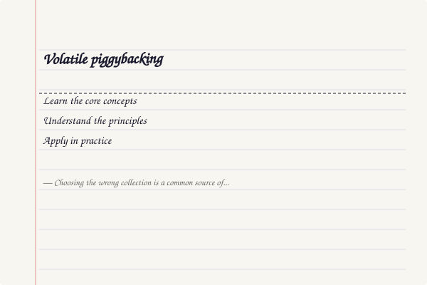
</a>
<a href="../../assets/images/diagrams/java/02-concurrency/volatile-piggybacking-diagram.svg" target="_blank" rel="noopener">
  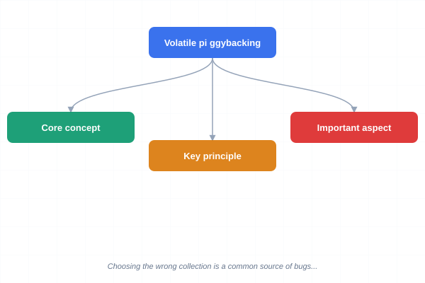
</a>
<a href="../../assets/images/diagrams/java/02-concurrency/volatile-piggybacking-sticky.svg" target="_blank" rel="noopener">
  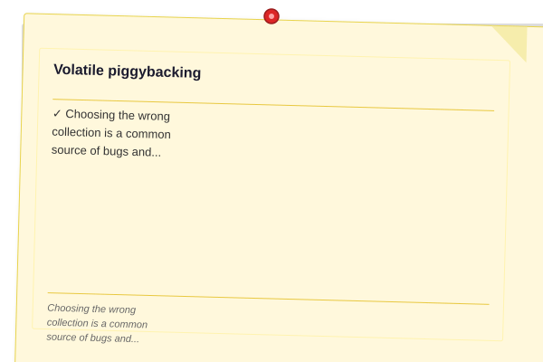
</a>


Because of the happens-before rules, a volatile write flushes all prior writes from the thread's cache:

```java
package ch02.volatiledemo;

class VolatilePiggyback {

    private int a, b, c;
    private volatile boolean published;

    void publish(int a, int b, int c) {
        this.a = a;
        this.b = b;
        this.c = c;
        // The volatile write ensures a, b, c are visible to any thread
        // that sees published == true
        this.published = true;
    }

    void consume() {
        if (published) {
            // Guaranteed to see a, b, c from the publishing thread
            System.out.println(a + ", " + b + ", " + c);
        }
    }

    public static void main(String[] args) throws InterruptedException {
        VolatilePiggyback vp = new VolatilePiggyback();

        Thread writer = new Thread(() -> vp.publish(1, 2, 3));
        Thread reader = new Thread(vp::consume);

        writer.start();
        writer.join();

        reader.start();
        reader.join();
    }
}
```

---

## Concurrent Collections

The `java.util.concurrent` package provides collections designed for concurrent access. Choosing the wrong collection is a common source of bugs and performance problems.

### ConcurrentHashMap

<a href="../../assets/images/diagrams/java/02-concurrency/concurrenthashmap-handwritten.svg" target="_blank" rel="noopener">
  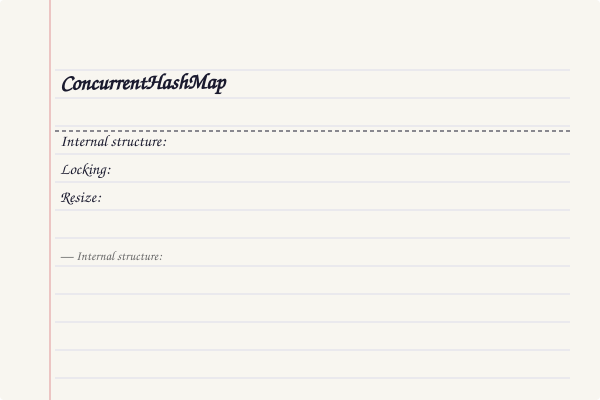
</a>
<a href="../../assets/images/diagrams/java/02-concurrency/concurrenthashmap-diagram.svg" target="_blank" rel="noopener">
  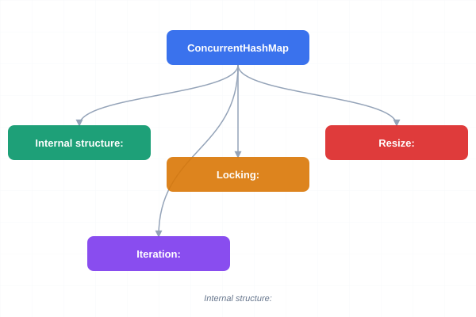
</a>
<a href="../../assets/images/diagrams/java/02-concurrency/concurrenthashmap-sticky.svg" target="_blank" rel="noopener">
  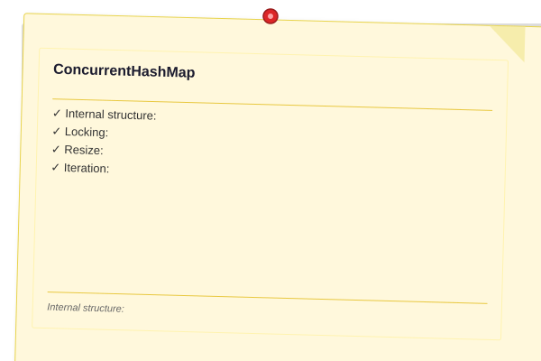
</a>


`ConcurrentHashMap` is the go-to concurrent map. Key design points in Java 8+:

- **Internal structure:** array of bins (Node&lt;K,V&gt;[]). Each bin is a linked list or tree (when bin depth ≥ 8).
- **Locking:** fine-grained → individual bins are locked using `synchronized` (Java 8+) rather than the entire map.
- **Resize:** resizing is done concurrently by multiple threads (the "transfer" phase).
- **Iteration:** weakly consistent → iterators reflect the state at creation but can tolerate concurrent modifications without throwing `ConcurrentModificationException`.

```java
package ch02.concurrentcollections;

import java.util.concurrent.ConcurrentHashMap;
import java.util.concurrent.ConcurrentMap;

class ConcurrentHashMapDemo {

    public static void main(String[] args) throws InterruptedException {
        ConcurrentMap<String, Integer> map = new ConcurrentHashMap<>();

        // Atomic putIfAbsent
        map.putIfAbsent("key1", 1);

        // Atomic compute → atomically update value for a key
        map.compute("key1", (k, v) -> v == null ? 1 : v + 1);

        // Atomic computeIfAbsent → only compute if key is absent
        map.computeIfAbsent("key2", k -> 42);

        // Atomic merge → combine existing value with new value
        map.merge("key1", 1, Integer::sum);

        // forEach with parallelism threshold
        map.forEach(1, (k, v) -> System.out.println(k + "=" + v));

        // search → find first match in parallel
        String found = map.search(1, (k, v) -> v > 10 ? k : null);
        System.out.println("Found: " + found);

        // reduce → parallel reduction over entries
        int sum = map.reduceValues(1, Integer::intValue, Integer::sum);
        System.out.println("Sum of values: " + sum);

        System.out.println("Map: " + map);

        // ---- Concurrent performance demo ----
        ConcurrentHashMap<Integer, Integer> perfMap = new ConcurrentHashMap<>(16, 0.75f, 4);

        Runnable writer = () -> {
            for (int i = 0; i < 10_000; i++) {
                perfMap.put(i, i);
            }
        };

        Thread w1 = new Thread(writer);
        Thread w2 = new Thread(writer);
        w1.start();
        w2.start();
        w1.join();
        w2.join();

        System.out.println("Perf map size: " + perfMap.size()); // 10000 (keys are shared)
    }
}
```

### CopyOnWriteArrayList

<a href="../../assets/images/diagrams/java/02-concurrency/copyonwritearraylist-handwritten.svg" target="_blank" rel="noopener">
  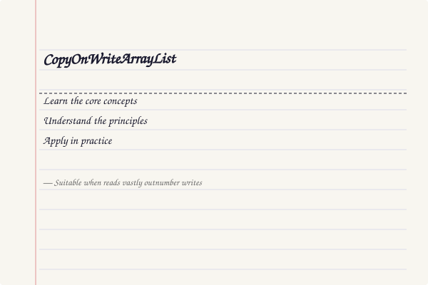
</a>
<a href="../../assets/images/diagrams/java/02-concurrency/copyonwritearraylist-diagram.svg" target="_blank" rel="noopener">
  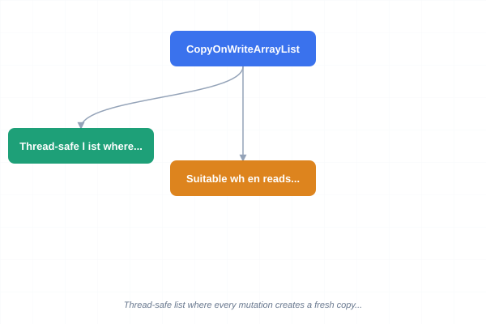
</a>
<a href="../../assets/images/diagrams/java/02-concurrency/copyonwritearraylist-sticky.svg" target="_blank" rel="noopener">
  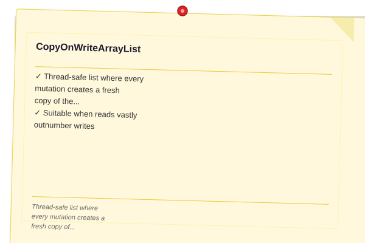
</a>


Thread-safe list where every mutation creates a fresh copy of the underlying array. Suitable when reads vastly outnumber writes.

```java
package ch02.concurrentcollections;

import java.util.List;
import java.util.concurrent.CopyOnWriteArrayList;

class CopyOnWriteArrayListDemo {

    public static void main(String[] args) throws InterruptedException {
        List<String> list = new CopyOnWriteArrayList<>();

        // Multiple writers → each mutation copies the array
        Runnable writer = () -> {
            for (int i = 0; i < 100; i++) {
                list.add(Thread.currentThread().getName() + "-" + i);
            }
        };

        Thread t1 = new Thread(writer, "W1");
        Thread t2 = new Thread(writer, "W2");
        t1.start();
        t2.start();
        t1.join();
        t2.join();

        // Iteration is safe and sees a snapshot
        for (String s : list) {
            // No ConcurrentModificationException even if another
            // thread modifies the list during iteration
            System.out.println(s);
        }

        System.out.println("Size: " + list.size()); // 200
    }
}
```

### ConcurrentLinkedQueue

<a href="../../assets/images/diagrams/java/02-concurrency/concurrentlinkedqueue-handwritten.svg" target="_blank" rel="noopener">
  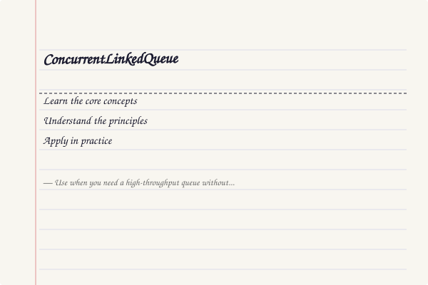
</a>
<a href="../../assets/images/diagrams/java/02-concurrency/concurrentlinkedqueue-diagram.svg" target="_blank" rel="noopener">
  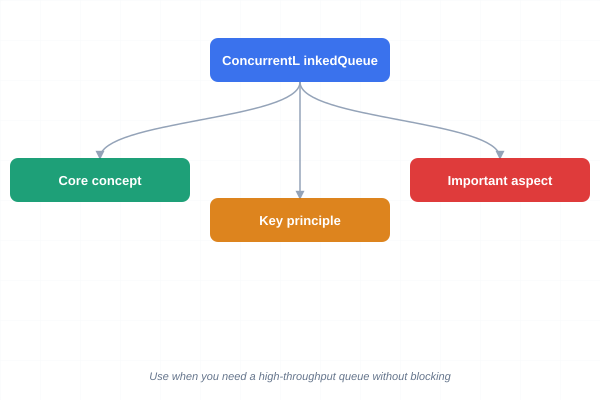
</a>
<a href="../../assets/images/diagrams/java/02-concurrency/concurrentlinkedqueue-sticky.svg" target="_blank" rel="noopener">
  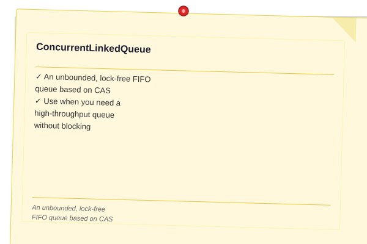
</a>


An unbounded, lock-free FIFO queue based on CAS. Use when you need a high-throughput queue without blocking.

```java
package ch02.concurrentcollections;

import java.util.Queue;
import java.util.concurrent.ConcurrentLinkedQueue;

class ConcurrentLinkedQueueDemo {

    public static void main(String[] args) throws InterruptedException {
        Queue<Integer> queue = new ConcurrentLinkedQueue<>();

        Runnable producer = () -> {
            for (int i = 0; i < 5000; i++) {
                queue.offer(i);
            }
        };

        Runnable consumer = () -> {
            int count = 0;
            while (count < 5000) {
                Integer value = queue.poll();
                if (value != null) {
                    count++;
                }
            }
            System.out.println("Consumed " + count);
        };

        Thread p1 = new Thread(producer);
        Thread p2 = new Thread(producer);
        Thread c = new Thread(consumer);

        p1.start();
        p2.start();
        c.start();

        p1.join();
        p2.join();
        c.join();
    }
}
```

### ConcurrentSkipListMap

<a href="../../assets/images/diagrams/java/02-concurrency/concurrentskiplistmap-handwritten.svg" target="_blank" rel="noopener">
  
</a>
<a href="../../assets/images/diagrams/java/02-concurrency/concurrentskiplistmap-diagram.svg" target="_blank" rel="noopener">
  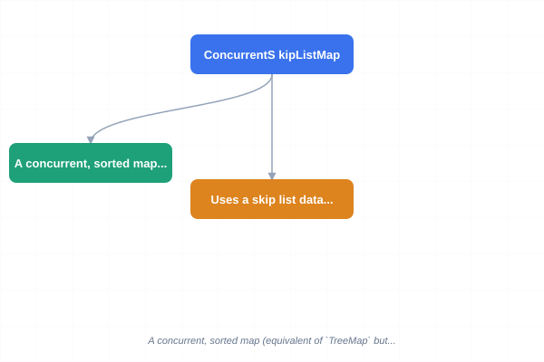
</a>
<a href="../../assets/images/diagrams/java/02-concurrency/concurrentskiplistmap-sticky.svg" target="_blank" rel="noopener">
  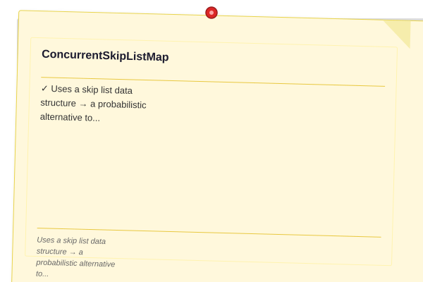
</a>


A concurrent, sorted map (equivalent of `TreeMap` but thread-safe). Uses a skip list data structure → a probabilistic alternative to balanced trees.

```java
package ch02.concurrentcollections;

import java.util.concurrent.ConcurrentSkipListMap;

class ConcurrentSkipListMapDemo {

    public static void main(String[] args) {
        ConcurrentSkipListMap<String, Integer> map = new ConcurrentSkipListMap<>();

        map.put("delta", 4);
        map.put("alpha", 1);
        map.put("charlie", 3);
        map.put("bravo", 2);

        // NavigableMap methods → all thread-safe
        System.out.println("First entry: " + map.firstEntry());
        System.out.println("Last entry: " + map.lastEntry());
        System.out.println("Ceiling 'c': " + map.ceilingEntry("c"));
        System.out.println("Descending: " + map.descendingMap());

        // Submap views
        System.out.println("Submap [b-d): " + map.subMap("bravo", "delta"));
    }
}
```

### BlockingQueue implementations

<a href="../../assets/images/diagrams/java/02-concurrency/blockingqueue-implementations-handwritten.svg" target="_blank" rel="noopener">
  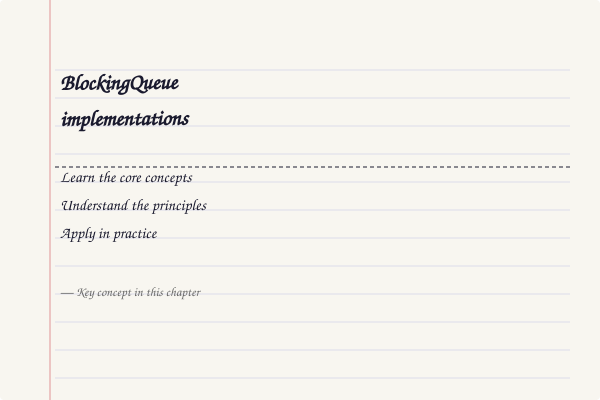
</a>
<a href="../../assets/images/diagrams/java/02-concurrency/blockingqueue-implementations-diagram.svg" target="_blank" rel="noopener">
  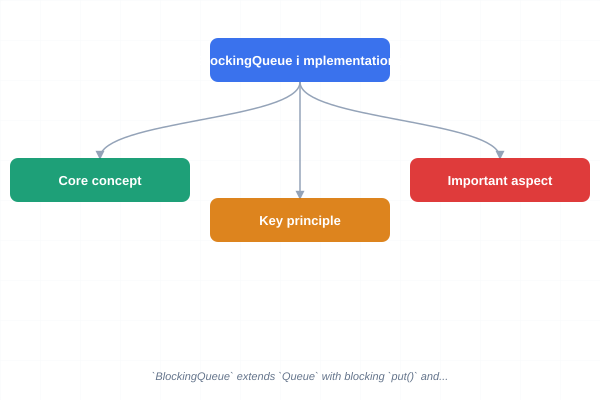
</a>
<a href="../../assets/images/diagrams/java/02-concurrency/blockingqueue-implementations-sticky.svg" target="_blank" rel="noopener">
  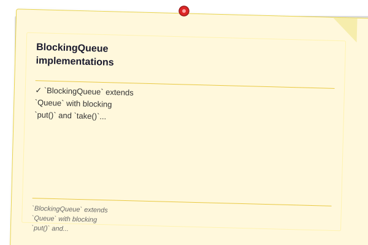
</a>


`BlockingQueue` extends `Queue` with blocking `put()` and `take()` methods that wait when the queue is full or empty.

```java
package ch02.concurrentcollections;

import java.util.concurrent.*;

class BlockingQueueDemo {

    public static void main(String[] args) throws InterruptedException {
        // ---- ArrayBlockingQueue (bounded, FIFO) ----
        BlockingQueue<Integer> arrayQueue = new ArrayBlockingQueue<>(10);
        runProducerConsumer(arrayQueue, "ArrayBlockingQueue");

        // ---- LinkedBlockingQueue (optionally bounded, FIFO) ----
        BlockingQueue<Integer> linkedQueue = new LinkedBlockingQueue<>();
        runProducerConsumer(linkedQueue, "LinkedBlockingQueue");

        // ---- PriorityBlockingQueue (unbounded, ordering by Comparator) ----
        BlockingQueue<Task> priorityQueue = new PriorityBlockingQueue<>(
            11, Comparator.comparingInt(Task::priority)
        );
        priorityQueue.put(new Task("Low", 3));
        priorityQueue.put(new Task("High", 1));
        priorityQueue.put(new Task("Medium", 2));
        System.out.println("PriorityQueue order: " + priorityQueue.take().name()); // High

        // ---- DelayQueue (delayed elements) ----
        DelayQueue<DelayedTask> delayQueue = new DelayQueue<>();
        delayQueue.put(new DelayedTask("Task1", 200, TimeUnit.MILLISECONDS));
        delayQueue.put(new DelayedTask("Task2", 50, TimeUnit.MILLISECONDS));

        System.out.println("Waiting for delayed tasks...");
        long start = System.nanoTime();
        System.out.println(delayQueue.take().name() + " after " +
            TimeUnit.NANOSECONDS.toMillis(System.nanoTime() - start) + "ms");
        System.out.println(delayQueue.take().name() + " after " +
            TimeUnit.NANOSECONDS.toMillis(System.nanoTime() - start) + "ms");

        // ---- SynchronousQueue (zero-capacity handoff) ----
        SynchronousQueue<String> synchronousQueue = new SynchronousQueue<>();
        Thread producer = new Thread(() -> {
            try {
                System.out.println("Producer offering...");
                synchronousQueue.put("direct handoff");
                System.out.println("Producer done");
            } catch (InterruptedException e) {
                Thread.currentThread().interrupt();
            }
        });
        Thread consumer = new Thread(() -> {
            try {
                Thread.sleep(100);
                String msg = synchronousQueue.take();
                System.out.println("Consumer received: " + msg);
            } catch (InterruptedException e) {
                Thread.currentThread().interrupt();
            }
        });
        producer.start();
        consumer.start();
        producer.join();
        consumer.join();
    }

    static void runProducerConsumer(BlockingQueue<Integer> q, String name)
            throws InterruptedException {
        Thread producer = new Thread(() -> {
            for (int i = 0; i < 10; i++) {
                try {
                    q.put(i); // blocks if full
                } catch (InterruptedException e) {
                    Thread.currentThread().interrupt();
                }
            }
        }, name + "-Producer");

        Thread consumer = new Thread(() -> {
            int count = 0;
            while (count < 10) {
                try {
                    int val = q.take(); // blocks if empty
                    count++;
                } catch (InterruptedException e) {
                    Thread.currentThread().interrupt();
                }
            }
            System.out.println(name + " consumed all");
        }, name + "-Consumer");

        producer.start();
        consumer.start();
        producer.join();
        consumer.join();
    }

    record Task(String name, int priority) {}
}

class DelayedTask implements Delayed {

    private final String name;
    private final long startTime;

    DelayedTask(String name, long delay, TimeUnit unit) {
        this.name = name;
        this.startTime = System.nanoTime() + unit.toNanos(delay);
    }

    String name() { return name; }

    @Override
    public long getDelay(TimeUnit unit) {
        return unit.convert(startTime - System.nanoTime(), TimeUnit.NANOSECONDS);
    }

    @Override
    public int compareTo(Delayed o) {
        return Long.compare(this.startTime, ((DelayedTask) o).startTime);
    }
}
```

### TransferQueue

<a href="../../assets/images/diagrams/java/02-concurrency/transferqueue-handwritten.svg" target="_blank" rel="noopener">
  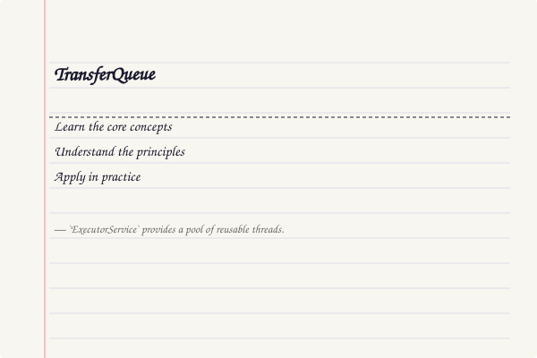
</a>
<a href="../../assets/images/diagrams/java/02-concurrency/transferqueue-diagram.svg" target="_blank" rel="noopener">
  
</a>
<a href="../../assets/images/diagrams/java/02-concurrency/transferqueue-sticky.svg" target="_blank" rel="noopener">
  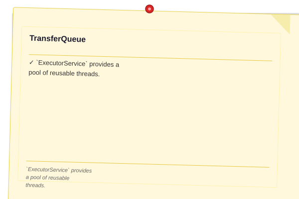
</a>


`TransferQueue` extends `BlockingQueue` with a `transfer()` method that blocks until the element is consumed by another thread.

```java
package ch02.concurrentcollections;

import java.util.concurrent.LinkedTransferQueue;
import java.util.concurrent.TransferQueue;

class TransferQueueDemo {

    public static void main(String[] args) throws InterruptedException {
        TransferQueue<String> tq = new LinkedTransferQueue<>();

        Thread consumer = new Thread(() -> {
            try {
                // Wait for a transferred element
                String msg = tq.take();
                System.out.println("Consumer received: " + msg);

                // tryTransfer with timeout
                String msg2 = tq.poll(1, java.util.concurrent.TimeUnit.SECONDS);
                System.out.println("Consumer polled: " + msg2);
            } catch (InterruptedException e) {
                Thread.currentThread().interrupt();
            }
        });

        consumer.start();

        // Transfer → blocks until consumer takes the element
        tq.transfer("direct handoff");
        System.out.println("Producer: transfer complete");

        // tryTransfer → returns false if no consumer is waiting
        boolean handed = tq.tryTransfer("no one waiting");
        System.out.println("tryTransfer (should be false): " + handed);

        consumer.join();
    }
}
```

---

## ExecutorService

Creating and destroying threads manually is expensive and error-prone. `ExecutorService` provides a pool of reusable threads.

### ThreadPoolExecutor → every parameter explained

<a href="../../assets/images/diagrams/java/02-concurrency/threadpoolexecutor-every-parameter-explained-handwritten.svg" target="_blank" rel="noopener">
  
</a>
<a href="../../assets/images/diagrams/java/02-concurrency/threadpoolexecutor-every-parameter-explained-diagram.svg" target="_blank" rel="noopener">
  
</a>
<a href="../../assets/images/diagrams/java/02-concurrency/threadpoolexecutor-every-parameter-explained-sticky.svg" target="_blank" rel="noopener">
  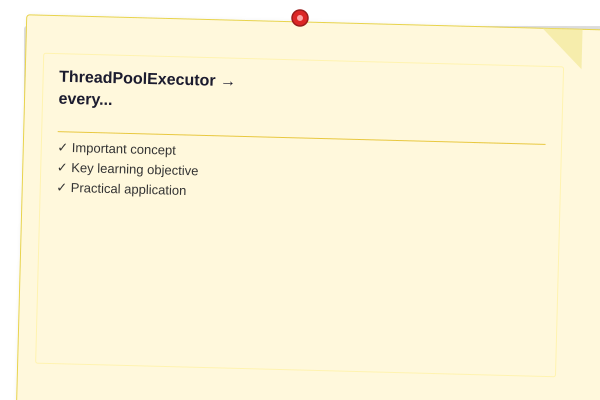
</a>


```java
package ch02.executors;

import java.util.concurrent.*;
import java.util.concurrent.atomic.AtomicInteger;

class ThreadPoolExecutorDemo {

    public static void main(String[] args) throws InterruptedException {
        int corePoolSize = 2;
        int maxPoolSize = 4;
        long keepAliveTime = 30;
        TimeUnit unit = TimeUnit.SECONDS;
        BlockingQueue<Runnable> workQueue = new LinkedBlockingQueue<>(10);
        ThreadFactory threadFactory = new ThreadFactory() {
            private final AtomicInteger counter = new AtomicInteger(1);
            @Override
            public Thread newThread(Runnable r) {
                Thread t = new Thread(r, "pool-" + counter.getAndIncrement());
                t.setDaemon(false);
                return t;
            }
        };
        RejectedExecutionHandler handler = new ThreadPoolExecutor.AbortPolicy();

        ThreadPoolExecutor executor = new ThreadPoolExecutor(
            corePoolSize,     // threads to keep alive even when idle
            maxPoolSize,      // maximum threads to create
            keepAliveTime,    // time before idle threads beyond core are terminated
            unit,             // unit for keepAliveTime
            workQueue,        // queue for tasks before a thread is available
            threadFactory,    // factory for new threads
            handler           // what to do when queue is full and maxPoolSize reached
        );

        // ---- How pool scales ----
        // corePoolSize (2) threads always alive
        // If queue fills (10 tasks), new threads created up to maxPoolSize (4)
        // If still overwhelmed, RejectedExecutionHandler fires

        // Monitor the pool
        ScheduledExecutorService monitor = Executors.newScheduledThreadPool(1);
        monitor.scheduleAtFixedRate(() -> {
            System.out.printf(
                "Pool: %d active, %d queued, %d completed%n",
                executor.getActiveCount(),
                executor.getQueue().size(),
                executor.getCompletedTaskCount()
            );
        }, 0, 500, TimeUnit.MILLISECONDS);

        // Submit 20 tasks
        for (int i = 0; i < 20; i++) {
            final int taskId = i;
            executor.submit(() -> {
                try {
                    System.out.println(Thread.currentThread().getName() +
                        " processing task " + taskId);
                    Thread.sleep(1000);
                } catch (InterruptedException e) {
                    Thread.currentThread().interrupt();
                }
            });
        }

        // Graceful shutdown
        executor.shutdown();
        boolean finished = executor.awaitTermination(10, TimeUnit.SECONDS);
        System.out.println("All tasks finished: " + finished);

        monitor.shutdownNow();
    }
}
```

### Rejected Execution Handler strategies

<a href="../../assets/images/diagrams/java/02-concurrency/rejected-execution-handler-strategies-handwritten.svg" target="_blank" rel="noopener">
  
</a>
<a href="../../assets/images/diagrams/java/02-concurrency/rejected-execution-handler-strategies-diagram.svg" target="_blank" rel="noopener">
  
</a>
<a href="../../assets/images/diagrams/java/02-concurrency/rejected-execution-handler-strategies-sticky.svg" target="_blank" rel="noopener">
  
</a>


| Handler | Behavior |
|---------|----------|
| `AbortPolicy` | Throws `RejectedExecutionException` (default) |
| `CallerRunsPolicy` | The submitting thread runs the task itself (back-pressure) |
| `DiscardPolicy` | Silently discards the task |
| `DiscardOldestPolicy` | Discards the oldest unprocessed task, then retries |

```java
package ch02.executors;

import java.util.concurrent.*;

class CallerRunsPolicyDemo {

    public static void main(String[] args) {
        ThreadPoolExecutor executor = new ThreadPoolExecutor(
            1, 1, 0, TimeUnit.SECONDS,
            new ArrayBlockingQueue<>(1),
            new ThreadPoolExecutor.CallerRunsPolicy()
        );

        for (int i = 0; i < 5; i++) {
            final int id = i;
            executor.submit(() -> {
                System.out.println(Thread.currentThread().getName() + " running task " + id);
                try { Thread.sleep(500); } catch (InterruptedException e) { }
            });
        }

        executor.shutdown();
    }
}
```

### ScheduledThreadPoolExecutor

<a href="../../assets/images/diagrams/java/02-concurrency/scheduledthreadpoolexecutor-handwritten.svg" target="_blank" rel="noopener">
  
</a>
<a href="../../assets/images/diagrams/java/02-concurrency/scheduledthreadpoolexecutor-diagram.svg" target="_blank" rel="noopener">
  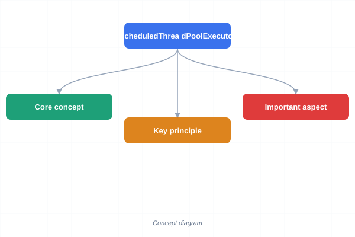
</a>
<a href="../../assets/images/diagrams/java/02-concurrency/scheduledthreadpoolexecutor-sticky.svg" target="_blank" rel="noopener">
  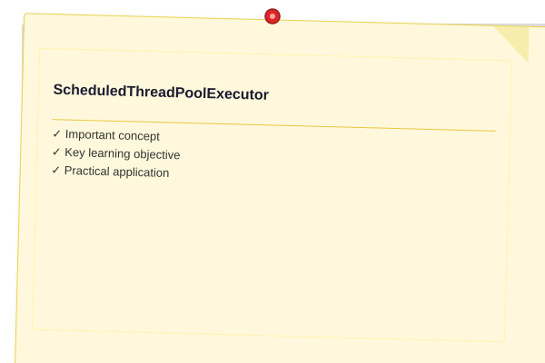
</a>


```java
package ch02.executors;

import java.time.LocalTime;
import java.util.concurrent.*;

class ScheduledExecutorDemo {

    public static void main(String[] args) throws InterruptedException {
        ScheduledThreadPoolExecutor scheduler = new ScheduledThreadPoolExecutor(2);

        System.out.println("Time: " + LocalTime.now());

        // Schedule with fixed delay → next run starts after previous finishes + delay
        ScheduledFuture<?> fixedDelay = scheduler.scheduleWithFixedDelay(
            () -> System.out.println("Fixed delay at: " + LocalTime.now()),
            1, 2, TimeUnit.SECONDS
        );

        // Schedule at fixed rate → starts every N seconds regardless of duration
        ScheduledFuture<?> fixedRate = scheduler.scheduleAtFixedRate(
            () -> System.out.println("  Fixed rate at: " + LocalTime.now()),
            1, 3, TimeUnit.SECONDS
        );

        // Schedule one-shot task
        ScheduledFuture<String> oneShot = scheduler.schedule(
            () -> "One-shot result at " + LocalTime.now(),
            2, TimeUnit.SECONDS
        );

        // Cancel after 10 seconds
        Thread.sleep(10_000);
        fixedDelay.cancel(false);
        fixedRate.cancel(false);

        System.out.println("One-shot: " + oneShot.get());
        scheduler.shutdown();
    }
}
```

### Executors factory methods

<a href="../../assets/images/diagrams/java/02-concurrency/executors-factory-methods-handwritten.svg" target="_blank" rel="noopener">
  
</a>
<a href="../../assets/images/diagrams/java/02-concurrency/executors-factory-methods-diagram.svg" target="_blank" rel="noopener">
  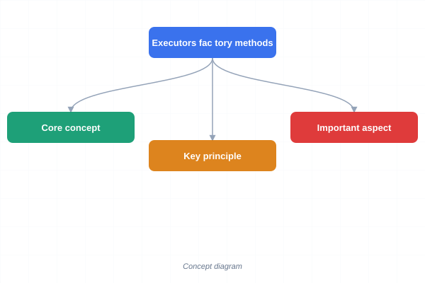
</a>
<a href="../../assets/images/diagrams/java/02-concurrency/executors-factory-methods-sticky.svg" target="_blank" rel="noopener">
  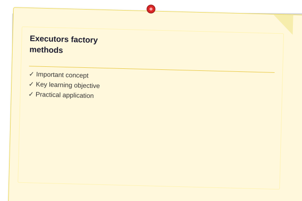
</a>


```java
package ch02.executors;

import java.util.concurrent.*;

class ExecutorsFactoryDemo {

    public static void main(String[] args) {
        // Fixed thread pool → good for predictable load
        ExecutorService fixed = Executors.newFixedThreadPool(4);
        try {
            fixed.submit(() -> System.out.println("Fixed pool"));
        } finally {
            fixed.shutdown();
        }

        // Cached thread pool → creates threads on demand, reuses idle ones
        ExecutorService cached = Executors.newCachedThreadPool();
        try {
            cached.submit(() -> System.out.println("Cached pool"));
        } finally {
            cached.shutdown();
        }

        // Single-thread executor → guarantees sequential execution
        ExecutorService single = Executors.newSingleThreadExecutor();
        try {
            single.submit(() -> System.out.println("Single thread"));
        } finally {
            single.shutdown();
        }

        // Work-stealing pool → ForkJoinPool-based
        ExecutorService workStealing = Executors.newWorkStealingPool();
        try {
            workStealing.submit(() -> System.out.println("Work stealing"));
        } finally {
            workStealing.shutdown();
        }
    }
}
```

### invokeAll, invokeAny, submit(Callable)

<a href="../../assets/images/diagrams/java/02-concurrency/invokeall-invokeany-submit-callable-handwritten.svg" target="_blank" rel="noopener">
  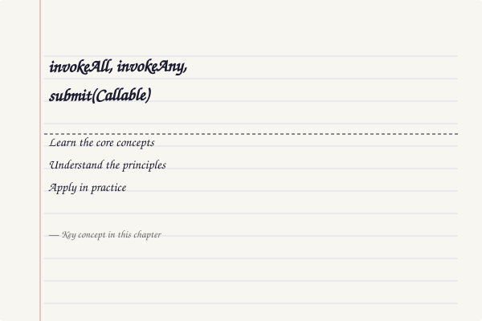
</a>
<a href="../../assets/images/diagrams/java/02-concurrency/invokeall-invokeany-submit-callable-diagram.svg" target="_blank" rel="noopener">
  
</a>
<a href="../../assets/images/diagrams/java/02-concurrency/invokeall-invokeany-submit-callable-sticky.svg" target="_blank" rel="noopener">
  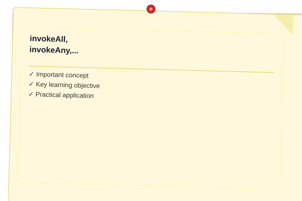
</a>


```java
package ch02.executors;

import java.util.*;
import java.util.concurrent.*;

class InvokeAllAnyDemo {

    public static void main(String[] args) throws InterruptedException, ExecutionException {
        ExecutorService executor = Executors.newFixedThreadPool(4);

        // ---- submit(Callable) → get a Future ----
        Future<String> future = executor.submit(() -> {
            Thread.sleep(500);
            return "Result from callable";
        });
        System.out.println("Future result: " + future.get());

        // ---- invokeAll → wait for all tasks ----
        List<Callable<String>> tasks = List.of(
            () -> { Thread.sleep(300); return "Task A"; },
            () -> { Thread.sleep(100); return "Task B"; },
            () -> { Thread.sleep(200); return "Task C"; }
        );

        long start = System.nanoTime();
        List<Future<String>> results = executor.invokeAll(tasks);
        long elapsed = TimeUnit.NANOSECONDS.toMillis(System.nanoTime() - start);

        System.out.println("All tasks completed in " + elapsed + "ms");
        for (Future<String> f : results) {
            System.out.println("  " + f.get());
        }

        // ---- invokeAny → return first successful result ----
        List<Callable<String>> raceTasks = List.of(
            () -> { Thread.sleep(300); return "Slow"; },
            () -> { Thread.sleep(100); return "Fast"; },
            () -> { Thread.sleep(200); return "Medium"; }
        );

        String first = executor.invokeAny(raceTasks);
        System.out.println("Winner: " + first); // Fast (almost always)

        executor.shutdown();
    }
}
```

### shutdown vs shutdownNow

<a href="../../assets/images/diagrams/java/02-concurrency/shutdown-vs-shutdownnow-handwritten.svg" target="_blank" rel="noopener">
  
</a>
<a href="../../assets/images/diagrams/java/02-concurrency/shutdown-vs-shutdownnow-diagram.svg" target="_blank" rel="noopener">
  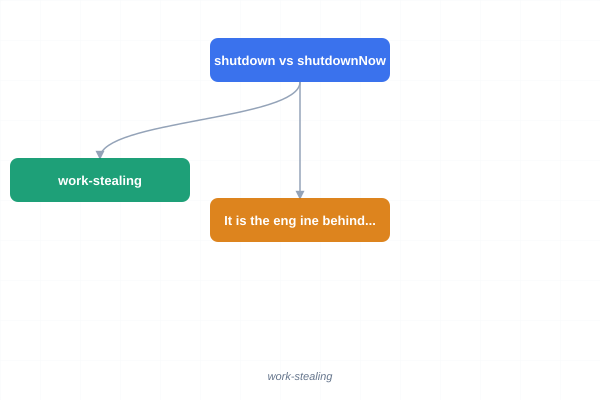
</a>
<a href="../../assets/images/diagrams/java/02-concurrency/shutdown-vs-shutdownnow-sticky.svg" target="_blank" rel="noopener">
  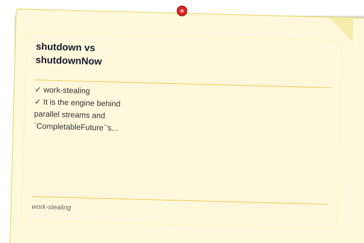
</a>


```java
package ch02.executors;

import java.util.List;
import java.util.concurrent.*;

class ShutdownDemo {

    public static void main(String[] args) throws InterruptedException {
        ExecutorService executor = Executors.newFixedThreadPool(2);

        for (int i = 0; i < 10; i++) {
            final int id = i;
            executor.submit(() -> {
                try {
                    System.out.println("Task " + id + " started");
                    Thread.sleep(5000);
                    System.out.println("Task " + id + " finished");
                } catch (InterruptedException e) {
                    System.out.println("Task " + id + " interrupted");
                    Thread.currentThread().interrupt();
                }
            });
        }

        Thread.sleep(500);

        // shutdown() → no new tasks accepted, already-submitted tasks complete
        executor.shutdown();
        // executor.submit(() -> {}); // would throw RejectedExecutionException

        // Try to terminate within 2 seconds
        if (!executor.awaitTermination(2, TimeUnit.SECONDS)) {
            System.out.println("Not all tasks finished, calling shutdownNow()");

            // shutdownNow() → attempts to stop running tasks via interrupt,
            // returns list of tasks that never started
            List<Runnable> neverStarted = executor.shutdownNow();
            System.out.println("Tasks never started: " + neverStarted.size());
        }
    }
}
```

---

## ForkJoinPool

`ForkJoinPool` implements **work-stealing**: idle threads steal tasks from busy threads' queues. It is the engine behind parallel streams and `CompletableFuture`'s async execution.

### RecursiveTask → compute-intensive parallel decomposition

<a href="../../assets/images/diagrams/java/02-concurrency/recursivetask-compute-intensive-parallel-decomposition-handwritten.svg" target="_blank" rel="noopener">
  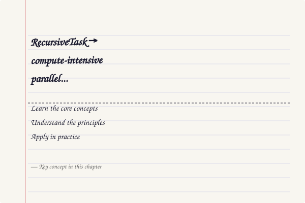
</a>
<a href="../../assets/images/diagrams/java/02-concurrency/recursivetask-compute-intensive-parallel-decomposition-diagram.svg" target="_blank" rel="noopener">
  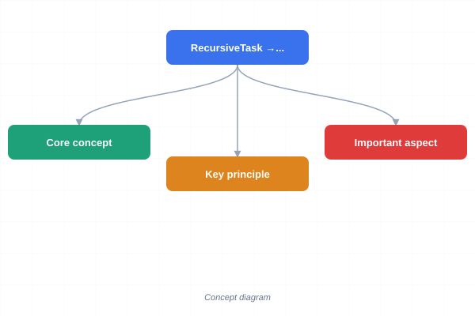
</a>
<a href="../../assets/images/diagrams/java/02-concurrency/recursivetask-compute-intensive-parallel-decomposition-sticky.svg" target="_blank" rel="noopener">
  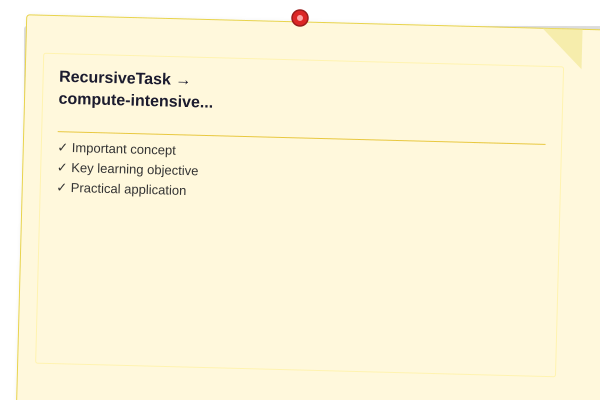
</a>


```java
package ch02.forkjoin;

import java.util.concurrent.ForkJoinPool;
import java.util.concurrent.RecursiveTask;

class SumTask extends RecursiveTask<Long> {

    private static final int THRESHOLD = 10_000;
    private final long[] array;
    private final int start;
    private final int end;

    SumTask(long[] array, int start, int end) {
        this.array = array;
        this.start = start;
        this.end = end;
    }

    @Override
    protected Long compute() {
        int length = end - start;
        if (length <= THRESHOLD) {
            // Base case: compute directly
            long sum = 0;
            for (int i = start; i < end; i++) {
                sum += array[i];
            }
            return sum;
        }

        // Recursive case: fork
        int mid = start + length / 2;
        SumTask left = new SumTask(array, start, mid);
        SumTask right = new SumTask(array, mid, end);

        left.fork();          // queue left for another thread
        long rightResult = right.compute();  // compute right in current thread
        long leftResult = left.join();       // wait for left result

        return leftResult + rightResult;
    }

    public static void main(String[] args) {
        long[] data = new long[100_000];
        for (int i = 0; i < data.length; i++) {
            data[i] = i + 1;
        }

        ForkJoinPool pool = new ForkJoinPool(); // parallelism = availableProcessors
        long result = pool.invoke(new SumTask(data, 0, data.length));
        System.out.println("Sum: " + result);

        long expected = (long) data.length * (data.length + 1) / 2;
        System.out.println("Expected: " + expected);
        System.out.println("Match: " + (result == expected));
    }
}
```

### RecursiveAction → parallel side-effects (no return value)

<a href="../../assets/images/diagrams/java/02-concurrency/recursiveaction-parallel-side-effects-no-return-value-handwritten.svg" target="_blank" rel="noopener">
  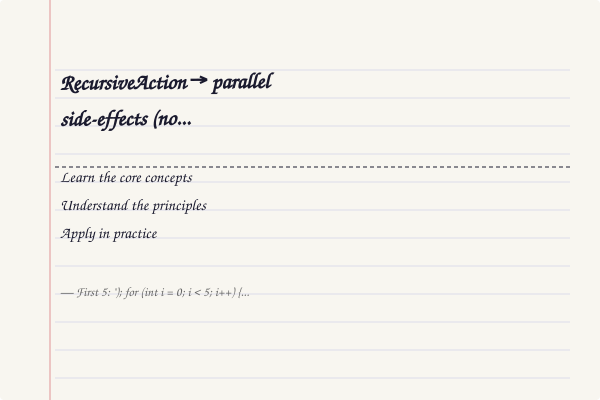
</a>
<a href="../../assets/images/diagrams/java/02-concurrency/recursiveaction-parallel-side-effects-no-return-value-diagram.svg" target="_blank" rel="noopener">
  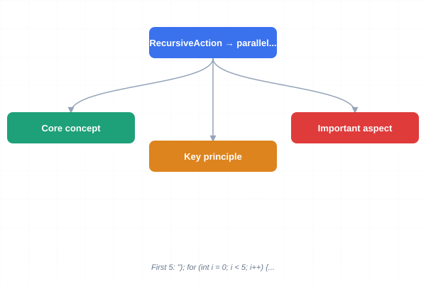
</a>
<a href="../../assets/images/diagrams/java/02-concurrency/recursiveaction-parallel-side-effects-no-return-value-sticky.svg" target="_blank" rel="noopener">
  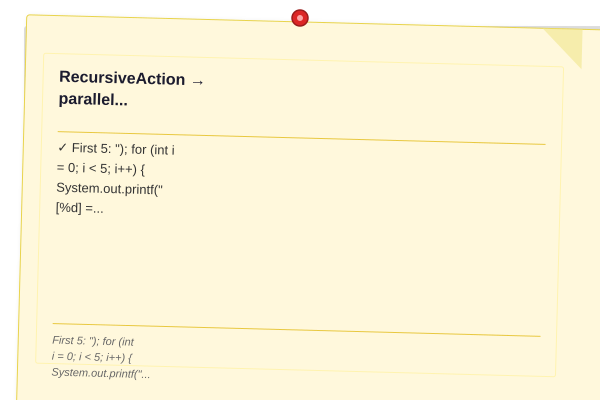
</a>


```java
package ch02.forkjoin;

import java.util.concurrent.ForkJoinPool;
import java.util.concurrent.RecursiveAction;

class ParallelArrayTransform extends RecursiveAction {

    private static final int THRESHOLD = 10_000;
    private final double[] array;
    private final int start;
    private final int end;

    ParallelArrayTransform(double[] array, int start, int end) {
        this.array = array;
        this.start = start;
        this.end = end;
    }

    @Override
    protected void compute() {
        if (end - start <= THRESHOLD) {
            for (int i = start; i < end; i++) {
                array[i] = Math.sqrt(array[i] * array[i] + array[i] * array[i]);
            }
        } else {
            int mid = start + (end - start) / 2;
            ParallelArrayTransform left = new ParallelArrayTransform(array, start, mid);
            ParallelArrayTransform right = new ParallelArrayTransform(array, mid, end);

            // Invoke both in parallel
            invokeAll(left, right);
        }
    }

    public static void main(String[] args) {
        double[] data = new double[100_000];
        for (int i = 0; i < data.length; i++) {
            data[i] = i * 1.0;
        }

        ForkJoinPool.commonPool().invoke(new ParallelArrayTransform(data, 0, data.length));
        System.out.println("Transform complete. First 5: ");
        for (int i = 0; i < 5; i++) {
            System.out.printf("  [%d] = %.2f%n", i, data[i]);
        }
    }
}
```

### Common pool

<a href="../../assets/images/diagrams/java/02-concurrency/common-pool-handwritten.svg" target="_blank" rel="noopener">
  
</a>
<a href="../../assets/images/diagrams/java/02-concurrency/common-pool-diagram.svg" target="_blank" rel="noopener">
  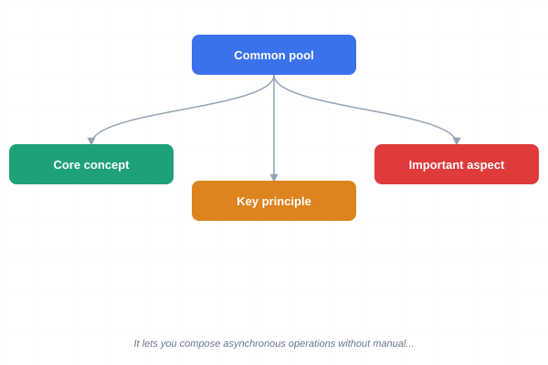
</a>
<a href="../../assets/images/diagrams/java/02-concurrency/common-pool-sticky.svg" target="_blank" rel="noopener">
  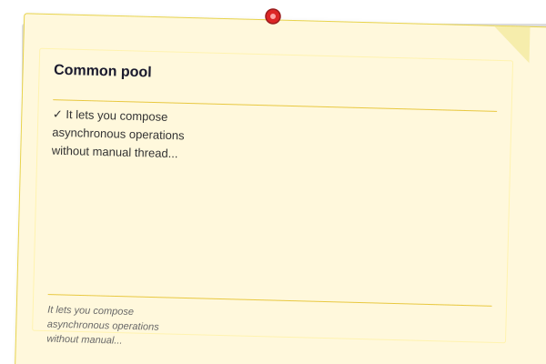
</a>


```java
package ch02.forkjoin;

import java.util.concurrent.ForkJoinPool;

class CommonPoolDemo {

    public static void main(String[] args) {
        ForkJoinPool common = ForkJoinPool.commonPool();

        System.out.println("Common pool parallelism: " + common.getParallelism());
        System.out.println("Available processors: " + Runtime.getRuntime().availableProcessors());
        System.out.println("Common pool size: " + common.getPoolSize());
        System.out.println("Active thread count: " + common.getActiveThreadCount());

        // The common pool is used by parallel streams
        long sum = java.util.stream.LongStream.rangeClosed(1, 10_000_000)
            .parallel()
            .sum();

        System.out.println("Parallel stream sum: " + sum);
    }
}
```

---

## CompletableFuture

`CompletableFuture` is the most powerful async abstraction in modern Java. It lets you compose asynchronous operations without manual thread management.

### Basic creation and completion

<a href="../../assets/images/diagrams/java/02-concurrency/basic-creation-and-completion-handwritten.svg" target="_blank" rel="noopener">
  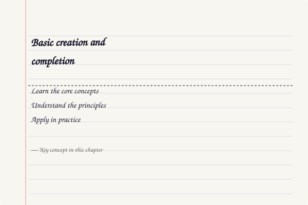
</a>
<a href="../../assets/images/diagrams/java/02-concurrency/basic-creation-and-completion-diagram.svg" target="_blank" rel="noopener">
  
</a>
<a href="../../assets/images/diagrams/java/02-concurrency/basic-creation-and-completion-sticky.svg" target="_blank" rel="noopener">
  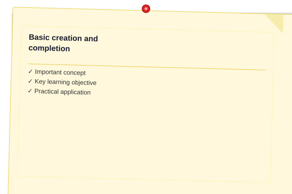
</a>


```java
package ch02.completablefuture;

import java.util.concurrent.CompletableFuture;
import java.util.concurrent.ExecutionException;

class BasicCompletableFutureDemo {

    public static void main(String[] args) throws ExecutionException, InterruptedException {
        // ---- completedFuture ----
        CompletableFuture<String> preCompleted = CompletableFuture.completedFuture("done");
        System.out.println("Pre-completed: " + preCompleted.get());

        // ---- supplyAsync → runs on ForkJoinPool.commonPool() ----
        CompletableFuture<String> async = CompletableFuture.supplyAsync(() -> {
            try { Thread.sleep(100); } catch (InterruptedException e) { }
            return "async result";
        });
        System.out.println("Async: " + async.get());

        // ---- supplyAsync with custom executor ----
        java.util.concurrent.ExecutorService exec = java.util.concurrent.Executors.newFixedThreadPool(2);
        CompletableFuture<String> custom = CompletableFuture.supplyAsync(() -> {
            try { Thread.sleep(100); } catch (InterruptedException e) { }
            return "custom executor result";
        }, exec);
        System.out.println("Custom: " + custom.get());
        exec.shutdown();

        // ---- runAsync (no result) ----
        CompletableFuture<Void> run = CompletableFuture.runAsync(() ->
            System.out.println("Run async"));
        run.get();
    }
}
```

### Chaining: thenApply, thenAccept, thenRun

<a href="../../assets/images/diagrams/java/02-concurrency/chaining-thenapply-thenaccept-thenrun-handwritten.svg" target="_blank" rel="noopener">
  
</a>
<a href="../../assets/images/diagrams/java/02-concurrency/chaining-thenapply-thenaccept-thenrun-diagram.svg" target="_blank" rel="noopener">
  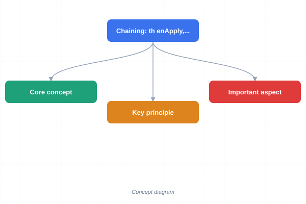
</a>
<a href="../../assets/images/diagrams/java/02-concurrency/chaining-thenapply-thenaccept-thenrun-sticky.svg" target="_blank" rel="noopener">
  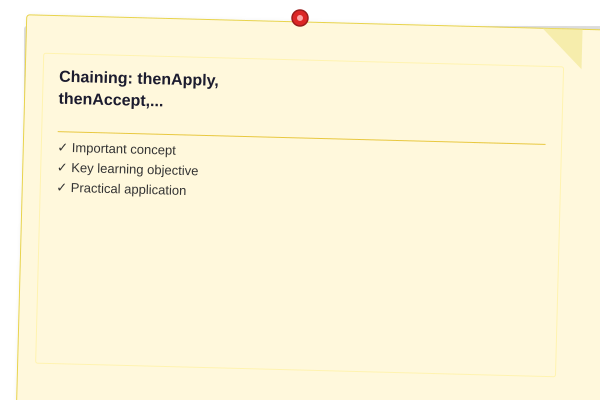
</a>


```java
package ch02.completablefuture;

import java.util.concurrent.CompletableFuture;

class ChainingDemo {

    public static void main(String[] args) {
        CompletableFuture.supplyAsync(() -> "hello")
            .thenApply(s -> s.toUpperCase())            // transform value (sync)
            .thenApplyAsync(s -> s + " WORLD")          // transform value (async)
            .thenAccept(s -> System.out.println(s))     // consume value
            .thenRun(() -> System.out.println("Done"))  // run after completion
            .join();  // block for result
    }
}
```

### thenCompose → flatMap for futures

<a href="../../assets/images/diagrams/java/02-concurrency/thencompose-flatmap-for-futures-handwritten.svg" target="_blank" rel="noopener">
  
</a>
<a href="../../assets/images/diagrams/java/02-concurrency/thencompose-flatmap-for-futures-diagram.svg" target="_blank" rel="noopener">
  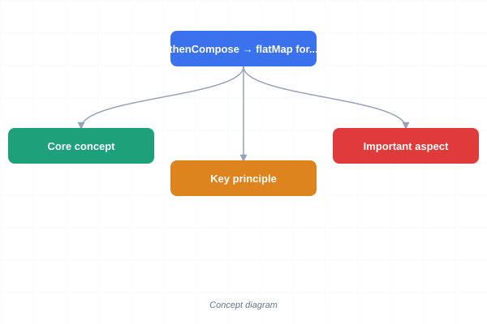
</a>
<a href="../../assets/images/diagrams/java/02-concurrency/thencompose-flatmap-for-futures-sticky.svg" target="_blank" rel="noopener">
  
</a>


```java
package ch02.completablefuture;

import java.util.concurrent.CompletableFuture;

class ThenComposeDemo {

    static CompletableFuture<String> fetchUser(int id) {
        return CompletableFuture.supplyAsync(() -> "User-" + id);
    }

    static CompletableFuture<String> fetchOrders(String user) {
        return CompletableFuture.supplyAsync(() -> "Orders for " + user);
    }

    public static void main(String[] args) {
        // Without thenCompose → nested futures
        CompletableFuture<CompletableFuture<String>> nested =
            fetchUser(42).thenApply(user -> fetchOrders(user));

        // With thenCompose → flattened
        CompletableFuture<String> flat =
            fetchUser(42).thenCompose(user -> fetchOrders(user));

        System.out.println(flat.join()); // Orders for User-42
    }
}
```

### thenCombine → combine two independent futures

<a href="../../assets/images/diagrams/java/02-concurrency/thencombine-combine-two-independent-futures-handwritten.svg" target="_blank" rel="noopener">
  
</a>
<a href="../../assets/images/diagrams/java/02-concurrency/thencombine-combine-two-independent-futures-diagram.svg" target="_blank" rel="noopener">
  
</a>
<a href="../../assets/images/diagrams/java/02-concurrency/thencombine-combine-two-independent-futures-sticky.svg" target="_blank" rel="noopener">
  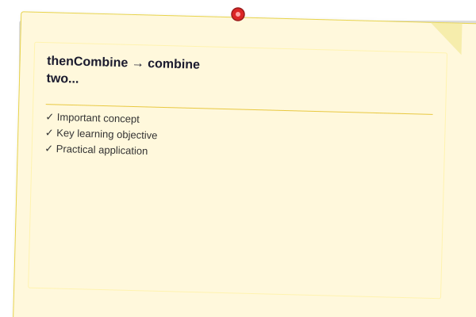
</a>


```java
package ch02.completablefuture;

import java.util.concurrent.CompletableFuture;

class ThenCombineDemo {

    public static void main(String[] args) {
        CompletableFuture<String> future1 = CompletableFuture.supplyAsync(() -> "Hello");
        CompletableFuture<String> future2 = CompletableFuture.supplyAsync(() -> "World");

        String combined = future1.thenCombine(future2, (a, b) -> a + " " + b).join();
        System.out.println("Combined: " + combined); // Hello World
    }
}
```

### allOf → wait for multiple futures

<a href="../../assets/images/diagrams/java/02-concurrency/allof-wait-for-multiple-futures-handwritten.svg" target="_blank" rel="noopener">
  
</a>
<a href="../../assets/images/diagrams/java/02-concurrency/allof-wait-for-multiple-futures-diagram.svg" target="_blank" rel="noopener">
  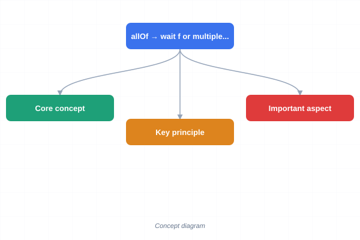
</a>
<a href="../../assets/images/diagrams/java/02-concurrency/allof-wait-for-multiple-futures-sticky.svg" target="_blank" rel="noopener">
  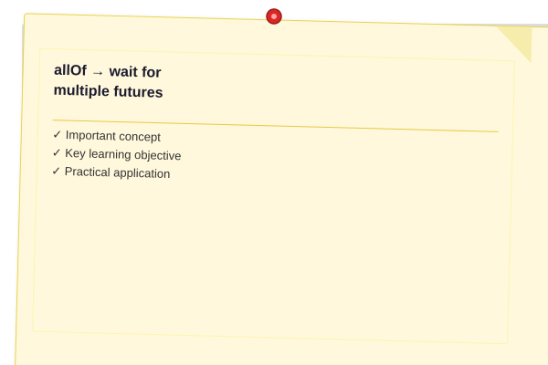
</a>


```java
package ch02.completablefuture;

import java.util.concurrent.CompletableFuture;
import java.util.stream.IntStream;

class AllOfDemo {

    public static void main(String[] args) {
        CompletableFuture<String>[] futures = IntStream.rangeClosed(1, 5)
            .mapToObj(i -> CompletableFuture.supplyAsync(() -> {
                try {
                    Thread.sleep((long) (Math.random() * 500));
                } catch (InterruptedException e) { }
                return "Task " + i;
            }))
            .toArray(CompletableFuture[]::new);

        CompletableFuture<Void> all = CompletableFuture.allOf(futures);

        // Collect all results
        CompletableFuture<Void> collected = all.thenAccept(_ -> {
            for (CompletableFuture<String> f : futures) {
                System.out.println(f.join());
            }
        });

        collected.join();
        System.out.println("All tasks completed");
    }
}
```

### anyOf → first result wins

<a href="../../assets/images/diagrams/java/02-concurrency/anyof-first-result-wins-handwritten.svg" target="_blank" rel="noopener">
  
</a>
<a href="../../assets/images/diagrams/java/02-concurrency/anyof-first-result-wins-diagram.svg" target="_blank" rel="noopener">
  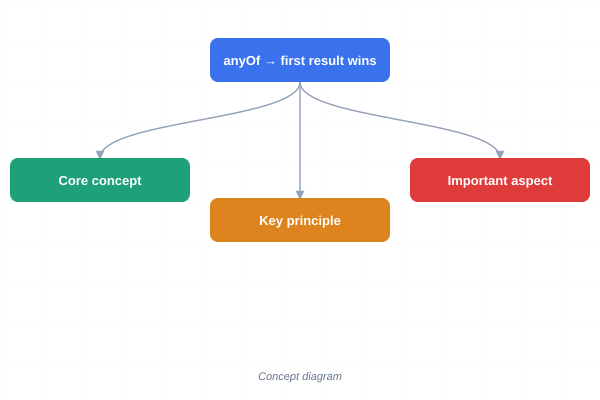
</a>
<a href="../../assets/images/diagrams/java/02-concurrency/anyof-first-result-wins-sticky.svg" target="_blank" rel="noopener">
  
</a>


```java
package ch02.completablefuture;

import java.util.concurrent.CompletableFuture;

class AnyOfDemo {

    public static void main(String[] args) {
        CompletableFuture<String> slow = CompletableFuture.supplyAsync(() -> {
            try { Thread.sleep(500); } catch (InterruptedException e) { }
            return "Slow";
        });

        CompletableFuture<String> fast = CompletableFuture.supplyAsync(() -> {
            try { Thread.sleep(100); } catch (InterruptedException e) { }
            return "Fast";
        });

        CompletableFuture<Object> first = CompletableFuture.anyOf(slow, fast);
        System.out.println("First to complete: " + first.join()); // Fast
    }
}
```

### exceptionally → error recovery

<a href="../../assets/images/diagrams/java/02-concurrency/exceptionally-error-recovery-handwritten.svg" target="_blank" rel="noopener">
  
</a>
<a href="../../assets/images/diagrams/java/02-concurrency/exceptionally-error-recovery-diagram.svg" target="_blank" rel="noopener">
  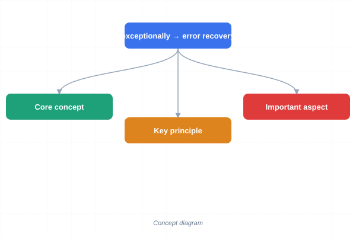
</a>
<a href="../../assets/images/diagrams/java/02-concurrency/exceptionally-error-recovery-sticky.svg" target="_blank" rel="noopener">
  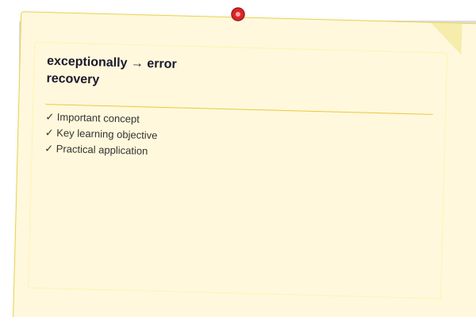
</a>


```java
package ch02.completablefuture;

import java.util.concurrent.CompletableFuture;

class ExceptionallyDemo {

    public static void main(String[] args) {
        String result = CompletableFuture
            .supplyAsync(() -> {
                if (Math.random() > 0.5) {
                    throw new RuntimeException("Something went wrong");
                }
                return "success";
            })
            .exceptionally(ex -> "fallback: " + ex.getMessage())
            .join();

        System.out.println("Result: " + result);
    }
}
```

### handle → recovery regardless of outcome

<a href="../../assets/images/diagrams/java/02-concurrency/handle-recovery-regardless-of-outcome-handwritten.svg" target="_blank" rel="noopener">
  
</a>
<a href="../../assets/images/diagrams/java/02-concurrency/handle-recovery-regardless-of-outcome-diagram.svg" target="_blank" rel="noopener">
  
</a>
<a href="../../assets/images/diagrams/java/02-concurrency/handle-recovery-regardless-of-outcome-sticky.svg" target="_blank" rel="noopener">
  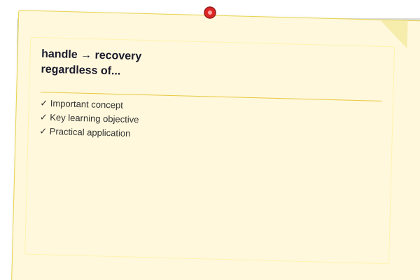
</a>


```java
package ch02.completablefuture;

import java.util.concurrent.CompletableFuture;

class HandleDemo {

    public static void main(String[] args) {
        String result = CompletableFuture
            .supplyAsync(() -> {
                if (Math.random() > 0.5) {
                    throw new RuntimeException("Boom!");
                }
                return "ok";
            })
            .handle((value, ex) -> {
                if (ex != null) {
                    return "recovered from: " + ex.getMessage();
                }
                return "processed: " + value;
            })
            .join();

        System.out.println("Result: " + result);
    }
}
```

### whenComplete → observe completion

<a href="../../assets/images/diagrams/java/02-concurrency/whencomplete-observe-completion-handwritten.svg" target="_blank" rel="noopener">
  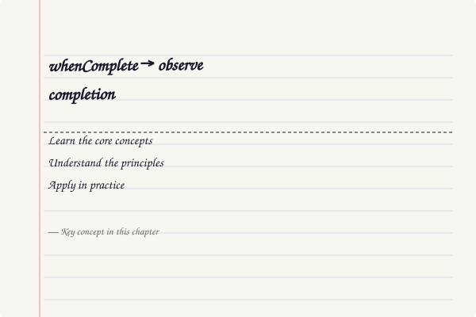
</a>
<a href="../../assets/images/diagrams/java/02-concurrency/whencomplete-observe-completion-diagram.svg" target="_blank" rel="noopener">
  
</a>
<a href="../../assets/images/diagrams/java/02-concurrency/whencomplete-observe-completion-sticky.svg" target="_blank" rel="noopener">
  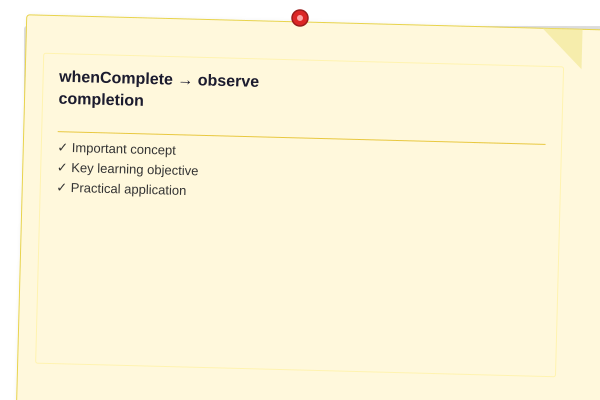
</a>


```java
package ch02.completablefuture;

import java.util.concurrent.CompletableFuture;

class WhenCompleteDemo {

    public static void main(String[] args) {
        CompletableFuture.supplyAsync(() -> {
            try { Thread.sleep(200); } catch (InterruptedException e) { }
            return 42;
        }).whenComplete((result, ex) -> {
            if (ex != null) {
                System.out.println("Failed: " + ex.getMessage());
            } else {
                System.out.println("Completed with: " + result);
            }
        }).join();
    }
}
```

### Timeouts → completeOnTimeout, orTimeout

<a href="../../assets/images/diagrams/java/02-concurrency/timeouts-completeontimeout-ortimeout-handwritten.svg" target="_blank" rel="noopener">
  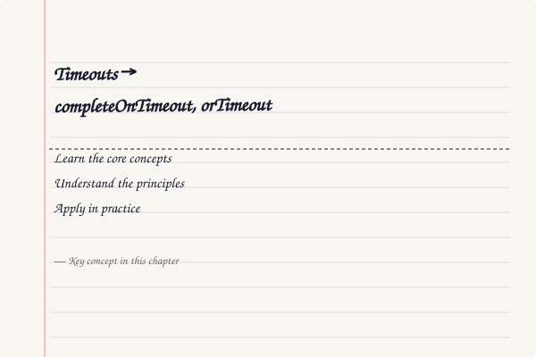
</a>
<a href="../../assets/images/diagrams/java/02-concurrency/timeouts-completeontimeout-ortimeout-diagram.svg" target="_blank" rel="noopener">
  
</a>
<a href="../../assets/images/diagrams/java/02-concurrency/timeouts-completeontimeout-ortimeout-sticky.svg" target="_blank" rel="noopener">
  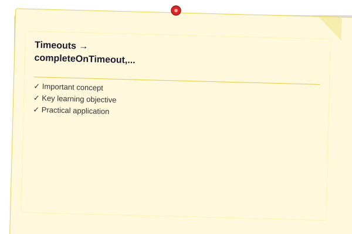
</a>


```java
package ch02.completablefuture;

import java.util.concurrent.*;

class TimeoutDemo {

    public static void main(String[] args) throws ExecutionException, InterruptedException, TimeoutException {
        // ---- orTimeout → throw TimeoutException if not done in time ----
        CompletableFuture<String> withTimeout = CompletableFuture
            .supplyAsync(() -> {
                try { Thread.sleep(2000); } catch (InterruptedException e) { }
                return "too slow";
            })
            .orTimeout(500, TimeUnit.MILLISECONDS);

        try {
            withTimeout.get();
        } catch (ExecutionException e) {
            System.out.println("Timed out: " + e.getCause().getClass().getSimpleName());
        }

        // ---- completeOnTimeout → fallback value ----
        String result = CompletableFuture
            .supplyAsync(() -> {
                try { Thread.sleep(2000); } catch (InterruptedException e) { }
                return "real";
            })
            .completeOnTimeout("fallback", 500, TimeUnit.MILLISECONDS)
            .get();

        System.out.println("Result: " + result); // "fallback"
    }
}
```

### CompletableFuture pipeline → full example

<a href="../../assets/images/diagrams/java/02-concurrency/completablefuture-pipeline-full-example-handwritten.svg" target="_blank" rel="noopener">
  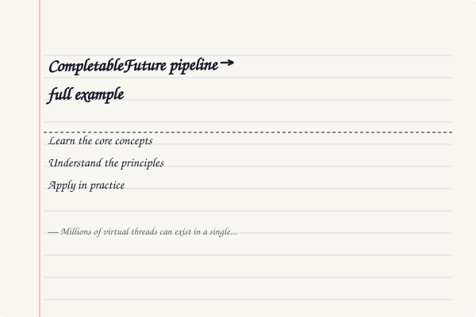
</a>
<a href="../../assets/images/diagrams/java/02-concurrency/completablefuture-pipeline-full-example-diagram.svg" target="_blank" rel="noopener">
  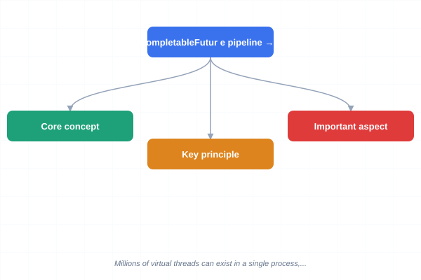
</a>
<a href="../../assets/images/diagrams/java/02-concurrency/completablefuture-pipeline-full-example-sticky.svg" target="_blank" rel="noopener">
  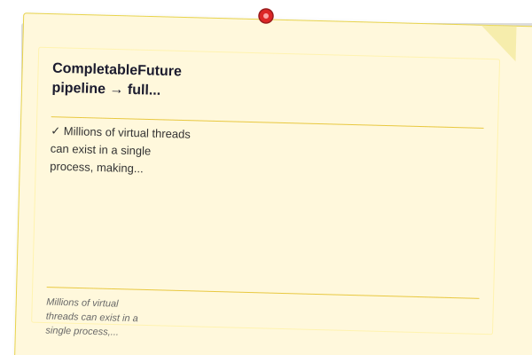
</a>


```java
package ch02.completablefuture;

import java.util.concurrent.CompletableFuture;
import java.util.concurrent.TimeUnit;

class PipelineDemo {

    record User(int id, String name) {}
    record Order(int id, int userId, double amount) {}

    static CompletableFuture<User> findUser(int id) {
        return CompletableFuture.supplyAsync(() -> {
            sleep(200);
            return new User(id, "Alice");
        });
    }

    static CompletableFuture<Order> latestOrder(User user) {
        return CompletableFuture.supplyAsync(() -> {
            sleep(150);
            return new Order(1001, user.id(), 299.99);
        });
    }

    static CompletableFuture<String> ship(Order order) {
        return CompletableFuture.supplyAsync(() -> {
            sleep(100);
            return "Order " + order.id() + " shipped";
        });
    }

    static CompletableFuture<String> notifyUser(User user, String shippingMsg) {
        return CompletableFuture.supplyAsync(() -> {
            sleep(50);
            return "Notification sent to " + user.name() + ": " + shippingMsg;
        });
    }

    static void sleep(int ms) {
        try { Thread.sleep(ms); } catch (InterruptedException e) { }
    }

    public static void main(String[] args) {
        long start = System.nanoTime();

        String result = findUser(42)
            .thenCompose(user -> latestOrder(user)
                .thenCombine(ship(new Order(1, 42, 0)), (order, msg) -> msg)
                .thenCompose(msg -> notifyUser(user, msg))
            )
            .orTimeout(5, TimeUnit.SECONDS)
            .join();

        long elapsed = TimeUnit.NANOSECONDS.toMillis(System.nanoTime() - start);
        System.out.println("Result: " + result);
        System.out.println("Elapsed: " + elapsed + "ms (sequential would be ~500ms)");
    }
}
```

---

## Virtual Threads (Project Loom)

Virtual threads are lightweight threads managed by the JVM rather than the OS. Millions of virtual threads can exist in a single process, making them ideal for I/O-bound workloads.

### Creating virtual threads

<a href="../../assets/images/diagrams/java/02-concurrency/creating-virtual-threads-handwritten.svg" target="_blank" rel="noopener">
  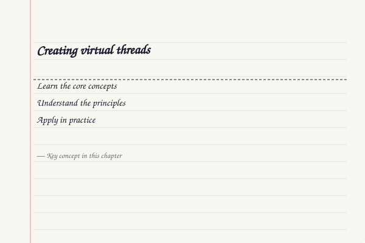
</a>
<a href="../../assets/images/diagrams/java/02-concurrency/creating-virtual-threads-diagram.svg" target="_blank" rel="noopener">
  
</a>
<a href="../../assets/images/diagrams/java/02-concurrency/creating-virtual-threads-sticky.svg" target="_blank" rel="noopener">
  
</a>


```java
package ch02.virtualthreads;

import java.util.concurrent.Executors;
import java.util.concurrent.ThreadFactory;

class VirtualThreadCreationDemo {

    public static void main(String[] args) throws InterruptedException {
        // ---- Thread.ofVirtual() ----
        Thread vt = Thread.ofVirtual()
            .name("my-virtual-thread")
            .unstarted(() -> System.out.println("Hello from " + Thread.currentThread()));

        System.out.println("Is virtual? " + vt.isVirtual()); // true
        vt.start();
        vt.join();

        // ---- Thread.startVirtualThread() ----
        Thread started = Thread.startVirtualThread(() ->
            System.out.println("Started immediately"));
        started.join();

        // ---- Executors.newVirtualThreadPerTaskExecutor() ----
        try (var executor = Executors.newVirtualThreadPerTaskExecutor()) {
            executor.submit(() -> System.out.println("From virtual executor"));
        } // auto-close calls shutdown()

        // ---- Virtual thread factory ----
        ThreadFactory factory = Thread.ofVirtual().name("vt-", 0).factory();
        Thread vtFromFactory = factory.newThread(() ->
            System.out.println("From factory"));
        vtFromFactory.start();
        vtFromFactory.join();
    }
}
```

### Virtual threads are cheap

<a href="../../assets/images/diagrams/java/02-concurrency/virtual-threads-are-cheap-handwritten.svg" target="_blank" rel="noopener">
  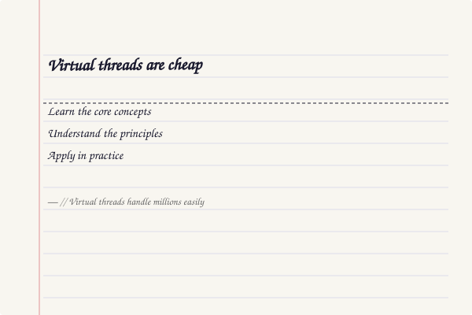
</a>
<a href="../../assets/images/diagrams/java/02-concurrency/virtual-threads-are-cheap-diagram.svg" target="_blank" rel="noopener">
  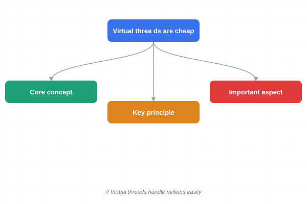
</a>
<a href="../../assets/images/diagrams/java/02-concurrency/virtual-threads-are-cheap-sticky.svg" target="_blank" rel="noopener">
  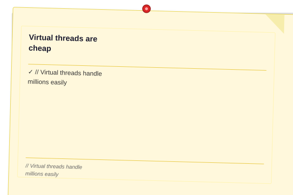
</a>


```java
package ch02.virtualthreads;

import java.util.concurrent.Executors;

class MillionVirtualThreads {

    public static void main(String[] args) throws InterruptedException {
        // Creating 100,000 platform threads would likely OOM.
        // Virtual threads handle millions easily.

        long start = System.nanoTime();

        try (var executor = Executors.newVirtualThreadPerTaskExecutor()) {
            for (int i = 0; i < 100_000; i++) {
                final int taskId = i;
                executor.submit(() -> {
                    // Simulate blocking I/O
                    try {
                        Thread.sleep(10);
                    } catch (InterruptedException e) {
                        Thread.currentThread().interrupt();
                    }
                });
            }
        }

        long elapsed = java.util.concurrent.TimeUnit.NANOSECONDS.toMillis(
            System.nanoTime() - start);
        System.out.println("100,000 virtual threads completed in " + elapsed + "ms");
    }
}
```

### Pinng: when virtual threads cannot be unmounted

<a href="../../assets/images/diagrams/java/02-concurrency/pinng-when-virtual-threads-cannot-be-unmounted-handwritten.svg" target="_blank" rel="noopener">
  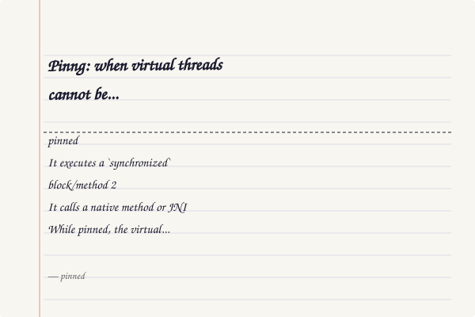
</a>
<a href="../../assets/images/diagrams/java/02-concurrency/pinng-when-virtual-threads-cannot-be-unmounted-diagram.svg" target="_blank" rel="noopener">
  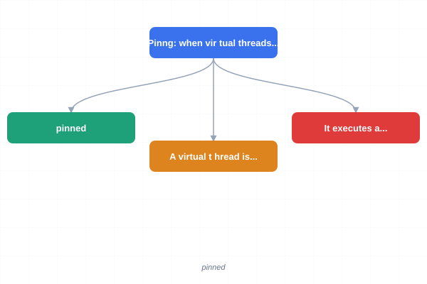
</a>
<a href="../../assets/images/diagrams/java/02-concurrency/pinng-when-virtual-threads-cannot-be-unmounted-sticky.svg" target="_blank" rel="noopener">
  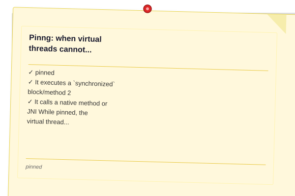
</a>


A virtual thread is **pinned** to its carrier thread when:

1. It executes a `synchronized` block/method
2. It calls a native method or JNI

While pinned, the virtual thread blocks its carrier thread.

```java
package ch02.virtualthreads;

import java.util.concurrent.locks.ReentrantLock;

class PinningDemo {

    private static final Object lock = new Object();
    private static final ReentrantLock reentrantLock = new ReentrantLock();

    public static void main(String[] args) throws InterruptedException {
        // ---- BAD: synchronized blocks pin virtual threads ----
        Thread pinned = Thread.ofVirtual().name("pinned").start(() -> {
            synchronized (lock) {
                try {
                    System.out.println("Pinned: " + Thread.currentThread());
                    Thread.sleep(1000);
                } catch (InterruptedException e) { }
            }
        });

        // ---- GOOD: ReentrantLock does NOT pin ----
        Thread notPinned = Thread.ofVirtual().name("not-pinned").start(() -> {
            reentrantLock.lock();
            try {
                System.out.println("Not pinned: " + Thread.currentThread());
                Thread.sleep(1000);
            } catch (InterruptedException e) { }
            finally {
                reentrantLock.unlock();
            }
        });

        pinned.join();
        notPinned.join();
        System.out.println("Both completed");
    }
}
```

### Carrier threads

<a href="../../assets/images/diagrams/java/02-concurrency/carrier-threads-handwritten.svg" target="_blank" rel="noopener">
  
</a>
<a href="../../assets/images/diagrams/java/02-concurrency/carrier-threads-diagram.svg" target="_blank" rel="noopener">
  
</a>
<a href="../../assets/images/diagrams/java/02-concurrency/carrier-threads-sticky.svg" target="_blank" rel="noopener">
  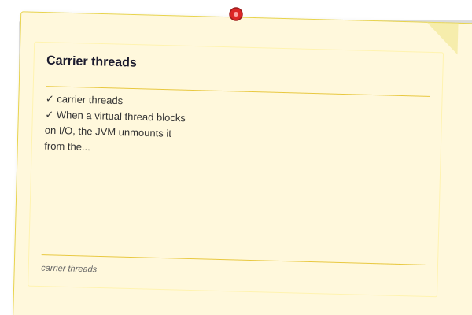
</a>


Virtual threads run on a small pool of **carrier threads** (platform threads). When a virtual thread blocks on I/O, the JVM unmounts it from the carrier and mounts a different virtual thread.

```java
package ch02.virtualthreads;

import java.util.concurrent.locks.LockSupport;

class CarrierThreadDemo {

    public static void main(String[] args) throws InterruptedException {
        // Show that many virtual threads share few carrier threads
        for (int i = 0; i < 20; i++) {
            Thread vt = Thread.ofVirtual().name("vt-" + i).start(() -> {
                System.out.println(Thread.currentThread() +
                    " on carrier: " + Thread.currentThread().toString());
                LockSupport.parkNanos(java.util.concurrent.TimeUnit.MILLISECONDS.toNanos(100));
                System.out.println(Thread.currentThread() +
                    " after unpark on carrier: " + Thread.currentThread().toString());
            });
            vt.join();
        }
    }
}
```

### Structured concurrency (java 21+)

<a href="../../assets/images/diagrams/java/02-concurrency/structured-concurrency-java-21-handwritten.svg" target="_blank" rel="noopener">
  
</a>
<a href="../../assets/images/diagrams/java/02-concurrency/structured-concurrency-java-21-diagram.svg" target="_blank" rel="noopener">
  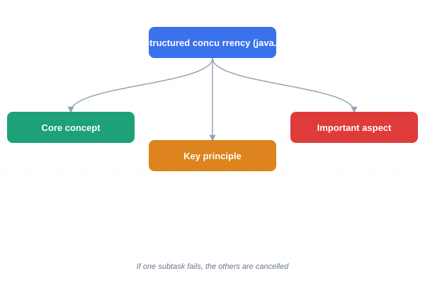
</a>
<a href="../../assets/images/diagrams/java/02-concurrency/structured-concurrency-java-21-sticky.svg" target="_blank" rel="noopener">
  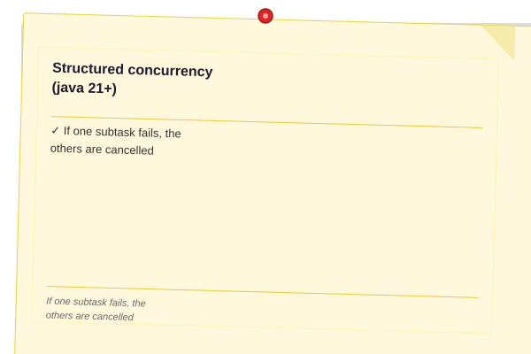
</a>


`StructuredTaskScope` treats related tasks as a single unit of work. If one subtask fails, the others are cancelled.

```java
package ch02.virtualthreads;

import java.util.concurrent.*;

class StructuredConcurrencyDemo {

    record ShippingInfo(String address, String method) {}
    record Invoice(double total, String currency) {}

    static ShippingInfo fetchShipping() {
        sleep(200);
        return new ShippingInfo("123 Main St", "Express");
    }

    static Invoice fetchInvoice() {
        sleep(150);
        return new Invoice(299.99, "USD");
    }

    record OrderResult(ShippingInfo shipping, Invoice invoice) {}

    public static void main(String[] args) throws Exception {
        // StructuredTaskScope → tasks are siblings, their lifecycle is tied together
        try (var scope = new StructuredTaskScope.ShutdownOnFailure()) {
            Future<ShippingInfo> shipping = scope.fork(StructuredConcurrencyDemo::fetchShipping);
            Future<Invoice> invoice = scope.fork(StructuredConcurrencyDemo::fetchInvoice);

            // Join → blocks until both complete or one fails
            scope.join();
            scope.throwIfFailed();

            OrderResult result = new OrderResult(shipping.resultNow(), invoice.resultNow());
            System.out.println("Order: " + result);
        }
    }

    static void sleep(int ms) {
        try { Thread.sleep(ms); } catch (InterruptedException e) { }
    }
}
```

### StructuredTaskScope.Subtask → collecting results

<a href="../../assets/images/diagrams/java/02-concurrency/structuredtaskscope-subtask-collecting-results-handwritten.svg" target="_blank" rel="noopener">
  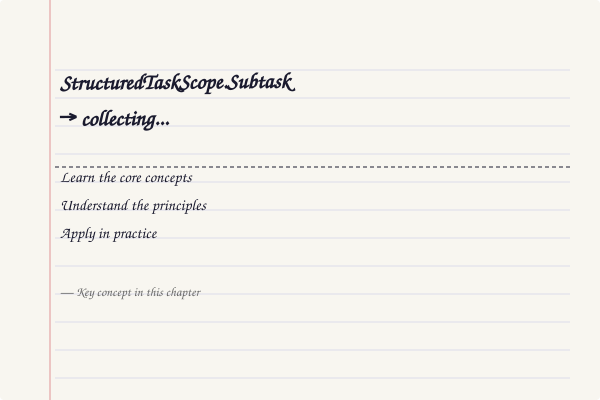
</a>
<a href="../../assets/images/diagrams/java/02-concurrency/structuredtaskscope-subtask-collecting-results-diagram.svg" target="_blank" rel="noopener">
  
</a>
<a href="../../assets/images/diagrams/java/02-concurrency/structuredtaskscope-subtask-collecting-results-sticky.svg" target="_blank" rel="noopener">
  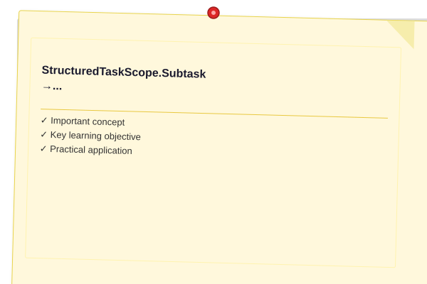
</a>


```java
package ch02.virtualthreads;

import java.util.*;
import java.util.concurrent.*;
import java.util.stream.Collectors;

class StructuredTaskScopeCollector {

    public static void main(String[] args) throws Exception {
        try (var scope = new StructuredTaskScope<Integer>() {

            private final Queue<Subtask<? extends Integer>> successes = new ConcurrentLinkedQueue<>();

            @Override
            protected void handleComplete(Subtask<? extends Integer> subtask) {
                if (subtask.state() == Subtask.State.SUCCESS) {
                    successes.add(subtask);
                }
            }

            Collection<Integer> results() {
                return successes.stream()
                    .map(Subtask::get)
                    .collect(Collectors.toList());
            }
        }) {
            scope.fork(() -> { sleep(100); return 1; });
            scope.fork(() -> { sleep(200); return 2; });
            scope.fork(() -> { sleep(50);  return 3; });

            scope.join();

            System.out.println("All results: " + scope.results());
        }
    }

    static void sleep(int ms) {
        try { Thread.sleep(ms); } catch (InterruptedException e) { }
    }
}
```

### Virtual threads with ThreadLocal

<a href="../../assets/images/diagrams/java/02-concurrency/virtual-threads-with-threadlocal-handwritten.svg" target="_blank" rel="noopener">
  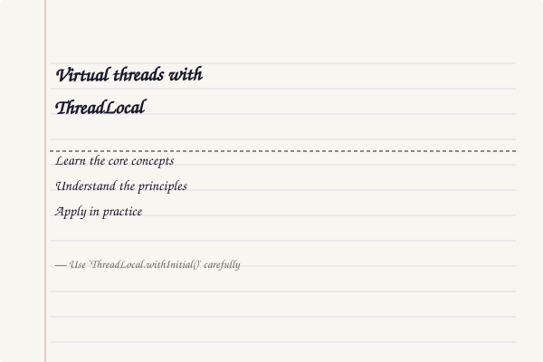
</a>
<a href="../../assets/images/diagrams/java/02-concurrency/virtual-threads-with-threadlocal-diagram.svg" target="_blank" rel="noopener">
  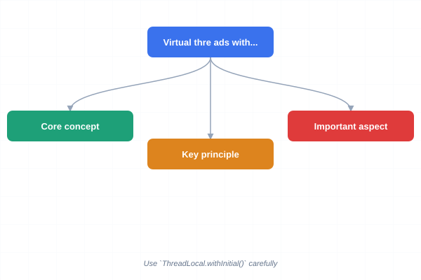
</a>
<a href="../../assets/images/diagrams/java/02-concurrency/virtual-threads-with-threadlocal-sticky.svg" target="_blank" rel="noopener">
  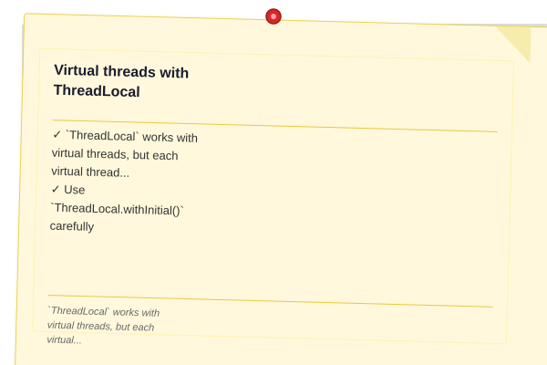
</a>


`ThreadLocal` works with virtual threads, but each virtual thread gets its own copy → potentially millions of copies. Use `ThreadLocal.withInitial()` carefully.

```java
package ch02.virtualthreads;

import java.util.concurrent.Executors;

class VirtualThreadWithThreadLocal {

    // BAD with many virtual threads → each gets its own copy
    private static final ThreadLocal<String> requestId = new ThreadLocal<>();

    public static void main(String[] args) {
        try (var executor = Executors.newVirtualThreadPerTaskExecutor()) {
            executor.submit(() -> {
                requestId.set("req-1");
                System.out.println("Request: " + requestId.get());
            });
            executor.submit(() -> {
                requestId.set("req-2");
                System.out.println("Request: " + requestId.get());
            });
        }
    }
}
```

---

## Thread Safety

### Annotations

<a href="../../assets/images/diagrams/java/02-concurrency/annotations-handwritten.svg" target="_blank" rel="noopener">
  
</a>
<a href="../../assets/images/diagrams/java/02-concurrency/annotations-diagram.svg" target="_blank" rel="noopener">
  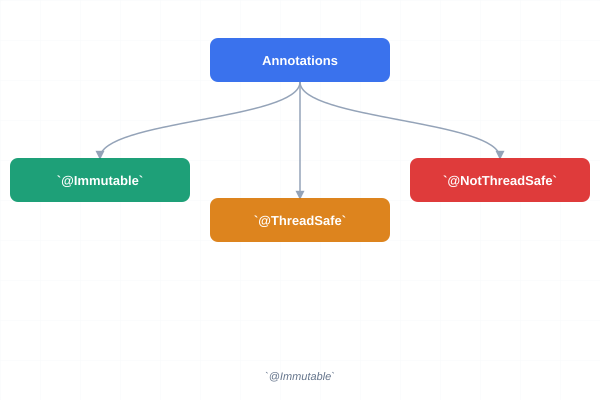
</a>
<a href="../../assets/images/diagrams/java/02-concurrency/annotations-sticky.svg" target="_blank" rel="noopener">
  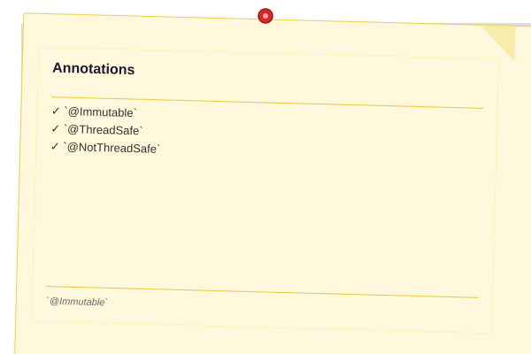
</a>


Use JSR 305 annotations (or `javax.annotation.concurrent`) to document thread-safety intent:

- **`@Immutable`** → instances are never modified (e.g., `String`, `Integer`). Automatically thread-safe.
- **`@ThreadSafe`** → class guarantees safe concurrent access (e.g., `ConcurrentHashMap`, `AtomicInteger`).
- **`@NotThreadSafe`** → class is not safe for concurrent access (e.g., `ArrayList`, `HashMap`).

```java
package ch02.threadsafety;

import javax.annotation.concurrent.Immutable;
import javax.annotation.concurrent.ThreadSafe;
import javax.annotation.concurrent.NotThreadSafe;

// ---- @Immutable ----
@Immutable
record Point(int x, int y) {
    // All fields are final → inherently thread-safe
}

// ---- @ThreadSafe ----
@ThreadSafe
class ThreadSafeCounter {
    private final java.util.concurrent.atomic.AtomicInteger count = new java.util.concurrent.atomic.AtomicInteger();

    int increment() {
        return count.incrementAndGet();
    }

    int get() {
        return count.get();
    }
}

// ---- @NotThreadSafe ----
@NotThreadSafe
class UnsafeListBuilder {
    private final java.util.List<String> items = new java.util.ArrayList<>();

    void add(String item) {
        items.add(item);
    }

    int size() {
        return items.size();
    }
}
```

### Confinement

<a href="../../assets/images/diagrams/java/02-concurrency/confinement-handwritten.svg" target="_blank" rel="noopener">
  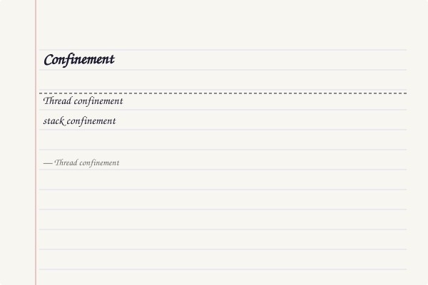
</a>
<a href="../../assets/images/diagrams/java/02-concurrency/confinement-diagram.svg" target="_blank" rel="noopener">
  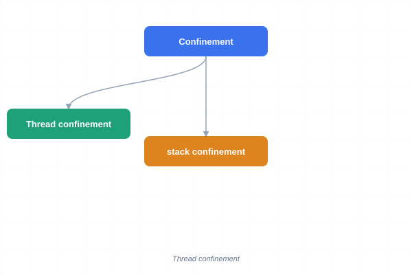
</a>
<a href="../../assets/images/diagrams/java/02-concurrency/confinement-sticky.svg" target="_blank" rel="noopener">
  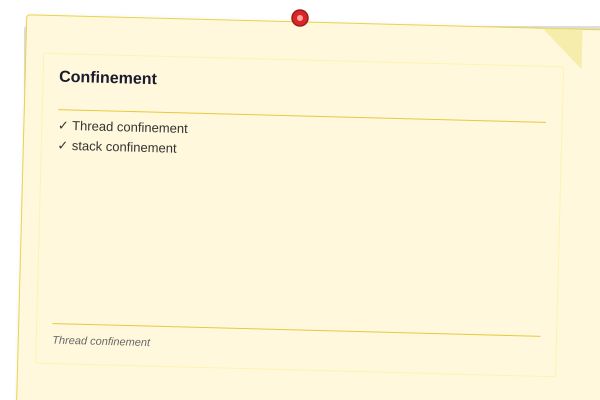
</a>


**Thread confinement** means an object is only accessed by one thread. The simplest form is **stack confinement** → a local variable that never escapes.

```java
package ch02.threadsafety;

import java.util.ArrayList;
import java.util.List;

class StackConfinementDemo {

    public static void main(String[] args) {
        // The list is confined to this method's stack
        // No other thread can access it
        List<String> localList = new ArrayList<>();
        localList.add("confined");
        localList.add("safe");

        // If we pass localList to another thread, we lose confinement
        process(localList);
    }

    static void process(List<String> list) {
        // Still confined to process() if we don't share it
        System.out.println(list.size());
    }
}
```

### ThreadLocal

<a href="../../assets/images/diagrams/java/02-concurrency/threadlocal-handwritten.svg" target="_blank" rel="noopener">
  
</a>
<a href="../../assets/images/diagrams/java/02-concurrency/threadlocal-diagram.svg" target="_blank" rel="noopener">
  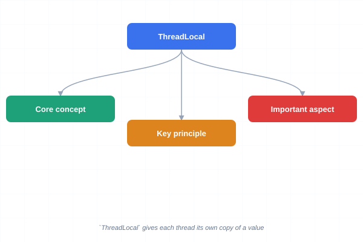
</a>
<a href="../../assets/images/diagrams/java/02-concurrency/threadlocal-sticky.svg" target="_blank" rel="noopener">
  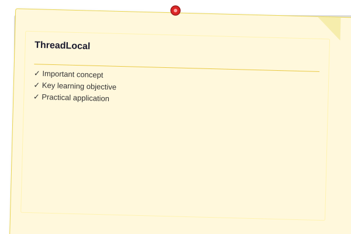
</a>


`ThreadLocal` gives each thread its own copy of a value.

```java
package ch02.threadsafety;

import java.text.SimpleDateFormat;
import java.util.Date;
import java.util.concurrent.Executors;

class ThreadLocalDemo {

    // SimpleDateFormat is NOT thread-safe → share via ThreadLocal
    private static final ThreadLocal<SimpleDateFormat> dateFormat =
        ThreadLocal.withInitial(() -> new SimpleDateFormat("yyyy-MM-dd HH:mm:ss"));

    // Or with initial value (lazy)
    private static final ThreadLocal<StringBuilder> threadLocalBuilder =
        ThreadLocal.withInitial(() -> new StringBuilder(1024));

    static String formatDate(Date date) {
        return dateFormat.get().format(date);
    }

    public static void main(String[] args) {
        try (var executor = Executors.newFixedThreadPool(4)) {
            for (int i = 0; i < 10; i++) {
                executor.submit(() -> {
                    System.out.println(Thread.currentThread().getName() +
                        " -> " + formatDate(new Date()));
                });
            }
        }
    }
}
```

---

## Deadlock

A deadlock occurs when two or more threads wait forever for locks held by each other.

```java
package ch02.deadlock;

class SimpleDeadlock {

    private static final Object lock1 = new Object();
    private static final Object lock2 = new Object();

    public static void main(String[] args) {
        Thread t1 = new Thread(() -> {
            synchronized (lock1) {
                System.out.println("Thread 1: acquired lock1");
                sleep(50);
                synchronized (lock2) {
                    System.out.println("Thread 1: acquired lock2");
                }
            }
        });

        Thread t2 = new Thread(() -> {
            synchronized (lock2) {  // Acquires in opposite order!
                System.out.println("Thread 2: acquired lock2");
                sleep(50);
                synchronized (lock1) {
                    System.out.println("Thread 2: acquired lock1");
                }
            }
        });

        t1.start();
        t2.start();
    }

    static void sleep(long ms) {
        try { Thread.sleep(ms); } catch (InterruptedException e) { }
    }
}
```

### Detection → jstack

<a href="../../assets/images/diagrams/java/02-concurrency/detection-jstack-handwritten.svg" target="_blank" rel="noopener">
  
</a>
<a href="../../assets/images/diagrams/java/02-concurrency/detection-jstack-diagram.svg" target="_blank" rel="noopener">
  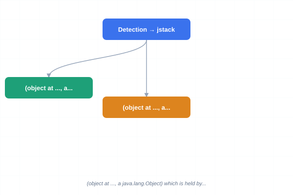
</a>
<a href="../../assets/images/diagrams/java/02-concurrency/detection-jstack-sticky.svg" target="_blank" rel="noopener">
  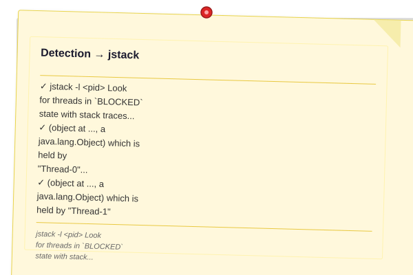
</a>


```
jstack -l <pid>
```

Look for threads in `BLOCKED` state with stack traces showing attempted lock acquisition. The output includes a deadlock report at the end:

```
Found one Java-level deadlock:
=============================
"Thread-1":
  waiting to lock monitor 0x... (object at ..., a java.lang.Object)
  which is held by "Thread-0"
"Thread-0":
  waiting to lock monitor 0x... (object at ..., a java.lang.Object)
  which is held by "Thread-1"
```

### Detection → ThreadMXBean (programmatic)

<a href="../../assets/images/diagrams/java/02-concurrency/detection-threadmxbean-programmatic-handwritten.svg" target="_blank" rel="noopener">
  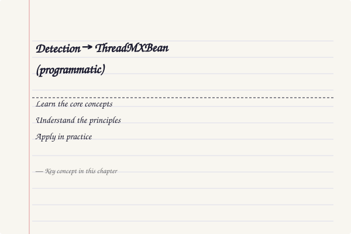
</a>
<a href="../../assets/images/diagrams/java/02-concurrency/detection-threadmxbean-programmatic-diagram.svg" target="_blank" rel="noopener">
  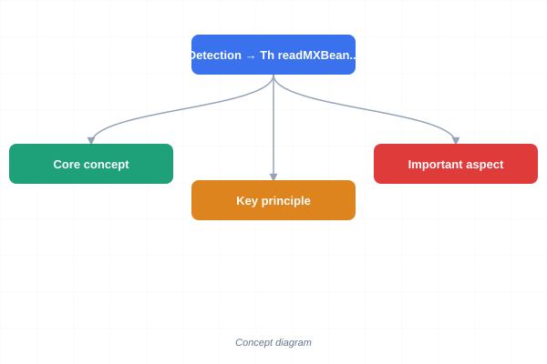
</a>
<a href="../../assets/images/diagrams/java/02-concurrency/detection-threadmxbean-programmatic-sticky.svg" target="_blank" rel="noopener">
  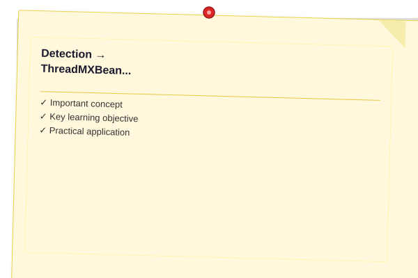
</a>


```java
package ch02.deadlock;

import java.lang.management.ManagementFactory;
import java.lang.management.ThreadInfo;
import java.lang.management.ThreadMXBean;

class DeadlockDetector {

    public static void main(String[] args) throws InterruptedException {
        final Object lock1 = new Object();
        final Object lock2 = new Object();

        Thread t1 = new Thread(() -> {
            synchronized (lock1) {
                sleep(100);
                synchronized (lock2) { Thread.dumpStack(); }
            }
        }, "Worker-1");

        Thread t2 = new Thread(() -> {
            synchronized (lock2) {
                sleep(100);
                synchronized (lock1) { Thread.dumpStack(); }
            }
        }, "Worker-2");

        t1.start();
        t2.start();

        // Monitor for deadlock
        Thread monitor = new Thread(() -> {
            ThreadMXBean mxBean = ManagementFactory.getThreadMXBean();
            while (true) {
                long[] deadlockedIds = mxBean.findDeadlockedThreads();
                if (deadlockedIds != null) {
                    System.out.println("DEADLOCK DETECTED!");
                    ThreadInfo[] infos = mxBean.getThreadInfo(deadlockedIds, true, true);
                    for (ThreadInfo info : infos) {
                        System.out.println("  " + info.getThreadName() + " → " + info.getThreadState());
                        for (var monitor : info.getLockedMonitors()) {
                            System.out.println("    waiting on: " + monitor);
                        }
                    }
                    break;
                }
                sleep(500);
            }
        });

        monitor.setDaemon(true);
        monitor.start();

        t1.join();
        t2.join();
    }

    static void sleep(long ms) {
        try { Thread.sleep(ms); } catch (InterruptedException e) { }
    }
}
```

### Prevention → lock ordering

<a href="../../assets/images/diagrams/java/02-concurrency/prevention-lock-ordering-handwritten.svg" target="_blank" rel="noopener">
  
</a>
<a href="../../assets/images/diagrams/java/02-concurrency/prevention-lock-ordering-diagram.svg" target="_blank" rel="noopener">
  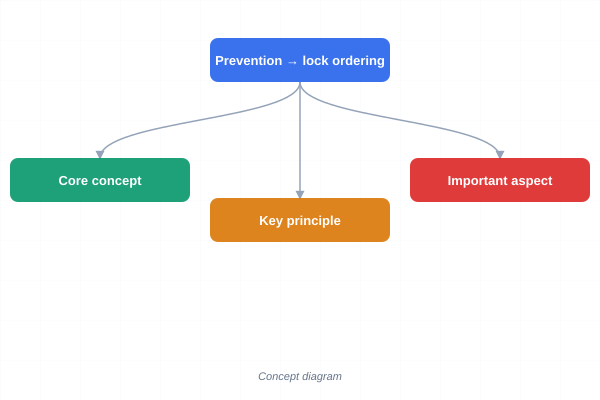
</a>
<a href="../../assets/images/diagrams/java/02-concurrency/prevention-lock-ordering-sticky.svg" target="_blank" rel="noopener">
  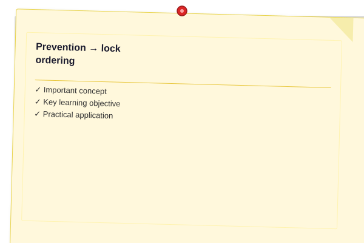
</a>


Acquire locks in a consistent global order to eliminate cycles.

```java
package ch02.deadlock;

import java.util.concurrent.locks.ReentrantLock;

class LockOrderingDemo {

    // Use System.identityHashCode for a consistent ordering
    private final ReentrantLock lockA = new ReentrantLock();
    private final ReentrantLock lockB = new ReentrantLock();

    void safeMethod() {
        // Always acquire locks in the same order (by identity hash)
        int hashA = System.identityHashCode(lockA);
        int hashB = System.identityHashCode(lockB);

        ReentrantLock first = hashA < hashB ? lockA : lockB;
        ReentrantLock second = hashA < hashB ? lockB : lockA;

        first.lock();
        try {
            second.lock();
            try {
                System.out.println("Critical section");
            } finally {
                second.unlock();
            }
        } finally {
            first.unlock();
        }
    }

    public static void main(String[] args) {
        LockOrderingDemo demo = new LockOrderingDemo();
        java.util.concurrent.Executors.newFixedThreadPool(2).submit(() -> {
            for (int i = 0; i < 100; i++) {
                demo.safeMethod();
            }
        });
    }
}
```

### Prevention → tryLock with timeout

<a href="../../assets/images/diagrams/java/02-concurrency/prevention-trylock-with-timeout-handwritten.svg" target="_blank" rel="noopener">
  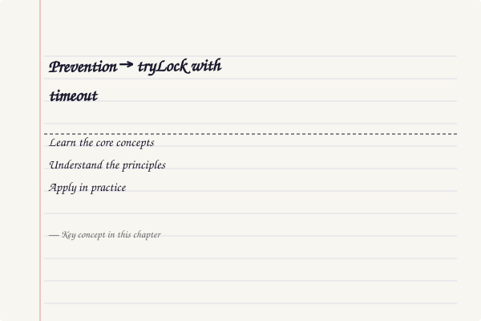
</a>
<a href="../../assets/images/diagrams/java/02-concurrency/prevention-trylock-with-timeout-diagram.svg" target="_blank" rel="noopener">
  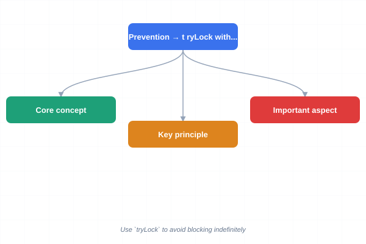
</a>
<a href="../../assets/images/diagrams/java/02-concurrency/prevention-trylock-with-timeout-sticky.svg" target="_blank" rel="noopener">
  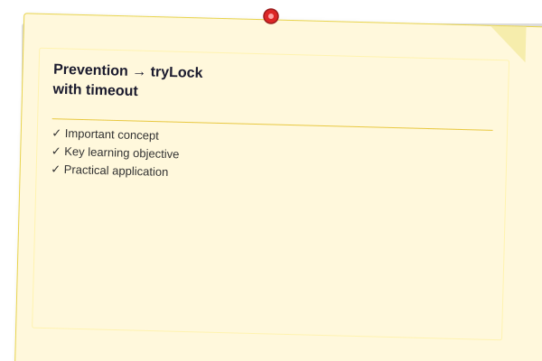
</a>


Use `tryLock` to avoid blocking indefinitely.

```java
package ch02.deadlock;

import java.util.concurrent.TimeUnit;
import java.util.concurrent.locks.ReentrantLock;

class TryLockDeadlockPrevention {

    private final ReentrantLock lock1 = new ReentrantLock();
    private final ReentrantLock lock2 = new ReentrantLock();

    void transfer() throws InterruptedException {
        while (true) {
            if (lock1.tryLock(100, TimeUnit.MILLISECONDS)) {
                try {
                    if (lock2.tryLock(100, TimeUnit.MILLISECONDS)) {
                        try {
                            System.out.println("Both locks acquired");
                            return;
                        } finally {
                            lock2.unlock();
                        }
                    }
                } finally {
                    lock1.unlock();
                }
            }
            // If we reach here, we couldn't get both locks
            // Back off, then retry
            System.out.println("Backing off...");
            Thread.sleep((long) (Math.random() * 50));
        }
    }

    public static void main(String[] args) throws InterruptedException {
        TryLockDeadlockPrevention demo = new TryLockDeadlockPrevention();
        Thread t1 = new Thread(() -> { try { demo.transfer(); } catch (InterruptedException e) { } });
        Thread t2 = new Thread(() -> { try { demo.transfer(); } catch (InterruptedException e) { } });
        t1.start();
        t2.start();
        t1.join();
        t2.join();
        System.out.println("Done → no deadlock");
    }
}
```

### Dining Philosophers

<a href="../../assets/images/diagrams/java/02-concurrency/dining-philosophers-handwritten.svg" target="_blank" rel="noopener">
  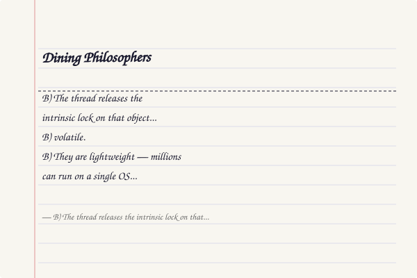
</a>
<a href="../../assets/images/diagrams/java/02-concurrency/dining-philosophers-diagram.svg" target="_blank" rel="noopener">
  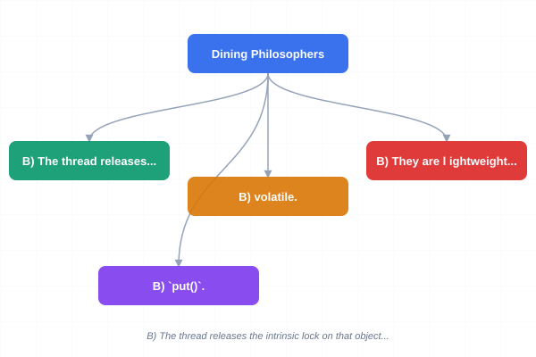
</a>
<a href="../../assets/images/diagrams/java/02-concurrency/dining-philosophers-sticky.svg" target="_blank" rel="noopener">
  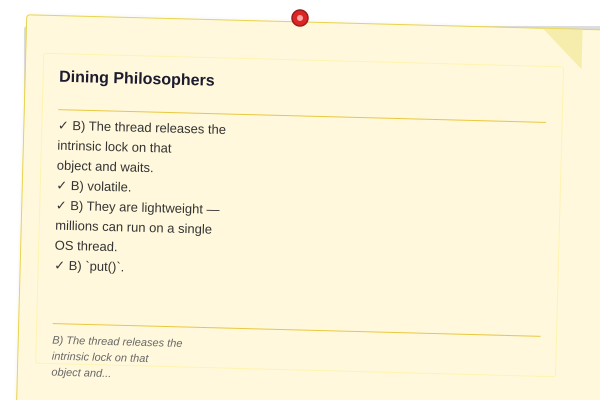
</a>


```java
package ch02.deadlock;

import java.util.concurrent.locks.ReentrantLock;

class DiningPhilosophers {

    static class Chopstick {
        private final ReentrantLock lock = new ReentrantLock();
        private final int id;

        Chopstick(int id) {
            this.id = id;
        }

        boolean pickUp() {
            return lock.tryLock();
        }

        void putDown() {
            lock.unlock();
        }

        @Override
        public String toString() { return "C" + id; }
    }

    static class Philosopher extends Thread {
        private final Chopstick left;
        private final Chopstick right;
        private final int id;
        private int meals = 0;

        Philosopher(int id, Chopstick left, Chopstick right) {
            this.id = id;
            // Prevent deadlock: ensure global ordering
            if (System.identityHashCode(left) < System.identityHashCode(right)) {
                this.left = left;
                this.right = right;
            } else {
                this.left = right;
                this.right = left;
            }
        }

        void think() {
            try { Thread.sleep((long) (Math.random() * 100)); } catch (InterruptedException e) { }
        }

        void eat() {
            left.pickUp();
            right.pickUp();
            try {
                meals++;
                System.out.println("P" + id + " eating (meal #" + meals + ")");
                Thread.sleep((long) (Math.random() * 50));
            } catch (InterruptedException e) {
                Thread.currentThread().interrupt();
            } finally {
                right.putDown();
                left.putDown();
            }
        }

        @Override
        public void run() {
            for (int i = 0; i < 5; i++) {
                think();
                eat();
            }
            System.out.println("P" + id + " finished after " + meals + " meals");
        }
    }

    public static void main(String[] args) {
        int n = 5;
        Chopstick[] chopsticks = new Chopstick[n];
        Philosopher[] philosophers = new Philosopher[n];

        for (int i = 0; i < n; i++) {
            chopsticks[i] = new Chopstick(i);
        }

        for (int i = 0; i < n; i++) {
            philosophers[i] = new Philosopher(i,
                chopsticks[i],
                chopsticks[(i + 1) % n]);
            philosophers[i].start();
        }

        for (Philosopher p : philosophers) {
            try { p.join(); } catch (InterruptedException e) { }
        }

        System.out.println("All philosophers finished without deadlock");
    }
}
```

## Concept Comparison Table

| Concept | Definition | Key Distinction | Use Case |
|---------|-----------|-----------------|----------|
| synchronized | Intrinsic lock on object | Reentrant, implicit | Simple mutual exclusion |
| ReentrantLock | Explicit lock with fairness | tryLock, interruptible | Need timeout or fairness |
| AtomicInteger | CAS-based thread-safe counter | Non-blocking, lock-free | High-contention counters |
| volatile | Visibility guarantee only | Not atomic | Status flags, double-checked locking |
| CompletableFuture | Async computation pipeline | Composable, non-blocking | Chained async operations |

## Quick Reference

| Category | Key Classes | Notes |
|----------|-------------|-------|
| **Thread API** | Thread, Runnable, Callable, Future | Prefer Runnable/Callable over raw Thread |
| **Locks** | ReentrantLock, ReadWriteLock, StampedLock | StampedLock supports optimistic reads |
| **Atomics** | AtomicInteger, AtomicLong, AtomicReference, AtomicStampedReference | CAS-based, no contention under low load |
| **Executors** | ThreadPoolExecutor, ScheduledThreadPoolExecutor, ForkJoinPool | Common pool = ForkJoinPool.commonPool() |
| **Async** | CompletableFuture, CompletionStage | thenApply/thenCompose for chaining |
| **Virtual Threads** | Thread.ofVirtual(), Executors.newVirtualThreadPerTaskExecutor() | 1000x lighter than platform threads |
| **Collections** | ConcurrentHashMap, CopyOnWriteArrayList, BlockingQueue variants | ConcurrentHashMap: compute/merge are atomic |

## Cross-Application Matrix

| Technique | Web Apps | Microservices | Batch Processing | Real-Time Systems |
|-----------|----------|---------------|------------------|-------------------|
| Thread Pools | Request handling | Service orchestration | Parallel processing | Bounded work queues |
| CompletableFuture | Async endpoints | Service composition | Pipeline parallelism | Timeout-based fallbacks |
| Virtual Threads | High-throughput servers | Per-request isolation | I/O-bound parallelism | Avoid synchronized |
| ForkJoinPool | - | Parallel stream ops | Divide-and-conquer | Work-stealing for CPU tasks |
| ConcurrentHashMap | Session caching | Service registry | Aggregation maps | Fine-grained concurrency |

## Chapter Quiz

1. What happens when a thread calls `wait()` on an object?
   - A) The thread releases all its locks
   - B) The thread releases the intrinsic lock on that object and waits
   - C) The thread continues executing
   - D) The thread terminates

<details>
<summary>Answer&lt;/summary&gt;
**B) The thread releases the intrinsic lock on that object and waits.** `wait()` must be called from a synchronized block. The thread releases the lock and enters WAITING state until notified.
</details>

2. Which primitive guarantees visibility across threads without atomicity?
   - A) synchronized
   - B) volatile
   - C) final
   - D) static

<details>
<summary>Answer&lt;/summary&gt;
**B) volatile.** volatile guarantees that writes to a variable are visible to all threads, but does not provide atomicity for compound operations like increment.
</details>

3. What is a key benefit of virtual threads over platform threads?
   - A) They are faster for CPU-bound tasks
   - B) They are lightweight — millions can run on a single OS thread
   - C) They eliminate the need for synchronization
   - D) They automatically parallelize all operations

<details>
<summary>Answer&lt;/summary&gt;
**B) They are lightweight — millions can run on a single OS thread.** Virtual threads are managed by the JVM and are not tied to OS threads, allowing high concurrency with low memory footprint.
</details>

4. Which method places a task in a BlockingQueue if space is available, or waits until space becomes available?
   - A) `offer()`
   - B) `put()`
   - C) `add()`
   - D) `poll()`

<details>
<summary>Answer&lt;/summary&gt;
**B) `put()`.** `put()` blocks until space becomes available, while `offer()` returns false if no space is available.
</details>

5. What does `ThreadLocal` provide?
   - A) A shared variable visible to all threads
   - B) A variable that has a separate copy for each thread
   - C) A global counter
   - D) A synchronization primitive

<details>
<summary>Answer&lt;/summary&gt;
**B) A variable that has a separate copy for each thread.** ThreadLocal provides per-thread variable instances, useful for thread confinement patterns.
</details>

---

## Summary

| Concept | Key Takeaway |
|---------|-------------|
| Thread API | `start()`, `join()`, `sleep()`, `interrupt()` → states: NEW → RUNNABLE → {BLOCKED, WAITING, TIMED_WAITING} → TERMINATED |
| synchronized | Mutual exclusion + visibility; every object has an intrinsic lock; reentrant |
| Locks | `ReentrantLock` (flexible), `ReadWriteLock` (many readers), `StampedLock` (optimistic reads), `Condition` (await/signal) |
| Atomic classes | CAS-based; non-blocking; `AtomicStampedReference` solves ABA |
| volatile | Visibility only, not atomicity → use for flags and double-checked locking |
| ConcurrentHashMap | Fine-grained locking (Java 8+), weakly consistent iterators, atomic `compute`/`merge` |
| BlockingQueue | `put()`/`take()` block; `ArrayBlockingQueue`, `LinkedBlockingQueue`, `PriorityBlockingQueue`, `DelayQueue`, `SynchronousQueue`, `LinkedTransferQueue` |
| ExecutorService | `ThreadPoolExecutor` with configurable core/max pool, work queue, rejection policy |
| ForkJoinPool | Work-stealing; `RecursiveTask` (results), `RecursiveAction` (no results); common pool |
| CompletableFuture | Async pipeline: `thenApply`, `thenCompose`, `thenCombine`, `allOf`, `anyOf`, `exceptionally`, `handle`, `orTimeout` |
| Virtual Threads | Lightweight JVM threads, millions possible, avoid pinned `synchronized` blocks; `StructuredTaskScope` for structured concurrency |
| Thread Safety | `@Immutable`, `@ThreadSafe`, `@NotThreadSafe` annotations; stack confinement; `ThreadLocal` |
| Deadlock | Detection via `jstack` / `ThreadMXBean`; prevention via lock ordering, `tryLock` with timeout |

---

## Exercises

### 1. Thread-safe Bounded Cache

<a href="../../assets/images/diagrams/java/02-concurrency/1-thread-safe-bounded-cache-handwritten.svg" target="_blank" rel="noopener">
  
</a>
<a href="../../assets/images/diagrams/java/02-concurrency/1-thread-safe-bounded-cache-diagram.svg" target="_blank" rel="noopener">
  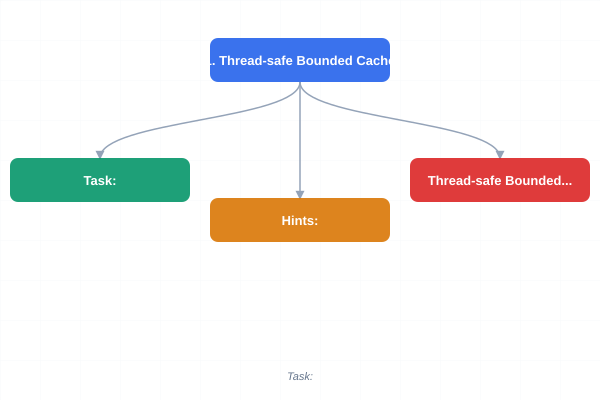
</a>
<a href="../../assets/images/diagrams/java/02-concurrency/1-thread-safe-bounded-cache-sticky.svg" target="_blank" rel="noopener">
  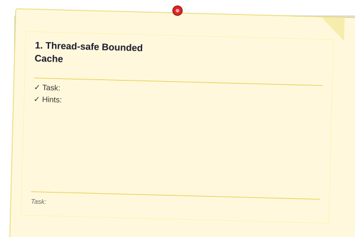
</a>


**Task:** Implement a thread-safe bounded cache (`Map<String, byte[]>`) with the following constraints:
- Maximum 100 entries (evict oldest on overflow)
- Thread-safe for concurrent reads and writes
- Support an atomic `getOrCompute(key, loader)` method that calls the loader only if the key is absent, without double-loading

**Hints:** Consider `LinkedHashMap` with `removeEldestEntry` and `ReadWriteLock`, or use `ConcurrentHashMap` with `computeIfAbsent` and a separate eviction mechanism.

### 2. Parallel File word counter

<a href="../../assets/images/diagrams/java/02-concurrency/2-parallel-file-word-counter-handwritten.svg" target="_blank" rel="noopener">
  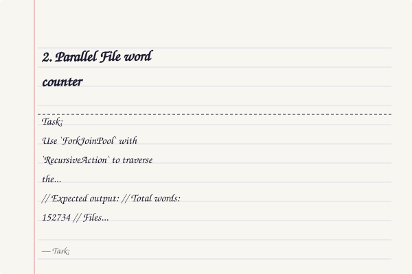
</a>
<a href="../../assets/images/diagrams/java/02-concurrency/2-parallel-file-word-counter-diagram.svg" target="_blank" rel="noopener">
  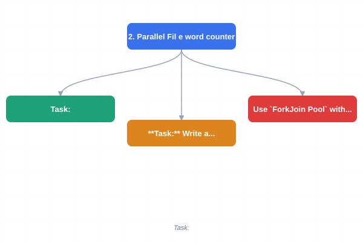
</a>
<a href="../../assets/images/diagrams/java/02-concurrency/2-parallel-file-word-counter-sticky.svg" target="_blank" rel="noopener">
  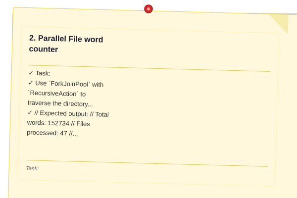
</a>


**Task:** Write a program that counts the total number of words across all `.txt` files in a directory tree. Use `ForkJoinPool` with `RecursiveAction` to traverse the directory and read files in parallel.

```java
// Expected output:
// Total words: 152734
// Files processed: 47
// Time: 234ms
```

### 3. Producer-Consumer with Back-pressure

<a href="../../assets/images/diagrams/java/02-concurrency/3-producer-consumer-with-back-pressure-handwritten.svg" target="_blank" rel="noopener">
  
</a>
<a href="../../assets/images/diagrams/java/02-concurrency/3-producer-consumer-with-back-pressure-diagram.svg" target="_blank" rel="noopener">
  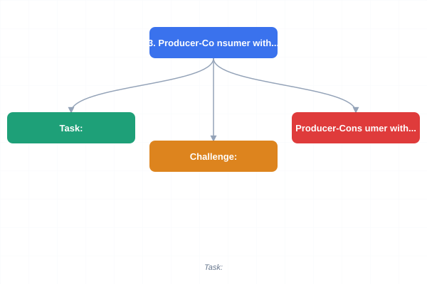
</a>
<a href="../../assets/images/diagrams/java/02-concurrency/3-producer-consumer-with-back-pressure-sticky.svg" target="_blank" rel="noopener">
  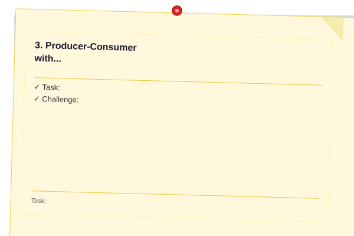
</a>


**Task:** Implement a producer-consumer system where:
- 3 producer threads generate random integers at variable rates (100-500ms between items)
- 2 consumer threads process the integers (simulate with `Thread.sleep(150)`)
- Use a bounded `BlockingQueue` with size 20
- Log producer/consumer activity with timestamps

**Challenge:** Implement a `TransferQueue`-based variant where producers don't enqueue unless a consumer is ready to take.

### 4. Deadlock Reproduction and Fix

<a href="../../assets/images/diagrams/java/02-concurrency/4-deadlock-reproduction-and-fix-handwritten.svg" target="_blank" rel="noopener">
  
</a>
<a href="../../assets/images/diagrams/java/02-concurrency/4-deadlock-reproduction-and-fix-diagram.svg" target="_blank" rel="noopener">
  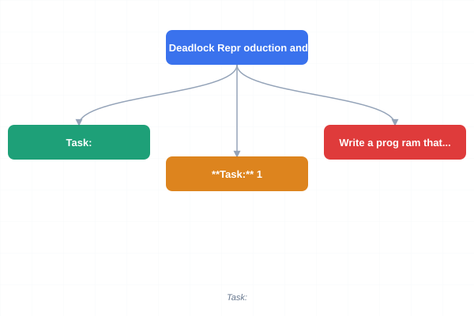
</a>
<a href="../../assets/images/diagrams/java/02-concurrency/4-deadlock-reproduction-and-fix-sticky.svg" target="_blank" rel="noopener">
  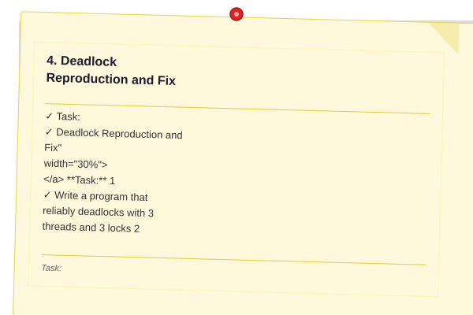
</a>


**Task:** 
1. Write a program that reliably deadlocks with 3 threads and 3 locks
2. Use `ThreadMXBean` to detect the deadlock
3. Fix it using lock ordering
4. Write a version that uses `tryLock` with a timeout and back-off

### 5. CompletableFuture Pipeline

<a href="../../assets/images/diagrams/java/02-concurrency/5-completablefuture-pipeline-handwritten.svg" target="_blank" rel="noopener">
  
</a>
<a href="../../assets/images/diagrams/java/02-concurrency/5-completablefuture-pipeline-diagram.svg" target="_blank" rel="noopener">
  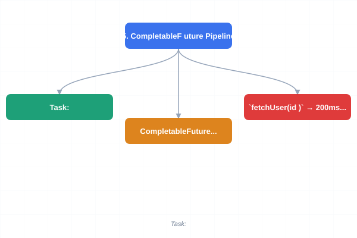
</a>
<a href="../../assets/images/diagrams/java/02-concurrency/5-completablefuture-pipeline-sticky.svg" target="_blank" rel="noopener">
  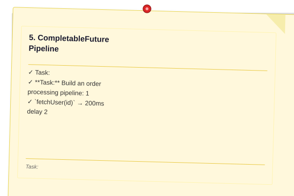
</a>


**Task:** Build an order processing pipeline:
1. `fetchUser(id)` → 200ms delay
2. `fetchCart(user)` → 150ms delay
3. `applyDiscounts(cart)` → 100ms delay
4. `calculateShipping(cart)` → 100ms delay (parallel with discounts)
5. `placeOrder(cart, shipping)` → 50ms delay

All steps must be non-blocking. Use `thenCompose`, `thenCombine`, and `allOf`. Add a timeout of 2 seconds for the entire pipeline.

### 6. Virtual Thread Web Scraper

<a href="../../assets/images/diagrams/java/02-concurrency/6-virtual-thread-web-scraper-handwritten.svg" target="_blank" rel="noopener">
  
</a>
<a href="../../assets/images/diagrams/java/02-concurrency/6-virtual-thread-web-scraper-diagram.svg" target="_blank" rel="noopener">
  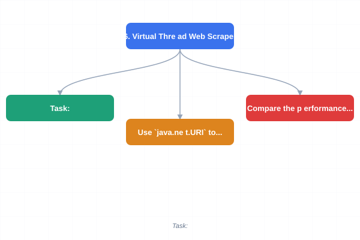
</a>
<a href="../../assets/images/diagrams/java/02-concurrency/6-virtual-thread-web-scraper-sticky.svg" target="_blank" rel="noopener">
  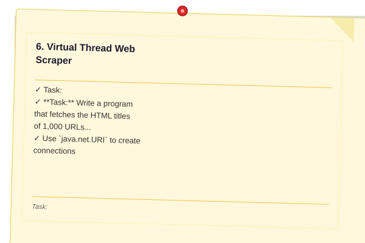
</a>


**Task:** Write a program that fetches the HTML titles of 1,000 URLs using virtual threads. Use `java.net.URI` to create connections. Compare the performance against a fixed thread pool of 20 platform threads.

```java
// Measure:
// Virtual threads: 1.2s
// Platform pool:   8.7s
```

### 7. Thread-safe Decorator

<a href="../../assets/images/diagrams/java/02-concurrency/7-thread-safe-decorator-handwritten.svg" target="_blank" rel="noopener">
  
</a>
<a href="../../assets/images/diagrams/java/02-concurrency/7-thread-safe-decorator-diagram.svg" target="_blank" rel="noopener">
  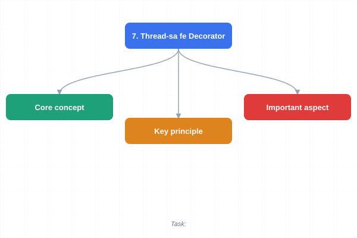
</a>
<a href="../../assets/images/diagrams/java/02-concurrency/7-thread-safe-decorator-sticky.svg" target="_blank" rel="noopener">
  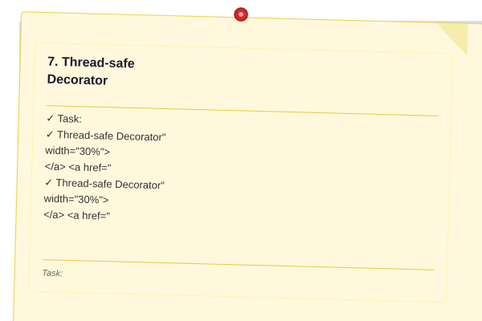
</a>


**Task:** Create a `@ThreadSafe` annotation and a dynamic proxy that wraps any non-thread-safe object with a `ReadWriteLock`. The proxy should:
- Acquire a read lock for methods annotated with `@ReadOperation`
- Acquire a write lock for methods annotated with `@WriteOperation`
- Fall back to a write lock for unannotated methods

```java
// Usage:
Map<String, String> safeMap = ThreadSafeProxy.create(new HashMap<>());
safeMap.put("key", "value"); // write lock
safeMap.get("key");          // read lock
```
