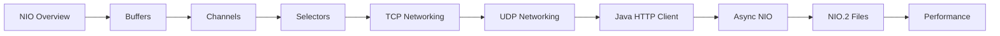

# Java NIO & Networking

> **Previous:** [Multithreading & Concurrency](./02-concurrency.md) | **Next:** [Java Modules & Packaging](./04-jpms-packaging.md)

## Learning Objectives

By the end of this chapter, you will be able to:

- Explain the Java NIO architecture and contrast it with traditional blocking I/O
- Use buffers and channels for efficient data transfer
- Work with `FileChannel` for advanced file operations including zero-copy transfers and memory-mapped files
- Implement scatter/gather I/O patterns
- Build non-blocking TCP and UDP network servers using `Selector`
- Use UDP for connectionless communication and multicast
- Send HTTP requests and handle responses with the Java 11+ `HttpClient`
- Write asynchronous NIO code using `CompletionHandler` and `Future`
- Navigate the filesystem and monitor directory changes with NIO.2
- Read and write file attributes using the NIO.2 attribute views

## Chapter at a Glance

| Topic | Key Insight | Practical Takeaway |
|-------|-------------|--------------------|
| NIO Architecture | Buffer + Channel + Selector model | Non-blocking I/O without thread-per-connection |
| Buffers | Direct vs heap buffers, ByteBuffer API | Direct buffers avoid copying for I/O operations |
| Channels | FileChannel, SocketChannel, ServerSocketChannel | FileChannel supports zero-copy transferTo/transferFrom |
| Selectors | Single thread monitors multiple channels | Event-driven networking without thread-per-connection |
| Java HTTP Client | Reactive-style HTTP/1.1 and HTTP/2 client | Built-in, supports async send with CompletableFuture |

## Chapter Roadmap



> **Pro Tip:** For most web applications, the Java HTTP Client (Java 11+) is sufficient. Drop down to raw NIO with Selectors only when you need custom protocol handling or maximum control over I/O multiplexing.

---

## 1. NIO Overview


Java NIO (New I/O, introduced in Java 1.4 and enhanced in Java 7 as NIO.2) provides a different approach to I/O compared to the traditional `java.io` stream-based model. NIO is buffer-oriented, channel-based, and supports non-blocking operations.

### 1.1 NIO vs. Traditional I/O

<a href="../../../assets/images/diagrams/java/03-nio-networking/1-1-nio-vs-traditional-i-o-handwritten.svg" target="_blank" rel="noopener">
  
</a>
<a href="../../../assets/images/diagrams/java/03-nio-networking/1-1-nio-vs-traditional-i-o-diagram.svg" target="_blank" rel="noopener">
  
</a>
<a href="../../../assets/images/diagrams/java/03-nio-networking/1-1-nio-vs-traditional-i-o-sticky.svg" target="_blank" rel="noopener">
  
</a>


| Aspect | I/O (java.io) | NIO (java.nio) |
|--------|---------------|-----------------|
| Direction | Stream-oriented (one byte at a time) | Buffer-oriented (blocks of data) |
| Blocking | Always blocking | Both blocking and non-blocking |
| Selector | None | Multiplexed I/O with Selector |
| Performance | Moderate | Higher (especially with direct buffers) |

### 1.2 Core Abstractions

<a href="../../../assets/images/diagrams/java/03-nio-networking/1-2-core-abstractions-handwritten.svg" target="_blank" rel="noopener">
  
</a>
<a href="../../../assets/images/diagrams/java/03-nio-networking/1-2-core-abstractions-diagram.svg" target="_blank" rel="noopener">
  
</a>
<a href="../../../assets/images/diagrams/java/03-nio-networking/1-2-core-abstractions-sticky.svg" target="_blank" rel="noopener">
  
</a>


NIO is built on three core abstractions:

- **Buffers** → containers for data
- **Channels** → connections to I/O sources/sinks
- **Selectors** → multiplexers for non-blocking channels

---

## 2. Buffers

A buffer is a fixed-capacity container for a specific primitive type. All buffers share a common set of properties and methods defined in the abstract `Buffer` class.

### 2.1 Buffer Types

<a href="../../../assets/images/diagrams/java/03-nio-networking/2-1-buffer-types-handwritten.svg" target="_blank" rel="noopener">
  
</a>
<a href="../../../assets/images/diagrams/java/03-nio-networking/2-1-buffer-types-diagram.svg" target="_blank" rel="noopener">
  
</a>
<a href="../../../assets/images/diagrams/java/03-nio-networking/2-1-buffer-types-sticky.svg" target="_blank" rel="noopener">
  
</a>


Each primitive type (except `boolean`) has a corresponding buffer:

```java
package chapter3;

import java.nio.*;

/**
 * Demonstrates all buffer types available in java.nio.
 */
public class BufferTypes {

    public static void main(String[] args) {
        // Each buffer type wraps an array of the corresponding primitive
        ByteBuffer byteBuf = ByteBuffer.allocate(64);
        CharBuffer charBuf = CharBuffer.allocate(64);
        ShortBuffer shortBuf = ShortBuffer.allocate(64);
        IntBuffer intBuf = IntBuffer.allocate(64);
        LongBuffer longBuf = LongBuffer.allocate(64);
        FloatBuffer floatBuf = FloatBuffer.allocate(64);
        DoubleBuffer doubleBuf = DoubleBuffer.allocate(64);

        System.out.println("ByteBuffer:   " + byteBuf);
        System.out.println("CharBuffer:   " + charBuf);
        System.out.println("ShortBuffer:  " + shortBuf);
        System.out.println("IntBuffer:    " + intBuf);
        System.out.println("LongBuffer:   " + longBuf);
        System.out.println("FloatBuffer:  " + floatBuf);
        System.out.println("DoubleBuffer: " + doubleBuf);
    }
}
```

### 2.2 Buffer Properties

<a href="../../../assets/images/diagrams/java/03-nio-networking/2-2-buffer-properties-handwritten.svg" target="_blank" rel="noopener">
  
</a>
<a href="../../../assets/images/diagrams/java/03-nio-networking/2-2-buffer-properties-diagram.svg" target="_blank" rel="noopener">
  
</a>
<a href="../../../assets/images/diagrams/java/03-nio-networking/2-2-buffer-properties-sticky.svg" target="_blank" rel="noopener">
  
</a>


Every buffer tracks four key properties:

```
     0 <= mark <= position <= limit <= capacity
```

| Property | Description |
|----------|-------------|
| `capacity` | Maximum number of elements the buffer can hold (fixed at creation) |
| `position` | Index of the next element to read or write |
| `limit` | Index of the first element that should not be read/written |
| `mark` | A remembered position (for later `reset()`) |

```java
package chapter3;

import java.nio.ByteBuffer;

/**
 * Visualizes buffer position/limit/capacity after each operation.
 */
public class BufferProperties {

    public static void print(ByteBuffer buf, String label) {
        System.out.printf("%-20s position=%d limit=%d capacity=%d%n",
            label, buf.position(), buf.limit(), buf.capacity());
    }

    public static void main(String[] args) {
        ByteBuffer buf = ByteBuffer.allocate(16);
        print(buf, "after allocate");

        buf.put((byte) 1);
        buf.put((byte) 2);
        buf.put((byte) 3);
        print(buf, "after put(3 bytes)");

        buf.flip();
        print(buf, "after flip");

        buf.get();
        print(buf, "after get(1)");

        buf.compact();
        print(buf, "after compact");

        buf.rewind();
        print(buf, "after rewind");
    }
}
```

### 2.3 Essential Buffer Operations

<a href="../../../assets/images/diagrams/java/03-nio-networking/2-3-essential-buffer-operations-handwritten.svg" target="_blank" rel="noopener">
  
</a>
<a href="../../../assets/images/diagrams/java/03-nio-networking/2-3-essential-buffer-operations-diagram.svg" target="_blank" rel="noopener">
  
</a>
<a href="../../../assets/images/diagrams/java/03-nio-networking/2-3-essential-buffer-operations-sticky.svg" target="_blank" rel="noopener">
  
</a>


```java
package chapter3;

import java.nio.ByteBuffer;
import java.nio.charset.StandardCharsets;

/**
 * Demonstrates all essential Buffer operations.
 */
public class BufferOperations {

    public static void main(String[] args) {
        // --- allocate ---
        ByteBuffer buf = ByteBuffer.allocate(32);
        System.out.println("Allocated: " + buf);

        // --- put ---
        buf.put((byte) 0x41);                         // 'A'
        buf.put(new byte[]{0x42, 0x43, 0x44});        // 'B', 'C', 'D'
        String hello = "Hello";
        buf.put(hello.getBytes(StandardCharsets.UTF_8));
        System.out.println("After puts: " + buf);

        // --- flip ---
        buf.flip();
        System.out.println("After flip: " + buf);

        // --- absolute get (does not advance position) ---
        byte b = buf.get(0);
        System.out.println("Byte at index 0: 0x" + Integer.toHexString(b & 0xFF));

        // --- relative get (advances position) ---
        byte first = buf.get();
        byte second = buf.get();
        System.out.printf("First two bytes: 0x%02X 0x%02X%n", first, second);

        // --- bulk get ---
        buf.rewind();
        byte[] dest = new byte[Math.min(buf.remaining(), 8)];
        buf.get(dest);
        System.out.println("Bulk read: " + new String(dest, StandardCharsets.UTF_8));

        // --- mark and reset ---
        buf.rewind();
        buf.position(2);
        buf.mark();
        buf.position(6);
        System.out.println("Before reset: position=" + buf.position());
        buf.reset();
        System.out.println("After reset:  position=" + buf.position());

        // --- rewind ---
        buf.rewind();
        System.out.println("After rewind: position=" + buf.position());

        // --- compact ---
        buf.position(4);
        buf.limit(10);
        ByteBuffer compacted = buf.compact();
        System.out.println("After compact: " + compacted);

        // --- clear ---
        buf.clear();
        System.out.println("After clear: " + buf);

        // --- wrap ---
        byte[] array = {1, 2, 3, 4, 5};
        ByteBuffer wrapped = ByteBuffer.wrap(array);
        System.out.println("Wrapped: " + wrapped);

        // --- slice ---
        ByteBuffer original = ByteBuffer.allocate(10);
        for (int i = 0; i < 10; i++) original.put((byte) i);
        original.position(3).limit(7);
        ByteBuffer slice = original.slice();
        System.out.println("Slice: position=" + slice.position()
            + " capacity=" + slice.capacity());
        // Modifying the slice affects the original
        slice.put(0, (byte) 99);
        System.out.println("Original[3] after slice modification: "
            + original.get(3));
    }
}
```

### 2.4 Direct vs. Heap Buffers

<a href="../../../assets/images/diagrams/java/03-nio-networking/2-4-direct-vs-heap-buffers-handwritten.svg" target="_blank" rel="noopener">
  
</a>
<a href="../../../assets/images/diagrams/java/03-nio-networking/2-4-direct-vs-heap-buffers-diagram.svg" target="_blank" rel="noopener">
  
</a>
<a href="../../../assets/images/diagrams/java/03-nio-networking/2-4-direct-vs-heap-buffers-sticky.svg" target="_blank" rel="noopener">
  
</a>


- **Heap buffers** (`ByteBuffer.allocate(cap)`) → allocated on the JVM heap, subject to GC, may involve an extra copy during I/O operations.
- **Direct buffers** (`ByteBuffer.allocateDirect(cap)`) → allocated outside the JVM heap, used directly by native I/O operations, avoiding intermediate copies. Allocation and deallocation are more expensive, so they should be reused.

```java
package chapter3;

import java.nio.ByteBuffer;
import java.nio.channels.FileChannel;
import java.nio.file.Path;
import java.nio.file.StandardOpenOption;

/**
 * Compares throughput of direct vs. heap buffers for file I/O.
 */
public class DirectVsHeap {

    static final int SIZE = 10 * 1024 * 1024;  // 10 MB
    static final int ITERATIONS = 3;

    public static void main(String[] args) throws Exception {
        Path tempFile = Files.createTempFile("nio-bench", ".dat");
        try {

            // Warm up
            measure("Heap buffer", tempFile, false);
            measure("Direct buffer", tempFile, true);

        } finally {
            Files.deleteIfExists(tempFile);
        }
    }

    static void measure(String label, Path file, boolean direct) throws Exception {
        long totalTime = 0;

        for (int i = 0; i < ITERATIONS; i++) {
            ByteBuffer buf = direct
                ? ByteBuffer.allocateDirect(SIZE)
                : ByteBuffer.allocate(SIZE);

            long start = System.nanoTime();

            try (FileChannel ch = FileChannel.open(file,
                    StandardOpenOption.CREATE, StandardOpenOption.WRITE,
                    StandardOpenOption.READ)) {
                // Write
                buf.position(0).limit(SIZE);
                ch.write(buf);
                ch.position(0);

                // Read
                buf.clear();
                ch.read(buf);
            }

            long elapsed = System.nanoTime() - start;
            totalTime += elapsed;
        }

        long avgMs = totalTime / ITERATIONS / 1_000_000;
        System.out.printf("%-20s avg: %d ms%n", label, avgMs);
    }
}
```

### 2.5 Byte Order (Endianness)

<a href="../../../assets/images/diagrams/java/03-nio-networking/2-5-byte-order-endianness-handwritten.svg" target="_blank" rel="noopener">
  
</a>
<a href="../../../assets/images/diagrams/java/03-nio-networking/2-5-byte-order-endianness-diagram.svg" target="_blank" rel="noopener">
  
</a>
<a href="../../../assets/images/diagrams/java/03-nio-networking/2-5-byte-order-endianness-sticky.svg" target="_blank" rel="noopener">
  
</a>


```java
package chapter3;

import java.nio.ByteBuffer;
import java.nio.ByteOrder;

/**
 * Demonstrates little-endian and big-endian buffer access.
 */
public class ByteOrderDemo {

    public static void main(String[] args) {
        ByteBuffer buf = ByteBuffer.allocate(8);
        buf.order(ByteOrder.BIG_ENDIAN);
        buf.putInt(0x12345678);
        buf.flip();

        System.out.printf("Big-endian:  0x%08X%n", buf.getInt());

        buf.clear();
        buf.order(ByteOrder.LITTLE_ENDIAN);
        buf.putInt(0x12345678);
        buf.flip();

        System.out.printf("Little-endian: 0x%08X%n", buf.getInt());

        // View buffers with different order
        buf.clear();
        buf.order(ByteOrder.BIG_ENDIAN);
        buf.putInt(0xDEADBEEF);

        buf.rewind();
        ByteOrder nativeOrder = ByteOrder.nativeOrder();
        System.out.println("Native byte order: " + nativeOrder);
    }
}
```

---

## 3. Channels

A `Channel` represents an open connection to an I/O source or sink. Channels are thread-safe and can operate in blocking or non-blocking mode.

### 3.1 Channel Hierarchy

<a href="../../../assets/images/diagrams/java/03-nio-networking/3-1-channel-hierarchy-handwritten.svg" target="_blank" rel="noopener">
  
</a>
<a href="../../../assets/images/diagrams/java/03-nio-networking/3-1-channel-hierarchy-diagram.svg" target="_blank" rel="noopener">
  
</a>
<a href="../../../assets/images/diagrams/java/03-nio-networking/3-1-channel-hierarchy-sticky.svg" target="_blank" rel="noopener">
  
</a>


```
Channel (interface)
├── ReadableByteChannel
│   └── ScatteringByteChannel
├── WritableByteChannel
│   └── GatheringByteChannel
├── InterruptibleChannel
├── FileChannel
├── SocketChannel
├── ServerSocketChannel
└── DatagramChannel
```

### 3.2 FileChannel

<a href="../../../assets/images/diagrams/java/03-nio-networking/3-2-filechannel-handwritten.svg" target="_blank" rel="noopener">
  
</a>
<a href="../../../assets/images/diagrams/java/03-nio-networking/3-2-filechannel-diagram.svg" target="_blank" rel="noopener">
  
</a>
<a href="../../../assets/images/diagrams/java/03-nio-networking/3-2-filechannel-sticky.svg" target="_blank" rel="noopener">
  
</a>


`FileChannel` provides file read/write, position management, locking, and memory-mapped I/O.

```java
package chapter3;

import java.io.IOException;
import java.io.RandomAccessFile;
import java.nio.ByteBuffer;
import java.nio.channels.FileChannel;
import java.nio.charset.StandardCharsets;
import java.nio.file.Path;
import java.nio.file.Paths;

/**
 * Basic FileChannel read/write demonstration.
 */
public class FileChannelBasic {

    public static void main(String[] args) throws IOException {
        Path path = Files.createTempFile("fc-basic", ".txt");

        // --- Writing with FileChannel ---
        try (RandomAccessFile file = new RandomAccessFile(path.toFile(), "rw");
             FileChannel channel = file.getChannel()) {

            String data = "Hello, NIO FileChannel!\n";
            ByteBuffer buf = ByteBuffer.wrap(data.getBytes(StandardCharsets.UTF_8));
            int bytesWritten = channel.write(buf);
            System.out.println("Wrote " + bytesWritten + " bytes");
        }

        // --- Reading with FileChannel ---
        try (RandomAccessFile file = new RandomAccessFile(path.toFile(), "r");
             FileChannel channel = file.getChannel()) {

            ByteBuffer buf = ByteBuffer.allocate(128);
            int bytesRead = channel.read(buf);

            buf.flip();
            byte[] bytes = new byte[buf.remaining()];
            buf.get(bytes);
            System.out.println("Read: " + new String(bytes, StandardCharsets.UTF_8));
        }

        Files.deleteIfExists(path);
    }
}
```

#### Position, Size, Truncate, Force

```java
package chapter3;

import java.io.RandomAccessFile;
import java.nio.ByteBuffer;
import java.nio.channels.FileChannel;
import java.nio.charset.StandardCharsets;

/**
 * Demonstrates position(), size(), truncate(), and force().
 */
public class FileChannelPosition {

    public static void main(String[] args) throws Exception {
        Path path = Files.createTempFile("fc-position", ".dat");

        try (RandomAccessFile raf = new RandomAccessFile(path.toFile(), "rw");
             FileChannel ch = raf.getChannel()) {

            // Write some data
            ch.write(ByteBuffer.wrap("ABCDEFGHIJKLMNOP".getBytes(StandardCharsets.UTF_8)));
            System.out.println("Size after write: " + ch.size());          // 16
            System.out.println("Position after write: " + ch.position());  // 16

            // Reposition
            ch.position(5);
            System.out.println("Position after ch.position(5): " + ch.position());

            // Read from new position
            ByteBuffer buf = ByteBuffer.allocate(4);
            ch.read(buf);
            buf.flip();
            byte[] b = new byte[buf.remaining()];
            buf.get(b);
            System.out.println("Read at position 5: " + new String(b, StandardCharsets.UTF_8)); // "FGHI"

            // Truncate
            ch.truncate(8);
            System.out.println("Size after truncate(8): " + ch.size());

            // Force (fsync) → flush to disk
            ch.force(true);
            System.out.println("Forced to disk");

            // Verify truncation
            ch.position(0);
            buf.clear();
            ch.read(buf);
            buf.flip();
            byte[] rest = new byte[(int) ch.size()];
            buf.get(rest);
            System.out.println("After truncation: [" + new String(rest, StandardCharsets.UTF_8) + "]");
        }

        Files.deleteIfExists(path);
    }
}
```

#### TransferTo and TransferFrom (Zero-Copy)

```java
package chapter3;

import java.io.RandomAccessFile;
import java.nio.channels.FileChannel;
import java.nio.charset.StandardCharsets;

/**
 * Demonstrates zero-copy transfers between channels.
 */
public class ZeroCopy {

    public static void main(String[] args) throws Exception {
        Path source = Files.createTempFile("zero-copy-src", ".dat");
        Path dest = Files.createTempFile("zero-copy-dst", ".dat");

        // Prepare source data
        Files.writeString(source, "This is the source data for zero-copy transfer!");

        try (RandomAccessFile srcFile = new RandomAccessFile(source.toFile(), "r");
             FileChannel srcChannel = srcFile.getChannel();
             RandomAccessFile dstFile = new RandomAccessFile(dest.toFile(), "rw");
             FileChannel dstChannel = dstFile.getChannel()) {

            // transferTo: from source to destination
            long position = 0;
            long count = srcChannel.size();
            long transferred = srcChannel.transferTo(position, count, dstChannel);
            System.out.println("transferTo transferred " + transferred + " bytes");

            // Verify
            dstChannel.position(0);
            ByteBuffer buf = ByteBuffer.allocate((int) dstChannel.size());
            dstChannel.read(buf);
            System.out.println("Destination: " + new String(buf.array(), StandardCharsets.UTF_8));
        }

        // Also possible: transferFrom
        try (RandomAccessFile srcFile = new RandomAccessFile(source.toFile(), "r");
             FileChannel srcChannel = srcFile.getChannel();
             RandomAccessFile dstFile = new RandomAccessFile(dest.toFile(), "rw");
             FileChannel dstChannel = dstFile.getChannel()) {

            dstChannel.position(0);
            long transferred = dstChannel.transferFrom(srcChannel, 0, srcChannel.size());
            System.out.println("transferFrom transferred " + transferred + " bytes");
        }

        Files.deleteIfExists(source);
        Files.deleteIfExists(dest);
    }
}
```

#### FileLock

```java
package chapter3;

import java.io.RandomAccessFile;
import java.nio.channels.FileChannel;
import java.nio.channels.FileLock;

/**
 * Demonstrates file locking with FileChannel.
 */
public class FileLockDemo {

    public static void main(String[] args) throws Exception {
        Path path = Files.createTempFile("file-lock", ".dat");
        Files.writeString(path, "Lockable content");

        try (RandomAccessFile file = new RandomAccessFile(path.toFile(), "rw");
             FileChannel channel = file.getChannel()) {

            // Exclusive lock on the entire file
            try (FileLock lock = channel.lock()) {
                System.out.println("Lock acquired: " + lock);
                System.out.println("Is shared: " + lock.isShared());
                System.out.println("Position: " + lock.position());
                System.out.println("Size: " + lock.size());

                // Write while locked
                channel.position(channel.size());
                channel.write(ByteBuffer.wrap("Appended under lock".getBytes()));

                // lock.release() is automatic via try-with-resources
            }
            System.out.println("Lock released");

            // Partial file lock (shared, region-based)
            try (FileLock sharedLock = channel.lock(0, 10, true)) {
                System.out.println("Shared lock on bytes 0-10: " + sharedLock);

                // Reading is allowed, writing from another thread would block
            }
        }

        Files.deleteIfExists(path);
    }
}
```

#### Memory-Mapped Files (MappedByteBuffer)

```java
package chapter3;

import java.io.RandomAccessFile;
import java.nio.ByteBuffer;
import java.nio.MappedByteBuffer;
import java.nio.channels.FileChannel;
import java.nio.channels.FileChannel.MapMode;
import java.nio.charset.StandardCharsets;

/**
 * Demonstrates memory-mapped files using MappedByteBuffer.
 */
public class MemoryMappedFile {

    public static void main(String[] args) throws Exception {
        Path path = Files.createTempFile("mmap", ".dat");

        // --- Create file and map for writing ---
        try (RandomAccessFile file = new RandomAccessFile(path.toFile(), "rw");
             FileChannel channel = file.getChannel()) {

            // Map a 1024-byte region for read/write
            MappedByteBuffer mapped = channel.map(MapMode.READ_WRITE, 0, 1024);

            // Write data through the mapped buffer
            String message = "Memory-mapped I/O is fast!";
            mapped.put(message.getBytes(StandardCharsets.UTF_8));
            mapped.putInt(100, 0xCAFEBABE);
            mapped.putDouble(200, 3.14159265358979);

            // Force changes to disk
            mapped.force();
            System.out.println("Data written via memory map");
        }

        // --- Read back using a separate mapping ---
        try (RandomAccessFile file = new RandomAccessFile(path.toFile(), "r");
             FileChannel channel = file.getChannel()) {

            MappedByteBuffer mapped = channel.map(MapMode.READ_ONLY, 0, 1024);

            byte[] strBytes = new byte[message.length()];
            mapped.get(strBytes);
            System.out.println("String: " + new String(strBytes, StandardCharsets.UTF_8));

            int magic = mapped.getInt(100);
            System.out.printf("Magic at 100: 0x%08X%n", magic);

            double pi = mapped.getDouble(200);
            System.out.printf("Pi at 200: %.15f%n", pi);

            System.out.println("File size: " + Files.size(path));
        }

        // --- MapMode.READ_WRITE (private → copy-on-write) ---
        try (RandomAccessFile file = new RandomAccessFile(path.toFile(), "rw");
             FileChannel channel = file.getChannel()) {

            MappedByteBuffer privateMap = channel.map(MapMode.PRIVATE, 0, 128);
            privateMap.put(0, (byte) 'X');
            // Original file unchanged (copy-on-write)
            System.out.println("Private-mapped byte 0: " + (char) privateMap.get(0));

            // Verify original is not modified
            MappedByteBuffer readOnly = channel.map(MapMode.READ_ONLY, 0, 128);
            System.out.println("Original byte 0: " + (char) readOnly.get(0));
        }

        Files.deleteIfExists(path);
    }
}
```

### 3.3 Scatter/Gather I/O

<a href="../../../assets/images/diagrams/java/03-nio-networking/3-3-scatter-gather-i-o-handwritten.svg" target="_blank" rel="noopener">
  
</a>
<a href="../../../assets/images/diagrams/java/03-nio-networking/3-3-scatter-gather-i-o-diagram.svg" target="_blank" rel="noopener">
  
</a>
<a href="../../../assets/images/diagrams/java/03-nio-networking/3-3-scatter-gather-i-o-sticky.svg" target="_blank" rel="noopener">
  
</a>


Scatter/gather allows reading from a channel into multiple buffers (scatter) or writing from multiple buffers to a channel (gather). This is useful for fixed-length headers followed by variable-length payloads.

```java
package chapter3;

import java.io.RandomAccessFile;
import java.nio.ByteBuffer;
import java.nio.channels.FileChannel;
import java.nio.channels.GatheringByteChannel;
import java.nio.channels.ScatteringByteChannel;
import java.nio.charset.StandardCharsets;

/**
 * Demonstrates scatter (read into multiple buffers) and gather
 * (write from multiple buffers) I/O operations.
 */
public class ScatterGather {

    public static void main(String[] args) throws Exception {
        Path path = Files.createTempFile("scatter-gather", ".dat");

        // --- Gather: write from multiple buffers ---
        try (RandomAccessFile file = new RandomAccessFile(path.toFile(), "rw");
             FileChannel channel = (FileChannel) file.getChannel()) {

            ByteBuffer header = ByteBuffer.allocate(8);
            ByteBuffer body = ByteBuffer.allocate(64);

            // Prepare header (fixed-length: 8 bytes)
            header.putInt(42);              // record type
            header.putInt(128);             // body length
            header.flip();

            // Prepare body
            body.put("This is the variable-length payload.".getBytes(StandardCharsets.UTF_8));
            body.flip();

            // Gather write: writes header then body sequentially
            ByteBuffer[] buffers = {header, body};
            long bytesWritten = channel.write(buffers);
            System.out.println("Gather wrote " + bytesWritten + " bytes");
        }

        // --- Scatter: read into multiple buffers ---
        try (RandomAccessFile file = new RandomAccessFile(path.toFile(), "r");
             FileChannel channel = (FileChannel) file.getChannel()) {

            ByteBuffer header = ByteBuffer.allocate(8);
            ByteBuffer body = ByteBuffer.allocate(128);

            ByteBuffer[] buffers = {header, body};
            long bytesRead = channel.read(buffers);
            System.out.println("Scatter read " + bytesRead + " bytes");

            header.flip();
            int recordType = header.getInt();
            int bodyLength = header.getInt();
            System.out.println("Record type: " + recordType);
            System.out.println("Body length: " + bodyLength);

            body.flip();
            byte[] bodyBytes = new byte[bodyLength];
            body.get(bodyBytes);
            System.out.println("Body: " + new String(bodyBytes, StandardCharsets.UTF_8));
        }

        Files.deleteIfExists(path);
    }
}
```

---

## 4. Selectors

A `Selector` allows a single thread to monitor multiple channels for readiness events. This is the foundation of scalable, non-blocking network I/O in Java.

### 4.1 SelectionKey Operations

<a href="../../../assets/images/diagrams/java/03-nio-networking/4-1-selectionkey-operations-handwritten.svg" target="_blank" rel="noopener">
  
</a>
<a href="../../../assets/images/diagrams/java/03-nio-networking/4-1-selectionkey-operations-diagram.svg" target="_blank" rel="noopener">
  
</a>
<a href="../../../assets/images/diagrams/java/03-nio-networking/4-1-selectionkey-operations-sticky.svg" target="_blank" rel="noopener">
  
</a>


```java
package chapter3;

import java.nio.channels.SelectionKey;

/**
 * Prints SelectionKey interest set names.
 */
public class SelectionKeyOps {

    public static void main(String[] args) {
        System.out.println("OP_READ    = " + SelectionKey.OP_READ);
        System.out.println("OP_WRITE   = " + SelectionKey.OP_WRITE);
        System.out.println("OP_CONNECT = " + SelectionKey.OP_CONNECT);
        System.out.println("OP_ACCEPT  = " + SelectionKey.OP_ACCEPT);

        // Interest set combinations
        int readWrite = SelectionKey.OP_READ | SelectionKey.OP_WRITE;
        int all = SelectionKey.OP_READ | SelectionKey.OP_WRITE
                | SelectionKey.OP_ACCEPT | SelectionKey.OP_CONNECT;

        System.out.println("\nInterest set (READ|WRITE):          " + readWrite);
        System.out.println("Interest set (ALL):                  " + all);
        System.out.println("Contains OP_READ?                    " +
            ((readWrite & SelectionKey.OP_READ) != 0));
        System.out.println("Contains OP_ACCEPT?                  " +
            ((readWrite & SelectionKey.OP_ACCEPT) != 0));
    }
}
```

### 4.2 select(), selectNow(), select(timeout), wakeup()

<a href="../../../assets/images/diagrams/java/03-nio-networking/4-2-select-selectnow-select-timeout-wakeup-handwritten.svg" target="_blank" rel="noopener">
  
</a>
<a href="../../../assets/images/diagrams/java/03-nio-networking/4-2-select-selectnow-select-timeout-wakeup-diagram.svg" target="_blank" rel="noopener">
  
</a>
<a href="../../../assets/images/diagrams/java/03-nio-networking/4-2-select-selectnow-select-timeout-wakeup-sticky.svg" target="_blank" rel="noopener">
  
</a>


```java
package chapter3;

import java.io.IOException;
import java.net.InetSocketAddress;
import java.nio.ByteBuffer;
import java.nio.channels.*;
import java.nio.charset.StandardCharsets;
import java.util.Iterator;
import java.util.Set;
import java.util.concurrent.atomic.AtomicBoolean;

/**
 * Non-blocking echo server using Selector.
 * Connect with: telnet localhost 8080  (or nc localhost 8080)
 */
public class NonBlockingEchoServer {

    static final int PORT = 8080;
    static final int BUFFER_SIZE = 256;
    static final AtomicBoolean running = new AtomicBoolean(true);

    public static void main(String[] args) throws IOException {
        // Create selector
        try (Selector selector = Selector.open();
             ServerSocketChannel serverChannel = ServerSocketChannel.open()) {

            // Configure server channel as non-blocking
            serverChannel.configureBlocking(false);
            serverChannel.bind(new InetSocketAddress("0.0.0.0", PORT));

            // Register the server channel for ACCEPT events
            serverChannel.register(selector, SelectionKey.OP_ACCEPT);
            System.out.println("Echo server listening on port " + PORT);

            // Register a shutdown hook to wake up the selector
            Runtime.getRuntime().addShutdownHook(new Thread(() -> {
                running.set(false);
                selector.wakeup();
            }));

            // Non-blocking event loop
            while (running.get()) {
                System.out.println("  select() waiting for events...");

                // Block until at least one channel is ready (or timeout)
                int readyChannels = selector.select(5000);

                // Demonstrate selectNow() → non-blocking variant
                // int readyChannels = selector.selectNow();

                // Demonstrate select(timeout) with 5s timeout
                // int readyChannels = selector.select(5000);

                if (readyChannels == 0) {
                    System.out.println("  select() timed out after 5s, continuing...");
                    continue;
                }

                Set<SelectionKey> selectedKeys = selector.selectedKeys();
                Iterator<SelectionKey> keyIterator = selectedKeys.iterator();

                while (keyIterator.hasNext()) {
                    SelectionKey key = keyIterator.next();
                    keyIterator.remove();  // Must remove to avoid re-processing

                    try {
                        if (!key.isValid()) continue;

                        if (key.isAcceptable()) {
                            handleAccept(key, selector);
                        } else if (key.isReadable()) {
                            handleRead(key, selector);
                        } else if (key.isWritable()) {
                            handleWrite(key);
                        }
                    } catch (IOException e) {
                        System.err.println("Error processing key: " + e.getMessage());
                        key.cancel();
                        closeChannel(key);
                    }
                }
            }
        }
        System.out.println("Server shut down.");
    }

    static void handleAccept(SelectionKey key, Selector selector) throws IOException {
        ServerSocketChannel serverChannel = (ServerSocketChannel) key.channel();
        SocketChannel clientChannel = serverChannel.accept();
        if (clientChannel == null) return;

        clientChannel.configureBlocking(false);

        // Allocate a per-client buffer, attach it as an attachment
        ByteBuffer buffer = ByteBuffer.allocate(BUFFER_SIZE);
        SelectionKey clientKey = clientChannel.register(selector, SelectionKey.OP_READ, buffer.data);

        System.out.println("Accepted connection from: "
            + clientChannel.getRemoteAddress());
    }

    static void handleRead(SelectionKey key, Selector selector) throws IOException {
        SocketChannel clientChannel = (SocketChannel) key.channel();
        ByteBuffer buffer = (ByteBuffer) key.attachment();

        int bytesRead = clientChannel.read(buffer);
        if (bytesRead == -1) {
            System.out.println("Client disconnected: "
                + clientChannel.getRemoteAddress());
            key.cancel();
            closeChannel(key);
            return;
        }

        if (bytesRead > 0) {
            System.out.println("Received " + bytesRead + " bytes from "
                + clientChannel.getRemoteAddress());

            buffer.flip();
            byte[] data = new byte[buffer.remaining()];
            buffer.get(data);
            System.out.println("Echoing: " + new String(data, StandardCharsets.UTF_8).trim());

            // Switch to write mode and register for OP_WRITE
            buffer.rewind();
            key.interestOps(SelectionKey.OP_WRITE);
        }
    }

    static void handleWrite(SelectionKey key) throws IOException {
        SocketChannel clientChannel = (SocketChannel) key.channel();
        ByteBuffer buffer = (ByteBuffer) key.attachment();

        // Write buffer contents back to client
        clientChannel.write(buffer);

        if (buffer.hasRemaining()) {
            // Incomplete write → remain in WRITE mode
            return;
        }

        // All done → switch back to READ mode
        buffer.clear();
        key.interestOps(SelectionKey.OP_READ);
    }

    static void closeChannel(SelectionKey key) {
        try {
            key.channel().close();
        } catch (IOException e) {
            // Ignore
        }
    }
}
```

### 4.3 Client for the Non-Blocking Echo Server

<a href="../../../assets/images/diagrams/java/03-nio-networking/4-3-client-for-the-non-blocking-echo-server-handwritten.svg" target="_blank" rel="noopener">
  
</a>
<a href="../../../assets/images/diagrams/java/03-nio-networking/4-3-client-for-the-non-blocking-echo-server-diagram.svg" target="_blank" rel="noopener">
  
</a>
<a href="../../../assets/images/diagrams/java/03-nio-networking/4-3-client-for-the-non-blocking-echo-server-sticky.svg" target="_blank" rel="noopener">
  
</a>


```java
package chapter3;

import java.io.IOException;
import java.net.InetSocketAddress;
import java.nio.ByteBuffer;
import java.nio.channels.SelectionKey;
import java.nio.channels.Selector;
import java.nio.channels.SocketChannel;
import java.nio.charset.StandardCharsets;
import java.util.Iterator;
import java.util.Scanner;
import java.util.Set;

/**
 * A non-blocking client for the NonBlockingEchoServer.
 */
public class NonBlockingEchoClient {

    public static void main(String[] args) throws IOException, InterruptedException {
        try (Selector selector = Selector.open();
             SocketChannel channel = SocketChannel.open()) {

            channel.configureBlocking(false);
            channel.connect(new InetSocketAddress("localhost", 8080));

            channel.register(selector, SelectionKey.OP_CONNECT);
            System.out.println("Connecting to echo server...");

            Scanner scanner = new Scanner(System.in);
            ByteBuffer buffer = ByteBuffer.allocate(256);

            Thread readerThread = new Thread(() -> {
                try {
                    while (!Thread.currentThread().isInterrupted()) {
                        if (selector.select(1000) == 0) continue;

                        Set<SelectionKey> keys = selector.selectedKeys();
                        Iterator<SelectionKey> it = keys.iterator();

                        while (it.hasNext()) {
                            SelectionKey key = it.next();
                            it.remove();

                            if (!key.isValid()) continue;

                            SocketChannel sc = (SocketChannel) key.channel();

                            if (key.isConnectable()) {
                                if (sc.finishConnect()) {
                                    System.out.println("Connected!");
                                    key.interestOps(SelectionKey.OP_READ | SelectionKey.OP_WRITE);
                                }
                            }

                            if (key.isReadable()) {
                                buffer.clear();
                                int bytesRead = sc.read(buffer);
                                if (bytesRead > 0) {
                                    buffer.flip();
                                    byte[] data = new byte[buffer.remaining()];
                                    buffer.get(data);
                                    System.out.print("\nEcho: ");
                                    System.out.write(data, 0, data.length);
                                    System.out.println();
                                    System.out.print("> ");
                                    System.out.flush();
                                }
                            }
                        }
                    }
                } catch (IOException e) {
                    e.printStackTrace();
                }
            });

            readerThread.start();

            // Main thread reads user input
            System.out.print("> ");
            while (scanner.hasNextLine()) {
                String line = scanner.nextLine();
                if ("exit".equalsIgnoreCase(line)) break;

                buffer.clear();
                buffer.put(line.getBytes(StandardCharsets.UTF_8));
                buffer.flip();

                while (buffer.hasRemaining()) {
                    channel.write(buffer);
                }

                System.out.print("> ");
            }

            readerThread.interrupt();
            readerThread.join();
        }
    }
}
```

---

## 5. TCP Networking

### 5.1 SocketChannel and ServerSocketChannel

<a href="../../../assets/images/diagrams/java/03-nio-networking/5-1-socketchannel-and-serversocketchannel-handwritten.svg" target="_blank" rel="noopener">
  
</a>
<a href="../../../assets/images/diagrams/java/03-nio-networking/5-1-socketchannel-and-serversocketchannel-diagram.svg" target="_blank" rel="noopener">
  
</a>
<a href="../../../assets/images/diagrams/java/03-nio-networking/5-1-socketchannel-and-serversocketchannel-sticky.svg" target="_blank" rel="noopener">
  
</a>


```java
package chapter3;

import java.io.IOException;
import java.net.InetSocketAddress;
import java.net.SocketAddress;
import java.nio.ByteBuffer;
import java.nio.channels.ServerSocketChannel;
import java.nio.channels.SocketChannel;
import java.nio.charset.StandardCharsets;

/**
 * Demonstrates blocking TCP networking with SocketChannel
 * and ServerSocketChannel.
 */
public class TcpBlockingExample {

    static final int PORT = 8081;

    public static void main(String[] args) throws Exception {
        // Start server in a background thread
        Thread serverThread = new Thread(TcpBlockingExample::runServer);
        serverThread.setDaemon(true);
        serverThread.start();

        Thread.sleep(500); // Let the server start

        // Run client
        runClient();
    }

    static void runServer() {
        try (ServerSocketChannel serverChannel = ServerSocketChannel.open()) {
            serverChannel.bind(new InetSocketAddress(PORT));
            serverChannel.configureBlocking(true); // blocking mode (default)
            System.out.println("TCP server listening on port " + PORT);

            SocketChannel clientChannel = serverChannel.accept();
            System.out.println("Accepted: " + clientChannel.getRemoteAddress());

            // Echo loop
            ByteBuffer buffer = ByteBuffer.allocate(256);
            while (clientChannel.read(buffer) != -1) {
                buffer.flip();
                clientChannel.write(buffer);
                buffer.clear();
            }

            clientChannel.close();
        } catch (IOException e) {
            e.printStackTrace();
        }
    }

    static void runClient() {
        try (SocketChannel channel = SocketChannel.open()) {
            SocketAddress address = new InetSocketAddress("localhost", PORT);
            channel.connect(address);
            System.out.println("Connected to server");

            // Send message
            String message = "Hello from SocketChannel client!";
            ByteBuffer buffer = ByteBuffer.wrap(message.getBytes(StandardCharsets.UTF_8));
            channel.write(buffer);

            // Read echo
            buffer.clear();
            channel.read(buffer);
            buffer.flip();
            byte[] response = new byte[buffer.remaining()];
            buffer.get(response);
            System.out.println("Server echoed: " + new String(response, StandardCharsets.UTF_8));

        } catch (IOException e) {
            e.printStackTrace();
        }
    }
}
```

### 5.2 Non-Blocking Connection with finishConnect()

<a href="../../../assets/images/diagrams/java/03-nio-networking/5-2-non-blocking-connection-with-finishconnect-handwritten.svg" target="_blank" rel="noopener">
  
</a>
<a href="../../../assets/images/diagrams/java/03-nio-networking/5-2-non-blocking-connection-with-finishconnect-diagram.svg" target="_blank" rel="noopener">
  
</a>
<a href="../../../assets/images/diagrams/java/03-nio-networking/5-2-non-blocking-connection-with-finishconnect-sticky.svg" target="_blank" rel="noopener">
  
</a>


```java
package chapter3;

import java.io.IOException;
import java.net.InetSocketAddress;
import java.nio.channels.SelectionKey;
import java.nio.channels.Selector;
import java.nio.channels.SocketChannel;
import java.util.Iterator;
import java.util.Set;

/**
 * Demonstrates non-blocking connect using finishConnect().
 */
public class NonBlockingConnect {

    public static void main(String[] args) throws IOException, InterruptedException {
        // Start a simple server on a thread
        Thread server = new Thread(() -> {
            try (var ssc = new java.net.ServerSocket(8082)) {
                java.net.Socket s = ssc.accept();
                s.getOutputStream().write("OK\n".getBytes());
                s.close();
            } catch (IOException e) { /* ignore */ }
        });
        server.setDaemon(true);
        server.start();
        Thread.sleep(300);

        // Non-blocking client connect
        try (Selector selector = Selector.open();
             SocketChannel channel = SocketChannel.open()) {

            channel.configureBlocking(false);
            channel.register(selector, SelectionKey.OP_CONNECT);
            channel.connect(new InetSocketAddress("localhost", 8082));

            while (true) {
                if (selector.select(3000) == 0) {
                    System.out.println("Connect timed out");
                    break;
                }

                Set<SelectionKey> keys = selector.selectedKeys();
                Iterator<SelectionKey> it = keys.iterator();

                while (it.hasNext()) {
                    SelectionKey key = it.next();
                    it.remove();

                    if (key.isConnectable()) {
                        SocketChannel sc = (SocketChannel) key.channel();
                        if (sc.finishConnect()) {
                            System.out.println("Non-blocking connect succeeded! "
                                + "isConnected=" + sc.isConnected());
                            // Now ready to read/write
                            key.interestOps(SelectionKey.OP_READ);
                        } else {
                            System.out.println("finishConnect returned false");
                        }
                    }
                }
            }
        }
    }
}
```

---

## 6. UDP Networking

UDP is connectionless and unreliable. `DatagramChannel` provides NIO access to UDP sockets.

### 6.1 Basic UDP Send/Receive

<a href="../../../assets/images/diagrams/java/03-nio-networking/6-1-basic-udp-send-receive-handwritten.svg" target="_blank" rel="noopener">
  
</a>
<a href="../../../assets/images/diagrams/java/03-nio-networking/6-1-basic-udp-send-receive-diagram.svg" target="_blank" rel="noopener">
  
</a>
<a href="../../../assets/images/diagrams/java/03-nio-networking/6-1-basic-udp-send-receive-sticky.svg" target="_blank" rel="noopener">
  
</a>


```java
package chapter3;

import java.io.IOException;
import java.net.InetSocketAddress;
import java.net.SocketAddress;
import java.nio.ByteBuffer;
import java.nio.channels.DatagramChannel;
import java.nio.charset.StandardCharsets;

/**
 * Demonstrates UDP send/receive with DatagramChannel.
 */
public class UdpExample {

    static final int PORT = 9090;

    public static void main(String[] args) throws Exception {
        // Start server thread
        Thread serverThread = new Thread(UdpExample::runServer);
        serverThread.setDaemon(true);
        serverThread.start();

        Thread.sleep(500);
        runClient();
    }

    static void runServer() {
        try (DatagramChannel channel = DatagramChannel.open()) {
            channel.bind(new InetSocketAddress(PORT));
            System.out.println("UDP server listening on port " + PORT);

            ByteBuffer buffer = ByteBuffer.allocate(1024);

            // Receive datagram
            buffer.clear();
            SocketAddress clientAddr = channel.receive(buffer);
            buffer.flip();

            byte[] data = new byte[buffer.remaining()];
            buffer.get(data);
            System.out.println("Received from " + clientAddr + ": "
                + new String(data, StandardCharsets.UTF_8));

            // Send response (reuse buffer)
            buffer.rewind();
            channel.send(buffer, clientAddr);
            System.out.println("Echoed back");

        } catch (IOException e) {
            e.printStackTrace();
        }
    }

    static void runClient() {
        try (DatagramChannel channel = DatagramChannel.open()) {
            SocketAddress serverAddr = new InetSocketAddress("localhost", PORT);

            String message = "Hello UDP!";
            ByteBuffer buffer = ByteBuffer.wrap(message.getBytes(StandardCharsets.UTF_8));

            // Send
            int sent = channel.send(buffer, serverAddr);
            System.out.println("Sent " + sent + " bytes to server");

            // Receive echo
            buffer.clear();
            channel.receive(buffer);
            buffer.flip();
            byte[] response = new byte[buffer.remaining()];
            buffer.get(response);
            System.out.println("Server echo: " + new String(response, StandardCharsets.UTF_8));

        } catch (IOException e) {
            e.printStackTrace();
        }
    }
}
```

### 6.2 UDP Multicast

<a href="../../../assets/images/diagrams/java/03-nio-networking/6-2-udp-multicast-handwritten.svg" target="_blank" rel="noopener">
  
</a>
<a href="../../../assets/images/diagrams/java/03-nio-networking/6-2-udp-multicast-diagram.svg" target="_blank" rel="noopener">
  
</a>
<a href="../../../assets/images/diagrams/java/03-nio-networking/6-2-udp-multicast-sticky.svg" target="_blank" rel="noopener">
  
</a>


```java
package chapter3;

import java.io.IOException;
import java.net.InetAddress;
import java.net.InetSocketAddress;
import java.net.NetworkInterface;
import java.nio.ByteBuffer;
import java.nio.channels.DatagramChannel;
import java.nio.channels.MembershipKey;
import java.nio.charset.StandardCharsets;
import java.util.Enumeration;

/**
 * Demonstrates UDP multicast with DatagramChannel and MembershipKey.
 */
public class MulticastExample {

    static final String GROUP = "230.0.0.1";
    static final int PORT = 9091;

    public static void main(String[] args) throws Exception {
        NetworkInterface ni = findMulticastInterface();

        // Subscriber thread
        Thread subscriber = new Thread(() -> runSubscriber(ni));
        subscriber.setDaemon(true);
        subscriber.start();

        Thread.sleep(500);

        // Publisher
        runPublisher(ni);
    }

    static NetworkInterface findMulticastInterface() throws IOException {
        Enumeration<NetworkInterface> interfaces = NetworkInterface.getNetworkInterfaces();
        while (interfaces.hasMoreElements()) {
            NetworkInterface ni = interfaces.nextElement();
            if (ni.isUp() && ni.supportsMulticast() && !ni.isLoopback()) {
                System.out.println("Using interface: " + ni.getName());
                return ni;
            }
        }
        throw new RuntimeException("No suitable multicast interface found");
    }

    static void runSubscriber(NetworkInterface ni) {
        try (DatagramChannel channel = DatagramChannel.open()) {
            channel.setOption(java.net.StandardSocketOptions.SO_REUSEADDR, true);
            channel.bind(new InetSocketAddress(PORT));
            channel.configureBlocking(true);

            // Join multicast group
            InetAddress groupAddr = InetAddress.getByName(GROUP);
            MembershipKey key = channel.join(groupAddr, ni);
            System.out.println("Joined multicast group " + GROUP);

            ByteBuffer buffer = ByteBuffer.allocate(1024);
            System.out.println("Waiting for multicast message...");

            buffer.clear();
            channel.receive(buffer);
            buffer.flip();
            byte[] data = new byte[buffer.remaining()];
            buffer.get(data);
            System.out.println("Multicast received: "
                + new String(data, StandardCharsets.UTF_8));

            // Leave group
            key.drop();
            System.out.println("Left multicast group");

        } catch (IOException e) {
            e.printStackTrace();
        }
    }

    static void runPublisher(NetworkInterface ni) {
        try (DatagramChannel channel = DatagramChannel.open()) {
            String message = "Hello from multicast publisher!";
            ByteBuffer buffer = ByteBuffer.wrap(message.getBytes(StandardCharsets.UTF_8));

            InetSocketAddress groupAddr = new InetSocketAddress(
                InetAddress.getByName(GROUP), PORT);
            channel.send(buffer, groupAddr);
            System.out.println("Sent multicast message");

        } catch (IOException e) {
            e.printStackTrace();
        }
    }
}
```

---

## 7. Java HTTP Client (Java 11+)

Java 11 introduced a modern, fully asynchronous HTTP client in `java.net.http`.

### 7.1 Synchronous GET

<a href="../../../assets/images/diagrams/java/03-nio-networking/7-1-synchronous-get-handwritten.svg" target="_blank" rel="noopener">
  
</a>
<a href="../../../assets/images/diagrams/java/03-nio-networking/7-1-synchronous-get-diagram.svg" target="_blank" rel="noopener">
  
</a>
<a href="../../../assets/images/diagrams/java/03-nio-networking/7-1-synchronous-get-sticky.svg" target="_blank" rel="noopener">
  
</a>


```java
package chapter3;

import java.net.URI;
import java.net.http.HttpClient;
import java.net.http.HttpRequest;
import java.net.http.HttpResponse;

/**
 * Demonstrates a simple synchronous HTTP GET.
 */
public class HttpGetSync {

    public static void main(String[] args) throws Exception {
        // Create HttpClient
        HttpClient client = HttpClient.newHttpClient();

        // Build request
        HttpRequest request = HttpRequest.newBuilder()
            .uri(URI.create("https://httpbin.org/get"))
            .header("Accept", "application/json")
            .GET()
            .build();

        // Send (blocking)
        HttpResponse<String> response = client.send(request,
            HttpResponse.BodyHandlers.ofString());

        // Read response
        System.out.println("Status code: " + response.statusCode());
        System.out.println("Headers: ");
        response.headers().map().forEach((k, v) ->
            System.out.println("  " + k + ": " + v));
        System.out.println("\nBody:");
        System.out.println(response.body());
    }
}
```

### 7.2 Asynchronous GET

<a href="../../../assets/images/diagrams/java/03-nio-networking/7-2-asynchronous-get-handwritten.svg" target="_blank" rel="noopener">
  
</a>
<a href="../../../assets/images/diagrams/java/03-nio-networking/7-2-asynchronous-get-diagram.svg" target="_blank" rel="noopener">
  
</a>
<a href="../../../assets/images/diagrams/java/03-nio-networking/7-2-asynchronous-get-sticky.svg" target="_blank" rel="noopener">
  
</a>


```java
package chapter3;

import java.net.URI;
import java.net.http.HttpClient;
import java.net.http.HttpRequest;
import java.net.http.HttpResponse;
import java.util.concurrent.CompletableFuture;

/**
 * Demonstrates asynchronous HTTP GET with CompletableFuture.
 */
public class HttpGetAsync {

    public static void main(String[] args) {
        HttpClient client = HttpClient.newHttpClient();

        HttpRequest request = HttpRequest.newBuilder()
            .uri(URI.create("https://httpbin.org/delay/2"))
            .GET()
            .build();

        System.out.println("Sending async request at " + System.currentTimeMillis());

        CompletableFuture<HttpResponse<String>> future =
            client.sendAsync(request, HttpResponse.BodyHandlers.ofString());

        // Attach callbacks
        future.thenAccept(response -> {
            System.out.println("Received response at " + System.currentTimeMillis());
            System.out.println("Status: " + response.statusCode());
            System.out.println("Body: " + response.body().substring(0, 100) + "...");
        });

        future.exceptionally(throwable -> {
            System.err.println("Request failed: " + throwable.getMessage());
            return null;
        });

        // Do other work while request is in flight
        System.out.println("Doing other work while request is pending...");

        // Block to see the result (in real code you'd keep the JVM alive)
        future.join();
    }
}
```

### 7.3 POST, PUT, DELETE

<a href="../../../assets/images/diagrams/java/03-nio-networking/7-3-post-put-delete-handwritten.svg" target="_blank" rel="noopener">
  
</a>
<a href="../../../assets/images/diagrams/java/03-nio-networking/7-3-post-put-delete-diagram.svg" target="_blank" rel="noopener">
  
</a>
<a href="../../../assets/images/diagrams/java/03-nio-networking/7-3-post-put-delete-sticky.svg" target="_blank" rel="noopener">
  
</a>


```java
package chapter3;

import java.net.URI;
import java.net.http.HttpClient;
import java.net.http.HttpRequest;
import java.net.http.HttpResponse;
import java.nio.charset.StandardCharsets;

/**
 * Demonstrates POST, PUT, and DELETE with HttpRequest builders.
 */
public class HttpMethods {

    static final HttpClient client = HttpClient.newHttpClient();

    public static void main(String[] args) throws Exception {
        postExample();
        putExample();
        deleteExample();
    }

    static void postExample() throws Exception {
        String json = "{\"name\": \"John\", \"email\": \"john@example.com\"}";

        HttpRequest request = HttpRequest.newBuilder()
            .uri(URI.create("https://httpbin.org/post"))
            .header("Content-Type", "application/json")
            .POST(HttpRequest.BodyPublishers.ofString(json))
            .build();

        HttpResponse<String> response = client.send(request,
            HttpResponse.BodyHandlers.ofString());

        System.out.println("POST status: " + response.statusCode());
    }

    static void putExample() throws Exception {
        String json = "{\"id\": 1, \"name\": \"Updated\"}";

        HttpRequest request = HttpRequest.newBuilder()
            .uri(URI.create("https://httpbin.org/put"))
            .header("Content-Type", "application/json")
            .PUT(HttpRequest.BodyPublishers.ofString(json))
            .build();

        HttpResponse<String> response = client.send(request,
            HttpResponse.BodyHandlers.ofString());

        System.out.println("PUT status: " + response.statusCode());
    }

    static void deleteExample() throws Exception {
        HttpRequest request = HttpRequest.newBuilder()
            .uri(URI.create("https://httpbin.org/delete"))
            .DELETE()
            .build();

        HttpResponse<String> response = client.send(request,
            HttpResponse.BodyHandlers.ofString());

        System.out.println("DELETE status: " + response.statusCode());
    }
}
```

### 7.4 Custom Headers and Body Publishers

<a href="../../../assets/images/diagrams/java/03-nio-networking/7-4-custom-headers-and-body-publishers-handwritten.svg" target="_blank" rel="noopener">
  
</a>
<a href="../../../assets/images/diagrams/java/03-nio-networking/7-4-custom-headers-and-body-publishers-diagram.svg" target="_blank" rel="noopener">
  
</a>
<a href="../../../assets/images/diagrams/java/03-nio-networking/7-4-custom-headers-and-body-publishers-sticky.svg" target="_blank" rel="noopener">
  
</a>


```java
package chapter3;

import java.io.FileInputStream;
import java.net.URI;
import java.net.http.HttpClient;
import java.net.http.HttpRequest;
import java.net.http.HttpResponse;
import java.nio.file.Path;
import java.time.Duration;

/**
 * Demonstrates custom headers, timeouts, and body publishers
 * (file, input stream, byte array).
 */
public class HttpBodyPublishers {

    public static void main(String[] args) throws Exception {
        HttpClient client = HttpClient.newBuilder()
            .connectTimeout(Duration.ofSeconds(10))
            .followRedirects(HttpClient.Redirect.NORMAL)
            .build();

        // --- JSON POST with custom headers ---
        String json = "{\"key\": \"value\"}";
        HttpRequest jsonRequest = HttpRequest.newBuilder()
            .uri(URI.create("https://httpbin.org/post"))
            .timeout(Duration.ofSeconds(5))
            .header("Content-Type", "application/json")
            .header("Authorization", "Bearer my-token")
            .header("X-Custom", "custom-value")
            .POST(HttpRequest.BodyPublishers.ofString(json))
            .build();

        HttpResponse<String> response = client.send(jsonRequest,
            HttpResponse.BodyHandlers.ofString());
        System.out.println("JSON POST: " + response.statusCode());

        // --- File upload ---
        Path tempFile = Files.createTempFile("upload", ".txt");
        Files.writeString(tempFile, "File content for upload");

        HttpRequest fileRequest = HttpRequest.newBuilder()
            .uri(URI.create("https://httpbin.org/post"))
            .header("Content-Type", "text/plain")
            .POST(HttpRequest.BodyPublishers.ofFile(tempFile))
            .build();

        response = client.send(fileRequest, HttpResponse.BodyHandlers.ofString());
        System.out.println("File upload: " + response.statusCode());

        Files.deleteIfExists(tempFile);

        // --- InputStream publisher ---
        Path dataFile = Files.createTempFile("data", ".bin");
        Files.write(dataFile, new byte[]{1, 2, 3, 4, 5});

        try (FileInputStream fis = new FileInputStream(dataFile.toFile())) {
            HttpRequest streamRequest = HttpRequest.newBuilder()
                .uri(URI.create("https://httpbin.org/post"))
                .POST(HttpRequest.BodyPublishers.ofInputStream(() -> fis))
                .build();

            response = client.send(streamRequest, HttpResponse.BodyHandlers.ofString());
            System.out.println("InputStream POST: " + response.statusCode());
        }

        Files.deleteIfExists(dataFile);

        // --- No body ---
        HttpRequest noBody = HttpRequest.newBuilder()
            .uri(URI.create("https://httpbin.org/delete"))
            .method("DELETE", HttpRequest.BodyPublishers.noBody())
            .build();

        response = client.send(noBody, HttpResponse.BodyHandlers.ofString());
        System.out.println("DELETE noBody: " + response.statusCode());
    }
}
```

### 7.5 WebSocket Support

<a href="../../../assets/images/diagrams/java/03-nio-networking/7-5-websocket-support-handwritten.svg" target="_blank" rel="noopener">
  
</a>
<a href="../../../assets/images/diagrams/java/03-nio-networking/7-5-websocket-support-diagram.svg" target="_blank" rel="noopener">
  
</a>
<a href="../../../assets/images/diagrams/java/03-nio-networking/7-5-websocket-support-sticky.svg" target="_blank" rel="noopener">
  
</a>


```java
package chapter3;

import java.net.URI;
import java.net.http.HttpClient;
import java.net.http.WebSocket;
import java.nio.ByteBuffer;
import java.util.concurrent.CompletionStage;
import java.util.concurrent.CountDownLatch;
import java.util.concurrent.TimeUnit;

/**
 * Demonstrates WebSocket client support in java.net.http.
 */
public class WebSocketExample {

    public static void main(String[] args) throws Exception {
        // Requires a WebSocket echo server (e.g., wss://echo.websocket.org)
        // Note: echo.websocket.org may be deprecated; use a local server for testing
        String wsUri = "wss://echo.websocket.org";

        CountDownLatch latch = new CountDownLatch(1);

        HttpClient client = HttpClient.newHttpClient();

        WebSocket websocket = client.newWebSocketBuilder()
            .buildAsync(URI.create(wsUri), new WebSocket.Listener() {

                @Override
                public void onOpen(WebSocket webSocket) {
                    System.out.println("WebSocket opened");
                    // Send a text message
                    webSocket.sendText("Hello WebSocket!", true);
                    webSocket.request(1);
                }

                @Override
                public CompletionStage<?> onText(WebSocket webSocket,
                        CharSequence data, boolean last) {
                    System.out.println("Received text: " + data);
                    latch.countDown();
                    webSocket.request(1);
                    return null;
                }

                @Override
                public CompletionStage<?> onBinary(WebSocket webSocket,
                        ByteBuffer data, boolean last) {
                    byte[] bytes = new byte[data.remaining()];
                    data.get(bytes);
                    System.out.println("Received binary: " + bytes.length + " bytes");
                    webSocket.request(1);
                    return null;
                }

                @Override
                public CompletionStage<?> onPing(WebSocket webSocket,
                        ByteBuffer message) {
                    webSocket.request(1);
                    return null;
                }

                @Override
                public CompletionStage<?> onPong(WebSocket webSocket,
                        ByteBuffer message) {
                    webSocket.request(1);
                    return null;
                }

                @Override
                public CompletionStage<?> onClose(WebSocket webSocket,
                        int statusCode, String reason) {
                    System.out.println("WebSocket closed: " + statusCode
                        + " " + reason);
                    latch.countDown();
                    return null;
                }

                @Override
                public void onError(WebSocket webSocket, Throwable error) {
                    System.err.println("WebSocket error: " + error.getMessage());
                    latch.countDown();
                }
            })
            .join();  // Wait for the WebSocket to connect

        boolean finished = latch.await(10, TimeUnit.SECONDS);
        System.out.println("Test " + (finished ? "completed" : "timed out"));

        websocket.sendClose(WebSocket.NORMAL_CLOSURE, "done");
    }
}
```

---

## 8. Asynchronous NIO

Java 7 introduced truly asynchronous channel operations with `AsynchronousFileChannel`, `AsynchronousSocketChannel`, and `AsynchronousServerSocketChannel`. These use a thread pool managed by the JVM.

### 8.1 AsynchronousFileChannel

<a href="../../../assets/images/diagrams/java/03-nio-networking/8-1-asynchronousfilechannel-handwritten.svg" target="_blank" rel="noopener">
  
</a>
<a href="../../../assets/images/diagrams/java/03-nio-networking/8-1-asynchronousfilechannel-diagram.svg" target="_blank" rel="noopener">
  
</a>
<a href="../../../assets/images/diagrams/java/03-nio-networking/8-1-asynchronousfilechannel-sticky.svg" target="_blank" rel="noopener">
  
</a>


```java
package chapter3;

import java.io.IOException;
import java.nio.ByteBuffer;
import java.nio.channels.AsynchronousFileChannel;
import java.nio.channels.CompletionHandler;
import java.nio.charset.StandardCharsets;
import java.nio.file.Path;
import java.nio.file.StandardOpenOption;
import java.util.concurrent.Future;

/**
 * Demonstrates AsynchronousFileChannel with Future and
 * CompletionHandler approaches.
 */
public class AsyncFileChannelDemo {

    public static void main(String[] args) throws Exception {
        Path path = Files.createTempFile("async-file", ".dat");

        // --- Future-based write ---
        try (AsynchronousFileChannel channel = AsynchronousFileChannel.open(
                path, StandardOpenOption.WRITE, StandardOpenOption.CREATE)) {

            ByteBuffer buffer = ByteBuffer.wrap(
                "Asynchronous NIO is powerful!".getBytes(StandardCharsets.UTF_8));

            Future<Integer> operation = channel.write(buffer, 0);
            int bytesWritten = operation.get();  // blocks until done
            System.out.println("Future-based write: " + bytesWritten + " bytes");
        }

        // --- CompletionHandler-based read ---
        try (AsynchronousFileChannel channel = AsynchronousFileChannel.open(
                path, StandardOpenOption.READ)) {

            ByteBuffer buffer = ByteBuffer.allocate(128);

            channel.read(buffer, 0, buffer, new CompletionHandler<Integer, ByteBuffer>() {
                @Override
                public void completed(Integer result, ByteBuffer attachment) {
                    attachment.flip();
                    byte[] data = new byte[attachment.remaining()];
                    attachment.get(data);
                    System.out.println("Handler-based read: "
                        + new String(data, StandardCharsets.UTF_8));
                }

                @Override
                public void failed(Throwable exc, ByteBuffer attachment) {
                    System.err.println("Read failed: " + exc.getMessage());
                }
            });

            // Give the async operation time to complete
            Thread.sleep(500);
        }

        Files.deleteIfExists(path);
    }
}
```

### 8.2 AsynchronousSocketChannel

<a href="../../../assets/images/diagrams/java/03-nio-networking/8-2-asynchronoussocketchannel-handwritten.svg" target="_blank" rel="noopener">
  
</a>
<a href="../../../assets/images/diagrams/java/03-nio-networking/8-2-asynchronoussocketchannel-diagram.svg" target="_blank" rel="noopener">
  
</a>
<a href="../../../assets/images/diagrams/java/03-nio-networking/8-2-asynchronoussocketchannel-sticky.svg" target="_blank" rel="noopener">
  
</a>


```java
package chapter3;

import java.io.IOException;
import java.net.InetSocketAddress;
import java.nio.ByteBuffer;
import java.nio.channels.AsynchronousServerSocketChannel;
import java.nio.channels.AsynchronousSocketChannel;
import java.nio.channels.CompletionHandler;
import java.nio.charset.StandardCharsets;
import java.util.concurrent.CountDownLatch;

/**
 * Asynchronous echo server using AsynchronousServerSocketChannel
 * and AsynchronousSocketChannel with CompletionHandler.
 */
public class AsyncEchoServer {

    static final int PORT = 9092;

    public static void main(String[] args) throws Exception {
        CountDownLatch latch = new CountDownLatch(1);

        try (AsynchronousServerSocketChannel server =
                AsynchronousServerSocketChannel.open().bind(new InetSocketAddress(PORT))) {

            System.out.println("Async echo server on port " + PORT);

            // Start accepting connections
            server.accept(null, new CompletionHandler<AsynchronousSocketChannel, Void>() {
                @Override
                public void completed(AsynchronousSocketChannel client, Void attachment) {
                    // Accept the next connection immediately
                    server.accept(null, this);

                    System.out.println("Accepted: " + client.getRemoteAddress());

                    // Read from the client
                    ByteBuffer buffer = ByteBuffer.allocate(256);
                    client.read(buffer, buffer, new CompletionHandler<Integer, ByteBuffer>() {
                        @Override
                        public void completed(Integer result, ByteBuffer attachment) {
                            if (result == -1) {
                                closeClient(client);
                                return;
                            }

                            attachment.flip();
                            byte[] data = new byte[attachment.remaining()];
                            attachment.get(data);
                            System.out.println("Received: "
                                + new String(data, StandardCharsets.UTF_8).trim());

                            // Echo back (same data)
                            attachment.rewind();
                            client.write(attachment, attachment,
                                new CompletionHandler<Integer, ByteBuffer>() {
                                    @Override
                                    public void completed(Integer result,
                                            ByteBuffer buffer) {
                                        if (buffer.hasRemaining()) {
                                            client.write(buffer, buffer, this);
                                        } else {
                                            buffer.clear();
                                            client.read(buffer, buffer, this);
                                        }
                                    }

                                    @Override
                                    public void failed(Throwable exc,
                                            ByteBuffer buffer) {
                                        System.err.println("Write failed: "
                                            + exc.getMessage());
                                        closeClient(client);
                                    }
                                });
                        }

                        @Override
                        public void failed(Throwable exc, ByteBuffer attachment) {
                            System.err.println("Read failed: " + exc.getMessage());
                            closeClient(client);
                        }
                    });
                }

                @Override
                public void failed(Throwable exc, Void attachment) {
                    System.err.println("Accept failed: " + exc.getMessage());
                }
            });

            // Keep server alive
            System.out.println("Press Ctrl+C to stop");
            latch.await();
        }
    }

    static void closeClient(AsynchronousSocketChannel client) {
        try {
            client.close();
        } catch (IOException e) {
            // Ignore
        }
    }
}
```

### 8.3 Async Client

<a href="../../../assets/images/diagrams/java/03-nio-networking/8-3-async-client-handwritten.svg" target="_blank" rel="noopener">
  
</a>
<a href="../../../assets/images/diagrams/java/03-nio-networking/8-3-async-client-diagram.svg" target="_blank" rel="noopener">
  
</a>
<a href="../../../assets/images/diagrams/java/03-nio-networking/8-3-async-client-sticky.svg" target="_blank" rel="noopener">
  
</a>


```java
package chapter3;

import java.net.InetSocketAddress;
import java.nio.ByteBuffer;
import java.nio.channels.AsynchronousSocketChannel;
import java.nio.channels.CompletionHandler;
import java.nio.charset.StandardCharsets;
import java.util.concurrent.CountDownLatch;

/**
 * Asynchronous client for the AsyncEchoServer.
 */
public class AsyncEchoClient {

    public static void main(String[] args) throws Exception {
        CountDownLatch latch = new CountDownLatch(1);

        try (AsynchronousSocketChannel client = AsynchronousSocketChannel.open()) {

            client.connect(new InetSocketAddress("localhost", 9092), null,
                new CompletionHandler<Void, Void>() {
                    @Override
                    public void completed(Void result, Void attachment) {
                        System.out.println("Connected");

                        String message = "Hello Async World!";
                        ByteBuffer buffer = ByteBuffer.wrap(
                            message.getBytes(StandardCharsets.UTF_8));

                        client.write(buffer, buffer,
                            new CompletionHandler<Integer, ByteBuffer>() {
                                @Override
                                public void completed(Integer result,
                                        ByteBuffer attachment) {
                                    if (attachment.hasRemaining()) {
                                        client.write(attachment, attachment, this);
                                        return;
                                    }

                                    // Read echo
                                    ByteBuffer readBuf = ByteBuffer.allocate(256);
                                    client.read(readBuf, readBuf,
                                        new CompletionHandler<Integer, ByteBuffer>() {
                                            @Override
                                            public void completed(Integer result,
                                                    ByteBuffer buffer) {
                                                buffer.flip();
                                                byte[] data = new byte[buffer.remaining()];
                                                buffer.get(data);
                                                System.out.println("Echo: "
                                                    + new String(data,
                                                        StandardCharsets.UTF_8));
                                                latch.countDown();
                                            }

                                            @Override
                                            public void failed(Throwable exc,
                                                    ByteBuffer buffer) {
                                                System.err.println(
                                                    "Read failed: " + exc.getMessage());
                                                latch.countDown();
                                            }
                                        });
                                }

                                @Override
                                public void failed(Throwable exc,
                                        ByteBuffer attachment) {
                                    System.err.println(
                                        "Write failed: " + exc.getMessage());
                                    latch.countDown();
                                }
                            });
                    }

                    @Override
                    public void failed(Throwable exc, Void attachment) {
                        System.err.println("Connect failed: " + exc.getMessage());
                        latch.countDown();
                    }
                });

            latch.await();
        }
    }
}
```

---

## 9. NIO.2 File Operations

Java 7's NIO.2 (`java.nio.file`) provides comprehensive filesystem operations.

### 9.1 Path and Files Basics

<a href="../../../assets/images/diagrams/java/03-nio-networking/9-1-path-and-files-basics-handwritten.svg" target="_blank" rel="noopener">
  
</a>
<a href="../../../assets/images/diagrams/java/03-nio-networking/9-1-path-and-files-basics-diagram.svg" target="_blank" rel="noopener">
  
</a>
<a href="../../../assets/images/diagrams/java/03-nio-networking/9-1-path-and-files-basics-sticky.svg" target="_blank" rel="noopener">
  
</a>


```java
package chapter3;

import java.io.IOException;
import java.net.URI;
import java.nio.file.*;

/**
 * Demonstrates Path and Files basic operations.
 */
public class PathAndFiles {

    public static void main(String[] args) throws IOException {
        // --- Creating Paths ---
        Path absolute = Paths.get("C:", "Users", "john", "file.txt");
        Path relative = Paths.get("docs", "notes.txt");
        Path fromUri = Paths.get(URI.create("file:///C:/data/config.xml"));

        System.out.println("Absolute: " + absolute.toAbsolutePath());
        System.out.println("Relative: " + relative);
        System.out.println("From URI: " + fromUri);

        // Path components
        Path p = Paths.get("C:", "project", "src", "main", "java", "App.java");
        System.out.println("\nPath components:");
        System.out.println("  File name: " + p.getFileName());
        System.out.println("  Parent: " + p.getParent());
        System.out.println("  Root: " + p.getRoot());
        System.out.println("  Name count: " + p.getNameCount());
        for (int i = 0; i < p.getNameCount(); i++) {
            System.out.println("  [" + i + "]: " + p.getName(i));
        }

        // Resolve and relativize
        Path base = Paths.get("C:", "project");
        Path resolved = base.resolve("docs/file.txt");
        System.out.println("\nResolved: " + resolved);

        Path full = Paths.get("C:", "project", "src", "main", "java");
        Path other = Paths.get("C:", "project", "target", "classes");
        System.out.println("Relativized (full -> other): "
            + full.relativize(other));

        // Files operations
        Path tempDir = Files.createTempDirectory("nio2-demo");
        Path newFile = tempDir.resolve("test.txt");

        // Write
        Files.writeString(newFile, "Hello NIO.2!\nSecond line");

        // Read
        String content = Files.readString(newFile);
        System.out.println("\nRead from file:\n" + content);

        // Check properties
        System.out.println("Exists: " + Files.exists(newFile));
        System.out.println("Is regular file: " + Files.isRegularFile(newFile));
        System.out.println("Size: " + Files.size(newFile) + " bytes");

        // Copy
        Path copy = tempDir.resolve("copy.txt");
        Files.copy(newFile, copy, StandardCopyOption.REPLACE_EXISTING);
        System.out.println("Copied to: " + copy);

        // Move
        Path moved = tempDir.resolve("moved.txt");
        Files.move(copy, moved, StandardCopyOption.REPLACE_EXISTING);
        System.out.println("Moved to: " + moved);

        // Delete
        Files.delete(newFile);
        Files.delete(moved);

        // Cleanup
        Files.delete(tempDir);
    }
}
```

### 9.2 Directory Walking with Files.walk, Files.find, Files.list

<a href="../../../assets/images/diagrams/java/03-nio-networking/9-2-directory-walking-with-files-walk-files-find-files-list-handwritten.svg" target="_blank" rel="noopener">
  
</a>
<a href="../../../assets/images/diagrams/java/03-nio-networking/9-2-directory-walking-with-files-walk-files-find-files-list-diagram.svg" target="_blank" rel="noopener">
  
</a>
<a href="../../../assets/images/diagrams/java/03-nio-networking/9-2-directory-walking-with-files-walk-files-find-files-list-sticky.svg" target="_blank" rel="noopener">
  
</a>


```java
package chapter3;

import java.io.IOException;
import java.nio.file.*;
import java.nio.file.attribute.BasicFileAttributes;
import java.util.stream.Stream;

/**
 * Demonstrates directory walking using Files.walk, Files.find,
 * and Files.list.
 */
public class DirectoryWalking {

    public static void main(String[] args) throws IOException {
        // Create a temporary directory structure
        Path root = Files.createTempDirectory("walk-demo");
        Files.createDirectories(root.resolve("sub1/subsub"));
        Files.createDirectories(root.resolve("sub2"));
        Files.writeString(root.resolve("a.txt"), "file a");
        Files.writeString(root.resolve("sub1/b.txt"), "file b");
        Files.writeString(root.resolve("sub1/subsub/c.txt"), "file c");
        Files.writeString(root.resolve("sub2/d.log"), "log d");

        // --- Files.walk (depth-first stream) ---
        System.out.println("=== Files.walk (all) ===");
        try (Stream<Path> stream = Files.walk(root)) {
            stream.forEach(System.out::println);
        }

        // --- Files.walk with maxDepth ---
        System.out.println("\n=== Files.walk (depth=1) ===");
        try (Stream<Path> stream = Files.walk(root, 1)) {
            stream.forEach(System.out::println);
        }

        // --- Files.find (filtered walk) ---
        System.out.println("\n=== Files.find (.txt files) ===");
        try (Stream<Path> stream = Files.find(root, Integer.MAX_VALUE,
                (path, attrs) -> path.toString().endsWith(".txt"))) {
            stream.forEach(System.out::println);
        }

        // --- Files.list (shallow) ---
        System.out.println("\n=== Files.list (shallow) ===");
        try (Stream<Path> stream = Files.list(root)) {
            stream.forEach(System.out::println);
        }

        // --- Files.lines (stream lines of a file) ---
        System.out.println("\n=== Files.lines ===");
        try (Stream<String> lines = Files.lines(root.resolve("a.txt"))) {
            lines.forEach(line -> System.out.println("  Line: " + line));
        }

        // --- newDirectoryStream ---
        System.out.println("\n=== newDirectoryStream (filtered) ===");
        try (DirectoryStream<Path> stream = Files.newDirectoryStream(root, "*.txt")) {
            for (Path entry : stream) {
                System.out.println("  " + entry.getFileName());
            }
        }

        // Cleanup
        try (Stream<Path> walk = Files.walk(root)) {
            walk.sorted(java.util.Comparator.reverseOrder())
                .forEach(p -> {
                    try { Files.deleteIfExists(p); } catch (IOException e) { /* ignore */ }
                });
        }
    }
}
```

### 9.3 FileVisitor and walkFileTree

<a href="../../../assets/images/diagrams/java/03-nio-networking/9-3-filevisitor-and-walkfiletree-handwritten.svg" target="_blank" rel="noopener">
  
</a>
<a href="../../../assets/images/diagrams/java/03-nio-networking/9-3-filevisitor-and-walkfiletree-diagram.svg" target="_blank" rel="noopener">
  
</a>
<a href="../../../assets/images/diagrams/java/03-nio-networking/9-3-filevisitor-and-walkfiletree-sticky.svg" target="_blank" rel="noopener">
  
</a>


```java
package chapter3;

import java.io.IOException;
import java.nio.file.*;
import java.nio.file.attribute.BasicFileAttributes;

/**
 * Demonstrates FileVisitor with walkFileTree for recursively
 * processing a directory tree.
 */
public class FileVisitorDemo {

    public static void main(String[] args) throws IOException {
        // Create test structure
        Path root = Files.createTempDirectory("visitor-demo");
        Files.createDirectories(root.resolve("src/main/java"));
        Files.createDirectories(root.resolve("src/main/resources"));
        Files.createDirectories(root.resolve("src/test/java"));
        Files.writeString(root.resolve("src/main/java/App.java"),
            "public class App {}");
        Files.writeString(root.resolve("src/main/java/Util.java"),
            "public class Util {}");
        Files.writeString(root.resolve("src/test/java/AppTest.java"),
            "public class AppTest {}");

        // Walk file tree with FileVisitor
        System.out.println("=== Tree structure ===");
        Files.walkFileTree(root, new SimpleFileVisitor<Path>() {
            private int indent = 0;

            @Override
            public FileVisitResult preVisitDirectory(Path dir,
                    BasicFileAttributes attrs) {
                System.out.println("  ".repeat(indent) + "[DIR] "
                    + dir.getFileName());
                indent++;
                return FileVisitResult.CONTINUE;
            }

            @Override
            public FileVisitResult visitFile(Path file,
                    BasicFileAttributes attrs) {
                System.out.println("  ".repeat(indent) + "[FILE] "
                    + file.getFileName() + " (" + attrs.size() + " bytes)");
                return FileVisitResult.CONTINUE;
            }

            @Override
            public FileVisitResult visitFileFailed(Path file,
                    IOException exc) {
                System.err.println("  Error accessing: " + file);
                return FileVisitResult.CONTINUE;
            }

            @Override
            public FileVisitResult postVisitDirectory(Path dir,
                    IOException exc) {
                indent--;
                return FileVisitResult.CONTINUE;
            }
        });

        // ---- Custom FileVisitor: Java source finder ----
        System.out.println("\n=== Java source files ===");
        JavaFileFinder finder = new JavaFileFinder();
        Files.walkFileTree(root, finder);
        System.out.println("Total .java files: " + finder.getCount());

        // Cleanup
        try (Stream<Path> walk = Files.walk(root)) {
            walk.sorted(java.util.Comparator.reverseOrder())
                .forEach(p -> {
                    try { Files.deleteIfExists(p); } catch (IOException e) { /* ignore */ }
                });
        }
    }
}

/**
 * Custom FileVisitor that counts and prints .java files.
 */
class JavaFileFinder extends SimpleFileVisitor<Path> {
    private int count = 0;

    @Override
    public FileVisitResult visitFile(Path file, BasicFileAttributes attrs) {
        if (file.toString().endsWith(".java")) {
            System.out.println("  " + file + " (" + attrs.size() + " bytes)");
            count++;
        }
        return FileVisitResult.CONTINUE;
    }

    public int getCount() { return count; }
}
```

### 9.4 WatchService (File System Change Monitoring)

<a href="../../../assets/images/diagrams/java/03-nio-networking/9-4-watchservice-file-system-change-monitoring-handwritten.svg" target="_blank" rel="noopener">
  
</a>
<a href="../../../assets/images/diagrams/java/03-nio-networking/9-4-watchservice-file-system-change-monitoring-diagram.svg" target="_blank" rel="noopener">
  
</a>
<a href="../../../assets/images/diagrams/java/03-nio-networking/9-4-watchservice-file-system-change-monitoring-sticky.svg" target="_blank" rel="noopener">
  
</a>


```java
package chapter3;

import java.io.IOException;
import java.nio.file.*;
import java.util.concurrent.TimeUnit;

import static java.nio.file.StandardWatchEventKinds.*;

/**
 * Demonstrates WatchService for monitoring file system changes.
 */
public class WatchServiceDemo {

    public static void main(String[] args) throws IOException, InterruptedException {
        Path dir = Files.createTempDirectory("watch-demo");
        System.out.println("Watching directory: " + dir);

        try (WatchService watcher = FileSystems.getDefault().newWatchService()) {
            // Register directory for events
            dir.register(watcher,
                ENTRY_CREATE,
                ENTRY_MODIFY,
                ENTRY_DELETE);

            // Create some files to trigger events
            System.out.println("Creating files to trigger events...");
            Files.writeString(dir.resolve("test1.txt"), "Hello");
            Thread.sleep(100);
            Files.writeString(dir.resolve("test2.txt"), "World");
            Thread.sleep(100);
            Files.writeString(dir.resolve("test1.txt"), "Modified content");
            Thread.sleep(100);
            Files.delete(dir.resolve("test2.txt"));

            // Poll for events
            System.out.println("\n=== Events detected ===");
            for (int i = 0; i < 4; i++) {
                WatchKey key = watcher.poll(2, TimeUnit.SECONDS);
                if (key == null) {
                    System.out.println("No more events");
                    break;
                }

                for (WatchEvent<?> event : key.pollEvents()) {
                    WatchEvent.Kind<?> kind = event.kind();
                    Path filename = (Path) event.context();
                    long count = event.count();

                    System.out.printf("  %s: %s (count=%d)%n",
                        kind.name(), filename, count);
                }

                if (!key.reset()) {
                    System.out.println("  Key is no longer valid");
                    break;
                }
            }
        }

        // Cleanup
        try (var files = Files.list(dir)) {
            files.forEach(p -> {
                try { Files.deleteIfExists(p); } catch (IOException e) { /* ignore */ }
            });
        }
        Files.deleteIfExists(dir);
    }
}
```

---

## 10. NIO.2 File Attributes

### 10.1 BasicFileAttributes

<a href="../../../assets/images/diagrams/java/03-nio-networking/10-1-basicfileattributes-handwritten.svg" target="_blank" rel="noopener">
  
</a>
<a href="../../../assets/images/diagrams/java/03-nio-networking/10-1-basicfileattributes-diagram.svg" target="_blank" rel="noopener">
  
</a>
<a href="../../../assets/images/diagrams/java/03-nio-networking/10-1-basicfileattributes-sticky.svg" target="_blank" rel="noopener">
  
</a>


```java
package chapter3;

import java.io.IOException;
import java.nio.file.*;
import java.nio.file.attribute.*;
import java.util.concurrent.TimeUnit;

/**
 * Demonstrates reading BasicFileAttributes.
 */
public class FileAttributesDemo {

    public static void main(String[] args) throws IOException {
        Path file = Files.createTempFile("attrs", ".txt");
        Files.writeString(file, "Attribute demo content");

        // --- BasicFileAttributes (cross-platform) ---
        BasicFileAttributes basic = Files.readAttributes(file,
            BasicFileAttributes.class);

        System.out.println("=== BasicFileAttributes ===");
        System.out.println("  Size: " + basic.size() + " bytes");
        System.out.println("  Is directory: " + basic.isDirectory());
        System.out.println("  Is regular file: " + basic.isRegularFile());
        System.out.println("  Is symbolic link: " + basic.isSymbolicLink());
        System.out.println("  Is other: " + basic.isOther());
        System.out.println("  File key: " + basic.fileKey());
        System.out.println("  Creation time: " + basic.creationTime());
        System.out.println("  Last access time: " + basic.lastAccessTime());
        System.out.println("  Last modified time: " + basic.lastModifiedTime());

        // Set timestamps
        FileTime future = FileTime.from(
            System.currentTimeMillis() + 3600_000, TimeUnit.MILLISECONDS);
        Files.setLastModifiedTime(file, future);
        System.out.println("  Updated last modified: "
            + Files.getLastModifiedTime(file));

        Files.deleteIfExists(file);
    }
}
```

### 10.2 PosixFileAttributes

<a href="../../../assets/images/diagrams/java/03-nio-networking/10-2-posixfileattributes-handwritten.svg" target="_blank" rel="noopener">
  
</a>
<a href="../../../assets/images/diagrams/java/03-nio-networking/10-2-posixfileattributes-diagram.svg" target="_blank" rel="noopener">
  
</a>
<a href="../../../assets/images/diagrams/java/03-nio-networking/10-2-posixfileattributes-sticky.svg" target="_blank" rel="noopener">
  
</a>


```java
package chapter3;

import java.io.IOException;
import java.nio.file.*;
import java.nio.file.attribute.*;

/**
 * Demonstrates POSIX file attributes (Linux/macOS only).
 * Will fail on Windows → demonstrates conditional support.
 */
public class PosixAttributesDemo {

    public static void main(String[] args) throws IOException {
        Path file = Files.createTempFile("posix-attrs", ".txt");
        Files.writeString(file, "POSIX attributes");

        FileStore store = Files.getFileStore(file);
        System.out.println("File store: " + store);
        System.out.println("Supports POSIX: "
            + store.supportsFileAttributeView(PosixFileAttributeView.class));

        if (store.supportsFileAttributeView(PosixFileAttributeView.class)) {
            // Read POSIX attributes
            PosixFileAttributes posix = Files.readAttributes(file,
                PosixFileAttributes.class);

            System.out.println("\n=== POSIX File Attributes ===");
            System.out.println("  Owner: " + posix.owner().getName());
            System.out.println("  Group: " + posix.group().getName());
            System.out.println("  Permissions: " + posix.permissions());

            // Set permissions
            java.util.Set<PosixFilePermission> perms = PosixFilePermissions.fromString("rw-r--r--");
            Files.setPosixFilePermissions(file, perms);
            System.out.println("  Updated permissions: " + Files.getPosixFilePermissions(file));

            // Set owner (requires appropriate privileges)
            // Files.setOwner(file, file.getFileSystem().getUserPrincipalLookupService()
            //     .lookupPrincipalByName("anotheruser"));

        } else {
            System.out.println("POSIX attributes not supported on this filesystem.");
            System.out.println("  (Expected on Windows; run on Linux/macOS to see POSIX attributes)");
        }

        Files.deleteIfExists(file);
    }
}
```

### 10.3 DosFileAttributes

<a href="../../../assets/images/diagrams/java/03-nio-networking/10-3-dosfileattributes-handwritten.svg" target="_blank" rel="noopener">
  
</a>
<a href="../../../assets/images/diagrams/java/03-nio-networking/10-3-dosfileattributes-diagram.svg" target="_blank" rel="noopener">
  
</a>
<a href="../../../assets/images/diagrams/java/03-nio-networking/10-3-dosfileattributes-sticky.svg" target="_blank" rel="noopener">
  
</a>


```java
package chapter3;

import java.io.IOException;
import java.nio.file.*;
import java.nio.file.attribute.*;

/**
 * Demonstrates DOS file attributes (Windows-specific).
 */
public class DosAttributesDemo {

    public static void main(String[] args) throws IOException {
        Path file = Files.createTempFile("dos-attrs", ".txt");
        Files.writeString(file, "DOS attribute demo");

        FileStore store = Files.getFileStore(file);
        System.out.println("Supports DOS: "
            + store.supportsFileAttributeView(DosFileAttributeView.class));

        if (store.supportsFileAttributeView(DosFileAttributeView.class)) {
            // Read DOS attributes
            DosFileAttributes dos = Files.readAttributes(file,
                DosFileAttributes.class);

            System.out.println("\n=== DOS File Attributes ===");
            System.out.println("  Read-only: " + dos.isReadOnly());
            System.out.println("  Hidden: " + dos.isHidden());
            System.out.println("  Archive: " + dos.isArchive());
            System.out.println("  System: " + dos.isSystem());

            // Set read-only
            Files.setAttribute(file, "dos:readonly", true);
            System.out.println("  Set read-only: "
                + Files.readAttributes(file, DosFileAttributes.class).isReadOnly());

            // Unset read-only
            Files.setAttribute(file, "dos:readonly", false);
        } else {
            System.out.println("DOS attributes not supported on this filesystem.");
        }

        Files.deleteIfExists(file);
    }
}
```

### 10.4 UserDefinedFileAttributeView

<a href="../../../assets/images/diagrams/java/03-nio-networking/10-4-userdefinedfileattributeview-handwritten.svg" target="_blank" rel="noopener">
  
</a>
<a href="../../../assets/images/diagrams/java/03-nio-networking/10-4-userdefinedfileattributeview-diagram.svg" target="_blank" rel="noopener">
  
</a>
<a href="../../../assets/images/diagrams/java/03-nio-networking/10-4-userdefinedfileattributeview-sticky.svg" target="_blank" rel="noopener">
  
</a>


```java
package chapter3;

import java.io.IOException;
import java.nio.ByteBuffer;
import java.nio.charset.StandardCharsets;
import java.nio.file.*;
import java.nio.file.attribute.UserDefinedFileAttributeView;

/**
 * Demonstrates custom (user-defined) file attributes.
 * Typically supported on Linux (ext4, xfs) and macOS (HFS+, APFS).
 * Not supported on Windows NTFS.
 */
public class UserDefinedAttributesDemo {

    public static void main(String[] args) throws IOException {
        Path file = Files.createTempFile("user-attrs", ".dat");
        Files.writeString(file, "User-defined attributes");

        UserDefinedFileAttributeView view = Files.getFileAttributeView(
            file, UserDefinedFileAttributeView.class);

        if (view != null) {
            System.out.println("=== User-Defined File Attributes ===");

            // Write custom attributes
            view.write("author", ByteBuffer.wrap(
                "John Doe".getBytes(StandardCharsets.UTF_8)));
            view.write("version", ByteBuffer.wrap(
                "1.0".getBytes(StandardCharsets.UTF_8)));

            // List attribute names
            System.out.println("  Attribute names: " + view.list());

            // Read attribute size
            int authorSize = view.size("author");
            System.out.println("  'author' size: " + authorSize + " bytes");

            // Read attribute value
            ByteBuffer buf = ByteBuffer.allocate(authorSize);
            view.read("author", buf);
            buf.flip();
            byte[] data = new byte[buf.remaining()];
            buf.get(data);
            System.out.println("  author: " + new String(data, StandardCharsets.UTF_8));

            // Alternative: read via Files.getAttribute
            byte[] versionBytes = (byte[]) Files.getAttribute(file,
                "user:version");
            System.out.println("  version: "
                + new String(versionBytes, StandardCharsets.UTF_8));

            // Remove attribute
            view.delete("version");
            System.out.println("  After delete: " + view.list());

        } else {
            System.out.println("User-defined attributes not supported on this filesystem.");
        }

        Files.deleteIfExists(file);
    }
}
```

### 10.5 Reading Attributes by Name

<a href="../../../assets/images/diagrams/java/03-nio-networking/10-5-reading-attributes-by-name-handwritten.svg" target="_blank" rel="noopener">
  
</a>
<a href="../../../assets/images/diagrams/java/03-nio-networking/10-5-reading-attributes-by-name-diagram.svg" target="_blank" rel="noopener">
  
</a>
<a href="../../../assets/images/diagrams/java/03-nio-networking/10-5-reading-attributes-by-name-sticky.svg" target="_blank" rel="noopener">
  
</a>


```java
package chapter3;

import java.io.IOException;
import java.nio.file.*;
import java.util.Map;

/**
 * Demonstrates reading individual file attributes by name string.
 */
public class AttributeByName {

    public static void main(String[] args) throws IOException {
        Path file = Files.createTempFile("by-name", ".txt");
        Files.writeString(file, "Reading attributes by name");

        // Read individual attributes by name
        System.out.println("size:        " + Files.getAttribute(file, "size"));
        System.out.println("isDirectory: " + Files.getAttribute(file, "isDirectory"));
        System.out.println("isRegular:   " + Files.getAttribute(file, "isRegularFile"));
        System.out.println("isSymbolic:  " + Files.getAttribute(file, "isSymbolicLink"));
        System.out.println("lastModified: "
            + Files.getAttribute(file, "lastModifiedTime"));
        System.out.println("creationTime: "
            + Files.getAttribute(file, "creationTime"));
        System.out.println("fileKey:     " + Files.getAttribute(file, "fileKey"));

        // Bulk read
        System.out.println("\n=== Bulk attributes ===");
        Map<String, Object> attrs = Files.readAttributes(file, "*");
        attrs.forEach((key, value) ->
            System.out.println("  " + key + " = " + value));

        // Read view-specific attributes
        System.out.println("\n=== DOS-specific ===");
        try {
            Map<String, Object> dosAttrs = Files.readAttributes(file, "dos:*");
            dosAttrs.forEach((key, value) ->
                System.out.println("  " + key + " = " + value));
        } catch (UnsupportedOperationException e) {
            System.out.println("  DOS attributes not supported");
        }

        Files.deleteIfExists(file);
    }
}
```

---

## 11. Performance Considerations

### 11.1 Buffer Size Tuning

<a href="../../../assets/images/diagrams/java/03-nio-networking/11-1-buffer-size-tuning-handwritten.svg" target="_blank" rel="noopener">
  
</a>
<a href="../../../assets/images/diagrams/java/03-nio-networking/11-1-buffer-size-tuning-diagram.svg" target="_blank" rel="noopener">
  
</a>
<a href="../../../assets/images/diagrams/java/03-nio-networking/11-1-buffer-size-tuning-sticky.svg" target="_blank" rel="noopener">
  
</a>


```java
package chapter3;

import java.io.IOException;
import java.io.RandomAccessFile;
import java.nio.ByteBuffer;
import java.nio.channels.FileChannel;
import java.nio.file.Files;
import java.nio.file.Path;

/**
 * Benchmarks different buffer sizes for FileChannel throughput.
 */
public class BufferSizeBenchmark {

    static final int FILE_SIZE = 50 * 1024 * 1024;  // 50 MB
    static final int[] BUFFER_SIZES = {256, 1024, 4096, 8192, 16384,
        65536, 262144, 1048576};

    public static void main(String[] args) throws Exception {
        Path file = Files.createTempFile("bench", ".dat");

        // Create a test file
        try (RandomAccessFile raf = new RandomAccessFile(file.toFile(), "rw");
             FileChannel ch = raf.getChannel()) {
            ByteBuffer data = ByteBuffer.allocateDirect(65536);
            // Fill with pattern
            for (int i = 0; i < data.capacity(); i++) {
                data.put((byte) (i & 0xFF));
            }
            data.flip();

            long written = 0;
            while (written < FILE_SIZE) {
                data.rewind();
                int limit = (int) Math.min(data.capacity(), FILE_SIZE - written);
                data.limit(limit);
                written += ch.write(data);
            }
        }

        System.out.printf("%-12s %12s %12s%n", "Buffer Size", "Read (ms)", "MB/s");
        System.out.println("-".repeat(40));

        for (int bufSize : BUFFER_SIZES) {
            long elapsed = benchmarkRead(file, bufSize);
            double mbps = (FILE_SIZE / (double) (1024 * 1024))
                / (elapsed / 1000.0);
            System.out.printf("%-12d %12d %11.1f%n", bufSize, elapsed, mbps);
        }

        Files.deleteIfExists(file);
    }

    static long benchmarkRead(Path file, int bufferSize) throws IOException {
        try (RandomAccessFile raf = new RandomAccessFile(file.toFile(), "r");
             FileChannel ch = raf.getChannel()) {

            ByteBuffer buf = ByteBuffer.allocateDirect(bufferSize);
            long start = System.nanoTime();

            while (ch.read(buf) != -1) {
                buf.clear();
            }

            return (System.nanoTime() - start) / 1_000_000;
        }
    }
}
```

## Concept Comparison Table

| Concept | Definition | Key Distinction | Use Case |
|---------|-----------|-----------------|----------|
| Traditional IO | Stream-oriented, blocking | Reads byte-by-byte, thread-per-connection | Simple file operations |
| NIO | Buffer + Channel + Selector | Non-blocking, scatter/gather | High-performance networking |
| NIO.2 | Enhanced filesystem API | Path, FileVisitor, WatchService | File tree walking, directory monitoring |
| Java HTTP Client | HTTP/1.1 + HTTP/2 client | Async via CompletableFuture | Modern HTTP communication |

## Quick Reference

| Category | Key Classes | Notes |
|----------|-------------|-------|
| **Buffers** | ByteBuffer, CharBuffer, IntBuffer, MappedByteBuffer | flip() before read, clear()/compact() after read |
| **Channels** | FileChannel, SocketChannel, ServerSocketChannel, DatagramChannel | FileChannel.transferTo() for zero-copy |
| **Selectors** | Selector, SelectionKey, SelectableChannel | Register channels with interest ops OP_READ/OP_WRITE/OP_ACCEPT |
| **Async** | AsynchronousSocketChannel, CompletionHandler | Callback-based or Future-based |
| **Files** | Path, Files, FileVisitor, WatchService | Files.walkFileTree() for recursive operations |

## Cross-Application Matrix

| Technique | Web Servers | File Processing | Real-Time Systems | Microservices |
|-----------|-------------|-----------------|-------------------|---------------|
| NIO Selector | Netty, Undertow core | - | High-throughput gateways | Service mesh proxies |
| Memory-Mapped Files | - | Large file processing | Shared memory IPC | - |
| Java HTTP Client | - | - | - | Internal service calls |
| WatchService | Hot reload | File ingestion | Config file monitoring | - |

## Chapter Quiz

1. What is the primary advantage of using `FileChannel.transferTo()`?
   - A) It compresses data during transfer
   - B) It performs zero-copy transfer directly between channels
   - C) It encrypts data automatically
   - D) It is the only way to read files

<details>
<summary>Answer&lt;/summary&gt;
**B) It performs zero-copy transfer directly between channels.** transferTo/transferFrom avoids copying data through application memory, making it highly efficient for large file transfers.
</details>

2. In NIO Selector, which method returns the set of channels ready for I/O operations?
   - A) `select()`
   - B) `keys()`
   - C) `selectedKeys()`
   - D) `wakeup()`

<details>
<summary>Answer&lt;/summary&gt;
**C) `selectedKeys()`.** After select() blocks until channels are ready, selectedKeys() returns the Set of SelectionKeys ready for processing.
</details>

3. What does `ByteBuffer.flip()` do?
   - A) Clears the buffer
   - B) Switches from write mode to read mode by setting limit to position and position to 0
   - C) Increases buffer capacity
   - D) Rewinds the buffer to the beginning

<details>
<summary>Answer&lt;/summary&gt;
**B) Switches from write mode to read mode.** After writing data into a buffer, flip() prepares it for reading by setting limit to current position and position to 0.
</details>

4. Which feature distinguishes Java NIO.2 from the original NIO?
   - A) Non-blocking I/O
   - B) FileVisitor and WatchService for filesystem traversal and monitoring
   - C) ByteBuffer API
   - D) Channel-based I/O

<details>
<summary>Answer&lt;/summary&gt;
**B) FileVisitor and WatchService.** NIO.2 enhanced the original NIO with a comprehensive filesystem API including symbolic link support, file tree walking, and directory change monitoring.
</details>

---

## Summary

This chapter covered the following key topics:

- **NIO Architecture**: buffer-oriented I/O with `ByteBuffer`, `CharBuffer`, and other buffer types; the four buffer properties (capacity, position, limit, mark); essential operations (flip, clear, compact, rewind); and the contrast between direct and heap buffers.
- **Channels**: `FileChannel` for advanced file I/O including position management, zero-copy transfers via `transferTo`/`transferFrom`, file locking with `FileLock`, and memory-mapped files through `MappedByteBuffer`.
- **Scatter/Gather**: Reading into multiple buffers and writing from multiple buffers in a single operation.
- **Selectors**: The multiplexed I/O model using `Selector`, `SelectionKey`, and the four interest operations (`OP_ACCEPT`, `OP_READ`, `OP_WRITE`, `OP_CONNECT`); the non-blocking event loop pattern.
- **TCP Networking**: `SocketChannel` for client connections and `ServerSocketChannel` for server sockets, both in blocking and non-blocking modes.
- **UDP Networking**: `DatagramChannel` for connectionless communication and multicast with `MembershipKey`.
- **Java HTTP Client (Java 11+)**: `HttpClient` with synchronous (`send`) and asynchronous (`sendAsync`) modes; request builders for GET, POST, PUT, DELETE; body publishers and handlers; WebSocket support.
- **Asynchronous NIO**: `AsynchronousFileChannel`, `AsynchronousSocketChannel`, and `AsynchronousServerSocketChannel` with both `Future`-based and `CompletionHandler`-based APIs.
- **NIO.2 File Operations**: `Path`, `Files` utility methods (walk, find, lines, list), `DirectoryStream`, `FileVisitor` for tree traversal, and `WatchService` for monitoring filesystem events.
- **NIO.2 File Attributes**: `BasicFileAttributes`, `PosixFileAttributes`, `DosFileAttributes`, `UserDefinedFileAttributeView`, and attribute-by-name access.

---

## Exercises

### Exercise 1: FileChannel Copy

Write a program that copies a file using `FileChannel` with a configurable buffer size. Accept source, destination, and buffer size as command-line arguments. Measure and print the time taken for the copy. Compare heap vs. direct buffers.

```java
package chapter3.exercises;

import java.nio.channels.*;
import java.nio.file.*;

public class Exercise1 {
    public static void main(String[] args) throws Exception {
        if (args.length < 2) {
            System.err.println("Usage: Exercise1 <source> <dest> [bufferSize]");
            return;
        }
        Path source = Paths.get(args[0]);
        Path dest = Paths.get(args[1]);
        int bufSize = args.length > 2 ? Integer.parseInt(args[2]) : 8192;

        // TODO: Implement FileChannel copy
        // 1. Open source as ReadableByteChannel
        // 2. Open dest as WritableByteChannel
        // 3. Allocate a direct buffer of bufSize
        // 4. Loop: read into buffer, flip, write from buffer, clear
        // 5. Measure and print elapsed time
    }
}
```

### Exercise 2: Non-Blocking Chat Server

Extend the `NonBlockingEchoServer` to support multiple simultaneous clients where messages from one client are broadcast to all other connected clients. Use a `Selector` and maintain a list of connected clients.

```java
package chapter3.exercises;

import java.io.IOException;
import java.net.InetSocketAddress;
import java.nio.ByteBuffer;
import java.nio.channels.*;
import java.nio.charset.StandardCharsets;
import java.util.*;

public class Exercise2 {
    // TODO: Implement broadcast chat server
    // 1. Use Selector with ServerSocketChannel
    // 2. On OP_ACCEPT: register new client, add to client list
    // 3. On OP_READ: read message, broadcast to all other clients
    // 4. On client disconnect: remove from list, cancel key
    // 5. Handle partial writes by tracking per-client write buffers
}
```

### Exercise 3: HTTP Client with JSON Processing

Write a program that uses the Java 11+ `HttpClient` to:
1. Send a GET request to https://api.github.com/users/{username} (use "octocat" as default)
2. Parse the JSON response to extract name, public_repos, and followers
3. Send a POST request to https://httpbin.org/post with a JSON body
4. Print both responses

```java
package chapter3.exercises;

import java.net.URI;
import java.net.http.*;

public class Exercise3 {
    public static void main(String[] args) throws Exception {
        String username = args.length > 0 ? args[0] : "octocat";
        // TODO: Implement HTTP client with JSON
        // 1. Create HttpClient
        // 2. GET https://api.github.com/users/{username}
        // 3. Parse JSON to extract name, public_repos, followers
        // 4. POST to https://httpbin.org/post with JSON body
        // 5. Print both responses
    }
}
```

### Exercise 4: Memory-Mapped File Comparator

Write a program that memory-maps two files and compares them byte-by-byte using `MappedByteBuffer`. Report the first differing position and whether the files are identical.

```java
package chapter3.exercises;

import java.io.RandomAccessFile;
import java.nio.MappedByteBuffer;
import java.nio.channels.FileChannel;
import java.nio.file.*;

public class Exercise4 {
    public static void main(String[] args) throws Exception {
        if (args.length < 2) {
            System.err.println("Usage: Exercise4 <file1> <file2>");
            return;
        }
        // TODO: Implement memory-mapped file comparison
        // 1. Map both files with FileChannel.map(MapMode.READ_ONLY)
        // 2. Compare byte-by-byte up to the smaller file's size
        // 3. Print "Identical" or first diff position
    }
}
```

### Exercise 5: Directory Tree Size Analyzer

Write a program that uses `Files.walkFileTree()` with a custom `FileVisitor` to analyze a directory tree. Print the total number of files, total size in bytes, and the top 10 largest files.

```java
package chapter3.exercises;

import java.io.IOException;
import java.nio.file.*;
import java.nio.file.attribute.BasicFileAttributes;
import java.util.*;

public class Exercise5 {
    public static void main(String[] args) throws IOException {
        Path start = args.length > 0 ? Paths.get(args[0]) : Paths.get(".");
        // TODO: Implement directory tree analyzer
        // 1. Create a custom FileVisitor that tracks file count and sizes
        // 2. Use a PriorityQueue to track top 10 largest files
        // 3. Print total files, total size, top 10 largest
    }
}
```

### Exercise 6: UDP Ping/Pong

Write a UDP ping/pong application where the client sends a timestamped message and the server responds with the same message. The client calculates and prints round-trip time for each ping.

```java
package chapter3.exercises;

import java.net.*;
import java.nio.ByteBuffer;
import java.nio.channels.DatagramChannel;
import java.nio.charset.StandardCharsets;

public class Exercise6 {
    static final int PORT = 9093;

    public static void main(String[] args) throws Exception {
        if (args.length == 0) {
            System.err.println("Usage: Exercise6 server|client");
            return;
        }
        // TODO: Implement UDP ping/pong
        // If "server": bind, receive, echo back
        // If "client": send 5 pings with timestamps, print RTT
    }
}
```

### Exercise 7: File Change Monitor

Create a program that uses `WatchService` to monitor a directory for changes. When a file is created, modified, or deleted, print the event type and filename. The program should continue until the user presses Ctrl+C.

```java
package chapter3.exercises;

import java.io.IOException;
import java.nio.file.*;

public class Exercise7 {
    public static void main(String[] args) throws IOException, InterruptedException {
        Path dir = args.length > 0 ? Paths.get(args[0]) : Paths.get(".");
        System.out.println("Monitoring: " + dir.toAbsolutePath());
        // TODO: Implement WatchService monitor
        // 1. Create WatchService and register directory for ENTRY_CREATE,
        //    ENTRY_MODIFY, ENTRY_DELETE
        // 2. Loop: take() a WatchKey, process events, reset key
        // 3. Print each event with its kind and filename
        // 4. Run until Ctrl+C
    }
}
```

### Exercise 8: Async File Copy

Write a program that copies a file using `AsynchronousFileChannel` with `CompletionHandler`. The program should verify that the copy is identical to the source and print the time taken.

```java
package chapter3.exercises;

import java.nio.ByteBuffer;
import java.nio.channels.*;
import java.nio.file.*;
import java.util.concurrent.CountDownLatch;

public class Exercise8 {
    public static void main(String[] args) throws Exception {
        if (args.length < 2) {
            System.err.println("Usage: Exercise8 <source> <dest>");
            return;
        }
        Path source = Paths.get(args[0]);
        Path dest = Paths.get(args[1]);
        // TODO: Implement async file copy with CompletionHandler
        // 1. Open AsynchronousFileChannel for source (READ)
        // 2. Open AsynchronousFileChannel for dest (WRITE, CREATE)
        // 3. Use a CompletionHandler to chain read → write → read
        // 4. When complete, verify files are identical
        // 5. Print elapsed time
    }
}
```

### Exercise 9: Custom File Attributes

Write a program that stores custom metadata (author, creation timestamp, tags) as user-defined file attributes on a file, then reads them back. Test whether your filesystem supports user-defined attributes and print an appropriate message if not.

```java
package chapter3.exercises;

import java.io.IOException;
import java.nio.file.*;
import java.nio.file.attribute.UserDefinedFileAttributeView;

public class Exercise9 {
    public static void main(String[] args) throws IOException {
        Path file = Files.createTempFile("exercise9", ".dat");
        // TODO: Implement custom attributes
        // 1. Get UserDefinedFileAttributeView
        // 2. If null, print "Not supported" and exit
        // 3. Store "author", "created", and "tags"
        // 4. List all attribute names
        // 5. Read and print each attribute
        // 6. Delete one attribute
        Files.deleteIfExists(file);
    }
}
```

### Exercise 10: Scatter/Gather Protocol Parser

Write a program that reads a binary file with a fixed 16-byte header (4-byte magic, 4-byte type, 8-byte length) followed by a variable-length body. Use scatter I/O to read the header into one buffer and the body into another. Display the parsed fields.

```java
package chapter3.exercises;

import java.io.RandomAccessFile;
import java.nio.ByteBuffer;
import java.nio.channels.FileChannel;

public class Exercise10 {
    public static void main(String[] args) throws Exception {
        Path file = Files.createTempFile("protocol", ".bin");

        // Create sample protocol data
        try (RandomAccessFile raf = new RandomAccessFile(file.toFile(), "rw");
             FileChannel ch = raf.getChannel()) {

            ByteBuffer header = ByteBuffer.allocate(16);
            header.putInt(0xDEADBEEF);     // magic
            header.putInt(1);               // type
            header.putLong(12);             // body length
            header.flip();

            ByteBuffer body = ByteBuffer.wrap(
                "Hello, world!".getBytes());
            ch.write(new ByteBuffer[]{header, body});
        }

        // TODO: Implement scatter read and parsing
        // 1. Open FileChannel in read mode
        // 2. Create two buffers: header (16 bytes), body (variable)
        // 3. Read body length from header after scatter
        // 4. Print magic (as hex), type, body length, body content

        Files.deleteIfExists(file);
    }
}
```

---

*End of Chapter: Java NIO & Networking*
