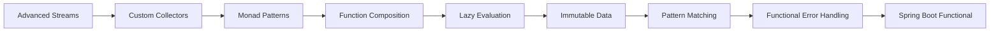

# Functional Programming in Practice

> **Previous:** [Java Modules & Packaging](./04-jpms-packaging.md) | **Next:** [Performance Tuning & Profiling](./06-performance.md)

## Learning Objectives

By the end of this chapter, you will be able to:

<!-- Image Gallery -->
<section class="lesson-visuals" aria-label="Visual learning resources">
  <header><span>VISUAL LEARNING</span><h2>See it. Review it. Remember it.</h2></header>
  <a class="lesson-visual-card" href="../../../assets/images/lessons/java/05-functional-deep/.png" target="_blank" rel="noopener">
    
    <span><strong>Handwritten notes</strong>Condensed notes for deliberate review.</span>
  </a>
  <a class="lesson-visual-card" href="../../../assets/images/lessons/java/05-functional-deep/.png" target="_blank" rel="noopener">
    
    <span><strong>Sticky-note revision</strong>Fast recall prompts for revision.</span>
  </a>
  <a class="lesson-visual-card" href="../../../assets/images/lessons/java/05-functional-deep/.png" target="_blank" rel="noopener">
    
    <span><strong>Visual concept guide</strong>A connected explanation of the key ideas.</span>
  </a>
</section>
<!-- End Image Gallery -->


- Apply advanced stream operations including `mapMulti`, custom `distinctBy`, `zip`, and `Stream.iterate` with predicates
- Design custom `Collector` implementations using all five components of the `Collector` interface
- Recognize and construct monad patterns with `Optional`, `CompletableFuture`, and custom monad-like types including `Validation`
- Use specialized functional interfaces (`IntFunction`, `LongBinaryOperator`, etc.) and compose functions at higher arities
- Build composed function pipelines using `andThen`, `compose`, partial application, and currying
- Apply lazy evaluation effectively with `Supplier`, custom `Lazy<T>`, and infinite streams
- Design immutable data carriers using records, withers, unmodifiable collections, and defensive copying
- Write exhaustive pattern matching with switch expressions, record patterns, guarded patterns, and sealed classes
- Flatten, combine, and transform `Optional` values using `or`, `stream`, `ifPresentOrElse`, and `OptionalInt`
- Implement functional error handling with `Try`, `Either`, and `Result` patterns with validation aggregation
- Build functional Spring Boot endpoints with `RouterFunction`, `HandlerFunction`, `StreamResponseBody`, and lambda-based `@Bean` definitions

**Prerequisite:** Chapter P6 (Lambda Expressions & Functional Programming) covers the fundamentals this chapter builds on. You should be comfortable with basic lambda syntax, method references, core functional interfaces, basic `Stream` pipelines, and the `Optional` and `CompletableFuture` APIs before proceeding.

## Chapter at a Glance

| Topic | Key Insight | Practical Takeaway |
|-------|-------------|--------------------|
| Advanced Streams | mapMulti, custom distinctBy, zip | Avoid intermediate collections for performance |
| Custom Collectors | Collector interface with five components | Reusable aggregation logic beyond built-in collectors |
| Monad Patterns | Optional, CompletableFuture, Validation | Compose operations without nested null/error checks |
| Function Composition | andThen, compose, partial application | Build pipelines from small reusable functions |
| Pattern Matching | Switch expressions, record patterns, sealed classes | Exhaustive, compiler-verified type dispatch |

## Chapter Roadmap



> **Pro Tip:** The most impactful functional technique for reducing bugs is making illegal states unrepresentable — use sealed classes for domain states and records for immutable data carriers.

---

## 1. Advanced Stream Operations


Chapter P6 covered the fundamentals: `stream()`, `filter`, `map`, `flatMap`, `reduce`, `collect`, `sorted`, `distinct`, `takeWhile`, `dropWhile`, `limit`, `skip`, and basic `flatMap` with `Optional::stream`. This section deepens those patterns and introduces operations not covered there.

### 1.1 `mapMulti` (Java 16+)


`mapMulti` is a hybrid between `map` and `flatMap`. Instead of returning a `Stream` for each element (like `flatMap`), it pushes zero or more results into a `Consumer`-based buffer. This avoids creating intermediate `Stream` objects and can improve performance.

```java
import java.util.*;
import java.util.stream.*;

public class MapMultiExamples {

    public static void main(String[] args) {

        // ---- 1. mapMulti replacing flatMap for one-to-many ----
        List<String> words = List.of("Hello", "Java");
        List<String> letters = words.stream()
            .<String>mapMulti((word, buffer) -> {
                for (char c : word.toCharArray()) {
                    buffer.accept(String.valueOf(c));
                }
            })
            .toList();
        System.out.println("Letters via mapMulti: " + letters);

        // ---- 2. Filter + map in one pass ----
        List<String> raw = List.of("42", "abc", "100", "xyz", "55");
        List<Integer> parsed = raw.stream()
            .<Integer>mapMulti((s, buffer) -> {
                try {
                    buffer.accept(Integer.parseInt(s));
                } catch (NumberFormatException ignored) { }
            })
            .toList();
        System.out.println("Parsed ints: " + parsed);

        // ---- 3. mapMulti with type-specific variant ----
        List<Object> mixed = List.of("text", 42, 3.14, "more", 99L);
        List<String> stringsOnly = mixed.stream()
            .<String>mapMulti((obj, buffer) -> {
                if (obj instanceof String s) {
                    buffer.accept(s);
                }
            })
            .toList();
        System.out.println("Strings only: " + stringsOnly);
    }
}
```

### 1.2 Custom `distinctBy`


`Stream.distinct()` uses `equals`/`hashCode`. When you need distinct by a *property*, there is no built-in `distinctBy`.

```java
import java.util.*;
import java.util.concurrent.ConcurrentHashMap;
import java.util.function.*;
import java.util.stream.*;

public class DistinctByExamples {

    record Person(String name, String email, int age) {}

    public static void main(String[] args) {

        List<Person> people = List.of(
            new Person("Alice",   "alice@a.com", 30),
            new Person("Bob",     "bob@b.com",   25),
            new Person("Alice",   "alice@a.com", 35),
            new Person("Charlie", "charlie@c.com", 30),
            new Person("Diana",   "alice@a.com", 28)
        );

        List<Person> distinctByEmail = people.stream()
            .filter(distinctBy(Person::email))
            .toList();
        System.out.println("Distinct by email: " + distinctByEmail);

        List<Person> parallelSafe = people.parallelStream()
            .filter(distinctByParallel(Person::email))
            .toList();
        System.out.println("Distinct parallel-safe: " + parallelSafe);

        List<String> names = List.of("Alice", "Bob", "alice", "CHARLIE", "bob");
        List<String> caseInsensitive = names.stream()
            .filter(distinctBy(String::toLowerCase))
            .toList();
        System.out.println("Case-insensitive distinct: " + caseInsensitive);
    }

    static <T> Predicate<T> distinctBy(Function<? super T, ?> keyExtractor) {
        Set<Object> seen = new HashSet<>();
        return t -> seen.add(keyExtractor.apply(t));
    }

    static <T> Predicate<T> distinctByParallel(Function<? super T, ?> keyExtractor) {
        Set<Object> seen = ConcurrentHashMap.newKeySet();
        return t -> seen.add(keyExtractor.apply(t));
    }
}
```

### 1.3 `Stream.iterate` with Predicate (Java 9+)


`Stream.iterate(T seed, Predicate<T> hasNext, UnaryOperator<T> next)` creates a bounded stream without `limit()`:

```java
import java.util.stream.*;

public class StreamIterateWithPredicate {

    public static void main(String[] args) {

        Stream.iterate(1, n -> n <= 1000, n -> n * 2)
            .forEach(n -> System.out.print(n + " "));
        System.out.println();

        Stream.iterate(
                new long[]{0, 1},
                pair -> pair[1] <= 1000,
                pair -> new long[]{pair[1], pair[0] + pair[1]}
            )
            .map(pair -> pair[0])
            .forEach(n -> System.out.print(n + " "));
        System.out.println();

        Stream.iterate(
                27L,
                n -> n != 1,
                n -> n % 2 == 0 ? n / 2 : 3 * n + 1
            )
            .limit(20)
            .forEach(n -> System.out.print(n + " "));
        System.out.println();

        Stream.iterate(
                java.time.LocalDate.of(2026, 1, 1),
                d -> d.isBefore(java.time.LocalDate.of(2026, 1, 10)),
                d -> d.plusDays(1)
            )
            .forEach(d -> System.out.print(d + " "));
        System.out.println();
    }
}
```

### 1.4 Custom `zip`


Java's `Stream` API lacks a built-in `zip`:

```java
import java.util.*;
import java.util.function.*;
import java.util.stream.*;
import java.util.Spliterator;
import java.util.Spliterators;
import java.util.concurrent.atomic.AtomicInteger;

public class ZipExamples {

    public static void main(String[] args) {

        List<String> names = List.of("Alice", "Bob", "Charlie", "Diana");
        List<Integer> ages = List.of(30, 25, 35, 28);

        List<String> zipped = zip(
            names.stream(),
            ages.stream(),
            (name, age) -> name + " is " + age + " years old"
        ).toList();
        zipped.forEach(System.out::println);

        List<String> indexed = zipWithIndex(names.stream())
            .map(pair -> (pair.getKey() + 1) + ". " + pair.getValue())
            .toList();
        System.out.println("Indexed: " + indexed);

        List<String> biZipped = BiZip.zip(
            List.of("A", "B", "C"),
            List.of(1, 2, 3),
            (s, i) -> s + i
        );
        System.out.println("BiZip: " + biZipped);
    }

    static <A, B, C> Stream<C> zip(
            Stream<A> streamA,
            Stream<B> streamB,
            BiFunction<? super A, ? super B, ? extends C> zipper) {

        Iterator<A> itA = Spliterators.iterator(streamA.spliterator());
        Iterator<B> itB = Spliterators.iterator(streamB.spliterator());

        Iterator<C> combined = new Iterator<>() {
            @Override
            public boolean hasNext() { return itA.hasNext() && itB.hasNext(); }
            @Override
            public C next() { return zipper.apply(itA.next(), itB.next()); }
        };

        long estimatedSize = Math.min(
            streamA.spliterator().estimateSize(),
            streamB.spliterator().estimateSize()
        );

        return StreamSupport.stream(
            Spliterators.spliteratorUnknownSize(combined, Spliterator.ORDERED),
            streamA.isParallel() || streamB.isParallel()
        );
    }

    static <T> Stream<Map.Entry<Integer, T>> zipWithIndex(Stream<T> stream) {
        AtomicInteger index = new AtomicInteger(0);
        return stream.map(t -> Map.entry(index.getAndIncrement(), t));
    }
}

class BiZip {
    static <A, B, C> List<C> zip(
            List<? extends A> listA,
            List<? extends B> listB,
            BiFunction<? super A, ? super B, ? extends C> zipper) {
        int size = Math.min(listA.size(), listB.size());
        return IntStream.range(0, size)
            .mapToObj(i -> zipper.apply(listA.get(i), listB.get(i)))
            .toList();
    }
}
```

### 1.5 `flatMap` Deep Patterns


Advanced patterns used in production:

```java
import java.util.*;
import java.util.stream.*;

public class FlatMapDeep {

    record Order(int id, List<String> items) {}
    record Customer(String name, List<Order> orders) {}
    record Department(String name, List<Customer> customers) {}

    public static void main(String[] args) {

        Department dept = new Department("Sales", List.of(
            new Customer("Alice", List.of(
                new Order(1, List.of("Laptop", "Mouse")),
                new Order(2, List.of("Keyboard"))
            )),
            new Customer("Bob", List.of(
                new Order(3, List.of("Monitor", "Cable", "Mouse"))
            ))
        ));

        List<String> allItems = dept.customers().stream()
            .flatMap(c -> c.orders().stream())
            .flatMap(o -> o.items().stream())
            .distinct()
            .toList();
        System.out.println("All items: " + allItems);

        record Address(String city, String zip) {}
        record User(String name, Address address) {}

        List<User> users = Arrays.asList(
            new User("Alice", new Address("NYC", "10001")),
            new User("Bob", null),
            new User("Charlie", new Address("LA", "90001"))
        );

        List<String> cities = users.stream()
            .flatMap(u -> u.address() != null
                ? Stream.of(u.address().city())
                : Stream.empty())
            .toList();
        System.out.println("Cities: " + cities);
    }
}
```

### 1.6 `Stream.concat` and Interleave


```java
import java.util.stream.*;
import java.util.*;

public class ConcatAndInterleave {

    public static void main(String[] args) {

        Stream.concat(
            Stream.of("a", "b", "c"),
            Stream.of("d", "e", "f")
        ).forEach(s -> System.out.print(s + " "));
        System.out.println();

        @SuppressWarnings("unchecked")
        Stream<String> combined = Stream.of(
                Stream.of("x", "y"),
                Stream.of("z"),
                Stream.of("w")
            )
            .reduce(Stream::concat)
            .orElse(Stream.empty());
        combined.forEach(s -> System.out.print(s + " "));
        System.out.println();

        List<String> interleaved = interleave(
            List.of("A", "B", "C"),
            List.of("1", "2", "3", "4")
        );
        System.out.println("Interleaved: " + interleaved);
    }

    static <T> List<T> interleave(List<? extends T> listA, List<? extends T> listB) {
        int max = Math.max(listA.size(), listB.size());
        List<T> result = new ArrayList<>(listA.size() + listB.size());
        for (int i = 0; i < max; i++) {
            if (i < listA.size()) result.add(listA.get(i));
            if (i < listB.size()) result.add(listB.get(i));
        }
        return result;
    }
}
```

---

## 2. Custom Collectors in Depth

Chapter P6 introduced `Collector.of` for custom collectors. Here we dissect the full `Collector` interface and build sophisticated collectors.

### 2.1 The `Collector<T, A, R>` Interface

<a href="../../../assets/images/diagrams/java/05-functional-deep/2-1-the-collector-t-a-r-interface-handwritten.svg" target="_blank" rel="noopener">
  ` Interface" width="30%">
</a>
<a href="../../../assets/images/diagrams/java/05-functional-deep/2-1-the-collector-t-a-r-interface-diagram.svg" target="_blank" rel="noopener">
  ` Interface" width="30%">
</a>
<a href="../../../assets/images/diagrams/java/05-functional-deep/2-1-the-collector-t-a-r-interface-sticky.svg" target="_blank" rel="noopener">
  ` Interface" width="30%">
</a>


A `Collector` has five components:

| Component | Type | Purpose |
|-----------|------|---------|
| `supplier` | `Supplier<A>` | Creates a mutable accumulator container |
| `accumulator` | `BiConsumer<A, T>` | Adds an element to the accumulator |
| `combiner` | `BinaryOperator<A>` | Merges two accumulators (parallel) |
| `finisher` | `Function<A, R>` | Transforms accumulator to final result |
| `characteristics` | `Set<Characteristics>` | Hints: `CONCURRENT`, `UNORDERED`, `IDENTITY_FINISH` |

```java
import java.util.*;
import java.util.function.*;
import java.util.stream.*;

public class CollectorInterfaceDeep {

    record Employee(String name, String dept, double salary) {}

    public static void main(String[] args) {

        List<Employee> employees = List.of(
            new Employee("Alice",   "Engineering", 120_000),
            new Employee("Bob",     "Engineering", 100_000),
            new Employee("Charlie", "Sales",        90_000),
            new Employee("Diana",   "Sales",       110_000),
            new Employee("Eve",     "Engineering", 130_000)
        );

        record DeptStats(String dept, long count, double avg, double min, double max) {}

        Collector<Employee, Map<String, List<Employee>>, List<DeptStats>> groupingStats =
            Collector.of(
                HashMap::new,
                (map, emp) -> map.computeIfAbsent(
                    emp.dept(), k -> new ArrayList<>()).add(emp),
                (m1, m2) -> {
                    m2.forEach((k, v) -> m1.merge(k, v,
                        (a, b) -> { a.addAll(b); return a; }));
                    return m1;
                },
                map -> {
                    List<DeptStats> stats = new ArrayList<>();
                    map.forEach((dept, emps) -> {
                        DoubleSummaryStatistics dss = emps.stream()
                            .mapToDouble(Employee::salary)
                            .summaryStatistics();
                        stats.add(new DeptStats(
                            dept, dss.getCount(), dss.getAverage(),
                            dss.getMin(), dss.getMax()));
                    });
                    stats.sort(Comparator.comparing(DeptStats::dept));
                    return stats;
                }
            );

        List<DeptStats> stats = employees.stream().collect(groupingStats);
        stats.forEach(s -> System.out.printf("%s: count=%d avg=%.0f min=%.0f max=%.0f%n",
            s.dept(), s.count(), s.avg(), s.min(), s.max()));
    }
}
```

### 2.2 Custom Downstream Collector


A downstream collector is one passed to `groupingBy` or `partitioningBy`:

```java
import java.util.*;
import java.util.function.*;
import java.util.stream.*;

public class DownstreamCollector {

    public static void main(String[] args) {

        List<String> words = List.of(
            "apple", "banana", "cherry", "date", "elderberry",
            "fig", "grape", "honeydew"
        );

        Map<Character, List<String>> topByLetter = words.stream()
            .collect(Collectors.groupingBy(
                w -> w.charAt(0),
                topN(3, Comparator.comparingInt(String::length).reversed())
            ));

        System.out.println("Top 3 by length per letter:");
        topByLetter.forEach((letter, list) ->
            System.out.println("  " + letter + ": " + list));

        List<String> last3 = words.stream()
            .collect(lastN(3));
        System.out.println("Last 3: " + last3);
    }

    static <T> Collector<T, ?, List<T>> topN(
            int n, Comparator<? super T> comparator) {
        return Collector.of(
            () -> new TreeSet<>(comparator),
            TreeSet::add,
            (left, right) -> { left.addAll(right); return left; },
            set -> set.stream().limit(n).toList(),
            Collector.Characteristics.UNORDERED
        );
    }

    static <T> Collector<T, ?, List<T>> lastN(int n) {
        return Collector.<T, Deque<T>, List<T>>of(
            ArrayDeque::new,
            (deque, element) -> {
                if (deque.size() == n) deque.removeFirst();
                deque.addLast(element);
            },
            (left, right) -> {
                right.forEach(e -> {
                    if (left.size() == n) left.removeFirst();
                    left.addLast(e);
                });
                return left;
            },
            ArrayList::new
        );
    }
}
```

### 2.3 `Collector.of` with Complex Finisher


```java
import java.util.*;
import java.util.function.*;
import java.util.stream.*;

public class CollectorOfAdvanced {

    record Sale(String product, String category, double amount) {}

    public static void main(String[] args) {

        List<Sale> sales = List.of(
            new Sale("Laptop",  "Electronics", 1200),
            new Sale("Phone",   "Electronics",  800),
            new Sale("Shirt",   "Clothing",      40),
            new Sale("Tablet",  "Electronics",  450),
            new Sale("Pants",   "Clothing",      80),
            new Sale("Monitor", "Electronics",  300)
        );

        Collector<Sale, ?, Map<String, List<Sale>>> sortedGrouped =
            Collector.of(
                TreeMap<String, List<Sale>>::new,
                (map, sale) -> map.computeIfAbsent(
                    sale.category(), k -> new ArrayList<>()).add(sale),
                (m1, m2) -> {
                    m2.forEach((k, v) -> m1.merge(k, v,
                        (a, b) -> { a.addAll(b); return a; }));
                    return m1;
                },
                map -> {
                    Map<String, List<Sale>> immutable = new TreeMap<>();
                    map.forEach((k, v) -> immutable.put(k, List.copyOf(v)));
                    return Collections.unmodifiableMap(immutable);
                }
            );

        Map<String, List<Sale>> result = sales.stream().collect(sortedGrouped);
        System.out.println("Sorted and immutable:");
        result.forEach((cat, items) ->
            System.out.println("  " + cat + ": " + items));
    }
}
```

---

## 3. Monad Patterns in Java

A **monad** is a design pattern that wraps a value and provides two operations:
- **unit** (also called `of`, `pure`, `return`): wraps a value into the monad
- **bind** (also called `flatMap`, `chain`): applies a function that returns a monad, flattening the nesting

### 3.1 `Optional` as a Monad


```java
import java.util.*;
import java.util.function.*;

public class OptionalAsMonad {

    public static void main(String[] args) {

        Optional<String> unit = Optional.of("hello");

        Function<String, Optional<Integer>> parseLen = s ->
            s != null ? Optional.of(s.length()) : Optional.empty();

        Optional<Integer> bound = unit.flatMap(parseLen);
        System.out.println("Bind result: " + bound);

        // Monad first law: left identity
        // unit(a).flatMap(f) == f.apply(a)
        String a = "hello";
        Optional<String> left = Optional.of(a).flatMap(
            s -> Optional.of("Length: " + s.length()));
        Optional<String> right = Optional.of("Length: " + a.length());
        System.out.println("Left identity: " + left.equals(right));

        // Monad second law: right identity
        // m.flatMap(x -> unit(x)) == m
        System.out.println("Right identity: " +
            unit.flatMap(Optional::of).equals(unit));

        // Monad third law: associativity
        // m.flatMap(f).flatMap(g) == m.flatMap(x -> f.apply(x).flatMap(g))
        Function<String, Optional<Integer>> f = s -> Optional.of(s.length());
        Function<Integer, Optional<String>> g = i -> Optional.of("n=" + i);

        System.out.println("Associativity: " +
            unit.flatMap(f).flatMap(g)
                .equals(unit.flatMap(x -> f.apply(x).flatMap(g))));
    }
}
```

### 3.2 `CompletableFuture` as a Monad


```java
import java.util.concurrent.*;
import java.util.function.*;

public class CompletableFutureAsMonad {

    public static void main(String[] args) throws Exception {

        CompletableFuture<String> unit = CompletableFuture.completedFuture("hello");

        CompletableFuture<Integer> bound = unit.thenCompose(
            s -> CompletableFuture.supplyAsync(() -> s.length()));
        System.out.println("Bound: " + bound.get());

        CompletableFuture<String> pipeline = CompletableFuture
            .supplyAsync(() -> "user/42")
            .thenCompose(path -> CompletableFuture
                .supplyAsync(() -> "Data for " + path))
            .thenApply(String::toUpperCase);
        System.out.println("Pipeline: " + pipeline.get());

        CompletableFuture<Integer> combined =
            CompletableFuture.supplyAsync(() -> 10)
                .thenCombine(
                    CompletableFuture.supplyAsync(() -> 20),
                    Integer::sum);
        System.out.println("Combined: " + combined.get());
    }
}
```

### 3.3 Custom Monad-Like: `Box<T>`

<a href="../../../assets/images/diagrams/java/05-functional-deep/3-3-custom-monad-like-box-t-handwritten.svg" target="_blank" rel="noopener">
  `" width="30%">
</a>
<a href="../../../assets/images/diagrams/java/05-functional-deep/3-3-custom-monad-like-box-t-diagram.svg" target="_blank" rel="noopener">
  `" width="30%">
</a>
<a href="../../../assets/images/diagrams/java/05-functional-deep/3-3-custom-monad-like-box-t-sticky.svg" target="_blank" rel="noopener">
  `" width="30%">
</a>


```java
import java.util.*;
import java.util.function.*;

final class Box<T> {

    private final T value;

    private Box(T value) { this.value = Objects.requireNonNull(value); }

    static <T> Box<T> of(T value) { return new Box<>(value); }

    <R> Box<R> map(Function<? super T, ? extends R> fn) {
        return new Box<>(fn.apply(value));
    }

    <R> Box<R> flatMap(Function<? super T, Box<? extends R>> fn) {
        @SuppressWarnings("unchecked")
        Box<R> result = (Box<R>) fn.apply(value);
        return result;
    }

    T get() { return value; }

    @Override
    public String toString() { return "Box{" + value + "}"; }

    @Override
    public boolean equals(Object o) {
        return this == o || (o instanceof Box<?> b && Objects.equals(value, b.value));
    }

    @Override
    public int hashCode() { return Objects.hash(value); }
}

public class CustomMonadDemo {

    public static void main(String[] args) {

        Box<String> result = Box.of(" functional ")
            .map(String::trim)
            .flatMap(s -> Box.of(s.toUpperCase()))
            .map(s -> s + "!");
        System.out.println("Pipeline: " + result);

        Box<String> m = Box.of("test");
        Function<String, Box<Integer>> f = s -> Box.of(s.length());
        Function<Integer, Box<String>> g = i -> Box.of("len=" + i);

        System.out.println("Left identity: " +
            Box.of("x").flatMap(f).equals(f.apply("x")));
        System.out.println("Right identity: " +
            m.flatMap(Box::of).equals(m));
        System.out.println("Associativity: " +
            m.flatMap(f).flatMap(g)
                .equals(m.flatMap(x -> f.apply(x).flatMap(g))));
    }
}
```

### 3.4 Validation Monad


The `Validation` pattern accumulates errors rather than short-circuiting:

```java
import java.util.*;
import java.util.function.*;

final class Validation<E, T> {

    private final Optional<T> success;
    private final List<E> errors;

    private Validation(T value) {
        this.success = Optional.of(value);
        this.errors = List.of();
    }

    @SafeVarargs
    private Validation(E... errors) {
        this.success = Optional.empty();
        this.errors = List.of(errors);
    }

    private Validation(List<E> errors) {
        this.success = Optional.empty();
        this.errors = List.copyOf(errors);
    }

    static <E, T> Validation<E, T> valid(T value) { return new Validation<>(value); }

    @SafeVarargs
    static <E, T> Validation<E, T> invalid(E... errors) { return new Validation<>(errors); }

    static <E, T> Validation<E, T> invalid(List<E> errors) { return new Validation<>(errors); }

    boolean isValid() { return success.isPresent(); }
    T get() { return success.orElseThrow(); }
    List<E> getErrors() { return errors; }

    <R> Validation<E, R> map(Function<? super T, ? extends R> fn) {
        if (isValid()) return valid(fn.apply(get()));
        @SuppressWarnings("unchecked")
        Validation<E, R> self = (Validation<E, R>) this;
        return self;
    }

    <R> Validation<E, R> flatMap(Function<? super T, Validation<E, R>> fn) {
        if (isValid()) return fn.apply(get());
        @SuppressWarnings("unchecked")
        Validation<E, R> self = (Validation<E, R>) this;
        return self;
    }

    <R> Validation<E, R> accumulate(
            Validation<E, T> other,
            BiFunction<? super T, ? super T, ? extends R> combiner) {
        if (this.isValid() && other.isValid())
            return valid(combiner.apply(this.get(), other.get()));
        List<E> allErrors = new ArrayList<>();
        if (!this.isValid()) allErrors.addAll(this.errors);
        if (!other.isValid()) allErrors.addAll(other.errors);
        return invalid(allErrors);
    }

    @Override
    public String toString() {
        return isValid() ? "Valid{" + get() + "}" : "Invalid{errors=" + errors + "}";
    }
}

public class ValidationMonadDemo {

    record User(String name, String email, int age) {}

    public static void main(String[] args) {

        Function<String, Validation<String, String>> nonEmpty = value ->
            value != null && !value.isBlank()
                ? Validation.valid(value)
                : Validation.invalid("Value must not be blank");

        Function<String, Validation<String, String>> validEmail = value ->
            value != null && value.matches("^[^@\\s]+@[^@\\s]+\\.[^@\\s]+$")
                ? Validation.valid(value)
                : Validation.invalid("Invalid email format");

        Function<Integer, Validation<String, Integer>> minAge = value ->
            value >= 18 ? Validation.valid(value)
                : Validation.invalid("Must be at least 18");

        List<String> allErrors = new ArrayList<>();
        Validation<String, String> nameResult = nonEmpty.apply("");
        Validation<String, String> emailResult = validEmail.apply("bad-email");
        Validation<String, Integer> ageResult = minAge.apply(15);

        if (!nameResult.isValid()) allErrors.addAll(nameResult.getErrors());
        if (!emailResult.isValid()) allErrors.addAll(emailResult.getErrors());
        if (!ageResult.isValid()) allErrors.addAll(ageResult.getErrors());

        System.out.println("Errors: " + allErrors);

        Validation<String, User> user = nonEmpty.apply("Alice")
            .flatMap(name -> validEmail.apply("alice@example.com")
                .flatMap(email -> minAge.apply(25)
                    .map(age -> new User(name, email, age))));
        System.out.println("User: " + user);
    }
}
```

---

## 4. Functional Interfaces → Beyond Basics

Chapter P6 covered the six core interfaces and their primitive variants. Here we focus on composition, chaining, and extending arity.

### 4.1 Specialization Reference


The JDK provides 43 functional interfaces in `java.util.function`:

```java
import java.util.function.*;
import java.util.*;

public class SpecializationReference {

    public static void main(String[] args) {

        IntFunction<String> intFmt = i -> "int: " + i;
        LongFunction<String> longFmt = l -> "long: " + l;
        DoubleFunction<String> doubleFmt = d -> String.format("%.2f", d);

        System.out.println(intFmt.apply(42));
        System.out.println(longFmt.apply(99L));
        System.out.println(doubleFmt.apply(3.14159));

        IntUnaryOperator square = n -> n * n;
        LongBinaryOperator sum = (a, b) -> a + b;
        DoubleUnaryOperator negate = d -> -d;

        System.out.println("Square: " + square.applyAsInt(12));
        System.out.println("Long sum: " + sum.applyAsLong(1_000_000_000L, 2_000_000_000L));
        System.out.println("Negate: " + negate.applyAsDouble(5.5));

        ToIntFunction<String> strLen = String::length;
        System.out.println("ToInt: " + strLen.applyAsInt("hello"));

        ObjIntConsumer<String> printWithIndex = (s, i) ->
            System.out.println(i + ": " + s);
        printWithIndex.accept("Java", 1);

        int[] values = {10, 20, 30, 40, 50};
        IntPredicate big = n -> n > 25;
        Arrays.stream(values)
            .filter(big)
            .forEach(n -> System.out.print(n + " "));
        System.out.println();
    }
}
```

### 4.2 Consumer Chaining


```java
import java.util.function.*;
import java.util.*;

public class ConsumerChaining {

    public static void main(String[] args) {

        Consumer<String> log = s -> System.out.print("[LOG] " + s);
        Consumer<String> persist = s -> System.out.print(" [SAVED]");
        Consumer<String> combined = log.andThen(persist);
        combined.accept("event");
        System.out.println();

        List<Consumer<String>> pipeline = List.of(
            s -> System.out.print("Upper: " + s.toUpperCase() + " "),
            s -> System.out.print("Lower: " + s.toLowerCase() + " "),
            s -> System.out.print("Len: " + s.length())
        );
        Consumer<String> all = chain(pipeline);
        all.accept("Hello");
        System.out.println();

        Consumer<String> conditional = conditionalConsumer(
            s -> s.length() > 5,
            s -> System.out.println("  Long: " + s),
            s -> System.out.println("  Short: " + s));
        conditional.accept("short");
        conditional.accept("longer text");
    }

    @SafeVarargs
    static <T> Consumer<T> chain(Consumer<? super T>... consumers) {
        return t -> { for (Consumer<? super T> c : consumers) c.accept(t); };
    }

    static <T> Consumer<T> chain(List<Consumer<T>> consumers) {
        return t -> consumers.forEach(c -> c.accept(t));
    }

    static <T> Consumer<T> conditionalConsumer(
            Predicate<T> condition, Consumer<T> ifTrue, Consumer<T> ifFalse) {
        return t -> { if (condition.test(t)) ifTrue.accept(t); else ifFalse.accept(t); };
    }
}
```

### 4.3 Predicate Composition Factories


```java
import java.util.function.*;
import java.util.*;

public class PredicateComposition {

    public static void main(String[] args) {

        List<String> words = List.of("cat", "dog", "elephant", "", "ant", null, "bear");

        Predicate<String> nonNull = Objects::nonNull;
        Predicate<String> nonEmpty = s -> !s.isEmpty();
        Predicate<String> shortWord = s -> s.length() <= 4;

        Predicate<String> validShort = allOf(nonNull, nonEmpty, shortWord);
        words.stream().filter(validShort)
            .forEach(s -> System.out.print(s + " "));
        System.out.println();

        Predicate<String> startsA = s -> s != null && s.startsWith("a");
        Predicate<String> startsB = s -> s != null && s.startsWith("b");
        Predicate<String> startsABC = anyOf(startsA, startsB);
        words.stream().filter(startsABC)
            .forEach(s -> System.out.print(s + " "));
        System.out.println();

        Predicate<String> notABC = noneOf(startsA, startsB);
        words.stream().filter(notABC)
            .filter(Objects::nonNull)
            .forEach(s -> System.out.print(s + " "));
        System.out.println();
    }

    @SafeVarargs
    static <T> Predicate<T> allOf(Predicate<? super T>... predicates) {
        return t -> {
            for (Predicate<? super T> p : predicates)
                if (!p.test(t)) return false;
            return true;
        };
    }

    @SafeVarargs
    static <T> Predicate<T> anyOf(Predicate<? super T>... predicates) {
        return t -> {
            for (Predicate<? super T> p : predicates)
                if (p.test(t)) return true;
            return false;
        };
    }

    @SafeVarargs
    static <T> Predicate<T> noneOf(Predicate<? super T>... predicates) {
        return anyOf(predicates).negate();
    }
}
```

### 4.4 Function Arity: TriFunction and Beyond


Java's `java.util.function` provides only `Function` (arity 1) and `BiFunction` (arity 2):

```java
import java.util.*;
import java.util.function.*;
import java.util.stream.*;

@FunctionalInterface
interface TriFunction<A, B, C, R> {
    R apply(A a, B b, C c);

    default <V> TriFunction<A, B, C, V> andThen(
            Function<? super R, ? extends V> after) {
        return (a, b, c) -> after.apply(apply(a, b, c));
    }
}

@FunctionalInterface
interface QuadFunction<A, B, C, D, R> {
    R apply(A a, B b, C c, D d);
}

@FunctionalInterface
interface TriConsumer<A, B, C> {
    void accept(A a, B b, C c);
}

public class FunctionArity {

    public static void main(String[] args) {

        TriFunction<Integer, Integer, Integer, String> format3 =
            (a, b, c) -> String.format("(%d, %d, %d)", a, b, c);
        System.out.println(format3.apply(1, 2, 3));

        TriFunction<Double, Double, Double, Double> volume = (w, h, d) -> w * h * d;
        Function<Double, String> display = v -> "Volume: " + v;
        System.out.println(volume.andThen(display).apply(2.0, 3.0, 4.0));

        record Point3D(double x, double y, double z) {}
        TriFunction<Double, Double, Double, Point3D> pointFactory = Point3D::new;
        System.out.println(pointFactory.apply(1.0, 2.0, 3.0));
    }
}
```

---

## 5. Function Composition Pipelines

### 5.1 `andThen` and `compose` Deep Dive


```java
import java.util.function.*;
import java.util.*;

public class CompositionDeep {

    public static void main(String[] args) {

        Function<String, String> trim = String::strip;
        Function<String, String> toUpper = String::toUpperCase;
        Function<String, String> exclaim = s -> s + "!";

        Function<String, String> shout = trim.andThen(toUpper).andThen(exclaim);
        System.out.println(shout.apply("  hello  "));

        Function<String, Integer> pipeline = trim
            .andThen(String::length)
            .andThen(n -> n * 2);
        System.out.println("Pipeline: " + pipeline.apply("  abc  "));

        Function<String, Optional<String>> wrap =
            s -> s == null ? Optional.empty() : Optional.of(s);
        Function<Optional<String>, String> unwrap =
            opt -> opt.orElse("default");
        Function<String, String> safeOp = wrap.andThen(unwrap);
        System.out.println(safeOp.apply(null));
    }
}
```

### 5.2 Pipeline Construction


```java
import java.util.function.*;
import java.util.*;

public class PipelineConstruction {

    record ProcessContext(String input, long timestamp, int version) {}

    public static void main(String[] args) {

        List<UnaryOperator<String>> steps = List.of(
            String::strip,
            String::toLowerCase,
            s -> s.replaceAll("\\s+", "_"),
            s -> s.substring(0, Math.min(s.length(), 10))
        );

        UnaryOperator<String> pipeline = steps.stream()
            .reduce(UnaryOperator.identity(), UnaryOperator::andThen);
        System.out.println(pipeline.apply("  Hello World  "));

        Function<ProcessContext, ProcessContext> processor =
            ((Function<ProcessContext, ProcessContext>) ctx ->
                new ProcessContext(ctx.input().strip(),
                    ctx.timestamp(), ctx.version()))
            .andThen(ctx -> new ProcessContext(
                ctx.input().toLowerCase(),
                ctx.timestamp(), ctx.version()))
            .andThen(ctx -> new ProcessContext(
                ctx.input().replaceAll("\\s+", "-"),
                ctx.timestamp(), ctx.version() + 1));

        ProcessContext result = processor.apply(
            new ProcessContext("  Hello World  ", System.currentTimeMillis(), 1));
        System.out.printf("input='%s', version=%d%n",
            result.input(), result.version());
    }
}
```

### 5.3 Partial Application


```java
import java.util.function.*;

public class PartialApplication {

    public static void main(String[] args) {

        TriFunction<Integer, Integer, Integer, Integer> addAll =
            (a, b, c) -> a + b + c;

        BiFunction<Integer, Integer, Integer> add5 =
            partialFirst(addAll, 5);
        System.out.println("add5: " + add5.apply(10, 20));

        Function<String, Function<String, Function<Integer, String>>> validateAndFormat =
            rule -> value -> maxLen -> {
                if (value == null || value.isBlank())
                    return rule + ": value is blank";
                if (value.length() > maxLen)
                    return rule + ": value exceeds " + maxLen;
                return rule + ": " + value.toUpperCase();
            };

        Function<Integer, String> validateEmail =
            validateAndFormat.apply("EMAIL").apply("test@example.com");
        System.out.println(validateEmail.apply(20));
    }

    static <A, B, C, R> BiFunction<B, C, R> partialFirst(
            TriFunction<A, B, C, R> fn, A first) {
        return (b, c) -> fn.apply(first, b, c);
    }

    static <A, B, C, R> BiFunction<A, C, R> partialSecond(
            TriFunction<A, B, C, R> fn, B second) {
        return (a, c) -> fn.apply(a, second, c);
    }
}
```

### 5.4 Currying Simulation Revisited


```java
import java.util.function.*;

public class CurryingSimulationDeep {

    public static void main(String[] args) {

        Function<String, Function<String, Function<String, String>>> greeter =
            greeting -> name -> punctuation ->
                greeting + " " + name + punctuation;
        System.out.println(
            greeter.apply("Hello").apply("World").apply("!"));

        Function<String, Function<String, Consumer<String>>> logger =
            level -> format -> message ->
                System.out.printf("[%s] %s: %s%n", level, format, message);

        Consumer<String> infoJson = logger.apply("INFO").apply("JSON");
        Consumer<String> errorPlain = logger.apply("ERROR").apply("PLAIN");

        infoJson.accept("{\"event\": \"start\"}");
        errorPlain.accept("Connection refused");

        Function<String, Function<Integer, Function<Double, String>>> formatPerson =
            name -> age -> salary ->
                String.format("%s (%d) earns $%.2f", name, age, salary);

        System.out.println(formatPerson
            .apply("Alice").apply(30).apply(120_000.0));
    }
}
```

---

## 6. Lazy Evaluation Patterns

### 6.1 Stream Laziness Revisited


```java
import java.util.*;
import java.util.stream.*;

public class StreamLazinessDeep {

    public static void main(String[] args) {

        List<String> data = List.of("one", "two", "three", "four", "five");

        List<String> result = data.stream()
            .peek(s -> System.out.println("  source: " + s))
            .filter(s -> s.length() > 3)
            .peek(s -> System.out.println("  filtered: " + s))
            .map(String::toUpperCase)
            .peek(s -> System.out.println("  mapped: " + s))
            .toList();
        System.out.println("Result: " + result);

        Optional<String> found = data.stream()
            .peek(s -> System.out.println("  visiting: " + s))
            .filter(s -> s.startsWith("t"))
            .findFirst();
        System.out.println("Found: " + found);
    }
}
```

### 6.2 `Supplier` for Lazy Initialization


```java
import java.util.function.*;
import java.util.*;

class Memoizer<T> {

    static <T> Supplier<T> memoize(Supplier<T> delegate) {
        return new Supplier<T>() {
            private volatile T value;

            @Override
            public T get() {
                T result = value;
                if (result == null) {
                    synchronized (this) {
                        result = value;
                        if (result == null) {
                            result = Objects.requireNonNull(delegate.get());
                            value = result;
                        }
                    }
                }
                return result;
            }
        };
    }
}

public class SupplierLazyInit {

    static class HeavyResource {
        private final String name;
        HeavyResource(String name) {
            System.out.println("  Creating HeavyResource: " + name);
            this.name = name;
        }
        String getName() { return name; }
    }

    static class Config {
        private final Supplier<HeavyResource> db =
            Memoizer.memoize(() -> new HeavyResource("Database"));
        private final Supplier<HeavyResource> cache =
            Memoizer.memoize(() -> new HeavyResource("Cache"));

        HeavyResource getDb() { return db.get(); }
        HeavyResource getCache() { return cache.get(); }
    }

    public static void main(String[] args) {
        System.out.println("Creating config (no resources initialized)...");
        Config config = new Config();
        System.out.println("Accessing DB...");
        config.getDb();
        System.out.println("Accessing DB again (cached)...");
        config.getDb();
        System.out.println("Cache never accessed → not created");
    }
}
```

### 6.3 Custom `Lazy<T>` Structure

<a href="../../../assets/images/diagrams/java/05-functional-deep/6-3-custom-lazy-t-structure-handwritten.svg" target="_blank" rel="noopener">
  ` Structure" width="30%">
</a>
<a href="../../../assets/images/diagrams/java/05-functional-deep/6-3-custom-lazy-t-structure-diagram.svg" target="_blank" rel="noopener">
  ` Structure" width="30%">
</a>
<a href="../../../assets/images/diagrams/java/05-functional-deep/6-3-custom-lazy-t-structure-sticky.svg" target="_blank" rel="noopener">
  ` Structure" width="30%">
</a>


```java
import java.util.*;
import java.util.function.*;
import java.util.stream.*;

final class Lazy<T> {

    private volatile T value;
    private Supplier<? extends T> supplier;

    private Lazy(Supplier<? extends T> supplier) {
        this.supplier = Objects.requireNonNull(supplier);
    }

    static <T> Lazy<T> of(Supplier<? extends T> supplier) {
        return new Lazy<>(supplier);
    }

    static <T> Lazy<T> ofValue(T value) {
        Lazy<T> lazy = new Lazy<>(() -> value);
        lazy.value = value;
        return lazy;
    }

    T get() {
        if (supplier != null) {
            synchronized (this) {
                if (supplier != null) {
                    value = Objects.requireNonNull(supplier.get());
                    supplier = null;
                }
            }
        }
        return value;
    }

    boolean isEvaluated() { return supplier == null; }

    <R> Lazy<R> map(Function<? super T, ? extends R> fn) {
        return Lazy.of(() -> fn.apply(get()));
    }

    <R> Lazy<R> flatMap(Function<? super T, Lazy<? extends R>> fn) {
        return Lazy.of(() -> {
            @SuppressWarnings("unchecked")
            R result = (R) fn.apply(get()).get();
            return result;
        });
    }

    @Override
    public String toString() {
        return isEvaluated() ? "Lazy{evaluated=" + value + "}" : "Lazy{unevaluated}";
    }
}

public class CustomLazyDemo {

    public static void main(String[] args) {

        Lazy<Double> expensive = Lazy.of(() -> {
            System.out.println("  Computing expensive value...");
            return Math.pow(2, 100);
        });

        System.out.println("Created: " + expensive);
        System.out.println("First: " + expensive.get());
        System.out.println("Cached: " + expensive.get());
        System.out.println("Evaluated: " + expensive.isEvaluated());

        Lazy<Integer> chained = Lazy.of(() -> {
            System.out.println("  Step 1"); return 5;
        }).flatMap(n -> Lazy.of(() -> {
            System.out.println("  Step 2"); return n * 2;
        })).flatMap(n -> Lazy.of(() -> {
            System.out.println("  Step 3"); return n + 1;
        }));

        System.out.println("Chain defined, not evaluated");
        System.out.println("Result: " + chained.get());
    }
}
```

### 6.4 Infinite Streams in Practice


```java
import java.util.*;
import java.util.stream.*;

public class InfiniteStreamsInPractice {

    public static void main(String[] args) {

        Stream.iterate(new int[]{0, 1},
                pair -> new int[]{pair[1], pair[0] + pair[1]})
            .limit(10).map(pair -> pair[0])
            .forEach(n -> System.out.print(n + " "));
        System.out.println();

        Stream.iterate(2, n -> n + 1)
            .filter(InfiniteStreamsInPractice::isPrime)
            .limit(15)
            .forEach(n -> System.out.print(n + " "));
        System.out.println();

        List<String> colors = List.of("red", "green", "blue");
        Stream.generate(() -> colors)
            .flatMap(Collection::stream)
            .limit(8)
            .forEach(s -> System.out.print(s + " "));
        System.out.println();
    }

    static boolean isPrime(int n) {
        if (n < 2) return false;
        if (n == 2) return true;
        if (n % 2 == 0) return false;
        for (int i = 3; i * i <= n; i += 2)
            if (n % i == 0) return false;
        return true;
    }
}
```

---

## 7. Immutable Data in Functional Style

### 7.1 Records as Functional Data Carriers


```java
import java.util.*;
import java.util.stream.*;

public class RecordsAsFunctionalData {

    record Address(String street, String city, String zip) {}
    record Person(String name, int age, Address address) {}

    public static void main(String[] args) {

        Person p1 = new Person("Alice", 30,
            new Address("123 Main", "NYC", "10001"));
        System.out.println(p1.name() + " lives in " + p1.address().city());

        List<Person> people = List.of(
            new Person("Alice", 30,
                new Address("123 Main", "NYC", "10001")),
            new Person("Bob", 25,
                new Address("456 Oak", "LA", "90001")),
            new Person("Charlie", 35,
                new Address("789 Pine", "NYC", "10002"))
        );

        Map<String, List<Person>> byCity = people.stream()
            .collect(Collectors.groupingBy(p -> p.address().city()));
        System.out.println("By city: " + byCity);

        record Circle(double radius) {
            double area() { return Math.PI * radius * radius; }
        }
        System.out.printf("Area: %.2f%n", new Circle(5).area());

        record TempConversion(double celsius, double fahrenheit) {
            TempConversion(double celsius) {
                this(celsius, celsius * 9 / 5 + 32);
            }
        }

        List.of(0.0, 10.0, 20.0, 30.0, 100.0).stream()
            .map(TempConversion::new)
            .forEach(tc -> System.out.printf("%.0fC = %.0fF%n",
                tc.celsius(), tc.fahrenheit()));
    }
}
```

### 7.2 The `@With` / Wither Pattern


```java
import java.util.*;

public class WitherPattern {

    record Point(int x, int y) {
        Point withX(int x) { return new Point(x, this.y()); }
        Point withY(int y) { return new Point(this.x(), y); }
    }

    record Employee(String name, String department, double salary) {
        Employee withDepartment(String dept) {
            return new Employee(name(), dept, salary());
        }
        Employee withSalary(double salary) {
            return new Employee(name(), department(), salary);
        }
        Employee withRaise(double percent) {
            return new Employee(name(), department(),
                salary() * (1 + percent / 100));
        }
    }

    public static void main(String[] args) {

        Point p1 = new Point(3, 4);
        Point p2 = p1.withX(10);
        System.out.println("p1: " + p1);
        System.out.println("p2: " + p2);

        Employee emp = new Employee("Alice", "Engineering", 100_000);
        Employee promoted = emp.withDepartment("Senior Eng").withRaise(15);
        System.out.println("Promoted: " + promoted);

        List<Employee> team = List.of(
            new Employee("Alice", "Engineering", 100_000),
            new Employee("Bob", "Engineering", 90_000)
        );
        List<Employee> raised = team.stream()
            .map(e -> e.withRaise(10).withDepartment("Eng v2"))
            .toList();
        raised.forEach(e -> System.out.println("  " + e));
    }
}
```

### 7.3 Unmodifiable Collections


```java
import java.util.*;
import java.util.stream.*;

public class UnmodifiableCollections {

    public static void main(String[] args) {

        List.of("a", "b", "c");              // already immutable
        Set.of(1, 2, 3);                      // already immutable
        Map.of("a", 1, "b", 2);               // already immutable

        List<String> fromStream = Stream.of("x", "y", "z").toList();

        List<String> collected = Stream.of("p", "q", "r")
            .collect(Collectors.toUnmodifiableList());

        List<String> modifiable = new ArrayList<>(List.of("a", "b"));
        List<String> defensive = List.copyOf(modifiable);
        modifiable.add("c"); // does NOT affect defensive
        System.out.println("Defensive: " + defensive);
    }
}
```

### 7.4 Defensive Copying


```java
import java.util.*;

public class DefensiveCopying {

    record Team(String name, List<String> members) {
        Team { members = List.copyOf(members); }
    }

    public static void main(String[] args) {

        List<String> mutableMembers = new ArrayList<>(List.of("Alice", "Bob"));
        Team team = new Team("Dev", mutableMembers);
        mutableMembers.add("Charlie");
        System.out.println("Team members: " + team.members());

        record Employee(String name) {}
        List<Employee> mutableEmps = new ArrayList<>(
            List.of(new Employee("Alice"), new Employee("Bob")));

        List<Employee> safe = List.copyOf(mutableEmps);
        mutableEmps.add(new Employee("Charlie"));
        System.out.println("Safe size: " + safe.size());
    }
}
```

---

## 8. Pattern Matching (Java 21+)

### 8.1 Switch Expression & Pattern Matching


```java
import java.util.*;

public class SwitchPatternMatching {

    sealed interface Shape permits Circle, Rectangle, Triangle {}
    record Circle(double radius) implements Shape {}
    record Rectangle(double width, double height) implements Shape {}
    record Triangle(double base, double height) implements Shape {}

    public static void main(String[] args) {

        Object obj = "Hello, Java 21!";
        String result = switch (obj) {
            case String s -> "String of length " + s.length();
            case Integer i -> "Integer with value " + i;
            case null      -> "Null value";
            default        -> "Unknown: " + obj.getClass().getSimpleName();
        };
        System.out.println(result);

        Shape shape = new Circle(5.0);
        String description = switch (shape) {
            case Circle c    -> "Circle with radius " + c.radius();
            case Rectangle r -> "Rectangle " + r.width() + "x" + r.height();
            case Triangle t  -> "Triangle with base " + t.base();
        };
        System.out.println(description);

        Object value = 42;
        String classified = switch (value) {
            case String s when s.length() > 10 -> "Long string: " + s;
            case String s                      -> "Short string: " + s;
            case Integer i when i > 0          -> "Positive: " + i;
            case Integer i                     -> "Non-positive: " + i;
            case null                          -> "null";
            default                            -> "Other";
        };
        System.out.println(classified);
    }
}
```

### 8.2 Record Patterns


```java
import java.util.*;

public class RecordPatterns {

    record Point(int x, int y) {}
    record Line(Point start, Point end) {}
    record Circle(Point center, double radius) {}

    public static void main(String[] args) {

        Point p = new Point(3, 4);
        if (p instanceof Point(int x, int y)) {
            System.out.println("Point at (" + x + ", " + y + ")");
        }

        Line line = new Line(new Point(0, 0), new Point(10, 20));
        if (line instanceof Line(Point(int x1, int y1), Point(int x2, int y2))) {
            double dist = Math.sqrt(Math.pow(x2 - x1, 2) + Math.pow(y2 - y1, 2));
            System.out.printf("Line length: %.2f%n", dist);
        }

        Object shape = new Circle(new Point(0, 0), 5);
        String info = switch (shape) {
            case Circle(Point(int x, int y), double r) ->
                "Circle at (" + x + "," + y + ") radius " + r;
            case Line(Point(int x1, int y1), Point(int x2, int y2)) ->
                "Line from (" + x1 + "," + y1 + ") to (" + x2 + "," + y2 + ")";
            case null -> "null";
            default -> "Unknown shape";
        };
        System.out.println(info);

        List<Object> items = List.of(
            new Point(1, 2), "text",
            new Circle(new Point(0, 0), 3.0), 42);

        for (Object item : items) {
            switch (item) {
                case Point(int x, int y) ->
                    System.out.println("Point: " + x + "," + y);
                case Circle(Point(int cx, int cy), double r) ->
                    System.out.println("Circle at " + cx + "," + cy + " r=" + r);
                case String s -> System.out.println("String: " + s);
                case Integer i -> System.out.println("Int: " + i);
                default -> System.out.println("Unknown: " + item);
            }
        }
    }
}
```

### 8.3 Guarded Patterns


```java
import java.util.*;

public class GuardedPatterns {

    sealed interface Animal permits Dog, Cat, Bird {}
    record Dog(String name, int barkVolume) implements Animal {}
    record Cat(String name, boolean indoor) implements Animal {}
    record Bird(String name, double wingSpan) implements Animal {}

    public static void main(String[] args) {

        List<Animal> animals = List.of(
            new Dog("Rex", 8), new Dog("Bella", 3),
            new Cat("Whiskers", true), new Cat("Tom", false),
            new Bird("Tweety", 0.25));

        for (Animal animal : animals) {
            String desc = switch (animal) {
                case Dog(var name, int vol) when vol > 5 ->
                    name + " is loud!";
                case Dog(var name, int vol) ->
                    name + " is quiet";
                case Cat(var name, boolean indoor) when indoor ->
                    name + " is indoor";
                case Cat(var name, boolean indoor) ->
                    name + " is outdoor";
                case Bird(var name, double ws) when ws > 1.0 ->
                    name + " is large";
                case Bird(var name, double ws) ->
                    name + " is small";
            };
            System.out.println("  " + desc);
        }

        record Transaction(String userId, double amount, boolean flagged) {}
        Transaction txn = new Transaction("u1", 9500.00, false);
        String risk = switch (txn) {
            case Transaction(var uid, double amt, boolean flagged)
                when flagged || amt > 10000 -> "HIGH: " + uid;
            case Transaction(var uid, double amt, boolean flagged)
                when amt > 5000 -> "MEDIUM: " + uid;
            case Transaction(var uid, double amt, boolean flagged) ->
                "LOW: " + uid;
        };
        System.out.println("Risk: " + risk);
    }
}
```

### 8.4 Sealed Class Exhaustive Matching


```java
import java.util.*;

public class SealedExhaustiveMatching {

    sealed interface Expression permits Constant, Add, Multiply, Negate {}
    record Constant(int value) implements Expression {}
    record Add(Expression left, Expression right) implements Expression {}
    record Multiply(Expression left, Expression right) implements Expression {}
    record Negate(Expression expr) implements Expression {}

    static int evaluate(Expression expr) {
        return switch (expr) {
            case Constant(var v)        -> v;
            case Add(var l, var r)      -> evaluate(l) + evaluate(r);
            case Multiply(var l, var r) -> evaluate(l) * evaluate(r);
            case Negate(var e)          -> -evaluate(e);
        };
    }

    sealed interface PaymentMethod permits CreditCard, PayPal, Crypto {}
    record CreditCard(String last4, String expiry) implements PaymentMethod {}
    record PayPal(String email) implements PaymentMethod {}
    record Crypto(String walletAddress, String currency) implements PaymentMethod {}

    static String processPayment(PaymentMethod method, double amount) {
        return switch (method) {
            case CreditCard(var last4, var expiry) ->
                "Charge $" + amount + " to card ending " + last4;
            case PayPal(var email) ->
                "PayPal payment of $" + amount + " from " + email;
            case Crypto(var addr, var currency) ->
                "Send " + amount + " USD in " + currency;
        };
    }

    public static void main(String[] args) {

        Expression expr = new Add(
            new Multiply(new Constant(3), new Constant(4)),
            new Negate(new Constant(2)));
        System.out.println("Result: " + evaluate(expr));

        System.out.println(processPayment(
            new CreditCard("1234", "12/28"), 99.99));
    }
}
```

---

## 9. Optionals → Beyond the Basics

### 9.1 `or`, `ifPresentOrElse`, `stream()` → Deep Patterns


```java
import java.util.*;
import java.util.stream.*;

public class OptionalAdvancedPatterns {

    public static void main(String[] args) {

        Optional<String> config = Optional.<String>empty()
            .or(() -> Optional.ofNullable(System.getenv("MY_CONFIG")))
            .or(() -> Optional.of("default-config"));
        System.out.println("Config: " + config.get());

        Optional<String> value = Optional.of("data");
        value.ifPresentOrElse(
            v -> System.out.println("  Processed: " + v),
            () -> System.out.println("  No data"));

        record User(String name, String email) {}
        List<Optional<User>> users = List.of(
            Optional.of(new User("Alice", "alice@x.com")),
            Optional.empty(),
            Optional.of(new User("Bob", "bob@x.com")));

        List<String> emails = users.stream()
            .flatMap(Optional::stream)
            .map(User::email)
            .toList();
        System.out.println("Emails: " + emails);

        record Product(int id, String name, double price) {}
        List<Product> products = List.of(
            new Product(1, "Laptop", 1200),
            new Product(2, "Mouse", 25),
            new Product(3, "Monitor", 300));

        Optional<Product> cheapest = products.stream()
            .min(Comparator.comparingDouble(Product::price));
        Optional<Product> mostExpensive = products.stream()
            .max(Comparator.comparingDouble(Product::price));

        String summary = cheapest.stream()
            .flatMap(c -> mostExpensive.stream()
                .map(m -> String.format("Range: $%.0f - $%.0f",
                    c.price(), m.price())))
            .findFirst()
            .orElse("No products");
        System.out.println(summary);
    }
}
```

### 9.2 `OptionalInt`, `OptionalLong`, `OptionalDouble`


```java
import java.util.*;
import java.util.stream.*;

public class PrimitiveOptionals {

    public static void main(String[] args) {

        OptionalInt max = IntStream.of(3, 7, 1, 9, 4).max();
        System.out.println("Max: " + max.orElse(-1));

        OptionalDouble avg = DoubleStream.of(2.5, 3.5, 4.0).average();
        System.out.printf("Average: %.2f%n", avg.orElse(0.0));

        OptionalInt o1 = OptionalInt.of(10);
        OptionalInt o2 = OptionalInt.of(20);
        OptionalInt o3 = OptionalInt.empty();

        int sum = List.of(o1, o2, o3).stream()
            .flatMapToInt(OptionalInt::stream)
            .sum();
        System.out.println("Sum of present: " + sum);
    }
}
```

### 9.3 Combining Multiple Optionals


```java
import java.util.*;
import java.util.function.*;

public class CombiningOptionals {

    public static void main(String[] args) {

        Optional<String> first = Optional.of("Alice");
        Optional<String> last = Optional.of("Smith");

        Optional<String> fullName = first.flatMap(f ->
            last.map(l -> f + " " + l));
        System.out.println("Full: " + fullName.orElse("N/A"));

        Optional<Integer> a = Optional.of(10);
        Optional<Integer> b = Optional.of(20);
        Optional<Integer> c = Optional.of(30);

        Optional<Integer> sum3 = combine3(
            a, b, c, (x, y, z) -> x + y + z);
        System.out.println("Sum: " + sum3.orElse(0));

        BiFunction<Integer, Integer, Integer> add = Integer::sum;
        BiFunction<Optional<Integer>, Optional<Integer>, Optional<Integer>> lifted =
            lift(add);
        System.out.println("Lifted: " +
            lifted.apply(Optional.of(5), Optional.of(7)));
        System.out.println("Lifted empty: " +
            lifted.apply(Optional.of(5), Optional.empty()));
    }

    static <A, B, R> Optional<R> combine2(
            Optional<A> a, Optional<B> b, BiFunction<A, B, R> fn) {
        return a.flatMap(av -> b.map(bv -> fn.apply(av, bv)));
    }

    static <A, B, C, R> Optional<R> combine3(
            Optional<A> a, Optional<B> b, Optional<C> c,
            TriFunction<A, B, C, R> fn) {
        return a.flatMap(av ->
            b.flatMap(bv ->
                c.map(cv -> fn.apply(av, bv, cv))));
    }

    static <A, B, R> BiFunction<Optional<A>, Optional<B>, Optional<R>> lift(
            BiFunction<A, B, R> fn) {
        return (oa, ob) -> oa.flatMap(a -> ob.map(b -> fn.apply(a, b)));
    }
}
```

### 9.4 Result Pattern (Custom `Either`)


```java
import java.util.*;
import java.util.function.*;

sealed interface Either<L, R> permits Either.Left, Either.Right {

    record Left<L, R>(L value) implements Either<L, R> {}
    record Right<L, R>(R value) implements Either<L, R> {}

    static <L, R> Either<L, R> left(L value) { return new Left<>(value); }
    static <L, R> Either<L, R> right(R value) { return new Right<>(value); }

    default boolean isLeft() { return this instanceof Left; }
    default boolean isRight() { return this instanceof Right; }

    default <T> T fold(Function<? super L, ? extends T> leftFn,
                       Function<? super R, ? extends T> rightFn) {
        return switch (this) {
            case Left(var l)  -> leftFn.apply(l);
            case Right(var r) -> rightFn.apply(r);
        };
    }

    default <RR> Either<L, RR> map(Function<? super R, ? extends RR> fn) {
        return switch (this) {
            case Left(var l)  -> new Left<>(l);
            case Right(var r) -> new Right<>(fn.apply(r));
        };
    }

    default <RR> Either<L, RR> flatMap(Function<? super R, Either<L, RR>> fn) {
        return switch (this) {
            case Left(var l)  -> new Left<>(l);
            case Right(var r) -> fn.apply(r);
        };
    }

    default R orElse(R defaultValue) {
        return switch (this) {
            case Left<?, ?> _  -> defaultValue;
            case Right(var r)  -> r;
        };
    }
}

public class EitherPattern {

    record ValidationError(String field, String message) {}
    record User(String name, String email) {}

    public static void main(String[] args) {

        Either<String, Integer> success = Either.right(42);
        Either<String, Integer> failure = Either.left("Not found");

        String msg = success.fold(
            err -> "Error: " + err,
            val -> "Value: " + val);
        System.out.println(msg);

        Either<String, Integer> doubled = success.map(n -> n * 2);
        System.out.println("Doubled: " +
            doubled.fold(e -> e, Object::toString));

        Either<List<String>, User> validated = validateUser("", "invalid");
        validated.fold(
            errors -> System.out.println("Errors: " + errors),
            user -> System.out.println("Created: " + user));
    }

    static Either<List<String>, User> validateUser(String name, String email) {
        List<String> errors = new ArrayList<>();
        if (name == null || name.isBlank()) errors.add("Name required");
        if (email == null || !email.contains("@")) errors.add("Invalid email");
        if (!errors.isEmpty()) return Either.left(errors);
        return Either.right(new User(name, email));
    }
}
```

---

## 10. Functional Error Handling

### 10.1 `Try` Monad Pattern


```java
import java.util.*;
import java.util.function.*;

@FunctionalInterface
interface Callable<T> {
    T call() throws Exception;
}

sealed interface Try<T> permits Try.Success, Try.Failure {

    record Success<T>(T value) implements Try<T> {}
    record Failure<T>(Throwable cause) implements Try<T> {}

    static <T> Try<T> of(Callable<? extends T> callable) {
        try { return new Success<>(callable.call()); }
        catch (Exception e) { return new Failure<>(e); }
    }

    static <T> Try<T> success(T value) { return new Success<>(value); }
    static <T> Try<T> failure(Throwable cause) { return new Failure<>(cause); }

    default boolean isSuccess() { return this instanceof Success; }
    default boolean isFailure() { return this instanceof Failure; }

    default T orElse(T defaultValue) {
        return switch (this) {
            case Success(var v) -> v;
            case Failure<?> _   -> defaultValue;
        };
    }

    default T orElseGet(Function<? super Throwable, ? extends T> fn) {
        return switch (this) {
            case Success(var v) -> v;
            case Failure(var e) -> fn.apply(e);
        };
    }

    default <R> Try<R> map(Function<? super T, ? extends R> fn) {
        return switch (this) {
            case Success(var v) -> Try.of(() -> fn.apply(v));
            case Failure(var e) -> new Failure<>(e);
        };
    }

    default <R> Try<R> flatMap(Function<? super T, Try<R>> fn) {
        return switch (this) {
            case Success(var v) -> {
                try { yield fn.apply(v); }
                catch (Exception e) { yield new Failure<>(e); }
            }
            case Failure(var e) -> new Failure<>(e);
        };
    }

    default Try<T> recover(Function<? super Throwable, ? extends T> fn) {
        return switch (this) {
            case Success(var v) -> this;
            case Failure(var e) -> {
                try { yield new Success<>(fn.apply(e)); }
                catch (Exception ex) { yield new Failure<>(ex); }
            }
        };
    }
}

public class TryMonadDemo {

    public static void main(String[] args) {

        Try<Integer> success = Try.of(() -> Integer.parseInt("42"));
        System.out.println("Success: " + success);

        Try<Integer> failure = Try.of(() -> Integer.parseInt("bad"));
        System.out.println("Failure: " + failure);

        int value = Try.of(() -> Integer.parseInt("bad"))
            .orElse(-1);
        System.out.println("With default: " + value);

        Try<String> pipeline = Try.of(() -> " 123 ")
            .map(String::trim)
            .flatMap(s -> Try.of(() -> Integer.parseInt(s)))
            .map(n -> n * 2)
            .map(n -> "Result: " + n);
        System.out.println("Pipeline: " + pipeline);

        Try<Integer> recovered = Try.of(() -> Integer.parseInt("bad"))
            .recover(ex -> -1);
        System.out.println("Recovered: " + recovered);
    }
}
```

### 10.2 Application `Result` Pattern


```java
import java.util.*;
import java.util.function.*;

public class ApplicationResult {

    public sealed interface Result<T> permits Success, Failure {
        record Success<T>(T data) implements Result<T> {}
        record Failure<T>(String code, String message,
                          List<String> details) implements Result<T> {
            public Failure(String code, String message) {
                this(code, message, List.of());
            }
        }

        static <T> Result<T> ok(T data) { return new Success<>(data); }
        static <T> Result<T> fail(String code, String message) {
            return new Failure<>(code, message);
        }

        default boolean isSuccess() { return this instanceof Success; }
        default boolean isFailure() { return this instanceof Failure; }

        default <R> Result<R> map(Function<? super T, ? extends R> fn) {
            return switch (this) {
                case Success(var d) -> ok(fn.apply(d));
                case Failure(var c, var m, var det) ->
                    new Failure<>(c, m, det);
            };
        }

        default <R> Result<R> flatMap(Function<? super T, Result<R>> fn) {
            return switch (this) {
                case Success(var d) -> fn.apply(d);
                case Failure(var c, var m, var det) ->
                    new Failure<>(c, m, det);
            };
        }
    }

    record Order(String id, String product, int quantity, double price) {}
    record OrderRequest(String product, int quantity, double price) {}

    static class OrderService {
        Result<Order> createOrder(OrderRequest req) {
            if (req.product() == null || req.product().isBlank())
                return Result.fail("VALIDATION", "Product is required");
            if (req.quantity() <= 0)
                return Result.fail("VALIDATION", "Quantity must be positive");
            return Result.ok(new Order(
                UUID.randomUUID().toString(),
                req.product(), req.quantity(), req.price()));
        }
    }

    public static void main(String[] args) {

        OrderService service = new OrderService();

        Result<Order> result = service.createOrder(
            new OrderRequest("Laptop", 2, 1200.00));

        Result<Double> totalResult = result
            .map(o -> o.quantity() * o.price())
            .map(total -> total * 1.08);

        totalResult.ifSuccessOrElse(
            total -> System.out.printf("Total: $%.2f%n", total),
            failure -> System.out.printf("Error: %s - %s%n",
                failure.code(), failure.message()));
    }
}
```

### 10.3 Validation Aggregation


```java
import java.util.*;
import java.util.function.*;

public class ValidationAggregation {

    record ValidationResult<T>(Optional<T> value, List<String> errors) {

        static <T> ValidationResult<T> valid(T value) {
            return new ValidationResult<>(Optional.of(value), List.of());
        }

        static <T> ValidationResult<T> invalid(List<String> errors) {
            return new ValidationResult<>(Optional.empty(), List.copyOf(errors));
        }

        static <T> ValidationResult<T> invalid(String error) {
            return new ValidationResult<>(Optional.empty(), List.of(error));
        }

        boolean isValid() { return value.isPresent(); }

        <U> ValidationResult<U> combine(
                ValidationResult<?> other,
                BiFunction<T, ?, U> combiner) {
            if (this.isValid() && other.isValid()) {
                @SuppressWarnings("unchecked")
                U combined = (U) combiner.apply(
                    this.value.get(), other.value.get());
                return ValidationResult.valid(combined);
            }
            List<String> allErrors = new ArrayList<>();
            if (!this.isValid()) allErrors.addAll(this.errors);
            if (!other.isValid()) allErrors.addAll(other.errors);
            return ValidationResult.invalid(allErrors);
        }
    }

    record Registration(String username, String email, String password, int age) {}

    static class RegistrationValidator {

        ValidationResult<String> validateUsername(String username) {
            if (username == null || username.isBlank())
                return ValidationResult.invalid("Username required");
            if (username.length() < 3)
                return ValidationResult.invalid("Username must be 3+ chars");
            return ValidationResult.valid(username);
        }

        ValidationResult<String> validateEmail(String email) {
            if (email == null || !email.matches("^[^@\\s]+@[^@\\s]+\\.[^@\\s]+$"))
                return ValidationResult.invalid("Invalid email");
            return ValidationResult.valid(email);
        }

        ValidationResult<Registration> validate(
                String username, String email, String password, int age) {

            ValidationResult<String> uResult = validateUsername(username);
            ValidationResult<String> eResult = validateEmail(email);

            List<String> allErrors = new ArrayList<>();
            if (!uResult.isValid()) allErrors.addAll(uResult.errors());
            if (!eResult.isValid()) allErrors.addAll(eResult.errors());

            if (!allErrors.isEmpty())
                return ValidationResult.invalid(allErrors);

            return ValidationResult.valid(
                new Registration(username, email, password, age));
        }
    }

    public static void main(String[] args) {

        RegistrationValidator validator = new RegistrationValidator();

        ValidationResult<Registration> result = validator.validate(
            "", "bad", "weak", 10);

        System.out.println("Errors:");
        result.errors().forEach(e -> System.out.println("  - " + e));
        System.out.println("Valid: " + result.isValid());

        ValidationResult<Registration> success = validator.validate(
            "alice", "alice@x.com", "Strong1", 25);
        success.value().ifPresent(reg ->
            System.out.println("Registered: " + reg.username()));
    }
}
```

---

## 11. Spring Boot Functional Programming

Chapter P6 introduced `RouterFunction`, `HandlerFunction`, and lambda-based `@Bean` definitions. Here we go deeper with production patterns.

### 11.1 `RouterFunction` Deep


```java
import org.springframework.boot.SpringApplication;
import org.springframework.boot.autoconfigure.SpringBootApplication;
import org.springframework.context.annotation.Bean;
import org.springframework.web.servlet.function.*;
import org.springframework.web.servlet.function.ServerResponse;

import java.util.*;

@SpringBootApplication
public class RouterFunctionDeepApplication {

    public static void main(String[] args) {
        SpringApplication.run(RouterFunctionDeepApplication.class, args);
    }

    @Bean
    RouterFunction<ServerResponse> apiRoutes() {

        return RouterFunctions.route()
            .GET("/api/users/{id}", this::getUser)
            .GET("/api/users", this::listUsers)
            .POST("/api/users", this::createUser)
            .PUT("/api/users/{id}", this::updateUser)
            .DELETE("/api/users/{id}", this::deleteUser)
            .add(RouterFunctions.route()
                .path("/api/orders", builder -> builder
                    .GET("/{id}", this::getOrder)
                    .GET("", this::listOrders)
                    .POST("", this::createOrder))
                .build())
            .filter((request, next) -> {
                String apiKey = request.headers()
                    .firstHeader("X-API-Key");
                if (apiKey == null || !apiKey.equals("valid-key")) {
                    return ServerResponse.status(401)
                        .body("Unauthorized");
                }
                return next.handle(request);
            })
            .filter((request, next) -> {
                long start = System.currentTimeMillis();
                ServerResponse response = next.handle(request);
                long elapsed = System.currentTimeMillis() - start;
                System.out.printf("%s %s -> %d (%dms)%n",
                    request.method(), request.path(),
                    response.statusCode().value(), elapsed);
                return response;
            })
            .onError(IllegalArgumentException.class,
                (ex, request) -> ServerResponse.badRequest()
                    .body(ex.getMessage()))
            .onError(RuntimeException.class,
                (ex, request) -> ServerResponse.status(500)
                    .body("Internal error"))
            .build();
    }

    ServerResponse getUser(ServerRequest request) {
        return ServerResponse.ok()
            .body("User " + request.pathVariable("id"));
    }

    ServerResponse listUsers(ServerRequest request) {
        return ServerResponse.ok()
            .body("Users page=" + request.param("page").orElse("1"));
    }

    ServerResponse createUser(ServerRequest request) {
        try {
            @SuppressWarnings("unchecked")
            Map<String, Object> body =
                (Map<String, Object>) request.body(Map.class);
            return ServerResponse.status(201)
                .body("Created: " + body.get("name"));
        } catch (Exception e) {
            return ServerResponse.badRequest().body("Invalid body");
        }
    }

    ServerResponse updateUser(ServerRequest request) {
        return ServerResponse.ok()
            .body("Updated " + request.pathVariable("id"));
    }

    ServerResponse deleteUser(ServerRequest request) {
        return ServerResponse.ok()
            .body("Deleted " + request.pathVariable("id"));
    }

    ServerResponse getOrder(ServerRequest request) {
        return ServerResponse.ok()
            .body("Order " + request.pathVariable("id"));
    }

    ServerResponse listOrders(ServerRequest request) {
        return ServerResponse.ok().body("All orders");
    }

    ServerResponse createOrder(ServerRequest request) {
        return ServerResponse.status(201).body("Order created");
    }
}
```

### 11.2 `StreamResponseBody`


Streaming responses for large datasets:

```java
import org.springframework.boot.SpringApplication;
import org.springframework.boot.autoconfigure.SpringBootApplication;
import org.springframework.context.annotation.Bean;
import org.springframework.web.servlet.function.*;
import org.springframework.web.servlet.function.ServerResponse;

import java.io.*;
import java.time.LocalDateTime;
import java.util.*;
import java.util.stream.*;

@SpringBootApplication
public class StreamingEndpointApplication {

    public static void main(String[] args) {
        SpringApplication.run(StreamingEndpointApplication.class, args);
    }

    record StockPrice(String symbol, double price, LocalDateTime timestamp) {}

    static class StockService {
        Stream<StockPrice> streamPrices() {
            Random rnd = new Random();
            List<String> symbols = List.of("AAPL", "GOOGL", "MSFT");
            return Stream.generate(() -> new StockPrice(
                symbols.get(rnd.nextInt(3)),
                100 + rnd.nextDouble() * 200,
                LocalDateTime.now()));
        }
    }

    @Bean
    RouterFunction<ServerResponse> streamingRoutes(StockService stockService) {

        return RouterFunctions.route()
            .GET("/api/stocks/stream", request ->
                ServerResponse.ok()
                    .header("Content-Type", "text/event-stream")
                    .header("Cache-Control", "no-cache")
                    .body((OutputStream outputStream) -> {
                        try (PrintWriter writer = new PrintWriter(
                                new OutputStreamWriter(outputStream, "UTF-8"))) {
                            stockService.streamPrices()
                                .limit(100)
                                .forEach(price -> {
                                    writer.write("data: " + price.symbol()
                                        + " @ $" + String.format("%.2f",
                                            price.price()) + "\n\n");
                                    writer.flush();
                                    try { Thread.sleep(50); }
                                    catch (InterruptedException e) {
                                        Thread.currentThread().interrupt();
                                    }
                                });
                            writer.write("event: complete\ndata: done\n\n");
                            writer.flush();
                        }
                    }))
            .GET("/api/report.csv", request ->
                ServerResponse.ok()
                    .header("Content-Type", "text/csv")
                    .header("Content-Disposition",
                        "attachment; filename=\"prices.csv\"")
                    .body((OutputStream outputStream) -> {
                        try (PrintWriter writer = new PrintWriter(
                                new OutputStreamWriter(outputStream, "UTF-8"))) {
                            writer.write("Symbol,Price,Time\n");
                            stockService.streamPrices()
                                .limit(1000)
                                .forEach(price -> writer.printf(
                                    "%s,%.2f,%s%n", price.symbol(),
                                    price.price(), price.timestamp()));
                            writer.flush();
                        }
                    }))
            .build();
    }
}
```

### 11.3 Lambda-Based `@Bean` Definitions


```java
import org.springframework.context.annotation.Bean;
import org.springframework.context.annotation.Configuration;
import org.springframework.context.annotation.Profile;

import java.util.*;
import java.util.function.*;
import java.time.LocalDateTime;
import java.time.format.DateTimeFormatter;

@Configuration
public class FunctionalBeanConfiguration {

    @Bean
    @Profile("dev")
    Consumer<String> devLogger() {
        return msg -> System.out.println(
            "[DEV] " + LocalDateTime.now()
                .format(DateTimeFormatter.ISO_LOCAL_DATE_TIME) + " " + msg);
    }

    @Bean
    @Profile("prod")
    Consumer<String> prodLogger() {
        return msg -> System.out.println("[PROD] " + msg);
    }

    @Bean
    Consumer<String> logger(List<Consumer<String>> loggers) {
        return msg -> loggers.forEach(l -> l.accept(msg));
    }

    @Bean
    UnaryOperator<String> sanitizer() {
        return input -> input == null ? "" : input.strip().toLowerCase();
    }

    @Bean
    Function<List<String>, Map<Integer, List<String>>> lengthGrouper() {
        return words -> words.stream()
            .collect(Collectors.groupingBy(String::length));
    }

    @Bean
    Predicate<String> emailValidator() {
        return email -> email != null
            && email.matches("^[A-Za-z0-9+_.-]+@(.+)$");
    }

    @Bean
    Function<String, Optional<Integer>> parseIntFn() {
        return s -> {
            try { return Optional.of(Integer.parseInt(s)); }
            catch (NumberFormatException e) { return Optional.empty(); }
        };
    }

    @Bean
    Supplier<LocalDateTime> currentTime() {
        return LocalDateTime::now;
    }
}
```

### 11.4 Functional Property Binding


```java
import org.springframework.boot.context.properties.ConfigurationProperties;
import org.springframework.boot.context.properties.EnableConfigurationProperties;
import org.springframework.context.annotation.Configuration;
import org.springframework.stereotype.Component;

import java.util.*;
import java.util.function.*;

@Configuration
@EnableConfigurationProperties(AppProperties.class)
public class FunctionalPropertyBinding {

    private final AppProperties props;
    private final Map<String, Function<String, String>> formatters = new HashMap<>();

    public FunctionalPropertyBinding(AppProperties props) {
        this.props = props;

        formatters.put("upper", String::toUpperCase);
        formatters.put("lower", String::toLowerCase);
        formatters.put("trim", String::strip);
        formatters.put("reverse", s -> new StringBuilder(s).reverse().toString());
    }

    public String format(String value, String style) {
        return formatters.getOrDefault(style, Function.identity()).apply(value);
    }

    public List<String> getActiveFeatures() {
        return props.getFeatures().stream()
            .filter(f -> f.active())
            .map(Feature::name)
            .toList();
    }

    public Map<String, Integer> thresholdMap() {
        return props.getThresholds();
    }

    public Predicate<String> allowlistPredicate() {
        return props.getAllowedDomains().stream()
            .map(domain -> (Predicate<String>)
                (email -> email.endsWith("@" + domain)))
            .reduce(Predicate::or)
            .orElse(email -> false);
    }
}

@ConfigurationProperties(prefix = "app")
record AppProperties(
    String name,
    String version,
    List<String> allowedDomains,
    Map<String, Integer> thresholds,
    List<Feature> features
) {}

record Feature(String name, boolean active) {}
```

## Concept Comparison Table

| Concept | Definition | Key Distinction | Use Case |
|---------|-----------|-----------------|----------|
| Stream | Lazy sequence of elements | Internal iteration, pipeline of operations | Bulk data processing |
| Optional | Container for present/absent value | Monad-like chaining with map/flatMap | Null-safe value access |
| CompletableFuture | Async computation pipeline | Non-blocking chaining | Async service orchestration |
| Collector | Mutable reduction protocol | Five components: supplier, accumulator, combiner, finisher, characteristics | Custom aggregation logic |
| Record | Immutable data carrier | Auto-generates equals, hashCode, toString | DTOs, value objects |

## Quick Reference

| Category | Key Interfaces | Notes |
|----------|---------------|-------|
| **Stream** | Stream, IntStream, LongStream, DoubleStream | mapMulti for one-to-many without flatMap overhead |
| **Optional** | Optional, OptionalInt, OptionalLong, OptionalDouble | or() for fallback Optional, stream() to flatten |
| **Functional Interfaces** | Function, BiFunction, Predicate, Consumer, Supplier | @FunctionalInterface annotation validates |
| **Collectors** | Collector, Collectors utility class | Use Collectors.teeing() to branch streams |
| **Pattern Matching** | switch expressions, record patterns, sealed classes | Exhaustive matching verified at compile time |

## Cross-Application Matrix

| Technique | Data Processing | Web APIs | Event-Driven | Configuration |
|-----------|----------------|----------|--------------|---------------|
| Stream pipelines | ETL transformations | Response mapping | Event filtering | - |
| Custom Collectors | Aggregation reports | - | Batch accumulation | - |
| CompletableFuture | Parallel computation | Async endpoints | Event processing chains | - |
| Pattern Matching | - | Request type dispatch | Event type routing | Config case analysis |

## Chapter Quiz

1. What is the key difference between `map` and `flatMap` in Stream?
   - A) map is faster
   - B) flatMap returns a Stream of Streams
   - C) flatMap flattens nested streams into a single stream; map transforms each element
   - D) There is no difference

<details>
<summary>Answer&lt;/summary&gt;
**C) flatMap flattens nested streams into a single stream; map transforms each element.** map applies a one-to-one transformation, while flatMap applies a one-to-many transformation and flattens the result.
</details>

2. What does `Collectors.teeing()` do?
   - A) Merges two collectors into one by branching a stream and combining their results
   - B) Splits a stream into two separate streams
   - C) Converts a stream to a string
   - D) Groups elements by a classifier function

<details>
<summary>Answer&lt;/summary&gt;
**A) Merges two collectors into one by branching a stream and combining their results.** teeing() is useful for computing multiple aggregations (e.g., sum and count) in a single pass.
</details>

3. Which feature guarantees exhaustive pattern matching at compile time?
   - A) Optional
   - B) Sealed classes combined with switch expressions
   - C) Records
   - D) Method references

<details>
<summary>Answer&lt;/summary&gt;
**B) Sealed classes combined with switch expressions.** Sealed classes define a fixed set of subtypes, and the compiler verifies that all subtypes are covered in switch patterns.
</details>

4. How does `Optional.or()` differ from `Optional.orElse()`?
   - A) or() accepts a Supplier&lt;Optional&gt; for fallback Optional chaining
   - B) They are identical
   - C) orElse() is faster
   - D) or() throws an exception

<details>
<summary>Answer&lt;/summary&gt;
**A) or() accepts a Supplier&lt;Optional&gt; for fallback Optional chaining.** or() allows chaining Optional-producing fallbacks, while orElse() returns a direct value.
</details>

---

## Summary

This chapter deepens the functional programming foundation established in Chapter P6 with production-grade patterns:

**Advanced Stream Operations** → `mapMulti` (Java 16+) avoids intermediate `Stream` objects for small expansions. Custom `distinctBy` using `Predicate` with `HashSet` or `ConcurrentHashMap` fills a gap in the JDK. `Stream.iterate` with a predicate creates bounded sequences elegantly. Custom `zip` implementations via iterators or index-based merging cover the missing `zip` operation.

**Custom Collectors** → The `Collector<T,A,R>` interface's five components (supplier, accumulator, combiner, finisher, characteristics) enable arbitrary mutable reductions. Custom downstream collectors for `groupingBy` support top-N selection and sliding windows. `Collector.of` with complex finishers transforms intermediate state into immutable results.

**Monad Patterns** → `Optional` and `CompletableFuture` exemplify monad-like types with unit, bind, and map operations satisfying the three monad laws. Custom monads (`Box`, `Validation`) extend the pattern. Validation distinguishes itself by accumulating errors rather than short-circuiting.

**Functional Interfaces Deep** → The 43 specialized interfaces in `java.util.function` eliminate boxing overhead. Consumer chaining, predicate composition factories, and custom higher-arity interfaces (`TriFunction`, `QuadFunction`) extend Java's functional vocabulary.

**Function Composition** → `andThen` and `compose` build pipelines of any length. Partial application and currying create reusable, specialized functions from general ones.

**Lazy Evaluation** → `Supplier` enables deferred computation and memoization. Custom `Lazy<T>` structures cache results while supporting `map`/`flatMap`. Infinite streams with `Stream.iterate` and `Stream.generate` provide unbounded data sources.

**Immutable Data** → Records transparently carry data with automatic `equals`/`hashCode`. Withers enable immutable updates. `List.copyOf` and `Collectors.toUnmodifiableList()` guard against mutation.

**Pattern Matching** → Switch expressions with type patterns, record patterns, guarded patterns (`when`), and sealed class exhaustive matching transform Java's conditional logic into concise, compiler-verified expressions.

**Optionals in Depth** → `or()` chains fallback sources, `stream()` bridges Optional and Stream, primitive optionals avoid boxing, and `combine`/`lift` patterns handle multiple optionals. `Either` provides Left/Right error handling.

**Functional Error Handling** → `Try` captures exceptions in a monadic wrapper supporting `map`/`flatMap`/`recover`. `Result` provides application-level success/failure with codes. Validation aggregation accumulates all errors.

**Spring Boot Functional** → `RouterFunction` with filters, error handlers, and nested routes. `StreamResponseBody` writes large datasets incrementally. Lambda-based `@Bean` definitions compose functional beans. `@ConfigurationProperties` with records enables functional property binding.

---

## Exercises

### Review Questions

1. What are the five components of the `Collector<T,A,R>` interface and what does each do?
2. How does `mapMulti` differ from `flatMap` in both semantics and performance characteristics?
3. What are the three monad laws? Demonstrate each with `Optional`.
4. How does the `Validation` monad differ from `Either` in error handling strategy?
5. What is the difference between `andThen` and `compose` in `Function`?
6. How does `Lazy<T>` differ from `Supplier<T>` in terms of caching?
7. What makes sealed class pattern matching exhaustive without a `default` branch?
8. How do you reliably make records with collection fields immutable?
9. What does `ifPresentOrElse` provide that `ifPresent` alone cannot?
10. How does `StreamResponseBody` differ from returning a `Collection` directly in Spring Boot?

### Application Problems

11. Implement a custom `distinctBy` collector using `Collector.of` that returns a `List<T>` (instead of using the `Predicate`-based approach). Test it with `Employee` records.

12. Write a generic `Validator<T>` interface with methods `validate(T value)` returning `Validation<List<String>, T>`, a static `Validator<T> from(Predicate<T>, String errorMsg)`, and a default `and(Validator<T>)` that combines validators. Test with a `User` registration.

13. Create a `FunctionPipeline` utility class with a static method `of(List<UnaryOperator<T>>)` that returns a single composed `UnaryOperator<T>`. Add a `measure` method that wraps each step with timing. Test with string transformations.

14. Build a custom `GroupingCollector` that collects `Stream<T>` into `Map<K, List<V>>` where `V` is a transformed value (like `groupingBy` + `mapping` in one pass).

15. Implement a `Result.flatMap` method that works for both `Success` and `Failure` cases. Then implement a `traverse` static method that converts `List<Result<T>>` into `Result<List<T>>`.

### Challenge Problems

16. **Monadic Parser Combinator**: Implement a minimal parser combinator library using `Parser<T>` as a monad. Include `Parser.of(T)`, `Parser.flatMap`, `char(char c)`, `digit()`, and `many(Parser<T>)`. Parse a simple arithmetic expression `3+5*2`.

17. **Lazy Stream with Backpressure**: Extend `Lazy<T>` to `LazyStream<T>` supporting `map`, `filter`, `take(n)`, and `toList()`. Values should only be computed when consumed, and `take(n)` should short-circuit. This simulates how Java's `Stream` laziness works internally.

18. **Functional CQRS with Either**: Build a functional command handler that takes a `Command`, validates it returning `Either<List<String>, Event>`, then applies the event to an aggregate root returning `Either<String, Aggregate>`. Wire it with `RouterFunction` in Spring Boot. Commands: `CreateUserCommand(name, email)`, events: `UserCreated(id, name, email)`.
