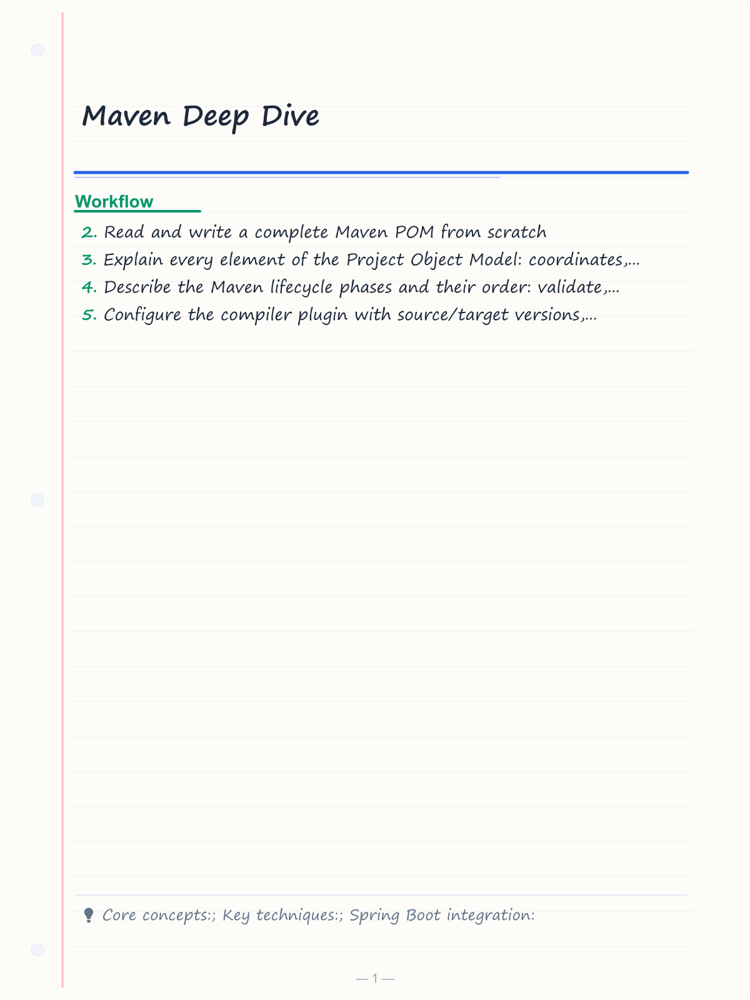
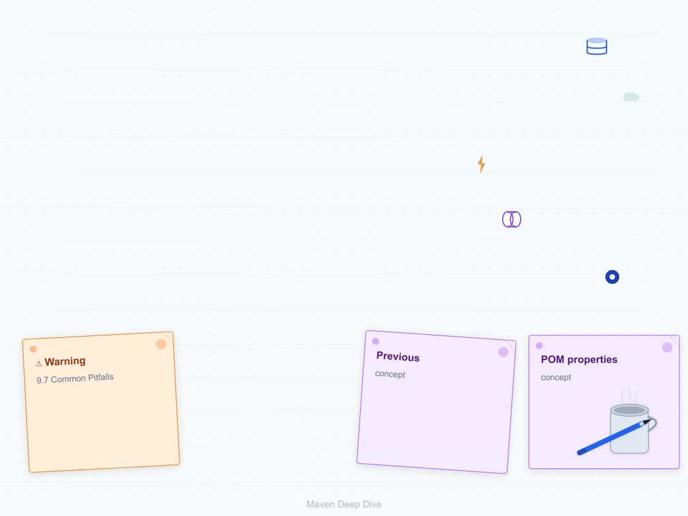
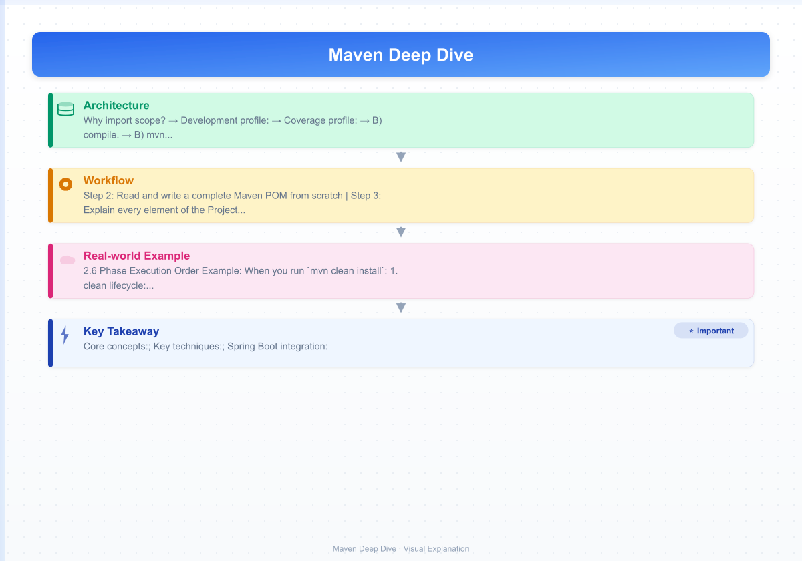

# Maven Deep Dive

> **Previous:** [Performance Tuning & Profiling](./06-performance.md) | **Next:** [Gradle Deep Dive](./08-gradle.md)

Maven is the de facto standard build tool for Java enterprise development. It provides declarative build configuration, transitive dependency management, a standardized project lifecycle, and an extensible plugin ecosystem. Understanding Maven deeply is essential for any professional Java developer — not just to build projects, but to understand how Spring Boot, multi-module architectures, and enterprise CI/CD pipelines work under the hood.

This chapter covers Maven in full depth: the POM structure, the build lifecycle, every major plugin, dependency management mechanics, profiles, multi-module builds, BOMs, custom plugin development, repository management, and production best practices. All XML and Java examples are complete and ready to use.

---

## Learning Objectives

By the end of this chapter, you will be able to:

<!-- Image Gallery -->
<section class="lesson-visuals" aria-label="Visual learning resources">
  <header><span>VISUAL LEARNING</span><h2>See it. Review it. Remember it.</h2></header>
  <a class="lesson-visual-card" href="../../assets/images/lessons/java/07-maven/handwritten-notes.png" target="_blank" rel="noopener">
    
    <span><strong>Handwritten notes</strong>Condensed notes for deliberate review.</span>
  </a>
  <a class="lesson-visual-card" href="../../assets/images/lessons/java/07-maven/sticky-notes.png" target="_blank" rel="noopener">
    
    <span><strong>Sticky-note revision</strong>Fast recall prompts for revision.</span>
  </a>
  <a class="lesson-visual-card" href="../../assets/images/lessons/java/07-maven/visual-explanation.png" target="_blank" rel="noopener">
    
    <span><strong>Visual concept guide</strong>A connected explanation of the key ideas.</span>
  </a>
</section>
<!-- End Image Gallery -->


- Read and write a complete Maven POM from scratch
- Explain every element of the Project Object Model: coordinates, packaging, properties, dependencies, dependency management, build, profiles, modules
- Describe the Maven lifecycle phases and their order: validate, compile, test, package, verify, install, deploy
- Configure the compiler plugin with source/target versions, annotation processor paths, and compiler arguments
- Configure Surefire for unit test execution with inclusion/exclusion patterns, parallel execution, and report generation
- Configure Failsafe for integration tests separate from unit tests
- Configure the JAR, WAR, Shade, Assembly, and Deploy plugins
- Understand transitive dependency resolution, exclusions, optional dependencies, and dependency scopes
- Use a BOM (Bill of Materials) to centralize dependency versions
- Create and activate Maven profiles by JDK, OS, property, file existence, and default activation
- Build multi-module Maven projects with reactor ordering, aggregator vs parent POMs, and CI-friendly versions
- Write a custom Maven plugin using the Mojo API
- Configure local, central, and private repositories with mirrors and authentication
- Apply best practices: dependency convergence, pluginManagement, property-driven versions, reproducible builds
- Use the Maven Wrapper for build reproducibility
- Integrate Spring Boot with Maven using the Spring Boot parent, plugin, and starters
- Perform code quality analysis with Checkstyle, SpotBugs, and PMD

## Chapter at a Glance

| Topic | Key Insight | Practical Takeaway |
|-------|-------------|--------------------|
| POM Structure | Coordinates, packaging, properties, deps | POM is the single source of truth for the project |
| Build Lifecycle | Validate -> compile -> test -> package -> verify -> install -> deploy | Plugins bind to lifecycle phases |
| Dependency Management | Transitive deps, exclusions, scopes, BOMs | Use BOMs to centralize version control |
| Profiles | Environment-specific configuration | Activate by JDK, OS, property, or file existence |
| Multi-Module | Reactor build order, aggregator vs parent POM | Parent POM defines shared config; aggregator lists modules |

## Chapter Roadmap


> **Pro Tip:** Always use `mvn dependency:tree` before adding a new dependency to see what versions are already in your transitive graph and avoid version conflicts.

---

## 1. POM Structure — The Project Object Model


The `pom.xml` file is the heart of every Maven project. It is an XML file that describes the project: its identity, dependencies, build configuration, plugins, profiles, and module structure.

### 1.1 Minimal POM


Every POM inherits from the Super POM, which defines defaults like the central repository, standard lifecycle bindings, and the JAR packaging type. A minimal project needs only coordinates:

```xml
<project xmlns="http://maven.apache.org/POM/4.0.0"
         xmlns:xsi="http://www.w3.org/2001/XMLSchema-instance"
         xsi:schemaLocation="http://maven.apache.org/POM/4.0.0
         http://maven.apache.org/xsd/maven-4.0.0.xsd">
    <modelVersion>4.0.0</modelVersion>
    <groupId>com.example</groupId>
    <artifactId>hello-world</artifactId>
    <version>1.0.0</version>
    <packaging>jar</packaging>
</project>
```

| Element | Purpose |
|---------|---------|
| `project` | Root element, must include the Maven 4.0.0 schema reference |
| `modelVersion` | Always `4.0.0` for Maven 2+ |
| `groupId` | Reverse domain name identifying the organization or project group |
| `artifactId` | Unique name of this project within the group |
| `version` | Version identifier; `SNAPSHOT` indicates in-development |
| `packaging` | Output format: `jar`, `war`, `pom`, `ear`, `maven-plugin`, etc. |

### 1.2 Full POM Structure


A production POM contains many additional elements. The sections below cover each in detail.

### 1.3 The Parent Element


A POM can inherit from a parent POM. The parent defines shared configuration that children inherit automatically. The `<relativePath>` element tells Maven where to find the parent POM locally. If omitted or empty, Maven searches the repository.

```xml
<parent>
    <groupId>org.springframework.boot</groupId>
    <artifactId>spring-boot-starter-parent</artifactId>
    <version>3.4.0</version>
    <relativePath/>
</parent>
```

You can also define a corporate parent POM:

```xml
<parent>
    <groupId>com.mycompany</groupId>
    <artifactId>mycompany-parent</artifactId>
    <version>4.2.0</version>
    <relativePath>../mycompany-parent/pom.xml</relativePath>
</parent>
```

The parent provides:

- Java version defaults
- Pre-configured plugin versions (compiler, surefire, failsafe, etc.)
- Dependency management for curated dependencies
- Resource filtering configuration
- Profile activation for different environments

### 1.4 Properties


Properties allow you to define reusable values in the POM. Maven properties use `${property.name}` syntax. There are four categories:

1. **POM properties** — built-in references like `${project.version}`, `${project.build.directory}`
2. **Settings properties** — from `~/.m2/settings.xml`, referenced as `${settings.*}`
3. **System properties** — JVM system properties from `-Dproperty=value`
4. **Custom properties** — defined in `<properties>`, referenced as `${custom.name}`

```xml
<properties>
    <java.version>21</java.version>
    <maven.compiler.source>${java.version}</maven.compiler.source>
    <maven.compiler.target>${java.version}</maven.compiler.target>
    <project.build.sourceEncoding>UTF-8</project.build.sourceEncoding>
    <project.reporting.outputEncoding>UTF-8</project.reporting.outputEncoding>
    <mapstruct.version>1.6.3</mapstruct.version>
    <guava.version>33.4.0-jre</guava.version>
    <lombok.version>1.18.36</lombok.version>
    <testcontainers.version>1.20.4</testcontainers.version>
    <checkstyle.version>10.21.2</checkstyle.version>
    <spotbugs.version>4.9.1</spotbugs.version>
    <pmd.version>7.10.0</pmd.version>
</properties>
```

Properties support value interpolation:

```xml
<properties>
    <app.name>My App</app.name>
    <app.version>1.0.0</app.version>
    <app.full.name>${app.name} v${app.version}</app.full.name>
</properties>
```

### 1.5 Packaging Types


The `<packaging>` element determines the default lifecycle bindings and the output artifact type:

| Packaging | Extension | Description |
|-----------|-----------|-------------|
| `jar` | `.jar` | Java archive — the default; for libraries and standalone applications |
| `war` | `.war` | Web application archive — for traditional Java EE web apps |
| `pom` | `.pom` | POM-only — for parent POMs, aggregators, and BOMs |
| `ear` | `.ear` | Enterprise archive — for Java EE applications |
| `maven-plugin` | `.jar` | Maven plugin — uses the `maven-plugin` packaging lifecycle |

---

## 2. The Maven Lifecycle

Maven is built around build lifecycles. A lifecycle is a sequence of phases executed in order. When you run `mvn package`, Maven executes all phases up to and including `package` in the default lifecycle.

### 2.1 The Three Built-in Lifecycles


| Lifecycle | Purpose | Key Phases |
|-----------|---------|------------|
| **default** | Main deployment lifecycle | validate, compile, test, package, verify, install, deploy |
| **clean** | Clean the project | pre-clean, clean, post-clean |
| **site** | Generate project documentation | pre-site, site, post-site, site-deploy |

### 2.2 Default Lifecycle Phases (In Order)


Maven defines 23 phases in the default lifecycle. The most important are:

| Phase | Description |
|-------|-------------|
| `validate` | Validate the project is correct and all necessary information is available |
| `initialize` | Initialize build state, e.g. set properties or create directories |
| `generate-sources` | Generate any source code for inclusion in compilation |
| `process-sources` | Process source code, e.g. filter values |
| `generate-resources` | Generate resources for inclusion in the package |
| `process-resources` | Copy and filter resources to the output directory |
| `compile` | Compile the project source code |
| `process-classes` | Post-process compiled classes, e.g. bytecode enhancement |
| `generate-test-sources` | Generate test source code |
| `process-test-sources` | Process test source code |
| `generate-test-resources` | Generate test resources |
| `process-test-resources` | Copy and filter test resources |
| `test-compile` | Compile test source code |
| `process-test-classes` | Post-process test compiled classes |
| `test` | Run tests using a suitable testing framework |
| `prepare-package` | Perform any operations necessary before packaging |
| `package` | Package the compiled code into the distributable format |
| `pre-integration-test` | Set up the integration test environment |
| `integration-test` | Deploy and run integration tests |
| `post-integration-test` | Tear down the integration test environment |
| `verify` | Verify the package is valid and meets quality criteria |
| `install` | Install the package into the local repository for use as a dependency |
| `deploy` | Deploy the package to a remote repository for sharing |

### 2.3 Lifecycle Binding


Each packaging type defines default bindings — which plugin goals are bound to which phases. For `jar` packaging:

```
process-resources      → resources:resources
compile                → compiler:compile
process-test-resources → resources:testResources
test-compile           → compiler:testCompile
test                   → surefire:test
package                → jar:jar
install                → install:install
deploy                 → deploy:deploy
```

For `war` packaging, `war:war` is bound to `package` instead of `jar:jar`. For `maven-plugin` packaging, additional goals bind for plugin descriptor generation.

### 2.4 Clean Lifecycle


```
pre-clean → clean (clean:clean) → post-clean
```

### 2.5 Site Lifecycle


```
pre-site → site (site:site) → post-site → site-deploy (site:deploy)
```

### 2.6 Phase Execution Order Example


When you run `mvn clean install`:

1. **clean lifecycle**: pre-clean, clean (deletes `target/`)
2. **default lifecycle**: validate, initialize, generate-sources, process-sources, generate-resources, process-resources, compile, process-classes, generate-test-sources, process-test-sources, generate-test-resources, process-test-resources, test-compile, process-test-classes, test (run unit tests), prepare-package, package (create JAR), pre-integration-test, integration-test, post-integration-test, verify, install (copy JAR to `~/.m2/repository`)

### 2.7 Binding Custom Plugin Goals to Phases


You can bind any plugin goal to any lifecycle phase using the `<executions>` element:

```xml
<plugin>
    <groupId>org.apache.maven.plugins</groupId>
    <artifactId>maven-failsafe-plugin</artifactId>
    <version>3.5.2</version>
    <executions>
        <execution>
            <id>integration-tests</id>
            <phase>integration-test</phase>
            <goals>
                <goal>integration-test</goal>
            </goals>
            <configuration>
                <includes>
                    <include>**/*IT.java</include>
                </includes>
            </configuration>
        </execution>
        <execution>
            <id>integration-verify</id>
            <phase>verify</phase>
            <goals>
                <goal>verify</goal>
            </goals>
        </execution>
    </executions>
</plugin>
```

Multiple executions of the same plugin can have different IDs, phases, goals, and configurations.

---

## 3. Maven Plugins

Plugins are the heart of Maven's functionality. Every build operation — compiling, testing, packaging, deploying — is performed by a plugin. Plugins contain **goals** (also called mojos), which are atomic build operations.

### 3.1 Compiler Plugin (`maven-compiler-plugin`)


The compiler plugin compiles Java source code. It is bound to `compile` and `test-compile` phases by default.

```xml
<plugin>
    <groupId>org.apache.maven.plugins</groupId>
    <artifactId>maven-compiler-plugin</artifactId>
    <version>3.13.0</version>
    <configuration>
        <source>21</source>
        <target>21</target>
        <release>21</release>
        <encoding>UTF-8</encoding>
        <verbose>false</verbose>
        <showWarnings>true</showWarnings>
        <showDeprecation>true</showDeprecation>
        <compilerArgs>
            <arg>-Xlint:all</arg>
            <arg>-parameters</arg>
            <arg>-Xlint:-processing</arg>
        </compilerArgs>
        <annotationProcessorPaths>
            <path>
                <groupId>org.projectlombok</groupId>
                <artifactId>lombok</artifactId>
                <version>${lombok.version}</version>
            </path>
            <path>
                <groupId>org.mapstruct</groupId>
                <artifactId>mapstruct-processor</artifactId>
                <version>${mapstruct.version}</version>
            </path>
            <path>
                <groupId>org.springframework.boot</groupId>
                <artifactId>spring-boot-configuration-processor</artifactId>
            </path>
        </annotationProcessorPaths>
        <annotationProcessorProcessorOptions>
            <option>
                <name>mapstruct.defaultComponentModel</name>
                <value>spring</value>
            </option>
        </annotationProcessorProcessorOptions>
        <fork>true</fork>
        <maxmem>1024m</maxmem>
        <meminitial>256m</meminitial>
    </configuration>
</plugin>
```

Key configuration options:

- **`source` / `target` / `release`**: Java version for source compatibility and target output. Prefer `release` in JDK 9+ as it ensures the compiled code only uses APIs available in that release.
- **`annotationProcessorPaths`**: The correct way to configure Lombok, MapStruct, and Spring Boot configuration processor — using `<annotationProcessorPaths>` instead of declaring them as compile dependencies.
- **`compilerArgs`**: Additional arguments passed to `javac`. Common flags include `-Xlint:all` for all warnings and `-parameters` to retain parameter names for reflection.
- **`fork`**: Run compilation in a separate JVM. Useful when you need to set specific memory limits.
- **`maxmem` / `meminitial`**: JVM heap settings for the forked compiler.

### 3.2 Surefire Plugin (`maven-surefire-plugin`)


The Surefire plugin runs unit tests. It is bound to the `test` phase by default. It supports JUnit 5 (Jupiter), JUnit 4, and TestNG.

```xml
<plugin>
    <groupId>org.apache.maven.plugins</groupId>
    <artifactId>maven-surefire-plugin</artifactId>
    <version>3.5.2</version>
    <configuration>
        <includes>
            <include>**/*Test.java</include>
            <include>**/*Tests.java</include>
            <include>**/*TestCase.java</include>
        </includes>
        <excludes>
            <exclude>**/*IT.java</exclude>
            <exclude>**/*IntegrationTest.java</exclude>
            <exclude>**/*Abstract*.java</exclude>
        </excludes>
        <parallel>methods</parallel>
        <useUnlimitedThreads>true</useUnlimitedThreads>
        <threadCount>4</threadCount>
        <perCoreThreadCount>true</perCoreThreadCount>
        <forkCount>2</forkCount>
        <reuseForks>true</reuseForks>
        <argLine>-Xmx512m -XX:+UseG1GC</argLine>
        <skipTests>false</skipTests>
        <testFailureIgnore>false</testFailureIgnore>
        <skip>${skipTests}</skip>
        <reportFormat>brief</reportFormat>
        <useFile>false</useFile>
        <trimStackTrace>false</trimStackTrace>
        <runOrder>random</runOrder>
        <properties>
            <property>
                <name>junit.jupiter.execution.parallel.enabled</name>
                <value>true</value>
            </property>
            <property>
                <name>junit.jupiter.execution.parallel.config.strategy</name>
                <value>dynamic</value>
            </property>
        </properties>
        <systemPropertyVariables>
            <test.env>unit</test.env>
            <logging.level>DEBUG</logging.level>
        </systemPropertyVariables>
        <environmentVariables>
            <MY_SECRET>${env.MY_SECRET}</MY_SECRET>
        </environmentVariables>
    </configuration>
</plugin>
```

Key features:

- **Include/exclude patterns**: Control which test classes are picked up. Convention: `*Test.java` for unit tests, `*IT.java` for integration tests.
- **Parallel execution**: `parallel=methods` with `useUnlimitedThreads` maximizes throughput.
- **Fork options**: `forkCount` controls how many JVM processes are created. `reuseForks=true` avoids the overhead of creating a new JVM for each test class.
- **argLine**: JVM arguments passed to the forked test JVM. Use this to set heap sizes and GC settings.
- **skipTests**: Global flag to skip test execution. Set via `-DskipTests=true`.
- **reportFormat**: Controls console output — `brief` shows a summary, `plain` shows individual results.
- **trimStackTrace**: When `false`, shows full stack traces for failures.

Surefire generates XML and HTML reports in `${project.build.directory}/surefire-reports/`.

### 3.3 Failsafe Plugin (`maven-failsafe-plugin`)


Failsafe is designed for integration tests. The key difference from Surefire is that Failsafe allows the build to continue even if tests fail during the `integration-test` phase, and only fails during the `verify` phase. This is important because integration tests often require setup/teardown that must happen regardless of test outcomes.

```xml
<plugin>
    <groupId>org.apache.maven.plugins</groupId>
    <artifactId>maven-failsafe-plugin</artifactId>
    <version>3.5.2</version>
    <configuration>
        <includes>
            <include>**/*IT.java</include>
            <include>**/*IntegrationTest.java</include>
            <include>**/*ITCase.java</include>
        </includes>
        <excludes>
            <exclude>**/*Test.java</exclude>
            <exclude>**/*Tests.java</exclude>
        </excludes>
        <forkCount>1</forkCount>
        <reuseForks>false</reuseForks>
        <argLine>-Xmx1024m -XX:+UseG1GC -XX:MaxMetaspaceSize=256m</argLine>
        <skipITs>false</skipITs>
        <skip>${skipITs}</skip>
        <failIfNoSpecifiedTests>false</failIfNoSpecifiedTests>
    </configuration>
    <executions>
        <execution>
            <goals>
                <goal>integration-test</goal>
                <goal>verify</goal>
            </goals>
        </execution>
    </executions>
</plugin>
```

Best practice is to separate unit and integration tests by naming convention:

- `*Test.java` / `*Tests.java` → Surefire (unit tests, fast)
- `*IT.java` / `*IntegrationTest.java` → Failsafe (integration tests, slower)

Run `mvn verify` to execute both, or `mvn integration-test` to run integration tests after packaging.


### 3.4 JAR Plugin (maven-jar-plugin)


The JAR plugin creates a Java archive. It is bound to the `package` phase for `jar` packaging.

```xml
<plugin>
    <groupId>org.apache.maven.plugins</groupId>
    <artifactId>maven-jar-plugin</artifactId>
    <version>3.4.2</version>
    <configuration>
        <archive>
            <manifest>
                <addClasspath>true</addClasspath>
                <classpathPrefix>lib/</classpathPrefix>
                <mainClass>com.example.Application</mainClass>
                <addDefaultImplementationEntries>true</addDefaultImplementationEntries>
            </manifest>
            <manifestEntries>
                <Implementation-Version>${project.version}</Implementation-Version>
                <Build-Jdk>21</Build-Jdk>
            </manifestEntries>
        </archive>
        <classifier>dist</classifier>
        <forceCreation>true</forceCreation>
    </configuration>
</plugin>
```

Key features:

- **classifier**: Append a classifier to the JAR filename (e.g., `myapp-dist.jar`).
- **excludes / includes**: Fine-grained control over JAR contents.
- **mainClass**: Set the `Main-Class` entry point.
- **Sealed**: Restrict class loading to within the JAR.

The `test-jar` goal creates a JAR of test classes: `mvn jar:jar jar:test-jar`.

### 3.5 WAR Plugin (maven-war-plugin)


Builds web application archives for servlet container deployment.

```xml
<plugin>
    <groupId>org.apache.maven.plugins</groupId>
    <artifactId>maven-war-plugin</artifactId>
    <version>3.4.0</version>
    <configuration>
        <warName>${project.artifactId}</warName>
        <failOnMissingWebXml>false</failOnMissingWebXml>
        <packagingExcludes>
            WEB-INF/lib/tomcat-*.jar
        </packagingExcludes>
        <overlays>
            <overlay>
                <groupId>com.example</groupId>
                <artifactId>shared-resources</artifactId>
                <type>war</type>
            </overlay>
        </overlays>
    </configuration>
</plugin>
```

### 3.6 Shade Plugin (maven-shade-plugin)


Creates an uber-JAR (fat JAR) with all dependencies and supports relocation.

```xml
<plugin>
    <groupId>org.apache.maven.plugins</groupId>
    <artifactId>maven-shade-plugin</artifactId>
    <version>3.6.0</version>
    <configuration>
        <filters>
            <filter>
                <artifact>*:*</artifact>
                <excludes>
                    <exclude>META-INF/*.SF</exclude>
                    <exclude>META-INF/*.DSA</exclude>
                    <exclude>META-INF/*.RSA</exclude>
                </excludes>
            </filter>
        </filters>
        <artifactSet>
            <excludes>
                <exclude>org.projectlombok:lombok</exclude>
            </excludes>
        </artifactSet>
        <relocations>
            <relocation>
                <pattern>com.google.common</pattern>
                <shadedPattern>myapp.com.google.common</shadedPattern>
            </relocation>
        </relocations>
        <transformers>
            <transformer implementation="org.apache.maven.plugins.shade.resource.ManifestResourceTransformer">
                <mainClass>com.example.Application</mainClass>
            </transformer>
            <transformer implementation="org.apache.maven.plugins.shade.resource.ServicesResourceTransformer"/>
            <transformer implementation="org.apache.maven.plugins.shade.resource.AppendingTransformer">
                <resource>META-INF/spring.factories</resource>
            </transformer>
        </transformers>
        <minimizeJar>true</minimizeJar>
        <shadedClassifierName>shaded</shadedClassifierName>
        <shadedArtifactAttached>true</shadedArtifactAttached>
    </configuration>
    <executions>
        <execution>
            <phase>package</phase>
            <goals><goal>shade</goal></goals>
        </execution>
    </executions>
</plugin>
```

Key concepts:

- **Relocation**: Moves packages to avoid classpath conflicts.
- **Transformers**: Merge resources from multiple JARs instead of overwriting.
- **Filters**: Remove signature files (.SF, .DSA, .RSA) that become invalid after shading.
- **MinimizeJar**: Removes unused classes from bundled dependencies.

### 3.7 Assembly Plugin (maven-assembly-plugin)


Creates custom distribution archives (ZIP, TAR, GZip).

```xml
<plugin>
    <groupId>org.apache.maven.plugins</groupId>
    <artifactId>maven-assembly-plugin</artifactId>
    <version>3.7.1</version>
    <configuration>
        <descriptors>
            <descriptor>src/assembly/distribution.xml</descriptor>
        </descriptors>
        <finalName>${project.artifactId}-${project.version}</finalName>
        <attach>true</attach>
        <appendAssemblyId>true</appendAssemblyId>
    </configuration>
    <executions>
        <execution>
            <id>make-assembly</id>
            <phase>package</phase>
            <goals><goal>single</goal></goals>
        </execution>
    </executions>
</plugin>
```

Assembly descriptor (src/assembly/distribution.xml):

```xml
<assembly xmlns="http://maven.apache.org/ASSEMBLY/4.0.0"
          xmlns:xsi="http://www.w3.org/2001/XMLSchema-instance"
          xsi:schemaLocation="http://maven.apache.org/ASSEMBLY/4.0.0
          http://maven.apache.org/xsd/assembly-4.0.0.xsd">
    <id>distribution</id>
    <formats>
        <format>zip</format>
        <format>tar.gz</format>
    </formats>
    <includeBaseDirectory>true</includeBaseDirectory>
    <files>
        <file>
            <source>README.md</source>
            <outputDirectory>.</outputDirectory>
            <filtered>true</filtered>
        </file>
    </files>
    <fileSets>
        <fileSet>
            <directory>${project.build.directory}</directory>
            <outputDirectory>lib</outputDirectory>
            <includes><include>*.jar</include></includes>
        </fileSet>
        <fileSet>
            <directory>src/main/scripts</directory>
            <outputDirectory>bin</outputDirectory>
            <fileMode>755</fileMode>
        </fileSet>
    </fileSets>
    <dependencySets>
        <dependencySet>
            <outputDirectory>lib</outputDirectory>
            <scope>runtime</scope>
            <useProjectArtifact>true</useProjectArtifact>
            <useTransitiveDependencies>true</useTransitiveDependencies>
        </dependencySet>
    </dependencySets>
</assembly>
```

### 3.8 Deploy Plugin (maven-deploy-plugin)


Uploads built artifacts to a remote repository.

```xml
<plugin>
    <groupId>org.apache.maven.plugins</groupId>
    <artifactId>maven-deploy-plugin</artifactId>
    <version>3.1.4</version>
    <configuration>
        <altDeploymentRepository>
            my-repo::default::https://nexus.mycompany.com/repository/maven-releases/
        </altDeploymentRepository>
        <deployAtEnd>true</deployAtEnd>
        <retryFailedDeploymentAttempts>3</retryFailedDeploymentAttempts>
    </configuration>
</plugin>
```

### 3.9 Code Quality Plugins


#### Checkstyle Plugin

Enforces coding standards from a configuration file.

```xml
<plugin>
    <groupId>org.apache.maven.plugins</groupId>
    <artifactId>maven-checkstyle-plugin</artifactId>
    <version>3.6.0</version>
    <dependencies>
        <dependency>
            <groupId>com.puppycrawl.tools</groupId>
            <artifactId>checkstyle</artifactId>
            <version>10.21.2</version>
        </dependency>
    </dependencies>
    <configuration>
        <configLocation>google_checks.xml</configLocation>
        <consoleOutput>true</consoleOutput>
        <failsOnError>true</failsOnError>
        <includeTestSourceDirectory>true</includeTestSourceDirectory>
    </configuration>
    <executions>
        <execution>
            <id>validate</id>
            <phase>validate</phase>
            <goals><goal>check</goal></goals>
        </execution>
    </executions>
</plugin>
```

#### SpotBugs Plugin

Bytecode analysis to detect bug patterns.

```xml
<plugin>
    <groupId>com.github.spotbugs</groupId>
    <artifactId>spotbugs-maven-plugin</artifactId>
    <version>4.9.1</version>
    <dependencies>
        <dependency>
            <groupId>com.github.spotbugs</groupId>
            <artifactId>spotbugs</artifactId>
            <version>4.9.1</version>
        </dependency>
    </dependencies>
    <configuration>
        <effort>Max</effort>
        <threshold>Low</threshold>
        <failOnError>true</failOnError>
        <plugins>
            <plugin>
                <groupId>com.h3xstream.findsecbugs</groupId>
                <artifactId>findsecbugs-plugin</artifactId>
                <version>1.12.0</version>
            </plugin>
        </plugins>
    </configuration>
    <executions>
        <execution>
            <id>spotbugs-check</id>
            <phase>verify</phase>
            <goals><goal>check</goal></goals>
        </execution>
    </executions>
</plugin>
```

#### PMD Plugin

Source code analysis for common flaws.

```xml
<plugin>
    <groupId>org.apache.maven.plugins</groupId>
    <artifactId>maven-pmd-plugin</artifactId>
    <version>3.26.0</version>
    <dependencies>
        <dependency>
            <groupId>net.sourceforge.pmd</groupId>
            <artifactId>pmd-java</artifactId>
            <version>7.10.0</version>
        </dependency>
    </dependencies>
    <configuration>
        <rulesets>
            <ruleset>/rulesets/java/quickstart.xml</ruleset>
            <ruleset>${project.basedir}/config/pmd/ruleset.xml</ruleset>
        </rulesets>
        <targetJdk>21</targetJdk>
        <includeTests>true</includeTests>
        <failOnViolation>true</failOnViolation>
        <excludes><exclude>**/generated/**</exclude></excludes>
    </configuration>
    <executions>
        <execution>
            <id>pmd-check</id>
            <phase>verify</phase>
            <goals><goal>check</goal><goal>cpd-check</goal></goals>
        </execution>
    </executions>
</plugin>
```

---

## 4. Dependency Management

Dependency management handles transitive resolution, version mediation, and conflict resolution.

### 4.1 Dependency Coordinates


Every dependency is identified by groupId, artifactId, version, plus optional type, scope, classifier.

```xml
<dependency>
    <groupId>org.springframework.boot</groupId>
    <artifactId>spring-boot-starter-web</artifactId>
    <version>3.4.0</version>
    <type>jar</type>
    <scope>compile</scope>
    <optional>false</optional>
</dependency>
```

### 4.2 Dependency Scopes


| Scope | Description | Transitive? |
|-------|-------------|-------------|
| compile | Available everywhere. Default. | Yes |
| provided | Compile-time only, not packaged. | No |
| runtime | Not needed at compile time. | Yes |
| test | Test compilation and execution only. | No |
| system | Like provided, explicit path. Avoid. | No |
| import | Only in dependencyManagement. Imports BOM. | No |

```xml
<dependency>
    <groupId>org.springframework.boot</groupId>
    <artifactId>spring-boot-starter-test</artifactId>
    <scope>test</scope>
</dependency>
<dependency>
    <groupId>org.projectlombok</groupId>
    <artifactId>lombok</artifactId>
    <scope>provided</scope>
</dependency>
<dependency>
    <groupId>org.postgresql</groupId>
    <artifactId>postgresql</artifactId>
    <scope>runtime</scope>
</dependency>
```

### 4.3 Transitive Dependency Resolution


Declaring `spring-boot-starter-web` pulls in Spring MVC, Tomcat, Jackson, Logback transitively. Maven automatically resolves the full dependency tree.

### 4.4 Dependency Mediation (Nearest Wins)


When multiple versions of the same dependency exist in the tree, Maven uses the **nearest definition**: the version closest to the root wins. Same depth: first declaration wins.

```
Project A
  -> B:1.0 -> C:2.0
  -> D:1.0 -> C:1.0  (wins, same depth, B wins by declaration order)
```

### 4.5 Exclusions


Remove unwanted transitive dependencies:

```xml
<dependency>
    <groupId>com.example</groupId>
    <artifactId>some-library</artifactId>
    <version>1.0</version>
    <exclusions>
        <exclusion>
            <groupId>commons-logging</groupId>
            <artifactId>commons-logging</artifactId>
        </exclusion>
    </exclusions>
</dependency>
```

### 4.6 Optional Dependencies


Optional dependencies are not propagated transitively:

```xml
<dependency>
    <groupId>com.example</groupId>
    <artifactId>optional-feature</artifactId>
    <version>1.0</version>
    <optional>true</optional>
</dependency>
```

### 4.7 Dependency Management Section


Declares versions in a parent without adding dependencies:

```xml
<dependencyManagement>
    <dependencies>
        <dependency>
            <groupId>com.google.guava</groupId>
            <artifactId>guava</artifactId>
            <version>33.4.0-jre</version>
        </dependency>
    </dependencies>
</dependencyManagement>
```

Child modules inherit versions:

```xml
<dependencies>
    <dependency>
        <groupId>com.google.guava</groupId>
        <artifactId>guava</artifactId>
    </dependency>
</dependencies>
```

### 4.8 BOM (Bill of Materials)


A BOM is a POM with `<packaging>pom</packaging>` that centralizes version management via `<dependencyManagement>`. Imported with `import` scope:

```xml
<dependencyManagement>
    <dependencies>
        <dependency>
            <groupId>org.springframework.boot</groupId>
            <artifactId>spring-boot-dependencies</artifactId>
            <version>3.4.0</version>
            <type>pom</type>
            <scope>import</scope>
        </dependency>
    </dependencies>
</dependencyManagement>
```

**Why import scope?** Without it, dependencyManagement only affects the current POM and children. Import scope lets you incorporate an external POM's version management.

#### Creating a Custom BOM

```xml
<project>
    <modelVersion>4.0.0</modelVersion>
    <groupId>com.mycompany</groupId>
    <artifactId>mycompany-bom</artifactId>
    <version>2.0.0</version>
    <packaging>pom</packaging>

    <properties>
        <spring.boot.version>3.4.0</spring.boot.version>
        <guava.version>33.4.0-jre</guava.version>
        <lombok.version>1.18.36</lombok.version>
    </properties>

    <dependencyManagement>
        <dependencies>
            <dependency>
                <groupId>org.springframework.boot</groupId>
                <artifactId>spring-boot-dependencies</artifactId>
                <version>${spring.boot.version}</version>
                <type>pom</type>
                <scope>import</scope>
            </dependency>
            <dependency>
                <groupId>com.google.guava</groupId>
                <artifactId>guava</artifactId>
                <version>${guava.version}</version>
            </dependency>
            <dependency>
                <groupId>org.projectlombok</groupId>
                <artifactId>lombok</artifactId>
                <version>${lombok.version}</version>
            </dependency>
        </dependencies>
    </dependencyManagement>
</project>
```

### 4.9 Dependency Convergence


Use the Enforcer plugin to enforce version consistency:

```xml
<plugin>
    <groupId>org.apache.maven.plugins</groupId>
    <artifactId>maven-enforcer-plugin</artifactId>
    <version>3.5.0</version>
    <configuration>
        <rules>
            <dependencyConvergence/>
            <requireReleaseDeps>
                <onlyWhenRelease>true</onlyWhenRelease>
            </requireReleaseDeps>
            <bannedDependencies>
                <excludes>
                    <exclude>commons-logging:commons-logging</exclude>
                    <exclude>log4j:log4j</exclude>
                </excludes>
            </bannedDependencies>
        </rules>
    </configuration>
    <executions>
        <execution>
            <id>enforce</id>
            <phase>validate</phase>
            <goals><goal>enforce</goal></goals>
        </execution>
    </executions>
</plugin>
```


---

## 5. Maven Profiles

Profiles enable build-time configuration changes — different environments, JDK versions, or deployment targets — without modifying POM files.

### 5.1 Profile Activation


Profiles activate automatically based on conditions or explicitly via `-P`.

```xml
<profiles>
    <profile>
        <id>production</id>
        <activation>
            <activeByDefault>false</activeByDefault>
            <jdk>21</jdk>
            <os>
                <name>Linux</name>
                <arch>amd64</arch>
            </os>
            <property>
                <name>env</name>
                <value>prod</value>
            </property>
            <file>
                <exists>${project.basedir}/config/prod.properties</exists>
            </file>
        </activation>
        <properties>
            <db.url>jdbc:postgresql://prod-db:5432/myapp</db.url>
            <db.username>${env.PROD_DB_USER}</db.username>
            <logging.level>WARN</logging.level>
        </properties>
    </profile>
</profiles>
```

### 5.2 Activation Conditions


| Condition | Attribute | Description |
|-----------|-----------|-------------|
| jdk | version | Range: `[1.8,21]`, `!` negates |
| os | name/arch/family | Match OS attributes |
| property | name/value | System property `-Dmyprop=value` |
| file | exists/missing | File existence check |
| activeByDefault | boolean | Activates when no other profile is active |

### 5.3 Explicit Activation


```bash
# Activate a specific profile
mvn clean install -Pproduction

# Activate multiple profiles
mvn clean install -Pproduction,coverage,slow-tests

# Deactivate a profile (negation)
mvn clean install -P!production

# Activate via system property
mvn clean install -Denv=production
```

### 5.4 Profile Use Cases


**Development profile:**

```xml
<profile>
    <id>development</id>
    <activation>
        <activeByDefault>true</activeByDefault>
    </activation>
    <properties>
        <db.url>jdbc:h2:mem:testdb</db.url>
        <logging.level>DEBUG</logging.level>
        <skipTests>false</skipTests>
    </properties>
    <build>
        <plugins>
            <plugin>
                <groupId>org.springframework.boot</groupId>
                <artifactId>spring-boot-maven-plugin</artifactId>
                <configuration>
                    <jvmArguments>-Xdebug -Xrunjdwp:transport=dt_socket,server=y,suspend=n,address=5005</jvmArguments>
                </configuration>
            </plugin>
        </plugins>
    </build>
</profile>
```

**Coverage profile:**

```xml
<profile>
    <id>coverage</id>
    <build>
        <plugins>
            <plugin>
                <groupId>org.jacoco</groupId>
                <artifactId>jacoco-maven-plugin</artifactId>
                <version>0.8.12</version>
                <executions>
                    <execution>
                        <id>prepare-agent</id>
                        <goals><goal>prepare-agent</goal></goals>
                    </execution>
                    <execution>
                        <id>report</id>
                        <phase>verify</phase>
                        <goals><goal>report</goal></goals>
                    </execution>
                </executions>
            </plugin>
        </plugins>
    </build>
</profile>
```

### 5.5 Profile Inheritance and Conflict Resolution


When multiple profiles define the same element, the **last-activated** profile wins. Activation order:

1. Implicit from `activeProfiles` in `settings.xml`
2. Explicit `-P` flags (rightmost wins on conflict)
3. Property-based activation
4. JDK/OS/File activation

```xml
<activeProfiles>
    <activeProfile>development</activeProfile>
</activeProfiles>
```

---

## 6. Multi-Module Projects

Multi-module projects organize related modules under a single parent POM.

### 6.1 Parent POM


```xml
<project>
    <modelVersion>4.0.0</modelVersion>
    <groupId>com.example</groupId>
    <artifactId>myapp-parent</artifactId>
    <version>1.0.0</version>
    <packaging>pom</packaging>

    <name>MyApp Parent</name>

    <modules>
        <module>myapp-common</module>
        <module>myapp-domain</module>
        <module>myapp-repository</module>
        <module>myapp-service</module>
        <module>myapp-web</module>
        <module>myapp-boot</module>
    </modules>

    <properties>
        <java.version>21</java.version>
        <maven.compiler.source>${java.version}</maven.compiler.source>
        <maven.compiler.target>${java.version}</maven.compiler.target>
        <spring.boot.version>3.4.0</spring.boot.version>
        <spring.cloud.version>2024.0.0</spring.cloud.version>
    </properties>

    <dependencyManagement>
        <dependencies>
            <dependency>
                <groupId>org.springframework.boot</groupId>
                <artifactId>spring-boot-dependencies</artifactId>
                <version>${spring.boot.version}</version>
                <type>pom</type>
                <scope>import</scope>
            </dependency>
        </dependencies>
    </dependencyManagement>

    <build>
        <pluginManagement>
            <plugins>
                <plugin>
                    <groupId>org.springframework.boot</groupId>
                    <artifactId>spring-boot-maven-plugin</artifactId>
                    <version>${spring.boot.version}</version>
                </plugin>
            </plugins>
        </pluginManagement>
    </build>
</project>
```

### 6.2 Child Module POM


```xml
<project>
    <modelVersion>4.0.0</modelVersion>
    <parent>
        <groupId>com.example</groupId>
        <artifactId>myapp-parent</artifactId>
        <version>1.0.0</version>
        <relativePath>../pom.xml</relativePath>
    </parent>

    <artifactId>myapp-service</artifactId>

    <name>MyApp Service Module</name>

    <dependencies>
        <dependency>
            <groupId>${project.groupId}</groupId>
            <artifactId>myapp-domain</artifactId>
        </dependency>
    </dependencies>
</project>
```

### 6.3 Reactor Build Order


Maven determines build order by:

1. **Dependency graph**: If `myapp-web` depends on `myapp-service`, `myapp-service` builds first.
2. **Declaration order**: Listed order in `<modules>` is the tiebreaker.
3. **No cycles**: A module cannot depend on itself transitively.

```bash
# Build the entire reactor
mvn clean install

# Build specific module and its dependencies
mvn -pl myapp-web -am clean install

# Build specific module only (skip dependencies)
mvn -pl myapp-web clean install

# Build from a specific module onward
mvn -rf myapp-service clean install
```

`-pl` = project list, `-am` = also-make (dependencies), `-rf` = resume from.

### 6.4 Reactor Options


```bash
# Exclude specific modules
mvn clean install -pl '!myapp-integration-tests'

# Build changed modules only (Maven 4)
mvn -B clean install --changed

# Parallel reactor build
mvn -T 4 clean install

# Fail-safe mode: continue building other modules on failure
mvn -fae clean install
```

### 6.5 Module Versioning Strategies


- **Consistent versioning** (recommended): All modules share the parent version.
- **Independent versioning**: Each module versions independently, BOM coordinates.
- **CI-driven**: Versions auto-bumped by `versions-maven-plugin` in CI.

---

## 7. Custom Plugins

When built-in plugins do not suffice, create a custom Maven plugin.

### 7.1 Plugin Project Structure


```
my-custom-plugin/
  pom.xml
  src/
    main/
      java/
        com/
          example/
            MyMojo.java
            MyOtherMojo.java
      resources/
        META-INF/
          maven/
            plugin.xml (auto-generated)
  src/it/  (integration tests)
```

### 7.2 Plugin POM


```xml
<project>
    <modelVersion>4.0.0</modelVersion>
    <groupId>com.example</groupId>
    <artifactId>my-custom-plugin</artifactId>
    <version>1.0.0</version>
    <packaging>maven-plugin</packaging>

    <name>My Custom Maven Plugin</name>

    <dependencies>
        <dependency>
            <groupId>org.apache.maven</groupId>
            <artifactId>maven-plugin-api</artifactId>
            <version>3.9.9</version>
            <scope>provided</scope>
        </dependency>
        <dependency>
            <groupId>org.apache.maven.plugin-tools</groupId>
            <artifactId>maven-plugin-annotations</artifactId>
            <version>3.15.1</version>
            <scope>provided</scope>
        </dependency>
        <dependency>
            <groupId>org.apache.maven</groupId>
            <artifactId>maven-project</artifactId>
            <version>2.2.1</version>
            <scope>provided</scope>
        </dependency>
    </dependencies>
</project>
```

### 7.3 Mojo Implementation


```java
package com.example;

import org.apache.maven.plugin.AbstractMojo;
import org.apache.maven.plugin.MojoExecutionException;
import org.apache.maven.plugin.MojoFailureException;
import org.apache.maven.plugins.annotations.LifecyclePhase;
import org.apache.maven.plugins.annotations.Mojo;
import org.apache.maven.plugins.annotations.Parameter;
import org.apache.maven.project.MavenProject;

import java.io.File;
import java.io.IOException;
import java.nio.file.*;
import java.util.List;
import java.util.stream.Collectors;

@Mojo(
    name = "count-lines",
    defaultPhase = LifecyclePhase.VERIFY,
    requiresProject = true,
    threadSafe = true,
    requiresDependencyResolution = ResolutionScope.COMPILE
)
public class CountLinesMojo extends AbstractMojo {

    @Parameter(
        defaultValue = "${project.basedir}",
        property = "sourceDir",
        required = true
    )
    private File sourceDir;

    @Parameter(
        defaultValue = "*.java",
        property = "includePattern"
    )
    private String includePattern;

    @Parameter(
        defaultValue = "false",
        property = "failOnThreshold"
    )
    private boolean failOnThreshold;

    @Parameter(
        defaultValue = "10000"
    )
    private int maxLines;

    @Parameter(
        defaultValue = "${project.build.directory}",
        readonly = true
    )
    private File outputDirectory;

    @Parameter(defaultValue = "${project}", readonly = true)
    private MavenProject project;

    @Override
    public void execute() throws MojoExecutionException, MojoFailureException {
        getLog().info("Counting lines in: " + sourceDir.getAbsolutePath());
        getLog().info("Pattern: " + includePattern);

        try {
            PathMatcher matcher = FileSystems.getDefault()
                .getPathMatcher("glob:" + includePattern);
            int totalLines = 0;
            int totalFiles = 0;

            List<Path> files = Files.walk(sourceDir.toPath())
                .filter(Files::isRegularFile)
                .filter(p -> matcher.matches(p.getFileName()))
                .collect(Collectors.toList());

            for (Path file : files) {
                long lines = Files.lines(file).count();
                totalLines += lines;
                totalFiles++;
                getLog().debug(file + ": " + lines + " lines");
            }

            getLog().info("Total files: " + totalFiles);
            getLog().info("Total lines: " + totalLines);

            project.getProperties().setProperty("totalLines",
                String.valueOf(totalLines));

            if (failOnThreshold && totalLines > maxLines) {
                throw new MojoFailureException(
                    "Line count " + totalLines + " exceeds threshold "
                    + maxLines);
            }
        } catch (IOException e) {
            throw new MojoExecutionException(
                "Failed to count lines", e);
        }
    }
}
```

### 7.4 Using the Custom Plugin


```xml
<plugin>
    <groupId>com.example</groupId>
    <artifactId>my-custom-plugin</artifactId>
    <version>1.0.0</version>
    <configuration>
        <sourceDir>${project.basedir}/src</sourceDir>
        <includePattern>*.{java,xml,properties}</includePattern>
        <failOnThreshold>true</failOnThreshold>
        <maxLines>15000</maxLines>
    </configuration>
    <executions>
        <execution>
            <id>line-count</id>
            <phase>verify</phase>
            <goals><goal>count-lines</goal></goals>
        </execution>
    </executions>
</plugin>
```

Invoke directly: `mvn com.example:my-custom-plugin:1.0.0:count-lines -DsourceDir=src -DmaxLines=20000`.

### 7.5 Plugin Testing


```xml
<dependency>
    <groupId>org.apache.maven.plugin-testing</groupId>
    <artifactId>maven-plugin-testing-harness</artifactId>
    <version>3.3.0</version>
    <scope>test</scope>
</dependency>
```

```java
@org.junit.jupiter.api.Test
void testCountLines() throws Exception {
    CountLinesMojo mojo = new CountLinesMojo();
    mojo.setSourceDir(new File("src/test/resources/sample-project"));
    mojo.setIncludePattern("*.java");
    mojo.execute();
}
```

---

## 8. Repositories

Maven resolves dependencies from repositories defined in POMs, settings.xml, or super POM.

### 8.1 Repository Types


| Type | Contains | Resolution Priority |
|------|----------|-------------------|
| Central (Maven Central) | Public artifacts | Fallback |
| Local (`~/.m2/repository`) | Downloaded caches | First |
| Remote (Nexus/Artifactory) | Private or mirrored | Before Central |

### 8.2 Defining Repositories


```xml
<repositories>
    <repository>
        <id>central</id>
        <url>https://repo.maven.apache.org/maven2</url>
        <releases><enabled>true</enabled></releases>
        <snapshots><enabled>false</enabled></snapshots>
    </repository>
    <repository>
        <id>my-private-repo</id>
        <url>https://nexus.mycompany.com/repository/maven-releases/</url>
        <releases>
            <enabled>true</enabled>
            <checksumPolicy>fail</checksumPolicy>
        </releases>
        <snapshots>
            <enabled>true</enabled>
            <updatePolicy>always</updatePolicy>
        </snapshots>
    </repository>
</repositories>
```

### 8.3 Plugin Repositories


Plugin artifacts use a separate resolution path:

```xml
<pluginRepositories>
    <pluginRepository>
        <id>my-plugin-repo</id>
        <url>https://nexus.mycompany.com/repository/maven-plugins/</url>
    </pluginRepository>
</pluginRepositories>
```

### 8.4 Mirror Configuration (`settings.xml`)


```xml
<mirrors>
    <mirror>
        <id>nexus-mirror</id>
        <mirrorOf>*</mirrorOf>
        <url>https://nexus.mycompany.com/repository/maven-proxy/</url>
        <blocked>false</blocked>
    </mirror>
    <mirror>
        <id>internal-mirror</id>
        <mirrorOf>internal-repo</mirrorOf>
        <url>https://nexus.mycompany.com/repository/maven-releases/</url>
    </mirror>
</mirrors>
```

| `mirrorOf` value | Behavior |
|-------------------|----------|
| `*` | All repositories |
| `external:*` | All except local |
| `repo1,repo2` | Specific repo IDs |
| `!central` | All except central |
| `central` | Central only |

### 8.5 Authentication


```xml
<servers>
    <server>
        <id>my-private-repo</id>
        <username>${env.NEXUS_USERNAME}</username>
        <password>${env.NEXUS_PASSWORD}</password>
        <filePermissions>664</filePermissions>
        <directoryPermissions>775</directoryPermissions>
        <configuration>
            <https>true</https>
        </configuration>
    </server>
</servers>
```

### 8.6 Repository Deployment


```xml
<distributionManagement>
    <repository>
        <id>releases</id>
        <name>Internal Releases</name>
        <url>https://nexus.mycompany.com/repository/maven-releases/</url>
    </repository>
    <snapshotRepository>
        <id>snapshots</id>
        <name>Internal Snapshots</name>
        <url>https://nexus.mycompany.com/repository/maven-snapshots/</url>
        <uniqueVersion>true</uniqueVersion>
    </snapshotRepository>
    <site>
        <id>site</id>
        <url>scp://server/path/to/site</url>
    </site>
</distributionManagement>
```

---

## 9. Best Practices

### 9.1 POM Structure


- **Use properties**: Centralize versions in `<properties>` for consistency.
- **BOM for large projects**: Import a BOM rather than repeating dependencies.
- **Parent POM for common config**: Share compiler settings, plugin configs.
- **Avoid optional dependencies**: Prefer separate modules over optional deps.
- **Pin plugin versions**: Do not rely on super POM defaults.

### 9.2 Build Performance


```xml
<plugin>
    <groupId>org.apache.maven.plugins</groupId>
    <artifactId>maven-compiler-plugin</artifactId>
    <version>3.13.0</version>
    <configuration>
        <parameters>true</parameters>
        <enablePreview>true</enablePreview>
    </configuration>
</plugin>
```

```bash
# Parallel builds
mvn -T 4 clean install

# Skip tests for fast iteration
mvn install -DskipTests

# Compile only
mvn compile -o --offline

# Pre-resolve dependencies
mvn dependency:resolve
```

### 9.3 Dependency Hygiene


```bash
# Analyze unused/explicitly declared dependencies
mvn dependency:analyze

# Display the dependency tree
mvn dependency:tree

# Check for updates
mvn versions:display-dependency-updates

# Resolve and copy to directory
mvn dependency:copy-dependencies -DoutputDirectory=dist/lib
```

### 9.4 Reproducible Builds


```xml
<plugin>
    <groupId>org.apache.maven.plugins</groupId>
    <artifactId>maven-jar-plugin</artifactId>
    <version>3.4.2</version>
    <configuration>
        <archive>
            <manifestEntries>
                <Created-By>Maven 3.9.9</Created-By>
                <Build-Jdk-Spec>21</Build-Jdk-Spec>
            </manifestEntries>
        </archive>
    </configuration>
</plugin>
```

### 9.5 CI/CD Integration


```yaml
# .github/workflows/build.yml
name: Maven Build
on: [push, pull_request]
jobs:
  build:
    runs-on: ubuntu-latest
    steps:
      - uses: actions/checkout@v4
      - uses: actions/setup-java@v4
        with:
          java-version: '21'
          distribution: 'temurin'
          cache: maven
      - run: mvn -B verify -Pcoverage
      - uses: actions/upload-artifact@v4
        with:
          name: test-results
          path: '**/target/surefire-reports/*.xml'
```

### 9.6 POM Conventions


- **groupId**: `com.{company}.{project}` (reverse domain)
- **artifactId**: Lowercase, hyphen-separated (`myapp-service`)
- **version**: Semantic (`1.2.0`, `2.0.0-SNAPSHOT`)
- **POM filename**: `pom.xml` or `{artifactId}-{version}.pom` in repository
- **Parent reference**: Always use `<relativePath>` for clarity

### 9.7 Common Pitfalls


- **Stale local cache**: Delete `~/.m2/repository` for a clean build.
- **Missing BOM**: Duplicate plugin versions across modules.
- **Overly broad exclusion**: `<exclude>*:*</exclude>` removes everything.
- **Non-reproducible builds**: Timestamps, absolute paths in output.
- **Large JARs**: Shade plugin includes unnecessary transitive deps.
- **Slow builds**: No parallel execution, excessive test classes.

---

## 10. Maven Wrapper

Ensures the correct Maven version is used without installation.

### 10.1 Setup


```bash
# Generate wrapper files in the project root
mvn wrapper:wrapper -Dmaven=3.9.9
```

Creates:
```
mvnw (Unix shell script)
mvnw.cmd (Windows batch script)
.mvn/
  wrapper/
    maven-wrapper.jar
    maven-wrapper.properties
  jvm.config
  maven.config
```

### 10.2 Configuration


```properties
# .mvn/wrapper/maven-wrapper.properties
distributionUrl=https://repo.maven.apache.org/maven2/org/apache/maven/apache-maven/3.9.9/apache-maven-3.9.9-bin.zip
wrapperUrl=https://repo.maven.apache.org/maven2/org/apache/maven/wrapper/maven-wrapper/3.3.2/maven-wrapper-3.3.2.jar
```

### 10.3 Usage


```bash
# Unix
./mvnw clean install

# Windows
mvnw.cmd clean install

# All standard Maven commands work identically
./mvnw -Pproduction package
./mvnw --version
./mvnw dependency:tree
```

### 10.4 Custom JVM Configuration


```
# .mvn/jvm.config
-Xmx2g
-XX:+UseZGC
-XX:+ZGenerational
-Djava.security.egd=file:/dev/./urandom
```

### 10.5 Multi-Module Wrapper


Place wrapper at the reactor root. All modules inherit it. The wrapper auto-downloads the specified Maven version on first run and caches it in `~/.m2/wrapper/`.

---

## 11. Spring Boot with Maven

Spring Boot integrates deeply with Maven via its parent POM and dedicated plugin.

### 11.1 Spring Boot Starter Parent


```xml
<parent>
    <groupId>org.springframework.boot</groupId>
    <artifactId>spring-boot-starter-parent</artifactId>
    <version>3.4.0</version>
    <relativePath/>
</parent>
```

This provides:
- Pre-configured dependency management for hundreds of Spring libraries
- Plugin management (spring-boot-maven-plugin, compiler, surefire)
- Resource filtering with `@profile@` placeholders
- `java.version`, `resource.delimiter`, `maven.compiler.source`, etc.
- `<pluginManagement>` for Spring Boot plugin

### 11.2 Spring Boot Maven Plugin


```xml
<build>
    <plugins>
        <plugin>
            <groupId>org.springframework.boot</groupId>
            <artifactId>spring-boot-maven-plugin</artifactId>
            <configuration>
                <mainClass>com.example.Application</mainClass>
                <excludes>
                    <exclude>
                        <groupId>org.projectlombok</groupId>
                        <artifactId>lombok</artifactId>
                    </exclude>
                </excludes>
                <layers>
                    <enabled>true</enabled>
                    <configuration>${project.basedir}/layers.xml</configuration>
                </layers>
                <image>
                    <name>${project.artifactId}:${project.version}</name>
                    <env>
                        <JAVA_OPTS>-XX:+UseZGC</JAVA_OPTS>
                    </env>
                </image>
                <docker>
                    <publishRegistry>
                        <username>${env.DOCKER_USERNAME}</username>
                        <password>${env.DOCKER_PASSWORD}</password>
                    </publishRegistry>
                </docker>
            </configuration>
        </plugin>
    </plugins>
</build>
```

### 11.3 Plugin Goals


```bash
# Package as executable JAR
mvn package

# Run the application
mvn spring-boot:run

# Run with custom arguments
mvn spring-boot:run -Dspring-boot.run.arguments="--server.port=9090,--spring.profiles.active=dev"

# Run with debug
mvn spring-boot:run -Dspring-boot.run.jvmArguments="-Xdebug -Xrunjdwp:transport=dt_socket,server=y,suspend=y,address=5005"

# Build a Docker image
mvn spring-boot:build-image -Dspring-boot.build-image.imageName=myapp:latest

# Start/stop for integration tests
mvn spring-boot:start
# ... run integration tests ...
mvn spring-boot:stop
```

### 11.4 Docker Image Building


Spring Boot 3.x uses Cloud Native Buildpacks via Paketo:

```bash
# Build OCI-compliant container image
mvn spring-boot:build-image

# Customize builder and run images
mvn spring-boot:build-image \
    -Dspring-boot.build-image.builder=paketobuildpacks/builder:base

# Publish to registry
mvn spring-boot:build-image \
    -Dspring-boot.build-image.imageName=docker.io/myorg/myapp:latest \
    -Dspring-boot.build-image.publish=true
```

### 11.5 Layered JARs


```xml
<plugin>
    <groupId>org.springframework.boot</groupId>
    <artifactId>spring-boot-maven-plugin</artifactId>
    <configuration>
        <layers>
            <enabled>true</enabled>
        </layers>
    </configuration>
</plugin>
```

Custom layer configuration (layers.xml):

```xml
<layers xmlns="http://www.springframework.org/schema/boot/layers"
        xmlns:xsi="http://www.w3.org/2001/XMLSchema-instance"
        xsi:schemaLocation="http://www.springframework.org/schema/boot/layers
        https://www.springframework.org/schema/boot/layers/layers-3.xsd">
    <application>
        <into layer="application">
            <include>**/**</include>
        </into>
    </application>
    <dependencies>
        <into layer="spring-boot-loader">
            <include>org/springframework/boot/loader/**</include>
        </into>
        <into layer="dependencies"/>
    </dependencies>
    <layerOrder>
        <layer>dependencies</layer>
        <layer>spring-boot-loader</layer>
        <layer>application</layer>
    </layerOrder>
</layers>
```

### 11.6 Multi-Module Spring Boot


```xml
<project>
    <modelVersion>4.0.0</modelVersion>
    <parent>
        <groupId>com.example</groupId>
        <artifactId>myapp-parent</artifactId>
        <version>1.0.0</version>
    </parent>

    <artifactId>myapp-boot</artifactId>
    <packaging>jar</packaging>

    <dependencies>
        <dependency>
            <groupId>com.example</groupId>
            <artifactId>myapp-service</artifactId>
        </dependency>
        <dependency>
            <groupId>org.springframework.boot</groupId>
            <artifactId>spring-boot-starter-web</artifactId>
        </dependency>
    </dependencies>

    <build>
        <plugins>
            <plugin>
                <groupId>org.springframework.boot</groupId>
                <artifactId>spring-boot-maven-plugin</artifactId>
            </plugin>
        </plugins>
    </build>
</project>
```

### 11.7 Devtools Integration


```xml
<dependency>
    <groupId>org.springframework.boot</groupId>
    <artifactId>spring-boot-devtools</artifactId>
    <optional>true</optional>
</dependency>
```

```bash
# Automatic restart on classpath changes
mvn compile
# Devtools detects compiled changes and restarts
```

### 11.8 Common Spring Boot Maven Commands


```bash
# Full development cycle
./mvnw spring-boot:run -Pdevelopment

# Package for production
./mvnw clean package -Pproduction -DskipTests

# Package with tests
./mvnw clean verify

# Build container image
./mvnw spring-boot:build-image

# Run integration tests against running app
./mvnw failsafe:integration-test

# Generate dependency tree for troubleshooting
./mvnw dependency:tree -Dincludes=org.springframework.boot
```

## Concept Comparison Table

| Concept | Definition | Key Distinction | Use Case |
|---------|-----------|-----------------|----------|
| POM | Project Object Model XML | Coordinates + dependencies + build config | Centralized project descriptor |
| Lifecycle | Ordered phases: validate through deploy | Standardized build process across projects | CI/CD pipeline stages |
| Plugin | Mojo-based build extension | Binds to lifecycle phase or runs standalone | Code quality, packaging, deployment |
| BOM | Bill of Materials POM | Centralized version management | Consistent versions across modules |

## Quick Reference

| Category | Key Elements | Notes |
|----------|-------------|-------|
| **Coordinates** | groupId, artifactId, version | Maven coordinates uniquely identify every artifact |
| **Phases** | validate, compile, test, package, verify, install, deploy | Plugins bind to phases via `<executions>` |
| **Scopes** | compile, provided, runtime, test, system, import | import scope only works with BOMs |
| **Plugins** | maven-compiler-plugin, maven-surefire-plugin, maven-jar-plugin | Configure via `<configuration>` in `<plugin>` |
| **Profiles** | Activation by JDK, OS, property, file | Use for environment-specific config |

## Cross-Application Matrix

| Technique | Libraries | Web Apps | Multi-Module | CI/CD |
|-----------|-----------|----------|--------------|-------|
| Multi-Module Build | - | Microservice decomposition | Shared domain model | - |
| Profile Management | - | Environment config | Regional variations | Dev/QA/Prod stages |
| Shade Plugin | Fat JAR distribution | - | - | Standalone deployment |
| Wrapper | Build reproducibility | Team standardization | CI consistency | Zero-install builds |

## Chapter Quiz

1. What is the default scope for a Maven dependency?
   - A) provided
   - B) compile
   - C) runtime
   - D) test

<details>
<summary>Answer&lt;/summary&gt;
**B) compile.** The compile scope is the default and makes the dependency available in all classpaths.
</details>

2. Which command shows the Maven effective POM after all inheritance and interpolation?
   - A) mvn pom
   - B) mvn help:effective-pom
   - C) mvn dependency:tree
   - D) mvn install

<details>
<summary>Answer&lt;/summary&gt;
**B) mvn help:effective-pom.** This shows the merged POM including inheritance from parent, profiles, and property interpolation.
</details>

3. What is the purpose of the `dependencyManagement` section?
   - A) To declare dependencies for the current project
   - B) To centralize version and scope for transitive dependencies
   - C) To exclude all transitive dependencies
   - D) To define plugin versions

<details>
<summary>Answer&lt;/summary&gt;
**B) To centralize version and scope for transitive dependencies.** dependencyManagement declares versions that child modules inherit without repeating the version.
</details>

4. What is the difference between parent POM and aggregator POM?
   - A) They are the same thing
   - B) Parent defines shared config children inherit; aggregator lists modules to build together
   - C) Aggregator defines shared config; parent lists modules
   - D) Parent runs first; aggregator runs after

<details>
<summary>Answer&lt;/summary&gt;
**B) Parent defines shared config children inherit; aggregator lists modules to build together.** A POM can serve both roles simultaneously.
</details>

---

## Summary

This chapter covered Maven in depth, from POM structure through advanced build configurations.

**Core concepts:**
- POM is the fundamental unit of configuration, defining identity, dependencies, plugins, and lifecycle bindings.
- The lifecycle (clean, default, site) organizes build phases into predictable sequences.
- Plugins provide actual build capabilities; goals bind to lifecycle phases.

**Key techniques:**
- Dependency management via scopes, exclusions, optional dependencies, and BOM imports.
- Profiles for environment-specific configuration activated by conditions or flags.
- Multi-module projects using reactor builds with parent-child POM relationships.
- Custom Mojo plugins for specialized build automation.
- Repository management with mirrors, authentication, and distribution management.

**Spring Boot integration:**
- Spring Boot Maven Plugin for executable JARs, Docker images, and development lifecycle.
- Layered JARs optimize container builds by separating dependencies from application code.
- Buildpacks eliminate Dockerfile maintenance for standard container deployments.

**Best practices:**
- Centralize versions in properties and BOMs for consistency.
- Use the Maven Wrapper to lock build tool version in CI.
- Apply code quality plugins (Checkstyle, SpotBugs, PMD) early in the lifecycle.
- Prefer parallel builds and offline mode for performance.
- Maintain dependency hygiene with regular tree analysis and convergence enforcement.

---

## Exercises

### Review Questions

1. What is the default lifecycle phase in Maven when no phase is specified?

2. How does Maven resolve dependency version conflicts? What does nearest-wins mean?

3. What is the difference between `<dependencies>` and `<dependencyManagement>`?

4. When would you use a profile activation based on JDK version rather than activeByDefault?

5. What is the purpose of the `import` scope in dependencyManagement?

6. How does the Reactor determine multi-module build order?

7. What problem does the Maven Wrapper solve?

8. What is the difference between Surefire and Failsafe plugins?

### Application Problems

1. **Parent POM Setup**: Create a parent POM for a multi-module Spring Boot project with modules: common, domain, repository, service, web, and application. Configure Spring Boot BOM, plugin management for spring-boot-maven-plugin and compiler plugin, and shared properties for Java 21.

2. **Shade Plugin**: Configure the shade plugin to create a fat JAR with:
   - Exclusion of signature files
   - Relocation of `com.google.common` to `myapp.com.google.common`
   - Manifest with `com.example.Main` as main class
   - Minimized JAR enabled

3. **Profile Configuration**: Create Maven profiles for:
   - development: H2 in-memory database, DEBUG logging, debug JVM arguments
   - staging: PostgreSQL, INFO logging, integration tests enabled
   - production: PostgreSQL, WARN logging, remote debugging disabled

4. **Custom Plugin**: Write a `report-classpath` Mojo that:
   - Resolves all project dependencies
   - Writes them to a text file in the build directory
   - Generates a summary of total JAR count and total size

5. **BOM Creation**: Create BOM POMs for two organizations (Acme and BetaCorp) with different library versions, then create a project that imports the Acme BOM but overrides one dependency version.

6. **Efficient Docker Builds**: Set up Spring Boot layered JARs with custom layering, then write a multi-stage Dockerfile that uses `spring-boot-loader` as a base layer and copies only the application layer.

### Challenge Problems

1. **CI/CD Pipeline**: Design a GitHub Actions workflow that:
   - Builds with Maven Wrapper
   - Runs full test suite with coverage profile
   - Deploys SNAPSHOT artifacts to Nexus
   - Builds and publishes Docker images for release branches
   - Uploads test reports as artifacts

2. **Multi-Module Inheritance Debug**: Given a broken multi-module project where child modules fail to resolve parent dependencies, identify and fix the issue. The parent POM has `<relativePath>` pointing to the wrong directory.

3. **Plugin Optimization**: Profile a Maven build that takes 15 minutes and identify bottlenecks. Suggest optimization strategies including parallel builds, incremental compilation, test parallelization, and dependency optimization.

```bash
# Verify your setup
mvn --version
mvn validate
mvn compile
mvn test
mvn package
```

---

> **Next Chapter:** Spring Boot in Depth — building production-grade applications with auto-configuration, starters, and embedded servers.
