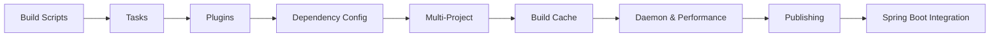
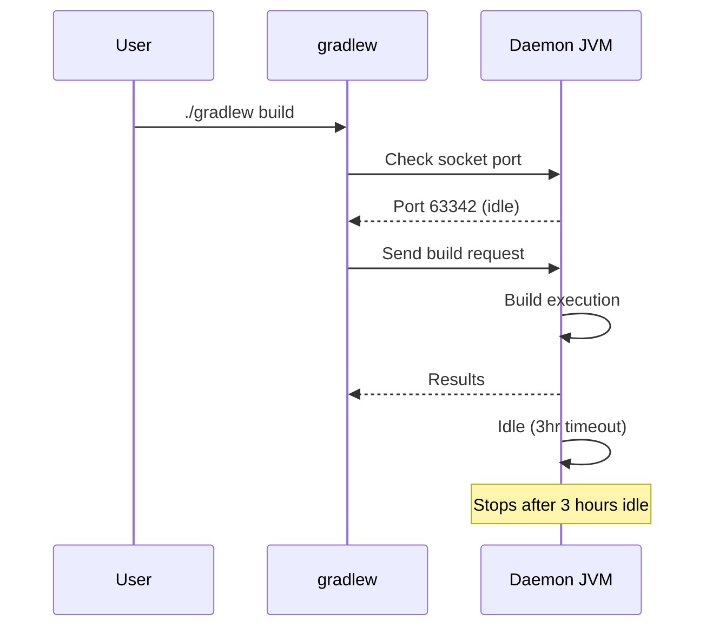

# Gradle Deep Dive

> **Previous:** [Maven Deep Dive](./07-maven.md) | **Next:** [Spring Framework Introduction](./09-spring-intro.md)

Gradle is the de facto build tool for modern Java and Kotlin projects. Unlike Maven's rigid XML-driven lifecycle, Gradle combines a **flexible, programmable build model** with a **directed acyclic graph (DAG) task engine**, **incremental builds**, and a **powerful dependency cache**. It powers virtually every Spring Boot project in production today, and its Kotlin DSL has become the standard for JVM builds.

This chapter covers Gradle from first principles through advanced production patterns. All examples are presented in **both Groovy DSL (`build.gradle`) and Kotlin DSL (`build.gradle.kts`)** so you can read and write either dialect.

---

## Learning Objectives

By the end of this chapter, you will be able to:

<!-- Image Gallery -->
<section class="lesson-visuals" aria-label="Visual learning resources">
  <header><span>VISUAL LEARNING</span><h2>See it. Review it. Remember it.</h2></header>
  <a class="lesson-visual-card" href="../../../assets/images/lessons/java/08-gradle/.png" target="_blank" rel="noopener">
    
    <span><strong>Handwritten notes</strong>Condensed notes for deliberate review.</span>
  </a>
  <a class="lesson-visual-card" href="../../../assets/images/lessons/java/08-gradle/.png" target="_blank" rel="noopener">
    
    <span><strong>Sticky-note revision</strong>Fast recall prompts for revision.</span>
  </a>
  <a class="lesson-visual-card" href="../../../assets/images/lessons/java/08-gradle/.png" target="_blank" rel="noopener">
    
    <span><strong>Visual concept guide</strong>A connected explanation of the key ideas.</span>
  </a>
</section>
<!-- End Image Gallery -->


- Explain the Gradle build lifecycle: initialization, configuration, and execution phases
- Write and run builds using both Groovy DSL and Kotlin DSL
- Define tasks with `doLast`, `doFirst`, `@TaskAction`, `dependsOn`, and Gradle's built-in task types (`Copy`, `Exec`, `Jar`, `Zip`, `Delete`, `JavaExec`)
- Create custom task types with `@TaskAction`, `@Input`, `@Output`, and `@CacheableTask`
- Apply essential plugins: `application`, `java`, `java-library`, `maven-publish`, `org.springframework.boot`, `io.spring.dependency-management`, `checkstyle`, `jacoco`, `spotbugs`
- Configure dependencies using `implementation`, `api`, `compileOnly`, `runtimeOnly`, `testImplementation`, `annotationProcessor`, `constraints`, `enforcedPlatform`, and version catalogs
- Build multi-project applications with `settings.gradle.kts`, `subprojects`, `allprojects`, `include`, cross-project configuration, and composite builds
- Configure and leverage the local and remote build cache with `@CacheableTask`
- Tune the Gradle Daemon for memory, parallel execution, and configuration caching
- Apply performance techniques: configuration avoidance (`register` vs `create`), lazy task creation, Worker API, and incremental builds
- Publish artifacts to Maven repositories with the `maven-publish` plugin, including signing and metadata
- Build, run, and containerize Spring Boot applications with `bootJar`, `bootRun`, `bootBuildImage`, and the dependency management plugin
- Define and consume version catalogs with `libs.versions.toml` and type-safe accessors

## Chapter at a Glance

| Topic | Key Insight | Practical Takeaway |
|-------|-------------|--------------------|
| Build Scripts | Groovy DSL vs Kotlin DSL | Kotlin DSL is preferred for modern projects |
| Task System | DAG-based, incremental, cacheable | Use `register` (lazy) over `create` for performance |
| Plugins | java, application, spring-boot, maven-publish | Plugins extend the build with pre-built task types |
| Dependencies | implementation, api, compileOnly, runtimeOnly | api leaks transitive deps; implementation does not |
| Multi-Project | settings.gradle.kts, subprojects, composite builds | Composite builds enable cross-project development |

## Chapter Roadmap



> **Pro Tip:** Always use `register` (lazy task creation) instead of `create` → it avoids configuring tasks that may never execute, which significantly improves build time in large projects.

---

## 1. Build Scripts


A Gradle build is defined by three key files in the project root:

| File | Purpose |
|------|---------|
| `build.gradle` or `build.gradle.kts` | Build logic — tasks, plugins, dependencies |
| `settings.gradle` or `settings.gradle.kts` | Project name, included subprojects, plugin management |
| `gradle.properties` | JVM args, system properties, project properties |

### 1.1 Groovy DSL vs Kotlin DSL


Gradle supports two DSLs. Groovy DSL (`build.gradle`) was the original and uses Apache Groovy. Kotlin DSL (`build.gradle.kts`) is now the **recommended** choice because it offers type-safe accessors, IDE autocompletion, and better error messages.

```groovy
// build.gradle — Groovy DSL
plugins {
    id 'java'
    id 'org.springframework.boot' version '3.4.1'
    id 'io.spring.dependency-management' version '1.1.7'
}

group = 'com.example'
version = '1.0.0'

java {
    toolchain {
        languageVersion = JavaLanguageVersion.of(21)
    }
}

repositories {
    mavenCentral()
}

dependencies {
    implementation 'org.springframework.boot:spring-boot-starter-web'
    testImplementation 'org.springframework.boot:spring-boot-starter-test'
}
```

```kotlin
// build.gradle.kts — Kotlin DSL (recommended)
plugins {
    java
    id("org.springframework.boot") version "3.4.1"
    id("io.spring.dependency-management") version "1.1.7"
}

group = "com.example"
version = "1.0.0"

java {
    toolchain {
        languageVersion = JavaLanguageVersion.of(21)
    }
}

repositories {
    mavenCentral()
}

dependencies {
    implementation("org.springframework.boot:spring-boot-starter-web")
    testImplementation("org.springframework.boot:spring-boot-starter-test")
}
```

**Key differences:**

- Kotlin DSL uses parentheses `()` for method calls and typed strings
- Kotlin DSL allows `plugins { java }` (type-safe accessor) without quotes for built-in plugins
- Kotlin DSL gives full IDE autocompletion — the preferred choice for all new projects
- Groovy DSL uses `'single quotes'` or `"double quotes"` interchangeably

### 1.2 settings.gradle.kts


The settings file defines the project name and which subprojects are included. It is evaluated **before** any `build.gradle.kts` file, during the initialization phase.

```kotlin
// settings.gradle.kts — single project
rootProject.name = "hello-gradle"
```

```kotlin
// settings.gradle.kts — multi-project
rootProject.name = "my-application"

include("core", "web", "api", "integration-test")
```

```kotlin
// settings.gradle.kts — with plugin management and repositories
pluginManagement {
    repositories {
        mavenCentral()
        gradlePluginPortal()
    }
}

dependencyResolutionManagement {
    repositories {
        mavenCentral()
    }
}

rootProject.name = "enterprise-app"
include("domain", "application", "infrastructure", "presentation")
```

### 1.3 gradle.properties


Properties files set JVM arguments for the Gradle Daemon, system properties, and project values.

```properties
# gradle.properties

# Daemon JVM settings
org.gradle.jvmargs=-Xmx2g -XX:MaxMetaspaceSize=512m -XX:+HeapDumpOnOutOfMemoryError

# Enable parallel execution and build cache
org.gradle.parallel=true
org.gradle.caching=true
org.gradle.configureondemand=true

# Enable configuration cache (experimental in Gradle 8.x, stable in 9.x)
org.gradle.configuration-cache=true

# Project-specific properties
springBootVersion=3.4.1
```

```properties
# gradle.properties — proxy settings for corporate environments
systemProp.http.proxyHost=proxy.company.com
systemProp.http.proxyPort=8080
systemProp.https.proxyHost=proxy.company.com
systemProp.https.proxyPort=8080
systemProp.http.nonProxyHosts=*.local|localhost|10.*
```

### 1.4 Gradle Wrapper


The wrapper (`gradlew` / `gradlew.bat`) is a script that downloads and runs a specific Gradle version. **Every project should use the wrapper** — it eliminates version mismatches across CI and developer machines.

```bash
# Generate the wrapper in your project
gradle wrapper --gradle-version 8.12

# Output:
#   gradlew          (Unix shell script)
#   gradlew.bat      (Windows batch script)
#   gradle/wrapper/gradle-wrapper.jar
#   gradle/wrapper/gradle-wrapper.properties
```

The generated `gradle-wrapper.properties` pins the version:

```properties
# gradle/wrapper/gradle-wrapper.properties
distributionBase=GRADLE_USER_HOME
distributionPath=wrapper/dists
distributionUrl=https\://services.gradle.org/distributions/gradle-8.12-bin.zip
networkTimeout=10000
validateDistributionUrl=true
zipStoreBase=GRADLE_USER_HOME
zipStorePath=wrapper/dists
```

All team members and CI pipelines then run:

```bash
# Unix / macOS / WSL
./gradlew build

# Windows
gradlew build
```

The wrapper JAR can be verified against a known checksum. To upgrade:

```bash
# Upgrade to a new Gradle version
./gradlew wrapper --gradle-version 8.12
```

```kotlin
// build.gradle.kts — wrapper task customization
tasks.named<Wrapper>("wrapper") {
    distributionType = Wrapper.DistributionType.ALL
    gradleVersion = "8.12"
}
```

---

## 2. Tasks

A Gradle build is a **directed acyclic graph (DAG) of tasks**. Every action — compiling, testing, packaging, deploying — is a task. Tasks can be defined ad hoc in the build script or as reusable types in `buildSrc` or published plugins.

### 2.1 Task Lifecycle Phase


Gradle runs in three phases:

1. **Initialization** — determines which projects participate in the build (reads `settings.gradle.kts`)
2. **Configuration** — evaluates build scripts, creates and configures task objects (but does NOT execute them)
3. **Execution** — runs the subset of tasks selected by the requested task names and their dependencies

```kotlin
// build.gradle.kts — demonstrating all three phases
println("Configuration phase: this runs for EVERY build, even ./gradlew help")

tasks.register("hello") {
    println("Configuration phase: 'hello' task is being configured")
    doLast {
        println("Execution phase: hello task is running")
    }
}

tasks.register("goodbye") {
    doLast {
        println("Execution phase: goodbye task is running")
    }
}
```

```bash
$ ./gradlew hello

> Configure project :
Configuration phase: this runs for EVERY build, even ./gradlew help
Configuration phase: 'hello' task is being configured

> Task :hello
Execution phase: hello task is running
```

### 2.2 Ad Hoc Tasks with doLast and doFirst


The simplest way to create a task is to add actions to the task's action list.

```kotlin
// build.gradle.kts
tasks.register("printVersion") {
    doLast {
        println("Project version: ${project.version}")
    }
}

tasks.register("prepare") {
    doFirst {
        println("Creating directories...")
        file("build/output").mkdirs()
    }
    doLast {
        println("Preparation complete")
    }
}
```

```groovy
// build.gradle
tasks.register('printVersion') {
    doLast {
        println "Project version: ${project.version}"
    }
}

tasks.register('prepare') {
    doFirst {
        println 'Creating directories...'
        file('build/output').mkdirs()
    }
    doLast {
        println 'Preparation complete'
    }
}
```

`doFirst` actions run **before** any existing actions; `doLast` actions run **after**. Multiple `doLast` closures stack in order. This is useful for adding cross-cutting behavior without modifying the original task.

### 2.3 dependsOn — Task Dependencies


Tasks declare dependencies so Gradle can resolve the correct execution order from the DAG.

```kotlin
// build.gradle.kts
tasks.register("cleanOutput") {
    doLast {
        file("build").deleteRecursively()
    }
}

tasks.register("compile") {
    dependsOn("cleanOutput")
    doLast {
        println("Compiling sources...")
        file("build/classes").mkdirs()
    }
}

tasks.register("package") {
    dependsOn("compile")
    doLast {
        println("Creating JAR...")
    }
}
```

```bash
$ ./gradlew package
> Task :cleanOutput
> Task :compile
> Task :package
```

Gradle guarantees that a task runs at most once per build, even if multiple tasks depend on it. The `dependsOn` method accepts strings, `Task` references, or `TaskProvider` references:

```kotlin
tasks.register("fullBuild") {
    dependsOn(tasks.named("clean"), tasks.named("build"))
}
```

**Task ordering** can also be expressed with `mustRunAfter` and `shouldRunAfter`:

```kotlin
tasks.named("compile") {
    mustRunAfter("clean")
}
```

### 2.4 Task Graph Hooks


You can register callbacks that execute after the task graph is fully resolved but before execution begins. This is useful for conditional logic.

```kotlin
// build.gradle.kts — gradle.taskGraph.beforeTask and afterTask
gradle.taskGraph.whenReady {
    println("Task graph ready. Tasks to execute:")
    allTasks.forEach { println("  - ${it.path}") }
}

gradle.taskGraph.beforeTask {
    println("Starting: ${this.path}")
}

gradle.taskGraph.afterTask {
    if (state.failure != null) {
        println("FAILED: ${this.path}")
    } else {
        println("SUCCESS: ${this.path}")
    }
}
```

### 2.5 Built-in Task Types


Gradle ships with many reusable task types. These are the most important for JVM projects:

#### Copy

```kotlin
// build.gradle.kts
tasks.register<Copy>("copyConfig") {
    from("src/main/resources/config")
    into("$buildDir/config")
    include("**/*.yaml", "**/*.properties")
    exclude("**/secret*")
    filter { line -> line.replace("\${env}", "production") }
}
```

```groovy
// build.gradle
tasks.register('copyConfig', Copy) {
    from 'src/main/resources/config'
    into "$buildDir/config"
    include '**/*.yaml', '**/*.properties'
    exclude '**/secret*'
    filter { line -> line.replace('${env}', 'production') }
}
```

#### Exec

```kotlin
// build.gradle.kts
tasks.register<Exec>("runLinter") {
    commandLine("npx", "eslint", "src/")
}
```

```groovy
// build.gradle
tasks.register('runLinter', Exec) {
    commandLine 'npx', 'eslint', 'src/'
}
```

#### Jar

```kotlin
// build.gradle.kts
tasks.named<Jar>("jar") {
    archiveBaseName.set("my-library")
    archiveVersion.set("1.0.0")
    manifest {
        attributes(
            "Implementation-Title" to "My Library",
            "Implementation-Version" to archiveVersion,
            "Built-By" to System.getProperty("user.name")
        )
    }
}
```

#### Zip

```kotlin
// build.gradle.kts
tasks.register<Zip>("distribution") {
    archiveFileName.set("my-app-${project.version}.zip")
    destinationDirectory.set(layout.buildDirectory.dir("dist"))

    into("bin") {
        from("scripts")
        fileMode = 0b111101101 // 755
    }
    into("lib") {
        from(tasks.named("jar"))
    }
    into("config") {
        from("src/main/config")
    }
}
```

#### Delete

```kotlin
// build.gradle.kts
tasks.register<Delete>("cleanReports") {
    delete("build/reports", "build/coverage")
}

// Prefer configuration-avoidance API:
tasks.register<Delete>("deepClean") {
    delete(rootProject.layout.buildDirectory)
}
```

#### JavaExec

```kotlin
// build.gradle.kts
tasks.register<JavaExec>("runBatchJob") {
    classpath = sourceSets.main.get().runtimeClasspath
    mainClass = "com.example.BatchJobRunner"
    args("--input=data.csv", "--output=results/")
    jvmArgs("-Xmx1g", "-Dspring.profiles.active=batch")
    systemProperty("app.temp.dir", layout.buildDirectory.dir("tmp").get().asFile.path)
    workingDir = layout.buildDirectory.dir("work").get().asFile
}
```

```groovy
// build.gradle
tasks.register('runBatchJob', JavaExec) {
    classpath = sourceSets.main.runtimeClasspath
    mainClass = 'com.example.BatchJobRunner'
    args '--input=data.csv', '--output=results/'
    jvmArgs '-Xmx1g', '-Dspring.profiles.active=batch'
    systemProperty 'app.temp.dir', layout.buildDirectory.dir('tmp').get().asFile.path
    workingDir = layout.buildDirectory.dir('work').get().asFile
}
```

### 2.6 Custom Task Type


For reusable task logic, create a class that extends `DefaultTask` and annotate methods with `@TaskAction`. Declare inputs and outputs with `@Input`, `@InputFile`, `@InputDirectory`, `@OutputFile`, `@OutputDirectory` — these enable **incremental builds** and **build cache** support.

```kotlin
// buildSrc/src/main/kotlin/com/example/gradle/CodeGeneratorTask.kt
package com.example.gradle

import org.gradle.api.DefaultTask
import org.gradle.api.file.DirectoryProperty
import org.gradle.api.file.RegularFileProperty
import org.gradle.api.provider.ListProperty
import org.gradle.api.provider.Property
import org.gradle.api.tasks.*

abstract class CodeGeneratorTask : DefaultTask() {

    @get:Input
    abstract val className: Property<String>

    @get:Input
    abstract val packageName: Property<String>

    @get:Input
    abstract val imports: ListProperty<String>

    @get:OutputDirectory
    abstract val outputDir: DirectoryProperty

    @TaskAction
    fun generate() {
        val dir = outputDir.get().asFile
        dir.mkdirs()

        val file = File(dir, "${className.get()}.java")
        file.writeText(buildSource())
        logger.lifecycle("Generated: ${file.absolutePath}")
    }

    private fun buildSource(): String {
        val sb = StringBuilder()
        sb.appendLine("package ${packageName.get()};")
        sb.appendLine()
        imports.get().forEach { sb.appendLine("import $it;") }
        sb.appendLine()
        sb.appendLine("public class ${className.get()} {")
        sb.appendLine("    public static void main(String[] args) {")
        sb.appendLine("        System.out.println(\"Hello from generated ${className.get()}!\");")
        sb.appendLine("    }")
        sb.appendLine("}")
        return sb.toString()
    }
}
```

```kotlin
// build.gradle.kts — consuming the custom task
tasks.register<com.example.gradle.CodeGeneratorTask>("generateHello") {
    className.set("HelloWorld")
    packageName.set("com.example.gen")
    imports.set(listOf("java.util.*", "java.time.LocalDate"))
    outputDir.set(layout.buildDirectory.dir("generated-sources"))
}
```

```groovy
// build.gradle — same task in Groovy
tasks.register('generateHello', com.example.gradle.CodeGeneratorTask) {
    className = 'HelloWorld'
    packageName = 'com.example.gen'
    imports = ['java.util.*', 'java.time.LocalDate']
    outputDir = layout.buildDirectory.dir('generated-sources')
}
```

**Important annotations for task types:**

| Annotation | Applies to | Purpose |
|------------|-----------|---------|
| `@TaskAction` | Method | The method that runs when the task executes |
| `@Input` | Property | A string, number, or serializable input |
| `@InputFile` | `RegularFileProperty` | An input file — tracked by path and content |
| `@InputDirectory` | `DirectoryProperty` | An input directory — tracked by contents |
| `@InputFiles` | `FileCollection` | A collection of input files |
| `@OutputFile` | `RegularFileProperty` | A single output file |
| `@OutputDirectory` | `DirectoryProperty` | An output directory |
| `@OutputFiles` / `@OutputDirectories` | `Map<String, ...>` | Multiple outputs |
| `@Optional` | Any property | Marks an input/output as optional |
| `@Incremental` | `FileCollection` | Supports incremental input processing |
| `@CacheableTask` | Class | Makes the task eligible for build cache |
| `@UntrackedTask` | Class | Opts out of incremental build |

---

## 3. Plugins

Plugins package reusable build logic. Gradle has two kinds: **binary plugins** (identified by a plugin ID, applied via the `plugins` block) and **script plugins** (applied via `apply from:`).

### 3.1 The plugins Block


The `plugins` block is the **preferred** way to apply plugins. It must appear at the top of the build script.

```kotlin
// build.gradle.kts
plugins {
    java
    jacoco
    checkstyle
    id("org.springframework.boot") version "3.4.1"
    id("io.spring.dependency-management") version "1.1.7"
    id("com.github.spotbugs") version "6.1.0"
    id("maven-publish")
    id("signing")
}
```

```groovy
// build.gradle
plugins {
    id 'java'
    id 'jacoco'
    id 'checkstyle'
    id 'org.springframework.boot' version '3.4.1'
    id 'io.spring.dependency-management' version '1.1.7'
    id 'com.github.spotbugs' version '6.1.0'
    id 'maven-publish'
    id 'signing'
}
```

### 3.2 Essential Plugins


#### java Plugin

The `java` plugin adds compilation, testing, and JAR packaging to a project.

```kotlin
plugins {
    java
}

java {
    sourceCompatibility = JavaVersion.VERSION_21
    targetCompatibility = JavaVersion.VERSION_21

    toolchain {
        languageVersion = JavaLanguageVersion.of(21)
    }

    // Consistent source set layout
    sourceSets {
        main {
            java.setSrcDirs(listOf("src/main/java"))
            resources.setSrcDirs(listOf("src/main/resources"))
        }
        test {
            java.setSrcDirs(listOf("src/test/java"))
            resources.setSrcDirs(listOf("src/test/resources"))
        }
    }

    // JAR manifest
    withJavadocJar()
    withSourcesJar()
}
```

Key tasks added by the `java` plugin:

| Task | Type | Purpose |
|------|------|---------|
| `compileJava` | `JavaCompile` | Compiles production Java sources |
| `processResources` | `Copy` | Copies production resources |
| `classes` | `Task` | Aggregate of `compileJava` + `processResources` |
| `compileTestJava` | `JavaCompile` | Compiles test Java sources |
| `processTestResources` | `Copy` | Copies test resources |
| `testClasses` | `Task` | Aggregate of `compileTestJava` + `processTestResources` |
| `jar` | `Jar` | Creates the JAR archive |
| `test` | `Test` | Runs unit tests (JUnit / TestNG) |
| `build` | `Task` | Aggregate: `assemble` + `check` |

#### application Plugin

The `application` plugin packages and runs a Java application.

```kotlin
plugins {
    application
    java
}

application {
    mainClass = "com.example.Application"
    applicationName = "my-app"

    // Distribution configuration
    applicationDistribution.from("scripts") {
        into("bin")
        fileMode = 0b111101101
    }
}

// Run the app
// $ ./gradlew run
// $ ./gradlew run --args="--server.port=9090"
```

```groovy
plugins {
    id 'application'
    id 'java'
}

application {
    mainClass = 'com.example.Application'
    applicationName = 'my-app'
}
```

#### java-library Plugin

The `java-library` plugin extends `java` and introduces the `api` configuration. Libraries **export** dependencies to consumers.

```kotlin
plugins {
    `java-library`
}

dependencies {
    // api — exposed to consumers' compile classpath
    api("com.google.guava:guava:33.4.0-jre")

    // implementation — hidden from consumers
    implementation("org.apache.commons:commons-lang3:3.17.0")
}
```

```groovy
plugins {
    id 'java-library'
}

dependencies {
    api 'com.google.guava:guava:33.4.0-jre'
    implementation 'org.apache.commons:commons-lang3:3.17.0'
}
```

**Rule of thumb:** use `api` sparingly. Every `api` dependency becomes part of your public contract. Prefer `implementation` unless downstream consumers need the type on their compile classpath.

#### maven-publish Plugin

The `maven-publish` plugin publishes artifacts to Maven repositories.

```kotlin
plugins {
    `maven-publish`
    `java-library`
}

publishing {
    publications {
        create<MavenPublication>("mavenJava") {
            from(components["java"])

            pom {
                name = "My Library"
                description = "A useful library for doing things"
                url = "https://github.com/example/my-library"
                licenses {
                    license {
                        name = "Apache-2.0"
                        url = "https://www.apache.org/licenses/LICENSE-2.0"
                    }
                }
                developers {
                    developer {
                        id = "jdoe"
                        name = "Jane Doe"
                        email = "jane@example.com"
                    }
                }
                scm {
                    connection = "scm:git:git://github.com/example/my-library.git"
                    developerConnection = "scm:git:ssh://github.com/example/my-library.git"
                    url = "https://github.com/example/my-library"
                }
            }
        }
    }

    repositories {
        maven {
            name = "internal"
            url = uri("https://maven.internal.example.com/releases")
            credentials {
                username = System.getenv("MAVEN_USER") ?: ""
                password = System.getenv("MAVEN_PASS") ?: ""
            }
        }
    }
}
```

```groovy
plugins {
    id 'maven-publish'
    id 'java-library'
}

publishing {
    publications {
        mavenJava(MavenPublication) {
            from components.java
            pom {
                name = 'My Library'
                description = 'A useful library for doing things'
            }
        }
    }
    repositories {
        maven {
            name = 'internal'
            url = 'https://maven.internal.example.com/releases'
            credentials {
                username = System.getenv('MAVEN_USER')
                password = System.getenv('MAVEN_PASS')
            }
        }
    }
}
```

#### signing Plugin

The `signing` plugin signs artifacts for publication.

```kotlin
plugins {
    `maven-publish`
    `signing`
    `java-library`
}

signing {
    sign(publishing.publications["mavenJava"])

    // Use in-memory keys from environment (CI-safe)
    val signingKey: String? = System.getenv("GPG_PRIVATE_KEY")
    val signingPassphrase: String? = System.getenv("GPG_PASSPHRASE")
    if (signingKey != null && signingPassphrase != null) {
        useInMemoryPgpKeys(signingKey, signingPassphrase)
    }
}
```

#### checkstyle Plugin

Checkstyle enforces coding standards.

```kotlin
plugins {
    checkstyle
}

checkstyle {
    toolVersion = "10.21.4"
    configFile = rootProject.file("config/checkstyle/checkstyle.xml")
    isIgnoreFailures = false
    maxWarnings = 0
}

tasks.withType<Checkstyle>().configureEach {
    reports {
        xml.required = true
        html.required = true
    }
}
```

Example configuration file at `config/checkstyle/checkstyle.xml`:

```xml
<?xml version="1.0"?>
<!DOCTYPE module PUBLIC
    "-//Checkstyle//DTD Checkstyle Configuration 1.3//EN"
    "https://checkstyle.org/dtds/configuration_1_3.dtd">
<module name="Checker">
    <module name="TreeWalker">
        <module name="UnusedImports"/>
        <module name="RedundantImport"/>
        <module name="ConstantName"/>
        <module name="LocalFinalVariableName"/>
        <module name="LocalVariableName"/>
        <module name="MemberName"/>
        <module name="MethodName"/>
        <module name="PackageName"/>
        <module name="ParameterName"/>
        <module name="StaticVariableName"/>
        <module name="TypeName"/>
        <module name="AvoidStarImport"/>
        <module name="IllegalImport"/>
        <module name="EmptyBlock"/>
        <module name="EmptyCatchBlock"/>
        <module name="LeftCurly"/>
        <module name="RightCurly"/>
        <module name="NeedBraces"/>
        <module name="WhitespaceAround"/>
        <module name="ModifierOrder"/>
    </module>
    <module name="LineLength">
        <property name="max" value="120"/>
    </module>
</module>
```

#### jacoco Plugin

JaCoCo measures test coverage.

```kotlin
plugins {
    jacoco
}

jacoco {
    toolVersion = "0.8.12"
}

tasks.jacocoTestReport {
    dependsOn(tasks.test)
    reports {
        xml.required = true
        csv.required = false
        html.required = true
        html.outputLocation = layout.buildDirectory.dir("reports/jacoco")
    }
}

tasks.jacocoTestCoverageVerification {
    violationRules {
        rule {
            limit {
                minimum = "0.80".toBigDecimal()
            }
        }
        rule {
            enabled = true
            element = "CLASS"
            excludes = listOf(
                "com.example.Application",
                "com.example.config.*",
                "com.example.dto.*"
            )
            limit {
                counter = "LINE"
                value = "COVEREDRATIO"
                minimum = "0.90".toBigDecimal()
            }
        }
    }
}

// Integrate into build lifecycle
tasks.check {
    dependsOn(tasks.jacocoTestCoverageVerification)
}
```

```bash
# Generate and view coverage
./gradlew test jacocoTestReport
# Open build/reports/jacoco/html/index.html
```

#### spotbugs Plugin

SpotBugs performs static analysis for bug patterns.

```kotlin
plugins {
    id("com.github.spotbugs") version "6.1.0"
}

spotbugs {
    toolVersion = "4.9.2"
    ignoreFailures = false
    showProgress = true
    effort = com.github.spotbugs.snom.Effort.MAX
    reportLevel = com.github.spotbugs.snom.Confidence.LOW
    excludeFilter = rootProject.file("config/spotbugs/exclude.xml")
}

tasks.withType<com.github.spotbugs.snom.SpotBugsTask>().configureEach {
    reports {
        html.required = true
        xml.required = false
    }
}
```

### 3.3 Applying Plugins Conditionally


Use Gradle's `with` API or `onlyIf` to apply plugins under specific conditions:

```kotlin
// build.gradle.kts — conditional plugin application
if (project.hasProperty("enableProfiling")) {
    apply(plugin = "jfr-profiling")
    // or in the plugins block:
    // plugins { id("com.example.profiling") }
}

tasks.named("test") {
    onlyIf {
        !project.hasProperty("skipTests")
    }
}
```

---

## 4. Dependency Configuration

Gradle's dependency management is richer than Maven's. The key concept is **configurations** — named sets of dependencies with specific visibility and scope.

### 4.1 Configuration Hierarchy


```
implementation  →  compileClasspath, runtimeClasspath
    ↑
api             →  compileClasspath, runtimeClasspath (exposed to consumers)
compileOnly     →  compileClasspath only
runtimeOnly     →  runtimeClasspath only
annotationProcessor → annotation processor classpath
testImplementation  →  testCompileClasspath, testRuntimeClasspath
testCompileOnly     →  testCompileClasspath only
testRuntimeOnly     →  testRuntimeClasspath only
```

### 4.2 Configuration Matrix


| Configuration | Compile | Runtime | Transitive | Visible to Consumers | Use Case |
|--------------|---------|---------|------------|---------------------|----------|
| `implementation` | Yes | Yes | Yes | No | Internal dependencies |
| `api` | Yes | Yes | Yes | Yes | Exported API dependencies |
| `compileOnly` | Yes | No | Yes | No | Lombok, annotation processors (non-transitive) |
| `runtimeOnly` | No | Yes | Yes | No | JDBC drivers, logging implementations |
| `annotationProcessor` | Yes | No | No | No | Annotation processors (Lombok, MapStruct) |
| `compileOnlyApi` | Yes | No | Yes | Yes | API that's compile-only (rare) |
| `testImplementation` | Test | Test | Yes | No | Test frameworks |
| `testCompileOnly` | Test | No | Yes | No | Test-only compile-time deps |
| `testRuntimeOnly` | No | Test | Yes | No | Test runtime engines |

```kotlin
// build.gradle.kts — complete dependency example for a Spring Boot library
plugins {
    `java-library`
    id("org.springframework.boot") version "3.4.1"
    id("io.spring.dependency-management") version "1.1.7"
}

dependencies {
    // API — exposed to consumers
    api("org.springframework.boot:spring-boot-starter-web")

    // Implementation — hidden from consumers
    implementation("org.springframework.boot:spring-boot-starter-validation")
    implementation("com.fasterxml.jackson.datatype:jackson-datatype-jsr310")

    // Compile only
    compileOnly("org.projectlombok:lombok")
    annotationProcessor("org.projectlombok:lombok")
    compileOnly("org.mapstruct:mapstruct:1.6.3")
    annotationProcessor("org.mapstruct:mapstruct-processor:1.6.3")

    // Runtime only
    runtimeOnly("org.postgresql:postgresql")
    runtimeOnly("net.logstash.logback:logstash-logback-encoder:8.0")

    // Test dependencies
    testImplementation("org.springframework.boot:spring-boot-starter-test")
    testImplementation("org.testcontainers:postgresql:1.20.4")
    testRuntimeOnly("org.junit.platform:junit-platform-launcher")
}
```

### 4.3 Dependency Constraints


Use `constraints` to define **version requirements** that apply transitively without adding a direct dependency.

```kotlin
dependencies {
    constraints {
        implementation("org.apache.commons:commons-text:1.13.0") {
            because("Version 1.13.0 fixes CVE-2024-XXXX")
        }
        implementation("com.fasterxml.jackson.core:jackson-databind:2.18.2") {
            because("Align all Jackson versions")
        }
    }
}
```

### 4.4 Enforced Platforms (Spring Boot BOM)


Spring Boot's dependency management is typically applied via the `io.spring.dependency-management` plugin, which imports the Spring Boot BOM. You can also import other BOMs:

```kotlin
dependencies {
    // Spring Cloud BOM via platform constraint
    implementation(platform("org.springframework.cloud:spring-cloud-dependencies:2024.0.0"))

    // AWS SDK BOM
    implementation(platform("software.amazon.awssdk:bom:2.29.48"))

    // Individual dependencies from the BOM (version resolved by BOM)
    implementation("org.springframework.cloud:spring-cloud-starter-gateway")
    implementation("software.amazon.awssdk:s3")
    implementation("software.amazon.awssdk:sqs")
}
```

**enforcedPlatform** applies a platform **with override semantics** — any version specified in the platform takes precedence:

```kotlin
dependencies {
    // Override all transitive versions with the platform's versions
    implementation(enforcedPlatform("org.springframework.boot:spring-boot-dependencies:3.4.1"))
    implementation("org.springframework.boot:spring-boot-starter-web")
}
```

### 4.5 Version Catalogs (libs.versions.toml)


Version catalogs centralize dependency versions in a single TOML file at `gradle/libs.versions.toml`.

```toml
# gradle/libs.versions.toml

[versions]
spring-boot = "3.4.1"
spring-cloud = "2024.0.0"
lombok = "1.18.36"
mapstruct = "1.6.3"
testcontainers = "1.20.4"
kotlin = "2.1.0"
jackson = "2.18.2"
guava = "33.4.0-jre"

[libraries]
spring-boot-starter-web = { module = "org.springframework.boot:spring-boot-starter-web" }
spring-boot-starter-validation = { module = "org.springframework.boot:spring-boot-starter-validation" }
spring-boot-starter-test = { module = "org.springframework.boot:spring-boot-starter-test" }
spring-cloud-starter-gateway = { module = "org.springframework.cloud:spring-cloud-starter-gateway" }
lombok = { module = "org.projectlombok:lombok", version.ref = "lombok" }
mapstruct = { module = "org.mapstruct:mapstruct", version.ref = "mapstruct" }
mapstruct-processor = { module = "org.mapstruct:mapstruct-processor", version.ref = "mapstruct" }
jackson-jsr310 = { module = "com.fasterxml.jackson.datatype:jackson-datatype-jsr310", version.ref = "jackson" }
testcontainers-postgresql = { module = "org.testcontainers:postgresql", version.ref = "testcontainers" }
guava = { module = "com.google.guava:guava", version.ref = "guava" }

[bundles]
testcontainers = ["testcontainers-postgresql", "testcontainers-kafka"]
spring-web = ["spring-boot-starter-web", "spring-boot-starter-validation"]

[plugins]
spring-boot = { id = "org.springframework.boot", version.ref = "spring-boot" }
spring-dependency-management = { id = "io.spring.dependency-management", version.ref = "spring-boot" }
kotlin-jvm = { id = "org.jetbrains.kotlin.jvm", version.ref = "kotlin" }
spotbugs = { id = "com.github.spotbugs", version = "6.1.0" }
```

```kotlin
// build.gradle.kts — consuming the version catalog
plugins {
    alias(libs.plugins.spring.boot)
    alias(libs.plugins.spring.dependency.management)
    java
}

dependencies {
    implementation(libs.spring.boot.starter.web)
    implementation(libs.jackson.jsr310)
    compileOnly(libs.lombok)
    annotationProcessor(libs.lombok)
    testImplementation(libs.bundles.testcontainers)
    testImplementation(libs.spring.boot.starter.test)
}
```

```groovy
// build.gradle — Groovy alternative
plugins {
    alias libs.plugins.spring.boot
    alias libs.plugins.spring.dependency.management
    id 'java'
}

dependencies {
    implementation libs.spring.boot.starter.web
    implementation libs.jackson.jsr310
    compileOnly libs.lombok
    annotationProcessor libs.lombok
    testImplementation libs.bundles.testcontainers
    testImplementation libs.spring.boot.starter.test
}
```

The type-safe accessors are generated automatically. The convention maps dots to accessor calls: `libs.spring.boot.starter.web` corresponds to the TOML key `spring-boot-starter-web`. Plugins use `libs.plugins.spring.boot` for key `spring-boot`.

### 4.6 Dependency Locking


Lock files capture exact transitive dependency versions for **reproducible builds**.

```kotlin
// build.gradle.kts — enable dependency locking
dependencyLocking {
    lockAllConfigurations()
}

// Run to generate/update lock files:
// $ ./gradlew dependencies --update-locks *
// Lock files written to: gradle/dependency-locks/*.lockfile
```

```bash
# Generate locked dependency files
./gradlew dependencies --update-locks '*'

# Verify build uses only locked versions
./gradlew build --locked
```

The lock file (`gradle/dependency-locks/compileClasspath.lockfile`) records exact versions:

```text
# gradle/dependency-locks/compileClasspath.lockfile
com.fasterxml.jackson.core:jackson-annotations:2.18.2
com.fasterxml.jackson.core:jackson-core:2.18.2
com.fasterxml.jackson.core:jackson-databind:2.18.2
jakarta.annotation:jakarta.annotation-api:2.1.1
org.springframework.boot:spring-boot:3.4.1
org.springframework:spring-core:6.2.1
org.springframework:spring-web:6.2.1
```

### 4.7 Centralized Dependency Resolution


In a multi-project build, use `dependencyResolutionManagement` in `settings.gradle.kts`:

```kotlin
// settings.gradle.kts
dependencyResolutionManagement {
    // FAIL_ON_PROJECT_REPOS — requires repositories defined only here
    // PREFER_PROJECT — allows project-level repo declarations
    // PREFER_SETTINGS — prefers settings-level repos
    repositoriesMode = RepositoriesMode.PREFER_SETTINGS
    repositories {
        mavenCentral()
        maven { url = uri("https://repo.spring.io/milestone") }
    }
}
```

---

## 5. Multi-Project Builds

Real-world applications are organized as multi-project builds. Gradle handles them through composite project graphs with inheritance and cross-project configuration.

### 5.1 Project Structure


```
my-app/
├── settings.gradle.kts
├── build.gradle.kts          # Root project (shared config)
├── gradle.properties
├── gradle/
│   └── libs.versions.toml
├── domain/
│   ├── build.gradle.kts
│   └── src/main/java/...
├── application/
│   ├── build.gradle.kts
│   └── src/main/java/...
├── infrastructure/
│   ├── build.gradle.kts
│   └── src/main/java/...
└── presentation/
    ├── build.gradle.kts
    └── src/main/java/...
```

### 5.2 settings.gradle.kts — includes


```kotlin
// settings.gradle.kts
rootProject.name = "my-app"
include("domain", "application", "infrastructure", "presentation")

// Optionally rename subproject directories
project(":domain").projectDir = file("modules/domain")
```

### 5.3 Subprojects and Allprojects


The root `build.gradle.kts` shares common configuration.

```kotlin
// build.gradle.kts — root project (common for all subprojects)
plugins {
    java
    jacoco
    id("org.springframework.boot") version "3.4.1" apply false
    id("io.spring.dependency-management") version "1.1.7" apply false
}

group = "com.example"
version = "1.0.0"

// Configure all projects (including root)
allprojects {
    repositories {
        mavenCentral()
    }
}

// Configure subprojects only
subprojects {
    apply(plugin = "java")
    apply(plugin = "jacoco")
    apply(plugin = "io.spring.dependency-management")

    java {
        toolchain {
            languageVersion = JavaLanguageVersion.of(21)
        }
    }

    dependencyManagement {
        imports {
            mavenBom("org.springframework.boot:spring-boot-dependencies:3.4.1")
        }
    }

    tasks.withType<Test>().configureEach {
        useJUnitPlatform()
    }

    tasks.withType<JacocoCoverageVerification>().configureEach {
        violationRules {
            rule {
                limit { minimum = "0.80".toBigDecimal() }
            }
        }
    }
}
```

### 5.4 Cross-Project Dependencies


```kotlin
// domain/build.gradle.kts
plugins {
    `java-library`
}

dependencies {
    // No internal dependencies — pure domain logic
    api("jakarta.validation:jakarta.validation-api")
}

// application/build.gradle.kts
plugins {
    `java-library`
}

dependencies {
    implementation(project(":domain"))
    implementation("org.springframework:spring-tx")
}

// infrastructure/build.gradle.kts
plugins {
    `java-library`
}

dependencies {
    implementation(project(":domain"))
    implementation(project(":application"))
    implementation("org.springframework.boot:spring-boot-starter-data-jpa")
    runtimeOnly("org.postgresql:postgresql")
}

// presentation/build.gradle.kts
plugins {
    id("org.springframework.boot")
    id("io.spring.dependency-management")
}

dependencies {
    implementation(project(":application"))
    implementation(project(":infrastructure"))
    implementation("org.springframework.boot:spring-boot-starter-web")
}
```

### 5.5 Composite Builds


Composite builds let you include an **external project** as if it were a subproject — without publishing it first.

```kotlin
// settings.gradle.kts — composite build
rootProject.name = "my-app"

include(":domain", ":application", ":infrastructure", ":presentation")

// Include an external library project as a composite
includeBuild("../my-shared-lib") {
    dependencySubstitution {
        substitute(module("com.example:shared-lib"))
            .using(project(":"))
    }
}
```

Now any project that depends on `com.example:shared-lib` resolves to the local composite build instead, making development of the library and application simultaneous.

---

## 6. Build Cache

The build cache stores task outputs so that identical inputs produce instant results across machines and CI runs.

### 6.1 Local Build Cache


```properties
# gradle.properties
org.gradle.caching=true
```

By default, the local cache is at `~/.gradle/caches/build-cache-1`. It is a content-addressed store keyed by all declared inputs.

### 6.2 Remote Build Cache (HTTP)


```kotlin
// settings.gradle.kts — remote cache configuration
buildCache {
    local {
        isEnabled = true
        directory = File(System.getProperty("user.home"), ".gradle/caches/build-cache-1")
        removeUnusedEntriesAfterDays = 7
    }
    remote<HttpBuildCache>("gradleEnterprise") {
        url = uri("https://build-cache.internal.example.com/cache/")
        isEnabled = System.getenv("CI") != null   // only in CI
        isPush = System.getenv("CI") != null
        credentials {
            username = System.getenv("CACHE_USER") ?: ""
            password = System.getenv("CACHE_PASS") ?: ""
        }
    }
}
```

### 6.3 Cacheable Tasks


A task is cacheable when it is annotated with `@CacheableTask` and all inputs/outputs are declared.

```kotlin
import org.gradle.api.DefaultTask
import org.gradle.api.file.RegularFileProperty
import org.gradle.api.property.Property
import org.gradle.api.tasks.*

@CacheableTask
abstract class DocumentRenderer : DefaultTask() {

    @get:Input
    abstract val title: Property<String>

    @get:InputFile
    abstract val template: RegularFileProperty

    @get:OutputFile
    abstract val output: RegularFileProperty

    @TaskAction
    fun render() {
        val content = template.get().asFile.readText()
            .replace("{{TITLE}}", title.get())
        output.get().asFile.writeText(content)
        logger.lifecycle("Rendered: ${output.get().asFile.name}")
    }
}
```

```kotlin
// build.gradle.kts — consuming the cacheable task
tasks.register<DocumentRenderer>("renderDocs") {
    title.set("Gradle Deep Dive")
    template.set(layout.projectDirectory.file("src/templates/doc.html"))
    output.set(layout.buildDirectory.file("docs/index.html"))
}
```

Cache keys include:
- The task class and its `@Input` values
- The content hashes of `@InputFile` and `@InputDirectory` paths
- The task's implementation classpath
- Gradle version

### 6.4 Cache Hit Verification


```bash
# Build with cache statistics
./gradlew build --build-cache

# To see cache hit/miss details, use --info or --debug
./gradlew compileJava --build-cache --info | grep "Build cache"

# For cache debugging — disable cache temporarily
./gradlew clean build --no-build-cache
```

---

## 7. Daemon

The Gradle Daemon is a long-lived JVM process that keeps build data in memory, dramatically reducing startup time for subsequent builds.

### 7.1 Daemon Lifecycle




### 7.2 Daemon Configuration


```properties
# gradle.properties — daemon JVM tuning

# Heap size for the daemon (not your application!)
# 2 GB is a good starting point for most projects
org.gradle.jvmargs=-Xmx2g -XX:MaxMetaspaceSize=512m

# Enable the daemon by default (it is enabled by default in Gradle 8+)
org.gradle.daemon=true

# Maximum daemon lifetime in seconds (4 hours)
org.gradle.daemon.idletimeout=14400
```

### 7.3 Stopping the Daemon


```bash
# Stop all running daemons
./gradlew --stop

# Check daemon status
./gradlew --status

# Multiple daemons (one per Java version / Gradle version)
# You can have: daemon-jdk21-gradle8.12 and daemon-jdk17-gradle8.10 running concurrently
```

---

## 8. Performance

Gradle is fast when configured correctly. The following techniques combine for dramatic speed improvements.

### 8.1 Configuration Avoidance


The single most important optimization: use `register` instead of `create`. `register` creates a **lazy provider** — the task is instantiated only if it is actually executed.

```kotlin
// BAD — task is always configured (even for ./gradlew help)
tasks.create("heavyTask") {
    doLast {
        // expensive work
    }
}

// GOOD — task is configured only when executed
tasks.register("heavyTask") {
    doLast {
        // expensive work
    }
}

// For typed tasks:
tasks.register<Copy>("copyAssets") {
    from("src/assets")
    into("$buildDir/assets")
}
```

### 8.2 Lazy Task Configuration with Providers


Gradle's `Provider` and `Property` APIs defer value resolution until execution time.

```kotlin
// build.gradle.kts
val outputDir = layout.buildDirectory.dir("generated")

tasks.register("createOutputDir") {
    doLast {
        outputDir.get().asFile.mkdirs()
    }
}

// Lazy file resolution
val inputFile = layout.projectDirectory.file("data/input.csv")
val outputFile = outputDir.map { it.file("output.json") }

tasks.register<Copy>("transformData") {
    from(inputFile)
    into(outputDir)
    // inputFile and outputDir are resolved lazily
}
```

### 8.3 Parallel Execution


```properties
# gradle.properties
org.gradle.parallel=true

# Maximum number of parallel workers (default = CPU cores)
org.gradle.workers.max=4
```

```kotlin
// build.gradle.kts — fine-tune parallel execution
tasks.withType<JavaCompile>().configureEach {
    options.isFork = true
    options.forkOptions.memoryMaximumSize = "512m"
}
```

### 8.4 Worker API


For CPU-intensive custom tasks, use the Worker API to parallelize work inside a single task:

```kotlin
// buildSrc/src/main/kotlin/com/example/ParallelProcessorTask.kt
package com.example

import org.gradle.api.DefaultTask
import org.gradle.api.file.DirectoryProperty
import org.gradle.api.file.RegularFileProperty
import org.gradle.api.tasks.*
import org.gradle.workers.*

abstract class FileProcessor : WorkAction<FileProcessorParams> {
    override fun execute() {
        parameters.inputFile.get().asFile.readLines()
            .filter { it.isNotBlank() }
            .forEach { line ->
                // process each line
            }
    }
}

interface FileProcessorParams : WorkParameters {
    val inputFile: RegularFileProperty
}

abstract class ParallelProcessorTask : DefaultTask() {

    @get:InputDirectory
    abstract val inputDir: DirectoryProperty

    @get:OutputDirectory
    abstract val outputDir: DirectoryProperty

    @get:Inject
    abstract val workerExecutor: WorkerExecutor

    @TaskAction
    fun processFiles() {
        val workQueue = workerExecutor.noIsolation()
        inputDir.get().asFile.listFiles()?.forEach { file ->
            workQueue.submit(FileProcessor::class) {
                inputFile.set(file)
            }
        }
    }
}
```

### 8.5 Configuration Cache


The configuration cache caches the output of the **configuration phase**, so subsequent builds skip script evaluation entirely.

```properties
# gradle.properties
org.gradle.configuration-cache=true
```

```bash
# First build — configuration phase runs (slower)
./gradlew build

# Second build — configuration phase is loaded from cache (much faster)
./gradlew build

# If configuration cache problems arise, disable temporarily:
./gradlew build --no-configuration-cache
```

**Limitations:** the configuration cache serializes the entire project object graph. Tasks that use non-serializable objects, `gradle.ext`, or dynamic file operations in configuration may fail. Gradle reports these with actionable error messages.

### 8.6 Incremental Builds


Gradle's incremental build support means that if all inputs and outputs are declared, unchanged tasks are skipped automatically.

```kotlin
@CacheableTask
abstract class IncrementalReportTask : DefaultTask() {

    @get:InputFiles
    @get:PathSensitive(PathSensitivity.RELATIVE)
    abstract val sourceFiles: ConfigurableFileCollection

    @get:OutputFile
    abstract val reportFile: RegularFileProperty

    @TaskAction
    fun generate() {
        val report = sourceFiles.files.joinToString("\n") { file ->
            "${file.name}: ${file.readText().length} chars"
        }
        reportFile.get().asFile.writeText(report)
    }
}
```

Gradle knows to skip this task when `sourceFiles` contents haven't changed, because both inputs and outputs are declared.

---

## 9. Publishing

Beyond the basics in §3.2, here are advanced publishing patterns.

### 9.1 Publishing with Artifacts


```kotlin
plugins {
    `maven-publish`
    `java-library`
    signing
}

val customJar by tasks.registering(Jar::class) {
    archiveBaseName = "my-lib-sources"
    from(sourceSets.main.get().allJava)
}

publishing {
    publications {
        create<MavenPublication>("mavenJava") {
            from(components["java"])
            artifact(customJar) {
                classifier = "sources"
            }

            versionMapping {
                usage("java-api") {
                    fromResolutionOf("runtimeClasspath")
                }
                usage("java-runtime") {
                    fromResolutionResult()
                }
            }

            pom {
                name = "My Library"
                description = "Enterprise-grade library"
                url = "https://github.com/example/my-lib"

                licenses {
                    license {
                        name = "Apache-2.0"
                        url = "https://apache.org/licenses/LICENSE-2.0"
                    }
                }

                developers {
                    developer {
                        id = "jdoe"
                        name = "Jane Doe"
                        email = "jane@example.com"
                    }
                }

                scm {
                    connection = "scm:git:git@github.com:example/my-lib.git"
                    url = "https://github.com/example/my-lib"
                }

                // Exclude test-scoped dependencies from the POM
                withXml {
                    val dependencies = asNode().get("dependencies") as groovy.util.NodeList
                    dependencies.forEach { dep ->
                        val scope = dep.node?.get("scope")?.text()
                        if (scope == "test") {
                            dep.parent?.remove(dep)
                        }
                    }
                }
            }
        }
    }

    repositories {
        maven {
            name = "ossrh"
            url = uri("https://s01.oss.sonatype.org/service/local/staging/deploy/maven2/")
            credentials {
                username = System.getenv("OSSRH_USER")
                password = System.getenv("OSSRH_PASS")
            }
        }
    }
}

signing {
    sign(publishing.publications["mavenJava"])
}
```

### 9.2 Conditional Publishing


```kotlin
// Only publish from CI on the main branch
tasks.withType<PublishToMavenRepository>().configureEach {
    onlyIf {
        System.getenv("CI") != null && System.getenv("CI_COMMIT_BRANCH") == "main"
    }
}
```

---

## 10. Spring Boot with Gradle

The Spring Boot Gradle plugin provides first-class support for building, running, and containerizing Spring Boot applications.

### 10.1 Plugin Application


```kotlin
// build.gradle.kts
plugins {
    java
    id("org.springframework.boot") version "3.4.1"
    id("io.spring.dependency-management") version "1.1.7"
}
```

`io.spring.dependency-management` automatically imports the Spring Boot BOM, so you omit versions from Spring Boot dependencies:

```kotlin
dependencies {
    implementation("org.springframework.boot:spring-boot-starter-web")
    implementation("org.springframework.boot:spring-boot-starter-data-jpa")
    implementation("org.springframework.boot:spring-boot-starter-validation")
    testImplementation("org.springframework.boot:spring-boot-starter-test")
    testRuntimeOnly("org.junit.platform:junit-platform-launcher")
}
```

### 10.2 bootJar


The `bootJar` task creates an executable fat JAR. It is automatically wired to replace the standard `jar` task.

```kotlin
// build.gradle.kts — bootJar customization
tasks.named<org.springframework.boot.gradle.tasks.bundling.BootJar>("bootJar") {
    archiveBaseName.set("my-app")
    archiveVersion.set(project.version.toString())
    archiveFileName.set("${archiveBaseName.get()}-${archiveVersion.get()}.jar")
    mainClass = "com.example.Application"

    // Exclude specific dependencies from the fat JAR
    excludes = setOf("META-INF/*.SF", "META-INF/*.DSA", "META-INF/*.RSA")

    // Enable layered JARs for Docker optimization (Spring Boot 3.0+)
    layered {
        enabled = true
        application {
            intoLayer("spring-boot-loader") {
                include("org/springframework/boot/loader/**")
            }
            intoLayer("application")
        }
        dependencies {
            intoLayer("snapshot-dependencies") {
                include("*:*:*SNAPSHOT")
            }
            intoLayer("dependencies")
        }
    }
}
```

```bash
# Build the executable JAR
./gradlew bootJar

# Run it
java -jar build/libs/my-app-1.0.0.jar
```

### 10.3 bootRun


The `bootRun` task runs the application from source without building a JAR.

```kotlin
// build.gradle.kts — bootRun customization
tasks.named<org.springframework.boot.gradle.tasks.run.BootRun>("bootRun") {
    // Command-line arguments
    args("--spring.profiles.active=dev")

    // JVM arguments
    jvmArgs(
        "-Xmx512m",
        "-Duser.timezone=UTC",
        "-agentlib:jdwp=transport=dt_socket,server=y,suspend=n,address=*:5005"
    )

    // Enable HotSwap or Spring DevTools reload
    environment("SPRING_DEVTOOLS_RESTART_TRIGGER_FILE", "build/reload.tmp")
}
```

```bash
# Run the application
./gradlew bootRun

# With remote debugging
./gradlew bootRun --debug-jvm

# With a specific profile
SPRING_PROFILES_ACTIVE=production ./gradlew bootRun
```

### 10.4 bootBuildImage


Spring Boot 3.x integrates Cloud Native Buildpacks to produce OCI-compliant Docker images **without a Dockerfile**.

```kotlin
// build.gradle.kts — bootBuildImage customization
tasks.named<org.springframework.boot.gradle.tasks.bundling.BootBuildImage>("bootBuildImage") {
    imageName = "registry.example.com/my-app:${project.version}"
    builder = "paketobuildpacks/builder-jammy-tiny:latest"
    runImage = "paketobuildpacks/run:jammy-tiny"

    environment = mapOf(
        "BP_JVM_VERSION" to "21",
        "BPE_SPRING_PROFILES_ACTIVE" to "production",
        "BPE_JAVA_TOOL_OPTIONS" to "-XX:MaxRAMPercentage=75"
    )

    publish = System.getenv("CI") != null
    docker {
        publishRegistry {
            username = System.getenv("DOCKER_USER")
            password = System.getenv("DOCKER_PASS")
        }
    }

    // Spring Boot 3.4+ optimizations
    bindings = listOf(
        "/tmp/cache:/cache"
    )
}
```

```bash
# Build the Docker image (no Dockerfile needed)
./gradlew bootBuildImage

# Tag and push
docker tag registry.example.com/my-app:1.0.0 registry.example.com/my-app:latest
docker push registry.example.com/my-app:1.0.0
```

### 10.5 Dependency Management Plugin


The `io.spring.dependency-management` plugin applies Maven-style BOM import behavior to Gradle.

```kotlin
// build.gradle.kts — importing additional BOMs
dependencyManagement {
    imports {
        mavenBom("org.springframework.cloud:spring-cloud-dependencies:2024.0.0")
        mavenBom("software.amazon.awssdk:bom:2.29.48")
    }

    // Override a specific version from a BOM
    overriddenByDependencies = false // (default) BOM versions take precedence
}

dependencies {
    implementation("org.springframework.cloud:spring-cloud-starter-gateway")
    implementation("software.amazon.awssdk:s3")
}
```

### 10.6 Spring Boot Starters Resolution


Spring Boot starters are pre-configured dependency descriptors. The dependency management plugin ensures all transitive dependencies use compatible versions.

```kotlin
dependencies {
    // Core starters
    implementation("org.springframework.boot:spring-boot-starter-web")
    implementation("org.springframework.boot:spring-boot-starter-actuator")
    implementation("org.springframework.boot:spring-boot-starter-data-jpa")
    implementation("org.springframework.boot:spring-boot-starter-validation")
    implementation("org.springframework.boot:spring-boot-starter-security")

    // Optional starters — conditionally active
    implementation("org.springframework.boot:spring-boot-starter-mail")
    implementation("org.springframework.boot:spring-boot-starter-cache")
    implementation("org.springframework.boot:spring-boot-starter-quartz")

    // Devtools — excluded from production JAR
    developmentOnly("org.springframework.boot:spring-boot-devtools")

    // Production monitoring
    runtimeOnly("io.micrometer:micrometer-registry-prometheus")
}
```

```kotlin
// Complete Spring Boot multi-project example

// settings.gradle.kts
rootProject.name = "order-management"
include("order-domain", "order-application", "order-infrastructure", "order-presentation")

// root build.gradle.kts
plugins {
    java
    id("org.springframework.boot") version "3.4.1" apply false
    id("io.spring.dependency-management") version "1.1.7" apply false
}

subprojects {
    apply(plugin = "java")
    apply(plugin = "io.spring.dependency-management")

    group = "com.example.orders"
    version = "1.0.0"

    java {
        toolchain {
            languageVersion = JavaLanguageVersion.of(21)
        }
    }

    repositories {
        mavenCentral()
    }

    dependencyManagement {
        imports {
            mavenBom("org.springframework.boot:spring-boot-dependencies:3.4.1")
            mavenBom("org.springframework.cloud:spring-cloud-dependencies:2024.0.0")
        }
    }

    tasks.withType<Test>().configureEach {
        useJUnitPlatform()
    }
}

// order-domain/build.gradle.kts
plugins {
    `java-library`
}

dependencies {
    api("org.springframework.boot:spring-boot-starter-validation")
    compileOnly("org.projectlombok:lombok")
    annotationProcessor("org.projectlombok:lombok")
}

// order-application/build.gradle.kts
plugins {
    `java-library`
}

dependencies {
    implementation(project(":order-domain"))
    implementation("org.springframework.boot:spring-boot-starter")
    implementation("org.springframework:spring-tx")
}

// order-infrastructure/build.gradle.kts
plugins {
    `java-library`
}

dependencies {
    implementation(project(":order-domain"))
    implementation(project(":order-application"))
    implementation("org.springframework.boot:spring-boot-starter-data-jpa")
    runtimeOnly("org.postgresql:postgresql")
}

// order-presentation/build.gradle.kts
plugins {
    id("org.springframework.boot")
}

dependencies {
    implementation(project(":order-application"))
    implementation(project(":order-infrastructure"))
    implementation("org.springframework.boot:spring-boot-starter-web")
    implementation("org.springframework.boot:spring-boot-starter-actuator")
    testImplementation("org.springframework.boot:spring-boot-starter-test")
    testImplementation("org.testcontainers:postgresql:1.20.4")
    testRuntimeOnly("org.junit.platform:junit-platform-launcher")
}
```

---

## 11. Version Catalogs (Deep Dive)

Version catalogs are the modern, scalable dependency management approach for Gradle.

### 11.1 TOML Structure


```toml
# gradle/libs.versions.toml

[versions]
# Versions are plain strings
java = "21"
spring-boot = "3.4.1"
spring-cloud = "2024.0.0"
lombok = "1.18.36"
mapstruct = "1.6.3"
testcontainers = "1.20.4"
kotlin = "2.1.0"

[libraries]
# Simple library — no version reference, uses default
spring-boot-starter-web = { module = "org.springframework.boot:spring-boot-starter-web" }

# Library with version reference
lombok = { module = "org.projectlombok:lombok", version.ref = "lombok" }
mapstruct-core = { module = "org.mapstruct:mapstruct", version.ref = "mapstruct" }
mapstruct-processor = { module = "org.mapstruct:mapstruct-processor", version.ref = "mapstruct" }

# Library with inline version (not recommended — use version.ref)
jackson-core = { module = "com.fasterxml.jackson.core:jackson-core", version = "2.18.2" }

# Library with version constraint
hibernate = { module = "org.hibernate.orm:hibernate-core", version = "6.6.4.Final" }

# Strict version
guava-strict = { module = "com.google.guava:guava", version = { strictly = "33.4.0-jre", require = "33.4.0-jre" } }

# Maven BOM import
spring-cloud-bom = { module = "org.springframework.cloud:spring-cloud-dependencies", version.ref = "spring-cloud" }

[bundles]
# Dependency bundles group related libraries
testing = [
    "spring-boot-starter-test",
    "testcontainers",
    "testcontainers-postgresql"
]
starter-web = [
    "spring-boot-starter-web",
    "spring-boot-starter-validation"
]

[plugins]
spring-boot = { id = "org.springframework.boot", version.ref = "spring-boot" }
spring-dependency-management = { id = "io.spring.dependency-management", version.ref = "spring-boot" }
kotlin-jvm = { id = "org.jetbrains.kotlin.jvm", version.ref = "kotlin" }
spotbugs = { id = "com.github.spotbugs", version = "6.1.0" }
checkstyle = { id = "checkstyle" } # no version — Gradle built-in
jacoco = { id = "jacoco" }        # no version — Gradle built-in
```

### 11.2 Type-Safe Accessor Generation


For each TOML entry, Gradle generates type-safe Kotlin accessors in the `libs` extension:

| TOML key | Accessor | Example |
|----------|----------|---------|
| `spring-boot` | `libs.spring.boot` | `libs.spring.boot.starter.web` |
| `spring-boot-starter-web` | `libs.spring.boot.starter.web` | `implementation(libs.spring.boot.starter.web)` |
| `mapstruct-core` | `libs.mapstruct.core` | `implementation(libs.mapstruct.core)` |
| `starter-web` (bundle) | `libs.bundles.starter.web` | `implementation(libs.bundles.starter.web)` |
| `spring-boot` (plugin) | `libs.plugins.spring.boot` | `alias(libs.plugins.spring.boot)` |

Dashes in TOML keys become dots in accessors. The accessors are generated at build time and visible in IDE autocompletion.

### 11.3 Consuming in Build Scripts


```kotlin
// build.gradle.kts — complete version catalog example
plugins {
    alias(libs.plugins.spring.boot)
    alias(libs.plugins.spring.dependency.management)
    alias(libs.plugins.checkstyle)
    alias(libs.plugins.jacoco)
    id("java")
}

dependencies {
    // Simple library
    implementation(libs.spring.boot.starter.web)

    // Library with version reference
    compileOnly(libs.lombok)
    annotationProcessor(libs.lombok)

    mapstruct {
        compileOnly(libs.mapstruct.core)
        annotationProcessor(libs.mapstruct.processor)
    }

    // Bundle
    testImplementation(libs.bundles.testing)

    // Platform BOM
    implementation(platform(libs.spring.cloud.bom))
    implementation("org.springframework.cloud:spring-cloud-starter-config")
}

// Plugin configuration
tasks.withType<Test>().configureEach {
    useJUnitPlatform()
}
```

### 11.4 Multi-Project Catalog


Version catalogs are shared across all subprojects automatically when defined in `gradle/libs.versions.toml` in the root project. Subproject build scripts reference the same `libs` object.

```kotlin
// subproject/build.gradle.kts
plugins {
    java
}

dependencies {
    implementation(libs.spring.boot.starter.web)
    testImplementation(libs.bundles.testing)
}
```

### 11.5 Custom Catalog Declaration


For advanced setups, you can declare multiple catalogs:

```kotlin
// settings.gradle.kts — custom catalog from a file
dependencyResolutionManagement {
    versionCatalogs {
        create("testLibs") {
            from(files("gradle/testlibs.versions.toml"))
        }
    }
}

// In build scripts: testLibs.jupiter.api
```


## Concept Comparison Table

| Concept | Definition | Key Distinction | Use Case |
|---------|-----------|-----------------|----------|
| Groovy DSL | Dynamic scripting build | Concise, flexible | Legacy Gradle projects |
| Kotlin DSL | Type-safe, statically typed build | IDE autocomplete, compile-time validation | Modern Gradle projects (preferred) |
| Task | Unit of work in DAG | Incremental, cacheable, dependsOn | Every build operation |
| Configuration Cache | Reuses configuration across builds | Faster builds after first run | CI/CD pipeline acceleration |

## Quick Reference

| Category | Key Concepts | Notes |
|----------|-------------|-------|
| **Lifecycle** | Initialization, Configuration, Execution | Configuration phase builds the DAG |
| **Task Types** | Copy, Exec, Jar, Zip, Delete, JavaExec | Use `@CacheableTask` for build avoidance |
| **Configurations** | implementation, api, compileOnly, runtimeOnly | api leaks to consumers; implementation does not |
| **Version Catalogs** | libs.versions.toml with type-safe accessors | Centralized version management |
| **Daemon** | Long-lived JVM for builds | Memory: -Xmx2048m for large projects |

## Cross-Application Matrix

| Technique | Libraries | Web Apps | Multi-Project | CI/CD |
|-----------|-----------|----------|--------------|-------|
| Version Catalogs | Unified dependency versioning | Spring Boot starter management | Cross-module version alignment | Reproducible builds |
| Build Cache | - | Fast CI builds | Shared cache in CI | Local + remote caching |
| Configuration Cache | - | Startup time reduction | - | First build after config change |
| Kotlin DSL | Type-safe plugin config | Reactive spec flows | Type-safe module config | BuildSrc convention plugins |

## Chapter Quiz

1. What is the difference between `implementation` and `api` in Gradle?
   - A) They are identical
   - B) api leaks transitive dependencies to consumers; implementation does not
   - C) implementation is for tests only
   - D) api is deprecated

<details>
<summary>Answer&lt;/summary&gt;
**B) api leaks transitive dependencies to consumers; implementation does not.** Use api only when the dependency appears in the public API of your library.
</details>

2. What does `register` do differently from `create` in Gradle?
   - A) register creates tasks lazily — they are configured only when needed
   - B) register creates tasks eagerly
   - C) register is faster for execution
   - D) There is no difference

<details>
<summary>Answer&lt;/summary&gt;
**A) register creates tasks lazily — they are configured only when needed.** This is configuration avoidance, which reduces build time by not configuring tasks that may never execute.
</details>

3. What is the purpose of the Gradle Build Cache?
   - A) To store compiled dependencies
   - B) To cache task outputs so unchanged tasks are not re-executed
   - C) To store downloaded plugins
   - D) To cache test results only

<details>
<summary>Answer&lt;/summary&gt;
**B) To cache task outputs so unchanged tasks are not re-executed.** The build cache stores outputs keyed by task inputs, enabling build avoidance across machines.
</details>

4. Where is the version catalog defined?
   - A) build.gradle.kts
   - B) gradle/libs.versions.toml
   - C) settings.gradle.kts
   - D) gradle.properties

<details>
<summary>Answer&lt;/summary&gt;
**B) gradle/libs.versions.toml.** The TOML file defines versions, libraries, and plugins with type-safe accessors generated by Gradle.
</details>

---

## 12. Summary

This chapter covered Gradle comprehensively across three dimensions: **script configuration**, **build mechanics**, and **performance optimization**.

**Build scripts:** Gradle supports both Groovy DSL and Kotlin DSL, with Kotlin DSL being the recommended choice. Every project should use the Gradle Wrapper (`gradlew`) to pin the Gradle version. The `settings.gradle.kts` file defines project structure, and `gradle.properties` tunes the Daemon and enables caching.

**Tasks:** Gradle's build model is a directed acyclic graph of tasks. Tasks can be defined ad hoc with `doLast`/`doFirst`, or as reusable types with `@TaskAction` and input/output annotations for incrementality and caching. Built-in types like `Copy`, `Exec`, `Jar`, `JavaExec` cover most needs.

**Plugins:** Essential plugins include `java`, `java-library`, `application`, `maven-publish`, `checkstyle`, `jacoco`, `spotbugs`, and the Spring Boot plugins (`org.springframework.boot` and `io.spring.dependency-management`). Plugins should be applied via the `plugins` block.

**Dependencies:** Gradle's configuration hierarchy (`implementation`, `api`, `compileOnly`, `runtimeOnly`, etc.) gives precise control over dependency visibility. Version catalogs (`gradle/libs.versions.toml`) provide centralized, type-safe dependency management. Dependency locking ensures reproducibility.

**Multi-project builds:** The `include` statement in `settings.gradle.kts` composes subprojects. Shared configuration uses `allprojects` and `subprojects`. Cross-project dependencies use `project(":path")`. Composite builds integrate external projects without publishing.

**Build cache:** The local cache speeds up repeated builds; the remote cache enables team-wide and CI sharing. Cacheable tasks must declare all inputs and outputs.

**Daemon and performance:** The Gradle Daemon keeps build state in memory. Key performance techniques include configuration avoidance (`register` over `create`), lazy providers, parallel execution, the Worker API for intra-task parallelism, and the configuration cache for skipping script evaluation.

**Spring Boot:** The `org.springframework.boot` plugin provides `bootJar`, `bootRun`, and `bootBuildImage`. The dependency management plugin imports the Spring Boot BOM, eliminating version declarations for managed dependencies.

---

## Exercises

### Review Questions

1. What are the three phases of the Gradle build lifecycle? What happens in each phase?

2. What is the difference between `tasks.register` and `tasks.create`? Why is the former preferred?

3. Explain the difference between the `implementation` and `api` dependency configurations. When would you use each one?

4. What is the purpose of the Gradle Wrapper? How do you generate it and upgrade the Gradle version?

5. How does the build cache determine whether a task's output can be reused from a previous run?

6. What annotations must be present on a custom task type to make it cacheable and incremental?

7. What is the Gradle Daemon and how does it improve build performance? How can you stop it?

8. How do you share dependencies across multiple subprojects in a multi-project Gradle build?

9. What is the purpose of a version catalog (`libs.versions.toml`)? What three sections does it contain?

10. How does the `io.spring.dependency-management` plugin interact with the Spring Boot BOM?

### Application Problems

1. **Migrate a Maven project to Gradle.** Given the following Maven `pom.xml`, write the equivalent `build.gradle.kts` using the `java` plugin and version catalog:

```xml
<project>
    <groupId>com.example</groupId>
    <artifactId>hello-world</artifactId>
    <version>1.0.0</version>
    <dependencies>
        <dependency>
            <groupId>org.apache.commons</groupId>
            <artifactId>commons-lang3</artifactId>
            <version>3.17.0</version>
        </dependency>
        <dependency>
            <groupId>org.junit.jupiter</groupId>
            <artifactId>junit-jupiter</artifactId>
            <version>5.11.4</version>
            <scope>test</scope>
        </dependency>
    </dependencies>
</project>
```

2. **Create a Gradle wrapper.** Write the command to generate a Gradle wrapper for version 8.12 in an existing project. What files are created?

3. **Define a custom task.** Write a custom task type called `PropertiesReportTask` that reads a `.properties` file and writes a report with the number of keys and the total character length of all values. The input file and output file must be annotated for incremental build support.

4. **Configure JaCoCo.** Add JaCoCo coverage to a Gradle project with the following requirements:
   - Minimum line coverage of 80%
   - Exclude the `config` and `dto` packages from verification
   - Generate both XML and HTML reports
   - Make `check` depend on `jacocoTestCoverageVerification`

5. **Set up a version catalog.** Create a `libs.versions.toml` that defines:
   - Spring Boot 3.4.1
   - Spring Cloud 2024.0.0
   - Lombok 1.18.36
   - MapStruct 1.6.3
   - A bundle called `spring-web` containing `spring-boot-starter-web` and `spring-boot-starter-validation`
   - Write the consuming `build.gradle.kts` that applies the Spring Boot plugin from the catalog and uses these libraries.

6. **Enable the build cache.** Write the `gradle.properties` and `settings.gradle.kts` configuration to:
   - Enable local build cache (keep entries for 14 days)
   - Configure a remote HTTP build cache at `https://cache.internal.example.com/`
   - Enable the remote cache only in CI, with push enabled
   - Enable parallel execution with 4 workers
   - Enable configuration caching

7. **Implement a Spring Boot multi-project build.** Create a three-module Gradle project structure:
   - `api` — Spring Boot web application with `@RestController`
   - `service` — Business logic, depends on `api` ??? (inverted — `api` depends on `service`)
   - `persistence` — JPA entities and repositories, depends on `service` ??? (inverted — `service` depends on `persistence`)
   
   Write the `settings.gradle.kts`, root `build.gradle.kts` (shared config), and each module's build script. Use version catalogs. Ensure the final executable bootJar is produced from the `api` module.

8. **Publish a library.** Write the Gradle configuration to publish a Java library to Sonatype OSSRH (Maven Central staging) with:
   - `maven-publish` plugin
   - Sources and Javadoc JARs
   - A complete POM with license, developer, and SCM information
   - Signing with GPG
   - Conditional publishing (only on the `main` branch in CI)

### Challenge Problems

1. **Composite build for library development.** You have two repositories: `my-shared-lib` (a published library) and `my-app` (a Spring Boot application that depends on it). Without publishing `my-shared-lib`, configure a composite build in `my-app` so that changes to `my-shared-lib` are picked up immediately. Write both the `settings.gradle.kts` and the necessary dependency substitution rules. Then, add a task to `my-app` that runs the tests of `my-shared-lib` as part of `my-app`'s build.

2. **Custom plugin with extension DSL.** Create a Gradle plugin (in `buildSrc`) that provides a `greeting` extension with properties `message` (String) and `recipients` (List&lt;String&gt;). The plugin should create a task `sayHello` that prints the message to each recipient. The extension should be configurable in `build.gradle.kts` as:

```kotlin
greeting {
    message = "Welcome"
    recipients = listOf("Alice", "Bob", "Charlie")
}
```

3. **Incremental task with Worker API.** Write a custom task `ImageOptimizer` that:
   - Takes an input directory of PNG files
   - Outputs optimized versions to an output directory
   - Uses the Worker API to process files in parallel
   - Is `@CacheableTask` with proper `@InputFiles`/`@OutputDirectory` annotations
   - Implements `@Incremental` to process only changed files on subsequent runs
   - Produces a summary report as an additional output

4. **Dependency locking with CI verification.** Set up dependency locking for a multi-project Spring Boot application. Write a CI pipeline step (in Gradle, using `build.gradle.kts` tasks) that:
   - Checks if any dependency has changed compared to the committed lock files
   - If changed, fails the build and prints the diff
   - Automatically updates lock files when a `-PupdateLocks` flag is passed
   - Integrates with the `check` lifecycle

5. **Configuration cache audit.** For an existing Gradle project, enable the configuration cache and resolve all reported problems. Write a diagnostic task `configCacheAudit` that:
   - Reports which tasks are incompatible with configuration caching
   - Suggests fixes for each incompatibility
   - Measures the time savings (cache hit vs cold build) and prints them
   - Fails the build if any caching incompatibility would silently produce wrong results

6. **Advanced publication pipeline.** Build a complete publication pipeline for an open-source library:
   - Publish SNAPSHOT versions to a private Nexus on every push to `develop`
   - Publish releases to Maven Central on tags matching `v*`
   - Automatically generate `gradle/libs.versions.toml` from the published POM ??? (or the reverse — generate POM from the catalog)
   - Publish a Gradle plugin that wraps the library (using `java-gradle-plugin` plugin)
   - Sign all publications with GPG using in-memory keys from environment variables
   - Include a `buildScan` publication that sends build metrics to a Gradle Enterprise instance

7. **Custom dependency resolution.** Write a Gradle plugin that:
   - Intercepts all `compileClasspath` resolution
   - Scans for known vulnerable dependencies (matches against a local CSV of CVEs)
   - Fails the build with a detailed report when a vulnerable version is found
   - Automatically upgrades to the nearest non-vulnerable patch version when `-PautoFixVulnerabilities` is set
   - Generates a JSON report at `build/reports/dependency-audit.json`

8. **Build cache partitioning.** For a very large multi-project build (50+ subprojects), design and implement:
   - A remote build cache with distinct namespaces for CI branches
   - A `gradle.properties` setup that uses the remote cache for CI but local cache for developers
   - Custom cache key computation that includes the CI build number as an input (forcing a full rebuild when desired)
   - A Gradle build scan plugin configuration that visualizes cache hit rates per subproject
   - Write a `settings.gradle.kts` that configures this with environment variable fallbacks

---

*This chapter is part of the Java & Spring Boot Complete University Textbook. All examples are compatible with Gradle 8.12+ and Spring Boot 3.4.x.*
