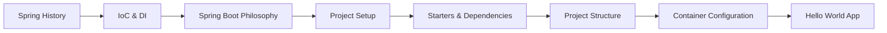

# Introduction to Spring & Spring Boot

> **Previous:** [Gradle Deep Dive](./08-gradle.md) | **Next:** [Dependency Injection & IoC Container](./10-di-container.md)

## Learning Objectives

By the end of this chapter, you will be able to:

- Trace the history of the Spring ecosystem from 2004 to the present, explaining the role of Spring Framework, Spring Boot, Spring Cloud, Spring Data, Spring Security, and related projects
- Articulate the Inversion of Control principle, distinguish it from Dependency Injection, and explain the benefits of loose coupling, testability, and lifecycle management
- Describe the Spring Boot philosophy of opinionated defaults, auto-configuration, standalone production-grade applications, and embedded servers
- Initialize a Spring Boot project using Spring Initializr (start.spring.io), IntelliJ IDEA Ultimate, VS Code with the Spring Boot Extension Pack, and the Spring Boot CLI
- Navigate and explain the standard Maven/Gradle project directory structure and the role of each directory
- Select and configure Spring Boot starters including spring-boot-starter-web, -data-jpa, -security, -test, and -actuator
- Configure the spring-boot-starter-parent POM, manage dependency versions via properties, and understand the plugin configuration
- Explain the @SpringBootApplication annotation and its constituent meta-annotations: @EnableAutoConfiguration, @ComponentScan, and @Configuration
- Swap the embedded servlet container (Tomcat, Jetty, Undertow) and configure it through application properties
- Use the Spring Boot CLI to run Groovy-based Spring applications with grab annotations
- Build and run a complete Hello World REST application step by step

## Chapter at a Glance

| Topic | Key Insight | Practical Takeaway |
|-------|-------------|--------------------|
| Spring History | 2004-2024: XML config -> Java config -> auto-configuration -> AOT | Spring evolved to reduce boilerplate |
| IoC Principle | Container manages object lifecycle and dependencies | Loose coupling through DI |
| Spring Boot | Opinionated defaults + embedded server + auto-configuration | Production app in minutes, not days |
| Starters | Curated dependency sets | One dependency instead of ten |
| Project Setup | Initializr, CLI, IDE wizards | Standardized project structure |

## Chapter Roadmap



> **Pro Tip:** For any new project, start at start.spring.io. Manually adding Spring dependencies to a bare Maven project is error-prone and wastes time.

---

## Table of Contents(#1-the-spring-ecosystem)
2. [Inversion of Control & Dependency Injection](#2-inversion-of-control--dependency-injection)
3. [Spring Boot Philosophy](#3-spring-boot-philosophy)
4. [Project Initialization](#4-project-initialization)
5. [Directory Structure](#5-directory-structure)
6. [Spring Boot Starters](#6-spring-boot-starters)
7. [Parent POM & Dependency Management](#7-parent-pom--dependency-management)
8. [The @SpringBootApplication Annotation](#8-the-springbootapplication-annotation)
9. [Embedded Servers](#9-embedded-servers)
10. [Spring Boot CLI](#10-spring-boot-cli)
11. [Hello World Application](#11-hello-world-application)
12. [Summary](#summary)
13. [Exercises](#exercises)

---

## 1. The Spring Ecosystem


Spring began in 2004 as a response to the complexity of Enterprise JavaBeans (EJB) 2.x. Rod Johnson's book **"Expert One-on-One J2EE Design and Development"** (2002) included 30,000+ lines of example code that became the foundation of the Spring Framework. The first production release, Spring Framework 1.0, shipped in March 2004.

### 1.1 The Problem Spring Solved

<a href="../../../assets/images/diagrams/java/09-spring-intro/1-1-the-problem-spring-solved-handwritten.svg" target="_blank" rel="noopener">
  
</a>
<a href="../../../assets/images/diagrams/java/09-spring-intro/1-1-the-problem-spring-solved-diagram.svg" target="_blank" rel="noopener">
  
</a>
<a href="../../../assets/images/diagrams/java/09-spring-intro/1-1-the-problem-spring-solved-sticky.svg" target="_blank" rel="noopener">
  
</a>


Before Spring, J2EE development required:

```java
// EJB 2.x → the pain Spring eliminated
public class UserManagerEJB implements SessionBean {
    private SessionContext ctx;

    // Mandatory EJB lifecycle methods → even if you don't need them
    public void ejbCreate() {}
    public void ejbRemove() {}
    public void ejbActivate() {}
    public void ejbPassivate() {}
    public void setSessionContext(SessionContext ctx) {
        this.ctx = ctx;
    }

    // Business logic buried under boilerplate
    public User findUser(Long id) {
        try {
            // JNDI lookup → tightly coupled to the container
            InitialContext ic = new InitialContext();
            DataSource ds = (DataSource) ic.lookup("java:comp/env/jdbc/MyDB");
            Connection conn = ds.getConnection();
            PreparedStatement ps = conn.prepareStatement("SELECT * FROM users WHERE id = ?");
            ps.setLong(1, id);
            ResultSet rs = ps.executeQuery();
            // ... mapping code ...
            rs.close(); ps.close(); conn.close();
            return user;
        } catch (NamingException | SQLException e) {
            throw new EJBException(e); // Checked-to-runtime wrapper required
        }
    }
}
// Deployment: XML descriptors, EAR packaging, container restart
```

Spring replaced this with **plain Java objects (POJOs)**, no mandatory interfaces, no container-dictated lifecycle:

```java
// Spring → just a POJO
public class UserManager {
    private final DataSource dataSource;

    // Constructor injection → no container dependency
    public UserManager(DataSource dataSource) {
        this.dataSource = dataSource;
    }

    public User findUser(Long id) {
        // Simple JDBC → or use JdbcTemplate for cleaner code
        try (Connection conn = dataSource.getConnection();
             PreparedStatement ps = conn.prepareStatement("SELECT * FROM users WHERE id = ?")) {
            ps.setLong(1, id);
            try (ResultSet rs = ps.executeQuery()) {
                return rs.next() ? mapUser(rs) : null;
            }
        } catch (SQLException e) {
            throw new RuntimeException(e);
        }
    }
}
```

### 1.2 Spring Framework Release History

<a href="../../../assets/images/diagrams/java/09-spring-intro/1-2-spring-framework-release-history-handwritten.svg" target="_blank" rel="noopener">
  
</a>
<a href="../../../assets/images/diagrams/java/09-spring-intro/1-2-spring-framework-release-history-diagram.svg" target="_blank" rel="noopener">
  
</a>
<a href="../../../assets/images/diagrams/java/09-spring-intro/1-2-spring-framework-release-history-sticky.svg" target="_blank" rel="noopener">
  
</a>


| Version | Year | Key Features |
|---------|------|-------------|
| 1.0 | 2004 | IoC container, AOP, JDBC abstraction, MVC web framework |
| 2.0 | 2006 | XML namespaces, AspectJ integration, JPA support |
| 2.5 | 2007 | Annotation-based configuration (@Component, @Autowired) |
| 3.0 | 2009 | Java-based @Configuration, REST support, Expression Language (SpEL) |
| 3.1 | 2011 | Environment profiles, @PropertySource, Cache abstraction |
| 4.0 | 2013 | Java 8 support, WebSocket, JMS 2.0, JPA 2.1 |
| 4.2 | 2015 | @EventListener, @CrossOrigin, streaming response body |
| 5.0 | 2017 | Reactive stack (Spring WebFlux), Kotlin support, Java 9 modularity |
| 5.3 | 2020 | RSocket, observability, data buffers, Java 17 baseline |
| 6.0 | 2022 | Java 17+ baseline, AOT (Ahead-of-Time) compilation, virtual threads support |
| 6.1 | 2023 | Virtual threads, JVM-checkpoint restore (CRaC), SSL hot reload |
| 6.2 | 2025+ | Continued AOT enhancements, GraalVM native-image improvements |

### 1.3 The Spring Projects → A Modular Ecosystem

<a href="../../../assets/images/diagrams/java/09-spring-intro/1-3-the-spring-projects-a-modular-ecosystem-handwritten.svg" target="_blank" rel="noopener">
  
</a>
<a href="../../../assets/images/diagrams/java/09-spring-intro/1-3-the-spring-projects-a-modular-ecosystem-diagram.svg" target="_blank" rel="noopener">
  
</a>
<a href="../../../assets/images/diagrams/java/09-spring-intro/1-3-the-spring-projects-a-modular-ecosystem-sticky.svg" target="_blank" rel="noopener">
  
</a>


Spring is not a single framework. It is a **family of projects** built on top of the core Spring Framework:

```text
Spring Ecosystem Map (simplified)
======================================
Spring Framework (core: IoC, AOP, MVC, Data Access)
│
├── Spring Boot        → Opinionated auto-configuration, embedded servers, starters
├── Spring Cloud       → Distributed systems (discovery, gateway, config, circuit breakers)
├── Spring Data        → Unified data access (JPA, MongoDB, Redis, Elasticsearch, etc.)
├── Spring Security    → Authentication, authorization, OAuth2/OIDC, LDAP
├── Spring Batch       → High-volume batch processing, job orchestration
├── Spring Integration → Enterprise Integration Patterns (EIP), messaging adapters
├── Spring Kafka       → Apache Kafka native support
├── Spring Modulith    → Modular monoliths, structured module boundaries
├── Spring AI          → AI SDK integration, vector stores, LLM agents, RAG
├── Spring GraphQL     → GraphQL server, DataLoader, subscription support
├── Spring Session     → Distributed session management (Redis, JDBC, Hazelcast)
├── Spring HATEOAS     → Hypermedia-driven REST APIs
├── Spring Shell       → Interactive CLI applications
└── Spring Mobile      → Device detection, mobile views (maintenance mode)
```

Each project follows the same philosophy: **POJO-centric, annotation-driven, convention over configuration**.

### 1.4 Detailed Project Descriptions

<a href="../../../assets/images/diagrams/java/09-spring-intro/1-4-detailed-project-descriptions-handwritten.svg" target="_blank" rel="noopener">
  
</a>
<a href="../../../assets/images/diagrams/java/09-spring-intro/1-4-detailed-project-descriptions-diagram.svg" target="_blank" rel="noopener">
  
</a>
<a href="../../../assets/images/diagrams/java/09-spring-intro/1-4-detailed-project-descriptions-sticky.svg" target="_blank" rel="noopener">
  
</a>


**Spring Framework** → The foundation. Provides the IoC container, AOP framework, MVC web framework (Servlets), WebFlux (reactive), transaction management, and data access support. Every other Spring project depends on it.

**Spring Boot** → Bootstraps Spring applications with minimal configuration. Auto-configures beans based on classpath dependencies, provides embedded servers (Tomcat, Jetty, Undertow), externalized configuration, health checks, and production-ready features. The de facto way to build Spring applications since 2014.

**Spring Cloud** → Tools for distributed systems: service discovery (Eureka, Consul), API gateways (Spring Cloud Gateway), distributed configuration (Config Server), circuit breakers (Resilience4j integration), distributed tracing (Micrometer + Zipkin), and load balancing.

**Spring Data** → A consistent data access programming model across relational and NoSQL databases. Provides repository abstractions: `JpaRepository`, `MongoRepository`, `ElasticsearchRepository`, `RedisRepository`. Key modules: Spring Data JPA, MongoDB, Redis, Elasticsearch, JDBC, REST, Neo4j, Gemfire.

**Spring Security** → Comprehensive authentication and authorization. Supports form-based login, HTTP Basic, Digest, LDAP, OAuth2 (authorization server and resource server), OpenID Connect (OIDC), SAML 2.0, ACL-based, method security, and reactive security.

**Spring Batch** → Batch processing: read-process-write chunks, partitioning, job restart, skip/retry, multi-threaded steps, job repository, scheduling integration.

**Spring Integration** → Enterprise Integration Patterns (EIP): channels, routers, transformers, filters, gateways, service activators. Connects systems via JMS, AMQP, Kafka, MQTT, FTP/SFTP, file system, TCP/UDP, mail.

**Spring AI** → Latest addition (2024+). Integrates AI SDKs (OpenAI, Anthropic, Ollama, Hugging Face), vector stores (pgvector, Pinecone, Chroma), embeddings, and RAG patterns into the Spring programming model.

**Spring Modulith** → Modular monolith architecture. Enforces module boundaries, verifies package dependencies, generates C4 diagrams, supports event-driven communication between modules, and provides a migration path to microservices.

**Spring GraalVM Native** → Compiles Spring applications to native executables via GraalVM native-image. Reduces startup time to milliseconds and memory footprint significantly.

### 1.5 When to Use What

<a href="../../../assets/images/diagrams/java/09-spring-intro/1-5-when-to-use-what-handwritten.svg" target="_blank" rel="noopener">
  
</a>
<a href="../../../assets/images/diagrams/java/09-spring-intro/1-5-when-to-use-what-diagram.svg" target="_blank" rel="noopener">
  
</a>
<a href="../../../assets/images/diagrams/java/09-spring-intro/1-5-when-to-use-what-sticky.svg" target="_blank" rel="noopener">
  
</a>


```text
Project Type                          | Recommended Stack
--------------------------------------|---------------------------------------------
Monolithic web app (CRUD)            | Spring Boot + Spring Data JPA + Thymeleaf/React
REST API (microservice)              | Spring Boot + Spring Data JPA + Spring Security
Distributed microservices            | Spring Boot + Spring Cloud + Spring Cloud Gateway
Event-driven system                  | Spring Boot + Spring Kafka + Spring Integration
Reactive, high-concurrency          | Spring Boot + WebFlux + R2DBC + Spring Data MongoDB
Batch processing (ETL, reports)      | Spring Boot + Spring Batch + Spring Data JPA
Modular monolith (scalable)          | Spring Boot + Spring Modulith + Spring Data JPA
AI-augmented application             | Spring Boot + Spring AI + pgvector + Spring Data
GraphQL API                          | Spring Boot + Spring GraphQL + Spring Data
```

### 1.6 Spring Community & Governance

<a href="../../../assets/images/diagrams/java/09-spring-intro/1-6-spring-community-governance-handwritten.svg" target="_blank" rel="noopener">
  
</a>
<a href="../../../assets/images/diagrams/java/09-spring-intro/1-6-spring-community-governance-diagram.svg" target="_blank" rel="noopener">
  
</a>
<a href="../../../assets/images/diagrams/java/09-spring-intro/1-6-spring-community-governance-sticky.svg" target="_blank" rel="noopener">
  
</a>


Spring is developed under the **Apache 2.0 license** and governed by **VMware (Broadcom)** since the Pivotal acquisition in 2019. The core team includes:

- **Rod Johnson** → Founder, created Spring Framework 1.0 (left 2012)
- **Juergen Hoeller** → Core committer since 2003, lead of Spring Framework
- **Stéphane Nicoll** → Spring Boot lead
- **Andy Wilkinson** → Spring Boot build and release
- **Rossen Stoyanchev** → Reactive/WebFlux lead
- **Rob Winch** → Spring Security lead

The community is vast: 900+ contributors, 40,000+ stars on GitHub, and the largest annual conference (SpringOne) draws thousands of developers. The ecosystem has been the most popular Java framework for over a decade, used by startups and Fortune 500 companies alike.

---

## 2. Inversion of Control & Dependency Injection

### 2.1 The Hollywood Principle

<a href="../../../assets/images/diagrams/java/09-spring-intro/2-1-the-hollywood-principle-handwritten.svg" target="_blank" rel="noopener">
  
</a>
<a href="../../../assets/images/diagrams/java/09-spring-intro/2-1-the-hollywood-principle-diagram.svg" target="_blank" rel="noopener">
  
</a>
<a href="../../../assets/images/diagrams/java/09-spring-intro/2-1-the-hollywood-principle-sticky.svg" target="_blank" rel="noopener">
  
</a>


Inversion of Control (IoC) is captured by the **Hollywood Principle**: *"Don't call us, we'll call you."*

In traditional procedural programming, your code calls into library functions. In an IoC container, the framework controls the flow and calls your code:

```text
Traditional programming:
  main() → calls library functions → returns → done

IoC container:
  Container starts → scans for beans → resolves dependencies →
  calls your code (callbacks) → manages lifecycle → done
```

### 2.2 Traditional (Tightly Coupled) Approach

<a href="../../../assets/images/diagrams/java/09-spring-intro/2-2-traditional-tightly-coupled-approach-handwritten.svg" target="_blank" rel="noopener">
  
</a>
<a href="../../../assets/images/diagrams/java/09-spring-intro/2-2-traditional-tightly-coupled-approach-diagram.svg" target="_blank" rel="noopener">
  
</a>
<a href="../../../assets/images/diagrams/java/09-spring-intro/2-2-traditional-tightly-coupled-approach-sticky.svg" target="_blank" rel="noopener">
  
</a>


```java
// Tight coupling → Service creates its own dependencies
public class EmailService {
    private SmtpServer smtpServer;

    public EmailService() {
        // The service is responsible for creating its transport layer
        this.smtpServer = new SmtpServer("smtp.gmail.com", 587);
    }

    public void send(String to, String body) {
        smtpServer.send(to, body);
    }
}
```

Problems with this approach:

1. **Hard to test** → You cannot replace `SmtpServer` with a mock in unit tests
2. **Hard to change** → Switching from SMTP to an API-based email provider requires changing the service code
3. **Hidden dependencies** → The constructor signature does not reveal what the class needs
4. **No lifecycle management** → Connection pooling, retry logic, and resource cleanup become scattered

### 2.3 Dependency Injection (the IoC Implementation)

<a href="../../../assets/images/diagrams/java/09-spring-intro/2-3-dependency-injection-the-ioc-implementation-handwritten.svg" target="_blank" rel="noopener">
  
</a>
<a href="../../../assets/images/diagrams/java/09-spring-intro/2-3-dependency-injection-the-ioc-implementation-diagram.svg" target="_blank" rel="noopener">
  
</a>
<a href="../../../assets/images/diagrams/java/09-spring-intro/2-3-dependency-injection-the-ioc-implementation-sticky.svg" target="_blank" rel="noopener">
  
</a>


Dependency Injection (DI) is the primary way Spring implements IoC. Instead of the class creating its own dependencies, the **container injects them**:

```java
// Loose coupling → dependencies are injected, not created
public class EmailService {
    private final MailSender mailSender;

    // Constructor Injection → dependencies passed by the container
    public EmailService(MailSender mailSender) {
        this.mailSender = mailSender;
    }

    public void send(String to, String body) {
        mailSender.send(to, body);
    }
}
```

### 2.4 The Three Forms of Injection

<a href="../../../assets/images/diagrams/java/09-spring-intro/2-4-the-three-forms-of-injection-handwritten.svg" target="_blank" rel="noopener">
  
</a>
<a href="../../../assets/images/diagrams/java/09-spring-intro/2-4-the-three-forms-of-injection-diagram.svg" target="_blank" rel="noopener">
  
</a>
<a href="../../../assets/images/diagrams/java/09-spring-intro/2-4-the-three-forms-of-injection-sticky.svg" target="_blank" rel="noopener">
  
</a>


Spring supports three injection styles:

**Constructor Injection (preferred):**

```java
@Component
public class OrderService {
    private final PaymentGateway paymentGateway;
    private final InventoryService inventoryService;

    // The container calls this constructor with resolved dependencies
    public OrderService(PaymentGateway paymentGateway,
                       InventoryService inventoryService) {
        this.paymentGateway = paymentGateway;
        this.inventoryService = inventoryService;
    }
}
```

Benefits: immutable fields, mandatory dependencies, easier testing with `new`, no reflection-based injection at runtime.

**Setter Injection (optional dependencies):**

```java
@Component
public class NotificationService {
    private MailSender mailSender;
    private SmsSender smsSender;  // optional

    @Autowired  // tells Spring to inject this dependency via the setter
    public void setMailSender(MailSender mailSender) {
        this.mailSender = mailSender;
    }

    @Autowired(required = false)  // if no SmsSender bean exists, skip
    public void setSmsSender(SmsSender smsSender) {
        this.smsSender = smsSender;
    }
}
```

Suitable for optional dependencies that can be reconfigured at runtime.

**Field Injection (not recommended):**

```java
@Component
public class ReportService {
    @Autowired  // injects directly into the private field via reflection
    private ReportRepository repository;
}
```

Problems: no way to create the object without the container, violates encapsulation, hides dependencies, impossible to unit test without reflection support.

### 2.5 Spring IoC Container → Inside Out

<a href="../../../assets/images/diagrams/java/09-spring-intro/2-5-spring-ioc-container-inside-out-handwritten.svg" target="_blank" rel="noopener">
  
</a>
<a href="../../../assets/images/diagrams/java/09-spring-intro/2-5-spring-ioc-container-inside-out-diagram.svg" target="_blank" rel="noopener">
  
</a>
<a href="../../../assets/images/diagrams/java/09-spring-intro/2-5-spring-ioc-container-inside-out-sticky.svg" target="_blank" rel="noopener">
  
</a>


The IoC container is represented by two main interfaces:

```java
// BeanFactory → the simplest container (lazy initialization)
org.springframework.beans.factory.BeanFactory

// ApplicationContext → the full container (eager initialization, events, AOP)
org.springframework.context.ApplicationContext
```

The `ApplicationContext` (the most commonly used) provides:

- **Bean instantiation and wiring** → Creates and assembles beans
- **Lifecycle management** → `@PostConstruct`, `@PreDestroy`, `InitializingBean`, `DisposableBean`
- **AOP integration** → Aspect-oriented weaving
- **Internationalization** → `MessageSource` for i18n
- **Event publishing** → Application events with `@EventListener`
- **Environment abstraction** → Profiles and property sources
- **Resource loading** → `ResourceLoader` for file, URL, classpath resources

### 2.6 XML-Based Configuration (Legacy)

<a href="../../../assets/images/diagrams/java/09-spring-intro/2-6-xml-based-configuration-legacy-handwritten.svg" target="_blank" rel="noopener">
  
</a>
<a href="../../../assets/images/diagrams/java/09-spring-intro/2-6-xml-based-configuration-legacy-diagram.svg" target="_blank" rel="noopener">
  
</a>
<a href="../../../assets/images/diagrams/java/09-spring-intro/2-6-xml-based-configuration-legacy-sticky.svg" target="_blank" rel="noopener">
  
</a>


Before annotations, all Spring configuration was XML. You still encounter this in legacy projects:

```xml
<?xml version="1.0" encoding="UTF-8"?>
<beans xmlns="http://www.springframework.org/schema/beans"
       xmlns:xsi="http://www.w3.org/2001/XMLSchema-instance"
       xsi:schemaLocation="
           http://www.springframework.org/schema/beans
           http://www.springframework.org/schema/beans/spring-beans.xsd">

    <!-- Bean declaration with constructor injection -->
    <bean id="emailService" class="com.example.EmailService">
        <constructor-arg ref="smtpServer"/>
    </bean>

    <!-- Bean declaration with property values -->
    <bean id="smtpServer" class="com.example.SmtpServer">
        <constructor-arg name="host" value="smtp.gmail.com"/>
        <constructor-arg name="port" value="587"/>
    </bean>

    <!-- Inner bean and factory method -->
    <bean id="connectionPool" class="com.zaxxer.hikari.HikariDataSource"
          factory-method="forConnection">
        <property name="jdbcUrl" value="jdbc:postgresql://localhost:5432/mydb"/>
        <property name="username" value="app"/>
        <property name="password" value="secret"/>
    </bean>
</beans>
```

Loading the XML context:

```java
ApplicationContext ctx = new ClassPathXmlApplicationContext("applicationContext.xml");
EmailService service = ctx.getBean(EmailService.class);
```

### 2.7 Java-Based Configuration (Modern)

<a href="../../../assets/images/diagrams/java/09-spring-intro/2-7-java-based-configuration-modern-handwritten.svg" target="_blank" rel="noopener">
  
</a>
<a href="../../../assets/images/diagrams/java/09-spring-intro/2-7-java-based-configuration-modern-diagram.svg" target="_blank" rel="noopener">
  
</a>
<a href="../../../assets/images/diagrams/java/09-spring-intro/2-7-java-based-configuration-modern-sticky.svg" target="_blank" rel="noopener">
  
</a>


Modern Spring Boot uses Java-based configuration almost exclusively:

```java
// Equivalent to the XML above
@Configuration
public class AppConfig {

    @Bean
    public SmtpServer smtpServer() {
        return new SmtpServer("smtp.gmail.com", 587);
    }

    @Bean
    public EmailService emailService(SmtpServer smtpServer) {
        return new EmailService(smtpServer);
    }

    @Bean
    public DataSource dataSource() {
        HikariDataSource ds = new HikariDataSource();
        ds.setJdbcUrl("jdbc:postgresql://localhost:5432/mydb");
        ds.setUsername("app");
        ds.setPassword("secret");
        return ds;
    }
}
```

### 2.8 Benefits of IoC/DI → Detailed

<a href="../../../assets/images/diagrams/java/09-spring-intro/2-8-benefits-of-ioc-di-detailed-handwritten.svg" target="_blank" rel="noopener">
  
</a>
<a href="../../../assets/images/diagrams/java/09-spring-intro/2-8-benefits-of-ioc-di-detailed-diagram.svg" target="_blank" rel="noopener">
  
</a>
<a href="../../../assets/images/diagrams/java/09-spring-intro/2-8-benefits-of-ioc-di-detailed-sticky.svg" target="_blank" rel="noopener">
  
</a>


**Loose Coupling:**

```java
// Using interfaces, the consumer depends on abstraction, not implementation
public interface PaymentGateway {
    PaymentResult charge(Long orderId, BigDecimal amount);
}

@Component
public class PaymentService {
    private final PaymentGateway gateway;     // depends on interface

    public PaymentService(PaymentGateway gateway) { // any implementation
        this.gateway = gateway;
    }
}

@Component
public class StripePaymentGateway implements PaymentGateway { ... }

@Component
public class PayPalPaymentGateway implements PaymentGateway { ... }
```

**Testability:**

```java
// Unit test without Spring
class PaymentServiceTest {
    @Test
    void testSuccessfulPayment() {
        PaymentGateway mock = mock(PaymentGateway.class);
        when(mock.charge(anyLong(), any())).thenReturn(PaymentResult.success());

        PaymentService service = new PaymentService(mock);  // manual DI

        var result = service.processOrder(42L, new BigDecimal("19.99"));

        assertThat(result.isSuccess()).isTrue();
        verify(mock).charge(42L, new BigDecimal("19.99"));
    }
}
```

**Lifecycle Management:**

```java
@Component
public class DatabaseConnectionManager {
    private ConnectionPool pool;

    @PostConstruct
    public void init() {
        // Called after all dependencies are injected and bean is fully configured
        pool = new ConnectionPool("jdbc:postgresql://...", 10, 50);
        pool.initialize();
        logger.info("Connection pool initialized with {} connections", pool.getSize());
    }

    @PreDestroy
    public void cleanup() {
        // Called before the bean is destroyed by the container
        pool.shutdown();
        logger.info("Connection pool shut down");
    }
}
```

**Scope Management:**

```java
@Component
@Scope("singleton")  // default → one instance per container
public class AppCache { ... }

@Component
@Scope("prototype")  // new instance for every injection point
public class RequestBuilder { ... }

@Component
@Scope("request")    // one instance per HTTP request (web-aware context)
@Scope("session")    // one instance per HTTP session
@Scope("application")// one instance per ServletContext
```

### 2.9 Spring IoC Container Internals → Simplified

<a href="../../../assets/images/diagrams/java/09-spring-intro/2-9-spring-ioc-container-internals-simplified-handwritten.svg" target="_blank" rel="noopener">
  
</a>
<a href="../../../assets/images/diagrams/java/09-spring-intro/2-9-spring-ioc-container-internals-simplified-diagram.svg" target="_blank" rel="noopener">
  
</a>
<a href="../../../assets/images/diagrams/java/09-spring-intro/2-9-spring-ioc-container-internals-simplified-sticky.svg" target="_blank" rel="noopener">
  
</a>


```text
                         SpringApplication.run()
                                  │
                                  ▼
                     ┌─────────────────────┐
                     │   ClassPathScanner   │
                     │   (@ComponentScan)   │
                     └─────────┬───────────┘
                               │
                 Scanned classes found
                               │
                               ▼
                     ┌─────────────────────┐
                     │   BeanDefinition     │
                     │   Registry           │
                     │   (all @Component,   │
                     │    @Bean methods,    │
                     │    XML <bean>)       │
                     └─────────┬───────────┘
                               │
                     dependency graph built
                               │
                               ▼
                     ┌─────────────────────┐
                     │   BeanFactory        │
                     │   (instantiation &   │
                     │    injection)        │
                     └─────────┬───────────┘
                               │
                    Singletons created, 
                    @PostConstruct called
                               │
                               ▼
                     ┌─────────────────────┐
                     │ Ready Application    │
                     │ Context              │
                     │ (all beans wired,    │
                     │  embedded server up) │
                     └─────────────────────┘
```

---

## 3. Spring Boot Philosophy

### 3.1 The Problem Spring Boot Solves

<a href="../../../assets/images/diagrams/java/09-spring-intro/3-1-the-problem-spring-boot-solves-handwritten.svg" target="_blank" rel="noopener">
  
</a>
<a href="../../../assets/images/diagrams/java/09-spring-intro/3-1-the-problem-spring-boot-solves-diagram.svg" target="_blank" rel="noopener">
  
</a>
<a href="../../../assets/images/diagrams/java/09-spring-intro/3-1-the-problem-spring-boot-solves-sticky.svg" target="_blank" rel="noopener">
  
</a>


Before Spring Boot, setting up a Spring application involved:

```xml
<!-- Typical pom.xml circa 2013 → dozens of manual version matches -->
<properties>
    <spring.version>4.0.5.RELEASE</spring.version>
    <spring-security.version>3.2.5.RELEASE</spring-security.version>
    <hibernate.version>4.3.6.Final</hibernate.version>
    <jackson.version>2.4.3</jackson.version>
    <slf4j.version>1.7.12</slf4j.version>
    <logback.version>1.1.2</logback.version>
</properties>

<dependencies>
    <dependency>
        <groupId>org.springframework</groupId>
        <artifactId>spring-webmvc</artifactId>
        <version>${spring.version}</version>
    </dependency>
    <dependency>
        <groupId>org.springframework</groupId>
        <artifactId>spring-orm</artifactId>
        <version>${spring.version}</version>
    </dependency>
    <dependency>
        <groupId>org.springframework.security</groupId>
        <artifactId>spring-security-web</artifactId>
        <version>${spring-security.version}</version>
    </dependency>
    <!-- ... 20+ more dependencies, managing versions manually ... -->
</dependencies>
```

Plus XML configuration for component scanning, annotation-driven MVC, view resolvers, data source, transaction manager, Jackson, message converters, and more.

**Spring Boot reduced this to:**

```xml
<parent>
    <groupId>org.springframework.boot</groupId>
    <artifactId>spring-boot-starter-parent</artifactId>
    <version>3.4.0</version>
</parent>

<dependencies>
    <dependency>
        <groupId>org.springframework.boot</groupId>
        <artifactId>spring-boot-starter-web</artifactId>
    </dependency>
</dependencies>
```

### 3.2 Core Tenets of Spring Boot

<a href="../../../assets/images/diagrams/java/09-spring-intro/3-2-core-tenets-of-spring-boot-handwritten.svg" target="_blank" rel="noopener">
  
</a>
<a href="../../../assets/images/diagrams/java/09-spring-intro/3-2-core-tenets-of-spring-boot-diagram.svg" target="_blank" rel="noopener">
  
</a>
<a href="../../../assets/images/diagrams/java/09-spring-intro/3-2-core-tenets-of-spring-boot-sticky.svg" target="_blank" rel="noopener">
  
</a>


**Opinionated Defaults:**

Spring Boot makes decisions for you based on what it finds on the classpath. If you have `spring-boot-starter-web` on the classpath, Spring Boot assumes you want:

- An embedded Tomcat server on port 8080
- Spring MVC with Jackson for JSON serialization
- Logback for logging
- A standard error page
- And dozens of other sensible defaults

All of these can be overridden, but the defaults work for 80% of use cases.

**Auto-Configuration:**

`@EnableAutoConfiguration` (included in `@SpringBootApplication`) triggers hundreds of auto-configuration classes. Each class checks conditions:

```java
// Simplified example → Spring Boot's actual DataSourceAutoConfiguration
@AutoConfiguration
@ConditionalOnClass(DataSource.class)         // is H2/PostgreSQL on the classpath?
@ConditionalOnMissingBean(DataSource.class)   // did the user define their own?
@EnableConfigurationProperties(DataSourceProperties.class)
public class DataSourceAutoConfiguration {

    @Bean
    @ConditionalOnMissingBean
    public DataSource dataSource(DataSourceProperties properties) {
        // Creates an HikariCP DataSource with sensible defaults
        return properties.initializeDataSourceBuilder()
            .build();
    }
}
```

The `@Conditional*` annotations make auto-configuration smart:

| Annotation | Triggers When |
|-----------|---------------|
| `@ConditionalOnClass` | A class is on the classpath |
| `@ConditionalOnMissingBean` | No bean of this type exists |
| `@ConditionalOnProperty` | A property has a specific value |
| `@ConditionalOnExpression` | A SpEL expression evaluates to true |
| `@ConditionalOnResource` | A resource file exists |
| `@ConditionalOnWebApplication` | The application is a web app |
| `@ConditionalOnNotWebApplication` | The application is not a web app |
| `@ConditionalOnJava` | A specific Java version is detected |
| `@ConditionalOnEnabledHealthIndicator` | An Actuator health indicator is enabled |

**Standalone Production-Grade:**

Spring Boot apps are run with `java -jar myapp.jar`. No application server installation is needed. The JAR bundles everything → class files, dependencies, and the embedded server → in a single executable archive.

**Reduced Boilerplate:**

Compare a pre-Boot Spring MVC application setup with Spring Boot:

```java
// Pre-Boot: Manual configuration
@Configuration
@EnableWebMvc
@ComponentScan("com.example")
public class WebConfig implements WebMvcConfigurer {
    @Bean
    public ViewResolver viewResolver() {
        InternalResourceViewResolver resolver = new InternalResourceViewResolver();
        resolver.setPrefix("/WEB-INF/jsp/");
        resolver.setSuffix(".jsp");
        return resolver;
    }

    @Bean
    public MessageSource messageSource() {
        ReloadableResourceBundleMessageSource ms = new ReloadableResourceBundleMessageSource();
        ms.setBasename("classpath:messages");
        ms.setDefaultEncoding("UTF-8");
        return ms;
    }

    @Override
    public void configureDefaultServletHandling(DefaultServletHandlerConfigurer configurer) {
        configurer.enable();
    }
}

// Boot: Zero configuration
// Just add spring-boot-starter-web and Thymeleaf/Freemarker on classpath
```

### 3.3 Production-Ready Features

<a href="../../../assets/images/diagrams/java/09-spring-intro/3-3-production-ready-features-handwritten.svg" target="_blank" rel="noopener">
  
</a>
<a href="../../../assets/images/diagrams/java/09-spring-intro/3-3-production-ready-features-diagram.svg" target="_blank" rel="noopener">
  
</a>
<a href="../../../assets/images/diagrams/java/09-spring-intro/3-3-production-ready-features-sticky.svg" target="_blank" rel="noopener">
  
</a>


Spring Boot Actuator adds production monitoring with zero code:

```xml
<dependency>
    <groupId>org.springframework.boot</groupId>
    <artifactId>spring-boot-starter-actuator</artifactId>
</dependency>
```

```properties
# application.properties
management.endpoints.web.exposure.include=health,info,metrics,env,beans
```

```bash
# Production health check
curl http://localhost:8080/actuator/health
{"status":"UP"}

# Detailed metrics
curl http://localhost:8080/actuator/metrics
```

### 3.4 Spring Boot Versus Spring Framework

<a href="../../../assets/images/diagrams/java/09-spring-intro/3-4-spring-boot-versus-spring-framework-handwritten.svg" target="_blank" rel="noopener">
  
</a>
<a href="../../../assets/images/diagrams/java/09-spring-intro/3-4-spring-boot-versus-spring-framework-diagram.svg" target="_blank" rel="noopener">
  
</a>
<a href="../../../assets/images/diagrams/java/09-spring-intro/3-4-spring-boot-versus-spring-framework-sticky.svg" target="_blank" rel="noopener">
  
</a>


```text
Aspect              | Spring Framework        | Spring Boot
--------------------|------------------------|-----------------------------
Configuration       | Manual XML/Java config  | Auto-configuration + starters
Server              | External (Tomcat/Jetty) | Embedded (Tomcat default)
Packaging           | WAR file                | Executable JAR
Deployment          | Application server      | java -jar
Dependency Mgmt     | Manual versions         | Starter POM managed versions
Production Features | None built-in           | Actuator (health, metrics)
Startup Time        | Slower (deploy + start) | Faster (embedded, auto-config)
Flexibility         | Maximum control         | Opinionated (configurable)
```

---

## 4. Project Initialization

### 4.1 Spring Initializr (start.spring.io)

<a href="../../../assets/images/diagrams/java/09-spring-intro/4-1-spring-initializr-start-spring-io-handwritten.svg" target="_blank" rel="noopener">
  
</a>
<a href="../../../assets/images/diagrams/java/09-spring-intro/4-1-spring-initializr-start-spring-io-diagram.svg" target="_blank" rel="noopener">
  
</a>
<a href="../../../assets/images/diagrams/java/09-spring-intro/4-1-spring-initializr-start-spring-io-sticky.svg" target="_blank" rel="noopener">
  
</a>


The easiest way to create a Spring Boot project. Visit `https://start.spring.io` in any browser:

```text
Spring Initializr Web UI → Fields
==================================
Project:          Gradle (Kotlin)  |  Gradle (Groovy)  |  Maven
Language:         Java  |  Kotlin  |  Groovy
Spring Boot:      3.4.0 (latest stable)  |  3.3.x  |  3.2.x
Group:            com.example
Artifact:         my-app
Name:             my-app
Description:      Demo project for Spring Boot
Package name:     com.example.myapp
Packaging:        Jar  |  War
Java:             21  |  17  |  11

Dependencies:
  ┌─ Spring Web         (spring-boot-starter-web)
  ├─ Spring Data JPA    (spring-boot-starter-data-jpa)
  ├─ Spring Security    (spring-boot-starter-security)
  ├─ Spring Boot Actuator (spring-boot-starter-actuator)
  ├─ PostgreSQL Driver  (postgresql)
  ├─ Lombok             (lombok)
  ├─ Spring Boot DevTools (spring-boot-devtools)
  └─ Validation         (spring-boot-starter-validation)
```

Click **Generate** to download a ZIP with the full project skeleton.

### 4.2 IntelliJ IDEA Ultimate

<a href="../../../assets/images/diagrams/java/09-spring-intro/4-2-intellij-idea-ultimate-handwritten.svg" target="_blank" rel="noopener">
  
</a>
<a href="../../../assets/images/diagrams/java/09-spring-intro/4-2-intellij-idea-ultimate-diagram.svg" target="_blank" rel="noopener">
  
</a>
<a href="../../../assets/images/diagrams/java/09-spring-intro/4-2-intellij-idea-ultimate-sticky.svg" target="_blank" rel="noopener">
  
</a>


IntelliJ IDEA Ultimate has built-in Spring Initializr integration:

```text
File → New → Project...
  ├── New Project → Spring Boot
  │   ├── Language: Java
  │   ├── Type: Maven  |  Gradle
  │   ├── JDK: 21
  │   ├── Java: 21
  │   └── Spring Boot: 3.4.0
  │
  ├── Project Metadata
  │   ├── Group: com.example
  │   ├── Artifact: my-app
  │   ├── Package: com.example.myapp
  │   └── Dependencies → Add: Spring Web, Spring Data JPA, etc.
  │
  └── Finish
```

IntelliJ downloads the same Initializr template and opens it as a ready-to-run project. Community Edition does NOT have Spring Boot Initializr → use start.spring.io.

### 4.3 VS Code with Spring Boot Extension Pack

<a href="../../../assets/images/diagrams/java/09-spring-intro/4-3-vs-code-with-spring-boot-extension-pack-handwritten.svg" target="_blank" rel="noopener">
  
</a>
<a href="../../../assets/images/diagrams/java/09-spring-intro/4-3-vs-code-with-spring-boot-extension-pack-diagram.svg" target="_blank" rel="noopener">
  
</a>
<a href="../../../assets/images/diagrams/java/09-spring-intro/4-3-vs-code-with-spring-boot-extension-pack-sticky.svg" target="_blank" rel="noopener">
  
</a>


Install the Spring Boot Extension Pack:

```bash
# VS Code extensions marketplace
code --install-extension vmware.vscode-spring-boot
code --install-extension vscjava.vscode-spring-initializr
code --install-extension vscjava.vscode-spring-boot-dashboard
```

Then:

```text
Ctrl+Shift+P → Spring Initializr → Create a Maven/Gradle Project
  → Specify Spring Boot version (3.4.0)
  → Specify language (Java)
  → Specify Group Id, Artifact Id
  → Select dependencies (Web, JPA, etc.)
  → Choose output location
  → Open the generated project
```

### 4.4 Spring Boot CLI

<a href="../../../assets/images/diagrams/java/09-spring-intro/4-4-spring-boot-cli-handwritten.svg" target="_blank" rel="noopener">
  
</a>
<a href="../../../assets/images/diagrams/java/09-spring-intro/4-4-spring-boot-cli-diagram.svg" target="_blank" rel="noopener">
  
</a>
<a href="../../../assets/images/diagrams/java/09-spring-intro/4-4-spring-boot-cli-sticky.svg" target="_blank" rel="noopener">
  
</a>


The Spring Boot CLI provides the `spring init` command for terminal-based project creation:

```bash
# Install Spring Boot CLI via SDKMAN
sdk install springboot

# Verify installation
spring --version
# Spring CLI v3.4.0

# Create a project from the command line
spring init \
  --build=maven \
  --java-version=21 \
  --group-id=com.example \
  --artifact-id=my-app \
  --name=my-app \
  --dependencies=web,data-jpa,postgresql,lombok,actuator \
  my-app.zip

# Unzip and explore
unzip my-app.zip -d my-app
cd my-app

# Create a simpler project in a directory
mkdir hello-world
cd hello-world
spring init --build=maven --java-version=21 --dependencies=web .
```

**Available Spring CLI commands:**

```bash
spring init          # Create a new project (uses start.spring.io)
spring run           # Run a Groovy script without compilation
spring test          # Run tests
spring jar           # Create an executable JAR
spring war           # Create an executable WAR
spring install       # Install Spring Boot CLI shell completions
spring shell         # Interactive shell
```

### 4.5 Manual Maven Project Setup

<a href="../../../assets/images/diagrams/java/09-spring-intro/4-5-manual-maven-project-setup-handwritten.svg" target="_blank" rel="noopener">
  
</a>
<a href="../../../assets/images/diagrams/java/09-spring-intro/4-5-manual-maven-project-setup-diagram.svg" target="_blank" rel="noopener">
  
</a>
<a href="../../../assets/images/diagrams/java/09-spring-intro/4-5-manual-maven-project-setup-sticky.svg" target="_blank" rel="noopener">
  
</a>


You can also create a Spring Boot project entirely from scratch:

```bash
mkdir my-app
cd my-app
mkdir -p src/main/java/com/example/myapp
mkdir -p src/main/resources
mkdir -p src/test/java/com/example/myapp
```

```xml
<!-- pom.xml -->
<?xml version="1.0" encoding="UTF-8"?>
<project xmlns="http://maven.apache.org/POM/4.0.0"
         xmlns:xsi="http://www.w3.org/2001/XMLSchema-instance"
         xsi:schemaLocation="
             http://maven.apache.org/POM/4.0.0
             https://maven.apache.org/xsd/maven-4.0.0.xsd">
    <modelVersion>4.0.0</modelVersion>

    <parent>
        <groupId>org.springframework.boot</groupId>
        <artifactId>spring-boot-starter-parent</artifactId>
        <version>3.4.0</version>
        <relativePath/>
    </parent>

    <groupId>com.example</groupId>
    <artifactId>my-app</artifactId>
    <version>0.0.1-SNAPSHOT</version>
    <name>my-app</name>
    <description>Demo project for Spring Boot</description>

    <properties>
        <java.version>21</java.version>
    </properties>

    <dependencies>
        <dependency>
            <groupId>org.springframework.boot</groupId>
            <artifactId>spring-boot-starter-web</artifactId>
        </dependency>
    </dependencies>

    <build>
        <plugins>
            <plugin>
                <groupId>org.springframework.boot</groupId>
                <artifactId>spring-boot-maven-plugin</artifactId>
            </plugin>
        </plugins>
    </build>
</project>
```

```java
// src/main/java/com/example/myapp/MyAppApplication.java
package com.example.myapp;

import org.springframework.boot.SpringApplication;
import org.springframework.boot.autoconfigure.SpringBootApplication;

@SpringBootApplication
public class MyAppApplication {

    public static void main(String[] args) {
        SpringApplication.run(MyAppApplication.class, args);
    }
}
```

---

## 5. Directory Structure

### 5.1 Standard Maven/Gradle Layout

<a href="../../../assets/images/diagrams/java/09-spring-intro/5-1-standard-maven-gradle-layout-handwritten.svg" target="_blank" rel="noopener">
  
</a>
<a href="../../../assets/images/diagrams/java/09-spring-intro/5-1-standard-maven-gradle-layout-diagram.svg" target="_blank" rel="noopener">
  
</a>
<a href="../../../assets/images/diagrams/java/09-spring-intro/5-1-standard-maven-gradle-layout-sticky.svg" target="_blank" rel="noopener">
  
</a>


Every Spring Boot project follows a standard layout:

```text
my-app/
│
├── pom.xml                              # Maven build file (or build.gradle for Gradle)
│
├── src/
│   ├── main/
│   │   ├── java/                        # Java source files
│   │   │   └── com/example/myapp/
│   │   │       ├── MyAppApplication.java       # Main class (@SpringBootApplication)
│   │   │       ├── controller/                 # REST controllers
│   │   │       ├── service/                    # Business logic
│   │   │       ├── repository/                 # Data access (JPA repositories)
│   │   │       ├── model/                      # Entities / DTOs
│   │   │       ├── config/                     # @Configuration classes
│   │   │       ├── dto/                        # Data Transfer Objects
│   │   │       ├── exception/                  # Custom exceptions / handlers
│   │   │       └── util/                       # Utility classes
│   │   │
│   │   └── resources/                   # Application resources
│   │       ├── application.properties   # Primary configuration (or application.yml)
│   │       ├── application-dev.yml      # Profile-specific config (development)
│   │       ├── application-prod.yml     # Profile-specific config (production)
│   │       ├── static/                  # Static resources (CSS, JS, images)
│   │       │   ├── css/
│   │       │   ├── js/
│   │       │   └── images/
│   │       ├── templates/               # Server-side templates (Thymeleaf, Freemarker)
│   │       ├── messages.properties      # i18n message bundles
│   │       ├── messages_es.properties
│   │       ├── messages_fr.properties
│   │       ├── banner.txt               # Custom ASCII art banner
│   │       ├── logback-spring.xml       # Logging configuration (optional)
│   │       └── db/migration/            # Flyway/Liquibase migration scripts
│   │           ├── V1__init_schema.sql
│   │           └── V2__add_indexes.sql
│   │
│   └── test/
│       └── java/                        # Test source files
│           └── com/example/myapp/
│               ├── MyAppApplicationTests.java       # Context load test
│               ├── controller/
│               │   └── HelloControllerTest.java
│               └── service/
│                   └── UserServiceTest.java
│
├── .gitignore
├── README.md
├── HELP.md                              # Spring Initializr-generated help
├── mvnw                                 # Maven Wrapper (Unix)
├── mvnw.cmd                             # Maven Wrapper (Windows)
└── .mvn/
    └── wrapper/
        └── maven-wrapper.properties
```

### 5.2 The main/java Directory

<a href="../../../assets/images/diagrams/java/09-spring-intro/5-2-the-main-java-directory-handwritten.svg" target="_blank" rel="noopener">
  
</a>
<a href="../../../assets/images/diagrams/java/09-spring-intro/5-2-the-main-java-directory-diagram.svg" target="_blank" rel="noopener">
  
</a>
<a href="../../../assets/images/diagrams/java/09-spring-intro/5-2-the-main-java-directory-sticky.svg" target="_blank" rel="noopener">
  
</a>


This is where all application source code lives. Package structure typically follows a **layered architecture**:

```text
com.example.myapp/
  ├── MyAppApplication.java          # Application entry point
  ├── controller/                    # REST API endpoints
  │   ├── GreetingController.java
  │   └── UserController.java
  ├── service/                       # Business logic
  │   ├── GreetingService.java
  │   └── UserService.java
  ├── repository/                    # Database access
  │   └── UserRepository.java
  ├── model/                         # JPA entities
  │   └── User.java
  └── config/                        # Configuration classes
      ├── SecurityConfig.java
      └── AppConfig.java
```

### 5.3 The main/resources Directory

<a href="../../../assets/images/diagrams/java/09-spring-intro/5-3-the-main-resources-directory-handwritten.svg" target="_blank" rel="noopener">
  
</a>
<a href="../../../assets/images/diagrams/java/09-spring-intro/5-3-the-main-resources-directory-diagram.svg" target="_blank" rel="noopener">
  
</a>
<a href="../../../assets/images/diagrams/java/09-spring-intro/5-3-the-main-resources-directory-sticky.svg" target="_blank" rel="noopener">
  
</a>


Contains configuration files, static assets, and templates:

```yaml
# application.yml → Primary configuration
server:
  port: 8080
  servlet:
    context-path: /api

spring:
  datasource:
    url: jdbc:postgresql://localhost:5432/mydb
    username: app_user
    password: ${DB_PASSWORD}  # environment variable resolution
  jpa:
    hibernate:
      ddl-auto: validate
    show-sql: false
```

```properties
# application.properties → Alternative to YAML
server.port=8080
server.servlet.context-path=/api
spring.datasource.url=jdbc:postgresql://localhost:5432/mydb
spring.datasource.username=app_user
spring.datasource.password=${DB_PASSWORD}
spring.jpa.hibernate.ddl-auto=validate
spring.jpa.show-sql=false
```

**Profile-specific files:**

```yaml
# application-dev.yml → Development profile
server:
  port: 8080

spring:
  datasource:
    url: jdbc:h2:mem:testdb
  jpa:
    hibernate:
      ddl-auto: create-drop
    show-sql: true

logging:
  level:
    com.example: DEBUG
```

```yaml
# application-prod.yml → Production profile
server:
  port: 80

spring:
  datasource:
    url: jdbc:postgresql://prod-db:5432/mydb
    hikari:
      maximum-pool-size: 20
      minimum-idle: 5
  jpa:
    hibernate:
      ddl-auto: validate

logging:
  level:
    com.example: WARN
```

### 5.4 The static/ Directory

<a href="../../../assets/images/diagrams/java/09-spring-intro/5-4-the-static-directory-handwritten.svg" target="_blank" rel="noopener">
  
</a>
<a href="../../../assets/images/diagrams/java/09-spring-intro/5-4-the-static-directory-diagram.svg" target="_blank" rel="noopener">
  
</a>
<a href="../../../assets/images/diagrams/java/09-spring-intro/5-4-the-static-directory-sticky.svg" target="_blank" rel="noopener">
  
</a>


For non-dynamic web resources served without server-side processing:

```text
static/
  ├── index.html              # Served at /
  ├── css/
  │   └── styles.css
  ├── js/
  │   └── app.js
  ├── images/
  │   ├── logo.png
  │   └── banner.jpg
  └── favicon.ico             # Auto-detected by Spring Boot
```

### 5.5 The templates/ Directory

<a href="../../../assets/images/diagrams/java/09-spring-intro/5-5-the-templates-directory-handwritten.svg" target="_blank" rel="noopener">
  
</a>
<a href="../../../assets/images/diagrams/java/09-spring-intro/5-5-the-templates-directory-diagram.svg" target="_blank" rel="noopener">
  
</a>
<a href="../../../assets/images/diagrams/java/09-spring-intro/5-5-the-templates-directory-sticky.svg" target="_blank" rel="noopener">
  
</a>


For server-side template engines (Thymeleaf, Freemarker, Mustache, Groovy Templates):

```html
<!-- src/main/resources/templates/greeting.html (Thymeleaf) -->
<!DOCTYPE html>
<html xmlns:th="http://www.thymeleaf.org">
<head>
    <title>Greeting</title>
</head>
<body>
    <h1 th:text="${message}">Default Message</h1>
    <p>Current time: <span th:text="${#dates.createNow()}">time</span></p>
</body>
</html>
```

```java
@Controller
public class GreetingWebController {

    @GetMapping("/greet")
    public String greet(Model model) {
        model.addAttribute("message", "Hello from Spring Boot!");
        return "greeting";  // resolves to templates/greeting.html
    }
}
```

### 5.6 The test/java Directory

<a href="../../../assets/images/diagrams/java/09-spring-intro/5-6-the-test-java-directory-handwritten.svg" target="_blank" rel="noopener">
  
</a>
<a href="../../../assets/images/diagrams/java/09-spring-intro/5-6-the-test-java-directory-diagram.svg" target="_blank" rel="noopener">
  
</a>
<a href="../../../assets/images/diagrams/java/09-spring-intro/5-6-the-test-java-directory-sticky.svg" target="_blank" rel="noopener">
  
</a>


Mirrors the main source structure. Spring Boot pre-configures a test that verifies the application context loads:

```java
package com.example.myapp;

import org.junit.jupiter.api.Test;
import org.springframework.boot.test.context.SpringBootTest;

@SpringBootTest  // loads the full application context
class MyAppApplicationTests {

    @Test
    void contextLoads() {
        // This test fails if the application context cannot start
    }
}
```

### 5.7 The Maven Wrapper (mvnw/mvnw.cmd)

<a href="../../../assets/images/diagrams/java/09-spring-intro/5-7-the-maven-wrapper-mvnw-mvnw-cmd-handwritten.svg" target="_blank" rel="noopener">
  
</a>
<a href="../../../assets/images/diagrams/java/09-spring-intro/5-7-the-maven-wrapper-mvnw-mvnw-cmd-diagram.svg" target="_blank" rel="noopener">
  
</a>
<a href="../../../assets/images/diagrams/java/09-spring-intro/5-7-the-maven-wrapper-mvnw-mvnw-cmd-sticky.svg" target="_blank" rel="noopener">
  
</a>


Ensures the correct Maven version is used without requiring Maven to be installed globally:

```bash
# On Unix/macOS
./mvnw clean package

# On Windows
mvnw.cmd clean package

# The first run downloads the Maven version specified in .mvn/wrapper/maven-wrapper.properties
```

---

## 6. Spring Boot Starters

### 6.1 What Is a Starter?

<a href="../../../assets/images/diagrams/java/09-spring-intro/6-1-what-is-a-starter-handwritten.svg" target="_blank" rel="noopener">
  
</a>
<a href="../../../assets/images/diagrams/java/09-spring-intro/6-1-what-is-a-starter-diagram.svg" target="_blank" rel="noopener">
  
</a>
<a href="../../../assets/images/diagrams/java/09-spring-intro/6-1-what-is-a-starter-sticky.svg" target="_blank" rel="noopener">
  
</a>


A **starter** is a curated set of dependencies that provides everything needed for a specific feature. Instead of listing 15 individual JARs for a web application, you add one dependency:

```xml
<!-- One starter instead of 15+ manual dependencies -->
<dependency>
    <groupId>org.springframework.boot</groupId>
    <artifactId>spring-boot-starter-web</artifactId>
</dependency>
```

The starter's own `pom.xml` (the **starter POM**) bundles all required transitive dependencies:

```xml
<!-- spring-boot-starter-web (conceptual dependency tree) -->
<dependencies>
    <!-- Core Spring Framework -->
    <dependency>
        <groupId>org.springframework.boot</groupId>
        <artifactId>spring-boot-starter</artifactId>
    </dependency>

    <!-- Spring MVC -->
    <dependency>
        <groupId>org.springframework</groupId>
        <artifactId>spring-webmvc</artifactId>
    </dependency>

    <!-- Embedded Tomcat -->
    <dependency>
        <groupId>org.springframework.boot</groupId>
        <artifactId>spring-boot-starter-tomcat</artifactId>
    </dependency>

    <!-- Jackson for JSON -->
    <dependency>
        <groupId>com.fasterxml.jackson.core</groupId>
        <artifactId>jackson-databind</artifactId>
    </dependency>

    <!-- Hibernate Validator -->
    <dependency>
        <groupId>org.hibernate.validator</groupId>
        <artifactId>hibernate-validator</artifactId>
    </dependency>

    <!-- Embedded logging (Logback) -->
    <dependency>
        <groupId>org.springframework.boot</groupId>
        <artifactId>spring-boot-starter-logging</artifactId>
    </dependency>

    <!-- Spring Boot testing (JUnit, Mockito, etc.) -->
    <dependency>
        <groupId>org.springframework.boot</groupId>
        <artifactId>spring-boot-starter-test</artifactId>
        <scope>test</scope>
    </dependency>
</dependencies>
```

### 6.2 Essential Starters

<a href="../../../assets/images/diagrams/java/09-spring-intro/6-2-essential-starters-handwritten.svg" target="_blank" rel="noopener">
  
</a>
<a href="../../../assets/images/diagrams/java/09-spring-intro/6-2-essential-starters-diagram.svg" target="_blank" rel="noopener">
  
</a>
<a href="../../../assets/images/diagrams/java/09-spring-intro/6-2-essential-starters-sticky.svg" target="_blank" rel="noopener">
  
</a>


**Core Starters:**

```xml
<!-- Core → minimal Spring Boot application (auto-config, logging, YAML) -->
<dependency>
    <groupId>org.springframework.boot</groupId>
    <artifactId>spring-boot-starter</artifactId>
</dependency>

<!-- Web → REST APIs, MVC, embedded Tomcat, Jackson -->
<dependency>
    <groupId>org.springframework.boot</groupId>
    <artifactId>spring-boot-starter-web</artifactId>
</dependency>

<!-- WebFlux → reactive web applications -->
<dependency>
    <groupId>org.springframework.boot</groupId>
    <artifactId>spring-boot-starter-webflux</artifactId>
</dependency>
```

**Data Starters:**

```xml
<!-- JPA + Hibernate + HikariCP + Auto-configured DataSource -->
<dependency>
    <groupId>org.springframework.boot</groupId>
    <artifactId>spring-boot-starter-data-jpa</artifactId>
</dependency>

<!-- Spring Data MongoDB -->
<dependency>
    <groupId>org.springframework.boot</groupId>
    <artifactId>spring-boot-starter-data-mongodb</artifactId>
</dependency>

<!-- Spring Data Redis -->
<dependency>
    <groupId>org.springframework.boot</groupId>
    <artifactId>spring-boot-starter-data-redis</artifactId>
</dependency>

<!-- Spring Data Elasticsearch -->
<dependency>
    <groupId>org.springframework.boot</groupId>
    <artifactId>spring-boot-starter-data-elasticsearch</artifactId>
</dependency>

<!-- JDBC with HikariCP (no JPA) -->
<dependency>
    <groupId>org.springframework.boot</groupId>
    <artifactId>spring-boot-starter-jdbc</artifactId>
</dependency>
```

**Security Starters:**

```xml
<!-- Spring Security + auto-configuration -->
<dependency>
    <groupId>org.springframework.boot</groupId>
    <artifactId>spring-boot-starter-security</artifactId>
</dependency>

<!-- OAuth2 Client (social login: Google, GitHub, Facebook) -->
<dependency>
    <groupId>org.springframework.boot</groupId>
    <artifactId>spring-boot-starter-oauth2-client</artifactId>
</dependency>

<!-- OAuth2 Resource Server (JWT validation) -->
<dependency>
    <groupId>org.springframework.boot</groupId>
    <artifactId>spring-boot-starter-oauth2-resource-server</artifactId>
</dependency>
```

**Testing Starter:**

```xml
<!-- JUnit 5, Mockito, AssertJ, Hamcrest, JSONassert, JsonPath -->
<dependency>
    <groupId>org.springframework.boot</groupId>
    <artifactId>spring-boot-starter-test</artifactId>
    <scope>test</scope>
</dependency>
```

This single starter includes:

- **JUnit 5** (junit-jupiter) → Test framework
- **Mockito** → Mocking framework (5.x)
- **AssertJ** → Fluent assertions
- **Hamcrest** → Matcher library
- **JSONassert** → JSON comparison
- **JsonPath** → JSON path queries
- **Spring Test** → Test utilities and TestContext framework

**Production Starters:**

```xml
<!-- Actuator → health, metrics, env, beans, loggers, etc. -->
<dependency>
    <groupId>org.springframework.boot</groupId>
    <artifactId>spring-boot-starter-actuator</artifactId>
</dependency>

<!-- Validation → Bean Validation (Hibernate Validator) -->
<dependency>
    <groupId>org.springframework.boot</groupId>
    <artifactId>spring-boot-starter-validation</artifactId>
</dependency>
```

**Template Starters:**

```xml
<!-- Thymeleaf → server-side HTML templates -->
<dependency>
    <groupId>org.springframework.boot</groupId>
    <artifactId>spring-boot-starter-thymeleaf</artifactId>
</dependency>

<!-- Mustache → logic-less templates -->
<dependency>
    <groupId>org.springframework.boot</groupId>
    <artifactId>spring-boot-starter-mustache</artifactId>
</dependency>

<!-- Apache Freemarker -->
<dependency>
    <groupId>org.springframework.boot</groupId>
    <artifactId>spring-boot-starter-freemarker</artifactId>
</dependency>
```

**Messaging Starters:**

```xml
<!-- Apache Kafka -->
<dependency>
    <groupId>org.springframework.boot</groupId>
    <artifactId>spring-boot-starter-kafka</artifactId>
</dependency>

<!-- RabbitMQ / AMQP -->
<dependency>
    <groupId>org.springframework.boot</groupId>
    <artifactId>spring-boot-starter-amqp</artifactId>
</dependency>
```

**Other Notable Starters:**

```xml
<!-- Batch processing -->
<dependency>
    <groupId>org.springframework.boot</groupId>
    <artifactId>spring-boot-starter-batch</artifactId>
</dependency>

<!-- Hazelcast (caching / distributed computing) -->
<dependency>
    <groupId>org.springframework.boot</groupId>
    <artifactId>spring-boot-starter-hazelcast</artifactId>
</dependency>

<!-- Mail (JavaMail) -->
<dependency>
    <groupId>org.springframework.boot</groupId>
    <artifactId>spring-boot-starter-mail</artifactId>
</dependency>

<!-- Quartz Scheduler -->
<dependency>
    <groupId>org.springframework.boot</groupId>
    <artifactId>spring-boot-starter-quartz</artifactId>
</dependency>

<!-- WebSocket -->
<dependency>
    <groupId>org.springframework.boot</groupId>
    <artifactId>spring-boot-starter-websocket</artifactId>
</dependency>

<!-- JTA transactions (Atomikos) -->
<dependency>
    <groupId>org.springframework.boot</groupId>
    <artifactId>spring-boot-starter-jta-atomikos</artifactId>
</dependency>
```

### 6.3 The spring-boot-starter (Meta-Starter)

<a href="../../../assets/images/diagrams/java/09-spring-intro/6-3-the-spring-boot-starter-meta-starter-handwritten.svg" target="_blank" rel="noopener">
  
</a>
<a href="../../../assets/images/diagrams/java/09-spring-intro/6-3-the-spring-boot-starter-meta-starter-diagram.svg" target="_blank" rel="noopener">
  
</a>
<a href="../../../assets/images/diagrams/java/09-spring-intro/6-3-the-spring-boot-starter-meta-starter-sticky.svg" target="_blank" rel="noopener">
  
</a>


This is the **core starter** that all other starters include transitively:

```xml
<dependency>
    <groupId>org.springframework.boot</groupId>
    <artifactId>spring-boot-starter</artifactId>
    <version>3.4.0</version>
    <scope>compile</scope>
</dependency>
```

It brings in:

- `spring-boot` → Spring Boot core
- `spring-boot-autoconfigure` → Auto-configuration support
- `spring-boot-starter-logging` → Logback + SLF4J + Log4j-to-SLF4J bridge
- `spring-core` → Spring Framework core
- `spring-context` → Application context, event system
- `snakeyaml` → YAML parsing for application.yml
- `jakarta.annotation-api` → @PostConstruct, @PreDestroy, @Resource

### 6.4 DevTools → Developer Experience Starter

<a href="../../../assets/images/diagrams/java/09-spring-intro/6-4-devtools-developer-experience-starter-handwritten.svg" target="_blank" rel="noopener">
  
</a>
<a href="../../../assets/images/diagrams/java/09-spring-intro/6-4-devtools-developer-experience-starter-diagram.svg" target="_blank" rel="noopener">
  
</a>
<a href="../../../assets/images/diagrams/java/09-spring-intro/6-4-devtools-developer-experience-starter-sticky.svg" target="_blank" rel="noopener">
  
</a>


Not a starter per se, but a special dependency:

```xml
<dependency>
    <groupId>org.springframework.boot</groupId>
    <artifactId>spring-boot-devtools</artifactId>
    <scope>runtime</scope>
    <optional>true</optional>
</dependency>
```

Features:

- **Automatic restart** → Restarts the application when files change (classpath)
- **LiveReload** → Built-in LiveReload server for browser auto-refresh
- **Property defaults** → Template caching disabled, debug logging enabled
- **Remote development** → Remote application restart over HTTP

---

## 7. Parent POM & Dependency Management

### 7.1 The spring-boot-starter-parent

<a href="../../../assets/images/diagrams/java/09-spring-intro/7-1-the-spring-boot-starter-parent-handwritten.svg" target="_blank" rel="noopener">
  
</a>
<a href="../../../assets/images/diagrams/java/09-spring-intro/7-1-the-spring-boot-starter-parent-diagram.svg" target="_blank" rel="noopener">
  
</a>
<a href="../../../assets/images/diagrams/java/09-spring-intro/7-1-the-spring-boot-starter-parent-sticky.svg" target="_blank" rel="noopener">
  
</a>


The `spring-boot-starter-parent` is a **Maven parent POM** that provides:

1. **Managed dependency versions** → All Spring dependency versions are pre-configured
2. **Plugin configuration** → Maven plugins pre-configured (compiler, surefire, failsafe, jar)
3. **Property placeholders** → Resource filtering with `@...@` delimiters
4. **Java version** → Default Java version
5. **Resource filtering** → `application.properties` and `application.yml` are filtered

```xml
<!-- Declare the parent -->
<parent>
    <groupId>org.springframework.boot</groupId>
    <artifactId>spring-boot-starter-parent</artifactId>
    <version>3.4.0</version>
    <relativePath/> <!-- look up from local repository first -->
</parent>
```

### 7.2 What the Parent Provides

<a href="../../../assets/images/diagrams/java/09-spring-intro/7-2-what-the-parent-provides-handwritten.svg" target="_blank" rel="noopener">
  
</a>
<a href="../../../assets/images/diagrams/java/09-spring-intro/7-2-what-the-parent-provides-diagram.svg" target="_blank" rel="noopener">
  
</a>
<a href="../../../assets/images/diagrams/java/09-spring-intro/7-2-what-the-parent-provides-sticky.svg" target="_blank" rel="noopener">
  
</a>


**Dependency Version Management:**

The parent POM's `<dependencyManagement>` section declares versions for hundreds of dependencies:

```xml
<!-- Inside spring-boot-starter-parent (conceptual) -->
<properties>
    <!-- Spring Framework -->
    <spring-framework.version>6.2.0</spring-framework.version>

    <!-- Third-party libraries -->
    <hibernate.version>6.6.1.Final</hibernate.version>
    <jackson-bom.version>2.18.2</jackson-bom.version>
    <h2.version>2.3.232</h2.version>
    <postgresql.version>42.7.4</postgresql.version>
    <lombok.version>1.18.36</lombok.version>
    <mockito.version>5.14.2</mockito.version>
    <junit-jupiter.version>5.11.4</junit-jupiter.version>
    <slf4j.version>2.0.16</slf4j.version>
    <logback.version>1.5.13</logback.version>
    <thymeleaf.version>3.1.3.RELEASE</thymeleaf.version>
    <tomcat.version>10.1.34</tomcat.version>
    <jetty.version>12.0.14</jetty.version>
    <undertow.version>2.3.18.Final</undertow.version>
</properties>

<dependencyManagement>
    <dependencies>
        <dependency>
            <groupId>org.springframework</groupId>
            <artifactId>spring-core</artifactId>
            <version>${spring-framework.version}</version>
        </dependency>
        <!-- ... hundreds more ... -->
    </dependencies>
</dependencyManagement>
```

**Plugin Configuration:**

```xml
<!-- Maven plugins pre-configured in the parent -->
<build>
    <plugins>
        <!-- Compiler plugin → Java version set automatically -->
        <plugin>
            <groupId>org.apache.maven.plugins</groupId>
            <artifactId>maven-compiler-plugin</artifactId>
            <configuration>
                <source>${java.version}</source>
                <target>${java.version}</target>
            </configuration>
        </plugin>

        <!-- Surefire plugin → JUnit 5 configured -->
        <plugin>
            <groupId>org.apache.maven.plugins</groupId>
            <artifactId>maven-surefire-plugin</artifactId>
            <configuration>
                <includes>
                    <include>**/*Tests.java</include>
                    <include>**/*Test.java</include>
                </includes>
            </configuration>
        </plugin>

        <!-- JAR plugin → executable JAR support via spring-boot-maven-plugin -->
    </plugins>
</build>
```

### 7.3 Overriding a Managed Version

<a href="../../../assets/images/diagrams/java/09-spring-intro/7-3-overriding-a-managed-version-handwritten.svg" target="_blank" rel="noopener">
  
</a>
<a href="../../../assets/images/diagrams/java/09-spring-intro/7-3-overriding-a-managed-version-diagram.svg" target="_blank" rel="noopener">
  
</a>
<a href="../../../assets/images/diagrams/java/09-spring-intro/7-3-overriding-a-managed-version-sticky.svg" target="_blank" rel="noopener">
  
</a>


You only specify versions when you need something different from the parent:

```xml
<properties>
    <!-- Override the PostgreSQL driver version managed by the parent -->
    <postgresql.version>42.7.5</postgresql.version>

    <!-- Keep Java 21 as the source/target -->
    <java.version>21</java.version>
</properties>
```

### 7.4 Without the Parent (Corporate POM)

<a href="../../../assets/images/diagrams/java/09-spring-intro/7-4-without-the-parent-corporate-pom-handwritten.svg" target="_blank" rel="noopener">
  
</a>
<a href="../../../assets/images/diagrams/java/09-spring-intro/7-4-without-the-parent-corporate-pom-diagram.svg" target="_blank" rel="noopener">
  
</a>
<a href="../../../assets/images/diagrams/java/09-spring-intro/7-4-without-the-parent-corporate-pom-sticky.svg" target="_blank" rel="noopener">
  
</a>


If your organization has its own parent POM, use **dependency management import**:

```xml
<!-- You cannot have two parents. Use scope=import instead -->
<dependencyManagement>
    <dependencies>
        <dependency>
            <groupId>org.springframework.boot</groupId>
            <artifactId>spring-boot-dependencies</artifactId>
            <version>3.4.0</version>
            <type>pom</type>
            <scope>import</scope>
        </dependency>
    </dependencies>
</dependencyManagement>
```

### 7.5 Spring Boot Maven Plugin

<a href="../../../assets/images/diagrams/java/09-spring-intro/7-5-spring-boot-maven-plugin-handwritten.svg" target="_blank" rel="noopener">
  
</a>
<a href="../../../assets/images/diagrams/java/09-spring-intro/7-5-spring-boot-maven-plugin-diagram.svg" target="_blank" rel="noopener">
  
</a>
<a href="../../../assets/images/diagrams/java/09-spring-intro/7-5-spring-boot-maven-plugin-sticky.svg" target="_blank" rel="noopener">
  
</a>


The `spring-boot-maven-plugin` repackages your JAR into an executable fat JAR:

```xml
<build>
    <plugins>
        <plugin>
            <groupId>org.springframework.boot</groupId>
            <artifactId>spring-boot-maven-plugin</artifactId>
        </plugin>
    </plugins>
</build>
```

What it does:

```bash
# Standard Maven package (without the plugin) → plain JAR
mvn package
# target/my-app-0.0.1-SNAPSHOT.jar          → ~100 KB (dependencies not included)

# Standard Maven package (with the plugin) → executable fat JAR
mvn package
# target/my-app-0.0.1-SNAPSHOT.jar          → ~18 MB (all dependencies included)
# target/my-app-0.0.1-SNAPSHOT.jar.original → original JAR before repackaging

# Run the executable JAR
java -jar target/my-app-0.0.1-SNAPSHOT.jar
```

The repackaged JAR structure:

```text
my-app-0.0.1-SNAPSHOT.jar
├── META-INF/
│   └── MANIFEST.MF         # Main-Class: org.springframework.boot.loader.JarLauncher
├── org/springframework/boot/loader/
│   ├── JarLauncher.class   # Spring Boot custom class loader
│   ├── Launcher.class
│   └── ...
├── BOOT-INF/
│   ├── classes/            # Your compiled classes
│   │   └── com/example/myapp/
│   ├── lib/                # All dependency JARs
│   │   ├── spring-core-6.2.0.jar
│   │   ├── spring-webmvc-6.2.0.jar
│   │   └── ...
│   └── classpath.idx       # Classpath index for fast startup
└── ...
```

### 7.7 Gradle Equivalent

<a href="../../../assets/images/diagrams/java/09-spring-intro/7-7-gradle-equivalent-handwritten.svg" target="_blank" rel="noopener">
  
</a>
<a href="../../../assets/images/diagrams/java/09-spring-intro/7-7-gradle-equivalent-diagram.svg" target="_blank" rel="noopener">
  
</a>
<a href="../../../assets/images/diagrams/java/09-spring-intro/7-7-gradle-equivalent-sticky.svg" target="_blank" rel="noopener">
  
</a>


```groovy
// build.gradle (Groovy)
plugins {
    id 'java'
    id 'org.springframework.boot' version '3.4.0'
    id 'io.spring.dependency-management' version '1.1.6'
}

group = 'com.example'
version = '0.0.1-SNAPSHOT'

java {
    sourceCompatibility = JavaVersion.VERSION_21
}

repositories {
    mavenCentral()
}

dependencies {
    implementation 'org.springframework.boot:spring-boot-starter-web'
    testImplementation 'org.springframework.boot:spring-boot-starter-test'
}

tasks.named('test') {
    useJUnitPlatform()
}
```

```kotlin
// build.gradle.kts (Kotlin DSL)
plugins {
    java
    id("org.springframework.boot") version "3.4.0"
    id("io.spring.dependency-management") version "1.1.6"
}

group = "com.example"
version = "0.0.1-SNAPSHOT"

java {
    sourceCompatibility = JavaVersion.VERSION_21
}

repositories {
    mavenCentral()
}

dependencies {
    implementation("org.springframework.boot:spring-boot-starter-web")
    testImplementation("org.springframework.boot:spring-boot-starter-test")
}

tasks.withType<Test> {
    useJUnitPlatform()
}
```

---

## 8. The @SpringBootApplication Annotation

### 8.1 One Annotation to Rule Them All

<a href="../../../assets/images/diagrams/java/09-spring-intro/8-1-one-annotation-to-rule-them-all-handwritten.svg" target="_blank" rel="noopener">
  
</a>
<a href="../../../assets/images/diagrams/java/09-spring-intro/8-1-one-annotation-to-rule-them-all-diagram.svg" target="_blank" rel="noopener">
  
</a>
<a href="../../../assets/images/diagrams/java/09-spring-intro/8-1-one-annotation-to-rule-them-all-sticky.svg" target="_blank" rel="noopener">
  
</a>


`@SpringBootApplication` is a **composed annotation** that combines three annotations:

```java
// The actual definition (simplified)
@Target(ElementType.TYPE)
@Retention(RetentionPolicy.RUNTIME)
@Documented
@Inherited
@SpringBootConfiguration   // includes @Configuration
@EnableAutoConfiguration   // Spring Boot auto-configuration
@ComponentScan             // component scanning
public @interface SpringBootApplication {

    @AliasFor(annotation = ComponentScan.class, attribute = "basePackages")
    String[] scanBasePackages() default {};

    @AliasFor(annotation = ComponentScan.class, attribute = "basePackageClasses")
    Class<?>[] scanBasePackageClasses() default {};

    @AliasFor(annotation = EnableAutoConfiguration.class, attribute = "exclude")
    Class<?>[] exclude() default {};

    @AliasFor(annotation = EnableAutoConfiguration.class, attribute = "excludeName")
    String[] excludeName() default {};
}
```

### 8.2 The Three Constituent Annotations

<a href="../../../assets/images/diagrams/java/09-spring-intro/8-2-the-three-constituent-annotations-handwritten.svg" target="_blank" rel="noopener">
  
</a>
<a href="../../../assets/images/diagrams/java/09-spring-intro/8-2-the-three-constituent-annotations-diagram.svg" target="_blank" rel="noopener">
  
</a>
<a href="../../../assets/images/diagrams/java/09-spring-intro/8-2-the-three-constituent-annotations-sticky.svg" target="_blank" rel="noopener">
  
</a>


**@SpringBootConfiguration** (meta-annotated with `@Configuration`):

Marks the class as a source of bean definitions. Equivalent to declaring a `@Configuration` class:

```java
@SpringBootApplication
public class MyAppApplication {

    // This class can define @Bean methods directly
    @Bean
    public MyService myService() {
        return new MyService();
    }
}
```

**@EnableAutoConfiguration:**

Tells Spring Boot to automatically configure beans based on:

1. **Classpath dependencies** → If `spring-boot-starter-web` is on the classpath, configure Spring MVC and embedded Tomcat
2. **Existing beans** → If the user has already defined a `DataSource`, skip the auto-configured one
3. **Properties** → Read `application.properties`/`application.yml` and adjust behavior

The auto-configuration process:

```text
@EnableAutoConfiguration
        │
        ▼
META-INF/spring/org.springframework.boot.autoconfigure.AutoConfiguration.imports
        │
        ├── org.springframework.boot.autoconfigure.web.servlet.DispatcherServletAutoConfiguration
        ├── org.springframework.boot.autoconfigure.web.servlet.WebMvcAutoConfiguration
        ├── org.springframework.boot.autoconfigure.jdbc.DataSourceAutoConfiguration
        ├── org.springframework.boot.autoconfigure.orm.jpa.HibernateJpaAutoConfiguration
        ├── org.springframework.boot.autoconfigure.security.servlet.SecurityAutoConfiguration
        └── (130+ auto-configuration class names listed)
        │
        ▼
Each class is evaluated against its @Conditional annotations
        │
        ▼
Applicable auto-configurations are applied in order
```

**@ComponentScan:**

Tells Spring to scan the specified package (and all sub-packages) for annotated beans:

```java
// Scans the package of the annotated class (com.example.myapp) and all sub-packages
@ComponentScan
// Equivalent to: @ComponentScan("com.example.myapp")

// Scans specific packages
@ComponentScan("com.example.myapp.controller")

// Scans multiple packages
@ComponentScan({"com.example.myapp.service", "com.example.myapp.repository"})

// Excludes certain types from scanning
@ComponentScan(excludeFilters = {
    @ComponentScan.Filter(type = FilterType.REGEX, pattern = "com\\.example\\.legacy\\..*")
})
```

Beans discovered:

| Annotation | Role |
|-----------|------|
| `@Component` | Generic Spring-managed component |
| `@Service` | Business logic layer (specialized @Component) |
| `@Repository` | Data access layer (specialized @Component, adds persistence exception translation) |
| `@Controller` | MVC controller (specialized @Component, handles web requests) |
| `@RestController` | @Controller + @ResponseBody (REST API endpoints) |
| `@Configuration` | Bean definition source |
| `@Bean` | (on a method) Declares a single bean |

### 8.3 Putting It All Together

<a href="../../../assets/images/diagrams/java/09-spring-intro/8-3-putting-it-all-together-handwritten.svg" target="_blank" rel="noopener">
  
</a>
<a href="../../../assets/images/diagrams/java/09-spring-intro/8-3-putting-it-all-together-diagram.svg" target="_blank" rel="noopener">
  
</a>
<a href="../../../assets/images/diagrams/java/09-spring-intro/8-3-putting-it-all-together-sticky.svg" target="_blank" rel="noopener">
  
</a>


```java
// This single annotation does three things
@SpringBootApplication
public class MyAppApplication {

    public static void main(String[] args) {
        SpringApplication.run(MyAppApplication.class, args);
    }
}
```

Is equivalent to:

```java
@Configuration
@EnableAutoConfiguration
@ComponentScan
public class MyAppApplication {

    public static void main(String[] args) {
        SpringApplication.run(MyAppApplication.class, args);
    }
}
```

### 8.4 Customizing the Application

<a href="../../../assets/images/diagrams/java/09-spring-intro/8-4-customizing-the-application-handwritten.svg" target="_blank" rel="noopener">
  
</a>
<a href="../../../assets/images/diagrams/java/09-spring-intro/8-4-customizing-the-application-diagram.svg" target="_blank" rel="noopener">
  
</a>
<a href="../../../assets/images/diagrams/java/09-spring-intro/8-4-customizing-the-application-sticky.svg" target="_blank" rel="noopener">
  
</a>


**Excluding auto-configuration:**

```java
@SpringBootApplication(exclude = {
    DataSourceAutoConfiguration.class,     // No database needed
    SecurityAutoConfiguration.class         // Custom security setup
})
public class MyAppApplication { ... }
```

**Via properties:**

```properties
# Equivalent exclusions via properties
spring.autoconfigure.exclude=\
  org.springframework.boot.autoconfigure.jdbc.DataSourceAutoConfiguration,\
  org.springframework.boot.autoconfigure.security.servlet.SecurityAutoConfiguration
```

**Custom scan packages:**

```java
// Scan from a different base package
@SpringBootApplication(scanBasePackages = "com.example.shared")
public class MyAppApplication { ... }
```

### 8.5 The SpringApplication.run() Method

<a href="../../../assets/images/diagrams/java/09-spring-intro/8-5-the-springapplication-run-method-handwritten.svg" target="_blank" rel="noopener">
  
</a>
<a href="../../../assets/images/diagrams/java/09-spring-intro/8-5-the-springapplication-run-method-diagram.svg" target="_blank" rel="noopener">
  
</a>
<a href="../../../assets/images/diagrams/java/09-spring-intro/8-5-the-springapplication-run-method-sticky.svg" target="_blank" rel="noopener">
  
</a>


```java
@SpringBootApplication
public class MyAppApplication {

    public static void main(String[] args) {
        // Returns the fully-configured ApplicationContext
        ConfigurableApplicationContext ctx = SpringApplication.run(MyAppApplication.class, args);

        // You can access the context programmatically
        String[] beans = ctx.getBeanDefinitionNames();
        System.out.println("Total beans: " + beans.length);
    }
}
```

**Customizing the SpringApplication:**

```java
@SpringBootApplication
public class MyAppApplication {

    public static void main(String[] args) {
        SpringApplication app = new SpringApplication(MyAppApplication.class);

        // Disable the banner
        app.setBannerMode(Banner.Mode.OFF);

        // Set additional profiles
        app.setAdditionalProfiles("dev");

        // Set default properties
        app.setDefaultProperties(Map.of(
            "server.port", "9090"
        ));

        // Add listeners
        app.addListeners(new ApplicationReadyEventCustomizer());

        // Run!
        app.run(args);
    }
}
```

### 8.6 Using a Builder

<a href="../../../assets/images/diagrams/java/09-spring-intro/8-6-using-a-builder-handwritten.svg" target="_blank" rel="noopener">
  
</a>
<a href="../../../assets/images/diagrams/java/09-spring-intro/8-6-using-a-builder-diagram.svg" target="_blank" rel="noopener">
  
</a>
<a href="../../../assets/images/diagrams/java/09-spring-intro/8-6-using-a-builder-sticky.svg" target="_blank" rel="noopener">
  
</a>


```java
@SpringBootApplication
public class MyAppApplication {

    public static void main(String[] args) {
        new SpringApplicationBuilder()
            .sources(MyAppApplication.class)
            .bannerMode(Banner.Mode.OFF)
            .profiles("dev")
            .properties("server.port=9090")
            .listeners(new ApplicationReadyEventCustomizer())
            .run(args);
    }
}
```

---

## 9. Embedded Servers

### 9.1 The Embedded Server Concept

<a href="../../../assets/images/diagrams/java/09-spring-intro/9-1-the-embedded-server-concept-handwritten.svg" target="_blank" rel="noopener">
  
</a>
<a href="../../../assets/images/diagrams/java/09-spring-intro/9-1-the-embedded-server-concept-diagram.svg" target="_blank" rel="noopener">
  
</a>
<a href="../../../assets/images/diagrams/java/09-spring-intro/9-1-the-embedded-server-concept-sticky.svg" target="_blank" rel="noopener">
  
</a>


Traditional Java web applications are packaged as **WAR** files and deployed to an external servlet container (Tomcat, Jetty, WildFly). Spring Boot embeds the servlet container directly into the executable JAR. This means:

- No Tomcat/Jetty installation
- No WAR files
- No deployment step
- Just `java -jar myapp.jar`
- Each microservice runs in its own process with its own server

### 9.2 Supported Embedded Servers

<a href="../../../assets/images/diagrams/java/09-spring-intro/9-2-supported-embedded-servers-handwritten.svg" target="_blank" rel="noopener">
  
</a>
<a href="../../../assets/images/diagrams/java/09-spring-intro/9-2-supported-embedded-servers-diagram.svg" target="_blank" rel="noopener">
  
</a>
<a href="../../../assets/images/diagrams/java/09-spring-intro/9-2-supported-embedded-servers-sticky.svg" target="_blank" rel="noopener">
  
</a>


| Server | Default | Servlet API | Reactive |
|--------|---------|-------------|----------|
| **Tomcat** | Yes (spring-boot-starter-web) | Jakarta Servlet 6.0 | No |
| **Jetty** | Optional | Jakarta Servlet 6.0 | No |
| **Undertow** | Optional | Jakarta Servlet 6.0 | No |
| **Netty** | Yes (spring-boot-starter-webflux) | No | Yes |

### 9.3 Switching to Jetty

<a href="../../../assets/images/diagrams/java/09-spring-intro/9-3-switching-to-jetty-handwritten.svg" target="_blank" rel="noopener">
  
</a>
<a href="../../../assets/images/diagrams/java/09-spring-intro/9-3-switching-to-jetty-diagram.svg" target="_blank" rel="noopener">
  
</a>
<a href="../../../assets/images/diagrams/java/09-spring-intro/9-3-switching-to-jetty-sticky.svg" target="_blank" rel="noopener">
  
</a>


```xml
<dependencies>
    <!-- Exclude Tomcat -->
    <dependency>
        <groupId>org.springframework.boot</groupId>
        <artifactId>spring-boot-starter-web</artifactId>
        <exclusions>
            <exclusion>
                <groupId>org.springframework.boot</groupId>
                <artifactId>spring-boot-starter-tomcat</artifactId>
            </exclusion>
        </exclusions>
    </dependency>

    <!-- Add Jetty -->
    <dependency>
        <groupId>org.springframework.boot</groupId>
        <artifactId>spring-boot-starter-jetty</artifactId>
    </dependency>
</dependencies>
```

### 9.4 Switching to Undertow

<a href="../../../assets/images/diagrams/java/09-spring-intro/9-4-switching-to-undertow-handwritten.svg" target="_blank" rel="noopener">
  
</a>
<a href="../../../assets/images/diagrams/java/09-spring-intro/9-4-switching-to-undertow-diagram.svg" target="_blank" rel="noopener">
  
</a>
<a href="../../../assets/images/diagrams/java/09-spring-intro/9-4-switching-to-undertow-sticky.svg" target="_blank" rel="noopener">
  
</a>


```xml
<dependencies>
    <dependency>
        <groupId>org.springframework.boot</groupId>
        <artifactId>spring-boot-starter-web</artifactId>
        <exclusions>
            <exclusion>
                <groupId>org.springframework.boot</groupId>
                <artifactId>spring-boot-starter-tomcat</artifactId>
            </exclusion>
        </exclusions>
    </dependency>

    <dependency>
        <groupId>org.springframework.boot</groupId>
        <artifactId>spring-boot-starter-undertow</artifactId>
    </dependency>
</dependencies>
```

### 9.5 Server Configuration via Properties

<a href="../../../assets/images/diagrams/java/09-spring-intro/9-5-server-configuration-via-properties-handwritten.svg" target="_blank" rel="noopener">
  
</a>
<a href="../../../assets/images/diagrams/java/09-spring-intro/9-5-server-configuration-via-properties-diagram.svg" target="_blank" rel="noopener">
  
</a>
<a href="../../../assets/images/diagrams/java/09-spring-intro/9-5-server-configuration-via-properties-sticky.svg" target="_blank" rel="noopener">
  
</a>


```properties
# ============================================
# GENERAL SERVER CONFIGURATION
# ============================================

# Port (default: 8080)
server.port=8443

# Context path (default: /)
server.servlet.context-path=/api

# Bind address (default: 0.0.0.0)
server.address=127.0.0.1

# ============================================
# TOMCAT-SPECIFIC CONFIGURATION
# ============================================

# Maximum number of connections the server accepts and processes at any given time
server.tomcat.max-connections=10000

# Maximum number of request processing threads
server.tomcat.threads.max=200

# Minimum number of request processing idle threads
server.tomcat.threads.min-spare=10

# Maximum size of the HTTP request body
server.tomcat.max-swallow-size=2MB

# Connection timeout (milliseconds)
server.tomcat.connection-timeout=20000

# Maximum size of the HTTP post content
server.tomcat.max-http-form-post-size=2MB

# Enable access log
server.tomcat.accesslog.enabled=true
server.tomcat.accesslog.directory=logs
server.tomcat.accesslog.pattern=%h %l %u %t "%r" %s %b %D

# Remote IP valve → trust the proxy
server.tomcat.remoteip.remote-ip-header=x-forwarded-for
server.tomcat.remoteip.protocol-header=x-forwarded-proto

# ============================================
# JETTY-SPECIFIC CONFIGURATION
# ============================================

server.jetty.threads.max=200
server.jetty.threads.min=10
server.jetty.threads.idle-timeout=30000
server.jetty.threads.acceptors=2
server.jetty.threads.selectors=4

# ============================================
# UNDERTOW-SPECIFIC CONFIGURATION
# ============================================

server.undertow.threads.io=4
server.undertow.threads.worker=128
server.undertow.direct-buffers=true
server.undertow.max-http-post-size=2MB
server.undertow.accesslog.enabled=true
server.undertow.accesslog.pattern=%h %l %u %t "%r" %s %b %D
server.undertow.accesslog.dir=logs

# ============================================
# SSL / HTTPS CONFIGURATION
# ============================================

server.ssl.enabled=true
server.ssl.key-store=classpath:keystore.p12
server.ssl.key-store-password=${SSL_KEY_PASSWORD}
server.ssl.key-store-type=PKCS12
server.ssl.key-alias=myapp

# HTTP/2 support
server.http2.enabled=true

# ============================================
# SHUTDOWN CONFIGURATION
# ============================================

# Graceful shutdown (default: immediate)
server.shutdown=graceful

# Grace period for graceful shutdown
spring.lifecycle.timeout-per-shutdown-phase=30s
```

### 9.6 Programmatic Server Configuration

<a href="../../../assets/images/diagrams/java/09-spring-intro/9-6-programmatic-server-configuration-handwritten.svg" target="_blank" rel="noopener">
  
</a>
<a href="../../../assets/images/diagrams/java/09-spring-intro/9-6-programmatic-server-configuration-diagram.svg" target="_blank" rel="noopener">
  
</a>
<a href="../../../assets/images/diagrams/java/09-spring-intro/9-6-programmatic-server-configuration-sticky.svg" target="_blank" rel="noopener">
  
</a>


```java
@Configuration
public class ServerConfig {

    @Bean
    public WebServerFactoryCustomizer<TomcatServletWebServerFactory> tomcatCustomizer() {
        return factory -> {
            factory.setPort(9090);
            factory.setContextPath("/api");
            factory.addConnectorCustomizers(connector -> {
                connector.setMaxSwallowSize(-1); // allow unlimited body size
                connector.setProperty("compression", "on");
                connector.setProperty("compressableMimeType",
                    "text/html,text/xml,text/plain,application/json");
            });
        };
    }
}
```

```java
@Configuration
public class JettyConfig {

    @Bean
    public WebServerFactoryCustomizer<JettyServletWebServerFactory> jettyCustomizer() {
        return factory -> {
            factory.setPort(9090);
            factory.addServerCustomizers(server -> {
                // Customize the Jetty Server instance
                QueuedThreadPool threadPool = server.getBean(QueuedThreadPool.class);
                threadPool.setMaxThreads(300);
            });
        };
    }
}
```

```java
@Configuration
public class UndertowConfig {

    @Bean
    public WebServerFactoryCustomizer<UndertowServletWebServerFactory> undertowCustomizer() {
        return factory -> {
            factory.setPort(9090);
            factory.addBuilderCustomizers(builder -> {
                builder.setWorkerThreads(256);
                builder.setIoThreads(8);
                builder.setDirectBuffers(true);
            });
        };
    }
}
```

### 9.7 HTTP/2 Support

<a href="../../../assets/images/diagrams/java/09-spring-intro/9-7-http-2-support-handwritten.svg" target="_blank" rel="noopener">
  
</a>
<a href="../../../assets/images/diagrams/java/09-spring-intro/9-7-http-2-support-diagram.svg" target="_blank" rel="noopener">
  
</a>
<a href="../../../assets/images/diagrams/java/09-spring-intro/9-7-http-2-support-sticky.svg" target="_blank" rel="noopener">
  
</a>


```properties
# Enable HTTP/2 (requires SSL)
server.http2.enabled=true
server.ssl.enabled=true
server.ssl.key-store=classpath:keystore.p12
server.ssl.key-store-password=changeit
server.ssl.key-store-type=PKCS12
server.ssl.key-alias=myapp
```

For HTTP/2 without SSL (h2c → cleartext HTTP/2):

```properties
# Tomcat: h2c requires special connector
server.http2.enabled=true

# Or programmatically
```

```java
@Bean
public WebServerFactoryCustomizer<TomcatServletWebServerFactory> h2cCustomizer() {
    return factory -> {
        factory.addAdditionalTomcatConnectors(connector -> {
            connector.setPort(8080);
            connector.setProperty("protocol", "org.apache.coyote.http11.Http11NioProtocol");
            // Enable h2c
            connector.addUpgradeProtocol(new Http2Protocol());
        });
    };
}
```

### 9.8 Embedded Server Comparison

<a href="../../../assets/images/diagrams/java/09-spring-intro/9-8-embedded-server-comparison-handwritten.svg" target="_blank" rel="noopener">
  
</a>
<a href="../../../assets/images/diagrams/java/09-spring-intro/9-8-embedded-server-comparison-diagram.svg" target="_blank" rel="noopener">
  
</a>
<a href="../../../assets/images/diagrams/java/09-spring-intro/9-8-embedded-server-comparison-sticky.svg" target="_blank" rel="noopener">
  
</a>


| Feature | Tomcat | Jetty | Undertow |
|---------|--------|-------|----------|
| Startup time | ~2s | ~1.5s | ~1s |
| Memory footprint | ~50MB | ~40MB | ~35MB |
| Servlet spec | Full | Full | Full |
| HTTP/2 | Yes | Yes | Yes |
| WebSocket | Yes | Yes | Yes |
| Connection pooling | Yes (NIO) | Yes (NIO) | Yes (XNIO) |
| Maturity | Most used | Moderate | Moderate+ |
| Configuration granularity | Fine-grained | Moderate | Fine-grained |
| Access log | Built-in | Plugin | Built-in |

For most applications, the default **Tomcat** is perfectly adequate. Choose Jetty for embedded environments (low memory), and Undertow for high throughput / low latency requirements.

---

## 10. Spring Boot CLI

### 10.1 What Is the Spring Boot CLI?

<a href="../../../assets/images/diagrams/java/09-spring-intro/10-1-what-is-the-spring-boot-cli-handwritten.svg" target="_blank" rel="noopener">
  
</a>
<a href="../../../assets/images/diagrams/java/09-spring-intro/10-1-what-is-the-spring-boot-cli-diagram.svg" target="_blank" rel="noopener">
  
</a>
<a href="../../../assets/images/diagrams/java/09-spring-intro/10-1-what-is-the-spring-boot-cli-sticky.svg" target="_blank" rel="noopener">
  
</a>


The **Spring Boot CLI** (Command-Line Interface) is a development tool that lets you write Spring applications in **Groovy** scripts and run them with `spring run` → no compilation, no build file, no project structure.

```groovy
// hello.groovy
@RestController
class HelloController {

    @RequestMapping("/")
    String home() {
        "Hello from Spring Boot CLI!"
    }
}
```

```bash
# Run it directly → no Maven, no Gradle, no compilation step
spring run hello.groovy

# Output:
#   Resolving dependencies...
#   Downloading...
#   Starting application...
#   Tomcat started on port(s): 8080 (http)
```

### 10.2 Installation

<a href="../../../assets/images/diagrams/java/09-spring-intro/10-2-installation-handwritten.svg" target="_blank" rel="noopener">
  
</a>
<a href="../../../assets/images/diagrams/java/09-spring-intro/10-2-installation-diagram.svg" target="_blank" rel="noopener">
  
</a>
<a href="../../../assets/images/diagrams/java/09-spring-intro/10-2-installation-sticky.svg" target="_blank" rel="noopener">
  
</a>


```bash
# Via SDKMAN (recommended for Unix/macOS)
sdk install springboot

# Via Homebrew (macOS)
brew install springboot

# Via Chocolatey (Windows)
choco install springboot

# Manual: download from spring.io and add to PATH
# https://spring.io/projects/spring-boot#learn
```

### 10.3 Groovy Magic → The Grab Annotations

<a href="../../../assets/images/diagrams/java/09-spring-intro/10-3-groovy-magic-the-grab-annotations-handwritten.svg" target="_blank" rel="noopener">
  
</a>
<a href="../../../assets/images/diagrams/java/09-spring-intro/10-3-groovy-magic-the-grab-annotations-diagram.svg" target="_blank" rel="noopener">
  
</a>
<a href="../../../assets/images/diagrams/java/09-spring-intro/10-3-groovy-magic-the-grab-annotations-sticky.svg" target="_blank" rel="noopener">
  
</a>


The CLI uses Groovy's `@Grab` annotation to resolve dependencies automatically:

```groovy
// No pom.xml needed → Grabs replace Maven coordinates
@Grab("org.springframework.boot:spring-boot-starter-web")
@Grab("org.springframework.boot:spring-boot-starter-data-jpa")
@Grab("org.postgresql:postgresql:42.7.4")
@Grab("com.fasterxml.jackson.datatype:jackson-datatype-jsr310:2.18.2")
```

Spring Boot CLI's **Groovy auto-import** means you don't even need import statements:

```groovy
// No imports needed → Spring Boot CLI auto-imports:
//   org.springframework.*
//   org.springframework.boot.*
//   org.springframework.web.bind.annotation.*
//   org.junit.*, groovy.util.*, java.util.*

@RestController
class DemoController {

    @GetMapping("/hello")
    String hello() {
        "Auto-imports included!"
    }
}
```

### 10.4 Complete CLI Application Example

<a href="../../../assets/images/diagrams/java/09-spring-intro/10-4-complete-cli-application-example-handwritten.svg" target="_blank" rel="noopener">
  
</a>
<a href="../../../assets/images/diagrams/java/09-spring-intro/10-4-complete-cli-application-example-diagram.svg" target="_blank" rel="noopener">
  
</a>
<a href="../../../assets/images/diagrams/java/09-spring-intro/10-4-complete-cli-application-example-sticky.svg" target="_blank" rel="noopener">
  
</a>


```groovy
// app.groovy
@Grab("spring-boot-starter-web")
@Grab("spring-boot-starter-actuator")

@SpringBootApplication
@RestController
class App {

    @GetMapping("/")
    String home() {
        "Spring Boot CLI is running"
    }

    @GetMapping("/time")
    String time() {
        "Current time: ${new Date()}"
    }

    static void main(String[] args) {
        SpringApplication.run(App, args)
    }
}
```

```bash
spring run app.groovy
```

### 10.5 CLI with Profiles and Properties

<a href="../../../assets/images/diagrams/java/09-spring-intro/10-5-cli-with-profiles-and-properties-handwritten.svg" target="_blank" rel="noopener">
  
</a>
<a href="../../../assets/images/diagrams/java/09-spring-intro/10-5-cli-with-profiles-and-properties-diagram.svg" target="_blank" rel="noopener">
  
</a>
<a href="../../../assets/images/diagrams/java/09-spring-intro/10-5-cli-with-profiles-and-properties-sticky.svg" target="_blank" rel="noopener">
  
</a>


```bash
# Activate a profile
spring run app.groovy -- --spring.profiles.active=dev

# Pass custom properties
spring run app.groovy -- --server.port=9090 --myapp.greeting="Hello World"
```

```groovy
// app.groovy
@Grab("spring-boot-starter-web")
@SpringBootApplication
@RestController
class App {

    @Value('${myapp.greeting:Hello}')
    String greeting

    @GetMapping("/")
    String home() {
        "$greeting from Spring Boot CLI"
    }
}
```

### 10.6 Multi-File Applications

<a href="../../../assets/images/diagrams/java/09-spring-intro/10-6-multi-file-applications-handwritten.svg" target="_blank" rel="noopener">
  
</a>
<a href="../../../assets/images/diagrams/java/09-spring-intro/10-6-multi-file-applications-diagram.svg" target="_blank" rel="noopener">
  
</a>
<a href="../../../assets/images/diagrams/java/09-spring-intro/10-6-multi-file-applications-sticky.svg" target="_blank" rel="noopener">
  
</a>


```bash
# Run multiple Groovy files
spring run *.groovy

# Or specify files explicitly
spring run config.groovy services.groovy controllers.groovy
```

### 10.7 Testing with the CLI

<a href="../../../assets/images/diagrams/java/09-spring-intro/10-7-testing-with-the-cli-handwritten.svg" target="_blank" rel="noopener">
  
</a>
<a href="../../../assets/images/diagrams/java/09-spring-intro/10-7-testing-with-the-cli-diagram.svg" target="_blank" rel="noopener">
  
</a>
<a href="../../../assets/images/diagrams/java/09-spring-intro/10-7-testing-with-the-cli-sticky.svg" target="_blank" rel="noopener">
  
</a>


```bash
# Run tests in Groovy
spring test *.groovy
```

```groovy
// test.groovy
@Grab("spring-boot-starter-test")
class AppTests {

    @Test
    void testHome() {
        def app = new App()
        assert app.home() == "Hello from Spring Boot CLI"
    }
}
```

### 10.8 Creating Executable JARs with the CLI

<a href="../../../assets/images/diagrams/java/09-spring-intro/10-8-creating-executable-jars-with-the-cli-handwritten.svg" target="_blank" rel="noopener">
  
</a>
<a href="../../../assets/images/diagrams/java/09-spring-intro/10-8-creating-executable-jars-with-the-cli-diagram.svg" target="_blank" rel="noopener">
  
</a>
<a href="../../../assets/images/diagrams/java/09-spring-intro/10-8-creating-executable-jars-with-the-cli-sticky.svg" target="_blank" rel="noopener">
  
</a>


```bash
# Create an executable JAR from Groovy sources
spring jar app.jar *.groovy

# Create an executable WAR for traditional deployment
spring war app.war *.groovy
```

### 10.9 When to Use the CLI

<a href="../../../assets/images/diagrams/java/09-spring-intro/10-9-when-to-use-the-cli-handwritten.svg" target="_blank" rel="noopener">
  
</a>
<a href="../../../assets/images/diagrams/java/09-spring-intro/10-9-when-to-use-the-cli-diagram.svg" target="_blank" rel="noopener">
  
</a>
<a href="../../../assets/images/diagrams/java/09-spring-intro/10-9-when-to-use-the-cli-sticky.svg" target="_blank" rel="noopener">
  
</a>


The Spring Boot CLI is ideal for:

1. **Prototyping** → Quickly test ideas without project setup
2. **Demonstrations** → Live coding demos that start fast
3. **Learning** → Minimal friction for new developers
4. **Small internal tools** → API wrappers, webhooks, etc.
5. **Scripting** → Spring-powered automation scripts

For production applications, use a proper Maven/Gradle project with a build file and standard directory structure.

---

## 11. Hello World Application

Let's build a complete **Hello World** REST application step by step. This is the canonical Spring Boot starting point.

### 11.1 Step 1: Create the Project

<a href="../../../assets/images/diagrams/java/09-spring-intro/11-1-step-1-create-the-project-handwritten.svg" target="_blank" rel="noopener">
  
</a>
<a href="../../../assets/images/diagrams/java/09-spring-intro/11-1-step-1-create-the-project-diagram.svg" target="_blank" rel="noopener">
  
</a>
<a href="../../../assets/images/diagrams/java/09-spring-intro/11-1-step-1-create-the-project-sticky.svg" target="_blank" rel="noopener">
  
</a>


Navigate to start.spring.io or use the CLI:

```bash
# Create project with CLI
spring init \
  --build=maven \
  --java-version=21 \
  --group-id=com.example \
  --artifact-id=hello-world \
  --name=hello-world \
  --dependencies=web,actuator,devtools \
  hello-world.zip

# Extract
unzip hello-world.zip
cd hello-world
```

### 11.2 Step 2: Examine the Generated Files

<a href="../../../assets/images/diagrams/java/09-spring-intro/11-2-step-2-examine-the-generated-files-handwritten.svg" target="_blank" rel="noopener">
  
</a>
<a href="../../../assets/images/diagrams/java/09-spring-intro/11-2-step-2-examine-the-generated-files-diagram.svg" target="_blank" rel="noopener">
  
</a>
<a href="../../../assets/images/diagrams/java/09-spring-intro/11-2-step-2-examine-the-generated-files-sticky.svg" target="_blank" rel="noopener">
  
</a>


```bash
# The directory tree
tree /F

# Output:
# hello-world/
# ├── HELP.md
# ├── mvnw
# ├── mvnw.cmd
# ├── pom.xml
# └── src/
#     ├── main/
#     │   ├── java/
#     │   │   └── com/example/helloworld/
#     │   │       └── HelloWorldApplication.java
#     │   └── resources/
#     │       ├── application.properties
#     │       ├── static/
#     │       └── templates/
#     └── test/
#         └── java/
#             └── com/example/helloworld/
#                 └── HelloWorldApplicationTests.java
```

**pom.xml:**

```xml
<?xml version="1.0" encoding="UTF-8"?>
<project xmlns="http://maven.apache.org/POM/4.0.0"
         xmlns:xsi="http://www.w3.org/2001/XMLSchema-instance"
         xsi:schemaLocation="
             http://maven.apache.org/POM/4.0.0
             https://maven.apache.org/xsd/maven-4.0.0.xsd">
    <modelVersion>4.0.0</modelVersion>

    <parent>
        <groupId>org.springframework.boot</groupId>
        <artifactId>spring-boot-starter-parent</artifactId>
        <version>3.4.0</version>
        <relativePath/>
    </parent>

    <groupId>com.example</groupId>
    <artifactId>hello-world</artifactId>
    <version>0.0.1-SNAPSHOT</version>
    <name>hello-world</name>
    <description>Hello World Spring Boot Application</description>

    <properties>
        <java.version>21</java.version>
    </properties>

    <dependencies>
        <dependency>
            <groupId>org.springframework.boot</groupId>
            <artifactId>spring-boot-starter-web</artifactId>
        </dependency>

        <dependency>
            <groupId>org.springframework.boot</groupId>
            <artifactId>spring-boot-starter-actuator</artifactId>
        </dependency>

        <dependency>
            <groupId>org.springframework.boot</groupId>
            <artifactId>spring-boot-devtools</artifactId>
            <scope>runtime</scope>
            <optional>true</optional>
        </dependency>

        <dependency>
            <groupId>org.springframework.boot</groupId>
            <artifactId>spring-boot-starter-test</artifactId>
            <scope>test</scope>
        </dependency>
    </dependencies>

    <build>
        <plugins>
            <plugin>
                <groupId>org.springframework.boot</groupId>
                <artifactId>spring-boot-maven-plugin</artifactId>
            </plugin>
        </plugins>
    </build>
</project>
```

**HelloWorldApplication.java:**

```java
package com.example.helloworld;

import org.springframework.boot.SpringApplication;
import org.springframework.boot.autoconfigure.SpringBootApplication;

@SpringBootApplication
public class HelloWorldApplication {

    public static void main(String[] args) {
        SpringApplication.run(HelloWorldApplication.class, args);
    }
}
```

**HelloWorldApplicationTests.java:**

```java
package com.example.helloworld;

import org.junit.jupiter.api.Test;
import org.springframework.boot.test.context.SpringBootTest;

@SpringBootTest
class HelloWorldApplicationTests {

    @Test
    void contextLoads() {
    }
}
```

### 11.3 Step 3: Create the REST Controller

<a href="../../../assets/images/diagrams/java/09-spring-intro/11-3-step-3-create-the-rest-controller-handwritten.svg" target="_blank" rel="noopener">
  
</a>
<a href="../../../assets/images/diagrams/java/09-spring-intro/11-3-step-3-create-the-rest-controller-diagram.svg" target="_blank" rel="noopener">
  
</a>
<a href="../../../assets/images/diagrams/java/09-spring-intro/11-3-step-3-create-the-rest-controller-sticky.svg" target="_blank" rel="noopener">
  
</a>


Create a new file:

```java
// src/main/java/com/example/helloworld/controller/GreetingController.java
package com.example.helloworld.controller;

import org.springframework.web.bind.annotation.GetMapping;
import org.springframework.web.bind.annotation.PathVariable;
import org.springframework.web.bind.annotation.RequestParam;
import org.springframework.web.bind.annotation.RestController;

import java.time.LocalDateTime;
import java.util.Map;

@RestController
public class GreetingController {

    @GetMapping("/")
    public Map<String, String> home() {
        return Map.of(
            "message", "Hello, Spring Boot!",
            "timestamp", LocalDateTime.now().toString(),
            "version", "3.4.0"
        );
    }

    @GetMapping("/hello")
    public Map<String, String> hello(
            @RequestParam(name = "name", defaultValue = "World") String name) {

        return Map.of(
            "greeting", "Hello, " + name + "!",
            "language", "Java " + Runtime.version().toString()
        );
    }

    @GetMapping("/hello/{name}")
    public Map<String, String> helloPath(
            @PathVariable String name) {

        return Map.of(
            "greeting", "Hello, " + name + "!",
            "method", "path-variable"
        );
    }
}
```

### 11.4 Step 4: Add Application Properties

<a href="../../../assets/images/diagrams/java/09-spring-intro/11-4-step-4-add-application-properties-handwritten.svg" target="_blank" rel="noopener">
  
</a>
<a href="../../../assets/images/diagrams/java/09-spring-intro/11-4-step-4-add-application-properties-diagram.svg" target="_blank" rel="noopener">
  
</a>
<a href="../../../assets/images/diagrams/java/09-spring-intro/11-4-step-4-add-application-properties-sticky.svg" target="_blank" rel="noopener">
  
</a>


```properties
# src/main/resources/application.properties

# Server configuration
server.port=8080
server.servlet.context-path=/

# Application info
spring.application.name=hello-world

# Actuator endpoints
management.endpoints.web.exposure.include=health,info,metrics
management.info.env.enabled=true

# DevTools
spring.devtools.livereload.enabled=true
spring.devtools.restart.enabled=true

# Banner
spring.banner.location=classpath:banner.txt
```

Or using YAML:

```yaml
# src/main/resources/application.yml
server:
  port: 8080
  servlet:
    context-path: /

spring:
  application:
    name: hello-world
  devtools:
    livereload:
      enabled: true
    restart:
      enabled: true
  banner:
    location: classpath:banner.txt

management:
  endpoints:
    web:
      exposure:
        include: health,info,metrics
  info:
    env:
      enabled: true
```

### 11.5 Step 5: Add a Custom Banner

<a href="../../../assets/images/diagrams/java/09-spring-intro/11-5-step-5-add-a-custom-banner-handwritten.svg" target="_blank" rel="noopener">
  
</a>
<a href="../../../assets/images/diagrams/java/09-spring-intro/11-5-step-5-add-a-custom-banner-diagram.svg" target="_blank" rel="noopener">
  
</a>
<a href="../../../assets/images/diagrams/java/09-spring-intro/11-5-step-5-add-a-custom-banner-sticky.svg" target="_blank" rel="noopener">
  
</a>


```text
# src/main/resources/banner.txt

${AnsiColor.BRIGHT_YELLOW}
  _________ _ _        _   ____              _
 |__  / ___| | |      | | | __ ) _   _  ___| | ___   _
   / /\___ \| | |   _ | | |  _ \| | | |/ __| |/ / | | |
  / /_ ___) | | |__| |_| | | |_) | |_| | (__|   <| |_| |
 /____|____/|_|\____\__, | |____/ \__,_|\___|_|\_\\\\__,_|
                     |___/

${AnsiColor.BRIGHT_CYAN} :: Spring Boot ${spring-boot.version} :: ${application.formatted-version}
${AnsiColor.DEFAULT}
```

### 11.6 Step 6: Build and Run

<a href="../../../assets/images/diagrams/java/09-spring-intro/11-6-step-6-build-and-run-handwritten.svg" target="_blank" rel="noopener">
  
</a>
<a href="../../../assets/images/diagrams/java/09-spring-intro/11-6-step-6-build-and-run-diagram.svg" target="_blank" rel="noopener">
  
</a>
<a href="../../../assets/images/diagrams/java/09-spring-intro/11-6-step-6-build-and-run-sticky.svg" target="_blank" rel="noopener">
  
</a>


```bash
# Option A: Maven Wrapper
./mvnw clean package
java -jar target/hello-world-0.0.1-SNAPSHOT.jar

# Option B: Maven Wrapper (Windows)
mvnw.cmd clean package
java -jar target/hello-world-0.0.1-SNAPSHOT.jar

# Option C: Maven Plugin (run directly)
./mvnw spring-boot:run

# Option D: Maven Plugin (Windows)
mvnw.cmd spring-boot:run

# Option E: IDE → Click the green arrow in your IDE
```

### 11.7 Step 7: Verify

<a href="../../../assets/images/diagrams/java/09-spring-intro/11-7-step-7-verify-handwritten.svg" target="_blank" rel="noopener">
  
</a>
<a href="../../../assets/images/diagrams/java/09-spring-intro/11-7-step-7-verify-diagram.svg" target="_blank" rel="noopener">
  
</a>
<a href="../../../assets/images/diagrams/java/09-spring-intro/11-7-step-7-verify-sticky.svg" target="_blank" rel="noopener">
  
</a>


```bash
# Test the home endpoint
curl http://localhost:8080/
# {"message":"Hello, Spring Boot!","timestamp":"2025-06-12T10:30:00.123","version":"3.4.0"}

# Test the hello endpoint with query parameter
curl "http://localhost:8080/hello?name=Java"
# {"greeting":"Hello, Java!","language":"Java 21+35-2513"}

# Test the hello endpoint with path variable
curl http://localhost:8080/hello/Spring
# {"greeting":"Hello, Spring!","method":"path-variable"}

# Test with default parameter
curl http://localhost:8080/hello
# {"greeting":"Hello, World!","language":"Java 21+35-2513"}

# Health check via Actuator
curl http://localhost:8080/actuator/health
# {"status":"UP"}

# Application info
curl http://localhost:8080/actuator/info
```

### 11.8 Full Application Structure

<a href="../../../assets/images/diagrams/java/09-spring-intro/11-8-full-application-structure-handwritten.svg" target="_blank" rel="noopener">
  
</a>
<a href="../../../assets/images/diagrams/java/09-spring-intro/11-8-full-application-structure-diagram.svg" target="_blank" rel="noopener">
  
</a>
<a href="../../../assets/images/diagrams/java/09-spring-intro/11-8-full-application-structure-sticky.svg" target="_blank" rel="noopener">
  
</a>


```text
hello-world/
├── pom.xml
├── src/
│   ├── main/
│   │   ├── java/
│   │   │   └── com/example/helloworld/
│   │   │       ├── HelloWorldApplication.java
│   │   │       └── controller/
│   │   │           └── GreetingController.java
│   │   └── resources/
│   │       ├── application.yml
│   │       ├── banner.txt
│   │       ├── static/
│   │       │   └── index.html
│   │       └── templates/
│   └── test/
│       └── java/
│           └── com/example/helloworld/
│               └── HelloWorldApplicationTests.java
├── .gitignore
├── HELP.md
├── mvnw
└── mvnw.cmd
```

### 11.9 Adding a Static Welcome Page

<a href="../../../assets/images/diagrams/java/09-spring-intro/11-9-adding-a-static-welcome-page-handwritten.svg" target="_blank" rel="noopener">
  
</a>
<a href="../../../assets/images/diagrams/java/09-spring-intro/11-9-adding-a-static-welcome-page-diagram.svg" target="_blank" rel="noopener">
  
</a>
<a href="../../../assets/images/diagrams/java/09-spring-intro/11-9-adding-a-static-welcome-page-sticky.svg" target="_blank" rel="noopener">
  
</a>


```html
<!-- src/main/resources/static/index.html -->
<!DOCTYPE html>
<html lang="en">
<head>
    <meta charset="UTF-8">
    <meta name="viewport" content="width=device-width, initial-scale=1.0">
    <title>Spring Boot Hello World</title>
    <style>
        * { margin: 0; padding: 0; box-sizing: border-box; }
        body {
            font-family: -apple-system, BlinkMacSystemFont, 'Segoe UI', Roboto, sans-serif;
            background: linear-gradient(135deg, #667eea 0%, #764ba2 100%);
            height: 100vh;
            display: flex;
            align-items: center;
            justify-content: center;
        }
        .card {
            background: white;
            border-radius: 12px;
            padding: 40px;
            box-shadow: 0 20px 60px rgba(0,0,0,0.15);
            text-align: center;
            max-width: 500px;
        }
        .card h1 {
            color: #333;
            margin-bottom: 10px;
        }
        .card p {
            color: #666;
            font-size: 18px;
            line-height: 1.6;
        }
        .card .badge {
            display: inline-block;
            background: #667eea;
            color: white;
            padding: 4px 12px;
            border-radius: 20px;
            font-size: 14px;
            margin-top: 20px;
        }
        .endpoints {
            margin-top: 25px;
            text-align: left;
        }
        .endpoints h3 {
            margin-bottom: 10px;
        }
        .endpoints code {
            display: block;
            background: #f5f5f5;
            padding: 8px 12px;
            border-radius: 6px;
            margin: 5px 0;
            font-size: 14px;
        }
    </style>
</head>
<body>
    <div class="card">
        <h1>Hello, Spring Boot!</h1>
        <p>Your application is up and running with Spring Boot 3.4.0</p>
        <div class="badge">Java 21</div>

        <div class="endpoints">
            <h3>Available REST Endpoints</h3>
            <code>GET / → Welcome message</code>
            <code>GET /hello → Greeting with query param</code>
            <code>GET /hello/{name} → Greeting with path variable</code>
            <code>GET /actuator/health → Health check</code>
        </div>
    </div>
</body>
</html>
```

### 11.10 Adding a Service Layer

<a href="../../../assets/images/diagrams/java/09-spring-intro/11-10-adding-a-service-layer-handwritten.svg" target="_blank" rel="noopener">
  
</a>
<a href="../../../assets/images/diagrams/java/09-spring-intro/11-10-adding-a-service-layer-diagram.svg" target="_blank" rel="noopener">
  
</a>
<a href="../../../assets/images/diagrams/java/09-spring-intro/11-10-adding-a-service-layer-sticky.svg" target="_blank" rel="noopener">
  
</a>


Extend the application with proper layered architecture:

```java
// src/main/java/com/example/helloworld/service/GreetingService.java
package com.example.helloworld.service;

import org.springframework.stereotype.Service;

import java.time.LocalDateTime;
import java.util.HashMap;
import java.util.Map;

@Service
public class GreetingService {

    private final Map<String, Integer> greetingCount = new HashMap<>();

    public Map<String, Object> createGreeting(String name) {
        greetingCount.merge(name, 1, Integer::sum);

        return Map.of(
            "greeting", "Hello, " + name + "!",
            "count", greetingCount.get(name),
            "timestamp", LocalDateTime.now().toString()
        );
    }

    public long getTotalGreetings() {
        return greetingCount.values().stream().mapToInt(Integer::intValue).sum();
    }
}
```

```java
// Updated controller with service injection
package com.example.helloworld.controller;

import com.example.helloworld.service.GreetingService;
import org.springframework.web.bind.annotation.*;

import java.time.LocalDateTime;
import java.util.Map;

@RestController
public class GreetingController {

    private final GreetingService greetingService;

    // Constructor injection
    public GreetingController(GreetingService greetingService) {
        this.greetingService = greetingService;
    }

    @GetMapping("/")
    public Map<String, String> home() {
        return Map.of(
            "message", "Hello, Spring Boot!",
            "timestamp", LocalDateTime.now().toString(),
            "version", "3.4.0"
        );
    }

    @GetMapping("/hello")
    public Map<String, Object> hello(
            @RequestParam(name = "name", defaultValue = "World") String name) {

        Map<String, Object> greeting = greetingService.createGreeting(name);
        greeting.put("language", "Java " + Runtime.version().toString());
        return greeting;
    }

    @GetMapping("/hello/{name}")
    public Map<String, Object> helloPath(@PathVariable String name) {
        Map<String, Object> greeting = greetingService.createGreeting(name);
        greeting.put("method", "path-variable");
        return greeting;
    }

    @GetMapping("/stats")
    public Map<String, Object> stats() {
        return Map.of(
            "totalGreetings", greetingService.getTotalGreetings(),
            "timestamp", LocalDateTime.now().toString()
        );
    }
}
```

### 11.11 Unit Testing

<a href="../../../assets/images/diagrams/java/09-spring-intro/11-11-unit-testing-handwritten.svg" target="_blank" rel="noopener">
  
</a>
<a href="../../../assets/images/diagrams/java/09-spring-intro/11-11-unit-testing-diagram.svg" target="_blank" rel="noopener">
  
</a>
<a href="../../../assets/images/diagrams/java/09-spring-intro/11-11-unit-testing-sticky.svg" target="_blank" rel="noopener">
  
</a>


```java
// src/test/java/com/example/helloworld/service/GreetingServiceTest.java
package com.example.helloworld.service;

import org.junit.jupiter.api.BeforeEach;
import org.junit.jupiter.api.Test;

import java.util.Map;

import static org.junit.jupiter.api.Assertions.*;

class GreetingServiceTest {

    private GreetingService greetingService;

    @BeforeEach
    void setUp() {
        greetingService = new GreetingService();
    }

    @Test
    void createGreeting_returnsCorrectMessage() {
        Map<String, Object> result = greetingService.createGreeting("Alice");

        assertEquals("Hello, Alice!", result.get("greeting"));
        assertNotNull(result.get("timestamp"));
    }

    @Test
    void createGreeting_incrementsCount() {
        greetingService.createGreeting("Bob");
        greetingService.createGreeting("Bob");
        Map<String, Object> result = greetingService.createGreeting("Bob");

        assertEquals(3, result.get("count"));
    }

    @Test
    void getTotalGreetings_returnsZeroInitially() {
        assertEquals(0, greetingService.getTotalGreetings());
    }

    @Test
    void getTotalGreetings_returnsCorrectTotal() {
        greetingService.createGreeting("Alice");
        greetingService.createGreeting("Bob");
        greetingService.createGreeting("Charlie");

        assertEquals(3, greetingService.getTotalGreetings());
    }
}
```

```java
// src/test/java/com/example/helloworld/controller/GreetingControllerTest.java
package com.example.helloworld.controller;

import org.junit.jupiter.api.Test;
import org.springframework.beans.factory.annotation.Autowired;
import org.springframework.boot.test.autoconfigure.web.servlet.WebMvcTest;
import org.springframework.boot.test.mock.bean.MockBean;
import org.springframework.test.web.servlet.MockMvc;

import com.example.helloworld.service.GreetingService;

import java.util.Map;

import static org.mockito.ArgumentMatchers.anyString;
import static org.mockito.Mockito.when;
import static org.springframework.test.web.servlet.request.MockMvcRequestBuilders.get;
import static org.springframework.test.web.servlet.result.MockMvcResultMatchers.*;

@WebMvcTest(GreetingController.class)
class GreetingControllerTest {

    @Autowired
    private MockMvc mockMvc;

    @MockBean
    private GreetingService greetingService;

    @Test
    void home_returnsWelcomeMessage() throws Exception {
        mockMvc.perform(get("/"))
            .andExpect(status().isOk())
            .andExpect(jsonPath("$.message").value("Hello, Spring Boot!"))
            .andExpect(jsonPath("$.version").value("3.4.0"));
    }

    @Test
    void hello_returnsGreetingWithDefaultName() throws Exception {
        when(greetingService.createGreeting("World"))
            .thenReturn(Map.of("greeting", "Hello, World!", "count", 1));

        mockMvc.perform(get("/hello"))
            .andExpect(status().isOk())
            .andExpect(jsonPath("$.greeting").value("Hello, World!"));
    }

    @Test
    void hello_returnsGreetingWithCustomName() throws Exception {
        when(greetingService.createGreeting("Spring"))
            .thenReturn(Map.of("greeting", "Hello, Spring!", "count", 1));

        mockMvc.perform(get("/hello").param("name", "Spring"))
            .andExpect(status().isOk())
            .andExpect(jsonPath("$.greeting").value("Hello, Spring!"));
    }

    @Test
    void helloPath_returnsGreeting() throws Exception {
        when(greetingService.createGreeting("PathVar"))
            .thenReturn(Map.of("greeting", "Hello, PathVar!", "count", 1));

        mockMvc.perform(get("/hello/PathVar"))
            .andExpect(status().isOk())
            .andExpect(jsonPath("$.greeting").value("Hello, PathVar!"));
    }
}
```

### 11.12 Integration Test

<a href="../../../assets/images/diagrams/java/09-spring-intro/11-12-integration-test-handwritten.svg" target="_blank" rel="noopener">
  
</a>
<a href="../../../assets/images/diagrams/java/09-spring-intro/11-12-integration-test-diagram.svg" target="_blank" rel="noopener">
  
</a>
<a href="../../../assets/images/diagrams/java/09-spring-intro/11-12-integration-test-sticky.svg" target="_blank" rel="noopener">
  
</a>


```java
// src/test/java/com/example/helloworld/HelloWorldApplicationTests.java
package com.example.helloworld;

import org.junit.jupiter.api.Test;
import org.springframework.beans.factory.annotation.Autowired;
import org.springframework.boot.test.context.SpringBootTest;
import org.springframework.boot.test.web.client.TestRestTemplate;
import org.springframework.boot.test.web.server.LocalServerPort;

import java.util.Map;

import static org.assertj.core.api.Assertions.assertThat;

@SpringBootTest(webEnvironment = SpringBootTest.WebEnvironment.RANDOM_PORT)
class HelloWorldApplicationTests {

    @LocalServerPort
    private int port;

    @Autowired
    private TestRestTemplate restTemplate;

    @Test
    void contextLoads() {
        // This test passes if the application context starts successfully
    }

    @Test
    void homeEndpointReturnsExpectedResponse() {
        @SuppressWarnings("unchecked")
        Map<String, String> response = restTemplate.getForObject(
            "http://localhost:" + port + "/", Map.class);

        assertThat(response)
            .containsKey("message")
            .containsKey("timestamp")
            .containsKey("version");

        assertThat(response.get("message")).isEqualTo("Hello, Spring Boot!");
    }

    @Test
    void helloEndpointWithQueryParam() {
        @SuppressWarnings("unchecked")
        Map<String, Object> response = restTemplate.getForObject(
            "http://localhost:" + port + "/hello?name=Integration", Map.class);

        assertThat(response.get("greeting")).isEqualTo("Hello, Integration!");
    }

    @Test
    void healthEndpointIsUp() {
        @SuppressWarnings("unchecked")
        Map<String, String> health = restTemplate.getForObject(
            "http://localhost:" + port + "/actuator/health", Map.class);

        assertThat(health.get("status")).isEqualTo("UP");
    }
}
```

## Concept Comparison Table

| Concept | Definition | Key Distinction | Use Case |
|---------|-----------|-----------------|----------|
| Spring Framework | Core DI, AOP, MVC, Data Access | Full control, XML or Java config | Enterprise apps needing flexibility |
| Spring Boot | Opinionated auto-configuration | Embedded server, starters, production-ready | Rapid development, microservices |
| Spring Cloud | Distributed systems patterns | Service discovery, config server, circuit breakers | Microservice orchestration |
| Spring Data | Consistent data access across stores | Repository abstraction | JPA, MongoDB, Redis integration |

## Quick Reference

| Category | Key Components | Notes |
|----------|---------------|-------|
| **Core** | IoC Container, AOP, SpEL | ApplicationContext is the central interface |
| **Web** | Spring MVC, WebFlux, REST APIs | @RestController for REST services |
| **Boot** | Auto-configuration, Starters, Actuator | @SpringBootApplication = @Config + @EnableAutoConfig + @ComponentScan |
| **Data** | JPA, JDBC, MongoDB, Redis | Spring Data repositories reduce boilerplate |
| **Security** | Authentication, Authorization, OAuth2 | @EnableWebSecurity for custom config |

## Cross-Application Matrix

| Technique | Monolith | Microservices | Reactive | Batch |
|-----------|----------|---------------|----------|-------|
| Spring Boot | Standard choice | Foundation framework | WebFlux for reactive | Spring Batch |
| Auto-Configuration | Quick setup | Consistent config across services | Conditional on reactive deps | Batch auto-config |
| Starters | spring-boot-starter-web | spring-boot-starter-webflux | spring-boot-starter-webflux | spring-boot-starter-batch |

## Chapter Quiz

1. What does @SpringBootApplication combine?
   - A) @Configuration, @ComponentScan, @EnableAutoConfiguration
   - B) @SpringBootConfiguration, @EnableAspectJAutoProxy, @ComponentScan
   - C) @Configuration, @EnableWebMvc, @EnableAutoConfiguration
   - D) @SpringBootConfiguration, @ComponentScan, @EnableAutoConfiguration

<details>
<summary>Answer&lt;/summary&gt;
**D) @SpringBootConfiguration, @ComponentScan, @EnableAutoConfiguration.** @SpringBootApplication is a convenience annotation that composes these three.
</details>

2. Which embedded servlet container is the default in Spring Boot?
   - A) Jetty
   - B) Undertow
   - C) Tomcat
   - D) Netty

<details>
<summary>Answer&lt;/summary&gt;
**C) Tomcat.** Spring Boot defaults to Tomcat but can be swapped to Jetty or Undertow by excluding Tomcat and including the desired starter.
</details>

3. Where is the best place to start a new Spring Boot project?
   - A) Clone a random GitHub repo
   - B) Spring Initializr (start.spring.io)
   - C) Copy an old project
   - D) Write all files from scratch

<details>
<summary>Answer&lt;/summary&gt;
**B) Spring Initializr (start.spring.io).** Initializr generates a correct project structure with the right dependencies, build configuration, and main class.
</details>

---

## Summary

This chapter introduced the Spring ecosystem and Spring Boot, the dominant framework for building production-grade Java applications:

- **Spring Ecosystem**: Spring began in 2004 with Rod Johnson's vision of POJO-centric enterprise development. It has grown into a family of projects including Spring Framework, Spring Boot, Spring Cloud, Spring Data, Spring Security, Spring Batch, Spring Integration, and Spring AI. Each project follows the principles of convention over configuration and dependency injection.

- **Inversion of Control & Dependency Injection**: The Hollywood Principle ("don't call us, we'll call you") shifts control from application code to the container. DI is the primary IoC implementation, with constructor injection (preferred), setter injection (optional dependencies), and field injection (discouraged). Benefits include loose coupling, testability, lifecycle management, and explicit dependencies.

- **Spring Boot Philosophy**: Opinionated defaults reduce configuration decisions. Auto-configuration inspects the classpath and intelligently configures beans. Standalone production-grade applications run with `java -jar` and include embedded servers. Boilerplate is eliminated through starter dependencies and sensible defaults.

- **Project Initialization**: Spring Initializr (start.spring.io), IntelliJ IDEA Ultimate, VS Code with Spring Boot Extension Pack, and the `spring init` CLI all generate the same standard project structure. The Maven Wrapper ensures consistent builds across environments.

- **Directory Structure**: The standard layout separates main source (`src/main/java`), resources (`src/main/resources` with static assets, templates, and configuration), and test source (`src/test/java`). Profile-specific configuration files follow the `application-{profile}.yml` naming convention.

- **Starters**: Curated dependency sets that bundle everything needed for a specific feature. `spring-boot-starter-web` alone brings in Spring MVC, embedded Tomcat, Jackson, and validation. The `spring-boot-starter-parent` POM manages versions for hundreds of dependencies, eliminating version mismatch problems.

- **@SpringBootApplication**: A composed annotation that simultaneously enables auto-configuration, component scanning, and bean definition. The `SpringApplication.run()` method bootstraps the entire application, creating and refreshing the ApplicationContext.

- **Embedded Servers**: Tomcat (default), Jetty, and Undertow are all configurable via properties or programmatic customizers. HTTP/2, SSL, graceful shutdown, and compression are supported out of the box.

- **Spring Boot CLI**: A rapid prototyping tool that runs Groovy scripts without compilation or build files. `spring run`, `spring test`, and `spring jar` provide a fast development feedback loop.

---

## Exercises

### Review Questions

1. What problem did Spring Framework 1.0 solve in the J2EE ecosystem of 2004? What specific EJB pain points did it eliminate?

2. Explain the difference between Inversion of Control (IoC) and Dependency Injection (DI). Is one a subset of the other?

3. What are the three forms of dependency injection in Spring? Which is preferred and why?

4. Describe the Spring Boot auto-configuration mechanism. How does @EnableAutoConfiguration decide which beans to configure?

5. What is a Spring Boot starter? Name five starters and describe what each one provides to the application.

6. How does spring-boot-starter-parent simplify dependency management? What happens if your organization already has a corporate parent POM?

7. What three annotations does @SpringBootApplication compose? What does each one do?

8. How do you switch from the default embedded Tomcat to Jetty or Undertow? Provide complete Maven configuration.

9. What is the Spring Boot CLI and what problem does it solve? When would you use it instead of a full Maven/Gradle project?

10. Explain the three types of @Conditional annotations used in auto-configuration. Give a concrete example of each.

### Application Problems

1. **Configure Embedded Server**: Create a Spring Boot project with `spring-boot-starter-web`. Configure it to:
   - Run on port 8443 with HTTPS (generate a self-signed certificate)
   - Enable HTTP/2
   - Set the context path to `/api`
   - Configure graceful shutdown with a 45s timeout
   - Enable Tomcat access logging to the `logs/` directory
   - Limit maximum threads to 100
   - Provide the complete `application.properties` or `application.yml`

2. **Starter Analysis**: For each of the following, list all transitive dependencies included by the starter and explain what each dependency provides:
   - `spring-boot-starter-data-jpa`
   - `spring-boot-starter-security`
   - `spring-boot-starter-actuator`
   - `spring-boot-starter-test`
   Use `mvn dependency:tree` to verify your analysis.

3. **Multi-Profile Configuration**: Create an application with three profiles:
   - **dev**: H2 in-memory database, DEBUG logging, verbose JSON, DevTools enabled
   - **staging**: PostgreSQL, INFO logging, Actuator endpoints exposed
   - **prod**: PostgreSQL with HikariCP pool (maximum 20), WARN logging, Actuator secured, HTTPS enforced
   Demonstrate activating each profile at startup.

4. **Custom Banner**: Create a Spring Boot application with:
   - A custom ASCII art banner in `banner.txt`
   - The `spring-boot-devtools` dependency with LiveReload enabled
   - The `spring-boot-starter-actuator` dependency
   - Info endpoint populated with custom properties (app name, version, author)
   - Access the info endpoint and verify the custom properties appear

5. **Hello World with Layered Architecture**: Build a complete REST API with:
   - A `@RestController` with endpoints for greeting, user CRUD (stubs), and health check
   - A `@Service` layer with greeting logic and user business rules
   - Constructor injection throughout
   - Unit tests with Mockito for the service layer
   - Integration tests with `@SpringBootTest` and `TestRestTemplate`
   - A static `index.html` welcome page
   - All endpoints documented in a README-style comment block

### Challenge Problems

1. **Mini Spring Boot Initializr Clone**: Build a command-line tool (pure Java, no framework) that:
   - Asks the user for groupId, artifactId, Spring Boot version, Java version, and dependencies
   - Generates a complete Maven project directory structure
   - Creates `pom.xml` with the correct starter dependencies and parent POM
   - Creates the main application class with `@SpringBootApplication`
   - Creates a sample `GreetingController` with three endpoints (root, hello, and health)
   - Creates `application.properties` with configurable port
   - Creates the Maven Wrapper files
   - Packages everything into a ZIP archive
   - The output must be a buildable, runnable Spring Boot application

2. **Auto-Configuration Deep Dive**: Create a minimal Spring Boot application (only `spring-boot-starter`). Then:
   - Use `mvn dependency:tree` to list all dependencies
   - Read the `AutoConfiguration.imports` file from the `spring-boot-autoconfigure` JAR
   - Write a Java program that loads the JAR and lists all auto-configuration classes
   - For each auto-configuration class, extract its `@Conditional*` annotations via reflection
   - Categorize which auto-configurations would apply to your empty application
   - Document three specific auto-configuration classes and their exact condition chains
   - Submit a report with your findings

3. **CLI to Boot Migration**: Start with this Spring Boot CLI Groovy application:

   ```groovy
   @Grab("spring-boot-starter-web")
   @Grab("spring-boot-starter-data-jpa")
   @Grab("com.h2database:h2")
   
   @SpringBootApplication
   @RestController
   class TaskManager {
       private List<String> tasks = []
   
       @GetMapping("/tasks")
       List<String> getTasks() {
           tasks
       }
   
       @PostMapping("/tasks")
       Map<String, String> addTask(@RequestBody Map<String, String> body) {
           tasks << body.task
           [status: "created", task: body.task]
       }
   
       @GetMapping("/tasks/{index}")
       String getTask(@PathVariable int index) {
           tasks[index]
       }
       static void main(String[] args) {
           SpringApplication.run(TaskManager, args)
       }
   }
   ```

   Migrate this to a proper Maven project with:

   - Standard Maven directory structure
   - `@SpringBootApplication` in a separate main class
   - A `@RestController` in the `controller/` package
   - A `@Service` in the `service/` package (extract business logic)
   - A JPA entity in the `model/` package for persistent task storage
   - A `JpaRepository` in the `repository/` package
   - Database migration with Flyway
   - Unit tests with Mockito
   - Integration tests with TestContainers
   - Profile-specific configuration: H2 for dev, PostgreSQL for prod
   - The final application must run with `java -jar` and persist tasks across restarts
