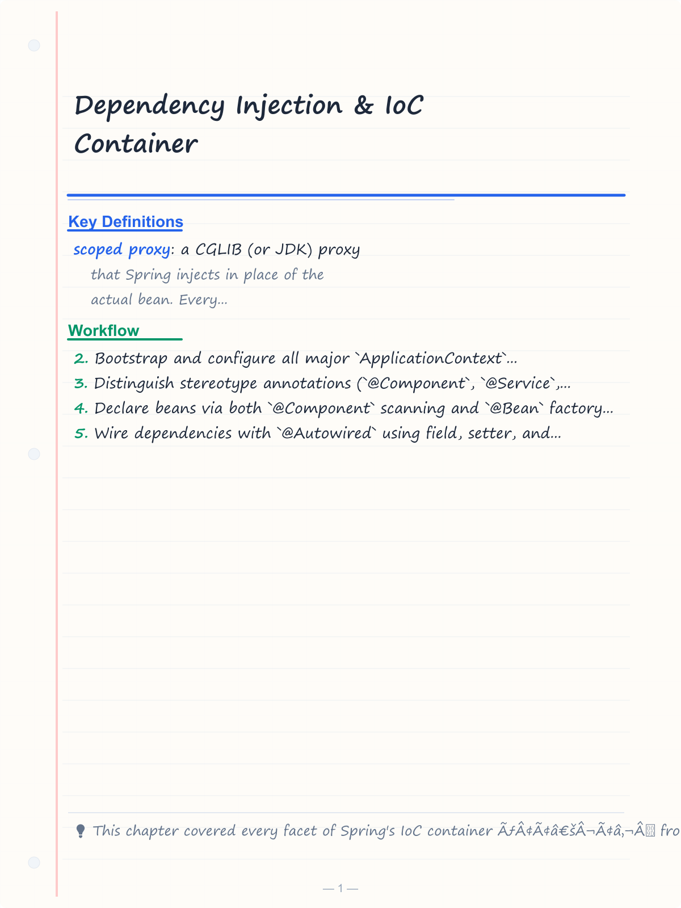
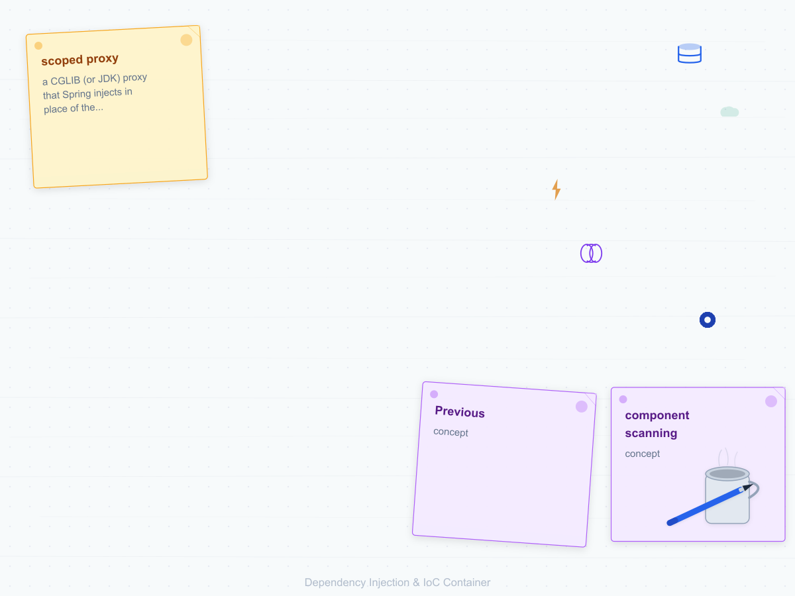
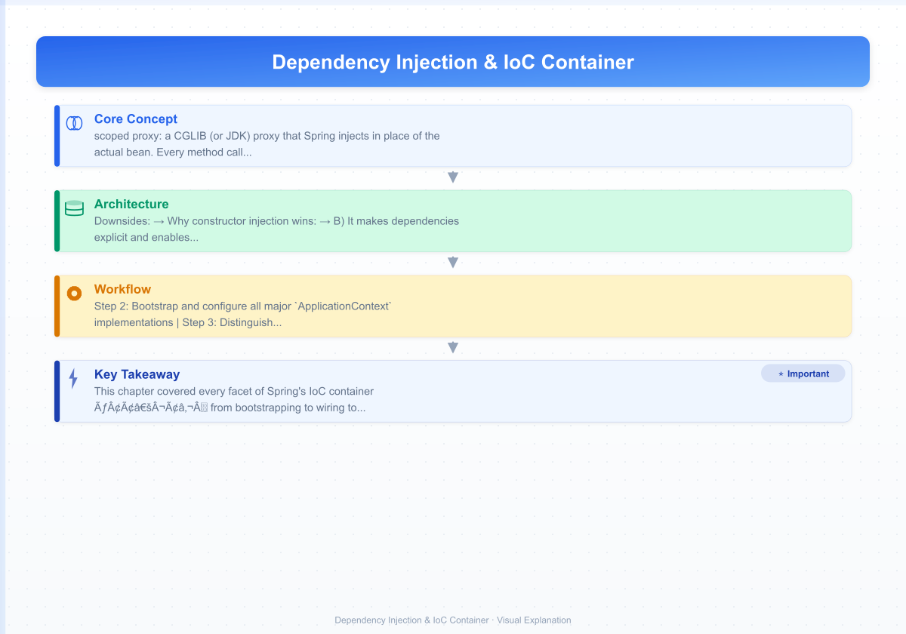

# Dependency Injection & IoC Container

> **Previous:** [Introduction to Spring & Spring Boot](./09-spring-intro.md) | **Next:** [Auto-Configuration & Starters](./11-auto-configuration.md)

The Inversion of Control (IoC) container is Spring's beating heart. Every Spring application — no matter how small — starts by bootstrapping an `ApplicationContext`, which then manages the entire object graph of the application. This chapter covers every aspect of that container: how beans are declared, wired, scoped, and configured; how the container discovers components; how profiles and conditionals gate bean definitions; and how to test with the container in play.

Every example in this chapter is complete and compilable. The recommended way to follow along is to create a Maven project with `spring-boot-starter` (or add `spring-context` to a plain project). When a listing uses Spring Boot annotations such as `@SpringBootTest` or `@MockBean`, the example assumes a `@SpringBootApplication` class exists in the default package.

---

## Learning Objectives

By the end of this chapter you should be able to:

<!-- Image Gallery -->
<section class="lesson-visuals" aria-label="Visual learning resources">
  <header><span>VISUAL LEARNING</span><h2>See it. Review it. Remember it.</h2></header>
  <a class="lesson-visual-card" href="../../assets/images/lessons/java/10-di-container/handwritten-notes.png" target="_blank" rel="noopener">
    
    <span><strong>Handwritten notes</strong>Condensed notes for deliberate review.</span>
  </a>
  <a class="lesson-visual-card" href="../../assets/images/lessons/java/10-di-container/sticky-notes.png" target="_blank" rel="noopener">
    
    <span><strong>Sticky-note revision</strong>Fast recall prompts for revision.</span>
  </a>
  <a class="lesson-visual-card" href="../../assets/images/lessons/java/10-di-container/visual-explanation.png" target="_blank" rel="noopener">
    
    <span><strong>Visual concept guide</strong>A connected explanation of the key ideas.</span>
  </a>
</section>
<!-- End Image Gallery -->


- Bootstrap and configure all major `ApplicationContext` implementations
- Distinguish stereotype annotations (`@Component`, `@Service`, `@Repository`, `@Controller`, `@RestController`) and explain their inclusion rules
- Declare beans via both `@Component` scanning and `@Bean` factory methods
- Wire dependencies with `@Autowired` using field, setter, and constructor injection — and explain why constructor injection is preferred
- Resolve ambiguous dependencies using `@Primary` and `@Qualifier`, including custom qualifier annotations
- Scope beans as singleton, prototype, request, session, application, or websocket and use proxy mode for narrower scopes
- Hook into the bean lifecycle with `@PostConstruct`, `@PreDestroy`, `InitializingBean`, `DisposableBean`, and `SmartLifecycle`
- Activate and combine `@Profile` conditions, including profile expressions
- Gate bean definitions with `@Conditional` and the family of `@ConditionalOn*` annotations
- Inject prototype-scoped beans into singletons using `@Lookup`
- Publish and listen to application events with `ApplicationEventPublisher`, `@EventListener`, and `@TransactionalEventListener`
- Test application contexts with `@SpringBootTest`, test slices, and `@MockBean`

## Chapter at a Glance

| Topic | Key Insight | Practical Takeaway |
|-------|-------------|--------------------|
| ApplicationContext | Central IoC container interface | XML -> AnnotationConfig -> SpringBoot |
| Stereotypes | @Component, @Service, @Repository, @Controller | @Service is a specialization of @Component |
| Injection Types | Field, setter, constructor injection | Constructor injection is preferred for required deps |
| Bean Scopes | singleton, prototype, request, session, application | Singleton is default; prototype for stateful beans |
| Lifecycle Hooks | @PostConstruct, @PreDestroy, SmartLifecycle | SmartLifecycle for ordered startup/shutdown |

## Chapter Roadmap


> **Pro Tip:** Use constructor injection exclusively for required dependencies. Field injection makes unit testing harder and hides missing dependencies at construction time.


---

## ApplicationContext — The Container Itself


`ApplicationContext` is the central interface to the Spring IoC container. It extends `BeanFactory` (the actual bean factory) and adds enterprise features: internationalization (`MessageSource`), event publication (`ApplicationEventPublisher`), resource loading (`ResourceLoader`), and environment abstraction (`Environment`).

### ClassPathXmlApplicationContext (XML Metadata)


Before annotation-driven configuration became dominant, all Spring applications were wired via XML. `ClassPathXmlApplicationContext` loads XML configuration files from the classpath.

```java
package di.appctx;

// resources/beans.xml:
// <beans xmlns="http://www.springframework.org/schema/beans"
//        xmlns:xsi="http://www.w3.org/2001/XMLSchema-instance"
//        xsi:schemaLocation="http://www.springframework.org/schema/beans
//            https://www.springframework.org/schema/beans/spring-beans.xsd">
//     <bean id="greeter" class="di.appctx.Greeter">
//         <property name="message" value="Hello from XML!"/>
//     </bean>
// </beans>

import org.springframework.context.ApplicationContext;
import org.springframework.context.support.ClassPathXmlApplicationContext;

public class ClassPathXmlDemo {

    public static void main(String[] args) {
        try (ApplicationContext ctx = new ClassPathXmlApplicationContext("beans.xml")) {
            Greeter g = ctx.getBean("greeter", Greeter.class);
            g.sayHello();
            System.out.println("Bean count: " + ctx.getBeanDefinitionCount());
        }
    }
}

class Greeter {

    private String message;

    public void setMessage(String message) {
        this.message = message;
    }

    public void sayHello() {
        System.out.println(message);
    }
}
```

### AnnotationConfigApplicationContext


The modern replacement for XML. It accepts `@Configuration` classes and component-scan packages.

```java
package di.appctx;

import org.springframework.context.ApplicationContext;
import org.springframework.context.annotation.AnnotationConfigApplicationContext;
import org.springframework.context.annotation.Bean;
import org.springframework.context.annotation.ComponentScan;
import org.springframework.context.annotation.Configuration;

public class AnnotationConfigDemo {

    public static void main(String[] args) {
        // Option A: register @Configuration classes directly
        try (AnnotationConfigApplicationContext ctx =
                 new AnnotationConfigApplicationContext(AppConfig.class)) {
            HelloService service = ctx.getBean(HelloService.class);
            System.out.println(service.greet("Alice"));
        }

        // Option B: scan a package
        try (AnnotationConfigApplicationContext ctx =
                 new AnnotationConfigApplicationContext()) {
            ctx.scan("di.appctx");
            ctx.refresh();
            HelloService service = ctx.getBean(HelloService.class);
            System.out.println(service.greet("Bob"));
        }
    }
}

@Configuration
@ComponentScan(basePackages = "di.appctx")
class AppConfig {

    @Bean
    String appName() {
        return "AnnotationConfigDemo";
    }
}

@Service
class HelloService {

    public String greet(String name) {
        return "Hello, " + name + "!";
    }
}
```

### GenericApplicationContext


The most flexible implementation. You register bean definitions programmatically and then call `refresh()` to initialise the container.

```java
package di.appctx;

import org.springframework.beans.factory.support.BeanDefinitionBuilder;
import org.springframework.beans.factory.support.DefaultListableBeanFactory;
import org.springframework.context.support.GenericApplicationContext;

public class GenericAppCtxDemo {

    public static void main(String[] args) {
        try (GenericApplicationContext ctx = new GenericApplicationContext()) {

            // Register a bean definition programmatically
            BeanDefinitionBuilder builder =
                BeanDefinitionBuilder.rootBeanDefinition(Calculator.class)
                    .addPropertyValue("factor", 2);
            ctx.registerBeanDefinition("calculator", builder.getBeanDefinition());

            // Register a singleton instance directly
            ctx.registerBean("reporter", Reporter.class, () -> new Reporter("Programmatic"));

            ctx.refresh();

            Calculator calc = ctx.getBean(Calculator.class);
            System.out.println("42 * 2 = " + calc.multiply(42));

            Reporter rep = ctx.getBean(Reporter.class);
            System.out.println(rep.report());
        }
    }
}

class Calculator {

    private int factor;

    public void setFactor(int factor) {
        this.factor = factor;
    }

    public int multiply(int value) {
        return value * factor;
    }
}

class Reporter {

    private final String source;

    public Reporter(String source) {
        this.source = source;
    }

    public String report() {
        return "Created from: " + source;
    }
}
```

### ConfigurableApplicationContext


Most `ApplicationContext` implementations also implement `ConfigurableApplicationContext`, which exposes lifecycle methods: `refresh()`, `close()`, `registerShutdownHook()`, `getEnvironment()`, `addBeanFactoryPostProcessor()`, and more.

```java
package di.appctx;

import org.springframework.context.ConfigurableApplicationContext;
import org.springframework.context.annotation.AnnotationConfigApplicationContext;
import org.springframework.context.annotation.Bean;
import org.springframework.context.annotation.Configuration;

public class ConfigurableCtxDemo {

    public static void main(String[] args) {
        // registerShutdownHook ensures close() is called on JVM exit
        try (ConfigurableApplicationContext ctx =
                 new AnnotationConfigApplicationContext(SimpleConfig.class)) {
            ctx.registerShutdownHook();
            Runner r = ctx.getBean(Runner.class);
            r.run();
        }
    }
}

@Configuration
class SimpleConfig {

    @Bean
    String greeting() {
        return "ConfigurableApplicationContext at work";
    }

    @Bean
    Runner runner(String greeting) {
        return new Runner(greeting);
    }
}

class Runner {

    private final String msg;

    Runner(String msg) {
        this.msg = msg;
    }

    void run() {
        System.out.println(msg);
    }
}
```

### Summary of ApplicationContext Implementations


| Implementation | Config Source | Refreshable | Use Case |
|---|---|---|---|
| `ClassPathXmlApplicationContext` | XML on classpath | Yes | Legacy projects, XML-based config |
| `AnnotationConfigApplicationContext` | `@Configuration` classes, `@ComponentScan` | Yes | Modern Spring, default choice |
| `GenericApplicationContext` | Programmatic bean definitions | Yes | Testing, dynamic bean registration |
| `ConfigurableApplicationContext` | Interface (not concrete) | Yes | Lifecycle control, `registerShutdownHook` |
| `FileSystemXmlApplicationContext` | XML on filesystem | Yes | Loading config from absolute paths |
| `WebApplicationContext` | Servlet-based | Yes | Web applications (Spring MVC) |

---

## @Component & Stereotype Annotations

Stereotype annotations mark classes as Spring-managed beans. The container discovers them through **component scanning** (`@ComponentScan` or `@SpringBootApplication`).

### The Annotation Hierarchy


```
@Component
 ├── @Service          (business logic / service layer)
 ├── @Repository        (data access / DAO layer — adds persistence exception translation)
 ├── @Controller        (MVC controller)
 └── @RestController    (@Controller + @ResponseBody)
```

Every stereotype is meta-annotated with `@Component`. Spring's component scanner treats any annotation that is itself annotated with `@Component` as a candidate.

### Basic @Component


```java
package di.stereotypes;

import org.springframework.stereotype.Component;

@Component
public class Engine {

    private final String type = "V8";

    public String getType() {
        return type;
    }

    public void start() {
        System.out.println(type + " engine started");
    }
}

@Component
public class Transmission {

    private final String model = "ZF-8HP";

    public String getModel() {
        return model;
    }
}
```

Implicit bean name: the class name with a lower-case first letter — `engine`, `transmission`. Override with `@Component("myEngine")`.

### @Service


```java
package di.stereotypes;

import org.springframework.beans.factory.annotation.Autowired;
import org.springframework.stereotype.Service;

@Service
public class VehicleService {

    private final Engine engine;
    private final Transmission transmission;

    @Autowired
    public VehicleService(Engine engine, Transmission transmission) {
        this.engine = engine;
        this.transmission = transmission;
    }

    public void describe() {
        System.out.println("Vehicle with " + engine.getType()
            + " engine and " + transmission.getModel() + " transmission");
    }
}
```

`@Service` is a pure specialization of `@Component`. It adds no additional behaviour beyond what `@Component` provides. Its value is primarily convention and the ability to target AOP pointcuts at the service layer.

### @Repository


```java
package di.stereotypes;

import org.springframework.dao.DataAccessException;
import org.springframework.stereotype.Repository;

import java.util.HashMap;
import java.util.Map;
import java.util.Optional;

@Repository
public class ProductRepository {

    private final Map<Long, String> store = new HashMap<>();

    public ProductRepository() {
        store.put(1L, "Laptop");
        store.put(2L, "Monitor");
        store.put(3L, "Keyboard");
    }

    public Optional<String> findById(Long id) {
        return Optional.ofNullable(store.get(id));
    }

    public void save(Long id, String name) {
        store.put(id, name);
    }
}
```

`@Repository` is more than a marker. It triggers **persistence exception translation**: Spring will wrap any platform-specific exception (e.g. `SQLException`, `HibernateException`) into a Spring `DataAccessException` hierarchy. This is done by a `BeanPostProcessor` that detects `@Repository` annotations and registers the appropriate `PersistenceExceptionTranslator`.

```java
package di.stereotypes;

import org.springframework.beans.factory.annotation.Autowired;
import org.springframework.stereotype.Service;

@Service
public class ProductService {

    private final ProductRepository repository;

    @Autowired
    public ProductService(ProductRepository repository) {
        this.repository = repository;
    }

    public String getProductName(Long id) {
        return repository.findById(id)
            .orElseThrow(() -> new RuntimeException("Product not found"));
    }
}
```

### @Controller and @RestController


```java
package di.stereotypes;

import org.springframework.stereotype.Controller;
import org.springframework.web.bind.annotation.GetMapping;
import org.springframework.web.bind.annotation.ResponseBody;
import org.springframework.web.bind.annotation.RestController;

// Traditional MVC controller — returns view names
@Controller
public class PageController {

    @GetMapping("/welcome")
    public String welcome() {
        return "welcome"; // resolves to a view template (e.g. welcome.html)
    }
}

// REST controller — returns data (includes @ResponseBody on every method)
@RestController
public class HealthController {

    @GetMapping("/health")
    public String health() {
        return "OK";
    }
}
```

Internally, `@RestController` is defined as:

```java
@Target(ElementType.TYPE)
@Retention(RetentionPolicy.RUNTIME)
@Controller
@ResponseBody
public @interface RestController {
    String value() default "";
}
```

### What Gets Scanned?


Spring's component scanner recognises:

1. Any class annotated with `@Component` (including meta-annotations).
2. Any class annotated with an annotation that itself carries `@Component` — this includes `@Service`, `@Repository`, `@Controller`, `@RestController`, `@Configuration`, `@ManagedBean`, `@Named` (Jakarta), and others.

Classes are scanned only if they are in a package listed in `@ComponentScan` or covered by `@SpringBootApplication` (which itself enables scanning from the declaring class's package).

```java
package di.stereotypes;

import org.springframework.context.annotation.ComponentScan;
import org.springframework.context.annotation.Configuration;

@Configuration
// Only scan this specific package; exclude filters
@ComponentScan(
    basePackages = "di.stereotypes",
    excludeFilters = @ComponentScan.Filter(classes = {Deprecated.class})
)
public class ScanConfig {
}
```

### Excluding and Filtering Components


```java
package di.stereotypes;

import org.springframework.context.annotation.ComponentScan;
import org.springframework.context.annotation.Configuration;
import org.springframework.context.annotation.FilterType;
import org.springframework.stereotype.Controller;

@Configuration
@ComponentScan(
    basePackages = "com.example",
    includeFilters = {
        @ComponentScan.Filter(type = FilterType.ANNOTATION, classes = Controller.class)
    },
    excludeFilters = {
        @ComponentScan.Filter(type = FilterType.REGEX, pattern = "com\\.example\\.legacy\\..*")
    }
)
class FilterConfig {
}
```

`FilterType` supports: `ANNOTATION`, `ASSIGNABLE_TYPE`, `ASPECTJ`, `REGEX`, `CUSTOM`.

---

## @Bean — Factory Methods

When you cannot — or should not — annotate the target class with `@Component` (third-party libraries, objects that need custom construction logic, or instances that require external configuration), declare a `@Bean` factory method inside a `@Configuration` class.

### Basic @Bean Declaration


```java
package di.bean;

import org.springframework.context.annotation.Bean;
import org.springframework.context.annotation.Configuration;

import java.time.Clock;
import java.time.ZoneId;

@Configuration
public class BeanConfig {

    @Bean
    Clock systemUtcClock() {
        return Clock.systemUTC();
    }

    @Bean
    Clock systemDefaultZoneClock() {
        return Clock.systemDefaultZone();
    }

    @Bean
    TimerService timerService(Clock systemUtcClock) {
        return new TimerService(systemUtcClock);
    }
}

class TimerService {

    private final Clock clock;

    TimerService(Clock clock) {
        this.clock = clock;
    }

    long currentTimeMillis() {
        return clock.millis();
    }
}
```

Spring intercepts calls to `@Bean` methods inside `@Configuration` classes and returns the same singleton instance (not a new one per call). This is achieved via a CGLIB proxy. For `@Bean` methods in `@Component` classes this interception does **not** happen — each call produces a new instance.

### Bean Names


By default the method name is the bean name. Override with the `name` attribute:

```java
package di.bean;

import org.springframework.context.annotation.Bean;
import org.springframework.context.annotation.Configuration;

@Configuration
class NamedBeanConfig {

    @Bean(name = "primaryDataSource")
    DataSource dataSource1() {
        return new DataSource("jdbc:mysql://localhost:3306/db1");
    }

    // Multiple aliases
    @Bean(name = {"secondaryDataSource", "fallbackDataSource", "ds2"})
    DataSource dataSource2() {
        return new DataSource("jdbc:mysql://localhost:3306/db2");
    }
}

class DataSource {

    private final String url;

    DataSource(String url) {
        this.url = url;
    }

    String getUrl() {
        return url;
    }
}
```

### initMethod and destroyMethod


```java
package di.bean;

import org.springframework.context.annotation.Bean;
import org.springframework.context.annotation.Configuration;

@Configuration
class LifecycleConfig {

    @Bean(initMethod = "connect", destroyMethod = "disconnect")
    DatabaseConnection dbConnection() {
        return new DatabaseConnection("jdbc:h2:mem:testdb");
    }
}

class DatabaseConnection {

    private final String url;
    private boolean connected;

    DatabaseConnection(String url) {
        this.url = url;
    }

    public void connect() {
        this.connected = true;
        System.out.println("Connected to: " + url);
    }

    public void disconnect() {
        this.connected = false;
        System.out.println("Disconnected from: " + url);
    }

    boolean isConnected() {
        return connected;
    }
}
```

Spring infers a default `destroyMethod` called `close` or `shutdown` if they exist (to automatically invoke `close()` on `ExecutorService`, `DataSource`, etc.). Disable this inference with `@Bean(destroyMethod = "")`.

### @Bean(autowire = ...)


The `autowire` attribute on `@Bean` is **deprecated** since Spring 5.1. Prefer method parameters instead. For completeness, the old way:

```java
@Bean(autowire = Autowire.BY_TYPE)
public MyService myService() {
    return new MyService(); // dependencies injected via setter by type
}
```

This exists only for backwards compatibility. Modern Spring uses constructor injection through `@Bean` method parameters, as shown in every other example.

### @Bean with Scopes


```java
package di.bean;

import org.springframework.beans.factory.config.ConfigurableBeanFactory;
import org.springframework.context.annotation.Bean;
import org.springframework.context.annotation.Configuration;
import org.springframework.context.annotation.Scope;

@Configuration
class ScopedBeanConfig {

    @Bean
    @Scope(ConfigurableBeanFactory.SCOPE_PROTOTYPE)
    WorkflowStep workflowStep() {
        return new WorkflowStep();
    }

    @Bean
    @Scope("prototype")
    Notification notification() {
        return new Notification();
    }
}

class WorkflowStep {
    // new instance every time
}

class Notification {
    // new instance every time
}
```

### Conditional @Bean


```java
package di.bean;

import org.springframework.boot.autoconfigure.condition.ConditionalOnProperty;
import org.springframework.context.annotation.Bean;
import org.springframework.context.annotation.Configuration;

@Configuration
class ConditionalBeanConfig {

    @Bean
    @ConditionalOnProperty(name = "feature.new-payment.enabled", havingValue = "true")
    PaymentGateway newPaymentGateway() {
        return new PaymentGateway("New");
    }

    @Bean
    @ConditionalOnProperty(name = "feature.new-payment.enabled", havingValue = "false", matchIfMissing = true)
    PaymentGateway legacyPaymentGateway() {
        return new PaymentGateway("Legacy");
    }
}

class PaymentGateway {

    private final String version;

    PaymentGateway(String version) {
        this.version = version;
    }

    String getVersion() {
        return version;
    }
}
```

---

## @Autowired — Wiring Dependencies

`@Autowired` tells Spring to inject a dependency. It can be applied to fields, constructors, setter methods, and arbitrary configuration methods.

### Field Injection


```java
package di.autowired;

import org.springframework.beans.factory.annotation.Autowired;
import org.springframework.stereotype.Component;

@Component
public class FieldInjectionExample {

    @Autowired
    private GreetingService greetingService;

    public void run() {
        System.out.println(greetingService.greet("Field Injection"));
    }
}
```

**Downsides:** hard to unit-test (cannot inject mocks without reflection), hides dependencies, breaks final-field immutability, tightly couples the class to the container.

### Setter Injection


```java
package di.autowired;

import org.springframework.beans.factory.annotation.Autowired;
import org.springframework.stereotype.Component;

@Component
public class SetterInjectionExample {

    private GreetingService greetingService;

    @Autowired
    public void setGreetingService(GreetingService greetingService) {
        this.greetingService = greetingService;
    }

    public void run() {
        System.out.println(greetingService.greet("Setter Injection"));
    }
}
```

Better than field injection — swapping implementations in tests is possible via the setter. Still allows mutation after construction.

### Constructor Injection (Recommended)


```java
package di.autowired;

import org.springframework.beans.factory.annotation.Autowired;
import org.springframework.stereotype.Component;

@Component
public class ConstructorInjectionExample {

    private final GreetingService greetingService;

    @Autowired
    public ConstructorInjectionExample(GreetingService greetingService) {
        this.greetingService = greetingService;
    }

    public void run() {
        System.out.println(greetingService.greet("Constructor Injection"));
    }
}
```

Since Spring 4.3, `@Autowired` on a constructor is **optional** if the class has only one constructor. The single-constructor rule means Spring will use it automatically:

```java
package di.autowired;

import org.springframework.stereotype.Component;

@Component
public class SimplifiedConstructorInjection {

    private final GreetingService greetingService;
    private final FarewellService farewellService;

    // No @Autowired needed — single constructor
    public SimplifiedConstructorInjection(GreetingService greetingService,
                                          FarewellService farewellService) {
        this.greetingService = greetingService;
        this.farewellService = farewellService;
    }

    public void run() {
        System.out.println(greetingService.greet("Simplified"));
        System.out.println(farewellService.farewell());
    }
}

@Service
class GreetingService {
    String greet(String name) { return "Hello, " + name; }
}

@Service
class FarewellService {
    String farewell() { return "Goodbye!"; }
}
```

**Why constructor injection wins:**

| Aspect | Constructor | Setter | Field |
|---|---|---|---|
| Immutability | `final` fields | Mutable | Mutable |
| Testability | Constructor args | Setter call | Reflection needed |
| Required deps | Enforced | Optional culture | Optional culture |
| Circular dep detection | Immediate at startup | Delayed | Delayed |
| Container coupling | None | None | High |
| Boilerplate | Medium | Medium | Low |

### Optional Injection


When a dependency is not required, use `Optional`, `@Autowired(required = false)`, or `@Nullable` (from Spring or JetBrains):

```java
package di.autowired;

import org.springframework.beans.factory.annotation.Autowired;
import org.springframework.lang.Nullable;
import org.springframework.stereotype.Component;

import java.util.Optional;

@Component
public class OptionalDependencyDemo {

    // Option 1: required = false
    @Autowired(required = false)
    private AuditService auditService;

    // Option 2: Java Optional
    private final CacheManager cacheManager;

    public OptionalDependencyDemo(Optional<CacheManager> cacheManager) {
        this.cacheManager = cacheManager.orElse(new NoOpCacheManager());
    }

    // Option 3: @Nullable
    private final MetricsCollector metricsCollector;

    public OptionalDependencyDemo(@Nullable MetricsCollector metricsCollector) {
        this.metricsCollector = metricsCollector;
    }

    public void run() {
        if (auditService != null) {
            auditService.record("Operation performed");
        }
        cacheManager.put("key", "value");
        if (metricsCollector != null) {
            metricsCollector.increment("requests");
        }
    }
}

class AuditService {
    void record(String event) { System.out.println("Audit: " + event); }
}

interface CacheManager {
    void put(String key, String value);
}

class NoOpCacheManager implements CacheManager {
    public void put(String key, String value) { /* no-op */ }
}

class MetricsCollector {
    void increment(String name) { System.out.println("Metric: " + name); }
}
```

### @Autowired on Methods (Arbitrary Configuration)


```java
package di.autowired;

import org.springframework.beans.factory.annotation.Autowired;
import org.springframework.stereotype.Component;

@Component
public class MethodInjectionDemo {

    private Engine engine;
    private Transmission transmission;

    // Method injection — Spring calls this with matching beans
    @Autowired
    public void configureDrivetrain(Engine engine, Transmission transmission) {
        this.engine = engine;
        this.transmission = transmission;
    }

    public void run() {
        engine.start();
        System.out.println("Transmission: " + transmission.getModel());
    }
}

@Component
class Engine {
    void start() { System.out.println("Engine started"); }
}

@Component
class Transmission {
    String getModel() { return "8-Speed Automatic"; }
}
```

### @Autowired with Collections


Spring can inject all beans of a compatible type into a `List`, `Map`, or array:

```java
package di.autowired;

import org.springframework.beans.factory.annotation.Autowired;
import org.springframework.stereotype.Component;
import org.springframework.stereotype.Service;

import java.util.List;
import java.util.Map;

@Component
public class CollectionInjectionDemo {

    private final List<PaymentHandler> handlers;
    private final Map<String, PaymentHandler> handlerMap;

    @Autowired
    public CollectionInjectionDemo(List<PaymentHandler> handlers,
                                   Map<String, PaymentHandler> handlerMap) {
        this.handlers = handlers;
        this.handlerMap = handlerMap;
    }

    public void processAll() {
        handlers.forEach(PaymentHandler::handle);
        handlerMap.forEach((name, handler) ->
            System.out.println(name + " -> " + handler.getClass().getSimpleName()));
    }
}

interface PaymentHandler {
    void handle();
}

@Service
class CreditCardHandler implements PaymentHandler {
    public void handle() { System.out.println("Processing credit card"); }
}

@Service
class PayPalHandler implements PaymentHandler {
    public void handle() { System.out.println("Processing PayPal"); }
}

@Service
class CryptoHandler implements PaymentHandler {
    public void handle() { System.out.println("Processing cryptocurrency"); }
}
```

The `List` is ordered by the `@Order` annotation or the `Ordered` interface. The `Map` key is the bean name.

---

## @Qualifier — Disambiguating Beans

When multiple beans of the same type exist, `@Qualifier` selects the specific one by name.

### Basic @Qualifier


```java
package di.qualifier;

import org.springframework.beans.factory.annotation.Qualifier;
import org.springframework.context.annotation.Bean;
import org.springframework.context.annotation.Configuration;
import org.springframework.stereotype.Component;

@Component
public class QualifierDemo {

    private final MessageSender emailSender;
    private final MessageSender smsSender;

    public QualifierDemo(@Qualifier("emailSender") MessageSender emailSender,
                         @Qualifier("smsSender") MessageSender smsSender) {
        this.emailSender = emailSender;
        this.smsSender = smsSender;
    }

    public void run() {
        emailSender.send("Hello via email");
        smsSender.send("Hello via SMS");
    }
}

interface MessageSender {
    void send(String message);
}

@Component
@Qualifier("emailSender")
class EmailSender implements MessageSender {
    public void send(String message) {
        System.out.println("[Email] " + message);
    }
}

@Component
@Qualifier("smsSender")
class SmsSender implements MessageSender {
    public void send(String message) {
        System.out.println("[SMS] " + message);
    }
}
```

### @Qualifier with @Bean


```java
package di.qualifier;

import org.springframework.beans.factory.annotation.Qualifier;
import org.springframework.context.annotation.Bean;
import org.springframework.context.annotation.Configuration;

@Configuration
class QualifierBeanConfig {

    @Bean
    @Qualifier("primaryDb")
    DatabaseConfig primaryDb() {
        return new DatabaseConfig("jdbc:mysql://primary:3306/db");
    }

    @Bean
    @Qualifier("reportingDb")
    DatabaseConfig reportingDb() {
        return new DatabaseConfig("jdbc:mysql://reporting:3306/dw");
    }
}

class DatabaseConfig {

    private final String url;

    DatabaseConfig(String url) {
        this.url = url;
    }

    String getUrl() {
        return url;
    }
}

@Component
class ReportingService {

    private final DatabaseConfig dbConfig;

    public ReportingService(@Qualifier("reportingDb") DatabaseConfig dbConfig) {
        this.dbConfig = dbConfig;
    }

    String getDbUrl() {
        return dbConfig.getUrl();
    }
}
```

### Custom Qualifier Annotations


Creating a custom annotation avoids string literals scattered across the codebase:

```java
package di.qualifier;

import org.springframework.beans.factory.annotation.Qualifier;

import java.lang.annotation.ElementType;
import java.lang.annotation.Retention;
import java.lang.annotation.RetentionPolicy;
import java.lang.annotation.Target;

@Target({ElementType.FIELD, ElementType.PARAMETER, ElementType.METHOD,
         ElementType.TYPE, ElementType.ANNOTATION_TYPE})
@Retention(RetentionPolicy.RUNTIME)
@Qualifier
public @interface MessageType {
    Channel value();

    enum Channel {
        EMAIL, SMS, PUSH
    }
}
```

Using the custom qualifier:

```java
package di.qualifier;

import org.springframework.stereotype.Component;

@Component
@MessageType(MessageType.Channel.EMAIL)
class CustomQualifierEmailSender implements MessageSender {
    public void send(String message) {
        System.out.println("[Custom-Email] " + message);
    }
}

@Component
@MessageType(MessageType.Channel.SMS)
class CustomQualifierSmsSender implements MessageSender {
    public void send(String message) {
        System.out.println("[Custom-SMS] " + message);
    }
}
```

Injecting:

```java
@Component
class NotificationService {

    private final MessageSender emailSender;
    private final MessageSender smsSender;

    public NotificationService(@MessageType(MessageType.Channel.EMAIL) MessageSender emailSender,
                               @MessageType(MessageType.Channel.SMS) MessageSender smsSender) {
        this.emailSender = emailSender;
        this.smsSender = smsSender;
    }

    public void sendEmail(String msg) { emailSender.send(msg); }
    public void sendSms(String msg) { smsSender.send(msg); }
}
```

---

## @Primary — Primary Bean Selection

When multiple beans of the same type exist and you want one to be the default (injected when no `@Qualifier` is specified), mark it with `@Primary`.

```java
package di.primary;

import org.springframework.context.annotation.Bean;
import org.springframework.context.annotation.Configuration;
import org.springframework.context.annotation.Primary;
import org.springframework.stereotype.Component;

@Component
@Primary
class DefaultCacheManager implements CacheManager {
    public void put(String key, String value) {
        System.out.println("[DefaultCache] " + key + " = " + value);
    }
}

@Component
class RedisCacheManager implements CacheManager {
    public void put(String key, String value) {
        System.out.println("[RedisCache] " + key + " = " + value);
    }
}

@Component
class PrimaryDemo {

    private final CacheManager cacheManager;

    // Injects DefaultCacheManager (the @Primary one)
    public PrimaryDemo(CacheManager cacheManager) {
        this.cacheManager = cacheManager;
    }

    public void run() {
        cacheManager.put("key", "value");
    }
}

interface CacheManager {
    void put(String key, String value);
}
```

### @Primary on @Bean


```java
package di.primary;

import org.springframework.context.annotation.Bean;
import org.springframework.context.annotation.Configuration;
import org.springframework.context.annotation.Primary;

@Configuration
class PrimaryBeanConfig {

    @Bean
    Serializer jsonSerializer() {
        return new Serializer("JSON");
    }

    @Bean
    @Primary
    Serializer xmlSerializer() {
        return new Serializer("XML");
    }
}

class Serializer {

    private final String format;

    Serializer(String format) {
        this.format = format;
    }

    String getFormat() {
        return format;
    }
}
```

### @Primary vs @Qualifier Precedence


`@Qualifier` always wins over `@Primary`. `@Primary` is a fallback default; `@Qualifier` is an explicit override.

```java
import org.springframework.beans.factory.annotation.Qualifier;
import org.springframework.stereotype.Component;

@Component
class PrecedenceDemo {

    private final Serializer serializer;

    // Explicit overrides @Primary — injects jsonSerializer
    public PrecedenceDemo(@Qualifier("jsonSerializer") Serializer serializer) {
        this.serializer = serializer;
    }
}
```

---

## Scope — Bean Lifecycle Boundaries

A bean's **scope** determines how many instances the container creates and how they are shared.

### Singleton (Default)


```java
package di.scope;

import org.springframework.context.annotation.Scope;
import org.springframework.stereotype.Component;

@Component
@Scope("singleton")
public class SingletonCounter {

    private int count = 0;

    public int increment() {
        return ++count;
    }
}
```

Every `@Autowired` injection point receives the same instance. The container creates the singleton eagerly (by default; use `@Lazy` to defer).

```java
@Component
class SingletonConsumer {

    private final SingletonCounter counter1;
    private final SingletonCounter counter2;

    public SingletonConsumer(SingletonCounter counter1, SingletonCounter counter2) {
        this.counter1 = counter1;
        this.counter2 = counter2;
    }

    public void demo() {
        System.out.println("Same instance? " + (counter1 == counter2)); // true
        counter1.increment();
        counter2.increment();
        System.out.println("Count = " + counter1.increment()); // 3
    }
}
```

### Prototype


```java
package di.scope;

import org.springframework.beans.factory.config.ConfigurableBeanFactory;
import org.springframework.context.annotation.Scope;
import org.springframework.stereotype.Component;

@Component
@Scope(ConfigurableBeanFactory.SCOPE_PROTOTYPE)
public class WorkflowTask {

    private final String id = java.util.UUID.randomUUID().toString().substring(0, 8);

    public String getId() {
        return id;
    }

    public void execute() {
        System.out.println("Task " + id + " executing");
    }
}
```

Every injection or `getBean()` call returns a **new instance**. Spring does **not** call `@PreDestroy` or `DisposableBean.destroy()` on prototype beans — the container hands them out and forgets them.

### Request, Session, Application, WebSocket


These scopes are only available in a web-aware `ApplicationContext` (e.g. Spring MVC or Spring WebFlux).

```java
package di.scope;

import org.springframework.context.annotation.Scope;
import org.springframework.context.annotation.ScopedProxyMode;
import org.springframework.stereotype.Component;
import org.springframework.web.context.WebApplicationContext;

@Component
@Scope(value = WebApplicationContext.SCOPE_REQUEST, proxyMode = ScopedProxyMode.TARGET_CLASS)
public class RequestId {

    private final String id = java.util.UUID.randomUUID().toString();

    public String getId() {
        return id;
    }
}

@Component
@Scope(value = WebApplicationContext.SCOPE_SESSION, proxyMode = ScopedProxyMode.TARGET_CLASS)
public class UserSession {

    private String username;
    private String accessToken;

    public String getUsername() {
        return username;
    }

    public void setUsername(String username) {
        this.username = username;
    }

    public String getAccessToken() {
        return accessToken;
    }

    public void setAccessToken(String accessToken) {
        this.accessToken = accessToken;
    }
}

@Component
@Scope(value = WebApplicationContext.SCOPE_APPLICATION, proxyMode = ScopedProxyMode.TARGET_CLASS)
public class AppVisitorCounter {

    private int visitorCount = 0;

    public int increment() {
        return ++visitorCount;
    }

    public int getCount() {
        return visitorCount;
    }
}
```

### Why proxyMode is Required


When a singleton bean depends on a request-scoped bean, the singleton is created once but the request-scoped bean must vary per request. A **scoped proxy** is a CGLIB (or JDK) proxy that Spring injects in place of the actual bean. Every method call on the proxy is forwarded to the real request-scoped instance bound to the current thread.

```java
package di.scope;

import org.springframework.beans.factory.annotation.Autowired;
import org.springframework.stereotype.Component;

@Component
public class RequestScopedConsumer {

    // This is a proxy — each call to getId() goes through
    // the proxy to the real RequestId for this HTTP request
    private final RequestId requestId;

    @Autowired
    public RequestScopedConsumer(RequestId requestId) {
        this.requestId = requestId;
    }

    public String getCurrentRequestId() {
        return requestId.getId();
    }
}
```

Proxy modes:

| Mode | Mechanism | Requirement |
|---|---|---|
| `ScopedProxyMode.TARGET_CLASS` | CGLIB | Concrete class; no-arg constructor or use `@Autowired` |
| `ScopedProxyMode.INTERFACES` | JDK dynamic proxy | Bean must implement an interface |
| `ScopedProxyMode.NO` | No proxy | Singleton depending on narrower scope will break |

### WebSocket Scope


```java
package di.scope;

import org.springframework.context.annotation.Scope;
import org.springframework.context.annotation.ScopedProxyMode;
import org.springframework.stereotype.Component;

@Component
@Scope(value = "websocket", proxyMode = ScopedProxyMode.TARGET_CLASS)
public class WebSocketSessionState {

    private String roomId;
    private String userId;

    public String getRoomId() {
        return roomId;
    }

    public void setRoomId(String roomId) {
        this.roomId = roomId;
    }

    public String getUserId() {
        return userId;
    }

    public void setUserId(String userId) {
        this.userId = userId;
    }
}
```

### Scope Summary


| Scope | Instances per | Lifetime |
|---|---|---|
| **singleton** (default) | One per container | Container lifetime |
| **prototype** | One per injection/request | Until injected, then container forgets |
| **request** | One per HTTP request | Request duration (web only) |
| **session** | One per HTTP session | Session duration (web only) |
| **application** | One per `ServletContext` | Servlet context lifetime (web only) |
| **websocket** | One per WebSocket session | WebSocket session duration (web only) |

---

## Lifecycle Callbacks

Spring provides multiple hooks to run initialisation and cleanup logic.

### @PostConstruct and @PreDestroy


```java
package di.lifecycle;

import jakarta.annotation.PostConstruct;
import jakarta.annotation.PreDestroy;
import org.springframework.stereotype.Component;

@Component
public class LifecycleDemo {

    private boolean initialized = false;

    @PostConstruct
    public void init() {
        this.initialized = true;
        System.out.println("LifecycleDemo: @PostConstruct — initialized = " + initialized);
    }

    @PreDestroy
    public void destroy() {
        this.initialized = false;
        System.out.println("LifecycleDemo: @PreDestroy — cleanup complete");
    }

    public boolean isInitialized() {
        return initialized;
    }
}
```

`@PostConstruct` and `@PreDestroy` are part of Jakarta EE (the `jakarta.annotation` package). They are the simplest and most portable lifecycle mechanism.

### InitializingBean and DisposableBean


```java
package di.lifecycle;

import org.springframework.beans.factory.DisposableBean;
import org.springframework.beans.factory.InitializingBean;
import org.springframework.stereotype.Component;

@Component
public class LifecycleInterfaceDemo implements InitializingBean, DisposableBean {

    private String status = "CREATED";

    @Override
    public void afterPropertiesSet() {
        this.status = "INITIALIZED";
        System.out.println("InitializingBean.afterPropertiesSet() — status = " + status);
    }

    @Override
    public void destroy() {
        this.status = "DESTROYED";
        System.out.println("DisposableBean.destroy() — status = " + status);
    }

    public String getStatus() {
        return status;
    }
}
```

These interfaces are Spring-specific (tight coupling). Prefer `@PostConstruct` / `@PreDestroy` unless you need the specific ordering guarantees.

### Execution Order for a Single Bean


1. Constructor
2. Property population (setter injection)
3. `*Aware` interfaces called (`BeanNameAware`, `BeanFactoryAware`, `ApplicationContextAware`)
4. `BeanPostProcessor.postProcessBeforeInitialization`
5. `@PostConstruct`
6. `InitializingBean.afterPropertiesSet()`
7. `@Bean(initMethod = "...")`
8. `BeanPostProcessor.postProcessAfterInitialization`
9. Bean is ready
10. Container shutdown — reverse order for destruction

### Custom @Bean initMethod and destroyMethod


Already covered in the `@Bean` section. Reiterated here for lifecycle completeness:

```java
package di.lifecycle;

import org.springframework.context.annotation.Bean;
import org.springframework.context.annotation.Configuration;

@Configuration
class InitDestroyConfig {

    @Bean(initMethod = "start", destroyMethod = "stop")
    Server server() {
        return new Server();
    }
}

class Server {

    public void start() {
        System.out.println("Server started");
    }

    public void stop() {
        System.out.println("Server stopped");
    }
}
```

### SmartLifecycle — Fine-Grained Lifecycle Control


`SmartLifecycle` extends `Lifecycle` and `Phased` to give ordered, auto-startup behaviour. Beans that need to start in a specific order or participate in container-level lifecycle (e.g. a database migration runner) implement this interface.

```java
package di.lifecycle;

import org.springframework.context.SmartLifecycle;
import org.springframework.stereotype.Component;

@Component
public class CacheWarmer implements SmartLifecycle {

    private volatile boolean running = false;

    @Override
    public void start() {
        running = true;
        System.out.println("CacheWarmer: warming cache...");
        // simulate warming
        try { Thread.sleep(100); } catch (InterruptedException e) { Thread.currentThread().interrupt(); }
        System.out.println("CacheWarmer: cache ready");
    }

    @Override
    public void stop() {
        running = false;
        System.out.println("CacheWarmer: cache cleared");
    }

    @Override
    public boolean isRunning() {
        return running;
    }

    @Override
    public boolean isAutoStartup() {
        return true; // automatically started when the context is refreshed
    }

    @Override
    public int getPhase() {
        return Integer.MAX_VALUE; // run last (lowest priority)
    }
}
```

Multiple `SmartLifecycle` beans are ordered by `getPhase()` — lower values start first, stop last. `isAutoStartup() = false` allows manual control via `ctx.start()`.

```java
package di.lifecycle;

import org.springframework.context.SmartLifecycle;
import org.springframework.stereotype.Component;

@Component
class DatabaseMigrationRunner implements SmartLifecycle {

    private volatile boolean running = false;

    @Override
    public void start() {
        running = true;
        System.out.println("DatabaseMigrationRunner: running migrations...");
    }

    @Override
    public void stop() {
        running = false;
        System.out.println("DatabaseMigrationRunner: done");
    }

    @Override
    public boolean isRunning() {
        return running;
    }

    @Override
    public boolean isAutoStartup() {
        return true;
    }

    @Override
    public int getPhase() {
        return 0; // runs before CacheWarmer (phase = MAX_VALUE)
    }
}
```

---

## @Profile — Environment-Specific Beans

`@Profile` allows beans to be registered only when a specific set of profiles is active.

### @Profile on @Configuration


```java
package di.profile;

import org.springframework.context.annotation.Bean;
import org.springframework.context.annotation.Configuration;
import org.springframework.context.annotation.Profile;

@Configuration
@Profile("dev")
class DevDataSourceConfig {

    @Bean
    DataSource dataSource() {
        return new DataSource("jdbc:h2:mem:devdb");
    }
}

@Configuration
@Profile("prod")
class ProdDataSourceConfig {

    @Bean
    DataSource dataSource() {
        return new DataSource("jdbc:postgresql://prod-server:5432/db");
    }
}

@Configuration
@Profile("test")
class TestDataSourceConfig {

    @Bean
    DataSource dataSource() {
        return new DataSource("jdbc:h2:mem:testdb;DB_CLOSE_DELAY=-1");
    }
}

class DataSource {

    private final String url;

    DataSource(String url) {
        this.url = url;
    }

    String getUrl() {
        return url;
    }
}
```

### @Profile on @Bean


```java
package di.profile;

import org.springframework.context.annotation.Bean;
import org.springframework.context.annotation.Configuration;
import org.springframework.context.annotation.Profile;

@Configuration
class AppConfig {

    @Bean
    @Profile("dev")
    ConsoleLogger logger() {
        return new ConsoleLogger();
    }

    @Bean
    @Profile("prod")
    CloudLogger logger() {
        return new CloudLogger();
    }

    @Bean
    @Profile("default")
    FileLogger logger() {
        return new FileLogger();
    }
}

interface Logger {
    void log(String message);
}

class ConsoleLogger implements Logger {
    public void log(String message) { System.out.println("[Console] " + message); }
}

class CloudLogger implements Logger {
    public void log(String message) { System.out.println("[CloudWatch] " + message); }
}

class FileLogger implements Logger {
    public void log(String message) { System.out.println("[File] " + message); }
}
```

### Activating Profiles


```properties
# application.properties
spring.profiles.active=dev,local
```

```yaml
# application.yml
spring:
  profiles:
    active: dev
```

```bash
# Command line
java -jar app.jar --spring.profiles.active=prod
```

```java
// Programmatic — before refresh
import org.springframework.context.annotation.AnnotationConfigApplicationContext;

AnnotationConfigApplicationContext ctx = new AnnotationConfigApplicationContext();
ctx.getEnvironment().setActiveProfiles("prod", "us-east");
ctx.register(AppConfig.class);
ctx.refresh();
```

### Programmatic Profile Checking


```java
package di.profile;

import org.springframework.beans.factory.annotation.Autowired;
import org.springframework.core.env.Environment;
import org.springframework.stereotype.Component;

@Component
public class ProfileAwareService {

    private final Environment env;

    @Autowired
    public ProfileAwareService(Environment env) {
        this.env = env;
    }

    public boolean isDev() {
        return env.acceptsProfiles(org.springframework.core.env.Profiles.of("dev"));
    }

    public boolean isProd() {
        return env.acceptsProfiles(org.springframework.core.env.Profiles.of("prod"));
    }

    public boolean isLocalOrDev() {
        return env.acceptsProfiles(org.springframework.core.env.Profiles.of("local", "dev"));
    }

    public String[] getActiveProfiles() {
        return env.getActiveProfiles();
    }

    public void report() {
        System.out.println("Active profiles: " + String.join(", ", getActiveProfiles()));
        System.out.println("Is dev? " + isDev());
        System.out.println("Is prod? " + isProd());
    }
}
```

### Profile Expressions


Spring 5.1+ supports logical operators in `@Profile` values:

| Expression | Meaning | Active When |
|---|---|---|
| `"dev"` | Profile `dev` is active | `dev` is active |
| `"!dev"` | Profile `dev` is NOT active | `dev` is not active |
| `"dev & cloud"` | Both `dev` AND `cloud` | Both active |
| `"dev \| prod"` | Either `dev` OR `prod` | At least one active |
| `"(dev \| qa) & !east"` | Complex expression | `dev` or `qa`, but not `east` |

```java
package di.profile;

import org.springframework.context.annotation.Bean;
import org.springframework.context.annotation.Configuration;
import org.springframework.context.annotation.Profile;

@Configuration
class ProfileExpressionConfig {

    @Bean
    @Profile("!test")
    Service nonTestService() {
        return new Service("not-test");
    }

    @Bean
    @Profile("dev | staging")
    Service devOrStagingService() {
        return new Service("dev-or-staging");
    }

    @Bean
    @Profile("prod & cloud")
    Service prodWithCloudService() {
        return new Service("prod-and-cloud");
    }

    @Bean
    @Profile("(dev | qa) & !east-region")
    Service notEastService() {
        return new Service("not-east");
    }
}

class Service {
    private final String label;
    Service(String label) { this.label = label; }
    String getLabel() { return label; }
}
```

### Default Profile


The profile named `default` is active when no other profile is explicitly set. It is a fallback — not a catch-all. If you set `spring.profiles.active=dev`, the `default` profile is **not** active.

```java
import org.springframework.context.annotation.Bean;
import org.springframework.context.annotation.Configuration;
import org.springframework.context.annotation.Profile;

@Configuration
class DefaultProfileConfig {

    @Bean
    @Profile("default")
    Greeter defaultGreeter() {
        return new Greeter("Default profile active — no explicit profiles set");
    }

    @Bean
    @Profile("dev")
    Greeter devGreeter() {
        return new Greeter("Dev profile active");
    }
}

class Greeter {
    private final String message;
    Greeter(String message) { this.message = message; }
    void greet() { System.out.println(message); }
}
```

---

## Conditional Beans

`@Conditional` and its annotation family gate bean definitions on arbitrary conditions evaluated at container refresh time.

### @Conditional with the Condition Interface


```java
package di.conditional;

import org.springframework.context.annotation.Condition;
import org.springframework.context.annotation.ConditionContext;
import org.springframework.context.annotation.Conditional;
import org.springframework.context.annotation.Configuration;
import org.springframework.core.type.AnnotatedTypeMetadata;

public class OnWindowsCondition implements Condition {

    @Override
    public boolean matches(ConditionContext context, AnnotatedTypeMetadata metadata) {
        String os = context.getEnvironment().getProperty("os.name", "").toLowerCase();
        return os.contains("win");
    }
}

class OnLinuxCondition implements Condition {

    @Override
    public boolean matches(ConditionContext context, AnnotatedTypeMetadata metadata) {
        String os = context.getEnvironment().getProperty("os.name", "").toLowerCase();
        return os.contains("nix") || os.contains("nux") || os.contains("aix");
    }
}
```

Using the conditions:

```java
@Configuration
class OsConditionalConfig {

    @Bean
    @Conditional(OnWindowsCondition.class)
    FileSystemManager windowsFileManager() {
        return new FileSystemManager("NTFS");
    }

    @Bean
    @Conditional(OnLinuxCondition.class)
    FileSystemManager linuxFileManager() {
        return new FileSystemManager("EXT4");
    }
}

class FileSystemManager {
    private final String fsType;
    FileSystemManager(String fsType) { this.fsType = fsType; }
    String getFsType() { return fsType; }
}
```

### Spring Boot's @ConditionalOn* Family


These are part of `spring-boot-autoconfigure`. They are the building blocks of Spring Boot's auto-configuration.

#### @ConditionalOnProperty

```java
package di.conditional;

import org.springframework.boot.autoconfigure.condition.ConditionalOnProperty;
import org.springframework.context.annotation.Bean;
import org.springframework.context.annotation.Configuration;

@Configuration
class ConditionalOnPropertyConfig {

    @Bean
    @ConditionalOnProperty(
        name = "app.feature.analytics",
        havingValue = "true",
        matchIfMissing = false
    )
    AnalyticsService analyticsService() {
        return new AnalyticsService();
    }

    @Bean
    @ConditionalOnProperty(
        name = "app.cache.type",
        havingValue = "redis",
        matchIfMissing = true
    )
    CacheService cacheService() {
        return new CacheService();
    }
}

class AnalyticsService {
    String status() { return "Analytics enabled"; }
}

class CacheService {
    String status() { return "Cache service ready"; }
}
```

#### @ConditionalOnClass

```java
package di.conditional;

import org.springframework.boot.autoconfigure.condition.ConditionalOnClass;
import org.springframework.context.annotation.Bean;
import org.springframework.context.annotation.Configuration;

@Configuration
@ConditionalOnClass(name = "com.redis.lettuce.core.RedisClient")
class RedisAutoConfiguration {

    @Bean
    RedisConnectionManager redisConnectionManager() {
        return new RedisConnectionManager();
    }
}

class RedisConnectionManager {
    String status() { return "Redis client available"; }
}
```

#### @ConditionalOnMissingBean

```java
package di.conditional;

import org.springframework.boot.autoconfigure.condition.ConditionalOnMissingBean;
import org.springframework.context.annotation.Bean;
import org.springframework.context.annotation.Configuration;

@Configuration
class ConditionalOnMissingBeanConfig {

    @Bean
    @ConditionalOnMissingBean
    ObjectMapper objectMapper() {
        return new ObjectMapper("default");
    }

    @Bean
    @ConditionalOnMissingBean(name = "customSerializer")
    Serializer defaultSerializer() {
        return new Serializer("default");
    }
}

class ObjectMapper {
    private final String type;
    ObjectMapper(String type) { this.type = type; }
    String getType() { return type; }
}

class Serializer {
    private final String name;
    Serializer(String name) { this.name = name; }
    String getName() { return name; }
}
```

If a bean of type `ObjectMapper` already exists (registered by user code or another auto-configuration), Spring skips the `@ConditionalOnMissingBean` method. This is how Spring Boot auto-configuration allows user-defined beans to override defaults.

#### @ConditionalOnExpression

```java
package di.conditional;

import org.springframework.boot.autoconfigure.condition.ConditionalOnExpression;
import org.springframework.context.annotation.Bean;
import org.springframework.context.annotation.Configuration;

@Configuration
class ConditionalOnExpressionConfig {

    @Bean
    @ConditionalOnExpression(
        "${app.rate-limiting.enabled:true} and "
        + "${app.rate-limiting.provider:in-memory} != 'none'"
    )
    RateLimiter rateLimiter() {
        return new RateLimiter("active");
    }
}

class RateLimiter {
    private final String status;
    RateLimiter(String status) { this.status = status; }
    String getStatus() { return status; }
}
```

#### @ConditionalOnBean vs @ConditionalOnMissingBean

```java
package di.conditional;

import org.springframework.boot.autoconfigure.condition.ConditionalOnBean;
import org.springframework.boot.autoconfigure.condition.ConditionalOnMissingBean;
import org.springframework.context.annotation.Bean;
import org.springframework.context.annotation.Configuration;

@Configuration
class ConditionalOnBeanConfig {

    @Bean
    @ConditionalOnBean(name = "transactionManager")
    JdbcTemplate jdbcTemplate() {
        return new JdbcTemplate("configured");
    }

    @Bean
    @ConditionalOnMissingBean(name = "customHealthIndicator")
    HealthIndicator defaultHealthIndicator() {
        return new HealthIndicator("default-ok");
    }
}

class JdbcTemplate {
    private final String config;
    JdbcTemplate(String config) { this.config = config; }
    String getConfig() { return config; }
}

class HealthIndicator {
    private final String status;
    HealthIndicator(String status) { this.status = status; }
    String getStatus() { return status; }
}
```

### Custom @Conditional Annotation


```java
package di.conditional;

import org.springframework.context.annotation.Conditional;

import java.lang.annotation.ElementType;
import java.lang.annotation.Retention;
import java.lang.annotation.RetentionPolicy;
import java.lang.annotation.Target;

@Target({ElementType.TYPE, ElementType.METHOD})
@Retention(RetentionPolicy.RUNTIME)
@Conditional(OnEnvironmentCondition.class)
public @interface ConditionalOnEnvironment {
    String value();
}
```

Implementation:

```java
package di.conditional;

import org.springframework.context.annotation.Condition;
import org.springframework.context.annotation.ConditionContext;
import org.springframework.core.type.AnnotatedTypeMetadata;

import java.util.Map;

public class OnEnvironmentCondition implements Condition {

    @Override
    public boolean matches(ConditionContext context, AnnotatedTypeMetadata metadata) {
        Map<String, Object> attrs =
            metadata.getAnnotationAttributes(ConditionalOnEnvironment.class.getName());
        if (attrs == null) return false;

        String targetEnv = (String) attrs.get("value");
        String currentEnv = context.getEnvironment().getProperty("app.environment", "dev");
        return targetEnv.equals(currentEnv);
    }
}
```

Usage:

```java
@Configuration
class CustomConditionalConfig {

    @Bean
    @ConditionalOnEnvironment("staging")
    StagingConfig stagingConfig() {
        return new StagingConfig();
    }

    @Bean
    @ConditionalOnEnvironment("prod")
    ProdConfig prodConfig() {
        return new ProdConfig();
    }
}

class StagingConfig {
    String label() { return "staging"; }
}

class ProdConfig {
    String label() { return "prod"; }
}
```

### Combining Conditions (Logical AND)


```java
package di.conditional;

import org.springframework.boot.autoconfigure.condition.ConditionalOnClass;
import org.springframework.boot.autoconfigure.condition.ConditionalOnProperty;
import org.springframework.context.annotation.Bean;
import org.springframework.context.annotation.Configuration;

@Configuration
class CombinedConditionsConfig {

    @Bean
    @ConditionalOnProperty(name = "app.analytics.enabled", havingValue = "true")
    @ConditionalOnClass(name = "com.fasterxml.jackson.databind.ObjectMapper")
    AnalyticsEngine analyticsEngine() {
        return new AnalyticsEngine("Jackson + enabled");
    }

    @Bean
    @ConditionalOnProperty(name = "app.analytics.enabled", havingValue = "true")
    @ConditionalOnClass(name = "com.google.gson.Gson")
    AnalyticsEngine gsonAnalyticsEngine() {
        return new AnalyticsEngine("Gson + enabled");
    }
}

class AnalyticsEngine {
    private final String source;
    AnalyticsEngine(String source) { this.source = source; }
    String report() { return "Analytics from: " + source; }
}
```

Multiple `@Conditional` annotations on the same `@Bean` or class are AND-combined — all must match.

---

## Lookup Method Injection

When a singleton-scoped bean needs a **new instance** of a prototype-scoped bean every time a method is called, field injection won't work (the singleton is created once, so the prototype field is set once). Three solutions exist: `@Lookup`, `Provider`, or `ObjectFactory`.

### @Lookup


```java
package di.lookup;

import org.springframework.beans.factory.annotation.Lookup;
import org.springframework.stereotype.Component;

@Component
public abstract class SingletonProcessor {

    // Every call returns a NEW PrototypeWorker instance
    @Lookup
    protected abstract PrototypeWorker createWorker();

    public void process(String task) {
        PrototypeWorker worker = createWorker();
        worker.execute(task);
    }
}

@Component
@org.springframework.context.annotation.Scope("prototype")
class PrototypeWorker {

    private final String instanceId =
        java.util.UUID.randomUUID().toString().substring(0, 8);

    public void execute(String task) {
        System.out.println("Worker " + instanceId + " processing: " + task);
    }
}
```

Spring generates a concrete subclass of `SingletonProcessor` at runtime (via CGLIB) that implements `createWorker()` by calling `applicationContext.getBean(PrototypeWorker.class)`.

### @Lookup with Parameters (Spring 4.1+)


```java
package di.lookup;

import org.springframework.beans.factory.annotation.Lookup;
import org.springframework.stereotype.Component;

@Component
public abstract class ParametricLookupDemo {

    @Lookup
    public abstract Report createReport(String title);

    public void run() {
        Report r1 = createReport("Q1 Earnings");
        Report r2 = createReport("Q2 Earnings");
        System.out.println(r1.describe());
        System.out.println(r2.describe());
        System.out.println("Same instance? " + (r1 == r2));
    }
}

@Component
@org.springframework.context.annotation.Scope("prototype")
class Report {

    private final String id = java.util.UUID.randomUUID().toString().substring(0, 8);
    private final String title;

    // Spring will call this constructor with the arguments passed to createWorker
    public Report(String title) {
        this.title = title;
    }

    public String describe() {
        return "Report[" + id + "] title=" + title;
    }
}
```

### Provider (Alternative to @Lookup)


`jakarta.inject.Provider` is a cleaner alternative that avoids abstract classes and CGLIB:

```java
package di.lookup;

import jakarta.inject.Provider;
import org.springframework.beans.factory.annotation.Autowired;
import org.springframework.stereotype.Component;

@Component
public class ProviderDemo {

    private final Provider<PrototypeWorker> workerProvider;

    @Autowired
    public ProviderDemo(Provider<PrototypeWorker> workerProvider) {
        this.workerProvider = workerProvider;
    }

    public void process(String task) {
        PrototypeWorker worker = workerProvider.get();
        worker.execute(task);
    }
}
```

Every call to `workerProvider.get()` returns a new prototype instance. This is the recommended approach — no abstract class, no CGLIB, no Spring-specific annotation at the injection point.

### ObjectFactory (Spring's Own Provider)


```java
package di.lookup;

import org.springframework.beans.factory.ObjectFactory;
import org.springframework.beans.factory.annotation.Autowired;
import org.springframework.stereotype.Component;

@Component
public class ObjectFactoryDemo {

    private final ObjectFactory<PrototypeWorker> workerFactory;

    @Autowired
    public ObjectFactoryDemo(ObjectFactory<PrototypeWorker> workerFactory) {
        this.workerFactory = workerFactory;
    }

    public void process(String task) {
        PrototypeWorker worker = workerFactory.getObject();
        worker.execute(task);
    }
}
```

`ObjectFactory` is Spring's built-in equivalent of `jakarta.inject.Provider`. Both work identically in practice.

---

## ApplicationEventPublisher — Event-Driven Beans

Spring's event infrastructure allows beans to publish and listen to application events without coupling publishers to listeners.

### Custom Event


```java
package di.event;

import org.springframework.context.ApplicationEvent;

// Extending ApplicationEvent (legacy approach, still works)
public class OrderPlacedEvent extends ApplicationEvent {

    private final String orderId;
    private final String customerEmail;
    private final double total;

    public OrderPlacedEvent(Object source, String orderId, String customerEmail, double total) {
        super(source);
        this.orderId = orderId;
        this.customerEmail = customerEmail;
        this.total = total;
    }

    public String getOrderId() { return orderId; }
    public String getCustomerEmail() { return customerEmail; }
    public double getTotal() { return total; }
}

// POJO event — does NOT need to extend ApplicationEvent (preferred)
public class InventoryUpdatedEvent {

    private final String sku;
    private final int quantityChange;

    public InventoryUpdatedEvent(String sku, int quantityChange) {
        this.sku = sku;
        this.quantityChange = quantityChange;
    }

    public String getSku() { return sku; }
    public int getQuantityChange() { return quantityChange; }
}
```

### Publishing Events


```java
package di.event;

import org.springframework.beans.factory.annotation.Autowired;
import org.springframework.context.ApplicationEventPublisher;
import org.springframework.stereotype.Service;

@Service
public class OrderService {

    private final ApplicationEventPublisher publisher;

    @Autowired
    public OrderService(ApplicationEventPublisher publisher) {
        this.publisher = publisher;
    }

    public void placeOrder(String orderId, String email, double total) {
        // Business logic...
        System.out.println("Order " + orderId + " placed");

        // Publish event
        publisher.publishEvent(new OrderPlacedEvent(this, orderId, email, total));
        publisher.publishEvent(new InventoryUpdatedEvent("SKU-123", -1));
    }
}
```

### @EventListener


```java
package di.event;

import org.springframework.context.event.EventListener;
import org.springframework.scheduling.annotation.Async;
import org.springframework.stereotype.Component;

@Component
public class OrderEventListeners {

    @EventListener
    public void handleOrderPlaced(OrderPlacedEvent event) {
        System.out.println("Sending confirmation email to " + event.getCustomerEmail()
            + " for order " + event.getOrderId());
    }

    @EventListener
    public void handleInventoryUpdate(InventoryUpdatedEvent event) {
        System.out.println("Updating inventory for SKU " + event.getSku()
            + " by " + event.getQuantityChange());
    }

    // Async listener — does not block the publisher's thread
    @EventListener
    @Async
    public void sendPushNotification(OrderPlacedEvent event) {
        System.out.println("[Async] Sending push notification for order " + event.getOrderId());
    }
}
```

### Listener Ordering


```java
package di.event;

import org.springframework.context.event.EventListener;
import org.springframework.core.annotation.Order;
import org.springframework.stereotype.Component;

@Component
public class OrderedListeners {

    @EventListener
    @Order(1)
    public void first(OrderPlacedEvent event) {
        System.out.println("1st listener: validate order " + event.getOrderId());
    }

    @EventListener
    @Order(2)
    public void second(OrderPlacedEvent event) {
        System.out.println("2nd listener: send email for " + event.getOrderId());
    }

    @EventListener
    @Order(3)
    public void third(OrderPlacedEvent event) {
        System.out.println("3rd listener: update warehouse for " + event.getOrderId());
    }
}
```

### Conditional Event Handling with SpEL


```java
package di.event;

import org.springframework.context.event.EventListener;
import org.springframework.stereotype.Component;

@Component
public class ConditionalEventListener {

    @EventListener(condition = "#event.total > 1000")
    public void handleHighValueOrder(OrderPlacedEvent event) {
        System.out.println("High-value order detected: " + event.getOrderId()
            + " for $" + event.getTotal());
    }

    @EventListener(condition = "#event.customerEmail.contains('@vip.com')")
    public void handleVipOrder(OrderPlacedEvent event) {
        System.out.println("VIP customer order: " + event.getOrderId());
    }
}
```

### @TransactionalEventListener


Binds the listener to a transaction phase, ensuring the event is processed only after the transaction commits, rolls back, etc.

```java
package di.event;

import org.springframework.stereotype.Component;
import org.springframework.transaction.event.TransactionPhase;
import org.springframework.transaction.event.TransactionalEventListener;

@Component
public class TransactionalOrderListeners {

    @TransactionalEventListener(phase = TransactionPhase.AFTER_COMMIT)
    public void onOrderCommitted(OrderPlacedEvent event) {
        System.out.println("Transaction committed for order " + event.getOrderId()
            + " — sending email (guaranteed)");
    }

    @TransactionalEventListener(phase = TransactionPhase.AFTER_ROLLBACK)
    public void onOrderRolledBack(OrderPlacedEvent event) {
        System.out.println("Transaction rolled back for order " + event.getOrderId()
            + " — no email sent, updating failure counter");
    }

    @TransactionalEventListener(phase = TransactionPhase.BEFORE_COMMIT)
    public void preCommitValidation(OrderPlacedEvent event) {
        System.out.println("Pre-commit validation for order " + event.getOrderId());
    }

    // fallBack = true means the listener also fires even if there is no transaction
    @TransactionalEventListener(phase = TransactionPhase.AFTER_COMMIT, fallbackExecution = true)
    public void logOrder(OrderPlacedEvent event) {
        System.out.println("Logging order " + event.getOrderId() + " (works with or without tx)");
    }
}
```

### Listening to Multiple Event Types


```java
package di.event;

import org.springframework.context.event.EventListener;
import org.springframework.stereotype.Component;

@Component
public class MultiEventListener {

    @EventListener
    public void handleAnyOrderEvent(Object event) {
        if (event instanceof OrderPlacedEvent o) {
            System.out.println("Order placed: " + o.getOrderId());
        } else if (event instanceof InventoryUpdatedEvent i) {
            System.out.println("Inventory update: " + i.getSku() + " x " + i.getQuantityChange());
        }
    }
}
```

### Generic Events — Using ResolvableType


```java
package di.event;

import org.springframework.context.event.EventListener;
import org.springframework.core.ResolvableType;
import org.springframework.stereotype.Component;

public class GenericEvent<T> {

    private final T payload;
    private final long timestamp;

    public GenericEvent(T payload) {
        this.payload = payload;
        this.timestamp = System.currentTimeMillis();
    }

    public T getPayload() { return payload; }
    public long getTimestamp() { return timestamp; }
}

@Component
class GenericEventListener {

    @EventListener
    public void onStringEvent(GenericEvent<String> event) {
        System.out.println("String event: " + event.getPayload());
    }

    @EventListener
    public void onIntegerEvent(GenericEvent<Integer> event) {
        System.out.println("Integer event: " + event.getPayload());
    }
}
```

Spring resolves the generic type parameter via `ResolvableType` to route events correctly.

---

## Testing with Containers

### @SpringBootTest — Full Application Context


```java
package di.test;

import org.junit.jupiter.api.Test;
import org.springframework.beans.factory.annotation.Autowired;
import org.springframework.boot.test.context.SpringBootTest;

import static org.junit.jupiter.api.Assertions.*;

@SpringBootTest
class ApplicationContextTest {

    @Autowired
    private GreetingService greetingService;

    @Test
    void contextLoads() {
        assertNotNull(greetingService);
    }

    @Test
    void greetingServiceWorks() {
        assertEquals("Hello, World!", greetingService.greet("World"));
    }
}
```

### Test Slices


Spring Boot provides focused annotations that load only the beans needed for a specific layer:

```java
package di.test;

import org.junit.jupiter.api.Test;
import org.springframework.beans.factory.annotation.Autowired;
import org.springframework.boot.test.autoconfigure.orm.jpa.DataJpaTest;

import java.util.Optional;

import static org.junit.jupiter.api.Assertions.*;

@DataJpaTest
class ProductRepositoryTest {

    @Autowired
    private ProductRepository productRepository;

    @Test
    void findById() {
        Optional<String> result = productRepository.findById(1L);
        assertTrue(result.isPresent());
        assertEquals("Laptop", result.get());
    }
}
```

Other test slice annotations:

| Annotation | Loads |
|---|---|
| `@DataJpaTest` | JPA repositories, `EntityManager`, `DataSource` (in-memory) |
| `@WebMvcTest` | Only MVC controllers, not services/repos |
| `@JsonTest` | JSON serialization/deserialization |
| `@RestClientTest` | REST client (e.g. `RestTemplate`, `WebClient`) |
| `@DataMongoTest` | MongoDB repositories |

### @MockBean — Mocking in Context


```java
package di.test;

import org.junit.jupiter.api.Test;
import org.springframework.beans.factory.annotation.Autowired;
import org.springframework.boot.test.context.SpringBootTest;
import org.springframework.boot.test.mock.mockito.MockBean;

import static org.junit.jupiter.api.Assertions.*;
import static org.mockito.ArgumentMatchers.any;
import static org.mockito.Mockito.*;

@SpringBootTest
class OrderServiceTest {

    @MockBean
    private InventoryService inventoryService;

    @Autowired
    private OrderService orderService;

    @Test
    void placeOrderReservesInventory() {
        when(inventoryService.reserve(anyString(), anyInt())).thenReturn(true);

        orderService.placeOrder("ORD-001", "test@example.com", 99.99);

        verify(inventoryService, times(1)).reserve("SKU-123", 1);
    }

    @Test
    void placeOrderFailsWhenInventoryShort() {
        when(inventoryService.reserve(anyString(), anyInt())).thenReturn(false);

        assertThrows(IllegalStateException.class, () ->
            orderService.placeOrder("ORD-002", "test@example.com", 99.99));
    }
}
```

`@MockBean` creates a Mockito mock and **replaces** any existing bean of the same type in the `ApplicationContext`. It is ideal for isolating the layer under test.

### @SpyBean


```java
package di.test;

import org.junit.jupiter.api.Test;
import org.springframework.beans.factory.annotation.Autowired;
import org.springframework.boot.test.context.SpringBootTest;
import org.springframework.boot.test.mock.mockito.SpyBean;

import static org.mockito.Mockito.*;

@SpringBootTest
class AuditServiceSpyTest {

    @SpyBean
    private AuditService auditService;

    @Autowired
    private OrderService orderService;

    @Test
    void orderTriggersAudit() {
        orderService.placeOrder("ORD-100", "user@test.com", 50.0);

        verify(auditService).record("Order placed: ORD-100");
    }
}
```

`@SpyBean` creates a Mockito spy around a real bean — the bean's real methods are called unless explicitly stubbed.

### @Import for Focused Context


```java
package di.test;

import di.autowired.GreetingService;
import org.junit.jupiter.api.Test;
import org.springframework.context.annotation.Import;
import org.springframework.test.context.junit.jupiter.SpringJUnitConfig;

import static org.junit.jupiter.api.Assertions.*;

@SpringJUnitConfig
@Import(GreetingService.class)
class FocusedContextTest {

    private final GreetingService greetingService;

    FocusedContextTest(GreetingService greetingService) {
        this.greetingService = greetingService;
    }

    @Test
    void focusedContext() {
        assertEquals("Hello, Test!", greetingService.greet("Test"));
    }
}
```

### Dynamic Property Sources


```java
package di.test;

import org.junit.jupiter.api.Test;
import org.springframework.beans.factory.annotation.Value;
import org.springframework.boot.test.context.SpringBootTest;
import org.springframework.test.context.DynamicPropertyRegistry;
import org.springframework.test.context.DynamicPropertySource;

import static org.junit.jupiter.api.Assertions.*;

@SpringBootTest
class DynamicPropertyTest {

    @Value("${app.feature.analytics}")
    private String analyticsSetting;

    @DynamicPropertySource
    static void configureProperties(DynamicPropertyRegistry registry) {
        registry.add("app.feature.analytics", () -> "true");
        registry.add("app.cache.type", () -> "redis");
    }

    @Test
    void propertiesAreSet() {
        assertEquals("true", analyticsSetting);
    }
}
```

### TestConfiguration — Local Overrides


```java
package di.test;

import di.primary.Serializer;
import org.junit.jupiter.api.Test;
import org.springframework.beans.factory.annotation.Autowired;
import org.springframework.beans.factory.annotation.Qualifier;
import org.springframework.boot.test.context.SpringBootTest;
import org.springframework.boot.test.context.TestConfiguration;
import org.springframework.context.annotation.Bean;
import org.springframework.context.annotation.Primary;

import static org.junit.jupiter.api.Assertions.*;

@SpringBootTest
class TestConfigurationDemo {

    @Autowired
    @Qualifier("testSerializer")
    private Serializer serializer;

    @Test
    void testSerializerInjected() {
        assertEquals("test", serializer.getFormat());
    }

    @TestConfiguration
    static class TestConfig {

        @Bean
        @Primary
        Serializer testSerializer() {
            return new Serializer("test");
        }
    }
}
```

A `@TestConfiguration` inner class adds beans to the context **without** replacing the main configuration — unless a bean is marked `@Primary`, in which case it takes precedence.

### Testing with Active Profiles


```java
package di.test;

import di.profile.ProfileAwareService;
import org.junit.jupiter.api.Test;
import org.springframework.beans.factory.annotation.Autowired;
import org.springframework.boot.test.context.SpringBootTest;
import org.springframework.test.context.ActiveProfiles;

import static org.junit.jupiter.api.Assertions.*;

@SpringBootTest
@ActiveProfiles("dev")
class ProfileTest {

    @Autowired
    private ProfileAwareService profileService;

    @Test
    void devProfileActive() {
        assertTrue(profileService.isDev());
        assertFalse(profileService.isProd());
    }
}
```


## Concept Comparison Table

| Concept | Definition | Key Distinction | Use Case |
|---------|-----------|-----------------|----------|
| @Component | Generic Spring-managed bean | Base stereotype for all components | Any Spring-managed class |
| @Service | Service layer stereotype | @Component specialization | Business logic classes |
| @Repository | Data access stereotype | @Component + persistence exception translation | DAO/Repository classes |
| @Controller | Web controller stereotype | @Component + request mapping | MVC controllers |
| @Bean | Factory method bean declaration | Explicit bean creation | Third-party class integration |

## Quick Reference

| Category | Key Annotations | Notes |
|----------|---------------|-------|
| **Declaration** | @Component, @Service, @Repository, @Controller, @Bean | @Bean goes inside @Configuration class |
| **Injection** | @Autowired, @Inject, @Resource | Constructor injection preferred |
| **Qualification** | @Primary, @Qualifier, @CustomQualifier | @Primary for default, @Qualifier for specific |
| **Scopes** | @Scope("singleton"), @Scope("prototype") | Request/session/application for web contexts |
| **Lifecycle** | @PostConstruct, @PreDestroy, InitializingBean, DisposableBean | SmartLifecycle for ordered startup/shutdown |

## Cross-Application Matrix

| Technique | Web Apps | Batch | Messaging | Testing |
|-----------|----------|-------|-----------|---------|
| Constructor Injection | Controllers, Services | Job components | Listeners | Easy to mock |
| @Profile | dev/test/prod config | Batch profiles | Consumer groups | @ActiveProfiles |
| Event Publishing | User actions | Job completion events | Domain events | Event test observers |

## Chapter Quiz

1. Why is constructor injection preferred over field injection?
   - A) It is faster at runtime
   - B) It makes dependencies explicit and enables immutable fields
   - C) Field injection is deprecated
   - D) It requires less code

<details>
<summary>Answer&lt;/summary&gt;
**B) It makes dependencies explicit and enables immutable fields.** Constructor injection ensures all required dependencies are available at construction time and supports final fields.
</details>

2. What is the default bean scope in Spring?
   - A) prototype
   - B) singleton
   - C) request
   - D) session

<details>
<summary>Answer&lt;/summary&gt;
**B) singleton.** By default, Spring creates a single instance per IoC container for each bean definition.
</details>

3. Which annotation resolves ambiguous dependencies?
   - A) @Autowired
   - B) @Component
   - C) @Qualifier
   - D) @Scope

<details>
<summary>Answer&lt;/summary&gt;
**C) @Qualifier.** @Qualifier narrows the candidate beans to those with matching qualifier value.
</details>

---

## Summary

This chapter covered every facet of Spring's IoC container — from bootstrapping to wiring to lifecycle to testing.

| Topic | Key Points |
|---|---|
| **ApplicationContext** | `ClassPathXmlApplicationContext` (XML), `AnnotationConfigApplicationContext` (annotations), `GenericApplicationContext` (programmatic), `ConfigurableApplicationContext` (lifecycle control) |
| **Stereotypes** | `@Component`, `@Service`, `@Repository` (exception translation), `@Controller`, `@RestController`. All meta-annotated with `@Component`. |
| **@Bean** | Factory methods in `@Configuration` classes. Supports `initMethod`, `destroyMethod`, `name` (including aliases). `autowire` is deprecated. |
| **@Autowired** | Field, setter, constructor. Constructor injection is recommended (immutability, testability, required deps). Single-constructor rule since Spring 4.3. |
| **@Qualifier** | Disambiguates beans by name. Custom qualifier annotations eliminate string literals. |
| **@Primary** | Default bean when multiple candidates exist. `@Qualifier` always overrides `@Primary`. |
| **Scope** | Singleton (default), prototype, request, session, application, websocket. `proxyMode` required when a wider-scoped bean depends on a narrower one. |
| **Lifecycle** | `@PostConstruct`, `@PreDestroy`, `InitializingBean`, `DisposableBean`, `@Bean(initMethod/destroyMethod)`, `SmartLifecycle` (ordered auto-startup). |
| **@Profile** | Gating beans by environment. Profile expressions (`!`, `&`, `|`) for complex conditions. `default` profile as fallback. |
| **Conditional** | `@Conditional(Condition)`, `@ConditionalOnProperty`, `@ConditionalOnClass`, `@ConditionalOnMissingBean`, `@ConditionalOnExpression`. Multiple conditions are AND-combined. |
| **@Lookup** | Inject prototype beans into singletons. `@Lookup` on abstract method; Spring generates CGLIB subclass. `Provider` / `ObjectFactory` are cleaner alternatives. |
| **Events** | `ApplicationEventPublisher.publishEvent()`, `@EventListener`, `@TransactionalEventListener` (AFTER_COMMIT, AFTER_ROLLBACK, BEFORE_COMMIT). SpEL condition filtering. |
| **Testing** | `@SpringBootTest` (full context), test slices (`@DataJpaTest`, `@WebMvcTest`), `@MockBean` / `@SpyBean`, `@TestConfiguration`, `@DynamicPropertySource`, `@ActiveProfiles`. |

---

## Exercises

### Review Questions

1. What is the difference between `BeanFactory` and `ApplicationContext`? Why do most applications use `ApplicationContext`?

2. Explain how Spring discovers classes annotated with `@Service`. What mechanism ensures that `@Repository` triggers exception translation?

3. Why is constructor injection preferred over field or setter injection? List at least four reasons.

4. How does `@Primary` interact with `@Qualifier`? Which takes precedence and why?

5. What problem does `scopedProxyMode` solve? Describe a scenario where injecting a request-scoped bean into a singleton would fail without a proxy.

6. What is the execution order of initialisation callbacks for a single bean? List at least five steps in order.

7. How do `@Profile` expressions work? Write an expression that activates a bean when `prod` is active but `east-region` is not.

8. Compare `@Lookup` with `jakarta.inject.Provider`. Which approach avoids CGLIB subclassing?

9. What is the difference between `@EventListener` and `@TransactionalEventListener`? When would you use `fallbackExecution = true`?

10. How does `@MockBean` differ from `@SpyBean` in a `@SpringBootTest`?

### Application Problems

11. **Profile-Based DataSource Configuration.** Create three `@Configuration` classes (`DevConfig`, `TestConfig`, `ProdConfig`) each defining a `DataSource` bean. Use `@Profile` to activate the correct one. Write a service that reports the current data source URL.

12. **Custom Qualifier for Senders.** Define a `@MessageSender` custom qualifier annotation with a `Type` enum (`EMAIL`, `SMS`, `PUSH`). Create three sender implementations and a `NotificationManager` that receives all three via `@MessageSender` and a `Map<String, MessageSender>`.

13. **Scoped Proxy Demo.** Create a `@RequestScope` bean `RequestContext` that holds a UUID and a timestamp. Create a `@Singleton` controller that injects `RequestContext`. Write a test that simulates two requests (hint: `MockHttpServletRequest`) and verifies each request gets a different `RequestContext`.

14. **Conditional on Environment Variable.** Implement a custom `@ConditionalOnOs` annotation that accepts `OS.WINDOWS`, `OS.LINUX`, `OS.MAC`. Create two `FileSystemManager` beans and verify that the correct one is loaded based on the host OS.

15. **Event-Driven Order Pipeline.** Define `OrderCreatedEvent`, `PaymentProcessedEvent`, `ShipmentInitiatedEvent`. Create an `OrderService` that publishes `OrderCreatedEvent`, a `PaymentProcessor` that listens for it and publishes `PaymentProcessedEvent`, and a `ShipmentService` that listens for `PaymentProcessedEvent` and prints shipping details. Use `@TransactionalEventListener` for the payment step.

16. **Lifecycle Ordered Beans.** Create three `SmartLifecycle` beans: `DatabaseMigrator` (phase 0), `CacheWarmer` (phase 10), `HealthCheckServer` (phase 20). Each prints a startup message. Verify the startup order in the console logs.

17. **Lookup Method vs Provider.** Implement the same use case (a singleton `TaskManager` that needs a new `Worker` for each task) twice: once with `@Lookup` and once with `jakarta.inject.Provider`. Compare the approaches.

### Challenge Problems

18. **Custom Scope Implementation.** Implement a custom `ThreadScope` that returns the same bean instance within a single thread but different instances across threads. You will need to implement the `Scope` interface and register it with the container. Create a `@ThreadScoped` annotation and verify that two threads executing the same code get different instances.

19. **Runtime Bean Registration.** Use `GenericApplicationContext` to dynamically register beans at runtime based on a configuration file or database table. Load a list of `Plugin` definitions from a JSON file and register each as a bean. Inject the list of plugins into a `PluginRunner` and execute them.

20. **Conditional Auto-Configuration Starter.** Create a minimal Spring Boot starter `greeting-spring-boot-starter` that auto-configures a `GreetingService` bean only when:
    - `spring.application.greeting.enabled` is `true` (default `true`)
    - A class `com.example.Greeter` is on the classpath
    - No `GreetingService` bean already exists
    - The profile is not `test`
    
    Package this as a JAR and use it in a test application.

21. **Event Sourcing with Application Events.** Build a simple event sourcing framework: an `EventStore` bean that persists every published application event to an in-memory list. Use a `BeanPostProcessor` or `ApplicationListener` to automatically capture all events. Provide a controller endpoint `/events` that returns the event history. Ensure `@TransactionalEventListener` events are only stored after the transaction commits.

22. **Dependency Injection in a Non-Spring Environment.** Use the `GenericApplicationContext` and manual bean definitions to bootstrap a minimal Spring DI container **without** component scanning or `@Configuration` classes. Define five beans with interdependencies entirely through `BeanDefinitionBuilder`. This exercise demonstrates that Spring's DI works independently of its annotation infrastructure.

23. **Circular Dependency Detection and Resolution.** Create a deliberate circular dependency (`A -> B -> C -> A`) and observe the `BeanCurrentlyInCreationException`. Then refactor one of the dependencies to use `@Lazy` or `@Autowired` on a setter to break the cycle. Explain which bean gets a proxy and why this resolves the issue.
