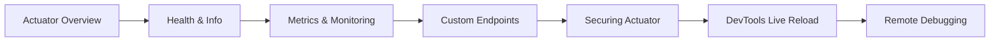

# Actuator, DevTools & Monitoring

> **Previous:** [Application Properties & Configuration](./12-configuration.md) | **Next:** [Logging, Error Handling & i18n](./14-logging-error-i18n.md)

## Learning Objectives

After completing this chapter, you will be able to:

<!-- Image Gallery -->
<section class="lesson-visuals" aria-label="Visual learning resources">
  <header><span>VISUAL LEARNING</span><h2>See it. Review it. Remember it.</h2></header>
  <a class="lesson-visual-card" href="../../../assets/images/lessons/java/13-actuator-devtools/handwritten-notes.svg" target="_blank" rel="noopener">
    
    <span><strong>Handwritten notes</strong>Condensed notes for deliberate review.</span>
  </a>
  <a class="lesson-visual-card" href="../../../assets/images/lessons/java/13-actuator-devtools/sticky-notes.svg" target="_blank" rel="noopener">
    
    <span><strong>Sticky-note revision</strong>Fast recall prompts for revision.</span>
  </a>
  <a class="lesson-visual-card" href="../../../assets/images/lessons/java/13-actuator-devtools/visual-explanation.svg" target="_blank" rel="noopener">
    
    <span><strong>Visual concept guide</strong>A connected explanation of the key ideas.</span>
  </a>
</section>
<!-- End Image Gallery -->


- Expose and configure Spring Boot Actuator endpoints for production monitoring
- Read and interpret key actuator endpoints: health, info, metrics, env, beans, configprops, loggers
- Write custom actuator endpoints with `@Endpoint`, `@ReadOperation`, `@WriteOperation`, and `@DeleteOperation`
- Build custom health indicators with `HealthIndicator` and `ReactiveHealthIndicator`
- Publish custom application metrics using Micrometer annotations `@Counted` and `@Timed`
- Configure info contributors for build and environment metadata
- Secure actuator endpoints with Spring Security
- Use Spring Boot DevTools for live reload and automatic restart during development
- Configure remote debugging with DevTools for containerized environments
- Understand JMX vs HTTP endpoint exposure

## Chapter at a Glance

| Topic | Key Insight | Practical Takeaway |
|-------|-------------|--------------------|
| Actuator Endpoints | /health, /info, /metrics, /env, /beans, /configprops | Expose only what's needed in production |
| Health Indicators | Custom HealthIndicator with health status aggregation | Component-level health checks for dependency services |
| Micrometer Metrics | @Counted, @Timed with dimensional metrics | Publish to Prometheus, Datadog, or Graphite |
| DevTools | Live reload, automatic restart, remote debug | Include DevTools only in development |
| Info Contributors | Build info, git info, environment info | Add build metadata via spring-boot-maven-plugin |

## Chapter Roadmap



> **Warning:** Never expose sensitive actuator endpoints (/env, /configprops, /dump) in production without authentication. Use Spring Security or management port separation.

---

## 1. Theory


### 1.1 Introduction to Spring Boot Actuator


Spring Boot Actuator is a production-grade tool for monitoring and managing Spring Boot applications. It exposes operational information such as health, metrics, environment properties, thread dumps, and more via HTTP endpoints or JMX MBeans.

Actuator is not just for production. It is also useful in development and staging environments for debugging and verification.

Adding the actuator dependency:

```xml
<dependency>
    <groupId>org.springframework.boot</groupId>
    <artifactId>spring-boot-starter-actuator</artifactId>
</dependency>
```

Gradle:

```groovy
implementation 'org.springframework.boot:spring-boot-starter-actuator'
```

### 1.2 Core Actuator Endpoints Reference


Actuator provides many built-in endpoints. Here is the complete reference:

| Endpoint ID | HTTP Path | Description |
|-------------|-----------|-------------|
| `health` | `/actuator/health` | Application health information |
| `info` | `/actuator/info` | Arbitrary application information |
| `metrics` | `/actuator/metrics` | Application metrics (Micrometer) |
| `env` | `/actuator/env` | Environment property sources |
| `beans` | `/actuator/beans` | Complete list of Spring beans |
| `configprops` | `/actuator/configprops` | @ConfigurationProperties beans |
| `loggers` | `/actuator/loggers` | Logger configuration and levels |
| `shutdown` | `/actuator/shutdown` | Gracefully shutdown the application |
| `heapdump` | `/actuator/heapdump` | JVM heap dump (`.hprof` file) |
| `threaddump` | `/actuator/threaddump` | JVM thread dump |
| `mappings` | `/actuator/mappings` | Request mapping paths |
| `scheduledtasks` | `/actuator/scheduledtasks` | Scheduled task details |
| `caches` | `/actuator/caches` | Cache statistics |
| `conditions` | `/actuator/conditions` | Auto-configuration conditions report |
| `integrationgraph` | `/actuator/integrationgraph` | Spring Integration graph |

### 1.3 Enabling and Exposing Endpoints


By default, only the `health` endpoint is exposed over HTTP. All others are exposed via JMX.

#### 1.3.1 Configuration Properties

```yaml
# application.yml
management:
  endpoints:
    web:
      exposure:
        include: health,info,metrics,env
        exclude: shutdown
    jmx:
      exposure:
        include: "*"    # Expose all via JMX

  endpoint:
    health:
      show-details: always
      show-components: always
    env:
      show-values: always    # Shows actual property values (not just keys)
    configprops:
      show-values: always    # Shows configuration property values
    shutdown:
      enabled: true          # Enable shutdown endpoint
```

```properties
# application.properties alternative
management.endpoints.web.exposure.include=health,info,metrics,env
management.endpoints.web.exposure.exclude=shutdown
management.endpoints.jmx.exposure.include=*
management.endpoint.health.show-details=always
management.endpoint.env.show-values=always
management.endpoint.configprops.show-values=always
```

#### 1.3.2 Sensitive Content Protection

In production, you should NEVER set `show-values=always` or `show-details=always` without proper security. Instead, use:

```yaml
management:
  endpoint:
    health:
      show-details: when-authorized
    env:
      show-values: when-authorized
    configprops:
      show-values: when-authorized
```

And configure who is authorized:

```yaml
management:
  endpoints:
    web:
      exposure:
        include: health,info,metrics
```

### 1.4 The /actuator/health Endpoint


The health endpoint aggregates health information from all registered `HealthIndicator` beans.

```json
{
  "status": "UP",
  "components": {
    "db": {
      "status": "UP",
      "details": {
        "database": "PostgreSQL",
        "validationQuery": "SELECT 1"
      }
    },
    "diskSpace": {
      "status": "UP",
      "details": {
        "total": 499963170816,
        "free": 205972684800,
        "threshold": 10485760,
        "path": "/"
      }
    },
    "ping": {
      "status": "UP"
    },
    "redis": {
      "status": "UP",
      "details": {
        "version": "7.2.0"
      }
    }
  }
}
```

#### 1.4.1 Health Status Hierarchy

Health status forms a hierarchy from worst to best:

```
DOWN → OUT_OF_SERVICE → UNKNOWN → UP
```

If any component reports `DOWN`, the overall status becomes `DOWN`.

#### 1.4.2 Custom HealthIndicator

Create a custom health indicator for any external service:

```java
package com.example.actuator.health;

import org.springframework.boot.actuate.health.Health;
import org.springframework.boot.actuate.health.HealthIndicator;
import org.springframework.stereotype.Component;

@Component
public class ExternalApiHealthIndicator implements HealthIndicator {

    private final ExternalApiClient externalApiClient;

    public ExternalApiHealthIndicator(ExternalApiClient externalApiClient) {
        this.externalApiClient = externalApiClient;
    }

    @Override
    public Health health() {
        try {
            boolean isReachable = externalApiClient.ping();
            if (isReachable) {
                return Health.up()
                        .withDetail("apiUrl", externalApiClient.getBaseUrl())
                        .withDetail("latencyMs", externalApiClient.measureLatency())
                        .withDetail("version", "v2")
                        .build();
            } else {
                return Health.down()
                        .withDetail("apiUrl", externalApiClient.getBaseUrl())
                        .withDetail("error", "API returned unhealthy status")
                        .build();
            }
        } catch (Exception e) {
            return Health.down()
                    .withDetail("apiUrl", externalApiClient.getBaseUrl())
                    .withDetail("error", e.getMessage())
                    .build();
        }
    }
}
```

#### 1.4.3 HealthIndicator with Status Details

```java
package com.example.actuator.health;

import org.springframework.boot.actuate.health.Health;
import org.springframework.boot.actuate.health.HealthIndicator;
import org.springframework.boot.actuate.health.Status;
import org.springframework.stereotype.Component;

@Component
public class DatabaseMigrationHealthIndicator implements HealthIndicator {

    private final DatabaseMigrationService migrationService;

    public DatabaseMigrationHealthIndicator(DatabaseMigrationService migrationService) {
        this.migrationService = migrationService;
    }

    @Override
    public Health health() {
        long pendingMigrations = migrationService.countPendingMigrations();

        if (pendingMigrations == 0) {
            return Health.up()
                    .withDetail("message", "All migrations are up to date")
                    .withDetail("applied", migrationService.countAppliedMigrations())
                    .build();
        }

        if (pendingMigrations < 5) {
            return Health.status(new Status("WARN", "Migrations pending"))
                    .withDetail("pending", pendingMigrations)
                    .withDetail("applied", migrationService.countAppliedMigrations())
                    .withDetail("action", "Run pending migrations soon")
                    .build();
        }

        return Health.down()
                .withDetail("pending", pendingMigrations)
                .withDetail("applied", migrationService.countAppliedMigrations())
                .withDetail("action", "Run migrations immediately")
                .build();
    }
}
```

#### 1.4.4 ReactiveHealthIndicator

For reactive applications:

```java
package com.example.actuator.health;

import org.springframework.boot.actuate.health.Health;
import org.springframework.boot.actuate.health.ReactiveHealthIndicator;
import org.springframework.stereotype.Component;
import reactor.core.publisher.Mono;

@Component
public class ReactiveDatabaseHealthIndicator implements ReactiveHealthIndicator {

    private final ReactiveDatabaseClient databaseClient;

    public ReactiveDatabaseHealthIndicator(ReactiveDatabaseClient databaseClient) {
        this.databaseClient = databaseClient;
    }

    @Override
    public Mono<Health> health() {
        return databaseClient.validateConnection()
                .map(result -> Health.up()
                        .withDetail("database", "MongoDB")
                        .withDetail("latency", result.getLatencyMs() + "ms")
                        .withDetail("version", result.getVersion())
                        .build())
                .onErrorResume(e -> Mono.just(
                        Health.down(e)
                                .withDetail("error", e.getMessage())
                                .build()
                ));
    }
}
```

#### 1.4.5 Composite Health

Combine multiple indicators into a logical group:

```java
package com.example.actuator.health;

import org.springframework.boot.actuate.health.CompositeHealthContributor;
import org.springframework.boot.actuate.health.HealthContributor;
import org.springframework.boot.actuate.health.HealthIndicator;
import org.springframework.stereotype.Component;

import java.util.LinkedHashMap;
import java.util.Map;

@Component
public class DatabaseClusterHealthContributor implements CompositeHealthContributor {

    private final Map<String, HealthContributor> contributors = new LinkedHashMap<>();

    public DatabaseClusterHealthContributor(
            DatabaseHealthIndicator primary,
            DatabaseHealthIndicator replica1,
            DatabaseHealthIndicator replica2) {
        contributors.put("primary", primary);
        contributors.put("replica-1", replica1);
        contributors.put("replica-2", replica2);
    }

    @Override
    public HealthContributor getContributor(String name) {
        return contributors.get(name);
    }

    @Override
    public Iterator<NamedContributor<HealthContributor>> iterator() {
        return contributors.entrySet().stream()
                .map(entry -> NamedContributor.of(entry.getKey(), entry.getValue()))
                .iterator();
    }
}
```

### 1.5 The /actuator/info Endpoint


The info endpoint exposes arbitrary application information, often build metadata and environment details.

#### 1.5.1 Static Info Properties

```yaml
# application.yml
info:
  application:
    name: "@project.name@"
    description: "@project.description@"
    version: "@project.version@"
    java-version: "@java.version@"
  contact:
    name: Operations Team
    email: ops@example.com
  build:
    artifact: "@project.artifactId@"
    group: "@project.groupId@"
    time: "@build.timestamp@"
```

**Very important**: Property placeholders like `@project.name@` are resolved at build time by Maven/Gradle resource filtering. This requires resource filtering enabled in your build config.

#### 1.5.2 Build Info Contributor

Use the Maven/Gradle plugin to generate build info:

```xml
<plugin>
    <groupId>org.springframework.boot</groupId>
    <artifactId>spring-boot-maven-plugin</artifactId>
    <executions>
        <execution>
            <goals>
                <goal>build-info</goal>
            </goals>
        </execution>
    </executions>
</plugin>
```

Gradle:

```groovy
springBoot {
    buildInfo()
}
```

This generates `META-INF/build-info.properties` which the actuator auto-detects.

#### 1.5.3 Git Info Contributor

Add the `git-commit-id-plugin` to expose git information:

```xml
<plugin>
    <groupId>io.github.git-commit-id</groupId>
    <artifactId>git-commit-id-maven-plugin</artifactId>
</plugin>
```

Gradle:

```groovy
plugins {
    id "com.gorylenko.gradle-git-properties" version "2.4.1"
}
```

This generates `git.properties` which the actuator uses to populate git info.

#### 1.5.4 Custom InfoContributor

```java
package com.example.actuator.info;

import org.springframework.boot.actuate.info.Info;
import org.springframework.boot.actuate.info.InfoContributor;
import org.springframework.stereotype.Component;

import java.lang.management.ManagementFactory;
import java.lang.management.RuntimeMXBean;
import java.time.Duration;
import java.time.Instant;

@Component
public class RuntimeInfoContributor implements InfoContributor {

    @Override
    public void contribute(Info.Builder builder) {
        RuntimeMXBean runtime = ManagementFactory.getRuntimeMXBean();
        Instant startTime = Instant.ofEpochMilli(runtime.getStartTime());
        Duration uptime = Duration.ofMillis(runtime.getUptime());

        builder.withDetail("runtime", Map.of(
                "startTime", startTime.toString(),
                "uptime", uptime.toHours() + "h " +
                          uptime.toMinutesPart() + "m " +
                          uptime.toSecondsPart() + "s",
                "uptimeSeconds", runtime.getUptime() / 1000,
                "vmName", runtime.getVmName(),
                "vmVersion", runtime.getVmVersion(),
                "inputArguments", runtime.getInputArguments()
        ));
    }
}
```

### 1.6 The /actuator/metrics Endpoint


Metrics provides access to Micrometer application metrics.

#### 1.6.1 Listing Available Metrics

```shell
curl http://localhost:8080/actuator/metrics
```

Response:

```json
{
  "names": [
    "jvm.memory.used",
    "jvm.memory.max",
    "jvm.gc.pause",
    "http.server.requests",
    "process.cpu.usage",
    "system.cpu.usage",
    "logback.events",
    "application.ready.time",
    "application.started.time"
  ]
}
```

#### 1.6.2 Viewing Specific Metric

```shell
curl http://localhost:8080/actuator/metrics/http.server.requests
curl "http://localhost:8080/actuator/metrics/http.server.requests?tag=uri:/api/orders&tag=status:200"
```

#### 1.6.3 Custom Metrics with @Counted and @Timed

Add the `micrometer-core` dependency (it's included in `spring-boot-starter-actuator`):

```xml
<dependency>
    <groupId>io.micrometer</groupId>
    <artifactId>micrometer-core</artifactId>
</dependency>
<dependency>
    <groupId>io.micrometer</groupId>
    <artifactId>micrometer-tracing-bridge-brave</artifactId>
</dependency>
```

Enable aspect-oriented metrics:

```java
package com.example.actuator.config;

import io.micrometer.core.aop.CountedAspect;
import io.micrometer.core.aop.TimedAspect;
import io.micrometer.core.instrument.MeterRegistry;
import org.springframework.context.annotation.Bean;
import org.springframework.context.annotation.Configuration;

@Configuration(proxyBeanMethods = false)
public class MetricsConfig {

    @Bean
    public CountedAspect countedAspect(MeterRegistry registry) {
        return new CountedAspect(registry);
    }

    @Bean
    public TimedAspect timedAspect(MeterRegistry registry) {
        return new TimedAspect(registry);
    }
}
```

#### 1.6.4 Using @Counted

Track invocation counts and error counts:

```java
package com.example.actuator.service;

import io.micrometer.core.annotation.Counted;
import org.springframework.stereotype.Service;

@Service
public class OrderService {

    @Counted(
        value = "orders.created",
        description = "Number of orders created",
        extraTags = {"service", "order-service"}
    )
    public Order createOrder(OrderRequest request) {
        // business logic
        Order order = new Order(request);
        orderRepository.save(order);
        return order;
    }

    @Counted(
        value = "orders.cancelled",
        description = "Number of orders cancelled",
        recordFailuresOnly = false
    )
    public void cancelOrder(Long orderId) {
        Order order = orderRepository.findById(orderId)
                .orElseThrow(() -> new OrderNotFoundException(orderId));
        order.setStatus(OrderStatus.CANCELLED);
        orderRepository.save(order);
    }
}
```

#### 1.6.5 Using @Timed

Measure execution time of methods:

```java
package com.example.actuator.service;

import io.micrometer.core.annotation.Timed;
import org.springframework.stereotype.Service;

import java.util.concurrent.TimeUnit;

@Service
public class PaymentService {

    @Timed(
        value = "payment.processing",
        description = "Time taken to process a payment",
        extraTags = {"processor", "stripe"},
        longTask = true,
        percentiles = {0.5, 0.95, 0.99}
    )
    public PaymentResult processPayment(PaymentRequest request) {
        // call payment gateway
        return paymentGateway.charge(request);
    }

    @Timed(
        value = "payment.refund",
        description = "Time taken to process refund",
        histogram = true
    )
    public RefundResult processRefund(String transactionId, BigDecimal amount) {
        return paymentGateway.refund(transactionId, amount);
    }
}
```

#### 1.6.6 Programmatic Meter Registration

```java
package com.example.actuator.service;

import io.micrometer.core.instrument.Counter;
import io.micrometer.core.instrument.MeterRegistry;
import io.micrometer.core.instrument.Timer;
import jakarta.annotation.PostConstruct;
import org.springframework.stereotype.Service;

import java.util.concurrent.TimeUnit;
import java.util.function.Supplier;

@Service
public class InventoryService {

    private final Counter stockCheckCounter;
    private final Timer stockCheckTimer;
    private final Counter stockReservationCounter;

    public InventoryService(MeterRegistry meterRegistry) {
        this.stockCheckCounter = meterRegistry.counter("inventory.stock.checks",
                "service", "inventory-service");
        this.stockCheckTimer = meterRegistry.timer("inventory.stock.check.duration",
                "service", "inventory-service");
        this.stockReservationCounter = Counter.builder("inventory.reservations")
                .description("Number of inventory reservations")
                .tags("region", "eu-west", "type", "standard")
                .register(meterRegistry);
    }

    public boolean checkAvailability(String sku, int quantity) {
        stockCheckCounter.increment();
        return stockCheckTimer.record(() -> {
            // simulate stock lookup
            return inventoryRepository.hasStock(sku, quantity);
        });
    }

    public void reserveStock(String sku, int quantity) {
        stockReservationCounter.increment(quantity);
        inventoryRepository.reserve(sku, quantity);
    }
}
```

#### 1.6.7 Gauge for Point-in-Time Values

```java
package com.example.actuator.service;

import io.micrometer.core.instrument.Gauge;
import io.micrometer.core.instrument.MeterRegistry;
import jakarta.annotation.PostConstruct;
import org.springframework.stereotype.Service;

import java.util.concurrent.atomic.AtomicInteger;

@Service
public class QueueMetricsService {

    private final AtomicInteger pendingJobs = new AtomicInteger(0);

    public QueueMetricsService(MeterRegistry meterRegistry) {
        Gauge.builder("queue.pending.jobs", pendingJobs, AtomicInteger::get)
                .description("Number of pending jobs in the queue")
                .tag("queue", "order-processing")
                .register(meterRegistry);
    }

    public void enqueueJob() {
        pendingJobs.incrementAndGet();
    }

    public void processJob() {
        pendingJobs.decrementAndGet();
    }
}
```

### 1.7 The /actuator/env Endpoint


The environment endpoint exposes all property sources and their values.

```shell
curl http://localhost:8080/actuator/env
```

Response (abbreviated):

```json
{
  "activeProfiles": ["dev"],
  "propertySources": [
    {
      "name": "server.ports",
      "properties": {
        "local.server.port": {
          "value": 8081
        }
      }
    },
    {
      "name": "application.yml",
      "properties": {
        "server.port": {
          "value": 8081
        },
        "spring.datasource.url": {
          "value": "jdbc:postgresql://localhost:5432/mydb"
        }
      }
    },
    {
      "name": "systemEnvironment",
      "properties": {
        "PATH": {
          "value": "/usr/local/bin:...",
          "origin": "System Environment Property"
        }
      }
    }
  ]
}
```

Query a specific property:

```shell
curl http://localhost:8080/actuator/env/server.port
```

```json
{
  "property": {
    "source": "application.yml",
    "value": "8081"
  },
  "activeProfiles": ["dev"],
  "propertySources": [
    {
      "name": "application.yml",
      "property": {
        "source": "application.yml",
        "value": "8081"
      }
    },
    {
      "name": "server.ports",
      "property": {
        "source": "server.ports",
        "value": 8081
      }
    }
  ]
}
```

### 1.8 The /actuator/beans Endpoint


Lists all Spring beans with their scope, type, and dependencies.

```shell
curl http://localhost:8080/actuator/beans
```

Response:

```json
{
  "contexts": {
    "application": {
      "beans": {
        "orderService": {
          "aliases": [],
          "scope": "singleton",
          "type": "com.example.service.OrderService",
          "resource": "file:.../OrderService.java",
          "dependencies": ["orderRepository", "paymentService"]
        }
      },
      "parentId": null
    }
  }
}
```

### 1.9 The /actuator/configprops Endpoint


Shows all `@ConfigurationProperties` beans with their current values:

```shell
curl http://localhost:8080/actuator/configprops
```

Output:

```json
{
  "contexts": {
    "application": {
      "beans": {
        "orderProperties": {
          "prefix": "app.order",
          "properties": {
            "processingTimeout": "PT30S",
            "maxItemsPerOrder": 50,
            "paymentGracePeriod": "PT5M",
            "notification": {
              "enabled": true,
              "channels": ["EMAIL", "SMS"]
            }
          }
        }
      }
    }
  }
}
```

### 1.10 The /actuator/loggers Endpoint


View and change log levels at runtime → one of the most useful features for debugging production issues.

#### 1.10.1 Viewing Logger Configurations

```shell
curl http://localhost:8080/actuator/loggers
```

Response:

```json
{
  "levels": ["OFF", "ERROR", "WARN", "INFO", "DEBUG", "TRACE"],
  "loggers": {
    "ROOT": {
      "configuredLevel": "INFO",
      "effectiveLevel": "INFO"
    },
    "com.example": {
      "configuredLevel": null,
      "effectiveLevel": "INFO"
    },
    "com.example.service.OrderService": {
      "configuredLevel": "DEBUG",
      "effectiveLevel": "DEBUG"
    }
  }
}
```

#### 1.10.2 Changing Log Level at Runtime

```shell
curl -X POST http://localhost:8080/actuator/loggers/com.example \
  -H "Content-Type: application/json" \
  -d '{"configuredLevel": "DEBUG"}'
```

This is **immediate** → no restart required. It persists until the application restarts or you change it back.

Programmatic equivalent:

```java
package com.example.actuator.controller;

import org.springframework.web.bind.annotation.*;

@RestController
@RequestMapping("/api/logging")
public class LoggingController {

    private final LoggingService loggingService;

    public LoggingController(LoggingService loggingService) {
        this.loggingService = loggingService;
    }

    @PostMapping("/level")
    public void setLogLevel(@RequestParam String packageName, @RequestParam String level) {
        loggingService.setLogLevel(packageName, level);
    }

    @GetMapping("/level/{packageName}")
    public String getLogLevel(@PathVariable String packageName) {
        return loggingService.getLogLevel(packageName);
    }
}
```

### 1.11 Endpoint /actuator/shutdown


Gracefully shutdown the application:

```yaml
management:
  endpoint:
    shutdown:
      enabled: true   # DISABLED by default for safety
```

```shell
curl -X POST http://localhost:8080/actuator/shutdown
```

Response:

```json
{
  "message": "Shutting down, bye..."
}
```

In production, secure this endpoint or keep it disabled. Use platform-level (Kubernetes, cloud instance group) shutdown mechanisms instead.

### 1.12 Endpoint /actuator/heapdump


Download a JVM heap dump for memory analysis:

```shell
curl http://localhost:8080/actuator/heapdump -o heapdump.hprof
```

The resulting `.hprof` file can be opened with tools like Eclipse MAT, VisualVM, or JProfiler.

### 1.13 Endpoint /actuator/threaddump


Get a JVM thread dump:

```shell
curl http://localhost:8080/actuator/threaddump
```

Returns a JSON array of all threads with stack traces, thread state, and lock information:

```json
{
  "threads": [
    {
      "threadName": "http-nio-8080-exec-1",
      "threadId": 42,
      "blockedTime": -1,
      "blockedCount": 0,
      "waitedTime": -1,
      "waitedCount": 1,
      "lockName": null,
      "lockOwnerId": -1,
      "lockOwnerName": null,
      "inNative": false,
      "suspended": false,
      "threadState": "RUNNABLE",
      "stackTrace": [
        {
          "methodName": "doProcess",
          "fileName": "OrderService.java",
          "lineNumber": 45,
          "className": "com.example.service.OrderService",
          "nativeMethod": false
        }
      ],
      "lockedMonitors": [],
      "lockedSynchronizers": [],
      "lockInfo": null
    }
  ]
}
```

### 1.14 Endpoint /actuator/mappings


Shows all request mappings in the application:

```shell
curl http://localhost:8080/actuator/mappings
```

Output:

```json
{
  "contexts": {
    "application": {
      "mappings": {
        "dispatcherServlets": {
          "dispatcherServlet": [
            {
              "handler": "com.example.controller.OrderController#createOrder(OrderRequest)",
              "predicate": "{POST [/api/orders], consumes [application/json]}",
              "methods": ["POST"],
              "produces": ["application/json"]
            }
          ]
        }
      }
    }
  }
}
```

### 1.15 Endpoint /actuator/scheduledtasks


Shows all scheduled tasks with their schedule:

```shell
curl http://localhost:8080/actuator/scheduledtasks
```

```json
{
  "cron": [
    {
      "runnable": "com.example.service.CacheEvictionService.evictExpiredEntries",
      "expression": "0 0 * * * *",
      "nextExecution": "2026-06-12T01:00:00Z"
    }
  ],
  "fixedRate": [
    {
      "runnable": "com.example.service.HealthCheckService.runHealthCheck",
      "initialDelayMs": 5000,
      "intervalMs": 30000
    }
  ],
  "fixedDelay": [
    {
      "runnable": "com.example.service.DataSyncService.syncData",
      "initialDelayMs": 10000,
      "intervalMs": 60000
    }
  ]
}
```

### 1.16 Custom Actuator Endpoints


#### 1.16.1 @Endpoint with @ReadOperation

```java
package com.example.actuator.endpoint;

import org.springframework.boot.actuate.endpoint.annotation.Endpoint;
import org.springframework.boot.actuate.endpoint.annotation.ReadOperation;
import org.springframework.stereotype.Component;

@Component
@Endpoint(id = "feature-toggles")
public class FeatureToggleEndpoint {

    private final FeatureToggleService featureToggleService;

    public FeatureToggleEndpoint(FeatureToggleService featureToggleService) {
        this.featureToggleService = featureToggleService;
    }

    @ReadOperation
    public Map<String, Object> getAllFeatures() {
        return featureToggleService.getAllToggles().stream()
                .collect(Collectors.toMap(
                        FeatureToggle::getName,
                        toggle -> Map.of(
                                "enabled", toggle.isEnabled(),
                                "description", toggle.getDescription(),
                                "updatedAt", toggle.getUpdatedAt().toString()
                        )
                ));
    }

    @ReadOperation
    public Map<String, Object> getFeature(@Selector String featureName) {
        return featureToggleService.getToggle(featureName)
                .map(toggle -> Map.of(
                        "name", toggle.getName(),
                        "enabled", toggle.isEnabled(),
                        "description", toggle.getDescription()
                ))
                .orElse(Map.of("error", "Feature not found"));
    }
}
```

#### 1.16.2 @WriteOperation

```java
@Component
@Endpoint(id = "feature-toggles")
public class FeatureToggleEndpoint {

    // ... existing read operations ...

    @WriteOperation
    public Map<String, Object> setFeature(
            @Selector String featureName,
            boolean enabled
    ) {
        featureToggleService.setToggle(featureName, enabled);
        return Map.of(
                "name", featureName,
                "enabled", enabled,
                "status", "updated"
        );
    }
}
```

#### 1.16.3 @DeleteOperation

```java
@Component
@Endpoint(id = "cache")
public class CacheEndpoint {

    private final CacheManager cacheManager;

    public CacheEndpoint(CacheManager cacheManager) {
        this.cacheManager = cacheManager;
    }

    @ReadOperation
    public List<String> getCaches() {
        return cacheManager.getCacheNames().stream()
                .sorted()
                .collect(Collectors.toList());
    }

    @DeleteOperation
    public Map<String, Object> clearCache(@Selector String cacheName) {
        Cache cache = cacheManager.getCache(cacheName);
        if (cache != null) {
            cache.clear();
            return Map.of(
                    "cache", cacheName,
                    "status", "cleared"
            );
        }
        return Map.of(
                "cache", cacheName,
                "status", "not-found"
        );
    }

    @DeleteOperation
    public Map<String, Object> clearAllCaches() {
        cacheManager.getCacheNames().forEach(
                name -> cacheManager.getCache(name).clear()
        );
        return Map.of(
                "caches", cacheManager.getCacheNames().size(),
                "status", "all-cleared"
        );
    }
}
```

#### 1.16.4 Reactive Endpoint

```java
@Component
@Endpoint(id = "message-stream")
public class MessageStreamEndpoint {

    private final MessageService messageService;

    public MessageStreamEndpoint(MessageService messageService) {
        this.messageService = messageService;
    }

    @ReadOperation
    public Flux<String> streamMessages() {
        return messageService.getMessageStream();
    }
}
```

### 1.17 JMX vs HTTP Endpoint Exposure


#### 1.17.1 JMX Endpoints

All actuator endpoints are exposed via JMX by default. Access them with `jconsole` or `jvisualvm`:

```yaml
management:
  endpoints:
    jmx:
      exposure:
        include: health,info,metrics
        exclude: shutdown
      domain: com.example.actuator
      unique-names: true
```

JMX is suitable for on-premise environments where you can connect to the JVM directly. For cloud-native and containerized deployments, HTTP endpoints are preferred.

#### 1.17.2 HTTP Endpoints

```yaml
management:
  endpoints:
    web:
      base-path: /manage    # Custom base path (default: /actuator)
      exposure:
        include: health,info,metrics,env,loggers
        exclude: shutdown
      path-mapping:
        health: healthcheck  # Override path: /manage/healthcheck
  server:
    port: 9090              # Separate management port
    address: 127.0.0.1      # Bind to localhost only
```

Using a separate management port is a best practice for security:

```yaml
management:
  server:
    port: 9090
    address: 127.0.0.1
```

This way, actuator endpoints are only accessible from the local machine. A monitoring agent (Prometheus, Datadog, etc.) running on the same host can access them.

#### 1.17.3 CORS Configuration for Actuator

```yaml
management:
  endpoints:
    web:
      cors:
        allowed-origins: https://admin.example.com
        allowed-methods: GET,POST
        allowed-headers: "*"
```

### 1.18 Securing Actuator Endpoints


#### 1.18.1 With Spring Security

```java
package com.example.actuator.config;

import org.springframework.context.annotation.Bean;
import org.springframework.context.annotation.Configuration;
import org.springframework.security.config.Customizer;
import org.springframework.security.config.annotation.web.builders.HttpSecurity;
import org.springframework.security.config.annotation.web.configuration.EnableWebSecurity;
import org.springframework.security.core.userdetails.User;
import org.springframework.security.core.userdetails.UserDetailsService;
import org.springframework.security.provisioning.InMemoryUserDetailsManager;
import org.springframework.security.web.SecurityFilterChain;

import static org.springframework.boot.actuate.autoconfigure.security.servlet.EndpointRequest.toAnyEndpoint;

@Configuration
@EnableWebSecurity
public class ActuatorSecurityConfig {

    @Bean
    public SecurityFilterChain securityFilterChain(HttpSecurity http) throws Exception {
        http
            .securityMatcher("/actuator/**")
            .authorizeHttpRequests(auth -> auth
                .requestMatchers(toAnyEndpoint())
                    .hasRole("ADMIN")
                .requestMatchers("/actuator/health")
                    .permitAll()  // health endpoint is public
                .anyRequest().authenticated()
            )
            .httpBasic(Customizer.withDefaults())
            .csrf(csrf -> csrf.ignoringRequestMatchers("/actuator/**"));

        return http.build();
    }

    @Bean
    public UserDetailsService actuatorUsers() {
        return new InMemoryUserDetailsManager(
            User.withUsername("admin")
                .password("{bcrypt}$2a$10$...")
                .roles("ADMIN")
                .build()
        );
    }
}
```

#### 1.18.2 Role-Based Access

```java
@Configuration
@EnableWebSecurity
public class RoleBasedActuatorSecurity {

    @Bean
    public SecurityFilterChain filterChain(HttpSecurity http) throws Exception {
        http
            .authorizeHttpRequests(auth -> auth
                .requestMatchers(toAnyEndpoint().excluding("health"))
                    .hasRole("ACTUATOR_ADMIN")
                .requestMatchers(EndpointRequest.to("health"))
                    .permitAll()
                .requestMatchers(EndpointRequest.to("shutdown"))
                    .denyAll()  // Always deny shutdown via web
                .anyRequest().authenticated()
            )
            .httpBasic(Customizer.withDefaults());

        return http.build();
    }
}
```

### 1.19 Spring Boot DevTools


DevTools provides development-time productivity features: automatic restart, live reload, property defaults, remote debugging, and more.

```xml
<dependency>
    <groupId>org.springframework.boot</groupId>
    <artifactId>spring-boot-devtools</artifactId>
    <optional>true</optional>
</dependency>
```

**Critical**: Always mark DevTools as `optional` so it doesn't get deployed to production.

#### 1.19.1 Automatic Restart

DevTools monitors the classpath for changes. When a file is modified, it triggers a **very fast** restart.

```
Triggered by:
- Modified .class files (recompiled Java)
- Modified static resources
- Modified templates
- Modified properties/YAML files

NOT triggered by:
- Web resources (static files in /static or /public)
- View templates (Thymeleaf, FreeMarker)
```

The restart is faster than a cold start because it uses two classloaders:
- **Base classloader**: unchanged third-party JARs (loaded once)
- **Restart classloader**: application classes (reloaded on changes)

```yaml
spring:
  devtools:
    restart:
      enabled: true                       # Enable restarts
      poll-interval: 1s                   # How often to check for changes
      quiet-period: 400ms                 # Wait period before restart
      trigger-file: .reload-trigger       # Only watch this file
      exclude: static/**,public/**        # Exclude patterns
      additional-paths:                   # Additional paths to watch
        - src/main/resources
        - config/
  thymeleaf:
    cache: false                          # Disable template caching during dev
```

#### 1.19.2 LiveReload

DevTools includes an embedded LiveReload server that triggers browser refresh when resources change.

```yaml
spring:
  devtools:
    livereload:
      enabled: true       # Default: true
      port: 35729         # Default LiveReload port
```

Install the LiveReload browser extension (Chrome, Firefox, Safari) for automatic page refreshes.

#### 1.19.3 DevTools Property Defaults

DevTools changes some defaults for development:

| Property | Production Default | DevTools Default |
|----------|-------------------|------------------|
| `spring.thymeleaf.cache` | `false` (Spring Boot default), but commonly `true` in prod | `true` → `false` |
| `spring.freemarker.cache` | `true` | `false` |
| `spring.groovy.templates.cache` | `true` | `false` |
| `spring.web.resources.cache.period` | 0 | 0 |
| `spring.web.resources.chain.cache` | `false` (SB default) | `false` |

#### 1.19.4 Conditional DevTools Configuration

DevTools supports profile-based configuration:

```yaml
spring:
  devtools:
    restart:
      enabled: true
    livereload:
      enabled: true

---
spring:
  config:
    activate:
      on-profile: prod

spring:
  devtools:
    restart:
      enabled: false      # Disable in production
    livereload:
      enabled: false
```

Or programmatically:

```java
@Configuration
public class DevConfig {

    @Bean
    @Profile("dev")
    public CommandLineRunner devToolsConfig() {
        return args -> {
            System.out.println("=== DevTools Active ===");
            System.out.println("Restart enabled: " +
                System.getProperty("spring.devtools.restart.enabled"));
            System.out.println("LiveReload enabled: " +
                System.getProperty("spring.devtools.livereload.enabled"));
            System.out.println("Template cache: false");
        };
    }
}
```

#### 1.19.5 Global DevTools Settings

Create `~/.spring-boot-devtools.properties` in your home directory to apply DevTools settings globally:

```properties
# ~/.spring-boot-devtools.properties
spring.devtools.restart.enabled=true
spring.devtools.restart.poll-interval=2s
spring.devtools.livereload.enabled=true
spring.devtools.livereload.port=35729
```

These apply to **every** Spring Boot project on your machine and have the **highest** priority in the configuration hierarchy.

#### 1.19.6 Remote Debugging with DevTools

**WARNING**: Remote DevTools support is a **security risk** in production. It allows arbitrary code execution. Use only in development or staging environments behind a VPN/firewall.

On the server, run the application with a secret:

```shell
java -jar app.jar \
  --spring.devtools.remote.secret=my-secret-key
```

From your IDE, create a Remote DevTools client:

```yaml
# In your IDE's run configuration
spring.devtools.remote.secret=my-secret-key
spring.devtools.remote.url=http://remote-server:8080
```

The remote URL points to the **entire application** context path (e.g., `http://server:8080/myapp`).

#### 1.19.7 Remote Debugging with Standard JPDA

This is the more common and more secure approach:

```shell
java -agentlib:jdwp=transport=dt_socket,server=y,suspend=n,address=*:5005 -jar app.jar
```

Configure in your IDE (IntelliJ IDEA):

1. Run → Edit Configurations
2. Add New Configuration → Remote JVM Debug
3. Set port: 5005
4. Use module classpath for your application

#### 1.19.8 DevTools in Docker Compose

```yaml
# docker-compose.yml
version: '3.8'
services:
  app:
    build: .
    ports:
      - "8080:8080"
      - "35729:35729"   # LiveReload
      - "5005:5005"     # JPDA debug
    volumes:
      - ./target/classes:/app/target/classes  # Mount compiled classes
      - ./src/main/resources:/app/src/main/resources
    environment:
      - JAVA_TOOL_OPTIONS=-agentlib:jdwp=transport=dt_socket,server=y,suspend=n,address=*:5005
      - SPRING_PROFILES_ACTIVE=dev
```

#### 1.19.9 Remote Restart Tunnel

DevTools supports tunneling over SSH for remote restart:

```shell
ssh -L 8080:localhost:8080 -L 35729:localhost:35729 user@remote-server
```

Then set `spring.devtools.remote.url=http://localhost:8080` in your IDE.

### 1.20 Excluding DevTools from the Production Build


Maven:

```xml
<plugin>
    <groupId>org.springframework.boot</groupId>
    <artifactId>spring-boot-maven-plugin</artifactId>
    <configuration>
        <excludeDevtools>true</excludeDevtools>
    </configuration>
</plugin>
```

Or ensure it's only in `provided`/`optional` scope as shown earlier.

### 1.21 Complete Secure Actuator Example


```java
package com.example.actuator.config;

import org.springframework.context.annotation.Bean;
import org.springframework.context.annotation.Configuration;
import org.springframework.core.annotation.Order;
import org.springframework.security.config.Customizer;
import org.springframework.security.config.annotation.web.builders.HttpSecurity;
import org.springframework.security.config.annotation.web.configuration.EnableWebSecurity;
import org.springframework.security.core.userdetails.User;
import org.springframework.security.core.userdetails.UserDetailsService;
import org.springframework.security.provisioning.InMemoryUserDetailsManager;
import org.springframework.security.web.SecurityFilterChain;

import static org.springframework.boot.actuate.autoconfigure.security.servlet.EndpointRequest.toAnyEndpoint;

@Configuration
@EnableWebSecurity
public class SecurityConfig {

    @Bean
    @Order(1)
    public SecurityFilterChain actuatorFilterChain(HttpSecurity http) throws Exception {
        http
            .securityMatcher("/actuator/**")
            .authorizeHttpRequests(auth -> auth
                .requestMatchers(toAnyEndpoint().excluding("health", "info"))
                    .hasRole("ACTUATOR")
                .requestMatchers(toAnyEndpoint().including("health", "info"))
                    .permitAll()
                .anyRequest().denyAll()
            )
            .httpBasic(Customizer.withDefaults())
            .csrf(csrf -> csrf.disable());

        return http.build();
    }

    @Bean
    @Order(2)
    public SecurityFilterChain appFilterChain(HttpSecurity http) throws Exception {
        http
            .authorizeHttpRequests(auth -> auth
                .requestMatchers("/api/public/**").permitAll()
                .requestMatchers("/api/admin/**").hasRole("ADMIN")
                .anyRequest().authenticated()
            )
            .formLogin(Customizer.withDefaults());

        return http.build();
    }

    @Bean
    public UserDetailsService users() {
        return new InMemoryUserDetailsManager(
            User.withUsername("admin")
                .password("{noop}admin")
                .roles("ADMIN", "ACTUATOR")
                .build(),
            User.withUsername("monitor")
                .password("{noop}monitor")
                .roles("ACTUATOR")
                .build(),
            User.withUsername("user")
                .password("{noop}user")
                .roles("USER")
                .build()
        );
    }
}
```

### 1.22 Prometheus and Grafana Integration


Add the Micrometer Prometheus registry:

```xml
<dependency>
    <groupId>io.micrometer</groupId>
    <artifactId>micrometer-registry-prometheus</artifactId>
</dependency>
```

This adds a `/actuator/prometheus` endpoint:

```yaml
management:
  endpoints:
    web:
      exposure:
        include: health,info,metrics,prometheus
  metrics:
    export:
      prometheus:
        enabled: true
    tags:
      application: ${spring.application.name}
      environment: ${spring.profiles.active:default}
```

Prometheus configuration (`prometheus.yml`):

```yaml
scrape_configs:
  - job_name: 'spring-boot-app'
    metrics_path: '/actuator/prometheus'
    scrape_interval: 15s
    static_configs:
      - targets: ['localhost:8080']
```

Grafana dashboard panels:
- JVM memory usage (heap/non-heap)
- HTTP request rate and latency (p50, p95, p99)
- GC pause time and frequency
- Thread states
- Custom business metrics (orders created, payments processed)
- Logback error rate

### 1.23 Custom Health Aggregator


Define custom health status aggregation:

```java
package com.example.actuator.health;

import org.springframework.boot.actuate.health.Status;
import org.springframework.boot.actuate.health.StatusAggregator;
import org.springframework.stereotype.Component;

import java.util.Arrays;
import java.util.LinkedHashSet;
import java.util.Set;

@Component
public class CustomStatusAggregator implements StatusAggregator {

    private static final Set<Status> ORDERED_STATUSES = new LinkedHashSet<>(
            Arrays.asList(
                    Status.DOWN,
                    Status.OUT_OF_SERVICE,
                    new Status("WARN", "Degraded"),
                    Status.UNKNOWN,
                    Status.UP
            )
    );

    @Override
    public Status getAggregateStatus(Set<Status> statuses) {
        for (Status status : ORDERED_STATUSES) {
            if (statuses.contains(status)) {
                return status;
            }
        }
        return Status.UNKNOWN;
    }
}
```

### 1.24 Metrics with @Timed on All Endpoints


Enable auto-timing for all Spring MVC endpoints:

```yaml
management:
  metrics:
    web:
      server:
        request:
          autotime:
            enabled: true
            percentiles: 0.5, 0.95, 0.99
            percentiles-histogram: true
```

### 1.25 Excluding Specific Metrics


```yaml
management:
  metrics:
    enable:
      jvm: false
      logback: false
    use-global-registry: false
```

### 1.26 Custom Actuator Endpoint with Filtering


```java
package com.example.actuator.endpoint;

import org.springframework.boot.actuate.endpoint.annotation.DeleteOperation;
import org.springframework.boot.actuate.endpoint.annotation.Endpoint;
import org.springframework.boot.actuate.endpoint.annotation.ReadOperation;
import org.springframework.boot.actuate.endpoint.annotation.Selector;
import org.springframework.boot.actuate.endpoint.annotation.WriteOperation;
import org.springframework.stereotype.Component;

import java.util.Map;
import java.util.concurrent.ConcurrentHashMap;

@Component
@Endpoint(id = "cache-manager")
public class CacheManagerEndpoint {

    private final Map<String, CacheStats> cacheStats = new ConcurrentHashMap<>();

    @ReadOperation
    public Map<String, CacheStats> getAllCaches(@Selector String cacheName) {
        if (cacheName != null) {
            return Map.of(cacheName, cacheStats.get(cacheName));
        }
        return cacheStats;
    }

    @WriteOperation
    public void updateCacheConfig(
            @Selector String cacheName,
            int maxSize,
            long ttlSeconds
    ) {
        CacheStats stats = cacheStats.computeIfAbsent(cacheName, k -> new CacheStats());
        stats.setMaxSize(maxSize);
        stats.setTtlSeconds(ttlSeconds);
    }

    @DeleteOperation
    public void evictCache(@Selector String cacheName) {
        cacheStats.remove(cacheName);
    }

    public static class CacheStats {
        private long hits;
        private long misses;
        private int maxSize;
        private long ttlSeconds;

        public long getHits() { return hits; }
        public void setHits(long hits) { this.hits = hits; }
        public long getMisses() { return misses; }
        public void setMisses(long misses) { this.misses = misses; }
        public int getMaxSize() { return maxSize; }
        public void setMaxSize(int maxSize) { this.maxSize = maxSize; }
        public long getTtlSeconds() { return ttlSeconds; }
        public void setTtlSeconds(long ttlSeconds) { this.ttlSeconds = ttlSeconds; }
        public double getHitRate() {
            long total = hits + misses;
            return total == 0 ? 0.0 : (double) hits / total;
        }
    }
}
```

### 1.27 Complete DevTools Configuration for Development


```yaml
# application-dev.yml
spring:
  devtools:
    restart:
      enabled: true
      poll-interval: 1500ms
      quiet-period: 500ms
      exclude: static/**,templates/**
    livereload:
      enabled: true
      port: 35729
  thymeleaf:
    cache: false
  web:
    resources:
      cache:
        period: 0

logging:
  level:
    org.springframework.boot.devtools: DEBUG

---
spring:
  config:
    activate:
      on-profile: docker-dev

spring:
  devtools:
    remote:
      secret: dev-secret-key-change-in-prod
    restart:
      enabled: true

server:
  port: 8080
```

### 1.28 Disabling DevTools in Production


```yaml
# application-prod.yml
spring:
  devtools:
    restart:
      enabled: false
    livereload:
      enabled: false
    add-properties: false

logging:
  level:
    org.springframework.boot.devtools: OFF
```

### 1.29 Best Practices


1. **Always mark DevTools as optional** to exclude from production.
2. **Never expose sensitive actuator info endpoints** in production without authentication.
3. **Use a separate management port** for actuator endpoints (`management.server.port`).
4. **Enable only what you need** for actuator endpoints.
5. **Keep the shutdown endpoint disabled** in production.
6. **Use role-based access** for different actuator endpoints.
7. **Never use remote DevTools** on a public network.
8. **Use @Timed and @Counted** for business metrics, not just JVM metrics.
9. **Integrate with Prometheus/Grafana** for long-term metric storage and visualization.
10. **Set health endpoint to `when-authorized`** for details in production.
11. **Use the spring-boot-maven-plugin with build-info** to populate the info endpoint.
12. **Exclude DevTools from the final artifact** in multi-stage Docker builds.

## Concept Comparison Table

| Concept | Definition | Key Distinction | Use Case |
|---------|-----------|-----------------|----------|
| Actuator | Production-ready monitoring endpoints | Health, metrics, env, beans, configprops | Observability in production |
| Micrometer | Vendor-neutral metrics facade | Dimensional metrics with tags | Prometheus, Datadog, Graphite exporters |
| Health Indicator | Component health check | Aggregated health status | Database, disk, external service health |
| DevTools | Developer productivity tools | Live reload, auto-restart, remote debug | Development-only dependency |
| Info Contributor | Metadata about running application | Build info, git commit, environment | Version tracking in production |

## Quick Reference

| Actuator Endpoint | Path | Default Exposure | Usage |
|------------------|------|-----------------|-------|
| Health | /actuator/health | Web + JMX | App health with component details |
| Info | /actuator/info | Web + JMX | Build, git, custom metadata |
| Metrics | /actuator/metrics | Web + JMX | Application metrics |
| Env | /actuator/env | JMX only | Environment properties |
| Beans | /actuator/beans | JMX only | All Spring beans |
| Loggers | /actuator/loggers | Web + JMX | Dynamic log level changes |

## Cross-Application Matrix

| Feature | Development | Staging | Production |
|---------|-------------|---------|------------|
| DevTools | Enabled | Disabled | Disabled |
| Actuator Web | All endpoints | Health, info, metrics | Health, info, liveness, readiness |
| Log Levels | DEBUG | INFO | WARN |
| Metrics Recording | Verbose | Key metrics | Production-optimized |

## Chapter Quiz

1. Which actuator endpoint provides liveness and readiness probes for Kubernetes?
   - A) /actuator/health
   - B) /actuator/info
   - C) /actuator/metrics
   - D) /actuator/liveness

<details>
<summary>Answer&lt;/summary&gt;
**A) /actuator/health.** Spring Boot exposes liveness and readiness as grouped health indicators under /actuator/health/liveness and /actuator/health/readiness when configured.
</details>

2. What is the purpose of Micrometer in Spring Boot?
   - A) Code profiling
   - B) Vendor-neutral metrics collection
   - C) Log aggregation
   - D) Health checking

<details>
<summary>Answer&lt;/summary&gt;
**B) Vendor-neutral metrics collection.** Micrometer provides a dimensional metrics facade that supports multiple monitoring systems like Prometheus, Datadog, and Graphite.
</details>

3. How do you enable DevTools live reload for template changes?
   - A) Add spring-boot-devtools dependency
   - B) Set spring.liveReload.enabled=true
   - C) Install a browser plugin
   - D) Use IntelliJ LiveReload plugin

<details>
<summary>Answer&lt;/summary&gt;
**A) Add spring-boot-devtools dependency.** DevTools automatically enables LiveReload server; install LiveReload browser extension to trigger page refresh on changes.
</details>

---

## Summary

Spring Boot Actuator and DevTools bridge the gap between development and production:

**Actuator** provides:
- 15+ built-in monitoring endpoints (health, metrics, env, beans, loggers, threaddump, heapdump, etc.)
- Custom endpoints via `@Endpoint`, `@ReadOperation`, `@WriteOperation`, `@DeleteOperation`
- Health indicators for service health with composite aggregation
- Metrics with Micrometer, Prometheus integration, `@Counted`, `@Timed`
- Info contributors for build/git/environment metadata
- JMX and HTTP exposure with CORS, authentication, and role-based security
- Runtime log level changes without restart

**DevTools** provides:
- Automatic restart on classpath changes
- LiveReload for instant browser refresh
- Dev-optimized property defaults
- Remote debugging via SSH tunnel or JPDA
- Global settings through `~/.spring-boot-devtools.properties`

The key insight: Actuator makes production visible, DevTools makes development fast. Both are essential for professional Spring Boot development.

---

## Exercises

### Exercise 1: Health Indicators

Create a comprehensive health check system with:

1. A `DatabaseHealthIndicator` that pings the database and reports connection pool stats
2. A `DiskSpaceHealthIndicator` that reports disk usage percentage
3. A `MemoryHealthIndicator` that reports JVM heap and non-heap memory usage
4. A `CompositeMailServerHealthContributor` that reports health of primary and backup mail servers

Configure health to show details and components. Test by visiting `/actuator/health`.

### Exercise 2: Custom Actuator Endpoint

Build a `@Endpoint` called `deployment` with:

- `@ReadOperation` returning current deploy info (version, commit hash, deploy timestamp, environment)
- `@ReadOperation` with a `@Selector` returning specific deployment attribute
- `@WriteOperation` to set the deployment status (deploying, active, rollback)
- `@DeleteOperation` to clear rollback metadata

Secure this endpoint so only ADMIN role can access it.

### Exercise 3: Business Metrics

Add metrics to an order management system:

1. Use `@Counted` on `createOrder` to count order creations with tags (region, channel)
2. Use `@Timed` on `processPayment` with 0.5, 0.95, 0.99 percentiles
3. Create a `Gauge` for the number of pending orders
4. Register a `Counter` for failed payments with micrometer API directly
5. Expose these metrics through `/actuator/metrics`

Write a test that verifies the metrics increment correctly.

### Exercise 4: Info Contributors

Create three `InfoContributor` beans:

1. `BuildInfoContributor` → returns build number, timestamp, artifact name
2. `SystemInfoContributor` → returns OS name, arch, available processors, Java version
3. `DatabaseInfoContributor` → returns database product name, version, connection count

Test by checking `/actuator/info` response.

### Exercise 5: Log Management

1. Write a controller that logs at various levels (INFO, DEBUG, WARN, ERROR)
2. Test changing log levels via `/actuator/loggers` at runtime
3. Write an integration test that verifies the log level change by reading the response
4. Create a custom `LogManagementEndpoint` that:
   - Returns all loggers with current level
   - Allows setting level for a specific package via POST
   - Resets a logger to its default level

### Exercise 6: Secure Actuator

Secure actuator endpoints with Spring Security:

1. `/actuator/health` → public (no auth required)
2. `/actuator/info` → authenticated (any authenticated user)
3. `/actuator/env` → ADMIN role only
4. `/actuator/loggers` → ACTUATOR_ADMIN role only
5. `/actuator/shutdown` → denied for all (return 403)

Use different management port. Write tests for each scenario.

### Exercise 7: DevTools Configuration

Configure a Spring Boot app with DevTools:

1. Enable automatic restart with a 2-second poll interval
2. Exclude `static/**` and `public/**` from restart
3. Enable LiveReload on port 35729
4. Disable Thymeleaf cache
5. Create a global DevTools settings file with a custom trigger file
6. Write a profile-specific config that disables DevTools in production

Test by changing a Java file and observing the restart.

### Exercise 8: Remote Debugging

Configure remote debugging for a Docker container:

1. Create a Dockerfile that exposes port 5005 for JPDA
2. Set up Docker Compose with the debug port exposed
3. Mount compiled classes as a volume for DevTools restart
4. Include a debug configuration that connects to the container

Write instructions on how to use IntelliJ or VS Code to connect to the remote debug port.

### Exercise 9: Custom Metrics with Timer

Build a `LatencySimulator` service:

1. Add a method that sleeps for a random time (100ms-500ms)
2. Time it with `@Timed` with p50, p95, p99 percentiles
3. Also time it programmatically with `Timer.Sample` from Micrometer
4. Create an endpoint that calls the method and returns the actual duration
5. Verify percentiles appear in the metrics endpoint

### Exercise 10: Full Monitoring Dashboard

Build a complete monitoring setup:

1. Spring Boot app exposing all actuator endpoints
2. A custom `@Endpoint("app-status")` showing:
   - Uptime (days, hours, minutes)
   - Active user sessions
   - Database connection pool utilization
   - Cache hit rates
3. Prometheus metrics endpoint configured
4. A `/api/admin/dashboard` endpoint that aggregates:
   - Health summary
   - Key metrics (memory, CPU, request count)
   - Active profiles
   - Last 10 log errors
   - Thread count and state breakdown

Return this as a structured JSON object.
