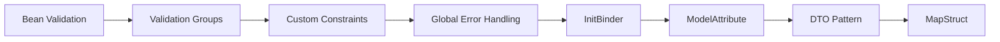

# Request Validation, Error Handling & Binding

> **Previous:** [REST API Development](./15-rest-api.md) | **Next:** [OpenAPI & API Documentation](./17-openapi.md)

## Learning Objectives

After completing this chapter, you will be able to:

<!-- Image Gallery -->
<section class="lesson-visuals" aria-label="Visual learning resources">
  <header><span>VISUAL LEARNING</span><h2>See it. Review it. Remember it.</h2></header>
  <a class="lesson-visual-card" href="../../../assets/images/lessons/java/16-validation/handwritten-notes.svg" target="_blank" rel="noopener">
    
    <span><strong>Handwritten notes</strong>Condensed notes for deliberate review.</span>
  </a>
  <a class="lesson-visual-card" href="../../../assets/images/lessons/java/16-validation/sticky-notes.svg" target="_blank" rel="noopener">
    
    <span><strong>Sticky-note revision</strong>Fast recall prompts for revision.</span>
  </a>
  <a class="lesson-visual-card" href="../../../assets/images/lessons/java/16-validation/visual-explanation.svg" target="_blank" rel="noopener">
    
    <span><strong>Visual concept guide</strong>A connected explanation of the key ideas.</span>
  </a>
</section>
<!-- End Image Gallery -->


- Apply Jakarta Bean Validation constraints (`@NotNull`, `@NotEmpty`, `@NotBlank`, `@Size`, `@Min`/`@Max`, `@Email`, `@Pattern`, `@Past`/`@Future`, `@Positive`/`@Negative`, `@Digits`, `@AssertTrue`)
- Trigger validation on controller parameters with `@Valid`
- Use validation groups for partial validation in different scenarios
- Create custom constraint annotations and validators with `ConstraintValidator`
- Handle validation errors globally with `@ExceptionHandler` and `@ControllerAdvice`
- Structure error responses with `FieldError`, `GlobalError`, and custom DTOs
- Configure `@InitBinder` for custom property editors, allowed and disallowed fields
- Implement `@RestControllerAdvice` for global exception handling with ordering
- Bind request entities with `@ModelAttribute` and `BindingResult`
- Interpolate validation messages with `ValidationMessages.properties` and custom interpolators
- Combine Spring `Validator` interface with Bean Validation
- Apply DTO patterns with MapStruct for entity-to-DTO conversion

## Chapter at a Glance

| Topic | Key Insight | Practical Takeaway |
|-------|-------------|--------------------|
| Bean Validation | Jakarta EE standard annotations | @NotNull, @NotEmpty, @Size, @Pattern cover most cases |
| Validation Groups | Partial validation for different scenarios | Define group interfaces, specify via @Validated |
| Custom Constraints | @Constraint + ConstraintValidator | Reusable validation logic with message interpolation |
| Error Handling | @ExceptionHandler for MethodArgumentNotValidException | Structured error response with field-level details |
| DTO Pattern | Separate API models from entity models | MapStruct generates mapper implementations at compile time |

## Chapter Roadmap



> **Pro Tip:** Always use DTOs for your API layer. Exposing JPA entities directly creates tight coupling between your database schema and your API contract, making both harder to evolve independently.

---

## 1. Theory


### 1.1 Why Validate?


Invalid data is the root cause of most application defects. Without validation, you risk:

- SQL injection through unvalidated string inputs
- Persistence errors from oversized or null values
- Business logic failures from out-of-range numbers
- UX degradation from cryptic stack traces shown to users
- Data corruption that silently propagates through the system

Spring Boot provides a layered validation architecture:

```
HTTP Request
    │
    ▼
Controller (@Valid / @Validated)
    │
    ▼
Service layer (programmatic validation)
    │
    ▼
Persistence (@Column constraints, DB constraints)
```

Validation should happen at **every boundary** where external data enters the system. The controller is the first and most important boundary.

### 1.2 Jakarta Bean Validation → The JSR-380 Standard


Spring Boot 4.x uses **Jakarta Bean Validation 3.0+** (formerly JSR-380 / Bean Validation 2.0). The reference implementation is **Hibernate Validator** 8+, which is automatically included when you add `spring-boot-starter-web`.

```xml
<dependency>
    <groupId>org.springframework.boot</groupId>
    <artifactId>spring-boot-starter-web</artifactId>
</dependency>
<!-- Validation is already included as a transitive dependency -->
```

Hibernate Validator implements all standard constraints and provides additional ones. You never need to add the validation starter separately → Spring Boot's web starter includes it.

#### 1.2.1 Core Constraint Annotations

| Annotation | Applicable To | Purpose |
|------------|--------------|---------|
| `@NotNull` | Any reference | Value must not be `null` |
| `@NotEmpty` | String, Collection, Map, Array | Must not be `null` **and** must have size > 0 |
| `@NotBlank` | String only | Must not be `null` **and** must contain at least one non-whitespace character |
| `@Size(min, max)` | String, Collection, Map, Array | Length/size must be between `min` and `max` |
| `@Min(value)` | `long`, `int`, `short`, `byte`, `BigDecimal`, `BigInteger` | Must be ≥ `value` |
| `@Max(value)` | Same as `@Min` | Must be ≤ `value` |
| `@DecimalMin(value)` | `BigDecimal`, `BigInteger`, `CharSequence`, numeric wrappers | Must be ≥ `value` (string-based comparison for precision) |
| `@DecimalMax(value)` | Same as `@DecimalMin` | Must be ≤ `value` |
| `@Negative` | Numeric types | Must be strictly negative |
| `@NegativeOrZero` | Numeric types | Must be negative or zero |
| `@Positive` | Numeric types | Must be strictly positive |
| `@PositiveOrZero` | Numeric types | Must be positive or zero |
| `@Digits(integer, fraction)` | Numeric types, String | Must be a number within specified integer/fraction digit bounds |
| `@Email` | String | Must be a well-formed email address (regex-based, not RFC-5321 complete) |
| `@Pattern(regexp)` | String | Must match the given regular expression |
| `@Past` | `Date`, `Calendar`, `Instant`, `LocalDate`, `LocalDateTime`, `OffsetDateTime`, `Year`, `MonthDay` | Must be in the past |
| `@PastOrPresent` | Same as `@Past` | Must be in the past or present |
| `@Future` | Same as `@Past` | Must be in the future |
| `@FutureOrPresent` | Same as `@Past` | Must be in the future or present |
| `@AssertTrue` | `boolean` | Must be `true` (useful for terms-acceptance checks) |
| `@AssertFalse` | `boolean` | Must be `false` |

Complete example:

```java
import jakarta.validation.constraints.*;
import java.math.BigDecimal;
import java.time.LocalDate;

public class ProductRequest {

    @NotNull(message = "Product name is required")
    @NotBlank(message = "Product name cannot be blank")
    @Size(min = 3, max = 100, message = "Product name must be between {min} and {max} characters")
    private String name;

    @NotNull
    @Size(min = 10, max = 2000)
    private String description;

    @NotNull(message = "Price is required")
    @Positive(message = "Price must be positive")
    @Digits(integer = 8, fraction = 2, message = "Price must have at most 8 integer and 2 fraction digits")
    private BigDecimal price;

    @Min(value = 0, message = "Stock cannot be negative")
    @Max(value = 100000, message = "Stock cannot exceed 100,000")
    private int stockQuantity;

    @NotNull
    @Email(message = "Supplier email must be valid")
    private String supplierEmail;

    @Pattern(
        regexp = "^[A-Z]{2}\\d{10}$",
        message = "SKU must be 2 uppercase letters followed by 10 digits"
    )
    private String sku;

    @Past(message = "Manufacturing date must be in the past")
    private LocalDate manufacturingDate;

    @Future(message = "Expiry date must be in the future")
    private LocalDate expiryDate;

    @AssertTrue(message = "You must accept the terms and conditions")
    private boolean termsAccepted;

    @NotNull
    @PositiveOrZero
    private BigDecimal discountPercentage;

    public ProductRequest() {}

    public String getName() { return name; }
    public void setName(String name) { this.name = name; }

    public String getDescription() { return description; }
    public void setDescription(String description) { this.description = description; }

    public BigDecimal getPrice() { return price; }
    public void setPrice(BigDecimal price) { this.price = price; }

    public int getStockQuantity() { return stockQuantity; }
    public void setStockQuantity(int stockQuantity) { this.stockQuantity = stockQuantity; }

    public String getSupplierEmail() { return supplierEmail; }
    public void setSupplierEmail(String supplierEmail) { this.supplierEmail = supplierEmail; }

    public String getSku() { return sku; }
    public void setSku(String sku) { this.sku = sku; }

    public LocalDate getManufacturingDate() { return manufacturingDate; }
    public void setManufacturingDate(LocalDate manufacturingDate) { this.manufacturingDate = manufacturingDate; }

    public LocalDate getExpiryDate() { return expiryDate; }
    public void setExpiryDate(LocalDate expiryDate) { this.expiryDate = expiryDate; }

    public boolean isTermsAccepted() { return termsAccepted; }
    public void setTermsAccepted(boolean termsAccepted) { this.termsAccepted = termsAccepted; }

    public BigDecimal getDiscountPercentage() { return discountPercentage; }
    public void setDiscountPercentage(BigDecimal discountPercentage) { this.discountPercentage = discountPercentage; }
}
```

### 1.3 @Valid on Controller Parameters


The `@Valid` annotation (from Jakarta) triggers Bean Validation on a method parameter. In Spring MVC, place it on `@RequestBody`, `@RequestParam`, or `@ModelAttribute` parameters:

```java
import jakarta.validation.Valid;
import org.springframework.http.HttpStatus;
import org.springframework.http.ResponseEntity;
import org.springframework.web.bind.annotation.*;

@RestController
@RequestMapping("/api/products")
public class ProductController {

    @PostMapping
    public ResponseEntity<ProductResponse> createProduct(
            @Valid @RequestBody ProductRequest request) {
        // If validation fails, MethodArgumentNotValidException is thrown
        // This code only runs if all constraints pass
        ProductResponse response = new ProductResponse(
            "PROD-001",
            request.getName(),
            request.getPrice()
        );
        return ResponseEntity.status(HttpStatus.CREATED).body(response);
    }

    @PutMapping("/{id}")
    public ResponseEntity<ProductResponse> updateProduct(
            @PathVariable String id,
            @Valid @RequestBody ProductRequest request) {
        ProductResponse response = new ProductResponse(
            id,
            request.getName(),
            request.getPrice()
        );
        return ResponseEntity.ok(response);
    }
}
```

#### 1.3.1 Nested Object Validation

When a DTO contains another object, the nested object is NOT validated automatically. You must annotate the field with `@Valid` to trigger cascading validation:

```java
import jakarta.validation.Valid;
import jakarta.validation.constraints.*;

public class OrderRequest {

    @NotNull
    @Valid
    private CustomerInfo customer;

    @NotNull
    @Size(min = 1, message = "Order must have at least one item")
    @Valid
    private List<OrderItemRequest> items;

    @Valid
    private ShippingAddress shippingAddress;

    public OrderRequest() {}

    public CustomerInfo getCustomer() { return customer; }
    public void setCustomer(CustomerInfo customer) { this.customer = customer; }

    public List<OrderItemRequest> getItems() { return items; }
    public void setItems(List<OrderItemRequest> items) { this.items = items; }

    public ShippingAddress getShippingAddress() { return shippingAddress; }
    public void setShippingAddress(ShippingAddress shippingAddress) { this.shippingAddress = shippingAddress; }
}
```

```java
import jakarta.validation.constraints.*;

public class CustomerInfo {

    @NotBlank(message = "Customer name is required")
    private String name;

    @NotBlank
    @Email
    private String email;

    @NotBlank
    @Pattern(regexp = "^\\+?[1-9]\\d{1,14}$", message = "Phone must be in E.164 format")
    private String phone;

    public CustomerInfo() {}

    public String getName() { return name; }
    public void setName(String name) { this.name = name; }

    public String getEmail() { return email; }
    public void setEmail(String email) { this.email = email; }

    public String getPhone() { return phone; }
    public void setPhone(String phone) { this.phone = phone; }
}
```

```java
import jakarta.validation.constraints.*;

public class OrderItemRequest {

    @NotBlank(message = "Product ID is required")
    private String productId;

    @NotNull
    @Min(value = 1, message = "Quantity must be at least 1")
    @Max(value = 100, message = "Quantity cannot exceed 100")
    private Integer quantity;

    @NotNull
    @Positive
    private BigDecimal unitPrice;

    public OrderItemRequest() {}

    public String getProductId() { return productId; }
    public void setProductId(String productId) { this.productId = productId; }

    public Integer getQuantity() { return quantity; }
    public void setQuantity(Integer quantity) { this.quantity = quantity; }

    public BigDecimal getUnitPrice() { return unitPrice; }
    public void setUnitPrice(BigDecimal unitPrice) { this.unitPrice = unitPrice; }
}
```

```java
import jakarta.validation.constraints.*;

public class ShippingAddress {

    @NotBlank
    private String street;

    @NotBlank
    private String city;

    @NotBlank
    @Size(min = 2, max = 2, message = "Country code must be exactly 2 characters")
    private String countryCode;

    @NotBlank
    @Pattern(regexp = "^\\d{4,10}$", message = "Invalid postal code format")
    private String postalCode;

    public ShippingAddress() {}

    public String getStreet() { return street; }
    public void setStreet(String street) { this.street = street; }

    public String getCity() { return city; }
    public void setCity(String city) { this.city = city; }

    public String getCountryCode() { return countryCode; }
    public void setCountryCode(String countryCode) { this.countryCode = countryCode; }

    public String getPostalCode() { return postalCode; }
    public void setPostalCode(String postalCode) { this.postalCode = postalCode; }
}
```

```java
@RestController
@RequestMapping("/api/orders")
public class OrderController {

    @PostMapping
    public ResponseEntity<OrderResponse> createOrder(
            @Valid @RequestBody OrderRequest request) {

        // If customer, items, or any nested object fails validation,
        // MethodArgumentNotValidException is thrown with ALL field errors

        OrderResponse response = new OrderResponse("ORD-001", request.getCustomer().getName());
        return ResponseEntity.status(HttpStatus.CREATED).body(response);
    }
}
```

#### 1.3.2 List Validation

To validate a list of objects in a request body directly:

```java
import jakarta.validation.Valid;
import org.springframework.http.ResponseEntity;
import org.springframework.web.bind.annotation.*;

import java.util.List;

@RestController
@RequestMapping("/api/bulk")
public class BulkImportController {

    @PostMapping("/products")
    public ResponseEntity<Integer> importProducts(
            @Valid @RequestBody List<@Valid ProductRequest> products) {
        // Both the list itself and each element are validated
        return ResponseEntity.ok(products.size());
    }
}
```

Note: `@Valid` on the `List` type parameter requires `@Valid` on the method parameter AND on the type-use:

```java
public ResponseEntity<Integer> importProducts(
        @Valid @RequestBody List<@Valid ProductRequest> products) {
```

### 1.4 @Validated Groups


Sometimes the same DTO needs different validation rules in different contexts. For example, when creating a resource you require all fields, but when updating you only require the ID:

```java
public interface CreateGroup {}

public interface UpdateGroup {}

public interface DiscountGroup {}
```

```java
import jakarta.validation.constraints.*;
import jakarta.validation.groups.Default;

public class ProductGroupedRequest {

    @NotNull(groups = UpdateGroup.class, message = "ID is required for update")
    private Long id;

    @NotBlank(groups = {CreateGroup.class, Default.class})
    @Size(min = 3, max = 100, groups = {CreateGroup.class, UpdateGroup.class, Default.class})
    private String name;

    @NotNull(groups = {CreateGroup.class, Default.class})
    @Positive(groups = {CreateGroup.class, UpdateGroup.class, Default.class})
    private BigDecimal price;

    @NotNull(groups = DiscountGroup.class)
    @Min(value = 0, groups = DiscountGroup.class)
    @Max(value = 100, groups = DiscountGroup.class)
    private Integer discountPercent;

    public ProductGroupedRequest() {}

    public Long getId() { return id; }
    public void setId(Long id) { this.id = id; }

    public String getName() { return name; }
    public void setName(String name) { this.name = name; }

    public BigDecimal getPrice() { return price; }
    public void setPrice(BigDecimal price) { this.price = price; }

    public Integer getDiscountPercent() { return discountPercent; }
    public void setDiscountPercent(Integer discountPercent) { this.discountPercent = discountPercent; }
}
```

Use `@Validated` (from Spring, not Jakarta) to specify which groups to validate:

```java
import org.springframework.validation.annotation.Validated;

@RestController
@RequestMapping("/api/products")
public class ProductGroupedController {

    @PostMapping
    public ResponseEntity<String> createProduct(
            @Validated(CreateGroup.class) @RequestBody ProductGroupedRequest request) {
        // Only validates constraints in CreateGroup and Default
        return ResponseEntity.ok("Created: " + request.getName());
    }

    @PutMapping("/{id}")
    public ResponseEntity<String> updateProduct(
            @Validated(UpdateGroup.class) @RequestBody ProductGroupedRequest request) {
        // Only validates constraints in UpdateGroup (but not Default)
        return ResponseEntity.ok("Updated: " + request.getId());
    }

    @PatchMapping("/{id}/discount")
    public ResponseEntity<String> applyDiscount(
            @Validated({UpdateGroup.class, DiscountGroup.class})
            @RequestBody ProductGroupedRequest request) {
        // Validates both UpdateGroup and DiscountGroup
        return ResponseEntity.ok("Discount applied: " + request.getDiscountPercent() + "%");
    }
}
```

#### 1.4.1 Default Group Sequence

By default, all groups validate independently. But sometimes you want groups to validate **in order**, and stop at the first failure. Use `@GroupSequence`:

```java
import jakarta.validation.GroupSequence;
import jakarta.validation.groups.Default;

@GroupSequence({Default.class, CreateGroup.class, DiscountGroup.class})
public interface ProductValidationSequence {}
```

Now when you validate against this sequence, `Default` runs first. If it passes, `CreateGroup` runs. Then `DiscountGroup`:

```java
@PostMapping("/full")
public ResponseEntity<String> createProductFull(
        @Validated(ProductValidationSequence.class)
        @RequestBody ProductGroupedRequest request) {
    return ResponseEntity.ok("Validated in sequence");
}
```

#### 1.4.2 @ConvertGroup

When validation cascades to nested objects, `@ConvertGroup` lets you convert the validation group for the nested object:

```java
public class OrderWithGroupConversion {

    @Valid
    @ConvertGroup(from = Default.class, to = CreateGroup.class)
    private CustomerInfo customer;

    @Valid
    @ConvertGroup(from = UpdateGroup.class, to = DiscountGroup.class)
    private ShippingAddress shippingAddress;

    // getters/setters
}
```

Now when the parent is validated with `Default.class`, the nested `customer` is validated with `CreateGroup.class`.

### 1.5 Custom Validators


When built-in constraints aren't enough, create custom ones.

#### 1.5.1 Simple Custom Constraint

Create a custom annotation and its validator:

```java
import jakarta.validation.Constraint;
import jakarta.validation.Payload;
import java.lang.annotation.*;

@Target({ElementType.FIELD, ElementType.PARAMETER, ElementType.TYPE_USE})
@Retention(RetentionPolicy.RUNTIME)
@Constraint(validatedBy = StrongPasswordValidator.class)
@Documented
public @interface StrongPassword {

    String message() default "Password must contain uppercase, lowercase, digit, and special character";

    Class<?>[] groups() default {};

    Class<? extends Payload>[] payload() default {};

    int minLength() default 8;

    int maxLength() default 64;
}
```

```java
import jakarta.validation.ConstraintValidator;
import jakarta.validation.ConstraintValidatorContext;

public class StrongPasswordValidator
        implements ConstraintValidator<StrongPassword, String> {

    private int minLength;
    private int maxLength;

    @Override
    public void initialize(StrongPassword constraintAnnotation) {
        this.minLength = constraintAnnotation.minLength();
        this.maxLength = constraintAnnotation.maxLength();
    }

    @Override
    public boolean isValid(String value, ConstraintValidatorContext context) {
        if (value == null) {
            return true; // @NotNull should handle nulls separately
        }

        if (value.length() < minLength || value.length() > maxLength) {
            return false;
        }

        boolean hasUppercase = !value.equals(value.toLowerCase());
        boolean hasLowercase = !value.equals(value.toUpperCase());
        boolean hasDigit = value.matches(".*\\d.*");
        boolean hasSpecial = value.matches(".*[!@#$%^&*()_+\\-=\\[\\]{};':\"\\\\|,.<>/?].*");

        return hasUppercase && hasLowercase && hasDigit && hasSpecial;
    }
}
```

Using the custom annotation:

```java
public class UserRegistrationRequest {

    @NotBlank
    @StrongPassword(minLength = 8, maxLength = 32)
    private String password;

    // getters/setters
}
```

#### 1.5.2 Class-Level (Cross-Field) Validation

Sometimes validation spans multiple fields → e.g., `startDate` must be before `endDate`, or `password` and `confirmPassword` must match.

```java
import jakarta.validation.Constraint;
import jakarta.validation.Payload;
import java.lang.annotation.*;

@Target({ElementType.TYPE})
@Retention(RetentionPolicy.RUNTIME)
@Constraint(validatedBy = DateRangeValidator.class)
@Documented
public @interface ValidDateRange {

    String message() default "End date must be after start date";

    Class<?>[] groups() default {};

    Class<? extends Payload>[] payload() default {};

    String startDateField();

    String endDateField();
}
```

```java
import jakarta.validation.ConstraintValidator;
import jakarta.validation.ConstraintValidatorContext;
import java.lang.reflect.Field;
import java.time.LocalDate;

public class DateRangeValidator
        implements ConstraintValidator<ValidDateRange, Object> {

    private String startDateField;
    private String endDateField;

    @Override
    public void initialize(ValidDateRange constraintAnnotation) {
        this.startDateField = constraintAnnotation.startDateField();
        this.endDateField = constraintAnnotation.endDateField();
    }

    @Override
    public boolean isValid(Object value, ConstraintValidatorContext context) {
        try {
            Field startField = value.getClass().getDeclaredField(startDateField);
            startField.setAccessible(true);
            Field endField = value.getClass().getDeclaredField(endDateField);
            endField.setAccessible(true);

            LocalDate start = (LocalDate) startField.get(value);
            LocalDate end = (LocalDate) endField.get(value);

            if (start == null || end == null) {
                return true; // @NotNull on individual fields handles nulls
            }

            return end.isAfter(start);
        } catch (NoSuchFieldException | IllegalAccessException e) {
            return false;
        }
    }
}
```

```java
import jakarta.validation.constraints.Future;
import jakarta.validation.constraints.NotNull;

@ValidDateRange(
    startDateField = "startDate",
    endDateField = "endDate",
    message = "Event end date must be after start date"
)
public class EventRequest {

    @NotNull
    @Future
    private LocalDate startDate;

    @NotNull
    @Future
    private LocalDate endDate;

    @NotBlank
    private String title;

    public EventRequest() {}

    public LocalDate getStartDate() { return startDate; }
    public void setStartDate(LocalDate startDate) { this.startDate = startDate; }

    public LocalDate getEndDate() { return endDate; }
    public void setEndDate(LocalDate endDate) { this.endDate = endDate; }

    public String getTitle() { return title; }
    public void setTitle(String title) { this.title = title; }
}
```

#### 1.5.3 Fields Match Validator

Another common cross-field validator → password confirmation:

```java
import jakarta.validation.Constraint;
import jakarta.validation.Payload;
import java.lang.annotation.*;

@Target({ElementType.TYPE})
@Retention(RetentionPolicy.RUNTIME)
@Constraint(validatedBy = FieldsMatchValidator.class)
@Documented
public @interface FieldsMatch {

    String message() default "Fields do not match";

    Class<?>[] groups() default {};

    Class<? extends Payload>[] payload() default {};

    String field();

    String matchingField();
}
```

```java
import jakarta.validation.ConstraintValidator;
import jakarta.validation.ConstraintValidatorContext;
import org.springframework.beans.BeanUtils;
import java.beans.PropertyDescriptor;

public class FieldsMatchValidator
        implements ConstraintValidator<FieldsMatch, Object> {

    private String field;
    private String matchingField;

    @Override
    public void initialize(FieldsMatch constraintAnnotation) {
        this.field = constraintAnnotation.field();
        this.matchingField = constraintAnnotation.matchingField();
    }

    @Override
    public boolean isValid(Object value, ConstraintValidatorContext context) {
        try {
            PropertyDescriptor fieldPd = BeanUtils.getPropertyDescriptor(
                value.getClass(), field);
            PropertyDescriptor matchingPd = BeanUtils.getPropertyDescriptor(
                value.getClass(), matchingField);

            if (fieldPd == null || matchingPd == null) {
                return false;
            }

            Object fieldValue = fieldPd.getReadMethod().invoke(value);
            Object matchingValue = matchingPd.getReadMethod().invoke(value);

            if (fieldValue == null && matchingValue == null) {
                return true;
            }

            if (fieldValue != null) {
                return fieldValue.equals(matchingValue);
            }

            return false;
        } catch (Exception e) {
            return false;
        }
    }
}
```

```java
import jakarta.validation.constraints.NotBlank;
import jakarta.validation.constraints.Size;

@FieldsMatch(
    field = "password",
    matchingField = "confirmPassword",
    message = "Passwords do not match"
)
public class PasswordChangeRequest {

    @NotBlank
    @Size(min = 8, max = 64)
    private String password;

    @NotBlank
    private String confirmPassword;

    public PasswordChangeRequest() {}

    public String getPassword() { return password; }
    public void setPassword(String password) { this.password = password; }

    public String getConfirmPassword() { return confirmPassword; }
    public void setConfirmPassword(String confirmPassword) { this.confirmPassword = confirmPassword; }
}
```

### 1.6 Error Responses


When validation fails, Spring throws exceptions. You need to handle them to return structured responses.

#### 1.6.1 MethodArgumentNotValidException

This is thrown when `@Valid` validation on a `@RequestBody` parameter fails. It contains a `BindingResult` with `FieldError` and `ObjectError` instances.

```java
import org.springframework.http.HttpStatus;
import org.springframework.http.ResponseEntity;
import org.springframework.validation.FieldError;
import org.springframework.validation.ObjectError;
import org.springframework.web.bind.MethodArgumentNotValidException;
import org.springframework.web.bind.annotation.ExceptionHandler;
import org.springframework.web.bind.annotation.RestControllerAdvice;

import java.time.LocalDateTime;
import java.util.ArrayList;
import java.util.List;

@RestControllerAdvice
public class ValidationExceptionHandler {

    @ExceptionHandler(MethodArgumentNotValidException.class)
    public ResponseEntity<ValidationErrorResponse> handleValidationExceptions(
            MethodArgumentNotValidException ex) {

        ValidationErrorResponse response = new ValidationErrorResponse(
            "VALIDATION_FAILED",
            "Request validation failed",
            LocalDateTime.now()
        );

        for (FieldError fieldError : ex.getBindingResult().getFieldErrors()) {
            response.addFieldError(
                fieldError.getField(),
                fieldError.getDefaultMessage(),
                fieldError.getRejectedValue()
            );
        }

        for (ObjectError globalError : ex.getBindingResult().getGlobalErrors()) {
            response.addGlobalError(
                globalError.getObjectName(),
                globalError.getDefaultMessage()
            );
        }

        return ResponseEntity.status(HttpStatus.BAD_REQUEST).body(response);
    }
}
```

```java
import java.time.LocalDateTime;
import java.util.ArrayList;
import java.util.List;

public class ValidationErrorResponse {

    private String code;
    private String message;
    private LocalDateTime timestamp;
    private List<FieldValidationError> fieldErrors;
    private List<GlobalValidationError> globalErrors;

    public ValidationErrorResponse(String code, String message, LocalDateTime timestamp) {
        this.code = code;
        this.message = message;
        this.timestamp = timestamp;
        this.fieldErrors = new ArrayList<>();
        this.globalErrors = new ArrayList<>();
    }

    public void addFieldError(String field, String message, Object rejectedValue) {
        this.fieldErrors.add(new FieldValidationError(field, message, rejectedValue));
    }

    public void addGlobalError(String objectName, String message) {
        this.globalErrors.add(new GlobalValidationError(objectName, message));
    }

    public String getCode() { return code; }
    public String getMessage() { return message; }
    public LocalDateTime getTimestamp() { return timestamp; }
    public List<FieldValidationError> getFieldErrors() { return fieldErrors; }
    public List<GlobalValidationError> getGlobalErrors() { return globalErrors; }

    public static class FieldValidationError {
        private String field;
        private String message;
        private Object rejectedValue;

        public FieldValidationError(String field, String message, Object rejectedValue) {
            this.field = field;
            this.message = message;
            this.rejectedValue = rejectedValue;
        }

        public String getField() { return field; }
        public String getMessage() { return message; }
        public Object getRejectedValue() { return rejectedValue; }
    }

    public static class GlobalValidationError {
        private String objectName;
        private String message;

        public GlobalValidationError(String objectName, String message) {
            this.objectName = objectName;
            this.message = message;
        }

        public String getObjectName() { return objectName; }
        public String getMessage() { return message; }
    }
}
```

#### 1.6.2 ConstraintViolationException

This is thrown when validation fails on `@RequestParam` or `@PathVariable` parameters annotated with `@Validated` at the class level:

```java
import jakarta.validation.ConstraintViolationException;
import org.springframework.http.HttpStatus;
import org.springframework.http.ResponseEntity;
import org.springframework.web.bind.annotation.ExceptionHandler;
import org.springframework.web.bind.annotation.RestControllerAdvice;

@RestControllerAdvice
public class ConstraintViolationHandler {

    @ExceptionHandler(ConstraintViolationException.class)
    public ResponseEntity<ValidationErrorResponse> handleConstraintViolation(
            ConstraintViolationException ex) {

        ValidationErrorResponse response = new ValidationErrorResponse(
            "CONSTRAINT_VIOLATION",
            "Parameter validation failed",
            LocalDateTime.now()
        );

        ex.getConstraintViolations().forEach(violation -> {
            String path = violation.getPropertyPath().toString();
            String message = violation.getMessage();
            Object invalidValue = violation.getInvalidValue();
            response.addFieldError(path, message, invalidValue);
        });

        return ResponseEntity.status(HttpStatus.BAD_REQUEST).body(response);
    }
}
```

For `@Validated` on individual parameters, you must also enable validation on the controller class:

```java
import org.springframework.validation.annotation.Validated;
import org.springframework.web.bind.annotation.*;

@Validated
@RestController
@RequestMapping("/api/search")
public class SearchController {

    @GetMapping
    public ResponseEntity<List<ProductResponse>> search(
            @RequestParam @NotBlank String query,
            @RequestParam @Min(0) int page,
            @RequestParam @Min(1) @Max(100) int size) {

        // ConstraintViolationException thrown if query is blank,
        // page < 0, or size is outside [1, 100]
        return ResponseEntity.ok(List.of());
    }
}
```

#### 1.6.3 Comprehensive Exception Handler

A production-ready controller advice handling all common exceptions:

```java
import org.slf4j.Logger;
import org.slf4j.LoggerFactory;
import org.springframework.http.HttpHeaders;
import org.springframework.http.HttpStatus;
import org.springframework.http.HttpStatusCode;
import org.springframework.http.ResponseEntity;
import org.springframework.http.converter.HttpMessageNotReadableException;
import org.springframework.lang.Nullable;
import org.springframework.security.access.AccessDeniedException;
import org.springframework.validation.FieldError;
import org.springframework.web.bind.MethodArgumentNotValidException;
import org.springframework.web.bind.MissingServletRequestParameterException;
import org.springframework.web.bind.annotation.ExceptionHandler;
import org.springframework.web.bind.annotation.RestControllerAdvice;
import org.springframework.web.context.request.WebRequest;
import org.springframework.web.method.annotation.MethodArgumentTypeMismatchException;
import org.springframework.web.servlet.mvc.method.annotation.ResponseEntityExceptionHandler;

import java.time.LocalDateTime;
import java.util.stream.Collectors;

@RestControllerAdvice
public class GlobalExceptionHandler extends ResponseEntityExceptionHandler {

    private static final Logger log = LoggerFactory.getLogger(GlobalExceptionHandler.class);

    @Override
    @Nullable
    protected ResponseEntity<Object> handleMethodArgumentNotValid(
            MethodArgumentNotValidException ex,
            HttpHeaders headers, HttpStatusCode status, WebRequest request) {

        ValidationErrorResponse body = new ValidationErrorResponse(
            "VALIDATION_FAILED",
            "Request validation failed",
            LocalDateTime.now()
        );

        ex.getBindingResult().getAllErrors().forEach(error -> {
            if (error instanceof FieldError fieldError) {
                body.addFieldError(
                    fieldError.getField(),
                    fieldError.getDefaultMessage(),
                    fieldError.getRejectedValue()
                );
            } else {
                body.addGlobalError(error.getObjectName(), error.getDefaultMessage());
            }
        });

        return ResponseEntity.status(HttpStatus.BAD_REQUEST).body(body);
    }

    @Override
    @Nullable
    protected ResponseEntity<Object> handleMissingServletRequestParameter(
            MissingServletRequestParameterException ex,
            HttpHeaders headers, HttpStatusCode status, WebRequest request) {

        ValidationErrorResponse body = new ValidationErrorResponse(
            "MISSING_PARAMETER",
            "Required parameter is missing",
            LocalDateTime.now()
        );
        body.addFieldError(ex.getParameterName(), ex.getMessage(), null);

        return ResponseEntity.status(HttpStatus.BAD_REQUEST).body(body);
    }

    @Override
    @Nullable
    protected ResponseEntity<Object> handleHttpMessageNotReadable(
            HttpMessageNotReadableException ex,
            HttpHeaders headers, HttpStatusCode status, WebRequest request) {

        ValidationErrorResponse body = new ValidationErrorResponse(
            "MALFORMED_REQUEST",
            "Request body is malformed or contains invalid data",
            LocalDateTime.now()
        );

        return ResponseEntity.status(HttpStatus.BAD_REQUEST).body(body);
    }

    @ExceptionHandler(MethodArgumentTypeMismatchException.class)
    public ResponseEntity<ValidationErrorResponse> handleTypeMismatch(
            MethodArgumentTypeMismatchException ex) {

        ValidationErrorResponse body = new ValidationErrorResponse(
            "TYPE_MISMATCH",
            "Parameter type mismatch",
            LocalDateTime.now()
        );
        body.addFieldError(
            ex.getName(),
            "Failed to convert value '" + ex.getValue() + "' to type " + ex.getRequiredType().getSimpleName(),
            ex.getValue()
        );

        return ResponseEntity.status(HttpStatus.BAD_REQUEST).body(body);
    }

    @ExceptionHandler(ConstraintViolationException.class)
    public ResponseEntity<ValidationErrorResponse> handleConstraintViolation(
            ConstraintViolationException ex) {

        ValidationErrorResponse body = new ValidationErrorResponse(
            "CONSTRAINT_VIOLATION",
            "Parameter validation failed",
            LocalDateTime.now()
        );

        ex.getConstraintViolations().forEach(violation -> {
            body.addFieldError(
                violation.getPropertyPath().toString(),
                violation.getMessage(),
                violation.getInvalidValue()
            );
        });

        return ResponseEntity.status(HttpStatus.BAD_REQUEST).body(body);
    }

    @ExceptionHandler(AccessDeniedException.class)
    public ResponseEntity<ValidationErrorResponse> handleAccessDenied(
            AccessDeniedException ex) {

        ValidationErrorResponse body = new ValidationErrorResponse(
            "ACCESS_DENIED",
            "You do not have permission to perform this action",
            LocalDateTime.now()
        );

        return ResponseEntity.status(HttpStatus.FORBIDDEN).body(body);
    }

    @ExceptionHandler(Exception.class)
    public ResponseEntity<ValidationErrorResponse> handleAllUncaught(
            Exception ex, WebRequest request) {

        log.error("Unhandled exception caught in GlobalExceptionHandler", ex);

        ValidationErrorResponse body = new ValidationErrorResponse(
            "INTERNAL_ERROR",
            "An unexpected error occurred. Please try again later.",
            LocalDateTime.now()
        );

        return ResponseEntity.status(HttpStatus.INTERNAL_SERVER_ERROR).body(body);
    }
}
```

#### 1.6.4 FieldError and GlobalError Deep Dive

Spring's `FieldError` extends `ObjectError` with:

| Property | Description |
|----------|-------------|
| `getField()` | The field name (e.g., `"name"`, `"customer.email"`) |
| `getDefaultMessage()` | The interpolated validation message |
| `getRejectedValue()` | The value that failed validation |
| `getCodes()` | Array of message codes tried (e.g., `["NotBlank.productRequest.name", "NotBlank.name", "NotBlank.java.lang.String", "NotBlank"]`) |
| `getArguments()` | Array of arguments for message interpolation |
| `getObjectName()` | The name of the validated object (e.g., `"productRequest"`) |

`GlobalError` (a.k.a. `ObjectError`) is for class-level validation failures (like cross-field validators). It has no `field` property:

```java
// Accessing errors programmatically
BindingResult bindingResult = ex.getBindingResult();

List<FieldError> fieldErrors = bindingResult.getFieldErrors();
List<ObjectError> globalErrors = bindingResult.getGlobalErrors();

for (FieldError fe : fieldErrors) {
    String field = fe.getField();
    String message = fe.getDefaultMessage();
    Object rejected = fe.getRejectedValue();
    log.warn("Validation failed on field '{}': {} (rejected value: {})",
        field, message, rejected);
}
```

### 1.7 @InitBinder


`@InitBinder` methods in a controller configure `WebDataBinder` for that controller. They let you:

- Register custom property editors
- Whitelist or blacklist fields
- Set custom validators
- Configure formatting

#### 1.7.1 Custom Property Editors

Property editors convert incoming String values to Java types:

```java
import org.springframework.web.bind.WebDataBinder;
import org.springframework.web.bind.annotation.InitBinder;
import org.springframework.web.bind.annotation.RestController;
import java.beans.PropertyEditorSupport;
import java.time.LocalDate;
import java.time.format.DateTimeFormatter;

@RestController
@RequestMapping("/api/events")
public class EventController {

    @InitBinder
    public void initBinder(WebDataBinder binder) {
        // Register custom editor for LocalDate with a specific format
        binder.registerCustomEditor(LocalDate.class, new PropertyEditorSupport() {
            @Override
            public void setAsText(String text) throws IllegalArgumentException {
                if (text == null || text.isBlank()) {
                    setValue(null);
                } else {
                    setValue(LocalDate.parse(text, DateTimeFormatter.ofPattern("dd-MM-yyyy")));
                }
            }

            @Override
            public String getAsText() {
                Object value = getValue();
                if (value == null) return "";
                return ((LocalDate) value).format(DateTimeFormatter.ofPattern("dd-MM-yyyy"));
            }
        });

        // Register editor that trims strings
        binder.registerCustomEditor(String.class, new PropertyEditorSupport() {
            @Override
            public void setAsText(String text) {
                setValue(text == null ? null : text.trim());
            }
        });
    }

    @GetMapping
    public ResponseEntity<String> getEvents(
            @RequestParam LocalDate from,
            @RequestParam LocalDate to) {
        // Expects dates in dd-MM-yyyy format
        return ResponseEntity.ok("Events from " + from + " to " + to);
    }
}
```

#### 1.7.2 Allowed and Disallowed Fields

Prevent mass assignment by restricting which fields can be bound:

```java
import org.springframework.web.bind.WebDataBinder;
import org.springframework.web.bind.annotation.InitBinder;
import org.springframework.web.bind.annotation.PostMapping;
import org.springframework.web.bind.annotation.RequestMapping;
import org.springframework.web.bind.annotation.RestController;

@RestController
@RequestMapping("/api/users")
public class UserController {

    @InitBinder
    public void initBinder(WebDataBinder binder) {
        // Only these fields can be set from request parameters
        binder.setAllowedFields("firstName", "lastName", "email", "phone");

        // OR: explicitly disallow sensitive fields (preferred approach)
        binder.setDisallowedFields("id", "role", "password", "createdAt");
    }

    @PostMapping("/register")
    public ResponseEntity<String> register(UserRegistrationRequest request) {
        // Even if request includes "role=ADMIN" or "id=1", they are ignored
        return ResponseEntity.ok("Registered: " + request.getEmail());
    }
}
```

#### 1.7.3 Custom Validator on a Specific Model Attribute

```java
import org.springframework.validation.Errors;
import org.springframework.validation.Validator;
import org.springframework.web.bind.WebDataBinder;
import org.springframework.web.bind.annotation.InitBinder;
import org.springframework.web.bind.annotation.PostMapping;
import org.springframework.web.bind.annotation.RequestMapping;
import org.springframework.web.bind.annotation.RestController;

@RestController
@RequestMapping("/api/promo")
public class PromoCodeController {

    @InitBinder("promoCodeRequest")
    public void initPromoBinder(WebDataBinder binder) {
        // Add a custom validator alongside Bean Validation
        binder.addValidators(new Validator() {
            @Override
            public boolean supports(Class<?> clazz) {
                return PromoCodeRequest.class.isAssignableFrom(clazz);
            }

            @Override
            public void validate(Object target, Errors errors) {
                PromoCodeRequest request = (PromoCodeRequest) target;
                if (request.getCode() != null
                        && request.getCode().startsWith("DISABLE_")
                        && !request.isConfirmed()) {
                    errors.rejectValue("confirmed",
                        "promo.confirmation.required",
                        "This promo code requires explicit confirmation");
                }
            }
        });
    }

    @PostMapping
    public ResponseEntity<String> applyPromo(
            @Valid PromoCodeRequest request) {
        // Both Bean Validation and custom validator run
        return ResponseEntity.ok("Promo applied: " + request.getCode());
    }
}
```

### 1.8 @ControllerAdvice / @RestControllerAdvice


These annotations create **global** (or **scoped**) exception handlers, data binders, and model attributes that apply across multiple controllers.

| Feature | `@ControllerAdvice` | `@RestControllerAdvice` |
|---------|--------------------|------------------------|
| Response body | Views (JSP/Thymeleaf) | JSON/XML directly |
| Common use | MVC apps with views | REST APIs |
| `@ExceptionHandler` return | ModelAndView or ResponseEntity | ResponseEntity (automatic `@ResponseBody`) |

#### 1.8.1 Scoping with basePackages

```java
import org.springframework.web.bind.annotation.RestControllerAdvice;

@RestControllerAdvice(basePackages = "com.example.api.v1")
public class V1ApiExceptionHandler {

    @ExceptionHandler(MethodArgumentNotValidException.class)
    public ResponseEntity<ValidationErrorResponse> handleValidation(
            MethodArgumentNotValidException ex) {
        ValidationErrorResponse response = new ValidationErrorResponse(
            "V1_VALIDATION_ERROR", "Validation failed", LocalDateTime.now()
        );
        ex.getBindingResult().getFieldErrors().forEach(fe ->
            response.addFieldError(fe.getField(), fe.getDefaultMessage(), fe.getRejectedValue())
        );
        return ResponseEntity.badRequest().body(response);
    }
}
```

```java
import org.springframework.web.bind.annotation.ControllerAdvice;

@RestControllerAdvice(basePackages = "com.example.api.v2")
public class V2ApiExceptionHandler {

    @ExceptionHandler(MethodArgumentNotValidException.class)
    public ResponseEntity<ValidationErrorResponse> handleValidation(
            MethodArgumentNotValidException ex) {
        ValidationErrorResponse response = new ValidationErrorResponse(
            "V2_VALIDATION_ERROR",
            "One or more fields are invalid",
            LocalDateTime.now()
        );
        ex.getBindingResult().getFieldErrors().forEach(fe -> {
            response.addFieldError(fe.getField(), fe.getDefaultMessage(), null);
        });
        return ResponseEntity.badRequest().body(response);
    }
}
```

#### 1.8.2 Scoping with assignableTypes

```java
import org.springframework.web.bind.annotation.RestControllerAdvice;

@RestControllerAdvice(assignableTypes = {AdminController.class, ManagementController.class})
public class AdminExceptionHandler {

    @ExceptionHandler(MethodArgumentNotValidException.class)
    public ResponseEntity<ValidationErrorResponse> handleAdminValidation(
            MethodArgumentNotValidException ex) {
        ValidationErrorResponse response = new ValidationErrorResponse(
            "ADMIN_VALIDATION_ERROR",
            "Admin validation failed",
            LocalDateTime.now()
        );
        ex.getBindingResult().getFieldErrors().forEach(fe ->
            response.addFieldError(fe.getField(), fe.getDefaultMessage(), fe.getRejectedValue())
        );
        return ResponseEntity.badRequest().body(response);
    }
}
```

#### 1.8.3 Exception Handler Ordering

When multiple `@ControllerAdvice` beans can handle the same exception, the one with the highest `@Order` value (lowest precedence) wins. By default, all are `Ordered.LOWEST_PRECEDENCE`:

```java
import org.springframework.core.Ordered;
import org.springframework.core.annotation.Order;
import org.springframework.http.HttpStatus;
import org.springframework.http.ResponseEntity;
import org.springframework.web.bind.annotation.ExceptionHandler;
import org.springframework.web.bind.annotation.RestControllerAdvice;

@Order(Ordered.HIGHEST_PRECEDENCE)
@RestControllerAdvice(assignableTypes = {AdminController.class})
public class SpecificAdminHandler {

    @ExceptionHandler(MethodArgumentNotValidException.class)
    public ResponseEntity<ValidationErrorResponse> handleAdminValidation(
            MethodArgumentNotValidException ex) {
        ValidationErrorResponse response = new ValidationErrorResponse(
            "ADMIN_SPECIFIC_ERROR", "Admin validation failed", LocalDateTime.now()
        );
        ex.getBindingResult().getFieldErrors().forEach(fe ->
            response.addFieldError(fe.getField(), fe.getDefaultMessage(), fe.getRejectedValue())
        );
        return ResponseEntity.badRequest().body(response);
    }
}

@Order(Ordered.LOWEST_PRECEDENCE)
@RestControllerAdvice
public class GlobalFallbackHandler {

    @ExceptionHandler(MethodArgumentNotValidException.class)
    public ResponseEntity<ValidationErrorResponse> handleGenericValidation(
            MethodArgumentNotValidException ex) {
        ValidationErrorResponse response = new ValidationErrorResponse(
            "VALIDATION_ERROR", "Validation failed", LocalDateTime.now()
        );
        ex.getBindingResult().getFieldErrors().forEach(fe ->
            response.addFieldError(fe.getField(), fe.getDefaultMessage(), fe.getRejectedValue())
        );
        return ResponseEntity.badRequest().body(response);
    }
}
```

### 1.9 Request Entity Binding


#### 1.9.1 @ModelAttribute

`@ModelAttribute` binds request parameters (query params, form data) to a Java object:

```java
import org.springframework.web.bind.annotation.*;

@RestController
@RequestMapping("/api/search")
public class SearchController {

    @GetMapping
    public ResponseEntity<List<ProductResponse>> search(
            @Valid @ModelAttribute ProductSearchCriteria criteria) {

        // Binds query parameters to ProductSearchCriteria fields
        // /api/search?query=laptop&category=electronics&minPrice=100&maxPrice=2000
        return ResponseEntity.ok(List.of());
    }
}
```

```java
import jakarta.validation.constraints.*;

public class ProductSearchCriteria {

    @NotBlank(message = "Search query is required")
    private String query;

    private String category;

    @Min(0)
    private BigDecimal minPrice;

    @DecimalMax("999999.99")
    private BigDecimal maxPrice;

    @Min(0)
    private int page;

    @Min(1)
    @Max(100)
    private int size = 20;

    private String sortBy = "relevance";

    private boolean includeOutOfStock;

    public ProductSearchCriteria() {}

    public String getQuery() { return query; }
    public void setQuery(String query) { this.query = query; }

    public String getCategory() { return category; }
    public void setCategory(String category) { this.category = category; }

    public BigDecimal getMinPrice() { return minPrice; }
    public void setMinPrice(BigDecimal minPrice) { this.minPrice = minPrice; }

    public BigDecimal getMaxPrice() { return maxPrice; }
    public void setMaxPrice(BigDecimal maxPrice) { this.maxPrice = maxPrice; }

    public int getPage() { return page; }
    public void setPage(int page) { this.page = page; }

    public int getSize() { return size; }
    public void setSize(int size) { this.size = size; }

    public String getSortBy() { return sortBy; }
    public void setSortBy(String sortBy) { this.sortBy = sortBy; }

    public boolean isIncludeOutOfStock() { return includeOutOfStock; }
    public void setIncludeOutOfStock(boolean includeOutOfStock) { this.includeOutOfStock = includeOutOfStock; }
}
```

#### 1.9.2 BindingResult

When you place `BindingResult` immediately after a `@Valid`/`@Validated` parameter, validation errors are captured in the result instead of throwing an exception:

```java
import org.springframework.validation.BindingResult;
import org.springframework.validation.FieldError;

@RestController
@RequestMapping("/api/products")
public class ProductWithBindingResultController {

    @PostMapping
    public ResponseEntity<?> createProduct(
            @Valid @RequestBody ProductRequest request,
            BindingResult bindingResult) {

        if (bindingResult.hasErrors()) {
            ValidationErrorResponse errorResponse = new ValidationErrorResponse(
                "VALIDATION_FAILED",
                "Product creation failed due to validation errors",
                LocalDateTime.now()
            );

            for (FieldError fe : bindingResult.getFieldErrors()) {
                errorResponse.addFieldError(
                    fe.getField(),
                    fe.getDefaultMessage(),
                    fe.getRejectedValue()
                );
            }

            return ResponseEntity.badRequest().body(errorResponse);
        }

        // No validation errors → proceed
        ProductResponse response = new ProductResponse(
            "PROD-001",
            request.getName(),
            request.getPrice()
        );
        return ResponseEntity.status(HttpStatus.CREATED).body(response);
    }
}
```

Key rule: `BindingResult` **must** immediately follow the validated parameter in the method signature:

```java
// CORRECT
public ResponseEntity<?> create(
        @Valid @RequestBody ProductRequest request,
        BindingResult bindingResult) { ... }

// WRONG → BindingResult is not immediately after the validated parameter
public ResponseEntity<?> create(
        @Valid @RequestBody ProductRequest request,
        @RequestParam String tenant,
        BindingResult bindingResult) { ... }
```

#### 1.9.3 Errors Interface

`Errors` is the parent interface of `BindingResult`. It's useful when you only need to check for errors or add custom errors:

```java
import org.springframework.validation.Errors;
import org.springframework.validation.FieldError;

@RestController
@RequestMapping("/api/users")
public class UserRegistrationController {

    @PostMapping("/register")
    public ResponseEntity<?> registerUser(
            @Valid @RequestBody UserRegistrationRequest request,
            Errors errors) {

        if (errors.hasErrors()) {
            // Build response from errors
            Map<String, String> fieldErrors = new HashMap<>();
            errors.getFieldErrors().forEach(fe ->
                fieldErrors.put(fe.getField(), fe.getDefaultMessage())
            );
            return ResponseEntity.badRequest().body(fieldErrors);
        }

        return ResponseEntity.ok("User registered");
    }
}
```

#### 1.9.4 Programmatic Error Rejection

You can also add errors programmatically to `BindingResult` or `Errors`:

```java
import org.springframework.validation.BindingResult;
import org.springframework.validation.FieldError;

@Service
public class UserService {

    public void registerUser(UserRegistrationRequest request, Errors errors) {
        // Validate email uniqueness
        if (emailExists(request.getEmail())) {
            errors.rejectValue(
                "email",
                "error.email.duplicate",
                "An account with this email already exists"
            );
        }

        // Validate that the username is not reserved
        if (isReservedUsername(request.getUsername())) {
            errors.rejectValue(
                "username",
                "error.username.reserved",
                "This username is reserved and cannot be used"
            );
        }

        // Object-level error (not field-specific)
        if (request.getPassword() != null && request.getPassword().contains(request.getUsername())) {
            errors.reject(
                "error.password.containsUsername",
                "Password should not contain the username"
            );
        }
    }

    private boolean emailExists(String email) {
        return false; // Simulated
    }

    private boolean isReservedUsername(String username) {
        return List.of("admin", "root", "system").contains(username.toLowerCase());
    }
}
```

```java
@RestController
@RequestMapping("/api/users")
public class ServiceValidationController {

    private final UserService userService;

    public ServiceValidationController(UserService userService) {
        this.userService = userService;
    }

    @PostMapping("/with-service-validation")
    public ResponseEntity<?> registerWithServiceValidation(
            @Valid @RequestBody UserRegistrationRequest request,
            BindingResult bindingResult) {

        // Run service-level validation
        userService.registerUser(request, bindingResult);

        if (bindingResult.hasErrors()) {
            Map<String, String> errors = new HashMap<>();
            bindingResult.getFieldErrors().forEach(fe ->
                errors.put(fe.getField(), fe.getDefaultMessage())
            );
            return ResponseEntity.badRequest().body(errors);
        }

        return ResponseEntity.ok("User registered");
    }
}
```

### 1.10 Message Interpolation


Bean Validation supports message interpolation → replacing `{parameters}` in constraint messages with actual values.

#### 1.10.1 Default Interpolation

By default, Hibernate Validator resolves message parameters in this order:

1. Check `ValidationMessages.properties` in the classpath root
2. Check `ConstraintValidator`'s `message()` attribute
3. Use built-in default messages from Hibernate Validator

#### 1.10.2 ValidationMessages.properties

Create `src/main/resources/ValidationMessages.properties`:

```properties
# Field-level messages
jakarta.validation.constraints.NotNull.message=Field must not be null
jakarta.validation.constraints.NotBlank.message=Field must not be blank
jakarta.validation.constraints.NotEmpty.message=Field must not be empty
jakarta.validation.constraints.Size.message=Size must be between {min} and {max}
jakarta.validation.constraints.Min.message=Value must be at least {value}
jakarta.validation.constraints.Max.message=Value must be at most {value}
jakarta.validation.constraints.Email.message=Must be a valid email address
jakarta.validation.constraints.Pattern.message=Must match pattern: {regexp}
jakarta.validation.constraints.Positive.message=Value must be positive
jakarta.validation.constraints.Negative.message=Value must be negative
jakarta.validation.constraints.Past.message=Date must be in the past
jakarta.validation.constraints.Future.message=Date must be in the future
jakarta.validation.constraints.Digits.message=Numeric value out of bounds (<{integer} digits>.<{fraction} digits>)

# Custom constraint messages
com.example.validation.StrongPassword.message=Password must be at least {minLength} characters with uppercase, lowercase, digit, and special character
com.example.validation.ValidDateRange.message={startDateField} must be before {endDateField}
com.example.validation.FieldsMatch.message={field} and {matchingField} must match
```

Locale-specific versions: `ValidationMessages_de.properties`, `ValidationMessages_fr.properties`:

```properties
# ValidationMessages_de.properties
jakarta.validation.constraints.NotBlank.message=Darf nicht leer sein
jakarta.validation.constraints.Size.message=Groesse muss zwischen {min} und {max} liegen
jakarta.validation.constraints.Email.message=Muss eine gultige E-Mail-Adresse sein
```

```properties
# ValidationMessages_fr.properties
jakarta.validation.constraints.NotBlank.message=Ne doit pas etre vide
jakarta.validation.constraints.Size.message=La taille doit etre comprise entre {min} et {max}
jakarta.validation.constraints.Email.message=Doit etre une adresse email valide
```

#### 1.10.3 Message Interpolation in Annotations

```java
public class UserMessageDemo {

    @NotNull(message = "{jakarta.validation.constraints.NotNull.message}")
    @NotBlank(message = "{jakarta.validation.constraints.NotBlank.message}")
    @Size(
        min = 3,
        max = 50,
        message = "{jakarta.validation.constraints.Size.message}"
    )
    private String username;

    @Email(
        message = "{jakarta.validation.constraints.Email.message}"
    )
    private String email;

    @StrongPassword(
        message = "{com.example.validation.StrongPassword.message}"
    )
    private String password;

    // getters/setters
}
```

#### 1.10.4 Custom MessageInterpolator

For advanced scenarios, implement `MessageInterpolator`:

```java
import jakarta.validation.MessageInterpolator;
import org.slf4j.Logger;
import org.slf4j.LoggerFactory;
import org.springframework.context.i18n.LocaleContextHolder;
import org.springframework.stereotype.Component;

import java.util.Locale;

@Component
public class CustomMessageInterpolator implements MessageInterpolator {

    private static final Logger log = LoggerFactory.getLogger(CustomMessageInterpolator.class);
    private final MessageInterpolator defaultInterpolator;

    public CustomMessageInterpolator(MessageInterpolator defaultInterpolator) {
        this.defaultInterpolator = defaultInterpolator;
    }

    @Override
    public String interpolate(String messageTemplate, Context context) {
        Locale locale = LocaleContextHolder.getLocale();
        return interpolate(messageTemplate, context, locale);
    }

    @Override
    public String interpolate(String messageTemplate, Context context, Locale locale) {
        // Step 1: Try the Spring MessageSource first
        // Step 2: Fall back to default interpolation

        if (messageTemplate != null && messageTemplate.startsWith("{") && messageTemplate.endsWith("}")) {
            String key = messageTemplate.substring(1, messageTemplate.length() - 1);
            // In a real app, inject MessageSource and try:
            // String springMessage = messageSource.getMessage(key, null, null, locale);
            // if (springMessage != null) return springMessage;
        }

        String interpolated = defaultInterpolator.interpolate(messageTemplate, context, locale);

        log.debug("Interpolated '{}' → '{}' for locale {}", messageTemplate, interpolated, locale);

        return interpolated;
    }
}
```

Register the custom interpolator in configuration:

```java
import jakarta.validation.MessageInterpolator;
import org.springframework.context.annotation.Bean;
import org.springframework.context.annotation.Configuration;
import org.springframework.validation.beanvalidation.LocalValidatorFactoryBean;

@Configuration
public class ValidationConfig {

    @Bean
    public LocalValidatorFactoryBean validator(MessageInterpolator interpolator) {
        LocalValidatorFactoryBean bean = new LocalValidatorFactoryBean();
        bean.setMessageInterpolator(interpolator);
        return bean;
    }
}
```

#### 1.10.5 EL Interpolation in Messages

Hibernate Validator supports Unified EL expressions in messages. This is disabled by default in some environments for security. When enabled:

```properties
# In the constraint annotation message attribute:
message="Value is too ${validatedValue < 0 ? 'low' : 'high'}"
```

You can use `${validatedValue}`, `${formatter.format(...)}`, ternary operators, string operations, and math. This is powerful but be careful with user input in messages.

### 1.11 Spring Validation


Spring provides its own `Validator` interface alongside Bean Validation. It's useful when you need Spring-injected dependencies (like services, repositories) in validation logic.

#### 1.11.1 Spring's Validator Interface

```java
import org.springframework.validation.Errors;
import org.springframework.validation.ValidationUtils;
import org.springframework.validation.Validator;

public class ProductRequestValidator implements Validator {

    @Override
    public boolean supports(Class<?> clazz) {
        return ProductRequest.class.isAssignableFrom(clazz);
    }

    @Override
    public void validate(Object target, Errors errors) {
        ProductRequest request = (ProductRequest) target;

        // Reject if empty
        ValidationUtils.rejectIfEmptyOrWhitespace(errors, "name", "field.required", "Name is required");
        ValidationUtils.rejectIfEmptyOrWhitespace(errors, "sku", "field.required", "SKU is required");

        // Custom logic for price
        if (request.getPrice() != null && request.getPrice().compareTo(BigDecimal.ZERO) <= 0) {
            errors.rejectValue("price", "field.positive", "Price must be positive");
        }

        // SKU format validation
        if (request.getSku() != null && !request.getSku().matches("^[A-Z]{2}\\d{10}$")) {
            errors.rejectValue("sku", "field.format", "SKU must be 2 uppercase letters followed by 10 digits");
        }

        // Cross-field validation
        if (request.getStockQuantity() > 0 && request.getPrice() == null) {
            errors.reject("stock.without.price",
                "Stock quantity cannot be set without a price");
        }
    }
}
```

#### 1.11.2 Combining Bean Validation with Spring Validation

You can run both Bean Validation constraints and a Spring `Validator` on the same object:

```java
import org.springframework.validation.Validator;
import org.springframework.web.bind.WebDataBinder;
import org.springframework.web.bind.annotation.InitBinder;
import org.springframework.web.bind.annotation.PostMapping;
import org.springframework.web.bind.annotation.RequestBody;
import org.springframework.web.bind.annotation.RequestMapping;
import org.springframework.web.bind.annotation.RestController;

@RestController
@RequestMapping("/api/combined")
public class CombinedValidationController {

    private final Validator productRequestValidator;

    public CombinedValidationController(Validator productRequestValidator) {
        this.productRequestValidator = productRequestValidator;
    }

    @InitBinder
    public void initBinder(WebDataBinder binder) {
        // Bean Validation runs first (from @Valid), then custom validator
        binder.addValidators(productRequestValidator);
    }

    @PostMapping
    public ResponseEntity<?> createProduct(
            @Valid @RequestBody ProductRequest request,
            BindingResult bindingResult) {

        if (bindingResult.hasErrors()) {
            Map<String, String> errors = new HashMap<>();
            bindingResult.getFieldErrors().forEach(fe ->
                errors.put(fe.getField(), fe.getDefaultMessage())
            );
            return ResponseEntity.badRequest().body(errors);
        }

        return ResponseEntity.ok("Product created");
    }
}
```

#### 1.11.3 Spring Validation Utils

Spring provides helper methods in `ValidationUtils`:

```java
import org.springframework.validation.ValidationUtils;
import org.springframework.validation.Errors;

// Reject if field is null or whitespace
ValidationUtils.rejectIfEmptyOrWhitespace(errors, "fieldName", "error.code", "Default message");

// Reject if field is null
ValidationUtils.rejectIfEmpty(errors, "fieldName", "error.code", "Default message");

// Invoke a validator on a nested object
ValidationUtils.invokeValidator(nestedValidator, nestedTarget, errors);
```

### 1.12 DTO Patterns


#### 1.12.1 Request DTO vs Response DTO vs Entity

| Layer | Class | Annotations | Purpose |
|-------|-------|-------------|---------|
| Controller | `ProductRequest` | `@NotNull`, `@NotBlank`, `@Size`, etc. | Inbound data validation |
| Controller | `ProductResponse` | `@JsonProperty`, `@JsonInclude` | Outbound data shaping |
| Service | `Product` (entity) | `@Entity`, `@Column`, `@Id`, `@Table` | Persistence |
| Service | `ProductDTO` | None (simple carrier) | Internal transfer between layers |

**Never** use entities as request or response objects:

```java
// WRONG → Using entity directly as request body
@PostMapping("/products")
public ResponseEntity<Product> create(@Valid @RequestBody Product product) {
    // Security: exposes all fields, mass assignment risk
    // Coupling: changes to entity break API
    // Validation: entity constraints may be persistence-specific
}
```

**Always** use separate DTOs:

```java
// CORRECT → Separate request DTO
@PostMapping("/products")
public ResponseEntity<ProductResponse> create(@Valid @RequestBody ProductCreateRequest request) {
    Product product = productMapper.toEntity(request);
    Product saved = productService.save(product);
    return ResponseEntity.status(HttpStatus.CREATED).body(productMapper.toResponse(saved));
}
```

#### 1.12.2 Complete DTO Example

```java
// ProductCreateRequest.java → Input validation
import jakarta.validation.constraints.*;

public class ProductCreateRequest {

    @NotBlank(message = "Product name is required")
    @Size(min = 3, max = 100)
    private String name;

    @NotNull
    @Positive
    @Digits(integer = 8, fraction = 2)
    private BigDecimal price;

    @NotNull
    @Min(0)
    private Integer stockQuantity;

    @NotBlank
    private String categoryCode;

    public ProductCreateRequest() {}

    public String getName() { return name; }
    public void setName(String name) { this.name = name; }

    public BigDecimal getPrice() { return price; }
    public void setPrice(BigDecimal price) { this.price = price; }

    public Integer getStockQuantity() { return stockQuantity; }
    public void setStockQuantity(Integer stockQuantity) { this.stockQuantity = stockQuantity; }

    public String getCategoryCode() { return categoryCode; }
    public void setCategoryCode(String categoryCode) { this.categoryCode = categoryCode; }
}
```

```java
// ProductResponse.java → Output shaping
import com.fasterxml.jackson.annotation.JsonInclude;
import com.fasterxml.jackson.annotation.JsonProperty;
import java.math.BigDecimal;
import java.time.LocalDateTime;

@JsonInclude(JsonInclude.Include.NON_NULL)
public class ProductResponse {

    @JsonProperty("id")
    private Long id;

    @JsonProperty("name")
    private String name;

    @JsonProperty("price")
    private BigDecimal price;

    @JsonProperty("inStock")
    private boolean inStock;

    @JsonProperty("createdAt")
    private LocalDateTime createdAt;

    @JsonProperty("category")
    private CategoryResponse category;

    private String internalNotes; // Excluded from JSON → no getter

    public ProductResponse() {}

    public ProductResponse(Long id, String name, BigDecimal price,
                           boolean inStock, LocalDateTime createdAt) {
        this.id = id;
        this.name = name;
        this.price = price;
        this.inStock = inStock;
        this.createdAt = createdAt;
    }

    public Long getId() { return id; }
    public void setId(Long id) { this.id = id; }

    public String getName() { return name; }
    public void setName(String name) { this.name = name; }

    public BigDecimal getPrice() { return price; }
    public void setPrice(BigDecimal price) { this.price = price; }

    public boolean isInStock() { return inStock; }
    public void setInStock(boolean inStock) { this.inStock = inStock; }

    public LocalDateTime getCreatedAt() { return createdAt; }
    public void setCreatedAt(LocalDateTime createdAt) { this.createdAt = createdAt; }

    public CategoryResponse getCategory() { return category; }
    public void setCategory(CategoryResponse category) { this.category = category; }
}
```

```java
// CategoryResponse.java → Nested response DTO
public class CategoryResponse {

    private String code;
    private String name;

    public CategoryResponse() {}

    public CategoryResponse(String code, String name) {
        this.code = code;
        this.name = name;
    }

    public String getCode() { return code; }
    public void setCode(String code) { this.code = code; }

    public String getName() { return name; }
    public void setName(String name) { this.name = name; }
}
```

#### 1.12.3 MapStruct for DTO Conversion

MapStruct generates mapper implementations at compile time → no runtime reflection, no boilerplate:

```xml
<!-- pom.xml -->
<properties>
    <org.mapstruct.version>1.6.3</org.mapstruct.version>
</properties>

<dependencies>
    <dependency>
        <groupId>org.mapstruct</groupId>
        <artifactId>mapstruct</artifactId>
        <version>${org.mapstruct.version}</version>
    </dependency>
</dependencies>

<build>
    <plugins>
        <plugin>
            <groupId>org.apache.maven.plugins</groupId>
            <artifactId>maven-compiler-plugin</artifactId>
            <configuration>
                <annotationProcessorPaths>
                    <path>
                        <groupId>org.mapstruct</groupId>
                        <artifactId>mapstruct-processor</artifactId>
                        <version>${org.mapstruct.version}</version>
                    </path>
                </annotationProcessorPaths>
            </configuration>
        </plugin>
    </plugins>
</build>
```

```java
import org.mapstruct.Mapper;
import org.mapstruct.Mapping;
import org.mapstruct.Named;

@Mapper(componentModel = "spring")
public interface ProductMapper {

    @Mapping(target = "id", ignore = true)
    @Mapping(target = "createdAt", expression = "java(java.time.LocalDateTime.now())")
    @Mapping(target = "category", ignore = true)
    Product toEntity(ProductCreateRequest request);

    @Mapping(target = "inStock", source = "stockQuantity", qualifiedByName = "stockToInStock")
    @Mapping(target = "category", source = "category")
    ProductResponse toResponse(Product product);

    @Named("stockToInStock")
    default boolean mapStockToInStock(int stockQuantity) {
        return stockQuantity > 0;
    }
}
```

```java
import jakarta.persistence.*;
import java.math.BigDecimal;
import java.time.LocalDateTime;

@Entity
@Table(name = "products")
public class Product {

    @Id
    @GeneratedValue(strategy = GenerationType.IDENTITY)
    private Long id;

    @Column(nullable = false, length = 100)
    private String name;

    @Column(nullable = false, precision = 10, scale = 2)
    private BigDecimal price;

    @Column(nullable = false)
    private int stockQuantity;

    @Column(nullable = false, updatable = false)
    private LocalDateTime createdAt;

    @ManyToOne(fetch = FetchType.LAZY)
    @JoinColumn(name = "category_id")
    private Category category;

    public Product() {}

    public Long getId() { return id; }
    public void setId(Long id) { this.id = id; }

    public String getName() { return name; }
    public void setName(String name) { this.name = name; }

    public BigDecimal getPrice() { return price; }
    public void setPrice(BigDecimal price) { this.price = price; }

    public int getStockQuantity() { return stockQuantity; }
    public void setStockQuantity(int stockQuantity) { this.stockQuantity = stockQuantity; }

    public LocalDateTime getCreatedAt() { return createdAt; }
    public void setCreatedAt(LocalDateTime createdAt) { this.createdAt = createdAt; }

    public Category getCategory() { return category; }
    public void setCategory(Category category) { this.category = category; }
}
```

```java
// Category.java
import jakarta.persistence.*;
import java.util.Set;

@Entity
@Table(name = "categories")
public class Category {

    @Id
    @GeneratedValue(strategy = GenerationType.IDENTITY)
    private Long id;

    @Column(nullable = false, unique = true, length = 20)
    private String code;

    @Column(nullable = false, length = 100)
    private String name;

    @OneToMany(mappedBy = "category")
    private Set<Product> products;

    public Category() {}

    public Long getId() { return id; }
    public void setId(Long id) { this.id = id; }

    public String getCode() { return code; }
    public void setCode(String code) { this.code = code; }

    public String getName() { return name; }
    public void setName(String name) { this.name = name; }

    public Set<Product> getProducts() { return products; }
    public void setProducts(Set<Product> products) { this.products = products; }
}
```

Using the mapper in a service:

```java
@Service
public class ProductService {

    private final ProductRepository repository;
    private final ProductMapper mapper;
    private final CategoryRepository categoryRepository;

    public ProductService(ProductRepository repository, ProductMapper mapper,
                          CategoryRepository categoryRepository) {
        this.repository = repository;
        this.mapper = mapper;
        this.categoryRepository = categoryRepository;
    }

    @Transactional
    public ProductResponse createProduct(ProductCreateRequest request) {
        Product product = mapper.toEntity(request);

        Category category = categoryRepository.findByCode(request.getCategoryCode())
            .orElseThrow(() -> new IllegalArgumentException("Invalid category code"));
        product.setCategory(category);

        Product saved = repository.save(product);

        return mapper.toResponse(saved);
    }
}
```

### 1.13 @Validated at Class Level for Method Validation


Spring supports method-level validation on any Spring bean using `@Validated`:

```java
import org.springframework.stereotype.Service;
import org.springframework.validation.annotation.Validated;
import jakarta.validation.constraints.NotBlank;
import jakarta.validation.constraints.Positive;

@Validated
@Service
public class PaymentService {

    public void processPayment(
            @NotBlank String accountId,
            @Positive double amount,
            @NotBlank String currency) {
        // Parameters are validated before method body executes
        // ConstraintViolationException thrown on failure
    }

    @Validated(CreateGroup.class)
    public void createPaymentMethod(
            @NotBlank String methodType,
            @Valid PaymentMethodDetails details) {
        // Uses CreateGroup for validation
    }
}
```

### 1.14 Complete Working Example


Putting it all together:

```java
// Application.java
import org.springframework.boot.SpringApplication;
import org.springframework.boot.autoconfigure.SpringBootApplication;

@SpringBootApplication
public class Application {
    public static void main(String[] args) {
        SpringApplication.run(Application.class, args);
    }
}
```

```java
// UserCreateRequest.java
import jakarta.validation.constraints.*;
import java.time.LocalDate;

public class UserCreateRequest {

    @NotBlank
    @Size(min = 3, max = 50)
    private String username;

    @NotBlank
    @Email
    private String email;

    @NotBlank
    @StrongPassword
    private String password;

    @NotBlank
    private String confirmPassword;

    @Min(18)
    @Max(150)
    private int age;

    @Past
    private LocalDate birthDate;

    @AssertTrue
    private boolean termsAccepted;

    public UserCreateRequest() {}

    public String getUsername() { return username; }
    public void setUsername(String username) { this.username = username; }

    public String getEmail() { return email; }
    public void setEmail(String email) { this.email = email; }

    public String getPassword() { return password; }
    public void setPassword(String password) { this.password = password; }

    public String getConfirmPassword() { return confirmPassword; }
    public void setConfirmPassword(String confirmPassword) { this.confirmPassword = confirmPassword; }

    public int getAge() { return age; }
    public void setAge(int age) { this.age = age; }

    public LocalDate getBirthDate() { return birthDate; }
    public void setBirthDate(LocalDate birthDate) { this.birthDate = birthDate; }

    public boolean isTermsAccepted() { return termsAccepted; }
    public void setTermsAccepted(boolean termsAccepted) { this.termsAccepted = termsAccepted; }
}
```

```java
// UserResponse.java
public class UserResponse {

    private Long id;
    private String username;
    private String email;
    private LocalDate birthDate;

    public UserResponse() {}

    public UserResponse(Long id, String username, String email, LocalDate birthDate) {
        this.id = id;
        this.username = username;
        this.email = email;
        this.birthDate = birthDate;
    }

    public Long getId() { return id; }
    public void setId(Long id) { this.id = id; }

    public String getUsername() { return username; }
    public void setUsername(String username) { this.username = username; }

    public String getEmail() { return email; }
    public void setEmail(String email) { this.email = email; }

    public LocalDate getBirthDate() { return birthDate; }
    public void setBirthDate(LocalDate birthDate) { this.birthDate = birthDate; }
}
```

```java
// UserService.java
import org.springframework.stereotype.Service;

@Service
public class UserService {

    public UserResponse createUser(UserCreateRequest request) {
        // Simulated creation
        return new UserResponse(
            1L,
            request.getUsername(),
            request.getEmail(),
            request.getBirthDate()
        );
    }
}
```

```java
// UserController.java
import jakarta.validation.Valid;
import org.springframework.http.HttpStatus;
import org.springframework.http.ResponseEntity;
import org.springframework.web.bind.annotation.*;

@RestController
@RequestMapping("/api/users")
public class UserController {

    private final UserService userService;

    public UserController(UserService userService) {
        this.userService = userService;
    }

    @PostMapping
    public ResponseEntity<UserResponse> createUser(
            @Valid @RequestBody UserCreateRequest request) {
        UserResponse response = userService.createUser(request);
        return ResponseEntity.status(HttpStatus.CREATED).body(response);
    }
}
```

### 1.15 Testing Validation


```java
import jakarta.validation.ConstraintViolation;
import jakarta.validation.Validator;
import org.junit.jupiter.api.BeforeEach;
import org.junit.jupiter.api.Test;
import org.springframework.validation.beanvalidation.LocalValidatorFactoryBean;

import java.util.Set;

import static org.junit.jupiter.api.Assertions.*;

class ProductRequestValidationTest {

    private Validator validator;

    @BeforeEach
    void setUp() {
        LocalValidatorFactoryBean factory = new LocalValidatorFactoryBean();
        factory.afterPropertiesSet();
        validator = factory;
    }

    @Test
    void shouldPassWhenAllFieldsValid() {
        ProductRequest request = new ProductRequest();
        request.setName("Gaming Laptop");
        request.setDescription("High-performance gaming laptop with RTX 5090");
        request.setPrice(new BigDecimal("1999.99"));
        request.setStockQuantity(50);
        request.setSupplierEmail("supplier@example.com");
        request.setSku("EL2024123456");
        request.setManufacturingDate(LocalDate.now().minusDays(30));
        request.setExpiryDate(LocalDate.now().plusYears(3));
        request.setTermsAccepted(true);
        request.setDiscountPercentage(new BigDecimal("5.00"));

        Set<ConstraintViolation<ProductRequest>> violations = validator.validate(request);

        assertTrue(violations.isEmpty());
    }

    @Test
    void shouldFailWhenNameIsBlank() {
        ProductRequest request = new ProductRequest();
        request.setName("");
        request.setDescription("Valid description");
        request.setPrice(new BigDecimal("10.00"));
        request.setStockQuantity(10);
        request.setSupplierEmail("test@example.com");
        request.setSku("EL2024123456");
        request.setManufacturingDate(LocalDate.now().minusDays(1));
        request.setExpiryDate(LocalDate.now().plusYears(1));
        request.setTermsAccepted(true);
        request.setDiscountPercentage(BigDecimal.ZERO);

        Set<ConstraintViolation<ProductRequest>> violations = validator.validate(request);

        assertFalse(violations.isEmpty());
        assertTrue(violations.stream()
            .anyMatch(v -> v.getPropertyPath().toString().equals("name")));
    }

    @Test
    void shouldFailWhenPriceIsNegative() {
        ProductRequest request = new ProductRequest();
        request.setName("Test Product");
        request.setDescription("Description");
        request.setPrice(new BigDecimal("-10.00"));
        request.setStockQuantity(10);
        request.setSupplierEmail("test@example.com");
        request.setSku("EL2024123456");
        request.setManufacturingDate(LocalDate.now().minusDays(1));
        request.setExpiryDate(LocalDate.now().plusYears(1));
        request.setTermsAccepted(true);
        request.setDiscountPercentage(BigDecimal.ZERO);

        Set<ConstraintViolation<ProductRequest>> violations = validator.validate(request);

        assertFalse(violations.isEmpty());
        assertTrue(violations.stream()
            .anyMatch(v -> v.getPropertyPath().toString().equals("price")));
    }

    @Test
    void shouldFailWhenEmailIsInvalid() {
        ProductRequest request = new ProductRequest();
        request.setName("Test Product");
        request.setDescription("Description");
        request.setPrice(new BigDecimal("100.00"));
        request.setStockQuantity(10);
        request.setSupplierEmail("not-an-email");
        request.setSku("EL2024123456");
        request.setManufacturingDate(LocalDate.now().minusDays(1));
        request.setExpiryDate(LocalDate.now().plusYears(1));
        request.setTermsAccepted(true);
        request.setDiscountPercentage(BigDecimal.ZERO);

        Set<ConstraintViolation<ProductRequest>> violations = validator.validate(request);

        assertFalse(violations.isEmpty());
        assertTrue(violations.stream()
            .anyMatch(v -> v.getPropertyPath().toString().equals("supplierEmail")));
    }

    @Test
    void shouldFailWhenTermsNotAccepted() {
        ProductRequest request = new ProductRequest();
        request.setName("Test Product");
        request.setDescription("Description");
        request.setPrice(new BigDecimal("100.00"));
        request.setStockQuantity(10);
        request.setSupplierEmail("test@example.com");
        request.setSku("EL2024123456");
        request.setManufacturingDate(LocalDate.now().minusDays(1));
        request.setExpiryDate(LocalDate.now().plusYears(1));
        request.setTermsAccepted(false);
        request.setDiscountPercentage(BigDecimal.ZERO);

        Set<ConstraintViolation<ProductRequest>> violations = validator.validate(request);

        assertFalse(violations.isEmpty());
        assertTrue(violations.stream()
            .anyMatch(v -> v.getPropertyPath().toString().equals("termsAccepted")));
    }

    @Test
    void shouldFailWhenExpiryDateIsInThePast() {
        ProductRequest request = new ProductRequest();
        request.setName("Test Product");
        request.setDescription("Description");
        request.setPrice(new BigDecimal("100.00"));
        request.setStockQuantity(10);
        request.setSupplierEmail("test@example.com");
        request.setSku("EL2024123456");
        request.setManufacturingDate(LocalDate.now().minusDays(30));
        request.setExpiryDate(LocalDate.now().minusDays(1)); // Past date
        request.setTermsAccepted(true);
        request.setDiscountPercentage(BigDecimal.ZERO);

        Set<ConstraintViolation<ProductRequest>> violations = validator.validate(request);

        assertFalse(violations.isEmpty());
        assertTrue(violations.stream()
            .anyMatch(v -> v.getPropertyPath().toString().equals("expiryDate")));
    }

    @Test
    void shouldFailWithMultipleViolations() {
        ProductRequest request = new ProductRequest();
        request.setName("");
        request.setDescription("Short");
        request.setPrice(new BigDecimal("-1.00"));
        request.setStockQuantity(-5);
        request.setSupplierEmail("invalid");
        request.setSku("wrong");
        request.setManufacturingDate(LocalDate.now().plusDays(1));
        request.setExpiryDate(LocalDate.now().minusDays(1));
        request.setTermsAccepted(false);
        request.setDiscountPercentage(new BigDecimal("-1.00"));

        Set<ConstraintViolation<ProductRequest>> violations = validator.validate(request);

        assertTrue(violations.size() >= 5);
    }

    @Test
    void shouldApplyCustomPasswordValidator() {
        UserCreateRequest request = new UserCreateRequest();
        request.setUsername("testuser");
        request.setEmail("test@example.com");
        request.setPassword("weak");
        request.setConfirmPassword("weak");
        request.setAge(25);
        request.setTermsAccepted(true);

        Set<ConstraintViolation<UserCreateRequest>> violations = validator.validate(request);

        assertTrue(violations.stream()
            .anyMatch(v -> v.getPropertyPath().toString().equals("password")));
    }
}
```

```java
import org.junit.jupiter.api.Test;
import org.springframework.beans.factory.annotation.Autowired;
import org.springframework.boot.test.autoconfigure.web.servlet.WebMvcTest;
import org.springframework.boot.test.mock.bean.MockBean;
import org.springframework.http.MediaType;
import org.springframework.test.web.servlet.MockMvc;

import static org.springframework.test.web.servlet.request.MockMvcRequestBuilders.post;
import static org.springframework.test.web.servlet.result.MockMvcResultMatchers.jsonPath;
import static org.springframework.test.web.servlet.result.MockMvcResultMatchers.status;

@WebMvcTest(UserController.class)
class UserControllerValidationTest {

    @Autowired
    private MockMvc mockMvc;

    @MockBean
    private UserService userService;

    @Test
    void shouldReturn400WhenRequestBodyIsInvalid() throws Exception {
        String invalidJson = """
            {
                "username": "ab",
                "email": "invalid",
                "password": "weak",
                "confirmPassword": "weak",
                "age": 15,
                "birthDate": "2099-01-01",
                "termsAccepted": false
            }
            """;

        mockMvc.perform(post("/api/users")
                .contentType(MediaType.APPLICATION_JSON)
                .content(invalidJson))
            .andExpect(status().isBadRequest())
            .andExpect(jsonPath("$.code").value("VALIDATION_FAILED"))
            .andExpect(jsonPath("$.fieldErrors").isArray())
            .andExpect(jsonPath("$.fieldErrors.length()").value(5));
    }

    @Test
    void shouldReturn201WhenRequestBodyIsValid() throws Exception {
        String validJson = """
            {
                "username": "john_doe",
                "email": "john@example.com",
                "password": "StrongP@ss1",
                "confirmPassword": "StrongP@ss1",
                "age": 30,
                "birthDate": "1995-06-15",
                "termsAccepted": true
            }
            """;

        mockMvc.perform(post("/api/users")
                .contentType(MediaType.APPLICATION_JSON)
                .content(validJson))
            .andExpect(status().isCreated());
    }
}
```

## Concept Comparison Table

| Concept | Definition | Key Distinction | Use Case |
|---------|-----------|-----------------|----------|
| Bean Validation | Jakarta EE validation annotations | Declarative, annotation-driven | Field-level constraints |
| Validation Groups | Partial validation for scenarios | Group interfaces with @Validated(groups=...) | Update vs. Create validation |
| Custom Constraint | User-defined validation logic | @Constraint + ConstraintValidator | Business-specific rules |
| DTO | Data Transfer Object | Separate API model from entity | Avoid exposing entity to API |
| MapStruct | Compile-time code generator | No reflection, faster than manual | Entity-to-DTO conversion |

## Quick Reference

| Constraint | Purpose | Example Value |
|------------|---------|---------------|
| @NotNull | Value cannot be null | null |
| @NotEmpty | String/collection not null or empty | "" |
| @NotBlank | String not null and has text | "   " |
| @Size | Size within bounds | min=1, max=50 |
| @Min/@Max | Numeric range | min=0, max=100 |
| @Pattern | Regex matching | regexp="\\d{3}-\\d{2}-\\d{4}" |

## Cross-Application Matrix

| Validation Strategy | REST API | Form Submission | Batch Processing | Internal Service |
|--------------------|----------|-----------------|------------------|------------------|
| Bean Validation | Primary | Primary | Configurable | Optional |
| Custom Constraints | Domain rules | Business validation | File validation | Business logic |
| DTO Validation | Request DTOs | Form DTOs | Job parameters | Not needed |

## Chapter Quiz

1. Which annotation ensures a string has at least one non-whitespace character?
   - A) @NotEmpty
   - B) @NotNull
   - C) @NotBlank
   - D) @Size(min=1)

<details>
<summary>Answer&lt;/summary&gt;
**C) @NotBlank.** @NotBlank requires the string to be non-null and contain at least one non-whitespace character.
</details>

2. How do you validate different constraints for create vs. update operations?
   - A) Separate methods
   - B) Validation groups with group interfaces
   - C) Conditional validation
   - D) Profile-based validation

<details>
<summary>Answer&lt;/summary&gt;
**B) Validation groups with group interfaces.** Define marker interfaces (e.g., Create.class, Update.class) and specify groups on both constraints and @Validated.
</details>

3. What is the primary advantage of MapStruct over manual DTO mapping?
   - A) Runtime performance via reflection
   - B) Compile-time code generation with type safety
   - C) Less code to write but slower
   - D) Automatic JSON serialization

<details>
<summary>Answer&lt;/summary&gt;
**B) Compile-time code generation with type safety.** MapStruct generates mapper implementations at compile time, avoiding reflection overhead and catching errors early.
</details>

---

## Summary

This chapter covered the complete validation and error handling stack in Spring Boot:

**Bean Validation (Jakarta Validation)**:
- Core constraints: `@NotNull`, `@NotEmpty`, `@NotBlank`, `@Size`, `@Min`/`@Max`, `@Email`, `@Pattern`, `@Past`/`@Future`, `@Positive`/`@Negative`, `@Digits`, `@AssertTrue`
- `@Valid` for triggering validation on `@RequestBody`, `@ModelAttribute`, `@RequestParam`
- Nested validation with `@Valid` on object fields and list elements
- Validation groups with `@Validated(groups = ...)` for context-dependent rules
- `@GroupSequence` for ordered validation with fail-fast
- `@ConvertGroup` for group conversion on nested validation

**Custom Validators**:
- `ConstraintValidator<A, T>` interface for field-level custom constraints
- Class-level (cross-field) validation with `@Target(ElementType.TYPE)`
- Custom annotations with configurable attributes via `@Constraint(validatedBy = ...)`

**Error Handling**:
- `@ControllerAdvice` / `@RestControllerAdvice` for global exception handling
- `@ExceptionHandler` for targeted exception-to-response mapping
- `MethodArgumentNotValidException` handling with `FieldError` and `ObjectError` extraction
- `ConstraintViolationException` for parameter-level validation errors
- Structured error response DTOs with field-level details
- `ResponseEntityExceptionHandler` subclass for overriding Spring's default responses
- `@Order` for handler precedence when multiple advice classes exist

**Binding**:
- `@ModelAttribute` for query parameter / form data binding
- `BindingResult` and `Errors` for capturing errors without exceptions
- `@InitBinder` for custom property editors, allowed/disallowed fields, and additional validators
- `PropertyEditorSupport` for custom type conversion

**Message Interpolation**:
- `ValidationMessages.properties` for locale-specific error messages
- `{parameter}` placeholders in constraint messages
- Custom `MessageInterpolator` implementation
- EL expressions in messages for dynamic content

**Spring Validation**:
- `Validator` interface with `supports()` and `validate()`
- `ValidationUtils` helpers for common checks
- Combining Bean Validation with Spring `Validator` via `@InitBinder.addValidators()`

**DTO Patterns**:
- Request DTOs for input (with validation annotations)
- Response DTOs for output (with JSON shaping)
- MapStruct for compile-time DTO-to-entity conversion
- Never exposing entities directly as request or response objects

---

## Exercises

### Exercise 1: Basic Bean Validation

Create a `CustomerRegistrationRequest` DTO with the following fields and constraints:

1. `firstName`: `@NotBlank`, `@Size(min=2, max=50)`
2. `lastName`: `@NotBlank`, `@Size(min=2, max=50)`
3. `email`: `@NotNull`, `@Email`
4. `phone`: `@Pattern` for US phone format `(\d{3}-\d{3}-\d{4})`
5. `age`: `@Min(18)`, `@Max(120)`
6. `referralCode`: `@Pattern` for alphanumeric 6-10 characters (nullable)
7. `agreeToTerms`: `@AssertTrue`

Write a controller endpoint `POST /api/customers` that uses `@Valid @RequestBody` and returns `201 Created` with a `CustomerResponse`. Include a `@RestControllerAdvice` that catches `MethodArgumentNotValidException` and returns field-level error details.

### Exercise 2: Nested Object Validation

Create an `InvoiceRequest` DTO containing:

- `invoiceNumber`: `@NotBlank`
- `issuedDate`: `@NotNull`, `@Past`
- `dueDate`: `@NotNull`, `@Future`
- `customer`: `@NotNull`, `@Valid` (`CustomerInfo` with `name`, `email`, `address`)
- `lineItems`: `@NotEmpty`, `List<@Valid LineItemRequest>` (each with `description`, `quantity: @Min(1)`, `unitPrice: @Positive`)

Implement the controller and test with both valid and invalid JSON payloads using MockMvc.

### Exercise 3: Validation Groups

Implement a `ProductUpdateRequest` with these groups:

- `CreateGroup`: `name` (`@NotBlank`), `price` (`@NotNull`, `@Positive`), `category` (`@NotBlank`)
- `UpdateGroup`: `id` (`@NotNull`), `name` (`@Size(min=1, max=100)`), `price` (`@Positive`)
- `DiscountGroup`: `discountPercent` (`@Min(0)`, `@Max(100)`)

Create three endpoints that use different group combinations and verify that the correct constraints are applied in each case.

### Exercise 4: Custom Constraint → ISBN

Create a custom `@Isbn` constraint that validates ISBN-10 and ISBN-13 formats:

- ISBN-10: 10 digits, last digit can be 'X', with checksum validation
- ISBN-13: 13 digits, starting with 978 or 979, with checksum validation
- Accept either format by default, or use an `type()` attribute to restrict

Implement `IsbnValidator` with the proper checksum algorithm. Add a `@Pattern` fallback for format checking before computing the checksum.

### Exercise 5: Cross-Field Validator

Create a `@ValidReservation` class-level constraint for a hotel reservation:

- `checkInDate`: `@NotNull`, `@Future`
- `checkOutDate`: `@NotNull`, `@Future`
- Validation rule: checkOutDate must be after checkInDate
- Validation rule: the stay cannot exceed 30 nights
- Validation rule: checkInDate cannot be more than 1 year in the future

Implement the validator and write tests for all three rules.

### Exercise 6: Global Exception Handler

Build a comprehensive `@RestControllerAdvice` called `ApiExceptionHandler` that handles:

1. `MethodArgumentNotValidException` → structured field errors
2. `ConstraintViolationException` → parameter violations
3. `HttpMessageNotReadableException` → malformed JSON body
4. `MissingServletRequestParameterException` → missing required params
5. `MethodArgumentTypeMismatchException` → type conversion failures
6. `AccessDeniedException` → 403 with message
7. `HttpRequestMethodNotSupportedException` → 405 with supported methods
8. `NoHandlerFoundException` → 404 with requested path
9. Any unhandled `Exception` → 500 with correlation ID

Format all responses as a consistent `ApiError` DTO with: `status`, `code`, `message`, `timestamp`, `path`, `fieldErrors`, and `correlationId`. Generate a unique correlation ID per request using a `@Component` request-scoped bean.

### Exercise 7: @InitBinder in Practice

Create a `TaskController` with `@InitBinder` that:

1. Registers a custom `PropertyEditorSupport` that converts comma-separated strings to `List<String>` for tags
2. Sets `disallowedFields` for `id`, `createdBy`, `createdAt`
3. Adds a Spring `Validator` that checks `dueDate` is not on a weekend
4. Trims all string fields automatically

Test each behavior with curl or MockMvc.

### Exercise 8: Message Interpolation

Create `ValidationMessages.properties` and `ValidationMessages_de.properties` with:

1. All standard Jakarta Validation messages customized for your application
2. Parameterized messages using `{min}`, `{max}`, `{value}` placeholders
3. A custom `@StrongPassword` message with dynamic `{minLength}` parameter
4. A custom `@ValidDateRange` message referencing `{startDateField}` and `{endDateField}`

Write a test that verifies the English and German messages are returned based on the `Accept-Language` header.

### Exercise 9: Spring Validator

Implement a Spring `Validator` for `EmployeeRequest` that:

1. Rejects if `salary < 0`
2. Rejects if `department` is not one of the known departments
3. Rejects if `managerId` references a non-existent manager
4. Rejects if `startDate` is more than 90 days in the past
5. Combines with Bean Validation constraints via `@InitBinder.addValidators()`

Inject a `EmployeeRepository` into the validator for existence checks. Write a `@WebMvcTest` that validates both the Bean Validation and Spring Validator rules fire correctly.

### Exercise 10: MapStruct DTO Mapping

Create the full DTO layer for a `Book` entity:

1. `Book` entity: `id`, `title`, `isbn`, `author`, `publishedDate`, `price`, `genre`, `createdAt`, `updatedAt`
2. `BookCreateRequest` with validation: `@NotBlank` title, `@Isbn` isbn, `@NotBlank` author, `@Past` publishedDate, `@Positive` price
3. `BookResponse` with only: `id`, `title`, `author`, `isbn`, `price`, `genre`
4. `BookSummaryResponse` with: `id`, `title`, `author` (a lightweight list DTO)
5. `BookMapper` interface using MapStruct with `componentModel = "spring"`

Handle the `genre` field: the entity stores a `Genre` enum, the request uses a `String`, and the mapper converts between them. Write a test that verifies the mapping works correctly for all fields.
