> **Previous:** [Validation](./16-validation.md) | **Next:** [File Handling](./18-file-handling.md)

# API Documentation with OpenAPI/Swagger

---

## Learning Objectives

By the end of this chapter, you will be able to:

- Integrate SpringDoc OpenAPI (springdoc-openapi-starter-webmvc-ui) into a Spring Boot project
- Describe the OpenAPI 3.0 specification sections (openapi, info, servers, paths, components, security)
- Annotate endpoints with `@Operation`, `@ApiResponse`, `@Schema`, `@Parameter`, and `@Tag`
- Group API endpoints using `GroupedOpenApi` beans
- Customize Swagger UI appearance and behavior
- Configure security schemes (bearer JWT, OAuth2) and apply global security
- Provide structured request/response examples with `@Content` and `@ExampleObject`
- Version APIs and surface that versioning in documentation
- Support Spring HATEOAS hypermedia in generated docs
- Define global headers across all endpoints
- Create custom meta-annotations that compose `@Operation`
- Modify the OpenAPI specification programmatically with `OpenApiCustomizer`
- Hide endpoints from documentation

---

## Chapter at a Glance

| Topic | Key Insight | Practical Takeaway |
|-------|-------------|--------------------|
| OpenAPI Spec | Standard for REST API documentation | Version 3.0, JSON/YAML format |
| SpringDoc | Auto-configures OpenAPI via springdoc-openapi | Minimal setup, Swagger UI included |
| Annotations | @Operation, @ApiResponse, @Schema | Declarative endpoint documentation |
| Security Schemes | Bearer JWT, OAuth2 in OpenAPI | Global security configuration |
| UI Customization | GroupedOpenApi, OpenApiCustomizer | Programmatic spec modification |

## Chapter Roadmap

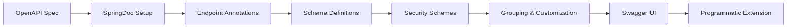
```mermaid
flowchart LR
    A[OpenAPI Spec] --> B[SpringDoc Setup]
    B --> C[Endpoint Annotations]
    C --> D[Schema Definitions]
    D --> E[Security Schemes]
    E --> F[Grouping & Customization]
    F --> G[Swagger UI]
    G --> H[Programmatic Extension]
```

> **Pro Tip:** Add springdoc-openapi-starter-webmvc-ui as a dependency and visit /swagger-ui.html to see your API documentation instantly — no extra configuration needed.

## Theory


### 1. OpenAPI and Swagger — The Big Picture

<a href="../../assets/images/diagrams/java/17-openapi/1-openapi-and-swagger-the-big-picture-handwritten.svg" target="_blank" rel="noopener">
  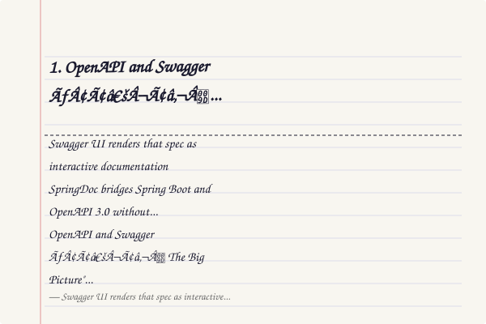
</a>
<a href="../../assets/images/diagrams/java/17-openapi/1-openapi-and-swagger-the-big-picture-diagram.svg" target="_blank" rel="noopener">
  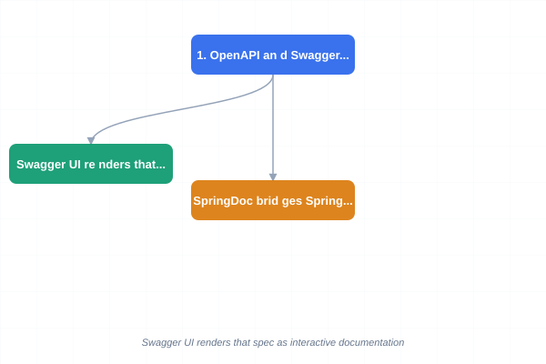
</a>
<a href="../../assets/images/diagrams/java/17-openapi/1-openapi-and-swagger-the-big-picture-sticky.svg" target="_blank" rel="noopener">
  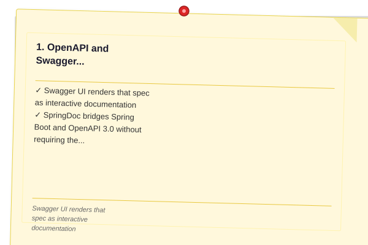
</a>


OpenAPI is a specification (formerly Swagger 2.0, now OpenAPI 3.x) for describing HTTP APIs in a machine-readable format (JSON or YAML). Swagger UI renders that spec as interactive documentation. SpringDoc bridges Spring Boot and OpenAPI 3.0 without requiring the legacy SpringFox library.

The core contract:

```
OpenAPI Specification (openapi.yaml)
          |
          v
   SpringDoc auto-configuration
          |
          v
  @RestController endpoints scanned
          |
          v
  Annotations enrich the spec
          |
          v
  OpenAPI JSON served at /v3/api-docs
          |
          v
  Swagger UI renders at /swagger-ui/index.html
```

### 2. Project Setup

<a href="../../assets/images/diagrams/java/17-openapi/2-project-setup-handwritten.svg" target="_blank" rel="noopener">
  
</a>
<a href="../../assets/images/diagrams/java/17-openapi/2-project-setup-diagram.svg" target="_blank" rel="noopener">
  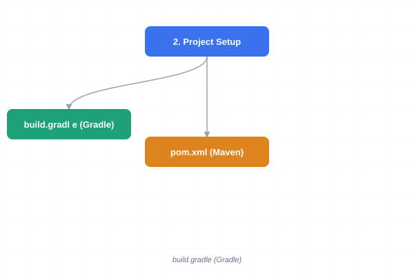
</a>
<a href="../../assets/images/diagrams/java/17-openapi/2-project-setup-sticky.svg" target="_blank" rel="noopener">
  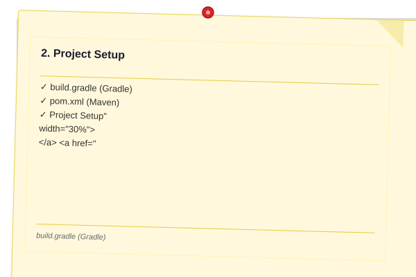
</a>


Add the SpringDoc starter — it auto-configures everything, scanning every `@RestController` and building the OpenAPI document.

**build.gradle (Gradle)**

```groovy
plugins {
    id 'org.springframework.boot' version '3.4.0'
    id 'io.spring.dependency-management' version '1.1.6'
}

dependencies {
    implementation 'org.springframework.boot:spring-boot-starter-web'
    implementation 'org.springdoc:springdoc-openapi-starter-webmvc-ui:2.8.3'

    // Optional: Spring HATEOAS
    implementation 'org.springframework.boot:spring-boot-starter-hateoas'

    testImplementation 'org.springframework.boot:spring-boot-starter-test'
}
```

**pom.xml (Maven)**

```xml
<parent>
    <groupId>org.springframework.boot</groupId>
    <artifactId>spring-boot-starter-parent</artifactId>
    <version>3.4.0</version>
</parent>

<dependencies>
    <dependency>
        <groupId>org.springframework.boot</groupId>
        <artifactId>spring-boot-starter-web</artifactId>
    </dependency>
    <dependency>
        <groupId>org.springdoc</groupId>
        <artifactId>springdoc-openapi-starter-webmvc-ui</artifactId>
        <version>2.8.3</version>
    </dependency>
    <dependency>
        <groupId>org.springframework.boot</groupId>
        <artifactId>spring-boot-starter-hateoas</artifactId>
        <optional>true</optional>
    </dependency>
</dependencies>
```

No additional configuration is required for a minimal setup. Running the application gives you:

| Endpoint | Description |
|----------|-------------|
| `/v3/api-docs` | OpenAPI JSON (default) |
| `/v3/api-docs.yaml` | OpenAPI YAML |
| `/swagger-ui/index.html` | Interactive Swagger UI |
| `/swagger-ui.html` | Redirect to Swagger UI |

### 3. Customizing the OpenAPI Info Object

<a href="../../assets/images/diagrams/java/17-openapi/3-customizing-the-openapi-info-object-handwritten.svg" target="_blank" rel="noopener">
  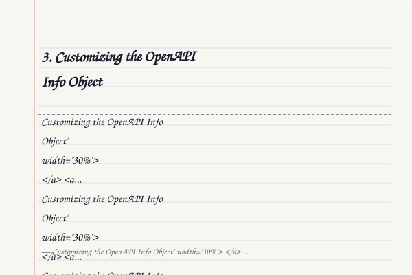
</a>
<a href="../../assets/images/diagrams/java/17-openapi/3-customizing-the-openapi-info-object-diagram.svg" target="_blank" rel="noopener">
  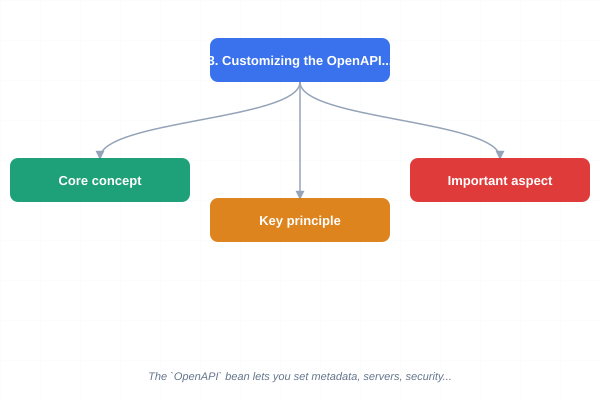
</a>
<a href="../../assets/images/diagrams/java/17-openapi/3-customizing-the-openapi-info-object-sticky.svg" target="_blank" rel="noopener">
  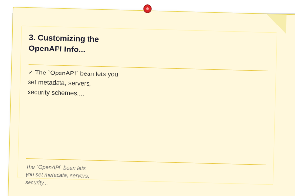
</a>


The `OpenAPI` bean lets you set metadata, servers, security schemes, and external docs.

```java
import io.swagger.v3.oas.models.OpenAPI;
import io.swagger.v3.oas.models.info.Contact;
import io.swagger.v3.oas.models.info.Info;
import io.swagger.v3.oas.models.info.License;
import io.swagger.v3.oas.models.servers.Server;
import org.springframework.context.annotation.Bean;
import org.springframework.context.annotation.Configuration;

import java.util.List;

@Configuration
public class OpenApiConfig {

    @Bean
    public OpenAPI customOpenAPI() {
        return new OpenAPI()
            .openapi("3.0.3")
            .info(new Info()
                .title("PetClinic API")
                .version("2.0.0")
                .description("RESTful API for managing pets, owners, and visits.")
                .termsOfService("https://example.com/terms")
                .contact(new Contact()
                    .name("API Support")
                    .email("support@petclinic.io")
                    .url("https://petclinic.io/support"))
                .license(new License()
                    .name("Apache 2.0")
                    .url("https://www.apache.org/licenses/LICENSE-2.0")))
            .servers(List.of(
                new Server()
                    .url("https://api.petclinic.io/v2")
                    .description("Production server"),
                new Server()
                    .url("https://staging-api.petclinic.io/v2")
                    .description("Staging server"),
                new Server()
                    .url("http://localhost:8080/api")
                    .description("Local development")))
            .externalDocs(new io.swagger.v3.oas.models.ExternalDocumentation()
                .description("Full API Wiki")
                .url("https://wiki.petclinic.io/api"));
    }
}
```

### 4. Annotating Endpoints

<a href="../../assets/images/diagrams/java/17-openapi/4-annotating-endpoints-handwritten.svg" target="_blank" rel="noopener">
  
</a>
<a href="../../assets/images/diagrams/java/17-openapi/4-annotating-endpoints-diagram.svg" target="_blank" rel="noopener">
  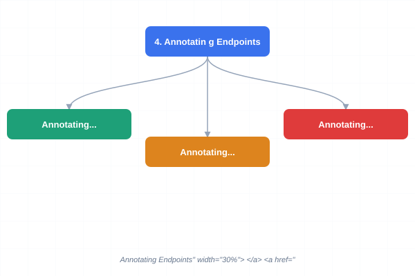
</a>
<a href="../../assets/images/diagrams/java/17-openapi/4-annotating-endpoints-sticky.svg" target="_blank" rel="noopener">
  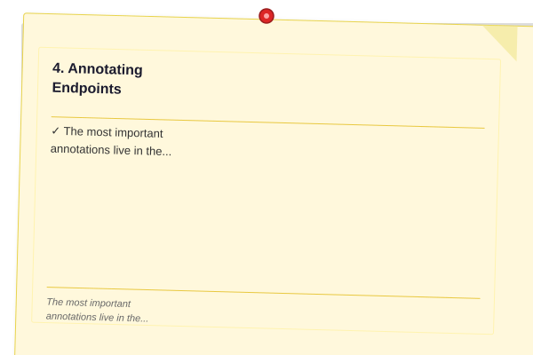
</a>


The most important annotations live in the `io.swagger.v3.oas.annotations` package.

#### 4.1 @Tag — Grouping Controllers

```java
import io.swagger.v3.oas.annotations.tags.Tag;
import org.springframework.web.bind.annotation.GetMapping;
import org.springframework.web.bind.annotation.RequestMapping;
import org.springframework.web.bind.annotation.RestController;

@RestController
@RequestMapping("/api/pets")
@Tag(name = "Pet Management", description = "CRUD operations for pets")
public class PetController {
    // endpoints
}
```

#### 4.2 @Operation — Describing Individual Endpoints

```java
import io.swagger.v3.oas.annotations.Operation;
import io.swagger.v3.oas.annotations.Parameter;
import io.swagger.v3.oas.annotations.media.Content;
import io.swagger.v3.oas.annotations.media.ExampleObject;
import io.swagger.v3.oas.annotations.media.Schema;
import io.swagger.v3.oas.annotations.responses.ApiResponse;
import io.swagger.v3.oas.annotations.responses.ApiResponses;
import io.swagger.v3.oas.annotations.security.SecurityRequirement;
import org.springframework.http.MediaType;
import org.springframework.http.ResponseEntity;
import org.springframework.web.bind.annotation.*;

@RestController
@RequestMapping("/api/pets")
@Tag(name = "Pet Management")
public class PetController {

    private final PetService petService;

    public PetController(PetService petService) {
        this.petService = petService;
    }

    @GetMapping
    @Operation(
        summary = "List all pets",
        description = "Returns a paginated list of pets. Supports filtering by status and type.",
        operationId = "listPets",
        tags = {"Pet Management"}
    )
    @ApiResponses({
        @ApiResponse(
            responseCode = "200",
            description = "Successfully retrieved list",
            content = @Content(
                mediaType = MediaType.APPLICATION_JSON_VALUE,
                schema = @Schema(implementation = PetPageResponse.class),
                examples = @ExampleObject(
                    name = "default",
                    summary = "Typical paginated response",
                    value = """
                    {
                        "content": [
                            {
                                "id": 1,
                                "name": "Buddy",
                                "type": "DOG",
                                "age": 3,
                                "ownerName": "John Doe"
                            }
                        ],
                        "page": 0,
                        "size": 20,
                        "totalElements": 1,
                        "totalPages": 1
                    }
                    """
                )
            )
        ),
        @ApiResponse(responseCode = "401", description = "Unauthorized"),
        @ApiResponse(responseCode = "403", description = "Forbidden")
    })
    public ResponseEntity<PetPageResponse> listPets(
            @Parameter(description = "Page number (zero-based)", example = "0")
            @RequestParam(defaultValue = "0") int page,

            @Parameter(description = "Page size", example = "20")
            @RequestParam(defaultValue = "20") int size,

            @Parameter(description = "Filter by pet type: DOG, CAT, BIRD",
                       schema = @Schema(allowableValues = {"DOG", "CAT", "BIRD"}))
            @RequestParam(required = false) String type,

            @Parameter(hidden = true)
            @RequestParam(defaultValue = "false") boolean internal) {

        PetPageResponse response = petService.findAll(page, size, type);
        return ResponseEntity.ok(response);
    }

    @GetMapping("/{id}")
    @Operation(
        summary = "Find pet by ID",
        description = "Returns a single pet with full details."
    )
    @ApiResponses({
        @ApiResponse(
            responseCode = "200",
            description = "Pet found",
            content = @Content(
                schema = @Schema(implementation = Pet.class)
            )
        ),
        @ApiResponse(
            responseCode = "404",
            description = "Pet not found",
            content = @Content(
                schema = @Schema(implementation = ErrorResponse.class)
            )
        )
    })
    public ResponseEntity<Pet> getPet(
            @Parameter(description = "Pet ID", required = true, example = "42")
            @PathVariable Long id) {
        return ResponseEntity.ok(petService.findById(id));
    }

    @PostMapping
    @Operation(
        summary = "Create a new pet",
        description = "Creates a pet and returns the created resource with its generated ID."
    )
    @ApiResponses({
        @ApiResponse(
            responseCode = "201",
            description = "Pet created",
            content = @Content(
                schema = @Schema(implementation = Pet.class)
            )
        ),
        @ApiResponse(
            responseCode = "400",
            description = "Validation failed",
            content = @Content(
                schema = @Schema(implementation = ValidationErrorResponse.class)
            )
        )
    })
    public ResponseEntity<Pet> createPet(
            @io.swagger.v3.oas.annotations.parameters.RequestBody(
                description = "Pet data to create",
                required = true,
                content = @Content(
                    schema = @Schema(implementation = CreatePetRequest.class),
                    examples = @ExampleObject(
                        name = "createDog",
                        summary = "Create a dog named Buddy",
                        value = """
                        {
                            "name": "Buddy",
                            "type": "DOG",
                            "age": 3,
                            "ownerId": 10
                        }
                        """
                    )
                )
            )
            @Valid @RequestBody CreatePetRequest request) {
        Pet created = petService.create(request);
        return ResponseEntity.status(201).body(created);
    }

    @PutMapping("/{id}")
    @Operation(summary = "Update an existing pet")
    public ResponseEntity<Pet> updatePet(
            @PathVariable Long id,
            @Valid @RequestBody UpdatePetRequest request) {
        return ResponseEntity.ok(petService.update(id, request));
    }

    @DeleteMapping("/{id}")
    @Operation(summary = "Delete a pet")
    @ApiResponse(responseCode = "204", description = "Deleted successfully")
    @ApiResponse(responseCode = "404", description = "Pet not found")
    public ResponseEntity<Void> deletePet(@PathVariable Long id) {
        petService.delete(id);
        return ResponseEntity.noContent().build();
    }
}
```

### 5. @Schema — Modeling DTOs

<a href="../../assets/images/diagrams/java/17-openapi/5-schema-modeling-dtos-handwritten.svg" target="_blank" rel="noopener">
  
</a>
<a href="../../assets/images/diagrams/java/17-openapi/5-schema-modeling-dtos-diagram.svg" target="_blank" rel="noopener">
  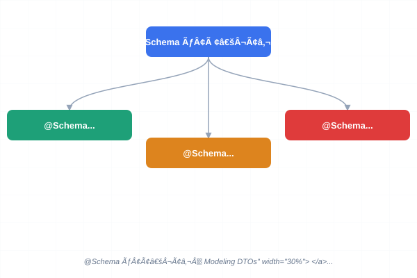
</a>
<a href="../../assets/images/diagrams/java/17-openapi/5-schema-modeling-dtos-sticky.svg" target="_blank" rel="noopener">
  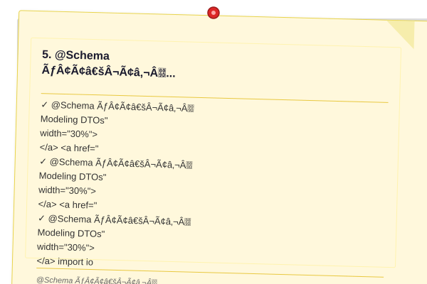
</a>


```java
import io.swagger.v3.oas.annotations.media.Schema;
import jakarta.validation.constraints.Min;
import jakarta.validation.constraints.NotBlank;
import jakarta.validation.constraints.NotNull;
import jakarta.validation.constraints.Pattern;

@Schema(description = "A pet belonging to an owner")
public class Pet {

    @Schema(
        description = "Unique identifier",
        example = "42",
        accessMode = Schema.AccessMode.READ_ONLY
    )
    private Long id;

    @Schema(
        description = "Pet's name",
        example = "Buddy",
        minLength = 1,
        maxLength = 100
    )
    @NotBlank
    private String name;

    @Schema(
        description = "Type of pet",
        example = "DOG",
        allowableValues = {"DOG", "CAT", "BIRD", "FISH", "REPTILE"}
    )
    @NotNull
    private PetType type;

    @Schema(description = "Age in years", example = "3", minimum = "0", maximum = "50")
    @Min(0)
    private int age;

    @Schema(
        description = "Owner's full name",
        example = "John Doe",
        readOnly = true
    )
    private String ownerName;

    @Schema(hidden = true)
    private String internalNotes;

    public Pet() {}

    public Pet(Long id, String name, PetType type, int age, String ownerName) {
        this.id = id;
        this.name = name;
        this.type = type;
        this.age = age;
        this.ownerName = ownerName;
    }

    public Long getId() { return id; }
    public void setId(Long id) { this.id = id; }

    public String getName() { return name; }
    public void setName(String name) { this.name = name; }

    public PetType getType() { return type; }
    public void setType(PetType type) { this.type = type; }

    public int getAge() { return age; }
    public void setAge(int age) { this.age = age; }

    public String getOwnerName() { return ownerName; }
    public void setOwnerName(String ownerName) { this.ownerName = ownerName; }

    public String getInternalNotes() { return internalNotes; }
    public void setInternalNotes(String internalNotes) { this.internalNotes = internalNotes; }
}
```

```java
public enum PetType {
    DOG, CAT, BIRD, FISH, REPTILE
}
```

```java
import io.swagger.v3.oas.annotations.media.Schema;
import jakarta.validation.constraints.NotBlank;
import jakarta.validation.constraints.NotNull;

@Schema(description = "Request payload for creating a new pet")
public class CreatePetRequest {

    @Schema(description = "Pet name", example = "Buddy", requiredMode = Schema.RequiredMode.REQUIRED)
    @NotBlank
    private String name;

    @Schema(description = "Pet type", example = "DOG", requiredMode = Schema.RequiredMode.REQUIRED)
    @NotNull
    private PetType type;

    @Schema(description = "Age in years", example = "3")
    private int age;

    @Schema(description = "Owner ID", example = "10", requiredMode = Schema.RequiredMode.REQUIRED)
    @NotNull
    private Long ownerId;

    public String getName() { return name; }
    public void setName(String name) { this.name = name; }

    public PetType getType() { return type; }
    public void setType(PetType type) { this.type = type; }

    public int getAge() { return age; }
    public void setAge(int age) { this.age = age; }

    public Long getOwnerId() { return ownerId; }
    public void setOwnerId(Long ownerId) { this.ownerId = ownerId; }
}
```

```java
import io.swagger.v3.oas.annotations.media.Schema;

@Schema(description = "Paginated response wrapper for pets")
public class PetPageResponse {

    @Schema(description = "List of pets in current page")
    private List<Pet> content;

    @Schema(description = "Current page number (zero-based)", example = "0")
    private int page;

    @Schema(description = "Page size", example = "20")
    private int size;

    @Schema(description = "Total elements across all pages", example = "150")
    private long totalElements;

    @Schema(description = "Total pages", example = "8")
    private int totalPages;

    public PetPageResponse() {}

    public PetPageResponse(List<Pet> content, int page, int size,
                           long totalElements, int totalPages) {
        this.content = content;
        this.page = page;
        this.size = size;
        this.totalElements = totalElements;
        this.totalPages = totalPages;
    }

    public List<Pet> getContent() { return content; }
    public void setContent(List<Pet> content) { this.content = content; }
    public int getPage() { return page; }
    public void setPage(int page) { this.page = page; }
    public int getSize() { return size; }
    public void setSize(int size) { this.size = size; }
    public long getTotalElements() { return totalElements; }
    public void setTotalElements(long totalElements) { this.totalElements = totalElements; }
    public int getTotalPages() { return totalPages; }
    public void setTotalPages(int totalPages) { this.totalPages = totalPages; }
}
```

```java
import io.swagger.v3.oas.annotations.media.Schema;

@Schema(description = "Standard error response body")
public class ErrorResponse {

    @Schema(description = "HTTP status code", example = "404")
    private int status;

    @Schema(description = "Error message", example = "Pet with ID 42 not found")
    private String message;

    @Schema(description = "Timestamp in epoch millis", example = "1715000000000")
    private long timestamp;

    public ErrorResponse() {}

    public ErrorResponse(int status, String message, long timestamp) {
        this.status = status;
        this.message = message;
        this.timestamp = timestamp;
    }

    public int getStatus() { return status; }
    public void setStatus(int status) { this.status = status; }
    public String getMessage() { return message; }
    public void setMessage(String message) { this.message = message; }
    public long getTimestamp() { return timestamp; }
    public void setTimestamp(long timestamp) { this.timestamp = timestamp; }
}
```

### 6. @Parameter — Fine-Grained Parameter Documentation

<a href="../../assets/images/diagrams/java/17-openapi/6-parameter-fine-grained-parameter-documentation-handwritten.svg" target="_blank" rel="noopener">
  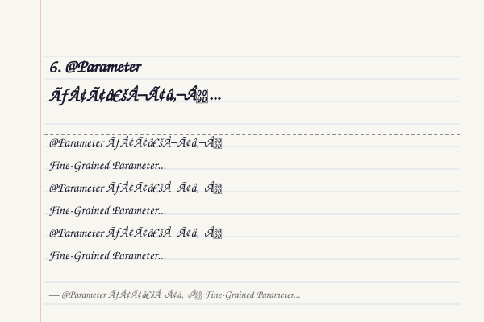
</a>
<a href="../../assets/images/diagrams/java/17-openapi/6-parameter-fine-grained-parameter-documentation-diagram.svg" target="_blank" rel="noopener">
  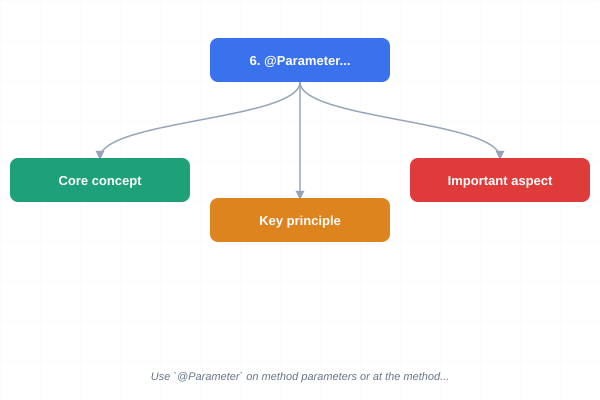
</a>
<a href="../../assets/images/diagrams/java/17-openapi/6-parameter-fine-grained-parameter-documentation-sticky.svg" target="_blank" rel="noopener">
  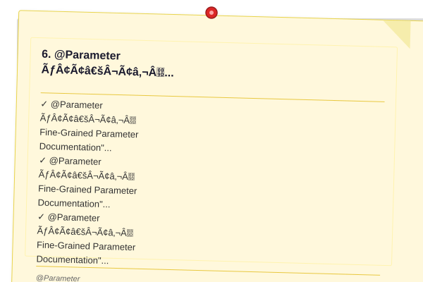
</a>


Use `@Parameter` on method parameters or at the method level for shared parameters.

```java
import io.swagger.v3.oas.annotations.Parameter;
import io.swagger.v3.oas.annotations.enums.ParameterIn;
import io.swagger.v3.oas.annotations.media.ArraySchema;
import io.swagger.v3.oas.annotations.media.Schema;
import org.springframework.web.bind.annotation.*;

@RestController
@RequestMapping("/api/pets")
@Tag(name = "Pet Management")
public class ParameterExamplesController {

    @GetMapping("/search")
    @Operation(summary = "Search pets with advanced filters")
    public ResponseEntity<List<Pet>> searchPets(
            @Parameter(
                description = "Search query (matches name or owner)",
                example = "Buddy",
                in = ParameterIn.QUERY
            )
            @RequestParam(required = false) String q,

            @Parameter(
                description = "Filter by pet type",
                schema = @Schema(implementation = PetType.class),
                in = ParameterIn.QUERY
            )
            @RequestParam(required = false) PetType type,

            @Parameter(
                name = "X-Trace-Id",
                description = "Request trace ID for correlation",
                in = ParameterIn.HEADER,
                required = true,
                example = "abc-123-def",
                schema = @Schema(type = "string", format = "uuid")
            )
            @RequestHeader("X-Trace-Id") String traceId,

            @Parameter(
                description = "Sort fields. Prefix with '-' for descending.",
                example = "name,-age",
                array = @ArraySchema(schema = @Schema(type = "string"))
            )
            @RequestParam(defaultValue = "name") String[] sort) {

        List<Pet> results = petService.search(q, type, sort);
        return ResponseEntity.ok(results);
    }

    @PostMapping("/batch")
    @Operation(summary = "Batch create pets")
    public ResponseEntity<List<Pet>> batchCreate(
            @Parameter(
                description = "Array of pets to create",
                required = true,
                schema = @Schema(implementation = CreatePetRequest.class)
            )
            @Valid @RequestBody List<CreatePetRequest> requests) {

        List<Pet> created = petService.batchCreate(requests);
        return ResponseEntity.status(201).body(created);
    }
}
```

### 7. GroupedOpenApi — Partitioning the Spec

<a href="../../assets/images/diagrams/java/17-openapi/7-groupedopenapi-partitioning-the-spec-handwritten.svg" target="_blank" rel="noopener">
  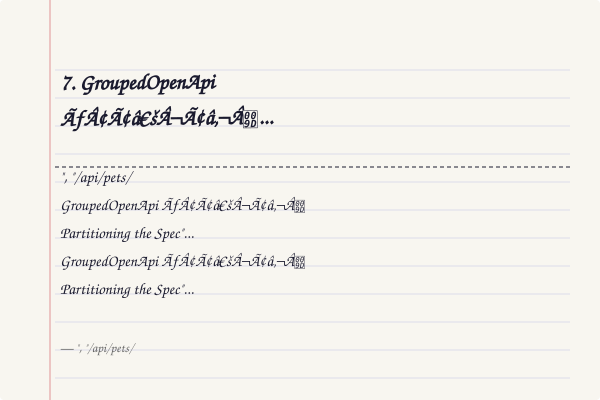
</a>
<a href="../../assets/images/diagrams/java/17-openapi/7-groupedopenapi-partitioning-the-spec-diagram.svg" target="_blank" rel="noopener">
  
</a>
<a href="../../assets/images/diagrams/java/17-openapi/7-groupedopenapi-partitioning-the-spec-sticky.svg" target="_blank" rel="noopener">
  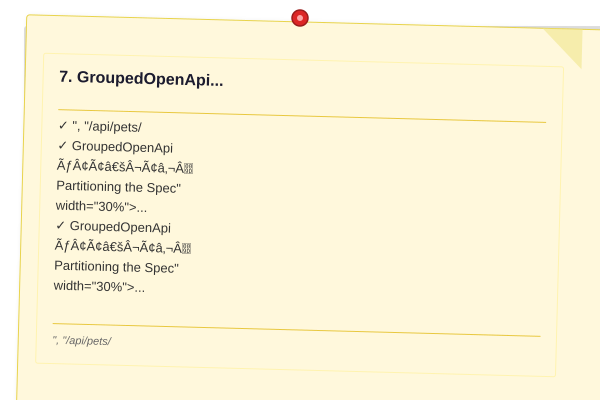
</a>


Split the API specification into logical groups (useful for microservices or role-specific docs).

```java
import io.swagger.v3.oas.models.Info;
import org.springdoc.core.models.GroupedOpenApi;
import org.springframework.context.annotation.Bean;
import org.springframework.context.annotation.Configuration;

@Configuration
public class GroupedOpenApiConfig {

    @Bean
    public GroupedOpenApi publicApi() {
        return GroupedOpenApi.builder()
            .group("public")
            .displayName("Public API")
            .pathsToMatch("/api/public/**", "/api/pets/**")
            .pathsToExclude("/api/admin/**")
            .addOpenApiCustomizer(openApi -> openApi
                .info(new Info()
                    .title("Public PetClinic API")
                    .version("v1")
                    .description("Public-facing endpoints. No authentication required.")))
            .build();
    }

    @Bean
    public GroupedOpenApi adminApi() {
        return GroupedOpenApi.builder()
            .group("admin")
            .displayName("Admin API")
            .pathsToMatch("/api/admin/**")
            .addOpenApiCustomizer(openApi -> openApi
                .info(new Info()
                    .title("Admin PetClinic API")
                    .version("v1")
                    .description("Administrative endpoints. API key required.")))
            .build();
    }

    @Bean
    public GroupedOpenApi internalApi() {
        return GroupedOpenApi.builder()
            .group("internal")
            .displayName("Internal API")
            .pathsToMatch("/api/internal/**")
            .addOpenApiCustomizer(openApi -> openApi
                .info(new Info()
                    .title("Internal PetClinic API")
                    .version("v1")
                    .description("Internal service endpoints. Service-mesh auth only.")))
            .build();
    }

    @Bean
    public GroupedOpenApi petStoreApi() {
        return GroupedOpenApi.builder()
            .group("petstore")
            .displayName("PetStore v3")
            .pathsToMatch("/api/pets/**")
            .packagesToScan("com.petclinic.petstore")
            .addOpenApiCustomizer(openApi -> openApi
                .info(new Info()
                    .title("PetStore API")
                    .version("3.0.0")
                    .description("PetStore-compatible endpoints")))
            .build();
    }
}
```

Each group appears as a separate dropdown entry in Swagger UI, each with its own spec at `/v3/api-docs/{group}`.

### 8. Security Schemes

<a href="../../assets/images/diagrams/java/17-openapi/8-security-schemes-handwritten.svg" target="_blank" rel="noopener">
  
</a>
<a href="../../assets/images/diagrams/java/17-openapi/8-security-schemes-diagram.svg" target="_blank" rel="noopener">
  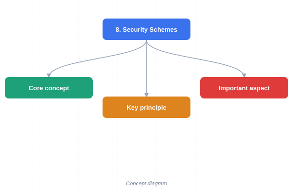
</a>
<a href="../../assets/images/diagrams/java/17-openapi/8-security-schemes-sticky.svg" target="_blank" rel="noopener">
  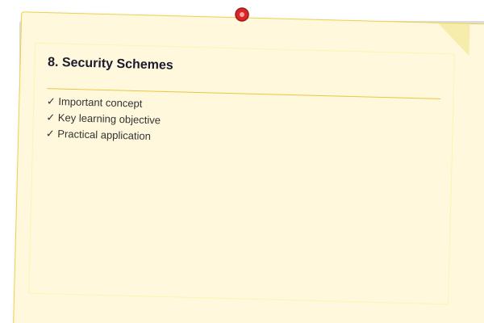
</a>


#### 8.1 Bearer JWT

```java
import io.swagger.v3.oas.models.Components;
import io.swagger.v3.oas.models.OpenAPI;
import io.swagger.v3.oas.models.info.Info;
import io.swagger.v3.oas.models.security.SecurityRequirement;
import io.swagger.v3.oas.models.security.SecurityScheme;
import org.springframework.context.annotation.Bean;
import org.springframework.context.annotation.Configuration;

@Configuration
public class SecuritySchemesConfig {

    private static final String SECURITY_SCHEME_NAME = "BearerAuth";
    private static final String OAUTH2_SCHEME_NAME = "OAuth2";

    @Bean
    public OpenAPI securedOpenAPI() {
        return new OpenAPI()
            .info(new Info()
                .title("PetClinic API")
                .version("2.0.0")
                .description("Secured API with JWT and OAuth2 support"))
            .components(new Components()
                .addSecuritySchemes(SECURITY_SCHEME_NAME, new SecurityScheme()
                    .type(SecurityScheme.Type.HTTP)
                    .scheme("bearer")
                    .bearerFormat("JWT")
                    .description("Enter your JWT token. Example: eyJhbGciOiJIUzI1NiIs..."))
                .addSecuritySchemes(OAUTH2_SCHEME_NAME, new SecurityScheme()
                    .type(SecurityScheme.Type.OAUTH2)
                    .description("OAuth2 authorization code flow")
                    .flows(new io.swagger.v3.oas.models.security.OAuthFlows()
                        .authorizationCode(
                            new io.swagger.v3.oas.models.security.OAuthFlow()
                                .authorizationUrl("https://auth.petclinic.io/oauth2/authorize")
                                .tokenUrl("https://auth.petclinic.io/oauth2/token")
                                .refreshUrl("https://auth.petclinic.io/oauth2/refresh")
                                .scopes(new io.swagger.v3.oas.models.security.Scopes()
                                    .addString("pets:read", "Read pets")
                                    .addString("pets:write", "Create/update pets")
                                    .addString("admin", "Administrative access")
                                )
                        )))
                .addSecuritySchemes("ApiKey", new SecurityScheme()
                    .type(SecurityScheme.Type.APIKEY)
                    .in(SecurityScheme.In.HEADER)
                    .name("X-API-Key")
                    .description("API key for internal services")))
            .addSecurityItem(new SecurityRequirement()
                .addList(SECURITY_SCHEME_NAME)
                .addList(OAUTH2_SCHEME_NAME));
    }
}
```

#### 8.2 Per-Endpoint Security Overrides

```java
import io.swagger.v3.oas.annotations.Operation;
import io.swagger.v3.oas.annotations.security.SecurityRequirement;
import org.springframework.http.ResponseEntity;
import org.springframework.web.bind.annotation.*;

@RestController
@RequestMapping("/api/admin")
@Tag(name = "Admin Operations")
public class AdminController {

    @GetMapping("/audit-log")
    @Operation(
        summary = "Retrieve audit logs",
        security = {
            @SecurityRequirement(name = "BearerAuth"),
            @SecurityRequirement(name = "ApiKey")
        }
    )
    public ResponseEntity<List<AuditEntry>> getAuditLogs() {
        return ResponseEntity.ok(auditService.findAll());
    }

    @PostMapping("/maintenance")
    @Operation(
        summary = "Trigger maintenance",
        security = @SecurityRequirement(name = "BearerAuth",
                                        scopes = {"admin"})
    )
    public ResponseEntity<Void> triggerMaintenance() {
        maintenanceService.run();
        return ResponseEntity.accepted().build();
    }

    @GetMapping("/health")
    @Operation(
        summary = "Health check (no auth)",
        security = {}   // overrides global security — no auth required
    )
    public ResponseEntity<HealthResponse> health() {
        return ResponseEntity.ok(new HealthResponse("UP"));
    }
}
```

### 9. @Content and @ExampleObject — Rich Examples

<a href="../../assets/images/diagrams/java/17-openapi/9-content-and-exampleobject-rich-examples-handwritten.svg" target="_blank" rel="noopener">
  
</a>
<a href="../../assets/images/diagrams/java/17-openapi/9-content-and-exampleobject-rich-examples-diagram.svg" target="_blank" rel="noopener">
  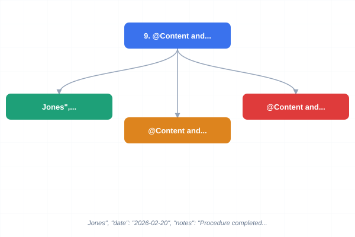
</a>
<a href="../../assets/images/diagrams/java/17-openapi/9-content-and-exampleobject-rich-examples-sticky.svg" target="_blank" rel="noopener">
  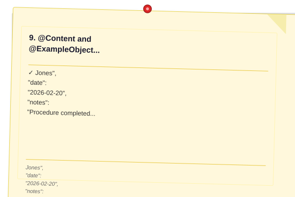
</a>


```java
import io.swagger.v3.oas.annotations.media.Content;
import io.swagger.v3.oas.annotations.media.ExampleObject;
import io.swagger.v3.oas.annotations.media.Schema;
import io.swagger.v3.oas.annotations.responses.ApiResponse;
import io.swagger.v3.oas.annotations.responses.ApiResponses;
import org.springframework.http.MediaType;
import org.springframework.http.ResponseEntity;
import org.springframework.web.bind.annotation.*;

@RestController
@RequestMapping("/api/pets")
public class ExampleDocumentationController {

    @PostMapping(value = "/{id}/medical-record", consumes = MediaType.APPLICATION_JSON_VALUE)
    @Operation(summary = "Add a medical record entry")
    @ApiResponses({
        @ApiResponse(
            responseCode = "201",
            description = "Medical record created",
            content = @Content(
                mediaType = MediaType.APPLICATION_JSON_VALUE,
                schema = @Schema(implementation = MedicalRecord.class),
                examples = {
                    @ExampleObject(
                        name = "vaccination",
                        summary = "Vaccination record",
                        value = """
                        {
                            "petId": 42,
                            "type": "VACCINATION",
                            "description": "Rabies booster shot",
                            "administeredBy": "Dr. Smith",
                            "date": "2026-03-15",
                            "nextDueDate": "2027-03-15"
                        }
                        """
                    ),
                    @ExampleObject(
                        name = "surgery",
                        summary = "Surgery record",
                        value = """
                        {
                            "petId": 42,
                            "type": "SURGERY",
                            "description": "Spay procedure",
                            "administeredBy": "Dr. Jones",
                            "date": "2026-02-20",
                            "notes": "Procedure completed successfully. 2-week recovery."
                        }
                        """
                    )
                }
            )
        ),
        @ApiResponse(
            responseCode = "400",
            description = "Validation error",
            content = @Content(
                mediaType = MediaType.APPLICATION_JSON_VALUE,
                schema = @Schema(implementation = ValidationErrorResponse.class),
                examples = @ExampleObject(
                    name = "validationError",
                    summary = "Missing required fields",
                    value = """
                    {
                        "status": 400,
                        "errors": [
                            {
                                "field": "type",
                                "message": "must not be null"
                            },
                            {
                                "field": "description",
                                "message": "must not be blank"
                            }
                        ],
                        "timestamp": "2026-03-15T10:30:00Z"
                    }
                    """
                )
            )
        )
    })
    public ResponseEntity<MedicalRecord> addMedicalRecord(
            @PathVariable Long id,
            @Valid @RequestBody CreateMedicalRecordRequest request) {
        MedicalRecord record = medicalService.addRecord(id, request);
        return ResponseEntity.status(201).body(record);
    }
}
```

```java
import io.swagger.v3.oas.annotations.media.Schema;
import java.util.List;

@Schema(description = "Validation error containing field-level messages")
public class ValidationErrorResponse {

    @Schema(description = "HTTP status", example = "400")
    private int status;

    @Schema(description = "List of field errors")
    private List<FieldError> errors;

    @Schema(description = "Timestamp", example = "2026-03-15T10:30:00Z")
    private String timestamp;

    public ValidationErrorResponse() {}

    public ValidationErrorResponse(int status, List<FieldError> errors, String timestamp) {
        this.status = status;
        this.errors = errors;
        this.timestamp = timestamp;
    }

    @Schema(description = "A single field validation error")
    public static class FieldError {
        @Schema(description = "Field name", example = "name")
        private String field;

        @Schema(description = "Validation message", example = "must not be blank")
        private String message;

        public FieldError() {}

        public FieldError(String field, String message) {
            this.field = field;
            this.message = message;
        }

        public String getField() { return field; }
        public void setField(String field) { this.field = field; }
        public String getMessage() { return message; }
        public void setMessage(String message) { this.message = message; }
    }

    public int getStatus() { return status; }
    public void setStatus(int status) { this.status = status; }
    public List<FieldError> getErrors() { return errors; }
    public void setErrors(List<FieldError> errors) { this.errors = errors; }
    public String getTimestamp() { return timestamp; }
    public void setTimestamp(String timestamp) { this.timestamp = timestamp; }
}
```

### 10. API Versioning in Docs

<a href="../../assets/images/diagrams/java/17-openapi/10-api-versioning-in-docs-handwritten.svg" target="_blank" rel="noopener">
  
</a>
<a href="../../assets/images/diagrams/java/17-openapi/10-api-versioning-in-docs-diagram.svg" target="_blank" rel="noopener">
  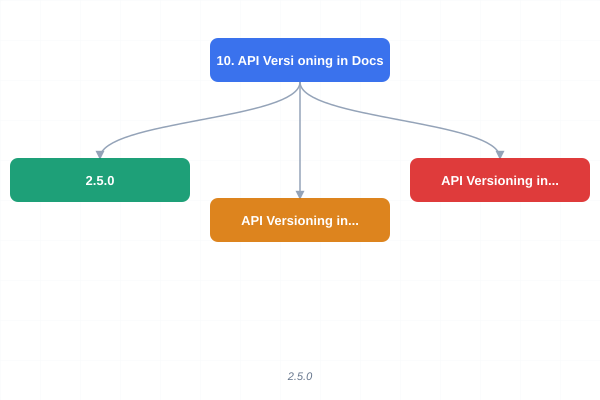
</a>
<a href="../../assets/images/diagrams/java/17-openapi/10-api-versioning-in-docs-sticky.svg" target="_blank" rel="noopener">
  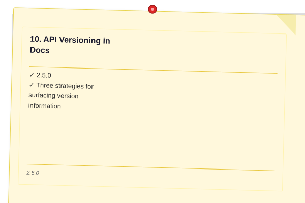
</a>


Three strategies for surfacing version information.

#### 10.1 Version in the Info Object

```java
@Bean
public OpenAPI versionedOpenAPI() {
    return new OpenAPI()
        .info(new Info()
            .title("PetClinic API")
            .version("2.5.0")      // displayed prominently in Swagger UI
            .description("""
                ## API Versioning
                
                Current version: **2.5.0**
                
                ### Changelog

<a href="../../assets/images/diagrams/java/17-openapi/changelog-handwritten.svg" target="_blank" rel="noopener">
  
</a>
<a href="../../assets/images/diagrams/java/17-openapi/changelog-diagram.svg" target="_blank" rel="noopener">
  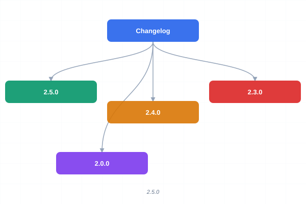
</a>
<a href="../../assets/images/diagrams/java/17-openapi/changelog-sticky.svg" target="_blank" rel="noopener">
  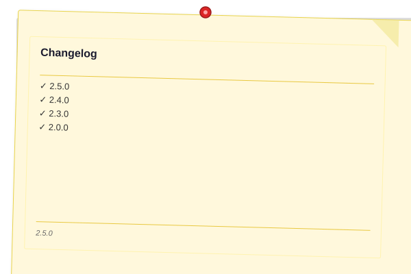
</a>

                - **2.5.0** — Added medical records endpoints
                - **2.4.0** — Added batch operations
                - **2.3.0** — Deprecated `/api/v1/pets` in favor of `/api/pets`
                - **2.0.0** — Major overhaul, OpenAPI 3.0 migration
                """));
}
```

#### 10.2 Version in the URL Path

```java
@RestController
@RequestMapping("/api/v1/pets")
@Tag(name = "Pet Management (v1)")
public class PetV1Controller {

    @GetMapping("/{id}")
    @Operation(
        summary = "Get pet (legacy)",
        description = "**Deprecated.** Use `/api/pets/{id}` instead.",
        deprecated = true
    )
    public ResponseEntity<PetV1> getPetV1(@PathVariable Long id) {
        Pet pet = petService.findById(id);
        return ResponseEntity.ok(new PetV1(pet));
    }
}
```

#### 10.3 Header-Based Versioning

```java
@RestController
@RequestMapping("/api/pets")
public class VersionedController {

    @GetMapping
    @Operation(summary = "List pets (version-aware)")
    public ResponseEntity<?> listPets(
            @Parameter(hidden = true)
            @RequestHeader(value = "X-API-Version", defaultValue = "2") int apiVersion) {

        if (apiVersion == 1) {
            List<PetV1> v1 = petService.findAllV1();
            return ResponseEntity.ok()
                .header("X-API-Version", "1")
                .body(v1);
        }
        PetPageResponse response = petService.findAll(0, 20, null);
        return ResponseEntity.ok()
            .header("X-API-Version", "2")
            .body(response);
    }
}
```

### 11. Spring HATEOAS Support

<a href="../../assets/images/diagrams/java/17-openapi/11-spring-hateoas-support-handwritten.svg" target="_blank" rel="noopener">
  
</a>
<a href="../../assets/images/diagrams/java/17-openapi/11-spring-hateoas-support-diagram.svg" target="_blank" rel="noopener">
  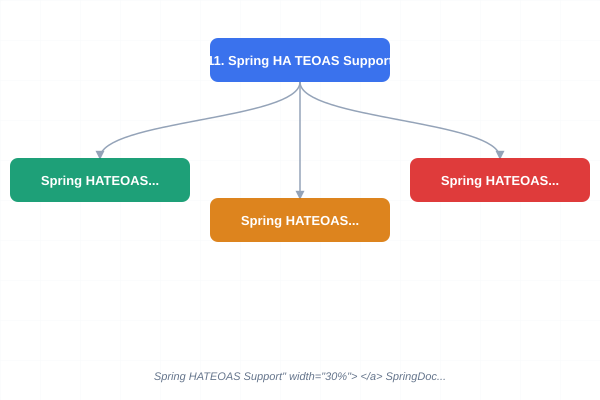
</a>
<a href="../../assets/images/diagrams/java/17-openapi/11-spring-hateoas-support-sticky.svg" target="_blank" rel="noopener">
  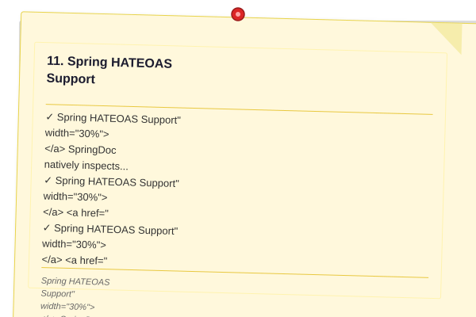
</a>


SpringDoc natively inspects `EntityModel` and `CollectionModel` wrappers.

```java
import io.swagger.v3.oas.annotations.Operation;
import io.swagger.v3.oas.annotations.media.Schema;
import io.swagger.v3.oas.annotations.tags.Tag;
import org.springframework.hateoas.CollectionModel;
import org.springframework.hateoas.EntityModel;
import org.springframework.hateoas.Link;
import org.springframework.hateoas.server.mvc.WebMvcLinkBuilder;
import org.springframework.http.ResponseEntity;
import org.springframework.web.bind.annotation.*;

import java.util.List;

import static org.springframework.hateoas.server.mvc.WebMvcLinkBuilder.linkTo;
import static org.springframework.hateoas.server.mvc.WebMvcLinkBuilder.methodOn;

@RestController
@RequestMapping("/api/hateoas/pets")
@Tag(name = "HATEOAS Pet API")
public class HateoasPetController {

    @GetMapping("/{id}")
    @Operation(summary = "Get pet with HATEOAS links")
    public ResponseEntity<EntityModel<Pet>> getPet(@PathVariable Long id) {
        Pet pet = petService.findById(id);

        EntityModel<Pet> model = EntityModel.of(pet);
        model.add(linkTo(methodOn(HateoasPetController.class).getPet(id)).withSelfRel());
        model.add(linkTo(methodOn(HateoasPetController.class).listPets()).withRel("pets"));
        model.add(linkTo(methodOn(HateoasPetController.class).getOwner(pet.getOwnerId()))
            .withRel("owner"));

        return ResponseEntity.ok(model);
    }

    @GetMapping
    @Operation(summary = "List pets with HATEOAS links")
    public ResponseEntity<CollectionModel<EntityModel<Pet>>> listPets() {
        List<Pet> pets = petService.findAll(0, 20, null).getContent();

        List<EntityModel<Pet>> models = pets.stream()
            .map(pet -> EntityModel.of(pet,
                linkTo(methodOn(HateoasPetController.class).getPet(pet.getId())).withSelfRel(),
                linkTo(methodOn(HateoasPetController.class).listPets()).withRel("pets")))
            .toList();

        CollectionModel<EntityModel<Pet>> collection = CollectionModel.of(models);
        collection.add(linkTo(methodOn(HateoasPetController.class).listPets()).withSelfRel());
        collection.add(linkTo(methodOn(HateoasPetController.class).getOwner(null))
            .withRel("owners"));

        return ResponseEntity.ok(collection);
    }

    @GetMapping("/{petId}/owner")
    @Operation(summary = "Get owner of a pet")
    public ResponseEntity<EntityModel<?>> getOwner(@PathVariable Long petId) {
        // Dummy response — the link is what matters for documentation
        return ResponseEntity.ok().build();
    }
}
```

To ensure HATEOAS schemas render correctly in Swagger UI, configure SpringDoc:

```properties
# application.properties
springdoc.use-fqn=true
springdoc.model-converters.add-entity-converter=false
springdoc.show-actuator=false
```

### 12. Global Headers

<a href="../../assets/images/diagrams/java/17-openapi/12-global-headers-handwritten.svg" target="_blank" rel="noopener">
  
</a>
<a href="../../assets/images/diagrams/java/17-openapi/12-global-headers-diagram.svg" target="_blank" rel="noopener">
  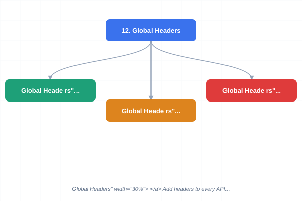
</a>
<a href="../../assets/images/diagrams/java/17-openapi/12-global-headers-sticky.svg" target="_blank" rel="noopener">
  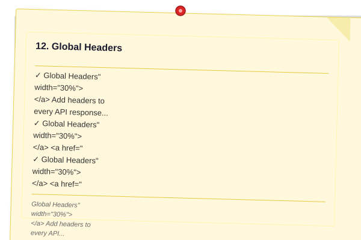
</a>


Add headers to every API response without annotating every controller method.

```java
import io.swagger.v3.oas.models.OpenAPI;
import io.swagger.v3.oas.models.Operation;
import io.swagger.v3.oas.models.headers.Header;
import io.swagger.v3.oas.models.media.StringSchema;
import io.swagger.v3.oas.models.parameters.Parameter;
import io.swagger.v3.oas.models.parameters.HeaderParameter;
import org.springdoc.core.customizers.GlobalOpenApiCustomizer;
import org.springdoc.core.customizers.OperationCustomizer;
import org.springframework.context.annotation.Bean;
import org.springframework.context.annotation.Configuration;
import org.springframework.web.method.HandlerMethod;

@Configuration
public class GlobalHeadersConfig {

    @Bean
    public OperationCustomizer globalHeaderCustomizer() {
        return (Operation operation, HandlerMethod handlerMethod) -> {
            // Global request header
            operation.addParametersItem(new HeaderParameter()
                .name("X-Request-Id")
                .description("Correlation ID for request tracing")
                .required(true)
                .schema(new StringSchema().format("uuid"))
                .example("550e8400-e29b-41d4-a716-446655440000"));

            // Global response header
            operation.getResponses().values().forEach(response -> {
                if (response.getHeaders() == null) {
                    response.setHeaders(new java.util.LinkedHashMap<>());
                }
                response.addHeaderObject("X-RateLimit-Remaining",
                    new Header()
                        .description("Remaining API calls in current window")
                        .schema(new StringSchema().example("95")));
                response.addHeaderObject("X-RateLimit-Reset",
                    new Header()
                        .description("Seconds until rate limit resets")
                        .schema(new StringSchema().example("42")));
            });

            return operation;
        };
    }

    @Bean
    public GlobalOpenApiCustomizer globalResponseHeaderCustomizer() {
        return openApi -> {
            // Add global headers at the spec level for all responses
            var components = openApi.getComponents();
            if (components == null) {
                components = new io.swagger.v3.oas.models.Components();
                openApi.setComponents(components);
            }

            var globalHeaders = new java.util.LinkedHashMap<String, Header>();
            globalHeaders.put("X-Application-Name", new Header()
                .description("Application name")
                .schema(new StringSchema().example("PetClinic-API"))
                .required(true));
            globalHeaders.put("X-Application-Version", new Header()
                .description("Application version")
                .schema(new StringSchema().example("2.5.0"))
                .required(true));

            // These appear under "Headers" in components
            components.setHeaders(globalHeaders);
        };
    }
}
```

### 13. Custom @Operation Meta-Annotation

<a href="../../assets/images/diagrams/java/17-openapi/13-custom-operation-meta-annotation-handwritten.svg" target="_blank" rel="noopener">
  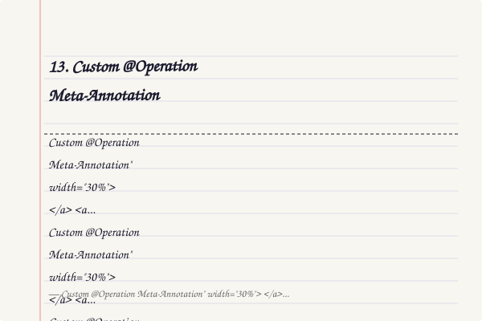
</a>
<a href="../../assets/images/diagrams/java/17-openapi/13-custom-operation-meta-annotation-diagram.svg" target="_blank" rel="noopener">
  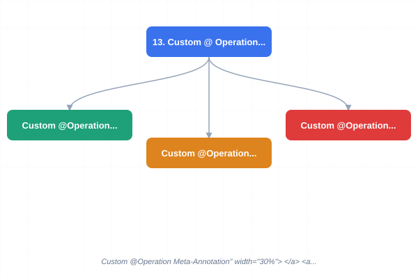
</a>
<a href="../../assets/images/diagrams/java/17-openapi/13-custom-operation-meta-annotation-sticky.svg" target="_blank" rel="noopener">
  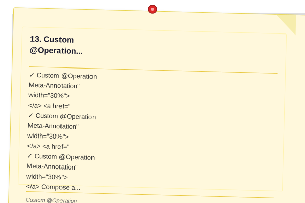
</a>


Compose a reusable annotation that bundles `@Operation`, `@ApiResponses`, and `@SecurityRequirement`.

```java
import io.swagger.v3.oas.annotations.Operation;
import io.swagger.v3.oas.annotations.media.Content;
import io.swagger.v3.oas.annotations.media.Schema;
import io.swagger.v3.oas.annotations.responses.ApiResponse;
import io.swagger.v3.oas.annotations.security.SecurityRequirement;
import org.springframework.core.annotation.AliasFor;

import java.lang.annotation.*;

@Target({ElementType.METHOD, ElementType.ANNOTATION_TYPE})
@Retention(RetentionPolicy.RUNTIME)
@Inherited
@Operation
@ApiResponse(
    responseCode = "401",
    description = "Authentication required — provide a valid JWT token",
    content = @Content(schema = @Schema(implementation = ErrorResponse.class))
)
@ApiResponse(
    responseCode = "403",
    description = "Insufficient permissions",
    content = @Content(schema = @Schema(implementation = ErrorResponse.class))
)
@ApiResponse(
    responseCode = "500",
    description = "Internal server error",
    content = @Content(schema = @Schema(implementation = ErrorResponse.class))
)
@SecurityRequirement(name = "BearerAuth")
public @interface SecuredOperation {

    @AliasFor(annotation = Operation.class, attribute = "summary")
    String summary() default "";

    @AliasFor(annotation = Operation.class, attribute = "description")
    String description() default "";

    @AliasFor(annotation = Operation.class, attribute = "operationId")
    String operationId() default "";

    @AliasFor(annotation = Operation.class, attribute = "deprecated")
    boolean deprecated() default false;

    @AliasFor(annotation = Operation.class, attribute = "tags")
    String[] tags() default {};
}
```

```java
// Also create a read-only variant
@Target(ElementType.METHOD)
@Retention(RetentionPolicy.RUNTIME)
@SecuredOperation                    // inherits security + common error responses
@ApiResponse(
    responseCode = "200",
    description = "Success"
)
@ApiResponse(responseCode = "404", description = "Resource not found")
public @interface ReadOperation {
    @AliasFor(annotation = Operation.class, attribute = "summary")
    String summary() default "";
}
```

```java
@RestController
@RequestMapping("/api/pets")
@Tag(name = "Pet Management")
public class MetaAnnotationController {

    @GetMapping("/{id}")
    @ReadOperation(summary = "Find pet by ID")
    public ResponseEntity<Pet> getPet(@PathVariable Long id) {
        return ResponseEntity.ok(petService.findById(id));
    }

    @PostMapping
    @SecuredOperation(
        summary = "Create a new pet",
        description = "Requires pets:write scope"
    )
    @ApiResponse(responseCode = "201", description = "Pet created")
    @ApiResponse(responseCode = "400", description = "Validation error")
    public ResponseEntity<Pet> createPet(@Valid @RequestBody CreatePetRequest request) {
        return ResponseEntity.status(201).body(petService.create(request));
    }
}
```

### 14. OpenApiCustomizer — Programmatic Spec Manipulation

<a href="../../assets/images/diagrams/java/17-openapi/14-openapicustomizer-programmatic-spec-manipulation-handwritten.svg" target="_blank" rel="noopener">
  
</a>
<a href="../../assets/images/diagrams/java/17-openapi/14-openapicustomizer-programmatic-spec-manipulation-diagram.svg" target="_blank" rel="noopener">
  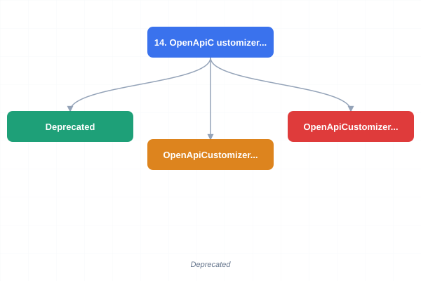
</a>
<a href="../../assets/images/diagrams/java/17-openapi/14-openapicustomizer-programmatic-spec-manipulation-sticky.svg" target="_blank" rel="noopener">
  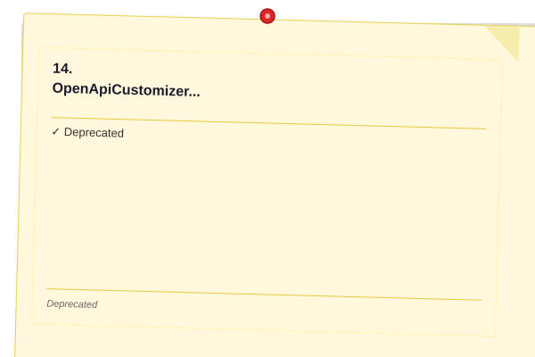
</a>


```java
import io.swagger.v3.oas.models.OpenAPI;
import io.swagger.v3.oas.models.Paths;
import io.swagger.v3.oas.models.examples.Example;
import io.swagger.v3.oas.models.info.Contact;
import io.swagger.v3.oas.models.info.Info;
import io.swagger.v3.oas.models.media.Content;
import io.swagger.v3.oas.models.media.MediaType;
import io.swagger.v3.oas.models.media.Schema;
import io.swagger.v3.oas.models.parameters.RequestBody;
import io.swagger.v3.oas.models.responses.ApiResponse;
import io.swagger.v3.oas.models.responses.ApiResponses;
import io.swagger.v3.oas.models.servers.Server;
import org.springdoc.core.customizers.OpenApiCustomizer;
import org.springframework.context.annotation.Bean;
import org.springframework.context.annotation.Configuration;

import java.math.BigDecimal;
import java.util.List;
import java.util.Map;

@Configuration
public class OpenApiCustomizerConfig {

    @Bean
    public OpenApiCustomizer serverInfoCustomizer() {
        return openApi -> {
            // Add a server dynamically
            openApi.getServers().add(0, new Server()
                .url("https://canary.petclinic.io/v2")
                .description("Canary server (experimental)"));

            // Update the info description
            Info info = openApi.getInfo();
            if (info != null) {
                info.setDescription(info.getDescription()
                    + "\n\n---\n*Generated at: " + java.time.Instant.now() + "*");
            }
        };
    }

    @Bean
    public OpenApiCustomizer healthEndpointCustomizer() {
        return openApi -> {
            // Add a hidden health path to a custom group
            var healthPath = new io.swagger.v3.oas.models.PathItem();
            healthPath.setGet(new io.swagger.v3.oas.models.Operation()
                .operationId("healthCheck")
                .summary("Health check endpoint")
                .tags(List.of("System"))
                .addTagsItem("Health")
                .responses(new ApiResponses()
                    .addApiResponse("200", new ApiResponse()
                        .description("OK")
                        .content(new Content()
                            .addMediaType("application/json", new MediaType()
                                .schema(new Schema<>().$ref("#/components/schemas/HealthResponse")))))));

            openApi.path("/health", healthPath);
        };
    }

    @Bean
    public OpenApiCustomizer schemaCustomizer() {
        return openApi -> {
            var schemas = openApi.getComponents().getSchemas();
            if (schemas == null) return;

            // Add a shared "Pagination" schema used by multiple endpoints
            schemas.put("PaginationInfo", new Schema<>()
                .type("object")
                .description("Pagination metadata")
                .addProperty("page", new Schema<>().type("integer").example(0))
                .addProperty("size", new Schema<>().type("integer").example(20))
                .addProperty("totalElements", new Schema<>().type("integer").example(150))
                .addProperty("totalPages", new Schema<>().type("integer").example(8)));

            // Add a deprecation notice to a schema
            if (schemas.containsKey("PetV1")) {
                schemas.get("PetV1").setDescription(
                    schemas.get("PetV1").getDescription()
                        + " **Deprecated**: Use Pet instead.");
            }
        };
    }

    @Bean
    public OpenApiCustomizer tagCustomizer() {
        return openApi -> {
            // Sort tags alphabetically
            if (openApi.getTags() != null) {
                openApi.getTags().sort((a, b) ->
                    String.CASE_INSENSITIVE_ORDER.compare(a.getName(), b.getName()));
            }

            // Add a description to a tag if missing
            openApi.getTags().forEach(tag -> {
                if (tag.getDescription() == null || tag.getDescription().isBlank()) {
                    tag.setDescription("Operations related to " + tag.getName());
                }
            });
        };
    }

    @Bean
    public OpenApiCustomizer errorResponseCustomizer() {
        return openApi -> {
            // Register common error response schema
            var schemas = openApi.getComponents().getSchemas();
            if (schemas == null || !schemas.containsKey("ErrorResponse")) {
                schemas.put("ErrorResponse", new Schema<>()
                    .type("object")
                    .description("Standard error response")
                    .addProperty("status", new Schema<>()
                        .type("integer").description("HTTP status code").example(400))
                    .addProperty("error", new Schema<>()
                        .type("string").description("Error type").example("Bad Request"))
                    .addProperty("message", new Schema<>()
                        .type("string").description("Human-readable message")
                        .example("Validation failed for field 'name'"))
                    .addProperty("path", new Schema<>()
                        .type("string").description("Request path").example("/api/pets"))
                    .addProperty("timestamp", new Schema<>()
                        .type("string").format("date-time")
                        .example("2026-03-15T10:30:00Z")));
            }
        };
    }
}
```

### 15. Hiding Endpoints

<a href="../../assets/images/diagrams/java/17-openapi/15-hiding-endpoints-handwritten.svg" target="_blank" rel="noopener">
  
</a>
<a href="../../assets/images/diagrams/java/17-openapi/15-hiding-endpoints-diagram.svg" target="_blank" rel="noopener">
  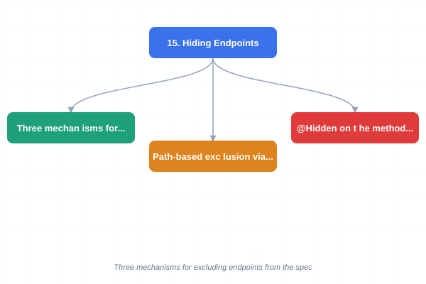
</a>
<a href="../../assets/images/diagrams/java/17-openapi/15-hiding-endpoints-sticky.svg" target="_blank" rel="noopener">
  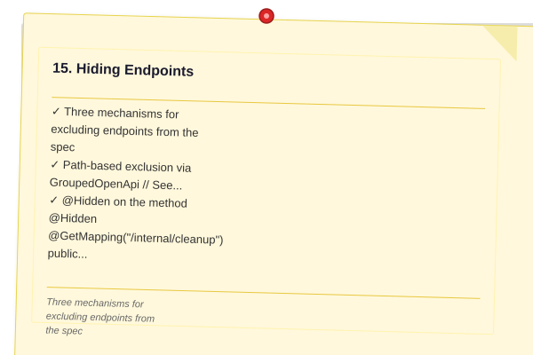
</a>


Three mechanisms for excluding endpoints from the spec.

```java
import io.swagger.v3.oas.annotations.Hidden;
import io.swagger.v3.oas.annotations.Operation;
import io.swagger.v3.oas.annotations.Parameter;
import org.springframework.web.bind.annotation.*;

@RestController
@RequestMapping("/api")
public class HiddenEndpointsController {

    // 1. @Hidden on the method
    @Hidden
    @GetMapping("/internal/cleanup")
    public ResponseEntity<Void> cleanup() {
        return ResponseEntity.ok().build();
    }

    // 2. @Operation hidden = true
    @GetMapping("/internal/metrics")
    @Operation(summary = "DO NOT EXPOSE", hidden = true)
    public ResponseEntity<Metrics> getInternalMetrics() {
        return ResponseEntity.ok(new Metrics());
    }

    // 3. @Parameter(hidden = true) — hides a specific parameter
    @GetMapping("/pets")
    @Operation(summary = "Search pets")
    public ResponseEntity<List<Pet>> search(
            @RequestParam String q,
            @Parameter(hidden = true)
            @RequestParam(defaultValue = "false") boolean bypassCache,
            @Parameter(hidden = true)
            @RequestHeader("X-Debug") String debugHeader) {

        if (bypassCache) cacheService.evict();
        return ResponseEntity.ok(petService.search(q));
    }

    // 4. Path-based exclusion via GroupedOpenApi
    // See GroupedOpenApiConfig.pathsToExclude
}
```

### 16. Swagger UI Customization

<a href="../../assets/images/diagrams/java/17-openapi/16-swagger-ui-customization-handwritten.svg" target="_blank" rel="noopener">
  
</a>
<a href="../../assets/images/diagrams/java/17-openapi/16-swagger-ui-customization-diagram.svg" target="_blank" rel="noopener">
  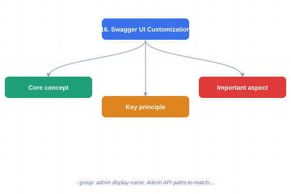
</a>
<a href="../../assets/images/diagrams/java/17-openapi/16-swagger-ui-customization-sticky.svg" target="_blank" rel="noopener">
  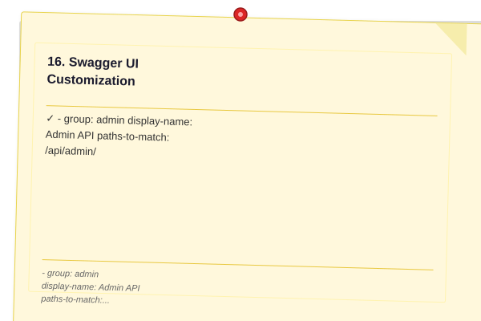
</a>


```yaml
# application.yml
springdoc:
  api-docs:
    path: /v3/api-docs
    enabled: true
  swagger-ui:
    path: /swagger-ui.html
    enabled: true
    display-request-duration: true
    display-operation-id: true
    default-models-expand-depth: 2
    default-model-expand-depth: 3
    doc-expansion: list
    filter: true
    max-display-tags: 20
    operations-sorter: method
    tags-sorter: alpha
    show-common-extensions: true
    show-extensions: true
    supported-submit-methods: get,put,post,delete,patch
    syntax-highlight:
      activated: true
      theme: monokai
    try-it-out-enabled: true
    use-root-path: true
    urls-primary-name: public
    url: /v3/api-docs
    layout: BaseLayout
    deep-linking: true
    default-model-rendering: example
    confirm-dialog: true
  cache:
    disabled: true
  show-actuator: false
  model-and-view-allowed: false
  paths-to-match: /api/**
  packages-to-scan: com.petclinic
  writer-with-order-by-keys: true
  use-management-port: false
  group-configs:
    - group: public
      display-name: Public API
      paths-to-match: /api/public/**,/api/pets/**
    - group: admin
      display-name: Admin API
      paths-to-match: /api/admin/**
```

```properties
# application.properties alternative
springdoc.api-docs.path=/v3/api-docs
springdoc.api-docs.enabled=true
springdoc.swagger-ui.path=/swagger-ui.html
springdoc.swagger-ui.display-request-duration=true
springdoc.swagger-ui.display-operation-id=true
springdoc.swagger-ui.default-models-expand-depth=2
springdoc.swagger-ui.default-model-expand-depth=3
springdoc.swagger-ui.doc-expansion=list
springdoc.swagger-ui.filter=true
springdoc.swagger-ui.max-display-tags=20
springdoc.swagger-ui.operations-sorter=method
springdoc.swagger-ui.tags-sorter=alpha
springdoc.swagger-ui.show-common-extensions=true
springdoc.swagger-ui.show-extensions=true
springdoc.swagger-ui.syntax-highlight.activated=true
springdoc.swagger-ui.syntax-highlight.theme=monokai
springdoc.swagger-ui.try-it-out-enabled=true
springdoc.swagger-ui.use-root-path=true
springdoc.swagger-ui.urls-primary-name=public
springdoc.swagger-ui.deep-linking=true
springdoc.cache.disabled=true
springdoc.show-actuator=false
springdoc.paths-to-match=/api/**
springdoc.packages-to-scan=com.petclinic
```

For fully custom Swagger UI branding, place files in `src/main/resources/static/` and use `swagger-ui.config`:

```yaml
springdoc:
  swagger-ui:
    urls:
      - name: Public
        url: /v3/api-docs/public
      - name: Admin
        url: /v3/api-docs/admin
```

You can also inject custom JavaScript or CSS:

```java
import org.springdoc.core.properties.SwaggerUiConfigParameters;
import org.springdoc.core.properties.SwaggerUiConfigProperties;
import org.springframework.context.annotation.Bean;
import org.springframework.context.annotation.Configuration;

@Configuration
public class SwaggerUiBrandingConfig {

    @Bean
    public SwaggerUiConfigParameters swaggerUiConfigParameters() {
        SwaggerUiConfigParameters params = new SwaggerUiConfigParameters(
            new SwaggerUiConfigProperties());
        params.setCustomSiteTitle("PetClinic API Docs");
        // Additional customization in application.yml
        return params;
    }
}
```

### 17. Complete Working Example

<a href="../../assets/images/diagrams/java/17-openapi/17-complete-working-example-handwritten.svg" target="_blank" rel="noopener">
  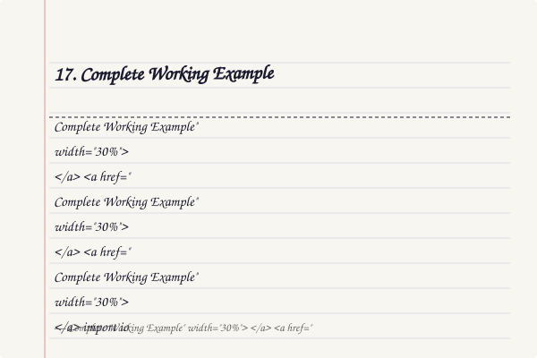
</a>
<a href="../../assets/images/diagrams/java/17-openapi/17-complete-working-example-diagram.svg" target="_blank" rel="noopener">
  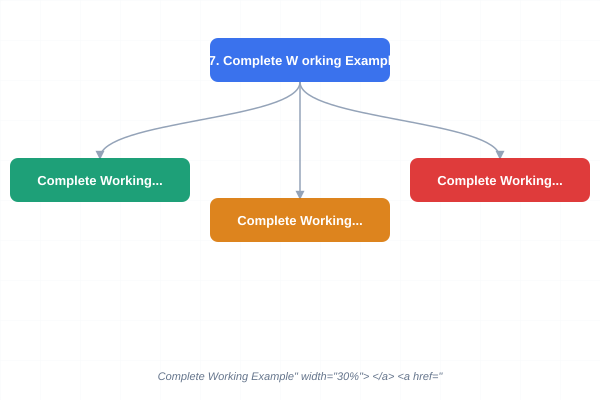
</a>
<a href="../../assets/images/diagrams/java/17-openapi/17-complete-working-example-sticky.svg" target="_blank" rel="noopener">
  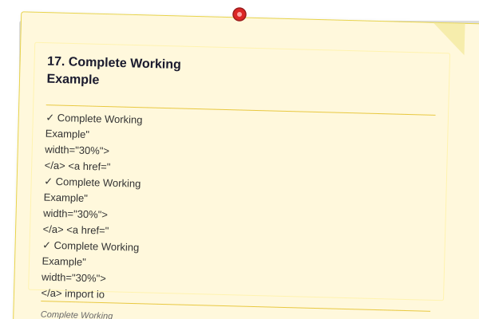
</a>


```java
import io.swagger.v3.oas.annotations.ExternalDocumentation;
import io.swagger.v3.oas.annotations.OpenAPIDefinition;
import io.swagger.v3.oas.annotations.enums.SecuritySchemeType;
import io.swagger.v3.oas.annotations.info.Contact;
import io.swagger.v3.oas.annotations.info.Info;
import io.swagger.v3.oas.annotations.info.License;
import io.swagger.v3.oas.annotations.security.SecurityScheme;
import io.swagger.v3.oas.annotations.servers.Server;
import io.swagger.v3.oas.annotations.tags.Tag;
import org.springframework.boot.SpringApplication;
import org.springframework.boot.autoconfigure.SpringBootApplication;

@SpringBootApplication
@OpenAPIDefinition(
    info = @Info(
        title = "PetClinic API",
        version = "2.0.0",
        description = "Complete REST API for veterinary clinic management.",
        contact = @Contact(
            name = "API Support",
            email = "support@petclinic.io",
            url = "https://petclinic.io/support"
        ),
        license = @License(
            name = "Apache 2.0",
            url = "https://www.apache.org/licenses/LICENSE-2.0"
        ),
        termsOfService = "https://petclinic.io/terms"
    ),
    servers = {
        @Server(url = "https://api.petclinic.io/v2", description = "Production"),
        @Server(url = "https://staging-api.petclinic.io/v2", description = "Staging"),
        @Server(url = "http://localhost:8080/api", description = "Local")
    },
    externalDocs = @ExternalDocumentation(
        url = "https://wiki.petclinic.io/api",
        description = "Full API wiki"
    ),
    tags = {
        @Tag(name = "Pet Management", description = "CRUD for pets"),
        @Tag(name = "Owner Management", description = "CRUD for owners"),
        @Tag(name = "Medical Records", description = "Pet medical history"),
        @Tag(name = "Appointments", description = "Schedule and manage appointments"),
        @Tag(name = "Admin Operations", description = "Admin-only endpoints")
    }
)
@SecurityScheme(
    name = "BearerAuth",
    type = SecuritySchemeType.HTTP,
    scheme = "bearer",
    bearerFormat = "JWT",
    description = "JWT token obtained from /auth/login"
)
@SecurityScheme(
    name = "OAuth2",
    type = SecuritySchemeType.OAUTH2,
    description = "OAuth2 authorization code flow",
    flows = @io.swagger.v3.oas.annotations.security.OAuthFlows(
        authorizationCode = @io.swagger.v3.oas.annotations.security.OAuthFlow(
            authorizationUrl = "https://auth.petclinic.io/oauth2/authorize",
            tokenUrl = "https://auth.petclinic.io/oauth2/token",
            scopes = {
                @io.swagger.v3.oas.annotations.security.OAuthScope(
                    name = "pets:read", description = "Read pets"),
                @io.swagger.v3.oas.annotations.security.OAuthScope(
                    name = "pets:write", description = "Write pets"),
            }
        )
    )
)
public class PetClinicApplication {

    public static void main(String[] args) {
        SpringApplication.run(PetClinicApplication.class, args);
    }
}
```

### 18. Testing the OpenAPI Spec

<a href="../../assets/images/diagrams/java/17-openapi/18-testing-the-openapi-spec-handwritten.svg" target="_blank" rel="noopener">
  
</a>
<a href="../../assets/images/diagrams/java/17-openapi/18-testing-the-openapi-spec-diagram.svg" target="_blank" rel="noopener">
  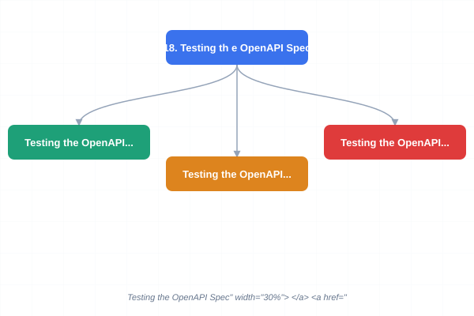
</a>
<a href="../../assets/images/diagrams/java/17-openapi/18-testing-the-openapi-spec-sticky.svg" target="_blank" rel="noopener">
  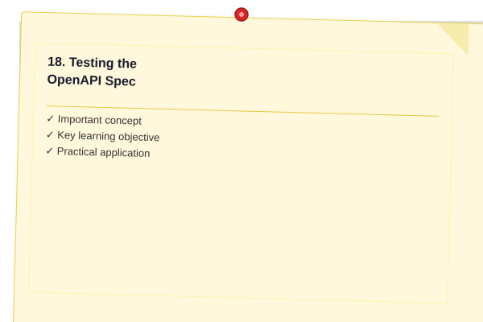
</a>


```java
import org.junit.jupiter.api.Test;
import org.springframework.beans.factory.annotation.Autowired;
import org.springframework.boot.test.autoconfigure.web.servlet.AutoConfigureMockMvc;
import org.springframework.boot.test.context.SpringBootTest;
import org.springframework.test.web.servlet.MockMvc;

import static org.hamcrest.Matchers.hasItem;
import static org.hamcrest.Matchers.hasSize;
import static org.springframework.test.web.servlet.request.MockMvcRequestBuilders.get;
import static org.springframework.test.web.servlet.result.MockMvcResultMatchers.*;

@SpringBootTest
@AutoConfigureMockMvc
class OpenApiSpecTest {

    @Autowired
    private MockMvc mockMvc;

    @Test
    void openApiJsonIsValid() throws Exception {
        mockMvc.perform(get("/v3/api-docs")
                .accept("application/json"))
            .andExpect(status().isOk())
            .andExpect(jsonPath("$.openapi").value("3.0.1"))
            .andExpect(jsonPath("$.info.title").value("PetClinic API"))
            .andExpect(jsonPath("$.info.version").value("2.0.0"))
            .andExpect(jsonPath("$.paths./api/pets").exists())
            .andExpect(jsonPath("$.paths./api/pets.get").exists())
            .andExpect(jsonPath("$.paths./api/pets.post").exists())
            .andExpect(jsonPath("$.paths./api/pets/{id}").exists())
            .andExpect(jsonPath("$.components.securitySchemes.BearerAuth").exists())
            .andExpect(jsonPath("$.servers", hasSize(3)));
    }

    @Test
    void groupedOpenApiEndpointsExist() throws Exception {
        mockMvc.perform(get("/v3/api-docs/public"))
            .andExpect(status().isOk())
            .andExpect(jsonPath("$.info.title").value("Public PetClinic API"));

        mockMvc.perform(get("/v3/api-docs/admin"))
            .andExpect(status().isOk())
            .andExpect(jsonPath("$.info.title").value("Admin PetClinic API"));
    }

    @Test
    void swaggerUiLoads() throws Exception {
        mockMvc.perform(get("/swagger-ui/index.html"))
            .andExpect(status().isOk())
            .andExpect(header().string("Content-Type",
                org.hamcrest.Matchers.containsString("text/html")));
    }

    @Test
    void petEndpointHasExpectedAnnotations() throws Exception {
        mockMvc.perform(get("/v3/api-docs"))
            .andExpect(status().isOk())
            .andExpect(jsonPath("$.paths./api/pets.get.summary")
                .value("List all pets"))
            .andExpect(jsonPath("$.paths./api/pets.get.parameters[*].name",
                hasItem("page")))
            .andExpect(jsonPath("$.paths./api/pets.get.parameters[*].name",
                hasItem("size")))
            .andExpect(jsonPath("$.paths./api/pets.post.responses.201.description")
                .value("Pet created"));
    }

    @Test
    void hiddenEndpointsAreExcluded() throws Exception {
        String spec = mockMvc.perform(get("/v3/api-docs"))
            .andReturn()
            .getResponse()
            .getContentAsString();

        // Internal endpoints marked @Hidden should not appear
        org.assertj.core.api.Assertions.assertThat(spec)
            .doesNotContain("/api/internal/cleanup")
            .doesNotContain("/api/internal/metrics");
    }

    @Test
    void securitySchemesAreDocumented() throws Exception {
        mockMvc.perform(get("/v3/api-docs"))
            .andExpect(status().isOk())
            .andExpect(jsonPath("$.components.securitySchemes.BearerAuth.type")
                .value("http"))
            .andExpect(jsonPath("$.components.securitySchemes.BearerAuth.scheme")
                .value("bearer"))
            .andExpect(jsonPath("$.components.securitySchemes.OAuth2.type")
                .value("oauth2"))
            .andExpect(jsonPath("$.components.securitySchemes.OAuth2.flows.authorizationCode.authorizationUrl")
                .value("https://auth.petclinic.io/oauth2/authorize"));
    }
}
```

### 19. Application Properties Reference

<a href="../../assets/images/diagrams/java/17-openapi/19-application-properties-reference-handwritten.svg" target="_blank" rel="noopener">
  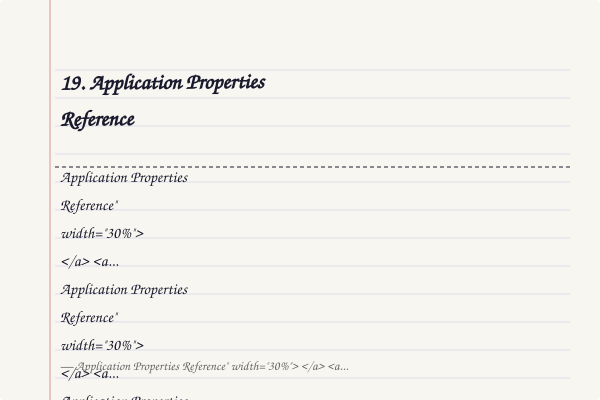
</a>
<a href="../../assets/images/diagrams/java/17-openapi/19-application-properties-reference-diagram.svg" target="_blank" rel="noopener">
  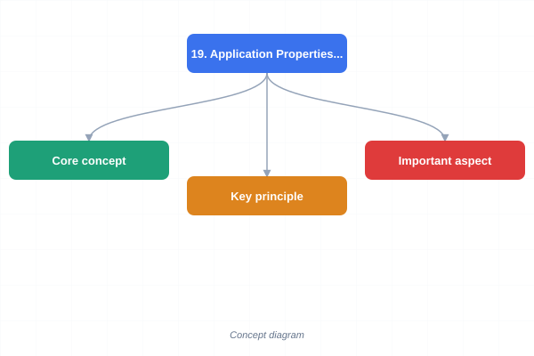
</a>
<a href="../../assets/images/diagrams/java/17-openapi/19-application-properties-reference-sticky.svg" target="_blank" rel="noopener">
  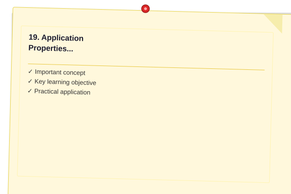
</a>


```properties
# ===== SpringDoc Core =====
springdoc.api-docs.path=/v3/api-docs
springdoc.api-docs.enabled=true
springdoc.packages-to-scan=com.petclinic
springdoc.paths-to-match=/api/**
springdoc.show-actuator=false
springdoc.model-and-view-allowed=false
springdoc.cache.disabled=true
springdoc.writer-with-order-by-keys=true
springdoc.use-management-port=false

# ===== Swagger UI =====
springdoc.swagger-ui.path=/swagger-ui.html
springdoc.swagger-ui.enabled=true
springdoc.swagger-ui.display-request-duration=true
springdoc.swagger-ui.display-operation-id=true
springdoc.swagger-ui.default-models-expand-depth=2
springdoc.swagger-ui.doc-expansion=list
springdoc.swagger-ui.filter=true
springdoc.swagger-ui.operations-sorter=method
springdoc.swagger-ui.tags-sorter=alpha
springdoc.swagger-ui.try-it-out-enabled=true
springdoc.swagger-ui.deep-linking=true
springdoc.swagger-ui.syntax-highlight.activated=true
springdoc.swagger-ui.syntax-highlight.theme=monokai

# ===== Grouped Configs =====
springdoc.group-configs[0].group=public
springdoc.group-configs[0].display-name=Public API
springdoc.group-configs[0].paths-to-match=/api/public/**,/api/pets/**
springdoc.group-configs[1].group=admin
springdoc.group-configs[1].display-name=Admin API
springdoc.group-configs[1].paths-to-match=/api/admin/**

# ===== Cache =====
springdoc.cache.disabled=true
```

## Concept Comparison Table

| Concept | Definition | Key Distinction | Use Case |
|---------|-----------|-----------------|----------|
| SpringDoc | Auto-config OpenAPI 3.0 for Spring Boot | OpenAPIDefinition, GroupedOpenApi | REST API documentation |
| Swagger UI | Interactive API explorer | Try-it-out feature | Developer onboarding |
| OpenAPI Spec | Machine-readable API contract | JSON/YAML format | Code generation, client SDKs |
| Operation | Endpoint-level documentation | summary, description, operationId | Detailed endpoint docs |
| ApiResponse | Response documentation | responseCode, description, content | Error response documentation |

## Quick Reference

| OpenAPI Section | SpringDoc Annotation | Purpose |
|----------------|---------------------|---------|
| info | OpenAPIDefinition(info = Info(...)) | API metadata |
| servers | Server annotation | Base URL configuration |
| paths | Operation + RequestMapping | Endpoint documentation |
| components | Schema annotation | Reusable model definitions |
| security | SecurityRequirement | Auth scheme documentation |

## Cross-Application Matrix

| Feature | Internal API | Public API | Partner API |
|---------|-------------|------------|-------------|
| Security Scheme | Basic auth | OAuth2 | API key |
| Rate Limits | Not documented | +Header annotation | +Header annotation |
| Examples | Minimal | Comprehensive | Comprehensive |

## Chapter Quiz

1. Which dependency adds OpenAPI support to a Spring Boot 3.x project?
   - A) springfox-boot-starter
   - B) springdoc-openapi-starter-webmvc-ui
   - C) swagger-annotations
   - D) openapi-generator

<details>
<summary>Answer&lt;/summary&gt;
**B) springdoc-openapi-starter-webmvc-ui.** SpringDoc is the recommended library for Spring Boot 3.x OpenAPI integration.
</details>

2. What annotation documents an API response status and description?
   - A) Operation
   - B) ApiResponse
   - C) Schema
   - D) Tag

<details>
<summary>Answer&lt;/summary&gt;
**B) ApiResponse.** ApiResponse documents the response code, description, and optional content for a specific HTTP status.
</details>

3. How do you group related endpoints in SpringDoc?
   - A) Tag annotation
   - B) Api grouping
   - C) GroupedOpenApi bean
   - D) RequestMapping

<details>
<summary>Answer&lt;/summary&gt;
**C) GroupedOpenApi bean.** Define GroupedOpenApi beans in Configuration to create logical API groups.
</details>

---

## Summary
ummary

| Concept | Key Takeaway |
|---------|-------------|
| SpringDoc | Drop-in dependency; auto-configures `/v3/api-docs` and `/swagger-ui/index.html` |
| @Operation | Describes endpoint behavior (summary, description, operationId, tags) |
| @ApiResponse | Documents each response code with content, schema, and examples |
| @Schema | Annotates model fields with description, example, allowableValues, etc. |
| @Parameter | Documents query/path/header parameters with metadata |
| @Tag | Groups related endpoints under a named section |
| GroupedOpenApi | Spring bean that partitions the specification (public/admin/internal) |
| Security Schemes | Bearer JWT, OAuth2, API Key — defined via `Components` or annotations |
| @Content/@ExampleObject | Provide structured request/response examples |
| API Versioning | Info.version, URL path versioning, media-type or header-based |
| HATEOAS | SpringDoc natively supports EntityModel/CollectionModel |
| OpenApiCustomizer | Programmatically modify the spec before serving |
| Global Headers | Use OperationCustomizer or OpenApiCustomizer |
| Meta-Annotations | Compose @Operation + common responses into reusable annotations |
| Hiding Endpoints | @Hidden, @Operation(hidden=true), pathsToExclude |

---

## Exercises

### Exercise 1: Basic Integration

Add SpringDoc to an existing Spring Boot REST application. Verify that:
- `/v3/api-docs` returns valid JSON
- `/swagger-ui/index.html` renders interactive docs
- All your `@RestController` endpoints appear

### Exercise 2: Annotate a Controller

Take the following controller and add proper `@Operation`, `@ApiResponse`, and `@Parameter` annotations:

```java
@RestController
@RequestMapping("/api/products")
public class ProductController {

    @GetMapping
    public List<Product> listProducts(
            @RequestParam(required = false) String category,
            @RequestParam(defaultValue = "0") int page,
            @RequestParam(defaultValue = "name") String sort) {
        // ...
    }

    @PostMapping
    public Product createProduct(@RequestBody CreateProductRequest request) {
        // ...
    }
}
```

### Exercise 3: Schema Documentation

Annotate a `Product` DTO with `@Schema`:
- id (Long, read-only)
- name (String, required, 1-200 chars)
- price (BigDecimal, positive, example 19.99)
- category (enum: ELECTRONICS, CLOTHING, FOOD)
- internalCode (hidden from docs)

### Exercise 4: Grouped APIs

Create three `GroupedOpenApi` beans:
- `public-api` — paths `/api/products/**`, `/api/search/**`
- `admin-api` — paths `/api/admin/**`
- `internal-api` — paths `/api/internal/**`

Each with a distinct title and description.

### Exercise 5: Security Scheme

Configure:
- A bearer JWT security scheme
- An OAuth2 authorization code scheme
- Global security requirement
- One endpoint that overrides global security (no auth required)
- One endpoint that requires both BearerAuth and ApiKey

### Exercise 6: Custom Meta-Annotation

Create a `@AdminOperation` annotation that composes:
- `@Operation`
- `@SecurityRequirement(name = "BearerAuth", scopes = {"admin"})`
- `@ApiResponse` for 401, 403, 500 all using a shared `ErrorResponse` schema

### Exercise 7: OpenApiCustomizer

Write an `OpenApiCustomizer` bean that:
- Adds a `X-Clacks-Administrator` header to every response
- Registers a shared `PageMetadata` schema
- Removes all paths containing "internal" from the public group

### Exercise 8: Versioning

Implement header-based API versioning with `X-API-Version`. The documentation should:
- Show both v1 and v2 parameters
- Mark v1 endpoints as `deprecated = true`
- Surface the current version in the Info description

### Exercise 9: Swagger UI Customization

Configure Swagger UI to:
- Sort operations by method (GET before POST, etc.)
- Show the operation ID column
- Expand tags by default (list mode)
- Enable the search/filter bar
- Show response duration timers
- Use the monokai syntax theme

### Exercise 10: Testing the Spec

Write a `MockMvc` test that:
- Validates the OpenAPI JSON structure
- Confirms a specific endpoint appears with its summary
- Confirms a hidden endpoint does not appear
- Asserts security schemes are present
- Asserts the info title matches expected value

---

*End of Chapter 17 — API Documentation with OpenAPI/Swagger*
