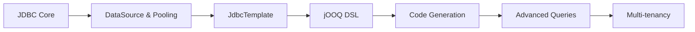

> **Previous:** [File Handling](./18-file-handling.md) | **Next:** [JPA/Hibernate](./20-jpa-hibernate.md)

# JDBC, Connection Pooling & JOOQ

## Learning Objectives

After completing this chapter, you will be able to:

<!-- Image Gallery -->
<section class="lesson-visuals" aria-label="Visual learning resources">
  <header><span>VISUAL LEARNING</span><h2>See it. Review it. Remember it.</h2></header>
  <a class="lesson-visual-card" href="../../../assets/images/lessons/java/19-jdbc-jooq/handwritten-notes.svg" target="_blank" rel="noopener">
    
    <span><strong>Handwritten notes</strong>Condensed notes for deliberate review.</span>
  </a>
  <a class="lesson-visual-card" href="../../../assets/images/lessons/java/19-jdbc-jooq/sticky-notes.svg" target="_blank" rel="noopener">
    
    <span><strong>Sticky-note revision</strong>Fast recall prompts for revision.</span>
  </a>
  <a class="lesson-visual-card" href="../../../assets/images/lessons/java/19-jdbc-jooq/visual-explanation.svg" target="_blank" rel="noopener">
    
    <span><strong>Visual concept guide</strong>A connected explanation of the key ideas.</span>
  </a>
</section>
<!-- End Image Gallery -->


- Establish database connections using DriverManager and DataSource
- Execute SQL queries with Statement, PreparedStatement, and CallableStatement
- Prevent SQL injection attacks using parameterized queries
- Navigate result sets and extract metadata from queries and database schemas
- Perform batch updates for efficient bulk operations
- Use scrollable and updatable ResultSets for advanced data navigation
- Configure and tune HikariCP connection pools in Spring Boot
- Leverage JdbcTemplate for simplified database access
- Use NamedParameterJdbcTemplate for named parameter queries
- Generate type-safe database access code with jOOQ code generation
- Build complex queries using the jOOQ DSL
- Implement multi-tenancy strategies with jOOQ
- Compare jOOQ with JPA for different use cases

## Chapter at a Glance

| Topic | Key Insight | Practical Takeaway |
|-------|-------------|--------------------|
| JDBC Core | DriverManager, Connection, Statement, ResultSet | Low-level, full control over SQL |
| Connection Pooling | HikariCP manages reusable connections | Configure pool size, timeout, leak detection |
| JdbcTemplate | Spring template for JDBC | Reduces boilerplate, maps results |
| jOOQ | Type-safe SQL DSL | Compile-time SQL validation |
| Multi-tenancy | Schema/table per tenant with jOOQ | Filter queries by tenant context |

## Chapter Roadmap



> **Pro Tip:** Always use PreparedStatement over Statement to prevent SQL injection. The parameterized query approach ensures user input is never interpreted as SQL code.

## Table of Contents

1. [JDBC Core](#1-jdbc-core)
2. [DataSource & Connection Pooling](#2-datasource--connection-pooling)
3. [JdbcTemplate](#3-jdbctemplate)
4. [NamedParameterJdbcTemplate](#4-namedparameterjdbctemplate)
5. [jOOQ DSL](#5-jooq-dsl)
6. [Summary](#summary)
7. [Exercises](#exercises)

---

## 1. JDBC Core


### 1.1 What is JDBC?


JDBC (Java Database Connectivity) is the standard Java API for interacting with relational databases. It provides a vendor-independent interface that lets applications execute SQL statements, retrieve results, and manage transactions without coupling to a specific database product.

The JDBC architecture consists of two layers:

- **JDBC API** (`java.sql` and `javax.sql` packages) — the application-facing interfaces and classes
- **JDBC Drivers** — vendor-specific implementations that translate JDBC calls into database-native protocols

```java
// Every JDBC program follows this pattern:
// 1. Load driver (optional in Java 6+)
// 2. Obtain connection
// 3. Create statement
// 4. Execute query
// 5. Process results
// 6. Close resources
```

There are four types of JDBC drivers:

| Type | Name | Description |
|------|------|-------------|
| 1 | JDBC-ODBC Bridge | Translates to ODBC; removed in Java 9 |
| 2 | Native-API | Converts to database native client API; platform-specific |
| 3 | Network Protocol | Middleware server translates to database protocol |
| 4 | Thin Driver | Pure Java, direct socket connection to database |

Type 4 drivers (thin drivers) are the standard today. Examples: PostgreSQL `org.postgresql.Driver`, MySQL `com.mysql.cj.jdbc.Driver`, H2 `org.h2.Driver`.

### 1.2 Database Connectivity with DriverManager


The `DriverManager` class manages a registry of JDBC drivers and establishes connections.

```java
package com.example.jdbc.basic;

import java.sql.Connection;
import java.sql.DriverManager;
import java.sql.SQLException;

public class DriverManagerExample {

    private static final String URL = "jdbc:postgresql://localhost:5432/course_db";
    private static final String USER = "appuser";
    private static final String PASSWORD = "secret";

    public static void main(String[] args) {
        // In Java 6+, DriverManager automatically discovers drivers
        // via the ServiceLoader mechanism. Explicit Class.forName()
        // is only needed for legacy drivers.
        //
        // Java 5 and earlier required:
        // Class.forName("org.postgresql.Driver");

        String sql = "SELECT COUNT(*) FROM users";

        try (Connection conn = DriverManager.getConnection(URL, USER, PASSWORD);
             var stmt = conn.createStatement();
             var rs = stmt.executeQuery(sql)) {

            if (rs.next()) {
                long count = rs.getLong(1);
                System.out.println("User count: " + count);
            }

        } catch (SQLException e) {
            System.err.println("Database error: " + e.getMessage());
            System.err.println("SQL state: " + e.getSQLState());
            System.err.println("Error code: " + e.getErrorCode());
        }
    }
}
```

The `DriverManager.getConnection()` method has three overloads:

```java
// Full URL, user, password
Connection c1 = DriverManager.getConnection(url, user, password);

// URL + Properties (supports driver-specific properties)
Properties props = new Properties();
props.setProperty("user", "appuser");
props.setProperty("password", "secret");
props.setProperty("ssl", "true");
props.setProperty("sslmode", "verify-full");
Connection c2 = DriverManager.getConnection(url, props);

// URL only (credentials embedded in URL)
Connection c3 = DriverManager.getConnection(
    "jdbc:postgresql://localhost:5432/course_db?user=appuser&password=secret"
);
```

### 1.3 Statement & SQL Injection


The `Statement` interface sends SQL strings directly to the database. It is suitable for DDL statements but dangerous for dynamic queries with user input.

```java
package com.example.jdbc.statement;

import java.sql.Connection;
import java.sql.DriverManager;
import java.sql.ResultSet;
import java.sql.Statement;

public class StatementExample {

    public static void main(String[] args) {
        String sql = "SELECT id, username, email FROM users";

        try (Connection conn = DriverManager.getConnection(
                "jdbc:postgresql://localhost:5432/course_db", "appuser", "secret");
             Statement stmt = conn.createStatement();
             ResultSet rs = stmt.executeQuery(sql)) {

            while (rs.next()) {
                long id = rs.getLong("id");
                String username = rs.getString("username");
                String email = rs.getString("email");
                System.out.printf("%d | %s | %s%n", id, username, email);
            }

        } catch (Exception e) {
            e.printStackTrace();
        }
    }
}
```

**SQL Injection — The Critical Problem**

```java
// VULNERABLE — NEVER DO THIS
public User findUserByUsername(String username) {
    // If username = "' OR '1'='1", this becomes:
    // SELECT * FROM users WHERE username = '' OR '1'='1'
    // Which returns ALL users
    String sql = "SELECT * FROM users WHERE username = '" + username + "'";

    try (Statement stmt = connection.createStatement();
         ResultSet rs = stmt.executeQuery(sql)) {
        if (rs.next()) {
            return mapUser(rs);
        }
    }
    return null;
}
```

Example injection attacks:

```sql
-- Input: ' OR '1'='1
SELECT * FROM users WHERE username = '' OR '1'='1'

-- Input: '; DROP TABLE users; --
SELECT * FROM users WHERE username = ''; DROP TABLE users; --'

-- Input: ' UNION SELECT id, password, email FROM credentials; --
SELECT * FROM users WHERE username = '' UNION SELECT id, password, email FROM credentials; --'

-- Input: admin'--
SELECT * FROM users WHERE username = 'admin'--'
```

**Statement execute methods:**

```java
// executeQuery — for SELECT, returns ResultSet
ResultSet rs = stmt.executeQuery("SELECT * FROM users");

// executeUpdate — for INSERT, UPDATE, DELETE, DDL; returns affected row count
int rowsInserted = stmt.executeUpdate("INSERT INTO users (username) VALUES ('newuser')");
int rowsUpdated = stmt.executeUpdate("UPDATE users SET active = true WHERE id = 1");
int rowsDeleted = stmt.executeUpdate("DELETE FROM users WHERE last_login IS NULL");

// execute — for any SQL; returns boolean (true = ResultSet, false = update count)
boolean isResultSet = stmt.execute("SELECT * FROM users");
if (isResultSet) {
    try (ResultSet rs = stmt.getResultSet()) { }
} else {
    int updateCount = stmt.getUpdateCount();
}
```

### 1.4 PreparedStatement & SQL Injection Prevention


`PreparedStatement` precompiles SQL with parameter placeholders (`?`), separating SQL structure from data. This **prevents SQL injection** because parameter values are never interpreted as SQL code.

```java
package com.example.jdbc.prepared;

import java.sql.*;
import java.time.LocalDate;

public class PreparedStatementExample {

    private static final String INSERT_USER =
        "INSERT INTO users (username, email, password_hash, birth_date, active) " +
        "VALUES (?, ?, ?, ?, ?)";

    private static final String FIND_BY_EMAIL =
        "SELECT id, username, email, birth_date, active, created_at " +
        "FROM users WHERE email = ?";

    public void createUser(User user) throws SQLException {
        try (Connection conn = DriverManager.getConnection(
                "jdbc:postgresql://localhost:5432/course_db", "appuser", "secret");
             PreparedStatement ps = conn.prepareStatement(INSERT_USER,
                     Statement.RETURN_GENERATED_KEYS)) {

            ps.setString(1, user.getUsername());
            ps.setString(2, user.getEmail());
            ps.setString(3, user.getPasswordHash());
            ps.setObject(4, user.getBirthDate());
            ps.setBoolean(5, user.isActive());

            int affected = ps.executeUpdate();

            try (ResultSet keys = ps.getGeneratedKeys()) {
                if (keys.next()) {
                    user.setId(keys.getLong("id"));
                }
            }
        }
    }

    public User findByEmail(String email) throws SQLException {
        String sql = "SELECT * FROM users WHERE email = ?";

        try (Connection conn = DriverManager.getConnection(
                "jdbc:postgresql://localhost:5432/course_db", "appuser", "secret");
             PreparedStatement ps = conn.prepareStatement(sql)) {

            ps.setString(1, email);

            try (ResultSet rs = ps.executeQuery()) {
                if (rs.next()) {
                    return mapUser(rs);
                }
            }
        }
        return null;
    }

    private User mapUser(ResultSet rs) throws SQLException {
        User user = new User();
        user.setId(rs.getLong("id"));
        user.setUsername(rs.getString("username"));
        user.setEmail(rs.getString("email"));
        user.setPasswordHash(rs.getString("password_hash"));
        user.setBirthDate(rs.getObject("birth_date", LocalDate.class));
        user.setActive(rs.getBoolean("active"));
        user.setCreatedAt(rs.getTimestamp("created_at").toInstant());
        return user;
    }

    // Why PreparedStatement prevents injection:
    // Input: "' OR '1'='1"
    // Query becomes: SELECT * FROM users WHERE email = ''' OR ''1''=''1'
    // The parameter value is treated as data, not SQL syntax.

    public static class User {
        private Long id;
        private String username;
        private String email;
        private String passwordHash;
        private LocalDate birthDate;
        private boolean active;

        public Long getId() { return id; }
        public void setId(Long id) { this.id = id; }
        public String getUsername() { return username; }
        public void setUsername(String username) { this.username = username; }
        public String getEmail() { return email; }
        public void setEmail(String email) { this.email = email; }
        public String getPasswordHash() { return passwordHash; }
        public void setPasswordHash(String passwordHash) { this.passwordHash = passwordHash; }
        public LocalDate getBirthDate() { return birthDate; }
        public void setBirthDate(LocalDate birthDate) { this.birthDate = birthDate; }
        public boolean isActive() { return active; }
        public void setActive(boolean active) { this.active = active; }
    }
}
```

**PreparedStatement setter methods:**

```java
PreparedStatement ps = conn.prepareStatement("INSERT INTO widgets VALUES (?, ?, ?, ?, ?, ?, ?)");

// String types
ps.setString(1, "text");
ps.setNString(2, "unicode text");

// Numeric types
ps.setInt(3, 42);
ps.setLong(4, 1000000L);
ps.setShort(5, (short) 1);
ps.setByte(6, (byte) 0x0F);
ps.setDouble(7, 3.14159);
ps.setFloat(8, 2.718f);
ps.setBigDecimal(9, new BigDecimal("199.99"));

// Date/Time types
ps.setDate(1, java.sql.Date.valueOf(LocalDate.now()));
ps.setTime(2, java.sql.Time.valueOf(LocalTime.now()));
ps.setTimestamp(3, java.sql.Timestamp.valueOf(LocalDateTime.now()));

// Modern Java 8+ types (using setObject)
ps.setObject(4, LocalDate.now());
ps.setObject(5, LocalDateTime.now());
ps.setObject(6, Instant.now());

// Binary types
ps.setBytes(7, new byte[]{0x00, 0x01, 0x02});
ps.setBinaryStream(8, inputStream, length);
ps.setBlob(9, blob);

// Other types
ps.setBoolean(10, true);
ps.setNull(11, Types.VARCHAR);
ps.setObject(12, someJavaObject);
```

### 1.5 CallableStatement for Stored Procedures


`CallableStatement` extends `PreparedStatement` for calling stored procedures and functions.

```java
package com.example.jdbc.callable;

import java.sql.*;
import java.math.BigDecimal;

public class CallableStatementExample {

    // PostgreSQL stored procedure:
    // CREATE OR REPLACE PROCEDURE transfer_funds(
    //     p_from_account INT,
    //     p_to_account INT,
    //     p_amount DECIMAL(12,2),
    //     INOUT p_status VARCHAR(50)
    // )
    // LANGUAGE plpgsql AS $$
    // BEGIN
    //     UPDATE accounts SET balance = balance - p_amount WHERE id = p_from_account;
    //     UPDATE accounts SET balance = balance + p_amount WHERE id = p_to_account;
    //     p_status := 'SUCCESS';
    // EXCEPTION WHEN OTHERS THEN
    //     p_status := 'ERROR: ' || SQLERRM;
    // END; $$;

    public String transferFunds(long fromAccount, long toAccount, BigDecimal amount) throws SQLException {
        String sql = "{CALL transfer_funds(?, ?, ?, ?)}";

        try (Connection conn = DriverManager.getConnection(
                "jdbc:postgresql://localhost:5432/course_db", "appuser", "secret");
             CallableStatement cs = conn.prepareCall(sql)) {

            cs.setLong(1, fromAccount);
            cs.setLong(2, toAccount);
            cs.setBigDecimal(3, amount);
            cs.registerOutParameter(4, Types.VARCHAR);

            cs.execute();

            return cs.getString(4);
        }
    }

    // PostgreSQL function:
    // CREATE OR REPLACE FUNCTION calculate_order_total(p_order_id INT)
    // RETURNS DECIMAL(12,2) LANGUAGE plpgsql AS $$
    // BEGIN
    //     RETURN (SELECT SUM(quantity * unit_price) FROM order_items WHERE order_id = p_order_id);
    // END; $$;

    public BigDecimal calculateOrderTotal(long orderId) throws SQLException {
        String sql = "{? = CALL calculate_order_total(?)}";

        try (Connection conn = DriverManager.getConnection(
                "jdbc:postgresql://localhost:5432/course_db", "appuser", "secret");
             CallableStatement cs = conn.prepareCall(sql)) {

            cs.registerOutParameter(1, Types.DECIMAL);
            cs.setLong(2, orderId);
            cs.execute();

            return cs.getBigDecimal(1);
        }
    }

    // MySQL stored procedure returning a result set:
    // CREATE PROCEDURE get_users_by_status(p_active BOOLEAN)
    // BEGIN
    //     SELECT id, username, email FROM users WHERE active = p_active;
    // END;

    public void getUsersByStatus(boolean active) throws SQLException {
        String sql = "{CALL get_users_by_status(?)}";

        try (Connection conn = DriverManager.getConnection(
                "jdbc:mysql://localhost:3306/course_db", "appuser", "secret");
             CallableStatement cs = conn.prepareCall(sql)) {

            cs.setBoolean(1, active);

            boolean hasResults = cs.execute();

            if (hasResults) {
                try (ResultSet rs = cs.getResultSet()) {
                    while (rs.next()) {
                        System.out.printf("%d | %s | %s%n",
                            rs.getLong("id"),
                            rs.getString("username"),
                            rs.getString("email"));
                    }
                }
            }
        }
    }
}
```

### 1.6 ResultSet & ResultSetMetaData


```java
package com.example.jdbc.resultset;

import java.sql.*;
import java.util.*;

public class ResultSetMetaDataExample {

    public void exploreResultSet() throws SQLException {
        String sql = "SELECT u.id, u.username, u.email, u.created_at, " +
                     "COUNT(o.id) AS order_count " +
                     "FROM users u LEFT JOIN orders o ON u.id = o.user_id " +
                     "GROUP BY u.id, u.username, u.email, u.created_at";

        try (Connection conn = DriverManager.getConnection(
                "jdbc:postgresql://localhost:5432/course_db", "appuser", "secret");
             Statement stmt = conn.createStatement();
             ResultSet rs = stmt.executeQuery(sql)) {

            ResultSetMetaData meta = rs.getMetaData();
            int columnCount = meta.getColumnCount();

            System.out.println("=== ResultSet Metadata ===");
            System.out.println("Column count: " + columnCount);

            for (int i = 1; i <= columnCount; i++) {
                System.out.printf("Column %d:%n", i);
                System.out.printf("  Name:          %s%n", meta.getColumnName(i));
                System.out.printf("  Label:         %s%n", meta.getColumnLabel(i));
                System.out.printf("  Type:          %s (%d)%n",
                    meta.getColumnTypeName(i), meta.getColumnType(i));
                System.out.printf("  Class:         %s%n", meta.getColumnClassName(i));
                System.out.printf("  Size:          %d%n", meta.getColumnDisplaySize(i));
                System.out.printf("  Precision:     %d%n", meta.getPrecision(i));
                System.out.printf("  Scale:         %d%n", meta.getScale(i));
                System.out.printf("  Nullable:      %s%n", meta.isNullable(i) == ResultSetMetaData.columnNullable);
                System.out.printf("  Auto-increment:%s%n", meta.isAutoIncrement(i));
                System.out.printf("  Signed:        %s%n", meta.isSigned(i));
                System.out.printf("  Table name:    %s%n", meta.getTableName(i));
                System.out.println();
            }

            // Generic ResultSet-to-List-of-Maps utility
            List<Map<String, Object>> results = new ArrayList<>();
            while (rs.next()) {
                Map<String, Object> row = new LinkedHashMap<>();
                for (int i = 1; i <= columnCount; i++) {
                    row.put(meta.getColumnLabel(i), rs.getObject(i));
                }
                results.add(row);
            }

            System.out.println("Rows returned: " + results.size());
            for (int row = 0; row < Math.min(3, results.size()); row++) {
                System.out.printf("Row %d: %s%n", row + 1, results.get(row));
            }
        }
    }

    public static List<Map<String, Object>> toListOfMaps(ResultSet rs) throws SQLException {
        ResultSetMetaData meta = rs.getMetaData();
        int columnCount = meta.getColumnCount();
        List<Map<String, Object>> results = new ArrayList<>();
        while (rs.next()) {
            Map<String, Object> row = new LinkedHashMap<>();
            for (int i = 1; i <= columnCount; i++) {
                row.put(meta.getColumnLabel(i), rs.getObject(i));
            }
            results.add(row);
        }
        return results;
    }
}
```

**ResultSet navigation methods:**

```java
rs.next();             // move forward (false at end)
rs.previous();         // move backward (scrollable only)
rs.first();            // move to first row
rs.last();             // move to last row
rs.absolute(5);        // move to row 5 (1-indexed, negative = from end)
rs.relative(3);        // move forward 3 rows
rs.beforeFirst();      // move to before first row
rs.afterLast();        // move to after last row
rs.isFirst();          // check if at first row
rs.isLast();           // check if at last row
rs.getRow();           // get current row number
rs.wasNull();          // check if last read value was SQL NULL
```

### 1.7 DatabaseMetaData


```java
package com.example.jdbc.metadata;

import java.sql.*;

public class DatabaseMetaDataExample {

    public void inspectDatabase(Connection conn) throws SQLException {
        DatabaseMetaData dbMeta = conn.getMetaData();

        System.out.println("=== Database Product Info ===");
        System.out.println("DB Name:        " + dbMeta.getDatabaseProductName());
        System.out.println("DB Version:     " + dbMeta.getDatabaseProductVersion());
        System.out.println("Driver Name:    " + dbMeta.getDriverName());
        System.out.println("Driver Version: " + dbMeta.getDriverVersion());
        System.out.println("JDBC Version:   " + dbMeta.getJDBCMajorVersion() + "." + dbMeta.getJDBCMinorVersion());
        System.out.println();

        System.out.println("=== Feature Support ===");
        System.out.println("Batch updates:        " + dbMeta.supportsBatchUpdates());
        System.out.println("Stored procedures:    " + dbMeta.supportsStoredProcedures());
        System.out.println("Scrollable results:   " + dbMeta.supportsResultSetType(ResultSet.TYPE_SCROLL_INSENSITIVE));
        System.out.println("Full outer joins:     " + dbMeta.supportsFullOuterJoins());
        System.out.println("Savepoints:           " + dbMeta.supportsSavepoints());
        System.out.println();

        System.out.println("=== Tables in 'public' schema ===");
        try (ResultSet tables = dbMeta.getTables(null, "public", "%", new String[]{"TABLE"})) {
            while (tables.next()) {
                System.out.printf("  %s (%s)%n",
                    tables.getString("TABLE_NAME"),
                    tables.getString("TABLE_TYPE"));
            }
        }

        System.out.println();
        System.out.println("=== Columns in 'users' table ===");
        try (ResultSet columns = dbMeta.getColumns(null, "public", "users", "%")) {
            while (columns.next()) {
                System.out.printf("  %s %s(%d) nullable=%s%n",
                    columns.getString("COLUMN_NAME"),
                    columns.getString("TYPE_NAME"),
                    columns.getInt("COLUMN_SIZE"),
                    columns.getInt("NULLABLE") == DatabaseMetaData.columnNullable ? "Y" : "N");
            }
        }

        System.out.println();
        System.out.println("=== Primary keys in 'users' ===");
        try (ResultSet pk = dbMeta.getPrimaryKeys(null, "public", "users")) {
            while (pk.next()) {
                System.out.printf("  %s (seq=%d)%n",
                    pk.getString("COLUMN_NAME"),
                    pk.getShort("KEY_SEQ"));
            }
        }

        System.out.println();
        System.out.println("=== Foreign keys referencing 'users' ===");
        try (ResultSet fk = dbMeta.getExportedKeys(null, "public", "users")) {
            while (fk.next()) {
                System.out.printf("  %s.%s → users%n",
                    fk.getString("FKTABLE_NAME"),
                    fk.getString("FKCOLUMN_NAME"));
            }
        }
    }
}
```

### 1.8 Batch Updates


Batch updates send multiple SQL statements in a single round-trip, drastically improving performance for bulk operations.

```java
package com.example.jdbc.batch;

import java.sql.*;
import java.time.LocalDate;
import java.util.List;

public class BatchUpdateExample {

    private static final String INSERT_USER =
        "INSERT INTO users (username, email, password_hash, birth_date, active) " +
        "VALUES (?, ?, ?, ?, ?)";

    public int[] insertBatch(List<User> users) throws SQLException {
        try (Connection conn = DriverManager.getConnection(
                "jdbc:postgresql://localhost:5432/course_db", "appuser", "secret");
             PreparedStatement ps = conn.prepareStatement(INSERT_USER)) {

            conn.setAutoCommit(false);

            try {
                for (User user : users) {
                    ps.setString(1, user.getUsername());
                    ps.setString(2, user.getEmail());
                    ps.setString(3, user.getPasswordHash());
                    ps.setObject(4, user.getBirthDate());
                    ps.setBoolean(5, user.isActive());
                    ps.addBatch();
                }

                int[] results = ps.executeBatch();
                conn.commit();

                for (int i = 0; i < results.length; i++) {
                    System.out.printf("  Row %d: %d rows%n", i, results[i]);
                }

                return results;

            } catch (SQLException e) {
                conn.rollback();
                throw e;
            } finally {
                conn.setAutoCommit(true);
            }
        }
    }

    // Mixed batch with different SQL statements
    public int[] mixedBatch() throws SQLException {
        try (Connection conn = DriverManager.getConnection(
                "jdbc:postgresql://localhost:5432/course_db", "appuser", "secret");
             Statement stmt = conn.createStatement()) {

            conn.setAutoCommit(false);

            try {
                stmt.addBatch("UPDATE users SET active = false WHERE last_login < '2024-01-01'");
                stmt.addBatch("DELETE FROM sessions WHERE expires_at < NOW()");

                int[] results = stmt.executeBatch();
                conn.commit();
                return results;

            } catch (SQLException e) {
                conn.rollback();
                throw e;
            } finally {
                conn.setAutoCommit(true);
            }
        }
    }

    // Batch with generated keys
    public void insertBatchWithKeys(List<User> users) throws SQLException {
        String sql = "INSERT INTO users (username, email, password_hash, active) VALUES (?, ?, ?, ?)";

        try (Connection conn = DriverManager.getConnection(
                "jdbc:postgresql://localhost:5432/course_db", "appuser", "secret");
             PreparedStatement ps = conn.prepareStatement(sql, Statement.RETURN_GENERATED_KEYS)) {

            conn.setAutoCommit(false);

            try {
                for (User user : users) {
                    ps.setString(1, user.getUsername());
                    ps.setString(2, user.getEmail());
                    ps.setString(3, user.getPasswordHash());
                    ps.setBoolean(4, user.isActive());
                    ps.addBatch();
                }

                ps.executeBatch();

                try (ResultSet keys = ps.getGeneratedKeys()) {
                    int i = 0;
                    while (keys.next()) {
                        users.get(i).setId(keys.getLong("id"));
                        i++;
                    }
                }

                conn.commit();
            } catch (SQLException e) {
                conn.rollback();
                throw e;
            } finally {
                conn.setAutoCommit(true);
            }
        }
    }

    // Batch with size limits to avoid memory issues
    public int[] insertBatchWithSizeLimit(List<User> users, int batchSize) throws SQLException {
        try (Connection conn = DriverManager.getConnection(
                "jdbc:postgresql://localhost:5432/course_db", "appuser", "secret");
             PreparedStatement ps = conn.prepareStatement(INSERT_USER)) {

            conn.setAutoCommit(false);
            int totalProcessed = 0;

            try {
                for (int i = 0; i < users.size(); i++) {
                    User user = users.get(i);
                    ps.setString(1, user.getUsername());
                    ps.setString(2, user.getEmail());
                    ps.setString(3, user.getPasswordHash());
                    ps.setObject(4, user.getBirthDate());
                    ps.setBoolean(5, user.isActive());
                    ps.addBatch();

                    if ((i + 1) % batchSize == 0 || i == users.size() - 1) {
                        int[] result = ps.executeBatch();
                        conn.commit();
                        totalProcessed += result.length;
                    }
                }

                return new int[]{totalProcessed};

            } catch (SQLException e) {
                conn.rollback();
                throw e;
            } finally {
                conn.setAutoCommit(true);
            }
        }
    }

    public static class User {
        private Long id;
        private String username;
        private String email;
        private String passwordHash;
        private LocalDate birthDate;
        private boolean active;

        public Long getId() { return id; }
        public void setId(Long id) { this.id = id; }
        public String getUsername() { return username; }
        public void setUsername(String username) { this.username = username; }
        public String getEmail() { return email; }
        public void setEmail(String email) { this.email = email; }
        public String getPasswordHash() { return passwordHash; }
        public void setPasswordHash(String passwordHash) { this.passwordHash = passwordHash; }
        public LocalDate getBirthDate() { return birthDate; }
        public void setBirthDate(LocalDate birthDate) { this.birthDate = birthDate; }
        public boolean isActive() { return active; }
        public void setActive(boolean active) { this.active = active; }
    }
}
```

### 1.9 Scrollable & Updatable ResultSets


By default, `ResultSet` is forward-only and read-only. You can create scrollable and updatable result sets.

```java
package com.example.jdbc.scrollable;

import java.sql.*;

public class ScrollableUpdatableExample {

    public void scrollableExample() throws SQLException {
        String sql = "SELECT id, username, email, active FROM users ORDER BY id";

        try (Connection conn = DriverManager.getConnection(
                "jdbc:postgresql://localhost:5432/course_db", "appuser", "secret");
             Statement stmt = conn.createStatement(
                     ResultSet.TYPE_SCROLL_INSENSITIVE,
                     ResultSet.CONCUR_READ_ONLY);
             ResultSet rs = stmt.executeQuery(sql)) {

            rs.last();
            System.out.println("Total rows: " + rs.getRow());

            rs.first();
            System.out.println("First: " + rs.getString("username"));

            rs.last();
            System.out.println("Last: " + rs.getString("username"));

            rs.absolute(rs.getRow() / 2 + 1);
            System.out.println("Middle: " + rs.getString("username"));

            rs.relative(-1);
            System.out.println("Previous: " + rs.getString("username"));

            System.out.println("\\nReverse order:");
            while (rs.previous()) {
                System.out.printf("  %d: %s%n", rs.getLong("id"), rs.getString("username"));
            }
        }
    }

    // Updatable ResultSet — modify data through ResultSet
    public void updatableExample() throws SQLException {
        String sql = "SELECT id, username, email, active FROM users WHERE active = false";

        try (Connection conn = DriverManager.getConnection(
                "jdbc:postgresql://localhost:5432/course_db", "appuser", "secret");
             Statement stmt = conn.createStatement(
                     ResultSet.TYPE_SCROLL_SENSITIVE,
                     ResultSet.CONCUR_UPDATABLE);
             ResultSet rs = stmt.executeQuery(sql)) {

            while (rs.next()) {
                rs.updateBoolean("active", true);
                rs.updateRow();
            }
        }
    }

    // Insert and delete via ResultSet
    public void insertDeleteViaResultSet() throws SQLException {
        String sql = "SELECT id, username, email, active FROM users";

        try (Connection conn = DriverManager.getConnection(
                "jdbc:postgresql://localhost:5432/course_db", "appuser", "secret");
             Statement stmt = conn.createStatement(
                     ResultSet.TYPE_SCROLL_SENSITIVE,
                     ResultSet.CONCUR_UPDATABLE);
             ResultSet rs = stmt.executeQuery(sql)) {

            rs.moveToInsertRow();
            rs.updateString("username", "temp_user");
            rs.updateString("email", "temp@example.com");
            rs.updateBoolean("active", true);
            rs.insertRow();

            rs.moveToCurrentRow();

            rs.absolute(2);
            rs.deleteRow();
        }
    }
}
```

---

## 2. DataSource & Connection Pooling

### 2.1 The DataSource Interface


`DataSource` is the preferred alternative to `DriverManager`. Defined in `javax.sql.DataSource`, it provides:

1. **Connection pooling** — reuse connections instead of creating new ones
2. **Distributed transactions** — support for XA transactions
3. **JNDI lookup** — centralized configuration in application servers

```java
package com.example.datasource;

import javax.sql.DataSource;
import java.sql.Connection;
import java.sql.SQLException;

public class DataSourceUsage {

    private final DataSource dataSource;

    public DataSourceUsage(DataSource dataSource) {
        this.dataSource = dataSource;
    }

    public void doWork() {
        String sql = "SELECT COUNT(*) FROM users";

        try (Connection conn = dataSource.getConnection();
             var ps = conn.prepareStatement(sql);
             var rs = ps.executeQuery()) {

            if (rs.next()) {
                System.out.println("Users: " + rs.getLong(1));
            }

        } catch (SQLException e) {
            throw new RuntimeException("Database failure", e);
        }
    }
}
```

### 2.2 DriverManagerDataSource


`DriverManagerDataSource` is a simple `DataSource` that returns a new connection on every call. It is **not pooled** — for development/testing only.

```java
package com.example.datasource;

import org.springframework.jdbc.datasource.DriverManagerDataSource;
import javax.sql.DataSource;

public class DriverManagerDataSourceConfig {

    public static DataSource createDataSource() {
        DriverManagerDataSource ds = new DriverManagerDataSource();
        ds.setDriverClassName("org.postgresql.Driver");
        ds.setUrl("jdbc:postgresql://localhost:5432/course_db");
        ds.setUsername("appuser");
        ds.setPassword("secret");
        return ds;
    }
}
```

### 2.3 HikariCP Configuration


**HikariCP** is the default connection pool in Spring Boot 2.x and 3.x.

```properties
# application.properties
spring.datasource.url=jdbc:postgresql://localhost:5432/course_db
spring.datasource.username=appuser
spring.datasource.password=secret
spring.datasource.driver-class-name=org.postgresql.Driver

spring.datasource.hikari.maximum-pool-size=20
spring.datasource.hikari.minimum-idle=5
spring.datasource.hikari.connection-timeout=30000
spring.datasource.hikari.idle-timeout=600000
spring.datasource.hikari.max-lifetime=1800000
spring.datasource.hikari.connection-test-query=SELECT 1
spring.datasource.hikari.pool-name=CourseAppPool
spring.datasource.hikari.auto-commit=false
spring.datasource.hikari.leak-detection-threshold=60000
spring.datasource.hikari.validation-timeout=5000
spring.datasource.hikari.transaction-isolation=TRANSACTION_READ_COMMITTED
```

YAML equivalent:

```yaml
spring:
  datasource:
    url: jdbc:postgresql://localhost:5432/course_db
    username: appuser
    password: secret
    driver-class-name: org.postgresql.Driver
    hikari:
      maximum-pool-size: 20
      minimum-idle: 5
      connection-timeout: 30000
      idle-timeout: 600000
      max-lifetime: 1800000
      connection-test-query: SELECT 1
      pool-name: CourseAppPool
      auto-commit: false
      leak-detection-threshold: 60000
      transaction-isolation: TRANSACTION_READ_COMMITTED
```

Programmatic configuration:

```java
package com.example.datasource.config;

import com.zaxxer.hikari.HikariConfig;
import com.zaxxer.hikari.HikariDataSource;
import org.springframework.boot.context.properties.ConfigurationProperties;
import org.springframework.context.annotation.Bean;
import org.springframework.context.annotation.Configuration;

import javax.sql.DataSource;
import java.util.Properties;

@Configuration
public class DataSourceConfig {

    @Bean
    @ConfigurationProperties(prefix = "spring.datasource.hikari")
    public HikariConfig hikariConfig() {
        return new HikariConfig();
    }

    @Bean
    public DataSource dataSource() {
        return new HikariDataSource(hikariConfig());
    }

    public static DataSource createProgrammaticPool() {
        HikariConfig config = new HikariConfig();
        config.setJdbcUrl("jdbc:postgresql://localhost:5432/course_db");
        config.setUsername("appuser");
        config.setPassword("secret");
        config.setMaximumPoolSize(20);
        config.setMinimumIdle(5);
        config.setConnectionTimeout(30000);
        config.setIdleTimeout(600000);
        config.setMaxLifetime(1800000);
        config.setLeakDetectionThreshold(60000);
        config.setPoolName("AppPool");
        config.setAutoCommit(false);
        config.setTransactionIsolation("TRANSACTION_READ_COMMITTED");
        config.setConnectionTestQuery("SELECT 1");
        config.setConnectionInitSql("SET TIME ZONE 'UTC'");

        Properties dsProps = new Properties();
        dsProps.setProperty("sslmode", "require");
        dsProps.setProperty("ApplicationName", "CourseApp");
        config.setDataSourceProperties(dsProps);

        return new HikariDataSource(config);
    }
}
```

**HikariCP configuration parameters:**

| Parameter | Default | Description |
|-----------|---------|-------------|
| `maximumPoolSize` | 10 | Maximum connections in the pool |
| `minimumIdle` | = maximumPoolSize | Minimum idle connections to maintain |
| `connectionTimeout` | 30000 (30s) | Max wait time for a connection from the pool |
| `idleTimeout` | 600000 (10min) | Max time an idle connection lives before retirement |
| `maxLifetime` | 1800000 (30min) | Max lifetime of any connection in the pool |
| `leakDetectionThreshold` | 0 (disabled) | Log warning if connection held longer than this |
| `validationTimeout` | 5000 (5s) | Max time for connection validation query |
| `connectionTestQuery` | varies | SQL to test connection validity |
| `poolName` | auto-generated | Pool name for logging and JMX |
| `autoCommit` | true | Default auto-commit behavior |

**Pool sizing guidelines:**

```java
// Formula: Pool Size = T * (C - 1) + 1
// T = number of threads, C = avg connections per task
//
// General guidelines:
// - OLTP apps: 5-15 connections per CPU core
// - PostgreSQL: effective_connections = cores * 4 + 1
// - Start at 10-20 and monitor
//
// Rule of thumb: smaller pools often perform better.
// HikariCP author: "15 connections per core is a good starting point"
//
// maximumPoolSize = 10   : development / low traffic
// maximumPoolSize = 20   : standard web app (4-8 cores)
// maximumPoolSize = 50   : high-traffic API (8-16 cores)
// maximumPoolSize = 5-10 : batch processing
```

### 2.4 Pool Metrics & Monitoring


HikariCP exposes metrics via Micrometer (Spring Boot Actuator).

```java
package com.example.datasource.metrics;

import com.zaxxer.hikari.HikariDataSource;
import com.zaxxer.hikari.HikariPoolMXBean;
import org.springframework.boot.actuate.health.Health;
import org.springframework.boot.actuate.health.HealthIndicator;
import org.springframework.stereotype.Component;

import javax.sql.DataSource;
import java.sql.Connection;
import java.sql.SQLException;

@Component
public class ConnectionPoolHealthIndicator implements HealthIndicator {

    private final HikariDataSource dataSource;

    public ConnectionPoolHealthIndicator(DataSource dataSource) {
        this.dataSource = (HikariDataSource) dataSource;
    }

    @Override
    public Health health() {
        HikariPoolMXBean poolMXBean = dataSource.getHikariPoolMXBean();

        int active = poolMXBean.getActiveConnections();
        int idle = poolMXBean.getIdleConnections();
        int pending = poolMXBean.getPendingThreads();
        int total = poolMXBean.getTotalConnections();

        boolean valid = false;
        try (Connection conn = dataSource.getConnection()) {
            valid = conn.isValid(3);
        } catch (SQLException e) {
            valid = false;
        }

        return Health.up()
            .withDetail("valid", valid)
            .withDetail("active", active)
            .withDetail("idle", idle)
            .withDetail("pending", pending)
            .withDetail("total", total)
            .withDetail("poolName", dataSource.getPoolName())
            .withDetail("maximumPoolSize", dataSource.getMaximumPoolSize())
            .build();
    }
}
```

**Registering HikariCP metrics with Micrometer:**

```java
@Configuration
public class PoolMetricsConfig {

    @Bean
    @ConditionalOnBean(DataSource.class)
    public Object registerHikariMetrics(DataSource dataSource, MeterRegistry meterRegistry) {
        HikariDataSource hikariDS = (HikariDataSource) dataSource;
        HikariPoolMXBean poolMXBean = hikariDS.getHikariPoolMXBean();

        meterRegistry.gauge("hikaricp.connections.active", poolMXBean,
            HikariPoolMXBean::getActiveConnections);
        meterRegistry.gauge("hikaricp.connections.idle", poolMXBean,
            HikariPoolMXBean::getIdleConnections);
        meterRegistry.gauge("hikaricp.connections.pending", poolMXBean,
            HikariPoolMXBean::getPendingThreads);
        meterRegistry.gauge("hikaricp.connections.total", poolMXBean,
            HikariPoolMXBean::getTotalConnections);

        return poolMXBean;
    }
}
```

```properties
# Actuator exposure
management.endpoints.web.exposure.include=health,metrics
management.endpoint.health.show-details=always
```

Querying pool metrics:

```bash
curl http://localhost:8080/actuator/health
curl http://localhost:8080/actuator/metrics/hikaricp.connections.active
curl http://localhost:8080/actuator/prometheus | grep hikaricp
```

---

## 3. JdbcTemplate

`JdbcTemplate` is Spring's central class for JDBC operations. It eliminates boilerplate resource management and exception handling.

```xml
<!-- Maven dependency (included by spring-boot-starter-jdbc) -->
<dependency>
    <groupId>org.springframework.boot</groupId>
    <artifactId>spring-boot-starter-jdbc</artifactId>
</dependency>
```

```java
@Repository
public class UserDao {
    private final JdbcTemplate jdbcTemplate;

    public UserDao(DataSource dataSource) {
        this.jdbcTemplate = new JdbcTemplate(dataSource);
    }
}
```

### 3.1 query, queryForObject, queryForList


```java
// --- queryForObject: returns a single value ---

public Long countUsers() {
    String sql = "SELECT COUNT(*) FROM users";
    return jdbcTemplate.queryForObject(sql, Long.class);
}

public String findUsernameById(Long id) {
    String sql = "SELECT username FROM users WHERE id = ?";
    return jdbcTemplate.queryForObject(sql, String.class, id);
}

public User findById(Long id) {
    String sql = "SELECT id, username, email, password_hash, active, created_at FROM users WHERE id = ?";
    return jdbcTemplate.queryForObject(sql, new UserRowMapper(), id);
}

// With lambda RowMapper
public User findByIdLambda(Long id) {
    String sql = "SELECT * FROM users WHERE id = ?";
    return jdbcTemplate.queryForObject(sql, (rs, rowNum) -> mapUser(rs), id);
}

// --- query: returns a List ---

public List<User> findAll() {
    String sql = "SELECT * FROM users ORDER BY id";
    return jdbcTemplate.query(sql, new UserRowMapper());
}

public List<User> findActiveUsers() {
    String sql = "SELECT * FROM users WHERE active = ? ORDER BY username";
    return jdbcTemplate.query(sql, new UserRowMapper(), true);
}

public List<User> findUsersCreatedAfter(LocalDate date) {
    String sql = "SELECT * FROM users WHERE created_at >= ? ORDER BY created_at";
    return jdbcTemplate.query(sql, new UserRowMapper(),
        Timestamp.valueOf(date.atStartOfDay()));
}

// --- queryForList: returns List<Map<String, Object>> ---

public List<Map<String, Object>> findAllAsMaps() {
    String sql = "SELECT id, username, email FROM users";
    return jdbcTemplate.queryForList(sql);
}

public List<Map<String, Object>> findActiveAsMaps() {
    String sql = "SELECT id, username, email FROM users WHERE active = ?";
    return jdbcTemplate.queryForList(sql, true);
}
```

### 3.2 update, batchUpdate, queryForMap


```java
// --- update: INSERT, UPDATE, DELETE ---

public int createUser(User user) {
    String sql = "INSERT INTO users (username, email, password_hash, birth_date, active) " +
                 "VALUES (?, ?, ?, ?, ?)";
    return jdbcTemplate.update(sql,
        user.getUsername(), user.getEmail(), user.getPasswordHash(),
        user.getBirthDate(), user.isActive());
}

public int createUserAndReturnKey(User user) {
    String sql = "INSERT INTO users (username, email, password_hash, active) VALUES (?, ?, ?, ?)";

    KeyHolder keyHolder = new GeneratedKeyHolder();

    jdbcTemplate.update(connection -> {
        PreparedStatement ps = connection.prepareStatement(sql, new String[]{"id"});
        ps.setString(1, user.getUsername());
        ps.setString(2, user.getEmail());
        ps.setString(3, user.getPasswordHash());
        ps.setBoolean(4, user.isActive());
        return ps;
    }, keyHolder);

    return keyHolder.getKey().intValue();
}

public int updateEmail(Long id, String newEmail) {
    String sql = "UPDATE users SET email = ? WHERE id = ?";
    return jdbcTemplate.update(sql, newEmail, id);
}

public int deleteUser(Long id) {
    String sql = "DELETE FROM users WHERE id = ?";
    return jdbcTemplate.update(sql, id);
}

// --- queryForMap: single row as a Map ---

public Map<String, Object> findByIdAsMap(Long id) {
    String sql = "SELECT * FROM users WHERE id = ?";
    return jdbcTemplate.queryForMap(sql, id);
}

// --- batchUpdate: bulk operations ---

public int[] batchInsert(List<User> users) {
    String sql = "INSERT INTO users (username, email, password_hash, active) VALUES (?, ?, ?, ?)";

    List<Object[]> batchArgs = users.stream()
        .map(u -> new Object[]{u.getUsername(), u.getEmail(),
            u.getPasswordHash(), u.isActive()})
        .toList();

    return jdbcTemplate.batchUpdate(sql, batchArgs);
}

public int[] batchUpdate(List<User> users) {
    String sql = "UPDATE users SET email = ?, active = ? WHERE id = ?";

    List<Object[]> batchArgs = users.stream()
        .map(u -> new Object[]{u.getEmail(), u.isActive(), u.getId()})
        .toList();

    return jdbcTemplate.batchUpdate(sql, batchArgs);
}

// With BatchPreparedStatementSetter for fine-grained control
public int[] batchInsertWithSetter(List<User> users) {
    String sql = "INSERT INTO users (username, email, password_hash, active) VALUES (?, ?, ?, ?)";

    return jdbcTemplate.batchUpdate(sql, new BatchPreparedStatementSetter() {
        @Override
        public void setValues(PreparedStatement ps, int i) throws SQLException {
            User user = users.get(i);
            ps.setString(1, user.getUsername());
            ps.setString(2, user.getEmail());
            ps.setString(3, user.getPasswordHash());
            ps.setBoolean(4, user.isActive());
        }

        @Override
        public int getBatchSize() {
            return users.size();
        }
    });
}
```

### 3.3 ResultSetExtractor, RowMapper, RowCallbackHandler


```java
package com.example.jdbctemplate.mapping;

import org.springframework.jdbc.core.*;
import org.springframework.stereotype.Repository;

import javax.sql.DataSource;
import java.sql.ResultSet;
import java.sql.SQLException;
import java.time.LocalDate;
import java.time.LocalDateTime;
import java.util.*;

@Repository
public class MappingStrategiesDao {

    private final JdbcTemplate jdbcTemplate;

    public MappingStrategiesDao(DataSource dataSource) {
        this.jdbcTemplate = new JdbcTemplate(dataSource);
    }

    // --- RowMapper: one row → one object ---

    public static class UserRowMapper implements RowMapper<User> {
        @Override
        public User mapRow(ResultSet rs, int rowNum) throws SQLException {
            User user = new User();
            user.setId(rs.getLong("id"));
            user.setUsername(rs.getString("username"));
            user.setEmail(rs.getString("email"));
            user.setPasswordHash(rs.getString("password_hash"));
            user.setBirthDate(rs.getObject("birth_date", LocalDate.class));
            user.setActive(rs.getBoolean("active"));
            user.setCreatedAt(rs.getTimestamp("created_at").toLocalDateTime());
            return user;
        }
    }

    // --- ResultSetExtractor: processes entire ResultSet ---
    // Use for parent-child relationships, custom aggregations

    public List<OrderWithItems> getOrdersWithItems(Long userId) {
        String sql = """
            SELECT o.id AS order_id, o.order_date, o.total,
                   oi.id AS item_id, oi.product_name, oi.quantity, oi.unit_price
            FROM orders o
            LEFT JOIN order_items oi ON oi.order_id = o.id
            WHERE o.user_id = ?
            ORDER BY o.id, oi.id
        """;

        return jdbcTemplate.query(sql, (ResultSet rs) -> {
            Map<Long, OrderWithItems> orderMap = new LinkedHashMap<>();

            while (rs.next()) {
                Long orderId = rs.getLong("order_id");
                OrderWithItems order = orderMap.computeIfAbsent(orderId, id -> {
                    OrderWithItems o = new OrderWithItems();
                    try {
                        o.setId(orderId);
                        o.setOrderDate(rs.getTimestamp("order_date").toLocalDateTime());
                        o.setTotal(rs.getBigDecimal("total"));
                        o.setItems(new ArrayList<>());
                    } catch (SQLException e) { throw new RuntimeException(e); }
                    return o;
                });

                long itemId = rs.getLong("item_id");
                if (itemId > 0) {
                    OrderItem item = new OrderItem();
                    item.setId(itemId);
                    item.setProductName(rs.getString("product_name"));
                    item.setQuantity(rs.getInt("quantity"));
                    item.setUnitPrice(rs.getBigDecimal("unit_price"));
                    order.getItems().add(item);
                }
            }

            return new ArrayList<>(orderMap.values());
        }, userId);
    }

    // --- RowCallbackHandler: per-row callback, no collection ---
    // Use for streaming large result sets

    public void processUsersLargeDataset() {
        String sql = "SELECT id, username, email FROM users";

        jdbcTemplate.query(sql, (RowCallbackHandler) rs -> {
            long id = rs.getLong("id");
            String username = rs.getString("username");
            String email = rs.getString("email");
            System.out.printf("Processing %d: %s <%s>%n", id, username, email);
        });
    }

    public void exportUsersToCsv(String filePath) {
        String sql = "SELECT id, username, email, active, created_at FROM users ORDER BY id";

        try (var writer = new java.io.FileWriter(filePath)) {
            writer.write("id,username,email,active,created_at\n");

            jdbcTemplate.query(sql, (RowCallbackHandler) rs -> {
                writer.write(String.format("%d,%s,%s,%b,%s%n",
                    rs.getLong("id"), rs.getString("username"),
                    rs.getString("email"), rs.getBoolean("active"),
                    rs.getTimestamp("created_at")));
            });
        } catch (Exception e) {
            throw new RuntimeException("CSV export failed", e);
        }
    }

    // Comparison:
    // RowMapper         | 1 row → 1 object   | query() collects into List
    // ResultSetExtractor| Entire RS → 1 result| You control the loop
    // RowCallbackHandler | Callback per row    | Side effects, no collection

    public static class User {
        private Long id; private String username; private String email;
        private String passwordHash; private LocalDate birthDate;
        private boolean active; private LocalDateTime createdAt;

        public Long getId() { return id; }
        public void setId(Long id) { this.id = id; }
        public String getUsername() { return username; }
        public void setUsername(String username) { this.username = username; }
        public String getEmail() { return email; }
        public void setEmail(String email) { this.email = email; }
        public String getPasswordHash() { return passwordHash; }
        public void setPasswordHash(String passwordHash) { this.passwordHash = passwordHash; }
        public LocalDate getBirthDate() { return birthDate; }
        public void setBirthDate(LocalDate birthDate) { this.birthDate = birthDate; }
        public boolean isActive() { return active; }
        public void setActive(boolean active) { this.active = active; }
        public LocalDateTime getCreatedAt() { return createdAt; }
        public void setCreatedAt(LocalDateTime createdAt) { this.createdAt = createdAt; }
    }

    public static class OrderWithItems {
        private Long id; private LocalDateTime orderDate;
        private java.math.BigDecimal total; private List<OrderItem> items;

        public Long getId() { return id; }
        public void setId(Long id) { this.id = id; }
        public LocalDateTime getOrderDate() { return orderDate; }
        public void setOrderDate(LocalDateTime orderDate) { this.orderDate = orderDate; }
        public java.math.BigDecimal getTotal() { return total; }
        public void setTotal(java.math.BigDecimal total) { this.total = total; }
        public List<OrderItem> getItems() { return items; }
        public void setItems(List<OrderItem> items) { this.items = items; }
    }

    public static class OrderItem {
        private Long id; private String productName;
        private int quantity; private java.math.BigDecimal unitPrice;

        public Long getId() { return id; }
        public void setId(Long id) { this.id = id; }
        public String getProductName() { return productName; }
        public void setProductName(String productName) { this.productName = productName; }
        public int getQuantity() { return quantity; }
        public void setQuantity(int quantity) { this.quantity = quantity; }
        public java.math.BigDecimal getUnitPrice() { return unitPrice; }
        public void setUnitPrice(java.math.BigDecimal unitPrice) { this.unitPrice = unitPrice; }
    }
}
```

### 3.4 BeanPropertyRowMapper


`BeanPropertyRowMapper` auto-maps ResultSet columns to JavaBean properties by name.

```java
@Repository
public class BeanPropertyDao {

    private final JdbcTemplate jdbcTemplate;

    public BeanPropertyDao(DataSource dataSource) {
        this.jdbcTemplate = new JdbcTemplate(dataSource);
    }

    // Maps column names to property names case-insensitively.
    // user_name → userName (underscore to camelCase)

    public List<User> findAll() {
        String sql = "SELECT * FROM users ORDER BY id";
        return jdbcTemplate.query(sql, new BeanPropertyRowMapper<>(User.class));
    }

    public Optional<User> findById(Long id) {
        String sql = "SELECT * FROM users WHERE id = ?";
        List<User> results = jdbcTemplate.query(sql,
            new BeanPropertyRowMapper<>(User.class), id);
        return results.isEmpty() ? Optional.empty() : Optional.of(results.get(0));
    }

    public static class User {
        private Long id;
        private String username;
        private String email;
        private String passwordHash;
        private LocalDate birthDate;
        private boolean active;
        private LocalDateTime createdAt;

        public Long getId() { return id; }
        public void setId(Long id) { this.id = id; }
        public String getUsername() { return username; }
        public void setUsername(String username) { this.username = username; }
        public String getEmail() { return email; }
        public void setEmail(String email) { this.email = email; }
        public String getPasswordHash() { return passwordHash; }
        public void setPasswordHash(String passwordHash) { this.passwordHash = passwordHash; }
        public LocalDate getBirthDate() { return birthDate; }
        public void setBirthDate(LocalDate birthDate) { this.birthDate = birthDate; }
        public boolean isActive() { return active; }
        public void setActive(boolean active) { this.active = active; }
        public LocalDateTime getCreatedAt() { return createdAt; }
        public void setCreatedAt(LocalDateTime createdAt) { this.createdAt = createdAt; }
    }
}
```

---

## 4. NamedParameterJdbcTemplate

`NamedParameterJdbcTemplate` wraps `JdbcTemplate` and supports named parameters (`:paramName` instead of `?`).

### 4.1 Named Parameters


```java
@Repository
public class NamedParameterUserDao {

    private final NamedParameterJdbcTemplate namedTemplate;

    public NamedParameterUserDao(DataSource dataSource) {
        this.namedTemplate = new NamedParameterJdbcTemplate(dataSource);
    }

    public User findById(Long id) {
        String sql = "SELECT * FROM users WHERE id = :id";
        return namedTemplate.queryForObject(sql,
            Map.of("id", id), new UserRowMapper());
    }

    public List<User> findUsers(String username, String email, Boolean active) {
        String sql = "SELECT * FROM users WHERE " +
            "(:username IS NULL OR username = :username) AND " +
            "(:email IS NULL OR email = :email) AND " +
            "(:active IS NULL OR active = :active)";

        Map<String, Object> params = new HashMap<>();
        params.put("username", username);
        params.put("email", email);
        params.put("active", active);

        return namedTemplate.query(sql, params, new UserRowMapper());
    }

    public int createUser(User user) {
        String sql = "INSERT INTO users (username, email, password_hash, birth_date, active) " +
                     "VALUES (:username, :email, :passwordHash, :birthDate, :active)";

        Map<String, Object> params = new HashMap<>();
        params.put("username", user.getUsername());
        params.put("email", user.getEmail());
        params.put("passwordHash", user.getPasswordHash());
        params.put("birthDate", user.getBirthDate());
        params.put("active", user.isActive());

        return namedTemplate.update(sql, params);
    }

    public int updateEmail(Long id, String newEmail) {
        String sql = "UPDATE users SET email = :email WHERE id = :id";
        return namedTemplate.update(sql, Map.of("email", newEmail, "id", id));
    }
}
```

### 4.2 SqlParameterSource


```java
@Repository
public class SqlParameterSourceExamples {

    private final NamedParameterJdbcTemplate namedTemplate;

    public SqlParameterSourceExamples(DataSource dataSource) {
        this.namedTemplate = new NamedParameterJdbcTemplate(dataSource);
    }

    // --- MapSqlParameterSource: fluent API ---

    public User findById(Long id) {
        String sql = "SELECT * FROM users WHERE id = :id";
        SqlParameterSource params = new MapSqlParameterSource("id", id);
        return namedTemplate.queryForObject(sql, params, new UserRowMapper());
    }

    public int createUser(User user) {
        String sql = "INSERT INTO users (username, email, password_hash, birth_date, active) " +
                     "VALUES (:username, :email, :passwordHash, :birthDate, :active)";

        SqlParameterSource params = new MapSqlParameterSource()
            .addValue("username", user.getUsername())
            .addValue("email", user.getEmail())
            .addValue("passwordHash", user.getPasswordHash())
            .addValue("birthDate", user.getBirthDate())
            .addValue("active", user.isActive());

        return namedTemplate.update(sql, params);
    }

    // MapSqlParameterSource with type information
    public int createUserWithTypes(User user) {
        String sql = "INSERT INTO users (username, email, password_hash, salary, active) " +
                     "VALUES (:username, :email, :passwordHash, :salary, :active)";

        SqlParameterSource params = new MapSqlParameterSource()
            .addValue("username", user.getUsername())
            .addValue("email", user.getEmail())
            .addValue("passwordHash", user.getPasswordHash())
            .addValue("salary", user.getSalary(), java.sql.Types.DECIMAL)
            .addValue("active", user.isActive(), java.sql.Types.BOOLEAN);

        return namedTemplate.update(sql, params);
    }

    // --- BeanPropertySqlParameterSource: maps JavaBean properties ---

    public int createUserFromBean(User user) {
        String sql = "INSERT INTO users (username, email, password_hash, birth_date, active) " +
                     "VALUES (:username, :email, :passwordHash, :birthDate, :active)";
        return namedTemplate.update(sql, new BeanPropertySqlParameterSource(user));
    }

    // --- Return generated keys ---

    public User createUserAndReturn(User user) {
        String sql = "INSERT INTO users (username, email, password_hash, active) " +
                     "VALUES (:username, :email, :passwordHash, :active)";

        KeyHolder keyHolder = new GeneratedKeyHolder();
        namedTemplate.update(sql, new BeanPropertySqlParameterSource(user),
            keyHolder, new String[]{"id"});

        if (keyHolder.getKey() != null) {
            user.setId(keyHolder.getKey().longValue());
        }
        return user;
    }

    // --- Batch with SqlParameterSource ---

    public int[] batchCreate(List<User> users) {
        String sql = "INSERT INTO users (username, email, password_hash, active) " +
                     "VALUES (:username, :email, :passwordHash, :active)";

        SqlParameterSource[] batch = users.stream()
            .map(BeanPropertySqlParameterSource::new)
            .toArray(SqlParameterSource[]::new);

        return namedTemplate.batchUpdate(sql, batch);
    }

    public static class User {
        private Long id; private String username; private String email;
        private String passwordHash; private java.time.LocalDate birthDate;
        private java.math.BigDecimal salary; private boolean active;

        public Long getId() { return id; }
        public void setId(Long id) { this.id = id; }
        public String getUsername() { return username; }
        public void setUsername(String username) { this.username = username; }
        public String getEmail() { return email; }
        public void setEmail(String email) { this.email = email; }
        public String getPasswordHash() { return passwordHash; }
        public void setPasswordHash(String passwordHash) { this.passwordHash = passwordHash; }
        public java.time.LocalDate getBirthDate() { return birthDate; }
        public void setBirthDate(java.time.LocalDate birthDate) { this.birthDate = birthDate; }
        public java.math.BigDecimal getSalary() { return salary; }
        public void setSalary(java.math.BigDecimal salary) { this.salary = salary; }
        public boolean isActive() { return active; }
        public void setActive(boolean active) { this.active = active; }
    }
}
```

### 4.3 IN Clause with Named Parameters


NamedParameterJdbcTemplate handles IN clauses with lists natively.

```java
@Repository
public class InClauseExamples {

    private final NamedParameterJdbcTemplate namedTemplate;

    public InClauseExamples(DataSource dataSource) {
        this.namedTemplate = new NamedParameterJdbcTemplate(dataSource);
    }

    public List<User> findUsersByIds(List<Long> ids) {
        String sql = "SELECT * FROM users WHERE id IN (:ids)";
        return namedTemplate.query(sql, Map.of("ids", ids), new UserRowMapper());
    }

    public List<User> findUsersByStatusAndIds(List<Long> ids, boolean active) {
        String sql = "SELECT * FROM users WHERE id IN (:ids) AND active = :active";
        Map<String, Object> params = new HashMap<>();
        params.put("ids", ids);
        params.put("active", active);
        return namedTemplate.query(sql, params, new UserRowMapper());
    }

    // Dynamic IN clause building
    public List<User> searchUsers(List<Long> ids, String emailDomain, Boolean active) {
        StringBuilder sql = new StringBuilder("SELECT * FROM users WHERE 1=1");
        Map<String, Object> params = new HashMap<>();

        if (ids != null && !ids.isEmpty()) {
            sql.append(" AND id IN (:ids)");
            params.put("ids", ids);
        }
        if (emailDomain != null) {
            sql.append(" AND email LIKE :emailDomain");
            params.put("emailDomain", "%@" + emailDomain);
        }
        if (active != null) {
            sql.append(" AND active = :active");
            params.put("active", active);
        }

        sql.append(" ORDER BY username");
        return namedTemplate.query(sql.toString(), params, new UserRowMapper());
    }

    // Empty list handling
    public List<User> findUsersByIdsSafe(List<Long> ids) {
        if (ids == null || ids.isEmpty()) {
            return Collections.emptyList();
        }
        String sql = "SELECT * FROM users WHERE id IN (:ids)";
        return namedTemplate.query(sql, Map.of("ids", ids), new UserRowMapper());
    }

    // IN with Set
    public List<User> findUsersByRoles(Set<String> roles) {
        String sql = "SELECT DISTINCT u.* FROM users u " +
                     "JOIN user_roles r ON r.user_id = u.id " +
                     "WHERE r.role_name IN (:roles)";
        return namedTemplate.query(sql,
            new MapSqlParameterSource("roles", roles), new UserRowMapper());
    }

    public static class User {
        private Long id; private String username;
        private String email; private boolean active;

        public Long getId() { return id; }
        public void setId(Long id) { this.id = id; }
        public String getUsername() { return username; }
        public void setUsername(String username) { this.username = username; }
        public String getEmail() { return email; }
        public void setEmail(String email) { this.email = email; }
        public boolean isActive() { return active; }
        public void setActive(boolean active) { this.active = active; }
    }

    public static class UserRowMapper implements RowMapper<User> {
        @Override
        public User mapRow(ResultSet rs, int rowNum) throws SQLException {
            User u = new User();
            u.setId(rs.getLong("id"));
            u.setUsername(rs.getString("username"));
            u.setEmail(rs.getString("email"));
            u.setActive(rs.getBoolean("active"));
            return u;
        }
    }
}
```

---

## 5. jOOQ DSL

### 5.1 Introduction to jOOQ


jOOQ (Java Object Oriented Querying) is a type-safe SQL DSL. It generates Java code from your database schema that lets you write type-safe queries.

**Key philosophy:** SQL is the best DSL for data access. jOOQ makes it type-safe, composable, and refactorable.

```java
// jOOQ vs JDBC for the same query:

// JDBC — string-based, error-prone
String sql = "SELECT u.id, u.username FROM users u " +
             "WHERE u.active = ? ORDER BY u.username LIMIT ?";
PreparedStatement ps = conn.prepareStatement(sql);
ps.setBoolean(1, true);
ps.setInt(2, 20);

// jOOQ — type-safe DSL, compile-time checked
List<UserRecord> result = dslContext.selectFrom(USERS)
    .where(USERS.ACTIVE.eq(true))
    .orderBy(USERS.USERNAME)
    .limit(20)
    .fetch();
```

**Maven dependencies:**

```xml
<dependency>
    <groupId>org.springframework.boot</groupId>
    <artifactId>spring-boot-starter-jooq</artifactId>
</dependency>
```

### 5.2 Code Generation with jOOQ


**Maven plugin configuration:**

```xml
<plugin>
    <groupId>org.jooq</groupId>
    <artifactId>jooq-codegen-maven</artifactId>
    <version>3.19.0</version>
    <executions>
        <execution>
            <id>generate-jooq</id>
            <phase>generate-sources</phase>
            <goals><goal>generate</goal></goals>
        </execution>
    </executions>
    <configuration>
        <jdbc>
            <driver>org.postgresql.Driver</driver>
            <url>jdbc:postgresql://localhost:5432/course_db</url>
            <user>appuser</user>
            <password>secret</password>
        </jdbc>
        <generator>
            <database>
                <name>org.jooq.meta.postgres.PostgresDatabase</name>
                <includes>.*</includes>
                <excludes>flyway_schema_history</excludes>
                <inputSchema>public</inputSchema>
            </database>
            <generate>
                <pojos>true</pojos>
                <daos>true</daos>
                <springAnnotations>true</springAnnotations>
                <fluentSetters>true</fluentSetters>
                <javaTimeTypes>true</javaTimeTypes>
            </generate>
            <target>
                <packageName>com.example.course.jooq.generated</packageName>
                <directory>target/generated-sources/jooq</directory>
            </target>
        </generator>
    </configuration>
</plugin>
```

**Gradle configuration:**

```kotlin
plugins {
    id("nu.studer.jooq") version "9.0"
}

jooq {
    configurations {
        create("main") {
            generationTool {
                jdbc {
                    driver = "org.postgresql.Driver"
                    url = "jdbc:postgresql://localhost:5432/course_db"
                    user = "appuser"
                    password = "secret"
                }
                generator {
                    database {
                        name = "org.jooq.meta.postgres.PostgresDatabase"
                        inputSchema = "public"
                    }
                    generate {
                        isPojos = true
                        isDaos = true
                        isSpringAnnotations = true
                        isJavaTimeTypes = true
                    }
                    target {
                        packageName = "com.example.course.jooq.generated"
                        directory = "build/generated/sources/jooq/main"
                    }
                }
            }
        }
    }
}
```

**Generated code example:**

```java
// Generated table — PUBLIC.USERS
public class Users extends TableImpl<UsersRecord> {
    public static final Users USERS = new Users();

    public final TableField<UsersRecord, Long> ID =
        createField(DSL.name("id"), SQLDataType.BIGINT.nullable(false)
            .identity(true), this, "");

    public final TableField<UsersRecord, String> USERNAME =
        createField(DSL.name("username"), SQLDataType.VARCHAR(50)
            .nullable(false), this, "");

    public final TableField<UsersRecord, String> EMAIL =
        createField(DSL.name("email"), SQLDataType.VARCHAR(255)
            .nullable(false), this, "");

    public final TableField<UsersRecord, String> PASSWORD_HASH =
        createField(DSL.name("password_hash"), SQLDataType.VARCHAR(255)
            .nullable(false), this, "");

    public final TableField<UsersRecord, LocalDate> BIRTH_DATE =
        createField(DSL.name("birth_date"), SQLDataType.LOCALDATE, this, "");

    public final TableField<UsersRecord, Boolean> ACTIVE =
        createField(DSL.name("active"), SQLDataType.BOOLEAN
            .nullable(false).defaultValue(true), this, "");

    public final TableField<UsersRecord, LocalDateTime> CREATED_AT =
        createField(DSL.name("created_at"), SQLDataType.LOCALDATETIME
            .nullable(false).defaultValue(DSL.field("CURRENT_TIMESTAMP")), this, "");
}

// Generated record
public class UsersRecord extends UpdatableRecordImpl<UsersRecord> {
    public Long getId() { return get(Users.USERS.ID); }
    public void setId(Long value) { set(Users.USERS.ID, value); }
    public String getUsername() { return get(Users.USERS.USERNAME); }
    public void setUsername(String value) { set(Users.USERS.USERNAME, value); }
}

// Generated POJO
public class UsersPojo {
    private Long id;
    private String username;
    private String email;
    private String passwordHash;
    private LocalDate birthDate;
    private Boolean active;
    private LocalDateTime createdAt;

    // getters, setters, equals, hashCode, toString
}

// Generated DAO
@Repository
public class UsersDao extends DAOImpl<UsersRecord, UsersPojo, Long> {
    public UsersDao(Configuration configuration) {
        super(Users.USERS, UsersPojo.class, configuration);
    }
}
```

### 5.3 DSL Queries (select, from, where, join, groupBy, having, orderBy, limit)


```java
@Repository
public class JooxDslQueries {

    private final DSLContext dsl;

    public JooxDslQueries(DSLContext dsl) {
        this.dsl = dsl;
    }

    // --- SELECT with specific columns ---

    public List<Record2<Long, String>> findUsernames() {
        return dsl.select(USERS.ID, USERS.USERNAME)
            .from(USERS)
            .orderBy(USERS.USERNAME)
            .fetch();
    }

    // --- SELECT with WHERE conditions ---

    public List<UsersRecord> findActiveUsers() {
        return dsl.selectFrom(USERS)
            .where(USERS.ACTIVE.eq(true))
            .orderBy(USERS.USERNAME)
            .fetch();
    }

    public UsersRecord findById(Long id) {
        return dsl.selectFrom(USERS)
            .where(USERS.ID.eq(id))
            .fetchOne();
    }

    // Dynamic WHERE conditions
    public List<UsersRecord> searchUsers(String username, Boolean active, LocalDateTime createdAfter) {
        Condition condition = DSL.noCondition();

        if (username != null && !username.isEmpty()) {
            condition = condition.and(USERS.USERNAME.containsIgnoreCase(username));
        }
        if (active != null) {
            condition = condition.and(USERS.ACTIVE.eq(active));
        }
        if (createdAfter != null) {
            condition = condition.and(USERS.CREATED_AT.greaterOrEqual(createdAfter));
        }

        return dsl.selectFrom(USERS)
            .where(condition)
            .orderBy(USERS.USERNAME)
            .fetch();
    }

    // --- JOIN queries ---

    public List<Record5<Long, String, String, BigDecimal, LocalDateTime>> getOrdersWithUsers() {
        return dsl.select(
                ORDERS.ID, USERS.USERNAME, USERS.EMAIL,
                ORDERS.TOTAL, ORDERS.ORDER_DATE
            )
            .from(ORDERS)
            .join(USERS).on(ORDERS.USER_ID.eq(USERS.ID))
            .where(ORDERS.STATUS.eq("COMPLETED"))
            .orderBy(ORDERS.ORDER_DATE.desc())
            .fetch();
    }

    // LEFT JOIN with aggregation
    public List<Record3<Long, String, Integer>> getUserOrderCounts() {
        return dsl.select(
                USERS.ID, USERS.USERNAME,
                DSL.count(ORDERS.ID).coerce(Integer.class).as("order_count")
            )
            .from(USERS)
            .leftJoin(ORDERS).on(ORDERS.USER_ID.eq(USERS.ID))
            .groupBy(USERS.ID, USERS.USERNAME)
            .orderBy(DSL.field("order_count").desc())
            .fetch();
    }

    // --- GROUP BY / HAVING ---

    public List<Record3<Long, String, BigDecimal>> getHighValueUsers() {
        return dsl.select(
                USERS.ID, USERS.USERNAME,
                DSL.sum(ORDERS.TOTAL).as("total_spent")
            )
            .from(USERS)
            .join(ORDERS).on(ORDERS.USER_ID.eq(USERS.ID))
            .where(ORDERS.STATUS.eq("COMPLETED"))
            .groupBy(USERS.ID, USERS.USERNAME)
            .having(DSL.sum(ORDERS.TOTAL).gt(new BigDecimal("1000.00")))
            .orderBy(DSL.field("total_spent").desc())
            .limit(10)
            .fetch();
    }

    // --- Aggregation functions ---

    public Record4<Long, BigDecimal, BigDecimal, BigDecimal> getOrderStats() {
        return dsl.select(
                DSL.count().as("total_orders"),
                DSL.sum(ORDERS.TOTAL).as("revenue"),
                DSL.avg(ORDERS.TOTAL).as("avg_order"),
                DSL.max(ORDERS.TOTAL).as("largest_order")
            )
            .from(ORDERS)
            .where(ORDERS.STATUS.eq("COMPLETED"))
            .fetchOne();
    }

    // --- Subqueries ---

    public List<UsersRecord> findUsersWithAboveAverageOrders() {
        var avgTotal = dsl.select(DSL.avg(ORDERS.TOTAL)).from(ORDERS);

        return dsl.selectFrom(USERS)
            .where(USERS.ID.in(
                dsl.select(ORDERS.USER_ID)
                    .from(ORDERS)
                    .groupBy(ORDERS.USER_ID)
                    .having(DSL.sum(ORDERS.TOTAL).gt(avgTotal))
            ))
            .fetch();
    }

    // --- Common table expressions (WITH) ---

    public List<Record> getMonthlyRevenue(int year) {
        var monthlyRevenue = DSL.name("monthly_revenue").as(
            dsl.select(
                    DSL.trunc(ORDERS.ORDER_DATE).as("month"),
                    DSL.sum(ORDERS.TOTAL).as("revenue")
                )
                .from(ORDERS)
                .where(DSL.extract(ORDERS.ORDER_DATE, DSL.year()).eq(year))
                .groupBy(DSL.trunc(ORDERS.ORDER_DATE))
        );

        return dsl.with(monthlyRevenue)
            .select()
            .from(DSL.table(DSL.name("monthly_revenue")))
            .orderBy(DSL.field(DSL.name("month")))
            .fetch();
    }
}
```

### 5.4 Type-Safe Queries


jOOQ's code generation ensures every table, column, and relationship is a Java type.

```java
@Repository
public class TypeSafeQueryExamples {

    private final DSLContext dsl;

    public TypeSafeQueryExamples(DSLContext dsl) {
        this.dsl = dsl;
    }

    // Compile-time column checking
    public void columnExists() {
        dsl.select(USERS.ID, USERS.USERNAME).from(USERS).fetch();
    }

    // Compile-time type checking
    public void typeChecking() {
        dsl.selectFrom(USERS).where(USERS.ID.eq(42L)).fetch();     // Long
        dsl.selectFrom(USERS).where(USERS.ID.eq(42)).fetch();       // int auto-boxed
        // dsl.selectFrom(USERS).where(USERS.ID.eq("hello"));       // COMPILE ERROR
    }

    // Type-safe condition from non-null fields
    public List<UsersRecord> findByExample(UsersRecord example) {
        Condition condition = DSL.noCondition();

        if (example.getId() != null)
            condition = condition.and(USERS.ID.eq(example.getId()));
        if (example.getUsername() != null)
            condition = condition.and(USERS.USERNAME.eq(example.getUsername()));
        if (example.getEmail() != null)
            condition = condition.and(USERS.EMAIL.eq(example.getEmail()));
        if (example.getActive() != null)
            condition = condition.and(USERS.ACTIVE.eq(example.getActive()));

        return dsl.selectFrom(USERS).where(condition).fetch();
    }

    // If you rename "email" to "email_address" in the database:
    // 1. Re-run code generation
    // 2. USERS.EMAIL becomes USERS.EMAIL_ADDRESS
    // 3. Old code referencing USERS.EMAIL fails to compile
    // Result: zero runtime errors from schema changes
}
```

### 5.5 Multi-Tenancy with jOOQ


```java
// Strategy 1: Filter on every query using ThreadLocal
@Repository
public class TenantAwareRepository {

    private static final ThreadLocal<Long> CURRENT_TENANT = new ThreadLocal<>();

    private final DSLContext dsl;

    public TenantAwareRepository(DSLContext dsl) {
        this.dsl = dsl;
    }

    public static void setTenantId(Long tenantId) {
        CURRENT_TENANT.set(tenantId);
    }

    public static void clear() {
        CURRENT_TENANT.remove();
    }

    public List<OrdersRecord> findOrders() {
        Long tenantId = CURRENT_TENANT.get();
        if (tenantId == null) {
            throw new IllegalStateException("No tenant context");
        }

        return dsl.selectFrom(ORDERS)
            .where(ORDERS.TENANT_ID.eq(tenantId))
            .orderBy(ORDERS.ORDER_DATE.desc())
            .fetch();
    }

    public OrdersRecord createOrder(OrdersRecord order) {
        order.setTenantId(CURRENT_TENANT.get());
        return dsl.insertInto(ORDERS)
            .set(order)
            .returning()
            .fetchOne();
    }
}

// Strategy 2: ExecuteListener — auto-append tenant filter
class TenantExecuteListener extends DefaultExecuteListener {
    private final ThreadLocal<Long> tenantId = new ThreadLocal<>();

    public void setTenantId(Long id) { tenantId.set(id); }
    public void clear() { tenantId.remove(); }

    @Override
    public void renderStart(ExecuteContext ctx) {
        Long id = this.tenantId.get();
        if (id != null) {
            // Add tenant condition to SELECT/UPDATE/DELETE
        }
    }
}

// Strategy 3: Separate schema per tenant
// jOOQ supports runtime schema switching
```

### 5.6 jOOQ with Spring Boot


Spring Boot auto-configures `DSLContext` when `spring-boot-starter-jooq` is on the classpath.

```properties
# application.properties
spring.datasource.url=jdbc:postgresql://localhost:5432/course_db
spring.datasource.username=appuser
spring.datasource.password=secret
spring.datasource.hikari.maximum-pool-size=10

spring.jooq.sql-dialect=POSTGRES
```

```yaml
spring:
  datasource:
    url: jdbc:postgresql://localhost:5432/course_db
    username: appuser
    password: secret
    hikari:
      maximum-pool-size: 10
  jooq:
    sql-dialect: POSTGRES
```

**Full Spring Boot service with jOOQ:**

```java
@Service
@Transactional
public class OrderService {

    private final DSLContext dsl;

    public OrderService(DSLContext dsl) {
        this.dsl = dsl;
    }

    public UsersRecord getUserWithOrders(Long userId) {
        return dsl.selectFrom(USERS)
            .where(USERS.ID.eq(userId))
            .fetchOptional()
            .orElseThrow(() -> new RuntimeException("User not found"));
    }

    @Transactional(readOnly = true)
    public List<Record> getUserOrderSummary(Long userId) {
        return dsl.select(
                USERS.USERNAME, ORDERS.ID.as("order_id"),
                ORDERS.ORDER_DATE, ORDERS.STATUS, ORDERS.TOTAL
            )
            .from(USERS)
            .join(ORDERS).on(ORDERS.USER_ID.eq(USERS.ID))
            .where(USERS.ID.eq(userId))
            .orderBy(ORDERS.ORDER_DATE.desc())
            .fetch();
    }

    @Transactional(readOnly = true)
    public Result<Record> getMonthlySalesReport(int year) {
        return dsl.select(
                DSL.trunc(ORDERS.ORDER_DATE).as("month"),
                DSL.count().as("order_count"),
                DSL.sum(ORDERS.TOTAL).as("revenue"),
                DSL.avg(ORDERS.TOTAL).as("avg_order_value")
            )
            .from(ORDERS)
            .where(ORDERS.STATUS.eq("COMPLETED"))
            .and(DSL.extract(ORDERS.ORDER_DATE, DSL.year()).eq(year))
            .groupBy(DSL.trunc(ORDERS.ORDER_DATE))
            .orderBy(DSL.field("month"))
            .fetch();
    }

    @Transactional
    public OrdersRecord placeOrder(Long userId, List<OrderItemInput> items) {
        BigDecimal total = items.stream()
            .map(i -> i.unitPrice().multiply(BigDecimal.valueOf(i.quantity())))
            .reduce(BigDecimal.ZERO, BigDecimal::add);

        OrdersRecord order = dsl.insertInto(ORDERS)
            .set(ORDERS.USER_ID, userId)
            .set(ORDERS.ORDER_DATE, LocalDateTime.now())
            .set(ORDERS.STATUS, "PENDING")
            .set(ORDERS.TOTAL, total)
            .returning()
            .fetchOne();

        for (OrderItemInput item : items) {
            dsl.insertInto(ORDER_ITEMS)
                .set(ORDER_ITEMS.ORDER_ID, order.getId())
                .set(ORDER_ITEMS.PRODUCT_ID, item.productId())
                .set(ORDER_ITEMS.QUANTITY, item.quantity())
                .set(ORDER_ITEMS.UNIT_PRICE, item.unitPrice())
                .execute();
        }

        return order;
    }

    @Transactional
    public void cancelOrder(Long orderId) {
        dsl.update(ORDERS)
            .set(ORDERS.STATUS, "CANCELLED")
            .where(ORDERS.ID.eq(orderId))
            .execute();
    }

    public record OrderItemInput(Long productId, int quantity, BigDecimal unitPrice) {}
}
```

### 5.7 CRUD with jOOQ (insertInto, update, delete)


```java
@Repository
public class CrudRepository {

    private final DSLContext dsl;

    public CrudRepository(DSLContext dsl) {
        this.dsl = dsl;
    }

    // --- CREATE ---

    public UsersRecord createUser(String username, String email, String passwordHash) {
        return dsl.insertInto(USERS)
            .set(USERS.USERNAME, username)
            .set(USERS.EMAIL, email)
            .set(USERS.PASSWORD_HASH, passwordHash)
            .set(USERS.ACTIVE, true)
            .returning(USERS.ID, USERS.CREATED_AT)
            .fetchOne();
    }

    public long createUserWithDefaults(String username, String email) {
        dsl.insertInto(USERS, USERS.USERNAME, USERS.EMAIL, USERS.PASSWORD_HASH)
            .values(username, email, "default_hash")
            .execute();
        return dsl.lastID().longValue();
    }

    public int[] batchInsert(List<UsersRecord> users) {
        var insert = dsl.insertInto(USERS,
            USERS.USERNAME, USERS.EMAIL, USERS.PASSWORD_HASH,
            USERS.BIRTH_DATE, USERS.ACTIVE);

        for (UsersRecord user : users) {
            insert = insert.values(
                user.getUsername(), user.getEmail(), user.getPasswordHash(),
                user.getBirthDate(), user.getActive());
        }

        return insert.execute();
    }

    // --- READ ---

    public UsersRecord findById(Long id) {
        return dsl.selectFrom(USERS)
            .where(USERS.ID.eq(id))
            .fetchOne();
    }

    public List<UsersRecord> findAll() {
        return dsl.selectFrom(USERS).orderBy(USERS.ID).fetch();
    }

    public long countActive() {
        return dsl.fetchCount(USERS, USERS.ACTIVE.eq(true));
    }

    public boolean exists(String email) {
        return dsl.fetchExists(
            dsl.selectOne().from(USERS).where(USERS.EMAIL.eq(email)));
    }

    // --- UPDATE ---

    public int updateEmail(Long id, String newEmail) {
        return dsl.update(USERS)
            .set(USERS.EMAIL, newEmail)
            .where(USERS.ID.eq(id))
            .execute();
    }

    public int updateUser(Long id, UsersRecord changes) {
        return dsl.update(USERS)
            .set(USERS.USERNAME, changes.getUsername())
            .set(USERS.EMAIL, changes.getEmail())
            .set(USERS.PASSWORD_HASH, changes.getPasswordHash())
            .set(USERS.BIRTH_DATE, changes.getBirthDate())
            .set(USERS.ACTIVE, changes.getActive())
            .where(USERS.ID.eq(id))
            .execute();
    }

    // --- DELETE ---

    public int deleteById(Long id) {
        return dsl.deleteFrom(USERS)
            .where(USERS.ID.eq(id))
            .execute();
    }

    public int deleteInactiveUsers() {
        return dsl.deleteFrom(USERS)
            .where(USERS.ACTIVE.eq(false))
            .and(USERS.CREATED_AT.lessThan(LocalDateTime.now().minusYears(1)))
            .execute();
    }
}
```

### 5.8 DAO Generation


jOOQ generates DAO classes that provide standard CRUD out of the box.

```java
// Generated DAO (with daos=true in codegen config):
@Repository
public class UsersDao extends DAOImpl<UsersRecord, UsersPojo, Long> {

    public UsersDao(Configuration configuration) {
        super(Users.USERS, UsersPojo.class, configuration);
    }

    // Provided by DAOImpl:
    // void insert(UsersPojo)
    // void update(UsersPojo)
    // void delete(UsersPojo)
    // void deleteById(Long)
    // boolean existsById(Long)
    // UsersPojo findById(Long)
    // List<UsersPojo> findAll()
    // List<UsersPojo> fetchByUsername(String)  // by unique/foreign keys
}
```

**Using generated DAOs:**

```java
@Service
@Transactional
public class UserService {

    private final UsersDao usersDao;

    public UserService(UsersDao usersDao) {
        this.usersDao = usersDao;
    }

    public UsersPojo findById(Long id) {
        return usersDao.findById(id);
    }

    public List<UsersPojo> findAll() {
        return usersDao.findAll();
    }

    public void create(UsersPojo user) {
        usersDao.insert(user);
    }

    public void update(UsersPojo user) {
        usersDao.update(user);
    }

    public void delete(Long id) {
        usersDao.deleteById(id);
    }

    public List<UsersPojo> findByActive(boolean active) {
        return usersDao.fetchByActive(active);
    }
}
```

**Custom DAO extending generated DAO:**

```java
@Repository
public class CustomUserDao extends UsersDao {

    private final DSLContext dsl;

    public CustomUserDao(Configuration configuration, DSLContext dsl) {
        super(configuration);
        this.dsl = dsl;
    }

    public List<UsersPojo> findRecentlyActive(LocalDateTime since) {
        return dsl.selectFrom(USERS)
            .where(USERS.LAST_LOGIN.isNotNull()
                .and(USERS.LAST_LOGIN.greaterOrEqual(since)))
            .orderBy(USERS.LAST_LOGIN.desc())
            .fetchInto(UsersPojo.class);
    }

    public List<UsersPojo> search(String query) {
        return dsl.selectFrom(USERS)
            .where(USERS.USERNAME.containsIgnoreCase(query)
                .or(USERS.EMAIL.containsIgnoreCase(query)))
            .orderBy(USERS.USERNAME)
            .fetchInto(UsersPojo.class);
    }
}
```

### 5.9 jOOQ vs JPA


| Aspect | jOOQ | JPA (Hibernate) |
|--------|------|-----------------|
| Philosophy | SQL is king | OOP is king |
| Query style | Type-safe DSL | JPQL / Criteria API |
| SQL control | Full (every SQL feature) | Partial (JPQL subset) |
| Schema generation | DB → Java code | Entities → DB DDL |
| Performance | Predictable, direct | N+1, caching, dirty checking |
| Learning curve | Know SQL = know jOOQ | Entity states, cascade, fetch strategies |
| Dynamic queries | Condition composition | Specification / Criteria API |
| Batch operations | Native support | Manual flush/clear |
| Stored procedures | Excellent | Awkward |
| JSON/XML columns | Native | Hibernate Types ext |
| Multi-tenancy | Schema/filter/column | @TenantId / Filter |

**Use jOOQ when:**
- You own the schema and want compile-time safety
- You need complex SQL: CTEs, window functions, pivot, recursive queries
- Performance is critical with full SQL control
- Working with an existing database (schema-first)
- Stored procedure/function support is needed

**Use JPA when:**
- You want schema generation from Java entities
- L1/L2 caching is needed
- Deep object graphs with lazy loading
- Switching databases easily (JPQL is DB-agnostic)
- Entity state management (dirty checking, auto-flush)

**Use both (hybrid approach):**

```java
@Service
class HybridApproachService {

    private final DSLContext dsl;
    private final JpaRepository<UserEntity, Long> userRepo;

    public HybridApproachService(DSLContext dsl,
            JpaRepository<UserEntity, Long> userRepo) {
        this.dsl = dsl;
        this.userRepo = userRepo;
    }

    // JPA for simple CRUD
    public UserEntity findByIdJpa(Long id) {
        return userRepo.findById(id).orElseThrow();
    }

    // jOOQ for complex queries
    public List<Record> getMonthlyReport() {
        return dsl.select(
                DSL.trunc(ORDERS.ORDER_DATE).as("month"),
                DSL.count().as("order_count"),
                DSL.sum(ORDERS.TOTAL).as("revenue")
            )
            .from(ORDERS)
            .join(USERS).on(ORDERS.USER_ID.eq(USERS.ID))
            .groupBy(DSL.trunc(ORDERS.ORDER_DATE))
            .orderBy(DSL.field("month"))
            .fetch();
    }

    // jOOQ for batch operations
    public int batchUpdateStatus(Long[] orderIds, String newStatus) {
        return dsl.update(ORDERS)
            .set(ORDERS.STATUS, newStatus)
            .where(ORDERS.ID.in(orderIds))
            .execute();
    }
}
```

## Concept Comparison Table

| Concept | Definition | Key Distinction | Use Case |
|---------|-----------|-----------------|----------|
| JDBC | Low-level database access API | Manual connection, statement, result set | Simple queries, full control |
| JdbcTemplate | Spring template for JDBC | Reduces boilerplate, maps rows to objects | Common CRUD operations |
| jOOQ | Type-safe SQL DSL | Generated classes match schema | Complex queries, compile-time safety |
| HikariCP | High-performance connection pool | Fast, lightweight, reliable | Production connection pooling |

## Quick Reference

| JDBC Component | Description | Best Practice |
|----------------|-------------|---------------|
| DriverManager | Direct connection creation | Use DataSource in production |
| PreparedStatement | Parameterized query execution | Prevents SQL injection |
| ResultSet | Query result iteration | Use RowMapper for mapping |
| HikariCP | Connection pool configuration | Set pool size, connection timeout |

## Cross-Application Matrix

| Data Access Pattern | JDBC | JdbcTemplate | jOOQ |
|--------------------|------|-------------|------|
| Simple CRUD | Verbose | Good | Excellent |
| Complex Joins | Very verbose | Verbose | Excellent |
| Dynamic Queries | String building | String building | DSL-based |
| Batch Operations | Manual | Good | Good |

## Chapter Quiz

1. What is the best practice for preventing SQL injection?
   - A) Input validation
   - B) PreparedStatement with parameterized queries
   - C) Escaping user input
   - D) Stored procedures

<details>
<summary>Answer&lt;/summary&gt;
**B) PreparedStatement with parameterized queries.** Parameterized queries ensure user input is never interpreted as SQL code.
</details>

2. Which jOOQ feature provides compile-time SQL validation?
   - A) DSL API
   - B) Code generation from schema
   - C) Query logging
   - D) Result mapping

<details>
<summary>Answer&lt;/summary&gt;
**B) Code generation from schema.** jOOQ generates Java classes matching your database schema, enabling type-safe query construction.
</details>

3. What is HikariCP's default pool size?
   - A) 5
   - B) 10
   - C) 20
   - D) 50

<details>
<summary>Answer&lt;/summary&gt;
**B) 10.** HikariCP defaults to a maximum of 10 connections in the pool.
</details>

---

## Summary
ummary

This chapter covered the complete Java database access stack from low-level JDBC to type-safe jOOQ queries:

**JDBC Core**: `DriverManager` for basic connections. `PreparedStatement` prevents SQL injection through parameterized queries. `CallableStatement` invokes stored procedures. `ResultSetMetaData` and `DatabaseMetaData` provide schema introspection. Batch updates improve bulk operation performance. Scrollable/updatable ResultSets enable backward navigation and direct data modification.

**DataSource & HikariCP**: `DataSource` is the preferred connection factory. HikariCP is Spring Boot's default pool with configurable `maximumPoolSize`, `minimumIdle`, `connectionTimeout`, `maxLifetime`, and `leakDetectionThreshold`. Metrics are exposed via Micrometer and Actuator.

**JdbcTemplate**: Eliminates JDBC boilerplate. `query()` returns lists, `queryForObject()` single results, `queryForList()` maps, `update()` modifications, `batchUpdate()` bulk operations. Three mapping strategies: `RowMapper` (one row → one object), `ResultSetExtractor` (full set → one result), `RowCallbackHandler` (streaming callback). `BeanPropertyRowMapper` auto-maps columns to properties.

**NamedParameterJdbcTemplate**: Named parameters (`:param`) instead of positional (`?`). `MapSqlParameterSource` for fluent API. `BeanPropertySqlParameterSource` auto-derives names from beans. Native IN clause support with lists.

**jOOQ DSL**: Type-safe SQL DSL with code generation from database schemas. Supports every SQL feature: JOINs, GROUP BY/HAVING, subqueries, CTEs, aggregations. Multi-tenancy via ThreadLocal, ExecuteListeners, or schema switching. Spring Boot auto-configures `DSLContext` through `spring-boot-starter-jooq`. Generated DAOs provide standard CRUD. jOOQ excels at complex SQL and complements JPA for reporting and batch operations.

---

## Exercises

### Review Questions

1. What is SQL injection and how does `PreparedStatement` prevent it? Provide an injection attack example and the safe equivalent.

2. Compare `Statement`, `PreparedStatement`, and `CallableStatement`. When would you use each?

3. What is the difference between `RowMapper`, `ResultSetExtractor`, and `RowCallbackHandler`? Give a use case for each.

4. What advantage does `NamedParameterJdbcTemplate` provide over `JdbcTemplate`?

5. List and explain five HikariCP configuration parameters. What happens if `maximumPoolSize` is set too high?

6. How does jOOQ code generation work? What classes does it generate from a database schema?

7. Compare jOOQ and JPA. List three scenarios where each is the better choice.

8. How do you handle multi-tenancy in jOOQ? Describe two approaches.

9. What is the purpose of `BeanPropertySqlParameterSource` and how does it reduce boilerplate?

10. Explain the three `ResultSet` type constants (`TYPE_FORWARD_ONLY`, `TYPE_SCROLL_INSENSITIVE`, `TYPE_SCROLL_SENSITIVE`). When would you use each?

### Application Problems

1. **JDBC CRUD with H2**: Create a standalone Java application that:
   - Uses H2 in-memory database
   - Creates a `products` table (id, name, price, stock, created_at)
   - Implements full CRUD using `PreparedStatement`
   - Uses batch insert for 1000 products
   - Uses scrollable ResultSet to display products in reverse order
   - Logs all SQL exceptions with error codes and SQL states

2. **HikariCP Pool Tuning**: Create a Spring Boot application that:
   - Configures HikariCP with `maximumPoolSize=5`, `minimumIdle=2`, `leakDetectionThreshold=10000`
   - Creates a REST endpoint `/api/orders` that simulates slow queries (Thread.sleep(2000))
   - Creates a health indicator showing pool metrics
   - Write a test that sends 20 concurrent requests and observes pool behavior
   - Document how the pool handles the overload

3. **JdbcTemplate Reporting Service**: Implement a report service that:
   - Uses `JdbcTemplate` with `ResultSetExtractor` to build a nested order summary
   - Groups orders by user, includes user info + order list + total per user
   - Uses `RowCallbackHandler` to stream 100K rows to a CSV file
   - Uses `BeanPropertyRowMapper` for a flat listing endpoint
   - Handles `EmptyResultDataAccessException` gracefully

4. **NamedParameterJdbcTemplate Search**: Build a dynamic search API with:
   - Search users by any combination of: ids (IN clause), username (partial match), email domain, active status, date range
   - Use `MapSqlParameterSource` for all parameters
   - Use `BeanPropertySqlParameterSource` for inserts
   - Implement batch status update using named parameters
   - Handle empty list for IN clause gracefully

5. **jOOQ Type-Safe Queries**: Set up jOOQ code generation against a PostgreSQL database and implement:
   - A `selectFrom` query with 5 conditions composed dynamically
   - A 3-table JOIN with GROUP BY and HAVING
   - A CTE (WITH clause) for monthly aggregation
   - A subquery in WHERE clause
   - Batch insert with generated keys
   - Convert the same queries from jOOQ to JdbcTemplate and compare code size

### Challenge Problems

1. **Mini ORM Framework**: Build a minimal ORM framework on top of `JdbcTemplate` that:
   - Uses reflection to map any `@Table`-annotated class to SQL
   - Generates INSERT, SELECT, UPDATE, DELETE from annotations
   - Supports `@Id`, `@Column`, `@Transient` annotations
   - Handles `OneToMany` and `ManyToOne` relationships
   - Provides a `findByExample()` method using non-null fields
   - The final framework must be under 500 lines

2. **Connection Pool Profiler**: Build a monitoring tool that:
   - Wraps any `DataSource` with a proxy that tracks every `getConnection()` and `close()`
   - Logs stack traces for connections held longer than a configurable threshold
   - Exposes metrics: active connections, average hold time, connection leak count
   - Reports the top-5 calling stack traces holding connections
   - Integrates with Micrometer for Grafana dashboards

3. **jOOQ-to-JPA Migration Adapter**: Create a bridge that:
   - Reads jOOQ generated table metadata via reflection
   - Auto-generates equivalent JPA entities with proper annotations
   - Maps jOOQ `Record` objects to JPA entities and vice versa
   - Supports `@OneToMany` and `@ManyToOne` relationship inference from foreign keys
   - Benchmarks the same query executed via jOOQ DSL and JPA Criteria API
   - Produces a report comparing generated SQL, execution time, and result mapping overhead
