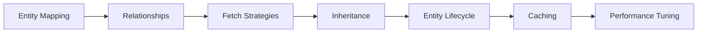

> **Previous:** [JDBC/JOOQ](./19-jdbc-jooq.md) | **Next:** [Spring Data JPA](./21-spring-data-jpa.md)

# JPA & Hibernate Deep Dive

## Learning Objectives

By the end of this chapter, you will be able to:

1.  Map Java entities to database tables using JPA annotations
2.  Configure primary key generation strategies and understand their trade-offs
3.  Define entity relationships (OneToOne, OneToMany, ManyToOne, ManyToMany) with proper cascade and fetch settings
4.  Identify and resolve the n+1 query problem using multiple strategies
5.  Implement entity inheritance hierarchies using all four JPA strategies
6.  Configure and tune Hibernate's second-level cache
7.  Handle lazy-loading exceptions and understand session management patterns
8.  Use Hibernate-specific type mappings including JSON and custom types

---

## Chapter at a Glance

| Topic | Key Insight | Practical Takeaway |
|-------|-------------|--------------------|
| Entity Mapping | @Entity, @Table, @Id, @GeneratedValue | Field vs property access strategy |
| Relationships | @OneToMany, @ManyToOne, @ManyToMany | Use Set over List for Many side |
| Fetch Strategies | LAZY vs EAGER | Prefer LAZY; use JOIN FETCH for queries |
| Inheritance | SINGLE_TABLE, JOINED, TABLE_PER_CLASS | SINGLE_TABLE is most performant |
| Caching | 1st/2nd level cache, query cache | 2nd level for read-heavy entities |

## Chapter Roadmap



> **Warning:** N+1 query problem is the most common Hibernate performance issue. Always verify generated SQL → look for unexpected SELECT statements in logs.

## 1. Entity Mapping Fundamentals


JPA (Jakarta Persistence API) is the standard Java specification for object-relational mapping. Hibernate is the most popular implementation. Entities are plain Java classes annotated to describe how they map to database tables.

### 1.1 Field vs Property Access


JPA supports two access strategies:

- **Field access** (`@Id` on a field): Hibernate reads/writes fields directly, bypassing getters/setters
- **Property access** (`@Id` on a getter): Hibernate uses getter/setter methods

```java
// FIELD access — annotations on fields
@Entity
@Table(name = "users")
public class User {

    @Id
    @GeneratedValue(strategy = GenerationType.IDENTITY)
    private Long id;

    @Column(name = "full_name", nullable = false)
    private String name;

    // No special annotations needed on getters/setters
    public Long getId() { return id; }
    public void setId(Long id) { this.id = id; }
    public String getName() { return name; }
    public void setName(String name) { this.name = name; }
}

// PROPERTY access — annotations on getters
@Entity
@Table(name = "profiles")
public class Profile {

    private Long id;
    private String displayName;

    @Id
    @GeneratedValue(strategy = GenerationType.IDENTITY)
    public Long getId() { return id; }
    public void setId(Long id) { this.id = id; }

    @Column(name = "display_name")
    public String getDisplayName() { return displayName; }
    public void setDisplayName(String n) { this.displayName = n; }
}
```

**Important:** Never mix access types within an entity hierarchy without `@Access`. The placement of `@Id` determines the strategy for the whole class hierarchy.

```java
// Explicitly mixing access types
@Entity
@Access(AccessType.FIELD)
public class MixedAccessEntity {

    @Id
    private Long id;

    @Transient
    private String internalValue;

    @Access(AccessType.PROPERTY)
    @Column(name = "computed_value")
    public String getComputedValue() {
        return internalValue != null ? internalValue.toUpperCase() : null;
    }
}
```

### 1.2 @Entity and @Table


```java
@Entity                                 // Marks as JPA entity (must have no-arg constructor)
@Table(name = "blog_posts")            // Maps to table name (optional, defaults to class name)
public class BlogPost {

    @Id
    @GeneratedValue
    private Long id;

    // ...
}
```

- `@Entity(name = "Post")` — sets the JPQL entity name used in queries: `SELECT p FROM Post p`
- `@Table` accepts `schema`, `catalog`, `uniqueConstraints`, `indexes`

```java
@Entity(name = "Post")
@Table(
    name = "blog_posts",
    schema = "blog",
    uniqueConstraints = @UniqueConstraint(name = "uk_slug", columnNames = "slug"),
    indexes = @Index(name = "idx_posts_author", columnList = "author_id")
)
public class BlogPost {
    // ...
}
```

### 1.3 @Id and @GeneratedValue — Four Generation Strategies


```java
@Entity
public class IdentityExample {

    @Id
    @GeneratedValue(strategy = GenerationType.IDENTITY)  // AUTO_INCREMENT, DB assigns after insert
    private Long id;

    // INSERT → Hibernate needs immediate insert to know the ID
    // Cannot batch inserts (ID must be known before statement submission)
    // Best for simple single-row operations
}

@Entity
public class SequenceExample {

    @Id
    @GeneratedValue(strategy = GenerationType.SEQUENCE, generator = "post_seq")
    @SequenceGenerator(
        name = "post_seq",
        sequenceName = "post_sequence",
        allocationSize = 50               // Pre-allocate 50 IDs per trip to DB
    )
    private Long id;

    // Hibernate pre-fetches ID values from the sequence
    // Enables batch inserts (IDs known before flushing)
    // allocationSize should match the DB sequence increment for performance
    // Fastest strategy for most applications
}

@Entity
public class TableExample {

    @Id
    @GeneratedValue(strategy = GenerationType.TABLE, generator = "id_table")
    @TableGenerator(
        name = "id_table",
        table = "id_generator",
        pkColumnName = "entity_name",
        valueColumnName = "next_id",
        allocationSize = 50
    )
    private Long id;

    // Uses a separate database table to track ID counters
    // Portable across all databases
    // Poor performance under contention (row-level locking)
    // Avoid unless you cannot use SEQUENCE or IDENTITY
}

@Entity
public class UuidExample {

    @Id
    @GeneratedValue(strategy = GenerationType.UUID)
    private UUID id;

    // Hibernate 6+ — generates RFC 4122 UUIDs automatically
    // No round-trip to DB to determine ID
    // Great for distributed systems and offline-first apps
    // Storage: BINARY(16) in MySQL, UUID in PostgreSQL
}
```

#### Performance Comparison

| Strategy | DB Round Trips | Batch Inserts | Contention | Portability |
|----------|---------------|---------------|------------|-------------|
| IDENTITY | 1 per insert | No | None | High |
| SEQUENCE | 1 per allocationSize | Yes | Low | Medium |
| TABLE | 1 per allocationSize | Yes | High | High |
| UUID | None | Yes | None | Medium |

### 1.4 @Column — Fine-Tuning Column Definitions


```java
@Entity
@Table(name = "products")
public class Product {

    @Id
    @GeneratedValue(strategy = GenerationType.IDENTITY)
    private Long id;

    @Column(name = "product_name", nullable = false, unique = true, length = 150)
    private String name;

    @Column(nullable = false)
    private String description;                  // Default: VARCHAR(255), nullable=true

    @Column(precision = 10, scale = 2)          // DECIMAL(10,2)
    private BigDecimal price;

    @Column(columnDefinition = "TEXT")          // Raw SQL column DDL
    private String longDescription;

    @Column(columnDefinition = "BOOLEAN DEFAULT FALSE")
    private boolean archived;

    @Column(name = "created_at", updatable = false)
    private LocalDateTime createdAt;
}
```

- `name` — overrides column name (defaults to field name)
- `nullable` — adds NOT NULL constraint
- `unique` — adds UNIQUE constraint
- `length` — VARCHAR length (default 255), ignored for non-String types
- `precision` / `scale` — for decimal types
- `columnDefinition` — raw DDL fragment, database-specific

### 1.5 @Basic — Fetch and Optional


```java
@Entity
public class Document {

    @Id
    @GeneratedValue
    private Long id;

    @Basic(fetch = FetchType.LAZY)          // Load on demand (requires bytecode enhancement)
    @Lob
    private byte[] content;

    @Basic(optional = false)                 // Marks as not nullable (similar to nullable=false)
    private String title;

    @Basic                                      // Default: FetchType.EAGER, optional=true
    private String summary;
}
```

`@Basic(fetch = FetchType.LAZY)` defers loading of large fields. Requires bytecode enhancement (Hibernate EnhancementPlugin for Gradle/Maven):

```xml
<plugin>
    <groupId>org.hibernate.orm.tooling</groupId>
    <artifactId>hibernate-enhance-maven-plugin</artifactId>
    <version>${hibernate.version}</version>
    <executions>
        <execution>
            <configuration>
                <enableLazyInitialization>true</enableLazyInitialization>
            </configuration>
            <goals><goal>enhance</goal></goals>
        </execution>
    </executions>
</plugin>
```

### 1.6 @Transient


Fields not persisted to the database:

```java
@Entity
public class Invoice {

    @Id
    @GeneratedValue
    private Long id;

    @Column(name = "subtotal_cents")
    private int subtotalCents;

    @Column(name = "tax_cents")
    private int taxCents;

    @Transient
    private int totalCents;            // Not persisted, computed at runtime

    @PostLoad
    private void computeTotal() {
        this.totalCents = this.subtotalCents + this.taxCents;
    }

    public int getTotalCents() {
        return totalCents;
    }
}
```

### 1.7 @Enumerated


```java
public enum OrderStatus {
    PENDING, CONFIRMED, SHIPPED, DELIVERED, CANCELLED
}

@Entity
@Table(name = "orders")
public class Order {

    @Id
    @GeneratedValue
    private Long id;

    @Enumerated(EnumType.ORDINAL)          // Stores 0, 1, 2, 3, 4 — fragile if enum order changes
    private OrderStatus statusOrdinal;

    @Enumerated(EnumType.STRING)           // Stores 'PENDING', 'CONFIRMED', etc. — prefer this
    private OrderStatus statusString;
}
```

**Always prefer `EnumType.STRING`.** ORDINAL breaks if enum constants are reordered or new values are inserted. If you must use ORDINAL, never reorder the enum class.

### 1.8 @Temporal (Deprecated) vs Java 8 Time API


```java
// DEPRECATED — old-style date mapping
@Entity
@SuppressWarnings("deprecation")
public class OldSchoolEvent {

    @Id
    @GeneratedValue
    private Long id;

    @Temporal(TemporalType.TIMESTAMP)       // java.util.Date → TIMESTAMP
    private Date createdAt;

    @Temporal(TemporalType.DATE)            // java.util.Date → DATE (no time)
    private Date eventDate;

    @Temporal(TemporalType.TIME)            // java.util.Date → TIME (no date)
    private Date startTime;
}

// MODERN — Java 8+ time API (no @Temporal needed)
@Entity
@Table(name = "events")
public class Event {

    @Id
    @GeneratedValue(strategy = GenerationType.IDENTITY)
    private Long id;

    private LocalDate eventDate;            // maps to DATE
    private LocalTime startTime;            // maps to TIME
    private LocalDateTime createdAt;        // maps to TIMESTAMP
    private ZonedDateTime zonedTimestamp;   // maps to TIMESTAMP WITH TIME ZONE
    private OffsetDateTime offsetTimestamp; // maps to TIMESTAMP WITH TIME ZONE
    private Instant instant;                // maps to TIMESTAMP
    private Duration duration;              // maps to BIGINT (nanos)
    private Period period;                  // maps to VARCHAR
}
```

Hibernate 6 automatically handles the Java 8 time types. No annotations needed. `@Temporal` is only for `java.util.Date` and `java.util.Calendar` — avoid these in new code.

### 1.9 @Lob — Large Objects


```java
@Entity
@Table(name = "attachments")
public class Attachment {

    @Id
    @GeneratedValue
    private Long id;

    @Lob
    @Basic(fetch = FetchType.LAZY)
    private byte[] data;                // Maps to BLOB (PostgreSQL: BYTEA, MySQL: LONGBLOB)

    @Lob
    @Column(columnDefinition = "TEXT")
    private String content;             // Maps to CLOB (PostgreSQL: TEXT, MySQL: LONGTEXT)
}
```

`@Lob` maps to database-specific large object types. For PostgreSQL, you may need `@Type(JsonType.class)` instead, depending on use case.

### 1.10 @CreationTimestamp and @UpdateTimestamp


```java
@Entity
@Table(name = "auditable_entities")
public class AuditableEntity {

    @Id
    @GeneratedValue
    private Long id;

    @CreationTimestamp                    // Set once on persist
    @Column(name = "created_at", updatable = false, nullable = false)
    private LocalDateTime createdAt;

    @UpdateTimestamp                      // Updated on every modification
    @Column(name = "updated_at", nullable = false)
    private LocalDateTime updatedAt;
}
```

These are Hibernate-specific annotations (not JPA standard). For a JPA-standard approach, use `@PrePersist` / `@PreUpdate` lifecycle callbacks or Spring Data JPA auditing.

---

## 2. Entity Relationships

### 2.1 @OneToOne


#### Shared Primary Key

```java
@Entity
@Table(name = "users")
public class User {

    @Id
    @GeneratedValue(strategy = GenerationType.IDENTITY)
    private Long id;

    @OneToOne(mappedBy = "user", cascade = CascadeType.ALL, optional = false)
    private UserProfile profile;

    // getters, setters
}

@Entity
@Table(name = "user_profiles")
public class UserProfile {

    @Id
    @Column(name = "user_id")               // Same PK as User
    private Long id;

    @OneToOne
    @MapsId                                    // Shares PK with User
    @JoinColumn(name = "user_id")
    private User user;

    private String bio;
    private String avatarUrl;
}
```

#### Foreign Key

```java
@Entity
@Table(name = "employees")
public class Employee {

    @Id
    @GeneratedValue
    private Long id;

    @OneToOne(cascade = CascadeType.ALL)
    @JoinColumn(name = "office_id", referencedColumnName = "id")
    private Office assignedOffice;
}

@Entity
@Table(name = "offices")
public class Office {

    @Id
    @GeneratedValue
    private Long id;

    @OneToOne(mappedBy = "assignedOffice")      // Inverse side
    private Employee occupant;
}
```

- `mappedBy` — always on the inverse (non-owning) side, references the field name on the owning side
- `@JoinColumn` — on the owning side, defines the FK column
- `optional = false` — adds NOT NULL constraint
- `cascade` — propagates operations to the associated entity

### 2.2 @OneToMany / @ManyToOne (Bidirectional)


```java
@Entity
@Table(name = "categories")
public class Category {

    @Id
    @GeneratedValue
    private Long id;

    private String name;

    @OneToMany(mappedBy = "category", cascade = CascadeType.ALL, orphanRemoval = true)
    private List<Product> products = new ArrayList<>();

    public void addProduct(Product product) {
        products.add(product);
        product.setCategory(this);
    }

    public void removeProduct(Product product) {
        products.remove(product);
        product.setCategory(null);
    }
}

@Entity
@Table(name = "products")
public class Product {

    @Id
    @GeneratedValue
    private Long id;

    private String title;

    @ManyToOne(fetch = FetchType.LAZY)
    @JoinColumn(name = "category_id")
    private Category category;
}
```

**Always use `mappedBy` on the one side.** The many side is always the owning side.

**Always provide `addXxx`/`removeXxx` helper methods.** They keep both sides in sync.

**Always initialize collections** with `new ArrayList<>()` to avoid null checks.

### 2.3 @OneToMany (Unidirectional with @JoinColumn)


```java
@Entity
@Table(name = "orders")
public class Order {

    @Id
    @GeneratedValue
    private Long id;

    @OneToMany(cascade = CascadeType.ALL, orphanRemoval = true)
    @JoinColumn(name = "order_id")          // FK on the child table, no mappedBy
    private List<OrderItem> items = new ArrayList<>();
}

@Entity
@Table(name = "order_items")
public class OrderItem {

    @Id
    @GeneratedValue
    private Long id;

    private String productName;
    private int quantity;
}
```

This approach puts the FK on the child table without requiring a `mappedBy` back-reference in the child entity. It's simpler but less expressive.

### 2.4 @ManyToMany


```java
@Entity
@Table(name = "students")
public class Student {

    @Id
    @GeneratedValue
    private Long id;

    private String name;

    @ManyToMany
    @JoinTable(
        name = "student_courses",
        joinColumns = @JoinColumn(name = "student_id"),
        inverseJoinColumns = @JoinColumn(name = "course_id")
    )
    private Set<Course> courses = new HashSet<>();

    public void addCourse(Course course) {
        courses.add(course);
        course.getStudents().add(this);
    }

    public void removeCourse(Course course) {
        courses.remove(course);
        course.getStudents().remove(this);
    }
}

@Entity
@Table(name = "courses")
public class Course {

    @Id
    @GeneratedValue
    private Long id;

    private String title;

    @ManyToMany(mappedBy = "courses")
    private Set<Student> students = new HashSet<>();
}
```

- Use `Set<>` instead of `List<>` for ManyToMany to avoid duplicate rows
- `@JoinTable` defines the junction table
- `joinColumns` — FK to the owning entity's table
- `inverseJoinColumns` — FK to the inverse entity's table
- Avoid cascading ALL on ManyToMany (use PERSIST + MERGE only)

### 2.5 orphanRemoval


```java
@Entity
public class Author {

    @Id
    @GeneratedValue
    private Long id;

    @OneToMany(mappedBy = "author", cascade = CascadeType.ALL, orphanRemoval = true)
    private List<Book> books = new ArrayList<>();
}

// When a Book is removed from the list and the owning Author is saved:
author.getBooks().remove(0);
authorRepository.save(author);       // DELETE FROM books WHERE id = ?

// Without orphanRemoval=true, the FK would be set to NULL instead of deleting the row
```

`orphanRemoval = true` deletes child entities when they are removed from the parent's collection. Only valid on `@OneToOne` and `@OneToMany`.

### 2.6 Relationships in equals() and hashCode()


```java
@Entity
public class Book {

    @Id
    @GeneratedValue
    private Long id;

    private String title;

    @ManyToOne(fetch = FetchType.LAZY)
    @JoinColumn(name = "author_id")
    private Author author;

    @Override
    public boolean equals(Object o) {
        if (this == o) return true;
        if (o == null || getClass() != o.getClass()) return false;

        Book other = (Book) o;

        // Use business key, not ID (ID may be null before persist)
        return title != null && title.equals(other.title);
    }

    @Override
    public int hashCode() {
        // Constant hash for transient entities; Hibernate guarantees
        // same object identity within a session
        return getClass().hashCode();
    }
}
```

**Rules for equals/hashCode with JPA:**

- Never use the auto-generated ID in equals/hashCode (null before persist, changes after merge)
- Never navigate lazy associations in equals/hashCode (triggers lazy loading)
- Use a business key (natural ID) when available, or fall back to the class-based hash
- `@ManyToOne` associations are especially dangerous — they trigger n+1 in collections

---

## 3. Cascade Types

Cascade types determine which entity state transitions propagate from parent to child.

```java
@Entity
public class Post {

    @Id
    @GeneratedValue
    private Long id;

    @OneToMany(mappedBy = "post", cascade = CascadeType.ALL)
    private List<Comment> comments = new ArrayList<>();

    // Saving a Post also saves all Comments
    // Deleting a Post also deletes all Comments
}
```

| Cascade Type | persist | merge | remove | refresh | detach |
|--------------|---------|-------|--------|---------|--------|
| ALL | ✓ | ✓ | ✓ | ✓ | ✓ |
| PERSIST | ✓ | - | - | - | - |
| MERGE | - | ✓ | - | - | - |
| REMOVE | - | - | ✓ | - | - |
| REFRESH | - | - | - | ✓ | - |
| DETACH | - | - | - | - | ✓ |

### When to Use Each


```java
// CascadeType.PERSIST — only propagate persist (safe for ManyToMany)
@ManyToMany(cascade = CascadeType.PERSIST)
private Set<Tag> tags = new HashSet<>();

// CascadeType.MERGE — propagate merge (detached entities re-attached)
@OneToMany(mappedBy = "order", cascade = CascadeType.MERGE)
private List<OrderItem> items = new ArrayList<>();

// CascadeType.REMOVE — cascade delete (orphanRemoval is safer)
@OneToMany(mappedBy = "invoice", cascade = CascadeType.REMOVE)
private List<LineItem> lineItems = new ArrayList<>();

// CascadeType.REFRESH — reload from DB
@OneToOne(cascade = CascadeType.REFRESH)
private RefreshToken token;

// CascadeType.DETACH — remove from persistence context
@OneToMany(mappedBy = "session", cascade = CascadeType.DETACH)
private List<SessionData> sessionDataList;

// CascadeType.ALL — everything (convenient, but be careful with REMOVE on shared entities)
@OneToMany(mappedBy = "owner", cascade = CascadeType.ALL, orphanRemoval = true)
private List<OwnedEntity> ownedEntities = new ArrayList<>();
```

**Warning:** Never use `CascadeType.ALL` or `CascadeType.REMOVE` on `@ManyToMany` or `@ManyToOne` — you will delete entities that belong to other owners.

---

## 4. Fetching Strategies

### 4.1 LAZY vs EAGER


```java
@Entity
public class Library {

    @Id
    @GeneratedValue
    private Long id;

    @OneToMany(mappedBy = "library", fetch = FetchType.LAZY)     // Default for ToMany
    private List<Book> books = new ArrayList<>();

    @ManyToOne(fetch = FetchType.LAZY)                            // Always set LAZY on ToOne!
    @JoinColumn(name = "address_id")
    private Address address;
}
```

**Rule of thumb:** All associations should be `FetchType.LAZY`. EAGER is almost always wrong:

- EAGER forces loading even when not needed
- EAGER on multiple associations causes Cartesian products
- EAGER has no effect on closed sessions (already-loaded data only)
- EAGER makes it impossible to write performant queries

### 4.2 The n+1 Problem


```java
// n+1 query problem
List<Post> posts = entityManager
    .createQuery("SELECT p FROM Post p", Post.class)
    .getResultList();                              // 1 query for all posts

for (Post post : posts) {
    System.out.println(post.getComments().size());  // n queries for comments!
}

// Total: 1 + n = n+1 queries
```

#### Solution 1: @BatchSize

```java
@Entity
public class Post {

    @Id
    @GeneratedValue
    private Long id;

    @OneToMany(mappedBy = "post")
    @BatchSize(size = 25)                   // Load 25 collections at once
    private List<Comment> comments = new ArrayList<>();
}
```

`@BatchSize` loads lazy collections in batches of N. Instead of n queries, you get n/25 queries. It's transparent to the application.

#### Solution 2: @Fetch(SUBSELECT)

```java
@Entity
public class Post {

    @Id
    @GeneratedValue
    private Long id;

    @OneToMany(mappedBy = "post")
    @Fetch(FetchMode.SUBSELECT)             // SELECT ... WHERE post_id IN (SELECT id FROM posts)
    private List<Comment> comments = new ArrayList<>();
}
```

`FetchMode.SUBSELECT` rewrites the collection load into a single subselect query. It loads comments for ALL previously loaded posts in one round trip.

#### Solution 3: JOIN FETCH (Most Common)

```java
// JPQL with JOIN FETCH
TypedQuery<Post> query = entityManager.createQuery(
    "SELECT DISTINCT p FROM Post p LEFT JOIN FETCH p.comments", Post.class);
List<Post> posts = query.getResultList();
// One query, all comments loaded eagerly — no n+1

// Criteria API equivalent
CriteriaBuilder cb = entityManager.getCriteriaBuilder();
CriteriaQuery<Post> cq = cb.createQuery(Post.class);
Root<Post> root = cq.from(Post.class);
root.fetch("comments", JoinType.LEFT);
cq.select(root).distinct(true);
List<Post> result = entityManager.createQuery(cq).getResultList();
```

- `JOIN FETCH` loads associations eagerly for that specific query
- Use `DISTINCT` to avoid duplicate root entities from inner joins
- `LEFT JOIN FETCH` for optional associations, `JOIN FETCH` for required ones

#### Solution 4: Entity Graphs

```java
// Named entity graph
@Entity
@Table(name = "posts")
@NamedEntityGraph(
    name = "Post.comments",
    attributeNodes = @NamedAttributeNode("comments")
)
public class Post {
    @Id
    @GeneratedValue
    private Long id;

    @OneToMany(mappedBy = "post")
    private List<Comment> comments = new ArrayList<>();
}

// Usage
@EntityGraph(value = "Post.comments", type = EntityGraphType.LOAD)
@Query("SELECT p FROM Post p")
List<Post> findAllWithComments();

// Programmatic entity graph (no named graph needed)
@Query("SELECT p FROM Post p")
@EntityGraph(attributePaths = {"comments", "comments.author"})
List<Post> findAllWithCommentsAndAuthors();
```

Entity graphs are the most flexible approach — they can be defined at the repository method level and compose well.

#### Solution 5: Hibernate 6 Query Tuning

```java
// Hibernate 6 window-based batch fetching
@OneToMany(mappedBy = "post")
@BatchSize(size = 25)
private List<Comment> comments = new ArrayList<>();

// Hibernate 6.2+ array container optimization
// settings:
// hibernate.query.batch_fetch_style=PADDED
// hibernate.query.fail_on_pagination_over_collection_fetch=true

// Window-based batch loading (Hibernate 6 default)
// SELECT c FROM Comment c WHERE c.post_id IN (?, ?, ?, ?, ...)
```

### 4.3 Fetch Profiles


```java
// Define a fetch profile (XML or annotation)
@NamedEntityGraphs({
    @NamedEntityGraph(name = "Post.summary",
        attributeNodes = {@NamedAttributeNode("title"), @NamedAttributeNode("createdAt")}),
    @NamedEntityGraph(name = "Post.detail",
        attributeNodes = {
            @NamedAttributeNode("comments"),
            @NamedAttributeNode(value = "author", subgraph = "author-detail")
        },
        subgraphs = @NamedSubgraph(name = "author-detail",
            attributeNodes = @NamedAttributeNode("profile")))
})
@Entity
public class Post {
    // ...
}
```

---

## 5. Inheritance Strategies

### 5.1 SINGLE_TABLE (Default)


```java
@Entity
@Inheritance(strategy = InheritanceType.SINGLE_TABLE)     // Default
@DiscriminatorColumn(name = "vehicle_type", discriminatorType = DiscriminatorType.STRING)
@DiscriminatorValue("VEHICLE")
public abstract class Vehicle {

    @Id
    @GeneratedValue
    private Long id;

    private String manufacturer;
    private int year;
}

@Entity
@DiscriminatorValue("CAR")
public class Car extends Vehicle {

    private int doors;
    private boolean isElectric;
}

@Entity
@DiscriminatorValue("TRUCK")
public class Truck extends Vehicle {

    private double payloadCapacity;
    private int axles;
}
```

**Single table** stores all classes in one table with nullable columns for subclass-specific fields.

**Pros:**
- Fastest reads (no joins)
- Simple schema
- Polymorphic queries are efficient

**Cons:**
- Nullable columns for subclass-specific data
- Cannot have NOT NULL constraints on subclass columns
- Table grows wide with many subclasses

### 5.2 JOINED


```java
@Entity
@Inheritance(strategy = InheritanceType.JOINED)
@DiscriminatorColumn(name = "payment_type")
public abstract class Payment {

    @Id
    @GeneratedValue
    private Long id;

    private BigDecimal amount;
    private LocalDateTime paidAt;
}

@Entity
@DiscriminatorValue("CC")
public class CreditCardPayment extends Payment {

    private String cardNumber;
    private String cardHolderName;
    private String expiryDate;
}

@Entity
@DiscriminatorValue("PAYPAL")
public class PayPalPayment extends Payment {

    private String paypalEmail;
    private String transactionId;
}
```

**Joined** creates one table per class, with subclass tables referencing the parent via FK.

**Pros:**
- Normalized schema
- NOT NULL constraints on subclass columns
- No wasted space

**Cons:**
- Polymorphic queries need joins (slower)
- Insert requires multiple statements

### 5.3 TABLE_PER_CLASS


```java
@Entity
@Inheritance(strategy = InheritanceType.TABLE_PER_CLASS)
public abstract class Account {

    @Id
    @GeneratedValue
    private Long id;

    private String accountNumber;
    private BigDecimal balance;
}

@Entity
@Table(name = "checking_accounts")
public class CheckingAccount extends Account {

    private double overdraftLimit;
}

@Entity
@Table(name = "savings_accounts")
public class SavingsAccount extends Account {

    private double interestRate;
}
```

**Table per class** creates a complete table for each concrete class.

**Pros:**
- No nullable columns
- Fast reads for concrete type queries
- No joins for concrete type

**Cons:**
- Schema duplication (base class columns repeated)
- Polymorphic queries use UNION (expensive)
- ID generation cannot use IDENTITY (requires TABLE/SEQUENCE)

### 5.4 @MappedSuperclass


```java
@MappedSuperclass                                // Not an entity — no table
public abstract class BaseEntity {

    @Id
    @GeneratedValue(strategy = GenerationType.IDENTITY)
    private Long id;

    @CreationTimestamp
    @Column(name = "created_at", updatable = false)
    private LocalDateTime createdAt;

    @UpdateTimestamp
    @Column(name = "updated_at")
    private LocalDateTime updatedAt;

    // Getters and setters
}

@Entity
@Table(name = "articles")
public class Article extends BaseEntity {

    private String title;
    private String content;
}

@Entity
@Table(name = "videos")
public class Video extends BaseEntity {

    private String url;
    private int durationSeconds;
}
```

`@MappedSuperclass` is not an entity — it cannot be queried, and there is no table for it. Each subclass gets its own copy of the mapped columns.

### 5.5 Polymorphic Queries Performance


```java
// Polymorphic query — hits all subclasses
List<Vehicle> allVehicles = entityManager
    .createQuery("SELECT v FROM Vehicle v", Vehicle.class)
    .getResultList();

// Concrete-type query — hits only one subclass table
List<Car> cars = entityManager
    .createQuery("SELECT c FROM Car c", Car.class)
    .getResultList();

// Performance characteristics:
// SINGLE_TABLE:     Both queries hit one table — fast
// JOINED:           Polymorphic = parent JOIN child; concrete = parent JOIN child (same!)
// TABLE_PER_CLASS:  Polymorphic = UNION ALL across all tables; concrete = single table
```

---

## 6. @MappedSuperclass and @OrderColumn

### @MappedSuperclass for Common Fields


```java
@MappedSuperclass
public abstract class BaseAuditableEntity {

    @Id
    @GeneratedValue(strategy = GenerationType.IDENTITY)
    private Long id;

    @CreationTimestamp
    @Column(name = "created_at", nullable = false, updatable = false)
    private LocalDateTime createdAt;

    @UpdateTimestamp
    @Column(name = "updated_at", nullable = false)
    private LocalDateTime updatedAt;

    @Version                                           // Optimistic locking
    private Long version;

    public Long getId() { return id; }
    public void setId(Long id) { this.id = id; }
    public LocalDateTime getCreatedAt() { return createdAt; }
    public LocalDateTime getUpdatedAt() { return updatedAt; }
    public Long getVersion() { return version; }
}

@Entity
@Table(name = "tags")
public class Tag extends BaseAuditableEntity {

    private String name;

    @ManyToMany(mappedBy = "tags")
    private Set<Post> posts = new HashSet<>();
}
```

### @OrderColumn for Ordered Collections


```java
@Entity
@Table(name = "playlists")
public class Playlist {

    @Id
    @GeneratedValue
    private Long id;

    private String name;

    @OneToMany(mappedBy = "playlist", cascade = CascadeType.ALL, orphanRemoval = true)
    @OrderColumn(name = "track_position")               // Persists list index
    private List<Track> tracks = new ArrayList<>();
}

@Entity
@Table(name = "tracks")
public class Track {

    @Id
    @GeneratedValue
    private Long id;

    private String title;
    private int durationSeconds;

    @ManyToOne(fetch = FetchType.LAZY)
    @JoinColumn(name = "playlist_id")
    private Playlist playlist;
}
```

`@OrderColumn` maintains the List index in a database column. Without it, the list order is undefined (no ORDER BY) or requires `@OrderBy("propertyName")` for in-memory sorting.

---

## 7. Second-Level Cache

### 7.1 Configuration


```properties
# application.properties
spring.jpa.properties.hibernate.cache.use_second_level_cache=true
spring.jpa.properties.hibernate.cache.use_query_cache=true
spring.jpa.properties.hibernate.cache.region.factory_class=org.hibernate.cache.jcache.JCacheRegionFactory
spring.jpa.properties.hibernate.javax.cache.provider=org.ehcache.jsr107.EhcacheCachingProvider
```

### 7.2 Entity Caching


```java
@Entity
@Table(name = "countries")
@Cacheable                                      // Enables 2LC for this entity
@Cache(usage = CacheConcurrencyStrategy.READ_ONLY, region = "referenceData")
public class Country {

    @Id
    @GeneratedValue
    private Long id;

    @Column(nullable = false, unique = true)
    private String code;

    @Column(nullable = false)
    private String name;

    @OneToMany(mappedBy = "country")
    private List<City> cities = new ArrayList<>();
}

@Entity
@Table(name = "products")
@Cacheable
@Cache(usage = CacheConcurrencyStrategy.READ_WRITE, region = "products")
public class Product {

    @Id
    @GeneratedValue
    private Long id;

    private String sku;
    private String name;
    private BigDecimal price;
}
```

### 7.3 CacheConcurrencyStrategy


| Strategy | Description | Use Case |
|----------|-------------|----------|
| READ_ONLY | Immutable, no updates | Reference data (countries, statuses) |
| READ_WRITE | Soft locks, good for read-heavy mutable data | Products, user profiles |
| NONSTRICT_READ_WRITE | No locks, may serve stale data | Rarely-updated but mutable |
| TRANSACTIONAL | Full XA support, requires JTA | Mission-critical, needs JTA |

### 7.4 Query Cache


```java
// Enable query caching
@QueryHints(@QueryHint(name = org.hibernate.jpa.HibernateHints.HINT_CACHEABLE, value = "true"))
@Query("SELECT c FROM Country c WHERE c.code = :code")
Country findByCode(@Param("code") String code);

// Programmatic
TypedQuery<Country> query = entityManager
    .createQuery("SELECT c FROM Country c", Country.class);
query.setHint("org.hibernate.cacheable", "true");
List<Country> countries = query.getResultList();
```

The query cache caches query result identifiers, not the entities themselves. Entities are cached separately in the 2LC. A change to any entity referenced in a cached query invalidates that query's cache entry.

### 7.5 Cache Regions


```java
// Distinct regions allow different TTL and eviction policies per entity group
@Cache(usage = CacheConcurrencyStrategy.READ_ONLY, region = "referenceData")
@Entity
public class State { }

@Cache(usage = CacheConcurrencyStrategy.READ_WRITE, region = "businessData")
@Entity
public class Order { }
```

Configure region timeouts in EHCache:

```xml
<config xmlns="http://www.ehcache.org/v3">
    <cache alias="referenceData">
        <expiry><ttl unit="hours">24</ttl></expiry>
        <resources>
            <heap unit="entries">1000</heap>
            <offheap unit="MB">10</offheap>
        </resources>
    </cache>
    <cache alias="businessData">
        <expiry><ttl unit="minutes">15</ttl></expiry>
        <resources>
            <heap unit="entries">2000</heap>
            <offheap unit="MB">50</offheap>
        </resources>
    </cache>
</config>
```

### 7.6 Cache Providers


| Provider | Spring Boot Starter | Performance | Clustering |
|----------|-------------------|-------------|------------|
| EHCache 3.x | `spring-boot-starter-cache` + ehcache XML | Excellent | Terracotta |
| Caffeine | `com.github.ben-manes.caffeine:caffeine` | Best (near-Caffeine) | None (local only) |
| Redis | `spring-boot-starter-data-redis` | Good (network) | Yes (distributed) |

```java
// Caffeine configuration
@Configuration
public class CacheConfig {

    @Bean
    public CacheManager cacheManager() {
        CaffeineCacheManager manager = new CaffeineCacheManager();
        manager.setCaffeine(Caffeine.newBuilder()
            .initialCapacity(100)
            .maximumSize(500)
            .expireAfterWrite(10, TimeUnit.MINUTES));
        return manager;
    }
}
```

---

## 8. Hibernate Types

### 8.1 @Type and Custom Types


```java
// Hibernate 6 @Type annotation
@Entity
@Table(name = "documents")
public class Document {

    @Id
    @GeneratedValue
    private Long id;

    @Type(JsonType.class)                       // Map JSON column to Java Map/List
    @Column(name = "metadata", columnDefinition = "jsonb")
    private Map<String, Object> metadata;

    @Type(JsonType.class)
    @Column(columnDefinition = "jsonb")
    private List<String> tags;
}
```

### 8.2 Custom UserType (Hibernate 6)


```java
public class PhoneNumberType implements UserType<PhoneNumber> {

    @Override
    public int getSqlType() {
        return Types.VARCHAR;
    }

    @Override
    public Class<PhoneNumber> returnedClass() {
        return PhoneNumber.class;
    }

    @Override
    public PhoneNumber nullSafeGet(ResultSet rs, int position,
                                    SharedSessionContractImplementor session,
                                    Object owner) throws SQLException {
        String value = rs.getString(position);
        return value != null ? PhoneNumber.parse(value) : null;
    }

    @Override
    public void nullSafeSet(PreparedStatement st, PhoneNumber value,
                            int index, SharedSessionContractImplementor session)
                            throws SQLException {
        if (value == null) {
            st.setNull(index, Types.VARCHAR);
        } else {
            st.setString(index, value.format());
        }
    }

    @Override
    public PhoneNumber deepCopy(PhoneNumber value) {
        return value != null ? new PhoneNumber(value.getCountryCode(),
                                               value.getNumber()) : null;
    }

    @Override
    public boolean isMutable() {
        return false;
    }

    @Override
    public boolean equals(PhoneNumber x, PhoneNumber y) {
        return Objects.equals(x, y);
    }

    @Override
    public int hashCode(PhoneNumber x) {
        return x != null ? x.hashCode() : 0;
    }
}

// Usage
@Entity
public class Contact {

    @Id
    @GeneratedValue
    private Long id;

    @Type(PhoneNumberType.class)
    @Column(name = "phone_number", length = 20)
    private PhoneNumber phone;
}
```

### 8.3 JSON Mapping in PostgreSQL (Hibernate 6)


```java
@Entity
@Table(name = "customers")
@TypeDef(name = "jsonb", typeClass = JsonType.class)
public class Customer {

    @Id
    @GeneratedValue
    private Long id;

    private String name;

    @Type(JsonType.class)
    @Column(name = "preferences", columnDefinition = "jsonb")
    private CustomerPreferences preferences;

    @Type(JsonType.class)
    @Column(name = "tags", columnDefinition = "jsonb")
    private List<String> tags;

    @Type(JsonType.class)
    @Column(name = "audit_log", columnDefinition = "jsonb")
    private List<AuditEntry> auditLog;
}

public class CustomerPreferences {
    private boolean newsletterEnabled;
    private String preferredLanguage;
    private Map<String, String> notificationSettings;

    // getters, setters, no-arg constructor
}

public class AuditEntry {
    private LocalDateTime timestamp;
    private String action;
    private String details;

    // getters, setters, no-arg constructor
}
```

### 8.4 Array Types


```java
// Hibernate 6 array type mapping (PostgreSQL)
@Entity
@Table(name = "articles")
public class Article {

    @Id
    @GeneratedValue
    private Long id;

    @Column(name = "tag_list", columnDefinition = "text[]")
    private String[] tags;

    @Column(name = "scores", columnDefinition = "integer[]")
    private Integer[] scores;

    @Column(name = "ratings", columnDefinition = "numeric[]")
    private BigDecimal[] ratings;
}

// Using List with Hibernate 6 array types
@Column(name = "keywords", columnDefinition = "text[]")
private List<String> keywords;
```

---

## 9. Session Management

### 9.1 LazyInitializationException


```java
// This throws LazyInitializationException
@Service
@Transactional(readOnly = true)
public class PostService {

    public List<Post> findAllPosts() {
        List<Post> posts = postRepository.findAll();
        // Session is still open
        for (Post post : posts) {
            System.out.println(post.getComments().size());  // OK within transaction
        }
        return posts;
    }
}

// Outside the transaction:
List<Post> posts = postService.findAllPosts();
// Session is closed now
for (Post post : posts) {
    System.out.println(post.getComments().size());   // LAZY INIT EXCEPTION!
}
```

### 9.2 OPEN_SESSION_IN_VIEW (OSIV)


```properties
# application.properties
# Enabled by default in Spring Boot
spring.jpa.open-in-view=true

# When enabled, the Hibernate session stays open for the entire HTTP request
# Lazy loading works in view/controller layer
# WARNING: can cause session and connection leaks, unexpected lazy loads
# Disable for production:
spring.jpa.open-in-view=false    # Prefer explicit fetching
```

```java
// With OSIV disabled, always fetch what you need in the service layer
@Service
public class PostService {

    @Transactional(readOnly = true)
    public List<PostDto> getPostSummaries() {
        return postRepository.findAllWithCommentsAndAuthors()
            .stream()
            .map(post -> new PostDto(post.getId(), post.getTitle(),
                                     post.getComments().size(),
                                     post.getAuthor().getName()))
            .toList();
    }
}
```

### 9.3 Identity vs Sequence ID Performance


```java
// Hibernate 6 batches require SEQUENCE or UUID
// With IDENTITY, batch inserts are disabled because
// Hibernate must execute the INSERT to get the ID

// Perf comparison: inserting 10,000 rows
//
// IDENTITY without batching:   10,000 individual INSERTs
// SEQUENCE with batch(50):    200 INSERTs with 50 rows each
// UUID without batching:      10,000 INSERTs (but IDs known upfront)
//
// Winner: SEQUENCE with allocationSize matching batch size

// Optimal configuration:
@Id
@GeneratedValue(strategy = GenerationType.SEQUENCE, generator = "batch_seq")
@SequenceGenerator(name = "batch_seq", allocationSize = 50)
private Long id;

// application.properties
spring.jpa.properties.hibernate.jdbc.batch_size=50
spring.jpa.properties.hibernate.order_inserts=true
spring.jpa.properties.hibernate.order_updates=true
spring.jpa.properties.hibernate.jdbc.batch_versioned_data=true
```

## Concept Comparison Table

| Concept | Definition | Key Distinction | Use Case |
|---------|-----------|-----------------|----------|
| @Entity | JPA entity mapping | Maps class to table | Domain model persistence |
| @OneToMany | One-to-many relationship | mappedBy, cascade, fetch | Parent-child relationships |
| N+1 Problem | Extra queries for lazy collections | JOIN FETCH or EntityGraph | Performance optimization |
| Inheritance | SINGLE_TABLE vs JOINED vs TABLE_PER_CLASS | SINGLE_TABLE is fastest | Class hierarchy persistence |
| 2nd Level Cache | Cross-session entity cache | Read-only for reference data | Performance optimization |

## Quick Reference

| Relationship | Annotation | Fetch Default | Cascade Options |
|-------------|-----------|---------------|-----------------|
| One-to-One | @OneToOne | EAGER | ALL, PERSIST, MERGE, REMOVE |
| One-to-Many | @OneToMany | LAZY | PERSIST, MERGE |
| Many-to-One | @ManyToOne | EAGER | PERSIST, MERGE |
| Many-to-Many | @ManyToMany | LAZY | PERSIST, MERGE |

## Cross-Application Matrix

| Strategy | Read-Heavy | Write-Heavy | Reporting |
|----------|------------|-------------|-----------|
| EAGER Fetch | Avoid | Avoid | Okay |
| 2nd Level Cache | Enable | Skip | Skip |
| JOIN FETCH | Use for queries | Avoid | Use |
| Batch Fetching | Good default | Good | Use |

## Chapter Quiz

1. What is the most common cause of the N+1 query problem?
   - A) Too many tables
   - B) LAZY loading in a loop
   - C) EAGER fetch strategy
   - D) Missing indexes

<details>
<summary>Answer&lt;/summary&gt;
**B) LAZY loading in a loop.** N+1 occurs when an initial query loads entities, then iterates them triggering individual queries for each collection.
</details>

2. Which inheritance strategy is most performant?
   - A) SINGLE_TABLE
   - B) JOINED
   - C) TABLE_PER_CLASS
   - D) MAPPED_SUPERCLASS

<details>
<summary>Answer&lt;/summary&gt;
**A) SINGLE_TABLE.** All classes in the hierarchy map to one table, avoiding joins but allowing nullable columns.
</details>

3. What annotation enables Hibernate 2nd level caching?
   - A) @Cacheable
   - B) @Cache(usage = ...)
   - C) @Cachable
   - D) @SecondLevelCache

<details>
<summary>Answer&lt;/summary&gt;
**B) @Cache(usage = ...).** Hibernate's @Cache annotation configures the cache concurrency strategy and region.
</details>

---

## Summary
ummary

- **Entity mapping** supports field and property access with `@Access`. Always pick one strategy consistently.
- **Primary keys** support four generation strategies. SEQUENCE with proper `allocationSize` is the fastest for write-heavy workloads.
- **Relationships** come in four cardinalities. Use `mappedBy` on the inverse side, `orphanRemoval` for composition, and always provide `addXxx`/`removeXxx` helpers.
- **Cascade types** propagate state transitions. `CascadeType.ALL` is convenient but dangerous on shared entities.
- **Fetch strategies** default to LAZY for ToMany, EAGER for ToOne. Override EAGER to LAZY explicitly. Use JOIN FETCH, entity graphs, or `@BatchSize` to solve n+1.
- **Inheritance** has four strategies. Prefer SINGLE_TABLE for simple hierarchies, JOINED for normalized schemas, `@MappedSuperclass` for shared fields without polymorphism.
- **Second-level cache** boosts read performance dramatically for reference data. Pair with query cache for maximum benefit.
- **Custom types** via `@Type` and `UserType` handle JSON columns, array types, and complex value objects.
- **Session management** requires understanding OSIV trade-offs. Prefer explicit fetching over OSIV in production.

---

## Exercises

1. **Entity Mapping:** Create an `Order` entity with `OrderItem` children. Use SEQUENCE ID generation with allocationSize of 100. Map a `BigDecimal totalAmount` with precision 12 and scale 2. Use `@CreationTimestamp` for `createdAt`. Ensure `@Column(updatable = false)` on created-at fields.

2. **Relationships:** Build a `Teacher` ↔ `Course` ↔ `Student` model. Teacher has Many Courses. Course has Many Students (ManyToMany). Use `orphanRemoval` for Course→Student. Add bidirectional sync methods.

3. **Cascade Analysis:** Given `Author` (OneToMany cascade=ALL) → `Book` (ManyToOne) → `Publisher`, trace what happens when `authorRepository.delete(author)` is called. Which entities are deleted? Why is cascade=ALL dangerous on `Book.publisher`?

4. **n+1 Detection:** Create a `Category` with `@OneToMany List<Product>`. Write a JPQL query that fetches all categories and their products in one query. Then implement the same using `@EntityGraph`. Then using `@BatchSize`.

5. **Inheritance Decision:** You need to model `Notification` (abstract) → `EmailNotification`, `SMSNotification`, `PushNotification`. Each has 3 unique fields. You query polymorphically 90% of the time. Which inheritance strategy do you pick? Justify your answer.

6. **Cache Tuning:** Configure EHCache for a `Country` entity (read-only, 100 entries, 24h TTL) and a `Product` entity (read-write, 5000 entries, 10 min TTL). Show the XML configuration and the entity annotations.

7. **Custom Type:** Implement a `MonetaryAmount` custom `UserType` backed by a `NUMERIC(19,4)` column. The type should store currency code and amount as a JSON or composite column. Handle nulls correctly.

8. **Performance:** Given 100,000 orders to insert daily, design the entity with proper ID generation and batch settings to maximize throughput. Compare IDENTITY vs SEQUENCE vs UUID for this scenario and recommend with justification.

9. **OSIV:** Write a REST controller and service where OSIV is disabled. The endpoint returns `OrderResponse` containing order data and item count. Show how to fetch all required data within the transactional service method before the session closes.

10. **Refactoring:** Given an entity with `@ManyToOne(fetch = FetchType.EAGER)` on three fields, refactor it to use LAZY loading with entity graphs at the query level. Show the before and after.
