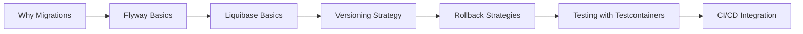

> **Previous:** [Spring Data JPA](./21-spring-data-jpa.md) | **Next:** [NoSQL](./23-nosql.md)

# Database Migrations (Flyway & Liquibase)

## Learning Objectives

By the end of this chapter, you will be able to:

1.  Automate database schema changes using Flyway versioned migrations
2.  Implement Liquibase changelogs in multiple formats (XML, YAML, JSON, SQL)
3.  Design versioning strategies for migration scripts across environments
4.  Test migrations using Testcontainers in automated pipelines
5.  Manage per-environment seed data and reference data scripts
6.  Choose between Flyway and Liquibase based on objective criteria
7.  Handle rollback strategies, validation, and repair scenarios

---

## Chapter at a Glance

| Topic | Key Insight | Practical Takeaway |
|-------|-------------|--------------------|
| Flyway | Versioned SQL-based migrations | V{number}__{desc}.sql naming convention |
| Liquibase | XML/YAML/JSON/SQL changelog format | Changesets with id/author/file attributes |
| Versioning | Semantic versioning of schema changes | Automatically track applied vs pending |
| Rollback | Undo migrations | Flyway: undo plugin (pro); Liquibase: rollback tag |
| Testing | Testcontainers for migration testing | Verify migrations in CI pipeline |

## Chapter Roadmap



> **Pro Tip:** Never modify an already-applied migration. Create a new migration file for any schema change. Flyway validates checksums and will fail if a migration has been altered.

## 1. Why Database Migrations?


Database migrations solve a fundamental problem: **schema drift**. Without migrations, every developer applies changes manually, leading to:

- Inconsistent environments (dev has a column that staging doesn't)
- No change history or audit trail
- Manual, error-prone deployment procedures
- No automated rollback capability

Migration tools bring database changes under version control, making them repeatable, auditable, and testable.

### 1.1 How Migrations Work

The migration tool reads a tracking table (e.g. `flyway_schema_history`), identifies unapplied migrations, and applies them in order. Each migration is a file with a unique version number, description, and the SQL/DDL to execute. The tracking table records which migrations have been applied, their checksums, and timestamps.

```
flyway_schema_history
+-------+-------------------+----------+------------+
| version | description      | state    | installed  |
+-------+-------------------+----------+------------+
| 1     | create users      | SUCCESS  | 2024-01-15 |
| 2     | add email         | SUCCESS  | 2024-01-15 |
| 3     | create orders     | SUCCESS  | 2024-01-16 |
| 4     | add foreign keys | PENDING  |            |
+-------+-------------------+----------+------------+
```

---

## 2. Flyway

### 2.1 Setup and Configuration

```xml
<dependency>
    <groupId>org.flywaydb</groupId>
    <artifactId>flyway-core</artifactId>
</dependency>

<dependency>
    <groupId>org.flywaydb</groupId>
    <artifactId>flyway-database-postgresql</artifactId>
</dependency>
```

```yaml
spring:
  flyway:
    enabled: true
    locations: classpath:db/migration
    baseline-on-migrate: true
    baseline-version: 0
    validate-on-migrate: true
    out-of-order: false
    encoding: UTF-8
    placeholder-replacement: true
    placeholders:
      schema_name: public
```

```properties
spring.flyway.enabled=true
spring.flyway.locations=classpath:db/migration
spring.flyway.baseline-on-migrate=true
spring.flyway.baseline-version=1
spring.flyway.validate-on-migrate=true
spring.flyway.out-of-order=false
```

### 2.2 Migration File Naming

```sql
-- Prefix: V (versioned), R (repeatable), U (undo -- Pro only)
-- Version: numeric with dots and underscores
-- Separator: __ (double underscore)
-- Description: words separated by underscores

-- db/migration/
--   V1__create_users.sql
--   V1_1__add_indexes.sql
--   V2__create_orders.sql
--   R__refresh_product_view.sql        -- Repeatable
--   U1__undo_create_users.sql          -- Flyway Pro/Teams only
```

### 2.3 Versioned Migrations

```sql
-- V1__create_users.sql
CREATE TABLE users (
    id BIGSERIAL PRIMARY KEY,
    username VARCHAR(100) NOT NULL,
    email VARCHAR(255) NOT NULL,
    password_hash VARCHAR(255) NOT NULL,
    full_name VARCHAR(255),
    is_active BOOLEAN DEFAULT TRUE,
    created_at TIMESTAMP DEFAULT CURRENT_TIMESTAMP,
    updated_at TIMESTAMP DEFAULT CURRENT_TIMESTAMP,
    CONSTRAINT uk_users_username UNIQUE (username),
    CONSTRAINT uk_users_email UNIQUE (email)
);

CREATE INDEX idx_users_email ON users(email);
CREATE INDEX idx_users_username ON users(username);
```

```sql
-- V2__create_orders.sql
CREATE TABLE orders (
    id BIGSERIAL PRIMARY KEY,
    user_id BIGINT NOT NULL,
    order_number VARCHAR(50) NOT NULL,
    status VARCHAR(20) NOT NULL DEFAULT 'PENDING',
    total_amount DECIMAL(12,2) NOT NULL DEFAULT 0.00,
    currency VARCHAR(3) NOT NULL DEFAULT 'USD',
    shipping_address TEXT,
    notes TEXT,
    created_at TIMESTAMP DEFAULT CURRENT_TIMESTAMP,
    updated_at TIMESTAMP DEFAULT CURRENT_TIMESTAMP,
    CONSTRAINT uk_orders_order_number UNIQUE (order_number)
);

CREATE INDEX idx_orders_user_id ON orders(user_id);
CREATE INDEX idx_orders_status ON orders(status);
```

```sql
-- V3__add_foreign_keys.sql
ALTER TABLE orders
    ADD CONSTRAINT fk_orders_user
    FOREIGN KEY (user_id) REFERENCES users(id) ON DELETE RESTRICT;
```

```sql
-- V4__add_product_catalog.sql
CREATE TABLE categories (
    id BIGSERIAL PRIMARY KEY,
    name VARCHAR(200) NOT NULL,
    slug VARCHAR(200) NOT NULL,
    description TEXT,
    parent_id BIGINT,
    sort_order INT DEFAULT 0,
    is_active BOOLEAN DEFAULT TRUE,
    created_at TIMESTAMP DEFAULT CURRENT_TIMESTAMP,
    CONSTRAINT uk_categories_slug UNIQUE (slug),
    CONSTRAINT fk_categories_parent
        FOREIGN KEY (parent_id) REFERENCES categories(id) ON DELETE SET NULL
);

CREATE TABLE products (
    id BIGSERIAL PRIMARY KEY,
    category_id BIGINT NOT NULL,
    sku VARCHAR(100) NOT NULL,
    name VARCHAR(500) NOT NULL,
    description TEXT,
    price DECIMAL(12,2) NOT NULL,
    stock_quantity INT DEFAULT 0,
    is_active BOOLEAN DEFAULT TRUE,
    created_at TIMESTAMP DEFAULT CURRENT_TIMESTAMP,
    updated_at TIMESTAMP DEFAULT CURRENT_TIMESTAMP,
    CONSTRAINT uk_products_sku UNIQUE (sku),
    CONSTRAINT fk_products_category
        FOREIGN KEY (category_id) REFERENCES categories(id) ON DELETE RESTRICT
);

CREATE TABLE order_items (
    id BIGSERIAL PRIMARY KEY,
    order_id BIGINT NOT NULL,
    product_id BIGINT NOT NULL,
    quantity INT NOT NULL,
    unit_price DECIMAL(12,2) NOT NULL,
    total_price DECIMAL(12,2) NOT NULL,
    CONSTRAINT fk_order_items_order
        FOREIGN KEY (order_id) REFERENCES orders(id) ON DELETE CASCADE,
    CONSTRAINT fk_order_items_product
        FOREIGN KEY (product_id) REFERENCES products(id) ON DELETE RESTRICT
);
```

### 2.4 Repeatable Migrations

```sql
-- R__active_products_view.sql
-- Re-applied every time the checksum changes
-- Great for views, stored procedures, functions

CREATE OR REPLACE VIEW active_products AS
SELECT p.id, p.sku, p.name, p.description, p.price,
       c.name AS category_name, c.slug AS category_slug
FROM products p
JOIN categories c ON c.id = p.category_id
WHERE p.is_active = TRUE AND c.is_active = TRUE;
```

```sql
-- R__product_search_function.sql
CREATE OR REPLACE FUNCTION search_products(search_term TEXT)
RETURNS TABLE(id BIGINT, name VARCHAR(500), price DECIMAL(12,2),
              category_name VARCHAR(200), relevance REAL) AS $$
BEGIN
    RETURN QUERY
    SELECT p.id, p.name, p.price, c.name,
           ts_rank(to_tsvector('english', p.name || ' ' || COALESCE(p.description, '')),
                   plainto_tsquery('english', search_term)) AS relevance
    FROM products p
    JOIN categories c ON c.id = p.category_id
    WHERE to_tsvector('english', p.name || ' ' || COALESCE(p.description, ''))
          @@ plainto_tsquery('english', search_term)
    ORDER BY relevance DESC;
END;
$$ LANGUAGE plpgsql;
```

### 2.5 Callbacks

```java
@Component
public class FlywayCallback implements Callback {

    private static final Logger log = LoggerFactory.getLogger(FlywayCallback.class);

    @Override
    public boolean supports(Event event, Context context) {
        return event == Event.AFTER_MIGRATE
            || event == Event.BEFORE_MIGRATE
            || event == Event.AFTER_EACH_MIGRATE
            || event == Event.BEFORE_EACH_MIGRATE;
    }

    @Override
    public boolean canHandleInTransaction(Event event, Context context) {
        return true;
    }

    @Override
    public void handle(Event event, Context context) {
        switch (event) {
            case BEFORE_MIGRATE -> {
                log.info("Starting database migration");
                Metrics.counter("flyway.migration.start").increment();
            }
            case AFTER_MIGRATE -> {
                log.info("Database migration completed");
                Metrics.counter("flyway.migration.success").increment();
            }
            case BEFORE_EACH_MIGRATE -> {
                log.info("Applying migration: {}",
                    context.getMigrationInfo().getDescription());
            }
            case AFTER_EACH_MIGRATE -> {
                log.info("Applied migration: {} ({}ms)",
                    context.getMigrationInfo().getDescription(),
                    context.getMigrationInfo().getExecutionTime());
            }
        }
    }
}
```

### 2.6 SQL Callbacks (File-Based)

```sql
-- db/migration/callbacks/beforeMigrate.sql
CREATE SCHEMA IF NOT EXISTS app;
SET search_path TO app, public;

-- db/migration/callbacks/afterMigrate.sql
INSERT INTO app.migration_log (event, occurred_at)
VALUES ('MIGRATION_COMPLETED', CURRENT_TIMESTAMP);
```

### 2.7 Flyway Configuration Options

```yaml
spring:
  flyway:
    locations:
      - classpath:db/migration
      - classpath:db/seed
    default-schema: app
    schemas:
      - app
      - public
    create-schemas: true
    baseline-on-migrate: true
    baseline-version: 3
    baseline-description: "Initial schema from legacy system"
    validate-on-migrate: true
    validate-migration-naming: true
    ignore-missing-migrations: false
    ignore-ignored-migrations: false
    ignore-pending-migrations: false
    out-of-order: false
    mixed: false
    batch: true
    placeholder-replacement: true
    placeholders:
      schema_name: app
      admin_role: admin_user
    fail-on-missing-locations: true
    clean-disabled: true
```

### 2.8 Java-Based Migrations

```java
public class V5__MigrateLegacyData implements JavaMigration {

    @Override
    public Integer getChecksum() {
        return 5;
    }

    @Override
    public boolean canExecuteInTransaction() {
        return true;
    }

    @Override
    public void migrate(Context context) throws Exception {
        var jdbcTemplate = new JdbcTemplate(
            DataSourceUtils.getDataSource(context.getConfiguration().getDataSource()));

        List<Map<String, Object>> legacyUsers = jdbcTemplate
            .queryForList("SELECT * FROM legacy_users WHERE migrated = FALSE");

        for (Map<String, Object> legacy : legacyUsers) {
            jdbcTemplate.update("""
                INSERT INTO users (username, email, password_hash, full_name, is_active, created_at)
                VALUES (?, ?, ?, ?, TRUE, NOW())
                """,
                legacy.get("login_name"),
                legacy.get("email_address"),
                legacy.get("password_hash"),
                legacy.get("display_name"));
        }

        jdbcTemplate.update("UPDATE legacy_users SET migrated = TRUE");
    }
}
```

### 2.9 Programmatic Flyway Usage

```java
@Configuration
public class FlywayConfig {

    @Bean
    public Flyway flyway(DataSource dataSource) {
        Flyway flyway = Flyway.configure()
            .dataSource(dataSource)
            .locations("classpath:db/migration")
            .baselineOnMigrate(true)
            .baselineVersion("1")
            .placeholders(Map.of("schema_name", "app"))
            .load();

        var result = flyway.migrate();
        log.info("Applied {} migrations", result.migrations.size());
        return flyway;
    }
}

@Service
public class MigrationService {

    private final Flyway flyway;

    public MigrationService(Flyway flyway) {
        this.flyway = flyway;
    }

    public MigrateResult migrate() { return flyway.migrate(); }
    public void validate() { flyway.validate(); }
    public void baseline() { flyway.baseline(); }
    public void repair() { flyway.repair(); }
    public MigrationInfoService info() { return flyway.info(); }
}
```

### 2.10 Flyway in Tests

```java
@SpringBootTest
@Testcontainers
class FlywayMigrationTest {

    @Container
    static PostgreSQLContainer<?> postgres = new PostgreSQLContainer<>("postgres:16")
        .withDatabaseName("testdb")
        .withUsername("test")
        .withPassword("test");

    @DynamicPropertySource
    static void configureProperties(DynamicPropertyRegistry registry) {
        registry.add("spring.datasource.url", postgres::getJdbcUrl);
        registry.add("spring.datasource.username", postgres::getUsername);
        registry.add("spring.datasource.password", postgres::getPassword);
        registry.add("spring.flyway.enabled", () -> true);
    }

    @Autowired
    private DataSource dataSource;

    @Test
    void allMigrationsApplySuccessfully() {
        Flyway flyway = Flyway.configure()
            .dataSource(dataSource)
            .locations("classpath:db/migration")
            .load();

        MigrateResult result = flyway.migrate();
        assertThat(result.migrations).isNotEmpty();
        assertThat(result.migrations)
            .allMatch(m -> m.getState() == State.SUCCESS);
    }

    @Test
    void databaseSchemaIsValidAfterMigration() {
        Flyway flyway = Flyway.configure()
            .dataSource(dataSource)
            .locations("classpath:db/migration")
            .load();

        flyway.migrate();
        flyway.validate();
    }

    @Test
    void expectedTablesExist() throws SQLException {
        Flyway flyway = Flyway.configure()
            .dataSource(dataSource)
            .locations("classpath:db/migration")
            .load();

        flyway.migrate();

        try (var conn = dataSource.getConnection();
             var rs = conn.getMetaData()
                 .getTables(null, "public", null, new String[]{"TABLE"})) {

            Set<String> tables = new HashSet<>();
            while (rs.next()) {
                tables.add(rs.getString("TABLE_NAME"));
            }

            assertThat(tables).contains("users", "orders", "order_items",
                "products", "categories");
        }
    }
}
```

---

## 3. Liquibase

### 3.1 Setup and Configuration

```xml
<dependency>
    <groupId>org.liquibase</groupId>
    <artifactId>liquibase-core</artifactId>
</dependency>

<plugin>
    <groupId>org.liquibase</groupId>
    <artifactId>liquibase-maven-plugin</artifactId>
    <version>${liquibase.version}</version>
    <configuration>
        <changeLogFile>db/changelog/db.changelog-master.xml</changeLogFile>
    </configuration>
</plugin>
```

```yaml
spring:
  liquibase:
    enabled: true
    change-log: classpath:db/changelog/db.changelog-master.xml
    default-schema: app
    liquibase-schema: app
    liquibase-table: databasechangelog
    contexts: prod
    drop-first: false
    test-rollback-on-update: false
```

### 3.2 Changelog Formats

#### XML (Most Common)

```xml
<?xml version="1.0" encoding="UTF-8"?>
<databaseChangeLog
    xmlns="http://www.liquibase.org/xml/ns/dbchangelog"
    xmlns:xsi="http://www.w3.org/2001/XMLSchema-instance"
    xsi:schemaLocation="http://www.liquibase.org/xml/ns/dbchangelog
        http://www.liquibase.org/xml/ns/dbchangelog/dbchangelog-4.27.xsd">

    <include file="db/changelog/001-create-users.xml"/>
    <include file="db/changelog/002-create-orders.xml"/>
    <include file="db/changelog/003-add-indexes.xml"/>
    <include file="db/changelog/004-seed-data.xml"/>
</databaseChangeLog>
```

#### YAML

```yaml
databaseChangeLog:
  - include:
      file: db/changelog/001-create-users.yaml
  - include:
      file: db/changelog/002-create-orders.yaml
```

#### JSON

```json
{
  "databaseChangeLog": [
    { "include": { "file": "db/changelog/001-create-users.json" } },
    { "include": { "file": "db/changelog/002-create-orders.json" } }
  ]
}
```

#### SQL

```sql
-- liquibase formatted sql

-- changeset jdoe:001-create-users
CREATE TABLE users (
    id BIGSERIAL PRIMARY KEY,
    username VARCHAR(100) NOT NULL,
    email VARCHAR(255) NOT NULL,
    password_hash VARCHAR(255) NOT NULL,
    full_name VARCHAR(255),
    is_active BOOLEAN DEFAULT TRUE,
    created_at TIMESTAMP DEFAULT CURRENT_TIMESTAMP,
    updated_at TIMESTAMP DEFAULT CURRENT_TIMESTAMP,
    CONSTRAINT uk_users_username UNIQUE (username),
    CONSTRAINT uk_users_email UNIQUE (email)
);
-- rollback DROP TABLE users;
```

### 3.3 Changeset Structure

```xml
<?xml version="1.0" encoding="UTF-8"?>
<databaseChangeLog
    xmlns="http://www.liquibase.org/xml/ns/dbchangelog"
    xmlns:xsi="http://www.w3.org/2001/XMLSchema-instance"
    xsi:schemaLocation="http://www.liquibase.org/xml/ns/dbchangelog
        http://www.liquibase.org/xml/ns/dbchangelog/dbchangelog-4.27.xsd">

    <changeSet id="001" author="jdoe">
        <createTable tableName="users">
            <column name="id" type="BIGSERIAL" autoIncrement="true">
                <constraints primaryKey="true" nullable="false"/>
            </column>
            <column name="username" type="VARCHAR(100)">
                <constraints nullable="false" unique="true"/>
            </column>
            <column name="email" type="VARCHAR(255)">
                <constraints nullable="false" unique="true"/>
            </column>
            <column name="password_hash" type="VARCHAR(255)">
                <constraints nullable="false"/>
            </column>
            <column name="full_name" type="VARCHAR(255)"/>
            <column name="is_active" type="BOOLEAN" defaultValueBoolean="true"/>
            <column name="created_at" type="TIMESTAMP"
                    defaultValueComputed="CURRENT_TIMESTAMP"/>
            <column name="updated_at" type="TIMESTAMP"
                    defaultValueComputed="CURRENT_TIMESTAMP"/>
        </createTable>

        <createIndex tableName="users" indexName="idx_users_email">
            <column name="email"/>
        </createIndex>

        <rollback>
            <dropTable tableName="users"/>
        </rollback>
    </changeSet>
</databaseChangeLog>
```

### 3.4 Common Liquibase Changes

```xml
<changeSet id="002" author="jdoe">
    <createTable tableName="orders">
        <column name="id" type="BIGSERIAL" autoIncrement="true">
            <constraints primaryKey="true" nullable="false"/>
        </column>
        <column name="user_id" type="BIGINT">
            <constraints nullable="false"/>
        </column>
        <column name="order_number" type="VARCHAR(50)">
            <constraints nullable="false" unique="true"/>
        </column>
        <column name="status" type="VARCHAR(20)" defaultValue="PENDING">
            <constraints nullable="false"/>
        </column>
        <column name="total_amount" type="DECIMAL(12,2)" defaultValueNumeric="0">
            <constraints nullable="false"/>
        </column>
    </createTable>
</changeSet>

<changeSet id="003" author="jdoe">
    <addColumn tableName="users">
        <column name="phone_number" type="VARCHAR(20)"/>
    </addColumn>

    <modifyDataType tableName="orders"
                    columnName="status"
                    newDataType="VARCHAR(30)"/>

    <addForeignKeyConstraint
        baseTableName="orders"
        baseColumnNames="user_id"
        referencedTableName="users"
        referencedColumnNames="id"
        constraintName="fk_orders_user"
        onDelete="RESTRICT"/>

    <addUniqueConstraint
        tableName="users"
        columnNames="email"
        constraintName="uk_users_email_v2"/>
</changeSet>

<changeSet id="004" author="jdoe">
    <insert tableName="categories">
        <column name="name" value="Electronics"/>
        <column name="slug" value="electronics"/>
    </insert>
    <insert tableName="categories">
        <column name="name" value="Books"/>
        <column name="slug" value="books"/>
    </insert>
    <insert tableName="categories">
        <column name="name" value="Clothing"/>
        <column name="slug" value="clothing"/>
    </insert>
</changeSet>
```

### 3.5 Rollback

```xml
<changeSet id="005" author="jdoe">
    <createTable tableName="reports">
        <column name="id" type="BIGSERIAL" autoIncrement="true">
            <constraints primaryKey="true"/>
        </column>
        <column name="name" type="VARCHAR(200)"/>
    </createTable>

    <rollback>
        <dropTable tableName="reports"/>
    </rollback>
</changeSet>

<!-- Auto-rollback supported for:
     createTable -> dropTable
     addColumn -> dropColumn
     createIndex -> dropIndex
     addForeignKeyConstraint -> dropForeignKeyConstraint
-->
```

### 3.6 Contexts and Labels

```xml
<changeSet id="006" author="jdoe" context="seed" labels="dev,staging">
    <comment>Seed data for development and staging environments only</comment>
    <insert tableName="users">
        <column name="username" value="admin"/>
        <column name="email" value="admin@example.com"/>
        <column name="password_hash" value="$2a$10$..."/>
        <column name="full_name" value="Admin User"/>
    </insert>
</changeSet>

<changeSet id="007" author="jdoe" context="test" labels="test">
    <insert tableName="users">
        <column name="username" value="testuser"/>
        <column name="email" value="test@example.com"/>
        <column name="password_hash" value="$2a$10$..."/>
    </insert>
</changeSet>
```

### 3.7 Preconditions

```xml
<changeSet id="008" author="jdoe">
    <preConditions onFail="MARK_RAN">
        <not>
            <tableExists tableName="legacy_users"/>
        </not>
    </preConditions>

    <createTable tableName="users">
        <column name="id" type="BIGSERIAL" autoIncrement="true">
            <constraints primaryKey="true"/>
        </column>
    </createTable>
</changeSet>

<changeSet id="009" author="jdoe">
    <preConditions onFail="HALT">
        <and>
            <dbms type="postgresql"/>
            <schemaExists schemaName="app"/>
            <runningAs username="app_admin"/>
            <changeSetExecuted id="001" author="jdoe"
                changeLogFile="db/changelog/001-create-users.xml"/>
        </and>
    </preConditions>

    <sql>ALTER TABLE users ADD COLUMN last_login TIMESTAMP;</sql>
</changeSet>
```

### 3.8 Liquibase Maven Plugin

```bash
# Generate diff between database and reference
mvn liquibase:diff \
    -Dliquibase.referenceUrl=jdbc:postgresql://localhost:5432/dev_db \
    -Dliquibase.referenceUsername=dev_user \
    -Dliquibase.referencePassword=dev_pass

# Generate changelog from existing database
mvn liquibase:generateChangeLog \
    -Dliquibase.outputChangeLogFile=db/changelog/generated.xml

# Rollback last N changesets
mvn liquibase:rollback -Dliquibase.rollbackCount=1

# Rollback to a specific tag
mvn liquibase:rollback -Dliquibase.rollbackTag=v1.0.0

# Tag the current database state
mvn liquibase:tag -Dliquibase.tag=v2.0.0

# Check pending changesets
mvn liquibase:status
```

### 3.9 Programmatic Liquibase API

```java
@Configuration
public class LiquibaseConfig {

    @Bean
    public Liquibase liquibase(DataSource dataSource) {
        Database database = DatabaseFactory.getInstance()
            .findCorrectDatabaseImplementation(
                new JdbcConnection(dataSource.getConnection()));

        Liquibase liquibase = new Liquibase(
            "db/changelog/db.changelog-master.xml",
            new ClassLoaderResourceAccessor(),
            database);

        try {
            liquibase.update(new Contexts("prod"));
        } catch (LiquibaseException e) {
            throw new RuntimeException("Migration failed", e);
        }

        return liquibase;
    }
}

@Service
public class LiquibaseService {

    public void runMigration(String changelogPath, String contexts, String labels) {
        try (Connection conn = dataSource.getConnection()) {
            Database database = DatabaseFactory.getInstance()
                .findCorrectDatabaseImplementation(new JdbcConnection(conn));

            Liquibase liquibase = new Liquibase(
                changelogPath,
                new ClassLoaderResourceAccessor(),
                database);

            liquibase.update(new Contexts(contexts), new LabelExpression(labels));
            liquibase.reportStatus(true, new Contexts(contexts),
                new PrintWriter(System.out));
        } catch (Exception e) {
            throw new RuntimeException(e);
        }
    }
}
```

### 3.10 Liquibase in Tests

```java
@SpringBootTest
@Testcontainers
class LiquibaseMigrationTest {

    @Container
    static PostgreSQLContainer<?> postgres = new PostgreSQLContainer<>("postgres:16");

    @DynamicPropertySource
    static void configureProperties(DynamicPropertyRegistry registry) {
        registry.add("spring.datasource.url", postgres::getJdbcUrl);
        registry.add("spring.datasource.username", postgres::getUsername);
        registry.add("spring.datasource.password", postgres::getPassword);
        registry.add("spring.liquibase.change-log",
            () -> "classpath:db/changelog/db.changelog-test.xml");
    }

    @Autowired
    private DataSource dataSource;

    @Test
    void allChangesetsApplySuccessfully() throws Exception {
        Database database = DatabaseFactory.getInstance()
            .findCorrectDatabaseImplementation(
                new JdbcConnection(dataSource.getConnection()));

        Liquibase liquibase = new Liquibase(
            "db/changelog/db.changelog-master.xml",
            new ClassLoaderResourceAccessor(),
            database);

        liquibase.update("prod");

        List<ChangeSetStatus> statuses = liquibase
            .getChangeSetStatuses(null, null, null);
        assertThat(statuses.stream()
            .filter(s -> !s.getWillRun())
            .filter(s -> s.getStatus().toString().equals("EXECUTED")))
            .hasSize(statuses.size());
    }

    @Test
    void rollbackLastChangeSet() throws Exception {
        Database database = DatabaseFactory.getInstance()
            .findCorrectDatabaseImplementation(
                new JdbcConnection(dataSource.getConnection()));

        Liquibase liquibase = new Liquibase(
            "db/changelog/db.changelog-master.xml",
            new ClassLoaderResourceAccessor(),
            database);

        liquibase.update("prod");
        liquibase.rollback(1, "prod");
    }

    @Test
    void migrationIdempotency() throws Exception {
        Database database = DatabaseFactory.getInstance()
            .findCorrectDatabaseImplementation(
                new JdbcConnection(dataSource.getConnection()));

        Liquibase liquibase = new Liquibase(
            "db/changelog/db.changelog-master.xml",
            new ClassLoaderResourceAccessor(),
            database);

        liquibase.update("prod");
        liquibase.update("prod");

        List<ChangeSetStatus> statuses = liquibase
            .getChangeSetStatuses(null, null, null);
        assertThat(statuses).allMatch(s -> !s.getWillRun());
    }
}
```

---

## 4. Versioning Strategies

### 4.1 Semantic Versioning

```sql
-- V{major}_{minor}_{patch}__{description}.sql
-- V1_0_0__initial_schema.sql
-- V1_1_0__add_shipping.sql
-- V1_1_1__fix_shipping_null.sql
-- V2_0_0__redesign_inventory.sql

-- Pros: Clear relationship to application versions
-- Cons: Large jumps between versions, merge conflicts in branches
```

### 4.2 Timestamp-Based Versioning

```sql
-- V{YYYYMMDDHHMMSS}__{description}.sql
-- V20240115120000__create_users.sql
-- V20240116140000__add_orders.sql
-- V20240117103000__add_order_items.sql

-- Pros: No collisions in parallel branches, natural ordering
-- Cons: Hard to relate to application versions
```

### 4.3 Run-Always (Repeatable)

```sql
-- R__{description}.sql
-- R__product_search_view.sql
-- R__audit_triggers.sql
-- R__daily_sales_materialized_view.sql

-- Re-applied every time Flyway runs if the checksum changed
-- Ideal for views, functions, triggers, stored procedures
```

### 4.4 Versioned vs Repeatable

| Aspect         | Versioned                          | Repeatable                            |
|----------------|------------------------------------|---------------------------------------|
| Applied        | Once                               | Every time (if changed)               |
| Version        | Numeric                            | No version                            |
| Use case       | Schema changes                     | Views, functions, procedures          |
| Checksum       | Validated                          | Reapplied if different                |
| Rollback       | Supported (with undo)              | Not applicable                        |
| Order          | Sorted by version                  | Applied after all versioned           |

### 4.5 Migration Naming Conventions

```sql
-- 1. Use prefixes: V = Versioned, R = Repeatable, U = Undo
-- 2. Use leading zeros: V01__init.sql instead of V1__init.sql
-- 3. Descriptive descriptions: V02__create_orders_table.sql
-- 4. Group related changes by version
-- 5. Never renumber existing migrations once merged to main
```

---

## 5. Migration Testing

### 5.1 Testcontainers Migration Test

```java
@SpringBootTest
@Testcontainers
class DatabaseMigrationIntegrationTest {

    @Container
    static PostgreSQLContainer<?> postgres = new PostgreSQLContainer<>("postgres:16")
        .withDatabaseName("migration_test")
        .withUsername("test")
        .withPassword("test");

    private static Flyway flyway;

    @BeforeAll
    static void setupFlyway() {
        flyway = Flyway.configure()
            .dataSource(postgres.getJdbcUrl(), postgres.getUsername(),
                postgres.getPassword())
            .locations("classpath:db/migration")
            .load();
    }

    @Test
    void fullMigrationSucceeds() {
        MigrateResult result = flyway.migrate();
        assertThat(result.success).isTrue();
        assertThat(result.migrations).isNotEmpty();
    }

    @Test
    void validatePassesAfterMigration() {
        flyway.migrate();
        assertThatCode(() -> flyway.validate()).doesNotThrowAnyException();
    }

    @Test
    void tablesHaveExpectedColumns() throws SQLException {
        flyway.migrate();

        try (var conn = postgres.createConnection("");
             var stmt = conn.createStatement();
             var rs = stmt.executeQuery("""
                 SELECT column_name, data_type, is_nullable
                 FROM information_schema.columns
                 WHERE table_name = 'users'
                 ORDER BY ordinal_position
                 """)) {

            List<String> columns = new ArrayList<>();
            while (rs.next()) {
                columns.add(rs.getString("column_name"));
            }

            assertThat(columns).containsExactly(
                "id", "username", "email", "password_hash",
                "full_name", "is_active", "created_at", "updated_at");
        }
    }

    @Test
    void foreignKeyConstraintsExist() throws SQLException {
        flyway.migrate();

        try (var conn = postgres.createConnection("");
             var stmt = conn.createStatement();
             var rs = stmt.executeQuery("""
                 SELECT tc.constraint_name, kcu.column_name,
                        ccu.table_name AS foreign_table_name,
                        ccu.column_name AS foreign_column_name
                 FROM information_schema.table_constraints tc
                 JOIN information_schema.key_column_usage kcu
                     ON tc.constraint_name = kcu.constraint_name
                 JOIN information_schema.constraint_column_usage ccu
                     ON ccu.constraint_name = tc.constraint_name
                 WHERE tc.constraint_type = 'FOREIGN KEY'
                     AND tc.table_name = 'orders'
                 """)) {

            List<String> fks = new ArrayList<>();
            while (rs.next()) {
                fks.add(rs.getString("constraint_name"));
            }
            assertThat(fks).contains("fk_orders_user");
        }
    }
}
```

### 5.2 @DataJpaTest with Migrations

```java
@DataJpaTest
@AutoConfigureTestDatabase(replace = AutoConfigureTestDatabase.Replace.NONE)
@Testcontainers
class OrderRepositoryMigrationTest {

    @Container
    static PostgreSQLContainer<?> postgres = new PostgreSQLContainer<>("postgres:16");

    @DynamicPropertySource
    static void configureProperties(DynamicPropertyRegistry registry) {
        registry.add("spring.datasource.url", postgres::getJdbcUrl);
        registry.add("spring.datasource.username", postgres::getUsername);
        registry.add("spring.datasource.password", postgres::getPassword);
        registry.add("spring.jpa.hibernate.ddl-auto", () -> "validate");
    }

    @Autowired
    private TestEntityManager em;

    @Autowired
    private OrderRepository orderRepository;

    @Test
    void canPersistAndReadOrder() {
        User user = new User();
        user.setUsername("testuser");
        user.setEmail("test@example.com");
        user.setPasswordHash("hash");
        em.persistAndFlush(user);

        Order order = new Order();
        order.setUser(user);
        order.setOrderNumber("ORD-001");
        order.setTotalAmount(new BigDecimal("99.99"));
        em.persistAndFlush(order);

        Optional<Order> found = orderRepository.findById(order.getId());
        assertThat(found).isPresent();
        assertThat(found.get().getOrderNumber()).isEqualTo("ORD-001");
    }

    @Test
    void schemaMatchesEntities() {
        assertThat(true).isTrue();
    }
}
```

### 5.3 Rollback Testing

```java
@SpringBootTest
@Testcontainers
class RollbackTest {

    @Container
    static PostgreSQLContainer<?> postgres = new PostgreSQLContainer<>("postgres:16");

    @Test
    void rollbackRestoresPreviousSchema() throws Exception {
        Flyway flyway = Flyway.configure()
            .dataSource(postgres.getJdbcUrl(), postgres.getUsername(),
                postgres.getPassword())
            .locations("classpath:db/migration")
            .load();

        flyway.migrate();

        try (var conn = postgres.createConnection("");
             var stmt = conn.createStatement();
             var rs = stmt.executeQuery(
                 "SELECT EXISTS (SELECT FROM information_schema.tables WHERE table_name = 'orders')")) {
            rs.next();
            assertThat(rs.getBoolean(1)).isTrue();
        }
    }
}
```

---

## 6. Environment Management

### 6.1 Per-Environment Scripts

```java
@Configuration
public class FlywayEnvironmentConfig {

    @Bean
    @Profile("dev")
    public Flyway flywayDev(DataSource dataSource) {
        return Flyway.configure()
            .dataSource(dataSource)
            .locations("classpath:db/migration",
                       "classpath:db/seed",
                       "classpath:db/seed/dev")
            .load();
    }

    @Bean
    @Profile("staging")
    public Flyway flywayStaging(DataSource dataSource) {
        return Flyway.configure()
            .dataSource(dataSource)
            .locations("classpath:db/migration",
                       "classpath:db/seed",
                       "classpath:db/seed/staging")
            .load();
    }

    @Bean
    @Profile("prod")
    public Flyway flywayProd(DataSource dataSource) {
        return Flyway.configure()
            .dataSource(dataSource)
            .locations("classpath:db/migration",
                       "classpath:db/seed")
            .load();
    }
}
```

### 6.2 Reference Data Seeds

```sql
-- R__seed_countries.sql
-- Reference data stable across all environments
MERGE INTO countries AS target
USING (VALUES
    ('US', 'United States'),
    ('CA', 'Canada'),
    ('GB', 'United Kingdom'),
    ('DE', 'Germany'),
    ('FR', 'France'),
    ('JP', 'Japan'),
    ('AU', 'Australia'),
    ('BR', 'Brazil'),
    ('IN', 'India'),
    ('CN', 'China')
) AS source(code, name)
ON target.code = source.code
WHEN MATCHED THEN UPDATE SET name = source.name
WHEN NOT MATCHED THEN INSERT (code, name) VALUES (source.code, source.name);
```

### 6.3 Data Seeds Per Profile

```sql
-- db/seed/dev/R__seed_dev_data.sql
INSERT INTO users (username, email, password_hash, full_name, is_active)
SELECT 'devadmin', 'devadmin@example.com', '$2a$10$...', 'Dev Admin', TRUE
WHERE NOT EXISTS (SELECT 1 FROM users WHERE username = 'devadmin');

INSERT INTO users (username, email, password_hash, full_name, is_active)
SELECT 'testuser1', 'test1@example.com', '$2a$10$...', 'Test User 1', TRUE
WHERE NOT EXISTS (SELECT 1 FROM users WHERE username = 'testuser1');
```

### 6.4 afterMigrate Scripts

```sql
-- R__after_migrate_audit.sql
-- Runs after every migration to log the action

CREATE TABLE IF NOT EXISTS migration_audit (
    id BIGSERIAL PRIMARY KEY,
    event_type VARCHAR(50) NOT NULL,
    description TEXT,
    executed_at TIMESTAMP DEFAULT CURRENT_TIMESTAMP
);

INSERT INTO migration_audit (event_type, description)
VALUES ('MIGRATE', 'Migration cycle completed');
```

---

## 7. Flyway vs Liquibase Comparison

### 7.1 Feature Comparison Table

| Feature                        | Flyway                                 | Liquibase                                  |
|--------------------------------|----------------------------------------|--------------------------------------------|
| **Format**                     | SQL files                              | XML, YAML, JSON, SQL                       |
| **Learning curve**             | Low (pure SQL)                         | Medium (XML format, many tags)             |
| **Rollback**                   | Pro/Teams only                         | Built-in (including auto-rollback)         |
| **Changelog auto-generation**  | Not supported                          | Diff, generateChangeLog                    |
| **Preconditions**              | Limited (callbacks, validate)          | Rich precondition system                   |
| **Contexts/Labels**            | Locations per profile                  | Contexts and labels                        |
| **Java migrations**            | Supported (JavaMigration)              | Supported (CustomChange, CustomTaskChange) |
| **Repeatable migrations**      | R-prefix scripts                       | runAlways, runOnChange                     |
| **Undo**                       | Pro/Teams only                         | Custom rollback per changeset              |
| **Database support**           | 30+ databases                          | 50+ databases                              |
| **Spring Boot integration**    | Auto-configured                        | Auto-configured                            |
| **CI/CD integration**          | CLI, Maven, Gradle                     | CLI, Maven, Gradle                         |
| **Version checking**           | Checksum-based                         | Checksum + md5sum                          |
| **Multi-schema**               | Built-in                               | Built-in                                   |
| **Output/Reporting**           | info command                           | reportStatus, updateTestingRollback        |
| **Community**                  | Very active                            | Very active                                |
| **License**                    | Open Source (SQL) / Pro (Undo, more)   | Open Source / Pro                          |

### 7.2 When to Choose Which

**Choose Flyway when:**
- Your team is comfortable writing SQL
- You want simplicity: files on disk, no XML configuration
- You do not need rollback (or have Teams/Pro license)
- Your migrations are primarily DDL with occasional DML
- You prefer convention over configuration

**Choose Liquibase when:**
- You need database-agnostic changelogs (same XML works for PostgreSQL and Oracle)
- Rollback is a hard requirement
- You need preconditions (only run if...)
- You want auto-generated changelogs from existing databases
- You need context/label filtering for complex environment management
- You have a heterogeneous database environment

### 7.3 Migration Tool Decision Matrix

```java
// Decision framework
public class MigrationToolDecision {

    public enum Recommendation { FLYWAY, LIQUIBASE, EITHER }

    public static Recommendation recommend(Requirements req) {
        int flywayScore = 0;
        int liquibaseScore = 0;

        if (req.rollbackRequired())      liquibaseScore += 3;
        if (req.sqlOnly())               flywayScore += 2;
        if (req.multipleDbTypes())       liquibaseScore += 3;
        if (req.autoGenerate())          liquibaseScore += 2;
        if (req.preconditions())         liquibaseScore += 2;
        if (req.simplicityPreferred())   flywayScore += 2;
        if (req.teamSqlComfortable())    flywayScore += 2;
        if (req.contextFiltering())      liquibaseScore += 2;
        if (req.javaMigrations())        { flywayScore += 1; liquibaseScore += 1; }

        if (flywayScore > liquibaseScore + 1) return FLYWAY;
        if (liquibaseScore > flywayScore + 1) return LIQUIBASE;
        return EITHER;
    }

    public record Requirements(
        boolean rollbackRequired,
        boolean sqlOnly,
        boolean multipleDbTypes,
        boolean autoGenerate,
        boolean preconditions,
        boolean simplicityPreferred,
        boolean teamSqlComfortable,
        boolean contextFiltering,
        boolean javaMigrations
    ) { }
}
```

### 7.4 Migration File Organization

```
src/main/resources/db/
|
+-- migration/                    # Flyway migrations (or Liquibase changelogs)
|   +-- V1__initial_schema.sql
|   +-- V2__add_users.sql
|   +-- V3__add_orders.sql
|   +-- R__views.sql
|
+-- seed/                         # Reference data
|   +-- R__countries.sql
|   +-- R__roles.sql
|   +-- dev/
|   |   +-- R__dev_users.sql
|   +-- staging/
|       +-- R__staging_data.sql
|
+-- changelog/                    # Liquibase (alternative)
|   +-- db.changelog-master.xml
|   +-- 001-create-users.xml
|   +-- 002-create-orders.xml
|
+-- callbacks/                    # Flyway SQL callbacks
    +-- beforeMigrate.sql
    +-- afterMigrate.sql
```

### 7.5 Migration Best Practices

```java
// 1. Always version control migrations alongside application code
// 2. Never modify an applied migration (it will fail checksum validation)
// 3. Use repeatable migrations for views, functions, and procedures
// 4. Test migrations against a copy of production data before deployment
// 5. Keep migrations idempotent where possible (IF NOT EXISTS, MERGE)
// 6. Use transactions for reversible changes
// 7. Include rollback scripts for every forward migration
// 8. Use descriptive names that explain what the migration does
// 9. Separate schema changes from data changes in different files
// 10. Run migrations as part of CI/CD pipeline, not manually

// Anti-patterns to avoid:
// - Renaming migration files after they've been applied
// - Skipping validation in production
// - Using hibernate.ddl-auto=update alongside Flyway (dueling schema management)
// - Large monolithic migration files (prefer small, focused ones)
// - Assuming all environments are at the same migration version
```

## Concept Comparison Table

| Concept | Definition | Key Distinction | Use Case |
|---------|-----------|-----------------|----------|
| Flyway | Versioned SQL-based migrations | Naming: V{num}__{desc}.sql | SQL-centric teams |
| Liquibase | XML/YAML/JSON changelog format | Changeset-based, database-agnostic | Multi-DB support |
| Rollback | Undo applied migrations | Flyway: undo (pro); Liquibase: rollback | Disaster recovery |
| Testcontainers | Docker-based integration testing | Auto-start database container | CI pipeline migration testing |
| Checksum | Migration file integrity validation | Flyway validates on each run | Prevents migration tampering |

## Quick Reference

| Flyway Command | Description |
|----------------|-------------|
| migrate | Apply pending migrations |
| clean | Drop all objects |
| info | Show migration status |
| validate | Verify applied migrations |
| repair | Fix checksum issues |

## Cross-Application Matrix

| Strategy | Development | Staging | Production |
|----------|-------------|---------|------------|
| Flyway Clean | Before each run | Never | Never |
| Seed Data | Sample data | Realistic data | Minimal reference |
| Rollback Plan | V{num}__{desc} + manual | V{num}__{desc} + script | Automated rollback |
| Testing | Manual verify | Testcontainers CI | Pre-deploy staging test |

## Chapter Quiz

1. What happens if you modify an already-applied Flyway migration?
   - A) Flyway re-applies it
   - B) Flyway detects checksum mismatch and fails
   - C) The change is ignored
   - D) Flyway skips it silently

<details>
<summary>Answer</summary>
**B) Flyway detects checksum mismatch and fails.** Flyway stores a checksum of each migration and validates it on every application startup.
</details>

2. Which Liquibase changelog format is database-agnostic?
   - A) SQL
   - B) XML
   - C) JSON
   - D) Both XML and YAML (non-SQL formats)

<details>
<summary>Answer</summary>
**D) Both XML and YAML (non-SQL formats).** XML, YAML, and JSON changelogs are database-agnostic and Liquibase translates them to the target database dialect.
</details>

3. How should you fix a failed migration in production?
   - A) Edit the migration file and re-run
   - B) Create a new migration that repairs the state
   - C) Delete the failed migration from the database
   - D) Restart the application

<details>
<summary>Answer</summary>
**B) Create a new migration that repairs the state.** Never modify an existing migration → create a compensating migration that fixes the issue.
</details>

---

## Summary
ummary

- **Flyway** uses SQL files with a simple naming convention (`V{version}__{description}.sql`). It's convention-over-configuration and ideal for teams comfortable with SQL.
- **Liquibase** uses changelogs in XML, YAML, JSON, or SQL format with rich changeset metadata. It provides preconditions, contexts, labels, and built-in rollback support.
- **Versioning strategies** include semantic versioning (ties to app releases) and timestamp-based versioning (avoids merge conflicts). Repeatable migrations handle views and functions.
- **Migration testing** with Testcontainers validates that migrations apply successfully, schemas are correct, and rollbacks work before deployment.
- **Environment management** uses per-profile Flyway locations or Liquibase contexts/labels to control which seed data runs in each environment.
- **Choosing between Flyway and Liquibase** depends on rollback requirements, SQL preference, database heterogeneity, and need for preconditions.

---

## Exercises

1. **Flyway Setup:** Create a Spring Boot project with Flyway configured. Write three migration files: `V1__create_users.sql`, `V2__create_posts.sql`, `V3__add_user_id_fk.sql`. Include proper foreign keys, indexes, and constraints. Run the application and verify the `flyway_schema_history` table.

2. **Liquibase XML:** Convert the Flyway migrations from exercise 1 into Liquibase XML format. Include `createTable`, `addForeignKeyConstraint`, `createIndex` changesets with rollback instructions.

3. **Repeatable Migrations:** Create a repeatable migration that maintains a view showing active users with their post count. Test that modifying the view and re-running applies the change, while versioned migrations are skipped.

4. **Rollback Strategy:** Given a migration that adds a `shipping_address` column and populates it from a legacy field, write both Flyway-style undo SQL and Liquibase rollback changeset. Test the rollback with Testcontainers.

5. **Environment Separation:** Configure Flyway (or Liquibase) to run reference data seeds (`countries`, `roles`) in all environments, but admin users only in dev and staging. Use Spring profiles.

6. **Migration Testing:** Write a `@SpringBootTest` + `Testcontainers` test that:
   - Applies all migrations to a fresh PostgreSQL container
   - Verifies all expected tables exist
   - Verifies all foreign key constraints are present
   - Inserts test data and reads it back
   - Validates the schema against JPA entities (with `ddl-auto=validate`)

7. **Java Migration:** Create a `JavaMigration` (Flyway) that reads data from a CSV file and inserts it into the database via batch processing. Handle errors and transactions properly.

8. **Liquibase Preconditions:** Write a Liquibase changeset that:
   - Only runs on PostgreSQL
   - Only runs if a specific schema exists
   - Only runs if the `admin` table is empty
   - Marks the changeset as executed (not failed) if preconditions fail

9. **Migration Audit:** Implement a Flyway callback that logs every migration event (start, complete, per-migration) to a custom audit table. Track execution time, script name, and success/failure status.

10. **Comparison Report:** Given a team that:
    - Has 5 PostgreSQL databases (dev, staging, prod, dr, reporting)
    - Needs rollback support
    - Has Java developers comfortable with SQL
    - Wants database-agnostic migration files for future cloud migration
    - Needs precondition checking for production safety
    Write a detailed recommendation for Flyway vs Liquibase with justification.
