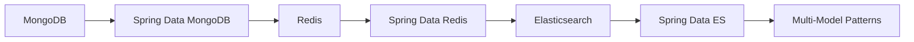

> **Previous:** [Migrations](./22-migrations.md) | **Next:** [Transactions](./24-transactions.md)

# Spring Data for NoSQL

Relational databases have dominated enterprise storage for decades, but the rise of web-scale applications, unstructured data, and polyglot persistence has made NoSQL databases indispensable. Spring Data provides a unified programming model across SQL and NoSQL stores, reducing the boilerplate of connecting to MongoDB, Redis, Elasticsearch, and others while keeping the abstractions familiar — repositories, templates, and consistent exception hierarchies.

This chapter covers three major NoSQL engines — MongoDB (document store), Redis (key-value / in-memory data structure store), and Elasticsearch (search engine) — through the lens of Spring Data. Every example is complete and compilable against the respective database.

---

## Learning Objectives

By the end of this chapter you should be able to:

<!-- Image Gallery -->
<section class="lesson-visuals" aria-label="Visual learning resources">
  <header><span>VISUAL LEARNING</span><h2>See it. Review it. Remember it.</h2></header>
  <a class="lesson-visual-card" href="../../../assets/images/lessons/java/23-nosql/handwritten-notes.svg" target="_blank" rel="noopener">
    
    <span><strong>Handwritten notes</strong>Condensed notes for deliberate review.</span>
  </a>
  <a class="lesson-visual-card" href="../../../assets/images/lessons/java/23-nosql/sticky-notes.svg" target="_blank" rel="noopener">
    
    <span><strong>Sticky-note revision</strong>Fast recall prompts for revision.</span>
  </a>
  <a class="lesson-visual-card" href="../../../assets/images/lessons/java/23-nosql/visual-explanation.svg" target="_blank" rel="noopener">
    
    <span><strong>Visual concept guide</strong>A connected explanation of the key ideas.</span>
  </a>
</section>
<!-- End Image Gallery -->


- Model documents with `@Document` and query them via `MongoRepository` and `@Query`
- Write aggregation pipelines, geo-spatial queries, and use `MongoTemplate` for imperative data access
- Store and retrieve files with GridFS and manage indexes and transactions in MongoDB
- Use `RedisTemplate`, `@RedisHash`, and Spring Data CRUD repositories with Redis
- Implement publish/subscribe messaging with Redis, configure `RedisCacheManager`, and handle expiry policies
- Consume Redis Streams with `StreamMessageListenerContainer`
- Model Elasticsearch documents with `@Field` and query them using `ElasticsearchRepository` and the Elasticsearch Query DSL
- Perform full-text search, aggregations, and index management with `ElasticsearchTemplate`
- Combine MongoDB, Redis, and Elasticsearch in multi-model patterns for caching and search

---

## Chapter at a Glance

| Topic | Key Insight | Practical Takeaway |
|-------|-------------|--------------------|
| MongoDB | Document store with Spring Data | @Document, MongoRepository, MongoTemplate |
| Redis | In-memory data structure store | @RedisHash, RedisTemplate, pub/sub |
| Elasticsearch | Full-text search engine | @Document, ElasticsearchRepository, query DSL |
| Multi-Model | Combining stores for real-world apps | MongoDB for storage, Redis for cache, ES for search |
| Transactions | ACID across documents | MongoDB 4.0+ supports multi-document transactions |

## Chapter Roadmap



> **Pro Tip:** Use Redis for caching and session storage, MongoDB for persistent documents, and Elasticsearch for full-text search. Each database excels in its own domain → choose the right tool for each job.

## MongoDB with Spring Data


MongoDB is a document-oriented NoSQL database that stores data in BSON (Binary JSON) documents. Spring Data MongoDB maps Java objects to MongoDB documents with annotations and provides both repository-level abstractions and a lower-level `MongoTemplate`.

### Setup


```xml
<!-- pom.xml -->
<dependency>
    <groupId>org.springframework.boot</groupId>
    <artifactId>spring-boot-starter-data-mongodb</artifactId>
</dependency>
```

```yaml
# application.yml
spring:
  data:
    mongodb:
      uri: mongodb://localhost:27017/course
      auto-index-creation: true
```

### Document Modeling


`@Document` maps a Java class to a MongoDB collection. `@Id` marks the identifier field, which MongoDB stores as `_id`.

```java
package com.course.nosql.mongo;

import org.springframework.data.annotation.Id;
import org.springframework.data.mongodb.core.index.CompoundIndex;
import org.springframework.data.mongodb.core.index.Indexed;
import org.springframework.data.mongodb.core.index.GeoSpatialIndexed;
import org.springframework.data.mongodb.core.mapping.Document;
import org.springframework.data.mongodb.core.mapping.Field;

import java.math.BigDecimal;
import java.time.LocalDateTime;
import java.util.List;

@Document(collection = "products")
@CompoundIndex(def = "{'category': 1, 'price': -1}", name = "cat_price_idx")
public class Product {

    @Id
    private String id;

    @Field("product_name")
    @Indexed(unique = true)
    private String name;

    @Indexed
    private String category;

    private BigDecimal price;
    private String description;
    private List<String> tags;
    private Integer stock;
    private LocalDateTime createdAt;
    private LocalDateTime updatedAt;

    @GeoSpatialIndexed
    private GeoLocation location;

    private Supplier supplier;
    private List<Review> reviews;

    public Product() {}

    public Product(String name, String category, BigDecimal price, GeoLocation location) {
        this.name = name;
        this.category = category;
        this.price = price;
        this.location = location;
        this.createdAt = LocalDateTime.now();
        this.updatedAt = LocalDateTime.now();
    }

    public String getId() { return id; }
    public void setId(String id) { this.id = id; }

    public String getName() { return name; }
    public void setName(String name) { this.name = name; }

    public String getCategory() { return category; }
    public void setCategory(String category) { this.category = category; }

    public BigDecimal getPrice() { return price; }
    public void setPrice(BigDecimal price) { this.price = price; }

    public String getDescription() { return description; }
    public void setDescription(String description) { this.description = description; }

    public List<String> getTags() { return tags; }
    public void setTags(List<String> tags) { this.tags = tags; }

    public Integer getStock() { return stock; }
    public void setStock(Integer stock) { this.stock = stock; }

    public LocalDateTime getCreatedAt() { return createdAt; }
    public void setCreatedAt(LocalDateTime createdAt) { this.createdAt = createdAt; }

    public LocalDateTime getUpdatedAt() { return updatedAt; }
    public void setUpdatedAt(LocalDateTime updatedAt) { this.updatedAt = updatedAt; }

    public GeoLocation getLocation() { return location; }
    public void setLocation(GeoLocation location) { this.location = location; }

    public Supplier getSupplier() { return supplier; }
    public void setSupplier(Supplier supplier) { this.supplier = supplier; }

    public List<Review> getReviews() { return reviews; }
    public void setReviews(List<Review> reviews) { this.reviews = reviews; }
}
```

Embedded documents do not need `@Document` — they are serialized inline:

```java
package com.course.nosql.mongo;

import java.util.List;

public class Supplier {

    private String name;
    private String contactEmail;
    private String phone;
    private Address address;

    public Supplier() {}

    public Supplier(String name, String contactEmail) {
        this.name = name;
        this.contactEmail = contactEmail;
    }

    public String getName() { return name; }
    public void setName(String name) { this.name = name; }

    public String getContactEmail() { return contactEmail; }
    public void setContactEmail(String contactEmail) { this.contactEmail = contactEmail; }

    public String getPhone() { return phone; }
    public void setPhone(String phone) { this.phone = phone; }

    public Address getAddress() { return address; }
    public void setAddress(Address address) { this.address = address; }
}

class Address {
    private String street;
    private String city;
    private String zipCode;

    public Address() {}

    public Address(String street, String city, String zipCode) {
        this.street = street;
        this.city = city;
        this.zipCode = zipCode;
    }

    public String getStreet() { return street; }
    public void setStreet(String street) { this.street = street; }

    public String getCity() { return city; }
    public void setCity(String city) { this.city = city; }

    public String getZipCode() { return zipCode; }
    public void setZipCode(String zipCode) { this.zipCode = zipCode; }
}
```

```java
package com.course.nosql.mongo;

import java.time.LocalDateTime;

public class Review {

    private String userId;
    private Integer rating;
    private String comment;
    private LocalDateTime createdAt;

    public Review() {}

    public Review(String userId, Integer rating, String comment) {
        this.userId = userId;
        this.rating = rating;
        this.comment = comment;
        this.createdAt = LocalDateTime.now();
    }

    public String getUserId() { return userId; }
    public void setUserId(String userId) { this.userId = userId; }

    public Integer getRating() { return rating; }
    public void setRating(Integer rating) { this.rating = rating; }

    public String getComment() { return comment; }
    public void setComment(String comment) { this.comment = comment; }

    public LocalDateTime getCreatedAt() { return createdAt; }
    public void setCreatedAt(LocalDateTime createdAt) { this.createdAt = createdAt; }
}
```

```java
package com.course.nosql.mongo;

import org.springframework.data.mongodb.core.geo.GeoJsonPoint;

public class GeoLocation {

    private String type;
    private double[] coordinates;

    public GeoLocation() {
        this.type = "Point";
    }

    public GeoLocation(double longitude, double latitude) {
        this.type = "Point";
        this.coordinates = new double[]{longitude, latitude};
    }

    public String getType() { return type; }
    public void setType(String type) { this.type = type; }

    public double[] getCoordinates() { return coordinates; }
    public void setCoordinates(double[] coordinates) { this.coordinates = coordinates; }

    public GeoJsonPoint toGeoJsonPoint() {
        if (coordinates != null && coordinates.length == 2) {
            return new GeoJsonPoint(coordinates[0], coordinates[1]);
        }
        return null;
    }
}
```

### MongoRepository


`MongoRepository<T, ID>` extends `PagingAndSortingRepository` and provides CRUD operations plus MongoDB-specific methods like `insert`.

```java
package com.course.nosql.mongo;

import org.springframework.data.mongodb.repository.MongoRepository;
import org.springframework.data.mongodb.repository.Query;
import org.springframework.stereotype.Repository;

import java.math.BigDecimal;
import java.util.List;
import java.util.Optional;

@Repository
public interface ProductRepository extends MongoRepository<Product, String> {

    Optional<Product> findByName(String name);

    List<Product> findByCategory(String category);

    List<Product> findByPriceBetween(BigDecimal min, BigDecimal max);

    List<Product> findByTagsIn(List<String> tags);

    List<Product> findByStockLessThan(Integer threshold);

    List<Product> findByCategoryAndPriceLessThan(String category, BigDecimal maxPrice);

    @Query("{ 'supplier.name': ?0 }")
    List<Product> findBySupplierName(String supplierName);

    @Query("{ 'category': ?0, 'price': { $gte: ?1, $lte: ?2 } }")
    List<Product> findByCategoryAndPriceRange(String category, BigDecimal min, BigDecimal max);

    @Query("{ 'tags': { $all: ?0 } }")
    List<Product> findByAllTags(List<String> tags);

    @Query(value = "{ 'category': ?0 }", fields = "{ 'product_name': 1, 'price': 1 }")
    List<Product> findProjectedByCategory(String category);

    @Query(value = "{ 'category': ?0 }", count = true)
    long countByCategory(String category);

    @Query(value = "{ 'category': ?0 }", exists = true)
    boolean existsAnyByCategory(String category);

    @Query("{ 'reviews': { $elemMatch: { 'rating': { $gte: ?0 } } } }")
    List<Product> findByMinReviewRating(Integer minRating);

    @Query("{ 'reviews.rating': { $gte: ?0 } }")
    List<Product> findByAnyReviewRating(Integer minRating);

    @Query("{ 'price': { $ne: null } }")
    List<Product> findAllWithPrice();
}
```

Sorting and pagination are inherited:

```java
package com.course.nosql.mongo;

import org.springframework.data.domain.Page;
import org.springframework.data.domain.Pageable;
import org.springframework.data.domain.Sort;
import org.springframework.data.mongodb.repository.MongoRepository;
import org.springframework.stereotype.Repository;

import java.util.List;

@Repository
public interface ProductPagingRepository extends MongoRepository<Product, String> {

    Page<Product> findByCategory(String category, Pageable pageable);

    List<Product> findByPriceBetween(BigDecimal min, BigDecimal max, Sort sort);
}
```

### MongoTemplate


`MongoTemplate` provides the imperative, non-repository API for MongoDB operations. Use it when you need fine-grained control that repositories do not expose.

```java
package com.course.nosql.mongo;

import org.springframework.data.mongodb.core.MongoTemplate;
import org.springframework.data.mongodb.core.query.Criteria;
import org.springframework.data.mongodb.core.query.Query;
import org.springframework.data.mongodb.core.query.Update;
import org.springframework.stereotype.Service;

import java.math.BigDecimal;
import java.util.List;

@Service
public class ProductTemplateService {

    private final MongoTemplate mongoTemplate;

    public ProductTemplateService(MongoTemplate mongoTemplate) {
        this.mongoTemplate = mongoTemplate;
    }

    public Product findById(String id) {
        return mongoTemplate.findById(id, Product.class);
    }

    public List<Product> findByNameRegex(String regex) {
        Query query = Query.query(Criteria.where("name").regex(regex, "i"));
        return mongoTemplate.find(query, Product.class);
    }

    public List<Product> findByCategoryAndStock(String category, Integer minStock) {
        Query query = Query.query(
            Criteria.where("category").is(category)
                .and("stock").gte(minStock)
        );
        return mongoTemplate.find(query, Product.class);
    }

    public Product updatePrice(String id, BigDecimal newPrice) {
        Query query = Query.query(Criteria.where("id").is(id));
        Update update = Update.update("price", newPrice).set("updatedAt", LocalDateTime.now());
        return mongoTemplate.findAndModify(query, update, Product.class);
    }

    public Product upsertProduct(String name, BigDecimal defaultPrice) {
        Query query = Query.query(Criteria.where("name").is(name));
        Update update = new Update()
            .setOnInsert("name", name)
            .setOnInsert("price", defaultPrice)
            .setOnInsert("createdAt", LocalDateTime.now());
        return mongoTemplate.upsert(query, update, Product.class);
    }

    public void updateAllCategoryPrice(String category, BigDecimal increaseBy) {
        Query query = Query.query(Criteria.where("category").is(category));
        Update update = new Update().inc("price", increaseBy);
        mongoTemplate.updateMulti(query, update, Product.class);
    }

    public void deleteByCategory(String category) {
        Query query = Query.query(Criteria.where("category").is(category));
        mongoTemplate.remove(query, Product.class);
    }

    public List<Product> findWithPagination(int page, int size) {
        Query query = new Query().skip((long) page * size).limit(size);
        return mongoTemplate.find(query, Product.class);
    }
}
```

### @Query with JSON


The `@Query` annotation accepts raw MongoDB JSON query syntax. Parameter placeholders use `?0`, `?1`, etc.

```java
package com.course.nosql.mongo;

import org.springframework.data.mongodb.repository.MongoRepository;
import org.springframework.data.mongodb.repository.Query;
import org.springframework.stereotype.Repository;

import java.util.List;

@Repository
public interface ProductQueryRepository extends MongoRepository<Product, String> {

    @Query("""
        {
            $or: [
                { 'product_name': { $regex: ?0, $options: 'i' } },
                { 'description': { $regex: ?0, $options: 'i' } }
            ],
            'price': { $lte: ?1 }
        }
        """)
    List<Product> searchByNameOrDescription(String term, BigDecimal maxPrice);

    @Query("""
        {
            $and: [
                { 'category': ?0 },
                { 'tags': { $in: ?1 } },
                { 'stock': { $gte: ?2 } }
            ]
        }
        """)
    List<Product> findByCategoryAndTagsAndMinStock(
            String category, List<String> tags, Integer minStock);
}
```

### Aggregation Pipeline


MongoDB's aggregation pipeline processes documents through multiple stages (`$match`, `$group`, `$sort`, `$project`, `$unwind`, etc.). Spring Data MongoDB models this with typed `Aggregation` objects.

```java
package com.course.nosql.mongo;

import org.springframework.data.mongodb.core.MongoTemplate;
import org.springframework.data.mongodb.core.aggregation.*;
import org.springframework.data.mongodb.core.query.Criteria;
import org.springframework.stereotype.Service;

import java.math.BigDecimal;
import java.util.List;
import java.util.Map;

@Service
public class ProductAggregationService {

    private final MongoTemplate mongoTemplate;

    public ProductAggregationService(MongoTemplate mongoTemplate) {
        this.mongoTemplate = mongoTemplate;
    }

    public List<CategoryStats> aggregateCategoryStats() {
        Aggregation aggregation = Aggregation.newAggregation(
            Aggregation.group("category")
                .count().as("count")
                .avg("price").as("avgPrice")
                .min("price").as("minPrice")
                .max("price").as("maxPrice")
                .sum("stock").as("totalStock"),
            Aggregation.sort(Sort.by(Sort.Direction.DESC, "count")),
            Aggregation.project("count", "avgPrice", "minPrice", "maxPrice", "totalStock")
                .and("_id").as("category")
                .andExclude("_id")
        );

        AggregationResults<CategoryStats> results = mongoTemplate.aggregate(
            aggregation, "products", CategoryStats.class
        );
        return results.getMappedResults();
    }

    public List<Product> topRatedProducts(int limit) {
        Aggregation aggregation = Aggregation.newAggregation(
            Aggregation.unwind("reviews"),
            Aggregation.group("id")
                .first("product_name").as("name")
                .avg("reviews.rating").as("avgRating")
                .count().as("reviewCount"),
            Aggregation.match(Criteria.where("reviewCount").gte(5)),
            Aggregation.sort(Sort.by(Sort.Direction.DESC, "avgRating")),
            Aggregation.limit(limit)
        );

        AggregationResults<Product> results = mongoTemplate.aggregate(
            aggregation, "products", Product.class
        );
        return results.getMappedResults();
    }

    public List<Map> productPriceDistribution() {
        Aggregation aggregation = Aggregation.newAggregation(
            Aggregation.project()
                .andExpression("floor(price / 100) * 100").as("priceBucket"),
            Aggregation.group("priceBucket")
                .count().as("count"),
            Aggregation.sort(Sort.by(Sort.Direction.ASC, "_id")),
            Aggregation.project()
                .and("_id").as("bucket")
                .and("count").as("count")
                .andExclude("_id")
        );

        AggregationResults<Map> results = mongoTemplate.aggregate(
            aggregation, "products", Map.class
        );
        return results.getMappedResults();
    }

    public List<CategoryStats> categoryWithTagAnalysis() {
        Aggregation aggregation = Aggregation.newAggregation(
            Aggregation.unwind("tags"),
            Aggregation.group("category", "tags")
                .count().as("count"),
            Aggregation.group("_id.category")
                .push(new BasicDBObject("tag", "$_id.tags")
                    .append("count", "$count"))
                    .as("tags"),
            Aggregation.project()
                .and("_id").as("category")
                .and("tags").as("tags")
                .andExclude("_id")
        );

        AggregationResults<CategoryStats> results = mongoTemplate.aggregate(
            aggregation, "products", CategoryStats.class
        );
        return results.getMappedResults();
    }

    public List<Map> supplierProductCount() {
        Aggregation aggregation = Aggregation.newAggregation(
            Aggregation.group("supplier.name")
                .count().as("productCount")
                .push("product_name").as("products"),
            Aggregation.sort(Sort.by(Sort.Direction.DESC, "productCount"))
        );

        AggregationResults<Map> results = mongoTemplate.aggregate(
            aggregation, "products", Map.class
        );
        return results.getMappedResults();
    }

    public List<Map> runningTotalByCategory(String category) {
        Aggregation aggregation = Aggregation.newAggregation(
            Aggregation.match(Criteria.where("category").is(category)),
            Aggregation.sort(Sort.by(Sort.Direction.ASC, "createdAt")),
            Aggregation.project()
                .and("product_name").as("name")
                .and("price").as("price")
                .and("createdAt").as("createdAt"),
            Aggregation.group().push("$$ROOT").as("docs"),
            Aggregation.project()
                .and(
                    AccumulatorOperators.AccumulatorOperators.FunctionOperators
                        .reduce(
                            Arrays.asList("$docs", new BasicDBObject("running", 0)),
                            """
                            {
                                $concatArrays: [
                                    "$$value.already", [{
                                        $mergeObjects: [
                                            "$$this",
                                            { runningTotal: { $add: ["$$value.running", "$$this.price"] } }
                                        ]
                                    }]
                                ]
                            }
                            """,
                            new BasicDBObject("already", Arrays.asList())
                        )
                ).as("result")
        );

        AggregationResults<Map> results = mongoTemplate.aggregate(
            aggregation, "products", Map.class
        );
        return results.getMappedResults();
    }
}
```

```java
package com.course.nosql.mongo;

import java.math.BigDecimal;

public class CategoryStats {

    private String category;
    private long count;
    private BigDecimal avgPrice;
    private BigDecimal minPrice;
    private BigDecimal maxPrice;
    private long totalStock;
    private List<Map<String, Object>> tags;

    public CategoryStats() {}

    public String getCategory() { return category; }
    public void setCategory(String category) { this.category = category; }

    public long getCount() { return count; }
    public void setCount(long count) { this.count = count; }

    public BigDecimal getAvgPrice() { return avgPrice; }
    public void setAvgPrice(BigDecimal avgPrice) { this.avgPrice = avgPrice; }

    public BigDecimal getMinPrice() { return minPrice; }
    public void setMinPrice(BigDecimal minPrice) { this.minPrice = minPrice; }

    public BigDecimal getMaxPrice() { return maxPrice; }
    public void setMaxPrice(BigDecimal maxPrice) { this.maxPrice = maxPrice; }

    public long getTotalStock() { return totalStock; }
    public void setTotalStock(long totalStock) { this.totalStock = totalStock; }

    public List<Map<String, Object>> getTags() { return tags; }
    public void setTags(List<Map<String, Object>> tags) { this.tags = tags; }
}
```

### Geo-Spatial Queries


MongoDB supports rich geo-spatial queries — finding documents near a point, within a polygon, or intersecting a geometry.

```java
package com.course.nosql.mongo;

import org.springframework.data.geo.*;
import org.springframework.data.mongodb.core.MongoTemplate;
import org.springframework.data.mongodb.core.query.Criteria;
import org.springframework.data.mongodb.core.query.NearQuery;
import org.springframework.data.mongodb.core.query.Query;
import org.springframework.stereotype.Service;

import java.util.List;

@Service
public class ProductGeoService {

    private final MongoTemplate mongoTemplate;

    public ProductGeoService(MongoTemplate mongoTemplate) {
        this.mongoTemplate = mongoTemplate;
    }

    public List<Product> findNearby(double longitude, double latitude, double maxDistanceKm) {
        Point location = new Point(longitude, latitude);
        NearQuery nearQuery = NearQuery.near(location)
            .maxDistance(new Distance(maxDistanceKm / 111.12, Metrics.KILOMETERS))
            .spherical(true);

        return mongoTemplate.geoNear(nearQuery, Product.class)
            .getContent()
            .stream()
            .map(GeoResult::getContent)
            .toList();
    }

    public List<Product> findWithinBox(double minLon, double minLat, double maxLon, double maxLat) {
        Box box = new Box(new Point(minLon, minLat), new Point(maxLon, maxLat));
        Query query = Query.query(Criteria.where("location").within(box));
        return mongoTemplate.find(query, Product.class);
    }

    public List<Product> findWithinCircle(double longitude, double latitude, double radiusKm) {
        Point center = new Point(longitude, latitude);
        Circle circle = new Circle(center, radiusKm / 111.12);
        Query query = Query.query(Criteria.where("location").within(circle));
        return mongoTemplate.find(query, Product.class);
    }

    public List<Product> findWithinPolygon(List<Point> polygonPoints) {
        Polygon polygon = new Polygon(polygonPoints);
        Query query = Query.query(Criteria.where("location").within(polygon));
        return mongoTemplate.find(query, Product.class);
    }

    public long countNearby(double longitude, double latitude, double maxDistanceKm) {
        Point location = new Point(longitude, latitude);
        NearQuery nearQuery = NearQuery.near(location)
            .maxDistance(new Distance(maxDistanceKm / 111.12, Metrics.KILOMETERS))
            .spherical(true);

        return mongoTemplate.geoNear(nearQuery, Product.class)
            .getTotalElements();
    }
}
```

### Index Management


Spring Data MongoDB can create indexes automatically when `auto-index-creation: true` is set. For fine-grained control, use `MongoTemplate.indexOps()`.

```java
package com.course.nosql.mongo;

import org.springframework.data.domain.Sort;
import org.springframework.data.mongodb.core.MongoTemplate;
import org.springframework.data.mongodb.core.index.Index;
import org.springframework.data.mongodb.core.index.IndexInfo;
import org.springframework.stereotype.Service;

import jakarta.annotation.PostConstruct;
import java.util.List;
import java.util.concurrent.TimeUnit;

@Service
public class IndexManagementService {

    private final MongoTemplate mongoTemplate;

    public IndexManagementService(MongoTemplate mongoTemplate) {
        this.mongoTemplate = mongoTemplate;
    }

    @PostConstruct
    public void createIndexes() {
        mongoTemplate.indexOps(Product.class)
            .ensureIndex(new Index("name", Sort.Direction.ASC).unique());

        mongoTemplate.indexOps(Product.class)
            .ensureIndex(new Index("category", Sort.Direction.ASC)
                .on("price", Sort.Direction.DESC));

        mongoTemplate.indexOps(Product.class)
            .ensureIndex(new Index("createdAt", Sort.Direction.DESC)
                .expire(90, TimeUnit.DAYS));

        mongoTemplate.indexOps(Product.class)
            .ensureIndex(new Index("location", Sort.Direction.ASC)
                .named("geo_index")
                .spatial());
    }

    public List<IndexInfo> getIndexes() {
        return mongoTemplate.indexOps(Product.class).getIndexInfo();
    }

    public void dropIndex(String indexName) {
        mongoTemplate.indexOps(Product.class).dropIndex(indexName);
    }

    public void dropAllIndexes() {
        mongoTemplate.indexOps(Product.class).dropAllIndexes();
    }
}
```

### GridFS for File Storage


MongoDB's GridFS stores files exceeding the 16 MB document size limit by splitting them into chunks. Spring Data MongoDB provides `GridFsTemplate` for this.

```java
package com.course.nosql.mongo;

import com.mongodb.client.gridfs.model.GridFSFile;
import org.springframework.data.mongodb.core.query.Criteria;
import org.springframework.data.mongodb.core.query.Query;
import org.springframework.data.mongodb.gridfs.GridFsResource;
import org.springframework.data.mongodb.gridfs.GridFsTemplate;
import org.springframework.stereotype.Service;
import org.springframework.web.multipart.MultipartFile;

import java.io.InputStream;
import java.util.List;
import java.util.Map;

@Service
public class FileStorageService {

    private final GridFsTemplate gridFsTemplate;

    public FileStorageService(GridFsTemplate gridFsTemplate) {
        this.gridFsTemplate = gridFsTemplate;
    }

    public String storeFile(MultipartFile file, Map<String, String> metadata) {
        var dbObject = new org.bson.Document(metadata);
        return gridFsTemplate.store(
            file.getInputStream(),
            file.getOriginalFilename(),
            file.getContentType(),
            dbObject
        ).toString();
    }

    public String storeFileFromStream(
            InputStream inputStream, String filename, String contentType,
            Map<String, String> metadata) {
        var dbObject = new org.bson.Document(metadata);
        return gridFsTemplate.store(inputStream, filename, contentType, dbObject)
            .toString();
    }

    public GridFSFile findById(String fileId) {
        return gridFsTemplate.findOne(
            Query.query(Criteria.where("_id").is(fileId))
        );
    }

    public List<GridFSFile> findByMetadata(String key, String value) {
        return gridFsTemplate.find(
            Query.query(Criteria.where("metadata." + key).is(value))
        ).into(new java.util.ArrayList<>());
    }

    public GridFsResource getFileResource(String fileId) {
        GridFSFile file = findById(fileId);
        if (file == null) {
            throw new RuntimeException("File not found: " + fileId);
        }
        return gridFsTemplate.getResource(file);
    }

    public void deleteFile(String fileId) {
        gridFsTemplate.delete(
            Query.query(Criteria.where("_id").is(fileId))
        );
    }

    public void deleteByFilename(String filename) {
        gridFsTemplate.delete(
            Query.query(Criteria.where("filename").is(filename))
        );
    }
}
```

### Transactions in MongoDB


MongoDB supports multi-document ACID transactions since version 4.0 (replica sets) and 4.2 (sharded clusters). Spring Data MongoDB integrates with Spring's `@Transactional`.

```java
package com.course.nosql.mongo;

import org.springframework.data.mongodb.repository.MongoRepository;
import org.springframework.stereotype.Repository;

@Repository
public interface OrderRepository extends MongoRepository<Order, String> {

    List<Order> findByUserId(String userId);

    List<Order> findByStatus(String status);
}
```

```java
package com.course.nosql.mongo;

import org.springframework.data.annotation.Id;
import org.springframework.data.mongodb.core.mapping.Document;

import java.math.BigDecimal;
import java.time.LocalDateTime;
import java.util.List;

@Document(collection = "orders")
public class Order {

    @Id
    private String id;
    private String userId;
    private List<OrderItem> items;
    private BigDecimal total;
    private String status;
    private LocalDateTime createdAt;

    public Order() {}

    public Order(String userId, List<OrderItem> items, BigDecimal total) {
        this.userId = userId;
        this.items = items;
        this.total = total;
        this.status = "PENDING";
        this.createdAt = LocalDateTime.now();
    }

    public String getId() { return id; }
    public void setId(String id) { this.id = id; }

    public String getUserId() { return userId; }
    public void setUserId(String userId) { this.userId = userId; }

    public List<OrderItem> getItems() { return items; }
    public void setItems(List<OrderItem> items) { this.items = items; }

    public BigDecimal getTotal() { return total; }
    public void setTotal(BigDecimal total) { this.total = total; }

    public String getStatus() { return status; }
    public void setStatus(String status) { this.status = status; }

    public LocalDateTime getCreatedAt() { return createdAt; }
    public void setCreatedAt(LocalDateTime createdAt) { this.createdAt = createdAt; }
}

class OrderItem {
    private String productId;
    private String productName;
    private int quantity;
    private BigDecimal unitPrice;

    public OrderItem() {}

    public OrderItem(String productId, String productName, int quantity, BigDecimal unitPrice) {
        this.productId = productId;
        this.productName = productName;
        this.quantity = quantity;
        this.unitPrice = unitPrice;
    }

    public String getProductId() { return productId; }
    public void setProductId(String productId) { this.productId = productId; }

    public String getProductName() { return productName; }
    public void setProductName(String productName) { this.productName = productName; }

    public int getQuantity() { return quantity; }
    public void setQuantity(int quantity) { this.quantity = quantity; }

    public BigDecimal getUnitPrice() { return unitPrice; }
    public void setUnitPrice(BigDecimal unitPrice) { this.unitPrice = unitPrice; }
}
```

```java
package com.course.nosql.mongo;

import org.springframework.data.mongodb.core.MongoTemplate;
import org.springframework.stereotype.Service;
import org.springframework.transaction.annotation.Transactional;

import java.math.BigDecimal;

@Service
public class OrderService {

    private final OrderRepository orderRepository;
    private final ProductRepository productRepository;
    private final MongoTemplate mongoTemplate;

    public OrderService(OrderRepository orderRepository,
                        ProductRepository productRepository,
                        MongoTemplate mongoTemplate) {
        this.orderRepository = orderRepository;
        this.productRepository = productRepository;
        this.mongoTemplate = mongoTemplate;
    }

    @Transactional
    public Order placeOrder(String userId, String productId, int quantity) {
        Product product = productRepository.findById(productId)
            .orElseThrow(() -> new RuntimeException("Product not found"));

        if (product.getStock() < quantity) {
            throw new RuntimeException("Insufficient stock");
        }

        product.setStock(product.getStock() - quantity);
        productRepository.save(product);

        BigDecimal total = product.getPrice().multiply(BigDecimal.valueOf(quantity));
        OrderItem item = new OrderItem(productId, product.getName(), quantity, product.getPrice());
        Order order = new Order(userId, List.of(item), total);

        return orderRepository.save(order);
    }

    @Transactional
    public void cancelOrder(String orderId) {
        Order order = orderRepository.findById(orderId)
            .orElseThrow(() -> new RuntimeException("Order not found"));

        for (OrderItem item : order.getItems()) {
            Product product = productRepository.findById(item.getProductId())
                .orElseThrow(() -> new RuntimeException("Product not found"));
            product.setStock(product.getStock() + item.getQuantity());
            productRepository.save(product);
        }

        order.setStatus("CANCELLED");
        orderRepository.save(order);
    }
}
```

### Application Configuration


```java
package com.course.nosql;

import org.springframework.boot.SpringApplication;
import org.springframework.boot.autoconfigure.SpringBootApplication;

@SpringBootApplication
public class NoSqlCourseApplication {

    public static void main(String[] args) {
        SpringApplication.run(NoSqlCourseApplication.class, args);
    }
}
```

---

## Redis with Spring Data

Redis is an in-memory data structure store supporting strings, hashes, lists, sets, sorted sets, streams, and more. Spring Data Redis provides two access patterns: `RedisTemplate` for imperative operations and repositories for domain-driven CRUD.

### Setup


```xml
<dependency>
    <groupId>org.springframework.boot</groupId>
    <artifactId>spring-boot-starter-data-redis</artifactId>
</dependency>
<!-- Optional: Redis connection pool -->
<dependency>
    <groupId>org.apache.commons</groupId>
    <artifactId>commons-pool2</artifactId>
</dependency>
```

```yaml
spring:
  data:
    redis:
      host: localhost
      port: 6379
      password:
      timeout: 2000ms
      lettuce:
        pool:
          max-active: 16
          max-idle: 8
          min-idle: 4
```

### RedisTemplate


`RedisTemplate` provides type-safe operations for every Redis data type.

```java
package com.course.nosql.redis;

import org.springframework.data.redis.core.*;
import org.springframework.stereotype.Service;

import java.time.Duration;
import java.util.*;
import java.util.concurrent.TimeUnit;

@Service
public class RedisExampleService {

    private final StringRedisTemplate stringRedisTemplate;
    private final RedisTemplate<String, Object> redisTemplate;

    public RedisExampleService(StringRedisTemplate stringRedisTemplate,
                               RedisTemplate<String, Object> redisTemplate) {
        this.stringRedisTemplate = stringRedisTemplate;
        this.redisTemplate = redisTemplate;
    }

    // String operations
    public void setString(String key, String value) {
        stringRedisTemplate.opsForValue().set(key, value);
    }

    public void setStringWithExpiry(String key, String value, long timeout, TimeUnit unit) {
        stringRedisTemplate.opsForValue().set(key, value, timeout, unit);
    }

    public String getString(String key) {
        return stringRedisTemplate.opsForValue().get(key);
    }

    public Long increment(String key) {
        return stringRedisTemplate.opsForValue().increment(key);
    }

    public Long incrementBy(String key, long delta) {
        return stringRedisTemplate.opsForValue().increment(key, delta);
    }

    public Double incrementDouble(String key, double delta) {
        return stringRedisTemplate.opsForValue().increment(key, delta);
    }

    // List operations
    public Long pushToList(String key, String... values) {
        return stringRedisTemplate.opsForList().rightPushAll(key, values);
    }

    public String popFromList(String key) {
        return stringRedisTemplate.opsForList().leftPop(key);
    }

    public List<String> getListRange(String key, long start, long end) {
        return stringRedisTemplate.opsForList().range(key, start, end);
    }

    // Set operations
    public Long addToSet(String key, String... values) {
        return stringRedisTemplate.opsForSet().add(key, values);
    }

    public Set<String> getSetMembers(String key) {
        return stringRedisTemplate.opsForSet().members(key);
    }

    public Boolean isSetMember(String key, String value) {
        return stringRedisTemplate.opsForSet().isMember(key, value);
    }

    public Set<String> intersectSets(String key1, String key2) {
        return stringRedisTemplate.opsForSet().intersect(key1, key2);
    }

    // Sorted set operations
    public Boolean addToSortedSet(String key, String value, double score) {
        return stringRedisTemplate.opsForZSet().add(key, value, score);
    }

    public Set<String> getTopFromSortedSet(String key, long count) {
        return stringRedisTemplate.opsForZSet().reverseRange(key, 0, count - 1);
    }

    public Double getScore(String key, String value) {
        return stringRedisTemplate.opsForZSet().score(key, value);
    }

    public Long getRank(String key, String value) {
        return stringRedisTemplate.opsForZSet().rank(key, value);
    }

    public Set<String> getRangeByScore(String key, double min, double max) {
        return stringRedisTemplate.opsForZSet().rangeByScore(key, min, max);
    }

    // Hash operations
    public void putHash(String key, String hashKey, String value) {
        stringRedisTemplate.opsForHash().put(key, hashKey, value);
    }

    public String getHash(String key, String hashKey) {
        return (String) stringRedisTemplate.opsForHash().get(key, hashKey);
    }

    public Map<Object, Object> getAllHash(String key) {
        return stringRedisTemplate.opsForHash().entries(key);
    }

    public Set<Object> getHashKeys(String key) {
        return stringRedisTemplate.opsForHash().keys(key);
    }

    public List<Object> getHashValues(String key) {
        return stringRedisTemplate.opsForHash().values(key);
    }

    // Key operations
    public Boolean expire(String key, long timeout, TimeUnit unit) {
        return stringRedisTemplate.expire(key, timeout, unit);
    }

    public Long getExpire(String key, TimeUnit unit) {
        return stringRedisTemplate.getExpire(key, unit);
    }

    public Boolean delete(String key) {
        return stringRedisTemplate.delete(key);
    }

    public Long deleteMany(Collection<String> keys) {
        return stringRedisTemplate.delete(keys);
    }

    public Boolean hasKey(String key) {
        return stringRedisTemplate.hasKey(key);
    }

    public Set<String> keys(String pattern) {
        return stringRedisTemplate.keys(pattern);
    }

    public void rename(String oldKey, String newKey) {
        stringRedisTemplate.rename(oldKey, newKey);
    }

    // Atomic operations with TTL
    public Boolean setIfAbsent(String key, String value, long timeout, TimeUnit unit) {
        return stringRedisTemplate.opsForValue()
            .setIfAbsent(key, value, timeout, unit);
    }

    // Batch operations
    public void multiSet(Map<String, String> map) {
        stringRedisTemplate.opsForValue().multiSet(map);
    }

    public List<String> multiGet(List<String> keys) {
        List<String> values = stringRedisTemplate.opsForValue().multiGet(keys);
        return values == null ? List.of() : values;
    }
}
```

### @RedisHash and Spring Data Repositories


Spring Data Redis supports domain object mapping via `@RedisHash`, with keyspace-based expiration.

```java
package com.course.nosql.redis;

import org.springframework.data.annotation.Id;
import org.springframework.data.redis.core.RedisHash;
import org.springframework.data.redis.core.index.Indexed;

import java.math.BigDecimal;
import java.time.LocalDateTime;
import java.util.List;

@RedisHash("sessions")
public class UserSession {

    @Id
    private String sessionId;

    @Indexed
    private String userId;

    private String username;
    private String ipAddress;
    private List<String> roles;
    private LocalDateTime loginTime;
    private LocalDateTime lastAccessTime;
    private boolean active;

    public UserSession() {}

    public UserSession(String sessionId, String userId, String username) {
        this.sessionId = sessionId;
        this.userId = userId;
        this.username = username;
        this.loginTime = LocalDateTime.now();
        this.lastAccessTime = LocalDateTime.now();
        this.active = true;
    }

    public String getSessionId() { return sessionId; }
    public void setSessionId(String sessionId) { this.sessionId = sessionId; }

    public String getUserId() { return userId; }
    public void setUserId(String userId) { this.userId = userId; }

    public String getUsername() { return username; }
    public void setUsername(String username) { this.username = username; }

    public String getIpAddress() { return ipAddress; }
    public void setIpAddress(String ipAddress) { this.ipAddress = ipAddress; }

    public List<String> getRoles() { return roles; }
    public void setRoles(List<String> roles) { this.roles = roles; }

    public LocalDateTime getLoginTime() { return loginTime; }
    public void setLoginTime(LocalDateTime loginTime) { this.loginTime = loginTime; }

    public LocalDateTime getLastAccessTime() { return lastAccessTime; }
    public void setLastAccessTime(LocalDateTime lastAccessTime) { this.lastAccessTime = lastAccessTime; }

    public boolean isActive() { return active; }
    public void setActive(boolean active) { this.active = active; }
}
```

The repository interface follows the same pattern as JPA:

```java
package com.course.nosql.redis;

import org.springframework.data.repository.CrudRepository;
import org.springframework.stereotype.Repository;

import java.util.List;
import java.util.Optional;

@Repository
public interface SessionRepository extends CrudRepository<UserSession, String> {

    Optional<UserSession> findByUserId(String userId);

    List<UserSession> findByActive(boolean active);

    List<UserSession> findByIpAddress(String ipAddress);

    List<UserSession> findByRolesContaining(String role);

    long countByActive(boolean active);

    void deleteByUserId(String userId);
}
```

Expiry is configured both on the repository and on individual keys:

```java
package com.course.nosql.redis;

import org.springframework.stereotype.Service;

import java.time.Duration;
import java.util.Optional;

@Service
public class SessionService {

    private final SessionRepository sessionRepository;
    private final RedisExampleService redisService;

    public SessionService(SessionRepository sessionRepository,
                          RedisExampleService redisService) {
        this.sessionRepository = sessionRepository;
        this.redisService = redisService;
    }

    public UserSession createSession(String sessionId, String userId, String username) {
        UserSession session = new UserSession(sessionId, userId, username);
        UserSession saved = sessionRepository.save(session);
        // The @RedisHash(timeToLive = ...) handles TTL at the keyspace level
        return saved;
    }

    public Optional<UserSession> getSession(String sessionId) {
        return sessionRepository.findById(sessionId).map(session -> {
            session.setLastAccessTime(java.time.LocalDateTime.now());
            sessionRepository.save(session);
            return session;
        });
    }

    public void invalidateSession(String sessionId) {
        sessionRepository.deleteById(sessionId);
    }

    public void invalidateUserSessions(String userId) {
        sessionRepository.deleteByUserId(userId);
    }

    public long countActiveSessions() {
        return sessionRepository.countByActive(true);
    }
}
```

### Redis Pub/Sub


Spring Data Redis supports publish/subscribe messaging with `RedisMessageListenerContainer`.

```java
package com.course.nosql.redis;

import org.springframework.context.annotation.Bean;
import org.springframework.context.annotation.Configuration;
import org.springframework.data.redis.connection.RedisConnectionFactory;
import org.springframework.data.redis.listener.ChannelTopic;
import org.springframework.data.redis.listener.RedisMessageListenerContainer;
import org.springframework.data.redis.listener.adapter.MessageListenerAdapter;

@Configuration
public class RedisPubSubConfig {

    public static final String CHANNEL_NOTIFICATIONS = "notifications";
    public static final String CHANNEL_ALERTS = "alerts";

    @Bean
    public RedisMessageListenerContainer redisMessageListenerContainer(
            RedisConnectionFactory connectionFactory,
            MessageListenerAdapter notificationListener,
            MessageListenerAdapter alertListener) {

        RedisMessageListenerContainer container = new RedisMessageListenerContainer();
        container.setConnectionFactory(connectionFactory);
        container.addMessageListener(notificationListener,
            new ChannelTopic(CHANNEL_NOTIFICATIONS));
        container.addMessageListener(alertListener,
            new ChannelTopic(CHANNEL_ALERTS));
        return container;
    }

    @Bean
    public MessageListenerAdapter notificationListener(
            NotificationMessageHandler handler) {
        return new MessageListenerAdapter(handler, "handleMessage");
    }

    @Bean
    public MessageListenerAdapter alertListener(
            AlertMessageHandler handler) {
        return new MessageListenerAdapter(handler, "handleMessage");
    }
}
```

```java
package com.course.nosql.redis;

import org.springframework.data.redis.connection.Message;
import org.springframework.data.redis.connection.MessageListener;
import org.springframework.stereotype.Service;

import java.nio.charset.StandardCharsets;

@Service
public class NotificationMessageHandler implements MessageListener {

    @Override
    public void onMessage(Message message, byte[] pattern) {
        String channel = new String(message.getChannel(), StandardCharsets.UTF_8);
        String body = new String(message.getBody(), StandardCharsets.UTF_8);
        System.out.println("Received notification on channel '" + channel + "': " + body);
    }

    public void handleMessage(String message) {
        System.out.println("Handling notification: " + message);
    }
}
```

```java
package com.course.nosql.redis;

import org.springframework.data.redis.connection.Message;
import org.springframework.data.redis.connection.MessageListener;
import org.springframework.stereotype.Service;

import java.nio.charset.StandardCharsets;

@Service
public class AlertMessageHandler implements MessageListener {

    @Override
    public void onMessage(Message message, byte[] pattern) {
        String channel = new String(message.getChannel(), StandardCharsets.UTF_8);
        String body = new String(message.getBody(), StandardCharsets.UTF_8);
        System.err.println("ALERT on '" + channel + "': " + body);
    }

    public void handleMessage(String message) {
        System.err.println("Handling alert: " + message);
    }
}
```

Publishing messages:

```java
package com.course.nosql.redis;

import org.springframework.data.redis.core.RedisTemplate;
import org.springframework.stereotype.Service;

@Service
public class RedisPublisherService {

    private final RedisTemplate<String, Object> redisTemplate;

    public RedisPublisherService(RedisTemplate<String, Object> redisTemplate) {
        this.redisTemplate = redisTemplate;
    }

    public void publishNotification(String message) {
        redisTemplate.convertAndSend(
            RedisPubSubConfig.CHANNEL_NOTIFICATIONS, message);
    }

    public void publishAlert(String alert) {
        redisTemplate.convertAndSend(
            RedisPubSubConfig.CHANNEL_ALERTS, alert);
    }

    public void publishObject(String channel, Object payload) {
        redisTemplate.convertAndSend(channel, payload);
    }
}
```

### RedisCacheManager


Spring Boot auto-configures `RedisCacheManager` when Redis is on the classpath. Customize it for fine-grained expiry policies per cache region.

```java
package com.course.nosql.redis;

import org.springframework.cache.CacheManager;
import org.springframework.cache.annotation.CachingConfigurer;
import org.springframework.cache.annotation.EnableCaching;
import org.springframework.cache.interceptor.KeyGenerator;
import org.springframework.context.annotation.Bean;
import org.springframework.context.annotation.Configuration;
import org.springframework.data.redis.cache.RedisCacheConfiguration;
import org.springframework.data.redis.cache.RedisCacheManager;
import org.springframework.data.redis.connection.RedisConnectionFactory;
import org.springframework.data.redis.serializer.GenericJackson2JsonRedisSerializer;
import org.springframework.data.redis.serializer.RedisSerializationContext;
import org.springframework.data.redis.serializer.StringRedisSerializer;

import java.time.Duration;
import java.util.Map;

@Configuration
@EnableCaching
public class RedisCacheConfig implements CachingConfigurer {

    @Bean
    @Override
    public CacheManager cacheManager() {
        RedisCacheConfiguration defaultConfig = RedisCacheConfiguration
            .defaultCacheConfig()
            .disableCachingNullValues()
            .entryTtl(Duration.ofMinutes(10))
            .serializeKeysWith(
                RedisSerializationContext.SerializationPair
                    .fromSerializer(new StringRedisSerializer()))
            .serializeValuesWith(
                RedisSerializationContext.SerializationPair
                    .fromSerializer(new GenericJackson2JsonRedisSerializer()));

        Map<String, RedisCacheConfiguration> cacheConfigs = Map.of(
            "products", RedisCacheConfiguration.defaultCacheConfig()
                .entryTtl(Duration.ofMinutes(5)),
            "sessions", RedisCacheConfiguration.defaultCacheConfig()
                .entryTtl(Duration.ofHours(1)),
            "rateLimits", RedisCacheConfiguration.defaultCacheConfig()
                .entryTtl(Duration.ofSeconds(10)),
            "staticData", RedisCacheConfiguration.defaultCacheConfig()
                .entryTtl(Duration.ofDays(1))
        );

        return RedisCacheManager.builder(redisConnectionFactory)
            .cacheDefaults(defaultConfig)
            .withInitialCacheConfigurations(cacheConfigs)
            .transactionAware()
            .build();
    }

    private final RedisConnectionFactory redisConnectionFactory;

    public RedisCacheConfig(RedisConnectionFactory redisConnectionFactory) {
        this.redisConnectionFactory = redisConnectionFactory;
    }

    @Bean
    @Override
    public KeyGenerator keyGenerator() {
        return (target, method, params) -> {
            StringBuilder sb = new StringBuilder();
            sb.append(target.getClass().getSimpleName());
            sb.append(".").append(method.getName());
            for (Object param : params) {
                sb.append(".").append(param == null ? "null" : param.toString());
            }
            return sb.toString();
        };
    }
}
```

Using the cache:

```java
package com.course.nosql.redis;

import com.course.nosql.mongo.Product;
import com.course.nosql.mongo.ProductRepository;
import org.springframework.cache.annotation.CacheEvict;
import org.springframework.cache.annotation.CachePut;
import org.springframework.cache.annotation.Cacheable;
import org.springframework.stereotype.Service;

import java.util.Optional;

@Service
public class ProductCacheService {

    private final ProductRepository productRepository;

    public ProductCacheService(ProductRepository productRepository) {
        this.productRepository = productRepository;
    }

    @Cacheable(value = "products", key = "#id")
    public Optional<Product> getProductCached(String id) {
        simulateSlowService();
        return productRepository.findById(id);
    }

    @Cacheable(value = "products", key = "#name", unless = "#result == null")
    public Optional<Product> getProductByNameCached(String name) {
        simulateSlowService();
        return productRepository.findByName(name);
    }

    @CachePut(value = "products", key = "#product.id")
    public Product updateProductCache(Product product) {
        return productRepository.save(product);
    }

    @CacheEvict(value = "products", key = "#id")
    public void evictProductCache(String id) {
    }

    @CacheEvict(value = "products", allEntries = true)
    public void evictAllProductCaches() {
    }

    @Cacheable(value = "rateLimits", key = "#clientId")
    public Integer getRateLimit(String clientId) {
        return 100;
    }

    private void simulateSlowService() {
        try {
            Thread.sleep(2000);
        } catch (InterruptedException e) {
            Thread.currentThread().interrupt();
        }
    }
}
```

### Redis Streams


Redis Streams is a log-like data structure supporting consumer groups. Spring Data Redis provides `StreamMessageListenerContainer` for consuming streams.

```java
package com.course.nosql.redis;

import org.springframework.context.annotation.Bean;
import org.springframework.context.annotation.Configuration;
import org.springframework.data.redis.connection.RedisConnectionFactory;
import org.springframework.data.redis.connection.stream.*;
import org.springframework.data.redis.stream.StreamMessageListenerContainer;
import org.springframework.data.redis.stream.Subscription;

import java.time.Duration;
import java.util.concurrent.ExecutorService;
import java.util.concurrent.Executors;

@Configuration
public class RedisStreamConfig {

    public static final String STREAM_ORDERS = "stream:orders";
    public static final String CONSUMER_GROUP = "order-processors";

    @Bean
    public ExecutorService streamExecutor() {
        return Executors.newFixedThreadPool(4);
    }

    @Bean(initMethod = "start", destroyMethod = "stop")
    public StreamMessageListenerContainer<String, ObjectRecord<String, OrderEvent>>
            orderStreamContainer(RedisConnectionFactory connectionFactory,
                                 OrderStreamListener streamListener,
                                 ExecutorService streamExecutor) {

        var options = StreamMessageListenerContainer
            .StreamMessageListenerContainerOptions
            .builder()
            .pollTimeout(Duration.ofMillis(100))
            .batchSize(10)
            .executor(streamExecutor)
            .targetType(OrderEvent.class)
            .build();

        var container = StreamMessageListenerContainer
            .create(connectionFactory, options);

        var readRequest = StreamReadRequest
            .builder(StreamOffset.create(STREAM_ORDERS, ReadOffset.lastConsumed()))
            .consumer(Consumer.from(CONSUMER_GROUP, "processor-1"))
            .autoAcknowledge(false)
            .build();

        container.register(readRequest, streamListener);
        return container;
    }
}
```

```java
package com.course.nosql.redis;

import org.springframework.data.redis.connection.stream.ObjectRecord;
import org.springframework.data.redis.stream.StreamListener;
import org.springframework.stereotype.Service;

@Service
public class OrderStreamListener implements
        StreamListener<String, ObjectRecord<String, OrderEvent>> {

    @Override
    public void onMessage(ObjectRecord<String, OrderEvent> record) {
        OrderEvent event = record.getValue();
        System.out.println("Processing order: " + event.getOrderId()
            + " status: " + event.getStatus());

        try {
            Thread.sleep(500);
            System.out.println("Order " + event.getOrderId() + " processed successfully");
        } catch (Exception e) {
            System.err.println("Failed to process order " + event.getOrderId());
        }
    }
}
```

```java
package com.course.nosql.redis;

import java.math.BigDecimal;
import java.time.LocalDateTime;

public class OrderEvent {

    private String orderId;
    private String userId;
    private BigDecimal total;
    private String status;
    private LocalDateTime timestamp;

    public OrderEvent() {}

    public OrderEvent(String orderId, String userId, BigDecimal total, String status) {
        this.orderId = orderId;
        this.userId = userId;
        this.total = total;
        this.status = status;
        this.timestamp = LocalDateTime.now();
    }

    public String getOrderId() { return orderId; }
    public void setOrderId(String orderId) { this.orderId = orderId; }

    public String getUserId() { return userId; }
    public void setUserId(String userId) { this.userId = userId; }

    public BigDecimal getTotal() { return total; }
    public void setTotal(BigDecimal total) { this.total = total; }

    public String getStatus() { return status; }
    public void setStatus(String status) { this.status = status; }

    public LocalDateTime getTimestamp() { return timestamp; }
    public void setTimestamp(LocalDateTime timestamp) { this.timestamp = timestamp; }
}
```

```java
package com.course.nosql.redis;

import org.springframework.data.redis.connection.stream.ObjectRecord;
import org.springframework.data.redis.connection.stream.RecordId;
import org.springframework.data.redis.connection.stream.StreamRecords;
import org.springframework.data.redis.core.RedisTemplate;
import org.springframework.stereotype.Service;

@Service
public class OrderStreamPublisher {

    private final RedisTemplate<String, Object> redisTemplate;

    public OrderStreamPublisher(RedisTemplate<String, Object> redisTemplate) {
        this.redisTemplate = redisTemplate;
    }

    public RecordId publishOrderEvent(OrderEvent event) {
        ObjectRecord<String, OrderEvent> record = StreamRecords
            .objectBacked(event)
            .withStreamKey(RedisStreamConfig.STREAM_ORDERS);
        return redisTemplate.opsForStream().add(record);
    }

    public Long getStreamLength() {
        return redisTemplate.opsForStream().size(RedisStreamConfig.STREAM_ORDERS);
    }

    public void createConsumerGroup() {
        redisTemplate.opsForStream().createGroup(
            RedisStreamConfig.STREAM_ORDERS,
            RedisStreamConfig.CONSUMER_GROUP
        );
    }
}
```

### Redis Configuration


```java
package com.course.nosql.redis;

import org.springframework.context.annotation.Bean;
import org.springframework.context.annotation.Configuration;
import org.springframework.data.redis.connection.RedisConnectionFactory;
import org.springframework.data.redis.core.RedisTemplate;
import org.springframework.data.redis.repository.configuration.EnableRedisRepositories;
import org.springframework.data.redis.serializer.GenericJackson2JsonRedisSerializer;
import org.springframework.data.redis.serializer.StringRedisSerializer;

@Configuration
@EnableRedisRepositories(basePackages = "com.course.nosql.redis")
public class RedisConfig {

    @Bean
    public RedisTemplate<String, Object> redisTemplate(
            RedisConnectionFactory connectionFactory) {
        RedisTemplate<String, Object> template = new RedisTemplate<>();
        template.setConnectionFactory(connectionFactory);
        template.setKeySerializer(new StringRedisSerializer());
        template.setValueSerializer(new GenericJackson2JsonRedisSerializer());
        template.setHashKeySerializer(new StringRedisSerializer());
        template.setHashValueSerializer(new GenericJackson2JsonRedisSerializer());
        template.setDefaultSerializer(new GenericJackson2JsonRedisSerializer());
        template.afterPropertiesSet();
        return template;
    }
}
```

---

## Elasticsearch with Spring Data

Elasticsearch is a distributed full-text search and analytics engine. Spring Data Elasticsearch provides a repository abstraction and `ElasticsearchTemplate` for lower-level operations.

### Setup


```xml
<dependency>
    <groupId>org.springframework.boot</groupId>
    <artifactId>spring-boot-starter-data-elasticsearch</artifactId>
</dependency>
```

```yaml
spring:
  elasticsearch:
    uris:
      - http://localhost:9200
    connection-timeout: 10s
    socket-timeout: 30s
```

### Document Modeling


```java
package com.course.nosql.elastic;

import org.springframework.data.annotation.Id;
import org.springframework.data.elasticsearch.annotations.DateFormat;
import org.springframework.data.elasticsearch.annotations.Document;
import org.springframework.data.elasticsearch.annotations.Field;
import org.springframework.data.elasticsearch.annotations.FieldType;
import org.springframework.data.elasticsearch.annotations.Mapping;
import org.springframework.data.elasticsearch.annotations.Setting;

import java.math.BigDecimal;
import java.time.LocalDateTime;
import java.util.List;

@Document(indexName = "articles", createIndex = true)
@Setting(settingPath = "elastic/article-settings.json")
@Mapping(mappingPath = "elastic/article-mappings.json")
public class Article {

    @Id
    private String id;

    @Field(type = FieldType.Text, analyzer = "standard", searchAnalyzer = "standard")
    private String title;

    @Field(type = FieldType.Text, analyzer = "english")
    private String content;

    @Field(type = FieldType.Keyword)
    private String author;

    @Field(type = FieldType.Keyword)
    private List<String> tags;

    @Field(type = FieldType.Keyword)
    private String category;

    @Field(type = FieldType.Integer)
    private Integer viewCount;

    @Field(type = FieldType.Double)
    private Double rating;

    @Field(type = FieldType.Boolean)
    private Boolean published;

    @Field(type = FieldType.Date, format = DateFormat.date_hour_minute_second)
    private LocalDateTime publishedAt;

    @Field(type = FieldType.Date, format = DateFormat.date_hour_minute_second)
    private LocalDateTime createdAt;

    @Field(type = FieldType.Completion)
    private String suggest;

    public Article() {}

    public Article(String title, String content, String author, String category) {
        this.title = title;
        this.content = content;
        this.author = author;
        this.category = category;
        this.createdAt = LocalDateTime.now();
        this.published = false;
        this.viewCount = 0;
        this.rating = 0.0;
    }

    public String getId() { return id; }
    public void setId(String id) { this.id = id; }

    public String getTitle() { return title; }
    public void setTitle(String title) { this.title = title; }

    public String getContent() { return content; }
    public void setContent(String content) { this.content = content; }

    public String getAuthor() { return author; }
    public void setAuthor(String author) { this.author = author; }

    public List<String> getTags() { return tags; }
    public void setTags(List<String> tags) { this.tags = tags; }

    public String getCategory() { return category; }
    public void setCategory(String category) { this.category = category; }

    public Integer getViewCount() { return viewCount; }
    public void setViewCount(Integer viewCount) { this.viewCount = viewCount; }

    public Double getRating() { return rating; }
    public void setRating(Double rating) { this.rating = rating; }

    public Boolean getPublished() { return published; }
    public void setPublished(Boolean published) { this.published = published; }

    public LocalDateTime getPublishedAt() { return publishedAt; }
    public void setPublishedAt(LocalDateTime publishedAt) { this.publishedAt = publishedAt; }

    public LocalDateTime getCreatedAt() { return createdAt; }
    public void setCreatedAt(LocalDateTime createdAt) { this.createdAt = createdAt; }

    public String getSuggest() { return suggest; }
    public void setSuggest(String suggest) { this.suggest = suggest; }
}
```

### ElasticsearchRepository


```java
package com.course.nosql.elastic;

import org.springframework.data.domain.Page;
import org.springframework.data.domain.Pageable;
import org.springframework.data.elasticsearch.annotations.Query;
import org.springframework.data.elasticsearch.repository.ElasticsearchRepository;
import org.springframework.stereotype.Repository;

import java.util.List;

@Repository
public interface ArticleRepository extends ElasticsearchRepository<Article, String> {

    List<Article> findByAuthor(String author);

    Page<Article> findByCategory(String category, Pageable pageable);

    List<Article> findByTagsIn(List<String> tags);

    List<Article> findByPublishedTrue();

    List<Article> findByRatingGreaterThanEqual(Double minRating);

    List<Article> findByTitleContainingIgnoreCase(String title);

    Page<Article> findByTitleContainingOrContentContaining(
            String title, String content, Pageable pageable);

    @Query("{\"match\": {\"author\": \"?0\"}}")
    List<Article> findByAuthorUsingQuery(String author);

    @Query("""
        {
            "bool": {
                "must": [
                    { "match": { "category": "?0" } },
                    { "range": { "rating": { "gte": ?1 } } }
                ]
            }
        }
        """)
    List<Article> findByCategoryAndMinRating(String category, Double minRating);

    @Query("""
        {
            "multi_match": {
                "query": "?0",
                "fields": ["title^3", "content^2", "tags"],
                "type": "best_fields"
            }
        }
        """)
    Page<Article> searchFullText(String query, Pageable pageable);

    @Query("""
        {
            "bool": {
                "must": [
                    { "term": { "published": true } }
                ],
                "filter": [
                    { "range": { "viewCount": { "gte": ?0 } } }
                ]
            }
        }
        """)
    List<Article> findPopularPublished(Integer minViews);

    @Query("""
        {
            "function_score": {
                "query": { "match": { "content": "?0" } },
                "field_value_factor": {
                    "field": "viewCount",
                    "modifier": "log1p",
                    "factor": 0.5
                },
                "boost_mode": "sum"
            }
        }
        """)
    List<Article> searchWithPopularityBoost(String term);
}
```

### ElasticsearchTemplate


```java
package com.course.nosql.elastic;

import org.springframework.data.domain.PageRequest;
import org.springframework.data.elasticsearch.client.elc.ElasticsearchTemplate;
import org.springframework.data.elasticsearch.client.elc.NativeQuery;
import org.springframework.data.elasticsearch.client.elc.NativeQueryBuilder;
import org.springframework.data.elasticsearch.core.SearchHit;
import org.springframework.data.elasticsearch.core.SearchHits;
import org.springframework.data.elasticsearch.core.query.Query;
import org.springframework.stereotype.Service;

import java.util.List;

@Service
public class ArticleSearchService {

    private final ElasticsearchTemplate elasticsearchTemplate;

    public ArticleSearchService(ElasticsearchTemplate elasticsearchTemplate) {
        this.elasticsearchTemplate = elasticsearchTemplate;
    }

    public List<Article> termQuery(String field, String value) {
        NativeQuery query = new NativeQueryBuilder()
            .withQuery(q -> q.term(t -> t.field(field).value(value)))
            .build();

        return elasticsearchTemplate.search(query, Article.class)
            .stream()
            .map(SearchHit::getContent)
            .toList();
    }

    public List<Article> matchQuery(String field, String value) {
        NativeQuery query = new NativeQueryBuilder()
            .withQuery(q -> q.match(m -> m.field(field).query(value)))
            .build();

        return elasticsearchTemplate.search(query, Article.class)
            .stream()
            .map(SearchHit::getContent)
            .toList();
    }

    public List<Article> multiMatchQuery(String text, List<String> fields) {
        NativeQuery query = new NativeQueryBuilder()
            .withQuery(q -> q.multiMatch(mm -> {
                fields.forEach(mm::fields);
                return mm.query(text);
            }))
            .build();

        return elasticsearchTemplate.search(query, Article.class)
            .stream()
            .map(SearchHit::getContent)
            .toList();
    }

    public List<Article> booleanQuery(String category, Double minRating) {
        NativeQuery query = new NativeQueryBuilder()
            .withQuery(q -> q.bool(b -> {
                b.must(m -> m.term(t -> t.field("category").value(category)));
                b.filter(f -> f.range(r -> r.field("rating").gte(rating -> minRating)));
                return b;
            }))
            .build();

        return elasticsearchTemplate.search(query, Article.class)
            .stream()
            .map(SearchHit::getContent)
            .toList();
    }

    public List<Article> fuzzyQuery(String field, String value) {
        NativeQuery query = new NativeQueryBuilder()
            .withQuery(q -> q.fuzzy(f -> f.field(field).value(value).fuzziness("AUTO")))
            .build();

        return elasticsearchTemplate.search(query, Article.class)
            .stream()
            .map(SearchHit::getContent)
            .toList();
    }

    public List<Article> phraseQuery(String field, String phrase) {
        NativeQuery query = new NativeQueryBuilder()
            .withQuery(q -> q.matchPhrase(mp -> mp.field(field).query(phrase)))
            .build();

        return elasticsearchTemplate.search(query, Article.class)
            .stream()
            .map(SearchHit::getContent)
            .toList();
    }

    public List<Article> wildcardQuery(String field, String pattern) {
        NativeQuery query = new NativeQueryBuilder()
            .withQuery(q -> q.wildcard(w -> w.field(field).value(pattern)))
            .build();

        return elasticsearchTemplate.search(query, Article.class)
            .stream()
            .map(SearchHit::getContent)
            .toList();
    }

    public List<Article> rangeQuery(String field, Double gte, Double lte) {
        NativeQuery query = new NativeQueryBuilder()
            .withQuery(q -> q.range(r -> {
                if (gte != null) r.gte(r -> gte.toString());
                if (lte != null) r.lte(r -> lte.toString());
                return r.field(field);
            }))
            .build();

        return elasticsearchTemplate.search(query, Article.class)
            .stream()
            .map(SearchHit::getContent)
            .toList();
    }

    public List<Article> moreLikeThisQuery(String text) {
        NativeQuery query = new NativeQueryBuilder()
            .withQuery(q -> q.moreLikeThis(mlt -> mlt
                .like(l -> l.text(text))
                .minTermFreq(1)
                .minDocFreq(1)))
            .build();

        return elasticsearchTemplate.search(query, Article.class)
            .stream()
            .map(SearchHit::getContent)
            .toList();
    }

    public SearchHits<Article> searchWithHighlight(String field, String value) {
        NativeQuery query = new NativeQueryBuilder()
            .withQuery(q -> q.match(m -> m.field(field).query(value)))
            .withHighlight(h -> h.fields(field, f -> f.preTags("<em>").postTags("</em>")))
            .build();

        return elasticsearchTemplate.search(query, Article.class);
    }
}
```

### Full-Text Search


```java
package com.course.nosql.elastic;

import org.springframework.data.domain.PageRequest;
import org.springframework.data.elasticsearch.core.ElasticsearchOperations;
import org.springframework.data.elasticsearch.core.SearchHit;
import org.springframework.data.elasticsearch.core.SearchHits;
import org.springframework.stereotype.Service;

import java.util.List;
import java.util.stream.Collectors;

@Service
public class FullTextSearchService {

    private final ArticleRepository articleRepository;
    private final ElasticsearchOperations elasticsearchOperations;

    public FullTextSearchService(ArticleRepository articleRepository,
                                  ElasticsearchOperations elasticsearchOperations) {
        this.articleRepository = articleRepository;
        this.elasticsearchOperations = elasticsearchOperations;
    }

    public List<Article> search(String query, int page, int size) {
        return articleRepository.searchFullText(
            query, PageRequest.of(page, size)).getContent();
    }

    public List<Article> searchWithBoost(String term) {
        return articleRepository.searchWithPopularityBoost(term);
    }

    public List<Article> searchByCategory(String category, Double minRating) {
        return articleRepository.findByCategoryAndMinRating(category, minRating);
    }

    public List<String> getSuggestions(String prefix) {
        NativeQuery query = new NativeQueryBuilder()
            .withQuery(q -> q.matchAll(ma -> ma))
            .withSuggest(s -> s.suggest("title-suggest", sg -> sg
                .prefix(prefix)
                .completion(c -> c.field("suggest"))))
            .build();

        return elasticsearchOperations.search(query, Article.class)
            .getSuggest()
            .getSuggestion("title-suggest")
            .getEntries()
            .stream()
            .flatMap(e -> e.getOptions().stream())
            .map(o -> o.getText().string())
            .toList();
    }
}
```

### Aggregations


```java
package com.course.nosql.elastic;

import co.elastic.clients.elasticsearch._types.aggregations.StringTermsBucket;
import org.springframework.data.elasticsearch.client.elc.ElasticsearchTemplate;
import org.springframework.data.elasticsearch.client.elc.NativeQuery;
import org.springframework.data.elasticsearch.client.elc.NativeQueryBuilder;
import org.springframework.data.elasticsearch.core.AggregationsContainer;
import org.springframework.stereotype.Service;

import java.util.List;
import java.util.Map;

@Service
public class ArticleAggregationService {

    private final ElasticsearchTemplate elasticsearchTemplate;

    public ArticleAggregationService(ElasticsearchTemplate elasticsearchTemplate) {
        this.elasticsearchTemplate = elasticsearchTemplate;
    }

    public List<Map.Entry<String, Long>> categoryCounts() {
        NativeQuery query = new NativeQueryBuilder()
            .withQuery(q -> q.matchAll(ma -> ma))
            .withAggregation("by_category", a -> a
                .terms(t -> t.field("category").size(20)))
            .build();

        AggregationsContainer<?> aggs = elasticsearchTemplate
            .aggregate(query, Article.class);

        var termsAgg = aggs.aggregations()
            .get("by_category")
            .aggregation()
            .getAggregate()
            .sterms();

        return termsAgg.buckets().array().stream()
            .map(b -> Map.entry(b.key().stringValue(), b.docCount()))
            .toList();
    }

    public Map<String, Object> statsByCategory() {
        NativeQuery query = new NativeQueryBuilder()
            .withQuery(q -> q.matchAll(ma -> ma))
            .withAggregation("category_stats", a -> a
                .terms(t -> t.field("category"))
                .aggregations("rating_stats", sa -> sa
                    .stats(st -> st.field("rating")))
                .aggregations("views_stats", sa -> sa
                    .stats(st -> st.field("viewCount"))))
            .build();

        AggregationsContainer<?> aggs = elasticsearchTemplate
            .aggregate(query, Article.class);

        var bucketAgg = aggs.aggregations()
            .get("category_stats")
            .aggregation()
            .getAggregate()
            .sterms();

        return bucketAgg.buckets().array().stream()
            .collect(Collectors.toMap(
                b -> b.key().stringValue(),
                b -> Map.of(
                    "docCount", b.docCount(),
                    "ratingStats", b.aggregations().get("rating_stats").stStats(),
                    "viewsStats", b.aggregations().get("views_stats").stStats()
                )
            ));
    }

    public Map<String, Object> dateHistogram(String interval) {
        NativeQuery query = new NativeQueryBuilder()
            .withQuery(q -> q.matchAll(ma -> ma))
            .withAggregation("articles_over_time", a -> a
                .dateHistogram(dh -> dh
                    .field("publishedAt")
                    .calendarInterval(
                        co.elastic.clients.elasticsearch._types.
                            aggregate.CalendarInterval.valueOf(interval))))
            .build();

        AggregationsContainer<?> aggs = elasticsearchTemplate
            .aggregate(query, Article.class);

        var histAgg = aggs.aggregations()
            .get("articles_over_time")
            .aggregation()
            .getAggregate()
            .dateHistogram();

        return histAgg.buckets().array().stream()
            .collect(Collectors.toMap(
                b -> b.keyAsString(),
                b -> b.docCount()
            ));
    }

    public Map<String, Object> extendedStats(String field) {
        NativeQuery query = new NativeQueryBuilder()
            .withQuery(q -> q.matchAll(ma -> ma))
            .withAggregation("field_stats", a -> a
                .extendedStats(es -> es.field(field)))
            .build();

        AggregationsContainer<?> aggs = elasticsearchTemplate
            .aggregate(query, Article.class);

        var stats = aggs.aggregations()
            .get("field_stats")
            .aggregation()
            .getAggregate()
            .extendedStats();

        return Map.of(
            "count", stats.count(),
            "min", stats.min(),
            "max", stats.max(),
            "avg", stats.avg(),
            "sum", stats.sum(),
            "stdDeviation", stats.stdDeviation(),
            "sumOfSquares", stats.sumOfSquares()
        );
    }
}
```

### Index Management


```java
package com.course.nosql.elastic;

import co.elastic.clients.elasticsearch._types.mapping.Property;
import co.elastic.clients.elasticsearch._types.mapping.TypeMapping;
import co.elastic.clients.elasticsearch.indices.*;
import org.springframework.data.elasticsearch.client.elc.ElasticsearchTemplate;
import org.springframework.stereotype.Service;

import java.util.List;

@Service
public class IndexManagementService {

    private final ElasticsearchTemplate elasticsearchTemplate;

    public IndexManagementService(ElasticsearchTemplate elasticsearchTemplate) {
        this.elasticsearchTemplate = elasticsearchTemplate;
    }

    public boolean createIndex(String indexName) {
        return elasticsearchTemplate.indexOps(Article.class).create();
    }

    public boolean indexExists(String indexName) {
        return elasticsearchTemplate.indexOps(Article.class).exists();
    }

    public boolean deleteIndex(String indexName) {
        return elasticsearchTemplate.indexOps(Article.class).delete();
    }

    public void refreshIndex() {
        elasticsearchTemplate.indexOps(Article.class).refresh();
    }

    public PutMappingResponse putMapping() {
        return elasticsearchTemplate.indexOps(Article.class)
            .putMapping();
    }

    public IndexSettings getSettings() {
        return elasticsearchTemplate.indexOps(Article.class)
            .getSettings(true);
    }

    public void reindex(String sourceIndex, String targetIndex) {
        elasticsearchTemplate.opsForReindex()
            .reindex(sourceIndex, targetIndex);
    }

    public long countDocuments() {
        return elasticsearchTemplate.count(
            org.springframework.data.elasticsearch.core.query.Query.findAll(),
            Article.class
        );
    }
}
```

---

## Multi-Model Patterns

Production applications rarely use a single data store. The most common multi-model patterns combine MongoDB, Redis, and Elasticsearch to exploit each database's strengths.

### MongoDB + Redis for Caching


MongoDB is the primary store; Redis caches frequently accessed documents.

```java
package com.course.nosql.multimodel;

import com.course.nosql.mongo.Product;
import com.course.nosql.mongo.ProductRepository;
import com.fasterxml.jackson.databind.ObjectMapper;
import org.springframework.data.redis.core.StringRedisTemplate;
import org.springframework.stereotype.Service;

import java.util.Optional;
import java.util.concurrent.TimeUnit;

@Service
public class CachedProductService {

    private final ProductRepository productRepository;
    private final StringRedisTemplate redisTemplate;
    private final ObjectMapper objectMapper;

    public CachedProductService(ProductRepository productRepository,
                                 StringRedisTemplate redisTemplate,
                                 ObjectMapper objectMapper) {
        this.productRepository = productRepository;
        this.redisTemplate = redisTemplate;
        this.objectMapper = objectMapper;
    }

    public Optional<Product> findById(String id) {
        String cacheKey = "product:" + id;
        String cached = redisTemplate.opsForValue().get(cacheKey);

        if (cached != null) {
            try {
                return Optional.of(objectMapper.readValue(cached, Product.class));
            } catch (Exception e) {
                redisTemplate.delete(cacheKey);
            }
        }

        Optional<Product> product = productRepository.findById(id);
        product.ifPresent(p -> {
            try {
                redisTemplate.opsForValue().set(
                    cacheKey,
                    objectMapper.writeValueAsString(p),
                    10,
                    TimeUnit.MINUTES
                );
            } catch (Exception e) {
                // Log and continue
            }
        });

        return product;
    }

    public Product save(Product product) {
        Product saved = productRepository.save(product);
        String cacheKey = "product:" + saved.getId();
        try {
            redisTemplate.opsForValue().set(
                cacheKey,
                objectMapper.writeValueAsString(saved),
                10,
                TimeUnit.MINUTES
            );
        } catch (Exception e) {
            // Log and continue
        }
        return saved;
    }

    public void deleteById(String id) {
        productRepository.deleteById(id);
        redisTemplate.delete("product:" + id);
    }

    public void invalidateCache(String id) {
        redisTemplate.delete("product:" + id);
    }
}
```

### Elasticsearch + MongoDB for Search


MongoDB is the source of truth; Elasticsearch provides full-text search. A background process synchronizes data from MongoDB to Elasticsearch.

```java
package com.course.nosql.multimodel;

import com.course.nosql.elastic.Article;
import com.course.nosql.elastic.ArticleRepository;
import com.course.nosql.mongo.Product;
import com.course.nosql.mongo.ProductRepository;
import org.springframework.data.domain.Page;
import org.springframework.data.domain.PageRequest;
import org.springframework.scheduling.annotation.Scheduled;
import org.springframework.stereotype.Service;

import java.util.List;

@Service
public class SearchIndexSyncService {

    private final ProductRepository productRepository;
    private final ArticleRepository articleRepository;

    public SearchIndexSyncService(ProductRepository productRepository,
                                   ArticleRepository articleRepository) {
        this.productRepository = productRepository;
        this.articleRepository = articleRepository;
    }

    @Scheduled(fixedDelay = 60000)
    public void syncProductsToSearchIndex() {
        List<Product> products = productRepository.findAll();
        for (Product product : products) {
            Article article = new Article(
                product.getName(),
                product.getDescription() != null ? product.getDescription() : "",
                "system",
                product.getCategory()
            );
            article.setId("product_" + product.getId());
            article.setTags(product.getTags());
            article.setPublished(product.getStock() > 0);
            articleRepository.save(article);
        }
    }

    public void indexProduct(Product product) {
        Article article = new Article(
            product.getName(),
            product.getDescription() != null ? product.getDescription() : "",
            "system",
            product.getCategory()
        );
        article.setId("product_" + product.getId());
        article.setTags(product.getTags());
        article.setPublished(product.getStock() > 0);
        articleRepository.save(article);
    }

    public void removeProductFromIndex(String productId) {
        articleRepository.deleteById("product_" + productId);
    }
}
```

### Multi-Store Transaction Pattern


A service that spans multiple stores must handle partial failures explicitly. The saga pattern (covered further in the transactions chapter) or compensating actions are required.

```java
package com.course.nosql.multimodel;

import com.course.nosql.elastic.Article;
import com.course.nosql.elastic.ArticleRepository;
import com.course.nosql.mongo.Product;
import com.course.nosql.mongo.ProductRepository;
import org.springframework.data.redis.core.StringRedisTemplate;
import org.springframework.stereotype.Service;
import org.springframework.transaction.annotation.Transactional;

import java.math.BigDecimal;

@Service
public class MultiStoreProductService {

    private final ProductRepository productRepository;
    private final ArticleRepository articleRepository;
    private final StringRedisTemplate redisTemplate;

    public MultiStoreProductService(ProductRepository productRepository,
                                     ArticleRepository articleRepository,
                                     StringRedisTemplate redisTemplate) {
        this.productRepository = productRepository;
        this.articleRepository = articleRepository;
        this.redisTemplate = redisTemplate;
    }

    @Transactional
    public Product createProduct(Product product) {
        // 1. Save to MongoDB (source of truth)
        Product saved = productRepository.save(product);

        try {
            // 2. Index in Elasticsearch
            Article article = new Article(
                saved.getName(),
                saved.getDescription() != null ? saved.getDescription() : "",
                "system",
                saved.getCategory()
            );
            article.setId("product_" + saved.getId());
            article.setTags(saved.getTags());
            articleRepository.save(article);

            // 3. Cache in Redis
            redisTemplate.opsForValue().set(
                "product:" + saved.getId(),
                saved.getName(),
                java.time.Duration.ofMinutes(10)
            );
        } catch (Exception e) {
            // Compensating action: rollback not automatic across stores
            productRepository.deleteById(saved.getId());
            throw new RuntimeException("Failed to synchronize product data", e);
        }

        return saved;
    }

    public void deleteProduct(String id) {
        productRepository.deleteById(id);
        try {
            articleRepository.deleteById("product_" + id);
        } catch (Exception e) {
            // Log but continue — MongoDB is source of truth
        }
        redisTemplate.delete("product:" + id);
    }
}
```

### Read Model with Query Service


A query service that reads from the fastest store based on the use case:

```java
package com.course.nosql.multimodel;

import com.course.nosql.elastic.Article;
import com.course.nosql.elastic.ArticleRepository;
import com.course.nosql.elastic.ArticleSearchService;
import com.course.nosql.mongo.Product;
import com.course.nosql.mongo.ProductRepository;
import org.springframework.data.redis.core.StringRedisTemplate;
import org.springframework.stereotype.Service;

import java.util.List;
import java.util.Optional;

@Service
public class ProductQueryService {

    private final ProductRepository productRepository;
    private final ArticleSearchService articleSearchService;
    private final ArticleRepository articleRepository;
    private final StringRedisTemplate redisTemplate;

    public ProductQueryService(ProductRepository productRepository,
                                ArticleSearchService articleSearchService,
                                ArticleRepository articleRepository,
                                StringRedisTemplate redisTemplate) {
        this.productRepository = productRepository;
        this.articleSearchService = articleSearchService;
        this.articleRepository = articleRepository;
        this.redisTemplate = redisTemplate;
    }

    // Reads from Redis cache first, falls back to MongoDB
    public Optional<Product> getProductById(String id) {
        String cachedName = redisTemplate.opsForValue().get("product:" + id);
        if (cachedName != null) {
            return productRepository.findById(id);
        }
        return productRepository.findById(id);
    }

    // Reads from Elasticsearch for full-text search
    public List<Article> searchProducts(String query) {
        return articleSearchService.search(query, 0, 20);
    }

    // Reads from MongoDB for transactional consistency
    public List<Product> getProductsByCategory(String category) {
        return productRepository.findByCategory(category);
    }

    // Reads from Elasticsearch with aggregation
    public List<Article> getPopularProducts() {
        return articleRepository.findByPublishedTrue();
    }
}
```

---

## Comparing Database Characteristics

| Feature | MongoDB | Redis | Elasticsearch |
|---------|---------|-------|---------------|
| Data model | Document (BSON/JSON) | Key-value, data structures | Document (JSON) |
| Primary use case | General-purpose, schemaless | Caching, session store, real-time | Full-text search, analytics |
| Query paradigm | JSON queries, aggregation pipeline | Commands, Lua scripts | Query DSL (JSON) |
| ACID transactions | Yes (replica sets 4.0+) | Limited (MULTI/EXEC/WATCH) | Per-document |
| Indexes | B-tree, compound, text, geo, TTL | None (except secondary indexes) | Inverted index |
| Consistency | Tunable (strong/eventual) | Configurable (wait/replicate) | Near-real-time |
| Persistence | Disk (WiredTiger) | Disk snapshot/AOF | Disk (segments) |
| Replication | Replica sets | Master-slave, cluster | Cluster (shards + replicas) |
| Partitioning | Sharding | Cluster slots | Sharding |
| Best for | Primary store, documents | Cache, counter, queue, pub/sub | Search, analytics, logs |

## Concept Comparison Table

| Concept | Definition | Key Distinction | Use Case |
|---------|-----------|-----------------|----------|
| MongoDB | Document store | JSON-like documents, flexible schema | Content management, catalogs |
| Redis | In-memory data structure | Sub-millisecond latency, pub/sub | Caching, sessions, real-time |
| Elasticsearch | Search engine | Full-text search, aggregations | Search, analytics, logging |
| Spring Data | Unified repository model | Consistent API across stores | Polyglot persistence |

## Quick Reference

| Operation | MongoDB | Redis | Elasticsearch |
|-----------|---------|-------|---------------|
| Save | mongoTemplate.save() | redisTemplate.opsForValue().set() | elasticsearchTemplate.save() |
| Find by ID | repository.findById() | redisTemplate.opsForValue().get() | repository.findById() |
| Search | @Query with JSON | Redis Search | Query DSL |
| Delete | repository.delete() | redisTemplate.delete() | repository.delete() |

## Cross-Application Matrix

| Pattern | MongoDB | Redis | Elasticsearch |
|---------|---------|-------|---------------|
| Primary Storage | Yes | No | No |
| Cache Layer | No | Yes | No |
| Full-Text Search | Limited | No | Yes |
| Session Store | No | Yes | No |
| Pub/Sub | No | Yes | No |

## Chapter Quiz

1. Which annotation maps a Java class to a MongoDB collection?
   - A) @Entity
   - B) @Document
   - C) @Collection
   - D) @Table

<details>
<summary>Answer&lt;/summary&gt;
**B) @Document.** Spring Data MongoDB uses @Document to map classes to MongoDB collections.
</details>

2. What is Redis best suited for in a typical Spring Boot application?
   - A) Primary data storage
   - B) Caching, session management, pub/sub
   - C) Full-text search
   - D) Relational data with joins

<details>
<summary>Answer&lt;/summary&gt;
**B) Caching, session management, pub/sub.** Redis excels at in-memory operations with sub-millisecond latency.
</details>

3. Which Spring Data repository interface is used for Elasticsearch?
   - A) MongoRepository
   - B) ElasticsearchRepository
   - C) SearchRepository
   - D) CrudRepository

<details>
<summary>Answer&lt;/summary&gt;
**B) ElasticsearchRepository.** Spring Data Elasticsearch provides ElasticsearchRepository for search operations.
</details>

---

## Summary
ummary

- **MongoDB**: Use `@Document` to map classes to collections, `MongoRepository` for CRUD, `@Query` for custom MongoDB JSON queries, `MongoTemplate` for imperative access, and `Aggregation` for pipeline operations. Geo-spatial queries use `NearQuery` and `Criteria` with geo predicates. GridFS handles files over 16 MB. Transactions require a replica set.

- **Redis**: `RedisTemplate` provides type-safe operations for strings, lists, sets, sorted sets, hashes, and streams. `@RedisHash` enables Spring Data repositories with automatic keyspace management and `@Indexed` secondary indexes. Pub/sub uses `RedisMessageListenerContainer`. Caching is configured via `RedisCacheManager` with per-region TTLs. Streams support consumer groups with `StreamMessageListenerContainer`.

- **Elasticsearch**: `@Document` maps entities to indices with explicit `@Field` type specifications. `ElasticsearchRepository` supports derived query methods and `@Query` with Elasticsearch Query DSL. `ElasticsearchTemplate` provides native query building, aggregations, and index management. Full-text search uses `multi_match`, `fuzzy`, `match_phrase`, and `function_score` queries.

- **Multi-model**: Combine MongoDB (source of truth), Redis (cache layer), and Elasticsearch (search engine) using background synchronization, compensating actions, and tiered read strategies.

---

## Exercises

### Review Questions

1. What is the difference between `MongoRepository` and `MongoTemplate`? When would you choose one over the other?

2. Explain how the MongoDB aggregation pipeline differs from a regular `@Query`. Give an example where an aggregation is necessary.

3. How does Redis achieve sub-millisecond latency? What trade-offs does this design impose?

4. What is the difference between Redis Pub/Sub and Redis Streams? When should you use each?

5. Explain the purpose of the `inverted index` in Elasticsearch. How does it enable fast full-text search?

6. What are the guarantees of MongoDB transactions? Which deployment topology is required?

7. Compare the indexing strategies of MongoDB, Redis, and Elasticsearch. How does each database's index structure affect query performance?

8. What is `RedisCacheManager` and how does its transaction awareness work?

### Application Problems

1. **Product Search API**: Build a REST controller with endpoints:
   - `POST /api/products` — create a product in MongoDB
   - `GET /api/products/search?q=...&category=...&minPrice=...&maxPrice=...` — search across MongoDB and Elasticsearch
   - `GET /api/products/{id}` — read from Redis cache with MongoDB fallback
   - `DELETE /api/products/{id}` — delete from all three stores with compensating actions for partial failures

2. **Session Store**: Implement a Redis-backed session store that:
   - Stores user sessions with `@RedisHash` and configurable TTL
   - Publishes session expiry events to a Redis pub/sub channel
   - Provides a REST endpoint to list all active sessions
   - Handles bulk session invalidation for a user

3. **Analytics Dashboard**: Build MongoDB aggregation pipelines that produce:
   - Top 10 products by revenue (quantity Ã→ price)
   - Product count by category with average rating
   - Monthly sales trends with running totals
   - Supplier performance metrics (total products, average price, stock levels)

4. **Full-Text Search Engine**: Implement an Elasticsearch-backed search for articles with:
   - Multi-field search (title boosted, content, tags)
   - Faceted aggregation by category, author, and date range
   - Fuzzy matching for typo tolerance
   - Highlighting in search results
   - Autocomplete suggestions using completion suggester

### Challenge Problems

1. **Multi-Model Order System**: Design and implement a distributed order system that stores orders in MongoDB, caches active orders in Redis, and indexes order data in Elasticsearch for analytics. Implement:
   - A background sync service that replicates MongoDB data to Elasticsearch
   - Redis cache warming on application startup
   - Cache invalidation on order updates
   - A query service that selects the optimal store per query type
   - Compensating transactions for cross-store failures

2. **Real-Time Leaderboard**: Build a real-time gaming leaderboard using Redis sorted sets:
   - Players earn points and their score updates atomically
   - Top 100 leaderboard is cached and refreshed every 30 seconds
   - Player rank queries are served from Redis directly
   - Historical leaderboards are stored in MongoDB with daily snapshots
   - Provide a REST API for current leaderboard, player rank, and historical snapshots

3. **Geo-Spatial Store Locator**: Implement a store locator service with:
   - MongoDB geo-spatial queries to find nearby stores
   - Redis caching of popular locations with 5-minute TTL
   - Elasticsearch indexing of store metadata (name, category, opening hours) for text search
   - A combined endpoint that returns stores within radius, sorted by distance, filtered by text match
   - Support for polygon-based boundary searches

4. **Content Management System**: Build a CMS backend that stores content in MongoDB, caches rendered pages in Redis, and provides full-text search through Elasticsearch:
   - Content CRUD with MongoDB transactions
   - Redis cache-aside pattern for page rendering
   - Incremental Elasticsearch indexing on content publish
   - Search with highlighting, faceted by content type and tags
   - Scheduled re-indexing for consistency verification
   - Graceful degradation — if Elasticsearch is down, fall back to MongoDB regex search

5. **Redis Streams Order Pipeline**: Implement an order processing pipeline entirely with Redis Streams:
   - Orders published to a stream from a REST endpoint
   - Multiple consumer groups: payment processor, inventory updater, notifier
   - Each consumer group has multiple consumers for parallelism
   - Failed messages go to a dead-letter queue stream
   - Monitoring endpoint shows stream length, consumer group lag, and pending messages
   - Idempotency keys prevent duplicate processing
