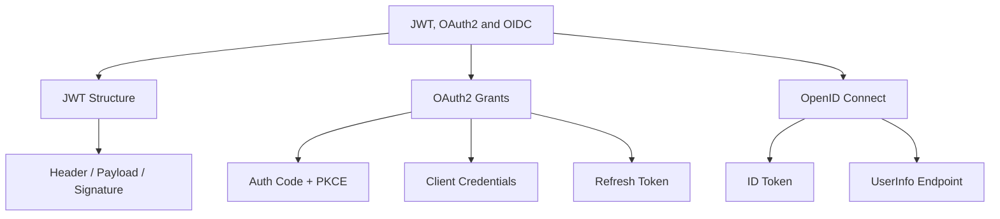

# JWT, OAuth2 & OIDC
> **Previous:** [Authentication & Authorization](25-auth-authz.md) | **Next:** [Method Security, CORS & CSRF](27-method-cors-csrf.md)

Modern applications rarely authenticate against a single database. Users log in via Google, GitHub, or corporate identity providers. APIs authenticate via signed tokens rather than session cookies. Microservices trust claims embedded in JWTs rather than querying a central auth service.

This chapter covers the three pillars of modern authentication and authorization: **JWT** (the token format), **OAuth2** (the authorization framework), and **OpenID Connect** (the identity layer on top of OAuth2). You will learn to issue and validate JWTs, configure OAuth2 clients and resource servers, integrate social login, and build secure, standards-compliant authentication flows.

---

## Learning Objectives

By the end of this chapter you should be able to:

<!-- Image Gallery -->
<div style="display:flex;flex-wrap:wrap;gap:4px;margin:16px 0;padding:12px;background:#f8fafc;border-radius:8px;border:1px solid #e2e8f0;">
<a href="../../../assets/images/lessons/java/26-jwt-oauth2/hero.svg" target="_blank" rel="noopener">
  
</a>
<a href="../../../assets/images/lessons/java/26-jwt-oauth2/handwritten-notes.svg" target="_blank" rel="noopener">
  
</a>
<a href="../../../assets/images/lessons/java/26-jwt-oauth2/sticky-notes.svg" target="_blank" rel="noopener">
  
</a>
<a href="../../../assets/images/lessons/java/26-jwt-oauth2/visual-explanation.svg" target="_blank" rel="noopener">
  
</a>
<a href="../../../assets/images/lessons/java/26-jwt-oauth2/architecture.svg" target="_blank" rel="noopener">
  
</a>
<a href="../../../assets/images/lessons/java/26-jwt-oauth2/workflow.svg" target="_blank" rel="noopener">
  
</a>
<a href="../../../assets/images/lessons/java/26-jwt-oauth2/mindmap.svg" target="_blank" rel="noopener">
  
</a>
<a href="../../../assets/images/lessons/java/26-jwt-oauth2/comparison.svg" target="_blank" rel="noopener">
  
</a>
<a href="../../../assets/images/lessons/java/26-jwt-oauth2/cheatsheet.svg" target="_blank" rel="noopener">
  
</a>
<a href="../../../assets/images/lessons/java/26-jwt-oauth2/interview-quiz.svg" target="_blank" rel="noopener">
  
</a>
<a href="../../../assets/images/lessons/java/26-jwt-oauth2/social-card.svg" target="_blank" rel="noopener">
  
</a>
</div>
<!-- End Image Gallery -->


- Understand JWT structure (header, payload, signature) and the difference between JWS and JWE
- Create and validate JWTs using the Nimbus JOSE + JWT library and the jjwt library
- Implement refresh token rotation and token revocation strategies
- Configure all five OAuth2 authorization grants: Authorization Code, Authorization Code + PKCE, Client Credentials, Refresh Token, and Resource Owner Password Credentials
- Build an OAuth2 client with `spring-boot-starter-oauth2-client` and `OAuth2AuthorizedClientManager`
- Secure a resource server with JWT decoding (jwk-set-uri) and opaque token introspection
- Understand OpenID Connect discovery, ID tokens, and the UserInfo endpoint
- Implement social login for Google, GitHub, and Facebook with account linking

---
## Chapter at a Glance

| Topic | Key Insight | Practical Takeaway |
|-------|------------|-------------------|
| JWT → compact, self-contained token format for claims | Sign with RS256; never expose secrets in the payload |
| OAuth2 → authorization framework with multiple grant types | Use Authorization Code + PKCE for public clients |
| OpenID Connect → identity layer atop OAuth2 | ID Token (JWT) carries user identity; UserInfo endpoint provides additional claims |

---
## Chapter Roadmap



---
## Concept Comparison Table

| Concept | Description | Key Difference |
|---------|-------------|----------------|
| JWS | Signed JWT (payload visible) | Default for access tokens |
| JWE | Encrypted JWT (payload hidden) | Rare; used for sensitive claims |
| OAuth2 | Authorization framework (delegated access) | Scopes, tokens, grants |
| OIDC | Identity layer (authentication) | ID token, UserInfo, discovery |

---
## Quick Reference

| Element | Purpose | Example |
|---------|---------|---------|
| `NimbusJwtDecoder` | Decodes and validates JWTs | `NimbusJwtDecoder.withJwkSetUri(jwkSetUri)` |
| `OAuth2AuthorizedClientManager` | Manages token lifecycle | `authorizedClientManager.authorize()` |
| `@RegisteredOAuth2AuthorizedClient` | Injects authorized client | `@RegisteredOAuth2AuthorizedClient("google")` |
| `oauth2Login()` | Configures OAuth2 login | `http.oauth2Login(Customizer.withDefaults())` |

---
## Cross-Application Matrix

| Domain | Application | Use Case |
|--------|-------------|----------|
| Social Login | Spring OAuth2 Client | Google / GitHub / Facebook login with account linking |
| API Gateway | OAuth2 Resource Server | Validate JWTs from external IdP |
| Mobile App | Authorization Code + PKCE | Secure native app authentication |

---
## Chapter Quiz

1. What are the three parts of a JWT? **Answer:** Header, Payload, Signature
2. Which OAuth2 grant is recommended for mobile apps? **Answer:** Authorization Code with PKCE
3. What OIDC token carries user identity claims? **Answer:** ID Token

---

## JWT — JSON Web Token


A JWT is a compact, URL-safe token format for representing claims between two parties. It is used heavily in OAuth2 and OpenID Connect as the format for access tokens and ID tokens.

### JWT Structure


A JWT consists of three Base64-URL-encoded segments separated by dots:

```
header.payload.signature
```

**Header** — describes the signing algorithm and token type:

```json
{
  "alg": "RS256",
  "typ": "JWT",
  "kid": "key-id-1"
}
```

**Payload** — contains the claims (statements about the subject):

```json
{
  "sub": "1234567890",
  "name": "John Doe",
  "iat": 1516239022,
  "exp": 1516242622,
  "iss": "https://auth.example.com",
  "aud": "https://api.example.com",
  "roles": ["admin", "user"]
}
```

**Signature** — proves the token was issued by a trusted party and has not been tampered with. For HMAC it is computed as:

```
HMACSHA256(
  base64UrlEncode(header) + "." + base64UrlEncode(payload),
  secret
)
```

### JWS vs JWE


| Aspect | JWS (JSON Web Signature) | JWE (JSON Web Encryption) |
|--------|--------------------------|--------------------------|
| Purpose | Integrity + authenticity | Confidentiality + integrity |
| Payload visibility | Visible (Base64 encoded) | Encrypted (hidden) |
| Structure | `header.payload.signature` | `header.encrypted_key.iv.ciphertext.tag` |
| Use case | Access tokens, ID tokens | Transporting sensitive claims |
| Algorithms | HS256, RS256, ES256 | RSA-OAEP, ECDH-ES + A256GCM |

Most OAuth2 deployments use JWS (signed JWTs). JWE is used when the token payload must not be readable by intermediate parties.

### Nimbus JOSE + JWT


Nimbus JOSE + JWT is the default JWT library used by Spring Security's OAuth2 resource server. It provides full JWS, JWE, and JWK support.

```xml
<dependency>
    <groupId>com.nimbusds</groupId>
    <artifactId>nimbus-jose-jwt</artifactId>
    <version>9.37.3</version>
</dependency>
```

```java
package com.course.jwt.nimbus;

import com.nimbusds.jose.JOSEException;
import com.nimbusds.jose.JWSAlgorithm;
import com.nimbusds.jose.JWSHeader;
import com.nimbusds.jose.JWSSigner;
import com.nimbusds.jose.JWSVerifier;
import com.nimbusds.jose.crypto.MACSigner;
import com.nimbusds.jose.crypto.MACVerifier;
import com.nimbusds.jwt.JWTClaimsSet;
import com.nimbusds.jwt.SignedJWT;

import java.text.ParseException;
import java.util.Date;

public class NimbusJwtDemo {

    private static final String SECRET = "my-very-long-secret-key-that-is-at-least-256-bits-long-for-hs256";

    public String createToken() throws JOSEException {
        JWSSigner signer = new MACSigner(SECRET);

        JWTClaimsSet claimsSet = new JWTClaimsSet.Builder()
            .subject("user-123")
            .issuer("https://auth.example.com")
            .audience("https://api.example.com")
            .issueTime(new Date())
            .expirationTime(new Date(System.currentTimeMillis() + 3600_000))
            .claim("roles", new String[]{"admin", "user"})
            .claim("tenant", "acme-corp")
            .build();

        SignedJWT signedJWT = new SignedJWT(
            new JWSHeader(JWSAlgorithm.HS256),
            claimsSet
        );

        signedJWT.sign(signer);
        return signedJWT.serialize();
    }

    public void validateToken(String token) throws ParseException, JOSEException {
        SignedJWT signedJWT = SignedJWT.parse(token);

        JWSVerifier verifier = new MACVerifier(SECRET);

        boolean valid = signedJWT.verify(verifier);

        JWTClaimsSet claims = signedJWT.getJWTClaimsSet();

        System.out.println("Valid: " + valid);
        System.out.println("Subject: " + claims.getSubject());
        System.out.println("Issuer: " + claims.getIssuer());
        System.out.println("Roles: " + claims.getStringListClaim("roles"));
        System.out.println("Expired: " + claims.getExpirationTime().before(new Date()));
    }

    public String getSubject(String token) throws ParseException {
        SignedJWT signedJWT = SignedJWT.parse(token);
        return signedJWT.getJWTClaimsSet().getSubject();
    }
}
```

### jjwt Library


The jjwt library (io.jsonwebtoken) provides a fluent, builder-based API:

```xml
<dependency>
    <groupId>io.jsonwebtoken</groupId>
    <artifactId>jjwt-api</artifactId>
    <version>0.12.5</version>
</dependency>
<dependency>
    <groupId>io.jsonwebtoken</groupId>
    <artifactId>jjwt-impl</artifactId>
    <version>0.12.5</version>
    <scope>runtime</scope>
</dependency>
<dependency>
    <groupId>io.jsonwebtoken</groupId>
    <artifactId>jjwt-jackson</artifactId>
    <version>0.12.5</version>
    <scope>runtime</scope>
</dependency>
```

### Token Creation with jjwt


```java
package com.course.jwt.jjwt;

import io.jsonwebtoken.Jwts;
import io.jsonwebtoken.security.Keys;

import javax.crypto.SecretKey;
import java.nio.charset.StandardCharsets;
import java.util.Base64;
import java.util.Date;
import java.util.List;
import java.util.Map;

public class JjwtTokenCreator {

    // HMAC key — in production, load from a secure vault
    private static final SecretKey SECRET_KEY = Keys.hmacShaKeyFor(
        Base64.getDecoder().decode(
            "dGhpcyBpcyBhIHZlcnkgbG9uZyBzZWNyZXQga2V5IGZvciBKU1dTIHRoYXQgbXVzdCBiZSAyNTYgYml0cyBsb25n"))
    ;

    public String createAccessToken(String subject, List<String> roles) {
        Date now = new Date();
        Date expiration = new Date(now.getTime() + 3600_000); // 1 hour

        return Jwts.builder()
            .header()
                .type("JWT")
                .and()
            .subject(subject)
            .issuer("https://auth.example.com")
            .issuedAt(now)
            .expiration(expiration)
            .claim("roles", roles)
            .claim("scope", "read write")
            .signWith(SECRET_KEY)
            .compact();
    }

    public String createRefreshToken(String subject) {
        Date now = new Date();
        Date expiration = new Date(now.getTime() + 7 * 24 * 3600_000); // 7 days

        return Jwts.builder()
            .subject(subject)
            .id(java.util.UUID.randomUUID().toString()) // unique token ID
            .issuedAt(now)
            .expiration(expiration)
            .claim("type", "refresh")
            .signWith(SECRET_KEY)
            .compact();
    }

    public String createCustomToken(Map<String, Object> claims) {
        Date now = new Date();
        return Jwts.builder()
            .claims(claims)
            .issuedAt(now)
            .expiration(new Date(now.getTime() + 1800_000)) // 30 minutes
            .signWith(SECRET_KEY)
            .compact();
    }
}
```

### Token Validation with jjwt


```java
package com.course.jwt.jjwt;

import io.jsonwebtoken.Claims;
import io.jsonwebtoken.ExpiredJwtException;
import io.jsonwebtoken.Jws;
import io.jsonwebtoken.Jwts;
import io.jsonwebtoken.MalformedJwtException;
import io.jsonwebtoken.UnsupportedJwtException;
import io.jsonwebtoken.security.SecurityException;

import javax.crypto.SecretKey;
import java.util.Base64;
import java.util.List;

public class JjwtTokenValidator {

    private static final SecretKey SECRET_KEY = Keys.hmacShaKeyFor(
        Base64.getDecoder().decode(
            "dGhpcyBpcyBhIHZlcnkgbG9uZyBzZWNyZXQga2V5IGZvciBKU1dTIHRoYXQgbXVzdCBiZSAyNTYgYml0cyBsb25n"))
    ;

    public JwtValidationResult validate(String token) {
        try {
            Jws<Claims> jws = Jwts.parser()
                .verifyWith(SECRET_KEY)
                .requireIssuer("https://auth.example.com")
                .requireAudience("https://api.example.com")
                .build()
                .parseSignedClaims(token);

            Claims claims = jws.getPayload();

            String subject = claims.getSubject();
            List<String> roles = claims.get("roles", List.class);
            String scope = claims.get("scope", String.class);

            return new JwtValidationResult(true, subject, roles, scope, null);

        } catch (ExpiredJwtException e) {
            return JwtValidationResult.failed("Token expired: " + e.getMessage());
        } catch (MalformedJwtException e) {
            return JwtValidationResult.failed("Malformed token: " + e.getMessage());
        } catch (SecurityException e) {
            return JwtValidationResult.failed("Invalid signature: " + e.getMessage());
        } catch (UnsupportedJwtException e) {
            return JwtValidationResult.failed("Unsupported token: " + e.getMessage());
        } catch (IllegalArgumentException e) {
            return JwtValidationResult.failed("Token is null or empty: " + e.getMessage());
        }
    }

    public Claims parseClaims(String token) {
        return Jwts.parser()
            .verifyWith(SECRET_KEY)
            .build()
            .parseSignedClaims(token)
            .getPayload();
    }

    public String getSubject(String token) {
        return parseClaims(token).getSubject();
    }

    public boolean isExpired(String token) {
        try {
            parseClaims(token);
            return false;
        } catch (ExpiredJwtException e) {
            return true;
        }
    }
}
```

```java
package com.course.jwt.jjwt;

import java.util.List;

public record JwtValidationResult(
    boolean valid,
    String subject,
    List<String> roles,
    String scope,
    String error
) {
    public static JwtValidationResult failed(String error) {
        return new JwtValidationResult(false, null, null, null, error);
    }
}
```

### Exception Handling


The jjwt library throws specific exceptions for different failure modes:

| Exception | Meaning |
|-----------|---------|
| `ExpiredJwtException` | Token's `exp` claim is in the past |
| `MalformedJwtException` | Token does not have the correct JWT structure |
| `SecurityException` | Signature verification failed |
| `UnsupportedJwtException` | Algorithm or claim format not supported |
| `IllegalArgumentException` | Token is null, empty, or whitespace |

### Refresh Tokens


A refresh token is a long-lived token used to obtain new access tokens without requiring the user to re-authenticate.

```java
package com.course.jwt.refresh;

import io.jsonwebtoken.Claims;
import io.jsonwebtoken.Jwts;
import io.jsonwebtoken.security.Keys;

import javax.crypto.SecretKey;
import java.util.Base64;
import java.util.Date;
import java.util.UUID;

public class RefreshTokenService {

    private static final SecretKey SECRET_KEY = Keys.hmacShaKeyFor(
        Base64.getDecoder().decode(
            "dGhpcyBpcyBhIHZlcnkgbG9uZyBzZWNyZXQga2V5IGZvciBKU1dTIHRoYXQgbXVzdCBiZSAyNTYgYml0cyBsb25n"))
    ;

    private final JjwtTokenCreator tokenCreator;
    private final TokenBlacklist blacklist;

    public RefreshTokenService(JjwtTokenCreator tokenCreator,
                               TokenBlacklist blacklist) {
        this.tokenCreator = tokenCreator;
        this.blacklist = blacklist;
    }

    public TokenPair issueTokens(String subject) {
        String accessToken = tokenCreator.createAccessToken(
            subject, List.of("user"));
        String refreshToken = tokenCreator.createRefreshToken(subject);
        return new TokenPair(accessToken, refreshToken);
    }

    public TokenPair refreshAccessToken(String refreshToken) {
        if (blacklist.isBlacklisted(refreshToken)) {
            throw new SecurityException("Refresh token has been revoked");
        }

        Claims claims = Jwts.parser()
            .verifyWith(SECRET_KEY)
            .build()
            .parseSignedClaims(refreshToken)
            .getPayload();

        String tokenType = claims.get("type", String.class);
        if (!"refresh".equals(tokenType)) {
            throw new SecurityException("Token is not a refresh token");
        }

        String subject = claims.getSubject();

        // Revoke the old refresh token (rotation)
        blacklist.add(refreshToken);

        // Issue new pair
        return issueTokens(subject);
    }

    public void revokeRefreshToken(String refreshToken) {
        blacklist.add(refreshToken);
    }

    public record TokenPair(String accessToken, String refreshToken) {}
}
```

### Token Revocation Strategies


```java
package com.course.jwt.refresh;

import java.util.Map;
import java.util.Set;
import java.util.concurrent.ConcurrentHashMap;

public class TokenBlacklist {

    private final Map<String, Long> blacklist = new ConcurrentHashMap<>();

    public void add(String token) {
        // Store token hash and expiry time
        String tokenHash = hashToken(token);
        blacklist.put(tokenHash, System.currentTimeMillis() + 7 * 24 * 3600_000);
        cleanup();
    }

    public boolean isBlacklisted(String token) {
        String tokenHash = hashToken(token);
        Long expiry = blacklist.get(tokenHash);
        if (expiry == null) {
            return false;
        }
        if (System.currentTimeMillis() > expiry) {
            blacklist.remove(tokenHash);
            return false;
        }
        return true;
    }

    private void cleanup() {
        long now = System.currentTimeMillis();
        blacklist.entrySet().removeIf(entry -> now > entry.getValue());
    }

    private String hashToken(String token) {
        return Integer.toHexString(token.hashCode());
    }
}
```

**Alternative revocation strategies:**

| Strategy | Description |
|----------|-------------|
| **Blacklist** | Store revoked token IDs in a database or Redis (used above) |
| **Short expiry** | Keep access tokens short (5-15 min) so revocation is quick |
| **Token rotation** | Issue a new refresh token with every refresh; invalidate the old one |
| **Revocation endpoint** | OAuth2 revocation endpoint (RFC 7009) supported by authorization servers |
| **Not-before claim** | Store a user-level token version; if `iat` < version, reject |

```java
    // Short expiry strategy
    public String createShortLivedToken(String subject) {
        return Jwts.builder()
            .subject(subject)
            .issuedAt(new Date())
            .expiration(new Date(System.currentTimeMillis() + 300_000)) // 5 minutes
            .signWith(SECRET_KEY)
            .compact();
    }
```

### Token Service — Complete


```java
package com.course.jwt.service;

import io.jsonwebtoken.Claims;
import io.jsonwebtoken.ExpiredJwtException;
import io.jsonwebtoken.Jwts;
import io.jsonwebtoken.security.Keys;

import javax.crypto.SecretKey;
import java.util.Base64;
import java.util.Date;
import java.util.List;
import java.util.function.Function;

public class JwtTokenService {

    private final SecretKey secretKey;

    public JwtTokenService(String base64Secret) {
        byte[] keyBytes = Base64.getDecoder().decode(base64Secret);
        this.secretKey = Keys.hmacShaKeyFor(keyBytes);
    }

    public String generateToken(String subject, List<String> roles,
                                long expirationMillis) {
        return Jwts.builder()
            .subject(subject)
            .issuedAt(new Date())
            .expiration(new Date(System.currentTimeMillis() + expirationMillis))
            .claim("roles", roles)
            .signWith(secretKey)
            .compact();
    }

    public String generateToken(String subject) {
        return generateToken(subject, List.of("user"), 3600_000);
    }

    public boolean validateToken(String token) {
        try {
            Jwts.parser()
                .verifyWith(secretKey)
                .build()
                .parseSignedClaims(token);
            return true;
        } catch (ExpiredJwtException e) {
            return true; // still valid, just expired
        } catch (Exception e) {
            return false;
        }
    }

    public boolean isTokenExpired(String token) {
        try {
            extractClaim(token, Claims::getExpiration);
            return false;
        } catch (ExpiredJwtException e) {
            return true;
        }
    }

    public String extractSubject(String token) {
        return extractClaim(token, Claims::getSubject);
    }

    public <T> T extractClaim(String token,
                              Function<Claims, T> claimsResolver) {
        Claims claims = extractAllClaims(token);
        return claimsResolver.apply(claims);
    }

    private Claims extractAllClaims(String token) {
        return Jwts.parser()
            .verifyWith(secretKey)
            .build()
            .parseSignedClaims(token)
            .getPayload();
    }
}
```

> [!TIP]
> Always set short expiration times (15 minutes or less) for access tokens and use refresh tokens for long-lived sessions.

---

## OAuth2 Flows

OAuth2 is an authorization framework that enables applications to obtain limited access to user accounts on an HTTP service. It works by delegating user authentication to the service that hosts the user account and authorizing third-party applications to access that user account.

### Terminology


| Term | Meaning |
|------|---------|
| **Resource Owner** | The user who owns the data |
| **Client** | The application requesting access |
| **Authorization Server** | Issues tokens after authenticating the user |
| **Resource Server** | Hosts the protected data, validates tokens |
| **Access Token** | Credential used to access the resource server |
| **Refresh Token** | Long-lived token to obtain new access tokens |
| **Scope** | Limits what the access token can do |
| **Redirect URI** | Callback URL where the authorization server sends the user |

### Authorization Code + PKCE


The most secure flow for public clients (SPAs, mobile apps). PKCE (Proof Key for Code Exchange) prevents authorization code interception attacks.

```java
package com.course.oauth2.flow;

import java.security.MessageDigest;
import java.security.NoSuchAlgorithmException;
import java.security.SecureRandom;
import java.util.Base64;

public class PkceUtil {

    public static String generateCodeVerifier() {
        SecureRandom sr = new SecureRandom();
        byte[] code = new byte[32];
        sr.nextBytes(code);
        return Base64.getUrlEncoder().withoutPadding().encodeToString(code);
    }

    public static String generateCodeChallenge(String codeVerifier)
            throws NoSuchAlgorithmException {
        MessageDigest md = MessageDigest.getInstance("SHA-256");
        byte[] digest = md.digest(codeVerifier.getBytes());
        return Base64.getUrlEncoder().withoutPadding().encodeToString(digest);
    }
}
```

```java
package com.course.oauth2.flow;

import com.course.jwt.jjwt.JjwtTokenCreator;

import java.net.URI;
import java.net.http.HttpClient;
import java.net.http.HttpRequest;
import java.net.http.HttpResponse;
import java.security.NoSuchAlgorithmException;
import java.util.Map;

public class AuthorizationCodePkceFlow {

    private static final String AUTH_SERVER = "https://auth.example.com";
    private static final String CLIENT_ID = "my-client";
    private static final String REDIRECT_URI = "https://myapp.com/callback";
    private static final String SCOPE = "openid profile email";

    private final HttpClient httpClient = HttpClient.newHttpClient();
    private final JjwtTokenCreator tokenCreator;

    public AuthorizationCodePkceFlow(JjwtTokenCreator tokenCreator) {
        this.tokenCreator = tokenCreator;
    }

    // Step 1: Generate PKCE challenge and build authorization URL
    public AuthorizationRequest buildAuthorizationUrl()
            throws NoSuchAlgorithmException {
        String codeVerifier = PkceUtil.generateCodeVerifier();
        String codeChallenge = PkceUtil.generateCodeChallenge(codeVerifier);

        String authUrl = AUTH_SERVER + "/authorize?" +
            "response_type=code" +
            "&client_id=" + CLIENT_ID +
            "&redirect_uri=" + REDIRECT_URI +
            "&scope=" + SCOPE +
            "&code_challenge=" + codeChallenge +
            "&code_challenge_method=S256" +
            "&state=" + generateState();

        return new AuthorizationRequest(authUrl, codeVerifier, codeChallenge);
    }

    // Step 2: Exchange authorization code for tokens
    public TokenResponse exchangeCode(String authorizationCode,
                                       String codeVerifier)
            throws Exception {
        String body = "grant_type=authorization_code" +
            "&code=" + authorizationCode +
            "&redirect_uri=" + REDIRECT_URI +
            "&client_id=" + CLIENT_ID +
            "&code_verifier=" + codeVerifier;

        HttpRequest request = HttpRequest.newBuilder()
            .uri(URI.create(AUTH_SERVER + "/token"))
            .header("Content-Type", "application/x-www-form-urlencoded")
            .POST(HttpRequest.BodyPublishers.ofString(body))
            .build();

        HttpResponse<String> response = httpClient.send(request,
            HttpResponse.BodyHandlers.ofString());

        return parseTokenResponse(response.body());
    }

    // Step 3: Use the access token to call the resource server
    public String callResourceServer(String accessToken, String resourceUrl)
            throws Exception {
        HttpRequest request = HttpRequest.newBuilder()
            .uri(URI.create(resourceUrl))
            .header("Authorization", "Bearer " + accessToken)
            .GET()
            .build();

        HttpResponse<String> response = httpClient.send(request,
            HttpResponse.BodyHandlers.ofString());

        return response.body();
    }

    private String generateState() {
        SecureRandom sr = new SecureRandom();
        byte[] state = new byte[16];
        sr.nextBytes(state);
        return Base64.getUrlEncoder().withoutPadding().encodeToString(state);
    }

    private TokenResponse parseTokenResponse(String json) {
        // Parse JSON response using Jackson or similar
        return new TokenResponse("access-token-value", "refresh-token-value", 3600);
    }

    public record AuthorizationRequest(
        String authUrl, String codeVerifier, String codeChallenge) {}

    public record TokenResponse(
        String accessToken, String refreshToken, int expiresIn) {}
}
```

### Client Credentials Flow


Machine-to-machine authentication where the client authenticates itself, not a user:

```java
package com.course.oauth2.flow;

import java.net.URI;
import java.net.http.HttpClient;
import java.net.http.HttpRequest;
import java.net.http.HttpResponse;
import java.util.Base64;

public class ClientCredentialsFlow {

    private static final String TOKEN_URL = "https://auth.example.com/token";
    private static final String CLIENT_ID = "my-service";
    private static final String CLIENT_SECRET = "my-service-secret";

    private final HttpClient httpClient = HttpClient.newHttpClient();

    public String getClientCredentialsToken() throws Exception {
        String basicAuth = Base64.getEncoder().encodeToString(
            (CLIENT_ID + ":" + CLIENT_SECRET).getBytes());

        String body = "grant_type=client_credentials" +
            "&scope=api.read api.write";

        HttpRequest request = HttpRequest.newBuilder()
            .uri(URI.create(TOKEN_URL))
            .header("Authorization", "Basic " + basicAuth)
            .header("Content-Type", "application/x-www-form-urlencoded")
            .POST(HttpRequest.BodyPublishers.ofString(body))
            .build();

        HttpResponse<String> response = httpClient.send(request,
            HttpResponse.BodyHandlers.ofString());

        // Parse response to extract access_token
        String responseBody = response.body();
        return extractAccessToken(responseBody);
    }

    public String callApi(String accessToken, String apiUrl) throws Exception {
        HttpRequest request = HttpRequest.newBuilder()
            .uri(URI.create(apiUrl))
            .header("Authorization", "Bearer " + accessToken)
            .GET()
            .build();

        HttpResponse<String> response = httpClient.send(request,
            HttpResponse.BodyHandlers.ofString());

        return response.body();
    }

    private String extractAccessToken(String responseBody) {
        // Simple parsing — use Jackson in production
        int start = responseBody.indexOf("\"access_token\":\"") + 17;
        int end = responseBody.indexOf("\"", start);
        return responseBody.substring(start, end);
    }
}
```

### Refresh Token Flow


```java
package com.course.oauth2.flow;

import java.net.URI;
import java.net.http.HttpClient;
import java.net.http.HttpRequest;
import java.net.http.HttpResponse;
import java.util.Base64;

public class RefreshTokenFlow {

    private static final String TOKEN_URL = "https://auth.example.com/token";
    private static final String CLIENT_ID = "my-client";
    private static final String CLIENT_SECRET = "my-client-secret";

    private final HttpClient httpClient = HttpClient.newHttpClient();

    public TokenResponse refreshAccessToken(String refreshToken)
            throws Exception {
        String basicAuth = Base64.getEncoder().encodeToString(
            (CLIENT_ID + ":" + CLIENT_SECRET).getBytes());

        String body = "grant_type=refresh_token" +
            "&refresh_token=" + refreshToken +
            "&scope=openid profile email";

        HttpRequest request = HttpRequest.newBuilder()
            .uri(URI.create(TOKEN_URL))
            .header("Authorization", "Basic " + basicAuth)
            .header("Content-Type", "application/x-www-form-urlencoded")
            .POST(HttpRequest.BodyPublishers.ofString(body))
            .build();

        HttpResponse<String> response = httpClient.send(request,
            HttpResponse.BodyHandlers.ofString());

        return parseTokenResponse(response.body());
    }

    private TokenResponse parseTokenResponse(String json) {
        // Parse using Jackson
        return new TokenResponse("new-access-token", "new-refresh-token", 3600);
    }

    public record TokenResponse(
        String accessToken, String refreshToken, int expiresIn) {}
}
```

### Resource Owner Password Credentials (Deprecated)


The ROPC flow is deprecated in OAuth 2.1. It is included here for legacy system understanding:

```java
package com.course.oauth2.flow;

import java.net.URI;
import java.net.http.HttpClient;
import java.net.http.HttpRequest;
import java.net.http.HttpResponse;
import java.util.Base64;

public class RopcFlow {

    // WARNING: This flow is deprecated in OAuth 2.1.
    // The client has access to the user's password — a security risk.

    private static final String TOKEN_URL = "https://auth.example.com/token";
    private static final String CLIENT_ID = "legacy-client";
    private static final String CLIENT_SECRET = "legacy-secret";

    private final HttpClient httpClient = HttpClient.newHttpClient();

    public String getTokenWithPassword(String username, String password)
            throws Exception {
        String basicAuth = Base64.getEncoder().encodeToString(
            (CLIENT_ID + ":" + CLIENT_SECRET).getBytes());

        String body = "grant_type=password" +
            "&username=" + username +
            "&password=" + password +
            "&scope=openid profile";

        HttpRequest request = HttpRequest.newBuilder()
            .uri(URI.create(TOKEN_URL))
            .header("Authorization", "Basic " + basicAuth)
            .header("Content-Type", "application/x-www-form-urlencoded")
            .POST(HttpRequest.BodyPublishers.ofString(body))
            .build();

        HttpResponse<String> response = httpClient.send(request,
            HttpResponse.BodyHandlers.ofString());

        return extractAccessToken(response.body());
    }

    private String extractAccessToken(String json) {
        int start = json.indexOf("\"access_token\":\"") + 17;
        int end = json.indexOf("\"", start);
        return json.substring(start, end);
    }
}
```

### Authorization Code (Server-Side Web Apps)


The traditional Authorization Code flow for server-side web applications:

```java
package com.course.oauth2.flow;

import java.net.URI;
import java.net.http.HttpClient;
import java.net.http.HttpRequest;
import java.net.http.HttpResponse;
import java.util.Base64;

public class AuthorizationCodeFlow {

    private static final String AUTH_SERVER = "https://auth.example.com";
    private static final String CLIENT_ID = "web-app-client";
    private static final String CLIENT_SECRET = "web-app-secret";
    private static final String REDIRECT_URI = "https://myapp.com/oauth2/callback";

    private final HttpClient httpClient = HttpClient.newHttpClient();

    public String buildAuthorizationUrl() {
        return AUTH_SERVER + "/authorize?" +
            "response_type=code" +
            "&client_id=" + CLIENT_ID +
            "&redirect_uri=" + REDIRECT_URI +
            "&scope=openid+profile+email" +
            "&state=" + generateState();
    }

    public TokenResponse exchangeCode(String authorizationCode)
            throws Exception {
        String basicAuth = Base64.getEncoder().encodeToString(
            (CLIENT_ID + ":" + CLIENT_SECRET).getBytes());

        String body = "grant_type=authorization_code" +
            "&code=" + authorizationCode +
            "&redirect_uri=" + REDIRECT_URI +
            "&client_id=" + CLIENT_ID;

        HttpRequest request = HttpRequest.newBuilder()
            .uri(URI.create(AUTH_SERVER + "/token"))
            .header("Authorization", "Basic " + basicAuth)
            .header("Content-Type", "application/x-www-form-urlencoded")
            .POST(HttpRequest.BodyPublishers.ofString(body))
            .build();

        HttpResponse<String> response = httpClient.send(request,
            HttpResponse.BodyHandlers.ofString());

        return parseTokenResponse(response.body());
    }

    private String generateState() {
        SecureRandom sr = new SecureRandom();
        byte[] state = new byte[16];
        sr.nextBytes(state);
        return Base64.getUrlEncoder().withoutPadding().encodeToString(state);
    }

    private TokenResponse parseTokenResponse(String json) {
        return new TokenResponse("access-token", "refresh-token", 3600);
    }

    public record TokenResponse(
        String accessToken, String refreshToken, int expiresIn) {}
}
```

> [!WARNING]
> The Resource Owner Password Credentials grant is deprecated in OAuth2.1 and should not be used for new applications.

---

## OAuth2 Client

Spring Security's OAuth2 client support handles the Authorization Code flow (with PKCE), token storage, and automatic refresh.

### Dependencies


```xml
<dependency>
    <groupId>org.springframework.boot</groupId>
    <artifactId>spring-boot-starter-oauth2-client</artifactId>
</dependency>
<dependency>
    <groupId>org.springframework.boot</groupId>
    <artifactId>spring-boot-starter-web</artifactId>
</dependency>
<dependency>
    <groupId>org.springframework.boot</groupId>
    <artifactId>spring-boot-starter-security</artifactId>
</dependency>
```

### Registration Properties


```properties
# application.yml
spring:
  security:
    oauth2:
      client:
        registration:
          google:
            client-id: YOUR_GOOGLE_CLIENT_ID
            client-secret: YOUR_GOOGLE_CLIENT_SECRET
            scope: openid, profile, email
            redirect-uri: "{baseUrl}/login/oauth2/code/{registrationId}"
            client-name: Google

          github:
            client-id: YOUR_GITHUB_CLIENT_ID
            client-secret: YOUR_GITHUB_CLIENT_SECRET
            scope: read:user, user:email
            redirect-uri: "{baseUrl}/login/oauth2/code/{registrationId}"
            client-name: GitHub

          facebook:
            client-id: YOUR_FACEBOOK_APP_ID
            client-secret: YOUR_FACEBOOK_APP_SECRET
            scope: email, public_profile
            redirect-uri: "{baseUrl}/login/oauth2/code/{registrationId}"
            client-name: Facebook

          okta:
            provider: okta
            client-id: YOUR_OKTA_CLIENT_ID
            client-secret: YOUR_OKTA_CLIENT_SECRET
            scope: openid, profile, email
            authorization-grant-type: authorization_code
            redirect-uri: "{baseUrl}/login/oauth2/code/{registrationId}"

        provider:
          okta:
            authorization-uri: https://your-org.okta.com/oauth2/default/v1/authorize
            token-uri: https://your-org.okta.com/oauth2/default/v1/token
            user-info-uri: https://your-org.okta.com/oauth2/default/v1/userinfo
            jwk-set-uri: https://your-org.okta.com/oauth2/default/v1/keys
            user-name-attribute: sub
```

### Security Configuration


```java
package com.course.oauth2.client;

import org.springframework.context.annotation.Bean;
import org.springframework.context.annotation.Configuration;
import org.springframework.security.config.annotation.web.builders.HttpSecurity;
import org.springframework.security.config.annotation.web.configuration.EnableWebSecurity;
import org.springframework.security.web.SecurityFilterChain;

import static org.springframework.security.config.Customizer.withDefaults;

@Configuration
@EnableWebSecurity
public class OAuth2ClientConfig {

    @Bean
    public SecurityFilterChain filterChain(HttpSecurity http) throws Exception {
        http
            .authorizeHttpRequests(auth -> auth
                .requestMatchers("/", "/login", "/error", "/webjars/**").permitAll()
                .anyRequest().authenticated()
            )
            .oauth2Login(withDefaults())
            .logout(logout -> logout
                .logoutSuccessUrl("/")
                .invalidateHttpSession(true)
                .clearAuthentication(true)
                .deleteCookies("JSESSIONID")
            );

        return http.build();
    }
}
```

### OAuth2AuthorizedClientManager


The `OAuth2AuthorizedClientManager` manages the lifecycle of authorized clients, including token refresh:

```java
package com.course.oauth2.client;

import jakarta.servlet.http.HttpServletRequest;

import org.springframework.context.annotation.Bean;
import org.springframework.context.annotation.Configuration;
import org.springframework.security.oauth2.client.OAuth2AuthorizedClient;
import org.springframework.security.oauth2.client.OAuth2AuthorizedClientManager;
import org.springframework.security.oauth2.client.OAuth2AuthorizedClientProvider;
import org.springframework.security.oauth2.client.OAuth2AuthorizedClientProviderBuilder;
import org.springframework.security.oauth2.client.annotation.RegisteredOAuth2AuthorizedClient;
import org.springframework.security.oauth2.client.registration.ClientRegistrationRepository;
import org.springframework.security.oauth2.client.web.DefaultOAuth2AuthorizedClientManager;
import org.springframework.security.oauth2.client.web.OAuth2AuthorizedClientRepository;
import org.springframework.web.bind.annotation.GetMapping;
import org.springframework.web.bind.annotation.RestController;

@Configuration
public class AuthorizedClientConfig {

    @Bean
    public OAuth2AuthorizedClientManager authorizedClientManager(
            ClientRegistrationRepository clientRegistrations,
            OAuth2AuthorizedClientRepository authorizedClients) {

        OAuth2AuthorizedClientProvider provider =
            OAuth2AuthorizedClientProviderBuilder.builder()
                .authorizationCode()
                .refreshToken()
                .clientCredentials()
                .build();

        DefaultOAuth2AuthorizedClientManager manager =
            new DefaultOAuth2AuthorizedClientManager(
                clientRegistrations, authorizedClients);
        manager.setAuthorizedClientProvider(provider);

        return manager;
    }
}

@RestController
class UserController {

    @GetMapping("/user-info")
    public String getUserInfo(
            @RegisteredOAuth2AuthorizedClient("google")
            OAuth2AuthorizedClient authorizedClient) {

        String accessToken = authorizedClient.getAccessToken().getTokenValue();
        // Use the access token to call Google's API
        return "Access token: " + accessToken;
    }
}
```

### Making API Calls with the Client


```java
package com.course.oauth2.client;

import org.springframework.http.HttpEntity;
import org.springframework.http.HttpHeaders;
import org.springframework.http.HttpMethod;
import org.springframework.http.ResponseEntity;
import org.springframework.security.oauth2.client.OAuth2AuthorizedClient;
import org.springframework.security.oauth2.client.OAuth2AuthorizedClientManager;
import org.springframework.security.oauth2.client.OAuth2AuthorizeRequest;
import org.springframework.stereotype.Service;
import org.springframework.web.client.RestTemplate;

@Service
public class ApiClientService {

    private final OAuth2AuthorizedClientManager authorizedClientManager;
    private final RestTemplate restTemplate;

    public ApiClientService(OAuth2AuthorizedClientManager authorizedClientManager,
                            RestTemplate restTemplate) {
        this.authorizedClientManager = authorizedClientManager;
        this.restTemplate = restTemplate;
    }

    public String callUserApi(String registrationId, String apiUrl) {
        OAuth2AuthorizeRequest authorizeRequest = OAuth2AuthorizeRequest
            .withClientRegistrationId(registrationId)
            .principal("internal")
            .build();

        OAuth2AuthorizedClient authorizedClient =
            authorizedClientManager.authorize(authorizeRequest);

        String token = authorizedClient.getAccessToken().getTokenValue();

        HttpHeaders headers = new HttpHeaders();
        headers.setBearerAuth(token);
        HttpEntity<Void> entity = new HttpEntity<>(headers);

        ResponseEntity<String> response = restTemplate.exchange(
            apiUrl, HttpMethod.GET, entity, String.class);

        return response.getBody();
    }
}
```

---

## OAuth2 Resource Server

An OAuth2 resource server validates access tokens and extracts user information from them, rather than managing its own user store.

### Dependencies


```xml
<dependency>
    <groupId>org.springframework.boot</groupId>
    <artifactId>spring-boot-starter-oauth2-resource-server</artifactId>
</dependency>
```

### JWT Decoder with JWK Set URI


The resource server fetches public keys from the authorization server's JWK Set URI to validate token signatures:

```properties
# application.yml
spring:
  security:
    oauth2:
      resource-server:
        jwt:
          issuer-uri: https://auth.example.com
          jwk-set-uri: https://auth.example.com/.well-known/jwks.json
          audiences: https://api.example.com
```

```java
package com.course.oauth2.resourceserver;

import org.springframework.context.annotation.Bean;
import org.springframework.context.annotation.Configuration;
import org.springframework.security.config.annotation.web.builders.HttpSecurity;
import org.springframework.security.config.annotation.web.configuration.EnableWebSecurity;
import org.springframework.security.config.http.SessionCreationPolicy;
import org.springframework.security.oauth2.jwt.JwtDecoder;
import org.springframework.security.oauth2.jwt.JwtDecoders;
import org.springframework.security.oauth2.jwt.NimbusJwtDecoder;
import org.springframework.security.web.SecurityFilterChain;

@Configuration
@EnableWebSecurity
public class ResourceServerConfig {

    @Bean
    public SecurityFilterChain filterChain(HttpSecurity http) throws Exception {
        http
            .authorizeHttpRequests(auth -> auth
                .requestMatchers("/api/public/**").permitAll()
                .requestMatchers("/api/admin/**").hasAuthority("SCOPE_admin")
                .anyRequest().authenticated()
            )
            .sessionManagement(session -> session
                .sessionCreationPolicy(SessionCreationPolicy.STATELESS)
            )
            .oauth2ResourceServer(oauth2 -> oauth2
                .jwt(jwt -> jwt
                    .decoder(jwtDecoder())
                )
            )
            .csrf(csrf -> csrf.disable());

        return http.build();
    }

    @Bean
    public JwtDecoder jwtDecoder() {
        return NimbusJwtDecoder
            .withJwkSetUri("https://auth.example.com/.well-known/jwks.json")
            .build();
    }
}
```

### Custom JWT Authentication Converter


Extract custom claims from the JWT into Spring Security authorities:

```java
package com.course.oauth2.resourceserver;

import java.util.Collection;
import java.util.List;
import java.util.Map;
import java.util.stream.Collectors;

import org.springframework.context.annotation.Bean;
import org.springframework.context.annotation.Configuration;
import org.springframework.core.convert.converter.Converter;
import org.springframework.security.authentication.AbstractAuthenticationToken;
import org.springframework.security.config.annotation.web.builders.HttpSecurity;
import org.springframework.security.config.annotation.web.configuration.EnableWebSecurity;
import org.springframework.security.config.http.SessionCreationPolicy;
import org.springframework.security.oauth2.jwt.Jwt;
import org.springframework.security.oauth2.server.resource.authentication.JwtAuthenticationConverter;
import org.springframework.security.oauth2.server.resource.authentication.JwtAuthenticationToken;
import org.springframework.security.oauth2.server.resource.authentication.JwtGrantedAuthoritiesConverter;
import org.springframework.security.web.SecurityFilterChain;
import org.springframework.security.core.GrantedAuthority;
import org.springframework.security.core.authority.SimpleGrantedAuthority;

@Configuration
@EnableWebSecurity
public class CustomJwtResourceServerConfig {

    @Bean
    public SecurityFilterChain filterChain(HttpSecurity http) throws Exception {
        http
            .authorizeHttpRequests(auth -> auth
                .anyRequest().authenticated()
            )
            .sessionManagement(session -> session
                .sessionCreationPolicy(SessionCreationPolicy.STATELESS)
            )
            .oauth2ResourceServer(oauth2 -> oauth2
                .jwt(jwt -> jwt
                    .jwtAuthenticationConverter(jwtAuthenticationConverter())
                )
            );

        return http.build();
    }

    @Bean
    public Converter<Jwt, AbstractAuthenticationToken> jwtAuthenticationConverter() {
        JwtAuthenticationConverter converter = new JwtAuthenticationConverter();

        // Extract roles from the JWT's "realm_access.roles" claim (Keycloak format)
        JwtGrantedAuthoritiesConverter grantedAuthorities =
            new JwtGrantedAuthoritiesConverter();
        grantedAuthorities.setAuthorityPrefix("ROLE_");
        grantedAuthorities.setAuthoritiesClaimName("realm_access");

        // Override to properly extract from nested structure
        converter.setJwtGrantedAuthoritiesConverter(
            new KeycloakRolesConverter());
        converter.setPrincipalClaimName("preferred_username");

        return converter;
    }
}

class KeycloakRolesConverter
        implements Converter<Jwt, Collection<GrantedAuthority>> {

    @Override
    public Collection<GrantedAuthority> convert(Jwt jwt) {
        Map<String, Object> realmAccess =
            jwt.getClaimAsMap("realm_access");
        if (realmAccess == null || realmAccess.isEmpty()) {
            return List.of();
        }

        @SuppressWarnings("unchecked")
        List<String> roles = (List<String>) realmAccess.get("roles");

        return roles.stream()
            .map(role -> new SimpleGrantedAuthority("ROLE_" + role))
            .collect(Collectors.toList());
    }
}
```

### Opaque Token Introspection


Some authorization servers use opaque tokens (random strings, not JWTs). The resource server must call the introspection endpoint to validate them:

```java
package com.course.oauth2.resourceserver;

import org.springframework.context.annotation.Bean;
import org.springframework.context.annotation.Configuration;
import org.springframework.security.config.annotation.web.builders.HttpSecurity;
import org.springframework.security.config.annotation.web.configuration.EnableWebSecurity;
import org.springframework.security.config.http.SessionCreationPolicy;
import org.springframework.security.oauth2.server.resource.introspection.OpaqueTokenIntrospector;
import org.springframework.security.web.SecurityFilterChain;

@Configuration
@EnableWebSecurity
public class OpaqueTokenConfig {

    @Bean
    public SecurityFilterChain filterChain(HttpSecurity http) throws Exception {
        http
            .authorizeHttpRequests(auth -> auth
                .anyRequest().authenticated()
            )
            .sessionManagement(session -> session
                .sessionCreationPolicy(SessionCreationPolicy.STATELESS)
            )
            .oauth2ResourceServer(oauth2 -> oauth2
                .opaqueToken(opaque -> opaque
                    .introspector(opaqueTokenIntrospector())
                )
            );

        return http.build();
    }

    @Bean
    public OpaqueTokenIntrospector opaqueTokenIntrospector() {
        return new CustomOpaqueTokenIntrospector(
            "https://auth.example.com/introspect",
            "resource-server",
            "resource-server-secret"
        );
    }
}
```

```java
package com.course.oauth2.resourceserver;

import java.net.URI;
import java.net.http.HttpClient;
import java.net.http.HttpRequest;
import java.net.http.HttpResponse;
import java.time.Instant;
import java.util.Base64;
import java.util.List;
import java.util.Map;

import org.springframework.security.oauth2.core.OAuth2AuthenticatedPrincipal;
import org.springframework.security.oauth2.server.resource.introspection.OAuth2IntrospectionClaimNames;
import org.springframework.security.oauth2.server.resource.introspection.OpaqueTokenIntrospector;
import org.springframework.security.oauth2.server.resource.introspection.SpringOpaqueTokenIntrospector;

import com.fasterxml.jackson.core.type.TypeReference;
import com.fasterxml.jackson.databind.ObjectMapper;

public class CustomOpaqueTokenIntrospector implements OpaqueTokenIntrospector {

    private final String introspectionUri;
    private final String clientId;
    private final String clientSecret;
    private final HttpClient httpClient;
    private final ObjectMapper objectMapper;

    public CustomOpaqueTokenIntrospector(String introspectionUri,
                                          String clientId,
                                          String clientSecret) {
        this.introspectionUri = introspectionUri;
        this.clientId = clientId;
        this.clientSecret = clientSecret;
        this.httpClient = HttpClient.newHttpClient();
        this.objectMapper = new ObjectMapper();
    }

    @Override
    public OAuth2AuthenticatedPrincipal introspect(String token) {
        try {
            String basicAuth = Base64.getEncoder().encodeToString(
                (clientId + ":" + clientSecret).getBytes());

            String body = "token=" + token + "&token_type_hint=access_token";

            HttpRequest request = HttpRequest.newBuilder()
                .uri(URI.create(introspectionUri))
                .header("Authorization", "Basic " + basicAuth)
                .header("Content-Type", "application/x-www-form-urlencoded")
                .POST(HttpRequest.BodyPublishers.ofString(body))
                .build();

            HttpResponse<String> response = httpClient.send(request,
                HttpResponse.BodyHandlers.ofString());

            Map<String, Object> claims = objectMapper.readValue(
                response.body(),
                new TypeReference<Map<String, Object>>() {}
            );

            boolean active = (boolean) claims.getOrDefault("active", false);
            if (!active) {
                throw new SecurityException("Token is not active");
            }

            String subject = (String) claims.get("sub");
            List<String> roles = extractRoles(claims);

            return new OAuth2AuthenticatedPrincipal() {
                @Override
                public Map<String, Object> getAttributes() {
                    return claims;
                }

                @Override
                public Collection<? extends GrantedAuthority> getAuthorities() {
                    return roles.stream()
                        .map(SimpleGrantedAuthority::new)
                        .toList();
                }

                @Override
                public String getName() {
                    return subject;
                }
            };
        } catch (Exception e) {
            throw new SecurityException("Token introspection failed", e);
        }
    }

    @SuppressWarnings("unchecked")
    private List<String> extractRoles(Map<String, Object> claims) {
        if (claims.containsKey("realm_access")) {
            Map<String, Object> realmAccess =
                (Map<String, Object>) claims.get("realm_access");
            return (List<String>) realmAccess.getOrDefault("roles", List.of());
        }
        return List.of();
    }
}
```

### Bearer Token Resolver


Customize how the bearer token is extracted from the request:

```java
package com.course.oauth2.resourceserver;

import jakarta.servlet.http.HttpServletRequest;

import org.springframework.context.annotation.Bean;
import org.springframework.context.annotation.Configuration;
import org.springframework.security.config.annotation.web.builders.HttpSecurity;
import org.springframework.security.config.annotation.web.configuration.EnableWebSecurity;
import org.springframework.security.config.http.SessionCreationPolicy;
import org.springframework.security.oauth2.server.resource.web.BearerTokenResolver;
import org.springframework.security.oauth2.server.resource.web.DefaultBearerTokenResolver;
import org.springframework.security.web.SecurityFilterChain;

@Configuration
@EnableWebSecurity
public class BearerTokenResolverConfig {

    @Bean
    public SecurityFilterChain filterChain(HttpSecurity http) throws Exception {
        http
            .authorizeHttpRequests(auth -> auth
                .anyRequest().authenticated()
            )
            .sessionManagement(session -> session
                .sessionCreationPolicy(SessionCreationPolicy.STATELESS)
            )
            .oauth2ResourceServer(oauth2 -> oauth2
                .bearerTokenResolver(customBearerTokenResolver())
                .jwt(jwt -> {})
            );

        return http.build();
    }

    @Bean
    public BearerTokenResolver customBearerTokenResolver() {
        // Default: reads from Authorization: Bearer <token> header
        DefaultBearerTokenResolver resolver = new DefaultBearerTokenResolver();
        resolver.setAllowUriQueryParameter(true); // allow ?access_token=xxx
        resolver.setBearerTokenHeaderName("Authorization");

        return resolver;
    }
}
```

---

## OpenID Connect (OIDC)

OIDC is an identity layer built on top of OAuth2. It adds authentication semantics: the client receives an ID token (a JWT containing user identity information) in addition to the access token.

### OpenID Connect Discovery


OIDC providers expose metadata at a well-known endpoint:

```java
package com.course.oidc;

import com.fasterxml.jackson.databind.ObjectMapper;

import java.net.URI;
import java.net.http.HttpClient;
import java.net.http.HttpRequest;
import java.net.http.HttpResponse;
import java.util.Map;

public class OidcDiscovery {

    private final HttpClient httpClient = HttpClient.newHttpClient();
    private final ObjectMapper objectMapper = new ObjectMapper();

    public OidcProviderMetadata discover(String issuer) throws Exception {
        String discoveryUrl = issuer + "/.well-known/openid-configuration";

        HttpRequest request = HttpRequest.newBuilder()
            .uri(URI.create(discoveryUrl))
            .GET()
            .build();

        HttpResponse<String> response = httpClient.send(request,
            HttpResponse.BodyHandlers.ofString());

        @SuppressWarnings("unchecked")
        Map<String, Object> metadata = objectMapper.readValue(
            response.body(), Map.class);

        return new OidcProviderMetadata(
            (String) metadata.get("issuer"),
            (String) metadata.get("authorization_endpoint"),
            (String) metadata.get("token_endpoint"),
            (String) metadata.get("userinfo_endpoint"),
            (String) metadata.get("jwks_uri"),
            (List<String>) metadata.get("response_types_supported"),
            (List<String>) metadata.get("subject_types_supported"),
            (List<String>) metadata.get("id_token_signing_alg_values_supported")
        );
    }

    public record OidcProviderMetadata(
        String issuer,
        String authorizationEndpoint,
        String tokenEndpoint,
        String userinfoEndpoint,
        String jwksUri,
        List<String> responseTypesSupported,
        List<String> subjectTypesSupported,
        List<String> idTokenSigningAlgorithms
    ) {}
}
```

### ID Token


An ID token is a JWT with a specific set of claims:

```java
package com.course.oidc;

import io.jsonwebtoken.Claims;
import io.jsonwebtoken.Jwts;
import io.jsonwebtoken.security.Keys;

import javax.crypto.SecretKey;
import java.util.Base64;
import java.util.Date;

public class IdTokenValidator {

    private final SecretKey secretKey;

    public IdTokenValidator(String base64Secret) {
        this.secretKey = Keys.hmacShaKeyFor(
            Base64.getDecoder().decode(base64Secret));
    }

    public IdTokenClaims validateIdToken(String idToken) {
        Claims claims = Jwts.parser()
            .verifyWith(secretKey)
            .requireIssuer("https://accounts.google.com")
            .requireAudience("your-client-id")
            .build()
            .parseSignedClaims(idToken)
            .getPayload();

        // Standard OIDC claims
        return new IdTokenClaims(
            claims.getSubject(),           // sub — unique identifier
            claims.get("name", String.class),
            claims.get("email", String.class),
            claims.get("email_verified", Boolean.class),
            claims.get("picture", String.class),
            claims.get("locale", String.class),
            claims.getIssuedAt(),
            claims.getExpiration(),
            claims.getIssuer(),
            claims.getAudience()
        );
    }

    public record IdTokenClaims(
        String sub,
        String name,
        String email,
        Boolean emailVerified,
        String picture,
        String locale,
        Date issuedAt,
        Date expiration,
        String issuer,
        String audience
    ) {}
}
```

### UserInfo Endpoint


The UserInfo endpoint returns claims about the authenticated user. It is called with the access token:

```java
package com.course.oidc;

import java.net.URI;
import java.net.http.HttpClient;
import java.net.http.HttpRequest;
import java.net.http.HttpResponse;

import com.fasterxml.jackson.databind.ObjectMapper;

public class UserInfoClient {

    private static final String USERINFO_URL =
        "https://www.googleapis.com/oauth2/v3/userinfo";

    private final HttpClient httpClient = HttpClient.newHttpClient();
    private final ObjectMapper objectMapper = new ObjectMapper();

    public UserInfoResponse getUserInfo(String accessToken) throws Exception {
        HttpRequest request = HttpRequest.newBuilder()
            .uri(URI.create(USERINFO_URL))
            .header("Authorization", "Bearer " + accessToken)
            .GET()
            .build();

        HttpResponse<String> response = httpClient.send(request,
            HttpResponse.BodyHandlers.ofString());

        return objectMapper.readValue(response.body(), UserInfoResponse.class);
    }

    public record UserInfoResponse(
        String sub,
        String name,
        String given_name,
        String family_name,
        String picture,
        String email,
        boolean email_verified,
        String locale
    ) {}
}
```

### Spring Security OIDC Support


Spring Security provides first-class OIDC support through `OidcUser` and `OidcUserService`:

```java
package com.course.oidc;

import java.util.Collection;
import java.util.Map;

import org.springframework.security.core.GrantedAuthority;
import org.springframework.security.oauth2.core.oidc.OidcIdToken;
import org.springframework.security.oauth2.core.oidc.OidcUserInfo;
import org.springframework.security.oauth2.core.oidc.user.DefaultOidcUser;
import org.springframework.security.oauth2.core.oidc.user.OidcUser;
import org.springframework.security.oauth2.core.oidc.user.OidcUserAuthority;

import org.springframework.stereotype.Controller;
import org.springframework.web.bind.annotation.GetMapping;
import org.springframework.web.bind.annotation.ResponseBody;

@Controller
public class OidcUserController {

    @GetMapping("/oidc/user")
    @ResponseBody
    public OidcUserInfo getOidcUserInfo(OidcUser oidcUser) {
        // Spring Security automatically populates OidcUser
        // when using oauth2Login() with an OIDC provider

        String email = oidcUser.getEmail();
        String name = oidcUser.getFullName();
        String picture = oidcUser.getPicture();
        String subject = oidcUser.getSubject();
        OidcIdToken idToken = oidcUser.getIdToken();
        Map<String, Object> claims = oidcUser.getClaims();

        return oidcUser.getUserInfo();
    }

    @GetMapping("/oidc/token")
    @ResponseBody
    public String getToken(OidcUser oidcUser) {
        return oidcUser.getIdToken().getTokenValue();
    }

    @GetMapping("/oidc/claims")
    @ResponseBody
    public Map<String, Object> getClaims(OidcUser oidcUser) {
        return oidcUser.getClaims();
    }
}
```

### Custom OidcUserService


Customize how OIDC user information is loaded:

```java
package com.course.oidc;

import org.springframework.security.oauth2.client.oidc.userinfo.OidcUserRequest;
import org.springframework.security.oauth2.client.oidc.userinfo.OidcUserService;
import org.springframework.security.oauth2.core.OAuth2AuthenticationException;
import org.springframework.security.oauth2.core.oidc.user.DefaultOidcUser;
import org.springframework.security.oauth2.core.oidc.user.OidcUser;
import org.springframework.stereotype.Service;

@Service
public class CustomOidcUserService extends OidcUserService {

    private final LocalUserService localUserService;

    public CustomOidcUserService(LocalUserService localUserService) {
        this.localUserService = localUserService;
    }

    @Override
    public OidcUser loadUser(OidcUserRequest userRequest)
            throws OAuth2AuthenticationException {
        // Load user from OIDC provider (Google, etc.)
        OidcUser oidcUser = super.loadUser(userRequest);

        String email = oidcUser.getEmail();
        String name = oidcUser.getFullName();
        String provider = userRequest.getClientRegistration().getRegistrationId();

        // Find or create local user
        LocalUser localUser = localUserService.findOrCreate(
            provider, oidcUser.getSubject(), email, name);

        // Add local roles to the OIDC user's authorities
        var authorities = new java.util.ArrayList<>(oidcUser.getAuthorities());
        localUser.getRoles().forEach(role ->
            authorities.add(new SimpleGrantedAuthority("ROLE_" + role)));

        return new DefaultOidcUser(
            authorities,
            oidcUser.getIdToken(),
            oidcUser.getUserInfo(),
            "email" // name attribute key
        );
    }
}
```

> [!NOTE]
> OIDC is not OAuth2 → it adds user authentication on top of OAuth2 delegation. An ID Token proves who the user is, not what they can access.

---

## Social Login

Social login allows users to authenticate with their existing accounts on Google, GitHub, Facebook, or other providers. Spring Security's OAuth2 client support makes this straightforward.

### Google Login


```properties
# application.yml
spring:
  security:
    oauth2:
      client:
        registration:
          google:
            client-id: 123456789-abc123def456.apps.googleusercontent.com
            client-secret: GOCSPX-xxxxxxxxxxxxxxxxxxxx
            scope:
              - openid
              - profile
              - email
            redirect-uri: "{baseUrl}/login/oauth2/code/{registrationId}"
            client-name: Google
```

```java
package com.course.social;

import org.springframework.context.annotation.Bean;
import org.springframework.context.annotation.Configuration;
import org.springframework.security.config.annotation.web.builders.HttpSecurity;
import org.springframework.security.config.annotation.web.configuration.EnableWebSecurity;
import org.springframework.security.web.SecurityFilterChain;

@Configuration
@EnableWebSecurity
public class SocialLoginConfig {

    @Bean
    public SecurityFilterChain filterChain(HttpSecurity http) throws Exception {
        http
            .authorizeHttpRequests(auth -> auth
                .requestMatchers("/", "/login", "/error").permitAll()
                .anyRequest().authenticated()
            )
            .oauth2Login(oauth2 -> oauth2
                .loginPage("/login")
                .defaultSuccessUrl("/dashboard")
                .failureUrl("/login?error")
            )
            .logout(logout -> logout
                .logoutSuccessUrl("/")
            );

        return http.build();
    }
}
```

### GitHub Login


```properties
spring:
  security:
    oauth2:
      client:
        registration:
          github:
            client-id: Iv1.xxxxxxxxxxxx
            client-secret: xxxxxxxxxxxxxxxxxxxxxx
            scope: read:user, user:email
            redirect-uri: "{baseUrl}/login/oauth2/code/{registrationId}"
            client-name: GitHub
```

### Facebook Login


```properties
spring:
  security:
    oauth2:
      client:
        registration:
          facebook:
            client-id: 123456789012345
            client-secret: xxxxxxxxxxxxxxxxxxxxxxxxxx
            scope: email, public_profile
            redirect-uri: "{baseUrl}/login/oauth2/code/{registrationId}"
            client-name: Facebook
```

### Custom OAuth2UserService


When you need to transform the OAuth2 user into a local user entity:

```java
package com.course.social;

import java.util.Map;

import org.springframework.security.oauth2.client.userinfo.DefaultOAuth2UserService;
import org.springframework.security.oauth2.client.userinfo.OAuth2UserRequest;
import org.springframework.security.oauth2.client.userinfo.OAuth2UserService;
import org.springframework.security.oauth2.core.OAuth2AuthenticationException;
import org.springframework.security.oauth2.core.user.DefaultOAuth2User;
import org.springframework.security.oauth2.core.user.OAuth2User;
import org.springframework.stereotype.Service;

@Service
public class CustomOAuth2UserService
        implements OAuth2UserService<OAuth2UserRequest, OAuth2User> {

    private final DefaultOAuth2UserService delegate = new DefaultOAuth2UserService();
    private final LocalUserRepository localUserRepository;

    public CustomOAuth2UserService(LocalUserRepository localUserRepository) {
        this.localUserRepository = localUserRepository;
    }

    @Override
    public OAuth2User loadUser(OAuth2UserRequest userRequest)
            throws OAuth2AuthenticationException {

        OAuth2User oauth2User = delegate.loadUser(userRequest);
        String registrationId = userRequest.getClientRegistration()
            .getRegistrationId();

        // Extract user info from provider-specific attributes
        String email = extractEmail(registrationId, oauth2User.getAttributes());
        String name = extractName(registrationId, oauth2User.getAttributes());

        // Find or create local user
        LocalUser localUser = localUserRepository
            .findByProviderAndProviderId(registrationId, oauth2User.getName())
            .orElseGet(() -> {
                LocalUser newUser = new LocalUser(
                    registrationId,
                    oauth2User.getName(),
                    email,
                    name
                );
                return localUserRepository.save(newUser);
            });

        // Update last login time
        localUser.setLastLogin(java.time.Instant.now());
        localUserRepository.save(localUser);

        // Return the OAuth2 user with additional authorities from local roles
        var authorities = new java.util.ArrayList<>(oauth2User.getAuthorities());
        localUser.getRoles().forEach(role ->
            authorities.add(new SimpleGrantedAuthority("ROLE_" + role)));

        return new DefaultOAuth2User(
            authorities,
            oauth2User.getAttributes(),
            determineNameAttributeKey(registrationId)
        );
    }

    private String extractEmail(String registrationId,
                                 Map<String, Object> attributes) {
        return switch (registrationId) {
            case "google" -> (String) attributes.get("email");
            case "github" -> (String) attributes.get("email");
            case "facebook" -> (String) attributes.get("email");
            default -> "";
        };
    }

    private String extractName(String registrationId,
                                Map<String, Object> attributes) {
        return switch (registrationId) {
            case "google" -> (String) attributes.get("name");
            case "github" -> (String) attributes.get("login");
            case "facebook" -> (String) attributes.get("name");
            default -> "";
        };
    }

    private String determineNameAttributeKey(String registrationId) {
        return switch (registrationId) {
            case "google" -> "email";
            case "github" -> "login";
            case "facebook" -> "id";
            default -> "sub";
        };
    }
}
```

### Custom OAuth2UserService Registration


```java
package com.course.social;

import org.springframework.context.annotation.Bean;
import org.springframework.context.annotation.Configuration;
import org.springframework.security.config.annotation.web.builders.HttpSecurity;
import org.springframework.security.config.annotation.web.configuration.EnableWebSecurity;
import org.springframework.security.web.SecurityFilterChain;

import com.course.oidc.CustomOidcUserService;

@Configuration
@EnableWebSecurity
public class CustomSocialLoginConfig {

    private final CustomOAuth2UserService customOAuth2UserService;
    private final CustomOidcUserService customOidcUserService;

    public CustomSocialLoginConfig(CustomOAuth2UserService customOAuth2UserService,
                                    CustomOidcUserService customOidcUserService) {
        this.customOAuth2UserService = customOAuth2UserService;
        this.customOidcUserService = customOidcUserService;
    }

    @Bean
    public SecurityFilterChain filterChain(HttpSecurity http) throws Exception {
        http
            .authorizeHttpRequests(auth -> auth
                .requestMatchers("/", "/login", "/error").permitAll()
                .anyRequest().authenticated()
            )
            .oauth2Login(oauth2 -> oauth2
                .loginPage("/login")
                .userInfoEndpoint(userInfo -> userInfo
                    .userService(customOAuth2UserService)
                    .oidcUserService(customOidcUserService)
                )
                .successHandler((request, response, authentication) -> {
                    // Custom post-login logic
                    response.sendRedirect("/dashboard");
                })
            );

        return http.build();
    }
}
```

### Account Linking


Link multiple social accounts to the same local user:

```java
package com.course.social;

import org.springframework.stereotype.Service;

@Service
public class AccountLinkingService {

    private final LocalUserRepository localUserRepository;

    public AccountLinkingService(LocalUserRepository localUserRepository) {
        this.localUserRepository = localUserRepository;
    }

    public LocalUser findOrCreateUser(String provider, String providerId,
                                       String email, String name) {
        // First, try to find by email (linking)
        if (email != null && !email.isBlank()) {
            return localUserRepository.findByEmail(email)
                .map(existingUser -> {
                    // Link this provider to the existing account
                    if (!existingUser.hasProvider(provider, providerId)) {
                        existingUser.addProvider(provider, providerId);
                        localUserRepository.save(existingUser);
                    }
                    return existingUser;
                })
                .orElseGet(() -> createNewUser(provider, providerId, email, name));
        }

        // No email — try by provider + providerId
        return localUserRepository
            .findByProviderAndProviderId(provider, providerId)
            .orElseGet(() -> createNewUser(provider, providerId, email, name));
    }

    public LocalUser linkAccount(Long localUserId, String provider,
                                  String providerId) {
        LocalUser user = localUserRepository.findById(localUserId)
            .orElseThrow(() -> new RuntimeException("User not found"));

        user.addProvider(provider, providerId);
        return localUserRepository.save(user);
    }

    public void unlinkAccount(Long localUserId, String provider) {
        LocalUser user = localUserRepository.findById(localUserId)
            .orElseThrow(() -> new RuntimeException("User not found"));

        user.removeProvider(provider);
        localUserRepository.save(user);
    }

    private LocalUser createNewUser(String provider, String providerId,
                                     String email, String name) {
        LocalUser user = new LocalUser(provider, providerId, email, name);
        return localUserRepository.save(user);
    }
}
```

```java
package com.course.social;

import jakarta.persistence.*;

import java.time.Instant;
import java.util.*;

@Entity
@Table(name = "local_users")
public class LocalUser {

    @Id
    @GeneratedValue(strategy = GenerationType.IDENTITY)
    private Long id;

    private String email;
    private String displayName;

    @ElementCollection
    @CollectionTable(name = "user_providers",
        joinColumns = @JoinColumn(name = "user_id"))
    private List<ProviderLink> providers = new ArrayList<>();

    @ElementCollection(fetch = FetchType.EAGER)
    private List<String> roles = new ArrayList<>();

    private Instant lastLogin;
    private Instant createdAt;

    public LocalUser() {
        this.createdAt = Instant.now();
        this.roles = List.of("USER");
    }

    public LocalUser(String provider, String providerId,
                     String email, String displayName) {
        this();
        this.email = email;
        this.displayName = displayName;
        this.providers.add(new ProviderLink(provider, providerId));
    }

    public boolean hasProvider(String provider, String providerId) {
        return providers.stream()
            .anyMatch(p -> p.getProvider().equals(provider)
                && p.getProviderId().equals(providerId));
    }

    public void addProvider(String provider, String providerId) {
        providers.add(new ProviderLink(provider, providerId));
    }

    public void removeProvider(String provider) {
        providers.removeIf(p -> p.getProvider().equals(provider));
    }

    // Getters and setters
    public Long getId() { return id; }
    public String getEmail() { return email; }
    public void setEmail(String email) { this.email = email; }
    public String getDisplayName() { return displayName; }
    public void setDisplayName(String displayName) { this.displayName = displayName; }
    public List<ProviderLink> getProviders() { return providers; }
    public List<String> getRoles() { return roles; }
    public void setRoles(List<String> roles) { this.roles = roles; }
    public Instant getLastLogin() { return lastLogin; }
    public void setLastLogin(Instant lastLogin) { this.lastLogin = lastLogin; }
}
```

```java
package com.course.social;

import jakarta.persistence.Embeddable;

@Embeddable
public class ProviderLink {

    private String provider;  // "google", "github", "facebook"
    private String providerId; // the user's ID at the provider

    public ProviderLink() {}

    public ProviderLink(String provider, String providerId) {
        this.provider = provider;
        this.providerId = providerId;
    }

    public String getProvider() { return provider; }
    public void setProvider(String provider) { this.provider = provider; }
    public String getProviderId() { return providerId; }
    public void setProviderId(String providerId) { this.providerId = providerId; }
}
```

### Login Controller


```java
package com.course.social;

import java.util.Map;

import org.springframework.security.core.annotation.AuthenticationPrincipal;
import org.springframework.security.oauth2.core.user.OAuth2User;
import org.springframework.stereotype.Controller;
import org.springframework.web.bind.annotation.GetMapping;
import org.springframework.web.bind.annotation.ResponseBody;

@Controller
public class LoginController {

    @GetMapping("/")
    public String home() {
        return "home";
    }

    @GetMapping("/login")
    public String login() {
        return "login";
    }

    @GetMapping("/dashboard")
    @ResponseBody
    public Map<String, Object> dashboard(
            @AuthenticationPrincipal OAuth2User principal) {
        return Map.of(
            "name", principal.getAttribute("name"),
            "email", principal.getAttribute("email"),
            "authorities", principal.getAuthorities(),
            "attributes", principal.getAttributes()
        );
    }
}
```

### Login Page Template


```html
<!-- src/main/resources/templates/login.html -->
<!DOCTYPE html>
<html xmlns:th="http://www.thymeleaf.org">
<head>
    <title>Login</title>
</head>
<body>
    <h1>Sign In</h1>

    <div>
        <a href="/oauth2/authorization/google">
            Sign in with Google
        </a>
    </div>
    <div>
        <a href="/oauth2/authorization/github">
            Sign in with GitHub
        </a>
    </div>
    <div>
        <a href="/oauth2/authorization/facebook">
            Sign in with Facebook
        </a>
    </div>
</body>
</html>
```

---

## Complete Resource Server Example

A complete Spring Boot resource server that validates JWTs and exposes protected endpoints:

```java
package com.course.oauth2.resourceserver;

import org.springframework.boot.SpringApplication;
import org.springframework.boot.autoconfigure.SpringBootApplication;

@SpringBootApplication
public class ResourceServerApplication {

    public static void main(String[] args) {
        SpringApplication.run(ResourceServerApplication.class, args);
    }
}
```

```java
package com.course.oauth2.resourceserver;

import java.util.Map;

import org.springframework.context.annotation.Bean;
import org.springframework.context.annotation.Configuration;
import org.springframework.security.config.annotation.web.builders.HttpSecurity;
import org.springframework.security.config.annotation.web.configuration.EnableWebSecurity;
import org.springframework.security.config.http.SessionCreationPolicy;
import org.springframework.security.oauth2.jwt.JwtDecoder;
import org.springframework.security.oauth2.jwt.NimbusJwtDecoder;
import org.springframework.security.oauth2.server.resource.authentication.JwtAuthenticationConverter;
import org.springframework.security.oauth2.server.resource.authentication.JwtGrantedAuthoritiesConverter;
import org.springframework.security.web.SecurityFilterChain;
import org.springframework.web.bind.annotation.GetMapping;
import org.springframework.web.bind.annotation.RestController;

@Configuration
@EnableWebSecurity
public class ResourceServerSecurityConfig {

    @Bean
    public SecurityFilterChain filterChain(HttpSecurity http) throws Exception {
        http
            .authorizeHttpRequests(auth -> auth
                .requestMatchers("/api/public/**").permitAll()
                .requestMatchers("/api/admin/**").hasRole("ADMIN")
                .anyRequest().authenticated()
            )
            .sessionManagement(session -> session
                .sessionCreationPolicy(SessionCreationPolicy.STATELESS)
            )
            .oauth2ResourceServer(oauth2 -> oauth2
                .jwt(jwt -> jwt
                    .jwtAuthenticationConverter(jwtAuthenticationConverter())
                )
            )
            .csrf(csrf -> csrf.disable());

        return http.build();
    }

    @Bean
    public JwtDecoder jwtDecoder() {
        return NimbusJwtDecoder
            .withJwkSetUri("https://auth.example.com/.well-known/jwks.json")
            .build();
    }

    private JwtAuthenticationConverter jwtAuthenticationConverter() {
        JwtGrantedAuthoritiesConverter grantedAuthorities =
            new JwtGrantedAuthoritiesConverter();
        grantedAuthorities.setAuthorityPrefix("ROLE_");
        grantedAuthorities.setAuthoritiesClaimName("roles");

        JwtAuthenticationConverter converter = new JwtAuthenticationConverter();
        converter.setJwtGrantedAuthoritiesConverter(grantedAuthorities);
        converter.setPrincipalClaimName("sub");

        return converter;
    }
}

@RestController
class ResourceController {

    @GetMapping("/api/public/health")
    public Map<String, String> health() {
        return Map.of("status", "UP");
    }

    @GetMapping("/api/users/me")
    public Map<String, Object> me(
            @AuthenticationPrincipal JwtAuthenticationToken token) {
        return Map.of(
            "subject", token.getToken().getSubject(),
            "claims", token.getToken().getClaims(),
            "authorities", token.getAuthorities()
        );
    }

    @GetMapping("/api/admin/users")
    public Map<String, Object> adminOnly(
            @AuthenticationPrincipal JwtAuthenticationToken token) {
        return Map.of(
            "message", "Welcome admin!",
            "user", token.getName()
        );
    }
}
```

---

## Complete Client Application Example

A Spring Boot application that acts as an OAuth2 client:

```java
package com.course.oauth2.client;

import org.springframework.boot.SpringApplication;
import org.springframework.boot.autoconfigure.SpringBootApplication;

@SpringBootApplication
public class ClientApplication {

    public static void main(String[] args) {
        SpringApplication.run(ClientApplication.class, args);
    }
}
```

```java
package com.course.oauth2.client;

import org.springframework.context.annotation.Bean;
import org.springframework.context.annotation.Configuration;
import org.springframework.security.config.annotation.web.builders.HttpSecurity;
import org.springframework.security.config.annotation.web.configuration.EnableWebSecurity;
import org.springframework.security.oauth2.client.OAuth2AuthorizedClient;
import org.springframework.security.oauth2.client.annotation.RegisteredOAuth2AuthorizedClient;
import org.springframework.security.oauth2.client.web.DefaultOAuth2AuthorizedClientManager;
import org.springframework.security.oauth2.client.web.OAuth2AuthorizedClientRepository;
import org.springframework.security.oauth2.core.endpoint.OAuth2ParameterNames;
import org.springframework.security.web.SecurityFilterChain;
import org.springframework.web.bind.annotation.GetMapping;
import org.springframework.web.bind.annotation.RestController;

import jakarta.servlet.http.HttpServletRequest;

@Configuration
@EnableWebSecurity
public class ClientSecurityConfig {

    @Bean
    public SecurityFilterChain filterChain(HttpSecurity http) throws Exception {
        http
            .authorizeHttpRequests(auth -> auth
                .requestMatchers("/", "/login", "/error").permitAll()
                .anyRequest().authenticated()
            )
            .oauth2Login(withDefaults())
            .logout(logout -> logout
                .logoutSuccessUrl("/")
            );

        return http.build();
    }
}

@RestController
class ApiController {

    @GetMapping("/call-google-api")
    public String callGoogleApi(
            @RegisteredOAuth2AuthorizedClient("google")
            OAuth2AuthorizedClient googleClient) {

        String token = googleClient.getAccessToken().getTokenValue();
        // Use token to call Google APIs
        return "Access token: " + token;
    }

    @GetMapping("/call-github-api")
    public String callGitHubApi(
            @RegisteredOAuth2AuthorizedClient("github")
            OAuth2AuthorizedClient githubClient) {

        String token = githubClient.getAccessToken().getTokenValue();
        // Use token to call GitHub APIs
        return "Access token: " + token;
    }
}
```

---

## Summary

- **JWT** is a compact, URL-safe token format with three segments: header (algorithm), payload (claims), and signature (integrity). JWS provides signed tokens; JWE provides encrypted tokens.
- **Nimbus JOSE + JWT** is the default library used by Spring Security. **jjwt** provides a popular fluent API for creating and validating JWTs. Always handle exceptions: `ExpiredJwtException`, `MalformedJwtException`, `SecurityException`.
- **Refreshing tokens** requires both a short-lived access token and a long-lived refresh token. Implement rotation (issue a new refresh token with every refresh) and a blacklist for revocation.
- **OAuth2 Authorization Code + PKCE** is the recommended flow for public clients. The **Client Credentials** flow is for machine-to-machine communication. **ROPC** is deprecated in OAuth 2.1.
- **Spring Boot OAuth2 Client** (`spring-boot-starter-oauth2-client`) handles the Authorization Code flow, token storage, and automatic refresh. Configure registrations in `application.yml` and use `@RegisteredOAuth2AuthorizedClient` to inject authorized clients.
- **Spring Boot OAuth2 Resource Server** (`spring-boot-starter-oauth2-resource-server`) validates access tokens. Configure JWT decoding with a JWK Set URI or opaque token introspection.
- **OpenID Connect** adds an identity layer to OAuth2. The ID token (a JWT) contains verified user claims. The UserInfo endpoint returns additional claims. Spring Security provides `OidcUser` and `OidcUserService`.
- **Social login** configures OAuth2 login with Google, GitHub, Facebook, and other providers. Implement `CustomOAuth2UserService` to map external users to local user entities. Use the **account linking** pattern to merge multiple provider accounts under a single local user.

---

## Exercises

1. **JWT Token Service**: Create a complete `TokenService` that generates both access tokens (15 min expiry) and refresh tokens (7 day expiry) using the jjwt library. Include methods for validation, claim extraction, and a blacklist-based revocation mechanism.

2. **PKCE Flow Simulation**: Write a simulation of the Authorization Code + PKCE flow. Generate a code verifier and code challenge, build the authorization URL, simulate the authorization code grant, and exchange it for tokens. Use `HttpClient` to make the requests against a real OIDC provider like Google or a local Keycloak instance.

3. **Resource Server with Custom Claims**: Configure a Spring Boot resource server that reads a custom `department` claim from the JWT and restricts access to `/api/hr/**` endpoints to users with `department=HR`.

4. **OAuth2 Client API Aggregator**: Build a Spring Boot application that authenticates via OAuth2 (Google), uses `OAuth2AuthorizedClientManager` to obtain an access token, and calls Google's People API and Calendar API. Return aggregated data in a single response.

5. **Custom OAuth2UserService**: Implement a `CustomOAuth2UserService` that, when a user logs in with GitHub for the first time, creates a local user record with a default role of `ROLE_USER`. If the user already exists by email, link the GitHub account to the existing record.

6. **OIDC Discovery Client**: Write a service that fetches and caches the OpenID Connect discovery document from `https://accounts.google.com/.well-known/openid-configuration`. Extract the authorization, token, userinfo, and JWKS endpoints and print them.

7. **Token Revocation with Redis**: Replace the in-memory `TokenBlacklist` with a Redis-backed implementation. Store revoked token IDs with a TTL equal to the token's original expiry. Use Spring Data Redis.

8. **Multi-Provider Resource Server**: Configure a resource server that accepts JWTs from two different issuers (e.g., Google and Okta). Use different `JwtDecoder` instances based on the `iss` claim.

9. **Account Linking UI**: Create a Spring MVC controller and Thymeleaf template that shows the current user's linked provider accounts (Google, GitHub, Facebook) and allows them to link or unlink each provider. Include CSRF protection.

10. **End-to-End OAuth2 Test**: Write a `@WebMvcTest` test for a controller that uses `@RegisteredOAuth2AuthorizedClient`. Mock the `OAuth2AuthorizedClient` using `@MockBean` and verify that the correct token is sent to downstream services.
