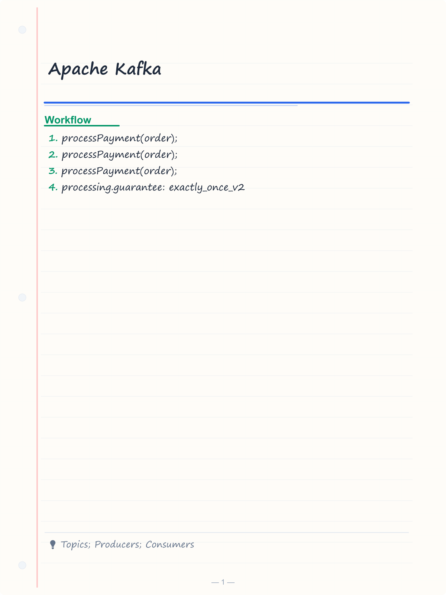
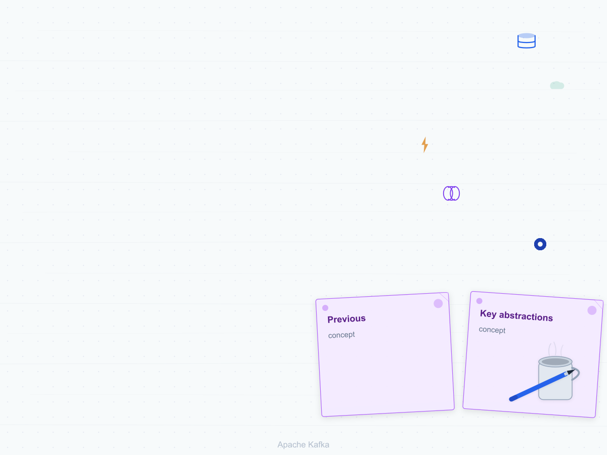
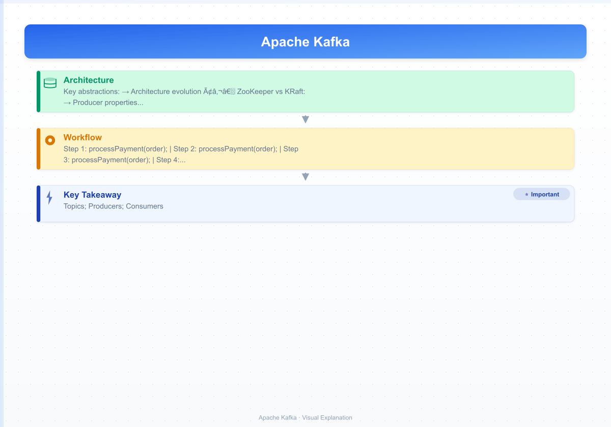

# Apache Kafka
> **Previous:** [RabbitMQ](35-rabbitmq.md) | **Next:** [Event-Driven Architecture and Saga Pattern](37-event-driven-saga.md)

## Learning Objectives

By the end of this chapter, you will be able to:
- Understand Kafka's core architecture: topics, partitions, offsets, brokers, producers, consumers, consumer groups, replication, and the KRaft consensus model
- Configure topics with replication factor, min.insync.replicas, cleanup policy, and retention settings
- Produce messages using `KafkaTemplate` with callbacks, custom partitioners, keys, and headers
- Consume messages using `@KafkaListener` with batch listening, manual offset commits, and various `AckMode` strategies
- Handle consumer errors with `DefaultErrorHandler`, `DeadLetterPublishingRecoverer`, and `@RetryableTopic`
- Implement exactly-once semantics with idempotent producers and transactional producers/consumers
- Integrate Schema Registry with Avro, Protobuf, and JSON Schema serialization
- Build stream processing applications with Kafka Streams including KStream, KTable, aggregations, joins, and window operations
- Implement seek operations and custom error handlers for production resilience

<!-- Image Gallery -->
<section class="lesson-visuals" aria-label="Visual learning resources">
  <header><span>VISUAL LEARNING</span><h2>See it. Review it. Remember it.</h2></header>
  <a class="lesson-visual-card" href="../../assets/images/lessons/java/36-kafka/handwritten-notes.png" target="_blank" rel="noopener">
    
    <span><strong>Handwritten notes</strong>Condensed notes for deliberate review.</span>
  </a>
  <a class="lesson-visual-card" href="../../assets/images/lessons/java/36-kafka/sticky-notes.png" target="_blank" rel="noopener">
    
    <span><strong>Sticky-note revision</strong>Fast recall prompts for revision.</span>
  </a>
  <a class="lesson-visual-card" href="../../assets/images/lessons/java/36-kafka/visual-explanation.png" target="_blank" rel="noopener">
    
    <span><strong>Visual concept guide</strong>A connected explanation of the key ideas.</span>
  </a>
</section>
<!-- End Image Gallery -->


---
## Chapter at a Glance

| Topic | Key Insight | Practical Takeaway |
|-------|------------|-------------------|
| Kafka → distributed event streaming platform | Topics, partitions, and consumer groups for horizontal scaling |
| Producers → publish records with keys, headers, and acks | `KafkaTemplate.send()` with partitioning strategies |
| Consumers → subscribe with `@KafkaListener` and consumer groups | Offset management, rebalancing, and exactly-once semantics |

---
## Chapter Roadmap

```mermaid
flowchart TD
    A[Kafka] --> B[Core Concepts]
    A --> C[Producers]
    A --> D[Consumers]
    A --> E[Spring Integration]
    B --> B1[Topic / Partition / Offset]
    B --> B2[Broker / Cluster / Zookeeper]
    C --> C1[KafkaTemplate]
    C --> C2[Acks / Retries]
    D --> D1[@KafkaListener]
    D --> D2[Consumer Group / Rebalancing]
    E --> E1[KafkaTransactionManager]
    E --> E2[Exactly-once semantics]
```

---
## Concept Comparison Table

| Concept | Description | Key Difference |
|---------|-------------|----------------|
| Kafka | Pull-based, persistent log | Best for event sourcing, stream processing |
| RabbitMQ | Push-based, smart broker | Best for task distribution, RPC-style messaging |
| At-least-once | Message may be delivered more than once | Default producer guarantee |
| Exactly-once | Message delivered exactly once | Requires idempotence + transactional producer |

---
## Quick Reference

| Element | Purpose | Example |
|---------|---------|---------|
| `KafkaTemplate.send(topic, key, value)` | Sends a record | `kafkaTemplate.send("orders", orderId, orderJson)` |
| `@KafkaListener(topics = "orders")` | Consumes records | `@KafkaListener(topics = "orders", groupId = "order-group")` |
| `@KafkaHandler` | Method-level handler in class-level `@KafkaListener` | Dispatches by payload type |
| `KafkaTransactionManager` | Transactional producer | Binds producer to Spring `@Transactional` |

---
## Cross-Application Matrix

| Domain | Application | Use Case |
|--------|-------------|----------|
| Event Sourcing | Kafka as event store | Order events persist in append-only log |
| Stream Processing | Kafka Streams / KSQL | Real-time aggregations and joins |
| Log Aggregation | Kafka Connect | Collect and centralize microservice logs |

---
## Chapter Quiz

1. What is the smallest unit of parallelism in Kafka? **Answer:** Partition → each partition is consumed by one consumer in a group
2. Which annotation subscribes a method to Kafka messages? **Answer:** `@KafkaListener`
3. What configuration enables exactly-once semantics for a Kafka producer? **Answer:** `enable.idempotence=true` and `acks=all`

## Theory


### 1. Kafka Core Concepts


Apache Kafka is a distributed event streaming platform. Unlike RabbitMQ (a message broker), Kafka is an append-only log that stores events durably and allows replay.

**Key abstractions:**

| Concept | Description |
|---------|-------------|
| **Topic** | A named category/feed for messages. Like a table in a database. |
| **Partition** | An ordered, immutable sequence of messages. Topics are split into partitions for parallelism. |
| **Offset** | A sequential ID for each message within a partition. The consumer tracks its position via offset. |
| **Broker** | A Kafka server node. A cluster has multiple brokers for fault tolerance. |
| **Producer** | A client that publishes messages to a topic partition. |
| **Consumer** | A client that reads messages from a topic partition at a tracked offset. |
| **Consumer Group** | A set of consumers that coordinate to consume partitions. Each partition is assigned to exactly one consumer in a group. |
| **Replication** | Partitions are replicated across brokers. The leader handles reads/writes; followers replicate. |
| **Log Segment** | The physical storage unit. Topics are split into segments on disk. |

**Architecture evolution — ZooKeeper vs KRaft:**

| Aspect | ZooKeeper-based (legacy) | KRaft (Kafka 3.x+) |
|--------|------------------------|--------------------|
| Metadata store | Separate ZooKeeper quorum | Kafka itself (internal topic `__cluster_metadata`) |
| Controller | Elected via ZooKeeper | Raft-based quorum inside the cluster |
| Number of services | 2 (Kafka + ZooKeeper) | 1 (Kafka) |
| Operational complexity | Higher | Lower |

Spring Boot with Kafka typically uses the `spring-kafka` library:

```xml
<dependency>
    <groupId>org.springframework.kafka</groupId>
    <artifactId>spring-kafka</artifactId>
</dependency>
```

### 2. Topic Configuration


Topics can be created programmatically or through auto-creation:

```java
@Configuration
public class KafkaTopicConfig {

    @Bean
    public NewTopic ordersTopic() {
        return TopicBuilder.name("orders")
            .partitions(6)
            .replicas(3)
            .config(TopicConfig.MIN_IN_SYNC_REPLICAS_CONFIG, "2")
            .config(TopicConfig.CLEANUP_POLICY_CONFIG, TopicConfig.CLEANUP_POLICY_DELETE)
            .config(TopicConfig.RETENTION_MS_CONFIG, "604800000")
            .config(TopicConfig.RETENTION_BYTES_CONFIG, "1073741824")
            .build();
    }

    @Bean
    public NewTopic paymentsTopic() {
        return TopicBuilder.name("payments")
            .partitions(10)
            .replicas(3)
            .config(TopicConfig.MIN_IN_SYNC_REPLICAS_CONFIG, "2")
            .config(TopicConfig.CLEANUP_POLICY_CONFIG, TopicConfig.CLEANUP_POLICY_COMPACT)
            .config(TopicConfig.DELETE_RETENTION_MS_CONFIG, "86400000")
            .build();
    }

    @Bean
    public NewTopic eventsTopic() {
        return TopicBuilder.name("events")
            .partitions(3)
            .replicas(1)
            .config(TopicConfig.RETENTION_MS_CONFIG, "3600000")
            .config(TopicConfig.SEGMENT_BYTES_CONFIG, "536870912")
            .build();
    }

    @Bean
    public NewTopic compactedTopic() {
        return TopicBuilder.name("user-profiles")
            .partitions(5)
            .replicas(2)
            .config(TopicConfig.CLEANUP_POLICY_CONFIG, TopicConfig.CLEANUP_POLICY_COMPACT)
            .config(TopicConfig.MIN_COMPACTION_LAG_MS_CONFIG, "60000")
            .build();
    }
}
```

Key topic configurations:

| Property | Description |
|----------|-------------|
| `min.insync.replicas` | Minimum replicas that must acknowledge writes for acks=all |
| `cleanup.policy` | `delete` (default, time/size-based retention) or `compact` (key-based retention) |
| `retention.ms` | Maximum age of a message before deletion (default 7 days) |
| `retention.bytes` | Maximum bytes per partition before deletion |
| `compression.type` | `producer`, `gzip`, `snappy`, `lz4`, `zstd` |

### 3. Producer Configuration


```java
@Configuration
public class KafkaProducerConfig {

    @Bean
    public ProducerFactory<String, Order> orderProducerFactory() {
        Map<String, Object> props = new HashMap<>();
        props.put(ProducerConfig.BOOTSTRAP_SERVERS_CONFIG, "localhost:9092,localhost:9093");
        props.put(ProducerConfig.KEY_SERIALIZER_CLASS_CONFIG, StringSerializer.class);
        props.put(ProducerConfig.VALUE_SERIALIZER_CLASS_CONFIG, JsonSerializer.class);
        props.put(ProducerConfig.ACKS_CONFIG, "all");
        props.put(ProducerConfig.COMPRESSION_TYPE_CONFIG, "snappy");
        props.put(ProducerConfig.BATCH_SIZE_CONFIG, 32768);
        props.put(ProducerConfig.LINGER_MS_CONFIG, 10);
        props.put(ProducerConfig.MAX_REQUEST_SIZE_CONFIG, 10485760);
        props.put(ProducerConfig.ENABLE_IDEMPOTENCE_CONFIG, true);
        props.put(ProducerConfig.RETRIES_CONFIG, Integer.MAX_VALUE);
        props.put(ProducerConfig.MAX_IN_FLIGHT_REQUESTS_PER_CONNECTION, 5);
        props.put(ProducerConfig.BUFFER_MEMORY_CONFIG, 33554432);
        props.put(ProducerConfig.REQUEST_TIMEOUT_MS_CONFIG, 30000);
        props.put(ProducerConfig.DELIVERY_TIMEOUT_MS_CONFIG, 120000);
        return new DefaultKafkaProducerFactory<>(props);
    }

    @Bean
    public KafkaTemplate<String, Order> orderKafkaTemplate() {
        KafkaTemplate<String, Order> template = new KafkaTemplate<>(orderProducerFactory());
        template.setDefaultTopic("orders");
        return template;
    }

    @Bean
    public ProducerFactory<String, Object> multiTypeProducerFactory() {
        Map<String, Object> props = new HashMap<>();
        props.put(ProducerConfig.BOOTSTRAP_SERVERS_CONFIG, "localhost:9092");
        props.put(ProducerConfig.KEY_SERIALIZER_CLASS_CONFIG, StringSerializer.class);
        props.put(ProducerConfig.VALUE_SERIALIZER_CLASS_CONFIG, JsonSerializer.class);
        props.put(ProducerConfig.ACKS_CONFIG, "all");
        return new DefaultKafkaProducerFactory<>(props);
    }

    @Bean
    public KafkaTemplate<String, Object> multiTypeKafkaTemplate() {
        return new KafkaTemplate<>(multiTypeProducerFactory());
    }
}
```

**Producer properties detailed:**

```java
// All properties with explanations
Map<String, Object> producerProps = new HashMap<>();

// Connection
producerProps.put(ProducerConfig.BOOTSTRAP_SERVERS_CONFIG, "localhost:9092");

// Serialization
producerProps.put(ProducerConfig.KEY_SERIALIZER_CLASS_CONFIG, StringSerializer.class.getName());
producerProps.put(ProducerConfig.VALUE_SERIALIZER_CLASS_CONFIG, JsonSerializer.class.getName());

// Durability
producerProps.put(ProducerConfig.ACKS_CONFIG, "all");          // Wait for all in-sync replicas
producerProps.put(ProducerConfig.ENABLE_IDEMPOTENCE_CONFIG, true); // At-most-once delivery

// Batching and latency
producerProps.put(ProducerConfig.BATCH_SIZE_CONFIG, 32768);       // Default 16384
producerProps.put(ProducerConfig.LINGER_MS_CONFIG, 10);           // Wait up to 10ms for batch
producerProps.put(ProducerConfig.COMPRESSION_TYPE_CONFIG, "snappy"); // Compress batches
producerProps.put(ProducerConfig.BUFFER_MEMORY_CONFIG, 33554432); // 32MB send buffer

// Retries
producerProps.put(ProducerConfig.RETRIES_CONFIG, Integer.MAX_VALUE);
producerProps.put(ProducerConfig.MAX_IN_FLIGHT_REQUESTS_PER_CONNECTION, 5);

// Timeouts
producerProps.put(ProducerConfig.REQUEST_TIMEOUT_MS_CONFIG, 30000);
producerProps.put(ProducerConfig.DELIVERY_TIMEOUT_MS_CONFIG, 120000);

// Size limits
producerProps.put(ProducerConfig.MAX_REQUEST_SIZE_CONFIG, 10485760);  // 10MB
producerProps.put(ProducerConfig.MAX_BLOCK_MS_CONFIG, 60000);         // Block for metadata
```

### 4. KafkaTemplate — Producing Messages


```java
@Service
public class OrderProducer {

    private static final Logger log = LoggerFactory.getLogger(OrderProducer.class);
    private final KafkaTemplate<String, Order> kafkaTemplate;

    public OrderProducer(KafkaTemplate<String, Order> kafkaTemplate) {
        this.kafkaTemplate = kafkaTemplate;
    }

    public void sendOrder(Order order) {
        kafkaTemplate.send("orders", order.getId().toString(), order);
    }

    public void sendOrderWithCallback(Order order) {
        ListenableFuture<SendResult<String, Order>> future =
            kafkaTemplate.send("orders", order.getId().toString(), order);

        future.addCallback(new ListenableFutureCallback<>() {
            @Override
            public void onSuccess(SendResult<String, Order> result) {
                RecordMetadata metadata = result.getRecordMetadata();
                log.info("Order {} sent to partition {} offset {}",
                    order.getId(), metadata.partition(), metadata.offset());
            }

            @Override
            public void onFailure(Throwable ex) {
                log.error("Failed to send order {}", order.getId(), ex);
            }
        });
    }

    public void sendWithHeaders(Order order) {
        ProducerRecord<String, Order> record = new ProducerRecord<>(
            "orders", order.getId().toString(), order);
        record.headers().add("source", "order-service".getBytes());
        record.headers().add("version", "1.0".getBytes());
        record.headers().add("timestamp", Instant.now().toString().getBytes());
        kafkaTemplate.send(record);
    }

    public void sendToPartition(Order order, int partition) {
        ProducerRecord<String, Order> record = new ProducerRecord<>(
            "orders", partition, order.getId().toString(), order);
        kafkaTemplate.send(record);
    }

    public CompletableFuture<SendResult<String, Order>> sendAsync(Order order) {
        return kafkaTemplate.send("orders", order.getId().toString(), order)
            .completable();
    }

    public void sendTransactionally(Order order) {
        kafkaTemplate.executeInTransaction(kafkaTemplate -> {
            kafkaTemplate.send("orders", order.getId().toString(), order);
            kafkaTemplate.send("audit", order.getId().toString(),
                new AuditEvent("ORDER_CREATED", order.getId()));
            return true;
        });
    }
}
```

### 5. Custom Partitioner


```java
public class OrderPartitioner implements Partitioner {

    private static final Logger log = LoggerFactory.getLogger(OrderPartitioner.class);

    @Override
    public int partition(String topic, Object key, byte[] keyBytes,
                         Object value, byte[] valueBytes, Cluster cluster) {
        List<PartitionInfo> partitions = cluster.partitionsForTopic(topic);
        int numPartitions = partitions.size();

        if (key == null) {
            return ThreadLocalRandom.current().nextInt(numPartitions);
        }

        if (key instanceof String keyStr) {
            return switch (keyStr.substring(0, 1).toLowerCase()) {
                case "a", "b", "c", "d", "e" -> 0;
                case "f", "g", "h", "i", "j" -> 1;
                case "k", "l", "m", "n", "o" -> 2;
                default -> Math.abs(key.hashCode() % numPartitions);
            };
        }

        return Math.abs(key.hashCode() % numPartitions);
    }

    @Override
    public void close() {}

    @Override
    public void configure(Map<String, ?> configs) {
        log.info("Configuring OrderPartitioner with {} configs", configs.size());
    }
}

// Register the custom partitioner
@Bean
public ProducerFactory<String, Order> partitionedProducerFactory() {
    Map<String, Object> props = new HashMap<>();
    props.put(ProducerConfig.BOOTSTRAP_SERVERS_CONFIG, "localhost:9092");
    props.put(ProducerConfig.KEY_SERIALIZER_CLASS_CONFIG, StringSerializer.class);
    props.put(ProducerConfig.VALUE_SERIALIZER_CLASS_CONFIG, JsonSerializer.class);
    props.put(ProducerConfig.PARTITIONER_CLASS_CONFIG, OrderPartitioner.class);
    props.put(ProducerConfig.ACKS_CONFIG, "all");
    return new DefaultKafkaProducerFactory<>(props);
}
```

### 6. Consumer Configuration


```java
@Configuration
public class KafkaConsumerConfig {

    @Bean
    public ConsumerFactory<String, Order> orderConsumerFactory() {
        Map<String, Object> props = new HashMap<>();
        props.put(ConsumerConfig.BOOTSTRAP_SERVERS_CONFIG, "localhost:9092");
        props.put(ConsumerConfig.GROUP_ID_CONFIG, "order-processor");
        props.put(ConsumerConfig.KEY_DESERIALIZER_CLASS_CONFIG, StringDeserializer.class);
        props.put(ConsumerConfig.VALUE_DESERIALIZER_CLASS_CONFIG, JsonDeserializer.class);
        props.put(JsonDeserializer.TRUSTED_PACKAGES, "com.example.*");
        props.put(ConsumerConfig.ENABLE_AUTO_COMMIT_CONFIG, false);
        props.put(ConsumerConfig.AUTO_OFFSET_RESET_CONFIG, "earliest");
        props.put(ConsumerConfig.MAX_POLL_RECORDS_CONFIG, 100);
        props.put(ConsumerConfig.FETCH_MIN_BYTES_CONFIG, 1024);
        props.put(ConsumerConfig.FETCH_MAX_WAIT_MS_CONFIG, 500);
        props.put(ConsumerConfig.MAX_PARTITION_FETCH_BYTES_CONFIG, 1048576);
        props.put(ConsumerConfig.SESSION_TIMEOUT_MS_CONFIG, 45000);
        props.put(ConsumerConfig.HEARTBEAT_INTERVAL_MS_CONFIG, 15000);
        props.put(ConsumerConfig.MAX_POLL_INTERVAL_MS_CONFIG, 300000);
        return new DefaultKafkaConsumerFactory<>(props);
    }

    @Bean
    public ConcurrentKafkaListenerContainerFactory<String, Order>
           orderListenerContainerFactory() {
        ConcurrentKafkaListenerContainerFactory<String, Order> factory =
            new ConcurrentKafkaListenerContainerFactory<>();
        factory.setConsumerFactory(orderConsumerFactory());
        factory.setConcurrency(3);
        factory.setBatchListener(false);
        factory.getContainerProperties().setAckMode(ContainerProperties.AckMode.MANUAL_IMMEDIATE);
        factory.getContainerProperties().setPollTimeout(3000);
        factory.getContainerProperties().setIdleBetweenPolls(100);
        factory.getContainerProperties().setSyncCommits(true);
        factory.setCommonErrorHandler(defaultErrorHandler());
        return factory;
    }

    @Bean
    public ConcurrentKafkaListenerContainerFactory<String, Order>
           batchListenerContainerFactory() {
        ConcurrentKafkaListenerContainerFactory<String, Order> factory =
            new ConcurrentKafkaListenerContainerFactory<>();
        factory.setConsumerFactory(orderConsumerFactory());
        factory.setConcurrency(5);
        factory.setBatchListener(true);
        factory.getContainerProperties().setAckMode(ContainerProperties.AckMode.BATCH);
        factory.getContainerProperties().setPollTimeout(2000);
        return factory;
    }
}
```

**Consumer properties detailed:**

```java
Map<String, Object> consumerProps = new HashMap<>();

// Connection and group
consumerProps.put(ConsumerConfig.BOOTSTRAP_SERVERS_CONFIG, "localhost:9092");
consumerProps.put(ConsumerConfig.GROUP_ID_CONFIG, "my-group");
consumerProps.put(ConsumerConfig.CLIENT_ID_CONFIG, "consumer-1");

// Deserialization
consumerProps.put(ConsumerConfig.KEY_DESERIALIZER_CLASS_CONFIG, StringDeserializer.class);
consumerProps.put(ConsumerConfig.VALUE_DESERIALIZER_CLASS_CONFIG, JsonDeserializer.class);
consumerProps.put(JsonDeserializer.TRUSTED_PACKAGES, "com.example.*");

// Offset management
consumerProps.put(ConsumerConfig.ENABLE_AUTO_COMMIT_CONFIG, false);
consumerProps.put(ConsumerConfig.AUTO_OFFSET_RESET_CONFIG, "earliest");
// earliest: start from beginning if no offset
// latest: start from end if no offset
// none: fail if no offset

// Fetch tuning
consumerProps.put(ConsumerConfig.FETCH_MIN_BYTES_CONFIG, 1);
consumerProps.put(ConsumerConfig.FETCH_MAX_WAIT_MS_CONFIG, 500);
consumerProps.put(ConsumerConfig.MAX_PARTITION_FETCH_BYTES_CONFIG, 1048576);
consumerProps.put(ConsumerConfig.MAX_POLL_RECORDS_CONFIG, 500);

// Heartbeat and session
consumerProps.put(ConsumerConfig.SESSION_TIMEOUT_MS_CONFIG, 45000);
consumerProps.put(ConsumerConfig.HEARTBEAT_INTERVAL_MS_CONFIG, 3000);
consumerProps.put(ConsumerConfig.MAX_POLL_INTERVAL_MS_CONFIG, 300000);

// Partition assignment
consumerProps.put(ConsumerConfig.PARTITION_ASSIGNMENT_STRATEGY_CONFIG,
    CooperativeStickyAssignor.class.getName());
```

### 7. @KafkaListener — Consuming Messages


```java
@Component
public class OrderConsumer {

    private static final Logger log = LoggerFactory.getLogger(OrderConsumer.class);

    @KafkaListener(
        topics = "orders",
        groupId = "order-processor",
        concurrency = "3",
        containerFactory = "orderListenerContainerFactory"
    )
    public void processOrder(
            @Payload Order order,
            @Header(KafkaHeaders.RECEIVED_KEY) String key,
            @Header(KafkaHeaders.RECEIVED_PARTITION) int partition,
            @Header(KafkaHeaders.OFFSET) long offset,
            @Header(KafkaHeaders.RECEIVED_TIMESTAMP) long timestamp,
            @Headers MessageHeaders headers) {

        log.info("Received order {} from partition {} offset {}",
            order.getId(), partition, offset);
        processPayment(order);
    }

    @KafkaListener(
        topics = "orders",
        groupId = "order-audit",
        containerFactory = "orderListenerContainerFactory"
    )
    @SendTo("audit")  // Forward result to audit topic
    public AuditEvent processAndForward(Order order) {
        log.info("Processing and forwarding order {}", order.getId());
        return new AuditEvent("PROCESSED", order.getId());
    }

    @KafkaListener(
        topicPattern = "order-.*",
        groupId = "pattern-consumer",
        containerFactory = "orderListenerContainerFactory"
    )
    public void handleByPattern(ConsumerRecord<String, Order> record) {
        log.info("Pattern match on topic {} with order {}",
            record.topic(), record.value().getId());
    }

    @KafkaListener(
        topics = "orders",
        groupId = "batch-processor",
        containerFactory = "batchListenerContainerFactory"
    )
    public void processBatch(List<Order> orders) {
        log.info("Received batch of {} orders", orders.size());
        for (Order order : orders) {
            processPayment(order);
        }
    }

    @KafkaListener(
        topics = "orders",
        groupId = "manual-ack",
        containerFactory = "orderListenerContainerFactory"
    )
    public void processWithManualAck(
            @Payload Order order,
            Acknowledgment acknowledgment) {
        try {
            processPayment(order);
            acknowledgment.acknowledge();
        } catch (Exception e) {
            log.error("Failed to process order {}", order.getId(), e);
            // Do not ack — message will be redelivered
        }
    }

    private void processPayment(Order order) {
        if (order.getTotal() == null || order.getTotal().compareTo(BigDecimal.ZERO) <= 0) {
            throw new IllegalArgumentException("Invalid order: " + order.getId());
        }
        log.info("Processed payment for order {}: {}", order.getId(), order.getTotal());
    }
}
```

### 8. AckMode Strategies


```java
@Configuration
public class AckModeConfig {

    @Bean
    public ConcurrentKafkaListenerContainerFactory<String, Order> recordAckFactory() {
        ConcurrentKafkaListenerContainerFactory<String, Order> factory =
            new ConcurrentKafkaListenerContainerFactory<>();
        factory.setConsumerFactory(orderConsumerFactory());
        factory.getContainerProperties().setAckMode(ContainerProperties.AckMode.RECORD);
        return factory;
    }

    @Bean
    public ConcurrentKafkaListenerContainerFactory<String, Order> batchAckFactory() {
        ConcurrentKafkaListenerContainerFactory<String, Order> factory =
            new ConcurrentKafkaListenerContainerFactory<>();
        factory.setConsumerFactory(orderConsumerFactory());
        factory.setBatchListener(true);
        factory.getContainerProperties().setAckMode(ContainerProperties.AckMode.BATCH);
        return factory;
    }

    @Bean
    public ConcurrentKafkaListenerContainerFactory<String, Order> timeAckFactory() {
        ConcurrentKafkaListenerContainerFactory<String, Order> factory =
            new ConcurrentKafkaListenerContainerFactory<>();
        factory.setConsumerFactory(orderConsumerFactory());
        factory.getContainerProperties().setAckMode(ContainerProperties.AckMode.TIME);
        factory.getContainerProperties().setAckTime(5000);
        return factory;
    }

    @Bean
    public ConcurrentKafkaListenerContainerFactory<String, Order> countAckFactory() {
        ConcurrentKafkaListenerContainerFactory<String, Order> factory =
            new ConcurrentKafkaListenerContainerFactory<>();
        factory.setConsumerFactory(orderConsumerFactory());
        factory.getContainerProperties().setAckMode(ContainerProperties.AckMode.COUNT);
        factory.getContainerProperties().setAckCount(10);
        return factory;
    }

    @Bean
    public ConcurrentKafkaListenerContainerFactory<String, Order> manualAckFactory() {
        ConcurrentKafkaListenerContainerFactory<String, Order> factory =
            new ConcurrentKafkaListenerContainerFactory<>();
        factory.setConsumerFactory(orderConsumerFactory());
        factory.getContainerProperties().setAckMode(ContainerProperties.AckMode.MANUAL);
        return factory;
    }

    @Bean
    public ConcurrentKafkaListenerContainerFactory<String, Order> manualImmediateAckFactory() {
        ConcurrentKafkaListenerContainerFactory<String, Order> factory =
            new ConcurrentKafkaListenerContainerFactory<>();
        factory.setConsumerFactory(orderConsumerFactory());
        factory.getContainerProperties().setAckMode(ContainerProperties.AckMode.MANUAL_IMMEDIATE);
        return factory;
    }
}
```

| AckMode | Behavior |
|---------|----------|
| `RECORD` | Commit after each record is processed |
| `BATCH` | Commit after the poll of records completes |
| `TIME` | Commit every `ackTime` milliseconds |
| `COUNT` | Commit after `ackCount` records |
| `MANUAL` | Listener must call `acknowledgment.acknowledge()` |
| `MANUAL_IMMEDIATE` | Like MANUAL but commits immediately (no batching) |

### 9. Seek Operations


```java
@Component
public class KafkaSeekOperations {

    private static final Logger log = LoggerFactory.getLogger(KafkaSeekOperations.class);
    private final ConsumerFactory<String, Order> consumerFactory;

    public KafkaSeekOperations(ConsumerFactory<String, Order> consumerFactory) {
        this.consumerFactory = consumerFactory;
    }

    @KafkaListener(id = "seek-listener", topics = "orders", groupId = "seek-group")
    public void listen(ConsumerRecord<String, Order> record) {
        log.info("Received: {}", record.value());
    }

    @EventListener(ApplicationStartedEvent.class)
    public void seekToBeginning() {
        try {
            AdminClient admin = AdminClient.create(consumerFactory.getConfigurationProperties());
            ListPartitionReassignment reassignment = new ListPartitionReassignment();
            try (KafkaConsumer<String, Order> consumer =
                     new KafkaConsumer<>(consumerFactory.getConfigurationProperties())) {
                consumer.subscribe(Collections.singletonList("orders"));
                consumer.poll(Duration.ofMillis(1000));
                consumer.seekToBeginning(consumer.assignment());
                log.info("Seeked to beginning for all partitions");
            }
        } catch (Exception e) {
            log.warn("Could not seek to beginning", e);
        }
    }
}

@Component
public class SeekErrorHandler {

    private static final Logger log = LoggerFactory.getLogger(SeekErrorHandler.class);

    @Bean
    public DefaultErrorHandler seekToCurrentErrorHandler() {
        DefaultErrorHandler errorHandler = new DefaultErrorHandler(
            (record, exception) -> {
                log.error("Record failed after retries: topic={}, partition={}, offset={}",
                    record.topic(), record.partition(), record.offset(), exception);
            },
            new FixedBackOff(1000L, 3)
        );
        errorHandler.setSeekAfterError(true);
        errorHandler.addRetryableExceptions(DataAccessException.class, TimeoutException.class);
        errorHandler.addNotRetryableExceptions(IllegalArgumentException.class);
        return errorHandler;
    }

    @Bean
    public DefaultErrorHandler customSeekHandler() {
        DefaultErrorHandler handler = new DefaultErrorHandler(
            new DeadLetterPublishingRecoverer(
                new KafkaTemplate<>(orderProducerFactory()),
                (rec, ex) -> new TopicPartition("orders.DLT", rec.partition())
            ),
            new ExponentialBackOff(1000, 2.0)
        );
        handler.setSeekAfterError(true);
        return handler;
    }

    private ProducerFactory<String, Order> orderProducerFactory() {
        return new DefaultKafkaProducerFactory<>(Map.of(
            ProducerConfig.BOOTSTRAP_SERVERS_CONFIG, "localhost:9092",
            ProducerConfig.KEY_SERIALIZER_CLASS_CONFIG, StringSerializer.class,
            ProducerConfig.VALUE_SERIALIZER_CLASS_CONFIG, JsonSerializer.class
        ));
    }
}
```

### 10. Error Handling


```java
@Configuration
public class KafkaErrorHandlingConfig {

    @Bean
    public DefaultErrorHandler defaultErrorHandler() {
        DeadLetterPublishingRecoverer recoverer = new DeadLetterPublishingRecoverer(
            kafkaErrorTemplate(),
            (record, exception) -> {
                String topic = record.topic() + ".DLT";
                log.warn("Routing failed record from {} to {}: {}",
                    record.topic(), topic, exception.getMessage());
                return new TopicPartition(topic, record.partition());
            }
        );

        DefaultErrorHandler handler = new DefaultErrorHandler(
            recoverer,
            new ExponentialBackOff(1000, 2.0)
        );
        handler.setMaxRetries(5);
        handler.setSeekAfterError(true);
        handler.setClassificationEnabled(true);
        handler.addRetryableExceptions(
            DataAccessException.class,
            NetworkException.class,
            org.apache.kafka.common.errors.TimeoutException.class
        );
        handler.addNotRetryableExceptions(
            IllegalArgumentException.class,
            SerializationException.class,
            DeserializationException.class
        );
        return handler;
    }

    @Bean
    public KafkaTemplate<String, Object> kafkaErrorTemplate() {
        Map<String, Object> props = new HashMap<>();
        props.put(ProducerConfig.BOOTSTRAP_SERVERS_CONFIG, "localhost:9092");
        props.put(ProducerConfig.KEY_SERIALIZER_CLASS_CONFIG, StringSerializer.class);
        props.put(ProducerConfig.VALUE_SERIALIZER_CLASS_CONFIG, ByteArraySerializer.class);
        return new KafkaTemplate<>(new DefaultKafkaProducerFactory<>(props));
    }

    @Bean
    public RetryingDeserializationHandler retryingDeserializationHandler() {
        return new RetryingDeserializationHandler() {
            @Override
            public Object handle(DeserializationException exception,
                                 ConsumerRecord<?, ?> record,
                                 Consumer<?, ?> consumer,
                                 MessageListenerContainer container,
                                 Runnable retryInvoker) {
                log.error("Deserialization failed for record at {}-{}: {}",
                    record.topic(), record.offset(), exception.getMessage());
                retryInvoker.run();
                return null;
            }
        };
    }

    @Bean
    public ConcurrentKafkaListenerContainerFactory<String, Order>
           errorHandlingContainerFactory() {
        ConcurrentKafkaListenerContainerFactory<String, Order> factory =
            new ConcurrentKafkaListenerContainerFactory<>();
        factory.setConsumerFactory(orderConsumerFactory());
        factory.setCommonErrorHandler(defaultErrorHandler());
        factory.getContainerProperties().setAckMode(
            ContainerProperties.AckMode.MANUAL_IMMEDIATE);
        return factory;
    }

    @Bean
    public ConsumerFactory<String, Order> orderConsumerFactory() {
        Map<String, Object> props = new HashMap<>();
        props.put(ConsumerConfig.BOOTSTRAP_SERVERS_CONFIG, "localhost:9092");
        props.put(ConsumerConfig.GROUP_ID_CONFIG, "error-handler-group");
        props.put(ConsumerConfig.KEY_DESERIALIZER_CLASS_CONFIG, StringDeserializer.class);
        props.put(ConsumerConfig.VALUE_DESERIALIZER_CLASS_CONFIG, JsonDeserializer.class);
        props.put(JsonDeserializer.TRUSTED_PACKAGES, "*");
        props.put(ConsumerConfig.ENABLE_AUTO_COMMIT_CONFIG, false);
        props.put(ConsumerConfig.AUTO_OFFSET_RESET_CONFIG, "earliest");
        return new DefaultKafkaConsumerFactory<>(props);
    }
}
```

#### 10.1 @RetryableTopic

```java
@Service
public class RetryableTopicConsumer {

    private static final Logger log = LoggerFactory.getLogger(RetryableTopicConsumer.class);

    @RetryableTopic(
        attempts = "5",
        backoff = @Backoff(delay = 1000, multiplier = 2.0, maxDelay = 30000),
        autoCreateTopics = "true",
        include = {
            DataAccessException.class,
            NetworkException.class
        },
        exclude = {
            IllegalArgumentException.class,
            SerializationException.class
        },
        dltTopicSuffix = "-dead-letter",
        retryTopicSuffix = "-retry",
        topicSuffixingStrategy = TopicSuffixingStrategy.SUFFIX_WITH_INDEX_VALUE
    )
    @KafkaListener(topics = "orders-important", groupId = "retry-group")
    public void processWithRetry(Order order) {
        log.info("Processing order {}", order.getId());
        if (!order.isValid()) {
            throw new IllegalArgumentException("Invalid order");
        }
    }

    @DltHandler
    public void handleDlt(Order order, @Header(KafkaHeaders.RECEIVED_TOPIC) String topic) {
        log.error("Order {} moved to DLT from topic {}", order.getId(), topic);
    }
}
```

#### 10.2 Custom Error Handler

```java
@Component
public class CustomKafkaErrorHandler implements CommonErrorHandler {

    private static final Logger log = LoggerFactory.getLogger(CustomKafkaErrorHandler.class);
    private final MeterRegistry meterRegistry;

    public CustomKafkaErrorHandler(MeterRegistry meterRegistry) {
        this.meterRegistry = meterRegistry;
    }

    @Override
    public boolean seekAfterError(Consumer<?, ?> consumer, Exception exception) {
        return true;
    }

    @Override
    public boolean retryAfterError(Consumer<?, ?> consumer, Exception exception) {
        if (exception instanceof IllegalArgumentException) {
            return false;
        }
        return true;
    }

    @Override
    public void handleBatch(Exception thrownException, ConsumerRecords<?, ?> records,
                            Consumer<?, ?> consumer, MessageListenerContainer container,
                            Runnable invokeListener) {
        log.error("Batch processing error for {} records", records.count(), thrownException);
        meterRegistry.counter("kafka.batch.errors",
            "exception", thrownException.getClass().getSimpleName()
        ).increment();
        // Skip the entire batch
        consumer.seekToEnd(consumer.assignment());
    }

    @Override
    public void handleOne(Exception thrownException, ConsumerRecord<?, ?> record,
                          Consumer<?, ?> consumer, MessageListenerContainer container) {
        log.error("Error processing record at {}-{}: {}",
            record.topic(), record.offset(), thrownException.getMessage());
        meterRegistry.counter("kafka.record.errors",
            "topic", record.topic(),
            "partition", String.valueOf(record.partition())
        ).increment();
        // Skip this record
        consumer.seek(consumer.assignment().iterator().next(),
            record.offset() + 1);
    }

    @Override
    public void handleOtherException(Exception thrownException,
                                     Consumer<?, ?> consumer,
                                     MessageListenerContainer container,
                                     boolean batchListener) {
        log.error("Unhandled exception in consumer", thrownException);
    }
}
```

### 11. Exactly-Once Semantics


```java
@Configuration
public class ExactlyOnceConfig {

    @Bean
    public ProducerFactory<String, Order> idempotentProducerFactory() {
        Map<String, Object> props = new HashMap<>();
        props.put(ProducerConfig.BOOTSTRAP_SERVERS_CONFIG, "localhost:9092");
        props.put(ProducerConfig.KEY_SERIALIZER_CLASS_CONFIG, StringSerializer.class);
        props.put(ProducerConfig.VALUE_SERIALIZER_CLASS_CONFIG, JsonSerializer.class);
        props.put(ProducerConfig.ENABLE_IDEMPOTENCE_CONFIG, true);
        props.put(ProducerConfig.ACKS_CONFIG, "all");
        props.put(ProducerConfig.MAX_IN_FLIGHT_REQUESTS_PER_CONNECTION, 5);
        props.put(ProducerConfig.RETRIES_CONFIG, Integer.MAX_VALUE);
        return new DefaultKafkaProducerFactory<>(props);
    }

    @Bean
    public ProducerFactory<String, Order> transactionalProducerFactory() {
        Map<String, Object> props = new HashMap<>();
        props.put(ProducerConfig.BOOTSTRAP_SERVERS_CONFIG, "localhost:9092");
        props.put(ProducerConfig.KEY_SERIALIZER_CLASS_CONFIG, StringSerializer.class);
        props.put(ProducerConfig.VALUE_SERIALIZER_CLASS_CONFIG, JsonSerializer.class);
        props.put(ProducerConfig.ENABLE_IDEMPOTENCE_CONFIG, true);
        props.put(ProducerConfig.ACKS_CONFIG, "all");
        props.put(ProducerConfig.TRANSACTIONAL_ID_CONFIG, "order-tx-");
        return new DefaultKafkaProducerFactory<>(props);
    }

    @Bean
    public KafkaTemplate<String, Order> transactionalKafkaTemplate() {
        KafkaTemplate<String, Order> template =
            new KafkaTemplate<>(transactionalProducerFactory());
        template.setDefaultTopic("orders");
        return template;
    }
}

@Service
public class ExactlyOnceProducer {

    private static final Logger log = LoggerFactory.getLogger(ExactlyOnceProducer.class);
    private final KafkaTemplate<String, Order> kafkaTemplate;

    public ExactlyOnceProducer(@Qualifier("transactionalKafkaTemplate")
                               KafkaTemplate<String, Order> kafkaTemplate) {
        this.kafkaTemplate = kafkaTemplate;
    }

    @Transactional
    public void processOrderTransactionally(Order order) {
        kafkaTemplate.send("orders", order);
        kafkaTemplate.send("payments", order.getId().toString(),
            new PaymentEvent(order.getId(), order.getTotal()));
        log.info("Transactionally sent order {} and payment event", order.getId());
    }

    public void sendInTransaction(Order order) {
        kafkaTemplate.executeInTransaction(operations -> {
            operations.send("orders", order.getId().toString(), order);
            operations.send("audit", order.getId().toString(),
                new AuditEvent("ORDER_CREATED", order.getId()));
            return true;
        });
    }
}

@Configuration
public class ExactlyOnceConsumerConfig {

    @Bean
    public ConcurrentKafkaListenerContainerFactory<String, Order>
           exactlyOnceContainerFactory() {
        ConcurrentKafkaListenerContainerFactory<String, Order> factory =
            new ConcurrentKafkaListenerContainerFactory<>();
        factory.setConsumerFactory(exactlyOnceConsumerFactory());
        factory.getContainerProperties().setAckMode(
            ContainerProperties.AckMode.MANUAL_IMMEDIATE);
        factory.getContainerProperties().setTransactionManager(kafkaTransactionManager());
        return factory;
    }

    @Bean
    public ConsumerFactory<String, Order> exactlyOnceConsumerFactory() {
        Map<String, Object> props = new HashMap<>();
        props.put(ConsumerConfig.BOOTSTRAP_SERVERS_CONFIG, "localhost:9092");
        props.put(ConsumerConfig.GROUP_ID_CONFIG, "exactly-once-group");
        props.put(ConsumerConfig.KEY_DESERIALIZER_CLASS_CONFIG, StringDeserializer.class);
        props.put(ConsumerConfig.VALUE_DESERIALIZER_CLASS_CONFIG, JsonDeserializer.class);
        props.put(ConsumerConfig.ISOLATION_LEVEL_CONFIG, "read_committed");
        props.put(ConsumerConfig.ENABLE_AUTO_COMMIT_CONFIG, false);
        return new DefaultKafkaConsumerFactory<>(props);
    }

    @Bean
    public KafkaTransactionManager<String, Order> kafkaTransactionManager() {
        return new KafkaTransactionManager<>(transactionalProducerFactory());
    }

    private ProducerFactory<String, Order> transactionalProducerFactory() {
        Map<String, Object> props = new HashMap<>();
        props.put(ProducerConfig.BOOTSTRAP_SERVERS_CONFIG, "localhost:9092");
        props.put(ProducerConfig.KEY_SERIALIZER_CLASS_CONFIG, StringSerializer.class);
        props.put(ProducerConfig.VALUE_SERIALIZER_CLASS_CONFIG, JsonSerializer.class);
        props.put(ProducerConfig.ENABLE_IDEMPOTENCE_CONFIG, true);
        props.put(ProducerConfig.ACKS_CONFIG, "all");
        props.put(ProducerConfig.TRANSACTIONAL_ID_CONFIG, "consumer-tx-");
        return new DefaultKafkaProducerFactory<>(props);
    }
}

@Component
public class ExactlyOnceConsumer {

    @KafkaListener(
        topics = "orders",
        groupId = "exactly-once-group",
        containerFactory = "exactlyOnceContainerFactory"
    )
    @Transactional
    public void consumeAndProduce(Order order) {
        // This runs within a Kafka transaction
        System.out.println("Consumed: " + order.getId());
        // The offset commit is part of the transaction
    }
}
```

### 12. Schema Registry Integration


#### 12.1 Avro with Confluent Schema Registry

```java
@Configuration
public class AvroProducerConfig {

    @Bean
    public ProducerFactory<String, OrderAvro> avroProducerFactory() {
        Map<String, Object> props = new HashMap<>();
        props.put(ProducerConfig.BOOTSTRAP_SERVERS_CONFIG, "localhost:9092");
        props.put(ProducerConfig.ACKS_CONFIG, "all");
        props.put(ProducerConfig.KEY_SERIALIZER_CLASS_CONFIG, StringSerializer.class);
        props.put(ProducerConfig.VALUE_SERIALIZER_CLASS_CONFIG, KafkaAvroSerializer.class);
        props.put("schema.registry.url", "http://localhost:8081");
        props.put("auto.register.schemas", true);
        return new DefaultKafkaProducerFactory<>(props);
    }

    @Bean
    public KafkaTemplate<String, OrderAvro> avroKafkaTemplate() {
        return new KafkaTemplate<>(avroProducerFactory());
    }

    @Bean
    public ConsumerFactory<String, OrderAvro> avroConsumerFactory() {
        Map<String, Object> props = new HashMap<>();
        props.put(ConsumerConfig.BOOTSTRAP_SERVERS_CONFIG, "localhost:9092");
        props.put(ConsumerConfig.GROUP_ID_CONFIG, "avro-consumer");
        props.put(ConsumerConfig.KEY_DESERIALIZER_CLASS_CONFIG, StringDeserializer.class);
        props.put(ConsumerConfig.VALUE_DESERIALIZER_CLASS_CONFIG, KafkaAvroDeserializer.class);
        props.put("schema.registry.url", "http://localhost:8081");
        props.put("specific.avro.reader", true);
        return new DefaultKafkaConsumerFactory<>(props);
    }

    @Bean
    public ConcurrentKafkaListenerContainerFactory<String, OrderAvro>
           avroListenerContainerFactory() {
        ConcurrentKafkaListenerContainerFactory<String, OrderAvro> factory =
            new ConcurrentKafkaListenerContainerFactory<>();
        factory.setConsumerFactory(avroConsumerFactory());
        return factory;
    }
}

@Component
public class AvroProducer {

    private final KafkaTemplate<String, OrderAvro> avroKafkaTemplate;

    public AvroProducer(KafkaTemplate<String, OrderAvro> avroKafkaTemplate) {
        this.avroKafkaTemplate = avroKafkaTemplate;
    }

    public void sendOrder(OrderAvro order) {
        avroKafkaTemplate.send("orders-avro", order.getId().toString(), order);
    }
}
```

#### 12.2 Protobuf with Kafka

```java
@Configuration
public class ProtobufConfig {

    @Bean
    public ProducerFactory<String, OrderProtos.Order> protobufProducerFactory() {
        Map<String, Object> props = new HashMap<>();
        props.put(ProducerConfig.BOOTSTRAP_SERVERS_CONFIG, "localhost:9092");
        props.put(ProducerConfig.KEY_SERIALIZER_CLASS_CONFIG, StringSerializer.class);
        props.put(ProducerConfig.VALUE_SERIALIZER_CLASS_CONFIG,
            KafkaProtobufSerializer.class);
        props.put("schema.registry.url", "http://localhost:8081");
        return new DefaultKafkaProducerFactory<>(props);
    }

    @Bean
    public KafkaTemplate<String, OrderProtos.Order> protobufKafkaTemplate() {
        return new KafkaTemplate<>(protobufProducerFactory());
    }

    @Bean
    public ConsumerFactory<String, OrderProtos.Order> protobufConsumerFactory() {
        Map<String, Object> props = new HashMap<>();
        props.put(ConsumerConfig.BOOTSTRAP_SERVERS_CONFIG, "localhost:9092");
        props.put(ConsumerConfig.GROUP_ID_CONFIG, "protobuf-consumer");
        props.put(ConsumerConfig.KEY_DESERIALIZER_CLASS_CONFIG, StringDeserializer.class);
        props.put(ConsumerConfig.VALUE_DESERIALIZER_CLASS_CONFIG,
            KafkaProtobufDeserializer.class);
        props.put("schema.registry.url", "http://localhost:8081");
        return new DefaultKafkaConsumerFactory<>(props);
    }
}
```

#### 12.3 JSON Schema with Schema Registry

```java
@Configuration
public class JsonSchemaConfig {

    @Bean
    public ProducerFactory<String, Order> jsonSchemaProducerFactory() {
        Map<String, Object> props = new HashMap<>();
        props.put(ProducerConfig.BOOTSTRAP_SERVERS_CONFIG, "localhost:9092");
        props.put(ProducerConfig.KEY_SERIALIZER_CLASS_CONFIG, StringSerializer.class);
        props.put(ProducerConfig.VALUE_SERIALIZER_CLASS_CONFIG,
            KafkaJsonSchemaSerializer.class);
        props.put("schema.registry.url", "http://localhost:8081");
        return new DefaultKafkaProducerFactory<>(props);
    }

    @Bean
    public KafkaTemplate<String, Order> jsonSchemaKafkaTemplate() {
        return new KafkaTemplate<>(jsonSchemaProducerFactory());
    }
}
```

### 13. Kafka Streams (KStreams)


```java
@Configuration
@EnableKafkaStreams
public class KafkaStreamsConfig {

    @Bean
    public StreamsBuilderFactoryBean kafkaStreamsBuilderFactory() {
        Map<String, Object> props = new HashMap<>();
        props.put(StreamsConfig.APPLICATION_ID_CONFIG, "order-stream-processor");
        props.put(StreamsConfig.BOOTSTRAP_SERVERS_CONFIG, "localhost:9092");
        props.put(StreamsConfig.DEFAULT_KEY_SERDE_CLASS_CONFIG, Serdes.String().getClass());
        props.put(StreamsConfig.DEFAULT_VALUE_SERDE_CLASS_CONFIG,
            JsonSerde.class.getName());
        props.put(StreamsConfig.NUM_STREAM_THREADS_CONFIG, 3);
        props.put(StreamsConfig.COMMIT_INTERVAL_MS_CONFIG, 100);
        props.put(StreamsConfig.PROCESSING_GUARANTEE_CONFIG,
            StreamsConfig.EXACTLY_ONCE_V2);
        props.put(StreamsConfig.CACHE_MAX_BYTES_BUFFERING_CONFIG, 10485760);
        props.put(StreamsConfig.STATE_DIR_CONFIG, "/tmp/kafka-streams");
        return new StreamsBuilderFactoryBean(new DefaultKafkaStreamsConfiguration(props));
    }
}

@Component
public class OrderStreamProcessor {

    private static final Logger log = LoggerFactory.getLogger(OrderStreamProcessor.class);

    @Autowired
    public void buildPipeline(StreamsBuilder builder) {
        JsonSerde<Order> orderSerde = new JsonSerde<>(Order.class);
        JsonSerde<OrderSummary> summarySerde = new JsonSerde<>(OrderSummary.class);
        JsonSerde<PaymentEvent> paymentSerde = new JsonSerde<>(PaymentEvent.class);

        // KStream: continuous stream of records
        KStream<String, Order> orders = builder.stream(
            "orders",
            Consumed.with(Serdes.String(), orderSerde)
        );

        // Filter and transform
        KStream<String, Order> highValueOrders = orders
            .filter((key, order) -> order.getTotal().compareTo(BigDecimal.valueOf(1000)) > 0)
            .peek((key, order) ->
                log.info("High-value order: {} = {}", key, order.getTotal()));

        highValueOrders.to("high-value-orders",
            Produced.with(Serdes.String(), orderSerde));

        // Map values
        KStream<String, String> orderSummaries = orders.mapValues(
            order -> "Order " + order.getId() + ": $" + order.getTotal());

        orderSummaries.to("order-summaries",
            Produced.with(Serdes.String(), Serdes.String()));

        // FlatMap: split into multiple records
        KStream<String, OrderItem> orderItems = orders.flatMap(
            (key, order) -> order.getItems().stream()
                .map(item -> new KeyValue<>(order.getId().toString(), item))
                .collect(Collectors.toList()));

        orderItems.to("order-items",
            Produced.with(Serdes.String(), new JsonSerde<>(OrderItem.class)));

        // KTable: changelog stream (upsert by key)
        KTable<String, Order> ordersTable = builder.table(
            "orders",
            Consumed.with(Serdes.String(), orderSerde),
            Materialized.as("orders-store")
        );

        // Join streams
        KStream<String, PaymentEvent> payments = builder.stream(
            "payments",
            Consumed.with(Serdes.String(), paymentSerde)
        );

        // Inner join KStream with KStream
        KStream<String, String> paidOrders = orders.join(
            payments,
            (order, payment) -> "Order " + order.getId()
                + " paid $" + payment.getAmount(),
            JoinWindows.ofTimeDifferenceWithNoGrace(Duration.ofMinutes(5)),
            StreamJoined.with(Serdes.String(), orderSerde, paymentSerde)
        );

        // Left join KStream with KTable
        KTable<String, Order> orderTable = builder.table(
            "orders",
            Consumed.with(Serdes.String(), orderSerde));

        KStream<String, String> enrichedOrders = payments.leftJoin(
            orderTable,
            (payment, order) -> order != null
                ? "Paid: " + order.getId() + " for $" + payment.getAmount()
                : "Orphan payment: " + payment.getId()
        );

        // GlobalKTable: fully replicated table for joins without partitioning
        GlobalKTable<String, Order> globalOrders = builder.globalTable(
            "orders",
            Consumed.with(Serdes.String(), orderSerde),
            Materialized.as("global-orders-store")
        );
    }
}
```

#### 13.1 Aggregations

```java
@Component
public class OrderAggregator {

    @Autowired
    public void buildAggregations(StreamsBuilder builder) {
        JsonSerde<Order> orderSerde = new JsonSerde<>(Order.class);
        JsonSerde<OrderSummary> summarySerde = new JsonSerde<>(OrderSummary.class);

        KStream<String, Order> orders = builder.stream("orders",
            Consumed.with(Serdes.String(), orderSerde));

        // Group by key and count
        KTable<String, Long> orderCounts = orders
            .groupByKey(Grouped.with(Serdes.String(), orderSerde))
            .count(Materialized.as("order-counts"));

        orderCounts.toStream().to("order-counts",
            Produced.with(Serdes.String(), Serdes.Long()));

        // Group by category and aggregate
        KStream<String, Order> byCategory = orders.selectKey(
            (key, order) -> order.getCategory());

        KTable<String, OrderSummary> categoryTotals = byCategory
            .groupByKey(Grouped.with(Serdes.String(), orderSerde))
            .aggregate(
                OrderSummary::new,
                (category, order, summary) -> {
                    summary.setCategory(category);
                    summary.setTotalOrders(summary.getTotalOrders() + 1);
                    summary.setTotalRevenue(
                        summary.getTotalRevenue().add(order.getTotal()));
                    return summary;
                },
                Materialized.<String, OrderSummary, KeyValueStore<Bytes, byte[]>>
                    as("category-totals")
                        .withKeySerde(Serdes.String())
                        .withValueSerde(summarySerde)
            );

        categoryTotals.toStream().to("category-totals",
            Produced.with(Serdes.String(), summarySerde));

        // Reduce: find max order value per category
        KTable<String, BigDecimal> maxByCategory = byCategory
            .groupByKey(Grouped.with(Serdes.String(), orderSerde))
            .reduce(
                (order1, order2) ->
                    order1.getTotal().compareTo(order2.getTotal()) > 0
                        ? order1 : order2,
                Materialized.as("max-order-per-category")
            )
            .mapValues(Order::getTotal);

        maxByCategory.toStream().to("max-per-category",
            Produced.with(Serdes.String(), Serdes.BigDecimal()));
    }
}
```

#### 13.2 Window Operations

```java
@Component
public class WindowedOperations {

    @Autowired
    public void buildWindows(StreamsBuilder builder) {
        JsonSerde<Order> orderSerde = new JsonSerde<>(Order.class);
        JsonSerde<OrderSummary> summarySerde = new JsonSerde<>(OrderSummary.class);

        KStream<String, Order> orders = builder.stream("orders",
            Consumed.with(Serdes.String(), orderSerde)
                .withTimestampExtractor(new OrderTimestampExtractor()));

        // Tumbling window: non-overlapping, fixed-size
        KTable<Windowed<String>, Long> tumblingCounts = orders
            .groupByKey(Grouped.with(Serdes.String(), orderSerde))
            .windowedBy(TimeWindows.ofSizeWithNoGrace(Duration.ofMinutes(5)))
            .count(Materialized.as("tumbling-counts"));

        tumblingCounts.toStream().foreach(
            (windowedKey, count) ->
                log.info("Tumbling: key={} window={} count={}",
                    windowedKey.key(),
                    windowedKey.window().startTime(),
                    count));

        // Hopping window: overlapping, fixed advance
        KTable<Windowed<String>, OrderSummary> hoppingAgg = orders
            .groupByKey(Grouped.with(Serdes.String(), orderSerde))
            .windowedBy(TimeWindows.ofSizeWithNoGrace(Duration.ofMinutes(10))
                .advanceBy(Duration.ofMinutes(5)))
            .aggregate(
                OrderSummary::new,
                (key, order, summary) -> {
                    summary.setTotalOrders(summary.getTotalOrders() + 1);
                    return summary;
                },
                Materialized.with(Serdes.String(), summarySerde)
            );

        // Sliding window: for joins (used in KStream-KStream joins)
        KStream<String, PaymentEvent> payments = builder.stream("payments",
            Consumed.with(Serdes.String(), new JsonSerde<>(PaymentEvent.class)));

        orders.outerJoin(
            payments,
            (order, payment) -> {
                if (order == null) return "Payment " + payment.getId() + " no order";
                if (payment == null) return "Order " + order.getId() + " unpaid";
                return "Order " + order.getId() + " paid " + payment.getAmount();
            },
            JoinWindows.ofTimeDifferenceAndGrace(Duration.ofHours(1),
                Duration.ofMinutes(5)),
            StreamJoined.with(Serdes.String(), orderSerde,
                new JsonSerde<>(PaymentEvent.class))
        );
    }

    // Custom timestamp extractor
    public static class OrderTimestampExtractor implements TimestampExtractor {
        @Override
        public long extract(ConsumerRecord<Object, Object> record,
                            long partitionTime) {
            if (record.value() instanceof Order order) {
                return order.getCreatedAt().toInstant(ZoneOffset.UTC).toEpochMilli();
            }
            return partitionTime;
        }
    }
}
```

### 14. KTable and GlobalKTable


```java
@Component
public class TableOperations {

    @Autowired
    public void buildTables(StreamsBuilder builder) {
        JsonSerde<UserProfile> profileSerde = new JsonSerde<>(UserProfile.class);
        JsonSerde<Order> orderSerde = new JsonSerde<>(Order.class);

        // KTable: partitioned changelog stream
        KTable<String, UserProfile> profiles = builder.table(
            "user-profiles",
            Consumed.with(Serdes.String(), profileSerde),
            Materialized.<String, UserProfile, KeyValueStore<Bytes, byte[]>>
                as("profiles-store")
                .withKeySerde(Serdes.String())
                .withValueSerde(profileSerde)
        );

        // Query a KTable via Interactive Queries
        profiles.toStream().foreach((key, profile) ->
            log.info("Profile: {} - {}", key, profile.getName()));

        // GlobalKTable: fully replicated on all nodes
        GlobalKTable<String, UserProfile> globalProfiles = builder.globalTable(
            "user-profiles",
            Consumed.with(Serdes.String(), profileSerde),
            Materialized.<String, UserProfile, KeyValueStore<Bytes, byte[]>>
                as("global-profiles-store")
        );

        // KStream-GlobalKTable join (no co-partitioning needed)
        KStream<String, Order> orders = builder.stream(
            "orders",
            Consumed.with(Serdes.String(), orderSerde)
        );

        KStream<String, String> enrichedOrders = orders.join(
            globalProfiles,
            (orderKey, order) -> order.getUserId(),
            (order, profile) -> "Order for " + profile.getName()
                + ": $" + order.getTotal()
        );

        enrichedOrders.to("enriched-orders",
            Produced.with(Serdes.String(), Serdes.String()));
    }
}
```

### 15. State Stores


```java
@Component
public class StateStoreOperations {

    @Autowired
    public void buildStateStore(StreamsBuilder builder) {
        StoreBuilder<KeyValueStore<String, Long>> countStore =
            Stores.keyValueStoreBuilder(
                Stores.persistentKeyValueStore("order-count"),
                Serdes.String(),
                Serdes.Long()
            );
        builder.addStateStore(countStore);
    }
}

@Component
public class ProcessorWithState {

    @Autowired
    public void buildProcessor(StreamsBuilder builder) {
        JsonSerde<Order> orderSerde = new JsonSerde<>(Order.class);

        // Custom processor that uses state store
        builder.stream("orders", Consumed.with(Serdes.String(), orderSerde))
            .process(() -> new Processor<String, Order>() {
                private StateStore stateStore;

                @Override
                public void init(ProcessorContext context) {
                    this.stateStore = context.getStateStore("order-count");
                }

                @Override
                public void process(Record<String, Order> record) {
                    String key = record.key();
                    Long currentCount = (Long) stateStore.get(key);
                    if (currentCount == null) {
                        currentCount = 0L;
                    }
                    stateStore.put(key, currentCount + 1);
                    System.out.println(key + " count: " + (currentCount + 1));
                }

                @Override
                public void close() {}
            }, "order-count");
    }
}
```

### 16. Full Application Properties


```yaml
spring:
  kafka:
    bootstrap-servers: localhost:9092,localhost:9093
    producer:
      key-serializer: org.apache.kafka.common.serialization.StringSerializer
      value-serializer: org.springframework.kafka.support.serializer.JsonSerializer
      acks: all
      compression-type: snappy
      batch-size: 32768
      linger-ms: 10
      enable-idempotence: true
      properties:
        max.request.size: 10485760
        delivery.timeout.ms: 120000
        request.timeout.ms: 30000
    consumer:
      group-id: spring-consumer
      auto-offset-reset: earliest
      enable-auto-commit: false
      key-deserializer: org.apache.kafka.common.serialization.StringDeserializer
      value-deserializer: org.springframework.kafka.support.serializer.JsonDeserializer
      properties:
        spring.json.trusted.packages: "*"
        max.poll.records: 100
        session.timeout.ms: 45000
        heartbeat.interval.ms: 3000
        max.poll.interval.ms: 300000
    listener:
      ack-mode: MANUAL_IMMEDIATE
      concurrency: 3
      poll-timeout: 3000
      idle-between-polls: 100
      type: single
    streams:
      application-id: spring-streams
      properties:
        num.stream.threads: 3
        commit.interval.ms: 100
        processing.guarantee: exactly_once_v2
        state.dir: /tmp/kafka-streams
```

### 17. Testing Kafka


```java
@SpringBootTest
@EmbeddedKafka(partitions = 1, topics = { "test-topic" })
class KafkaProducerTest {

    @Autowired
    private KafkaTemplate<String, Order> kafkaTemplate;

    @Autowired
    private EmbeddedKafkaBroker embeddedKafka;

    @Test
    void testSendAndReceive() throws Exception {
        Order order = new Order(1L, "test@test.com", BigDecimal.TEN);

        ListenableFuture<SendResult<String, Order>> future =
            kafkaTemplate.send("test-topic", order.getId().toString(), order);
        SendResult<String, Order> result = future.get(10, TimeUnit.SECONDS);

        assertThat(result.getRecordMetadata().topic()).isEqualTo("test-topic");
        assertThat(result.getRecordMetadata().offset()).isGreaterThanOrEqualTo(0);
    }

    @Test
    void testSendWithHeaders() throws Exception {
        Order order = new Order(2L, "header@test.com", BigDecimal.valueOf(50));
        ProducerRecord<String, Order> record = new ProducerRecord<>(
            "test-topic", order.getId().toString(), order);
        record.headers().add("source", "test".getBytes());

        SendResult<String, Order> result =
            kafkaTemplate.send(record).get(10, TimeUnit.SECONDS);
        assertThat(result.getProducerRecord().headers().lastHeader("source"))
            .isNotNull();
    }
}

@SpringBootTest
@EmbeddedKafka(partitions = 1, topics = { "listener-test" })
class KafkaConsumerTest {

    @Autowired
    private KafkaTemplate<String, Order> kafkaTemplate;

    @Autowired
    private TestListener testListener;

    @Test
    void testListenerReceivesMessage() throws Exception {
        Order order = new Order(3L, "listener@test.com", BigDecimal.valueOf(75));

        kafkaTemplate.send("listener-test", order.getId().toString(), order);

        // Give listener time to process
        Thread.sleep(2000);

        assertThat(testListener.getLastReceivedOrder()).isNotNull();
        assertThat(testListener.getLastReceivedOrder().getId()).isEqualTo(order.getId());
    }

    @Component
    public static class TestListener {

        private Order lastReceivedOrder;

        @KafkaListener(topics = "listener-test", groupId = "test-group")
        public void listen(Order order) {
            this.lastReceivedOrder = order;
        }

        public Order getLastReceivedOrder() {
            return lastReceivedOrder;
        }
    }
}
```

> [!TIP]
> Use a meaningful message key for partitioning → all messages with the same key go to the same partition, preserving order.

> [!WARNING]
> Consumer rebalancing stops all consumption in the group. Set `session.timeout.ms` appropriately to avoid unnecessary rebalances.

> [!NOTE]
> `@KafkaHandler` on multiple methods within a single `@KafkaListener` dispatches messages by payload type → like a visitor pattern.

## Summary

Apache Kafka is a distributed event streaming platform built on an append-only log abstraction. Key takeaways:

- **Topics** are partitioned for parallelism and replicated for durability. Configure partitions, replication factor, retention, and cleanup policy based on data characteristics.
- **Producers** use `KafkaTemplate` with callbacks for reliability. Enable idempotence (`enable.idempotence=true`) and use `acks=all` for strong guarantees. Tune `batch.size` and `linger.ms` for throughput.
- **Consumers** use `@KafkaListener` with configurable `AckMode`. `MANUAL_IMMEDIATE` gives precise control. Use `DefaultErrorHandler` with `DeadLetterPublishingRecoverer` for production error handling.
- **Exactly-once** requires idempotent producers + transactional producers/consumers + `read_committed` isolation. Configure `processing.guarantee=exactly_once_v2` for Streams.
- **Schema Registry** provides schema evolution with Avro, Protobuf, or JSON Schema — essential for production.
- **Kafka Streams** enables stream processing within the same application. Use `KStream` for record streams, `KTable` for changelog views, and `GlobalKTable` for fully replicated lookup tables. Windows (tumbling, hopping, sliding) enable time-based aggregations.
- **Error handling** with `@RetryableTopic` simplifies retry infrastructure — it auto-creates retry topics and a DLT.

## Exercises

### Exercise 1: Topic Configuration
Create a `NewTopic` bean for `"user-events"` with 8 partitions, 3 replicas, `cleanup.policy=delete`, `retention.ms=86400000`, and `min.insync.replicas=2`.

### Exercise 2: KafkaTemplate with Callback
Write a producer that sends a `UserEvent` to `"user-events"` and logs the partition and offset in `onSuccess`, or logs the error in `onFailure`.

### Exercise 3: @KafkaListener with Manual Ack
Create a `@KafkaListener` that receives `UserEvent` objects, processes them, and calls `acknowledgment.acknowledge()` after processing. Do not auto-commit.

### Exercise 4: Batch Consumer
Configure a batch listener container factory and a `@KafkaListener` that receives a `List<UserEvent>` and processes them as a batch.

### Exercise 5: Custom Partitioner
Write a `Partitioner` that routes messages with keys starting with A-M to partition 0 and N-Z to partition 1.

### Exercise 6: Error Handler with DLT
Implement a `DefaultErrorHandler` that retries 3 times with exponential backoff, then publishes to a DLT using `DeadLetterPublishingRecoverer`.

### Exercise 7: @RetryableTopic
Use `@RetryableTopic` with 5 attempts, 2-second initial backoff, 3x multiplier. Add a `@DltHandler` method that logs the failure.

### Exercise 8: Transactional Producer
Configure a transactional producer with `TRANSACTIONAL_ID_CONFIG`. Use `executeInTransaction` to send two messages atomically.

### Exercise 9: KStream Aggregation
Build a `StreamsBuilder` pipeline that reads orders, groups by category, and produces a running total per category using `aggregate()`.

### Exercise 10: KStream-KTable Join
Create a `KStream` of orders and a `KTable` of user profiles. Inner-join them to enrich orders with user names, producing to an `"enriched-orders"` topic.
