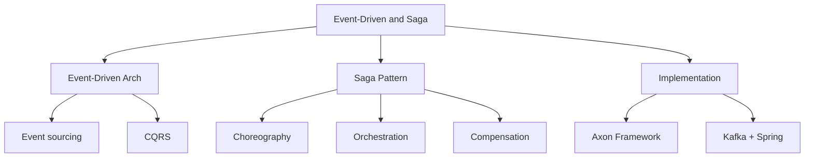

# Event-Driven Architecture & SAGA
> **Previous:** [Kafka](36-kafka.md) | **Next:** [Microservices Principles](38-microservices-principles.md)

## Learning Objectives

By the end of this chapter, you will be able to:
- Define domain events and design an event-driven microservices architecture
- Implement event sourcing with EventStore, aggregate reconstruction from event streams, and JDBC/MongoDB-backed event stores
- Apply the CQRS pattern with separate read/write models, materialized views, and eventual consistency
- Design and implement a choreography-based saga using domain events and compensating events
- Design and implement an orchestration-based saga with a central coordinator and state machine
- Use Axon Framework for aggregate management, command handling, event handling, and sagas
- Implement compensating transactions for both forward recovery and backward recovery
- Handle saga failure scenarios with retry strategies and deadline management

---
## Chapter at a Glance

| Topic | Key Insight | Practical Takeaway |
|-------|------------|-------------------|
| Event-Driven Architecture — services communicate via events, not direct calls | Loose coupling, eventual consistency, event sourcing |
| Saga Pattern — manage distributed transactions across services | Choreography (event-based) vs Orchestration (central coordinator) |
| Compensation — undo actions when a saga step fails | Each step defines a compensating action for rollback |

---
## Chapter Roadmap



---
## Concept Comparison Table

| Concept | Description | Key Difference |
|---------|-------------|----------------|
| Choreography | Services react to events independently | Decentralized, no single point of failure |
| Orchestration | Central coordinator directs steps | Easier to monitor and manage |
| Event Sourcing | State is derived from event log | Full audit trail, temporal queries |
| CQRS | Separate read and write models | Optimized queries, event-sourced writes |

---
## Quick Reference

| Element | Purpose | Example |
|---------|---------|---------|
| `@Saga` | Axon saga definition | `@Saga class OrderSaga { ... }` |
| `@StartSaga` | Marks saga-starting event handler | `@StartSaga @SagaEventHandler(associationProperty = "id")` |
| `@EndSaga` | Marks saga-completing event handler | Called when saga reaches terminal state |
| `SagaLifecycle.associateWith()` | Associates saga with event key | Routes subsequent events to correct saga instance |

---
## Cross-Application Matrix

| Domain | Application | Use Case |
|--------|-------------|----------|
| E-Commerce Order Flow | Orchestrated Saga | Create order → reserve inventory → process payment → ship |
| Account Transfer | Choreographed Saga | Debit source → credit destination (compensate if credit fails) |
| Travel Booking | Orchestrated Saga | Book flight → hotel → car (cancel all if any fails) |

---
## Chapter Quiz

1. What are the two types of saga coordination? **Answer:** Choreography (decentralized) and Orchestration (central coordinator)
2. What is a compensating transaction in a saga? **Answer:** An action that undoes the effects of a previous saga step when a later step fails
3. Which framework provides first-class saga support for Java? **Answer:** Axon Framework

## Theory


### 1. Domain Events

A domain event is an immutable record of something that happened in the domain that domain experts care about. It represents a fact — not a command. Domain events are named in the past tense.

**Characteristics of good domain events:**
- Immutable — once created, never changed
- Named in past tense (e.g., `OrderPlaced`, `PaymentReceived`)
- Contains all relevant data for consumers to act
- Includes a unique identifier, timestamp, and correlation ID
- Self-describing and versioned for schema evolution

```java
public abstract class BaseDomainEvent {

    private final String eventId;
    private final String aggregateId;
    private final String eventType;
    private final Instant occurredAt;
    private final String correlationId;
    private final long version;

    protected BaseDomainEvent(String aggregateId, String eventType,
                              String correlationId, long version) {
        this.eventId = UUID.randomUUID().toString();
        this.aggregateId = aggregateId;
        this.eventType = eventType;
        this.occurredAt = Instant.now();
        this.correlationId = correlationId;
        this.version = version;
    }

    public String getEventId() { return eventId; }
    public String getAggregateId() { return aggregateId; }
    public String getEventType() { return eventType; }
    public Instant getOccurredAt() { return occurredAt; }
    public String getCorrelationId() { return correlationId; }
    public long getVersion() { return version; }
}

// Order domain events
public class OrderPlacedEvent extends BaseDomainEvent {
    private final String customerId;
    private final List<OrderItem> items;
    private final BigDecimal total;
    private final String shippingAddress;

    public OrderPlacedEvent(String aggregateId, String correlationId, long version,
                            String customerId, List<OrderItem> items,
                            BigDecimal total, String shippingAddress) {
        super(aggregateId, "ORDER_PLACED", correlationId, version);
        this.customerId = customerId;
        this.items = items;
        this.total = total;
        this.shippingAddress = shippingAddress;
    }

    public String getCustomerId() { return customerId; }
    public List<OrderItem> getItems() { return items; }
    public BigDecimal getTotal() { return total; }
    public String getShippingAddress() { return shippingAddress; }
}

public class OrderCancelledEvent extends BaseDomainEvent {
    private final String reason;

    public OrderCancelledEvent(String aggregateId, String correlationId,
                               long version, String reason) {
        super(aggregateId, "ORDER_CANCELLED", correlationId, version);
        this.reason = reason;
    }

    public String getReason() { return reason; }
}

public class PaymentAuthorizedEvent extends BaseDomainEvent {
    private final BigDecimal amount;
    private final String transactionId;

    public PaymentAuthorizedEvent(String aggregateId, String correlationId, long version,
                                  BigDecimal amount, String transactionId) {
        super(aggregateId, "PAYMENT_AUTHORIZED", correlationId, version);
        this.amount = amount;
        this.transactionId = transactionId;
    }

    public BigDecimal getAmount() { return amount; }
    public String getTransactionId() { return transactionId; }
}

public class PaymentFailedEvent extends BaseDomainEvent {
    private final String failureReason;

    public PaymentFailedEvent(String aggregateId, String correlationId, long version,
                              String failureReason) {
        super(aggregateId, "PAYMENT_FAILED", correlationId, version);
        this.failureReason = failureReason;
    }

    public String getFailureReason() { return failureReason; }
}

public class PaymentRefundedEvent extends BaseDomainEvent {
    private final BigDecimal amount;
    private final String refundId;

    public PaymentRefundedEvent(String aggregateId, String correlationId, long version,
                                BigDecimal amount, String refundId) {
        super(aggregateId, "PAYMENT_REFUNDED", correlationId, version);
        this.amount = amount;
        this.refundId = refundId;
    }

    public BigDecimal getAmount() { return amount; }
    public String getRefundId() { return refundId; }
}

public class InventoryReservedEvent extends BaseDomainEvent {
    private final Map<String, Integer> reservedItems;

    public InventoryReservedEvent(String aggregateId, String correlationId, long version,
                                  Map<String, Integer> reservedItems) {
        super(aggregateId, "INVENTORY_RESERVED", correlationId, version);
        this.reservedItems = reservedItems;
    }

    public Map<String, Integer> getReservedItems() { return reservedItems; }
}

public class InventoryReleaseFailedEvent extends BaseDomainEvent {
    private final String reason;

    public InventoryReleaseFailedEvent(String aggregateId, String correlationId,
                                       long version, String reason) {
        super(aggregateId, "INVENTORY_RELEASE_FAILED", correlationId, version);
        this.reason = reason;
    }

    public String getReason() { return reason; }
}

public class ShippedEvent extends BaseDomainEvent {
    private final String trackingNumber;

    public ShippedEvent(String aggregateId, String correlationId, long version,
                        String trackingNumber) {
        super(aggregateId, "SHIPPED", correlationId, version);
        this.trackingNumber = trackingNumber;
    }

    public String getTrackingNumber() { return trackingNumber; }
}
```

### 2. Event Sourcing

Event sourcing persists every state change as an immutable event in an append-only store. The current state — the aggregate — is reconstructed by replaying the event stream from the beginning.

```java
// Event store interface
public interface EventStore {
    void appendEvents(String aggregateId, List<DomainEvent> events, long expectedVersion);
    List<DomainEvent> readEvents(String aggregateId);
    List<DomainEvent> readAllEventsSince(long globalOffset);
    long getLatestVersion(String aggregateId);
}
```

#### 2.1 JDBC Event Store

```java
@Repository
public class JdbcEventStore implements EventStore {

    private static final Logger log = LoggerFactory.getLogger(JdbcEventStore.class);
    private final JdbcTemplate jdbcTemplate;
    private final ObjectMapper objectMapper;

    public JdbcEventStore(JdbcTemplate jdbcTemplate, ObjectMapper objectMapper) {
        this.jdbcTemplate = jdbcTemplate;
        this.objectMapper = objectMapper;
    }

    @Override
    @Transactional
    public void appendEvents(String aggregateId, List<DomainEvent> events,
                             long expectedVersion) {
        long currentVersion = getLatestVersion(aggregateId);
        if (currentVersion != expectedVersion) {
            throw new OptimisticLockingFailureException(
                "Version mismatch for aggregate " + aggregateId
                + ". Expected: " + expectedVersion + " Actual: " + currentVersion);
        }

        String sql = "INSERT INTO event_store (aggregate_id, event_type, event_data, " +
            "occurred_at, correlation_id, version) VALUES (?, ?, ?, ?, ?, ?)";

        for (DomainEvent event : events) {
            try {
                String eventData = objectMapper.writeValueAsString(event);
                jdbcTemplate.update(sql,
                    preparedStatement -> {
                        preparedStatement.setString(1, event.getAggregateId());
                        preparedStatement.setString(2, event.getEventType());
                        preparedStatement.setString(3, eventData);
                        preparedStatement.setTimestamp(4,
                            Timestamp.from(event.getOccurredAt()));
                        preparedStatement.setString(5, event.getCorrelationId());
                        preparedStatement.setLong(6, event.getVersion());
                    }
                );
            } catch (JsonProcessingException e) {
                throw new RuntimeException("Failed to serialize event", e);
            }
        }

        log.info("Appended {} events for aggregate {} at version {}",
            events.size(), aggregateId, currentVersion + events.size());
    }

    @Override
    public List<DomainEvent> readEvents(String aggregateId) {
        String sql = "SELECT * FROM event_store WHERE aggregate_id = ? ORDER BY version ASC";
        return jdbcTemplate.query(sql, this::mapEvent, aggregateId);
    }

    @Override
    public List<DomainEvent> readAllEventsSince(long globalOffset) {
        String sql = "SELECT * FROM event_store WHERE id > ? ORDER BY id ASC LIMIT 1000";
        return jdbcTemplate.query(sql, this::mapEvent, globalOffset);
    }

    @Override
    public long getLatestVersion(String aggregateId) {
        String sql = "SELECT COALESCE(MAX(version), 0) FROM event_store WHERE aggregate_id = ?";
        Long version = jdbcTemplate.queryForObject(sql, Long.class, aggregateId);
        return version != null ? version : 0L;
    }

    private DomainEvent mapEvent(ResultSet rs, int rowNum) throws SQLException {
        String aggregateId = rs.getString("aggregate_id");
        String eventType = rs.getString("event_type");
        String eventData = rs.getString("event_data");
        try {
            Class<?> eventClass = switch (eventType) {
                case "ORDER_PLACED" -> OrderPlacedEvent.class;
                case "ORDER_CANCELLED" -> OrderCancelledEvent.class;
                case "PAYMENT_AUTHORIZED" -> PaymentAuthorizedEvent.class;
                case "PAYMENT_FAILED" -> PaymentFailedEvent.class;
                case "PAYMENT_REFUNDED" -> PaymentRefundedEvent.class;
                case "INVENTORY_RESERVED" -> InventoryReservedEvent.class;
                case "INVENTORY_RELEASE_FAILED" -> InventoryReleaseFailedEvent.class;
                case "SHIPPED" -> ShippedEvent.class;
                default -> throw new IllegalArgumentException("Unknown event: " + eventType);
            };
            return (DomainEvent) objectMapper.readValue(eventData, eventClass);
        } catch (JsonProcessingException e) {
            throw new RuntimeException("Failed to deserialize event", e);
        }
    }
}

// Event store DDL
/*
CREATE TABLE event_store (
    id BIGINT AUTO_INCREMENT PRIMARY KEY,
    aggregate_id VARCHAR(255) NOT NULL,
    event_type VARCHAR(100) NOT NULL,
    event_data TEXT NOT NULL,
    occurred_at TIMESTAMP NOT NULL,
    correlation_id VARCHAR(255),
    version BIGINT NOT NULL,
    INDEX idx_aggregate (aggregate_id),
    INDEX idx_correlation (correlation_id),
    INDEX idx_occurred (occurred_at)
);
*/
```

#### 2.2 MongoDB Event Store

```java
@Repository
public class MongoEventStore implements EventStore {

    private static final Logger log = LoggerFactory.getLogger(MongoEventStore.class);
    private final MongoTemplate mongoTemplate;

    public MongoEventStore(MongoTemplate mongoTemplate) {
        this.mongoTemplate = mongoTemplate;
    }

    @Override
    public void appendEvents(String aggregateId, List<DomainEvent> events,
                             long expectedVersion) {
        Query query = new Query(Criteria.where("aggregateId").is(aggregateId));
        query.with(Sort.by(Sort.Direction.DESC, "version"));
        query.limit(1);
        StoredEvent lastEvent = mongoTemplate.findOne(query, StoredEvent.class);

        long currentVersion = lastEvent != null ? lastEvent.getVersion() : 0;
        if (currentVersion != expectedVersion) {
            throw new OptimisticLockingFailureException(
                "Version mismatch for aggregate " + aggregateId);
        }

        for (DomainEvent event : events) {
            StoredEvent stored = new StoredEvent(
                event.getAggregateId(),
                event.getEventType(),
                event,
                event.getOccurredAt(),
                event.getCorrelationId(),
                event.getVersion()
            );
            mongoTemplate.save(stored, "event_store");
        }

        log.info("Appended {} events for aggregate {}",
            events.size(), aggregateId);
    }

    @Override
    public List<DomainEvent> readEvents(String aggregateId) {
        Query query = new Query(Criteria.where("aggregateId").is(aggregateId));
        query.with(Sort.by(Sort.Direction.ASC, "version"));
        List<StoredEvent> storedEvents = mongoTemplate.find(query, StoredEvent.class,
            "event_store");
        return storedEvents.stream()
            .map(StoredEvent::toDomainEvent)
            .collect(Collectors.toList());
    }

    @Override
    public List<DomainEvent> readAllEventsSince(long globalOffset) {
        Query query = new Query(Criteria.where("id").gt(globalOffset));
        query.with(Sort.by(Sort.Direction.ASC, "id"));
        query.limit(1000);
        List<StoredEvent> storedEvents = mongoTemplate.find(query, StoredEvent.class,
            "event_store");
        return storedEvents.stream()
            .map(StoredEvent::toDomainEvent)
            .collect(Collectors.toList());
    }

    @Override
    public long getLatestVersion(String aggregateId) {
        Query query = new Query(Criteria.where("aggregateId").is(aggregateId));
        query.with(Sort.by(Sort.Direction.DESC, "version"));
        query.limit(1);
        StoredEvent lastEvent = mongoTemplate.findOne(query, StoredEvent.class,
            "event_store");
        return lastEvent != null ? lastEvent.getVersion() : 0L;
    }
}

// Document class for MongoDB storage
public class StoredEvent {

    @Id
    private String id;
    private String aggregateId;
    private String eventType;
    private Document eventData;
    private Instant occurredAt;
    private String correlationId;
    private long version;

    public StoredEvent() {}

    public StoredEvent(String aggregateId, String eventType, DomainEvent event,
                       Instant occurredAt, String correlationId, long version) {
        this.aggregateId = aggregateId;
        this.eventType = eventType;
        this.eventData = toDocument(event);
        this.occurredAt = occurredAt;
        this.correlationId = correlationId;
        this.version = version;
    }

    public DomainEvent toDomainEvent() {
        return switch (eventType) {
            case "ORDER_PLACED" -> toOrderPlaced();
            case "ORDER_CANCELLED" -> toOrderCancelled();
            case "PAYMENT_AUTHORIZED" -> toPaymentAuthorized();
            case "PAYMENT_FAILED" -> toPaymentFailed();
            case "PAYMENT_REFUNDED" -> toPaymentRefunded();
            case "INVENTORY_RESERVED" -> toInventoryReserved();
            case "INVENTORY_RELEASE_FAILED" -> toInventoryReleaseFailed();
            case "SHIPPED" -> toShipped();
            default -> throw new IllegalArgumentException("Unknown: " + eventType);
        };
    }

    private OrderPlacedEvent toOrderPlaced() {
        return objectMapper.convertValue(eventData, OrderPlacedEvent.class);
    }

    private OrderCancelledEvent toOrderCancelled() {
        return objectMapper.convertValue(eventData, OrderCancelledEvent.class);
    }

    private PaymentAuthorizedEvent toPaymentAuthorized() {
        return objectMapper.convertValue(eventData, PaymentAuthorizedEvent.class);
    }

    private PaymentFailedEvent toPaymentFailed() {
        return objectMapper.convertValue(eventData, PaymentFailedEvent.class);
    }

    private PaymentRefundedEvent toPaymentRefunded() {
        return objectMapper.convertValue(eventData, PaymentRefundedEvent.class);
    }

    private InventoryReservedEvent toInventoryReserved() {
        return objectMapper.convertValue(eventData, InventoryReservedEvent.class);
    }

    private InventoryReleaseFailedEvent toInventoryReleaseFailed() {
        return objectMapper.convertValue(eventData, InventoryReleaseFailedEvent.class);
    }

    private ShippedEvent toShipped() {
        return objectMapper.convertValue(eventData, ShippedEvent.class);
    }

    private static final ObjectMapper objectMapper = new ObjectMapper()
        .registerModule(new JavaTimeModule())
        .disable(SerializationFeature.WRITE_DATES_AS_TIMESTAMPS);

    private Document toDocument(DomainEvent event) {
        return new Document(objectMapper.convertValue(event, Map.class));
    }

    public String getId() { return id; }
    public String getAggregateId() { return aggregateId; }
    public String getEventType() { return eventType; }
    public Document getEventData() { return eventData; }
    public Instant getOccurredAt() { return occurredAt; }
    public String getCorrelationId() { return correlationId; }
    public long getVersion() { return version; }
}
```

#### 2.3 Aggregate Reconstruction

An aggregate is reconstructed by replaying its event stream in order:

```java
public class OrderAggregate {

    private String orderId;
    private String customerId;
    private List<OrderItem> items;
    private BigDecimal total;
    private String shippingAddress;
    private OrderStatus status;
    private String transactionId;
    private String trackingNumber;
    private long version;

    public OrderAggregate() {}

    public OrderAggregate(List<DomainEvent> eventStream) {
        for (DomainEvent event : eventStream) {
            apply(event);
            this.version = event.getVersion();
        }
    }

    public static OrderAggregate reconstruct(EventStore eventStore, String orderId) {
        List<DomainEvent> events = eventStore.readEvents(orderId);
        return new OrderAggregate(events);
    }

    public List<DomainEvent> placeOrder(String customerId, List<OrderItem> items,
                                        BigDecimal total, String shippingAddress,
                                        String correlationId) {
        if (status != null) {
            throw new IllegalStateException("Order already exists");
        }
        OrderPlacedEvent event = new OrderPlacedEvent(
            orderId, correlationId, version + 1,
            customerId, items, total, shippingAddress);
        apply(event);
        return List.of(event);
    }

    public List<DomainEvent> cancelOrder(String reason, String correlationId) {
        if (status == OrderStatus.CANCELLED || status == OrderStatus.SHIPPED) {
            throw new IllegalStateException("Cannot cancel order in status: " + status);
        }
        OrderCancelledEvent event = new OrderCancelledEvent(
            orderId, correlationId, version + 1, reason);
        apply(event);
        return List.of(event);
    }

    public List<DomainEvent> authorizePayment(BigDecimal amount, String transactionId,
                                              String correlationId) {
        if (status != OrderStatus.PLACED) {
            throw new IllegalStateException("Order is not in PLACED status");
        }
        PaymentAuthorizedEvent event = new PaymentAuthorizedEvent(
            orderId, correlationId, version + 1, amount, transactionId);
        apply(event);
        return List.of(event);
    }

    public List<DomainEvent> failPayment(String reason, String correlationId) {
        PaymentFailedEvent event = new PaymentFailedEvent(
            orderId, correlationId, version + 1, reason);
        apply(event);
        return List.of(event);
    }

    public List<DomainEvent> refundPayment(BigDecimal amount, String refundId,
                                           String correlationId) {
        PaymentRefundedEvent event = new PaymentRefundedEvent(
            orderId, correlationId, version + 1, amount, refundId);
        apply(event);
        return List.of(event);
    }

    public List<DomainEvent> reserveInventory(Map<String, Integer> reservedItems,
                                              String correlationId) {
        InventoryReservedEvent event = new InventoryReservedEvent(
            orderId, correlationId, version + 1, reservedItems);
        apply(event);
        return List.of(event);
    }

    public List<DomainEvent> ship(String trackingNumber, String correlationId) {
        if (status != OrderStatus.PAYMENT_AUTHORIZED) {
            throw new IllegalStateException("Payment not authorized");
        }
        ShippedEvent event = new ShippedEvent(
            orderId, correlationId, version + 1, trackingNumber);
        apply(event);
        return List.of(event);
    }

    public void apply(DomainEvent event) {
        switch (event) {
            case OrderPlacedEvent e -> {
                this.orderId = e.getAggregateId();
                this.customerId = e.getCustomerId();
                this.items = e.getItems();
                this.total = e.getTotal();
                this.shippingAddress = e.getShippingAddress();
                this.status = OrderStatus.PLACED;
            }
            case OrderCancelledEvent e -> this.status = OrderStatus.CANCELLED;
            case PaymentAuthorizedEvent e -> {
                this.transactionId = e.getTransactionId();
                this.status = OrderStatus.PAYMENT_AUTHORIZED;
            }
            case PaymentFailedEvent e -> this.status = OrderStatus.PAYMENT_FAILED;
            case PaymentRefundedEvent e -> {
                this.status = OrderStatus.REFUNDED;
            }
            case InventoryReservedEvent e -> {
                this.status = OrderStatus.INVENTORY_RESERVED;
            }
            case ShippedEvent e -> {
                this.trackingNumber = e.getTrackingNumber();
                this.status = OrderStatus.SHIPPED;
            }
            default -> {}
        }
        this.version = event.getVersion();
    }

    public String getOrderId() { return orderId; }
    public String getCustomerId() { return customerId; }
    public List<OrderItem> getItems() { return items; }
    public BigDecimal getTotal() { return total; }
    public String getShippingAddress() { return shippingAddress; }
    public OrderStatus getStatus() { return status; }
    public String getTransactionId() { return transactionId; }
    public String getTrackingNumber() { return trackingNumber; }
    public long getVersion() { return version; }
}

public enum OrderStatus {
    PLACED,
    PAYMENT_AUTHORIZED,
    PAYMENT_FAILED,
    INVENTORY_RESERVED,
    SHIPPED,
    CANCELLED,
    REFUNDED
}
```

### 3. CQRS Pattern

CQRS (Command Query Responsibility Segregation) separates read models from write models. Commands change state; queries read state. They use different models, often different data stores.

```java
// Command model (write side)
@RestController
@RequestMapping("/api/orders")
public class OrderCommandController {

    private final OrderCommandService commandService;

    public OrderCommandController(OrderCommandService commandService) {
        this.commandService = commandService;
    }

    @PostMapping
    public ResponseEntity<Void> placeOrder(@RequestBody @Valid PlaceOrderCommand command) {
        commandService.handle(command);
        return ResponseEntity.accepted().build();
    }

    @PostMapping("/{orderId}/cancel")
    public ResponseEntity<Void> cancelOrder(@PathVariable String orderId,
                                            @RequestBody CancelOrderCommand command) {
        command.setOrderId(orderId);
        commandService.handle(command);
        return ResponseEntity.accepted().build();
    }
}

@Service
public class OrderCommandService {

    private final EventStore eventStore;
    private final ApplicationEventPublisher eventPublisher;

    public OrderCommandService(EventStore eventStore,
                               ApplicationEventPublisher eventPublisher) {
        this.eventStore = eventStore;
        this.eventPublisher = eventPublisher;
    }

    @Transactional
    public void handle(PlaceOrderCommand command) {
        String orderId = UUID.randomUUID().toString();
        OrderAggregate aggregate = new OrderAggregate();

        List<DomainEvent> events = aggregate.placeOrder(
            command.getCustomerId(),
            command.getItems(),
            command.getTotal(),
            command.getShippingAddress(),
            command.getCorrelationId()
        );

        eventStore.appendEvents(orderId, events, 0);
        events.forEach(eventPublisher::publishEvent);
    }

    @Transactional
    public void handle(CancelOrderCommand command) {
        OrderAggregate aggregate = OrderAggregate.reconstruct(
            eventStore, command.getOrderId());
        List<DomainEvent> events = aggregate.cancelOrder(
            command.getReason(), command.getCorrelationId());
        eventStore.appendEvents(
            command.getOrderId(), events, aggregate.getVersion());
        events.forEach(eventPublisher::publishEvent);
    }
}

// Query model (read side)
@RestController
@RequestMapping("/api/order-queries")
public class OrderQueryController {

    private final OrderQueryService queryService;

    public OrderQueryController(OrderQueryService queryService) {
        this.queryService = queryService;
    }

    @GetMapping("/{orderId}")
    public ResponseEntity<OrderView> getOrder(@PathVariable String orderId) {
        return queryService.findById(orderId)
            .map(ResponseEntity::ok)
            .orElse(ResponseEntity.notFound().build());
    }

    @GetMapping
    public ResponseEntity<List<OrderView>> getOrdersByCustomer(
            @RequestParam String customerId) {
        return ResponseEntity.ok(
            queryService.findByCustomerId(customerId));
    }

    @GetMapping("/summary")
    public ResponseEntity<OrderSummaryView> getSummary(
            @RequestParam(required = false) String status) {
        return ResponseEntity.ok(queryService.getSummary(status));
    }
}

// Materialized view (read model)
@Entity
@Table(name = "order_views")
public class OrderView {

    @Id
    private String orderId;
    private String customerId;
    private String customerName;
    private BigDecimal total;
    private String status;
    private String shippingAddress;
    private String trackingNumber;
    private Instant createdAt;
    private Instant updatedAt;
    private int itemCount;

    public OrderView() {}

    public OrderView(String orderId, String customerId, BigDecimal total,
                     String status, Instant createdAt) {
        this.orderId = orderId;
        this.customerId = customerId;
        this.total = total;
        this.status = status;
        this.createdAt = createdAt;
        this.updatedAt = createdAt;
    }

    public String getOrderId() { return orderId; }
    public void setOrderId(String orderId) { this.orderId = orderId; }
    public String getCustomerId() { return customerId; }
    public void setCustomerId(String customerId) { this.customerId = customerId; }
    public String getCustomerName() { return customerName; }
    public void setCustomerName(String customerName) { this.customerName = customerName; }
    public BigDecimal getTotal() { return total; }
    public void setTotal(BigDecimal total) { this.total = total; }
    public String getStatus() { return status; }
    public void setStatus(String status) { this.status = status; }
    public String getShippingAddress() { return shippingAddress; }
    public void setShippingAddress(String shippingAddress) { this.shippingAddress = shippingAddress; }
    public String getTrackingNumber() { return trackingNumber; }
    public void setTrackingNumber(String trackingNumber) { this.trackingNumber = trackingNumber; }
    public Instant getCreatedAt() { return createdAt; }
    public void setCreatedAt(Instant createdAt) { this.createdAt = createdAt; }
    public Instant getUpdatedAt() { return updatedAt; }
    public void setUpdatedAt(Instant updatedAt) { this.updatedAt = updatedAt; }
    public int getItemCount() { return itemCount; }
    public void setItemCount(int itemCount) { this.itemCount = itemCount; }
}

@Repository
public interface OrderViewRepository extends JpaRepository<OrderView, String> {
    List<OrderView> findByCustomerId(String customerId);
    List<OrderView> findByStatus(String status);
    long countByStatus(String status);
}

@Service
public class OrderQueryService {

    private final OrderViewRepository repository;

    public OrderQueryService(OrderViewRepository repository) {
        this.repository = repository;
    }

    public Optional<OrderView> findById(String orderId) {
        return repository.findById(orderId);
    }

    public List<OrderView> findByCustomerId(String customerId) {
        return repository.findByCustomerId(customerId);
    }

    public OrderSummaryView getSummary(String statusFilter) {
        long total = repository.count();
        long placed = repository.countByStatus("PLACED");
        long paid = repository.countByStatus("PAYMENT_AUTHORIZED");
        long shipped = repository.countByStatus("SHIPPED");
        long cancelled = repository.countByStatus("CANCELLED");
        return new OrderSummaryView(total, placed, paid, shipped, cancelled);
    }
}

// Event projector — updates the read model from events
@Component
public class OrderEventProjector {

    private static final Logger log = LoggerFactory.getLogger(OrderEventProjector.class);
    private final OrderViewRepository repository;

    public OrderEventProjector(OrderViewRepository repository) {
        this.repository = repository;
    }

    @EventListener
    @Transactional
    public void on(OrderPlacedEvent event) {
        OrderView view = new OrderView(
            event.getAggregateId(),
            event.getCustomerId(),
            event.getTotal(),
            "PLACED",
            event.getOccurredAt()
        );
        view.setShippingAddress(event.getShippingAddress());
        view.setItemCount(event.getItems().size());
        repository.save(view);
        log.info("Projected OrderPlaced: {}", event.getAggregateId());
    }

    @EventListener
    @Transactional
    public void on(OrderCancelledEvent event) {
        repository.findById(event.getAggregateId()).ifPresent(view -> {
            view.setStatus("CANCELLED");
            view.setUpdatedAt(event.getOccurredAt());
            repository.save(view);
        });
        log.info("Projected OrderCancelled: {}", event.getAggregateId());
    }

    @EventListener
    @Transactional
    public void on(PaymentAuthorizedEvent event) {
        repository.findById(event.getAggregateId()).ifPresent(view -> {
            view.setStatus("PAYMENT_AUTHORIZED");
            view.setUpdatedAt(event.getOccurredAt());
            repository.save(view);
        });
    }

    @EventListener
    @Transactional
    public void on(PaymentFailedEvent event) {
        repository.findById(event.getAggregateId()).ifPresent(view -> {
            view.setStatus("PAYMENT_FAILED");
            view.setUpdatedAt(event.getOccurredAt());
            repository.save(view);
        });
    }

    @EventListener
    @Transactional
    public void on(ShippedEvent event) {
        repository.findById(event.getAggregateId()).ifPresent(view -> {
            view.setStatus("SHIPPED");
            view.setTrackingNumber(event.getTrackingNumber());
            view.setUpdatedAt(event.getOccurredAt());
            repository.save(view);
        });
    }
}
```

### 4. Choreography Saga

In a choreography saga, each service publishes domain events that trigger the next step. There is no central coordinator — each service knows what to do when it receives an event.

```
Order Service → publishes OrderPlacedEvent
    ↓
Payment Service → consumes OrderPlacedEvent → processes payment → publishes PaymentAuthorizedEvent
    ↓
Inventory Service → consumes PaymentAuthorizedEvent → reserves inventory → publishes InventoryReservedEvent
    ↓
Shipping Service → consumes InventoryReservedEvent → ships order → publishes ShippedEvent
```

#### 4.1 Order Service (Choreography)

```java
@Service
public class OrderSagaService {

    private static final Logger log = LoggerFactory.getLogger(OrderSagaService.class);
    private final EventStore eventStore;
    private final ApplicationEventPublisher publisher;

    public OrderSagaService(EventStore eventStore, ApplicationEventPublisher publisher) {
        this.eventStore = eventStore;
        this.publisher = publisher;
    }

    @Transactional
    public String createOrder(CreateOrderRequest request) {
        String orderId = UUID.randomUUID().toString();
        OrderAggregate aggregate = new OrderAggregate();

        List<DomainEvent> events = aggregate.placeOrder(
            request.getCustomerId(),
            request.getItems(),
            request.getTotal(),
            request.getShippingAddress(),
            request.getCorrelationId()
        );

        eventStore.appendEvents(orderId, events, 0);
        events.forEach(publisher::publishEvent);
        log.info("Order created with id {} in choreography saga", orderId);
        return orderId;
    }

    // Compensating action — cancels order if downstream fails
    @Transactional
    public void cancelOrder(String orderId, String reason, String correlationId) {
        OrderAggregate aggregate = OrderAggregate.reconstruct(eventStore, orderId);
        List<DomainEvent> events = aggregate.cancelOrder(reason, correlationId);
        eventStore.appendEvents(orderId, events, aggregate.getVersion());
        events.forEach(publisher::publishEvent);
    }
}
```

#### 4.2 Payment Service (Choreography)

```java
@Service
public class PaymentSagaService {

    private static final Logger log = LoggerFactory.getLogger(PaymentSagaService.class);
    private final EventStore eventStore;
    private final ApplicationEventPublisher publisher;

    public PaymentSagaService(EventStore eventStore,
                              ApplicationEventPublisher publisher) {
        this.eventStore = eventStore;
        this.publisher = publisher;
    }

    @EventListener
    @Transactional
    public void onOrderPlaced(OrderPlacedEvent event) {
        log.info("Payment service received OrderPlaced: {}", event.getAggregateId());
        try {
            processPayment(event.getAggregateId(), event.getTotal());
            PaymentAuthorizedEvent authorized = new PaymentAuthorizedEvent(
                event.getAggregateId(),
                event.getCorrelationId(),
                event.getVersion() + 1,
                event.getTotal(),
                UUID.randomUUID().toString()
            );
            eventStore.appendEvents(
                event.getAggregateId(), List.of(authorized),
                event.getVersion());
            publisher.publishEvent(authorized);
        } catch (Exception e) {
            log.error("Payment failed for order {}", event.getAggregateId(), e);
            PaymentFailedEvent failed = new PaymentFailedEvent(
                event.getAggregateId(),
                event.getCorrelationId(),
                event.getVersion() + 1,
                e.getMessage()
            );
            eventStore.appendEvents(
                event.getAggregateId(), List.of(failed),
                event.getVersion());
            publisher.publishEvent(failed);
        }
    }

    @EventListener
    @Transactional
    public void onOrderCancelled(OrderCancelledEvent event) {
        log.info("Payment service: refunding order {}", event.getAggregateId());
        OrderAggregate aggregate = OrderAggregate.reconstruct(
            eventStore, event.getAggregateId());
        if (aggregate.getTransactionId() != null) {
            PaymentRefundedEvent refunded = new PaymentRefundedEvent(
                event.getAggregateId(),
                event.getCorrelationId(),
                aggregate.getVersion() + 1,
                aggregate.getTotal(),
                UUID.randomUUID().toString()
            );
            eventStore.appendEvents(
                event.getAggregateId(), List.of(refunded),
                aggregate.getVersion());
            publisher.publishEvent(refunded);
        }
    }

    private void processPayment(String orderId, BigDecimal amount) {
        log.info("Processing payment of {} for order {}", amount, orderId);
        if (amount.compareTo(BigDecimal.valueOf(10000)) > 0) {
            throw new RuntimeException("Amount exceeds limit");
        }
    }
}
```

#### 4.3 Inventory Service (Choreography)

```java
@Service
public class InventorySagaService {

    private static final Logger log = LoggerFactory.getLogger(InventorySagaService.class);
    private final EventStore eventStore;
    private final ApplicationEventPublisher publisher;
    private final Map<String, Integer> stock = new ConcurrentHashMap<>();

    public InventorySagaService(EventStore eventStore,
                                ApplicationEventPublisher publisher) {
        this.eventStore = eventStore;
        this.publisher = publisher;
        stock.put("ITEM-001", 100);
        stock.put("ITEM-002", 50);
        stock.put("ITEM-003", 200);
    }

    @EventListener
    @Transactional
    public void onPaymentAuthorized(PaymentAuthorizedEvent event) {
        log.info("Inventory service: reserving for order {}", event.getAggregateId());
        try {
            OrderAggregate aggregate = OrderAggregate.reconstruct(
                eventStore, event.getAggregateId());
            Map<String, Integer> reserved = reserveItems(aggregate.getItems());

            InventoryReservedEvent reservedEvent = new InventoryReservedEvent(
                event.getAggregateId(),
                event.getCorrelationId(),
                event.getVersion() + 1,
                reserved
            );
            eventStore.appendEvents(
                event.getAggregateId(), List.of(reservedEvent),
                event.getVersion());
            publisher.publishEvent(reservedEvent);
        } catch (Exception e) {
            log.error("Inventory reservation failed for {}",
                event.getAggregateId(), e);
            // This failure should trigger a compensating payment refund
            publisher.publishEvent(new PaymentRefundedEvent(
                event.getAggregateId(),
                event.getCorrelationId(),
                event.getVersion() + 1,
                event.getAmount(),
                UUID.randomUUID().toString()
            ));
        }
    }

    @EventListener
    @Transactional
    public void onOrderCancelled(OrderCancelledEvent event) {
        log.info("Inventory service: releasing stock for order {}",
            event.getAggregateId());
        OrderAggregate aggregate = OrderAggregate.reconstruct(
            eventStore, event.getAggregateId());
        if (aggregate.getItems() != null) {
            for (OrderItem item : aggregate.getItems()) {
                stock.merge(item.getSku(), item.getQuantity(), Integer::sum);
                log.info("Released {} units of {}", item.getQuantity(), item.getSku());
            }
        }
    }

    private Map<String, Integer> reserveItems(List<OrderItem> items) {
        Map<String, Integer> reserved = new HashMap<>();
        for (OrderItem item : items) {
            int available = stock.getOrDefault(item.getSku(), 0);
            if (available < item.getQuantity()) {
                // Release already-reserved items before failing
                for (Map.Entry<String, Integer> entry : reserved.entrySet()) {
                    stock.merge(entry.getKey(), entry.getValue(), Integer::sum);
                }
                throw new RuntimeException("Insufficient stock for " + item.getSku());
            }
            stock.put(item.getSku(), available - item.getQuantity());
            reserved.put(item.getSku(), item.getQuantity());
            log.info("Reserved {} units of {}", item.getQuantity(), item.getSku());
        }
        return reserved;
    }
}
```

#### 4.4 Shipping Service (Choreography)

```java
@Service
public class ShippingSagaService {

    private static final Logger log = LoggerFactory.getLogger(ShippingSagaService.class);
    private final EventStore eventStore;
    private final ApplicationEventPublisher publisher;

    public ShippingSagaService(EventStore eventStore,
                               ApplicationEventPublisher publisher) {
        this.eventStore = eventStore;
        this.publisher = publisher;
    }

    @EventListener
    @Transactional
    public void onInventoryReserved(InventoryReservedEvent event) {
        log.info("Shipping service: shipping order {}", event.getAggregateId());
        try {
            OrderAggregate aggregate = OrderAggregate.reconstruct(
                eventStore, event.getAggregateId());

            String trackingNumber = generateTrackingNumber();
            ShippedEvent shipped = new ShippedEvent(
                event.getAggregateId(),
                event.getCorrelationId(),
                event.getVersion() + 1,
                trackingNumber
            );
            eventStore.appendEvents(
                event.getAggregateId(), List.of(shipped),
                event.getVersion());
            publisher.publishEvent(shipped);
            log.info("Order {} shipped with tracking {}",
                event.getAggregateId(), trackingNumber);
        } catch (Exception e) {
            log.error("Shipping failed for {}", event.getAggregateId(), e);
            // Compensate: notify upstream services
        }
    }

    @EventListener
    @Transactional
    public void onOrderCancelled(OrderCancelledEvent event) {
        log.info("Shipping service: cancelling shipment for {}",
            event.getAggregateId());
        // Cancel any pending shipment
    }

    private String generateTrackingNumber() {
        return "TRK-" + UUID.randomUUID().toString().substring(0, 8).toUpperCase();
    }
}
```

### 5. Orchestration Saga

In an orchestration saga, an orchestrator service coordinates the steps. It sends commands to participating services and processes their replies. The orchestrator maintains a state machine.

```java
// Saga state machine
public enum SagaState {
    CREATED,
    PAYMENT_PENDING,
    PAYMENT_COMPLETED,
    INVENTORY_PENDING,
    INVENTORY_COMPLETED,
    SHIPPING_PENDING,
    SHIPPING_COMPLETED,
    COMPLETED,
    COMPENSATING,
    CANCELLED,
    FAILED
}

// Saga execution coordinator
@Service
public class OrderSagaOrchestrator {

    private static final Logger log = LoggerFactory.getLogger(OrderSagaOrchestrator.class);
    private final SagaStateRepository stateRepository;
    private final MessageSender messageSender;

    public OrderSagaOrchestrator(SagaStateRepository stateRepository,
                                 MessageSender messageSender) {
        this.stateRepository = stateRepository;
        this.messageSender = messageSender;
    }

    @Transactional
    public String startSaga(CreateOrderRequest request) {
        String sagaId = UUID.randomUUID().toString();
        SagaStateMachine stateMachine = new SagaStateMachine(
            sagaId, request.getCorrelationId());
        stateMachine.setState(SagaState.CREATED);
        stateRepository.save(stateMachine);

        log.info("Starting saga {} for customer {}",
            sagaId, request.getCustomerId());

        // Step 1: Process payment
        ProcessPaymentCommand command = new ProcessPaymentCommand(
            sagaId,
            request.getCorrelationId(),
            request.getCustomerId(),
            request.getTotal()
        );
        messageSender.sendPaymentCommand(command);
        stateMachine.setState(SagaState.PAYMENT_PENDING);
        stateRepository.save(stateMachine);

        return sagaId;
    }

    @Transactional
    public void handlePaymentResult(PaymentResultEvent event) {
        SagaStateMachine stateMachine = stateRepository.findById(event.getSagaId())
            .orElseThrow(() -> new IllegalArgumentException(
                "Unknown saga: " + event.getSagaId()));

        if (stateMachine.getState() != SagaState.PAYMENT_PENDING) {
            log.warn("Saga {} not in PAYMENT_PENDING state: {}",
                event.getSagaId(), stateMachine.getState());
            return;
        }

        if (event.isSuccess()) {
            stateMachine.setState(SagaState.PAYMENT_COMPLETED);
            stateRepository.save(stateMachine);

            // Step 2: Reserve inventory
            ReserveInventoryCommand command = new ReserveInventoryCommand(
                event.getSagaId(),
                event.getCorrelationId(),
                event.getItems()
            );
            messageSender.sendInventoryCommand(command);
            stateMachine.setState(SagaState.INVENTORY_PENDING);
            stateRepository.save(stateMachine);
        } else {
            // Saga fails — no compensation needed, nothing happened yet
            stateMachine.setState(SagaState.FAILED);
            stateMachine.setFailureReason(event.getFailureReason());
            stateRepository.save(stateMachine);
            log.error("Saga {} failed at payment step: {}",
                event.getSagaId(), event.getFailureReason());
        }
    }

    @Transactional
    public void handleInventoryResult(InventoryResultEvent event) {
        SagaStateMachine stateMachine = stateRepository.findById(event.getSagaId())
            .orElseThrow(() -> new IllegalArgumentException(
                "Unknown saga: " + event.getSagaId()));

        if (stateMachine.getState() != SagaState.INVENTORY_PENDING) {
            log.warn("Saga {} not in INVENTORY_PENDING state", event.getSagaId());
            return;
        }

        if (event.isSuccess()) {
            stateMachine.setState(SagaState.INVENTORY_COMPLETED);
            stateRepository.save(stateMachine);

            // Step 3: Ship order
            ShipOrderCommand command = new ShipOrderCommand(
                event.getSagaId(),
                event.getCorrelationId(),
                event.getShippingAddress()
            );
            messageSender.sendShippingCommand(command);
            stateMachine.setState(SagaState.SHIPPING_PENDING);
            stateRepository.save(stateMachine);
        } else {
            // Compensate: refund payment
            log.warn("Inventory failed for saga {}. Compensating payment...",
                event.getSagaId());
            stateMachine.setState(SagaState.COMPENSATING);
            stateRepository.save(stateMachine);
            CompensatePaymentCommand command = new CompensatePaymentCommand(
                event.getSagaId(), event.getCorrelationId(), event.getAmount());
            messageSender.sendCompensatePaymentCommand(command);
        }
    }

    @Transactional
    public void handleShippingResult(ShippingResultEvent event) {
        SagaStateMachine stateMachine = stateRepository.findById(event.getSagaId())
            .orElseThrow(() -> new IllegalArgumentException(
                "Unknown saga: " + event.getSagaId()));

        if (stateMachine.getState() != SagaState.SHIPPING_PENDING) {
            log.warn("Saga {} not in SHIPPING_PENDING state", event.getSagaId());
            return;
        }

        if (event.isSuccess()) {
            stateMachine.setState(SagaState.COMPLETED);
            stateMachine.setTrackingNumber(event.getTrackingNumber());
            stateRepository.save(stateMachine);
            log.info("Saga {} completed successfully. Tracking: {}",
                event.getSagaId(), event.getTrackingNumber());
        } else {
            // Compensate: refund payment AND release inventory
            log.warn("Shipping failed for saga {}. Compensating...",
                event.getSagaId());
            stateMachine.setState(SagaState.COMPENSATING);
            stateRepository.save(stateMachine);
            messageSender.sendCompensatePaymentCommand(
                new CompensatePaymentCommand(
                    event.getSagaId(), event.getCorrelationId(), event.getAmount()));
            messageSender.sendCompensateInventoryCommand(
                new CompensateInventoryCommand(
                    event.getSagaId(), event.getCorrelationId(), event.getItems()));
        }
    }

    @Transactional
    public void handleCompensationResult(CompensationResultEvent event) {
        SagaStateMachine stateMachine = stateRepository.findById(event.getSagaId())
            .orElseThrow(() -> new IllegalArgumentException(
                "Unknown saga: " + event.getSagaId()));

        if (event.allCompensationsComplete()) {
            stateMachine.setState(SagaState.CANCELLED);
            stateRepository.save(stateMachine);
            log.info("Saga {} fully compensated and cancelled", event.getSagaId());
        }
    }
}

// Saga state machine entity
@Entity
@Table(name = "saga_state")
public class SagaStateMachine {

    @Id
    private String sagaId;
    private String correlationId;
    @Enumerated(EnumType.STRING)
    private SagaState state;
    private String failureReason;
    private String trackingNumber;
    private Instant createdAt;
    private Instant updatedAt;

    public SagaStateMachine() {}

    public SagaStateMachine(String sagaId, String correlationId) {
        this.sagaId = sagaId;
        this.correlationId = correlationId;
        this.createdAt = Instant.now();
        this.updatedAt = Instant.now();
        this.state = SagaState.CREATED;
    }

    public String getSagaId() { return sagaId; }
    public void setSagaId(String sagaId) { this.sagaId = sagaId; }
    public String getCorrelationId() { return correlationId; }
    public void setCorrelationId(String correlationId) { this.correlationId = correlationId; }
    public SagaState getState() { return state; }
    public void setState(SagaState state) { this.state = state; this.updatedAt = Instant.now(); }
    public String getFailureReason() { return failureReason; }
    public void setFailureReason(String failureReason) { this.failureReason = failureReason; }
    public String getTrackingNumber() { return trackingNumber; }
    public void setTrackingNumber(String trackingNumber) { this.trackingNumber = trackingNumber; }
    public Instant getCreatedAt() { return createdAt; }
    public Instant getUpdatedAt() { return updatedAt; }
}

@Repository
public interface SagaStateRepository extends JpaRepository<SagaStateMachine, String> {}

// Message sender abstraction
@Component
public class MessageSender {

    private static final Logger log = LoggerFactory.getLogger(MessageSender.class);
    private final KafkaTemplate<String, Object> kafkaTemplate;

    public MessageSender(KafkaTemplate<String, Object> kafkaTemplate) {
        this.kafkaTemplate = kafkaTemplate;
    }

    public void sendPaymentCommand(ProcessPaymentCommand command) {
        log.info("Sending payment command for saga {}", command.getSagaId());
        kafkaTemplate.send("saga-payment-commands", command.getSagaId(), command);
    }

    public void sendInventoryCommand(ReserveInventoryCommand command) {
        log.info("Sending inventory command for saga {}", command.getSagaId());
        kafkaTemplate.send("saga-inventory-commands", command.getSagaId(), command);
    }

    public void sendShippingCommand(ShipOrderCommand command) {
        log.info("Sending shipping command for saga {}", command.getSagaId());
        kafkaTemplate.send("saga-shipping-commands", command.getSagaId(), command);
    }

    public void sendCompensatePaymentCommand(CompensatePaymentCommand command) {
        log.info("Sending payment compensation for saga {}", command.getSagaId());
        kafkaTemplate.send("saga-payment-compensations", command.getSagaId(), command);
    }

    public void sendCompensateInventoryCommand(CompensateInventoryCommand command) {
        log.info("Sending inventory compensation for saga {}", command.getSagaId());
        kafkaTemplate.send("saga-inventory-compensations", command.getSagaId(), command);
    }
}
```

### 6. Axon Framework

Axon Framework provides a complete CQRS/event-sourcing infrastructure with aggregates, command handling, event handling, and saga support.

```java
@SpringBootApplication
@EnableAxo
public class AxonOrderApplication {

    public static void main(String[] args) {
        SpringApplication.run(AxonOrderApplication.class, args);
    }
}

// Axon Aggregate
@Aggregate
public class OrderAggregateAxon {

    @AggregateIdentifier
    private String orderId;

    private String customerId;
    private List<OrderItem> items;
    private BigDecimal total;
    private OrderStatus status;

    protected OrderAggregateAxon() {}

    @CommandHandler
    public OrderAggregateAxon(PlaceOrderCommand command) {
        apply(new OrderPlacedEvent(
            command.getOrderId(),
            command.getCustomerId(),
            command.getItems(),
            command.getTotal(),
            command.getShippingAddress()
        ));
    }

    @CommandHandler
    public void handle(CancelOrderCommand command) {
        if (status == OrderStatus.SHIPPED || status == OrderStatus.CANCELLED) {
            throw new IllegalStateException("Cannot cancel order in status: " + status);
        }
        apply(new OrderCancelledEvent(
            command.getOrderId(), command.getReason()));
    }

    @CommandHandler
    public void handle(ProcessPaymentCommand command) {
        if (status != OrderStatus.PLACED) {
            throw new IllegalStateException("Order not in PLACED status");
        }
        apply(new PaymentAuthorizedEvent(
            command.getOrderId(), command.getAmount(),
            UUID.randomUUID().toString()));
    }

    @CommandHandler
    public void handle(ShipOrderCommand command) {
        if (status != OrderStatus.PAYMENT_AUTHORIZED) {
            throw new IllegalStateException("Payment not authorized");
        }
        apply(new ShippedEvent(
            command.getOrderId(), command.getTrackingNumber()));
    }

    @EventSourcingHandler
    public void on(OrderPlacedEvent event) {
        this.orderId = event.getAggregateId();
        this.customerId = event.getCustomerId();
        this.items = event.getItems();
        this.total = event.getTotal();
        this.status = OrderStatus.PLACED;
    }

    @EventSourcingHandler
    public void on(OrderCancelledEvent event) {
        this.status = OrderStatus.CANCELLED;
    }

    @EventSourcingHandler
    public void on(PaymentAuthorizedEvent event) {
        this.status = OrderStatus.PAYMENT_AUTHORIZED;
    }

    @EventSourcingHandler
    public void on(ShippedEvent event) {
        this.status = OrderStatus.SHIPPED;
    }
}

// Command Gateway — send commands to aggregates
@Service
public class OrderAxonService {

    private final CommandGateway commandGateway;

    public OrderAxonService(CommandGateway commandGateway) {
        this.commandGateway = commandGateway;
    }

    public CompletableFuture<String> placeOrder(CreateOrderRequest request) {
        String orderId = UUID.randomUUID().toString();
        PlaceOrderCommand command = new PlaceOrderCommand(
            orderId,
            request.getCustomerId(),
            request.getItems(),
            request.getTotal(),
            request.getShippingAddress()
        );
        return commandGateway.send(command);
    }

    public CompletableFuture<Void> cancelOrder(String orderId, String reason) {
        return commandGateway.send(new CancelOrderCommand(orderId, reason));
    }

    public CompletableFuture<Void> processPayment(String orderId, BigDecimal amount) {
        return commandGateway.send(new ProcessPaymentCommand(orderId, amount));
    }

    public CompletableFuture<Void> shipOrder(String orderId, String trackingNumber) {
        return commandGateway.send(new ShipOrderCommand(orderId, trackingNumber));
    }
}

// Event handlers (projections)
@Component
public class OrderEventHandlers {

    private static final Logger log = LoggerFactory.getLogger(OrderEventHandlers.class);
    private final OrderViewRepository repository;

    public OrderEventHandlers(OrderViewRepository repository) {
        this.repository = repository;
    }

    @EventHandler
    public void on(OrderPlacedEvent event) {
        OrderView view = new OrderView(
            event.getAggregateId(),
            event.getCustomerId(),
            event.getTotal(),
            "PLACED",
            event.getOccurredAt()
        );
        repository.save(view);
        log.info("Projected OrderPlaced: {}", event.getAggregateId());
    }

    @EventHandler
    public void on(OrderCancelledEvent event) {
        repository.findById(event.getAggregateId()).ifPresent(view -> {
            view.setStatus("CANCELLED");
            repository.save(view);
        });
    }

    @EventHandler
    public void on(PaymentAuthorizedEvent event) {
        repository.findById(event.getAggregateId()).ifPresent(view -> {
            view.setStatus("PAYMENT_AUTHORIZED");
            repository.save(view);
        });
    }

    @EventHandler
    public void on(ShippedEvent event) {
        repository.findById(event.getAggregateId()).ifPresent(view -> {
            view.setStatus("SHIPPED");
            view.setTrackingNumber(event.getTrackingNumber());
            repository.save(view);
        });
    }
}

// Axon Saga
@Saga
public class OrderSagaAxon {

    private static final Logger log = LoggerFactory.getLogger(OrderSagaAxon.class);

    @StartSaga
    @SagaEventHandler(associationProperty = "orderId")
    public void on(OrderPlacedEvent event) {
        log.info("Saga started for order {}", event.getAggregateId());
        SagaLifecycle.associateWith("orderId", event.getAggregateId());
        // Send payment processing command
        commandGateway.send(new ProcessPaymentCommand(
            event.getAggregateId(), event.getTotal()));
    }

    @SagaEventHandler(associationProperty = "orderId")
    public void on(PaymentAuthorizedEvent event) {
        log.info("Payment authorized for order {}", event.getAggregateId());
        commandGateway.send(new ReserveInventoryCommand(
            event.getAggregateId(), event.getAmount()));
    }

    @SagaEventHandler(associationProperty = "orderId")
    public void on(InventoryReservedEvent event) {
        log.info("Inventory reserved for order {}", event.getAggregateId());
        commandGateway.send(new ShipOrderCommand(
            event.getAggregateId(),
            generateTrackingNumber()));
    }

    @SagaEventHandler(associationProperty = "orderId")
    public void on(ShippedEvent event) {
        log.info("Order {} shipped. Ending saga.", event.getAggregateId());
        SagaLifecycle.end();
    }

    @SagaEventHandler(associationProperty = "orderId")
    public void on(PaymentFailedEvent event) {
        log.error("Payment failed for order {}. Compensating...",
            event.getAggregateId());
        commandGateway.send(new CancelOrderCommand(
            event.getAggregateId(), "Payment failed: " + event.getFailureReason()));
        SagaLifecycle.end();
    }

    @SagaEventHandler(associationProperty = "orderId")
    public void on(OrderCancelledEvent event) {
        log.info("Order {} cancelled. Compensating payment and inventory.",
            event.getAggregateId());
        // Compensation logic
        SagaLifecycle.end();
    }

    private String generateTrackingNumber() {
        return "TRK-" + UUID.randomUUID().toString().substring(0, 8).toUpperCase();
    }

    // Injected by Axon
    private transient CommandGateway commandGateway;

    public void setCommandGateway(CommandGateway commandGateway) {
        this.commandGateway = commandGateway;
    }
}

// Axon command and event classes
public class PlaceOrderCommand {
    @TargetAggregateIdentifier
    private final String orderId;
    private final String customerId;
    private final List<OrderItem> items;
    private final BigDecimal total;
    private final String shippingAddress;

    public PlaceOrderCommand(String orderId, String customerId, List<OrderItem> items,
                             BigDecimal total, String shippingAddress) {
        this.orderId = orderId;
        this.customerId = customerId;
        this.items = items;
        this.total = total;
        this.shippingAddress = shippingAddress;
    }

    public String getOrderId() { return orderId; }
    public String getCustomerId() { return customerId; }
    public List<OrderItem> getItems() { return items; }
    public BigDecimal getTotal() { return total; }
    public String getShippingAddress() { return shippingAddress; }
}

public class CancelOrderCommand {
    @TargetAggregateIdentifier
    private final String orderId;
    private final String reason;

    public CancelOrderCommand(String orderId, String reason) {
        this.orderId = orderId;
        this.reason = reason;
    }

    public String getOrderId() { return orderId; }
    public String getReason() { return reason; }
}

public class ProcessPaymentCommand {
    @TargetAggregateIdentifier
    private final String orderId;
    private final BigDecimal amount;

    public ProcessPaymentCommand(String orderId, BigDecimal amount) {
        this.orderId = orderId;
        this.amount = amount;
    }

    public String getOrderId() { return orderId; }
    public BigDecimal getAmount() { return amount; }
}

public class ReserveInventoryCommand {
    @TargetAggregateIdentifier
    private final String orderId;
    private final BigDecimal amount;

    public ReserveInventoryCommand(String orderId, BigDecimal amount) {
        this.orderId = orderId;
        this.amount = amount;
    }

    public String getOrderId() { return orderId; }
    public BigDecimal getAmount() { return amount; }
}

public class ShipOrderCommand {
    @TargetAggregateIdentifier
    private final String orderId;
    private final String trackingNumber;

    public ShipOrderCommand(String orderId, String trackingNumber) {
        this.orderId = orderId;
        this.trackingNumber = trackingNumber;
    }

    public String getOrderId() { return orderId; }
    public String getTrackingNumber() { return trackingNumber; }
}

// Axon Repository
@Configuration
public class AxonConfig {

    @Bean
    public EventSourcingRepository<OrderAggregateAxon> orderAggregateRepository(
            EventStore eventStore) {
        return EventSourcingRepository.builder(OrderAggregateAxon.class)
            .eventStore(eventStore)
            .build();
    }
}
```

### 7. Compensating Transactions

Compensating transactions undo the effects of a previous step when a saga fails. They must be idempotent and handle partial failures.

```java
@Service
public class CompensationService {

    private static final Logger log = LoggerFactory.getLogger(CompensationService.class);

    @Transactional
    public void cancelPayment(String orderId, String transactionId, BigDecimal amount) {
        log.info("Cancelling payment {} of {} for order {}",
            transactionId, amount, orderId);
        // Call payment gateway to refund
        try {
            // paymentGateway.refund(transactionId, amount);
            log.info("Payment {} refunded successfully", transactionId);
        } catch (Exception e) {
            log.error("Failed to refund payment {}: {}", transactionId, e.getMessage());
            // Retry with exponential backoff
            throw new RuntimeException("Refund failed, will retry", e);
        }
    }

    @Transactional
    public void releaseInventory(String orderId, Map<String, Integer> items) {
        log.info("Releasing inventory for order {}", orderId);
        for (Map.Entry<String, Integer> entry : items.entrySet()) {
            // inventoryService.addStock(entry.getKey(), entry.getValue());
            log.info("Released {} units of {}", entry.getValue(), entry.getKey());
        }
    }

    @Transactional
    public void cancelShipping(String orderId, String trackingNumber) {
        log.info("Cancelling shipment {} for order {}", trackingNumber, orderId);
        // shippingService.cancelShipment(trackingNumber);
    }
}

// Compensating transaction handler with retry
@Service
public class RetryingCompensationHandler {

    private static final Logger log = LoggerFactory.getLogger(RetryingCompensationHandler.class);
    private final CompensationService compensationService;
    private final RetryTemplate retryTemplate;

    public RetryingCompensationHandler(CompensationService compensationService) {
        this.compensationService = compensationService;
        this.retryTemplate = RetryTemplate.builder()
            .maxAttempts(5)
            .exponentialBackoff(1000, 2.0, 30000)
            .retryOn(RuntimeException.class)
            .build();
    }

    @EventListener
    public void handleCompensationRequired(CompensationRequiredEvent event) {
        log.info("Compensation triggered for saga {}", event.getSagaId());
        try {
            retryTemplate.execute(context -> {
                compensationService.cancelPayment(
                    event.getOrderId(),
                    event.getTransactionId(),
                    event.getAmount()
                );
                compensationService.releaseInventory(
                    event.getOrderId(),
                    event.getItems()
                );
                return null;
            });
            log.info("Compensation completed for saga {}", event.getSagaId());
        } catch (Exception e) {
            log.error("Compensation failed for saga {} after all retries",
                event.getSagaId(), e);
            // Escalate to manual intervention
            escalateToOperations(event.getSagaId(), e);
        }
    }

    private void escalateToOperations(String sagaId, Exception e) {
        log.warn("ESCALATION: Saga {} requires manual intervention. Error: {}",
            sagaId, e.getMessage());
        // emailService.sendAlert("Saga compensation failed", sagaId);
    }
}

// Forward recovery vs Backward recovery
@Service
public class RecoveryStrategy {

    private static final Logger log = LoggerFactory.getLogger(RecoveryStrategy.class);

    public enum RecoveryMode {
        FORWARD,   // Retry the failed step
        BACKWARD   // Compensate previous steps
    }

    public RecoveryMode determineRecoveryMode(SagaStateMachine saga, Throwable error) {
        if (error instanceof RetryableException) {
            log.info("Forward recovery for saga {}: retrying", saga.getSagaId());
            return RecoveryMode.FORWARD;
        }
        log.info("Backward recovery for saga {}: compensating", saga.getSagaId());
        return RecoveryMode.BACKWARD;
    }

    @Transactional
    public void executeForwardRecovery(SagaStateMachine saga) {
        log.info("Forward recovery for saga {}", saga.getSagaId());
        switch (saga.getState()) {
            case PAYMENT_PENDING -> {
                // Resend payment command
                log.info("Retrying payment for saga {}", saga.getSagaId());
            }
            case INVENTORY_PENDING -> {
                // Resend inventory command
                log.info("Retrying inventory for saga {}", saga.getSagaId());
            }
            case SHIPPING_PENDING -> {
                // Resend shipping command
                log.info("Retrying shipping for saga {}", saga.getSagaId());
            }
            default -> log.warn("No forward recovery path for state: {}", saga.getState());
        }
    }

    @Transactional
    public void executeBackwardRecovery(SagaStateMachine saga,
                                        List<CompensationAction> actions) {
        log.info("Backward recovery for saga {} with {} actions",
            saga.getSagaId(), actions.size());

        // Execute compensations in reverse order
        List<CompensationAction> reversed = new ArrayList<>(actions);
        Collections.reverse(reversed);

        for (CompensationAction action : reversed) {
            try {
                action.execute();
                log.info("Compensation action succeeded: {}", action.getDescription());
            } catch (Exception e) {
                log.error("Compensation action failed: {}", action.getDescription(), e);
                // Continue with remaining compensations
            }
        }
    }
}

// Compensation action interface
@FunctionalInterface
public interface CompensationAction {
    void execute();
    default String getDescription() { return this.getClass().getSimpleName(); }
}

@Service
public class SagaCompensationRegistry {

    private final Map<String, List<CompensationAction>> compensationLog = new ConcurrentHashMap<>();

    public void registerCompensation(String sagaId, CompensationAction action) {
        compensationLog.computeIfAbsent(sagaId, k -> new ArrayList<>())
            .add(action);
        System.out.println("Registered compensation for saga " + sagaId);
    }

    public List<CompensationAction> getCompensations(String sagaId) {
        return compensationLog.getOrDefault(sagaId, List.of());
    }

    public void clearCompensations(String sagaId) {
        compensationLog.remove(sagaId);
        System.out.println("Cleared compensations for saga " + sagaId);
    }
}
```

### 8. Complete Saga Flow — End-to-End Example

```java
@Service
public class CompleteOrderSaga {

    private static final Logger log = LoggerFactory.getLogger(CompleteOrderSaga.class);
    private final OrderCommandService orderService;
    private final SagaCompensationRegistry compensationRegistry;
    private final RetryingCompensationHandler compensationHandler;
    private final OrderSagaOrchestrator orchestrator;
    private final ApplicationEventPublisher publisher;

    @Transactional
    public String executeFullSaga(CreateOrderRequest request) {
        String sagaId = UUID.randomUUID().toString();
        log.info("Starting complete saga {}", sagaId);

        // Step 1: Create order
        String orderId = orderService.createOrder(request);
        compensationRegistry.registerCompensation(sagaId, () -> {
            log.info("Compensating: cancelling order {}", orderId);
            orderService.cancelOrder(orderId, "Saga rollback");
        });
        log.info("Step 1 (order) completed: {}", orderId);

        // Step 2: Process payment
        try {
            processPayment(orderId, request.getTotal());
            compensationRegistry.registerCompensation(sagaId, () -> {
                log.info("Compensating: refunding payment for order {}", orderId);
                refundPayment(orderId, request.getTotal());
            });
            log.info("Step 2 (payment) completed for order {}", orderId);
        } catch (Exception e) {
            log.error("Payment failed for order {}", orderId, e);
            executeCompensations(sagaId);
            throw new SagaException("Payment step failed", e);
        }

        // Step 3: Reserve inventory
        try {
            reserveInventory(orderId, request.getItems());
            compensationRegistry.registerCompensation(sagaId, () -> {
                log.info("Compensating: releasing inventory for order {}", orderId);
                releaseInventory(orderId, request.getItems());
            });
            log.info("Step 3 (inventory) completed for order {}", orderId);
        } catch (Exception e) {
            log.error("Inventory reservation failed for order {}", orderId, e);
            executeCompensations(sagaId);
            throw new SagaException("Inventory step failed", e);
        }

        // Step 4: Ship order
        try {
            String trackingNumber = shipOrder(orderId, request.getShippingAddress());
            log.info("Step 4 (shipping) completed for order {}: tracking {}",
                orderId, trackingNumber);
        } catch (Exception e) {
            log.error("Shipping failed for order {}", orderId, e);
            executeCompensations(sagaId);
            throw new SagaException("Shipping step failed", e);
        }

        // Success: clear compensation log
        compensationRegistry.clearCompensations(sagaId);
        publisher.publishEvent(new SagaCompletedEvent(sagaId, orderId));
        log.info("Saga {} completed successfully", sagaId);
        return orderId;
    }

    private void executeCompensations(String sagaId) {
        List<CompensationAction> actions = compensationRegistry.getCompensations(sagaId);
        log.warn("Executing {} compensations for saga {}", actions.size(), sagaId);
        Collections.reverse(actions);
        for (CompensationAction action : actions) {
            try {
                action.execute();
            } catch (Exception e) {
                log.error("Compensation failed: {}", action.getDescription(), e);
            }
        }
        compensationRegistry.clearCompensations(sagaId);
    }

    private void processPayment(String orderId, BigDecimal amount) {
        // Simulate payment processing
        if (amount.compareTo(BigDecimal.valueOf(10000)) > 0) {
            throw new RuntimeException("Payment declined: over limit");
        }
    }

    private void refundPayment(String orderId, BigDecimal amount) {
        log.info("Refunding {} for order {}", amount, orderId);
    }

    private void reserveInventory(String orderId, List<OrderItem> items) {
        // Simulate inventory reservation
    }

    private void releaseInventory(String orderId, List<OrderItem> items) {
        log.info("Releasing inventory for order {}", orderId);
    }

    private String shipOrder(String orderId, String address) {
        return "TRK-" + UUID.randomUUID().toString().substring(0, 8);
    }
}

// Saga-specific exception
public class SagaException extends RuntimeException {
    private final String sagaId;

    public SagaException(String message, Throwable cause) {
        super(message, cause);
        this.sagaId = null;
    }

    public SagaException(String message, String sagaId) {
        super(message);
        this.sagaId = sagaId;
    }

    public String getSagaId() { return sagaId; }
}

// Supporting types
public class OrderItem {
    private String sku;
    private String name;
    private int quantity;
    private BigDecimal unitPrice;

    public OrderItem() {}

    public OrderItem(String sku, String name, int quantity, BigDecimal unitPrice) {
        this.sku = sku;
        this.name = name;
        this.quantity = quantity;
        this.unitPrice = unitPrice;
    }

    public String getSku() { return sku; }
    public void setSku(String sku) { this.sku = sku; }
    public String getName() { return name; }
    public void setName(String name) { this.name = name; }
    public int getQuantity() { return quantity; }
    public void setQuantity(int quantity) { this.quantity = quantity; }
    public BigDecimal getUnitPrice() { return unitPrice; }
    public void setUnitPrice(BigDecimal unitPrice) { this.unitPrice = unitPrice; }
}

public class OrderSummaryView {
    private final long totalOrders;
    private final long placed;
    private final long paid;
    private final long shipped;
    private final long cancelled;

    public OrderSummaryView(long totalOrders, long placed, long paid,
                            long shipped, long cancelled) {
        this.totalOrders = totalOrders;
        this.placed = placed;
        this.paid = paid;
        this.shipped = shipped;
        this.cancelled = cancelled;
    }

    public long getTotalOrders() { return totalOrders; }
    public long getPlaced() { return placed; }
    public long getPaid() { return paid; }
    public long getShipped() { return shipped; }
    public long getCancelled() { return cancelled; }
}

// Commands for orchestration
public class CreateOrderRequest {
    private String customerId;
    private List<OrderItem> items;
    private BigDecimal total;
    private String shippingAddress;
    private String correlationId;

    public String getCustomerId() { return customerId; }
    public void setCustomerId(String customerId) { this.customerId = customerId; }
    public List<OrderItem> getItems() { return items; }
    public void setItems(List<OrderItem> items) { this.items = items; }
    public BigDecimal getTotal() { return total; }
    public void setTotal(BigDecimal total) { this.total = total; }
    public String getShippingAddress() { return shippingAddress; }
    public void setShippingAddress(String shippingAddress) { this.shippingAddress = shippingAddress; }
    public String getCorrelationId() { return correlationId; }
    public void setCorrelationId(String correlationId) { this.correlationId = correlationId; }
}

// Compensation events
public class CompensationRequiredEvent {
    private final String sagaId;
    private final String orderId;
    private final String transactionId;
    private final BigDecimal amount;
    private final Map<String, Integer> items;

    public CompensationRequiredEvent(String sagaId, String orderId,
                                     String transactionId, BigDecimal amount,
                                     Map<String, Integer> items) {
        this.sagaId = sagaId;
        this.orderId = orderId;
        this.transactionId = transactionId;
        this.amount = amount;
        this.items = items;
    }

    public String getSagaId() { return sagaId; }
    public String getOrderId() { return orderId; }
    public String getTransactionId() { return transactionId; }
    public BigDecimal getAmount() { return amount; }
    public Map<String, Integer> getItems() { return items; }
}

public class SagaCompletedEvent {
    private final String sagaId;
    private final String orderId;

    public SagaCompletedEvent(String sagaId, String orderId) {
        this.sagaId = sagaId;
        this.orderId = orderId;
    }

    public String getSagaId() { return sagaId; }
    public String getOrderId() { return orderId; }
}
```

> [!TIP]
> Event sourcing + CQRS gives you a complete audit trail and the ability to replay events to rebuild state after a bug fix.

> [!WARNING]
> Sagas provide eventual consistency, not ACID. Design your system to tolerate temporary inconsistencies.

> [!NOTE]
> An orchestrator is not a monolith — it orchestrates, not implements. Each step delegates to the appropriate service.

## Summary

Event-Driven Architecture with SAGAs provides a robust foundation for distributed transactions in microservices. Key takeaways:

- **Domain events** are immutable facts recording what happened. Use past-tense naming, include correlation IDs, timestamps, and version numbers.
- **Event sourcing** stores state changes as an immutable event stream. The event store (JDBC or MongoDB) appends events with optimistic concurrency control via version checking. Aggregates are reconstructed by replaying the event stream.
- **CQRS** separates command (write) and query (read) models. Event projectors update materialized views (read models) from the event stream, providing eventual consistency.
- **Choreography saga** distributes coordination across services — each service publishes and listens to events. Simpler for small numbers of services, but harder to trace and manage as complexity grows.
- **Orchestration saga** centralizes coordination in a state machine. The orchestrator sends commands and processes replies, maintaining explicit state transitions. Easier to monitor and manage.
- **Axon Framework** provides first-class support for aggregates (`@Aggregate`, `@CommandHandler`, `@EventSourcingHandler`), sagas (`@Saga`, `@StartSaga`, `@EndSaga`, `@SagaEventHandler`), and repositories (`EventSourcingRepository`).
- **Compensating transactions** undo the effects of completed steps when a saga fails. Forward recovery retries the failed step; backward recovery compensates already-completed steps. Compensations must be idempotent and handle partial failures gracefully.
- **Retry strategies** with exponential backoff are critical for compensating actions — transient failures should not cause permanent inconsistency.

## Exercises

### Exercise 1: Define Domain Events
Create domain events for a `TicketBooking` saga: `TicketReservedEvent`, `PaymentProcessedEvent`, `SeatAssignedEvent`, `BookingConfirmedEvent`, `BookingCancelledEvent`.

### Exercise 2: JDBC Event Store
Implement a `JdbcEventStore` that persists domain events to an `events` table with columns for event_id, aggregate_id, event_type, event_data, version, and timestamp.

### Exercise 3: Aggregate Reconstruction
Write a `TicketAggregate` that reconstructs its state from a stream of ticket-related events. Include seat reservation, payment, and cancellation logic.

### Exercise 4: CQRS Read Model
Create a `TicketView` entity and a projector that listens to ticket events and maintains a materialized view of available and booked seats.

### Exercise 5: Choreography Saga
Implement a choreography-based ticket booking saga with three services: Booking, Payment, and Notification. Each publishes events that trigger the next step.

### Exercise 6: Orchestration Saga
Build an orchestrator for the ticket booking saga. Maintain a state machine with states: BOOKING_PENDING, PAYMENT_PENDING, SEAT_ASSIGNMENT_PENDING, CONFIRMED, CANCELLED.

### Exercise 7: Axon Aggregate
Convert the `TicketAggregate` to an Axon `@Aggregate` with `@CommandHandler` for each command and `@EventSourcingHandler` for each event.

### Exercise 8: Axon Saga
Create an Axon `@Saga` class that coordinates the ticket booking flow. Use `@StartSaga`, `@EndSaga`, and `@SagaEventHandler`.

### Exercise 9: Compensating Transactions
Implement compensating actions for the ticket booking saga: cancel payment, release seat hold, send cancellation notification. Handle failures gracefully.

### Exercise 10: Complete End-to-End Saga
Build a complete end-to-end order processing saga with event sourcing, CQRS, an orchestrator state machine, and compensating transactions. Include retry logic with exponential backoff.
