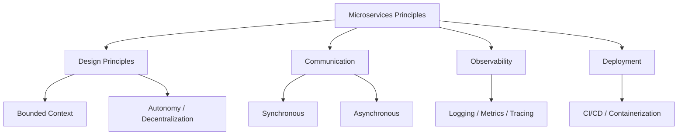

# Microservices Architecture Principles
> **Previous:** [Event-Driven Architecture and Saga Pattern](37-event-driven-saga.md) | **Next:** [Service Discovery](39-discovery.md)

## Learning Objectives

By the end of this chapter, you will be able to:

<!-- Image Gallery -->
<section class="lesson-visuals" aria-label="Visual learning resources">
  <header><span>VISUAL LEARNING</span><h2>See it. Review it. Remember it.</h2></header>
  <a class="lesson-visual-card" href="../../../assets/images/lessons/java/38-microservices-principles/handwritten-notes.svg" target="_blank" rel="noopener">
    
    <span><strong>Handwritten notes</strong>Condensed notes for deliberate review.</span>
  </a>
  <a class="lesson-visual-card" href="../../../assets/images/lessons/java/38-microservices-principles/sticky-notes.svg" target="_blank" rel="noopener">
    
    <span><strong>Sticky-note revision</strong>Fast recall prompts for revision.</span>
  </a>
  <a class="lesson-visual-card" href="../../../assets/images/lessons/java/38-microservices-principles/visual-explanation.svg" target="_blank" rel="noopener">
    
    <span><strong>Visual concept guide</strong>A connected explanation of the key ideas.</span>
  </a>
</section>
<!-- End Image Gallery -->


- Define bounded contexts and apply Domain-Driven Design concepts to decompose a monolith into services
- Identify aggregates, value objects, domain events, repositories, and factories within a business domain
- Apply service decomposition strategies using business capabilities, subdomains, and Conway's Law
- Choose between synchronous (REST/GraphQL) and asynchronous messaging for inter-service communication
- Implement the database-per-service pattern and recognize the shared-database anti-pattern
- Understand service mesh concepts including sidecar proxies, Istio, Linkerd, traffic management, observability, and security

---
## Chapter at a Glance

| Topic | Key Insight | Practical Takeaway |
|-------|------------|-------------------|
| Microservices → independently deployable, loosely coupled services | Bounded contexts, autonomous teams, polyglot persistence |
| Communication → synchronous (REST/gRPC) vs async (events/messaging) | Choose sync for queries, async for commands and events |
| Observability → logging, metrics, and distributed tracing | Centralized logging (ELK), metrics (Prometheus + Grafana), tracing (Jaeger/Zipkin) |

---
## Chapter Roadmap



---
## Concept Comparison Table

| Concept | Description | Key Difference |
|---------|-------------|----------------|
| REST | HTTP sync communication | Simple, universally supported |
| gRPC | Binary, streaming RPC | Fast, typed, bidirectional streams |
| Messaging | Async via broker | Loose coupling, buffered delivery |
| Events | Async via event bus | Event sourcing, CQRS support |

---
## Quick Reference

| Element | Purpose | Example |
|---------|---------|---------|
| `@SpringBootApplication` | Microservice entry point | Includes auto-config, component scan, property support |
| `spring-boot-starter-actuator` | Health checks and metrics | `/actuator/health`, `/actuator/metrics` |
| `spring-boot-starter-web` | REST endpoint support | Embedded Tomcat, Jackson, validation |
| Maven/Gradle multi-module | Shared API contracts | `api` module defines DTOs and interfaces |

---
## Cross-Application Matrix

| Domain | Application | Use Case |
|--------|-------------|----------|
| E-Commerce Platform | Microservices per domain | Order, Inventory, Payment, Shipping as separate services |
| SaaS Platform | Bounded contexts | Tenant management, Billing, Analytics as independent services |
| Media Streaming | CQRS + Events | Content ingestion (write) vs delivery (read) separated |

---
## Chapter Quiz

1. What is a bounded context in Domain-Driven Design? **Answer:** A logical boundary where a particular domain model applies, with its own ubiquitous language
2. What are the three pillars of observability? **Answer:** Logging, Metrics, Distributed Tracing
3. Why prefer async communication over sync in microservices? **Answer:** Loose coupling → services do not need to be available simultaneously

## Theory

### Domain-Driven Design and Bounded Context


Domain-Driven Design (DDD), introduced by Eric Evans, provides a framework for modeling complex business domains. The central concept is the **bounded context** — a explicit boundary within which a particular domain model applies. Each bounded context has its own **ubiquitous language**, a shared vocabulary used by domain experts and developers alike.


**Core DDD Building Blocks:**

- **Value Object**: An immutable object that describes attributes with no conceptual identity (e.g., `Money`, `Address`)
- **Entity**: An object defined by its identity, not its attributes (e.g., `Order` with orderId)
- **Aggregate**: A cluster of entities and value objects treated as a single unit, with one aggregate root
- **Domain Event**: Something meaningful that happened in the domain, captured for side effects
- **Repository**: A collection-like abstraction for retrieving and persisting aggregates
- **Factory**: Encapsulates complex creation logic for aggregates and value objects

### Service Decomposition Strategies


Three primary strategies guide service decomposition:

1. **By Business Capability**: Map each business capability (e.g., Order Management, Inventory, Shipping) to a separate service
2. **By Subdomain**: Use DDD subdomains (core, supporting, generic) to identify service boundaries
3. **By Conway's Law**: Structure services to match the team organization — "organizations design systems that mirror their communication structure"

### Inter-Service Communication


| Approach | When to Use | Technology |
|---|---|---|
| Synchronous REST | Real-time queries, request-response | Spring Web, Feign |
| GraphQL | Flexible querying, aggregate data | Spring GraphQL |
| Async Messaging | Event-driven, decoupled | RabbitMQ, Kafka |

### Data Ownership


**Database-per-service** is the preferred pattern — each service owns its data exclusively and exposes it only through its API. The **shared-database anti-pattern** couples services at the data layer, creating hidden dependencies that prevent independent evolution.

### Service Mesh


A service mesh manages inter-service communication through a dedicated infrastructure layer. Key concepts:

- **Sidecar Proxy**: A lightweight proxy deployed alongside each service (e.g., Envoy)
- **Istio**: Complete service mesh with traffic management, security policies, and observability
- **Linkerd**: Lightweight, Kubernetes-native service mesh
- **Traffic Management**: Canary releases, blue-green deployments, circuit breaking
- **Observability**: Metrics, traces, and access logs from all service-to-service communication
- **Security**: mTLS between sidecars, fine-grained access policies

> [!TIP]
> Start with a monolith. Extract microservices only when you understand the domain boundaries → premature decomposition adds complexity without benefit.

> [!WARNING]
> Synchronous calls between services (REST/gRPC) create runtime coupling. Use circuit breakers and timeouts to prevent cascading failures.

> [!NOTE]
> Every service must expose health, metrics, and distributed tracing → without observability, a microservices architecture is unmanageable.

## Complete Code Examples

### Example Project: Order Management Microservice

This project demonstrates a complete bounded context for order management with DDD building blocks, synchronous and async communication, and database-per-service.

#### pom.xml

```xml
<?xml version="1.0" encoding="UTF-8"?>
<project xmlns="http://maven.apache.org/POM/4.0.0"
         xmlns:xsi="http://www.w3.org/2001/XMLSchema-instance"
         xsi:schemaLocation="http://maven.apache.org/POM/4.0.0
         https://maven.apache.org/xsd/maven-4.0.0.xsd">
    <modelVersion>4.0.0</modelVersion>

    <parent>
        <groupId>org.springframework.boot</groupId>
        <artifactId>spring-boot-starter-parent</artifactId>
        <version>3.2.0</version>
        <relativePath/>
    </parent>

    <groupId>com.course.microservices</groupId>
    <artifactId>order-service</artifactId>
    <version>1.0.0</version>
    <name>order-service</name>
    <description>Order Management Bounded Context</description>

    <properties>
        <java.version>21</java.version>
        <spring-cloud.version>2023.0.0</spring-cloud.version>
    </properties>

    <dependencies>
        <dependency>
            <groupId>org.springframework.boot</groupId>
            <artifactId>spring-boot-starter-web</artifactId>
        </dependency>
        <dependency>
            <groupId>org.springframework.boot</groupId>
            <artifactId>spring-boot-starter-data-jpa</artifactId>
        </dependency>
        <dependency>
            <groupId>org.springframework.boot</groupId>
            <artifactId>spring-boot-starter-validation</artifactId>
        </dependency>
        <dependency>
            <groupId>org.springframework.boot</groupId>
            <artifactId>spring-boot-starter-actuator</artifactId>
        </dependency>
        <dependency>
            <groupId>org.springframework.cloud</groupId>
            <artifactId>spring-cloud-starter-openfeign</artifactId>
        </dependency>
        <dependency>
            <groupId>org.springframework.kafka</groupId>
            <artifactId>spring-kafka</artifactId>
        </dependency>
        <dependency>
            <groupId>com.h2database</groupId>
            <artifactId>h2</artifactId>
            <scope>runtime</scope>
        </dependency>
        <dependency>
            <groupId>org.postgresql</groupId>
            <artifactId>postgresql</artifactId>
            <scope>runtime</scope>
        </dependency>
        <dependency>
            <groupId>org.projectlombok</groupId>
            <artifactId>lombok</artifactId>
            <optional>true</optional>
        </dependency>
        <dependency>
            <groupId>org.springframework.boot</groupId>
            <artifactId>spring-boot-starter-test</artifactId>
            <scope>test</scope>
        </dependency>
    </dependencies>

    <dependencyManagement>
        <dependencies>
            <dependency>
                <groupId>org.springframework.cloud</groupId>
                <artifactId>spring-cloud-dependencies</artifactId>
                <version>${spring-cloud.version}</version>
                <type>pom</type>
                <scope>import</scope>
            </dependency>
        </dependencies>
    </dependencyManagement>

    <build>
        <plugins>
            <plugin>
                <groupId>org.springframework.boot</groupId>
                <artifactId>spring-boot-maven-plugin</artifactId>
                <configuration>
                    <excludes>
                        <exclude>
                            <groupId>org.projectlombok</groupId>
                            <artifactId>lombok</artifactId>
                        </exclude>
                    </excludes>
                </configuration>
            </plugin>
        </plugins>
    </build>
</project>
```

#### OrderApplication.java

```java
package com.course.microservices.order;

import org.springframework.boot.SpringApplication;
import org.springframework.boot.autoconfigure.SpringBootApplication;
import org.springframework.cloud.openfeign.EnableFeignClients;
import org.springframework.scheduling.annotation.EnableAsync;

@SpringBootApplication
@EnableFeignClients
@EnableAsync
public class OrderApplication {

    public static void main(String[] args) {
        SpringApplication.run(OrderApplication.class, args);
    }
}
```

#### application.yml

```yaml
server:
  port: 8081

spring:
  application:
    name: order-service
  datasource:
    url: jdbc:h2:mem:orderdb
    driver-class-name: org.h2.Driver
    username: sa
    password:
  jpa:
    hibernate:
      ddl-auto: create-drop
    show-sql: true
    properties:
      hibernate:
        format_sql: true
  kafka:
    bootstrap-servers: localhost:9092
    producer:
      key-serializer: org.apache.kafka.common.serialization.StringSerializer
      value-serializer: org.springframework.kafka.support.serializer.JsonSerializer
    consumer:
      group-id: order-service-group
      key-deserializer: org.apache.kafka.common.serialization.StringDeserializer
      value-deserializer: org.springframework.kafka.support.serializer.JsonDeserializer
      properties:
        spring.json.trusted.packages: com.course.microservices.order.domain.event

eureka:
  client:
    service-url:
      defaultZone: http://localhost:8761/eureka/
  instance:
    prefer-ip-address: true

management:
  endpoints:
    web:
      exposure:
        include: health,info,metrics
```

### Domain Model — Value Objects

```java
package com.course.microservices.order.domain.vo;

import jakarta.persistence.Embeddable;
import jakarta.validation.constraints.DecimalMin;
import jakarta.validation.constraints.NotNull;
import java.math.BigDecimal;
import java.util.Currency;
import java.util.Objects;

@Embeddable
public class Money {

    @NotNull
    @DecimalMin(value = "0.00", inclusive = true)
    private BigDecimal amount;

    @NotNull
    private Currency currency;

    protected Money() {
    }

    public Money(BigDecimal amount, Currency currency) {
        if (amount == null || currency == null) {
            throw new IllegalArgumentException("Amount and currency must not be null");
        }
        if (amount.compareTo(BigDecimal.ZERO) < 0) {
            throw new IllegalArgumentException("Amount must not be negative");
        }
        this.amount = amount;
        this.currency = currency;
    }

    public static Money of(double amount, String currencyCode) {
        return new Money(BigDecimal.valueOf(amount), Currency.getInstance(currencyCode));
    }

    public static Money zero(String currencyCode) {
        return new Money(BigDecimal.ZERO, Currency.getInstance(currencyCode));
    }

    public Money add(Money other) {
        if (!this.currency.equals(other.currency)) {
            throw new IllegalArgumentException("Cannot add different currencies: "
                    + this.currency + " vs " + other.currency);
        }
        return new Money(this.amount.add(other.amount), this.currency);
    }

    public Money subtract(Money other) {
        if (!this.currency.equals(other.currency)) {
            throw new IllegalArgumentException("Cannot subtract different currencies");
        }
        if (this.amount.compareTo(other.amount) < 0) {
            throw new IllegalArgumentException("Insufficient funds");
        }
        return new Money(this.amount.subtract(other.amount), this.currency);
    }

    public Money multiply(int quantity) {
        if (quantity < 0) {
            throw new IllegalArgumentException("Quantity must not be negative");
        }
        return new Money(this.amount.multiply(BigDecimal.valueOf(quantity)), this.currency);
    }

    public boolean isGreaterThan(Money other) {
        return this.amount.compareTo(other.amount) > 0;
    }

    public boolean isLessThan(Money other) {
        return this.amount.compareTo(other.amount) < 0;
    }

    public BigDecimal getAmount() {
        return amount;
    }

    public Currency getCurrency() {
        return currency;
    }

    @Override
    public boolean equals(Object o) {
        if (this == o) return true;
        if (o == null || getClass() != o.getClass()) return false;
        Money money = (Money) o;
        return amount.compareTo(money.amount) == 0 && currency.equals(money.currency);
    }

    @Override
    public int hashCode() {
        return Objects.hash(amount.doubleValue(), currency);
    }

    @Override
    public String toString() {
        return String.format("%.2f %s", amount, currency.getCurrencyCode());
    }
}
```

```java
package com.course.microservices.order.domain.vo;

import jakarta.persistence.Embeddable;
import jakarta.validation.constraints.NotBlank;
import jakarta.validation.constraints.Pattern;
import java.util.Objects;

@Embeddable
public class Address {

    @NotBlank
    private String street;

    @NotBlank
    private String city;

    @NotBlank
    private String state;

    @NotBlank
    @Pattern(regexp = "\\d{5}(-\\d{4})?")
    private String zipCode;

    @NotBlank
    private String country;

    protected Address() {
    }

    public Address(String street, String city, String state, String zipCode, String country) {
        this.street = street;
        this.city = city;
        this.state = state;
        this.zipCode = zipCode;
        this.country = country;
    }

    public String getStreet() { return street; }
    public String getCity() { return city; }
    public String getState() { return state; }
    public String getZipCode() { return zipCode; }
    public String getCountry() { return country; }

    @Override
    public boolean equals(Object o) {
        if (this == o) return true;
        if (o == null || getClass() != o.getClass()) return false;
        Address address = (Address) o;
        return street.equals(address.street) && city.equals(address.city)
                && state.equals(address.state) && zipCode.equals(address.zipCode)
                && country.equals(address.country);
    }

    @Override
    public int hashCode() {
        return Objects.hash(street, city, state, zipCode, country);
    }
}
```

```java
package com.course.microservices.order.domain.vo;

import jakarta.persistence.Embeddable;
import jakarta.validation.constraints.NotBlank;
import java.util.Objects;
import java.util.UUID;

@Embeddable
public class OrderLineId {

    @NotBlank
    private String value;

    protected OrderLineId() {
    }

    public OrderLineId(String value) {
        if (value == null || value.isBlank()) {
            throw new IllegalArgumentException("Order line ID must not be blank");
        }
        this.value = value;
    }

    public static OrderLineId next() {
        return new OrderLineId(UUID.randomUUID().toString());
    }

    public static OrderLineId of(String value) {
        return new OrderLineId(value);
    }

    public String getValue() { return value; }

    @Override
    public boolean equals(Object o) {
        if (this == o) return true;
        if (o == null || getClass() != o.getClass()) return false;
        OrderLineId that = (OrderLineId) o;
        return value.equals(that.value);
    }

    @Override
    public int hashCode() {
        return Objects.hash(value);
    }

    @Override
    public String toString() {
        return value;
    }
}
```

```java
package com.course.microservices.order.domain.vo;

import jakarta.persistence.Embeddable;
import jakarta.validation.constraints.NotBlank;
import java.util.Objects;
import java.util.UUID;

@Embeddable
public class OrderId {

    @NotBlank
    private String value;

    protected OrderId() {
    }

    public OrderId(String value) {
        if (value == null || value.isBlank()) {
            throw new IllegalArgumentException("Order ID must not be blank");
        }
        this.value = value;
    }

    public static OrderId next() {
        return new OrderId(UUID.randomUUID().toString());
    }

    public static OrderId of(String value) {
        return new OrderId(value);
    }

    public String getValue() { return value; }

    @Override
    public boolean equals(Object o) {
        if (this == o) return true;
        if (o == null || getClass() != o.getClass()) return false;
        OrderId orderId = (OrderId) o;
        return value.equals(orderId.value);
    }

    @Override
    public int hashCode() {
        return Objects.hash(value);
    }

    @Override
    public String toString() {
        return value;
    }
}
```

```java
package com.course.microservices.order.domain.vo;

import jakarta.persistence.Embeddable;
import jakarta.validation.constraints.NotBlank;
import java.util.Objects;
import java.util.UUID;

@Embeddable
public class ProductId {

    @NotBlank
    private String value;

    protected ProductId() {
    }

    public ProductId(String value) {
        if (value == null || value.isBlank()) {
            throw new IllegalArgumentException("Product ID must not be blank");
        }
        this.value = value;
    }

    public static ProductId next() {
        return new ProductId(UUID.randomUUID().toString());
    }

    public static ProductId of(String value) {
        return new ProductId(value);
    }

    public String getValue() { return value; }

    @Override
    public boolean equals(Object o) {
        if (this == o) return true;
        if (o == null || getClass() != o.getClass()) return false;
        ProductId that = (ProductId) o;
        return value.equals(that.value);
    }

    @Override
    public int hashCode() {
        return Objects.hash(value);
    }

    @Override
    public String toString() {
        return value;
    }
}
```

```java
package com.course.microservices.order.domain.vo;

import jakarta.persistence.Embeddable;
import jakarta.validation.constraints.NotBlank;
import java.util.Objects;
import java.util.UUID;

@Embeddable
public class CustomerId {

    @NotBlank
    private String value;

    protected CustomerId() {
    }

    public CustomerId(String value) {
        if (value == null || value.isBlank()) {
            throw new IllegalArgumentException("Customer ID must not be blank");
        }
        this.value = value;
    }

    public static CustomerId next() {
        return new CustomerId(UUID.randomUUID().toString());
    }

    public static CustomerId of(String value) {
        return new CustomerId(value);
    }

    public String getValue() { return value; }

    @Override
    public boolean equals(Object o) {
        if (this == o) return true;
        if (o == null || getClass() != o.getClass()) return false;
        CustomerId that = (CustomerId) o;
        return value.equals(that.value);
    }

    @Override
    public int hashCode() {
        return Objects.hash(value);
    }

    @Override
    public String toString() {
        return value;
    }
}
```

### Domain Events

```java
package com.course.microservices.order.domain.event;

import com.course.microservices.order.domain.vo.OrderId;
import java.time.Instant;
import java.util.UUID;

public abstract class DomainEvent {

    private final String eventId;
    private final Instant occurredOn;
    private final String eventType;

    protected DomainEvent(String eventType) {
        this.eventId = UUID.randomUUID().toString();
        this.occurredOn = Instant.now();
        this.eventType = eventType;
    }

    public String getEventId() { return eventId; }
    public Instant getOccurredOn() { return occurredOn; }
    public String getEventType() { return eventType; }
}
```

```java
package com.course.microservices.order.domain.event;

import com.course.microservices.order.domain.vo.Money;
import com.course.microservices.order.domain.vo.OrderId;
import com.course.microservices.order.domain.vo.CustomerId;
import java.time.Instant;

public class OrderPlacedEvent extends DomainEvent {

    private final OrderId orderId;
    private final CustomerId customerId;
    private final Money totalAmount;
    private final Instant orderDate;

    public OrderPlacedEvent(OrderId orderId, CustomerId customerId, Money totalAmount, Instant orderDate) {
        super("ORDER_PLACED");
        this.orderId = orderId;
        this.customerId = customerId;
        this.totalAmount = totalAmount;
        this.orderDate = orderDate;
    }

    public OrderId getOrderId() { return orderId; }
    public CustomerId getCustomerId() { return customerId; }
    public Money getTotalAmount() { return totalAmount; }
    public Instant getOrderDate() { return orderDate; }
}
```

```java
package com.course.microservices.order.domain.event;

import com.course.microservices.order.domain.vo.OrderId;
import java.time.Instant;

public class OrderShippedEvent extends DomainEvent {

    private final OrderId orderId;
    private final Instant shippedAt;

    public OrderShippedEvent(OrderId orderId, Instant shippedAt) {
        super("ORDER_SHIPPED");
        this.orderId = orderId;
        this.shippedAt = shippedAt;
    }

    public OrderId getOrderId() { return orderId; }
    public Instant getShippedAt() { return shippedAt; }
}
```

```java
package com.course.microservices.order.domain.event;

import com.course.microservices.order.domain.vo.OrderId;
import com.course.microservices.order.domain.vo.Money;
import java.time.Instant;
import java.util.Map;

public class OrderCancelledEvent extends DomainEvent {

    private final OrderId orderId;
    private final String reason;
    private final Money refundAmount;
    private final Instant cancelledAt;

    public OrderCancelledEvent(OrderId orderId, String reason, Money refundAmount, Instant cancelledAt) {
        super("ORDER_CANCELLED");
        this.orderId = orderId;
        this.reason = reason;
        this.refundAmount = refundAmount;
        this.cancelledAt = cancelledAt;
    }

    public OrderId getOrderId() { return orderId; }
    public String getReason() { return reason; }
    public Money getRefundAmount() { return refundAmount; }
    public Instant getCancelledAt() { return cancelledAt; }
}
```

```java
package com.course.microservices.order.domain.event;

import com.course.microservices.order.domain.vo.OrderId;
import com.course.microservices.order.domain.vo.Money;
import java.time.Instant;

public class PaymentReceivedEvent extends DomainEvent {

    private final OrderId orderId;
    private final Money amount;
    private final String paymentReference;
    private final Instant paidAt;

    public PaymentReceivedEvent(OrderId orderId, Money amount, String paymentReference, Instant paidAt) {
        super("PAYMENT_RECEIVED");
        this.orderId = orderId;
        this.amount = amount;
        this.paymentReference = paymentReference;
        this.paidAt = paidAt;
    }

    public OrderId getOrderId() { return orderId; }
    public Money getAmount() { return amount; }
    public String getPaymentReference() { return paymentReference; }
    public Instant getPaidAt() { return paidAt; }
}
```

### Domain Model — Entity & Aggregate

```java
package com.course.microservices.order.domain.model;

import com.course.microservices.order.domain.vo.*;
import jakarta.persistence.*;
import java.time.Instant;
import java.util.ArrayList;
import java.util.Collections;
import java.util.List;
import java.util.Optional;

@Entity
@Table(name = "orders")
public class Order {

    @EmbeddedId
    private OrderId id;

    @Embedded
    @AttributeOverrides({
        @AttributeOverride(name = "amount", column = @Column(name = "total_amount")),
        @AttributeOverride(name = "currency", column = @Column(name = "total_currency"))
    })
    private Money totalAmount;

    @Embedded
    @AttributeOverrides({
        @AttributeOverride(name = "street", column = @Column(name = "shipping_street")),
        @AttributeOverride(name = "city", column = @Column(name = "shipping_city")),
        @AttributeOverride(name = "state", column = @Column(name = "shipping_state")),
        @AttributeOverride(name = "zipCode", column = @Column(name = "shipping_zip")),
        @AttributeOverride(name = "country", column = @Column(name = "shipping_country"))
    })
    private Address shippingAddress;

    @Embedded
    private CustomerId customerId;

    @Enumerated(EnumType.STRING)
    private OrderStatus status;

    private Instant orderDate;
    private Instant shippedDate;

    @OneToMany(cascade = CascadeType.ALL, orphanRemoval = true, fetch = FetchType.LAZY)
    @JoinColumn(name = "order_id")
    private List<OrderLine> orderLines;

    @Version
    private long version;

    protected Order() {
    }

    private Order(OrderId id, CustomerId customerId, Address shippingAddress, List<OrderLine> orderLines) {
        this.id = id;
        this.customerId = customerId;
        this.shippingAddress = shippingAddress;
        this.orderLines = new ArrayList<>(orderLines);
        this.status = OrderStatus.PLACED;
        this.orderDate = Instant.now();
        this.totalAmount = calculateTotal();
    }

    public static Order place(CustomerId customerId, Address shippingAddress, List<OrderLine> orderLines) {
        if (orderLines == null || orderLines.isEmpty()) {
            throw new IllegalArgumentException("Order must have at least one order line");
        }
        OrderId orderId = OrderId.next();
        return new Order(orderId, customerId, shippingAddress, orderLines);
    }

    public void addLine(OrderLine line) {
        if (status != OrderStatus.PLACED) {
            throw new IllegalStateException("Cannot add lines to an order in status: " + status);
        }
        this.orderLines.add(line);
        this.totalAmount = calculateTotal();
    }

    public void removeLine(OrderLineId lineId) {
        if (status != OrderStatus.PLACED) {
            throw new IllegalStateException("Cannot remove lines from an order in status: " + status);
        }
        this.orderLines.removeIf(line -> line.getId().equals(lineId));
        if (this.orderLines.isEmpty()) {
            throw new IllegalStateException("Order must have at least one order line");
        }
        this.totalAmount = calculateTotal();
    }

    public void ship() {
        if (status != OrderStatus.PLACED) {
            throw new IllegalStateException("Cannot ship order in status: " + status);
        }
        this.status = OrderStatus.SHIPPED;
        this.shippedDate = Instant.now();
    }

    public void markPaid() {
        if (status != OrderStatus.PLACED) {
            throw new IllegalStateException("Cannot mark paid order in status: " + status);
        }
        this.status = OrderStatus.PAID;
    }

    public void cancel(String reason) {
        if (status == OrderStatus.SHIPPED || status == OrderStatus.DELIVERED) {
            throw new IllegalStateException("Cannot cancel shipped or delivered order");
        }
        this.status = OrderStatus.CANCELLED;
    }

    public void markDelivered() {
        if (status != OrderStatus.SHIPPED) {
            throw new IllegalStateException("Cannot deliver order in status: " + status);
        }
        this.status = OrderStatus.DELIVERED;
    }

    public Money calculateTotal() {
        return orderLines.stream()
                .map(OrderLine::getSubtotal)
                .reduce(Money.zero("USD"), Money::add);
    }

    public OrderId getId() { return id; }
    public CustomerId getCustomerId() { return customerId; }
    public Address getShippingAddress() { return shippingAddress; }
    public Money getTotalAmount() { return totalAmount; }
    public OrderStatus getStatus() { return status; }
    public Instant getOrderDate() { return orderDate; }
    public Instant getShippedDate() { return shippedDate; }
    public List<OrderLine> getOrderLines() { return Collections.unmodifiableList(orderLines); }
}
```

```java
package com.course.microservices.order.domain.model;

public enum OrderStatus {
    PLACED,
    PAID,
    SHIPPED,
    DELIVERED,
    CANCELLED
}
```

```java
package com.course.microservices.order.domain.model;

import com.course.microservices.order.domain.vo.*;
import jakarta.persistence.*;
import java.math.BigDecimal;
import java.util.Currency;

@Entity
@Table(name = "order_lines")
public class OrderLine {

    @EmbeddedId
    private OrderLineId id;

    @Embedded
    private ProductId productId;

    private int quantity;

    @Embedded
    @AttributeOverrides({
        @AttributeOverride(name = "amount", column = @Column(name = "unit_price_amount")),
        @AttributeOverride(name = "currency", column = @Column(name = "unit_price_currency"))
    })
    private Money unitPrice;

    @Embedded
    @AttributeOverrides({
        @AttributeOverride(name = "amount", column = @Column(name = "subtotal_amount")),
        @AttributeOverride(name = "currency", column = @Column(name = "subtotal_currency"))
    })
    private Money subtotal;

    private String productName;

    protected OrderLine() {
    }

    private OrderLine(OrderLineId id, ProductId productId, String productName, int quantity, Money unitPrice) {
        if (quantity <= 0) {
            throw new IllegalArgumentException("Quantity must be positive");
        }
        this.id = id;
        this.productId = productId;
        this.productName = productName;
        this.quantity = quantity;
        this.unitPrice = unitPrice;
        this.subtotal = unitPrice.multiply(quantity);
    }

    public static OrderLine create(ProductId productId, String productName, int quantity, Money unitPrice) {
        return new OrderLine(OrderLineId.next(), productId, productName, quantity, unitPrice);
    }

    public void updateQuantity(int newQuantity) {
        if (newQuantity <= 0) {
            throw new IllegalArgumentException("Quantity must be positive");
        }
        this.quantity = newQuantity;
        this.subtotal = unitPrice.multiply(newQuantity);
    }

    public OrderLineId getId() { return id; }
    public ProductId getProductId() { return productId; }
    public String getProductName() { return productName; }
    public int getQuantity() { return quantity; }
    public Money getUnitPrice() { return unitPrice; }
    public Money getSubtotal() { return subtotal; }
}
```

### Domain Service

```java
package com.course.microservices.order.domain.service;

import com.course.microservices.order.domain.model.Order;
import com.course.microservices.order.domain.model.OrderLine;
import com.course.microservices.order.domain.vo.Address;
import com.course.microservices.order.domain.vo.CustomerId;
import com.course.microservices.order.domain.vo.Money;
import com.course.microservices.order.domain.vo.ProductId;
import org.springframework.stereotype.Service;
import java.util.List;

@Service
public class OrderPricingService {

    private static final Money TAX_RATE = Money.of(0.08, "USD");
    private static final Money FREE_SHIPPING_THRESHOLD = Money.of(100.00, "USD");
    private static final Money STANDARD_SHIPPING = Money.of(9.99, "USD");

    public OrderPricingResult calculateOrderPricing(CustomerId customerId,
                                                     Address shippingAddress,
                                                     List<OrderLine> lines) {
        Money subtotal = lines.stream()
                .map(OrderLine::getSubtotal)
                .reduce(Money.zero("USD"), Money::add);

        Money tax = subtotal.multiply(TAX_RATE.getAmount().intValue())
                .multiply(TAX_RATE.getAmount().remainder(BigDecimal.ONE).doubleValue() > 0 ? 1 : 0);

        Money shipping = calculateShipping(subtotal, shippingAddress);
        Money total = subtotal.add(tax).add(shipping);

        return new OrderPricingResult(subtotal, tax, shipping, total);
    }

    private Money calculateShipping(Money subtotal, Address shippingAddress) {
        if (subtotal.isGreaterThan(FREE_SHIPPING_THRESHOLD)) {
            return Money.zero("USD");
        }
        if (shippingAddress.getCountry().equalsIgnoreCase("US")) {
            return STANDARD_SHIPPING;
        }
        return Money.of(24.99, "USD");
    }

    public record OrderPricingResult(Money subtotal, Money tax, Money shipping, Money total) {
    }
}
```

### Repository

```java
package com.course.microservices.order.domain.repository;

import com.course.microservices.order.domain.model.Order;
import com.course.microservices.order.domain.vo.CustomerId;
import com.course.microservices.order.domain.vo.OrderId;
import org.springframework.data.jpa.repository.JpaRepository;
import org.springframework.data.jpa.repository.Query;
import org.springframework.data.repository.query.Param;
import org.springframework.stereotype.Repository;
import java.util.List;
import java.util.Optional;

@Repository
public interface OrderRepository extends JpaRepository<Order, OrderId> {

    List<Order> findByCustomerId(CustomerId customerId);

    Optional<Order> findByIdAndCustomerId(OrderId orderId, CustomerId customerId);

    @Query("SELECT o FROM Order o LEFT JOIN FETCH o.orderLines WHERE o.id = :id")
    Optional<Order> findByIdWithLines(@Param("id") OrderId orderId);

    @Query("SELECT o FROM Order o WHERE o.status = 'PLACED' AND o.orderDate < :threshold")
    List<Order> findStalePlacedOrders(@Param("threshold") java.time.Instant threshold);

    long countByCustomerId(CustomerId customerId);

    @Query("SELECT COUNT(o) FROM Order o WHERE o.customerId = :customerId AND o.status = 'PLACED'")
    long countActiveOrdersByCustomer(@Param("customerId") CustomerId customerId);
}
```

### Factory

```java
package com.course.microservices.order.domain.factory;

import com.course.microservices.order.domain.model.Order;
import com.course.microservices.order.domain.model.OrderLine;
import com.course.microservices.order.domain.service.OrderPricingService;
import com.course.microservices.order.domain.vo.*;
import com.course.microservices.order.domain.repository.OrderRepository;
import org.springframework.stereotype.Component;
import java.util.List;

@Component
public class OrderFactory {

    private final OrderRepository orderRepository;
    private final OrderPricingService pricingService;

    public OrderFactory(OrderRepository orderRepository, OrderPricingService pricingService) {
        this.orderRepository = orderRepository;
        this.pricingService = pricingService;
    }

    public Order createOrder(CustomerId customerId,
                             Address shippingAddress,
                             List<OrderLine> orderLines) {
        OrderPricingService.OrderPricingResult pricing = pricingService.calculateOrderPricing(
                customerId, shippingAddress, orderLines);

        Order order = Order.place(customerId, shippingAddress, orderLines);
        return orderRepository.save(order);
    }

    public OrderLine createOrderLine(ProductId productId, String productName,
                                     int quantity, Money unitPrice) {
        return OrderLine.create(productId, productName, quantity, unitPrice);
    }
}
```

### Domain Event Publisher

```java
package com.course.microservices.order.domain.event;

import com.course.microservices.order.domain.model.Order;
import com.course.microservices.order.domain.vo.OrderId;
import org.slf4j.Logger;
import org.slf4j.LoggerFactory;
import org.springframework.context.ApplicationEventPublisher;
import org.springframework.kafka.core.KafkaTemplate;
import org.springframework.stereotype.Component;

@Component
public class OrderEventPublisher {

    private static final Logger log = LoggerFactory.getLogger(OrderEventPublisher.class);
    private static final String TOPIC_ORDER_EVENTS = "order-events";

    private final ApplicationEventPublisher springEventPublisher;
    private final KafkaTemplate<String, Object> kafkaTemplate;

    public OrderEventPublisher(ApplicationEventPublisher springEventPublisher,
                                KafkaTemplate<String, Object> kafkaTemplate) {
        this.springEventPublisher = springEventPublisher;
        this.kafkaTemplate = kafkaTemplate;
    }

    public void publishOrderPlaced(Order order) {
        OrderPlacedEvent event = new OrderPlacedEvent(
                order.getId(),
                order.getCustomerId(),
                order.getTotalAmount(),
                order.getOrderDate()
        );
        springEventPublisher.publishEvent(event);
        kafkaTemplate.send(TOPIC_ORDER_EVENTS, order.getId().getValue(), event);
        log.info("Published OrderPlacedEvent for order: {}", order.getId());
    }

    public void publishOrderShipped(Order order) {
        OrderShippedEvent event = new OrderShippedEvent(
                order.getId(),
                order.getShippedDate()
        );
        springEventPublisher.publishEvent(event);
        kafkaTemplate.send(TOPIC_ORDER_EVENTS, order.getId().getValue(), event);
        log.info("Published OrderShippedEvent for order: {}", order.getId());
    }

    public void publishOrderCancelled(Order order, String reason) {
        OrderCancelledEvent event = new OrderCancelledEvent(
                order.getId(),
                reason,
                order.getTotalAmount(),
                java.time.Instant.now()
        );
        springEventPublisher.publishEvent(event);
        kafkaTemplate.send(TOPIC_ORDER_EVENTS, order.getId().getValue(), event);
        log.info("Published OrderCancelledEvent for order: {}", order.getId());
    }
}
```

### Application Service

```java
package com.course.microservices.order.application;

import com.course.microservices.order.domain.event.OrderEventPublisher;
import com.course.microservices.order.domain.factory.OrderFactory;
import com.course.microservices.order.domain.model.Order;
import com.course.microservices.order.domain.model.OrderLine;
import com.course.microservices.order.domain.repository.OrderRepository;
import com.course.microservices.order.domain.vo.*;
import org.springframework.stereotype.Service;
import org.springframework.transaction.annotation.Transactional;
import java.util.List;

@Service
@Transactional
public class OrderApplicationService {

    private final OrderRepository orderRepository;
    private final OrderFactory orderFactory;
    private final OrderEventPublisher eventPublisher;

    public OrderApplicationService(OrderRepository orderRepository,
                                    OrderFactory orderFactory,
                                    OrderEventPublisher eventPublisher) {
        this.orderRepository = orderRepository;
        this.orderFactory = orderFactory;
        this.eventPublisher = eventPublisher;
    }

    public Order placeOrder(CustomerId customerId, Address shippingAddress,
                            List<OrderLineRequest> lineRequests) {
        List<OrderLine> orderLines = lineRequests.stream()
                .map(req -> orderFactory.createOrderLine(
                        ProductId.of(req.productId()),
                        req.productName(),
                        req.quantity(),
                        Money.of(req.unitPrice(), "USD")))
                .toList();

        Order order = orderFactory.createOrder(customerId, shippingAddress, orderLines);
        eventPublisher.publishOrderPlaced(order);
        return order;
    }

    public void shipOrder(OrderId orderId) {
        Order order = orderRepository.findById(orderId)
                .orElseThrow(() -> new IllegalArgumentException("Order not found: " + orderId));
        order.ship();
        orderRepository.save(order);
        eventPublisher.publishOrderShipped(order);
    }

    public void cancelOrder(OrderId orderId, String reason) {
        Order order = orderRepository.findById(orderId)
                .orElseThrow(() -> new IllegalArgumentException("Order not found: " + orderId));
        order.cancel(reason);
        orderRepository.save(order);
        eventPublisher.publishOrderCancelled(order, reason);
    }

    public Order getOrder(OrderId orderId) {
        return orderRepository.findByIdWithLines(orderId)
                .orElseThrow(() -> new IllegalArgumentException("Order not found: " + orderId));
    }

    public List<Order> getCustomerOrders(CustomerId customerId) {
        return orderRepository.findByCustomerId(customerId);
    }

    public record OrderLineRequest(String productId, String productName, int quantity, double unitPrice) {
    }
}
```

### REST Controller (Synchronous Communication)

```java
package com.course.microservices.order.interfaces.rest;

import com.course.microservices.order.application.OrderApplicationService;
import com.course.microservices.order.domain.model.Order;
import com.course.microservices.order.domain.vo.*;
import org.springframework.http.HttpStatus;
import org.springframework.http.ResponseEntity;
import org.springframework.web.bind.annotation.*;
import jakarta.validation.Valid;
import jakarta.validation.constraints.NotBlank;
import jakarta.validation.constraints.Positive;
import java.util.List;

@RestController
@RequestMapping("/api/orders")
public class OrderController {

    private final OrderApplicationService orderService;

    public OrderController(OrderApplicationService orderService) {
        this.orderService = orderService;
    }

    @PostMapping
    public ResponseEntity<OrderResponse> placeOrder(@Valid @RequestBody PlaceOrderRequest request) {
        CustomerId customerId = CustomerId.of(request.customerId());
        Address shippingAddress = new Address(
                request.shippingAddress().street(),
                request.shippingAddress().city(),
                request.shippingAddress().state(),
                request.shippingAddress().zipCode(),
                request.shippingAddress().country()
        );
        List<OrderApplicationService.OrderLineRequest> lineRequests = request.lines().stream()
                .map(line -> new OrderApplicationService.OrderLineRequest(
                        line.productId(), line.productName(), line.quantity(), line.unitPrice()))
                .toList();

        Order order = orderService.placeOrder(customerId, shippingAddress, lineRequests);
        return ResponseEntity.status(HttpStatus.CREATED).body(OrderResponse.from(order));
    }

    @GetMapping("/{orderId}")
    public ResponseEntity<OrderResponse> getOrder(@PathVariable String orderId) {
        Order order = orderService.getOrder(OrderId.of(orderId));
        return ResponseEntity.ok(OrderResponse.from(order));
    }

    @GetMapping
    public ResponseEntity<List<OrderResponse>> getCustomerOrders(@RequestParam String customerId) {
        List<Order> orders = orderService.getCustomerOrders(CustomerId.of(customerId));
        return ResponseEntity.ok(orders.stream().map(OrderResponse::from).toList());
    }

    @PostMapping("/{orderId}/ship")
    public ResponseEntity<Void> shipOrder(@PathVariable String orderId) {
        orderService.shipOrder(OrderId.of(orderId));
        return ResponseEntity.ok().build();
    }

    @PostMapping("/{orderId}/cancel")
    public ResponseEntity<Void> cancelOrder(@PathVariable String orderId,
                                             @RequestParam String reason) {
        orderService.cancelOrder(OrderId.of(orderId), reason);
        return ResponseEntity.ok().build();
    }

    @ExceptionHandler(IllegalArgumentException.class)
    public ResponseEntity<ErrorResponse> handleBadRequest(IllegalArgumentException ex) {
        return ResponseEntity.badRequest()
                .body(new ErrorResponse("BAD_REQUEST", ex.getMessage()));
    }

    @ExceptionHandler(IllegalStateException.class)
    public ResponseEntity<ErrorResponse> handleConflict(IllegalStateException ex) {
        return ResponseEntity.status(HttpStatus.CONFLICT)
                .body(new ErrorResponse("CONFLICT", ex.getMessage()));
    }

    public record PlaceOrderRequest(
            @NotBlank String customerId,
            @Valid AddressRequest shippingAddress,
            @Valid List<OrderLineRequest> lines) {}

    public record AddressRequest(
            @NotBlank String street,
            @NotBlank String city,
            @NotBlank String state,
            @NotBlank String zipCode,
            @NotBlank String country) {}

    public record OrderLineRequest(
            @NotBlank String productId,
            @NotBlank String productName,
            @Positive int quantity,
            @Positive double unitPrice) {}

    public record OrderResponse(
            String id, String customerId, Money totalAmount,
            String status, String orderDate, List<OrderLineResponse> lines) {
        static OrderResponse from(Order order) {
            return new OrderResponse(
                    order.getId().getValue(),
                    order.getCustomerId().getValue(),
                    order.getTotalAmount(),
                    order.getStatus().name(),
                    order.getOrderDate().toString(),
                    order.getOrderLines().stream()
                            .map(line -> new OrderLineResponse(
                                    line.getId().getValue(),
                                    line.getProductName(),
                                    line.getQuantity(),
                                    line.getUnitPrice(),
                                    line.getSubtotal()))
                            .toList()
            );
        }
    }

    public record OrderLineResponse(
            String id, String productName, int quantity,
            Money unitPrice, Money subtotal) {}

    public record ErrorResponse(String code, String message) {}
}
```

### Feign Client for Inter-Service Communication

```java
package com.course.microservices.order.client;

import com.course.microservices.order.domain.vo.Money;
import org.springframework.cloud.openfeign.FeignClient;
import org.springframework.web.bind.annotation.GetMapping;
import org.springframework.web.bind.annotation.PathVariable;
import org.springframework.web.bind.annotation.PostMapping;
import org.springframework.web.bind.annotation.RequestBody;

@FeignClient(name = "payment-service", url = "${payment.service.url:http://localhost:8082}")
public interface PaymentServiceClient {

    @PostMapping("/api/payments/process")
    PaymentResponse processPayment(@RequestBody PaymentRequest request);

    @GetMapping("/api/payments/order/{orderId}")
    PaymentStatusResponse getPaymentStatus(@PathVariable("orderId") String orderId);

    @PostMapping("/api/payments/refund/{paymentId}")
    RefundResponse refundPayment(@PathVariable("paymentId") String paymentId);
}
```

```java
package com.course.microservices.order.client;

import com.course.microservices.order.domain.vo.Money;

public record PaymentRequest(
        String orderId,
        String customerId,
        Money amount,
        String currency) {
}
```

```java
package com.course.microservices.order.client;

public record PaymentResponse(
        String paymentId,
        String orderId,
        String status,
        String transactionReference) {
}
```

```java
package com.course.microservices.order.client;

public record PaymentStatusResponse(
        String paymentId,
        String orderId,
        String status,
        String paidAt) {
}
```

```java
package com.course.microservices.order.client;

public record RefundResponse(
        String refundId,
        String paymentId,
        String status,
        Money refundedAmount) {
}
```

```java
package com.course.microservices.order.client;

import com.course.microservices.order.domain.vo.Money;
import org.springframework.cloud.openfeign.FeignClient;
import org.springframework.web.bind.annotation.GetMapping;
import org.springframework.web.bind.annotation.PathVariable;
import org.springframework.web.bind.annotation.PostMapping;
import org.springframework.web.bind.annotation.RequestBody;

@FeignClient(name = "inventory-service", url = "${inventory.service.url:http://localhost:8083}")
public interface InventoryServiceClient {

    @GetMapping("/api/inventory/{productId}")
    InventoryResponse checkInventory(@PathVariable("productId") String productId);

    @PostMapping("/api/inventory/reserve")
    ReservationResponse reserveInventory(@RequestBody ReservationRequest request);

    @PostMapping("/api/inventory/release")
    void releaseInventory(@RequestBody ReservationRequest request);

    @PostMapping("/api/inventory/confirm")
    void confirmReservation(@RequestBody ReservationRequest request);
}
```

```java
package com.course.microservices.order.client;

public record InventoryResponse(
        String productId,
        int availableQuantity,
        boolean inStock) {
}
```

```java
package com.course.microservices.order.client;

public record ReservationRequest(
        String orderId,
        String productId,
        int quantity) {
}
```

```java
package com.course.microservices.order.client;

public record ReservationResponse(
        String reservationId,
        boolean success,
        String message) {
}
```

### GraphQL Controller (Alternative to REST)

```java
package com.course.microservices.order.interfaces.graphql;

import com.course.microservices.order.application.OrderApplicationService;
import com.course.microservices.order.domain.model.Order;
import com.course.microservices.order.domain.vo.CustomerId;
import com.course.microservices.order.domain.vo.OrderId;
import org.springframework.graphql.data.method.annotation.Argument;
import org.springframework.graphql.data.method.annotation.MutationMapping;
import org.springframework.graphql.data.method.annotation.QueryMapping;
import org.springframework.stereotype.Controller;
import java.util.List;

@Controller
public class OrderGraphQlController {

    private final OrderApplicationService orderService;

    public OrderGraphQlController(OrderApplicationService orderService) {
        this.orderService = orderService;
    }

    @QueryMapping
    public Order getOrder(@Argument String orderId) {
        return orderService.getOrder(OrderId.of(orderId));
    }

    @QueryMapping
    public List<Order> getCustomerOrders(@Argument String customerId) {
        return orderService.getCustomerOrders(CustomerId.of(customerId));
    }

    @MutationMapping
    public Order placeOrder(@Argument PlaceOrderInput input) {
        CustomerId customerId = CustomerId.of(input.customerId());
        var shippingAddress = new com.course.microservices.order.domain.vo.Address(
                input.shippingAddress().street(),
                input.shippingAddress().city(),
                input.shippingAddress().state(),
                input.shippingAddress().zipCode(),
                input.shippingAddress().country()
        );
        List<OrderApplicationService.OrderLineRequest> lineRequests = input.lines().stream()
                .map(line -> new OrderApplicationService.OrderLineRequest(
                        line.productId(), line.productName(), line.quantity(), line.unitPrice()))
                .toList();
        return orderService.placeOrder(customerId, shippingAddress, lineRequests);
    }

    @MutationMapping
    public String shipOrder(@Argument String orderId) {
        orderService.shipOrder(OrderId.of(orderId));
        return "Order shipped successfully";
    }

    @MutationMapping
    public String cancelOrder(@Argument String orderId, @Argument String reason) {
        orderService.cancelOrder(OrderId.of(orderId), reason);
        return "Order cancelled successfully";
    }
}
```

```java
package com.course.microservices.order.interfaces.graphql;

import java.util.List;

public record PlaceOrderInput(
        String customerId,
        AddressInput shippingAddress,
        List<OrderLineInput> lines) {

    public record AddressInput(
            String street, String city, String state,
            String zipCode, String country) {}

    public record OrderLineInput(
            String productId, String productName,
            int quantity, double unitPrice) {}
}
```

### Async Event Consumer

```java
package com.course.microservices.order.infrastructure.messaging;

import com.course.microservices.order.domain.event.PaymentReceivedEvent;
import com.course.microservices.order.domain.vo.OrderId;
import com.course.microservices.order.application.OrderApplicationService;
import org.slf4j.Logger;
import org.slf4j.LoggerFactory;
import org.springframework.kafka.annotation.KafkaListener;
import org.springframework.stereotype.Component;

@Component
public class PaymentEventConsumer {

    private static final Logger log = LoggerFactory.getLogger(PaymentEventConsumer.class);

    private final OrderApplicationService orderService;

    public PaymentEventConsumer(OrderApplicationService orderService) {
        this.orderService = orderService;
    }

    @KafkaListener(topics = "payment-events", groupId = "order-service-group")
    public void handlePaymentReceived(PaymentReceivedEvent event) {
        log.info("Received payment event for order: {}", event.getOrderId());
        orderService.shipOrder(event.getOrderId());
        log.info("Order {} shipped after payment received", event.getOrderId());
    }
}
```

```java
package com.course.microservices.order.infrastructure.messaging;

import com.course.microservices.order.domain.event.OrderPlacedEvent;
import com.course.microservices.order.domain.event.OrderCancelledEvent;
import org.slf4j.Logger;
import org.slf4j.LoggerFactory;
import org.springframework.context.event.EventListener;
import org.springframework.scheduling.annotation.Async;
import org.springframework.stereotype.Component;

@Component
public class OrderDomainEventListener {

    private static final Logger log = LoggerFactory.getLogger(OrderDomainEventListener.class);

    @Async
    @EventListener
    public void handleOrderPlaced(OrderPlacedEvent event) {
        log.info("Domain event - Order placed: {}, customer: {}, total: {}",
                event.getOrderId(), event.getCustomerId(), event.getTotalAmount());
    }

    @Async
    @EventListener
    public void handleOrderCancelled(OrderCancelledEvent event) {
        log.info("Domain event - Order cancelled: {}, reason: {}, refund: {}",
                event.getOrderId(), event.getReason(), event.getRefundAmount());
    }
}
```

### Inventory Service (Separate Bounded Context)

```java
package com.course.microservices.inventory;

import org.springframework.boot.SpringApplication;
import org.springframework.boot.autoconfigure.SpringBootApplication;

@SpringBootApplication
public class InventoryApplication {

    public static void main(String[] args) {
        SpringApplication.run(InventoryApplication.class, args);
    }
}
```

```java
package com.course.microservices.inventory.domain.vo;

import jakarta.persistence.Embeddable;
import java.util.Objects;
import java.util.UUID;

@Embeddable
public class ProductId {
    private String value;

    protected ProductId() {}

    public ProductId(String value) {
        if (value == null || value.isBlank()) throw new IllegalArgumentException("Product ID must not be blank");
        this.value = value;
    }

    public static ProductId of(String value) { return new ProductId(value); }
    public static ProductId next() { return new ProductId(UUID.randomUUID().toString()); }
    public String getValue() { return value; }

    @Override
    public boolean equals(Object o) {
        if (this == o) return true;
        if (o == null || getClass() != o.getClass()) return false;
        ProductId productId = (ProductId) o;
        return value.equals(productId.value);
    }

    @Override
    public int hashCode() { return Objects.hash(value); }

    @Override
    public String toString() { return value; }
}
```

```java
package com.course.microservices.inventory.domain.model;

import com.course.microservices.inventory.domain.vo.ProductId;
import jakarta.persistence.*;
import java.time.Instant;

@Entity
@Table(name = "inventory")
public class InventoryItem {

    @EmbeddedId
    private ProductId productId;

    private int quantityOnHand;
    private int reservedQuantity;
    private int reorderPoint;
    private int reorderQuantity;
    private String location;
    private Instant lastUpdated;

    @Version
    private long version;

    protected InventoryItem() {}

    public InventoryItem(ProductId productId, int quantityOnHand, int reorderPoint, int reorderQuantity) {
        this.productId = productId;
        this.quantityOnHand = quantityOnHand;
        this.reservedQuantity = 0;
        this.reorderPoint = reorderPoint;
        this.reorderQuantity = reorderQuantity;
        this.lastUpdated = Instant.now();
    }

    public boolean canReserve(int quantity) {
        return (quantityOnHand - reservedQuantity) >= quantity;
    }

    public void reserve(int quantity) {
        if (!canReserve(quantity)) {
            throw new IllegalStateException("Insufficient inventory for product: " + productId);
        }
        this.reservedQuantity += quantity;
        this.lastUpdated = Instant.now();
    }

    public void releaseReservation(int quantity) {
        if (reservedQuantity < quantity) {
            throw new IllegalStateException("Cannot release more than reserved");
        }
        this.reservedQuantity -= quantity;
        this.lastUpdated = Instant.now();
    }

    public void confirmReservation(int quantity) {
        if (reservedQuantity < quantity) {
            throw new IllegalStateException("No reservation to confirm");
        }
        this.reservedQuantity -= quantity;
        this.quantityOnHand -= quantity;
        this.lastUpdated = Instant.now();
    }

    public void receiveStock(int quantity) {
        if (quantity <= 0) throw new IllegalArgumentException("Quantity must be positive");
        this.quantityOnHand += quantity;
        this.lastUpdated = Instant.now();
    }

    public boolean needsReorder() {
        return (quantityOnHand - reservedQuantity) <= reorderPoint;
    }

    public ProductId getProductId() { return productId; }
    public int getQuantityOnHand() { return quantityOnHand; }
    public int getReservedQuantity() { return reservedQuantity; }
    public int getAvailableQuantity() { return quantityOnHand - reservedQuantity; }
    public int getReorderPoint() { return reorderPoint; }
    public int getReorderQuantity() { return reorderQuantity; }
    public Instant getLastUpdated() { return lastUpdated; }
}
```

```java
package com.course.microservices.inventory.infrastructure.repository;

import com.course.microservices.inventory.domain.model.InventoryItem;
import com.course.microservices.inventory.domain.vo.ProductId;
import org.springframework.data.jpa.repository.JpaRepository;
import org.springframework.stereotype.Repository;

@Repository
public interface InventoryRepository extends JpaRepository<InventoryItem, ProductId> {
}
```

### Inventory REST Controller

```java
package com.course.microservices.inventory.interfaces.rest;

import com.course.microservices.inventory.domain.model.InventoryItem;
import com.course.microservices.inventory.domain.vo.ProductId;
import com.course.microservices.inventory.infrastructure.repository.InventoryRepository;
import org.springframework.http.HttpStatus;
import org.springframework.http.ResponseEntity;
import org.springframework.web.bind.annotation.*;

@RestController
@RequestMapping("/api/inventory")
public class InventoryController {

    private final InventoryRepository inventoryRepository;

    public InventoryController(InventoryRepository inventoryRepository) {
        this.inventoryRepository = inventoryRepository;
    }

    @GetMapping("/{productId}")
    public ResponseEntity<InventoryResponse> checkInventory(@PathVariable String productId) {
        return inventoryRepository.findById(ProductId.of(productId))
                .map(item -> ResponseEntity.ok(InventoryResponse.from(item)))
                .orElse(ResponseEntity.notFound().build());
    }

    @PostMapping("/reserve")
    public ResponseEntity<ReservationResponse> reserveInventory(@RequestBody ReservationRequest request) {
        InventoryItem item = inventoryRepository.findById(ProductId.of(request.productId()))
                .orElseThrow(() -> new IllegalArgumentException("Product not found: " + request.productId()));
        try {
            item.reserve(request.quantity());
            inventoryRepository.save(item);
            return ResponseEntity.ok(new ReservationResponse(java.util.UUID.randomUUID().toString(), true, "Reserved"));
        } catch (IllegalStateException e) {
            return ResponseEntity.status(HttpStatus.CONFLICT)
                    .body(new ReservationResponse(null, false, e.getMessage()));
        }
    }

    @PostMapping("/release")
    public ResponseEntity<Void> releaseInventory(@RequestBody ReservationRequest request) {
        InventoryItem item = inventoryRepository.findById(ProductId.of(request.productId()))
                .orElseThrow(() -> new IllegalArgumentException("Product not found: " + request.productId()));
        item.releaseReservation(request.quantity());
        inventoryRepository.save(item);
        return ResponseEntity.ok().build();
    }

    @PostMapping("/confirm")
    public ResponseEntity<Void> confirmReservation(@RequestBody ReservationRequest request) {
        InventoryItem item = inventoryRepository.findById(ProductId.of(request.productId()))
                .orElseThrow(() -> new IllegalArgumentException("Product not found: " + request.productId()));
        item.confirmReservation(request.quantity());
        inventoryRepository.save(item);
        return ResponseEntity.ok().build();
    }

    public record InventoryResponse(String productId, int availableQuantity, boolean inStock) {
        static InventoryResponse from(InventoryItem item) {
            return new InventoryResponse(
                    item.getProductId().getValue(),
                    item.getAvailableQuantity(),
                    item.getAvailableQuantity() > 0
            );
        }
    }

    public record ReservationRequest(String orderId, String productId, int quantity) {}

    public record ReservationResponse(String reservationId, boolean success, String message) {}
}
```

### Payment Service (Separate Bounded Context)

```java
package com.course.microservices.payment;

import org.springframework.boot.SpringApplication;
import org.springframework.boot.autoconfigure.SpringBootApplication;

@SpringBootApplication
public class PaymentApplication {
    public static void main(String[] args) {
        SpringApplication.run(PaymentApplication.class, args);
    }
}
```

```java
package com.course.microservices.payment.domain.vo;

import jakarta.persistence.Embeddable;
import java.util.Objects;
import java.util.UUID;

@Embeddable
public class PaymentId {
    private String value;

    protected PaymentId() {}

    public PaymentId(String value) {
        if (value == null || value.isBlank()) throw new IllegalArgumentException("Payment ID must not be blank");
        this.value = value;
    }

    public static PaymentId of(String value) { return new PaymentId(value); }
    public static PaymentId next() { return new PaymentId(UUID.randomUUID().toString()); }
    public String getValue() { return value; }

    @Override
    public boolean equals(Object o) {
        if (this == o) return true;
        if (o == null || getClass() != o.getClass()) return false;
        PaymentId that = (PaymentId) o;
        return value.equals(that.value);
    }

    @Override
    public int hashCode() { return Objects.hash(value); }

    @Override
    public String toString() { return value; }
}
```

```java
package com.course.microservices.payment.domain.model;

import com.course.microservices.payment.domain.vo.PaymentId;
import jakarta.persistence.*;
import java.math.BigDecimal;
import java.time.Instant;
import java.util.Currency;

@Entity
@Table(name = "payments")
public class Payment {

    @EmbeddedId
    private PaymentId id;

    private String orderId;
    private String customerId;
    private BigDecimal amount;
    private String currency;

    @Enumerated(EnumType.STRING)
    private PaymentStatus status;

    private String transactionReference;
    private Instant createdAt;
    private Instant completedAt;

    @Version
    private long version;

    protected Payment() {}

    public Payment(String orderId, String customerId, BigDecimal amount, String currency) {
        this.id = PaymentId.next();
        this.orderId = orderId;
        this.customerId = customerId;
        this.amount = amount;
        this.currency = currency;
        this.status = PaymentStatus.PENDING;
        this.createdAt = Instant.now();
    }

    public void process() {
        if (status != PaymentStatus.PENDING) {
            throw new IllegalStateException("Cannot process payment in status: " + status);
        }
        this.status = PaymentStatus.COMPLETED;
        this.transactionReference = "TXN-" + java.util.UUID.randomUUID().toString().substring(0, 8).toUpperCase();
        this.completedAt = Instant.now();
    }

    public void fail(String reason) {
        if (status != PaymentStatus.PENDING) {
            throw new IllegalStateException("Cannot fail payment in status: " + status);
        }
        this.status = PaymentStatus.FAILED;
        this.completedAt = Instant.now();
    }

    public void refund() {
        if (status != PaymentStatus.COMPLETED) {
            throw new IllegalStateException("Cannot refund payment in status: " + status);
        }
        this.status = PaymentStatus.REFUNDED;
    }

    public PaymentId getId() { return id; }
    public String getOrderId() { return orderId; }
    public String getCustomerId() { return customerId; }
    public BigDecimal getAmount() { return amount; }
    public String getCurrency() { return currency; }
    public PaymentStatus getStatus() { return status; }
    public String getTransactionReference() { return transactionReference; }
    public Instant getCreatedAt() { return createdAt; }
    public Instant getCompletedAt() { return completedAt; }
}
```

```java
package com.course.microservices.payment.domain.model;

public enum PaymentStatus {
    PENDING,
    COMPLETED,
    FAILED,
    REFUNDED
}
```

```java
package com.course.microservices.payment.infrastructure.repository;

import com.course.microservices.payment.domain.model.Payment;
import com.course.microservices.payment.domain.vo.PaymentId;
import org.springframework.data.jpa.repository.JpaRepository;
import org.springframework.stereotype.Repository;
import java.util.Optional;

@Repository
public interface PaymentRepository extends JpaRepository<Payment, PaymentId> {
    Optional<Payment> findByOrderId(String orderId);
}
```

### Kafka Event Producer for Payment Events

```java
package com.course.microservices.payment.infrastructure.messaging;

import com.course.microservices.payment.domain.model.Payment;
import org.slf4j.Logger;
import org.slf4j.LoggerFactory;
import org.springframework.kafka.core.KafkaTemplate;
import org.springframework.stereotype.Component;
import java.time.Instant;

@Component
public class PaymentEventProducer {

    private static final Logger log = LoggerFactory.getLogger(PaymentEventProducer.class);
    private static final String TOPIC = "payment-events";

    private final KafkaTemplate<String, Object> kafkaTemplate;

    public PaymentEventProducer(KafkaTemplate<String, Object> kafkaTemplate) {
        this.kafkaTemplate = kafkaTemplate;
    }

    public void publishPaymentReceived(Payment payment) {
        PaymentReceivedEvent event = new PaymentReceivedEvent(
                payment.getOrderId(),
                payment.getAmount().doubleValue(),
                payment.getCurrency(),
                payment.getTransactionReference(),
                Instant.now()
        );
        kafkaTemplate.send(TOPIC, payment.getOrderId(), event);
        log.info("Published payment received event for order: {}", payment.getOrderId());
    }

    public record PaymentReceivedEvent(
            String orderId,
            double amount,
            String currency,
            String transactionReference,
            Instant paidAt) {}
}
```

### Payment REST Controller

```java
package com.course.microservices.payment.interfaces.rest;

import com.course.microservices.payment.domain.model.Payment;
import com.course.microservices.payment.domain.model.PaymentStatus;
import com.course.microservices.payment.domain.vo.PaymentId;
import com.course.microservices.payment.infrastructure.messaging.PaymentEventProducer;
import com.course.microservices.payment.infrastructure.repository.PaymentRepository;
import org.springframework.http.HttpStatus;
import org.springframework.http.ResponseEntity;
import org.springframework.web.bind.annotation.*;

import java.math.BigDecimal;

@RestController
@RequestMapping("/api/payments")
public class PaymentController {

    private final PaymentRepository paymentRepository;
    private final PaymentEventProducer eventProducer;

    public PaymentController(PaymentRepository paymentRepository, PaymentEventProducer eventProducer) {
        this.paymentRepository = paymentRepository;
        this.eventProducer = eventProducer;
    }

    @PostMapping("/process")
    public ResponseEntity<PaymentResponse> processPayment(@RequestBody PaymentRequest request) {
        Payment payment = new Payment(request.orderId(), request.customerId(),
                BigDecimal.valueOf(request.amount().getAmount().doubleValue()),
                request.amount().getCurrency().getCurrencyCode());
        payment.process();
        paymentRepository.save(payment);
        eventProducer.publishPaymentReceived(payment);
        return ResponseEntity.status(HttpStatus.CREATED)
                .body(new PaymentResponse(payment.getId().getValue(), payment.getOrderId(),
                        payment.getStatus().name(), payment.getTransactionReference()));
    }

    @GetMapping("/order/{orderId}")
    public ResponseEntity<PaymentStatusResponse> getPaymentStatus(@PathVariable String orderId) {
        return paymentRepository.findByOrderId(orderId)
                .map(p -> ResponseEntity.ok(new PaymentStatusResponse(
                        p.getId().getValue(), p.getOrderId(), p.getStatus().name(),
                        p.getCompletedAt() != null ? p.getCompletedAt().toString() : null)))
                .orElse(ResponseEntity.notFound().build());
    }

    @PostMapping("/refund/{paymentId}")
    public ResponseEntity<RefundResponse> refundPayment(@PathVariable String paymentId) {
        Payment payment = paymentRepository.findById(PaymentId.of(paymentId))
                .orElseThrow(() -> new IllegalArgumentException("Payment not found: " + paymentId));
        payment.refund();
        paymentRepository.save(payment);
        return ResponseEntity.ok(new RefundResponse(
                "REF-" + paymentId, paymentId, payment.getStatus().name(),
                new RefundResponse.MoneyData(payment.getAmount().doubleValue(), payment.getCurrency())));
    }

    public record PaymentRequest(String orderId, String customerId, MoneyData amount) {
        public record MoneyData(double amount, String currency) {}
    }

    public record PaymentResponse(String paymentId, String orderId, String status, String transactionReference) {}

    public record PaymentStatusResponse(String paymentId, String orderId, String status, String paidAt) {}

    public record RefundResponse(String refundId, String paymentId, String status, MoneyData refundedAmount) {
        public record MoneyData(double amount, String currency) {}
    }
}
```

### Service Mesh Configuration (Istio)

```yaml
# istio-config.yaml
apiVersion: networking.istio.io/v1beta1
kind: VirtualService
metadata:
  name: order-service
spec:
  hosts:
  - order-service
  http:
  - match:
    - headers:
        canary:
          exact: "v2"
    route:
    - destination:
        host: order-service
        subset: v2
      weight: 100
  - route:
    - destination:
        host: order-service
        subset: v1
      weight: 90
    - destination:
        host: order-service
        subset: v2
      weight: 10
---
apiVersion: networking.istio.io/v1beta1
kind: DestinationRule
metadata:
  name: order-service
spec:
  host: order-service
  subsets:
  - name: v1
    labels:
      version: v1
  - name: v2
    labels:
      version: v2
  trafficPolicy:
    connectionPool:
      tcp:
        maxConnections: 100
      http:
        http1MaxPendingRequests: 10
        http2MaxRequests: 1000
    loadBalancer:
      simple: LEAST_CONN
    outlierDetection:
      consecutive5xxErrors: 5
      interval: 30s
      baseEjectionTime: 60s
---
apiVersion: security.istio.io/v1beta1
kind: PeerAuthentication
metadata:
  name: default
  namespace: microservices
spec:
  mtls:
    mode: STRICT
---
apiVersion: security.istio.io/v1beta1
kind: AuthorizationPolicy
metadata:
  name: order-service-auth
  namespace: microservices
spec:
  selector:
    matchLabels:
      app: order-service
  action: ALLOW
  rules:
  - from:
    - source:
        principals: ["cluster.local/ns/microservices/sa/inventory-service"]
    - source:
        principals: ["cluster.local/ns/microservices/sa/payment-service"]
    - source:
        principals: ["cluster.local/ns/microservices/sa/api-gateway"]
    to:
    - operation:
        methods: ["GET", "POST"]
        paths: ["/api/orders/*"]
```

### Database-Per-Service Configuration

```yaml
# order-service/src/main/resources/application-docker.yml
spring:
  datasource:
    url: jdbc:postgresql://order-db:5432/orderdb
    username: order_user
    password: order_password
  jpa:
    hibernate:
      ddl-auto: validate
    properties:
      hibernate:
        dialect: org.hibernate.dialect.PostgreSQLDialect
---
# inventory-service/src/main/resources/application-docker.yml
spring:
  datasource:
    url: jdbc:postgresql://inventory-db:5432/inventorydb
    username: inventory_user
    password: inventory_password
  jpa:
    hibernate:
      ddl-auto: validate
    properties:
      hibernate:
        dialect: org.hibernate.dialect.PostgreSQLDialect
---
# payment-service/src/main/resources/application-docker.yml
spring:
  datasource:
    url: jdbc:postgresql://payment-db:5432/paymentdb
    username: payment_user
    password: payment_password
  jpa:
    hibernate:
      ddl-auto: validate
    properties:
      hibernate:
        dialect: org.hibernate.dialect.PostgreSQLDialect
```

### Global Exception Handler

```java
package com.course.microservices.order.interfaces.rest;

import org.slf4j.Logger;
import org.slf4j.LoggerFactory;
import org.springframework.http.HttpStatus;
import org.springframework.http.ResponseEntity;
import org.springframework.validation.FieldError;
import org.springframework.web.bind.MethodArgumentNotValidException;
import org.springframework.web.bind.annotation.ExceptionHandler;
import org.springframework.web.bind.annotation.RestControllerAdvice;
import java.time.Instant;
import java.util.List;
import java.util.stream.Collectors;

@RestControllerAdvice
public class GlobalExceptionHandler {

    private static final Logger log = LoggerFactory.getLogger(GlobalExceptionHandler.class);

    @ExceptionHandler(MethodArgumentNotValidException.class)
    public ResponseEntity<ValidationErrorResponse> handleValidation(MethodArgumentNotValidException ex) {
        List<FieldErrorDetail> errors = ex.getBindingResult().getFieldErrors().stream()
                .map(error -> new FieldErrorDetail(error.getField(), error.getDefaultMessage()))
                .toList();
        return ResponseEntity.badRequest()
                .body(new ValidationErrorResponse("VALIDATION_ERROR", "Validation failed", errors));
    }

    @ExceptionHandler(IllegalArgumentException.class)
    public ResponseEntity<ErrorResponse> handleBadArgument(IllegalArgumentException ex) {
        return ResponseEntity.badRequest()
                .body(new ErrorResponse("BAD_REQUEST", ex.getMessage(), Instant.now().toString()));
    }

    @ExceptionHandler(IllegalStateException.class)
    public ResponseEntity<ErrorResponse> handleConflict(IllegalStateException ex) {
        return ResponseEntity.status(HttpStatus.CONFLICT)
                .body(new ErrorResponse("CONFLICT", ex.getMessage(), Instant.now().toString()));
    }

    @ExceptionHandler(Exception.class)
    public ResponseEntity<ErrorResponse> handleUnexpected(Exception ex) {
        log.error("Unexpected error", ex);
        return ResponseEntity.status(HttpStatus.INTERNAL_SERVER_ERROR)
                .body(new ErrorResponse("INTERNAL_ERROR", "An unexpected error occurred",
                        Instant.now().toString()));
    }

    public record ErrorResponse(String code, String message, String timestamp) {}
    public record ValidationErrorResponse(String code, String message, List<FieldErrorDetail> errors) {}
    public record FieldErrorDetail(String field, String message) {}
}
```

### Health Check Controller

```java
package com.course.microservices.order.interfaces.rest;

import org.springframework.http.ResponseEntity;
import org.springframework.web.bind.annotation.GetMapping;
import org.springframework.web.bind.annotation.RestController;
import java.time.Instant;
import java.util.Map;

@RestController
public class HealthController {

    @GetMapping("/health")
    public ResponseEntity<Map<String, Object>> health() {
        return ResponseEntity.ok(Map.of(
                "status", "UP",
                "service", "order-service",
                "timestamp", Instant.now().toString(),
                "version", "1.0.0"
        ));
    }

    @GetMapping("/health/ready")
    public ResponseEntity<Map<String, String>> readiness() {
        return ResponseEntity.ok(Map.of("status", "READY"));
    }

    @GetMapping("/health/live")
    public ResponseEntity<Map<String, String>> liveness() {
        return ResponseEntity.ok(Map.of("status", "ALIVE"));
    }
}
```

### Integration Test

```java
package com.course.microservices.order;

import com.course.microservices.order.application.OrderApplicationService;
import com.course.microservices.order.domain.model.Order;
import com.course.microservices.order.domain.vo.*;
import org.junit.jupiter.api.BeforeEach;
import org.junit.jupiter.api.Test;
import org.springframework.beans.factory.annotation.Autowired;
import org.springframework.boot.test.context.SpringBootTest;
import org.springframework.test.context.ActiveProfiles;
import java.util.List;
import static org.assertj.core.api.Assertions.assertThat;
import static org.assertj.core.api.Assertions.assertThatThrownBy;

@SpringBootTest
@ActiveProfiles("test")
class OrderServiceIntegrationTest {

    @Autowired
    private OrderApplicationService orderService;

    @BeforeEach
    void setUp() {
    }

    @Test
    void shouldPlaceOrderSuccessfully() {
        CustomerId customerId = CustomerId.next();
        Address shippingAddress = new Address("123 Main St", "New York", "NY", "10001", "US");

        List<OrderApplicationService.OrderLineRequest> lines = List.of(
                new OrderApplicationService.OrderLineRequest("PROD-1", "Product 1", 2, 29.99),
                new OrderApplicationService.OrderLineRequest("PROD-2", "Product 2", 1, 49.99)
        );

        Order order = orderService.placeOrder(customerId, shippingAddress, lines);

        assertThat(order).isNotNull();
        assertThat(order.getId()).isNotNull();
        assertThat(order.getCustomerId()).isEqualTo(customerId);
        assertThat(order.getStatus().name()).isEqualTo("PLACED");
        assertThat(order.getOrderLines()).hasSize(2);
        assertThat(order.getTotalAmount()).isNotNull();
    }

    @Test
    void shouldNotPlaceOrderWithEmptyLines() {
        CustomerId customerId = CustomerId.next();
        Address shippingAddress = new Address("123 Main St", "New York", "NY", "10001", "US");

        List<OrderApplicationService.OrderLineRequest> lines = List.of();

        assertThatThrownBy(() -> orderService.placeOrder(customerId, shippingAddress, lines))
                .isInstanceOf(IllegalArgumentException.class)
                .hasMessageContaining("at least one order line");
    }

    @Test
    void shouldShipAndCancelOrder() {
        CustomerId customerId = CustomerId.next();
        Address shippingAddress = new Address("456 Oak Ave", "Los Angeles", "CA", "90001", "US");
        List<OrderApplicationService.OrderLineRequest> lines = List.of(
                new OrderApplicationService.OrderLineRequest("PROD-3", "Product 3", 1, 99.99)
        );

        Order order = orderService.placeOrder(customerId, shippingAddress, lines);
        String orderId = order.getId().getValue();

        orderService.shipOrder(OrderId.of(orderId));
        Order shippedOrder = orderService.getOrder(OrderId.of(orderId));
        assertThat(shippedOrder.getStatus().name()).isEqualTo("SHIPPED");

        orderService.cancelOrder(OrderId.of(orderId), "Customer request");
        Order cancelledOrder = orderService.getOrder(OrderId.of(orderId));
        assertThat(cancelledOrder.getStatus().name()).isEqualTo("CANCELLED");
    }
}
```

### Unit Tests for Domain Model

```java
package com.course.microservices.order.domain.model;

import com.course.microservices.order.domain.vo.*;
import org.junit.jupiter.api.Test;
import java.util.List;
import static org.assertj.core.api.Assertions.assertThat;
import static org.assertj.core.api.Assertions.assertThatThrownBy;

class OrderTest {

    @Test
    void shouldCreateOrderWithLines() {
        CustomerId customerId = CustomerId.next();
        Address address = new Address("1 Main St", "City", "ST", "12345", "US");
        OrderLine line1 = OrderLine.create(ProductId.next(), "Product A", 2, Money.of(10.00, "USD"));
        OrderLine line2 = OrderLine.create(ProductId.next(), "Product B", 1, Money.of(25.00, "USD"));

        Order order = Order.place(customerId, address, List.of(line1, line2));

        assertThat(order.getStatus()).isEqualTo(OrderStatus.PLACED);
        assertThat(order.getOrderLines()).hasSize(2);
        assertThat(order.getTotalAmount()).isEqualTo(Money.of(45.00, "USD"));
    }

    @Test
    void shouldRejectEmptyOrder() {
        CustomerId customerId = CustomerId.next();
        Address address = new Address("1 Main St", "City", "ST", "12345", "US");

        assertThatThrownBy(() -> Order.place(customerId, address, List.of()))
                .isInstanceOf(IllegalArgumentException.class);
    }

    @Test
    void shouldShipOrder() {
        Order order = createSampleOrder();
        order.ship();
        assertThat(order.getStatus()).isEqualTo(OrderStatus.SHIPPED);
        assertThat(order.getShippedDate()).isNotNull();
    }

    @Test
    void shouldNotShipDeliveredOrder() {
        Order order = createSampleOrder();
        order.ship();
        order.markDelivered();
        assertThatThrownBy(order::ship).isInstanceOf(IllegalStateException.class);
    }

    @Test
    void shouldCancelPlacedOrder() {
        Order order = createSampleOrder();
        order.cancel("No longer needed");
        assertThat(order.getStatus()).isEqualTo(OrderStatus.CANCELLED);
    }

    @Test
    void shouldNotCancelShippedOrder() {
        Order order = createSampleOrder();
        order.ship();
        assertThatThrownBy(() -> order.cancel("Requested"))
                .isInstanceOf(IllegalStateException.class);
    }

    @Test
    void shouldCalculateTotalCorrectly() {
        OrderLine line1 = OrderLine.create(ProductId.next(), "Item", 3, Money.of(5.00, "USD"));
        OrderLine line2 = OrderLine.create(ProductId.next(), "Item", 2, Money.of(10.00, "USD"));
        Order order = createSampleOrderWithLines(line1, line2);

        Money expectedTotal = Money.of(35.00, "USD");
        assertThat(order.getTotalAmount()).isEqualTo(expectedTotal);
    }

    @Test
    void shouldAddAndRemoveLines() {
        Order order = createSampleOrder();
        int initialSize = order.getOrderLines().size();

        OrderLine newLine = OrderLine.create(ProductId.next(), "New Item", 1, Money.of(15.00, "USD"));
        order.addLine(newLine);
        assertThat(order.getOrderLines()).hasSize(initialSize + 1);

        order.removeLine(order.getOrderLines().get(0).getId());
        assertThat(order.getOrderLines()).hasSize(initialSize);
    }

    private Order createSampleOrder() {
        OrderLine line = OrderLine.create(ProductId.next(), "Sample", 1, Money.of(50.00, "USD"));
        return createSampleOrderWithLines(line);
    }

    private Order createSampleOrderWithLines(OrderLine... lines) {
        return Order.place(
                CustomerId.next(),
                new Address("1 St", "City", "ST", "12345", "US"),
                List.of(lines)
        );
    }
}
```

### Money Value Object Tests

```java
package com.course.microservices.order.domain.vo;

import org.junit.jupiter.api.Test;
import java.math.BigDecimal;
import java.util.Currency;
import static org.assertj.core.api.Assertions.assertThat;
import static org.assertj.core.api.Assertions.assertThatThrownBy;

class MoneyTest {

    @Test
    void shouldCreateMoneyWithValidAmount() {
        Money money = Money.of(100.50, "USD");
        assertThat(money.getAmount()).isEqualTo(BigDecimal.valueOf(100.50));
        assertThat(money.getCurrency().getCurrencyCode()).isEqualTo("USD");
    }

    @Test
    void shouldRejectNullAmount() {
        assertThatThrownBy(() -> new Money(null, Currency.getInstance("USD")))
                .isInstanceOf(IllegalArgumentException.class);
    }

    @Test
    void shouldRejectNegativeAmount() {
        assertThatThrownBy(() -> Money.of(-10.00, "USD"))
                .isInstanceOf(IllegalArgumentException.class);
    }

    @Test
    void shouldAddSameCurrency() {
        Money a = Money.of(100.00, "USD");
        Money b = Money.of(50.00, "USD");
        Money result = a.add(b);
        assertThat(result).isEqualTo(Money.of(150.00, "USD"));
    }

    @Test
    void shouldRejectDifferentCurrencyAddition() {
        Money a = Money.of(100.00, "USD");
        Money b = Money.of(50.00, "EUR");
        assertThatThrownBy(() -> a.add(b)).isInstanceOf(IllegalArgumentException.class);
    }

    @Test
    void shouldSubtract() {
        Money a = Money.of(100.00, "USD");
        Money b = Money.of(30.00, "USD");
        assertThat(a.subtract(b)).isEqualTo(Money.of(70.00, "USD"));
    }

    @Test
    void shouldRejectInsufficientFunds() {
        Money a = Money.of(20.00, "USD");
        Money b = Money.of(50.00, "USD");
        assertThatThrownBy(() -> a.subtract(b)).isInstanceOf(IllegalArgumentException.class);
    }

    @Test
    void shouldMultiplyByQuantity() {
        Money price = Money.of(25.50, "USD");
        assertThat(price.multiply(3)).isEqualTo(Money.of(76.50, "USD"));
    }

    @Test
    void shouldCreateZero() {
        Money zero = Money.zero("USD");
        assertThat(zero.getAmount()).isEqualByComparingTo(BigDecimal.ZERO);
    }

    @Test
    void shouldImplementValueEquality() {
        Money a = Money.of(100.00, "USD");
        Money b = Money.of(100.00, "USD");
        Money c = Money.of(200.00, "USD");
        assertThat(a).isEqualTo(b);
        assertThat(a).isNotEqualTo(c);
        assertThat(a.hashCode()).isEqualTo(b.hashCode());
    }
}
```

### Docker Compose with Database-Per-Service

```yaml
version: '3.8'
services:
  order-db:
    image: postgres:16-alpine
    environment:
      POSTGRES_DB: orderdb
      POSTGRES_USER: order_user
      POSTGRES_PASSWORD: order_password
    ports:
      - "5432:5432"
    volumes:
      - order-db-data:/var/lib/postgresql/data

  inventory-db:
    image: postgres:16-alpine
    environment:
      POSTGRES_DB: inventorydb
      POSTGRES_USER: inventory_user
      POSTGRES_PASSWORD: inventory_password
    ports:
      - "5433:5432"
    volumes:
      - inventory-db-data:/var/lib/postgresql/data

  payment-db:
    image: postgres:16-alpine
    environment:
      POSTGRES_DB: paymentdb
      POSTGRES_USER: payment_user
      POSTGRES_PASSWORD: payment_password
    ports:
      - "5434:5432"
    volumes:
      - payment-db-data:/var/lib/postgresql/data

  zookeeper:
    image: confluentinc/cp-zookeeper:7.5.0
    environment:
      ZOOKEEPER_CLIENT_PORT: 2181
      ZOOKEEPER_TICK_TIME: 2000

  kafka:
    image: confluentinc/cp-kafka:7.5.0
    depends_on:
      - zookeeper
    ports:
      - "9092:9092"
    environment:
      KAFKA_BROKER_ID: 1
      KAFKA_ZOOKEEPER_CONNECT: zookeeper:2181
      KAFKA_ADVERTISED_LISTENERS: PLAINTEXT://localhost:9092
      KAFKA_OFFSETS_TOPIC_REPLICATION_FACTOR: 1
      KAFKA_TRANSACTION_STATE_LOG_MIN_ISR: 1
      KAFKA_TRANSACTION_STATE_LOG_REPLICATION_FACTOR: 1

  order-service:
    build: ./order-service
    ports:
      - "8081:8081"
    depends_on:
      - order-db
      - kafka
    environment:
      SPRING_PROFILES_ACTIVE: docker

  inventory-service:
    build: ./inventory-service
    ports:
      - "8083:8083"
    depends_on:
      - inventory-db
    environment:
      SPRING_PROFILES_ACTIVE: docker

  payment-service:
    build: ./payment-service
    ports:
      - "8082:8082"
    depends_on:
      - payment-db
      - kafka
    environment:
      SPRING_PROFILES_ACTIVE: docker

volumes:
  order-db-data:
  inventory-db-data:
  payment-db-data:
```

## Summary

- **Bounded Context** defines the boundary within which a domain model applies, with its own ubiquitous language
- **DDD Building Blocks** include value objects (immutable, no identity), aggregates (consistency boundaries), domain events (side effects), repositories (persistence abstraction), and factories (complex creation)
- **Service Decomposition** follows business capabilities, DDD subdomains, and Conway's Law
- **Inter-service Communication** can be synchronous (REST, GraphQL) for queries or async (messaging) for events
- **Database-Per-Service** ensures loose coupling; the shared database anti-pattern creates hidden dependencies
- **Service Mesh** (Istio, Linkerd) provides traffic management, observability, and security at the infrastructure layer via sidecar proxies

## Exercises

1. **Domain Modeling**: Identify the bounded contexts in an e-commerce system (catalog, cart, checkout, shipping, returns). Define the ubiquitous language for each context.

2. **Value Objects**: Implement value objects for `Email`, `PhoneNumber`, and `Quantity` following the patterns shown in `Money`. Include validation, immutability, and equality.

3. **Aggregate Design**: Design an `Order` aggregate that enforces the invariant that an order cannot exceed $10,000 total. Write tests proving the invariant holds.

4. **Synchronous Communication**: Create a Feign client for a `ShippingService` and integrate it into the order flow to fetch shipping rates after an order is placed.

5. **Async Events**: Add a new domain event `OrderDeliveredEvent`. Publish it when an order is marked delivered, and create a consumer in the inventory service that releases any remaining reservations.

6. **Database-Per-Service**: Convert the shared-database anti-pattern in the provided code to explicit database-per-service by configuring separate datasources in each service's `application.yml`.

7. **Service Mesh**: Write an Istio `VirtualService` configuration that splits 80% of traffic to `v1` and 20% to `v2` of the order service, with a canary header override.
