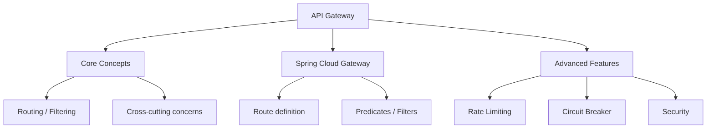

# API Gateway (Spring Cloud Gateway)
> **Previous:** [Service Discovery](39-discovery.md) | **Next:** [Resilience and Circuit Breakers](41-resilience.md)

## Learning Objectives

By the end of this chapter, you will be able to:

- Configure Spring Cloud Gateway with RouteLocatorBuilder and YAML-based route definitions
- Implement gateway predicates including Path, Method, Header, Query, Cookie, Host, RemoteAddr, Weight, and temporal predicates
- Create and apply gateway filters (AddRequestHeader, AddResponseHeader, RewritePath, StripPrefix, CircuitBreaker, Retry, RequestRateLimiter)
- Build custom GatewayFilter and GlobalFilter implementations
- Integrate Spring Cloud CircuitBreaker with the gateway for resilience
- Implement rate limiting with Redis and custom KeyResolver
- Secure the gateway with OAuth2 Resource Server and custom security filters
- Understand the WebFlux-based reactive architecture

---
## Chapter at a Glance

| Topic | Key Insight | Practical Takeaway |
|-------|------------|-------------------|
| API Gateway — single entry point for all client requests | Routing, filtering, cross-cutting concerns in one layer |
| Spring Cloud Gateway — reactive, non-blocking gateway | Route definitions with predicates and filters |
| Advanced Features — rate limiting, circuit breaking, security | Global and per-route filters; integration with Resilience4j |

---
## Chapter Roadmap



---
## Concept Comparison Table

| Concept | Description | Key Difference |
|---------|-------------|----------------|
| Spring Cloud Gateway | Reactive (WebFlux) | Non-blocking, built on Spring 5 |
| Zuul 1 | Servlet-based (blocking) | Legacy Netflix OSS, no longer actively developed |
| Kong | Lua/OpenResty gateway | Plugin ecosystem, Kubernetes Ingress Controller |
| Nginx + Lua | Reverse proxy with scripting | High-performance, custom routing logic |

---
## Quick Reference

| Element | Purpose | Example |
|---------|---------|---------|
| `RouteLocator` | Defines gateway routes | `@Bean RouteLocator routes(RouteLocatorBuilder builder)` |
| `.route(r -> r.path("/api/**").uri("lb://service"))` | Path-based route to Eureka service | Combines routing with load balancing |
| `AddRequestHeader` | GatewayFilter to add header | `.filter(gatewayFilter)` |
| `RequestRateLimiter` | Redis-backed rate limiter | `@Bean KeyResolver userKeyResolver()` |

---
## Cross-Application Matrix

| Domain | Application | Use Case |
|--------|-------------|----------|
| Microservices | Gateway + Eureka | Single endpoint for all: `/api/orders/`, `/api/payments/`, `/api/inventory/` |
| Multi-Version API | Predicate-based routing | Route `/v1/**` to old service, `/v2/**` to new service |
| Global Auth | Security filter | Validate JWT at the gateway before routing to backend |

---
## Chapter Quiz

1. On which reactive framework is Spring Cloud Gateway built? **Answer:** Spring WebFlux (Project Reactor)
2. Which two components make up a route definition? **Answer:** Predicate (match condition) and Filter (request/response transformation)
3. What is the main advantage of a gateway in a microservices architecture? **Answer:** Centralized cross-cutting concerns — auth, rate limiting, logging — without per-service duplication

## Theory


### API Gateway Pattern

An API Gateway is a single entry point that routes requests to appropriate backend services. It handles cross-cutting concerns including authentication, rate limiting, routing, aggregation, and protocol translation.

### Spring Cloud Gateway

Spring Cloud Gateway is built on **Spring WebFlux** (Reactor, Netty), making it fully reactive and non-blocking.

**Core Concepts:**

- **Routes**: A route is a combination of an ID, a URI destination, a collection of predicates, and a collection of filters.
- **Predicates**: Conditions that determine if a request matches a route (HTTP method, headers, paths, etc.)
- **Filters**: Modify requests and responses as they pass through the gateway (pre-filters and post-filters)
- **Route Locator**: Configuration source for routes (programmatic via `RouteLocatorBuilder` or declarative via YAML)

### Circuit Breaker Integration

Spring Cloud Gateway integrates with Spring Cloud CircuitBreaker to wrap downstream calls with circuit breaker protection. When a backend service fails, the circuit breaker returns a fallback response instead of propagating the error.

### Rate Limiting

The `RequestRateLimiter` filter uses Redis and the Token Bucket algorithm. The `KeyResolver` determines how to identify unique clients (e.g., by IP, authenticated user, or header).

> [!TIP]
> Use `lb://service-name` as the URI in route definitions to leverage Eureka load balancing through the gateway.

> [!WARNING]
> Spring Cloud Gateway is reactive and uses Netty — do not depend on `spring-boot-starter-web` (Tomcat) as they conflict.

> [!NOTE]
> Enable `RouteDefinitionMetrics` via Micrometer to monitor route hit rates, latency, and error responses.

## Complete Code Examples

### Gateway Application

```xml
<?xml version="1.0" encoding="UTF-8"?>
<project xmlns="http://maven.apache.org/POM/4.0.0"
         xmlns:xsi="http://www.w3.org/2001/XMLSchema-instance"
         xsi:schemaLocation="http://maven.apache.org/POM/4.0.0
         https://maven.apache.org/xsd/maven-4.0.0.xsd">
    <modelVersion>4.0.0</modelVersion>

    <parent>
        <groupId>org.springframework.boot</groupId>
        <artifactId>spring-boot-starter-parent</artifactId>
        <version>3.2.0</version>
        <relativePath/>
    </parent>

    <groupId>com.course.gateway</groupId>
    <artifactId>api-gateway</artifactId>
    <version>1.0.0</version>
    <name>api-gateway</name>
    <description>Spring Cloud Gateway</description>

    <properties>
        <java.version>21</java.version>
        <spring-cloud.version>2023.0.0</spring-cloud.version>
    </properties>

    <dependencies>
        <dependency>
            <groupId>org.springframework.cloud</groupId>
            <artifactId>spring-cloud-starter-gateway</artifactId>
        </dependency>
        <dependency>
            <groupId>org.springframework.cloud</groupId>
            <artifactId>spring-cloud-starter-netflix-eureka-client</artifactId>
        </dependency>
        <dependency>
            <groupId>org.springframework.cloud</groupId>
            <artifactId>spring-cloud-starter-circuitbreaker-reactor-resilience4j</artifactId>
        </dependency>
        <dependency>
            <groupId>org.springframework.boot</groupId>
            <artifactId>spring-boot-starter-data-redis-reactive</artifactId>
        </dependency>
        <dependency>
            <groupId>org.springframework.boot</groupId>
            <artifactId>spring-boot-starter-oauth2-resource-server</artifactId>
        </dependency>
        <dependency>
            <groupId>org.springframework.boot</groupId>
            <artifactId>spring-boot-starter-actuator</artifactId>
        </dependency>
        <dependency>
            <groupId>org.springframework.cloud</groupId>
            <artifactId>spring-cloud-starter-loadbalancer</artifactId>
        </dependency>
        <dependency>
            <groupId>org.projectlombok</groupId>
            <artifactId>lombok</artifactId>
            <optional>true</optional>
        </dependency>
        <dependency>
            <groupId>org.springframework.boot</groupId>
            <artifactId>spring-boot-starter-test</artifactId>
            <scope>test</scope>
        </dependency>
        <dependency>
            <groupId>io.projectreactor</groupId>
            <artifactId>reactor-test</artifactId>
            <scope>test</scope>
        </dependency>
    </dependencies>

    <dependencyManagement>
        <dependencies>
            <dependency>
                <groupId>org.springframework.cloud</groupId>
                <artifactId>spring-cloud-dependencies</artifactId>
                <version>${spring-cloud.version}</version>
                <type>pom</type>
                <scope>import</scope>
            </dependency>
        </dependencies>
    </dependencyManagement>

    <build>
        <plugins>
            <plugin>
                <groupId>org.springframework.boot</groupId>
                <artifactId>spring-boot-maven-plugin</artifactId>
            </plugin>
        </plugins>
    </build>
</project>
```

```java
package com.course.gateway;

import org.springframework.boot.SpringApplication;
import org.springframework.boot.autoconfigure.SpringBootApplication;
import org.springframework.cloud.client.discovery.EnableDiscoveryClient;

@SpringBootApplication
@EnableDiscoveryClient
public class GatewayApplication {

    public static void main(String[] args) {
        SpringApplication.run(GatewayApplication.class, args);
    }
}
```

### YAML Route Configuration

```yaml
# src/main/resources/application.yml
server:
  port: 8080

spring:
  application:
    name: api-gateway
  cloud:
    gateway:
      httpclient:
        connect-timeout: 5000
        response-timeout: 30s
        pool:
          type: elastic
          max-connections: 1000
          acquire-timeout: 5000
      routes:
        - id: order-service
          uri: lb://order-service
          predicates:
            - Path=/api/orders/**
            - Method=GET,POST,PUT,DELETE
          filters:
            - StripPrefix=0
            - name: RequestRateLimiter
              args:
                redis-rate-limiter.replenishRate: 100
                redis-rate-limiter.burstCapacity: 200
                redis-rate-limiter.requestedTokens: 1
                key-resolver: "#{@clientIpKeyResolver}"
            - name: CircuitBreaker
              args:
                name: orderServiceCircuitBreaker
                fallbackUri: forward:/fallback/orders
            - AddResponseHeader=X-Gateway-Response, gateway-1.0
            - AddRequestHeader=X-Gateway-Request, gateway-1.0

        - id: payment-service
          uri: lb://payment-service
          predicates:
            - Path=/api/payments/**
            - Method=GET,POST
          filters:
            - StripPrefix=0
            - name: Retry
              args:
                retries: 3
                statuses: BAD_GATEWAY, SERVICE_UNAVAILABLE, GATEWAY_TIMEOUT
                methods: GET
                backoff:
                  firstBackoff: 500ms
                  maxBackoff: 5000ms
                  factor: 2
                  basedOnPreviousValue: true

        - id: inventory-service
          uri: lb://inventory-service
          predicates:
            - Path=/api/inventory/**
            - Header=X-Inventory-Version, v1
          filters:
            - StripPrefix=0
            - SetPath=/api/inventory/{segment}

        - id: shipping-service
          uri: lb://shipping-service
          predicates:
            - Path=/api/shipping/**
            - Method=GET
            - Query=zipCode
          filters:
            - StripPrefix=0
            - AddResponseHeader=X-Cache, MISS

        - id: user-service-v1
          uri: lb://user-service-v1
          predicates:
            - Path=/api/users/**
            - Weight=user-group, 90
          filters:
            - StripPrefix=0
            - AddRequestHeader=X-Version, v1

        - id: user-service-v2
          uri: lb://user-service-v2
          predicates:
            - Path=/api/users/**
            - Weight=user-group, 10
            - Cookie=canary, enabled
          filters:
            - StripPrefix=0
            - AddRequestHeader=X-Version, v2

        - id: external-service
          uri: https://api.external.com
          predicates:
            - Host=external.**.com
            - RemoteAddr=10.0.0.0/24
          filters:
            - StripPrefix=1
            - AddRequestHeader=X-External-Auth, ${EXTERNAL_API_KEY}
            - name: CircuitBreaker
              args:
                name: externalServiceCB
                fallbackUri: forward:/fallback/external

        - id: docs-route
          uri: http://localhost:8081
          predicates:
            - Path=/docs/**
            - After=2024-01-01T00:00:00.000-05:00
          filters:
            - RewritePath=/docs/(?<segment>.*), /${segment}

      default-filters:
        - AddResponseHeader=X-Gateway-Instance, ${spring.application.name}
        - name: CircuitBreaker
          args:
            name: defaultCircuitBreaker
            fallbackUri: forward:/fallback/default

  redis:
    host: localhost
    port: 6379

  security:
    oauth2:
      resourceserver:
        jwt:
          issuer-uri: https://auth.example.com/realms/microservices
          jwk-set-uri: https://auth.example.com/realms/microservices/protocol/openid-connect/certs

eureka:
  client:
    service-url:
      defaultZone: http://localhost:8761/eureka/
    registry-fetch-interval-seconds: 5
  instance:
    prefer-ip-address: true

management:
  endpoints:
    web:
      exposure:
        include: health,info,metrics,gateway
  endpoint:
    gateway:
      enabled: true
    health:
      show-details: always
```

### Programmatic Route Configuration

```java
package com.course.gateway.config;

import org.slf4j.Logger;
import org.slf4j.LoggerFactory;
import org.springframework.cloud.gateway.filter.ratelimit.KeyResolver;
import org.springframework.cloud.gateway.route.RouteLocator;
import org.springframework.cloud.gateway.route.builder.RouteLocatorBuilder;
import org.springframework.context.annotation.Bean;
import org.springframework.context.annotation.Configuration;
import org.springframework.http.HttpMethod;
import org.springframework.http.HttpStatus;
import reactor.core.publisher.Mono;
import java.time.Duration;
import java.time.ZonedDateTime;

@Configuration
public class GatewayRouteConfig {

    private static final Logger log = LoggerFactory.getLogger(GatewayRouteConfig.class);

    @Bean
    public RouteLocator customRouteLocator(RouteLocatorBuilder builder) {
        return builder.routes()
                .route("order-service-programmatic", r -> r
                        .path("/api/orders/**")
                        .and()
                        .method(HttpMethod.GET, HttpMethod.POST, HttpMethod.PUT, HttpMethod.DELETE)
                        .and()
                        .header("Accept", "application/json")
                        .filters(f -> f
                                .stripPrefix(0)
                                .addRequestHeader("X-Request-Source", "gateway")
                                .addResponseHeader("X-Response-Source", "gateway")
                                .retry(retryConfig -> retryConfig
                                        .setRetries(3)
                                        .setStatuses(HttpStatus.BAD_GATEWAY, HttpStatus.SERVICE_UNAVAILABLE)
                                        .setMethods(HttpMethod.GET)
                                        .setBackoff(Duration.ofMillis(200), Duration.ofSeconds(5), 2, true))
                                .circuitBreaker(cb -> cb
                                        .setName("orderServiceCB")
                                        .setFallbackUri("forward:/fallback/orders")))
                        .uri("lb://order-service"))

                .route("payment-service-programmatic", r -> r
                        .path("/api/payments/**")
                        .filters(f -> f
                                .stripPrefix(0)
                                .addResponseHeader("X-Payment-Gateway", "active")
                                .circuitBreaker(cb -> cb
                                        .setName("paymentServiceCB")
                                        .setFallbackUri("forward:/fallback/payments")))
                        .uri("lb://payment-service"))

                .route("inventory-service-programmatic", r -> r
                        .path("/api/inventory/**")
                        .and()
                        .header("X-Inventory-Version", "v1")
                        .filters(f -> f
                                .stripPrefix(0)
                                .setPath("/api/inventory/{segment}"))
                        .uri("lb://inventory-service"))

                .route("shipping-service-programmatic", r -> r
                        .path("/api/shipping/**")
                        .and()
                        .query("zipCode")
                        .filters(f -> f
                                .stripPrefix(0)
                                .addResponseHeader("X-Cache", "MISS"))
                        .uri("lb://shipping-service"))

                .route("canary-user-service-v2", r -> r
                        .path("/api/users/**")
                        .and()
                        .cookie("canary", "enabled")
                        .and()
                        .weight("user-group", 10)
                        .filters(f -> f
                                .stripPrefix(0)
                                .addRequestHeader("X-Version", "v2")
                                .addResponseHeader("X-Canary", "true"))
                        .uri("lb://user-service-v2"))

                .route("canary-user-service-v1", r -> r
                        .path("/api/users/**")
                        .and()
                        .weight("user-group", 90)
                        .filters(f -> f
                                .stripPrefix(0)
                                .addRequestHeader("X-Version", "v1"))
                        .uri("lb://user-service-v1"))

                .route("docs-route-programmatic", r -> r
                        .path("/docs/**")
                        .and()
                        .after(ZonedDateTime.parse("2024-01-01T00:00:00.000-05:00[America/New_York]"))
                        .filters(f -> f
                                .rewritePath("/docs/(?<segment>.*)", "/${segment}"))
                        .uri("http://localhost:8081"))

                .route("external-api-route", r -> r
                        .host("external.**.com")
                        .and()
                        .remoteAddr("10.0.0.0/24")
                        .filters(f -> f
                                .stripPrefix(1)
                                .addRequestHeader("X-External-Auth", "${external.api.key}")
                                .circuitBreaker(cb -> cb
                                        .setName("externalApiCB")
                                        .setFallbackUri("forward:/fallback/external")))
                        .uri("https://api.external.com"))

                .route("websocket-route", r -> r
                        .path("/ws/**")
                        .filters(f -> f
                                .stripPrefix(1))
                        .uri("lb:ws://websocket-service"))

                .build();
    }
}
```

### Predicate Examples

```java
package com.course.gateway.config;

import org.springframework.cloud.gateway.handler.predicate.AbstractRoutePredicateFactory;
import org.springframework.cloud.gateway.handler.predicate.GatewayPredicate;
import org.springframework.http.HttpHeaders;
import org.springframework.stereotype.Component;
import org.springframework.web.server.ServerWebExchange;
import java.time.DayOfWeek;
import java.time.LocalTime;
import java.time.ZoneId;
import java.time.ZonedDateTime;
import java.util.Arrays;
import java.util.List;
import java.util.function.Predicate;

@Component
public class BusinessHoursRoutePredicateFactory
        extends AbstractRoutePredicateFactory<BusinessHoursRoutePredicateFactory.Config> {

    public BusinessHoursRoutePredicateFactory() {
        super(Config.class);
    }

    @Override
    public List<String> shortcutFieldOrder() {
        return Arrays.asList("startHour", "endHour", "timeZone");
    }

    @Override
    public Predicate<ServerWebExchange> apply(Config config) {
        return exchange -> {
            ZoneId zoneId = ZoneId.of(config.getTimeZone());
            ZonedDateTime now = ZonedDateTime.now(zoneId);
            LocalTime currentTime = now.toLocalTime();
            DayOfWeek dayOfWeek = now.getDayOfWeek();

            if (dayOfWeek == DayOfWeek.SATURDAY || dayOfWeek == DayOfWeek.SUNDAY) {
                return false;
            }

            LocalTime start = LocalTime.parse(config.getStartHour());
            LocalTime end = LocalTime.parse(config.getEndHour());
            return !currentTime.isBefore(start) && !currentTime.isAfter(end);
        };
    }

    public static class Config {
        private String startHour = "09:00";
        private String endHour = "17:00";
        private String timeZone = "America/New_York";

        public String getStartHour() { return startHour; }
        public void setStartHour(String startHour) { this.startHour = startHour; }
        public String getEndHour() { return endHour; }
        public void setEndHour(String endHour) { this.endHour = endHour; }
        public String getTimeZone() { return timeZone; }
        public void setTimeZone(String timeZone) { this.timeZone = timeZone; }
    }
}
```

```java
package com.course.gateway.config;

import org.springframework.cloud.gateway.handler.predicate.AbstractRoutePredicateFactory;
import org.springframework.stereotype.Component;
import org.springframework.web.server.ServerWebExchange;
import java.util.Arrays;
import java.util.List;
import java.util.function.Predicate;

@Component
public class ClientIdRoutePredicateFactory
        extends AbstractRoutePredicateFactory<ClientIdRoutePredicateFactory.Config> {

    public ClientIdRoutePredicateFactory() {
        super(Config.class);
    }

    @Override
    public List<String> shortcutFieldOrder() {
        return Arrays.asList("clientIds");
    }

    @Override
    public Predicate<ServerWebExchange> apply(Config config) {
        return exchange -> {
            String clientId = exchange.getRequest().getHeaders()
                    .getFirst("X-Client-Id");
            if (clientId == null || clientId.isBlank()) {
                return false;
            }
            return config.getClientIds().contains(clientId);
        };
    }

    public static class Config {
        private List<String> clientIds;

        public List<String> getClientIds() { return clientIds; }
        public void setClientIds(List<String> clientIds) { this.clientIds = clientIds; }
    }
}
```

```java
package com.course.gateway.config;

import org.springframework.cloud.gateway.handler.predicate.AbstractRoutePredicateFactory;
import org.springframework.stereotype.Component;
import org.springframework.web.server.ServerWebExchange;
import java.util.function.Predicate;

@Component
public class VersionRoutePredicateFactory
        extends AbstractRoutePredicateFactory<VersionRoutePredicateFactory.Config> {

    public VersionRoutePredicateFactory() {
        super(Config.class);
    }

    @Override
    public Predicate<ServerWebExchange> apply(Config config) {
        return exchange -> {
            String version = exchange.getRequest().getHeaders()
                    .getFirst("Accept-Version");
            return config.getVersion().equals(version);
        };
    }

    public static class Config {
        private String version;

        public String getVersion() { return version; }
        public void setVersion(String version) { this.version = version; }
    }
}
```

```java
package com.course.gateway.config;

import org.springframework.cloud.gateway.handler.predicate.AbstractRoutePredicateFactory;
import org.springframework.stereotype.Component;
import org.springframework.web.server.ServerWebExchange;
import java.util.Arrays;
import java.util.List;
import java.util.function.Predicate;

@Component
public class RateLimitBypassPredicateFactory
        extends AbstractRoutePredicateFactory<RateLimitBypassPredicateFactory.Config> {

    public RateLimitBypassPredicateFactory() {
        super(Config.class);
    }

    @Override
    public List<String> shortcutFieldOrder() {
        return Arrays.asList("bypassTokens");
    }

    @Override
    public Predicate<ServerWebExchange> apply(Config config) {
        return exchange -> {
            String token = exchange.getRequest().getHeaders()
                    .getFirst("X-Bypass-Rate-Limit");
            return token != null && config.getBypassToken().equals(token);
        };
    }

    public static class Config {
        private String bypassToken;

        public String getBypassToken() { return bypassToken; }
        public void setBypassToken(String bypassToken) { this.bypassToken = bypassToken; }
    }
}
```

### Custom Gateway Filters

```java
package com.course.gateway.filter;

import org.slf4j.Logger;
import org.slf4j.LoggerFactory;
import org.springframework.cloud.gateway.filter.GatewayFilter;
import org.springframework.cloud.gateway.filter.factory.AbstractGatewayFilterFactory;
import org.springframework.http.HttpHeaders;
import org.springframework.http.server.reactive.ServerHttpRequest;
import org.springframework.http.server.reactive.ServerHttpResponse;
import org.springframework.stereotype.Component;
import reactor.core.publisher.Mono;

@Component
public class RequestLoggingGatewayFilterFactory
        extends AbstractGatewayFilterFactory<RequestLoggingGatewayFilterFactory.Config> {

    private static final Logger log = LoggerFactory.getLogger(RequestLoggingGatewayFilterFactory.class);

    public RequestLoggingGatewayFilterFactory() {
        super(Config.class);
    }

    @Override
    public GatewayFilter apply(Config config) {
        return (exchange, chain) -> {
            ServerHttpRequest request = exchange.getRequest();
            long startTime = System.currentTimeMillis();

            log.info("Request: {} {} from {} headers={}",
                    request.getMethod(),
                    request.getURI().getPath(),
                    request.getRemoteAddress(),
                    config.logHeaders() ? request.getHeaders() : "[masked]");

            return chain.filter(exchange).then(Mono.fromRunnable(() -> {
                ServerHttpResponse response = exchange.getResponse();
                long duration = System.currentTimeMillis() - startTime;
                log.info("Response: {} {} {} ({}ms)",
                        request.getMethod(),
                        request.getURI().getPath(),
                        response.getStatusCode(),
                        duration);

                if (config.logResponseHeaders()) {
                    log.debug("Response headers: {}", response.getHeaders());
                }
            }));
        };
    }

    public record Config(boolean logHeaders, boolean logResponseHeaders) {
        public Config() { this(true, false); }
    }
}
```

```java
package com.course.gateway.filter;

import com.fasterxml.jackson.databind.ObjectMapper;
import org.springframework.cloud.gateway.filter.GatewayFilter;
import org.springframework.cloud.gateway.filter.factory.AbstractGatewayFilterFactory;
import org.springframework.core.io.buffer.DataBuffer;
import org.springframework.http.HttpStatus;
import org.springframework.http.MediaType;
import org.springframework.http.server.reactive.ServerHttpResponse;
import org.springframework.stereotype.Component;
import reactor.core.publisher.Mono;
import java.nio.charset.StandardCharsets;
import java.util.Map;

@Component
public class MaintenanceModeGatewayFilterFactory
        extends AbstractGatewayFilterFactory<MaintenanceModeGatewayFilterFactory.Config> {

    private final ObjectMapper objectMapper;

    public MaintenanceModeGatewayFilterFactory(ObjectMapper objectMapper) {
        super(Config.class);
        this.objectMapper = objectMapper;
    }

    @Override
    public GatewayFilter apply(Config config) {
        return (exchange, chain) -> {
            if (config.isEnabled()) {
                ServerHttpResponse response = exchange.getResponse();
                response.setStatusCode(HttpStatus.SERVICE_UNAVAILABLE);
                response.getHeaders().setContentType(MediaType.APPLICATION_JSON);
                response.getHeaders().set("Retry-After", "3600");

                try {
                    String body = objectMapper.writeValueAsString(Map.of(
                            "status", "MAINTENANCE",
                            "message", config.getMessage(),
                            "estimatedDowntime", config.getEstimatedDowntime()
                    ));
                    DataBuffer buffer = response.bufferFactory()
                            .wrap(body.getBytes(StandardCharsets.UTF_8));
                    return response.writeWith(Mono.just(buffer));
                } catch (Exception e) {
                    return response.setComplete();
                }
            }
            return chain.filter(exchange);
        };
    }

    public record Config(boolean enabled, String message, String estimatedDowntime) {
        public Config() { this(false, "Service is under maintenance", "Unknown"); }
    }
}
```

```java
package com.course.gateway.filter;

import org.springframework.cloud.gateway.filter.GatewayFilter;
import org.springframework.cloud.gateway.filter.factory.AbstractGatewayFilterFactory;
import org.springframework.http.HttpHeaders;
import org.springframework.http.server.reactive.ServerHttpRequest;
import org.springframework.stereotype.Component;
import java.net.URI;
import java.time.Duration;
import java.time.Instant;

@Component
public class RateLimitHeaderGatewayFilterFactory
        extends AbstractGatewayFilterFactory<RateLimitHeaderGatewayFilterFactory.Config> {

    public RateLimitHeaderGatewayFilterFactory() {
        super(Config.class);
    }

    @Override
    public GatewayFilter apply(Config config) {
        return (exchange, chain) -> {
            ServerHttpRequest request = exchange.getRequest().mutate()
                    .header("X-Rate-Limit-Limit", String.valueOf(config.getLimit()))
                    .header("X-Rate-Limit-Remaining", String.valueOf(config.getRemaining()))
                    .header("X-Rate-Limit-Reset", String.valueOf(
                            Instant.now().plus(Duration.ofSeconds(config.getResetSeconds()))
                                    .getEpochSecond()))
                    .build();

            return chain.filter(exchange.mutate().request(request).build());
        };
    }

    public record Config(int limit, int remaining, int resetSeconds) {
        public Config() { this(100, 100, 60); }
    }
}
```

```java
package com.course.gateway.filter;

import org.springframework.cloud.gateway.filter.GatewayFilter;
import org.springframework.cloud.gateway.filter.factory.AbstractGatewayFilterFactory;
import org.springframework.http.HttpHeaders;
import org.springframework.http.server.reactive.ServerHttpRequest;
import org.springframework.stereotype.Component;

@Component
public class CorrelationIdGatewayFilterFactory
        extends AbstractGatewayFilterFactory<CorrelationIdGatewayFilterFactory.Config> {

    private static final String CORRELATION_ID_HEADER = "X-Correlation-Id";

    public CorrelationIdGatewayFilterFactory() {
        super(Config.class);
    }

    @Override
    public GatewayFilter apply(Config config) {
        return (exchange, chain) -> {
            ServerHttpRequest request = exchange.getRequest();
            String correlationId = request.getHeaders()
                    .getFirst(CORRELATION_ID_HEADER);

            if (correlationId == null || correlationId.isBlank()) {
                correlationId = java.util.UUID.randomUUID().toString();
            }

            ServerHttpRequest mutatedRequest = request.mutate()
                    .header(CORRELATION_ID_HEADER, correlationId)
                    .build();

            return chain.filter(exchange.mutate().request(mutatedRequest).build());
        };
    }

    public record Config() {}
}
```

### Global Filters

```java
package com.course.gateway.filter;

import io.micrometer.core.instrument.MeterRegistry;
import io.micrometer.core.instrument.Timer;
import org.slf4j.Logger;
import org.slf4j.LoggerFactory;
import org.springframework.cloud.gateway.filter.GatewayFilterChain;
import org.springframework.cloud.gateway.filter.GlobalFilter;
import org.springframework.core.Ordered;
import org.springframework.http.HttpHeaders;
import org.springframework.http.HttpStatus;
import org.springframework.http.server.reactive.ServerHttpRequest;
import org.springframework.http.server.reactive.ServerHttpResponse;
import org.springframework.stereotype.Component;
import org.springframework.web.server.ServerWebExchange;
import reactor.core.publisher.Mono;
import java.time.Duration;
import java.time.Instant;

@Component
public class MetricsGlobalFilter implements GlobalFilter, Ordered {

    private static final Logger log = LoggerFactory.getLogger(MetricsGlobalFilter.class);
    private final MeterRegistry meterRegistry;

    public MetricsGlobalFilter(MeterRegistry meterRegistry) {
        this.meterRegistry = meterRegistry;
    }

    @Override
    public Mono<Void> filter(ServerWebExchange exchange, GatewayFilterChain chain) {
        ServerHttpRequest request = exchange.getRequest();
        String path = request.getURI().getPath();
        String method = request.getMethod().toString();
        Instant start = Instant.now();

        return chain.filter(exchange).then(Mono.fromRunnable(() -> {
            ServerHttpResponse response = exchange.getResponse();
            HttpStatus status = HttpStatus.resolve(response.getStatusCode().value());

            Timer.Sample sample = Timer.start(meterRegistry);
            sample.stop(Timer.builder("gateway.request.duration")
                    .tag("path", path)
                    .tag("method", method)
                    .tag("status", status != null ? String.valueOf(status.value()) : "unknown")
                    .register(meterRegistry));

            meterRegistry.counter("gateway.request.count",
                    "path", path,
                    "method", method,
                    "status", String.valueOf(response.getStatusCode().value())
            ).increment();
        }));
    }

    @Override
    public int getOrder() {
        return Ordered.LOWEST_PRECEDENCE - 5;
    }
}
```

```java
package com.course.gateway.filter;

import io.micrometer.core.instrument.MeterRegistry;
import org.slf4j.Logger;
import org.slf4j.LoggerFactory;
import org.springframework.cloud.gateway.filter.GatewayFilterChain;
import org.springframework.cloud.gateway.filter.GlobalFilter;
import org.springframework.core.Ordered;
import org.springframework.http.HttpStatus;
import org.springframework.http.server.reactive.ServerHttpRequest;
import org.springframework.http.server.reactive.ServerHttpResponse;
import org.springframework.stereotype.Component;
import org.springframework.web.server.ServerWebExchange;
import reactor.core.publisher.Mono;
import java.net.InetSocketAddress;
import java.util.Map;
import java.util.concurrent.ConcurrentHashMap;
import java.util.concurrent.atomic.AtomicInteger;

@Component
public class IpBlockingGlobalFilter implements GlobalFilter, Ordered {

    private static final Logger log = LoggerFactory.getLogger(IpBlockingGlobalFilter.class);
    private final Map<String, AtomicInteger> requestCounts = new ConcurrentHashMap<>();
    private static final int MAX_REQUESTS_PER_IP = 1000;
    private static final long WINDOW_MS = 60_000;
    private final Map<String, Long> blockedUntil = new ConcurrentHashMap<>();
    private static final long BLOCK_DURATION_MS = 300_000;

    @Override
    public Mono<Void> filter(ServerWebExchange exchange, GatewayFilterChain chain) {
        InetSocketAddress remoteAddress = exchange.getRequest().getRemoteAddress();
        if (remoteAddress == null) {
            return chain.filter(exchange);
        }

        String clientIp = remoteAddress.getAddress().getHostAddress();

        if (isBlocked(clientIp)) {
            log.warn("Blocked request from IP: {}", clientIp);
            ServerHttpResponse response = exchange.getResponse();
            response.setStatusCode(HttpStatus.FORBIDDEN);
            return response.setComplete();
        }

        trackRequest(clientIp);
        return chain.filter(exchange);
    }

    private boolean isBlocked(String ip) {
        Long blockedTime = blockedUntil.get(ip);
        if (blockedTime != null) {
            if (System.currentTimeMillis() < blockedTime) {
                return true;
            }
            blockedUntil.remove(ip);
            requestCounts.remove(ip);
        }
        return false;
    }

    private void trackRequest(String ip) {
        requestCounts.computeIfAbsent(ip, k -> new AtomicInteger(0));
        int count = requestCounts.get(ip).incrementAndGet();
        if (count > MAX_REQUESTS_PER_IP) {
            blockedUntil.put(ip, System.currentTimeMillis() + BLOCK_DURATION_MS);
            log.warn("Blocked IP {} for exceeding request limit", ip);
        }
    }

    @Override
    public int getOrder() {
        return Ordered.HIGHEST_PRECEDENCE + 1;
    }
}
```

```java
package com.course.gateway.filter;

import org.slf4j.Logger;
import org.slf4j.LoggerFactory;
import org.springframework.cloud.gateway.filter.GatewayFilterChain;
import org.springframework.cloud.gateway.filter.GlobalFilter;
import org.springframework.core.Ordered;
import org.springframework.http.HttpHeaders;
import org.springframework.http.server.reactive.ServerHttpRequest;
import org.springframework.stereotype.Component;
import org.springframework.web.server.ServerWebExchange;
import reactor.core.publisher.Mono;
import java.time.Instant;
import java.util.UUID;

@Component
public class TracingGlobalFilter implements GlobalFilter, Ordered {

    private static final Logger log = LoggerFactory.getLogger(TracingGlobalFilter.class);
    private static final String TRACE_ID_HEADER = "X-Trace-Id";
    private static final String SPAN_ID_HEADER = "X-Span-Id";
    private static final String PARENT_SPAN_ID_HEADER = "X-Parent-Span-Id";

    @Override
    public Mono<Void> filter(ServerWebExchange exchange, GatewayFilterChain chain) {
        ServerHttpRequest request = exchange.getRequest();
        String traceId = request.getHeaders().getFirst(TRACE_ID_HEADER);
        String parentSpanId = request.getHeaders().getFirst(SPAN_ID_HEADER);

        if (traceId == null || traceId.isBlank()) {
            traceId = UUID.randomUUID().toString().replace("-", "");
        }

        String spanId = UUID.randomUUID().toString().replace("-", "").substring(0, 16);

        ServerHttpRequest mutatedRequest = request.mutate()
                .header(TRACE_ID_HEADER, traceId)
                .header(SPAN_ID_HEADER, spanId)
                .header(PARENT_SPAN_ID_HEADER, parentSpanId != null ? parentSpanId : "root")
                .header("X-Request-Start", String.valueOf(Instant.now().toEpochMilli()))
                .build();

        log.debug("Trace: {} Span: {} Parent: {} Path: {}",
                traceId, spanId, parentSpanId, request.getURI().getPath());

        return chain.filter(exchange.mutate().request(mutatedRequest).build());
    }

    @Override
    public int getOrder() {
        return Ordered.HIGHEST_PRECEDENCE;
    }
}
```

```java
package com.course.gateway.filter;

import org.slf4j.Logger;
import org.slf4j.LoggerFactory;
import org.springframework.cloud.gateway.filter.GatewayFilterChain;
import org.springframework.cloud.gateway.filter.GlobalFilter;
import org.springframework.core.Ordered;
import org.springframework.http.HttpHeaders;
import org.springframework.http.server.reactive.ServerHttpRequest;
import org.springframework.http.server.reactive.ServerHttpResponse;
import org.springframework.stereotype.Component;
import org.springframework.web.server.ServerWebExchange;
import reactor.core.publisher.Mono;

@Component
public class CorsGlobalFilter implements GlobalFilter, Ordered {

    private static final Logger log = LoggerFactory.getLogger(CorsGlobalFilter.class);

    @Override
    public Mono<Void> filter(ServerWebExchange exchange, GatewayFilterChain chain) {
        ServerHttpResponse response = exchange.getResponse();
        HttpHeaders headers = response.getHeaders();

        headers.add("Access-Control-Allow-Origin", "*");
        headers.add("Access-Control-Allow-Methods", "GET, POST, PUT, DELETE, PATCH, OPTIONS");
        headers.add("Access-Control-Allow-Headers", "Origin, Content-Type, Accept, Authorization, X-Requested-With");
        headers.add("Access-Control-Max-Age", "3600");
        headers.add("Access-Control-Allow-Credentials", "true");

        if (exchange.getRequest().getMethod().matches("OPTIONS")) {
            response.getHeaders().add("Access-Control-Max-Age", "3600");
            return Mono.empty();
        }

        return chain.filter(exchange);
    }

    @Override
    public int getOrder() {
        return Ordered.HIGHEST_PRECEDENCE + 2;
    }
}
```

### Rate Limiting Configuration

```java
package com.course.gateway.config;

import org.springframework.cloud.gateway.filter.ratelimit.KeyResolver;
import org.springframework.cloud.gateway.filter.ratelimit.RedisRateLimiter;
import org.springframework.context.annotation.Bean;
import org.springframework.context.annotation.Configuration;
import org.springframework.context.annotation.Primary;
import reactor.core.publisher.Mono;

@Configuration
public class RateLimiterConfig {

    private static final String DEFAULT_REPLENISH_RATE = "100";
    private static final String DEFAULT_BURST_CAPACITY = "200";

    @Bean
    @Primary
    public RedisRateLimiter redisRateLimiter() {
        return new RedisRateLimiter(
                Integer.parseInt(DEFAULT_REPLENISH_RATE),
                Integer.parseInt(DEFAULT_BURST_CAPACITY)
        );
    }

    @Bean
    public KeyResolver clientIpKeyResolver() {
        return exchange -> {
            String ip = exchange.getRequest().getRemoteAddress() != null
                    ? exchange.getRequest().getRemoteAddress().getAddress().getHostAddress()
                    : "unknown";
            return Mono.just(ip);
        };
    }

    @Bean
    public KeyResolver authenticatedUserKeyResolver() {
        return exchange -> {
            String userId = exchange.getRequest().getHeaders()
                    .getFirst("X-User-Id");
            return Mono.just(userId != null ? userId : "anonymous");
        };
    }

    @Bean
    public KeyResolver pathBasedKeyResolver() {
        return exchange -> {
            String path = exchange.getRequest().getURI().getPath();
            String method = exchange.getRequest().getMethod().toString();
            return Mono.just(method + ":" + path);
        };
    }

    @Bean
    public KeyResolver compositeKeyResolver() {
        return exchange -> {
            String ip = exchange.getRequest().getRemoteAddress() != null
                    ? exchange.getRequest().getRemoteAddress().getAddress().getHostAddress()
                    : "unknown";
            String userId = exchange.getRequest().getHeaders()
                    .getFirst("X-User-Id");
            String key = userId != null
                    ? "user:" + userId
                    : "ip:" + ip;
            return Mono.just(key);
        };
    }

    @Bean
    public RedisRateLimiter strictRateLimiter() {
        return new RedisRateLimiter(10, 20);
    }

    @Bean
    public RedisRateLimiter moderateRateLimiter() {
        return new RedisRateLimiter(50, 100);
    }

    @Bean
    public RedisRateLimiter relaxedRateLimiter() {
        return new RedisRateLimiter(500, 1000);
    }
}
```

### Circuit Breaker Fallback Controller

```java
package com.course.gateway.controller;

import org.springframework.http.HttpStatus;
import org.springframework.http.ResponseEntity;
import org.springframework.web.bind.annotation.*;
import reactor.core.publisher.Mono;
import java.time.Instant;
import java.util.Map;

@RestController
@RequestMapping("/fallback")
public class FallbackController {

    @GetMapping("/orders")
    public Mono<ResponseEntity<Map<String, Object>>> ordersFallback() {
        return Mono.just(ResponseEntity.status(HttpStatus.SERVICE_UNAVAILABLE)
                .body(Map.of(
                        "status", "FALLBACK",
                        "message", "Order service is currently unavailable. Please try again later.",
                        "timestamp", Instant.now().toString(),
                        "service", "order-service"
                )));
    }

    @PostMapping("/orders")
    public Mono<ResponseEntity<Map<String, Object>>> ordersFallbackPost() {
        return Mono.just(ResponseEntity.status(HttpStatus.SERVICE_UNAVAILABLE)
                .body(Map.of(
                        "status", "FALLBACK",
                        "message", "Order service is currently unavailable. Your request could not be processed.",
                        "timestamp", Instant.now().toString(),
                        "service", "order-service"
                )));
    }

    @GetMapping("/payments")
    public Mono<ResponseEntity<Map<String, Object>>> paymentsFallback() {
        return Mono.just(ResponseEntity.status(HttpStatus.SERVICE_UNAVAILABLE)
                .body(Map.of(
                        "status", "FALLBACK",
                        "message", "Payment service is temporarily unavailable.",
                        "timestamp", Instant.now().toString(),
                        "service", "payment-service"
                )));
    }

    @GetMapping("/inventory")
    public Mono<ResponseEntity<Map<String, Object>>> inventoryFallback() {
        return Mono.just(ResponseEntity.status(HttpStatus.SERVICE_UNAVAILABLE)
                .body(Map.of(
                        "status", "FALLBACK",
                        "message", "Inventory service is unavailable.",
                        "timestamp", Instant.now().toString(),
                        "service", "inventory-service"
                )));
    }

    @GetMapping("/external")
    public Mono<ResponseEntity<Map<String, Object>>> externalFallback() {
        return Mono.just(ResponseEntity.status(HttpStatus.SERVICE_UNAVAILABLE)
                .body(Map.of(
                        "status", "FALLBACK",
                        "message", "External API is currently unreachable.",
                        "timestamp", Instant.now().toString(),
                        "service", "external-api"
                )));
    }

    @GetMapping("/default")
    public Mono<ResponseEntity<Map<String, Object>>> defaultFallback() {
        return Mono.just(ResponseEntity.status(HttpStatus.SERVICE_UNAVAILABLE)
                .body(Map.of(
                        "status", "FALLBACK",
                        "message", "The requested service is unavailable.",
                        "timestamp", Instant.now().toString()
                )));
    }
}
```

### Security Configuration

```java
package com.course.gateway.config;

import org.springframework.context.annotation.Bean;
import org.springframework.context.annotation.Configuration;
import org.springframework.security.config.annotation.web.reactive.EnableWebFluxSecurity;
import org.springframework.security.config.web.server.ServerHttpSecurity;
import org.springframework.security.oauth2.jwt.ReactiveJwtDecoder;
import org.springframework.security.oauth2.jwt.ReactiveJwtDecoders;
import org.springframework.security.web.server.SecurityWebFilterChain;
import org.springframework.security.web.server.authentication.ServerAuthenticationConverter;
import org.springframework.security.web.server.authorization.ServerAccessDeniedHandler;
import org.springframework.security.web.server.context.NoOpServerSecurityContextRepository;
import org.springframework.web.cors.CorsConfiguration;
import org.springframework.web.cors.reactive.UrlBasedCorsConfigurationSource;
import org.springframework.web.cors.reactive.CorsWebFilter;
import org.springframework.web.server.ServerWebExchange;
import reactor.core.publisher.Mono;
import java.util.List;

@Configuration
@EnableWebFluxSecurity
public class GatewaySecurityConfig {

    @Bean
    public SecurityWebFilterChain securityWebFilterChain(ServerHttpSecurity http) {
        http
            .csrf(ServerHttpSecurity.CsrfSpec::disable)
            .cors(cors -> {})
            .securityContextRepository(NoOpServerSecurityContextRepository.getInstance())
            .authorizeExchange(exchanges -> exchanges
                .pathMatchers("/actuator/**").permitAll()
                .pathMatchers("/fallback/**").permitAll()
                .pathMatchers("/public/**").permitAll()
                .pathMatchers("/api/orders/**").hasAuthority("SCOPE_orders:read")
                .pathMatchers("/api/orders/**", HttpMethod.POST).hasAuthority("SCOPE_orders:write")
                .pathMatchers("/api/payments/**").hasAuthority("SCOPE_payments:read")
                .pathMatchers("/api/inventory/**").hasAuthority("SCOPE_inventory:read")
                .pathMatchers("/api/users/**").hasAuthority("SCOPE_users:read")
                .anyExchange().authenticated())
            .oauth2ResourceServer(oauth2 -> oauth2
                .jwt(jwt -> jwt
                    .jwtDecoder(jwtDecoder())))
            .exceptionHandling(exceptions -> exceptions
                .accessDeniedHandler(accessDeniedHandler()));

        return http.build();
    }

    @Bean
    public ReactiveJwtDecoder jwtDecoder() {
        return ReactiveJwtDecoders.fromIssuerLocation(
                "https://auth.example.com/realms/microservices");
    }

    @Bean
    public ServerAccessDeniedHandler accessDeniedHandler() {
        return (exchange, denied) -> {
            exchange.getResponse().setStatusCode(org.springframework.http.HttpStatus.FORBIDDEN);
            exchange.getResponse().getHeaders().setContentType(
                    org.springframework.http.MediaType.APPLICATION_JSON);
            byte[] body = "{\"error\":\"forbidden\",\"message\":\"Insufficient permissions\"}"
                    .getBytes(java.nio.charset.StandardCharsets.UTF_8);
            return exchange.getResponse()
                    .writeWith(Mono.just(exchange.getResponse().bufferFactory().wrap(body)));
        };
    }

    @Bean
    public CorsWebFilter corsWebFilter() {
        CorsConfiguration config = new CorsConfiguration();
        config.setAllowedOrigins(List.of("*"));
        config.setAllowedMethods(List.of("GET", "POST", "PUT", "DELETE", "PATCH", "OPTIONS"));
        config.setAllowedHeaders(List.of("*"));
        config.setMaxAge(3600L);

        UrlBasedCorsConfigurationSource source = new UrlBasedCorsConfigurationSource();
        source.registerCorsConfiguration("/**", config);
        return new CorsWebFilter(source);
    }
}
```

### Security Global Filter

```java
package com.course.gateway.filter;

import org.slf4j.Logger;
import org.slf4j.LoggerFactory;
import org.springframework.cloud.gateway.filter.GatewayFilterChain;
import org.springframework.cloud.gateway.filter.GlobalFilter;
import org.springframework.core.Ordered;
import org.springframework.http.HttpStatus;
import org.springframework.http.server.reactive.ServerHttpRequest;
import org.springframework.http.server.reactive.ServerHttpResponse;
import org.springframework.stereotype.Component;
import org.springframework.web.server.ServerWebExchange;
import reactor.core.publisher.Mono;
import java.util.List;
import java.util.Map;
import java.util.Set;
import java.util.concurrent.ConcurrentHashMap;

@Component
public class SecurityGlobalFilter implements GlobalFilter, Ordered {

    private static final Logger log = LoggerFactory.getLogger(SecurityGlobalFilter.class);

    private static final Set<String> BLOCKED_PATHS = Set.of(
            "/actuator/shutdown",
            "/actuator/restart",
            "/actuator/pause",
            "/actuator/resume"
    );

    private static final Set<String> BLOCKED_USER_AGENTS = Set.of(
            "sqlmap",
            "nmap",
            "nikto",
            "masscan",
            "zgrab",
            "wpscan"
    );

    private static final Map<String, Integer> FAILED_AUTH_ATTEMPTS = new ConcurrentHashMap<>();
    private static final int MAX_FAILED_ATTEMPTS = 10;
    private static final long BLOCK_DURATION_MS = 3600_000;

    @Override
    public Mono<Void> filter(ServerWebExchange exchange, GatewayFilterChain chain) {
        ServerHttpRequest request = exchange.getRequest();
        String path = request.getURI().getPath();

        if (BLOCKED_PATHS.contains(path)) {
            log.warn("Blocked access to sensitive path: {}", path);
            exchange.getResponse().setStatusCode(HttpStatus.FORBIDDEN);
            return exchange.getResponse().setComplete();
        }

        String userAgent = request.getHeaders().getFirst("User-Agent");
        if (userAgent != null) {
            String ua = userAgent.toLowerCase();
            boolean blocked = BLOCKED_USER_AGENTS.stream().anyMatch(ua::contains);
            if (blocked) {
                log.warn("Blocked request with User-Agent: {}", userAgent);
                exchange.getResponse().setStatusCode(HttpStatus.FORBIDDEN);
                return exchange.getResponse().setComplete();
            }
        }

        String clientIp = request.getRemoteAddress() != null
                ? request.getRemoteAddress().getAddress().getHostAddress()
                : null;
        if (clientIp != null && isBlocked(clientIp)) {
            log.warn("Blocked request from IP due to failed auth: {}", clientIp);
            exchange.getResponse().setStatusCode(HttpStatus.TOO_MANY_REQUESTS);
            return exchange.getResponse().setComplete();
        }

        return chain.filter(exchange).then(Mono.fromRunnable(() -> {
            ServerHttpResponse response = exchange.getResponse();
            if (response.getStatusCode() == HttpStatus.UNAUTHORIZED && clientIp != null) {
                trackFailedAuth(clientIp);
            } else if (response.getStatusCode() == HttpStatus.OK && clientIp != null) {
                clearFailedAuth(clientIp);
            }
        }));
    }

    private boolean isBlocked(String ip) {
        Integer count = FAILED_AUTH_ATTEMPTS.get(ip);
        return count != null && count >= MAX_FAILED_ATTEMPTS;
    }

    private void trackFailedAuth(String ip) {
        FAILED_AUTH_ATTEMPTS.merge(ip, 1, Integer::sum);
    }

    private void clearFailedAuth(String ip) {
        FAILED_AUTH_ATTEMPTS.remove(ip);
    }

    @Override
    public int getOrder() {
        return Ordered.HIGHEST_PRECEDENCE + 5;
    }
}
```

### Gateway Health Indicator

```java
package com.course.gateway.health;

import org.springframework.boot.actuate.health.Health;
import org.springframework.boot.actuate.health.HealthIndicator;
import org.springframework.cloud.gateway.route.RouteDefinition;
import org.springframework.cloud.gateway.route.RouteDefinitionLocator;
import org.springframework.stereotype.Component;
import reactor.core.publisher.Mono;
import java.util.List;

@Component
public class GatewayHealthIndicator implements HealthIndicator {

    private final RouteDefinitionLocator routeDefinitionLocator;

    public GatewayHealthIndicator(RouteDefinitionLocator routeDefinitionLocator) {
        this.routeDefinitionLocator = routeDefinitionLocator;
    }

    @Override
    public Health health() {
        try {
            List<RouteDefinition> routes = routeDefinitionLocator.getRouteDefinitions()
                    .collectList()
                    .block();

            if (routes == null || routes.isEmpty()) {
                return Health.down()
                        .withDetail("routesCount", 0)
                        .withDetail("reason", "No routes configured")
                        .build();
            }

            List<String> routeIds = routes.stream()
                    .map(RouteDefinition::getId)
                    .toList();

            return Health.up()
                    .withDetail("routesCount", routes.size())
                    .withDetail("routes", routeIds)
                    .build();
        } catch (Exception e) {
            return Health.down(e)
                    .withDetail("reason", e.getMessage())
                    .build();
        }
    }
}
```

### Gateway Metrics

```java
package com.course.gateway.metrics;

import io.micrometer.core.instrument.MeterRegistry;
import io.micrometer.core.instrument.Tag;
import org.springframework.boot.actuate.metrics.web.reactive.server.DefaultWebFluxTagsProvider;
import org.springframework.boot.actuate.metrics.web.reactive.server.WebFluxTagsProvider;
import org.springframework.cloud.gateway.route.RouteDefinition;
import org.springframework.cloud.gateway.route.RouteDefinitionLocator;
import org.springframework.context.annotation.Bean;
import org.springframework.context.annotation.Configuration;
import org.springframework.web.server.ServerWebExchange;
import reactor.core.publisher.Flux;
import java.util.List;

@Configuration
public class GatewayMetricsConfig {

    @Bean
    public WebFluxTagsProvider webFluxTagsProvider() {
        return new DefaultWebFluxTagsProvider();
    }

    @Bean
    public GatewayMetricsInitializer gatewayMetricsInitializer(
            MeterRegistry meterRegistry,
            RouteDefinitionLocator routeDefinitionLocator) {
        return new GatewayMetricsInitializer(meterRegistry, routeDefinitionLocator);
    }

    public static class GatewayMetricsInitializer {

        private final MeterRegistry meterRegistry;
        private final RouteDefinitionLocator routeDefinitionLocator;

        public GatewayMetricsInitializer(MeterRegistry meterRegistry,
                                          RouteDefinitionLocator routeDefinitionLocator) {
            this.meterRegistry = meterRegistry;
            this.routeDefinitionLocator = routeDefinitionLocator;
            initializeRouteMetrics();
        }

        private void initializeRouteMetrics() {
            routeDefinitionLocator.getRouteDefinitions()
                    .flatMapMany(Flux::just)
                    .subscribe(route -> {
                        meterRegistry.gauge("gateway.route.weight",
                                List.of(Tag.of("routeId", route.getId())),
                                route,
                                r -> r.getMetadata().getOrDefault("weight", 1) instanceof Number
                                        ? ((Number) r.getMetadata().get("weight")).doubleValue()
                                        : 1.0);
                    });
        }
    }
}
```

### Gateway Admin Controller

```java
package com.course.gateway.controller;

import org.springframework.cloud.gateway.actuate.GatewayControllerEndpoint;
import org.springframework.cloud.gateway.filter.GatewayFilter;
import org.springframework.cloud.gateway.filter.factory.GatewayFilterFactory;
import org.springframework.cloud.gateway.handler.predicate.RoutePredicateFactory;
import org.springframework.cloud.gateway.route.RouteDefinition;
import org.springframework.cloud.gateway.route.RouteDefinitionLocator;
import org.springframework.cloud.gateway.route.RouteDefinitionWriter;
import org.springframework.http.HttpStatus;
import org.springframework.http.ResponseEntity;
import org.springframework.web.bind.annotation.*;
import reactor.core.publisher.Mono;
import java.util.List;
import java.util.Map;

@RestController
@RequestMapping("/api/admin/gateway")
public class GatewayAdminController {

    private final RouteDefinitionLocator routeDefinitionLocator;
    private final RouteDefinitionWriter routeDefinitionWriter;
    private final List<GatewayFilterFactory<?>> filterFactories;
    private final List<RoutePredicateFactory<?>> predicateFactories;

    public GatewayAdminController(RouteDefinitionLocator routeDefinitionLocator,
                                   RouteDefinitionWriter routeDefinitionWriter,
                                   List<GatewayFilterFactory<?>> filterFactories,
                                   List<RoutePredicateFactory<?>> predicateFactories) {
        this.routeDefinitionLocator = routeDefinitionLocator;
        this.routeDefinitionWriter = routeDefinitionWriter;
        this.filterFactories = filterFactories;
        this.predicateFactories = predicateFactories;
    }

    @GetMapping("/routes")
    public Mono<List<RouteDefinition>> getAllRoutes() {
        return routeDefinitionLocator.getRouteDefinitions().collectList();
    }

    @GetMapping("/routes/{id}")
    public Mono<ResponseEntity<RouteDefinition>> getRoute(@PathVariable String id) {
        return routeDefinitionLocator.getRouteDefinitions()
                .filter(route -> route.getId().equals(id))
                .next()
                .map(ResponseEntity::ok)
                .defaultIfEmpty(ResponseEntity.notFound().build());
    }

    @PostMapping("/routes")
    public Mono<ResponseEntity<Void>> addRoute(@RequestBody RouteDefinition routeDefinition) {
        return routeDefinitionWriter.save(Mono.just(routeDefinition))
                .then(Mono.just(ResponseEntity.status(HttpStatus.CREATED).build()));
    }

    @DeleteMapping("/routes/{id}")
    public Mono<ResponseEntity<Void>> deleteRoute(@PathVariable String id) {
        return routeDefinitionWriter.delete(Mono.just(id))
                .then(Mono.just(ResponseEntity.ok().build()));
    }

    @GetMapping("/filters")
    public ResponseEntity<Map<String, List<String>>> getAvailableFilters() {
        List<String> filterNames = filterFactories.stream()
                .map(f -> f.name())
                .toList();
        return ResponseEntity.ok(Map.of("filters", filterNames));
    }

    @GetMapping("/predicates")
    public ResponseEntity<Map<String, List<String>>> getAvailablePredicates() {
        List<String> predicateNames = predicateFactories.stream()
                .map(p -> p.name())
                .toList();
        return ResponseEntity.ok(Map.of("predicates", predicateNames));
    }

    @PostMapping("/refresh")
    public Mono<ResponseEntity<Void>> refreshRoutes() {
        return Mono.empty();
    }
}
```

### Discovery Locator Configuration

```yaml
spring:
  cloud:
    gateway:
      discovery:
        locator:
          enabled: true
          lower-case-service-id: true
          include-expression: true
          filters:
            - StripPrefix=0
            - AddRequestHeader=X-Discovery-Locator, true
```

### Route Validation Configuration

```java
package com.course.gateway.config;

import jakarta.annotation.PostConstruct;
import org.slf4j.Logger;
import org.slf4j.LoggerFactory;
import org.springframework.cloud.gateway.event.RefreshRoutesEvent;
import org.springframework.cloud.gateway.route.RouteDefinition;
import org.springframework.cloud.gateway.route.RouteDefinitionLocator;
import org.springframework.context.ApplicationEventPublisher;
import org.springframework.context.annotation.Configuration;
import reactor.core.publisher.Flux;
import java.util.List;

@Configuration
public class RouteValidationConfig {

    private static final Logger log = LoggerFactory.getLogger(RouteValidationConfig.class);

    private final RouteDefinitionLocator routeDefinitionLocator;
    private final ApplicationEventPublisher eventPublisher;

    public RouteValidationConfig(RouteDefinitionLocator routeDefinitionLocator,
                                  ApplicationEventPublisher eventPublisher) {
        this.routeDefinitionLocator = routeDefinitionLocator;
        this.eventPublisher = eventPublisher;
    }

    @PostConstruct
    public void validateRoutes() {
        routeDefinitionLocator.getRouteDefinitions()
                .collectList()
                .subscribe(routes -> {
                    log.info("Loaded {} gateway routes:", routes.size());
                    routes.forEach(route -> {
                        log.info("  Route: id={}, uri={}, predicates={}, filters={}",
                                route.getId(),
                                route.getUri(),
                                route.getPredicates().stream()
                                        .map(p -> p.getName() + ":" + p.getArgs())
                                        .toList(),
                                route.getFilters().stream()
                                        .map(f -> f.getName() + ":" + f.getArgs())
                                        .toList());
                    });
                });
    }
}
```

### Integration Tests

```java
package com.course.gateway;

import org.junit.jupiter.api.Test;
import org.springframework.beans.factory.annotation.Autowired;
import org.springframework.boot.test.context.SpringBootTest;
import org.springframework.cloud.gateway.route.RouteDefinition;
import org.springframework.cloud.gateway.route.RouteDefinitionLocator;
import org.springframework.test.context.ActiveProfiles;
import reactor.test.StepVerifier;
import java.util.List;
import static org.assertj.core.api.Assertions.assertThat;

@SpringBootTest(properties = {
    "eureka.client.enabled=false",
    "spring.cloud.gateway.routes[0].id=test-route",
    "spring.cloud.gateway.routes[0].uri=http://localhost:9999",
    "spring.cloud.gateway.routes[0].predicates[0].name=Path",
    "spring.cloud.gateway.routes[0].predicates[0].args[pattern]=/test/**"
})
@ActiveProfiles("test")
class GatewayRouteIntegrationTest {

    @Autowired
    private RouteDefinitionLocator routeDefinitionLocator;

    @Test
    void shouldHaveConfiguredRoutes() {
        StepVerifier.create(routeDefinitionLocator.getRouteDefinitions().collectList())
                .assertNext(routes -> {
                    assertThat(routes).isNotEmpty();
                    boolean hasTestRoute = routes.stream()
                            .anyMatch(r -> r.getId().equals("test-route"));
                    assertThat(hasTestRoute).isTrue();
                })
                .verifyComplete();
    }

    @Test
    void routesShouldHaveValidPredicates() {
        StepVerifier.create(routeDefinitionLocator.getRouteDefinitions().collectList())
                .assertNext(routes -> {
                    for (RouteDefinition route : routes) {
                        assertThat(route.getPredicates())
                                .as("Route %s should have predicates", route.getId())
                                .isNotEmpty();
                        route.getPredicates().forEach(predicate -> {
                            assertThat(predicate.getName())
                                    .as("Predicate name should not be null")
                                    .isNotNull();
                            assertThat(predicate.getArgs())
                                    .as("Predicate args should not be null for %s", predicate.getName())
                                    .isNotNull();
                        });
                    }
                })
                .verifyComplete();
    }

    @Test
    void routesShouldHaveValidUris() {
        StepVerifier.create(routeDefinitionLocator.getRouteDefinitions().collectList())
                .assertNext(routes -> {
                    for (RouteDefinition route : routes) {
                        assertThat(route.getUri())
                                .as("Route %s should have a URI", route.getId())
                                .isNotNull();
                    }
                })
                .verifyComplete();
    }
}
```

### Load Balancer Configuration for Gateway

```java
package com.course.gateway.config;

import org.springframework.cloud.client.ServiceInstance;
import org.springframework.cloud.loadbalancer.core.ReactorLoadBalancer;
import org.springframework.cloud.loadbalancer.core.RoundRobinLoadBalancer;
import org.springframework.cloud.loadbalancer.core.ServiceInstanceListSupplier;
import org.springframework.cloud.loadbalancer.support.LoadBalancerClientFactory;
import org.springframework.context.annotation.Bean;
import org.springframework.context.annotation.Configuration;
import org.springframework.core.env.Environment;

@Configuration
public class GatewayLoadBalancerConfig {

    @Bean
    public ReactorLoadBalancer<ServiceInstance> gatewayLoadBalancer(
            Environment environment,
            LoadBalancerClientFactory loadBalancerClientFactory) {
        String name = environment.getProperty(LoadBalancerClientFactory.PROPERTY_NAME);
        return new RoundRobinLoadBalancer(
                loadBalancerClientFactory.getLazyProvider(name, ServiceInstanceListSupplier.class),
                name
        );
    }
}
```

### Reactive Request Statistics

```java
package com.course.gateway.metrics;

import io.micrometer.core.instrument.MeterRegistry;
import org.springframework.stereotype.Component;
import reactor.core.publisher.Mono;
import java.util.Map;
import java.util.concurrent.ConcurrentHashMap;
import java.util.concurrent.atomic.AtomicLong;

@Component
public class ReactiveRequestStatistics {

    private final ConcurrentHashMap<String, AtomicLong> pathCounts = new ConcurrentHashMap<>();
    private final ConcurrentHashMap<String, AtomicLong> statusCounts = new ConcurrentHashMap<>();
    private final ConcurrentHashMap<String, AtomicLong> methodCounts = new ConcurrentHashMap<>();
    private final AtomicLong totalRequests = new AtomicLong(0);

    public void recordRequest(String path, String method, int statusCode) {
        totalRequests.incrementAndGet();

        String pathKey = "path:" + path;
        pathCounts.computeIfAbsent(pathKey, k -> new AtomicLong(0)).incrementAndGet();

        String methodKey = "method:" + method;
        methodCounts.computeIfAbsent(methodKey, k -> new AtomicLong(0)).incrementAndGet();

        String statusRange = (statusCode / 100) + "xx";
        String statusKey = "status:" + statusRange + ":" + statusCode;
        statusCounts.computeIfAbsent(statusKey, k -> new AtomicLong(0)).incrementAndGet();
    }

    public Map<String, Object> getStatistics() {
        Map<String, Object> stats = new ConcurrentHashMap<>();
        stats.put("totalRequests", totalRequests.get());
        stats.put("pathCounts", pathCounts);
        stats.put("methodCounts", methodCounts);
        stats.put("statusCounts", statusCounts);
        return stats;
    }

    public Mono<Map<String, Object>> getStatisticsReactive() {
        return Mono.fromCallable(this::getStatistics);
    }

    public long getTotalRequests() {
        return totalRequests.get();
    }

    public long getPathCount(String path) {
        return pathCounts.getOrDefault("path:" + path, new AtomicLong(0)).get();
    }
}
```

## Summary

- **Spring Cloud Gateway** is a reactive API gateway built on Spring WebFlux and Netty
- **Routes** combine a destination URI, predicates (conditions), and filters (transformations)
- **Predicates** match on path, method, header, query, cookie, host, remote address, weight, and time
- **Filters** modify requests/responses; built-in filters include `StripPrefix`, `RewritePath`, `AddRequestHeader`, `CircuitBreaker`, `Retry`, and `RequestRateLimiter`
- **Custom GatewayFilter** implementations extend `AbstractGatewayFilterFactory` for reusable filter factories
- **GlobalFilter** implementations apply to all routes and are ordered via `Ordered`
- **Rate Limiting** uses the `RequestRateLimiter` filter with Redis and customizable `KeyResolver`
- **Circuit Breaker** integration wraps downstream calls with Resilience4j fallback support
- **Security** is enforced via OAuth2 Resource Server, custom global filters, and IP blocking

## Exercises

1. **Route Configuration**: Configure a route for a new `notification-service` with predicates on path and method, filters for rate limiting and circuit breaker.

2. **Custom Predicate**: Create a `UserAgentRoutePredicateFactory` that matches routes based on the User-Agent header (e.g., mobile vs desktop).

3. **Custom Filter**: Implement a `ResponseTransformGatewayFilterFactory` that modifies the response body (e.g., wrapping it in an envelope with status and timestamp).

4. **Rate Limiting**: Configure a `KeyResolver` that uses a combination of the authenticated user's role and the request path. Set different rate limits for each role level.

5. **Circuit Breaker Fallback**: Create a fallback endpoint that returns cached data from a Redis store when the backend service is unavailable.

6. **Global Security**: Write a `GlobalFilter` that validates API keys from a database, with caching and rate limiting per API key.

7. **WebSocket Routing**: Configure a WebSocket route in the gateway to forward `/ws/chat/**` to a chat service, with authentication validation before the WebSocket handshake.
