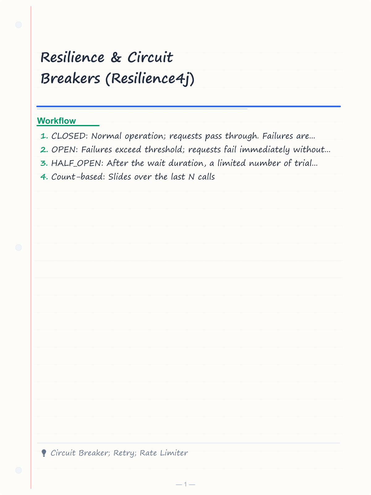
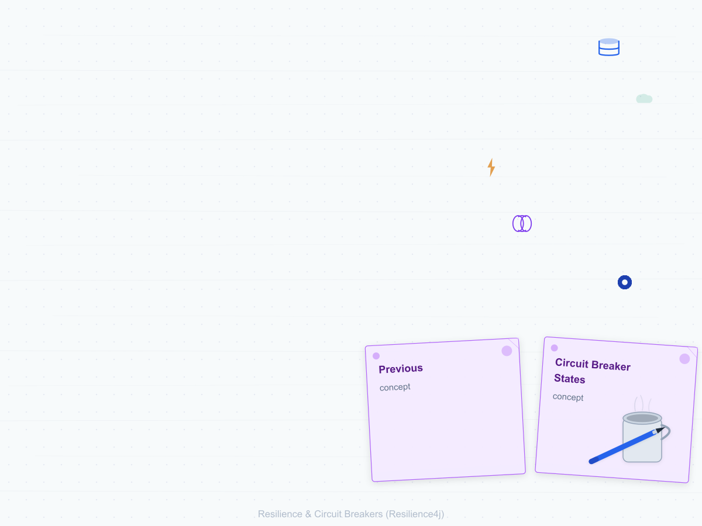
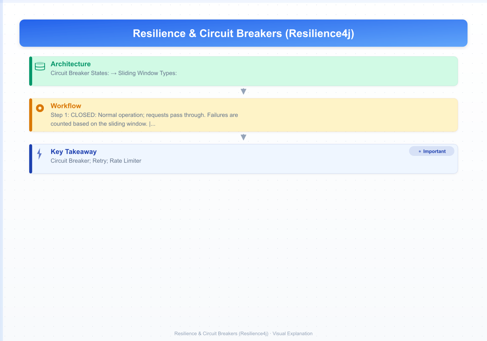
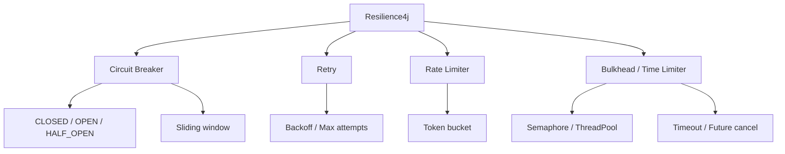

# Resilience & Circuit Breakers (Resilience4j)
> **Previous:** [API Gateway](40-gateway.md) | **Next:** [Configuration and Cloud Config](42-config.md)

## Learning Objectives

By the end of this chapter, you will be able to:

<!-- Image Gallery -->
<section class="lesson-visuals" aria-label="Visual learning resources">
  <header><span>VISUAL LEARNING</span><h2>See it. Review it. Remember it.</h2></header>
  <a class="lesson-visual-card" href="../../assets/images/lessons/java/41-resilience/handwritten-notes.png" target="_blank" rel="noopener">
    
    <span><strong>Handwritten notes</strong>Condensed notes for deliberate review.</span>
  </a>
  <a class="lesson-visual-card" href="../../assets/images/lessons/java/41-resilience/sticky-notes.png" target="_blank" rel="noopener">
    
    <span><strong>Sticky-note revision</strong>Fast recall prompts for revision.</span>
  </a>
  <a class="lesson-visual-card" href="../../assets/images/lessons/java/41-resilience/visual-explanation.png" target="_blank" rel="noopener">
    
    <span><strong>Visual concept guide</strong>A connected explanation of the key ideas.</span>
  </a>
</section>
<!-- End Image Gallery -->


- Configure and use Circuit Breaker with states CLOSED, OPEN, HALF_OPEN, sliding window, failure rate threshold, and wait duration
- Implement @CircuitBreaker annotations with custom fallback methods
- Configure Retry with maxAttempts, waitDuration, exponential backoff, and retryOnException
- Implement Rate Limiter with limitForPeriod, limitRefreshPeriod, timeoutDuration
- Configure Time Limiter with timeoutDuration and cancelRunningFuture
- Implement Bulkhead patterns (semaphore and thread pool) for concurrency control
- Integrate Resilience4j with Micrometer for metrics collection
- Use Actuator endpoints to monitor circuit breakers, retries, and rate limiters
- Integrate with Feign clients and Spring Cloud CircuitBreaker

---
## Chapter at a Glance

| Topic | Key Insight | Practical Takeaway |
|-------|------------|-------------------|
| Circuit Breaker → three states: CLOSED, OPEN, HALF_OPEN | Sliding window (count- or time-based) tracks failure rate |
| Retry → automatic reattempt with backoff | Exponential backoff and exception-based retry triggers |
| Rate Limiter → token bucket algorithm | `limitForPeriod` and `limitRefreshPeriod` control throughput |

---
## Chapter Roadmap



---
## Concept Comparison Table

| Concept | Description | Key Difference |
|---------|-------------|----------------|
| Circuit Breaker | Prevents repeated failures | State machine: CLOSED → OPEN → HALF_OPEN → CLOSED |
| Retry | Repeats failed operations | With exponential backoff, maxAttempts |
| Rate Limiter | Throttles request rate | Token bucket: `limitForPeriod`, `limitRefreshPeriod` |
| Bulkhead | Limits concurrent calls | Semaphore vs ThreadPool isolation |

---
## Quick Reference

| Element | Purpose | Example |
|---------|---------|---------|
| `@CircuitBreaker(name = "x", fallbackMethod = "y")` | Circuit breaker annotation | `fallbackMethod` must match signature |
| `@Retry(name = "x", maxAttempts = 3)` | Retry annotation | `backoff = @Backoff(delay = 500)` |
| `@RateLimiter(name = "x")` | Rate limiter annotation | `limitForPeriod = 10, limitRefreshPeriod = 1s` |
| `@Bulkhead(name = "x", type = THREADPOOL)` | Bulkhead annotation | `maxThreadPoolSize = 10` |

---
## Cross-Application Matrix

| Domain | Application | Use Case |
|--------|-------------|----------|
| E-Commerce | Circuit Breaker on payment API | Fail fast when payment gateway is down |
| External API Client | Retry + exponential backoff | Transient network errors are automatically retried |
| API Gateway | Rate Limiter per API key | Each client limited to 100 requests/minute |

---
## Chapter Quiz

1. What are the three states of a Resilience4j Circuit Breaker? **Answer:** CLOSED, OPEN, HALF_OPEN
2. What algorithm does RateLimiter use? **Answer:** Token bucket algorithm
3. What is the difference between SemaphoreBulkhead and ThreadPoolBulkhead? **Answer:** Semaphore limits concurrent calls in the same thread; ThreadPool isolates calls in a separate thread pool

## Theory


### Resilience4j Overview


Resilience4j is a lightweight, easy-to-use fault tolerance library inspired by Netflix Hystrix. It provides modules for circuit breaking, retry, rate limiting, time limiting, and bulkheading.

**Circuit Breaker States:**

- **CLOSED**: Normal operation; requests pass through. Failures are counted based on the sliding window.
- **OPEN**: Failures exceed threshold; requests fail immediately without calling the backend.
- **HALF_OPEN**: After the wait duration, a limited number of trial requests are allowed to test if the backend has recovered.

**Sliding Window Types:**

- **Count-based**: Slides over the last N calls
- **Time-based**: Slides over the last N seconds

### Retry


Retries allow a failed operation to be reattempted. Resilience4j supports exponential backoff, where the delay between retries increases exponentially.

### Rate Limiter


Rate limiting controls how many requests can pass in a given time period. The `RateLimiter` uses a token bucket algorithm.

### Bulkhead


Bulkhead limits the number of concurrent calls to a service. Two implementations:

- **SemaphoreBulkhead**: Uses Java semaphores; limits concurrent calls in the same thread
- **ThreadPoolBulkhead**: Uses a thread pool; isolates calls in separate threads

> [!TIP]
> Always define a `fallbackMethod` for `@CircuitBreaker` → it provides a degraded response when the circuit is open.

> [!WARNING]
> Do not combine `@Retry` with `@CircuitBreaker` carelessly → configure retries before circuit breaker so failed retries trip the breaker.

> [!NOTE]
> Use `SemaphoreBulkhead` for in-process isolation (same thread pool) and `ThreadPoolBulkhead` to separate execution contexts entirely.

## Complete Code Examples

### pom.xml

```xml
<?xml version="1.0" encoding="UTF-8"?>
<project xmlns="http://maven.apache.org/POM/4.0.0"
         xmlns:xsi="http://www.w3.org/2001/XMLSchema-instance"
         xsi:schemaLocation="http://maven.apache.org/POM/4.0.0
         https://maven.apache.org/xsd/maven-4.0.0.xsd">
    <modelVersion>4.0.0</modelVersion>
    <parent>
        <groupId>org.springframework.boot</groupId>
        <artifactId>spring-boot-starter-parent</artifactId>
        <version>3.2.0</version>
        <relativePath/>
    </parent>
    <groupId>com.course.resilience</groupId>
    <artifactId>resilience-demo</artifactId>
    <version>1.0.0</version>
    <name>resilience-demo</name>
    <properties>
        <java.version>21</java.version>
        <spring-cloud.version>2023.0.0</spring-cloud.version>
    </properties>
    <dependencies>
        <dependency>
            <groupId>org.springframework.boot</groupId>
            <artifactId>spring-boot-starter-web</artifactId>
        </dependency>
        <dependency>
            <groupId>org.springframework.boot</groupId>
            <artifactId>spring-boot-starter-aop</artifactId>
        </dependency>
        <dependency>
            <groupId>org.springframework.boot</groupId>
            <artifactId>spring-boot-starter-actuator</artifactId>
        </dependency>
        <dependency>
            <groupId>org.springframework.cloud</groupId>
            <artifactId>spring-cloud-starter-circuitbreaker-resilience4j</artifactId>
        </dependency>
        <dependency>
            <groupId>org.springframework.cloud</groupId>
            <artifactId>spring-cloud-starter-openfeign</artifactId>
        </dependency>
        <dependency>
            <groupId>io.github.resilience4j</groupId>
            <artifactId>resilience4j-spring-boot3</artifactId>
            <version>2.2.0</version>
        </dependency>
        <dependency>
            <groupId>io.github.resilience4j</groupId>
            <artifactId>resilience4j-micrometer</artifactId>
            <version>2.2.0</version>
        </dependency>
        <dependency>
            <groupId>io.micrometer</groupId>
            <artifactId>micrometer-registry-prometheus</artifactId>
        </dependency>
        <dependency>
            <groupId>org.springframework.boot</groupId>
            <artifactId>spring-boot-starter-webflux</artifactId>
        </dependency>
        <dependency>
            <groupId>org.projectlombok</groupId>
            <artifactId>lombok</artifactId>
            <optional>true</optional>
        </dependency>
        <dependency>
            <groupId>org.springframework.boot</groupId>
            <artifactId>spring-boot-starter-test</artifactId>
            <scope>test</scope>
        </dependency>
    </dependencies>
    <dependencyManagement>
        <dependencies>
            <dependency>
                <groupId>org.springframework.cloud</groupId>
                <artifactId>spring-cloud-dependencies</artifactId>
                <version>${spring-cloud.version}</version>
                <type>pom</type>
                <scope>import</scope>
            </dependency>
        </dependencies>
    </dependencyManagement>
    <build>
        <plugins>
            <plugin>
                <groupId>org.springframework.boot</groupId>
                <artifactId>spring-boot-maven-plugin</artifactId>
            </plugin>
        </plugins>
    </build>
</project>
```

```java
package com.course.resilience;

import org.springframework.boot.SpringApplication;
import org.springframework.boot.autoconfigure.SpringBootApplication;
import org.springframework.cloud.openfeign.EnableFeignClients;

@SpringBootApplication
@EnableFeignClients
public class ResilienceDemoApplication {
    public static void main(String[] args) {
        SpringApplication.run(ResilienceDemoApplication.class, args);
    }
}
```

### application.yml

```yaml
server:
  port: 8080

spring:
  application:
    name: resilience-demo

resilience4j:
  circuitbreaker:
    configs:
      default:
        sliding-window-type: COUNT_BASED
        sliding-window-size: 10
        minimum-number-of-calls: 5
        failure-rate-threshold: 50
        wait-duration-in-open-state: 30s
        permitted-number-of-calls-in-half-open-state: 3
        automatic-transition-from-open-to-half-open-enabled: true
        writable-stack-trace-enabled: true
        record-exceptions:
          - java.lang.Exception
        ignore-exceptions:
          - java.lang.IllegalArgumentException
      slow-call-config:
        sliding-window-type: TIME_BASED
        sliding-window-size: 10
        minimum-number-of-calls: 5
        slow-call-rate-threshold: 50
        slow-call-duration-threshold: 2s
        wait-duration-in-open-state: 60s
        permitted-number-of-calls-in-half-open-state: 2
    instances:
      payment-service:
        base-config: default
        wait-duration-in-open-state: 45s
      inventory-service:
        base-config: default
        failure-rate-threshold: 30
        sliding-window-size: 20
      external-api:
        base-config: slow-call-config
        slow-call-duration-threshold: 1500ms

  retry:
    configs:
      default:
        max-attempts: 3
        wait-duration: 500ms
        exponential-backoff-multiplier: 2
        retry-exceptions:
          - java.net.ConnectException
          - org.springframework.web.client.ResourceAccessException
          - java.util.concurrent.TimeoutException
        ignore-exceptions:
          - java.lang.IllegalArgumentException
          - com.course.resilience.exception.BusinessException
    instances:
      database-retry:
        base-config: default
        max-attempts: 5
        wait-duration: 1s
        exponential-backoff-multiplier: 3
      api-retry:
        base-config: default
        max-attempts: 3
        wait-duration: 200ms
        exponential-backoff-multiplier: 2

  ratelimiter:
    configs:
      default:
        limit-for-period: 100
        limit-refresh-period: 1s
        timeout-duration: 500ms
    instances:
      standard-api:
        base-config: default
        limit-for-period: 50
      premium-api:
        limit-for-period: 500
        limit-refresh-period: 1s
        timeout-duration: 100ms
      admin-api:
        limit-for-period: 1000
        limit-refresh-period: 1s
        timeout-duration: 50ms

  bulkhead:
    configs:
      default:
        max-concurrent-calls: 25
        max-wait-duration: 500ms
    instances:
      database-bulkhead:
        max-concurrent-calls: 10
        max-wait-duration: 100ms
      io-bulkhead:
        max-concurrent-calls: 50
        max-wait-duration: 200ms

  thread-pool-bulkhead:
    configs:
      default:
        max-thread-pool-size: 10
        core-thread-pool-size: 5
        queue-capacity: 20
        keep-alive-duration: 30s
    instances:
      async-processing:
        max-thread-pool-size: 20
        core-thread-pool-size: 8
        queue-capacity: 50

  timelimiter:
    configs:
      default:
        timeout-duration: 5s
        cancel-running-future: true
    instances:
      external-api:
        timeout-duration: 3s
      database-query:
        timeout-duration: 10s
        cancel-running-future: false

management:
  endpoints:
    web:
      exposure:
        include: health,info,metrics,prometheus,circuitbreakers,retries,ratelimiters,bulkheads
  endpoint:
    health:
      show-details: always
    circuitbreakers:
      enabled: true
    retries:
      enabled: true
    ratelimiters:
      enabled: true
    bulkheads:
      enabled: true
  metrics:
    tags:
      application: ${spring.application.name}
    export:
      prometheus:
        enabled: true
```

### Circuit Breaker Service

```java
package com.course.resilience.service;

import io.github.resilience4j.circuitbreaker.annotation.CircuitBreaker;
import org.slf4j.Logger;
import org.slf4j.LoggerFactory;
import org.springframework.stereotype.Service;
import java.time.Instant;
import java.util.concurrent.atomic.AtomicInteger;

@Service
public class PaymentService {

    private static final Logger log = LoggerFactory.getLogger(PaymentService.class);
    private final AtomicInteger callCounter = new AtomicInteger(0);

    @CircuitBreaker(name = "payment-service", fallbackMethod = "processPaymentFallback")
    public PaymentResult processPayment(String orderId, double amount) {
        callCounter.incrementAndGet();
        log.info("Processing payment for order {}: ${} (call #{})",
                orderId, amount, callCounter.get());

        if (callCounter.get() % 3 == 0) {
            throw new RuntimeException("Payment service unavailable");
        }

        return new PaymentResult(
                "PAY-" + java.util.UUID.randomUUID().toString().substring(0, 8).toUpperCase(),
                orderId,
                amount,
                "COMPLETED",
                Instant.now()
        );
    }

    public PaymentResult processPaymentFallback(String orderId, double amount, Throwable t) {
        log.warn("Fallback for payment {}: {}", orderId, t.getMessage());
        return new PaymentResult(
                "FALLBACK-" + java.util.UUID.randomUUID().toString().substring(0, 8).toUpperCase(),
                orderId,
                amount,
                "PENDING",
                Instant.now()
        );
    }

    @CircuitBreaker(name = "payment-service", fallbackMethod = "refundPaymentFallback")
    public RefundResult refundPayment(String paymentId) {
        log.info("Processing refund for payment: {}", paymentId);
        throw new RuntimeException("Refund service unavailable");
    }

    public RefundResult refundPaymentFallback(String paymentId, Throwable t) {
        log.warn("Fallback for refund {}: {}", paymentId, t.getMessage());
        return new RefundResult(
                "REF-" + paymentId,
                "QUEUED_FOR_RETRY",
                "Refund queued. Will be processed when service recovers."
        );
    }

    public record PaymentResult(String paymentId, String orderId, double amount, String status, Instant processedAt) {}
    public record RefundResult(String refundId, String status, String message) {}
}
```

### Circuit Breaker with Custom Registry

```java
package com.course.resilience.service;

import io.github.resilience4j.circuitbreaker.CircuitBreaker;
import io.github.resilience4j.circuitbreaker.CircuitBreakerConfig;
import io.github.resilience4j.circuitbreaker.CircuitBreakerRegistry;
import io.github.resilience4j.core.IntervalFunction;
import jakarta.annotation.PostConstruct;
import org.slf4j.Logger;
import org.slf4j.LoggerFactory;
import org.springframework.stereotype.Service;
import java.time.Duration;
import java.util.Map;
import java.util.concurrent.ConcurrentHashMap;
import java.util.function.Supplier;

@Service
public class DynamicCircuitBreakerService {

    private static final Logger log = LoggerFactory.getLogger(DynamicCircuitBreakerService.class);
    private final CircuitBreakerRegistry registry;
    private final Map<String, CircuitBreaker> breakers = new ConcurrentHashMap<>();

    public DynamicCircuitBreakerService(CircuitBreakerRegistry registry) {
        this.registry = registry;
        registerEventListeners();
    }

    public <T> T executeWithBreaker(String name, Supplier<T> supplier, Supplier<T> fallback) {
        CircuitBreaker breaker = registry.circuitBreaker(name);
        return breaker.executeSupplier(supplier);
    }

    public <T> T executeWithBreakerAndFallback(String name, Supplier<T> supplier, Supplier<T> fallback) {
        CircuitBreaker breaker = registry.circuitBreaker(name);
        return breaker.executeSupplier(supplier);
    }

    public CircuitBreaker.Metrics getMetrics(String name) {
        CircuitBreaker breaker = registry.circuitBreaker(name);
        return breaker.getMetrics();
    }

    public CircuitBreaker.State getState(String name) {
        CircuitBreaker breaker = registry.circuitBreaker(name);
        return breaker.getState();
    }

    public void resetBreaker(String name) {
        CircuitBreaker breaker = registry.circuitBreaker(name);
        breaker.reset();
        log.info("Reset circuit breaker: {}", name);
    }

    public void transitToOpen(String name) {
        CircuitBreaker breaker = registry.circuitBreaker(name);
        breaker.transitionToOpenState();
        log.info("Manually transitioned circuit breaker {} to OPEN", name);
    }

    public void transitToClosed(String name) {
        CircuitBreaker breaker = registry.circuitBreaker(name);
        breaker.transitionToClosedState();
        log.info("Manually transitioned circuit breaker {} to CLOSED", name);
    }

    private void registerEventListeners() {
        registry.getEventPublisher()
                .onEntryAdded(event -> {
                    CircuitBreaker addedBreaker = event.getAddedEntry();
                    log.info("Circuit breaker created: {}", addedBreaker.getName());
                    addedBreaker.getEventPublisher()
                            .onStateTransition(transition ->
                                    log.info("Circuit breaker {} state changed: {} -> {}",
                                            transition.getCircuitBreakerName(),
                                            transition.getOldState(),
                                            transition.getNewState()))
                            .onFailureRateExceeded(rate ->
                                    log.warn("Circuit breaker {} failure rate exceeded: {}%",
                                            rate.getCircuitBreakerName(),
                                            rate.getFailureRate()))
                            .onSlowCallRateExceeded(rate ->
                                    log.warn("Circuit breaker {} slow call rate exceeded: {}%",
                                            rate.getCircuitBreakerName(),
                                            rate.getSlowCallRate()))
                            .onCallNotPermitted(notPermitted ->
                                    log.warn("Circuit breaker {} call not permitted",
                                            notPermitted.getCircuitBreakerName()))
                            .onError(error ->
                                    log.error("Circuit breaker {} error: {}",
                                            error.getCircuitBreakerName(),
                                            error.getThrowable().getMessage()))
                            .onSuccess(success ->
                                    log.debug("Circuit breaker {} success", success.getCircuitBreakerName()))
                            .onIgnoredError(ignored ->
                                    log.debug("Circuit breaker {} ignored error", ignored.getCircuitBreakerName()));
                });
    }
}
```

### Retry Service

```java
package com.course.resilience.service;

import io.github.resilience4j.retry.annotation.Retry;
import org.slf4j.Logger;
import org.slf4j.LoggerFactory;
import org.springframework.stereotype.Service;
import java.net.ConnectException;
import java.util.concurrent.atomic.AtomicInteger;

@Service
public class DatabaseService {

    private static final Logger log = LoggerFactory.getLogger(DatabaseService.class);
    private final AtomicInteger attemptCounter = new AtomicInteger(0);

    @Retry(name = "database-retry", fallbackMethod = "queryFallback")
    public QueryResult executeQuery(String query) {
        int attempt = attemptCounter.incrementAndGet();
        log.info("Executing query (attempt {}): {}", attempt, query);

        if (attempt <= 3) {
            throw new RuntimeException("Database connection refused (attempt " + attempt + ")");
        }

        return new QueryResult("SUCCESS", java.util.List.of("row1", "row2"), 2);
    }

    public QueryResult queryFallback(String query, Throwable t) {
        log.error("Query failed after retries: {}. Error: {}", query, t.getMessage());
        return new QueryResult("FALLBACK", java.util.List.of(), 0);
    }

    @Retry(name = "api-retry", fallbackMethod = "apiCallFallback")
    public ApiResponse callExternalApi(String endpoint) {
        log.info("Calling external API: {}", endpoint);
        throw new RuntimeException("Connection timeout");
    }

    public ApiResponse apiCallFallback(String endpoint, Throwable t) {
        log.warn("External API call failed: {}", endpoint);
        return new ApiResponse(503, "Service Unavailable", "Fallback response");
    }

    @Retry(name = "database-retry", fallbackMethod = "writeFallback")
    public WriteResult writeData(String table, String data) {
        log.info("Writing data to {}: {}", table, data);
        throw new RuntimeException("Write failed - connection lost");
    }

    public WriteResult writeFallback(String table, String data, Throwable t) {
        log.warn("Write to {} failed. Queuing for later.", table);
        return new WriteResult("QUEUED", "Data queued for retry", System.currentTimeMillis());
    }

    public record QueryResult(String status, java.util.List<String> rows, int count) {}
    public record ApiResponse(int statusCode, String message, String body) {}
    public record WriteResult(String status, String message, long queuedAt) {}
}
```

### Rate Limiter Service

```java
package com.course.resilience.service;

import io.github.resilience4j.ratelimiter.RequestNotPermitted;
import io.github.resilience4j.ratelimiter.annotation.RateLimiter;
import org.slf4j.Logger;
import org.slf4j.LoggerFactory;
import org.springframework.stereotype.Service;
import java.util.concurrent.atomic.AtomicInteger;

@Service
public class ApiService {

    private static final Logger log = LoggerFactory.getLogger(ApiService.class);
    private final AtomicInteger requestCounter = new AtomicInteger(0);

    @RateLimiter(name = "standard-api", fallbackMethod = "rateLimitFallback")
    public ApiResponse standardEndpoint(String userId) {
        int requestNum = requestCounter.incrementAndGet();
        log.info("Standard API request #{} from user: {}", requestNum, userId);
        return new ApiResponse(200, "OK", "Request #" + requestNum + " processed");
    }

    @RateLimiter(name = "premium-api", fallbackMethod = "premiumFallback")
    public ApiResponse premiumEndpoint(String userId) {
        log.info("Premium API request from user: {}", userId);
        return new ApiResponse(200, "OK", "Premium request processed");
    }

    @RateLimiter(name = "admin-api", fallbackMethod = "adminFallback")
    public ApiResponse adminEndpoint(String userId) {
        log.info("Admin API request from user: {}", userId);
        return new ApiResponse(200, "OK", "Admin request processed");
    }

    public ApiResponse rateLimitFallback(String userId, RequestNotPermitted e) {
        log.warn("Rate limit exceeded for user: {}", userId);
        return new ApiResponse(429, "Too Many Requests",
                "Rate limit exceeded. Please try again later.");
    }

    public ApiResponse premiumFallback(String userId, RequestNotPermitted e) {
        log.warn("Premium rate limit exceeded for user: {}", userId);
        return new ApiResponse(429, "Too Many Requests",
                "Premium rate limit exceeded. Upgrade your plan for higher limits.");
    }

    public ApiResponse adminFallback(String userId, RequestNotPermitted e) {
        log.warn("Admin rate limit exceeded for user: {}", userId);
        return new ApiResponse(429, "Too Many Requests",
                "Admin rate limit exceeded.");
    }

    public record ApiResponse(int statusCode, String message, String body) {}
}
```

### Rate Limiter with Dynamic Configuration

```java
package com.course.resilience.service;

import io.github.resilience4j.ratelimiter.RateLimiter;
import io.github.resilience4j.ratelimiter.RateLimiterConfig;
import io.github.resilience4j.ratelimiter.RateLimiterRegistry;
import org.slf4j.Logger;
import org.slf4j.LoggerFactory;
import org.springframework.stereotype.Service;
import java.time.Duration;
import java.util.Map;
import java.util.concurrent.ConcurrentHashMap;

@Service
public class DynamicRateLimiterService {

    private static final Logger log = LoggerFactory.getLogger(DynamicRateLimiterService.class);
    private final RateLimiterRegistry registry;
    private final Map<String, RateLimiterConfig> tierConfigs = new ConcurrentHashMap<>();

    public DynamicRateLimiterService(RateLimiterRegistry registry) {
        this.registry = registry;
        initializeTiers();
    }

    private void initializeTiers() {
        tierConfigs.put("free", RateLimiterConfig.custom()
                .limitForPeriod(10)
                .limitRefreshPeriod(Duration.ofMinutes(1))
                .timeoutDuration(Duration.ofMillis(500))
                .build());

        tierConfigs.put("basic", RateLimiterConfig.custom()
                .limitForPeriod(60)
                .limitRefreshPeriod(Duration.ofMinutes(1))
                .timeoutDuration(Duration.ofMillis(200))
                .build());

        tierConfigs.put("premium", RateLimiterConfig.custom()
                .limitForPeriod(500)
                .limitRefreshPeriod(Duration.ofMinutes(1))
                .timeoutDuration(Duration.ofMillis(100))
                .build());

        tierConfigs.put("enterprise", RateLimiterConfig.custom()
                .limitForPeriod(5000)
                .limitRefreshPeriod(Duration.ofMinutes(1))
                .timeoutDuration(Duration.ofMillis(50))
                .build());
    }

    public boolean tryAcquire(String apiKey, String tier) {
        RateLimiterConfig config = tierConfigs.getOrDefault(tier, tierConfigs.get("free"));
        String rateLimiterName = "tier-" + tier + "-" + apiKey;

        RateLimiter rateLimiter = registry.find(rateLimiterName)
                .orElseGet(() -> {
                    RateLimiter newLimiter = registry.rateLimiter(rateLimiterName, config);
                    log.info("Created rate limiter for tier {} API key {}", tier, apiKey);
                    return newLimiter;
                });

        return rateLimiter.acquirePermission();
    }

    public void updateTierConfig(String tier, int limitPerMinute) {
        RateLimiterConfig newConfig = RateLimiterConfig.custom()
                .limitForPeriod(limitPerMinute)
                .limitRefreshPeriod(Duration.ofMinutes(1))
                .timeoutDuration(Duration.ofMillis(200))
                .build();
        tierConfigs.put(tier, newConfig);
        log.info("Updated rate limit for tier {} to {} per minute", tier, limitPerMinute);
    }
}
```

### Time Limiter Service

```java
package com.course.resilience.service;

import io.github.resilience4j.timelimiter.annotation.TimeLimiter;
import org.slf4j.Logger;
import org.slf4j.LoggerFactory;
import org.springframework.stereotype.Service;
import java.util.concurrent.CompletableFuture;
import java.util.concurrent.CompletionStage;
import java.util.concurrent.TimeUnit;

@Service
public class ExternalApiService {

    private static final Logger log = LoggerFactory.getLogger(ExternalApiService.class);

    @TimeLimiter(name = "external-api", fallbackMethod = "fetchDataFallback")
    public CompletableFuture<ApiData> fetchData(String endpoint) {
        return CompletableFuture.supplyAsync(() -> {
            try {
                log.info("Fetching data from external API: {}", endpoint);
                TimeUnit.SECONDS.sleep(10);
                return new ApiData(endpoint, "Response data", System.currentTimeMillis());
            } catch (InterruptedException e) {
                Thread.currentThread().interrupt();
                throw new RuntimeException("External API call interrupted", e);
            }
        });
    }

    public CompletableFuture<ApiData> fetchDataFallback(String endpoint, Throwable t) {
        log.warn("Time limiter triggered for endpoint {}: {}", endpoint, t.getMessage());
        return CompletableFuture.completedFuture(
                new ApiData(endpoint, "Cached fallback data", System.currentTimeMillis()));
    }

    @TimeLimiter(name = "database-query", fallbackMethod = "queryFallback")
    public CompletableFuture<QueryData> executeSlowQuery(String query) {
        return CompletableFuture.supplyAsync(() -> {
            try {
                log.info("Executing slow query: {}", query);
                TimeUnit.SECONDS.sleep(8);
                return new QueryData(query, java.util.List.of("result1", "result2"));
            } catch (InterruptedException e) {
                Thread.currentThread().interrupt();
                throw new RuntimeException("Query interrupted", e);
            }
        });
    }

    public CompletableFuture<QueryData> queryFallback(String query, Throwable t) {
        log.warn("Query timeout for: {}", query);
        return CompletableFuture.completedFuture(
                new QueryData(query, java.util.List.of("cached_result")));
    }

    public record ApiData(String endpoint, String data, long timestamp) {}
    public record QueryData(String query, java.util.List<String> results) {}
}
```

### Bulkhead Service

```java
package com.course.resilience.service;

import io.github.resilience4j.bulkhead.annotation.Bulkhead;
import io.github.resilience4j.threadpool.bulkhead.annotation.ThreadPoolBulkhead;
import org.slf4j.Logger;
import org.slf4j.LoggerFactory;
import org.springframework.stereotype.Service;
import java.util.concurrent.CompletableFuture;
import java.util.concurrent.TimeUnit;
import java.util.concurrent.atomic.AtomicInteger;

@Service
public class IoService {

    private static final Logger log = LoggerFactory.getLogger(IoService.class);
    private final AtomicInteger activeDatabaseCalls = new AtomicInteger(0);
    private final AtomicInteger activeIoCalls = new AtomicInteger(0);

    @Bulkhead(name = "database-bulkhead", fallbackMethod = "databaseCallFallback", type = Bulkhead.Type.SEMAPHORE)
    public DatabaseResult queryDatabase(String query) {
        int active = activeDatabaseCalls.incrementAndGet();
        log.info("Database query (active: {}): {}", active, query);

        try {
            TimeUnit.MILLISECONDS.sleep(100);
            if (active > 8) {
                throw new RuntimeException("Database overloaded");
            }
            return new DatabaseResult("SUCCESS", java.util.List.of("data"), active);
        } catch (InterruptedException e) {
            Thread.currentThread().interrupt();
            throw new RuntimeException(e);
        } finally {
            activeDatabaseCalls.decrementAndGet();
        }
    }

    public DatabaseResult databaseCallFallback(String query, Throwable t) {
        log.warn("Database bulkhead fallback for query {}: {}", query, t.getMessage());
        return new DatabaseResult("FALLBACK", java.util.List.of(), 0);
    }

    @Bulkhead(name = "io-bulkhead", fallbackMethod = "ioOperationFallback", type = Bulkhead.Type.SEMAPHORE)
    public IoResult performIoOperation(String operation) {
        int active = activeIoCalls.incrementAndGet();
        log.info("IO operation (active: {}): {}", active, operation);

        try {
            TimeUnit.MILLISECONDS.sleep(50);
            return new IoResult("SUCCESS", operation, System.currentTimeMillis());
        } catch (InterruptedException e) {
            Thread.currentThread().interrupt();
            throw new RuntimeException(e);
        } finally {
            activeIoCalls.decrementAndGet();
        }
    }

    public IoResult ioOperationFallback(String operation, Throwable t) {
        log.warn("IO bulkhead fallback for {}: {}", operation, t.getMessage());
        return new IoResult("QUEUED", operation, System.currentTimeMillis());
    }

    @ThreadPoolBulkhead(name = "async-processing", fallbackMethod = "asyncFallback")
    public CompletableFuture<AsyncResult> processAsync(String task) {
        return CompletableFuture.supplyAsync(() -> {
            log.info("Async processing task: {}", task);
            try {
                TimeUnit.MILLISECONDS.sleep(200);
            } catch (InterruptedException e) {
                Thread.currentThread().interrupt();
            }
            return new AsyncResult(task, "COMPLETED", Thread.currentThread().getName());
        });
    }

    public CompletableFuture<AsyncResult> asyncFallback(String task, Throwable t) {
        log.warn("Async bulkhead fallback for {}: {}", task, t.getMessage());
        return CompletableFuture.completedFuture(
                new AsyncResult(task, "REJECTED", Thread.currentThread().getName()));
    }

    public record DatabaseResult(String status, java.util.List<String> data, int activeCalls) {}
    public record IoResult(String status, String operation, long timestamp) {}
    public record AsyncResult(String task, String status, String thread) {}
}
```

### Bulkhead with Custom Thread Pool

```java
package com.course.resilience.config;

import io.github.resilience4j.bulkhead.BulkheadConfig;
import io.github.resilience4j.bulkhead.BulkheadRegistry;
import io.github.resilience4j.bulkhead.ThreadPoolBulkheadConfig;
import io.github.resilience4j.bulkhead.ThreadPoolBulkheadRegistry;
import org.springframework.context.annotation.Bean;
import org.springframework.context.annotation.Configuration;
import java.time.Duration;

@Configuration
public class BulkheadConfigCustom {

    @Bean
    public BulkheadRegistry bulkheadRegistry() {
        BulkheadConfig config = BulkheadConfig.custom()
                .maxConcurrentCalls(20)
                .maxWaitDuration(Duration.ofMillis(500))
                .writableStackTraceEnabled(true)
                .build();
        return BulkheadRegistry.of(config);
    }

    @Bean
    public ThreadPoolBulkheadRegistry threadPoolBulkheadRegistry() {
        ThreadPoolBulkheadConfig config = ThreadPoolBulkheadConfig.custom()
                .maxThreadPoolSize(15)
                .coreThreadPoolSize(5)
                .queueCapacity(25)
                .keepAliveDuration(Duration.ofSeconds(30))
                .build();
        return ThreadPoolBulkheadRegistry.of(config);
    }
}
```

### Composite Resilience Patterns

```java
package com.course.resilience.service;

import io.github.resilience4j.bulkhead.annotation.Bulkhead;
import io.github.resilience4j.circuitbreaker.annotation.CircuitBreaker;
import io.github.resilience4j.ratelimiter.annotation.RateLimiter;
import io.github.resilience4j.retry.annotation.Retry;
import io.github.resilience4j.timelimiter.annotation.TimeLimiter;
import org.slf4j.Logger;
import org.slf4j.LoggerFactory;
import org.springframework.stereotype.Service;
import java.util.concurrent.CompletableFuture;
import java.util.concurrent.TimeUnit;
import java.util.concurrent.atomic.AtomicInteger;

@Service
public class CompositeResilienceService {

    private static final Logger log = LoggerFactory.getLogger(CompositeResilienceService.class);
    private final AtomicInteger callCounter = new AtomicInteger(0);

    @RateLimiter(name = "standard-api")
    @CircuitBreaker(name = "payment-service", fallbackMethod = "compositeFallback")
    @Retry(name = "api-retry")
    @Bulkhead(name = "io-bulkhead")
    public CompositeResult resilientOperation(String input) {
        int attempt = callCounter.incrementAndGet();
        log.info("Composite resilient operation (attempt {}): {}", attempt, input);

        if (attempt % 2 == 0) {
            throw new RuntimeException("Operation failed (attempt " + attempt + ")");
        }

        return new CompositeResult("SUCCESS", input, attempt);
    }

    @TimeLimiter(name = "external-api")
    @CircuitBreaker(name = "external-api", fallbackMethod = "asyncCompositeFallback")
    @Bulkhead(name = "async-processing", type = Bulkhead.Type.THREADPOOL)
    public CompletableFuture<CompositeResult> asyncResilientOperation(String input) {
        return CompletableFuture.supplyAsync(() -> {
            try {
                log.info("Async composite operation: {}", input);
                TimeUnit.SECONDS.sleep(2);
                return new CompositeResult("SUCCESS", input, 0);
            } catch (InterruptedException e) {
                Thread.currentThread().interrupt();
                throw new RuntimeException(e);
            }
        });
    }

    public CompositeResult compositeFallback(String input, Throwable t) {
        log.warn("Composite fallback for {}: {}", input, t.getMessage());
        return new CompositeResult("FALLBACK", input, -1);
    }

    public CompletableFuture<CompositeResult> asyncCompositeFallback(String input, Throwable t) {
        log.warn("Async composite fallback for {}: {}", input, t.getMessage());
        return CompletableFuture.completedFuture(new CompositeResult("FALLBACK", input, -1));
    }

    public record CompositeResult(String status, String input, int attempt) {}
}
```

### Feign Client with Resilience4j

```java
package com.course.resilience.client;

import com.course.resilience.service.PaymentService;
import org.springframework.cloud.openfeign.FeignClient;
import org.springframework.web.bind.annotation.*;

@FeignClient(name = "payment-service", url = "${payment.service.url:http://localhost:8081}")
public interface PaymentServiceFeignClient {

    @PostMapping("/api/payments/process")
    PaymentService.PaymentResult processPayment(
            @RequestParam("orderId") String orderId,
            @RequestParam("amount") double amount);

    @GetMapping("/api/payments/{paymentId}")
    PaymentService.PaymentResult getPayment(@PathVariable("paymentId") String paymentId);

    @PostMapping("/api/payments/refund/{paymentId}")
    PaymentService.RefundResult refundPayment(@PathVariable("paymentId") String paymentId);
}
```

### Feign Client Configuration with Circuit Breaker

```yaml
resilience4j:
  circuitbreaker:
    instances:
      payment-service-feign:
        sliding-window-type: COUNT_BASED
        sliding-window-size: 10
        minimum-number-of-calls: 5
        failure-rate-threshold: 40
        wait-duration-in-open-state: 30s
        permitted-number-of-calls-in-half-open-state: 3

feign:
  circuitbreaker:
    enabled: true
  client:
    config:
      default:
        connect-timeout: 5000
        read-timeout: 10000
        logger-level: BASIC
      payment-service-feign:
        connect-timeout: 3000
        read-timeout: 5000
```

### Metrics Configuration

```java
package com.course.resilience.config;

import io.github.resilience4j.circuitbreaker.CircuitBreaker;
import io.github.resilience4j.circuitbreaker.CircuitBreakerRegistry;
import io.github.resilience4j.micrometer.tagged.TaggedCircuitBreakerMetrics;
import io.github.resilience4j.micrometer.tagged.TaggedRetryMetrics;
import io.github.resilience4j.micrometer.tagged.TaggedRateLimiterMetrics;
import io.github.resilience4j.micrometer.tagged.TaggedBulkheadMetrics;
import io.github.resilience4j.micrometer.tagged.TaggedTimeLimiterMetrics;
import io.github.resilience4j.ratelimiter.RateLimiterRegistry;
import io.github.resilience4j.retry.RetryRegistry;
import io.github.resilience4j.bulkhead.BulkheadRegistry;
import io.github.resilience4j.bulkhead.ThreadPoolBulkheadRegistry;
import io.github.resilience4j.timelimiter.TimeLimiterRegistry;
import io.micrometer.core.instrument.MeterRegistry;
import jakarta.annotation.PostConstruct;
import org.springframework.context.annotation.Configuration;

@Configuration
public class MetricsConfig {

    private final MeterRegistry meterRegistry;
    private final CircuitBreakerRegistry circuitBreakerRegistry;
    private final RetryRegistry retryRegistry;
    private final RateLimiterRegistry rateLimiterRegistry;
    private final BulkheadRegistry bulkheadRegistry;
    private final ThreadPoolBulkheadRegistry threadPoolBulkheadRegistry;
    private final TimeLimiterRegistry timeLimiterRegistry;

    public MetricsConfig(MeterRegistry meterRegistry,
                          CircuitBreakerRegistry circuitBreakerRegistry,
                          RetryRegistry retryRegistry,
                          RateLimiterRegistry rateLimiterRegistry,
                          BulkheadRegistry bulkheadRegistry,
                          ThreadPoolBulkheadRegistry threadPoolBulkheadRegistry,
                          TimeLimiterRegistry timeLimiterRegistry) {
        this.meterRegistry = meterRegistry;
        this.circuitBreakerRegistry = circuitBreakerRegistry;
        this.retryRegistry = retryRegistry;
        this.rateLimiterRegistry = rateLimiterRegistry;
        this.bulkheadRegistry = bulkheadRegistry;
        this.threadPoolBulkheadRegistry = threadPoolBulkheadRegistry;
        this.timeLimiterRegistry = timeLimiterRegistry;
    }

    @PostConstruct
    public void registerMetrics() {
        TaggedCircuitBreakerMetrics.ofCircuitBreakerRegistry(circuitBreakerRegistry)
                .bindTo(meterRegistry);
        TaggedRetryMetrics.ofRetryRegistry(retryRegistry)
                .bindTo(meterRegistry);
        TaggedRateLimiterMetrics.ofRateLimiterRegistry(rateLimiterRegistry)
                .bindTo(meterRegistry);
        TaggedBulkheadMetrics.ofBulkheadRegistry(bulkheadRegistry)
                .bindTo(meterRegistry);
        TaggedTimeLimiterMetrics.ofTimeLimiterRegistry(timeLimiterRegistry)
                .bindTo(meterRegistry);
    }

    public CircuitBreakerRegistry getCircuitBreakerRegistry() { return circuitBreakerRegistry; }
    public RetryRegistry getRetryRegistry() { return retryRegistry; }
    public RateLimiterRegistry getRateLimiterRegistry() { return rateLimiterRegistry; }
    public BulkheadRegistry getBulkheadRegistry() { return bulkheadRegistry; }
    public TimeLimiterRegistry getTimeLimiterRegistry() { return timeLimiterRegistry; }
}
```

### REST Controller Demonstrating All Patterns

```java
package com.course.resilience.controller;

import com.course.resilience.service.*;
import org.springframework.http.ResponseEntity;
import org.springframework.web.bind.annotation.*;
import java.util.concurrent.CompletableFuture;
import java.util.concurrent.ExecutionException;

@RestController
@RequestMapping("/api/demo")
public class ResilienceDemoController {

    private final PaymentService paymentService;
    private final DatabaseService databaseService;
    private final ApiService apiService;
    private final ExternalApiService externalApiService;
    private final IoService ioService;
    private final CompositeResilienceService compositeService;
    private final DynamicCircuitBreakerService dynamicBreakerService;
    private final DynamicRateLimiterService dynamicRateLimiterService;

    public ResilienceDemoController(PaymentService paymentService,
                                     DatabaseService databaseService,
                                     ApiService apiService,
                                     ExternalApiService externalApiService,
                                     IoService ioService,
                                     CompositeResilienceService compositeService,
                                     DynamicCircuitBreakerService dynamicBreakerService,
                                     DynamicRateLimiterService dynamicRateLimiterService) {
        this.paymentService = paymentService;
        this.databaseService = databaseService;
        this.apiService = apiService;
        this.externalApiService = externalApiService;
        this.ioService = ioService;
        this.compositeService = compositeService;
        this.dynamicBreakerService = dynamicBreakerService;
        this.dynamicRateLimiterService = dynamicRateLimiterService;
    }

    @PostMapping("/circuit-breaker/payment")
    public ResponseEntity<PaymentService.PaymentResult> processPayment(
            @RequestParam String orderId, @RequestParam double amount) {
        PaymentService.PaymentResult result = paymentService.processPayment(orderId, amount);
        return ResponseEntity.ok(result);
    }

    @PostMapping("/circuit-breaker/refund/{paymentId}")
    public ResponseEntity<PaymentService.RefundResult> refundPayment(@PathVariable String paymentId) {
        PaymentService.RefundResult result = paymentService.refundPayment(paymentId);
        return ResponseEntity.ok(result);
    }

    @GetMapping("/circuit-breaker/state/{name}")
    public ResponseEntity<?> getBreakerState(@PathVariable String name) {
        return ResponseEntity.ok(java.util.Map.of(
                "name", name,
                "state", dynamicBreakerService.getState(name),
                "metrics", dynamicBreakerService.getMetrics(name)
        ));
    }

    @PostMapping("/circuit-breaker/reset/{name}")
    public ResponseEntity<Void> resetBreaker(@PathVariable String name) {
        dynamicBreakerService.resetBreaker(name);
        return ResponseEntity.ok().build();
    }

    @GetMapping("/retry/query")
    public ResponseEntity<DatabaseService.QueryResult> executeQuery(@RequestParam String query) {
        DatabaseService.QueryResult result = databaseService.executeQuery(query);
        return ResponseEntity.ok(result);
    }

    @GetMapping("/retry/api")
    public ResponseEntity<DatabaseService.ApiResponse> callApi(@RequestParam String endpoint) {
        DatabaseService.ApiResponse result = databaseService.callExternalApi(endpoint);
        return ResponseEntity.ok(result);
    }

    @GetMapping("/rate-limiter/standard")
    public ResponseEntity<ApiService.ApiResponse> standardEndpoint(@RequestParam String userId) {
        ApiService.ApiResponse response = apiService.standardEndpoint(userId);
        return ResponseEntity.ok(response);
    }

    @GetMapping("/rate-limiter/premium")
    public ResponseEntity<ApiService.ApiResponse> premiumEndpoint(@RequestParam String userId) {
        ApiService.ApiResponse response = apiService.premiumEndpoint(userId);
        return ResponseEntity.ok(response);
    }

    @GetMapping("/time-limiter/fetch")
    public ResponseEntity<?> fetchData(@RequestParam String endpoint)
            throws ExecutionException, InterruptedException {
        CompletableFuture<ExternalApiService.ApiData> future = externalApiService.fetchData(endpoint);
        ExternalApiService.ApiData data = future.get();
        return ResponseEntity.ok(data);
    }

    @GetMapping("/bulkhead/database")
    public ResponseEntity<IoService.DatabaseResult> queryDatabase(@RequestParam String query) {
        IoService.DatabaseResult result = ioService.queryDatabase(query);
        return ResponseEntity.ok(result);
    }

    @GetMapping("/bulkhead/io")
    public ResponseEntity<IoService.IoResult> performIo(@RequestParam String operation) {
        IoService.IoResult result = ioService.performIoOperation(operation);
        return ResponseEntity.ok(result);
    }

    @GetMapping("/bulkhead/async")
    public ResponseEntity<?> processAsync(@RequestParam String task)
            throws ExecutionException, InterruptedException {
        CompletableFuture<IoService.AsyncResult> future = ioService.processAsync(task);
        return ResponseEntity.ok(future.get());
    }

    @GetMapping("/composite")
    public ResponseEntity<CompositeResilienceService.CompositeResult> composite(
            @RequestParam String input) {
        var result = compositeService.resilientOperation(input);
        return ResponseEntity.ok(result);
    }

    @PostMapping("/dynamic/rate-limiter/tier")
    public ResponseEntity<Void> updateRateLimitTier(
            @RequestParam String tier, @RequestParam int limitPerMinute) {
        dynamicRateLimiterService.updateTierConfig(tier, limitPerMinute);
        return ResponseEntity.ok().build();
    }

    @GetMapping("/dynamic/rate-limiter/check")
    public ResponseEntity<java.util.Map<String, Object>> checkRateLimit(
            @RequestParam String apiKey, @RequestParam(defaultValue = "free") String tier) {
        boolean allowed = dynamicRateLimiterService.tryAcquire(apiKey, tier);
        return ResponseEntity.ok(java.util.Map.of(
                "apiKey", apiKey,
                "tier", tier,
                "allowed", allowed
        ));
    }
}

@RestController
@RequestMapping("/api/status")
class StatusController {

    private final DynamicCircuitBreakerService breakerService;

    public StatusController(DynamicCircuitBreakerService breakerService) {
        this.breakerService = breakerService;
    }

    @GetMapping("/circuit-breakers")
    public ResponseEntity<java.util.Map<String, Object>> allBreakers() {
        java.util.Map<String, Object> states = new java.util.HashMap<>();
        for (String name : java.util.List.of("payment-service", "inventory-service", "external-api")) {
            try {
                states.put(name, java.util.Map.of(
                        "state", breakerService.getState(name),
                        "metrics", breakerService.getMetrics(name)
                ));
            } catch (Exception e) {
                states.put(name, java.util.Map.of("error", e.getMessage()));
            }
        }
        return ResponseEntity.ok(java.util.Map.of("circuitBreakers", states));
    }

    @GetMapping("/health")
    public ResponseEntity<java.util.Map<String, String>> health() {
        return ResponseEntity.ok(java.util.Map.of("status", "UP", "service", "resilience-demo"));
    }
}
```

### Custom Exception Classes

```java
package com.course.resilience.exception;

public class BusinessException extends RuntimeException {
    public BusinessException(String message) { super(message); }
    public BusinessException(String message, Throwable cause) { super(message, cause); }
}
```

```java
package com.course.resilience.exception;

public class ServiceUnavailableException extends RuntimeException {
    private final String serviceName;
    private final int retryAfterSeconds;

    public ServiceUnavailableException(String serviceName, int retryAfterSeconds) {
        super("Service " + serviceName + " is unavailable. Retry after " + retryAfterSeconds + " seconds.");
        this.serviceName = serviceName;
        this.retryAfterSeconds = retryAfterSeconds;
    }

    public String getServiceName() { return serviceName; }
    public int getRetryAfterSeconds() { return retryAfterSeconds; }
}
```

```java
package com.course.resilience.exception;

public class RateLimitExceededException extends RuntimeException {
    private final int retryAfterMs;

    public RateLimitExceededException(int retryAfterMs) {
        super("Rate limit exceeded. Retry after " + retryAfterMs + "ms");
        this.retryAfterMs = retryAfterMs;
    }

    public int getRetryAfterMs() { return retryAfterMs; }
}
```

### Circuit Breaker Events Logging Aspect

```java
package com.course.resilience.config;

import io.github.resilience4j.circuitbreaker.annotation.CircuitBreaker;
import org.aspectj.lang.ProceedingJoinPoint;
import org.aspectj.lang.annotation.Around;
import org.aspectj.lang.annotation.Aspect;
import org.slf4j.Logger;
import org.slf4j.LoggerFactory;
import org.springframework.stereotype.Component;

@Aspect
@Component
public class CircuitBreakerLoggingAspect {

    private static final Logger log = LoggerFactory.getLogger(CircuitBreakerLoggingAspect.class);

    @Around("@annotation(circuitBreaker)")
    public Object logCircuitBreakerCall(ProceedingJoinPoint joinPoint,
                                         CircuitBreaker circuitBreaker) throws Throwable {
        String methodName = joinPoint.getSignature().toShortString();
        String breakerName = circuitBreaker.name();

        log.debug("Circuit breaker '{}' invoked for method: {}", breakerName, methodName);
        long startTime = System.currentTimeMillis();

        try {
            Object result = joinPoint.proceed();
            long duration = System.currentTimeMillis() - startTime;
            log.debug("Circuit breaker '{}' completed successfully in {}ms: {}",
                    breakerName, duration, methodName);
            return result;
        } catch (Exception e) {
            long duration = System.currentTimeMillis() - startTime;
            log.warn("Circuit breaker '{}' recorded failure in {}ms: {} - {}",
                    breakerName, duration, methodName, e.getMessage());
            throw e;
        }
    }
}
```

### Spring Cloud CircuitBreaker Configuration

```java
package com.course.resilience.config;

import io.github.resilience4j.circuitbreaker.CircuitBreakerConfig;
import io.github.resilience4j.timelimiter.TimeLimiterConfig;
import org.springframework.cloud.circuitbreaker.resilience4j.ReactiveResilience4JCircuitBreakerFactory;
import org.springframework.cloud.circuitbreaker.resilience4j.Resilience4JCircuitBreakerFactory;
import org.springframework.cloud.circuitbreaker.resilience4j.Resilience4JConfigBuilder;
import org.springframework.cloud.client.circuitbreaker.Customizer;
import org.springframework.context.annotation.Bean;
import org.springframework.context.annotation.Configuration;
import java.time.Duration;

@Configuration
public class CircuitBreakerFactoryConfig {

    @Bean
    public Customizer<Resilience4JCircuitBreakerFactory> defaultCircuitBreakerCustomizer() {
        return factory -> factory.configureDefault(id -> {
            return new Resilience4JConfigBuilder(id)
                    .circuitBreakerConfig(CircuitBreakerConfig.custom()
                            .slidingWindowType(CircuitBreakerConfig.SlidingWindowType.COUNT_BASED)
                            .slidingWindowSize(10)
                            .minimumNumberOfCalls(5)
                            .failureRateThreshold(50)
                            .waitDurationInOpenState(Duration.ofSeconds(30))
                            .permittedNumberOfCallsInHalfOpenState(3)
                            .automaticTransitionFromOpenToHalfOpenEnabled(true)
                            .build())
                    .timeLimiterConfig(TimeLimiterConfig.custom()
                            .timeoutDuration(Duration.ofSeconds(5))
                            .build())
                    .build();
        });
    }

    @Bean
    public Customizer<Resilience4JCircuitBreakerFactory> specificCircuitBreakerCustomizer() {
        return factory -> {
            factory.configure(builder -> builder
                    .circuitBreakerConfig(CircuitBreakerConfig.custom()
                            .slidingWindowType(CircuitBreakerConfig.SlidingWindowType.TIME_BASED)
                            .slidingWindowSize(20)
                            .minimumNumberOfCalls(10)
                            .failureRateThreshold(30)
                            .waitDurationInOpenState(Duration.ofSeconds(60))
                            .build())
                    .timeLimiterConfig(TimeLimiterConfig.custom()
                            .timeoutDuration(Duration.ofSeconds(3))
                            .build()),
                    "payment-service", "inventory-service");

            factory.configure(builder -> builder
                    .circuitBreakerConfig(CircuitBreakerConfig.custom()
                            .slidingWindowType(CircuitBreakerConfig.SlidingWindowType.COUNT_BASED)
                            .slidingWindowSize(5)
                            .minimumNumberOfCalls(3)
                            .slowCallRateThreshold(50)
                            .slowCallDurationThreshold(Duration.ofSeconds(2))
                            .waitDurationInOpenState(Duration.ofMinutes(1))
                            .build()),
                    "external-api");
        };
    }

    @Bean
    public ReactiveResilience4JCircuitBreakerFactory reactiveCircuitBreakerFactory() {
        return new ReactiveResilience4JCircuitBreakerFactory();
    }
}
```

### Configuration Properties for Resilience

```java
package com.course.resilience.config;

import org.springframework.boot.context.properties.ConfigurationProperties;
import org.springframework.context.annotation.Configuration;
import java.util.Map;

@Configuration
@ConfigurationProperties(prefix = "resilience")
public class ResilienceProperties {

    private Map<String, ServiceConfig> services;

    public Map<String, ServiceConfig> getServices() { return services; }
    public void setServices(Map<String, ServiceConfig> services) { this.services = services; }

    public static class ServiceConfig {
        private int circuitBreakerFailureThreshold = 50;
        private int circuitBreakerSlidingWindowSize = 10;
        private int circuitBreakerWaitDurationSeconds = 30;
        private int retryMaxAttempts = 3;
        private int retryWaitDurationMs = 500;
        private int rateLimiterLimitForPeriod = 100;
        private int rateLimiterRefreshPeriodSeconds = 1;
        private int bulkheadMaxConcurrentCalls = 25;
        private int timeLimiterTimeoutSeconds = 5;

        public int getCircuitBreakerFailureThreshold() { return circuitBreakerFailureThreshold; }
        public void setCircuitBreakerFailureThreshold(int v) { this.circuitBreakerFailureThreshold = v; }
        public int getCircuitBreakerSlidingWindowSize() { return circuitBreakerSlidingWindowSize; }
        public void setCircuitBreakerSlidingWindowSize(int v) { this.circuitBreakerSlidingWindowSize = v; }
        public int getCircuitBreakerWaitDurationSeconds() { return circuitBreakerWaitDurationSeconds; }
        public void setCircuitBreakerWaitDurationSeconds(int v) { this.circuitBreakerWaitDurationSeconds = v; }
        public int getRetryMaxAttempts() { return retryMaxAttempts; }
        public void setRetryMaxAttempts(int v) { this.retryMaxAttempts = v; }
        public int getRetryWaitDurationMs() { return retryWaitDurationMs; }
        public void setRetryWaitDurationMs(int v) { this.retryWaitDurationMs = v; }
        public int getRateLimiterLimitForPeriod() { return rateLimiterLimitForPeriod; }
        public void setRateLimiterLimitForPeriod(int v) { this.rateLimiterLimitForPeriod = v; }
        public int getRateLimiterRefreshPeriodSeconds() { return rateLimiterRefreshPeriodSeconds; }
        public void setRateLimiterRefreshPeriodSeconds(int v) { this.rateLimiterRefreshPeriodSeconds = v; }
        public int getBulkheadMaxConcurrentCalls() { return bulkheadMaxConcurrentCalls; }
        public void setBulkheadMaxConcurrentCalls(int v) { this.bulkheadMaxConcurrentCalls = v; }
        public int getTimeLimiterTimeoutSeconds() { return timeLimiterTimeoutSeconds; }
        public void setTimeLimiterTimeoutSeconds(int v) { this.timeLimiterTimeoutSeconds = v; }
    }
}
```

### Unit Tests

```java
package com.course.resilience.service;

import io.github.resilience4j.circuitbreaker.CircuitBreakerRegistry;
import org.junit.jupiter.api.BeforeEach;
import org.junit.jupiter.api.Test;
import org.springframework.beans.factory.annotation.Autowired;
import org.springframework.boot.test.context.SpringBootTest;
import org.springframework.test.context.ActiveProfiles;
import static org.assertj.core.api.Assertions.assertThat;

@SpringBootTest
@ActiveProfiles("test")
class PaymentServiceTest {

    @Autowired
    private PaymentService paymentService;

    @Autowired
    private CircuitBreakerRegistry circuitBreakerRegistry;

    @BeforeEach
    void setUp() {
        circuitBreakerRegistry.circuitBreaker("payment-service").reset();
    }

    @Test
    void shouldProcessPaymentSuccessfully() {
        PaymentService.PaymentResult result = paymentService.processPayment("ORD-001", 99.99);
        assertThat(result).isNotNull();
        assertThat(result.status()).isEqualTo("COMPLETED");
        assertThat(result.paymentId()).startsWith("PAY-");
    }

    @Test
    void shouldReturnFallbackOnFailure() {
        var breaker = circuitBreakerRegistry.circuitBreaker("payment-service");
        breaker.transitionToOpenState();

        PaymentService.PaymentResult result = paymentService.processPayment("ORD-002", 50.00);
        assertThat(result.status()).isEqualTo("PENDING");
        assertThat(result.paymentId()).startsWith("FALLBACK-");
    }

    @Test
    void shouldTransitionToOpenAfterFailures() {
        var breaker = circuitBreakerRegistry.circuitBreaker("payment-service");
        assertThat(breaker.getState()).isEqualTo(io.github.resilience4j.circuitbreaker.CircuitBreaker.State.CLOSED);
    }
}
```

## Summary

- **Circuit Breaker** has three states: CLOSED (normal), OPEN (failing), HALF_OPEN (testing recovery). Uses sliding windows to track failure rates
- **Retry** reattempts failed operations with configurable wait durations and exponential backoff
- **Rate Limiter** controls request throughput using a token bucket algorithm with configurable period limits
- **Time Limiter** enforces timeouts on asynchronous operations and can cancel running futures
- **Bulkhead** limits concurrency via semaphores (same thread) or thread pools (separate threads)
- **Metrics** integrate with Micrometer for Prometheus/Grafana dashboards
- **Actuator Endpoints** expose circuit breaker, retry, rate limiter, and bulkhead state at runtime
- **Feign Integration** wraps HTTP calls with Resilience4j when `feign.circuitbreaker.enabled=true`

## Exercises

1. **Circuit Breaker Tuning**: Configure a circuit breaker for a payment service with a time-based sliding window of 20 seconds, 40% failure rate threshold, and 60-second open state. Test with a mix of successes and failures.

2. **Retry with Backoff**: Implement a retry mechanism for a database call with max 5 attempts, 1-second initial wait, 3x exponential backoff multiplier. Retry only on `SQLException` and `TimeoutException`.

3. **Dynamic Rate Limiter**: Create a rate limiter that reads configuration from a database and updates limits at runtime without restarting the application.

4. **Bulkhead Isolation**: Configure a thread pool bulkhead for a report generation service. Set max pool size to 5, queue capacity to 10. Test with 20 concurrent requests and verify the rejection behavior.

5. **Composite Pattern**: Chain circuit breaker, retry (3 attempts), and time limiter (2 seconds) for an external API call. Verify that the time limiter triggers before retries exhaust.

6. **Metrics Dashboard**: Configure Micrometer + Prometheus and create a Grafana dashboard showing circuit breaker state changes, failure rates, retry counts, and rate limiter usage.

7. **Feign Integration**: Create a Feign client that calls a slow external service. Configure Resilience4j circuit breaker for the Feign client with a fallback that returns cached data.
