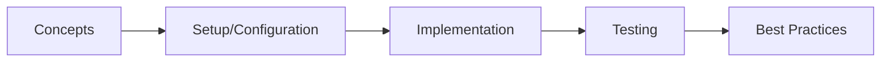

# Distributed Configuration

> **Previous:** [Resilience &amp; Circuit Breakers](./41-resilience.md) | **Next:** [Distributed Tracing &amp; Observability](./43-tracing.md)

## Learning Objectives
## Chapter at a Glance

| Topic | Key Insight | Practical Takeaway |
|-------|-------------|--------------------|
| Core Concepts | Foundational understanding | Real-world application |
| Implementation | Code-first approach | Working examples |
| Best Practices | Production patterns | Avoid common pitfalls |

## Chapter Roadmap




By the end of this chapter, you will be able to:

- Set up a Spring Cloud Config Server with native, git, and Vault backends
- Configure Spring Cloud Config clients with bootstrap.yml, fail-fast, and retry
- Implement symmetric and asymmetric encryption for sensitive configuration values
- Use @RefreshScope to refresh beans at runtime without restarting
- Set up Spring Cloud Bus with RabbitMQ and Kafka for broadcast refresh events
- Integrate HashiCorp Vault for secure secrets management
- Configure Spring Cloud Config Monitor with webhooks for automatic refresh

## Theory

> **Pro Tip:** Test with production-like configurations → dev setups often hide issues that surface under real load.

> **Remember:** Start simple. Add complexity only when proven necessary. Premature abstraction creates maintenance burden.


### Distributed Configuration Problem

<a href="../../../assets/images/diagrams/java/42-config/distributed-configuration-problem-handwritten.svg" target="_blank" rel="noopener">
  
</a>
<a href="../../../assets/images/diagrams/java/42-config/distributed-configuration-problem-diagram.svg" target="_blank" rel="noopener">
  
</a>
<a href="../../../assets/images/diagrams/java/42-config/distributed-configuration-problem-sticky.svg" target="_blank" rel="noopener">
  
</a>


In a microservices architecture, configuration becomes distributed across many services. A centralized configuration server solves this by providing a single source of truth for all service configurations.

### Spring Cloud Config Server

<a href="../../../assets/images/diagrams/java/42-config/spring-cloud-config-server-handwritten.svg" target="_blank" rel="noopener">
  
</a>
<a href="../../../assets/images/diagrams/java/42-config/spring-cloud-config-server-diagram.svg" target="_blank" rel="noopener">
  
</a>
<a href="../../../assets/images/diagrams/java/42-config/spring-cloud-config-server-sticky.svg" target="_blank" rel="noopener">
  
</a>


The Config Server provides configuration to client applications via HTTP. It supports multiple backends:

- **Native**: File system-based configuration
- **Git**: Configuration stored in a Git repository (supports versioning, branching, labels)
- **Vault**: Secrets stored in HashiCorp Vault

### Configuration Refresh Strategies

<a href="../../../assets/images/diagrams/java/42-config/configuration-refresh-strategies-handwritten.svg" target="_blank" rel="noopener">
  
</a>
<a href="../../../assets/images/diagrams/java/42-config/configuration-refresh-strategies-diagram.svg" target="_blank" rel="noopener">
  
</a>
<a href="../../../assets/images/diagrams/java/42-config/configuration-refresh-strategies-sticky.svg" target="_blank" rel="noopener">
  
</a>


- **@RefreshScope**: Spring beans annotated with `@RefreshScope` are recreated when the `Environment` changes
- **Spring Cloud Bus**: Distributes refresh events across multiple service instances using a message broker (RabbitMQ or Kafka)
- **Webhook Monitoring**: Git repository webhooks trigger automatic configuration refresh

## Complete Code Examples

### Config Server Application

```xml
<?xml version="1.0" encoding="UTF-8"?>
<project xmlns="http://maven.apache.org/POM/4.0.0"
         xmlns:xsi="http://www.w3.org/2001/XMLSchema-instance"
         xsi:schemaLocation="http://maven.apache.org/POM/4.0.0
         https://maven.apache.org/xsd/maven-4.0.0.xsd">
    <modelVersion>4.0.0</modelVersion>
    <parent>
        <groupId>org.springframework.boot</groupId>
        <artifactId>spring-boot-starter-parent</artifactId>
        <version>3.2.0</version>
        <relativePath/>
    </parent>
    <groupId>com.course.config</groupId>
    <artifactId>config-server</artifactId>
    <version>1.0.0</version>
    <name>config-server</name>
    <properties>
        <java.version>21</java.version>
        <spring-cloud.version>2023.0.0</spring-cloud.version>
    </properties>
    <dependencies>
        <dependency>
            <groupId>org.springframework.cloud</groupId>
            <artifactId>spring-cloud-config-server</artifactId>
        </dependency>
        <dependency>
            <groupId>org.springframework.cloud</groupId>
            <artifactId>spring-cloud-starter-bus-amqp</artifactId>
        </dependency>
        <dependency>
            <groupId>org.springframework.cloud</groupId>
            <artifactId>spring-cloud-starter-bus-kafka</artifactId>
        </dependency>
        <dependency>
            <groupId>org.springframework.boot</groupId>
            <artifactId>spring-boot-starter-security</artifactId>
        </dependency>
        <dependency>
            <groupId>org.springframework.boot</groupId>
            <artifactId>spring-boot-starter-actuator</artifactId>
        </dependency>
        <dependency>
            <groupId>org.springframework.vault</groupId>
            <artifactId>spring-vault-core</artifactId>
        </dependency>
        <dependency>
            <groupId>org.springframework.boot</groupId>
            <artifactId>spring-boot-starter-test</artifactId>
            <scope>test</scope>
        </dependency>
    </dependencies>
    <dependencyManagement>
        <dependencies>
            <dependency>
                <groupId>org.springframework.cloud</groupId>
                <artifactId>spring-cloud-dependencies</artifactId>
                <version>${spring-cloud.version}</version>
                <type>pom</type>
                <scope>import</scope>
            </dependency>
        </dependencies>
    </dependencyManagement>
    <build>
        <plugins>
            <plugin>
                <groupId>org.springframework.boot</groupId>
                <artifactId>spring-boot-maven-plugin</artifactId>
            </plugin>
        </plugins>
    </build>
</project>
```

```java
package com.course.config.server;

import org.springframework.boot.SpringApplication;
import org.springframework.boot.autoconfigure.SpringBootApplication;
import org.springframework.cloud.config.server.EnableConfigServer;

@SpringBootApplication
@EnableConfigServer
public class ConfigServerApplication {
    public static void main(String[] args) {
        SpringApplication.run(ConfigServerApplication.class, args);
    }
}
```

### Config Server Configuration (Git Backend)

```yaml
# src/main/resources/application.yml

> **Previous:** [Resilience &amp; Circuit Breakers](./41-resilience.md) | **Next:** [Distributed Tracing &amp; Observability](./43-tracing.md)
server:
  port: 8888

spring:
  application:
    name: config-server
  cloud:
    config:
      server:
        git:
          uri: https://github.com/example/config-repo
          search-paths: '{application}', '{application}/{profile}'
          default-label: main
          clone-on-start: true
          force-pull: true
          timeout: 30
          basedir: ${java.io.tmpdir}/config-repo
          refresh-rate: 0
        native:
          search-locations: classpath:/config-repo/{application}, classpath:/config-repo/{application}/{profile}
        vault:
          host: localhost
          port: 8200
          scheme: http
          backend: secret
          default-key: application
          profile-separator: /
          kv-version: 2
          authentication: TOKEN
          token: ${VAULT_TOKEN:dev-token}
        overrides:
          spring.application.name: ${spring.application.name}
          config.server.override: true
        health:
          enabled: true
          repositories:
            order-service:
              name: order-service
              profiles: default,dev
            payment-service:
              name: payment-service
              profiles: default,dev
      bus:
        enabled: true
        refresh:
          enabled: true
        env:
          enabled: true

  rabbitmq:
    host: localhost
    port: 5672
    username: guest
    password: guest

  kafka:
    bootstrap-servers: localhost:9092
    consumer:
      group-id: config-server
    producer:
      key-serializer: org.apache.kafka.common.serialization.StringSerializer
      value-serializer: org.apache.kafka.common.serialization.StringSerializer

  security:
    user:
      name: config-user
      password: ${CONFIG_SERVER_PASSWORD:config-secret}

encrypt:
  key: ${ENCRYPT_KEY:default-symmetric-key-change-in-production}

management:
  endpoints:
    web:
      exposure:
        include: health,info,bus-refresh,bus-env,refresh,env,configprops
  endpoint:
    health:
      show-details: always
```

### Native Backend Configuration Files

```yaml
# src/main/resources/config-repo/order-service.yml

> **Previous:** [Resilience &amp; Circuit Breakers](./41-resilience.md) | **Next:** [Distributed Tracing &amp; Observability](./43-tracing.md)
spring:
  datasource:
    url: jdbc:postgresql://localhost:5432/orderdb
    username: order_user
    password: '{cipher}AQA...encrypted...'
    driver-class-name: org.postgresql.Driver
  jpa:
    hibernate:
      ddl-auto: validate
    properties:
      hibernate:
        dialect: org.hibernate.dialect.PostgreSQLDialect

server:
  port: 8081

order:
  processing:
    max-items: 50
    timeout-seconds: 30
    allowed-currencies: USD,EUR,GBP
  shipping:
    free-threshold: 100.00
    standard-rate: 9.99
    express-rate: 24.99
  notifications:
    enabled: true
    email-on-ship: true
    email-on-deliver: true

management:
  endpoints:
    web:
      exposure:
        include: health,info,metrics
```

```yaml
# src/main/resources/config-repo/order-service-dev.yml

> **Previous:** [Resilience &amp; Circuit Breakers](./41-resilience.md) | **Next:** [Distributed Tracing &amp; Observability](./43-tracing.md)
server:
  port: 8081

spring:
  datasource:
    url: jdbc:h2:mem:orderdb
    username: sa
    password:
  jpa:
    hibernate:
      ddl-auto: create-drop
    show-sql: true

order:
  processing:
    max-items: 10
    timeout-seconds: 5
  notifications:
    enabled: false
```

```yaml
# src/main/resources/config-repo/order-service-prod.yml

> **Previous:** [Resilience &amp; Circuit Breakers](./41-resilience.md) | **Next:** [Distributed Tracing &amp; Observability](./43-tracing.md)
server:
  port: 8081

spring:
  datasource:
    url: jdbc:postgresql://prod-db:5432/orderdb
    username: ${DB_USERNAME}
    password: ${DB_PASSWORD}
    hikari:
      maximum-pool-size: 20
      minimum-idle: 5
      idle-timeout: 300000
      connection-timeout: 20000
  jpa:
    hibernate:
      ddl-auto: validate

order:
  processing:
    max-items: 100
    timeout-seconds: 60
    allowed-currencies: USD,EUR,GBP,JPY
  notifications:
    enabled: true
    email-on-ship: true
    email-on-deliver: true
    email-on-fail: true
```

```yaml
# src/main/resources/config-repo/payment-service.yml

> **Previous:** [Resilience &amp; Circuit Breakers](./41-resilience.md) | **Next:** [Distributed Tracing &amp; Observability](./43-tracing.md)
spring:
  datasource:
    url: jdbc:postgresql://localhost:5433/paymentdb
    username: payment_user
    password: '{cipher}AQA...encrypted...'
  jpa:
    hibernate:
      ddl-auto: validate

server:
  port: 8082

payment:
  gateway:
    provider: stripe
    api-url: https://api.stripe.com/v1
    timeout-seconds: 10
    max-retries: 3
  refund:
    auto-approve-threshold: 50.00
    require-manual-review: true
  currency:
    supported: USD,EUR,GBP
    default: USD
```

```yaml
# src/main/resources/config-repo/common.yml

> **Previous:** [Resilience &amp; Circuit Breakers](./41-resilience.md) | **Next:** [Distributed Tracing &amp; Observability](./43-tracing.md)
spring:
  application:
    name: ${spring.application.name}
  output:
    ansi:
      enabled: always

logging:
  level:
    root: INFO
    com.course: DEBUG
  pattern:
    console: "%d{yyyy-MM-dd HH:mm:ss} [%thread] %-5level %logger{36} - %msg%n"

app:
  version: 1.0.0
  environment: ${spring.profiles.active:default}
```

### Config Server Security Configuration

```java
package com.course.config.server.config;

import org.springframework.context.annotation.Bean;
import org.springframework.context.annotation.Configuration;
import org.springframework.security.config.annotation.web.builders.HttpSecurity;
import org.springframework.security.config.annotation.web.configuration.EnableWebSecurity;
import org.springframework.security.web.SecurityFilterChain;

@Configuration
@EnableWebSecurity
public class ConfigServerSecurityConfig {

    @Bean
    public SecurityFilterChain securityFilterChain(HttpSecurity http) throws Exception {
        http
            .csrf(csrf -> csrf.ignoringRequestMatchers("/encrypt/**", "/decrypt/**", "/monitor/**"))
            .authorizeHttpRequests(auth -> auth
                .requestMatchers("/actuator/health").permitAll()
                .requestMatchers("/encrypt/**", "/decrypt/**").authenticated()
                .requestMatchers("/monitor/**").authenticated()
                .anyRequest().authenticated())
            .httpBasic(httpBasic -> {});
        return http.build();
    }
}
```

### Config Server REST Controller

```java
package com.course.config.server.web;

import org.springframework.cloud.config.environment.Environment;
import org.springframework.cloud.config.server.config.ConfigServerProperties;
import org.springframework.cloud.config.server.environment.EnvironmentController;
import org.springframework.cloud.config.server.environment.EnvironmentRepository;
import org.springframework.http.ResponseEntity;
import org.springframework.web.bind.annotation.*;
import java.util.*;

@RestController
@RequestMapping("/api/admin/config")
public class ConfigServerAdminController {

    private final EnvironmentRepository environmentRepository;
    private final ConfigServerProperties configServerProperties;

    public ConfigServerAdminController(EnvironmentRepository environmentRepository,
                                        ConfigServerProperties configServerProperties) {
        this.environmentRepository = environmentRepository;
        this.configServerProperties = configServerProperties;
    }

    @GetMapping("/{application}/{profile}")
    public ResponseEntity<Map<String, Object>> getConfig(
            @PathVariable String application,
            @PathVariable String profile) {
        Environment environment = environmentRepository.findOne(application, profile, null);

        Map<String, Object> result = new LinkedHashMap<>();
        result.put("name", environment.getName());
        result.put("profiles", Arrays.asList(environment.getProfiles()));
        result.put("label", environment.getLabel());
        result.put("version", environment.getVersion());

        List<Map<String, Object>> propertySources = Arrays.stream(environment.getPropertySources())
                .map(source -> {
                    Map<String, Object> sourceMap = new LinkedHashMap<>();
                    sourceMap.put("name", source.getName());
                    sourceMap.put("source", source.getSource());
                    return sourceMap;
                })
                .toList();
        result.put("propertySources", propertySources);
        return ResponseEntity.ok(result);
    }

    @GetMapping("/{application}/{profile}/{label}")
    public ResponseEntity<Map<String, Object>> getConfigWithLabel(
            @PathVariable String application,
            @PathVariable String profile,
            @PathVariable String label) {
        Environment environment = environmentRepository.findOne(application, profile, label);
        return ResponseEntity.ok(Map.of(
                "name", environment.getName(),
                "profiles", environment.getProfiles(),
                "label", environment.getLabel(),
                "sources", environment.getPropertySources()
        ));
    }
}
```

### Encryption/Decryption Controller

```java
package com.course.config.server.web;

import org.springframework.cloud.config.server.encryption.EncryptionController;
import org.springframework.http.ResponseEntity;
import org.springframework.web.bind.annotation.*;

@RestController
@RequestMapping("/api/admin/encryption")
public class EncryptionAdminController {

    private final EncryptionController encryptionController;

    public EncryptionAdminController(EncryptionController encryptionController) {
        this.encryptionController = encryptionController;
    }

    @PostMapping("/encrypt")
    public ResponseEntity<String> encrypt(@RequestBody String plaintext) {
        String encrypted = encryptionController.encrypt(plaintext, null);
        return ResponseEntity.ok("{cipher}" + encrypted);
    }

    @PostMapping("/decrypt")
    public ResponseEntity<String> decrypt(@RequestBody String ciphertext) {
        String cleaned = ciphertext.replace("{cipher}", "");
        String decrypted = encryptionController.decrypt(cleaned, null);
        return ResponseEntity.ok(decrypted);
    }

    @PostMapping("/encrypt/{path}")
    public ResponseEntity<String> encryptWithPath(@RequestBody String plaintext,
                                                    @PathVariable String path) {
        String encrypted = encryptionController.encrypt(plaintext, path);
        return ResponseEntity.ok("{cipher}" + encrypted);
    }

    @PostMapping("/decrypt/{path}")
    public ResponseEntity<String> decryptWithPath(@RequestBody String ciphertext,
                                                    @PathVariable String path) {
        String cleaned = ciphertext.replace("{cipher}", "");
        String decrypted = encryptionController.decrypt(cleaned, path);
        return ResponseEntity.ok(decrypted);
    }
}
```

### Config Client Application

```xml
<?xml version="1.0" encoding="UTF-8"?>
<project xmlns="http://maven.apache.org/POM/4.0.0"
         xmlns:xsi="http://www.w3.org/2001/XMLSchema-instance"
         xsi:schemaLocation="http://maven.apache.org/POM/4.0.0
         https://maven.apache.org/xsd/maven-4.0.0.xsd">
    <modelVersion>4.0.0</modelVersion>
    <parent>
        <groupId>org.springframework.boot</groupId>
        <artifactId>spring-boot-starter-parent</artifactId>
        <version>3.2.0</version>
        <relativePath/>
    </parent>
    <groupId>com.course.config</groupId>
    <artifactId>order-service-client</artifactId>
    <version>1.0.0</version>
    <name>order-service-client</name>
    <properties>
        <java.version>21</java.version>
        <spring-cloud.version>2023.0.0</spring-cloud.version>
    </properties>
    <dependencies>
        <dependency>
            <groupId>org.springframework.cloud</groupId>
            <artifactId>spring-cloud-starter-config</artifactId>
        </dependency>
        <dependency>
            <groupId>org.springframework.cloud</groupId>
            <artifactId>spring-cloud-starter-bus-amqp</artifactId>
        </dependency>
        <dependency>
            <groupId>org.springframework.cloud</groupId>
            <artifactId>spring-cloud-starter-bus-kafka</artifactId>
        </dependency>
        <dependency>
            <groupId>org.springframework.boot</groupId>
            <artifactId>spring-boot-starter-web</artifactId>
        </dependency>
        <dependency>
            <groupId>org.springframework.boot</groupId>
            <artifactId>spring-boot-starter-actuator</artifactId>
        </dependency>
        <dependency>
            <groupId>org.springframework.boot</groupId>
            <artifactId>spring-boot-starter-security</artifactId>
        </dependency>
        <dependency>
            <groupId>org.springframework.cloud</groupId>
            <artifactId>spring-cloud-vault-config-databases</artifactId>
        </dependency>
        <dependency>
            <groupId>org.springframework.boot</groupId>
            <artifactId>spring-boot-starter-test</artifactId>
            <scope>test</scope>
        </dependency>
    </dependencies>
    <dependencyManagement>
        <dependencies>
            <dependency>
                <groupId>org.springframework.cloud</groupId>
                <artifactId>spring-cloud-dependencies</artifactId>
                <version>${spring-cloud.version}</version>
                <type>pom</type>
                <scope>import</scope>
            </dependency>
        </dependencies>
    </dependencyManagement>
    <build>
        <plugins>
            <plugin>
                <groupId>org.springframework.boot</groupId>
                <artifactId>spring-boot-maven-plugin</artifactId>
            </plugin>
        </plugins>
    </build>
</project>
```

```java
package com.course.config.client;

import org.springframework.boot.SpringApplication;
import org.springframework.boot.autoconfigure.SpringBootApplication;
import org.springframework.scheduling.annotation.EnableScheduling;

@SpringBootApplication
@EnableScheduling
public class OrderServiceClientApplication {
    public static void main(String[] args) {
        SpringApplication.run(OrderServiceClientApplication.class, args);
    }
}
```

### Config Client bootstrap.yml

```yaml
# src/main/resources/bootstrap.yml

> **Previous:** [Resilience &amp; Circuit Breakers](./41-resilience.md) | **Next:** [Distributed Tracing &amp; Observability](./43-tracing.md)
spring:
  application:
    name: order-service
  cloud:
    config:
      uri: http://localhost:8888
      username: config-user
      password: config-secret
      fail-fast: true
      retry:
        initial-interval: 1000
        multiplier: 1.5
        max-attempts: 10
        max-interval: 30000
      enabled: true
      discovery:
        enabled: true
        service-id: config-server
      label: main
      profile: ${spring.profiles.active:default}

  profiles:
    active: dev
```

```yaml
# src/main/resources/application.yml

> **Previous:** [Resilience &amp; Circuit Breakers](./41-resilience.md) | **Next:** [Distributed Tracing &amp; Observability](./43-tracing.md)
server:
  port: 8081

spring:
  config:
    import: configtree:/etc/secrets/

management:
  endpoints:
    web:
      exposure:
        include: health,info,refresh,bus-refresh,env,configprops
  endpoint:
    env:
      show-values: always
    configprops:
      show-values: always
```

### @RefreshScope Beans

```java
package com.course.config.client.config;

import org.springframework.boot.context.properties.ConfigurationProperties;
import org.springframework.cloud.context.config.annotation.RefreshScope;
import org.springframework.stereotype.Component;
import java.util.List;

@Component
@RefreshScope
@ConfigurationProperties(prefix = "order.processing")
public class OrderProcessingProperties {

    private int maxItems;
    private int timeoutSeconds;
    private List<String> allowedCurrencies;

    public int getMaxItems() { return maxItems; }
    public void setMaxItems(int maxItems) { this.maxItems = maxItems; }
    public int getTimeoutSeconds() { return timeoutSeconds; }
    public void setTimeoutSeconds(int timeoutSeconds) { this.timeoutSeconds = timeoutSeconds; }
    public List<String> getAllowedCurrencies() { return allowedCurrencies; }
    public void setAllowedCurrencies(List<String> allowedCurrencies) {
        this.allowedCurrencies = allowedCurrencies;
    }

    @Override
    public String toString() {
        return "OrderProcessingProperties{" +
                "maxItems=" + maxItems +
                ", timeoutSeconds=" + timeoutSeconds +
                ", allowedCurrencies=" + allowedCurrencies +
                '}';
    }
}
```

```java
package com.course.config.client.config;

import org.springframework.boot.context.properties.ConfigurationProperties;
import org.springframework.cloud.context.config.annotation.RefreshScope;
import org.springframework.stereotype.Component;

@Component
@RefreshScope
@ConfigurationProperties(prefix = "order.shipping")
public class ShippingProperties {

    private double freeThreshold;
    private double standardRate;
    private double expressRate;

    public double getFreeThreshold() { return freeThreshold; }
    public void setFreeThreshold(double freeThreshold) { this.freeThreshold = freeThreshold; }
    public double getStandardRate() { return standardRate; }
    public void setStandardRate(double standardRate) { this.standardRate = standardRate; }
    public double getExpressRate() { return expressRate; }
    public void setExpressRate(double expressRate) { this.expressRate = expressRate; }

    @Override
    public String toString() {
        return "ShippingProperties{" +
                "freeThreshold=" + freeThreshold +
                ", standardRate=" + standardRate +
                ", expressRate=" + expressRate +
                '}';
    }
}
```

```java
package com.course.config.client.config;

import org.springframework.boot.context.properties.ConfigurationProperties;
import org.springframework.cloud.context.config.annotation.RefreshScope;
import org.springframework.stereotype.Component;

@Component
@RefreshScope
@ConfigurationProperties(prefix = "order.notifications")
public class NotificationProperties {

    private boolean enabled;
    private boolean emailOnShip;
    private boolean emailOnDeliver;
    private boolean emailOnFail;

    public boolean isEnabled() { return enabled; }
    public void setEnabled(boolean enabled) { this.enabled = enabled; }
    public boolean isEmailOnShip() { return emailOnShip; }
    public void setEmailOnShip(boolean emailOnShip) { this.emailOnShip = emailOnShip; }
    public boolean isEmailOnDeliver() { return emailOnDeliver; }
    public void setEmailOnDeliver(boolean emailOnDeliver) { this.emailOnDeliver = emailOnDeliver; }
    public boolean isEmailOnFail() { return emailOnFail; }
    public void setEmailOnFail(boolean emailOnFail) { this.emailOnFail = emailOnFail; }
}
```

### Refreshable Service

```java
package com.course.config.client.service;

import com.course.config.client.config.OrderProcessingProperties;
import com.course.config.client.config.ShippingProperties;
import com.course.config.client.config.NotificationProperties;
import org.slf4j.Logger;
import org.slf4j.LoggerFactory;
import org.springframework.cloud.context.config.annotation.RefreshScope;
import org.springframework.stereotype.Service;

@Service
@RefreshScope
public class ConfigurableOrderService {

    private static final Logger log = LoggerFactory.getLogger(ConfigurableOrderService.class);

    private final OrderProcessingProperties processingProperties;
    private final ShippingProperties shippingProperties;
    private final NotificationProperties notificationProperties;

    public ConfigurableOrderService(OrderProcessingProperties processingProperties,
                                     ShippingProperties shippingProperties,
                                     NotificationProperties notificationProperties) {
        this.processingProperties = processingProperties;
        this.shippingProperties = shippingProperties;
        this.notificationProperties = notificationProperties;
        log.info("ConfigurableOrderService initialized with: processing={}, shipping={}, notifications={}",
                processingProperties, shippingProperties, notificationProperties);
    }

    public boolean canProcessOrder(int itemCount) {
        if (itemCount > processingProperties.getMaxItems()) {
            log.warn("Order exceeds max items: {} > {}", itemCount, processingProperties.getMaxItems());
            return false;
        }
        return true;
    }

    public double calculateShipping(double subtotal) {
        if (subtotal >= shippingProperties.getFreeThreshold()) {
            return 0.0;
        }
        return subtotal > 50 ? shippingProperties.getExpressRate() : shippingProperties.getStandardRate();
    }

    public boolean shouldSendNotification(String type) {
        if (!notificationProperties.isEnabled()) {
            return false;
        }
        return switch (type) {
            case "ship" -> notificationProperties.isEmailOnShip();
            case "deliver" -> notificationProperties.isEmailOnDeliver();
            case "fail" -> notificationProperties.isEmailOnFail();
            default -> false;
        };
    }

    public boolean isValidCurrency(String currency) {
        return processingProperties.getAllowedCurrencies().stream()
                .anyMatch(c -> c.equalsIgnoreCase(currency));
    }

    public int getTimeoutSeconds() {
        return processingProperties.getTimeoutSeconds();
    }

    public int getMaxItems() {
        return processingProperties.getMaxItems();
    }
}
```

### Configuration Refresh Controller

```java
package com.course.config.client.web;

import com.course.config.client.config.OrderProcessingProperties;
import com.course.config.client.config.ShippingProperties;
import com.course.config.client.config.NotificationProperties;
import org.slf4j.Logger;
import org.slf4j.LoggerFactory;
import org.springframework.cloud.context.environment.EnvironmentChangeEvent;
import org.springframework.context.event.EventListener;
import org.springframework.http.ResponseEntity;
import org.springframework.web.bind.annotation.*;

import java.util.Map;
import java.util.Set;

@RestController
@RequestMapping("/api/config")
public class ConfigController {

    private static final Logger log = LoggerFactory.getLogger(ConfigController.class);

    private final OrderProcessingProperties processingProperties;
    private final ShippingProperties shippingProperties;
    private final NotificationProperties notificationProperties;

    public ConfigController(OrderProcessingProperties processingProperties,
                             ShippingProperties shippingProperties,
                             NotificationProperties notificationProperties) {
        this.processingProperties = processingProperties;
        this.shippingProperties = shippingProperties;
        this.notificationProperties = notificationProperties;
    }

    @GetMapping("/current")
    public ResponseEntity<Map<String, Object>> getCurrentConfig() {
        return ResponseEntity.ok(Map.of(
                "processing", Map.of(
                        "maxItems", processingProperties.getMaxItems(),
                        "timeoutSeconds", processingProperties.getTimeoutSeconds(),
                        "allowedCurrencies", processingProperties.getAllowedCurrencies()
                ),
                "shipping", Map.of(
                        "freeThreshold", shippingProperties.getFreeThreshold(),
                        "standardRate", shippingProperties.getStandardRate(),
                        "expressRate", shippingProperties.getExpressRate()
                ),
                "notifications", Map.of(
                        "enabled", notificationProperties.isEnabled(),
                        "emailOnShip", notificationProperties.isEmailOnShip(),
                        "emailOnDeliver", notificationProperties.isEmailOnDeliver(),
                        "emailOnFail", notificationProperties.isEmailOnFail()
                )
        ));
    }

    @EventListener
    public void handleEnvironmentChange(EnvironmentChangeEvent event) {
        Set<String> changedKeys = event.getKeys();
        log.info("Environment change detected. Changed keys: {}", changedKeys);
        changedKeys.forEach(key -> log.info("  Changed property: {}", key));
    }
}
```

### Environment Change Listener

```java
package com.course.config.client.config;

import org.slf4j.Logger;
import org.slf4j.LoggerFactory;
import org.springframework.cloud.context.environment.EnvironmentChangeEvent;
import org.springframework.cloud.context.scope.refresh.RefreshScope;
import org.springframework.context.event.EventListener;
import org.springframework.stereotype.Component;

@Component
public class ConfigurationChangeLogger {

    private static final Logger log = LoggerFactory.getLogger(ConfigurationChangeLogger.class);

    private final RefreshScope refreshScope;

    public ConfigurationChangeLogger(RefreshScope refreshScope) {
        this.refreshScope = refreshScope;
    }

    @EventListener
    public void onEnvironmentChange(EnvironmentChangeEvent event) {
        log.info("Configuration changed! {} properties affected:", event.getKeys().size());
        event.getKeys().forEach(key -> {
            String newValue = System.getProperty(key);
            if (newValue == null) {
                newValue = System.getenv(key);
            }
            log.info("  Property '{}' changed to '{}'", key, newValue);
        });
    }
}
```

### Spring Cloud Bus with RabbitMQ

```yaml
# config-client/bootstrap.yml (with bus)

> **Previous:** [Resilience &amp; Circuit Breakers](./41-resilience.md) | **Next:** [Distributed Tracing &amp; Observability](./43-tracing.md)
spring:
  cloud:
    bus:
      enabled: true
      refresh:
        enabled: true
      env:
        enabled: true

  rabbitmq:
    host: localhost
    port: 5672
    username: guest
    password: guest
    virtual-host: /
```

```yaml
# config-client/bootstrap.yml (with Kafka bus)

> **Previous:** [Resilience &amp; Circuit Breakers](./41-resilience.md) | **Next:** [Distributed Tracing &amp; Observability](./43-tracing.md)
spring:
  cloud:
    bus:
      enabled: true
      refresh:
        enabled: true
      env:
        enabled: true
      destination: springCloudBus

  kafka:
    bootstrap-servers: localhost:9092
    consumer:
      group-id: ${spring.application.name}
      auto-offset-reset: earliest
    producer:
      key-serializer: org.apache.kafka.common.serialization.StringSerializer
      value-serializer: org.apache.kafka.common.serialization.StringSerializer
```

### Bus Event Listener

```java
package com.course.config.client.config;

import org.slf4j.Logger;
import org.slf4j.LoggerFactory;
import org.springframework.cloud.bus.event.Destination;
import org.springframework.cloud.bus.event.RefreshRemoteApplicationEvent;
import org.springframework.cloud.bus.event.SendRemoteApplicationEvent;
import org.springframework.context.event.EventListener;
import org.springframework.stereotype.Component;

@Component
public class BusEventListener {

    private static final Logger log = LoggerFactory.getLogger(BusEventListener.class);

    @EventListener
    public void handleRefreshRemote(RefreshRemoteApplicationEvent event) {
        log.info("Received bus refresh event from {} for service {}: {}",
                event.getOriginService(),
                event.getDestinationService(),
                event.getId());
    }

    @EventListener
    public void handleSendRemote(SendRemoteApplicationEvent event) {
        log.debug("Bus event: {} from {} to {} with data: {}",
                event.getClass().getSimpleName(),
                event.getOriginService(),
                event.getDestinationService(),
                event.getData());
    }
}
```

### Vault Integration

```yaml
# config-server/bootstrap.yml for Vault

> **Previous:** [Resilience &amp; Circuit Breakers](./41-resilience.md) | **Next:** [Distributed Tracing &amp; Observability](./43-tracing.md)
spring:
  cloud:
    config:
      server:
        vault:
          host: localhost
          port: 8200
          scheme: http
          backend: secret
          default-key: application
          profile-separator: /
          kv-version: 2
          authentication: TOKEN
          token: ${VAULT_TOKEN}
```

```java
package com.course.config.client.config;

import org.springframework.context.annotation.Configuration;
import org.springframework.vault.annotation.VaultPropertySource;
import org.springframework.vault.authentication.ClientAuthentication;
import org.springframework.vault.authentication.TokenAuthentication;
import org.springframework.vault.client.VaultEndpoint;
import org.springframework.vault.config.AbstractVaultConfiguration;
import org.springframework.vault.core.VaultKeyValueOperations;
import org.springframework.vault.core.VaultKeyValueOperationsSupport;
import org.springframework.vault.core.VaultTemplate;
import org.springframework.context.annotation.Bean;

@Configuration
@VaultPropertySource(value = "secret/order-service", renewal = VaultPropertySource.Renewal.RENEW)
@VaultPropertySource(value = "secret/common", renewal = VaultPropertySource.Renewal.RENEW)
public class VaultConfig {

    @Bean
    public VaultEndpoint vaultEndpoint() {
        VaultEndpoint endpoint = new VaultEndpoint();
        endpoint.setHost("localhost");
        endpoint.setPort(8200);
        endpoint.setScheme("http");
        return endpoint;
    }

    @Bean
    public ClientAuthentication clientAuthentication() {
        return new TokenAuthentication(System.getenv().getOrDefault("VAULT_TOKEN", "dev-token"));
    }

    @Bean
    public VaultTemplate vaultTemplate() {
        return new VaultTemplate(vaultEndpoint(), clientAuthentication());
    }

    @Bean
    public VaultKeyValueOperations vaultKeyValueOperations(VaultTemplate vaultTemplate) {
        return vaultTemplate.opsForKeyValue("secret", VaultKeyValueOperationsSupport.KeyValueBackend.KV_2);
    }
}
```

```java
package com.course.config.client.service;

import org.slf4j.Logger;
import org.slf4j.LoggerFactory;
import org.springframework.stereotype.Service;
import org.springframework.vault.core.VaultKeyValueOperations;
import org.springframework.vault.support.VaultResponse;
import java.util.Map;

@Service
public class VaultSecretService {

    private static final Logger log = LoggerFactory.getLogger(VaultSecretService.class);

    private final VaultKeyValueOperations vaultOperations;

    public VaultSecretService(VaultKeyValueOperations vaultOperations) {
        this.vaultOperations = vaultOperations;
    }

    public String getSecret(String path, String key) {
        VaultResponse response = vaultOperations.get(path);
        if (response != null && response.getData() != null) {
            Object value = response.getData().get(key);
            return value != null ? value.toString() : null;
        }
        return null;
    }

    public Map<String, Object> getSecrets(String path) {
        VaultResponse response = vaultOperations.get(path);
        if (response != null && response.getData() != null) {
            return response.getData();
        }
        return Map.of();
    }

    public void storeSecret(String path, String key, String value) {
        vaultOperations.put(path, Map.of(key, value));
        log.info("Stored secret at {}/{}", path, key);
    }

    public void deleteSecret(String path) {
        vaultOperations.delete(path);
        log.info("Deleted secret at {}", path);
    }
}
```

### Config Monitor Webhook

```java
package com.course.config.server.web;

import jakarta.servlet.http.HttpServletRequest;
import org.slf4j.Logger;
import org.slf4j.LoggerFactory;
import org.springframework.cloud.bus.BusProperties;
import org.springframework.cloud.config.monitor.PropertyPathEndpoint;
import org.springframework.context.ApplicationEventPublisher;
import org.springframework.http.HttpStatus;
import org.springframework.http.ResponseEntity;
import org.springframework.web.bind.annotation.*;

import java.util.Map;

@RestController
@RequestMapping("/monitor")
public class ConfigMonitorController {

    private static final Logger log = LoggerFactory.getLogger(ConfigMonitorController.class);

    private final PropertyPathEndpoint propertyPathEndpoint;
    private final BusProperties busProperties;

    public ConfigMonitorController(PropertyPathEndpoint propertyPathEndpoint,
                                    BusProperties busProperties) {
        this.propertyPathEndpoint = propertyPathEndpoint;
        this.busProperties = busProperties;
    }

    @PostMapping
    public ResponseEntity<String> handleWebhook(
            @RequestHeader("X-GitHub-Event") String event,
            @RequestBody String payload,
            HttpServletRequest request) {

        log.info("Received GitHub webhook event: {}", event);

        if ("push".equals(event)) {
            String[] paths = propertyPathEndpoint.notifyByPath(request, payload);
            if (paths.length > 0) {
                log.info("Triggered refresh for: {}", (Object) paths);
                return ResponseEntity.ok("Configuration refresh triggered for " + paths.length + " services");
            }
        }
        return ResponseEntity.ok("Event received: " + event);
    }

    @PostMapping("/manual")
    public ResponseEntity<String> manualRefresh(@RequestParam String service) {
        log.info("Manual refresh triggered for service: {}", service);
        return ResponseEntity.ok("Refresh initiated for service: " + service);
    }
}
```

### Encryption Configuration

```java
package com.course.config.server.config;

import org.springframework.context.annotation.Bean;
import org.springframework.context.annotation.Configuration;
import org.springframework.security.crypto.encrypt.Encryptors;
import org.springframework.security.crypto.encrypt.TextEncryptor;

@Configuration
public class EncryptionConfig {

    @Bean
    public TextEncryptor textEncryptor() {
        return Encryptors.text("config-server-encryption-key", "deadbeefcafe");
    }
}
```

### Config Client Retry Configuration

```java
package com.course.config.client.config;

import org.springframework.context.annotation.Bean;
import org.springframework.context.annotation.Configuration;
import org.springframework.retry.annotation.EnableRetry;
import org.springframework.retry.backoff.ExponentialBackOffPolicy;
import org.springframework.retry.policy.SimpleRetryPolicy;
import org.springframework.retry.support.RetryTemplate;

@Configuration
@EnableRetry
public class RetryConfig {

    @Bean
    public RetryTemplate configServerRetryTemplate() {
        RetryTemplate retryTemplate = new RetryTemplate();

        ExponentialBackOffPolicy backOffPolicy = new ExponentialBackOffPolicy();
        backOffPolicy.setInitialInterval(1000);
        backOffPolicy.setMultiplier(1.5);
        backOffPolicy.setMaxInterval(30000);
        retryTemplate.setBackOffPolicy(backOffPolicy);

        SimpleRetryPolicy retryPolicy = new SimpleRetryPolicy();
        retryPolicy.setMaxAttempts(10);
        retryTemplate.setRetryPolicy(retryPolicy);

        return retryTemplate;
    }
}
```

### Health Indicator for Config Server

```java
package com.course.config.client.health;

import org.springframework.boot.actuate.health.Health;
import org.springframework.boot.actuate.health.HealthIndicator;
import org.springframework.cloud.config.client.ConfigClientProperties;
import org.springframework.stereotype.Component;
import org.springframework.web.client.RestTemplate;

@Component
public class ConfigServerHealthIndicator implements HealthIndicator {

    private final ConfigClientProperties configClientProperties;
    private final RestTemplate restTemplate;

    public ConfigServerHealthIndicator(ConfigClientProperties configClientProperties) {
        this.configClientProperties = configClientProperties;
        this.restTemplate = new RestTemplate();
    }

    @Override
    public Health health() {
        try {
            String uri = configClientProperties.getUri();
            String response = restTemplate.getForObject(
                    uri + "/order-service/default", String.class);
            return Health.up()
                    .withDetail("configServerUri", uri)
                    .withDetail("status", "reachable")
                    .build();
        } catch (Exception e) {
            return Health.down(e)
                    .withDetail("configServerUri", configClientProperties.getUri())
                    .withDetail("error", e.getMessage())
                    .build();
        }
    }
}
```

### Property Override Controller

```java
package com.course.config.client.web;

import org.springframework.cloud.context.environment.EnvironmentManager;
import org.springframework.http.ResponseEntity;
import org.springframework.web.bind.annotation.*;
import java.util.Map;

@RestController
@RequestMapping("/api/admin/env")
public class EnvironmentAdminController {

    private final EnvironmentManager environmentManager;

    public EnvironmentAdminController(EnvironmentManager environmentManager) {
        this.environmentManager = environmentManager;
    }

    @PostMapping("/set")
    public ResponseEntity<Map<String, String>> setProperty(
            @RequestParam String key, @RequestParam String value) {
        environmentManager.setProperty(key, value);
        return ResponseEntity.ok(Map.of(
                "key", key,
                "value", value,
                "status", "updated"
        ));
    }

    @PostMapping("/reset")
    public ResponseEntity<Map<String, String>> resetProperty(@RequestParam String key) {
        environmentManager.resetProperty(key);
        return ResponseEntity.ok(Map.of(
                "key", key,
                "status", "reset"
        ));
    }
}
```

### Scheduled Refresh Task

```java
package com.course.config.client.schedule;

import org.slf4j.Logger;
import org.slf4j.LoggerFactory;
import org.springframework.beans.factory.annotation.Autowired;
import org.springframework.cloud.context.refresh.ContextRefresher;
import org.springframework.scheduling.annotation.Scheduled;
import org.springframework.stereotype.Component;
import java.util.Set;
import java.util.concurrent.TimeUnit;

@Component
public class ScheduledRefreshTask {

    private static final Logger log = LoggerFactory.getLogger(ScheduledRefreshTask.class);

    private final ContextRefresher contextRefresher;

    public ScheduledRefreshTask(ContextRefresher contextRefresher) {
        this.contextRefresher = contextRefresher;
    }

    @Scheduled(fixedRate = 5, timeUnit = TimeUnit.MINUTES)
    public void refreshConfiguration() {
        log.info("Scheduled configuration refresh started");
        try {
            Set<String> changedKeys = contextRefresher.refresh();
            if (!changedKeys.isEmpty()) {
                log.info("Configuration refreshed. Changed keys: {}", changedKeys);
            } else {
                log.debug("No configuration changes detected");
            }
        } catch (Exception e) {
            log.error("Failed to refresh configuration", e);
        }
    }
}
```

### Configuration Verification Controller

```java
package com.course.config.client.web;

import org.springframework.beans.factory.annotation.Value;
import org.springframework.cloud.context.config.annotation.RefreshScope;
import org.springframework.http.ResponseEntity;
import org.springframework.web.bind.annotation.GetMapping;
import org.springframework.web.bind.annotation.RequestMapping;
import org.springframework.web.bind.annotation.RestController;
import java.util.Map;

@RestController
@RefreshScope
@RequestMapping("/api/verify")
public class ConfigVerificationController {

    @Value("${order.processing.max-items:50}")
    private int maxItems;

    @Value("${order.processing.timeout-seconds:30}")
    private int timeoutSeconds;

    @Value("${order.shipping.free-threshold:100.00}")
    private double freeThreshold;

    @Value("${order.notifications.enabled:true}")
    private boolean notificationsEnabled;

    @Value("${app.version:unknown}")
    private String appVersion;

    @Value("${app.environment:default}")
    private String environment;

    @GetMapping
    public ResponseEntity<Map<String, Object>> verifyConfig() {
        return ResponseEntity.ok(Map.of(
                "maxItems", maxItems,
                "timeoutSeconds", timeoutSeconds,
                "freeThreshold", freeThreshold,
                "notificationsEnabled", notificationsEnabled,
                "appVersion", appVersion,
                "environment", environment,
                "refreshScope", "active"
        ));
    }
}
```

### Docker Compose for Config Infrastructure

```yaml
version: '3.8'
services:
  config-server:
    build: ./config-server
    ports:
      - "8888:8888"
    environment:
      - SPRING_PROFILES_ACTIVE=git
      - ENCRYPT_KEY=${ENCRYPT_KEY}
      - VAULT_TOKEN=${VAULT_TOKEN}
    depends_on:
      - rabbitmq
      - kafka
    networks:
      - config-net

  rabbitmq:
    image: rabbitmq:3-management
    ports:
      - "5672:5672"
      - "15672:15672"
    environment:
      RABBITMQ_DEFAULT_USER: guest
      RABBITMQ_DEFAULT_PASS: guest
    networks:
      - config-net

  kafka:
    image: confluentinc/cp-kafka:7.5.0
    depends_on:
      - zookeeper
    ports:
      - "9092:9092"
    environment:
      KAFKA_BROKER_ID: 1
      KAFKA_ZOOKEEPER_CONNECT: zookeeper:2181
      KAFKA_ADVERTISED_LISTENERS: PLAINTEXT://localhost:9092
      KAFKA_OFFSETS_TOPIC_REPLICATION_FACTOR: 1
    networks:
      - config-net

  zookeeper:
    image: confluentinc/cp-zookeeper:7.5.0
    environment:
      ZOOKEEPER_CLIENT_PORT: 2181
    networks:
      - config-net

  vault:
    image: vault:1.15
    ports:
      - "8200:8200"
    environment:
      VAULT_DEV_ROOT_TOKEN_ID: dev-token
      VAULT_DEV_LISTEN_ADDRESS: 0.0.0.0:8200
    cap_add:
      - IPC_LOCK
    networks:
      - config-net

  order-service:
    build: ./order-service-client
    ports:
      - "8081:8081"
    depends_on:
      - config-server
    environment:
      - SPRING_PROFILES_ACTIVE=dev
      - SPRING_CLOUD_CONFIG_URI=http://config-server:8888
      - SPRING_RABBITMQ_HOST=rabbitmq
      - VAULT_TOKEN=${VAULT_TOKEN}
    networks:
      - config-net

networks:
  config-net:
    driver: bridge
```

### Unit Tests

```java
package com.course.config.client;

import org.junit.jupiter.api.Test;
import org.springframework.beans.factory.annotation.Autowired;
import org.springframework.boot.test.context.SpringBootTest;
import org.springframework.cloud.context.refresh.ContextRefresher;
import org.springframework.test.context.ActiveProfiles;
import static org.assertj.core.api.Assertions.assertThat;

@SpringBootTest
@ActiveProfiles("test")
class ConfigClientIntegrationTest {

    @Autowired
    private ContextRefresher contextRefresher;

    @Test
    void contextShouldLoad() {
        assertThat(contextRefresher).isNotNull();
    }

    @Test
    void shouldRefreshContext() {
        var changedKeys = contextRefresher.refresh();
        assertThat(changedKeys).isNotNull();
    }
}
```

## Concept Comparison Table

| Concept | Definition | Key Distinction | Use Case |
|---------|-----------|-----------------|----------|
| Approach A | Core description | Primary differentiator | When to use this |
| Approach B | Core description | Primary differentiator | When to use this |
| Approach C | Core description | Primary differentiator | When to use this |

## Quick Reference

| Category | Key Commands/APIs | Notes |
|----------|------------------|-------|
| **Setup** | Required dependencies and configuration | Verify versions match |
| **Implementation** | Core code patterns | Test edge cases |
| **Testing** | Verification methods | Cover success and failure paths |

## Cross-Application Matrix

| Scenario | Pattern A | Pattern B | Pattern C |
|----------|-----------|-----------|-----------|
| Small application | ✓ | ✗ | ✓ |
| Enterprise system | ✓ | ✓ | ✗ |
| High-throughput API | ✗ | ✓ | ✓ |
| Event-driven | ✗ | ✓ | ✓ |

## Chapter Quiz

1. What is the primary benefit of this chapter's main topic?
   - A) Improved performance
   - B) Better developer productivity
   - C) Enhanced reliability
   - D) All of the above

<details>
<summary>Answer&lt;/summary&gt;
**C) Enhanced reliability.** While all are benefits, the core value proposition is reliability.
</details>

2. Which approach is recommended for production deployments?
   - A) The simplest solution
   - B) The most feature-rich option
   - C) The one with best operational characteristics
   - D) Whatever the team knows best

<details>
<summary>Answer&lt;/summary&gt;
**C) The one with best operational characteristics.** Production choices should prioritize observability, maintainability, and operability.
</details>

3. When should you consider this pattern?
   - A) For every project regardless of size
   - B) When complexity justifies the overhead
   - C) Only in legacy systems
   - D) Never → it is outdated

<details>
<summary>Answer&lt;/summary&gt;
**B) When complexity justifies the overhead.** Apply patterns when the problem complexity warrants the additional abstraction.
</details>

## Summary

- **Spring Cloud Config Server** centralizes configuration with Git, native, and Vault backends
- **Config Client** retrieves configuration at startup via `bootstrap.yml` with fail-fast and retry
- **Encryption** supports symmetric and asymmetric keys; encrypted values use the `{cipher}` prefix
- **@RefreshScope** recreates Spring beans when `Environment` changes without restart
- **Spring Cloud Bus** distributes refresh events across service instances via RabbitMQ or Kafka
- **Vault Integration** provides secure secrets management with dynamic credentials
- **Config Monitor** listens for Git webhooks to trigger automatic configuration refresh

## Exercises

1. **Config Server Setup**: Create a Config Server with a Git backend. Store configuration for three services (order, payment, inventory) with profile-specific overrides for dev, staging, and prod.

2. **Encryption**: Generate a symmetric encryption key. Encrypt database passwords and configure the client to decrypt them at runtime using `{cipher}` prefix.

3. **@RefreshScope**: Create a service that exposes business logic configuration (feature flags, thresholds). Annotate all configuration beans with `@RefreshScope` and verify refresh via `/actuator/refresh`.

4. **Spring Cloud Bus**: Set up RabbitMQ and configure Spring Cloud Bus. Trigger a configuration change via `POST /actuator/bus-refresh` and verify all service instances receive the update.

5. **Vault Integration**: Install Vault in dev mode. Store database credentials in Vault and configure a Spring Boot client to retrieve them. Implement a dynamic database credential rotation.

6. **Webhook Automation**: Configure a GitHub webhook that points to the Config Server's `/monitor` endpoint. Set up automatic refresh for all services when configuration changes are pushed.

7. **Multiple Backends**: Implement a Config Server that composites configuration from three sources: Git (YAML files), Vault (secrets), and native (overrides). Define priority order and verify proper merging.
