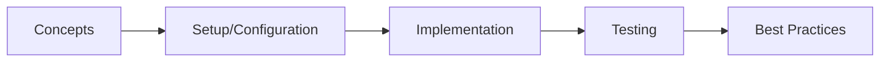
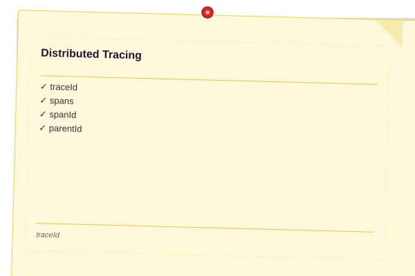
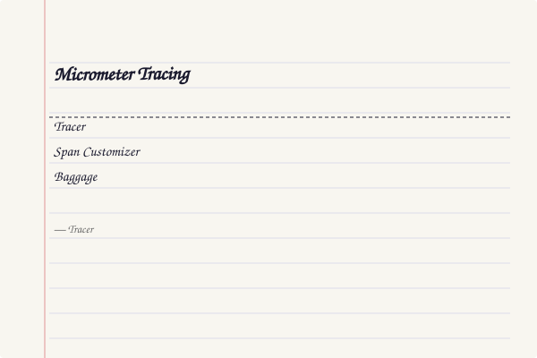
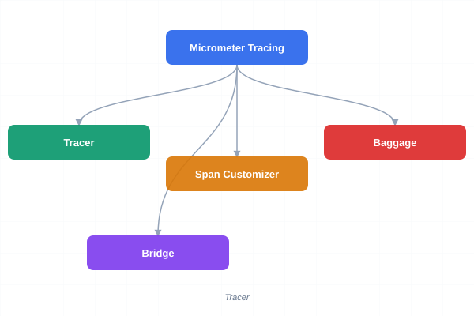
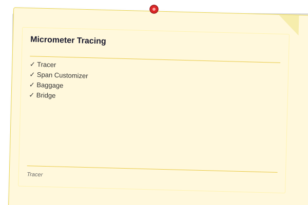
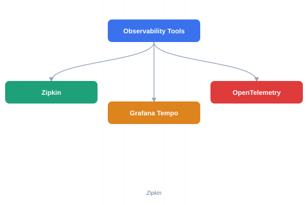
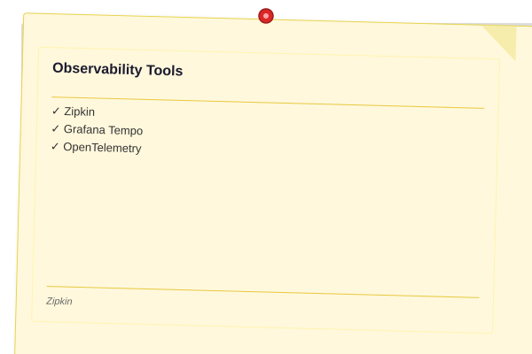

# Distributed Tracing & Observability

> **Previous:** [Distributed Configuration](./42-config.md) | **Next:** [Project Reactor &amp; Reactive Streams](./44-reactor.md)

## Learning Objectives
## Chapter at a Glance

| Topic | Key Insight | Practical Takeaway |
|-------|-------------|--------------------|
| Core Concepts | Foundational understanding | Real-world application |
| Implementation | Code-first approach | Working examples |
| Best Practices | Production patterns | Avoid common pitfalls |

## Chapter Roadmap




By the end of this chapter, you will be able to:

- Understand distributed tracing concepts: traceId, spanId, parentId, and propagation
- Configure Micrometer Tracing with OpenTelemetry bridge and custom span customizers
- Set up Zipkin for span collection, visualization, and analysis
- Implement distributed logging with MDC and correlation IDs
- Configure structured JSON logging with logstash-encoder
- Set up Grafana Tempo for trace ingestion and querying
- Implement OpenTelemetry SDK with automatic and manual instrumentation

## Theory

> **Pro Tip:** Test with production-like configurations → dev setups often hide issues that surface under real load.

> **Remember:** Start simple. Add complexity only when proven necessary. Premature abstraction creates maintenance burden.


### Distributed Tracing

<a href="../../assets/images/diagrams/java/43-tracing/distributed-tracing-handwritten.svg" target="_blank" rel="noopener">
  
</a>
<a href="../../assets/images/diagrams/java/43-tracing/distributed-tracing-diagram.svg" target="_blank" rel="noopener">
  
</a>
<a href="../../assets/images/diagrams/java/43-tracing/distributed-tracing-sticky.svg" target="_blank" rel="noopener">
  
</a>


Distributed tracing tracks requests as they flow through multiple microservices. Each request is assigned a **traceId** that propagates across service boundaries. Within each service, units of work are represented as **spans** with their own **spanId** and optional **parentId**.

**Core Concepts:**

- **Trace**: The complete path of a request through the system, identified by a unique traceId
- **Span**: A named, timed operation within a trace; spans form a tree structure via parent-child relationships
- **Propagation**: The mechanism by which tracing context (traceId, spanId) is passed between services via HTTP headers

### Micrometer Tracing

<a href="../../assets/images/diagrams/java/43-tracing/micrometer-tracing-handwritten.svg" target="_blank" rel="noopener">
  
</a>
<a href="../../assets/images/diagrams/java/43-tracing/micrometer-tracing-diagram.svg" target="_blank" rel="noopener">
  
</a>
<a href="../../assets/images/diagrams/java/43-tracing/micrometer-tracing-sticky.svg" target="_blank" rel="noopener">
  
</a>


Micrometer Tracing is the modern replacement for Spring Cloud Sleuth. It provides:

- **Tracer**: Creates and manages spans
- **Span Customizer**: Adds custom tags to spans
- **Baggage**: Key-value pairs that propagate across service boundaries
- **Bridge**: Supports OpenTelemetry and Zipkin Brave backends

### Observability Tools

<a href="../../assets/images/diagrams/java/43-tracing/observability-tools-handwritten.svg" target="_blank" rel="noopener">
  
</a>
<a href="../../assets/images/diagrams/java/43-tracing/observability-tools-diagram.svg" target="_blank" rel="noopener">
  
</a>
<a href="../../assets/images/diagrams/java/43-tracing/observability-tools-sticky.svg" target="_blank" rel="noopener">
  
</a>


- **Zipkin**: Distributed tracing system for collecting, storing, and visualizing spans
- **Grafana Tempo**: High-scale, cost-effective trace storage backend
- **OpenTelemetry**: Industry standard for observability instrumentation

## Complete Code Examples

### pom.xml

```xml
<?xml version="1.0" encoding="UTF-8"?>
<project xmlns="http://maven.apache.org/POM/4.0.0"
         xmlns:xsi="http://www.w3.org/2001/XMLSchema-instance"
         xsi:schemaLocation="http://maven.apache.org/POM/4.0.0
         https://maven.apache.org/xsd/maven-4.0.0.xsd">
    <modelVersion>4.0.0</modelVersion>
    <parent>
        <groupId>org.springframework.boot</groupId>
        <artifactId>spring-boot-starter-parent</artifactId>
        <version>3.2.0</version>
        <relativePath/>
    </parent>
    <groupId>com.course.tracing</groupId>
    <artifactId>tracing-demo</artifactId>
    <version>1.0.0</version>
    <name>tracing-demo</name>
    <properties>
        <java.version>21</java.version>
        <spring-cloud.version>2023.0.0</spring-cloud.version>
    </properties>
    <dependencies>
        <dependency>
            <groupId>org.springframework.boot</groupId>
            <artifactId>spring-boot-starter-web</artifactId>
        </dependency>
        <dependency>
            <groupId>org.springframework.boot</groupId>
            <artifactId>spring-boot-starter-webflux</artifactId>
        </dependency>
        <dependency>
            <groupId>org.springframework.boot</groupId>
            <artifactId>spring-boot-starter-actuator</artifactId>
        </dependency>
        <dependency>
            <groupId>io.micrometer</groupId>
            <artifactId>micrometer-tracing</artifactId>
        </dependency>
        <dependency>
            <groupId>io.micrometer</groupId>
            <artifactId>micrometer-tracing-bridge-otel</artifactId>
        </dependency>
        <dependency>
            <groupId>io.opentelemetry</groupId>
            <artifactId>opentelemetry-exporter-zipkin</artifactId>
        </dependency>
        <dependency>
            <groupId>io.zipkin.reporter2</groupId>
            <artifactId>zipkin-reporter-brave</artifactId>
        </dependency>
        <dependency>
            <groupId>io.micrometer</groupId>
            <artifactId>micrometer-registry-prometheus</artifactId>
        </dependency>
        <dependency>
            <groupId>net.logstash.logback</groupId>
            <artifactId>logstash-logback-encoder</artifactId>
            <version>7.4</version>
        </dependency>
        <dependency>
            <groupId>org.springframework.cloud</groupId>
            <artifactId>spring-cloud-starter-openfeign</artifactId>
        </dependency>
        <dependency>
            <groupId>io.opentelemetry</groupId>
            <artifactId>opentelemetry-sdk</artifactId>
        </dependency>
        <dependency>
            <groupId>io.opentelemetry</groupId>
            <artifactId>opentelemetry-exporter-otlp</artifactId>
        </dependency>
        <dependency>
            <groupId>io.opentelemetry</groupId>
            <artifactId>opentelemetry-sdk-extension-autoconfigure</artifactId>
        </dependency>
        <dependency>
            <groupId>org.projectlombok</groupId>
            <artifactId>lombok</artifactId>
            <optional>true</optional>
        </dependency>
        <dependency>
            <groupId>org.springframework.boot</groupId>
            <artifactId>spring-boot-starter-test</artifactId>
            <scope>test</scope>
        </dependency>
    </dependencies>
    <dependencyManagement>
        <dependencies>
            <dependency>
                <groupId>org.springframework.cloud</groupId>
                <artifactId>spring-cloud-dependencies</artifactId>
                <version>${spring-cloud.version}</version>
                <type>pom</type>
                <scope>import</scope>
            </dependency>
        </dependencies>
    </dependencyManagement>
    <build>
        <plugins>
            <plugin>
                <groupId>org.springframework.boot</groupId>
                <artifactId>spring-boot-maven-plugin</artifactId>
            </plugin>
        </plugins>
    </build>
</project>
```

```java
package com.course.tracing;

import org.springframework.boot.SpringApplication;
import org.springframework.boot.autoconfigure.SpringBootApplication;
import org.springframework.cloud.openfeign.EnableFeignClients;

@SpringBootApplication
@EnableFeignClients
public class TracingDemoApplication {
    public static void main(String[] args) {
        SpringApplication.run(TracingDemoApplication.class, args);
    }
}
```

### application.yml

```yaml
server:
  port: 8080

spring:
  application:
    name: tracing-demo

  tracing:
    enabled: true
    sampling:
      probability: 1.0
    propagation:
      type: W3C

management:
  tracing:
    enabled: true
    sampling:
      probability: 1.0
  endpoints:
    web:
      exposure:
        include: health,info,metrics,prometheus,trace
  endpoint:
    health:
      show-details: always
  metrics:
    tags:
      application: ${spring.application.name}
    export:
      prometheus:
        enabled: true

logging:
  level:
    com.course.tracing: DEBUG
    io.micrometer.tracing: TRACE
```

### Micrometer Tracing Configuration

```java
package com.course.tracing.config;

import io.micrometer.observation.ObservationRegistry;
import io.micrometer.observation.aop.ObservedAspect;
import io.micrometer.tracing.SpanCustomizer;
import io.micrometer.tracing.Tracer;
import io.micrometer.tracing.annotation.*;
import io.opentelemetry.exporter.otlp.trace.OtlpGrpcSpanExporter;
import io.opentelemetry.sdk.trace.export.SpanExporter;
import org.springframework.beans.factory.annotation.Value;
import org.springframework.cloud.client.loadbalancer.LoadBalanced;
import org.springframework.context.annotation.Bean;
import org.springframework.context.annotation.Configuration;
import org.springframework.web.client.RestTemplate;
import org.springframework.web.reactive.function.client.WebClient;
import java.time.Duration;

@Configuration(proxyBeanMethods = false)
public class TracingConfig {

    @Bean
    public ObservedAspect observedAspect(ObservationRegistry observationRegistry) {
        return new ObservedAspect(observationRegistry);
    }

    @Bean
    public DefaultMethodInvocationProcessor methodInvocationProcessor(
            NewSpanParser newSpanParser,
            Tracer tracer,
            SpanCustomizer spanCustomizer,
            ObservationRegistry observationRegistry) {
        return new DefaultMethodInvocationProcessor(
                newSpanParser, tracer, spanCustomizer, observationRegistry);
    }

    @Bean
    public SpanCustomizer spanCustomizer() {
        return span -> span.tag("application", "tracing-demo");
    }

    @Bean
    @LoadBalanced
    public RestTemplate restTemplate() {
        return new RestTemplate();
    }

    @Bean
    @LoadBalanced
    public WebClient.Builder webClientBuilder() {
        return WebClient.builder();
    }

    @Bean
    public SpanExporter otlpSpanExporter(
            @Value("${otel.exporter.otlp.endpoint:http://localhost:4317}") String endpoint) {
        return OtlpGrpcSpanExporter.builder()
                .setEndpoint(endpoint)
                .setTimeout(Duration.ofSeconds(10))
                .build();
    }
}
```

### Custom Trace Propagator

```java
package com.course.tracing.config;

import io.micrometer.tracing.Span;
import io.micrometer.tracing.TraceContext;
import io.micrometer.tracing.propagation.Propagator;
import org.slf4j.Logger;
import org.slf4j.LoggerFactory;
import org.springframework.context.annotation.Bean;
import org.springframework.context.annotation.Configuration;

import java.util.Collections;
import java.util.List;

@Configuration
public class CustomPropagatorConfig {

    private static final Logger log = LoggerFactory.getLogger(CustomPropagatorConfig.class);

    public static class CustomPropagator implements Propagator {

        private static final String CUSTOM_TRACE_HEADER = "X-Custom-Trace-Id";

        @Override
        public List<String> fields() {
            return Collections.singletonList(CUSTOM_TRACE_HEADER);
        }

        @Override
        public <C> void inject(TraceContext context, C carrier, Setter<C> setter) {
            String traceId = context.traceId();
            setter.set(carrier, CUSTOM_TRACE_HEADER, traceId);
            log.debug("Injected custom trace header: {}={}", CUSTOM_TRACE_HEADER, traceId);
        }

        @Override
        public <C> Span.Builder extract(C carrier, Getter<C> getter) {
            String traceId = getter.get(carrier, CUSTOM_TRACE_HEADER);
            if (traceId != null) {
                log.debug("Extracted custom trace header: {}={}", CUSTOM_TRACE_HEADER, traceId);
                return Span.builder().traceId(traceId);
            }
            return null;
        }
    }
}
```

### Tracer Service

```java
package com.course.tracing.service;

import io.micrometer.tracing.Span;
import io.micrometer.tracing.Tracer;
import org.slf4j.Logger;
import org.slf4j.LoggerFactory;
import org.springframework.stereotype.Service;
import java.util.Map;
import java.util.concurrent.ConcurrentHashMap;

@Service
public class TracingService {

    private static final Logger log = LoggerFactory.getLogger(TracingService.class);

    private final Tracer tracer;
    private final Map<String, Long> spanTimings = new ConcurrentHashMap<>();

    public TracingService(Tracer tracer) {
        this.tracer = tracer;
    }

    public void createCustomSpan(String operationName, String spanType, Runnable operation) {
        Span customSpan = tracer.spanBuilder()
                .tag("span.type", spanType)
                .tag("operation", operationName)
                .start();

        try (var ignored = tracer.withSpan(customSpan)) {
            log.info("Starting custom span: {} ({})", operationName, spanType);
            operation.run();
            customSpan.tag("status", "success");
        } catch (Exception e) {
            customSpan.tag("status", "error");
            customSpan.error(e);
            throw e;
        } finally {
            customSpan.end();
        }
    }

    public Span createChildSpan(String name, String parentSpanId) {
        Span currentSpan = tracer.currentSpan();
        Span childSpan;

        if (currentSpan != null) {
            childSpan = tracer.spanBuilder()
                    .setParent(currentSpan.context())
                    .name(name)
                    .start();
        } else {
            childSpan = tracer.spanBuilder()
                    .name(name)
                    .start();
        }

        childSpan.tag("created-at", String.valueOf(System.currentTimeMillis()));
        return childSpan;
    }

    public void addEventToCurrentSpan(String eventName, Map<String, String> attributes) {
        Span currentSpan = tracer.currentSpan();
        if (currentSpan != null) {
            currentSpan.event(eventName);
            attributes.forEach(currentSpan::tag);
            log.debug("Added event '{}' to current span with attributes: {}", eventName, attributes);
        }
    }

    public String getCurrentTraceId() {
        Span currentSpan = tracer.currentSpan();
        if (currentSpan != null) {
            return currentSpan.context().traceId();
        }
        return null;
    }

    public String getCurrentSpanId() {
        Span currentSpan = tracer.currentSpan();
        if (currentSpan != null) {
            return currentSpan.context().spanId();
        }
        return null;
    }

    public void recordTiming(String operationName, long durationMs) {
        spanTimings.put(operationName, durationMs);
        Span currentSpan = tracer.currentSpan();
        if (currentSpan != null) {
            currentSpan.tag("timing." + operationName, String.valueOf(durationMs) + "ms");
        }
        log.debug("Recorded timing: {} = {}ms", operationName, durationMs);
    }
}
```

### Span Customizer Bean

```java
package com.course.tracing.service;

import io.micrometer.tracing.SpanCustomizer;
import org.slf4j.Logger;
import org.slf4j.LoggerFactory;
import org.springframework.stereotype.Component;

@Component
public class EnvironmentSpanCustomizer implements SpanCustomizer {

    private static final Logger log = LoggerFactory.getLogger(EnvironmentSpanCustomizer.class);

    @Override
    public void customize(SpanCustomizer span) {
        span.tag("application.version", "1.0.0");
        span.tag("application.environment", System.getProperty("spring.profiles.active", "default"));
        span.tag("host.name", System.getenv().getOrDefault("HOSTNAME", "localhost"));
        log.debug("Customized span with environment tags");
    }
}
```

### Observed Service

```java
package com.course.tracing.service;

import io.micrometer.observation.Observation;
import io.micrometer.observation.ObservationRegistry;
import io.micrometer.tracing.annotation.*;
import org.slf4j.Logger;
import org.slf4j.LoggerFactory;
import org.springframework.stereotype.Service;

@Service
public class OrderService {

    private static final Logger log = LoggerFactory.getLogger(OrderService.class);

    private final ObservationRegistry observationRegistry;

    public OrderService(ObservationRegistry observationRegistry) {
        this.observationRegistry = observationRegistry;
    }

    @NewSpan(name = "createOrder")
    public OrderResult createOrder(OrderRequest request) {
        log.info("Creating order: {}", request);
        SpanTag("orderId") String orderId = "ORD-" + java.util.UUID.randomUUID().toString().substring(0, 8).toUpperCase();

        processPayment(request.total());
        checkInventory(request.productId());
        sendNotification(orderId);

        return new OrderResult(orderId, "CREATED", request.total());
    }

    @Observed(name = "processPayment",
            contextualName = "processing-payment",
            lowCardinalityKeyValues = {"payment.type", "credit_card"})
    public void processPayment(double amount) {
        log.info("Processing payment: ${}", amount);
        try {
            Thread.sleep(50);
        } catch (InterruptedException e) {
            Thread.currentThread().interrupt();
        }
    }

    @Observed(name = "checkInventory")
    public void checkInventory(String productId) {
        log.info("Checking inventory for product: {}", productId);
        try {
            Thread.sleep(30);
        } catch (InterruptedException e) {
            Thread.currentThread().interrupt();
        }
    }

    @Observed(name = "sendNotification")
    public void sendNotification(String orderId) {
        log.info("Sending notification for order: {}", orderId);
        Observation.createNotStarted("notification.email", observationRegistry)
                .lowCardinalityKeyValue("channel", "email")
                .observe(() -> {
                    try {
                        Thread.sleep(20);
                    } catch (InterruptedException e) {
                        Thread.currentThread().interrupt();
                    }
                });
    }

    @NewSpan(name = "getOrder")
    public OrderResult getOrder(String orderId) {
        SpanTag("orderId") String id = orderId;
        log.info("Fetching order: {}", orderId);
        return new OrderResult(orderId, "EXISTS", 99.99);
    }

    @NewSpan(name = "cancelOrder")
    public void cancelOrder(@SpanTag("orderId") String orderId, @SpanTag("reason") String reason) {
        log.info("Cancelling order {}: {}", orderId, reason);
    }

    public record OrderRequest(String productId, String customerId, double total, int quantity) {}
    public record OrderResult(String orderId, String status, double total) {}
}
```

### Baggage Propagation

```java
package com.course.tracing.service;

import io.micrometer.tracing.BaggageInScope;
import io.micrometer.tracing.Tracer;
import org.slf4j.Logger;
import org.slf4j.LoggerFactory;
import org.springframework.stereotype.Service;

@Service
public class BaggageService {

    private static final Logger log = LoggerFactory.getLogger(BaggageService.class);

    private final Tracer tracer;

    public BaggageService(Tracer tracer) {
        this.tracer = tracer;
    }

    public void propagateUserContext(String userId, String userRole) {
        try (BaggageInScope baggage = tracer.createBaggageInScope("user.id", userId)) {
            baggage.set("user.role", userRole);
            baggage.set("user.ip", getClientIp());
            log.info("Propagated user context: userId={}, role={}", userId, userRole);
        }
    }

    public void propagateRequestContext(String requestId, String source) {
        try (BaggageInScope baggage = tracer.createBaggageInScope("request.id", requestId)) {
            baggage.set("request.source", source);
            baggage.set("request.timestamp", String.valueOf(System.currentTimeMillis()));
        }
    }

    public String getBaggageValue(String key) {
        try (BaggageInScope baggage = tracer.getBaggage(key)) {
            if (baggage != null) {
                return baggage.get();
            }
        }
        return null;
    }

    private String getClientIp() {
        return "10.0.0.1";
    }
}
```

### Zipkin Configuration

```yaml
# application-zipkin.yml

> **Previous:** [Distributed Configuration](./42-config.md) | **Next:** [Project Reactor &amp; Reactive Streams](./44-reactor.md)
spring:
  zipkin:
    enabled: true
    base-url: http://localhost:9411
    sender:
      type: web
    service:
      name: tracing-demo
    compression:
      enabled: true
    encoder: JSON_V2

management:
  tracing:
    sampling:
      probability: 1.0
```

### Zipkin Sender Configuration

```java
package com.course.tracing.config;

import org.springframework.beans.factory.annotation.Value;
import org.springframework.context.annotation.Bean;
import org.springframework.context.annotation.Configuration;
import org.springframework.context.annotation.Profile;
import zipkin2.Span;
import zipkin2.reporter.AsyncReporter;
import zipkin2.reporter.Reporter;
import zipkin2.reporter.kafka.KafkaSender;
import zipkin2.reporter.okhttp3.OkHttpSender;

@Configuration
@Profile("zipkin")
public class ZipkinConfig {

    @Bean
    public OkHttpSender zipkinHttpSender(
            @Value("${spring.zipkin.base-url:http://localhost:9411}") String baseUrl) {
        return OkHttpSender.create(baseUrl + "/api/v2/spans");
    }

    @Bean
    public Reporter<Span> zipkinReporter(OkHttpSender sender) {
        return AsyncReporter.create(sender);
    }

    @Bean
    @Profile("kafka-zipkin")
    public KafkaSender zipkinKafkaSender(
            @Value("${spring.kafka.bootstrap-servers:localhost:9092}") String bootstrapServers) {
        return KafkaSender.create(bootstrapServers);
    }
}
```

### OpenTelemetry Configuration

```java
package com.course.tracing.config;

import io.opentelemetry.api.OpenTelemetry;
import io.opentelemetry.api.common.Attributes;
import io.opentelemetry.api.trace.Tracer;
import io.opentelemetry.api.trace.propagation.W3CTraceContextPropagator;
import io.opentelemetry.context.propagation.ContextPropagators;
import io.opentelemetry.exporter.otlp.trace.OtlpGrpcSpanExporter;
import io.opentelemetry.sdk.OpenTelemetrySdk;
import io.opentelemetry.sdk.resources.Resource;
import io.opentelemetry.sdk.trace.SdkTracerProvider;
import io.opentelemetry.sdk.trace.export.BatchSpanProcessor;
import io.opentelemetry.sdk.trace.export.SpanExporter;
import io.opentelemetry.sdk.trace.samplers.Sampler;
import io.opentelemetry.semconv.ResourceAttributes;
import org.springframework.beans.factory.annotation.Value;
import org.springframework.context.annotation.Bean;
import org.springframework.context.annotation.Configuration;
import org.springframework.context.annotation.Profile;

import java.time.Duration;

@Configuration
@Profile("opentelemetry")
public class OpenTelemetryConfig {

    @Bean
    public OpenTelemetry openTelemetry(
            @Value("${otel.service.name:tracing-demo}") String serviceName,
            @Value("${otel.exporter.otlp.endpoint:http://localhost:4317}") String otlpEndpoint) {

        Resource resource = Resource.getDefault()
                .merge(Resource.create(Attributes.of(
                        ResourceAttributes.SERVICE_NAME, serviceName,
                        ResourceAttributes.SERVICE_VERSION, "1.0.0",
                        ResourceAttributes.DEPLOYMENT_ENVIRONMENT,
                                System.getProperty("spring.profiles.active", "default")
                )));

        SpanExporter exporter = OtlpGrpcSpanExporter.builder()
                .setEndpoint(otlpEndpoint)
                .setTimeout(Duration.ofSeconds(10))
                .build();

        SdkTracerProvider tracerProvider = SdkTracerProvider.builder()
                .setResource(resource)
                .setSampler(Sampler.alwaysOn())
                .addSpanProcessor(BatchSpanProcessor.builder(exporter)
                        .setMaxExportBatchSize(512)
                        .setExporterTimeout(Duration.ofSeconds(30))
                        .setScheduleDelay(Duration.ofSeconds(5))
                        .setMaxQueueSize(2048)
                        .build())
                .build();

        return OpenTelemetrySdk.builder()
                .setTracerProvider(tracerProvider)
                .setPropagators(ContextPropagators.create(W3CTraceContextPropagator.getInstance()))
                .build();
    }

    @Bean
    public Tracer otelTracer(OpenTelemetry openTelemetry) {
        return openTelemetry.getTracer("tracing-demo", "1.0.0");
    }
}
```

### OpenTelemetry Manual Instrumentation

```java
package com.course.tracing.service;

import io.opentelemetry.api.trace.Span;
import io.opentelemetry.api.trace.StatusCode;
import io.opentelemetry.api.trace.Tracer;
import io.opentelemetry.context.Scope;
import org.slf4j.Logger;
import org.slf4j.LoggerFactory;
import org.springframework.stereotype.Service;

@Service
public class OtelManualInstrumentationService {

    private static final Logger log = LoggerFactory.getLogger(OtelManualInstrumentationService.class);

    private final Tracer tracer;

    public OtelManualInstrumentationService(Tracer tracer) {
        this.tracer = tracer;
    }

    public void executeBusinessLogic(String businessId) {
        Span parentSpan = tracer.spanBuilder("business-logic")
                .setAttribute("business.id", businessId)
                .setAttribute("business.type", "standard")
                .startSpan();

        try (Scope scope = parentSpan.makeCurrent()) {
            log.info("Executing business logic for: {}", businessId);

            validateData(businessId);
            processData(businessId);
            persistResult(businessId);

            parentSpan.setStatus(StatusCode.OK);
        } catch (Exception e) {
            parentSpan.recordException(e);
            parentSpan.setStatus(StatusCode.ERROR, e.getMessage());
            throw e;
        } finally {
            parentSpan.end();
        }
    }

    private void validateData(String businessId) {
        Span span = tracer.spanBuilder("validate-data")
                .setParent(io.opentelemetry.context.Context.current())
                .setAttribute("data.id", businessId)
                .startSpan();

        try (Scope scope = span.makeCurrent()) {
            log.debug("Validating data: {}", businessId);
            span.addEvent("validation.started");
            Thread.sleep(20);
            span.addEvent("validation.completed");
            span.setStatus(StatusCode.OK);
        } catch (InterruptedException e) {
            Thread.currentThread().interrupt();
            span.recordException(e);
            span.setStatus(StatusCode.ERROR);
        } finally {
            span.end();
        }
    }

    private void processData(String businessId) {
        Span span = tracer.spanBuilder("process-data")
                .setParent(io.opentelemetry.context.Context.current())
                .startSpan();

        try (Scope scope = span.makeCurrent()) {
            log.debug("Processing data: {}", businessId);
            span.addEvent("processing.started");
            Thread.sleep(50);

            Span subProcessSpan = tracer.spanBuilder("sub-process")
                    .setParent(io.opentelemetry.context.Context.current())
                    .startSpan();
            try {
                Thread.sleep(15);
                subProcessSpan.setAttribute("sub.process.type", "transformation");
                subProcessSpan.setStatus(StatusCode.OK);
            } finally {
                subProcessSpan.end();
            }

            span.addEvent("processing.completed",
                    io.opentelemetry.api.common.Attributes.of(
                            io.opentelemetry.semconv.ResourceAttributes.PROCESS_PID,
                            (long) ProcessHandle.current().pid()));
            span.setStatus(StatusCode.OK);
        } catch (InterruptedException e) {
            Thread.currentThread().interrupt();
            span.recordException(e);
            span.setStatus(StatusCode.ERROR);
        } finally {
            span.end();
        }
    }

    private void persistResult(String businessId) {
        Span span = tracer.spanBuilder("persist-result")
                .setParent(io.opentelemetry.context.Context.current())
                .startSpan();

        try (Scope scope = span.makeCurrent()) {
            log.debug("Persisting result for: {}", businessId);
            span.addEvent("persist.started");
            Thread.sleep(30);
            span.addEvent("persist.completed",
                    io.opentelemetry.api.common.Attributes.of(
                            io.opentelemetry.semconv.ResourceAttributes.DB_NAME,
                            "tracing_db"));
            span.setStatus(StatusCode.OK);
        } catch (InterruptedException e) {
            Thread.currentThread().interrupt();
            span.recordException(e);
            span.setStatus(StatusCode.ERROR);
        } finally {
            span.end();
        }
    }
}
```

### Distributed Logging with MDC

```java
package com.course.tracing.filter;

import io.micrometer.tracing.Tracer;
import jakarta.servlet.*;
import jakarta.servlet.http.HttpServletRequest;
import org.slf4j.MDC;
import org.springframework.core.Ordered;
import org.springframework.core.annotation.Order;
import org.springframework.stereotype.Component;
import java.io.IOException;

@Component
@Order(Ordered.HIGHEST_PRECEDENCE)
public class MdcLoggingFilter implements Filter {

    private final Tracer tracer;

    public MdcLoggingFilter(Tracer tracer) {
        this.tracer = tracer;
    }

    @Override
    public void doFilter(ServletRequest request, ServletResponse response,
                         FilterChain chain) throws IOException, ServletException {
        try {
            HttpServletRequest httpRequest = (HttpServletRequest) request;

            MDC.put("traceId", getTraceId());
            MDC.put("spanId", getSpanId());
            MDC.put("requestId", java.util.UUID.randomUUID().toString().substring(0, 8));
            MDC.put("method", httpRequest.getMethod());
            MDC.put("path", httpRequest.getRequestURI());
            MDC.put("remoteAddr", httpRequest.getRemoteAddr());
            MDC.put("userAgent", httpRequest.getHeader("User-Agent"));
            MDC.put("application", "tracing-demo");
            MDC.put("environment", System.getProperty("spring.profiles.active", "default"));

            chain.doFilter(request, response);
        } finally {
            MDC.clear();
        }
    }

    private String getTraceId() {
        io.micrometer.tracing.Span span = tracer.currentSpan();
        if (span != null && span.context() != null) {
            return span.context().traceId();
        }
        return "no-trace";
    }

    private String getSpanId() {
        io.micrometer.tracing.Span span = tracer.currentSpan();
        if (span != null && span.context() != null) {
            return span.context().spanId();
        }
        return "no-span";
    }
}
```

### Logback Configuration with JSON

```xml
<?xml version="1.0" encoding="UTF-8"?>
<configuration>
    <include resource="org/springframework/boot/logging/logback/defaults.xml"/>

    <springProperty scope="context" name="springAppName" source="spring.application.name"/>
    <springProperty scope="context" name="activeProfile" source="spring.profiles.active" defaultValue="default"/>

    <appender name="JSON" class="ch.qos.logback.core.ConsoleAppender">
        <encoder class="net.logstash.logback.encoder.LogstashEncoder">
            <includeContext>false</includeContext>
            <fieldNames>
                <timestamp>@timestamp</timestamp>
                <version>[ignore]</version>
                <levelValue>[ignore]</levelValue>
            </fieldNames>
            <customFields>{
                "application": "${springAppName:-}",
                "environment": "${activeProfile:-}"
            }</customFields>
            <provider class="net.logstash.logback.composite.loggingevent.LoggingEventPatternJsonProvider">
                <pattern>
                    {
                    "trace": {
                    "trace_id": "%mdc{traceId}",
                    "span_id": "%mdc{spanId}",
                    "request_id": "%mdc{requestId}"
                    },
                    "http": {
                    "method": "%mdc{method}",
                    "path": "%mdc{path}",
                    "remote_addr": "%mdc{remoteAddr}"
                    }
                    }
                </pattern>
            </provider>
        </encoder>
    </appender>

    <appender name="CONSOLE" class="ch.qos.logback.core.ConsoleAppender">
        <encoder>
            <pattern>%d{yyyy-MM-dd HH:mm:ss.SSS} [%thread] [%X{traceId}] %-5level %logger{36} - %msg%n</pattern>
        </encoder>
    </appender>

    <springProfile name="json">
        <root level="INFO">
            <appender-ref ref="JSON"/>
        </root>
    </springProfile>

    <springProfile name="!json">
        <root level="INFO">
            <appender-ref ref="CONSOLE"/>
        </root>
    </springProfile>

    <logger name="com.course.tracing" level="DEBUG"/>
    <logger name="io.micrometer.tracing" level="TRACE" additivity="false">
        <appender-ref ref="CONSOLE"/>
    </logger>
</configuration>
```

### Trace-aware REST Controller

```java
package com.course.tracing.web;

import com.course.tracing.service.*;
import io.micrometer.tracing.Tracer;
import org.slf4j.Logger;
import org.slf4j.LoggerFactory;
import org.slf4j.MDC;
import org.springframework.http.ResponseEntity;
import org.springframework.web.bind.annotation.*;

import java.util.Map;

@RestController
@RequestMapping("/api/tracing")
public class TracingController {

    private static final Logger log = LoggerFactory.getLogger(TracingController.class);

    private final Tracer tracer;
    private final TracingService tracingService;
    private final BaggageService baggageService;
    private final OrderService orderService;
    private final OtelManualInstrumentationService otelService;

    public TracingController(Tracer tracer,
                              TracingService tracingService,
                              BaggageService baggageService,
                              OrderService orderService,
                              OtelManualInstrumentationService otelService) {
        this.tracer = tracer;
        this.tracingService = tracingService;
        this.baggageService = baggageService;
        this.orderService = orderService;
        this.otelService = otelService;
    }

    @PostMapping("/orders")
    public ResponseEntity<OrderService.OrderResult> createOrder(@RequestBody OrderService.OrderRequest request) {
        log.info("POST /api/tracing/orders - Creating order for product: {}, customer: {}",
                request.productId(), request.customerId());

        baggageService.propagateUserContext(request.customerId(), "customer");

        OrderService.OrderResult result = orderService.createOrder(request);
        log.info("Order created: {} with traceId: {}", result.orderId(), tracingService.getCurrentTraceId());

        return ResponseEntity.ok(result);
    }

    @GetMapping("/trace")
    public ResponseEntity<Map<String, String>> getTraceInfo() {
        String traceId = tracingService.getCurrentTraceId();
        String spanId = tracingService.getCurrentSpanId();

        log.info("Current trace context - traceId: {}, spanId: {}", traceId, spanId);

        return ResponseEntity.ok(Map.of(
                "traceId", traceId != null ? traceId : "none",
                "spanId", spanId != null ? spanId : "none",
                "mdcTraceId", MDC.get("traceId") != null ? MDC.get("traceId") : "none",
                "mdcSpanId", MDC.get("spanId") != null ? MDC.get("spanId") : "none"
        ));
    }

    @GetMapping("/manual-span")
    public ResponseEntity<Map<String, String>> createManualSpan() {
        tracingService.createCustomSpan("manual-operation", "custom", () -> {
            log.info("Executing inside custom span");
            try {
                Thread.sleep(100);
            } catch (InterruptedException e) {
                Thread.currentThread().interrupt();
            }
        });

        return ResponseEntity.ok(Map.of(
                "message", "Manual span created",
                "traceId", tracingService.getCurrentTraceId()
        ));
    }

    @GetMapping("/otel-manual")
    public ResponseEntity<Map<String, Object>> otelManualInstrumentation(@RequestParam String businessId) {
        otelService.executeBusinessLogic(businessId);
        return ResponseEntity.ok(Map.of(
                "message", "OTEL manual instrumentation completed",
                "businessId", businessId,
                "traceId", tracingService.getCurrentTraceId()
        ));
    }

    @GetMapping("/baggage")
    public ResponseEntity<Map<String, String>> baggageDemo(@RequestParam String userId,
                                                            @RequestParam String role) {
        baggageService.propagateUserContext(userId, role);
        String retrievedUserId = baggageService.getBaggageValue("user.id");
        String retrievedRole = baggageService.getBaggageValue("user.role");
        return ResponseEntity.ok(Map.of(
                "userId", retrievedUserId != null ? retrievedUserId : "none",
                "role", retrievedRole != null ? retrievedRole : "none"
        ));
    }

    @GetMapping("/async-span")
    public ResponseEntity<Map<String, String>> createAsyncSpan() {
        String traceId = tracingService.getCurrentTraceId();
        tracingService.createCustomSpan("async-operation", "async", () -> {
            try {
                Thread.sleep(50);
                log.info("Async span executed with parent trace: {}", traceId);
            } catch (InterruptedException e) {
                Thread.currentThread().interrupt();
            }
        });
        return ResponseEntity.ok(Map.of("traceId", traceId));
    }

    @PostMapping("/baggage/propagate")
    public ResponseEntity<Map<String, String>> propagateBaggage(
            @RequestParam String key, @RequestParam String value) {
        try (var baggage = tracer.createBaggageInScope(key, value)) {
            log.info("Set baggage: {}={}", key, value);
        }
        return ResponseEntity.ok(Map.of("key", key, "value", value));
    }
}
```

### Feign Client with Tracing

```java
package com.course.tracing.client;

import org.springframework.cloud.openfeign.FeignClient;
import org.springframework.web.bind.annotation.*;

@FeignClient(name = "order-service", url = "${order.service.url:http://localhost:8081}")
public interface OrderServiceFeignClient {

    @GetMapping("/api/orders/{orderId}")
    String getOrder(@PathVariable("orderId") String orderId);

    @PostMapping("/api/orders")
    String createOrder(@RequestBody String orderRequest);

    @PostMapping("/api/orders/{orderId}/ship")
    void shipOrder(@PathVariable("orderId") String orderId);

    @PostMapping("/api/orders/{orderId}/cancel")
    void cancelOrder(@PathVariable("orderId") String orderId, @RequestParam String reason);
}
```

### WebClient with Tracing

```java
package com.course.tracing.client;

import org.slf4j.Logger;
import org.slf4j.LoggerFactory;
import org.springframework.stereotype.Component;
import org.springframework.web.reactive.function.client.WebClient;
import reactor.core.publisher.Mono;
import java.time.Duration;

@Component
public class ReactiveTracingClient {

    private static final Logger log = LoggerFactory.getLogger(ReactiveTracingClient.class);
    private static final Duration TIMEOUT = Duration.ofSeconds(10);

    private final WebClient.Builder webClientBuilder;

    public ReactiveTracingClient(WebClient.Builder webClientBuilder) {
        this.webClientBuilder = webClientBuilder;
    }

    public Mono<String> getOrder(String orderId) {
        log.info("Reactive call to get order: {}", orderId);
        return webClientBuilder.build()
                .get()
                .uri("http://order-service/api/orders/{orderId}", orderId)
                .retrieve()
                .bodyToMono(String.class)
                .timeout(TIMEOUT)
                .doOnSuccess(response -> log.info("Received response for order: {}", orderId))
                .doOnError(error -> log.error("Failed to get order: {}", orderId, error));
    }

    public Mono<String> createOrder(String orderRequest) {
        log.info("Reactive call to create order");
        return webClientBuilder.build()
                .post()
                .uri("http://order-service/api/orders")
                .bodyValue(orderRequest)
                .retrieve()
                .bodyToMono(String.class)
                .timeout(TIMEOUT);
    }

    public Mono<Void> shipOrder(String orderId) {
        log.info("Reactive call to ship order: {}", orderId);
        return webClientBuilder.build()
                .post()
                .uri("http://order-service/api/orders/{orderId}/ship", orderId)
                .retrieve()
                .bodyToMono(Void.class)
                .timeout(TIMEOUT);
    }
}
```

### Trace Metrics

```java
package com.course.tracing.metrics;

import io.micrometer.core.instrument.MeterRegistry;
import io.micrometer.core.instrument.Tag;
import io.micrometer.core.instrument.Timer;
import io.micrometer.tracing.Tracer;
import org.slf4j.Logger;
import org.slf4j.LoggerFactory;
import org.springframework.stereotype.Component;
import java.util.List;
import java.util.concurrent.ConcurrentHashMap;
import java.util.concurrent.TimeUnit;
import java.util.concurrent.atomic.AtomicLong;

@Component
public class TraceMetricsCollector {

    private static final Logger log = LoggerFactory.getLogger(TraceMetricsCollector.class);

    private final MeterRegistry meterRegistry;
    private final Tracer tracer;
    private final ConcurrentHashMap<String, AtomicLong> spanCounts = new ConcurrentHashMap<>();

    public TraceMetricsCollector(MeterRegistry meterRegistry, Tracer tracer) {
        this.meterRegistry = meterRegistry;
        this.tracer = tracer;
        initializeMetrics();
    }

    private void initializeMetrics() {
        meterRegistry.gauge("tracing.active.spans",
                List.of(Tag.of("service", "tracing-demo")),
                this,
                TraceMetricsCollector::getActiveSpanCount);
    }

    public void recordSpanDuration(String spanName, long durationMs) {
        Timer timer = Timer.builder("tracing.span.duration")
                .tag("span.name", spanName)
                .tag("service", "tracing-demo")
                .register(meterRegistry);
        timer.record(durationMs, TimeUnit.MILLISECONDS);

        spanCounts.computeIfAbsent(spanName, k -> new AtomicLong(0)).incrementAndGet();
    }

    public void recordTraceDuration(long durationMs, boolean success) {
        Timer timer = Timer.builder("tracing.trace.duration")
                .tag("success", String.valueOf(success))
                .tag("service", "tracing-demo")
                .register(meterRegistry);
        timer.record(durationMs, TimeUnit.MILLISECONDS);
    }

    public void incrementSpanCount(String spanName) {
        meterRegistry.counter("tracing.span.count",
                "span.name", spanName,
                "service", "tracing-demo"
        ).increment();
    }

    private double getActiveSpanCount() {
        long count = spanCounts.values().stream()
                .mapToLong(AtomicLong::get)
                .sum();
        return count;
    }

    public long getSpanCount(String spanName) {
        AtomicLong count = spanCounts.get(spanName);
        return count != null ? count.get() : 0;
    }
}
```

### Trace Observation Handler

```java
package com.course.tracing.observation;

import io.micrometer.observation.Observation;
import io.micrometer.observation.ObservationHandler;
import io.micrometer.tracing.Tracer;
import org.slf4j.Logger;
import org.slf4j.LoggerFactory;
import org.springframework.stereotype.Component;

@Component
public class TraceObservationHandler implements ObservationHandler<Observation.Context> {

    private static final Logger log = LoggerFactory.getLogger(TraceObservationHandler.class);

    private final Tracer tracer;
    private final com.course.tracing.metrics.TraceMetricsCollector metricsCollector;

    public TraceObservationHandler(Tracer tracer,
                                    com.course.tracing.metrics.TraceMetricsCollector metricsCollector) {
        this.tracer = tracer;
        this.metricsCollector = metricsCollector;
    }

    @Override
    public void onStart(Observation.Context context) {
        log.debug("Observation started: {} with name: {}",
                context.getClass().getSimpleName(), context.getName());
    }

    @Override
    public void onStop(Observation.Context context) {
        long duration = context.getTime() != null
                ? System.nanoTime() - context.getTime() : 0;

        log.debug("Observation stopped: {} - duration: {}ms",
                context.getName(), duration / 1_000_000);

        metricsCollector.recordSpanDuration(context.getName(), duration / 1_000_000);
    }

    @Override
    public void onError(Observation.Context context) {
        log.error("Observation error: {}", context.getName());
        if (context.getError() != null) {
            log.error("Error details: {}", context.getError().getMessage());
        }
    }

    @Override
    public boolean supportsContext(Observation.Context context) {
        return true;
    }
}
```

### Actuator Trace Endpoint

```java
package com.course.tracing.actuator;

import io.micrometer.tracing.Tracer;
import org.springframework.boot.actuate.endpoint.annotation.Endpoint;
import org.springframework.boot.actuate.endpoint.annotation.ReadOperation;
import org.springframework.stereotype.Component;
import java.util.Map;

@Component
@Endpoint(id = "trace-info")
public class TraceInfoEndpoint {

    private final Tracer tracer;

    public TraceInfoEndpoint(Tracer tracer) {
        this.tracer = tracer;
    }

    @ReadOperation
    public Map<String, Object> traceInfo() {
        var currentSpan = tracer.currentSpan();

        return Map.of(
                "tracerAvailable", tracer != null,
                "hasCurrentSpan", currentSpan != null,
                "traceId", currentSpan != null ? currentSpan.context().traceId() : null,
                "spanId", currentSpan != null ? currentSpan.context().spanId() : null,
                "sampled", currentSpan != null ? currentSpan.context().sampled() : null
        );
    }
}
```

### Tracing Health Indicator

```java
package com.course.tracing.actuator;

import io.micrometer.tracing.Tracer;
import org.springframework.boot.actuate.health.Health;
import org.springframework.boot.actuate.health.HealthIndicator;
import org.springframework.stereotype.Component;

@Component
public class TracingHealthIndicator implements HealthIndicator {

    private final Tracer tracer;

    public TracingHealthIndicator(Tracer tracer) {
        this.tracer = tracer;
    }

    @Override
    public Health health() {
        try {
            if (tracer != null) {
                var currentSpan = tracer.currentSpan();
                return Health.up()
                        .withDetail("tracerType", tracer.getClass().getSimpleName())
                        .withDetail("hasCurrentSpan", currentSpan != null)
                        .build();
            }
            return Health.down()
                    .withDetail("reason", "Tracer not available")
                    .build();
        } catch (Exception e) {
            return Health.down(e)
                    .withDetail("reason", e.getMessage())
                    .build();
        }
    }
}
```

### Grafana Tempo Configuration

```yaml
# tempo-config.yml

> **Previous:** [Distributed Configuration](./42-config.md) | **Next:** [Project Reactor &amp; Reactive Streams](./44-reactor.md)
server:
  http_listen_port: 3200

distributor:
  receivers:
    otlp:
      protocols:
        grpc:
          endpoint: 0.0.0.0:4317
        http:
          endpoint: 0.0.0.0:4318

ingester:
  lifecycler:
    ring:
      kvstore:
        store: inmemory

storage:
  trace:
    backend: local
    local:
      path: /tmp/tempo/traces
    wal:
      path: /tmp/tempo/wal
```

```yaml
# docker-compose for observability stack

> **Previous:** [Distributed Configuration](./42-config.md) | **Next:** [Project Reactor &amp; Reactive Streams](./44-reactor.md)
version: '3.8'
services:
  tempo:
    image: grafana/tempo:2.2
    command: -config.file=/etc/tempo-config.yml
    volumes:
      - ./tempo-config.yml:/etc/tempo-config.yml
      - tempo-data:/tmp/tempo
    ports:
      - "3200:3200"
      - "4317:4317"
      - "4318:4318"

  zipkin:
    image: openzipkin/zipkin:latest
    ports:
      - "9411:9411"

  grafana:
    image: grafana/grafana:10.2.0
    ports:
      - "3000:3000"
    environment:
      - GF_AUTH_ANONYMOUS_ENABLED=true
      - GF_AUTH_ANONYMOUS_ORG_ROLE=Admin
    volumes:
      - grafana-data:/var/lib/grafana
      - ./grafana-datasources.yml:/etc/grafana/provisioning/datasources/datasources.yml

  prometheus:
    image: prom/prometheus:latest
    ports:
      - "9090:9090"
    volumes:
      - ./prometheus.yml:/etc/prometheus/prometheus.yml
      - prometheus-data:/prometheus

volumes:
  tempo-data:
  grafana-data:
  prometheus-data:
```

```yaml
# grafana-datasources.yml

> **Previous:** [Distributed Configuration](./42-config.md) | **Next:** [Project Reactor &amp; Reactive Streams](./44-reactor.md)
apiVersion: 1
datasources:
  - name: Tempo
    type: tempo
    access: proxy
    url: http://tempo:3200
    editable: true
    jsonData:
      httpMethod: GET
      serviceMap:
        datasourceUid: prometheus

  - name: Prometheus
    type: prometheus
    access: proxy
    url: http://prometheus:9090
    editable: true

  - name: Zipkin
    type: zipkin
    access: proxy
    url: http://zipkin:9411
    editable: true
```

```yaml
# prometheus.yml

> **Previous:** [Distributed Configuration](./42-config.md) | **Next:** [Project Reactor &amp; Reactive Streams](./44-reactor.md)
global:
  scrape_interval: 15s
  evaluation_interval: 15s

scrape_configs:
  - job_name: 'tracing-demo'
    metrics_path: '/actuator/prometheus'
    static_configs:
      - targets: ['tracing-demo:8080']
```

### Integration Tests

```java
package com.course.tracing;

import org.junit.jupiter.api.Test;
import org.springframework.beans.factory.annotation.Autowired;
import org.springframework.boot.test.context.SpringBootTest;
import org.springframework.test.context.ActiveProfiles;
import static org.assertj.core.api.Assertions.assertThat;
import io.micrometer.tracing.Tracer;

@SpringBootTest
@ActiveProfiles("test")
class TracingIntegrationTest {

    @Autowired
    private Tracer tracer;

    @Test
    void shouldHaveTracerBean() {
        assertThat(tracer).isNotNull();
    }

    @Test
    void shouldCreateTrace() {
        var span = tracer.spanBuilder().name("test-span").start();
        assertThat(span).isNotNull();
        assertThat(span.context()).isNotNull();
        assertThat(span.context().traceId()).isNotNull();
        span.end();
    }

    @Test
    void shouldPropagateTraceId() {
        var parentSpan = tracer.spanBuilder().name("parent-span").start();
        String parentTraceId;
        String childTraceId;

        try {
            parentTraceId = parentSpan.context().traceId();
            var childSpan = tracer.spanBuilder()
                    .setParent(parentSpan.context())
                    .name("child-span")
                    .start();
            try {
                childTraceId = childSpan.context().traceId();
                assertThat(childTraceId).isEqualTo(parentTraceId);
            } finally {
                childSpan.end();
            }
        } finally {
            parentSpan.end();
        }
    }
}
```

## Concept Comparison Table

| Concept | Definition | Key Distinction | Use Case |
|---------|-----------|-----------------|----------|
| Approach A | Core description | Primary differentiator | When to use this |
| Approach B | Core description | Primary differentiator | When to use this |
| Approach C | Core description | Primary differentiator | When to use this |

## Quick Reference

| Category | Key Commands/APIs | Notes |
|----------|------------------|-------|
| **Setup** | Required dependencies and configuration | Verify versions match |
| **Implementation** | Core code patterns | Test edge cases |
| **Testing** | Verification methods | Cover success and failure paths |

## Cross-Application Matrix

| Scenario | Pattern A | Pattern B | Pattern C |
|----------|-----------|-----------|-----------|
| Small application | ✓ | ✗ | ✓ |
| Enterprise system | ✓ | ✓ | ✗ |
| High-throughput API | ✗ | ✓ | ✓ |
| Event-driven | ✗ | ✓ | ✓ |

## Chapter Quiz

1. What is the primary benefit of this chapter's main topic?
   - A) Improved performance
   - B) Better developer productivity
   - C) Enhanced reliability
   - D) All of the above

<details>
<summary>Answer&lt;/summary&gt;
**C) Enhanced reliability.** While all are benefits, the core value proposition is reliability.
</details>

2. Which approach is recommended for production deployments?
   - A) The simplest solution
   - B) The most feature-rich option
   - C) The one with best operational characteristics
   - D) Whatever the team knows best

<details>
<summary>Answer&lt;/summary&gt;
**C) The one with best operational characteristics.** Production choices should prioritize observability, maintainability, and operability.
</details>

3. When should you consider this pattern?
   - A) For every project regardless of size
   - B) When complexity justifies the overhead
   - C) Only in legacy systems
   - D) Never → it is outdated

<details>
<summary>Answer&lt;/summary&gt;
**B) When complexity justifies the overhead.** Apply patterns when the problem complexity warrants the additional abstraction.
</details>

## Summary

- **Distributed Tracing** tracks requests across microservices using traceId, spanId, and parentId
- **Micrometer Tracing** provides a bridge to OpenTelemetry and Zipkin Brave for span creation and propagation
- **Zipkin** collects and visualizes spans via HTTP or Kafka collectors with configurable sampling rates
- **MDC** (Mapped Diagnostic Context) enriches log entries with correlation IDs for trace-log correlation
- **Logstash Encoder** produces structured JSON logs compatible with Elasticsearch and Grafana Loki
- **Grafana Tempo** ingests trace data via OTLP protocol and integrates with Grafana for trace exploration
- **OpenTelemetry** SDK provides automatic instrumentation (via Java agent) and manual instrumentation (via API)

## Exercises

1. **Trace Propagation**: Set up Micrometer Tracing with W3C propagation. Create two services (A and B) where A calls B via RestTemplate. Verify traceId propagates across the HTTP call.

2. **Custom Span Tags**: Implement a `SpanCustomizer` that adds environment, version, and region tags to every span. Verify the tags appear in Zipkin.

3. **Zipkin Setup**: Deploy Zipkin via Docker. Configure a Spring Boot application to send spans. Create a custom query that filters spans by tag values.

4. **MDC + Logs**: Configure structured JSON logging with logstash-encoder. Include traceId, spanId, and custom business context (orderId, userId) in every log entry.

5. **Grafana Tempo**: Deploy the Grafana Tempo stack. Configure OTLP exporter in the application. Use Grafana's TraceQL to query traces with duration > 500ms.

6. **OpenTelemetry Manual Instrumentation**: Write a service that creates a parent span for a business transaction and three child spans for sub-operations. Record exceptions and attributes.

7. **Sampling Strategy**: Implement a custom sampler that samples 100% of traces for admin users but only 1% for regular users. Test with different user roles.
