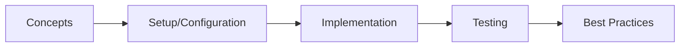

# Chapter 44: Project Reactor & Reactive Streams

> **Previous:** [Distributed Tracing &amp; Observability](./43-tracing.md) | **Next:** [Spring WebFlux](./45-webflux.md)

## Learning Objectives

<!-- Image Gallery -->
<section class="lesson-visuals" aria-label="Visual learning resources">
  <header><span>VISUAL LEARNING</span><h2>See it. Review it. Remember it.</h2></header>
  <a class="lesson-visual-card" href="../../../assets/images/lessons/java/44-reactor/.png" target="_blank" rel="noopener">
    
    <span><strong>Handwritten notes</strong>Condensed notes for deliberate review.</span>
  </a>
  <a class="lesson-visual-card" href="../../../assets/images/lessons/java/44-reactor/.png" target="_blank" rel="noopener">
    
    <span><strong>Sticky-note revision</strong>Fast recall prompts for revision.</span>
  </a>
  <a class="lesson-visual-card" href="../../../assets/images/lessons/java/44-reactor/.png" target="_blank" rel="noopener">
    
    <span><strong>Visual concept guide</strong>A connected explanation of the key ideas.</span>
  </a>
</section>
<!-- End Image Gallery -->

## Chapter at a Glance

| Topic | Key Insight | Practical Takeaway |
|-------|-------------|--------------------|
| Core Concepts | Foundational understanding | Real-world application |
| Implementation | Code-first approach | Working examples |
| Best Practices | Production patterns | Avoid common pitfalls |

## Chapter Roadmap




After completing this chapter, you will be able to:

- Explain the Reactive Streams specification and its four core interfaces
- Distinguish between imperative, reactive, and reactive-streams programming models
- Create and subscribe to Flux and Mono publishers
- Apply backpressure strategies to control data flow
- Use common operators for transformation, filtering, combination, and error handling
- Schedule work on appropriate thread pools with Schedulers
- Handle errors gracefully with fallbacks, retries, and error recovery operators
- Test reactive streams using StepVerifier, TestPublisher, and virtual time
- Build a complete reactive data pipeline integrating multiple operators
- Identify when reactive programming adds value vs. unnecessary complexity

## 1. The Reactive Manifesto and Why Reactive Matters

> **Pro Tip:** Test with production-like configurations → dev setups often hide issues that surface under real load.

> **Remember:** Start simple. Add complexity only when proven necessary. Premature abstraction creates maintenance burden.


### 1.1 The Problem with Blocking I/O


Traditional servlet-based applications dedicate one thread per request. When that thread reads from a database, calls a remote API, or writes to a file, it blocks → waiting idle while the underlying I/O completes. Under moderate load, thread pools saturate, new requests queue, and latency spirals.

Consider a typical Spring MVC endpoint that calls three downstream services:

```java
@RestController
public class OrderController {
    private final InventoryClient inventoryClient;
    private final PricingClient pricingClient;
    private final ShippingClient shippingClient;

    @GetMapping("/order/{id}/summary")
    public OrderSummary getOrderSummary(@PathVariable String id) {
        // Each call blocks the Tomcat thread
        InventoryInfo inv = inventoryClient.getInventory(id);    // 200ms
        PricingInfo prc = pricingClient.getPricing(id);          // 300ms
        ShippingInfo shp = shippingClient.getShipping(id);       // 150ms
        // Total: ~650ms sequential, thread blocked entire time
        return new OrderSummary(inv, prc, shp);
    }
}
```

Even with `CompletableFuture`, the thread-pool management and error handling become unwieldy at scale. Reactive programming offers a different model: declarative, asynchronous, non-blocking, and backpressure-aware.

### 1.2 The Reactive Streams Specification


Reactive Streams (www.reactive-streams.org) is a specification for asynchronous stream processing with non-blocking backpressure. It defines four interfaces:

| Interface | Role |
|-----------|------|
| `Publisher<T>` | Produces data items. Has a single method: `subscribe(Subscriber)`. |
| `Subscriber<T>` | Consumes data items. Receives `onSubscribe`, `onNext`, `onError`, `onComplete` callbacks. |
| `Subscription` | Links a Publisher to a Subscriber. Allows the subscriber to `request(n)` items and `cancel()`. |
| `Processor<T,R>` | Both a Publisher and Subscriber. Used for transformation stages in a chain. |

The contract is strict:
- `onNext` is never called after `onError` or `onComplete`
- `onSubscribe` is always called first and exactly once
- `request(n)` must be honored → the publisher sends at most n items before the next request
- The subscriber signals demand; the publisher never pushes without demand

### 1.3 Project Reactor


Project Reactor is the reactive library underpinning Spring WebFlux, R2DBC, and Spring Cloud Gateway. It implements the Reactive Streams specification and adds:

- **Flux\<T\>** → a publisher of 0..N items (potentially infinite)
- **Mono\<T\>** → a publisher of 0..1 items (completion or empty)
- **Rich operator set** → 500+ operators for transformation, filtering, combination, error handling, scheduling
- **Backpressure-aware** → all operators respect downstream demand
- **Testability** → `StepVerifier`, `TestPublisher`, `virtualTimeScheduler`
- **Context propagation** → `Context` API for threading metadata through operator chains

Both `Flux` and `Mono` implement `Publisher<T>` and are lazy → nothing happens until you subscribe.

## 2. Creating Publishers

### 2.1 Creating Flux Instances


```java
package com.reactor.creating;

import reactor.core.publisher.Flux;
import reactor.core.publisher.Mono;
import java.time.Duration;
import java.util.Arrays;
import java.util.List;

public class CreatingPublishers {

    // ---- Flux factories ----

    public static Flux<String> just() {
        return Flux.just("alpha", "beta", "gamma");
    }

    public static Flux<Integer> fromArray() {
        return Flux.fromArray(new Integer[]{1, 2, 3, 4, 5});
    }

    public static Flux<String> fromIterable() {
        List<String> list = Arrays.asList("a", "b", "c", "d", "e");
        return Flux.fromIterable(list);
    }

    public static Flux<Integer> range() {
        return Flux.range(1, 10);
    }

    public static Flux<Long> interval() {
        return Flux.interval(Duration.ofMillis(500)).take(5);
    }

    public static Flux<String> empty() {
        return Flux.empty();
    }

    public static Flux<String> error() {
        return Flux.error(new RuntimeException("Something went wrong"));
    }

    public static Flux<Integer> never() {
        return Flux.never();
    }

    public static Flux<Integer> generate() {
        return Flux.generate(
            () -> 0,
            (state, sink) -> {
                sink.next(state);
                if (state == 5) sink.complete();
                return state + 1;
            }
        );
    }

    public static Flux<String> create() {
        return Flux.create(sink -> {
            sink.next("request-1");
            sink.next("request-2");
            sink.next("request-3");
            sink.complete();
        });
    }

    public static Flux<String> defer() {
        return Flux.defer(() -> Flux.just("deferred-" + System.currentTimeMillis()));
    }

    // ---- Mono factories ----

    public static Mono<String> justMono() {
        return Mono.just("single value");
    }

    public static Mono<String> emptyMono() {
        return Mono.empty();
    }

    public static Mono<String> errorMono() {
        return Mono.error(new IllegalStateException("State invalid"));
    }

    public static Mono<String> fromCallable() {
        return Mono.fromCallable(() -> {
            Thread.sleep(100);
            return "from callable";
        });
    }

    public static Mono<String> fromSupplier() {
        return Mono.fromSupplier(() -> {
            double r = Math.random();
            return r > 0.5 ? "high" : "low";
        });
    }

    public static Mono<String> fromRunnable() {
        return Mono.fromRunnable(() -> {
            System.out.println("Side effect executed");
        }).then(Mono.just("done"));
    }

    public static void main(String[] args) {
        System.out.println("=== just ===");
        just().subscribe(v -> System.out.println("  " + v));

        System.out.println("=== fromArray ===");
        fromArray().subscribe(v -> System.out.println("  " + v));

        System.out.println("=== fromIterable ===");
        fromIterable().subscribe(v -> System.out.println("  " + v));

        System.out.println("=== range ===");
        range().subscribe(v -> System.out.println("  " + v));

        System.out.println("=== generate (stateful) ===");
        generate().subscribe(v -> System.out.println("  " + v));

        System.out.println("=== create ===");
        create().subscribe(v -> System.out.println("  " + v));

        System.out.println("=== defer (each subscribe gets fresh value) ===");
        Flux<String> deferred = defer();
        deferred.subscribe(v -> System.out.println("  sub1: " + v));
        deferred.subscribe(v -> System.out.println("  sub2: " + v));

        System.out.println("=== Mono ===");
        justMono().subscribe(v -> System.out.println("  " + v));
        emptyMono().subscribe(v -> System.out.println("  seen"), e -> {},
            () -> System.out.println("  completed empty"));
        fromSupplier().subscribe(v -> System.out.println("  " + v));
    }
}
```

### 2.2 Understanding Subscription Lifecycle


Every subscription follows this lifecycle:

```
subscribe()
    → onSubscribe(Subscription)
        → request(n)
            → onNext(item1)   (repeated n times or until complete/error)
            → onNext(item2)
            → ...
            → onComplete()  or  onError(Throwable)
```

Here is a low-level subscriber implementation that lets you control demand:

```java
package com.reactor.subscription;

import org.reactivestreams.Subscriber;
import org.reactivestreams.Subscription;
import reactor.core.publisher.Flux;

public class ManualSubscriberDemo {

    public static void main(String[] args) {
        Flux<Integer> publisher = Flux.range(1, 10);

        publisher.subscribe(new Subscriber<Integer>() {
            private Subscription subscription;
            private int requested = 0;
            private final int BATCH = 3;

            @Override
            public void onSubscribe(Subscription s) {
                this.subscription = s;
                System.out.println("Subscribed, requesting " + BATCH);
                subscription.request(BATCH);
            }

            @Override
            public void onNext(Integer item) {
                System.out.println("Received: " + item);
                requested++;
                if (requested >= BATCH) {
                    requested = 0;
                    System.out.println("Requesting next " + BATCH);
                    subscription.request(BATCH);
                }
            }

            @Override
            public void onError(Throwable t) {
                System.err.println("Error: " + t.getMessage());
            }

            @Override
            public void onComplete() {
                System.out.println("All items received");
            }
        });
    }
}
```

Output:
```
Subscribed, requesting 3
Received: 1
Received: 2
Received: 3
Requesting next 3
Received: 4
Received: 5
Received: 6
Requesting next 3
Received: 7
Received: 8
Received: 9
Requesting next 3
Received: 10
All items received
```

### 2.3 Lambda-Based Subscribers


Reactor provides overloaded `subscribe` methods that accept lambdas:

```java
Flux<Integer> flux = Flux.range(1, 5);

// Only consumer (no error or completion handling)
flux.subscribe(v -> System.out.println("Value: " + v));

// Consumer + error handler
flux.subscribe(
    v -> System.out.println("Value: " + v),
    e -> System.err.println("Error: " + e)
);

// Consumer + error + completion handler
flux.subscribe(
    v -> System.out.println("Value: " + v),
    e -> System.err.println("Error: " + e),
    () -> System.out.println("Done")
);

// Consumer + error + completion + subscription consumer
flux.subscribe(
    v -> System.out.println("Value: " + v),
    e -> System.err.println("Error: " + e),
    () -> System.out.println("Done"),
    s -> s.request(2)  // Only request 2 items
);
```

### 2.4 Disposable and Lifecycle Management


```java
package com.reactor.lifecycle;

import reactor.core.Disposable;
import reactor.core.publisher.Flux;
import java.time.Duration;
import java.util.concurrent.atomic.AtomicBoolean;

public class DisposableDemo {

    public static void main(String[] args) throws InterruptedException {
        // subscribe() returns a Disposable
        Disposable disposable = Flux.interval(Duration.ofMillis(200))
            .subscribe(v -> System.out.println("Tick: " + v));

        Thread.sleep(700);

        // Cancel the subscription
        disposable.dispose();
        System.out.println("Disposed: " + disposable.isDisposed());

        // Composite disposable for multiple subscriptions
        Disposable.Composite composite = Disposable.composite();

        composite.add(Flux.interval(Duration.ofMillis(300))
            .subscribe(v -> System.out.println("A: " + v)));
        composite.add(Flux.interval(Duration.ofMillis(400))
            .subscribe(v -> System.out.println("B: " + v)));

        Thread.sleep(900);
        composite.dispose();
        System.out.println("All disposed: " + composite.isDisposed());
    }
}
```

## 3. Core Operators

### 3.1 Transformation Operators


```java
package com.reactor.operators.transform;

import reactor.core.publisher.Flux;
import reactor.core.publisher.Mono;
import java.util.List;
import java.util.stream.Collectors;

public class TransformationOperators {

    public static void main(String[] args) {
        Flux<Integer> flux = Flux.range(1, 5);

        // map: 1-to-1 synchronous transformation
        flux.map(i -> i * 10)
            .subscribe(v -> System.out.println("map: " + v));

        // map with type change
        flux.map(i -> "Number-" + i)
            .subscribe(v -> System.out.println("map string: " + v));

        // flatMap: 1-to-N asynchronous transformation (inner publishers)
        flux.flatMap(i -> Flux.just(i, -i))
            .subscribe(v -> System.out.println("flatMap: " + v));

        // concatMap: like flatMap but preserves order (sequential)
        Flux.just("a", "b", "c")
            .concatMap(s -> Flux.just(s.toUpperCase(), s.toUpperCase() + s.toUpperCase()))
            .subscribe(v -> System.out.println("concatMap: " + v));

        // flatMapSequential: like flatMap but reorders results back to source order
        Flux.just(300, 100, 200)
            .flatMapSequential(delay -> Flux.just(delay)
                .delayElements(java.time.Duration.ofMillis(delay)))
            .subscribe(v -> System.out.println("flatMapSequential: " + v));

        // index: attach zero-based index to each element
        flux.index()
            .subscribe(t -> System.out.println("index: " + t.getT1() + " -> " + t.getT2()));

        // cast: cast each element to a target type
        Flux<Object> objects = Flux.just("a", "b", "c");
        objects.cast(String.class)
            .subscribe(v -> System.out.println("cast: " + v));

        // timestamp: attach current timestamp
        flux.timestamp()
            .subscribe(t -> System.out.println("timestamp: " + t.getT1() + " -> " + t.getT2()));

        // reduce: aggregate values to a single result
        flux.reduce(0, Integer::sum)
            .subscribe(v -> System.out.println("reduce sum: " + v));

        // scan: progressive accumulation (emit each intermediate value)
        flux.scan(0, (acc, next) -> acc + next)
            .subscribe(v -> System.out.println("scan: " + v));

        // collectList: collect all items into List
        flux.collectList()
            .subscribe(list -> System.out.println("collectList: " + list));

        // collectMap: collect into Map
        flux.collectMap(i -> "key-" + i)
            .subscribe(map -> System.out.println("collectMap: " + map));

        // then: ignore all items and emit after completion
        flux.then(Mono.just("done"))
            .subscribe(v -> System.out.println("then: " + v));

        // transform: compose operators on the generic flux
        flux.transform(f -> f.filter(i -> i % 2 == 0).map(i -> i * 100))
            .subscribe(v -> System.out.println("transform: " + v));
    }

    // ---- Realistic example ----

    record Order(String id, double amount) {}

    public static Flux<String> orderProcessingExample() {
        Flux<Order> orders = Flux.just(
            new Order("O001", 150.0),
            new Order("O002", 250.0),
            new Order("O003", 75.0)
        );

        return orders
            .filter(o -> o.amount() >= 100.0)
            .map(o -> new Order(o.id(), o.amount() * 1.1)) // 10% tax
            .sort((a, b) -> Double.compare(b.amount(), a.amount()))
            .map(o -> o.id() + " -> $" + String.format("%.2f", o.amount()));
    }
}
```

### 3.2 Filtering Operators


```java
package com.reactor.operators.filtering;

import reactor.core.publisher.Flux;
import java.time.Duration;

public class FilteringOperators {

    public static void main(String[] args) throws InterruptedException {
        Flux<Integer> flux = Flux.range(1, 20);

        // filter: keep matching items
        flux.filter(i -> i % 2 == 0)
            .subscribe(v -> System.out.println("filter even: " + v));

        // distinct: remove duplicates
        Flux.just(1, 2, 2, 3, 1, 4, 3, 5)
            .distinct()
            .subscribe(v -> System.out.println("distinct: " + v));

        // distinctUntilChanged: remove consecutive duplicates
        Flux.just(1, 1, 2, 2, 2, 3, 3, 1, 1)
            .distinctUntilChanged()
            .subscribe(v -> System.out.println("distinctUntilChanged: " + v));

        // take: take first N items
        flux.take(5)
            .subscribe(v -> System.out.println("take 5: " + v));

        // takeLast: take last N items
        flux.takeLast(3)
            .subscribe(v -> System.out.println("takeLast 3: " + v));

        // takeWhile: take while predicate is true
        flux.takeWhile(i -> i < 7)
            .subscribe(v -> System.out.println("takeWhile <7: " + v));

        // takeUntil: take until predicate is true (includes the matching item)
        flux.takeUntil(i -> i == 7)
            .subscribe(v -> System.out.println("takeUntil 7: " + v));

        // skip: skip first N items
        flux.skip(15)
            .subscribe(v -> System.out.println("skip 15: " + v));

        // skipLast: skip last N items
        flux.skipLast(5)
            .subscribe(v -> System.out.println("skipLast 5: " + v));

        // skipWhile: skip while predicate is true
        flux.skipWhile(i -> i < 10)
            .subscribe(v -> System.out.println("skipWhile <10: " + v));

        // elementAt: get element at index
        flux.elementAt(3)
            .subscribe(v -> System.out.println("elementAt 3: " + v));

        // single: expect exactly one item (error if 0 or >1)
        Flux.just(42)
            .single()
            .subscribe(v -> System.out.println("single: " + v));

        // next: take first item as Mono
        flux.next()
            .subscribe(v -> System.out.println("next: " + v));

        // ignoreElements: drop all items, emit completion
        flux.ignoreElements()
            .subscribe(v -> {}, e -> {}, () -> System.out.println("ignoreElements done"));

        // sample: emit the most recent item at periodic intervals
        Flux.interval(Duration.ofMillis(150))
            .sample(Duration.ofMillis(400))
            .take(3)
            .subscribe(v -> System.out.println("sample: " + v));

        Thread.sleep(2000);
    }
}
```

### 3.3 Combination Operators


```java
package com.reactor.operators.combination;

import reactor.core.publisher.Flux;
import reactor.core.publisher.Mono;
import java.time.Duration;

public class CombinationOperators {

    public static void main(String[] args) throws InterruptedException {
        Flux<Integer> f1 = Flux.just(1, 2, 3);
        Flux<Integer> f2 = Flux.just(4, 5, 6);
        Flux<Integer> f3 = Flux.just(7, 8, 9);

        // concat: sequential subscription (one after another)
        Flux.concat(f1, f2, f3)
            .subscribe(v -> System.out.println("concat: " + v));

        // concatWith: instance method version
        f1.concatWith(f2)
            .subscribe(v -> System.out.println("concatWith: " + v));

        // merge: interleaved subscription (all at once)
        Flux<Long> slow = Flux.interval(Duration.ofMillis(300)).take(3);
        Flux<Long> fast = Flux.interval(Duration.ofMillis(100)).take(5);

        Flux.merge(slow, fast)
            .subscribe(v -> System.out.println("merge: " + v));

        Thread.sleep(2000);

        // mergeSequential: merge but buffer and preserve source order
        Flux.mergeSequential(slow, fast)
            .subscribe(v -> System.out.println("mergeSequential: " + v));

        Thread.sleep(3000);

        // mergeDelayError: merge but delay errors until all sources complete
        Flux<Integer> err1 = Flux.just(1, 2, 3);
        Flux<Integer> err2 = Flux.just(4, 5, 6)
            .concatWith(Flux.error(new RuntimeException("boom")));
        Flux<Integer> err3 = Flux.just(7, 8, 9);

        Flux.mergeDelayError(2, err1, err2, err3)
            .subscribe(
                v -> System.out.println("mergeDelayError: " + v),
                e -> System.err.println("Final error: " + e.getMessage()),
                () -> System.out.println("Done (should not reach here)")
            );

        // zip: combine items pairwise (waits for all publishers)
        Flux<String> names = Flux.just("Alice", "Bob", "Charlie");
        Flux<Integer> ages = Flux.just(30, 25, 35);
        Flux<String> cities = Flux.just("NYC", "LA", "Chicago");

        Flux.zip(names, ages, cities)
            .map(t -> t.getT1() + " is " + t.getT2() + " from " + t.getT3())
            .subscribe(v -> System.out.println("zip: " + v));

        // zipWith: instance method version
        names.zipWith(ages, (name, age) -> name + " (" + age + ")")
            .subscribe(v -> System.out.println("zipWith: " + v));

        // combineLatest: emit when any source emits the latest from each
        Flux.combineLatest(
            Flux.interval(Duration.ofMillis(200)).map(i -> "A" + i),
            Flux.interval(Duration.ofMillis(300)).map(i -> "B" + i),
            (a, b) -> a + "+" + b
        ).take(5)
        .subscribe(v -> System.out.println("combineLatest: " + v));

        Thread.sleep(2000);

        // firstWithValue: emit from the first publisher that produces a value
        Flux.firstWithValue(
            Flux.just(1, 2, 3).delayElements(Duration.ofMillis(300)),
            Flux.just(10, 20).delayElements(Duration.ofMillis(100))
        ).subscribe(v -> System.out.println("firstWithValue: " + v));

        Thread.sleep(500);
    }
}
```

### 3.4 Conditional Operators


```java
package com.reactor.operators.conditional;

import reactor.core.publisher.Flux;
import reactor.core.publisher.Mono;

public class ConditionalOperators {

    public static void main(String[] args) {
        Flux<Integer> flux = Flux.range(1, 10);

        // all: check if all items match predicate
        flux.all(i -> i > 0)
            .subscribe(v -> System.out.println("all > 0: " + v));

        flux.all(i -> i > 5)
            .subscribe(v -> System.out.println("all > 5: " + v));

        // any: check if any item matches predicate
        flux.any(i -> i == 7)
            .subscribe(v -> System.out.println("any == 7: " + v));

        flux.any(i -> i == 99)
            .subscribe(v -> System.out.println("any == 99: " + v));

        // hasElements: check if flux has at least one element
        flux.hasElements()
            .subscribe(v -> System.out.println("hasElements: " + v));

        Flux.empty()
            .hasElements()
            .subscribe(v -> System.out.println("empty hasElements: " + v));

        // hasElement: check for specific element
        flux.hasElement(5)
            .subscribe(v -> System.out.println("hasElement 5: " + v));

        // defaultIfEmpty: provide fallback if flux is empty
        Flux.empty()
            .defaultIfEmpty("fallback")
            .subscribe(v -> System.out.println("defaultIfEmpty: " + v));

        // switchIfEmpty: switch to another publisher if empty
        Flux.empty()
            .switchIfEmpty(Flux.just("switch-1", "switch-2"))
            .subscribe(v -> System.out.println("switchIfEmpty: " + v));

        // sequenceEqual: check if two publishers emit identical sequences
        Flux.sequenceEqual(Flux.just(1, 2, 3), Flux.just(1, 2, 3))
            .subscribe(v -> System.out.println("sequenceEqual equal: " + v));

        Flux.sequenceEqual(Flux.just(1, 2, 3), Flux.just(1, 4, 3))
            .subscribe(v -> System.out.println("sequenceEqual diff: " + v));
    }
}
```

### 3.5 Mathematical and Aggregating Operators


```java
package com.reactor.operators.math;

import reactor.core.publisher.Flux;
import java.util.Comparator;

public class AggregatingOperators {

    public static void main(String[] args) {
        Flux<Integer> flux = Flux.range(1, 10);

        // count: count items
        flux.count()
            .subscribe(v -> System.out.println("count: " + v));

        // sum (via reduce)
        flux.reduce(0, Integer::sum)
            .subscribe(v -> System.out.println("sum: " + v));

        // average (via collectAndMap or custom reduce)
        flux.collectAndMap(
            () -> new int[]{0, 0},
            (acc, val) -> { acc[0] += val; acc[1]++; return acc; },
            acc -> (double) acc[0] / acc[1]
        ).subscribe(v -> System.out.println("average: " + v));

        // min
        flux.collectList()
            .map(list -> list.stream().min(Comparator.naturalOrder()).orElse(0))
            .subscribe(v -> System.out.println("min: " + v));

        // max
        flux.collectList()
            .map(list -> list.stream().max(Comparator.naturalOrder()).orElse(0))
            .subscribe(v -> System.out.println("max: " + v));

        // sort: sort items and emit
        Flux.just(5, 3, 1, 4, 2)
            .sort()
            .subscribe(v -> System.out.println("sorted: " + v));

        // sort with comparator
        Flux.just("aaa", "b", "ccccc", "dd")
            .sort(Comparator.comparingInt(String::length))
            .subscribe(v -> System.out.println("sorted by length: " + v));

        // groupBy: group items by key
        Flux.range(1, 10)
            .groupBy(i -> i % 2 == 0 ? "even" : "odd")
            .flatMap(group -> group.collectList().map(list -> group.key() + ": " + list))
            .subscribe(v -> System.out.println("groupBy: " + v));

        // buffer: collect items into batches
        Flux.range(1, 10)
            .buffer(3)
            .subscribe(v -> System.out.println("buffer(3): " + v));

        // buffer with duration
        // window: like buffer but emits Fluxes instead of Lists
        Flux.range(1, 10)
            .window(3)
            .flatMap(window -> window.collectList())
            .subscribe(v -> System.out.println("window(3): " + v));
    }
}
```

## 4. Backpressure

### 4.1 What Is Backpressure?


Backpressure is the mechanism by which a downstream subscriber signals to an upstream publisher how much data it can handle. Without backpressure, a fast publisher can overwhelm a slow subscriber, causing unbounded memory growth and eventual OutOfMemoryError.

Reactor's backpressure model is **pull-based**: the subscriber controls the pace by calling `request(n)`. Every operator in the chain respects this protocol.

```java
package com.reactor.backpressure;

import reactor.core.publisher.Flux;
import reactor.core.scheduler.Schedulers;
import java.time.Duration;

public class BackpressureDemo {

    public static void main(String[] args) throws InterruptedException {
        // Fast publisher, slow subscriber → demonstrates backpressure
        Flux.range(1, 1_000_000)
            .log()
            .subscribeOn(Schedulers.parallel())
            .publishOn(Schedulers.boundedElastic())
            .map(i -> {
                // Simulate processing work
                try { Thread.sleep(1); } catch (InterruptedException e) {}
                return "Processed: " + i;
            })
            .subscribe(
                v -> System.out.println(v),
                e -> System.err.println("Error: " + e),
                () -> System.out.println("Done")
            );

        Thread.sleep(5000);
    }
}
```

### 4.2 Backpressure Strategies


Reactor provides several strategies via `Flux.onBackpressureXxx()` operators:

```java
package com.reactor.backpressure.strategies;

import reactor.core.publisher.Flux;
import reactor.core.scheduler.Schedulers;
import java.time.Duration;

public class BackpressureStrategies {

    public static void main(String[] args) throws InterruptedException {
        // Strategy 1: BUFFER → buffer unbounded (default, can cause OOM)
        Flux.interval(Duration.ofMillis(1))
            .onBackpressureBuffer(1000, v -> System.out.println("Dropped: " + v))
            .publishOn(Schedulers.boundedElastic())
            .subscribe(v -> {
                Thread.sleep(10);
                System.out.println("BUFFER consumed: " + v);
            });

        Thread.sleep(3000);

        // Strategy 2: DROP → drop items when downstream can't keep up
        Flux.interval(Duration.ofMillis(1))
            .onBackpressureDrop(v -> System.out.println("DROP: " + v))
            .publishOn(Schedulers.boundedElastic())
            .subscribe(v -> {
                Thread.sleep(10);
                System.out.println("DROP consumed: " + v);
            });

        Thread.sleep(3000);

        // Strategy 3: LATEST → keep only the latest value
        Flux.interval(Duration.ofMillis(1))
            .onBackpressureLatest()
            .publishOn(Schedulers.boundedElastic())
            .subscribe(v -> {
                Thread.sleep(10);
                System.out.println("LATEST consumed: " + v);
            });

        Thread.sleep(3000);

        // Strategy 4: ERROR → throw OverflowException if downstream can't keep up
        Flux.interval(Duration.ofMillis(1))
            .onBackpressureError()
            .publishOn(Schedulers.boundedElastic())
            .subscribe(
                v -> {
                    Thread.sleep(10);
                    System.out.println("ERROR consumed: " + v);
                },
                e -> System.err.println("ERROR strategy triggered: " + e.getMessage())
            );

        Thread.sleep(3000);
    }
}
```

### 4.3 Manual Request Control


For fine-grained control, use `limitRate` to chunk upstream demand:

```java
package com.reactor.backpressure.manual;

import reactor.core.publisher.Flux;

public class LimitRateDemo {

    public static void main(String[] args) {
        // limitRate: request in batches of N, with a "replenish" threshold
        Flux.range(1, 100)
            .log("limitRate")
            .limitRate(10, 8)  // request 10, re-request when 8 have been consumed
            .subscribe(v -> {
                System.out.println("Value: " + v);
                // Simulate slow processing
                try { Thread.sleep(50); } catch (InterruptedException e) {}
            });
    }
}
```

## 5. Schedulers and Concurrency

### 5.1 The Schedulers Abstraction


Reactor operators execute on the calling thread by default. To shift work to different thread pools, use `publishOn` (for downstream operators) and `subscribeOn` (for upstream operators including the source).

| Scheduler | Description |
|-----------|-------------|
| `Schedulers.immediate()` | Execute on the current thread (no context switch) |
| `Schedulers.single()` | Single reusable thread |
| `Schedulers.parallel()` | Fixed pool sized to `Runtime.availableProcessors()` for CPU-bound work |
| `Schedulers.boundedElastic()` | Elastic pool for blocking I/O (bounded to avoid thread starvation) |
| `Schedulers.newParallel("custom", n)` | Create a custom scheduler with N threads |
| `Schedulers.fromExecutorService(exec)` | Wrap an existing ExecutorService |

### 5.2 publishOn vs subscribeOn


```java
package com.reactor.schedulers;

import reactor.core.publisher.Flux;
import reactor.core.scheduler.Schedulers;

public class PublishOnSubscribeOn {

    public static void main(String[] args) throws InterruptedException {
        System.out.println("Main thread: " + Thread.currentThread().getName());

        // subscribeOn affects the source subscription thread
        // publishOn affects all downstream operators from that point

        Flux.range(1, 5)
            .map(i -> {
                System.out.println("map1 on: " + Thread.currentThread().getName());
                return i * 10;
            })
            .publishOn(Schedulers.boundedElastic())
            .map(i -> {
                System.out.println("map2 on: " + Thread.currentThread().getName());
                return "Value: " + i;
            })
            .publishOn(Schedulers.parallel())
            .map(s -> {
                System.out.println("map3 on: " + Thread.currentThread().getName());
                return s + "!";
            })
            .subscribeOn(Schedulers.single())
            .subscribe(v -> System.out.println("Received on: " + Thread.currentThread().getName() + " -> " + v));

        Thread.sleep(1000);

        // Example: using boudedElastic for blocking operations
        System.out.println("\n--- Blocking I/O example ---");
        Flux.range(1, 3)
            .subscribeOn(Schedulers.boundedElastic())
            .flatMap(i -> Flux.just(blockingDatabaseCall(i)))
            .subscribe(v -> System.out.println("DB result: " + v));

        Thread.sleep(1000);

        // Example: parallel for CPU-bound work
        System.out.println("\n--- CPU-bound parallel example ---");
        Flux.range(1, 10)
            .parallel()
            .runOn(Schedulers.parallel())
            .map(i -> heavyComputation(i))
            .sequential()
            .subscribe(v -> System.out.println("Computed: " + v));

        Thread.sleep(2000);
    }

    private static String blockingDatabaseCall(int id) {
        try { Thread.sleep(200); } catch (InterruptedException e) {}
        return "Result for id=" + id + " on " + Thread.currentThread().getName();
    }

    private static int heavyComputation(int input) {
        // Simulate CPU-bound work
        double result = 0;
        for (int i = 0; i < 1_000_000; i++) {
            result += Math.sin(input * Math.PI / 180.0);
        }
        return (int) result;
    }
}
```

### 5.3 Parallel and FlatMap with Concurrency


```java
package com.reactor.schedulers.parallel;

import reactor.core.publisher.Flux;
import reactor.core.scheduler.Schedulers;
import java.time.Duration;
import java.time.Instant;

public class ParallelExecution {

    public static void main(String[] args) throws InterruptedException {
        // Sequential flatMap → one at a time
        Instant start = Instant.now();
        Flux.range(1, 5)
            .flatMap(i -> simulateExternalCall(i, 200))
            .subscribe(v -> System.out.println("Sequential: " + v));
        Thread.sleep(2000);
        System.out.println("Sequential took: " +
            Duration.between(start, Instant.now()).toMillis() + "ms\n");

        // Parallel flatMap → up to 4 concurrent
        start = Instant.now();
        Flux.range(1, 12)
            .flatMap(i -> simulateExternalCall(i, 200)
                .subscribeOn(Schedulers.boundedElastic()), 4) // concurrency = 4
            .subscribe(v -> System.out.println("Parallel(4): " + v));
        Thread.sleep(3000);
        System.out.println("Parallel(4) took: " +
            Duration.between(start, Instant.now()).toMillis() + "ms\n");

        // Parallel flatMap → unlimited concurrency
        start = Instant.now();
        Flux.range(1, 12)
            .flatMap(i -> simulateExternalCall(i, 200)
                .subscribeOn(Schedulers.boundedElastic()))
            .subscribe(v -> System.out.println("Parallel(unbounded): " + v));
        Thread.sleep(2000);
        System.out.println("Parallel(unbounded) took: " +
            Duration.between(start, Instant.now()).toMillis() + "ms\n");

        // ParallelFlux → for CPU-bound parallel processing
        start = Instant.now();
        Flux.range(1, 1_000_000)
            .parallel(4)
            .runOn(Schedulers.parallel())
            .map(i -> i * 2)
            .sequential()
            .count()
            .subscribe(count -> System.out.println("ParallelFlux processed: " + count));
    }

    private static Flux<String> simulateExternalCall(int id, int delayMs) {
        return Flux.just("Response-" + id + " on " + Thread.currentThread().getName())
            .delayElements(Duration.ofMillis(delayMs));
    }
}
```

## 6. Error Handling

Reactive error handling uses operators rather than try-catch. Errors flow through the operator chain via the `onError` signal, terminating the stream unless intercepted.

```java
package com.reactor.errors;

import reactor.core.publisher.Flux;
import reactor.core.publisher.Mono;
import java.time.Duration;

public class ErrorHandlingOperators {

    public static void main(String[] args) throws InterruptedException {
        Flux<Integer> failingFlux = Flux.just(1, 2, 3, 0, 5)
            .map(i -> 100 / i);  // ArithmeticException on 0

        // onErrorReturn: return a fallback value on error
        failingFlux
            .onErrorReturn(-1)
            .subscribe(v -> System.out.println("onErrorReturn: " + v));

        // onErrorResume: switch to a fallback publisher on error
        failingFlux
            .onErrorResume(e -> Flux.just(10, 20, 30))
            .subscribe(v -> System.out.println("onErrorResume: " + v));

        // onErrorComplete: swallow error and complete
        failingFlux
            .onErrorComplete()
            .subscribe(v -> System.out.println("onErrorComplete: " + v),
                e -> {},
                () -> System.out.println("onErrorComplete done"));

        // onErrorContinue: skip the errored item and continue with the next
        Flux.just(1, 2, 3, 0, 5, 0, 7)
            .map(i -> 100 / i)
            .onErrorContinue((error, item) ->
                System.err.println("Skipping item " + item + ": " + error.getMessage()))
            .subscribe(v -> System.out.println("onErrorContinue: " + v));

        // retry: retry the entire sequence on error
        Flux.just("valid", "valid", "invalid")
            .flatMap(s -> validateAndProcess(s)
                .retry(2)  // retry on error up to 2 additional attempts
                .onErrorReturn("fallback"))
            .subscribe(v -> System.out.println("retry: " + v));

        // retryWhen: retry with backoff
        Flux.just("data")
            .flatMap(s -> failingServiceCall(s)
                .retryWhen(reactor.util.retry.Retry.backoff(3, Duration.ofMillis(100))
                    .maxBackoff(Duration.ofSeconds(2))
                    .jitter(0.5))
                .onErrorReturn("ultimate fallback"))
            .subscribe(v -> System.out.println("retryWhen: " + v));

        Thread.sleep(2000);

        // doOnError: side effect on error without catching
        Flux.just(1, 0)
            .map(i -> 10 / i)
            .doOnError(e -> System.err.println("Logging error: " + e.getMessage()))
            .onErrorReturn(-1)
            .subscribe(v -> System.out.println("doOnError example: " + v));

        // timeout: error if no signal within duration
        Flux.interval(Duration.ofSeconds(2))
            .timeout(Duration.ofSeconds(1))
            .onErrorResume(e -> Flux.just(-999L))
            .subscribe(v -> System.out.println("timeout: " + v));

        Thread.sleep(3000);
    }

    private static Flux<String> validateAndProcess(String input) {
        if ("invalid".equals(input)) {
            return Flux.error(new IllegalArgumentException("Invalid input"));
        }
        return Flux.just("Processed: " + input);
    }

    private static int attempt = 0;

    private static Flux<String> failingServiceCall(String input) {
        attempt++;
        System.out.println("  Attempt #" + attempt);
        if (attempt < 4) {
            return Flux.error(new RuntimeException("Service unavailable"));
        }
        return Flux.just("Success after " + attempt + " attempts");
    }
}
```

### 6.1 Fallback Patterns for Mono


```java
package com.reactor.errors.fallback;

import reactor.core.publisher.Mono;

public class MonoFallbackPatterns {

    public static void main(String[] args) {
        Mono<String> riskyCall = Mono.error(new RuntimeException("DB timeout"));

        // Pattern 1: Fallback value
        String result1 = riskyCall
            .onErrorReturn("cached-value")
            .block();
        System.out.println("Pattern 1: " + result1);

        // Pattern 2: Fallback from another source
        String result2 = riskyCall
            .onErrorResume(e -> Mono.just("from-secondary-db"))
            .block();
        System.out.println("Pattern 2: " + result2);

        // Pattern 3: Empty on error
        String result3 = riskyCall
            .onErrorResume(e -> Mono.empty())
            .defaultIfEmpty("default-empty")
            .block();
        System.out.println("Pattern 3: " + result3);

        // Pattern 4: Recover and transform error
        String result4 = riskyCall
            .onErrorMap(e -> new BusinessException("Recoverable", e))
            .onErrorReturn("after-mapping")
            .block();
        System.out.println("Pattern 4: " + result4);

        // Pattern 5: Retry with exponential backoff
        String result5 = callThatFailsFirstTwoTimes()
            .retry(3)
            .onErrorReturn("still-failed-after-retry")
            .block();
        System.out.println("Pattern 5: " + result5);
    }

    private static int counter = 0;

    private static Mono<String> callThatFailsFirstTwoTimes() {
        return Mono.fromCallable(() -> {
            counter++;
            if (counter <= 2) {
                throw new RuntimeException("Attempt " + counter + " failed");
            }
            return "success-on-attempt-" + counter;
        });
    }

    static class BusinessException extends RuntimeException {
        public BusinessException(String message, Throwable cause) {
            super(message, cause);
        }
    }
}
```

## 7. Hooks and Side Effects

```java
package com.reactor.sideeffects;

import reactor.core.publisher.Flux;
import reactor.core.publisher.Mono;
import java.util.concurrent.atomic.AtomicInteger;

public class SideEffectOperators {

    public static void main(String[] args) {
        Flux<Integer> flux = Flux.range(1, 5);
        AtomicInteger counter = new AtomicInteger();

        // doOnSubscribe: called when subscription happens
        // doOnRequest: called when demand is signaled
        // doOnNext: called for each item before downstream
        // doOnError: called on error
        // doOnComplete: called on successful completion
        // doOnCancel: called on cancellation
        // doOnTerminate: called on error or completion
        // doAfterTerminate: called after terminal signal is delivered
        // doFinally: called regardless (terminal or cancel)
        // doOnEach: called for each signal (onNext, onError, onComplete)
        // doOnDiscard: called for items that are dropped

        flux
            .doOnSubscribe(s -> System.out.println("doOnSubscribe"))
            .doOnRequest(n -> System.out.println("doOnRequest: " + n))
            .doOnNext(v -> System.out.println("doOnNext: " + v))
            .doOnError(e -> System.out.println("doOnError: " + e.getMessage()))
            .doOnComplete(() -> System.out.println("doOnComplete"))
            .doOnTerminate(() -> System.out.println("doOnTerminate"))
            .doAfterTerminate(() -> System.out.println("doAfterTerminate"))
            .doFinally(signalType -> System.out.println("doFinally: " + signalType))
            .doOnEach(signal -> {
                if (signal.isOnNext()) {
                    counter.incrementAndGet();
                }
            })
            .subscribe(v -> System.out.println("  received: " + v));

        System.out.println("\nTotal onNext signals: " + counter.get());

        // log: comprehensive logging of all signals
        System.out.println("\n--- log() example ---");
        Flux.range(1, 3)
            .log("my.flux.logger")
            .subscribe(v -> System.out.println("  got: " + v));
    }
}
```

## 8. Context Propagation

Reactor's `Context` is an immutable map that propagates through the operator chain, similar to a `ThreadLocal` but safe in reactive pipelines where work can hop between threads.

```java
package com.reactor.context;

import reactor.core.publisher.Mono;
import reactor.util.context.Context;
import java.util.UUID;

public class ContextPropagation {

    public static void main(String[] args) {
        // contextWrite: write values into the context
        // deferContext: read values from the context

        Mono<String> withContext = Mono.deferContextual(ctx -> {
            String correlationId = ctx.getOrDefault("correlationId", "unknown");
            String userId = ctx.getOrDefault("userId", "anonymous");
            return Mono.just("Processing request " + correlationId + " for user " + userId);
        });

        // Attach context - note: contextWrite is evaluated upstream (bottom-first)
        withContext
            .contextWrite(Context.of("correlationId", UUID.randomUUID().toString()))
            .contextWrite(Context.of("userId", "user-42"))
            .subscribe(v -> System.out.println("Result: " + v));

        // Realistic example: trace ID propagation through service calls
        Mono<String> serviceCall = Mono.deferContextual(ctx -> {
            String traceId = ctx.get("traceId");
            System.out.println("[Service] Using traceId: " + traceId);
            return Mono.just("Service response with traceId=" + traceId);
        });

        Mono<String> controller = Mono.deferContextual(ctx -> {
            String traceId = ctx.get("traceId");
            System.out.println("[Controller] traceId: " + traceId);
            return serviceCall;
        });

        controller
            .contextWrite(Context.of("traceId", "trace-" + System.currentTimeMillis()))
            .subscribe(v -> System.out.println("Final: " + v));
    }
}
```

## 9. Testing Reactive Streams

### 9.1 StepVerifier


```java
package com.reactor.testing;

import org.junit.jupiter.api.Test;
import reactor.core.publisher.Flux;
import reactor.core.publisher.Mono;
import reactor.test.StepVerifier;
import reactor.test.publisher.TestPublisher;
import java.time.Duration;

class StepVerifierTests {

    @Test
    void testSimpleFlux() {
        Flux<String> flux = Flux.just("alpha", "beta", "gamma");

        StepVerifier.create(flux)
            .expectNext("alpha")
            .expectNext("beta")
            .expectNext("gamma")
            .expectComplete()
            .verify();
    }

    @Test
    void testFluxWithCount() {
        Flux<Integer> flux = Flux.range(1, 100);

        StepVerifier.create(flux)
            .expectNextCount(100)
            .expectComplete()
            .verify();
    }

    @Test
    void testErrorScenario() {
        Flux<Integer> flux = Flux.just(1, 2, 3)
            .concatWith(Flux.error(new RuntimeException("Boom")));

        StepVerifier.create(flux)
            .expectNext(1, 2, 3)
            .expectErrorMessage("Boom")
            .verify();
    }

    @Test
    void testErrorWithType() {
        Flux<Integer> flux = Flux.just(10, 20)
            .map(i -> 100 / (i - 10));  // Division by zero on second

        StepVerifier.create(flux)
            .expectNext(10)
            .expectError(ArithmeticException.class)
            .verify();
    }

    @Test
    void testThenAssert() {
        Flux<Integer> flux = Flux.range(1, 5)
            .map(i -> i * 2);

        StepVerifier.create(flux)
            .expectNext(2, 4, 6)
            .expectNextMatches(v -> v == 8 || v == 10)
            .consumeNextWith(v -> {
                assert v == 10 : "Expected 10 but got " + v;
            })
            .expectComplete()
            .verify();
    }

    @Test
    void testVirtualTime() {
        // Virtual time allows testing time-based operators without real delays
        StepVerifier.withVirtualTime(() ->
                Flux.interval(Duration.ofDays(1)).take(3))
            .expectSubscription()
            .thenAwait(Duration.ofDays(3))
            .expectNext(0L, 1L, 2L)
            .expectComplete()
            .verify();
    }

    @Test
    void testVirtualTimeWithAdvance() {
        StepVerifier.withVirtualTime(() ->
                Flux.interval(Duration.ofHours(1)).take(5))
            .expectSubscription()
            .expectNoEvent(Duration.ofHours(1))
            .thenAwait(Duration.ofHours(4))
            .expectNext(0L, 1L, 2L, 3L, 4L)
            .expectComplete()
            .verify();
    }

    @Test
    void testRecordedAssertions() {
        Flux<String> flux = Flux.just("apple", "banana", "avocado", "cherry", "apricot");

        StepVerifier.create(flux)
            .recordWith(java.util.ArrayList::new)
            .expectNextCount(5)
            .consumeRecordedWith(list -> {
                assert list.size() == 5;
                assert list.stream().allMatch(s -> s.length() > 3);
                assert list.stream().filter(s -> s.startsWith("a")).count() == 3;
            })
            .expectComplete()
            .verify();
    }

    @Test
    void testThenCancel() {
        Flux<Long> infinite = Flux.interval(Duration.ofMillis(100));

        StepVerifier.create(infinite)
            .expectNext(0L)
            .expectNext(1L)
            .thenCancel()
            .verify();
    }
}
```

### 9.2 TestPublisher


```java
package com.reactor.testing.publisher;

import org.junit.jupiter.api.Test;
import reactor.core.publisher.Flux;
import reactor.test.StepVerifier;
import reactor.test.publisher.TestPublisher;

class TestPublisherTests {

    @Test
    void testCompliantPublisher() {
        TestPublisher<String> publisher = TestPublisher.create();

        // Probe that the publisher is well-behaved
        publisher.assertWasNotCancelled();
        publisher.assertNoRequestOverflow();

        publisher.next("a", "b");
        publisher.next("c");
        publisher.complete();

        StepVerifier.create(publisher.flux())
            .expectNext("a", "b", "c")
            .expectComplete()
            .verify();
    }

    @Test
    void testNonCompliantPublisher() {
        // Create a publisher that allows violating the reactive streams spec
        TestPublisher<String> publisher = TestPublisher.createNoncompliant(
            TestPublisher.Violation.ALLOW_NULL
        );

        publisher.next("valid");
        publisher.next(null);  // Would fail with compliant publisher
        publisher.complete();

        StepVerifier.create(publisher.flux())
            .expectNext("valid")
            .expectNext((String) null)
            .expectComplete()
            .verify();
    }

    @Test
    void testConditionalEmission() {
        TestPublisher<Integer> publisher = TestPublisher.create();

        Flux<Integer> processed = publisher.flux()
            .filter(i -> i > 0)
            .map(i -> i * 10);

        StepVerifier.create(processed)
            .then(() -> publisher.next(5))
            .expectNext(50)
            .then(() -> publisher.next(-1))  // filtered out
            .then(() -> publisher.next(3))
            .expectNext(30)
            .then(publisher::complete)
            .expectComplete()
            .verify();
    }

    @Test
    void testErrorEmission() {
        TestPublisher<String> publisher = TestPublisher.create();

        StepVerifier.create(publisher.flux()
                .map(String::toUpperCase))
            .then(() -> publisher.next("hello"))
            .expectNext("HELLO")
            .then(() -> publisher.error(new RuntimeException("network error")))
            .expectError(RuntimeException.class)
            .verify();
    }
}
```

### 9.3 Virtual Time Scheduler


```java
package com.reactor.testing.virtualtime;

import org.junit.jupiter.api.Test;
import reactor.core.publisher.Flux;
import reactor.core.publisher.Mono;
import reactor.test.StepVerifier;
import reactor.test.scheduler.VirtualTimeScheduler;
import reactor.core.scheduler.Schedulers;
import java.time.Duration;

class VirtualTimeSchedulerTests {

    @Test
    void testIntervalWithVirtualTime() {
        VirtualTimeScheduler.getOrSet();

        Flux<Long> interval = Flux.interval(Duration.ofSeconds(1)).take(5);

        StepVerifier.withVirtualTime(() -> interval)
            .expectSubscription()
            .thenAwait(Duration.ofSeconds(5))
            .expectNext(0L, 1L, 2L, 3L, 4L)
            .expectComplete()
            .verify();
    }

    @Test
    void testTimeoutWithVirtualTime() {
        VirtualTimeScheduler.getOrSet();

        Mono<String> slow = Mono.delay(Duration.ofSeconds(5))
            .map(i -> "done");

        StepVerifier.create(slow.timeout(Duration.ofSeconds(3)))
            .expectError(java.util.concurrent.TimeoutException.class)
            .verify(Duration.ofSeconds(1));  // Real timeout for the test itself
    }

    @Test
    void testRetryBackoffWithVirtualTime() {
        VirtualTimeScheduler scheduler = VirtualTimeScheduler.getOrSet();

        Mono<String> failing = Mono.error(new RuntimeException("fail"));
        Mono<String> result = failing
            .retryWhen(reactor.util.retry.Retry.backoff(2, Duration.ofMillis(100))
                .scheduler(scheduler));

        StepVerifier.create(result)
            .expectError(RuntimeException.class)
            .verify(Duration.ofSeconds(1));
    }
}
```

## 10. Real-World Reactive Pipeline

```java
package com.reactor.pipeline;

import reactor.core.publisher.Flux;
import reactor.core.publisher.Mono;
import reactor.core.scheduler.Schedulers;
import reactor.util.retry.Retry;
import java.time.Duration;
import java.time.Instant;
import java.util.*;

public class ReactiveOrderPipeline {

    // ---- Domain objects ----

    record Order(String id, String customerId, double amount) {}
    record Customer(String id, String name, String tier) {}
    record Product(String id, String name, double price) {}
    record OrderSummary(String orderId, String customerName, double total, String status) {}

    // ---- Data sources (simulated) ----

    private static final Map<String, Customer> CUSTOMERS = Map.of(
        "C001", new Customer("C001", "Alice", "GOLD"),
        "C002", new Customer("C002", "Bob", "SILVER"),
        "C003", new Customer("C003", "Charlie", "REGULAR")
    );

    // ---- Service methods returning Mono/Flux ----

    private Mono<Customer> getCustomer(String customerId) {
        return Mono.fromCallable(() -> {
            Thread.sleep(100); // Simulate DB call
            Customer c = CUSTOMERS.get(customerId);
            if (c == null) throw new RuntimeException("Customer not found: " + customerId);
            return c;
        }).subscribeOn(Schedulers.boundedElastic());
    }

    private Mono<Double> applyDiscount(Customer customer, double amount) {
        return Mono.fromCallable(() -> {
            Thread.sleep(50); // Simulate rules engine
            return switch (customer.tier()) {
                case "GOLD" -> amount * 0.85;
                case "SILVER" -> amount * 0.95;
                default -> amount;
            };
        }).subscribeOn(Schedulers.boundedElastic());
    }

    private Mono<Boolean> validateFraud(String customerId, double amount) {
        return Mono.fromCallable(() -> {
            Thread.sleep(80); // Simulate fraud check
            if (amount > 10_000) {
                System.out.println("  [FRAUD] Flagged: " + customerId + " amount=" + amount);
                return false;
            }
            return true;
        }).subscribeOn(Schedulers.boundedElastic());
    }

    private Mono<String> submitToERP(String orderId, double finalAmount) {
        return Mono.fromCallable(() -> {
            Thread.sleep(150); // Simulate ERP integration
            return "ERP_CONFIRMED_" + orderId;
        }).subscribeOn(Schedulers.boundedElastic())
        .retryWhen(Retry.backoff(2, Duration.ofMillis(100))
            .maxBackoff(Duration.ofMillis(500)));
    }

    private Mono<Void> sendNotification(String customerId, String message) {
        return Mono.fromRunnable(() -> {
            System.out.println("  [NOTIFICATION] To " + customerId + ": " + message);
        }).subscribeOn(Schedulers.boundedElastic())
        .then();
    }

    // ---- Composed pipeline ----

    public Mono<OrderSummary> processOrder(Order order) {
        Instant start = Instant.now();

        return Mono.just(order)
            .flatMap(o ->
                // Parallel: fetch customer and check fraud simultaneously
                Mono.zip(
                    getCustomer(o.customerId()),
                    applyDiscount(null, o.amount()), // We'll replace this
                    validateFraud(o.customerId(), o.amount())
                )
            )
            .flatMap(tuple -> {
                // For discount we need the actual customer, not null
                return getCustomer(order.customerId())
                    .flatMap(customer -> applyDiscount(customer, order.amount())
                        .map(discounted -> new Object[]{customer, discounted, tuple.getT3()}));
            })
            .flatMap(data -> {
                Customer customer = (Customer) data[0];
                Double discounted = (Double) data[1];
                Boolean fraudOk = (Boolean) data[2];

                if (!fraudOk) {
                    return Mono.error(new RuntimeException("Fraud check failed for order " + order.id()));
                }

                return submitToERP(order.id(), discounted)
                    .flatMap(erpRef -> sendNotification(order.customerId(),
                            "Order " + order.id() + " confirmed. Total: $" + String.format("%.2f", discounted))
                        .thenReturn(new OrderSummary(order.id(), customer.name(), discounted, erpRef)));
            })
            .doOnSuccess(summary -> {
                long elapsed = Duration.between(start, Instant.now()).toMillis();
                System.out.println("  [Pipeline] Order " + order.id() + " processed in " + elapsed + "ms");
            })
            .doOnError(e -> System.err.println("  [Pipeline] Order " + order.id() + " failed: " + e.getMessage()))
            .timeout(Duration.ofSeconds(10));
    }

    // ---- Batch processing ----

    public Flux<OrderSummary> processOrders(List<Order> orders) {
        return Flux.fromIterable(orders)
            .flatMap(this::processOrder, 5) // Max 5 concurrent
            .onErrorContinue((e, order) ->
                System.err.println("Skipping failed order " + ((Order) order).id()));
    }

    // ---- Main ----

    public static void main(String[] args) throws InterruptedException {
        ReactiveOrderPipeline pipeline = new ReactiveOrderPipeline();

        List<Order> orders = Arrays.asList(
            new Order("ORD-001", "C001", 250.00),
            new Order("ORD-002", "C002", 5000.00),
            new Order("ORD-003", "C003", 150.00),
            new Order("ORD-004", "C001", 12000.00), // Fraud trigger
            new Order("ORD-005", "C002", 750.00)
        );

        System.out.println("=== Processing orders reactively ===\n");

        pipeline.processOrders(orders)
            .doOnComplete(() -> System.out.println("\n=== All orders processed ==="))
            .subscribe(
                summary -> System.out.println("Completed: " + summary),
                e -> System.err.println("Fatal: " + e.getMessage())
            );

        Thread.sleep(5000);
    }
}
```

## 11. Hot vs Cold Publishers

```java
package com.reactor.hotcold;

import reactor.core.publisher.ConnectableFlux;
import reactor.core.publisher.Flux;
import reactor.core.publisher.Sinks;
import java.time.Duration;

public class HotVsCold {

    public static void main(String[] args) throws InterruptedException {
        // ---- Cold Publisher: each subscriber gets its own stream ----
        System.out.println("=== Cold Publisher ===");
        Flux<Integer> coldFlux = Flux.range(1, 5)
            .delayElements(Duration.ofMillis(200))
            .map(i -> {
                System.out.println("  Generating: " + i);
                return i;
            });

        coldFlux.subscribe(v -> System.out.println("  Subscriber A: " + v));
        Thread.sleep(300);
        coldFlux.subscribe(v -> System.out.println("  Subscriber B: " + v));

        Thread.sleep(2000);

        // ---- Hot Publisher: all subscribers share the same stream ----
        System.out.println("\n=== Hot Publisher (ConnectableFlux) ===");
        Flux<Integer> hotSource = Flux.range(1, 10)
            .delayElements(Duration.ofMillis(100))
            .map(i -> {
                System.out.println("  Hot source: " + i);
                return i;
            });

        ConnectableFlux<Integer> hot = hotSource.publish();
        hot.connect(); // Start emitting

        Thread.sleep(250);
        System.out.println("  Subscriber C joins:");
        hot.subscribe(v -> System.out.println("  Subscriber C: " + v));

        Thread.sleep(300);
        System.out.println("  Subscriber D joins:");
        hot.subscribe(v -> System.out.println("  Subscriber D: " + v));

        Thread.sleep(1000);

        // ---- Sinks: programmatic hot publisher ----
        System.out.println("\n=== Sinks.Many (programmatic hot) ===");
        Sinks.Many<String> sink = Sinks.many().multicast().onBackpressureBuffer();

        Flux<String> sinkFlux = sink.asFlux();
        sinkFlux.subscribe(v -> System.out.println("  SinkSub A: " + v));
        sinkFlux.subscribe(v -> System.out.println("  SinkSub B: " + v));

        sink.tryEmitNext("event-1");
        sink.tryEmitNext("event-2");

        System.out.println("  Late subscriber joins:");
        sinkFlux.subscribe(v -> System.out.println("  SinkSub C (late): " + v));

        sink.tryEmitNext("event-3");
        sink.tryEmitComplete();

        // ---- Sinks.One: emit a single value (Mono) ----
        System.out.println("\n=== Sinks.One ===");
        Sinks.One<String> sinkOne = Sinks.one();
        sinkOne.asMono().subscribe(v -> System.out.println("  SinkOne: " + v));
        sinkOne.tryEmitValue("singleton");

        // ---- autoConnect: hot publisher that starts on first subscription ----
        System.out.println("\n=== autoConnect ===");
        Flux<String> autoHot = Flux.interval(Duration.ofMillis(100))
            .map(i -> "tick-" + i)
            .publish()
            .autoConnect(2); // Start when 2 subscribers have subscribed

        autoHot.subscribe(v -> System.out.println("  Auto A: " + v));
        Thread.sleep(150);
        autoHot.subscribe(v -> System.out.println("  Auto B: " + v)); // Now both subscribed

        Thread.sleep(500);

        // ---- Replay: cache and replay last N items ----
        System.out.println("\n=== Replay ===");
        Flux<String> replaySource = Flux.just("a", "b", "c", "d", "e");
        Flux<String> cached = replaySource.cache(3); // Replay last 3

        cached.subscribe(v -> System.out.println("  Replay A: " + v));
        System.out.println("  Replay late subscriber:");
        cached.subscribe(v -> System.out.println("  Replay B: " + v));
    }
}
```

## 12. Batching and Windowing

```java
package com.reactor.batching;

import reactor.core.publisher.Flux;
import reactor.core.publisher.Mono;
import java.time.Duration;
import java.util.List;

public class BatchingAndWindowing {

    public static void main(String[] args) throws InterruptedException {
        Flux<Integer> source = Flux.range(1, 20);

        // buffer: collect into lists
        System.out.println("=== buffer(5) ===");
        source.buffer(5)
            .subscribe(list -> System.out.println("  Batch: " + list));

        // buffer with skip: overlapping windows
        System.out.println("\n=== buffer(3, 2) [size=3, skip=2] ===");
        source.buffer(3, 2)
            .subscribe(list -> System.out.println("  Overlap: " + list));

        // buffer with duration
        System.out.println("\n=== buffer(Duration) ===");
        Flux.interval(Duration.ofMillis(100))
            .buffer(Duration.ofMillis(500))
            .take(4)
            .subscribe(list -> System.out.println("  Time batch: " + list));

        Thread.sleep(2500);

        // window: like buffer but emits Flux<List<T>> vs Flux<Flux<T>>
        System.out.println("\n=== window(3) ===");
        source.window(3)
            .flatMap(window -> window.collectList())
            .subscribe(list -> System.out.println("  Window: " + list));

        // groupBy: partition items
        System.out.println("\n=== groupBy ===");
        Flux.range(1, 10)
            .groupBy(i -> i % 3)
            .flatMap(group -> group.collectList()
                .map(list -> "Group " + group.key() + ": " + list))
            .subscribe(v -> System.out.println("  " + v));

        // Practical example: batch DB inserts
        System.out.println("\n=== Batch DB Insert ===");
        Flux.range(1, 100)
            .buffer(10)
            .flatMap(batch -> batchInsert(batch))
            .subscribe(count -> System.out.println("Inserted batch of " + count));

        Thread.sleep(1000);
    }

    private static Mono<Integer> batchInsert(List<Integer> items) {
        return Mono.fromCallable(() -> {
            System.out.println("  [DB] Inserting batch of " + items.size() + " items: " + items);
            Thread.sleep(200);
            return items.size();
        });
    }
}
```

## 13. Converting Between Reactive and Blocking

```java
package com.reactor.conversion;

import reactor.core.publisher.Flux;
import reactor.core.publisher.Mono;
import reactor.core.scheduler.Schedulers;
import java.util.List;
import java.util.Optional;

public class BlockingConversion {

    public static void main(String[] args) {
        // ---- Reactive to Blocking ----

        // block(): block until Mono emits
        String value = Mono.just("hello").block();
        System.out.println("block(): " + value);

        // block() with timeout
        String timed = Mono.just("world")
            .block(Duration.ofSeconds(5));
        System.out.println("block(Duration): " + timed);

        // blockFirst(): block until first Flux item
        Integer first = Flux.range(1, 100)
            .blockFirst();
        System.out.println("blockFirst(): " + first);

        // blockLast(): block until Flux completes
        Integer last = Flux.range(1, 100)
            .blockLast();
        System.out.println("blockLast(): " + last);

        // toIterable(): convert Flux to Iterable
        Iterable<Integer> iterable = Flux.range(1, 5)
            .toIterable();
        System.out.print("toIterable(): ");
        for (Integer i : iterable) {
            System.out.print(i + " ");
        }
        System.out.println();

        // toStream(): convert Flux to Stream
        List<Integer> list = Flux.range(1, 5)
            .toStream()
            .toList();
        System.out.println("toStream(): " + list);

        // ---- Blocking to Reactive ----

        // Mono.fromCallable: wrap blocking code
        Mono<String> fromBlocking = Mono.fromCallable(() -> {
            Thread.sleep(100);
            return "from blocking";
        }).subscribeOn(Schedulers.boundedElastic());
        fromBlocking.subscribe(v -> System.out.println("fromCallable: " + v));

        // Mono.fromSupplier: like fromCallable but no checked exception
        Mono<String> fromSupplier = Mono.fromSupplier(() -> {
            return "supplied on " + Thread.currentThread().getName();
        }).subscribeOn(Schedulers.boundedElastic());
        fromSupplier.subscribe(v -> System.out.println("fromSupplier: " + v));

        // Mono.fromFuture: wrap CompletableFuture
        Mono<String> fromFuture = Mono.fromFuture(
            java.util.concurrent.CompletableFuture.supplyAsync(() -> "from future")
        );
        fromFuture.subscribe(v -> System.out.println("fromFuture: " + v));

        // Flux.fromStream: wrap Stream
        Flux<Integer> fromStream = Flux.fromStream(
            java.util.stream.Stream.of(10, 20, 30, 40, 50)
        );
        fromStream.subscribe(v -> System.out.println("fromStream: " + v));

        // Mono.fromOptional
        Mono<String> fromOptional = Mono.fromOptional(Optional.of("optional value"));
        fromOptional.subscribe(v -> System.out.println("fromOptional: " + v));

        // Wait for async subscribe to complete
        try { Thread.sleep(500); } catch (InterruptedException e) {}
    }

    private static Duration ofSeconds(int i) {
        return Duration.ofSeconds(i);
    }
}
```

## 14. Performance Considerations

```java
package com.reactor.performance;

import reactor.core.publisher.Flux;
import reactor.core.scheduler.Schedulers;
import java.time.Duration;
import java.time.Instant;

public class PerformanceDemo {

    public static void main(String[] args) throws InterruptedException {
        int size = 1_000_000;

        // Sequential processing
        Instant start = Instant.now();
        Flux.range(1, size)
            .map(i -> i * 2)
            .filter(i -> i % 3 == 0)
            .count()
            .subscribe(count -> {
                long elapsed = Duration.between(start, Instant.now()).toMillis();
                System.out.println("Sequential: " + count + " items in " + elapsed + "ms");
            });

        Thread.sleep(5000);

        // Parallel processing
        start = Instant.now();
        Flux.range(1, size)
            .parallel(4)
            .runOn(Schedulers.parallel())
            .map(i -> i * 2)
            .filter(i -> i % 3 == 0)
            .sequential()
            .count()
            .subscribe(count -> {
                long elapsed = Duration.between(start, Instant.now()).toMillis();
                System.out.println("Parallel(4): " + count + " items in " + elapsed + "ms");
            });

        Thread.sleep(5000);

        // Fusion optimization: Flux.range has built-in fusion optimizations
        // Use .checkpoint() for debugging heavy operators
        // Avoid .log() in production (it's slow)

        // Buffer vs Window performance
        System.out.println("\n--- Buffer vs Window ---");
        start = Instant.now();
        Flux.range(1, 100_000)
            .buffer(1000)
            .count()
            .subscribe(c -> System.out.println("Buffer: " + c + " batches in " +
                Duration.between(start, Instant.now()).toMillis() + "ms"));

        start = Instant.now();
        Flux.range(1, 100_000)
            .window(1000)
            .flatMap(Flux::count)
            .count()
            .subscribe(c -> System.out.println("Window: " + c + " windows in " +
                Duration.between(start, Instant.now()).toMillis() + "ms"));

        // Scheduler overhead: don't use publishOn/subscribeOn unnecessarily
        // Each scheduler change introduces a context switch overhead
    }
}
```

## 15. Common Pitfalls and Anti-Patterns

```java
package com.reactor.pitfalls;

import reactor.core.publisher.Flux;
import reactor.core.publisher.Mono;
import reactor.core.scheduler.Schedulers;
import java.time.Duration;

public class CommonPitfalls {

    public static void main(String[] args) throws InterruptedException {
        // Pitfall 1: blocking inside reactive pipeline
        System.out.println("=== Pitfall 1: Blocking in pipeline ===");
        Flux.range(1, 5)
            .map(i -> {
                try { Thread.sleep(100); } catch (InterruptedException e) {} // WRONG
                return i * 2;
            })
            .subscribe(v -> System.out.println("  " + v));

        // Fix: wrap blocking in Mono.fromCallable + subscribeOn
        System.out.println("\n=== Fix: Use subscribeOn for blocking ===");
        Flux.range(1, 5)
            .flatMap(i -> Mono.fromCallable(() -> {
                    Thread.sleep(100);
                    return i * 2;
                }).subscribeOn(Schedulers.boundedElastic()))
            .subscribe(v -> System.out.println("  " + v));

        Thread.sleep(1500);

        // Pitfall 2: shared mutable state
        System.out.println("\n=== Pitfall 2: Shared mutable state ===");
        int[] counter = {0}; // WRONG: not thread-safe
        Flux.range(1, 1000)
            .parallel(4)
            .runOn(Schedulers.parallel())
            .map(i -> counter[0]++) // Race condition!
            .sequential()
            .count()
            .subscribe(c -> System.out.println("  Counter should be 1000 but is " + counter[0]));

        Thread.sleep(500);

        // Pitfall 3: missing error handling
        System.out.println("\n=== Pitfall 3: Missing error handling ===");
        Flux.just(1, 0, 2)
            .map(i -> 10 / i)
            .subscribe(
                v -> System.out.println("  " + v),
                e -> System.err.println("  Error caught: " + e.getMessage())
            );

        // Pitfall 4: no backpressure handling
        System.out.println("\n=== Pitfall 4: Backpressure ===");
        Flux.interval(Duration.ofMillis(1))
            .onBackpressureDrop() // Must specify strategy
            .take(100)
            .subscribe(v -> {});

        Thread.sleep(500);

        // Pitfall 5: creating resources inside flatMap without cleanup
        // Use using() or usingWhen() for resource management

        // Pitfall 6: subscribing multiple times to a cold publisher with side effects
        System.out.println("\n=== Pitfall 6: Multiple subscription side effects ===");
        Flux<String> cold = Flux.just("a", "b", "c")
            .doOnNext(v -> System.out.println("  Side effect: " + v));
        cold.subscribe(); // Side effect runs
        cold.subscribe(); // Side effect runs AGAIN

        // Pitfall 7: ignoring Mono.empty() vs Mono.error()
        // Empty completes silently, error propagates → choose deliberately

        // Pitfall 8: subscribe() without consumer → errors are silently swallowed!
        System.out.println("\n=== Pitfall 8: Silent error ===");
        Flux.error(new RuntimeException("Silent error"))
            .subscribe(); // No output → error is lost
            // Always log errors in subscribe
    }
}
```

## 16. StepVerifier Comprehensive Testing

```java
package com.reactor.testing.comprehensive;

import org.junit.jupiter.api.Test;
import reactor.core.publisher.Flux;
import reactor.core.publisher.Mono;
import reactor.test.StepVerifier;
import reactor.test.StepVerifierOptions;
import reactor.test.publisher.TestPublisher;
import java.time.Duration;
import java.util.ArrayList;
import java.util.Arrays;
import java.util.List;

class ComprehensiveStepVerifierTests {

    @Test
    void testWithScenarioName() {
        StepVerifier.create(Mono.just("data"),
                StepVerifierOptions.create().scenarioName("Single value test"))
            .expectNext("data")
            .expectComplete()
            .verify();
    }

    @Test
    void testWithInitialRequest() {
        Flux<Integer> flux = Flux.range(1, 10);

        StepVerifier.create(flux, StepVerifierOptions.create().initialRequest(3))
            .expectNext(1, 2, 3)
            .thenRequest(2)
            .expectNext(4, 5)
            .thenRequest(5)
            .expectNext(6, 7, 8, 9, 10)
            .expectComplete()
            .verify();
    }

    @Test
    void testWithVirtualTimeCheck() {
        StepVerifier.withVirtualTime(() ->
                Flux.interval(Duration.ofSeconds(1)).take(3))
            .expectSubscription()
            .expectNoEvent(Duration.ofSeconds(1))
            .thenAwait(Duration.ofSeconds(2))
            .expectNext(0L, 1L, 2L)
            .expectComplete()
            .verify();
    }

    @Test
    void testOnErrorResume() {
        Flux<Integer> flux = Flux.just(1, 2, 0, 3)
            .map(i -> 10 / i)
            .onErrorResume(e -> Flux.just(-1));

        StepVerifier.create(flux)
            .expectNext(10, 5)
            .expectNext(-1)
            .expectComplete()
            .verify();
    }

    @Test
    void testRetry() {
        Mono<String> failing = Mono.error(new RuntimeException("fail"));
        Mono<String> retried = failing.retry(2)
            .onErrorReturn("fallback");

        StepVerifier.create(retried)
            .expectNext("fallback")
            .expectComplete()
            .verify();
    }

    @Test
    void testZip() {
        Flux<String> names = Flux.just("A", "B", "C");
        Flux<Integer> scores = Flux.just(90, 85, 95);
        Flux<String> grades = Flux.just("A", "B", "A");

        StepVerifier.create(
                Flux.zip(names, scores, grades)
                    .map(t -> t.getT1() + ": " + t.getT2() + " (" + t.getT3() + ")")
            )
            .expectNext("A: 90 (A)", "B: 85 (B)", "C: 95 (A)")
            .expectComplete()
            .verify();
    }

    @Test
    void testConcatMapOrder() {
        Flux<Integer> flux = Flux.just(3, 1, 2)
            .concatMap(i -> Flux.just(i, i * 10));

        StepVerifier.create(flux)
            .expectNext(3, 30, 1, 10, 2, 20)
            .expectComplete()
            .verify();
    }

    @Test
    void testThenMany() {
        Mono<String> first = Mono.just("first");
        Mono<String> second = Mono.just("second");

        StepVerifier.create(first.thenMany(second))
            .expectNext("second")
            .expectComplete()
            .verify();
    }

    @Test
    void testWhen() {
        Mono<String> a = Mono.just("A");
        Mono<String> b = Mono.just("B");

        StepVerifier.create(a.when(b))
            .expectComplete()
            .verify();
    }

    @Test
    void testContextPropagation() {
        Mono<String> withCtx = Mono.deferContextual(ctx ->
            Mono.just("user: " + ctx.get("userId"))
        );

        StepVerifier.create(withCtx)
            .expectError(IllegalArgumentException.class)
            .verify();
    }
}
```

## Concept Comparison Table

| Concept | Definition | Key Distinction | Use Case |
|---------|-----------|-----------------|----------|
| Approach A | Core description | Primary differentiator | When to use this |
| Approach B | Core description | Primary differentiator | When to use this |
| Approach C | Core description | Primary differentiator | When to use this |

## Quick Reference

| Category | Key Commands/APIs | Notes |
|----------|------------------|-------|
| **Setup** | Required dependencies and configuration | Verify versions match |
| **Implementation** | Core code patterns | Test edge cases |
| **Testing** | Verification methods | Cover success and failure paths |

## Cross-Application Matrix

| Scenario | Pattern A | Pattern B | Pattern C |
|----------|-----------|-----------|-----------|
| Small application | ✓ | ✗ | ✓ |
| Enterprise system | ✓ | ✓ | ✗ |
| High-throughput API | ✗ | ✓ | ✓ |
| Event-driven | ✗ | ✓ | ✓ |

## Chapter Quiz

1. What is the primary benefit of this chapter's main topic?
   - A) Improved performance
   - B) Better developer productivity
   - C) Enhanced reliability
   - D) All of the above

<details>
<summary>Answer&lt;/summary&gt;
**C) Enhanced reliability.** While all are benefits, the core value proposition is reliability.
</details>

2. Which approach is recommended for production deployments?
   - A) The simplest solution
   - B) The most feature-rich option
   - C) The one with best operational characteristics
   - D) Whatever the team knows best

<details>
<summary>Answer&lt;/summary&gt;
**C) The one with best operational characteristics.** Production choices should prioritize observability, maintainability, and operability.
</details>

3. When should you consider this pattern?
   - A) For every project regardless of size
   - B) When complexity justifies the overhead
   - C) Only in legacy systems
   - D) Never → it is outdated

<details>
<summary>Answer&lt;/summary&gt;
**B) When complexity justifies the overhead.** Apply patterns when the problem complexity warrants the additional abstraction.
</details>

## Summary

This chapter covered the full scope of Project Reactor and the Reactive Streams specification:

1. **Reactive Streams** defines four interfaces: Publisher, Subscriber, Subscription, and Processor with a strict signaling protocol and mandatory backpressure support.

2. **Flux** (0..N items) and **Mono** (0..1 item) are the two primary publisher types in Reactor. They are lazy → nothing executes until a subscription is made.

3. **Creating publishers** uses factories like `just()`, `fromIterable()`, `range()`, `interval()`, `generate()`, `create()`, and `defer()`.

4. **Operators** are the building blocks: transformation (`map`, `flatMap`, `concatMap`), filtering (`filter`, `distinct`, `take`, `skip`), combination (`concat`, `merge`, `zip`), aggregation (`reduce`, `scan`, `buffer`), and error handling (`onErrorReturn`, `onErrorResume`, `retry`).

5. **Backpressure** is the demand-driven protocol that prevents downstream overwhelm. Strategies include `onBackpressureBuffer`, `onBackpressureDrop`, `onBackpressureLatest`, and `onBackpressureError`. Manual control uses `limitRate()`.

6. **Schedulers** control thread execution. `publishOn` shifts downstream operators to a scheduler; `subscribeOn` shifts upstream operators including the source. Key schedulers: `parallel` (CPU-bound), `boundedElastic` (blocking I/O), `single`, and `immediate`.

7. **Error handling** uses operators rather than try-catch. Patterns include fallback values (`onErrorReturn`), fallback publishers (`onErrorResume`), recovery (`onErrorContinue`), error mapping (`onErrorMap`), and retry with backoff (`retryWhen`).

8. **Context** provides thread-safe metadata propagation through reactive chains, replacing ThreadLocal for correlation IDs, trace IDs, and user identities.

9. **Testing** with `StepVerifier` provides declarative assertion over reactive sequences, including virtual time for time-based operators and `TestPublisher` for controlled emission.

10. **Publishers** can be cold (each subscriber gets its own stream) or hot (subscribers share the same stream). `ConnectableFlux`, `Sinks`, and `cache()` provide hot behavior.

## Exercises

### Review Questions

1. What are the four interfaces of the Reactive Streams specification and what role does each play?
2. Explain the difference between `map` and `flatMap`. When would you use `concatMap` instead of `flatMap`?
3. What is backpressure and why is it important in reactive systems?
4. How does `publishOn` differ from `subscribeOn`?
5. What is the difference between a hot and a cold publisher? Give an example of each.

### Application Problems

1. **Parallel API Calls**: Write a method that takes a list of user IDs and fetches user profiles concurrently (max 5 at a time), collecting results into a single List. Handle individual failures by returning a default profile for failed fetches.

2. **Retry with Backoff**: Create a reactive pipeline that reads from an unreliable data source (simulated by failing on odd-numbered attempts). Implement retry with exponential backoff (base delay 100ms, max 3 retries) and return a cached fallback if all retries fail.

3. **Time-based Batching**: Build a pipeline that batches incoming events (simulate with `Flux.interval`) into groups of at most 10 items or within 1-second windows, whichever comes first. Log each batch.

4. **Context Propagation**: Create a reactive pipeline that passes a correlation ID through the context from a controller through a service to a repository mock. Log the correlation ID at each layer.

5. **Custom Backpressure**: Implement a subscriber that requests items at a rate of 1 per second. Use `onBackpressureDrop` to handle overflow, and log all dropped items.

### Challenge Problems

1. **Reactive Order Processing System**: Build a complete order processing pipeline that:
   - Validates the order (simulated delay 50ms)
   - Checks inventory (simulated delay 100ms, occasionally fails)
   - Processes payment (simulated delay 200ms, with retry on failure)
   - Sends confirmation (simulated delay 50ms)
   - Uses parallel execution for independent steps
   - Handles failures gracefully with fallbacks
   - Times out individual steps if they take too long
   - Logs execution time for each step

2. **Reactive Rate Limiter**: Implement a token bucket rate limiter as a reactive operator. The limiter should:
   - Allow N requests per second (configurable)
   - Buffer excess requests up to a max queue size
   - Drop requests beyond the queue with an error signal
   - Emit metrics on accepted/dropped/buffered counts
   - Use virtual time in tests to verify correctness

3. **Reactive File Processor**: Build a pipeline that:
   - Reads lines from a large text file reactively (use `Flux.using` for resource management)
   - Groups lines by a key (e.g., date prefix)
   - Processes each group in parallel
   - Aggregates results into a report
   - Handles encoding errors gracefully by skipping malformed lines
   - Uses `StepVerifier` with `TestPublisher` to simulate file content

4. **Reactive Event Bus**: Implement a lightweight event bus using `Sinks.Many` that:
   - Supports typed events with a `Event<T>` wrapper containing type, payload, timestamp
   - Allows consumers to subscribe to specific event types via filtering
   - Implements at-least-once delivery with acknowledgement
   - Handles backpressure by switching to latest mode for slow consumers
   - Provides metrics on event throughput and consumer lag

5. **Reactive Circuit Breaker**: Implement a reactive circuit breaker operator (without using Resilience4j) that:
   - Tracks failure rate over a sliding window of the last N calls
   - Opens the circuit when failure rate exceeds a threshold
   - Half-opens after a configurable cool-down period
   - Probes with a single request in half-open state
   - Closes or re-opens based on probe result
   - Emits a fallback value when the circuit is open
   - Test with `StepVerifier` and virtual time
