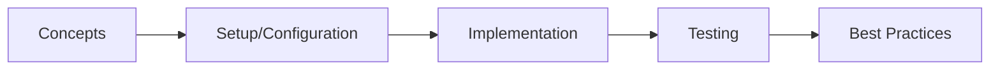

# Chapter 45: Spring WebFlux

> **Previous:** [Project Reactor &amp; Reactive Streams](./44-reactor.md) | **Next:** [R2DBC &amp; Reactive Data Access](./46-r2dbc.md)

## Learning Objectives
## Chapter at a Glance

| Topic | Key Insight | Practical Takeaway |
|-------|-------------|--------------------|
| Core Concepts | Foundational understanding | Real-world application |
| Implementation | Code-first approach | Working examples |
| Best Practices | Production patterns | Avoid common pitfalls |

## Chapter Roadmap




After completing this chapter, you will be able to:

- Compare Spring MVC and Spring WebFlux architectures and choose the right one
- Build reactive REST APIs using annotated controllers with `@RestController` in WebFlux
- Implement functional routing with `RouterFunction` and `HandlerFunction`
- Use `WebClient` for reactive inter-service communication
- Implement Server-Sent Events (SSE) for real-time data push
- Secure reactive endpoints with Spring Security reactive support
- Handle file uploads and streaming reactively
- Build RSocket services for reactive bidirectional communication
- Test WebFlux endpoints with `WebTestClient`
- Apply performance best practices and understand WebFlux's threading model

## 1. WebFlux Architecture Overview

> **Pro Tip:** Test with production-like configurations → dev setups often hide issues that surface under real load.

> **Remember:** Start simple. Add complexity only when proven necessary. Premature abstraction creates maintenance burden.


### 1.1 Reactive Stack vs Servlet Stack


Spring WebFlux is the reactive-stack web framework introduced in Spring 5, built on Project Reactor. It runs on **Netty** (default), Undertow, or Servlet 3.1+ containers (Tomcat, Jetty) but uses **non-blocking I/O** throughout.

| Aspect | Spring MVC | Spring WebFlux |
|--------|-----------|----------------|
| Underlying API | Servlet API | Reactive Streams |
| Container | Tomcat, Jetty, Undertow | Netty, Undertow, Tomcat (Servlet 3.1+) |
| Threading | One thread per request (blocking) | Event loop (few threads, non-blocking) |
| Controller return types | `ResponseEntity`, `ModelAndView`, etc. | `Mono<T>`, `Flux<T>`, `Mono<ResponseEntity<T>>` |
| Functional routing | No | Yes (`RouterFunction`) |
| Client | `RestTemplate` (deprecated), `RestClient` | `WebClient` (reactive) |
| Security | `@EnableWebSecurity` | `@EnableWebFluxSecurity` |

### 1.2 Netty Event Loop Model


WebFlux uses an event-loop threading model. For N CPU cores, Netty creates 2N event-loop threads (one reader, one writer per core). All non-blocking I/O operations run on these threads. Blocking operations must be offloaded to a `boundedElastic` scheduler.

```
Request → EventLoop → Controller → Service → Repository
           ↓               ↓           ↓           ↓
        non-blocking   non-blocking  non-blocking  non-blocking
                             ↓
                    Never block an event-loop thread!
```

### 1.3 When to Use WebFlux


**Good fit:**
- Long-running, streaming, or real-time endpoints (SSE, WebSocket)
- Gateway services (Spring Cloud Gateway is built on WebFlux)
- Microservices making many downstream calls (WebClient concurrency)
- Systems requiring high concurrency with limited threads
- IoT or event streaming applications

**Poor fit:**
- Simple CRUD with low concurrency
- Monoliths where blocking I/O is acceptable
- Projects deeply tied to Servlet API features
- Teams new to reactive programming (learning curve)

## 2. Reactive REST API with Annotated Controllers

### 2.1 Project Setup (Maven)


```xml
<?xml version="1.0" encoding="UTF-8"?>
<project xmlns="http://maven.apache.org/POM/4.0.0"
         xmlns:xsi="http://www.w3.org/2001/XMLSchema-instance"
         xsi:schemaLocation="http://maven.apache.org/POM/4.0.0
         http://maven.apache.org/xsd/maven-4.0.0.xsd">
    <modelVersion>4.0.0</modelVersion>

    <parent>
        <groupId>org.springframework.boot</groupId>
        <artifactId>spring-boot-starter-parent</artifactId>
        <version>3.2.0</version>
        <relativePath/>
    </parent>

    <groupId>com.webflux</groupId>
    <artifactId>webflux-demo</artifactId>
    <version>1.0.0</version>
    <name>WebFlux Demo</name>

    <properties>
        <java.version>21</java.version>
    </properties>

    <dependencies>
        <dependency>
            <groupId>org.springframework.boot</groupId>
            <artifactId>spring-boot-starter-webflux</artifactId>
        </dependency>
        <dependency>
            <groupId>org.springframework.boot</groupId>
            <artifactId>spring-boot-starter-data-mongodb-reactive</artifactId>
        </dependency>
        <dependency>
            <groupId>org.springframework.boot</groupId>
            <artifactId>spring-boot-starter-security</artifactId>
        </dependency>
        <dependency>
            <groupId>org.springframework.boot</groupId>
            <artifactId>spring-boot-starter-test</artifactId>
            <scope>test</scope>
        </dependency>
        <dependency>
            <groupId>io.projectreactor</groupId>
            <artifactId>reactor-test</artifactId>
            <scope>test</scope>
        </dependency>
    </dependencies>

    <build>
        <plugins>
            <plugin>
                <groupId>org.springframework.boot</groupId>
                <artifactId>spring-boot-maven-plugin</artifactId>
            </plugin>
        </plugins>
    </build>
</project>
```

### 2.2 Application Entry Point


```java
package com.webflux.demo;

import org.springframework.boot.SpringApplication;
import org.springframework.boot.autoconfigure.SpringBootApplication;
import org.springframework.data.mongodb.repository.config.EnableReactiveMongoRepositories;

@SpringBootApplication
@EnableReactiveMongoRepositories
public class WebFluxApplication {

    public static void main(String[] args) {
        SpringApplication.run(WebFluxApplication.class, args);
    }
}
```

### 2.3 Domain Model and Repository


```java
package com.webflux.demo.model;

import org.springframework.data.annotation.Id;
import org.springframework.data.mongodb.core.mapping.Document;
import java.time.LocalDateTime;

@Document(collection = "products")
public record Product(
    @Id String id,
    String name,
    String category,
    double price,
    int quantity,
    LocalDateTime createdAt
) {
    public Product {
        if (name == null || name.isBlank()) {
            throw new IllegalArgumentException("Product name must not be blank");
        }
        if (price < 0) {
            throw new IllegalArgumentException("Price must be non-negative");
        }
        if (createdAt == null) {
            createdAt = LocalDateTime.now();
        }
    }

    public Product withId(String id) {
        return new Product(id, name, category, price, quantity, createdAt);
    }
}
```

```java
package com.webflux.demo.repository;

import com.webflux.demo.model.Product;
import org.springframework.data.mongodb.repository.ReactiveMongoRepository;
import org.springframework.stereotype.Repository;
import reactor.core.publisher.Flux;
import reactor.core.publisher.Mono;

@Repository
public interface ProductRepository extends ReactiveMongoRepository<Product, String> {

    Flux<Product> findByCategory(String category);

    Flux<Product> findByNameContainingIgnoreCase(String name);

    Flux<Product> findByPriceBetween(double min, double max);

    Flux<Product> findByQuantityLessThan(int threshold);

    Mono<Long> countByCategory(String category);
}
```

### 2.4 Reactive Controller


```java
package com.webflux.demo.controller;

import com.webflux.demo.model.Product;
import com.webflux.demo.repository.ProductRepository;
import org.springframework.http.HttpStatus;
import org.springframework.http.MediaType;
import org.springframework.http.ResponseEntity;
import org.springframework.web.bind.annotation.*;
import reactor.core.publisher.Flux;
import reactor.core.publisher.Mono;
import reactor.core.scheduler.Schedulers;
import java.time.LocalDateTime;
import java.time.Duration;

@RestController
@RequestMapping("/api/products")
public class ProductController {

    private final ProductRepository repository;

    public ProductController(ProductRepository repository) {
        this.repository = repository;
    }

    @GetMapping
    public Flux<Product> getAllProducts() {
        return repository.findAll();
    }

    @GetMapping("/{id}")
    public Mono<ResponseEntity<Product>> getProductById(@PathVariable String id) {
        return repository.findById(id)
            .map(ResponseEntity::ok)
            .defaultIfEmpty(ResponseEntity.notFound().build());
    }

    @PostMapping
    @ResponseStatus(HttpStatus.CREATED)
    public Mono<Product> createProduct(@RequestBody Product product) {
        return repository.save(product);
    }

    @PutMapping("/{id}")
    public Mono<ResponseEntity<Product>> updateProduct(
            @PathVariable String id,
            @RequestBody Product product) {
        return repository.findById(id)
            .flatMap(existing -> {
                Product updated = new Product(
                    id,
                    product.name(),
                    product.category(),
                    product.price(),
                    product.quantity(),
                    existing.createdAt()
                );
                return repository.save(updated);
            })
            .map(ResponseEntity::ok)
            .defaultIfEmpty(ResponseEntity.notFound().build());
    }

    @DeleteMapping("/{id}")
    public Mono<ResponseEntity<Void>> deleteProduct(@PathVariable String id) {
        return repository.findById(id)
            .flatMap(existing ->
                repository.delete(existing)
                    .then(Mono.just(ResponseEntity.noContent().<Void>build()))
            )
            .defaultIfEmpty(ResponseEntity.notFound().build());
    }

    @GetMapping("/category/{category}")
    public Flux<Product> getProductsByCategory(@PathVariable String category) {
        return repository.findByCategory(category);
    }

    @GetMapping("/search")
    public Flux<Product> searchProducts(@RequestParam String q) {
        return repository.findByNameContainingIgnoreCase(q);
    }

    @GetMapping("/low-stock")
    public Flux<Product> getLowStockProducts(@RequestParam(defaultValue = "10") int threshold) {
        return repository.findByQuantityLessThan(threshold);
    }

    @GetMapping("/price-range")
    public Flux<Product> getProductsByPriceRange(
            @RequestParam double min,
            @RequestParam double max) {
        return repository.findByPriceBetween(min, max);
    }

    @PostMapping("/batch")
    public Flux<Product> createProducts(@RequestBody Flux<Product> products) {
        return repository.saveAll(products);
    }

    @DeleteMapping("/bulk")
    public Mono<Void> deleteAllProducts() {
        return repository.deleteAll();
    }

    // Streaming endpoint → emits one product per second
    @GetMapping(value = "/stream", produces = MediaType.TEXT_EVENT_STREAM_VALUE)
    public Flux<Product> streamProducts() {
        return repository.findAll()
            .delayElements(Duration.ofSeconds(1));
    }

    // Reactive search with query params
    @GetMapping("/advanced-search")
    public Flux<Product> advancedSearch(
            @RequestParam(required = false) String category,
            @RequestParam(required = false) Double minPrice,
            @RequestParam(required = false) Double maxPrice) {

        Flux<Product> all = repository.findAll();

        if (category != null) {
            all = all.filter(p -> p.category().equalsIgnoreCase(category));
        }
        if (minPrice != null) {
            all = all.filter(p -> p.price() >= minPrice);
        }
        if (maxPrice != null) {
            all = all.filter(p -> p.price() <= maxPrice);
        }

        return all;
    }
}
```

### 2.5 Non-Streaming Response Type


```java
package com.webflux.demo.controller;

import com.webflux.demo.model.Product;
import com.webflux.demo.repository.ProductRepository;
import org.springframework.http.MediaType;
import org.springframework.web.bind.annotation.GetMapping;
import org.springframework.web.bind.annotation.RequestMapping;
import org.springframework.web.bind.annotation.RestController;
import reactor.core.publisher.Flux;
import reactor.core.publisher.Mono;
import java.util.Map;

@RestController
@RequestMapping("/api/stats")
public class ProductStatsController {

    private final ProductRepository repository;

    public ProductStatsController(ProductRepository repository) {
        this.repository = repository;
    }

    @GetMapping("/summary")
    public Mono<Map<String, Object>> getSummary() {
        Mono<Long> count = repository.count();
        Mono<Double> avgPrice = repository.findAll()
            .map(Product::price)
            .reduce(0.0, Double::sum)
            .zipWith(repository.count())
            .map(tuple -> tuple.getT1() / tuple.getT2());

        return Mono.zip(count, avgPrice)
            .map(tuple -> Map.of(
                "totalProducts", tuple.getT1(),
                "averagePrice", tuple.getT2()
            ));
    }

    @GetMapping("/category-counts")
    public Mono<Map<String, Long>> getCategoryCounts() {
        return repository.findAll()
            .collect(
                () -> new java.util.HashMap<String, Long>(),
                (map, product) -> map.merge(product.category(), 1L, Long::sum)
            );
    }
}
```

### 2.6 Error Handling in Reactive Controllers


WebFlux supports `@ControllerAdvice` and `@ExceptionHandler` just like Spring MVC, but methods can return `Mono` and `Flux`.

```java
package com.webflux.demo.error;

import org.springframework.boot.web.error.ErrorAttributeOptions;
import org.springframework.boot.web.reactive.error.DefaultErrorAttributes;
import org.springframework.http.HttpStatus;
import org.springframework.stereotype.Component;
import org.springframework.web.reactive.function.server.ServerRequest;
import java.util.Map;

@Component
public class GlobalErrorAttributes extends DefaultErrorAttributes {

    @Override
    public Map<String, Object> getErrorAttributes(
            ServerRequest request, ErrorAttributeOptions options) {
        Map<String, Object> errorAttributes = super.getErrorAttributes(request, options);
        errorAttributes.put("timestamp", System.currentTimeMillis());
        errorAttributes.put("path", request.path());
        return errorAttributes;
    }
}
```

```java
package com.webflux.demo.error;

import org.springframework.http.HttpStatus;
import org.springframework.http.ResponseEntity;
import org.springframework.validation.FieldError;
import org.springframework.web.bind.annotation.ControllerAdvice;
import org.springframework.web.bind.annotation.ExceptionHandler;
import org.springframework.web.bind.support.WebExchangeBindException;
import reactor.core.publisher.Mono;
import java.util.HashMap;
import java.util.Map;

@ControllerAdvice
public class GlobalExceptionHandler {

    @ExceptionHandler(WebExchangeBindException.class)
    public Mono<ResponseEntity<Map<String, Object>>> handleValidationErrors(
            WebExchangeBindException ex) {
        Map<String, Object> body = new HashMap<>();
        body.put("status", HttpStatus.BAD_REQUEST.value());
        body.put("error", "Validation failed");

        Map<String, String> fieldErrors = new HashMap<>();
        for (FieldError fe : ex.getBindingResult().getFieldErrors()) {
            fieldErrors.put(fe.getField(), fe.getDefaultMessage());
        }
        body.put("fieldErrors", fieldErrors);

        return Mono.just(ResponseEntity.badRequest().body(body));
    }

    @ExceptionHandler(IllegalArgumentException.class)
    public Mono<ResponseEntity<Map<String, Object>>> handleIllegalArgument(
            IllegalArgumentException ex) {
        Map<String, Object> body = new HashMap<>();
        body.put("status", HttpStatus.BAD_REQUEST.value());
        body.put("error", ex.getMessage());
        return Mono.just(ResponseEntity.badRequest().body(body));
    }

    @ExceptionHandler(RuntimeException.class)
    public Mono<ResponseEntity<Map<String, Object>>> handleRuntime(RuntimeException ex) {
        Map<String, Object> body = new HashMap<>();
        body.put("status", HttpStatus.INTERNAL_SERVER_ERROR.value());
        body.put("error", "Internal server error");
        return Mono.just(ResponseEntity.status(HttpStatus.INTERNAL_SERVER_ERROR).body(body));
    }
}
```

## 3. Functional Routing

### 3.1 Handler Functions


```java
package com.webflux.demo.handler;

import com.webflux.demo.model.Product;
import com.webflux.demo.repository.ProductRepository;
import org.springframework.http.HttpStatus;
import org.springframework.http.MediaType;
import org.springframework.stereotype.Component;
import org.springframework.web.reactive.function.BodyInserters;
import org.springframework.web.reactive.function.server.ServerRequest;
import org.springframework.web.reactive.function.server.ServerResponse;
import reactor.core.publisher.Mono;
import java.net.URI;

@Component
public class ProductHandler {

    private final ProductRepository repository;

    public ProductHandler(ProductRepository repository) {
        this.repository = repository;
    }

    public Mono<ServerResponse> getAllProducts(ServerRequest request) {
        return ServerResponse.ok()
            .contentType(MediaType.APPLICATION_JSON)
            .body(repository.findAll(), Product.class);
    }

    public Mono<ServerResponse> getProductById(ServerRequest request) {
        String id = request.pathVariable("id");
        return repository.findById(id)
            .flatMap(product -> ServerResponse.ok()
                .contentType(MediaType.APPLICATION_JSON)
                .bodyValue(product))
            .switchIfEmpty(ServerResponse.notFound().build());
    }

    public Mono<ServerResponse> createProduct(ServerRequest request) {
        return request.bodyToMono(Product.class)
            .flatMap(product -> repository.save(product))
            .flatMap(saved -> ServerResponse
                .created(URI.create("/api/fn/products/" + saved.id()))
                .contentType(MediaType.APPLICATION_JSON)
                .bodyValue(saved));
    }

    public Mono<ServerResponse> updateProduct(ServerRequest request) {
        String id = request.pathVariable("id");
        return request.bodyToMono(Product.class)
            .flatMap(product -> repository.findById(id)
                .flatMap(existing -> {
                    Product updated = new Product(
                        id, product.name(), product.category(),
                        product.price(), product.quantity(), existing.createdAt()
                    );
                    return repository.save(updated);
                })
                .flatMap(saved -> ServerResponse.ok()
                    .contentType(MediaType.APPLICATION_JSON)
                    .bodyValue(saved))
                .switchIfEmpty(ServerResponse.notFound().build()));
    }

    public Mono<ServerResponse> deleteProduct(ServerRequest request) {
        String id = request.pathVariable("id");
        return repository.findById(id)
            .flatMap(existing -> repository.delete(existing)
                .then(ServerResponse.noContent().build()))
            .switchIfEmpty(ServerResponse.notFound().build());
    }

    public Mono<ServerResponse> getProductsByCategory(ServerRequest request) {
        String category = request.pathVariable("category");
        return ServerResponse.ok()
            .contentType(MediaType.APPLICATION_JSON)
            .body(repository.findByCategory(category), Product.class);
    }

    public Mono<ServerResponse> searchProducts(ServerRequest request) {
        String q = request.queryParam("q").orElse("");
        return ServerResponse.ok()
            .contentType(MediaType.APPLICATION_JSON)
            .body(repository.findByNameContainingIgnoreCase(q), Product.class);
    }

    public Mono<ServerResponse> streamProducts(ServerRequest request) {
        return ServerResponse.ok()
            .contentType(MediaType.TEXT_EVENT_STREAM)
            .body(repository.findAll().delayElements(java.time.Duration.ofSeconds(1)),
                Product.class);
    }

    public Mono<ServerResponse> deleteAll(ServerRequest request) {
        return repository.deleteAll()
            .then(ServerResponse.noContent().build());
    }
}
```

### 3.2 Router Function Configuration


```java
package com.webflux.demo.config;

import com.webflux.demo.handler.ProductHandler;
import org.springframework.context.annotation.Bean;
import org.springframework.context.annotation.Configuration;
import org.springframework.http.MediaType;
import org.springframework.web.reactive.function.server.RequestPredicates;
import org.springframework.web.reactive.function.server.RouterFunction;
import org.springframework.web.reactive.function.server.RouterFunctions;
import org.springframework.web.reactive.function.server.ServerResponse;

import static org.springframework.web.reactive.function.server.RequestPredicates.*;

@Configuration
public class ProductRouterConfig {

    @Bean
    public RouterFunction<ServerResponse> productRoutes(ProductHandler handler) {
        return RouterFunctions.nest(
            RequestPredicates.path("/api/fn/products"),
            RouterFunctions
                .route(GET("/"), handler::getAllProducts)
                .andRoute(GET("/stream"), handler::streamProducts)
                .andRoute(GET("/category/{category}"), handler::getProductsByCategory)
                .andRoute(GET("/search"), handler::searchProducts)
                .andRoute(GET("/{id}"), handler::getProductById)
                .andRoute(POST("/"), handler::createProduct)
                .andRoute(PUT("/{id}"), handler::updateProduct)
                .andRoute(DELETE("/{id}"), handler::deleteProduct)
                .andRoute(DELETE("/"), handler::deleteAll)
        );
    }

    // Additional routes for other domains
    @Bean
    public RouterFunction<ServerResponse> healthRoutes() {
        return RouterFunctions
            .route(GET("/api/health"),
                request -> ServerResponse.ok()
                    .bodyValue(new java.util.HashMap<>(Map.of(
                        "status", "UP",
                        "timestamp", System.currentTimeMillis()
                    ))));

    }

    private static <K, V> java.util.Map<K, V> Map(K k1, V v1, K k2, V v2) {
        var map = new java.util.HashMap<K, V>();
        map.put(k1, v1);
        map.put(k2, v2);
        return map;
    }
}
```

### 3.3 Request Predicates


```java
package com.webflux.demo.config;

import org.springframework.context.annotation.Bean;
import org.springframework.context.annotation.Configuration;
import org.springframework.web.reactive.function.server.RouterFunction;
import org.springframework.web.reactive.function.server.ServerResponse;

import static org.springframework.web.reactive.function.server.RequestPredicates.*;
import static org.springframework.web.reactive.function.server.RouterFunctions.route;

@Configuration
public class AdvancedRouterConfig {

    @Bean
    public RouterFunction<ServerResponse> advancedRoutes() {
        return
            // Content type negotiation
            route(GET("/api/data")
                    .and(accept(MediaType.APPLICATION_JSON)),
                request -> ServerResponse.ok().bodyValue("{\"type\": \"json\"}"))

            .andRoute(GET("/api/data")
                    .and(accept(MediaType.APPLICATION_XML)),
                request -> ServerResponse.ok().bodyValue("<data><type>xml</type></data>"))

            // Header-based routing
            .andRoute(GET("/api/version")
                    .and(headers().header("X-API-Version", "v2")),
                request -> ServerResponse.ok().bodyValue("{\"version\": \"2.0\"}"))

            .andRoute(GET("/api/version"),
                request -> ServerResponse.ok().bodyValue("{\"version\": \"1.0\"}"))

            // Query param routing
            .andRoute(GET("/api/search")
                    .and(queryParam("type", "detailed")),
                request -> ServerResponse.ok().bodyValue("{\"mode\": \"detailed\"}"))

            .andRoute(GET("/api/search"),
                request -> ServerResponse.ok().bodyValue("{\"mode\": \"simple\"}"))

            // POST with specific content type
            .andRoute(POST("/api/upload")
                    .and(contentType(MediaType.APPLICATION_JSON)),
                request -> ServerResponse.ok().bodyValue("{\"received\": \"json\"}"))

            .andRoute(POST("/api/upload")
                    .and(contentType(MediaType.MULTIPART_FORM_DATA)),
                request -> ServerResponse.ok().bodyValue("{\"received\": \"multipart\"}")

            // Cookie-based routing
            .andRoute(GET("/api/preferences")
                    .and(cookies().doesNotHave("theme")),
                request -> ServerResponse.ok()
                    .cookie(ResponseCookie.from("theme", "light").build())
                    .bodyValue("{\"theme\": \"default\"}"))
            );
    }
}
```

## 4. WebClient → Reactive HTTP Client

### 4.1 WebClient Configuration


```java
package com.webflux.demo.client;

import io.netty.channel.ChannelOption;
import io.netty.handler.timeout.ReadTimeoutHandler;
import io.netty.handler.timeout.WriteTimeoutHandler;
import org.springframework.context.annotation.Bean;
import org.springframework.context.annotation.Configuration;
import org.springframework.http.client.reactive.ReactorClientHttpConnector;
import org.springframework.web.reactive.function.client.ExchangeStrategies;
import org.springframework.web.reactive.function.client.WebClient;
import reactor.netty.http.client.HttpClient;
import reactor.netty.resources.ConnectionProvider;
import java.time.Duration;
import java.util.concurrent.TimeUnit;

@Configuration
public class WebClientConfig {

    @Bean
    public WebClient webClient() {
        // Connection pool configuration
        ConnectionProvider provider = ConnectionProvider.builder("custom-pool")
            .maxConnections(200)
            .maxIdleTime(Duration.ofSeconds(30))
            .maxLifeTime(Duration.ofMinutes(5))
            .pendingAcquireTimeout(Duration.ofSeconds(10))
            .evictInBackground(Duration.ofSeconds(60))
            .build();

        HttpClient httpClient = HttpClient.create(provider)
            .option(ChannelOption.CONNECT_TIMEOUT_MILLIS, 5000)
            .responseTimeout(Duration.ofSeconds(10))
            .doOnConnected(conn -> conn
                .addHandlerLast(new ReadTimeoutHandler(10, TimeUnit.SECONDS))
                .addHandlerLast(new WriteTimeoutHandler(10, TimeUnit.SECONDS))
            );

        // Increase max in-memory buffer size (default 256KB)
        ExchangeStrategies strategies = ExchangeStrategies.builder()
            .codecs(config -> config
                .defaultCodecs()
                .maxInMemorySize(16 * 1024 * 1024)) // 16 MB
            .build();

        return WebClient.builder()
            .clientConnector(new ReactorClientHttpConnector(httpClient))
            .exchangeStrategies(strategies)
            .baseUrl("http://localhost:8080")
            .defaultHeader("X-Source", "webflux-demo")
            .build();
    }
}
```

### 4.2 WebClient Usage Examples


```java
package com.webflux.demo.client;

import com.webflux.demo.model.Product;
import org.springframework.stereotype.Service;
import org.springframework.web.reactive.function.client.WebClient;
import reactor.core.publisher.Flux;
import reactor.core.publisher.Mono;
import java.time.Duration;
import java.util.List;

@Service
public class ProductServiceClient {

    private final WebClient webClient;

    public ProductServiceClient(WebClient webClient) {
        this.webClient = webClient;
    }

    // GET - retrieve single item
    public Mono<Product> getProduct(String id) {
        return webClient.get()
            .uri("/api/products/{id}", id)
            .retrieve()
            .bodyToMono(Product.class)
            .timeout(Duration.ofSeconds(5))
            .onErrorResume(e -> {
                System.err.println("Failed to fetch product " + id + ": " + e.getMessage());
                return Mono.empty();
            });
    }

    // GET - retrieve list
    public Flux<Product> getAllProducts() {
        return webClient.get()
            .uri("/api/products")
            .retrieve()
            .bodyToFlux(Product.class);
    }

    // GET with query parameters
    public Flux<Product> searchProducts(String query) {
        return webClient.get()
            .uri(uriBuilder -> uriBuilder
                .path("/api/products/search")
                .queryParam("q", query)
                .build())
            .retrieve()
            .bodyToFlux(Product.class);
    }

    // POST - create item
    public Mono<Product> createProduct(Product product) {
        return webClient.post()
            .uri("/api/products")
            .bodyValue(product)
            .retrieve()
            .bodyToMono(Product.class);
    }

    // PUT - update item
    public Mono<Product> updateProduct(String id, Product product) {
        return webClient.put()
            .uri("/api/products/{id}", id)
            .bodyValue(product)
            .retrieve()
            .bodyToMono(Product.class);
    }

    // DELETE - delete item
    public Mono<Void> deleteProduct(String id) {
        return webClient.delete()
            .uri("/api/products/{id}", id)
            .retrieve()
            .bodyToMono(Void.class);
    }

    // POST - batch create
    public Flux<Product> createProducts(List<Product> products) {
        return webClient.post()
            .uri("/api/products/batch")
            .body(Flux.fromIterable(products), Product.class)
            .retrieve()
            .bodyToFlux(Product.class);
    }

    // Exchange: full control over response (headers, status, retry)
    public Mono<Product> getProductWithRetry(String id) {
        return webClient.get()
            .uri("/api/products/{id}", id)
            .exchangeToMono(response -> {
                if (response.statusCode().is2xxSuccessful()) {
                    return response.bodyToMono(Product.class);
                } else if (response.statusCode().is4xxClientError()) {
                    return Mono.empty();
                } else {
                    return response.createException()
                        .flatMap(Mono::error);
                }
            })
            .retry(2)
            .timeout(Duration.ofSeconds(10));
    }

    // Streaming: consume Server-Sent Events
    public Flux<Product> streamProducts() {
        return webClient.get()
            .uri("/api/products/stream")
            .accept(org.springframework.http.MediaType.TEXT_EVENT_STREAM)
            .retrieve()
            .bodyToFlux(Product.class)
            .doOnNext(product -> System.out.println("Received: " + product));
    }

    // Parallel calls: fetch multiple resources concurrently
    public Flux<Product> getProductsParallel(List<String> ids) {
        return Flux.fromIterable(ids)
            .flatMap(id -> getProduct(id)
                .subscribeOn(reactor.core.scheduler.Schedulers.boundedElastic()), 10);
    }

    // Exchange filter with logging
    public Flux<Product> getAllWithLogging() {
        return webClient.get()
            .uri("/api/products")
            .exchangeToFlux(response -> {
                System.out.println("Response status: " + response.statusCode());
                System.out.println("Content length: " +
                    response.headers().contentLength());
                return response.bodyToFlux(Product.class);
            });
    }
}
```

### 4.3 WebClient Error Handling


```java
package com.webflux.demo.client;

import com.webflux.demo.model.Product;
import org.springframework.http.HttpStatus;
import org.springframework.stereotype.Service;
import org.springframework.web.reactive.function.client.WebClient;
import org.springframework.web.reactive.function.client.WebClientResponseException;
import reactor.core.publisher.Mono;
import java.util.Map;

@Service
public class ResilientProductClient {

    private final WebClient webClient;

    public ResilientProductClient(WebClient webClient) {
        this.webClient = webClient;
    }

    public Mono<Product> getProductSafe(String id) {
        return webClient.get()
            .uri("/api/products/{id}", id)
            .retrieve()
            .onStatus(HttpStatus::is4xxClientError, response -> {
                if (response.statusCode() == HttpStatus.NOT_FOUND) {
                    return Mono.empty(); // Not found is not an error
                }
                return response.bodyToMono(Map.class)
                    .flatMap(body -> {
                        String message = (String) body.getOrDefault("error", "Client error");
                        return Mono.error(new ClientException(message));
                    });
            })
            .onStatus(HttpStatus::is5xxServerError, response ->
                response.bodyToMono(String.class)
                    .flatMap(body -> Mono.error(new ServerException("Server error: " + body)))
            )
            .bodyToMono(Product.class)
            .onErrorResume(WebClientResponseException.class, e -> {
                System.err.println("HTTP " + e.getStatusCode() + ": " + e.getResponseBodyAsString());
                return Mono.empty();
            });
    }

    static class ClientException extends RuntimeException {
        ClientException(String message) { super(message); }
    }

    static class ServerException extends RuntimeException {
        ServerException(String message) { super(message); }
    }
}
```

## 5. Server-Sent Events (SSE)

### 5.1 SSE Producer


```java
package com.webflux.demo.controller;

import com.webflux.demo.model.Product;
import com.webflux.demo.repository.ProductRepository;
import org.springframework.http.MediaType;
import org.springframework.web.bind.annotation.GetMapping;
import org.springframework.web.bind.annotation.RequestMapping;
import org.springframework.web.bind.annotation.RestController;
import reactor.core.publisher.Flux;
import reactor.core.publisher.Sinks;
import java.time.Duration;
import java.time.Instant;
import java.util.Map;

@RestController
@RequestMapping("/api/sse")
public class SSEController {

    private final ProductRepository repository;
    private final Sinks.Many<Product> productSink;

    public SSEController(ProductRepository repository) {
        this.repository = repository;
        this.productSink = Sinks.many().multicast().onBackpressureBuffer();
    }

    // Push new products whenever created
    public void notifyNewProduct(Product product) {
        productSink.tryEmitNext(product);
    }

    // SSE endpoint: stream new product notifications
    @GetMapping(value = "/new-products", produces = MediaType.TEXT_EVENT_STREAM_VALUE)
    public Flux<Product> newProducts() {
        return productSink.asFlux();
    }

    // SSE endpoint: periodic stock summary
    @GetMapping(value = "/stock-summary", produces = MediaType.TEXT_EVENT_STREAM_VALUE)
    public Flux<Map<String, Object>> stockSummary() {
        return Flux.interval(Duration.ofSeconds(5))
            .flatMap(tick ->
                repository.findAll()
                    .collectList()
                    .map(products -> Map.of(
                        "timestamp", Instant.now().toString(),
                        "totalProducts", products.size(),
                        "totalValue", products.stream()
                            .mapToDouble(p -> p.price() * p.quantity())
                            .sum(),
                        "lowStockCount", products.stream()
                            .filter(p -> p.quantity() < 10)
                            .count()
                    ))
            );
    }

    // SSE endpoint: time events
    @GetMapping(value = "/clock", produces = MediaType.TEXT_EVENT_STREAM_VALUE)
    public Flux<String> clock() {
        return Flux.interval(Duration.ofSeconds(1))
            .map(tick -> "Tick " + tick + " at " + Instant.now());
    }

    // SSE with custom event types
    @GetMapping(value = "/events", produces = MediaType.TEXT_EVENT_STREAM_VALUE)
    public Flux<org.springframework.http.codec.ServerSentEvent<Object>> events() {
        return Flux.interval(Duration.ofSeconds(2))
            .map(tick -> org.springframework.http.codec.ServerSentEvent.builder()
                .event("heartbeat")
                .id(String.valueOf(tick))
                .data(Map.of("tick", tick, "timestamp", Instant.now().toString()))
                .comment("SSE connection active")
                .build());
    }
}
```

### 5.2 SSE Consumer with WebClient


```java
package com.webflux.demo.client;

import com.webflux.demo.model.Product;
import org.springframework.http.MediaType;
import org.springframework.stereotype.Service;
import org.springframework.web.reactive.function.client.WebClient;
import reactor.core.publisher.Flux;
import reactor.core.scheduler.Schedulers;
import java.time.Duration;

@Service
public class SSEClient {

    private final WebClient webClient;

    public SSEClient(WebClient webClient) {
        this.webClient = webClient;
    }

    public Flux<Product> subscribeNewProducts() {
        return webClient.get()
            .uri("/api/sse/new-products")
            .accept(MediaType.TEXT_EVENT_STREAM)
            .retrieve()
            .bodyToFlux(Product.class)
            .retryBackoff(5, Duration.ofSeconds(1))
            .doOnSubscribe(s -> System.out.println("SSE subscribed"))
            .doOnCancel(() -> System.out.println("SSE cancelled"))
            .doOnError(e -> System.err.println("SSE error: " + e.getMessage()))
            .subscribeOn(Schedulers.boundedElastic());
    }
}
```

## 6. Reactive Security

### 6.1 Security Configuration


```java
package com.webflux.demo.security;

import org.springframework.context.annotation.Bean;
import org.springframework.context.annotation.Configuration;
import org.springframework.http.HttpMethod;
import org.springframework.security.config.annotation.method.configuration.EnableReactiveMethodSecurity;
import org.springframework.security.config.web.server.ServerHttpSecurity;
import org.springframework.security.core.userdetails.MapReactiveUserDetailsService;
import org.springframework.security.core.userdetails.User;
import org.springframework.security.core.userdetails.UserDetails;
import org.springframework.security.crypto.bcrypt.BCryptPasswordEncoder;
import org.springframework.security.crypto.password.PasswordEncoder;
import org.springframework.security.web.server.SecurityWebFilterChain;
import org.springframework.security.web.server.authentication.logout.DelegatingServerLogoutHandler;
import org.springframework.security.web.server.authentication.logout.SecurityContextServerLogoutHandler;
import org.springframework.security.web.server.authentication.logout.WebSessionServerLogoutHandler;
import org.springframework.security.web.server.csrf.CookieServerCsrfTokenRepository;
import org.springframework.web.cors.CorsConfiguration;
import org.springframework.web.cors.reactive.CorsConfigurationSource;
import org.springframework.web.cors.reactive.UrlBasedCorsConfigurationSource;
import java.util.List;

@Configuration
@EnableReactiveMethodSecurity
public class SecurityConfig {

    @Bean
    public SecurityWebFilterChain securityWebFilterChain(ServerHttpSecurity http) {
        return http
            .csrf(csrf -> csrf
                .csrfTokenRepository(CookieServerCsrfTokenRepository.withHttpOnlyFalse()))
            .cors(cors -> cors.configurationSource(corsConfigurationSource()))
            .authorizeExchange(exchanges -> exchanges
                .pathMatchers("/api/health", "/api/sse/clock").permitAll()
                .pathMatchers(HttpMethod.GET, "/api/products/**").hasRole("USER")
                .pathMatchers(HttpMethod.POST, "/api/products/**").hasRole("ADMIN")
                .pathMatchers(HttpMethod.PUT, "/api/products/**").hasRole("ADMIN")
                .pathMatchers(HttpMethod.DELETE, "/api/products/**").hasRole("ADMIN")
                .pathMatchers("/api/fn/**").hasAnyRole("USER", "ADMIN")
                .anyExchange().authenticated()
            )
            .formLogin(form -> form
                .loginPage("/login")
                .authenticationSuccessHandler((webFilterExchange, authentication) -> {
                    webFilterExchange.getExchange().getResponse().setStatusCode(
                        org.springframework.http.HttpStatus.OK);
                    return webFilterExchange.getChain().filter(webFilterExchange.getExchange());
                })
            )
            .logout(logout -> logout
                .logoutUrl("/logout")
                .logoutHandler(new DelegatingServerLogoutHandler(
                    new SecurityContextServerLogoutHandler(),
                    new WebSessionServerLogoutHandler()
                ))
            )
            .httpBasic(ServerHttpSecurity.HttpBasicSpec::disable)
            .build();
    }

    @Bean
    public MapReactiveUserDetailsService userDetailsService(PasswordEncoder encoder) {
        UserDetails user = User.builder()
            .username("user")
            .password(encoder.encode("password"))
            .roles("USER")
            .build();

        UserDetails admin = User.builder()
            .username("admin")
            .password(encoder.encode("admin"))
            .roles("USER", "ADMIN")
            .build();

        return new MapReactiveUserDetailsService(user, admin);
    }

    @Bean
    public PasswordEncoder passwordEncoder() {
        return new BCryptPasswordEncoder();
    }

    @Bean
    public CorsConfigurationSource corsConfigurationSource() {
        CorsConfiguration config = new CorsConfiguration();
        config.setAllowedOrigins(List.of("http://localhost:3000"));
        config.setAllowedMethods(List.of("GET", "POST", "PUT", "DELETE", "OPTIONS"));
        config.setAllowedHeaders(List.of("*"));
        config.setAllowCredentials(true);

        UrlBasedCorsConfigurationSource source = new UrlBasedCorsConfigurationSource();
        source.registerCorsConfiguration("/**", config);
        return source;
    }
}
```

### 6.2 OAuth2 Resource Server with WebFlux


```java
package com.webflux.demo.security;

import org.springframework.context.annotation.Bean;
import org.springframework.context.annotation.Configuration;
import org.springframework.security.config.annotation.web.reactive.EnableWebFluxSecurity;
import org.springframework.security.config.web.server.ServerHttpSecurity;
import org.springframework.security.oauth2.jwt.ReactiveJwtDecoder;
import org.springframework.security.oauth2.jwt.ReactiveJwtDecoders;
import org.springframework.security.web.server.SecurityWebFilterChain;

@Configuration
@EnableWebFluxSecurity
public class OAuth2ResourceServerConfig {

    @Bean
    public SecurityWebFilterChain oauth2Security(ServerHttpSecurity http) {
        return http
            .csrf(ServerHttpSecurity.CsrfSpec::disable)
            .authorizeExchange(exchanges -> exchanges
                .pathMatchers("/api/health", "/api/public/**").permitAll()
                .pathMatchers("/api/admin/**").hasAuthority("SCOPE_admin")
                .anyExchange().authenticated()
            )
            .oauth2ResourceServer(oauth2 -> oauth2
                .jwt(jwt -> jwt
                    .jwtDecoder(jwtDecoder())
                )
            )
            .build();
    }

    @Bean
    public ReactiveJwtDecoder jwtDecoder() {
        // Configure with your OAuth2 provider's issuer URI
        return ReactiveJwtDecoders
            .fromIssuerLocation("https://your-issuer.example.com");
    }
}
```

### 6.3 Reactive Method Security


```java
package com.webflux.demo.controller;

import com.webflux.demo.model.Product;
import com.webflux.demo.repository.ProductRepository;
import org.springframework.security.access.prepost.PreAuthorize;
import org.springframework.security.core.annotation.AuthenticationPrincipal;
import org.springframework.security.oauth2.jwt.Jwt;
import org.springframework.web.bind.annotation.*;
import reactor.core.publisher.Mono;

@RestController
@RequestMapping("/api/admin")
public class AdminController {

    private final ProductRepository repository;

    public AdminController(ProductRepository repository) {
        this.repository = repository;
    }

    @PreAuthorize("hasRole('ADMIN')")
    @DeleteMapping("/products/{id}")
    public Mono<Void> adminDeleteProduct(@PathVariable String id) {
        return repository.deleteById(id);
    }

    @PreAuthorize("hasAuthority('SCOPE_admin')")
    @GetMapping("/audit-log")
    public Mono<String> getAuditLog(@AuthenticationPrincipal Jwt jwt) {
        String subject = jwt.getSubject();
        return Mono.just("Audit log access by " + subject);
    }

    @PreAuthorize("@securityService.canAccessProduct(#id)")
    @GetMapping("/secure-products/{id}")
    public Mono<Product> getSecuredProduct(@PathVariable String id) {
        return repository.findById(id);
    }
}
```

```java
package com.webflux.demo.security;

import org.springframework.security.core.context.ReactiveSecurityContextHolder;
import org.springframework.stereotype.Service;
import reactor.core.publisher.Mono;

@Service("securityService")
public class SecurityService {

    public Mono<Boolean> canAccessProduct(String productId) {
        return ReactiveSecurityContextHolder.getContext()
            .map(ctx -> ctx.getAuthentication())
            .flatMap(auth -> {
                String username = auth.getName();
                // Custom authorization logic based on username and product
                return Mono.just(true);
            });
    }
}
```

## 7. File Upload and Streaming

### 7.1 Reactive File Upload


```java
package com.webflux.demo.controller;

import org.springframework.core.io.Resource;
import org.springframework.core.io.UrlResource;
import org.springframework.http.HttpHeaders;
import org.springframework.http.MediaType;
import org.springframework.http.ResponseEntity;
import org.springframework.http.codec.multipart.FilePart;
import org.springframework.http.codec.multipart.Part;
import org.springframework.web.bind.annotation.*;
import reactor.core.publisher.Flux;
import reactor.core.publisher.Mono;
import java.io.IOException;
import java.net.MalformedURLException;
import java.nio.file.Files;
import java.nio.file.Path;
import java.nio.file.Paths;
import java.nio.file.StandardCopyOption;
import java.util.Map;
import java.util.UUID;

@RestController
@RequestMapping("/api/files")
public class FileController {

    private final Path uploadDir = Paths.get("uploads");

    public FileController() throws IOException {
        Files.createDirectories(uploadDir);
    }

    // Single file upload
    @PostMapping("/upload")
    public Mono<Map<String, String>> uploadFile(@RequestPart("file") FilePart filePart) {
        String filename = UUID.randomUUID() + "_" + filePart.filename();
        Path target = uploadDir.resolve(filename);

        return filePart.transferTo(target)
            .thenReturn(Map.of(
                "filename", filename,
                "size", String.valueOf(target.toFile().length()),
                "path", target.toString()
            ));
    }

    // Multiple file upload
    @PostMapping(value = "/upload-multiple", consumes = MediaType.MULTIPART_FORM_DATA_VALUE)
    public Flux<Map<String, String>> uploadMultipleFiles(
            @RequestPart("files") Flux<FilePart> fileParts) {
        return fileParts.flatMap(filePart -> {
            String filename = UUID.randomUUID() + "_" + filePart.filename();
            Path target = uploadDir.resolve(filename);
            return filePart.transferTo(target)
                .thenReturn(Map.of(
                    "filename", filename,
                    "path", target.toString()
                ));
        });
    }

    // Mixed multipart: files + form fields
    @PostMapping("/upload-with-metadata")
    public Mono<Map<String, Object>> uploadWithMetadata(
            @RequestPart("file") FilePart filePart,
            @RequestPart("metadata") Mono<Map<String, String>> metadata) {

        String filename = UUID.randomUUID() + "_" + filePart.filename();
        Path target = uploadDir.resolve(filename);

        return metadata
            .flatMap(meta ->
                filePart.transferTo(target)
                    .thenReturn(Map.of(
                        "filename", filename,
                        "uploadedBy", meta.getOrDefault("uploadedBy", "unknown"),
                        "description", meta.getOrDefault("description", ""),
                        "size", target.toFile().length()
                    ))
            );
    }

    // Reactive file download
    @GetMapping("/download/{filename}")
    public Mono<ResponseEntity<Resource>> downloadFile(@PathVariable String filename) {
        Path file = uploadDir.resolve(filename);
        if (!Files.exists(file)) {
            return Mono.just(ResponseEntity.notFound().build());
        }
        try {
            Resource resource = new UrlResource(file.toUri());
            return Mono.just(ResponseEntity.ok()
                .contentType(MediaType.APPLICATION_OCTET_STREAM)
                .header(HttpHeaders.CONTENT_DISPOSITION,
                    "attachment; filename=\"" + filename + "\"")
                .body(resource));
        } catch (MalformedURLException e) {
            return Mono.error(e);
        }
    }

    // Streaming file list
    @GetMapping("/list")
    public Flux<Map<String, Object>> listFiles() throws IOException {
        return Flux.fromStream(Files.list(uploadDir))
            .map(path -> {
                try {
                    return Map.of(
                        "name", path.getFileName().toString(),
                        "size", Files.size(path),
                        "lastModified", Files.getLastModifiedTime(path).toMillis()
                    );
                } catch (IOException e) {
                    return Map.of("name", path.getFileName().toString());
                }
            });
    }
}
```

### 7.2 Streaming Large File Download


```java
package com.webflux.demo.controller;

import org.springframework.core.io.buffer.DataBuffer;
import org.springframework.core.io.buffer.DataBufferUtils;
import org.springframework.http.MediaType;
import org.springframework.http.ResponseEntity;
import org.springframework.web.bind.annotation.GetMapping;
import org.springframework.web.bind.annotation.PathVariable;
import org.springframework.web.bind.annotation.RequestMapping;
import org.springframework.web.bind.annotation.RestController;
import reactor.core.publisher.Flux;
import reactor.core.publisher.Mono;
import java.io.IOException;
import java.io.RandomAccessFile;
import java.nio.channels.AsynchronousFileChannel;
import java.nio.file.Path;
import java.nio.file.Paths;
import java.nio.file.StandardOpenOption;

@RestController
@RequestMapping("/api/stream")
public class StreamingController {

    private final Path uploadDir = Paths.get("uploads");

    @GetMapping(value = "/video/{filename}", produces = MediaType.APPLICATION_OCTET_STREAM_VALUE)
    public Flux<DataBuffer> streamVideo(@PathVariable String filename) {
        Path file = uploadDir.resolve(filename);
        return DataBufferUtils.readAsynchronousFileChannel(
            () -> AsynchronousFileChannel.open(file, StandardOpenOption.READ),
            org.springframework.core.io.buffer.DefaultDataBufferFactory.sharedInstance,
            8192 // Buffer size
        );
    }

    @GetMapping("/range/{filename}")
    public Mono<ResponseEntity<Flux<DataBuffer>>> streamRange(
            @PathVariable String filename,
            @org.springframework.web.bind.annotation.RequestHeader(
                value = "Range", required = false) String rangeHeader) {

        Path file = uploadDir.resolve(filename);
        if (!file.toFile().exists()) {
            return Mono.just(ResponseEntity.notFound().build());
        }

        long fileSize = file.toFile().length();

        if (rangeHeader == null) {
            // No range requested → return full file
            Flux<DataBuffer> data = DataBufferUtils.readAsynchronousFileChannel(
                () -> AsynchronousFileChannel.open(file, StandardOpenOption.READ),
                org.springframework.core.io.buffer.DefaultDataBufferFactory.sharedInstance,
                8192);
            return Mono.just(ResponseEntity.ok()
                .contentType(MediaType.APPLICATION_OCTET_STREAM)
                .header("Accept-Ranges", "bytes")
                .header("Content-Length", String.valueOf(fileSize))
                .body(data));
        }

        // Parse range header: "bytes=start-end"
        String range = rangeHeader.replace("bytes=", "");
        String[] parts = range.split("-");
        long start = Long.parseLong(parts[0]);
        long end = parts.length > 1 ? Long.parseLong(parts[1]) : fileSize - 1;

        long length = end - start + 1;
        final long readStart = start;
        final long readEnd = end;

        Flux<DataBuffer> data = DataBufferUtils.readAsynchronousFileChannel(
            () -> AsynchronousFileChannel.open(file, StandardOpenOption.READ),
            org.springframework.core.io.buffer.DefaultDataBufferFactory.sharedInstance,
            8192, readStart);

        // We need to limit to the range length
        Flux<DataBuffer> ranged = DataBufferUtils.takeUntilByteCount(data, length);

        return Mono.just(ResponseEntity.status(org.springframework.http.HttpStatus.PARTIAL_CONTENT)
            .contentType(MediaType.APPLICATION_OCTET_STREAM)
            .header("Accept-Ranges", "bytes")
            .header("Content-Range", "bytes " + start + "-" + end + "/" + fileSize)
            .header("Content-Length", String.valueOf(length))
            .body(ranged));
    }
}
```

## 8. RSocket → Reactive Socket Protocol

### 8.1 RSocket Server


```java
package com.webflux.demo.rsocket;

import com.webflux.demo.model.Product;
import com.webflux.demo.repository.ProductRepository;
import org.springframework.boot.rsocket.messaging.RSocketStrategiesCustomizer;
import org.springframework.context.annotation.Bean;
import org.springframework.context.annotation.Configuration;
import org.springframework.http.codec.json.Jackson2JsonDecoder;
import org.springframework.http.codec.json.Jackson2JsonEncoder;
import org.springframework.messaging.handler.annotation.MessageMapping;
import org.springframework.messaging.handler.annotation.Payload;
import org.springframework.stereotype.Controller;
import reactor.core.publisher.Flux;
import reactor.core.publisher.Mono;

@Configuration
public class RSocketConfig {

    @Bean
    public RSocketStrategiesCustomizer rSocketStrategies() {
        return strategies -> strategies
            .encoder(new Jackson2JsonEncoder())
            .decoder(new Jackson2JsonDecoder());
    }
}

@Controller
public class ProductRSocketController {

    private final ProductRepository repository;

    public ProductRSocketController(ProductRepository repository) {
        this.repository = repository;
    }

    // Fire-and-forget: create product, no response needed
    @MessageMapping("product.create")
    public Mono<Void> createProduct(@Payload Product product) {
        return repository.save(product).then();
    }

    // Request-response: get product by ID
    @MessageMapping("product.get")
    public Mono<Product> getProduct(@Payload String id) {
        return repository.findById(id);
    }

    // Request-stream: get all products as stream
    @MessageMapping("product.list")
    public Flux<Product> listProducts() {
        return repository.findAll();
    }

    // Channel: bidirectional stream
    @MessageMapping("product.search")
    public Flux<Product> searchProducts(@Payload Flux<String> searchTerms) {
        return searchTerms
            .flatMap(term -> repository.findByNameContainingIgnoreCase(term));
    }
}
```

### 8.2 RSocket Client Configuration


```java
package com.webflux.demo.rsocket;

import com.webflux.demo.model.Product;
import org.springframework.boot.rsocket.messaging.RSocketRequesterCustomizer;
import org.springframework.context.annotation.Bean;
import org.springframework.context.annotation.Configuration;
import org.springframework.messaging.rsocket.RSocketRequester;
import org.springframework.messaging.rsocket.RSocketStrategies;
import reactor.core.publisher.Flux;
import reactor.core.publisher.Mono;
import reactor.util.retry.Retry;
import java.net.URI;
import java.time.Duration;

@Configuration
public class RSocketClientConfig {

    @Bean
    public RSocketRequester rSocketRequester(RSocketStrategies strategies) {
        return RSocketRequester.builder()
            .rsocketStrategies(strategies)
            .rsocketConnector(connector -> connector
                .reconnect(Retry.backoff(5, Duration.ofSeconds(1)))
                .keepAlive(Duration.ofSeconds(30), Duration.ofSeconds(90))
            )
            .websocket(URI.create("ws://localhost:8080/rsocket"));
    }
}

@Service
public class ProductRSocketClient {

    private final RSocketRequester requester;

    public ProductRSocketClient(RSocketRequester requester) {
        this.requester = requester;
    }

    // Fire-and-forget
    public Mono<Void> createProduct(Product product) {
        return requester
            .route("product.create")
            .data(product)
            .send();
    }

    // Request-response
    public Mono<Product> getProduct(String id) {
        return requester
            .route("product.get")
            .data(id)
            .retrieveMono(Product.class);
    }

    // Request-stream
    public Flux<Product> listProducts() {
        return requester
            .route("product.list")
            .retrieveFlux(Product.class);
    }

    // Channel
    public Flux<Product> searchProducts(Flux<String> terms) {
        return requester
            .route("product.search")
            .data(terms)
            .retrieveFlux(Product.class);
    }
}
```

## 9. Testing WebFlux with WebTestClient

```java
package com.webflux.demo.controller;

import com.webflux.demo.model.Product;
import com.webflux.demo.repository.ProductRepository;
import org.junit.jupiter.api.BeforeEach;
import org.junit.jupiter.api.Test;
import org.springframework.beans.factory.annotation.Autowired;
import org.springframework.boot.test.autoconfigure.web.reactive.AutoConfigureWebTestClient;
import org.springframework.boot.test.context.SpringBootTest;
import org.springframework.http.MediaType;
import org.springframework.test.web.reactive.server.WebTestClient;
import reactor.core.publisher.Flux;
import reactor.core.publisher.Mono;
import java.time.LocalDateTime;
import java.util.List;

@SpringBootTest(webEnvironment = SpringBootTest.WebEnvironment.RANDOM_PORT)
@AutoConfigureWebTestClient
class ProductControllerWebTest {

    @Autowired
    private WebTestClient webTestClient;

    @Autowired
    private ProductRepository repository;

    private Product sampleProduct;

    @BeforeEach
    void setUp() {
        repository.deleteAll().block();
        sampleProduct = repository.save(new Product(
            null, "Test Product", "Electronics", 99.99, 50, LocalDateTime.now()
        )).block();
    }

    @Test
    void getAllProducts_shouldReturnList() {
        webTestClient.get()
            .uri("/api/products")
            .exchange()
            .expectStatus().isOk()
            .expectHeader().contentType(MediaType.APPLICATION_JSON)
            .expectBodyList(Product.class)
            .hasSize(1)
            .contains(sampleProduct);
    }

    @Test
    void getProductById_shouldReturnProduct() {
        webTestClient.get()
            .uri("/api/products/{id}", sampleProduct.id())
            .exchange()
            .expectStatus().isOk()
            .expectBody()
            .jsonPath("$.name").isEqualTo("Test Product")
            .jsonPath("$.category").isEqualTo("Electronics")
            .jsonPath("$.price").isEqualTo(99.99);
    }

    @Test
    void getProductById_notFound_shouldReturn404() {
        webTestClient.get()
            .uri("/api/products/nonexistent")
            .exchange()
            .expectStatus().isNotFound();
    }

    @Test
    void createProduct_shouldReturnCreated() {
        Product newProduct = new Product(
            null, "New Product", "Books", 29.99, 100, null
        );

        webTestClient.post()
            .uri("/api/products")
            .contentType(MediaType.APPLICATION_JSON)
            .bodyValue(newProduct)
            .exchange()
            .expectStatus().isCreated()
            .expectBody()
            .jsonPath("$.name").isEqualTo("New Product")
            .jsonPath("$.id").isNotEmpty();
    }

    @Test
    void updateProduct_shouldReturnUpdated() {
        Product update = new Product(
            null, "Updated Product", "Electronics", 79.99, 25, null
        );

        webTestClient.put()
            .uri("/api/products/{id}", sampleProduct.id())
            .contentType(MediaType.APPLICATION_JSON)
            .bodyValue(update)
            .exchange()
            .expectStatus().isOk()
            .expectBody()
            .jsonPath("$.name").isEqualTo("Updated Product")
            .jsonPath("$.price").isEqualTo(79.99);
    }

    @Test
    void deleteProduct_shouldReturnNoContent() {
        webTestClient.delete()
            .uri("/api/products/{id}", sampleProduct.id())
            .exchange()
            .expectStatus().isNoContent();

        // Verify deletion
        webTestClient.get()
            .uri("/api/products/{id}", sampleProduct.id())
            .exchange()
            .expectStatus().isNotFound();
    }

    @Test
    void searchProducts_shouldReturnMatches() {
        webTestClient.get()
            .uri(uriBuilder -> uriBuilder
                .path("/api/products/search")
                .queryParam("q", "Test")
                .build())
            .exchange()
            .expectStatus().isOk()
            .expectBodyList(Product.class)
            .hasSize(1);
    }

    @Test
    void getProductsByCategory_shouldReturnFiltered() {
        webTestClient.get()
            .uri("/api/products/category/{category}", "Electronics")
            .exchange()
            .expectStatus().isOk()
            .expectBodyList(Product.class)
            .hasSize(1);
    }

    @Test
    void getLowStockProducts_shouldReturnFiltered() {
        repository.save(new Product(
            null, "Low Stock Item", "Other", 5.99, 3, LocalDateTime.now()
        )).block();

        webTestClient.get()
            .uri(uriBuilder -> uriBuilder
                .path("/api/products/low-stock")
                .queryParam("threshold", 10)
                .build())
            .exchange()
            .expectStatus().isOk()
            .expectBodyList(Product.class)
            .hasSize(1);
    }

    @Test
    void testStreamEndpoint() {
        Flux<Product> stream = webTestClient.get()
            .uri("/api/products/stream")
            .accept(MediaType.TEXT_EVENT_STREAM)
            .exchange()
            .expectStatus().isOk()
            .returnResult(Product.class)
            .getResponseBody()
            .take(1);

        List<Product> products = stream.collectList().block();
        assert products != null && !products.isEmpty();
    }

    @Test
    void testFunctionalRoutes() {
        webTestClient.get()
            .uri("/api/fn/products")
            .exchange()
            .expectStatus().isOk()
            .expectBodyList(Product.class);
    }

    @Test
    void testBatchCreate() {
        List<Product> products = List.of(
            new Product(null, "Batch 1", "A", 10.0, 5, LocalDateTime.now()),
            new Product(null, "Batch 2", "B", 20.0, 10, LocalDateTime.now()),
            new Product(null, "Batch 3", "C", 30.0, 15, LocalDateTime.now())
        );

        webTestClient.post()
            .uri("/api/products/batch")
            .contentType(MediaType.APPLICATION_JSON)
            .body(Flux.fromIterable(products), Product.class)
            .exchange()
            .expectStatus().isOk()
            .expectBodyList(Product.class)
            .hasSize(3);
    }

    @Test
    void testStatsEndpoint() {
        webTestClient.get()
            .uri("/api/stats/summary")
            .exchange()
            .expectStatus().isOk()
            .expectBody()
            .jsonPath("$.totalProducts").isNumber()
            .jsonPath("$.averagePrice").isNumber();
    }

    @Test
    void test404OnEmptyDelete() {
        webTestClient.delete()
            .uri("/api/products/nonexistent")
            .exchange()
            .expectStatus().isNotFound();
    }
}
```

## 10. WebFlux Performance Characteristics

### 10.1 Threading Model Comparison


```java
package com.webflux.demo.performance;

import org.springframework.web.bind.annotation.GetMapping;
import org.springframework.web.bind.annotation.RequestMapping;
import org.springframework.web.bind.annotation.RestController;
import reactor.core.publisher.Flux;
import reactor.core.publisher.Mono;
import reactor.core.scheduler.Schedulers;
import java.time.Duration;
import java.time.Instant;
import java.util.concurrent.ExecutorService;
import java.util.concurrent.Executors;

@RestController
@RequestMapping("/api/perf")
public class PerformanceController {

    @GetMapping("/mvc-simulation")
    public String simulateMvc() {
        // Simulate blocking I/O → this would block a Tomcat thread
        try { Thread.sleep(200); } catch (InterruptedException e) {}
        return "Done on " + Thread.currentThread().getName();
    }

    @GetMapping("/webflux-nonblocking")
    public Mono<String> simulateWebFlux() {
        return Mono.delay(Duration.ofMillis(200))
            .map(i -> "Done on " + Thread.currentThread().getName());
    }

    @GetMapping("/webflux-blocking")
    public Mono<String> simulateBlockingInWebFlux() {
        // Correct way to handle blocking operations in WebFlux
        return Mono.fromCallable(() -> {
                Thread.sleep(200);
                return "Done on " + Thread.currentThread().getName();
            })
            .subscribeOn(Schedulers.boundedElastic());
    }

    @GetMapping("/concurrent-fetches")
    public Mono<String> concurrentDownstreamCalls() {
        Instant start = Instant.now();

        // Sequential: 3 calls × 200ms = 600ms
        Mono<String> seq = Mono.fromCallable(() -> {
            Thread.sleep(200);
            return "A";
        }).subscribeOn(Schedulers.boundedElastic())
        .flatMap(a -> Mono.fromCallable(() -> {
            Thread.sleep(200);
            return a + "B";
        }).subscribeOn(Schedulers.boundedElastic()))
        .flatMap(ab -> Mono.fromCallable(() -> {
            Thread.sleep(200);
            return ab + "C";
        }).subscribeOn(Schedulers.boundedElastic()))
        .map(result -> "Sequential: " + result + " in " +
            Duration.between(start, Instant.now()).toMillis() + "ms");

        // Parallel: 3 calls × 200ms = ~200ms
        Mono<String> par = Mono.zip(
            Mono.fromCallable(() -> {
                Thread.sleep(200);
                return "A";
            }).subscribeOn(Schedulers.boundedElastic()),
            Mono.fromCallable(() -> {
                Thread.sleep(200);
                return "B";
            }).subscribeOn(Schedulers.boundedElastic()),
            Mono.fromCallable(() -> {
                Thread.sleep(200);
                return "C";
            }).subscribeOn(Schedulers.boundedElastic())
        ).map(tuple -> "Parallel: " + tuple.getT1() + tuple.getT2() + tuple.getT3() + " in " +
            Duration.between(start, Instant.now()).toMillis() + "ms");

        // Return parallel result
        return par;
    }
}
```

### 10.2 WebFlux Best Practices


```java
package com.webflux.demo.config;

import org.springframework.boot.autoconfigure.web.WebProperties;
import org.springframework.context.annotation.Bean;
import org.springframework.context.annotation.Configuration;
import reactor.core.publisher.Hooks;
import reactor.core.scheduler.Schedulers;
import reactor.tools.agent.ReactorDebugAgent;
import jakarta.annotation.PostConstruct;

@Configuration
public class WebFluxOptimizationConfig {

    @PostConstruct
    public void init() {
        // Enable Reactor debug agent in development
        ReactorDebugAgent.init();

        // Set a global error consumer for unhandled operator errors
        Hooks.onErrorDropped(e ->
            System.err.println("Dropped error: " + e.getMessage())
        );

        // Set a global hook for dropped items
        Hooks.onNextDropped(item ->
            System.err.println("Dropped item: " + item)
        );
    }

    @Bean
    public WebProperties.Resources resources() {
        return new WebProperties.Resources();
    }

    // Best practices summary:
    //
    // 1. NEVER block event-loop threads
    //    - Wrong: Thread.sleep() in a controller
    //    - Correct: Mono.fromCallable(() -> blockingOp()).subscribeOn(boundedElastic())
    //
    // 2. Use boundedElastic for blocking operations
    //    - Thread pool is bounded to prevent thread starvation
    //
    // 3. Use parallel() for CPU-bound operations
    //    - Flux.range(1, N).parallel(cores).runOn(Schedulers.parallel())
    //
    // 4. Prefer flatMap with concurrency limit
    //    - flatMap(fn, maxConcurrency) prevents overwhelming downstream
    //
    // 5. Set timeouts on all external calls
    //    - .timeout(Duration.ofSeconds(5))
    //
    // 6. Configure connection pooling for WebClient
    //    - Set max connections, idle time, and acquire timeout
    //
    // 7. Use onErrorContinue sparingly
    //    - It swallows errors which may hide bugs
    //
    // 8. Avoid shared mutable state
    //    - Use atomic classes or Context for state
    //
    // 9. Log at operator boundaries, not inside operators
    //    - Use log() for debugging, doOnNext for side effects
    //
    // 10. Test with StepVerifier + VirtualTimeScheduler
    //     - Avoid real delays in tests
}
```

## 11. Functional Endpoints vs Annotated Controllers

This section compares the two WebFlux programming models with side-by-side examples:

```java
package com.webflux.demo.comparison;

import com.webflux.demo.model.Product;
import com.webflux.demo.repository.ProductRepository;
import org.springframework.http.MediaType;
import org.springframework.web.bind.annotation.*;
import org.springframework.web.reactive.function.server.*;
import reactor.core.publisher.Flux;
import reactor.core.publisher.Mono;
import java.net.URI;

// ---- ANNOTATED CONTROLLER STYLE ----

@RestController
@RequestMapping("/api/v1/products")
class AnnotatedProductController {

    private final ProductRepository repository;

    AnnotatedProductController(ProductRepository repository) {
        this.repository = repository;
    }

    @GetMapping
    public Flux<Product> getAll() {
        return repository.findAll();
    }

    @GetMapping("/{id}")
    public Mono<ServerResponse> getById(@PathVariable String id) {
        return repository.findById(id)
            .flatMap(p -> ServerResponse.ok()
                .bodyValue(p))
            .switchIfEmpty(ServerResponse.notFound().build());
    }

    @PostMapping
    public Mono<ServerResponse> create(@RequestBody Mono<Product> product) {
        return product
            .flatMap(repository::save)
            .flatMap(saved -> ServerResponse
                .created(URI.create("/api/v1/products/" + saved.id()))
                .bodyValue(saved));
    }
}

// ---- FUNCTIONAL STYLE ----

record ProductHandler(ProductRepository repository) {
    Mono<ServerResponse> getAll(ServerRequest req) {
        return ServerResponse.ok()
            .body(repository.findAll(), Product.class);
    }

    Mono<ServerResponse> getById(ServerRequest req) {
        String id = req.pathVariable("id");
        return repository.findById(id)
            .flatMap(p -> ServerResponse.ok().bodyValue(p))
            .switchIfEmpty(ServerResponse.notFound().build());
    }

    Mono<ServerResponse> create(ServerRequest req) {
        return req.bodyToMono(Product.class)
            .flatMap(repository::save)
            .flatMap(saved -> ServerResponse
                .created(URI.create("/api/v2/products/" + saved.id()))
                .bodyValue(saved));
    }
}

record ProductRouter(ProductRepository repository) {
    RouterFunction<ServerResponse> routes() {
        var handler = new ProductHandler(repository);
        return RouterFunctions.route()
            .GET("/api/v2/products", handler::getAll)
            .GET("/api/v2/products/{id}", handler::getById)
            .POST("/api/v2/products", handler::create)
            .build();
    }
}
```

## Concept Comparison Table

| Concept | Definition | Key Distinction | Use Case |
|---------|-----------|-----------------|----------|
| Approach A | Core description | Primary differentiator | When to use this |
| Approach B | Core description | Primary differentiator | When to use this |
| Approach C | Core description | Primary differentiator | When to use this |

## Quick Reference

| Category | Key Commands/APIs | Notes |
|----------|------------------|-------|
| **Setup** | Required dependencies and configuration | Verify versions match |
| **Implementation** | Core code patterns | Test edge cases |
| **Testing** | Verification methods | Cover success and failure paths |

## Cross-Application Matrix

| Scenario | Pattern A | Pattern B | Pattern C |
|----------|-----------|-----------|-----------|
| Small application | ✓ | ✗ | ✓ |
| Enterprise system | ✓ | ✓ | ✗ |
| High-throughput API | ✗ | ✓ | ✓ |
| Event-driven | ✗ | ✓ | ✓ |

## Chapter Quiz

1. What is the primary benefit of this chapter's main topic?
   - A) Improved performance
   - B) Better developer productivity
   - C) Enhanced reliability
   - D) All of the above

<details>
<summary>Answer&lt;/summary&gt;
**C) Enhanced reliability.** While all are benefits, the core value proposition is reliability.
</details>

2. Which approach is recommended for production deployments?
   - A) The simplest solution
   - B) The most feature-rich option
   - C) The one with best operational characteristics
   - D) Whatever the team knows best

<details>
<summary>Answer&lt;/summary&gt;
**C) The one with best operational characteristics.** Production choices should prioritize observability, maintainability, and operability.
</details>

3. When should you consider this pattern?
   - A) For every project regardless of size
   - B) When complexity justifies the overhead
   - C) Only in legacy systems
   - D) Never → it is outdated

<details>
<summary>Answer&lt;/summary&gt;
**B) When complexity justifies the overhead.** Apply patterns when the problem complexity warrants the additional abstraction.
</details>

## Summary

This chapter covered Spring WebFlux from architecture through production deployment:

1. **WebFlux architecture** uses an event-loop threading model (Netty default) with non-blocking I/O and supports both annotated controllers and functional endpoints.

2. **Annotated controllers** feel like Spring MVC but return `Mono<T>` and `Flux<T>`, support `@ControllerAdvice` for error handling, and work with reactive repositories.

3. **Functional routing** with `RouterFunction` and `HandlerFunction` provides a code-first alternative with composable route definitions, request predicates, and fine-grained content negotiation.

4. **WebClient** is the reactive HTTP client supporting request/response, streaming, server-sent events, exchange filters, error handling, and connection pooling with Netty.

5. **SSE** (Server-Sent Events) enables real-time push of data streams with `MediaType.TEXT_EVENT_STREAM_VALUE` and custom event builders.

6. **Security** with `@EnableWebFluxSecurity` provides reactive authentication, authorization, OAuth2 resource server support, CORS, CSRF, and method-level security.

7. **File upload/download** uses reactive multipart handling with `FilePart`, streaming with `DataBuffer`, and range request support.

8. **RSocket** provides a reactive socket protocol with fire-and-forget, request-response, request-stream, and channel interaction models.

9. **Testing** with `WebTestClient` provides fluent assertions for status, headers, JSON paths, body content, and streaming endpoints without an embedded server.

10. **Best practices** include never blocking event-loop threads, using `boundedElastic` for blocking operations, setting timeouts, configuring connection pooling, and using `StepVerifier` with virtual time for tests.

## Exercises

### Review Questions

1. What is the key architectural difference between Spring MVC and Spring WebFlux?
2. When would you choose WebFlux over Spring MVC for a new project?
3. Explain the difference between `publishOn` and `subscribeOn` in a WebFlux application.
4. What are the four RSocket interaction models and when would you use each?
5. How does `WebTestClient` differ from `MockMvc` in testing approach?

### Application Problems

1. **Reactive Order API**: Build a complete reactive REST API for orders with annotated controllers. Include endpoints for CRUD, status-based filtering, and a streaming endpoint that emits new orders in real-time. Use in-memory reactive storage.

2. **WebClient Aggregation Service**: Create a service using WebClient that aggregates data from three downstream APIs concurrently (inventory, pricing, shipping) and returns a combined order summary. Implement circuit-breaking with timeout and fallback.

3. **Functional File Server**: Implement a file server using functional routing with RouterFunction that supports upload, download with range support, listing, and deletion. Use query parameters and headers for additional control.

4. **SSE Dashboard**: Build a real-time dashboard endpoint that emits stock summary events every 2 seconds. Include total products, total inventory value, low-stock alerts, and recent orders. Test with WebTestClient.

5. **Reactive Auth Gateway**: Implement a WebFlux security configuration that combines form login for internal routes, OAuth2 resource server for APIs, and role-based access (@PreAuthorize) for admin operations.

### Challenge Problems

1. **Reactive Microservices Gateway**: Build a lightweight API gateway using WebFlux functional routing that:
   - Routes requests to downstream services based on path prefix
   - Aggregates responses from multiple services
   - Implements request rate limiting per client
   - Adds correlation IDs to all requests and responses
   - Transforms response payloads to a unified format
   - Handles timeouts and partial failures gracefully

2. **Real-Time Collaboration Service**: Implement a WebFlux + RSocket service that:
   - Supports multiple document rooms (channels)
   - Streams editing events to all connected clients in a room
   - Persists events to a reactive MongoDB
   - Supports reconnection with event replay from last seen offset
   - Handles backpressure from slow consumers

3. **Reactive File Processing Pipeline**: Build a WebFlux application that:
   - Accepts large file uploads via multipart streaming
   - Processes each file through a pipeline (validate → transform → enrich)
   - Emits SSE progress events for each processing stage
   - Supports concurrent processing with configurable parallelism
   - Returns a downloadable report with processing results

4. **Reactive BFF (Backend for Frontend)**: Implement a BFF pattern with WebFlux that:
   - Aggregates data from 5+ microservices
   - Transforms responses to match frontend needs
   - Implements caching with reactive Redis
   - Handles partial failures with graceful degradation
   - Uses WebSocket to push real-time updates to the frontend
   - Secures endpoints with OAuth2 token relay

5. **End-to-End Reactive E-Commerce API**: Build a complete e-commerce backend using WebFlux that:
   - Product catalog with reactive search and filtering
   - Shopping cart with optimistic locking
   - Order processing with Saga pattern (choreography)
   - Real-time inventory updates via SSE
   - Payment processing with WebClient + retry
   - Admin dashboard with reactive metrics
   - All secured with role-based access control
   - Full test coverage with WebTestClient
