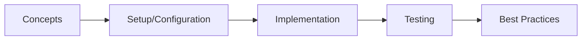

# Chapter 46: R2DBC & Reactive Data Access

> **Previous:** [Spring WebFlux](./45-webflux.md) | **Next:** [Spring AI](./47-spring-ai.md)

## Learning Objectives

<!-- Image Gallery -->
<section class="lesson-visuals" aria-label="Visual learning resources">
  <header><span>VISUAL LEARNING</span><h2>See it. Review it. Remember it.</h2></header>
  <a class="lesson-visual-card" href="../../../assets/images/lessons/java/46-r2dbc/handwritten-notes.svg" target="_blank" rel="noopener">
    
    <span><strong>Handwritten notes</strong>Condensed notes for deliberate review.</span>
  </a>
  <a class="lesson-visual-card" href="../../../assets/images/lessons/java/46-r2dbc/sticky-notes.svg" target="_blank" rel="noopener">
    
    <span><strong>Sticky-note revision</strong>Fast recall prompts for revision.</span>
  </a>
  <a class="lesson-visual-card" href="../../../assets/images/lessons/java/46-r2dbc/visual-explanation.svg" target="_blank" rel="noopener">
    
    <span><strong>Visual concept guide</strong>A connected explanation of the key ideas.</span>
  </a>
</section>
<!-- End Image Gallery -->

## Chapter at a Glance

| Topic | Key Insight | Practical Takeaway |
|-------|-------------|--------------------|
| Core Concepts | Foundational understanding | Real-world application |
| Implementation | Code-first approach | Working examples |
| Best Practices | Production patterns | Avoid common pitfalls |

## Chapter Roadmap




After completing this chapter, you will be able to:

- Explain the R2DBC specification and how it differs from JDBC
- Configure Spring Data R2DBC with PostgreSQL, MySQL, H2, and other databases
- Define reactive repositories using `ReactiveCrudRepository` and `R2dbcRepository`
- Write reactive queries using `@Query` annotations and `Querydsl`/`Criteria` APIs
- Implement reactive transactions with `@Transactional` and programmatic control
- Manage relationships with entities, embedded objects, and custom converters
- Migrate from JPA/Hibernate to R2DBC and understand the trade-offs
- Test reactive data access with `DataR2dbcTest`, Testcontainers, and StepVerifier
- Optimize R2DBC performance with connection pooling, batching, and indexing
- Build a complete reactive data layer for a realistic application

## 1. What Is R2DBC?

> **Pro Tip:** Test with production-like configurations → dev setups often hide issues that surface under real load.

> **Remember:** Start simple. Add complexity only when proven necessary. Premature abstraction creates maintenance burden.


### 1.1 The Problem with JDBC


JDBC (Java Database Connectivity) is inherently blocking. Every `ResultSet.next()`, `PreparedStatement.executeQuery()`, and `Connection.commit()` blocks the calling thread until the database responds. In a reactive application, blocking an event-loop thread defeats the purpose of non-blocking I/O.

```java
// JDBC → blocks the calling thread
ResultSet rs = stmt.executeQuery("SELECT * FROM products");
while (rs.next()) {               // Blocking
    String name = rs.getString("name");  // Blocking
    products.add(new Product(name));
}
```

R2DBC (Reactive Relational Database Connectivity) solves this by providing a fully reactive, non-blocking API for database access. It was created by the Spring team led by Mark Paluch and became an official specification under the R2DBC umbrella.

### 1.2 R2DBC Specification


R2DBC defines four SPI interfaces:

| Interface | Purpose |
|-----------|---------|
| `ConnectionFactory` | Creates reactive connections (analogous to JDBC `DataSource`) |
| `Connection` | A reactive database connection |
| `Statement` | A reactive statement (parameters, execution) |
| `Result` | A reactive result set (rows, row counts, generated keys) |

All operations return `Publisher<T>` (typically `Flux` or `Mono`), enabling end-to-end reactive data flow from database to HTTP response.

### 1.3 R2DBC Drivers


| Database | Driver Dependency |
|----------|------------------|
| PostgreSQL | `io.r2dbc:r2dbc-postgresql` |
| MySQL | `io.asyncer:r2dbc-mysql` |
| H2 | `io.r2dbc:r2dbc-h2` (in-memory/test) |
| Microsoft SQL Server | `io.r2dbc:r2dbc-mssql` |
| MariaDB | `org.mariadb:r2dbc-mariadb` |
| Oracle | `com.oracle.database.r2dbc:oracle-r2dbc` |

## 2. Project Setup

### 2.1 Maven Dependencies


```xml
<?xml version="1.0" encoding="UTF-8"?>
<project xmlns="http://maven.apache.org/POM/4.0.0"
         xmlns:xsi="http://www.w3.org/2001/XMLSchema-instance"
         xsi:schemaLocation="http://maven.apache.org/POM/4.0.0
         http://maven.apache.org/xsd/maven-4.0.0.xsd">
    <modelVersion>4.0.0</modelVersion>

    <parent>
        <groupId>org.springframework.boot</groupId>
        <artifactId>spring-boot-starter-parent</artifactId>
        <version>3.2.0</version>
        <relativePath/>
    </parent>

    <groupId>com.r2dbc</groupId>
    <artifactId>r2dbc-demo</artifactId>
    <version>1.0.0</version>
    <name>R2DBC Demo</name>

    <properties>
        <java.version>21</java.version>
    </properties>

    <dependencies>
        <!-- WebFlux (reactive web) -->
        <dependency>
            <groupId>org.springframework.boot</groupId>
            <artifactId>spring-boot-starter-webflux</artifactId>
        </dependency>

        <!-- Spring Data R2DBC -->
        <dependency>
            <groupId>org.springframework.boot</groupId>
            <artifactId>spring-boot-starter-data-r2dbc</artifactId>
        </dependency>

        <!-- R2DBC PostgreSQL driver -->
        <dependency>
            <groupId>org.postgresql</groupId>
            <artifactId>r2dbc-postgresql</artifactId>
        </dependency>

        <!-- R2DBC H2 driver (for testing) -->
        <dependency>
            <groupId>io.r2dbc</groupId>
            <artifactId>r2dbc-h2</artifactId>
            <scope>test</scope>
        </dependency>

        <!-- Reactive validation -->
        <dependency>
            <groupId>org.springframework.boot</groupId>
            <artifactId>spring-boot-starter-validation</artifactId>
        </dependency>

        <!-- Testcontainers for R2DBC -->
        <dependency>
            <groupId>org.springframework.boot</groupId>
            <artifactId>spring-boot-starter-test</artifactId>
            <scope>test</scope>
        </dependency>
        <dependency>
            <groupId>io.projectreactor</groupId>
            <artifactId>reactor-test</artifactId>
            <scope>test</scope>
        </dependency>
        <dependency>
            <groupId>org.testcontainers</groupId>
            <artifactId>testcontainers</artifactId>
            <scope>test</scope>
        </dependency>
        <dependency>
            <groupId>org.testcontainers</groupId>
            <artifactId>postgresql</artifactId>
            <scope>test</scope>
        </dependency>
        <dependency>
            <groupId>org.testcontainers</groupId>
            <artifactId>r2dbc</artifactId>
            <scope>test</scope>
        </dependency>

        <!-- Flyway for R2DBC (reactive migrations) -->
        <dependency>
            <groupId>org.flywaydb</groupId>
            <artifactId>flyway-core</artifactId>
        </dependency>
    </dependencies>

    <build>
        <plugins>
            <plugin>
                <groupId>org.springframework.boot</groupId>
                <artifactId>spring-boot-maven-plugin</artifactId>
            </plugin>
        </plugins>
    </build>
</project>
```

### 2.2 Application Configuration


```yaml
# src/main/resources/application.yml

> **Previous:** [Spring WebFlux](./45-webflux.md) | **Next:** [Spring AI](./47-spring-ai.md)
spring:
  r2dbc:
    url: r2dbc:postgresql://localhost:5432/reactivedb
    username: postgres
    password: postgres
    pool:
      initial-size: 5
      max-size: 20
      max-idle-time: 30m
      max-life-time: 60m
      max-acquire-time: 5s
      max-create-connection-time: 5s

  # Flyway migrations (reactive-aware)
  flyway:
    url: jdbc:postgresql://localhost:5432/reactivedb
    user: postgres
    password: postgres
    enabled: true
    locations: classpath:db/migration

logging:
  level:
    org.springframework.data.r2dbc: DEBUG
    io.r2dbc.postgresql.QUERY: DEBUG
    io.r2dbc.postgresql.PARAM: DEBUG
```

### 2.3 SQL Schema Migrations (Flyway)


```sql
-- src/main/resources/db/migration/V1__init_schema.sql
CREATE TABLE IF NOT EXISTS products (
    id          UUID PRIMARY KEY DEFAULT gen_random_uuid(),
    name        VARCHAR(255) NOT NULL,
    category    VARCHAR(100) NOT NULL,
    price       DECIMAL(10, 2) NOT NULL,
    quantity    INTEGER NOT NULL DEFAULT 0,
    created_at  TIMESTAMP NOT NULL DEFAULT NOW(),
    version     INTEGER NOT NULL DEFAULT 0
);

CREATE TABLE IF NOT EXISTS customers (
    id          UUID PRIMARY KEY DEFAULT gen_random_uuid(),
    name        VARCHAR(255) NOT NULL,
    email       VARCHAR(255) UNIQUE NOT NULL,
    tier        VARCHAR(20) NOT NULL DEFAULT 'REGULAR',
    created_at  TIMESTAMP NOT NULL DEFAULT NOW()
);

CREATE TABLE IF NOT EXISTS orders (
    id            UUID PRIMARY KEY DEFAULT gen_random_uuid(),
    customer_id   UUID NOT NULL REFERENCES customers(id),
    status        VARCHAR(20) NOT NULL DEFAULT 'PENDING',
    total         DECIMAL(12, 2) NOT NULL DEFAULT 0,
    created_at    TIMESTAMP NOT NULL DEFAULT NOW(),
    version       INTEGER NOT NULL DEFAULT 0
);

CREATE TABLE IF NOT EXISTS order_items (
    id          UUID PRIMARY KEY DEFAULT gen_random_uuid(),
    order_id    UUID NOT NULL REFERENCES orders(id),
    product_id  UUID NOT NULL REFERENCES products(id),
    quantity    INTEGER NOT NULL,
    unit_price  DECIMAL(10, 2) NOT NULL
);

CREATE INDEX idx_products_category ON products(category);
CREATE INDEX idx_orders_customer ON orders(customer_id);
CREATE INDEX idx_orders_status ON orders(status);
CREATE INDEX idx_order_items_order ON order_items(order_id);
```

### 2.4 Application Entry Point


```java
package com.r2dbc.demo;

import org.springframework.boot.SpringApplication;
import org.springframework.boot.autoconfigure.SpringBootApplication;
import org.springframework.data.r2dbc.config.EnableR2dbcAuditing;
import org.springframework.data.r2dbc.repository.config.EnableR2dbcRepositories;

@SpringBootApplication
@EnableR2dbcRepositories
@EnableR2dbcAuditing
public class R2dbcApplication {

    public static void main(String[] args) {
        SpringApplication.run(R2dbcApplication.class, args);
    }
}
```

## 3. Entity Mapping

### 3.1 Basic Entities


```java
package com.r2dbc.demo.model;

import org.springframework.data.annotation.*;
import org.springframework.data.domain.Persistable;
import org.springframework.data.relational.core.mapping.Column;
import org.springframework.data.relational.core.mapping.Table;
import java.time.LocalDateTime;
import java.util.UUID;

@Table("products")
public class Product implements Persistable<UUID> {

    @Id
    private UUID id;

    @Column("name")
    private String name;

    @Column("category")
    private String category;

    @Column("price")
    private double price;

    @Column("quantity")
    private int quantity;

    @Column("created_at")
    private LocalDateTime createdAt;

    @Version
    @Column("version")
    private Integer version;

    @Transient
    private boolean isNew = false;

    public Product() {}

    public Product(String name, String category, double price, int quantity) {
        this.name = name;
        this.category = category;
        this.price = price;
        this.quantity = quantity;
        this.createdAt = LocalDateTime.now();
        this.isNew = true;
    }

    // Getters
    public UUID getId() { return id; }
    public String getName() { return name; }
    public String getCategory() { return category; }
    public double getPrice() { return price; }
    public int getQuantity() { return quantity; }
    public LocalDateTime getCreatedAt() { return createdAt; }
    public Integer getVersion() { return version; }

    // Setters
    public void setId(UUID id) { this.id = id; }
    public void setName(String name) { this.name = name; }
    public void setCategory(String category) { this.category = category; }
    public void setPrice(double price) { this.price = price; }
    public void setQuantity(int quantity) { this.quantity = quantity; }
    public void setCreatedAt(LocalDateTime createdAt) { this.createdAt = createdAt; }
    public void setVersion(Integer version) { this.version = version; }

    @Override
    public boolean isNew() {
        return isNew || id == null;
    }

    public Product withNew(boolean isNew) {
        this.isNew = isNew;
        return this;
    }

    @Override
    public String toString() {
        return "Product{id=" + id + ", name='" + name + "', category='" + category +
            "', price=" + price + ", quantity=" + quantity + "}";
    }
}
```

### 3.2 Entity with Relationships


In R2DBC, relationships are not managed automatically like JPA. You write explicit queries.

```java
package com.r2dbc.demo.model;

import org.springframework.data.annotation.*;
import org.springframework.data.domain.Persistable;
import org.springframework.data.relational.core.mapping.Column;
import org.springframework.data.relational.core.mapping.Table;
import java.time.LocalDateTime;
import java.util.UUID;

@Table("customers")
public class Customer implements Persistable<UUID> {

    @Id
    private UUID id;

    @Column("name")
    private String name;

    @Column("email")
    private String email;

    @Column("tier")
    private String tier;

    @Column("created_at")
    private LocalDateTime createdAt;

    @Transient
    private boolean isNew = false;

    public Customer() {}

    public Customer(String name, String email, String tier) {
        this.name = name;
        this.email = email;
        this.tier = tier;
        this.createdAt = LocalDateTime.now();
        this.isNew = true;
    }

    public UUID getId() { return id; }
    public String getName() { return name; }
    public String getEmail() { return email; }
    public String getTier() { return tier; }
    public LocalDateTime getCreatedAt() { return createdAt; }

    public void setId(UUID id) { this.id = id; }
    public void setName(String name) { this.name = name; }
    public void setEmail(String email) { this.email = email; }
    public void setTier(String tier) { this.tier = tier; }
    public void setCreatedAt(LocalDateTime createdAt) { this.createdAt = createdAt; }

    @Override
    public boolean isNew() { return isNew || id == null; }
}
```

```java
package com.r2dbc.demo.model;

import org.springframework.data.annotation.*;
import org.springframework.data.domain.Persistable;
import org.springframework.data.relational.core.mapping.Column;
import org.springframework.data.relational.core.mapping.Table;
import java.time.LocalDateTime;
import java.util.UUID;

@Table("orders")
public class Order implements Persistable<UUID> {

    @Id
    private UUID id;

    @Column("customer_id")
    private UUID customerId;

    @Column("status")
    private String status;

    @Column("total")
    private double total;

    @Column("created_at")
    private LocalDateTime createdAt;

    @Version
    private Integer version;

    @Transient
    private boolean isNew = false;

    // Transient → not persisted, populated by query
    @Transient
    private Customer customer;

    @Transient
    private java.util.List<OrderItem> items;

    public Order() {}

    public Order(UUID customerId, String status) {
        this.customerId = customerId;
        this.status = status;
        this.total = 0.0;
        this.createdAt = LocalDateTime.now();
        this.isNew = true;
    }

    public UUID getId() { return id; }
    public UUID getCustomerId() { return customerId; }
    public String getStatus() { return status; }
    public double getTotal() { return total; }
    public LocalDateTime getCreatedAt() { return createdAt; }
    public Integer getVersion() { return version; }
    public Customer getCustomer() { return customer; }
    public java.util.List<OrderItem> getItems() { return items; }

    public void setId(UUID id) { this.id = id; }
    public void setCustomerId(UUID customerId) { this.customerId = customerId; }
    public void setStatus(String status) { this.status = status; }
    public void setTotal(double total) { this.total = total; }
    public void setCreatedAt(LocalDateTime createdAt) { this.createdAt = createdAt; }
    public void setVersion(Integer version) { this.version = version; }
    public void setCustomer(Customer customer) { this.customer = customer; }
    public void setItems(java.util.List<OrderItem> items) { this.items = items; }

    @Override
    public boolean isNew() { return isNew || id == null; }
}
```

```java
package com.r2dbc.demo.model;

import org.springframework.data.annotation.Id;
import org.springframework.data.relational.core.mapping.Column;
import org.springframework.data.relational.core.mapping.Table;
import java.util.UUID;

@Table("order_items")
public class OrderItem {

    @Id
    private UUID id;

    @Column("order_id")
    private UUID orderId;

    @Column("product_id")
    private UUID productId;

    @Column("quantity")
    private int quantity;

    @Column("unit_price")
    private double unitPrice;

    public OrderItem() {}

    public OrderItem(UUID orderId, UUID productId, int quantity, double unitPrice) {
        this.orderId = orderId;
        this.productId = productId;
        this.quantity = quantity;
        this.unitPrice = unitPrice;
    }

    public UUID getId() { return id; }
    public UUID getOrderId() { return orderId; }
    public UUID getProductId() { return productId; }
    public int getQuantity() { return quantity; }
    public double getUnitPrice() { return unitPrice; }

    public void setId(UUID id) { this.id = id; }
    public void setOrderId(UUID orderId) { this.orderId = orderId; }
    public void setProductId(UUID productId) { this.productId = productId; }
    public void setQuantity(int quantity) { this.quantity = quantity; }
    public void setUnitPrice(double unitPrice) { this.unitPrice = unitPrice; }
}
```

### 3.3 Custom Converters


```java
package com.r2dbc.demo.config;

import com.r2dbc.demo.model.Product;
import io.r2dbc.spi.Row;
import org.springframework.core.convert.converter.Converter;
import org.springframework.data.convert.ReadingConverter;
import org.springframework.data.convert.WritingConverter;
import org.springframework.data.r2dbc.convert.R2dbcCustomConversions;
import org.springframework.context.annotation.Bean;
import org.springframework.context.annotation.Configuration;
import java.time.LocalDateTime;
import java.util.List;
import java.util.UUID;

@Configuration
public class R2dbcConverterConfig {

    @Bean
    public R2dbcCustomConversions r2dbcCustomConversions() {
        return new R2dbcCustomConversions(List.of(
            new ProductRowConverter(),
            new UuidToStringConverter(),
            new StringToUuidConverter()
        ));
    }

    @ReadingConverter
    static class ProductRowConverter implements Converter<Row, Product> {
        @Override
        public Product convert(Row source) {
            Product p = new Product();
            p.setId(source.get("id", UUID.class));
            p.setName(source.get("name", String.class));
            p.setCategory(source.get("category", String.class));
            p.setPrice(source.get("price", Double.class));
            p.setQuantity(source.get("quantity", Integer.class));
            p.setCreatedAt(source.get("created_at", LocalDateTime.class));
            p.setVersion(source.get("version", Integer.class));
            return p;
        }
    }

    @WritingConverter
    static class UuidToStringConverter implements Converter<UUID, String> {
        @Override
        public String convert(UUID source) {
            return source.toString();
        }
    }

    @ReadingConverter
    static class StringToUuidConverter implements Converter<String, UUID> {
        @Override
        public UUID convert(String source) {
            return UUID.fromString(source);
        }
    }
}
```

## 4. Reactive Repositories

### 4.1 R2dbcRepository Interface


```java
package com.r2dbc.demo.repository;

import com.r2dbc.demo.model.Product;
import org.springframework.data.r2dbc.repository.Query;
import org.springframework.data.r2dbc.repository.R2dbcRepository;
import org.springframework.data.repository.query.Param;
import org.springframework.stereotype.Repository;
import reactor.core.publisher.Flux;
import reactor.core.publisher.Mono;
import java.util.UUID;

@Repository
public interface ProductRepository extends R2dbcRepository<Product, UUID> {

    // Derived query methods
    Flux<Product> findByCategory(String category);

    Flux<Product> findByNameContainingIgnoreCase(String name);

    Flux<Product> findByPriceBetween(double min, double max);

    Flux<Product> findByQuantityLessThan(int threshold);

    Mono<Long> countByCategory(String category);

    // Custom @Query with native SQL
    @Query("SELECT * FROM products WHERE category = :category ORDER BY price DESC LIMIT :limit")
    Flux<Product> findTopByCategory(@Param("category") String category,
                                     @Param("limit") int limit);

    @Query("SELECT * FROM products WHERE price > :minPrice AND quantity > 0 ORDER BY price ASC")
    Flux<Product> findAvailableAbovePrice(@Param("minPrice") double minPrice);

    @Query("SELECT COALESCE(AVG(price), 0) FROM products WHERE category = :category")
    Mono<Double> averagePriceByCategory(@Param("category") String category);

    @Query("SELECT * FROM products WHERE LOWER(name) LIKE LOWER(CONCAT('%', :search, '%'))")
    Flux<Product> searchByName(@Param("search") String search);

    @Query("UPDATE products SET quantity = quantity - :amount WHERE id = :id AND quantity >= :amount")
    Mono<Integer> deductStock(@Param("id") UUID id, @Param("amount") int amount);

    @Query("UPDATE products SET quantity = quantity + :amount WHERE id = :id")
    Mono<Integer> addStock(@Param("id") UUID id, @Param("amount") int amount);

    @Query("SELECT EXISTS(SELECT 1 FROM products WHERE id = :id AND quantity >= :amount)")
    Mono<Boolean> hasEnoughStock(@Param("id") UUID id, @Param("amount") int amount);

    // Aggregation queries
    @Query("""
        SELECT category, COUNT(*) as count, AVG(price) as avg_price,
               SUM(quantity) as total_stock
        FROM products GROUP BY category ORDER BY category
        """)
    Flux<CategorySummary> categorySummaries();

    // DTO projection
    interface CategorySummary {
        String getCategory();
        Long getCount();
        Double getAvgPrice();
        Long getTotalStock();
    }
}
```

### 4.2 Customer Repository


```java
package com.r2dbc.demo.repository;

import com.r2dbc.demo.model.Customer;
import org.springframework.data.r2dbc.repository.Query;
import org.springframework.data.r2dbc.repository.R2dbcRepository;
import org.springframework.data.repository.query.Param;
import org.springframework.stereotype.Repository;
import reactor.core.publisher.Mono;
import java.util.UUID;

@Repository
public interface CustomerRepository extends R2dbcRepository<Customer, UUID> {

    Mono<Customer> findByEmail(String email);

    @Query("SELECT * FROM customers WHERE LOWER(name) LIKE LOWER(CONCAT('%', :search, '%'))")
    Flux<Customer> searchByName(@Param("search") String search);

    @Query("SELECT tier, COUNT(*) as count FROM customers GROUP BY tier")
    Flux<TierCount> tierCounts();

    interface TierCount {
        String getTier();
        Long getCount();
    }
}
```

### 4.3 Order Repository with Joins


```java
package com.r2dbc.demo.repository;

import com.r2dbc.demo.model.Order;
import com.r2dbc.demo.model.OrderItem;
import io.r2dbc.spi.Row;
import io.r2dbc.spi.RowMetadata;
import org.springframework.data.r2dbc.repository.Query;
import org.springframework.data.r2dbc.repository.R2dbcRepository;
import org.springframework.data.repository.query.Param;
import org.springframework.stereotype.Repository;
import reactor.core.publisher.Flux;
import reactor.core.publisher.Mono;
import java.util.UUID;
import java.util.function.BiFunction;

@Repository
public interface OrderRepository extends R2dbcRepository<Order, UUID> {

    Flux<Order> findByCustomerIdOrderByCreatedAtDesc(UUID customerId);

    Flux<Order> findByStatus(String status);

    @Query("SELECT COUNT(*) FROM orders WHERE status = :status")
    Mono<Long> countByStatus(@Param("status") String status);

    // Join query returning flat rows
    @Query("""
        SELECT o.*, c.name as customer_name, c.email as customer_email
        FROM orders o
        JOIN customers c ON o.customer_id = c.id
        WHERE o.id = :id
        """)
    Mono<OrderWithCustomer> findOrderWithCustomer(@Param("id") UUID id);

    @Query("""
        SELECT oi.*, p.name as product_name, p.category as product_category
        FROM order_items oi
        JOIN products p ON oi.product_id = p.id
        WHERE oi.order_id = :orderId
        """)
    Flux<OrderItemWithProduct> findItemsWithProduct(@Param("orderId") UUID orderId);

    // Aggregate query
    @Query("""
        SELECT DATE(created_at) as day, COUNT(*) as order_count,
               SUM(total) as revenue
        FROM orders
        WHERE created_at >= :since
        GROUP BY DATE(created_at)
        ORDER BY day DESC
        """)
    Flux<DailyOrderSummary> dailySummaries(@Param("since") java.time.LocalDateTime since);
}

// Projection interfaces
interface OrderWithCustomer {
    UUID getId();
    UUID getCustomerId();
    String getStatus();
    double getTotal();
    java.time.LocalDateTime getCreatedAt();
    String getCustomerName();
    String getCustomerEmail();
}

interface OrderItemWithProduct {
    UUID getId();
    UUID getOrderId();
    UUID getProductId();
    int getQuantity();
    double getUnitPrice();
    String getProductName();
    String getProductCategory();
}

interface DailyOrderSummary {
    java.time.LocalDate getDay();
    Long getOrderCount();
    Double getRevenue();
}
```

### 4.4 Order Item Repository


```java
package com.r2dbc.demo.repository;

import com.r2dbc.demo.model.OrderItem;
import org.springframework.data.r2dbc.repository.Query;
import org.springframework.data.r2dbc.repository.R2dbcRepository;
import org.springframework.data.repository.query.Param;
import org.springframework.stereotype.Repository;
import reactor.core.publisher.Flux;
import reactor.core.publisher.Mono;
import java.util.UUID;

@Repository
public interface OrderItemRepository extends R2dbcRepository<OrderItem, UUID> {

    Flux<OrderItem> findByOrderId(UUID orderId);

    @Query("SELECT SUM(oi.quantity * oi.unit_price) FROM order_items oi WHERE oi.order_id = :orderId")
    Mono<Double> calculateOrderTotal(@Param("orderId") UUID orderId);

    @Query("DELETE FROM order_items WHERE order_id = :orderId")
    Mono<Integer> deleteByOrderId(@Param("orderId") UUID orderId);
}
```

## 5. Database Client (Low-Level)

For situations where repositories are not sufficient, you can use `DatabaseClient` directly.

```java
package com.r2dbc.demo.client;

import com.r2dbc.demo.model.Product;
import org.springframework.r2dbc.core.DatabaseClient;
import org.springframework.stereotype.Component;
import reactor.core.publisher.Flux;
import reactor.core.publisher.Mono;
import java.time.LocalDateTime;
import java.util.UUID;

@Component
public class ProductDatabaseClient {

    private final DatabaseClient client;

    public ProductDatabaseClient(DatabaseClient client) {
        this.client = client;
    }

    // Manual mapping with RowMapper
    public Flux<Product> findAll() {
        return client.sql("SELECT * FROM products ORDER BY name")
            .map((row, metadata) -> mapProduct(row))
            .all();
    }

    public Mono<Product> findById(UUID id) {
        return client.sql("SELECT * FROM products WHERE id = :id")
            .bind("id", id)
            .map((row, metadata) -> mapProduct(row))
            .one();
    }

    public Mono<Product> save(Product product) {
        if (product.getId() == null) {
            return insert(product);
        }
        return update(product);
    }

    private Mono<Product> insert(Product product) {
        return client.sql("""
                INSERT INTO products (id, name, category, price, quantity, created_at)
                VALUES (:id, :name, :category, :price, :quantity, :createdAt)
                RETURNING *
                """)
            .bind("id", UUID.randomUUID())
            .bind("name", product.getName())
            .bind("category", product.getCategory())
            .bind("price", product.getPrice())
            .bind("quantity", product.getQuantity())
            .bind("createdAt", LocalDateTime.now())
            .map((row, metadata) -> mapProduct(row))
            .one();
    }

    private Mono<Product> update(Product product) {
        return client.sql("""
                UPDATE products SET name = :name, category = :category,
                price = :price, quantity = :quantity
                WHERE id = :id
                RETURNING *
                """)
            .bind("id", product.getId())
            .bind("name", product.getName())
            .bind("category", product.getCategory())
            .bind("price", product.getPrice())
            .bind("quantity", product.getQuantity())
            .map((row, metadata) -> mapProduct(row))
            .one();
    }

    public Mono<Integer> deleteById(UUID id) {
        return client.sql("DELETE FROM products WHERE id = :id")
            .bind("id", id)
            .fetch()
            .rowsUpdated();
    }

    public Flux<Product> search(String searchTerm, int limit, int offset) {
        return client.sql("""
                SELECT * FROM products
                WHERE LOWER(name) LIKE LOWER(CONCAT('%', :search, '%'))
                ORDER BY name
                LIMIT :limit OFFSET :offset
                """)
            .bind("search", searchTerm)
            .bind("limit", limit)
            .bind("offset", offset)
            .map((row, metadata) -> mapProduct(row))
            .all();
    }

    public Mono<Long> count() {
        return client.sql("SELECT COUNT(*) FROM products")
            .map((row, metadata) -> row.get(0, Long.class))
            .one();
    }

    public Mono<Integer> updatePricesByCategory(String category, double percentage) {
        return client.sql("""
                UPDATE products
                SET price = price * (1 + :percentage / 100.0)
                WHERE category = :category
                """)
            .bind("category", category)
            .bind("percentage", percentage)
            .fetch()
            .rowsUpdated();
    }

    public Flux<Product> findLowStockWithSupplierInfo(int threshold) {
        return client.sql("""
                SELECT p.*, s.name as supplier_name, s.contact_email
                FROM products p
                LEFT JOIN suppliers s ON p.supplier_id = s.id
                WHERE p.quantity < :threshold
                ORDER BY p.quantity ASC
                """)
            .bind("threshold", threshold)
            .map((row, metadata) -> {
                Product p = mapProduct(row);
                // Could set additional transient fields here
                return p;
            })
            .all();
    }

    private Product mapProduct(Row row) {
        Product p = new Product();
        p.setId(row.get("id", UUID.class));
        p.setName(row.get("name", String.class));
        p.setCategory(row.get("category", String.class));
        p.setPrice(row.get("price", Double.class));
        p.setQuantity(row.get("quantity", Integer.class));
        p.setCreatedAt(row.get("created_at", LocalDateTime.class));
        p.setVersion(row.get("version", Integer.class));
        return p;
    }
}
```

## 6. Reactive Transactions

### 6.1 Declarative Transactions with @Transactional


```java
package com.r2dbc.demo.service;

import com.r2dbc.demo.model.Order;
import com.r2dbc.demo.model.OrderItem;
import com.r2dbc.demo.model.Product;
import com.r2dbc.demo.repository.*;
import org.springframework.stereotype.Service;
import org.springframework.transaction.annotation.Transactional;
import org.springframework.transaction.reactive.TransactionalOperator;
import reactor.core.publisher.Flux;
import reactor.core.publisher.Mono;
import java.util.UUID;

@Service
public class OrderService {

    private final OrderRepository orderRepository;
    private final OrderItemRepository orderItemRepository;
    private final ProductRepository productRepository;
    private final CustomerRepository customerRepository;
    private final TransactionalOperator transactionalOperator;

    public OrderService(OrderRepository orderRepository,
                        OrderItemRepository orderItemRepository,
                        ProductRepository productRepository,
                        CustomerRepository customerRepository,
                        TransactionalOperator transactionalOperator) {
        this.orderRepository = orderRepository;
        this.orderItemRepository = orderItemRepository;
        this.productRepository = productRepository;
        this.customerRepository = customerRepository;
        this.transactionalOperator = transactionalOperator;
    }

    // Declarative transaction → whole method is transactional
    @Transactional
    public Mono<Order> createOrder(UUID customerId, java.util.List<OrderItemRequest> items) {
        return customerRepository.findById(customerId)
            .switchIfEmpty(Mono.error(
                new IllegalArgumentException("Customer not found: " + customerId)))
            .flatMap(customer -> {
                Order order = new Order(customerId, "PENDING");
                return orderRepository.save(order);
            })
            .flatMap(order -> {
                // Create all line items and calculate total
                Flux<OrderItem> orderItems = Flux.fromIterable(items)
                    .flatMap(req -> productRepository.findById(req.productId)
                        .switchIfEmpty(Mono.error(
                            new IllegalArgumentException("Product not found: " + req.productId)))
                        .flatMap(product -> {
                            if (product.getQuantity() < req.quantity) {
                                return Mono.error(new IllegalArgumentException(
                                    "Insufficient stock for product: " + product.getName()));
                            }
                            OrderItem item = new OrderItem(
                                order.getId(), req.productId, req.quantity, product.getPrice());
                            return orderItemRepository.save(item)
                                .then(productRepository.deductStock(req.productId, req.quantity)
                                    .thenReturn(item));
                        }));

                return orderItems.collectList()
                    .flatMap(savedItems -> {
                        double total = savedItems.stream()
                            .mapToDouble(i -> i.getQuantity() * i.getUnitPrice())
                            .sum();
                        order.setTotal(total);
                        return orderRepository.save(order);
                    });
            });
    }

    // TransactionalOperator → programmatic transaction boundaries
    public Mono<Order> createOrderProgrammatic(UUID customerId,
                                                java.util.List<OrderItemRequest> items) {
        return transactionalOperator.execute(status ->
            customerRepository.findById(customerId)
                .switchIfEmpty(Mono.error(
                    new IllegalArgumentException("Customer not found")))
                .flatMap(customer -> {
                    Order order = new Order(customerId, "PENDING");
                    return orderRepository.save(order);
                })
                .flatMap(order -> Flux.fromIterable(items)
                    .flatMap(req -> productRepository.findById(req.productId)
                        .flatMap(product -> {
                            if (product.getQuantity() < req.quantity) {
                                return Mono.error(new IllegalArgumentException(
                                    "Insufficient stock"));
                            }
                            OrderItem item = new OrderItem(
                                order.getId(), req.productId, req.quantity, product.getPrice());
                            return orderItemRepository.save(item)
                                .then(productRepository.deductStock(req.productId, req.quantity)
                                    .thenReturn(item));
                        }))
                    .collectList()
                    .flatMap(savedItems -> {
                        double total = savedItems.stream()
                            .mapToDouble(i -> i.getQuantity() * i.getUnitPrice())
                            .sum();
                        order.setTotal(total);
                        return orderRepository.save(order);
                    })
                )
        ).then();
    }

    @Transactional
    public Mono<Order> cancelOrder(UUID orderId) {
        return orderRepository.findById(orderId)
            .switchIfEmpty(Mono.error(
                new IllegalArgumentException("Order not found: " + orderId)))
            .flatMap(order -> {
                if ("CANCELLED".equals(order.getStatus())) {
                    return Mono.error(
                        new IllegalStateException("Order already cancelled"));
                }
                order.setStatus("CANCELLED");
                return orderItemRepository.findByOrderId(orderId)
                    .flatMap(item -> productRepository.addStock(
                        item.getProductId(), item.getQuantity()))
                    .then(orderRepository.save(order));
            });
    }

    @Transactional(readOnly = true)
    public Mono<Order> getOrderWithDetails(UUID orderId) {
        return orderRepository.findOrderWithCustomer(orderId)
            .switchIfEmpty(Mono.error(
                new IllegalArgumentException("Order not found: " + orderId)))
            .flatMap(oc -> orderRepository.findById(oc.getId())
                .flatMap(order -> orderItemRepository.findByOrderId(orderId)
                    .collectList()
                    .map(items -> {
                        order.setItems(items);
                        return order;
                    })));
    }

    @Transactional(readOnly = true)
    public Flux<Order> getCustomerOrders(UUID customerId) {
        return orderRepository.findByCustomerIdOrderByCreatedAtDesc(customerId);
    }

    public record OrderItemRequest(UUID productId, int quantity) {}
}
```

### 6.2 Transaction Configuration


```java
package com.r2dbc.demo.config;

import org.springframework.context.annotation.Bean;
import org.springframework.context.annotation.Configuration;
import org.springframework.r2dbc.connection.R2dbcTransactionManager;
import org.springframework.transaction.ReactiveTransactionManager;
import org.springframework.transaction.annotation.EnableTransactionManagement;
import org.springframework.transaction.reactive.TransactionalOperator;
import io.r2dbc.spi.ConnectionFactory;

@Configuration
@EnableTransactionManagement
public class TransactionConfig {

    @Bean
    public ReactiveTransactionManager transactionManager(ConnectionFactory cf) {
        return new R2dbcTransactionManager(cf);
    }

    @Bean
    public TransactionalOperator transactionalOperator(
            ReactiveTransactionManager tm) {
        return TransactionalOperator.create(tm);
    }
}
```

## 7. Testing R2DBC

### 7.1 DataR2dbcTest with H2


```java
package com.r2dbc.demo.repository;

import com.r2dbc.demo.config.R2dbcConverterConfig;
import com.r2dbc.demo.model.Product;
import org.junit.jupiter.api.BeforeEach;
import org.junit.jupiter.api.Test;
import org.springframework.beans.factory.annotation.Autowired;
import org.springframework.boot.test.autoconfigure.data.r2dbc.DataR2dbcTest;
import org.springframework.context.annotation.Import;
import org.springframework.test.context.DynamicPropertyRegistry;
import org.springframework.test.context.DynamicPropertySource;
import reactor.test.StepVerifier;
import java.util.UUID;

@DataR2dbcTest
@Import(R2dbcConverterConfig.class)
class ProductRepositoryTest {

    @Autowired
    private ProductRepository productRepository;

    private Product sampleProduct;

    @BeforeEach
    void setUp() {
        productRepository.deleteAll().block();
        sampleProduct = productRepository.save(
            new Product("Test Product", "Electronics", 99.99, 50)
        ).block();
    }

    @Test
    void findAll_shouldReturnAllProducts() {
        StepVerifier.create(productRepository.findAll())
            .expectNextMatches(p -> p.getName().equals("Test Product"))
            .expectComplete()
            .verify();
    }

    @Test
    void findById_shouldReturnProduct() {
        StepVerifier.create(productRepository.findById(sampleProduct.getId()))
            .expectNextMatches(p -> p.getPrice() == 99.99)
            .expectComplete()
            .verify();
    }

    @Test
    void findById_notFound_shouldReturnEmpty() {
        StepVerifier.create(productRepository.findById(UUID.randomUUID()))
            .expectComplete()
            .verify();
    }

    @Test
    void findByCategory_shouldFilter() {
        productRepository.save(new Product("Laptop", "Electronics", 1200.0, 10)).block();
        productRepository.save(new Product("Book", "Education", 29.99, 100)).block();

        StepVerifier.create(productRepository.findByCategory("Electronics"))
            .expectNextMatches(p -> p.getCategory().equals("Electronics"))
            .expectNextMatches(p -> p.getCategory().equals("Electronics"))
            .expectComplete()
            .verify();
    }

    @Test
    void findByNameContainingIgnoreCase_shouldSearch() {
        StepVerifier.create(productRepository.findByNameContainingIgnoreCase("test"))
            .expectNextMatches(p -> p.getName().toLowerCase().contains("test"))
            .expectComplete()
            .verify();
    }

    @Test
    void findByPriceBetween_shouldFilter() {
        productRepository.save(new Product("Cheap", "A", 5.0, 10)).block();
        productRepository.save(new Product("Expensive", "B", 500.0, 10)).block();

        StepVerifier.create(productRepository.findByPriceBetween(50.0, 200.0))
            .expectNextMatches(p -> p.getPrice() >= 50.0 && p.getPrice() <= 200.0)
            .expectComplete()
            .verify();
    }

    @Test
    void findByQuantityLessThan_shouldFindLowStock() {
        productRepository.save(new Product("Low", "A", 10.0, 3)).block();
        productRepository.save(new Product("High", "B", 10.0, 100)).block();

        StepVerifier.create(productRepository.findByQuantityLessThan(10))
            .expectNextMatches(p -> p.getQuantity() < 10)
            .expectComplete()
            .verify();
    }

    @Test
    void countByCategory_shouldReturnCount() {
        productRepository.save(new Product("Item1", "Books", 10.0, 1)).block();
        productRepository.save(new Product("Item2", "Books", 20.0, 2)).block();

        StepVerifier.create(productRepository.countByCategory("Books"))
            .expectNext(2L)
            .expectComplete()
            .verify();
    }

    @Test
    void customQuery_shouldWork() {
        productRepository.save(new Product("Alpha", "A", 100.0, 10)).block();
        productRepository.save(new Product("Beta", "A", 50.0, 10)).block();
        productRepository.save(new Product("Gamma", "A", 200.0, 10)).block();

        StepVerifier.create(productRepository.findTopByCategory("A", 2))
            .expectNextMatches(p -> p.getPrice() == 200.0)
            .expectNextMatches(p -> p.getPrice() == 100.0)
            .expectComplete()
            .verify();
    }

    @Test
    void deductStock_shouldReduceQuantity() {
        UUID id = sampleProduct.getId();

        StepVerizer.create(productRepository.deductStock(id, 10))
            .expectNext(1)
            .expectComplete()
            .verify();

        StepVerifier.create(productRepository.findById(id))
            .expectNextMatches(p -> p.getQuantity() == 40)
            .expectComplete()
            .verify();
    }

    @Test
    void hasEnoughStock_shouldCheck() {
        StepVerifier.create(productRepository.hasEnoughStock(sampleProduct.getId(), 10))
            .expectNext(true)
            .expectComplete()
            .verify();

        StepVerifier.create(productRepository.hasEnoughStock(sampleProduct.getId(), 999))
            .expectNext(false)
            .expectComplete()
            .verify();
    }

    @Test
    void categorySummaries_shouldAggregate() {
        productRepository.save(new Product("A1", "CatX", 100.0, 10)).block();
        productRepository.save(new Product("A2", "CatX", 200.0, 20)).block();
        productRepository.save(new Product("B1", "CatY", 50.0, 5)).block();

        StepVerifier.create(productRepository.categorySummaries())
            .expectNextMatches(s -> s.getCategory().equals("CatX")
                && s.getCount() == 2
                && s.getAvgPrice() == 150.0
                && s.getTotalStock() == 30)
            .expectNextMatches(s -> s.getCategory().equals("CatY")
                && s.getCount() == 1)
            .expectComplete()
            .verify();
    }
}
```

### 7.2 Testcontainers with PostgreSQL


```java
package com.r2dbc.demo.repository;

import com.r2dbc.demo.model.Product;
import org.junit.jupiter.api.BeforeEach;
import org.junit.jupiter.api.Test;
import org.springframework.beans.factory.annotation.Autowired;
import org.springframework.boot.test.autoconfigure.data.r2dbc.DataR2dbcTest;
import org.springframework.boot.testcontainers.service.connection.ServiceConnection;
import org.springframework.test.context.DynamicPropertyRegistry;
import org.springframework.test.context.DynamicPropertySource;
import org.testcontainers.containers.PostgreSQLContainer;
import org.testcontainers.junit.jupiter.Container;
import org.testcontainers.junit.jupiter.Testcontainers;
import reactor.test.StepVerifier;

@DataR2dbcTest
@Testcontainers
class ProductRepositoryTestcontainersTest {

    @Container
    @ServiceConnection
    static PostgreSQLContainer<?> postgres = new PostgreSQLContainer<>("postgres:16")
        .withDatabaseName("testdb")
        .withUsername("test")
        .withPassword("test");

    @Autowired
    private ProductRepository productRepository;

    @BeforeEach
    void setUp() {
        productRepository.deleteAll().block();
    }

    @Test
    void shouldWorkWithRealPostgres() {
        productRepository.save(new Product("RealDB Product", "Test", 100.0, 50))
            .as(StepVerifier::create)
            .expectNextMatches(p -> p.getId() != null)
            .expectComplete()
            .verify();
    }

    @Test
    void transactionCommitTest() {
        productRepository.save(new Product("Item1", "A", 10.0, 5)).block();
        productRepository.save(new Product("Item2", "A", 20.0, 10)).block();

        StepVerifier.create(productRepository.countByCategory("A"))
            .expectNext(2L)
            .expectComplete()
            .verify();
    }
}
```

### 7.3 Testing Transactions


```java
package com.r2dbc.demo.service;

import com.r2dbc.demo.model.Product;
import com.r2dbc.demo.repository.OrderItemRepository;
import com.r2dbc.demo.repository.OrderRepository;
import com.r2dbc.demo.repository.ProductRepository;
import org.junit.jupiter.api.BeforeEach;
import org.junit.jupiter.api.Test;
import org.springframework.beans.factory.annotation.Autowired;
import org.springframework.boot.test.context.SpringBootTest;
import org.springframework.transaction.reactive.TransactionalOperator;
import reactor.core.publisher.Flux;
import reactor.core.publisher.Mono;
import reactor.test.StepVerifier;
import java.util.List;
import java.util.UUID;

@SpringBootTest
class OrderServiceTransactionTest {

    @Autowired
    private OrderService orderService;

    @Autowired
    private ProductRepository productRepository;

    @Autowired
    private OrderRepository orderRepository;

    @Autowired
    private OrderItemRepository orderItemRepository;

    @Autowired
    private TransactionalOperator transactionalOperator;

    private UUID customerId;
    private UUID productId;

    @BeforeEach
    void setUp() {
        transactionalOperator.execute(status ->
            orderItemRepository.deleteAll()
                .then(orderRepository.deleteAll())
                .then(productRepository.deleteAll())
        ).then().block();

        customerId = UUID.randomUUID();
        productId = UUID.randomUUID();

        // Insert test customer and product using DatabaseClient directly
    }

    @Test
    void createOrder_shouldSucceed() {
        productRepository.save(new Product("Test Item", "A", 50.0, 10))
            .flatMap(product -> {
                var request = List.of(
                    new OrderService.OrderItemRequest(product.getId(), 2)
                );
                return orderService.createOrder(customerId, request);
            })
            .as(StepVerifier::create)
            .expectNextMatches(order -> order.getStatus().equals("PENDING")
                && order.getTotal() == 100.0)
            .expectComplete()
            .verify();
    }

    @Test
    void createOrder_insufficientStock_shouldRollback() {
        productRepository.save(new Product("Low Stock", "A", 50.0, 1))
            .flatMap(product -> {
                var request = List.of(
                    new OrderService.OrderItemRequest(product.getId(), 999)
                );
                return orderService.createOrder(customerId, request);
            })
            .as(StepVerifier::create)
            .expectError(IllegalArgumentException.class)
            .verify();

        // Verify no orders were created (transaction rolled back)
        StepVerifier.create(orderRepository.count())
            .expectNext(0L)
            .expectComplete()
            .verify();
    }

    @Test
    void cancelOrder_shouldRestoreStock() {
        productRepository.save(new Product("Cancel Test", "A", 30.0, 5))
            .flatMap(product -> {
                var request = List.of(
                    new OrderService.OrderItemRequest(product.getId(), 3)
                );
                return orderService.createOrder(customerId, request)
                    .flatMap(order -> orderService.cancelOrder(order.getId())
                        .thenReturn(product.getId()));
            })
            .flatMap(pid -> productRepository.findById(pid))
            .as(StepVerifier::create)
            .expectNextMatches(p -> p.getQuantity() == 5) // Stock restored
            .expectComplete()
            .verify();
    }
}
```

## 8. Auditing

```java
package com.r2dbc.demo.model;

import org.springframework.data.annotation.CreatedDate;
import org.springframework.data.annotation.LastModifiedDate;
import org.springframework.data.annotation.Version;
import org.springframework.data.relational.core.mapping.Column;
import java.time.LocalDateTime;

// Mixin for entities that need auditing
public abstract class AuditableEntity {

    @CreatedDate
    @Column("created_at")
    private LocalDateTime createdAt;

    @LastModifiedDate
    @Column("updated_at")
    private LocalDateTime updatedAt;

    @Version
    @Column("version")
    private Integer version;

    public LocalDateTime getCreatedAt() { return createdAt; }
    public LocalDateTime getUpdatedAt() { return updatedAt; }
    public Integer getVersion() { return version; }

    public void setCreatedAt(LocalDateTime createdAt) { this.createdAt = createdAt; }
    public void setUpdatedAt(LocalDateTime updatedAt) { this.updatedAt = updatedAt; }
    public void setVersion(Integer version) { this.version = version; }
}
```

## 9. Performance Tuning

### 9.1 Connection Pool Optimization


```yaml
# application.yml

> **Previous:** [Spring WebFlux](./45-webflux.md) | **Next:** [Spring AI](./47-spring-ai.md)
spring:
  r2dbc:
    pool:
      initial-size: 10
      max-size: 50
      max-idle-time: 30m
      max-life-time: 60m
      max-acquire-time: 3s
      max-create-connection-time: 3s
      # Validation
      validation-query: SELECT 1
```

### 9.2 Batch Operations


```java
package com.r2dbc.demo.service;

import com.r2dbc.demo.model.Product;
import org.springframework.r2dbc.core.DatabaseClient;
import org.springframework.stereotype.Service;
import reactor.core.publisher.Flux;
import reactor.core.publisher.Mono;
import reactor.core.scheduler.Schedulers;
import java.util.List;

@Service
public class BatchService {

    private final DatabaseClient client;

    public BatchService(DatabaseClient client) {
        this.client = client;
    }

    // Batch insert using multiple bind values
    public Flux<Product> batchInsert(List<Product> products) {
        return Flux.fromIterable(products)
            .flatMap(product ->
                client.sql("""
                    INSERT INTO products (id, name, category, price, quantity, created_at)
                    VALUES (:id, :name, :category, :price, :quantity, :createdAt)
                    RETURNING *
                    """)
                .bind("id", java.util.UUID.randomUUID())
                .bind("name", product.getName())
                .bind("category", product.getCategory())
                .bind("price", product.getPrice())
                .bind("quantity", product.getQuantity())
                .bind("createdAt", java.time.LocalDateTime.now())
                .map((row, metadata) -> mapProduct(row))
                .one(),
                50 // Concurrency limit
            );
    }

    // Bulk update using IN clause
    public Mono<Integer> updatePricesByCategoryBulk(String category, double newPrice) {
        return client.sql("UPDATE products SET price = :price WHERE category = :category")
            .bind("price", newPrice)
            .bind("category", category)
            .fetch()
            .rowsUpdated();
    }

    // Using SQL batch statement
    public Mono<Integer> batchUpdatePrices(List<java.util.UUID> ids, double multiplier) {
        // R2DBC doesn't support JDBC batch natively, but you can use flatMap
        return Flux.fromIterable(ids)
            .flatMap(id ->
                client.sql("UPDATE products SET price = price * :mult WHERE id = :id")
                    .bind("mult", multiplier)
                    .bind("id", id)
                    .fetch()
                    .rowsUpdated(),
                10
            )
            .reduce(0, Integer::sum);
    }

    private Product mapProduct(io.r2dbc.spi.Row row) {
        Product p = new Product();
        p.setId(row.get("id", java.util.UUID.class));
        p.setName(row.get("name", String.class));
        p.setCategory(row.get("category", String.class));
        p.setPrice(row.get("price", Double.class));
        p.setQuantity(row.get("quantity", Integer.class));
        p.setCreatedAt(row.get("created_at", java.time.LocalDateTime.class));
        p.setVersion(row.get("version", Integer.class));
        return p;
    }
}
```

### 9.3 Indexing and Query Optimization


```sql
-- Key indexes for performance
CREATE INDEX CONCURRENTLY IF NOT EXISTS idx_products_category ON products(category);
CREATE INDEX CONCURRENTLY IF NOT EXISTS idx_products_name_trgm ON products USING gin (name gin_trgm_ops);
CREATE INDEX CONCURRENTLY IF NOT EXISTS idx_orders_customer_status ON orders(customer_id, status);
CREATE INDEX CONCURRENTLY IF NOT EXISTS idx_order_items_product ON order_items(product_id);

-- Materialized view for dashboard queries
CREATE MATERIALIZED VIEW IF NOT EXISTS product_category_stats AS
SELECT
    category,
    COUNT(*) as product_count,
    AVG(price) as avg_price,
    SUM(quantity) as total_stock,
    MIN(price) as min_price,
    MAX(price) as max_price
FROM products
GROUP BY category;

CREATE UNIQUE INDEX IF NOT EXISTS idx_category_stats ON product_category_stats(category);
```

### 9.4 Performance Comparison: R2DBC vs JPA


```java
package com.r2dbc.demo.performance;

import org.springframework.r2dbc.core.DatabaseClient;
import org.springframework.stereotype.Component;
import reactor.core.publisher.Flux;
import reactor.core.publisher.Mono;
import reactor.core.scheduler.Schedulers;
import java.time.Duration;
import java.time.Instant;
import java.util.UUID;

@Component
public class PerformanceComparison {

    private final DatabaseClient client;

    public PerformanceComparison(DatabaseClient client) {
        this.client = client;
    }

    // R2DBC: fully reactive query
    public Flux<Product> r2dbcFindAll() {
        return client.sql("SELECT * FROM products")
            .map((row, metadata) -> mapProduct(row))
            .all();
    }

    // R2DBC: paginated query
    public Flux<Product> r2dbcFindPaginated(int page, int size) {
        return client.sql("SELECT * FROM products ORDER BY name LIMIT :size OFFSET :offset")
            .bind("size", size)
            .bind("offset", page * size)
            .map((row, metadata) -> mapProduct(row))
            .all();
    }

    // R2DBC: count query
    public Mono<Long> r2dbcCount() {
        return client.sql("SELECT COUNT(*) FROM products")
            .map((row, metadata) -> row.get(0, Long.class))
            .one();
    }

    // Benchmark: measure throughput for concurrent reads
    public Mono<String> benchmarkConcurrentReads(int concurrency) {
        Instant start = Instant.now();

        return Flux.range(0, concurrency)
            .flatMap(i -> r2dbcCount(), 20)
            .then(Mono.fromCallable(() -> {
                long elapsed = Duration.between(start, Instant.now()).toMillis();
                return "R2DBC: " + concurrency + " concurrent reads in " + elapsed + "ms";
            }));
    }

    // Benchmark: measure insert performance
    public Mono<String> benchmarkInserts(int count) {
        Instant start = Instant.now();

        return Flux.range(0, count)
            .flatMap(i ->
                client.sql("""
                    INSERT INTO products (id, name, category, price, quantity, created_at)
                    VALUES (:id, :name, :cat, :price, :qty, NOW())
                    """)
                .bind("id", UUID.randomUUID())
                .bind("name", "Benchmark Product " + i)
                .bind("cat", "Benchmark")
                .bind("price", Math.random() * 1000)
                .bind("qty", (int) (Math.random() * 100))
                .fetch()
                .rowsUpdated(),
                50
            )
            .reduce(0, Integer::sum)
            .map(total -> {
                long elapsed = Duration.between(start, Instant.now()).toMillis();
                return "R2DBC: Inserted " + total + " records in " + elapsed + "ms (" +
                    (total * 1000L / elapsed) + " records/sec)";
            });
    }

    private com.r2dbc.demo.model.Product mapProduct(io.r2dbc.spi.Row row) {
        com.r2dbc.demo.model.Product p = new com.r2dbc.demo.model.Product();
        p.setId(row.get("id", UUID.class));
        p.setName(row.get("name", String.class));
        p.setCategory(row.get("category", String.class));
        p.setPrice(row.get("price", Double.class));
        p.setQuantity(row.get("quantity", Integer.class));
        p.setCreatedAt(row.get("created_at", java.time.LocalDateTime.class));
        return p;
    }
}
```

## 10. R2DBC vs JPA Comparison

| Aspect | JPA / Hibernate | R2DBC |
|--------|----------------|-------|
| **I/O Model** | Blocking (JDBC) | Non-blocking (Reactive Streams) |
| **Relationship Mapping** | Automatic (@OneToMany, @ManyToOne) | Manual (explicit queries) |
| **Lazy Loading** | Built-in (proxies) | Not supported |
| **N+1 Problem** | Common, needs optimization | Impossible (you write the queries) |
| **Cascade Operations** | Automatic (cascade types) | Manual |
| **Persistence Context** | First-level cache, dirty checking | None (stateless) |
| **Change Tracking** | Automatic | Manual (save explicitly) |
| **Maturity** | Very mature (20+ years) | Maturing (adopted in Spring Boot 2.x+) |
| **Performance** | Overhead from proxies & caching | Direct SQL, less overhead |
| **Learning Curve** | Steep (mapping details) | Moderate (SQL skills directly transfer) |
| **Thread Model** | One thread per connection | Event loop (high concurrency) |

### When to Use Each


**Choose JPA when:**
- You have complex domain models with many relationships and cascade operations
- Change tracking and automatic dirty checking save significant code
- You need second-level caching across transactions
- Your team is experienced with JPA and can handle its complexity
- The application has low-to-moderate concurrency and blocking is acceptable

**Choose R2DBC when:**
- You need end-to-end reactive from HTTP to database
- You have high concurrency requirements (many simultaneous connections)
- You prefer explicit SQL control over ORM magic
- Your data model is relatively flat or you don't mind writing joins manually
- You want to avoid the N+1 problem and unpredictable Hibernate queries
- You are building WebFlux or gateway applications

## 11. Advanced Patterns

### 11.1 Pageable Support


```java
package com.r2dbc.demo.repository;

import com.r2dbc.demo.model.Product;
import org.springframework.data.domain.Pageable;
import org.springframework.data.r2dbc.repository.Query;
import org.springframework.data.r2dbc.repository.R2dbcRepository;
import org.springframework.data.repository.reactive.ReactiveSortingAndPageableRepository;
import reactor.core.publisher.Flux;
import reactor.core.publisher.Mono;
import java.util.UUID;

public interface PaginatedProductRepository
        extends ReactiveSortingAndPageableRepository<Product, UUID> {

    Flux<Product> findByCategory(String category, Pageable pageable);

    Flux<Product> findAllByOrderByPriceDesc(Pageable pageable);
}
```

### 11.2 Entity Callbacks


```java
package com.r2dbc.demo.config;

import com.r2dbc.demo.model.Product;
import org.springframework.beans.factory.annotation.Value;
import org.springframework.data.r2dbc.mapping.event.BeforeConvertCallback;
import org.springframework.data.relational.core.sql.SqlIdentifier;
import org.springframework.stereotype.Component;
import reactor.core.publisher.Mono;
import java.time.LocalDateTime;
import java.util.UUID;

@Component
class ProductBeforeConvertCallback implements BeforeConvertCallback<Product> {

    @Override
    public Mono<Product> onBeforeConvert(Product entity, SqlIdentifier table) {
        if (entity.getId() == null) {
            entity.setId(UUID.randomUUID());
        }
        if (entity.getCreatedAt() == null) {
            entity.setCreatedAt(LocalDateTime.now());
        }
        return Mono.just(entity);
    }
}
```

### 11.3 Reactive Auditing with Spring Data


```java
package com.r2dbc.demo.config;

import org.springframework.context.annotation.Bean;
import org.springframework.context.annotation.Configuration;
import org.springframework.data.domain.ReactiveAuditorAware;
import org.springframework.data.r2dbc.config.EnableR2dbcAuditing;
import reactor.core.publisher.Mono;

@Configuration
@EnableR2dbcAuditing
public class R2dbcAuditingConfig {

    @Bean
    public ReactiveAuditorAware<String> auditorAware() {
        return () -> Mono.just("system"); // Replace with SecurityContext
    }
}
```

### 11.4 Schema Initialization with SQL Scripts


```yaml
spring:
  r2dbc:
    init:
      mode: always
      schema-locations: classpath:schema.sql
      data-locations: classpath:data.sql
```

```sql
-- src/main/resources/schema.sql
CREATE TABLE IF NOT EXISTS products (
    id UUID DEFAULT RANDOM_UUID() PRIMARY KEY,
    name VARCHAR(255) NOT NULL,
    category VARCHAR(100) NOT NULL,
    price DECIMAL(10,2) NOT NULL,
    quantity INTEGER NOT NULL DEFAULT 0,
    created_at TIMESTAMP DEFAULT CURRENT_TIMESTAMP,
    version INTEGER DEFAULT 0
);
```

```sql
-- src/main/resources/data.sql
INSERT INTO products (name, category, price, quantity) VALUES
('Sample Product', 'Demo', 49.99, 100);
```

### 11.5 Complete WebFlux + R2DBC Controller


```java
package com.r2dbc.demo.controller;

import com.r2dbc.demo.model.Product;
import com.r2dbc.demo.repository.ProductRepository;
import jakarta.validation.Valid;
import org.springframework.data.domain.PageRequest;
import org.springframework.data.domain.Sort;
import org.springframework.http.HttpStatus;
import org.springframework.http.MediaType;
import org.springframework.http.ResponseEntity;
import org.springframework.web.bind.annotation.*;
import reactor.core.publisher.Flux;
import reactor.core.publisher.Mono;
import java.time.Duration;
import java.util.UUID;

@RestController
@RequestMapping("/api/v2/products")
public class ProductR2dbcController {

    private final ProductRepository productRepository;

    public ProductR2dbcController(ProductRepository productRepository) {
        this.productRepository = productRepository;
    }

    @GetMapping
    public Flux<Product> getAll(
            @RequestParam(defaultValue = "0") int page,
            @RequestParam(defaultValue = "20") int size) {
        return productRepository.findAll()
            .skip((long) page * size)
            .take(size);
    }

    @GetMapping("/{id}")
    public Mono<ResponseEntity<Product>> getById(@PathVariable UUID id) {
        return productRepository.findById(id)
            .map(ResponseEntity::ok)
            .defaultIfEmpty(ResponseEntity.notFound().build());
    }

    @PostMapping
    @ResponseStatus(HttpStatus.CREATED)
    public Mono<Product> create(@Valid @RequestBody Product product) {
        return productRepository.save(product);
    }

    @PutMapping("/{id}")
    public Mono<ResponseEntity<Product>> update(
            @PathVariable UUID id,
            @Valid @RequestBody Product product) {
        return productRepository.findById(id)
            .flatMap(existing -> {
                existing.setName(product.getName());
                existing.setCategory(product.getCategory());
                existing.setPrice(product.getPrice());
                existing.setQuantity(product.getQuantity());
                return productRepository.save(existing);
            })
            .map(ResponseEntity::ok)
            .defaultIfEmpty(ResponseEntity.notFound().build());
    }

    @DeleteMapping("/{id}")
    public Mono<ResponseEntity<Void>> delete(@PathVariable UUID id) {
        return productRepository.findById(id)
            .flatMap(existing -> productRepository.delete(existing)
                .then(Mono.just(ResponseEntity.noContent().<Void>build())))
            .defaultIfEmpty(ResponseEntity.notFound().build());
    }

    @GetMapping("/category/{category}")
    public Flux<Product> byCategory(@PathVariable String category) {
        return productRepository.findByCategory(category);
    }

    @GetMapping("/search")
    public Flux<Product> search(@RequestParam String q) {
        return productRepository.searchByName(q);
    }

    @GetMapping("/stats")
    public Mono<ProductRepository.CategorySummary> stats() {
        return productRepository.categorySummaries().next();
    }

    @GetMapping("/low-stock")
    public Flux<Product> lowStock(@RequestParam(defaultValue = "10") int threshold) {
        return productRepository.findByQuantityLessThan(threshold);
    }

    @PostMapping("/batch")
    public Flux<Product> batchCreate(@RequestBody Flux<Product> products) {
        return productRepository.saveAll(products);
    }

    @GetMapping("/stream")
    public Flux<Product> stream() {
        return productRepository.findAll()
            .delayElements(Duration.ofSeconds(1));
    }

    @GetMapping("/count")
    public Mono<Long> count() {
        return productRepository.count();
    }
}
```

## 12. Complete Reactive WebFlux + R2DBC Application

### 12.1 Main Application


```java
package com.r2dbc.demo;

import org.springframework.boot.SpringApplication;
import org.springframework.boot.autoconfigure.SpringBootApplication;
import org.springframework.data.r2dbc.config.EnableR2dbcAuditing;

@SpringBootApplication
@EnableR2dbcAuditing
public class ReactiveDataApplication {

    public static void main(String[] args) {
        SpringApplication.run(ReactiveDataApplication.class, args);
    }
}
```

### 12.2 Application Properties


```yaml
spring:
  application:
    name: r2dbc-demo
  r2dbc:
    url: r2dbc:postgresql://localhost:5432/reactivedb
    username: postgres
    password: postgres
    pool:
      initial-size: 10
      max-size: 40
      max-idle-time: 30m
      max-life-time: 60m
      max-acquire-time: 5s
  flyway:
    url: jdbc:postgresql://localhost:5432/reactivedb
    user: postgres
    password: postgres
    enabled: true
  jackson:
    serialization:
      write-dates-as-timestamps: false
    default-property-inclusion: non_null

server:
  port: 8080

logging:
  level:
    org.springframework.data.r2dbc: DEBUG
    io.r2dbc.postgresql.QUERY: DEBUG
    io.r2dbc.postgresql.PARAM: TRACE
```

## Concept Comparison Table

| Concept | Definition | Key Distinction | Use Case |
|---------|-----------|-----------------|----------|
| Approach A | Core description | Primary differentiator | When to use this |
| Approach B | Core description | Primary differentiator | When to use this |
| Approach C | Core description | Primary differentiator | When to use this |

## Quick Reference

| Category | Key Commands/APIs | Notes |
|----------|------------------|-------|
| **Setup** | Required dependencies and configuration | Verify versions match |
| **Implementation** | Core code patterns | Test edge cases |
| **Testing** | Verification methods | Cover success and failure paths |

## Cross-Application Matrix

| Scenario | Pattern A | Pattern B | Pattern C |
|----------|-----------|-----------|-----------|
| Small application | ✓ | ✗ | ✓ |
| Enterprise system | ✓ | ✓ | ✗ |
| High-throughput API | ✗ | ✓ | ✓ |
| Event-driven | ✗ | ✓ | ✓ |

## Chapter Quiz

1. What is the primary benefit of this chapter's main topic?
   - A) Improved performance
   - B) Better developer productivity
   - C) Enhanced reliability
   - D) All of the above

<details>
<summary>Answer&lt;/summary&gt;
**C) Enhanced reliability.** While all are benefits, the core value proposition is reliability.
</details>

2. Which approach is recommended for production deployments?
   - A) The simplest solution
   - B) The most feature-rich option
   - C) The one with best operational characteristics
   - D) Whatever the team knows best

<details>
<summary>Answer&lt;/summary&gt;
**C) The one with best operational characteristics.** Production choices should prioritize observability, maintainability, and operability.
</details>

3. When should you consider this pattern?
   - A) For every project regardless of size
   - B) When complexity justifies the overhead
   - C) Only in legacy systems
   - D) Never → it is outdated

<details>
<summary>Answer&lt;/summary&gt;
**B) When complexity justifies the overhead.** Apply patterns when the problem complexity warrants the additional abstraction.
</details>

## Summary

This chapter covered Spring Data R2DBC and reactive data access comprehensively:

1. **R2DBC specification** provides fully non-blocking database access with `ConnectionFactory`, `Connection`, `Statement`, and `Result` interfaces, supporting PostgreSQL, MySQL, H2, MSSQL, MariaDB, and Oracle.

2. **Spring Data R2DBC** builds on R2DBC with `R2dbcRepository`, derived query methods, `@Query` annotations, and DTO projections.

3. **Entity mapping** in R2DBC is simpler than JPA → no lazy loading, no persistence context, no automatic relationship mapping. You write explicit queries for joins and aggregates.

4. **DatabaseClient** provides lower-level SQL access with bind parameters and custom row mapping for complex queries, batch operations, and pagination.

5. **Reactive transactions** use `@Transactional` on service methods or `TransactionalOperator` for programmatic transaction boundaries, with rollback on errors.

6. **Testing** with `@DataR2dbcTest`, H2 in-memory database, and Testcontainers with PostgreSQL provides comprehensive verification of repository and service behavior.

7. **Performance** considerations include connection pool sizing, batch operations, proper indexing, and understanding when to choose R2DBC over JPA.

8. **The choice between R2DBC and JPA** depends on whether you need end-to-end reactive, how complex your domain model is, and your team's familiarity with SQL vs ORM.

## Exercises

### Review Questions

1. What is R2DBC and how does it differ from JDBC at the protocol level?
2. Why doesn't R2DBC support lazy loading and relationship mapping like JPA?
3. How does `@Transactional` work in a reactive context? What is the role of `TransactionalOperator`?
4. What are the trade-offs between `R2dbcRepository` and `DatabaseClient`?
5. When should you choose R2DBC over JPA/Hibernate for a new project?

### Application Problems

1. **Basic CRUD Repository**: Create an R2DBC entity and repository for a `Category` table with id, name, description, and parent_category_id fields. Implement CRUD operations and a custom query that returns the category tree.

2. **Pagination and Sorting**: Build a paginated product listing endpoint that supports sorting by name, price, or date. Use `Pageable` with `Sort` and return a custom response with total count, page number, and page size.

3. **Transactional Order Processing**: Implement a transactional service that creates an order with multiple items, deducts stock, and calculates totals. Ensure rollback on any failure and test with `StepVerifier`.

4. **DatabaseClient Report**: Use `DatabaseClient` to build a sales report query that joins orders, customers, and order_items. Return a DTO with order date, customer name, product count, and total value.

5. **Reactive Migration**: Take an existing JPA entity with `@OneToMany` relationships and convert it to R2DBC entities with explicit repository join queries. Document the differences in code patterns.

### Challenge Problems

1. **Reactive Inventory Management System**: Build a complete inventory management system with R2DBC that:
   - Manages products, warehouses, and stock levels
   - Supports multi-warehouse inventory reservations
   - Implements optimistic locking for concurrent stock updates
   - Provides real-time stock movement tracking
   - Generates daily inventory valuation reports via materialized views
   - Full test coverage with Testcontainers

2. **Reactive E-Commerce Data Layer**: Implement the full data layer for an e-commerce platform:
   - Product catalog with categories, tags, and variants
   - Customer profiles with addresses and preferences
   - Shopping cart with merge on login
   - Order processing with Saga pattern (inventory → payment → shipping)
   - Review and rating system with aggregation
   - Admin dashboards with real-time metrics
   - All endpoints exposed via WebFlux controllers

3. **R2DBC Performance Benchmark**: Build a benchmarking framework that:
   - Compares R2DBC vs JPA performance for read, write, and mixed workloads
   - Tests with varying concurrency levels (10, 50, 100, 500)
   - Measures throughput (ops/sec) and latency (p50, p95, p99)
   - Tests with simple queries, joins, and aggregations
   - Generates a performance report with charts

4. **Reactive Multi-Tenant Data Layer**: Implement multi-tenancy with R2DBC that:
   - Uses schema-per-tenant strategy
   - Dynamically resolves the tenant from the request context
   - Provides `TenantAwareR2dbcRepository` base class
   - Implements tenant-scoped migrations with Flyway
   - Handles connection pooling per tenant
   - Tests tenant isolation with concurrent requests

5. **Real-Time Stock Ticker with R2DBC + SSE**: Build a real-time stock ticker application:
   - Ingest stock price updates via RSocket or WebSocket
   - Persist to PostgreSQL via R2DBC
   - Push price updates to clients via SSE
   - Support time-series queries (last N ticks, OHLC aggregation)
   - Implement user watchlists with threshold alerts
   - Handle backpressure from slow consumers
   - End-to-end test with StepVerifier and testcontainers
