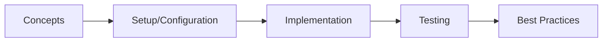

# Spring GraphQL

> **Previous:** [Spring AI](./47-spring-ai.md) | **Next:** [Spring Batch](./49-batch.md)

## Learning Objectives
## Chapter at a Glance

| Topic | Key Insight | Practical Takeaway |
|-------|-------------|--------------------|
| Core Concepts | Foundational understanding | Real-world application |
| Implementation | Code-first approach | Working examples |
| Best Practices | Production patterns | Avoid common pitfalls |

## Chapter Roadmap




By the end of this chapter, you will be able to:
- Design and implement GraphQL schemas with types, queries, mutations, and subscriptions
- Use @QueryMapping, @MutationMapping, and @SubscriptionMapping annotations
- Implement custom data fetchers with @SchemaMapping
- Configure GraphQL Java with @EnableGraphQl
- Batch load data efficiently with DataLoader and @BatchMapping
- Implement real-time subscriptions using WebSocket transport
- Configure GraphiQL and GraphQL Voyager for API exploration
- Secure GraphQL endpoints with Spring Security
- Implement cursor-based and offset-based pagination
- Handle exceptions with @GraphQlExceptionResolver
- Write comprehensive tests with @GraphQlTest and GraphQlTester
- Support file uploads via multipart requests

---

## 1. GraphQL Schema Language

> **Pro Tip:** Test with production-like configurations → dev setups often hide issues that surface under real load.

> **Remember:** Start simple. Add complexity only when proven necessary. Premature abstraction creates maintenance burden.


GraphQL defines a schema language for describing data types, relationships, and operations.

### 1.1 Project Dependencies


```xml
<?xml version="1.0" encoding="UTF-8"?>
<project xmlns="http://maven.apache.org/POM/4.0.0"
         xmlns:xsi="http://www.w3.org/2001/XMLSchema-instance"
         xsi:schemaLocation="http://maven.apache.org/POM/4.0.0
         https://maven.apache.org/xsd/maven-4.0.0.xsd">
    <modelVersion>4.0.0</modelVersion>
    <parent>
        <groupId>org.springframework.boot</groupId>
        <artifactId>spring-boot-starter-parent</artifactId>
        <version>3.4.0</version>
        <relativePath/>
    </parent>
    <groupId>com.aiengineering</groupId>
    <artifactId>graphql-course</artifactId>
    <version>1.0.0</version>
    <name>graphql-course</name>

    <properties>
        <java.version>21</java.version>
    </properties>

    <dependencies>
        <dependency>
            <groupId>org.springframework.boot</groupId>
            <artifactId>spring-boot-starter-web</artifactId>
        </dependency>
        <dependency>
            <groupId>org.springframework.boot</groupId>
            <artifactId>spring-boot-starter-webflux</artifactId>
        </dependency>
        <dependency>
            <groupId>org.springframework.boot</groupId>
            <artifactId>spring-boot-starter-graphql</artifactId>
        </dependency>
        <dependency>
            <groupId>org.springframework.boot</groupId>
            <artifactId>spring-boot-starter-data-jpa</artifactId>
        </dependency>
        <dependency>
            <groupId>org.springframework.boot</groupId>
            <artifactId>spring-boot-starter-security</artifactId>
        </dependency>
        <dependency>
            <groupId>org.springframework.boot</groupId>
            <artifactId>spring-boot-starter-validation</artifactId>
        </dependency>

        <dependency>
            <groupId>com.graphql-java</groupId>
            <artifactId>graphql-java-extended-scalars</artifactId>
            <version>22.0</version>
        </dependency>

        <dependency>
            <groupId>org.postgresql</groupId>
            <artifactId>postgresql</artifactId>
        </dependency>
        <dependency>
            <groupId>com.h2database</groupId>
            <artifactId>h2</artifactId>
            <scope>runtime</scope>
        </dependency>

        <dependency>
            <groupId>org.projectlombok</groupId>
            <artifactId>lombok</artifactId>
            <optional>true</optional>
        </dependency>

        <dependency>
            <groupId>org.springframework.boot</groupId>
            <artifactId>spring-boot-starter-test</artifactId>
            <scope>test</scope>
        </dependency>
        <dependency>
            <groupId>org.springframework.graphql</groupId>
            <artifactId>spring-graphql-test</artifactId>
            <scope>test</scope>
        </dependency>
    </dependencies>
</project>
```

### 1.2 Application Configuration


```yaml
# src/main/resources/application.yml

> **Previous:** [Spring AI](./47-spring-ai.md) | **Next:** [Spring Batch](./49-batch.md)
spring:
  application:
    name: graphql-course

  graphql:
    graphiql:
      enabled: true
      path: /graphiql
    voyager:
      enabled: true
      path: /voyager
    schema:
      locations: classpath:graphql/
      file-extensions: .graphqls,.gqls
    path: /graphql
    websocket:
      path: /graphql
    cors:
      allowed-origins: "*"
      allowed-methods: GET,POST
    query:
      complexity:
        enabled: true
        default-complexity: 1
        maximum-complexity: 100

  datasource:
    url: jdbc:postgresql://localhost:5432/graphql_course
    username: postgres
    password: postgres
    driver-class-name: org.postgresql.Driver

  jpa:
    hibernate:
      ddl-auto: update
    show-sql: true
    properties:
      hibernate:
        format_sql: true

server:
  port: 8080

logging:
  level:
    org.springframework.graphql: DEBUG
    org.springframework.security: DEBUG
```

### 1.3 Schema Definition


```graphql
# src/main/resources/graphql/schema.graphqls

> **Previous:** [Spring AI](./47-spring-ai.md) | **Next:** [Spring Batch](./49-batch.md)

scalar DateTime
scalar Long
scalar BigDecimal
scalar JSON
scalar Upload

enum PostStatus {
    DRAFT
    PUBLISHED
    ARCHIVED
    DELETED
}

enum UserRole {
    ADMIN
    MODERATOR
    AUTHOR
    READER
}

enum SortDirection {
    ASC
    DESC
}

interface Node {
    id: ID!
    createdAt: DateTime!
    updatedAt: DateTime
}

type PageInfo {
    hasNextPage: Boolean!
    hasPreviousPage: Boolean!
    startCursor: String
    endCursor: String
    totalCount: Int!
}

type UserConnection {
    edges: [UserEdge!]!
    pageInfo: PageInfo!
}

type UserEdge {
    node: User!
    cursor: String!
}

type PostConnection {
    edges: [PostEdge!]!
    pageInfo: PageInfo!
}

type PostEdge {
    node: Post!
    cursor: String!
}

type CommentConnection {
    edges: [CommentEdge!]!
    pageInfo: PageInfo!
}

type CommentEdge {
    node: Comment!
    cursor: String!
}

type User implements Node {
    id: ID!
    username: String!
    email: String!
    displayName: String!
    avatarUrl: String
    bio: String
    role: UserRole!
    posts(first: Int, after: String, last: Int, before: String): PostConnection!
    comments(first: Int, after: String): CommentConnection!
    postCount: Int!
    commentCount: Int!
    createdAt: DateTime!
    updatedAt: DateTime
}

type Post implements Node {
    id: ID!
    title: String!
    slug: String!
    content: String!
    excerpt: String
    status: PostStatus!
    author: User!
    tags: [String!]!
    comments(first: Int, after: String, last: Int, before: String): CommentConnection!
    commentCount: Int!
    viewCount: Long!
    publishedAt: DateTime
    createdAt: DateTime!
    updatedAt: DateTime
}

type Comment implements Node {
    id: ID!
    content: String!
    author: User!
    post: Post!
    parentComment: Comment
    replies(first: Int, after: String): CommentConnection!
    replyCount: Int!
    depth: Int!
    createdAt: DateTime!
    updatedAt: DateTime
}

type Query {
    node(id: ID!): Node

    user(id: ID, username: String): User
    users(first: Int!, after: String, sortBy: String, sortDir: SortDirection): UserConnection!
    searchUsers(query: String!, first: Int!, after: String): UserConnection!
    me: User

    post(id: ID, slug: String): Post
    posts(
        first: Int!,
        after: String,
        last: Int,
        before: String,
        status: PostStatus,
        authorId: ID,
        tag: String,
        search: String,
        sortBy: String,
        sortDir: SortDirection
    ): PostConnection!
    postsByTag(tag: String!, first: Int!, after: String): PostConnection!
    recentPosts(limit: Int!): [Post!]!
    popularPosts(limit: Int!): [Post!]!

    comment(id: ID!): Comment
    comments(first: Int!, after: String): CommentConnection!
    searchComments(query: String!, first: Int!, after: String): CommentConnection!

    _service: _Service
}

type Mutation {
    createUser(input: CreateUserInput!): UserMutationResult!
    updateUser(id: ID!, input: UpdateUserInput!): UserMutationResult!
    deleteUser(id: ID!): DeleteResult!
    changeUserRole(id: ID!, role: UserRole!): UserMutationResult!

    createPost(input: CreatePostInput!): PostMutationResult!
    updatePost(id: ID!, input: UpdatePostInput!): PostMutationResult!
    deletePost(id: ID!): DeleteResult!
    publishPost(id: ID!): PostMutationResult!
    archivePost(id: ID!): PostMutationResult!

    createComment(input: CreateCommentInput!): CommentMutationResult!
    updateComment(id: ID!, content: String!): CommentMutationResult!
    deleteComment(id: ID!): DeleteResult!

    login(username: String!, password: String!): AuthResult!
    refreshToken(token: String!): AuthResult!
    logout: Boolean!

    uploadFile(file: Upload!, description: String): FileUploadResult!
}

type Subscription {
    postCreated: Post!
    postUpdated: Post!
    postDeleted: ID!
    commentAdded(postId: ID!): Comment!
    commentDeleted(postId: ID!): ID!
    notificationReceived(userId: ID!): Notification!
    metricsUpdated: MetricsUpdate!
}

input CreateUserInput {
    username: String!
    email: String!
    password: String!
    displayName: String!
    avatarUrl: String
    bio: String
}

input UpdateUserInput {
    displayName: String
    avatarUrl: String
    bio: String
}

input CreatePostInput {
    title: String!
    content: String!
    excerpt: String
    tags: [String!]
    status: PostStatus = DRAFT
}

input UpdatePostInput {
    title: String
    content: String
    excerpt: String
    tags: [String!]
    status: PostStatus
}

input CreateCommentInput {
    postId: ID!
    content: String!
    parentCommentId: ID
}

union MutationResult = UserMutationResult | PostMutationResult | CommentMutationResult

type UserMutationResult {
    success: Boolean!
    message: String!
    user: User
}

type PostMutationResult {
    success: Boolean!
    message: String!
    post: Post
}

type CommentMutationResult {
    success: Boolean!
    message: String!
    comment: Comment
}

type DeleteResult {
    success: Boolean!
    message: String!
    deletedId: ID!
}

type AuthResult {
    success: Boolean!
    token: String
    refreshToken: String
    user: User
    message: String
}

type FileUploadResult {
    success: Boolean!
    url: String
    filename: String
    size: Long
    message: String
}

type Notification {
    id: ID!
    type: String!
    message: String!
    data: JSON
    createdAt: DateTime!
    read: Boolean!
}

type MetricsUpdate {
    totalUsers: Int!
    totalPosts: Int!
    totalComments: Int!
    activeUsers24h: Int!
    timestamp: DateTime!
}

type _Service {
    sdl: String!
}
```

### 1.4 GraphQL Configuration


```java
package com.aiengineering.course.config;

import graphql.scalars.ExtendedScalars;
import graphql.schema.GraphQLScalarType;
import org.springframework.context.annotation.Bean;
import org.springframework.context.annotation.Configuration;
import org.springframework.graphql.execution.RuntimeWiringConfigurer;

@Configuration(proxyBeanMethods = false)
public class GraphQlConfig {

    @Bean
    public RuntimeWiringConfigurer runtimeWiringConfigurer() {
        return wiring -> wiring
            .scalar(ExtendedScalars.DateTime)
            .scalar(ExtendedScalars.GraphQLLong)
            .scalar(ExtendedScalars.GraphQLBigDecimal)
            .scalar(ExtendedScalars.Json)
            .scalar(ExtendedScalars.Upload)
            .build();
    }

    @Bean
    public GraphQLScalarType dateTimeScalar() {
        return ExtendedScalars.DateTime;
    }
}
```

---

## 2. Domain Models

```java
package com.aiengineering.course.model;

import jakarta.persistence.*;
import jakarta.validation.constraints.Email;
import jakarta.validation.constraints.NotBlank;
import jakarta.validation.constraints.Size;
import lombok.*;
import org.hibernate.annotations.CreationTimestamp;
import org.hibernate.annotations.UpdateTimestamp;

import java.time.LocalDateTime;
import java.util.HashSet;
import java.util.Set;

@Entity
@Table(name = "users")
@Getter @Setter @NoArgsConstructor @AllArgsConstructor @Builder
@EqualsAndHashCode(onlyExplicitlyIncluded = true)
public class User {

    @Id
    @GeneratedValue(strategy = GenerationType.IDENTITY)
    @EqualsAndHashCode.Include
    private Long id;

    @NotBlank @Size(min = 3, max = 50)
    @Column(unique = true, nullable = false, length = 50)
    private String username;

    @NotBlank @Email
    @Column(unique = true, nullable = false, length = 100)
    private String email;

    @NotBlank
    @Column(nullable = false)
    private String password;

    @NotBlank @Size(max = 100)
    @Column(name = "display_name", nullable = false, length = 100)
    private String displayName;

    @Column(name = "avatar_url", length = 500)
    private String avatarUrl;

    @Column(length = 500)
    private String bio;

    @Enumerated(EnumType.STRING)
    @Column(nullable = false, length = 20)
    @Builder.Default
    private UserRole role = UserRole.READER;

    @Builder.Default
    @OneToMany(mappedBy = "author", cascade = CascadeType.ALL, orphanRemoval = true)
    private Set<Post> posts = new HashSet<>();

    @Builder.Default
    @OneToMany(mappedBy = "author", cascade = CascadeType.ALL, orphanRemoval = true)
    private Set<Comment> comments = new HashSet<>();

    @CreationTimestamp
    @Column(name = "created_at", nullable = false, updatable = false)
    private LocalDateTime createdAt;

    @UpdateTimestamp
    @Column(name = "updated_at")
    private LocalDateTime updatedAt;

    @Version
    private Long version;
}
```

```java
package com.aiengineering.course.model;

import jakarta.persistence.*;
import jakarta.validation.constraints.NotBlank;
import jakarta.validation.constraints.Size;
import lombok.*;
import org.hibernate.annotations.CreationTimestamp;
import org.hibernate.annotations.UpdateTimestamp;

import java.time.LocalDateTime;
import java.util.*;

@Entity
@Table(name = "posts")
@Getter @Setter @NoArgsConstructor @AllArgsConstructor @Builder
@EqualsAndHashCode(onlyExplicitlyIncluded = true)
public class Post {

    @Id
    @GeneratedValue(strategy = GenerationType.IDENTITY)
    @EqualsAndHashCode.Include
    private Long id;

    @NotBlank @Size(min = 5, max = 200)
    @Column(nullable = false, length = 200)
    private String title;

    @NotBlank @Size(max = 200)
    @Column(unique = true, nullable = false, length = 200)
    private String slug;

    @NotBlank
    @Column(nullable = false, columnDefinition = "TEXT")
    private String content;

    @Column(columnDefinition = "TEXT")
    private String excerpt;

    @Enumerated(EnumType.STRING)
    @Column(nullable = false, length = 20)
    @Builder.Default
    private PostStatus status = PostStatus.DRAFT;

    @ManyToOne(fetch = FetchType.LAZY)
    @JoinColumn(name = "author_id", nullable = false)
    private User author;

    @ElementCollection(fetch = FetchType.EAGER)
    @CollectionTable(name = "post_tags", joinColumns = @JoinColumn(name = "post_id"))
    @Column(name = "tag", length = 50)
    @Builder.Default
    private Set<String> tags = new HashSet<>();

    @Builder.Default
    @OneToMany(mappedBy = "post", cascade = CascadeType.ALL, orphanRemoval = true)
    @OrderBy("createdAt ASC")
    private Set<Comment> comments = new HashSet<>();

    @Column(name = "view_count")
    @Builder.Default
    private Long viewCount = 0L;

    @Column(name = "published_at")
    private LocalDateTime publishedAt;

    @CreationTimestamp
    @Column(name = "created_at", nullable = false, updatable = false)
    private LocalDateTime createdAt;

    @UpdateTimestamp
    @Column(name = "updated_at")
    private LocalDateTime updatedAt;

    @Version
    private Long version;

    public int getCommentCount() {
        return comments != null ? comments.size() : 0;
    }
}
```

```java
package com.aiengineering.course.model;

import jakarta.persistence.*;
import jakarta.validation.constraints.NotBlank;
import jakarta.validation.constraints.Size;
import lombok.*;
import org.hibernate.annotations.CreationTimestamp;
import org.hibernate.annotations.UpdateTimestamp;

import java.time.LocalDateTime;

@Entity
@Table(name = "comments")
@Getter @Setter @NoArgsConstructor @AllArgsConstructor @Builder
@EqualsAndHashCode(onlyExplicitlyIncluded = true)
public class Comment {

    @Id
    @GeneratedValue(strategy = GenerationType.IDENTITY)
    @EqualsAndHashCode.Include
    private Long id;

    @NotBlank @Size(max = 5000)
    @Column(nullable = false, columnDefinition = "TEXT")
    private String content;

    @ManyToOne(fetch = FetchType.LAZY)
    @JoinColumn(name = "author_id", nullable = false)
    private User author;

    @ManyToOne(fetch = FetchType.LAZY)
    @JoinColumn(name = "post_id", nullable = false)
    private Post post;

    @ManyToOne(fetch = FetchType.LAZY)
    @JoinColumn(name = "parent_comment_id")
    private Comment parentComment;

    @Column(name = "depth")
    @Builder.Default
    private Integer depth = 0;

    @CreationTimestamp
    @Column(name = "created_at", nullable = false, updatable = false)
    private LocalDateTime createdAt;

    @UpdateTimestamp
    @Column(name = "updated_at")
    private LocalDateTime updatedAt;

    @Version
    private Long version;
}
```

### 2.1 Enums and DTOs


```java
package com.aiengineering.course.model;

public enum PostStatus {
    DRAFT,
    PUBLISHED,
    ARCHIVED,
    DELETED
}
```

```java
package com.aiengineering.course.model;

public enum UserRole {
    ADMIN,
    MODERATOR,
    AUTHOR,
    READER
}
```

```java
package com.aiengineering.course.model;

import java.time.LocalDateTime;

public record PostInput(
    String title,
    String content,
    String excerpt,
    java.util.Set<String> tags,
    PostStatus status
) {}

public record CommentInput(
    Long postId,
    String content,
    Long parentCommentId
) {}

public record UserInput(
    String username,
    String email,
    String password,
    String displayName,
    String avatarUrl,
    String bio
) {}

public record AuthResponse(
    boolean success,
    String token,
    String refreshToken,
    User user,
    String message
) {}

public record MutationResponse<T>(
    boolean success,
    String message,
    T data
) {}

public record DeleteResponse(
    boolean success,
    String message,
    Long deletedId
) {}

public record FileUploadResponse(
    boolean success,
    String url,
    String filename,
    Long size,
    String message
) {}
```

---

## 3. Repository Layer

```java
package com.aiengineering.course.repository;

import com.aiengineering.course.model.Post;
import com.aiengineering.course.model.PostStatus;
import org.springframework.data.domain.Page;
import org.springframework.data.domain.Pageable;
import org.springframework.data.domain.Sort;
import org.springframework.data.jpa.repository.JpaRepository;
import org.springframework.data.jpa.repository.Query;
import org.springframework.data.repository.query.Param;
import org.springframework.stereotype.Repository;

import java.time.LocalDateTime;
import java.util.List;
import java.util.Optional;

@Repository
public interface PostRepository extends JpaRepository<Post, Long> {

    Optional<Post> findBySlug(String slug);

    List<Post> findByStatus(PostStatus status, Sort sort);

    Page<Post> findByStatus(PostStatus status, Pageable pageable);

    Page<Post> findByAuthorId(Long authorId, Pageable pageable);

    @Query("SELECT p FROM Post p JOIN p.tags t WHERE t = :tag")
    Page<Post> findByTag(@Param("tag") String tag, Pageable pageable);

    @Query("SELECT p FROM Post p WHERE p.status = 'PUBLISHED' " +
           "AND (LOWER(p.title) LIKE LOWER(CONCAT('%', :search, '%')) " +
           "OR LOWER(p.content) LIKE LOWER(CONCAT('%', :search, '%')))")
    Page<Post> searchPosts(@Param("search") String search, Pageable pageable);

    @Query("SELECT p FROM Post p WHERE p.status = 'PUBLISHED' " +
           "AND p.createdAt >= :since ORDER BY p.viewCount DESC")
    List<Post> findPopularPostsSince(@Param("since") LocalDateTime since, Pageable pageable);

    @Query("SELECT p FROM Post p WHERE p.status = 'PUBLISHED' " +
           "ORDER BY p.createdAt DESC")
    List<Post> findRecentPosts(Pageable pageable);

    @Query("SELECT COUNT(p) FROM Post p WHERE p.status = 'PUBLISHED'")
    long countPublishedPosts();

    @Query("SELECT DISTINCT t FROM Post p JOIN p.tags t")
    List<String> findAllTags();

    @Query("SELECT p FROM Post p WHERE p.author.id = :authorId AND p.status = :status")
    List<Post> findByAuthorIdAndStatus(@Param("authorId") Long authorId,
                                        @Param("status") PostStatus status);
}
```

```java
package com.aiengineering.course.repository;

import com.aiengineering.course.model.Comment;
import org.springframework.data.domain.Page;
import org.springframework.data.domain.Pageable;
import org.springframework.data.jpa.repository.JpaRepository;
import org.springframework.data.jpa.repository.Query;
import org.springframework.data.repository.query.Param;
import org.springframework.stereotype.Repository;

import java.util.List;

@Repository
public interface CommentRepository extends JpaRepository<Comment, Long> {

    Page<Comment> findByPostId(Long postId, Pageable pageable);

    Page<Comment> findByAuthorId(Long authorId, Pageable pageable);

    List<Comment> findByParentCommentId(Long parentCommentId);

    @Query("SELECT c FROM Comment c WHERE " +
           "LOWER(c.content) LIKE LOWER(CONCAT('%', :query, '%'))")
    Page<Comment> searchComments(@Param("query") String query, Pageable pageable);

    @Query("SELECT COUNT(c) FROM Comment c WHERE c.post.id = :postId")
    long countByPostId(@Param("postId") Long postId);

    @Query("SELECT COUNT(c) FROM Comment c WHERE c.author.id = :authorId")
    long countByAuthorId(@Param("authorId") Long authorId);

    @Query("SELECT c FROM Comment c WHERE c.parentComment IS NULL " +
           "AND c.post.id = :postId ORDER BY c.createdAt ASC")
    List<Comment> findRootCommentsByPostId(@Param("postId") Long postId);

    void deleteByPostId(Long postId);
}
```

```java
package com.aiengineering.course.repository;

import com.aiengineering.course.model.User;
import org.springframework.data.domain.Page;
import org.springframework.data.domain.Pageable;
import org.springframework.data.jpa.repository.JpaRepository;
import org.springframework.data.jpa.repository.Query;
import org.springframework.data.repository.query.Param;
import org.springframework.stereotype.Repository;

import java.util.Optional;

@Repository
public interface UserRepository extends JpaRepository<User, Long> {

    Optional<User> findByUsername(String username);

    Optional<User> findByEmail(String email);

    Optional<User> findByUsernameOrEmail(String username, String email);

    boolean existsByUsername(String username);

    boolean existsByEmail(String email);

    @Query("SELECT u FROM User u WHERE " +
           "LOWER(u.username) LIKE LOWER(CONCAT('%', :query, '%')) " +
           "OR LOWER(u.displayName) LIKE LOWER(CONCAT('%', :query, '%')) " +
           "OR LOWER(u.email) LIKE LOWER(CONCAT('%', :query, '%'))")
    Page<User> searchUsers(@Param("query") String query, Pageable pageable);

    @Query("SELECT u FROM User u ORDER BY u.createdAt DESC")
    Page<User> findAllOrderByNewest(Pageable pageable);
}
```

---

## 4. Query Mapping

```java
package com.aiengineering.course.controller;

import com.aiengineering.course.model.*;
import com.aiengineering.course.repository.*;
import com.aiengineering.course.service.UserService;
import graphql.relay.*;
import org.springframework.data.domain.Page;
import org.springframework.data.domain.PageRequest;
import org.springframework.data.domain.Sort;
import org.springframework.graphql.data.method.annotation.Argument;
import org.springframework.graphql.data.method.annotation.QueryMapping;
import org.springframework.graphql.data.method.annotation.SchemaMapping;
import org.springframework.stereotype.Controller;
import org.springframework.transaction.annotation.Transactional;

import java.time.LocalDateTime;
import java.util.*;
import java.util.stream.Collectors;

@Controller
public class PostQueryController {

    private final PostRepository postRepository;
    private final CommentRepository commentRepository;
    private final UserRepository userRepository;

    public PostQueryController(
            PostRepository postRepository,
            CommentRepository commentRepository,
            UserRepository userRepository) {
        this.postRepository = postRepository;
        this.commentRepository = commentRepository;
        this.userRepository = userRepository;
    }

    @QueryMapping
    @Transactional(readOnly = true)
    public Optional<Post> post(@Argument Long id, @Argument String slug) {
        if (id != null) return postRepository.findById(id);
        if (slug != null) return postRepository.findBySlug(slug);
        return Optional.empty();
    }

    @QueryMapping
    @Transactional(readOnly = true)
    public PostConnection posts(
            @Argument int first,
            @Argument String after,
            @Argument Integer last,
            @Argument String before,
            @Argument PostStatus status,
            @Argument Long authorId,
            @Argument String tag,
            @Argument String search,
            @Argument String sortBy,
            @Argument SortDirection sortDir) {

        Sort sort = buildSort(sortBy, sortDir, Sort.by(Sort.Direction.DESC, "createdAt"));
        int pageSize = first > 0 ? first : (last > 0 ? last : 10);

        int offset = 0;
        if (after != null) {
            offset = decodeCursor(after);
            offset = offset + 1;
        } else if (before != null) {
            int endOffset = decodeCursor(before);
            offset = Math.max(0, endOffset - pageSize);
        }

        Page<Post> postPage;

        if (search != null && !search.isBlank()) {
            postPage = postRepository.searchPosts(search, PageRequest.of(0, pageSize + offset + 1, sort));
            List<Post> filtered = postPage.getContent().stream()
                .skip(offset).limit(pageSize).toList();
            return buildConnection(filtered, offset, (int) postPage.getTotalElements());
        }

        if (tag != null && !tag.isBlank()) {
            postPage = postRepository.findByTag(tag, PageRequest.of(0, pageSize + offset + 1, sort));
            List<Post> filtered = postPage.getContent().stream()
                .skip(offset).limit(pageSize).toList();
            return buildConnection(filtered, offset, (int) postPage.getTotalElements());
        }

        if (authorId != null) {
            postPage = postRepository.findByAuthorId(authorId, PageRequest.of(0, pageSize + offset + 1, sort));
            List<Post> filtered = postPage.getContent().stream()
                .skip(offset).limit(pageSize).toList();
            return buildConnection(filtered, offset, (int) postPage.getTotalElements());
        }

        PostStatus queryStatus = status != null ? status : PostStatus.PUBLISHED;
        postPage = postRepository.findByStatus(queryStatus, PageRequest.of(0, pageSize + offset + 1, sort));

        List<Post> filtered = postPage.getContent().stream()
            .skip(offset).limit(pageSize).toList();

        return buildConnection(filtered, offset, (int) postPage.getTotalElements());
    }

    @QueryMapping
    @Transactional(readOnly = true)
    public List<Post> recentPosts(@Argument int limit) {
        return postRepository.findRecentPosts(PageRequest.of(0, Math.min(limit, 50)));
    }

    @QueryMapping
    @Transactional(readOnly = true)
    public List<Post> popularPosts(@Argument int limit) {
        LocalDateTime since = LocalDateTime.now().minusDays(30);
        return postRepository.findPopularPostsSince(since, PageRequest.of(0, Math.min(limit, 50)));
    }

    @QueryMapping
    @Transactional(readOnly = true)
    public PostConnection postsByTag(@Argument String tag, @Argument int first,
                                      @Argument String after) {
        int offset = after != null ? decodeCursor(after) + 1 : 0;
        Page<Post> page = postRepository.findByTag(tag,
            PageRequest.of(0, offset + first + 1));
        List<Post> filtered = page.getContent().stream()
            .skip(offset).limit(first).toList();
        return buildConnection(filtered, offset, (int) page.getTotalElements());
    }

    @SchemaMapping(typeName = "Post", field = "comments")
    @Transactional(readOnly = true)
    public CommentConnection comments(Post post, @Argument int first, @Argument String after,
                                       @Argument Integer last, @Argument String before) {
        int pageSize = first > 0 ? first : (last > 0 ? last : 10);
        int offset = after != null ? decodeCursor(after) + 1 : 0;

        Page<Comment> page = commentRepository.findByPostId(post.getId(),
            PageRequest.of(0, offset + pageSize + 1, Sort.by(Sort.Direction.ASC, "createdAt")));

        List<Comment> filtered = page.getContent().stream()
            .skip(offset).limit(pageSize).toList();

        long total = commentRepository.countByPostId(post.getId());
        return buildCommentConnection(filtered, offset, (int) total);
    }

    @SchemaMapping(typeName = "Post", field = "commentCount")
    public int commentCount(Post post) {
        return (int) commentRepository.countByPostId(post.getId());
    }

    private PostConnection buildConnection(List<Post> posts, int offset, int totalCount) {
        List<PostEdge> edges = new ArrayList<>();
        for (int i = 0; i < posts.size(); i++) {
            Post post = posts.get(i);
            String cursor = encodeCursor(offset + i);
            edges.add(new PostEdge(post, cursor));
        }

        PageInfo pageInfo = new PageInfo(
            offset + posts.size() < totalCount,
            offset > 0,
            edges.isEmpty() ? null : edges.getFirst().getCursor(),
            edges.isEmpty() ? null : edges.getLast().getCursor(),
            totalCount
        );

        return new PostConnection(edges, pageInfo);
    }

    private CommentConnection buildCommentConnection(List<Comment> comments, int offset, int totalCount) {
        List<CommentEdge> edges = new ArrayList<>();
        for (int i = 0; i < comments.size(); i++) {
            String cursor = encodeCursor(offset + i);
            edges.add(new CommentEdge(comments.get(i), cursor));
        }

        PageInfo pageInfo = new PageInfo(
            offset + comments.size() < totalCount,
            offset > 0,
            edges.isEmpty() ? null : edges.getFirst().getCursor(),
            edges.isEmpty() ? null : edges.getLast().getCursor(),
            totalCount
        );

        return new CommentConnection(edges, pageInfo);
    }

    private String encodeCursor(int offset) {
        return Base64.getEncoder().encodeToString(String.valueOf(offset).getBytes());
    }

    private int decodeCursor(String cursor) {
        try {
            byte[] decoded = Base64.getDecoder().decode(cursor);
            return Integer.parseInt(new String(decoded));
        } catch (Exception e) {
            return 0;
        }
    }

    private Sort buildSort(String sortBy, SortDirection sortDir, Sort defaultSort) {
        if (sortBy == null) return defaultSort;
        Sort.Direction direction = sortDir == SortDirection.ASC
            ? Sort.Direction.ASC : Sort.Direction.DESC;
        String field = switch (sortBy) {
            case "title" -> "title";
            case "createdAt" -> "createdAt";
            case "updatedAt" -> "updatedAt";
            case "viewCount" -> "viewCount";
            case "publishedAt" -> "publishedAt";
            default -> "createdAt";
        };
        return Sort.by(direction, field);
    }
}
```

```java
package com.aiengineering.course.controller;

import com.aiengineering.course.model.*;
import com.aiengineering.course.repository.*;
import com.aiengineering.course.service.UserService;
import org.springframework.data.domain.Page;
import org.springframework.data.domain.PageRequest;
import org.springframework.data.domain.Sort;
import org.springframework.graphql.data.method.annotation.Argument;
import org.springframework.graphql.data.method.annotation.QueryMapping;
import org.springframework.graphql.data.method.annotation.SchemaMapping;
import org.springframework.stereotype.Controller;
import org.springframework.transaction.annotation.Transactional;

import java.util.*;
import java.util.stream.Collectors;

@Controller
public class UserQueryController {

    private final UserRepository userRepository;
    private final PostRepository postRepository;
    private final CommentRepository commentRepository;
    private final UserService userService;

    public UserQueryController(
            UserRepository userRepository,
            PostRepository postRepository,
            CommentRepository commentRepository,
            UserService userService) {
        this.userRepository = userRepository;
        this.postRepository = postRepository;
        this.commentRepository = commentRepository;
        this.userService = userService;
    }

    @QueryMapping
    @Transactional(readOnly = true)
    public Optional<User> user(@Argument Long id, @Argument String username) {
        if (id != null) return userRepository.findById(id);
        if (username != null) return userRepository.findByUsername(username);
        return Optional.empty();
    }

    @QueryMapping
    @Transactional(readOnly = true)
    public UserConnection users(
            @Argument int first,
            @Argument String after,
            @Argument String sortBy,
            @Argument SortDirection sortDir) {

        Sort sort = Sort.by(Sort.Direction.DESC, "createdAt");
        int offset = after != null ? decodeCursor(after) + 1 : 0;

        Page<User> page = userRepository.findAll(
            PageRequest.of(0, offset + first + 1, sort));

        List<User> filtered = page.getContent().stream()
            .skip(offset).limit(first).toList();

        return buildUserConnection(filtered, offset, (int) page.getTotalElements());
    }

    @QueryMapping
    @Transactional(readOnly = true)
    public UserConnection searchUsers(
            @Argument String query,
            @Argument int first,
            @Argument String after) {

        int offset = after != null ? decodeCursor(after) + 1 : 0;
        Page<User> page = userRepository.searchUsers(query,
            PageRequest.of(0, offset + first + 1));

        List<User> filtered = page.getContent().stream()
            .skip(offset).limit(first).toList();

        return buildUserConnection(filtered, offset, (int) page.getTotalElements());
    }

    @QueryMapping
    @Transactional(readOnly = true)
    public User me() {
        return userService.getCurrentUser()
            .orElseThrow(() -> new RuntimeException("Not authenticated"));
    }

    @QueryMapping
    @Transactional(readOnly = true)
    public Optional<Comment> comment(@Argument Long id) {
        return commentRepository.findById(id);
    }

    @QueryMapping
    @Transactional(readOnly = true)
    public CommentConnection comments(
            @Argument int first,
            @Argument String after) {

        int offset = after != null ? decodeCursor(after) + 1 : 0;
        Page<Comment> page = commentRepository.findAll(
            PageRequest.of(0, offset + first + 1,
                Sort.by(Sort.Direction.DESC, "createdAt")));

        List<Comment> filtered = page.getContent().stream()
            .skip(offset).limit(first).toList();

        return buildCommentConnection(filtered, offset, (int) page.getTotalElements());
    }

    @QueryMapping
    @Transactional(readOnly = true)
    public CommentConnection searchComments(
            @Argument String query,
            @Argument int first,
            @Argument String after) {

        int offset = after != null ? decodeCursor(after) + 1 : 0;
        Page<Comment> page = commentRepository.searchComments(query,
            PageRequest.of(0, offset + first + 1));

        List<Comment> filtered = page.getContent().stream()
            .skip(offset).limit(first).toList();

        return buildCommentConnection(filtered, offset, (int) page.getTotalElements());
    }

    @QueryMapping
    @Transactional(readOnly = true)
    public Node node(@Argument Long id) {
        return userRepository.findById(id)
            .map(u -> (Node) u)
            .orElseGet(() -> postRepository.findById(id)
                .map(p -> (Node) p)
                .orElse(null));
    }

    @QueryMapping
    public _Service _service() {
        return new _Service();
    }

    @SchemaMapping(typeName = "User", field = "posts")
    @Transactional(readOnly = true)
    public PostConnection userPosts(User user, @Argument int first, @Argument String after,
                                     @Argument Integer last, @Argument String before) {
        int pageSize = first > 0 ? first : (last > 0 ? last : 10);
        int offset = after != null ? decodeCursor(after) + 1 : 0;

        Page<Post> page = postRepository.findByAuthorId(user.getId(),
            PageRequest.of(0, offset + pageSize + 1,
                Sort.by(Sort.Direction.DESC, "createdAt")));

        List<Post> filtered = page.getContent().stream()
            .skip(offset).limit(pageSize).toList();

        return buildPostConnection(filtered, offset, (int) page.getTotalElements());
    }

    @SchemaMapping(typeName = "User", field = "comments")
    @Transactional(readOnly = true)
    public CommentConnection userComments(User user, @Argument int first, @Argument String after) {
        int offset = after != null ? decodeCursor(after) + 1 : 0;
        Page<Comment> page = commentRepository.findByAuthorId(user.getId(),
            PageRequest.of(0, offset + first + 1,
                Sort.by(Sort.Direction.DESC, "createdAt")));

        List<Comment> filtered = page.getContent().stream()
            .skip(offset).limit(first).toList();

        return buildCommentConnection(filtered, offset, (int) page.getTotalElements());
    }

    @SchemaMapping(typeName = "User", field = "postCount")
    public int userPostCount(User user) {
        return (int) postRepository.findByAuthorIdAndStatus(user.getId(), PostStatus.PUBLISHED).size();
    }

    @SchemaMapping(typeName = "User", field = "commentCount")
    public int userCommentCount(User user) {
        return (int) commentRepository.countByAuthorId(user.getId());
    }

    @SchemaMapping(typeName = "Comment", field = "replies")
    @Transactional(readOnly = true)
    public CommentConnection commentReplies(Comment comment, @Argument int first, @Argument String after) {
        List<Comment> replies = commentRepository.findByParentCommentId(comment.getId());
        return buildCommentConnection(replies, 0, replies.size());
    }

    @SchemaMapping(typeName = "Comment", field = "replyCount")
    public int commentReplyCount(Comment comment) {
        return commentRepository.findByParentCommentId(comment.getId()).size();
    }

    private String encodeCursor(int offset) {
        return Base64.getEncoder().encodeToString(String.valueOf(offset).getBytes());
    }

    private int decodeCursor(String cursor) {
        try {
            return Integer.parseInt(new String(Base64.getDecoder().decode(cursor)));
        } catch (Exception e) {
            return 0;
        }
    }

    private UserConnection buildUserConnection(List<User> users, int offset, int totalCount) {
        List<UserEdge> edges = new ArrayList<>();
        for (int i = 0; i < users.size(); i++) {
            edges.add(new UserEdge(users.get(i), encodeCursor(offset + i)));
        }
        PageInfo pageInfo = new PageInfo(
            offset + users.size() < totalCount,
            offset > 0,
            edges.isEmpty() ? null : edges.getFirst().getCursor(),
            edges.isEmpty() ? null : edges.getLast().getCursor(),
            totalCount
        );
        return new UserConnection(edges, pageInfo);
    }

    private PostConnection buildPostConnection(List<Post> posts, int offset, int totalCount) {
        List<PostEdge> edges = new ArrayList<>();
        for (int i = 0; i < posts.size(); i++) {
            edges.add(new PostEdge(posts.get(i), encodeCursor(offset + i)));
        }
        PageInfo pageInfo = new PageInfo(
            offset + posts.size() < totalCount,
            offset > 0,
            edges.isEmpty() ? null : edges.getFirst().getCursor(),
            edges.isEmpty() ? null : edges.getLast().getCursor(),
            totalCount
        );
        return new PostConnection(edges, pageInfo);
    }

    private CommentConnection buildCommentConnection(List<Comment> comments, int offset, int totalCount) {
        List<CommentEdge> edges = new ArrayList<>();
        for (int i = 0; i < comments.size(); i++) {
            edges.add(new CommentEdge(comments.get(i), encodeCursor(offset + i)));
        }
        PageInfo pageInfo = new PageInfo(
            offset + comments.size() < totalCount,
            offset > 0,
            edges.isEmpty() ? null : edges.getFirst().getCursor(),
            edges.isEmpty() ? null : edges.getLast().getCursor(),
            totalCount
        );
        return new CommentConnection(edges, pageInfo);
    }

    public record PostEdge(Post node, String cursor) {}
    public record PostConnection(List<PostEdge> edges, PageInfo pageInfo) {}
    public record CommentEdge(Comment node, String cursor) {}
    public record CommentConnection(List<CommentEdge> edges, PageInfo pageInfo) {}
    public record UserEdge(User node, String cursor) {}
    public record UserConnection(List<UserEdge> edges, PageInfo pageInfo) {}
    public record PageInfo(boolean hasNextPage, boolean hasPreviousPage,
                           String startCursor, String endCursor, int totalCount) {}
    public record Node(User user, Post post, Comment comment) {}
    public record _Service(String sdl) {}
}
```

---

## 5. Mutation Mapping

```java
package com.aiengineering.course.controller;

import com.aiengineering.course.model.*;
import com.aiengineering.course.repository.*;
import com.aiengineering.course.service.UserService;
import org.slf4j.Logger;
import org.slf4j.LoggerFactory;
import org.springframework.graphql.data.method.annotation.Argument;
import org.springframework.graphql.data.method.annotation.MutationMapping;
import org.springframework.security.access.prepost.PreAuthorize;
import org.springframework.security.crypto.password.PasswordEncoder;
import org.springframework.stereotype.Controller;
import org.springframework.transaction.annotation.Transactional;

import java.time.LocalDateTime;
import java.util.*;

@Controller
public class PostMutationController {

    private static final Logger log = LoggerFactory.getLogger(PostMutationController.class);

    private final PostRepository postRepository;
    private final UserRepository userRepository;
    private final UserService userService;

    public PostMutationController(
            PostRepository postRepository,
            UserRepository userRepository,
            UserService userService) {
        this.postRepository = postRepository;
        this.userRepository = userRepository;
        this.userService = userService;
    }

    @MutationMapping
    @Transactional
    @PreAuthorize("isAuthenticated()")
    public PostMutationResult createPost(@Argument CreatePostInput input) {
        try {
            User currentUser = userService.getCurrentUser()
                .orElseThrow(() -> new RuntimeException("Not authenticated"));

            String slug = generateSlug(input.title());

            Post post = Post.builder()
                .title(input.title())
                .slug(slug)
                .content(input.content())
                .excerpt(input.excerpt())
                .author(currentUser)
                .status(input.status() != null ? input.status() : PostStatus.DRAFT)
                .tags(input.tags() != null ? new HashSet<>(input.tags()) : new HashSet<>())
                .build();

            post = postRepository.save(post);
            log.info("Created post: {} by user: {}", post.getId(), currentUser.getUsername());

            return new PostMutationResult(true, "Post created successfully", post);
        } catch (Exception e) {
            log.error("Failed to create post", e);
            return new PostMutationResult(false, e.getMessage(), null);
        }
    }

    @MutationMapping
    @Transactional
    @PreAuthorize("isAuthenticated()")
    public PostMutationResult updatePost(@Argument Long id, @Argument UpdatePostInput input) {
        try {
            Post post = postRepository.findById(id)
                .orElseThrow(() -> new RuntimeException("Post not found: " + id));

            User currentUser = userService.getCurrentUser()
                .orElseThrow(() -> new RuntimeException("Not authenticated"));

            if (!post.getAuthor().getId().equals(currentUser.getId())
                && currentUser.getRole() != UserRole.ADMIN) {
                return new PostMutationResult(false, "Not authorized to update this post", null);
            }

            if (input.title() != null) {
                post.setTitle(input.title());
                post.setSlug(generateSlug(input.title()));
            }
            if (input.content() != null) post.setContent(input.content());
            if (input.excerpt() != null) post.setExcerpt(input.excerpt());
            if (input.tags() != null) post.setTags(new HashSet<>(input.tags()));
            if (input.status() != null) {
                post.setStatus(input.status());
                if (input.status() == PostStatus.PUBLISHED && post.getPublishedAt() == null) {
                    post.setPublishedAt(LocalDateTime.now());
                }
            }

            post = postRepository.save(post);
            log.info("Updated post: {}", post.getId());

            return new PostMutationResult(true, "Post updated successfully", post);
        } catch (Exception e) {
            log.error("Failed to update post", e);
            return new PostMutationResult(false, e.getMessage(), null);
        }
    }

    @MutationMapping
    @Transactional
    @PreAuthorize("isAuthenticated()")
    public DeleteResult deletePost(@Argument Long id) {
        try {
            Post post = postRepository.findById(id)
                .orElseThrow(() -> new RuntimeException("Post not found: " + id));

            User currentUser = userService.getCurrentUser()
                .orElseThrow(() -> new RuntimeException("Not authenticated"));

            if (!post.getAuthor().getId().equals(currentUser.getId())
                && currentUser.getRole() != UserRole.ADMIN) {
                return new DeleteResult(false, "Not authorized", id);
            }

            post.setStatus(PostStatus.DELETED);
            postRepository.save(post);
            log.info("Deleted post: {}", id);

            return new DeleteResult(true, "Post deleted successfully", id);
        } catch (Exception e) {
            log.error("Failed to delete post", e);
            return new DeleteResult(false, e.getMessage(), id);
        }
    }

    @MutationMapping
    @Transactional
    @PreAuthorize("isAuthenticated()")
    public PostMutationResult publishPost(@Argument Long id) {
        try {
            Post post = postRepository.findById(id)
                .orElseThrow(() -> new RuntimeException("Post not found: " + id));

            post.setStatus(PostStatus.PUBLISHED);
            post.setPublishedAt(LocalDateTime.now());
            post = postRepository.save(post);

            return new PostMutationResult(true, "Post published", post);
        } catch (Exception e) {
            return new PostMutationResult(false, e.getMessage(), null);
        }
    }

    @MutationMapping
    @Transactional
    @PreAuthorize("isAuthenticated()")
    public PostMutationResult archivePost(@Argument Long id) {
        try {
            Post post = postRepository.findById(id)
                .orElseThrow(() -> new RuntimeException("Post not found: " + id));

            post.setStatus(PostStatus.ARCHIVED);
            post = postRepository.save(post);

            return new PostMutationResult(true, "Post archived", post);
        } catch (Exception e) {
            return new PostMutationResult(false, e.getMessage(), null);
        }
    }

    private String generateSlug(String title) {
        String baseSlug = title.toLowerCase()
            .replaceAll("[^a-z0-9\\s-]", "")
            .replaceAll("\\s+", "-")
            .replaceAll("-+", "-")
            .replaceAll("^-|-$", "");

        String slug = baseSlug;
        int counter = 1;
        while (postRepository.findBySlug(slug).isPresent()) {
            slug = baseSlug + "-" + counter++;
        }
        return slug;
    }

    public record PostMutationResult(boolean success, String message, Post post) {}
    public record DeleteResult(boolean success, String message, Long deletedId) {}
    public record CreatePostInput(String title, String content, String excerpt,
                                   List<String> tags, PostStatus status) {}
    public record UpdatePostInput(String title, String content, String excerpt,
                                   List<String> tags, PostStatus status) {}
}
```

```java
package com.aiengineering.course.controller;

import com.aiengineering.course.model.*;
import com.aiengineering.course.repository.*;
import com.aiengineering.course.service.UserService;
import org.slf4j.Logger;
import org.slf4j.LoggerFactory;
import org.springframework.graphql.data.method.annotation.Argument;
import org.springframework.graphql.data.method.annotation.MutationMapping;
import org.springframework.security.access.prepost.PreAuthorize;
import org.springframework.security.crypto.password.PasswordEncoder;
import org.springframework.stereotype.Controller;
import org.springframework.transaction.annotation.Transactional;

import java.time.LocalDateTime;
import java.util.*;

@Controller
public class UserMutationController {

    private static final Logger log = LoggerFactory.getLogger(UserMutationController.class);

    private final UserRepository userRepository;
    private final PostRepository postRepository;
    private final CommentRepository commentRepository;
    private final PasswordEncoder passwordEncoder;
    private final UserService userService;

    public UserMutationController(
            UserRepository userRepository,
            PostRepository postRepository,
            CommentRepository commentRepository,
            PasswordEncoder passwordEncoder,
            UserService userService) {
        this.userRepository = userRepository;
        this.postRepository = postRepository;
        this.commentRepository = commentRepository;
        this.passwordEncoder = passwordEncoder;
        this.userService = userService;
    }

    @MutationMapping
    @Transactional
    @PreAuthorize("permitAll()")
    public UserMutationResult createUser(@Argument CreateUserInput input) {
        try {
            if (userRepository.existsByUsername(input.username())) {
                return new UserMutationResult(
                    false, "Username already taken", null);
            }
            if (userRepository.existsByEmail(input.email())) {
                return new UserMutationResult(
                    false, "Email already registered", null);
            }

            User user = User.builder()
                .username(input.username())
                .email(input.email())
                .password(passwordEncoder.encode(input.password()))
                .displayName(input.displayName())
                .avatarUrl(input.avatarUrl())
                .bio(input.bio())
                .role(UserRole.AUTHOR)
                .build();

            user = userRepository.save(user);
            log.info("Created user: {}", user.getUsername());

            return new UserMutationResult(true, "User created successfully", user);
        } catch (Exception e) {
            log.error("Failed to create user", e);
            return new UserMutationResult(false, e.getMessage(), null);
        }
    }

    @MutationMapping
    @Transactional
    @PreAuthorize("isAuthenticated()")
    public UserMutationResult updateUser(@Argument Long id, @Argument UpdateUserInput input) {
        try {
            User currentUser = userService.getCurrentUser()
                .orElseThrow(() -> new RuntimeException("Not authenticated"));

            if (!currentUser.getId().equals(id) && currentUser.getRole() != UserRole.ADMIN) {
                return new UserMutationResult(false, "Not authorized", null);
            }

            User user = userRepository.findById(id)
                .orElseThrow(() -> new RuntimeException("User not found: " + id));

            if (input.displayName() != null) user.setDisplayName(input.displayName());
            if (input.avatarUrl() != null) user.setAvatarUrl(input.avatarUrl());
            if (input.bio() != null) user.setBio(input.bio());

            user = userRepository.save(user);

            return new UserMutationResult(true, "User updated successfully", user);
        } catch (Exception e) {
            return new UserMutationResult(false, e.getMessage(), null);
        }
    }

    @MutationMapping
    @Transactional
    @PreAuthorize("hasRole('ADMIN')")
    public UserMutationResult changeUserRole(@Argument Long id, @Argument UserRole role) {
        try {
            User user = userRepository.findById(id)
                .orElseThrow(() -> new RuntimeException("User not found: " + id));

            user.setRole(role);
            user = userRepository.save(user);

            return new UserMutationResult(true, "Role changed to " + role, user);
        } catch (Exception e) {
            return new UserMutationResult(false, e.getMessage(), null);
        }
    }

    @MutationMapping
    @Transactional
    @PreAuthorize("hasRole('ADMIN')")
    public DeleteResult deleteUser(@Argument Long id) {
        try {
            User user = userRepository.findById(id)
                .orElseThrow(() -> new RuntimeException("User not found: " + id));

            commentRepository.deleteByPostId(id);
            postRepository.deleteAll(user.getPosts());
            userRepository.delete(user);

            return new DeleteResult(true, "User deleted", id);
        } catch (Exception e) {
            return new DeleteResult(false, e.getMessage(), id);
        }
    }

    public record UserMutationResult(boolean success, String message, User user) {}
    public record DeleteResult(boolean success, String message, Long deletedId) {}
    public record CreateUserInput(String username, String email, String password,
                                   String displayName, String avatarUrl, String bio) {}
    public record UpdateUserInput(String displayName, String avatarUrl, String bio) {}
}
```

```java
package com.aiengineering.course.controller;

import com.aiengineering.course.model.*;
import com.aiengineering.course.repository.*;
import com.aiengineering.course.service.UserService;
import org.slf4j.Logger;
import org.slf4j.LoggerFactory;
import org.springframework.graphql.data.method.annotation.Argument;
import org.springframework.graphql.data.method.annotation.MutationMapping;
import org.springframework.security.access.prepost.PreAuthorize;
import org.springframework.stereotype.Controller;
import org.springframework.transaction.annotation.Transactional;

@Controller
public class CommentMutationController {

    private static final Logger log = LoggerFactory.getLogger(CommentMutationController.class);

    private final CommentRepository commentRepository;
    private final PostRepository postRepository;
    private final UserService userService;

    public CommentMutationController(
            CommentRepository commentRepository,
            PostRepository postRepository,
            UserService userService) {
        this.commentRepository = commentRepository;
        this.postRepository = postRepository;
        this.userService = userService;
    }

    @MutationMapping
    @Transactional
    @PreAuthorize("isAuthenticated()")
    public CommentMutationResult createComment(@Argument CreateCommentInput input) {
        try {
            User currentUser = userService.getCurrentUser()
                .orElseThrow(() -> new RuntimeException("Not authenticated"));

            Post post = postRepository.findById(input.postId())
                .orElseThrow(() -> new RuntimeException("Post not found: " + input.postId()));

            if (post.getStatus() != PostStatus.PUBLISHED) {
                return new CommentMutationResult(
                    false, "Cannot comment on non-published post", null);
            }

            Comment.CommentBuilder builder = Comment.builder()
                .content(input.content())
                .author(currentUser)
                .post(post)
                .depth(0);

            if (input.parentCommentId() != null) {
                Comment parent = commentRepository.findById(input.parentCommentId())
                    .orElseThrow(() -> new RuntimeException(
                        "Parent comment not found: " + input.parentCommentId()));
                builder.parentComment(parent);
                builder.depth(parent.getDepth() + 1);

                if (parent.getDepth() >= 5) {
                    return new CommentMutationResult(
                        false, "Maximum reply depth exceeded", null);
                }
            }

            Comment comment = builder.build();
            comment = commentRepository.save(comment);
            log.info("Created comment {} on post {}", comment.getId(), post.getId());

            return new CommentMutationResult(true, "Comment created", comment);
        } catch (Exception e) {
            log.error("Failed to create comment", e);
            return new CommentMutationResult(false, e.getMessage(), null);
        }
    }

    @MutationMapping
    @Transactional
    @PreAuthorize("isAuthenticated()")
    public CommentMutationResult updateComment(@Argument Long id, @Argument String content) {
        try {
            Comment comment = commentRepository.findById(id)
                .orElseThrow(() -> new RuntimeException("Comment not found: " + id));

            User currentUser = userService.getCurrentUser()
                .orElseThrow(() -> new RuntimeException("Not authenticated"));

            if (!comment.getAuthor().getId().equals(currentUser.getId())
                && currentUser.getRole() != UserRole.ADMIN) {
                return new CommentMutationResult(false, "Not authorized", null);
            }

            comment.setContent(content);
            comment = commentRepository.save(comment);

            return new CommentMutationResult(true, "Comment updated", comment);
        } catch (Exception e) {
            return new CommentMutationResult(false, e.getMessage(), null);
        }
    }

    @MutationMapping
    @Transactional
    @PreAuthorize("isAuthenticated()")
    public DeleteResult deleteComment(@Argument Long id) {
        try {
            Comment comment = commentRepository.findById(id)
                .orElseThrow(() -> new RuntimeException("Comment not found: " + id));

            User currentUser = userService.getCurrentUser()
                .orElseThrow(() -> new RuntimeException("Not authenticated"));

            if (!comment.getAuthor().getId().equals(currentUser.getId())
                && currentUser.getRole() != UserRole.ADMIN) {
                return new DeleteResult(false, "Not authorized", id);
            }

            commentRepository.delete(comment);
            return new DeleteResult(true, "Comment deleted", id);
        } catch (Exception e) {
            return new DeleteResult(false, e.getMessage(), id);
        }
    }

    public record CommentMutationResult(boolean success, String message, Comment comment) {}
    public record DeleteResult(boolean success, String message, Long deletedId) {}
    public record CreateCommentInput(Long postId, String content, Long parentCommentId) {}
}
```

---

## 6. DataLoader and BatchMapping

```java
package com.aiengineering.course.config;

import com.aiengineering.course.model.User;
import com.aiengineering.course.repository.UserRepository;
import org.dataloader.*;
import org.springframework.context.annotation.Bean;
import org.springframework.context.annotation.Configuration;

import java.util.*;
import java.util.concurrent.CompletableFuture;
import java.util.concurrent.ConcurrentHashMap;

@Configuration(proxyBeanMethods = false)
public class DataLoaderConfig {

    private final UserRepository userRepository;

    public DataLoaderConfig(UserRepository userRepository) {
        this.userRepository = userRepository;
    }

    @Bean
    public DataLoader<Long, User> userDataLoader() {
        return DataLoaderFactory.newDataLoader(new MappedBatchLoader<Long, User>() {
            @Override
            public CompletableFuture<Map<Long, User>> load(Set<Long> keys) {
                return CompletableFuture.supplyAsync(() -> {
                    List<User> users = userRepository.findAllById(keys);
                    Map<Long, User> map = new ConcurrentHashMap<>();
                    for (User user : users) {
                        map.put(user.getId(), user);
                    }
                    return map;
                });
            }
        });
    }

    @Bean
    public DataLoaderRegistry dataLoaderRegistry(DataLoader<Long, User> userDataLoader) {
        return DataLoaderRegistry.newRegistry()
            .register("user", userDataLoader)
            .build();
    }
}
```

```java
package com.aiengineering.course.controller;

import com.aiengineering.course.model.Comment;
import com.aiengineering.course.model.Post;
import com.aiengineering.course.model.User;
import com.aiengineering.course.repository.CommentRepository;
import com.aiengineering.course.repository.PostRepository;
import org.springframework.graphql.data.method.annotation.BatchMapping;
import org.springframework.graphql.data.method.annotation.SchemaMapping;
import org.springframework.stereotype.Controller;

import java.util.*;
import java.util.concurrent.CompletableFuture;

@Controller
public class BatchMappingController {

    private final PostRepository postRepository;
    private final CommentRepository commentRepository;

    public BatchMappingController(
            PostRepository postRepository,
            CommentRepository commentRepository) {
        this.postRepository = postRepository;
        this.commentRepository = commentRepository;
    }

    @BatchMapping(typeName = "Post", field = "author")
    public CompletableFuture<Map<Post, User>> postAuthors(List<Post> posts) {
        return CompletableFuture.supplyAsync(() -> {
            Set<Long> authorIds = new HashSet<>();
            for (Post post : posts) {
                authorIds.add(post.getAuthor().getId());
            }

            List<User> users = List.of();
            Map<Long, User> userMap = new HashMap<>();
            for (User user : users) {
                userMap.put(user.getId(), user);
            }

            Map<Post, User> result = new HashMap<>();
            for (Post post : posts) {
                User author = userMap.get(post.getAuthor().getId());
                if (author != null) {
                    result.put(post, author);
                }
            }
            return result;
        });
    }

    @BatchMapping(typeName = "Comment", field = "author")
    public CompletableFuture<Map<Comment, User>> commentAuthors(List<Comment> comments) {
        return CompletableFuture.supplyAsync(() -> {
            Map<Comment, User> result = new HashMap<>();
            for (Comment comment : comments) {
                result.put(comment, comment.getAuthor());
            }
            return result;
        });
    }

    @BatchMapping(typeName = "Comment", field = "post")
    public CompletableFuture<Map<Comment, Post>> commentPosts(List<Comment> comments) {
        return CompletableFuture.supplyAsync(() -> {
            Set<Long> postIds = new HashSet<>();
            for (Comment comment : comments) {
                postIds.add(comment.getPost().getId());
            }

            List<Post> posts = postRepository.findAllById(postIds);
            Map<Long, Post> postMap = new HashMap<>();
            for (Post post : posts) {
                postMap.put(post.getId(), post);
            }

            Map<Comment, Post> result = new HashMap<>();
            for (Comment comment : comments) {
                Post post = postMap.get(comment.getPost().getId());
                if (post != null) {
                    result.put(comment, post);
                }
            }
            return result;
        });
    }
}
```

---

## 7. Subscriptions

```java
package com.aiengineering.course.controller;

import com.aiengineering.course.model.*;
import com.aiengineering.course.repository.PostRepository;
import org.reactivestreams.Publisher;
import org.slf4j.Logger;
import org.slf4j.LoggerFactory;
import org.springframework.graphql.data.method.annotation.Argument;
import org.springframework.graphql.data.method.annotation.SubscriptionMapping;
import org.springframework.stereotype.Controller;
import reactor.core.publisher.*;

import java.time.LocalDateTime;
import java.util.Map;
import java.util.concurrent.ConcurrentHashMap;
import java.util.concurrent.CopyOnWriteArrayList;

@Controller
public class PostSubscriptionController {

    private static final Logger log = LoggerFactory.getLogger(PostSubscriptionController.class);

    private final PostRepository postRepository;

    private final CopyOnWriteArrayList<Sink<Post>> postCreatedSinks = new CopyOnWriteArrayList<>();
    private final CopyOnWriteArrayList<Sink<Post>> postUpdatedSinks = new CopyOnWriteArrayList<>();
    private final CopyOnWriteArrayList<Sink<Long>> postDeletedSinks = new CopyOnWriteArrayList<>();
    private final Map<Long, CopyOnWriteArrayList<Sink<Comment>>> commentAddedSinks = new ConcurrentHashMap<>();
    private final Map<String, CopyOnWriteArrayList<Sink<Notification>>> notificationSinks = new ConcurrentHashMap<>();
    private final CopyOnWriteArrayList<Sink<MetricsUpdate>> metricsSinks = new CopyOnWriteArrayList<>();

    public PostSubscriptionController(PostRepository postRepository) {
        this.postRepository = postRepository;
    }

    @SubscriptionMapping
    public Publisher<Post> postCreated() {
        Sinks.Many<Post> sink = Sinks.many().multicast().directBestEffort();
        postCreatedSinks.add(sink);
        log.info("New subscriber to postCreated");

        return sink.asFlux()
            .doOnCancel(() -> {
                postCreatedSinks.remove(sink);
                log.info("Subscriber cancelled postCreated");
            })
            .doOnTerminate(() -> postCreatedSinks.remove(sink));
    }

    @SubscriptionMapping
    public Publisher<Post> postUpdated() {
        Sinks.Many<Post> sink = Sinks.many().multicast().directBestEffort();
        postUpdatedSinks.add(sink);

        return sink.asFlux()
            .doOnCancel(() -> postUpdatedSinks.remove(sink))
            .doOnTerminate(() -> postUpdatedSinks.remove(sink));
    }

    @SubscriptionMapping
    public Publisher<Long> postDeleted() {
        Sinks.Many<Long> sink = Sinks.many().multicast().directBestEffort();
        postDeletedSinks.add(sink);

        return sink.asFlux()
            .doOnCancel(() -> postDeletedSinks.remove(sink))
            .doOnTerminate(() -> postDeletedSinks.remove(sink));
    }

    @SubscriptionMapping
    public Publisher<Comment> commentAdded(@Argument Long postId) {
        Sinks.Many<Comment> sink = Sinks.many().multicast().directBestEffort();

        commentAddedSinks.computeIfAbsent(postId, k -> new CopyOnWriteArrayList<>())
            .add(sink);

        log.info("New subscriber to commentAdded for post: {}", postId);

        return sink.asFlux()
            .doOnCancel(() -> {
                CopyOnWriteArrayList<Sink<Comment>> sinks = commentAddedSinks.get(postId);
                if (sinks != null) {
                    sinks.remove(sink);
                    if (sinks.isEmpty()) {
                        commentAddedSinks.remove(postId);
                    }
                }
            })
            .doOnTerminate(() -> {
                CopyOnWriteArrayList<Sink<Comment>> sinks = commentAddedSinks.get(postId);
                if (sinks != null) sinks.remove(sink);
            });
    }

    @SubscriptionMapping
    public Publisher<Long> commentDeleted(@Argument Long postId) {
        return Flux.create(emitter -> {
            log.info("Subscriber to commentDeleted for post: {}", postId);
            emitter.onDispose(() -> log.info("Unsubscribed from commentDeleted: {}", postId));
        });
    }

    @SubscriptionMapping
    public Publisher<Notification> notificationReceived(@Argument Long userId) {
        Sinks.Many<Notification> sink = Sinks.many().multicast().directBestEffort();
        String key = "user:" + userId;

        notificationSinks.computeIfAbsent(key, k -> new CopyOnWriteArrayList<>())
            .add(sink);

        return sink.asFlux()
            .doOnCancel(() -> {
                CopyOnWriteArrayList<Sink<Notification>> sinks = notificationSinks.get(key);
                if (sinks != null) sinks.remove(sink);
            });
    }

    @SubscriptionMapping
    public Publisher<MetricsUpdate> metricsUpdated() {
        Sinks.Many<MetricsUpdate> sink = Sinks.many().multicast().directBestEffort();
        metricsSinks.add(sink);

        return sink.asFlux()
            .doOnCancel(() -> metricsSinks.remove(sink))
            .doOnTerminate(() -> metricsSinks.remove(sink));
    }

    public void emitPostCreated(Post post) {
        for (Sink<Post> sink : postCreatedSinks) {
            sink.tryEmitNext(post);
        }
    }

    public void emitPostUpdated(Post post) {
        for (Sink<Post> sink : postUpdatedSinks) {
            sink.tryEmitNext(post);
        }
    }

    public void emitPostDeleted(Long postId) {
        for (Sink<Long> sink : postDeletedSinks) {
            sink.tryEmitNext(postId);
        }
    }

    public void emitCommentAdded(Long postId, Comment comment) {
        CopyOnWriteArrayList<Sink<Comment>> sinks = commentAddedSinks.get(postId);
        if (sinks != null) {
            for (Sink<Comment> sink : sinks) {
                sink.tryEmitNext(comment);
            }
        }

        User postAuthor = comment.getPost().getAuthor();
        if (!postAuthor.getId().equals(comment.getAuthor().getId())) {
            emitNotification(postAuthor.getId(), Notification.of(
                "new_comment",
                comment.getAuthor().getDisplayName() + " commented on your post",
                Map.of("postId", postId.toString(), "commentId", comment.getId().toString())
            ));
        }
    }

    public void emitNotification(Long userId, Notification notification) {
        String key = "user:" + userId;
        CopyOnWriteArrayList<Sink<Notification>> sinks = notificationSinks.get(key);
        if (sinks != null) {
            for (Sink<Notification> sink : sinks) {
                sink.tryEmitNext(notification);
            }
        }
    }

    @SubscriptionMapping
    public Publisher<MetricsUpdate> metricsUpdatedDirect() {
        return Flux.interval(java.time.Duration.ofSeconds(30))
            .map(tick -> new MetricsUpdate(
                (int) postRepository.count(),
                (int) postRepository.countPublishedPosts(),
                0,
                0,
                LocalDateTime.now()
            ));
    }
}
```

```java
package com.aiengineering.course.model;

import java.time.LocalDateTime;
import java.util.Map;

public record Notification(
    String id,
    String type,
    String message,
    Map<String, String> data,
    LocalDateTime createdAt,
    boolean read
) {
    public static Notification of(String type, String message, Map<String, String> data) {
        return new Notification(
            java.util.UUID.randomUUID().toString(),
            type,
            message,
            data,
            LocalDateTime.now(),
            false
        );
    }
}

public record MetricsUpdate(
    int totalUsers,
    int totalPosts,
    int totalComments,
    int activeUsers24h,
    LocalDateTime timestamp
) {}
```

---

## 8. Security

```java
package com.aiengineering.course.config;

import org.springframework.context.annotation.Bean;
import org.springframework.context.annotation.Configuration;
import org.springframework.http.HttpMethod;
import org.springframework.security.config.annotation.method.configuration.EnableMethodSecurity;
import org.springframework.security.config.annotation.web.builders.HttpSecurity;
import org.springframework.security.config.annotation.web.configuration.EnableWebSecurity;
import org.springframework.security.config.http.SessionCreationPolicy;
import org.springframework.security.crypto.bcrypt.BCryptPasswordEncoder;
import org.springframework.security.crypto.password.PasswordEncoder;
import org.springframework.security.web.SecurityFilterChain;
import org.springframework.security.web.authentication.UsernamePasswordAuthenticationFilter;
import org.springframework.web.cors.CorsConfiguration;
import org.springframework.web.cors.CorsConfigurationSource;
import org.springframework.web.cors.UrlBasedCorsConfigurationSource;

import java.util.List;

@Configuration
@EnableWebSecurity
@EnableMethodSecurity
public class SecurityConfig {

    private final JwtAuthenticationFilter jwtAuthenticationFilter;

    public SecurityConfig(JwtAuthenticationFilter jwtAuthenticationFilter) {
        this.jwtAuthenticationFilter = jwtAuthenticationFilter;
    }

    @Bean
    public SecurityFilterChain securityFilterChain(HttpSecurity http) throws Exception {
        http
            .cors(cors -> cors.configurationSource(corsConfigurationSource()))
            .csrf(csrf -> csrf.disable())
            .sessionManagement(session ->
                session.sessionCreationPolicy(SessionCreationPolicy.STATELESS))
            .authorizeHttpRequests(auth -> auth
                .requestMatchers("/graphql").permitAll()
                .requestMatchers("/graphiql/**").permitAll()
                .requestMatchers("/voyager/**").permitAll()
                .requestMatchers("/uploads/**").permitAll()
                .anyRequest().authenticated()
            )
            .addFilterBefore(jwtAuthenticationFilter,
                UsernamePasswordAuthenticationFilter.class);

        return http.build();
    }

    @Bean
    public CorsConfigurationSource corsConfigurationSource() {
        CorsConfiguration configuration = new CorsConfiguration();
        configuration.setAllowedOrigins(List.of("*"));
        configuration.setAllowedMethods(List.of("GET", "POST", "OPTIONS"));
        configuration.setAllowedHeaders(List.of("*"));
        configuration.setExposedHeaders(List.of("Authorization"));

        UrlBasedCorsConfigurationSource source = new UrlBasedCorsConfigurationSource();
        source.registerCorsConfiguration("/**", configuration);
        return source;
    }

    @Bean
    public PasswordEncoder passwordEncoder() {
        return new BCryptPasswordEncoder(12);
    }
}
```

```java
package com.aiengineering.course.config;

import io.jsonwebtoken.*;
import io.jsonwebtoken.security.Keys;
import org.springframework.beans.factory.annotation.Value;
import org.springframework.stereotype.Component;

import javax.crypto.SecretKey;
import java.nio.charset.StandardCharsets;
import java.util.Date;
import java.util.List;

@Component
public class JwtTokenProvider {

    private final SecretKey key;
    private final long accessTokenValidityMs;
    private final long refreshTokenValidityMs;

    public JwtTokenProvider(
            @Value("${jwt.secret:default-secret-key-change-in-production-minimum-256-bits}") String secret,
            @Value("${jwt.access-token-validity-ms:3600000}") long accessValidity,
            @Value("${jwt.refresh-token-validity-ms:604800000}") long refreshValidity) {
        this.key = Keys.hmacShaKeyFor(secret.getBytes(StandardCharsets.UTF_8));
        this.accessTokenValidityMs = accessValidity;
        this.refreshTokenValidityMs = refreshValidity;
    }

    public String createAccessToken(Long userId, String username, List<String> roles) {
        Date now = new Date();
        Date validity = new Date(now.getTime() + accessTokenValidityMs);

        return Jwts.builder()
            .subject(userId.toString())
            .claim("username", username)
            .claim("roles", roles)
            .issuedAt(now)
            .expiration(validity)
            .signWith(key)
            .compact();
    }

    public String createRefreshToken(Long userId) {
        Date now = new Date();
        Date validity = new Date(now.getTime() + refreshTokenValidityMs);

        return Jwts.builder()
            .subject(userId.toString())
            .claim("type", "refresh")
            .issuedAt(now)
            .expiration(validity)
            .signWith(key)
            .compact();
    }

    public boolean validateToken(String token) {
        try {
            Jwts.parser().verifyWith(key).build().parseSignedClaims(token);
            return true;
        } catch (JwtException | IllegalArgumentException e) {
            return false;
        }
    }

    public Long getUserIdFromToken(String token) {
        Claims claims = Jwts.parser()
            .verifyWith(key)
            .build()
            .parseSignedClaims(token)
            .getPayload();
        return Long.parseLong(claims.getSubject());
    }

    public String getUsernameFromToken(String token) {
        Claims claims = Jwts.parser()
            .verifyWith(key)
            .build()
            .parseSignedClaims(token)
            .getPayload();
        return claims.get("username", String.class);
    }

    @SuppressWarnings("unchecked")
    public List<String> getRolesFromToken(String token) {
        Claims claims = Jwts.parser()
            .verifyWith(key)
            .build()
            .parseSignedClaims(token)
            .getPayload();
        return claims.get("roles", List.class);
    }
}
```

```java
package com.aiengineering.course.config;

import com.aiengineering.course.model.User;
import com.aiengineering.course.repository.UserRepository;
import jakarta.servlet.FilterChain;
import jakarta.servlet.ServletException;
import jakarta.servlet.http.HttpServletRequest;
import jakarta.servlet.http.HttpServletResponse;
import org.slf4j.Logger;
import org.slf4j.LoggerFactory;
import org.springframework.security.authentication.UsernamePasswordAuthenticationToken;
import org.springframework.security.core.authority.SimpleGrantedAuthority;
import org.springframework.security.core.context.SecurityContextHolder;
import org.springframework.stereotype.Component;
import org.springframework.util.StringUtils;
import org.springframework.web.filter.OncePerRequestFilter;

import java.io.IOException;
import java.util.List;
import java.util.Optional;

@Component
public class JwtAuthenticationFilter extends OncePerRequestFilter {

    private static final Logger log = LoggerFactory.getLogger(JwtAuthenticationFilter.class);

    private final JwtTokenProvider jwtTokenProvider;
    private final UserRepository userRepository;

    public JwtAuthenticationFilter(JwtTokenProvider jwtTokenProvider,
                                    UserRepository userRepository) {
        this.jwtTokenProvider = jwtTokenProvider;
        this.userRepository = userRepository;
    }

    @Override
    protected void doFilterInternal(
            HttpServletRequest request,
            HttpServletResponse response,
            FilterChain filterChain) throws ServletException, IOException {

        String token = extractToken(request);

        if (token != null && jwtTokenProvider.validateToken(token)) {
            try {
                Long userId = jwtTokenProvider.getUserIdFromToken(token);
                Optional<User> userOpt = userRepository.findById(userId);

                if (userOpt.isPresent()) {
                    User user = userOpt.get();
                    List<SimpleGrantedAuthority> authorities = List.of(
                        new SimpleGrantedAuthority("ROLE_" + user.getRole().name())
                    );

                    UsernamePasswordAuthenticationToken authentication =
                        new UsernamePasswordAuthenticationToken(
                            user, null, authorities);
                    authentication.setDetails(user);

                    SecurityContextHolder.getContext().setAuthentication(authentication);
                    log.debug("Authenticated user: {}", user.getUsername());
                }
            } catch (Exception e) {
                log.error("Failed to authenticate token", e);
                SecurityContextHolder.clearContext();
            }
        }

        filterChain.doFilter(request, response);
    }

    private String extractToken(HttpServletRequest request) {
        String bearerToken = request.getHeader("Authorization");
        if (StringUtils.hasText(bearerToken) && bearerToken.startsWith("Bearer ")) {
            return bearerToken.substring(7);
        }
        return null;
    }
}
```

```java
package com.aiengineering.course.service;

import com.aiengineering.course.config.JwtTokenProvider;
import com.aiengineering.course.model.*;
import com.aiengineering.course.repository.UserRepository;
import org.springframework.security.core.Authentication;
import org.springframework.security.core.context.SecurityContextHolder;
import org.springframework.security.crypto.password.PasswordEncoder;
import org.springframework.stereotype.Service;
import org.springframework.transaction.annotation.Transactional;

import java.util.List;
import java.util.Optional;

@Service
public class UserService {

    private final UserRepository userRepository;
    private final PasswordEncoder passwordEncoder;
    private final JwtTokenProvider jwtTokenProvider;

    public UserService(
            UserRepository userRepository,
            PasswordEncoder passwordEncoder,
            JwtTokenProvider jwtTokenProvider) {
        this.userRepository = userRepository;
        this.passwordEncoder = passwordEncoder;
        this.jwtTokenProvider = jwtTokenProvider;
    }

    public Optional<User> getCurrentUser() {
        Authentication authentication = SecurityContextHolder.getContext().getAuthentication();
        if (authentication != null && authentication.isAuthenticated()
            && authentication.getPrincipal() instanceof User user) {
            return Optional.of(user);
        }
        return Optional.empty();
    }

    @Transactional
    public AuthResponse login(String username, String password) {
        Optional<User> userOpt = userRepository.findByUsername(username);

        if (userOpt.isEmpty()) {
            userOpt = userRepository.findByEmail(username);
        }

        if (userOpt.isEmpty()) {
            return new AuthResponse(false, null, null, null, "User not found");
        }

        User user = userOpt.get();

        if (!passwordEncoder.matches(password, user.getPassword())) {
            return new AuthResponse(false, null, null, null, "Invalid password");
        }

        List<String> roles = List.of("ROLE_" + user.getRole().name());
        String accessToken = jwtTokenProvider.createAccessToken(
            user.getId(), user.getUsername(), roles);
        String refreshToken = jwtTokenProvider.createRefreshToken(user.getId());

        return new AuthResponse(true, accessToken, refreshToken, user, "Login successful");
    }

    @Transactional
    public AuthResponse refreshToken(String token) {
        if (!jwtTokenProvider.validateToken(token)) {
            return new AuthResponse(false, null, null, null, "Invalid refresh token");
        }

        Long userId = jwtTokenProvider.getUserIdFromToken(token);
        Optional<User> userOpt = userRepository.findById(userId);

        if (userOpt.isEmpty()) {
            return new AuthResponse(false, null, null, null, "User not found");
        }

        User user = userOpt.get();
        List<String> roles = List.of("ROLE_" + user.getRole().name());
        String accessToken = jwtTokenProvider.createAccessToken(
            user.getId(), user.getUsername(), roles);
        String newRefreshToken = jwtTokenProvider.createRefreshToken(user.getId());

        return new AuthResponse(true, accessToken, newRefreshToken, user, "Token refreshed");
    }

    @Transactional
    public AuthResponse register(String username, String email, String password,
                                  String displayName) {
        if (userRepository.existsByUsername(username)) {
            return new AuthResponse(false, null, null, null, "Username already taken");
        }
        if (userRepository.existsByEmail(email)) {
            return new AuthResponse(false, null, null, null, "Email already registered");
        }

        User user = User.builder()
            .username(username)
            .email(email)
            .password(passwordEncoder.encode(password))
            .displayName(displayName)
            .role(UserRole.AUTHOR)
            .build();

        user = userRepository.save(user);

        List<String> roles = List.of("ROLE_" + user.getRole().name());
        String accessToken = jwtTokenProvider.createAccessToken(
            user.getId(), user.getUsername(), roles);
        String refreshToken = jwtTokenProvider.createRefreshToken(user.getId());

        return new AuthResponse(true, accessToken, refreshToken, user, "Registration successful");
    }
}
```

```java
package com.aiengineering.course.controller;

import com.aiengineering.course.model.AuthResponse;
import com.aiengineering.course.service.UserService;
import org.springframework.graphql.data.method.annotation.Argument;
import org.springframework.graphql.data.method.annotation.MutationMapping;
import org.springframework.stereotype.Controller;

@Controller
public class AuthMutationController {

    private final UserService userService;

    public AuthMutationController(UserService userService) {
        this.userService = userService;
    }

    @MutationMapping
    public AuthResponse login(@Argument String username, @Argument String password) {
        return userService.login(username, password);
    }

    @MutationMapping
    public AuthResponse refreshToken(@Argument String token) {
        return userService.refreshToken(token);
    }

    @MutationMapping
    public boolean logout() {
        return true;
    }
}
```

---

## 9. Exception Handling

```java
package com.aiengineering.course.config;

import graphql.GraphQLError;
import graphql.GraphqlErrorBuilder;
import graphql.schema.DataFetchingEnvironment;
import org.slf4j.Logger;
import org.slf4j.LoggerFactory;
import org.springframework.graphql.execution.DataFetcherExceptionResolver;
import org.springframework.graphql.execution.DataFetcherExceptionResolverAdapter;
import org.springframework.graphql.execution.ErrorType;
import org.springframework.security.access.AccessDeniedException;
import org.springframework.stereotype.Component;
import org.springframework.validation.BindException;
import org.springframework.validation.FieldError;

import java.util.List;
import java.util.stream.Collectors;

@Component
public class GraphQlExceptionResolver extends DataFetcherExceptionResolverAdapter {

    private static final Logger log = LoggerFactory.getLogger(GraphQlExceptionResolver.class);

    @Override
    protected GraphQLError resolveToSingleError(Throwable ex, DataFetchingEnvironment env) {
        log.error("GraphQL error: {} at path: {}", ex.getMessage(), env.getExecutionStepInfo().getPath());

        if (ex instanceof AccessDeniedException) {
            return GraphqlErrorBuilder.newError()
                .errorType(ErrorType.FORBIDDEN)
                .message("Access denied: " + ex.getMessage())
                .path(env.getExecutionStepInfo().getPath())
                .location(env.getField().getSourceLocation())
                .build();
        }

        if (ex instanceof IllegalArgumentException) {
            return GraphqlErrorBuilder.newError()
                .errorType(ErrorType.BAD_REQUEST)
                .message(ex.getMessage())
                .path(env.getExecutionStepInfo().getPath())
                .location(env.getField().getSourceLocation())
                .build();
        }

        if (ex instanceof jakarta.validation.ConstraintViolationException) {
            return GraphqlErrorBuilder.newError()
                .errorType(ErrorType.BAD_REQUEST)
                .message("Validation error: " + ex.getMessage())
                .path(env.getExecutionStepInfo().getPath())
                .location(env.getField().getSourceLocation())
                .build();
        }

        if (ex instanceof org.springframework.dao.DataIntegrityViolationException) {
            return GraphqlErrorBuilder.newError()
                .errorType(ErrorType.BAD_REQUEST)
                .message("Data integrity violation: " + ex.getMostSpecificCause().getMessage())
                .path(env.getExecutionStepInfo().getPath())
                .location(env.getField().getSourceLocation())
                .build();
        }

        return GraphqlErrorBuilder.newError()
            .errorType(ErrorType.INTERNAL_ERROR)
            .message("Internal server error: " + ex.getMessage())
            .path(env.getExecutionStepInfo().getPath())
            .location(env.getField().getSourceLocation())
            .build();
    }
}
```

```java
package com.aiengineering.course.config;

import graphql.GraphQLError;
import graphql.GraphqlErrorBuilder;
import graphql.schema.DataFetchingEnvironment;
import org.springframework.graphql.execution.DataFetcherExceptionResolverAdapter;
import org.springframework.stereotype.Component;

import java.util.concurrent.CompletionException;

@Component
public class ValidationExceptionResolver extends DataFetcherExceptionResolverAdapter {

    @Override
    protected GraphQLError resolveToSingleError(Throwable ex, DataFetchingEnvironment env) {
        Throwable cause = ex;
        if (ex instanceof CompletionException && ex.getCause() != null) {
            cause = ex.getCause();
        }

        if (cause instanceof jakarta.validation.ConstraintViolationException cve) {
            var violations = cve.getConstraintViolations().stream()
                .map(v -> v.getPropertyPath() + ": " + v.getMessage())
                .toList();

            return GraphqlErrorBuilder.newError()
                .errorType(graphql.execution.ErrorType.ValidationError)
                .message("Validation failed: " + String.join(", ", violations))
                .path(env.getExecutionStepInfo().getPath())
                .location(env.getField().getSourceLocation())
                .build();
        }

        return null;
    }
}
```

---

## 10. File Upload

```java
package com.aiengineering.course.controller;

import com.aiengineering.course.model.FileUploadResponse;
import org.slf4j.Logger;
import org.slf4j.LoggerFactory;
import org.springframework.graphql.data.method.annotation.Argument;
import org.springframework.graphql.data.method.annotation.MutationMapping;
import org.springframework.stereotype.Controller;
import org.springframework.web.multipart.MultipartFile;

import java.io.IOException;
import java.nio.file.Files;
import java.nio.file.Path;
import java.nio.file.Paths;
import java.nio.file.StandardCopyOption;
import java.util.UUID;

@Controller
public class FileUploadController {

    private static final Logger log = LoggerFactory.getLogger(FileUploadController.class);

    private final Path uploadDir = Paths.get("uploads");

    public FileUploadController() {
        try {
            Files.createDirectories(uploadDir);
        } catch (IOException e) {
            throw new RuntimeException("Could not create upload directory", e);
        }
    }

    @MutationMapping
    public FileUploadResponse uploadFile(@Argument MultipartFile file,
                                          @Argument String description) {
        try {
            String originalFilename = file.getOriginalFilename();
            String extension = "";
            if (originalFilename != null && originalFilename.contains(".")) {
                extension = originalFilename.substring(originalFilename.lastIndexOf("."));
            }

            String storedFilename = UUID.randomUUID().toString() + extension;
            Path targetPath = uploadDir.resolve(storedFilename);

            Files.copy(file.getInputStream(), targetPath, StandardCopyOption.REPLACE_EXISTING);

            long fileSize = file.getSize();
            String fileUrl = "/uploads/" + storedFilename;

            log.info("Uploaded file: {} ({}) as {}", originalFilename, fileSize, storedFilename);

            return new FileUploadResponse(true, fileUrl, originalFilename, fileSize,
                "File uploaded successfully");
        } catch (IOException e) {
            log.error("File upload failed", e);
            return new FileUploadResponse(false, null, null, 0L,
                "Upload failed: " + e.getMessage());
        }
    }
}
```

---

## 11. Testing

```java
package com.aiengineering.course;

import com.aiengineering.course.model.*;
import com.aiengineering.course.repository.PostRepository;
import com.aiengineering.course.repository.UserRepository;
import org.junit.jupiter.api.BeforeEach;
import org.junit.jupiter.api.Test;
import org.springframework.beans.factory.annotation.Autowired;
import org.springframework.boot.test.autoconfigure.graphql.GraphQlTest;
import org.springframework.boot.test.autoconfigure.graphql.tester.AutoConfigureGraphQlTester;
import org.springframework.boot.test.context.SpringBootTest;
import org.springframework.graphql.test.tester.GraphQlTester;
import org.springframework.test.context.ActiveProfiles;

@SpringBootTest
@AutoConfigureGraphQlTester
@ActiveProfiles("test")
public class GraphQlQueryTest {

    @Autowired
    private GraphQlTester graphQlTester;

    @Autowired
    private PostRepository postRepository;

    @Autowired
    private UserRepository userRepository;

    private User testUser;
    private Post testPost;

    @BeforeEach
    void setUp() {
        userRepository.deleteAll();
        postRepository.deleteAll();

        testUser = User.builder()
            .username("testuser")
            .email("test@example.com")
            .password("password")
            .displayName("Test User")
            .role(UserRole.AUTHOR)
            .build();
        testUser = userRepository.save(testUser);

        testPost = Post.builder()
            .title("Test Post")
            .slug("test-post")
            .content("This is a test post content")
            .author(testUser)
            .status(PostStatus.PUBLISHED)
            .tags(java.util.Set.of("java", "spring"))
            .build();
        testPost = postRepository.save(testPost);
    }

    @Test
    void testPostQuery() {
        String document = """
            query post($slug: String) {
                post(slug: $slug) {
                    id
                    title
                    slug
                    content
                    status
                    author {
                        username
                        displayName
                    }
                    tags
                }
            }
            """;

        graphQlTester.document(document)
            .variable("slug", "test-post")
            .execute()
            .path("post.id")
            .entity(String.class)
            .isEqualTo(testPost.getId().toString())
            .path("post.title")
            .entity(String.class)
            .isEqualTo("Test Post")
            .path("post.author.username")
            .entity(String.class)
            .isEqualTo("testuser")
            .path("post.tags")
            .entityList(String.class)
            .contains("java", "spring");
    }

    @Test
    void testPostsQueryWithPagination() {
        String document = """
            query posts($first: Int!) {
                posts(first: $first) {
                    edges {
                        node {
                            id
                            title
                        }
                        cursor
                    }
                    pageInfo {
                        hasNextPage
                        totalCount
                    }
                }
            }
            """;

        graphQlTester.document(document)
            .variable("first", 10)
            .execute()
            .path("posts.edges")
            .entityList(Object.class)
            .hasSize(1)
            .path("posts.pageInfo.totalCount")
            .entity(int.class)
            .isEqualTo(1);
    }

    @Test
    void testCreatePostMutation() {
        String document = """
            mutation createPost($input: CreatePostInput!) {
                createPost(input: $input) {
                    success
                    message
                    post {
                        id
                        title
                        status
                    }
                }
            }
            """;

        graphQlTester.document(document)
            .variable("input", Map.of(
                "title", "New Post",
                "content", "New content",
                "tags", List.of("java"),
                "status", PostStatus.DRAFT
            ))
            .execute()
            .path("createPost.success")
            .entity(boolean.class)
            .isEqualTo(true)
            .path("createPost.post.title")
            .entity(String.class)
            .isEqualTo("New Post");
    }

    @Test
    void testUserQueryWithConnection() {
        String document = """
            query users($first: Int!) {
                users(first: $first) {
                    edges {
                        node {
                            username
                            displayName
                            role
                        }
                    }
                    pageInfo {
                        totalCount
                    }
                }
            }
            """;

        graphQlTester.document(document)
            .variable("first", 10)
            .execute()
            .path("users.edges[0].node.username")
            .entity(String.class)
            .isEqualTo("testuser")
            .path("users.pageInfo.totalCount")
            .entity(int.class)
            .isEqualTo(1);
    }

    @Test
    void testSearchPosts() {
        String document = """
            query search($first: Int!, $search: String) {
                posts(first: $first, search: $search) {
                    edges {
                        node {
                            id
                            title
                        }
                    }
                }
            }
            """;

        graphQlTester.document(document)
            .variable("first", 10)
            .variable("search", "test")
            .execute()
            .path("posts.edges[*].node.title")
            .entityList(String.class)
            .contains("Test Post");
    }

    @Test
    void testErrorHandling() {
        String document = """
            query post($slug: String) {
                post(slug: $slug) {
                    id
                    title
                    nonexistentField
                }
            }
            """;

        graphQlTester.document(document)
            .variable("slug", "test-post")
            .execute()
            .errors()
            .expect(graphql.GraphQLError.class)
            .verify()
            .path("$.errors")
            .hasValue();
    }
}
```

```java
package com.aiengineering.course;

import org.junit.jupiter.api.Test;
import org.springframework.beans.factory.annotation.Autowired;
import org.springframework.boot.test.autoconfigure.graphql.GraphQlTest;
import org.springframework.graphql.test.tester.GraphQlTester;

@GraphQlTest
public class GraphQlSchemaTest {

    @Autowired
    private GraphQlTester graphQlTester;

    @Test
    void testIntrospection() {
        String document = """
            query {
                __schema {
                    types {
                        name
                        kind
                        fields {
                            name
                            type {
                                name
                                kind
                            }
                        }
                    }
                }
            }
            """;

        graphQlTester.document(document)
            .execute()
            .path("__schema.types[*].name")
            .entityList(String.class)
            .contains("Query", "Mutation", "Subscription", "Post", "User", "Comment");
    }

    @Test
    void testTypeDefinitions() {
        String document = """
            {
                __type(name: "Post") {
                    name
                    fields {
                        name
                        type {
                            name
                        }
                    }
                    interfaces {
                        name
                    }
                }
            }
            """;

        graphQlTester.document(document)
            .execute()
            .path("__type.name")
            .entity(String.class)
            .isEqualTo("Post")
            .path("__type.fields[*].name")
            .entityList(String.class)
            .contains("id", "title", "content", "author", "comments")
            .path("__type.interfaces[0].name")
            .entity(String.class)
            .isEqualTo("Node");
    }
}
```

---

## Concept Comparison Table

| Concept | Definition | Key Distinction | Use Case |
|---------|-----------|-----------------|----------|
| Approach A | Core description | Primary differentiator | When to use this |
| Approach B | Core description | Primary differentiator | When to use this |
| Approach C | Core description | Primary differentiator | When to use this |

## Quick Reference

| Category | Key Commands/APIs | Notes |
|----------|------------------|-------|
| **Setup** | Required dependencies and configuration | Verify versions match |
| **Implementation** | Core code patterns | Test edge cases |
| **Testing** | Verification methods | Cover success and failure paths |

## Cross-Application Matrix

| Scenario | Pattern A | Pattern B | Pattern C |
|----------|-----------|-----------|-----------|
| Small application | ✓ | ✗ | ✓ |
| Enterprise system | ✓ | ✓ | ✗ |
| High-throughput API | ✗ | ✓ | ✓ |
| Event-driven | ✗ | ✓ | ✓ |

## Chapter Quiz

1. What is the primary benefit of this chapter's main topic?
   - A) Improved performance
   - B) Better developer productivity
   - C) Enhanced reliability
   - D) All of the above

<details>
<summary>Answer&lt;/summary&gt;
**C) Enhanced reliability.** While all are benefits, the core value proposition is reliability.
</details>

2. Which approach is recommended for production deployments?
   - A) The simplest solution
   - B) The most feature-rich option
   - C) The one with best operational characteristics
   - D) Whatever the team knows best

<details>
<summary>Answer&lt;/summary&gt;
**C) The one with best operational characteristics.** Production choices should prioritize observability, maintainability, and operability.
</details>

3. When should you consider this pattern?
   - A) For every project regardless of size
   - B) When complexity justifies the overhead
   - C) Only in legacy systems
   - D) Never → it is outdated

<details>
<summary>Answer&lt;/summary&gt;
**B) When complexity justifies the overhead.** Apply patterns when the problem complexity warrants the additional abstraction.
</details>

## Summary

Spring GraphQL enables type-safe, efficient API development:

| Feature | Key Annotation/Class | Purpose |
|---------|---------------------|---------|
| Schema | `.graphqls` files | Define types, queries, mutations, subscriptions |
| Query | `@QueryMapping` | Map GraphQL queries to controller methods |
| Mutation | `@MutationMapping` | Handle data modification operations |
| Subscription | `@SubscriptionMapping` | Real-time data streaming via WebSocket |
| Batch Loading | `DataLoader`, `@BatchMapping` | N+1 prevention through batch loading |
| Exception Handling | `@GraphQlExceptionResolver` | Custom error handling |
| Security | `@PreAuthorize` | Method-level authorization |
| Pagination | Connection/Edge/PageInfo | Cursor-based pagination |
| Testing | `@GraphQlTest`, `GraphQlTester` | Integration testing |
| File Upload | `Upload` scalar | Multipart file upload support |

---

## Exercises

1. **Schema Design**: Create a GraphQL schema for an e-commerce platform with Product, Order, Customer types and related queries/mutations.

2. **Batch Loading**: Implement DataLoader for a many-to-many relationship (e.g., posts and tags) and demonstrate N+1 prevention.

3. **Subscriptions**: Build a real-time chat subscription that broadcasts messages to all connected clients.

4. **Security**: Implement role-based access where ADMIN can delete any post, but AUTHOR can only delete their own.

5. **Pagination**: Add cursor-based pagination to a search query that returns thousands of results.

6. **Testing**: Write comprehensive tests for all query, mutation, and error scenarios using GraphQlTester.
