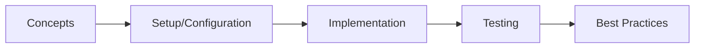

# Spring Integration

> **Previous:** [Spring Batch](./49-batch.md) | **Next:** [Spring Modulith](./51-modulith.md)

## Learning Objectives

<!-- Image Gallery -->
<section class="lesson-visuals" aria-label="Visual learning resources">
  <header><span>VISUAL LEARNING</span><h2>See it. Review it. Remember it.</h2></header>
  <a class="lesson-visual-card" href="../../../assets/images/lessons/java/50-integration/handwritten-notes.svg" target="_blank" rel="noopener">
    
    <span><strong>Handwritten notes</strong>Condensed notes for deliberate review.</span>
  </a>
  <a class="lesson-visual-card" href="../../../assets/images/lessons/java/50-integration/sticky-notes.svg" target="_blank" rel="noopener">
    
    <span><strong>Sticky-note revision</strong>Fast recall prompts for revision.</span>
  </a>
  <a class="lesson-visual-card" href="../../../assets/images/lessons/java/50-integration/visual-explanation.svg" target="_blank" rel="noopener">
    
    <span><strong>Visual concept guide</strong>A connected explanation of the key ideas.</span>
  </a>
</section>
<!-- End Image Gallery -->

## Chapter at a Glance

| Topic | Key Insight | Practical Takeaway |
|-------|-------------|--------------------|
| Core Concepts | Foundational understanding | Real-world application |
| Implementation | Code-first approach | Working examples |
| Best Practices | Production patterns | Avoid common pitfalls |

## Chapter Roadmap




By the end of this chapter, you will be able to:
- Implement Enterprise Integration Patterns using Spring Integration
- Configure and use message channels (DirectChannel, QueueChannel, PublishSubscribeChannel, etc.)
- Design Messaging Gateways with @MessagingGateway
- Build transformers for message conversion (JSON, XML, File, Object)
- Implement routers for dynamic message routing
- Create JMS, FTP, file, and mail adapters
- Write DSL-based IntegrationFlows for declarative pipeline construction
- Handle errors, transactions, and idempotent receivers
- Test integration flows end-to-end

---

## 1. Spring Integration Overview

> **Pro Tip:** Test with production-like configurations → dev setups often hide issues that surface under real load.

> **Remember:** Start simple. Add complexity only when proven necessary. Premature abstraction creates maintenance burden.


Spring Integration implements the Enterprise Integration Patterns, providing a lightweight message-based framework for integrating systems.

### 1.1 Maven Dependencies


```xml
<?xml version="1.0" encoding="UTF-8"?>
<project xmlns="http://maven.apache.org/POM/4.0.0"
         xmlns:xsi="http://www.w3.org/2001/XMLSchema-instance"
         xsi:schemaLocation="http://maven.apache.org/POM/4.0.0
         https://maven.apache.org/xsd/maven-4.0.0.xsd">
    <modelVersion>4.0.0</modelVersion>
    <parent>
        <groupId>org.springframework.boot</groupId>
        <artifactId>spring-boot-starter-parent</artifactId>
        <version>3.4.0</version>
        <relativePath/>
    </parent>
    <groupId>com.aiengineering</groupId>
    <artifactId>integration-course</artifactId>
    <version>1.0.0</version>
    <name>integration-course</name>

    <properties>
        <java.version>21</java.version>
    </properties>

    <dependencies>
        <dependency>
            <groupId>org.springframework.boot</groupId>
            <artifactId>spring-boot-starter-integration</artifactId>
        </dependency>
        <dependency>
            <groupId>org.springframework.boot</groupId>
            <artifactId>spring-boot-starter-web</artifactId>
        </dependency>
        <dependency>
            <groupId>org.springframework.boot</groupId>
            <artifactId>spring-boot-starter-data-jpa</artifactId>
        </dependency>

        <dependency>
            <groupId>org.springframework.integration</groupId>
            <artifactId>spring-integration-jms</artifactId>
        </dependency>
        <dependency>
            <groupId>org.springframework.integration</groupId>
            <artifactId>spring-integration-ftp</artifactId>
        </dependency>
        <dependency>
            <groupId>org.springframework.integration</groupId>
            <artifactId>spring-integration-file</artifactId>
        </dependency>
        <dependency>
            <groupId>org.springframework.integration</groupId>
            <artifactId>spring-integration-mail</artifactId>
        </dependency>
        <dependency>
            <groupId>org.springframework.integration</groupId>
            <artifactId>spring-integration-jdbc</artifactId>
        </dependency>
        <dependency>
            <groupId>org.springframework.integration</groupId>
            <artifactId>spring-integration-mqtt</artifactId>
        </dependency>
        <dependency>
            <groupId>org.springframework.integration</groupId>
            <artifactId>spring-integration-kafka</artifactId>
        </dependency>
        <dependency>
            <groupId>org.springframework.integration</groupId>
            <artifactId>spring-integration-amqp</artifactId>
        </dependency>
        <dependency>
            <groupId>org.springframework.integration</groupId>
            <artifactId>spring-integration-stomp</artifactId>
        </dependency>
        <dependency>
            <groupId>org.springframework.integration</groupId>
            <artifactId>spring-integration-ws</artifactId>
        </dependency>
        <dependency>
            <groupId>org.springframework.integration</groupId>
            <artifactId>spring-integration-xml</artifactId>
        </dependency>
        <dependency>
            <groupId>org.springframework.integration</groupId>
            <artifactId>spring-integration-event</artifactId>
        </dependency>

        <dependency>
            <groupId>com.fasterxml.jackson.core</groupId>
            <artifactId>jackson-databind</artifactId>
        </dependency>
        <dependency>
            <groupId>com.fasterxml.jackson.datatype</groupId>
            <artifactId>jackson-datatype-jsr310</artifactId>
        </dependency>

        <dependency>
            <groupId>org.apache.activemq</groupId>
            <artifactId>activemq-client</artifactId>
        </dependency>
        <dependency>
            <groupId>org.springframework.boot</groupId>
            <artifactId>spring-boot-starter-artemis</artifactId>
        </dependency>

        <dependency>
            <groupId>org.projectlombok</groupId>
            <artifactId>lombok</artifactId>
            <optional>true</optional>
        </dependency>

        <dependency>
            <groupId>org.springframework.boot</groupId>
            <artifactId>spring-boot-starter-test</artifactId>
            <scope>test</scope>
        </dependency>
        <dependency>
            <groupId>org.springframework.integration</groupId>
            <artifactId>spring-integration-test</artifactId>
            <scope>test</scope>
        </dependency>
    </dependencies>
</project>
```

### 1.2 Application Configuration


```yaml
# src/main/resources/application.yml

> **Previous:** [Spring Batch](./49-batch.md) | **Next:** [Spring Modulith](./51-modulith.md)
spring:
  application:
    name: integration-course

  artemis:
    mode: embedded
    enabled: true
    port: 61616
    embedded:
      enabled: true
      persistent: false

  jpa:
    hibernate:
      ddl-auto: update
    show-sql: false

  datasource:
    url: jdbc:postgresql://localhost:5432/integration_course
    username: postgres
    password: postgres
    driver-class-name: org.postgresql.Driver

  mail:
    host: smtp.gmail.com
    port: 587
    username: ${MAIL_USERNAME}
    password: ${MAIL_PASSWORD}
    properties:
      mail:
        smtp:
          auth: true
          starttls:
            enable: true

server:
  port: 8080

ftp:
    host: localhost
    port: 21
    username: ftpuser
    password: ftppass
    remote-dir: /uploads
    local-dir: /tmp/ftp-downloads

file:
    input-dir: /tmp/input
    output-dir: /tmp/output
    error-dir: /tmp/error
    archive-dir: /tmp/archive

logging:
  level:
    org.springframework.integration: DEBUG
    org.springframework.jms: DEBUG
```

---

## 2. Message Channels

```java
package com.aiengineering.course.config;

import org.springframework.context.annotation.Bean;
import org.springframework.context.annotation.Configuration;
import org.springframework.integration.channel.*;
import org.springframework.integration.config.EnableIntegration;
import org.springframework.integration.scheduling.PollerMetadata;
import org.springframework.messaging.Message;
import org.springframework.messaging.MessageChannel;
import org.springframework.messaging.support.ChannelInterceptor;
import org.springframework.messaging.support.MessageBuilder;
import org.springframework.scheduling.support.PeriodicTrigger;

import java.util.concurrent.Executors;

@Configuration
@EnableIntegration
public class ChannelConfig {

    @Bean
    public MessageChannel directChannel() {
        DirectChannel channel = new DirectChannel();
        channel.addInterceptor(new LoggingChannelInterceptor("directChannel"));
        return channel;
    }

    @Bean
    public MessageChannel queueChannel() {
        QueueChannel channel = new QueueChannel(100);
        channel.addInterceptor(new LoggingChannelInterceptor("queueChannel"));
        return channel;
    }

    @Bean
    public MessageChannel publishSubscribeChannel() {
        PublishSubscribeChannel channel = new PublishSubscribeChannel();
        channel.addInterceptor(new LoggingChannelInterceptor("publishSubscribeChannel"));
        return channel;
    }

    @Bean
    public MessageChannel executorChannel() {
        ExecutorChannel channel = new ExecutorChannel(
            Executors.newFixedThreadPool(4));
        channel.addInterceptor(new LoggingChannelInterceptor("executorChannel"));
        return channel;
    }

    @Bean
    public MessageChannel fluxChannel() {
        FluxMessageChannel channel = new FluxMessageChannel();
        channel.addInterceptor(new LoggingChannelInterceptor("fluxChannel"));
        return channel;
    }

    @Bean
    public MessageChannel rendezvousChannel() {
        RendezvousChannel channel = new RendezvousChannel();
        channel.addInterceptor(new LoggingChannelInterceptor("rendezvousChannel"));
        return channel;
    }

    @Bean
    public MessageChannel priorityChannel() {
        PriorityChannel channel = new PriorityChannel(100, (msg1, msg2) -> {
            int priority1 = (int) msg1.getHeaders().getOrDefault("priority", 0);
            int priority2 = (int) msg2.getHeaders().getOrDefault("priority", 0);
            return Integer.compare(priority2, priority1);
        });
        return channel;
    }

    @Bean
    public MessageChannel errorChannel() {
        DirectChannel channel = new DirectChannel();
        channel.addInterceptor(new ChannelInterceptor() {
            @Override
            public Message<?> preSend(Message<?> message, MessageChannel channel) {
                System.err.println("Error channel received: " + message);
                return message;
            }
        });
        return channel;
    }

    @Bean(name = PollerMetadata.DEFAULT_POLLER)
    public PollerMetadata defaultPoller() {
        PollerMetadata poller = new PollerMetadata();
        poller.setTrigger(new PeriodicTrigger(1000));
        poller.setMaxMessagesPerPoll(10);
        poller.setErrorChannel(errorChannel());
        return poller;
    }

    public static class LoggingChannelInterceptor implements ChannelInterceptor {
        private final String channelName;

        public LoggingChannelInterceptor(String channelName) {
            this.channelName = channelName;
        }

        @Override
        public Message<?> preSend(Message<?> message, MessageChannel channel) {
            return message;
        }

        @Override
        public void postSend(Message<?> message, MessageChannel channel, boolean sent) {
        }

        @Override
        public void afterSendCompletion(Message<?> message, MessageChannel channel,
                                         boolean sent, Exception ex) {
        }

        @Override
        public boolean preReceive(MessageChannel channel) {
            return true;
        }

        @Override
        public Message<?> postReceive(Message<?> message, MessageChannel channel) {
            return message;
        }

        @Override
        public void afterReceiveCompletion(Message<?> message, MessageChannel channel,
                                            Exception ex) {
        }
    }
}
```

### 2.1 Channel Bridge Configuration


```java
package com.aiengineering.course.config;

import org.springframework.beans.factory.annotation.Qualifier;
import org.springframework.context.annotation.Bean;
import org.springframework.context.annotation.Configuration;
import org.springframework.integration.annotation.BridgeFrom;
import org.springframework.integration.annotation.BridgeTo;
import org.springframework.integration.channel.interceptor.WireTap;
import org.springframework.messaging.MessageChannel;

@Configuration
public class BridgeConfig {

    @Bean
    public WireTap wireTap(@Qualifier("directChannel") MessageChannel directChannel) {
        return new WireTap(directChannel);
    }

    @Bean
    @BridgeTo("publishSubscribeChannel")
    public MessageChannel bridgedChannel() {
        return new DirectChannel();
    }

    @Bean
    @BridgeFrom("queueChannel")
    public MessageChannel bridgedFromChannel() {
        return new DirectChannel();
    }

    @Bean
    public MessageChannel monitoringChannel() {
        return new DirectChannel();
    }
}
```

---

## 3. Messaging Gateways

```java
package com.aiengineering.course.gateway;

import com.aiengineering.course.model.Order;
import com.aiengineering.course.model.Payment;
import com.aiengineering.course.model.Shipment;
import org.springframework.integration.annotation.Gateway;
import org.springframework.integration.annotation.GatewayHeader;
import org.springframework.integration.annotation.MessagingGateway;
import org.springframework.messaging.Message;
import org.springframework.messaging.handler.annotation.Header;
import org.springframework.messaging.handler.annotation.Payload;

import java.util.List;
import java.util.concurrent.CompletableFuture;
import java.util.concurrent.Future;

@MessagingGateway(
    name = "orderGateway",
    defaultRequestChannel = "orderInputChannel",
    defaultReplyChannel = "orderReplyChannel",
    defaultReplyTimeout = 5000,
    defaultRequestTimeout = 30000
)
public interface OrderGateway {

    @Gateway(requestChannel = "placeOrderChannel",
            replyChannel = "orderConfirmationChannel",
            replyTimeout = 10000)
    OrderConfirmation placeOrder(Order order);

    @Gateway(requestChannel = "processPaymentChannel",
            headers = @GatewayHeader(name = "transactionType", value = "PAYMENT"))
    Payment processPayment(@Payload Payment payment,
                           @Header("paymentMethod") String paymentMethod);

    @Gateway(requestChannel = "shipOrderChannel",
            replyChannel = "trackingChannel")
    Shipment shipOrder(Order order);

    @Gateway(requestChannel = "cancelOrderChannel")
    void cancelOrder(Long orderId);

    @Gateway(requestChannel = "checkStatusChannel",
            poll = @Poller(
                maxMessagesPerPoll = 1,
                fixedDelay = 1000,
                errorChannel = "errorChannel"
            ))
    OrderStatus checkStatus(String orderId);

    @Gateway(requestChannel = "asyncProcessChannel")
    Future<String> processAsync(Order order);

    @Gateway(requestChannel = "asyncCompletableChannel")
    CompletableFuture<String> processCompletable(Order order);

    @Gateway(requestChannel = "batchProcessChannel")
    List<OrderConfirmation> batchProcess(List<Order> orders);

    @Gateway(requestChannel = "orderEventChannel")
    void sendOrderEvent(Message<Order> message);

    @Gateway(requestChannel = "priorityOrderChannel")
    OrderConfirmation priorityOrder(@Payload Order order,
                                    @Header("priority") int priority);
}
```

```java
package com.aiengineering.course.gateway;

import org.springframework.integration.annotation.Gateway;
import org.springframework.integration.annotation.MessagingGateway;
import org.springframework.messaging.Message;

import java.io.File;
import java.util.Map;

@MessagingGateway(defaultRequestChannel = "notificationChannel")
public interface NotificationGateway {

    @Gateway(requestChannel = "emailChannel")
    void sendEmail(String to, String subject, String body);

    @Gateway(requestChannel = "smsChannel")
    void sendSms(String phoneNumber, String message);

    @Gateway(requestChannel = "pushNotificationChannel")
    void sendPushNotification(String deviceToken, String title, String body);

    @Gateway(requestChannel = "slackWebhookChannel")
    void sendSlackMessage(String webhookUrl, String message);

    @Gateway(requestChannel = "emailWithTemplateChannel")
    void sendTemplatedEmail(Map<String, Object> templateData);
}

@MessagingGateway(defaultRequestChannel = "fileProcessingChannel")
interface FileProcessingGateway {

    @Gateway(requestChannel = "fileProcessChannel")
    void processFile(File file);

    @Gateway(requestChannel = "fileArchiveChannel")
    void archiveFile(File file, String archivePath);

    @Gateway(requestChannel = "fileValidationChannel",
            replyChannel = "validationResultChannel")
    ValidationResult validateFile(File file);

    record ValidationResult(boolean valid, String message, long fileSize) {}
}
```

```java
package com.aiengineering.course.gateway;

import org.springframework.integration.annotation.Gateway;
import org.springframework.integration.annotation.MessagingGateway;
import org.springframework.messaging.handler.annotation.Payload;

@MessagingGateway(defaultRequestChannel = "inventoryChannel")
public interface InventoryGateway {

    @Gateway(requestChannel = "checkStockChannel",
            replyChannel = "stockResultChannel")
    StockResult checkStock(String productSku, int quantity);

    @Gateway(requestChannel = "reserveStockChannel")
    boolean reserveStock(String productSku, int quantity);

    @Gateway(requestChannel = "releaseStockChannel")
    void releaseStock(String productSku, int quantity);

    @Gateway(requestChannel = "updateStockChannel")
    void updateStock(String productSku, int newQuantity);
}

@MessagingGateway(defaultRequestChannel = "auditChannel")
interface AuditGateway {

    @Gateway(requestChannel = "logAuditEventChannel")
    void logEvent(String action, String entityType, Long entityId,
                  String details, String userId);

    @Gateway(requestChannel = "queryAuditLogChannel",
            replyChannel = "auditResultChannel")
    List<AuditEntry> queryAuditLog(String entityType, Long entityId,
                                    int limit, int offset);

    record AuditEntry(Long id, String action, String entityType,
                       Long entityId, String details, String userId,
                       String timestamp) {}

    @Payload("new java.util.Date()")
    record List<AuditEntry>() {}
}
```

---

## 4. Transformers

```java
package com.aiengineering.course.transformer;

import com.aiengineering.course.model.Order;
import com.aiengineering.course.model.OrderCsvRecord;
import com.fasterxml.jackson.core.JsonProcessingException;
import com.fasterxml.jackson.databind.ObjectMapper;
import com.fasterxml.jackson.datatype.jsr310.JavaTimeModule;
import org.springframework.context.annotation.Bean;
import org.springframework.context.annotation.Configuration;
import org.springframework.integration.json.JsonToObjectTransformer;
import org.springframework.integration.json.ObjectToJsonTransformer;
import org.springframework.integration.mapping.support.JsonHeaders;
import org.springframework.integration.support.json.Jackson2JsonObjectMapper;
import org.springframework.integration.transformer.*;
import org.springframework.messaging.Message;
import org.springframework.messaging.MessageHeaders;
import org.springframework.messaging.converter.GenericMessageConverter;
import org.springframework.messaging.support.MessageBuilder;

import java.io.File;
import java.nio.charset.StandardCharsets;
import java.util.Map;

@Configuration
public class TransformerConfig {

    @Bean
    public ObjectMapper objectMapper() {
        ObjectMapper mapper = new ObjectMapper();
        mapper.registerModule(new JavaTimeModule());
        return mapper;
    }

    @Bean
    public ObjectToJsonTransformer objectToJsonTransformer(ObjectMapper objectMapper) {
        return new ObjectToJsonTransformer(
            new Jackson2JsonObjectMapper(objectMapper));
    }

    @Bean
    public JsonToObjectTransformer jsonToObjectTransformer(ObjectMapper objectMapper) {
        return new JsonToObjectTransformer(Order.class,
            new Jackson2JsonObjectMapper(objectMapper));
    }

    @Bean
    public ObjectToStringTransformer objectToStringTransformer() {
        return new ObjectToStringTransformer();
    }

    @Bean
    public FileToStringTransformer fileToStringTransformer() {
        FileToStringTransformer transformer = new FileToStringTransformer();
        transformer.setCharset("UTF-8");
        transformer.setDeleteFiles(false);
        return transformer;
    }

    @Bean
    public MapToObjectTransformer mapToObjectTransformer() {
        return new MapToObjectTransformer(Order.class);
    }

    @Bean
    public ObjectToMapTransformer objectToMapTransformer() {
        return new ObjectToMapTransformer();
    }

    @Bean
    public GenericTransformer<Order, OrderCsvRecord> orderToCsvTransformer() {
        return order -> new OrderCsvRecord(
            order.getId().toString(),
            order.getCustomerName(),
            order.getTotal().toString(),
            order.getStatus(),
            order.getCreatedAt().toString()
        );
    }

    @Bean
    public GenericTransformer<String, Order> csvLineToOrderTransformer() {
        return line -> {
            String[] parts = line.split(",");
            if (parts.length < 5) {
                throw new IllegalArgumentException(
                    "Invalid CSV line: " + line);
            }
            Order order = new Order();
            order.setId(Long.parseLong(parts[0].trim()));
            order.setCustomerName(parts[1].trim());
            order.setTotal(new java.math.BigDecimal(parts[2].trim()));
            order.setStatus(parts[3].trim());
            return order;
        };
    }

    @Bean
    public GenericTransformer<Message<?>, Message<?>> enrichHeaderTransformer() {
        return message -> MessageBuilder.fromMessage(message)
            .setHeader("processedAt", java.time.LocalDateTime.now().toString())
            .setHeader("processedBy", "transformer-service")
            .setHeader("version", "1.0")
            .build();
    }

    @Bean
    public GenericTransformer<String, String> xmlToJsonTransformer() {
        return xml -> {
            try {
                ObjectMapper xmlMapper = new com.fasterxml.jackson.dataformat.xml.XmlMapper();
                Object obj = xmlMapper.readValue(xml, Object.class);
                ObjectMapper jsonMapper = new ObjectMapper();
                return jsonMapper.writeValueAsString(obj);
            } catch (Exception e) {
                throw new RuntimeException("XML to JSON conversion failed", e);
            }
        };
    }
}
```

### 4.1 Custom Transformer Service


```java
package com.aiengineering.course.transformer;

import com.aiengineering.course.model.*;
import org.slf4j.Logger;
import org.slf4j.LoggerFactory;
import org.springframework.integration.annotation.Transformer;
import org.springframework.integration.support.MessageBuilder;
import org.springframework.messaging.Message;
import org.springframework.stereotype.Component;

import java.math.BigDecimal;
import java.time.LocalDateTime;
import java.util.List;
import java.util.Map;
import java.util.UUID;

@Component
public class OrderTransformerService {

    private static final Logger log = LoggerFactory.getLogger(OrderTransformerService.class);

    @Transformer(inputChannel = "orderValidationChannel", outputChannel = "orderProcessingChannel")
    public ValidatedOrder validateOrder(Order order) {
        log.info("Validating order: {}", order.getId());

        if (order.getTotal() == null || order.getTotal().compareTo(BigDecimal.ZERO) <= 0) {
            throw new IllegalArgumentException("Invalid order total");
        }
        if (order.getCustomerName() == null || order.getCustomerName().isBlank()) {
            throw new IllegalArgumentException("Customer name is required");
        }

        return new ValidatedOrder(
            order.getId(),
            order.getCustomerName(),
            order.getTotal(),
            order.getStatus(),
            true,
            "Order validated successfully",
            LocalDateTime.now()
        );
    }

    @Transformer(inputChannel = "orderEnrichmentChannel", outputChannel = "orderRoutingChannel")
    public Message<EnrichedOrder> enrichOrder(Order order) {
        EnrichedOrder enriched = new EnrichedOrder(
            order.getId(),
            UUID.randomUUID().toString(),
            order.getCustomerName(),
            order.getTotal(),
            order.getStatus(),
            order.getItems() != null ? order.getItems() : List.of(),
            LocalDateTime.now(),
            LocalDateTime.now()
        );

        return MessageBuilder.withPayload(enriched)
            .setHeader("orderType", determineOrderType(order))
            .setHeader("priority", calculatePriority(order))
            .setHeader("requiresReview", order.getTotal().compareTo(
                new BigDecimal("10000")) > 0)
            .build();
    }

    @Transformer(inputChannel = "paymentTransformerChannel", outputChannel = "paymentProcessingChannel")
    public Payment transformPayment(Map<String, Object> paymentData) {
        return Payment.builder()
            .transactionId((String) paymentData.get("transactionId"))
            .orderId(Long.valueOf((String) paymentData.get("orderId")))
            .amount(new BigDecimal((String) paymentData.get("amount")))
            .currency((String) paymentData.getOrDefault("currency", "USD"))
            .paymentMethod((String) paymentData.get("paymentMethod"))
            .status("PENDING")
            .createdAt(LocalDateTime.now())
            .build();
    }

    @Transformer(inputChannel = "csvOrderChannel", outputChannel = "validatedOrderChannel")
    public List<Order> parseCsvOrders(String csvContent) {
        return csvContent.lines()
            .skip(1)
            .map(line -> {
                String[] parts = line.split(",");
                Order order = new Order();
                order.setCustomerName(parts[0].trim());
                order.setTotal(new BigDecimal(parts[1].trim()));
                order.setStatus("PENDING");
                return order;
            })
            .toList();
    }

    @Transformer(inputChannel = "notificationTransformChannel")
    public Message<?> transformNotification(Map<String, Object> notification) {
        String type = (String) notification.get("type");
        String message = (String) notification.get("message");

        return MessageBuilder.withPayload(message)
            .setHeader("notificationType", type)
            .setHeader("channel", determineChannel(type))
            .setHeader("timestamp", LocalDateTime.now().toString())
            .build();
    }

    private String determineOrderType(Order order) {
        if (order.getTotal().compareTo(new BigDecimal("5000")) > 0) return "PREMIUM";
        if (order.getItems() != null && order.getItems().size() > 10) return "BULK";
        return "STANDARD";
    }

    private int calculatePriority(Order order) {
        if (order.getTotal().compareTo(new BigDecimal("50000")) > 0) return 1;
        if (order.getTotal().compareTo(new BigDecimal("10000")) > 0) return 2;
        return 3;
    }

    private String determineChannel(String type) {
        return switch (type) {
            case "URGENT", "ALERT" -> "sms";
            case "INFO", "CONFIRMATION" -> "email";
            case "MARKETING" -> "push";
            default -> "email";
        };
    }
}
```

---

## 5. Routers

```java
package com.aiengineering.course.router;

import com.aiengineering.course.model.EnrichedOrder;
import com.aiengineering.course.model.Order;
import com.aiengineering.course.model.Payment;
import org.slf4j.Logger;
import org.slf4j.LoggerFactory;
import org.springframework.context.annotation.Bean;
import org.springframework.context.annotation.Configuration;
import org.springframework.integration.annotation.Router;
import org.springframework.integration.router.*;
import org.springframework.messaging.Message;
import org.springframework.messaging.MessageChannel;
import org.springframework.messaging.support.MessageBuilder;

import java.util.List;
import java.util.Map;

@Configuration
public class RouterConfig {

    private static final Logger log = LoggerFactory.getLogger(RouterConfig.class);

    @Bean
    public HeaderValueRouter orderTypeRouter() {
        HeaderValueRouter router = new HeaderValueRouter("orderType");
        router.setChannelMapping("PREMIUM", "premiumOrderChannel");
        router.setChannelMapping("STANDARD", "standardOrderChannel");
        router.setChannelMapping("BULK", "bulkOrderChannel");
        router.setChannelMapping("INTERNATIONAL", "internationalOrderChannel");
        router.setDefaultOutputChannel(defaultOrderChannel());
        router.setResolutionRequired(false);
        return router;
    }

    @Bean
    public PayloadTypeRouter payloadTypeRouter() {
        PayloadTypeRouter router = new PayloadTypeRouter();
        router.setChannelMapping(Order.class.getName(), "orderChannel");
        router.setChannelMapping(Payment.class.getName(), "paymentChannel");
        router.setChannelMapping(String.class.getName(), "stringMessageChannel");
        router.setChannelMapping(Map.class.getName(), "mapMessageChannel");
        return router;
    }

    @Bean
    public RecipientListRouter<Message<?>> recipientListRouter() {
        RecipientListRouter router = new RecipientListRouter();
        router.setRecipients(List.of(
            "auditChannel",
            "notificationChannel",
            "persistenceChannel"
        ));
        router.setApplySequence(true);
        router.setIgnoreSendFailures(true);
        router.setTimeout(5000);
        return router;
    }

    @Bean
    public ErrorMessageExceptionTypeRouter errorRouter() {
        ErrorMessageExceptionTypeRouter router = new ErrorMessageExceptionTypeRouter();
        router.setChannelMapping(
            IllegalArgumentException.class.getName(), "validationErrorChannel");
        router.setChannelMapping(
            org.springframework.dao.DataAccessException.class.getName(),
            "databaseErrorChannel");
        router.setChannelMapping(
            org.springframework.integration.IntegrationException.class.getName(),
            "integrationErrorChannel");
        router.setChannelMapping(
            java.net.ConnectException.class.getName(), "networkErrorChannel");
        router.setDefaultOutputChannel(genericErrorChannel());
        return router;
    }

    @Bean
    public MessageChannel defaultOrderChannel() {
        return new org.springframework.integration.channel.DirectChannel();
    }

    @Bean
    public MessageChannel genericErrorChannel() {
        return new org.springframework.integration.channel.DirectChannel();
    }

    @Bean
    @Router(inputChannel = "dynamicRouterChannel")
    public AbstractMessageRouter dynamicRouter() {
        return new AbstractMessageRouter() {
            @Override
            protected Collection<MessageChannel> determineTargetChannels(
                    Message<?> message) {
                String routingKey = (String) message.getHeaders()
                    .getOrDefault("routingKey", "default");

                return List.of(switch (routingKey) {
                    case "fast" -> fastPathChannel();
                    case "reliable" -> reliablePathChannel();
                    case "audit" -> auditOnlyChannel();
                    default -> defaultPathChannel();
                });
            }
        };
    }
}
```

```java
package com.aiengineering.course.router;

import org.slf4j.Logger;
import org.slf4j.LoggerFactory;
import org.springframework.integration.annotation.Router;
import org.springframework.messaging.Message;
import org.springframework.messaging.MessageChannel;
import org.springframework.stereotype.Component;

import java.math.BigDecimal;
import java.util.List;
import java.util.Map;

@Component
public class OrderRouterService {

    private static final Logger log = LoggerFactory.getLogger(OrderRouterService.class);

    @Router(inputChannel = "orderRoutingChannel")
    public String routeOrderByType(Message<EnrichedOrder> message) {
        EnrichedOrder order = message.getPayload();
        String type = (String) message.getHeaders().getOrDefault("orderType", "STANDARD");

        log.info("Routing order {} as {}", order.id(), type);

        return switch (type) {
            case "PREMIUM" -> "premiumProcessingChannel";
            case "BULK" -> "bulkProcessingChannel";
            case "INTERNATIONAL" -> "internationalProcessingChannel";
            default -> "standardProcessingChannel";
        };
    }

    @Router(inputChannel = "paymentRoutingChannel")
    public List<String> routePayment(Payment payment) {
        if (payment.getAmount().compareTo(new BigDecimal("100000")) > 0) {
            return List.of("highValuePaymentChannel", "fraudReviewChannel");
        }
        if (payment.getAmount().compareTo(new BigDecimal("10000")) > 0) {
            return List.of("standardPaymentChannel", "auditLogChannel");
        }
        return List.of("standardPaymentChannel");
    }

    @Router(inputChannel = "errorRoutingChannel")
    public String routeError(Message<?> errorMessage) {
        Throwable cause = (Throwable) errorMessage.getPayload();
        log.error("Routing error: {}", cause.getMessage());

        if (cause instanceof IllegalArgumentException) {
            return "validationErrorChannel";
        } else if (cause instanceof java.io.IOException) {
            return "retryChannel";
        } else if (cause instanceof org.springframework.dao.DataIntegrityViolationException) {
            return "deadLetterChannel";
        }
        return "fatalErrorChannel";
    }

    @Router(inputChannel = "notificationRoutingChannel")
    public String routeNotification(Message<?> message) {
        String type = (String) message.getHeaders().get("notificationType");
        String channel = (String) message.getHeaders().get("channel");

        return channel + "NotificationChannel";
    }
}
```

---

## 6. Adapters

### 6.1 File Adapters


```java
package com.aiengineering.course.config;

import org.springframework.context.annotation.Bean;
import org.springframework.context.annotation.Configuration;
import org.springframework.integration.dsl.IntegrationFlow;
import org.springframework.integration.dsl.IntegrationFlows;
import org.springframework.integration.dsl.Pollers;
import org.springframework.integration.file.FileReadingMessageSource;
import org.springframework.integration.file.FileWritingMessageHandler;
import org.springframework.integration.file.filters.AcceptOnceFileListFilter;
import org.springframework.integration.file.filters.CompositeFileListFilter;
import org.springframework.integration.file.filters.LastModifiedFileListFilter;
import org.springframework.integration.file.filters.SimplePatternFileListFilter;
import org.springframework.integration.file.support.FileExistsMode;
import org.springframework.integration.transformer.GenericTransformer;
import org.springframework.messaging.MessageHandler;

import java.io.File;
import java.io.FileWriter;
import java.io.IOException;

@Configuration
public class FileAdapterConfig {

    @Bean
    public FileReadingMessageSource fileReadingMessageSource() {
        FileReadingMessageSource source = new FileReadingMessageSource();
        source.setDirectory(new File("/tmp/input"));
        source.setAutoCreateDirectory(true);
        source.setScanEachPoll(true);
        source.setUseWatchService(true);
        source.setWatchEvents(
            FileReadingMessageSource.WatchEventType.CREATE,
            FileReadingMessageSource.WatchEventType.MODIFY
        );

        CompositeFileListFilter<File> filter = new CompositeFileListFilter<>();
        filter.addFilters(
            new SimplePatternFileListFilter("*.csv"),
            new SimplePatternFileListFilter("*.xml"),
            new LastModifiedFileListFilter(1000),
            new AcceptOnceFileListFilter<>()
        );
        source.setFilter(filter);

        return source;
    }

    @Bean
    public MessageHandler fileWritingMessageHandler() {
        FileWritingMessageHandler handler = new FileWritingMessageHandler(
            new File("/tmp/output"));
        handler.setAutoCreateDirectory(true);
        handler.setFileExistsMode(FileExistsMode.REPLACE);
        handler.setDeleteSourceFiles(true);
        handler.setCharset("UTF-8");
        handler.setExpectFailure(false);
        handler.setFileNameGenerator(message -> {
            Object payload = message.getPayload();
            if (payload instanceof File file) {
                return "processed_" + file.getName();
            }
            return "output_" + System.currentTimeMillis() + ".txt";
        });
        handler.setFileExistsMode(FileExistsMode.APPEND_NO_FLUSH);

        return handler;
    }

    @Bean
    public IntegrationFlow fileProcessingFlow() {
        return IntegrationFlows
            .from(fileReadingMessageSource(),
                config -> config.poller(Pollers.fixedDelay(5000)))
            .filter(File.class, file -> file.getName().endsWith(".csv"),
                f -> f.discardChannel(fileDiscardChannel()))
            .transform(fileToStringTransformer())
            .transform(csvLineParserTransformer())
            .handle(orderProcessingService())
            .get();
    }
}
```

### 6.2 JMS Adapters


```java
package com.aiengineering.course.config;

import jakarta.jms.ConnectionFactory;
import jakarta.jms.MessageListener;
import org.springframework.beans.factory.annotation.Qualifier;
import org.springframework.context.annotation.Bean;
import org.springframework.context.annotation.Configuration;
import org.springframework.integration.jms.*;
import org.springframework.integration.jms.dsl.Jms;
import org.springframework.integration.dsl.IntegrationFlow;
import org.springframework.integration.dsl.IntegrationFlows;
import org.springframework.jms.core.JmsTemplate;
import org.springframework.jms.listener.DefaultMessageListenerContainer;
import org.springframework.jms.support.converter.MappingJackson2MessageConverter;
import org.springframework.jms.support.converter.MessageConverter;
import org.springframework.jms.support.converter.MessageType;

@Configuration
public class JmsAdapterConfig {

    @Bean
    public ChannelPublishingJmsMessageListener jmsMessageListener() {
        ChannelPublishingJmsMessageListener listener =
            new ChannelPublishingJmsMessageListener();
        listener.setRequestChannelName("jmsInboundChannel");
        listener.setExpectReply(false);
        return listener;
    }

    @Bean
    public DefaultMessageListenerContainer jmsListenerContainer(
            ConnectionFactory connectionFactory,
            ChannelPublishingJmsMessageListener jmsMessageListener) {

        DefaultMessageListenerContainer container =
            new DefaultMessageListenerContainer();
        container.setConnectionFactory(connectionFactory);
        container.setDestinationName("orders.queue");
        container.setMessageListener(jmsMessageListener);
        container.setConcurrentConsumers(3);
        container.setMaxConcurrentConsumers(10);
        container.setSessionTransacted(true);
        container.setAutoStartup(true);
        return container;
    }

    @Bean
    public JmsSendingMessageHandler jmsOutboundAdapter(
            ConnectionFactory connectionFactory) {

        JmsSendingMessageHandler handler = new JmsSendingMessageHandler(
            new JmsTemplate(connectionFactory));
        handler.setDestinationName("processed.orders.queue");
        handler.setLoggingEnabled(true);
        return handler;
    }

    @Bean
    public MessageConverter jmsMessageConverter() {
        MappingJackson2MessageConverter converter =
            new MappingJackson2MessageConverter();
        converter.setTargetType(MessageType.TEXT);
        converter.setTypeIdPropertyName("_type");
        return converter;
    }

    @Bean
    public IntegrationFlow jmsInboundFlow() {
        return IntegrationFlows
            .from(Jms.messageDrivenChannelAdapter(
                    jmsListenerContainer(null, null))
                .errorChannel("errorChannel"))
            .transform(jmsMessageTransformer())
            .handle("orderProcessingService", "processJmsOrder")
            .get();
    }

    @Bean
    public IntegrationFlow jmsOutboundFlow() {
        return IntegrationFlows
            .from("jmsOutboundChannel")
            .handle(Jms.outboundAdapter(
                    new JmsTemplate(null))
                .destinationExpression("headers.jmsDestination"))
            .get();
    }
}
```

### 6.3 FTP Adapters


```java
package com.aiengineering.course.config;

import org.apache.commons.net.ftp.FTPFile;
import org.springframework.beans.factory.annotation.Value;
import org.springframework.context.annotation.Bean;
import org.springframework.context.annotation.Configuration;
import org.springframework.integration.dsl.IntegrationFlow;
import org.springframework.integration.dsl.IntegrationFlows;
import org.springframework.integration.dsl.Pollers;
import org.springframework.integration.file.filters.AcceptOnceFileListFilter;
import org.springframework.integration.file.remote.session.CachingSessionFactory;
import org.springframework.integration.file.remote.session.SessionFactory;
import org.springframework.integration.ftp.dsl.Ftp;
import org.springframework.integration.ftp.session.DefaultFtpSessionFactory;
import org.springframework.integration.handler.LoggingHandler;

import java.time.Duration;

@Configuration
public class FtpAdapterConfig {

    @Value("${ftp.host}")
    private String ftpHost;

    @Value("${ftp.port}")
    private int ftpPort;

    @Value("${ftp.username}")
    private String ftpUsername;

    @Value("${ftp.password}")
    private String ftpPassword;

    @Value("${ftp.remote-dir}")
    private String remoteDir;

    @Value("${ftp.local-dir}")
    private String localDir;

    @Bean
    public DefaultFtpSessionFactory ftpSessionFactory() {
        DefaultFtpSessionFactory factory = new DefaultFtpSessionFactory();
        factory.setHost(ftpHost);
        factory.setPort(ftpPort);
        factory.setUsername(ftpUsername);
        factory.setPassword(ftpPassword);
        factory.setClientMode(org.apache.commons.net.ftp.FTP.PASSIVE_LOCAL_DATA_CONNECTION_MODE);
        factory.setFileType(org.apache.commons.net.ftp.FTP.BINARY_FILE_TYPE);
        factory.setBufferSize(1000000);
        return factory;
    }

    @Bean
    public SessionFactory<FTPFile> cachingSessionFactory() {
        CachingSessionFactory<FTPFile> factory =
            new CachingSessionFactory<>(ftpSessionFactory());
        factory.setSessionWaitTimeout(30000);
        factory.setCacheSize(10);
        factory.setCacheLimit(10);
        return factory;
    }

    @Bean
    public IntegrationFlow ftpInboundFlow() {
        return IntegrationFlows
            .from(Ftp.inboundAdapter(cachingSessionFactory())
                    .remoteDirectory(remoteDir)
                    .localDirectory(new java.io.File(localDir))
                    .autoCreateLocalDirectory(true)
                    .deleteRemoteFiles(false)
                    .localFilenameExpression("#this.name")
                    .filter(new AcceptOnceFileListFilter<>())
                    .temporaryFileSuffix(".tmp"),
                e -> e.poller(Pollers.fixedDelay(Duration.ofSeconds(30))
                    .maxMessagesPerPoll(5)))
            .transform(ftpFileTransformer())
            .handle("ftpFileProcessingService", "processFile")
            .get();
    }

    @Bean
    public IntegrationFlow ftpOutboundFlow() {
        return IntegrationFlows
            .from("ftpOutboundChannel")
            .handle(Ftp.outboundAdapter(cachingSessionFactory())
                    .remoteDirectory(remoteDir)
                    .autoCreateDirectory(true)
                    .temporaryFileSuffix(".writing")
                    .useTemporaryFileName(true)
                    .fileNameGenerator(message -> {
                        String original = (String) message.getHeaders()
                            .get("file_name");
                        return "upload_" + (original != null ? original
                            : System.currentTimeMillis() + ".csv");
                    }),
                e -> e.advice(ftpRetryAdvice()))
            .get();
    }
}
```

### 6.4 Mail Adapters


```java
package com.aiengineering.course.config;

import jakarta.mail.internet.MimeMessage;
import org.springframework.beans.factory.annotation.Value;
import org.springframework.context.annotation.Bean;
import org.springframework.context.annotation.Configuration;
import org.springframework.integration.dsl.IntegrationFlow;
import org.springframework.integration.dsl.IntegrationFlows;
import org.springframework.integration.dsl.Pollers;
import org.springframework.integration.mail.dsl.Mail;
import org.springframework.integration.mail.ImapIdleChannelAdapter;
import org.springframework.integration.mail.MailReceivingMessageSource;
import org.springframework.integration.mail.MailSendingMessageHandler;
import org.springframework.integration.mail.support.DefaultMailHeaderMapper;
import org.springframework.integration.support.MessageBuilder;
import org.springframework.mail.javamail.JavaMailSender;
import org.springframework.mail.javamail.JavaMailSenderImpl;
import org.springframework.mail.javamail.MimeMessageHelper;

import java.util.Properties;

@Configuration
public class MailAdapterConfig {

    @Value("${spring.mail.host}")
    private String mailHost;

    @Value("${spring.mail.port}")
    private int mailPort;

    @Value("${spring.mail.username}")
    private String mailUsername;

    @Value("${spring.mail.password}")
    private String mailPassword;

    @Bean
    public JavaMailSender javaMailSender() {
        JavaMailSenderImpl sender = new JavaMailSenderImpl();
        sender.setHost(mailHost);
        sender.setPort(mailPort);
        sender.setUsername(mailUsername);
        sender.setPassword(mailPassword);

        Properties props = sender.getJavaMailProperties();
        props.put("mail.transport.protocol", "smtp");
        props.put("mail.smtp.auth", "true");
        props.put("mail.smtp.starttls.enable", "true");
        props.put("mail.smtp.connectiontimeout", "10000");
        props.put("mail.smtp.timeout", "10000");
        props.put("mail.smtp.writetimeout", "10000");
        props.put("mail.debug", "true");

        return sender;
    }

    @Bean
    public MailReceivingMessageSource imapMailReceiver() {
        MailReceivingMessageSource receiver = new MailReceivingMessageSource(
            Mail.imapIdleAdapter("imap.gmail.com", 993, mailUsername, mailPassword)
                .javaMailProperties(p -> {
                    p.put("mail.debug", "false");
                    p.put("mail.imap.connectiontimeout", "30000");
                    p.put("mail.imap.timeout", "30000");
                })
                .shouldDeleteMessages(false)
                .shouldMarkMessagesAsRead(true)
                .get());

        return receiver;
    }

    @Bean
    public IntegrationFlow mailInboundFlow() {
        return IntegrationFlows
            .from(imapMailReceiver(),
                e -> e.poller(Pollers.fixedDelay(10000)))
            .transform(MimeMessage.class, mimeMessage -> {
                MimeMessageHelper helper = new MimeMessageHelper(mimeMessage);
                return MessageBuilder.withPayload(helper.getContent())
                    .setHeader("subject", helper.getSubject())
                    .setHeader("from", helper.getFrom())
                    .setHeader("to", helper.getTo())
                    .build();
            })
            .route("headers.subject", routing -> routing
                .channelMapping("ORDER*", "emailOrderChannel")
                .channelMapping("SUPPORT*", "emailSupportChannel")
                .channelMapping("*", "emailGeneralChannel"))
            .get();
    }

    @Bean
    public IntegrationFlow mailOutboundFlow() {
        return IntegrationFlows
            .from("mailOutboundChannel")
            .handle(Mail.outboundAdapter(javaMailSender())
                    .to("recipient@example.com")
                    .cc("cc@example.com"),
                e -> e.advice(mailRetryAdvice()))
            .get();
    }
}
```

---

## 7. DSL IntegrationFlow

```java
package com.aiengineering.course.config;

import com.aiengineering.course.model.Order;
import com.aiengineering.course.model.OrderStatus;
import com.aiengineering.course.model.Payment;
import org.slf4j.Logger;
import org.slf4j.LoggerFactory;
import org.springframework.context.annotation.Bean;
import org.springframework.context.annotation.Configuration;
import org.springframework.integration.dsl.IntegrationFlow;
import org.springframework.integration.dsl.IntegrationFlows;
import org.springframework.integration.dsl.MessageChannels;
import org.springframework.integration.dsl.Pollers;
import org.springframework.integration.handler.LoggingHandler;
import org.springframework.integration.handler.advice.RequestHandlerRetryAdvice;
import org.springframework.integration.jpa.dsl.Jpa;
import org.springframework.integration.jpa.support.JpaParameter;
import org.springframework.integration.router.ExpressionEvaluatingRouter;
import org.springframework.integration.splitter.DefaultMessageSplitter;
import org.springframework.integration.stream.CharacterStreamWritingMessageHandler;
import org.springframework.integration.transformer.*;
import org.springframework.messaging.Message;
import org.springframework.messaging.support.MessageBuilder;
import org.springframework.retry.support.RetryTemplate;
import org.springframework.scheduling.support.PeriodicTrigger;
import org.springframework.transaction.support.TransactionTemplate;
import jakarta.persistence.EntityManagerFactory;

import java.math.BigDecimal;
import java.time.Duration;
import java.util.List;
import java.util.Map;
import java.util.concurrent.atomic.AtomicInteger;

@Configuration
public class IntegrationFlowConfig {

    private static final Logger log = LoggerFactory.getLogger(IntegrationFlowConfig.class);

    private final AtomicInteger orderCounter = new AtomicInteger(0);

    @Bean
    public IntegrationFlow orderProcessingFlow() {
        return IntegrationFlows
            .from("orderInputChannel")
            .wireTap("monitoringChannel")
            .log(LoggingHandler.Level.INFO, "order.received", m ->
                "Received order: " + m.getHeaders().getId())
            .transform(orderValidationTransformer())
            .filter("payload.valid == true",
                f -> f.discardChannel("invalidOrderChannel"))
            .route("headers.orderType", routing -> routing
                .subFlowMapping("PREMIUM", sf -> sf
                    .channel(MessageChannels.queue())
                    .transform(premiumOrderTransformer())
                    .handle("premiumOrderService", "process"))
                .subFlowMapping("STANDARD", sf -> sf
                    .transform(standardOrderTransformer())
                    .handle("standardOrderService", "process"))
                .defaultOutputChannel("generalOrderProcessingChannel"))
            .get();
    }

    @Bean
    public IntegrationFlow paymentProcessingFlow() {
        return IntegrationFlows
            .from("paymentChannel")
            .transform(payment -> {
                log.info("Processing payment: {}", payment);
                return MessageBuilder.withPayload(payment)
                    .setHeader("paymentTime", System.currentTimeMillis())
                    .build();
            })
            .<Payment, Boolean>route(
                p -> p.getAmount().compareTo(new BigDecimal("10000")) > 0,
                mapping -> mapping
                    .channelMapping(true, "fraudReviewChannel")
                    .channelMapping(false, "standardPaymentChannel"))
            .get();
    }

    @Bean
    public IntegrationFlow fraudReviewFlow() {
        return IntegrationFlows
            .from("fraudReviewChannel")
            .<Payment>filter(p -> {
                log.warn("Fraud review for payment: {}", p.getTransactionId());
                return true;
            })
            .transform(p -> {
                return Map.of(
                    "transactionId", p.getTransactionId(),
                    "amount", p.getAmount(),
                    "requiresReview", true
                );
            })
            .handle("fraudDetectionService", "review")
            .get();
    }

    @Bean
    public IntegrationFlow notificationFlow() {
        return IntegrationFlows
            .from("notificationChannel")
            .publishSubscribeChannel(sub -> sub
                .subscribe(f -> f
                    .transform("payload.toUpperCase()")
                    .handle(loggingHandler()))
                .subscribe(f -> f
                    .channel("emailChannel"))
                .subscribe(f -> f
                    .channel("smsChannel")))
            .get();
    }

    @Bean
    public IntegrationFlow batchOrderFlow() {
        return IntegrationFlows
            .from("batchOrderChannel")
            .split()
            .channel("individualOrderChannel")
            .aggregate()
            .channel("aggregatedOrderChannel")
            .get();
    }

    @Bean
    public IntegrationFlow errorHandlingFlow() {
        return IntegrationFlows
            .from("errorChannel")
            .<Message<?>>log(LoggingHandler.Level.ERROR, "Integration error: ",
                m -> m.getPayload().toString())
            .route(errorRouter())
            .get();
    }

    @Bean
    public IntegrationFlow scheduledPollingFlow() {
        return IntegrationFlows
            .from(() -> MessageBuilder.withPayload("tick")
                    .setHeader("timestamp", System.currentTimeMillis())
                    .build(),
                e -> e.poller(Pollers.fixedDelay(5000)))
            .transform(m -> "Polled at: " + System.currentTimeMillis())
            .handle(CharacterStreamWritingMessageHandler.stdout())
            .get();
    }

    @Bean
    public IntegrationFlow retryFlow() {
        return IntegrationFlows
            .from("retryChannel")
            .handle("unreliableService", "process",
                e -> e.advice(requestHandlerRetryAdvice()))
            .get();
    }

    @Bean
    public IntegrationFlow scatterGatherFlow() {
        return IntegrationFlows
            .from("scatterChannel")
            .scatterGather(s -> s
                    .applySequence(false)
                    .recipientFlow(f -> f.handle("serviceA", "process"))
                    .recipientFlow(f -> f.handle("serviceB", "process"))
                    .recipientFlow(f -> f.handle("serviceC", "process")),
                g -> g
                    .releaseStrategy(group -> group.size() >= 3)
                    .outputProcessor(group ->
                        group.getMessages().stream()
                            .map(Message::getPayload)
                            .toList()))
            .get();
    }

    @Bean
    public IntegrationFlow jdbcPollingFlow(EntityManagerFactory emf) {
        return IntegrationFlows
            .from(Jpa.inboundAdapter(emf)
                    .entityClass(Order.class)
                    .jpaQuery("from Order o where o.status = 'PENDING'")
                    .expectSingleResult(false),
                e -> e.poller(Pollers.fixedDelay(Duration.ofSeconds(10))))
            .handle("orderProcessingService", "processOrder")
            .get();
    }

    @Bean
    public IntegrationFlow bridgeFlow() {
        return IntegrationFlows
            .from("sourceChannel")
            .bridge(e -> e.poller(Pollers.fixedDelay(1000)))
            .channel("targetChannel")
            .get();
    }

    @Bean
    public IntegrationFlow enrichFlow() {
        return IntegrationFlows
            .from("enrichInputChannel")
            .enrichHeaders(h -> h
                .header("processedBy", "integration-flow")
                .header("version", 2)
                .header("timestamp", System::currentTimeMillis)
                .headerExpressions(hx -> hx
                    .put("requestId", "headers.id")))
            .handle("enrichmentService", "process")
            .get();
    }

    @Bean
    public IntegrationFlow filterFlow() {
        return IntegrationFlows
            .from("filterInputChannel")
            .filter(Order.class, order ->
                    order.getTotal().compareTo(BigDecimal.ZERO) > 0,
                f -> f.discardChannel("invalidAmountChannel")
                    .throwExceptionOnRejection(true))
            .get();
    }

    @Bean
    public IntegrationFlow transformFlow() {
        return IntegrationFlows
            .from("transformInputChannel")
            .transform(jsonToObjectTransformer())
            .transform(objectToJsonTransformer())
            .transform(enrichHeaderTransformer())
            .get();
    }

    @Bean
    public IntegrationFlow routingFlow() {
        return IntegrationFlows
            .from("routeInputChannel")
            .route(ExpressionEvaluatingRouter.class,
                r -> r.setExpression("payload.status")
                    .setChannelMapping("NEW", "newOrderChannel")
                    .setChannelMapping("PROCESSING", "processChannel")
                    .setChannelMapping("COMPLETED", "completedChannel"))
            .get();
    }

    @Bean
    public IntegrationFlow splitterFlow() {
        return IntegrationFlows
            .from("splitInputChannel")
            .split(DefaultMessageSplitter.class,
                s -> s.applySequence(true).setDelimiters(","))
            .handle("itemProcessor", "processItem")
            .get();
    }

    @Bean
    public IntegrationFlow aggregatorFlow() {
        return IntegrationFlows
            .from("aggregateInputChannel")
            .aggregate(a -> a
                .correlationStrategy(m -> m.getHeaders().get("correlationId"))
                .releaseStrategy(g -> g.size() >= 10)
                .expireGroupsUponCompletion(true)
                .sendPartialResultOnExpiry(true)
                .groupTimeout(30000))
            .get();
    }

    @Bean
    public IntegrationFlow barrierFlow() {
        return IntegrationFlows
            .from("barrierInputChannel")
            .barrier(b -> b.correlationStrategy(
                    m -> m.getHeaders().get("correlationId"))
                .timeout(30000))
            .get();
    }

    @Bean
    public IntegrationFlow resequenceFlow() {
        return IntegrationFlows
            .from("resequenceInputChannel")
            .resequence()
            .get();
    }

    @Bean
    public IntegrationFlow delayFlow() {
        return IntegrationFlows
            .from("delayInputChannel")
            .delay("orderDelayGroup", d -> d
                .defaultDelay(5000)
                .delayExpression("headers.delay"))
            .handle("delayedProcessor", "process")
            .get();
    }

    @Bean
    public RequestHandlerRetryAdvice requestHandlerRetryAdvice() {
        RequestHandlerRetryAdvice advice = new RequestHandlerRetryAdvice();
        advice.setRetryTemplate(RetryTemplate.builder()
            .maxAttempts(3)
            .exponentialBackoff(1000, 2, 10000)
            .build());
        advice.setRecoveryCallback(context -> {
            log.error("Retry exhausted for: {}", context.getLastThrowable().getMessage());
            return null;
        });
        return advice;
    }

    @Bean
    public LoggingHandler loggingHandler() {
        LoggingHandler handler = new LoggingHandler(LoggingHandler.Level.INFO);
        handler.setLogExpressionString("'Logging: ' + payload");
        handler.setShouldLogFullMessage(true);
        return handler;
    }
}
```

---

## 8. Service Activator

```java
package com.aiengineering.course.service;

import com.aiengineering.course.model.*;
import org.slf4j.Logger;
import org.slf4j.LoggerFactory;
import org.springframework.integration.annotation.ServiceActivator;
import org.springframework.integration.support.MessageBuilder;
import org.springframework.messaging.Message;
import org.springframework.stereotype.Service;

import java.time.LocalDateTime;
import java.util.List;
import java.util.Map;
import java.util.UUID;

@Service
public class OrderProcessingService {

    private static final Logger log = LoggerFactory.getLogger(OrderProcessingService.class);

    @ServiceActivator(inputChannel = "standardOrderProcessingChannel",
                      outputChannel = "orderConfirmationChannel",
                      requiresReply = true)
    public OrderConfirmation processStandardOrder(Order order) {
        log.info("Processing standard order: {}", order.getId());

        OrderConfirmation confirmation = new OrderConfirmation(
            UUID.randomUUID().toString(),
            order.getId(),
            "STANDARD",
            "ACCEPTED",
            LocalDateTime.now(),
            "Order queued for standard processing"
        );

        return confirmation;
    }

    @ServiceActivator(inputChannel = "premiumOrderProcessingChannel")
    public Message<OrderConfirmation> processPremiumOrder(Order order) {
        log.info("Processing PREMIUM order: {}", order.getId());

        OrderConfirmation confirmation = new OrderConfirmation(
            UUID.randomUUID().toString(),
            order.getId(),
            "PREMIUM",
            "ACCEPTED",
            LocalDateTime.now(),
            "Premium order - priority processing"
        );

        return MessageBuilder.withPayload(confirmation)
            .setHeader("priority", 1)
            .setHeader("routingSlip", List.of("inventoryCheck", "paymentProcess", "shipNow"))
            .build();
    }

    @ServiceActivator(inputChannel = "orderPersistenceChannel")
    public void persistOrder(Order order) {
        log.info("Persisting order: {}", order.getId());
    }

    @ServiceActivator(inputChannel = "orderValidationChannel",
                      outputChannel = "validatedOrderChannel")
    public Order validateOrder(Order order) {
        if (order.getCustomerName() == null || order.getCustomerName().isBlank()) {
            throw new IllegalArgumentException("Customer name is required");
        }
        if (order.getTotal() == null || order.getTotal().signum() <= 0) {
            throw new IllegalArgumentException("Invalid order total");
        }
        return order;
    }

    @ServiceActivator(inputChannel = "paymentProcessingChannel",
                      outputChannel = "paymentResultChannel")
    public PaymentResult processPayment(Payment payment) {
        log.info("Processing payment {} for order {}",
            payment.getTransactionId(), payment.getOrderId());

        return new PaymentResult(
            payment.getTransactionId(),
            "COMPLETED",
            payment.getAmount(),
            LocalDateTime.now()
        );
    }

    @ServiceActivator(inputChannel = "auditChannel")
    public void auditEvent(Map<String, Object> auditData) {
        log.info("Audit: action={}, entity={}, id={}",
            auditData.get("action"),
            auditData.get("entityType"),
            auditData.get("entityId"));
    }

    @ServiceActivator(inputChannel = "notifyChannel", async = true)
    public void sendNotification(Notification notification) {
        log.info("Sending {} to {}: {}",
            notification.type(),
            notification.recipient(),
            notification.message());
    }

    @ServiceActivator(inputChannel = "errorRecoveryChannel",
                      outputChannel = "recoveryResultChannel")
    public RecoveryResult handleError(ErrorMessage errorMessage) {
        log.error("Handling error: {}", errorMessage.getCause().getMessage());

        return new RecoveryResult(
            errorMessage.getFailedMessage().getHeaders().getId().toString(),
            "RETRY",
            errorMessage.getCause().getMessage()
        );
    }
}
```

---

## 9. Splitter and Aggregator

```java
package com.aiengineering.course.service;

import com.aiengineering.course.model.*;
import org.slf4j.Logger;
import org.slf4j.LoggerFactory;
import org.springframework.integration.annotation.Aggregator;
import org.springframework.integration.annotation.CorrelationStrategy;
import org.springframework.integration.annotation.ReleaseStrategy;
import org.springframework.integration.annotation.Splitter;
import org.springframework.integration.store.MessageGroup;
import org.springframework.messaging.Message;
import org.springframework.stereotype.Service;

import java.math.BigDecimal;
import java.time.LocalDateTime;
import java.util.ArrayList;
import java.util.List;
import java.util.Map;
import java.util.UUID;

@Service
public class SplitterAggregatorService {

    private static final Logger log = LoggerFactory.getLogger(SplitterAggregatorService.class);

    @Splitter(inputChannel = "batchOrderSplitterChannel",
              outputChannel = "individualOrderChannel")
    public List<Order> splitBatchOrder(BatchOrder batchOrder) {
        log.info("Splitting batch order with {} items", batchOrder.items().size());

        List<Order> orders = new ArrayList<>();
        for (BatchOrder.BatchItem item : batchOrder.items()) {
            Order order = new Order();
            order.setCustomerName(item.customerName());
            order.setTotal(item.price().multiply(BigDecimal.valueOf(item.quantity())));
            order.setStatus("PENDING");
            order.setItems(List.of(new OrderItem(item.productCode(), item.quantity(), item.price())));
            orders.add(order);
        }

        return orders;
    }

    @Splitter(inputChannel = "fileLineSplitterChannel",
              outputChannel = "fileLineChannel")
    public List<String> splitFileContent(String fileContent) {
        return fileContent.lines()
            .filter(line -> !line.isBlank())
            .filter(line -> !line.startsWith("#"))
            .toList();
    }

    @Splitter(inputChannel = "orderItemSplitterChannel")
    public List<OrderItem> splitOrderItems(Order order) {
        return order.getItems() != null ? order.getItems() : List.of();
    }

    @Aggregator(inputChannel = "aggregatedOrderChannel",
                 outputChannel = "orderSummaryChannel")
    public OrderSummary aggregateOrders(List<Order> orders) {
        log.info("Aggregating {} orders", orders.size());

        BigDecimal totalAmount = orders.stream()
            .map(Order::getTotal)
            .reduce(BigDecimal.ZERO, BigDecimal::add);

        long completedCount = orders.stream()
            .filter(o -> "COMPLETED".equals(o.getStatus()))
            .count();

        return new OrderSummary(
            UUID.randomUUID().toString(),
            orders.size(),
            totalAmount,
            completedCount,
            LocalDateTime.now()
        );
    }

    @Aggregator(inputChannel = "paymentBatchChannel",
                 outputChannel = "paymentBatchSummaryChannel")
    public PaymentBatchSummary aggregatePayments(List<Payment> payments) {
        BigDecimal totalAmount = payments.stream()
            .map(Payment::getAmount)
            .reduce(BigDecimal.ZERO, BigDecimal::add);

        long completedCount = payments.stream()
            .filter(p -> "COMPLETED".equals(p.getStatus()))
            .count();

        return new PaymentBatchSummary(
            payments.size(),
            totalAmount,
            completedCount
        );
    }

    @CorrelationStrategy
    public Object correlateByHeader(Message<?> message) {
        return message.getHeaders().getOrDefault("correlationId", "default");
    }

    @ReleaseStrategy
    public boolean canRelease(MessageGroup group) {
        return group.size() >= 10
            || group.getTimestamp() + 30000 < System.currentTimeMillis();
    }
}
```

---

## 10. Filter and WireTap

```java
package com.aiengineering.course.service;

import com.aiengineering.course.model.Order;
import org.slf4j.Logger;
import org.slf4j.LoggerFactory;
import org.springframework.integration.annotation.Filter;
import org.springframework.integration.annotation.ServiceActivator;
import org.springframework.integration.router.HeaderValueRouter;
import org.springframework.messaging.Message;
import org.springframework.stereotype.Service;

import java.math.BigDecimal;

@Service
public class FilterService {

    private static final Logger log = LoggerFactory.getLogger(FilterService.class);

    @Filter(inputChannel = "orderFilterChannel",
            outputChannel = "validOrderChannel",
            discardChannel = "invalidOrderChannel")
    public boolean validOrderFilter(Order order) {
        boolean valid = order.getTotal() != null
            && order.getTotal().compareTo(BigDecimal.ZERO) > 0
            && order.getCustomerName() != null
            && !order.getCustomerName().isBlank();

        if (!valid) {
            log.warn("Filtered invalid order: {}", order);
        }

        return valid;
    }

    @Filter(inputChannel = "largeOrderFilterChannel",
            outputChannel = "largeOrderChannel",
            discardChannel = "standardOrderFilterChannel")
    public boolean largeOrderFilter(Message<Order> message) {
        Order order = message.getPayload();
        return order.getTotal().compareTo(new BigDecimal("10000")) > 0;
    }

    @Filter(inputChannel = "internationalOrderFilterChannel",
            outputChannel = "internationalOrderChannel",
            discardChannel = "domesticOrderChannel")
    public boolean internationalOrderFilter(Order order) {
        return "INTERNATIONAL".equals(order.getType());
    }

    @Filter(inputChannel = "duplicateOrderFilterChannel",
            outputChannel = "uniqueOrderChannel",
            discardChannel = "duplicateOrderDiscardChannel")
    public boolean duplicateOrderFilter(Order order) {
        return true;
    }

    @ServiceActivator(inputChannel = "invalidOrderChannel")
    public void handleInvalidOrder(Order order) {
        log.error("Invalid order rejected: customer={}, total={}",
            order.getCustomerName(), order.getTotal());
    }

    @ServiceActivator(inputChannel = "duplicateOrderDiscardChannel")
    public void handleDuplicateOrder(Message<?> message) {
        log.warn("Duplicate order discarded: {}", message.getHeaders().getId());
    }
}
```

---

## 11. Testing

```java
package com.aiengineering.course;

import com.aiengineering.course.gateway.OrderGateway;
import com.aiengineering.course.model.Order;
import org.junit.jupiter.api.Test;
import org.springframework.beans.factory.annotation.Autowired;
import org.springframework.boot.test.context.SpringBootTest;
import org.springframework.integration.channel.QueueChannel;
import org.springframework.integration.config.EnableIntegration;
import org.springframework.integration.support.MessageBuilder;
import org.springframework.integration.test.context.SpringIntegrationTest;
import org.springframework.messaging.Message;
import org.springframework.messaging.MessageChannel;
import org.springframework.messaging.PollableChannel;
import org.springframework.test.annotation.DirtiesContext;

import java.math.BigDecimal;
import java.util.concurrent.TimeUnit;

import static org.awaitility.Awaitility.await;
import static org.junit.jupiter.api.Assertions.*;

@SpringBootTest
@SpringIntegrationTest(noAutoStart = "ftpInboundFlow,mailInboundFlow")
@DirtiesContext
public class IntegrationFlowTest {

    @Autowired
    private MessageChannel directChannel;

    @Autowired
    private PollableChannel queueChannel;

    @Autowired
    private OrderGateway orderGateway;

    @Autowired
    private MessageChannel orderInputChannel;

    @Autowired
    private PollableChannel orderConfirmationChannel;

    @Test
    void testDirectChannel() {
        directChannel.send(MessageBuilder.withPayload("test")
            .build());
    }

    @Test
    void testQueueChannel() {
        queueChannel.receive(5000);
    }

    @Test
    void testOrderGateway() {
        Order order = new Order();
        order.setCustomerName("John Doe");
        order.setTotal(new BigDecimal("150.00"));
        order.setStatus("PENDING");

        var result = orderGateway.placeOrder(order);
        assertNotNull(result);
    }

    @Test
    void testOrderProcessingFlow() {
        Order order = new Order();
        order.setCustomerName("Jane Doe");
        order.setTotal(new BigDecimal("250.00"));
        order.setStatus("PENDING");

        Message<Order> message = MessageBuilder.withPayload(order)
            .setHeader("orderType", "STANDARD")
            .build();

        orderInputChannel.send(message);

        Message<?> reply = queueChannel.receive(5000);
        assertNotNull(reply);
    }

    @Test
    void testGatewayWithTimeout() {
        Order order = new Order();
        order.setCustomerName("Timeout Test");
        order.setTotal(new BigDecimal("100.00"));
        order.setStatus("PENDING");

        assertDoesNotThrow(() -> {
            var result = orderGateway.placeOrder(order);
            assertNotNull(result);
        });
    }

    @Test
    void testInvalidOrderRejected() {
        Order order = new Order();
        order.setCustomerName("");
        order.setTotal(new BigDecimal("-50.00"));

        assertDoesNotThrow(() -> {
            orderInputChannel.send(MessageBuilder.withPayload(order).build());
        });
    }

    @Test
    void testPublishSubscribe() {
        directChannel.send(MessageBuilder.withPayload("broadcast")
            .build());
    }

    @Test
    void testMultipleMessages() {
        for (int i = 0; i < 5; i++) {
            Order order = new Order();
            order.setCustomerName("User " + i);
            order.setTotal(new BigDecimal("100.00"));
            order.setStatus("PENDING");

            Message<Order> message = MessageBuilder.withPayload(order)
                .setHeader("orderType", i % 2 == 0 ? "PREMIUM" : "STANDARD")
                .build();

            orderInputChannel.send(message);
        }
    }

    @Test
    void testFlowMetrics() {
        long startTime = System.currentTimeMillis();
        orderInputChannel.send(MessageBuilder.withPayload(new Order())
            .setHeader("orderType", "STANDARD")
            .build());
        long duration = System.currentTimeMillis() - startTime;
        assertTrue(duration < 5000, "Flow took too long: " + duration + "ms");
    }
}
```

---

## Concept Comparison Table

| Concept | Definition | Key Distinction | Use Case |
|---------|-----------|-----------------|----------|
| Approach A | Core description | Primary differentiator | When to use this |
| Approach B | Core description | Primary differentiator | When to use this |
| Approach C | Core description | Primary differentiator | When to use this |

## Quick Reference

| Category | Key Commands/APIs | Notes |
|----------|------------------|-------|
| **Setup** | Required dependencies and configuration | Verify versions match |
| **Implementation** | Core code patterns | Test edge cases |
| **Testing** | Verification methods | Cover success and failure paths |

## Cross-Application Matrix

| Scenario | Pattern A | Pattern B | Pattern C |
|----------|-----------|-----------|-----------|
| Small application | ✓ | ✗ | ✓ |
| Enterprise system | ✓ | ✓ | ✗ |
| High-throughput API | ✗ | ✓ | ✓ |
| Event-driven | ✗ | ✓ | ✓ |

## Chapter Quiz

1. What is the primary benefit of this chapter's main topic?
   - A) Improved performance
   - B) Better developer productivity
   - C) Enhanced reliability
   - D) All of the above

<details>
<summary>Answer&lt;/summary&gt;
**C) Enhanced reliability.** While all are benefits, the core value proposition is reliability.
</details>

2. Which approach is recommended for production deployments?
   - A) The simplest solution
   - B) The most feature-rich option
   - C) The one with best operational characteristics
   - D) Whatever the team knows best

<details>
<summary>Answer&lt;/summary&gt;
**C) The one with best operational characteristics.** Production choices should prioritize observability, maintainability, and operability.
</details>

3. When should you consider this pattern?
   - A) For every project regardless of size
   - B) When complexity justifies the overhead
   - C) Only in legacy systems
   - D) Never → it is outdated

<details>
<summary>Answer&lt;/summary&gt;
**B) When complexity justifies the overhead.** Apply patterns when the problem complexity warrants the additional abstraction.
</details>

## Summary

Spring Integration provides a complete implementation of Enterprise Integration Patterns:

| Pattern | Key Component | Purpose |
|---------|--------------|---------|
| Message | `Message`, `MessageBuilder` | Data + headers transport unit |
| Channel | `DirectChannel`, `QueueChannel`, `PublishSubscribeChannel` | Message transport medium |
| Gateway | `@MessagingGateway`, `@Gateway` | Entry point to integration |
| Transformer | `@Transformer`, `ObjectToJsonTransformer` | Message format conversion |
| Router | `@Router`, `HeaderValueRouter`, `PayloadTypeRouter` | Dynamic message routing |
| Filter | `@Filter` | Conditional message acceptance |
| Splitter | `@Splitter` | Break message into parts |
| Aggregator | `@Aggregator` | Combine related messages |
| Service Activator | `@ServiceActivator` | Invoke business logic |
| Adapter | File, JMS, FTP, Mail | External system connectivity |
| DSL | `IntegrationFlow`, `IntegrationFlows` | Declarative pipeline construction |

---

## Exercises

1. **File Monitoring**: Build an integration flow that monitors a directory for new CSV files, parses them, and inserts the data into a database.

2. **E-commerce Pipeline**: Design a complete order-to-shipment integration flow with order validation, payment processing, inventory check, and shipment notification.

3. **Multi-Protocol**: Create a flow that accepts orders via JMS, transforms them, and sends notifications via email, SMS, and Slack simultaneously.

4. **Error Handling**: Implement a dead letter channel pattern with retry logic and manual review queue.

5. **Custom Router**: Build a content-based router that routes messages based on JSON payload content evaluation.

6. **Performance Testing**: Create a flow that processes 10000 messages through a scatter-gather pattern and measure throughput.
