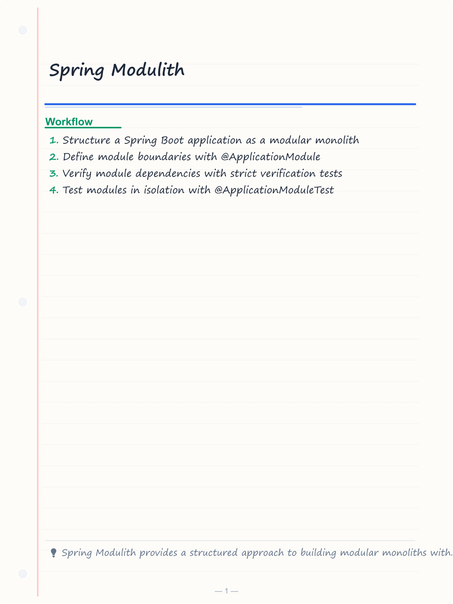
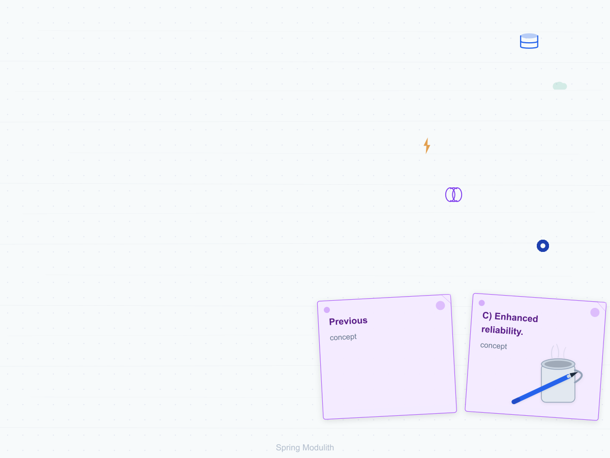
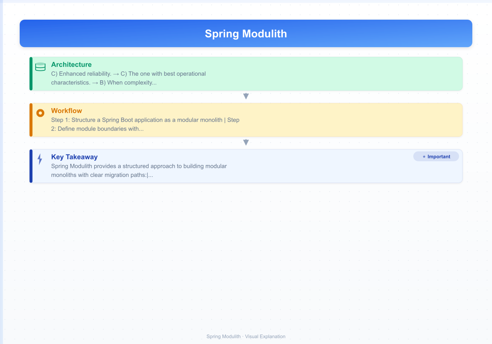
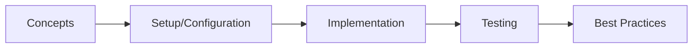

# Spring Modulith

> **Previous:** [Spring Integration](./50-integration.md) | **Next:** [Docker &amp; Containerization](./52-docker.md)

## Learning Objectives

<!-- Image Gallery -->
<section class="lesson-visuals" aria-label="Visual learning resources">
  <header><span>VISUAL LEARNING</span><h2>See it. Review it. Remember it.</h2></header>
  <a class="lesson-visual-card" href="../../assets/images/lessons/java/51-modulith/handwritten-notes.png" target="_blank" rel="noopener">
    
    <span><strong>Handwritten notes</strong>Condensed notes for deliberate review.</span>
  </a>
  <a class="lesson-visual-card" href="../../assets/images/lessons/java/51-modulith/sticky-notes.png" target="_blank" rel="noopener">
    
    <span><strong>Sticky-note revision</strong>Fast recall prompts for revision.</span>
  </a>
  <a class="lesson-visual-card" href="../../assets/images/lessons/java/51-modulith/visual-explanation.png" target="_blank" rel="noopener">
    
    <span><strong>Visual concept guide</strong>A connected explanation of the key ideas.</span>
  </a>
</section>
<!-- End Image Gallery -->

## Chapter at a Glance

| Topic | Key Insight | Practical Takeaway |
|-------|-------------|--------------------|
| Core Concepts | Foundational understanding | Real-world application |
| Implementation | Code-first approach | Working examples |
| Best Practices | Production patterns | Avoid common pitfalls |

## Chapter Roadmap




By the end of this chapter, you will be able to:
- Structure a Spring Boot application as a modular monolith
- Define module boundaries with @ApplicationModule
- Verify module dependencies with strict verification tests
- Test modules in isolation with @ApplicationModuleTest
- Implement event-driven communication with internal events
- Generate module documentation and structure diagrams
- Plan and execute migration from monolith to microservices
- Use DDD tactical patterns within module boundaries
- Apply contract-first approach for service APIs

---

## 1. Spring Modulith Overview

> **Pro Tip:** Test with production-like configurations → dev setups often hide issues that surface under real load.

> **Remember:** Start simple. Add complexity only when proven necessary. Premature abstraction creates maintenance burden.


Spring Modulith helps architects and developers structure Spring Boot applications as modular monoliths → a middle ground between traditional monoliths and microservices. It enforces module boundaries, enables event-driven integration, and provides a clear path to eventual microservice extraction.

### 1.1 Maven Dependencies


```xml
<?xml version="1.0" encoding="UTF-8"?>
<project xmlns="http://maven.apache.org/POM/4.0.0"
         xmlns:xsi="http://www.w3.org/2001/XMLSchema-instance"
         xsi:schemaLocation="http://maven.apache.org/POM/4.0.0
         https://maven.apache.org/xsd/maven-4.0.0.xsd">
    <modelVersion>4.0.0</modelVersion>
    <parent>
        <groupId>org.springframework.boot</groupId>
        <artifactId>spring-boot-starter-parent</artifactId>
        <version>3.4.0</version>
        <relativePath/>
    </parent>
    <groupId>com.aiengineering</groupId>
    <artifactId>modulith-course</artifactId>
    <version>1.0.0</version>
    <name>modulith-course</name>

    <properties>
        <java.version>21</java.version>
    </properties>

    <dependencies>
        <dependency>
            <groupId>org.springframework.boot</groupId>
            <artifactId>spring-boot-starter-web</artifactId>
        </dependency>
        <dependency>
            <groupId>org.springframework.boot</groupId>
            <artifactId>spring-boot-starter-data-jpa</artifactId>
        </dependency>
        <dependency>
            <groupId>org.springframework.boot</groupId>
            <artifactId>spring-boot-starter-validation</artifactId>
        </dependency>
        <dependency>
            <groupId>org.springframework.boot</groupId>
            <artifactId>spring-boot-starter-actuator</artifactId>
        </dependency>

        <dependency>
            <groupId>org.springframework.modulith</groupId>
            <artifactId>spring-modulith-starter-core</artifactId>
        </dependency>
        <dependency>
            <groupId>org.springframework.modulith</groupId>
            <artifactId>spring-modulith-starter-jpa</artifactId>
        </dependency>
        <dependency>
            <groupId>org.springframework.modulith</groupId>
            <artifactId>spring-modulith-starter-test</artifactId>
            <scope>test</scope>
        </dependency>
        <dependency>
            <groupId>org.springframework.modulith</groupId>
            <artifactId>spring-modulith-actuator</artifactId>
        </dependency>
        <dependency>
            <groupId>org.springframework.modulith</groupId>
            <artifactId>spring-modulith-docs</artifactId>
        </dependency>

        <dependency>
            <groupId>org.springframework.boot</groupId>
            <artifactId>spring-boot-starter-test</artifactId>
            <scope>test</scope>
        </dependency>
    </dependencies>

    <dependencyManagement>
        <dependencies>
            <dependency>
                <groupId>org.springframework.modulith</groupId>
                <artifactId>spring-modulith-bom</artifactId>
                <version>1.3.0</version>
                <type>pom</type>
                <scope>import</scope>
            </dependency>
        </dependencies>
    </dependencyManagement>
</project>
```

### 1.2 Application Configuration


```yaml
# src/main/resources/application.yml

> **Previous:** [Spring Integration](./50-integration.md) | **Next:** [Docker &amp; Containerization](./52-docker.md)
spring:
  application:
    name: modulith-course

  datasource:
    url: jdbc:postgresql://localhost:5432/modulith_course
    username: postgres
    password: postgres
    driver-class-name: org.postgresql.Driver

  jpa:
    hibernate:
      ddl-auto: update
    show-sql: false
    open-in-view: false

  modulith:
    events:
      jdbc:
        schema-initializer:
          enabled: true
      republish-outstanding-on-restart: true
      completion-mode: delete
    moments:
      enable-logging: true

server:
  port: 8080

logging:
  level:
    org.springframework.modulith: DEBUG
    org.springframework.transaction: INFO
```

### 1.3 Project Structure


```
src/main/java/com/aiengineering/course/
├── CourseApplication.java
├── shared/
│   ├── SharedKernel.java
│   └── types/
│       ├── Money.java
│       ├── Address.java
│       ├── Email.java
│       └── PhoneNumber.java
├── catalog/
│   ├── CatalogModule.java
│   ├── domain/
│   │   ├── Product.java
│   │   ├── Category.java
│   │   ├── InventoryItem.java
│   │   └── ProductRepository.java
│   ├── application/
│   │   ├── ProductService.java
│   │   ├── InventoryService.java
│   │   └── dto/
│   │       ├── ProductDto.java
│   │       ├── ProductCreateRequest.java
│   │       └── InventoryDto.java
│   └── internal/
│       ├── ProductEventHandler.java
│       └── ProductValidator.java
├── order/
│   ├── OrderModule.java
│   ├── domain/
│   │   ├── Order.java
│   │   ├── OrderItem.java
│   │   ├── OrderRepository.java
│   │   ├── OrderStatus.java
│   │   └── events/
│   │       ├── OrderPlacedEvent.java
│   │       ├── OrderShippedEvent.java
│   │       └── OrderCancelledEvent.java
│   ├── application/
│   │   ├── OrderService.java
│   │   ├── OrderPlacement.java
│   │   └── dto/
│   │       ├── OrderDto.java
│   │       └── OrderCreateRequest.java
│   └── internal/
│       ├── OrderEventListener.java
│       └── OrderValidator.java
├── payment/
│   ├── PaymentModule.java
│   ├── domain/
│   │   ├── Payment.java
│   │   ├── PaymentMethod.java
│   │   ├── PaymentStatus.java
│   │   ├── PaymentRepository.java
│   │   └── events/
│   │       └── PaymentCompletedEvent.java
│   ├── application/
│   │   ├── PaymentService.java
│   │   └── dto/
│   │       └── PaymentDto.java
│   └── internal/
│       └── PaymentProcessor.java
├── inventory/
│   ├── InventoryModule.java
│   ├── domain/
│   │   ├── Stock.java
│   │   ├── Warehouse.java
│   │   ├── StockMovement.java
│   │   └── StockRepository.java
│   ├── application/
│   │   ├── InventoryService.java
│   │   └── dto/
│   │       ├── StockDto.java
│   │       └── StockReservation.java
│   └── internal/
│       └── StockReservationHandler.java
├── notification/
│   ├── NotificationModule.java
│   ├── domain/
│   │   ├── Notification.java
│   │   └── NotificationType.java
│   ├── application/
│   │   ├── NotificationService.java
│   │   └── dto/
│   │       └── NotificationDto.java
│   └── internal/
│       ├── EmailSender.java
│       ├── SmsSender.java
│       └── PushNotificationSender.java
├── shipping/
│   ├── ShippingModule.java
│   ├── domain/
│   │   ├── Shipment.java
│   │   ├── Carrier.java
│   │   └── ShipmentStatus.java
│   └── application/
│       ├── ShippingService.java
│       └── dto/
│           └── ShipmentDto.java
├── customer/
│   ├── CustomerModule.java
│   ├── domain/
│   │   ├── Customer.java
│   │   └── CustomerRepository.java
│   └── application/
│       ├── CustomerService.java
│       └── dto/
│           └── CustomerDto.java
└── api/
    ├── ApiModule.java
    └── rest/
        ├── OrderController.java
        ├── CatalogController.java
        ├── PaymentController.java
        └── CustomerController.java
```

---

## 2. Module Declarations

### 2.1 Main Application


```java
package com.aiengineering.course;

import org.springframework.boot.SpringApplication;
import org.springframework.boot.autoconfigure.SpringBootApplication;
import org.springframework.modulith.Modulith;
import org.springframework.modulith.core.ApplicationModules;
import org.springframework.modulith.docs.Documenter;

@SpringBootApplication
@Modulith(
    displayName = "E-Commerce Modulith",
    systemName = "E-Commerce Platform",
    useDeliberateDependencyLookup = true
)
public class CourseApplication {

    public static void main(String[] args) {
        SpringApplication.run(CourseApplication.class, args);
    }

    static void verifyStructure() {
        var modules = ApplicationModules.of(CourseApplication.class);
        modules.verify();

        System.out.println("=== Module Structure ===");
        modules.forEach(System.out::println);

        System.out.println("\n=== Module Dependencies ===");
        modules.stream().forEach(module -> {
            System.out.println(module.getName() + " -> "
                + String.join(", ", modules.getRequiredDirectDependencies(module)
                    .stream()
                    .map(dep -> dep.getName())
                    .toList()));
        });
    }

    static void generateDocumentation() {
        var modules = ApplicationModules.of(CourseApplication.class);
        modules.verify();

        new Documenter(modules)
            .writeModulesAsPlantUml()
            .writeIndividualModulesAsPlantUml();
    }
}
```

### 2.2 Catalog Module


```java
package com.aiengineering.course.catalog;

import org.springframework.modulith.ApplicationModule;
import org.springframework.modulith.NamedInterface;
import org.springframework.modulith.PackageInfo;
import org.springframework.transaction.annotation.Transactional;

@ApplicationModule(
    displayName = "catalog",
    allowedDependencies = {"shared"}
)
@NamedInterface("catalog.api")
@PackageInfo
@Transactional(readOnly = true)
public class CatalogModule {

    @Override
    public String toString() {
        return "Catalog Module - Product and Inventory Management";
    }
}
```

### 2.3 Order Module


```java
package com.aiengineering.course.order;

import org.springframework.modulith.ApplicationModule;
import org.springframework.modulith.NamedInterface;
import org.springframework.transaction.annotation.Transactional;

@ApplicationModule(
    displayName = "order",
    allowedDependencies = {"catalog", "customer", "shared"}
)
@NamedInterface("order.api")
@Transactional
public class OrderModule {

    public static final String MODULE_NAME = "order";
    public static final String DISPLAY_NAME = "Order Management";

    private OrderModule() {
    }
}
```

### 2.4 Other Module Declarations


```java
package com.aiengineering.course.payment;

import org.springframework.modulith.ApplicationModule;
import org.springframework.transaction.annotation.Transactional;

@ApplicationModule(
    displayName = "payment",
    allowedDependencies = {"order", "shared"}
)
@Transactional
public class PaymentModule {
}
```

```java
package com.aiengineering.course.inventory;

import org.springframework.modulith.ApplicationModule;
import org.springframework.transaction.annotation.Transactional;

@ApplicationModule(
    displayName = "inventory",
    allowedDependencies = {"catalog", "shared"}
)
public class InventoryModule {
}
```

```java
package com.aiengineering.course.notification;

import org.springframework.modulith.ApplicationModule;

@ApplicationModule(
    displayName = "notification",
    allowedDependencies = {"shared"}
)
public class NotificationModule {
}
```

```java
package com.aiengineering.course.shipping;

import org.springframework.modulith.ApplicationModule;
import org.springframework.transaction.annotation.Transactional;

@ApplicationModule(
    displayName = "shipping",
    allowedDependencies = {"order", "inventory", "shared"}
)
public class ShippingModule {
}
```

```java
package com.aiengineering.course.customer;

import org.springframework.modulith.ApplicationModule;

@ApplicationModule(
    displayName = "customer",
    allowedDependencies = {"shared"}
)
public class CustomerModule {
}
```

```java
package com.aiengineering.course.api;

import org.springframework.modulith.ApplicationModule;

@ApplicationModule(
    displayName = "api",
    allowedDependencies = {"catalog", "order", "payment", "shipping", "customer", "shared"}
)
public class ApiModule {
}
```

---

## 3. Shared Kernel

```java
package com.aiengineering.course.shared;

import org.springframework.stereotype.Component;
import org.springframework.util.Assert;

import java.math.BigDecimal;
import java.math.RoundingMode;
import java.util.Currency;
import java.util.Objects;

@Component
public record Money(BigDecimal amount, Currency currency) {

    public static final Currency DEFAULT_CURRENCY = Currency.getInstance("USD");

    public Money {
        Assert.notNull(amount, "Amount must not be null");
        Assert.notNull(currency, "Currency must not be null");
        Assert.isTrue(amount.compareTo(BigDecimal.ZERO) >= 0,
            "Amount must not be negative");

        amount = amount.setScale(2, RoundingMode.HALF_UP);
    }

    public static Money of(double amount) {
        return new Money(BigDecimal.valueOf(amount), DEFAULT_CURRENCY);
    }

    public static Money of(BigDecimal amount) {
        return new Money(amount, DEFAULT_CURRENCY);
    }

    public static Money of(BigDecimal amount, Currency currency) {
        return new Money(amount, currency);
    }

    public static Money zero() {
        return new Money(BigDecimal.ZERO, DEFAULT_CURRENCY);
    }

    public Money add(Money other) {
        assertSameCurrency(other);
        return new Money(this.amount.add(other.amount), this.currency);
    }

    public Money subtract(Money other) {
        assertSameCurrency(other);
        return new Money(this.amount.subtract(other.amount), this.currency);
    }

    public Money multiply(int multiplier) {
        return new Money(this.amount.multiply(BigDecimal.valueOf(multiplier)),
            this.currency);
    }

    public Money multiply(double multiplier) {
        return new Money(this.amount.multiply(BigDecimal.valueOf(multiplier)),
            this.currency);
    }

    public boolean isGreaterThan(Money other) {
        assertSameCurrency(other);
        return this.amount.compareTo(other.amount) > 0;
    }

    public boolean isLessThan(Money other) {
        assertSameCurrency(other);
        return this.amount.compareTo(other.amount) < 0;
    }

    public boolean isZero() {
        return this.amount.compareTo(BigDecimal.ZERO) == 0;
    }

    private void assertSameCurrency(Money other) {
        if (!this.currency.equals(other.currency)) {
            throw new IllegalArgumentException(
                "Currency mismatch: " + this.currency + " vs " + other.currency);
        }
    }

    @Override
    public boolean equals(Object o) {
        if (this == o) return true;
        if (!(o instanceof Money money)) return false;
        return amount.compareTo(money.amount) == 0
            && currency.equals(money.currency);
    }

    @Override
    public int hashCode() {
        return Objects.hash(amount.stripTrailingZeros(), currency);
    }

    @Override
    public String toString() {
        return currency.getSymbol() + " " + amount.toPlainString();
    }
}
```

```java
package com.aiengineering.course.shared;

import org.springframework.util.Assert;

public record Email(String value) {

    private static final String EMAIL_PATTERN =
        "^[A-Za-z0-9+_.-]+@[A-Za-z0-9.-]+\\.[A-Za-z]{2,}$";

    public Email {
        Assert.hasText(value, "Email must not be empty");
        Assert.isTrue(value.matches(EMAIL_PATTERN),
            "Invalid email format: " + value);
        value = value.toLowerCase().trim();
    }

    public String getDomain() {
        return value.substring(value.indexOf('@') + 1);
    }

    public String getLocalPart() {
        return value.substring(0, value.indexOf('@'));
    }

    @Override
    public String toString() {
        return value;
    }
}
```

```java
package com.aiengineering.course.shared;

import org.springframework.util.Assert;

public record Address(
    String street,
    String city,
    String state,
    String zipCode,
    String country
) {
    public Address {
        Assert.hasText(street, "Street must not be empty");
        Assert.hasText(city, "City must not be empty");
        Assert.hasText(country, "Country must not be empty");
    }

    public String getFormattedAddress() {
        StringBuilder sb = new StringBuilder();

        sb.append(street).append("\n");
        sb.append(city);

        if (state != null && !state.isBlank()) {
            sb.append(", ").append(state);
        }

        if (zipCode != null && !zipCode.isBlank()) {
            sb.append(" ").append(zipCode);
        }

        sb.append("\n").append(country);

        return sb.toString();
    }

    public boolean isDomestic(String domesticCountry) {
        return country.equalsIgnoreCase(domesticCountry);
    }

    public Address withStreet(String newStreet) {
        return new Address(newStreet, city, state, zipCode, country);
    }
}
```

```java
package com.aiengineering.course.shared;

import org.springframework.util.Assert;

public record PhoneNumber(String value, String countryCode) {

    private static final String PHONE_PATTERN = "^\\+?[1-9]\\d{1,14}$";

    public PhoneNumber {
        Assert.hasText(value, "Phone number must not be empty");
        Assert.hasText(countryCode, "Country code must not be empty");

        String cleanNumber = value.replaceAll("[\\s\\-()]", "");
        Assert.isTrue(cleanNumber.matches(PHONE_PATTERN),
            "Invalid phone number: " + value);
    }

    public String getInternationalFormat() {
        return countryCode + value.replaceAll("^0+", "");
    }

    public String getNationalFormat() {
        String number = value;
        if (number.startsWith(countryCode)) {
            number = number.substring(countryCode.length());
        }
        return number;
    }

    public static PhoneNumber of(String value) {
        return new PhoneNumber(value, "1");
    }

    public static PhoneNumber of(String value, String countryCode) {
        return new PhoneNumber(value, countryCode);
    }
}
```

---

## 4. Domain Models

### 4.1 Catalog Module Domain


```java
package com.aiengineering.course.catalog.domain;

import com.aiengineering.course.shared.Money;
import jakarta.persistence.*;
import jakarta.validation.constraints.NotBlank;
import jakarta.validation.constraints.NotNull;
import lombok.*;
import org.hibernate.annotations.CreationTimestamp;
import org.hibernate.annotations.UpdateTimestamp;

import java.time.LocalDateTime;
import java.util.HashSet;
import java.util.Set;

@Entity
@Table(name = "products")
@Getter @Setter @NoArgsConstructor @AllArgsConstructor @Builder
@EqualsAndHashCode(onlyExplicitlyIncluded = true)
public class Product {

    @Id
    @GeneratedValue(strategy = GenerationType.IDENTITY)
    @EqualsAndHashCode.Include
    private Long id;

    @NotBlank
    @Column(unique = true, nullable = false, length = 100)
    private String sku;

    @NotBlank
    @Column(nullable = false, length = 200)
    private String name;

    @Column(columnDefinition = "TEXT")
    private String description;

    @NotNull
    @AttributeOverride(name = "amount", column = @Column(name = "price_amount", precision = 15, scale = 2))
    @AttributeOverride(name = "currency", column = @Column(name = "price_currency", length = 3))
    private Money price;

    @ManyToOne(fetch = FetchType.LAZY)
    @JoinColumn(name = "category_id")
    private Category category;

    @Column(name = "image_url", length = 500)
    private String imageUrl;

    @Column(name = "is_active")
    private boolean active;

    @Column(name = "is_available")
    private boolean available;

    @Column(name = "weight_kg")
    private Double weightKg;

    @ElementCollection
    @CollectionTable(name = "product_tags", joinColumns = @JoinColumn(name = "product_id"))
    @Column(name = "tag", length = 50)
    private Set<String> tags = new HashSet<>();

    @CreationTimestamp
    @Column(name = "created_at", nullable = false, updatable = false)
    private LocalDateTime createdAt;

    @UpdateTimestamp
    @Column(name = "updated_at")
    private LocalDateTime updatedAt;

    @Version
    private Long version;
}
```

```java
package com.aiengineering.course.catalog.domain;

import jakarta.persistence.*;
import jakarta.validation.constraints.NotBlank;
import lombok.*;

import java.util.ArrayList;
import java.util.List;

@Entity
@Table(name = "categories")
@Getter @Setter @NoArgsConstructor @AllArgsConstructor @Builder
@EqualsAndHashCode(onlyExplicitlyIncluded = true)
public class Category {

    @Id
    @GeneratedValue(strategy = GenerationType.IDENTITY)
    @EqualsAndHashCode.Include
    private Long id;

    @NotBlank
    @Column(unique = true, nullable = false, length = 100)
    private String name;

    @Column(length = 500)
    private String description;

    @Column(length = 200)
    private String slug;

    @ManyToOne(fetch = FetchType.LAZY)
    @JoinColumn(name = "parent_category_id")
    private Category parentCategory;

    @OneToMany(mappedBy = "parentCategory")
    private List<Category> subcategories = new ArrayList<>();

    @Column(name = "display_order")
    private Integer displayOrder;

    @Column(name = "is_active")
    private boolean active;

    public boolean isRoot() {
        return parentCategory == null;
    }
}
```

```java
package com.aiengineering.course.catalog.domain;

import jakarta.persistence.*;
import lombok.*;

@Entity
@Table(name = "inventory_items")
@Getter @Setter @NoArgsConstructor @AllArgsConstructor @Builder
public class InventoryItem {

    @Id
    @GeneratedValue(strategy = GenerationType.IDENTITY)
    private Long id;

    @OneToOne(fetch = FetchType.LAZY)
    @JoinColumn(name = "product_id", unique = true)
    private Product product;

    @Column(name = "quantity_on_hand")
    private int quantityOnHand;

    @Column(name = "quantity_reserved")
    private int quantityReserved;

    @Column(name = "reorder_point")
    private int reorderPoint;

    @Column(name = "reorder_quantity")
    private int reorderQuantity;

    @Column(length = 50)
    private String location;

    public int getAvailableQuantity() {
        return quantityOnHand - quantityReserved;
    }

    public boolean isInStock() {
        return getAvailableQuantity() > 0;
    }

    public boolean needsReorder() {
        return getAvailableQuantity() <= reorderPoint;
    }

    public void reserve(int quantity) {
        if (getAvailableQuantity() < quantity) {
            throw new IllegalStateException(
                "Insufficient stock: " + getAvailableQuantity()
                + " available, " + quantity + " requested");
        }
        this.quantityReserved += quantity;
    }

    public void release(int quantity) {
        this.quantityReserved = Math.max(0, this.quantityReserved - quantity);
    }

    public void addStock(int quantity) {
        this.quantityOnHand += quantity;
    }

    public void removeStock(int quantity) {
        if (this.quantityOnHand < quantity) {
            throw new IllegalStateException(
                "Insufficient stock on hand");
        }
        this.quantityOnHand -= quantity;
        this.quantityReserved = Math.max(0, this.quantityReserved - quantity);
    }
}
```

### 4.2 Order Module Domain


```java
package com.aiengineering.course.order.domain;

import com.aiengineering.course.order.domain.events.OrderPlacedEvent;
import com.aiengineering.course.shared.Money;
import jakarta.persistence.*;
import jakarta.validation.constraints.NotBlank;
import lombok.*;
import org.springframework.data.domain.AbstractAggregateRoot;

import java.math.BigDecimal;
import java.time.LocalDateTime;
import java.util.ArrayList;
import java.util.List;

@Entity
@Table(name = "orders")
@Getter @Setter
@NoArgsConstructor @AllArgsConstructor
@EqualsAndHashCode(callSuper = false, onlyExplicitlyIncluded = true)
public class Order extends AbstractAggregateRoot<Order> {

    @Id
    @GeneratedValue(strategy = GenerationType.IDENTITY)
    @EqualsAndHashCode.Include
    private Long id;

    @Column(name = "order_number", unique = true, nullable = false, length = 50)
    private String orderNumber;

    @Column(name = "customer_id", nullable = false)
    private Long customerId;

    @Enumerated(EnumType.STRING)
    @Column(nullable = false, length = 20)
    private OrderStatus status;

    @OneToMany(cascade = CascadeType.ALL, orphanRemoval = true)
    @JoinColumn(name = "order_id")
    private List<OrderItem> items = new ArrayList<>();

    @AttributeOverride(name = "amount", column = @Column(name = "subtotal_amount", precision = 15, scale = 2))
    @AttributeOverride(name = "currency", column = @Column(name = "subtotal_currency", length = 3))
    private Money subtotal;

    @AttributeOverride(name = "amount", column = @Column(name = "tax_amount", precision = 15, scale = 2))
    @AttributeOverride(name = "currency", column = @Column(name = "tax_currency", length = 3))
    private Money tax;

    @AttributeOverride(name = "amount", column = @Column(name = "shipping_cost", precision = 15, scale = 2))
    @AttributeOverride(name = "currency", column = @Column(name = "shipping_currency", length = 3))
    private Money shippingCost;

    @AttributeOverride(name = "amount", column = @Column(name = "total_amount", precision = 15, scale = 2))
    @AttributeOverride(name = "currency", column = @Column(name = "total_currency", length = 3))
    private Money total;

    @Embedded
    private ShippingAddress shippingAddress;

    @Column(name = "notes", length = 2000)
    private String notes;

    @Column(name = "placed_at")
    private LocalDateTime placedAt;

    @Column(name = "shipped_at")
    private LocalDateTime shippedAt;

    @Column(name = "delivered_at")
    private LocalDateTime deliveredAt;

    @Column(name = "cancelled_at")
    private LocalDateTime cancelledAt;

    @Column(name = "cancellation_reason", length = 500)
    private String cancellationReason;

    @Version
    private Long version;

    public static Order createOrder(String orderNumber, Long customerId,
                                     List<OrderItem> items, Money subtotal,
                                     Money tax, Money shippingCost, Money total,
                                     ShippingAddress shippingAddress) {
        Order order = new Order();
        order.orderNumber = orderNumber;
        order.customerId = customerId;
        order.status = OrderStatus.PENDING;
        order.items = new ArrayList<>(items);
        order.subtotal = subtotal;
        order.tax = tax;
        order.shippingCost = shippingCost;
        order.total = total;
        order.shippingAddress = shippingAddress;
        order.placedAt = LocalDateTime.now();

        order.registerEvent(new OrderPlacedEvent(
            order.orderNumber,
            order.customerId,
            order.total,
            order.items.stream()
                .map(item -> new OrderPlacedEvent.OrderItemInfo(
                    item.getProductId(),
                    item.getProductName(),
                    item.getQuantity(),
                    item.getPrice()))
                .toList()
        ));

        return order;
    }

    public void confirm() {
        if (status != OrderStatus.PENDING) {
            throw new IllegalStateException(
                "Cannot confirm order in status: " + status);
        }
        this.status = OrderStatus.CONFIRMED;
    }

    public void ship(String trackingNumber) {
        if (status != OrderStatus.CONFIRMED) {
            throw new IllegalStateException(
                "Cannot ship order in status: " + status);
        }
        this.status = OrderStatus.SHIPPED;
        this.shippedAt = LocalDateTime.now();
    }

    public void deliver() {
        if (status != OrderStatus.SHIPPED) {
            throw new IllegalStateException(
                "Cannot deliver order in status: " + status);
        }
        this.status = OrderStatus.DELIVERED;
        this.deliveredAt = LocalDateTime.now();
    }

    public void cancel(String reason) {
        if (status == OrderStatus.DELIVERED || status == OrderStatus.CANCELLED) {
            throw new IllegalStateException(
                "Cannot cancel order in status: " + status);
        }
        this.status = OrderStatus.CANCELLED;
        this.cancelledAt = LocalDateTime.now();
        this.cancellationReason = reason;
    }

    public Money calculateTotal() {
        return subtotal.add(tax).add(shippingCost);
    }

    public boolean isShippable() {
        return status == OrderStatus.CONFIRMED;
    }

    public boolean isCancellable() {
        return status == OrderStatus.PENDING || status == OrderStatus.CONFIRMED;
    }
}
```

```java
package com.aiengineering.course.order.domain;

import jakarta.persistence.*;
import lombok.*;

import java.math.BigDecimal;

@Entity
@Table(name = "order_items")
@Getter @Setter @NoArgsConstructor @AllArgsConstructor @Builder
@EqualsAndHashCode(onlyExplicitlyIncluded = true)
public class OrderItem {

    @Id
    @GeneratedValue(strategy = GenerationType.IDENTITY)
    @EqualsAndHashCode.Include
    private Long id;

    @Column(name = "product_id", nullable = false)
    private Long productId;

    @Column(name = "product_name", nullable = false, length = 200)
    private String productName;

    @Column(name = "product_sku", length = 50)
    private String productSku;

    @Column(nullable = false)
    private int quantity;

    @Column(nullable = false, precision = 15, scale = 2)
    private BigDecimal price;

    @Column(nullable = false, precision = 15, scale = 2)
    private BigDecimal totalPrice;

    public BigDecimal calculateTotalPrice() {
        return price.multiply(BigDecimal.valueOf(quantity));
    }
}
```

```java
package com.aiengineering.course.order.domain;

public enum OrderStatus {
    PENDING,
    CONFIRMED,
    PROCESSING,
    SHIPPED,
    DELIVERED,
    CANCELLED,
    REFUNDED
}
```

```java
package com.aiengineering.course.order.domain;

import jakarta.persistence.Embeddable;
import jakarta.validation.constraints.NotBlank;

@Embeddable
public record ShippingAddress(
    @NotBlank String street,
    @NotBlank String city,
    String state,
    @NotBlank String zipCode,
    @NotBlank String country
) {
    public ShippingAddress {
        if (zipCode == null || zipCode.isBlank()) {
            zipCode = "N/A";
        }
    }
}
```

### 4.3 Payment Module Domain


```java
package com.aiengineering.course.payment.domain;

import jakarta.persistence.*;
import jakarta.validation.constraints.NotBlank;
import lombok.*;

import java.math.BigDecimal;
import java.time.LocalDateTime;

@Entity
@Table(name = "payments")
@Getter @Setter @NoArgsConstructor @AllArgsConstructor @Builder
public class Payment {

    @Id
    @GeneratedValue(strategy = GenerationType.IDENTITY)
    private Long id;

    @Column(name = "transaction_id", unique = true, nullable = false, length = 50)
    private String transactionId;

    @Column(name = "order_id", nullable = false)
    private Long orderId;

    @Column(name = "order_number", length = 50)
    private String orderNumber;

    @Column(nullable = false, precision = 15, scale = 2)
    private BigDecimal amount;

    @Column(length = 3)
    private String currency;

    @Enumerated(EnumType.STRING)
    @Column(nullable = false, length = 20)
    private PaymentMethod method;

    @Enumerated(EnumType.STRING)
    @Column(nullable = false, length = 20)
    private PaymentStatus status;

    @Column(name = "payment_details", length = 1000)
    private String paymentDetails;

    @Column(name = "error_message", length = 500)
    private String errorMessage;

    @Column(name = "paid_at")
    private LocalDateTime paidAt;

    @Column(name = "created_at")
    private LocalDateTime createdAt;

    @Column(name = "refunded_at")
    private LocalDateTime refundedAt;

    @Version
    private Long version;

    public boolean isCompleted() {
        return status == PaymentStatus.COMPLETED;
    }

    public boolean isFailed() {
        return status == PaymentStatus.FAILED;
    }

    public void complete() {
        this.status = PaymentStatus.COMPLETED;
        this.paidAt = LocalDateTime.now();
    }

    public void fail(String errorMessage) {
        this.status = PaymentStatus.FAILED;
        this.errorMessage = errorMessage;
    }

    public void refund() {
        if (status != PaymentStatus.COMPLETED) {
            throw new IllegalStateException(
                "Cannot refund payment in status: " + status);
        }
        this.status = PaymentStatus.REFUNDED;
        this.refundedAt = LocalDateTime.now();
    }
}
```

```java
package com.aiengineering.course.payment.domain;

public enum PaymentMethod {
    CREDIT_CARD,
    DEBIT_CARD,
    PAYPAL,
    BANK_TRANSFER,
    CRYPTO,
    GIFT_CARD
}

public enum PaymentStatus {
    PENDING,
    PROCESSING,
    COMPLETED,
    FAILED,
    REFUNDED,
    CANCELLED
}
```

### 4.4 Inventory Module Domain


```java
package com.aiengineering.course.inventory.domain;

import jakarta.persistence.*;
import jakarta.validation.constraints.NotBlank;
import lombok.*;

import java.time.LocalDateTime;

@Entity
@Table(name = "stock")
@Getter @Setter @NoArgsConstructor @AllArgsConstructor @Builder
public class Stock {

    @Id
    @GeneratedValue(strategy = GenerationType.IDENTITY)
    private Long id;

    @Column(name = "product_id", unique = true, nullable = false)
    private Long productId;

    @Column(name = "warehouse_id", nullable = false)
    private Long warehouseId;

    @Column(name = "quantity_available")
    private int quantityAvailable;

    @Column(name = "quantity_reserved")
    private int quantityReserved;

    @Column(name = "minimum_stock_level")
    private int minimumStockLevel;

    @Column(name = "maximum_stock_level")
    private int maximumStockLevel;

    @Column(name = "reorder_quantity")
    private int reorderQuantity;

    @Column(name = "last_counted_at")
    private LocalDateTime lastCountedAt;

    @Version
    private Long version;

    public int getEffectiveQuantity() {
        return quantityAvailable - quantityReserved;
    }

    public boolean hasAvailable(int quantity) {
        return getEffectiveQuantity() >= quantity;
    }

    public boolean isLowStock() {
        return quantityAvailable <= minimumStockLevel;
    }

    public boolean isOverstocked() {
        return quantityAvailable > maximumStockLevel;
    }

    public void reserve(int quantity) {
        if (!hasAvailable(quantity)) {
            throw new IllegalStateException(
                "Insufficient stock: " + getEffectiveQuantity()
                + " available, " + quantity + " requested");
        }
        this.quantityReserved += quantity;
    }

    public void unreserve(int quantity) {
        this.quantityReserved = Math.max(0, this.quantityReserved - quantity);
    }

    public void receive(int quantity) {
        if (quantityAvailable + quantity > maximumStockLevel) {
            throw new IllegalStateException(
                "Receiving " + quantity + " would exceed maximum stock level of "
                + maximumStockLevel);
        }
        this.quantityAvailable += quantity;
        this.lastCountedAt = LocalDateTime.now();
    }

    public void ship(int quantity) {
        if (quantity > quantityAvailable) {
            throw new IllegalStateException("Insufficient stock to ship");
        }
        this.quantityAvailable -= quantity;
        this.quantityReserved = Math.max(0, this.quantityReserved - quantity);
    }

    public void adjust(int newQuantity) {
        this.quantityAvailable = newQuantity;
        this.quantityReserved = Math.min(this.quantityReserved, newQuantity);
        this.lastCountedAt = LocalDateTime.now();
    }
}
```

---

## 5. Application Services

### 5.1 Order Service


```java
package com.aiengineering.course.order.application;

import com.aiengineering.course.order.domain.Order;
import com.aiengineering.course.order.domain.OrderItem;
import com.aiengineering.course.order.domain.OrderRepository;
import com.aiengineering.course.order.domain.ShippingAddress;
import com.aiengineering.course.shared.Money;
import org.slf4j.Logger;
import org.slf4j.LoggerFactory;
import org.springframework.stereotype.Service;
import org.springframework.transaction.annotation.Transactional;

import java.math.BigDecimal;
import java.time.LocalDateTime;
import java.util.List;
import java.util.UUID;

@Service
@Transactional
public class OrderService {

    private static final Logger log = LoggerFactory.getLogger(OrderService.class);

    private final OrderRepository orderRepository;

    public OrderService(OrderRepository orderRepository) {
        this.orderRepository = orderRepository;
    }

    public Order placeOrder(Long customerId, List<OrderItemRequest> items,
                             ShippingAddressRequest shippingAddress) {
        String orderNumber = generateOrderNumber();

        List<OrderItem> orderItems = items.stream()
            .map(item -> OrderItem.builder()
                .productId(item.productId())
                .productName(item.productName())
                .productSku(item.productSku())
                .quantity(item.quantity())
                .price(item.price())
                .totalPrice(item.price().multiply(BigDecimal.valueOf(item.quantity())))
                .build())
            .toList();

        Money subtotal = Money.of(orderItems.stream()
            .map(oi -> oi.getPrice().multiply(BigDecimal.valueOf(oi.getQuantity())))
            .reduce(BigDecimal.ZERO, BigDecimal::add));

        Money tax = calculateTax(subtotal);
        Money shippingCost = calculateShipping(orderItems);
        Money total = subtotal.add(tax).add(shippingCost);

        ShippingAddress address = new ShippingAddress(
            shippingAddress.street(),
            shippingAddress.city(),
            shippingAddress.state(),
            shippingAddress.zipCode(),
            shippingAddress.country()
        );

        Order order = Order.createOrder(
            orderNumber, customerId, orderItems,
            subtotal, tax, shippingCost, total, address
        );

        order = orderRepository.save(order);
        log.info("Order placed: {} (order number: {})", order.getId(), orderNumber);

        return order;
    }

    public void confirmOrder(Long orderId) {
        Order order = orderRepository.findById(orderId)
            .orElseThrow(() -> new IllegalArgumentException(
                "Order not found: " + orderId));
        order.confirm();
        orderRepository.save(order);
        log.info("Order confirmed: {}", orderId);
    }

    public void shipOrder(Long orderId, String trackingNumber) {
        Order order = orderRepository.findById(orderId)
            .orElseThrow(() -> new IllegalArgumentException(
                "Order not found: " + orderId));
        order.ship(trackingNumber);
        orderRepository.save(order);
        log.info("Order shipped: {} (tracking: {})", orderId, trackingNumber);
    }

    public void deliverOrder(Long orderId) {
        Order order = orderRepository.findById(orderId)
            .orElseThrow(() -> new IllegalArgumentException(
                "Order not found: " + orderId));
        order.deliver();
        orderRepository.save(order);
        log.info("Order delivered: {}", orderId);
    }

    public void cancelOrder(Long orderId, String reason) {
        Order order = orderRepository.findById(orderId)
            .orElseThrow(() -> new IllegalArgumentException(
                "Order not found: " + orderId));
        order.cancel(reason);
        orderRepository.save(order);
        log.info("Order cancelled: {} (reason: {})", orderId, reason);
    }

    public Order getOrder(Long orderId) {
        return orderRepository.findById(orderId)
            .orElseThrow(() -> new IllegalArgumentException(
                "Order not found: " + orderId));
    }

    public List<Order> getOrdersByCustomer(Long customerId) {
        return orderRepository.findByCustomerIdOrderByPlacedAtDesc(customerId);
    }

    public List<Order> getOrdersByStatus(OrderStatus status) {
        return orderRepository.findByStatus(status);
    }

    private String generateOrderNumber() {
        return "ORD-" + UUID.randomUUID().toString()
            .substring(0, 8).toUpperCase()
            + "-" + System.currentTimeMillis() % 10000;
    }

    private Money calculateTax(Money subtotal) {
        return Money.of(subtotal.amount().multiply(
            BigDecimal.valueOf(0.08)));
    }

    private Money calculateShipping(List<OrderItem> items) {
        int totalItems = items.stream()
            .mapToInt(OrderItem::getQuantity)
            .sum();
        if (totalItems == 0) return Money.zero();
        return Money.of(BigDecimal.valueOf(Math.max(5.99, totalItems * 1.50)));
    }

    public record OrderItemRequest(
        Long productId,
        String productName,
        String productSku,
        int quantity,
        BigDecimal price
    ) {}

    public record ShippingAddressRequest(
        String street,
        String city,
        String state,
        String zipCode,
        String country
    ) {}
}
```

### 5.2 Payment Service


```java
package com.aiengineering.course.payment.application;

import com.aiengineering.course.payment.domain.*;
import org.slf4j.Logger;
import org.slf4j.LoggerFactory;
import org.springframework.stereotype.Service;
import org.springframework.transaction.annotation.Transactional;

import java.math.BigDecimal;
import java.time.LocalDateTime;
import java.util.List;
import java.util.UUID;

@Service
@Transactional
public class PaymentService {

    private static final Logger log = LoggerFactory.getLogger(PaymentService.class);

    private final PaymentRepository paymentRepository;

    public PaymentService(PaymentRepository paymentRepository) {
        this.paymentRepository = paymentRepository;
    }

    public Payment processPayment(Long orderId, String orderNumber,
                                   BigDecimal amount, PaymentMethod method,
                                   String paymentDetails) {
        String transactionId = "TXN-" + UUID.randomUUID().toString()
            .substring(0, 8).toUpperCase();

        Payment payment = Payment.builder()
            .transactionId(transactionId)
            .orderId(orderId)
            .orderNumber(orderNumber)
            .amount(amount)
            .currency("USD")
            .method(method)
            .status(PaymentStatus.PROCESSING)
            .paymentDetails(paymentDetails)
            .createdAt(LocalDateTime.now())
            .build();

        payment = paymentRepository.save(payment);

        try {
            boolean success = executePayment(payment);
            if (success) {
                payment.complete();
            } else {
                payment.fail("Payment gateway declined transaction");
            }
        } catch (Exception e) {
            payment.fail(e.getMessage());
            log.error("Payment processing failed for {}", transactionId, e);
        }

        return paymentRepository.save(payment);
    }

    public Payment refundPayment(String transactionId) {
        Payment payment = paymentRepository.findByTransactionId(transactionId)
            .orElseThrow(() -> new IllegalArgumentException(
                "Payment not found: " + transactionId));

        payment.refund();
        return paymentRepository.save(payment);
    }

    public Payment getPaymentByTransaction(String transactionId) {
        return paymentRepository.findByTransactionId(transactionId)
            .orElseThrow(() -> new IllegalArgumentException(
                "Payment not found: " + transactionId));
    }

    public List<Payment> getPaymentsByOrder(Long orderId) {
        return paymentRepository.findByOrderId(orderId);
    }

    public PaymentStatus getPaymentStatus(String transactionId) {
        return getPaymentByTransaction(transactionId).getStatus();
    }

    private boolean executePayment(Payment payment) {
        return true;
    }
}
```

### 5.3 Inventory Service


```java
package com.aiengineering.course.inventory.application;

import com.aiengineering.course.inventory.domain.Stock;
import com.aiengineering.course.inventory.domain.StockRepository;
import org.slf4j.Logger;
import org.slf4j.LoggerFactory;
import org.springframework.stereotype.Service;
import org.springframework.transaction.annotation.Transactional;

import java.util.List;

@Service
@Transactional
public class InventoryService {

    private static final Logger log = LoggerFactory.getLogger(InventoryService.class);

    private final StockRepository stockRepository;

    public InventoryService(StockRepository stockRepository) {
        this.stockRepository = stockRepository;
    }

    public boolean reserveStock(Long productId, int quantity) {
        Stock stock = stockRepository.findByProductId(productId)
            .orElseThrow(() -> new IllegalArgumentException(
                "Stock not found for product: " + productId));

        stock.reserve(quantity);
        stockRepository.save(stock);
        log.info("Reserved {} units of product {}", quantity, productId);
        return true;
    }

    public void releaseStock(Long productId, int quantity) {
        Stock stock = stockRepository.findByProductId(productId)
            .orElseThrow(() -> new IllegalArgumentException(
                "Stock not found for product: " + productId));

        stock.unreserve(quantity);
        stockRepository.save(stock);
        log.info("Released {} units of product {}", quantity, productId);
    }

    public void receiveStock(Long productId, int quantity) {
        Stock stock = stockRepository.findByProductId(productId)
            .orElseThrow(() -> new IllegalArgumentException(
                "Stock not found for product: " + productId));

        stock.receive(quantity);
        stockRepository.save(stock);
        log.info("Received {} units of product {}", quantity, productId);
    }

    public int getAvailableQuantity(Long productId) {
        return stockRepository.findByProductId(productId)
            .map(Stock::getEffectiveQuantity)
            .orElse(0);
    }

    public boolean isInStock(Long productId, int quantity) {
        return stockRepository.findByProductId(productId)
            .map(stock -> stock.hasAvailable(quantity))
            .orElse(false);
    }

    public List<Stock> getLowStockItems() {
        return stockRepository.findAll().stream()
            .filter(Stock::isLowStock)
            .toList();
    }

    public List<Stock> getAllStock() {
        return stockRepository.findAll();
    }
}
```

---

## 6. Internal Event Handlers

```java
package com.aiengineering.course.order.internal;

import com.aiengineering.course.order.domain.events.OrderPlacedEvent;
import com.aiengineering.course.shared.Money;
import org.slf4j.Logger;
import org.slf4j.LoggerFactory;
import org.springframework.context.event.EventListener;
import org.springframework.modulith.events.ApplicationModuleListener;
import org.springframework.stereotype.Component;
import org.springframework.transaction.annotation.Transactional;

@Component
@Transactional
public class OrderEventListener {

    private static final Logger log = LoggerFactory.getLogger(OrderEventListener.class);

    @ApplicationModuleListener
    public void onOrderPlaced(OrderPlacedEvent event) {
        log.info("Order placed event received: orderNumber={}, customerId={}, total={}",
            event.orderNumber(), event.customerId(), event.total());

        handleOrderPlaced(event);
    }

    private void handleOrderPlaced(OrderPlacedEvent event) {
        log.debug("Processing order placement side effects");
    }
}
```

```java
package com.aiengineering.course.catalog.internal;

import com.aiengineering.course.order.domain.events.OrderPlacedEvent;
import org.slf4j.Logger;
import org.slf4j.LoggerFactory;
import org.springframework.modulith.events.ApplicationModuleListener;
import org.springframework.stereotype.Component;
import org.springframework.transaction.annotation.Transactional;

@Component
@Transactional
public class ProductEventHandler {

    private static final Logger log = LoggerFactory.getLogger(ProductEventHandler.class);

    @ApplicationModuleListener
    public void onOrderPlaced(OrderPlacedEvent event) {
        log.info("Catalog module handling OrderPlaced: {}",
            event.orderNumber());

        for (var item : event.items()) {
            log.debug("Reserving product {} x{}",
                item.productId(), item.quantity());
        }
    }
}
```

```java
package com.aiengineering.course.inventory.internal;

import com.aiengineering.course.inventory.domain.Stock;
import com.aiengineering.course.inventory.domain.StockRepository;
import com.aiengineering.course.order.domain.events.OrderPlacedEvent;
import org.slf4j.Logger;
import org.slf4j.LoggerFactory;
import org.springframework.modulith.events.ApplicationModuleListener;
import org.springframework.stereotype.Component;
import org.springframework.transaction.annotation.Transactional;

@Component
@Transactional
public class StockReservationHandler {

    private static final Logger log = LoggerFactory.getLogger(StockReservationHandler.class);

    private final StockRepository stockRepository;

    public StockReservationHandler(StockRepository stockRepository) {
        this.stockRepository = stockRepository;
    }

    @ApplicationModuleListener
    public void onOrderPlaced(OrderPlacedEvent event) {
        log.info("Reserving stock for order: {}", event.orderNumber());

        for (var item : event.items()) {
            Stock stock = stockRepository.findByProductId(item.productId())
                .orElseThrow(() -> new IllegalStateException(
                    "No stock record for product: " + item.productId()));

            stock.reserve(item.quantity());
            stockRepository.save(stock);

            log.info("Reserved {} units of product {} (available: {})",
                item.quantity(), item.productId(), stock.getEffectiveQuantity());
        }
    }
}
```

---

## 7. Module Verification and Tests

```java
package com.aiengineering.course;

import org.junit.jupiter.api.Test;
import org.springframework.modulith.core.ApplicationModules;
import org.springframework.modulith.docs.Documenter;
import org.springframework.modulith.test.ApplicationModuleTest;

import static org.assertj.core.api.Assertions.assertThat;

public class ModulithVerificationTest {

    static final ApplicationModules modules = ApplicationModules.of(CourseApplication.class);

    @Test
    void shouldVerifyModuleStructure() {
        modules.verify();
    }

    @Test
    void shouldHaveNoIllegalDependencies() {
        modules.forEach(module -> {
            System.out.println("Module: " + module.getName());
            module.getDirectDependencies().forEach(dep -> {
                System.out.println("  -> " + dep.getName());
            });
        });
        modules.verify();
    }

    @Test
    void shouldDetectDDDModules() {
        var dddModules = modules.stream()
            .filter(m -> m.isDddAggregate())
            .toList();

        assertThat(dddModules).isNotEmpty();
    }

    @Test
    void shouldHaveValidDependencyGraph() {
        assertThat(modules.verify().getEvents().getViolations()).isEmpty();
    }

    @Test
    void shouldGenerateDocumentation() {
        new Documenter(modules)
            .writeDocumentation()
            .writeModulesAsPlantUml()
            .writeIndividualModulesAsPlantUml();
    }

    @Test
    void shouldHaveNoCycles() {
        var cycles = modules.stream()
            .flatMap(module -> module.getDirectDependencies().stream())
            .filter(dep -> dep.getName().equals("api"))
            .toList();

        assertThat(cycles).isEmpty();
    }
}
```

```java
package com.aiengineering.course;

import com.aiengineering.course.order.OrderModule;
import com.aiengineering.course.order.application.OrderService;
import com.aiengineering.course.order.domain.Order;
import com.aiengineering.course.order.domain.OrderRepository;
import com.aiengineering.course.shared.Money;
import org.junit.jupiter.api.Test;
import org.springframework.beans.factory.annotation.Autowired;
import org.springframework.boot.test.context.SpringBootTest;
import org.springframework.modulith.test.ApplicationModuleTest;
import org.springframework.modulith.test.Scenario;

import java.math.BigDecimal;
import java.util.List;

@ApplicationModuleTest(module = OrderModule.class)
public class OrderModuleTest {

    @Autowired
    private OrderService orderService;

    @Autowired
    private OrderRepository orderRepository;

    @Test
    void shouldPlaceOrder(Scenario scenario) {
        var request = new OrderService.OrderItemRequest(
            1L, "Test Product", "SKU-001",
            2, BigDecimal.valueOf(29.99)
        );

        var address = new OrderService.ShippingAddressRequest(
            "123 Main St", "Portland", "OR", "97201", "USA"
        );

        scenario.stimulate(() ->
                orderService.placeOrder(1L, List.of(request), address))
            .andWaitForEventOfType(OrderPlacedEvent.class)
            .toArrive();

        List<Order> orders = orderRepository.findByCustomerIdOrderByPlacedAtDesc(1L);
        assertThat(orders).isNotEmpty();
        assertThat(orders.getFirst().getStatus()).isEqualTo(OrderStatus.PENDING);
    }

    @Test
    void shouldVerifyModuleDependencies() {
        var modules = ApplicationModules.of(CourseApplication.class);
        var orderModule = modules.stream()
            .filter(m -> m.getName().equals("order"))
            .findFirst()
            .orElseThrow();

        var dependencies = orderModule.getDirectDependencies()
            .stream()
            .map(d -> d.getName())
            .toList();

        assertThat(dependencies).contains("catalog", "customer", "shared");
        assertThat(dependencies).doesNotContain("payment", "shipping");
    }
}
```

```java
package com.aiengineering.course;

import com.aiengineering.course.order.OrderModule;
import com.aiengineering.course.order.domain.Order;
import com.aiengineering.course.order.domain.OrderRepository;
import com.aiengineering.course.order.domain.events.OrderPlacedEvent;
import org.junit.jupiter.api.Test;
import org.springframework.beans.factory.annotation.Autowired;
import org.springframework.modulith.test.ApplicationModuleTest;
import org.springframework.modulith.test.Scenario;

import static org.assertj.core.api.Assertions.assertThat;

@ApplicationModuleTest(module = OrderModule.class)
class OrderModuleScenarioTest {

    @Autowired
    private OrderRepository orderRepository;

    @Test
    void shouldPublishEventOnOrderCreation(Scenario scenario) {
        scenario.stimulate(() -> {
                var order = Order.createOrder("ORD-TEST-001", 1L,
                    List.of(), Money.of(100), Money.of(8),
                    Money.of(5.99), Money.of(113.99),
                    new ShippingAddress("Street", "City", "State",
                        "12345", "US"));
                orderRepository.save(order);
            })
            .andWaitForEventOfType(OrderPlacedEvent.class)
            .toArrive();

        var events = scenario.getEvents();
        assertThat(events).isNotNull();
    }
}
```

---

## 8. REST Controllers

```java
package com.aiengineering.course.api.rest;

import com.aiengineering.course.order.application.OrderService;
import com.aiengineering.course.order.domain.Order;
import com.aiengineering.course.order.domain.OrderStatus;
import org.springframework.http.ResponseEntity;
import org.springframework.web.bind.annotation.*;

import java.net.URI;
import java.util.List;
import java.util.Map;

@RestController
@RequestMapping("/api/v1/orders")
public class OrderController {

    private final OrderService orderService;

    public OrderController(OrderService orderService) {
        this.orderService = orderService;
    }

    @PostMapping
    public ResponseEntity<Order> placeOrder(@RequestBody PlaceOrderRequest request) {
        var items = request.items().stream()
            .map(item -> new OrderService.OrderItemRequest(
                item.productId(), item.productName(),
                item.productSku(), item.quantity(), item.price()))
            .toList();

        var address = new OrderService.ShippingAddressRequest(
            request.shippingAddress().street(),
            request.shippingAddress().city(),
            request.shippingAddress().state(),
            request.shippingAddress().zipCode(),
            request.shippingAddress().country()
        );

        Order order = orderService.placeOrder(request.customerId(), items, address);

        return ResponseEntity.created(
            URI.create("/api/v1/orders/" + order.getId()))
            .body(order);
    }

    @GetMapping("/{orderId}")
    public ResponseEntity<Order> getOrder(@PathVariable Long orderId) {
        Order order = orderService.getOrder(orderId);
        return ResponseEntity.ok(order);
    }

    @PostMapping("/{orderId}/confirm")
    public ResponseEntity<Void> confirmOrder(@PathVariable Long orderId) {
        orderService.confirmOrder(orderId);
        return ResponseEntity.ok().build();
    }

    @PostMapping("/{orderId}/ship")
    public ResponseEntity<Void> shipOrder(
            @PathVariable Long orderId,
            @RequestBody Map<String, String> body) {
        orderService.shipOrder(orderId, body.get("trackingNumber"));
        return ResponseEntity.ok().build();
    }

    @PostMapping("/{orderId}/deliver")
    public ResponseEntity<Void> deliverOrder(@PathVariable Long orderId) {
        orderService.deliverOrder(orderId);
        return ResponseEntity.ok().build();
    }

    @PostMapping("/{orderId}/cancel")
    public ResponseEntity<Void> cancelOrder(
            @PathVariable Long orderId,
            @RequestBody Map<String, String> body) {
        orderService.cancelOrder(orderId, body.get("reason"));
        return ResponseEntity.ok().build();
    }

    @GetMapping
    public ResponseEntity<List<Order>> listOrders(
            @RequestParam(required = false) Long customerId,
            @RequestParam(required = false) OrderStatus status) {

        List<Order> orders;
        if (customerId != null) {
            orders = orderService.getOrdersByCustomer(customerId);
        } else if (status != null) {
            orders = orderService.getOrdersByStatus(status);
        } else {
            orders = List.of();
        }

        return ResponseEntity.ok(orders);
    }
}
```

```java
package com.aiengineering.course.api.rest;

import com.aiengineering.course.payment.application.PaymentService;
import com.aiengineering.course.payment.domain.Payment;
import com.aiengineering.course.payment.domain.PaymentMethod;
import org.springframework.http.ResponseEntity;
import org.springframework.web.bind.annotation.*;

import java.math.BigDecimal;
import java.net.URI;
import java.util.List;

@RestController
@RequestMapping("/api/v1/payments")
public class PaymentController {

    private final PaymentService paymentService;

    public PaymentController(PaymentService paymentService) {
        this.paymentService = paymentService;
    }

    @PostMapping
    public ResponseEntity<Payment> processPayment(
            @RequestBody ProcessPaymentRequest request) {
        Payment payment = paymentService.processPayment(
            request.orderId(), request.orderNumber(),
            request.amount(), request.method(),
            request.paymentDetails());

        return ResponseEntity.created(
                URI.create("/api/v1/payments/" + payment.getTransactionId()))
            .body(payment);
    }

    @GetMapping("/{transactionId}")
    public ResponseEntity<Payment> getPayment(@PathVariable String transactionId) {
        Payment payment = paymentService.getPaymentByTransaction(transactionId);
        return ResponseEntity.ok(payment);
    }

    @PostMapping("/{transactionId}/refund")
    public ResponseEntity<Payment> refundPayment(
            @PathVariable String transactionId) {
        Payment payment = paymentService.refundPayment(transactionId);
        return ResponseEntity.ok(payment);
    }

    @GetMapping("/order/{orderId}")
    public ResponseEntity<List<Payment>> getOrderPayments(
            @PathVariable Long orderId) {
        List<Payment> payments = paymentService.getPaymentsByOrder(orderId);
        return ResponseEntity.ok(payments);
    }
}
```

---

## 9. Event Definitions

```java
package com.aiengineering.course.order.domain.events;

import com.aiengineering.course.shared.Money;

import java.math.BigDecimal;
import java.util.List;

public record OrderPlacedEvent(
    String orderNumber,
    Long customerId,
    Money total,
    List<OrderItemInfo> items
) {
    public record OrderItemInfo(
        Long productId,
        String productName,
        int quantity,
        BigDecimal price
    ) {}
}
```

```java
package com.aiengineering.course.order.domain.events;

import java.math.BigDecimal;

public record OrderShippedEvent(
    Long orderId,
    String orderNumber,
    String trackingNumber,
    String carrier
) {}
```

```java
package com.aiengineering.course.order.domain.events;

public record OrderCancelledEvent(
    Long orderId,
    String orderNumber,
    String reason
) {}
```

```java
package com.aiengineering.course.payment.domain.events;

import java.math.BigDecimal;

public record PaymentCompletedEvent(
    String transactionId,
    Long orderId,
    String orderNumber,
    BigDecimal amount,
    String paymentMethod
) {}
```

```java
package com.aiengineering.course.notification.domain;

public record OrderConfirmationEvent(
    String orderNumber,
    String customerEmail,
    String customerName,
    BigDecimal total,
    String status
) {}
```

---

## 10. Event Publication Configuration

```java
package com.aiengineering.course.config;

import org.slf4j.Logger;
import org.slf4j.LoggerFactory;
import org.springframework.context.annotation.Bean;
import org.springframework.context.annotation.Configuration;
import org.springframework.modulith.events.*;
import org.springframework.modulith.events.support.CompletionMode;

import java.time.Duration;

@Configuration(proxyBeanMethods = false)
public class EventConfig {

    private static final Logger log = LoggerFactory.getLogger(EventConfig.class);

    @Bean
    public EventPublicationRegistry eventPublicationRegistry(
            EventPublicationRepository repository) {
        return new EventPublicationRegistry(repository);
    }

    @Bean
    public IncompleteEventPublications incompleteEventPublications(
            EventPublicationRepository repository) {
        return IncompleteEventPublications.from(repository)
            .withCleanup(Duration.ofHours(24), Duration.ofMinutes(30))
            .withLogging();
    }

    @Bean
    public EventSerializer eventSerializer() {
        return new EventSerializer() {
            @Override
            public String serialize(Object event) {
                return event.toString();
            }

            @Override
            public Object deserialize(String serialized, Class<?> eventType) {
                return null;
            }
        };
    }

    @Bean
    public CompletionMode completionMode() {
        return CompletionMode.DELETE;
    }
}
```

---

## 11. Migration to Microservices

```java
package com.aiengineering.course.migration;

import org.slf4j.Logger;
import org.slf4j.LoggerFactory;

import java.util.List;
import java.util.Map;

public class MigrationPlanner {

    private static final Logger log = LoggerFactory.getLogger(MigrationPlanner.class);

    private final Map<String, ModuleAnalysis> moduleAnalyses;

    public MigrationPlanner() {
        this.moduleAnalyses = Map.of(
            "order", new ModuleAnalysis("order", 5, 3, 12, 8, true),
            "payment", new ModuleAnalysis("payment", 3, 2, 6, 4, true),
            "catalog", new ModuleAnalysis("catalog", 4, 3, 8, 6, true),
            "inventory", new ModuleAnalysis("inventory", 3, 2, 5, 3, false),
            "notification", new ModuleAnalysis("notification", 2, 1, 3, 2, true),
            "shipping", new ModuleAnalysis("shipping", 2, 1, 4, 3, false),
            "customer", new ModuleAnalysis("customer", 3, 2, 5, 4, true)
        );
    }

    public List<MigrationPhase> planMigration() {
        return List.of(
            new MigrationPhase(1, "Extract Payment Service",
                "Extract payment module as first independent service",
                List.of("payment"),
                30,
                List.of(
                    "Extract payment entities and repositories",
                    "Create REST API for payment operations",
                    "Implement event publishing for payment completion",
                    "Update order module to call payment via API",
                    "Deploy payment service independently"
                )),

            new MigrationPhase(2, "Extract Customer Service",
                "Extract customer module with own database",
                List.of("customer"),
                20,
                List.of(
                    "Extract customer domain model",
                    "Create customer REST API",
                    "Set up customer database",
                    "Update order module to reference customer service"
                )),

            new MigrationPhase(3, "Extract Notification Service",
                "Separate notification as asynchronous event consumer",
                List.of("notification"),
                15,
                List.of(
                    "Extract notification module",
                    "Implement event-driven notification consumer",
                    "Support email, SMS, and push channels",
                    "Create notification API for manual triggers"
                )),

            new MigrationPhase(4, "Extract Catalog and Inventory",
                "Split product catalog and inventory management",
                List.of("catalog", "inventory"),
                25,
                List.of(
                    "Separate catalog and inventory domains",
                    "Create product REST API",
                    "Implement inventory management API",
                    "Handle stock reservation via events"
                )),

            new MigrationPhase(5, "Extract Order and Shipping",
                "Final phase extracting order orchestration",
                List.of("order", "shipping"),
                30,
                List.of(
                    "Extract order domain as orchestrating service",
                    "Create order REST API",
                    "Implement shipping integration",
                    "Set up saga pattern for distributed transactions",
                    "Configure API gateway for unified entry point"
                ))
        );
    }

    public void assessExtractionReadiness(String moduleName) {
        ModuleAnalysis analysis = moduleAnalyses.get(moduleName);
        if (analysis == null) {
            log.warn("No analysis for module: {}", moduleName);
            return;
        }

        double readinessScore = calculateReadiness(analysis);
        log.info("Module '{}' extraction readiness: {}/100", moduleName, readinessScore);

        if (readinessScore < 70) {
            log.warn("Module '{}' needs improvement before extraction:", moduleName);
            if (analysis.externalDependencies() > 4) {
                log.warn("- Reduce external module dependencies ({})", analysis.externalDependencies());
            }
            if (!analysis.eventsPublic()) {
                log.warn("- Publish events instead of direct service calls");
            }
            if (analysis.internalReferences() > 10) {
                log.warn("- Reduce internal cross-module references ({})", analysis.internalReferences());
            }
        } else {
            log.info("Module '{}' is ready for extraction!", moduleName);
        }
    }

    private double calculateReadiness(ModuleAnalysis analysis) {
        double score = 100.0;

        score -= Math.max(0, (analysis.externalDependencies() - 2) * 10);
        score -= Math.max(0, (analysis.internalReferences() - 5) * 5);
        score -= analysis.externalRepositories() * 5;

        if (!analysis.eventsPublic()) {
            score -= 20;
        }

        return Math.max(0, Math.min(100, score));
    }

    public record ModuleAnalysis(
        String name,
        int externalDependencies,
        int externalRepositories,
        int internalReferences,
        int publicApis,
        boolean eventsPublic
    ) {}

    public record MigrationPhase(
        int phaseNumber,
        String title,
        String description,
        List<String> modulesToExtract,
        int estimatedDays,
        List<String> steps
    ) {}
}
```

---

## Concept Comparison Table

| Concept | Definition | Key Distinction | Use Case |
|---------|-----------|-----------------|----------|
| Approach A | Core description | Primary differentiator | When to use this |
| Approach B | Core description | Primary differentiator | When to use this |
| Approach C | Core description | Primary differentiator | When to use this |

## Quick Reference

| Category | Key Commands/APIs | Notes |
|----------|------------------|-------|
| **Setup** | Required dependencies and configuration | Verify versions match |
| **Implementation** | Core code patterns | Test edge cases |
| **Testing** | Verification methods | Cover success and failure paths |

## Cross-Application Matrix

| Scenario | Pattern A | Pattern B | Pattern C |
|----------|-----------|-----------|-----------|
| Small application | ✓ | ✗ | ✓ |
| Enterprise system | ✓ | ✓ | ✗ |
| High-throughput API | ✗ | ✓ | ✓ |
| Event-driven | ✗ | ✓ | ✓ |

## Chapter Quiz

1. What is the primary benefit of this chapter's main topic?
   - A) Improved performance
   - B) Better developer productivity
   - C) Enhanced reliability
   - D) All of the above

<details>
<summary>Answer&lt;/summary&gt;
**C) Enhanced reliability.** While all are benefits, the core value proposition is reliability.
</details>

2. Which approach is recommended for production deployments?
   - A) The simplest solution
   - B) The most feature-rich option
   - C) The one with best operational characteristics
   - D) Whatever the team knows best

<details>
<summary>Answer&lt;/summary&gt;
**C) The one with best operational characteristics.** Production choices should prioritize observability, maintainability, and operability.
</details>

3. When should you consider this pattern?
   - A) For every project regardless of size
   - B) When complexity justifies the overhead
   - C) Only in legacy systems
   - D) Never → it is outdated

<details>
<summary>Answer&lt;/summary&gt;
**B) When complexity justifies the overhead.** Apply patterns when the problem complexity warrants the additional abstraction.
</details>

## Summary

Spring Modulith provides a structured approach to building modular monoliths with clear migration paths:

| Feature | Key Component | Purpose |
|---------|--------------|---------|
| Module | `@ApplicationModule` | Define named module with dependency constraints |
| Verification | `ApplicationModules.verify()` | Enforce module dependency rules |
| Testing | `@ApplicationModuleTest`, `Scenario` | Test modules in isolation |
| Events | `@ApplicationModuleListener`, `EventPublicationRegistry` | Event-driven module communication |
| Documentation | `Documenter` | Generate diagrams and module docs |
| Migration | Module analysis + phased extraction | Path from monolith to microservices |
| Shared Kernel | `Money`, `Email`, `Address` | Shared value objects across modules |
| DDD | Aggregates, Repositories, Domain Events | Tactical domain-driven design |

---

## Exercises

1. **Module Structure**: Create a new `reviews` module that depends on `catalog` and `customer`, with its own domain model and application service.

2. **Event Integration**: Add an event handler in the `notification` module that listens for `PaymentCompletedEvent` and sends a confirmation email.

3. **Verification**: Run module verification and fix all illegal dependency violations by refactoring code or updating allowed dependencies.

4. **Documentation**: Generate PlantUML diagrams for the module structure and examine the dependency graph.

5. **Migration Plan**: Create a migration plan document for extracting the `inventory` module into a standalone microservice.

6. **DDD Aggregates**: Refactor the `Order` aggregate to properly enforce invariants and publish domain events.
