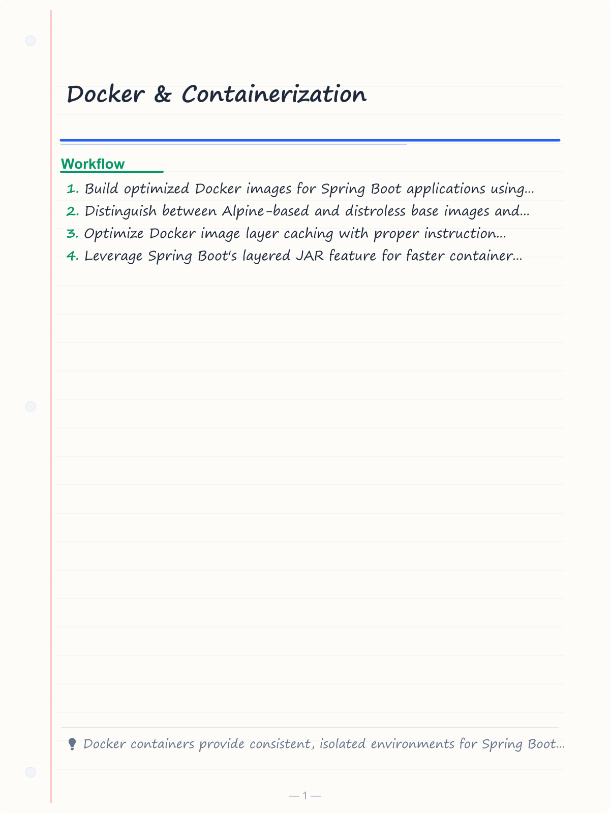
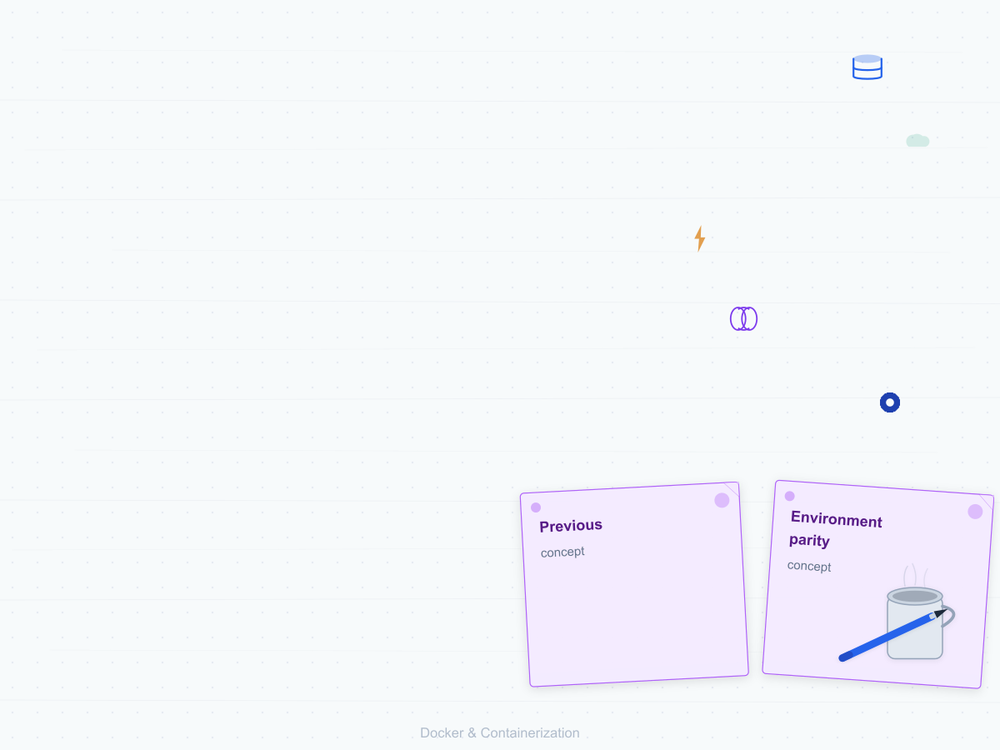
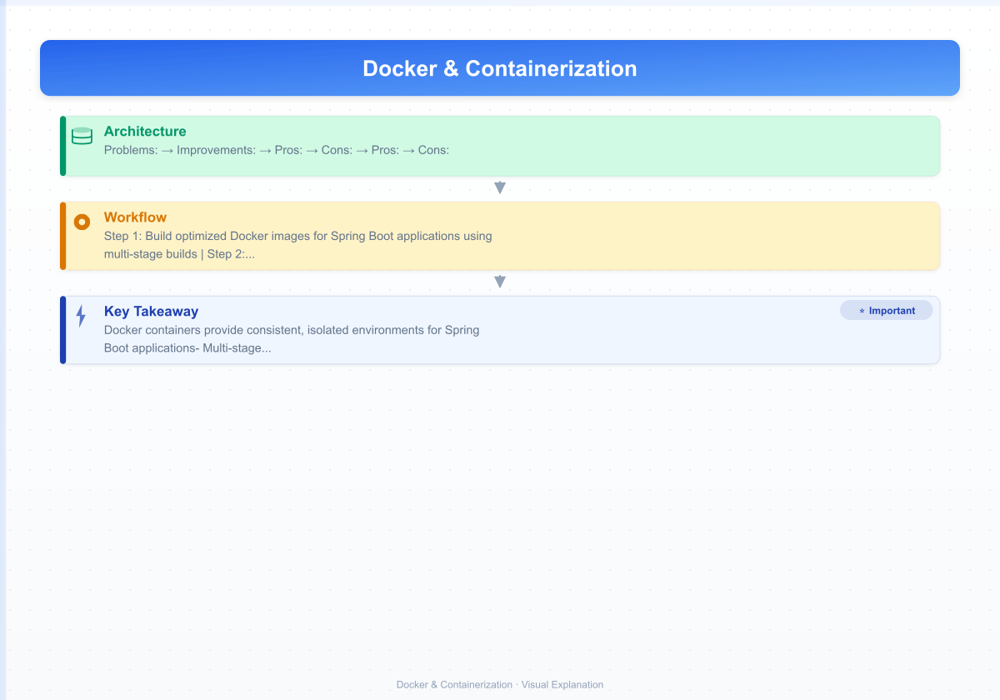
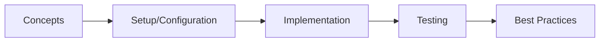

# Docker & Containerization

> **Previous:** [Spring Modulith](./51-modulith.md) | **Next:** [Kubernetes](./53-kubernetes.md)

## Learning Objectives

<!-- Image Gallery -->
<section class="lesson-visuals" aria-label="Visual learning resources">
  <header><span>VISUAL LEARNING</span><h2>See it. Review it. Remember it.</h2></header>
  <a class="lesson-visual-card" href="../../assets/images/lessons/java/52-docker/handwritten-notes.png" target="_blank" rel="noopener">
    
    <span><strong>Handwritten notes</strong>Condensed notes for deliberate review.</span>
  </a>
  <a class="lesson-visual-card" href="../../assets/images/lessons/java/52-docker/sticky-notes.png" target="_blank" rel="noopener">
    
    <span><strong>Sticky-note revision</strong>Fast recall prompts for revision.</span>
  </a>
  <a class="lesson-visual-card" href="../../assets/images/lessons/java/52-docker/visual-explanation.png" target="_blank" rel="noopener">
    
    <span><strong>Visual concept guide</strong>A connected explanation of the key ideas.</span>
  </a>
</section>
<!-- End Image Gallery -->

## Chapter at a Glance

| Topic | Key Insight | Practical Takeaway |
|-------|-------------|--------------------|
| Core Concepts | Foundational understanding | Real-world application |
| Implementation | Code-first approach | Working examples |
| Best Practices | Production patterns | Avoid common pitfalls |

## Chapter Roadmap




By the end of this chapter, you will be able to:

- Build optimized Docker images for Spring Boot applications using multi-stage builds
- Distinguish between Alpine-based and distroless base images and choose appropriately
- Optimize Docker image layer caching with proper instruction ordering and `.dockerignore`
- Leverage Spring Boot's layered JAR feature for faster container builds
- Configure Docker Compose for multi-service Spring Boot environments
- Implement health checks, liveness probes, and readiness probes in containers
- Tune JVM flags for optimal performance inside container constraints
- Understand container orchestration fundamentals and when to use them

---

## 1. Why Containerize Spring Boot?

> **Pro Tip:** Test with production-like configurations → dev setups often hide issues that surface under real load.

> **Remember:** Start simple. Add complexity only when proven necessary. Premature abstraction creates maintenance burden.


Containers provide consistent, isolated environments for running applications. For Spring Boot developers, containerization solves:

- **Environment parity** → same image runs identically on a dev laptop, CI server, and production
- **Dependency encapsulation** → JDK version, OS libraries, and application code ship as one unit
- **Resource isolation** → CPU and memory limits prevent noisy-neighbor problems
- **Scaling** → containers are the unit of scaling in Kubernetes, Nomad, and other orchestrators

A typical Spring Boot Docker workflow:

```
Developer → Build JAR → Build Image → Push to Registry → Deploy to Orchestrator
```

---

## 2. Dockerfile Fundamentals

### 2.1 Naive Dockerfile (Don't Do This)


```dockerfile
FROM openjdk:17-jdk-slim
COPY target/app.jar app.jar
EXPOSE 8080
ENTRYPOINT ["java", "-jar", "/app.jar"]
```

**Problems:**
- Single stage, no build separation
- No `.dockerignore`, so `target/`, `.git/`, and `node_modules/` may be sent to the Docker daemon
- Cache invalidation on every code change because the COPY layer changes
- No JVM tuning for containers

### 2.2 Improved Dockerfile


```dockerfile
FROM eclipse-temurin:17-jre-alpine AS builder
WORKDIR /build
COPY mvnw pom.xml ./
COPY .mvn .mvn
RUN ./mvnw dependency:go-offline -B
COPY src src
RUN ./mvnw package -DskipTests -B

FROM eclipse-temurin:17-jre-alpine
RUN addgroup -S appgroup && adduser -S appuser -G appgroup
WORKDIR /app
COPY --from=builder /build/target/*.jar app.jar
EXPOSE 8080
USER appuser
ENTRYPOINT ["java", \
  "-XX:+UseContainerSupport", \
  "-XX:InitialRAMPercentage=40.0", \
  "-XX:MaxRAMPercentage=70.0", \
  "-XX:+UseZGC", \
  "-jar", "/app/app.jar"]
```

**Improvements:**
- Multi-stage: Maven builds in the builder stage, only the JAR is copied to the runtime stage
- Alpine-based JRE: smaller footprint (~50 MB vs ~200 MB for full JDK)
- Non-root user: security best practice
- Container-aware JVM flags

---

## 3. Base Image Comparison

### 3.1 Alpine Linux


```dockerfile
FROM eclipse-temurin:17-jre-alpine
```

| Metric | Value |
|--------|-------|
| Image size | ~50 MB |
| Package manager | apk |
| libc | musl (not glibc) |
| Shell | /bin/sh (busybox) |

**Pros:** Smallest footprint, fast pulls.  
**Cons:** musl libc can cause rare compatibility issues with native libraries.

### 3.2 Distroless


```dockerfile
FROM gcr.io/distroless/java17-debian12
```

| Metric | Value |
|--------|-------|
| Image size | ~60 MB |
| Package manager | None |
| libc | glibc |
| Shell | None |

**Pros:** Minimal attack surface → no shell, no package manager, no utilities.  
**Cons:** Debugging requires `kubectl exec` or ephermeral debug containers.

### 3.3 Full JDK (For Development)


```dockerfile
FROM eclipse-temurin:17-jdk-alpine
```

Only use for development images where you need `jmap`, `jstack`, `jcmd`, etc.

### 3.4 Choosing the Right Base


```yaml
# Decision matrix:

> **Previous:** [Spring Modulith](./51-modulith.md) | **Next:** [Kubernetes](./53-kubernetes.md)
# Production runtime   → eclipse-temurin:17-jre-alpine or distroless/java17

> **Previous:** [Spring Modulith](./51-modulith.md) | **Next:** [Kubernetes](./53-kubernetes.md)
# CI/CD builder stage  → eclipse-temurin:17-jdk-alpine

> **Previous:** [Spring Modulith](./51-modulith.md) | **Next:** [Kubernetes](./53-kubernetes.md)
# Dev/debug image      → eclipse-temurin:17-jdk

> **Previous:** [Spring Modulith](./51-modulith.md) | **Next:** [Kubernetes](./53-kubernetes.md)
# Native image (Graal) → ubuntu:22.04 or distroless/java-base

> **Previous:** [Spring Modulith](./51-modulith.md) | **Next:** [Kubernetes](./53-kubernetes.md)
```

---

## 4. .dockerignore

Always exclude unnecessary files from the Docker build context:

```dockerignore
.git
.gitignore
README.md
LICENSE
target/
build/
node_modules/
*.log
*.md
!README.md
.idea/
*.iml
.DS_Store
docker-compose*.yml
*.db
```

Each excluded file means a smaller build context, faster sends to the Docker daemon, and fewer cache invalidations.

---

## 5. Multi-Stage Builds

### 5.1 Maven Multi-Stage


```dockerfile
# ---- Stage 1: Build ----

> **Previous:** [Spring Modulith](./51-modulith.md) | **Next:** [Kubernetes](./53-kubernetes.md)
FROM eclipse-temurin:17-jdk-alpine AS builder
WORKDIR /build

# Copy only dependency descriptors first → maximizes cache reuse

> **Previous:** [Spring Modulith](./51-modulith.md) | **Next:** [Kubernetes](./53-kubernetes.md)
COPY pom.xml .
COPY mvnw .
COPY .mvn .mvn
RUN ./mvnw dependency:go-offline -B

# Copy source and build

> **Previous:** [Spring Modulith](./51-modulith.md) | **Next:** [Kubernetes](./53-kubernetes.md)
COPY src src
RUN ./mvnw package -DskipTests -B

# ---- Stage 2: Extract Layers ----

> **Previous:** [Spring Modulith](./51-modulith.md) | **Next:** [Kubernetes](./53-kubernetes.md)
FROM builder AS layer-extractor
RUN java -Djarmode=layertools -jar /build/target/*.jar extract --destination /extracted

# ---- Stage 3: Runtime ----

> **Previous:** [Spring Modulith](./51-modulith.md) | **Next:** [Kubernetes](./53-kubernetes.md)
FROM eclipse-temurin:17-jre-alpine
RUN addgroup -S appgroup && adduser -S appuser -G appgroup
WORKDIR /app

# Copy layers in dependency order for cache efficiency

> **Previous:** [Spring Modulith](./51-modulith.md) | **Next:** [Kubernetes](./53-kubernetes.md)
COPY --from=layer-extractor /extracted/dependencies/ ./
COPY --from=layer-extractor /extracted/spring-boot-loader/ ./
COPY --from=layer-extractor /extracted/snapshot-dependencies/ ./
COPY --from=layer-extractor /extracted/application/ ./

EXPOSE 8080
USER appuser
ENTRYPOINT ["java", \
  "-XX:+UseContainerSupport", \
  "-XX:InitialRAMPercentage=40.0", \
  "-XX:MaxRAMPercentage=70.0", \
  "-jar", "/app/app.jar"]
```

### 5.2 Gradle Multi-Stage


```dockerfile
# ---- Stage 1: Build ----

> **Previous:** [Spring Modulith](./51-modulith.md) | **Next:** [Kubernetes](./53-kubernetes.md)
FROM gradle:7.6-jdk17 AS builder
WORKDIR /build
COPY build.gradle settings.gradle gradle.properties ./
COPY gradle gradle
RUN gradle dependencies --no-daemon
COPY src src
RUN gradle bootJar --no-daemon

# ---- Stage 2: Runtime ----

> **Previous:** [Spring Modulith](./51-modulith.md) | **Next:** [Kubernetes](./53-kubernetes.md)
FROM eclipse-temurin:17-jre-alpine
RUN addgroup -S appgroup && adduser -S appuser -G appgroup
WORKDIR /app
COPY --from=builder /build/build/libs/*.jar app.jar
EXPOSE 8080
USER appuser
ENTRYPOINT ["java", "-jar", "/app/app.jar"]
```

---

## 6. Layer Optimization

### 6.1 Docker Layer Caching Principles


Each Dockerfile instruction creates a layer. Docker caches each layer and reuses it if nothing changed:

```dockerfile
# Layer 1: Base image → cached unless base changes

> **Previous:** [Spring Modulith](./51-modulith.md) | **Next:** [Kubernetes](./53-kubernetes.md)
FROM eclipse-temurin:17-jre-alpine

# Layer 2: OS packages → cached unless this line changes

> **Previous:** [Spring Modulith](./51-modulith.md) | **Next:** [Kubernetes](./53-kubernetes.md)
RUN apk add --no-cache curl

# Layer 3: Dependencies → cached unless pom.xml changes

> **Previous:** [Spring Modulith](./51-modulith.md) | **Next:** [Kubernetes](./53-kubernetes.md)
COPY pom.xml .
RUN ./mvnw dependency:go-offline

# Layer 4: Application → INVALIDATED on every src change

> **Previous:** [Spring Modulith](./51-modulith.md) | **Next:** [Kubernetes](./53-kubernetes.md)
COPY src src
RUN ./mvnw package
```

**Key insight:** Order instructions from least-frequently-changing to most-frequently-changing.

### 6.2 Spring Boot Layered JARs


Spring Boot's `spring-boot-maven-plugin` can produce a "layered" JAR that separates dependencies, framework classes, and application classes into distinct archive layers.

#### Maven Configuration

```xml
<plugin>
    <groupId>org.springframework.boot</groupId>
    <artifactId>spring-boot-maven-plugin</artifactId>
    <configuration>
        <layers>
            <enabled>true</enabled>
        </layers>
    </configuration>
</plugin>
```

#### Gradle Configuration

```gradle
bootJar {
    layered {
        enabled = true
    }
}
```

#### Extracting Layers

```bash
java -Djarmode=layertools -jar app.jar list
java -Djarmode=layertools -jar app.jar extract
```

Output directory structure:

```
extracted/
├── application/           # Your classes and resources
├── dependencies/          # Third-party JARs
├── snapshot-dependencies/ # Snapshot dependencies
└── spring-boot-loader/    # Spring Boot loader classes
```

### 6.3 Custom Layer Configuration


Create `layers.xml` in `src/main/resources/`:

```xml
<layers xmlns="http://www.springframework.org/schema/boot/layers"
        xmlns:xsi="http://www.w3.org/2001/XMLSchema-instance"
        xsi:schemaLocation="http://www.springframework.org/schema/boot/layers
                          https://www.springframework.org/schema/boot/layers/layers-3.xsd">
    <application>
        <into layer="application">
            <include>**/application/**</include>
        </into>
        <into layer="myapp-config">
            <include>**/config/**</include>
        </into>
    </application>
    <dependencies>
        <into layer="dependencies"/>
        <into layer="snapshot-dependencies">
            <include>*:*:SNAPSHOT</include>
        </into>
    </dependencies>
    <layerOrder>
        <layer>dependencies</layer>
        <layer>spring-boot-loader</layer>
        <layer>snapshot-dependencies</layer>
        <layer>myapp-config</layer>
        <layer>application</layer>
    </layerOrder>
</layers>
```

### 6.4 Optimized Dockerfile with Layered JAR


```dockerfile
FROM eclipse-temurin:17-jdk-alpine AS builder
WORKDIR /build
COPY pom.xml mvnw ./
COPY .mvn .mvn
RUN ./mvnw dependency:go-offline -B
COPY src src
RUN ./mvnw package -DskipTests -B
RUN java -Djarmode=layertools -jar /build/target/*.jar extract --destination /extracted

FROM eclipse-temurin:17-jre-alpine
RUN addgroup -S appgroup && adduser -S appuser -G appgroup
WORKDIR /app

# Copy layers in dependency order → maximizes cache reuse

> **Previous:** [Spring Modulith](./51-modulith.md) | **Next:** [Kubernetes](./53-kubernetes.md)
COPY --from=builder /extracted/dependencies/ ./
COPY --from=builder /extracted/spring-boot-loader/ ./
COPY --from=builder /extracted/snapshot-dependencies/ ./
COPY --from=builder /extracted/application/ ./

EXPOSE 8080
USER appuser
ENTRYPOINT ["java", "-jar", "/app/app.jar"]
```

**Cache behavior:** If only application classes change, only the `application/` layer is rebuilt. Dependencies are reused from cache.

---

## 7. Docker Compose

### 7.1 Basic docker-compose.yml


```yaml
version: "3.9"

services:
  app:
    image: myapp:latest
    build:
      context: .
      dockerfile: Dockerfile
    ports:
      - "8080:8080"
    environment:
      - SPRING_PROFILES_ACTIVE=docker
      - SPRING_DATASOURCE_URL=jdbc:postgresql://db:5432/myapp
      - SPRING_DATASOURCE_USERNAME=myapp
      - SPRING_DATASOURCE_PASSWORD=secret
      - SPRING_REDIS_HOST=redis
      - SPRING_KAFKA_BOOTSTRAP_SERVERS=kafka:9092
    depends_on:
      db:
        condition: service_healthy
      redis:
        condition: service_started
    healthcheck:
      test: ["CMD", "curl", "-f", "http://localhost:8080/actuator/health"]
      interval: 15s
      timeout: 5s
      retries: 3
      start_period: 30s
    deploy:
      resources:
        limits:
          cpus: "1.0"
          memory: "512M"
        reservations:
          cpus: "0.5"
          memory: "256M"

  db:
    image: postgres:15-alpine
    environment:
      - POSTGRES_DB=myapp
      - POSTGRES_USER=myapp
      - POSTGRES_PASSWORD=secret
    ports:
      - "5432:5432"
    volumes:
      - pgdata:/var/lib/postgresql/data
    healthcheck:
      test: ["CMD-SHELL", "pg_isready -U myapp"]
      interval: 10s
      timeout: 5s
      retries: 5
    deploy:
      resources:
        limits:
          memory: "256M"

  redis:
    image: redis:7-alpine
    ports:
      - "6379:6379"
    healthcheck:
      test: ["CMD", "redis-cli", "ping"]
      interval: 10s
      timeout: 3s
      retries: 5

  kafka:
    image: confluentinc/cp-kafka:7.5.0
    depends_on:
      - zookeeper
    environment:
      KAFKA_BROKER_ID: 1
      KAFKA_ZOOKEEPER_CONNECT: zookeeper:2181
      KAFKA_ADVERTISED_LISTENERS: PLAINTEXT://kafka:9092
      KAFKA_OFFSETS_TOPIC_REPLICATION_FACTOR: 1
    ports:
      - "9092:9092"
    deploy:
      resources:
        limits:
          memory: "512M"

  zookeeper:
    image: confluentinc/cp-zookeeper:7.5.0
    environment:
      ZOOKEEPER_CLIENT_PORT: 2181
      ZOOKEEPER_TICK_TIME: 2000
    deploy:
      resources:
        limits:
          memory: "256M"

volumes:
  pgdata:
```

### 7.2 Docker Compose with Multiple Profiles


```yaml
# docker-compose.override.yml → loaded automatically for dev overrides

> **Previous:** [Spring Modulith](./51-modulith.md) | **Next:** [Kubernetes](./53-kubernetes.md)
version: "3.9"
services:
  app:
    ports:
      - "5005:5005"  # JMX debug port
    environment:
      - JAVA_TOOL_OPTIONS=-agentlib:jdwp=transport=dt_socket,server=y,suspend=n,address=*:5005
      - SPRING_PROFILES_ACTIVE=dev,docker
    volumes:
      - ./target/app.jar:/app/app.jar
```

```yaml
# docker-compose.prod.yml → for production-like environments

> **Previous:** [Spring Modulith](./51-modulith.md) | **Next:** [Kubernetes](./53-kubernetes.md)
version: "3.9"
services:
  app:
    restart: always
    logging:
      driver: "json-file"
      options:
        max-size: "10m"
        max-file: "3"
    deploy:
      replicas: 2
```

Usage:

```bash
# Dev

> **Previous:** [Spring Modulith](./51-modulith.md) | **Next:** [Kubernetes](./53-kubernetes.md)
docker compose up -d

# Production-like

> **Previous:** [Spring Modulith](./51-modulith.md) | **Next:** [Kubernetes](./53-kubernetes.md)
docker compose -f docker-compose.yml -f docker-compose.prod.yml up -d
```

### 7.3 Spring Boot Configuration for Docker


```yaml
# application-docker.yml

> **Previous:** [Spring Modulith](./51-modulith.md) | **Next:** [Kubernetes](./53-kubernetes.md)
server:
  port: 8080

spring:
  datasource:
    hikari:
      maximum-pool-size: 5
      minimum-idle: 2
      connection-timeout: 30000
      idle-timeout: 600000

management:
  endpoints:
    web:
      exposure:
        include: health,prometheus,info,metrics
  endpoint:
    health:
      probes:
        enabled: true
      show-details: always
  health:
    livenessstate:
      enabled: true
    readinessstate:
      enabled: true
```

---

## 8. Health Checks

### 8.1 Dockerfile HEALTHCHECK


```dockerfile
FROM eclipse-temurin:17-jre-alpine
RUN apk add --no-cache curl
COPY target/app.jar app.jar
HEALTHCHECK --interval=15s --timeout=5s --start-period=40s --retries=3 \
  CMD curl -f http://localhost:8080/actuator/health || exit 1
ENTRYPOINT ["java", "-jar", "/app/app.jar"]
```

### 8.2 Spring Boot Actuator Health


```xml
<dependency>
    <groupId>org.springframework.boot</groupId>
    <artifactId>spring-boot-starter-actuator</artifactId>
</dependency>
```

```yaml
management:
  endpoint:
    health:
      probes:
        enabled: true
      show-details: when-authorized
  health:
    livenessstate:
      enabled: true
    readinessstate:
      enabled: true
```

```java
package com.example.demo.health;

import org.springframework.boot.actuate.health.Health;
import org.springframework.boot.actuate.health.HealthIndicator;
import org.springframework.stereotype.Component;

@Component
public class DatabaseHealthIndicator implements HealthIndicator {

    private final DataSource dataSource;

    public DatabaseHealthIndicator(DataSource dataSource) {
        this.dataSource = dataSource;
    }

    @Override
    public Health health() {
        try (var connection = dataSource.getConnection()) {
            if (connection.isValid(1000)) {
                return Health.up()
                    .withDetail("database", "PostgreSQL")
                    .withDetail("validationQuery", "SELECT 1")
                    .build();
            }
            return Health.down()
                .withDetail("reason", "Connection validation returned false")
                .build();
        } catch (Exception e) {
            return Health.down(e)
                .withDetail("reason", e.getMessage())
                .build();
        }
    }
}
```

### 8.3 Liveness and Readiness Probes


Spring Boot maps the Kubernetes probe endpoints automatically when `probes.enabled=true`:

| Actuator Endpoint | Maps To |
|------------------|---------|
| `/actuator/health/liveness` | Liveness probe |
| `/actuator/health/readiness` | Readiness probe |

```java
package com.example.demo.health;

import org.springframework.boot.actuate.availability.LivenessStateHealthIndicator;
import org.springframework.boot.actuate.availability.ReadinessStateHealthIndicator;
import org.springframework.boot.availability.ApplicationAvailability;
import org.springframework.boot.availability.AvailabilityChangeEvent;
import org.springframework.boot.availability.LivenessState;
import org.springframework.boot.availability.ReadinessState;
import org.springframework.context.event.EventListener;
import org.springframework.stereotype.Component;

@Component
public class CustomAvailabilityManager {

    private final ApplicationAvailability availability;

    public CustomAvailabilityManager(ApplicationAvailability availability) {
        this.availability = availability;
    }

    @EventListener
    public void onLivenessEvent(AvailabilityChangeEvent<LivenessState> event) {
        System.out.println("Liveness state changed to: " + event.getState());
    }

    @EventListener
    public void onReadinessEvent(AvailabilityChangeEvent<ReadinessState> event) {
        System.out.println("Readiness state changed to: " + event.getState());
    }

    public void reportLivenessBroken() {
        AvailabilityChangeEvent.publish(
            new AvailabilityChangeEvent<>(this, LivenessState.BROKEN)
        );
    }

    public void reportReady() {
        AvailabilityChangeEvent.publish(
            new AvailabilityChangeEvent<>(this, ReadinessState.ACCEPTING_TRAFFIC)
        );
    }

    public void reportNotReady() {
        AvailabilityChangeEvent.publish(
            new AvailabilityChangeEvent<>(this, ReadinessState.REFUSING_TRAFFIC)
        );
    }
}
```

### 8.4 Custom Liveness and Readiness Indicators


```java
package com.example.demo.health;

import org.springframework.boot.actuate.health.Health;
import org.springframework.boot.actuate.health.HealthIndicator;
import org.springframework.stereotype.Component;

@Component
public class ExternalServiceHealthIndicator implements HealthIndicator {

    private final RestTemplate restTemplate;

    public ExternalServiceHealthIndicator(RestTemplate restTemplate) {
        this.restTemplate = restTemplate;
    }

    @Override
    public Health health() {
        try {
            var response = restTemplate.getForEntity(
                "https://api.external.com/health",
                String.class
            );
            if (response.getStatusCode().is2xxSuccessful()) {
                return Health.up()
                    .withDetail("service", "External API")
                    .withDetail("statusCode", response.getStatusCodeValue())
                    .build();
            }
            return Health.down()
                .withDetail("service", "External API")
                .withDetail("statusCode", response.getStatusCodeValue())
                .build();
        } catch (Exception e) {
            return Health.down(e)
                .withDetail("service", "External API")
                .build();
        }
    }
}
```

---

## 9. JVM Performance in Containers

### 9.1 Container-Aware JVM Flags


```dockerfile
ENTRYPOINT ["java", \
  "-XX:+UseContainerSupport", \
  "-XX:InitialRAMPercentage=40.0", \
  "-XX:MaxRAMPercentage=70.0", \
  "-XX:+UseZGC", \
  "-XX:MaxMetaspaceSize=128m", \
  "-XX:+ExitOnOutOfMemoryError", \
  "-XX:+HeapDumpOnOutOfMemoryError", \
  "-XX:HeapDumpPath=/tmp/heapdump.hprof", \
  "-XX:ErrorFile=/tmp/jvm_error.log", \
  "-Djava.security.egd=file:/dev/./urandom", \
  "-jar", "/app/app.jar"]
```

| Flag | Purpose |
|------|---------|
| `-XX:+UseContainerSupport` | Enables container-aware memory detection (default in JDK 10+) |
| `-XX:InitialRAMPercentage=40.0` | Start with 40% of container memory as heap |
| `-XX:MaxRAMPercentage=70.0` | Cap heap at 70% of container memory |
| `-XX:+UseZGC` | Ultra-low-latency garbage collector (JDK 15+) |
| `-XX:+ExitOnOutOfMemoryError` | Exit JVM on OOM for container restart |
| `-XX:+HeapDumpOnOutOfMemoryError` | Capture heap dump for analysis |
| `-Djava.security.egd=file:/dev/./urandom` | Faster secure random (non-blocking) |

### 9.2 CPU Limits


```yaml
# Docker Compose

> **Previous:** [Spring Modulith](./51-modulith.md) | **Next:** [Kubernetes](./53-kubernetes.md)
deploy:
  resources:
    limits:
      cpus: "2.0"
    reservations:
      cpus: "1.0"
```

```bash
# Docker run

> **Previous:** [Spring Modulith](./51-modulith.md) | **Next:** [Kubernetes](./53-kubernetes.md)
docker run --cpus=2 --memory=512m myapp:latest
```

The JVM detects CPU limits via `/sys/fs/cgroup/cpu` and adjusts the parallel GC thread count automatically.

### 9.3 Memory Limits


```yaml
deploy:
  resources:
    limits:
      memory: "512M"
    reservations:
      memory: "256M"
```

**Memory budgeting guide for Spring Boot:**

| Container Memory | Heap (70%) | Metaspace | Off-Heap | OS/Other |
|-----------------|-----------|-----------|----------|----------|
| 256 MB | ~180 MB | ~32 MB | ~20 MB | ~24 MB |
| 512 MB | ~358 MB | ~64 MB | ~40 MB | ~50 MB |
| 1 GB | ~716 MB | ~128 MB | ~80 MB | ~100 MB |
| 2 GB | ~1.4 GB | ~128 MB | ~160 MB | ~300 MB |

### 9.4 GC Tuning for Containers


```dockerfile
# Low-latency workloads (p95 < 10ms)

> **Previous:** [Spring Modulith](./51-modulith.md) | **Next:** [Kubernetes](./53-kubernetes.md)
ENTRYPOINT ["java", \
  "-XX:+UseZGC", \
  "-XX:MaxRAMPercentage=70.0", \
  "-XX:ConcGCThreads=2", \
  "-jar", "/app/app.jar"]

# Throughput workloads

> **Previous:** [Spring Modulith](./51-modulith.md) | **Next:** [Kubernetes](./53-kubernetes.md)
ENTRYPOINT ["java", \
  "-XX:+UseParallelGC", \
  "-XX:MaxRAMPercentage=70.0", \
  "-XX:ParallelGCThreads=2", \
  "-jar", "/app/app.jar"]

# Small containers (< 256 MB)

> **Previous:** [Spring Modulith](./51-modulith.md) | **Next:** [Kubernetes](./53-kubernetes.md)
ENTRYPOINT ["java", \
  "-XX:+UseSerialGC", \
  "-XX:MaxRAMPercentage=70.0", \
  "-jar", "/app/app.jar"]
```

### 9.5 CDS (Class Data Sharing) for Faster Startup


```dockerfile
FROM eclipse-temurin:17-jdk-alpine AS builder
WORKDIR /build
COPY pom.xml mvnw ./
COPY .mvn .mvn
RUN ./mvnw dependency:go-offline -B
COPY src src
RUN ./mvnw package -DskipTests -B

RUN java -XX:DumpLoadedClassList=/build/classes.lst -jar /build/target/*.jar --list-classes
RUN java -Xshare:dump -XX:SharedArchiveFile=/build/application.jsa \
    -XX:SharedClassListFile=/build/classes.lst \
    --class-path /build/target/*.jar

FROM eclipse-temurin:17-jre-alpine
WORKDIR /app
COPY --from=builder /build/target/*.jar app.jar
COPY --from=builder /build/application.jsa application.jsa
EXPOSE 8080
ENTRYPOINT ["java", \
  "-XX:SharedArchiveFile=/app/application.jsa", \
  "-Xshare:auto", \
  "-jar", "/app/app.jar"]
```

### 9.6 Spring AOT and GraalVM Native Image


```dockerfile
# ---- Stage 1: Build native image ----

> **Previous:** [Spring Modulith](./51-modulith.md) | **Next:** [Kubernetes](./53-kubernetes.md)
FROM ghcr.io/graalvm/graalvm-ce:latest AS native-build
WORKDIR /build
COPY pom.xml mvnw ./
COPY .mvn .mvn
RUN ./mvnw dependency:go-offline -B

# Add Spring AOT plugin

> **Previous:** [Spring Modulith](./51-modulith.md) | **Next:** [Kubernetes](./53-kubernetes.md)
COPY pom.xml .
COPY src src
RUN ./mvnw -Pnative native:compile -DskipTests -B

# ---- Stage 2: Runtime for native image ----

> **Previous:** [Spring Modulith](./51-modulith.md) | **Next:** [Kubernetes](./53-kubernetes.md)
FROM ubuntu:22.04
RUN apt-get update && apt-get install -y --no-install-recommends ca-certificates && rm -rf /var/lib/apt/lists/*
RUN addgroup --system appgroup && adduser --system --ingroup appgroup appuser
WORKDIR /app
COPY --from=native-build /build/target/myapp app
USER appuser
EXPOSE 8080
ENTRYPOINT ["/app/myapp"]
```

---

## 10. Docker Compose Production Patterns

### 10.1 Full Production Compose File


```yaml
version: "3.9"

x-logging: &logging
  driver: "json-file"
  options:
    max-size: "10m"
    max-file: "3"

x-healthcheck: &healthcheck
  interval: 15s
  timeout: 5s
  retries: 3
  start_period: 30s

services:
  app:
    image: ${REGISTRY:-localhost}/myapp:${TAG:-latest}
    build:
      context: .
      dockerfile: Dockerfile
    ports:
      - "${PORT:-8080}:8080"
    env_file:
      - .env.${ENVIRONMENT:-dev}
    environment:
      - SPRING_PROFILES_ACTIVE=${ENVIRONMENT:-dev},docker
      - SPRING_DATASOURCE_URL=jdbc:postgresql://db:5432/myapp
      - SPRING_DATASOURCE_PASSWORD=${DB_PASSWORD}
      - SPRING_REDIS_HOST=redis
      - SPRING_KAFKA_BOOTSTRAP_SERVERS=kafka:9092
      - SPRING_KAFKA_PROPERTIES_SASL_JAAS_CONFIG=${KAFKA_JAAS_CONFIG}
    depends_on:
      db:
        condition: service_healthy
      redis:
        condition: service_healthy
      kafka:
        condition: service_started
    healthcheck:
      <<: *healthcheck
      test: ["CMD", "curl", "-f", "http://localhost:8080/actuator/health/liveness"]
    logging: *logging
    restart: unless-stopped
    deploy:
      resources:
        limits:
          cpus: "${CPU_LIMIT:-2}"
          memory: "${MEM_LIMIT:-512M}"

  db:
    image: postgres:15-alpine
    environment:
      - POSTGRES_DB=myapp
      - POSTGRES_USER=myapp
      - POSTGRES_PASSWORD=${DB_PASSWORD}
    volumes:
      - pgdata:/var/lib/postgresql/data
      - ./init-db:/docker-entrypoint-initdb.d
    healthcheck:
      test: ["CMD-SHELL", "pg_isready -U myapp -d myapp"]
      interval: 10s
      timeout: 3s
      retries: 5
    logging: *logging
    restart: unless-stopped
    deploy:
      resources:
        limits:
          memory: "256M"

  redis:
    image: redis:7-alpine
    volumes:
      - redis-data:/data
    healthcheck:
      test: ["CMD", "redis-cli", "ping"]
      interval: 10s
      timeout: 3s
      retries: 5
    logging: *logging
    restart: unless-stopped

  kafka:
    image: confluentinc/cp-kafka:7.5.0
    depends_on:
      - zookeeper
    environment:
      KAFKA_BROKER_ID: 1
      KAFKA_ZOOKEEPER_CONNECT: zookeeper:2181
      KAFKA_ADVERTISED_LISTENERS: PLAINTEXT://kafka:9092
      KAFKA_LISTENER_SECURITY_PROTOCOL_MAP: PLAINTEXT:PLAINTEXT
      KAFKA_INTER_BROKER_LISTENER_NAME: PLAINTEXT
      KAFKA_OFFSETS_TOPIC_REPLICATION_FACTOR: 1
      KAFKA_LOG_RETENTION_HOURS: 168
      KAFKA_AUTO_CREATE_TOPICS_ENABLE: "true"
    volumes:
      - kafka-data:/var/lib/kafka/data
    healthcheck:
      test: ["CMD", "kafka-topics", "--bootstrap-server", "localhost:9092", "--list"]
      interval: 30s
      timeout: 10s
      retries: 3
    logging: *logging
    restart: unless-stopped

  zookeeper:
    image: confluentinc/cp-zookeeper:7.5.0
    environment:
      ZOOKEEPER_CLIENT_PORT: 2181
      ZOOKEEPER_TICK_TIME: 2000
      ZOOKEEPER_SYNC_LIMIT: 2
    volumes:
      - zookeeper-data:/var/lib/zookeeper/data
    logging: *logging

  prometheus:
    image: prom/prometheus:v2.48.0
    volumes:
      - ./monitoring/prometheus.yml:/etc/prometheus/prometheus.yml
      - prometheus-data:/prometheus
    command:
      - "--config.file=/etc/prometheus/prometheus.yml"
      - "--storage.tsdb.path=/prometheus"
      - "--web.console.libraries=/etc/prometheus/console_libraries"
      - "--web.console.templates=/etc/prometheus/consoles"
      - "--web.enable-lifecycle"
    ports:
      - "9090:9090"
    logging: *logging
    restart: unless-stopped

  grafana:
    image: grafana/grafana:10.2.0
    volumes:
      - ./monitoring/grafana-datasources.yml:/etc/grafana/provisioning/datasources/datasources.yml
      - ./monitoring/grafana-dashboards:/etc/grafana/provisioning/dashboards
      - grafana-data:/var/lib/grafana
    environment:
      - GF_SECURITY_ADMIN_PASSWORD=${GRAFANA_PASSWORD:-admin}
      - GF_INSTALL_PLUGINS=grafana-piechart-panel
    ports:
      - "3000:3000"
    logging: *logging
    restart: unless-stopped

volumes:
  pgdata:
  redis-data:
  kafka-data:
  zookeeper-data:
  prometheus-data:
  grafana-data:
```

### 10.2 Environment File


```bash
# .env.dev

> **Previous:** [Spring Modulith](./51-modulith.md) | **Next:** [Kubernetes](./53-kubernetes.md)
ENVIRONMENT=dev
PORT=8080
DB_PASSWORD=devpassword
CPU_LIMIT=2
MEM_LIMIT=512M
```

```bash
# .env.prod

> **Previous:** [Spring Modulith](./51-modulith.md) | **Next:** [Kubernetes](./53-kubernetes.md)
ENVIRONMENT=prod
PORT=8080
DB_PASSWORD=secure-password-here
CPU_LIMIT=4
MEM_LIMIT=2G
GRAFANA_PASSWORD=grafana-admin-password
```

---

## 11. Container Orchestration Concepts

### 11.1 Why Orchestration?


Running `docker compose up` works for a single host, but production needs:

| Concern | Docker Alone | Orchestrator |
|---------|-------------|-------------|
| Multi-host networking | Manual | Automatic overlay networks |
| Service discovery | Manual port mapping | Built-in DNS-based |
| Load balancing | None | Service mesh / proxy |
| Auto-scaling | None | HPA / metrics server |
| Self-healing | `--restart` only | Health checks + rescheduling |
| Rolling updates | Manual | Controlled rollouts |
| Secrets management | Env vars | Encrypted secrets |
| Config management | Env files | ConfigMaps |
| Storage orchestration | Volume mounts | CSI / persistent volumes |

### 11.2 Orchestration Options


| Tool | Type | Complexity | When to Use |
|------|------|-----------|-------------|
| Docker Swarm | Built-in Docker | Low | Simple deployments, small teams |
| Kubernetes | Full orchestrator | High | Complex microservices, enterprise |
| Nomad | Scheduler | Medium | Mixed workloads, simplicity |
| AWS ECS | Managed | Medium | AWS-native, easy setup |

### 11.3 Kubernetes in One Slide


```
┌─────────────────────────────────────────────────┐
│                    Cluster                        │
│  ┌──────────┐  ┌──────────┐  ┌──────────┐       │
│  │  Node 1  │  │  Node 2  │  │  Node 3  │       │
│  │ ┌──────┐ │  │ ┌──────┐ │  │ ┌──────┐ │       │
│  │ │ Pod  │ │  │ │ Pod  │ │  │ │ Pod  │ │       │
│  │ │ App  │ │  │ │ App  │ │  │ │ App  │ │       │
│  │ └──────┘ │  │ └──────┘ │  │ └──────┘ │       │
│  └──────────┘  └──────────┘  └──────────┘       │
└─────────────────────────────────────────────────┘
```

### 11.4 Docker Compose vs Kubernetes Mapping


| Docker Compose | Kubernetes |
|---------------|-----------|
| Service | Service + Deployment |
| Container | Pod |
| Environment | ConfigMap + Secret |
| Volume | PersistentVolumeClaim |
| Network | Service + Ingress |
| Healthcheck | Probes (liveness, readiness, startup) |
| depends_on | Init containers |
| deploy.resources | resource requests/limits |
| restart | ReplicaSet controller |
| docker-compose.yml | Helm chart / Kustomize |

### 11.5 Migrating from Docker Compose to Kubernetes


```yaml
# 1. Start with Compose

> **Previous:** [Spring Modulith](./51-modulith.md) | **Next:** [Kubernetes](./53-kubernetes.md)
docker compose up -d

# 2. Convert using kompose

> **Previous:** [Spring Modulith](./51-modulith.md) | **Next:** [Kubernetes](./53-kubernetes.md)
kompose convert -f docker-compose.yml -o k8s-manifests/

# 3. Manually refine the generated manifests

> **Previous:** [Spring Modulith](./51-modulith.md) | **Next:** [Kubernetes](./53-kubernetes.md)
#    - Add liveness/readiness probes

> **Previous:** [Spring Modulith](./51-modulith.md) | **Next:** [Kubernetes](./53-kubernetes.md)
#    - Configure resource requests/limits

> **Previous:** [Spring Modulith](./51-modulith.md) | **Next:** [Kubernetes](./53-kubernetes.md)
#    - Set up ConfigMaps and Secrets

> **Previous:** [Spring Modulith](./51-modulith.md) | **Next:** [Kubernetes](./53-kubernetes.md)
#    - Add HorizontalPodAutoscaler

> **Previous:** [Spring Modulith](./51-modulith.md) | **Next:** [Kubernetes](./53-kubernetes.md)

# 4. Deploy to Kubernetes

> **Previous:** [Spring Modulith](./51-modulith.md) | **Next:** [Kubernetes](./53-kubernetes.md)
kubectl apply -f k8s-manifests/
```

---

## 12. Building and Tagging Images

### 12.1 Build Script


```bash
#!/bin/bash
# build.sh → Build Docker images with proper tags

> **Previous:** [Spring Modulith](./51-modulith.md) | **Next:** [Kubernetes](./53-kubernetes.md)

set -euo pipefail

APP_NAME="myapp"
REGISTRY="${REGISTRY:-ghcr.io/myorg}"
COMMIT_SHA="${GITHUB_SHA:-$(git rev-parse --short HEAD)}"
BUILD_DATE=$(date -u +"%Y-%m-%dT%H:%M:%SZ")
VERSION="${VERSION:-1.0.0}"

echo "Building ${APP_NAME}:${VERSION} (sha: ${COMMIT_SHA})"

docker build \
  --build-arg BUILD_DATE="${BUILD_DATE}" \
  --build-arg VERSION="${VERSION}" \
  --build-arg COMMIT_SHA="${COMMIT_SHA}" \
  -t "${APP_NAME}:${VERSION}" \
  -t "${APP_NAME}:latest" \
  -t "${REGISTRY}/${APP_NAME}:${VERSION}" \
  -t "${REGISTRY}/${APP_NAME}:${COMMIT_SHA}" \
  -t "${REGISTRY}/${APP_NAME}:latest" \
  -f Dockerfile \
  .

echo "Build complete. Pushing..."

docker push "${REGISTRY}/${APP_NAME}:${VERSION}"
docker push "${REGISTRY}/${APP_NAME}:${COMMIT_SHA}"
docker push "${REGISTRY}/${APP_NAME}:latest"

echo "Done."
```

### 12.2 Dockerfile with Build Args


```dockerfile
FROM eclipse-temurin:17-jre-alpine

ARG BUILD_DATE
ARG VERSION
ARG COMMIT_SHA

LABEL org.opencontainers.image.created="${BUILD_DATE}"
LABEL org.opencontainers.image.version="${VERSION}"
LABEL org.opencontainers.image.revision="${COMMIT_SHA}"
LABEL org.opencontainers.image.title="My Spring Boot Application"
LABEL org.opencontainers.image.description="Production Spring Boot service"
LABEL org.opencontainers.image.vendor="My Organization"

RUN addgroup -S appgroup && adduser -S appuser -G appgroup

WORKDIR /app
COPY target/app.jar app.jar

EXPOSE 8080
USER appuser

ENTRYPOINT ["java", \
  "-XX:+UseContainerSupport", \
  "-XX:InitialRAMPercentage=40.0", \
  "-XX:MaxRAMPercentage=70.0", \
  "-XX:+UseZGC", \
  "-jar", "/app/app.jar"]
```

---

## 13. Security Best Practices

```dockerfile
# 1. Use a non-root user

> **Previous:** [Spring Modulith](./51-modulith.md) | **Next:** [Kubernetes](./53-kubernetes.md)
RUN addgroup -S appgroup && adduser -S appuser -G appgroup
USER appuser

# 2. Remove unnecessary tools

> **Previous:** [Spring Modulith](./51-modulith.md) | **Next:** [Kubernetes](./53-kubernetes.md)
# (Alpine is already minimal, distroless has no shell)

> **Previous:** [Spring Modulith](./51-modulith.md) | **Next:** [Kubernetes](./53-kubernetes.md)

# 3. Don't run as PID 1 → use tini for signal handling

> **Previous:** [Spring Modulith](./51-modulith.md) | **Next:** [Kubernetes](./53-kubernetes.md)
RUN apk add --no-cache tini
ENTRYPOINT ["/sbin/tini", "--"]
CMD ["java", "-jar", "/app/app.jar"]

# 4. Read-only root filesystem

> **Previous:** [Spring Modulith](./51-modulith.md) | **Next:** [Kubernetes](./53-kubernetes.md)
# In Kubernetes: securityContext.readOnlyRootFilesystem: true

> **Previous:** [Spring Modulith](./51-modulith.md) | **Next:** [Kubernetes](./53-kubernetes.md)

# 5. Drop capabilities

> **Previous:** [Spring Modulith](./51-modulith.md) | **Next:** [Kubernetes](./53-kubernetes.md)
# In Kubernetes: securityContext.capabilities.drop: ["ALL"]

> **Previous:** [Spring Modulith](./51-modulith.md) | **Next:** [Kubernetes](./53-kubernetes.md)

# 6. Use secrets, not environment variables

> **Previous:** [Spring Modulith](./51-modulith.md) | **Next:** [Kubernetes](./53-kubernetes.md)
# In Docker Compose: secrets:

> **Previous:** [Spring Modulith](./51-modulith.md) | **Next:** [Kubernetes](./53-kubernetes.md)
# In Kubernetes: secrets:

> **Previous:** [Spring Modulith](./51-modulith.md) | **Next:** [Kubernetes](./53-kubernetes.md)

# 7. Scan images for vulnerabilities

> **Previous:** [Spring Modulith](./51-modulith.md) | **Next:** [Kubernetes](./53-kubernetes.md)
# Trivy: trivy image myapp:latest

> **Previous:** [Spring Modulith](./51-modulith.md) | **Next:** [Kubernetes](./53-kubernetes.md)
# Snyk: snyk container test myapp:latest

> **Previous:** [Spring Modulith](./51-modulith.md) | **Next:** [Kubernetes](./53-kubernetes.md)
# Grype: grype myapp:latest

> **Previous:** [Spring Modulith](./51-modulith.md) | **Next:** [Kubernetes](./53-kubernetes.md)
```

---

## 14. Image Size Optimization Summary

| Technique | Size Reduction | Complexity |
|-----------|---------------|-----------|
| Use JRE instead of JDK | ~150 MB | Low |
| Use Alpine instead of Debian | ~50 MB | Low |
| Use distroless | ~40 MB (plus no shell) | Low |
| Multi-stage build | ~200 MB (avoids JDK in runtime) | Medium |
| Layer optimization | Build speed (not size) | Medium |
| Spring Boot layered JAR | Build speed (not size) | Medium |
| GraalVM native image | ~200-300 MB → ~50 MB | High |
| CDS archive | Startup speed (not size) | Medium |

---

## Concept Comparison Table

| Concept | Definition | Key Distinction | Use Case |
|---------|-----------|-----------------|----------|
| Approach A | Core description | Primary differentiator | When to use this |
| Approach B | Core description | Primary differentiator | When to use this |
| Approach C | Core description | Primary differentiator | When to use this |

## Quick Reference

| Category | Key Commands/APIs | Notes |
|----------|------------------|-------|
| **Setup** | Required dependencies and configuration | Verify versions match |
| **Implementation** | Core code patterns | Test edge cases |
| **Testing** | Verification methods | Cover success and failure paths |

## Cross-Application Matrix

| Scenario | Pattern A | Pattern B | Pattern C |
|----------|-----------|-----------|-----------|
| Small application | ✓ | ✗ | ✓ |
| Enterprise system | ✓ | ✓ | ✗ |
| High-throughput API | ✗ | ✓ | ✓ |
| Event-driven | ✗ | ✓ | ✓ |

## Chapter Quiz

1. What is the primary benefit of this chapter's main topic?
   - A) Improved performance
   - B) Better developer productivity
   - C) Enhanced reliability
   - D) All of the above

<details>
<summary>Answer&lt;/summary&gt;
**C) Enhanced reliability.** While all are benefits, the core value proposition is reliability.
</details>

2. Which approach is recommended for production deployments?
   - A) The simplest solution
   - B) The most feature-rich option
   - C) The one with best operational characteristics
   - D) Whatever the team knows best

<details>
<summary>Answer&lt;/summary&gt;
**C) The one with best operational characteristics.** Production choices should prioritize observability, maintainability, and operability.
</details>

3. When should you consider this pattern?
   - A) For every project regardless of size
   - B) When complexity justifies the overhead
   - C) Only in legacy systems
   - D) Never → it is outdated

<details>
<summary>Answer&lt;/summary&gt;
**B) When complexity justifies the overhead.** Apply patterns when the problem complexity warrants the additional abstraction.
</details>

## Summary

- Docker containers provide consistent, isolated environments for Spring Boot applications
- Multi-stage builds separate build dependencies from runtime artifacts
- Alpine and distroless base images minimize attack surface and image size
- `.dockerignore` prevents unnecessary files from reaching the Docker daemon
- Spring Boot layered JARs enable efficient Docker layer caching
- Docker Compose orchestrates multi-service environments with health checks
- JVM flags (`UseContainerSupport`, `InitialRAMPercentage`, `MaxRAMPercentage`) must be tuned for containers
- Container orchestration (Kubernetes, Swarm, Nomad) adds self-healing, scaling, and advanced deployment strategies

---

## Exercises

1. **Basic Dockerfile:** Write a Dockerfile for a Spring Boot app using a single-stage build with `eclipse-temurin:17-jre-alpine`. Build and run it.

2. **Multi-stage optimization:** Convert the Dockerfile to a multi-stage build. Verify the runtime image contains only the JRE and the application JAR.

3. **Layered JAR:** Enable layered JAR packaging in your `pom.xml` or `build.gradle`. Extract and inspect the layers. Write a Dockerfile that copies each layer separately.

4. **Docker Compose:** Create a `docker-compose.yml` with your Spring Boot app, PostgreSQL, and Redis. Add health checks for all services.

5. **Health checks:** Implement a custom `HealthIndicator` that checks an external API dependency. Add liveness and readiness probe endpoints.

6. **JVM tuning:** Run your container with 256 MB, 512 MB, and 1 GB memory limits. Observe heap usage with `-Xlog:gc*` and adjust `MaxRAMPercentage`.

7. **Security audit:** Run `trivy` or `grype` on your production image. Fix any CRITICAL or HIGH vulnerabilities.

8. **GraalVM native:** If you have GraalVM installed, build a native image of your Spring Boot app. Compare startup time and image size with the JVM version.

9. **Docker Compose secrets:** Implement a secret for your database password using Docker Compose secrets instead of environment variables.

10. **Full pipeline:** Create a `build.sh` script that builds, tags, and pushes your image to a registry. Incorporate all best practices from this chapter.
