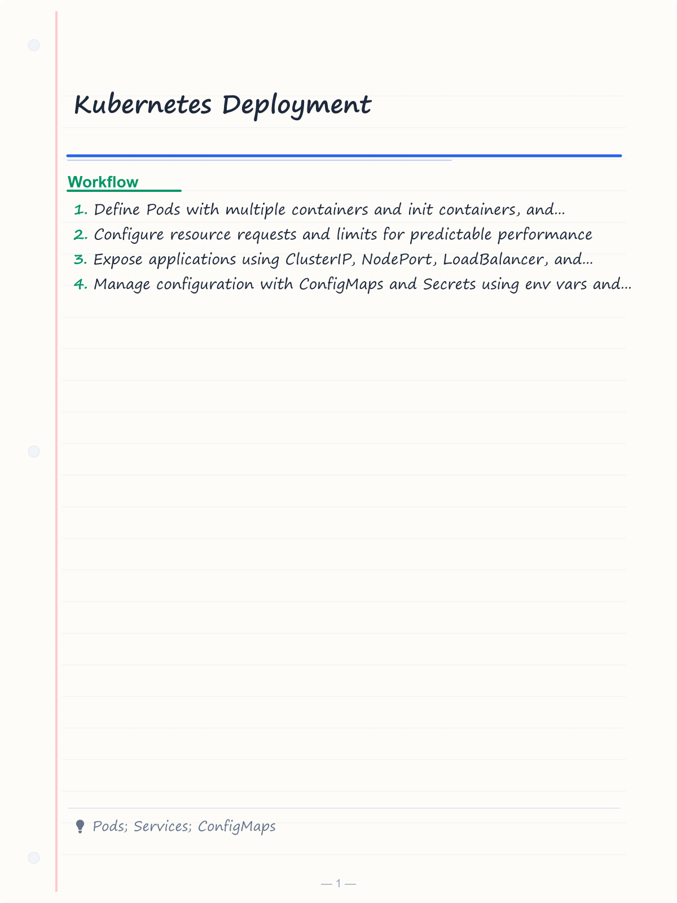
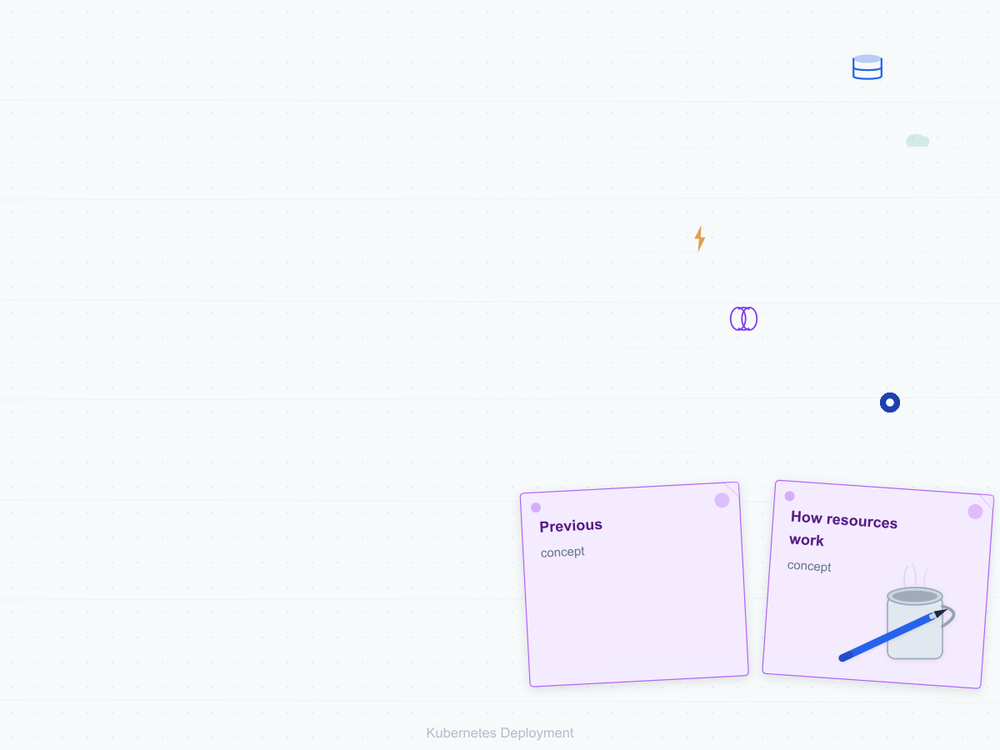
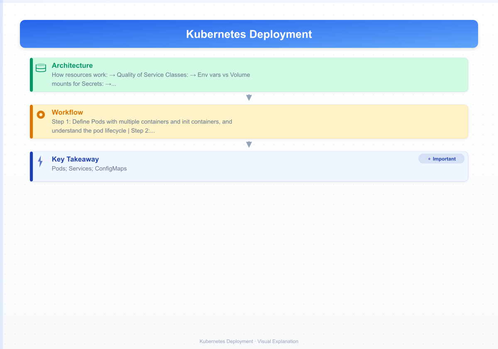
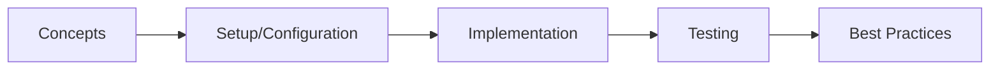

# Kubernetes Deployment

> **Previous:** [Docker & Containerization](./52-docker.md) | **Next:** [CI/CD Pipelines](./54-cicd.md)

## Learning Objectives

<!-- Image Gallery -->
<section class="lesson-visuals" aria-label="Visual learning resources">
  <header><span>VISUAL LEARNING</span><h2>See it. Review it. Remember it.</h2></header>
  <a class="lesson-visual-card" href="../../assets/images/lessons/java/53-kubernetes/handwritten-notes.png" target="_blank" rel="noopener">
    
    <span><strong>Handwritten notes</strong>Condensed notes for deliberate review.</span>
  </a>
  <a class="lesson-visual-card" href="../../assets/images/lessons/java/53-kubernetes/sticky-notes.png" target="_blank" rel="noopener">
    
    <span><strong>Sticky-note revision</strong>Fast recall prompts for revision.</span>
  </a>
  <a class="lesson-visual-card" href="../../assets/images/lessons/java/53-kubernetes/visual-explanation.png" target="_blank" rel="noopener">
    
    <span><strong>Visual concept guide</strong>A connected explanation of the key ideas.</span>
  </a>
</section>
<!-- End Image Gallery -->

## Chapter at a Glance

| Topic | Key Insight | Practical Takeaway |
|-------|-------------|--------------------|
| Core Concepts | Foundational understanding | Real-world application |
| Implementation | Code-first approach | Working examples |
| Best Practices | Production patterns | Avoid common pitfalls |

## Chapter Roadmap




By the end of this chapter, you will be able to:

- Define Pods with multiple containers and init containers, and understand the pod lifecycle
- Configure resource requests and limits for predictable performance
- Expose applications using ClusterIP, NodePort, LoadBalancer, and Ingress resources
- Manage configuration with ConfigMaps and Secrets using env vars and volume mounts
- Create Deployments with rolling update strategies, surge configurations, and revision limits
- Implement liveness, readiness, and startup probes integrated with Spring Boot Actuator
- Package applications with Helm charts including values, templates, helpers, hooks, and conditions
- Configure Spring Boot applications to use Kubernetes-native service discovery
- Set up HorizontalPodAutoscaler and VerticalPodAutoscaler for metric-based auto-scaling
- Understand cluster setup options: Minikube, kind, EKS, AKS, and GKE

---

## 1. Kubernetes Architecture

> **Pro Tip:** Test with production-like configurations → dev setups often hide issues that surface under real load.

> **Remember:** Start simple. Add complexity only when proven necessary. Premature abstraction creates maintenance burden.


```
┌─────────────────────────────────────────────────────┐
│                    Control Plane                      │
│  ┌──────────┐  ┌──────────┐  ┌──────────┐           │
│  │  API     │  │ Scheduler│  │Controller│           │
│  │  Server  │  │          │  │  Manager │           │
│  └──────────┘  └──────────┘  └──────────┘           │
│  ┌──────────┐  ┌─────────────────────────────────┐  │
│  │   etcd   │  │        Cloud Controller          │  │
│  └──────────┘  └─────────────────────────────────┘  │
└─────────────────────────────────────────────────────┘
         │
         â–¼
┌─────────────────────────────────────────────────────┐
│                    Worker Nodes                       │
│  ┌──────────────────────┐  ┌──────────────────────┐  │
│  │  Node 1              │  │  Node 2              │  │
│  │  ┌────┐ ┌────┐ ┌───┐│  │  ┌────┐ ┌────┐ ┌───┐│  │
│  │  │Pod │ │Pod │ │Pod││  │  │Pod │ │Pod │ │Pod││  │
│  │  └────┘ └────┘ └───┘│  │  └────┘ └────┘ └───┘│  │
│  │  ┌─────────────────┐ │  │  ┌─────────────────┐ │  │
│  │  │   kubelet       │ │  │  │   kubelet       │ │  │
│  │  └─────────────────┘ │  │  └─────────────────┘ │  │
│  │  ┌─────────────────┐ │  │  ┌─────────────────┐ │  │
│  │  │   kube-proxy    │ │  │  │   kube-proxy    │ │  │
│  │  └─────────────────┘ │  │  └─────────────────┘ │  │
│  └──────────────────────┘  └──────────────────────┘  │
└─────────────────────────────────────────────────────┘
```

### 1.1 Core Components


| Component | Purpose |
|-----------|---------|
| **API Server** | Entry point for all K8s operations (REST) |
| **etcd** | Distributed key-value store (cluster state) |
| **Scheduler** | Assigns Pods to Nodes |
| **Controller Manager** | Runs controllers (Deployment, ReplicaSet, etc.) |
| **kubelet** | Node agent that manages Pods |
| **kube-proxy** | Network proxy for Services |
| **Pod** | Smallest deployable unit → one or more containers |
| **Service** | Stable network endpoint for a set of Pods |

---

## 2. Pods

### 2.1 Single Container Pod


```yaml
apiVersion: v1
kind: Pod
metadata:
  name: spring-boot-pod
  labels:
    app: myapp
    version: v1
    environment: production
spec:
  containers:
    - name: myapp
      image: myorg/myapp:1.0.0
      ports:
        - containerPort: 8080
          name: http
        - containerPort: 8081
          name: actuator
      env:
        - name: SPRING_PROFILES_ACTIVE
          value: "k8s,production"
        - name: SPRING_DATASOURCE_URL
          value: "jdbc:postgresql://postgres-service:5432/myapp"
      resources:
        requests:
          memory: "256Mi"
          cpu: "250m"
        limits:
          memory: "512Mi"
          cpu: "500m"
      livenessProbe:
        httpGet:
          path: /actuator/health/liveness
          port: 8081
        initialDelaySeconds: 30
        periodSeconds: 10
        timeoutSeconds: 3
        failureThreshold: 3
      readinessProbe:
        httpGet:
          path: /actuator/health/readiness
          port: 8081
        initialDelaySeconds: 20
        periodSeconds: 5
        timeoutSeconds: 3
        successThreshold: 1
      startupProbe:
        httpGet:
          path: /actuator/health/liveness
          port: 8081
        initialDelaySeconds: 0
        periodSeconds: 5
        failureThreshold: 30
```

### 2.2 Multi-Container Pod


```yaml
apiVersion: v1
kind: Pod
metadata:
  name: multi-container-pod
  labels:
    app: myapp-with-sidecar
spec:
  containers:
    - name: myapp
      image: myorg/myapp:1.0.0
      ports:
        - containerPort: 8080
      env:
        - name: LOG_FILE
          value: /var/log/myapp/app.log
      volumeMounts:
        - name: log-volume
          mountPath: /var/log/myapp

    - name: log-sidecar
      image: busybox:1.36
      command: ["/bin/sh"]
      args:
        - "-c"
        - "tail -f /var/log/myapp/app.log | nc logstash-service 5000"
      volumeMounts:
        - name: log-volume
          mountPath: /var/log/myapp

  volumes:
    - name: log-volume
      emptyDir: {}
```

### 2.3 Init Containers


```yaml
apiVersion: v1
kind: Pod
metadata:
  name: app-with-init
  labels:
    app: myapp
spec:
  initContainers:
    - name: wait-for-db
      image: busybox:1.36
      command:
        - sh
        - -c
        - |
          until nc -z db-service 5432; do
            echo "Waiting for database..."
            sleep 2
          done
          echo "Database is ready!"

    - name: db-migration
      image: myorg/flyway-migrations:1.0.0
      env:
        - name: FLYWAY_URL
          value: "jdbc:postgresql://db-service:5432/myapp"
        - name: FLYWAY_USER
          valueFrom:
            secretKeyRef:
              name: db-secret
              key: username
        - name: FLYWAY_PASSWORD
          valueFrom:
            secretKeyRef:
              name: db-secret
              key: password

    - name: init-config
      image: busybox:1.36
      command:
        - sh
        - -c
        - |
          echo "Initializing configuration..."
          cp /config/application.properties /shared/application.properties
      volumeMounts:
        - name: shared-config
          mountPath: /shared
        - name: config-volume
          mountPath: /config

  containers:
    - name: myapp
      image: myorg/myapp:1.0.0
      volumeMounts:
        - name: shared-config
          mountPath: /app/config

  volumes:
    - name: shared-config
      emptyDir: {}
    - name: config-volume
      configMap:
        name: app-config
```

### 2.4 Pod Lifecycle


```
Pending → ContainerCreating → Running → Succeeded/Failed
                │                              │
                â–¼                              â–¼
           Pod scheduled               Container terminated
           Images pulling               Exit code indicates
           Containers starting          success or failure
```

| Phase | Description |
|-------|-------------|
| `Pending` | Accepted by cluster, but one or more containers not running |
| `Running` | All containers started, at least one still running |
| `Succeeded` | All containers terminated with exit code 0 |
| `Failed` | At least one container terminated with non-zero exit code |
| `Unknown` | Node lost communication with API server |

### 2.5 Pod Lifecycle Hooks


```yaml
apiVersion: v1
kind: Pod
metadata:
  name: app-with-hooks
spec:
  containers:
    - name: myapp
      image: myorg/myapp:1.0.0
      lifecycle:
        postStart:
          exec:
            command:
              - sh
              - -c
              - |
                echo "Container started at $(date)" > /tmp/startup.log
                # Register with service mesh
                curl -X POST http://localhost:15000/drain
        preStop:
          httpGet:
            path: /actuator/shutdown
            port: 8080
          # Or use exec:
          # exec:
          #   command: ["sh", "-c", "sleep 5 && curl -X POST http://localhost:8080/actuator/prestop"]
      terminationGracePeriodSeconds: 60
```

### 2.6 Pod Resource Requests and Limits


```yaml
apiVersion: v1
kind: Pod
metadata:
  name: resource-demo
spec:
  containers:
    - name: myapp
      image: myorg/myapp:1.0.0
      resources:
        requests:
          memory: "256Mi"
          cpu: "250m"
        limits:
          memory: "512Mi"
          cpu: "1"
```

**How resources work:**

| Resource | Requests | Limits |
|----------|----------|--------|
| CPU | Guaranteed minimum (scheduling) | Hard cap (throttled above) |
| Memory | Guaranteed minimum (scheduling) | Hard cap (OOMKilled above) |

**Quality of Service Classes:**

| Class | Configuration |
|-------|---------------|
| **Guaranteed** | `requests == limits` for all containers |
| **Burstable** | `requests < limits` or one not set |
| **BestEffort** | No requests or limits set |

```yaml
# Guaranteed QoS → highest priority, never OOMKilled unless exceeds limits

> **Previous:** [Docker &amp; Containerization](./52-docker.md) | **Next:** [CI/CD Pipelines](./54-cicd.md)
resources:
  requests:
    memory: "512Mi"
    cpu: "500m"
  limits:
    memory: "512Mi"
    cpu: "500m"
```

---

## 3. Services

### 3.1 ClusterIP (Default → Internal Only)


```yaml
apiVersion: v1
kind: Service
metadata:
  name: myapp-service
  labels:
    app: myapp
spec:
  type: ClusterIP
  selector:
    app: myapp
  ports:
    - name: http
      protocol: TCP
      port: 80
      targetPort: 8080
    - name: actuator
      protocol: TCP
      port: 8081
      targetPort: 8081
```

### 3.2 NodePort (External Access on Node IP)


```yaml
apiVersion: v1
kind: Service
metadata:
  name: myapp-nodeport
spec:
  type: NodePort
  selector:
    app: myapp
  ports:
    - port: 80
      targetPort: 8080
      nodePort: 30080  # Optional: 30000-32767 range
```

Access: `http://<node-ip>:30080`

### 3.3 LoadBalancer (Cloud Provider LB)


```yaml
apiVersion: v1
kind: Service
metadata:
  name: myapp-loadbalancer
  annotations:
    service.beta.kubernetes.io/aws-load-balancer-type: "nlb"
    service.beta.kubernetes.io/aws-load-balancer-scheme: "internet-facing"
spec:
  type: LoadBalancer
  selector:
    app: myapp
  ports:
    - port: 80
      targetPort: 8080
```

### 3.4 Headless Service (For StatefulSets)


```yaml
apiVersion: v1
kind: Service
metadata:
  name: myapp-headless
spec:
  clusterIP: None
  selector:
    app: myapp
  ports:
    - port: 8080
```

### 3.5 Ingress


```yaml
apiVersion: networking.k8s.io/v1
kind: Ingress
metadata:
  name: myapp-ingress
  annotations:
    nginx.ingress.kubernetes.io/ssl-redirect: "true"
    nginx.ingress.kubernetes.io/proxy-body-size: "10m"
    nginx.ingress.kubernetes.io/rewrite-target: /
    cert-manager.io/cluster-issuer: "letsencrypt-prod"
spec:
  ingressClassName: nginx
  tls:
    - hosts:
        - api.myapp.com
      secretName: myapp-tls
  rules:
    - host: api.myapp.com
      http:
        paths:
          - path: /api
            pathType: Prefix
            backend:
              service:
                name: myapp-service
                port:
                  number: 80
          - path: /actuator
            pathType: Prefix
            backend:
              service:
                name: myapp-service
                port:
                  number: 8081
    - host: admin.myapp.com
      http:
        paths:
          - path: /
            pathType: Prefix
            backend:
              service:
                name: admin-service
                port:
                  number: 80
```

### 3.6 Service Discovery with DNS


```yaml
# Every Service gets a DNS name in the cluster

> **Previous:** [Docker &amp; Containerization](./52-docker.md) | **Next:** [CI/CD Pipelines](./54-cicd.md)
# Full format: <service-name>.<namespace>.svc.cluster.local

> **Previous:** [Docker &amp; Containerization](./52-docker.md) | **Next:** [CI/CD Pipelines](./54-cicd.md)
# Short format (same namespace): <service-name>

> **Previous:** [Docker &amp; Containerization](./52-docker.md) | **Next:** [CI/CD Pipelines](./54-cicd.md)

# Spring Boot configuration to use K8s DNS instead of Eureka

> **Previous:** [Docker &amp; Containerization](./52-docker.md) | **Next:** [CI/CD Pipelines](./54-cicd.md)
spring:
  datasource:
    url: jdbc:postgresql://postgres-service.database.svc.cluster.local:5432/myapp
  redis:
    host: redis-service.cache.svc.cluster.local
  kafka:
    bootstrap-servers: kafka-service.messaging.svc.cluster.local:9092
```

---

## 4. ConfigMaps

### 4.1 Creating ConfigMaps


```bash
# From literal values

> **Previous:** [Docker &amp; Containerization](./52-docker.md) | **Next:** [CI/CD Pipelines](./54-cicd.md)
kubectl create configmap app-config \
  --from-literal=spring.profiles.active=k8s \
  --from-literal=server.port=8080 \
  --from-literal=app.cache.ttl=60000

# From file

> **Previous:** [Docker &amp; Containerization](./52-docker.md) | **Next:** [CI/CD Pipelines](./54-cicd.md)
kubectl create configmap app-config \
  --from-file=application-k8s.properties

# From directory

> **Previous:** [Docker &amp; Containerization](./52-docker.md) | **Next:** [CI/CD Pipelines](./54-cicd.md)
kubectl create configmap app-config \
  --from-dir=config/

# From YAML manifest

> **Previous:** [Docker &amp; Containerization](./52-docker.md) | **Next:** [CI/CD Pipelines](./54-cicd.md)
kubectl apply -f configmap.yaml
```

```yaml
apiVersion: v1
kind: ConfigMap
metadata:
  name: app-config
  labels:
    app: myapp
data:
  application-k8s.properties: |
    server.port=8080
    spring.datasource.hikari.maximum-pool-size=10
    spring.datasource.hikari.minimum-idle=2
    app.cache.ttl=60000
    app.feature-flags.new-checkout=true
    app.feature-flags.dark-launch-v2=false
  app.properties: |
    name=MyApp
    version=1.0.0
  log-level.json: |
    {
      "root": "INFO",
      "com.example": "DEBUG",
      "org.springframework": "WARN"
    }
```

### 4.2 ConfigMap as Environment Variables


```yaml
apiVersion: v1
kind: Pod
metadata:
  name: config-env-pod
spec:
  containers:
    - name: myapp
      image: myorg/myapp:1.0.0
      env:
        - name: SPRING_PROFILES_ACTIVE
          value: "k8s"
        - name: APP_CACHE_TTL
          valueFrom:
            configMapKeyRef:
              name: app-config
              key: app.cache.ttl
      envFrom:
        - configMapRef:
            name: app-config
        - secretRef:
            name: app-secret
            optional: true
```

### 4.3 ConfigMap as Volume Mount


```yaml
apiVersion: v1
kind: Pod
metadata:
  name: config-volume-pod
spec:
  containers:
    - name: myapp
      image: myorg/myapp:1.0.0
      volumeMounts:
        - name: config-volume
          mountPath: /app/config
          readOnly: true
        - name: log-level-config
          mountPath: /app/config/logging.json
          subPath: logging.json
          readOnly: true
  volumes:
    - name: config-volume
      configMap:
        name: app-config
        defaultMode: 0444
        items:
          - key: application-k8s.properties
            path: application.properties
    - name: log-level-config
      configMap:
        name: app-config
        items:
          - key: log-level.json
            path: logging.json
```

### 4.4 Immutable ConfigMap


```yaml
apiVersion: v1
kind: ConfigMap
metadata:
  name: app-config-immutable
data:
  app.name: "MyApp"
  app.version: "1.0.0"
immutable: true
```

Immutable ConfigMaps improve performance because the API server doesn't need to watch for changes. To update, delete and recreate.

### 4.5 Spring Boot Externalized Config with ConfigMap


```properties
# application-k8s.properties → mounted from ConfigMap

> **Previous:** [Docker &amp; Containerization](./52-docker.md) | **Next:** [CI/CD Pipelines](./54-cicd.md)
spring.config.import=configmap:app-config
```

```java
package com.example.demo.config;

import org.springframework.boot.context.properties.ConfigurationProperties;
import org.springframework.stereotype.Component;

@Component
@ConfigurationProperties(prefix = "app")
public class AppProperties {

    private Cache cache = new Cache();
    private FeatureFlags featureFlags = new FeatureFlags();

    public Cache getCache() { return cache; }
    public void setCache(Cache cache) { this.cache = cache; }

    public FeatureFlags getFeatureFlags() { return featureFlags; }
    public void setFeatureFlags(FeatureFlags featureFlags) { this.featureFlags = featureFlags; }

    public static class Cache {
        private long ttl = 30000;
        private String type = "caffeine";

        public long getTtl() { return ttl; }
        public void setTtl(long ttl) { this.ttl = ttl; }
        public String getType() { return type; }
        public void setType(String type) { this.type = type; }
    }

    public static class FeatureFlags {
        private boolean newCheckout = false;
        private boolean darkLaunchV2 = false;

        public boolean isNewCheckout() { return newCheckout; }
        public void setNewCheckout(boolean newCheckout) { this.newCheckout = newCheckout; }
        public boolean isDarkLaunchV2() { return darkLaunchV2; }
        public void setDarkLaunchV2(boolean darkLaunchV2) { this.darkLaunchV2 = darkLaunchV2; }
    }
}
```

---

## 5. Secrets

### 5.1 Opaque Secret


```bash
# Create from literal

> **Previous:** [Docker &amp; Containerization](./52-docker.md) | **Next:** [CI/CD Pipelines](./54-cicd.md)
kubectl create secret generic db-secret \
  --from-literal=username=myapp \
  --from-literal=password=s3cret!Pass

# Create from file

> **Previous:** [Docker &amp; Containerization](./52-docker.md) | **Next:** [CI/CD Pipelines](./54-cicd.md)
kubectl create secret generic db-secret \
  --from-file=./db-username.txt \
  --from-file=./db-password.txt

# Create from YAML (base64 encoded)

> **Previous:** [Docker &amp; Containerization](./52-docker.md) | **Next:** [CI/CD Pipelines](./54-cicd.md)
echo -n "myapp" | base64
echo -n "s3cret!Pass" | base64
```

```yaml
apiVersion: v1
kind: Secret
metadata:
  name: db-secret
type: Opaque
data:
  username: bXlhcHA=  # base64("myapp")
  password: czNjcmV0IVBhc3M=  # base64("s3cret!Pass")
```

```yaml
# Using stringData for plaintext (K8s encodes it)

> **Previous:** [Docker &amp; Containerization](./52-docker.md) | **Next:** [CI/CD Pipelines](./54-cicd.md)
apiVersion: v1
kind: Secret
metadata:
  name: db-secret
type: Opaque
stringData:
  username: myapp
  password: s3cret!Pass
```

### 5.2 TLS Secret


```bash
kubectl create secret tls myapp-tls \
  --cert=path/to/tls.crt \
  --key=path/to/tls.key
```

```yaml
apiVersion: v1
kind: Secret
metadata:
  name: myapp-tls
type: kubernetes.io/tls
data:
  tls.crt: <base64-encoded-cert>
  tls.key: <base64-encoded-key>
```

### 5.3 Registry Secret (Image Pull)


```bash
kubectl create secret docker-registry regcred \
  --docker-server=https://index.docker.io/v1/ \
  --docker-username=myuser \
  --docker-password=mypassword \
  --docker-email=myuser@example.com
```

```yaml
apiVersion: v1
kind: Pod
metadata:
  name: private-image-pod
spec:
  imagePullSecrets:
    - name: regcred
  containers:
    - name: myapp
      image: myorg/private-image:1.0.0
```

### 5.4 Secret as Environment Variables


```yaml
apiVersion: v1
kind: Pod
metadata:
  name: secret-env-pod
spec:
  containers:
    - name: myapp
      image: myorg/myapp:1.0.0
      env:
        - name: DB_USERNAME
          valueFrom:
            secretKeyRef:
              name: db-secret
              key: username
        - name: DB_PASSWORD
          valueFrom:
            secretKeyRef:
              name: db-secret
              key: password
              optional: false
      envFrom:
        - secretRef:
            name: app-secret
            optional: true
```

### 5.5 Secret as Volume Mount


```yaml
apiVersion: v1
kind: Pod
metadata:
  name: secret-volume-pod
spec:
  containers:
    - name: myapp
      image: myorg/myapp:1.0.0
      volumeMounts:
        - name: db-credentials
          mountPath: /etc/secrets/db
          readOnly: true
  volumes:
    - name: db-credentials
      secret:
        secretName: db-secret
        defaultMode: 0400
        items:
          - key: username
            path: db-username
            mode: 0400
          - key: password
            path: db-password
            mode: 0400
```

**Env vars vs Volume mounts for Secrets:**

| Approach | Pros | Cons |
|----------|------|------|
| Env vars | Simple | Visible in `/proc` / env dump, not auto-refreshed |
| Volume mounts | Auto-refreshed when Secret changes | More verbose YAML |

### 5.6 External Secrets Operator


```yaml
apiVersion: external-secrets.io/v1beta1
kind: SecretStore
metadata:
  name: aws-secrets-manager
spec:
  provider:
    aws:
      service: SecretsManager
      region: us-east-1
      auth:
        jwt:
          serviceAccountRef:
            name: external-secrets-sa
```

```yaml
apiVersion: external-secrets.io/v1beta1
kind: ExternalSecret
metadata:
  name: db-external-secret
spec:
  refreshInterval: "1h"
  secretStoreRef:
    name: aws-secrets-manager
    kind: SecretStore
  target:
    name: db-secret
    creationPolicy: Owner
  data:
    - secretKey: username
      remoteRef:
        key: /prod/myapp/database
        property: username
    - secretKey: password
      remoteRef:
        key: /prod/myapp/database
        property: password
```

---

## 6. Deployments

### 6.1 Basic Deployment


```yaml
apiVersion: apps/v1
kind: Deployment
metadata:
  name: myapp
  labels:
    app: myapp
    managed-by: helm
spec:
  replicas: 3
  revisionHistoryLimit: 10
  strategy:
    type: RollingUpdate
    rollingUpdate:
      maxSurge: 1
      maxUnavailable: 0
  selector:
    matchLabels:
      app: myapp
  template:
    metadata:
      labels:
        app: myapp
        version: v1
      annotations:
        prometheus.io/scrape: "true"
        prometheus.io/port: "8081"
        prometheus.io/path: "/actuator/prometheus"
    spec:
      serviceAccountName: myapp-sa
      terminationGracePeriodSeconds: 60
      containers:
        - name: myapp
          image: myorg/myapp:1.0.0
          imagePullPolicy: IfNotPresent
          ports:
            - containerPort: 8080
              name: http
            - containerPort: 8081
              name: actuator
          env:
            - name: SPRING_PROFILES_ACTIVE
              value: "k8s,production"
            - name: POD_NAME
              valueFrom:
                fieldRef:
                  fieldPath: metadata.name
            - name: POD_IP
              valueFrom:
                fieldRef:
                  fieldPath: status.podIP
            - name: NODE_NAME
              valueFrom:
                fieldRef:
                  fieldPath: spec.nodeName
          envFrom:
            - configMapRef:
                name: app-config
          resources:
            requests:
              memory: "256Mi"
              cpu: "250m"
            limits:
              memory: "512Mi"
              cpu: "500m"
          livenessProbe:
            httpGet:
              path: /actuator/health/liveness
              port: actuator
            initialDelaySeconds: 30
            periodSeconds: 10
            timeoutSeconds: 3
            failureThreshold: 3
          readinessProbe:
            httpGet:
              path: /actuator/health/readiness
              port: actuator
            initialDelaySeconds: 20
            periodSeconds: 5
            timeoutSeconds: 3
            successThreshold: 1
          startupProbe:
            httpGet:
              path: /actuator/health/liveness
              port: actuator
            initialDelaySeconds: 0
            periodSeconds: 5
            failureThreshold: 30
          lifecycle:
            preStop:
              exec:
                command: ["sh", "-c", "sleep 5"]
      imagePullSecrets:
        - name: regcred
```

### 6.2 Rolling Update Strategy


```yaml
apiVersion: apps/v1
kind: Deployment
metadata:
  name: myapp
spec:
  replicas: 5
  strategy:
    type: RollingUpdate
    rollingUpdate:
      maxSurge: 1         # Maximum extra Pods during update (absolute or %)
      maxUnavailable: 1   # Maximum Pods unavailable during update
  revisionHistoryLimit: 5
  minReadySeconds: 10
  progressDeadlineSeconds: 600
```

**Rolling update behavior:**

```
Before update:   [app-v1] [app-v1] [app-v1] [app-v1] [app-v1]
maxSurge: 1
maxUnavailable: 1

Step 1:  [app-v1] [app-v1] [app-v1] [app-v1] [app-v1] [+app-v2]
Step 2:  [app-v2] [app-v2] [app-v1] [app-v1] [app-v1]
Step 3:  [app-v2] [app-v2] [app-v2] [app-v1] [app-v1] [+app-v2]
Step 4:  [app-v2] [app-v2] [app-v2] [app-v2] [app-v1]
Step 5:  [app-v2] [app-v2] [app-v2] [app-v2] [app-v2] [+app-v2]
Done:    [app-v2] [app-v2] [app-v2] [app-v2] [app-v2]
```

### 6.3 Recreate Strategy (Downtime Tolerated)


```yaml
apiVersion: apps/v1
kind: Deployment
metadata:
  name: myapp
spec:
  replicas: 3
  strategy:
    type: Recreate  # All Pods killed before new ones created
  selector:
    matchLabels:
      app: myapp
  template:
    ...
```

### 6.4 Rollback


```bash
# Check rollout status

> **Previous:** [Docker &amp; Containerization](./52-docker.md) | **Next:** [CI/CD Pipelines](./54-cicd.md)
kubectl rollout status deployment/myapp

# See revision history

> **Previous:** [Docker &amp; Containerization](./52-docker.md) | **Next:** [CI/CD Pipelines](./54-cicd.md)
kubectl rollout history deployment/myapp

# Rollback to previous revision

> **Previous:** [Docker &amp; Containerization](./52-docker.md) | **Next:** [CI/CD Pipelines](./54-cicd.md)
kubectl rollout undo deployment/myapp

# Rollback to specific revision

> **Previous:** [Docker &amp; Containerization](./52-docker.md) | **Next:** [CI/CD Pipelines](./54-cicd.md)
kubectl rollout undo deployment/myapp --to-revision=2

# Pause/resume rollout

> **Previous:** [Docker &amp; Containerization](./52-docker.md) | **Next:** [CI/CD Pipelines](./54-cicd.md)
kubectl rollout pause deployment/myapp
kubectl rollout resume deployment/myapp
```

### 6.5 Deployment Strategies Comparison


| Strategy | Description | Downtime | Use Case |
|----------|-------------|----------|----------|
| RollingUpdate | Gradual replacement | None | Default for stateless apps |
| Recreate | Kill all, then create new | Yes | Stateful apps, DB migrations |
| Blue-Green | Two parallel deployments | None | Production traffic switching |
| Canary | Gradual traffic shifting | None | Risk-averse rollouts |

---

## 7. Probes

### 7.1 Probe Types


| Probe | Purpose | Failure Action |
|-------|---------|---------------|
| **liveness** | Is container alive? | Restart container |
| **readiness** | Is container ready to serve? | Remove from Service endpoints |
| **startup** | Has container started? | Delays liveness/readiness checks |

### 7.2 Probe Handlers


```yaml
# HTTP GET probe

> **Previous:** [Docker &amp; Containerization](./52-docker.md) | **Next:** [CI/CD Pipelines](./54-cicd.md)
livenessProbe:
  httpGet:
    path: /actuator/health/liveness
    port: 8080
    httpHeaders:
      - name: X-Custom-Header
        value: health-check
  initialDelaySeconds: 30
  periodSeconds: 10
  timeoutSeconds: 3
  successThreshold: 1
  failureThreshold: 3

# TCP probe

> **Previous:** [Docker &amp; Containerization](./52-docker.md) | **Next:** [CI/CD Pipelines](./54-cicd.md)
readinessProbe:
  tcpSocket:
    port: 8080
  initialDelaySeconds: 15
  periodSeconds: 10
  timeoutSeconds: 3

# Exec (command) probe

> **Previous:** [Docker &amp; Containerization](./52-docker.md) | **Next:** [CI/CD Pipelines](./54-cicd.md)
startupProbe:
  exec:
    command:
      - sh
      - -c
      - |
        curl -sf http://localhost:8080/actuator/health/liveness && \
        test -f /tmp/startup-complete
  initialDelaySeconds: 5
  periodSeconds: 5
  failureThreshold: 60
```

### 7.3 Probe Configuration Parameters


| Parameter | Default | Description |
|-----------|---------|-------------|
| `initialDelaySeconds` | 0 | Wait before first probe |
| `periodSeconds` | 10 | How often to probe |
| `timeoutSeconds` | 1 | Probe timeout |
| `successThreshold` | 1 | Minimum consecutive successes to consider healthy |
| `failureThreshold` | 3 | Consecutive failures to trigger action |

### 7.4 Spring Boot Actuator Probe Integration


```xml
<dependency>
    <groupId>org.springframework.boot</groupId>
    <artifactId>spring-boot-starter-actuator</artifactId>
</dependency>
```

```yaml
management:
  endpoint:
    health:
      probes:
        enabled: true
  health:
    livenessstate:
      enabled: true
    readinessstate:
      enabled: true
```

When configured, Spring Boot exposes:

- `/actuator/health/liveness` → returns `{"status": "UP"}` when the application is alive
- `/actuator/health/readiness` → returns `{"status": "UP"}` when the application is ready to accept traffic

### 7.5 Customizing Liveness and Readiness State


```java
package com.example.demo.health;

import org.springframework.boot.actuate.health.HealthIndicator;
import org.springframework.boot.availability.AvailabilityChangeEvent;
import org.springframework.boot.availability.LivenessState;
import org.springframework.boot.availability.ReadinessState;
import org.springframework.context.ApplicationEventPublisher;
import org.springframework.stereotype.Component;

@Component
public class CustomProbeManager {

    private final ApplicationEventPublisher eventPublisher;

    public CustomProbeManager(ApplicationEventPublisher eventPublisher) {
        this.eventPublisher = eventPublisher;
    }

    public void reportUnhealthy() {
        AvailabilityChangeEvent.publish(
            eventPublisher, this, LivenessState.BROKEN
        );
    }

    public void reportHealthy() {
        AvailabilityChangeEvent.publish(
            eventPublisher, this, LivenessState.CORRECT
        );
    }

    public void reportReady() {
        AvailabilityChangeEvent.publish(
            eventPublisher, this, ReadinessState.ACCEPTING_TRAFFIC
        );
    }

    public void reportNotReady() {
        AvailabilityChangeEvent.publish(
            eventPublisher, this, ReadinessState.REFUSING_TRAFFIC
        );
    }
}
```

---

## 8. Helm Charts

### 8.1 Chart Structure


```
myapp-chart/
├── Chart.yaml              # Chart metadata
├── values.yaml             # Default configuration values
├── values.prod.yaml        # Override for production
├── values.staging.yaml     # Override for staging
├── charts/                 # Sub-charts (dependencies)
│   └── postgresql/
├── templates/
│   ├── _helpers.tpl        # Template helpers
│   ├── deployment.yaml     # Deployment manifest
│   ├── service.yaml        # Service manifest
│   ├── ingress.yaml        # Ingress manifest
│   ├── configmap.yaml      # ConfigMap manifest
│   ├── secret.yaml         # Secret manifest
│   ├── hpa.yaml            # HorizontalPodAutoscaler
│   ├── serviceaccount.yaml # ServiceAccount
│   ├── tests/              # Test pods
│   │   └── test-connection.yaml
│   └── NOTES.txt           # Post-install notes
└── .helmignore             # Files to exclude from chart
```

### 8.2 Chart.yaml


```yaml
apiVersion: v2
name: myapp
description: Spring Boot application Helm chart
type: application
version: "1.0.0"
appVersion: "1.0.0"
kubeVersion: ">=1.24.0-0"
home: https://github.com/myorg/myapp
icon: https://myorg.com/logo.png

sources:
  - https://github.com/myorg/myapp

maintainers:
  - name: DevOps Team
    email: devops@myorg.com

dependencies:
  - name: postgresql
    version: "~12.0"
    repository: "https://charts.bitnami.com/bitnami"
    condition: postgresql.enabled
    tags:
      - database
  - name: redis
    version: "~18.0"
    repository: "https://charts.bitnami.com/bitnami"
    condition: redis.enabled
    tags:
      - cache
```

### 8.3 values.yaml


```yaml
# Global settings

> **Previous:** [Docker &amp; Containerization](./52-docker.md) | **Next:** [CI/CD Pipelines](./54-cicd.md)
global:
  environment: production
  imagePullSecrets: []

# Application configuration

> **Previous:** [Docker &amp; Containerization](./52-docker.md) | **Next:** [CI/CD Pipelines](./54-cicd.md)
replicaCount: 3

image:
  repository: myorg/myapp
  tag: ""
  pullPolicy: IfNotPresent
  digest: ""

nameOverride: ""
fullnameOverride: ""

serviceAccount:
  create: true
  name: ""
  annotations: {}

podAnnotations: {}
podLabels: {}
podSecurityContext: {}
securityContext:
  runAsNonRoot: true
  runAsUser: 1001
  capabilities:
    drop: ["ALL"]
  readOnlyRootFilesystem: true
  allowPrivilegeEscalation: false

service:
  type: ClusterIP
  port: 80
  targetPort: 8080
  annotations: {}

ingress:
  enabled: true
  className: nginx
  annotations:
    cert-manager.io/cluster-issuer: letsencrypt-prod
  hosts:
    - host: api.myapp.com
      paths:
        - path: /
          pathType: Prefix
  tls:
    - hosts:
        - api.myapp.com
      secretName: myapp-tls

resources:
  requests:
    cpu: 250m
    memory: 256Mi
  limits:
    cpu: 500m
    memory: 512Mi

autoscaling:
  enabled: true
  minReplicas: 2
  maxReplicas: 10
  targetCPUUtilizationPercentage: 70
  targetMemoryUtilizationPercentage: 80

env:
  SPRING_PROFILES_ACTIVE: "k8s,production"
  JAVA_OPTS: "-XX:+UseContainerSupport -XX:MaxRAMPercentage=70.0 -XX:+UseZGC"

envFrom:
  - configMapRef:
      name: ""
  - secretRef:
      name: ""

configMap:
  enabled: true
  create: true
  name: myapp-config
  data:
    application-k8s.properties: |
      server.port=8080
      spring.datasource.hikari.maximum-pool-size=10
      app.feature-flags.new-checkout=true

secrets:
  enabled: true
  create: false
  existingSecretName: ""

probes:
  liveness:
    enabled: true
    path: /actuator/health/liveness
    initialDelaySeconds: 30
    periodSeconds: 10
    timeoutSeconds: 3
    failureThreshold: 3
  readiness:
    enabled: true
    path: /actuator/health/readiness
    initialDelaySeconds: 20
    periodSeconds: 5
    timeoutSeconds: 3
    successThreshold: 1
  startup:
    enabled: true
    path: /actuator/health/liveness
    initialDelaySeconds: 0
    periodSeconds: 5
    failureThreshold: 30

nodeSelector: {}
tolerations: []
affinity: {}

# External dependencies

> **Previous:** [Docker &amp; Containerization](./52-docker.md) | **Next:** [CI/CD Pipelines](./54-cicd.md)
postgresql:
  enabled: true
  auth:
    database: myapp
    username: myapp

redis:
  enabled: true
  architecture: standalone
```

### 8.4 _helpers.tpl


```helm
{{- define "myapp.name" -}}
{{- default .Chart.Name .Values.nameOverride | trunc 63 | trimSuffix "-" }}
{{- end }}

{{- define "myapp.fullname" -}}
{{- if .Values.fullnameOverride }}
{{- .Values.fullnameOverride | trunc 63 | trimSuffix "-" }}
{{- else }}
{{- $name := default .Chart.Name .Values.nameOverride }}
{{- if contains $name .Release.Name }}
{{- .Release.Name | trunc 63 | trimSuffix "-" }}
{{- else }}
{{- printf "%s-%s" .Release.Name $name | trunc 63 | trimSuffix "-" }}
{{- end }}
{{- end }}
{{- end }}

{{- define "myapp.chart" -}}
{{- printf "%s-%s" .Chart.Name .Chart.Version | replace "+" "_" | trunc 63 | trimSuffix "-" }}
{{- end }}

{{- define "myapp.labels" -}}
helm.sh/chart: {{ include "myapp.chart" . }}
{{ include "myapp.selectorLabels" . }}
{{- if .Chart.AppVersion }}
app.kubernetes.io/version: {{ .Chart.AppVersion | quote }}
{{- end }}
app.kubernetes.io/managed-by: {{ .Release.Service }}
{{- end }}

{{- define "myapp.selectorLabels" -}}
app.kubernetes.io/name: {{ include "myapp.name" . }}
app.kubernetes.io/instance: {{ .Release.Name }}
{{- end }}

{{- define "myapp.image" -}}
{{- $image := .Values.image.repository -}}
{{- if .Values.image.digest }}
{{- printf "%s@%s" $image .Values.image.digest }}
{{- else }}
{{- $tag := .Values.image.tag | default (printf "v%s" .Chart.AppVersion) -}}
{{- printf "%s:%s" $image $tag }}
{{- end }}
{{- end }}

{{- define "myapp.probe" -}}
{{- $probe := . -}}
httpGet:
  path: {{ $probe.path }}
  port: {{ $probe.port | default 8080 }}
{{- if $probe.initialDelaySeconds }}
initialDelaySeconds: {{ $probe.initialDelaySeconds }}
{{- end }}
periodSeconds: {{ $probe.periodSeconds }}
timeoutSeconds: {{ $probe.timeoutSeconds }}
{{- if $probe.successThreshold }}
successThreshold: {{ $probe.successThreshold }}
{{- end }}
failureThreshold: {{ $probe.failureThreshold }}
{{- end }}
```

### 8.5 templates/deployment.yaml


```yaml
apiVersion: apps/v1
kind: Deployment
metadata:
  name: {{ include "myapp.fullname" . }}
  labels:
    {{- include "myapp.labels" . | nindent 4 }}
spec:
  replicas: {{ .Values.replicaCount }}
  revisionHistoryLimit: {{ .Values.revisionHistoryLimit | default 10 }}
  strategy:
    type: {{ .Values.strategy.type | default "RollingUpdate" }}
    {{- if eq (.Values.strategy.type | default "RollingUpdate") "RollingUpdate" }}
    rollingUpdate:
      maxSurge: {{ .Values.strategy.maxSurge | default 1 }}
      maxUnavailable: {{ .Values.strategy.maxUnavailable | default 0 }}
    {{- end }}
  selector:
    matchLabels:
      {{- include "myapp.selectorLabels" . | nindent 6 }}
  template:
    metadata:
      {{- with .Values.podAnnotations }}
      annotations:
        {{- toYaml . | nindent 8 }}
      {{- end }}
      labels:
        {{- include "myapp.selectorLabels" . | nindent 8 }}
        {{- with .Values.podLabels }}
        {{- toYaml . | nindent 8 }}
        {{- end }}
    spec:
      {{- with .Values.imagePullSecrets }}
      imagePullSecrets:
        {{- toYaml . | nindent 8 }}
      {{- end }}
      serviceAccountName: {{ include "myapp.serviceAccountName" . }}
      securityContext:
        {{- toYaml .Values.podSecurityContext | nindent 8 }}
      containers:
        - name: {{ .Chart.Name }}
          securityContext:
            {{- toYaml .Values.securityContext | nindent 12 }}
          image: "{{ include "myapp.image" . }}"
          imagePullPolicy: {{ .Values.image.pullPolicy }}
          ports:
            - containerPort: 8080
              name: http
              protocol: TCP
            - containerPort: 8081
              name: actuator
              protocol: TCP
          env:
            {{- range $key, $value := .Values.env }}
            - name: {{ $key }}
              value: {{ $value | quote }}
            {{- end }}
          {{- if .Values.envFrom }}
          envFrom:
            {{- toYaml .Values.envFrom | nindent 12 }}
          {{- end }}
          resources:
            {{- toYaml .Values.resources | nindent 12 }}
          {{- if .Values.probes.liveness.enabled }}
          livenessProbe:
            {{- include "myapp.probe" .Values.probes.liveness | nindent 12 }}
          {{- end }}
          {{- if .Values.probes.readiness.enabled }}
          readinessProbe:
            {{- include "myapp.probe" .Values.probes.readiness | nindent 12 }}
          {{- end }}
          {{- if .Values.probes.startup.enabled }}
          startupProbe:
            {{- include "myapp.probe" .Values.probes.startup | nindent 12 }}
          {{- end }}
          volumeMounts:
            - name: config-volume
              mountPath: /app/config
              readOnly: true
      volumes:
        - name: config-volume
          configMap:
            name: {{ .Values.configMap.name | default (include "myapp.fullname" .) }}
      {{- with .Values.nodeSelector }}
      nodeSelector:
        {{- toYaml . | nindent 8 }}
      {{- end }}
      {{- with .Values.affinity }}
      affinity:
        {{- toYaml . | nindent 8 }}
      {{- end }}
      {{- with .Values.tolerations }}
      tolerations:
        {{- toYaml . | nindent 8 }}
      {{- end }}
```

### 8.6 templates/service.yaml


```yaml
apiVersion: v1
kind: Service
metadata:
  name: {{ include "myapp.fullname" . }}
  labels:
    {{- include "myapp.labels" . | nindent 4 }}
  {{- with .Values.service.annotations }}
  annotations:
    {{- toYaml . | nindent 4 }}
  {{- end }}
spec:
  type: {{ .Values.service.type }}
  ports:
    - port: {{ .Values.service.port }}
      targetPort: {{ .Values.service.targetPort }}
      protocol: TCP
      name: http
    - port: {{ .Values.service.actuatorPort | default 8081 }}
      targetPort: {{ .Values.service.actuatorPort | default 8081 }}
      protocol: TCP
      name: actuator
  selector:
    {{- include "myapp.selectorLabels" . | nindent 4 }}
```

### 8.7 Helm Hooks


```yaml
# templates/migration-job.yaml

> **Previous:** [Docker &amp; Containerization](./52-docker.md) | **Next:** [CI/CD Pipelines](./54-cicd.md)
apiVersion: batch/v1
kind: Job
metadata:
  name: {{ include "myapp.fullname" . }}-db-migration
  annotations:
    helm.sh/hook: pre-upgrade,pre-install
    helm.sh/hook-weight: "5"
    helm.sh/hook-delete-policy: before-hook-creation,hook-succeeded
spec:
  template:
    spec:
      restartPolicy: Never
      containers:
        - name: migration
          image: "flyway/flyway:9.22"
          command:
            - flyway
            - migrate
          env:
            - name: FLYWAY_URL
              value: {{ .Values.migration.url | quote }}
            - name: FLYWAY_USER
              valueFrom:
                secretKeyRef:
                  name: {{ .Values.secrets.existingSecretName }}
                  key: db-username
            - name: FLYWAY_PASSWORD
              valueFrom:
                secretKeyRef:
                  name: {{ .Values.secrets.existingSecretName }}
                  key: db-password
          volumeMounts:
            - name: migrations
              mountPath: /flyway/sql
      volumes:
        - name: migrations
          configMap:
            name: {{ include "myapp.fullname" . }}-migrations
```

### 8.8 Helm Conditions


```yaml
# Chart.yaml dependencies with conditions

> **Previous:** [Docker &amp; Containerization](./52-docker.md) | **Next:** [CI/CD Pipelines](./54-cicd.md)
dependencies:
  - name: postgresql
    condition: postgresql.enabled  # Only installs if .Values.postgresql.enabled is true
  - name: redis
    condition: redis.enabled
```

```yaml
# values.yaml → controlling conditions

> **Previous:** [Docker &amp; Containerization](./52-docker.md) | **Next:** [CI/CD Pipelines](./54-cicd.md)
postgresql:
  enabled: true   # Dev/staging: embedded PostgreSQL
  auth:
    database: myapp

redis:
  enabled: false  # Production: use managed Redis
```

```yaml
# templates/deployment.yaml → conditionally include elements

> **Previous:** [Docker &amp; Containerization](./52-docker.md) | **Next:** [CI/CD Pipelines](./54-cicd.md)
{{- if .Values.ingress.enabled }}
apiVersion: networking.k8s.io/v1
kind: Ingress
...
{{- end }}

{{- if and .Values.autoscaling.enabled (semverCompare ">=1.23-0" .Capabilities.KubeVersion.Version) }}
apiVersion: autoscaling/v2
kind: HorizontalPodAutoscaler
...
{{- end }}
```

### 8.9 Template Flow Control


```yaml
# templates/configmap.yaml

> **Previous:** [Docker &amp; Containerization](./52-docker.md) | **Next:** [CI/CD Pipelines](./54-cicd.md)
apiVersion: v1
kind: ConfigMap
metadata:
  name: {{ include "myapp.fullname" . }}-config
  labels:
    {{- include "myapp.labels" . | nindent 4 }}
data:
  {{- range $key, $value := .Values.configMap.data }}
  {{ $key }}: |-
    {{- $value | nindent 4 }}
  {{- end }}
  {{- if .Values.global.environment }}
  environment: {{ .Values.global.environment }}
  {{- end }}
```

### 8.10 Installation and Upgrade


```bash
# Install chart

> **Previous:** [Docker &amp; Containerization](./52-docker.md) | **Next:** [CI/CD Pipelines](./54-cicd.md)
helm repo add myrepo https://charts.myorg.com
helm install myapp myrepo/myapp -f values.prod.yaml

# Upgrade with new version

> **Previous:** [Docker &amp; Containerization](./52-docker.md) | **Next:** [CI/CD Pipelines](./54-cicd.md)
helm upgrade myapp myrepo/myapp -f values.prod.yaml --set image.tag=v1.2.0

# Rollback

> **Previous:** [Docker &amp; Containerization](./52-docker.md) | **Next:** [CI/CD Pipelines](./54-cicd.md)
helm rollback myapp 3

# Template without installing (debug)

> **Previous:** [Docker &amp; Containerization](./52-docker.md) | **Next:** [CI/CD Pipelines](./54-cicd.md)
helm template myapp ./myapp-chart -f values.prod.yaml > output.yaml

# Lint chart

> **Previous:** [Docker &amp; Containerization](./52-docker.md) | **Next:** [CI/CD Pipelines](./54-cicd.md)
helm lint ./myapp-chart

# Package chart

> **Previous:** [Docker &amp; Containerization](./52-docker.md) | **Next:** [CI/CD Pipelines](./54-cicd.md)
helm package ./myapp-chart -d ./releases
```

---

## 9. Spring Boot on Kubernetes

### 9.1 Spring Boot Configuration for Kubernetes


```yaml
# application-k8s.properties

> **Previous:** [Docker &amp; Containerization](./52-docker.md) | **Next:** [CI/CD Pipelines](./54-cicd.md)
spring:
  config:
    import: "configmap:myapp-config"
  datasource:
    url: ${DATASOURCE_URL:jdbc:postgresql://postgres-service:5432/myapp}
    username: ${DB_USERNAME}
    password: ${DB_PASSWORD}
  jpa:
    properties:
      hibernate:
        dialect: org.hibernate.dialect.PostgreSQLDialect

management:
  endpoints:
    web:
      exposure:
        include: health,prometheus,info,metrics,env
  endpoint:
    health:
      probes:
        enabled: true
      show-details: when-authorized
  health:
    livenessstate:
      enabled: true
    readinessstate:
      enabled: true

server:
  port: 8080
  shutdown: graceful
```

### 9.2 Kubernetes Native Service Discovery


```java
package com.example.demo.discovery;

import io.kubernetes.client.openapi.ApiClient;
import io.kubernetes.client.openapi.Configuration;
import io.kubernetes.client.openapi.apis.CoreV1Api;
import io.kubernetes.client.openapi.models.V1Endpoints;
import io.kubernetes.client.util.Config;
import org.springframework.stereotype.Service;

import java.net.InetSocketAddress;
import java.util.List;
import java.util.stream.Collectors;

@Service
public class KubernetesServiceDiscovery {

    private final CoreV1Api api;

    public KubernetesServiceDiscovery() throws Exception {
        ApiClient client = Config.defaultClient();
        Configuration.setDefaultApiClient(client);
        this.api = new CoreV1Api();
    }

    public List<InetSocketAddress> discoverService(String serviceName, String namespace, int port) {
        try {
            V1Endpoints endpoints = api.readNamespacedEndpoints(
                serviceName, namespace, null
            ).execute();

            return endpoints.getSubsets().stream()
                .flatMap(subset -> subset.getAddresses().stream()
                    .map(addr -> new InetSocketAddress(
                        addr.getIp(), port
                    ))
                )
                .collect(Collectors.toList());
        } catch (Exception e) {
            throw new RuntimeException("Failed to discover service: " + serviceName, e);
        }
    }

    public List<String> discoverServiceEndpoints(String serviceName, String namespace) {
        try {
            V1Endpoints endpoints = api.readNamespacedEndpoints(
                serviceName, namespace, null
            ).execute();

            return endpoints.getSubsets().stream()
                .flatMap(subset -> subset.getAddresses().stream()
                    .flatMap(addr -> subset.getPorts().stream()
                        .map(port -> addr.getIp() + ":" + port.getPort())
                    )
                )
                .collect(Collectors.toList());
        } catch (Exception e) {
            throw new RuntimeException("Failed to discover endpoints", e);
        }
    }
}
```

### 9.3 Kubernetes-Aware RestTemplate


```java
package com.example.demo.discovery;

import org.springframework.web.client.RestTemplate;
import org.springframework.http.client.SimpleClientHttpRequestFactory;
import org.springframework.stereotype.Component;

import java.net.InetSocketAddress;
import java.net.Proxy;
import java.util.List;
import java.util.concurrent.ThreadLocalRandom;

@Component
public class KubernetesAwareRestTemplate extends RestTemplate {

    private final KubernetesServiceDiscovery discovery;

    public KubernetesAwareRestTemplate(KubernetesServiceDiscovery discovery) {
        this.discovery = discovery;
    }

    public <T> T getForService(String serviceName, String path, Class<T> responseType) {
        List<InetSocketAddress> endpoints = discovery.discoverService(
            serviceName, "default", 8080
        );

        if (endpoints.isEmpty()) {
            throw new IllegalStateException("No endpoints found for service: " + serviceName);
        }

        // Pick a random endpoint (client-side load balancing)
        InetSocketAddress endpoint = endpoints.get(
            ThreadLocalRandom.current().nextInt(endpoints.size())
        );

        String url = String.format("http://%s:%d%s", endpoint.getHostString(),
            endpoint.getPort(), path);

        return exchange(url, org.springframework.http.HttpMethod.GET, null, responseType).getBody();
    }
}
```

### 9.4 Service Binding with Spring Cloud Bindings


```xml
<dependency>
    <groupId>org.springframework.cloud</groupId>
    <artifactId>spring-cloud-bindings</artifactId>
    <version>1.13.0</version>
</dependency>
```

```yaml
# Automatically detects Service Binding environment variables

> **Previous:** [Docker &amp; Containerization](./52-docker.md) | **Next:** [CI/CD Pipelines](./54-cicd.md)
# and configures Spring Boot data sources, Mongo, Redis, etc.

> **Previous:** [Docker &amp; Containerization](./52-docker.md) | **Next:** [CI/CD Pipelines](./54-cicd.md)
spring:
  cloud:
    bindings:
      enabled: true
```

### 9.5 Kubernetes Health Probes Integration


```java
package com.example.demo.health;

import org.springframework.boot.actuate.autoconfigure.availability.ApplicationAvailabilityAutoConfiguration;
import org.springframework.boot.actuate.health.Health;
import org.springframework.boot.actuate.health.HealthIndicator;
import org.springframework.boot.availability.ApplicationAvailability;
import org.springframework.boot.availability.LivenessState;
import org.springframework.boot.availability.ReadinessState;
import org.springframework.boot.availability.AvailabilityChangeEvent;
import org.springframework.context.ApplicationEventPublisher;
import org.springframework.stereotype.Component;

@Component
public class KubernetesHealthManager {

    private final ApplicationEventPublisher eventPublisher;
    private final ApplicationAvailability availability;

    public KubernetesHealthManager(
            ApplicationEventPublisher eventPublisher,
            ApplicationAvailability availability) {
        this.eventPublisher = eventPublisher;
        this.availability = availability;
    }

    public boolean isLive() {
        return availability.getLivenessState() == LivenessState.CORRECT;
    }

    public boolean isReady() {
        return availability.getReadinessState() == ReadinessState.ACCEPTING_TRAFFIC;
    }

    public void setOutOfService(String reason) {
        AvailabilityChangeEvent.publish(
            eventPublisher, this, LivenessState.BROKEN
        );
        AvailabilityChangeEvent.publish(
            eventPublisher, this, ReadinessState.REFUSING_TRAFFIC
        );
    }
}
```

---

## 10. Auto-Scaling

### 10.1 HorizontalPodAutoscaler (HPA)


```yaml
apiVersion: autoscaling/v2
kind: HorizontalPodAutoscaler
metadata:
  name: myapp-hpa
  labels:
    app: myapp
spec:
  scaleTargetRef:
    apiVersion: apps/v1
    kind: Deployment
    name: myapp
  minReplicas: 2
  maxReplicas: 10
  behavior:
    scaleUp:
      stabilizationWindowSeconds: 0
      policies:
        - type: Percent
          value: 100
          periodSeconds: 15
        - type: Pods
          value: 4
          periodSeconds: 15
      selectPolicy: Max
    scaleDown:
      stabilizationWindowSeconds: 300
      policies:
        - type: Percent
          value: 10
          periodSeconds: 60
  metrics:
    - type: Resource
      resource:
        name: cpu
        target:
          type: Utilization
          averageUtilization: 70
    - type: Resource
      resource:
        name: memory
        target:
          type: Utilization
          averageUtilization: 80
    - type: Pods
      pods:
        metric:
          name: http_requests_per_second
        target:
          type: AverageValue
          averageValue: "1000"
```

### 10.2 VerticalPodAutoscaler (VPA)


```yaml
apiVersion: autoscaling.k8s.io/v1
kind: VerticalPodAutoscaler
metadata:
  name: myapp-vpa
spec:
  targetRef:
    apiVersion: apps/v1
    kind: Deployment
    name: myapp
  updatePolicy:
    updateMode: Auto
  resourcePolicy:
    containerPolicies:
      - containerName: myapp
        minAllowed:
          cpu: "100m"
          memory: "128Mi"
        maxAllowed:
          cpu: "4"
          memory: "4Gi"
        controlledResources: ["cpu", "memory"]
```

### 10.3 Metrics-Based Scaling


```yaml
# Requires Prometheus Adapter to expose custom metrics

> **Previous:** [Docker &amp; Containerization](./52-docker.md) | **Next:** [CI/CD Pipelines](./54-cicd.md)
apiVersion: autoscaling/v2
kind: HorizontalPodAutoscaler
metadata:
  name: myapp-custom-metrics
spec:
  scaleTargetRef:
    apiVersion: apps/v1
    kind: Deployment
    name: myapp
  minReplicas: 2
  maxReplicas: 20
  metrics:
    - type: Object
      object:
        metric:
          name: orders_total
        describedObject:
          apiVersion: v1
          kind: Service
          name: myapp-service
        target:
          type: Value
          value: "1000"
    - type: External
      external:
        metric:
          name: kafka_consumer_lag
          selector:
            matchLabels:
              consumer_group: myapp-group
        target:
          type: AverageValue
          averageValue: "500"
```

---

## 11. Cluster Setup Options

### 11.1 Minikube (Local Development)


```bash
# Install Minikube (Windows with PowerShell)

> **Previous:** [Docker &amp; Containerization](./52-docker.md) | **Next:** [CI/CD Pipelines](./54-cicd.md)
choco install minikube
# Or

> **Previous:** [Docker &amp; Containerization](./52-docker.md) | **Next:** [CI/CD Pipelines](./54-cicd.md)
winget install minikube

# Start cluster

> **Previous:** [Docker &amp; Containerization](./52-docker.md) | **Next:** [CI/CD Pipelines](./54-cicd.md)
minikube start --cpus=4 --memory=8g --driver=hyperv

# Enable necessary addons

> **Previous:** [Docker &amp; Containerization](./52-docker.md) | **Next:** [CI/CD Pipelines](./54-cicd.md)
minikube addons enable ingress
minikube addons enable metrics-server
minikube addons enable dashboard
minikube addons enable metallb

# Build and load image

> **Previous:** [Docker &amp; Containerization](./52-docker.md) | **Next:** [CI/CD Pipelines](./54-cicd.md)
eval $(minikube docker-env)
docker build -t myapp:latest .
kubectl apply -f k8s/

# Access application

> **Previous:** [Docker &amp; Containerization](./52-docker.md) | **Next:** [CI/CD Pipelines](./54-cicd.md)
minikube service myapp-service
minikube tunnel  # For LoadBalancer services

# Open dashboard

> **Previous:** [Docker &amp; Containerization](./52-docker.md) | **Next:** [CI/CD Pipelines](./54-cicd.md)
minikube dashboard

# Stop/delete

> **Previous:** [Docker &amp; Containerization](./52-docker.md) | **Next:** [CI/CD Pipelines](./54-cicd.md)
minikube stop
minikube delete
```

### 11.2 kind (Kubernetes IN Docker)


```yaml
# kind-config.yaml - Multi-node cluster

> **Previous:** [Docker &amp; Containerization](./52-docker.md) | **Next:** [CI/CD Pipelines](./54-cicd.md)
kind: Cluster
apiVersion: kind.x-k8s.io/v1alpha4
nodes:
  - role: control-plane
    extraPortMappings:
      - containerPort: 30080
        hostPort: 8080
        protocol: TCP
  - role: worker
    extraMounts:
      - hostPath: /data
        containerPath: /data
  - role: worker
```

```bash
# Create cluster

> **Previous:** [Docker &amp; Containerization](./52-docker.md) | **Next:** [CI/CD Pipelines](./54-cicd.md)
kind create cluster --config kind-config.yaml --name myapp

# Load images into cluster

> **Previous:** [Docker &amp; Containerization](./52-docker.md) | **Next:** [CI/CD Pipelines](./54-cicd.md)
kind load docker-image myapp:latest --name myapp

# Deploy

> **Previous:** [Docker &amp; Containerization](./52-docker.md) | **Next:** [CI/CD Pipelines](./54-cicd.md)
kubectl apply -f k8s/

# Delete cluster

> **Previous:** [Docker &amp; Containerization](./52-docker.md) | **Next:** [CI/CD Pipelines](./54-cicd.md)
kind delete cluster --name myapp
```

### 11.3 Amazon EKS


```bash
# Install eksctl

> **Previous:** [Docker &amp; Containerization](./52-docker.md) | **Next:** [CI/CD Pipelines](./54-cicd.md)
winget install eksctl

# Create cluster

> **Previous:** [Docker &amp; Containerization](./52-docker.md) | **Next:** [CI/CD Pipelines](./54-cicd.md)
eksctl create cluster \
  --name myapp-cluster \
  --region us-east-1 \
  --nodegroup-name standard-workers \
  --node-type t3.medium \
  --nodes 3 \
  --nodes-min 2 \
  --nodes-max 10 \
  --managed \
  --with-oidc \
  --full-ecr-access

# Update kubeconfig

> **Previous:** [Docker &amp; Containerization](./52-docker.md) | **Next:** [CI/CD Pipelines](./54-cicd.md)
aws eks update-kubeconfig --region us-east-1 --name myapp-cluster

# Create ECR repository

> **Previous:** [Docker &amp; Containerization](./52-docker.md) | **Next:** [CI/CD Pipelines](./54-cicd.md)
aws ecr create-repository --repository-name myapp

# Build and push

> **Previous:** [Docker &amp; Containerization](./52-docker.md) | **Next:** [CI/CD Pipelines](./54-cicd.md)
docker build -t myapp:latest .
aws ecr get-login-password --region us-east-1 | \
  docker login --username AWS --password-stdin <account-id>.dkr.ecr.us-east-1.amazonaws.com
docker tag myapp:latest <account-id>.dkr.ecr.us-east-1.amazonaws.com/myapp:latest
docker push <account-id>.dkr.ecr.us-east-1.amazonaws.com/myapp:latest

# Deploy

> **Previous:** [Docker &amp; Containerization](./52-docker.md) | **Next:** [CI/CD Pipelines](./54-cicd.md)
kubectl apply -f k8s/
```

```yaml
# nodegroup-config.yaml - Managed node group

> **Previous:** [Docker &amp; Containerization](./52-docker.md) | **Next:** [CI/CD Pipelines](./54-cicd.md)
apiVersion: eksctl.io/v1alpha5
kind: ClusterConfig
metadata:
  name: myapp-cluster
  region: us-east-1
  version: "1.28"

managedNodeGroups:
  - name: spot-workers
    instanceTypes:
      - t3.medium
      - t3.large
      - m5.large
    spot: true
    minSize: 1
    maxSize: 20
    desiredCapacity: 3
    labels:
      role: worker
      lifecycle: spot
    tags:
      Environment: production
    ssh:
      allow: false
    iam:
      withAddonPolicies:
        autoScaling: true
        externalDNS: true
        albIngress: true
        cloudWatch: true

addons:
  - name: vpc-cni
    version: latest
  - name: coredns
    version: latest
  - name: kube-proxy
    version: latest
  - name: aws-ebs-csi-driver
    version: latest
```

### 11.4 Azure AKS


```bash
# Create resource group

> **Previous:** [Docker &amp; Containerization](./52-docker.md) | **Next:** [CI/CD Pipelines](./54-cicd.md)
az group create --name myapp-rg --location eastus

# Create AKS cluster

> **Previous:** [Docker &amp; Containerization](./52-docker.md) | **Next:** [CI/CD Pipelines](./54-cicd.md)
az aks create \
  --resource-group myapp-rg \
  --name myapp-cluster \
  --node-count 3 \
  --node-vm-size Standard_D2s_v3 \
  --enable-cluster-autoscaler \
  --min-count 2 \
  --max-count 10 \
  --enable-managed-identity \
  --network-plugin azure \
  --network-policy calico \
  --enable-addons monitoring

# Get credentials

> **Previous:** [Docker &amp; Containerization](./52-docker.md) | **Next:** [CI/CD Pipelines](./54-cicd.md)
az aks get-credentials --resource-group myapp-rg --name myapp-cluster

# Create ACR (Container Registry)

> **Previous:** [Docker &amp; Containerization](./52-docker.md) | **Next:** [CI/CD Pipelines](./54-cicd.md)
az acr create --resource-group myapp-rg --name myappacr --sku Standard

# Build and push

> **Previous:** [Docker &amp; Containerization](./52-docker.md) | **Next:** [CI/CD Pipelines](./54-cicd.md)
az acr build --registry myappacr --image myapp:latest .

# Deploy

> **Previous:** [Docker &amp; Containerization](./52-docker.md) | **Next:** [CI/CD Pipelines](./54-cicd.md)
kubectl apply -f k8s/
```

### 11.5 GCP GKE


```bash
# Create cluster

> **Previous:** [Docker &amp; Containerization](./52-docker.md) | **Next:** [CI/CD Pipelines](./54-cicd.md)
gcloud container clusters create myapp-cluster \
  --region us-central1 \
  --num-nodes 3 \
  --machine-type e2-standard-2 \
  --enable-autoscaling \
  --min-nodes 1 \
  --max-nodes 10 \
  --enable-autorepair \
  --enable-ip-alias

# Get credentials

> **Previous:** [Docker &amp; Containerization](./52-docker.md) | **Next:** [CI/CD Pipelines](./54-cicd.md)
gcloud container clusters get-credentials myapp-cluster --region us-central1

# Create Artifact Registry

> **Previous:** [Docker &amp; Containerization](./52-docker.md) | **Next:** [CI/CD Pipelines](./54-cicd.md)
gcloud artifacts repositories create myapp-repo \
  --repository-format docker \
  --location us-central1

# Build and push

> **Previous:** [Docker &amp; Containerization](./52-docker.md) | **Next:** [CI/CD Pipelines](./54-cicd.md)
gcloud builds submit --tag us-central1-docker.pkg.dev/myproject/myapp-repo/myapp:latest .

# Deploy

> **Previous:** [Docker &amp; Containerization](./52-docker.md) | **Next:** [CI/CD Pipelines](./54-cicd.md)
kubectl apply -f k8s/
```

---

## 12. Complete Deployment Example

### 12.1 Full Namespace with Secret and ConfigMap


```yaml
apiVersion: v1
kind: Namespace
metadata:
  name: myapp-production
---
apiVersion: v1
kind: ServiceAccount
metadata:
  name: myapp-sa
  namespace: myapp-production
  annotations:
    eks.amazonaws.com/role-arn: "arn:aws:iam::123456789012:role/myapp-role"
---
apiVersion: v1
kind: Secret
metadata:
  name: app-secret
  namespace: myapp-production
type: Opaque
stringData:
  DB_PASSWORD: production-secret
  API_KEY: my-api-key-here
---
apiVersion: v1
kind: ConfigMap
metadata:
  name: app-config
  namespace: myapp-production
data:
  SPRING_PROFILES_ACTIVE: "k8s,production"
  JAVA_OPTS: "-XX:+UseContainerSupport -XX:MaxRAMPercentage=70.0 -XX:+UseZGC"
---
apiVersion: apps/v1
kind: Deployment
metadata:
  name: myapp
  namespace: myapp-production
spec:
  replicas: 3
  strategy:
    type: RollingUpdate
    rollingUpdate:
      maxSurge: 1
      maxUnavailable: 0
  selector:
    matchLabels:
      app: myapp
  template:
    metadata:
      labels:
        app: myapp
    spec:
      serviceAccountName: myapp-sa
      containers:
        - name: myapp
          image: myorg/myapp:1.0.0
          ports:
            - containerPort: 8080
          envFrom:
            - configMapRef:
                name: app-config
            - secretRef:
                name: app-secret
          resources:
            requests:
              cpu: 250m
              memory: 256Mi
            limits:
              cpu: 500m
              memory: 512Mi
          livenessProbe:
            httpGet:
              path: /actuator/health/liveness
              port: 8080
            initialDelaySeconds: 30
            periodSeconds: 10
          readinessProbe:
            httpGet:
              path: /actuator/health/readiness
              port: 8080
            initialDelaySeconds: 20
            periodSeconds: 5
---
apiVersion: v1
kind: Service
metadata:
  name: myapp-service
  namespace: myapp-production
spec:
  type: ClusterIP
  selector:
    app: myapp
  ports:
    - port: 80
      targetPort: 8080
---
apiVersion: autoscaling/v2
kind: HorizontalPodAutoscaler
metadata:
  name: myapp-hpa
  namespace: myapp-production
spec:
  scaleTargetRef:
    apiVersion: apps/v1
    kind: Deployment
    name: myapp
  minReplicas: 2
  maxReplicas: 10
  metrics:
    - type: Resource
      resource:
        name: cpu
        target:
          type: Utilization
          averageUtilization: 70
    - type: Resource
      resource:
        name: memory
        target:
          type: Utilization
          averageUtilization: 80
---
apiVersion: networking.k8s.io/v1
kind: Ingress
metadata:
  name: myapp-ingress
  namespace: myapp-production
  annotations:
    kubernetes.io/ingress.class: nginx
    cert-manager.io/cluster-issuer: letsencrypt-prod
spec:
  tls:
    - hosts:
        - api.myapp.com
      secretName: myapp-tls
  rules:
    - host: api.myapp.com
      http:
        paths:
          - path: /
            pathType: Prefix
            backend:
              service:
                name: myapp-service
                port:
                  number: 80
```

---

## Concept Comparison Table

| Concept | Definition | Key Distinction | Use Case |
|---------|-----------|-----------------|----------|
| Approach A | Core description | Primary differentiator | When to use this |
| Approach B | Core description | Primary differentiator | When to use this |
| Approach C | Core description | Primary differentiator | When to use this |

## Quick Reference

| Category | Key Commands/APIs | Notes |
|----------|------------------|-------|
| **Setup** | Required dependencies and configuration | Verify versions match |
| **Implementation** | Core code patterns | Test edge cases |
| **Testing** | Verification methods | Cover success and failure paths |

## Cross-Application Matrix

| Scenario | Pattern A | Pattern B | Pattern C |
|----------|-----------|-----------|-----------|
| Small application | ✓ | ✗ | ✓ |
| Enterprise system | ✓ | ✓ | ✗ |
| High-throughput API | ✗ | ✓ | ✓ |
| Event-driven | ✗ | ✓ | ✓ |

## Chapter Quiz

1. What is the primary benefit of this chapter's main topic?
   - A) Improved performance
   - B) Better developer productivity
   - C) Enhanced reliability
   - D) All of the above

<details>
<summary>Answer&lt;/summary&gt;
**C) Enhanced reliability.** While all are benefits, the core value proposition is reliability.
</details>

2. Which approach is recommended for production deployments?
   - A) The simplest solution
   - B) The most feature-rich option
   - C) The one with best operational characteristics
   - D) Whatever the team knows best

<details>
<summary>Answer&lt;/summary&gt;
**C) The one with best operational characteristics.** Production choices should prioritize observability, maintainability, and operability.
</details>

3. When should you consider this pattern?
   - A) For every project regardless of size
   - B) When complexity justifies the overhead
   - C) Only in legacy systems
   - D) Never → it is outdated

<details>
<summary>Answer&lt;/summary&gt;
**B) When complexity justifies the overhead.** Apply patterns when the problem complexity warrants the additional abstraction.
</details>

## Summary

- **Pods** are the smallest deployable unit → use multi-container Pods for sidecars and init containers for setup tasks
- **Services** provide stable networking (ClusterIP internal, NodePort external, LoadBalancer cloud LB, Ingress for HTTP routing)
- **ConfigMaps** and **Secrets** externalize configuration → prefer volume mounts for auto-refresh
- **Deployments** manage rollouts with configurable strategies (RollingUpdate, Recreate)
- **Probes** (liveness, readiness, startup) keep applications healthy → integrate with Spring Boot Actuator
- **Helm charts** package Kubernetes manifests with parameterized templates, helpers, hooks, and conditions
- **Spring Boot on Kubernetes** uses native service discovery (DNS), ConfigMaps for externalized config, and health probes
- **Auto-scaling** with HPA (replicas) and VPA (resources) adapts to load
- **Cluster setup** varies by environment: Minikube/kind for dev, EKS/AKS/GKE for production

---

## Exercises

1. **Basic Pod:** Create a Pod YAML for a Spring Boot application. Include resource requests/limits and a single container.

2. **Init container:** Add an init container that waits for a PostgreSQL service to be ready before the main container starts.

3. **Service:** Create a ClusterIP Service for your Spring Boot Pod and verify it works with `kubectl port-forward`.

4. **ConfigMap:** Create a ConfigMap with application properties and mount it as a volume in your Pod. Verify Spring Boot picks up the external configuration.

5. **Secret:** Create a Secret for your database password. Mount it as a volume and reference it from the ConfigMap-based application.properties.

6. **Deployment:** Create a Deployment with 3 replicas, rolling update strategy, and liveness/readiness probes. Perform a rolling update and rollback.

7. **Helm chart:** Create a Helm chart for your Spring Boot application. Include values.yaml with all configurable parameters and template files for Deployment, Service, ConfigMap, and HPA.

8. **HPA:** Deploy your application and configure a HorizontalPodAutoscaler based on CPU utilization. Generate load and observe scaling behavior.

9. **Spring Boot probes:** Enable Kubernetes health probes in your Spring Boot application. Verify the `/actuator/health/liveness` and `/actuator/health/readiness` endpoints respond correctly.

10. **Cluster setup:** Install Minikube, deploy your Spring Boot application, and expose it via Ingress. Verify the application is accessible from outside the cluster.
