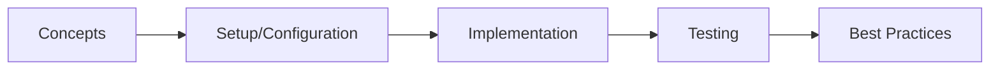

# Observability (Micrometer, Prometheus, Grafana)

> **Previous:** [CI/CD Pipelines](./54-cicd.md) | **Next:** [Java Core Interview Q&amp;A](./56-interview-java.md)

## Learning Objectives
## Chapter at a Glance

| Topic | Key Insight | Practical Takeaway |
|-------|-------------|--------------------|
| Core Concepts | Foundational understanding | Real-world application |
| Implementation | Code-first approach | Working examples |
| Best Practices | Production patterns | Avoid common pitfalls |

## Chapter Roadmap




By the end of this chapter, you will be able to:

- Instrument Spring Boot applications with Micrometer metrics including counters, gauges, timers, and distribution summaries
- Create custom metrics with tags and meters, and use Micrometer's @Counted and @Timed annotations
- Configure Prometheus to scrape metrics from Spring Boot Actuator endpoints
- Build and customize Grafana dashboards for JVM, Spring Boot, and business metrics
- Implement custom business metrics with Micrometer binders and Observation API
- Configure structured JSON logging with MDC and correlation IDs
- Set up ELK and Loki log aggregation pipelines
- Define SLI/SLO/SLA metrics and build custom alerting rules with Prometheus and Grafana

---

## 1. The Observability Stack
> **Pro Tip:** Test with production-like configurations → dev setups often hide issues that surface under real load.

> **Remember:** Start simple. Add complexity only when proven necessary. Premature abstraction creates maintenance burden.


```
┌─────────────────────────────────────────────────────────┐
│                    Grafana (Dashboards)                   │
│  ┌──────────────┐  ┌──────────────┐  ┌───────────────┐  │
│  │    JVM       │  │  Spring Boot │  │  Business     │  │
│  │  Dashboard   │  │  Dashboard   │  │  Dashboard    │  │
│  └──────┬───────┘  └──────┬───────┘  └───────┬───────┘  │
└─────────┼─────────────────┼──────────────────┼──────────┘
          │                 │                  │
┌─────────┴─────────────────┴──────────────────┴──────────┐
│                     Prometheus (Metrics)                  │
│  ┌──────────────┐  ┌──────────────┐  ┌───────────────┐  │
│  │   JVM        │  │  Spring Boot │  │  Custom       │  │
│  │   Metrics    │  │  Actuator    │  │  Business     │  │
│  └──────┬───────┘  └──────┬───────┘  └───────┬───────┘  │
└─────────┼─────────────────┼──────────────────┼──────────┘
          │                 │                  │
┌─────────┴─────────────────┴──────────────────┴──────────┐
│            Spring Boot Application                        │
│  ┌──────────────────────────────────────────────────┐    │
│  │  Micrometer  │  Structured Logging  │  Actuator  │    │
│  │  Metrics     │  (JSON + MDC)       │  Endpoints │    │
│  └──────────────────────────────────────────────────┘    │
└──────────────────────────────────────────────────────────┘
```

### 1.1 Three Pillars of Observability

| Pillar | Tool | Purpose |
|--------|------|---------|
| **Metrics** | Micrometer → Prometheus → Grafana | Numerical measurements over time |
| **Logging** | Logback → ELK/Loki → Grafana | Discrete events with context |
| **Tracing** | Micrometer Tracing → Jaeger/Tempo | Request flow across services |

This chapter covers **Metrics** and **Logging**. Tracing is covered in a dedicated chapter.

---

## 2. Micrometer Metrics

### 2.1 Setup

```xml
<dependency>
    <groupId>org.springframework.boot</groupId>
    <artifactId>spring-boot-starter-actuator</artifactId>
</dependency>

<dependency>
    <groupId>io.micrometer</groupId>
    <artifactId>micrometer-registry-prometheus</artifactId>
</dependency>
```

```yaml
management:
  endpoints:
    web:
      exposure:
        include: health,metrics,prometheus,info
  metrics:
    tags:
      application: ${spring.application.name}
      environment: ${spring.profiles.active:default}
    export:
      prometheus:
        enabled: true
    distribution:
      percentiles-histogram:
        http.server.requests: true
      slo:
        http.server.requests: 10ms, 50ms, 100ms, 200ms, 500ms, 1s, 2s
      percentiles:
        http.server.requests: 0.50, 0.75, 0.90, 0.95, 0.99
```

### 2.2 MeterRegistry

```java
package com.example.demo.metrics;

import io.micrometer.core.instrument.MeterRegistry;
import org.springframework.stereotype.Component;

@Component
public class MetricsRegistry {

    private final MeterRegistry meterRegistry;

    public MetricsRegistry(MeterRegistry meterRegistry) {
        this.meterRegistry = meterRegistry;
    }

    public MeterRegistry getRegistry() {
        return meterRegistry;
    }

    public void reportCustomMetric(String name, double value) {
        meterRegistry.gauge(name, value);
    }

    public void incrementCounter(String name, String... tags) {
        meterRegistry.counter(name, tags).increment();
    }

    public void recordTime(String name, long durationMillis, String... tags) {
        meterRegistry.timer(name, tags)
            .record(() -> {
                try {
                    Thread.sleep(durationMillis);
                } catch (InterruptedException e) {
                    Thread.currentThread().interrupt();
                }
            });
    }
}
```

### 2.3 Counter

```java
package com.example.demo.metrics;

import io.micrometer.core.instrument.Counter;
import io.micrometer.core.instrument.MeterRegistry;
import org.springframework.stereotype.Component;

@Component
public class OrderCounter {

    private final Counter orderCreated;
    private final Counter orderCancelled;
    private final Counter orderShipped;

    public OrderCounter(MeterRegistry registry) {
        this.orderCreated = Counter.builder("orders.created")
            .description("Number of orders created")
            .tag("type", "standard")
            .register(registry);

        this.orderCancelled = Counter.builder("orders.cancelled")
            .description("Number of orders cancelled")
            .tag("type", "standard")
            .register(registry);

        this.orderShipped = Counter.builder("orders.shipped")
            .description("Number of orders shipped")
            .tag("type", "standard")
            .register(registry);
    }

    public void recordOrderCreated() {
        orderCreated.increment();
    }

    public void recordOrderCancelled() {
        orderCancelled.increment();
    }

    public void recordOrderShipped() {
        orderShipped.increment();
    }

    public void recordBulkOrders(int count) {
        orderCreated.increment(count);
    }
}
```

### 2.4 Gauge

```java
package com.example.demo.metrics;

import io.micrometer.core.instrument.Gauge;
import io.micrometer.core.instrument.MeterRegistry;
import org.springframework.stereotype.Component;

import java.util.concurrent.atomic.AtomicReference;

@Component
public class QueueGauge {

    private final AtomicReference<Double> pendingOrders = new AtomicReference<>(0.0);
    private final AtomicReference<Double> activeJobs = new AtomicReference<>(0.0);
    private final AtomicReference<Double> deadLetterCount = new AtomicReference<>(0.0);

    public QueueGauge(MeterRegistry registry) {
        Gauge.builder("queue.pending.orders", pendingOrders, AtomicReference::get)
            .description("Number of pending orders in queue")
            .tag("queue", "orders")
            .register(registry);

        Gauge.builder("queue.active.jobs", activeJobs, AtomicReference::get)
            .description("Number of active jobs")
            .tag("queue", "jobs")
            .register(registry);

        Gauge.builder("queue.dead.letter", deadLetterCount, AtomicReference::get)
            .description("Messages in dead letter queue")
            .tag("queue", "dlq")
            .register(registry);
    }

    public void setPendingOrders(double count) {
        pendingOrders.set(count);
    }

    public void setActiveJobs(double count) {
        activeJobs.set(count);
    }

    public void setDeadLetterCount(double count) {
        deadLetterCount.set(count);
    }
}
```

### 2.5 Timer

```java
package com.example.demo.metrics;

import io.micrometer.core.instrument.MeterRegistry;
import io.micrometer.core.instrument.Timer;
import org.springframework.stereotype.Component;

import java.time.Duration;
import java.util.concurrent.TimeUnit;

@Component
public class PerformanceTimer {

    private final Timer orderProcessing;
    private final Timer paymentProcessing;
    private final Timer shippingCalculation;

    public PerformanceTimer(MeterRegistry registry) {
        this.orderProcessing = Timer.builder("order.processing.time")
            .description("Time taken to process an order")
            .tags("stage", "total")
            .publishPercentiles(0.50, 0.75, 0.90, 0.95, 0.99)
            .publishPercentileHistogram()
            .sla(Duration.ofMillis(100), Duration.ofMillis(500),
                 Duration.ofSeconds(1), Duration.ofSeconds(2))
            .minimumExpectedValue(Duration.ofMillis(1))
            .maximumExpectedValue(Duration.ofSeconds(30))
            .register(registry);

        this.paymentProcessing = Timer.builder("order.payment.time")
            .description("Time taken to process payment")
            .tags("stage", "payment")
            .publishPercentiles(0.95, 0.99)
            .register(registry);

        this.shippingCalculation = Timer.builder("order.shipping.time")
            .description("Time taken to calculate shipping")
            .tags("stage", "shipping")
            .register(registry);
    }

    public <T> T measureOrderProcessing(CallableWithException<T> callable) {
        return orderProcessing.record(() -> {
            try {
                return callable.call();
            } catch (Exception e) {
                throw new RuntimeException(e);
            }
        });
    }

    public void measurePaymentProcessing(Runnable runnable) {
        paymentProcessing.record(runnable);
    }

    public void recordShippingCalculation(long millis) {
        shippingCalculation.record(millis, TimeUnit.MILLISECONDS);
    }

    @FunctionalInterface
    public interface CallableWithException<T> {
        T call() throws Exception;
    }
}
```

### 2.6 DistributionSummary

```java
package com.example.demo.metrics;

import io.micrometer.core.instrument.DistributionSummary;
import io.micrometer.core.instrument.MeterRegistry;
import org.springframework.stereotype.Component;

@Component
public class OrderValueSummary {

    private final DistributionSummary orderValue;
    private final DistributionSummary itemsPerOrder;
    private final DistributionSummary discountAmount;

    public OrderValueSummary(MeterRegistry registry) {
        this.orderValue = DistributionSummary.builder("order.value")
            .description("Distribution of order values")
            .baseUnit("dollars")
            .tags("currency", "USD")
            .publishPercentiles(0.50, 0.75, 0.90, 0.95, 0.99)
            .publishPercentileHistogram()
            .sla(10.0, 25.0, 50.0, 100.0, 250.0, 500.0)
            .minimumExpectedValue(1.0)
            .maximumExpectedValue(10000.0)
            .register(registry);

        this.itemsPerOrder = DistributionSummary.builder("order.items")
            .description("Number of items per order")
            .baseUnit("items")
            .publishPercentiles(0.50, 0.75, 0.90, 0.95, 0.99)
            .register(registry);

        this.discountAmount = DistributionSummary.builder("order.discount")
            .description("Discount amount per order")
            .baseUnit("dollars")
            .register(registry);
    }

    public void recordOrderValue(double amount) {
        orderValue.record(amount);
    }

    public void recordItemsCount(int count) {
        itemsPerOrder.record(count);
    }

    public void recordDiscount(double discount) {
        discountAmount.record(discount);
    }
}
```

### 2.7 LongTaskTimer

```java
package com.example.demo.metrics;

import io.micrometer.core.instrument.LongTaskTimer;
import io.micrometer.core.instrument.MeterRegistry;
import org.springframework.stereotype.Component;

import java.util.concurrent.ConcurrentHashMap;
import java.util.concurrent.atomic.AtomicInteger;

@Component
public class BatchProcessorTimer {

    private final LongTaskTimer batchProcessing;
    private final ConcurrentHashMap<String, LongTaskTimer.Sample> activeSamples = new ConcurrentHashMap<>();
    private final AtomicInteger activeBatches = new AtomicInteger(0);

    public BatchProcessorTimer(MeterRegistry registry) {
        this.batchProcessing = LongTaskTimer.builder("batch.processing")
            .description("Long-running batch processing tasks")
            .tags("type", "data-sync")
            .register(registry);
    }

    public String startBatch(String batchId) {
        LongTaskTimer.Sample sample = LongTaskTimer.Sample.start(batchProcessing);
        activeSamples.put(batchId, sample);
        activeBatches.incrementAndGet();
        return batchId;
    }

    public void stopBatch(String batchId) {
        LongTaskTimer.Sample sample = activeSamples.remove(batchId);
        if (sample != null) {
            sample.stop();
            activeBatches.decrementAndGet();
        }
    }

    public int getActiveBatches() {
        return activeBatches.get();
    }
}
```

### 2.8 FunctionCounter and FunctionTimer

```java
package com.example.demo.metrics;

import io.micrometer.core.instrument.FunctionCounter;
import io.micrometer.core.instrument.FunctionTimer;
import io.micrometer.core.instrument.MeterRegistry;
import org.springframework.stereotype.Component;

import java.util.concurrent.TimeUnit;
import java.util.concurrent.atomic.AtomicLong;
import java.util.function.Supplier;

@Component
public class FunctionMetrics {

    private final AtomicLong totalOrders = new AtomicLong(0);
    private final AtomicLong totalProcessingTime = new AtomicLong(0);

    public FunctionMetrics(MeterRegistry registry) {
        FunctionCounter.builder("orders.total.fn", totalOrders, AtomicLong::get)
            .description("Total number of orders (function counter)")
            .register(registry);

        FunctionTimer.builder("orders.processing.fn", totalOrders,
                AtomicLong::get, totalProcessingTime, AtomicLong::get,
                TimeUnit.MILLISECONDS)
            .description("Order processing time (function timer)")
            .register(registry);
    }

    public void recordOrder(long processingTimeMs) {
        totalOrders.incrementAndGet();
        totalProcessingTime.addAndGet(processingTimeMs);
    }
}
```

### 2.9 @Counted and @Timed Annotations

```java
package com.example.demo.service;

import io.micrometer.core.annotation.Counted;
import io.micrometer.core.annotation.Timed;
import org.springframework.stereotype.Service;

import java.util.concurrent.TimeUnit;

@Service
public class OrderService {

    @Counted(value = "orders.created.counted", extraTags = {"source", "web"})
    public Order createOrder(OrderRequest request) {
        // Creates an order → counter incremented automatically
        return processOrderCreation(request);
    }

    @Timed(value = "orders.payment.timed", percentiles = {0.50, 0.95, 0.99},
           extraTags = {"payment-type", "credit-card"})
    public PaymentResult processPayment(PaymentRequest request) {
        // Payment processing timed automatically
        return executePayment(request);
    }

    @Timed(value = "orders.fulfillment.timed", longTask = true,
           description = "Time to fulfill an order")
    public void fulfillOrder(String orderId) {
        // Long-running task → shows active tasks count
        executeFulfillment(orderId);
    }

    @Counted(value = "orders.cancelled.counted", recordFailuresOnly = true,
             extraTags = {"reason", "timeout"})
    public void cancelOrder(String orderId) {
        // Counts only when this method throws an exception
        executeCancellation(orderId);
    }

    // Placeholder methods
    private Order processOrderCreation(OrderRequest req) { return new Order(); }
    private PaymentResult executePayment(PaymentRequest req) { return new PaymentResult(); }
    private void executeFulfillment(String id) {}
    private void executeCancellation(String id) {}
}
```

### 2.10 Custom Tags

```java
package com.example.demo.metrics;

import io.micrometer.core.instrument.MeterRegistry;
import io.micrometer.core.instrument.Tag;
import io.micrometer.core.instrument.Tags;
import org.springframework.stereotype.Component;

import java.util.Arrays;
import java.util.List;

@Component
public class TagManager {

    private final MeterRegistry meterRegistry;

    public TagManager(MeterRegistry meterRegistry) {
        this.meterRegistry = meterRegistry;
    }

    public void recordMetricWithTags(String name, double value, String... keyValuePairs) {
        List<Tag> tags = Tag.of("source", "application")
            .and(Arrays.asList(
                Tag.of("service", "order-service"),
                Tag.of("version", "1.0.0")
            ));

        if (keyValuePairs.length > 0) {
            tags = Tags.concat(tags, keyValuePairs);
        }

        meterRegistry.gauge(name, tags, value);
    }

    public void incrementOrderMetric(String status, String paymentMethod, String region) {
        meterRegistry.counter("orders.metrics",
            Tags.of(
                Tag.of("status", status),
                Tag.of("payment_method", paymentMethod),
                Tag.of("region", region),
                Tag.of("environment", System.getenv("ENVIRONMENT") != null ?
                    System.getenv("ENVIRONMENT") : "unknown")
            )
        ).increment();
    }
}
```

### 2.11 Global Tags via MeterFilter

```java
package com.example.demo.metrics;

import io.micrometer.core.instrument.Meter;
import io.micrometer.core.instrument.MeterRegistry;
import io.micrometer.core.instrument.Tag;
import io.micrometer.core.instrument.Tags;
import io.micrometer.core.instrument.config.MeterFilter;
import jakarta.annotation.PostConstruct;
import org.springframework.stereotype.Component;

import java.util.Arrays;

@Component
public class GlobalMetricsConfiguration {

    private final MeterRegistry meterRegistry;

    public GlobalMetricsConfiguration(MeterRegistry meterRegistry) {
        this.meterRegistry = meterRegistry;
    }

    @PostConstruct
    public void configureGlobalTags() {
        meterRegistry.config()
            .commonTags(
                Tag.of("application", "order-service"),
                Tag.of("environment", System.getenv("ENVIRONMENT") != null ?
                    System.getenv("ENVIRONMENT") : "unknown"),
                Tag.of("region", System.getenv("REGION") != null ?
                    System.getenv("REGION") : "local"),
                Tag.of("hostname", System.getenv("HOSTNAME") != null ?
                    System.getenv("HOSTNAME") : "localhost")
            )
            .meterFilter(new MeterFilter() {
                @Override
                public Meter.Id map(Meter.Id id) {
                    if (id.getName().startsWith("jvm.") || id.getName().startsWith("process.")) {
                        return id.withName("jvm." + id.getName());
                    }
                    if (id.getName().contains("secret") || id.getName().contains("password")) {
                        return null; // Deny meter registration
                    }
                    return id;
                }

                @Override
                public MeterFilterReply accept(Meter.Id id) {
                    if (id.getName().startsWith("$")) {
                        return MeterFilterReply.DENY;
                    }
                    return MeterFilterReply.NEUTRAL;
                }

                @Override
                public DistributionStatisticConfig configure(
                        Meter.Id id, DistributionStatisticConfig config) {
                    if (id.getName().equals("http.server.requests")) {
                        return DistributionStatisticConfig.builder()
                            .percentilesHistogram(true)
                            .percentiles(0.50, 0.75, 0.90, 0.95, 0.99, 0.999)
                            .sla(10, 50, 100, 200, 500, 1000, 2000)
                            .minimumExpectedValue(1L)
                            .maximumExpectedValue(30_000L)
                            .build()
                            .merge(config);
                    }
                    return config;
                }
            });
    }
}
```

### 2.12 Custom MeterRegistry Binder

```java
package com.example.demo.metrics;

import io.micrometer.core.instrument.Gauge;
import io.micrometer.core.instrument.MeterRegistry;
import io.micrometer.core.instrument.binder.MeterBinder;
import org.springframework.stereotype.Component;

import java.lang.management.ManagementFactory;
import java.lang.management.OperatingSystemMXBean;
import java.lang.management.ThreadMXBean;

@Component
public class CustomSystemMetrics implements MeterBinder {

    private final OperatingSystemMXBean osBean;
    private final ThreadMXBean threadBean;

    public CustomSystemMetrics() {
        this.osBean = ManagementFactory.getOperatingSystemMXBean();
        this.threadBean = ManagementFactory.getThreadMXBean();
    }

    @Override
    public void bindTo(MeterRegistry registry) {
        Gauge.builder("system.open.file.descriptors", osBean,
                bean -> {
                    if (bean instanceof com.sun.management.UnixOperatingSystemMXBean unixBean) {
                        return unixBean.getOpenFileDescriptorCount();
                    }
                    return Double.NaN;
                })
            .description("Open file descriptors")
            .register(registry);

        Gauge.builder("system.max.file.descriptors", osBean,
                bean -> {
                    if (bean instanceof com.sun.management.UnixOperatingSystemMXBean unixBean) {
                        return unixBean.getMaxFileDescriptorCount();
                    }
                    return Double.NaN;
                })
            .description("Maximum file descriptors")
            .register(registry);

        Gauge.builder("system.process.cpu.load", osBean,
                bean -> {
                    try {
                        return bean.getProcessCpuLoad();
                    } catch (Exception e) {
                        return Double.NaN;
                    }
                })
            .description("Process CPU load")
            .register(registry);

        Gauge.builder("system.system.cpu.load", osBean,
                bean -> {
                    try {
                        return bean.getSystemCpuLoad();
                    } catch (Exception e) {
                        return Double.NaN;
                    }
                })
            .description("System CPU load")
            .register(registry);

        Gauge.builder("system.thread.count", threadBean,
                ThreadMXBean::getThreadCount)
            .description("Current thread count")
            .register(registry);

        Gauge.builder("system.daemon.thread.count", threadBean,
                ThreadMXBean::getDaemonThreadCount)
            .description("Daemon thread count")
            .register(registry);

        Gauge.builder("system.peak.thread.count", threadBean,
                ThreadMXBean::getPeakThreadCount)
            .description("Peak thread count")
            .register(registry);
    }
}
```

### 2.13 @Observation API

```java
package com.example.demo.observation;

import io.micrometer.observation.Observation;
import io.micrometer.observation.ObservationRegistry;
import io.micrometer.observation.annotation.Observed;
import org.springframework.stereotype.Service;

@Service
public class ObservedOrderService {

    private final ObservationRegistry observationRegistry;
    private final OrderRepository orderRepository;

    public ObservedOrderService(ObservationRegistry observationRegistry,
                                 OrderRepository orderRepository) {
        this.observationRegistry = observationRegistry;
        this.orderRepository = orderRepository;
    }

    @Observed(name = "order.create",
              contextualName = "create-order",
              lowCardinalityKeyValues = {"operation", "create"})
    public Order createOrder(OrderRequest request) {
        return orderRepository.save(request.toOrder());
    }

    @Observed(name = "order.process",
              contextualName = "process-order")
    public OrderProcessingResult processOrder(String orderId) {
        return Observation.createNotStarted("order.process.internal", observationRegistry)
            .lowCardinalityKeyValue("orderId", orderId)
            .highCardinalityKeyValue("requestHash", Integer.toHexString(orderId.hashCode()))
            .observe(() -> {
                Order order = orderRepository.findById(orderId)
                    .orElseThrow(() -> new OrderNotFoundException(orderId));
                return processInternal(order);
            });
    }

    @Observed(name = "order.fulfill",
              contextualName = "fulfill-order")
    public void fulfillOrder(String orderId) {
        Observation observation = Observation.createNotStarted("order.fulfill.events",
            observationRegistry)
            .lowCardinalityKeyValue("orderId", orderId);

        try (Observation.Scope scope = observation.openScope()) {
            observation.event(Observation.Event.of("fulfillment.started",
                "Fulfillment process has started"));
            executeFulfillment(orderId);
            observation.event(Observation.Event.of("fulfillment.completed",
                "Fulfillment process completed"));
        } catch (Exception e) {
            observation.error(e);
            throw e;
        } finally {
            observation.stop();
        }
    }

    private OrderProcessingResult processInternal(Order order) {
        return new OrderProcessingResult(order.getId(), "PROCESSED");
    }

    private void executeFulfillment(String orderId) {
        // Fulfillment logic
    }
}
```

### 2.14 ObservationHandler

```java
package com.example.demo.observation;

import io.micrometer.observation.Observation;
import io.micrometer.observation.ObservationHandler;
import org.slf4j.Logger;
import org.slf4j.LoggerFactory;
import org.springframework.stereotype.Component;

@Component
public class CustomObservationHandler implements ObservationHandler<Observation.Context> {

    private static final Logger log = LoggerFactory.getLogger(CustomObservationHandler.class);

    @Override
    public void onStart(Observation.Context context) {
        log.debug("Observation started: name={}, contextualName={}",
            context.getName(), context.getContextualName());
    }

    @Override
    public void onStop(Observation.Context context) {
        log.debug("Observation stopped: name={}, duration={}ms",
            context.getName(),
            context.getTime() != null ? context.getTime().toMillis() : 0);
    }

    @Override
    public void onError(Observation.Context context) {
        log.error("Observation error: name={}, error={}",
            context.getName(),
            context.getError().map(Object::toString).orElse("unknown"));
    }

    @Override
    public void onScopeOpened(Observation.Context context) {
        log.trace("Observation scope opened: {}", context.getName());
    }

    @Override
    public void onScopeClosed(Observation.Context context) {
        log.trace("Observation scope closed: {}", context.getName());
    }

    @Override
    public void onEvent(Observation.Event event, Observation.Context context) {
        log.info("Observation event: name={}, event={}", context.getName(), event.getName());
    }

    @Override
    public boolean supportsContext(Observation.Context context) {
        return true;
    }
}
```

---

## 3. Prometheus

### 3.1 Prometheus Endpoint

```yaml
management:
  endpoints:
    web:
      exposure:
        include: prometheus,health,metrics
  endpoint:
    prometheus:
      enabled: true
  metrics:
    export:
      prometheus:
        enabled: true
        step: 30s
        descriptions: true
```

Verify the endpoint:

```bash
curl http://localhost:8080/actuator/prometheus
```

Sample output:

```
# HELP jvm_memory_used_bytes The amount of used memory

> **Previous:** [CI/CD Pipelines](./54-cicd.md) | **Next:** [Java Core Interview Q&amp;A](./56-interview-java.md)
# TYPE jvm_memory_used_bytes gauge

> **Previous:** [CI/CD Pipelines](./54-cicd.md) | **Next:** [Java Core Interview Q&amp;A](./56-interview-java.md)
jvm_memory_used_bytes{area="heap",id="G1 Survivor Space",} 2.097152E7
jvm_memory_used_bytes{area="heap",id="G1 Old Gen",} 3.22122568E8

# HELP http_server_requests_seconds  

> **Previous:** [CI/CD Pipelines](./54-cicd.md) | **Next:** [Java Core Interview Q&amp;A](./56-interview-java.md)
# TYPE http_server_requests_seconds summary

> **Previous:** [CI/CD Pipelines](./54-cicd.md) | **Next:** [Java Core Interview Q&amp;A](./56-interview-java.md)
http_server_requests_seconds_count{error="none",method="GET",status="200",uri="/actuator/health",} 125.0
http_server_requests_seconds_sum{error="none",method="GET",status="200",uri="/actuator/health",} 3.456

# HELP orders_created_total Total number of orders created

> **Previous:** [CI/CD Pipelines](./54-cicd.md) | **Next:** [Java Core Interview Q&amp;A](./56-interview-java.md)
# TYPE orders_created_total counter

> **Previous:** [CI/CD Pipelines](./54-cicd.md) | **Next:** [Java Core Interview Q&amp;A](./56-interview-java.md)
orders_created_total{type="standard",} 42.0
```

### 3.2 Prometheus Configuration

```yaml
# prometheus.yml

> **Previous:** [CI/CD Pipelines](./54-cicd.md) | **Next:** [Java Core Interview Q&amp;A](./56-interview-java.md)
global:
  scrape_interval: 15s
  evaluation_interval: 15s
  scrape_timeout: 10s

scrape_configs:
  - job_name: 'spring-boot-apps'
    metrics_path: '/actuator/prometheus'
    scheme: http
    static_configs:
      - targets:
          - 'app:8080'
          - 'app:8081'
        labels:
          application: 'order-service'
          environment: 'production'

  - job_name: 'spring-boot-kubernetes'
    kubernetes_sd_configs:
      - role: pod
    relabel_configs:
      - source_labels: [__meta_kubernetes_pod_annotation_prometheus_io_scrape]
        action: keep
        regex: true
      - source_labels: [__meta_kubernetes_pod_annotation_prometheus_io_path]
        action: replace
        target_label: __metrics_path__
        regex: (.+)
      - source_labels: [__address__, __meta_kubernetes_pod_annotation_prometheus_io_port]
        action: replace
        regex: ([^:]+)(?::\d+)?;(\d+)
        replacement: $1:$2
        target_label: __address__
      - source_labels: [__meta_kubernetes_pod_label_app]
        target_label: app
      - source_labels: [__meta_kubernetes_namespace]
        target_label: namespace
      - source_labels: [__meta_kubernetes_pod_name]
        target_label: pod
```

### 3.3 Docker Compose with Prometheus

```yaml
version: "3.9"
services:
  app:
    image: myapp:latest
    ports:
      - "8080:8080"
    environment:
      - MANAGEMENT_ENDPOINTS_WEB_EXPOSURE_INCLUDE=prometheus,health,metrics
      - MANAGEMENT_METRICS_EXPORT_PROMETHEUS_ENABLED=true

  prometheus:
    image: prom/prometheus:v2.48.0
    volumes:
      - ./prometheus.yml:/etc/prometheus/prometheus.yml
      - prometheus-data:/prometheus
    command:
      - "--config.file=/etc/prometheus/prometheus.yml"
      - "--storage.tsdb.path=/prometheus"
      - "--web.console.libraries=/etc/prometheus/console_libraries"
      - "--web.console.templates=/etc/prometheus/consoles"
      - "--web.enable-lifecycle"
    ports:
      - "9090:9090"
    depends_on:
      - app

volumes:
  prometheus-data:
```

### 3.4 Prometheus Query Examples

```promql
# JVM heap usage

> **Previous:** [CI/CD Pipelines](./54-cicd.md) | **Next:** [Java Core Interview Q&amp;A](./56-interview-java.md)
jvm_memory_used_bytes{area="heap"}

# HTTP request rate (last 5 minutes)

> **Previous:** [CI/CD Pipelines](./54-cicd.md) | **Next:** [Java Core Interview Q&amp;A](./56-interview-java.md)
rate(http_server_requests_seconds_count[5m])

# 95th percentile response time

> **Previous:** [CI/CD Pipelines](./54-cicd.md) | **Next:** [Java Core Interview Q&amp;A](./56-interview-java.md)
histogram_quantile(0.95,
  sum(rate(http_server_requests_seconds_bucket[5m])) by (le))

# Error rate (5xx responses)

> **Previous:** [CI/CD Pipelines](./54-cicd.md) | **Next:** [Java Core Interview Q&amp;A](./56-interview-java.md)
sum(rate(http_server_requests_seconds_count{status=~"5.."}[5m])) /
sum(rate(http_server_requests_seconds_count[5m])) * 100

# Order creation rate

> **Previous:** [CI/CD Pipelines](./54-cicd.md) | **Next:** [Java Core Interview Q&amp;A](./56-interview-java.md)
rate(orders_created_total[5m])

# Available memory percentage

> **Previous:** [CI/CD Pipelines](./54-cicd.md) | **Next:** [Java Core Interview Q&amp;A](./56-interview-java.md)
(jvm_memory_max_bytes{area="heap"} - jvm_memory_used_bytes{area="heap"}) /
jvm_memory_max_bytes{area="heap"} * 100

# Application up/down

> **Previous:** [CI/CD Pipelines](./54-cicd.md) | **Next:** [Java Core Interview Q&amp;A](./56-interview-java.md)
up{job="spring-boot-apps"}

# GC pause time rate

> **Previous:** [CI/CD Pipelines](./54-cicd.md) | **Next:** [Java Core Interview Q&amp;A](./56-interview-java.md)
rate(jvm_gc_pause_seconds_sum[5m])
```

---

## 4. Grafana Dashboards

### 4.1 Docker Compose with Grafana

```yaml
version: "3.9"
services:
  grafana:
    image: grafana/grafana:10.2.0
    volumes:
      - ./grafana/datasources:/etc/grafana/provisioning/datasources
      - ./grafana/dashboards:/etc/grafana/provisioning/dashboards
      - grafana-data:/var/lib/grafana
    environment:
      - GF_SECURITY_ADMIN_PASSWORD=admin
      - GF_INSTALL_PLUGINS=grafana-piechart-panel
    ports:
      - "3000:3000"

volumes:
  grafana-data:
```

### 4.2 Grafana Data Source Provisioning

```yaml
# grafana/datasources/datasources.yml

> **Previous:** [CI/CD Pipelines](./54-cicd.md) | **Next:** [Java Core Interview Q&amp;A](./56-interview-java.md)
apiVersion: 1

datasources:
  - name: Prometheus
    type: prometheus
    access: proxy
    url: http://prometheus:9090
    isDefault: true
    editable: true
    jsonData:
      timeInterval: "15s"
      queryTimeout: "30s"
      httpMethod: "POST"
      manageAlerts: true

  - name: Loki
    type: loki
    access: proxy
    url: http://loki:3100
    jsonData:
      maxLines: 1000
```

### 4.3 Grafana Dashboard Provisioning

```yaml
# grafana/dashboards/dashboards.yml

> **Previous:** [CI/CD Pipelines](./54-cicd.md) | **Next:** [Java Core Interview Q&amp;A](./56-interview-java.md)
apiVersion: 1

providers:
  - name: "Spring Boot"
    orgId: 1
    folder: "Spring Boot"
    type: file
    disableDeletion: false
    updateIntervalSeconds: 30
    allowUiUpdates: true
    options:
      path: /etc/grafana/provisioning/dashboards
      foldersFromFilesStructure: true
```

### 4.4 JVM Dashboard JSON Model

```json
{
  "title": "JVM (Micrometer)",
  "uid": "jvm-micrometer",
  "version": 1,
  "panels": [
    {
      "title": "Heap Memory Usage",
      "type": "timeseries",
      "datasource": "Prometheus",
      "targets": [
        {
          "expr": "jvm_memory_used_bytes{area=\"heap\"}",
          "legendFormat": "Used"
        },
        {
          "expr": "jvm_memory_max_bytes{area=\"heap\"}",
          "legendFormat": "Max"
        },
        {
          "expr": "jvm_memory_committed_bytes{area=\"heap\"}",
          "legendFormat": "Committed"
        }
      ],
      "fieldConfig": {
        "defaults": {
          "unit": "bytes"
        }
      },
      "gridPos": {"h": 8, "w": 12, "x": 0, "y": 0}
    },
    {
      "title": "Non-Heap Memory",
      "type": "timeseries",
      "datasource": "Prometheus",
      "targets": [
        {
          "expr": "jvm_memory_used_bytes{area=\"nonheap\"}",
          "legendFormat": "{{id}}"
        }
      ],
      "fieldConfig": {
        "defaults": {
          "unit": "bytes"
        }
      },
      "gridPos": {"h": 8, "w": 12, "x": 12, "y": 0}
    },
    {
      "title": "GC Pause Time",
      "type": "timeseries",
      "datasource": "Prometheus",
      "targets": [
        {
          "expr": "rate(jvm_gc_pause_seconds_sum[5m])",
          "legendFormat": "{{action}} {{cause}}"
        }
      ],
      "fieldConfig": {
        "defaults": {
          "unit": "s"
        }
      },
      "gridPos": {"h": 8, "w": 12, "x": 0, "y": 8}
    },
    {
      "title": "GC Count",
      "type": "timeseries",
      "datasource": "Prometheus",
      "targets": [
        {
          "expr": "rate(jvm_gc_pause_seconds_count[5m])",
          "legendFormat": "{{gc}}"
        }
      ],
      "gridPos": {"h": 8, "w": 12, "x": 12, "y": 8}
    },
    {
      "title": "Thread States",
      "type": "timeseries",
      "datasource": "Prometheus",
      "targets": [
        {
          "expr": "jvm_threads_states_threads",
          "legendFormat": "{{state}}"
        }
      ],
      "gridPos": {"h": 8, "w": 12, "x": 0, "y": 16}
    },
    {
      "title": "Class Loading",
      "type": "timeseries",
      "datasource": "Prometheus",
      "targets": [
        {
          "expr": "jvm_classes_loaded_classes",
          "legendFormat": "Loaded"
        }
      ],
      "fieldConfig": {
        "defaults": {
          "unit": "short"
        }
      },
      "gridPos": {"h": 8, "w": 12, "x": 12, "y": 16}
    },
    {
      "title": "CPU Usage",
      "type": "timeseries",
      "datasource": "Prometheus",
      "targets": [
        {
          "expr": "system_cpu_usage",
          "legendFormat": "System"
        },
        {
          "expr": "process_cpu_usage",
          "legendFormat": "Process"
        }
      ],
      "fieldConfig": {
        "defaults": {
          "unit": "percentunit"
        }
      },
      "gridPos": {"h": 8, "w": 12, "x": 0, "y": 24}
    },
    {
      "title": "File Descriptors",
      "type": "timeseries",
      "datasource": "Prometheus",
      "targets": [
        {
          "expr": "process_files_open_files",
          "legendFormat": "Open"
        },
        {
          "expr": "process_files_max_files",
          "legendFormat": "Max"
        }
      ],
      "gridPos": {"h": 8, "w": 12, "x": 12, "y": 24}
    }
  ]
}
```

### 4.5 Spring Boot Dashboard

```json
{
  "title": "Spring Boot HTTP",
  "uid": "spring-boot-http",
  "version": 1,
  "panels": [
    {
      "title": "HTTP Request Rate",
      "type": "timeseries",
      "datasource": "Prometheus",
      "targets": [
        {
          "expr": "sum(rate(http_server_requests_seconds_count[5m]))",
          "legendFormat": "All requests"
        }
      ],
      "fieldConfig": {
        "defaults": {
          "unit": "reqps"
        }
      },
      "gridPos": {"h": 8, "w": 12, "x": 0, "y": 0}
    },
    {
      "title": "HTTP Error Rate",
      "type": "timeseries",
      "datasource": "Prometheus",
      "targets": [
        {
          "expr": "sum(rate(http_server_requests_seconds_count{status=~\"5..\"}[5m])) / sum(rate(http_server_requests_seconds_count[5m])) * 100",
          "legendFormat": "5xx %"
        },
        {
          "expr": "sum(rate(http_server_requests_seconds_count{status=~\"4..\"}[5m])) / sum(rate(http_server_requests_seconds_count[5m])) * 100",
          "legendFormat": "4xx %"
        }
      ],
      "fieldConfig": {
        "defaults": {
          "unit": "percent"
        }
      },
      "gridPos": {"h": 8, "w": 12, "x": 12, "y": 0}
    },
    {
      "title": "P95 Response Time by Endpoint",
      "type": "timeseries",
      "datasource": "Prometheus",
      "targets": [
        {
          "expr": "histogram_quantile(0.95, sum(rate(http_server_requests_seconds_bucket[5m])) by (le, uri, method))",
          "legendFormat": "{{method}} {{uri}}"
        }
      ],
      "fieldConfig": {
        "defaults": {
          "unit": "s"
        }
      },
      "gridPos": {"h": 8, "w": 24, "x": 0, "y": 8}
    },
    {
      "title": "Response Time Heatmap",
      "type": "heatmap",
      "datasource": "Prometheus",
      "targets": [
        {
          "expr": "sum(increase(http_server_requests_seconds_bucket[5m])) by (le)",
          "format": "heatmap",
          "legendFormat": "{{le}}"
        }
      ],
      "gridPos": {"h": 10, "w": 12, "x": 0, "y": 16}
    },
    {
      "title": "Requests by Status",
      "type": "piechart",
      "datasource": "Prometheus",
      "targets": [
        {
          "expr": "sum(http_server_requests_seconds_count) by (status)",
          "legendFormat": "{{status}}"
        }
      ],
      "gridPos": {"h": 10, "w": 12, "x": 12, "y": 16}
    },
    {
      "title": "Active Requests",
      "type": "timeseries",
      "datasource": "Prometheus",
      "targets": [
        {
          "expr": "tomcat_threads_busy_threads{pool=\"http-nio-8080\"}",
          "legendFormat": "Busy"
        },
        {
          "expr": "tomcat_threads_config_max_threads{pool=\"http-nio-8080\"}",
          "legendFormat": "Max"
        }
      ],
      "fieldConfig": {
        "defaults": {
          "unit": "short"
        }
      },
      "gridPos": {"h": 8, "w": 12, "x": 0, "y": 26}
    },
    {
      "title": "Data Source Pool",
      "type": "timeseries",
      "datasource": "Prometheus",
      "targets": [
        {
          "expr": "hikaricp_connections_active",
          "legendFormat": "Active"
        },
        {
          "expr": "hikaricp_connections_idle",
          "legendFormat": "Idle"
        },
        {
          "expr": "hikaricp_connections_pending",
          "legendFormat": "Pending"
        },
        {
          "expr": "hikaricp_connections_max",
          "legendFormat": "Max"
        }
      ],
      "gridPos": {"h": 8, "w": 12, "x": 12, "y": 26}
    }
  ]
}
```

### 4.6 Custom Business Metrics Dashboard

```json
{
  "title": "Business Metrics",
  "uid": "business-metrics",
  "version": 1,
  "panels": [
    {
      "title": "Order Creation Rate",
      "type": "timeseries",
      "datasource": "Prometheus",
      "targets": [
        {
          "expr": "rate(orders_created_total[5m])",
          "legendFormat": "Orders/s"
        }
      ],
      "gridPos": {"h": 8, "w": 12, "x": 0, "y": 0}
    },
    {
      "title": "Order Value Distribution (P50, P95, P99)",
      "type": "timeseries",
      "datasource": "Prometheus",
      "targets": [
        {
          "expr": "order_value",
          "legendFormat": "Order Value"
        }
      ],
      "gridPos": {"h": 8, "w": 12, "x": 12, "y": 0}
    },
    {
      "title": "Payment Processing Time",
      "type": "timeseries",
      "datasource": "Prometheus",
      "targets": [
        {
          "expr": "rate(order_payment_time_seconds_sum[5m]) / rate(order_payment_time_seconds_count[5m])",
          "legendFormat": "Avg payment time"
        }
      ],
      "fieldConfig": {
        "defaults": {
          "unit": "s"
        }
      },
      "gridPos": {"h": 8, "w": 12, "x": 0, "y": 8}
    },
    {
      "title": "Order Status Breakdown",
      "type": "stat",
      "datasource": "Prometheus",
      "targets": [
        {
          "expr": "orders_created_total",
          "legendFormat": "Created"
        },
        {
          "expr": "orders_shipped_total",
          "legendFormat": "Shipped"
        },
        {
          "expr": "orders_cancelled_total",
          "legendFormat": "Cancelled"
        }
      ],
      "gridPos": {"h": 8, "w": 12, "x": 12, "y": 8}
    }
  ]
}
```

### 4.7 Grafana Alerting Rules

```json
{
  "title": "High Error Rate",
  "condition": "C",
  "data": [
    {
      "refId": "A",
      "relativeTimeRange": {"from": 300, "to": 0},
      "datasourceUid": "prometheus",
      "model": {
        "expr": "sum(rate(http_server_requests_seconds_count{status=~\"5..\"}[5m])) / sum(rate(http_server_requests_seconds_count[5m])) * 100",
        "intervalMs": 15000,
        "maxDataPoints": 100
      }
    }
  ],
  "noDataState": "NoData",
  "execErrState": "Alerting",
  "for": "5m",
  "annotations": {
    "summary": "High HTTP error rate: {{ $values.A.Value | humanizePercent }}"
  },
  "labels": {
    "severity": "critical",
    "team": "backend"
  },
  "isPaused": false
}
```

---

## 5. Custom Business Metrics

### 5.1 Business Metrics Service

```java
package com.example.demo.metrics;

import io.micrometer.core.instrument.Counter;
import io.micrometer.core.instrument.DistributionSummary;
import io.micrometer.core.instrument.MeterRegistry;
import io.micrometer.core.instrument.Timer;
import org.springframework.stereotype.Component;

import java.util.concurrent.TimeUnit;
import java.util.concurrent.atomic.AtomicLong;

@Component
public class BusinessMetricsService {

    private final Counter orderCreated;
    private final Counter paymentSuccess;
    private final Counter paymentFailure;
    private final Counter orderShipped;
    private final Counter orderCancelled;
    private final Counter refundProcessed;

    private final Timer orderFulfillmentTime;
    private final Timer paymentProcessingTime;

    private final DistributionSummary orderValue;
    private final DistributionSummary itemsPerOrder;

    private final AtomicLong activeOrders = new AtomicLong(0);
    private final AtomicLong pendingRefunds = new AtomicLong(0);

    public BusinessMetricsService(MeterRegistry registry) {
        // Counters
        this.orderCreated = Counter.builder("business.orders.created")
            .description("Total orders created").register(registry);
        this.paymentSuccess = Counter.builder("business.payments.success")
            .description("Successful payments").register(registry);
        this.paymentFailure = Counter.builder("business.payments.failure")
            .description("Failed payments").register(registry);
        this.orderShipped = Counter.builder("business.orders.shipped")
            .description("Orders shipped").register(registry);
        this.orderCancelled = Counter.builder("business.orders.cancelled")
            .description("Orders cancelled").register(registry);
        this.refundProcessed = Counter.builder("business.refunds.processed")
            .description("Refunds processed").register(registry);

        // Timers
        this.orderFulfillmentTime = Timer.builder("business.order.fulfillment.time")
            .description("Time to fulfill order")
            .publishPercentiles(0.50, 0.95, 0.99)
            .register(registry);
        this.paymentProcessingTime = Timer.builder("business.payment.processing.time")
            .description("Payment processing time")
            .publishPercentiles(0.50, 0.95, 0.99)
            .register(registry);

        // Distribution Summaries
        this.orderValue = DistributionSummary.builder("business.order.value")
            .description("Order value distribution")
            .baseUnit("dollars")
            .publishPercentiles(0.50, 0.75, 0.90, 0.95, 0.99)
            .register(registry);
        this.itemsPerOrder = DistributionSummary.builder("business.order.items")
            .description("Items per order")
            .register(registry);

        // Gauges
        registry.gauge("business.orders.active", activeOrders, AtomicLong::get);
        registry.gauge("business.refunds.pending", pendingRefunds, AtomicLong::get);
    }

    public void recordOrderCreated(double value, int itemCount) {
        orderCreated.increment();
        orderValue.record(value);
        itemsPerOrder.record(itemCount);
        activeOrders.incrementAndGet();
    }

    public void recordPaymentSuccess(long processingTimeMs) {
        paymentSuccess.increment();
        paymentProcessingTime.record(processingTimeMs, TimeUnit.MILLISECONDS);
    }

    public void recordPaymentFailure() {
        paymentFailure.increment();
    }

    public void recordOrderShipped() {
        orderShipped.increment();
        activeOrders.decrementAndGet();
    }

    public void recordOrderCancelled() {
        orderCancelled.increment();
        activeOrders.decrementAndGet();
    }

    public void recordRefundProcessed() {
        refundProcessed.increment();
        pendingRefunds.decrementAndGet();
    }

    public void recordRefundInitiated() {
        pendingRefunds.incrementAndGet();
    }

    public <T> T measureFulfillment(CallableWithException<T> callable) {
        return orderFulfillmentTime.record(() -> {
            try {
                return callable.call();
            } catch (Exception e) {
                throw new RuntimeException(e);
            }
        });
    }

    public void recordFulfillmentTime(long millis) {
        orderFulfillmentTime.record(millis, TimeUnit.MILLISECONDS);
    }

    @FunctionalInterface
    public interface CallableWithException<T> {
        T call() throws Exception;
    }
}
```

### 5.2 Using Business Metrics in Services

```java
package com.example.demo.service;

import com.example.demo.metrics.BusinessMetricsService;
import org.springframework.stereotype.Service;
import org.springframework.transaction.annotation.Transactional;

@Service
public class BusinessOrderService {

    private final OrderRepository orderRepository;
    private final PaymentGateway paymentGateway;
    private final BusinessMetricsService metrics;

    public BusinessOrderService(OrderRepository orderRepository,
                                 PaymentGateway paymentGateway,
                                 BusinessMetricsService metrics) {
        this.orderRepository = orderRepository;
        this.paymentGateway = paymentGateway;
        this.metrics = metrics;
    }

    @Transactional
    public Order placeOrder(OrderRequest request) {
        long startTime = System.currentTimeMillis();

        try {
            Order order = new Order(request);

            // Process payment
            PaymentResult payment = paymentGateway.charge(
                request.getPaymentDetails(), request.getTotal()
            );
            order.setPaymentId(payment.getTransactionId());
            order.setStatus(OrderStatus.PAID);

            orderRepository.save(order);

            // Record metrics
            long paymentTime = System.currentTimeMillis() - startTime;
            metrics.recordOrderCreated(order.getTotal(), order.getItemCount());
            metrics.recordPaymentSuccess(paymentTime);

            return order;
        } catch (PaymentException e) {
            metrics.recordPaymentFailure();
            throw e;
        }
    }

    @Transactional
    public void fulfillOrder(Long orderId) {
        metrics.measureFulfillment(() -> {
            Order order = orderRepository.findById(orderId)
                .orElseThrow(() -> new OrderNotFoundException(orderId));

            order.setStatus(OrderStatus.SHIPPED);
            order.setShippedAt(java.time.Instant.now());
            orderRepository.save(order);

            metrics.recordOrderShipped();
            return order;
        });
    }

    @Transactional
    public void cancelOrder(Long orderId) {
        Order order = orderRepository.findById(orderId)
            .orElseThrow(() -> new OrderNotFoundException(orderId));

        if (order.getStatus() == OrderStatus.PAID) {
            paymentGateway.refund(order.getPaymentId(), order.getTotal());
            metrics.recordRefundInitiated();
        }

        order.setStatus(OrderStatus.CANCELLED);
        orderRepository.save(order);
        metrics.recordOrderCancelled();

        if (order.getStatus() == OrderStatus.PAID) {
            metrics.recordRefundProcessed();
        }
    }
}
```

### 5.3 Custom Micrometer Binder for Database Pool

```java
package com.example.demo.metrics;

import com.zaxxer.hikari.HikariDataSource;
import com.zaxxer.hikari.HikariPoolMXBean;
import io.micrometer.core.instrument.Gauge;
import io.micrometer.core.instrument.MeterRegistry;
import io.micrometer.core.instrument.binder.MeterBinder;
import org.springframework.stereotype.Component;

import javax.sql.DataSource;
import java.util.concurrent.TimeUnit;

@Component
public class DatabasePoolMetrics implements MeterBinder {

    private final HikariDataSource dataSource;

    public DatabasePoolMetrics(DataSource dataSource) {
        this.dataSource = (HikariDataSource) dataSource;
    }

    @Override
    public void bindTo(MeterRegistry registry) {
        HikariPoolMXBean poolMXBean = dataSource.getHikariPoolMXBean();

        if (poolMXBean == null) {
            return;
        }

        Gauge.builder("db.pool.active.connections", poolMXBean,
                HikariPoolMXBean::getActiveConnections)
            .description("Active database connections")
            .register(registry);

        Gauge.builder("db.pool.idle.connections", poolMXBean,
                HikariPoolMXBean::getIdleConnections)
            .description("Idle database connections")
            .register(registry);

        Gauge.builder("db.pool.pending.threads", poolMXBean,
                HikariPoolMXBean::getThreadsAwaitingConnection)
            .description("Threads awaiting connection")
            .register(registry);

        Gauge.builder("db.pool.total.connections", poolMXBean,
                HikariPoolMXBean::getTotalConnections)
            .description("Total database connections")
            .register(registry);

        Gauge.builder("db.connections.timeout", dataSource,
                ds -> ds.getConnectionTimeout())
            .description("Connection timeout in milliseconds")
            .baseUnit("milliseconds")
            .register(registry);

        Gauge.builder("db.max.lifetime", dataSource,
                ds -> ds.getMaxLifetime())
            .description("Maximum connection lifetime")
            .baseUnit("milliseconds")
            .register(registry);

        Gauge.builder("db.max.pool.size", dataSource,
                ds -> ds.getMaximumPoolSize())
            .description("Maximum pool size")
            .register(registry);

        Gauge.builder("db.min.idle", dataSource,
                ds -> ds.getMinimumIdle())
            .description("Minimum idle connections")
            .register(registry);
    }
}
```

---

## 6. Structured Logging

### 6.1 Logstash Logback Encoder

```xml
<dependency>
    <groupId>net.logstash.logback</groupId>
    <artifactId>logstash-logback-encoder</artifactId>
    <version>7.4</version>
</dependency>
```

### 6.2 logback-spring.xml

```xml
<?xml version="1.0" encoding="UTF-8"?>
<configuration>
    <include resource="org/springframework/boot/logging/logback/defaults.xml"/>

    <springProperty name="application" source="spring.application.name" defaultValue="myapp"/>
    <springProperty name="environment" source="spring.profiles.active" defaultValue="default"/>

    <!-- Console JSON output -->
    <appender name="JSON_CONSOLE" class="ch.qos.logback.core.ConsoleAppender">
        <encoder class="net.logstash.logback.encoder.LogstashEncoder">
            <!-- Include MDC context -->
            <includeMdc>true</includeMdc>
            <!-- Custom fields -->
            <customFields>{
                "application": "${application}",
                "environment": "${environment}",
                "hostname": "${HOSTNAME:-unknown}"
            }</customFields>
            <!-- Exclude standard fields -->
            <excludeMdcKeyName>resteasy.*</excludeMdcKeyName>
            <fieldNames>
                <timestamp>@timestamp</timestamp>
                <version>[ignore]</version>
                <levelValue>[ignore]</levelValue>
            </fieldNames>
            <!-- UUID for traceability -->
            <jsonGeneratorDecorator>
                com.example.demo.logging.MdcJsonGeneratorDecorator
            </jsonGeneratorDecorator>
        </encoder>
    </appender>

    <!-- Human-readable console (dev profile) -->
    <appender name="CONSOLE" class="ch.qos.logback.core.ConsoleAppender">
        <encoder>
            <pattern>%d{yyyy-MM-dd HH:mm:ss.SSS} [%thread] %-5level %logger{36} [%mdc] - %msg%n</pattern>
        </encoder>
    </appender>

    <!-- File appender for log aggregation -->
    <appender name="JSON_FILE" class="ch.qos.logback.core.rolling.RollingFileAppender">
        <file>/var/log/app/${application}.json</file>
        <rollingPolicy class="ch.qos.logback.core.rolling.TimeBasedRollingPolicy">
            <fileNamePattern>/var/log/app/${application}.%d{yyyy-MM-dd}.%i.json</fileNamePattern>
            <maxHistory>30</maxHistory>
            <totalSizeCap>10GB</totalSizeCap>
            <timeBasedFileNamingAndTriggeringPolicy class="ch.qos.logback.core.rolling.SizeAndTimeBasedFNATP">
                <maxFileSize>100MB</maxFileSize>
            </timeBasedFileNamingAndTriggeringPolicy>
        </rollingPolicy>
        <encoder class="net.logstash.logback.encoder.LogstashEncoder">
            <includeMdc>true</includeMdc>
            <customFields>{
                "application": "${application}",
                "environment": "${environment}",
                "type": "application-log"
            }</customFields>
        </encoder>
    </appender>

    <!-- Profile-based appender selection -->
    <springProfile name="!dev &amp; !test">
        <root level="INFO">
            <appender-ref ref="JSON_CONSOLE"/>
            <appender-ref ref="JSON_FILE"/>
        </root>
    </springProfile>

    <springProfile name="dev,test">
        <root level="INFO">
            <appender-ref ref="CONSOLE"/>
        </root>
    </springProfile>
</configuration>
```

### 6.3 JSON Log Output Example

```json
{
  "@timestamp": "2026-06-12T10:30:45.123Z",
  "message": "Order created successfully",
  "logger_name": "com.example.demo.service.OrderService",
  "thread_name": "http-nio-8080-exec-3",
  "level": "INFO",
  "application": "order-service",
  "environment": "production",
  "hostname": "pod-abc123",
  "trace_id": "abc123def456",
  "span_id": "ghi789jkl012",
  "correlation_id": "corr-987654",
  "order_id": "ORD-12345",
  "customer_id": "CUST-67890",
  "order_total": 149.99,
  "payment_method": "credit_card",
  "items_count": 3
}
```

### 6.4 MDC Filter for Correlation ID

```java
package com.example.demo.logging;

import jakarta.servlet.Filter;
import jakarta.servlet.FilterChain;
import jakarta.servlet.ServletException;
import jakarta.servlet.ServletRequest;
import jakarta.servlet.ServletResponse;
import jakarta.servlet.http.HttpServletRequest;
import jakarta.servlet.http.HttpServletResponse;
import org.slf4j.MDC;
import org.springframework.core.annotation.Order;
import org.springframework.stereotype.Component;

import java.io.IOException;
import java.util.UUID;

@Component
@Order(1)
public class CorrelationIdFilter implements Filter {

    public static final String CORRELATION_ID_HEADER = "X-Correlation-Id";
    public static final String CORRELATION_ID_MDC_KEY = "correlation_id";

    @Override
    public void doFilter(ServletRequest request, ServletResponse response,
                         FilterChain chain) throws IOException, ServletException {

        HttpServletRequest httpRequest = (HttpServletRequest) request;
        HttpServletResponse httpResponse = (HttpServletResponse) response;

        String correlationId = httpRequest.getHeader(CORRELATION_ID_HEADER);
        if (correlationId == null || correlationId.isBlank()) {
            correlationId = UUID.randomUUID().toString();
        }

        try {
            MDC.put(CORRELATION_ID_MDC_KEY, correlationId);
            MDC.put("request_uri", httpRequest.getRequestURI());
            MDC.put("request_method", httpRequest.getMethod());
            MDC.put("remote_addr", httpRequest.getRemoteAddr());

            httpResponse.setHeader(CORRELATION_ID_HEADER, correlationId);

            chain.doFilter(request, response);
        } finally {
            MDC.clear();
        }
    }
}
```

### 6.5 RestTemplate Correlation ID Interceptor

```java
package com.example.demo.logging;

import org.slf4j.MDC;
import org.springframework.http.HttpHeaders;
import org.springframework.http.HttpRequest;
import org.springframework.http.client.ClientHttpRequestExecution;
import org.springframework.http.client.ClientHttpRequestInterceptor;
import org.springframework.http.client.ClientHttpResponse;
import org.springframework.stereotype.Component;

import java.io.IOException;

@Component
public class CorrelationIdInterceptor implements ClientHttpRequestInterceptor {

    @Override
    public ClientHttpResponse intercept(HttpRequest request, byte[] body,
                                         ClientHttpRequestExecution execution) throws IOException {

        String correlationId = MDC.get("correlation_id");
        if (correlationId != null) {
            request.getHeaders().add("X-Correlation-Id", correlationId);
        }

        String traceId = MDC.get("trace_id");
        if (traceId != null) {
            request.getHeaders().add("X-Trace-Id", traceId);
        }

        return execution.execute(request, body);
    }
}
```

### 6.6 Structured Logging Service

```java
package com.example.demo.logging;

import net.logstash.logback.argument.StructuredArgument;
import net.logstash.logback.argument.StructuredArguments;
import org.slf4j.Logger;
import org.slf4j.LoggerFactory;
import org.slf4j.MDC;
import org.springframework.stereotype.Component;

@Component
public class StructuredLogger {

    private static final Logger log = LoggerFactory.getLogger(StructuredLogger.class);

    public void logOrderCreated(String orderId, String customerId,
                                 double total, int itemCount) {
        StructuredArgument orderArgs = StructuredArguments.kv("order_id", orderId);
        StructuredArgument customerArgs = StructuredArguments.kv("customer_id", customerId);
        StructuredArgument totalArgs = StructuredArguments.kv("order_total", total);
        StructuredArgument itemsArgs = StructuredArguments.kv("items_count", itemCount);

        log.info("Order created successfully: order_id={}", orderId,
            orderArgs, customerArgs, totalArgs, itemsArgs);
    }

    public void logPaymentProcessing(String orderId, String paymentMethod,
                                      double amount, String transactionId) {
        try {
            MDC.put("order_id", orderId);
            MDC.put("payment_method", paymentMethod);
            MDC.put("transaction_id", transactionId);

            log.info("Processing payment for order: amount={}", amount,
                StructuredArguments.kv("amount", amount));
        } finally {
            MDC.remove("order_id");
            MDC.remove("payment_method");
            MDC.remove("transaction_id");
        }
    }

    public void logPaymentFailure(String orderId, String errorCode,
                                   String errorMessage) {
        log.error("Payment failed: order_id={}, error_code={}, error_message={}",
            orderId, errorCode, errorMessage,
            StructuredArguments.kv("order_id", orderId),
            StructuredArguments.kv("error_code", errorCode),
            StructuredArguments.kv("error_message", errorMessage));
    }

    public void logExternalServiceCall(String serviceName, String endpoint,
                                        long durationMs, int statusCode) {
        log.info("External service call: service={}, endpoint={}, duration_ms={}, status={}",
            serviceName, endpoint, durationMs, statusCode,
            StructuredArguments.kv("external_service", serviceName),
            StructuredArguments.kv("endpoint", endpoint),
            StructuredArguments.kv("duration_ms", durationMs),
            StructuredArguments.kv("status_code", statusCode));
    }
}
```

---

## 7. ELK/Loki Log Aggregation

### 7.1 ELK Stack (Filebeat → Logstash → Elasticsearch → Kibana)

```yaml
# docker-compose.elk.yml

> **Previous:** [CI/CD Pipelines](./54-cicd.md) | **Next:** [Java Core Interview Q&amp;A](./56-interview-java.md)
version: "3.9"

services:
  app:
    image: myapp:latest
    volumes:
      - app-logs:/var/log/app
    environment:
      - LOG_FILE=/var/log/app/myapp.json

  filebeat:
    image: docker.elastic.co/beats/filebeat:8.11.0
    user: root
    volumes:
      - ./filebeat.yml:/usr/share/filebeat/filebeat.yml:ro
      - app-logs:/var/log/app:ro
      - /var/lib/docker/containers:/var/lib/docker/containers:ro
      - /var/run/docker.sock:/var/run/docker.sock:ro
    depends_on:
      - app
      - logstash

  logstash:
    image: docker.elastic.co/logstash/logstash:8.11.0
    volumes:
      - ./logstash.conf:/usr/share/logstash/pipeline/logstash.conf:ro
    ports:
      - "5000:5000"
    environment:
      - LS_JAVA_OPTS=-Xmx256m -Xms256m
    depends_on:
      - elasticsearch

  elasticsearch:
    image: docker.elastic.co/elasticsearch/elasticsearch:8.11.0
    environment:
      - discovery.type=single-node
      - xpack.security.enabled=false
      - ES_JAVA_OPTS=-Xms512m -Xmx512m
    volumes:
      - elasticsearch-data:/usr/share/elasticsearch/data
    ports:
      - "9200:9200"

  kibana:
    image: docker.elastic.co/kibana/kibana:8.11.0
    environment:
      - ELASTICSEARCH_HOSTS=http://elasticsearch:9200
    ports:
      - "5601:5601"
    depends_on:
      - elasticsearch

volumes:
  app-logs:
  elasticsearch-data:
```

### 7.2 Filebeat Configuration

```yaml
# filebeat.yml

> **Previous:** [CI/CD Pipelines](./54-cicd.md) | **Next:** [Java Core Interview Q&amp;A](./56-interview-java.md)
filebeat.inputs:
  - type: log
    enabled: true
    paths:
      - /var/log/app/*.json
    json:
      keys_under_root: true
      overwrite_keys: true
      add_error_key: true
    fields:
      log_type: application
    fields_under_root: true

  - type: container
    enabled: true
    paths:
      - /var/lib/docker/containers/*/*.log
    json:
      keys_under_root: true
    processors:
      - add_docker_metadata:
          host: "unix:///var/run/docker.sock"

output.logstash:
  hosts: ["logstash:5000"]
  ssl.enabled: false

logging.level: warning
```

### 7.3 Logstash Configuration

```ruby
# logstash.conf

> **Previous:** [CI/CD Pipelines](./54-cicd.md) | **Next:** [Java Core Interview Q&amp;A](./56-interview-java.md)
input {
  beats {
    port => 5000
  }
}

filter {
  if [log_type] == "application" {
    json {
      source => "message"
      remove_field => ["message"]
    }
  }

  if [docker] {
    mutate {
      add_field => {
        "container_name" => "%{[docker][container][name]}"
        "container_id" => "%{[docker][container][id]}"
      }
    }
  }

  date {
    match => ["@timestamp", "ISO8601"]
    target => "@timestamp"
  }

  mutate {
    remove_field => ["tags", "ecs", "host"]
  }
}

output {
  elasticsearch {
    hosts => ["http://elasticsearch:9200"]
    index => "app-logs-%{+YYYY.MM.dd}"
    data_stream => false
  }

  stdout {
    codec => rubydebug
    workers => 1
  }
}
```

### 7.4 Loki Stack (Promtail → Loki → Grafana)

```yaml
# docker-compose.loki.yml

> **Previous:** [CI/CD Pipelines](./54-cicd.md) | **Next:** [Java Core Interview Q&amp;A](./56-interview-java.md)
version: "3.9"

services:
  app:
    image: myapp:latest
    volumes:
      - app-logs:/var/log/app

  promtail:
    image: grafana/promtail:2.9.0
    volumes:
      - ./promtail.yml:/etc/promtail/config.yml:ro
      - app-logs:/var/log/app:ro
      - /var/lib/docker/containers:/var/lib/docker/containers:ro
      - /var/run/docker.sock:/var/run/docker.sock:ro
    command: -config.file=/etc/promtail/config.yml

  loki:
    image: grafana/loki:2.9.0
    volumes:
      - ./loki.yml:/etc/loki/config.yml:ro
      - loki-data:/loki
    ports:
      - "3100:3100"
    command: -config.file=/etc/loki/config.yml

  grafana:
    image: grafana/grafana:10.2.0
    volumes:
      - ./grafana/datasources:/etc/grafana/provisioning/datasources
      - grafana-data:/var/lib/grafana
    environment:
      - GF_SECURITY_ADMIN_PASSWORD=admin
    ports:
      - "3000:3000"

volumes:
  app-logs:
  loki-data:
  grafana-data:
```

### 7.5 Promtail Configuration

```yaml
# promtail.yml

> **Previous:** [CI/CD Pipelines](./54-cicd.md) | **Next:** [Java Core Interview Q&amp;A](./56-interview-java.md)
server:
  http_listen_port: 9080
  grpc_listen_port: 0

positions:
  filename: /tmp/positions.yaml

clients:
  - url: http://loki:3100/loki/api/v1/push

scrape_configs:
  - job_name: application-logs
    static_configs:
      - targets: [localhost]
        labels:
          job: myapp
          __path__: /var/log/app/*.json
    pipeline_stages:
      - json:
          expressions:
            level: level
            logger_name: logger_name
            trace_id: trace_id
            correlation_id: correlation_id
            application: application
            environment: environment
      - labels:
          level:
          application:
          environment:
      - drop:
          source: level
          value: DEBUG

  - job_name: docker-logs
    pipeline_stages:
      - docker: {}
      - json:
          expressions:
            level: level
            logger_name: logger_name
            trace_id: trace_id
      - labels:
          level:
    static_configs:
      - targets: [localhost]
        labels:
          job: docker
          __path__: /var/lib/docker/containers/*/*.log
    journal:
      json: true
```

### 7.6 Loki Configuration

```yaml
# loki.yml

> **Previous:** [CI/CD Pipelines](./54-cicd.md) | **Next:** [Java Core Interview Q&amp;A](./56-interview-java.md)
auth_enabled: false

server:
  http_listen_port: 3100

common:
  path_prefix: /loki
  replication_factor: 1
  ring:
    kvstore:
      store: inmemory

schema_config:
  configs:
    - from: 2024-01-01
      store: boltdb-shipper
      object_store: filesystem
      schema: v12
      index:
        prefix: index_
        period: 24h

storage_config:
  boltdb_shipper:
    active_index_directory: /loki/index
    shared_store: filesystem
  filesystem:
    directory: /loki/chunks

compactor:
  working_directory: /loki/compactor
```

### 7.7 LogQL Queries

```logql
# All application logs

> **Previous:** [CI/CD Pipelines](./54-cicd.md) | **Next:** [Java Core Interview Q&amp;A](./56-interview-java.md)
{job="myapp"}

# Errors only

> **Previous:** [CI/CD Pipelines](./54-cicd.md) | **Next:** [Java Core Interview Q&amp;A](./56-interview-java.md)
{job="myapp"} |= "ERROR"

# Filter by level label

> **Previous:** [CI/CD Pipelines](./54-cicd.md) | **Next:** [Java Core Interview Q&amp;A](./56-interview-java.md)
{job="myapp", level="ERROR"}

# Search by correlation ID

> **Previous:** [CI/CD Pipelines](./54-cicd.md) | **Next:** [Java Core Interview Q&amp;A](./56-interview-java.md)
{job="myapp"} |= "correlation_id=corr-987654"

# Search by trace ID

> **Previous:** [CI/CD Pipelines](./54-cicd.md) | **Next:** [Java Core Interview Q&amp;A](./56-interview-java.md)
{job="myapp"} |= "trace_id=abc123def456"

# Rate of errors per minute

> **Previous:** [CI/CD Pipelines](./54-cicd.md) | **Next:** [Java Core Interview Q&amp;A](./56-interview-java.md)
rate({job="myapp", level="ERROR"}[5m])

# Filter by logger name

> **Previous:** [CI/CD Pipelines](./54-cicd.md) | **Next:** [Java Core Interview Q&amp;A](./56-interview-java.md)
{job="myapp"} | logger_name="com.example.demo.service.OrderService"

# JSON expression filter

> **Previous:** [CI/CD Pipelines](./54-cicd.md) | **Next:** [Java Core Interview Q&amp;A](./56-interview-java.md)
{job="myapp"} | json | order_total > 100

# Count log lines by level

> **Previous:** [CI/CD Pipelines](./54-cicd.md) | **Next:** [Java Core Interview Q&amp;A](./56-interview-java.md)
sum by (level) (count_over_time({job="myapp"}[1h]))
```

---

## 8. SLI/SLO/SLA

### 8.1 Definitions

| Term | Definition | Example |
|------|-----------|---------|
| **SLI** (Service Level Indicator) | A quantifiable metric of service performance | Request latency, error rate, throughput |
| **SLO** (Service Level Objective) | Target value/range for an SLI | 99.9% of requests complete in < 200ms |
| **SLA** (Service Level Agreement) | Contractual commitment to SLOs | 99.95% uptime, with financial penalties |

### 8.2 SLI Implementation with Micrometer

```java
package com.example.demo.slo;

import io.micrometer.core.instrument.MeterRegistry;
import io.micrometer.core.instrument.Tags;
import org.springframework.stereotype.Component;

@Component
public class ServiceLevelIndicators {

    private final MeterRegistry meterRegistry;

    // SLI thresholds
    private static final double LATENCY_SLO_MS = 200.0;
    private static final double ERROR_BUDGET_RATIO = 0.001; // 99.9%

    public ServiceLevelIndicators(MeterRegistry meterRegistry) {
        this.meterRegistry = meterRegistry;
    }

    public void recordRequestLatency(String endpoint, String method,
                                      long durationMs, int statusCode) {
        Tags tags = Tags.of(
            "endpoint", endpoint,
            "method", method,
            "status_class", statusCode >= 500 ? "5xx" :
                           statusCode >= 400 ? "4xx" : "2xx"
        );

        // Count total requests
        meterRegistry.counter("sli.requests.total", tags).increment();

        // Count requests that meet SLO
        if (durationMs < LATENCY_SLO_MS) {
            meterRegistry.counter("sli.requests.good", tags).increment();
        }

        // Count error requests
        if (statusCode >= 500) {
            meterRegistry.counter("sli.requests.errors", tags).increment();
        }

        // Record latency for histogram
        meterRegistry.timer("sli.request.latency", tags)
            .record(() -> {
                try {
                    Thread.sleep(0); // just recording the time
                } catch (InterruptedException e) {
                    Thread.currentThread().interrupt();
                }
            });
    }

    public void recordAvailability(boolean isUp) {
        String status = isUp ? "up" : "down";
        meterRegistry.counter("sli.availability", Tags.of("status", status))
            .increment();
    }

    public void recordThroughput(String endpoint, int requestCount) {
        meterRegistry.counter("sli.throughput",
            Tags.of("endpoint", endpoint))
            .increment(requestCount);
    }

    public void recordSaturation(String resource, double utilizationPercent) {
        meterRegistry.gauge("sli.saturation",
            Tags.of("resource", resource),
            utilizationPercent);
    }
}
```

### 8.3 SLO Burn Rate Alert

```yaml
# prometheus-alerts.yml → SLO-based alerting

> **Previous:** [CI/CD Pipelines](./54-cicd.md) | **Next:** [Java Core Interview Q&amp;A](./56-interview-java.md)
groups:
  - name: slo-alerts
    rules:
      # 99.9% availability SLO (burn rate: 30-day window)
      - alert: AvailabilitySLOViolation
        expr: |
          (1 - (
            sum(increase(http_server_requests_seconds_count{status=~"5.."}[30d])) /
            sum(increase(http_server_requests_seconds_count[30d]))
          )) < 0.999
        for: 5m
        labels:
          severity: critical
          slo: availability
        annotations:
          summary: "Availability SLO violation (99.9%)"
          description: "Availability over 30 days is {{ $value | humanizePercentage }}"

      # Latency SLO: 99.9% of requests under 200ms
      - alert: LatencySLOViolation
        expr: |
          (
            sum(rate(http_server_requests_seconds_bucket{le="0.2"}[28d])) /
            sum(rate(http_server_requests_seconds_count[28d]))
          ) < 0.999
        for: 5m
        labels:
          severity: critical
          slo: latency
        annotations:
          summary: "Latency SLO violation (99.9% < 200ms)"
          description: "Only {{ $value | humanizePercentage }} of requests under 200ms"

      # Error budget burn rate (fast burn: 2% in 1 hour)
      - alert: ErrorBudgetFastBurn
        expr: |
          sum(rate(http_server_requests_seconds_count{status=~"5.."}[1h])) /
          sum(rate(http_server_requests_seconds_count[1h])) > 0.02
        for: 5m
        labels:
          severity: critical
          burn_rate: fast
        annotations:
          summary: "Error budget burning fast (2% error rate in 1h)"
          description: "Error rate is {{ $value | humanizePercentage }} in last hour"
```

---

## 9. Custom Alerting

### 9.1 Prometheus Alerting Rules

```yaml
# prometheus-alerts.yml

> **Previous:** [CI/CD Pipelines](./54-cicd.md) | **Next:** [Java Core Interview Q&amp;A](./56-interview-java.md)
groups:
  - name: spring-boot-alerts
    interval: 30s
    rules:

      # High error rate
      - alert: HighErrorRate
        expr: |
          sum(rate(http_server_requests_seconds_count{status=~"5.."}[5m]))
          / sum(rate(http_server_requests_seconds_count[5m]))
          * 100 > 5
        for: 3m
        labels:
          severity: critical
          team: backend
        annotations:
          summary: "High HTTP error rate ({{ $value | humanize }}%)"
          description: "Error rate is {{ $value | humanize }}% for the last 5 minutes"

      # Slow responses
      - alert: SlowResponses
        expr: |
          histogram_quantile(0.95,
            sum(rate(http_server_requests_seconds_bucket[5m])) by (le)
          ) > 1.0
        for: 5m
        labels:
          severity: warning
          team: backend
        annotations:
          summary: "P95 response time > 1s"
          description: "P95 response time is {{ $value | humanizeDuration }}"

      # High JVM heap usage
      - alert: HighHeapUsage
        expr: |
          jvm_memory_used_bytes{area="heap"}
          / jvm_memory_max_bytes{area="heap"}
          * 100 > 85
        for: 10m
        labels:
          severity: warning
          team: backend
        annotations:
          summary: "High JVM heap usage ({{ $value | humanize }}%)"
          description: "Heap usage is {{ $value | humanize }}% of max"

      # Out of memory (commit_chronic)
      - alert: NearOOM
        expr: |
          jvm_memory_used_bytes{area="heap"}
          / jvm_memory_max_bytes{area="heap"}
          * 100 > 95
        for: 2m
        labels:
          severity: critical
          team: backend
        annotations:
          summary: "JVM near out of memory"
          description: "Heap usage is {{ $value | humanize }}% of max"

      # Thread pool exhaustion
      - alert: ThreadPoolExhaustion
        expr: |
          tomcat_threads_busy_threads / tomcat_threads_config_max_threads * 100 > 80
        for: 5m
        labels:
          severity: warning
        annotations:
          summary: "Tomcat thread pool at {{ $value | humanize }}%"
          description: "Thread pool is {{ $value | humanize }}% utilized"

      # Database connection pool exhaustion
      - alert: DatabaseConnectionPoolExhaustion
        expr: |
          hikaricp_connections_active / hikaricp_connections_max * 100 > 80
        for: 5m
        labels:
          severity: warning
        annotations:
          summary: "Database connection pool at {{ $value | humanize }}%"
          description: "Connection pool is {{ $value | humanize }}% utilized"

      # Instance down
      - alert: InstanceDown
        expr: up{job="spring-boot-apps"} == 0
        for: 1m
        labels:
          severity: critical
        annotations:
          summary: "Instance {{ $labels.instance }} is down"
          description: "{{ $labels.instance }} has been down for more than 1 minute"

      # High GC pause time
      - alert: HighGCPause
        expr: |
          rate(jvm_gc_pause_seconds_sum[5m]) > 0.5
        for: 5m
        labels:
          severity: warning
        annotations:
          summary: "High GC pause time ({{ $value | humanizeDuration }}s)"
          description: "GC pause rate is {{ $value | humanizeDuration }} per second"
```

### 9.2 Alertmanager Configuration

```yaml
# alertmanager.yml

> **Previous:** [CI/CD Pipelines](./54-cicd.md) | **Next:** [Java Core Interview Q&amp;A](./56-interview-java.md)
global:
  resolve_timeout: 5m
  slack_api_url: 'https://hooks.slack.com/services/T00/B00/XXXXX'
  pagerduty_url: 'https://events.pagerduty.com/v2/enqueue'
  smtp_smarthost: 'smtp.gmail.com:587'
  smtp_from: 'alertmanager@myapp.com'
  smtp_auth_username: 'alertmanager@myapp.com'
  smtp_auth_password: 'password'

route:
  group_by: ['alertname', 'cluster', 'service']
  group_wait: 30s
  group_interval: 5m
  repeat_interval: 4h
  receiver: 'slack-alerts'

  routes:
    - match:
        severity: critical
      receiver: pagerduty-critical
      repeat_interval: 10m
      continue: true

    - match:
        severity: critical
      receiver: slack-critical
      continue: true

    - match:
        severity: warning
      receiver: slack-warnings
      repeat_interval: 4h

    - match:
        slo: latency
      receiver: slo-review
      repeat_interval: 1h

receivers:
  - name: 'slack-alerts'
    slack_configs:
      - channel: '#alerts'
        title: '{{ template "slack.title" . }}'
        text: '{{ template "slack.text" . }}'
        color: '{{ if eq .Status "firing" }}danger{{ else }}good{{ end }}'

  - name: 'slack-critical'
    slack_configs:
      - channel: '#critical-alerts'
        title: '🚨 CRITICAL: {{ .GroupLabels.alertname }}'
        text: '{{ template "slack.text" . }}'
        color: 'danger'
        send_resolved: true

  - name: 'slack-warnings'
    slack_configs:
      - channel: '#alerts-warnings'
        title: '⚠️ WARNING: {{ .GroupLabels.alertname }}'
        text: '{{ template "slack.text" . }}'
        color: 'warning'

  - name: 'pagerduty-critical'
    pagerduty_configs:
      - routing_key: 'YOUR_PAGERDUTY_KEY'
        severity: 'critical'
        description: '{{ .GroupLabels.alertname }}'
        client: 'Prometheus Alertmanager'
        client_url: 'https://monitoring.myapp.com/alerts'

  - name: 'email-alerts'
    email_configs:
      - to: 'team@myapp.com'
        html: '{{ template "email.html" . }}'
        headers:
          subject: '{{ .GroupLabels.alertname }} - {{ .Status }}'

  - name: 'slo-review'
    slack_configs:
      - channel: '#slo-review'
        title: '📊 SLO Alert: {{ .GroupLabels.alertname }}'
        text: 'SLO violation detected. Review required: {{ .GroupLabels.alertname }}'
        color: '#FFA500'

templates:
  - '/etc/alertmanager/templates/*.tmpl'
```

### 9.3 Alert Templates

```gotmpl
{{/* slack.title */}}
{{ define "slack.title" }}
[{{ .Status | toUpper }}] {{ .GroupLabels.alertname }}
{{ end }}

{{/* slack.text */}}
{{ define "slack.text" }}
{{ range .Alerts }}
*Alert:* {{ .Labels.alertname }}
*Severity:* {{ .Labels.severity }}
*Instance:* {{ .Labels.instance }}
*Description:* {{ .Annotations.description }}
*Summary:* {{ .Annotations.summary }}
*Started:* {{ .StartsAt.Format "2006-01-02 15:04:05 UTC" }}
{{ end }}
{{ end }}

{{/* email.html */}}
{{ define "email.html" }}
<!DOCTYPE html>
<html>
<head><title>{{ .GroupLabels.alertname }}</title></head>
<body>
<h2>{{ .Status | toUpper }}: {{ .GroupLabels.alertname }}</h2>
<table border="1" cellpadding="8">
<tr><th>Alert</th><th>Severity</th><th>Description</th><th>Started</th></tr>
{{ range .Alerts }}
<tr>
  <td>{{ .Labels.alertname }}</td>
  <td>{{ .Labels.severity }}</td>
  <td>{{ .Annotations.description }}</td>
  <td>{{ .StartsAt.Format "2006-01-02 15:04:05 UTC" }}</td>
</tr>
{{ end }}
</table>
</body>
</html>
{{ end }}
```

### 9.4 Grafana Alerting (Alternative)

```yaml
# Grafana alert rule (can be provisoned via YAML)

> **Previous:** [CI/CD Pipelines](./54-cicd.md) | **Next:** [Java Core Interview Q&amp;A](./56-interview-java.md)
apiVersion: 1
groups:
  - orgId: 1
    name: "Spring Boot Alerts"
    folder: "Alerting"
    interval: 30s
    rules:
      - uid: high_error_rate
        title: "High HTTP Error Rate"
        condition: "A"
        data:
          - refId: "A"
            datasourceUid: "prometheus"
            model:
              expr: "sum(rate(http_server_requests_seconds_count{status=~\"5..\"}[5m])) / sum(rate(http_server_requests_seconds_count[5m])) * 100"
              intervalMs: 15000
              maxDataPoints: 100
            relativeTimeRange:
              from: 300
              to: 0
        noDataState: "NoData"
        execErrState: "Alerting"
        for: "5m"
        annotations:
          summary: "High HTTP error rate: {{ $values.A.Value | humanizePercent }}"
        labels:
          severity: critical
          team: backend
        isPaused: false
```

### 9.5 PagerDuty Integration

```yaml
# Alertmanager PagerDuty configuration

> **Previous:** [CI/CD Pipelines](./54-cicd.md) | **Next:** [Java Core Interview Q&amp;A](./56-interview-java.md)
receivers:
  - name: pagerduty
    pagerduty_configs:
      - routing_key: 'YOUR_INTEGRATION_KEY'
        severity: '{{ .Labels.severity }}'
        description: '{{ .GroupLabels.alertname }}'
        client: 'Prometheus'
        client_url: 'https://prometheus.myapp.com'
        details:
          firing: '{{ .Alerts.Firing | len }}'
          resolved: '{{ .Alerts.Resolved | len }}'
          group: '{{ .GroupLabels.alertname }}'
```

### 9.6 Slack Integration

```yaml
# Alertmanager Slack configuration

> **Previous:** [CI/CD Pipelines](./54-cicd.md) | **Next:** [Java Core Interview Q&amp;A](./56-interview-java.md)
receivers:
  - name: slack
    slack_configs:
      - api_url: 'https://hooks.slack.com/services/T00/B00/XXXXX'
        channel: '#alerts'
        username: 'Prometheus'
        icon_emoji: ':prometheus:'
        title: '{{ template "slack.title" . }}'
        text: '{{ template "slack.text" . }}'
        footer: 'MyApp Monitoring'
        fallback: '{{ template "slack.text" . }}'
        color: '{{ if eq .Status "firing" }}danger{{ else }}good{{ end }}'
        fields:
          - title: 'Alert Name'
            value: '{{ .GroupLabels.alertname }}'
            short: true
          - title: 'Severity'
            value: '{{ .Labels.severity }}'
            short: true
          - title: 'Summary'
            value: '{{ .Annotations.summary }}'
          - title: 'Description'
            value: '{{ .Annotations.description }}'
```

---

## Concept Comparison Table

| Concept | Definition | Key Distinction | Use Case |
|---------|-----------|-----------------|----------|
| Approach A | Core description | Primary differentiator | When to use this |
| Approach B | Core description | Primary differentiator | When to use this |
| Approach C | Core description | Primary differentiator | When to use this |

## Quick Reference

| Category | Key Commands/APIs | Notes |
|----------|------------------|-------|
| **Setup** | Required dependencies and configuration | Verify versions match |
| **Implementation** | Core code patterns | Test edge cases |
| **Testing** | Verification methods | Cover success and failure paths |

## Cross-Application Matrix

| Scenario | Pattern A | Pattern B | Pattern C |
|----------|-----------|-----------|-----------|
| Small application | ✓ | ✗ | ✓ |
| Enterprise system | ✓ | ✓ | ✗ |
| High-throughput API | ✗ | ✓ | ✓ |
| Event-driven | ✗ | ✓ | ✓ |

## Chapter Quiz

1. What is the primary benefit of this chapter's main topic?
   - A) Improved performance
   - B) Better developer productivity
   - C) Enhanced reliability
   - D) All of the above

<details>
<summary>Answer</summary>
**C) Enhanced reliability.** While all are benefits, the core value proposition is reliability.
</details>

2. Which approach is recommended for production deployments?
   - A) The simplest solution
   - B) The most feature-rich option
   - C) The one with best operational characteristics
   - D) Whatever the team knows best

<details>
<summary>Answer</summary>
**C) The one with best operational characteristics.** Production choices should prioritize observability, maintainability, and operability.
</details>

3. When should you consider this pattern?
   - A) For every project regardless of size
   - B) When complexity justifies the overhead
   - C) Only in legacy systems
   - D) Never → it is outdated

<details>
<summary>Answer</summary>
**B) When complexity justifies the overhead.** Apply patterns when the problem complexity warrants the additional abstraction.
</details>

## Summary

- **Micrometer** provides a unified metrics API with Counter, Gauge, Timer, DistributionSummary, LongTaskTimer, FunctionCounter, and FunctionTimer
- **Global tags** and MeterFilters apply consistent metadata across all metrics
- **@Counted, @Timed, and @Observation** annotations simplify metric instrumentation
- **Prometheus** scrapes metrics from `/actuator/prometheus` and stores them for querying
- **Grafana** visualizes metrics with pre-built JVM, Spring Boot, and custom business dashboards
- **Custom business metrics** track domain-specific values like order counts, payment errors, and fulfillment times
- **Structured JSON logging** with MDC and correlation IDs enables log aggregation and distributed tracing
- **ELK and Loki** provide centralized log aggregation with powerful query languages (KQL and LogQL)
- **SLI/SLO/SLA** frameworks define measurable service levels and error budgets
- **Alerting** with Prometheus Alertmanager and Grafana notifies teams through Slack, PagerDuty, and email

---

## Exercises

1. **Micrometer setup:** Add Micrometer and Prometheus registry to a Spring Boot app. Verify metrics at `/actuator/prometheus`.

2. **Counter and Gauge:** Implement a custom counter for user signups and a gauge for active sessions. Observe them in the Prometheus endpoint.

3. **Timer and DistributionSummary:** Create a Timer for payment processing and a DistributionSummary for order values. Configure percentile histograms.

4. **@Timed annotation:** Annotate service methods with `@Timed`. Verify the metrics appear in Prometheus with the correct tags.

5. **Custom tags:** Add global tags for application name, environment, and region using `MeterFilter`. Verify all metrics have these tags.

6. **Prometheus configuration:** Write a `prometheus.yml` that scrapes your Spring Boot app every 15 seconds. Start Prometheus and verify metrics are collected.

7. **Grafana dashboard:** Create a Grafana dashboard with panels for JVM heap usage, HTTP request rate, P95 response time, and error rate.

8. **Business metrics:** Implement custom business metrics for a domain concept (e.g., order processing, payment tracking). Create a Grafana dashboard panel for each.

9. **Structured logging:** Configure logback to output JSON logs with MDC correlation IDs. Send the logs to a file and verify the JSON format.

10. **Alerting:** Create Prometheus alerting rules for high error rate and high heap usage. Configure Alertmanager to send alerts to a webhook or Slack channel.
